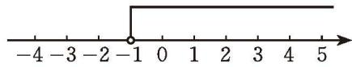
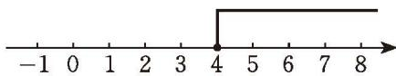

## 2 一元一次不等式

观察下列不等式:

$$
x + 6 > 10, x - 1 \leqslant 2 x, 3 x > 2 7,
$$

它们有什么共同特点？与同伴进行交流。

这些不等式的左右两边都是整式，只含有一个未知数，并且未知数的次数都是1，像这样的不等式，叫作[一元一次不等式](../概念/一元一次不等式.md)（linear inequality with one unknown）。

> [!question] 尝试·交流  
(1) 在上一节的学习内容中, 你能找出哪些一元一次不等式? 试举两例。  
(2) 还记得如何解一元一次方程吗? 你认为该怎样解不等式 $3 - x < 2x + 6$ 呢? 与同伴进行交流。

> [!example]- 例1 解不等式 $3 - x < 2x + 6$ ，并把它的解集表示在数轴上。
解：两边都加 $-2x$ ，得

$$
3 - x - 2 x <   2 x + 6 - 2 x _ {.}
$$
合并同类项，得

$$
3 - 3 x <   6 _ {.}
$$

两边都加-3，得

$$
3 - 3 x - 3 <   6 - 3 _ {.}
$$
合并同类项，得解方程的移项变形对于解不等式同样适用。

$$
- 3 x <   3 _ {.}
$$

两边都除以 -3，得

$$
x > - 1 _ {.}
$$

这个不等式的解集在数轴上的表示如图 2-6 所示。

图2-6

> [!example]- 例2 解不等式 $\frac{x - 2}{2} \geqslant \frac{7 - x}{3}$ , 并把它的解集表示在数轴上。
解：去分母，得

$$
3 (x - 2) \geqslant 2 (7 - x) _ {.}
$$

去括号，得

$$
3 x - 6 \geqslant 1 4 - 2 x _ {.}
$$
移项、合并同类项，得

$$
5 x \geqslant 2 0 _ {.}
$$

两边都除以 5，得

$$
x \geqslant 4 _ {.}
$$

这个不等式的解集在数轴上的表示如图 2-7 所示。

图2-7

> [!question] 思考·交流
你认为解一元一次不等式有哪些需要注意的事项？与同伴进行交流。

##### 随堂练习

1. 解下列不等式，并把它们的解集分别表示在数轴上：  
(1) 5x < 200; (2) $-\frac{x+1}{2} < 3$ ;  
(3) $x - 4 \geqslant 2(x + 2)$ ; (4) $\frac{x - 1}{2} < \frac{4x - 5}{3}$ 。

2. 求不等式 $4(x + 1) \leqslant 24$ 的正整数解。

某种商品的进价为 200 元，标价 300 元销售，商场规定可以打折销售，但利润率不能低于 5%。请你帮助售货员计算一下，这种商品最多可以打几折？

> [!example]- 例3 某班举行环保知识竞赛，规则如下：每位选手有基础分 20 分，需回答 20 道题，每答对一道题得 4 分，每答错或不答一道题扣 1 分。
在这次竞赛中，小明被评为优秀选手（85分或85分以上），小明至少答对了几道题？
解：设小明答对了 $x$ 道题，则他答错和不答的共有 $(20 - x)$ 道题。根据题意，得

$$
2 0 + 4 x - 1 \times (2 0 - x) \geqslant 8 5 _ {.}
$$
解这个不等式，得

$$
x \geqslant 1 7 _ {.}
$$
所以，小明至少答对了 17 道题。

> [!summary] 回顾·反思
对比一元一次不等式与一元一次方程的学习过程，你有哪些感悟？积累了哪些经验？

##### 随堂练习

1. 编制一道能用一元一次不等式解决的实际问题，并加以解决。

