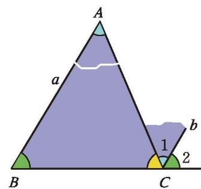
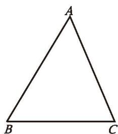
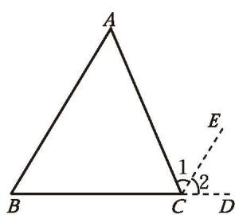
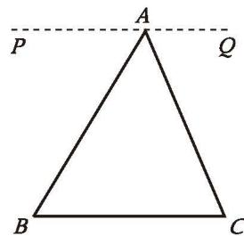
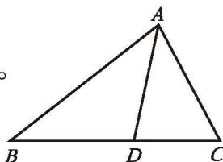
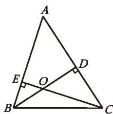

## 1 三角形内角和定理

在八年级上册 "证明" 一章中，我们给出了八条基本事实，并从其中的几条基本事实出发证明了有关平行线的一些结论。运用这些基本事实和已经学习过的定义、定理，我们还可以证明有关三角形的一些结论。

> [!question] 尝试·交流
> 我们知道，三角形三个内角的和等于 $180^{\circ}$ 。你还记得这个结论的探索过程吗？  
> (1) 如图 1-1，如果只把 $\angle A$ 移动到 $\angle 1$ 的位置，那么你能说明这个结论的正确性吗？如果不移动 $\angle A$ ，那么你还有什么方法可以达到同样的效果？
> 
> 

> 图 1-1

> 
> (2) 你能说说这个结论的证明思路吗？请试着写出证明过程，并与同伴进行交流。

已知：如图 1-2，$\triangle ABC$ 。

求证：$\angle A + \angle B + \angle C = 180^{\circ}$

分析：你学过哪些与 $180^{\circ}$ 有关的结论？曾经的撕角拼图活动对你有什么启发？

图 1-2

证明：如图 1-3，延长 BC 至 D，过点 C 作射线 CE，使 CE // BA，则

图 1-3

这里的 CD、CE 称为[辅助线](../概念/辅助线.md)，辅助线通常画成虚线。

$$
\angle 1 = \angle A,\ \angle 2 = \angle B .
$$

∵ 点 B、C、D 在同一条直线上，

$$
\therefore \angle 1 + \angle 2 + \angle ACB = 180^{\circ} 。
$$

$$
\therefore \angle A + \angle B + \angle ACB = 180^{\circ}
$$

**三角形内角和定理** 三角形三个内角的和等于 $180^{\circ}$ 。

> [!question] 思考·交流
> (1) 如图 1-4，在证明三角形内角和定理时，小明的想法是把三个内角 "凑" 到点 $A$ 处，过点 $A$ 作直线 $PQ$ ，使 $PQ \parallel BC$ ，他的想法可行吗？如果可行，你能写出证明过程吗？
> (2) 对于三角形内角和定理，你还有其他证明方法吗？与同伴进行交流。
> 
> 

> 图 1-4

> [!example]- 例1 如图1-5，在 $\triangle ABC$ 中，$\angle B = 38^{\circ}$ ，$\angle C = 62^{\circ}$ ，$AD$ 是 $\triangle ABC$ 的角平分线，求 $\angle ADB$ 的度数。
> 
> 解：在 $\triangle ABC$ 中，$\angle B + \angle C + \angle BAC = 180^{\circ}$ (三角形内角和定理)。
> $\because \angle B = 38^{\circ},\ \angle C = 62^{\circ}$，
> $\therefore \angle BAC = 180^{\circ} - 38^{\circ} - 62^{\circ} = 80^{\circ}$ 。
> $\because AD$ 平分 $\angle BAC$，
> $\therefore \angle BAD = \angle CAD = \frac{1}{2}\angle BAC = \frac{1}{2} \times 80^{\circ} = 40^{\circ}$ 。
> 
> 

> 图 1-5

> 
> 在 $\triangle ADB$ 中，
> 
> $\angle B + \angle BAD + \angle ADB = 180^{\circ}$ (三角形内角和定理)。
> $\because \angle B = 38^{\circ},\ \angle BAD = 40^{\circ}$，
> $\therefore \angle ADB = 180^{\circ} - 38^{\circ} - 40^{\circ} = 102^{\circ}$ 。

> [!question] 尝试·思考
> 我们已经探索过"两角分别相等且其中一组等角的对边相等的两个三角形全等"这个结论，你能用有关的基本事实和已经学习过的定理证明它吗？

**定理** 两角分别相等且其中一组等角的对边相等的两个三角形全等。(AAS)

根据全等三角形的定义，我们可以得到

**全等三角形的对应边相等、对应角相等。**

##### 随堂练习

1. 已知：如图，在 $\triangle ABC$ 中，$\angle A = 60^{\circ}$ ，$\angle C = 70^{\circ}$ ，点 $D$、$E$ 分别在边 $AB$ 和 $AC$ 上，且 $DE \parallel BC$ 。
   
   求证：$\angle ADE = 50^{\circ}$

2. 如图，在 $\triangle ABC$ 中，已知 $\angle A = 50^{\circ}$ ，$BD$ 与 $CE$ 是 $\triangle ABC$ 的高，点 $O$ 是它们的交点，求 $\angle ABD$ 、$\angle COD$ 的度数。

(第1题)

(第2题)
