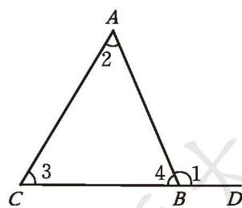
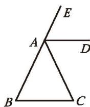
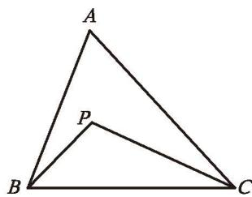
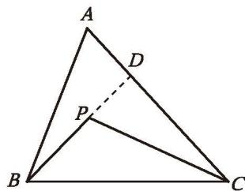
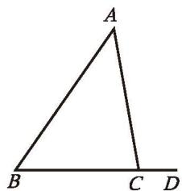
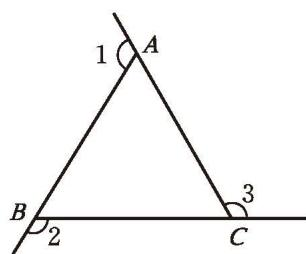
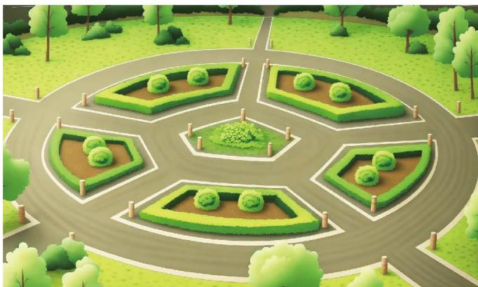

$\triangle ABC$ 内角的一条边与另一条边的反向延长线所组成的角，叫作 $\triangle ABC$ 的**外角**（exterior angle）。如图 1-6，$\angle 1$ 是 $\triangle ABC$ 的一个外角。你能在图中画出 $\triangle ABC$ 的其他外角吗？

图 1-6

> [!question] 思考·交流
> 观察图 1-6，$\angle 1$ 与 $\triangle ABC$ 的内角有什么关系？请证明你的结论，并与同伴进行交流。

由三角形内角和定理，可以得到

**推论①** 三角形的一个外角等于与它不相邻的两个内角的和。

由此可得

**推论②** 三角形的一个外角大于任何一个与它不相邻的内角。

> [!example]- 例2 已知：如图 1-7，在 $\triangle ABC$ 中，$\angle B = \angle C$ ，$AD$ 平分外角 $\angle EAC$ 。
> 求证：$AD \parallel BC$ 。
> 
> 分析：只要具备什么条件，就能说明 $AD \parallel BC$ ？
> 
> 
> 
> 证明：∵ $\angle EAC = \angle B + \angle C$ (三角形的一个外角等于与它不相邻的两个内角的和)，
> 
> 图 1-7
> 
> $$
> \begin{array}{rl}
> & \angle B = \angle C, \\
> \therefore & \angle C = \frac{1}{2} \angle EAC . \\
> \because & AD \text{平分} \angle EAC, \\
> \therefore & \angle DAC = \frac{1}{2} \angle EAC . \\
> \therefore & \angle DAC = \angle C . \\
> \therefore & AD // BC .
> \end{array}
> $$
> 
> 还有其他证法吗？

> [!example]- 例3 已知：如图 1-8，P 是 $\triangle ABC$ 内一点，连接 PB，PC。
> 求证：$\angle BPC > \angle A$ 。
> 
> 分析：你学过哪些关于角的不等关系的定理？这里能直接使用吗？你遇到的困难是什么？你能通过添加[辅助线](../概念/辅助线.md)，构造出直接使用相关定理的图形吗？
> 
> 

> 图 1-8

> 
> 证明：如图 1-9，延长 BP，交 AC 于点 D。
> 
> $\because \angle BPC$ 是 $\triangle PDC$ 的一个外角（外角的定义），
> $\therefore \angle BPC > \angle PDC$ (三角形的一个外角大于任何一个与它不相邻的内角)。
> 
> 
> 
> $\because \angle PDC$ 是 $\triangle ABD$ 的一个外角（外角的定义），
> $\therefore \angle PDC > \angle A$ (三角形的一个外角大于任何一个与它不相邻的内角)。
> 
> 图 1-9
> 
> $$
> \therefore \angle BPC > \angle A .
> $$
> 
> 

##### 随堂练习

1. 如图，在 $\triangle ABC$ 中，$\angle A = 45^{\circ}$ ，外角 $\angle DCA = 100^{\circ}$ ，求 $\angle B$ 和 $\angle ACB$ 的度数。

(第1题)

(第2题)

2. 如图，$\angle 1$、$\angle 2$、$\angle 3$ 是 $\triangle ABC$ 的三个外角，那么 $\angle 1$、$\angle 2$、$\angle 3$ 的和是多少度？

小明和小亮经常到如图 1-10 所示的广场进行体育锻炼。

图 1-10
