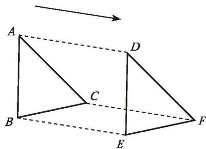
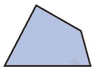
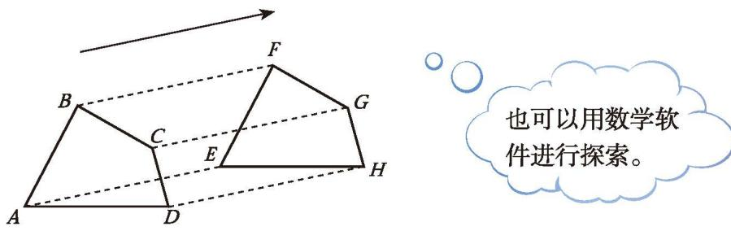
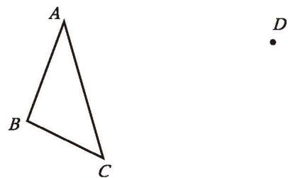
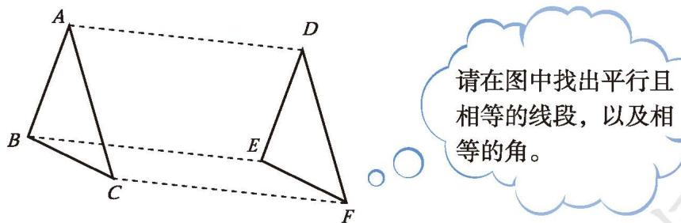
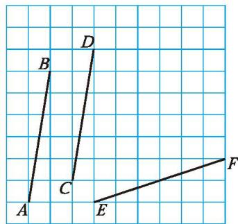
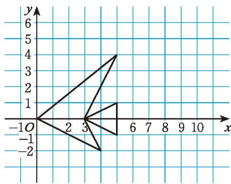

## 1 图形的平移

图 3-1 反映的是日常生活中物体运动的一些场景，这些物体的运动有什么共同特点？你还能举出一些类似的例子吗？与同伴进行交流。

图3-1

在平面内，将一个图形沿某个方向移动一定的距离，这样的图形运动称为[平移](../概念/平移.md)（translation）。平移不改变图形的形状和大小。

如图 3-2, $\triangle ABC$ 经过平移得到 $\triangle DEF$ , 点 $A, B, C$ 分别平移到了点 $D, E, F$ 。点 $A$ 与点 $D$ 是一组对应点, 线段 $AB$ 与线段 $DE$ 是一组对应线段, $\angle BAC$ 与 $\angle EDF$ 是一组对应角。

你还能从图 3-2 中找出其他的对应点、对应线段和对应角吗？

图3-2

##### 操作·思考
将图 3-3 所示的四边形硬纸片按某一方向平移一定距离。图 3-4 画出了平移前的四边形 ABCD 和平移后的四边形 EFGH。  
（1）在图中任意选一组对应线段，这两条线段之间有怎样的关系？

图3-3

图3-4

也可以用数学软件进行探索。  
(2) 在图中任意选一组对应角, 这两个角之间有怎样的关系?  
(3) 线段 $AE, BF, CG, DH$ 分别是对应点所连成的线段, 它们之间有怎样的关系?

改变硬纸片的形状，再试一试。

一个图形和它经过平移所得的图形中，对应点所连的线段平行（或在一条直线上）且相等，对应线段平行（或在一条直线上）且相等，对应角相等。

> [!example]- 例1 如图 3-5, 经过平移, $\triangle ABC$ 的顶点 $A$ 移到了点 $D$ 。  
(1) 指出平移的方向和平移的距离;  
(2) 画出平移后的三角形。
解：（1）如图 3-6，连接 AD，平移的方向是点 A 到点 D 的方向，平移的距离是线段 AD 的长度。

(2)

 如图 3-6, 分别过点 $B$ , $C$ 按射线 $AD$ 的方向作线段 $BE$ , $CF$ , 使它们与线段 $AD$ 平行

图3-5

且相等，连接 $DE, DF, EF$ ， $\triangle DEF$ 就是 $\triangle ABC$ 平移后的图形。

图3-6

请在图中找出平行且相等的线段，以及相等的角。

对于例 1，你还有画 $\triangle DEF$ 的其他方法吗？

> [!question] 思考·交流
确定一个图形平移后的位置，需要哪些条件？与同伴进行交流。

##### 随堂练习

1. 如图, 点 $A, B, C, D, E, F$ 都在方格纸的格点上①, 你能平移线段 $AB$ , 使得 $AB$ 与 $CD$ 重合吗? 你能平移线段 $AB$ , 使得 $AB$ 与 $EF$ 重合吗? 请你画一画。

(第1题)

图 3-7 中的 “鱼” 是将坐标为 $(0, 0)$ ， $(5, 4)$ ， $(3, 0)$ ， $(5, 1)$ ， $(5, -1)$ ， $(3, 0)$ ， $(4, -2)$ ， $(0, 0)$ 的点用线段依次连接而成的。将这条 “鱼” 向右平移 5 个单位长度。

图3-7

  
(1) 画出平移后的新 “鱼”。  
(2) 在图中尽量多选取几组对应点, 并将它们的坐标填入下表。

<table><tr><td>原来的“鱼”</td><td>( , )</td><td>( , )</td><td>( , )</td><td>...</td></tr><tr><td>向右平移5个单位长度后的新“鱼”</td><td>( , )</td><td>( , )</td><td>( , )</td><td>...</td></tr></table>  
(3) 你发现对应点的坐标之间有什么关系?
