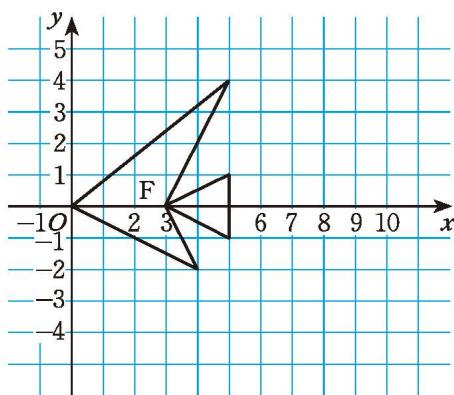
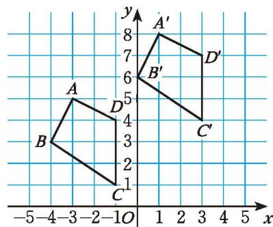
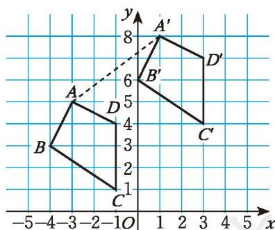

如果将原来的“鱼”向左[平移](../概念/平移.md)4个单位长度呢？请你先想一想，再具体做一做。

> [!question] 观察·思考
如果将图 3-7 中的 “鱼” 向上或向下平移若干单位长度, 那么平移前后的两条 “鱼” 中, 对应点的坐标之间有什么关系?

> [!question] 尝试·思考  
(1) 将图 3-7 中 “鱼” 的每个 “顶点” 的纵坐标保持不变, 横坐标分别加 3 , 再将得到的点用线段依次连接起来, 从而画出一条新 “鱼”, 这条新 “鱼” 与原来的 “鱼” 相比有什么变化? 如果纵坐标保持不变, 横坐标分别减 2 呢?  
(2) 将图 3-7 中 “鱼” 的每个 “顶点” 的横坐标保持不变, 纵坐标分别加 3 , 所得到的新 “鱼” 与原来的 “鱼” 相比又有什么变化? 如果横坐标保持不变, 纵坐标分别减 2 呢?

> [!question] 思考·交流
在平面直角坐标系中，一个图形沿 $x$ 轴方向平移 $a (a > 0)$ 个单位长度后的图形与原图形对应点的坐标之间有什么关系？如果图形沿 $y$ 轴方向平移 $a (a > 0)$ 个单位长度呢？与同伴进行交流。

##### 随堂练习

1. 四边形 $ABCD$ 的顶点坐标分别是 $A(0,3)$ , $B(-3,0)$ , $C(0,-3)$ , $D(3,0)$ 。  
(1) 将四边形 $ABCD$ 向右平移 6 个单位长度, 得到四边形 $A_{1}B_{1}C_{1}D_{1}$ , 写出四边形 $A_{1}B_{1}C_{1}D_{1}$ 各顶点的坐标;  
(2) 将四边形 $A_{1} B_{1} C_{1} D_{1}$ 向上平移 6 个单位长度, 得到四边形 $A_{2} B_{2} C_{2} D_{2}$ , 写出四边形 $A_{2} B_{2} C_{2} D_{2}$ 各顶点的坐标。

2. (1) 将第 1 题中的四边形 $A_{2} B_{2} C_{2} D_{2}$ 各顶点的纵坐标保持不变, 横坐标分别减 4 , 得到四边形 $A_{3} B_{3} C_{3} D_{3}$ , 它与四边形 $A_{2} B_{2} C_{2} D_{2}$ 相比有什么变化?  
(2) 将四边形 $A_{3}B_{3}C_{3}D_{3}$ 各顶点的横坐标保持不变, 纵坐标分别减 4 ,得到四边形 $A_{4}B_{4}C_{4}D_{4}$ , 它与四边形 $A_{3}B_{3}C_{3}D_{3}$ 相比有什么变化?
将图 3-8 中的 “鱼” F 先向下平移 2 个单位长度，再向右平移 3 个单位长度，得到新 “鱼” F'。  
（1）在图 3-8 所示的平面直角坐标系中画出 “鱼” F'。  
(2)能否将“鱼”F'看成是由“鱼”F经过一次平移得到的？如果能，请指出平移的方向和平移的距离，并与同伴进行交流。

图3-8

  
(3) 在 “鱼” F 和 “鱼” F' 中, 对应点的坐标之间有什么关系?

改变 “鱼” F 最初的平移方向（仍沿坐标轴方向）和平移距离，再试一试，并与同伴进行交流。

> [!question] 尝试·思考
先将图 3-8 中 “鱼” F 的每个 “顶点” 的横坐标分别加 2，纵坐标保持不变, 得到 “鱼” G; 再将 “鱼” G 的每个 “顶点” 的纵坐标分别加 3 , 横坐标保持不变, 得到 “鱼” H。
将“鱼”F经过怎样平移能得到“鱼”H？你有哪些不同的平移方法？

如果横坐标分别加 2、纵坐标分别减 3 呢？请你先想一想，然后再具体做一做。

> [!question] 思考·交流
一个图形依次沿 $x$ 轴方向、 $y$ 轴方向平移后所得图形与原来的图形相比，位置有什么变化？它们对应点的坐标之间有怎样的关系？与同伴进行交流。

> [!example]- 例2 如图 3-9，四边形 ABCD 各顶点的坐标分别是 A(-3, 5)，B(-4, 3)，C(-1, 1)，D(-1, 4)，将四边形 ABCD 先向上平移 3 个单位长度，再向右平移 4 个单位长度，得到四边形 A'B'C'D'。  
(1) 四边形 $A'B'C'D'$ 与四边形 $ABCD$ 对应点的横坐标有什么关系？纵坐标呢？分别写出点 $A', B', C', D'$ 的坐标。

图3-9

  
(2) 如果将四边形 $A'B'C'D'$ 看成是由四边形 $ABCD$ 经过一次平移得到的, 那么请指出这一平移的平移方向, 并求出平移距离。
解: (1) 四边形 $A'B'C'D'$ 与四边形 $ABCD$ 相了 4, 纵坐标分别增加了 3; $A'(1,8), B'(0,6), C'(3,4), D'(3,7)$ 。  
（2）如图 3-10，连接 $AA'$ ，由图可知， $AA' = \sqrt{4^2 + 3^2} = 5$ 。因此，如果将四边形 $A'B'C'D'$ 看成是由四边形 $ABCD$ 经过一次平移得到的，那么这一平移的平移方向是由 $A$ 到 $A'$ 的方向，平移距离是 5 个单位长度。

图3-10

##### 随堂练习

1. (1) 在平面直角坐标系中描出点 $A(6,0), B(10,3), C(9,1), D(12,0), E(9,-1), F(10,-3)$ , 然后用线段依次连接 $A, B, C, D, E, F, A$ 各点。  
(2) 将 (1) 中所画图形先向左平移 12 个单位长度, 再向上平移 5 个单位长度, 画出第二次平移后的图形。  
(3) 如何将 (1) 中所画图形经过一次平移得到 (2) 中所画图形? 平移前后对应点的横坐标有什么关系? 纵坐标呢?

