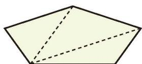
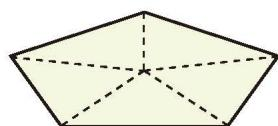
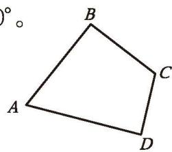
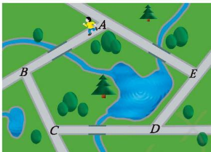

(1) 这个广场中心的边缘是一个五边形，你能设法求出它的五个内角的和吗？与同伴进行交流。
(2) 小明、小亮分别利用图 1-11 和图 1-12 求出了五边形五个内角的和。你知道他们是怎样做的吗？你还有其他的方法吗？

图 1-11

图 1-12

> [!question] 尝试·思考
> (1) 按照图 1-11 的方法，六边形能分成多少个三角形？$n$（$n$ 是大于或等于 3 的自然数）边形呢？你能确定 $n$ 边形的内角和吗？
> (2) 按照图 1-12 的方法再试一试。

**定理** $n$ 边形的内角和等于 $(n - 2) \cdot 180^{\circ}$ 。

> [!example]- 例4 如图 1-13，在四边形 $ABCD$ 中，$\angle A + \angle C = 180^{\circ}$ 。$\angle B$ 与 $\angle D$ 有怎样的关系？
> 
> 解：∵ $\angle A + \angle B + \angle C + \angle D = (4-2) \times 180^{\circ} = 360^{\circ}$ ，
> 
> $$
> \begin{array}{rl}
> \therefore & \angle B + \angle D \\
> & = 360^{\circ} - (\angle A + \angle C) \\
> & = 360^{\circ} - 180^{\circ} \\
> & = 180^{\circ} .
> \end{array}
> $$
> 
> 

> 图 1-13

> [!example]- 例4 说明：如果四边形一组对角互补，那么另一组对角也互补。

##### 操作·思考

(1) 正三角形、正四边形、正五边形、正六边形、正八边形的每个内角分别是多少度？
(2) 怎样计算正多边形每个内角的度数？

> [!question] 思考·交流
> 剪掉一张长方形纸片的一个角后，剩下的纸片是几边形？它的内角和是多少度？与同伴进行交流。

##### 随堂练习

1. 小彬求出一个正多边形的一个内角为 $145^{\circ}$ 。他的计算正确吗？如果正确，他求的是正几边形的内角？如果不正确，请说明理由。

如图 1-14，小刚在公园沿着五边形步道按逆时针方向慢跑。

(1) 小刚每次从五边形步道的一条边转到下一条边时，跑步方向改变的角是哪个角？在图上标出这些角。
(2) 他每跑完一圈，跑步方向改变的角的总和是多少度？说说你的理由，并与同伴进行交流。

图 1-14
