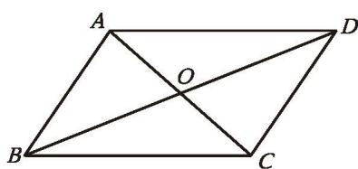
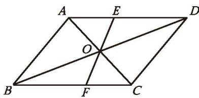

在上一课的“思考·交流”中，我们还发现：[平行四边形的对角线](../概念/平行四边形的对角线.md)互相平分。请你尝试证明这一结论。

已知：如图 6-5, □ABCD 的两条对角线 AC 与 BD 相交于点 O。

求证：OA = OC，OB = OD。
证明：∵ 四边形 ABCD 是[平行四边形](../概念/平行四边形.md)，

图6-5

∴ AB = CD (平行四边形的对边相等),

$AB \parallel CD$ （平行四边形的定义）。

$$
\therefore \angle B A O = \angle D C O, \angle A B O = \angle C D O _ {.}
$$

$$
\therefore \quad \triangle A B O \cong \triangle C D O _ {.}
$$

还有其他证法吗？

$$
\therefore O A = O C, O B = O D _ {.}
$$

定理 平行四边形的对角线互相平分。

> [!example]- 例2 已知：如图 6-6，□ABCD 的对角线 AC 与 BD 相交于点 O，过点 O 的直线与 AD，BC 分别相交于点 E，F。
求证：OE = OF。
证明：∵ 四边形 ABCD 是平行四边形，
∴ DO=BO（平行四边形的对角线互相平分），
AD∥BC（平行四边形的定义）。
∴ $\angle ODE = \angle OBF$ 。
∵ $\angle DOE = \angle BOF$ ,
∴ $\triangle DOE \cong \triangle BOF$ 。
∴ OE = OF。

图6-6
