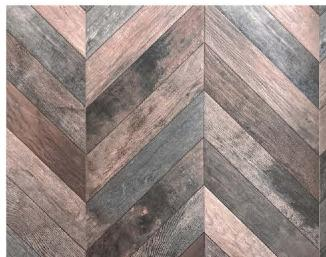
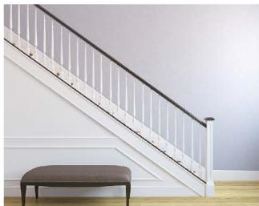
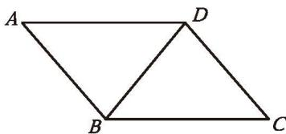
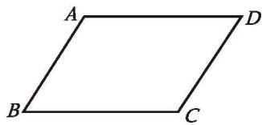
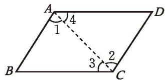
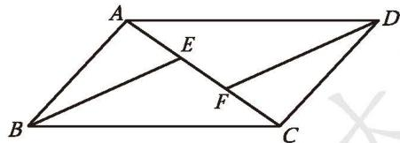
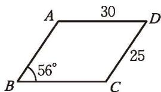

## 1 平行四边形的性质

图 6-1 中含有一些[平行四边形](../概念/平行四边形.md)。观察这些平行四边形，它们有怎样的共同特点？

图6-1

两组对边分别平行的四边形叫作平行四边形（parallelogram）。平行四边形不相邻的两个顶点连成的线段叫作它的对角线。如图6-2，四边形ABCD是平行四边形，记作□ABCD，读作“平行四边形ABCD”，线段BD就是□ABCD的一条对角线。

图6-2

根据三角形的学习经验，你认为对平行四边形应研究哪些内容？

> [!question] 思考·交流  
(1) 平行四边形是[中心对称图形](../概念/中心对称图形.md)吗? 如果是, 你能找出它的对称中心并验证你的结论吗?  
(2) 你还发现平行四边形有哪些性质？与同伴进行交流。

平行四边形是[中心对称](../概念/中心对称.md)图形，两条对角线的交点是它的对称中心。

我们还发现：平行四边形的对边相等、对角相等。

已知：如图 6-3（1），四边形 ABCD 是平行四边形。

求证: $AB = CD, BC = DA$ 。
分析：要证明两条线段相等，你常用什么方法？在平行四边形中能直接使用这种方法吗？你能构造出可以使用这种方法的图形吗？

(1)

图6-3

  
(2)
证明：如图 6-3（2），连接 AC。
∵ 四边形 ABCD 是平行四边形，
∴ AB∥CD，BC∥DA（平行四边形的定义）。

$$
\therefore \angle 1 = \angle 2, \angle 3 = \angle 4 。
$$

$$
\because A C = C A,
$$

$$
\therefore \quad \triangle A B C \cong \triangle C D A _ {.}
$$

$$
\therefore A B = C D, B C = D A _ {.}
$$

请你证明：平行四边形的对角相等。

定理 平行四边形的对边相等。

定理 平行四边形的对角相等。

> [!example]- 例1 已知：如图 6-4，在 □ABCD 中，E，F 是对角线 AC 上的两点，并且 AE = CF。
求证：BE = DF。

证明：∵ 四边形 ABCD 是平行四边形，
∴ AB = CD（平行四边形的对边相等）， $AB \parallel CD$ （平行四边形的定义）。

图6-4

$$
\therefore \angle B A E = \angle D C F _ {.}
$$
又∵ AE = CF,

$$
\therefore \quad \triangle A B E \cong \triangle C D F _ {.}
$$

$$
\therefore B E = D F _ {.}
$$

##### 随堂练习

1. 已知平行四边形一个内角的度数，能确定其他内角的度数吗？请说明理由。

2. 如图, 四边形 $ABCD$ 是平行四边形。求:  
(1) $\angle {ADC}$ 和 $\angle {BCD}$ 的度数；  
(2) ${AB}$ 和 ${BC}$ 的长度。

(第2题)
