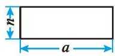
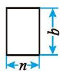
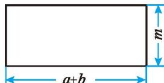

## 2 提公因式法

多项式 $ab + bc$ 各项都含有相同的因式吗？多项式 $3x^{2} + x$ 呢？多项式 $mb^{2} + nb - b$ 呢？尝试将这几个多项式分别写成几个因式的乘积，并与同伴进行交流。

多项式 $ab + bc$ 的各项都含有相同的因式 $b$ 。我们把多项式各项都含有的相同因式，叫作这个多项式各项的[公因式](../概念/公因式.md)（common factor）。如 $b$ 就是多项式 $ab + bc$ 各项的公因式。

> [!question] 尝试·交流  
(1) 多项式 $2x^{2} + 6x^{3}$ 中各项的公因式是什么?  
(2)你能尝试将多项式 $2x^{2} + 6x^{3}$ [因式分解](../概念/因式分解.md)吗？与同伴进行交流。

如果一个多项式的各项含有公因式，那么就可以把这个公因式提出来，从而将多项式化成两个因式乘积的形式。这种因式分解的方法叫作[提公因式法](../概念/提公因式法.md)。

> [!example]- 例1 把下列各式因式分解:  
(1) $2mn + 4m^2$ ; (2) $7p^{2} - 21p$ ;  
(3) $8a^{3}b^{2} - 12ab^{3}c + ab;$  
(4) $-24x^{3} + 12x^{2} - 28x$
解：（1） $2mn+4m^{2}=2m\cdot n+2m\cdot2m=2m(n+2m)$ ;  
(2) $7p^{2}-21p=7p\cdot p-7p\cdot3=7p(p-3);$  
(3) $8a^{3}b^{2} - 12ab^{3}c + ab = ab\cdot 8a^{2}b - ab\cdot 12b^{2}c + ab\cdot 1$ $= ab(8a^{2}b - 12b^{2}c + 1);$

$$
\begin{array}{r l} (4) - 2 4 x ^ {3} + 1 2 x ^ {2} - 2 8 x & \\ = - (2 4 x ^ {3} - 1 2 x ^ {2} + 2 8 x) & \\ = - (4 x \cdot 6 x ^ {2} - 4 x \cdot 3 x + 4 x \cdot 7) & \\ = - 4 x (6 x ^ {2} - 3 x + 7) 。 \end{array}
$$
当多项式第一项的系数是负数时，通常先提出“-”号，使括号内第一项的系数成为正数。在提出“-”号时，多项式的各项都要变号。

> [!question] 思考·交流
提公因式法因式分解与单项式乘多项式有什么关系？与同伴进行交流。

##### 随堂练习

1. 把下列各式因式分解：  
(1) $ma + mb$ ;  
(2) $5y^{3} + 20y^{2}$ ;  
(3) 6x - 9xy;  
(4) $a^{2}b-5ab;$  
(5) $4m^{3}-6m^{2}$ ;  
(6) $a^{2}b-5ab+9b;$  
(7) $-a^2 + ab - ac$ ;  
(8) $-2x^{3} + 4x^{2} - 6x$ 。

> [!example]- 例2 把下列各式因式分解:  
(1) $a(x - 3) + 2b(x - 3)$ ; (2) $y(x + 1) + y^2 (x + 1)^2$ 。
解：（1） $a(x-3)+2b(x-3)=(x-3)(a+2b)$ ;  
(2) $y(x+1)+y^{2}(x+1)^{2}=y(x+1)[1+y(x+1)]$ $=y(x+1)(xy+y+1)$ 。

> [!example]- 例3 把下列各式因式分解:  
(1) $a(x - y) + b(y - x)$ ; (2) $6(m - n)^3 - 12(n - m)^2$ 。
解：(1) $a(x-y)+b(y-x)=a(x-y)-b(x-y)=(x-y)(a-b)$ ;  
(2) $6(m - n)^3 - 12(n - m)^2 = 6(m - n)^3 - 12[-(m - n)]^2$ $= 6(m - n)^3 - 12(m - n)^2$ $= 6(m - n)^2 (m - n - 2)$ 。

> [!question] 思考·交流
利用提公因式法进行因式分解，你积累了哪些经验？与同伴进行交流。

> [!question] 尝试·思考
如图 4-1，有三张不同型号的长方形卡片。  
(1) 你能选择其中两张卡片拼成一个长方形吗?  
(2) 你能用这三张卡片拼成一个长方形吗?  
(3) 依据 (1)(2) 拼图的过程及结果, 你能写出哪些多项式的因式分解? 你是怎样想的?

①

②

图4-1  

③

##### 随堂练习

1. 把下列各式因式分解：  
(1) $x(a + b) + y(a + b)$ ;  
(3) $6(p+q)^{2}-12(q+p)$ ;  
(5) $2(y-x)^{2}+3(x-y);$  
(2) $3a(x - y) - (x - y)$ ;  
(4) $a(m - 2) + b(2 - m)$ ;  
(6) $mn(m-n)-m(n-m)^{2}$ 。
