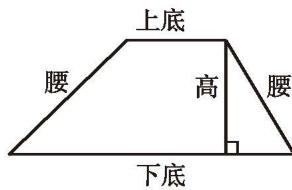
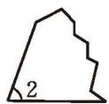
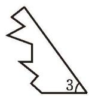
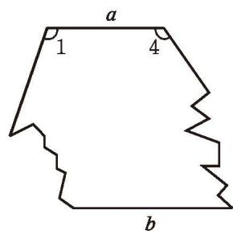

> [!question] 尝试·思考
还记得小学学过的梯形的“样子”吗？画一画，将它与[平行四边形](../概念/平行四边形.md)比较，并试着给出梯形的定义。

一组对边平行、另一组对边不平行的四边形叫作梯形（trapezoid）。如图 6-7，平行的两边称为梯形的底，较短的底通常称为上底，较长的底通常称为下底。不平行的两边称为梯形的腰，两腰相等的梯形称为[等腰梯形](../概念/等腰梯形.md)。

图6-7

> [!question] 尝试·交流
等腰[梯形](../概念/梯形.md)是轴对称图形吗？将等腰梯形纸片折一折，你有哪些发现？与同伴进行交流。

等腰梯形是轴对称图形，等腰梯形在同一底上的两个角相等。

##### 随堂练习

1. 已知 □ABCD 的对角线 AC 与 BD 相交于点 O, OA, OB, AB 的长分别为 3, 4, 5, 求其他各边及两条对角线的长度。

2. 如图, 一块梯形玻璃破损成三块, 测量发现 $a \parallel b$ , $\angle 1 = 110^{\circ}$ , $\angle 4 = 125^{\circ}$ , 求 $\angle 2$ 和 $\angle 3$ 的度数。

(第2题)

  

