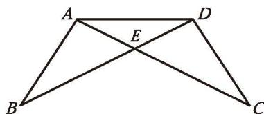
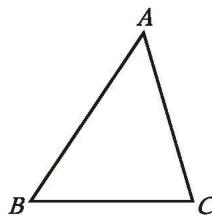
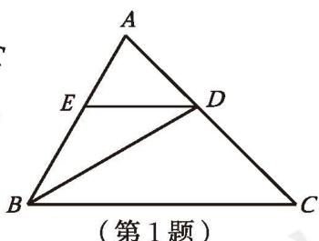

**定理** 有两个角相等的三角形是等腰三角形。

这一定理可以简述为：**等角对等边**。

> [!example]- 例1 已知：如图 1-19，$AB = DC$ ，$BD = CA$ ，$BD$ 与 $CA$ 相交于点 $E$ 。
> 求证：$\triangle AED$ 是等腰三角形。
> 
> 证明：∵ AB = DC, BD = CA, AD = DA,
> ∴ $\triangle ABD \cong \triangle DCA$ (SSS)。
> 
> 

> 图 1-19

> 
> ∴ $\angle ADB = \angle DAC$ (全等三角形的对应角相等)。
> ∴ AE = DE (等角对等边)。
> 
> ∴ $\triangle AED$ 是等腰三角形。

> [!question] 尝试·思考
> 小明认为，在一个三角形中，如果两个角不相等，那么这两个角所对的边也不相等。你认为小明这个结论成立吗？如果成立，你能证明它吗？

小明的思考过程如下。你能理解他的推理过程吗？

如图 1-20，在 $\triangle ABC$ 中，已知 $\angle B \neq \angle C$ ，此时 AB 与 AC 要么相等，要么不相等。

假设 AB = AC，那么根据定理"等边对等角"可得 $\angle C = \angle B$ ，这与已知条件 $\angle B \neq \angle C$ 相矛盾，因此 $AB \neq AC$ 。

图 1-20

像小明那样，在证明时，先假设命题的结论不成立，然后推导出与定义、基本事实、已有定理或已知条件相矛盾的结果，从而证明命题的结论一定成立，这种证明方法称为**[反证法](../概念/反证法.md)**（reduction to absurdity）。

> [!example]- 例2 用反证法证明：一个三角形中不能有两个角是直角。
> 
> 已知：$\triangle ABC$ 。
> 求证：$\angle A,\ \angle B,\ \angle C$ 中不能有两个角是直角。
> 
> 证明：假设 $\angle A,\ \angle B,\ \angle C$ 中有两个角是直角，不妨设 $\angle A$ 和 $\angle B$ 是直角，即 $\angle A = 90^{\circ},\ \angle B = 90^{\circ}$ 。
> 于是 $\angle A + \angle B + \angle C = 90^{\circ} + 90^{\circ} + \angle C > 180^{\circ}$ 。
> 
> 这与三角形内角和定理相矛盾，因此"$\angle A$ 和 $\angle B$ 是直角"的假设不成立。
> 所以，一个三角形中不能有两个角是直角。

##### 随堂练习

1. 如图，在 $\triangle ABC$ 中，$BD$ 平分 $\angle ABC$ ，交 $AC$ 于点 $D$ ，过点 $D$ 作 $BC$ 的平行线，交 $AB$ 于点 $E$ ，请判断 $\triangle BDE$ 的形状，并说明理由。

(第1题)

2. 已知五个正数的和等于 1，用反证法证明：这五个正数中至少有一个数大于或等于 $\frac{1}{5}$ 。
