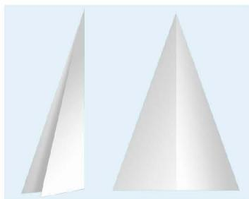
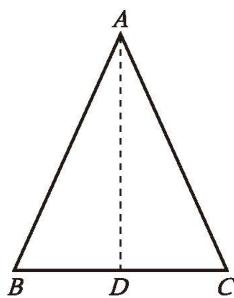
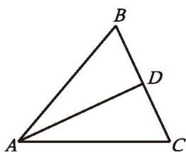
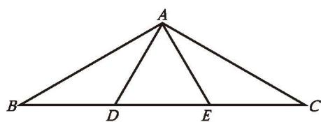
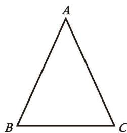

## 2 等腰三角形

我们曾经探索过等腰三角形的一些性质，你还记得这些性质吗？请你选择其中一条性质进行证明，并与同伴进行交流。

**定理** 等腰三角形的两个底角相等。

这一定理可以简述为：**等边对等角**。

已知：如图 1-15，在 $\triangle ABC$ 中，AB = AC。

求证：$\angle B = \angle C$ 。

分析：有哪些结论可以证明两个角相等？如图 1-16，还记得利用折纸的方法探索等腰三角形的性质吗？这对你有什么启发？

图 1-15

图 1-16

图 1-17

证明：如图 1-17，取 $BC$ 的中点 $D$ ，连接 $AD$ 。
$\because AB = AC,\ BD = CD,\ AD = AD,$
$\therefore \triangle ABD \cong \triangle ACD$ (SSS) 。
$\therefore \angle B = \angle C$ (全等三角形的对应角相等)。

还有其他证法吗？

> [!question] 思考·交流
> 由"等边对等角"定理的证明过程，你发现线段 AD 还有哪些特征？为什么？与同伴进行交流。

**定理** 等腰三角形顶角的平分线、底边上的中线、底边上的高重合。（**三线合一**）

> [!question] 尝试·交流
> 等边三角形是特殊的等腰三角形，它有哪些特殊的性质呢？请尝试证明你发现的结论，并与同伴进行交流。

**定理** 等边三角形的三个内角都相等，并且每个角都等于 $60^{\circ}$ 。

> [!summary] 回顾·反思
> 回顾七年级下册及本节研究等腰三角形性质的过程，你积累了哪些研究图形性质的经验？

##### 随堂练习

1. 如图，在 $\triangle ABC$ 中，$AB = AC$ ，$AD$ 是 $\triangle ABC$ 的角平分线，$BC = 8$ ，求 $CD$ 的长。

(第1题)

(第2题)

2. 如图，在 $\triangle ABC$ 中，$D$、$E$ 是 $BC$ 的三等分点，且 $\triangle ADE$ 是等边三角形，求 $\angle BAC$ 的度数。

前面已经证明了等腰三角形的两个底角相等。反过来，有两个角相等的三角形是等腰三角形吗？

可以发现：有两个角相等的三角形是等腰三角形。如何证明这一结论呢？

图 1-18

如图 1-18，在 $\triangle ABC$ 中，$\angle B = \angle C$ ，要想证明 $AB = AC$ ，只要能构造两个全等的三角形，使 $AB$ 与 $AC$ 成为对应边就可以了。

请你写出证明过程。
