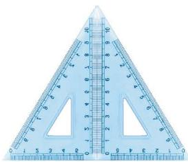
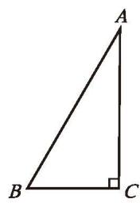
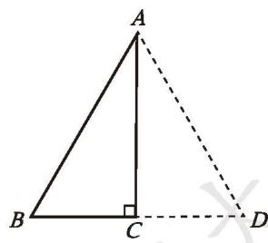
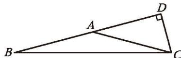
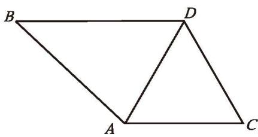
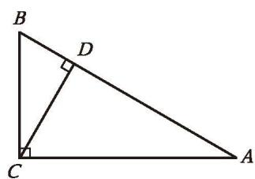

一个三角形满足什么条件时是等边三角形？一个等腰三角形满足什么条件时是等边三角形？请证明自己的结论，并与同伴进行交流。

**定理** 三个角都相等的三角形是等边三角形。

**定理** 有一个角等于 $60^{\circ}$ 的等腰三角形是等边三角形。

> [!question] 尝试·思考
> (1) 用两个完全相同的含 $30^{\circ}$ 角的三角尺，你能拼成怎样的三角形？能拼出一个等边三角形吗？
> (2) 在上述拼接过程中，你发现了什么结论？请证明你的结论。

如图 1-21，两个完全相同的含 $30^{\circ}$ 角的三角尺，可以拼成一个等边三角形。由此可以发现：$30^{\circ}$ 角的对边等于三角尺斜边的一半。

图 1-21

已知：如图 1-22 (1)，$\triangle ABC$ 是直角三角形，$\angle C = 90^{\circ}$ ，$\angle A = 30^{\circ}$ 。

求证：$BC = \frac{1}{2} AB$ 。

证明：如图 1-22 (2)，延长 BC 至 D，使 CD = BC，连接 AD。

(1)

图 1-22 (2)

$$
\because \angle ACB = 90^{\circ}
$$

$$
\therefore \angle ACD = 90^{\circ}
$$

$$
\because AC = AC,
$$

∴ $\triangle ABC \cong \triangle ADC$ (SAS).
∴ AB = AD (全等三角形的对应边相等)，

$\angle BAC = \angle DAC$ (全等三角形的对应角相等)。

$$
\because \angle BAC = 30^{\circ},
$$

$$
\therefore \angle BAD = \angle BAC + \angle DAC = 30^{\circ} + 30^{\circ} = 60^{\circ} .
$$

∴ $\triangle ABD$ 是等边三角形（有一个角等于 $60^{\circ}$ 的等腰三角形是等边三角形）。

$$
\therefore BC = \frac{1}{2} BD = \frac{1}{2} AB .
$$

**定理** 在直角三角形中，如果一个锐角等于 $30^{\circ}$ ，那么它所对的直角边等于斜边的一半。

> [!example]- 例3 求证：如果等腰三角形的底角为 $15^{\circ}$ ，那么腰上的高是腰长的一半。
> 
> 已知：如图 1-23，在 $\triangle ABC$ 中，$AB = AC$ ，$\angle B = 15^{\circ}$ ，$CD$ 是腰 $AB$ 上的高。
> 求证：$CD = \frac{1}{2} AB$ 。
> 
> 

> 图 1-23

> 
> 证明：在 $\triangle ABC$ 中，
> 
> $$
> \because AB = AC,\ \angle B = 15^{\circ}
> $$
> 
> ∴ $\angle ACB = \angle B = 15^{\circ}$ (等边对等角)。
> ∴ $\angle DAC = \angle B + \angle ACB = 15^{\circ} + 15^{\circ} = 30^{\circ}$ (三角形的一个外角等于与它不相邻的两个内角的和)。
> ∵ CD 是腰 AB 上的高，
> 
> $$
> \therefore \angle ADC = 90^{\circ}
> $$
> 
> ∴ $CD = \frac{1}{2} AC$ (在直角三角形中，如果一个锐角等于 $30^{\circ}$ ，那么它所对的直角边等于斜边的一半)。
> 
> $$
> \therefore CD = \frac{1}{2} AB .
> $$

##### 随堂练习

1. 已知：如图，$BD \parallel AC$ ，$\angle C = 60^{\circ}$ ，DA 平分 $\angle BDC$ 。
   求证：$\triangle ACD$ 是等边三角形。

(第1题)

(第2题)

2. 如图，在 $\triangle ABC$ 中，$\angle ACB = 90^{\circ}$ ，$\angle B = 60^{\circ}$ ，$CD$ 是 $\triangle ABC$ 的高，且 $BD = 1$ ，求 $AD$ 的长。

