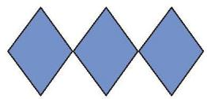
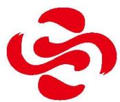
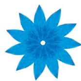
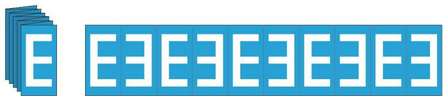
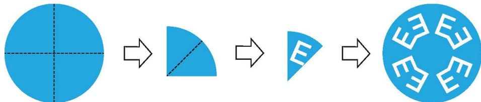
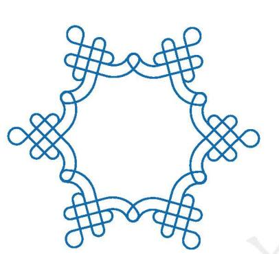

## 3 简单的图案设计

在现实生活中，我们经常见到一些美丽的图案。你能用[平移](../概念/平移.md)、旋转或轴对称分析图 3-29 中各个图案的形成过程吗？与同伴进行交流。

(1)

(2)

(3)

(4)

(5)

图3-29  

(6)

> [!question] 观察·思考
如图 3-30, 取一张长 $30 \mathrm{~cm}$ 、宽 $6 \mathrm{~cm}$ 的纸条, 将它每 $3 \mathrm{~cm}$ 一段, 一反一正像手风琴那样折叠起来。在折好的纸上画出字母 “E”, 并把画出的字母 “E” 挖去。拉开 “手风琴” 纸条, 就可以得到一条以字母 “E” 为图案的花边。

图3-30

  
(1) 在拉开的 “手风琴” 纸条上, 任意一个 “E” 经过怎样变化可得到相邻的 “E” ? 经过怎样变化可得到与它间隔一个的 “E” ?  
(2) 在拉开的 “手风琴” 纸条上, 任意一个 “E∃” 经过怎样变化可得到其他的 “E∃”? 任意一个 “E∃E” 经过怎样变化可得到其他的 “E∃E”? 你还能提出什么问题? 你有什么发现?  
(3) 利用字母 “E”，借助轴对称和平移，你还能设计哪些图案？

##### 操作·思考

如图 3-31, 将一张圆形纸片沿着互相垂直的两条直径对折成一个扇形, 再将这个扇形对折成更小的扇形。在折叠好的扇形上画出字母 “E”, 把画出的字母 “E” 挖去, 再把它展开成一个圆。

图3-31

请参照研究 “手风琴” 纸条上字母 “E” 的方法, 尝试研究图 3-31 展开的圆形纸片上的字母 “E” 之间的位置关系。

> [!summary] 回顾·反思
回顾图形的平移、[旋转](../概念/旋转.md)、轴对称的学习过程，你对图形的运动变化在分析图形、设计图案方面的作用有哪些感悟？积累了哪些经验？

##### 随堂练习

1. 右图是2022年北京冬奥会主火炬台造型中的一个基本图案，请你分析它是由哪些基本图形经过怎样的变化（平移、旋转或轴对称）得到的。

2. 请你利用平移、旋转或轴对称设计一个标志，并说一说它的含义。

(第1题)
