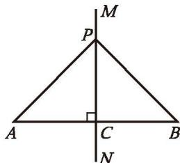
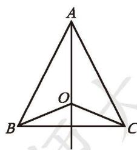
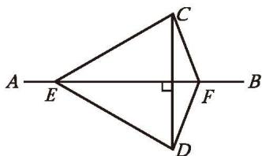
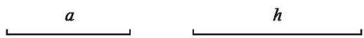
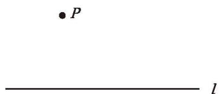
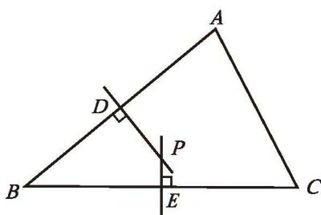
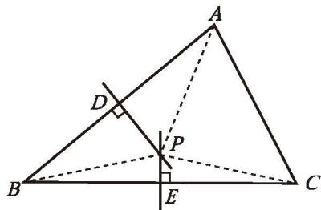
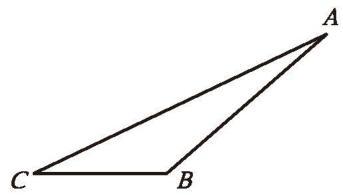

## 4 线段的垂直平分线

我们曾经探索过线段垂直平分线的性质：线段垂直平分线上的点到这条线段两个端点的距离相等。请你尝试证明这一结论，并与同伴进行交流。

已知：如图 1-29，直线 $MN \perp AB$ ，垂足为 C，且 AC = BC，P 是 MN 上的任意一点。

求证：$PA = PB$ 。

证明：∵ $MN \perp AB$，

$$
\therefore \angle PCA = \angle PCB = 90^{\circ} .
$$

$$
\because AC = BC,\ PC = PC,
$$

图 1-29

$$
\therefore \triangle PCA \cong \triangle PCB \text{ (SAS)} .
$$

如果点 $P$ 与点 $C$ 重合，那么结论显然成立。

∴ PA = PB（全等三角形的对应边相等）。

**定理** 线段垂直平分线上的点到这条线段两个端点的距离相等。

> [!question] 尝试·思考
> 你能写出上面这个定理的[逆命题](../概念/逆命题.md)吗？它是真命题吗？请证明自己结论的正确性。

**定理** 到一条线段两个端点距离相等的点，在这条线段的垂直平分线上。

> [!example]- 例1 已知：如图 1-30，在 $\triangle ABC$ 中，$AB = AC$ ，$O$ 是 $\triangle ABC$ 内一点，且 $OB = OC$ 。
> 求证：直线 $AO$ 垂直平分线段 $BC$ 。
> 
> 证明：∵ AB = AC，
> ∴ 点 A 在线段 BC 的垂直平分线上（到一条线段两个端点距离相等的点，在这条线段的垂直平分线上）。
> 
> 

> 

图 1-30

> 
> 同理，点 O 在线段 BC 的垂直平分线上。
> ∴ 直线 AO 是线段 BC 的垂直平分线（两点确定一条直线）。
> 
> 还有其他证法吗？

##### 随堂练习

1. 还记得用尺规作线段垂直平分线的方法吗？试用本节所学的定理解释其中的道理。

2. 已知：如图，AB 是线段 CD 的垂直平分线，E，F 是 AB 上的两点。
   求证：$\angle ECF = \angle EDF$ 。

(第2题)

前面我们用尺规作出了满足一定条件的直角三角形，那么，你能用尺规作出满足一定条件的等腰三角形吗？

> [!question] 尝试·交流
> (1) 已知三角形的一条边及这条边上的高，你能画出满足条件的三角形吗？
> (2) 已知等腰三角形的底边及底边上的高，你能用尺规作出满足条件的等腰三角形吗？能作几个？与同伴进行交流。

梳理上述作图过程，请你总结"已知底边和底边上的高，用尺规作这个等腰三角形"的方法和步骤。

如图 1-31，已知线段 a, h，用尺规作 $\triangle ABC$ ，使 AB = AC，BC = a，高 AD = h。

图 1-31

请按照给出的作法作出相应的图形：

| 作法 | 图形 |
|:---|:---|
| 1. 作线段 $BC$，使 $BC = a$。2. 作线段 $BC$ 的垂直平分线 $l$，交 $BC$ 于点 $D$。3. 在 $l$ 上截取 $DA = h$。4. 连接 $AB$、$AC$。$\triangle ABC$ 就是所要作的等腰三角形。 | |

> [!question] 思考·交流
> 还记得用尺规过直线 l 上一点 P 作 l 的垂线的方法吗？这种方法将作直线的垂线问题转化为作线段的垂直平分线问题。如果点 P 在直线 l 外呢？此时，还能运用这种转化的方法吗？请你试一试，并与同伴进行交流。

梳理上述作图过程，请你总结出"过直线外一点，用尺规作已知直线的垂线"的方法和步骤。

如图 1-32，已知直线 $l$ 和 $l$ 外一点 $P$ ，用尺规作 $l$ 的垂线，使它经过点 $P$ 。

图 1-32

请按照给出的作法作出相应的图形：

| 作法 | 图形 |
|:---|:---|
| 1. 任取一点 Q，使点 Q 与点 P 在直线 l 两旁。2. 以点 P 为圆心，以 PQ 的长为半径作弧，交直线 l 于点 A 和点 B。3. 作线段 AB 的垂直平分线 m。直线 m 就是所要作的直线。 | |

> [!example]- 例2 已知：如图 1-33，在 $\triangle ABC$ 中，边 $AB$ 的垂直平分线与边 $BC$ 的垂直平分线相交于点 $P$ ，垂足分别为 $D,\ E$ 。
> 求证：边 $AC$ 的垂直平分线经过点 $P$ 。
> 
> 分析：要证明点 $P$ 在边 $AC$ 的垂直平分线上，需要什么条件？已知的两条垂直平分线相交于点 $P$ ，由此你能得到哪些相关的结论？
> 
> 

> 

图 1-33

> 
> 证明：如图 1-34，连接 PA，PB，PC。
> ∵ 点 P 在边 AB 的垂直平分线上，
> ∴ PA = PB（线段垂直平分线上的点到这条线段两个端点的距离相等）。
> 
> 

> 

图 1-34

> 
> 同理，$PB = PC$ 。
> 
> $$
> \therefore PA = PB = PC .
> $$
> 
> ∴ 点 P 在线段 AC 的垂直平分线上（到一条线段两个端点距离相等的点，在这条线段的垂直平分线上），
> 即 边 $AC$ 的垂直平分线经过点 $P$ 。

**三角形三条边的垂直平分线相交于一点，并且这一点到三个顶点的距离相等。**

##### 随堂练习

1. 如图，已知 $\triangle ABC$ ，完成下列尺规作图：
   (1) 作 $AC$ 边上的高;
   (2) 作 $BC$ 边上的高。

(第1题)

