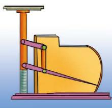

##### 阅读·思考

##### 生活中的平行四边形

[平行四边形](../概念/平行四边形.md)是日常生活中常见的图形，如扶梯护栏、居民小区大门的栅栏道闸等。此外，如图 6-17 所示的缩放尺的结构也是平行四边形。

实际上，平行四边形连杆是机械结构中常见的一种部件。这种连杆在移动时，两对边始终保持平行，能方便地进行往复运动。

图6-17

下面有三组平行四边形连杆机械的实例设计图（如图6-18）： $(\mathrm{A}_{1})(\mathrm{A}_{2})$ 是指针式弹簧秤； $(\mathrm{B}_{1})(\mathrm{B}_{2})$ 是活动工具箱； $(\mathrm{C}_{1})(\mathrm{C}_{2})$ 是儿童荡板。每一组设计图中有一幅是合理的，有一幅有一点问题。你知道哪一幅有问题吗？

(A₁)

$(A_{2})$

$(B_{1})$

$(B_{2})$

$(C_{1})$

图6-18

  
$\left( {\mathrm{C}}_{2}\right)$

