义务教育教科书

# SHUXUE

# 数学

七年级 | 上册


<details>
<summary>natural_image</summary>

Panoramic view of Shanghai skyline featuring the Oriental Pearl Tower and modern skyscrapers along the Huangpu River (no visible text or signage)
</details>

# 义务教育教科书

# 数学

# 七年级 | 上册

顾问：汤涛

主 编: 马 复

副主编：章飞

本册主编：顾继玲

编写人员：（按姓氏笔画为序排列）

王建波 安志军 陈莉红

凌晓牧 蔡春霞

# 致同学

亲爱的同学，祝贺你步入新的学习起点，开启新的数学学习旅程！

你将很快发现：生活中处处都有数学的身影——家中、教室里许多物体的形状，生产、消费过程中的各种数字，报刊、电视中呈现的各种数据信息……学习数学会让你不断感受到它的多姿多彩——在丰富的图形世界里，你会见到许多美丽的图形，还能够用它们设计自己喜爱的图案；在抽象的“代数”世界里，奇妙的字母 $a$ 既可以帮助你方便地表达无数多的研究对象，也会让你遭遇令人“烦恼”的运算；在整理各种各样统计数据的过程中，你会发现许多有趣的现象和有用的信息……

学好数学会让自己变得越来越聪明——学习完“整式”和“方程”，你会揭开许多奇妙游戏的谜底，还能够体验成为一位小魔术师的感受；关注人口老龄化、亲手设计一个尽可能大的长方体形收纳盒，你会发现自己越来越有本领，许多以前不会做的事情、不能求解的问题，现在都能解决了，当然，你还会发现新的、奇妙的问题。

学数学是一项智力活动，思考是最基本的学习方式。面对新的情境时，你要独立地“观察并思考”；寻找解决问题思路时，你要积极地“尝试并思考”；实施解决问题方案的过程中，你要不断地“操作并思考”……更重要的是，学习过程中你要与老师、同伴一起“思考并交流”。

学好数学不仅需要付出努力，还需要掌握有效的方法。而有效方法的获得更多依赖于你在经过一段学习活动之后，有意识地“回顾并反思”。

你可能曾经因为品尝到成功的喜悦而喜爱数学，因为遭遇到失败而畏惧数学，甚至因为面临智力的挑战而对数学爱恨交加……实际上，这些是每一个学习数学的人都会经历的过程，包括那些成功的数学家。

相信即将开始的数学学习会给你带来全新的体验，让你得到不同以往的感受。让我们一起走进数学新天地！

北师大版

# 目录

# 第一章 丰富的图形世界

1 生活中的立体图形 /2  
2 从立体图形到平面图形 /8  
回顾与思考 /18  
复习题 /18


<details>
<summary>natural_image</summary>

Panoramic view of Shanghai skyline featuring the Oriental Pearl Tower and modern skyscrapers along the Huangpu River (no visible text or signage)
</details>

# 第二章 有理数及其运算


<details>
<summary>natural_image</summary>

Snow-capped mountain peak under a clear blue sky, partially obscured by clouds (no text or symbols visible)
</details>

1 认识有理数 / 23  
2 有理数的加减运算 / 34  
3 有理数的乘除运算 / 49  
4 有理数的乘方 / 58  
5 有理数的混合运算 / 64  
回顾与思考 / 70  
复习题 / 70

# 第三章 整式及其加减

1 代数式 /77  
2 整式的加减 /88  
3 探索与表达规律 /96  
☆ 问题解决策略：归纳 /100  
回顾与思考 /104  
复习题 /104


<details>
<summary>natural_image</summary>

A basketball floating against a blue sky with scattered clouds (no text or symbols visible)
</details>

# 第四章 基本平面图形

1 线段、射线、直线 / 111  
2 角 / 119  
3 多边形和圆的初步认识 / 128

回顾与思考 / 132

复习题 / 132

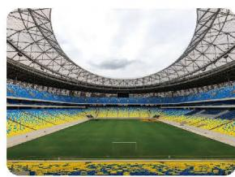

<details>
<summary>natural_image</summary>

Interior view of a modern stadium with a green field, blue and yellow seating, and a large steel truss roof (no visible text or signage)
</details>

# 第五章 一元一次方程

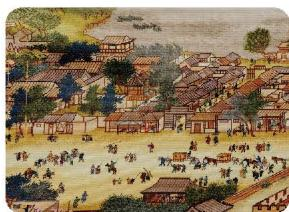

<details>
<summary>natural_image</summary>

Historical illustration of a traditional Chinese town with tiled-roof buildings and a crowd of people (no visible text or symbols)
</details>

1 认识方程 / 136  
2 一元一次方程的解法 /139  
3 一元一次方程的应用 / 147

☆ 问题解决策略：直观分析 / 156

回顾与思考 / 159

复习题 / 159

# 第六章 数据的收集与整理

1 丰富的数据世界 / 163  
2 数据的收集 / 167  
3 数据的表示 / 176

回顾与思考 / 190

复习题 / 190


<details>
<summary>natural_image</summary>

Modern glass skyscrapers with digital network overlay, no visible text or symbols
</details>

# 综合与实践

关注人口老龄化 / 197

制作一个尽可能大的无盖长方体形收纳盒 / 198

# 学习印记

# 第一章 丰富的图形世界

观察周围的世界，你会看到许许多多的图形。你能从中发现哪些熟悉的图形？

在小学，我们已经初步认识了一些简单的几何体，本章将拓展你对几何体的认识。你将通过观察、操作、想象，直观感知和描述常见几何体的形状特征，感悟点、线、面、体之间的关系；经历展开与折叠、切截、从不同方向看等活动过程，初步感知几何体与其展开图、截面图、不同方向的形状图之间的联系，在活动中发展几何直观和空间观念等。


<details>
<summary>natural_image</summary>

Close-up of sliced white tree bark on wooden surface, showing natural texture and root (no text or symbols)
</details>


<details>
<summary>natural_image</summary>

Panoramic view of Shanghai skyline featuring the Oriental Pearl Tower and modern skyscrapers along the Huangpu River (no visible text or signage)
</details>


<details>
<summary>natural_image</summary>

Snow-covered arched structure with a distant tree and snowy landscape (no text or symbols visible)
</details>

在本章学习过程中，你可以持续思考以下问题：


你认为可以从哪些方面认识和研究一个几何体？


# 生活中的立体图形
(1) 小学学过哪些几何体? 如图 1-1, 在小颖的书房中, 哪些物体的形状与你在小学学过的几何体类似?
(2) 请找出小颖的书房中与笔筒形状类似的物体, 并与同伴进行交流。

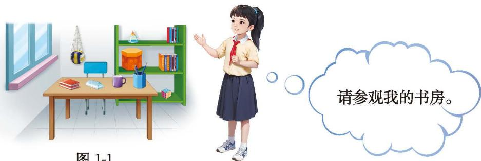

<details>
<summary>text_image</summary>

图 1-1
请参观我的书房。
</details>

图 1-1

小颖的书房中与笔筒形状类似的几何体称为棱柱。图1-2中是一些常见的几何体。

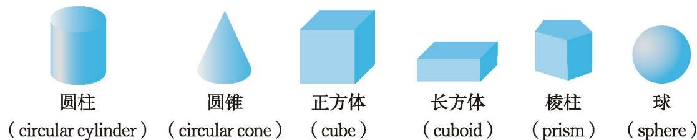

<details>
<summary>text_image</summary>

圆柱
(circular cylinder)
圆锥
(circular cone)
正方体
(cube)
长方体
(cuboid)
棱柱
(prism)
球
(sphere)
</details>

图1-2

> [!observe] 观察·思考
(1) 图 1-3 中指出了六棱柱的顶点、侧棱、侧面和底面, 请你指出图中其

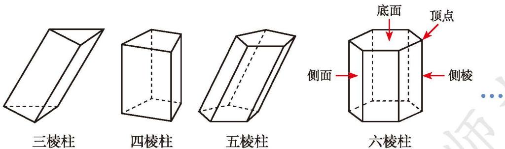

<details>
<summary>text_image</summary>

三棱柱
四棱柱
五棱柱
底面
顶点
侧面
侧棱
六棱柱
</details>

图1-3

他棱柱的顶点、侧棱、侧面和底面。
(2)棱柱的侧棱、侧面和底面分别有什么特点?

在棱柱中，相邻两个面的交线叫作棱（edge），相邻两个侧面的交线叫作侧棱。棱柱的所有侧棱长都相等。棱柱的上、下底面的形状相同，侧面的形状都是平行四边形。

人们通常根据底面图形的边数将棱柱分为三棱柱、四棱柱、五棱柱、六棱柱……它们底面图形的形状分别为三角形、四边形、五边形、六边形……

长方体、正方体都是四棱柱。

棱柱可以分为直棱柱和斜棱柱（如图 1-4）。本书今后主要讨论直棱柱（简称棱柱）。直棱柱的侧面是长方形。

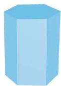  
直棱柱

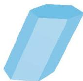  
斜棱柱   
图1-4

> [!think] 思考·交流

请用自己的语言描述棱柱与圆柱的相同点与不同点，并与同伴进行交流。

# 尝试·思考

图 1-5 中的物体都可以近似地看成由一些常见几何体组合而成，你能找出其中常见的几何体吗？你还能举出其他组合几何体的例子吗？

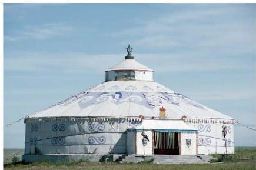

<details>
<summary>natural_image</summary>

White yurt with decorative patterns on its roof, set against a clear blue sky (no text or symbols visible)
</details>
(1)

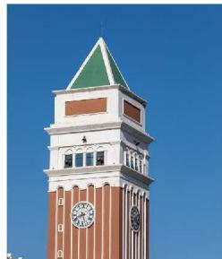

<details>
<summary>natural_image</summary>

Exterior view of a historic clock tower with red brick and white facade, green triangular roof, and blue sky (no signage or text visible)
</details>
(2)


<details>
<summary>natural_image</summary>

A large stone water feature with a multi-tiered structure, situated in calm water, surrounded by forested hills under a clear blue sky.
</details>
(3)   
图1-5

# 随堂练习

1. 说一说生活中哪些物体的形状分别类似于棱柱、圆柱、圆锥与球。  
2. 请完成下表。

<table><tr><td>棱柱</td><td>面的个数</td><td>顶点的个数</td><td>棱的条数</td></tr><tr><td>三棱柱</td><td></td><td></td><td></td></tr><tr><td>四棱柱</td><td></td><td></td><td></td></tr></table>

图形是由点（point）、线（line）、面（plane）构成的。面与面相交得到线，线与线相交得到点。
(1) 找出图 1-6 中的点、线、面。  
(2) 图 1-6 中的哪些线是直的,哪些线是曲的? 哪些面是平的, 哪些面是曲的?

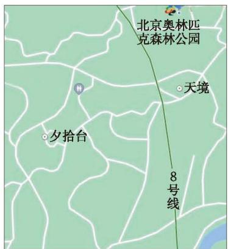

<details>
<summary>text_image</summary>

北京奥林匹克森林公园
天境
夕拾台
8号线
</details>
(1)

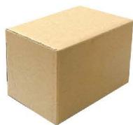

<details>
<summary>natural_image</summary>

Simple cardboard box with beige and beige color scheme (no text or symbols)
</details>
(2)


<details>
<summary>natural_image</summary>

Green umbrella with triangular blades and a small hole at the center (no text or symbols)
</details>
(3)

> [!observe] 观察·思考

图1-6

观察六棱柱和圆柱，回答下列问题：
(1) 六棱柱是由几个面围成的？圆柱是由几个面围成的？它们都是平的吗？  
(2) 圆柱的侧面和底面相交得到几条线? 它们是直的还是曲的?  
(3) 六棱柱有几个顶点? 经过每个顶点有几条棱?

> [!observe] 观察·交流

观察图 1-7 中流星、汽车雨刮器和直角三角形的运动轨迹，你发现了什么？你还能举出生活中类似的例子吗？与同伴进行交流。


<details>
<summary>natural_image</summary>

Night sky with star trails and a bare tree against a blue night sky (no text or symbols)
</details>


<details>
<summary>natural_image</summary>

Snow-covered arched structure with a circular opening, surrounded by forest (no text or symbols visible)
</details><center>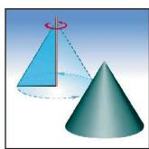</center><center>图1-7</center>

点动成线，线动成面，面动成体。

# 尝试·思考
(1) 圆柱可以看成由哪个平面图形旋转得到? 圆锥呢? 球呢?  
(2) 图 1-8 中各个花瓶的表面可以大致看成由哪个平面图形绕虚线旋转一周得到? 用线连一连。

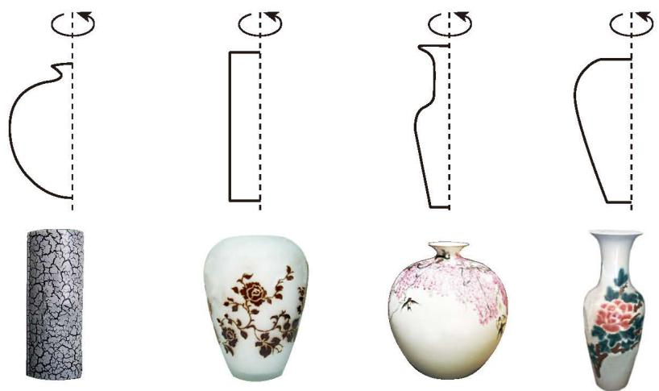

<details>
<summary>natural_image</summary>

Illustration of four decorative vases with curved lines and a cracky texture, arranged in a row (no text or symbols)
</details>

图1-8

# 随堂练习

1. 如图，第二行的某个图形绕虚线旋转一周，便能得到第一行的某个几何体。用线连一连。

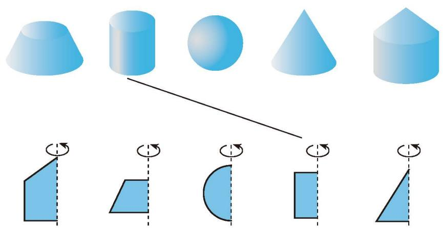

<details>
<summary>text_image</summary>

Diagram illustrating geometric shapes and rotation, showing cone, cylinder, sphere, cone, and triangle with rotation arrows.
</details>

(第1题)


## 习题1.1


# 知识技能

1. 五棱柱、六棱柱各有多少个面？多少个顶点？多少条棱？猜测七棱柱的情形并设法验证你的猜测。

2. 一个六棱柱框架如图所示, 它的底面边长都是 $5 \mathrm{~cm}$ , 侧棱长 $4 \mathrm{~cm}$ 。观察这个框架, 回答下列问题:
(1) 这个六棱柱的几个面分别是什么形状？哪些面的形状、大小完全相同？  
(2) 这个六棱柱所有侧面的面积之和是多少?

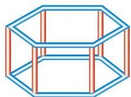

<details>
<summary>natural_image</summary>

Pure geometric line drawing of a 3D hexagonal prism with blue and red edges (no text or symbols)
</details>

(第2题)<center></center><center>（第3题）</center>


3. 图中的棱柱、圆锥分别是由几个面围成的？它们是平的还是曲的？


# 数学理解

4. 将下图中的几何体分类，并说明理由。
> <center>
> 
> | 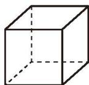 | 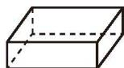 | 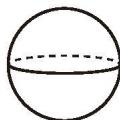 | 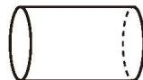 | 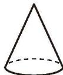 | 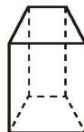 | 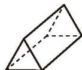 |
> | --- | --- | --- | --- | --- | --- | --- |
> | （1） | （2） | （3） | （4） | （5） | （6） | （7） |
> </center>
> <center>(第4题)</center>
> 

5. 找出下列图片中你熟悉的几何体。

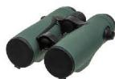  
(1)

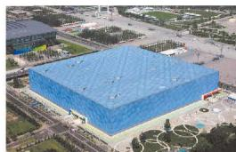

<details>
<summary>natural_image</summary>

Aerial view of a large blue-roofed industrial building surrounded by greenery and roads (no visible text or signage)
</details>
(2)

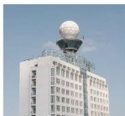

<details>
<summary>natural_image</summary>

Exterior view of a modern building with a large spherical observation tower (no signage or text visible)
</details>
(3)

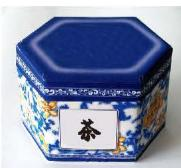

<details>
<summary>text_image</summary>

茶
</details>
(4)   
(第5题)

6. 下列物体可以近似地看成是由什么几何体组成的？

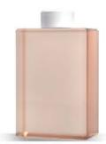  
(1)

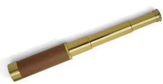

<details>
<summary>natural_image</summary>

Golden telescope with brown handle and wooden grip (no text or symbols visible)
</details>
(2)


<details>
<summary>natural_image</summary>

Close-up of a white conical mushroom on a green grassy hill (no text or symbols visible)
</details>
(3)

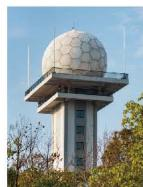  
(4)   
(第6题)

7. 生活中有哪些几何体可以由平面图形旋转得到？你能想象它们是由什么平面图形旋转得到的吗？请举例说明。

※8. 下列哪些几何体可以由平面图形绕一条直线旋转一周得到?
> <center>
> 
> | 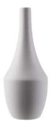 | 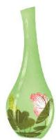 | 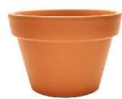 |
> | --- | --- | --- |
> | （1） | （2） | （3） |
> </center>
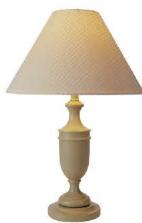

<details>
<summary>natural_image</summary>

White table lamp with a polka-dot shade and flared rim (no text or symbols visible)
</details>
(4)   
(第8题)


# 联系拓广

※9. 圆柱和棱柱有很多相同点，下面这个几何体和它们也有这样的相同点吗？<center></center><center>（第9题）</center>


# 从立体图形到平面图形

还记得小学学过的正方体表面的展开图吗？
(1) 将一个正方体的表面沿某些棱剪开, 你能得到哪些形状的展开图? 与同伴进行交流。
(2) 你能得到图 1-9 中的展开图吗?
> <center>
> 
> | 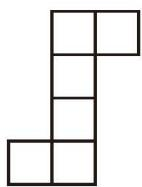 | 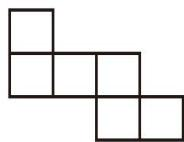 |
> | --- | --- |
> </center>
> <center>图1-9</center>
> 

# 尝试·交流

图 1-10 中的图形经过折叠能否围成一个正方体？你是如何判断的？与同伴进行交流。
> <center>
> 
> | 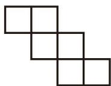 | 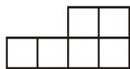 |
> | --- | --- |
> | （1） | （2） |
> </center>
> <center>图1-10</center>
> 

# 尝试·思考

图 1-11 中的图形经过折叠可以围成一个正方体形的盒子。折好以后，与 “1” 面相邻的面是什么？相对的面是什么？先想一想，再折一折，看看你的想法是否正确。

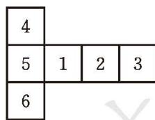

<details>
<summary>text_image</summary>

4
5 1 2 3
6
</details>

图 1-11

# 随堂练习

1. 将一个正方体的表面沿某些棱剪开，能得到下面的展开图吗？
> <center>
> 
> | 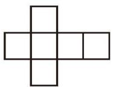 | 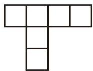 | 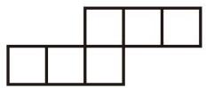 |
> | --- | --- | --- |
> | （1） | （2） | （3） |
> </center>
> <center>(第1题)</center>
> 

2. 下列哪个图形经过折叠可以得到正方体?
> <center>
> 
> | 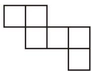 | 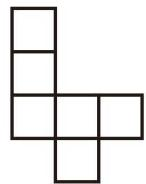 |
> | --- | --- |
> | （1） | （2） |
> </center>
> <center>(第2题)</center>
> 

将图 1-12 中的棱柱沿某些棱剪开，你能得到哪些形状的展开图？与同伴进行交流。

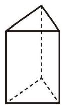  
(1)

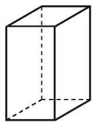

<details>
<summary>natural_image</summary>

Simple line drawing of a 3D rectangular prism with dashed hidden edges (no text or symbols)
</details>
(2)

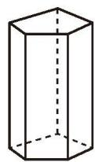  
(3)   
图1-12

> [!observe] 观察·思考
(1) 如图 1-13, 哪些图形经过折叠可以围成一个棱柱? 先想一想, 再折一折。

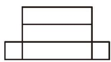  
(1)

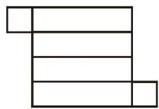

<details>
<summary>natural_image</summary>

Abstract geometric shape composed of connected rectangles (no text or symbols)
</details>
(2)

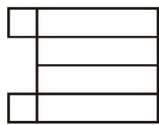

<details>
<summary>natural_image</summary>

Pure geometric shape composed of three horizontal lines with rounded corners, no text or symbols present.
</details>
(3)

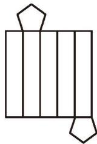

<details>
<summary>natural_image</summary>

Abstract geometric diagram with vertical lines and two pentagons, no text or symbols present
</details>
(4)   
图1-13
(2) 适当修改图 1-13 中不能围成棱柱的图形, 使所得图形能围成一个棱柱。

# 回顾·反思

在展开与折叠的活动中，你积累了哪些经验？

# 操作·思考
(1) 按照图 1-14 所示的方法把无底面的圆柱、圆锥的侧面展开, 会得到什么图形? 先想一想, 再做一做。
(2) 你的想法是否正确?


<details>
<summary>natural_image</summary>

Close-up of hands cutting a white cylindrical object with scissors, no visible text or symbols
</details>


<details>
<summary>natural_image</summary>

Close-up of hands cutting a white paper cone with scissors, no text or symbols visible
</details>

图1-14

如图 1-15，圆柱的侧面展开图是长方形，圆锥的侧面展开图是扇形。


<details>
<summary>flowchart</summary>


</details>

图1-15

# 随堂练习

1. 下列图形分别是哪种几何体表面的展开图？先想一想，再折一折。


<details>
<summary>natural_image</summary>

Abstract geometric shape composed of connected rectangles (no text or symbols)
</details>
(1)


<details>
<summary>natural_image</summary>

Abstract geometric shape composed of rectangles and triangles (no text or symbols)
</details>
(2)

(第1题)

2. 图中的两个图形经过折叠能否围成棱柱？先想一想，再折一折。


<details>
<summary>natural_image</summary>

Abstract geometric line drawing of three connected rectangles forming a Y-shape (no text or symbols)
</details>
(1)


<details>
<summary>natural_image</summary>

Pure geometric pattern of five rectangles arranged in a grid (no text or symbols)
</details>
(2)

(第2题)

在生活中我们常常需要将一个物体截开，如切西瓜、锯木头等（如图1-16）。


<details>
<summary>natural_image</summary>

Whole and halved watermelon slices showing red flesh and black seeds (no text or symbols)
</details><center></center><center>图1-16</center>


<details>
<summary>natural_image</summary>

Close-up of sliced white tree bark on forest floor, showing natural texture and root damage (no text or symbols)
</details>


<details>
<summary>natural_image</summary>

Geometric diagram showing a 3D solid with a triangular prism and its projection onto a plane, no text or symbols present.
</details>

图1-17

如图 1-17, 用一个平面去截一个几何体, 截出的面叫作截面 (section)。

# 尝试·思考

如图 1-18，用一个平面去截一个正方体，截面是什么形状？


<details>
<summary>natural_image</summary>

3D diagram showing a cube intersecting a plane, with no text or symbols present.
</details>
(1)


<details>
<summary>natural_image</summary>

Geometric diagram showing two overlapping planes with one highlighted in orange (no text or symbols)
</details>
(2)


<details>
<summary>natural_image</summary>

Geometric diagram of a cube with an orange shaded face and blue translucent plane, no text or symbols present.
</details>
(3)   
图1-18
(1) 截面的形状可能是三角形吗? 先想一想, 再试一试。  
(2) 截面的形状还可能是几边形?

> [!observe] 观察·思考

图 1-19 中的截面分别是什么形状？  


<details>
<summary>natural_image</summary>

Geometric diagram showing a cylinder intersected by two planes, one solid orange shaded and the other dashed (no text or symbols)
</details>
(1)


<details>
<summary>natural_image</summary>

Geometric diagram showing a polyhedron intersected by planes, with an orange shaded region highlighting its surface (no text or symbols)
</details>
(2)


<details>
<summary>natural_image</summary>

Geometric diagram of a cone with a dashed base, no text or symbols present
</details>
(3)


<details>
<summary>natural_image</summary>

Diagram of a sphere intersecting a plane, showing solid and dashed lines indicating hidden edges (no text or symbols)
</details>
(4)   
图1-19

# 随堂练习

1. 分别指出图中几何体截面形状的标号。
(1)   

> <center>
> 
> |  |  |  |  |
> | --- | --- | --- | --- |
> | （A） | （B） | （C） | （D） |
> </center>
(2)   

> <center>
> 
> |  |  |  |  |
> | --- | --- | --- | --- |
> | （A） | （B） | （C） | （D） |
> </center>
> <center>(第1题)</center>
> 

2. 用一个平面去截一个几何体, 如果截面的形状是长方形, 那么原来的几何体可能是什么?

# 阅读·欣赏

# 生活中的截面

锯开的树木的横断面上有一圈一圈的痕迹，这就是树木的年轮（如图 1-20）。树木的年轮蕴含着大量信息，如通过年轮的数目可以推算树木的年龄，通过年轮的宽窄可以了解历年的气候状况等。

计算机 X 射线体层成像（computed tomography, CT），是一种将 X 射线扫描摄影数据与重建数学及计算机技术结合，获得以层面信息为基础的医学影像的


<details>
<summary>natural_image</summary>

Cross-section of a tree trunk showing concentric circular patterns (no text or symbols)
</details>

图1-20

技术。在扫描时，不断改变投影角度来获取大量数据，经过计算机重建得到层面内每个像素的 CT 值，再由计算机实施数字—模拟转换，将 CT 值转换为相应的灰度值，最终重建为 CT 图像。扫描过程就如同数学上的“截几何体”，只不过这里的“截”并不是真正的截。实际上，这里的“几何体”是某个器官，“刀”是 X 射线。CT 的发明是医学史上具有划时代意义的一件大事，它的设计者、发明者和理论研究者因此获得 1979 年诺贝尔生理学或医学奖。

医学上的“虚拟人”是将成千上万个人体横切面的资料在计算机里进行整合、重建，形成三维立体的人体结构，为医学研究、教学与临床提供形象而真实的模型。

另外，3D打印技术也和截面密切相关。3D打印机通过读取横截面的相关信息，用液体状、粉状或片状的材料将这些截面逐层打印出来，再将各层截面以多种方式黏合起来，从而制造出一个实体。2020年5月5日，我国用长征五号B运载火箭发射的新一代载人飞船试验船上就搭载了一个复合材料空间3D打印系统，在轨飞行期间完成了我国首次太空3D打印试验。

在小学, 我们曾经辨认过从正面、左面 (或右面) 和上面三个不同方向观察同一物体时看到的物体的形状图。例如, 图 1-21 是由大小相同的小立方块搭成的几何体, 从正面、左面、上面看到的这个几何体的形状图如图 1-22 所示。


<details>
<summary>text_image</summary>

从上面看
从左面看
从正面看
</details>

图1-21

  
从正面看

  
从左面看

  
从上面看  
图1-22

请你用 6 个大小相同的小立方块搭一个几何体，然后请同伴画出从正面、左面、上面看到的这个几何体的形状图。

# 尝试·思考

一个几何体由几个大小相同的小立方块搭成，从左面和从上面看到的这个几何体的形状图如图 1-23 所示，请搭出满足条件的几何体。你搭的几何体由几个小立方块构成？

  
从左面看

  
从上面看  
图1-23

# 操作·交流

用若干大小相同的小立方块搭一个几何体，画出从正面、左面、上面看到的这个几何体的形状图，请同伴根据你画的形状图搭出相应的几何体。与同伴进行交流。

# 随堂练习

1. 用 5 个大小相同的小立方块分别搭成如图所示的几何体。请你用自己的方式描述一下每个几何体的具体形状。
> <center>
> 
> |  |  |  |
> | --- | --- | --- |
> | （1） | （2） | （3） |
> </center>
> <center>(第1题)</center>
> 


# 习题 1.2


# 知识技能

1. 下列图形分别是哪种几何体表面的展开图？先想一想，再折一折。


<details>
<summary>natural_image</summary>

Pure geometric diagram of three stacked rectangles with arrows indicating direction (no text or symbols)
</details>
(1)

  
(2)


<details>
<summary>natural_image</summary>

Pure geometric diagram of connected rectangles and hexagons without any text or symbols
</details>
(3)


<details>
<summary>natural_image</summary>

Simple line drawing of a generic human figure with no text or symbols
</details>
(4)

(第1题)

2. 图中各几何体的截面分别是什么形状？
> <center>
> 
> |  |  |
> | --- | --- |
> | （1） | （2） |
> </center>


<details>
<summary>natural_image</summary>

Geometric diagram showing a 3D cube intersected by planes, with no text or symbols present.
</details>
(3)


<details>
<summary>natural_image</summary>

Diagram of a cylinder intersecting a plane, showing solid and dashed lines (no text or symbols)
</details>
(4)

(第2题)

3. 从正面、左面、上面观察如图所示的几何体，分别画出你所看到的几何体的形状图。


<details>
<summary>text_image</summary>

从正面看
</details>
(1)


<details>
<summary>text_image</summary>

从正面看
</details>
(2)   
(第3题)


# 数学理解

4. 将正方体的表面分别标上数字 1, 2, 3, 4, 5, 6, 使它的任意两个相对面的数字之和为 7。将它沿某些棱剪开, 能得到下面的展开图吗?
> <center>
> 
> |  |  |  |
> | --- | --- | --- |
> | （1） | （2） | （3） |
> </center>
> <center>(第4题)</center>
> 

5. 图中的两个图形经过折叠能否围成棱柱？先想一想，再折一折。


<details>
<summary>natural_image</summary>

Abstract geometric shape composed of connected rectangles and lines (no text or symbols)
</details>
(1)

  
(2)   
(第5题)


<details>
<summary>natural_image</summary>

Simple line drawing of a house shape with triangular roof and three dashed lines indicating hidden edges (no text or symbols)
</details>

(第6题)

6. 用一个平面去截如图所示的三棱柱，截面可能是什么形状？先想一想，再做一做。  
7. 用一个平面去截一个几何体, 如果截面的形状是圆, 那么原来的几何体可能是什么? 如果截面是三角形呢?

8. 一个小立方块的六个面分别标有字母 A, B, C, D, E, F, 从三个不同方向看到的情形如图所示, 你能说出 A, B, E 对面分别是什么字母吗? 你是怎么判断的?


> <center>
> 
> |  |  |
> | --- | --- |
> | （第8题） | （第9题） |
> </center>
> <center>(第8题)</center>
> 
9. 一个几何体由几个大小相同的小立方块搭成，从上面观察这个几何体，看到的形状图如图所示，其中小正方形中的数字表示在该位置的小立方块的个数。请画出从正面和从左面看到的这个几何体的形状图。


# 问题解决

10. 将一个无盖正方体形盒子的表面沿某些棱剪开，你能得到哪些展开图？动手试一试，并与同伴进行交流。

11. 在图中增加 1 个大小相同的小正方形，使所得图形经过折叠能够围成一个正方体。先想一想，再试一试。<center></center><center>（第11题）</center>
12. 用一张纸片, 通过剪一剪、折一折, 制作一个棱柱形的盒子, 并与同伴进行交流。


# 联系拓广

※13. 将正方体的表面沿某些棱剪开, 展开成一个平面图形, 你剪开了几条棱?与同伴进行交流, 你们的结果是否一致?


# 回顾与思考

1. 生活中有哪些你熟悉的几何体？它们分别有什么特点？请举例说明。

2. 举例说明你对点、线、面、体之间关系的认识。

3. 找出两个几何体，使得分别用一个平面去截它们，可以得到三角形形状的截面。

4. 举出一个几何体，使得从正面、左面、上面看到的这个几何体的形状图都一样。你能举出几个？

5. 有哪些方法可以把立体图形转化为平面图形？这些方法各有什么特点？

6. 梳理本章内容，用适当的方式呈现全章知识结构，并与同伴进行交流。


# 复习题


# 知识技能

1. 折一折，连一连。


<details>
<summary>flowchart</summary>


</details>

(第1题)


# 数学理解

2. 图中哪些图形经过折叠可以围成一个棱柱？先想一想，再折一折。


<details>
<summary>natural_image</summary>

Geometric diagram of a trapezoid divided into two pentagons, with no text or symbols present.
</details>
(1)


<details>
<summary>natural_image</summary>

Geometric diagram of a 3D shape composed of rectangles and triangles (no text or symbols)
</details>
(2)

  
(3)

(第2题)

3. 将下图中各几何体的截面用阴影表示出来，并分别指出它们的形状。


<details>
<summary>natural_image</summary>

Geometric diagram of a cube intersected by two planes, no text or symbols present
</details>


<center></center><center>（第3题）</center>

4. 用一个平面截一个正方体，截面的形状可能是长方形吗？用一个平面截一个长方体，截面的形状可能是正方形吗？与同伴进行交流。<center></center><center>（第5题）</center>

5. 在图中剪去 1 个小正方形，使得到的图形经过折叠能够围成一个正方体。先想一想，再试一试。

6. 下列图形是正方体表面的展开图，将它们折叠成正方体后，与“1”“2”“3”面相对的面分别是什么？
> <center>
> 
> |  |  |  |  |
> | --- | --- | --- | --- |
> | （1） | （2） | （3） | （4） |
> </center>
> <center>(第6题)</center>
> 

7. 一个几何体由若干大小相同的小立方块搭成, 从上面看到的几何体的形状图如图所示, 其中小正方形中的数字表示在该位置的小立方块的个数。请画出从正面和从左面看到的这个几何体的形状图。<center></center><center>（第7题）</center>

  
从正面看

  
从上面看  
(第8题)

8. 用若干大小相同的小立方块搭一个几何体，使得从正面和从上面看到的这个几何体的形状图如图所示。根据你所搭的几何体画出从左面看到的它的形状图。你还能搭出满足条件的其他几何体吗？试一试！

※9. 一个几何体由若干大小相同的小立方块搭成，图中所示的分别是从它的正面、上面看到的形状图，这个几何体至少是用多少个小立方块搭成的？

  
从正面看

  
从上面看  
(第9题)

# 问题解决

10. (1) 将正方体沿图中红色的棱剪开, 请画出它的展开图。
(2) 请你编一道类似 (1) 的题目。如果正方体是 “无盖” 的呢?


<details>
<summary>natural_image</summary>

Simple 3D wireframe cube diagram with solid and dashed edges, no text or labels present
</details>

(第10题)

11. 甲、乙、丙三人组成一个小组，甲用若干大小相同的小立方块搭成一个几何体，乙用自己的方式描述这个几何体的形状，丙在不看这个几何体的情况下仅根据乙的描述搭出这个几何体。小组内三人互换角色，继续这个活动。

※12. 如图, 已知长方形的长为 $a$ 、宽为 $b$ , 将这个长方形分别绕它的长和宽旋转一周, 可以得到两个圆柱。这两个圆柱的侧面积有什么关系?


<details>
<summary>text_image</summary>

b
a →
c
</details>
(1)


<details>
<summary>text_image</summary>

a
b
</details>
(2)   
(第12题)

13. 请收集生活中各种各样的包装盒，并将它们沿某些棱剪开，你能得到哪些形状的展开图？将你的成果以演示文档的形式进行展示与交流。


# 联系拓广

14. 请查阅资料，了解“虚拟数字人”的研究进展。

# 第二章 有理数及其运算

世界上最高的山峰是珠穆朗玛峰，其海拔大约是 8848.86 m，吐鲁番盆地最低处的海拔大约是 -154.31 m。你能说出 -154.31 m 的含义吗？怎样计算珠穆朗玛峰的海拔和吐鲁番盆地最低处的海拔相差多少呢？

本章将在小学学习的基础上引入负数，将数的范围扩充到有理数。你将经历从具体情境中抽象出负数的过程，理解有理数运算的意义并进行正确运算，通过归纳、类比、转化等发现一些数学结论，提高运算能力和推理能力，发展应用意识等。


# 在本章学习过程中，你可以持续思考以下问题：


为什么要引入负数？  
研究一类“新”数，一般会经历怎样的过程？


# 认识有理数

某班举行知识竞赛，评分标准是：答对 1 题加 1 分，答错 1 题扣 1 分，不回答得 0 分；每个参赛队的基本分均为 0 分。下表是用图 2-1 所示的表情表示的两个参赛队的答题情况。

  
答对

  
答错

  
不回答

图2-1

<table><tr><td>参赛队</td><td colspan="10">答题情况</td></tr><tr><td>第一队</td><td></td><td></td><td></td><td></td><td></td><td></td><td></td><td></td><td></td><td></td></tr><tr><td>第二队</td><td></td><td></td><td></td><td></td><td></td><td></td><td></td><td></td><td></td><td></td></tr></table>
(1) 你能用适当的方式表示每个队答题得分的情况吗？试完成下表。

<table><tr><td>参赛队</td><td>答对题的得分</td><td>答错题的得分</td><td>不回答题的得分</td></tr><tr><td>第一队</td><td></td><td></td><td></td></tr><tr><td>第二队</td><td></td><td></td><td></td></tr></table>
(2) 如果用 “+1” 表示答对 1 题的得分, 用 “-1” 表示答错 1 题的得分,那么你如何填写 (1) 中的表?

# 尝试·交流
(1) 下表是 2023 年 1 月 1 日四个城市的气温情况。你能说出表中各数的实际意义吗?

<table><tr><td>城市</td><td>北京</td><td>昆明</td><td>西安</td><td>哈尔滨</td></tr><tr><td>气温</td><td>-7°C~5°C</td><td>7°C~13°C</td><td>-2°C~2°C</td><td>-19°C~-14°C</td></tr></table>
(2) 珠穆朗玛峰的海拔大约是 $8848.86 \mathrm{~m}$ , 吐鲁番盆地最低处的海拔大约是 $-154.31 \mathrm{~m}$ 。 $8848.86 \mathrm{~m}, -154.31 \mathrm{~m}$ 的实际意义分别是什么?
(3) 图 2-2 展示了 2023 年 7 月我国居民消费价格分类别同比涨幅情况。请你说一说 $-0.5\%$ , $2.4\%$ 等数的实际意义, 并与同伴进行交流。


<details>
<summary>bar</summary>

| 类别 | 同比涨幅 (%) |
|---|---|
| 食品烟酒 | -0.5 |
| 衣着 | 1.0 |
| 居住 | 0.1 |
| 生活用品及服务 | -0.2 |
| 交通通信 | -4.7 |
| 教育文化娱乐 | 2.4 |
| 医疗保健 | 1.2 |
| 其他用品及服务 | 4.1 |
</details>

图2-2

“加分与扣分”“零上温度与零下温度”“高于海平面与低于海平面”“上涨量与下跌量”等都是具有相反意义的量。为了表示具有相反意义的量，我们可以把其中一个量规定为正的，把与这个量意义相反的量规定为负的，并分别用“+”“-”来表示。例如，“加3分”记为+3分，“扣2分”就记为-2分。

像 +3, +15, +2.4%, …都是正数，正数前面的“+”可以省略不写。

像 -2, -8, -0.5%, …都是负数。

0 既不是正数，也不是负数。

负数与对应的正数在数量上相等，表示的意义相反。

> [!example]- 例1(1)某人转动转盘, 如果用 +5 圈表示沿逆时针方向转了 5 圈, 那么沿顺时针方向转了 12 圈怎样表示?
(2) 在某次乒乓球质量检测中, 如果一个乒乓球的质量高于标准质量 $0.02 \mathrm{~g}$ 记作 $+0.02 \mathrm{~g}$ , 那么 $-0.03 \mathrm{~g}$ 表示什么?
(3) 某大米包装袋上标注着 “净含量: $10 \mathrm{~kg} \pm 50 \mathrm{~g}$ ”, 这里的 “ $10 \mathrm{~kg} \pm 50 \mathrm{~g}$ ” 表示什么?
解: (1) 沿顺时针方向转了 12 圈记作 -12 圈;
(2) $-0.03\mathrm{g}$ 表示乒乓球的质量低于标准质量 $0.03\mathrm{g}$ ;
(3) 每袋大米的标准质量应为 $10 \mathrm{~kg}$ , 但实际每袋大米可能有 $50 \mathrm{~g}$ 的误差, 即每袋大米的净含量最多是 $10 \mathrm{~kg} + 50 \mathrm{~g}$ , 最少是 $10 \mathrm{~kg} - 50 \mathrm{~g}$ 。

> [!think] 思考·交流
(1) 选定一个身体高度作为标准, 用正数、负数或 0 表示你们班每名同学的身高与选定的身高标准的差。你是怎样表示的? 从你的表示能看出谁最高吗?
(2) 你能将所学的数进行分类吗? 与同伴进行交流。

整数（integer） $\left\{\begin{array}{l} 正整数：如1,2,3,\cdots \\ 零：0 \\ 负整数：如-1,-2,-3,\cdots \end{array}\right.$

分数（fraction） $\left\{\begin{array}{l} 正分数：如\frac{1}{2},\frac{1}{3},5.2,\cdots\\ 负分数：如-\frac{1}{5},-3.5,-\frac{5}{6},\cdots\end{array}\right.$

整数与分数统称有理数（rational number）。

# 随堂练习

1. (1) 如果零上 $5^{\circ} \mathrm{C}$ 记作 $+5^{\circ} \mathrm{C}$ , 那么零下 $3^{\circ} \mathrm{C}$ 记作什么?
(2)东、西为两个相反方向, 如果 $-4 \mathrm{~m}$ 表示一个物体向西运动 $4 \mathrm{~m}$ , 那么 $+2 \mathrm{~m}$ 表示什么? 物体原地不动记作什么?
(3)某仓库运进面粉7.5t记作+7.5t,那么运出面粉3.8t记作什么?

2. 所有的正数组成正数集合, 所有的负数组成负数集合, 所有的整数组成整数集合, 所有的分数组成分数集合。请把下列各数填入相应的集合中:
$3, - 7, - \frac {2}{3}, 5. \dot {6}, 0, - 8 \frac {1}{4}, 1 5, \frac {1}{9} 。$

正数集合：{ … }。
负数集合：{ … }。
整数集合：{ … }。
分数集合：{ … }。

# 阅读·欣赏

# 负数小史

在人类生活中，早就存在着收入与支出、赢利与亏本等具有相反意义的现象。中国是最早认识和使用负数的国家，我国古代数学名著《九章算术》①在“方程”章中首次出现了负数，如卖所得的钱为正，买所付的钱为负，余钱为正，不足钱为负；同时明确提出“正负术”，其实就是正负数的加减运算法则：“同名相除，异名相益，正无入负之，负无入正之。其异名相除，同名相益，正无入正之，负无入负之。”这是世界上至今发现的关于负数的最早最详细的记载。等你学了有理数的加减运算法则之后，你就能理解“正负术”的含义了。后来，我国魏晋时期的数学家刘徽（约225—约295）在为《九章算术》“正负术”作注时指出：“今两算得失相反，要令正、负以名之。正算（筹）赤，负算（筹）黑，否则以邪正为异。”也就是说，对两个得失相反的量，要以正、负加以区别。用红筹表示正，黑筹表示负，也可将算筹正放、斜放来区别。刘徽实际上揭示了正、负数的意义。

在国外，负数概念的建立和使用，经历了一个曲折的过程。印度在628年左右出现了负数概念，并有了负数的运算，不过他们总把负数解释为负债。欧洲的数学家迟迟不承认负数，认为零是最小的数，而比零还小的数是不可思议的。欧洲最早承认负数的是17世纪法国数学家笛卡儿（René Descartes, 1596—1650），他承认解方程中出现的负根，不过他称之为“假根”。直到19世纪，负数在欧洲才获得普遍承认。

3 与 -3, $\frac{3}{2}$ 与 $-\frac{3}{2}$ , 5 与 -5 这三组数有什么共同特点? 你还能列举几组具有这种特点的数吗? 与同伴进行交流。

像 3 与 -3, $\frac{3}{2}$ 与 $-\frac{3}{2}$ , 5 与 -5 这样的两个数, 它们的符号不同, 数量相等。我们称其中一个数为另一个数的相反数 (opposite number), 也称这两个数互为相反数。特别地, 0 的相反数是 0。

一个数表示的数量多少叫作这个数的绝对值（absolute value），如3和-3的绝对值都等于3，0的绝对值等于0。通常用 $|a|$ 表示数a的绝对值，如3的绝对值记作 $|3|=3,-5$ 的绝对值记作 $|-5|=5$ 。

> [!example]- 例2 求下列各数的相反数和绝对值:
$- 2, \frac {4}{9}, 0, - 3. 8, 3 0 。$
解：-2， $\frac{4}{9}$ ，0，-3.8，30的相反数分别是
$2, - \frac {4}{9}, 0, 3. 8, - 3 0;$
$\vert - 2 \vert = 2, \left| \frac {4}{9} \right| = \frac {4}{9}, \vert 0 \vert = 0, \vert - 3. 8 \vert = 3. 8, \vert 3 0 \vert = 3 0 。$

a 的相反数为
\_\_\_\_。

# 尝试·思考

一个数的绝对值与这个数有什么关系？

正数的绝对值是它本身;

负数的绝对值是它的相反数；
0 的绝对值是 0。

> [!think] 思考·交流
(1) 下表呈现了 2023 年 1 月 1 日四个城市的最低气温和最高气温。你能将这四个城市的最低气温从低到高进行排列吗？你是怎么比较的？

<table><tr><td>城市</td><td>北京</td><td>昆明</td><td>西安</td><td>哈尔滨</td></tr><tr><td>气温</td><td>-7°C~5°C</td><td>7°C~13°C</td><td>-2°C~2°C</td><td>-19°C~-14°C</td></tr></table>
(2) 你能仿照气温的比较将下列这组数按照从小到大的顺序进行排列吗?
$- 1, 0, - 3, 2. 5, - 1. 5, 4 。$
(3) 你认为负数和正数应怎样比较大小? 负数和 0 呢? 两个负数呢? 与同伴进行交流。

正数大于0，负数小于0，正数大于负数。两个负数，绝对值大的反而小。

> [!example]- 例3 比较下列每组数的大小:
(1) -2, 6;
(2) 0, -1.8;
(3) $-\frac{3}{2},-4$ 。
解: (1) 因为正数大于负数, 所以 $-2 < 6$ ;
(2) 因为负数小于 0，所以 0 > -1.8;
(3) 因为两个负数，绝对值大的反而小，

而 $\left| -\frac{3}{2} \right| = \frac{3}{2}, | - 4| = 4, \frac{3}{2} < 4,$
所以 $-\frac{3}{2}>-4$ 。

# 随堂练习

1. 求下列各数的相反数和绝对值:
$- 3 \frac {1}{4}, 2. 5, - \frac {4}{3}, 1 3. 5, - \frac {2}{5} 。$

2. 比较下列每组数的大小:
(1) $-\frac{1}{10}, -\frac{2}{7}$ ;
(2) -0.5, $-\frac{2}{3}$ ;
(3) 0, $\left|-\frac{2}{3}\right|$ ;
(4) $|-7|$ , $|7|$ 。
(1) 图 2-3 中温度计上显示的温度各是多少?  
(2) 温度计上的刻度有什么特点?  
(3) 你能用直线上的点表示有理数吗?

在一条水平直线上取一点（称为原点）表示0，选取某一长度作为单位长度，规定这条直线上向右的方向为正方向，那么相反方向就是负方向。原点右边的点可以表示正数，原点左边的点可以表示负数。这样，所有有理数就都可以用直线上的点表示了。


<details>
<summary>text_image</summary>

50
45
35
30
25
20
15
10
5
0
-5
-10
-15
-20
50
45
35
30
25
20
15
10
5
0
-5
-10
-15
-20
50
45
35
30
25
20
15
10
5
0
-5
-10
-15
-20
</details>

图2-3

像这样, 规定了原点 (origin)、单位长度 (unit length) 和正方向 (positive direction) 的直线称为数轴 (number line)。如图 2-4, 通常将数轴画成水平直线, 并选择向右的方向为正方向。


<details>
<summary>text_image</summary>

-4
-3
-2
-1
0
1
2
3
4
</details>

图2-4

像一个平放的温度计。

在这条数轴上，+3 可以用位于原点右边 3 个单位长度的点表示，-4 可以用位于原点左边 4 个单位长度的点表示。

# 尝试·思考
$\frac{1}{4}$ 用数轴上的哪个点表示？-1.5呢？其他数呢？

任何一个有理数都可以用数轴上的一个点来表示。

> [!example]- 例4(1)如图2-5, 数轴上点 $A, B, C, D$ 分别表示什么数?


<details>
<summary>text_image</summary>

A D C B
-2 -1 0 1 2 3 4
</details>

图2-5
(2) 画出数轴, 并用数轴上的点表示下列各数:
$\frac {3}{2}, - 3, 0, 5, - 4, - \frac {3}{2}, 3, - 5 _ {\circ}$
解:(1) 点 A 表示 -2, 点 B 表示 2, 点 C 表示 0, 点 D 表示 -1;
(2) 如图 2-6 所示。


<details>
<summary>text_image</summary>

-5 -4 -3 -3/2 0 3/2 3 5
-5 -4 -3 -2 -1 0 1 2 3 4 5
</details>

图2-6

> [!observe] 观察·思考

观察图 2-6 中表示 3 与 -3 的两个点，它们在数轴上的位置有什么关系？表示 $\frac{3}{2}$ 与 $-\frac{3}{2}$ 的两个点呢？表示 5 与 -5 的两个点呢？

在数轴上，表示互为相反数的两个点，位于原点的两侧，且到原点的距离相等。一个数的绝对值就是这个数所对应的点到原点的距离。

> [!think] 思考·交流

将例 4（2）中的各数按照从小到大的顺序排列，并用“<”连接起来；观察它们在数轴上对应点的位置（如图 2-6），你有什么发现？与同伴进行交流。

# 随堂练习

1. 画出数轴，用数轴上的点表示下列各数，并用“>”将它们连接起来：
$3, - 2, 1. 5, - \frac {3}{4}, 0, - 0. 5 _ {\circ}$

2. 在数轴上距离原点 2 个单位长度的点表示什么数?

3. 在数轴上表示下列各数及其相反数，并求出它们的绝对值：
$- 4 \frac {3}{5}, 6, - 7 _ {\circ}$


# 习题 2.1


# 知识技能

1. 举出几对具有相反意义的量，并分别用正负数表示。

2. (1) 如果节约电 $20 \mathrm{kW} \cdot \mathrm{h}$ 记作 $+20 \mathrm{kW} \cdot \mathrm{h}$ , 那么浪费电 $10 \mathrm{kW} \cdot \mathrm{h}$ 记作什么?
(2) 如果 -20.50 元表示亏本 20.50 元，那么 +100.57 元表示什么？
(3) 如果 +20% 表示增加 20%，那么 -6% 表示什么？

3. 下列各数中, 哪些是正整数, 哪些是负整数? 哪些是正分数, 哪些是负分数? 哪些是正数, 哪些是负数?
$7, - 9. 2 5, - \frac {9}{1 0}, - 3 0 1, \frac {4}{2 7}, 3 1. 2 5, \frac {7}{1 5}, - 3. 5 _ {\circ}$

4. 任意写出 5 个正数和 5 个负数，并分别把它们填入所属的集合内。

正数集合：{
$\dots \} _ {0}$

负数集合：{
$\dots \} _ {0}$

5. 下面的说法是否正确？请将错误的改正过来。
(1) 有理数的绝对值一定比0大;
(2) 有理数的相反数一定比0小;
(3) 如果两个数的绝对值相等, 那么这两个数相等;
(4) 互为相反数的两个数的绝对值相等。

6. 求下列各数的相反数和绝对值: $-21.4, \frac{1}{2}, -36, \frac{7}{5}$ 。

7. 比较下列每组数的大小:
(1) $-\frac{8}{9}, -\frac{9}{10}$ ;
(2) -0.618, $-\frac{3}{5}$ ;
(3) 0, |-8|;
(4) $-1\frac{2}{7},-1\frac{1}{3}$ 。

8. (1) 指出图中数轴上 $A, B, C, D, E$ 各点分别表示的有理数, 并用“<”将它们连接起来;


<details>
<summary>text_image</summary>

-4
-3
-2
-1
0
1
2
3
4
A
D
E
C
B
</details>

[第8(1)题]
(2)在数轴上把下列各数表示出来,并比较它们的大小：
$7, - \frac {4}{5}, - 3. 5, 0, \frac {4}{3} 。$


# 数学理解

9. 小丽说：“一个数，如果不是正数，必定就是负数。”你认为她说的对吗？为什么？

10. 某种食品包装袋上标注质量为 $450 \mathrm{~g}$ , 对 6 袋该种食品的实际质量进行检测, 检测结果如下 (用正号表示超过标注质量, 用负号表示低于标注质量):
$- 2 5, + 1 0, - 2 0, + 3 0, + 1 5, - 4 0 。$

哪袋食品的实际质量更接近标注质量？为什么？

11. 某班 8 名学生的体重（单位：kg）分别为：

52, 51.5, 49.5, 50.5, 45, 56, 47.5, 42.5。

请你设定一个标准，用正数、负数或0表示他们的体重。

12. 根据相反数的意义化简下列各数:
(1) $-(+36)$ ; (2) $(-5)$ ; (3) $-\left(-\frac{1}{3}\right)$ ; (4) $-(+14.8)$ 。

13. -(-2)等于多少？你是怎样得到的？试借助数轴解释你的结果。

14. 字母 a 表示一个有理数，-a 表示什么数？-a 一定是负数吗？


# 问题解决

15. 下表呈现了李阿姨半年内体重的变化情况，正数表示体重比上月增加，负数表示体重比上月减少。

<table><tr><td>月份</td><td>3月</td><td>4月</td><td>5月</td><td>6月</td><td>7月</td><td>8月</td></tr><tr><td>体重变化/kg</td><td>-1</td><td>-1</td><td>+1</td><td>-2</td><td>0</td><td>+0.5</td></tr></table>
(1) 0kg 是什么意思?
(2) 哪个月李阿姨的体重变化最大?

16. 点 $A$ 在数轴上距原点 3 个单位长度, 且位于原点左侧。一个点从点 $A$ 出发, 先向右移动 4 个单位长度, 再向左移动 1 个单位长度到达点 $B$ , 点 $B$ 表示的是什么数?


# 联系拓广

17. 下面是一个正方体形纸盒的展开图, 请把 $-10, 7, 10, -2, -7, 2$ 分别填入六个正方形, 使得折成正方体后, 相对面上的两数互为相反数。


<details>
<summary>natural_image</summary>

Pure geometric cross shape composed of five orange squares arranged in a staggered layout (no text or symbols)
</details>

(第17题)

18. 请查阅相关资料，了解《九章算术》“方程”章第八题是如何使用负数解决问题的，并了解《九章算术》的大致内容和历史成就。


# 有理数的加减运算

某班举行知识竞赛，评分标准是：答对1题加1分，答错1题扣1分，不回答得0分。每个参赛队的基本分均为0分。

“加1分、扣1分，得0分”“扣1分、加1分，得0分”可以分别用如下算式表示：

加 1 分、扣 1 分，
得 0 分；扣 1 分、
加 1 分，得 0 分。
$(+ 1) + (- 1) = 0, (- 1) + (+ 1) = 0 。$
(1) 第一环节和第二环节各有 5 道题。三个参赛队在前两个环节的得分情况见下表, 你能把下表补充完整吗? 你是怎么做的? 与同伴进行交流。

<table><tr><td>参赛队</td><td>第一环节的得分</td><td>第二环节的得分</td><td>前两个环节的得分之和</td><td>算式表示</td></tr><tr><td>第一队</td><td>2</td><td>3</td><td></td><td></td></tr><tr><td>第二队</td><td>-2</td><td>-3</td><td></td><td></td></tr><tr><td>第三队</td><td>-3</td><td>2</td><td></td><td></td></tr></table>
(2) 小明用 1 个 ⊕ 表示 +1，用 1 个 ⊖ 表示 -1，用 ⊕ ⊖ 直观表示 (+1) + (-1) = 0，用 ⊖ ⊕ 直观表示 (-1) + (+1) = 0。他列出了两个算式，并给出了直观的解释，你能理解他的做法吗？


<details>
<summary>text_image</summary>

(-2)+(-3)=-5
(-3)+2=-1
</details>
(3) 如果有第四个参赛队, 那么第四队前两个环节的得分可能会出现哪些情形, 据此可以列出哪些算式? 你能直观解释运算过程和结果吗?

# 尝试·交流
(1) 两个有理数相加, 有哪几种情形? 你是怎样分类的?  
(2) 对于 (1) 中的每种情形, 和是怎么确定的? 与同伴进行交流。

# 有理数加法（addition）法则

同号两数相加，取相同的符号，并把绝对值相加。

异号两数相加，绝对值相等时和为 0；绝对值不等时，取绝对值较大的数的符号，并用较大的绝对值减较小的绝对值。

一个数同 0 相加，仍得这个数。

# 例1 计算：
(1) $180 + (-10)$ ;
(2) $(-10) + (-1)$ ;
(3) $5+(-5)$ ;
(4) $0+(-2)$ 。
解：（1） $180+(-10)$
(2) $(-10) + (-1)$
$= + (1 8 0 - 1 0)$
$= - (1 0 + 1)$
$= 1 7 0;$
$= - 1 1;$
(3) $5+(-5)=0;$
(4) $0+(-2)=-2$ 。

你能说出每一步运算的依据吗？

> [!think] 思考·交流
(1) 根据有理数加法法则, 如果两个数互为相反数, 那么它们的和等于 0。反过来, 如果两个数的和等于 0 , 那么这两个数互为相反数吗?
(2) 根据有理数加法法则进行正数或 0 的运算, 得到的结果与小学数学中的加法运算结果一致吗?
(3) 一个数加一个正数, 所得的和与这个数有怎样的大小关系? 一个数加一个负数呢? 与同伴进行交流。

# 随堂练习

#### 1. 计算：
(1) $(-25)+(-7)$ ;
(2) $(-13) + 5$ ;
(3) $(-23)+0;$
(4) $45+(-45)$ 。

如图 2-7, 数轴上的一个点, 从原点出发沿着数轴先向左移动 3 个单位长度, 再向右移动 2 个单位长度, 到达原点左边 1 个单位长度处。


<details>
<summary>text_image</summary>

-5
-4
-3
-2
-1
0
1
</details>

图2-7
(1) 根据图 2-7 你能写出怎样的算式? 这个算式的结果与根据运算法则计算得到的结果一致吗?
(2) 对于 $(-3)+(-2)$ ，你能借助数轴解释运算结果吗？

# 尝试·交流

小学学习过哪些加法运算律？这些运算律在有理数范围内还成立吗？请你举一些例子试一试，并与同伴进行交流。
事实上，加法交换律、加法结合律在有理数范围内仍然成立。

请用字母表示加法交换律（commutative property of addition）、加法结合律（associative property of addition）。

加法交换律：\_\_\_\_；
加法结合律：\_\_\_\_。

有理数加法满足交换律和结合律，因此可以改变加数的顺序，根据需要进

行不同的组合。

> [!example]- 例2 计算： $31+(-28)+28+69$ 。
解： $31+(-28)+28+69$
$\begin{array}{l} = 3 1 + 6 9 + [ (- 2 8) + 2 8 ] \\ = 1 0 0 + 0 \\ = 1 0 0 。 \\ \end{array}$

# 尝试·思考

计算下列各式，说一说你是怎么做的。
(1) $20+(-17)+15+(-10)$ ;
(2) $(-1.8) + (-6.5) + (-4) + 6.5$ ;
(3) $(-12) + 34 + (-38) + 66$ ;
(4) $\frac{5}{7} + \left(-\frac{3}{4}\right) + \left(-\frac{2}{7}\right) + \frac{4}{7}$ 。

# 回顾·反思

对于有理数加法运算，你积累了哪些简便计算的经验？

# 随堂练习

1. 计算：
(1) $(-3)+40+(-32)+(-8);$   
(2) $13+(-56)+47+(-34)$ ;   
(3) $43+(-77)+27+(-43)$ 。

2. 某潜水员先潜入水下 $61 \mathrm{~m}$ , 然后又上浮 $32 \mathrm{~m}$ , 这时潜水员处在什么位置?

每一步运算的依据是什么？

图 2-8 是 2023 年 1 月 1 日我国部分城市天气情况（单位：℃）。

# 我国部分城市天气情况

<table><tr><td>城市</td><td>天气</td><td>高温</td><td>低温</td><td>城市</td><td>天气</td><td>高温</td><td>低温</td></tr><tr><td>北京</td><td>晴转多云</td><td>5</td><td>-7</td><td>西宁</td><td>多云</td><td>-1</td><td>-12</td></tr><tr><td>哈尔滨</td><td>晴</td><td>-14</td><td>-19</td><td>兰州</td><td>多云</td><td>1</td><td>-9</td></tr><tr><td>长春</td><td>晴</td><td>-11</td><td>-19</td><td>西安</td><td>阴转雨夹雪</td><td>2</td><td>-2</td></tr><tr><td>沈阳</td><td>晴</td><td>-4</td><td>-15</td><td>拉萨</td><td>晴</td><td>8</td><td>-7</td></tr><tr><td>天津</td><td>晴转多云</td><td>4</td><td>-6</td><td>成都</td><td>阴转小雨</td><td>8</td><td>5</td></tr><tr><td>呼和浩特</td><td>晴</td><td>-2</td><td>-14</td><td>重庆</td><td>小雨转阴</td><td>10</td><td>8</td></tr><tr><td>乌鲁木齐</td><td>晴</td><td>-8</td><td>-14</td><td>贵阳</td><td>阴</td><td>8</td><td>1</td></tr><tr><td>银川</td><td>多云</td><td>0</td><td>-9</td><td>昆明</td><td>阵雨</td><td>13</td><td>7</td></tr></table>

图2-8

北京的最高气温为 $5^{\circ}C$ ，最低气温为 $-7^{\circ}C$ ，这一天北京的温差为多少？你是怎么算的？
$5 - (- 7) = ?$

减法是加法的逆运算。


<details>
<summary>text_image</summary>

什么数加-7等于5呢？
…，10，11，12。
12+(-7)=5
相反数
5-(-7)=12 5+7=12
相同结果
</details>

# 尝试·交流
(1) 计算下列各式，你是怎么算的？
$1 5 - 6, 1 5 + (- 6);$
$3 - 1 9, 3 + (- 1 9);$
$(- 1 2) - 0, (- 1 2) + 0;$
$(- 8) - (- 3), (- 8) + 3 。$
(2) 再换一些数试试, 你能得出什么结论? 与同伴进行交流。

有理数减法（subtraction）法则减一个数，等于加这个数的相反数。
$\boldsymbol {a} - \boldsymbol {b} = \boldsymbol {a} + (- \boldsymbol {b}) _ {\circ}$

减法统一成加法了!

# 例3 计算：
(1) $9-(-5)$ ;
(2) $(-3)-1;$
(3) 0-8;
(4) $(-5)-0$ 。
解：（1） $9-(-5)=9+5=14$ ;
(2) $(-3) - 1 = (-3) + (-1) = -4$ ;
(3) 0 - 8 = 0 + (-8) = -8;
(4) $(-5) - 0 = (-5) + 0 = -5$ 。

> [!observe] 观察·思考

观察例 3 中的算式和结果, 想一想: 一个数减一个正数, 结果会怎样变化? 如果减一个负数呢?

> [!example]- 例4 世界上最高的山峰是珠穆朗玛峰，其海拔大约是 $8848.86 \mathrm{~m}$ ，吐鲁番盆地最低处的海拔大约是 $-154.31 \mathrm{~m}$ 。两处海拔相差多少米？
解：8 848.86 - (-154.31)
$= 8 8 4 8. 8 6 + 1 5 4. 3 1$
$= 9 0 0 3. 1 7 (\mathrm{m}) 。$
因此，两处海拔相差 9003.17 m。

每层楼平均高度为 $3 \mathrm{~m}, 9003.17 \mathrm{~m}$ 约有多少层楼高？

# 随堂练习

#### 1. 口算:
(1) $3 - 5$ ;
(2) $3-(-5)$ ;
(3) $(-3)-5;$
(4) $(-3)-(-5);$
(5) $(-6)-(-6)$ ;
(6) $(-7)-0;$
(7) $0-(-7)$ ;
(8) $(-6)-6;$
(9) $9-(-11)$ 。

# 例5 计算：
(1) $\left(-\frac{3}{5}\right)+\frac{1}{5}-\frac{4}{5};$
(2) $(-5) - \left(-\frac{1}{2}\right) + 7 - \frac{7}{3}$ 。
解：(1) $(- \frac{3}{5}) + \frac{1}{5} - \frac{4}{5} = (- \frac{2}{5}) - \frac{4}{5} = (- \frac{2}{5}) + (- \frac{4}{5}) = -\frac{6}{5}$ ;
(2) $(-5) - \left(-\frac{1}{2}\right) + 7 - \frac{7}{3}$
$= (- 5) + \frac {1}{2} + 7 - \frac {7}{3} = \left(- \frac {9}{2}\right) + 7 - \frac {7}{3} = \frac {5}{2} - \frac {7}{3} = \frac {1 5}{6} - \frac {1 4}{6} = \frac {1}{6} 。$

> [!think] 思考·交流

一架飞机进行特技表演，起飞后的高度变化情况见下表：

<table><tr><td>高度变化</td><td>上升4.5km</td><td>下降3.2km</td><td>上升1.1km</td><td>下降1.4km</td></tr><tr><td>记作</td><td>+4.5km</td><td>-3.2km</td><td>+1.1km</td><td>-1.4km</td></tr></table>

此时飞机比起飞点高了多少千米？

下面有两种算法：
$4. 5 - 3. 2 + 1. 1 - 1. 4 = 1. 3 + 1. 1 - 1. 4 = 2. 4 - 1. 4 = 1 (\mathrm{km}) 。$
$4. 5 + (- 3. 2) + 1. 1 + (- 1. 4) = 1. 3 + 1. 1 + (- 1. 4) = 2. 4 + (- 1. 4) = 1 (\mathrm{km}) 。$

比较以上两种算法，你发现了什么？与同伴进行交流。

有理数的加减混合运算可以统一成加法运算，如算式“ $4.5 - 3.2 + 1.1 - 1.4$ ”可以看成4.5，-3.2，1.1，-1.4这4个数的和，因此在进行加减混合运算时可运用加法交换律和加法结合律简化运算。例如，
$4. 5 - 3. 2 + 1. 1 - 1. 4 = 4. 5 + 1. 1 - 3. 2 - 1. 4 = 5. 6 - 4. 6 = 1 _ {\circ}$

# 例6 计算:
(1) $\left(-\frac{1}{3}\right)-15+\left(-\frac{2}{3}\right);$
(2) $(-12) - \left(-\frac{6}{5}\right) + (-8) - \frac{7}{10}$ 。
解：(1) $\left(-\frac{1}{3}\right)-15+\left(-\frac{2}{3}\right)$
(2) $(-12) - \left(-\frac{6}{5}\right) + (-8) - \frac{7}{10}$
$= \left(- \frac {1}{3}\right) + (- 1 5) + \left(- \frac {2}{3}\right)$
$= \left(- \frac {1}{3}\right) + \left(- \frac {2}{3}\right) + (- 1 5)$
$= (- 1) + (- 1 5)$
$= - 1 6;$
$= - 1 2 + \frac {6}{5} - 8 - \frac {7}{1 0}$
$= - 1 2 - 8 + \frac {6}{5} - \frac {7}{1 0}$
$= - 2 0 + \frac {1}{2}$
$= - \frac {3 9}{2} 。$

还可以怎样计算？

# 尝试·思考

下表是某一年全年某加油站 92 号汽油价格的调整情况（正号表示比表中前一次调价上涨，负号表示比表中前一次调价下降）。

<table><tr><td>时间</td><td>1月14日</td><td>3月25日</td><td>6月1日</td><td>6月30日</td><td>7月28日</td><td>9月1日</td><td>9月29日</td><td>11月9日</td></tr><tr><td>价格变化/(元/t)</td><td>-140</td><td>+290</td><td>+400</td><td>+600</td><td>-220</td><td>+300</td><td>-190</td><td>+480</td></tr></table>

与上一年年底相比，11月9日该加油站92号汽油价格是上涨了还是下降了？变化了多少元？

# 随堂练习

1. 计算：
(1) $33.1-(-22.9)+(-10.5)$ ;
(2) $(-8) - (-15) + (-9) - (-12)$ ;
(3) $\frac{1}{2} + \left(-\frac{2}{3}\right) - \left(-\frac{4}{5}\right) + \left(-\frac{1}{2}\right)$ ;
(4) $\frac{10}{3} + \left(-\frac{11}{4}\right) - \left(-\frac{5}{6}\right) + \left(-\frac{7}{12}\right)$ 。

请按下列规则做游戏：
(1) 每人每次抽取 4 张卡片。若抽到白底卡片, 则加卡片上的数字; 若抽到红底卡片, 则减卡片上的数字。
(2) 比较两人所抽 4 张卡片的计算结果, 结果大的为胜者。

小丽抽到的 4 张卡片依次为:


她抽到的卡片的计算结果是多少？

小彬抽到的 4 张卡片依次为:


获胜的是谁?

> [!think] 思考·交流

图 2-9 呈现了流花河的水位情况（单位：m），取河流的警戒水位作为 0 点，那么图中的其他数据可以分别记作什么？

下表是某年雨季流花河一星期内的水位变化情况（正号表示水位比前一天上升，负号表示水位比前一天下降；上星期日的水位达到警戒水位）。


<details>
<summary>text_image</summary>

最高水位：35.3
警戒水位：33.4
平均水位：22.6
最低水位：11.5
</details>

图2-9

<table><tr><td>星期</td><td>一</td><td>二</td><td>三</td><td>四</td><td>五</td><td>六</td><td>日</td></tr><tr><td>水位变化/m</td><td>+0.20</td><td>+0.81</td><td>-0.35</td><td>+0.03</td><td>+0.28</td><td>-0.36</td><td>-0.01</td></tr></table>
(1) 本星期哪一天河流的水位最高? 哪一天河流的水位最低? 它们位于警戒水位之上还是之下? 到警戒水位的距离分别是多少米?
(2) 与上星期日相比, 本星期日河流水位是上升了还是下降了?
(3) 完成本星期水位记录表:

<table><tr><td>星期</td><td>一</td><td>二</td><td>三</td><td>四</td><td>五</td><td>六</td><td>日</td></tr><tr><td>水位记录/m</td><td>33.60</td><td></td><td></td><td></td><td></td><td></td><td></td></tr></table>
(4) 以警戒水位为0点，在图2-10中画折线表示本星期的水位情况。


<details>
<summary>text_image</summary>

水位/m
星期
日 一 二 三 四 五 六 日
</details>

图2-10
(5) 你还能提出什么数学问题？与同伴进行交流。

# 随堂练习

1. 某运动队队员的平均身高是 $180 \mathrm{~cm}$ 。下表给出了该运动队 6 名队员的身高情况 (单位: $\mathrm{cm}$ )。

<table><tr><td>队员</td><td>A</td><td>B</td><td>C</td><td>D</td><td>E</td><td>F</td></tr><tr><td>身高</td><td>179</td><td></td><td></td><td>174</td><td></td><td>182</td></tr><tr><td>身高与平均身高的差</td><td>-1</td><td>+2</td><td>0</td><td></td><td>+3</td><td></td></tr></table>
(1) 试完成上表。   
(2) 这6名队员中谁最高，谁最矮？  
(3) 这6名队员中，最高与最矮的队员身高相差多少？


## 习题2.2


# 知识技能

1. 计算:
(1) $(-8)+(-9)$ ;
(2) $(-17) + 21$ ;
(3) $(-12) + 25$ ;
(4) $45+(-23)$ ;
(5) $(-45) + 23$ ;
(6) $(-29)+(-31)$ ;
(7) $(-39)+(-45)$ ;
(8) $(-28)+37;$
(9) $(-13) + 0$ 。

2. 土星表面的夜间平均温度为 $-150^{\circ} \mathrm{C}$ , 白天平均温度比夜间平均温度高 $27^{\circ} \mathrm{C}$ , 那么白天的平均温度是多少?

3. 计算:
(1) $(-25) + 34 + 156 + (-65)$ ;
(2) $(-64) + 17 + (-23) + 68$ ;
(3) $(-42) + 57 + (-84) + (-23)$ ;
(4) $63 + 72 + (-96) + (-37)$ ;
(5) $(-301)+125+301+(-75);$
(6) $(-52) + 24 + (-74) + 12$ ;
(7) $41+(-23)+(-31)+0;$
(8) $(-26) + 52 + 16 + (-72)$ 。

4. 某只股票一星期的涨跌情况见下表（正号表示价格比前一天上涨，负号表示价格比前一天下跌；股市周末不开盘，股价无变化）：

<table><tr><td>星期</td><td>一</td><td>二</td><td>三</td><td>四</td><td>五</td></tr><tr><td>涨跌情况/元</td><td>+4.18</td><td>-3.24</td><td>+0.25</td><td>-1.73</td><td>+1.46</td></tr></table>

该只股票星期五的价格与上星期五相比情况如何？

5. 某日小明在一条南北方向的健身步道上跑步。他从 A 地出发，每隔 10 min 记录下自己的跑步情况（向南为正方向，单位：m）:

-1008, 1100, -976, 1010, -827, 946。

1 h 后他停下来休息，此时他在 A 地的什么方向，距 A 地多远？小明共跑了多少米？

6. 分别列出一个满足下列条件的算式：
(1) 所有的加数是负整数，和是 -5;
(2) 一个加数是 0，和是 -5；
(3) 至少有一个加数是正整数，和是 -5。

7. 分别找出一个满足下列条件的整数：
(1) 加 -15，和大于 0;
(2) 加 -15，和小于 0；
(3) 加 -15，和等于 0。

8. 计算:
(1) $(-3)-(-7)$ ;
(2) $(-10)-3;$
(3) 33-(-27);
(4) 0-12;
(5) $(-11)-0;$
(6) $(-4)-16$ 。

9. 计算:
(1) $(-72) - (-37) - (-22) - 17$ ;
(2) $(-16) - (-12) - 24 - (-18)$ ;
(3) $23-(-76)-36-(-105)$ ;
(4) $(-32) - (-27) - (-72) - 87$ 。

10. 计算:
(1) 27 - 18 + (-7) - 32;
(2) $\frac{1}{3} + \left(-\frac{1}{5}\right) - 1 + \frac{2}{3}$ ;
(3) $0.5 + \left(-\frac{1}{4}\right) - (-2.75) + \frac{1}{2};$
(4) $(- \frac{2}{3}) + (- \frac{1}{6}) - (- \frac{1}{4}) - \frac{1}{2}$ 。

11. 计算：
(1) $7+(-2)-3.4;$
(2) $(-21.6) + 3 - 7.4 + \left(-\frac{2}{5}\right)$ ;
(3) $31+\left(-\frac{5}{4}\right)+0.25;$
(4) $7-(-\frac{1}{2})+1.5;$
(5) $49-(-20.6)-\frac{3}{5};$
(6) $(- \frac{6}{5}) - 7 - (-3.2) + (-1)$ 。


# 数学理解

12. 教科书中为加法运算和减法运算提供了实际背景, 请你设计一种新的情境来表示加法算式 $(-4) + 3$ 、减法算式 $(-3) - (-2)$ 。

13. 请借助图形直观解释算式 $2 + (-5) = -3$ 的运算过程和结果。

14. 小明用下图直观解释 $4 - (-3) = 7$ , 请你解释一下小明的想法, 并用类似的方法直观解释 $(-5) - (-2) = -3$ 。


<details>
<summary>text_image</summary>

4
4
4−(−3)
4+3
</details>

(第14题)


# 问题解决

15. 2020年11月10日，我国自主研发的载人潜水器“奋斗者”号，在西太平洋马里亚纳海沟成功坐底，坐底深度 $10909 \mathrm{~m}$ ，创造了中国载人深潜的新纪录。马里亚纳海沟是地球海洋最深的地方，最深处深约 $11000 \mathrm{~m}$ ，“奋斗者”号此次坐底深度与马里亚纳海沟最深处大约相差多少米？

16. 王大爷把今年收获的土豆装在大小相同的袋子里，一共装了10袋。每袋称重结果如下：

<table><tr><td>袋号</td><td>1</td><td>2</td><td>3</td><td>4</td><td>5</td><td>6</td><td>7</td><td>8</td><td>9</td><td>10</td></tr><tr><td>质量/kg</td><td>54</td><td>49</td><td>51</td><td>50</td><td>48</td><td>52</td><td>50</td><td>47</td><td>53</td><td>46</td></tr></table>

这 10 袋土豆的总质量是多少？你是怎么算的？

17. 下图是一页账单，但有一部分破损了，请你根据上面残余的信息算出这一页最后的结余。

<table><tr><td>日期</td><td>支出或存入</td><td>结余</td><td>备注</td></tr><tr><td>2022-05-26</td><td>-120.00</td><td>9 546.00</td><td></td></tr><tr><td>2022-06-12</td><td>-150.00</td><td></td><td></td></tr><tr><td>2022-06-25</td><td>280.00</td><td></td><td></td></tr><tr><td>2022-07-05</td><td>-315.00</td><td></td><td></td></tr><tr><td>2022-08-12</td><td>-540.00</td><td></td><td></td></tr><tr><td>2022-09-06</td><td>-470.00</td><td></td><td></td></tr></table>

(第17题)

18. 下表列出了国外几个城市与北京的时差①。
(1) 如果现在的北京时间是 7:00，那么现在的东京时间是几点？

<table><tr><td>城市</td><td>纽约</td><td>巴黎</td><td>东京</td><td>芝加哥</td></tr><tr><td>时差 /h</td><td>-13</td><td>-7</td><td>+1</td><td>-14</td></tr></table>
(2) 小丽想在北京时间 7:00 给在巴黎的姑妈打电话，你认为合适吗？
(3) 李伯伯从北京乘坐早晨 8:00 的航班经过约 $20 \mathrm{~h}$ 到达纽约, 那么李伯伯到达纽约时当地时间大约是几点?
(4) 了解国外其他城市与北京的时差, 以时差为背景联系实际生活编写一道数学问题。

19. 如图, 一辆货车从超市出发, 向东走了 $3 \mathrm{~km}$ 到达小彬家, 继续走了 $1.5 \mathrm{~km}$ 到达小颖家, 然后向西走了 $9.5 \mathrm{~km}$ 到达小明家, 最后回到超市。


<details>
<summary>text_image</summary>

超市
小彬家
小颖家
北
东
</details>

(第19题)
(1) 小明家在超市的什么方向, 距超市多远? 以超市为原点, 以向东的方向为正方向, 用 1 个单位长度表示 $1 \mathrm{~km}$ , 请在数轴上表示出小明家、小彬家和小颖家的位置。
(2) 小明家距小彬家多远?
(3) 货车一共行驶了多少千米?

20. 某市客运管理部门对“十一”国庆假期七天客流变化量进行了不完全统计，数据如下（正号表示客流量比前一天增加，负号表示客流量比前一天减少）：

<table><tr><td>日期</td><td>1日</td><td>2日</td><td>3日</td><td>4日</td><td>5日</td><td>6日</td><td>7日</td></tr><tr><td>变化/万人</td><td>+20</td><td>-3</td><td>-10</td><td>-3</td><td>+2</td><td>+9</td><td>+3</td></tr></table>

与9月30日相比，10月7日的客流量是增加了还是减少了，变化了多少？

21. 一位患者每天下午需要测量一次血压，下表是该患者星期一至星期五收缩压的变化情况。该患者上星期日的收缩压为 $160 \mathrm{~mmHg}^{\text{①}}$ 。

<table><tr><td>星期</td><td>一</td><td>二</td><td>三</td><td>四</td><td>五</td></tr><tr><td>收缩压的变化 / mmHg(与前一天比较)</td><td>升30</td><td>降20</td><td>升17</td><td>升18</td><td>降20</td></tr></table>
(1) 请算出该患者星期五的收缩压;  
(2) 请画折线图表示该患者这五天的收缩压情况。


# 联系拓广

22. 数轴上任意两点 $A$ , $B$ 表示的数分别是 $a,b$ 。
(1) 当 a, b 分别取下列值时，求 A, B 两点间的距离。
$a = 3, b = 6; a = - 3, b = 6; a = - 3, b = - 6 。$

※（2）用 a, b 表示 A, B 两点间的距离。


# 有理数的乘除运算

甲水库的水位每天升高 3 cm，乙水库的水位每天下降 3 cm，预计经过 4 天甲、乙水库水位的总变化量各是多少？
如果用正号表示水位上升，用负号表示水位下降，那么经过4天甲水库的水位变化量为
$3 + 3 + 3 + 3 = 3 \times 4 = 1 2 (\mathrm{cm});$

乙水库的水位变化量为
$(- 3) + (- 3) + (- 3) + (- 3) = (- 3) \times 4 = - 1 2 (\mathrm{cm}) _ {\circ}$

# 尝试·思考

你认为 $3 \times (-4)$ 的结果应该是多少? $(-3) \times (-4)$ 呢? 你是怎么做的? 请说一说你的理由。

实际上，为了保证小学数学中学过的乘法运算律在有理数范围内仍然成立，即有理数的乘法要满足交换律，就要有
$3 \times (- 4) = (- 4) \times 3 = - 1 2;$

同时，要满足乘法对加法的分配律，就要有
$(- 3) \times (- 4) + (- 3) \times 4 = (- 3) \times [ (- 4) + 4 ] = (- 3) \times 0 = 0 。$
因此
$(- 3) \times (- 4) = - [ (- 3) \times 4 ] = 1 2 _ {\circ}$

> [!think] 思考·交流
(1) 请你仿照上面的方法说明 $(-2) \times (-5) = 10$ 。  
(2) 再写一些算式进行计算。你能发现什么规律？与同伴进行交流。

# 有理数乘法（multiplication）法则

两数相乘，同号得正，异号得负，并把绝对值相乘。

任何数与0相乘，积仍为0。

# 例1 计算:
(1) $6 \times (-1)$ ;
(2) $(-4)\times 5;$
(3) $(-5)\times(-7);$
(4) $\left(-\frac{3}{8}\right)\times\left(-\frac{8}{3}\right)$ 。
解：(1) $6 \times (-1) = -(6 \times 1) = -6;$
(2) $(-4)\times 5 = -(4\times 5) = -20;$
(3) $(-5)\times (-7) = +(5\times 7) = 35;$
(4) $\left(-\frac{3}{8}\right)\times\left(-\frac{8}{3}\right)=+\left(\frac{3}{8}\times\frac{8}{3}\right)=1$ 。

一个数乘-1，
所得的积就是
它的相反数。
如果两个有理数的乘积为 1，那么称其中一个数是另一个数的倒数（reciprocal），也称这两个有理数互为倒数。例如，3 与 $\frac{1}{3}$ 互为倒数， $-\frac{3}{8}$ 与 $-\frac{8}{3}$ 互为倒数。

# 随堂练习

1. 计算：
(1) $0 \times \left(-\frac{5}{6}\right)$ ;
(2) $3 \times \left(-\frac{1}{3}\right)$ ;
(3) $(-3)\times 0.3;$
(4) $\left(-\frac{1}{6}\right)\times\left(-\frac{6}{7}\right);$
(5) $(-8)\times \frac{21}{4};$
(6) $\left(-\frac{5}{2}\right)\times\left(-\frac{2}{5}\right)$ 。

# 例2 计算:
(1) $(-4)\times 5\times (-0.25);$
(2) $\left(-\frac{3}{5}\right)\times\left(-\frac{5}{6}\right)\times(-2)$ 。
解：(1) $(-4) \times 5 \times (-0.25)$
$= [ - (4 \times 5) ] \times (- 0. 2 5)$
$= (- 2 0) \times (- 0. 2 5)$
$= + (2 0 \times 0. 2 5)$
$= 5;$
(2) $\left(-\frac{3}{5}\right)\times\left(-\frac{5}{6}\right)\times(-2)$
$= \left[ + \left(\frac {3}{5} \times \frac {5}{6}\right) \right] \times (- 2)$
$= \frac {1}{2} \times (- 2)$
$= - \left(\frac {1}{2} \times 2\right)$
$= - 1 _ {\circ}$

> [!think] 思考·交流

几个有理数相乘，因数都不为0时，积的符号怎样确定？有一个因数为0时，积是多少？与同伴进行交流。

# 尝试·思考

我们已经规定了有理数的乘法法则，按照这一法则，乘法的运算律在有理数范围内仍然成立。请你用字母表示乘法交换律、乘法结合律以及乘法对加法的分配律（distributive property of multiplication）。

乘法交换律：\_\_\_\_；
乘法结合律：\_\_\_\_；
乘法对加法的分配律：\_\_\_\_。

# 例3 计算：
(1) $\left(-\frac{5}{6}+\frac{3}{8}\right)\times(-24);$
(2) $(-7)\times \left(-\frac{4}{3}\right)\times \frac{5}{14}$ 。
解：(1) $\left(-\frac{5}{6}+\frac{3}{8}\right)\times(-24)$
$= \left(- \frac {5}{6}\right) \times (- 2 4) + \frac {3}{8} \times (- 2 4)$
$= 2 0 + (- 9)$
$= 1 1;$
(2) $(-7)\times \left(-\frac{4}{3}\right)\times \frac{5}{14}$
$= (- 7) \times \frac {5}{1 4} \times \left(- \frac {4}{3}\right)$
$= \left(- \frac {5}{2}\right) \times \left(- \frac {4}{3}\right)$
$= \frac {1 0}{3} 。$

> [!think] 思考·交流

下面是计算 $\left(\frac{1}{3} +\frac{1}{4} -\frac{1}{6}\right)\times 24$ 的两种解法。
解法一: $(\frac{1}{3} + \frac{1}{4} - \frac{1}{6}) \times 24$
$= \left(\frac {4}{1 2} + \frac {3}{1 2} - \frac {2}{1 2}\right) \times 2 4$
$= \frac {5}{1 2} \times 2 4$
$= 1 0 。$
解法二: $(\frac{1}{3} + \frac{1}{4} - \frac{1}{6}) \times 24$
$= \frac {1}{3} \times 2 4 + \frac {1}{4} \times 2 4 - \frac {1}{6} \times 2 4$
$= 8 + 6 - 4$
$= 1 0 。$

比较两种解法，说说它们的区别，并与同伴进行交流。

# 随堂练习

1. 计算:
(1) $\frac{4}{5} \times \left(-\frac{25}{6}\right) \times \left(-\frac{7}{10}\right)$ ;
(2) $\left(-\frac{24}{13}\right)\times\left(-\frac{16}{7}\right)\times0\times\frac{4}{3};$
(3) $\frac{5}{4} \times (-1.2) \times \left(-\frac{1}{9}\right)$ ;
(4) $(- \frac{3}{7}) \times (- \frac{1}{2}) \times (- \frac{8}{15})$ 。

2. 计算：
(1) $\left(-\frac{3}{4}\right)\times5\times(-8);$
(2) $30 \times \left(\frac{1}{2} - \frac{1}{3}\right)$ ;
(3) $\left(0.25-\frac{2}{3}\right)\times(-36);$
(4) $8 \times \left(-\frac{4}{5}\right) \times \frac{1}{16}$ 。
$(- 1 2) \div (- 3) = ?$
由 $(-3) \times 4 = -12$ ，得
$(- 1 2) \div (- 3) = \underline {{\quad}} 。$

除法是乘法的逆运算。

# 尝试·交流

根据 “除法是乘法的逆运算”，计算下列各式：
$(- 1 8) \div 6 = \underline {{\quad}},$
$5 \div (- \frac {1}{5}) = \underline {{\quad}},$
$(- 2 7) \div (- 9) = \underline {{\quad}},$
$0 \div (- 2) = \underline {{\quad}} 。$

观察上面的算式及计算结果，你有什么发现？换一些算式再试一试，并与同伴进行交流。

两数相除，同号得\_\_\_\_，异号得\_\_\_\_，并把绝对值\_\_\_\_。

0 除以任何非 0 的数都得 \_\_\_\_。

注意：0 不能作除数。

# 例4 计算:
(1) $(-15) \div (-3)$ ;
(2) $12 \div \left(-\frac{1}{4}\right)$ ;
(3) $(-0.75) \div 0.25$ ;
(4) $(-12) \div \left(-\frac{1}{12}\right) \div (-100)$ 。
解：(1) $(-15)\div(-3)=+(15\div3)=5;$
(2) $12 \div \left(-\frac{1}{4}\right) = -\left(12 \div \frac{1}{4}\right) = -48;$
(3) $(-0.75) \div 0.25 = -(0.75 \div 0.25) = -3$ ;
(4) $(-12) \div \left(-\frac{1}{12}\right) \div (-100)$
$= + \left(1 2 \div \frac {1}{1 2}\right) \div (- 1 0 0) = 1 4 4 \div (- 1 0 0) = - (1 4 4 \div 1 0 0) = - 1. 4 4 。$

# 尝试·交流

比较下列各组数的计算结果，你能得到什么结论？换一些算式再试一试，并与同伴进行交流。
(1) $1 \div \left(-\frac{2}{5}\right)$ 与 $1 \times \left(-\frac{5}{2}\right)$ ;
(2) $0.8 \div \left(-\frac{3}{10}\right)$ 与 $0.8 \times \left(-\frac{10}{3}\right)$ ;
(3) $\left(-\frac{1}{4}\right)\div\left(-\frac{1}{60}\right)$ 与 $\left(-\frac{1}{4}\right)\times(-60)$ 。

除以一个数等于乘这个数的倒数。
$a \div b = a \times \frac{1}{b}$ 除法统一成乘法了!

# 例5 计算：
(1) $(-18) \div \left(-\frac{2}{3}\right)$ ;
(2) $16 \div \left(-\frac{5}{3}\right) \div \left(-\frac{16}{9}\right)$ 。
解：(1) $(-18) \div \left(-\frac{2}{3}\right) = (-18) \times \left(-\frac{3}{2}\right) = 18 \times \frac{3}{2} = 27;$
$\begin{array}{l} = 1 6 \times \left(- \frac {3}{5}\right) \times \left(- \frac {9}{1 6}\right) \\ = 1 6 \times \left(- \frac {9}{1 6}\right) \times \left(- \frac {3}{5}\right) \\ = \frac {2 7}{5} 。 \\ \end{array}$
(2) $16 \div \left(-\frac{5}{3}\right) \div \left(-\frac{16}{9}\right)$

> [!think] 思考·交流
(1) 将除法转化为乘法有什么好处?  
(2) 有理数的乘除法与小学数学中的乘除法相比较, 有哪些相同点和不同点? 与同伴进行交流。

# 回顾·反思

回顾有理数运算的学习，你经历了怎样的探索过程？积累了哪些研究问题的经验？

# 随堂练习

1. 计算:
(1) $\frac{5}{21} \div (-\frac{1}{7})$ ;
(2) $(-1) \div (-1.5)$ ;
(3) $(-3) \div \left(-\frac{2}{5}\right) \div \left(-\frac{1}{4}\right)$ ;
(4) $(-3) \div \left[ \left(-\frac{2}{5}\right) \div \left(-\frac{1}{4}\right) \right]$ 。


## 习题2.3


# 知识技能

1. 计算：
(1) $0 \times (-2024)$ ;
(2) $(-8)\times 1.25;$
(3) $\frac{7}{10} \times \left(-\frac{3}{14}\right)$ ;
(4) $\left(-\frac{3}{16}\right)\times\left(-\frac{8}{9}\right);$
(5) $\left(-\frac{14}{3}\right)\times\frac{5}{7};$
(6) $7 \times \left(-1 + \frac{3}{14}\right)$ 。

2. 把下图中左圈内的每个数分别乘 -3，将结果写在右圈内相应的位置。


<details>
<summary>flowchart</summary>

```mermaid
graph LR
    A["3.3"] -->|×(−3)| C(( ))
    B["3.1"] --> C
    D["−2.2"] --> C
    E["−3.1"] --> C
```
</details>

(第2题)

3. 计算：
(1) $7.5 \times (-8.2) \times 0 \times (-19.1)$ ;
(2) $(-0.12) \times \frac{1}{12} \times (-100)$ ;
(3) $100 \times (-3) \times (-5) \times 0.01$ ;
(4) $\left(\frac{1}{9}-\frac{1}{6}-\frac{1}{18}\right)\times36;$
(5) $(\frac{1}{4} - \frac{1}{2} - \frac{1}{8}) \times 128;$
(6) $[9 \times (-4)] \times \left(-\frac{1}{4}\right)$ ;
(7) $2.25 \times (-2.3) \times \frac{3}{25}$ ;
(8) $(-2.1) \times 6.5 \times \left(-\frac{3}{7}\right)$ 。

4. 计算：
(1) $0 \div (-0.24)$ ;
(2) $(-0.5)\div\left(-\frac{1}{4}\right);$
(3) $(-1.25)\div\frac{1}{4};$
(4) $\frac{4}{7}\div(-12);$
(5) $(-378) \div (-7) \div (-9)$ ;
(6) $(-0.75)\div\frac{5}{4}\div(-0.3);$
(7) $(-3.2) \div \frac{96}{5}$ ;
(8) $\left(-\frac{9}{14}\right)\div2.5$ 。

5. 求下列各数的倒数，并用“<”把这些倒数连接起来：
$- \frac {5}{1 2}, 3. 7, | - \frac {1}{6} |, 2, - 1. 8 。$

6. 把下图中左圈内的每个数分别除以 $-\frac{2}{5}$ , 将结果写在右圈内相应的位置。


<details>
<summary>text_image</summary>

4/15
-7/30
-8/45
-3/50
÷(-2/5)
</details>

(第6题)


# 数学理解

7. 请在下列括号里填写运算的依据：
$\begin{array}{l} 1 0 \times (- \frac {3}{7}) \times (\frac {5}{2} - \frac {6}{5} + \frac {1}{1 0}) \\ = \left(- \frac {3}{7}\right) \times 1 0 \times \left(\frac {5}{2} - \frac {6}{5} + \frac {1}{1 0}\right) (（) \\ = \left(- \frac {3}{7}\right) \times \left[ 1 0 \times \left(\frac {5}{2} - \frac {6}{5} + \frac {1}{1 0}\right) \right] (（) \\ = \left(- \frac {3}{7}\right) \times \left[ 1 0 \times \frac {5}{2} + 1 0 \times \left(- \frac {6}{5}\right) + 1 0 \times \frac {1}{1 0} \right] \quad (\quad) \\ = \left(- \frac {3}{7}\right) \times (2 5 - 1 2 + 1) \\ = \left(- \frac {3}{7}\right) \times 1 4 \\ = - 6 _ {\circ} \\ \end{array}$


# 问题解决

8. (1) 某地气象统计资料表明, 海拔每增加 $1000 \mathrm{~m}$ , 气温就降低大约 $6^{\circ} \mathrm{C}$ 。现在地面气温是 $37^{\circ} \mathrm{C}$ , 则 $10000 \mathrm{~m}$ 高空的气温大约是多少?
(2) 根据 (1) 中的信息, 试提出一种估计一座山峰海拔的方法。  
(3) 请查阅资料, 了解科学家是如何测量珠穆朗玛峰的 “身高” 的。


# 联系拓广

9. 利用乘法法则完成下表，你能发现什么规律？

<table><tr><td>×</td><td>3</td><td>2</td><td>1</td><td>0</td><td>-1</td><td>-2</td><td>-3</td></tr><tr><td>3</td><td>9</td><td>6</td><td>3</td><td>0</td><td>-3</td><td></td><td></td></tr><tr><td>2</td><td>6</td><td>4</td><td>2</td><td></td><td></td><td></td><td></td></tr><tr><td>1</td><td>3</td><td>2</td><td>1</td><td></td><td></td><td></td><td></td></tr><tr><td>0</td><td></td><td></td><td></td><td></td><td></td><td></td><td></td></tr><tr><td>-1</td><td></td><td></td><td></td><td></td><td></td><td></td><td></td></tr><tr><td>-2</td><td></td><td></td><td></td><td></td><td></td><td></td><td></td></tr><tr><td>-3</td><td></td><td></td><td></td><td></td><td></td><td></td><td></td></tr></table>

(第9题)

10. 如果两个数的乘积为负数，那么这两个数的符号分别是什么？如果两个数的乘积为正数呢？你能推广到多个数相乘的情形吗？试一试！

※11. 用“>”“<”或“=”填空：
(1) 若 a<0，则 a \_\_\_\_ 2a;   
(2) 若 a<c<0<b，则 $a \times b \times c$ \_\_\_\_ 0。


# 有理数的乘方

如图 2-11，某种细胞每过 30 min 便由 1 个分裂成 2 个。经过 5 h，这种细胞能由 1 个分裂成多少个？

1 个细胞经过 30 min 分裂成 2 个，经过 1 h 分裂成 $2 \times 2$ 个，经过 $\frac{3}{2}$ h 分裂成 $2 \times 2 \times 2$ 个……

经过 5h 分裂 10 次，分裂成
$\overbrace {2 \times 2 \times \cdots \times 2 \times 2} ^ {1 0 \text {个} 2} = 1 0 2 4 (\text {个}) _ {\circ}$

为了简便，可将 $\overbrace{2\times2\times\cdots\times2\times2}^{10个2}$ 记为 $2^{10}$ 。

一般地， $n$ 个相同的因数 $a$ 相乘，记作 $a^n$ ，即
$\overbrace {a \times a \times \cdots \times a} ^ {n \text {个} a} = a _ {\circ} ^ {n}$


<details>
<summary>flowchart</summary>


</details>

图 2-11

这种求 n 个相同因数 a 的积的运算叫作乘方（power），乘方的结果叫作幂（power），a 叫作底数（base number），n 叫作指数（exponent）， $a^{n}$ 读作 “a 的 n 次幂”（或 “a 的 n 次方”）。


<details>
<summary>flowchart</summary>


</details>

> [!think] 思考·交流

你能举出有关乘方运算的实例吗？与同伴进行交流。

# 例1 计算:
(1) $5^{3}$ ;
(2) $(-3)^{4}$ ;
(3) $\left(-\frac{1}{2}\right)^{3}$ ;
(4) $-(-2)^{3}$ 。
解:(1) $5^{3}=5\times5\times5=125;$
(2) $(-3)^{4} = (-3)\times (-3)\times (-3)\times (-3) = 81;$
(3) $(- \frac{1}{2})^3 = (-\frac{1}{2}) \times (-\frac{1}{2}) \times (-\frac{1}{2}) = -\frac{1}{8}$ ;
(4) $-(-2)^{3} = -[(-2)\times (-2)\times (-2)] = -(-8) = 8$ 。

# 尝试·思考

有一张厚度为 $0.1 \mathrm{~mm}$ 的纸, 将它对折 1 次后, 厚度为 $2 \times 0.1 \mathrm{~mm}$ 。
(1) 将这张纸对折 2 次后, 厚度为多少毫米?   
(2) 假设可以将这张纸对折 20 次, 那么对折 20 次后厚度为多少毫米?

每层楼的平均高度为 $3 \mathrm{~m}$ , 这张纸对折 20 次后大约有多少层楼高?

# 随堂练习

1. (1) 在 $7^{4}$ 中, 底数是 $\underline{\quad}$ , 指数是 $\underline{\quad}$ ;
(2) 在 $\left(-\frac{1}{3}\right)^{5}$ 中, 底数是 $\underline{\hspace{2cm}}$ , 指数是 $\underline{\hspace{2cm}}$ 。

2. 计算：
(1) $(-3)^{3}$ ;
(2) $(-1.5)^{2}$ ;
(3) $(- \frac{1}{7})^2$ ;
(4) $-(-3)^{2}$ ;
(5) $-\left(-\frac{1}{4}\right)^{3}$ 。
(1) 计算:
$10^{2}$ , $10^{3}$ , $10^{4}$ , $10^{5}$ ; $(-10)^{2}$ , $(-10)^{3}$ , $(-10)^{4}$ , $(-10)^{5}$ 。
(2) 观察上面的结果, 你能发现什么规律?

> [!observe] 观察·思考

观察图 2-12 中的数据，如何简单地表示这些大数呢？


<details>
<summary>text_image</summary>

2020
</details>

第七次全国人口普查时，我国全国总人口约为1440000000人


<details>
<summary>natural_image</summary>

Full view of Earth from space showing continents and cloud cover (no text or symbols)
</details>

地球半径约为 6400000m


<details>
<summary>natural_image</summary>

Deep space image showing Earth with bright sun and glowing horizon (no text or symbols)
</details>

光在真空中的传播速度约为300 000 000 m/s

图2-12

我们可以借用乘方的形式表示大数。例如：

1 440 000 000 可以表示成 $1.44 \times 10^{9}$ ;

6 400 000 可以表示成 $6.4 \times 10^{6}$ ;

300 000 000 可以表示成 $3 \times 10^{8}$ 。

一般地，

一个大于 10 的数可以表示成 $a \times 10^{n}$ 的形式，其中 $1 \leqslant a < 10$ ， $n$ 是正整数，这种记数方法叫作科学记数法（scientific notation）。

小于 -10 的数也可以用类似的方法表示，如 -2590000 可以表示成 $-2.59 \times 10^{6}$ 。

# 例2 用科学记数法表示下列数据:
(1) 赤道长约为 $40000000 \mathrm{~m}$ ; (2) 地球表面积约为 $510000000 \mathrm{~km}^{2}$ 。
解：（1）40 000 000 m = 4 × 10 $^{7}$ m；
(2) $510000000\mathrm{km}^2 = 5.1\times 10^8\mathrm{km}^2$

> [!think] 思考·交流

2016 年，由我国自主研发的 “神威·太湖之光” 超级计算机（如图 2-13）运算速度可达到 1 250 000 000 亿次 /s。假设一个人每秒可做一次简单的运算，要完成 1 250 000 000 亿次运算大约需要多少年？用科学记数法表示结果，并与同伴进行交流。


<details>
<summary>text_image</summary>

神威
太湖之光
</details>

图2-13

# 随堂练习

1. 塞罕坝机械林场是目前世界上最大的人工林场。半个多世纪以来，经过三代塞罕坝务林人的接续奋斗，林木总蓄积由 $330000 \mathrm{~m}^{3}$ 增加到 $10368000 \mathrm{~m}^{3}$ 。用科学记数法表示这两个数据。

2. 一个正常人平均每分钟心跳约70次，一年大约心跳多少次？用科学记数法表示这个结果。一个正常人一生心跳能达到1亿次吗？


## 习题2.4


# 知识技能

1. 填空：
(1) 在 $(-6)^{3}$ 中，底数是 ，指数是  
(2) 在 $\left(-\frac{6}{5}\right)^{4}$ 中, 底数是 $\underline{\quad}$ , 指数是 $\underline{\quad}$ 。

2. 计算：
(1) $7^{2}$ ;
(2) $(-6)^{3}$ ;
(3) $\left(\frac{2}{3}\right)^{3}$ ;
(4) $-3^{2}$ ;
(5) $-\frac{2^{3}}{5};$
(6) $-\left(-\frac{3}{4}\right)^{3}$ 。

3. 用科学记数法表示下列数据：
(1) 水星的赤道半径约为 2440000 m;  
(2) 木星的赤道半径约为 $71500000 \mathrm{~m}$ ;  
(3) 地球上的陆地面积约为 $149\ 000\ 000 \, km^{2}$ ;  
(4) 地球上的海洋面积约为 $362\,000\,000 \, km^{2}$

4. 下列用科学记数法表示的数据，原来各是什么数？
(1) 北京故宫的占地面积约为 $7.2 \times 10^{5} \, m^{2}$ ;  
(2) 人体中约有 $2.5 \times 10^{13}$ 个红细胞:  
(3) 港珠澳大桥全长 $5.5 \times 10^{4} \mathrm{~m}$ 。


# 数学理解

5. 一个数的平方是 16，这个数可能是几？一个数的平方可能是零吗？可能是负数吗？


# 问题解决

6. “星等”是表示天体相对亮度强弱的等级。天体越亮，星等的数值越小。早在公元前2世纪，人们已将肉眼能看见的恒星分为6等。现规定天体星等数值每减小1，亮度就大约增加为原来的2.512倍。假如6等星的亮度是1，那么1等星的亮度是多少？-2等星的亮度是多少？

7. 你见过拉面师傅拉面条吗？拉面师傅将一根粗面条拉长、两头捏合，再拉长、两头再捏合，重复这样，就拉成许多根细面条了。据报道，在一次比赛中，某拉面师傅用 $1 \mathrm{~kg}$ 面粉拉出约209万根面条，你认为该报道是怎样得出“209万根”这个结果的？

8. 《庄子》中有这样一句话：“一尺 $^{①}$ 之棰，日取其半，万世不竭。”意思是一尺长的木棒，每日截取它的一半，永远截不完。那么第7次截取后剩下的木棒有多长？

9. (1) 一棵生长了20年的大树, 仅能制成 $5000 \sim 8000$ 双一次性筷子。假设每人每天用 1 双一次性筷子, 调查你所在地区的人口数, 估算一下一年我们要为此砍多少棵这样的大树 (用科学记数法表示)。如果是一个 1000 万人口的城市呢?
(2) 根据 (1) 中的估算结果, 你有何感想?


# 联系拓广

※10. 设 $n$ 为正整数，计算：
(1) $(-1)^{2n}$ ;
(2) $(-1)^{2n + 1}$ 。

11. 如图, 将一张边长为 1 的正方形纸片分割成 7 部分,部分①的面积是边长为 1 的正方形纸片面积的一半,部分②的面积是部分①面积的一半,部分③的面积是部分②面积的一半,依此类推。


<details>
<summary>text_image</summary>

②
④ ⑥
⑤
③
①
</details>

(第11题)
(1) 阴影部分的面积是多少?

※（2）试求出 $\frac{1}{2} +\frac{1}{4} +\frac{1}{8} +\dots +\frac{1}{2^6}$ 的值。


# 有理数的混合运算

在小学，我们学习过四则混合运算。现在，我们将数的范围扩大到了有理数，并且学习了有理数的加、减、乘、除及乘方运算，那么在有理数混合运算中，运算顺序是怎样的呢？例如，如何计算 $3 + 2^{2} \times \left(-\frac{1}{5}\right)$ 呢？
事实上，与小学数学中的四则混合运算类似，有理数的混合运算可以按下面的法则进行。

先算乘方，再算乘除，最后算加减；如果有括号，先算括号里面的。
$3 + 2 ^ {2} \times \left(- \frac {1}{5}\right) = 3 + 4 \times \left(- \frac {1}{5}\right) = 3 - \frac {4}{5} = \frac {1 1}{5} 。$

> [!example]- 例1 计算： $18-6\div(-2)\times(-\frac{1}{3})$ 。
解： $18-6\div(-2)\times\left(-\frac{1}{3}\right)=18-(-3)\times\left(-\frac{1}{3}\right)=18-1=17$ 。

> [!example]- 例2 计算: $(-3)^{2} \times \left[-\frac{2}{3} + \left(-\frac{5}{9}\right)\right]$ 。
解法一： $(-3)^{2}\times \left[-\frac{2}{3} +\left(-\frac{5}{9}\right)\right] = 9\times \left(-\frac{11}{9}\right) = -11$
解法二： $(-3)^{2}\times\left[-\frac{2}{3}+\left(-\frac{5}{9}\right)\right]$
$\begin{array}{l} = 9 \times \left[ - \frac {2}{3} + \left(- \frac {5}{9}\right) \right] \\ = 9 \times \left(- \frac {2}{3}\right) + 9 \times \left(- \frac {5}{9}\right) \\ = - 6 + (- 5) \\ = - 1 1 _ {\circ} \\ \end{array}$

# 尝试·交流

你会玩“24点”游戏吗？

从一副扑克牌（去掉大王、小王）中任意抽取4张，根据牌面上的数字进行混合运算（每张牌必须用一次且只能用一次，可以加括号），使得运算结果为24或-24。其中红色扑克牌代表负数，黑色扑克牌代表正数，A，J，Q，K分别代表1，11，12，13。
(1) 小飞抽到了 7 3 3 7，他运用下面的方法凑成了24：
$7 \times (3 + 3 \div 7) = 2 4 _ {\circ}$
如果抽到的是 7♣♠♠♠♠♠♠♠♠♠♠♠♠♠♠♠♠♠♠♠♠♠♠♠♠♠♠♠♠♠♠♠♠♠♠♠♠♠♠♠♠♠♠♠♠♠♠♠♠♠♠♠♠♠♠♠♠♠♠♠♠♠♠♠♠♠♠♠♠♠♠♠♠♠♠♠♠♠♠♠♠♠♠♠♠♠♠♠♠♠♠♠♠♠♠♠♠♠♠♠♠♣♣♣♣♣♣♣♣♣♣♣♣♣♣♣♣♣♣♣♣♣♣♣♣♣♣♣♣♣♣♣♣♣♣♣♣♣♣♣♣♣♣♣♣♣♣♣♣♣♣♣♣♣♣♣♣♣♣♣♣♣♣♣♣♣♣♣♣♣♣♣♣♣♣♣♣♣♣♣♣♣♣♣♣♣♣♣♣♣♣♣♣♣♣♣♣♣♣♣♣
如果抽到的是呢？
(2) 请将下面每组扑克牌牌面上的数字凑成 24。


<details>
<summary>natural_image</summary>

Four playing cards (Q, Q3, Q2, A) showing different suits and playing positions (no text or symbols beyond card names)
</details>


<details>
<summary>text_image</summary>

A♠
2♠
2♠
2♠
3♠
3♠
</details>

在上述“24点”游戏中，你积累了哪些经验？与同伴进行交流。

# 随堂练习

1. 计算：
(1) $8+(-3)^{2}\times(-2)$ ;
(2) $100 \div (-2)^{2} - (-2) \div \left(-\frac{2}{3}\right)$ ;
(3) $(-4) \div \left(-\frac{3}{4}\right) \times (-3)$ ;
(4) $(- \frac{1}{3}) \div (- \frac{1}{3})^2 - 4 \times (- \frac{1}{2})^3$ 。

计算器是一种方便实用的计算工具，借助计算器可以进行复杂的数字计算。利用科学计算器怎样进行有理数混合运算？
（1）观察你的计算器面板，对于有理数混合运算，可能用到哪些按键？  
(2) 查看说明书或者用具体数字试一试, 检验你的判断。  
(3) 利用计算器求下列各式的值:
$4 1. 9 \times (- 0. 6), 2 3 \times \frac {6}{5}, 1. 2 ^ {2}, 1 2 ^ {4} 。$


<details>
<summary>text_image</summary>

主键
键盘
输入
数据
功能
设置
1
2
3
4
5
6
7
8
9
AC
÷
+
-
EXE
</details>

图2-14

下面我们以图 2-14 所示的科学计算器为例，说明用计算器如何进行有理数的计算。

<table><tr><td>任务</td><td>按键顺序</td></tr><tr><td> $41.9 \times (-0.6)$ </td><td>4 1 . 9 × ( (-) 0 . 6 ) EXE</td></tr><tr><td> $23 \times \frac{6}{5}$ </td><td>2 3 × 6 ☐ 5 EXE</td></tr><tr><td> $1.2^{2}$ </td><td>1 . 2 ☐ EXE</td></tr><tr><td> $12^{4}$ </td><td>1 2 ☐ 4 EXE</td></tr></table>

# 例3 用计算器求下列各式的值:
(1) $(3.2 - 4.5) \times 3^{2} - \frac{2}{5}$ ;
(2) $[3 \times (-2)^{3} + 1] \div \left(-\frac{6}{5}\right)$ 。
解：（1）按键顺序为

① ③ . ② — ④ . ⑤ ) × ③ ■² — ② ☐ ⑤ EXE

计算器显示结果为 $-\frac{121}{10}$ ，可以按 $\uparrow$ (EXE) 键切换为小数格式 -12.1，所以 $(3.2-4.5)\times3^{2}-\frac{2}{5}=-12.1$ 。
(2) 按键顺序为

① ③ × ( (-) ② ) □ ③ > + ① ) ÷ ( (-) ⑥

5 ) EXE

计算器显示结果为 $\frac{115}{6}$ 。

此时, 若按①②③键, 则结果切换为小数格式 19.166 666 67。这一结果显然不是准确值, 而是一个近似数。在用计算器计算时, 所得到的结果有时候是近似数。为了得到所需精确度的近似数, 常采用四舍五入法。

# 操作·交流
(1) 测量一种圆柱形饮料罐的底面半径和高, 精确到 $0.1 \mathrm{~cm}$ 。用计算器计算出这个饮料罐的容积 ( $\pi$ 取 3.14), 结果精确到 $1 \mathrm{~cm}^{3}$ , 并将你的结果与包装上的数据进行比较。
(2) 近似数的产生大致有哪些情形？与同伴进行交流。

# 尝试·思考

你能在计算器上表示 $3 \times 10^{16}$ 吗? 再选择其他用科学记数法表示的数试一试。

# 随堂练习

1. 用计算器求下列各式的值:
(1) $12.236 \div (-2.3)$ ;
(2) $13^{5}$ ;
(3) $-155^{3}$ ;
(4) $\frac{1}{2} \times (3.87 - 2.21) \times 15^{2} + 1.3^{5}$ 。

2. 按照下面的步骤做一做。


<details>
<summary>flowchart</summary>


</details>

多选几个数试一试，你发现了什么规律？与同伴进行交流。


## 习题2.5


# 知识技能

1. 计算:
(1) $36 \times \left(\frac{1}{2} - \frac{1}{3}\right)^{2}$ ;
(2) $12.7 \div \left(-\frac{8}{19}\right) \times 0$ ;
(3) $4 \times (-3)^{2} + 6;$
(4) $\left(-\frac{3}{4}\right)\times\left(-8+\frac{2}{3}-\frac{1}{3}\right);$
(5) $(-2)^{3} - 13 \div \left(-\frac{1}{2}\right)$ ;
(6) $0 - 2^{3} \div (-4)^{3} - \frac{1}{8}$ ;
(7) $(-2)^{3} \times 0.5 - (-1.6)^{2} \div (-2)^{2}$ ;
(8) $\left(-\frac{3}{2}\right)\times\left[\left(-\frac{2}{3}\right)^{2}-2\right];$
(9) $\left[-3\right]^2 - (-5)^2] \div (-2)$ ;
(10) $16 \div (-2)^{3} - \left(-\frac{1}{8}\right) \times (-4)$ 。

2. 用计算器求下列各式的值:
(1) $(-4.57)\times(-2.18);$
(2) $(-8.73)\div7.5;$
(3) $(-3.54)^{4}$ ;
(4) $2^{4} \times (3.17 - 1.25)^{2} + 35.43$ 。


# 数学理解

3. 计算 $15 \div \left(-\frac{3}{4}\right) \times (-4)$ , 下面的解法正确吗? 若不正确, 请指出错误之处, 并给出正确解答。
$1 5 \div \left(- \frac {3}{4}\right) \times (- 4) = 1 5 \div \left[ \left(- \frac {3}{4}\right) \times (- 4) \right] = 1 5 \div 3 = 5 。$


# 问题解决

4. 与同伴玩“24点”游戏，并将你在游戏中积累的经验写成小短文。

5. 写出一个四位数，它的各个数位上的数字都不相同（如 6731）。用这个四位数各个数位上的数字组成一个最大数和一个最小数，并用最大数减最小数，得到一个新的四位数。对于新得到的四位数，重复上面的过程，又得到一个新的四位数。一直重复下去，你发现了什么？请借助计算器进行探索。

6. (1) 请测量你们学校体育课上所用篮球的圆周长, 精确到 $0.1 \mathrm{~cm}$ , 并用计算器算出此篮球的直径 ( $\pi$ 取 3.14), 结果精确到 $1 \mathrm{~cm}$ ;  
(2) 根据规定, 青少年比赛专用篮球的圆周长为 $69 \sim 71 \mathrm{~cm}$ , 你在 (1) 中所测篮球的圆周长是否符合这一标准?

※7. 假设有一根很长的绳子, 它能绕地球赤道一周 (约 $40000 \mathrm{~km}$ )。利用计算器探索, 将这根绳子连续对折多少次后能使每段绳长小于 $1 \mathrm{~m}$ 。


# 回顾与思考

1. 请你构思一个生活中的场景，使其中尽可能多地包含负数、数轴、绝对值、有理数的运算等内容。

2. 举例说明你是怎样获得有理数加法或减法的运算法则的。

3. 举例说明有理数的运算与小学学过的有关数的运算有什么联系。

4. 生活中你遇到过用科学记数法表示的“大数”吗？请查找资料，制作一份与“大数”有关的知识小报，并在班级内分享。

5. 梳理本章内容，用适当的方式呈现全章知识结构，并与同伴进行交流。


# 复习题


# 知识技能

1. 下表记录了某星期股市的涨跌情况，请完成下表。

<table><tr><td>星期</td><td>涨跌情况(相较前一交易日)</td><td>用正负数表示</td></tr><tr><td>一</td><td>上涨100点</td><td>+100</td></tr><tr><td>二</td><td>下跌50点</td><td></td></tr><tr><td>三</td><td>上涨60点</td><td></td></tr><tr><td>四</td><td>下跌30点</td><td></td></tr><tr><td>五</td><td>上涨2点</td><td></td></tr></table>

2. 用数轴上的点表示下列各数，并求它们的相反数和绝对值：
$- 0. 5, - 3. 5, 7, - 4. 5, - 4 。$

3. 下面两个圈分别表示负数集合和整数集合, 请将下列各数填在适当的圈中。
$- 5 \frac {1}{2}, 0, 2, - 7, 1. 2 5, - \frac {7}{3}, - 3, - \frac {3}{4} 。$


<details>
<summary>natural_image</summary>

Simple oval shape with three dots below it, no text or symbols present
</details>

负数集合


<details>
<summary>natural_image</summary>

Simple oval shape with three dots below it, no text or symbols present
</details>

整数集合

(第3题)

4. 比较下列每组数的大小:
(1) $\frac{1}{100}, -0.009$ ;
(2) $-\frac{8}{7}, -\frac{7}{8};$
(3) $\frac{2}{3},\frac{3}{5};$
(4) $-2\frac{1}{3},-2.3$ 。

5. 从下图中最小的数开始，由小到大依次用线段连接各数。看看你画出了什么。<center></center><center>（第5题）</center>


<details>
<summary>flowchart</summary>


</details>

(第6题)

6. 在如图所示的圆圈内填上彼此都不相等的数，使得每条线上的三个数之和为零。你有几种填法？

7. 计算：
(1) $(-8)-(-1)$ ;
(2) $45+(-30)$ ;
(3) $(-1.5)-(-11.5)$ ;
(4) $(- \frac{1}{4}) - (- \frac{1}{2})$ ;
(5) 15- $[1-(-20-4)]$ ;
(6) $(-40) - 28 - (-19) + (-24)$ ;
(7) $7.5+(-4.4)+(-2.5)+4.4;$
(8) $\left(\frac{2}{3}-\frac{1}{2}\right)-\left(\frac{1}{3}-\frac{5}{6}\right);$
(9) $2.4 - \left(-\frac{3}{5}\right) + (-3.1) + \frac{4}{5};$
(10) $\left(-\frac{6}{13}\right)+\left(-\frac{7}{13}\right)-(-2);$
(11) $\frac{3}{4} - (-\frac{11}{6}) + (-\frac{7}{3})$ ;
(12) $11+(-22)-3\times(-11)$ ;
(13) $(-0.1) \div \frac{1}{2} \times (-100)$ ;
(14) $(- \frac{3}{4}) \times (- \frac{2}{3} - \frac{1}{3}) \times 0$ ;
(15) $(-2)^{3} - 3^{2}$ ;
(16) $23 \div [(-2)^{3} - (-4)]$ ;
(17) $\left(\frac{3}{4}-\frac{7}{8}\right)\div\left(-\frac{7}{8}\right);$
(18) $(-60)\times \left(\frac{3}{4} +\frac{5}{6}\right)$

8. 请用科学记数法表示下表中的数据。

<table><tr><td>天体名称</td><td>围绕太阳公转的轨道长半径/km</td></tr><tr><td>水星</td><td>58 000 000</td></tr><tr><td>金星</td><td>110 000 000</td></tr><tr><td>地球</td><td>150 000 000</td></tr><tr><td>火星</td><td>230 000 000</td></tr><tr><td>木星</td><td>780 000 000</td></tr><tr><td>土星</td><td>1 400 000 000</td></tr><tr><td>天王星</td><td>2 900 000 000</td></tr><tr><td>海王星</td><td>4 500 000 000</td></tr></table>

9. 计算： $1-2+3-4+5-6+\cdots+99-100$ 。

10. 点 $A$ , $B$ , $C$ , $D$ 所表示的数如图所示,回答下列问题：


<details>
<summary>text_image</summary>

A
-6
B
-1 1/4 0 1
C D
3 7/2
</details>

(第10题)
(1) $C, D$ 两点间的距离是多少?   
(2) A, B 两点间的距离是多少?   
(3) A, D两点间的距离是多少?

# 数学理解

11. “一只闹钟一昼夜误差在±20s之内。”这句话是什么意思？  
12. 下列说法是否正确？请将错误的改正过来。
(1) 所有的有理数都能用数轴上的点表示;  
(2) 符号不同的两个数互为相反数;
(3) 有理数分为正数和负数:  
(4) 两数相加，和一定大于任何一个加数；  
(5) 两数相减，差一定小于被减数。

13. 写出符合下列条件的数:
(1) 最小的正整数;  
(2) 最大的负整数;  
(3) 大于 -3 且小于 2 的所有整数;  
(4) 绝对值最小的有理数;   
(5) 绝对值大于 2 且小于 5 的所有负整数:  
(6) 在数轴上, 到表示 -1 的点的距离为 2 的所有数。

14. 填空:
(1) 两个互为相反数的数（0除外）的商是\_\_\_\_；  
(2) 两个互为倒数的数的积是\_\_\_\_。

15. 观察下面的每组数，按某种规律在横线上填上适当的数，并说明你的理由。
(1) -23, -18, -13, \_\_\_\_, \_\_\_\_;   
(2) $\frac{2}{8}, -\frac{3}{16}, \frac{4}{32}, -\frac{5}{64}, \_\_\_\_$ ,   
(3) 2, -4, 8, -16, \_\_\_\_, \_\_\_\_;   
(4)-2,-4,0,-2,2,\_\_\_\_,\_\_\_\_。

16. 小于 $\left(-\frac{5}{3}\right)^{3}$ 的最大整数是多少?

17. 绝对值大于 1 且小于 5 的所有整数的和是多少?

18. 下面的解题过程正确吗？如果不正确，请指出错误的原因并给出正确的解答。
(1) $(-330 + 240 + \frac{30}{7}) \div 30$
$= - 3 3 0 \div 3 0 + 2 4 0 \div 3 0 + \frac {3 0}{7} \div 3 0 = - 1 1 + 8 + \frac {1}{7} = - \frac {2 0}{7};$
(2) $120 \div (12 - 60 + \frac{3}{2})$
$= 1 2 0 \div 1 2 - 1 2 0 \div 6 0 + 1 2 0 \div \frac {3}{2} = 1 0 - 2 + 8 0 = 8 + 8 0 = 8 8 。$

19. 与同伴做下面的游戏：每个人从同一副扑克牌（去掉大王、小王和J，Q，K）中选择3张黑色牌和3张红色牌（黑色牌代表正分，红色牌代表负分），使得6张牌的总分为零。两人轮流从同伴手中抽1张牌，10次以后，计算每人手中牌的总分，得分高者获胜。
(1) 你希望抽到哪种颜色的牌？你希望哪种颜色的牌不被抽走？  
(2) 游戏结束后, 你手中牌的总分与同伴手中牌的总分有什么关系？  
(3) 你可能得到的最高分是多少?


# 问题解决

20. 全班学生分为五个组进行知识抢答比赛, 每组的基本分为 100 分, 答对 1 题加 50 分, 答错 1 题扣 50 分。游戏结束时, 各组的分数如下:

<table><tr><td>第一组</td><td>第二组</td><td>第三组</td><td>第四组</td><td>第五组</td></tr><tr><td>100</td><td>150</td><td>-400</td><td>350</td><td>-100</td></tr></table>
(1) 第一名超出第二名多少分?  
(2) 第一名超出第五名多少分?

21. 矿井下 $A, B, C$ 三处的高度分别是 $-37.4 \mathrm{~m}, -129.8 \mathrm{~m}, -71.3 \mathrm{~m}, A$ 处比 $B$ 处高多少米？ $C$ 处比 $B$ 处高多少米？ $A$ 处比 $C$ 处高多少米？  
22. 小华记录了本小组同学的身高（单位：cm）数据：

158, 163, 154, 160, 165, 162, 157, 160。

请你计算这个小组学生的平均身高。

23. 10 名学生参加体检，体重（单位：kg）的测量结果如下：

47, 48, 37.5, 42, 45, 40, 38.5, 34.5, 38, 42.5。

这 10 名学生的平均体重是多少？你是怎么算的？

24. 某航空公司规定每名旅客随身携带的行李不能超过 5 kg。李叔叔一家 4 人携带的行李情况如下（正数表示行李超过限额，负数表示行李低于限额）：
$+ 1. 5 \mathrm{kg}, - 0. 8 \mathrm{kg}, + 1 \mathrm{kg}, - 2. 5 \mathrm{kg} 。$
(1) 李叔叔一家携带的行李总质量是多少?  
(2) 如果李叔叔一家想再多随身携带 $1 \mathrm{~kg}$ 行李, 那么总质量是否超过 4 人携带行李限额之和?

25. 地震震级是划分震源放出的能量大小的等级。(n+2)级地震释放的能量大约是n级地震的1000倍。8级地震释放的能量大约是4级地震的多少倍?

26. 用计算器求下列各式的值，将结果填写在横线上。
$9 9 9 9 9 \times 1 1 = \underline {{\quad}};$

99 999×12=\_\_\_\_;

99 999×13=\_\_\_\_;

99 999×14=\_\_\_\_。
(1) 你发现了什么?  
(2) 不用计算器, 试直接写出 $99999 \times 19$ 的结果。

※27. 下面的五个时钟显示了同一时刻国外四个城市时间和北京时间，根据下表给出的国外四个城市与北京的时差，请分别在时钟下标明五个城市的名称。

<table><tr><td>城市</td><td>时差 /h</td></tr><tr><td>纽约</td><td>-13</td></tr><tr><td>悉尼</td><td>+2</td></tr><tr><td>伦敦</td><td>-8</td></tr><tr><td>罗马</td><td>-7</td></tr></table>


<center></center><center>（第27题）</center>


# 联系拓广

28. (1) 如果数 $a$ 的绝对值等于 $a$ , 那么 $a$ 可能是正数吗? 可能是零吗? 可能是负数吗?
(2) 如果数 $a$ 的绝对值大于 $a$ , 那么 $a$ 可能是正数吗? 可能是零吗? 可能是负数吗?  
(3) 一个数的绝对值可能小于它本身吗?

29. 某地区海拔每增加 $1000 \mathrm{~m}$ , 气温就降低大约 $6^{\circ} \mathrm{C}$ 。设地面气温是 $a^{\circ} \mathrm{C}$ , 请写出表示 $x \mathrm{~m}$ 高空气温的式子。

※30. 下列各式一定成立吗?
(1) $a^2 = (-a)^2$ ; (2) $a^3 = (-a)^3$ ; (3) $-a^2 = |-a^2|$ ; (4) $a^3 = |a^3|$ 。

31. 将数的范围扩充到有理数给我们带来哪些便利？对此你有哪些感悟？将你的感悟写成一篇小短文，并在班级内分享。

# 第三章 整式及其加减

随便想一个自然数，将这个数乘5减7，再把结果乘2加14，无论开始想的自然数是什么，按照上面方法计算，得到的数的个位数字一定是0。你相信吗？不妨试试看！

在小学，我们已经探索过用字母表示事物的关系、性质和规律的方法。本章将进一步理解字母表示数的意义，分析具体问题中的简单数量关系并用代数式表示，理解整式的概念和整式加减运算的意义，进行整式的加减运算。你将进一步体会字母可以像数一样进行运算和推理，得到的结论具有一般性，并在这一过程中提高抽象能力、运算能力和推理能力等。


<details>
<summary>text_image</summary>

2 (5x - 7) + 14
h = -4.9t² + 9.8t + 1
</details>

# 在本章学习过程中，你可以持续思考以下问题：


为什么要用字母或含有字母的式子表示数和数量关系？


含有字母的运算与数的运算有什么联系和区别？


# 代数式

用长度相同的小棒按图 3-1 所示的方式拼摆正方形。


<details>
<summary>natural_image</summary>

Pure matchstick pattern with no text or symbols
</details><center></center><center>图3-1</center>
(1) 拼摆 5 个这样的正方形需要多少根小棒?
(2) 拼摆 100 个这样的正方形需要多少根小棒? 你是怎么得到的?
(3) 拼摆 $x$ 个这样的正方形需要多少根小棒？与同伴进行交流。
(4) 拼摆 200 个这样的正方形需要多少根小棒? 你是怎样计算的? 与同伴进行交流。

> [!think] 思考·交流
(1) 在上面的活动中, 我们借助字母表示正方形的个数与小棒的根数之间的关系, 这样做有什么好处?  
(2) 在以前的学习中还有哪些地方用到了字母? 这些字母都表示什么? 与同伴进行交流。

# 尝试·思考
(1) 今年李华 $m$ 岁, 去年李华 \_\_\_\_ 岁, 5年后李华 \_\_\_\_ 岁。  
(2) $a$ 个人 $n$ 天完成一项工作, 那么平均每人每天的工作量为  
(3) 某商店上月的收入为 $a$ 元, 本月的收入比上月收入的 2 倍还多 10 元, 本月的收入是 \_\_\_\_ 元。  
(4) 如果一个正方体的棱长是 $a - 1$ , 那么这个正方体的体积是 $\underline{\quad}$ , 表面积是 $\underline{\quad}$ 。

像 $4 + 3(x - 1), x + x + (x + 1), m - 1, m + 5, \frac{1}{an}, 2a + 10, (a - 1)^3, 6(a - 1)^2$ 等式子，它们都是用运算符号把数和字母连接而成的，这样的式子叫作代数式（algebraic expression）。单独一个数或一个字母也是代数式。

用具体数值代替代数式中的字母，就可以求出代数式的值。

# 随堂练习

1. (1) 小明步行上学, 速度为 $\nu \mathrm{m} / \mathrm{s}$ ; 小亮骑自行车上学, 速度是小明的 3 倍, 则小亮的速度可以表示为 \_\_\_\_ m/s。
(2) 如图, 用字母表示图中阴影部分的面积。

2. 用代数式表示下列各数：


<details>
<summary>text_image</summary>

p
q
m
n
</details>

[第1(2)题]
(1) 个位数字是 a、十位数字是 $b (b \neq 0)$ 的两位数；  
(2)个位数字是 $a$ 、十位数字是 $b$ 、百位数字是 $c\left( {c \neq  0}\right)$ 的三位数。

例 列代数式，并求值。

某景点的门票价格：成人票每张10元，学生票每张5元。
(1) 一个旅游团有成人 $x$ 名、学生 $y$ 名, 那么该旅游团应付多少门票费?  
(2) 如果该旅游团有 37 名成人、15 名学生, 那么他们应付多少门票费?
解: (1) 该旅游团应付门票费 $(10x + 5y)$ 元。
(2) 把 x=37, y=15 代入代数式 $10x+5y$ ，得
$1 0 \times 3 7 + 5 \times 1 5 = 4 4 5 _ {\circ}$
因此，他们应付门票费 445 元。

代数式 $10 x + 5 y$ 还可以表示哪些生活中的问题？

# 尝试·思考

营养学家通常用身体质量指数（简称 BMI）衡量人体胖瘦程度，这个指数等于人体体重（单位：kg）与人体身高（单位：m）平方的商。对于成年人来说，BMI 在 18.5 与 24 之间，体重适中；BMI 低于 18.5，体重过轻；BMI 高于 24，体重超重。
(1) 设一个人的体重为 $w \mathrm{~kg}$ , 身高为 $h \mathrm{~m}$ , 请用含 $w, h$ 的代数式表示这个人的 BMI。  
(2) 张老师的身高为 $1.75 \mathrm{~m}$ , 体重为 $65 \mathrm{~kg}$ , 他的体重是否适中?  
(3) BMI 对未成年人的胖瘦程度也有一定参考意义, 请计算你的 BMI。

> [!observe] 观察·思考

填写下表，并观察 $5n+6$ 和 $n^{2}$ 这两个代数式的值的变化情况。

<table><tr><td>n</td><td>1</td><td>2</td><td>3</td><td>4</td><td>5</td><td>6</td><td>7</td><td>8</td></tr><tr><td> $5n+6$ </td><td></td><td></td><td></td><td></td><td></td><td></td><td></td><td></td></tr><tr><td> $n^{2}$ </td><td></td><td></td><td></td><td></td><td></td><td></td><td></td><td></td></tr></table>
(1) 随着 $n$ 的值逐渐变大, $5 n + 6$ 和 $n^2$ 这两个代数式的值如何变化?
(2) 估计一下, 哪个代数式的值先超过 $100 \mathrm{?}$

# 随堂练习

1. 代数式 $6p$ 可以表示什么？

2. 在计算机上可以设置运算程序, 输入一组数据, 计算机就会呈现运算结果, 就好像一个 “数值转换机”。右面是一组 “数值转换机”, 请填写下表, 并写出图 (1) 的输出结果、图 (2) 的运算过程。<center></center><center>（第2题）</center>

<table><tr><td>输入</td><td>-2</td><td> $-\frac{1}{2}$ </td><td>0</td><td>0.26</td><td> $\frac{1}{3}$ </td><td> $\frac{5}{2}$ </td><td>4.5</td></tr><tr><td>图(1)的输出结果</td><td></td><td></td><td></td><td></td><td></td><td></td><td></td></tr><tr><td>图(2)的输出结果</td><td></td><td></td><td></td><td></td><td></td><td></td><td></td></tr></table>

# 阅读·欣赏

# “代数”的由来

“用字母表示数”是代数的基础。初等代数主要以引进符号和未知数为特征，它的基本内容是解方程。

“代数”一词最初来源于阿拉伯数学家花剌子米（Mohammed Musā al-Khwārizmi，约780—约850）一本名为al-kitāb al-mukhtasar fī hisāb al-jabr wa'l-muqābala的书，书名中的al-jabr wa'l-muqābala意为还原与对消，亦即解方程的移项和合并同类项。书中讨论的数学问题虽然比较简单，但它探讨一般性解法，为作为“解方程的科学”的代数学开拓了道路。该书在12世纪被译成拉丁文传入欧洲，在翻译中把“al-jabr”译为拉丁文“algebra”，拉丁文“algebra”一词后来被许多国家采用，英文译作“algebra”。

1859 年，我国数学家李善兰首次把 “algebra” 译成 “代数”。后来清代学者华蘅芳（1833—1902）和英国人傅兰雅（John Fryer，1839—1928）将英国瓦里斯（W.Wallace，1768—1843）所著的 Algebra 合译为《代数术》，卷首有 “代数之法，无论何数，皆可以任何记号代之”，说明了所谓 “代数”，就是用符号来代表数的一种方法。

一个组合柜如图 3-2 所示，内部用隔板纵向分隔成 5 个独立的小柜子（如图 3-3），柜门由 5 个完全相同的长方形组成。


<details>
<summary>natural_image</summary>

Illustration of five identical rectangular cabinets with side drawers, arranged in a row (no text or symbols)
</details>

图3-2


<details>
<summary>text_image</summary>

a
a
a
a
a
b
</details>

图3-3
(1) 若要在 5 个柜门的周边都贴上装饰条, 则所需装饰条的总长度是多少?  
(2) 若要给柜门外表面喷漆, 则需要喷漆的面积是多少 (边框缝隙忽略不计)?  
(3) 设柜子的进深为 $c$ (如图 3-2), 则整个柜子的容积是多少 (柜门、隔板及背板的厚度忽略不计)?

像 5ab, 5abc, 3v, 6p 等，它们都是数与字母的乘积，这样的代数式叫作单项式（monomial）。单独一个数或一个字母也是单项式。

几个单项式的和叫作多项式（polynomial），如 $5a + 5a + 10b$ ， $10x + 5y$ ， $4 + 3(x - 1)$ 等都是多项式。单项式和多项式统称整式（integral expression）。

单项式中的数字因数叫作这个单项式的系数（coefficient），如 5ab 的系数是 5，3v 的系数是 3。所有字母的指数和叫作这个单项式的次数 $^{①}$ （degree of monomial），如 5ab 是 2 次的，3v 是 1 次的。

在多项式中，每个单项式叫作多项式的项（term），如多项式 $10x+5y$ 是10x与5y两项的和。一个多项式中，次数最高的项的次数，叫作这个多项式的次数。如 $10x+5y$ 是1次的， $a^{2}b+2a$ 是3次的。

# 尝试·思考

请列出下列问题中的代数式，并指出其中：①哪些是单项式？单项式的系数和次数分别是多少？②哪些是多项式？多项式的次数是多少？
(1) 如图 3-4, 一个十字形花坛铺满了草皮, 这个花坛草地面积是多少?


<details>
<summary>text_image</summary>

c
c
b
a
</details>

图3-4
(2) 当水结冰时, 其体积大约会比原来增加 $\frac{1}{9}, x \mathrm{~m}^{3}$ 的水结成冰后体积是多少?
(3)如图 3-5, 一个长方体的箱子紧靠墙角, 它的长、宽、高分别是 $a, b, c$ 。这个箱子露在外面的表面积是多少?
(4) 某件商品的成本价为 $a$ 元, 按成本价提高 $15 \%$ 标价, 后又以八折 (即按标价的 $80 \%$ ) 销售, 这件商品的售价为多少元?


<details>
<summary>natural_image</summary>

3D diagram of a rectangular block with labeled edges a, b, c (no text or symbols beyond labels)
</details>

图3-5

# 随堂练习

1. 将下列代数式中的单项式和多项式分别填入所属的圈中，并指出其中：各单项式的系数分别是多少？多项式中哪个次数最高？次数是多少？
$- 1 5 a ^ {2} b, \frac {3 x ^ {2}}{\pi}, 2 x - 3 y, 4 a ^ {2} b ^ {2} - 4 a b + b ^ {2}, - a, x ^ {3} + 2 y - x _ {\circ}$


<details>
<summary>natural_image</summary>

Simple oval shape with beige fill and black outline (no text or symbols)
</details>

单项式


<details>
<summary>natural_image</summary>

Simple oval shape with beige fill and black outline, no text or symbols present.
</details>

多项式


## 习题3.1

# 知识技能

1. 用代数式表示:
(1) f 的 11 倍再加 2 可以表示为 \_\_\_\_；  
(2) 数 a 的 $\frac{1}{8}$ 与数 a 的和可以表示为 \_\_\_\_；
(3) 一间教室有 2 扇门和 4 扇窗户, $n$ 间这样的教室有 扇门和 扇窗户;
(4) 产量由 $m \mathrm{~kg}$ 增长 $15 \%$ 后, 达到 \_\_\_\_ kg;
(5) 某班共有 $x$ 名学生, 其中女生人数占 $45\%$ , 那么男生人数是

2. 人体血液的质量占人体体重的 $7\% \sim 8\%$ 。
(1) 如果某人体重是 $a \mathrm{~kg}$ , 那么他的血液质量大约在什么范围内?
(2) 小亮体重是 $35 \mathrm{~kg}$ , 他的血液质量大约在什么范围内?
(3) 估计你自己的血液质量。

3. 物体由静止自由下落的高度 $h$ (单位: $\mathrm{m}$ ) 和下落时间 $t$ (单位: $\mathrm{s}$ ) 之间的关系, 在地球上大约是 $h = 4.9 t^{2}$ , 在月球上大约是 $h = 0.8 t^{2}$ 。
(1) 填写下表。

<table><tr><td>t</td><td>0</td><td>2</td><td>4</td><td>6</td><td>8</td><td>10</td></tr><tr><td> $h=4.9t^{2}$ </td><td></td><td></td><td></td><td></td><td></td><td></td></tr><tr><td> $h=0.8t^{2}$ </td><td></td><td></td><td></td><td></td><td></td><td></td></tr></table>
(2)物体在地球上下落得较快还是在月球上下落得较快?
(3)当 $h = {20}\mathrm{\;m}$ 时,比较物体在地球上和在月球上自由下落所需的时间。

4. 声音在干燥空气中传播的速度随着温度的变化而变化, 当温度为 $t^{\circ} \mathrm{C}$ 时, 声音的传播速度 (单位: $\mathrm{m} / \mathrm{s}$ ) 大约是 $331 + 0.6 t$ , 求温度分别为 $2^{\circ} \mathrm{C}$ 和 $30^{\circ} \mathrm{C}$ 时声音的传播速度。

5. 观察右图，回答下列问题：
(1) 标出未注明的边的长度;
(2) 阴影部分的周长是\_\_\_\_；
(3) 阴影部分的面积是\_\_\_\_；
(4) 当 $x = 5.5, y = 4$ 时, 阴影部分的周长是 $\underline{\quad}$ , 面积是 $\underline{\quad}$ 。


<details>
<summary>text_image</summary>

0.5x
y
x
2x
2y
</details>

(第5题)

6. 某物体由静止竖直向上运动, 物体的高度 $h$ (单位: $\mathrm{m}$ ) 与运动时间 $t$ (单位: $\mathrm{s}$ ) 之间的关系可以用公式 $h = -5t^{2} + 150t + 10$ 表示, 求运动时间分别为 $10 \mathrm{~s}, 15 \mathrm{~s}, 20 \mathrm{~s}$ 时该物体的高度。

7. 下图是一个“数值转换机”的示意图，写出运算过程并填写下表。


<details>
<summary>flowchart</summary>


</details>

(第7题)

<table><tr><td>x</td><td>-1</td><td>0</td><td>1</td><td>2</td></tr><tr><td>y</td><td>1</td><td>-0.5</td><td>0</td><td>0.5</td></tr><tr><td>输出</td><td></td><td></td><td></td><td></td></tr></table>

8. 下列代数式中哪些是单项式, 哪些是多项式? 它们的次数分别是多少?
$7 h, x y ^ {3} + 1, 2 a b + 6, \frac {2}{5} x - b y ^ {3} 。$

9. 下列多项式分别有几项？每项的系数和次数分别是多少？
(1) $-\frac{1}{3} x - x^2 y + 2\pi;$
(2) $x^{3}-2x^{2}y^{2}+3y^{2}$


# 数学理解

10. (1) 小明用棋子按如图所示的规律摆出图形, 并写出 $1 + 3 n$ 的结果, 请解释他的想法。


<details>
<summary>scatter</summary>

| x | y |
|---|---|
| 0.1 | 0.2 |
| 0.2 | 0.3 |
| 0.3 | 0.4 |
| 0.4 | 0.5 |
| 0.5 | 0.6 |
| 0.6 | 0.7 |
| 0.7 | 0.8 |
| 0.8 | 0.9 |
| 0.9 | 1.0 |
| 1.0 | 1.1 |
| 1.1 | 1.2 |
| 1.2 | 1.3 |
| 1.3 | 1.4 |
| 1.4 | 1.5 |
| 1.5 | 1.6 |
| 1.6 | 1.7 |
| 1.7 | 1.8 |
| 1.8 | 1.9 |
| 1.9 | 2.0 |
| 2.0 | 2.1 |
| 2.1 | 2.2 |
| 2.2 | 2.3 |
| 2.3 | 2.4 |
| 2.4 | 2.5 |
| 2.5 | 2.6 |
| 2.6 | 2.7 |
| 2.7 | 2.8 |
| 2.8 | 2.9 |
| 2.9 | 3.0 |
| 3.0 | 3.1 |
| 3.1 | 3.2 |
| 3.2 | 3.3 |
| 3.3 | 3.4 |
| 3.4 | 3.5 |
| 3.5 | 3.6 |
| 3.6 | 3.7 |
| 3.7 | 3.8 |
| 3.8 | 3.9 |
| 3.9 | 4.0 |
| 4.0 | 4.1 |
| 4.1 | 4.2 |
| 4.2 | 4.3 |
| 4.3 | 4.4 |
| 4.4 | 4.5 |
| 4.5 | 4.6 |
| 4.6 | 4.7 |
| 4.7 | 4.8 |
| 4.8 | 4.9 |
| 4.9 | 5.0 |
| 5.0 | 5.1 |
| 5.1 | 5.2 |
| 5.2 | 5.3 |
| 5.3 | 5.4 |
| 5.4 | 5.5 |
| 5.5 | 5.6 |
| 5.6 | 5.7 |
| 5.7 | 5.8 |
| 5.8 | 5.9 |
| 5.9 | 6.0 |
| 6.0 | 6.1 |
| 6.1 | 6.2 |
| 6.2 | 6.3 |
| 6.3 | 6.4 |
| 6.4 | 6.5 |
| 6.5 | 6.6 |
| 6.6 | 6.7 |
| 6.7 | 6.8 |
| 6.8 | 6.9 |
| 6.9 | 7.0 |
| 7.0 | 7.1 |
| 7.1 | 7.2 |
| 7.2 | 7.3 |
| 7.3 | 7.4 |
| 7.4 | 7.5 |
| 7.5 | 7.6 |
| 7.6 | 7.7 |
| 7.7 | 7.8 |
| 7.8 | 7.9 |
| 7.9 | 8.0 |
| 8.0 | 8.1 |
| ... (additional points) are not explicitly labeled in the image; they are likely from a single or multiple data series.
</details>

(第10题)
(2) 与本节 “用小棒拼摆正方形” 活动中得到的结果相比较, 你在 (1) 中有什么发现?  
(3) 用 99 枚棋子能恰好摆出符合 (1) 中规律的图形吗? 用 100 枚呢?

11. 下列代数式可以表示什么？
(1) $2x$ ;
(2) $\frac{a + b}{2}$ ;
(3) $8a^{3}$ 。

12. 填写下表，并观察 $-8n+5$ 和 $-n^{2}$ 这两个代数式的值的变化情况。

<table><tr><td>n</td><td>1</td><td>2</td><td>3</td><td>4</td><td>5</td><td>6</td><td>7</td><td>8</td></tr><tr><td> $-8n+5$ </td><td></td><td></td><td></td><td></td><td></td><td></td><td></td><td></td></tr><tr><td> $-n^{2}$ </td><td></td><td></td><td></td><td></td><td></td><td></td><td></td><td></td></tr></table>
(1) 随着 n 的值逐渐变大， $-8n+5$ 和 $-n^{2}$ 这两个代数式的值如何变化？  
(2) 估计一下, 哪个代数式的值先小于 -100?


# 问题解决

13. (1) 小明用长度相同的小棒按如图所示的规律拼摆图形, 第 $n$ 个图形需要多少根小棒?
(2) 小颖给出一种新的拼摆方式，按照小颖的方式拼摆，第 $n$ 个图形所需小棒的根数

  
①

  
②

  
③   
[第13（1）题]

为 $3+2(n-1)$ 。请你画图表示小颖的拼摆方式。
(3) 请你设计出其他有规律的拼摆方式, 根据你的拼摆规律提出问题并加以解决。

14. 在某地, 人们发现在一定气温下某种蟋蟀叫的次数与气温之间有如下的近似关系: 用蟋蟀 $1 \mathrm{~min}$ 叫的次数加 30 , 再把结果除以 7 , 就近似地得到该地当时的气温 (单位: ℃)。
(1) 用代数式表示该地当时的气温;  
(2) 当蟋蟀 $1 \mathrm{~min}$ 叫的次数分别是 80, 100 和 120 时, 该地当时的气温大约是多少?

15. 遗传是影响一个人身高的因素之一。有学者总结出用父母身高预测子女身高的经验公式：儿子成年后的身高 = $\frac{a+b}{2}$ × 1.08，女儿成年后的身高 = $\frac{0.923a+b}{2}$ ，其中 a 为父亲身高，b 为母亲身高，身高单位：m。
(1) 七年级男生小刚的爸爸身高为 $1.72 \mathrm{~m}$ , 妈妈身高为 $1.65 \mathrm{~m}$ , 根据这个公式预测小刚成年后的身高;  
(2) 根据这个公式, 预测一下自己成年后的身高;
(3)请查阅资料,收集一些预测人体身高的其他经验公式。

16. 骑山地自行车过程中, 如果车座高度不合适, 会使骑行者踩踏费力, 甚至造成膝盖磨损。如何确定合适的车座高度呢? 有一种雷蒙德 (Lemond) 测量方法: 双腿站立, 两脚 (不穿鞋) 间距约 $15 \mathrm{~cm}$ , 测量裆部离地面的高度 $h$ (单位: $\mathrm{cm}$ ), 得出的数据乘 0.883 就是相应的车座顶部到中轴的距离 $l$ (如图, 单位: $\mathrm{cm}$ ), 此时的车座高度是骑行最合适的高度。根据雷蒙德测量方法解决下列问题:
(1) 用含 h 的代数式表示 $l_{0}$   
(2) 当 $h = 84 \, cm$ 时，l 为多少厘米？  
(3) 请测量自身的相关数据, 计算并调整自己山地自行车的车座高度, 检验雷蒙德测量方法是否适合自己。


<details>
<summary>natural_image</summary>

Side view of a black bicycle with blue arrows indicating motion or force direction (no text or symbols)
</details>

(第16题)

17. 如图(1)(2), 某餐桌桌面可由圆形折叠成正方形 (图中阴影表示可折叠部分)。已知折叠前圆形桌面的直径为 $a \mathrm{~m}$ , 折叠成正方形后其边长为 $b \mathrm{~m}$ 。如果一块正方形桌布的边长为 $a \mathrm{~m}$ , 并按图(3)所示把它铺在折叠前的圆形桌面上, 那么桌布垂下部分的面积是多少? 如果按图(4)所示把这块桌布铺在折叠后的正方形桌面上呢?


<details>
<summary>text_image</summary>
(1)
(2)
</details>


<details>
<summary>natural_image</summary>

Geometric diagram showing a square inscribed in a circle with inscribed quadrilateral (no text or symbols)
</details>


<details>
<summary>natural_image</summary>

Geometric diagram showing a white diamond inscribed in a square, with shaded regions and label (4) below (no text or symbols within the diagram itself)
</details>

(第17题)


# 联系拓广

※18. 当 $a = -1, -0.5, 0, 0.5, 1, 1.5, 2$ 时， $a^2 - a$ 是正数还是负数？当 $|a| > 2$ 时， $a^2 - a$ 是正数还是负数？

19. 请你设计一个方案，估计一卷空心卷筒纸（如图）展开的总长度。


<details>
<summary>natural_image</summary>

Roll of white paper or parchment paper with visible texture and folds, no text or symbols present
</details>

(第19题)


# 整式的加减

图 3-6 中的长方形由两个小长方形组成。
(1) 利用图 3-6 化简 $8n + 5n$ , 并用运算律解释你的化简结果。  
（2）你能用类似的方法化简 $2xy + 3xy$ 及 $-7a^{2}b + 2a^{2}b$ 吗？


<details>
<summary>text_image</summary>

8
5
n
</details>

图3-6

根据乘法对加法的分配律可得
$\begin{array}{l} 8 n + 5 n = (8 + 5) n = 1 3 n, \\ 2 x y + 3 x y = (2 + 3) x y = 5 x y, \\ - 7 a ^ {2} b + 2 a ^ {2} b = (- 7 + 2) a ^ {2} b = - 5 a ^ {2} b _ {\circ} \\ \end{array}$

字母可以和数一样进行运算。

像 8n 与 5n, 2xy 与 3xy, $-7a^{2}b$ 与 $2a^{2}b$ 这样所含字母相同，并且相同字母的指数也相同的项，叫作同类项（like terms）。

把同类项合并成一项叫作合并同类项（unite like terms）。例如，
$8 n + 5 n = 1 3 n, 2 x y + 3 x y = 5 x y, - 7 a ^ {2} b + 2 a ^ {2} b = - 5 a ^ {2} b _ {\circ}$

> [!example]- 例1 根据乘法对加法的分配律合并同类项：
(1) $-xy^{2} + 3xy^{2}$ ;
(2) $7a + 3a^{2} + 2a - a^{2} + 3$ 。
解：(1) $-xy^{2}+3xy^{2}=(-1+3)xy^{2}=2xy^{2};$
(2) $7a+3a^{2}+2a-a^{2}+3$
$\begin{array}{l} = (7 a + 2 a) + \left(3 a ^ {2} - a ^ {2}\right) + 3 \\ = (7 + 2) a + (3 - 1) a ^ {2} + 3 \\ = 9 a + 2 a ^ {2} + 3 _ {\circ} \\ \end{array}$

合并同类项时，把同类项的系数相加，字母和字母的指数不变。

# 例2 合并同类项：
(1) $3a + 2b - 5a - b;$
(2) $-4ab + \frac{1}{3} b^2 - 9ab - \frac{1}{2} b^2$ 。
解：（1） $3a + 2b - 5a - b$
$= (3 a - 5 a) + (2 b - b)$
$= (3 - 5) a + (2 - 1) b$
$= - 2 a + b;$
(2) $-4ab + \frac{1}{3} b^2 - 9ab - \frac{1}{2} b^2$
$= (- 4 a b - 9 a b) + \left(\frac {1}{3} b ^ {2} - \frac {1}{2} b ^ {2}\right)$
$= - 1 3 a b - \frac {1}{6} b ^ {2} 。$

# 尝试·交流

求代数式 $-3x^{2}y + 5x - 0.5x^{2}y + 3.5x^{2}y - 2$ 的值，其中 $x = \frac{1}{5}$ ，y = 7。说说你是怎么做的，并与同伴进行交流。

# 随堂练习

1. 合并同类项：
(1) $3f + 2f - 7f$ ;
(2) $3pq + 7pq + 4pq + pq;$
(3) $2y + 6y + 2xy - 5;$
(4) $3b - 3a^{3} + 1 + a^{3} - 2b$ 。

2. 判断下列各题的结果是否正确：
(1) $3x + 3y = 6xy;$
(2) $7x - 5x = 2x^{2}$ ;
(3) $-y^{2}-y^{2}=0;$
(4) $19a^{2}b - 9ab^{2} = 10$ 。

3. 求下列各式的值:
(1) $8p^{2}-7q+6q-7p^{2}-7$ ，其中p=3，q=3；
(2) $\frac{1}{3}m-\frac{3}{2}n-\frac{5}{6}n-\frac{1}{6}m$ ，其中m=6，n=2。

在上一节用小棒拼摆正方形时，我们得到了几个不同的代数式：
$x + x + (x + 1), 4 + 3 (x - 1), 4 x - (x - 1), 3 x + 1 。$

它们都表示拼摆 $x$ 个正方形所需小棒的根数，因此应该相等。对此，你能用运算律加以解释吗？与同伴进行交流。

利用乘法对加法的分配律去括号，可得
$x + x + \underline {{(x + 1)}} = x + x + \underline {{x + 1}} = 3 x + 1;$
$4 + 3 (x - 1) = 4 + 3 x - 3 = 3 x + 1;$
$\begin{array}{l} 4 x - (x - 1) = 4 x + (- 1) (x - 1) \\ = 4 x + (- 1) x + (- 1) \times (- 1) = 4 x - x + 1 = 3 x + 1 。 \\ \end{array}$

三个代数式都可化为 $3x + 1$ 的形式，因此，这四个代数式是相等的。

# 尝试·交流

利用乘法对加法的分配律将下列各式去括号。去括号前后，括号里各项的符号有什么变化？与同伴进行交流。
(1) $a+(b+c)$ ;
(2) $a - (b + c)$ ;
(3) $a + (b - c)$ ;
(4) $a - (b - c)$ 。

括号前是 “+”，把括号和它前面的 “+” 去掉后，原括号里各项的符号都不改变；
括号前是“-”，把括号和它前面的“-”去掉后，原括号里各项的符号都要改变。

# 例3 化简下列各式:
(1) $4a - (a - 3b)$ ;
(2) $a + (5a - 3b) - (a - 2b)$ ;
(3) $3(2xy-y)-2xy;$
(4) 5x-y-2(x-y)。
解：(1) $4a-(a-3b)=4a-a+3b=3a+3b;$
(2) $a+(5a-3b)-(a-2b)=a+5a-3b-a+2b=5a-b;$
(3) $3(2xy-y)-2xy=(6xy-3y)-2xy=6xy-3y-2xy=4xy-3y;$
(4) 5x-y-2(x-y)=5x-y-(2x-2y)=5x-y-2x+2y=3x+y。

> [!think] 思考·交流

你认为去括号时要注意什么？与同伴进行交流。

# 随堂练习

1. 化简下列各式:
(1) $8x-(-3x-5)=$ \_\_\_\_;   
(2) $(3x - 1) - (2 - 5x) =$   
(3) $(-4y + 3) - (-5y - 2) =$   
(4) $3x + 1 - 2(4 - x) =$

2. 下列各式一定成立吗?
(1) $3(x+8)=3x+8;$   
(2) $6x + 5 = 6(x + 5)$ ;   
(3) $-(x-6)=-x-6;$   
(4) $-a + b = -(a + b)$ 。

按照下面的步骤做一做:
(1) 任意写一个两位数;  
(2) 交换这个两位数的十位数字和个位数字, 又得到一个数;  
(3) 求这两个数的和。

再写几个两位数重复上面的过程。这些和有什么规律？这个规律对任意一个两位数都成立吗？
如果用 a, b 分别表示一个两位数的十位数字和个位数字，那么这个两位数可以表示为 $10a + b$ 。交换这个两位数的十位数字和个位数字，得到的数是 $10b + a$ 。这两个数相加：
$(1 0 a + b) + (1 0 b + a) = \underline {{\quad}} 。$

根据运算结果，你能解决上面的问题吗？

# 尝试·思考


<details>
<summary>flowchart</summary>


</details>

两个数相减后的结果有什么规律？这个规律对任意一个三位数都成立吗？

> [!think] 思考·交流

在上面的两个问题中，分别涉及整式的什么运算？说一说你是如何运算的，并与同伴进行交流。

进行整式加减运算时，如果遇到括号要先去括号，再合并同类项。

# 例4 计算：
(1) $2x^{2}-3x+1$ 与 $-3x^{2}+5x-7$ 的和；  
(2) $-x^{2}+3xy-\frac{1}{2}y^{2}$ 与 $-\frac{1}{2}x^{2}+4xy-\frac{3}{2}y^{2}$ 的差。
解：（1） $(2x^{2} - 3x + 1) + (-3x^{2} + 5x - 7)$
$= 2 x ^ {2} - 3 x + 1 - 3 x ^ {2} + 5 x - 7$
$= 2 x ^ {2} - 3 x ^ {2} - 3 x + 5 x + 1 - 7$
$= - x ^ {2} + 2 x - 6;$
(2) $\left(-x^{2} + 3xy - \frac{1}{2} y^{2}\right) - \left(-\frac{1}{2} x^{2} + 4xy - \frac{3}{2} y^{2}\right)$
$\begin{array}{l} = - x ^ {2} + 3 x y - \frac {1}{2} y ^ {2} + \frac {1}{2} x ^ {2} - 4 x y + \frac {3}{2} y ^ {2} \\ = - x ^ {2} + \frac {1}{2} x ^ {2} + 3 x y - 4 x y - \frac {1}{2} y ^ {2} + \frac {3}{2} y ^ {2} \\ = - \frac {1}{2} x ^ {2} - x y + y ^ {2} 。 \\ \end{array}$

# 随堂练习

1. 计算:
(1) $(4k^{2}+7k)+(-k^{2}+3k-1);$   
(2) $(5y + 3x - 15z^2) - (12y + 7x + z^2)$ ;   
(3) $7(p^{3} + p^{2} - p - 1) - 2(p^{3} + p)$ ;   
(4) $-\left(\frac{1}{3} + m^2 n + m^3\right) - \left(\frac{2}{3} - m^2 n - m^3\right)$ 。


## 习题3.2


# 知识技能

1. 合并同类项：
(1) $x - f + 5x - 4f;$
(2) $2a+3b+6a+9b-8a+12b;$
(3) $30a^{2}b+2b^{2}c-15a^{2}b-4b^{2}c;$
(4) 7xy-8wx+5xy-12xy。

2. 求下列各式的值:
(1) $6x+2x^{2}-3x+x^{2}+1$ ，其中x=-5；
(2) $4x^{2}+3xy-x^{2}-9$ ，其中x=2，y=-3；
(3) $3pq - \frac{4}{5}m - 4pq$ ，其中 m = 5， $p = \frac{1}{4}$ ， $q = -\frac{3}{2}$ 。

3. 填空：
(1) 一个长方形的宽为 $a \mathrm{~cm}$ , 长比宽的 2 倍多 $1 \mathrm{~cm}$ , 这个长方形的周长为 \_\_\_\_ cm。
(2)三个连续整数中， $n$ 是最小的一个，这三个数的和为
(3) 某景点的成人票价是每张 20 元, 儿童票价是每张 8 元。甲旅行团有 $x$ 名成人和 $y$ 名儿童; 乙旅行团的成人数是甲

旅行团的2倍，儿童数是甲旅行团的 $\frac{1}{2}$ 。两个旅行团的门票费用总和为\_\_\_\_元。


<details>
<summary>text_image</summary>

A
y
x
3y
0.5x
B
</details>

(第4题)

4. 某种 T 形零件尺寸如图所示。
(1) 你能表示出 $AB$ 的长度吗?
(2) 阴影部分的周长是多少?
(3) 阴影部分的面积是多少?

5. 化简下列各式：
(1) $3(xy-2z)+(-xy+3z)$ ;
(2) $-4(pq + pr) + (4pq + pr)$ ;
(3) $(2x - 3y) - (5x - y)$ ;
(4) $-5(x - 2y + 1) - (1 - 3x + 4y)$ ;
(5) $(2a^{2}b - 5ab) - 2(-ab - a^{2}b)$ ;
(6) $1 - 3\left(x - \frac{1}{2} y^2\right) + \left(-x + \frac{1}{2} y^2\right)$ 。

6. 计算:
(1) $(3x^{2} + 2xy - \frac{1}{2} x) - (2x^{2} - xy + x)$ ;
(2) $\left(\frac{1}{2}xy+y^{2}+1\right)+\left(x^{2}-\frac{1}{2}xy-2y^{2}-1\right);$   
(3) $-(x^{2}y + 3xy - 4) + 3(x^{2}y - xy + 2)$ ;   
(4) $-\frac{1}{4} (2k^3 + 4k^2 - 28) + \frac{1}{2} (k^3 - 2k^2 + 4k)$ 。

7. 求下列各式的值:
(1) $3x^{2}-(2x^{2}+5x-1)-(3x+1)$ ，其中x=10；  
(2) $\left(xy-\frac{3}{2}y-\frac{1}{2}\right)-\left(xy-\frac{3}{2}x+1\right)$ ，其中 $x=\frac{10}{3}$ ， $y=\frac{8}{3}$ ;  
(3) $4y^{2}-(x^{2}+y)+(x^{2}-4y^{2})$ ，其中x=-28，y=18。


# 数学理解

8. 请写出 $2xyz^{3}$ 的几个同类项。

9. 张老师让同学们计算 “当 a=0.25, b=-0.37 时，代数式 $a^{2}+a(a+b)-2a^{2}-ab$ 的值”。小刚说，不用 a, b 的值就可以求出结果。你认为他的说法有道理吗？


# 问题解决

10. 小华为一个长方形休闲场所提供了如图所示的设计方案, 其中半圆形休息区和长方形游泳区外的地方都是绿地。如果这个休闲场所需要有一半以上的绿地, 并且它的长与宽之间满足 $a = \frac{3}{2} b$ , 而小华设计的 $m$ , $n$ 分别是 $a, b$ 的 $\frac{1}{2}$ , 那么他的设计方案符合要求吗? 请你为这个休闲场所提供一个既符合要求又美观的设计方案。


<details>
<summary>text_image</summary>

m
b
n
a
n
</details>

(第10题)

11. 从 $1 \sim 9$ 这九个数字中选择三个数字, 由这三个数字可以组成六个两位数, 先把这六个两位数相加, 然后再用所得的和除以所选三个数字之和。你发现了什么? 请解释其中的道理。

※12. 对于 $3 \times 9 = 27$ , 可以用 10 个手指直观地展示出来: 如图, 将两手平伸, 手心向上, 从左边开始数至第 3 个手指, 将它弯起, 此时它的左边有 2 个手指, 右边有 7 个手指, “27”正是“ $3 \times 9$ ”的结果。类似地, $1 \times 9 = 9$ , $2 \times 9 = 18$ , $4 \times 9 = 36$ , ……, $9 \times 9 = 81$ 也可以用手指直观地展示出来。请用本章学过的知识解释其中的道理。


<details>
<summary>text_image</summary>

1
2
1
3
4
5
6
7
1
2
3
4
5
6
7
3 × 9 = 27
</details>

(第12题)


# 探索与表达规律

观察图 3-7 所示的日历图，回答下列问题：
(1) 日历图中的数有什么规律?  
(2) 日历图的套色方框中的 9 个数之和与该方框正中间的数有什么关系?  
(3) 这个关系对任何一个月的日历都成立吗? 为什么?  
(4) 你还能发现这样的方框中 9 个数之间的其他关系吗? 请用代数式表示。

<table><tr><td>星期日</td><td>星期一</td><td>星期二</td><td>星期三</td><td>星期四</td><td>星期五</td><td>星期六</td></tr><tr><td></td><td></td><td>1</td><td>2</td><td>3</td><td>4</td><td>5</td></tr><tr><td>6</td><td>7</td><td>8</td><td>9</td><td>10</td><td>11</td><td>12</td></tr><tr><td>13</td><td>14</td><td>15</td><td>16</td><td>17</td><td>18</td><td>19</td></tr><tr><td>20</td><td>21</td><td>22</td><td>23</td><td>24</td><td>25</td><td>26</td></tr><tr><td>27</td><td>28</td><td>29</td><td>30</td><td>31</td><td></td><td></td></tr></table>

图3-7

# 尝试·思考
(1) 图 3-7 所示的日历图中, 能否使框中 9 个数的和为 120? 144 呢? 180 呢? 为什么?
(2) 在某个月的日历中, 恰好有五个星期日位于同一列且日期数的和为 80 , 这个月的第一个星期日是几号?

> [!think] 思考·交流
(1) 如图 3-8, 如果将方框改为十字形框, 你能发现哪些规律? 如果改为 H 形框呢? 它们有什么共同规律?
(2) 你还能设计出其他形状的包含数字规律的数框吗? 与同伴进行交流。

<table><tr><td>星期日</td><td>星期一</td><td>星期二</td><td>星期三</td><td>星期四</td><td>星期五</td><td>星期六</td></tr><tr><td></td><td></td><td>1</td><td>2</td><td>3</td><td>4</td><td>5</td></tr><tr><td>6</td><td>7</td><td>8</td><td>9</td><td>10</td><td>11</td><td>12</td></tr><tr><td>13</td><td>14</td><td>15</td><td>16</td><td>17</td><td>18</td><td>19</td></tr><tr><td>20</td><td>21</td><td>22</td><td>23</td><td>24</td><td>25</td><td>26</td></tr><tr><td>27</td><td>28</td><td>29</td><td>30</td><td>31</td><td></td><td></td></tr></table>

图3-8

# 随堂练习

1. 下面是用棋子摆成的“小房子”。摆第 10 个这样的“小房子”需要多少枚棋子？摆第 $n$ 个这样的“小房子”呢？你是如何得到的？


<details>
<summary>text_image</summary>

Image showing a sequence of black dots forming triangular patterns, ending with ellipsis indicating continuation.
</details>

(第1题)

小亮和小丽在玩一个数字游戏。


<details>
<summary>natural_image</summary>

Illustration of a boy in a green shirt and red neckerchief gesturing with his hand (no text or symbols present)
</details>

你在心里想好一个两位数，将这个两位数的十位数字乘2，然后加3，再将所得的和乘5，最后将得到的数加你想的那个两位数的个位数字。把你的结果告诉我，我就知道你心里想的两位数。


<details>
<summary>text_image</summary>

我的结果是93。
你心里想的数是78。
我的结果是27。
你心里想的数是12。
</details>

你知道小亮是怎样算出来的吗？

> [!think] 思考·交流
设计类似上面的数字游戏，解释其中的道理，并与同伴进行交流。

# 尝试·思考
(1) 一个三位数能否被 3 整除, 只要看这个数的各数位上的数字之和能否被 3 整除。你能说明其中的道理吗?  
(2) 一个四位数能否被 3 整除是否也有这样的规律？请说明理由。

# 回顾·反思

回顾本章的学习，在用字母表达数量关系和运算方面你积累了哪些经验？

# 随堂练习

1. 有三堆棋子, 数目相等, 每堆至少有 4 枚。从左堆中取出 3 枚放入中堆, 从右堆中取出 4 枚放入中堆, 再从中堆中取出与左堆剩余棋子数相同的棋子数放入左堆, 这时中堆的棋子数是多少? 请做一做, 并解释其中的道理。


## 习题3.3


# 问题解决

1. 某学校食堂的餐桌椅有两种摆放方式。
(1) 按下图方式摆放餐桌和椅子, 照这样的方式继续排列餐桌, 摆 4 张桌子可坐多少人? 摆 5 张桌子呢? 摆 $n$ 张桌子呢?


<details>
<summary>natural_image</summary>

Simple diagram of a rectangular block with two vertical sides and four curved side elements (no text or symbols)
</details>


<details>
<summary>natural_image</summary>

Simple diagram of three adjacent rectangular blocks with curved side elements (no text or symbols)
</details>

[第1(1)题]
(2) 按下图方式摆放餐桌和椅子, 照这样的方式继续排列餐桌, 摆 4 张桌子可坐多少人? 摆 5 张桌子呢? 摆 $n$ 张桌子呢?


<details>
<summary>flowchart</summary>


</details>

[第1(2)题]
(3) 在食堂就餐的高峰时段, 要求同时能坐下 300 人, 上面哪种方式所需要的餐桌数较少?

2. 将连续的奇数 1, 3, 5, 7, 9, … 排成如图所示的数表。
(1) 十字形框中的五个数之和与中间数 15 有什么关系?
(2) 设中间数为 $a$ , 如何用代数式表示十字形框中五个数之和?
(3) 若将十字形框上下左右移动, 可框住另外五个数,这五个数还有上述的规律吗?


<details>
<summary>other</summary>

| | 1 | 3 | 5 | 7 | 9 |
|---|---|---|---|---|---|
| 1 | 13 | 15 | 17 | | 19 |
| 2 | 23 | 25 | 27 | | 29 |
| 3 | 33 | 35 | 37 | | 39 |
... ...
</details>

(第2题)
(4) 十字形框中的五个数之和能等于 2022 吗? 能等于 2025 吗?

3. 小强：“你在心里想好一个数，按照下列步骤进行运算：把这个数乘4，然后加8，再把所得的和乘5，然后再加7，最后再把得到的数乘5。把你的结果告诉我，我就知道你心里想的数了。”同学们试了几次，小强都猜对了。请你解释这是为什么。

4. 小亮和好朋友经常玩一种密码游戏：他们事先约定英文字母表中各字母位置的变化规则，以此实现加密和解密。有一次小亮给好朋友留了一张纸条，纸条上写着“kccr zcfglb rfc jgzpypw”，好朋友一下子就明白了“meet behind the library”。
(1) 小亮他们这次事先约定的字母位置变化规则是什么？请用代数式表达他们的规则。
(2) 请你尝试设计一个类似的密码游戏。

# > 联系拓广

5. 末两位是 00, 25, 50, 75 的任何数均能被 25 整除, 这是为什么? 请解释其中的道理。


# 问题解决策略：归纳

在本章学习过程中，我们经历过很多次“归纳”的过程，即从几种特殊情形出发，进而找到一般规律的过程。归纳是发现数学结论、解决数学问题的一种重要策略。

问题 “低多边形风格” 是一种数字艺术设计风格。它将整个区域分割为若干三角形，通过把相邻三角形涂上不同颜色，产生立体及光影的效果，随着三角形数量增加，效果更为斑斓绚丽（如图 3-9）。


<details>
<summary>natural_image</summary>

Abstract geometric pattern with gradient-colored triangles (no text or symbols)
</details>

图3-9

将长方形区域分割成三角形的过程是：在长方形内取一定数量的点，连同长方形的4个顶点，逐步连接这些点，保证所有连线不再相交产生新的点，直到长方形内所有区域都变成三角形。

如图 3-10, 当长方形内有 1 个点时, 可分得 4 个三角形; 当长方形内有 2 个点时, 可分得 6 个三角形 (不计被分割的三角形)。


<details>
<summary>text_image</summary>

1个点
</details>


<details>
<summary>text_image</summary>

2个点
</details>

图3-10
当长方形内有 35 个点时，可分得多少个三角形？

# 理解问题
(1) 先动手画一画, 感受分割得到三角形的过程。  
(2) 已知条件是什么？目标是什么？

# 拟订计划
(1) 直接研究 “长方形内有 35 个点” 的情形, 你遇到了什么困难?  
(2)哪些情形容易研究?从中你能发现什么规律?  
(3) 你发现的规律正确吗？你能给出合理的解释吗？

# 实施计划

写出你的解决方案，并说明其中的道理。

小明的思考过程如下。
(1) 先研究长方形内有 3 个点、4 个点的情形（如图 3-11）。


<details>
<summary>text_image</summary>

3个点
</details>


<details>
<summary>text_image</summary>

4个点
</details>


<details>
<summary>text_image</summary>

4个点
</details>

图3-11
(2) 几种简单情形的数据见下表, 发现规律: 长方形内点的个数增加 1 , 三角形的个数增加 2 。

<table><tr><td>长方形内点的个数</td><td>1</td><td>2</td><td>3</td><td>4</td><td>...</td></tr><tr><td>三角形的个数</td><td>4</td><td>6</td><td>8</td><td>10</td><td>...</td></tr></table>
(3) 猜想是合理的。在长方形内已经有 $n$ 个点的情况下, 新增的一个点要么在某个三角形内部, 要么在某条线段上。当新增的这个点在某个三角形内部时, 连接该点和三角形的顶点, 原来的 1 个三角形分成 3 个小三角形, 三角形的个数增加 2; 当新增的这个点在某条线段上时, 连接该点和它所在两个三角形的顶点, 三角形的个数同样增加 2。
因此，当长方形内有 35 个点时，分得的三角形的个数是
$4 + 2 \times 3 4 = 7 2 。$

# 回顾反思
(1) 如果长方形内有 100 个点呢? 一般地, 如果长方形内有 $n$ 个点呢?  
(2) 你还能提出并解决什么问题?  
(3) 从简单的情形开始思考有什么好处? 通过简单情形归纳一般性结论,你有哪些经验?

在运用归纳策略寻找规律时，要先在若干简单情形中寻找相应的规律。初步发现规律后，可以通过更多的情形验证，再考虑一般情况。最后，试着给出合理的解释，并用数学语言简洁地表达规律。

请用归纳策略解答下列问题。

1. $3^{2024}$ 的个位数字是多少?  
2. 如图 3-12, 将一根绳子折成三段, 然后按如图所示方式剪开。剪 1 刀, 绳子变为 4 段; 剪 2 刀, 绳子变为 7 段。
(1) 剪 12 刀，绳子变为多少段？  
(2) 有可能正好剪得 101 段吗?  
3. 由 1, 3, 5, 7, 9, 11, 13, 15, 17, 19, … 组成的三角形数阵如图 3-13 所示。
(1) 第 10 行的 10 个数的和是多少?


<details>
<summary>natural_image</summary>

Abstract geometric diagram with intersecting curved lines and a dashed diagonal line (no text or symbols)
</details>

图3-12
(2) 你还能找到其他规律吗? 试一试!


<details>
<summary>text_image</summary>

1
3 5
7 9 11
13 15 17 19
21 23 25 27 29
......
</details>

图3-13

4. 某类简单化合物中前 6 种化合物的分子结构模型如图 3-14 所示, 其中灰球代表碳原子, 白球代表氢原子。按照这一规律, 第 60 种化合物的分子结构模型中有多少个氢原子?


<details>
<summary>chemical</summary>

Molecular structure of methane (CH₄) showing tetrahedral geometry with one central carbon bonded to four peripheral atoms
</details>

①


<details>
<summary>chemical</summary>

3D ball-and-stick model of a molecule with gray and white atoms on blue background
</details>

②


<details>
<summary>chemical</summary>

3D ball-and-stick model of a molecule with gray and white atoms on blue background
</details>

③


<details>
<summary>chemical</summary>

3D ball-and-stick model of a molecule with gray and white atoms, likely representing a metal ion or functional group
</details>

④


<details>
<summary>chemical</summary>

3D ball-and-stick model of a molecule with gray and white atoms, showing hydrogen bonding
</details>

⑤


<details>
<summary>chemical</summary>

3D ball-and-stick model of a molecule with gray and white atoms, showing hydrogen bonding
</details>

⑥   
图3-14


# 回顾与思考

1. 请你列举一些实际问题并用字母表示其中的数量关系。  
2. 设计一个情境，使之尽可能多地包含单项式、多项式，并指出单项式的系数、多项式的次数。  
3. 举例说明合并同类项、去括号法则。它们的依据是什么？  
4. 整式的加减运算与数的加减运算有什么联系与区别?  
5. 请你设计一个数字游戏问题，并用所学知识加以解释。  
6. 梳理本章内容，用适当的方式呈现全章知识结构，并与同伴进行交流。


# 复习题


# 知识技能

1. 用字母表示:
(1) 乘法对加法的分配律 \_\_\_\_；  
(2) 一个长方形的长是 $b$ , 宽是长的一半, 它的周长是 $\_ \_ \_ \_ \_ \_ \_ \_ \_ \_ \_ \_ \_ \_ \_ \_ \_ \_ \_ \_ \_ \_ \_ \_ \_ \_ \_ \_ \_ \_ \_ \_ \_ \_ \_ \_ \_ \_ \_ \_ \_ \_ \_ \_ \_ \_ \_ \_ \_ \_ \_ =$ ；
(3) 一个三角形的三边长都是 $c$ , 它的周长是 \_\_\_\_;
(4)一个平行四边形的一边长是 $a$ , 该边上的高是这边长的 $\frac{2}{3}$ , 这个平行四边形的面积是

2. 一组 “数值转换机” 如图所示，请填写下表，并写出图（1）的输出结果、图（2）的运算过程。


<details>
<summary>flowchart</summary>


</details>
(1)


<details>
<summary>flowchart</summary>


</details>
(2)   
(第2题)

<table><tr><td>输入x</td><td>-2</td><td>-1</td><td> $-\frac{1}{2}$ </td><td>0</td><td>1</td><td>1.5</td></tr><tr><td>图(1)的输出结果</td><td></td><td></td><td></td><td></td><td></td><td></td></tr><tr><td>图(2)的输出结果</td><td></td><td></td><td></td><td></td><td></td><td></td></tr></table>

3. 下列整式哪些是单项式，哪些是多项式？它们的次数分别是多少？
(1) $7y^{2}$ ;
(2) $4xy^{2}$ ;
(3) 35abc;
(4) $3x + 5y$ ;
(5) $1 + s^2 + st$ ;
(6) $\frac{4}{5} a^2 x - a^2 x^3 + \frac{1}{5} x$ 。

4. 下列多项式中分别有几项？每项的系数和次数分别是多少？
(1) $-abx^{2}+\frac{1}{5}x^{3}-\frac{1}{2}ab;$
(2) $xy - pqx^{2} + \frac{5}{9} p^{3} + 9$ 。

5. 化简下列各式：
(1) $5x^{4} + 3x^{2}y - 10 - 3x^{2}y + x^{4} - 1;$
(2) $p^{2}+3pq+6-8p^{2}+pq;$
(3) $(7y - 3z) - (8y - 5z)$ ;
(4) $-\left(a^{5}-6b\right)-(-7+3b);$
(5) $2(2a^{2} + 9b) + 3(-5a^{2} - 4b)$ ;
(6) $-3(2x^{2}-xy)+4(x^{2}+xy-6)$ 。

6. 求下列各式的值:
(1) $-3x^{2}+5x-0.5x^{2}+x-1$ ，其中x=2；
(2) $\frac{1}{4}(-4x^{2}+2x-8)-\left(\frac{1}{2}x-1\right)$ ，其中 $x=\frac{1}{2}$ ;
(3) $(5a^{2} - 3b^{2}) + (a^{2} + b^{2}) - (5a^{2} + 3b^{2})$ ，其中 $a = -1, b = 1$
(4) $2(a^{2}b + ab^{2}) - 2(a^{2}b - 1) - 2ab^{2} - 2$ ，其中 $a = -2, b = 2$ 。

7. 如图, 一个窗户的上部是个半圆, 下部是由边长相同的 4 个小正方形组成的正方形。请计算这个窗户的面积和窗户外框的总长。


<details>
<summary>text_image</summary>

a
</details>

(第7题)


<details>
<summary>text_image</summary>

a
b
a
五彩石
b
</details>

(第8题)

8. 某小区一块长方形绿地的造型如图所示（单位：m），其中两个扇形表示绿地，两块绿地用五彩石隔开，那么需要铺多大面积的五彩石？

9. 计算：
(1) $(2x^{2}y+3xy^{2})-(6x^{2}y-3xy^{2})$ ;   
(2) $(5mn - 2m + 3n) + (-7m - 7mn)$ ;   
(3) $(6a^{2} - 8a + 11b^{3}) - (11a^{2} + 2b^{3})$ ;   
(4) $(2ab + 3b^{2} - 5) - (3ab + 3b^{2} - 8)$ 。

10. 已知 $A = a^{2} - 2ab + b^{2}$ , $B = a^{2} + 2ab + b^{2}$ 。
(1) 求 $A + B;$   
(2) 求 $\frac{1}{4}(B-A)$ ;   
(3) 如果 $2A - 3B + C = 0$ ，那么 C 的表达式是什么？


# 数学理解

11. $a$ 是一个有理数， $10a$ 一定大于 $a$ 吗？ $\frac{a}{3}$ 一定小于 $a$ 吗？

12. 有一道题目是一个多项式减 $x^{2} + 14x - 6$ , 小强误当成了加法计算, 结果得到 $2x^{2} - x + 3$ , 正确的结果应该是多少?

13. (1) 观察下面图中小圆圈的排列方式, 你发现了什么规律?
(2) 根据 (1) 中的规律猜想: $1 + 3 + 5 + 7 + \cdots + 99 =$   
(3) 一般地，你能得到什么猜想？请用代数式表示。


①


②


③


④

(第13题)

14. 在下列各式的括号内填上恰当的项：
(1) $-a+b-c+d=-a+($   
(2) $-a+b-c+d=-$ ( )+d;   
(3) $-a+b-c+d=-a+b-(\quad)$ ;   
(4) $-a+b-c+d=-$ ( )。


# 问题解决

15. 人在运动时的心跳速率通常和人的年龄有关。如果用 $a$ 表示一个人的年龄,用 $b$ 表示正常情况下这个人在运动时所能承受的每分钟心跳的最高次数,那么 $b = 0.8(220 - a)$ 。
(1) 正常情况下, 一个 14 岁的少年在运动时所能承受的每分钟心跳的最高次数是多少?  
(2)一个45岁的人运动时10s心跳的次数为22次。他有危险吗？

16. 一根长 $80 \mathrm{~cm}$ 的弹簧, 一端固定悬挂起来。如果另一端挂上物体, 那么在正常情况下物体的质量每增加 $1 \mathrm{~kg}$ 可使弹簧增长 $2 \mathrm{~cm}$ 。
(1) 正常情况下, 当挂着 $x \mathrm{~kg}$ 的物体时, 弹簧的长度是多少厘米?   
(2) 利用 (1) 的结果完成下表。

<table><tr><td>物体的质量 /kg</td><td>1</td><td>2</td><td>3</td><td>4</td></tr><tr><td>弹簧的长度 /cm</td><td></td><td></td><td></td><td></td></tr></table>

17. 用长度相同的小棒按下图中的方式拼摆图形。


①


②


<details>
<summary>natural_image</summary>

Geometric pattern of interlocking trapezoids with red dots at vertices (no text or symbols)
</details>

③

(第17题)
(1) 按图示规律填空;

<table><tr><td>图形标号</td><td>1</td><td>2</td><td>3</td><td>4</td><td>5</td></tr><tr><td>小棒数量/根</td><td></td><td></td><td></td><td></td><td></td></tr></table>
(2) 按照这种方式拼摆下去, 第 $n$ 个图形需要\_\_\_\_根小棒。

18. 用棋子摆出下列图形：


<details>
<summary>text_image</summary>

Go game board with numbered move sequence showing stone placements on a grid
</details>

(第18题)
(1) 摆第 1 个图形用 \_\_\_\_ 枚棋子, 摆第 2 个图形用 \_\_\_\_ 枚棋子, 摆第 3 个图形用 \_\_\_\_ 枚棋子;  
(2) 按照这种方式摆下去, 摆第 $n$ 个图形用 $\_\_\_\_$ 枚棋子, 摆第 100 个图形用 $\_\_\_\_$ 枚棋子。

19. 某会议中心购买了一批长方形会议桌，每张会议桌的长边可以坐2个人，短边只能坐1个人。按照如图所示的规律拼摆会议桌，能够得到不同型号的大桌子。

  
型号1

  
型号2

  
型号3

● ● ●

(第19题)
(1) 型号 3 的大桌子可以坐多少人?  
(2) 型号 n 的大桌子可以坐多少人?  
(3) 如果有 36 人参会, 那么哪个型号的大桌子恰好可以坐下? 请说明理由。

20. 一个两位数, 若交换其个位数字与十位数字的位置, 则所得新两位数比原两位数大9。这样的两位数共有多少个? 它们有什么特点?  
21. 某商店出售一种商品，其原价为 $m$ 元，现有如下两种调价方案：一种是

先提价 10%，在此基础上再降价 10%；另一种是先降价 10%，在此基础上再提价 10%。
(1) 用这两种方案调价的结果是否一样? 调价后的结果是不是都恢复了原价?
(2) 将两种调价方案分别改为: 一种是先提价 $20 \%$ ，在此基础上再降价 $20 \%$ ；另一种是先降价 $20 \%$ ，在此基础上再提价 $20 \%$ 。这时结果怎样？
(3) 你能总结出什么规律?

※22. 将一张长方形的纸对折, 如右图所示可得到一条折痕。继续对折, 对折时每次折痕与上次的折痕保持平行。连续对折 6 次后, 可以得到几条折痕? 想象一下, 如果对折 10 次呢? 对折 $n$ 次呢?

23. 学习本章后，你对“字母表示数”有哪些新的认识？请谈谈你的感悟。


<details>
<summary>natural_image</summary>

Blank whiteboard with a wooden frame (no text or symbols)
</details>

(第22题)


# 联系拓广

※24. 当 $a = -4, -3, -2, -1, 1, 2, 3, 4$ 时，分别求出代数式 $a^2 + \frac{1}{a^2}$ 的值。你发现了什么？

# 第四章 基本平面图形

丰富的图形世界是由一些简单的图形构成的。观察周围的世界，你能看到哪些熟悉的平面图形？

本章将在小学数学的基础上，从具体情境中抽象出基本的几何元素和平面图形，进一步研究线段、射线、直线、角的含义及其相关性质，初步认识多边形、圆、扇形等基本平面图形。在这一过程中，你将借助生活经验发现与线段有关的基本事实，感受数学与现实生活的紧密联系，感悟用数学的眼光观察现实世界的意义，积累研究图形的活动经验，发展几何直观、抽象能力等。


在本章学习过程中，你可以持续思考以下问题：


你认为可以从哪些方面研究一个平面图形？


# 线段、射线、直线

绷紧的琴弦（如图 4-1）、黑板的边沿都可以近似地看作线段（segment）。线段有两个端点。

将线段向一个方向无限延长就形成了射线（ray）。手电筒、探照灯所射出的光线（如图4-2）可以近似地看作射线。射线有一个端点。

将线段向两个方向无限延长就形成了直线（line）。直线没有端点。


<details>
<summary>natural_image</summary>

Traditional Chinese guzheng instrument with intricate wooden body and curved neck (no visible text or symbols)
</details>

图4-1


<details>
<summary>natural_image</summary>

Simple light beam projecting onto a dark surface, no text or symbols present
</details>

图4-2

> [!think] 思考·交流

生活中还有哪些物体可以近似地看作线段、射线、直线？请举例说明，并与同伴进行交流。

如图 4-3、图 4-4、图 4-5，我们可以用以下方式分别表示线段、射线、直线：
> <center>
> 
> |  |  |
> | --- | --- |
> | （1） | （2） |
> </center>
> <center>图4-3</center>
> 


<details>
<summary>text_image</summary>

O
M
射线 OM
</details>

图4-4
> <center>
> 
> |  |  |
> | --- | --- |
> | （1） | （2） |
> </center>
> <center>图4-5</center>
> 

> [!observe] 观察·思考

一个点和一条直线可能会有哪些位置关系？请你画一画。

如图 4-6，直线 m 经过点 P，也可以说点 P 在直线 m 上；直线 m 不经过点 Q，也可以说点 Q 在直线 m 外。


<details>
<summary>text_image</summary>

m
P
Q
</details>

图4-6

# 尝试·思考
(1) 过一点 A 可以画几条直线?  
(2) 过两点 A, B 可以画几条直线?  
(3) 如果你想将一根细木条固定在墙上（如图 4-7），至少需要几个钉子？


<details>
<summary>natural_image</summary>

Two wooden bars with black dots, no text or symbols visible
</details>

图4-7

根据生活经验，我们发现：

经过两点有且只有一条直线。

这一事实可以简述为：两点确定一条直线。

# 随堂练习

1. 举出一个能反映“经过两点有且只有一条直线”的实例。  
2. 指出下图中的直线、射线、线段，并分别写出3条射线和3条线段。<center></center><center>（第2题）</center>

# 阅读·欣赏

# 线段构成的美丽图案

图 4-8 中的图案漂亮吗？这些图案中似乎包含了一些曲线，其实它们都是由多条线段构成的。

请你按照下面的步骤试一试。


<details>
<summary>natural_image</summary>

Abstract geometric pattern with red and black lines forming a symmetrical shape (no text or symbols)
</details>


<details>
<summary>natural_image</summary>

Geometric pattern with red grid lines forming a symmetrical square (no text or symbols)
</details>

图4-8
(1) 画一个角（如图 4-9）;  
(2) 在角的两边取距离相等的点;  
(3) 将这些点按如图所示编上号码;   
(4) 把号码相同的点用线段连起来。

看一看，你得到了什么图案？有趣吗？

利用这个办法尝试画出上面的图案。你也可以发挥想象，自己创作出更有趣的图案来！


<details>
<summary>line</summary>

| X | Y |
|---|---|
| 1 | 1 |
| 2 | 2 |
| 3 | 3 |
| 4 | 4 |
| 5 | 5 |
| 6 | 6 |
| 7 | 7 |
| 8 | 8 |
| 9 | 9 |
| 10 | 10 |
| 11 | 11 |
| 12 | 12 |
</details>

图4-9

尝试用数学软件制作图案。

如图 4-10，从 A 地到 C 地有四条道路，哪条路最近？

根据生活经验，我们发现：

两点之间的所有连线中，线段最短。


<details>
<summary>text_image</summary>

D
E
F
A
C
B
</details>

图4-10

这一事实可以简述为：两点之间线段最短。

我们把两点之间线段的长度，叫作这两点之间的距离（distance）。

> [!think] 思考·交流
(1) 图 4-11 中哪棵树较高? 哪支铅笔较长? 窗框相邻的两条边哪条较长? 你是怎么比较的?


<details>
<summary>natural_image</summary>

Two stylized green pine trees of different sizes, no text or symbols present
</details>


<details>
<summary>natural_image</summary>

Two colored pencils, one red and one black, arranged vertically (no text or symbols)
</details>


<details>
<summary>natural_image</summary>

Wooden-framed window frame with two vertical panes (no text or symbols)
</details>

图4-11
(2) 怎样比较两条线段的长短？与同伴进行交流。
如果直接观察难以判断，我们可以有两种方法进行比较：

一种方法是用刻度尺量出它们的长度，再进行比较；
另一种方法是把其中的一条线段移到另一条线段上去，将其中的一个端点重合在一起加以比较（如图 4-12）。


线段 $AB$ 等于线段 $CD$ , 记作 $AB = CD$


线段 $AB$ 大于线段 $CD$ , 记作 $AB > CD$


线段 $AB$ 小于线段 $CD$ , 记作 $AB < CD$

图4-12

用尺规作图①的方法可以将一条线段移到另一条线段上。

例如图4-13, 已知线段 $AB$ , 用尺规作一条线段等于已知线段 $AB$ 。
作法：1. 作射线 $A^{\prime} C^{\prime}$ (如图4-14)。

2. 用圆规在射线 $A^{\prime} C^{\prime}$ 上截取 $A^{\prime} B^{\prime} = A B$ 。

线段 $A'B'$ 就是所要作的线段。<center></center><center>图4-13</center>


<details>
<summary>text_image</summary>

Geometric diagram showing a compass drawing points A', B', and C' on a line, with colored lines indicating different orientations.
</details>

图4-14<center></center><center>图4-15</center>

如图 4-15, 点 $M$ 把线段 $AB$ 分成相等的两条线段 $AM$ 与 $BM$ , 点 $M$ 叫作线段 $AB$ 的中点 (midpoint)。这时 $AM = BM = \frac{1}{2} AB$ (或 $AB = 2AM = 2BM$ )。

# 尝试·思考

在直线 l 上顺次取 A, B, C 三点，使得 AB = 4 cm, BC = 3 cm。如果点 O 是线段 AC 的中点，那么线段 AC 和 OB 的长度分别是多少？

# 随堂练习

1. 如图，比较折线 $AB$ 和线段 $A'B'$ 的长短，你有什么方法？需要什么工具？


<details>
<summary>natural_image</summary>

Simple line drawing of two connected points A and B with no text or symbols
</details><center></center><center>（第1题）</center>

2. 如图, 已知线段 $a$ 和 $b$ , 直线 $A B$ 和 $C D$ 相交于点 $O$ 。请用尺规按下列要求作图 ①:
(1) 在射线 $OA, OB, OC$ 上作线段 $OA', OB', OC'$ , 使它们分别与线段 $a$ 相等;
(2) 在射线 $OD$ 上作线段 $OD'$ , 使 $OD'$ 与线段 $b$ 相等;  
(3) 连接 $A^{\prime} C^{\prime}, C^{\prime} B^{\prime}, B^{\prime} D^{\prime}, D^{\prime} A^{\prime}$ 。①

你得到了一个怎样的图形？与同伴进行交流。


<details>
<summary>text_image</summary>

a
b
C
A
O
B
D
(第2题)
a
b
(第3题)
</details>

3. 如图, 已知线段 $a, b$ , 用尺规作一条线段 $m$ , 使 $m = a + b$ 。


## 习题4.1


# 知识技能

1. 如图，请用两种方式分别表示图中的两条直线。


<details>
<summary>text_image</summary>

m
n
A
O
B
</details>

(第1题)


<details>
<summary>text_image</summary>

A
B
C
</details>

(第2题)

2. 如图, 已知平面上三点 $A, B, C$ 。
(1) 画直线 AC;
(2) 画射线 BA;
(3) 画线段 $BC$ 。

3. 分别比较图 (1)(2)(3) 中每组线段的长短:


<details>
<summary>text_image</summary>

C
D
A
B
(1)
</details>


<details>
<summary>text_image</summary>

A
D
C
B
(2)
</details>


<details>
<summary>text_image</summary>

C
D
A
B
(3)
</details>

(第3题)

4. 如图, 已知线段 $a, b$ , 用尺规作一条线段 $c$ , 使 $c = b - a$ 。


<details>
<summary>text_image</summary>

a
b
（第4题）
</details>


5. 如图, 已知线段 $AB$ , 请用尺规按下列步骤作图:
(1)延长线段 ${AB}$ 到 $C$ ,使 ${BC} = {AB}$ ；  
(2)延长线段BA到D，使AD=AC。
如果 AB=2 cm，那么 AC=\_\_\_\_ cm，BD=\_\_\_\_ cm，CD=\_\_\_\_ cm。

# 数学理解

6. 墨斗是中国传统木工行业中画直线的常用工具。如图, 木匠师傅锯木料时, 一般先在木板上画出两个点, 从墨斗中拉出墨线一端固定在一个点, 另一端固定在另一点, 绷紧并提起墨线中段, 过这两点就弹出一条墨线。请你解释其中的道理。


<details>
<summary>natural_image</summary>

Close-up of hands using a tool to cut or apply a wooden board, no text or symbols visible
</details>

(第6题)

# 问题解决

7. 点和线段在生活中有着广泛的应用。
(1) 如图 (1), 用 7 根长度相同的小棒可以摆出图中的 “8”。你能去掉其中的若干小棒, 摆出其他的 9 个数字吗? 这种用 7 条线段构成的数字称为 “7 画字”, 它可以用在计算器或电梯的楼层显示屏上。


<details>
<summary>natural_image</summary>

Two empty rectangular frames with brown border, no text or symbols present
</details>
(1)


<details>
<summary>natural_image</summary>

Grid of blue and white dots arranged in 4 rows and 5 columns (no text or symbols)
</details>
(2)

(第7题)
(2) 点也可以用来构成数字或符号, 点阵式打印机就是利用了这个原理。如图 (2), 在长方形点阵中, 白色的点就构成了英文字母 “A”。试利用这种方法做出其他 25 个英文字母。  
(3) 试用点阵显示的方式在纸上做出“强国有我”这四个字。


# 联系拓广

8. 如图, 在一个四边形各边上任意取一点, 并顺次连接它们。想一想, 你得到的图形的周长与原四边形周长哪一个长? 为什么? 如果是一个五边形呢? 六边形呢?


<details>
<summary>natural_image</summary>

Geometric diagram of a pentagon with internal lines forming triangles (no text or symbols)
</details>

(第8题)


# 角

在小学我们学习过角，请说说你对角的认识。你能在图 4-16 中找到角吗？


<details>
<summary>natural_image</summary>

Two black-coated kitchen utensils with scalloped tips, isolated on white background (no text or symbols)
</details>


<details>
<summary>natural_image</summary>

Analog wall clock showing 10:30 (no text or symbols beyond hour and minute hands)
</details>


<details>
<summary>natural_image</summary>

Experimental setup with laser beam passing through a transparent container containing green liquid, no visible text or symbols
</details>

图4-16

角（angle）由两条具有公共端点的射线组成（如图 4-17）。角也可以看成是由一条射线绕着它的端点旋转而成的（如图 4-18）。


<details>
<summary>text_image</summary>

边
顶点 边
</details>

图 4-17


<details>
<summary>text_image</summary>

终边
O
始边
</details>

图4-18

角的大小与边的长短无关。

如图 4-19, 一条射线绕它的端点旋转, 当终边和始边成一条直线时, 所成的角叫作平角 (straight angle)。终边继续旋转, 当它又和始边重合时, 所成的角叫作周角 (round angle)。


<details>
<summary>text_image</summary>

B
O
A
</details><center></center><center>图4-19</center>

如图 4-20，通常可以用以下方式表示角：


<details>
<summary>text_image</summary>

∠BAC或∠A
(1)
</details>


<details>
<summary>text_image</summary>

∠α
(2)
</details>


<details>
<summary>text_image</summary>

∠1
(3)
</details>

图4-20

# 尝试·思考
(1) 用适当的方式表示图 4-21 中的每个角。  
(2) 在图 4-21 中, $\angle BAC$ , $\angle CAD$ 和 $\angle BAD$ 能用 $\angle A$ 来表示吗?


<details>
<summary>text_image</summary>

A
B
C
D
</details>

图4-21

和线段一样，在学习了角的表示方法后，我们也要学习如何度量角的大小。在小学我们已经知道：1周角 $=360^{\circ}$ ，1平角 $=180^{\circ}$ ，1直角 $=90^{\circ}$ 。

为了更精密地度量角，我们规定：
$1^{\circ}$ 的 $\frac{1}{60}$ 为 1 分，记作 $1'$ ，即 $1^{\circ} = 60'$ 。 $1'$ 的 $\frac{1}{60}$ 为 1 秒，记作 $1''$ ，即 $1' = 60''$ 。

# 例1 计算：
(1) ${1.45}^{ \circ  }$ 等于多少分？等于多少秒？  
(2) 1800"等于多少分？等于多少度？
解：（1） $60'\times1.45=87'$ ， $60''\times87=5220''$ ，即
$1. 4 5 ^ {\circ} = 8 7 ^ {\prime} = 5 2 2 0 ^ {\prime \prime} 。$
(2) $\left(\frac{1}{60}\right)^{\prime}\times1800=30^{\prime},\left(\frac{1}{60}\right)^{\circ}\times30=0.5^{\circ}$ ，即
$1 8 0 0 ^ {\prime \prime} = 3 0 ^ {\prime} = 0. 5 ^ {\circ} 。$

> [!observe] 观察·思考

图 4-22 呈现了几个城市在中国地图上的大致位置。
(1) 分别表示以北京为中心的每两个城市之间的夹角。
(2) 哈尔滨在北京的北偏东大约多少度?


<details>
<summary>text_image</summary>

北
北京
哈尔滨
西安
上海
福州
</details>

图4-22

# 随堂练习

1. 一个动物园的部分示意图如图所示。
(1) 海洋世界在大门的正东方向, 你能说出它在大门的北偏东多少度吗?  
(2) 虎豹园、猴山、大象馆分别在大门的北偏东（或南偏东）多少度？  
(3) 在图中连接各个景点与大门，并用适当的方式表示各角。  
(4) 指出图中的锐角、钝角、直角、平角。

2. (1) $0.25^{\circ}$ 等于多少分? 等于多少秒?
(2) 2700"等于多少分? 等于多少度?

  
- 猴山 $B$


  
- 大象馆 $D$

  
- 大门 $O$

  
- 海洋世界 $A$

  
- 虎豹园 $C$   
(第1题)

还记得怎样比较线段的长短吗？类似地，你能比较图4-23中每组角的大小吗？与同伴进行交流。


  
(1)


  
(2)
> <center>
> 
|  |  |
| --- | --- |
| (3) | 图4-23 |
> </center>

与比较线段的长短类似，如果直接观察难以判断，我们可以有两种方法对角进行比较：

一种方法是用量角器量出它们的度数，再进行比较；
另一种方法是将两个角的顶点及一条边重合，另一条边放在重合边的同侧比较大小（如图 4-24）。


<details>
<summary>text_image</summary>

A
C
O
(O')
B(D)
</details>
$\angle AOB$ 大于 $\angle CO^{\prime}D$ ,
记作 $\angle AOB > \angle CO^{\prime}D$
(1)


<details>
<summary>text_image</summary>

A
(C)
O
(O')
B(D)
</details>
$\angle AOB$ 等于 $\angle CO'D$ ,
记作 $\angle AOB = \angle CO'D$
(2)


<details>
<summary>text_image</summary>

A
C
O
(O')
B(D)
</details>
$\angle AOB$ 小于 $\angle CO^{\prime}D$ ,
记作 $\angle AOB < \angle CO^{\prime}D$
(3)

图4-24

# 尝试·思考

根据图 4-25，求解下列问题：
(1) 比较 $\angle AOB, \angle AOC, \angle AOD, \angle AOE$ 的大小, 并指出其中的锐角、直角、钝角、平角。  
(2) 试比较 $\angle BOC$ 和 $\angle DOE$ 的大小。  
(3) 小亮通过折叠的方法, 使 $OD$ 与 $OC$ 重合, $OE$ 落在 $\angle BOC$ 的内部, 所以 $\angle BOC > \angle DOE$ 。你能理解这种方法吗?  
(4) 请在图中画出小亮折叠的折痕 $OF, \angle DOF$ 与 $\angle COF$ 有什么大小关系?

从一个角的顶点引出的一条射线，把这个角分成两个相等的角，这条射线叫作这个角的平分线（angle bisector）。

如图 4-26，射线 OC 是 $\angle AOB$ 的平分线。这时， $\angle AOC = \angle BOC = \frac{1}{2} \angle AOB$ （或 $\angle AOB = 2 \angle AOC = 2 \angle BOC$ ）。


<details>
<summary>text_image</summary>

A
B
O
C
E
D
</details>

图4-25


<details>
<summary>text_image</summary>

A
O
C
B
</details>

图4-26

# 操作·思考
(1) 估计图 4-27 中 $\angle AOB, \angle DEF$ 的度数。  
(2) 量一量，验证你的估计。


<details>
<summary>text_image</summary>

O
A
B
</details>


<details>
<summary>text_image</summary>

F
E
D
</details>

图4-27

# 回顾·反思

回顾研究线和角的过程，你积累了哪些研究图形的经验？

# 随堂练习

1. 如图，在点阵中有三个角。
(1) 先估计每个角的大小, 再用量角器量一量;  
(2) 找出三个角之间的等量关系。


<details>
<summary>natural_image</summary>

Geometric diagram showing two parallel lines intersecting a dotted grid background, with two marked angles (no text or symbols)
</details>

(第1题)


<details>
<summary>text_image</summary>

D
B
C
O
A
</details>

(第2题)

2. 如图, $OC$ 是 $\angle AOB$ 的平分线, $\angle BOD = \frac{1}{3} \angle COD$ , $\angle BOD = 15^{\circ}$ , 所以 $\angle COD = \_\_\_\_ , \angle BOC = \_\_\_\_ , \angle AOB = \_\_\_\_ 。$

我们已经知道可以通过移动其中一个角的方法比较两个角的大小。如何移动一个角呢？比如，如何将图4-28（1）中的∠AOB移动到图4-28（2）的位置，使OA与O'A'重合？


<details>
<summary>text_image</summary>

B
O
A
</details>
(1)


<details>
<summary>natural_image</summary>

Simple geometric diagram showing a line segment labeled O' and point A' with a small circle above (no text or symbols beyond labels)
</details>
(2)


<details>
<summary>text_image</summary>

这个角的大小由什么来决定？
</details>

图4-28
(1) 请你用三角尺、量角器、圆规等工具解决这一问题。  
(2) 如果只用尺规, 如何解决这个问题? 请你试一试, 并与同伴进行交流。

> [!example]- 例2 如图 4-29, 已知 $\angle AOB$ , 用尺规作 $\angle A'O'B'$ , 使 $\angle A'O'B' = \angle AOB$ 。
作法：1. 作射线 $O'A'$ （如图4-29）。

2. 以点 O 为圆心，以任意长为半径作弧，交 OA 于点 C，交 OB 于点 D。  
3. 以点 O'为圆心，以 OC 的长为半径作弧，交 O'A'于点 C'。  
4. 以点 $C'$ 为圆心, 以 $CD$ 的长为半径作弧, 交前面的弧于点 $D'$ 。  
5. 过点 $D'$ 作射线 $O'B'$ 。
$\angle A'O'B'$ 就是所要作的角。


<details>
<summary>text_image</summary>

B
D
O
C
A
</details>


<details>
<summary>text_image</summary>

B'
D'
O'
C'
A'
</details>

图4-29

# 操作·思考

如图 4-30, 已知 $\angle AOB$ , $\angle EO'F$ , 用尺规作图比较它们的大小。你是怎样做的?


<details>
<summary>text_image</summary>

A
O
B
</details>


<details>
<summary>text_image</summary>

E
O'
F
</details>

图4-30

# 随堂练习

1. 如图, 已知 $\angle AOB$ , 请用尺规作 $\angle A'O'B'$ , 使 $\angle A'O'B' = 2\angle AOB$ 。


<details>
<summary>text_image</summary>

O
A
B
</details>

(第1题)


## 习题4.2


# 知识技能

1. 将图中的角①用不同方法表示出来，并填写下表。

<table><tr><td>∠1</td><td></td><td>∠3</td><td>∠4</td><td></td></tr><tr><td></td><td>∠BCA</td><td></td><td></td><td>∠ABC</td></tr></table>


<details>
<summary>text_image</summary>

4
3
2
1
D A C E
B
5
</details>

(第1题)

2. 计算：
(1) $\left(\frac{1}{8}\right)^{\circ}$ 等于多少分？等于多少秒？  
(2) 6000"等于多少分? 等于多少度?

3. 把两个三角尺按如图所示那样拼在一起, 试确定图中 $\angle B, \angle E, \angle BAD$ , $\angle DCE$ 的度数及它们的大小关系。


<details>
<summary>text_image</summary>

D
A
B C E
</details>

(第3题)


<details>
<summary>text_image</summary>

O
α
β
A
m
</details>

(第4题)

4. 如图, 直线 $m$ 外有一定点 $O$ , $A$ 是 $m$ 上的一个动点, 当点 $A$ 从左向右运动时, 观察 $\angle \alpha$ 和 $\angle \beta$ 是如何变化的, $\angle \alpha$ 和 $\angle \beta$ 之间有关系吗?

5. 用尺规完成下列作图：
(1) 如图 (1), 已知 $\angle ABC$ , 以点 $B$ 为顶点, 射线 $BA$ 为一边, 在 $\angle ABC$ 外作一个角, 使它等于 $\angle ABC$ ;
> <center>
> 
> |  |  |  |
> | --- | --- | --- |
> | （1） | （2） | （第5题） |
> </center>
> <center>(第5题)</center>
> 
(2)如图(2),已知 $\angle \alpha ,\angle \beta$ ，作一个角，使它等于 $\angle \alpha$ 与 $\angle \beta$ 的和。


# 数学理解

6. 借助一副三角尺的拼摆, 你能画出 $75^{\circ}$ 的角吗? $15^{\circ}$ 呢? 你还能画出哪些角? 这些角有什么共同特征?

7. 小华在探究用尺规作与 $\angle AOB$ 相等的 $\angle A'O'B'$ 时, 提出了如图所示的方法, 小华的作法与本节的作法有什么区别? 请你说说小华这样做的道理。


<details>
<summary>text_image</summary>

Geometric diagram showing triangle OAB with points D and C, and a perpendicular from D to AB at C.
</details>


<details>
<summary>text_image</summary>

B'
D'
O'
C'
A'
</details>

(第7题)


# 问题解决

8. (1) 如图,分别确定四个城市相应钟表上时针与分针所成角的度数。

  
巴黎

  
伦敦

  
北京

  
东京

(第8题)
(2) 每经过 $1 \mathrm{~h}$ , 时针转过多少度? 每经过 $1 \mathrm{~min}$ , 分针转过多少度?
(3) 当时钟指向上午 10:10 时, 时针与分针的夹角是多少度?

※（4）请你的同伴任意报一个时间（精确到分），你来确定时针与分针的夹角。

9. 如图(1), $\angle AOC$ 和 $\angle BOD$ 都是直角。
(1) 如果 $\angle DOC = 28^{\circ}$ ，那么 $\angle AOB$ 的度数是多少？
(2) 找出图 (1) 中相等的角。如果 $\angle DOC \neq 28^{\circ}$ , 它们还会相等吗?
(3) 如果 $\angle DOC$ 变小, 那么 $\angle AOB$ 如何变化?
(4) 在图 (2) 中利用能够画直角的工具再画一个与 $\angle COB$ 相等的角。


<details>
<summary>text_image</summary>

A
D
C
O
B
</details>
(1)


<details>
<summary>text_image</summary>

O
B
C
</details>
(2)

(第9题)

10. 如图, 蜂房的顶部由三个相同的四边形围成, 每个四边形中的两个锐角均为 $70^{\circ} 32'$ , 两个钝角均为 $109^{\circ} 28'$ 。这样的结构很奇妙吧! 请你查阅资料, 了解大自然中其他的奇妙角度。

11. (1) 请用尺规作出如图所示的图形。
(2) 你还能设计什么样的图案？试一试，并说说你设计的图案的寓意。


<details>
<summary>natural_image</summary>

Simple line drawing of a 3D geometric shape resembling a cube with dashed hidden edges (no text or symbols)
</details>

(第10题)


<details>
<summary>natural_image</summary>

Simple illustration of a sailboat with a blue triangular sail (no text or symbols)
</details>

[第11(1)题]


# 多边形和圆的初步认识

观察图 4-31，你能发现哪些熟悉的平面图形？与同伴进行交流。


<details>
<summary>natural_image</summary>

Decorative fan-shaped panel with intricate geometric lattice pattern and central circular motif (no text or symbols)
</details>


<details>
<summary>natural_image</summary>

Exterior view of the Beijing National Stadium (Bird's Nest) with geometric lattice structure against a clear blue sky (no signage or text visible)
</details>


<details>
<summary>natural_image</summary>

Close-up of a honeycomb structure with uniform hexagonal cells (no text or symbols)
</details>

图4-31

三角形、四边形、五边形、六边形等都是多边形①（polygon），它们都是由若干条不在同一直线上的线段首尾顺次相连组成的封闭平面图形。

如图 4-32, 在多边形 $ABCDE$ 中, 点 $A, B, C, D, E$ 是多边形的顶点; 线段 $AB, BC, CD, DE, EA$ 是多边形的边; $\angle EAB$ , $\angle ABC$ , $\angle BCD$ , $\angle CDE$ , $\angle DEA$ 是多边形的内角 (可简称为多边形的角); $AC$ , $AD$ 都是连接不相邻两个顶点的线段, 像这样的线段叫作多边形的对角线 (diagonal)。


<details>
<summary>text_image</summary>

D
E
C
A
B
</details>

图4-32

你还能画出图中其他的对角线吗？

# 尝试·思考
(1) $n$ 边形有多少个顶点、多少条边、多少个内角?   
(2) 过 n 边形的每一个顶点有几条对角线?

> [!observe] 观察·交流

观察图 4-33 中的多边形，它们的边、角有什么特点？与同伴进行交流。


<details>
<summary>natural_image</summary>

Five geometric shapes: triangle, square, pentagon, hexagon, and octagon (no text or symbols)
</details>

图4-33

各边相等、各角也相等的多边形叫作正多边形。图 4-33 中的多边形分别是正三角形、正四边形（正方形）、正五边形、正六边形、正八边形。

> [!observe] 观察·思考

图 4-34 中的图形中有我们熟悉的圆和扇形，你还记得用哪些方法可以画一个圆吗？你能用一根细绳和笔画出一个圆吗？


<details>
<summary>natural_image</summary>

Four unrelated images: a bicycle wheel, 1 Yuan coin for 2019, a dartboard with colorful patterns, and a fan with bamboo artwork (no text or symbols)
</details>

图4-34

如图 4-35，平面上，一条线段 OA 绕着它固定的一个端点 O 旋转一周，另一个端点 A 所形成的图形叫作圆（circle）。固定的端点 O 称为圆心（center of a circle），线段 OA 称为半径（radius）。

圆上任意两点 A, B 间的部分叫作圆弧，简称弧 (arc)，记作 $\widehat{AB}$ ，读作 “圆弧 AB” 或 “弧 AB”；由一条弧 AB 和经过这条弧的端点的两条半径 OA，OB 所组


<details>
<summary>text_image</summary>

A
B
O
</details>

图4-35

成的图形叫作扇形（sector）；顶点在圆心的角叫作圆心角（central angle）。

例 将一个圆分割成三个扇形，它们的圆心角的度数比为 $1: 2: 3$ ，求这三个扇形的圆心角的度数。
解：因为一个周角为 $360^{\circ}$ , 所以分成的三个扇形的圆心角分别是
$3 6 0 ^ {\circ} \times \frac {1}{1 + 2 + 3} = 6 0 ^ {\circ}, \quad 3 6 0 ^ {\circ} \times \frac {2}{1 + 2 + 3} = 1 2 0 ^ {\circ},$
$3 6 0 ^ {\circ} \times \frac {3}{1 + 2 + 3} = 1 8 0 ^ {\circ} 。$

> [!think] 思考·交流
(1) 如图 4-36, 将一个圆分成三个大小相同的扇形,你能算出它们的圆心角的度数吗? 你知道每个扇形的面积和整个圆的面积的关系吗?
(2) 画一个半径是 $2 \mathrm{~cm}$ 的圆, 并在其中画一个圆心角为 $60^{\circ}$ 的扇形, 你会计算这个扇形的面积吗? 与同伴进行交流。


<details>
<summary>pie</summary>

| Segment | Value |
|---|---|
| Blue | 25 |
| Yellow | 25 |
| Orange | 25 |
</details>

图4-36

# 随堂练习

1. 现实生活中有许多正多边形的实例，试举出两例。

2. 如图, 将一个圆分割成三个扇形, 求这三个扇形的圆心角的度数。


<details>
<summary>pie</summary>

| Category | Percentage (%) |
| :--- | :--- |
| A | 30 |
| B | 20 |
| C | 50 |
</details>

(第2题)


## 习题4.3

# 知识技能

1. 观察如图所示图形，回答下列问题：
(1) 从八边形 $ABCDEFGH$ 的顶点 $A$ 出发, 可以画出多少条对角线? 分别用字母表示出来。
(2) 上面 (1) 中这些对角线将八边形分割成多少个三角形?


<details>
<summary>text_image</summary>

F
E
D
G
H
C
A
B
</details>

(第1题)


<details>
<summary>natural_image</summary>

Simple geometric diagram showing a circle with a center dot (no text or labels)
</details>

(第2题)

2. 半径为 1 的圆中, 扇形 $AOB$ 的圆心角为 $120^{\circ}$ , 请在如图所示的圆内画出这个扇形, 并求它的面积。


# 数学理解

3. 过某个多边形一个顶点的所有对角线，将这个多边形分成5个三角形，这个多边形是几边形？


# 回顾与思考

1. 生活中有哪些你熟悉的平面图形？请举例说明。  
2. 本章认识了哪些基本事实？它们在生活中有哪些常见的应用？  
3. 比较线段长短的方法有哪些？比较角的大小呢？它们之间有什么相似之处？  
4. 选择几种基本的平面图形设计一个你喜欢的图案，并说明寓意。  
5. 梳理本章内容，用适当的方式呈现全章知识结构，并与同伴进行交流。


# 复习题


# 知识技能

1. 如图，在同一平面内有四个点 $A, B, C, D$ , 请用直尺按下列要求作图:

A D
(1) 作射线 $CD$ ; (2) 作直线 $AD$ ;
$B^{\bullet}$ $C$
(3) 连接 AB;

(第1题)
(4) 作直线 BD 与直线 AC 相交于点 O。

2. 将弯曲的河道改直，可以缩短航程，请你说一说其中的道理。<center></center><center>（第3题）</center>

3. 如图, $\angle ABC$ 是平角, 过点 $B$ 任作一条射线 $BD$ , 得到 $\angle DBA$ 与 $\angle DBC$ 。当 $\angle DBA$ 分别是什么角时, $\angle DBA < \angle DBC$ , $\angle DBA > \angle DBC$ , $\angle DBA = \angle DBC$ ?


<details>
<summary>text_image</summary>

A
F
E
0 1 2 3 4 5
10
4
9
4
1
2
3
4
5
B
C
D
</details>

(第4题)

4. 一副三角尺拼成如图所示的图案，求 $\angle EFC$ ， $\angle CED$ ， $\angle AFC$ 的度数。

5. 如图,分别求出甲、乙、丙三个扇形的圆心角的度数。


<details>
<summary>pie</summary>

| 类别 | 占比 (%) |
|---|---|
| 甲 | 25 |
| 乙 | 40 |
| 丙 | 35 |
</details>

(第5题)


<details>
<summary>text_image</summary>

D
乙
丙
甲
A
O
C
丁
B
</details>

(第6题)

6. 如图，甲、乙、丙、丁四个扇形的面积之比为 $1: 2: 3: 4$ ，分别求出它们圆心角的度数。


# 数学理解

7. 如图，建筑工人砌墙时，经常先在两端立桩拉线，然后沿着线砌墙，请你用数学知识解释这样做的道理。


<details>
<summary>text_image</summary>

(第7题)
</details>


# 问题解决

8. 如图, 已知线段 $a$ , 直线 $AB$ 与直线 $CD$ 相交于点 $O$ , 请用尺规按下列要求作图:
(1) 在射线 $OA, OB, OC, OD$ 上作线段 $OA', OB', OC', OD'$ , 使它们分别与线段 $a$ 相等;  
(2) 连接 $A^{\prime} C^{\prime}, C^{\prime} B^{\prime}, B^{\prime} D^{\prime}, D^{\prime} A^{\prime}$ 。

你得到了一个怎样的图形？


<details>
<summary>text_image</summary>

a
A
C
O
B
D
</details>

(第8题)

9. 用尺规完成下列作图：
(1) 如图 (1), 已知 $\angle \alpha, \angle \beta$ , 且 $\angle \alpha > \angle \beta$ , 作 $\angle DEF$ , 使 $\angle DEF = \angle \alpha - \angle \beta$ ;  
(2)如图(2),以点 $B$ 为顶点、射线 ${BC}$ 为一边,作 $\angle {EBC}$ ,使 $\angle {EBC} = \angle A$ 。


<details>
<summary>text_image</summary>

α
</details>
(1)   


<details>
<summary>text_image</summary>

D
A
B
C
</details>
(2)   
(第9题)

10. 通过本章的学习，你对线段、射线、直线和角有了哪些新的认识？谈谈你的感悟。


# 联系拓广

※11. 如图，在任意四边形 ABCD 内找一点 O，使它到四边形四个顶点的距离之和最小，并说说你的理由。


<details>
<summary>natural_image</summary>

Simple geometric diagram of a quadrilateral labeled ABCD (no additional text or symbols)
</details>

(第11题)

# 第五章 一元一次方程

《九章算术》第七章 “盈不足” 中有这样一个问题：“今有共买物，人出八，盈三；人出七，不足四。问：人数、物价各几何？” 你知道我国古人是如何解决这个问题的吗？

本章你将经历从具体问题情境中发现等量关系、抽象出方程模型的过程，利用等式的基本性质求解一元一次方程，并运用一元一次方程解决实际问题，感受方程的模型思想和方程求解的转化思想，发展抽象能力和运算能力。


<details>
<summary>text_image</summary>

九章卷第一
魏鐵燉注
方由
有田廣十五步提十大步問為留魏何
昔曰賦
又有田廣十五步從十四步開為旧幾何
百六十八步
</details>

# 在本章学习过程中，你可以持续思考以下问题：


为什么要学习方程？方程的本质是什么？  
如何得到一个方程？求解方程的基本思路是什么？


# 认识方程

在班级秋游活动中，全体学生和老师共购买了 45 张门票，学生票每张 10 元，成人票每张 15 元，师生总票款为 475 元。你知道学生和老师的人数分别是多少吗？购买学生票和成人票的票款分别是多少？
(1) 这个问题涉及哪些量? 它们之间有怎样的等量关系?  
(2) 如果设学生人数为 $x$ , 那么师生总票款可以用含 $x$ 的代数式表示为 \_\_\_\_。  
(3) 你能得到怎样的表示量相等的式子?

# 尝试·思考

1. 某长方形操场的面积是 $5850 \mathrm{~m}^{2}$ , 长比宽多 $25 \mathrm{~m}$ 。
(1) 这个情境涉及哪些量? 它们之间有怎样的等量关系?  
(2) 如果设这个操场的宽为 $x \mathrm{~m}$ , 那么操场的面积可以用含 $x$ 的代数式表示为 \_\_\_\_。
(3) 你能得到怎样的表示量相等的式子?

2. 甲、乙两地相距 $22 \mathrm{~km}$ , 张叔叔从甲地出发到乙地, 每小时比原计划多走 $1 \mathrm{~km}$ , 因此提前 $12 \mathrm{~min}$ 到达乙地。
(1) 这个情境涉及哪些量? 它们之间有怎样的等量关系?  
(2) 如果设张叔叔原计划每小时走 $x \mathrm{~km}$ , 那么他比原计划提前的时间可以用含 $x$ 的代数式表示为 \_\_\_\_。  
(3) 你能得到怎样的表示量相等的式子?

等式 $10x + 15(45 - x) = 475, x(x + 25) = 5850, \frac{22}{x} - \frac{22}{x + 1} = \frac{12}{60}$ , 都是用不同的代数式表示相等的量, 像这样含有未知数的表示量相等的等式称为方程 (equation)。

在一个方程中，只含有一个未知数，且方程中的代数式都是整式，未知数的次数都是1，这样的方程叫作一元一次方程（linear equation with one unknown）。

如 $10x + 15(45 - x) = 475$ ， $2x + 3 = 7x + 4$ 都是一元一次方程。

> [!think] 思考·交流

你能求出满足方程 $10x + 15(45 - x) = 475$ 的未知数 $x$ 的值吗？你是怎样得到的？与同伴进行交流。

使方程左、右两边的值相等的未知数的值，叫作方程的解①。求方程的解的过程称为解方程。

# 随堂练习

1. 根据题意列出方程:
(1) 在公元前 1600 年左右遗留下来的一卷古埃及纸草书中, 记载着一些数学问题。其中一个问题翻译过来是: “啊哈, 它的全部, 它的 $\frac{1}{7}$ , 其和等于 19。”你能求出问题中的“它”吗?
(2)某球队参加足球联赛,规定每队胜一场得 3 分,平一场得 1 分,负一场得 0 分。该球队已比赛了 10 场,并保持不败,一共得了 22 分。该球队已胜了多少场?平了多少场?

2. $x = 2$ 是下列方程的解吗？
(1) $3x + (10 - x) = 20;$
(2) $2x^{2}+6=7x$ 。


## 习题5.1


# 知识技能

1. 根据题意列出方程:
(1) 一个数的 $\frac{1}{7}$ 与 3 的差等于最大的一位数，求这个数。  
(2) 小颖栽种了一株高为 $40 \mathrm{~cm}$ 的树苗, 在栽种后的一段时间内, 树苗每周长高约 $5 \mathrm{~cm}$ 。按照这样的速度, 大约几周后树苗长高到 $1 \mathrm{~m}$ ?  
(3) 沿一张正方形铁皮的边截去一个宽 $2 \mathrm{~cm}$ 的长方形铁皮条, 余下的长方形铁皮面积是 $80 \mathrm{~cm}^{2}$ , 那么原来正方形铁皮的边长是多少?  
(4) 某商店规定: 购买超过 15000 元的物品可以采用分期付款的方式, 顾客可以先付 3000 元, 以后每月付 1500 元, 直至付清。王叔叔想用分期付款的方式购买价值 19500 元的电器, 他需要用多长时间才能付清尾款?

2. $x = -2$ 是下列方程的解吗？
(1) $2x+3=5x;$
(2) $(x - 1)^{2} = 9$ 。


# 数学理解

3. 请用自己的年龄编一道数学题，并列出方程。


# 问题解决

4. 为营造良好的社区环境，七（1）班同学对学校周边所有社区开展“社区垃圾分类知识宣讲”综合实践活动，采取分组进社区宣讲的方式，每组进入一个社区。若5名同学为一组，则剩余7名同学；若7名同学为一组，则缺少9名同学。
(1) 如果设学校周边有 $x$ 个社区, 如何用含 $x$ 的代数式表示七 (1) 班的人数?
(2) 如果设七(1)班有 $y$ 名同学, 如何用含 $y$ 的代数式表示社区的数量？
(3) 由 (1)(2)，你能得到哪些方程？


# 一元一次方程的解法

方程是含有未知数的等式，解方程自然要研究等式的基本性质。等式有哪些基本性质呢？

我们不难理解下面两个基本事实：
(1) 如果 a=b，那么 b=a;  
(2) 如果 a=b, b=c, 那么 a=c。

除此之外，等式还有哪些基本性质呢？

> [!think] 思考·交流
(1) 等式的两边都加 (减)、乘 (除以) 同一个数, 等式还成立吗?
(2) 你能借助图 5-1 的天平解释自己的发现吗? 与同伴进行交流。


<details>
<summary>text_image</summary>

Illustration showing three stages of a balance scale with blue objects on pans, weights, and a ball on the weight.
</details>

图5-1

# 等式的基本性质

等式的两边都加（或减）同一个代数式，所得结果仍是等式。

等式的两边都乘同一个数（或除以同一个不为0的数），所得结果仍是等式。

用字母可以表示为:
如果 a=b，那么 \_\_\_\_。
如果 a=b，那么 \_\_\_\_。

# 尝试·思考
(1) 如图 5-2, 小明用天平解释了方程 $5x = 3x + 2$ 的变形过程, 你能明白他的意思吗?


<details>
<summary>natural_image</summary>

Illustration of a balance scale with two pans and blue objects on one pan (no text or symbols)
</details>
$5x = 3x + 2$


<details>
<summary>natural_image</summary>

Illustration of a balance scale with two pans and blue spheres on the side (no text or symbols)
</details>
$2x = 2$


<details>
<summary>natural_image</summary>

Illustration of a balance scale with two pans and blue balls on the side (no text or symbols)
</details>

x=1   
图5-2
(2) 请用等式的基本性质解释方程 $5x = 3x + 2$ 的上述变形过程。

# 例1 解方程:
(1) $x+2=5;$
(2) 3 = x - 5。
解: (1) 方程的两边都减 2, 得
$x + 2 - 2 = 5 - 2 _ {\circ}$
于是
$x = 3 _ {\circ}$
(2) 方程的两边都加 5，得
$3 + 5 = x - 5 + 5 _ {\circ}$
于是
$8 = x _ {\circ}$
解方程是逐步把方程转化为 $x = a$ 的形式。

习惯上，我们写成 $x = 8$ 。

把求出的解代入原方程，可以检验解方程是否正确。例如，把 $x = 3$ 代入方程 $x + 2 = 5$ ，左边 $= 3 + 2 = 5$ ，右边 $= 5$ ，左边 $=$ 右边，所以 $x = 3$ 是方程 $x + 2 = 5$ 的解。

# 例2 解方程:
(1) -3x=15;
(2) $-\frac{n}{3} - 2 = 10$ 。
解: (1) 方程的两边都除以 -3, 得
$\frac {- 3 x}{- 3} = \frac {1 5}{- 3},$
即
$x = - 5 _ {\circ}$
(2) 方程的两边都加 2，得
$- \frac {n}{3} - 2 + 2 = 1 0 + 2 _ {\circ}$

合并同类项，得 $-\frac{n}{3}=12$ 。

方程的两边都乘-3，得 n=-36。

# 随堂练习

1. 解方程:
(1) $x - 9 = 8$ ;
(2) 5-y=-16;
(3) $3x+4=-13;$
(4) $\frac{2}{3} x - 1 = 5$ 。

2. 小红编了一道题：“我是4月出生的，我年龄的2倍加6，正好是我出生那个月的总天数，你猜我有多少岁？”请你求出小红的年龄。
解方程：5x-2=8。

方程的两边都加2，得
$5 x - 2 + 2 = 8 + 2,$

也就是 $5x = 8 + 2$ 。

比较这个方程与原方程，可以发现，这个变形相当于


<details>
<summary>text_image</summary>

5x-2=8,
5x=8+2,
</details>
即把原方程中的 -2 改变符号后，从方程的一边移到另一边，这种变形称为移项（transposition of terms）。
因此，解方程的过程可以简化为：

移项，得 $5x=8+2$ 。

合并同类项，得 5x=10。

方程的两边都除以 5，得 x=2。

> [!example]- 例3 解方程:
(1) $2x + 6 = 1;$
(2) $3x + 3 = 2x + 7$ 。
解: (1) 移项, 得
$2 x = 1 - 6 _ {\circ}$

合并同类项，得
$2 x = - 5 _ {\circ}$

方程的两边都除以 2，得
$x = - \frac {5}{2} 。$
(2) 移项，得
$3 x - 2 x = 7 - 3 。$

合并同类项，得
$x = 4 _ {\circ}$

> [!example]- 例4 解方程: $\frac{1}{4} x = -\frac{1}{2} x + 3$ 。
解：移项，得
$\frac {1}{4} x + \frac {1}{2} x = 3 。$

合并同类项，得
$\frac {3}{4} x = 3 。$

方程的两边都除以 $\frac{3}{4}$ ，得 $x = 4$ 。

> [!think] 思考·交流

在上面解方程的过程中，移项的依据是什么？目的是什么？与同伴进行交流。

# 随堂练习

1. 解方程:
(1) 10x-3=9;
(2) 5x-2=7x+8;
(3) $x=\frac{3}{2}x+16;$
(4) $1-\frac{3}{2}x=3x+\frac{5}{2}$ 。

小颖在超市买了1袋牛奶和4瓶矿泉水，她付给售货员20元，售货员找回3元。已知1瓶矿泉水比1袋牛奶贵0.5元，你能算出1袋牛奶多少钱吗？

你列出了怎样的方程?
如果设 1 袋牛奶 x 元，那么可列出方程
$x + 4 (x + 0. 5) = 2 0 - 3 。$

# 尝试·思考
(1) 上面这个方程列得对吗? 为什么? 你还能列出不同的方程吗?  
(2) 怎样解所列的方程?

> [!example]- 例5 解方程: $1 + 6x = 2(3 - x)$ 。
解：去括号，得
$1 + 6 x = 6 - 2 x _ {\circ}$

移项，得
$6 x + 2 x = 6 - 1 。$

合并同类项，得
$8 x = 5 _ {\circ}$

方程的两边都除以 8，得
$x = \frac {5}{8} 。$

> [!example]- 例6 解方程: $-2(x - 1) = 4$ 。
解法一：去括号，得
$- 2 x + 2 = 4 _ {\circ}$

移项，得
$- 2 x = 4 - 2 _ {\circ}$

合并同类项，得
$- 2 x = 2 _ {\circ}$

方程的两边都除以 -2，得
$x = - 1 _ {\circ}$
解法二：方程的两边都除以 $-2$ ，得
$x - 1 = - 2 。$

移项，得
$x = - 2 + 1 。$

合并同类项，得
$x = - 1 _ {\circ}$

> [!think] 思考·交流

观察例 6 两种解方程的方法，说出它们的区别，并与同伴进行交流。

# 随堂练习

1. 解方程:
(1) $5(x-1)=1;$
(2) $2-(1-x)=-2;$
(3) $11x + 1 = 5(2x + 1)$ ;
(4) $4x - 3(20 - x) = 3;$
(5) $5(x+8)-5=0;$
(6) $2(3-x)=9;$
(7) $-3(x + 3) = 24$ ;
(8) $-2(x - 2) = 12$ 。

> [!example]- 例7 解方程: $\frac{1}{7} (x + 14) = \frac{1}{4} (x + 20)$ 。
解法一：去括号，得 $\frac{1}{7} x + 2 = \frac{1}{4} x + 5$ 。

移项、合并同类项，得 $-\frac{3}{28}x=3$ 。

方程的两边都除以 $-\frac{3}{28}$ ，得 x=-28。
解法二：去分母，得 $4(x+14)=7(x+20)$ 。

去括号，得 $4x + 56 = 7x + 140$ 。

移项、合并同类项，得 -3x=84。

方程的两边都除以-3，得 x=-28。

> [!think] 思考·交流
解一元一次方程有哪些步骤？与同伴进行交流。
解一元一次方程，一般要通过去分母、去括号、移项、合并同类项、未知数的系数化为1等步骤，把一个一元一次方程“转化”成 $x = a$ 的形式。

> [!example]- 例8 解方程: $\frac{1}{5} (x + 15) = \frac{1}{2} - \frac{1}{3} (x - 7)$ 。
解：去分母，得 $6(x+15)=15-10(x-7)$ 。

去括号，得 $6x+90=15-10x+70$ 。

移项、合并同类项，得 16x=-5。

方程的两边都除以 16，得 $x=-\frac{5}{16}$ 。
如果先去括号呢？

# 随堂练习

#### 1. 解方程:
(1) $\frac{3 - x}{2} = \frac{x + 4}{3}$ ;
(2) $\frac{1}{3} (x + 1) = \frac{1}{7} (2x - 3)$ ;
(3) $\frac{x + 2}{5} = \frac{x}{4}$ ;
(4) $\frac{1}{4} (x + 1) = \frac{1}{3} (x - 1)$ ;
(5) $\frac{2x - 1}{3} = \frac{x + 2}{4} - 1;$
(6) $\frac{1}{2} (x - 1) = 2 - \frac{1}{5} (x + 2)$ 。


## 习题5.2


# 知识技能

#### 1. 解方程:
(1) $x + 21 = 36$ ;
(2) $\frac{1}{9} = \frac{x}{3} - \frac{1}{6}$ ;
(3) 4y-2=3-y;
(4) $2x-\frac{1}{3}=-\frac{x}{3}+2$ 。

2. 求解由习题 5.1 第 1(1)(2)(4) 题、第 4 题列出的方程。

#### 3. 解方程:
(1) $12(2-3x)=4x+4;$
(2) $6 - 3 \left( x + \frac{2}{3} \right) = \frac{2}{3}$ 。

4. 求解本章第1节中的方程 $10x + 15(45 - x) = 475$ 。

#### 5. 解方程:
(1) $\frac{7x - 5}{4} = \frac{3}{8}$ ;
(2) $\frac{2x - 1}{6} = \frac{5x + 1}{8}$ ;
(3) $\frac{1}{2} x - 7 = \frac{9x - 2}{6}$ ;
(4) $\frac{1}{5} x - \frac{1}{2} (3 - 2x) = 1$ ;
(5) $\frac{2x + 1}{3} - \frac{5x - 1}{6} = 1$ ;
(6) $\frac{1}{7}(2x + 14) = 4 - 2x$ 。


# 数学理解

6. 设 “○” “▲” “■” 表示三种不同的物体，现用天平称了两次，情况如图所示：


<details>
<summary>natural_image</summary>

Illustration of a balance scale with two pans and balls on one side, one marked with a red triangle (no text or symbols)
</details>


<details>
<summary>natural_image</summary>

Illustration of a balance scale with an orange block on one side and a pink triangle on the other (no text or symbols)
</details>

(第6题)

则下列图示正确的是（ ）。


<details>
<summary>natural_image</summary>

Illustration of a balance scale with two pans and balls on one side, one filled with a pink triangle (no text or symbols)
</details>

(A)


<details>
<summary>natural_image</summary>

Illustration of a balance scale with two pans and balls on top (no text or symbols)
</details>

(B)


<details>
<summary>natural_image</summary>

Illustration of a balance scale with an orange block on one side and a pink triangular weight on the other (no text or symbols)
</details>

(C)

7. 如何解方程 $2x = 5x$ ? 小颖在方程的两边都除以 $x$ , 竟然得到 $2 = 5$ 。她错在哪里?


# 问题解决

8. 地球上的海洋面积约为陆地面积的 2.4 倍, 地球的表面积约为 $5.1 \mathrm{~亿} \mathrm{km}^{2}$ , 求地球上的海洋面积和陆地面积。

9. 如图, 足球的表面是由若干黑色五边形和白色六边形皮块围成的, 黑、白皮块的数量比为 $3: 5$ 。一个足球的表面一共有 32 个皮块, 黑色皮块和白色皮块各有多少?

10. 某航空公司规定：乘坐飞机经济舱的旅客每人最多可免费托运 $20 \mathrm{~kg}$ 行李, 超出部分每千克按经济舱全票价的<center></center><center>（第9题）</center>

1.5% 计费。一名经济舱旅客托运了 35 kg 行李，行李费连同八折机票共付 1107 元，求该旅客机票的全票价。

11. 一个两位数，十位数字是个位数字的2倍，将这两个数字对调后得到的两位数比原来的两位数小36，求原来的两位数。  
12. 小川今年 6 岁，他的祖父 72 岁。几年后小川的年龄是他祖父年龄的 $\frac{1}{4}$ ?  
13. 蜘蛛有 8 条腿, 蜻蜓有 6 条腿。现有蜘蛛、蜻蜓若干只, 它们共有 120 条腿, 且蜻蜓的只数是蜘蛛的 2 倍。蜘蛛、蜻蜓各有多少只?


# 一元一次方程的应用

某饮料公司有一种底面直径和高分别为 $6.6 \mathrm{~cm}, 12 \mathrm{~cm}$ 的圆柱形易拉罐饮料。经市场调研决定对该产品外包装进行改造, 计划将它的底面直径减少为 $6 \mathrm{~cm}$ 。那么在容积不变的前提下, 易拉罐的高度将变为多少厘米?
(1) 这个问题中包含哪些量? 它们之间有怎样的等量关系?
(2) 设新包装的高度为 $x \mathrm{~cm}$ , 你能借助下面的表格梳理问题中的信息吗?

<table><tr><td>有关量</td><td>旧包装</td><td>新包装</td></tr><tr><td>底面半径 /cm</td><td></td><td></td></tr><tr><td>高 /cm</td><td></td><td></td></tr><tr><td>容积 /cm3</td><td></td><td></td></tr></table>
(3) 根据等量关系, 你能列出怎样的方程?
设新包装的高度为 $x \mathrm{~cm}$ 。

根据等量关系，列出方程：

列方程时，关键是找出问题中的等量关系。
解这个方程，得 $x =$ \_\_\_\_。
因此，易拉罐的高度变为 \_\_\_\_ cm。

> [!example]- 例1 用一根长为 $10 \mathrm{~m}$ 的铁丝围成一个长方形。
(1) 如果该长方形的长比宽多 $1.4 \mathrm{~m}$ , 那么此时长方形的长、宽各为多少米?
(2) 如果该长方形的长比宽多 $0.8 \mathrm{~m}$ , 那么此时长方形的长、宽各为多少米? 此时的长方形与 (1) 中的长方形相比, 面积有什么变化?
(3) 如果该长方形的长与宽相等, 即围成一个正方形, 那么此时正方形的边长是多少米? 正方形的面积与 (2) 中长方形的面积相比又有什么变化?
分析：本题涉及哪些量？它们之间有怎样的等量关系？
解: (1) 设此时长方形的宽为 $x \mathrm{~m}$ , 则它的长为 $(x + 1.4) \mathrm{~m}$ 。

根据题意，得 $2(x+1.4)+2x=10$ 。
解这个方程，得 x=1.8。
$1. 8 + 1. 4 = 3. 2 。$

此时长方形的长为 3.2m，宽为 1.8m。
(2) 设此时长方形的宽为 $x \mathrm{~m}$ , 则它的长为 $(x + 0.8) \mathrm{~m}$ 。

根据题意，得 $2(x+0.8)+2x=10$ 。
解这个方程，得 $x = 2.1$ 。
$2. 1 + 0. 8 = 2. 9 。$

此时长方形的长为 2.9 m，宽为 2.1 m，面积为
$2. 9 \times 2. 1 = 6. 0 9 \left(\mathrm{m} ^ {2}\right),$
(1) 中长方形的面积为
$3. 2 \times 1. 8 = 5. 7 6 \left(\mathrm{m} ^ {2}\right) 。$

此时长方形的面积比（1）中长方形的面积增大
$6. 0 9 - 5. 7 6 = 0. 3 3 \left(\mathrm{m} ^ {2}\right) _ {\circ}$
(3) 设正方形的边长为 $x \mathrm{~m}$ 。

根据题意，得 4x=10。
解这个方程，得 x=2.5。

正方形的边长为 2.5m，面积为
$2. 5 \times 2. 5 = 6. 2 5 \left(\mathrm{m} ^ {2}\right),$

比（2）中长方形的面积增大
$6. 2 5 - 6. 0 9 = 0. 1 6 \left(\mathrm{m} ^ {2}\right) 。$

> [!think] 思考·交流

在上面的问题中，所列方程的两边分别表示什么量？列方程的思路是什么？与同伴进行交流。

# 随堂练习

1. 一个梯形的下底比上底多 $6 \mathrm{~cm}$ , 高是 $8 \mathrm{~cm}$ , 面积为 $88 \mathrm{~cm}^{2}$ , 求这个梯形的上底和下底的长度。

《九章算术》“盈不足”章第一题：今有共买物，人出八，盈三；人出七，不足四。问：人数、物价各几何？

题目大意：几个人合伙买东西，若每人出8钱，则会多出3钱；若每人出7钱，则还少4钱。合伙人数、物品的价格分别是多少？
(1) 问题中有哪些已知量和未知量? 它们之间有怎样的等量关系?  
(2) 设人数为 $x$ , 其他未知量能用含 $x$ 的代数式表示吗? 请完成下表。

<table><tr><td>有关量</td><td>每人出8钱</td><td>每人出7钱</td></tr><tr><td>人数</td><td>x</td><td></td></tr><tr><td>出钱总数</td><td></td><td></td></tr><tr><td>物价</td><td></td><td></td></tr></table>

利用表格分析数量关系是一种有效方法。
(3) 根据等量关系, 你能列出怎样的方程?
设人数为 $x$ 。

根据等量关系，列出方程：\_\_\_\_。
解这个方程，得 $x =$ \_\_\_\_。
因此，人数为\_\_\_\_，物价为\_\_\_\_钱。
如果设物价为 $y$ 钱，你能列出怎样的方程？与同伴进行交流。

> [!example]- 例2《九章算术》“盈不足”章第五题：今有共买金，人出四百，盈三千四百；人出三百，盈一百。问：人数、金价各几何？
题目大意：几个人合伙买金，每人出 400 钱，会多出 3400 钱；每人出 300 钱，会多出 100 钱。合伙人数、金价各是多少？
分析：设人数为 $x$ ，你能把下表补充完整吗？

<table><tr><td>有关量</td><td>每人出400钱</td><td>每人出300钱</td></tr><tr><td>人数</td><td>x</td><td></td></tr><tr><td>出钱总数</td><td></td><td></td></tr><tr><td>金价</td><td></td><td></td></tr></table>
解: 设合伙人数为 $x$ , 则金价可表示为 $(400x - 3400)$ 钱, 还可表示为 $(300x - 100)$ 钱, 根据等量关系, 列出方程:
$4 0 0 x - 3 4 0 0 = 3 0 0 x - 1 0 0 。$
解这个方程，得 $x = 33$ 。
$3 0 0 \times 3 3 - 1 0 0 = 9 8 0 0 _ {\circ}$
因此，人数为 33，金价为 9800 钱。

方程的两边就是金价的两种不同的表达式。

> [!think] 思考·交流
(1) 对于例 2, 如果设金价为 $y$ 钱, 能列出怎样的方程?  
(2) 对于例 2,《九章算术》给出了一种算法:

人数 = 两次剩余钱数之差 ÷ 两次每人所出钱数之差;

物价 = 每人出的钱数 × 人数 - 剩余钱数。

你能理解这种解法吗？与方程的求解过程相比，有什么不同？与同伴进行交流。

# 随堂练习

1. 隔墙听得客分银，不知人数不知银，七两分之多四两，九两分之少半斤①。问：人、银各几何？（选自《算法统宗》）

题目大意：几个人分银子，若每人分7两，则剩余4两；若每人分9两，则差8两。有多少个人？有多少两银子？

小明家与他就读的学校相距 1000 m。一天，小明以 80 m/min 的速度出发，出发后 5 min，小明的爸爸发现小明忘了带语文书。于是，爸爸立即以 180 m/min 的速度沿同一条路去追小明，并且在途中追上了他。爸爸追上小明用了多长时间？追上小明时，距离学校还有多远？
(1) 问题中有哪些已知量和未知量?  
(2) 想象一下追及的过程, 你能用一个图直观表示问题中各个量之间的关系吗?  
(3) 你是怎样列出方程的？与同伴进行交流。
设爸爸追上小明用了 $x \min$ 。当爸爸追上小明时，两人所行路程相等，如图5-3所示。


<details>
<summary>text_image</summary>

80×5
80x
180x
小明家
学校
</details>

图5-3

画图分析数量关系是一种有效方法。

根据等量关系，可列出方程：\_\_\_\_。
解这个方程，得 x=\_\_\_\_。
因此，爸爸追上小明用了\_\_\_\_min，此时距离学校还有\_\_\_\_m。

根据相等量的两种不同表达式就可以建立等量关系，列出方程了。

> [!example]- 例3 小明和小华两人在 $400 \mathrm{~m}$ 的环形跑道上练习长跑, 小明每分钟跑 $260 \mathrm{~m}$ , 小华每分钟跑 $300 \mathrm{~m}$ , 两人起跑时站在跑道同一位置。
(1) 如果小明起跑后 $1 \mathrm{~min}$ 小华才开始跑, 那么小华用多长时间能追上小明?  
(2) 如果小明起跑后 $1 \mathrm{~min}$ 小华开始反向跑, 那么小华起跑后多长时间两人首次相遇?
分析：本题涉及哪些量？你能画图说明小明和小华跑步的情形吗？在问题（1）和（2）中，两人所走的路程分别有什么关系？
解: (1) 设小华用 $x \min$ 追上小明, 根据等量关系, 可列出方程:
$2 6 0 + 2 6 0 x = 3 0 0 x _ {\circ}$
解这个方程，得
$x = 6. 5 _ {\circ}$
因此，小华用 6.5 min 追上小明。
(2) 设小华起跑后 $x \min$ 两人首次相遇, 根据等量关系, 可列出方程:
$2 6 0 x + 3 0 0 x = 4 0 0 - 2 6 0 _ {\circ}$
解这个方程，得
$x = 0. 2 5 _ {\circ}$
因此，小华起跑后 0.25 min 两人首次相遇。

> [!think] 思考·交流

用一元一次方程解决实际问题的一般步骤是什么？与同伴进行交流。

用一元一次方程解决实际问题的一般步骤如图 5-4 所示:


<details>
<summary>flowchart</summary>


</details>

图5-4

# 回顾·反思

回顾本节一元一次方程应用的学习，对于如何寻找等量关系列方程，你积累了哪些经验？

# 随堂练习

1. 今有木, 不知长短, 引绳度之, 余绳四尺五寸①; 屈绳量之, 不足一尺。问: 几何? (选自《孙子算经》)

题目大意：有一根木材，不知道它的长度，用一根绳子来量，绳子长出4尺5寸；将这根绳子对折来量，绳子差1尺。这根木材有多长？

# 阅读·思考

# “瞎转圈”的道理

有人曾经做过一个很有趣的实验: 100 名飞行员在草坪上整齐地排列, 把他们的眼睛都蒙起来, 然后叫他们一直向前走。起初, 他们走得还比较直; 接着一些人渐渐向右偏转, 另一些人向左偏转, 逐渐转起圈来, 最后他们又踏上了自己已走过的路径。实际上, 很久以前人们就已经注意到: 在荒漠中没有携带指南针的旅行家, 也不太能走成直线方向, 而是绕着圆圈打转, 接连多次回到他的出发点。

上面的现象看起来仿佛有点神秘, 其实道理并不复杂。人走路的时候, 只有两腿肌肉工作得完全相同, 他才可以不需要用眼睛就能走成直线。但实际上,绝大多数人的双腿肌肉发育得并不相同。举例来说, 一位步行者左腿比右腿迈的步子大, 除非用眼睛来帮助修正走路的方向, 否则他就要向右边斜过去, 直至走成两个同心圆 (如图 5-5)。如果这个人两腿走路的时候踏脚线间的距离大约是 $10 \mathrm{~cm}$ , 即 $0.1 \mathrm{~m}$ , 那么当他走完一个圆周 (设圆周的半径为 $R \mathrm{~m}$ ) 时, 他右腿走的路程是 $2 \pi R \mathrm{~m}$ , 左腿走的路程是 $2 \pi (R + 0.1) \mathrm{~m}$ , 二者相差
$2 \pi \times 0. 1 = 0. 2 \pi (\mathrm{m}) _ {\circ}$
另一方面，如果他行走的平均步长为 $0.7 \mathrm{~m}$ ，那么走完一个圆周所走步数近似等于 $\frac{2 \pi R}{0.7}$ ，即左右腿所走步数都可以近似看作 $\frac{2 \pi R}{2 \times 0.7}$ 。把这个结果乘两腿步长差 $x$ （单位： $\mathrm{m}$ ），就应为两腿走完一个圆周的路程差 $0.2 \pi \mathrm{~m}$ ，即


<details>
<summary>text_image</summary>

0.1 m
</details>

图5-5
$\frac {2 \pi R x}{2 \times 0 . 7} = 0. 2 \pi ,$
$R x = 0. 1 4 _ {\circ}$
如果这个人左腿的每一步比右腿的每一步多 0.4 mm，那么蒙上眼睛后他所走圆周的半径满足方程 0.0004R=0.14，因此这一半径大约是 350 m。


## 习题5.3


# 数学理解

1. 两个圆柱体容器如图所示，它们的底面直径分别为 $4 \mathrm{~cm}$ 和 $8 \mathrm{~cm}$ ，高分别为 $39 \mathrm{~cm}$ 和 $10 \mathrm{~cm}$ 。先在右侧容器中倒满水，然后将其倒入左侧容器中。倒完以后，左侧容器中的水面离容器口有多少厘米？

小刚是这样做的：设倒完以后，左侧容器中的水面离容器口有 $x \mathrm{~cm}$ 。列方程 $\pi \times 2^{2} \times (39 - x) = \pi \times 4^{2} \times 10$ 。解得 $x = -1$ 。

请你对他的结果作出合理的解释。


<details>
<summary>natural_image</summary>

Simple line drawing of a cylinder and its 3D appearance (no text or symbols)
</details>

(第1题)

2. 试联系生活实际编写一道可以用一元一次方程解决的应用问题。


# 问题解决

3. 现有两块试验田，第一块试验田的面积比第二块试验田面积的 3 倍还多 $100 \mathrm{~m}^{2}$ ，这两块试验田的面积共 $2900 \mathrm{~m}^{2}$ ，两块试验田的面积分别是多少？

4. 如图, 小强将一张正方形纸片剪去一个宽为 $4 \mathrm{~cm}$ 的长条后, 再从剩下的长方形纸片上剪去一个宽为 $5 \mathrm{~cm}$ 的长条。如果两次剪下的长条面积正好相等, 那么每一个长条的面积为多少?


<details>
<summary>text_image</summary>

5
4
</details>

(第4题)

5. 如图, 某种卷筒纸的外直径为 $14 \mathrm{~cm}$ , 内直径为 $6 \mathrm{~cm}$ , 每层纸的厚度为 $0.02 \mathrm{~cm}$ 。假如把这筒纸全部拉开, 那么这筒纸的总长度大约是多少米 ( $\pi$ 取 3.14)?

6. 某物流中转站为提高工作效率, 配置了快递自动化智能分拣设备, 现对一批中转货物进行分拣。若每套设备每小时分拣 3.5 万件, 则经过 $1 \mathrm{~h}$ , 剩下 4 万


<details>
<summary>natural_image</summary>

Roll of white paper on a blue background (no text or symbols visible)
</details>

(第5题)

件未分拣；若每套设备每小时分拣4万件，则经过1h，剩下1万件未分拣。该物流中转站配置了多少套这样的分拣设备？

7. 今有共买牛,七家共出一百九十,不足三百三十；九家共出二百七十,盈三十。问：家数、牛价各几何？(选自《九章算术》)

题目大意：几家人合伙买牛，若每7家合伙出190钱，则差330钱；若每9家合伙出270钱，则多了30钱。家数、牛价各是多少？

8. 小彬和小强每天早晨坚持跑步, 小彬每秒跑 $4 \mathrm{~m}$ , 小强每秒跑 $6 \mathrm{~m}$ 。
(1) 如果他们站在百米跑道的两端同时相向起跑, 那么几秒后两人相遇?  
(2) 如果小强站在百米跑道的起点处, 小彬站在他前面 $10 \mathrm{~m}$ 处, 两人同时同向起跑, 经过几秒小强能追上小彬?

9. 古希腊数学家丢番图的墓碑上记载着: 他生命的 $\frac{1}{6}$ 是幸福的童年; 再度过了生命的 $\frac{1}{12}$ , 他两颊长起了细细的胡须; 又度过了一生的 $\frac{1}{7}$ , 他结婚了; 5年后, 他有了儿子, 感到很幸福; 可是儿子只活了他全部年龄的一半; 儿子去世后, 他在极度痛苦中度过了4年, 与世长辞了。
(1) 求丢番图去世时的年龄;   
(2) 尝试提出其他问题并列方程解决。

10. 根据本节例 3 的情境，你还能提出其他问题并列方程解决吗？


# 问题解决策略：直观分析

在利用一元一次方程解决问题时，借助表格和示意图可以直观分析问题，使问题中的数量关系更加清晰。实际上，借助图表直观分析数量关系，往往是解决问题的一种重要策略。

问题 一家商店将某种服装按成本价提高 $40 \%$ 后标价, 又以八折优惠卖出, 结果每件仍获利 15 元, 这种服装每件的成本是多少元?

# 理解问题
(1) 这个问题中涉及哪些量？哪些是已知量？哪些是未知量？
(2) 你能用文字语言描述这个问题中所蕴含的等量关系吗?
(3) 采用什么方式可以更清楚地展示这个问题中各个量之间的关系?

# 拟订计划
(1) 想象一下商店从进货、标价到销售获利的过程, 你能用示意图直观地表示这一过程吗?
(2) 根据自己画的示意图, 你能写出哪些等量关系?
(3) 设这种服装每件的成本为 $x$ 元, 你能用含 $x$ 的代数式表示其他量吗? 根据自己写出的等量关系, 你能列出怎样的方程?

# 实施计划

写出你的解决方案，并与同伴进行交流。

小明用图 5-6 所示的框图直观地表示了商店从进货、标价到销售获利的过程，并将问题中的数量信息标注在框图中。据此，他列出了方程
$(1 + 40 \%) x \cdot 80 \% - x = 15 。$
解这个方程，得 $x = 125$ 。
因此，这种服装每件的成本是 125 元。


<details>
<summary>flowchart</summary>

```mermaid
graph LR
    A["成本价"] -->|40% 提价| B["标价"]
    B -->|打折或减价| C["售价"]
    C -->|(1+40%)x · 80%| C
    D["利润 15"] -.-> A
    D -.-> C
```
</details>

图5-6

# 回顾反思
(1) 你是用怎样的示意图表示商店从进货、标价到销售获利全过程的？与同伴交流不同示意图的优缺点。
(2) 示意图对解决这类问题有什么作用? 请举例说明。

借助适当的图表，可以直观、形象地呈现数量关系，使复杂的数量关系变得清晰明了，从而帮助我们更好地理解问题、分析问题、解决问题。

请用直观分析策略解答下列问题。

1. 某单位的四幢宿舍楼在一条直线上，现要在这四幢宿舍楼之间建一个超市，使得四幢宿舍楼到超市的距离之和最短。超市应建在什么位置？

2. 小明和爸爸周末骑自行车去郊外游玩, 他们同时出发, 分别以 $10 \mathrm{~km} / \mathrm{h}$ 和 $12 \mathrm{~km} / \mathrm{h}$ 的速度沿相同路线骑行, 爸爸骑行 $11 \mathrm{~km}$ 后立即掉转车头, 仍以 $12 \mathrm{~km} / \mathrm{h}$ 的速度往回骑 (小明仍按原速度向前骑行), 直到与小明会合。会合时他们骑行了多长时间?

3. 五个人聚会，如果每两个人要握一次手，那么五个人共握多少次手？

4. 一次测试共有两道题，全班有 45 名同学参加测试，答对第一题的有 32 人，答对第二题的有 27 人，两道题都答对的有 20 人，那么两道题都答错的有多少人？

5. 某公司办公大楼共 5 层，公司要召开会议。
(1) 如果从 1 层到 5 层每层参会人数分别为 2, 1, 2, 1, 1, 那么要使所有参会人员到会议地点爬楼的距离之和最短, 会议地点应设在几层? 你是怎样思考的?  
(2) 如果从 1 层到 5 层每层参会人数分别为 2, 2, 1, 2, 1 呢?  
（3）如果从1层到5层每层参会人数分别为18，14，10，10，11呢？你是如何解决的？


# 回顾与思考

1. 方程是刻画现实世界数量关系的有效模型。用方程解决实际问题，一般要经历哪些过程？  
2. 列算式和列方程解决实际问题的区别和联系分别是什么?  
3. 在列方程解决实际问题的过程中，你认为最关键的是什么？  
4. 解一元一次方程的依据和基本思路是什么?  
5. 在解决实际问题的过程中，你怎样判断一个方程的解是否符合要求？请举例说明。  
6. 梳理本章内容，用适当的方式呈现全章知识结构，并与同伴进行交流。


# 复习题


# 知识技能

1. 解方程:
(1) $\frac{5}{12} x - \frac{x}{4} = \frac{1}{3}$ ;
(2) $\frac{2}{3} - 8x = 3 - \frac{1}{2} x;$
(3) 0.5x - 0.7 = 6.5 - 1.3x;
(4) $\frac{1}{6} (3x - 6) = \frac{2}{5} x - 3;$
(5) $3(x-7)+5(x-4)=15;$
(6) 4x-3(20-x)=-4;
(7) $\frac{y - 1}{2} = 2 - \frac{y + 2}{5}$ ;
(8) $\frac{1}{3} (1 - 2x) = \frac{2}{7} (3x + 1)$ 。

2. 在公式 $s = s_0 + vt$ 中，已知 $s = 100, s_0 = 25, v = 10$ ，求 $t$ 的值。


# 数学理解

3. 儿子今年 13 岁，父亲今年 40 岁，是否有哪一年父亲的年龄恰好是儿子年龄的 4 倍？为什么？

4. 《九章算术》中给出 “盈不足术”：把盈余数与不足数相加，和为被除数，把两次每人出的钱数之差作为除数，所得的商即为人数；将人数乘每人出的钱数，然后减对应的盈余数或加对应的不足数即为物价。试解释这种算法。

请分别用“盈不足术”及方程的方法求解下面的问题。

今有共买鸡，人出九，盈一十一；人出六，不足十六。问：人数、鸡价各几何？

# 问题解决

5. 把 100 写成两个数的和，使第一个数加 3 与第二个数减 3 的结果相等。这两个数分别是多少？

6. 今有共买羊, 人出五, 不足四十五; 人出七, 不足三。问: 人数、羊价各几何? (选自《九章算术》)

题目大意：几个人合伙买羊，若每人出5钱，则差45钱；若每人出7钱，则差3钱。合伙人数、羊价各是多少？

7. 牧童分杏各争竞, 不知人数不知杏。三人五个多十枚, 四人八枚两个剩。 问: 有几个牧童几个杏? (选自《算法统宗》)

题目大意：牧童们要分一堆杏，不知道人数也不知道有多少个杏。若3人一组，每组5个杏，则多10个杏；若4人一组，每组8个杏，则多2个杏。有多少个牧童、多少个杏？

8. 爷爷与孙子下棋，爷爷赢1盘记1分，孙子赢1盘记3分，下了8盘，每盘都分出了胜负，此时两人得分相等。他们各赢了多少盘？

9. 某文件需要排版, 小李独立做需要 $6 \mathrm{~h}$ 完成, 小王独立做需要 $8 \mathrm{~h}$ 完成。如果他们俩共同做, 需要多长时间完成?

10. 一辆收割机收割一块麦田，上午收割了麦田的 $25\%$ ，下午收割了剩下麦田的 $20\%$ ，结果还剩下 $6 \mathrm{hm}^{2}$ 麦田未收割。这块麦田一共有多少公顷？

11. 某商店出售两件衣服，每件60元，其中一件赚 $25\%$ ，而另一件赔 $25\%$ 那么这家商店是赚了还是赔了，或是不赚也不赔呢？

12. 甲车从 A 地开往 B 地，速度是 60 km/h；乙车沿同一路线同时从 B 地开往 A 地，速度是 90 km/h。已知 A，B 两地相距 200 km，两车相遇的地方离 A 地多远？

13. 某商场将某种商品按原价的八折出售，此时商品的利润率是 $10\%$ 。已知这种商品的成本价为 1800 元，那么这种商品的原价是多少？

14. 某文艺团体为公益募捐组织了一场义演, 成人票每张 80 元, 学生票每张 50 元, 共售出 1000 张票, 所得票款可能是 69300 元吗? 为什么? 可能是 69320 元吗? 如果可能, 那么成人票比学生票多售出多少张?

※15. 把99写成四个数的和，使第一个数加2，第二个数减2，第三个数乘2，第四个数除以2，得到的结果都相等。这四个数分别是多少？

16. 设未知数列方程与用字母表示数、表示数量关系有什么区别和联系？谈谈你的体会。

# > 联系拓广

※17. 已知 $x = 5$ 是方程 $ax - 8 = 20 + a$ 的解, 求 $a$ 的值。

18. 图中的正方形由9个小方格组成。在每个小方格中各填一个数，如果每行、每列、每条对角线上的三个数的和都相等，那么就称这个图是一个三阶幻方。


<details>
<summary>natural_image</summary>

Pure 2x2 grid pattern with no text, numbers, or symbols
</details>

(第18题)
(1) 请将 $1 \sim 9$ 这 9 个数填入图中的小方格中, 构造一个三阶幻方。
(2) 改变 (1) 中所构造的三阶幻方中某些数的位置, 构造一个新的三阶幻方。
(3) 在 (1)(2) 所构造的不同三阶幻方中, 有没有位置始终不变的数? 如果有, 请你解释其中的道理。
(4) 你能选择其他9个数构造一个三阶幻方吗？请你试一试。

# 第六章 数据的收集与整理

你在生活中见过哪些数据和统计图？大数据时代，人们经常要和数据打交道，你知道这些数据是如何获得的吗？你能从统计图中获得哪些信息呢？

本章将带你走进丰富多彩的数据世界，你将在小学学习的基础上，进一步认识数据的意义，感悟数据蕴含着信息，经历统计活动的全过程，根据问题的需要选择适当的方式收集数据，选择合适的统计图整理和表示数据，感受数据的随机性，从数据中获取信息并作出合理的决策。


<details>
<summary>natural_image</summary>

Abstract financial chart with a pen and line graph overlay (no readable text or symbols)
</details>


<details>
<summary>natural_image</summary>

Modern glass skyscrapers with abstract digital network overlay against a clear blue sky (no text or symbols)
</details>


<details>
<summary>bar</summary>

| Category | Value |
|---|---|
| Pie Chart | 100% |
| Bar Chart | 250% |
</details>

# 在本章学习过程中，你可以持续思考以下问题：


在统计活动中，为什么要收集数据？  
利用统计图表整理和表示数据有什么好处？


# 丰富的数据世界

日常生活中，存在着各种各样的数据，如计步器记录的行走步数、距离等，天气预报的气温、湿度、平均风速、能见度和空气质量指数等，导航系统结合实时交通路况提供不同路线的距离、所需时间和途经的红绿灯路口个数等。

数据能够提供丰富的信息，帮助人们解决各种问题。你的周围还有哪些数据，你能从中获得哪些有用的信息？

# 尝试·思考

1. 收集你所在班级全班同学的性别、身高、体重、左右眼视力、肺活量、立定跳远成绩、课间操成绩、美术成绩、上学采用的交通方式及一周内每天到校所用时间等数据，并用适当的方式进行整理。

2. 小亮收集了他所在班级全班同学的上述数据，并将部分数据整理得到表 6-1。

表 6-1 七（1）班全班学生部分数据表

<table><tr><td rowspan="2">学号</td><td rowspan="2">性别</td><td rowspan="2">身高 /cm</td><td rowspan="2">体重 /kg</td><td rowspan="2">立定跳远成绩 /cm</td><td rowspan="2">美术 成绩</td><td rowspan="2">上学采用的 交通方式</td><td colspan="5">到校所用时间 /min</td></tr><tr><td>周一</td><td>周二</td><td>周三</td><td>周四</td><td>周五</td></tr><tr><td>1</td><td>男</td><td>165</td><td>44</td><td>180</td><td>优</td><td>步行</td><td>15</td><td>15</td><td>15</td><td>16</td><td>15</td></tr><tr><td>2</td><td>男</td><td>148</td><td>36</td><td>154</td><td>良</td><td>自行车</td><td>12</td><td>10</td><td>10</td><td>10</td><td>10</td></tr><tr><td>3</td><td>女</td><td>159</td><td>60</td><td>165</td><td>优</td><td>电动自行车</td><td>9</td><td>8</td><td>8</td><td>8</td><td>8</td></tr><tr><td>4</td><td>男</td><td>173</td><td>60</td><td>172</td><td>中</td><td>私家车</td><td>10</td><td>10</td><td>10</td><td>10</td><td>9</td></tr><tr><td>5</td><td>男</td><td>164</td><td>51</td><td>183</td><td>优</td><td>电动自行车</td><td>10</td><td>10</td><td>9</td><td>10</td><td>10</td></tr><tr><td>6</td><td>男</td><td>164</td><td>60</td><td>165</td><td>良</td><td>电动自行车</td><td>15</td><td>14</td><td>15</td><td>15</td><td>15</td></tr><tr><td>7</td><td>女</td><td>157</td><td>49</td><td>135</td><td>优</td><td>电动自行车</td><td>8</td><td>8</td><td>8</td><td>8</td><td>8</td></tr><tr><td>8</td><td>男</td><td>176</td><td>76</td><td>211</td><td>优</td><td>步行</td><td>10</td><td>10</td><td>10</td><td>10</td><td>10</td></tr><tr><td>9</td><td>男</td><td>169</td><td>50</td><td>160</td><td>中</td><td>步行</td><td>6</td><td>6</td><td>6</td><td>6</td><td>6</td></tr><tr><td>10</td><td>女</td><td>166</td><td>62</td><td>143</td><td>优</td><td>电动自行车</td><td>13</td><td>13</td><td>12</td><td>12</td><td>12</td></tr><tr><td>11</td><td>男</td><td>165</td><td>52</td><td>205</td><td>优</td><td>地铁+公交车</td><td>35</td><td>30</td><td>30</td><td>35</td><td>30</td></tr><tr><td>12</td><td>男</td><td>153</td><td>39</td><td>175</td><td>良</td><td>地铁+公交车</td><td>38</td><td>35</td><td>36</td><td>33</td><td>33</td></tr><tr><td>13</td><td>女</td><td>161</td><td>52</td><td>148</td><td>优</td><td>地铁+公交车</td><td>28</td><td>26</td><td>25</td><td>25</td><td>25</td></tr><tr><td>14</td><td>男</td><td>167</td><td>54</td><td>207</td><td>优</td><td>私家车</td><td>18</td><td>16</td><td>16</td><td>16</td><td>16</td></tr><tr><td>15</td><td>女</td><td>160</td><td>39</td><td>145</td><td>优</td><td>私家车</td><td>11</td><td>9</td><td>9</td><td>9</td><td>9</td></tr><tr><td>16</td><td>男</td><td>164</td><td>66</td><td>188</td><td>优</td><td>步行</td><td>8</td><td>8</td><td>8</td><td>8</td><td>8</td></tr><tr><td>17</td><td>男</td><td>173</td><td>63</td><td>198</td><td>优</td><td>电动自行车</td><td>5</td><td>5</td><td>5</td><td>5</td><td>5</td></tr><tr><td>18</td><td>女</td><td>159</td><td>42</td><td>177</td><td>优</td><td>步行</td><td>6</td><td>6</td><td>6</td><td>6</td><td>6</td></tr><tr><td>19</td><td>女</td><td>164</td><td>53</td><td>157</td><td>优</td><td>电动自行车</td><td>7</td><td>7</td><td>7</td><td>7</td><td>7</td></tr><tr><td>20</td><td>男</td><td>162</td><td>60</td><td>157</td><td>良</td><td>私家车</td><td>19</td><td>16</td><td>16</td><td>16</td><td>16</td></tr><tr><td>21</td><td>男</td><td>175</td><td>61</td><td>171</td><td>优</td><td>公交车</td><td>19</td><td>16</td><td>16</td><td>15</td><td>15</td></tr><tr><td>22</td><td>女</td><td>163</td><td>67</td><td>162</td><td>优</td><td>步行</td><td>12</td><td>12</td><td>12</td><td>12</td><td>12</td></tr><tr><td>23</td><td>女</td><td>172</td><td>63</td><td>165</td><td>优</td><td>电动自行车</td><td>9</td><td>8</td><td>8</td><td>8</td><td>8</td></tr><tr><td>24</td><td>女</td><td>166</td><td>49</td><td>189</td><td>优</td><td>私家车</td><td>10</td><td>7</td><td>7</td><td>7</td><td>7</td></tr><tr><td>25</td><td>女</td><td>162</td><td>57</td><td>165</td><td>中</td><td>私家车</td><td>17</td><td>15</td><td>15</td><td>15</td><td>15</td></tr><tr><td>26</td><td>女</td><td>159</td><td>51</td><td>152</td><td>优</td><td>步行</td><td>5</td><td>5</td><td>5</td><td>5</td><td>5</td></tr><tr><td>27</td><td>女</td><td>166</td><td>51</td><td>150</td><td>优</td><td>自行车</td><td>10</td><td>10</td><td>10</td><td>10</td><td>10</td></tr><tr><td>28</td><td>女</td><td>168</td><td>66</td><td>150</td><td>优</td><td>电动自行车</td><td>6</td><td>6</td><td>6</td><td>6</td><td>6</td></tr><tr><td>29</td><td>男</td><td>155</td><td>43</td><td>180</td><td>良</td><td>步行</td><td>7</td><td>7</td><td>7</td><td>7</td><td>7</td></tr><tr><td>30</td><td>女</td><td>172</td><td>60</td><td>163</td><td>优</td><td>步行</td><td>13</td><td>13</td><td>13</td><td>13</td><td>13</td></tr></table>
(1) 你能从表 6-1 中得到哪些信息?
(2) 根据表 6-1 你能提出哪些问题? 你能用表中的数据解决你提出的问题吗?

> [!think] 思考·交流

对于表 6-1，如果关注全班学生上学采用的交通方式及到校所用时间，那么你能解决下列问题吗？
(1) 全班学生上学采用了哪些不同的交通方式? 如何表示全班学生上学所采用交通方式的情况?  
(2) 学号为 1 的学生周一至周五每天到校所用的时间相同吗? 预测一下, 他下周一到校需要多长时间? 其他学生有类似的规律吗? 与同伴进行交流。

对于上学采用的交通方式及到校所用时间，你还有什么发现和建议？与同伴进行交流。

# 尝试·思考

对于表 6-1，如果关注全班学生的身高，那么你能解决下列问题吗？
(1) 全班学生最高身高是多少? 最矮呢? 出现次数最多的身高数据是哪个? 全班学生身高的平均数是多少?  
(2) 你能用适当的统计图表示全班学生的身高情况吗? 在你画的统计图中能找出 (1) 中要求的各个数值吗?  
(3) 图 6-1 和图 6-2 $^{①}$ 都是根据表 6-1 中的身高数据画出的统计图。你能从这两幅图中得到哪些信息？这两幅图与你画的统计图有什么区别和联系？


<details>
<summary>scatter</summary>

| 身高/cm | 人数 |
| ------- | ---- |
| 148     | 1    |
| 154     | 1    |
| 157     | 1    |
| 160     | 2    |
| 163     | 3    |
| 166     | 2    |
| 169     | 1    |
| 172     | 2    |
| 175     | 1    |
</details>

图6-1


<details>
<summary>bar</summary>

| 身高/cm | 人数 |
|---|---|
| 145~150 | 148 |
| 150~155 | 153 |
| 155~160 | 155 |
| 160~165 | 160 |
| 165~170 | 165 |
| 170~175 | 172 |
| 175~180 | 175 |
| 164 | 164 |
| 164 | 164 |
| 164 | 163 |
| 164 | 162 |
| 164 | 162 |
| 164 | 163 |
| 164 | 164 |
| 164 | 165 |
| 164 | 166 |
| 164 | 166 |
| 164 | 167 |
| 164 | 168 |
| 164 | 169 |
| 164 | 173 |
| 164 | 173 |
| 164 | 176 |
</details>

图6-2

> [!think] 思考·交流
(1) 你对数据有哪些进一步的认识?  
(2) 为了利用数据作出决策, 一般需要经历怎样的过程? 与同伴进行交流。

数据的世界是丰富多彩的，上述问题中呈现了各种不同类型的数据：有的是用数值表示的，如学生的身高、体重、到校所用时间等，我们把这类数据称为定量数据；有的不是用数值表示的，如学生上学采用的交通方式、学生美术成绩（等级）等，我们把这类数据称为定性数据。

数据蕴含着丰富的信息，为了从数据中获取信息，一般可以通过收集、整理和分析数据，帮助我们得出结论或作出决策。

# 随堂练习

1. 你收集的数据中还有哪些是定量数据，哪些是定性数据？


## 习题6.1

# > 知识技能

1. 下面哪些数据是定量数据，哪些数据是定性数据？
(1) 春节档某部电影大年初一当天的票房;  
(2) 你们学校所有教师的学历情况;  
(3) 全班同学家养的宠物种类及数量。

# 问题解决

2. 统计你所在班级全班同学的姓名及其笔画数，并用适当的统计图表表示。你能从中提出哪些问题？


# 数据的收集

为更好地了解全班同学参加体育活动的情况，体育委员小刚设计了一份简单的调查问卷，并对全班40名同学进行了调查。

# 调查问卷

1. 你最喜欢参加的体育活动项目是什么？（单选）

A. 篮球

B. 足球

C. 排球

D. 乒乓球

E. 羽毛球

F. 跳绳

G. 跑步

H. 游泳

I. 其他

2. 你每周参加体育活动的时间是多少?

A. $0 \sim 1 \mathrm{~h}$

B. $1 \sim 2 \mathrm{~h}$

C. $2 \sim 3 \mathrm{~h}$

D. $3 \sim 4 \mathrm{~h}$

E. 4\~5h

F. 5\~6 h

G. 不少于 $6 \mathrm{~h}$

根据调查结果，小刚绘制出图 6-3 和图 6-4。

可以进行在线调查。

全班同学最喜欢参加的体育活动项目  


<details>
<summary>pie</summary>

| 类别 | 占比 (%) |
|---|---|
| 篮球 | 22.5 |
| 足球 | 15 |
| 排球 | 10 |
| 乒乓球 | 17.5 |
| 羽毛球 | 10 |
| 跳绳 | 7.5 |
| 跑步 | 5 |
| 游泳 | 7.5 |
| 其他 | 5 |
</details>

图6-3

全班同学每周参加体育活动的时间  


<details>
<summary>bar</summary>

| 时间/h | 人数 |
|---|---|
| 0~1 | 0 |
| 1~2 | 2 |
| 2~3 | 4 |
| 3~4 | 20 |
| 4~5 | 8 |
| 5~6 | 4 |
| 不少于6 | 2 |
</details>

图6-4
(1) 该班学生最喜欢参加的体育活动项目排名前三的分别是什么?
(2) 该班每周参加体育活动的时间不少于 $3 \mathrm{~h}$ 的学生有多少名?

# 尝试·思考
如果你们班准备按男女生分别组织体育活动，为了使活动受到更多人欢迎，你准备如何设计调查问卷进行调查？你设计的调查问卷和小刚设计的有什么不同？

> [!think] 思考·交流
(1) 为得到 “掷一枚质地均匀的硬币 50 次, 出现正面朝上的次数”, 你打算如何收集这个数据?  
(2) 如果想了解我国近两次全国人口普查的数据, 你打算怎么做?  
(3) 获得数据的常用方式有哪些? 与同伴进行交流。

人们经常通过调查、试验等方式获得数据信息。

借助报纸杂志、广播电视、统计年报或互联网等，也可以获得某些数据信息。国家统计局的网站（www.stats.gov.cn）就是查找有关资料的好地方。

你能利用搜索引擎或一些应用软件查找有关数据吗？

前面小刚对全班同学最喜欢参加的体育活动项目、每周参加体育活动的时间等情况进行了调查，在这些调查中，全班同学是要考察的全部对象。像这种为某一特定目的而对所有考察对象进行的全面调查叫作普查。其中，所要考察对象的全体称为总体，而组成总体的每一个考察对象称为个体。

为强调调查目的，也可以把考察对象的某些指标的全体作为总体，每一个考察对象的相应指标作为个体。例如，调查全班同学每周参加体育活动的时间情况，总体就是全班所有同学每周参加体育活动的时间，个体就是每一名同学每周参加体育活动的时间。

> [!think] 思考·交流

你能用普查的方式了解下面的信息吗？你准备如何调查？与同伴进行交流。
(1) 我国七年级学生每周参加体育活动的时间;  
(2) 中央广播电视总台春节联欢晚会的收视率;  
(3) 一批电视机的使用寿命。

普查可以直接获得总体的情况，但有时总体中个体数目较多，普查的工作量较大；有时受客观条件限制，无法对所有个体进行普查；有时调查具有破坏性，不允许普查。这时，人们往往从总体中按照一定的方法抽取部分个体作为代表进行调查分析，并以此推断总体的状况。这种调查方式叫作抽样调查，其中从总体抽取的一部分个体叫作总体的一个样本。

# 随堂练习

1. 有人针对在公交车上是否主动让座做了一次调查，结果如下：


<details>
<summary>bar</summary>

| 类别 | 人数 |
| :--- | :--- |
| 每次都 | 15365 |
| 大多数时候 | 13270 |
| 有时候 | 4540 |
| 很少 | 1048 |
| 从来不 | 698 |
乘公交车时如有年纪大、行动不便的老人，你每次都主动让座吗？
</details>

(第1题)
(1) 参与本次调查的人数是多少?  
(2)“从来不让座的人”的人数占调查总人数的百分比是多少?
(3) 面对以上的调查结果，你还能得到什么结论？

2. 对于下面的调查问题，你觉得用什么调查方式比较合理？
(1) 调查某种灯泡的使用寿命;  
(2) 调查你们学校七年级学生的体重;  
(3) 调查你们班学生早餐是否有喝牛奶的习惯。

为了解你所在地区 70 岁以上老年人的健康状况，你准备怎样收集数据？下面分别是小明、小颖、小亮所在三个小组的调查结果。


<details>
<summary>natural_image</summary>

Illustration of a young boy in a green shirt and red neckerchief, gesturing with one hand (no text or symbols present)
</details>

我们小组在公园里调查了 100 名 70 岁以上老年人，他们一年中生病的次数如图 6-5 所示。


<details>
<summary>bar</summary>

| 生病次数 | 人数 |
| :--- | :--- |
| 1至2次 | 83 |
| 3至6次 | 15 |
| 7次及以上 | 2 |
</details>

图6-5


<details>
<summary>natural_image</summary>

Illustration of a young girl in school uniform waving, no text or symbols present
</details>

我们小组在医院调查了 100 名 70 岁以上老年患者，他们一年中生病的次数如图 6-6 所示。


<details>
<summary>pie</summary>

| Category | Percentage (%) |
|---|---|
| 1至2次 | 7 |
| 3至6次 | 24 |
| 7次及以上 | 69 |
</details>

图6-6


<details>
<summary>natural_image</summary>

Illustration of a boy in a green shirt and red neckerchief gesturing with his hand (no text or symbols present)
</details>

我们小组调查了 10 名 70 岁以上老年邻居，他们一年中生病的次数如右表所示。

<table><tr><td>生病的次数</td><td>人数</td></tr><tr><td>1至2次</td><td>4</td></tr><tr><td>3至6次</td><td>5</td></tr><tr><td>7次及以上</td><td>1</td></tr></table>
(1) 你同意他们的做法吗？说说你的理由。
(2) 为了解该地区 70 岁以上老年人的健康状况, 你认为应当怎样收集数据? 与同伴进行交流。
(3) 小华利用派出所的户籍网随机调查 ① 了该地区 $10\%$ 的 70 岁以上老年人, 发现他们一年平均生病 3 次左右。你认为他的调查方式如何?

> [!think] 思考·交流

抽样调查有什么特点？抽样时应注意什么？与同伴进行交流。

抽样调查只考察总体的一部分个体，因此它的优点是调查范围小，节省时间、人力、物力和财力，但其调查结果往往不如普查得到的结果准确。为了获得较为准确的调查结果，抽样时要注意样本的代表性和广泛性。

# 尝试·思考

某校七年级共有 16 个班，每个班 50 名学生。为了解该校七年级学生的课外阅读情况，从全部 800 名学生中随机抽取 10% 作为样本进行调查。
(1) 为保证样本的代表性, 你认为应该怎样抽取样本?  
(2) 下面分别是三个小组的抽样方法, 你能理解他们的做法吗? 他们得到的样本具有代表性吗?

将 800 名学生的学号做成号签放入盒中，从盒中无放回地连续随机抽取 80 个号签，对应的 80 名学生即为抽取的样本。

从每个班级随机抽取 5 名学生，汇总得到的 80 名学生即为抽取的样本。

七年级全体学生会议前，在会议室门口从第1个进入会议室的学生起，每隔9名学生抽取1名学生，得到的80名学生即为抽取的样本。

# 回顾·反思

回顾你经历过的统计活动，在数据收集环节你积累了哪些经验？

# 随堂练习

1. 为了解你们学校的学生是否吃早饭，下列这些抽样的方式是否合适？
(1) 早上 7:00 至 7:30 在校门口随机选择 50 名同学进行调查;  
(2) 选择全校每个班级中学号是 5 和 15 的同学进行调查;  
(3) 选择七 (1) 班全体学生进行调查。

# 阅读·思考

# 大样本一定能保证调查结论准确吗

1936年美国总统选举期间，《文学文摘》杂志向1000万选民寄去了调查问卷，这些选民的名单是从电话簿、俱乐部名册以及杂志的订户中挑选的。最终在寄出的1000万份调查问卷中，约有240万选民寄回了调查表。根据这部分选民的回答，《文学文摘》预测共和党的兰登将当选。选举当天的结果却完全出乎他们的意料，选民中只有 $38\%$ 投了共和党的票，而民主党的罗斯福以多数票当选。《文学文摘》采用了240万人的大样本，为何会预测失败呢？

原来 20 世纪 30 年代是美国经济衰退的时期，当时能够安装电话、加入上流社会俱乐部或能订阅杂志的美国人，大部分支持共和党。也就是说《文学文摘》选择的样本虽然很大却存在偏差，样本不具有广泛性和代表性。

《文学文摘》的事例表明，抽样调查时既要关注样本的大小，又要关注样本的代表性。那是不是在样本具有代表性的情况下，样本越大越好呢？一般来说，在样本具有代表性的情况下，样本增大，所得结果误差会减小。但是当样本大到一定程度之后，再增加样本，精确度的增加却是微小的，同时巨大的样本不仅耗资太大，也不便于管理。因此在进行抽样调查时，关键在于精心设计抽样方案，选择有代表性的样本，这样，只用较少的经费，就可能作出接近真实情况的预测。


## 习题6.2


# 知识技能

1. 请你通过查阅资料回答下列问题：
(1) 我国水资源总量（全国降水形成的地表和地下产水总量）及人均占有量分别约为多少立方米？
(2) 从 1949 年中华人民共和国成立到现在, 我国进行过几次国庆阅兵? 分别在哪些年份举行? 其中, 国庆 70 周年阅兵受阅的徒步方队、装备方队和空中梯队分别有多少个?

2. 为完成下列任务，你认为采用什么调查方式更合适？
(1) 了解你们班同学周末时间是如何安排的;
(2) 了解一批笔芯的使用寿命;
(3) 了解我国七年级学生的视力情况。

3. 电视台需要在本市调查某节目的收视率，每个看电视的人都要被问到吗？对一所中学学生的调查结果能否作为该节目的收视率？你认为对不同地区、不同年龄、不同文化背景的人进行的调查结果会一样吗？

4. 为了解本校学生的睡眠时间情况，以下哪种抽样方法得到的样本具有代表性？
(1) 将全校学生的学号做成号签放入盒中, 从盒中无放回地连续随机抽取 50 个号签, 这 50 个号签对应的学生;
(2) 从每个班级抽取学号尾数为 1 的学生;
(3) 从中午在食堂排队买饭的学生中, 每隔 2 名学生抽取 1 名学生。

# > 数学理解

5. 王叔叔准备买一台电脑, 他从网上得知上季度甲型号的电脑销售量比乙型号电脑销售量略高。于是他决定买甲型号电脑。可是, 到了商店以后, 他观察了 $20 \mathrm{~min}$ , 发现有 3 人买了乙型号电脑, 只有 1 人买了甲型号电脑。他想一定是网上信息错了, 于是也买了乙型号电脑。你认为一定是网上信息错了吗?

6. 统计资料表明, 大多数汽车发生交通事故时其速度为中等, 极少的事故发生于车速大于 $150 \mathrm{~km} / \mathrm{h}$ 的情况。因此, 小华认为高速行驶比较安全。你认为小华的结论正确吗? 为什么?

7. 为调查学校附近某路口一个月的交通流量情况，小红选择了一个月中的每个星期一对该路口的交通流量进行统计。你认为小红调查得到的数据有代表性吗？


# 问题解决

8. 某电视台进行了一项调查，结果如图所示。
(1) 从这幅图中, 你得到什么信息? 有什么感想?  
(2) 就这个问题，对全班同学进行调查，看看结果怎样。

9. 1984—2021年，我国先后参加了第23至第32届夏季奥运会，取得了骄人的成绩。


<details>
<summary>pie</summary>

你知道母亲最爱吃的菜吗？
| 类别 | 占比 (%) |
|---|---|
| 知道 | 69.4 |
| 不知道 | 16.1 |
| 没爱吃的 | 14.5 |
8个城市1095人参加调查
</details>

(第8题)
(1) 查阅资料, 了解我国在历届夏季奥运会金牌榜上的排名, 以及所获金牌总数、奖牌总数、奖牌分布等情况。  
(2)你能从查阅到的资料中得到哪些信息？你有什么感触？

10. 调查全班同学在家做家务的现状。注意明确你的调查内容和目的，用适当的图表表示你的调查结果，并说明你获得数据信息的方式。  
11. 根据本节设计的关于男女生喜欢的体育活动的调查问卷对全班同学进行调查，你认为男女生应分别组织什么体育活动？  
12. 一个人的“优势眼”就是视力相对更好的那只眼睛。例如，在射击时，用来瞄准的那只眼睛就是优势眼。调查全班同学的优势眼情况，并用适当的方式表示你的调查结果。  
13. 在正式出版物中，你认为“的”和“了”哪个汉字使用得多？请你设计一个调查方案。  
14. 我国自古就流传着“百家姓”，现在哪个姓氏的人比较多呢？
(1) 调查全校同学的姓氏情况, 你打算怎样调查? 写出你们学校人数最多的三个姓氏。  
(2) 查阅资料, 了解全国人数最多的三个姓氏, 这个结果与你调查的全校姓氏情况一致吗?


# 数据的表示

书籍是人类进步的阶梯，阅读能使人不断进步。为办好学校阅读周的活动，校图书馆计划购买200册图书，奖励在阅读周各项活动中表现优异的学生。图书馆张老师想了解现在同学们更喜欢读什么类型的图书，以便购买的图书受同学们欢迎。于是他设计了如下调查问卷，在全校随机选取了120名同学进行调查。

# 调查问卷

你最喜欢阅读的图书类型是什么？（单选）

A. 文学

B. 历史

C. 科普

D. 军事

E. 艺术

F. 其他

调查结果见下表:

<table><tr><td>最喜欢阅读的图书类型</td><td>文学</td><td>历史</td><td>科普</td><td>军事</td><td>艺术</td><td>其他</td></tr><tr><td>人数</td><td>36</td><td>24</td><td>27</td><td>12</td><td>12</td><td>9</td></tr></table>
(1) 如果让你协助张老师买书, 你会提出什么购买建议? 你是如何考虑的?  
(2) 喜欢文学类图书的人数占调查总人数的百分比是多少? 喜欢历史、科普、军事、艺术、其他类型图书的人数占调查总人数的百分比分别是多少? 上述所有百分比之和是多少?  
(3) 你能尝试用扇形统计图表示上述结果吗?

在扇形统计图中，每部分占总体的百分比等于该部分所对应的扇形圆心角的度数与 $360^{\circ}$ 的比。

# 操作·思考

根据上述张老师的调查数据，按如下方法绘制扇形统计图。
(1) 计算各选项人数占调查总人数的百分比, 并填在下表中。
(2) 计算各个扇形圆心角的度数, 并填在下表中。其中, 圆心角度数 $= 360^{\circ} \times$ 该项所占的百分比。

<table><tr><td>最喜欢阅读的图书类型</td><td>文学</td><td>历史</td><td>科普</td><td>军事</td><td>艺术</td><td>其他</td></tr><tr><td>百分比</td><td></td><td></td><td></td><td></td><td></td><td></td></tr><tr><td>对应的圆心角度数</td><td></td><td></td><td></td><td></td><td></td><td></td></tr></table>
(3) 在图 6-7 的圆中画出各个扇形，并标上百分比。

扇形统计图可以直观地反映各部分在总体中所占的比例。


<details>
<summary>natural_image</summary>

Simple geometric diagram showing a circle with a center dot (no text or labels)
</details>

图 6-7

> [!observe] 观察·思考

观察图 6-8，回答下列问题：
(1) 如果用整个圆表示总体, 那么哪个扇形表示总体的 $25 \%$ ?
(2) 如果用整个圆表示你们班的人数, 那么扇形 B 大约表示多少人?
(3) 如果用整个圆表示 $9 \mathrm{hm}^{2}$ 稻田, 那么扇形 C 表示多少公顷稻田?


<details>
<summary>pie</summary>

| Category | Value (%) |
|---|---|
| A | 33 |
| B | 33 |
| C | 33 |
</details>

图6-8

> [!think] 思考·交流

图 6-9 是甲、乙两家庭全年支出费用的扇形统计图。根据统计图，小刚认为就全年食品支出费用来说，乙家庭比甲家庭多，你同意他的看法吗？为什么？与同伴进行交流。


<details>
<summary>pie</summary>

| Category | Percentage (%) |
|---|---|
| 食品 | 31 |
| 服装 | 25 |
| 教育 | 23 |
| 其他 | 21 |
</details>

(甲)


<details>
<summary>pie</summary>

| Category | Percentage (%) |
|---|---|
| 食品 | 34 |
| 服装 | 23 |
| 教育 | 19 |
| 其他 | 24 |
</details>

(乙)   
图6-9

# 尝试·思考

小亮对全班 40 名学生进行了“你对哪些课程非常感兴趣”的调查，获得如下数据：语文 20 人，数学 25 人，英语 18 人，生物学 10 人，信息科技 34 人，其他 12 人。他想用扇形统计图表示这些数据，却发现 6 项的百分比之和大于 1，为什么会这样呢？

# 随堂练习

1. 根据下表绘制扇形统计图，表示各大洋面积占四大洋总面积的百分比。

四大洋的面积统计表

<table><tr><td>海洋名</td><td>面积/万km2</td></tr><tr><td>太平洋</td><td>17967.9</td></tr><tr><td>大西洋</td><td>9336.3</td></tr><tr><td>印度洋</td><td>7492.0</td></tr><tr><td>北冰洋</td><td>1475.0</td></tr></table>

表 6-2 是本章第 1 节七（1）班学生的部分数据信息。

表 6-2 七（1）班全班学生部分数据表

<table><tr><td>学号</td><td>性别</td><td>肺活量/mL</td><td>立定跳远成绩/cm</td><td>课间操成绩/分</td><td>美术成绩</td><td>学号</td><td>性别</td><td>肺活量/mL</td><td>立定跳远成绩/cm</td><td>课间操成绩/分</td><td>美术成绩</td></tr><tr><td>1</td><td>男</td><td>2 926</td><td>180</td><td>81</td><td>优</td><td>8</td><td>男</td><td>4 480</td><td>211</td><td>79</td><td>优</td></tr><tr><td>2</td><td>男</td><td>2 234</td><td>154</td><td>78</td><td>良</td><td>9</td><td>男</td><td>3 617</td><td>160</td><td>72</td><td>中</td></tr><tr><td>3</td><td>女</td><td>2 540</td><td>165</td><td>86</td><td>优</td><td>10</td><td>女</td><td>3 240</td><td>143</td><td>86</td><td>优</td></tr><tr><td>4</td><td>男</td><td>3 720</td><td>172</td><td>81</td><td>中</td><td>11</td><td>男</td><td>3 377</td><td>205</td><td>91</td><td>优</td></tr><tr><td>5</td><td>男</td><td>3 212</td><td>183</td><td>94</td><td>优</td><td>12</td><td>男</td><td>2 312</td><td>175</td><td>80</td><td>良</td></tr><tr><td>6</td><td>男</td><td>2 361</td><td>165</td><td>83</td><td>良</td><td>13</td><td>女</td><td>2 843</td><td>148</td><td>85</td><td>优</td></tr><tr><td>7</td><td>女</td><td>2 397</td><td>135</td><td>88</td><td>优</td><td>14</td><td>男</td><td>2 984</td><td>207</td><td>90</td><td>优</td></tr><tr><td>15</td><td>女</td><td>2 077</td><td>145</td><td>91</td><td>优</td><td>23</td><td>女</td><td>3 024</td><td>165</td><td>87</td><td>优</td></tr><tr><td>16</td><td>男</td><td>2 829</td><td>188</td><td>83</td><td>优</td><td>24</td><td>女</td><td>3 189</td><td>189</td><td>82</td><td>优</td></tr><tr><td>17</td><td>男</td><td>3 346</td><td>198</td><td>86</td><td>优</td><td>25</td><td>女</td><td>2 511</td><td>165</td><td>68</td><td>中</td></tr><tr><td>18</td><td>女</td><td>2 504</td><td>177</td><td>92</td><td>优</td><td>26</td><td>女</td><td>2 646</td><td>152</td><td>88</td><td>优</td></tr><tr><td>19</td><td>女</td><td>3 240</td><td>157</td><td>83</td><td>优</td><td>27</td><td>女</td><td>2 385</td><td>150</td><td>80</td><td>优</td></tr><tr><td>20</td><td>男</td><td>2 939</td><td>157</td><td>75</td><td>良</td><td>28</td><td>女</td><td>3 504</td><td>150</td><td>82</td><td>优</td></tr><tr><td>21</td><td>男</td><td>4 029</td><td>171</td><td>86</td><td>优</td><td>29</td><td>男</td><td>2 517</td><td>180</td><td>78</td><td>良</td></tr><tr><td>22</td><td>女</td><td>3 022</td><td>162</td><td>91</td><td>优</td><td>30</td><td>女</td><td>2 914</td><td>163</td><td>89</td><td>优</td></tr></table>
(1) 你能用恰当的统计图表表示该班学生的美术成绩吗? 从你的图表中能看出大部分学生处于哪个等级吗? 成绩的整体分布情况怎样?  
(2) 你能用恰当的统计图表表示该班学生的课间操成绩吗? 从你的图表中能看出大部分学生处于哪个分数段吗? 分数的整体分布情况怎样?

对于（1），可以采用表格的形式，也可以采用条形统计图的形式（如图6-10）。

<table><tr><td>美术成绩</td><td>优</td><td>良</td><td>中</td></tr><tr><td>人数(频数)1</td><td>22</td><td>5</td><td>3</td></tr></table>


<details>
<summary>bar</summary>

| 美术成绩 | 人数（频数） |
| :--- | :--- |
| 优 | 22 |
| 良 | 5 |
| 中 | 3 |
</details>

图6-10

对于（2），可以借鉴美术成绩的表示，将课间操成绩每10分为一段分

组，统计每个分数段的学生人数，得到下面的表格和统计图（如图 6-11）。

<table><tr><td>课间操成绩/分</td><td>60~70</td><td>70~80</td><td>80~90</td><td>90~100</td></tr><tr><td>人数(频数)</td><td>1</td><td>5</td><td>18</td><td>6</td></tr></table>


<details>
<summary>histogram</summary>

| 课间操成绩 / 分 | 人数 (频数) |
| :--- | :--- |
| 60-70 | 1 |
| 70-80 | 5 |
| 80-90 | 18 |
| 90-100 | 6 |
</details>

图6-11

你能明白这种统计图的画法吗？

像图 6-11 这样的统计图称为频数直方图。当遇到大量的数据或数据连续取值时，我们通常先将数据适当分组，然后绘制频数直方图直观地反映数据的整体分布状况。

例 水资源问题是全球关注的热点。为避免水资源浪费，某市政府计划对居民家庭生活用水情况进行调查。为此，相关部门在该市通过随机抽样，获得了60户居民的月均生活用水量（单位： $\mathrm{m}^{3}$ ）数据：

<table><tr><td>8.6</td><td>14.8</td><td>10.5</td><td>6.9</td><td>5.4</td><td>9.6</td><td>5.3</td><td>5.8</td><td>11.4</td><td>4.7</td></tr><tr><td>10.3</td><td>12.4</td><td>7.9</td><td>13.5</td><td>22.5</td><td>7.2</td><td>25.4</td><td>18.6</td><td>2.2</td><td>11.9</td></tr><tr><td>22.0</td><td>5.3</td><td>23.4</td><td>3.6</td><td>8.5</td><td>5.2</td><td>6.2</td><td>4.6</td><td>5.6</td><td>12.8</td></tr><tr><td>26.8</td><td>10.5</td><td>2.4</td><td>8.9</td><td>7.3</td><td>8.0</td><td>16.0</td><td>4.9</td><td>2.7</td><td>3.0</td></tr><tr><td>5.7</td><td>16.2</td><td>6.6</td><td>13.8</td><td>17.6</td><td>4.2</td><td>3.1</td><td>10.7</td><td>21.6</td><td>9.4</td></tr><tr><td>7.8</td><td>8.6</td><td>13.2</td><td>9.5</td><td>4.6</td><td>2.3</td><td>5.7</td><td>11.1</td><td>14.2</td><td>10.0</td></tr></table>

将数据适当分组，并绘制相应的频数直方图反映该市居民月均生活用水量的整体状况。
解: (1) 确定所给数据中的最大值和最小值: 上述数据中最大值是 26.8, 最小值是 2.2。
(2) 将数据适当分组: 最大值和最小值相差 $26.8 - 2.2 = 24.6$ , 组数太多或太少, 都会影响对数据整体状况的了解。考虑以 $4 \mathrm{~m}^{3}$ 为组距 (每组两个端点之间的距离称为组距), $24.6 \div 4 = 6.15$ , 可以考虑分成 7 组。
(3) 统计每组中数据出现的次数:

<table><tr><td>分组</td><td>家庭数(频数)</td><td>分组</td><td>家庭数(频数)</td></tr><tr><td>2.0~6.0</td><td>20</td><td>18.0~22.0</td><td>2</td></tr><tr><td>6.0~10.0</td><td>15</td><td>22.0~26.0</td><td>4</td></tr><tr><td>10.0~14.0</td><td>13</td><td>26.0~30.0</td><td>1</td></tr><tr><td>14.0~18.0</td><td>5</td><td></td><td></td></tr></table>
(4) 绘制频数直方图 (如图 6-12):


<details>
<summary>bar</summary>

| 月均生活用水量/m³ | 家庭数 (频数) |
|---|---|
| 2.0 | 20 |
| 6.0 | 15 |
| 10.0 | 13 |
| 14.0 | 5 |
| 18.0 | 2 |
| 22.0 | 4 |
| 26.0 | 1 |
用数学软件也可以画各种统计图，尝试一下。
</details>

图6-12

> [!think] 思考·交流

你认为频数直方图有什么特点？与条形统计图相比有哪些不同？与同伴进行交流。

# 随堂练习

1. 请将表 6-2 中学生的课间操成绩以 5 分为组距分段，并用频数直方图表示。

图 6-13 呈现了世界人口情况及预测数据。  


<details>
<summary>bar</summary>

2100年世界人口预测
| 年份 | 人口 (亿) |
| :--- | :--- |
| 2100年 | 103.5 |
| 2050年 | 97 |
| 2022年 | 80 |
| 2011年 | 70 |
| 1999年 | 60 |
| 1987年 | 50 |
| 1974年 | 40 |
| 1960年 | 30 |

| 地区 | 世界人口 (亿) |
| :--- | :--- |
| 亚洲 | 46.7 |
| 非洲 | 39.2 |
| 拉丁美洲和加勒比地区 | 6.5 |
| 欧洲 | 5.9 |
| 北美洲 | 4.5 |
| 大洋洲 | 0.7 |
</details>

图6-13

小亮据此绘制了下面的统计图（如图 6-14、图 6-15、图 6-16）。


<details>
<summary>line</summary>

| 年份 | 人口 (亿) |
|---|---|
| 1960 | 30 |
| 1974 | 40 |
| 1987 | 50 |
| 1999 | 60 |
| 2011 | 70 |
| 2022 | 80 |
| 2050 | 95 |
| 2100 | 102 |
</details>

图6-14


<details>
<summary>bar</summary>

| 地区 | 人口/亿 |
| :--- | :--- |
| 亚洲 | 47 |
| 非洲 | 39 |
| 拉丁美洲和加勒比地区 | 7 |
| 欧洲 | 6 |
| 北美洲 | 5 |
| 大洋洲 | 1 |
</details>

图6-15


<details>
<summary>pie</summary>

| Category | Value |
|---|---|
| ① | 45 |
| ② | 38 |
| ③ | 12 |
| ④ | 9 |
| ⑤ | 5 |
| ⑥ | 0 |
</details>


<details>
<summary>text_image</summary>

① 亚洲
② 非洲
③ 拉丁美洲和
加勒比地区
④ 欧洲
⑤ 北美洲
⑥ 大洋洲
</details>

图6-16

根据小亮绘制的统计图，回答下列问题：
(1) 三幅统计图分别表示什么内容?  
(2) 从哪幅统计图中你能看出世界人口的变化情况?  
(3) 预计 2100 年非洲人口大约将达到多少亿? 你是从哪幅统计图中得到这个数据的?  
(4) 预计 2100 年亚洲人口比拉丁美洲和加勒比地区、欧洲、北美洲、大洋洲的人口总和还要多, 你从哪幅统计图中可以明显地得到这个结论?  
(5) 比较三种统计图的特点, 并与同伴进行交流。

条形统计图、折线统计图、扇形统计图各自的特点如图 6-17 所示。


<details>
<summary>bar</summary>

条形统计图
| Category | Value |
|---|---|
| 1 | 3.0 |
| 2 | 2.5 |
| 3 | 3.5 |
| 4 | 4.0 |
| 5 | 4.5 |
</details>

条形统计图能清楚地表示出每个项目的具体数目。


<details>
<summary>line</summary>

| 时间 | 数值 |
|---|---|
| 0 | 1 |
| 1 | 3 |
| 2 | 2 |
| 3 | 2 |
| 4 | 3 |
| 5 | 4 |
</details>

折线统计图能清楚地反映事物的变化情况。


<details>
<summary>pie</summary>

扇形统计图
| Segment Color | Percentage (%) |
|---|---|
| Yellow | 35 |
| Orange | 28 |
| Blue | 18 |
| Green | 15 |
| Red | 10 |
</details>

扇形统计图能清楚地表示出各部分在总体中所占的百分比。

图6-17

> [!think] 思考·交流

2013—2022 年这 10 年，我国快递业发展迅猛，业务量规模稳居世界第一。观察图 6-18，哪一年的快递业务量增长率最高？从图中还能发现哪些信息？与同伴进行交流。

2013—2022年我国快递业务量及其增长速度  


<details>
<summary>bar_line</summary>

| 年份 | 业务量 (亿件) | 同比增长率 (%) |
| :--- | :--- | :--- |
| 2013 | 91.9 | 61.6 |
| 2014 | 139.6 | 51.9 |
| 2015 | 206.7 | 48.0 |
| 2016 | 312.8 | 51.4 |
| 2017 | 400.6 | 28.1 |
| 2018 | 507.1 | 26.6 |
| 2019 | 635.2 | 25.3 |
| 2020 | 833.6 | 31.2 |
| 2021 | 1083.0 | 29.9 |
| 2022 | 1105.8 | 2.1 |
</details>

图6-18

# 尝试·思考

为了解学校七年级学生上周参加家务劳动的情况，请设计调查方案，收集数据并绘制适当的统计图表示数据。从中你能得到哪些结论？

# 回顾·反思

回顾你从事过的统计活动，大致经历了哪些过程？通过调查得到的结论与调查前的预想一致吗？不一致时你分析过其中的原因吗？尝试过哪些改进措施？

# 随堂练习

1. 下面是 2018—2022 年我国每年实物商品网上零售额统计图。


<details>
<summary>line</summary>

| 年份 | 网上零售额/亿元 |
| ---- | -------------- |
| 2018 | 70000          |
| 2019 | 85000          |
| 2020 | 95000          |
| 2021 | 105000         |
| 2022 | 120000         |
</details>

实物商品网上零售额占社会消费品零售总额的比例

一 实物商品网上零售额

(第1题)
(1) 你发现了哪些熟悉的统计图？选择这些统计图表示数据有什么优势？  
(2) 试根据上面的统计图描述全年实物商品网上零售额的变化趋势,以及全年实物商品网上零售额占社会消费品零售总额比例的变化趋势。


## 习题6.3


# 知识技能

1. 请用扇形统计图表示本章表6-1呈现的全班学生上学采用的交通方式。  
2. 小颖一天的时间安排统计图如图所示。
(1) 根据图中的数据绘制扇形统计图, 表示小颖一天的时间安排;
(2) 比较两幅统计图的不同;
(3) 绘制扇形统计图表示你一天的时间安排。


<details>
<summary>bar</summary>

| 类别 | 时间 (h) |
|---|---|
| 睡觉 | 9 |
| 学习 | 8 |
| 活动 | 4 |
| 吃饭 | 1.5 |
| 其他 | 1.5 |
</details>

(第2题)

3. 某地区随机抽调一部分居民进行了一次法律知识测试，将测试成绩（得分取整数）整理后分成五组，绘制成如图所示的频数直方图。
(1) 这次活动共抽取了多少人测试?  
(2) 测试成绩的整体分布情况怎样?

4. (1) 请将本章表 6-2 呈现的全班学生的立定跳远成绩以 $10 \mathrm{~cm}$ 为组距分段, 并用频数直方图表示;


<details>
<summary>histogram</summary>

| 分数 | 人数（频数） |
|---|---|
| 50-60 | 3 |
| 60-70 | 12 |
| 70-80 | 18 |
| 80-90 | 9 |
| 90-100 | 6 |
</details>

(第3题)
(2) 请用其他统计图表示本章表 6-2 呈现的全班学生的立定跳远成绩，并与频数直方图进行比较。

5. 某银行营业网点抽样调查了 50 名顾客, 他们的等待时间 (从进入银行营业网点到开始办理业务的时间间隔, 单位: $\min$ ) 如下:

<table><tr><td>15</td><td>20</td><td>18</td><td>3</td><td>25</td><td>34</td><td>6</td><td>0</td><td>17</td><td>24</td></tr><tr><td>23</td><td>30</td><td>35</td><td>42</td><td>37</td><td>24</td><td>21</td><td>1</td><td>14</td><td>12</td></tr><tr><td>34</td><td>22</td><td>13</td><td>34</td><td>8</td><td>22</td><td>31</td><td>24</td><td>17</td><td>33</td></tr><tr><td>4</td><td>14</td><td>23</td><td>32</td><td>33</td><td>28</td><td>42</td><td>25</td><td>14</td><td>22</td></tr><tr><td>31</td><td>42</td><td>34</td><td>26</td><td>14</td><td>25</td><td>40</td><td>14</td><td>24</td><td>11</td></tr></table>

将数据适当分组，并绘制相应的频数直方图。

6. 某公司 2021—2022 年的总支出情况如图所示。

某公司 2021—2022 年总支出情况  


<details>
<summary>bar</summary>

| 年份 | 总支出 (万元) |
|---|---|
| 2021 | 150 |
| 2022 | 240 |
</details>
(1)

某公司 2022 年总支出的分配情况  


<details>
<summary>pie</summary>

| 类别 | 占比 (%) |
| :--- | :--- |
| 工资 | 50 |
| 原料 | 25 |
| 管理 | 10 |
| 税收 | 10 |
| 保险 | 5 |
</details>
(2)   
(第6题)
(1) 2022年该公司原料的支出金额是多少？工资的支出金额是多少？  
(2) 2021年该公司的工资支出占总支出的 $60\%$ , 2022年与2021年相比, 该公司在工资方面的支出金额是增加了还是减少了?


# 数学理解

7. (1) 请将本章表 6-2 呈现的课间操分数以 3 分为组距分段, 并用频数直方图表示;
(2) 比较将学生的课间操分数分别以 10 分、5 分和 3 分为组距分段得到的频数直方图, 它们之间有哪些区别和联系?

8. 本章表 6-2 呈现的课间操分数还可以用下面的统计图表示:

<table><tr><td>十位</td><td>个位</td></tr><tr><td>6</td><td>8</td></tr><tr><td>7</td><td>2 5 8 8 9</td></tr><tr><td>8</td><td>0 0 1 1 2 2 3 3 3 5 6 6 6 6 7 8 8 9</td></tr><tr><td>9</td><td>0 1 1 1 2 4</td></tr></table>

(第8题)

试根据这个图说说课间操分数的整体分布情况。这个图与频数直方图相比，有哪些相同与不同之处？

※9. 某地区 0\~59 岁人口与 60 岁及以上人口的比例如图（1）所示，如果用图（2）的正方形表示该地区全部人口，请在图（2）中直观地表示该地区 0\~59 岁人口与 60 岁及以上人口的比例关系。


<details>
<summary>pie</summary>

| Category | Percentage (%) |
|---|---|
| 0~59岁 | 80 |
| 60岁及以上 | 20 |
</details>
(1)


<details>
<summary>natural_image</summary>

Empty white square with black border (no text or symbols)
</details>
(2)   
(第9题)


# 问题解决

10. 统计你家一个月的人均消费支出及其构成情况，并用扇形统计图表示。

11. 调查你所在班级全班同学的血型，并用扇形统计图表示。查阅资料，了解我国不同血型人群的比例情况，与你们班级的情况相比有什么差异？

12. (1) 为了解某地区新生儿体重状况, 某医院随机调取了该地区 60 名新生儿的出生体重, 结果 (单位: $\mathrm{g}$ ) 如下:

<table><tr><td>3 850</td><td>3 900</td><td>3 300</td><td>3 500</td><td>3 315</td><td>3 800</td><td>2 550</td><td>3 800</td><td>4 150</td></tr><tr><td>2 500</td><td>2 700</td><td>2 850</td><td>3 800</td><td>3 500</td><td>2 900</td><td>2 850</td><td>3 300</td><td>3 650</td></tr><tr><td>4 000</td><td>3 300</td><td>2 800</td><td>2 150</td><td>3 700</td><td>3 465</td><td>3 680</td><td>2 900</td><td>3 050</td></tr><tr><td>3 850</td><td>3 610</td><td>3 800</td><td>3 280</td><td>3 100</td><td>3 000</td><td>2 800</td><td>3 500</td><td>4 050</td></tr><tr><td>3 300</td><td>3 450</td><td>3 100</td><td>3 400</td><td>4 160</td><td>3 300</td><td>2 750</td><td>3 250</td><td>2 350</td></tr><tr><td>3 520</td><td>3 850</td><td>2 850</td><td>3 450</td><td>3 800</td><td>3 500</td><td>3 100</td><td>1 900</td><td>3 200</td></tr><tr><td>3 400</td><td>3 400</td><td>3 400</td><td>3 120</td><td>3 600</td><td>2 900</td><td></td><td></td><td></td></tr></table>

将数据适当分组，绘制相应的频数直方图，图中反映出该地区新生儿体重的整体状况是怎样的？
(2) 调查你们班同学出生时的体重情况, 将数据适当分组, 绘制相应的频数直方图, 并与 (1) 中新生儿体重状况进行比较。

13. 测量你 1 min 脉搏的次数。
(1) 汇总全班同学的数据，绘制频数直方图；  
(2) 大多数同学 1 min 脉搏的次数处于哪个范围?

14. 为提高长跑成绩，小彬坚持锻炼并于每星期日记录下 $1500 \mathrm{~m}$ 成绩。

小彬 1500 m 成绩统计表

<table><tr><td>锻炼的星期数</td><td>1</td><td>2</td><td>3</td><td>4</td><td>5</td><td>6</td></tr><tr><td>小彬的成绩</td><td>7 min 42 s</td><td>7 min</td><td>6 min 30 s</td><td>6 min 18 s</td><td>6 min 12 s</td><td>6 min 12 s</td></tr></table>

小彬 1 500 m 成绩统计图  


<details>
<summary>line</summary>

| 锻炼的星期数 | 成绩/min |
| ------------ | -------- |
| 1            | 7.8      |
| 2            | 7.0      |
| 3            | 6.5      |
| 4            | 6.3      |
| 5            | 6.2      |
| 6            | 6.2      |
</details>

(第14题)
如果要更清楚地看出小彬成绩的变化情况，你选择统计图还是统计表？如果要方便、准确地获得他锻炼5星期后的长跑成绩，你会如何选择？

15. 空气质量指数（Air Quality Index，AQI）是定量描述空气质量状况的指数，其数值越大说明空气污染状况越严重，对人体健康的危害也就越大。
(1) 查阅资料, 了解我国空气质量指数的相关规定;   
(2) 收集你所在地区连续 30 天的空气质量指数, 用适当的统计图进行表示, 并分析空气质量情况。


# 回顾与思考

1. 数据有哪些不同类型？请举例说明。  
2. 说一说可以运用哪些方法获得数据。  
3. 抽样调查时，如何保证样本的代表性？请举例说明。  
4. 说一说怎样绘制扇形统计图和频数直方图。  
5. 条形统计图、折线统计图、扇形统计图、频数直方图各有什么特点？请举例说明。  
6. 梳理本章内容，用适当的方式呈现全章知识结构，并与同伴进行交流。


# 复习题


# 知识技能

1. 为完成下列任务，你认为采用什么调查方式更合适？
(1) 了解班级同学中哪个月份出生的人数最多;  
(2) 了解一批冷饮的质量是否合格;  
(3) 了解京剧在全校同学中的受欢迎程度;  
(4) 了解全国人口的平均寿命。

2. 学校需要了解有多少学生近视，下面哪些抽样方法是合适的？说明你的理由。
(1) 在学校门口通过观察统计有多少学生戴眼镜;  
(2) 在低年级学生中随机抽取一个班进行调查;  
(3) 从每个年级的每个班级都随机抽取几名学生进行调查;  
(4) 将全校学生的学号做成号签放入盒中, 从盒中无放回地连续随机抽取部分号签, 对这些号签对应的学生进行调查。

3. 某部门统计了某地 1000 名 18 周岁以上成年男子的身高，得到如下数据：

<table><tr><td>身高 /cm</td><td>频数</td><td>身高 /cm</td><td>频数</td></tr><tr><td>145~150</td><td>6</td><td>175~180</td><td>180</td></tr><tr><td>150~155</td><td>23</td><td>180~185</td><td>110</td></tr><tr><td>155~160</td><td>65</td><td>185~190</td><td>47</td></tr><tr><td>160~165</td><td>130</td><td>190~195</td><td>15</td></tr><tr><td>165~170</td><td>203</td><td>195~200</td><td>3</td></tr><tr><td>170~175</td><td>218</td><td></td><td></td></tr></table>

根据上述数据，绘制频数直方图。

4. A, B 两种商品在一段时间内的销售总量如图所示。
(1) A. B两种商品的销售总量各是多少？相差多少？  
(2) 统计图所表现出来的直观情况与 (1) 中的结果一样吗? 如果不一样, 请说明其中的原因。


<details>
<summary>bar</summary>

销售总量 / 件
| 种类 | 销售总量 / 件 |
| :--- | :--- |
| A | 345 |
| B | 360 |
</details>

(第4题)


<details>
<summary>bar</summary>

| 上学方式 | 人数 |
| :--- | :--- |
| 乘车 | 24 |
| 步行 | 8 |
| 骑车 | 16 |
</details>

(第5题)

5. 某班学生上学所采用交通方式的条形统计图如图所示。
(1) 这个班共有多少名学生？  
(2) 根据条形统计图, 绘制相应的扇形统计图。  
(3) 从以上两个统计图中, 分别可以获得哪些信息?

6. 每天早晨你是如何醒来的？下面是对某所学校 400 名学生早晨醒来方式进行调查所得的统计表。

<table><tr><td>醒来方式</td><td>别人叫醒</td><td>闹钟叫醒</td><td>自己醒来</td><td>其他</td></tr><tr><td>人数</td><td>172</td><td>88</td><td>64</td><td>76</td></tr></table>

根据上面的数据制作适当的统计图，表示每种醒来方式的学生人数占所调查学生人数的百分比。

7. 下面是甲、乙两市月降水量（单位：mm）统计表：

<table><tr><td>月份</td><td>1</td><td>2</td><td>3</td><td>4</td><td>5</td><td>6</td><td>7</td><td>8</td><td>9</td><td>10</td><td>11</td><td>12</td></tr><tr><td>甲市</td><td>5</td><td>15</td><td>20</td><td>20</td><td>60</td><td>140</td><td>185</td><td>200</td><td>60</td><td>35</td><td>15</td><td>10</td></tr><tr><td>乙市</td><td>25</td><td>40</td><td>55</td><td>140</td><td>300</td><td>430</td><td>310</td><td>410</td><td>320</td><td>120</td><td>35</td><td>25</td></tr></table>
(1) 根据上面的统计表, 绘制适当的统计图表示两市降水量的变化。
(2) 根据绘制的统计图回答下列问题:

① 哪个市一年降水量的变化幅度大？  
② 从总体上看，两市的月降水量之间最明显的差别是什么？  
③ 甲、乙两市在哪个月份的降水量相差最大？相差多少？

8. 为了解学校七年级学生的平均身高，某小组随机抽取了30名同学测量身高，结果（单位：cm）如下：

<table><tr><td>167</td><td>162</td><td>165</td><td>160</td><td>165</td><td>167</td><td>165</td><td>166</td><td>159</td><td>169</td></tr><tr><td>168</td><td>158</td><td>160</td><td>159</td><td>162</td><td>162</td><td>157</td><td>160</td><td>164</td><td>161</td></tr><tr><td>162</td><td>164</td><td>163</td><td>154</td><td>172</td><td>153</td><td>156</td><td>163</td><td>164</td><td>161</td></tr></table>

绘制频数直方图，估计该校七年级学生的平均身高状况。

9. 某一家电卖场对其销售的空调情况进行了调查，得到下面的信息。

2020—2022年各种品牌空调的销售量  
万台

<table><tr><td>年份</td><td>A</td><td>B</td><td>C</td><td>其他品牌</td><td>总量</td></tr><tr><td>2020</td><td>1.7</td><td>1</td><td>0.8</td><td>4.5</td><td>8</td></tr><tr><td>2021</td><td>1.6</td><td>1.2</td><td>1.2</td><td>5</td><td>9</td></tr><tr><td>2022</td><td>1.55</td><td>1.45</td><td>2</td><td>5</td><td>10</td></tr></table>

请你绘制适当的统计图，反映下列信息：
(1) 2020—2022年，C品牌空调在该卖场销售量的变化情况；  
(2) 2022 年, A, B, C 及其他品牌的空调在该卖场的市场占有率情况。

# > 数学理解

10. 电视台调查某一节目的收视率，找了一些该节目的热心观众作为调查的对象，用这样的方式得到的收视率准确吗？与实际收视率相比结果会怎样？

11. 小华在 A 班随机询问了 30 名同学, 其中有 10 人近视; 他又在同年级的 B 班询问了 2 名同学, 发现其中有 1 人近视。于是他认为 B 班的近视率比 A 班高, 你同意他的观点吗?

12. 下图呈现了 2015—2022 年我国新能源汽车产量及增长率。哪一年的增长率最高？从图中还能发现哪些信息？


<details>
<summary>bar_line</summary>

| 年份 | 产量 (万辆) | 同比增长率 (%) |
| ---- | ----------- | -------------- |
| 2015 | 32.8        | 161.2          |
| 2016 | 45.9        | 40.0           |
| 2017 | 69.0        | 51.2           |
| 2018 | 115.0       | 66.2           |
| 2019 | 124.1       | 7.9            |
| 2020 | 145.6       | 17.3           |
| 2021 | 367.7       | 152.5          |
| 2022 | 700.3       | 90.5           |
</details>

(第12题)

# 问题解决

13. 根据 2020—2022 年全国棉花产量公告, 绘制了如下两幅统计图, 根据统计图回答下列问题:
(1) 2020 年全国棉花平均每公顷产量大约是多少? 2021 年和 2022 年呢?  
(2) 根据图中的统计数据，你还能得到什么信息？

2020—2022年全国棉花种植面积  


<details>
<summary>bar</summary>

| 年份 | 种植面积 (万hm²) |
|---|---|
| 2020 | 317.0 |
| 2021 | 302.8 |
| 2022 | 300.0 |
</details>

2020—2022年全国棉花总产量  


<details>
<summary>bar</summary>

| 年份 | 总产量/万t |
| :--- | :--- |
| 2020 | 591.0 |
| 2021 | 573.1 |
| 2022 | 597.7 |
</details>

(第13题)

14. 小刚家 2021 年和 2022 年的家庭总支出情况如图所示。

2021年、2022年总支出情况  


<details>
<summary>bar</summary>

| 年份 | 总支出/万元 |
|---|---|
| 2021 | 4.6 |
| 2022 | 4.8 |
</details>
(1)

2021年总支出情况  


<details>
<summary>pie</summary>

| Category | Percentage (%) |
|---|---|
| 衣食 | 30 |
| 教育 | 30 |
| 娱乐 | 15 |
| 其他 | 25 |
</details>
(2)

2022年总支出情况  


<details>
<summary>pie</summary>

| Category | Percentage (%) |
|---|---|
| 衣食 | 40 |
| 教育 | 35 |
| 娱乐 | 10 |
| 其他 | 15 |
</details>
(3)   
(第14题)
(1) 2022 年总支出比 2021 年增加了多少万元? 增加的百分比是多少?  
(2) 2021年衣食方面支出的金额是多少？教育方面支出的金额是多少？  
(3) 2022年娱乐方面支出的金额比2021年增加了还是减少了？变化了多少？

15. 你有心目中的榜样吗？榜样能带给你什么力量？请设计调查问卷，调查全班同学心目中榜样的情况，并用适当的统计图表表示你的调查结果。

16. 下面是 A, B 两球从不同高度自由下落到地面后反弹高度的统计图。

A, B 两球反弹高度统计图  


<details>
<summary>line</summary>

| 起始高度 /cm | A球 (反弹高度 /cm) | B球 (反弹高度 /cm) |
| ------------ | ------------------- | ------------------- |
| 25           | 15                  | 10                  |
| 30           | 25                  | 15                  |
| 40           | 35                  | 25                  |
| 50           | 45                  | 35                  |
| 60           | 55                  | 45                  |
| 70           | 60                  | 50                  |
| 80           | 65                  | 55                  |
| 90           | 70                  | 60                  |
| 100          | 75                  | 65                  |
| 110          | 80                  | 60                  |
</details>

(第16题)
(1) 比较两个球反弹高度的变化情况, 哪个球的弹性大?  
(2) 如果两个球下落的起始高度继续增加, 那么你认为 A 球的反弹高度会继续增加吗? B 球呢?  
(3) 分别比较 A 球、B 球的反弹高度和起始高度, 你认为反弹高度会超过起始高度吗?

17. 某校庆祝百年校庆，计划制作橙色、红色、蓝色、白色、黄色五种颜色的文化衫分发给学生。为此，调查了该校部分学生，以决定制作各种颜色文化衫的数量。如果你们学校搞活动也准备分发文化衫，你能开展调查，以帮助学校决定各种颜色文化衫的制作数量吗？

18. 你喜欢气球吗？你喜欢什么颜色的气球？你能进行一次调查，以帮助气球生产厂家确定各种颜色气球的生产比例吗？几人组成一个调查小组。
(1) 讨论下面几个问题: 调查的目的、问题、对象是什么? 选择怎样的调查方式? 样本如何选取? 调查所得数据如何处理?
(2) 制订一个调查方案, 展开调查。
(3) 将各组的调查方案和调查结果在全班交流, 讨论调查的一般步骤和抽样调查中的注意事项, 并撰写一份调查报告, 给有关厂家提供适当的信息。

19. 观察并收集生活中的统计图，它们有什么特点？与学习过的统计图有哪些区别与联系？请你写一篇小短文，谈谈你对统计图的认识。

※20. 如果你们学校需要建造新的自行车停车棚，至少需要多大面积？解决这个问题你需要哪些数据？你准备如何收集这些数据？


# 联系拓广

※21. 某商场根据 1—8 月电视机、手机和平板电脑的销售数据绘制出下图。以 1 月为例，图中的 24, 76, 91 分别表示这个月电视机、手机、平板电脑的销售数量；三个数据所在条形的面积分别表示这个月电视机、手机、平板电脑的销售数量所占的比例。你能从图中得到哪些信息？它与我们学过的统计图有哪些相同之处与不同之处？


<details>
<summary>bar_stacked</summary>

| 月份 | 电视机 | 手机 | 平板电脑 |
| :--- | :--- | :--- | :--- |
| 1月 | 24 | 76 | 91 |
| 2月 | 73 | 90 | 70 |
| 3月 | 50 | 47 | 88 |
| 4月 | 98 | 51 | 70 |
| 5月 | 52 | 98 | 58 |
| 6月 | 43 | 46 | 63 |
| 7月 | 27 | 58 | 59 |
| 8月 | 81 | 62 | 79 |
</details>

(第21题)

# 综合与实践

# 关注人口老龄化

你知道人口老龄化吗？按照国际通行的标准，当一个国家或地区60岁及以上人口达到总人口数的10%，或65岁及以上人口达到总人口数的7%，即意味着这个国家或地区进入老龄化社会。我国第七次全国人口普查数据显示，2020年，大陆地区60岁及以上的老年人口已占到总人口数的18.7%，我国人口老龄化程度进一步加深。当前人口老龄化已成为世界性的重要议题，也是值得青少年关注和探讨的社会问题。请你与同学组成合作小组，就人口老龄化问题展开调查研究。

# 设计方案

1. 查阅人口老龄化的相关资料。  
2. 你们想关注与人口老龄化相关的哪些问题？通过什么方式获得有关信息？  
3. 以小组为单位，讨论并确定调查的主题和内容，明确需要收集的数据和信息，以及收集数据和信息的方式。在此基础上制订调查方案，明确分工。

# 实施方案

1. 按照方案展开调查，收集相关数据和信息。  
2. 对获取的数据和信息进行处理和分析，初步完成小组调查报告。

# 评估反思

1. 根据小组的调查研究，针对人口老龄化带来的问题，你们能提出哪些合理化的建议？  
2. 通过分析数据和信息，你们还能提出什么问题？  
3. 回顾小组的调查方案和研究过程，哪些环节还可以进一步优化？

# 成果展示

1. 各小组在班级内汇报调查报告的主要内容，并对研究过程、研究结果进行交流和评价。  
2. 通过交流和反思，进一步修改完善本组的调查报告，形成本小组最终的调查报告。

附：关于“关注人口老龄化”的调查报告  
\_\_\_\_年\_\_\_\_月\_\_\_\_日

<table><tr><td>调查主题</td><td colspan="3"></td></tr><tr><td>调查对象</td><td colspan="3"></td></tr><tr><td>调查时间</td><td></td><td>调查地点</td><td></td></tr><tr><td>人员分工</td><td colspan="3"></td></tr><tr><td>调查内容</td><td colspan="3"></td></tr><tr><td>调查结论</td><td colspan="3"></td></tr><tr><td>进一步研究的问题</td><td colspan="3"></td></tr><tr><td>调查反思</td><td colspan="3"></td></tr><tr><td>研究后的感受</td><td colspan="3"></td></tr></table>

# 制作一个尽可能大的无盖长方体形收纳盒

手工课上，同学们需要将一张正方形硬纸板制成无盖的长方体形收纳盒（如图1），并希望所制成的盒子能够收纳尽可能多的物品。你能设计出合理的方案，并制作出实物模型吗？


<details>
<summary>natural_image</summary>

Simple 3D illustration of a cardboard box with no text or symbols
</details>

图1

# 设计方案

1. 用一张正方形纸片试一试，怎样裁剪才能折成一个无盖长方体形盒子？  
2. 哪些因素会影响所折成的无盖长方体形盒子的容积?  
3. 设正方形纸片的边长为 $a \mathrm{~cm}$ , 所折无盖长方体形盒子的高度为 $h \mathrm{~cm}$ , 你能用含 $a$ 与 $h$ 的代数式表示这个无盖长方体形盒子的容积 $V$ 吗?  
4. 随着 h 的改变，V 的变化有规律吗？分小组进行探究。

# 实施方案

1. 用一张边长为 $20 \mathrm{~cm}$ 的正方形纸片制作一个无盖长方体形盒子, 无盖长方体形盒子的高度 $h$ 按整数值从小到大变化, 将相应长方体形盒子的容积填入下表:

<table><tr><td>h/cm</td><td>1</td><td>2</td><td>3</td><td>4</td><td>5</td><td>6</td><td>7</td><td>8</td><td>9</td><td>10</td></tr><tr><td>V/cm $^{3}$ </td><td></td><td></td><td></td><td></td><td></td><td></td><td></td><td></td><td></td><td></td></tr></table>

2. 观察表中数据，随着高度 h 的增大，容积 V 有怎样的变化规律？  
3. 高度 h 未必都是整数值，你估计 h 在哪个范围内取值时 V 最大？  
4. 改变 $h$ 的值, 你能得到比上表中的容积更大的无盖长方体形盒子吗? 你是怎么做的?

5. 如果正方形纸片的边长不是 20 cm 呢?

各小组根据研究过程和研究结果撰写研究报告。

# 评估反思

在制作尽可能大的无盖长方体形盒子的过程中，你经历了怎样的探究过

程？遇到了什么困难？是如何克服的？

# 成果展示

1. 各小组在班级内交流研究过程和研究结果。  
2. 在交流的基础上，各小组对研究报告进行修改完善，形成最终研究报告。  
3. 根据实际使用的场合，选择边长合适的正方形硬纸板，制作一个容积尽可能大的无盖长方体形收纳盒。

附：关于“制作一个尽可能大的无盖长方体形收纳盒”的研究报告  
\_\_\_\_年\_\_\_\_月\_\_\_\_日

<table><tr><td>研究问题</td><td></td></tr><tr><td>小组成员及分工</td><td></td></tr><tr><td>长方体形盒子的制作过程</td><td></td></tr><tr><td>关于“容积何时最大”的探究过程</td><td></td></tr><tr><td>得出的研究结论</td><td></td></tr><tr><td>进一步研究的问题</td><td></td></tr><tr><td>研究后的感受</td><td></td></tr></table>

# 学习印记

\- 整理本学期学过的知识与方法，用一张图把它们表示出来，并与同伴进行交流。

\- 在自己经历过的解决问题活动中，选择一个最有挑战性的问题，写出解决它的过程，包括遇到的困难、克服困难的方法与过程，以及所获得的体会，并解释选择这个问题的原因。

\- 通过本学期的数学学习，你有哪些收获？有哪些需要改进的地方？

# 你的回顾：

# 后记

本套教科书依据《义务教育课程方案（2022年版）》和《义务教育数学课程标准（2022年版）》编写，在2012年版教科书（2021年获首届全国教材建设奖全国优秀教材一等奖1项、二等奖2项）基础上继承创新。

本套教科书基于核心素养精选素材，注重思想性、科学性、适宜性与时代性；内容的组织体现“课程内容结构化”，注重内容间的内在联系；学与教的活动设计体现“学生认知过程结构化”，引导学习方式和教学方式的变革。本套教科书充分体现数学课程标准的基本理念，帮助学生获得数学的基础知识、基本技能、基本思想、基本活动经验，提升发现和提出问题的能力、分析和解决问题的能力，提高学习数学的兴趣，增强学好数学的信心，养成良好的学习习惯，形成质疑问难、自我反思和勇于探索的科学精神。

本套教科书编写组成员（按姓氏笔画为序排列）：马复、王永会、王建波、刘晓玫、安志军、张惠英、胡赵云、顾继玲、凌晓牧、章飞、章巍、程燕云、綦春霞。

王瑞霖、叶明亮、白永潇、乔雪峰、齐栋超、杨冬慧、陈怡、赵晓燕、贾燕军、喻汉林（按姓氏笔画为序排列）参与了本册教科书的修改与讨论。此外，各地教研员、一线教师在教科书试教试用期间提供了宝贵的修改意见和建议，有效提升了教科书质量，在此一并表示感谢！

真诚希望广大师生在使用过程中提出宝贵意见，以便我们进一步修改和完善。欢迎来电来函与我们联系：北京师范大学出版社初中数学编辑室（100088），010-58802832，czsx@bnupg.com。

北京师范大学出版社