义务教育教科书

# SHUXUE

# 数学

七年级 | 下册

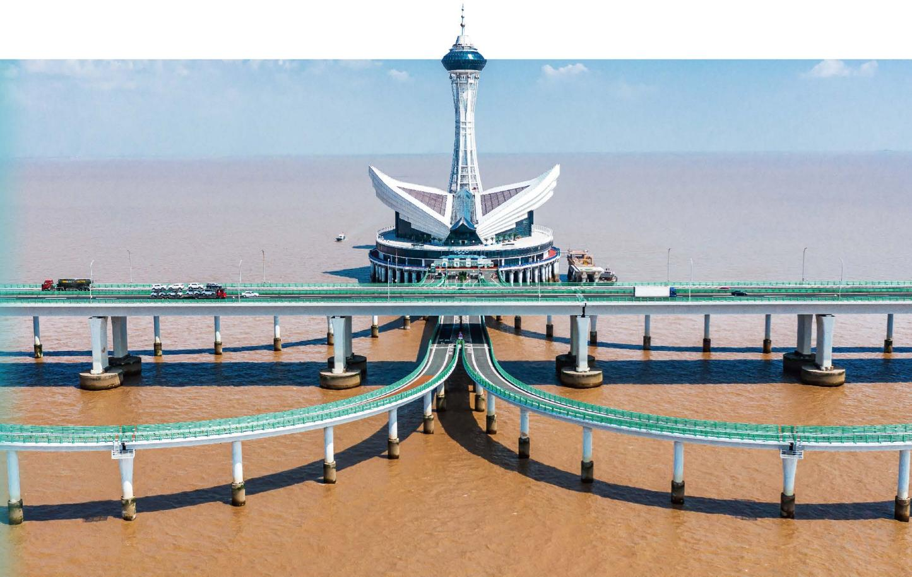

<details>
<summary>natural_image</summary>

Aerial view of a modern cable-stayed bridge with a distinctive tower and curved green walkways, spanning a wide muddy river under a clear sky.
</details>

# 义务教育教科书

# 数学

# 七年级 | 下册

顾问：汤涛

主 编: 马 复

副主编：章飞

本册主编：王永会

编写人员：（按姓氏笔画为序排列）

王建波 王瑞霖 冯长征

张新华 章飞

# 致同学

亲爱的同学，很高兴又与你相会在数学的世界。

打开这本教科书，你会结识许许多多新的数学知识。

平行线、三角形在生活中随处可见，它们不仅简洁、实用，还蕴含着不少秘密。

生活中有许多物体的形状是对称的：建筑物、车轮、街道、生活用品、传统剪纸……这些形状有什么特征？为什么常常被人们所偏爱？

生活中有许多现象（如下雨）在实际发生之前是无法确定的，但发生的可能性大小却是可以预先知道的。想不想学会一种“预判”的方法，在面对这些不确定现象时能够有把握地预知它们实际发生的可能性大小？

世界万物往往在不断地变化着，如人的身高和体重、环境的温度、车辆行驶的路程……在一个变化过程中，变量之间有什么关系？变化的结果能够预测吗？

尝试一下“设计自己的运算程序”“制作万花筒”等活动，你会发现，学数学有时也像做游戏一样有趣，一样让人着迷！

在之前的数学学习过程中，相信你已经体会到有效的学习方式对于学好数学有很大的作用。继续沿用之前的学习方式吧：“观察·思考”“尝试·思考”“操作·交流”“思考·交流”“回顾·反思”……

相信你在未来的数学学习过程中一定会经历更多的成功!

# 目录

# 第一章 整式的乘除

1 幂的乘除 /2   
2 整式的乘法 / 12  
3 乘法公式 /18  
4 整式的除法 / 26

回顾与思考 /29

复习题 / 29


<details>
<summary>natural_image</summary>

Solar panel farm with wind turbines in the background under a blue sky with wispy clouds (no text or symbols visible)
</details>

# 第二章 相交线与平行线

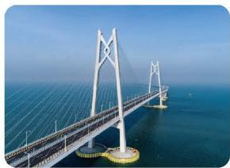

<details>
<summary>natural_image</summary>

Aerial view of a modern cable-stayed bridge spanning a wide body of water under clear blue sky (no visible text or symbols)
</details>

1 两条直线的位置关系 /34  
2 探索直线平行的条件 /41  
3 平行线的性质 / 49

回顾与思考 /55

复习题 /55

# 第三章 概率初步

1 感受可能性 / 60  
2 频率的稳定性 / 64  
3 等可能事件的概率 / 72

回顾与思考 /80

复习题 /80


<details>
<summary>natural_image</summary>

Scenic mountain landscape with lush green forest reflected in calm water under cloudy skies (no text or symbols)
</details>

# 第四章 三角形

1 认识三角形 / 85  
2 全等三角形 / 95  
3 探索三角形全等的条件 / 98  
4 利用三角形全等测距离 / 110

☆ 问题解决策略：特殊化 / 113

回顾与思考 /116

复习题 /116


<details>
<summary>natural_image</summary>

Abstract geometric pattern with interconnected triangles and a circular void (no text or symbols)
</details>

# 第五章 图形的轴对称

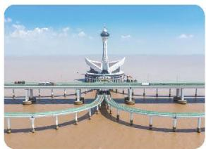

<details>
<summary>natural_image</summary>

Exterior view of a modern architectural structure with a distinctive tower and arched bridge, surrounded by sandy water under a clear blue sky (no signage or text visible)
</details>

1 轴对称及其性质 / 121   
2 简单的轴对称图形 / 127

☆ 问题解决策略：转化 / 136

回顾与思考 / 139

复习题 / 139

# 第六章 变量之间的关系

1 现实中的变量 / 145  
2 用表格表示变量之间的关系 / 149  
3 用关系式表示变量之间的关系 / 153  
4 用图象表示变量之间的关系 / 156

回顾与思考 / 164

复习题 / 164

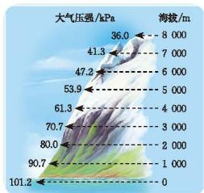

<details>
<summary>line</summary>

| 大气压强 (kPa) | 海拔 (m) |
| :--- | :--- |
| 36.0 | 8000 |
| 41.3 | 7000 |
| 47.2 | 6000 |
| 53.9 | 5000 |
| 61.3 | 4000 |
| 70.7 | 3000 |
| 80.0 | 2000 |
| 90.7 | 1000 |
| 101.2 | 0 |
</details>

# 综合与实践
设计自己的运算程序 / 170

制作万花筒 / 171

# 学习印记

# 第一章 整式的乘除

光在真空中的传播速度大约是 $3 \times 10^{8} \mathrm{~m} / \mathrm{s}$ , 比邻星发出的光到达地球大约需要 4.22 年, 它距离地球有多远? 十位数字相同、个位数字之和等于 10 的两个两位数相乘时, 可以把十位数乘比它大 1 的数作为积的前两位, 把个位数的乘积作为积的后两位。例如, $79 \times 71 = 5609$ 。你能解释其中的道理吗?

本章将在整式加减运算的基础上，继续研究整式的乘除运算，并利用整式的运算解决一些实际问题。你将经历由特殊到一般的推理过程，理解运算法则及其道理，提高运算能力，建立形与数的联系，感悟几何直观的作用，逐步养成重论据、合乎逻辑的思维习惯。
$(a + b) ^ {2} = a ^ {2} + 2 a b + b ^ {2} \quad (a + b) (a - b) = a ^ {2} - b ^ {2}$

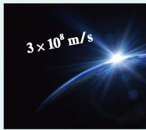

<details>
<summary>text_image</summary>

3 × 10⁸ m/s
</details>

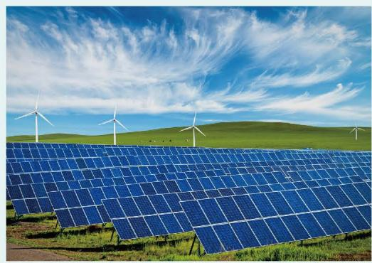

<details>
<summary>natural_image</summary>

Solar panel farm with wind turbines in the background under a blue sky with wispy clouds (no text or symbols visible)
</details>

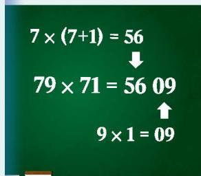

<details>
<summary>text_image</summary>

7 × (7+1) = 56
↓
79 × 71 = 56 09
↑
9 × 1 = 09
</details>

# 在本章学习过程中，你可以持续思考以下问题：


本章是按照怎样的顺序研究整式乘除的？  
总结乘法公式有什么意义？这些公式是如何得到的？它们与整式运算的法则有怎样的关系？


# 幂的乘除

光在真空中的传播速度约为 $3 \times 10^{8} \mathrm{~m} / \mathrm{s}$ 。太阳系以外距离地球最近的恒星是比邻星, 它发出的光到达地球大约需要 4.22 年。

一年以 $3 \times 10^{7} \mathrm{~s}$ 计算, 比邻星与地球之间的距离大约是多少米?

小颖认为，比邻星与地球之间的距离大约是
$3 \times 1 0 ^ {8} \times 3 \times 1 0 ^ {7} \times 4. 2 2 = 3 7. 9 8 \times (1 0 ^ {8} \times 1 0 ^ {7}) (\mathrm{m}) _ {\circ}$

可是 $10^{8} \times 10^{7}$ 等于多少呢？

# 尝试·思考

1. 计算下列各式:
(1) $10^{2}\times10^{3}$ ; (2) $10^{5}\times10^{8}$ ;   
(3) $10^{m}\times10^{n}$ (m, n都是正整数)。

你发现了什么？

2. $2^{m} \times 2^{n}$ 等于什么? $\left(\frac{1}{7}\right)^{m} \times \left(\frac{1}{7}\right)^{n}$ 和 $(-3)^{m} \times (-3)^{n}$ 呢? (m, n 都是正整数)

# 尝试·交流
如果 m, n 都是正整数，那么 $a^{m} \cdot a^{n}$ 等于什么？为什么？与同伴进行交流。
$a ^ {m} \cdot a ^ {n} = \underbrace {(a \cdot a \cdot \cdots \cdot a)} _ {m {\text {个}}   a} \cdot \underbrace {(a \cdot a \cdot \cdots \cdot a)} _ {n {\text {个}}   a} = \underbrace {a \cdot a \cdot \cdots \cdot a} _ {(m + n) {\text {个}}   a} = a ^ {m + n},$
即
$a^{m} \cdot a^{n} = a^{m+n} (m, n \text{都是正整数} ^{①})$ 。

同底数幂相乘，底数\_\_\_\_，指数\_\_\_\_。

# 例1 计算：
(1) $(-3)^{7} \times (-3)^{6}$ ;
(2) $(\frac{1}{111})^3 \times \frac{1}{111}$ ;
(3) $-x^{3}\cdot x^{5};$
(4) $b^{2m}\cdot b^{2m+1}$
解：(1) $(-3)^{7}\times(-3)^{6}=(-3)^{7+6}=(-3)^{13}$ ;
(2) $(\frac{1}{111})^3 \times \frac{1}{111} = (\frac{1}{111})^{3+1} = (\frac{1}{111})^4$ ;   
(3) $-x^{3} \cdot x^{5} = -x^{3+5} = -x^{8}$ ;   
(4) $b^{2m}\cdot b^{2m+1}=b^{2m+2m+1}=b^{4m+1}$

> [!think] 思考·交流
$a^{m} \cdot a^{n} \cdot a^{p}$ 等于什么？为什么？与同伴进行交流。

> [!example]- 例2 光在真空中的传播速度约为 $3 \times 10^{8} \mathrm{~m} / \mathrm{s}$ , 太阳光照射到地球上大约需要 $5 \times 10^{2} \mathrm{~s}$ 。地球距离太阳大约有多少米?
解： $3 \times 10^{8} \times 5 \times 10^{2} = 15 \times 10^{10} = 1.5 \times 10^{11} \, (\text{m})$ 。
因此，地球距离太阳大约有 $1.5 \times 10^{11} \mathrm{~m}$ 。

# 随堂练习

1. 计算:
(1) $5^{2} \times 5^{7}$ ;
(2) $7 \times 7^{3} \times 7^{2}$ ;
(3) $-x^{2} \cdot x^{3}$ ;
(4) $(-c)^{3} \cdot (-c)^{m}$ 。

2. 2017年6月, 我国自主研发的“神威·太湖之光”超级计算机以 $1.25 \times 10^{17}$ 次/s的峰值计算能力和 $9.3 \times 10^{16}$ 次/s的持续计算能力, 第三次名列世界超级计算机排名榜单TOP500第一名。该超级计算机按持续计算能力运算 $2 \times 10^{2} \mathrm{~s}$ 可做多少次运算?

3. 解决本课提出的比邻星与地球之间的距离问题。

如图 1-1, 地球、木星、太阳可以近似地看成球体。木星、太阳的半径分别约为地球的 10 倍和 $10^{2}$ 倍, 它们的体积分别约为地球的多少倍?

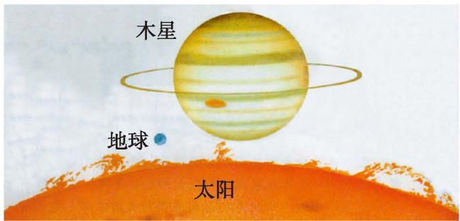

<details>
<summary>text_image</summary>

木星
地球
太阳
</details>

图1-1

球的体积公式是 $V = \frac{4}{3}\pi r^3$ ，其中 $V$ 是球的体积， $r$ 是球的半径。

木星的半径约为地球的 10 倍，它的体积约为地球的 $10^{3}$ 倍。

太阳的半径约为地球的 $10^{2}$ 倍，它的体积约为地球的 $(10^{2})^{3}$ 倍。那么，你知道 $(10^{2})^{3}$ 等于多少吗？

# 尝试·思考

1. 计算下列各式，并说明理由。
(1) $(6^{2})^{4}$ ;
(2) $(a^2)^3$ ;
(3) $(a^{m})^{2}$ 。

2. 如果 m, n 都是正整数, 那么 $(d^{m})^{n}$ 等于什么? 为什么?
$(a ^ {m}) ^ {n} = \overbrace {a ^ {m} \cdot a ^ {m} \cdot \cdots \cdot a ^ {m}} ^ {n \text {个} a ^ {m}} = \overbrace {a ^ {m + m + \cdots + m}} ^ {n \text {个} m} = a ^ {m n},$
即
$(a ^ {m}) ^ {n} = a ^ {m n} (m, n \text {   都是正整数   }) _ {\circ}$

幂的乘方，底数\_\_\_\_，指数\_\_\_\_。

# 例3 计算:
(1) $(10^{2})^{3}$ ;
(2) $(b^{5})^{5}$ ;
(3) $(a^n)^3$ ;
(4) $-\left(x^{2}\right)^{m};$
(5) $(y^{2})^{3}\cdot y;$
(6) $2(a^{2})^{6} - (a^{3})^{4}$
解：(1) $(10^{2})^{3} = 10^{2\times 3} = 10^{6}$
(2) $(b^{5})^{5} = b^{5\times 5} = b^{25}$ ;
(3) $(a^n)^3 = a^{n \cdot 3} = a^{3n}$ ;
(4) $-(x^{2})^{m} = -x^{2\cdot m} = -x^{2m}$ ;
(5) $(y^{2})^{3} \cdot y = y^{2 \times 3} \cdot y = y^{6} \cdot y = y^{7}$ ;
(6) $2(a^{2})^{6} - (a^{3})^{4} = 2a^{2\times 6} - a^{3\times 4} = 2a^{12} - a^{12} = a^{12}$

# 随堂练习

1. 计算:
(1) $(10^{3})^{3}$ ;
(2) $-\left(a^{2}\right)^{5};$
(3) $(x^{3})^{4} \cdot x^{2}$ 。

2. 已知 $x^{n} = 2$ ，求 $x^{2n}$ 的值。

地球可以近似地看成球体，地球的半径约为 $6 \times 10^{3} \mathrm{~km}$ ，它的体积大约是多少立方千米？

根据球的体积公式，地球的体积
$V = \frac {4}{3} \pi r ^ {3} = \frac {4}{3} \pi \times (6 \times 1 0 ^ {3}) ^ {3} (\mathrm{km} ^ {3}) _ {\circ}$

那么， $(6\times10^{3})^{3}$ 等于多少呢？

# 尝试·思考

1. 完成下列各式，并说明理由。
(1) $(3 \times 5)^{4} = 3^{()} \times 5^{()}$ ;
(2) $(3\times 5)^{m} = 3^{()}\times 5^{()}$

2. 如果 n 是正整数，那么 $(ab)^{n}$ 等于什么？为什么？
$\begin{array}{l} (a b) ^ {n} = \underbrace {(a b) \cdot (a b) \cdot \cdots \cdot (a b)} _ {n \text {个} a b} \\ = (\underbrace {a \cdot a \cdot \cdots \cdot a} _ {n {\text {个}}   a}) \cdot (\underbrace {b \cdot b \cdot \cdots \cdot b} _ {n {\text {个}}   b}) \\ = a ^ {n} b ^ {n}, \\ \end{array}$

你能说明理由吗？
即
$(ab)^{n} = a^{n}b^{n}(n$ 是正整数）。积的乘方等于

# 例4 计算:
(1) $(3x)^{2}$ ;
(2) $(-2b)^{5}$ ;
(3) $(-2xy)^{4}$ ;
(4) $(3a^{2})^{n}$ 。
解：(1) $(3x)^{2}=3^{2}x^{2}=9x^{2}$ ;
(2) $(-2b)^{5} = (-2)^{5}b^{5} = -32b^{5}$ ;
(3) $(-2xy)^{4} = (-2)^{4}x^{4}y^{4} = 16x^{4}y^{4};$
(4) $(3a^{2})^{n} = 3^{n}(a^{2})^{n} = 3^{n}a^{2n}$ 。

# 回顾·反思

回顾同底数幂的乘法、幂的乘方与积的乘方的学习，你经历了怎样的探究过程？这些运算与数的运算有什么联系？你还想探究幂的什么运算？

# 随堂练习

1. 计算：
(1) $(-3n)^{3}$ ;
(2) $(5xy)^{3}$ ;
(3) $-a^3 + (-4a)^2 a$

2. 解决本课提出的地球的体积问题 ( $\pi$ 取 3.14)。

一种液体每升含有 $10^{12}$ 个有害细菌。为了试验某种灭菌剂的效果, 科学家进行了实验, 发现 1 滴灭菌剂可以杀死 $10^{9}$ 个有害细菌。要将 $1 \mathrm{~L}$ 液体中的有害细菌全部杀死, 需要这种灭菌剂多少滴? 你是怎样计算的?

# 尝试·思考

1. 计算下列各式，并说明理由 $(m, n$ 都是正整数，且 $m > n)$ 。
(1) $10^{12} \div 10^{9}$ ;
(2) $10^{m} \div 10^{n}$ ;
(3) $(-3)^{m}\div(-3)^{n}$ 。

2. 如果 $m, n$ 都是正整数，且 $m > n$ ，那么 $a^m \div a^n$ 等于什么？你是怎么得到的？
$a^{m}\div a^{n}=a^{m-n}(a\neq0^{\textcircled{1}},m,n$ 都是正整数，且 $m>n)$ 。

同底数幂相除，底数\_\_\_\_，指数\_\_\_\_。

# 例5 计算：
(1) $a^{7} \div a^{4};$
(2) $(-x)^{6} \div (-x)^{3}$ ;
(3) $(xy)^{4} \div (xy)$ ;
(4) $b^{2m+2}\div b^{2}$
	解：（1） $a^7\div a^4 = a^{7 - 4} = a^3;$
(2) $(-x)^{6} \div (-x)^{3} = (-x)^{6 - 3} = (-x)^{3} = -x^{3}$ ;
(3) $(xy)^{4} \div (xy) = (xy)^{4 - 1} = (xy)^{3} = x^{3}y^{3}$ ;
(4) $b^{2m+2}\div b^{2}=b^{2m+2-2}=b^{2m}$

> [!think] 思考·交流
(1) 计算: $2^{3} \div 2^{3}, 2^{3} \div 2^{5}, a^{3} \div a^{3}, a^{3} \div a^{5}$ 。
(2) 要使得当 $m = n$ 或 $m < n$ 时, $a^m \div a^n = a^{m - n}$ ( $a \neq 0$ , $m$ , $n$ 都是正整数) 仍然成立, (1) 中各式的结果用幂的形式又该如何表示?
(3) 比较 (1)(2) 各式的对应结果, 你有什么发现? 与同伴进行交流。

我们规定：
$a ^ {0} = 1 (a \neq 0), \quad a ^ {- p} = \frac {1}{a ^ {p}} (a \neq 0, p \text {是正整数}) _ {\circ}$

有了这个规定后，已学过的同底数幂的乘法和除法运算性质中的 $m, n$ 就从正整数扩大到全体整数了，即
$a ^ {m} \cdot a ^ {n} = a ^ {m + n}, a ^ {m} \div a ^ {n} = a ^ {m - n} (a \neq 0, m, n \text {都是整数}) 。$

> [!example]- 例6 用小数或分数表示下列各数：
(1) $10^{-3}$ ;
(2) $7^{0}\times8^{-2}$ ;
(3) $1.6 \times 10^{-4}$ 。
解：（1） $10^{-3}=\frac{1}{10^{3}}=\frac{1}{1000}=0.001$ ；（2） $7^{0}\times8^{-2}=1\times\frac{1}{8^{2}}=\frac{1}{64}$ ;
(3) $1.6 \times 10^{-4} = 1.6 \times \frac{1}{10^4} = 1.6 \times 0.0001 = 0.00016$ 。

# 尝试·思考

有的细胞直径只有 1 微米（μm），即 0.000001 m；
某种计算机完成一次基本运算的时间约为1纳秒（ns），即0.000000001s；
一个氧原子的质量为 0.000 000 000 000 000 000 000 000 026 57 kg。

你能用负指数表示这些数吗？

用科学记数法可以很方便地表示一些绝对值较大的数，同样，用科学记数法也可以很方便地表示一些绝对值较小的数。例如，
$0. 0 0 0 0 0 1 = \frac {1}{1 0 ^ {6}} = 1 \times 1 0 ^ {- 6},$
$0. 0 0 0 0 0 0 0 0 1 = \frac {1}{1 0 ^ {9}} = 1 \times 1 0 ^ {- 9},$
$0. 0 0 0 0 0 0 0 0 0 0 0 0 0 0 0 0 0 0 0 0 0 0 0 0 0 2 6 5 7 = 2. 6 5 7 \times \frac {1}{1 0 ^ {2 6}} = 2. 6 5 7 \times 1 0 ^ {- 2 6} 。$

一般地，

一个小于1的正数可以表示为 $a \times 10^{n}$ 的形式，其中 $1 \leqslant a < 10$ ， $n$ 是负整数。

大于 -1 的负数也可以用类似的方法表示，如 -0.000 002 56 可以表示成 $-2.56 \times 10^{-6}$ 。

# 随堂练习

1. 计算：
(1) $x^{12}\div x^{4};$
(2) $(-y)^{3} \div (-y)^{2}$ ;
(3) $-(k^6 \div k^6)$ ;
(4) $(-r)^{5}\div r^{4};$
(5) $m \div m^{0}$ ;
(6) $(mn)^{5} \div (mn)$ 。

2. 1 个电子的质量约为 0.000 000 000 000 000 000 000 000 000 000 911 kg,请用科学记数法表示这个数。

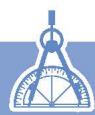

## 习题1.1


# 知识技能

1. 计算:
(1) $c \cdot c^{11}$ ;
(2) $10^{4}\times10^{2}\times10;$
(3) $(-b)^{3}\cdot(-b)^{2};$
(4) $-b^{3}\cdot b^{2};$
(5) $x^{m-1} \cdot x^{m+1} (m > 1);$
(6) $a \cdot a^{3} \cdot a^{n}$

2. 已知 $a^{m}=2,\quad a^{n}=8$ ，求 $a^{m+n}$ 。

3. 计算：
(1) $\left[\left(\frac{1}{3}\right)^3\right]^2;$
(2) $-(\boldsymbol{b}^{5})^{2};$
(3) $(y^{2})^{2n}$ ;
(4) $(x^{3})^{3n}$

4. 计算：
(1) $-p \cdot (-p)^4$ ;
(2) $(a^2)^3 \cdot (a^3)^2$ ;
(3) $(t^{m})^{2} \cdot t$ ;
(4) $(x^{4})^{6} - (x^{3})^{8}$

5. 计算:
(1) $(3b)^{2}$ ;
(2) $-(ab)^{2}$ ;
(3) $(-4a^{2})^{3}$ ;
(4) $(y^{2}z^{3})^{3}$ 。

6. 计算:
(1) $(xy^{4})^{m};$
(2) $-\left(p^{2}q\right)^{n};$
(3) $(xy^{3n})^2 + (xy^6)^n$ ;
(4) $(-3x^{3})^{2}-[(2x)^{2}]^{3}$ 。

7. 计算：
(1) $2^{13} \div 2^{7}$ ;
(2) $(- \frac{3}{2})^{6} \div (- \frac{3}{2})^{2};$
(3) $a^{11}\div a^{5};$
(4) $(-x)^{7}\div(-x);$
(5) $a^{-4} \div a^{-6};$
(6) $6^{2m+1} \div 6^{m};$
(7) $5^{n+1} \div 5^{3n+1}$ ;
(8) $9^{n} \div 9^{n+2}$ 。

8. 计算:
(1) $\left(\frac{1}{2}\right)^{0}$ ;
(2) $3^{-3}$ ;
(3) $5^{-2}$ ;
(4) $1.3 \times 10^{-5}$ ;
(5) $7^{-3} \div 7^{-5}$ ;
(6) $3^{-1} \div 3^{6}$ ;
(7) $(\frac{1}{2})^{-5} \div (\frac{1}{2})^2$ ;
(8) $(-8)^{0} \div (-8)^{-2}$ 。

9. 用科学记数法表示下列各数：
(1) 0.007398;
(2) 0.000 0226;
(3) 0.000 000 000 054 2;
(4) 0.000000000000000000001994。


# 数学理解

10. 下面的计算是否正确？如有错误请改正。
(1) $a^{3}\cdot a^{2}=a^{6};$
(2) $b^{4}\cdot b^{4}=2b^{4};$
(3) $x^{5}+x^{5}=x^{10};$
(4) $y^{7} \cdot y = y^{8};$
(5) $(x^{3})^{3} = x^{6}$ ;
(6) $a^{6}\cdot a^{4}=a^{24};$
(7) $(ab^{4})^{4} = ab^{8}$ ;
(8) $(-3pq)^{2} = -6p^{2}q^{2}$ 。

11. 请你用几何图形直观地解释 $(3b)^{2}=9b^{2}$ 。

12. 下面的计算是否正确？如有错误请改正。
(1) $a^{6}\div a=a^{6};$
(2) $b^{6}\div b^{3}=b^{2};$
(3) $a^{10}\div a^{9}=a;$
(4) $(-bc)^{4} \div (-bc)^{2} = -b^{2}c^{2}$ 。


# 问题解决

13. 在我国，平均每平方千米的陆地一年从太阳得到的能量，相当于燃烧 $1.3 \times 10^{8}$ kg 的煤所产生的能量。我国约 960 万 km² 的陆地，一年从太阳得到的能量相当于燃烧多少千克的煤所产生的能量（结果用科学记数法表示）？

14. 某种细菌每分钟由 1 个分裂成 2 个。
(1) 经过 5 min, 1 个细菌分裂成多少个? 这些细菌再继续分裂 t min, 共分裂成多少个?
(2) 你还能提出什么问题?

15. 把一张正方形纸片对折、再对折（两条折痕垂直），将此视为 1 次操作。1 次操作后这张正方形纸片变为 $2^{2}$ 层，那么 $m$ 次操作后，这张正方形纸片变为多少层？  
16. 请根据本节的数据计算出太阳的体积大约是多少（π取3.14）。  
17. 某种细胞分裂时，1个细胞分裂1次变为2个，分裂2次变为4个，分裂3次变为8个……你能由此说明 $2^{0}=1$ 的合理性吗？  
18. 海豚能听到声音的最高频率是 $1.5 \times 10^{5} \mathrm{~Hz}$ , 人类能听到声音的最高频率是 $2 \times 10^{4} \mathrm{~Hz}$ , 海豚能听到声音的最高频率是人类能听到的多少倍?  
19. 芯片是指封装好的、包含完整电路的半导体微小基片（通常是硅片），广泛应用于电子设备。近几年我国一直在芯片的工艺上进行技术攻坚，其中某芯片内核面积仅有 $74.13 \mathrm{~mm}^{2}$ ，集成了约69亿个晶体管，平均每个晶体管占有面积约为多少平方毫米（结果用科学记数法表示，保留两位小数）？  
20. 地球表面平均 $1 \mathrm{~cm}^{2}$ 上的空气质量约为 $1 \mathrm{~kg}$ , 地球表面的面积大约是 $5 \times 10^{8} \mathrm{~km}^{2}$ , 地球表面全部空气的质量约为多少千克? 已知地球的质量约为 $6 \times 10^{24} \mathrm{~kg}$ , 它的质量大约是地球表面全部空气质量的多少倍?

# > 联系拓广

21. 不使用计算器，如何快速求出下列各式的结果？
$2 ^ {2} \times 3 \times 5 ^ {2}, 2 ^ {4} \times 3 ^ {2} \times 5 ^ {3}, 0. 1 2 5 ^ {1 0 0} \times 8 ^ {1 0 0} 。$

22. $(abc)^{n}$ 等于什么？


# 整式的乘法

一个长方形操场被划分成四个不同的小长方形活动区域，各边的长度如图 1-2 所示。如何计算整个操场的面积？你是怎样想的？与同伴进行交流。

# 尝试·思考

小明认为可以先分别计算四个小活动区域的面积，再求整个操场的面积。你能求出 A，B，C，D 四个区域的面积吗？请解释你的运算过程。

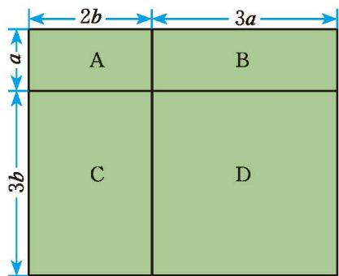

<details>
<summary>text_image</summary>

2b
3a
a
A
B
C
D
3b
</details>

图 1-2

# 操作·交流
(1) 你能计算 $abc \cdot b^{2}c$ , $3x^{2}y \cdot 2xy^{3}$ , $5a^{2}b^{2} \cdot (-2ab)$ 吗?  
(2) 一般地, 如何进行单项式乘单项式的运算? 与同伴进行交流。

单项式与单项式相乘，把它们的系数、相同字母的幂分别相乘，其余字母连同它的指数不变，作为积的因式。

# 例1 计算:
(1) $2xy^{2}\cdot\frac{1}{3}xy;$   
(2) $-2a^{2}b^{3}\cdot (-3a)$ ;   
(3) $7xy^{2}z \cdot (2xyz)^{2}$ ;   
(4) $(-3ab)\cdot \frac{1}{3} a^2 c\cdot (-2abc^3)$ 。
解：(1) $2xy^{2}\cdot\frac{1}{3}xy=\left(2\times\frac{1}{3}\right)\cdot(xx)\cdot(y^{2}y)=\frac{2}{3}x^{2}y^{3}$ ;
(2) $-2a^{2}b^{3}\cdot (-3a) = [(-2)\times (-3)]\cdot (a^{2}a)\cdot b^{3} = 6a^{3}b^{3};$
(3) $7xy^{2}z\cdot (2xyz)^{2} = 7xy^{2}z\cdot 4x^{2}y^{2}z^{2}$
$= (7 \times 4) \cdot \left(x x ^ {2}\right) \cdot \left(y ^ {2} y ^ {2}\right) \cdot \left(z z ^ {2}\right) = 2 8 x ^ {3} y ^ {4} z ^ {3};$
$\begin{array}{l} (- 3 a b) \cdot \frac {1}{3} a ^ {2} c \cdot (- 2 a b c ^ {3}) \tag {4} \\ = [ (- 3) \times \frac {1}{3} \times (- 2) ] \cdot (a a ^ {2} a) \cdot (b b) \cdot (c c ^ {3}) = 2 a ^ {4} b ^ {2} c ^ {4} 。 \\ \end{array}$

> [!observe] 观察·思考

如图 1-3, 一幅边长为 $a \mathrm{~m}$ 的正方形风景画, 上下各留有 $\frac{1}{4} a \mathrm{~m}$ 的空白区域作装饰, 中间画面的面积是多少平方米?

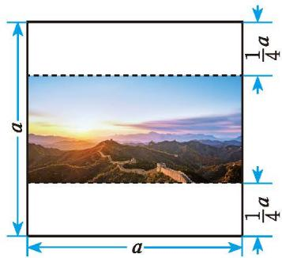

<details>
<summary>text_image</summary>

a
a
a
d a
d a
d a
</details>

图 1-3

# 随堂练习

1. 计算：
(1) $5x^{3} \cdot 2x^{2}y$ ;
(2) $-3ab \cdot (-4b^{2})$ ;
(3) $3ab \cdot 2a;$
(4) $yz \cdot 2y^{2}z^{2}$ ;
(5) $(2x^{2}y)^{3} \cdot (-4xy^{2})$ ;
(6) $\frac{1}{3} a^3 b \cdot 6a^5 b^2 c \cdot (-ac^2)^2$ 。
(1) 如图 1-4, 在计算操场面积的问题中, 如何计算 A 和 B 组成的长方形区域的面积? 你是怎么计算的?

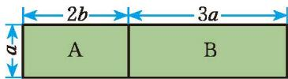

<details>
<summary>text_image</summary>

2b
3a
A
B
</details>

图1-4
(2) 小明认为, 这个长方形的面积既可以表示为 $a (2b + 3a)$ , 也可以表示为 $2ab + 3a^2$ , 于是 $a (2b + 3a) = 2ab + 3a^2$ 。你能用运算律解释吗?

# 操作·交流
(1) 你能计算 $ab \cdot (abc + 2x)$ , $c^2 \cdot (m + n - p)$ , $(x^2y + xy^2) \cdot (-xy)$ 吗?
(2) 一般地, 如何进行单项式乘多项式的运算? 与同伴进行交流。

单项式与多项式相乘，就是根据分配律用单项式乘多项式的每一项，再把所得的积相加。

# 例2 计算:
(1) $2ab(5ab^{2} + 3a^{2}b)$ ;
(2) $\left(\frac{2}{3} ab^2 - 2ab\right) \cdot \frac{1}{2} ab$ ;
(3) $5m^{2}n(2n + 3m - n^{2})$ ;
(4) $2(x + y^{2}z + xy^{2}z^{3})\cdot xyz$
解：(1) $2ab(5ab^{2} + 3a^{2}b)$
$= 2 a b \cdot 5 a b ^ {2} + 2 a b \cdot 3 a ^ {2} b = 1 0 a ^ {2} b ^ {3} + 6 a ^ {3} b ^ {2};$
(2) $\left(\frac{2}{3}ab^{2}-2ab\right)\cdot\frac{1}{2}ab$
$= \frac {2}{3} a b ^ {2} \cdot \frac {1}{2} a b + (- 2 a b) \cdot \frac {1}{2} a b = \frac {1}{3} a ^ {2} b ^ {3} - a ^ {2} b ^ {2};$
(3) $5m^{2}n(2n + 3m - n^{2})$
$= 5 m ^ {2} n \cdot 2 n + 5 m ^ {2} n \cdot 3 m + 5 m ^ {2} n \cdot (- n ^ {2})$
$= 1 0 m ^ {2} n ^ {2} + 1 5 m ^ {3} n - 5 m ^ {2} n ^ {3};$
(4) $2(x+y^{2}z+xy^{2}z^{3})\cdot xyz$
$\begin{array}{l} = (2 x + 2 y ^ {2} z + 2 x y ^ {2} z ^ {3}) \cdot x y z \\ = 2 x \cdot x y z + 2 y ^ {2} z \cdot x y z + 2 x y ^ {2} z ^ {3} \cdot x y z \\ = 2 x ^ {2} y z + 2 x y ^ {3} z ^ {2} + 2 x ^ {2} y ^ {3} z ^ {4} 。 \\ \end{array}$

# 尝试·交流
(1) 如何计算 $(2a + b)(a + 2b), (x + y)(x - 1), (a^2 - b^2)(a - b)$ ? 你是怎么做的?
(2) 一般地, 如何进行多项式乘多项式的运算? 与同伴进行交流。

多项式与多项式相乘，先用一个多项式的每一项乘另一个多项式的每一项，再把所得的积相加。

# 例3 计算:
(1) $(1 - x)(0.6 - x)$ ;
(2) $(2x + y)(x - y)$ 。
解：(1) $(1-x)(0.6-x)$
(2) $(2x + y)(x - y)$
$= 1 \times 0. 6 - 1 \cdot x - x \cdot 0. 6 + x \cdot x$
$= 2 x \cdot x - 2 x \cdot y + y \cdot x - y \cdot y$
$= 0. 6 - x - 0. 6 x + x ^ {2}$
$= 2 x ^ {2} - 2 x y + x y - y ^ {2}$
$= 0. 6 - 1. 6 x + x ^ {2};$
$= 2 x ^ {2} - x y - y ^ {2} 。$

> [!observe] 观察·思考
(1) 如图 1-5, 一幅边长为 $a \mathrm{~m}$ 的正方形风景画, 左右各留有宽为 $\frac{1}{6} x \mathrm{~m}$ 的长方形空白区域作装饰, 中间画面的面积是多少平方米?

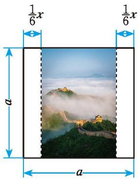

<details>
<summary>text_image</summary>

1/6 x
1/6 x
a
a
</details>

图1-5

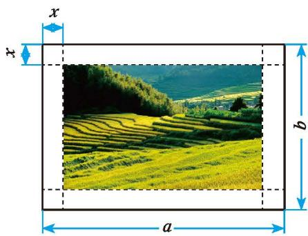

<details>
<summary>text_image</summary>

x
x
b
a
</details>

图1-6
(2)如图1-6,一幅长为 $a \mathrm{~m}$ 、宽为 $b \mathrm{~m}$ 的长方形风景画,画面的四周留有空白区域作装饰,其中四角均是边长为 $x \mathrm{~m}$ 的正方形,正中间画面的面积是多少平方米?

# 随堂练习

1. 计算：
(1) $a(a^{2}m + n)$ ;
(2) $b^{2}(b+3a-a^{2})$ ;
(3) $x^{3}y\left(\frac{1}{2} xy^{3} - 1\right);$
(4) $4(e+f^{2}d)\cdot ef^{2}d$ 。

2. 计算：
(1) $(x + y)(a + 2b)$ ;
(2) $(2a + 3)\left(\frac{3}{2} b + 5\right)$ ;
(3) $(2x + 3)(-x - 1)$ 。

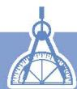

# 习题 1.2


# 知识技能

1. 计算:
(1) $4xy \cdot (-2xy^3)$ ;   
(3) $2x^{2}y\cdot(-xy)^{2};$   
(5) $-xy^{2}z^{3}\cdot (-x^{2}y)^{3};$
(2) $a^{3}b \cdot ab^{5}c;$   
(4) $\frac{2}{5} x^{2}y^{3} \cdot \frac{5}{8} xyz$ ;   
(6) $-ab^{3}\cdot2abc^{2}\cdot(a^{2}c)^{3}$

2. 计算：
(1) $5x(2x^{2}-3x+4)$ ;   
(3) $-2a^{2}\left(\frac{1}{2} ab + b^{2}\right)$ ;   
(5) $(-2m - 1)(3m - 2)$ ;
(2) $-6x(x - 3y)$ ;   
(4) $\left(\frac{2}{3} x^{2}y - 6xy\right) \cdot \frac{1}{2} xy^{2}$ ;   
(6) $(x-y)^{2}$ 。

3. 分别计算下面图中阴影部分的面积。

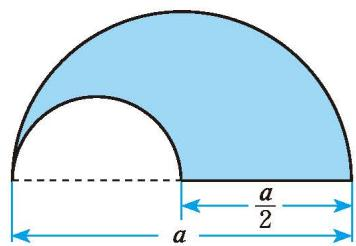

<details>
<summary>text_image</summary>

a
a/2
</details>
(1)

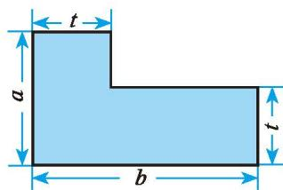

<details>
<summary>text_image</summary>

t
a
b
t
</details>
(2)   
(第3题)


# 数学理解

4. 请你用图形直观解释 $a(b - c) = ab - ac$ 。


# 问题解决

5. (1) 一套住房的部分结构如图所示 (单位: m), 这套房子的主人打算把卧室以外的部分都铺上地砖,至少需要多少平方米的地砖? 如果某种地砖的价格是 $a$ 元 $/ \mathrm{m}^{2}$ , 那么购买所需地砖至少需要多少元?

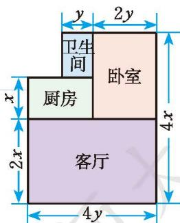

<details>
<summary>text_image</summary>

y
2y
卫生间
卧室
厨房
客厅
4x
2x
4y
</details>

(第5题)
(2) 已知 (1) 中房屋的高度为 $h \mathrm{~m}$ , 现需要在客厅和卧室的墙壁上贴壁纸, 那么至少需要多少平方米的壁纸? 如果某种壁纸的价格是 $b$ 元 $/ \mathrm{m}^{2}$ , 那么购买所需壁纸至少需要多少元 (计算时不扣除门、窗所占的面积)?

6. 下图是用棋子摆成的，按照这种摆法，第 $n$ 个图形中共有多少枚棋子？

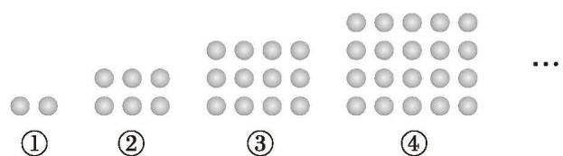

<details>
<summary>text_image</summary>

①
②
③
④
...
</details>

(第6题)

7. (1) 观察: $4 \times 6 = 24$ , $14 \times 16 = 224$ , $24 \times 26 = 624$ , $34 \times 36 = 1224$ , ……你发现其中的规律了吗? 如何用代数式表示这一规律?
(2) 利用 (1) 中的规律计算 $124 \times 126$ 。
(3) 你还能找到哪些类似的规律？试举两例。

# > 联系拓广

※8. 计算： $(a+b+c)(c+d+e)$ 。


# 乘法公式

计算下列各式:
(1) $(x + 2)(x - 2)$ ;
(2) $(1 + 3a)(1 - 3a)$ ;
(3) $(x+5y)(x-5y);$
(4) $(2y + z)(2y - z)$ 。

观察以上算式及其运算结果，你有什么发现？你能再举一些类似的例子吗？与同伴进行交流。

平方差公式 $(a + b)(a - b) = a^2 -b^2$ 。两数和与这两数差的积，等于它们的平方差。

> [!example]- 例1 利用平方差公式计算：
(1) $(5 + 6x)(5 - 6x)$ ;
(2) $(x - 2y)(x + 2y)$ ;
(3) $(-m + n)(-m - n)$ 。
解：(1) $(5+6x)(5-6x)=5^{2}-(6x)^{2}=25-36x^{2}$ ;
(2) $(x - 2y)(x + 2y) = x^{2} - (2y)^{2} = x^{2} - 4y^{2}$ ;
(3) $(-m + n)(-m - n) = (-m)^2 - n^2 = m^2 - n^2$ 。

> [!example]- 例2 利用平方差公式计算：
(1) $\left(-\frac{1}{4}x-y\right)\left(-\frac{1}{4}x+y\right);$
(2) $(ab + 8)(ab - 8)$ 。
解：(1) $\left(-\frac{1}{4}x-y\right)\left(-\frac{1}{4}x+y\right)=\left(-\frac{1}{4}x\right)^{2}-y^{2}=\frac{1}{16}x^{2}-y^{2};$
(2) $(ab + 8)(ab - 8) = (ab)^{2} - 8^{2} = a^{2}b^{2} - 64$ 。

# 尝试·思考

如何计算 $(a - b)(-a - b)$ ? 你是怎样做的?

# 随堂练习

#### 1. 计算：
(1) $(a + 2)(a - 2)$ ;
(2) $(3a + 2b)(3a - 2b)$ ;
(3) $(-x-1)(1-x);$
(4) $(-4k + 3)(-4k - 3)$ 。

如图 1-7，边长为 a 的大正方形中有一个边长为 b 的小正方形。
(1) 请表示图 1-7 中阴影部分的面积。
(2) 小颖将图 1-7 中的阴影部分拼成了如图 1-8 所示的长方形, 如何表示这个长方形的面积?

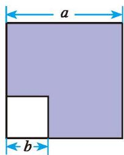

<details>
<summary>text_image</summary>

a
b
</details>

图 1-7

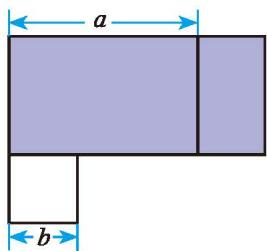

<details>
<summary>text_image</summary>

a
b
</details>

图1-8
(3) 比较 (1)(2) 的结果, 你能验证平方差公式吗?  
(4) 对于图 1-7 阴影部分的面积, 你还有其他计算方法吗?

# 例3 利用平方差公式计算：
(1) $103 \times 97$ ;
(2) $118 \times 122$ 。
解: (1) $103 \times 97$
(2) $118 \times 122$
$= (1 0 0 + 3) (1 0 0 - 3)$
$= (1 2 0 - 2) (1 2 0 + 2)$
$= 1 0 0 ^ {2} - 3 ^ {2}$
$= 1 2 0 ^ {2} - 2 ^ {2}$
$= 9 9 9 1;$
$= 1 4 3 9 6 。$

# 例4 计算:
(1) $a^2 (a + b)(a - b) + a^2 b^2;$
(2) $(2x - 5)(2x + 5) - 2x(2x - 3)$ 。
解：(1) $a^{2}(a+b)(a-b)+a^{2}b^{2}$
(2) $(2x - 5)(2x + 5) - 2x(2x - 3)$
$= a ^ {2} \left(a ^ {2} - b ^ {2}\right) + a ^ {2} b ^ {2}$
$= (2 x) ^ {2} - 5 ^ {2} - (4 x ^ {2} - 6 x)$
$= a ^ {4} - a ^ {2} b ^ {2} + a ^ {2} b ^ {2}$
$= 4 x ^ {2} - 2 5 - 4 x ^ {2} + 6 x$
$= a ^ {4};$
$= 6 x - 2 5 _ {\circ}$

> [!observe] 观察·思考
(1) 计算下列各组算式:
$7 \times 9 =$
$8 \times 8 =$
$1 1 \times 1 3 =$
$1 2 \times 1 2 =$
$7 9 \times 8 1 =$
$8 0 \times 8 0 =$
(2) 观察上述算式及其结果, 你发现了什么规律?
(3) 请用字母表示你发现的规律。

# 随堂练习

1. 计算:
(1) $704 \times 696$ ;
(2) $(x + 2y)(x - 2y) + (x + 1)(x - 1)$ ;
(3) $x(x - 1) - (x - \frac{1}{3})(x + \frac{1}{3})$ 。

计算下列各式:
(1) $(m + 3)^2$ ;
(2) $(2 + 3x)^{2}$ 。

观察以上算式及其运算结果，你有什么发现？你能再举一些类似的例子吗？与同伴进行交流。

用自己的语言叙述这一公式!
$(a + b) ^ {2} = a ^ {2} + 2 a b + b ^ {2} 。$

> [!think] 思考·交流
(1) 你能用图 1-9 解释上面的公式吗?
（2）如何计算 $(a-b)^{2}$ ？你是怎样做的？与同伴进行交流。

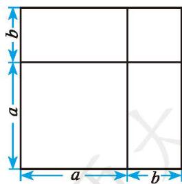

<details>
<summary>text_image</summary>

a
b
a
b
</details>

图1-9

用自己的语言叙述这一公式!
$(a - b) ^ {2} = a ^ {2} - 2 a b + b ^ {2} 。$

# 尝试·思考

请你设计一个图形解释这一公式。

以上两个公式称为完全平方公式。

平方差公式和完全平方公式都是重要的整式乘法公式。

> [!example]- 例5 利用完全平方公式计算：
(1) $(2x - 3)^{2}$ ;
(2) $(4x + 5y)^{2}$ ;
(3) $(mn - a)^2$ 。
解：(1) $(2x-3)^{2}=(2x)^{2}-2\cdot2x\cdot3+3^{2}=4x^{2}-12x+9;$
(2) $(4x + 5y)^{2} = (4x)^{2} + 2\cdot 4x\cdot 5y + (5y)^{2} = 16x^{2} + 40xy + 25y^{2};$
(3) $(mn - a)^2 = (mn)^2 - 2 \cdot mn \cdot a + a^2 = m^2 n^2 - 2 amn + a^2$ 。

# 回顾·反思

回顾借助几何图形解释或分析问题的过程，对于形与数的联系，你有哪些感悟？

# 随堂练习

1. 计算：
(1) $(\frac{1}{2} x + 2y)^2;$
(2) $(2xy - \frac{1}{5} x)^2$ ;
(3) $(-3m + n)^{2}$ 。

2. 已知 $a + b = -3$ ，求 $2a^{2} + 4ab + 2b^{2}$ 的值。

# 阅读·思考

# 杨辉三角

我们已经知道 $(a+b)^{2}$ 展开后等于 $a^{2}+2ab+b^{2}$ ，请你利用多项式乘法法则将 $(a+b)^{3}$ 展开。进一步，你能展开 $(a+b)^{4}$ ， $(a+b)^{5}$ 吗？你一定发现解决上述问题需要大量的计算，是否有简单的方法呢？我们不妨找找规律！
如果将 $(a + b)^n$ ( $n$ 为非负整数) 的每一项按字母 $a$ 的次数由大到小排列, 就可以得到下面的等式:
$(a+b)^{0}=1$ ，它只有一项，系数为1；
$(a+b)^{1}=a+b$ ，它有两项，系数分别是1, 1;
$(a+b)^{2}=a^{2}+2ab+b^{2}$ ，它有三项，系数分别是1，2，1；
$(a+b)^{3}=a^{3}+3a^{2}b+3ab^{2}+b^{3}$ ，它有四项，系数分别是1,3,3,1。
如果将上述每个式子的各项系数排成如图 1-10 所示的形式, 那么你能发现什么规律?

观察图 1-10 中的数，可以发现每一行的首末都是 1，并且下一行的数比上一行多 1 个，中间各数都写在上一行两数的中间，且等于它们的和。按照这个规律继续写下去，可以得到下面的数表：

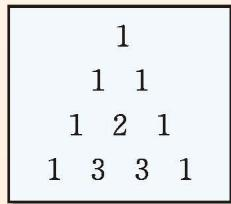

<details>
<summary>text_image</summary>

1
1 1
1 2 1
1 3 3 1
</details>

图1-10

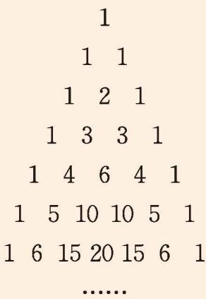

<details>
<summary>text_image</summary>

1
    1   1
    1   2   1
    1   3   3   1
    1   4   6   4   1
    1   5   10   10   5   1
1   6   15   20   15   6   1
......
</details>

你能根据这个数表得到 $(a + b)^4, (a + b)^5$ 的结果吗？利用多项式乘法法则验证你的结果是否正确。

上述数表在我国南宋数学家杨辉（13世纪）1261年的著作《详解九章算法》中提到过，而他是摘录自北宋时期数学家贾宪（约11世纪上半叶）著的《黄帝九章算经细草》中的“开方作法本源”图（如图1-11），因而人们把这个数表叫作杨辉三角或贾宪三角。在欧洲，这个数表叫作帕斯卡三角形。帕斯卡（Blaise Pascal，1623—1662）是1654年发现这一规律的，比杨辉要迟393年，比贾宪迟600多年。

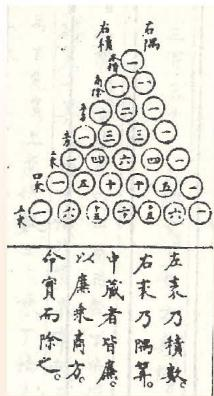

<details>
<summary>text_image</summary>

右隅
一
右積
一
一
一
一
一
一
一
五
一
五
一
五
一
五
一
五
一
五
一
五
一
五
一
五
一
五
一
五
一
五
一
五
一
五
一
五
一
五
一
五
一
五
一
五
一
五
一
五
一
五
一
五
一
五
一
五
一
左表刀積數。
右末乃隔算。
中藏者皆廉。
以廉來商方。
命實而除之。
</details>

图1-11

怎样计算 $102^{2}$ , $197^{2}$ 更简单呢?

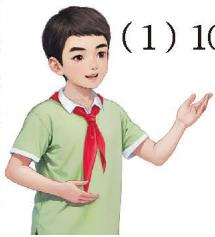

<details>
<summary>text_image</summary>
(1) 10
</details>
(1) $102^{2} = (100 + 2)^{2}$
$= 1 0 0 ^ {2} + 2 \times 1 0 0 \times 2 + 2 ^ {2}$
$= 1 0 0 0 0 + 4 0 0 + 4$
$= 1 0 4 0 4;$
(2) $197^{2} = (200 - 3)^{2}$
$= 2 0 0 ^ {2} - 2 \times 2 0 0 \times 3 + 3 ^ {2}$
$= 4 0 0 0 0 - 1 2 0 0 + 9$
$= 3 8 8 0 9 。$

你是怎样做的？与同伴进行交流。

# 例6 计算：
(1) $(x+3)^{2}-x^{2};$   
(3) $(x+5)^{2}-(x-2)(x-3);$
解:(1) $(x+3)^{2}-x^{2}$
$= x ^ {2} + 6 x + 9 - x ^ {2}$
$= 6 x + 9;$
(3) $(x + 5)^{2} - (x - 2)(x - 3)$
$\begin{array}{l} = x ^ {2} + 1 0 x + 2 5 - \left(x ^ {2} - 5 x + 6\right) \\ = x ^ {2} + 1 0 x + 2 5 - x ^ {2} + 5 x - 6 \\ = 1 5 x + 1 9; \\ \end{array}$
(2) $(a + b + 3)(a + b - 3)$ ;
(4) $\left[(a + b)(a - b)\right]^2$ 。
(2) $(a + b + 3)(a + b - 3)$
$\begin{array}{l} = [ (a + b) + 3 ] [ (a + b) - 3 ] \\ = (a + b) ^ {2} - 3 ^ {2} \\ = a ^ {2} + 2 a b + b ^ {2} - 9; \\ \end{array}$
(4) $\left[(a + b)(a - b)\right]^2$
$= \left(a ^ {2} - b ^ {2}\right) ^ {2}$
$= a ^ {4} - 2 a ^ {2} b ^ {2} + b ^ {4} 。$

> [!observe] 观察·思考

观察图 1-12, 你认为 $(m + n) \times (m + n)$ 点阵中的点数与 $m \times m$ 点阵、 $n \times n$ 点阵中的点数之和一样多吗? 请用所学的公式解释自己的结论。

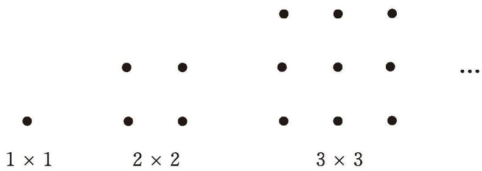

<details>
<summary>text_image</summary>

1 × 1
2 × 2
3 × 3
...
</details>

图 1-12

# 随堂练习

1. 利用整式乘法公式计算：
(1) $96^{2}$ ;
(2) $(a - b - 3)(a - b + 3)$ 。

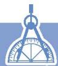

# 习题 1.3


# 知识技能

1. 计算：
(1) $(x + 7y)(x - 7y)$ ;
(2) $(0.2x - 0.3)(0.2x + 0.3)$ ;
(3) $(mn - 3n)(mn + 3n)$ ;
(4) $(-2x + 3y)(-2x - 3y)$ ;
(5) $\left(-\frac{1}{4}x-2y\right)\left(-\frac{1}{4}x+2y\right);$
(6) $(5m - n)(-5m - n)$ 。

2. 计算：
(1) $(2m+3)(2m-3)$ ;
(2) $x(x+1)+(2-x)(2+x);$
(3) $(3x - y)(3x + y) + y(x + y)$ ;
(4) $(a + \frac{1}{2} b)(a - \frac{1}{2} b) - (3a - 2b)(3a + 2b)$ 。

3. 计算：
(1) $(2x + 5y)^{2}$ ;
(2) $\left(\frac{1}{3}m-\frac{1}{2}\right)^{2};$
(3) $(-2t - 1)^{2}$ ;
(4) $(\frac{1}{5} x + \frac{1}{10} y)^2;$
(5) $(7ab + 2)^{2}$ ;
(6) $(-cd + \frac{1}{2})^2$ 。

4. 一个圆的半径为 $r (r > 2) \mathrm{~cm}$ , 半径减少 $2 \mathrm{~cm}$ 后, 这个圆的面积减少多少?

5. 计算：
(1) $(2x + y + 1)(2x + y - 1)$ ;
(2) $(x - 2)(x + 2) - (x + 1)(x - 3)$ ;
(3) $(ab + 1)^2 - (ab - 1)^2$ ;
(4) $(2x - y)^{2} - 4(x - y)(x + 2y)$ 。


# 问题解决

6. 利用平方差公式计算：
(1) $1007 \times 993$ ;
(2) $108 \times 112$ 。

7. 一个底面是正方形的长方体，高为 $6 \mathrm{~cm}$ ，底面正方形的边长为 $5 \mathrm{~cm}$ 。如果它的高不变，底面正方形的边长增加 $a \mathrm{~cm}$ ，那么它的体积增加多少？

8. 利用完全平方公式计算:
(1) $63^{2}$ ;
(2) $998^{2}$ 。

9. 借助几何图形可以直观解释平方差公式和完全平方公式，其他乘法算式是否也可以用几何图形直观解释呢？请举例说明你的思考。


# 联系拓广

10. 计算:
(1) $(a^n + b)(a^n - b)$ ;
(2) $(a + 1)(a - 1)(a^2 + 1)$ 。

11. 观察下列各式:
$1 5 ^ {2} = 2 2 5, 2 5 ^ {2} = 6 2 5, 3 5 ^ {2} = 1 2 2 5, \dots$

个位数字是 5 的两位数平方后，结果末尾的两个数字有什么规律？为什么？你还能找到哪些类似的规律？试举一例。

12. 计算: $(a + b)^{4}$ 。

※13. 计算： $(a+b+c)^{2}$ 。


# 整式的除法

计算下列各式，说说你的理由。
(1) $x^{5}y \div x^{2};$   
(2) $8m^{2}n^{2}\div 2m^{2}n^{\text{①}};$   
(3) $a^{4}b^{2}c\div3a^{2}b_{0}$

除法是乘法的逆运算。

> [!think] 思考·交流

如何进行单项式除以单项式的运算？与同伴进行交流。

单项式相除，把系数、同底数幂分别相除后，作为商的因式；对于只在被除式里含有的字母，则连同它的指数一起作为商的一个因式。

# 尝试·思考

计算下列各式，说说你的理由。
(1) $(ad + bd) \div d$ ;
(2) $(a^{2}b + 3ab)\div a;$
(3) $(xy^{3}-2xy)\div xy$ 。

> [!think] 思考·交流

如何进行多项式除以单项式的运算？与同伴进行交流。

多项式除以单项式，先把这个多项式的每一项分别除以单项式，再把所得的商相加。

# 例 计算:
(1) $-\frac{3}{5} x^{2} y^{3} \div 3 x^{2} y;$
(2) $10a^{4}b^{3}c^{2}\div 5a^{3}bc;$
(3) $(2x^{2}y)^{3} \cdot (-7xy^{2}) \div 14x^{4}y^{3}$ ;
(4) $(2a + b)^{4} \div (2a + b)^{2}$ ;
(5) $(9x^{2}y - 6xy^{2})\div 3xy;$
(6) $(3x^{2}y - xy^{2} + \frac{1}{2} xy) \div (-\frac{1}{2} xy)$ 。
解：(1) $-\frac{3}{5}x^{2}y^{3}\div3x^{2}y=\left(-\frac{3}{5}\div3\right)x^{2-2}y^{3-1}=-\frac{1}{5}y^{2};$
(2) $10a^{4}b^{3}c^{2}\div 5a^{3}bc = (10\div 5)a^{4 - 3}b^{3 - 1}c^{2 - 1} = 2ab^{2}c;$
(3) $(2x^{2}y)^{3} \cdot (-7xy^{2}) \div 14x^{4}y^{3} = 8x^{6}y^{3} \cdot (-7xy^{2}) \div 14x^{4}y^{3}$
$= [ 8 \times (- 7) \div 1 4 ] x ^ {6 + 1 - 4} y ^ {3 + 2 - 3}$
$= - 4 x ^ {3} y ^ {2};$
(4) $(2a + b)^{4} \div (2a + b)^{2} = (2a + b)^{4 - 2}$
$= (2 a + b) ^ {2}$
$= 4 a ^ {2} + 4 a b + b ^ {2};$
(5) $(9x^{2}y-6xy^{2})\div3xy$
$= 9 x ^ {2} y \div 3 x y - 6 x y ^ {2} \div 3 x y = 3 x - 2 y;$
(6) $(3x^{2}y - xy^{2} + \frac{1}{2} xy) \div (-\frac{1}{2} xy)$
$= - 3 x ^ {2} y \div \frac {1}{2} x y + x y ^ {2} \div \frac {1}{2} x y - \frac {1}{2} x y \div \frac {1}{2} x y = - 6 x + 2 y - 1 。$

# 随堂练习

#### 1. 计算:
(1) $2a^{6}b^{3}\div a^{3}b^{2};$
(2) $\frac{1}{48} x^3 y^2 \div \frac{1}{16} x^2 y;$
(3) $3m^{2}n^{3}\div(mn)^{2};$
(4) $(2x^{2}y)^{3} \div 6x^{3}y^{2}$ 。

#### 2. 计算：
(1) $(3xy + y) \div y$ ;
(2) $(ma + mb + mc) \div m$ ;
(3) $(6c^{2}d - c^{3}d^{3})\div (-2c^{2}d);$
(4) $(4x^{2}y + 3xy^{2})\div 7xy$

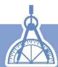

# 习题 1.4

# 知识技能

1. 计算:
(1) $8a^{4}b^{3}c \div 2a^{2}b^{3} \cdot (-\frac{2}{3} a^{3}bc^{2})$ ;   
(2) $(3x^{2}y)^{2} \cdot (-15xy^{3}) \div (-9x^{4}y^{2})$ ;   
(3) $(-4a^{3} + 6a^{2}b^{3} + 3a^{3}b^{3})\div (-4a^{2});$   
(4) $\left(\frac{2}{5} mn^3 - m^2 n^2 + \frac{1}{6} n^4\right) \div \frac{2}{3} n^2;$   
(5) $\left(\frac{1}{10} xy^{2} + \frac{1}{4} y^{2} - \frac{1}{2} y\right) \div \frac{1}{5} y;$   
(6) $[(x + 1)(x + 2) - 2] \div x_{\circ}$

# 问题解决

2. 一只圆柱形桶内装满了水，已知桶的底面直径为 $a$ ，高为 $b$ 。又知另一个长方体形容器的长为 $b$ ，宽为 $a$ 。如果把这只圆柱形桶中的水全部倒入这个长方体形容器中（水不溢出），那么水面的高度是多少？  
3. 如图（单位：cm），图（1）的瓶子中盛满了水，如果将这个瓶子中的水全部倒入图（2）这样的杯子中，那么一共需要多少个这样的杯子？

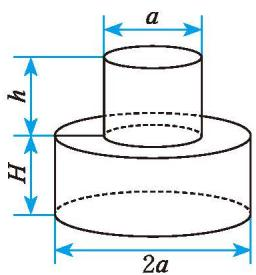

<details>
<summary>text_image</summary>

a
h
H
2a
</details>
(1) 瓶子

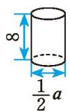  
(2) 杯子  
(第3题)


# 回顾与思考

1. 本章先学习幂的运算再学习整式的乘法，对于这样的顺序你是如何理解的？

2. 举例说明如何进行幂的相关运算，你是怎样得到这些运算法则的？

3. 举例说明如何进行整式的乘法运算。

4. 整式乘法公式有哪些？它们的特点是什么？

5. 举例说明如何利用几何图形解释整式乘法公式。

6. 举例说明如何进行单项式除以单项式、多项式除以单项式的运算。

7. 用自己的方式梳理本章的知识结构，你是怎样想的？与同伴进行交流。


# 复习题


# 知识技能

1. 计算:
(1) $\left(-\frac{3}{5}\right)^{2}\cdot\left(-\frac{3}{5}\right)^{3};$
(2) $(-a^{5})^{5}$ ;
(3) $(a + b)^{3} \div (a + b)$ ;
(4) $(-a^{2} \cdot b)^{3}$ ;
(5) $(-a)^{2} \cdot (a^{2})^{2}$ ;
(6) $(y^{2})^{3} \div y^{6}$ ;
(7) $a^{n + 1}\cdot a^{n - 1}(n > 1)$ ;
(8) $(-c^{2})^{2n}$ 。

2. 计算：
(1) $10^{5} \div 10^{-1} \times 10^{0}$ ;
(2) $16 \times 2^{-4}$ ;
(3) $(\frac{1}{3})^0 \div (-\frac{1}{3})^{-2}$ 。

3. 一个正方体的棱长为 $2 \times 10^{2} \mathrm{~mm}$ 。
(1) 它的表面积是多少平方米?
(2) 它的体积是多少立方米?

4. 计算：
(1) $(x + a)(x + b)$ ;
(2) $(3x + 7y)(3x - 7y)$ ;
(3) $(3x + 9)(6x + 8)$ ;
(4) $\left(\frac{1}{2} x^{2}y - 2xy + y^{2}\right) \cdot 3xy$ ;
(5) $\frac{1}{3} a^2 b^3 \cdot (-15a^2 b^2)$ ;
(6) $(4a^{3}b - 6a^{2}b^{2} + 12ab^{3})\div 2ab;$
(7) $(a^{2}bc)^{2}\div ab^{2}c;$
(8) $(3mn + 1)(3mn - 1) - 8m^{2}n^{2}$ 。

5. 计算：
(1) $10^{7}\div(10^{3}\div10^{2})$ ;
(2) $(x - y)^{3}(x - y)^{2}(y - x)$ ;
(3) $4 \times 2^{n} \times 2^{n-1} (n > 1)$ ;
(4) $(-x)^{3} \cdot x^{2n - 1} + x^{2n} \cdot (-x)^{2}$ ;
(5) $(y^{2}\cdot y^{3})\div(y\cdot y^{4});$
(6) $x^{2}\cdot x^{3}+x^{7}\div x^{2};$
(7) $m^5 \div m^2 \cdot m$ ;
(8) $a^{4}+(a^{2})^{4}-(a^{2})^{2}$

6. 计算:
(1) $(2x^{2})^{3} - 6x^{3}(x^{3} + 2x^{2} + x)$ ;
(2) $(x + y + z)(x + y - z)$ ;
(3) $[(x + y)^2 - (x - y)^2] \div 2xy;$
(4) $a^2 (a + 1)^2 - 2(a^2 - 2a + 4)$ 。

7. 求下列各式的值:
(1) $3x^{2}+(-\frac{3}{2}x+\frac{1}{3}y^{2})(2x-\frac{2}{3}y)$ ，其中x=2，y=-1；
(2) $[(xy + 2)(xy - 2) - 2x^{2}y^{2} + 4] \div xy$ , 其中 $x = 10, y = -\frac{1}{25}$ ;
(3) $x(x + 2y) - (x + 1)^{2} + 2x$ ，其中 $x = \frac{1}{25}$ ， $y = -25$ 。

8. 利用整式乘法公式计算：
(1) $2001^{2}$ ;
(2) $2001 \times 1999;$
(3) $99^{2} - 1$ ;
(4) $899 \times 901 + 1;$
(5) $123^{2} - 124 \times 122$ 。

9. 把下图左框里的整式分别乘 $(a+2b)$ ，将所得的积写在右框相应的位置上。

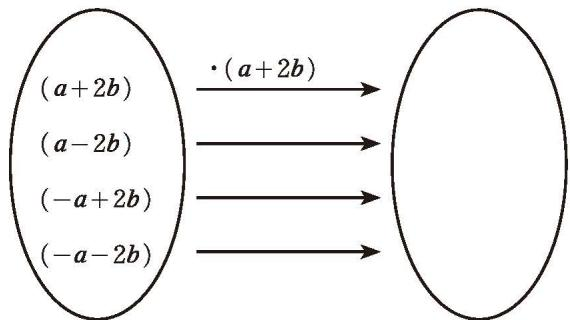

<details>
<summary>flowchart</summary>

```mermaid
graph LR
    A["(a+2b)"] -->|·(a+2b)| B[" "]
    C["(a-2b)"] --> D
    E["(-a+2b)"] --> F
    G["(-a-2b)"] --> H
```
</details>

(第9题)

10. 分别计算下图中阴影部分的面积。

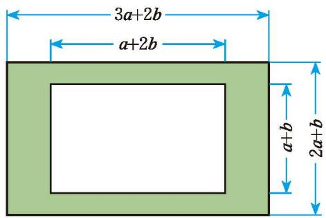

<details>
<summary>text_image</summary>

3a+2b
a+2b
a+b
2a+b
</details>
(1)

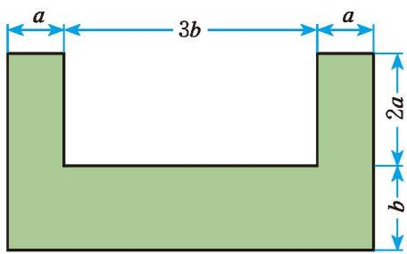

<details>
<summary>text_image</summary>

a
3b
a
2a
b
</details>
(2)   
(第10题)

# 数学理解

11. 如图, 4个长为 $a$ 、宽为 $b$ 的小长方形围成了一个大正方形, 请用不同方法计算阴影部分的面积。你能得到怎样的等式? 请验证它的正确性。  
12. 请在下列横线上填上适当的式子:
(1) $(\_+3b)(2a-3b)=4a^{2}-$ ;   
(2) $(2x + \_ )^{2} = \_ + 20xy + \_ ;$   
(3) $(x + 2)(x + \_) = x^{2} + \_ x + 2;$   
(4) $(\_+4y)(x+2y)=3x^{2}+\_xy+8y^{2}$

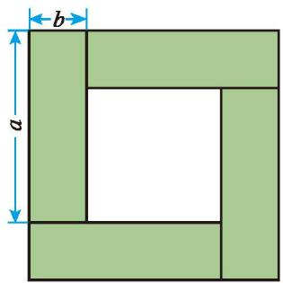

<details>
<summary>text_image</summary>

b
a
</details>

(第11题)

# 问题解决

13. 如图, 我国自主研发的 $500 \mathrm{~m}$ 口径球面射电望远镜 (FAST) 有 “中国天眼” 之称, 它的反射面面积约为 $2.5 \times 10^{5} \mathrm{~m}^{2}$ ; 一个 11 人制正规足球场的面积约为 $7.14 \times 10^{3} \mathrm{~m}^{2}$ 。“中国天眼”的反射面面积大约相当于多少个 11 人制正规足球场的面积 (结果精确到 1 个)?

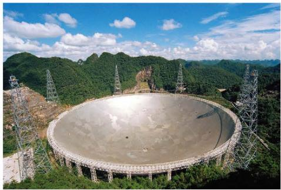

<details>
<summary>natural_image</summary>

Aerial view of a large radio telescope dish nestled in a mountainous green valley under a blue sky with clouds.
</details>

(第13题)

14. 某种原子的质量约为 0.000 000 000 000 000 000 000 000 019 93 g，请用科学记数法把它表示出来。

15. 分别准备几张如图所示的长方形和正方形卡片。
(1) 用这些卡片拼一些新的长方形, 并计算新长方形的面积;  
(2)从这些卡片中选取几张,用它们拼成一个面积为 $(2a^{2}+3ab)$ 的长方形。

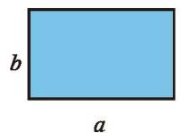

<details>
<summary>text_image</summary>

b
a
</details>

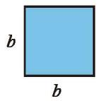

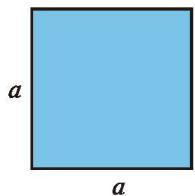

<details>
<summary>text_image</summary>

a
a
</details>

(第15题)

16. 请在图中指出面积为 $(a + 3b)^{2}$ 的图形，并指出图中有多少个边长为 $a$ 的正方形，有多少个边长为 $b$ 的正方形，有多少个两边长分别为 $a$ 和 $b$ 的长方形，然后用相应的公式进行验证。

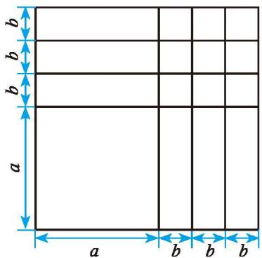

<details>
<summary>text_image</summary>

b
b
b
a
a b b b
</details>

(第16题)

# > 联系拓广

17. 两个相邻整数的“平均数的平方”与这两个整数的“平方的平均数”相等吗？若不相等，相差多少？

18. 根据有关理论, 当一颗恒星衰老时, 其中心的燃料 (氢) 已经被耗尽, 在外壳的重压之下, 核心开始坍缩, 直到最后形成体积小、密度大的星体。如果这一星体的质量超过太阳质量的三倍, 那么就会引发另一次大坍缩。当这种坍缩使得它的半径达到施瓦西 (Schwarzschild) 半径后, 其引力就会变得相当强大, 以至于光也不能逃脱出来, 从而成为一个看不见的星体——黑洞。施瓦西半径 (单位: m) 的计算公式是 $R = \frac{2GM}{c^2}$ , 其中 $G = 6.67 \times 10^{-11} \mathrm{~N} \cdot \mathrm{m}^2 / \mathrm{kg}^2$ , 为万有引力常数; $M$ 表示星球的质量 (单位: kg); $c = 3 \times 10^{8} \mathrm{~m/s}$ , 为光在真空中的传播速度。

已知太阳的质量为 $2 \times 10^{30} \mathrm{~kg}$ , 计算太阳的施瓦西半径。

19. 整式乘法运算的研究思路是什么？整式乘法运算与幂的运算、数的运算之间有什么联系？请撰写一篇小短文阐述你的观点。

# 第二章 相交线与平行线

山川、道路、房屋、桥梁……在这些大自然的杰作和人类的创造物中，蕴含着大量的基本平面图形，如我们已经研究过的线段、射线、直线、角等。生活中哪些物体或图案给我们以直线的形象？这些直线又有怎样的关系？

本章将研究两条直线的位置关系，探索直线平行的条件，以及平行线的性质，并运用相交线与平行线的有关结论解决简单的实际问题。在这一过程中，你将经历对简单几何图形的观察与操作、想象与推理等过程，初步养成重论据的思维习惯，进一步增强合乎逻辑地表达与交流的意识，发展几何直观与推理能力等。


<details>
<summary>natural_image</summary>

Aerial view of a wooden suspension bridge spanning a river, with village houses and hills in the background (no visible text or symbols)
</details>

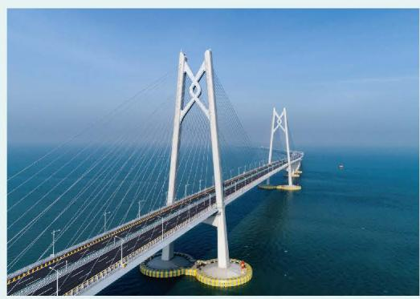

<details>
<summary>natural_image</summary>

Aerial view of a modern cable-stayed bridge spanning a wide blue sea under clear sky (no visible text or symbols)
</details>

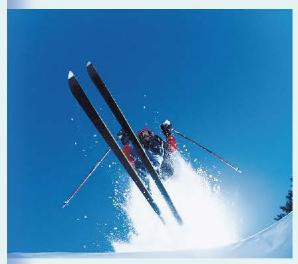

<details>
<summary>natural_image</summary>

Skier mid-air during a jump against a clear blue sky (no text or symbols visible)
</details>

# 在本章学习过程中，你可以持续思考以下问题：


你是借助什么来判断两条直线垂直、平行等位置关系的？为什么？

你认为可以从哪些方面研究平面图形以及它们之间的关系？


# 两条直线的位置关系

观察图 2-1 中的图片，你认为两条直线有哪些位置关系？

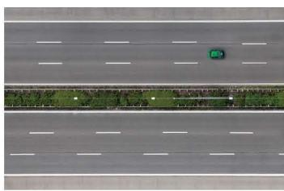

<details>
<summary>natural_image</summary>

Aerial view of a multi-lane highway with a single green car driving on the road (no visible text or symbols)
</details>

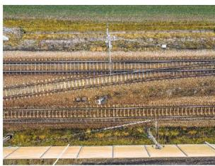

<details>
<summary>natural_image</summary>

Aerial view of multiple railway tracks running across a rural landscape with sparse vegetation and no visible text or symbols.
</details>

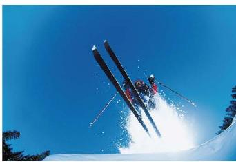

<details>
<summary>natural_image</summary>

Skier mid-air performing a jump against a clear blue sky, no visible text or symbols
</details>

图2-1

在同一平面内，两条直线的位置关系有相交和平行两种。

若两条直线只有一个公共点，我们称这两条直线为相交线（intersection lines）。

在同一平面内，不相交的两条直线叫作平行线（parallel lines）。

> [!observe] 观察·交流

如图 2-2, 直线 $AB$ 与 $CD$ 相交于点 $O$ 。
(1) $\angle 1$ 与 $\angle 2$ 的位置有什么关系？它们的大小有什么关系？
(2) 你能说明理由吗？与同伴进行交流。

在图 2-2 中，直线 AB 与 CD 相交于点 O， $\angle1$ 与 $\angle2$ 有公共顶点 O，它们的两边互为反向延长线，具有这种位置关系的两个角叫作对顶角（vertical angles）。

对顶角有如下性质：

对顶角相等。

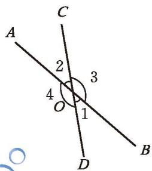

<details>
<summary>text_image</summary>

A
2
3
4
O
1
D
B
C
</details>

图2-2

图2-2中，还有其他的角也构成对顶角吗？

> [!observe] 观察·思考

在图2-2中, $\angle 1$ 与 $\angle 3$ 有什么数量关系?

一般地，如果两个角的和是 $180^{\circ}$ ，那么称这两个角互为补角。

类似地，如果两个角的和是 $90^{\circ}$ ，那么称这两个角互为余角。

图 2-2 中，还有其他的角也构成互为补角的关系吗？

> [!think] 思考·交流

如图 2-3，打台球时，选择适当的方向用白球击打红球，反弹后的红球会直接入袋，此时 $\angle1=\angle2$ 。

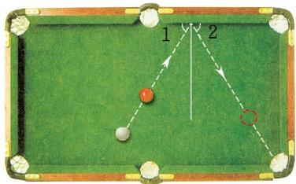

<details>
<summary>text_image</summary>

1
2
</details>

图2-3

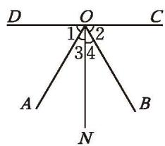

<details>
<summary>text_image</summary>

D
O
C
1
2
3
4
A
B
N
</details>

图2-4

将图 2-3 简化为图 2-4，ON 与 DC 相交所成的 $\angle DON$ 和 $\angle CON$ 都等于 $90^{\circ}$ ，且 $\angle 1 = \angle 2$ 。
(1) 请在图 2-4 中找出互为补角和互为余角的角，并说说你的理由。  
(2) $\angle 3$ 与 $\angle 4$ 的大小有什么关系? $\angle AOC$ 与 $\angle BOD$ 呢? 你能说明理由吗? 与同伴进行交流。

同角（或等角）的补角相等，同角（或等角）的余角相等。

# 随堂练习

1. 如图所示, 有一个破损的扇形零件, 利用图中的量角器可以量出这个扇形零件的圆心角的度数。请指出所量角的度数, 并说明理由。

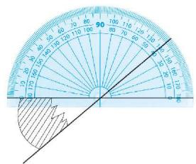

<details>
<summary>text_image</summary>

50
60
70
80
90
100
110
120
130
140
150
160
170
180
190
200
210
220
230
240
250
260
270
280
290
300
310
320
330
340
350
360
370
380
390
400
410
420
430
440
450
460
470
480
490
500
</details>

(第1题)

观察图 2-5 中的图片，你能找出其中相交的线吗？它们有什么特殊的位置关系？

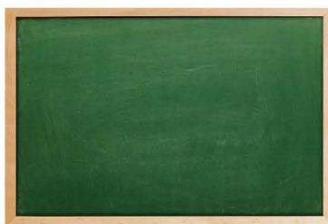

<details>
<summary>natural_image</summary>

Solid green chalkboard with no text, numbers, or symbols visible
</details>


<details>
<summary>natural_image</summary>

Wooden double door with grid windows and three panes (no text or symbols)
</details>


<details>
<summary>natural_image</summary>

Interior corner of a room with yellow walls and brown carpet, no text or symbols visible
</details>

图2-5

两条直线相交成四个角，如果有一个角是直角，那么称这两条直线互相垂直（perpendicular），其中的一条直线叫作另一条直线的垂线，它们的交点叫作垂足。

通常用符号 “⊥” 表示两条直线互相垂直。如图 2-6，直线 AB 与直线 CD 垂直，记作 $AB \perp CD$ ；如图 2-7，直线 l 与直线 m 垂直，记作 $l \perp m$ 。其中，点 O 是垂足。


<details>
<summary>text_image</summary>

A
C
O
B
D
</details>

图2-6


<details>
<summary>text_image</summary>

l
O
m
</details>

图2-7

> [!think] 思考·交流

如图 2-8, O 为直线 AB 上的一点。
（1）如果 $\angle AOC = \angle BOC$ ，那么 $OC$ 与 $AB$ 垂直吗？为什么？
(2) 以下是小颖的思考过程, 她的想法正确吗? 你知道她每一步的依据吗? 与同伴进行交流。


<details>
<summary>text_image</summary>

C
A O B
</details>

图2-8


<details>
<summary>natural_image</summary>

Illustration of a girl in school uniform with a red neckerchief, gesturing with her hand (no text or symbols present)
</details>

我是这样思考的：
由 $\angle AOC = \angle BOC$ ，且 $\angle AOC + \angle BOC = 180^{\circ}$

可得 $\angle AOC = \angle BOC = 90^{\circ}$
所以 $OC \perp AB$ 。
(3) 如果 $OC \perp AB$ , 那么 $\angle AOC = \angle BOC$ 吗? 为什么? 与同伴进行交流。

# 尝试·思考
(1) 你能用折叠的方法折出互相垂直的直线吗?试试看!  
(2) 如果只用直尺, 你能画出图 2-9 方格纸上已知直线的垂线吗? 你还能再画出两条互相垂直的直线吗?


<details>
<summary>natural_image</summary>

Three diagonal lines drawn on a grid background (no text or symbols)
</details>

图2-9

# 尝试·交流
(1) 如图 2-10, 点 $A$ 在直线 $l$ 上, 你能用三角尺过点 $A$ 画直线 $l$ 的垂线吗? 你能画出多少条? 如果点 $A$ 在直线 $l$ 外呢? 你是怎样做的? 与同伴进行交流。


<details>
<summary>text_image</summary>

A
l
l
</details>

图2-10
(2) 如图 2-11, 点 $P$ 是直线 $l$ 外一点, $PO \perp l$ , 点 $O$ 是垂足。点 $A, B, C$ 在直线 $l$ 上, 比较线段 $PO, PA, PB, PC$ 的长短, 你发现了什么?


<details>
<summary>text_image</summary>

P
A B O C l
</details>

图2-11

同一平面内，过一点有且只有一条直线与已知直线垂直。直线外一点与直线上各点连接的所有线段中，垂线段最短。

如图 2-12，过点 A 作直线 l 的垂线，垂足为 B，线段 AB 的长度叫作点 A 到直线 l 的距离。


<details>
<summary>text_image</summary>

A
B
l
</details>

图2-12


<details>
<summary>text_image</summary>

在图 2-11 中，哪条线
段的长度可以表示点 P
到直线 l 的距离？
</details>

# 随堂练习

1. 画一条直线 $l$ , 在直线 $l$ 上取一点 $A$ , 在直线 $l$ 外取一点 $B$ , 用三角尺或量角器分别经过点 $A, B$ 画直线 $l$ 的垂线。

2. 下面是画在方格纸上的两个图形，请分别找出图中互相垂直的线段。


<details>
<summary>text_image</summary>

A
O
B
C
D
</details>
(1)


<details>
<summary>text_image</summary>

D
A
B
C
E
</details>
(2)   
(第2题)

3. 请你说说体育课上老师是怎样测量跳远成绩的，并解释其中的道理。


# 习题 2.1


# 知识技能

1. 如图，直线 a, b 相交， $\angle 1 = 38^{\circ}$ ，求 $\angle 2$ ， $\angle 3$ ， $\angle 4$ 的度数。

2. 请举出一些日常生活中线段互相垂直的实例。

3. 如图，如果把街道近似地看成直线，那么哪些街道互相平行？哪些街道互相垂直？


<details>
<summary>text_image</summary>

b
1
2
a
3
4
</details>

(第1题)


<details>
<summary>text_image</summary>

工人体育场北路
东三环
朝阳北路
东四环
中路建国路
东二环
</details>

(第3题)

# 数学理解

4. 互为补角的两个角可以都是锐角吗？为什么？可以都是直角吗？可以都是钝角吗？

# 问题解决

5. 如图, 在长方形的台球桌面上, $\angle 1 + \angle 3 = 90^{\circ}, \angle 2 = \angle 3$ 。
(1) 如果 $\angle2=58^{\circ}$ ，那么 $\angle1$ 等于多少度？  
(2) 请你以台球桌面为背景, 自编一道题并解答。


<details>
<summary>text_image</summary>

2
3
1
</details>

(第5题)

6. 如图, 一棵树生长在 $30^{\circ}$ 的山坡上, 树干与山坡所成的锐角是多少度?


<details>
<summary>text_image</summary>

30°
30°
</details>

(第6题)


<details>
<summary>text_image</summary>

C
A————B
</details>

(第7题)

7. 如图, 要把水渠中的水引到 $C$ 点, 在渠岸 $AB$ 的什么地方开沟, 才能使沟最短? 画出图形, 并说明理由。

8. 请举出一些日常生活中应用“垂线段最短”的实例。

# > 联系拓广

9. 如图所示, 当光线从空气斜射入水中时, 光线的传播方向发生了改变, 这就是光的折射现象。图中 $\angle 1$ 与 $\angle 2$ 是对顶角吗?


<details>
<summary>text_image</summary>

1
2
</details>

(第9题)


# 探索直线平行的条件

在日常生活中，人们经常用到平行线。如图 2-13，装修工人要在墙上钉木条，如果木条 b 与竖直木条垂直，那么木条 a 与竖直木条所成的角为多少度时，才能使木条 a 与木条 b 平行？


<details>
<summary>text_image</summary>

b
a
</details>

图2-13


<details>
<summary>text_image</summary>

b
a
</details>

图2-14

如图 2-14, 如果木条 $b$ 不与竖直木条垂直呢?

# 操作·交流
(1) 如图 2-15, 三根木条相交成 $\angle 1, \angle 2$ , 固定木条 $b, c$ , 转动木条 $a$ 。如图 2-16, 在转动木条 $a$ 的过程中, 观察 $\angle 2$ 的变化以及它与 $\angle 1$ 的大小关系, 你发现木条 $a$ 与木条 $b$ 的位置关系发生了什么变化? 木条 $a$ 何时与木条 $b$ 平行? 与同伴进行交流。


<details>
<summary>text_image</summary>

b
1
a
2
c
</details>

图2-15


<details>
<summary>text_image</summary>

b
a
1
2
c
</details>

①


<details>
<summary>text_image</summary>

b
a
1
2
c
</details>

②


<details>
<summary>text_image</summary>

b
a
1
2
c
</details>

③   
图2-16
(2) 改变图 2-15 中 $\angle 1$ 的大小, 按照 (1) 中的方式再做一做。 $\angle 1$ 与 $\angle 2$ 的大小满足什么关系时, 木条 $a$ 与木条 $b$ 平行? 与同伴进行交流。

如图 2-17, 具有 $\angle 1$ 与 $\angle 2$ 这样位置关系的角称为同位角 (corresponding angles)。 $\angle 3$ 与 $\angle 4$ 也是同位角。

在图 2-17 中，找出其他的同位角。


<details>
<summary>text_image</summary>

C
l
3
1
7
5
D
A
4
2
8
6
B
</details>

图2-17

两条直线被第三条直线所截，如果同位角相等，那么这两条直线平行。

简述为：同位角相等，两直线平行。

两直线平行，用符号“//”表示。例如，直线 $a$ 与直线 $b$ 平行，记作 $a // b$ 。

# 尝试·思考
(1) 你能借助三角尺画平行线吗? 小明按如图 2-18 所示的方法画出了已知直线的平行线, 请说明其中的道理。


<details>
<summary>natural_image</summary>

Two protractor and ruler tools on a plain background (no text or symbols visible)
</details>


<details>
<summary>text_image</summary>

Person drawing a triangular ruler and pencil on paper, showing measurement markings and a pointer
</details>


<details>
<summary>text_image</summary>

Person using a protractor and ruler on paper, showing measurement markings and angle markings
</details>

图2-18
(2) 如图 2-19, 你能过直线 $AB$ 外一点 $C$ 画直线 $AB$ 的平行线吗? 能画出几条?

C.

A B

图2-19

过直线外一点有且只有一条直线与这条直线平行。

# 操作·思考

在图 2-20 中，分别过点 C 和 D 画直线 AB 的平行线 EF 和 GH，那么 EF 与 GH 有怎样的位置关系？


<details>
<summary>text_image</summary>

C
A————B
D
</details>

图2-20

平行于同一条直线的两条直线平行。

也就是说：如果 $b \parallel a, c \parallel a$ ，那么 $b \parallel c$ （如图2-21）。


<details>
<summary>text_image</summary>

a
b
c
</details>

图2-21

# 随堂练习

1. 找出下面点阵（点阵中相邻的四个点构成正方形）中互相平行的线段。


<details>
<summary>text_image</summary>

A
E
G
B
C
D
F
H
</details>

(第1题)


<details>
<summary>text_image</summary>

A
B
2
C
1
D
</details>

(第2题)

2. 如图, $\angle 1 = \angle 2 = 55^{\circ}$ , 直线 $AB$ 与 $CD$ 平行吗?

3. 对于同一平面内的三条直线 a, b, c, 如果 a 与 b 平行, c 与 a 相交,那么 c 与 b 的位置关系是相交还是平行?请画图说明。

李老师有一块小画板（如图 2-22），他想知道它的上、下边缘是否平行，于是他在两个边缘之间画了一条线段 AB。

李老师身边只有一个量角器，他通过测量某些角的大小就能知道这个画板的上、下边缘是否平行，你知道他是怎样做的吗？


<details>
<summary>text_image</summary>

A
2 3
1 4
B
</details>

图2-22

如图 2-23，具有 $\angle1$ 与 $\angle2$ 这样位置关系的角称为内错角（alternate interior angles）；具有 $\angle1$ 与 $\angle3$ 这样位置关系的角称为同旁内角（interior angles on the same side）。

在图 2-23 中，找出其他几组内错角和同旁内角。


<details>
<summary>text_image</summary>

A
l
1
B
C
3
2
D
</details>

图2-23

> [!think] 思考·交流
(1) 内错角满足什么关系时, 两直线平行? 为什么?  
(2) 同旁内角满足什么关系时, 两直线平行? 为什么? 与同伴进行交流。

两条直线被第三条直线所截，如果内错角相等，那么这两条直线平行。

简述为：内错角相等，两直线平行。

两条直线被第三条直线所截，如果同旁内角互补，那么这两条直线平行。

简述为：同旁内角互补，两直线平行。

> [!observe] 观察·交流
（1）如图 2-24，三个相同的三角尺拼成一个图形，请找出图中的一组平行线，并说明你的理由。


<details>
<summary>text_image</summary>

B
C
D
A
E
</details>

图2-24
(2) 以下是小颖的思考过程, 你能明白她的意思吗?


<details>
<summary>natural_image</summary>

Illustration of a girl in school uniform with a red neckerchief, gesturing with her hand (no text or symbols present)
</details>

BC 与 AE 是平行的。因为 $\angle BCA$ 与 $\angle EAC$ 是内错角，而且相等。
(3) 在图 2-24 中再找出一组平行线，说说你的理由，并与同伴进行交流。

> [!think] 思考·交流

如图 2-25，在探究两条直线是否平行时，常用第三条直线截这两条直线，那么这条截线的作用是什么呢？与同伴进行交流。


<details>
<summary>text_image</summary>

截线
a
b
</details>

图2-25

# 尝试·思考

如图 2-26，某公园的两条直道 AB 和 CD 交于点 O，为方便游客观赏，公园管理部门决定过小路 CD 上的点 P，再修建一条直道 MN，并且使 MN 与 AB 平行。你能在图中画出直道 MN 吗？


<details>
<summary>text_image</summary>

P
D
A
O
B
C
</details>

图2-26
(1) 过点 P 的直线有多少条?  
(2) 满足什么条件的直线才能与 $AB$ 平行?

如图 2-27, 已知点 $P$ 在直线 $AB$ 外, 用尺规作直线 $MN$ , 使 $MN$ 经过点 $P$ , 且 $MN \parallel AB$ 。


<details>
<summary>text_image</summary>

P
A B
</details>

图2-27
作法与示范：

<table><tr><td>作法</td><td>示范</td></tr><tr><td>1. 在直线AB上任取一点O,过点O,P作直线CD。</td><td></td></tr><tr><td>2. 以点P为顶点,以PD为一边,在直线CD的右侧作∠DPN=∠DOB。PN边所在的直线MN就是要作的直线。</td><td></td></tr></table>

你能说说这样作的道理吗？

# 随堂练习

1. 观察右图并填空：
(1) $\angle1$ 与 \_\_\_\_ 是同位角；  
(2) $\angle5$ 与 \_\_\_\_ 是同旁内角；  
(3) $\angle2$ 与 \_\_\_\_ 是内错角。

2. 当图中各角分别满足下列条件时，你能判定哪两条直线平行？
(1) $\angle 1 = \angle 4$ ;   
(2) $\angle 2 = \angle 4;$   
(3) $\angle 1 + \angle 3 = 180^{\circ}$ 。


<details>
<summary>text_image</summary>

m
n
a
1
2
3
5
b
4
</details>

(第1题)


<details>
<summary>text_image</summary>

l
m
n
a
b
4
2
1
3
</details>

(第2题)


# 习题 2.2


# 知识技能

1. 找出下图中互相平行的直线。


<details>
<summary>text_image</summary>

130°
m
50°
n
50°
b
a
</details>

(第1题)


<details>
<summary>natural_image</summary>

Grid pattern with uniform green squares (no text or symbols)
</details>


(第2题)

2. 如果只有直尺，你能在图中的方格纸上画出平行线吗？你是怎么画的？

3. 如图, 一条街道的两个拐角 $\angle ABC$ 与 $\angle BCD$ 均为 $150^{\circ}$ , 街道 $AB$ 与 $CD$ 平行吗? 为什么?


<details>
<summary>text_image</summary>

A
B
C
D
</details>

(第3题)


<details>
<summary>text_image</summary>

D
C
1
A
B
</details>

(第4题)

4. 如图, $\angle DAB + \angle CDA = 180^{\circ}, \angle ABC = \angle 1$ , 直线 $AB$ 与 $CD$ 平行吗? 为什么? 直线 $AD$ 与 $BC$ 呢?


# 数学理解

5. 你能用一张形状不规则的纸（比如，如图所示的四边形的纸）折出两条平行的直线吗？与同伴说说你的折法。


<details>
<summary>natural_image</summary>

Plain white triangular sheet on a beige background (no text or symbols)
</details>

(第5题)

6. 图（1）是一种画平行线的工具。在画平行线之前，工人师傅往往要先调整一下工具 [如图（2）]，然后再画平行线 [如图（3）]。请说明这种工具的用法和其中的道理。


<details>
<summary>natural_image</summary>

Wooden handrail with four metal clamps installed on a wooden surface (no text or symbols visible)
</details>
(1)


<details>
<summary>natural_image</summary>

Hand holding a wooden plank with a saw, surrounded by metal beams and tools (no visible text or symbols)
</details>
(2)


<details>
<summary>natural_image</summary>

Close-up of hands using a tool to cut or adjust wooden planks in a workshop (no visible text or symbols)
</details>
(3)   
(第6题)

7. 直线 $l$ 的同侧有 $A, B, C$ 三点, 如果 $A, B$ 两点确定的直线 $l_{1}$ 与 $B, C$ 两点确定的直线 $l_{2}$ 都与 $l$ 平行, 那么 $A, B, C$ 三点的位置关系如何?

8. 观察下面每幅图中的直线 $a, b$ , 它们分别平行吗? 如何验证它们是否平行呢? 你有几种方法?

  
(1)


<details>
<summary>natural_image</summary>

Geometric diagram of concentric diamond and pentagon lines with labeled points a and b (no text or symbols beyond labels)
</details>
(2)


<details>
<summary>text_image</summary>

a
b
</details>
(3)   
(第8题)

9. 利用如图所示的方法，可以折出“过已知直线外一点和已知直线平行”的直线。请说明其中的道理。


<details>
<summary>natural_image</summary>

Simple geometric diagram with a square, diagonal line, and two small circles (no text or symbols)
</details>
(1)


<details>
<summary>natural_image</summary>

Geometric diagram showing two overlapping triangles with a dashed line indicating a perpendicular segment (no text or symbols)
</details>
(2)


<details>
<summary>natural_image</summary>

Geometric diagram showing a shaded triangular region with dashed lines, no text or symbols present
</details>
(3)


<details>
<summary>natural_image</summary>

Geometric diagram with intersecting lines and a marked point (no text or symbols)
</details>
(4)   
(第9题)


# 平行线的性质

如图 2-28，直线 a 与直线 b 平行。


<details>
<summary>text_image</summary>

c
1 2
a 3 4
b 5 6
7 8
</details>

图2-28
(1) 测量同位角 $\angle 1$ 和 $\angle 5$ 的大小, 它们有什么关系? 图中还有其他同位

角吗？它们的大小有什么关系？改变直线 c 与直线 a 所成角的大小再试一试，你能得到相同的结论吗？
(2) 图中有几对内错角？它们的大小有什么关系？为什么？
（3）图中有几对同旁内角？它们的大小有什么关系？为什么？


<details>
<summary>text_image</summary>

也可以用数学软件进行探索。
</details>

两条平行直线被第三条直线所截，同位角相等。

简述为：两直线平行，同位角相等。

两条平行直线被第三条直线所截，内错角相等。

简述为：两直线平行，内错角相等。

两条平行直线被第三条直线所截，同旁内角互补。

简述为：两直线平行，同旁内角互补。

> [!think] 思考·交流

如图 2-29，一束平行光线 AB 与 DE 射向一个水平镜面后被反射，此时 $\angle1 = \angle2$ ， $\angle3 = \angle4$ 。
(1) $\angle 1$ 与 $\angle 3$ 的大小有什么关系? $\angle 2$ 与 $\angle 4$ 呢?
(2) 反射光线 BC 与 EF 也平行吗?


<details>
<summary>text_image</summary>

A
C
D
F
1
2
3
4
B
E
</details>

图2-29


<details>
<summary>natural_image</summary>

Illustration of a girl in school uniform with a red neckerchief, gesturing with her hand (no text or symbols present)
</details>

我是这样思考的：
(1) 由 $AB \parallel DE$ , 可以得到 $\angle 1 = \angle 3$ ; 由 $\angle 1 = \angle 2, \angle 3 = \angle 4$ , 可以得到 $\angle 2 = \angle 4$ 。
(2) 由 $\angle 2 = \angle 4$ ，可以得到 $BC \parallel EF$ 。

你能说明小颖每一步的理由吗？

你是如何思考的？与同伴进行交流。

# 随堂练习

1. 如图， $AB \parallel CD$ ， $AC \parallel BD$ ，分别找出与 $\angle 1$ 相等或互补的角。


<details>
<summary>text_image</summary>

A
B
1
C
D
</details>

(第1题)

> [!example]- 例1 根据图 2-30 回答下列问题:
(1) 若 $\angle1=\angle2$ ，则可以判定哪两条直线平行？依据是什么？  
（2）若 $\angle 2 = \angle M$ ，则可以判定哪两条直线平行？依据是什么？  
（3）若 $\angle 2 + \angle 3 = 180^{\circ}$ ，则可以判定哪两条直线平行？依据是什么？
解: (1) $\angle 1$ 与 $\angle 2$ 是内错角, 若 $\angle 1 = \angle 2$ ,


<details>
<summary>text_image</summary>

A
M
B
3
2
F
C
D
1
E
</details>

图 2-30

则根据 “内错角相等，两直线平行”，

可得 $BF \parallel CE$ ;
(2) $\angle 2$ 与 $\angle M$ 是同位角, 若 $\angle 2 = \angle M$ ,

则根据 “同位角相等，两直线平行”，

可得 $AM \parallel BF$ ;
(3) $\angle 2$ 与 $\angle 3$ 是同旁内角, 若 $\angle 2 + \angle 3 = 180^{\circ}$ ,

则根据 “同旁内角互补，两直线平行”，

可得 $AC \parallel MD$ 。

> [!example]- 例2 如图 2-31, $AB \parallel CD$ , 如果 $\angle 1 = \angle 2$ , 那么 $EF$ 与 $AB$ 平行吗? 说说你的理由。
解：因为 $\angle 1 = \angle 2$

根据 “内错角相等，两直线平行”，
所以 $EF \parallel CD$ 。
又因为 $AB \parallel CD$ ,

根据 “平行于同一条直线的两条直线平行”，所以 $EF \parallel AB$ 。


<details>
<summary>text_image</summary>

D
C
1
E
2
F
A
B
</details>

图2-31

> [!example]- 例3 如图 2-32, 已知直线 $a \parallel b$ , 直线 $c \parallel d$ , $\angle 1 = 107^{\circ}$ , 求 $\angle 2, \angle 3$ 的度数。
解：因为 $a \parallel b$

根据 “两直线平行，内错角相等”，
所以 $\angle2=\angle1=107^{\circ}$
因为 $c \parallel d$ ,

根据 “两直线平行，同旁内角互补”，
所以 $\angle1+\angle3=180^{\circ}$
所以 $\angle 3 = 180^{\circ} - \angle 1 = 180^{\circ} - 107^{\circ} = 73^{\circ}$ 。


<details>
<summary>text_image</summary>

a
1
2
3
b
c
d
</details>

图2-32

# 回顾·反思

回顾直线相交与平行的探究过程，你积累了哪些研究几何图形的方法与经验？

# 随堂练习

1. 如图，已知 $\angle 1 = 105^{\circ}$ ， $\angle 2 = 75^{\circ}$ ，请说明 $a \parallel b$ 。


<details>
<summary>text_image</summary>

1
a
2
b
</details>

(第1题)


<details>
<summary>text_image</summary>

A
2
1
B
E
C
D
</details>

(第2题)

2. 如图, $AE \parallel CD$ , $\angle 1 = 37^{\circ}$ , $\angle D = 54^{\circ}$ , 求 $\angle 2$ 和 $\angle BAE$ 的度数。

# 阅读·思考

# 测量地球的周长

你听说过“坐地日行八万里①”吗？这句话告诉我们地球的周长大约是8万里。可人们是怎么知道这个数据的呢？

大约在公元前 200 年，古希腊人埃拉托色尼（Eratosthenes，约前 276—前 194）就运用一些天文知识和数学知识，测得了地球的周长。他用的数学知识你们也知道，其中包括：两条平行直线被第三条直线所截，内错角相等。

埃拉托色尼发现，在当时的城市塞恩（图2-33中的 $A$ 点），直立的杆子在某个时刻没有影子，而此时在 500 英里以外的亚历山大（图中的 B 点），直立的杆子却偏离太阳光线 $7^{\circ}12'$ （图中 $\angle\theta=7^{\circ}12'$ ）。根据这个数据，可以算出地球的周长约等于 25 000 英里，这是因为“弧 AB 的长 $\div7^{\circ}12'=$ 地球周长 $\div360^{\circ}$ ”的缘故，其中弧 AB 的长大约为 500 英里。
由于 1 英里约为 1.6 km，所以，地球的周长约为 40 000 km = 80 000 里。


<details>
<summary>text_image</summary>

A
B
O
θ
θ
</details>

图2-33


# 习题 2.3


# 知识技能

1. 如图, $AB \parallel CD$ , $\angle \alpha = 45^{\circ}$ , $\angle D = \angle C$ , 依次求出 $\angle D$ , $\angle C$ , $\angle B$ 的度数。


<details>
<summary>text_image</summary>

D
A
α
B
C
</details>

(第1题)


<details>
<summary>text_image</summary>

A
B
C
1
2
D
E
F
</details>

(第2题)

2. 如图, $AB \parallel CD$ , $CD \parallel EF$ , $\angle 1 = \angle 2 = 60^{\circ}$ , $\angle A$ 和 $\angle E$ 各是多少度? 它们相等吗?  
3. 如图，已知 $\angle1=\angle3=60^{\circ},\angle2=120^{\circ}$ ，可以判定哪些直线平行？请说明理由。


<details>
<summary>text_image</summary>

E
F
A 1 O 2 B
C 3 D
</details>

(第3题)


<details>
<summary>text_image</summary>

D
C
2
1
A
B
</details>

(第4题)

4. 如图, 已知 $AC$ 平分 $\angle BAD$ , $\angle 1 = \angle 2$ , 可以判定哪两条直线平行? 请说明理由。  
5. 如图, $AB \parallel CD$ , $AD$ 与 $BC$ 相交于点 $E$ , $\angle B = 50^{\circ}$ , 求 $\angle C$ 的度数。


<details>
<summary>text_image</summary>

A
B
E
C
D
</details>

(第5题)


<details>
<summary>text_image</summary>

Geometric diagram of triangle ABC with internal points D, E, F and connecting segments
</details>

(第6题)

6. 如图, $AC \parallel ED$ , $AB \parallel FD$ , $\angle A = 64^{\circ}$ , 求 $\angle EDF$ 的度数。


# 问题解决

7. 如图, 从一艘船上测得一个灯塔所在的方向是北偏西 $48^{\circ}$ , 那么这艘船在这个灯塔的什么方向?

8. (1) 在地图上选定一个城市，判断其他城市在它的什么方向。
(2) 只用方向能准确描述两个城市的相对位置吗？如果不能，还需要什么数据？

9. 林湾乡要修建一条灌溉水渠，如图，水渠从 A 村沿北偏东 $65^{\circ}$ 方向到 B 村，从 B 村沿北偏西 $25^{\circ}$ 方向到 C 村，然后从 C 村到 E 村。已知 CE 的方向与 AB 的方向一致，水渠从 C 村应该沿什么方向修建？


<details>
<summary>text_image</summary>

灯塔
48°
船
北
东
</details>

(第7题)


<details>
<summary>text_image</summary>

2
E
C
25°
北
1
65°
A
B
D
</details>

(第9题)


# 回顾与思考

1. 举例说出生活中的对顶角、互补的角与互余的角。  
2. 判定两条直线是否平行，通常有哪些方法？  
3. 平行线有哪些特征?  
4. 怎样用尺规作已知直线的平行线？与用尺规作一个角等于已知角有怎样的联系？  
5. 用自己的方式梳理本章的知识结构，你是怎样想的？与同伴进行交流。


# 复习题


# 知识技能

1. 指出下图中的同位角、内错角、同旁内角，以及互为余角的角、互为补角的角。


<details>
<summary>text_image</summary>

30°
</details>

(第1题)


<details>
<summary>text_image</summary>

北
42°
甲
乙
</details>

(第2题)

2. 如图, 在甲、乙两地之间要修一条笔直的公路, 从甲地测得公路的走向是北偏东 $42^{\circ}$ 。甲、乙两地同时开工, 若干天后公路准确接通。从乙地测, 所修公路的走向是南偏西多少度? 为什么?

3. 如图, 点 $D$ 是线段 ${BC}$ 上的一点, 请用尺规过点 $D$ 作直线 ${EF}$ , ${MN}$ ,使 ${EF}//{AB},{MN}//{AC}$ ,并判断 ${EF}$ 和 ${MN}$ 相交所成的锐角与 $\angle A$ 的数量关系。


<details>
<summary>text_image</summary>

A
B
D
C
</details>

(第3题)


<details>
<summary>text_image</summary>

135°
45°
a
b
c
</details>
(1)


<details>
<summary>text_image</summary>

110°
70°
a b c
</details>
(2)   
(第4题)

4. 如图，直线 a 与直线 b 平行吗？请说明理由。

5. 在下列各图中， $a \parallel b$ ，分别计算 $\angle 1$ 的度数。


<details>
<summary>text_image</summary>

a
b
c
1
</details>
(1)


<details>
<summary>text_image</summary>

a
36°
1
b
</details>
(2)


<details>
<summary>text_image</summary>

c
a———1
b———120°
</details>
(3)   
(第5题)

6. 意大利的比萨斜塔始建于 1174 年，1350 年完成。因奠基不慎，致塔身倾斜。目前，它与地面所成的较小的角为 $85^{\circ}$ （如图所示），它与地面所成的较大的角是多少度？为什么？


<details>
<summary>natural_image</summary>

Exterior view of the Leaning Tower in Rome, featuring its iconic spire and angular measurement overlay (no signage or text)
</details>

(第6题)

# > 数学理解

7. 如图, 如果 $\angle B$ 与 $\angle C$ 互补, 那么哪两条直线平行? $\angle A$ 与哪个角互补, 可以保证 $A D / / B C$ ?


<details>
<summary>natural_image</summary>

Simple geometric diagram of a parallelogram labeled with vertices A, B, C, D (no additional text or symbols)
</details>

(第7题)

8. 直线 a, b, c, d 如图所示。
(1) 如果 $a \parallel b$ , 那么图中有哪些相等的角和互补的角?  
(2) 要使 $c \parallel d$ , 需要哪两个角相等?


<details>
<summary>text_image</summary>

a
1
3
5
b
2
4
c
6
d
</details>

(第8题)


<details>
<summary>text_image</summary>

P
C
B
A
l
</details>

(第9题)

※9. 如图, 已知点 $P$ 在直线 $l$ 外, 利用如下方法也可以作出过点 $P$ 与直线 $l$ 平行的直线:

在直线 l 上任取一点 A，以点 A 为圆心，以 AP 的长为半径作弧，交直线 l 于点 B；以点 P 为圆心，以 PA 的长为半径作弧；以点 A 为圆心，以 PB 的长为半径作弧，交前弧于点 C；作直线 PC，则 $PC \parallel l$ 。
(1) 这种作法用到了哪些你学过的基本尺规作图? (提示: 连接 $PA$ )  
(2) 如何说明这种作法的道理?  
(3) 连接 $PB, AC$ , 在图中能发现你熟悉的图形吗?

# 问题解决

10. 如图, 一条公路两次拐弯后, 和原来的方向相同, 第一次拐的角 $\angle B = 140^{\circ}$ , 第二次拐的角 $\angle C$ 是多少度?


<details>
<summary>natural_image</summary>

Pure geometric line diagram with labeled points A, B, and C, showing solid and dashed lines without any text or symbols.
</details>

(第10题)

11. 一个人从 $A$ 点出发沿北偏东 $60^{\circ}$ 方向走到 $B$ 点, 再从 $B$ 点出发沿南偏西 $20^{\circ}$ 方向走到 $C$ 点, 那么 $\angle ABC$ 是多少度?

12. 如图所示, 选择适当的方向击打白球, 可以使白球反弹后将红球撞入袋中, 此时 $\angle 1 = \angle 2$ , 并且 $\angle 2 + \angle 3 = 90^{\circ}$ 。如果 $\angle 3 = 30^{\circ}$ , 那么 $\angle 1$ 应等于多少度, 才能保证红球直接入袋?


<details>
<summary>text_image</summary>

1
2
3
</details>

(第12题)


<details>
<summary>natural_image</summary>

Geometric pattern composed of interlocking angular shapes in shades of blue and white (no text or symbols)
</details>

(第13题)

13. 如图所示的是河南社旗县清代山陕会馆中的窗棂图案的一部分。其中有哪些平行的线？请你设计一种类似的窗棂图案。

※14. 从下面的第一个图出发，通过不断地作平行线，你就能得到一个美丽的图案。请你试一试。


<details>
<summary>natural_image</summary>

Four geometric star-like patterns arranged in a grid, no text or symbols present
</details>

(第14题)

# > 联系拓广

※15. 适当地剪几刀，可以把图中的十字形变成一个正方形，有人说剪两刀就可以，你相信吗？不妨试试看。

16. 结合你的学习经验谈一谈观察、操作、推理、交流等方法在研究几何图形过程中的作用。


<details>
<summary>natural_image</summary>

Simple geometric cross shape composed of four rectangles, no text or symbols present
</details>

(第15题)

# 第三章 概率初步

商场抽奖促销，你中奖的概率是多少？如果天气预报说明天下雨的概率是70%，那么你明天出行时会不会带雨伞？生活中到处都有随机现象，概率论就是研究随机现象数量规律的数学分支，掌握概率知识可以帮助我们更好地作出决策。

本章将以小学阶段对随机现象发生可能性的认识为基础，进一步认识随机事件，通过试验感受随机事件发生频率的稳定性，理解概率的意义，并用定量的方法描述随机事件发生的概率。你将经历猜测、试验、收集试验数据、分析试验结果等活动过程，体会数据的随机性，理解和表达生活中随机现象发生的规律，发展数据观念、应用意识等。


<details>
<summary>natural_image</summary>

Circular decorative design with pink and white segments radiating from a central yellow circle, set against a blue background (no text or symbols)
</details>


<details>
<summary>natural_image</summary>

Scenic view of a lush green hillside with a pavilion reflected in calm water under a cloudy sky (no text or symbols visible)
</details>


<details>
<summary>natural_image</summary>

Illustration of a rain drop with percentage symbol, cloud, and falling droplets on blue background (no text or symbols)
</details>

# 在本章学习过程中，你可以持续思考以下问题：


如何理解一个随机事件发生的概率是 $\frac{1}{2}$ ?

既然随机事件的结果是不确定的，那么研究它发生的概率到底能告诉我们什么？


# 感受可能性

某商场进行促销活动，设立了一个可以自由转动的转盘（如图 3-1）。活动规则：

1. 顾客每购买 100 元商品，就能获得一次转动转盘的机会。  
2. 自由转动转盘时，转盘要转1圈以上才算有效。  
3. 如果当转盘停止时，指针正好落在红色、黄色、绿色区域，那么顾客就可以分别获得面额 100 元、50 元、20 元的购物券。


<details>
<summary>text_image</summary>

黄
红
绿
绿
绿
绿
绿
绿
绿
绿
绿
绿
绿
绿
绿
绿
绿
绿
绿
绿
绿
绿
绿
绿
绿
绿
绿
绿
绿
绿
绿
绿
绿
绿
绿
绿
绿
绿
绿
绿
绿
绿
绿
绿
绿
绿
绿
绿
绿
绿
绿
绿
红
</details>

图3-1

张阿姨购物消费 110 元，获得一次转动转盘的机会。
(1) 她一定能获得购物券吗?  
(2) 她能获得面额 10 元的购物券吗?  
(3) 她获得的购物券一定不超过 100 元吗?

在一定条件下进行可重复试验时，有些事件一定会发生，这样的事件称为必然事件。例如，在上述活动中，“张阿姨获得的购物券不超过100元”就是一个必然事件。

在一定条件下进行可重复试验时，有些事件一定不会发生，这样的事件称为不可能事件。例如，在上述活动中，“张阿姨获得面额 10 元的购物券”就是一个不可能事件。

在一定条件下进行可重复试验时，有些事件可能发生也可能不发生，这样的事件称为随机事件。例如，在上述活动中，“张阿姨能获得购物券”就是一个随机事件。

# 尝试·交流

举出生活中的几个必然事件、不可能事件和随机事件，并与同伴进行交流。

# 操作·思考

利用质地均匀的骰子和同伴做游戏，规则如下：
(1) 两人同时做游戏, 各自掷一枚骰子, 每人可以只掷一次骰子, 也可以连续地掷几次骰子。  
(2) 当一人掷出的点数和不超过 10 时, 如果决定停止掷, 那么此人的得分就是他所掷出的点数和; 当一人掷出的点数和超过 10 时, 必须停止掷, 并且得分为 0。  
(3) 比较两人的得分, 谁的得分高谁就获胜。

多做几次上面的游戏，并将最终结果填入下表。


<details>
<summary>text_image</summary>

掷骰子要注意
什么？
</details>

<table><tr><td>游戏次序</td><td>游戏者</td><td>第1次点数</td><td>第2次点数</td><td>第3次点数</td><td>...</td><td>得分</td></tr><tr><td rowspan="2">第一次</td><td>甲</td><td></td><td></td><td></td><td>...</td><td></td></tr><tr><td>乙</td><td></td><td></td><td></td><td>...</td><td></td></tr><tr><td rowspan="2">第二次</td><td>甲</td><td></td><td></td><td></td><td>...</td><td></td></tr><tr><td>乙</td><td></td><td></td><td></td><td>...</td><td></td></tr><tr><td rowspan="2">第三次</td><td>甲</td><td></td><td></td><td></td><td>...</td><td></td></tr><tr><td>乙</td><td></td><td></td><td></td><td>...</td><td></td></tr><tr><td>...</td><td>...</td><td>...</td><td>...</td><td>...</td><td>...</td><td>...</td></tr></table>

在做游戏的过程中，如何决定是继续掷骰子还是停止掷骰子？

> [!think] 思考·交流

在做游戏的过程中，如果前面掷出的点数和已经是 5，你是决定继续掷还是决定停止掷？如果掷出的点数和已经是 9 呢？


<details>
<summary>natural_image</summary>

Illustration of a boy in a green shirt and red neckerchief gesturing with his hand (no text or symbols)
</details>

掷出的点数和已经是 5，根据游戏规则，再掷一次，如果掷出的点数不是 6，那么我的得分就会增加，而掷出的点数不是 6 的可能性要比是 6 的可能性大，所以我决定继续掷。


<details>
<summary>natural_image</summary>

Illustration of a girl in school uniform with a red neckerchief, gesturing with her hand (no text or symbols present)
</details>

掷出的点数和已经是9，再掷一次，如果掷出的点数不是1，那么我的得分就会变成0，而掷出的点数是1的可能性要比不是1的可能性小，所以我决定停止掷。

你认为小明和小颖的说法有道理吗？与同伴进行交流。

一般地，随机事件发生的可能性是有大有小的。

# 随堂练习

1. 下列事件中，哪些是必然事件？哪些是不可能事件？哪些是随机事件？
(1) 买一张彩票，中奖。  
(2) 在 10 个同类产品中, 有 9 个合格品、1 个次品。从中一次性任意抽出 2 个进行检验, 抽到的都是次品。  
(3) 将花生油滴入水中，油会浮在水面上。

2. 从一副扑克牌中任意抽取一张, 这张牌是 “A” 与这张牌是 “黑桃” 的可能性哪个大?  
3. 生活中有许多随机事件，它们发生的可能性有大有小，请举出几例。


# 习题 3.1

# > 知识技能

1. 一个袋中装有8个红球、2个白球，每个球除颜色外都相同。任意摸出一个球，摸到哪种颜色球的可能性大？说说你的理由。

2. 右图是一个可以自由转动的转盘，转动转盘，当转盘停止时，指针落在哪个区域的可能性最大？请说明你的理由。


<details>
<summary>pie</summary>

| Category | Value |
|---|---|
| 红 | 30 |
| 黄 | 45 |
| 白 | 10 |
</details>

(第2题)

# 数学理解

3. 下图表示各袋中球的情况，每个球除颜色外都相同。任意摸出一个球，请你按照摸到红球的可能性由大到小进行排列。


<details>
<summary>text_image</summary>

0个红球
10个白球
</details>
(1)


<details>
<summary>text_image</summary>

2个红球
8个白球
</details>
(2)


<details>
<summary>text_image</summary>

5个红球
5个白球
</details>
(3)


<details>
<summary>text_image</summary>

9个红球
1个白球
</details>
(4)


<details>
<summary>text_image</summary>

10个红球
0个白球
</details>
(5)   
(第3题)

4. 有的随机事件发生的可能性很小，有的随机事件发生的可能性很大，请举例说明，并用自己的语言描述随机事件发生的可能性大小。

# 问题解决

5. 右图是一个可以自由转动的转盘，利用这个转盘与同伴做下面的游戏：
(1) 自由转动转盘, 每人分别将转出的数填入四个方格中的任意一个 $\square \square \square \square$ ;  
(2) 继续转动转盘, 每人再将转出的数填入剩下的任意一个方格中;  
(3) 转动四次转盘后, 每人得到一个 “四位数”;  
(4) 比较两人得到的 “四位数”，谁的大谁就获胜。

多做几次上面的游戏。在做游戏的过程中，你的策略是什么？你积累了怎样的获胜经验？


<details>
<summary>text_image</summary>

0
1
2
3
4
5
6
7
8
9
10
</details>

(第5题)


# 频率的稳定性

抛一个瓶盖，落地后会出现两种情况（如图 3-2）：

  
盖口向上

  
盖口向下  
图3-2

你认为盖口向上和盖口向下的可能性一样大吗？

让我们用试验来验证吧。

# 操作·思考
(1) 两人一组做 20 次抛瓶盖的试验, 并将数据记录在下表中。

<table><tr><td>试验总次数</td><td></td></tr><tr><td>盖口向上的次数</td><td></td></tr><tr><td>盖口向下的次数</td><td></td></tr><tr><td>盖口向上的频率( $\frac{\text{盖口向上的次数}}{\text{试验总次数}}$ )</td><td></td></tr><tr><td>盖口向下的频率( $\frac{\text{盖口向下的次数}}{\text{试验总次数}}$ )</td><td></td></tr></table>

在 $n$ 次重复试验中，事件 $A$ 发生了 $m$ 次，则比值 $\frac{m}{n}$ 称为事件 $A$ 发生的频率。
(2) 累计全班同学的试验结果, 并将试验数据汇总填入下表。

<table><tr><td>试验总次数n</td><td>40</td><td>80</td><td>120</td><td>160</td><td>200</td><td>240</td><td>280</td><td>320</td><td>360</td><td>400</td></tr><tr><td>盖口向上的次数m</td><td></td><td></td><td></td><td></td><td></td><td></td><td></td><td></td><td></td><td></td></tr><tr><td>盖口向上的频率 $\frac{m}{n}$ </td><td></td><td></td><td></td><td></td><td></td><td></td><td></td><td></td><td></td><td></td></tr></table>
(3) 根据表格, 完成图 3-3 的折线统计图。


<details>
<summary>line</summary>

| 试验总次数 | 盖口向上的频率 |
| --------- | -------------- |
| 400       | 1.0            |
</details>

图3-3
(4) 观察图 3-3 的折线统计图, 盖口向上的频率的变化有什么规律?

在试验次数很大时，盖口向上的频率都会在一个常数附近摆动，即盖口向上的频率具有稳定性。

# 随堂练习

1. (1) 在刚才的抛瓶盖试验中, 累计全班同学的试验结果, 并将试验数据汇总填入下表。

<table><tr><td>试验总次数n</td><td>40</td><td>80</td><td>120</td><td>160</td><td>200</td><td>240</td><td>280</td><td>320</td><td>360</td><td>400</td></tr><tr><td>盖口向下的次数m</td><td></td><td></td><td></td><td></td><td></td><td></td><td></td><td></td><td></td><td></td></tr><tr><td>盖口向下的频率 $\frac{m}{n}$ </td><td></td><td></td><td></td><td></td><td></td><td></td><td></td><td></td><td></td><td></td></tr></table>
(2) 根据上表，请你画出盖口向下的频率的折线统计图。由此，你发现盖口向下的频率的变化有什么规律？

掷一枚质地均匀的硬币，硬币落下后，会出现两种情况（如图 3-4）：

  
正面朝上

  
正面朝下  
图3-4

你认为正面朝上和正面朝下的可能性相同吗？
(1) 两人一组做 20 次掷硬币的试验, 并将数据记录在下表中。

<table><tr><td>试验总次数</td><td></td></tr><tr><td>正面朝上的次数</td><td></td></tr><tr><td>正面朝上的频率</td><td></td></tr><tr><td>正面朝下的次数</td><td></td></tr><tr><td>正面朝下的频率</td><td></td></tr></table>
(2) 累计全班同学的试验结果, 并将试验数据汇总填入下表。

<table><tr><td>试验总次数</td><td>40</td><td>80</td><td>120</td><td>160</td><td>200</td><td>240</td><td>280</td><td>320</td><td>360</td><td>400</td></tr><tr><td>正面朝上的次数</td><td></td><td></td><td></td><td></td><td></td><td></td><td></td><td></td><td></td><td></td></tr><tr><td>正面朝上的频率</td><td></td><td></td><td></td><td></td><td></td><td></td><td></td><td></td><td></td><td></td></tr><tr><td>正面朝下的次数</td><td></td><td></td><td></td><td></td><td></td><td></td><td></td><td></td><td></td><td></td></tr><tr><td>正面朝下的频率</td><td></td><td></td><td></td><td></td><td></td><td></td><td></td><td></td><td></td><td></td></tr></table>

利用数学软件也可以模拟掷硬币试验。
(3) 根据表格, 完成图 3-5 的折线统计图。


<details>
<summary>line</summary>

| 试验总次数 | 频率 |
| --------- | ---- |
| 40        | 0.5  |
</details>

图3-5
(4) 观察图 3-5 的折线统计图, 你发现了什么规律?  
(5) 下表列出了历史上一些数学家所做的掷硬币试验的数据:

<table><tr><td>试验者</td><td>试验总次数n</td><td>正面朝上的次数m</td><td>正面朝上的频率 $\frac{m}{n}$ </td></tr><tr><td>布丰</td><td>4040</td><td>2048</td><td>0.5069</td></tr><tr><td>德·摩根</td><td>4092</td><td>2048</td><td>0.5005</td></tr><tr><td>费勒</td><td>10000</td><td>4979</td><td>0.4979</td></tr><tr><td>皮尔逊</td><td>12000</td><td>6019</td><td>0.5016</td></tr><tr><td>皮尔逊</td><td>24000</td><td>12012</td><td>0.5005</td></tr><tr><td>维尼</td><td>30000</td><td>14994</td><td>0.4998</td></tr><tr><td>罗曼诺夫斯基</td><td>80640</td><td>39699</td><td>0.4923</td></tr></table>

表中的数据支持你发现的规律吗？

在一次试验中，一个随机事件是否发生是无法预测的，是随机的，但在大量重复的试验中，一个随机事件发生的频率又呈现出一定的规律性。无论是掷质地均匀的硬币还是抛瓶盖，在试验次数很大时，正面朝上（盖口向上）的频率都会在一个常数附近摆动。

一般地，在大量重复的试验中，一个随机事件发生的频率会在某一个常数附近摆动，这个性质称为频率的稳定性。频率反映了该事件发生的频繁程度，频率越大，该事件发生越频繁，这就意味着该事件发生的可能性也越大，因而，我们就用这个常数来表示该事件发生的可能性的大小。

我们把刻画一个事件发生的可能性大小的数值，称为这个事件发生的概率（probability）。我们常用大写字母 A, B, C 等表示事件，用 $P(A)$ 表示事件 A 发生的概率。例如，在掷质地均匀的硬币的试验中，事件 “正面朝上” 的频率会在 $\frac{1}{2}$ 附近摆动，所以， $P(\text{正面朝上})=\frac{1}{2}$ 。

一般地，在大量重复的试验中，我们可以用事件 $A$ 发生的频率来估计事件 $A$ 发生的概率。

# 尝试·思考

随机事件 $A$ 发生的概率 $P(A)$ 的取值范围是什么？必然事件发生的概率是多少？不可能事件发生的概率又是多少？

必然事件发生的概率是1，不可能事件发生的概率是0，随机事件A发生的概率 $P(A)$ 是0与1之间的一个常数。

> [!think] 思考·交流
(1) 小明做了 4 次抛瓶盖的试验, 其中有 3 次盖口向上, 由此, 他估计盖口向上的概率是 $\frac{3}{4}$ , 你同意他的想法吗? 与同伴进行交流。
(2) 掷一枚质地均匀的硬币, 正面朝上的概率是 $\frac{1}{2}$ , 那么, 掷 10 次硬币,一定会有 5 次正面朝上吗? 如何理解正面朝上的概率是 $\frac{1}{2}$ ? 与同伴进行交流。

# 回顾·反思

回顾你做过的抛瓶盖和掷硬币试验，你对事件发生的频率与概率的关系有怎样的理解？

# 随堂练习

1. 某射击运动员在同一条件下进行射击，结果见下表：

<table><tr><td>射击总次数n</td><td>10</td><td>20</td><td>50</td><td>100</td><td>200</td><td>500</td><td>1 000</td></tr><tr><td>击中靶心的次数m</td><td>9</td><td>16</td><td>41</td><td>88</td><td>168</td><td>429</td><td>861</td></tr><tr><td>击中靶心的频率 $\frac{m}{n}$ </td><td></td><td></td><td></td><td></td><td></td><td></td><td></td></tr></table>
(1) 请完成上表;   
(2) 根据上表, 画出该运动员击中靶心的频率的折线统计图;  
(3) 请估计该运动员射击一次便击中靶心的概率。

# 阅读·思考

# 概率小史

概率主要研究随机现象，它起源于博弈问题。15—16世纪，意大利数学家帕乔利（Luca Pacioli，约1445—1517）、卡尔达诺（Gerolamo Cardano，1501—1576）和塔尔塔里亚（Niccolò Tartaglia，1499—1557）等人曾讨论过“如果两人赌博提前结束，该如何分配赌金”等问题。比如，两个人做掷硬币游戏，掷出正面甲得1分，掷出反面乙得1分，先得到10分的人赢得一个大蛋糕。如果游戏因故中途结束，此时甲得了8分，乙得了7分，那么他们该如何分这个蛋糕？

为了回答类似上述问题，人们对随机现象进行了大量的研究。前面已经列举了历史上一些数学家所做的掷硬币试验的数据。当时的人们也许不会想到，那扇“随机世界”之门从此就被打开。

概率论是研究随机现象数学规律的数学分支。它自产生之日起，就与人们的实际生活有着紧密的联系，并且解决了许多科技发展中的问题。正因为如此，这门学科有着很强的生命力和广阔的发展前景。


# 习题 3.2


# 知识技能

1. 对某批乒乓球的质量进行随机抽查，结果见下表：

<table><tr><td>随机抽取的乒乓球数n</td><td>10</td><td>20</td><td>50</td><td>100</td><td>200</td><td>500</td><td>1 000</td></tr><tr><td>优等品数m</td><td>7</td><td>16</td><td>43</td><td>81</td><td>164</td><td>414</td><td>825</td></tr><tr><td>优等品率 $\frac{m}{n}$ </td><td></td><td></td><td></td><td></td><td></td><td></td><td></td></tr></table>
(1) 请完成上表。   
(2) 根据上表, 在这批乒乓球中任取一个, 它为优等品的概率大约是多少?  
(3) 如果重新抽取 1000 个乒乓球进行质量检查, 对比上表记录下数据,两表的结果会一样吗? 为什么?


# 数学理解

2. 某班有 40 名学生, 每 10 人一组, 每人做 10 次抛瓶盖的试验, 得到下面的试验结果:

<table><tr><td>第一组学生的学号</td><td>1</td><td>2</td><td>3</td><td>4</td><td>5</td><td>6</td><td>7</td><td>8</td><td>9</td><td>10</td></tr><tr><td>盖口向上的次数</td><td>6</td><td>8</td><td>6</td><td>6</td><td>4</td><td>8</td><td>7</td><td>5</td><td>9</td><td>7</td></tr><tr><td colspan="11"></td></tr><tr><td>第二组学生的学号</td><td>11</td><td>12</td><td>13</td><td>14</td><td>15</td><td>16</td><td>17</td><td>18</td><td>19</td><td>20</td></tr><tr><td>盖口向上的次数</td><td>7</td><td>6</td><td>8</td><td>6</td><td>7</td><td>10</td><td>7</td><td>7</td><td>6</td><td>5</td></tr><tr><td colspan="11"></td></tr><tr><td>第三组学生的学号</td><td>21</td><td>22</td><td>23</td><td>24</td><td>25</td><td>26</td><td>27</td><td>28</td><td>29</td><td>30</td></tr><tr><td>盖口向上的次数</td><td>7</td><td>8</td><td>8</td><td>4</td><td>8</td><td>6</td><td>9</td><td>5</td><td>7</td><td>4</td></tr><tr><td colspan="11"></td></tr><tr><td>第四组学生的学号</td><td>31</td><td>32</td><td>33</td><td>34</td><td>35</td><td>36</td><td>37</td><td>38</td><td>39</td><td>40</td></tr><tr><td>盖口向上的次数</td><td>9</td><td>6</td><td>6</td><td>8</td><td>5</td><td>8</td><td>6</td><td>6</td><td>8</td><td>7</td></tr></table>

<table><tr><td>第三组学生的学号</td><td>21</td><td>22</td><td>23</td><td>24</td><td>25</td><td>26</td><td>27</td><td>28</td><td>29</td><td>30</td></tr><tr><td>盖口向上的次数</td><td>7</td><td>8</td><td>8</td><td>4</td><td>8</td><td>6</td><td>9</td><td>5</td><td>7</td><td>4</td></tr></table>

<table><tr><td>第四组学生的学号</td><td>31</td><td>32</td><td>33</td><td>34</td><td>35</td><td>36</td><td>37</td><td>38</td><td>39</td><td>40</td></tr><tr><td>盖口向上的次数</td><td>9</td><td>6</td><td>6</td><td>8</td><td>5</td><td>8</td><td>6</td><td>6</td><td>8</td><td>7</td></tr></table>
(1) 学号为 1 的学生在 10 次试验中, 盖口向上的次数是多少? 盖口向上的频率是多少?
(2) 请在这 40 名学生中找两名学生, 他们抛出的瓶盖盖口向上的频率相同。 如果让这两名学生再分别做 10 次试验, 他们抛出的瓶盖盖口向上的频率还一定相同吗?
(3) 累计全班学生的试验结果, 完成下面的统计表。

<table><tr><td>试验总次数n</td><td>40</td><td>80</td><td>120</td><td>160</td><td>200</td><td>240</td><td>280</td><td>320</td><td>360</td><td>400</td></tr><tr><td>盖口向上的次数m</td><td></td><td></td><td></td><td></td><td></td><td></td><td></td><td></td><td></td><td></td></tr><tr><td>盖口向上的频率 $\frac{m}{n}$ </td><td></td><td></td><td></td><td></td><td></td><td></td><td></td><td></td><td></td><td></td></tr></table>
(4) 根据上表, 画出盖口向上的频率的折线统计图。由此, 你发现盖口向上的频率的变化有什么规律?

3. 下列说法正确吗？请说明理由。
(1) 在做抛瓶盖的试验时, 每名同学用不同规格的瓶盖进行试验, 然后汇总全班同学的数据进行估计:
(2) 在用频率估计概率时, 因为随机事件是否发生是不确定的, 每次得到的频率一般是不同的, 所以随机事件发生的概率也是不确定的;
(3) 在做用频率估计概率的试验时, 只要试验的次数足够多, 一定可以得到概率的精确值。

# 问题解决

4. 在本节的抛瓶盖试验中, 如果我们换一种其他规格的瓶盖来做试验, 盖口向上的频率是否仍具有稳定性? 如果盖口向上的频率在某个常数附近摆动,那么这个常数与本节最开始的试验中的常数是否相同? 先想一想, 然后设计试验验证你的想法。

5. 查阅相关资料，了解概率论的发展历史和成就，并在班级内分享。


# 等可能事件的概率

前面我们用事件发生的频率来估计该事件发生的概率，但得到的往往只是概率的估计值。那么，还有没有其他求概率的方法呢？

> [!think] 思考·交流

1. 一个袋中装有 5 个球，分别标有 1, 2, 3, 4, 5 这五个号码，这些球除号码外都相同，混合均匀后任意摸出一个球。
(1) 会出现哪些可能的结果?
(2) 每种结果出现的可能性相同吗? 猜一猜它们的概率分别是多少。

2. 前面我们提到的掷硬币、掷骰子和摸球的游戏有什么共同的特点？与同伴进行交流。
设一个试验的所有可能的结果有 n 种，每次试验有且只有其中的一种结果出现。如果每种结果出现的可能性相同，那么我们就称这个试验的结果是等可能的。

你还能举出一些结果是等可能的试验吗？你是如何判断试验结果是等可能的？

# 尝试·思考

在上面 “思考·交流” 中，你认为 “摸出的球的号码不超过 3” 这个事件的概率是多少？你是怎样想的？

从袋子中任意摸出一个球，所有可能的结果有5种：摸出的球的号码分别是1,2,3,4,5。因为这些球除号码外都相同，所以每种结果出现的可能性相同。

“摸出的球的号码不超过 3”这个事件包含其中的 3 种结果: 摸出的球的号码分别是 1, 2, 3。所以
$P(\text{摸出的球的号码不超过} 3) = \frac{3}{5}$ 。

一般地，
如果一个试验有 $n$ 种等可能的结果, 事件 $A$ 包含其中的 $m$ 种结果, 那么事件 $A$ 发生的概率为 $P(A) = \frac{m}{n}$ 。

# 例 任意掷一枚质地均匀的骰子。
(1) 掷出的点数大于 4 的概率是多少?  
(2) 掷出的点数是偶数的概率是多少?
解：任意掷一枚质地均匀的骰子，所有可能的结果有6种：掷出的点数分别是1, 2, 3, 4, 5, 6。因为骰子是质地均匀的，所以每种结果出现的可能性相同。
(1) 掷出的点数大于 4 的结果只有 2 种: 掷出的点数分别是 5, 6。所以 $P$ (掷出的点数大于 4) = $\frac{2}{6} = \frac{1}{3}$ 。  
(2) 掷出的点数是偶数的结果有 3 种: 掷出的点数分别是 2, 4, 6。所以 $P$ (掷出的点数是偶数) $= \frac{3}{6} = \frac{1}{2}$ 。

你还能求哪些事件的概率？

# 随堂练习

1. 将 A, B, C, D, E 这五个字母分别写在 5 张同样的纸条上，并将这些纸条放在一个盒子中。混合均匀后从中任意抽取一张，会出现哪些可能的结果？它们是等可能的吗？  
2. 一副扑克牌，任意抽取其中的一张，抽到大王的概率是多少？抽到3的概率是多少？抽到方块的概率是多少？请你解释一下，抽到大王的机会比抽到3的机会小。
(1) 一个袋中装有 2 个红球和 3 个白球, 每个球除颜色外都相同, 任意摸出一个球, 摸到红球的概率是多少?


<details>
<summary>natural_image</summary>

Illustration of a young boy wearing a green shirt and red neckerchief, gesturing with one hand (no text or symbols present)
</details>

摸出的球不是红球就是白球，所以摸到红球和摸到白球的可能性相同，也就是， $P(\text{摸到红球})=\frac{1}{2}$ 。


<details>
<summary>natural_image</summary>

Illustration of a girl in school uniform waving, no text or symbols present
</details>

红球有 2 个，而白球有 3 个，将每一个球都编上号码，1 号球（红色）、2 号球（红色）、3 号球（白色）、4 号球（白色）、5 号球（白色），摸出每一个球的可能性相同，共有 5 种等可能的结果。摸到红球可能出现的结果为摸出 1 号球或 2 号球，共有 2 种等可能的结果。所以， $P$ （摸到红球）= $\frac{2}{5}$ 。

你认为小明和小颖谁说的有道理？
(2) 小明和小颖一起做游戏。在一个装有 2 个红球和 3 个白球（每个球除颜色外都相同）的袋中任意摸出一个球，摸到红球小明获胜，摸到白球小颖获胜，这个游戏对双方公平吗？在一个双人游戏中，你是怎样理解游戏对双方公平的？与同伴进行交流。

# 尝试·思考

利用一个口袋和 4 个除颜色外完全相同的球设计摸球游戏。
(1) 使得摸到红球的概率是 $\frac{1}{2}$ , 摸到白球的概率也是 $\frac{1}{2}$ ;
(2) 使得摸到红球的概率是 $\frac{1}{2}$ , 摸到白球和黄球的概率都是 $\frac{1}{4}$ 。

> [!think] 思考·交流

你能选取 8 个除颜色外完全相同的球分别设计满足上述条件的游戏吗?你能选取 7 个除颜色外完全相同的球分别设计满足上述条件的游戏吗?你是怎样设计的?与同伴进行交流。

# 随堂练习

1. 某班有 22 名男生和 18 名女生，将每名学生的姓名写在完全相同的纸条上，放在盒子中混合均匀，从中任意抽取 1 张纸条，抽取到男生姓名的概率是多少？  
2. 一个袋中装有 22 个红球和 18 个白球，这些球除颜色外都相同，从中任意摸出一个球，摸到红球的概率是多少？这个问题与第 1 题有什么关系？

某商场为了吸引顾客，设立了一个可以自由转动的转盘，并将转盘等分成20个扇形，像图3-6那样涂上颜色。商场规定：顾客每购买100元商品，就能获得一次转动转盘的机会。如果转盘停止后，指针正好落在红色、黄色或绿色区域，顾客就可以分别获得100元、50元、20元的购物券。


<details>
<summary>text_image</summary>

红
黄
绿
绿
绿
</details>

图3-6
(1) 自由转动转盘, 当转盘停止时, 指针落在不同扇形的可能的结果共有多少种? 这些结果是等可能的吗?  
(2) 某顾客购物消费 120 元, 获得一次转动转盘的机会。他获得 100 元、50 元、20 元购物券的概率分别是多少? 他能获得购物券的概率是多少?

# 尝试·思考

图 3-7 所示的是一个可以自由转动的转盘。转动转盘，当转盘停止时，指针落在红色区域和白色区域的概率分别是多少？


<details>
<summary>text_image</summary>

红
120°
白
</details>

图3-7


<details>
<summary>natural_image</summary>

Illustration of a girl in school uniform waving, no text or symbols present
</details>

先把白色区域等分成2份（如图3-8），这样转盘被等分成3个扇形，其中1个是红色，2个是白色，所以
$P$ （落在红色区域） $= \frac{1}{3}$
$P$ （落在白色区域） $= \frac{2}{3}$ 。


<details>
<summary>text_image</summary>

红
120°
白
</details>

图3-8

你认为小颖的做法有道理吗？说说你的理由。

> [!think] 思考·交流

图 3-9 所示的是一个可以自由转动的转盘。转动转盘，当转盘停止时，指针落在红色区域和白色区域的概率分别是多少？你有什么求解方法？与同伴进行交流。


<details>
<summary>pie</summary>

| Category | Value (%) |
|---|---|
| 红 | 110 |
| 白 | 100 |
</details>

图3-9

# 回顾·反思

求等可能事件的概率时有什么需要注意的事项？你积累了哪些经验？

# 随堂练习

1. (1) 如图所示, 一个转盘被等分成 16 个扇形。请为该转盘设计一个涂色方案, 使得自由转动这个转盘, 当它停止时, 指针落在红色区域的概率是 $\frac{3}{8}$ 。
(2) 请再举出两个随机事件, 它们发生的概率也是 $\frac{3}{8}$ 。


<details>
<summary>natural_image</summary>

Circular diagram with radial dashed lines and a central gray arrow, no text or symbols present
</details>

(第1题)

2. 请设计一个转盘：自由转动这个转盘，当它停止时，指针落在红色区域的概率是 $\frac{3}{8}$ ，落在白色区域的概率是 $\frac{3}{8}$ ，落在黄色区域的概率是 $\frac{1}{4}$ 。


# 习题 3.3

# 知识技能

1. 任意掷一枚质地均匀的骰子。
(1) 掷出的点数小于 4 的概率是多少?  
(2) 掷出的点数是奇数的概率是多少?   
(3) 掷出的点数是7的概率是多少?   
(4) 掷出的点数小于 7 的概率是多少?

2. 一道单项选择题有 A, B, C, D 四个备选答案，从中任意选一个答案，答案正确的概率是多少？  
3. 在 7 张完全相同的卡片上分别写上数字 1, 1, 2, 2, 3, 4, 5, 从中任意抽出一张。求:
(1) 抽出标有数字 3 的卡片的概率;  
(2) 抽出标有数字1的卡片的概率;   
(3) 抽出标有数字为奇数的卡片的概率。

4. 一个袋中装有 5 个红球、4 个白球和 3 个黄球，每个球除颜色外都相同。从中任意摸出一个球，则：
$P(\text{摸到红球}) =$ \_\_\_\_;
$P(\text{摸到白球}) =$
$P(\text{摸到黄球}) =$ \_\_\_\_。

5. 一个袋中装有 3 个红球和 5 个白球，每个球除颜色外都相同。从中任意摸出一个球，摸到红球和摸到白球的概率相等吗？如果不相等，请通过改变袋中红球或白球的数量，使摸到红球和摸到白球的概率相等。

6. 任意掷一枚质地均匀的骰子，掷出的点数为 6 的概率是 $\frac{1}{6}$ 。请通过改变骰子每个面上的点数，使掷出的点数为 6 的概率是 $\frac{1}{3}$ 。

7. 如图所示的是三个可以自由转动的转盘。转动转盘，分别计算转盘停止时，指针落在红色区域的概率。


<details>
<summary>text_image</summary>

红
白
</details>
(1)


<details>
<summary>pie</summary>

| Color | Value |
|---|---|
| 白 | 135° |
| 蓝 | 135° |
| 红 | 135° |
</details>
(2)


<details>
<summary>pie</summary>

| Category | Value |
|---|---|
| 红 | 115° |
| 蓝 | 167° |
| 白 | 78° |
</details>
(3)   
(第7题)

8. 如图, 此为计算机 “扫雷” 游戏的画面, 在 $9 \times 9$ 个小方格的 “雷区” 中, 随机埋藏着 10 颗 “地雷”, 每个小方格最多能埋藏 1 颗 “地雷”。小明游戏时先踩中一个小方格, 显示数字 3 , 它表示与这个方格相邻的 8 个小方格 (图中黑框所围区域, 设为 A 区域) 中埋藏着 3 颗 “地雷”。为了尽可能不踩中 “地雷”, 小明的第二步应踩在 A 区域内的小方格上还是应踩在 A 区域外的小方格上?


<details>
<summary>text_image</summary>

扫雷
游戏 (G)  帮助 (H)
3 3 3 3 3 3
</details>

(第8题)

# 数学理解

9. 请举出一些事件，它们发生的概率都是 $\frac{3}{4}$ 。

10. 用 10 个除颜色外完全相同的球设计摸球游戏。
(1)使得摸到红球的概率是 $\frac{1}{2}$ , 摸到白球的概率也是 $\frac{1}{2}$ ;   
(2)使得摸到红球的概率是 $\frac{1}{5}$ , 摸到白球和黄球的概率都是 $\frac{2}{5}$ 。

11. 小明和小颖用一副去掉大王、小王的扑克牌做抽牌游戏：小明从中任意抽取一张牌（不放回），小颖从剩余的牌中任意抽取一张，谁抽到的牌面大谁就获胜（规定牌面从小到大的顺序为：2, 3, 4, 5, 6, 7, 8, 9, 10, J, Q, K, A,且牌面的大小与花色无关）。然后两人把抽到的牌都放回，重新开始游戏。
(1)现小明已经抽到的牌面为4，然后小颖抽牌，那么小明获胜的概率是多少？小颖获胜的概率又是多少？
(2) 若小明已经抽到的牌面为 2，情况又如何？若小明已经抽到的牌面为 A 呢？

12. (1) 请设计一个转盘: 自由转动这个转盘, 当它停止时, 指针落在红色区域的概率是 $\frac{4}{9}$ , 落在白色区域的概率是 $\frac{1}{3}$ , 落在黄色区域的概率是 $\frac{2}{9}$ 。

※（2）请设计一个转盘：自由转动这个转盘，当它停止时，指针落在红色区域的概率是 $\frac{3}{8}$ ，落在白色区域的概率是 $\frac{3}{8}$ ，落在黄色区域的概率是 $\frac{3}{8}$ 。你能完成这一任务吗？


# 问题解决

13. 小明所在的班有 40 名同学，从中选出一名同学为家长会做准备工作。请你设计一种方案，使每一名同学被选中的概率都相同。

14. 如图所示，一个转盘被等分成 12 个扇形。
(1)请为该转盘设计一个涂色方案,使得自由转动这个转盘,当它停止时,指针落在红色区域的概率是 $\frac{1}{3}$ 。
(2) 对于 (1), 你还有其他的涂色方案吗? 你是怎样设计这些涂色方案的?


<details>
<summary>natural_image</summary>

Circular diagram with radial lines and a central pointer, no text or symbols present
</details>

(第14题)


# 回顾与思考

1. 举例说明什么是随机事件。  
2. 随机事件发生的概率与频率有什么区别和联系？  
3. 游戏对双方公平是什么意思？你能设计一些对双方都公平的游戏吗？  
4. 举例说明如何求随机事件的概率。在什么条件下适合用公式 $P(A) = \frac{m}{n}$ 来求随机事件的概率？  
5. 举例说明研究随机事件发生概率的意义。  
6. 用自己的方式梳理本章的知识结构，并与同伴进行交流。


# 复习题


# 知识技能

1. 五个可以自由转动的转盘如图所示。转动转盘，当转盘停止时，它们的指针落在黄色区域的概率各不相同，请按概率由大到小的顺序进行排列。

  
①

  
②

  
③

  
④

  
⑤   
(第1题)

2. 请将下列事件发生的概率标在图中：


<details>
<summary>text_image</summary>

0
1/2 (50%) 1 (100%)
不可能
发生
必然
发生
</details>

(第2题)
(1) 当室外温度低于 $-10^{\circ} \mathrm{C}$ 时, 将一碗清水放在室外, 半小时后水会结冰;
(2) 任意掷两枚质地均匀的骰子，掷出的点数之和为1;
(3) 自由转动如图所示的转盘（转盘被等分成 6 个扇形），当它停止时，指针落在红色区域。


<details>
<summary>text_image</summary>

红
白 白
红
红
白
</details>

[第2(3)题]

3. 如图, 分别写有数字 $1 \sim 9$ 的 9 张卡片, 它们除数字外完全相同。将它们背面朝上混合均匀后, 从中任意抽出一张。


<details>
<summary>text_image</summary>

1 2 3 4 5 6 7 8 9
</details>

(第3题)
(1) $P$ (抽到数字9)=\_\_\_\_;
(2) $P$ (抽到两位数) = \_\_\_\_;
(3) $P(\text{抽到的数大于} 6) = \_$ , $P(\text{抽到的数小于} 6) = \_$ ;
(4) $P$ (抽到奇数) = $\underline{\quad}$ , $P$ (抽到偶数) = $\underline{\quad}$ 。

4. 如图, 有一枚质地均匀的正二十面体形状的骰子, 其中的 1 个面标有 “1”, 2 个面标有 “2”, 3 个面标有 “3”, 4 个面标有 “4”, 5 个面标有 “5”, 其余的面标有 “6”。


<details>
<summary>text_image</summary>

5 3 4
4 1 6
2 2
3 3
</details>

(第4题)
(1) 任意掷这枚骰子，掷出“6”的概率是多少？
(2) 任意掷这枚骰子，掷出数字几的概率最大？

# > 数学理解

5. 如图所示, 一个转盘被等分成 4 个扇形。小颖认为: 这个转盘上共有 3 种不同的颜色, 所以自由转动这个转盘, 当它停止时, 指针落在红色、黄色或蓝色区域的概率都是 $\frac{1}{3}$ 。你认为呢?


<details>
<summary>text_image</summary>

黄
红
蓝
</details>

(第5题)

6. 一只昆虫自由自在地在空中飞行, 然后随意落在图中所示的某个方格中 (每个方格除颜色外完全一样), 分别计算昆虫停在白色方格中的概率。


<details>
<summary>natural_image</summary>

Two adjacent rectangles, one blue and one white, with no text or symbols.
</details>
(1)


<details>
<summary>natural_image</summary>

Simple geometric composition of three vertical color blocks (blue, white, dark blue) with no text or symbols
</details>
(2)   
(第6题)

7. 分别写有数字 $1 \sim 10$ 的 10 张卡片, 它们除数字外完全相同。将它们背面朝上混合均匀后, 从中任意抽出一张。
(1) 求卡片上的数字是 3 的倍数的概率和不是 3 的倍数的概率;  
(2) 求卡片上的数字是质数的概率和不是质数的概率;  
(3) 由 (1)(2)，你有什么发现？

8. 如图所示, 一个可以自由转动的转盘被等分成 10 个扇形, 分别标有 1, 2, 3, 4, 5, 6, 7, 8, 9, 10 这 10 个数字。转动转盘, 当转盘停止时, 指针指向的数字即为转出的数字。

两人参与游戏：一人转动转盘，另一人猜数，若所猜数字与转出的数字相符，则猜数的人获胜，否则转动转盘的人获胜。猜数的方法从下面三种中选一种：


<details>
<summary>pie</summary>

| Segment | Value |
|---|---|
| 1 | 1 |
| 2 | 2 |
| 3 | 3 |
| 4 | 4 |
| 5 | 5 |
| 6 | 6 |
| 7 | 7 |
| 8 | 8 |
| 9 | 9 |
| 10 | 10 |
</details>

(第8题)
(1) 猜 “是奇数” 或 “是偶数”;   
(2) 猜 “是3的倍数” 或 “不是3的倍数”;  
(3) 猜 “是大于6的数” 或 “不是大于6的数”。
如果轮到你猜数，那么为了尽可能获胜，你将选择哪一种猜数方法？怎样猜？

9. 小明掷一枚质地均匀的硬币。他掷了5次，其中有2次正面朝上、3次正面朝下。他认为再掷一次，一定正面朝上。你同意他的观点吗？与同伴进行交流。

# 问题解决

10. 天气预报显示，某地明天降水概率是 $30\%$ ，后天降水概率是 $70\%$ ，那么当地居民这两天中哪一天出门时更有可能会带伞？

11. 自由转动如图所示的转盘，按指针所指区域的指示行动。
(1) 转动若干次, 最后是在出发点前的可能性大还是在出发点后的可能性大? 试一试。  
(2) 连续转动 20 次，看看情况如何。

12. 请你为班会设计一个游戏，并说明在你的设计中游戏者获胜的概率是多少。


<details>
<summary>text_image</summary>

前
进
一
步
后
退
两
步
</details>

(第11题)

13. 通过本章的学习，请你写一篇小短文，谈谈你对随机事件和概率的认识。


# 联系拓广

14. 现有足够多除颜色外均相同的球，请你从中选 12 个球设计摸球游戏。
(1) 使摸到红球的概率和摸到白球的概率相等;   
(2) 使摸到红球、白球、黑球的概率都相等;   
(3) 使摸到红球的概率和摸到白球的概率相等, 且都小于摸到黑球的概率。

15. 连续掷两枚质地均匀的硬币，共有几种可能的结果？每种结果出现的可能性相同吗？先想一想，再做一做这个试验，看看结果如何。

※16. 你能编写计算机程序，模拟课堂上掷硬币的试验吗？试一试！

# 第四章 三角形

三角形是生活中常见的基本几何图形，它常常出现在建筑物上或一些物体的结构框架中。留心观察你所看到的各种事物，你发现各式各样的三角形了吗？

本章将进一步研究三角形的性质及三角形的全等关系。你将感受研究图形性质的基本方法，在一个个结论的获得过程中，慢慢体会如何有逻辑地说明它们的正确性；在用尺规作图的过程中，感受如何通过对图形的直观分析作出想要的图形。这些学习过程会帮助你积累更多研究图形的经验，发展几何直观和推理能力等。


<details>
<summary>natural_image</summary>

Construction site with multiple yellow cranes and blue scaffolding under a partly cloudy sky (no visible text or symbols)
</details>


<details>
<summary>natural_image</summary>

Close-up of a large geometric lattice structure with triangular supports against a clear sky (no text or symbols visible)
</details>


<details>
<summary>natural_image</summary>

Wooden fence with a wooden trapezale, set in a grassy garden with lush greenery (no text or symbols visible)
</details>

# 在本章学习过程中，你可以持续思考以下问题：


本章是如何说明与三角形有关的结论的合理性的？

你认为可以从哪些方面研究平面图形以及它们之间的关系？


# 认识三角形

观察图 4-1，回答下列问题：
(1) 你能从图 4-1 中找出几个不同的三角形吗?  
(2) 这些三角形有什么共同的特点?


<details>
<summary>text_image</summary>

斜梁
斜梁
横梁
</details>

图4-1
由不在同一直线上的三条线段首尾顺次相接所组成的图形叫作三角形（triangle）。三角形有三条边、三个内角和三个顶点。“三角形”可以用符号“△”表示，如图4-2中顶点是A，B，C的三角形，记作△ABC。△ABC的三边，有时也用a，b，c来表示。如图4-3，顶点A所对的边BC用a来表示，边AC、边AB分别用b，c来表示。


<details>
<summary>text_image</summary>

A
F
G
B
D
E
C
</details>

图4-2


<details>
<summary>text_image</summary>

A
c     b
B     a     C
</details>

图4-3

> [!observe] 观察·交流

我们知道，将一个三角形的三个角撕下来，拼在一起，可以得到三角形三个内角的和为 $180^{\circ}$ 。

小明只撕下三角形的一个角，也得到了上面的结论，他的做法如下。

如图 4-4，剪一张三角形纸片，它的三个内角分别为 $\angle1$ ， $\angle2$ 和 $\angle3$ 。将 $\angle1$ 撕下，按图 4-5 所示进行摆放，其中 $\angle1$ 的顶点与 $\angle2$ 的顶点重合，它的一条边与 $\angle2$ 的一条边重合。


<details>
<summary>text_image</summary>

1
2
3
</details>

图4-4


<details>
<summary>text_image</summary>

a
3
2
1
b
</details>

图4-5

利用图 4-5，小明说明了三角形三个内角的和为 $180^{\circ}$ 。你知道他是如何说明的吗？说说你的想法，并与同伴进行交流。

三角形三个内角的和等于 $180^{\circ}$ 。

> [!think] 思考·交流
(1) 图 4-6 中小明所拿三角形被遮住的两个内角是什么角？小颖的呢？试着说明理由。


<details>
<summary>natural_image</summary>

Illustration of two schoolchildren holding blue and orange paper sheets (no text or symbols)
</details>

图4-6


<details>
<summary>natural_image</summary>

Illustration of a young boy in a green polo shirt gesturing with his hand, standing beside a yellow triangle (no text or symbols)
</details>

图4-7
(2) 图 4-7 中小亮所拿三角形被遮住的两个内角可能是什么角? 将所得结果与 (1) 的结果进行比较, 并与同伴进行交流。

我们可以按三角形内角的大小把三角形分为三类:

<table><tr><td></td><td></td><td></td></tr><tr><td>锐角三角形(acute triangle)三个内角都是锐角</td><td>直角三角形(right triangle)有一个内角是直角</td><td>钝角三角形(obtuse triangle)有一个内角是钝角</td></tr></table>

通常，我们用符号 “Rt△ABC” 表示 “直角三角形 ABC”。如图 4-8，直角所对的边称为直角三角形的斜边（hypotenuse），夹直角的两条边称为直角三角形的直角边（leg）。


<details>
<summary>text_image</summary>

直角边
C
直角边
A
斜边
B
</details>

图4-8

# 尝试·思考

直角三角形的两个锐角之间有什么关系？

直角三角形的两个锐角互余。

# 随堂练习

1. 观察下面的三角形，其中哪些是锐角三角形，哪些是直角三角形，哪些是钝角三角形？


<details>
<summary>natural_image</summary>

Two right triangles, one labeled with a right angle and the other with a number ② (no text or symbols on the shapes themselves)
</details>


<details>
<summary>text_image</summary>

④
⑤
</details>

<center></center><center>（第1题）</center>

2. 一个三角形两个内角的度数分别如下，这个三角形是什么三角形？
(1) $30^{\circ}$ 和 $60^{\circ}$ ;
(2) $40^{\circ}$ 和 $70^{\circ}$ ;
(3) ${50}^{ \circ  }$ 和 ${20}^{ \circ  }$ 。

观察图 4-9 中的三角形，你能发现它们各自的边长之间有什么关系吗？


<details>
<summary>natural_image</summary>

Five simple geometric triangles arranged in a row: two large triangles, one small triangle, and two smaller triangles (no text or symbols)
</details>

图4-9


<details>
<summary>text_image</summary>

顶角
腰 腰
底角 底角
底边
</details>

图4-10

三角形的三边有的各不相等，有的两边相等，有的三边都相等。

有两边相等的三角形叫作等腰三角形，如图 4-10 所示。

三边都相等的三角形叫作等边三角形。

> [!think] 思考·交流
(1) 节日的晚上, 房间内亮起了彩灯。如图 4-11, 装有黄色彩灯的电线与装有红色彩灯的电线哪根较长?  
(2) 在一个三角形中, 任意两边之和与第三边的长度有怎样的关系? 为什么? 与同伴进行交流。


<details>
<summary>natural_image</summary>

Illustration of a wooden truss structure with triangular supports and corner markers (no text or symbols)
</details>

图4-11

三角形的任意两边之和大于第三边。

# 操作·思考

1. 分别量出图 4-12 中三个三角形的三边长度，并填入空格内。
> <center>
> 
> |  |  |  |
> | --- | --- | --- |
> | （1） | （2） | （3） |
> </center>
> <center>图4-12</center>
> 

(1) $a = \_$ ,
$b = \_,$
$c = \underline {{\quad}};$
(2) $a = \_$ ，
$b = \_,$
$c = \underline {{\quad}};$
(3) $a = \_$ ,
$b = \_,$
$c = \underline {{\quad}} \circ$

计算每个三角形的任意两边之差，并与第三边比较，你能得到什么结论？再画一些三角形试一试。

2. 如图 4-13, 在 $\triangle ABC$ 中, 以点 $B$ 为圆心, 以 $BA$ 的长为半径作弧, 与边 $BC$ 交于点 $D$ , 图中是否有线段长度等于 $BC - AB$ 呢? 能用圆规直观说明 $BC - AB$ 与 $AC$ 之间的大小关系吗? 改变三角形的形状再试试看, 你能得到什么结论?


<details>
<summary>text_image</summary>

A
B D C
</details>

图4-13

三角形的任意两边之差小于第三边。

例 有两根长度分别为 $5 \mathrm{~cm}$ 和 $8 \mathrm{~cm}$ 的木棒, 用长度为 $2 \mathrm{~cm}$ 的木棒与它们能摆成三角形吗? 为什么? 用长度为 $13 \mathrm{~cm}$ 的木棒呢?
解：用长度为 2 cm 的木棒时，由于 $2 + 5 = 7 < 8$ ，出现了两边之和小于第三边的情况，所以它们不能摆成三角形。

用长度为 $13 \, cm$ 的木棒时，由于 $5 + 8 = 13$ ，出现了两边之和等于第三边的情况，所以它们也不能摆成三角形。
如果一根木棒能与原来的两根木棒摆成三角形，那么它的长度取值范围是什么？

# 回顾·反思

回顾三角形的不同分类方法，每种方法分别选用了怎样的分类标准？在对其他对象进行分类时，你是如何选择不同标准的？

# 随堂练习

1. 一个三角形的两边长分别为 3 和 5，第三边的长可以是 8 吗？可以是 2 吗？说说你的理由。  
2. 在 $\triangle ABC$ 中， $a=4$ ， $b=2$ ，已知第三边 $c$ 的长是偶数，求 $c$ 的长。

如图 4-14, 在 $\triangle ABC$ 中, 点 $D$ 是 $BC$ 边上的一个动点, 连接 $AD$ , 在点 $D$ 的运动过程中, 观察点 $D$ 或线段 $AD$ 有哪些特殊的位置。说说你的想法, 并与同伴进行交流。


<details>
<summary>text_image</summary>

A
B D C
</details>

图4-14


<details>
<summary>text_image</summary>

A
B F C
AF⊥BC
</details>

图4-15

从三角形的一个顶点向它的对边所在直线作垂线，顶点和垂足之间的线段叫作三角形的高线，简称三角形的高（height）。如图4-15，线段 $AF$ 是 $\triangle ABC$ 的 $BC$ 边上的高。

在三角形中，连接一个顶点与它对边中点的线段，叫作三角形的中线（median）。如图4-16，线段 $AE$ 是 $\triangle ABC$ 的 $BC$ 边上的中线。


<details>
<summary>text_image</summary>

A
B E C
</details>
$B E = E C$

图4-16  


<details>
<summary>text_image</summary>

A
1 2
B D C
</details>
$\angle 1 = \angle 2$

图4-17

在三角形中，一个内角的角平分线与它的对边相交，这个角的顶点与交点之间的线段叫作三角形的角平分线。如图 4-17，线段 AD 是 $\triangle ABC$ 的一条角平分线。

# 操作·交流
(1) 在纸上画一个锐角三角形, 并画出它的三条中线, 它们有怎样的位置关系? 与同伴进行交流。  
(2) 钝角三角形和直角三角形的三条中线也有同样的位置关系吗? 画一画, 折一折, 并与同伴进行交流。


<details>
<summary>text_image</summary>

也可以利用数学软件探索任意三角形三条中线的位置关系。
</details>


<details>
<summary>natural_image</summary>

Hand holding a green pencil and a blue triangular ruler above it (no text or symbols visible)
</details>

图4-18
(3) 如图 4-18, 用铅笔可以支起一张质地均匀的三角形卡片, 怎样确定这个点的位置呢?

三角形的三条中线交于一点。这个点称为三角形的重心。

> [!think] 思考·交流

请你探究三角形的三条角平分线是否交于一点。三角形的三条高呢？你是怎么做的？与同伴进行交流。

三角形的三条角平分线交于一点。

三角形的三条高所在的直线交于一点。

# 随堂练习

1. 如图, 在 $\triangle ABC$ 中, $\angle A = 50^{\circ}$ , $\angle C = 72^{\circ}$ , $BD$ 是 $\triangle ABC$ 的一条角平分线, 求 $\angle ABD$ 的度数。


<details>
<summary>text_image</summary>

Geometric diagram of triangle ABC with point D on side AC and line segment BD drawn
</details>

(第1题)

2. 分别指出图中 $\triangle ABC$ 的三条高。


<details>
<summary>text_image</summary>

A
B
C
D
</details>
(1)


<details>
<summary>text_image</summary>

Geometric diagram with labeled points A, B, C, D, E, F and right-angle markers, likely from a math problem or proof.
</details>
(2)   
(第2题)


## 习题4.1

# 知识技能

1. 如图，求△ABC各内角的度数。

2. 在下面的空白处，分别填入“锐角”“钝角”或“直角”：
(1) 如果三角形的三个内角都相等, 那么这个三角形是\_\_\_\_三角形;


<details>
<summary>text_image</summary>

A
3x°
2x°
B
x°
C
</details>

(第1题)
(2) 如果三角形的一个内角等于另外两个内角之和, 那么这个三角形是 三角形;
(3)如果三角形的两个内角都小于 ${40}^{ \circ  }$ ,那么这个三角形是\_\_\_\_三角形。

3. 在直角三角形中, 较大锐角是较小锐角的 2 倍, 求较大锐角的度数。

4. 如图, 已知 $\angle ACB = 90^{\circ}$ , $CD \perp AB$ , 垂足是 $D$ 。
(1) 图中有几个直角三角形？是哪几个？分别说出它们的直角边和斜边。
(2) $\angle 1$ 和 $\angle A$ 有什么关系？ $\angle 2$ 和 $\angle A$ 呢？


<details>
<summary>text_image</summary>

C
1
2
A
D
B
</details>

(第4题)

5. 下列每组数据分别是三根小棒的长度，用它们能摆成三角形吗？实际摆一摆，验证你的结论。
(1) 3 cm, 4 cm, 5 cm;
(2) 8 cm, 7 cm, 15 cm;
(3) 13 cm, 12 cm, 20 cm;
(4) 5 cm, 5 cm, 11 cm。

6. 如图, 在 $\triangle ABC$ 中, $BC$ 边上的高是 $\_\_\_{}$ , $AB$ 边上的高是 $\_\_\_{}$ ; 在 $\triangle BCE$ 中, $BE$ 边上的高是 $\_\_\_{}$ , $EC$ 边上的高是 $\_\_\_{}$ ; 在 $\triangle ACD$ 中, $AC$ 边上的高是 $\_\_\_{}$ , $CD$ 边上的高是 $\_\_\_{}$ .


<details>
<summary>text_image</summary>

Geometric diagram of triangle ABC with perpendiculars from point D to sides AB and BC, labeled points A, B, C, D, E, F, and right-angle symbols.
</details>

(第6题)

7. 在 $\triangle ABC$ 中， $\angle BAC=60^{\circ}$ ， $\angle B=45^{\circ}$ ， $AD$ 是 $\triangle ABC$ 的一条角平分线，求 $\angle ADB$ 的度数。

8. 下图中， $\triangle ABC$ 的 $BC$ 边上的高画得对吗？ $AB$ 边上的高呢？若不对，请改正。


<details>
<summary>text_image</summary>

A
G
B
C
</details>

BC边上的高AG  
(1)


<details>
<summary>text_image</summary>

A
B
G
C
</details>

AB 边上的高 BG  
(2)   
(第8题)

# 问题解决

9. 如图，一艘轮船按箭头所示方向行驶，C 处有一座灯塔。
(1) 当轮船从 A 点行驶到 B 点时， $\angle ACB$ 的度数是多少？
(2) 轮船行驶到哪一点时距离灯塔最近? 为什么?
(3) 根据这一情境，你还能提出哪些问题？


<details>
<summary>text_image</summary>

A
30°
B
70°
C
</details>

(第9题)

10. 你在小学学习时是如何探索三角形内角和的？本节你探索三角形内角和的方法与在小学学习的方法有什么不同？

11. 等腰三角形一边长 9 cm，另一边长 4 cm，它的第三边的长是多少？为什么？

12. 小亮想用长度均为奇数（单位：cm）的三根小棒摆成一个三角形，其中两根小棒的长度分别为 9 cm 和 3 cm，第三根小棒的长度可以是多少厘米？

13. 一个缺角的三角形残片如图所示。
(1) 不恢复这个缺角, 你能画出 $AB$ 边上的高所在的直线吗? 你是如何画的? 依据是什么?
(2) 小明分别画出 $\angle A$ 和 $\angle B$ 的平分线, 两线交于点 $D$ , 又找到 $AB$ 边的中点 $E$ , 画直线 $DE$ , 小明说他画出了第三个角的角平分线所在的直线。你认为他说的对吗? 为什么?


<details>
<summary>natural_image</summary>

Simple geometric diagram of a trapezoid with labeled vertices A and B, and a wavy line inside (no text or symbols)
</details>

(第13题)

14. 如图, 在 $\triangle ABC$ 中, $\angle A = 62^{\circ}$ , $\angle B = 74^{\circ}$ , $CD$ 是 $\triangle ABC$ 的角平分线, 点 $E$ 在 $AC$ 上, 且 $DE \parallel BC$ , 求 $\angle EDC$ 的度数。

15. 请查阅资料了解重心的意义，以及确定一个物体重心的一些方法。


<details>
<summary>text_image</summary>

A
D
E
B
C
</details>

(第14题)


# 全等三角形

在生活中，我们会看到完全一样的图形，如果把它们叠在一起，它们就能够完全重合。

能够完全重合的两个三角形叫作全等三角形。例如，在图 4-19 中， $\triangle ABC$ 与 $\triangle DEF$ 能够完全重合，它们是全等三角形。其中，顶点 A 与顶点 D 重合，它们是对应顶点；边 AB 与边 DE 重合，它们是对应边； $\angle A$ 与 $\angle D$ 重合，它们是对应角。


<details>
<summary>text_image</summary>

A
B C D
E F
B(E) A(D)
C(F)
</details>

图 4-19

你还能在图 4-19 中找出其他的对应顶点、对应边和对应角吗？

全等三角形的对应边相等、对应角相等。

△ABC与△DEF全等，记作△ABC≌△DEF。记两个三角形全等时，通常把表示对应顶点的字母写在对应的位置上。

# 操作·交流
(1) 每人准备两张全等三角形纸片, 并画出两张三角形纸片对应边的高。全等三角形对应边的高相等吗? 对应边的中线呢? 对应的角平分线呢?  
(2)如图4-20,已知 $\triangle ABC \cong \triangle A'B'C'$ , 点 $D$ , $E$ 分别在 $BC$ 边、 $AB$ 边上, 请在 $\triangle A'B'C'$ 中画出与线段 $DE$ 相对应的线段。图中有哪些相等的线段、相等

的角？与同伴进行交流。


<details>
<summary>text_image</summary>

A
E
B D C
</details>


<details>
<summary>text_image</summary>

A'
B' C'
</details>

图4-20

# 尝试·交流

准备一张等边三角形纸片，你能用折纸的办法把它分成两个全等三角形吗？能把它分成三个全等三角形吗？能把它分成四个全等三角形吗？与同伴进行交流。

# 随堂练习

1. 如图， $\triangle AOD \cong \triangle BOC$ ，写出其中相等的角。


<details>
<summary>text_image</summary>

D
C
O
A
B
</details>

(第1题)


<details>
<summary>text_image</summary>

A
C
B
C'
B'
A'
</details>

(第2题)

2. 如图, $\triangle ABC \cong \triangle A'B'C'$ , $\angle C = 25^\circ$ , $BC = 6 \mathrm{~cm}$ , $AC = 4 \mathrm{~cm}$ , 你能得出 $\triangle A'B'C'$ 中哪些角的大小、哪些边的长度?


# 习题 4.2

# 知识技能

1. 如图,已知 $\bigtriangleup  {OAD} \cong   \bigtriangleup  {OBC},\angle O = {70}^{ \circ  },\angle C = {26}^{ \circ  }$ ,求 $\angle {OAD}$ 的度数。


<details>
<summary>text_image</summary>

O
B
A
E
D
C
</details>

(第1题)


<details>
<summary>text_image</summary>

A
D
C
B
E
F
</details>

(第2题)

2. 如图, 已知 $\triangle ABC \cong \triangle FDE$ , $AD = 1 \mathrm{~cm}$ , $BD = 2 \mathrm{~cm}$ , $\angle A = 40^{\circ}$ , $\angle E = 62^{\circ}$ , 求 $FD$ 的长, 以及 $\angle C$ , $\angle FDE$ 的度数。

# 数学理解

3. 如图，已知 $\triangle ABE \cong \triangle ADE$ ， $\triangle ADE \cong \triangle CDE$ ， $AB$ 与 $CD$ 相等吗？为什么？


<details>
<summary>text_image</summary>

A
B
E
C
D
</details>

(第3题)


# 探索三角形全等的条件

要画一个三角形，使它与小明画的三角形全等，你会怎么画呢？
(1) 要画一个与已知三角形全等的三角形, 至少需要几个与边或角的大小有关的条件?
(2) 只给一个条件（一条边或一个角）可以吗？
（3）给出两个条件画三角形时，有哪几种可能的情况？每种情况下画出的三角形一定全等吗？请你试一试，并与同伴进行交流。

只给出一个条件或两个条件时，都不能保证所画出的三角形一定全等。

> [!think] 思考·交流

给出三个条件画三角形时，有哪几种可能的情况？与同伴进行交流。

# 尝试·思考
(1) 已知一个三角形的三个内角分别为 $40^{\circ}$ , $60^{\circ}$ 和 $80^{\circ}$ , 你能画出这个三角形吗? 把你画的三角形与同伴画的进行比较, 它们一定全等吗?

三个内角分别相等的两个三角形不一定全等。
(2) 已知一个三角形的三条边分别为 $4 \mathrm{~cm}, 5 \mathrm{~cm}$ 和 $7 \mathrm{~cm}$ , 你能画出这个三角形吗? 把你画的三角形与同伴画的进行比较, 它们一定全等吗?
(3) 小组合作, 选择三条线段作为三角形的三条边, 并用尺规作出这个三角形。把你作的三角形与同伴作的进行比较, 它们一定全等吗?

三边分别相等的两个三角形全等，简写为“边边边”或“SSS”。

通过刚才的探究过程，我们可以总结出“已知三角形的三边，用尺规作这个三角形”的方法和步骤。

如图 4-21，已知线段 a, b, c，用尺规作 $\triangle ABC$ ，使 AB = c, AC = b, BC = a。<center></center><center>图4-21</center>
作法与示范：

<table><tr><td>作法</td><td>示范</td></tr><tr><td>1. 作一条线段  $BC = a$ 。</td><td></td></tr><tr><td>2. 分别以点  $B, C$  为圆心,以  $c, b$  的长为半径作弧,两弧交于点  $A$ 。</td><td></td></tr><tr><td>3. 连接  $AB, AC$ 。 $\triangle ABC$  就是所要作的三角形。</td><td></td></tr></table>
由上面的结论可知, 只要三角形三边的长度确定了, 这个三角形的形状和大小就完全确定了。图 4-22 是用三根木条钉成的一个三角形框架, 它的大小和形状是固定不变的, 三角形的这个性质叫作三角形的稳定性。图 4-23 是用四根木条钉成的一个框架, 它的形状是可以改变的, 因此, 四边形具有不稳定性。


<details>
<summary>natural_image</summary>

Simple geometric triangle made of wooden sticks forming an angle (no text or symbols)
</details>

图4-22


<details>
<summary>text_image</summary>

Diagram showing a geometric structure with labeled angles and dashed lines indicating measurements or projections.
</details>

图4-23

在生活中，我们经常会看到应用三角形稳定性的例子（如图 4-24）。


<details>
<summary>natural_image</summary>

Two wooden planks in a garden with lush greenery and grass, no text or symbols visible.
</details>


<details>
<summary>natural_image</summary>

Two yellow construction cranes against a blue sky with clouds (no text or symbols visible)
</details>

图4-24

你还能举出一些其他的例子吗？

# 随堂练习

1. 如图, 在等腰三角形 $ABC$ 中, $AB = AC$ , $AD$ 是它的一条中线, $\triangle ABD$ 与 $\triangle ACD$ 全等吗? 为什么?


<details>
<summary>text_image</summary>

A
B D C
</details>

(第1题)

# 阅读·欣赏

# 跪姿射击的稳定性

图 4-25 是跪姿射击的情形。


<details>
<summary>natural_image</summary>

Four sequential line drawings of a person in various positions, demonstrating how to adopt rifles (no text or symbols present)
</details>

图4-25

我们可以看到，跪姿射击的动作构成了三个三角形。

1. 由右脚尖、右膝、左脚构成的三角形支撑面，它可以使射击者在射击过

程中保持稳定。当然，射击者的体型不同，他所选择的支撑面形状也可能不同。

2. 由左手、左肘、左肩构成的托枪三角形,以及由左手、左肩、右肩构成的近乎水平的三角形。这两个三角形可以使射击者在射击过程中保持枪的稳定。

正是这样三个三角形，使射击者保持了姿势的稳定和枪的稳定。当然，要想射击准确，好的射姿只是一个方面，除此之外，射击者的技术水平、心理素质等也都是极为重要的因素。
由前面的讨论我们知道，如果给出一个三角形三条边的长度，那么由此得到的三角形都是全等的。如果已知一个三角形的两角及一边，那么有几种可能的情况呢？每种情况下得到的三角形都全等吗？

# 尝试·思考
如果 “两角及一边” 条件中的边是两角所夹的边，情况会怎样呢？小组合作，选择两个角和一条线段作为三角形的两个内角及其夹边，并用尺规作出这个三角形。你作的三角形与同伴作的一定全等吗？

两角及其夹边分别相等的两个三角形全等，简写为“角边角”或“ASA”。

回顾上述作图过程，请你总结“已知三角形的两角及其夹边，用尺规作这个三角形”的方法和步骤。

如图 4-26, 已知 $\angle \alpha$ , $\angle \beta$ , 线段 $c$ , 用尺规作 $\triangle ABC$ , 使 $\angle A = \angle \alpha$ , $\angle B = \angle \beta$ , $AB = c$ 。


<details>
<summary>text_image</summary>

α
β
c
</details>

图4-26

请按照给出的作法作出相应的图形：

<table><tr><td>作法</td><td>图形</td></tr><tr><td>1. 作 $\angle {DAF} = \angle a$ 。2. 在射线  ${AF}$  上截取线段  ${AB} = c$ 。3. 以点  $B$  为顶点,以  ${BA}$  为一边,作 $\angle {ABE} = \angle \beta ,{BE}$  交  ${AD}$  于点  $C$ 。 $\bigtriangleup {ABC}$  就是所要作的三角形。</td><td></td></tr></table>

> [!think] 思考·交流
如果 “两角及一边” 条件中的边是其中一角的对边，情况会怎样呢？你能将它转化为 “尝试·思考” 中的条件吗？与同伴进行交流。

两角分别相等且其中一组等角的对边相等的两个三角形全等，简写为“角角边”或“AAS”。

# 随堂练习

1. 如图, $AB$ 与 $CD$ 相交于点 $O$ , $O$ 是 $AB$ 的中点, $\angle A = \angle B$ , $\triangle AOC$ 与 $\triangle BOD$ 全等吗? 为什么?


<details>
<summary>text_image</summary>

C
A	O	B
D
</details>

(第1题)
如果已知一个三角形的两边及一角，那么有几种可能的情况呢？每种情况下得到的三角形都全等吗？

# 尝试·思考
如果 “两边及一角” 条件中的角是两边的夹角，情况会怎样呢？小组合作，选择两条线段和一个角作为三角形的两边及其夹角，并用尺规作出这个三角形。你作的三角形与同伴作的一定全等吗？

两边及其夹角分别相等的两个三角形全等，简写为“边角边”或“SAS”。

回顾上述作图过程，请你总结“已知三角形的两边及其夹角，用尺规作这个三角形”的方法和步骤。

如图 4-27, 已知线段 $a, c, \angle \alpha$ , 用尺规作 $\triangle ABC$ , 使 $BC = a$ , $AB = c$ , $\angle ABC = \angle \alpha$ 。


<details>
<summary>text_image</summary>

a
c
α
</details>

图4-27

请按照给出的作法作出相应的图形：

<table><tr><td>作法</td><td>图形</td></tr><tr><td>1. 作一条线段  $BC = a$ 。2. 以点  $B$  为顶点,以  $BC$  为一边,作角 $\angle DBC = \angle \alpha$ 。3. 在射线  $BD$  上截取线段  $BA = c$ 。4. 连接  $AC$ 。 $\triangle ABC$  就是所要作的三角形。</td><td></td></tr></table>

# 尝试·交流
如果 “两边及一角” 条件中的角是其中一边的对角，情况会怎样呢？

如图 4-28, 已知 $\triangle ABC$ 的 $AB$ 边和边长为 $l$ 的 $AC$ 边, 以及 $AC$ 边的对角 $\angle B$ , 你能用尺规确定顶点 $C$ 的位置吗? 把你作的三角形与同伴作的进行比较, 由此

两边分别相等且其中一组等边的对角相等的两个三角形不一定全等。

你发现了什么？与同伴进行交流。


<details>
<summary>text_image</summary>

A
B
l
</details>

图4-28

# 随堂练习

1. 分别找出各图中的全等三角形，并说明理由。


<details>
<summary>text_image</summary>

A
40°
B
C
D
E
40°
F
</details>
(1)


<details>
<summary>text_image</summary>

A
B
D
C
</details>
(2)   
(第1题)

2. 小明做了一只如图所示的风筝, 其中 $\angle E D H = \angle F D H$ , $E D = F D$ 。将上述条件标注在图中, 小明不用测量就知道 $E H = F H$ , 请你说明理由。


<details>
<summary>text_image</summary>

D
E
F
H
</details>

(第2题)

> [!example]- 例1 如图 4-29, $AB \parallel CD$ , 并且 $AB = CD$ , 那么 $\triangle ABD$ 与 $\triangle CDB$ 全等吗? 请说明理由。
解：因为 $AB \parallel CD$ ，

根据 “两直线平行，内错角相等”，
所以 $\angle 1 = \angle 2$ 。


<details>
<summary>text_image</summary>

A
1
B
D
2
C
</details>

图4-29

在 $\triangle ABD$ 和 $\triangle CDB$ 中，
因为 AB = CD， $\angle 1 = \angle 2$ ，BD = DB，

根据三角形全等的判定条件 “SAS”,
所以 $\triangle ABD \cong \triangle CDB$ 。

> [!example]- 例2 如图 4-30, $AC$ 与 $BD$ 相交于点 $O$ , 且 $OA = OB$ , $OC = OD$ 。
(1) $\triangle AOD$ 与 $\triangle BOC$ 全等吗？请说明理由。  
(2) $\triangle ACD$ 与 $\triangle BDC$ 全等吗? 为什么?
解: (1) 因为 $\angle AOD$ 与 $\angle BOC$ 是对顶角,

根据 “对顶角相等”，
所以 $\angle AOD=\angle BOC$ 。

在 $\triangle AOD$ 和 $\triangle BOC$ 中，
因为 OA = OB， $\angle AOD = \angle BOC$ ，OD = OC，

根据三角形全等的判定条件 “SAS”,
所以 $\triangle AOD \cong \triangle BOC$ 。
(2) 由 (1) 可知, $\triangle AOD \cong \triangle BOC$ ,

根据 “全等三角形的对应边相等”,
所以 AD = BC。
因为 OA = OB, OC = OD,
$A C = O A + O C, B D = O B + O D,$
所以 AC = BD。

在 $\triangle ACD$ 和 $\triangle BDC$ 中，
因为 AD = BC, AC = BD, DC = CD,

根据三角形全等的判定条件 “SSS”,
所以 $\triangle ACD \cong \triangle BDC$ 。


<details>
<summary>text_image</summary>

A
O
B
D
C
</details>

图 4-30

你还能根据其他的判定条件，判断这两个三角形全等吗？

# 回顾·反思

说明一个结论正确与否时，需要给出充分的理由，你是如何找到说理思路的？对此你积累了哪些经验？

# 随堂练习

1. 如图， $\angle A$ ， $\angle D$ 为直角， $AC$ 与 $DB$ 相交于点 $E$ ， $BE$ 与 $EC$ 相等，请在图中找出两对全等三角形。


<details>
<summary>text_image</summary>

A
E
D
B
C
</details>

(第1题)


# 习题 4.3


# 知识技能

1. 如图,已知线段 $a$ ,用尺规作 $\bigtriangleup  {ABC}$ ,使 ${AB} = a,{BC} = {AC} = {2a}$ 。<center></center><center>（第1题）</center>


<details>
<summary>text_image</summary>

110°
35°
35°
110°
</details>

(第2题)


<details>
<summary>text_image</summary>

6
66°
25°
6
66°
89°
</details>

(第3题)

2. 图中的两个三角形全等吗？请说明理由。  
3. 图中的两个三角形有几对相等的角？这两个三角形全等吗？请说明理由。  
4. 如图, 已知 $\angle \alpha$ 和线段 $a$ , 用尺规作一个三角形, 使它的一个内角等于 $\angle \alpha$ , 另一个内角等于 $2 \angle \alpha$ , 且这两个内角的夹边等于 $a$ 。


<details>
<summary>text_image</summary>

α
a
</details>

(第4题)


<details>
<summary>text_image</summary>

C
A	E	B
D
</details>

(第5题)

5. 如图, 点 $E$ 在 $A B$ 上, $A C = A D$ , $\angle C A B = \angle D A B$ , $\triangle A C E$ 与 $\triangle A D E$ 全等吗? $\triangle A C B$ 与 $\triangle A D B$ 呢? 请说明理由。  
6. 如图, 已知直角 $\alpha$ 和线段 $a, b$ , 用尺规作一个直角三角形, 使它的两条直角边分别等于 $a, b$ 。


<details>
<summary>text_image</summary>

a
a
b
</details>

(第6题)


<details>
<summary>text_image</summary>

A
G
D
C
O
F
B
E
</details>

(第7题)

7. 如图, $C$ 是线段 $A B$ 的中点, $\angle D = \angle E$ , $\angle A = \angle B$ 。请在图中找出两对全等三角形, 并说明理由。


# 数学理解

8. 准备几根硬纸条。
(1) 取出三根硬纸条钉成一个三角形，你能拉动其中两边，使这个三角形的形状发生变化吗？
(2) 取出四根硬纸条钉成一个四边形, 拉动其中两边, 这个四边形的形状改变了吗? 钉成一个五边形, 又会怎样?
(3) 上面的现象说明了什么?

9. 两个锐角分别相等的两个直角三角形全等吗？为什么？

10. 如图, $AB = AD$ , $AC = AE$ , $\angle BAC = \angle DAE$ , $\angle B$ 与 $\angle D$ 相等吗?

小丽的思考过程如下。


<details>
<summary>natural_image</summary>

Geometric diagram of triangle ABC with extended points D and E, no text or symbols present
</details>

(第10题)


<details>
<summary>natural_image</summary>

Illustration of a young girl in a yellow shirt and red neckerchief, gesturing with her hand (no text or symbols present)
</details>

在 $\triangle ABC$ 和 $\triangle ADE$ 中，
因为 AB = AD， $\angle BAC = \angle DAE$ ，AC = AE，
所以 $\triangle ABC \cong \triangle ADE$ ,
所以 $\angle B = \angle D$ 。

请说明小丽每一步的理由。

11. 如图, $\triangle EFG$ 的三边相等, 三个内角也相等, 点 $H, I, J$ 分别在 $\triangle EFG$ 的三边上。


<details>
<summary>text_image</summary>

E
H
J
F
I
G
</details>

(第11题)
(1) 如果 $H, I, J$ 分别为 $\triangle EFG$ 三边的中点, 那么 $\triangle EHJ$ , $\triangle FIH$ , $\triangle GJI$ 全等吗? $\triangle HIJ$ 的三边相等吗?  
(2) 如果 $HF = \frac{1}{3} EF$ , $IG = \frac{1}{3} FG$ , $JE = \frac{1}{3} GE$ , 那么 $\triangle EHJ$ , $\triangle FIH$ , $\triangle GJI$ 全等吗? $\triangle HIJ$ 的三边相等吗?  
(3) 请你尝试提出一个更一般的问题。

# 问题解决

12. 如图，仪器 ABCD 可以用来平分一个角，其中 AB = AD, BC = DC，将仪器上的点 A 与 $\angle PRQ$ 的顶点 R 重合，调整 AB 和 AD，使它们落在角的两边上，沿 AC 画一条射线 AE, AE 就是 $\angle PRQ$ 的平分线。你认为这样合理吗？为什么？  
13. 列举生活中运用三角形稳定性的案例。  
14. 如图，小明不慎将一块三角形模具打碎为两块，他
如果只带其中的一块碎片到商店去，能否配一块与原来一样的三角形模具呢？如果可以，带哪块去合适？为什么？


<details>
<summary>text_image</summary>

A(R)
B
D
Q
C
E
P
</details>

(第12题)


<details>
<summary>natural_image</summary>

Illustration of a boy in a green shirt and red tie sitting at a desk with a pen and paper nearby (no text or symbols visible)
</details>

(第14题)

15. 如图，小颖作业本上画的三角形被污染，她想重新画出一个与原来完全一样的三角形，她该怎么办？请帮助小颖想出一个办法，并说明你的理由。

16. 先画一个 $\triangle ABC$ ，然后选择 $\triangle ABC$ 中适当的边和角，用尺规作出与 $\triangle ABC$ 全等的三角形（在所作的三角形中标出用到的条件）。


<details>
<summary>natural_image</summary>

Abstract graphic with a green triangle and gray irregular shapes (no text or symbols)
</details>

(第15题)


# 利用三角形全等测距离

一位经历过战争的老人曾经讲述过这样一个故事：


<details>
<summary>natural_image</summary>

Illustration of a soldier standing beside a stone wall with a small house, overlooking a river and green hills under a partly cloudy sky (no text or symbols)
</details>

图4-31

在一次战役中，我军阵地与敌军碉堡隔河相望（如图 4-31）。为了炸掉这个碉堡，需要知道碉堡与我军阵地的距离。在不能过河测量又没有任何测量工具的情况下，一名战士想出来这样一个办法：如图 4-32，他面向碉堡的方向站好，调整帽子，使视线通过帽檐正好落在碉堡的底部；然后，他转过一个角度，保持刚才的姿态，这时视线落在了自己所在岸的某一点上；接着，他用步测的方法量出自己与那个点的距离，这个距离就是他与碉堡间的距离。


<details>
<summary>natural_image</summary>

Line drawing of a person standing at the camera with a tree nearby, no text or symbols present
</details>

图4-32
(1) 按这名战士的方法, 找出教室或操场上与你距离相等的两个点, 并通过测量加以验证。
(2) 你能解释其中的道理吗?

> [!observe] 观察·思考

如图 4-33, A, B 两点分别位于一个池塘的两端, 小丽想用绳子测量 $A$ , $B$ 间的距离, 但绳子不够长, 一位叔叔帮她出了这样一个主意: 先在地上取一个可以直接到达 $A$ 点和 $B$ 点的点 $C$ , 连接 $AC$ 并延长到 $D$ , 使 $CD = CA$ ; 连接 $BC$ 并延长到 $E$ , 使 $CE = CB$ ; 连接 $DE$ 并测量出它的长度, $DE$ 的长度就是 $A$ , $B$ 间的距离。


<details>
<summary>text_image</summary>

A
B
C
D
E
</details>

图4-33

你能说明其中的道理吗？

小丽的思考过程如下。


<details>
<summary>natural_image</summary>

Illustration of a young girl in a yellow shirt and red tie, gesturing with her hand (no text or symbols present)
</details>

在 $\triangle ABC$ 和 $\triangle DEC$ 中，
因为 AC = DC， $\angle ACB = \angle DCE$ ，BC = EC，
所以 $\triangle ABC \cong \triangle DEC,$
所以 AB = DE。

你能说出小丽每一步的理由吗？

# 随堂练习

1. 如图, 把两根钢条 $AB$ , $CD$ 的中点连在一起, 可以做成一个测量工件内槽宽的工具 (卡钳)。只要量得 $AC$ 的长度, 就可知工件的内径 $BD$ 是否符合标准。你明白其中的道理吗? 与同伴进行交流。


<details>
<summary>text_image</summary>

B
C
D
A
</details>

(第1题)


# 习题 4.4

# 知识技能

1. 如图, 一条输电线路需跨越一个池塘, 池塘两侧 $A$ , $B$ 处各立有一根电线杆, 但利用现有皮尺无法直接量出 $A$ , $B$ 间的距离。请你设计一个方案, 测出 $A$ , $B$ 间的距离, 并说明理由。


<details>
<summary>natural_image</summary>

Simple diagram of a shaded irregular shape with a dashed diagonal line passing through point A and point B (no text or symbols)
</details>

(第1题)

# 数学理解

2. 如图, 小明站在堤岸的 $A$ 点处, 正对他的 $S$ 点处停有一艘游艇。他想知道这艘游艇距离他有多远, 于是他沿堤岸走到电线杆 $B$ 旁, 接着再往前走相同的距离, 到达 $C$ 点。然后他向左直行, 当看到电线杆与游艇在一条直线上时停下来, 此时他位于 $D$ 点。那么 $C, D$ 两点间的距离就是在 $A$ 点处小明与游艇的距离。你知道这是为什么吗?


<details>
<summary>text_image</summary>

C
D
B
A
S
</details>

(第2题)

3. 利用全等三角形测距离的关键是什么？请查阅资料，了解利用全等三角形测距离的更多具体方法或具体场景。


# 问题解决策略：特殊化

面对一般性的问题时，可以先考虑特殊情形，借助特殊情形下获得的结论或方法解决一般性的问题，这就是特殊化策略。特殊情形下，问题变得具体、简单、易于解决；同时，它与一般性问题关系密切，特殊问题的解决经验有可能推广到一般性问题的解决中。因此，从特殊情形出发，有助于我们发现解决问题的思路。

问题 如图 4-34，有两个边长为 1 的正方形，其中正方形 EFGH 的顶点 E 与正方形 ABCD 的中心重合。在正方形 EFGH 绕点 E 旋转的过程中，两个正方形重叠部分的面积是多少？

# 理解问题
(1) 在旋转过程中, 两个正方形的重叠部分会呈现出哪些情形?
(2) 对于这些不同情形, 如何求两个正方形重叠部分的面积? 你遇到的困难是什么?


<details>
<summary>text_image</summary>

A
B
F
E
M
D
N
C
G
H
</details>

图4-34

# 拟订计划
(1)哪些特殊情形下,两个正方形重叠部分的面积容易求出?
(2) 其他情形能转化为容易求解的特殊情形吗?

# 实施计划

写出你的解决方案，并说明道理。

小明的思考过程如下。
(1) 先考虑特殊情形。如图 4-35、图 4-36, 这两种情形下, 重叠部分的面积容易求出, 都是 $\frac{1}{4}$ 。


<details>
<summary>text_image</summary>

A
B
F
E
G
D
C
H
</details>

图4-35


<details>
<summary>text_image</summary>

F
G
A
M
B
E
H
N
D
C
</details>

图4-36
(2) 将一般情形转化为特殊情形。如图 4-37, 连接 $EB$ , $EC$ , 两个正方形重叠部分的面积记作 $S_{\text{重叠}}$ , 则 $S_{\text{重叠}} = S_{\triangle BEC} + S_{\triangle CEN} - S_{\triangle BEM}$ 。可以发现, $\triangle BEM \cong \triangle CEN$ , 这时, 图 4-37 的情形就转化为图 4-35 的情形, $S_{\text{重叠}} = S_{\triangle BEC} = \frac{1}{4}$ 。因此, 一般情形下, 重叠部分的面积也是 $\frac{1}{4}$ 。


<details>
<summary>text_image</summary>

A
B
F
E
M
D
N
C
G
H
</details>

图4-37

# 回顾反思
(1) 回顾本题的解决过程, 你有哪些感悟? (2) 具有什么特点的问题, 可以从特殊情形入手? 如何寻找特殊情形? 与同伴进行交流。

在这个问题中，正方形 EFGH 的位置是变化的，所求重叠部分的面积有很多情形，因此，小明尝试从特殊情形入手，并借助特殊情形的经验解决了一般情形下的问题。因为某些因素（如形状、位置或数值等）不确定，使得问题有多种情形时，可以限制这个引起变化的因素，考虑最为特殊的情形，采用从特殊情形入手的策略解决问题。

请用特殊化策略解答下列问题。

1. 如图 4-38, 点 $P$ 是等边三角形 $ABC$ 内的任意一点, 过点 $P$ 向三边作垂线, 垂足分别为 $D, E, F$ 。小颖从特殊情形入手, 认为 $AF + BD + CE$ 等于 $\triangle ABC$ 周长的 $\frac{1}{2}$ 。你知道她是怎么做的吗?


<details>
<summary>text_image</summary>

A
F
P
E
B
D
C
</details>

图4-38


<details>
<summary>text_image</summary>

A
Q
D
M
O
P
B
N
C
</details>

图4-39

2. 如图 4-39, 四边形 $ABCD$ 的面积是 16, 各边中点分别为 $M, N, P, Q, MP$ 与 $NQ$ 相交于点 $O$ , 求图中阴影部分的总面积。

3. 甲、乙两人轮流在一张圆桌上放置同样大小的硬币，每人每次只能放置一枚硬币，且放置过程中不允许重叠与倾斜，硬币不能超出桌面的边界。规定谁在桌上放下最后一枚硬币，谁就获胜。你知道获胜的策略吗？

4. 一个三位数除以它的各位数字之和，商最大是多少？


# 回顾与思考

1. 请举出生活中包含三角形的例子。  
2. 三角形各边之间及各角之间分别有怎样的关系？  
3. 举例说明怎样判定两个三角形全等。  
4. 举例说明三角形全等在生活中的应用。  
5. 利用尺规，你能用几种方法作一个三角形与已知三角形全等？  
6. 本章在研究三角形的过程中用到了哪些方法?  
7. 用自己的方式梳理本章的知识结构，你是怎样想的？与同伴进行交流。


# 复习题


# 知识技能

1. 一个三角形可以有两个直角吗？一个三角形的三个角能都大于 $70^{\circ}$ 吗？能都小于 $50^{\circ}$ 吗？  
2. 在一个直角三角形中，两个锐角相等，求这两个锐角的度数。  
3. 如图, $\bigtriangleup  {ABD} \cong   \bigtriangleup  {EBD}$ , $\bigtriangleup  {EBD} \cong   \bigtriangleup  {ECD}$ , $B$ , $E$ , $C$ 在一条直线上。
(1) $BD$ 是 $\angle ABE$ 的平分线吗? 为什么?
(2) $DE \perp BC$ 吗? 为什么?
(3) 点 $E$ 平分线段 $BC$ 吗? 为什么?


<details>
<summary>text_image</summary>

A
D
B
E
C
</details>

(第3题)

4. 如图, $BE \perp AE$ , $CF \perp AE$ , 垂足分别为 $E$ , $F$ , 且 $D$ 是 $EF$ 的中点, $\triangle BED$ 与 $\triangle CFD$ 全等吗? 为什么?


<details>
<summary>text_image</summary>

Geometric diagram of triangle ABC with perpendiculars from points D and E to sides AC and AB, labeled with points A, B, C, D, E, F.
</details>

(第4题)


<details>
<summary>text_image</summary>

a
α
</details>

(第5题)

5. 如图, 已知线段 $a$ 和 $\angle a$ , 请用尺规完成下列作图：
(1) 作一个 $\triangle ABC$ ，使 $AB=3a$ ， $BC=4a$ ， $AC=5a$ ；  
(2) 作一个 $\triangle ABC$ ，使 $BC = a, AC = 2a, \angle BCA = \angle a$ 。

6. 如图, $AB = DF$ , $AC = DE$ , $BE = FC$ , $BC$ 与 $FE$ 相等吗? 请在图中找出一对全等三角形, 并说明理由。


<details>
<summary>text_image</summary>

A
D
B
E
C
F
</details>

(第6题)


<details>
<summary>text_image</summary>

E
B
C
A
D
</details>

(第7题)

※7. 如图， $AB = AD$ ， $AC = AE$ ， $\angle BAE = \angle DAC$ ， $\triangle ABC$ 与 $\triangle ADE$ 全等吗？

# 数学理解

8. 面积相等的三角形一定全等吗？请举例说明。  
9. 如图, 已知 $\angle ABC = \angle DCB$ , 要使 $\triangle ABC \cong \triangle DCB$ , 只需添加一个条件 \_\_\_\_。  
10. 有四根细木棒, 长度分别为 $3 \mathrm{~cm}, 5 \mathrm{~cm}, 7 \mathrm{~cm}$ , $9 \mathrm{~cm}$ , 哪三根木棒可以摆成一个三角形? 有几种可能的情况? 实际摆一摆, 验证你的结论。


<details>
<summary>text_image</summary>

A
D
B
C
</details>

(第9题)

11. 工人师傅经常利用角尺平分一个任意角。如图所示，∠AOB是一个任意角，在边OA、边OB上分别取OD=OE，移动角尺，使角尺两边相同的刻度分别与D，E重合，这时过角尺顶点P的射线OP就是∠AOB的平分线。请你先说明△OPE与△OPD全等，再说明OP平分∠AOB。


<details>
<summary>text_image</summary>

B
E
O
D
P
A
</details>

(第11题)


<details>
<summary>text_image</summary>

A
B
C
D
F
E
</details>

(第12题)

12. 如图， $\triangle ABC \cong \triangle EFD$ ，你能从图中找出几组平行线？

小颖找出了一组平行线，她的思考过程如下。


<details>
<summary>natural_image</summary>

Illustration of a girl in school uniform with a red neckerchief, gesturing with her hand (no text or symbols present)
</details>
因为 $\triangle ABC \cong \triangle EFD,$
所以 $\angle ACB = \angle EDF$ 。
所以 $AC \parallel DE$ 。

请说明小颖每一步的理由。

13. 你还记得怎样用尺规作一个角等于已知角吗？你能说明其中的道理吗？

小明回顾了作图的过程，并进行了如下思考。


<details>
<summary>natural_image</summary>

Illustration of a smiling boy in a green shirt and red neckerchief, gesturing with one hand (no text or symbols)
</details>


由尺规作图可知， $OC = O'C'$ ， $OD = O'D'$ ， $CD = C'D'$ ，
所以 $\triangle OCD \cong \triangle O'C'D'$ 。
所以 $\angle DOC=\angle D'O'C'$ 。

请说明小明每一步的理由。

# 问题解决

14. 如图, 在一张等边三角形纸片中取三边的中点, 以虚线为折痕折叠纸片, 你认为图中阴影部分的面积是整个图形面积的几分之几? 你是怎么知道的?


<details>
<summary>natural_image</summary>

Geometric diagram of a triangle with internal dashed lines and shaded region (no text or symbols)
</details>

(第14题)


<details>
<summary>text_image</summary>

D
C
A
B
</details>

(第15题)

※15. 一个零件的形状如图所示, 按规定 $\angle A$ 应等于 $90^{\circ}$ , $\angle B$ , $\angle D$ 应分别等于 $20^{\circ}$ 和 $30^{\circ}$ 。李叔叔量得 $\angle BCD = 142^{\circ}$ , 就断定这个零件不合格。请说明其中的道理。

# > 联系拓广

※16. 如图, 太阳光线 $AC$ 与 $A^{\prime}C^{\prime}$ 是平行的, 同一时刻两根高度相同的木杆在太阳光照射下的影子一样长吗? 说说你的理由。


<details>
<summary>text_image</summary>

A
A'
B
C
B'
C'
</details>

(第16题)

17. 如何计算四边形的内角和?

18. 你对三角形全等的判定条件的探究过程及方法有怎样的感悟？还能找出哪些运用这种思考问题的方法的例子？把你的感想和案例记录下来，并以此为主题写一篇小短文。

19. 请查阅资料收集一些利用全等三角形测距离的趣闻或故事。

# 第五章 图形的轴对称

轴对称现象在生活中广泛存在：无论是气势恢宏的大型建筑还是生活中随处可见的各种标志，无论是传统的民间艺术还是现代的工业设计，都不乏轴对称的身影。你能发现生活中的轴对称图形吗？对于轴对称，你有怎样的认识？

本章将在小学学习的基础上，进一步研究轴对称的性质，从轴对称的视角探索等腰三角形、线段和角的一些性质，开展搜集、欣赏、设计轴对称图案的活动。在这一过程中，你将感知并描述平面图形轴对称的规律，积累研究平面图形性质的经验，初步形成合乎逻辑地思考、表达与交流的习惯，发展空间观念、几何直观和推理能力等。


# 在本章学习过程中，你可以持续思考以下问题：


一个图形经过轴对称后，变化的是什么？不变的又是什么？  
在研究图形的性质时，轴对称能发挥怎样的作用？


# 轴对称及其性质

观察图 5-1 中的图片和图形，它们有什么共同特点？你还能举出一些类似的例子吗？与同伴进行交流。


<details>
<summary>natural_image</summary>

Composite image showing a traditional Chinese opera mask, a red butterfly silhouette, and a traditional palace with symbolic icons below (no text or labels)
</details>

图5-1
如果一个平面图形沿一条直线折叠后，直线两旁的部分能够互相重合，那么这个图形叫作轴对称图形，这条直线叫作对称轴（axis of symmetry）。

图 5-2 是一个轴对称图形，直线 l 是它的对称轴，沿对称轴折叠后，点 A 与点 $A'$ 重合，称点 A 关于对称轴的对应点是点 $A'$ 。类似地，线段 AB 关于对称轴的对应线段是线段 $A'B'$ ，∠B 关于对称轴的对应角是 ∠B'。

你还能在图 5-2 中找出其他的对应点、对应线段和对应角吗？


<details>
<summary>text_image</summary>

A
l
A'
B
C
B'
</details>

图5-2

> [!observe] 观察·思考

图 5-3 是一个轴对称图形，直线 l 是它的对称轴。观察这个图形，回答下列问题：
(1) 在图中任意选一组对应线段, 这两条线段之间有什么关系? 为什么?  
(2) 在图中任意选一组对应角, 这两个角之间有什么关系? 说说你的理由。  
(3) 连接对应点 $A$ 与 $A'$ , 线段 $AA'$ 与对称轴之间有什么关系? 连接其他任意一组对应点再试一试。


<details>
<summary>text_image</summary>

l
D
D'
3
4
A
C
C'
B
A'
B'
1
2
</details>

图5-3

> [!observe] 观察·交流

观察图 5-4 中的每组图案，你发现了什么？与同伴进行交流。


<details>
<summary>natural_image</summary>

Decorative arrangement of red Chinese New Year couplets, footprints, roosters, and flowers (no text or symbols)
</details>

图5-4
如果两个平面图形沿一条直线折叠后能够完全重合，那么称这两个图形成轴对称，这条直线叫作这两个图形的对称轴。

> [!think] 思考·交流

如图 5- 5, 将一张长方形纸对折, 然后用笔尖扎出数字 “14”, 再将纸打开后铺平。


<details>
<summary>text_image</summary>

14
l
A C
1
D 3 F
B E F'
E' B'
C A'
2
4
F' D'
</details>

图5-5

在铺平的图中:
(1) 两个 “14” 之间有什么关系?
(2) 对应线段之间有什么关系? 对应角之间有什么关系? 连接对应点的线段与对称轴 $l$ 之间有什么关系? 请举例说明, 并与同伴进行交流。

在轴对称图形或两个成轴对称的图形中，对应点所连的线段被对称轴垂直平分，对应线段相等，对应角相等。

例 图 5-6 是一个轴对称图形的一半，直线 MN 是这个轴对称图形的对称轴，请画出这个图形的另一半。


<details>
<summary>text_image</summary>

Geometric diagram with labeled points and right-angle markers, likely from a math problem or proof
</details>

图5-6


<details>
<summary>text_image</summary>

M
A' O A
P
B' N B
</details>

图5-7
解: 如图 5-7, 延长 $AO$ 至 $A'$ , 使 $OA' = OA$ ; 延长 $BN$ 至 $B'$ , 使 $NB' = NB$ ; 依次连接 $MA'$ , $MB'$ , $A'B'$ , $A'P$ , $B'P$ 。这样画出的图形就是这个图形的另一半。

# 随堂练习

1. 下面的图形都是轴对称图形或成轴对称的图形，请分别找出它们的对称轴。


<details>
<summary>natural_image</summary>

Collection of colorful and stylized icons including scissors, snowflake, globe, leaf, flower, clover, leaf with speech bubble, play button, directional arrow, and grid (no text or symbols)
</details>

(第1题)

2. 用笔尖扎对折的纸可以得到下面成轴对称的两个图案。


<details>
<summary>text_image</summary>

Two identical dotted-line letter 'W' diagrams side by side, likely for visualizing stroke or pattern.
</details>

(第2题)
(1) 找出它的两组对应点、两条对应线段和两个对应角；  
(2) 说明你找到的对应点所连线段分别被对称轴垂直平分。

3. 分别以图中直线 l 为对称轴，画出图形的另一半。先想一想，再画一画。


<details>
<summary>natural_image</summary>

Three abstract geometric diagrams with lines and shapes, no text or symbols present
</details>

(第3题)

# 阅读·欣赏

# 艺术作品中的对称

法国画家维克托·瓦萨雷利（Victor Vasarely，1908—1997）于1969年创作了《委加·派尔》（如图5-8），画中仅仅用了“圆”形图案，就形成了一幅动态的轴对称图形！


<details>
<summary>natural_image</summary>

Abstract geometric pattern with red and yellow concentric circles forming a spherical design (no text or symbols)
</details>

图5-8


<details>
<summary>natural_image</summary>

Red paper-cut artwork of two fish on a lotus base, no text or symbols present
</details>

图5-9

在我国，大量的剪纸作品都具有轴对称的特点（如图 5-9）。

实际上，在从古至今的艺术创作中，很多艺术家都会运用轴对称的手法。请你查阅资料，了解更多艺术作品中的轴对称。


## 习题5.1


# 知识技能

1. 下列汉字中，哪些可以看成轴对称图形？请你再找出几个类似的汉字。

# 草木水中

2. 在下列图形中，找出轴对称图形，并找出它的两组对应点。
> <center>
> 
> |  |  |  |  |  |
> | --- | --- | --- | --- | --- |
> | （1） | （2） | （3） | （4） | （5） |
> </center>
> <center>(第2题)</center>
> 

# 数学理解

3. 如图, 将长方形纸片 $ABCD$ 沿 $EF$ 折叠, 点 $A$ , $B$ 分别落在点 $A'$ , $B'$ 处。如果 $\angle EFB' = 70^\circ$ , 那么 $\angle CFB'$ 是多少度?


<details>
<summary>text_image</summary>

D
B'
A'
E
F
C
A
B
</details>

(第3题)


<details>
<summary>natural_image</summary>

Simple geometric diagram of a right triangle with one corner radius (no text or labels)
</details>

(第4题)

4. 如图所示的图形是由一张纸对折后（两部分完全重合）得到的，展开折纸，你能得到什么样的图形？

# 问题解决

5. 一个轴对称图形的一半如图所示, 直线 $MN$ 是这个轴对称图形的对称轴,请画出这个图形的另一半。


<details>
<summary>text_image</summary>

A
M
P
O
B
N
</details>

(第5题)

# 联系拓广

※6. (1) 一次晚会上, 主持人出了一道题目: “如何把 $\exists + \exists = \emptyset$ 变成一个真正的等式?” 很长时间没人答出。小兰仅仅拿了一面镜子, 就很快解决了这个问题。你知道她是怎么做的吗?
(2) 请你编一道与 (1) 类似的题目。


# 简单的轴对称图形

等腰三角形（如图 5-10）是比较常见的图形。你有哪些办法可以得到一个等腰三角形？与同伴进行交流。

> [!think] 思考·交流
(1) 等腰三角形是轴对称图形吗? 如果是, 沿它的对称轴折叠, 你能发现哪些相等的线段和相等的角?  
（2）等腰三角形的对称轴是一条怎样的直线？你是如何描述的？  
(3) 你认为等腰三角形有哪些特征？与同伴进行交流。


<details>
<summary>text_image</summary>

顶角
腰 腰
底角 底角
底边
</details>

图5-10

等腰三角形是轴对称图形。

等腰三角形顶角的平分线、底边上的中线、底边上的高重合（也称“三线合一”），它们所在的直线是等腰三角形的对称轴。

等腰三角形的两个底角相等。

> [!example]- 例1 已知一个等腰三角形的底角是顶角的 2 倍，求它的各个内角的度数。
解：设这个等腰三角形顶角的度数为 $x^{\circ}$ ，则底角的度数为 $2x^{\circ}$ 。

根据 “三角形三个内角的和等于 $180^{\circ}$ ”，得
$x + 2 x + 2 x = 1 8 0 _ {\circ}$
解得
$x = 3 6 _ {\circ}$
$2 \times 3 6 = 7 2 _ {\circ}$
所以，这个三角形的三个内角分别是 $36^{\circ}$ ， $72^{\circ}$ ， $72^{\circ}$ 。

# 尝试·思考

如图 5-11, $\triangle ABC$ 是一个等腰三角形, 直线 $l$ 是它的对称轴。请在 $\triangle ABC$ 中画出以直线 $l$ 为对称轴的一组对应点、一组对应线段、一组对应角, 你能发现哪些相等的线段、相等的角, 以及形状、大小完全相同的图形?


<details>
<summary>text_image</summary>

A
l
B
C
</details>

图5-11

> [!think] 思考·交流
(1) 等边三角形有几条对称轴?   
(2) 你能发现它的哪些特征？与同伴进行交流。

# 随堂练习

1. 下面是由大小不同的等边三角形组成的图案，请找出它的对称轴。<center></center><center>（第1题）</center>


<details>
<summary>text_image</summary>

B D C
A
</details>

(第2题)

2. 墙上钉了一根木条，李叔叔想用一个如图所示的测平仪检验这根木条是否水平。在这个测平仪中，AB = AC，BC边的中点D处挂了一个重锤。李叔叔将BC边与木条重合，观察此时重垂线是否通过点A。如果重垂线过点A，那么这根木条就是水平的。请说明其中的道理。

线段（如图 5-12）是轴对称图形吗？如果是，请描述它的对称轴的特点。 图 5-12

线段是轴对称图形，垂直并且平分线段的直线是它的一条对称轴。

垂直于一条线段，并且平分这条线段的直线，叫作这条线段的垂直平分线（简称中垂线，perpendicular bisector）。

# 尝试·思考

如图 5-13, 直线 $l$ 是线段 $A B$ 的垂直平分线, 点 $C$ 是 $l$ 上的任意一点。在线段 $A B$ 上画出以直线 $l$ 为对称轴的一组对应点 $D$ 和 $D'$ , 连接 $C D$ 和 $C D'$ 。


<details>
<summary>text_image</summary>

C
l
A D D' B
</details>

图5-13
（1）你认为线段 $CD$ 和 $CD'$ 之间有什么关系？说说你的理由。
(2) 特别地, 当点 $D$ 与点 $A$ 重合时, 点 $D'$ 位于什么位置? 此时, 线段 $CD$ 和 $CD'$ 之间还有 (1) 中的关系吗? 由此你能得到什么结论?

线段垂直平分线上的点到这条线段两个端点的距离相等。

> [!think] 思考·交流

如图 5-14, 已知线段 $AB$ , 如何作出它的垂直平分线?<center></center><center>图5-14</center>

假设线段 $AB$ 的垂直平分线已作出, 请回答下列问题:
(1) 这条直线有什么特征?  
（2）如何确定这条直线上的两个点？用三角尺、量角器、圆规等工具试一试。如果只用尺规呢？与同伴进行交流。

需要确定的点是线段对称轴上的点，因此应当从线段两端进行“对称”的操作。

> [!example]- 例2 如图 5-15, 已知线段 $A B$ , 请用尺规作线段 $A B$ 的垂直平分线。
作法：1. 分别以点 $A$ 和点 $B$ 为圆心，以大于 $\frac{1}{2} AB$ 的长为半径作弧，两弧相交于点 $C$ 和 $D$ （如图5-15）。


<details>
<summary>text_image</summary>

C
A	B
D
</details>

图5-15

2. 作直线 $CD$ 。

直线 $CD$ 就是线段 $AB$ 的垂直平分线。

请你说说这样作的道理。

# 操作·思考

如图 5-16, 已知直线 $l$ 和 $l$ 上的一点 $P$ , 如何用尺规作 $l$ 的垂线, 使它经过点 $P$ ? 能说明你的作法的道理吗?<center></center><center>图5-16</center>

# 随堂练习

1. 如图, 已知 $AB$ 是线段 $CD$ 的垂直平分线, $E$ 是 $AB$ 上的一点, 如果 $EC = 7 \mathrm{~cm}$ , 那么 $ED$ 的长是多少?

2. 画一条线段 $PQ$ , 用尺规作线段 $PQ$ 的中点。


<details>
<summary>text_image</summary>

A
E
C
B
D
</details>

(第1题)

角（如图 5-17、图 5-18）是生活中常见的图形。角是轴对称图形吗？如果是，请指出它的对称轴。


<details>
<summary>natural_image</summary>

Blue and black pair of scissors (no text or symbols visible)
</details>

图 5-17


<details>
<summary>text_image</summary>

A
O
B
</details>

图 5-18

角是轴对称图形，角平分线所在的直线是它的对称轴。

# 尝试·思考

如图 5-19, OP 是 $\angle AOB$ 的平分线, 点 $C$ 是 $OP$ 上的任意一点。在 $\angle AOB$ 的两边上画出以 $OP$ 所在直线为对称轴的一组对应点 $D$ 和 $D'$ , 连接 $CD$ 和 $CD'$ 。
(1) 你认为线段 $CD$ 和 $CD'$ 之间有什么关系？说说你的理由。


<details>
<summary>text_image</summary>

Geometric diagram showing intersecting lines and labeled points O, A, B, C, D, D', P
</details>

图5-19


<details>
<summary>text_image</summary>

A
D
C
P
O
B
D'
</details>

图5-20
(2) 特别地, 当 $CD \perp OA$ 时 (如图 5-20), $CD'$ 与 $OB$ 有怎样的位置关系? 为什么? 此时, 线段 $CD$ 和 $CD'$ 之间还有 (1) 中的关系吗? 由此你能得到什么结论?

角平分线上的点到这个角的两边的距离相等。

> [!think] 思考·交流

如图 5-21, 已知 $\angle AOB$ , 如何作出它的平分线?


<details>
<summary>text_image</summary>

B
O
A
</details>

图5-21

假设 $\angle AOB$ 的平分线已作出，请回答下列问题：

需要确定的点是角的对称轴上的点，因此应当从角两边进行“对称”的操作。
(1) 这条射线有什么特征?  
(2) 如何确定这条射线上除端点之外的一

个点？用三角尺、量角器、圆规等工具试一试。如果只用尺规呢？与同伴进行交流。

> [!example]- 例3 如图 5-22, 已知 $\angle AOB$ , 请用尺规作 $\angle AOB$ 的平分线。
作法：1. 在 $OA$ 和 $OB$ 上分别截取 $OD, OE$ , 使 $OD = OE$ (如图 5-22)。

2. 分别以点 $D$ 和点 $E$ 为圆心, 以大于 $\frac{1}{2} DE$ 的长为半径作弧, 两弧在 $\angle AOB$ 内相交于点 $C$ 。  
3. 作射线 OC。

射线 OC 就是 $\angle AOB$ 的平分线。


<details>
<summary>text_image</summary>

E
B
C
O
D
A
</details>

图5-22

请你说说这样作的道理。

> [!think] 思考·交流

过直线上一点作已知直线的垂线与作一个平角的平分线，这两种尺规作图方法有什么共同点？与同伴进行交流。

# 回顾·反思

回顾研究等腰三角形、线段、角的过程，你运用了哪些方法？积累了哪些经验？

# 随堂练习

1. 如图, $BD$ 是 Rt $\triangle ABC$ 的一条角平分线, $DE \perp AB$ , 垂足为 $E$ 。你认为 $DE$ 与 $DC$ 相等吗? 为什么?

2. 任意画一个角，用尺规将它四等分。


<details>
<summary>text_image</summary>

Geometric diagram of triangle ABC with perpendiculars from points D and E to base BC, labeled with right angles at A and C.
</details>

(第1题)


## 习题5.2


# 知识技能

1. 如图,在下面的等腰三角形中, $\angle A$ 是顶角,分别求出它们的底角的度数。


<details>
<summary>text_image</summary>

A
60°
B C
</details>
(1)


<details>
<summary>text_image</summary>

A
B C
</details>
(2)


<details>
<summary>text_image</summary>

A
120°
B
C
</details>
(3)   
(第1题)

2. 画一条线段 ${AB}$ ,用尺规将它四等分。  
3. 任意画一个三角形，用尺规作三角形三条边的垂直平分线，观察这三条垂直平分线的位置关系，你发现了什么？再换一个三角形试一试。  
4. 任意画一个三角形，用尺规作三角形三个内角的平分线。


# 数学理解

5. 等腰三角形的底角可能是锐角吗？可能是直角吗？可能是钝角吗？请说明理由。  
6. 在等腰三角形 $ABC$ 中, 已知 $\angle A = 100^{\circ}$ , 你知道这个等腰三角形的底角是多少度吗? 如果 $\angle A = 30^{\circ}$ 呢?

7. 如图, 在 $\triangle ABC$ 中, $AB \neq AC$ , 线段 $AM$ 是它的一条中线, 点 $P$ 是线段 $AM$ 上的一点, 你认为 $PB$ 与 $PC$ 相等吗? 如果 $AB = AC$ 呢? 为什么?


<details>
<summary>text_image</summary>

B
M
P
A
C
</details>

(第7题)

8. 在线段 $AB$ 的垂直平分线上任取两个不同的点 $M, N$ , 则 $\angle MAN$ 和 $\angle MBN$ 之间有什么关系? 为什么?

9. 把两个同样大小的含 $30^{\circ}$ 角的三角尺按如图所示那样放置, 其中 $M$ 是 $A D$ 与 $B C$ 的交点, 这时 $M C$ 的长度就等于点 $M$ 到 $A B$ 的距离。你知道这是为什么吗?


<details>
<summary>text_image</summary>

C
D
M
A
B
</details>

(第9题)


<details>
<summary>natural_image</summary>

Green textured parallelogram shape labeled A, B, C, D (no text or symbols beyond labels)
</details>
(1)


<details>
<summary>text_image</summary>

A
B
C
D
P
</details>
(2)   
(第10题)

10. 校园一角的形状如图（1）所示，其中 $AB, BC, CD$ 表示围墙。如图（2）所示，小亮通过作角平分线在图示的区域中找到了一点 $P$ ，使得点 $P$ 到三面墙的距离都相等。请解释他这样做的道理。

※11. 请用等腰三角形 “三线合一” 的性质解释例 3 作法的道理。

# 问题解决

12. (1) 等腰直角三角形是特殊的等腰三角形，它的底角有何特征？
(2) 请仿照 (1) 再提出一个问题。

13. 如图, 一张纸上有 $A, B, C, D$ 四个点, 请用尺规找出一点 $M$ , 使得 $MA = MB$ , $MC = MD$ 。


<details>
<summary>text_image</summary>

A
B
C
D
</details>

(第13题)

14. 请将一个等边三角形分成8个全等的直角三角形。


# 问题解决策略：转化

数学学习中，常常会将新研究的问题转化为以前研究过的熟悉的问题。转化是解决数学问题的一种重要策略。

问题 如图 5-23，某工厂计划在一条笔直的道路上设立一个储物点，工作人员每天进入工厂大门后，先到储物点取物品，然后再到车间。你认为该储物点应建在什么地方，才能使工作人员所走的路程最短？


<details>
<summary>text_image</summary>

大门◎
◎ 车间
道路
</details>

图5-23

# 理解问题
如果把大门、车间和储物点所在的位置都看作点，把道路看作一条直线，那么上述问题可以抽象成怎样的数学问题？试着写一写、画一画。

# 拟订计划
(1) 你以前遇到过类似的问题吗? 关于 “最短”, 你有哪些认识?  
(2) 相信你能解决以下问题: 如图 5-24, 直线 $l$ 的两侧分别有 $A$ , $B$ 两点, 在直线 $l$ 上确定一个点 $C$ , 使 $AC + CB$ 最短。原问题与图 5-24 这个问题有什么区别和联系? 你能将原问题转化为图 5-24 这样的问题吗? 说说你的想法。


<details>
<summary>text_image</summary>

A.
l
B
</details>

图5-24

# 实施计划

写出你的解决方案，并说明道理。

小明的思考过程如下。

如图 5-25, 作点 $B$ 关于 $l$ 的对称点 $B'$ , 根据轴对称的性质, 对于 $l$ 上任意一点 $C$ , 都有 $BC = B'C$ , 因此 $AC + BC = AC + B'C$ , 问题转化为: 在直线 $l$ 上确定一个点 $C$ , 使 $AC + B'C$ 最短。

根据 “两点之间线段最短”，连接 $AB'$ ，与 l 交于点 C，点 C 就是所要确定的点。


<details>
<summary>text_image</summary>

A
B
C
l
B'
</details>

图5-25

# 回顾反思
(1) 回顾本题的解决过程，你有哪些感悟？  
(2) 利用转化策略解决问题时, 需要注意些什么?

在这个问题中，小明利用轴对称，将两点位于直线 l 同一侧的问题，转化为两点分别位于直线 l 两侧的问题，从而使问题得以解决。通过转化，可以把一个问题转化为与它等价的问题，达到化繁为简、化难为易、化不熟悉为熟悉的目的。

请用转化策略解答下列问题。

1. 如图 5-26, 正方形的边长为 1, 以各边为直径在正方形内画半圆, 求图中阴影部分的面积。


<details>
<summary>natural_image</summary>

Geometric pattern of four blue petal-like shapes arranged in a cross shape within a square frame (no text or symbols)
</details>

图5-26


<details>
<summary>text_image</summary>

D
C
F
A
B
E
</details>

图5-27

2. 如图 5-27, 四边形 $ABCD$ 和四边形 $BEFC$ 都是边长为 2 的正方形。以点 $B$ 为圆心、 $AB$ 的长为半径的圆与正方形 $ABCD$ 交于 $A$ , $C$ 两点, 连接 $AF$ 。求图中阴影部分的面积。

3. (1) 有两堆数量相等的棋子, 甲、乙两人轮流在其中任意一堆里取,每次取的棋子数量不限, 但不能不取。规定取得最后一枚者获胜。你认为获胜的策略是什么?
(2) 如果两堆棋子的数量不相等, 获胜的策略又是什么?

4. 如图 5-28, 定点 $P$ 位于 $\angle AOB$ 的内部, 在射线 $OA$ 和 $OB$ 上分别确定点 $M, N$ , 使得 $\triangle PMN$ 的周长最小。


<details>
<summary>text_image</summary>

A
O
P
B
</details>

图 5-28


# 回顾与思考

1. 举例说明轴对称及其性质。  
2. 等腰三角形、线段的垂直平分线、角的平分线分别有哪些性质?你能从轴对称的角度解释这些性质吗?  
3. 本章学习了哪些尺规作图方法？如何说明每种作图方法的正确性？  
4. 关注一个图形经过轴对称后的不变量，对研究图形的性质有什么作用？通过本章学习，你对轴对称有什么新的认识？  
5. 请你用图表形式梳理本章及以前已学过的与线段、角、等腰三角形有关的内容，并与同伴进行交流。


# 复习题


# 知识技能

1. 找出下列图形中的轴对称图形，并画出它们的对称轴。

  
(1)


<details>
<summary>natural_image</summary>

Symmetrical black-and-white geometric star pattern with eight petal-like arms radiating from a central star (no text or symbols)
</details>
(2)


<details>
<summary>natural_image</summary>

Black and white compass rose symbol with eight triangular arms (no text or labels)
</details>
(3)


<details>
<summary>natural_image</summary>

Abstract floral design with six petal-like petals and star-shaped dots (no text or symbols)
</details>
(4)

  
(5)   
(第1题)

2. 将一张彩色正方形纸沿对角线对折, 再沿等腰三角形底边上的高对折。用剪刀在折好的纸上剪一个图案, 并将纸打开。你的图案中有几条对称轴?

3. 取一张长 $30 \mathrm{~cm}$ 、宽 $6 \mathrm{~cm}$ 的纸条, 将它每 $3 \mathrm{~cm}$ 一段, 一反一正像 “手风琴”那样折叠起来 (如图)。在折叠好的纸的中央画出一朵 “小花”, 并把画出的 “小花” 挖去。拉开 “手风琴” 纸条, 你会得到一条什么样的花边?

在这条花边中，相邻的“小花”之间有什么关系？

4. 找出下列图形中的轴对称图形，并画出它们的对称轴。
> <center>
> 
> |  |  |  |  |  |  |  |
> | --- | --- | --- | --- | --- | --- | --- |
> | （第3题） | （1） | （2） | （3） | （4） | （5） | （6） |
> </center>
> <center>(第3题)</center>
> 

5. 分别画出如图所示图形的对称轴。


<details>
<summary>natural_image</summary>

Geometric shapes including triangle, parallelogram, pentagon, and rectangle drawn on grid paper (no text or symbols)
</details>
(1)


<details>
<summary>natural_image</summary>

Three geometric shapes (diamond, pentagon, rectangle) drawn on a grid background with no text or symbols
</details>
(2)


<details>
<summary>natural_image</summary>

Simple geometric shapes: a pentagon and a rectangle drawn on grid paper (no text or symbols)
</details>
(3)

  
(4)   
(第5题)

6. 按照下面的步骤，你会折出一朵漂亮的纸花。动手做一做。


<details>
<summary>natural_image</summary>

Hands folding a white paper sheet on a blue cutting mat (no text or symbols visible)
</details>
(1) 将正方形对折;


<details>
<summary>natural_image</summary>

Close-up of hands folding a white triangular paper on a green cutting mat (no text or symbols visible)
</details>
(2) 再对折;


<details>
<summary>natural_image</summary>

Close-up of hands folding a white paper airplane on a green cutting mat (no text or symbols visible)
</details>
(3) 把得到的两个等腰直角三角形分别折成正方形；


<details>
<summary>natural_image</summary>

Hands folding a white origami paper on a cutting mat (no text or symbols visible)
</details>
(4) 将正方形的边隆起，折成一个等腰三角形；


<details>
<summary>natural_image</summary>

Hand folding a white envelope on a green cutting mat (no text or symbols visible)
</details>
(5) 其他三边也重复同样的步骤；


<details>
<summary>natural_image</summary>

Hands folding a white origami paper on a green cutting mat (no text or symbols visible)
</details>
(6) 将尖角向内折;


<details>
<summary>natural_image</summary>

Hand folding a white paper airplane into a green cutting mat (no text or symbols visible)
</details>
(7) 折成直角；


<details>
<summary>natural_image</summary>

Close-up of hands folding a white paper or paper piece on a green cutting mat (no text or symbols visible)
</details>
(8) 将尾部向内折;


<details>
<summary>natural_image</summary>

Close-up of hands folding a white paper sheet on a green cutting mat (no text or symbols visible)
</details>
(9) 打开;


<details>
<summary>natural_image</summary>

Hand folding a white origami star-shaped paper on a green cutting mat (no text or symbols visible)
</details>
(10) 纸花做成了。

将纸花铺平，观察折痕中是否有线段的垂直平分线和角的平分线。分别有几条呢？


# 数学理解

7. (1) 如果两个三角形关于某条直线对称, 那么它们是否一定全等?
(2) 如果两个三角形全等, 那么它们是否一定关于某条直线对称?

8. 如图, 将直角三角形纸片 $ABC$ 的直角 $C$ 沿 $EF$ 折叠, 点 $C$ 落到纸片内部的点 $C'$ 处。如果 $\angle FEC' = 40^\circ$ , 那么 $\angle BFC'$ 等于多少度?


<details>
<summary>text_image</summary>

Geometric diagram with labeled points A, B, C, C', F and a right angle at C'
</details>

(第8题)

9. (1) 在等腰三角形 $ABC$ 中, 已知 $\angle A = 100^{\circ}$ , 你知道 $\angle B$ 等于多少度吗? 如果 $\angle A = 30^{\circ}$ 呢?
(2) 在等腰三角形中, 已知一个角的度数, 另外两个角的度数能唯一确定吗? 为什么?

10. 如图,已知一个点 $O$ ,请用尺规作一个以点 $O$ 为顶点的直角。

•

(第10题)


<details>
<summary>text_image</summary>

B
C
A
</details>

(第11题)

11. 如图, 在 $\triangle ABC$ 中, $\angle C = 90^{\circ}, \angle B = 60^{\circ}$ , 请用尺规在边 $AC$ 上作一点 $D$ , 使 $\triangle BCD$ 的三个内角分别是 $30^{\circ}, 60^{\circ}, 90^{\circ}$ 。

12. (1) 如图 (1), 将一张正六边形纸沿虚线折叠 3 次, 得到一个多层的 $60^{\circ}$ 角形纸。用剪刀在折叠好的纸上随意剪出一条线, 如图 (2)。猜一猜, 将纸打开后, 你会得到怎样的图形? 这个图形有几条对称轴?


<details>
<summary>natural_image</summary>

Geometric diagram of a regular hexagon with dashed internal lines and center cross (no text or labels)
</details>
(1)

  
(2)   
(第12题)
(2) 如果想得到一个含 5 条对称轴的图形, 那么应该选择什么形状的纸? 应该如何折叠?

13. 用两个等边三角形组成如图所示的图形，它是轴对称图形吗？如果不是，请移动其中一个三角形，使它与另一个三角形一起组成轴对称图形。怎样移动，才能使所构成的图形具有尽可能多的对称轴？


<details>
<summary>natural_image</summary>

Abstract geometric shape composed of two triangles forming a stylized 'A' (no text or symbols)
</details>

(第13题)

# 问题解决

14. 分别以直线 m，n 为对称轴画出各图的另一半。


<details>
<summary>text_image</summary>

m
n
</details>
(1)   
(2)   
(第14题)

15. 以 $AB$ 为底边的等腰三角形 $ABC$ 和以 $AB$ 为直径的半圆组成如图所示的图形, 请用尺规作出这个图形的对称轴。

16. 利用一个点、一条线段、一个正三角形、一个正方形设计一个轴对称图案，并说明你希望表达的含义。


<details>
<summary>text_image</summary>

C
A
B
</details>

(第15题)

# > 联系拓广

17. 试找出如图所示的每个正多边形对称轴的条数，并填入表格中。
> <center>
> 
> |  |  |  |  |  |  |
> | --- | --- | --- | --- | --- | --- |
> | （1） | （2） | （3） | （4） | （5） | （6） |
> </center>
> <center>(第17题)</center>
> 

<table><tr><td>正多边形的边数</td><td>3</td><td>4</td><td>5</td><td>6</td><td>7</td><td>8</td></tr><tr><td>对称轴的条数</td><td></td><td></td><td></td><td></td><td></td><td></td></tr></table>

根据上表，请就一个正 $n$ 边形对称轴的条数作一个猜想。

18. 请你运用轴对称的知识设计一个你认为有意义的图案，并说明你的设计意图。

19. 组成学习小组，以“中国传统文化中的轴对称”为主题，分专题搜集一些我国传统建筑和艺术作品中的轴对称，并以适当形式进行展示交流。

20. 通过本章的学习，你对轴对称及其作用的认识有怎样的提升？请以此为主题写一篇小短文。

# 第六章 变量之间的关系

生活中，一个量随着另一个量的变化而变化的现象大量存在。例如：青春期男女生的平均身高随着年龄的变化而变化；三角形的高确定时，它的面积随着底边长的变化而变化。研究变量之间的关系，将有助于我们更好地了解自己、认识世界和预测未来。

本章将初步研究生活中变量之间的依赖关系，你将从简单情境中抽象出变量及变量之间的关系，并用不同方式予以表达，进而尝试对变化趋势进行简单预测，感悟用数学的眼光观察现实世界的意义，发展抽象能力等。


<details>
<summary>natural_image</summary>

Underwater diver in full gear with visible underwater spray and smoke (no text or symbols)
</details>


<details>
<summary>waterfall</summary>

| 大气压强 (kPa) | 海拔 (m) |
| :--- | :--- |
| 36.0 | 8000 |
| 41.3 | 7000 |
| 47.2 | 6000 |
| 53.9 | 5000 |
| 61.3 | 4000 |
| 70.7 | 3000 |
| 80.0 | 2000 |
| 90.7 | 1000 |
| 101.2 | 0 |
</details>


<details>
<summary>natural_image</summary>

Interior view of a large greenhouse with rows of hydroponic lettuce plants under a metal roof structure (no visible text or symbols)
</details>

# 在本章学习过程中，你可以持续思考以下问题：


我们为什么要研究变量之间的关系？用数学的方式表示这些关系有什么意义？

变量之间的关系的不同表示方式各有什么特点？又有什么联系？


# 现实中的变量

汽车刹车时, 其制动装置开始发挥作用的瞬间车速称为制动初速度; 汽车从开始制动到完全停止所驶过的距离称为制动距离。
(1) 这个情境中有哪些量?
(2) 随着车辆制动初速度的变化, 其他量会发生变化吗?
(3) 下表呈现了一辆汽车在某种路面情况下的部分刹车实验数据, 你能描述制动距离随制动初速度的变化而变化的情况吗?

<table><tr><td>制动初速度v/(km/h)</td><td>20</td><td>30</td><td>40</td><td>50</td><td>60</td><td>70</td><td>80</td><td>90</td><td>100</td><td>110</td><td>120</td><td>130</td><td>140</td></tr><tr><td>制动距离s/m</td><td>1.40</td><td>3.60</td><td>6.42</td><td>9.96</td><td>14.79</td><td>19.59</td><td>25.58</td><td>32.37</td><td>39.98</td><td>48.37</td><td>57.57</td><td>67.65</td><td>78.36</td></tr></table>

# 尝试·交流

1. 某海域海水的压强 $p$ (单位: Pa) 与水深 $h$ (单位: m) 之间的关系满足: $p = 9.8 \rho h$ (其中 $\rho$ 为海水的密度, 通常为 $1.03 \times 10^{3} \mathrm{~kg} / \mathrm{m}^{3}$ )。
(1) 这个情境中有哪些量?
(2) 随着水深 $h$ 的变化, 其他量会发生变化吗?

2. 图 6-1 反映了一个蔬菜大棚某日 18:00 到次日 18:00 棚内温度和棚外温度的变化情况。


<details>
<summary>line</summary>

| 时间   | 棚内温度 (°C) | 棚外温度 (°C) |
| ------ | -------------- | -------------- |
| 18:00  | 20             | 10             |
| 24:00  | 10             | 5              |
| 6:00   | 10             | 5              |
| 12:00  | 45             | 25             |
| 18:00  | 35             | 20             |
</details>

图6-1
(1) 这个情境中有哪些量?  
(2) 你能描述这个蔬菜大棚棚内温度随时间的变化而变化的情况吗? 棚外温度呢?  
(3) 你还有哪些发现？与同伴进行交流。

上面情境中有许多变化的量，如制动距离、制动初速度、海水的压强、水深、棚内温度、棚外温度、时间等，它们都是变量（variable）。其中，制动距离随制动初速度的变化而变化，海水的压强随水深的变化而变化，棚内温度、棚外温度随时间的变化而变化，制动初速度、水深、时间称为自变量（independent variable），制动距离、海水的压强、棚内温度、棚外温度称为因变量（dependent variable）。

一定海域内，在海水的压强随水深变化而变化的过程中，海水的密度保持不变。像这种在变化过程中数值始终不变的量称为常量（constant）。

> [!think] 思考·交流

举出生活中包含变量的例子，描述变量之间的关系，并与同伴进行交流。

# 随堂练习

1. 下列情境中有哪些变量？其中，哪个是自变量，哪个是因变量？
(1) 地表以下岩层的温度 $y$ (单位: ${}^{ \circ}\mathrm{C}$ ) 随所处深度 $x$ (单位: $\mathrm{km}$ ) 的变化而变化, 在某地 $y$ 与 $x$ 之间的关系可以近似地表示为 $y = 35x + 20$ 。  
(2) 根据全国人口普查结果, 1982—2020 年全国总人口的变化情况如下 (精确到 0.01 亿人):

<table><tr><td>年份</td><td>1982</td><td>1990</td><td>2000</td><td>2010</td><td>2020</td></tr><tr><td>人口/亿人</td><td>10.32</td><td>11.60</td><td>12.95</td><td>13.71</td><td>14.43</td></tr></table>


## 习题6.1


# 知识技能

1. 下图表示某港口某日从 13:00 到 19:00 水深变化的情况。
(1) 图中反映了哪两个变量之间的关系？其中，哪个是自变量，哪个是因变量？  
(2) 请描述水深随时间的变化而变化的情况。


<details>
<summary>line</summary>

| 时间   | 水深 /m |
| ------ | ------- |
| 13:00  | 5.2     |
| 14:00  | 6.2     |
| 15:00  | 6.7     |
| 16:00  | 7.0     |
| 17:00  | 6.6     |
| 18:00  | 5.6     |
| 19:00  | 4.5     |
</details>

(第1题)


# 问题解决

2. 在某些情况下，可以按照体表面积计算用药剂量。有一种针对体重在 $30 \mathrm{~kg}$ 以下儿童的计算方法：

儿童体表面积（单位： $m^{2}$ ）=0.035×体重（单位：kg）+0.1，

某种药儿童用药剂量=该药成人用药剂量×儿童体表面积÷1.73。
(1) 这个情境中有哪些变量？随着儿童体重的增加，其他量会发生怎样的变化？
(2) 有一种药物, 成人每次用药剂量为 $1 \mathrm{~g}$ 。按照上述方法, 体重为 $15 \mathrm{~kg}$ 的儿童每次用药剂量大约是多少?


# 用表格表示变量之间的关系

你知道自己的反应时间是多少吗？如图 6-2，测试者将一根较长的直尺零刻度朝下，悬在被测试者的大拇指和食指之间，被测试者两个手指间距约 3 cm，与直尺的零刻度保持在同一水平面上。测试者突然放开直尺，被测试者迅速用手指夹住，手指所夹处的直尺刻度就是被测试者的反应距离。不同的反应距离对应不同的反应时间，下表呈现了部分反应距离及对应的反应时间：


<details>
<summary>natural_image</summary>

Two hands holding a metal ruler against a white background (no text or symbols visible)
</details>

图6-2

<table><tr><td>反应距离 /cm</td><td>5</td><td>6</td><td>7</td><td>8</td><td>9</td><td>10</td><td>11</td><td>12</td><td>13</td><td>14</td><td>15</td></tr><tr><td>反应时间 /s</td><td>0.101</td><td>0.111</td><td>0.120</td><td>0.128</td><td>0.136</td><td>0.143</td><td>0.150</td><td>0.156</td><td>0.163</td><td>0.169</td><td>0.175</td></tr></table>
(1) 当反应距离为 $10 \mathrm{~cm}$ 时, 反应时间是多少?
(2) 反应距离越大的人, 其反应时间有什么特点?
(3) 反应距离每增加 $1 \mathrm{~cm}$ , 反应时间的变化情况相同吗?
(4) 小明和同桌实验测得的反应距离分别为 $9.5 \mathrm{~cm}, 18 \mathrm{~cm}$ , 你能估计他们的反应时间吗? 你是怎样估计的?
(5) 请你和同桌一起做一做上面的实验, 估计自己的反应时间。

> [!observe] 观察·思考

2016—2022年我国国内生产总值（GDP） $^{①}$ 的变化情况如下（精确到1万亿元）：

<table><tr><td>年份</td><td>2016</td><td>2017</td><td>2018</td><td>2019</td><td>2020</td><td>2021</td><td>2022</td></tr><tr><td>GDP/万亿元</td><td>75</td><td>83</td><td>92</td><td>99</td><td>101</td><td>115</td><td>120</td></tr></table>
(1) 如果用 $x$ 表示年份, $y$ 表示我国国内生产总值, 那么随着 $x$ 的变化,

y的变化趋势是什么？
(2) 2016—2022年我国国内生产总值是怎样变化的?  
(3) 根据表格, 预测 2030 年我国国内生产总值。

借助表格，我们可以表示因变量随自变量的变化而变化的情况。

# 随堂练习

1. 某农场发现当每公顷钾肥和磷肥的施用量一定时，土豆的产量与氮肥施用量有如下关系：

<table><tr><td>每公顷氮肥施用量 /kg</td><td>0</td><td>34</td><td>67</td><td>101</td><td>135</td><td>202</td><td>259</td><td>336</td><td>404</td><td>471</td></tr><tr><td>每公顷土豆产量 /t</td><td>15.18</td><td>21.36</td><td>25.72</td><td>32.29</td><td>34.03</td><td>39.45</td><td>43.15</td><td>43.46</td><td>40.83</td><td>30.75</td></tr></table>
(1) 上表反映了哪两个变量之间的关系？其中，哪个是自变量，哪个是因变量？  
(2) 当每公顷氮肥的施用量是 $101 \mathrm{~kg}$ 时, 每公顷土豆的产量是多少? 如果不施氮肥呢?  
(3) 根据表格中的数据, 你认为每公顷氮肥的施用量是多少时比较适宜? 说说你的理由。  
(4) 粗略说一说氮肥的施用量对土豆产量的影响。


# 习题 6.2


# 知识技能

1. 我国私人轿车保有量①，2012年为5308万辆，2013年为6410万辆，2014年为7590万辆，2015年为8793万辆，2016年为10152万辆，

2017年为11416万辆，2018年为12589万辆，2019年为13701万辆，2020年为14674万辆，2021年为15732万辆，2022年为16685万辆。用表格表示上述数据，并说一说我国私人轿车保有量是怎样随时间推移而变化的。

2. 婴儿在 6 个月、1 周岁、2 周岁时体重分别约为出生时的 2 倍、3 倍、4 倍，6 周岁、10 周岁时体重分别约为 1 周岁时的 2 倍、3 倍。
(1)上述的哪些量在发生变化？自变量和因变量各是什么？
(2) 某婴儿出生时的体重是 $3.5 \mathrm{~kg}$ , 按照上述规律, 请把他在发育过程中的体重情况填入下表。

<table><tr><td>年龄</td><td>出生时</td><td>6个月</td><td>1周岁</td><td>2周岁</td><td>6周岁</td><td>10周岁</td></tr><tr><td>体重/kg</td><td></td><td></td><td></td><td></td><td></td><td></td></tr></table>
(3) 根据 (2) 中表格的数据, 说一说这名儿童从出生到 10 周岁体重是怎样随年龄增长而变化的。


# 问题解决

3. 某科技小组在老师的指导下积极开展科技实践活动。他们在课余时间找了几副度数不同的老花镜，让镜片正对着太阳光，再在镜片的后面放一个光屏正对着镜片；不断调整光屏与镜片之间的距离，直到光屏上的光斑最小。此时他们测量了镜片与光斑之间的距离，得到如下数据：

<table><tr><td>老花镜的度数D/度</td><td>100</td><td>120</td><td>200</td><td>250</td><td>300</td></tr><tr><td>镜片与光斑之间的距离f/m</td><td>1</td><td>0.8</td><td>0.5</td><td>0.4</td><td>0.3</td></tr></table>
(1) 观察表中的数据，你发现了什么？
(2) 如果按上述方法测得一副老花镜的镜片与光斑之间的距离为 $0.7 \mathrm{~m}$ , 那么你估计这副老花镜的度数是多少?

4. 下面是有关海拔与空气含氧量的一组数据：

<table><tr><td>海拔/m</td><td>0</td><td>1 000</td><td>2 000</td><td>3 000</td><td>4 000</td><td>5 000</td><td>6 000</td><td>7 000</td><td>8 000</td></tr><tr><td>空气含氧量/(g/m3)</td><td>299.30</td><td>265.50</td><td>234.80</td><td>209.63</td><td>182.08</td><td>159.71</td><td>141.69</td><td>123.16</td><td>105.97</td></tr></table>
(1) 上表反映了哪两个变量之间的关系？其中，哪个是自变量，哪个是因变量？  
(2) 在海拔 $0 \mathrm{~m}$ 的地方空气含氧量是多少? 在海拔 $4000 \mathrm{~m}$ 的地方空气含氧量是多少?  
(3) 你估计在海拔 $5500 \mathrm{~m}$ 的地方空气含氧量是多少?


# 用关系式表示变量之间的关系

如图 6-3, $\triangle ABC$ 底边 $BC$ 上的高是 $6 \mathrm{~cm}$ 。当三角形的顶点 $C$ 沿底边所在直线向点 $B$ 运动时, 三角形的面积发生了变化。


<details>
<summary>text_image</summary>

A
B C C C C
</details>

图6-3
(1) 在这个变化过程中, 自变量、因变量各是什么? 当底边长减小时, 三角形的面积是如何变化的?  
(2) 如果三角形的底边长为 $x$ (单位: $\mathrm{cm}$ ), 那么三角形的面积 $y$ (单位: $\mathrm{cm}^{2}$ ) 如何表示?  
(3) 在这个变化过程中, 取定一个底边 $x$ 的值, 面积 $y$ 的值能确定吗? 与同伴进行交流。

y=3x 表示了图 6-3 中三角形底边长 x 和面积 y 之间的关系，它是变量 y 随 x 变化的关系式。关系式是我们表示变量之间关系的一种常用方法。如图 6-4，利用关系式（如 y=3x），我们可以根据任何一个自变量的值求出相应的因变量的值。


<details>
<summary>flowchart</summary>


</details>

图6-4

> [!observe] 观察·思考

如图6-5，圆锥的高是 $4 \mathrm{~cm}$ ，当圆锥的底面半径由小到大变化时，圆锥的体积也随之发生了变化。
(1) 在这个变化过程中, 自变量、因变量各是什么? 当底面半径增大时, 圆锥的体积是如何变化的?  
(2) 如果圆锥的底面半径为 $r$ (单位: $\mathrm{cm}$ ), 那么圆锥的体积 $V$ (单位: $\mathrm{cm}^{3}$ ) 如何表示?


<details>
<summary>text_image</summary>

4
</details>

图6-5
（3）在这个变化过程中，取定一个底面半径 $r$ 的值，体积 $V$ 的值能确定吗？

# 尝试·交流

你知道什么是“低碳生活”吗? “低碳生活”是指人们尽量减少所耗能量,从而降低碳(特别是二氧化碳)的排放量的一种生活方式。

一些常见的二氧化碳排放量计算公式见下表:

<table><tr><td>二氧化碳排放量 /kg</td><td>计算公式</td></tr><tr><td>家居用电</td><td>用电量(单位:kW·h)×0.785</td></tr><tr><td>开私家车(燃油车)</td><td>耗油量(单位:L)×2.7</td></tr><tr><td>家用天然气</td><td>用气量(单位:m3)×0.19</td></tr><tr><td>家用自来水</td><td>用水量(单位:m3)×0.91</td></tr></table>
(1) 你能用字母表示家居用电的二氧化碳排放量的公式吗? 其中的字母表示什么?  
(2) 随着用电量的增加, 二氧化碳排放量是如何变化的? 与同伴进行交流。  
(3)当用电量为 $100 \mathrm{~kW} \cdot \mathrm{h}$ 时,二氧化碳排放量是多少?  
(4) 小明家本月大约用电 $110 \mathrm{kW} \cdot \mathrm{h}$ 、耗油 $75 \mathrm{~L}$ 、用天然气 $20 \mathrm{~m}^{3}$ 、用自来水 $5 \mathrm{~m}^{3}$ , 请你计算小明家这几项的二氧化碳排放量总和。

# 随堂练习

1. 在地球某地，气温 $T$ (单位：℃) 与海拔 $d$ (单位：m) 之间的关系可以近似地用 $T = 10 - \frac{d}{150}$ 表示。根据这个关系式，计算 $d$ 值分别是 0, 200, 400, 600, 800, 1000 时相应的 $T$ 值，并用表格表示所得结果。

2. 仿照“尝试·交流”中的（2），请你说一说家用自来水的二氧化碳排放量随自来水使用量的变化而变化的情况。


# 习题 6.3

# 知识技能

1. 如图, 圆锥的底面半径是 $2 \mathrm{~cm}$ , 当圆锥的高由小到大变化时, 圆锥的体积也随之发生了变化。
(1) 在这个变化过程中, 自变量、因变量各是什么?
(2) 如果圆锥的高为 $h$ (单位: $\mathrm{cm}$ ), 那么圆锥的体积 $V$ (单位: $\mathrm{cm}^{3}$ ) 如何表示?
(3) 当圆锥的高由 $1 \mathrm{~cm}$ 变化到 $10 \mathrm{~cm}$ 时, 它的体积是如何变化的?


<details>
<summary>natural_image</summary>

Geometric diagram of a cone with dashed internal lines and labeled base (no text or symbols)
</details>

(第1题)

# 数学理解

2. 如图, 梯形上底的长是 $x \mathrm{~cm}$ , 下底的长是 $15 \mathrm{~cm}$ , 高是 $8 \mathrm{~cm}$ , 面积是 $y \mathrm{~cm}^{2}$ 。
(1) 写出 y 与 x 之间的关系式。
(2) 用表格表示当 $x$ 从 4 变到 14 时 (每次增加 1), $y$ 的相应值。


<details>
<summary>text_image</summary>

x
8
15
</details>

(第2题)
(3) 当 x 每增加 1 时，y 如何变化？说说你的理由。
(4) 当 $x = 0$ 时, $y$ 等于什么? 此时它表示的是什么?

# 问题解决

3. 计算你家本月的二氧化碳排放量，并与“尝试·交流”中小明家相应的项目进行比较，谁家的生活更“低碳”些？你对家人有什么建议？


# 用图象表示变量之间的关系

气温的变化是人们经常谈论的话题。请你根据图 6-6，与同伴讨论某地某天气温变化的情况。
(1) 你能描述该地这一天气温的变化情况吗? 在什么时间范围内气温下降, 什么时间范围内气温上升?  
(2) 该地这一天的最低气温是多少, 是在何时达到的? 最高气温呢? 这一天的温差是多少?  
(3) 图中的 A 点表示什么? B 点呢?  
(4) 你预测该地这一天次日凌晨 $1:00$ 的气温是多少？说说你的理由。


<details>
<summary>line</summary>

| 时间 | 气温 (°C) |
|---|---|
| 0 | 26 |
| 3:00 | 23 |
| 13:00 | 37 |
| 19:00 | 31 |
| 24:00 | 26 |
</details>

图6-6

图 6-6 表示了气温随时间的变化而变化的情况，它是气温与时间之间关系的图象。图象是我们表示变量之间关系的又一种方法，它的特点是非常直观。

# 尝试·思考

图 6-7 呈现了某年某地日出时间、日落时间的情况。观察图象，回答下列问题：
(1) 你能描述这一年此地日出时间和日落时间的变化情况吗?
(2) 这一年日出时间最早大约是什么时候？最晚呢？日落时间呢？


<details>
<summary>line</summary>

| 月份 | 日出时间 |
|---|---|
| 1 | 7:50 |
| 2 | 7:30 |
| 3 | 6:50 |
| 4 | 5:50 |
| 5 | 4.80 |
| 6 | 4.70 |
| 7 | 4.90 |
| 8 | 5.30 |
| 9 | 5.80 |
| 10 | 6.30 |
| 11 | 6.80 |
| 12 | 7.50 |
</details>


<details>
<summary>line</summary>

| 月份 | 日落时间 |
|---|---|
| 1 | 17:00 |
| 2 | 18:00 |
| 3 | 19:00 |
| 4 | 20:00 |
| 5 | 20:00 |
| 6 | 20:00 |
| 7 | 20:00 |
| 8 | 19:00 |
| 9 | 18:00 |
| 10 | 17:00 |
| 11 | 17:00 |
| 12 | 17:00 |
</details>

图6-7

# 随堂练习

1. 海水受日月的引力而产生潮汐现象，早晨海水上涨称为潮，黄昏海水上涨称为汐，合称潮汐。潮汐与人类的生活有着密切的联系。下图呈现了某港口某天从0:00到12:00的水深情况。


<details>
<summary>line</summary>

| 时间   | 水深 /m |
| ------ | ------- |
| 0      | 5       |
| 3:00   | 7.5     |
| 6:00   | 5       |
| 9:00   | 2.5     |
| 12:00  | 4.5     |
</details>

(第1题)

观察图象，回答下列问题：
(1) 请描述这个港口这一天从 0:00 到 12:00 水深的变化情况。  
(2) 什么时间港口的水最深, 深度约为多少? 什么时间港口的水最浅,深度约为多少?  
(3) $A, B$ 两点分别表示什么？还有什么时间水的深度与 $A$ 点所表示的深度相同？  
(4) 为保证安全, 港口规定: 只有当船底与港口水底之间的距离不少于 $2 \mathrm{~m}$ 时, 货轮才能进出港口。一艘货轮载货后吃水深 $4 \mathrm{~m}$ (即船底与水面之间的距离), 请你确定货轮可以进港的大致时间范围。

每一辆汽车上都有一个时速表用来指示汽车当前的速度。如图 6-8，你知道这辆汽车现在的速度是多少吗？


<details>
<summary>text_image</summary>

60
40
20
10
100
80
120
140
160
180
200
220
240
260
280
300
320
340
360
380
400
65953
</details>

图6-8


<details>
<summary>line</summary>

| 时间 /min | 速度 /(km/h) |
| --------- | ------------ |
| 0         | 0            |
| 4         | 30           |
| 8         | 0            |
| 12        | 0            |
| 16        | 70           |
| 20        | 90           |
| 24        | 0            |
</details>

图6-9

汽车在行驶过程中，速度往往是变化的。图 6-9 表示一辆汽车某次行程中 24 min 内的速度情况。
(1) 你能描述这辆汽车在这次行程中 $24 \mathrm{~min}$ 内速度的变化情况吗?  
(2) 这辆汽车在哪些时间段保持匀速行驶? 速度分别是多少?  
(3) 这辆汽车出发后 $8 \mathrm{~min}$ 到 $10 \mathrm{~min}$ 之间可能发生了什么情况?  
(4) 用自己的语言大致描述这辆汽车的行驶情况。

# 尝试·思考

在上面的情境中, 假设这辆汽车出发后 $8 \mathrm{~min}$ 到 $12 \mathrm{~min}$ 静止不动, 然后用 $6 \mathrm{~min}$ 加速到 $90 \mathrm{~km} / \mathrm{h}$ , 再用 $6 \mathrm{~min}$ 减速到静止。你能在图 6-10 中画图大致反映这辆汽车的速度随时间的变化而变化的情况吗?


<details>
<summary>line</summary>

| 时间/min | 速度/(km/h) |
| -------- | ----------- |
| 0        | 0           |
| 4        | 30          |
| 8        | 0           |
</details>

图6-10

# 回顾·反思

回顾本章及以前的学习，你在用不同表示方式分析事物的变化规律方面积累了哪些经验？

# 随堂练习

1. 柿子熟了，从树上落下来。下面的哪一幅图可以大致刻画出柿子下落过程中（即落地前）的速度变化情况？


<details>
<summary>text_image</summary>

速度
0
时间
</details>
(1)


<details>
<summary>text_image</summary>

速度
0
时间
</details>
(2)


<details>
<summary>text_image</summary>

速度
0
时间
</details>
(3)


<details>
<summary>line</summary>

| 时间 | 速度 |
| ---- | ---- |
| 0    | 0    |
| >0   | Decreasing from peak to end |
</details>
(4)   
(第1题)

2. 一辆公共汽车从车站开出，加速行驶一段时间后开始匀速行驶。过了一段时间，汽车到达下一个车站。乘客上、下车后汽车开始加速，一段时间后又开始匀速行驶。下面的哪一幅图可以近似地刻画出汽车在这段时间内的速度变化情况？


<details>
<summary>line</summary>

| 时间 | 速度 |
| ---- | ---- |
| 0    | 1.0  |
| >0   | 0.0  |
| <0   | 1.0  |
| >0   | 1.0  |
</details>
(1)


<details>
<summary>line</summary>

| 时间 | 速度 |
| ---- | ---- |
| 0    | 0    |
| 24   | 1    |
| 26   | 0    |
| 28   | 1    |
</details>
(2)


<details>
<summary>line</summary>

| 时间 | 速度 |
| ---- | ---- |
| 0    | 0    |
| Peak | 1.5  |
| Low  | 0    |
| High | 1.5  |
</details>
(3)


<details>
<summary>text_image</summary>

速度
0
时间
</details>
(4)   
(第2题)

# 阅读·欣赏

# 人的体温的变化

我们知道，人的正常体温是 $36.5^{\circ} \mathrm{C}$ 左右，这是一个很粗略的说法。

你知道人的体温是随着时间的变化而变化的吗？一天之中，在2:00到6:00之间，人的体温最低；在17:00到20:00之间，人的体温最高。在正常情况下，人体温度变化的幅度大约是 $0.6^{\circ}C$ 。如果变化幅度超过 $1^{\circ}C$ ，那可就要考虑是否生病了。

另外，人的体温还存在一定的性别差异，女性的体温比男性的要稍微高一些。

读一读图 6-11，它可以帮助你更好地了解人的正常体温的变化情况。


<details>
<summary>line</summary>

| 时间   | 女性  | 男性  |
| ------ | ----- | ----- |
| 0      | 36.3  | 36.0  |
| 3:00   | 36.3  | 36.0  |
| 6:00   | 36.5  | 36.2  |
| 9:00   | 36.7  | 36.4  |
| 12:00  | 36.6  | 36.5  |
| 15:00  | 36.8  | 36.7  |
| 18:00  | 36.9  | 36.8  |
| 21:00  | 36.7  | 36.5  |
| 24:00  | 36.4  | 36.1  |
</details>

图6-11


## 习题6.4


# 知识技能

1. 一位患者今天发烧了。他在早晨烧得很厉害，吃过药后感觉好多了，中午时体温基本正常。但是下午他的体温又开始上升，直到夜里他才感觉体温基本正常了。下面哪一幅图能较好地刻画出这位患者今天体温的变化情况？


<details>
<summary>line</summary>

| 时间 | 体温 (℃) |
| :--- | :--- |
| 0:00 | 37 |
| 6:00 | 37 |
| 12:00 | 37 |
| 18:00 | 37 |
| 24:00 | 37 |
</details>
(1)


<details>
<summary>line</summary>

| 时间 | 体温 (℃) |
| :--- | :--- |
| 0:00 | 37 |
| 6:00 | 38 |
| 12:00 | 39 |
| 18:00 | 37 |
| 24:00 | 36 |
</details>
(2)


<details>
<summary>line</summary>

| 时间   | 体温/℃ |
| ------ | ------- |
| 0      | 37      |
| 6:00   | ~38     |
| 12:00  | ~37     |
| 18:00  | ~38     |
| 24:00  | ~37     |
</details>
(3)


<details>
<summary>line</summary>

| 时间   | 体温/℃ |
| ------ | ------- |
| 0      | 37      |
| 6:00   | ~37     |
| 12:00  | ~37     |
| 18:00  | ~37     |
| 24:00  | ~37     |
</details>
(4)   
(第1题)


# 数学理解

2. 小华站在离家不远的公共汽车站等车。下面哪一幅图能较好地刻画等车这段时间内他离家的距离与时间之间的关系？


<details>
<summary>text_image</summary>

离家距离
0
时间
</details>
(1)


<details>
<summary>line</summary>

| 时间 | 离家距离 |
|---|---|
| 0 | 高 |
| >0 | < |
</details>
(2)


<details>
<summary>text_image</summary>

离家距离
0
时间
</details>
(3)


<details>
<summary>text_image</summary>

离家距离
0
时间
</details>
(4)   
(第2题)

3. 小明与家人在一次户外骑行途中骑车速度与时间之间的关系如图所示，请你想象并描述他们骑行途中的情境。


<details>
<summary>text_image</summary>

速度
0
时间
</details>

(第3题)


# 问题解决

4. 如果不复习, 学习过的知识会随时间的推移而逐渐被遗忘。德国心理学家艾宾浩斯 (Hermann Ebbinghaus, 1850-1909) 最早研究了记忆遗忘规律。他根据自己得到的测试数据描绘了一条曲线 (如图所示), 这就是艾宾浩斯遗忘曲线。


<details>
<summary>line</summary>

| 时间 /h | 记忆保持量 /% |
| ------- | -------------- |
| 0       | 100            |
| 2       | 60             |
| 4       | 40             |
| 8       | 38             |
| 16      | 35             |
| 32      | 33             |
</details>

(第4题)

观察图象，回答下列问题：
(1) 经过 2h. 记忆保持了多少?
(2)图中 $A$ 点表示什么？在哪个时间段内遗忘的速度最快？
(3) 有研究表明, 如及时复习, 经过一天记忆能保持 $98 \%$ 。根据遗忘曲线, 如不复习, 结果又怎样? 由此, 你有什么感悟?

5. 下图统计了张明某次体检时口服葡萄糖溶液后每隔 30 min 测得的血糖浓度 (单位: mmol/L)。


<details>
<summary>line</summary>

| 时间/min | 血糖浓度/(mmol/L) |
| -------- | ----------------- |
| 0        | 6.0               |
| 30       | 7.0               |
| 60       | 8.0               |
| 90       | 7.0               |
| 120      | 6.0               |
| 150      | 6.0               |
| 180      | 6.0               |
| 210      | 6.0               |
| 240      | 6.0               |
</details>

(第5题)

观察图象，回答下列问题：
(1) 请描述张明这次体检口服葡萄糖溶液后 $240 \mathrm{~min}$ 内血糖浓度的变化情况。
(2) 张明这次体检血糖浓度的最高值是多少, 是何时达到的? 最低值呢?
(3) 张明这次体检的血糖浓度在哪个时间段上升得比较快？在哪个时间段下降得比较快？


# 回顾与思考

1. 举出生活中一个变量随另一个变量变化而变化的例子。  
2. 我们可以用什么方法表示变量之间的关系？举例说明。  
3. 你能根据各种表示变量之间关系的方法，对变量之间的关系进行分析，从而作出预测吗？请举例说明。  
4. 用自己的方式梳理本章的知识结构，你是怎样想的？与同伴进行交流。


# 复习题


# 知识技能

1. 某地电视台用下面的图象向观众描绘了该地某一星期的日平均气温变化情况。


<details>
<summary>scatter</summary>

| 日期 / 日 | 平均气温 / ℃ |
| :--- | :--- |
| 11 | 28 |
| 12 | 36 |
| 13 | 33 |
| 14 | 35 |
| 15 | 35 |
| 16 | 35 |
| 17 | 30 |
</details>

(第1题)

观察图象，回答下列问题：
(1) 图象表示的是哪两个变量之间的关系？其中，哪个是自变量，哪个是因变量？
(2) 该地这一星期哪一天的日平均气温最低, 大约是多少? 哪一天的日平均气温最高, 大约是多少?
(3) 该地这一星期 14 日、15 日、16 日的日平均气温有什么关系?
(4) 图中 A 点表示哪一天的日平均气温？大约是多少？
(5)说一说该地这一星期日平均气温是怎样变化的。

2. 通常婴儿在 $1 \sim 6$ 个月生长发育得非常快, 他们的体重 $y$ (单位: g) 和月龄 $x$ (单位: 月) 之间的关系可以用 $y = a + 700x$ 来表示, 其中 $a$ 是婴儿出生时的体重。已知某婴儿出生时的体重为 $3500 \mathrm{~g}$ , 请完成下表。

<table><tr><td>x/月</td><td>1</td><td>2</td><td>3</td><td>4</td><td>5</td><td>6</td></tr><tr><td>y/g</td><td></td><td></td><td></td><td></td><td></td><td></td></tr></table>

3. 某快递公司同城快递的收费标准见下表（交寄物品的质量不足1kg按1kg计）:

<table><tr><td>质量 /kg</td><td>1</td><td>2</td><td>3</td><td>4</td><td>5</td></tr><tr><td>费用 /元</td><td>6.5</td><td>8.5</td><td>10.5</td><td>12.5</td><td>14.5</td></tr></table>
(1) 上表反映了哪两个变量之间的关系？哪个是自变量，哪个是因变量？
(2) 随着交寄物品质量的增加, 快递的费用是怎样变化的?

# 数学理解

4. 下列情境分别可以用下面哪幅图来近似地刻画？
(1) 一杯越来越凉的水(水温与时间的关系);
(2)一面冉冉上升的旗子(高度与时间的关系);
(3) 足球守门员大脚开出去的球(高度与时间的关系);
(4) 匀速行驶的汽车(速度与时间的关系)。


<details>
<summary>line</summary>

| Point | X | Y |
|---|---|---|
| 0 | -3.57 | 0 |
| 1 | 0 | 2 |
| 2 | 3.57 | 4 |
| 3 | 6.28 | 6 |
| 4 | 9.01 | 8 |
| 5 | 11.74 | 10 |
| 6 | 14.47 | 12 |
| 7 | 17.21 | 14 |
| 8 | 20.05 | 16 |
| 9 | 22.89 | 18 |
| 10 | 25.73 | 20 |
| 11 | 28.57 | 22 |
| 12 | 31.41 | 24 |
| 13 | 34.25 | 26 |
| 14 | 37.10 | 28 |
| 15 | 40.05 | 30 |
| 16 | 43.01 | 32 |
| 17 | 46.07 | 34 |
| 18 | 49.13 | 36 |
| 19 | 52.20 | 38 |
| 20 | 55.27 | 40 |
| 21 | 58.34 | 42 |
| 22 | 61.41 | 44 |
| 23 | 64.48 | 46 |
| 24 | 67.55 | 48 |
| 25 | 70.62 | 50 |
| 26 | 73.69 | 52 |
| 27 | 76.76 | 54 |
| 28 | 79.83 | 56 |
| 29 | 82.90 | 58 |
| 30 | 85.97 | 60 |
| 31 | 88.04 | 62 |
| 32 | 90.11 | 64 |
| 33 | 92.18 | 66 |
| 34 | 94.25 | 68 |
| 35 | 96.32 | 70 |
| 36 | 98.39 | 72 |
| 37 | 100.46 | 74 |
| 38 | 102.53 | 76 |
| 39 | 104.60 | 78 |
| 40 | 106.67 | 80 |
| 41 | 108.74 | 82 |
| 42 | 110.81 | 84 |
| 43 | 112.88 | 86 |
| 44 | 115.05 | 88 |
| 45 | 117.22 | 90 |
| 46 | 119.39 | 92 |
| 47 | 121.56 | 94 |
| 48 | 123.73 | 96 |
| 49 | 126.00 | 98 |
| 50 | 128.27 | 100 |
| The chart displays a single data series with 'x' as the independent variable (x) and 'y' as the dependent variable (y). There is no label for the data series.
</details>

(A)
> <center>
> 
> |  |  |  |
> | --- | --- | --- |
> | （B） | （C） | （D） |
> </center>
> <center>(第4题)</center>
> 

5. 观察图象，请你大致描述图中所示的男女生平均身高的变化情况。


<details>
<summary>line</summary>

| 年龄/岁 | 男生   | 女生   |
| ------- | ------ | ------ |
| 7       | 128.0  | 126.0  |
| 8       | 132.0  | 130.0  |
| 9       | 136.0  | 134.0  |
| 10      | 140.0  | 138.0  |
| 11      | 144.0  | 142.0  |
| 12      | 148.0  | 146.0  |
| 13      | 152.0  | 150.0  |
| 14      | 156.0  | 154.0  |
| 15      | 160.0  | 156.0  |
| 16      | 164.0  | 158.0  |
| 17      | 168.0  | 160.0  |
| 18      | 172.0  | 162.0  |
</details>

(第5题)

6. 根据图象回答下列问题:
(1) 图象反映了哪两个变量之间的关系?  
(2) A, B 两点分别表示什么?  
(3) 速度是怎样随着时间的变化而变化的?  
(4) 请描述一个实际情境, 大致符合这个图象所刻画的关系。

7. 将一支温度计从一杯热水中取出后，立


<details>
<summary>line</summary>

| 时间 /min | 速度 / (km/h) |
| --------- | ------------- |
| 0         | 0             |
| 3         | 40            |
| 6         | 40            |
| 9         | 60            |
| 12        | 40            |
| 15        | 0             |
</details>

(第6题)
即放入一杯凉水中。经过 5 s, 10 s, 15 s, 20 s, 25 s, 30 s, 温度计的读数分别是 $49.0^{\circ} \mathrm{C}$ , $31.4^{\circ} \mathrm{C}$ , $22.0^{\circ} \mathrm{C}$ , $16.5^{\circ} \mathrm{C}$ , $14.2^{\circ} \mathrm{C}$ , $12.0^{\circ} \mathrm{C}$ 。
(1) 用表格表示温度计的读数与时间之间的关系;  
(2) 根据表格, 估计经过 $35 \mathrm{~s}$ 温度计的读数。

※8. 分析右面反映变量之间关系的图，赋予它一个实际情境。

9. 请列举一些生活中用表格、关系式或图象表示的变量之间的关系。


<details>
<summary>line</summary>

| 时间 | 温度 |
| ---- | ---- |
| 0    | 0    |
| >120 | 1800 |
</details>

(第8题)

# 问题解决

10. 为了检测甲、乙两个容器的保温性能, 检测员在两个容器中装满相同温度的水, 每隔 $5 \mathrm{~min}$ 测量一次两个容器中的水温 (实验过程中室温保持不变), 最后根据记录的温度画成了如图所示的图象。


<details>
<summary>line</summary>

| 时间/min | 甲   | 乙   |
| -------- | ---- | ---- |
| 0        | 80   | 80   |
| 10       | 65   | 60   |
| 20       | 55   | 45   |
| 30       | 45   | 35   |
| 40       | 40   | 30   |
| 50       | 35   | 28   |
| 60       | 32   | 26   |
| 70       | 30   | 25   |
| 80       | 28   | 24   |
| 90       | 26   | 23   |
| 100      | 25   | 22   |
| 110      | 24   | 21.5 |
| 120      | 23.5 | 21.2 |
| 130      | 23   | 21   |
| 140      | 22.5 | 20.8 |
| 150      | 22   | 20.5 |
</details>

(第10题)

观察图象，回答下列问题：
(1) 经过 1 h，哪个容器中的水温较高？
(2) 你估计检测员实验时的室温可能是多少?
(3) 你认为哪个容器的保温性能更好些？说说你的理由。

# > 联系拓广

※11. 下图是某自行车行驶路程与时间之间的关系，分别计算自出发起 2 h 内、3 h 内、6 h 内该自行车的平均速度。


<details>
<summary>line</summary>

| 时间 (h) | 路程 (km) |
| :--- | :--- |
| 0 | 0 |
| 2 | 30 |
| 3 | 30 |
| 6 | 80 |
</details>

(第11题)

12. 下图呈现了大气压强与海拔之间的关系。


<details>
<summary>waterfall</summary>

| 大气压强/kPa | 海拔/m |
| ------------ | ------ |
| 36.0         | 8000   |
| 41.3         | 7000   |
| 47.2         | 6000   |
| 53.9         | 5000   |
| 61.3         | 4000   |
| 70.7         | 3000   |
| 80.0         | 2000   |
| 90.7         | 1000   |
| 101.2        | 0      |
</details>

(第12题)
(1) 根据图中的数据填写下表。

<table><tr><td>海拔/m</td><td>0</td><td>1000</td><td>2000</td><td>3000</td><td>4000</td><td>5000</td><td>6000</td><td>7000</td><td>8000</td></tr><tr><td>大气压强/kPa</td><td></td><td></td><td></td><td></td><td></td><td></td><td></td><td></td><td></td></tr></table>
(2)随着海拔的变化,大气压强的变化趋势是怎样的？

※13. 学校组织郊外活动，两个课外兴趣小组匀速步行前进，第一组比第二组早出发 10 min，第一组经过 20 min 抵达目的地。两组之间的距离 y（单位：m）和第一组出发后的时间 x（单位：min）之间的关系如图所示。


<details>
<summary>line</summary>

| x/min | y/m |
|---|---|
| 0 | 0 |
| 10 | 600 |
| 20 | 400 |
| 25 | 0 |
</details>

(第13题)
(1) 请大致描述两组之间的距离的变化情况。  
(2) 第二组从出发到抵达目的地共用了多长时间?

14. 某航空公司规定：乘坐飞机经济舱的旅客每人最多可免费托运 20 kg 行李，超出部分每千克按经济舱全票价的 1.5% 计费。张叔叔出差携带的行李超过 20 kg，他这次乘坐经济舱的全票价为 2000 元。设他携带的行李为 x kg，需交的行李费用为 y 元。
(1) 请写出 $y$ 与 $x$ 之间的关系式, 并列表表示当 $x$ 的值分别是 21, 22, 23, 24, 25, 26, 27, 28 时 $y$ 的值;  
(2) 若张叔叔希望托运行李的费用不超过 150 元, 则他最多可携带的行李为多少千克?

15. 通过本章的学习，你对变量之间的关系有什么感悟？请以此为主题写一篇小短文。

# 综合与实践

# 设计自己的运算程序

给出一定的运算方式，对计算结果重复进行这种运算，有可能会进入一个循环。你见过结果出现循环的运算程序吗？下面我们一起来探究。

# 感悟与理解

1. 任意写下一个四位数（四位数字相同的除外）。重新排列各位数字，使其组成一个最大的数和一个最小的数，然后用最大的数减最小的数，得到差。重复这个过程……

你得到了什么结果？你有怎样的猜想？

2. 任意写下一个三位数，百位数字乘个位数字的积作为下一个数的百位数字，百位数字乘十位数字的积作为下一个数的十位数字，十位数字乘个位数字的积作为下一个数的个位数字。在上面每次相乘的过程中，若积大于9，则将积的个位数字与十位数字相加；若和仍大于9，则继续相加直到得出一位数。重复这个过程……

你得到了什么结果？你有什么进一步的猜想？

3. 请你用信息科技课学过的流程图将以上用文字语言描述的运算程序表达出来，并与同伴进行交流。

# 设计与交流
设计自己的运算程序，使运算结果不超过三位数且出现循环。

1. 用文字语言、流程图表达所设计的运算程序。

2. 根据你设计的运算程序，会得到怎样的结果？与同伴一起验证所设计的运算程序。

# 反思与拓展

1. 查阅资料，了解更多运算结果出现循环的运算程序。  
2. 对于上述你们设计的所有运算程序，用不同的起始数字进行运算，结果都会以某种方式循环。为什么会这样？尝试给出你的理由，并与同伴进行交流。  
3. 选择若干运算程序，尝试编写相应的计算机程序，并上机验证。

# 制作万花筒

从万花筒中能看到千变万化的绚丽图案，让我们来制作一个万花筒。

# 设计方案

万花筒看似简单，其实有很多需要思考的问题。

1. 制作万花筒需要准备哪些材料？  
2. 在制作万花筒时, 如果用不同的平面镜去组装, 那么万花筒中看到的像有时就会不完整 (如图 1)。怎样才能保证万花筒中的像都是完整的 “花” 呢? 为此, 可以先将两面镜子的背面用胶带粘贴, 形成一个可以自由开合的 “镜子门”, 通过实验探究 “镜子门” 张角的大小对成像完整性的影响, 进而寻找万花筒成像完整的方法。

3. 组成合作小组，设计制作万花筒的方案。


<details>
<summary>natural_image</summary>

Abstract digital artwork with glowing orange and teal patterns, no text or symbols visible
</details>

图1

# 实施方案

1. 小组合作进行实验，探究“镜子门”张角的大小对成像完整性的影响，并填写下面的实验报告。

实验目的：探究“镜子门”张角的大小对成像完整性的影响。

实验器材：\_\_\_\_。

操作要点：实验操作要注意安全，观察点应处于“镜子门”的中间位置。

实验过程:
(1) 如图 2、图 3、图 4, 把一个正方形图片放在 “镜子门” 中间, 转动“镜子门”，改变其张角的大小，观察“镜子门”的成像情况。可以发现：当“镜子门”张角为 $90^{\circ}$ 时（如图3），正方形图片与它在镜子中的像共同组成了如图5所示的图形，此时镜子中的像是完整的；而图2、图4镜子中的像是不完整的。请说明为什么会这样。


<details>
<summary>natural_image</summary>

3D geometric diagram showing a transparent cube with three red diamond-shaped blocks inside (no text or symbols)
</details>

图2


<details>
<summary>natural_image</summary>

3D geometric diagram showing three red diamond shapes arranged in a cube-like structure (no text or symbols)
</details>

图3


<details>
<summary>natural_image</summary>

3D geometric diagram showing three red diamonds placed inside a transparent cube (no text or symbols)
</details>

图4


<details>
<summary>natural_image</summary>

Four red diamond shapes arranged in a square pattern (no text or symbols)
</details>

图5
(2) 将 “镜子门” 垂直放在图 6 上, 调整 “镜子门” 的位置和张角, 使镜子前的图形与镜子中的像共同组成如图 6 所示的图形。你们有几种操作方法?


<details>
<summary>natural_image</summary>

Geometric pattern composed of blue and beige triangles forming a symmetrical design (no text or symbols)
</details>

图6


<details>
<summary>natural_image</summary>

Geometric diagram of a pentagon with five light blue circles at vertices (no text or symbols)
</details>

图7
(3) 如何用类似 (2) 的方式, 使镜子前的图形与镜子中的像共同组成如图 7 所示的图形? 先在图中画一画, 再动手试一试。  
(4) 改变图形形状, 继续进行类似 (2)(3) 那样的实验。“镜子门”的张角满足怎样的条件时, 镜子中的像是完整的?  
(5) 运用数学方法研究使 “镜子门” 成像完整的方法。

2. 如果用三面镜子制作“镜子门”，那么怎样制作才能使镜子中的像是完整的？先思考设计，再动手实验进行验证。

3. 小组合作制作一个万花筒。

# 评估反思

1. 在研究与动手操作的过程中，你经历了怎样的探究过程？  
2. 你认为实验过程还可以进行哪些改进？万花筒的制作和使用还可以怎样创新？

# 成果展示

展示你们制作的万花筒，并配图辅助说明其中的成像原理。

# 学习印记

- 整理本学期学过的知识与方法，用一张图把它们表示出来，并与同伴进行交流。  
- 在自己经历过的解决问题活动中，选择一个最有挑战性的问题，写出解决它的过程，包括遇到的困难、克服困难的方法与过程，以及所获得的体会，并解释选择这个问题的原因。  
- 通过本学期的数学学习，你有哪些收获？有哪些需要改进的地方？

# 你的回顾：

# 后记

本套教科书依据《义务教育课程方案（2022年版）》和《义务教育数学课程标准（2022年版）》编写，在2012年版教科书（2021年获首届全国教材建设奖全国优秀教材一等奖1项、二等奖2项）基础上继承创新。

本套教科书基于核心素养精选素材，注重思想性、科学性、适宜性与时代性；内容的组织体现“课程内容结构化”，注重内容间的内在联系；学与教的活动设计体现“学生认知过程结构化”，引导学习方式和教学方式的变革。本套教科书充分体现数学课程标准的基本理念，帮助学生获得数学的基础知识、基本技能、基本思想、基本活动经验，提升发现和提出问题的能力、分析和解决问题的能力，提高学习数学的兴趣，增强学好数学的信心，养成良好的学习习惯，形成质疑问难、自我反思和勇于探索的科学精神。

本套教科书编写组成员（按姓氏笔画为序排列）：马复、王永会、王建波、刘晓玫、安志军、张惠英、胡赵云、顾继玲、凌晓牧、章飞、章巍、程燕云、蔡春霞。

叶明亮、史炳星、冯艳萍、乔雪峰、刘德华、齐栋超、陈作民、赵晓燕、胡耀东、贾燕军（按姓氏笔画为序排列）参与了本册教科书的修改与讨论。此外，各地教研员、一线教师在教科书试教试用期间提供了宝贵的修改意见和建议，有效提升了教科书质量，在此一并表示感谢！

真诚希望广大师生在使用过程中提出宝贵意见，以便我们进一步修改和完善。欢迎来电来函与我们联系：北京师范大学出版社初中数学编辑室（100088），010-58802832，czsx@bnupg.com。

北京师范大学出版社