义务教育教科书

# SHUXUE

# 数学

八年级 | 上册

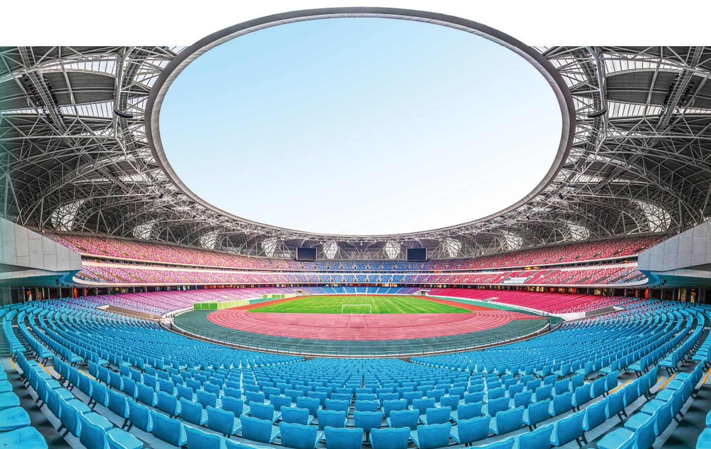

natural_image

Interior view of a large modern stadium with blue seating, red running track, and pink/red stadium seating (no visible text or signage)

# 义务教育教科书

# 数学

# 八年级 | 上册

顾问：汤涛

主 编: 马 复

副主编：章飞

本册主编：章飞

编写人员：（按姓氏笔画为序排列）

王永会 安志军 范宇

顾继玲 凌晓牧

# 致同学

亲爱的同学，祝贺你走进八年级！

七年级的学习中，我们体验了“数的扩充”——从小学学的数到有理数，学会了用方程、变量之间的关系描述并解决一些现实问题；认识了许多新的图形，探索了它们的一些基本性质；经历了收集与整理数据、获得有关信息的过程，初步体会了如何从数学的角度看待随机现象……

本学期，我们将探索勾股定理，利用它解决简单的实际问题；梳理以前探索过的有关图形的结论，以一些基本事实为出发点，证明有关平行线的定理；将再次经历数的扩充过程，认识无理数和实数；感受平面内确定位置的方法，学习数学上最常用的定位方法——平面直角坐标系，并借此将平面上的点与有序数对对应起来，使“形”与“数”融为一体；再次认识变量之间的关系，从“数”与“形”两个方面研究最为简单的函数——一次函数；认识二元一次方程组，感受一次函数与二元一次方程之间的关系，并利用它们解决许多现实且有趣的问题；学会用适当的“数”刻画一组数据的“集中趋势”“离散程度”，根据需要尝试对数据进行分类，能用适当的统计图直观反映数据分布的信息，进而作出合理的推断。

自己制订标准，并用数据说明哪一个城市夏天更热，会让你更像一个“有数学本领的人”；感受神奇的加密术、探索它与数学的关系，一定会给你带来惊喜。

熟练地进行“观察·思考”“尝试·思考”“操作·交流”“思考·交流”等活动，一定会让你的数学学习过程更有效。需要强调的是，认真地从事“回顾·反思”类活动，会让你更加明显地感受到自身的成长！

祝愿你的数学学习生活成功、快乐！

北师大版

# 目录

# 第一章 勾股定理

1 探索勾股定理 /2  
2 一定是直角三角形吗 /10  
3 勾股定理的应用 / 13

☆ 问题解决策略：反思 /16

回顾与思考 / 19

复习题 / 19

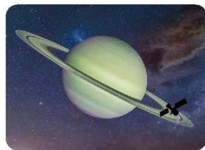

natural_image

Illustration of a planet with a ring and satellite orbiting its surface, set against a starry space background (no text or symbols)

# 第二章 实数

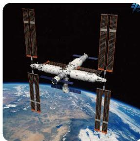

natural_image

Exterior view of a space station orbiting Earth, showing solar panels and modules (no text or symbols visible)

1 认识实数 / 25  
2 平方根与立方根 / 31  
3 二次根式 /41

回顾与思考 / 49

复习题 / 49

# 第三章 位置与坐标

1 确定位置 / 54  
2 平面直角坐标系 / 58  
3 轴对称与坐标变化 /68

回顾与思考 / 72

复习题 /72

natural_image

Aerial view of a large aircraft carrier sailing on the open sea with multiple smaller vessels trailing behind (no visible text or symbols)

# 第四章 一次函数

1 函数 /75  
2 认识一次函数 /79  
3 一次函数的图象 /89  
4 一次函数的应用 /95

回顾与思考 / 105

复习题 / 105

natural_image

Silhouette of a running person against a sunset sky with clouds (no text or symbols)

# 第五章 二元一次方程组

natural_image

Watercolor painting of a willow scene with a small figure, a house, and a fence (no text or symbols)

1 认识二元一次方程组 / 111  
2 二元一次方程组的解法 /115  
3 二元一次方程组的应用 / 120  
4 二元一次方程与一次函数 /128

\*5 三元一次方程组 /134

☆ 问题解决策略：逐步确定 /139

回顾与思考 / 141

复习题 / 141

# 第六章 数据的分析

1 平均数与方差 / 146  
2 中位数与箱线图 / 161  
3 哪个团队收益大 / 171

回顾与思考 / 174

复习题 /174

natural_image

Abstract blue spiral pattern with scattered numerical data (no text or symbols)

# 第七章 证明

1 为什么要证明 / 180  
2 认识证明 / 183  
3 平行线的证明 / 190

回顾与思考 / 197

复习题 / 197

natural_image

Abstract blue wave pattern with grid lines, no text or symbols present

# 综合与实践

哪个城市夏天更热 / 200

神奇的加密术 / 201

# 学习印记

北师大版

# 第一章 勾股定理

一个直角三角形的两条直角边的长度分别是 3 和 4，你知道它斜边的长度是多少吗？已知直角三角形两条边的长度，你能求出它第三条边的长度吗？实际上，利用勾股定理我们可以很容易地解决这些问题。

勾股定理是中国古代数学的成就之一，历史上其他一些文明古国也都独立地发现了这个定理，加之反映勾股定理内容的图形形象直观，于是有数学家曾建议用这个图形作为与“外星人”联系的信号。

让我们一起探索这个古老的定理吧！在探索过程中，你将进一步体会数与形的完美融合，形成逻辑表达和交流的习惯，感受数学的无穷魅力！

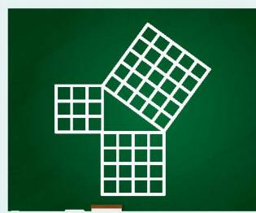

natural_image

Green chalkboard with three white grid patterns arranged in a triangular formation (no text or symbols)

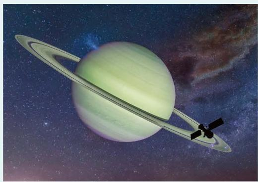

natural_image

Illustration of a planet with rings in space, featuring Saturn and a satellite against a starry background (no text or symbols)

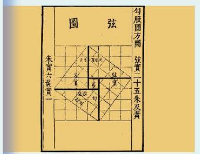

text_image

圖弦
勾殷圓方彡
法寶二十五朱及黃
朱南六黃寶一
乙酉
丙寅
丁酉
戊戌
庚寅
辛丑
壬寅
癸卯
癸巳
癸亥
癸未
癸丑
癸卯
癸巳
癸亥
癸未
癸丑
癸卯
癸巳
癸亥
癸未
癸丑
癸卯
癸巳
癸亥
癸未
癸丑
癸卯
癸巳
癸亥
癸未
癸丑
癸卯
癸巳
癸亥
癸未
癸丑
癸卯
癸巳
癸亥
癸未
癸丑
癸卯
癸巳
癸亥

# 在本章学习过程中，你可以持续思考以下问题：

你是如何获得勾股定理的？

三角形的内角大小是如何影响三角形三边的关系的？反过来呢？

# 探索勾股定理

如图 1-1, 从电线杆离地面 $8 \mathrm{~m}$ 处向地面拉一条钢索, 如果这条钢索在地面的固定点距离电线杆底部 $6 \mathrm{~m}$ , 那么需要多长的钢索?

在直角三角形中，任意两条边确定了，第三条边也就随之确定，三条边之间存在着一种特定的数量关系。事实上，古人发现，直角三角形的三条边长度的平方之间存在一种特殊的关系。让我们一起探索吧！

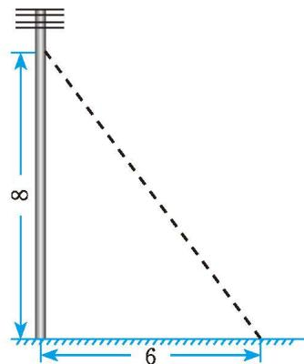

text_image

8
6

图 1- 1

> [!think] 思考·交流
(1) 在纸上画若干个直角三角形, 分别测量它们的三条边, 看看三条边长度的平方之间有怎样的关系。与同伴进行交流。  
(2) 如图 1-2①, 方格纸中每个小方格的边长均为 1 , 直角三角形三条边长度的平方分别是多少, 它们满足上面所猜想的数量关系吗? 如果直角三角形如图 1-3 所示, 结果又如何? 你是怎样计算的? 与同伴进行交流。  
(3) 如果直角三角形的两条直角边的长度分别是 1.6 和 2.4, 那么上面所猜想的数量关系还成立吗? 说说你的理由。

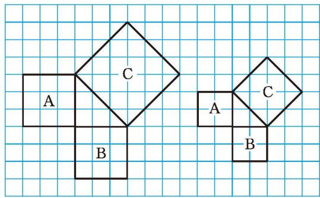

text_image

A
B
C
A
B
C

图1-2

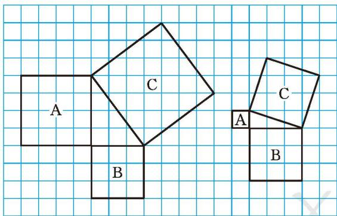

text_image

A
B
C
C
A
B

图1-3

通过上面的活动，你一定已经发现：直角三角形两条直角边长度的平方和等于斜边长度的平方。我国古代把直角三角形中较短的直角边称为勾，较长的直角边称为股，斜边称为弦。因此，人们把上面的结论称为勾股定理。

勾股定理 直角三角形两条直角边长度的平方和等于斜边长度的平方。
如果用 $a, b$ 和 $c$ 分别表示直角三角形的两条直角边和斜边的长度，那么
$\boldsymbol {a} ^ {2} + \boldsymbol {b} ^ {2} = \boldsymbol {c} ^ {2} 。$

# 尝试·思考

在图 1-1 的问题中，需要多长的钢索？

# 随堂练习

1. 求图中字母所代表的正方形的面积。

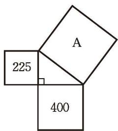

text_image

A
225
400

(1)

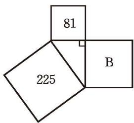

text_image

81
225
B

(2)   
(第1题)

2. 小明家买了一台 55 in $^{①}$ 的电视机。小明量了电视机的屏幕后，发现屏幕只有 121.5 cm 长和 68.5 cm 宽，他觉得一定是售货员搞错了。你同意他的想法吗？你能解释这是为什么吗？

在上一课，我们通过测量和数格子的方法发现了勾股定理。如图1-4，分别以直角三角形的三条边（ $a < b$ ）为边向外作正方形，你能利用这个图说明勾股定理的正确性吗？你是如何说明的？与同伴进行交流。

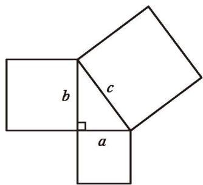

text_image

b
c
a

图1-4

# 尝试·思考

为了计算图 1-4 中大正方形的面积，小明对这个大正方形适当割补后，分别得到图 1-5、图 1-6。

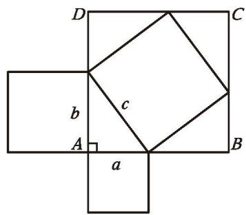

text_image

D
C
b
c
A
a
B

图1-5

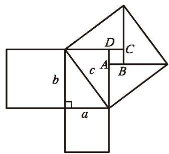

text_image

D
C
A
B
b
c
a

图1-6
(1) 将所有三角形的面积和正方形的面积用含 $a, b, c$ 的式子表示出来。  
(2) 图 1-5、图 1-6 中正方形 $ABCD$ 的面积分别是多少? 你有哪些表示方式?  
(3) 你能分别利用图 1-5、图 1-6 验证勾股定理吗?

勾股定理在我国有着悠久的历史。汉末三国初数学家、天文学家赵爽（3世纪初）在给《周髀》作注时，给出了相对完整的表述：“勾、股各自乘，并之为弦实。开方除之，即弦。”他利用“勾股圆方图”直观地论证了勾股定理。后人通常把图1-7称为“赵爽弦图”，2002年国际数学家大会会标的主要图案（如图1-8）就取材于此图。

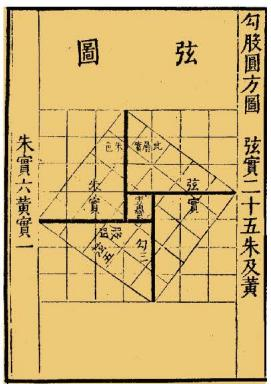

text_image

圖弦
勾胶圓方圖
弦實二十五朱及黃
朱實六黃實一
乙巳
癸卯
戊寅
己亥
庚辰
辛丑
壬寅
癸卯
癸巳
乙巳
癸卯
戊寅
己亥
庚辰
辛丑
壬寅
癸卯
癸巳
乙巳
癸卯
戊寅
己亥
庚辰
辛丑
壬寅
癸卯
癸巳
乙巳
癸卯
戊寅
己亥
庚辰
辛丑
壬寅
癸卯
癸巳
乙巳
癸卯
戊寅
己亥
庚辰
辛丑

图1-7

natural_image

Abstract red geometric shape with a white square cutout (no text or symbols)

图1-8

例 在一次军事演习中，红方侦察员王叔叔在距离一条东西向公路 $400 \mathrm{~m}$ 处侦察，发现一辆蓝方汽车在这条公路上疾驶。他用红外测距仪测得汽车与他相距 $400 \mathrm{~m}$ ；过了 $10 \mathrm{~s}$ ，测得汽车与他相距 $500 \mathrm{~m}$ 。你能帮王叔叔计算蓝方汽车这 $10 \mathrm{~s}$ 的平均速度吗？
分析：你能根据题意画出图形吗？在你画的图形中存在一个怎样的三角形？
解: 根据题意, 可以画出图 1-9, 其中点 $A$ 表示王叔叔所在位置, 点 $C$ , 点 $B$ 表示两个时刻蓝方汽车的位置。由于王叔叔距离公路 $400 \mathrm{~m}$ , 因此 $\angle C$ 是直角。由勾股定理, 可得
$A B ^ {2} = B C ^ {2} + A C ^ {2},$

也就是
$5 0 0 ^ {2} = B C ^ {2} + 4 0 0 ^ {2} \text { 。 }$
所以 BC = 300 m。

蓝方汽车 10 s 行驶了 300 m，那么它平均每秒行驶
$3 0 0 \div 1 0 = 3 0 (\mathrm{m}) _ {\circ}$
因此，蓝方汽车这 10 s 的平均速度为 30 m/s。

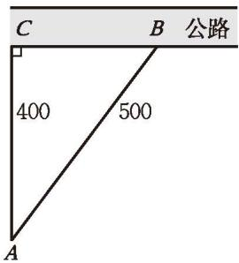

text_image

C
B 公路
400
500
A

图1-9

> [!think] 思考·交流
如果一个三角形是钝角三角形或锐角三角形，那么它的三边长仍然满足“最长边长的平方等于另外两边长的平方和”吗？以图1-10为例（方格纸中每个小方格的边长均为1），说说你的判断和理由，并与同伴进行交流。

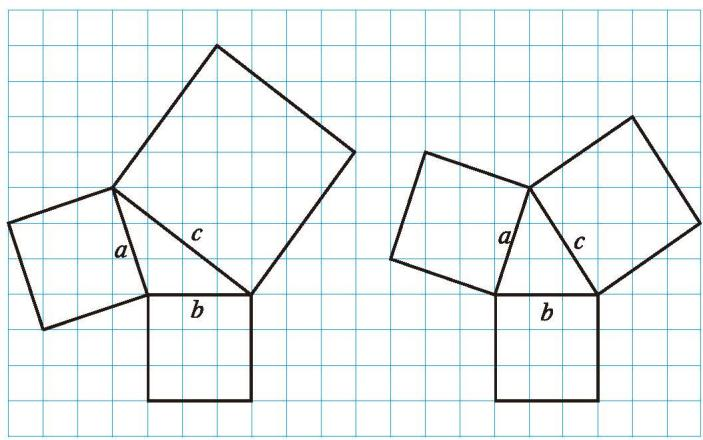

text_image

a
c
b
a
c
b

图1-10

text_image

也可以用数学软件验证你的判断。

也可以用数学软件验证你的判断。

# 随堂练习

1. 右图是某沿江地区交通平面图的一部分（单位：km），为了加快经济发展，该地区拟修建一条连接 M, O, Q 三城市的沿江高速公路，已知沿江高速公路的建设成本是 5000 万元/km，该沿江高速公路的建设成本预计是多少？

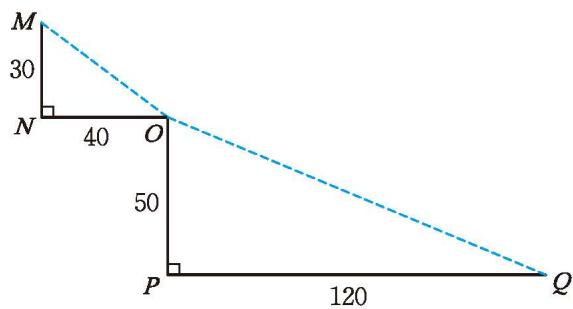

text_image

M
30
N
40
O
50
P
120
Q

(第1题)

# 阅读·思考

# 漫话勾股世界

我国是最早了解勾股定理的国家之一。早在3000多年前，周朝数学家商高就提出，将一根直尺折成一个直角，如果勾等于三、股等于四，那么弦就等于五，即“勾三、股四、弦五”。它被记载于我国古代著名的数学著作《周髀》中。在这本书中的另一处，还记载了勾股定理的一般形式。我国古代验证勾股定理，多将图形先分割再进行拼接，拼接前后图形的面积不变，这实际上运用了中国古代数学中非常重要的“出入相补”原理。你能看懂图1-11所示的“青朱出入图”是如何验证勾股定理的吗？

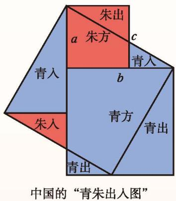

text_image

朱出
a 朱方 c
青入
b
青方
青出
朱入
青出
中国的“青朱出入图”

图 1-11

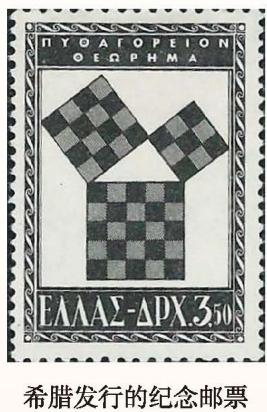

text_image

ΠΥΟΔΓΟΡΕΙΟΝ
ΟΕΩΡΗΜΑ
ΕΛΛΑΣ-ΔΡΧ.350
希腊发行的纪念邮票

图1-12

相传 2000 多年前，古希腊的毕达哥拉斯学派首先证明了勾股定理，因此在很多国家，人们通常称勾股定理为毕达哥拉斯定理。毕达哥拉斯学派是以古希腊哲学家、数学家毕达哥拉斯（Pythagoras，前 580 至前 570 之间—约前 500）为代表人物的一个学派。为了纪念毕达哥拉斯学派，1955 年希腊发行了一枚纪念邮票，如图 1-12 所示。
事实上，勾股定理的证明方法十分丰富，达数百种之多。其中有一类方法尤为独特，单靠移动部分图形就直观地证明了勾股定理，被誉为“无字的证明”，让我们欣赏两种（如图1-13）！

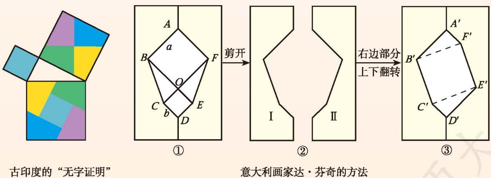

text_image

古印度的“无字证明”
①
剪开
意大利画家达·芬奇的方法
②
右边部分
上下翻转
③

图1-13

## 习题1.1

# 知识技能

1. 求出图中直角三角形未知边的长度。  
2. 求斜边长为 $17 \mathrm{~cm}$ 、一条直角边长为 $15 \mathrm{~cm}$ 的直角三角形的面积。

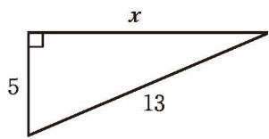

text_image

x
5
13

(第1题)

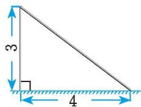

text_image

3
4

(第3题)

3. 如图, 强大的台风使一根旗杆在离地面 $3 \mathrm{~m}$ 处折断倒下, 旗杆顶部落在离旗杆底部 $4 \mathrm{~m}$ 处。旗杆折断之前有多高?

# 数学理解

※4. 如图, 所有的四边形都是正方形, 所有的三角形都是直角三角形。请在图中找出若干图形, 使得它们的面积之和恰好等于最大正方形 ① 的面积, 尝试给出两种以上的方案。

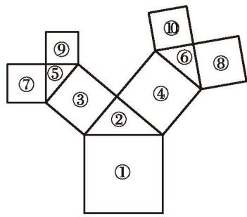

text_image

①
②
③
④
⑤
⑥
⑦
⑧
⑨

(第4题)

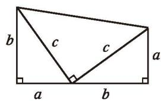

text_image

b
c
c
a
a
b

(第5题)

5. 请用如图所示的图形验证勾股定理，并说一说这一方法与课堂上的方法之间的联系。

# 问题解决

6. 如图（单位：cm），求等腰三角形 $ABC$ 的面积。

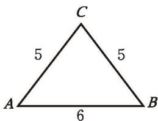

text_image

C
5 5
A 6 B

(第6题)

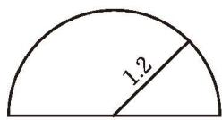

text_image

1.2

(第7题)

7. 如图, 某储藏室入口的横截面是一个半径为 $1.2 \mathrm{~m}$ 的半圆, 一个长、宽、高分别是 $1.2 \mathrm{~m}, 1 \mathrm{~m}, 0.8 \mathrm{~m}$ 的箱子能放进储藏室吗?

# > 联系拓广

8. 在一张纸上复制四个全等的直角三角形，并将四个三角形剪下来，通过拼图的方法验证勾股定理。你有哪些方法？说说你的方法与课堂上的方法之间有什么联系与区别。

# 2) 一定是直角三角形吗

在一个直角三角形中，两条直角边长度的平方和等于斜边长度的平方。反过来，如果一个三角形中有两条边长度的平方和等于第三条边长度的平方，那么这个三角形是直角三角形吗？

可以画一些满足这个条件的三角形试一试!

> [!think] 思考·交流

下面的每组数分别是一个三角形三条边的长度 $a, b, c$ ，而且都满足 $a^2 + b^2 = c^2$ :

3, 4, 5; 5, 12, 13; 8, 15, 17; 7, 24, 25; 9, 40, 41。

分别以每组数为三条边的长度画出三角形，它们都是直角三角形吗？你是怎么想的？与同伴进行交流。
如果三角形三条边的长度 $a, b, c$ 满足 $a^2 + b^2 = c^2$ ，那么这个三角形是直角三角形。

满足 $a^{2}+b^{2}=c^{2}$ 的三个正整数，称为勾股数。

例 一个零件的形状如图 1-14 所示, 按规定这个零件中 $\angle A$ 和 $\angle DBC$ 都应为直角。工人师傅量得这个零件各边尺寸如图 1-15 所示 (单位: cm), 这个零件符合要求吗?

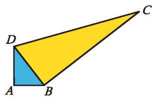

text_image

Geometric diagram of a quadrilateral ABCD with shaded interior region BD, labeled with vertices A, B, C, D.

图 1-14

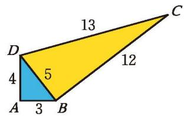

text_image

13
D 5 12
4
A 3 B C

图1-15
解: 在 $\triangle ABD$ 中, $AB^{2} + AD^{2} = 9 + 16 = 25 = BD^{2}$ , 所以 $\triangle ABD$ 是直角三角形, $\angle A$ 是直角。

在 $\triangle BCD$ 中, $BD^{2} + BC^{2} = 25 + 144 = 169 = CD^{2}$ , 所以 $\triangle BCD$ 是直角三角形, $\angle DBC$ 是直角。
因此，这个零件符合要求。

# 回顾·反思

回顾勾股定理的学习过程，你积累了哪些研究问题的经验和方法？

# 随堂练习

1. 下列几组数能否作为直角三角形三条边的长度？说说你的理由。
(1) 9, 12, 15;
(2) 12, 18, 22;
(3) 12, 35, 36;
(4) 15, 36, 39。

2. 如图, 在正方形 $ABCD$ 中, $AB = 4$ , $AE = 2$ , $DF = 1$ , 图中有几个直角三角形? 你是如何判断的?

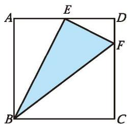

text_image

A
E
D
F
B
C

(第2题)

## 习题1.2

# > 知识技能

1. 如果三条线段 $a, b, c$ 满足 $a^2 = c^2 - b^2$ , 那么这三条线段组成的三角形是直角三角形吗? 为什么?

# 数学理解

2. 如果将直角三角形的三条边长同时扩大相同的倍数，那么得到的三角形还是直角三角形吗？你还能提出什么问题？

3. 如图, 方格纸中哪些三角形是直角三角形, 哪些不是? 说说你的理由。

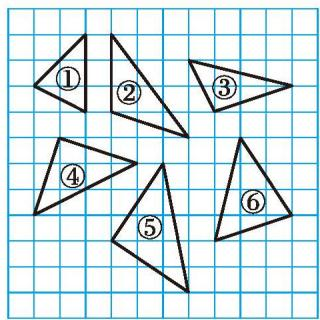

text_image

①
②
③
④
⑤
⑥

(第3题)

# 问题解决

4. 美国哥伦比亚大学收藏有一块古巴比伦时代的泥板，其中有4列15行数字。经研究，这块泥板第二列、第三列的数字实际上相当于下表第二列、第三列的数字，而且每一行的第二列数字、第三列数字与下表中同一行的第一列数字都存在着同一种关系。你知道这些数字间的关系吗？借助计算器进行探索。

<table><tr><td>第一列</td><td>第二列</td><td>第三列</td></tr><tr><td>120</td><td>119</td><td>169</td></tr><tr><td>3 456</td><td>3 367</td><td>4 825</td></tr><tr><td>4 800</td><td>4 601</td><td>6 649</td></tr><tr><td>13 500</td><td>12 709</td><td>18 541</td></tr><tr><td>72</td><td>65</td><td>97</td></tr><tr><td>360</td><td>319</td><td>481</td></tr><tr><td>2 700</td><td>2 291</td><td>3 541</td></tr><tr><td>960</td><td>799</td><td>1 249</td></tr><tr><td>600</td><td>481</td><td>769</td></tr><tr><td>6 480</td><td>4 961</td><td>8 161</td></tr><tr><td>60</td><td>45</td><td>75</td></tr><tr><td>2 400</td><td>1 679</td><td>2 929</td></tr><tr><td>240</td><td>161</td><td>289</td></tr><tr><td>2 700</td><td>1 771</td><td>3 229</td></tr><tr><td>90</td><td>56</td><td>106</td></tr></table>

※5. 如果只给你一根长绳子，那么你如何利用它得到一个直角？

# 勾股定理的应用

装修工人李叔叔想检测某块装修用砖（如图 1-16）的边 AD 和边 BC 是否分别垂直于边 AB。

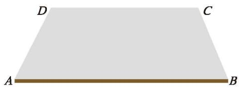

natural_image

Simple geometric diagram of a trapezoid with labeled vertices A, B, C, D (no additional text or symbols)

图1-16
（1）如果李叔叔随身只带了卷尺，那么你能替他想办法完成任务吗？  
(2) 李叔叔测得边 $AD$ 长 $30 \mathrm{~cm}$ , 边 $AB$ 长 $40 \mathrm{~cm}$ , 点 $B$ , $D$ 之间的距离是 $50 \mathrm{~cm}$ 。边 $AD$ 垂直于边 $AB$ 吗?  
(3) 如果李叔叔随身只带了一把长度为 $20 \mathrm{~cm}$ 的刻度尺, 那么他能检验边 $A D$ 是否垂直于边 $A B$ 吗?

# 尝试·思考

如图 1-17，正方形纸片 ABCD 的边长为 8 cm，点 E 是边 AD 的中点，将这张正方形纸片翻折，使点 C 落到点 E 处，折痕交边 AB 于点 G，交边 CD 于点 F。你能求出 DF 的长吗？

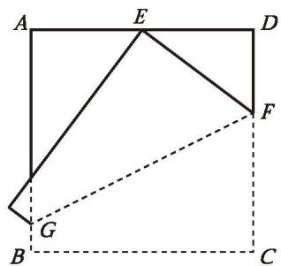

text_image

A
E
D
F
G
B
C

图 1-17

例 今有池方一丈，葭生其中央，出水一尺。引葭赴岸，适与岸齐。问：水深、葭长各几何？（选自《九章算术》）

题目大意：有一个水池，水面是一个边长为 1 丈 $^{①}$ 的正方形。在水池正中央有一根新生的芦苇，它高出水面 1 尺（如图 1-18）。如果把这根芦苇垂直拉向岸边，那么它的顶端恰好到达岸边的水面。这个水池的深度和这根芦苇的长度各是多少？

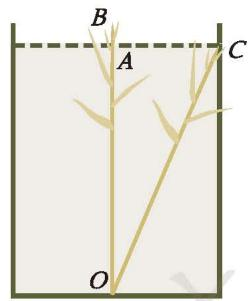

text_image

B
A
C
O

图 1-18
解: 设水池的深度 $OA$ 为 $x$ 尺, 则芦苇的长度 $OB$ 为 $(x + 1)$ 尺。由于芦苇位于水池中央, 所以 $AC$ 为 5 尺。在 Rt△OAC 中, 由勾股定理, 可得
$A C ^ {2} + O A ^ {2} = O C ^ {2},$
即 $5^{2} + x^{2} = (x + 1)^{2}$ 。
解得 $x = 12$ 。
$1 2 + 1 = 1 3 。$
因此，水池的深度是12尺，芦苇的长度是13尺。

# 随堂练习

1. 五根小木棒的长度分别是 $7 \mathrm{~cm}, 15 \mathrm{~cm}, 20 \mathrm{~cm}, 24 \mathrm{~cm}, 25 \mathrm{~cm}$ , 现将它们摆成两个直角三角形, 如图所示的三个图形中哪个是正确的?
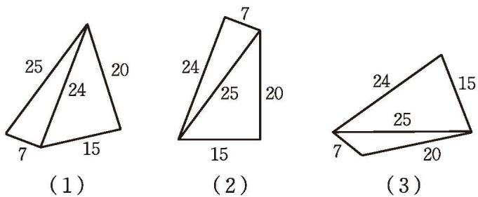

（第1题）

## 习题1.3

# > 知识技能

1. 如图（单位：cm），阴影部分是一个长方形，它的面积是多少？

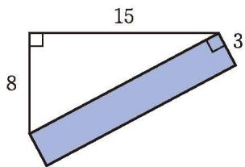

text_image

15
8
3

(第1题)

# 问题解决

2. 如图, 一座城墙高 $11.7 \mathrm{~m}$ , 墙外有一条护城河, 在护城河外距离城墙根 $9 \mathrm{~m}$ 处架一架长为 $15 \mathrm{~m}$ 的云梯, 该云梯能否抵达城墙的顶端? 为什么?

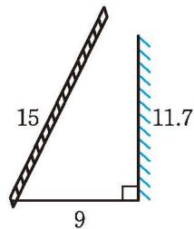

text_image

15
9
11.7

(第2题)

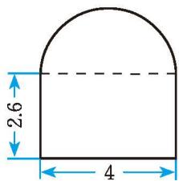

text_image

2.6
4

(第3题)

3. 如图, 某隧道的横截面由半圆和长方形构成, 其中长方形的长为 $4 \mathrm{~m}$ , 宽为 $2.6 \mathrm{~m}$ 。一辆卡车装满货物后, 高为 $3.6 \mathrm{~m}$ , 宽为 $2.4 \mathrm{~m}$ , 它能通过该隧道吗?

※4. 借助勾股定理，请你利用升旗的绳子、卷尺设计一个方案，测算旗杆的高度。

# 问题解决策略：反思
解决问题之后，对解决问题的过程、方法及问题的变化等方面进行反思，可以加深对问题及解决问题的思路、策略与方法的理解，丰富解决问题的经验，提高解决问题的能力。

问题 如图 1-19, 一个圆柱的高为 $12 \mathrm{~cm}$ , 底面圆的周长为 $18 \mathrm{~cm}$ 。在圆柱下底面的点 $A$ 处有一只蚂蚁, 它想吃到上底面上与点 $A$ 相对的点 $B$ 处的食物, 那么它沿圆柱侧面爬行的最短路程是多少?

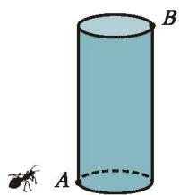

natural_image

Simple 3D illustration of a cylinder with an ant on its side (no text or symbols)

图 1-19

# 理解问题
(1) 在这个问题中, 已知条件有哪些? 你认为已知条件足够解决这个问题吗?  
(2) 沿侧面爬行的可能路线有哪些? 什么情况下路线最短? 请你用圆柱形水杯等物品实际感受一下。

# 拟订计划
(1) 以前研究过最短路线问题吗? 这个问题与以前研究的最短路线问题有什么不同?  
(2) 如何将曲面上的最短路线问题转化为平面上的最短路线问题? 各个点的位置如何确定?

# 实施计划
(1) 如图 1-20, 将圆柱剪开, 确定侧面展开图的形状, 以及与圆柱的对应关系。  
(2) 在图 1-20 中标出点 $B$ 的位置。  
(3) 在图 1-20 中确定 $A, B$ 两点之间最短的路线，并计算它的长度。

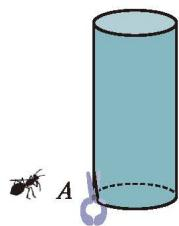

natural_image

Illustration of an ant next to a cylinder with a small loop and letter A, no text or symbols present.

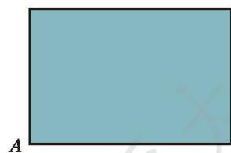

natural_image

Simple geometric shape with a light blue rectangle and label 'A' at the bottom left (no text or symbols within the shape)

图1-20

# 回顾反思
(1) 在拟订解决问题的方案和实施方案的过程中, 你获得了哪些经验? 与同伴进行交流。  
(2) 这个问题中, 影响结果的量有哪些? 如果改变有关的量, 你还能求解吗? 例如, 改变圆柱的形状, 改变点 $A$ 、点 $B$ 的位置, 改为沿着圆柱表面爬行……这时又会有哪些新的问题? 选择部分问题进行研究, 并与同伴进行交流。  
(3) 解决这个问题的经验, 还可以应用到哪些问题中? 例如, 能否解决正方体、长方体等几何体表面两点之间的最短距离问题?  
(4) 生活中还有哪些现实问题涉及几何体表面上的最短距离? 举几个实例, 并思考解决问题的方案。  
(5) 对于解决问题之后的回顾反思, 你有哪些体会? 与同伴进行交流。
解决问题之后的反思，一般可以关注以下几个方面：反思解决问题的过程，强化解决问题的经验；比较解决问题的方法，形成多样的解决问题的方法；思考方法的本质，促进方法的运用；改变问题的条件，研究更多的问题。

一题多解，一法多用，一题多变。

请你解答下列问题。

1. 解决下列几个问题，并说明它们与本节课问题的区别与联系。
(1) 如图 1-21, 圆柱的高为 $13 \mathrm{~cm}$ , 底面周长为 $10 \mathrm{~cm}$ , 在圆柱下底面的点 $A$ 处有一只蚂蚁, 它想吃到与点 $A$ 相对、离上底面 $1 \mathrm{~cm}$ 的点 $B$ 处的食物, 那么它沿圆柱侧面爬行的最短路程是多少?
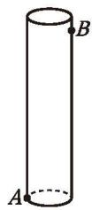

图1-21

(2) 如图 1-22, 一个长方体形盒子的长、宽、高分别是 $8 \mathrm{~cm}, 8 \mathrm{~cm}, 12 \mathrm{~cm}$ , 一只蚂蚁想从盒底的点 $A$ 处沿盒的外表面爬到盒顶的点 $B$ 处, 你能帮蚂蚁设计一条最短的路线吗? 蚂蚁爬行的最短路程是多少?

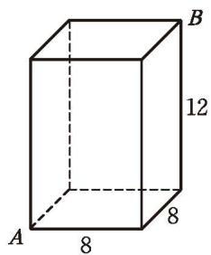

text_image

A
8
B
12
8

图 1-22
(3) 为了营造节日气氛, 学校准备在大厅圆柱上缠绕彩带。已知大厅圆柱的高为 $6 \mathrm{~m}$ , 底面周长为 $2 \mathrm{~m}$ 。如果希望彩带从圆柱底端绕圆柱 4 圈后正好到达顶端, 那么至少需要彩带多少米?

2. 两个正数的和是12，求它们积的最大值。
(1) 你有哪些解决问题的方法?  
(2) 解决这个问题的过程中你积累了哪些经验?  
(3) 你还能提出哪些类似的问题？与同伴进行交流。

# 回顾与思考

1. 直角三角形的边、角之间分别存在着怎样的关系？  
2. 举例说明如何判断一个三角形是否为直角三角形。  
3. 请你举出一个生活中的实际问题，并运用勾股定理解决它。  
4. 你了解勾股定理的历史吗？请查阅资料，并与同伴进行交流。  
5. 梳理探索勾股定理的方法，你积累了哪些经验？

# 复习题

# 知识技能

1. 如图, 方格纸中每个小方格的边长均为 $1 \mathrm{~cm}$ , 一只蚂蚁沿图中所示的折线由点 $A$ 处爬到了点 $D$ 处, 它一共爬行了多少厘米?

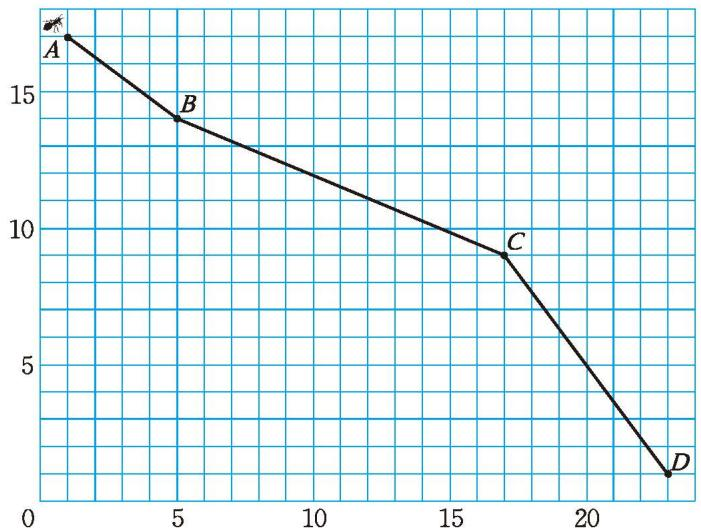

line

| Point | X  | Y  |
|-------|----|----|
| A     | 0  | 17 |
| B     | 5  | 14 |
| C     | 17 | 9  |
| D     | 22 | 1  |

(第1题)

2. 如图, $BC$ 长为 $3 \mathrm{~cm}$ , $AB$ 长为 $4 \mathrm{~cm}$ , $AF$ 长为 $12 \mathrm{~cm}$ 。求正方形 CDEF 的面积。

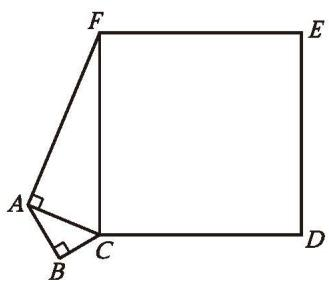

text_image

Geometric diagram showing a square with labeled vertices A, B, C, D, E, F and right-angle markers at A and B.

(第2题)

# > 数学理解

3. 如图, 直角三角形三边上的半圆面积之间有什么关系?

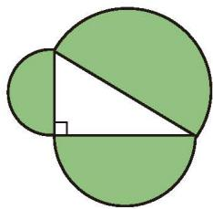

natural_image

Geometric diagram showing a triangle inscribed in a circle with an adjacent square, no text or symbols present.

(第3题)

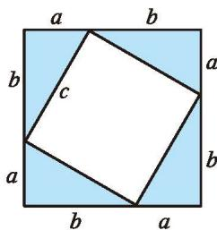

text_image

a
b
b
c
a
b
a
b

(第4题)

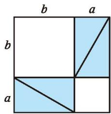

text_image

b
a
b
a

4. 据传，当年毕达哥拉斯借助如图所示的两个图验证了勾股定理，请你说说其中的道理。

5. 据说古埃及人曾用下面的方法得到直角: 如图所示, 他们用 13 个等距的结把一根绳子的一部分分成等长的 12 段, 一个人同时握住绳子的第 1 个结和第 13 个结, 另两个人分别握住第 4 个结和第 8 个结, 拉紧绳子, 就会得到一个直角三角形, 其直角顶点在第 4 个结处。请你说说其中的道理。

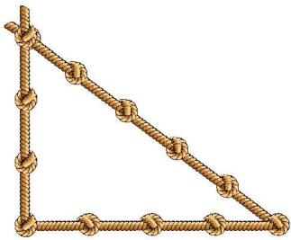

natural_image

Geometric diagram of a right triangle formed by multiple rope knots (no text or symbols)

(第5题)

6. 如图，方格纸中每个小方格的边长均为 1。
(1) 在方格纸上, 以线段 $AB$ 为边画正方形, 求所画正方形的面积, 并解释你的计算方法; (2) 请在方格纸上分别画出面积为 5, 10, 13 的正方形。

7. 如图 ①, 直角三角形的两个锐角分别是 $40^{\circ}$ 和 $50^{\circ}$ , 它的三边上各有一个正方形。执行下面的操作: 分别以两个小正方形的边为斜边, 向外作一个锐角为 $40^{\circ}$ 的直角三角形; 再分别

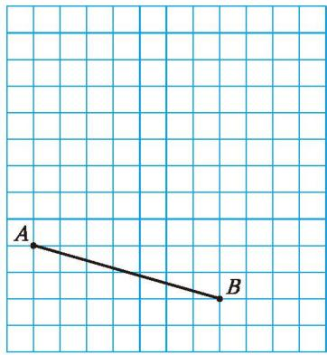

text_image

A
B

(第6题)

以所得到的直角三角形的直角边为边，向直角三角形外作正方形。图②是1次操作后得到的图形。

text_image

a
b
c

①

text_image

a
b
c

②   
(第7题)
(1) 试画出 2 次操作后得到的图形。  
(2)已知最初的直角三角形斜边长 $c$ 为 $1 \mathrm{~cm}$ , 写出 2 次操作后得到的图形中所有正方形的面积和。  
(3) 如果一直画下去, 你能想象出它的样子吗? 请借助数学软件进行探索。  
(4) 重复上述步骤若干次后得到的图形称为 “毕达哥拉斯树”。如果最初的直角三角形是等腰直角三角形, 那么此时 “毕达哥拉斯树” 会是什么形状?

※8. (1) 已知直角三角形的三边长均为正整数, 其中一直角边长为 8 , 求这个直角三角形的另两边长;
(2) 根据求解 (1) 的经验, 尝试探索出更多的勾股数组。

# 问题解决

9. 一架云梯长 $25 \mathrm{~m}$ , 如图那样斜靠在一面墙上。当这架云梯的顶端位于 $A$ 处时, 它的底端位于 $B$ 处, 底端离墙 $7 \mathrm{~m}$ 。
(1) 这架云梯的顶端到地面的距离是多少?  
(2) 当这架云梯的顶端从 $A$ 处下滑 $4 \mathrm{~m}$ 到达 $A'$ 处时, 它的底端从 $B$ 处滑动到 $B'$ 处, 云梯底端在水平方向滑动的距离也是 $4 \mathrm{~m}$ 吗?

text_image

A
A'
B
B'

(第9题)

text_image

5
B
C
20
15
A
10

(第10题)

10. 如图, 一个长方体形盒子的长为 $15 \mathrm{~cm}$ , 宽为 $10 \mathrm{~cm}$ , 高为 $20 \mathrm{~cm}$ , 点 $B$ 到点 $C$ 的距离是 $5 \mathrm{~cm}$ 。一只蚂蚁沿盒的外表面从点 $A$ 处爬到点 $B$ 处, 那么它爬行的最短路程是多少?  
11. 今有木长二丈，围之三尺。葛生其下，缠木七周，上与木齐。问：葛长几何？（选自《九章算术》）

题目大意：有一棵树（将树看作一个圆柱）高2丈，底面周长是3尺，一条生长在树底下的藤从树底部开始均匀缠绕树7圈（如图），上端刚好与树顶端齐平。这条藤的长度是多少？

（第11题）

※12. 今有立木，系索其末，委地三尺。引索却行，去本八尺而索尽。问：索长几何？（选自《九章算术》）

题目大意: 在直立于地面的一根木杆顶端系一根绳索, 绳索自然下垂后拖在地面上的长度为 3 尺 (如图)。在距木杆底端 8 尺处的地面拉紧绳索, 整根绳索恰好被拉直。这根绳索有多长?

将这个问题一般化, 即已知直角三角形的勾长 $a$ , 弦长与股长的差为 $d$ , 求弦长 $c$ 。
(1) 试用 a, d 表示 c;
(2) 查阅资料, 了解《九章算术》解决这类问题的思路与方法。

text_image

Diagram showing two geometric setups with labeled dimensions: one with a vertical line and horizontal base, the other with a right triangle and horizontal base.

(第12题)

# 联系拓广

13. 装修工人携带了一根装饰用的木条，乘电梯到小明家安装。如图，已知电梯的长、宽、高分别是 $1.5 \mathrm{~m}, 1.5 \mathrm{~m}, 2.2 \mathrm{~m}$ ，那么一根 $3.1 \mathrm{~m}$ 长的木条能否放入电梯内？

※14. (1) 大家知道 $(3, 4, 5)(5, 12, 13)(8, 15, 17)$ 都是勾股数组。有人说勾股数组中一定有一个偶数，你认为这种观点正确吗？请说明你的理由。
(2) 你还能发现勾股数组具有哪些规律？与同伴进行交流。
(3) 小明发现: 很多已经约去公因数的勾股数组中, 都有一个数是偶数, 如果将它写成 $2mn$ , 那么另外两个数分别可以写成 $m^{2} + n^{2}$ , $m^{2} - n^{2}$ , 如 $4 = 2 \times 2 \times 1$ , $5 = 2^{2} + 1^{2}$ , $3 = 2^{2} - 1^{2}$ 。再找几个勾股数组, 看看他发现的规律是否正确。满足这个规律的数组都是勾股数组吗?

15. 在学习了勾股定理的相关内容后，你有什么收获和体会？查阅、收集更多有关勾股定理的资料，并与同伴进行交流。

text_image

2.2
1.5
1.5

(第13题)

# 第二章 实数

古希腊的毕达哥拉斯学派认为，所有的数量都可以用整数或整数的比表示，这个论断正确吗？你能求出面积为2的正方形的边长吗？它能用整数或分数（即有理数）来表示吗？

随着人类对数的认识的不断发展，人们发现现实世界中确实存在不同于有理数的数。本章将学习无理数、实数、平方根、立方根等概念，进行实数的运算，并利用实数的有关知识解决实际问题。学习过程中，你将经历从具体情境中抽象数学问题的过程，感受归纳、类比等研究问题和发现结论的方法，发展抽象能力、推理能力和运算能力等。

natural_image

Composite image showing a bearded man's profile, a space station orbiting Earth, and a planetary model against a starry sky (no text or symbols)

# 在本章学习过程中，你可以持续思考以下问题：

为什么要学习无理数？学习无理数后，你对数及其运算又有哪些新的认识？

从非负数到有理数，再从有理数到实数，这两个研究过程有哪些类似之处？

# 认识实数

图 2-1 中是两个边长为 1 的小正方形，剪一剪、拼一拼，设法得到一个大的正方形。
(1) 设大正方形的边长为 $a, a$ 满足什么条件?

text_image

1
1

text_image

1
1

图2-1
(2) a 可能是整数吗？说说你的理由。  
(3) $a$ 可能是分数吗? 说说你的理由, 并与同伴进行交流。
事实上，满足等式 $a^2 = 2$ 的 $a$ 既不是整数，也不是分数，所以 $a$ 不是有理数。

# 尝试·思考
(1) 如图 2-2, 以直角三角形的斜边为边的正方形的面积是多少?  
(2) 设该正方形的边长为 $b, b$ 满足什么条件?  
(3) b 是有理数吗?

natural_image

Geometric diagram of a tilted quadrilateral with labeled side lengths (1, 2) and right angle marker (no text or symbols beyond labels)

图2-2

在上面的两个问题中，数 $a, b$ 确实存在，但都不是有理数。

> [!think] 思考·交流

面积为 2 的正方形的边长 a 究竟是多少呢?
(1) 如图 2-3, 三个正方形的边长之间有怎样的大小关系? 说说你的理由。  
（2）边长 a 的整数部分是几？十分位是几？百分位呢？千分位呢？……借助计算器进行探索。  
(3) 小明将他的探索过程整理如下:

text_image

2
2

图2-3

<table><tr><td>边长a</td><td>面积S</td></tr><tr><td>1 &lt; a &lt; 2</td><td>1 &lt; S &lt; 4</td></tr><tr><td>1.4 &lt; a &lt; 1.5</td><td>1.96 &lt; S &lt; 2.25</td></tr><tr><td>1.41 &lt; a &lt; 1.42</td><td>1.988 1 &lt; S &lt; 2.016 4</td></tr><tr><td>1.414 &lt; a &lt; 1.415</td><td>1.999 396 &lt; S &lt; 2.002 225</td></tr><tr><td>1.414 2 &lt; a &lt; 1.414 3</td><td>1.999 961 64 &lt; S &lt; 2.000 244 49</td></tr></table>

还可以继续算下去吗？ $a$ 可能是有限小数吗？
(4) 面积为 5 的正方形的边长 $b$ 的值是多少? $b$ 可能是有限小数吗? 与同伴进行交流。
事实上， $a = 1.41421356\cdots, b = 2.23606797\cdots$ ，它们都不是有理数，都是无限不循环小数。

# 随堂练习

1. 如图, 等边三角形 $ABC$ 的边长为 2 , 高为 $h$ , $h$ 可能是有理数吗?

text_image

A
2
h
B
C

(第1题)

一般地，不是有理数的数都是无限不循环小数吗？为了研究这个问题，我们不妨看看有理数的小数表示有什么共同特征。

把下列各数表示成小数，你发现了什么？
$3, \frac {4}{5}, \frac {5}{9}, - \frac {8}{4 5}, \frac {2}{1 1} 。$
事实上，有理数总可以用有限小数或无限循环小数表示。反过来，任何有限小数或无限循环小数也都是有理数。那些不是有理数的数，用小数表示是无限不循环小数，无限不循环小数不是有理数。

无限不循环小数称为无理数（irrational number）。

除了像前面所述的数 $a, b$ 是无理数外，我们十分熟悉的圆周率
$\pi = 3. 1 4 1 5 9 2 6 5 \dots$

也是一个无理数。再如

0.585 885 888 588 885…(相邻两个5之间8的个数逐次加1),也是无理数。

例 下列各数中，哪些是有理数，哪些是无理数？

3.14, $-\frac{4}{3}$ , $0.57$ , 0.101 000 100 000 1…(相邻两个1之间0的个数逐次加2)。
解：3.14， $-\frac{4}{3}$ ，0.57是有理数。

0.101 000 100 000 1…（相邻两个 1 之间 0 的个数逐次加 2）是无理数。

有理数和无理数统称实数（real number），即实数可以分为有理数和无理数。

# 尝试·思考

无理数和有理数一样，也有正、负之分。
(1) 请你把上面例题中的各数填入下面相应的集合内。

natural_image

Simple oval shape with three dots below it, no text or symbols present

正数集合

natural_image

Simple oval shape with three dots below it, no text or symbols present

负数集合
(2) 还记得有理数的分类方法吗? 你能用类似的方法对实数进行分类吗?

在实数范围内，相反数、倒数、绝对值的意义与有理数范围内的相反数、倒数、绝对值的意义完全一样。实数和有理数一样，可以进行加、减、乘、除、乘方运算，而且有理数的运算法则与运算律对实数仍然适用。

在实数运算中，当遇到无理数且需要求出结果的近似值时，可以按照所要求的精确度，用相应的近似有限小数代替无理数进行计算。例如，求无理数
$a = 1. 4 1 4   2 1 3   5 6 \dots \text {与}    \pi = 3. 1 4 1   5 9 2   6 5 \dots$

的和（结果保留小数点后两位），可直接舍去 $a$ 和 $\pi$ 小数点后第三位以后的数字，得
$a \approx 1. 4 1 4, \pi \approx 3. 1 4 1,$
因此 $a + \pi \approx 1.414 + 3.141 = 4.555 \approx 4.56$ 。

> [!think] 思考·交流

前面讨论的两个正方形，边长分别是 $a, b$ ，且满足 $a^2 = 2, b^2 = 5$ 。
(1)如图2-4, $OA = OB$ , 数轴上点 $A$ 对应 $a, b$ 中的哪个数?  
(2) 你能在数轴上找到另一个数对应的点吗？与同伴进行交流。

text_image

-1
O
1
B
A
2
3

图2-4
事实上，每一个实数都可以用数轴上的一个点表示；反过来，数轴上的每一个点都表示一个实数。也就是说，实数和数轴上的点是一一对应的。

# 随堂练习

1. 下列各数中，哪些是有理数，哪些是无理数？
$0. 4 5 8 3, 3. \dot {7}, - \pi , - \frac {1}{7}, 1 8 。$

2. 比较 -3.14 与 $-\pi$ 的大小。  
3. a 是一个实数，它的相反数和绝对值如何表示？若 $a \neq 0$ ，则它的倒数如何表示？

# 阅读·思考

# 无理数的发现

毕达哥拉斯学派发现了无理数，这是数学史上的一件大事，它导致了第一次数学危机。

毕达哥拉斯学派有一个信条——“万物皆数”，即“宇宙间的一切现象都能归结为整数或整数之比”。也就是说，一切现象都可以用有理数去描述。公元前5世纪，毕达哥拉斯学派的一个成员希帕索斯（Hippasus，约公元前500年）发现，一些数不能用整数或整数之比来表示，如边长为1的正方形的对角线的长就无法用整数或整数之比来表示。这个发现动摇了毕达哥拉斯学派的信条，引起了信徒们的恐慌。据说，希帕索斯为此被投入了大海。后来，古希腊人终于正视了希帕索斯的发现，并进一步给出了证明。

假设边长为 1 的正方形的对角线的长可写成两个整数 $p$ , $q$ 的比 $\frac{p}{q} (p, q \text{互质})$ , 于是有 $(\frac{p}{q})^2 = 2$ , $p^2 = 2q^2$ 。
因此， $p^{2}$ 是偶数，p 是偶数。
于是可设 $p = 2m$ ，那么 $p^2 = 4m^2 = 2q^2$ ， $q^{2} = 2m^{2}$ 。
这就是说， $q^{2}$ 是偶数， $q$ 也是偶数。这与“ $p$ ， $q$ 是互质的两个整数”的假设矛盾。

从无理数的发现可以看出，无理数并不“无理”。有理数是能写成分数形式的数，无理数则是不能写成分数形式的数，“无理”的含义实质如此。无理数和有理数一样，都是现实世界中客观存在的量的反映。

## 习题2.1

# 知识技能

1. 下列各数中，哪些是有理数，哪些是无理数？
$-\frac{559}{180}, 3.9\dot{7}, -234.10101010\cdots$ （相邻两个1之间有1个0），

0.123 456 789 101 112 13…(小数部分由相继的正整数组成)。

# 数学理解

2. 判断正误:
(1) 所有无限小数都是无理数; ( )  
(2) 所有无理数都是无限小数; ( )  
(3) 有理数都是有限小数； ( )  
(4) 不是有限小数的数不是有理数。 ( )

3. 举出三个有关无理数的实例。

※4. 同一个正方形的边长和对角线的长度可能都是整数吗?

# 问题解决

5. 如图, $4 \times 4$ 的方格纸中每个小方格的边长均为 1 , 连接任意两个格点便可得到一条线段。试分别找出两条长度是有理数的线段和两条长度不是有理数的线段。

（第5题）

6. 请你在方格纸上分别按照如下要求设计一个直角三角形：
(1) 使它的三边中恰有一边边长不是有理数;  
(2) 使它的三边中恰有两边边长不是有理数;  
(3) 使它的三边边长都不是有理数。

# 联系拓广

7. 查阅资料，进一步了解数学史上无理数的发现历程。

# 平方根与立方根
(1) 根据图 2-5 填空:
$x ^ {2} = \underline {{\quad}},$
$y ^ {2} = \underline {{\quad}},$
$z ^ {2} = \underline {{\quad}},$
$w ^ {2} = \underline {{\quad}} \circ$
(2) $x, y, z, w$ 中哪些是有理数，哪些是无理数？你能表示它们吗？

text_image

E
w
1
z
D
A
y
1
x
C
1
O
1
B

图2-5

一般地，如果一个正数 $x$ 的平方等于 $a$ ，即 $x^{2} = a$ ，那么这个正数 $x$ 就叫作 $a$ 的算术平方根，记作 $\sqrt{a}$ ，读作“根号 $a$ ”。

特别地，我们规定：0 的算术平方根是 0，即 $\sqrt{0}=0$ 。

> [!example]- 例1 求下列各数的算术平方根：
(1) 900;
(2) 1;
(3) $\frac{49}{64}$ ;
(4) $14_{\circ}$
解: (1) 因为 $30^{2} = 900$ , 所以 900 的算术平方根是 30, 即 $\sqrt{900} = 30$ ;
(2) 因为 $1^{2} = 1$ , 所以 1 的算术平方根是 1, 即 $\sqrt{1} = 1$ ;
(3) 因为 $\left(\frac{7}{8}\right)^2 = \frac{49}{64}$ , 所以 $\frac{49}{64}$ 的算术平方根是 $\frac{7}{8}$ , 即 $\sqrt{\frac{49}{64}} = \frac{7}{8}$ ;
(4) 14 的算术平方根是 $\sqrt{14}$ 。

> [!think] 思考·交流
(1) 在上面例 1 中, 一些数的算术平方根的结果没有 “ $\sqrt{}$ ” 了, 这些数有什么特点?
(2) 在上面例 1 中, $\sqrt{900} = 30$ , 也就是 $\sqrt{30^2} = 30$ 。一般地, 当 $a \geqslant 0$ 时, $\sqrt{a^2} = a$ 成立吗?
当 $a < 0$ 时，
$\sqrt {a ^ {2}} = a$

还成立吗?
(3) $(\sqrt{a})^2 = a$ 成立吗? 这里的 $a$ 是什么数? 你是怎么理解的? 与同伴进行交流。
当 $a \geqslant 0$ 时， $\sqrt{a^2} = a, (\sqrt{a})^2 = a$ ；当 $a < 0$ 时， $\sqrt{a^2} = -a$ 。

> [!example]- 例2 由静止自由下落的物体下落的距离 $s$ (单位: $\mathrm{m}$ ) 与下落时间 $t$ (单位: $\mathrm{s}$ ) 之间的关系为 $s = 4.9 t^{2}$ 。有一个铁球从 $19.6 \mathrm{~m}$ 高的建筑物上由静止自由下落, 到达地面需要多长时间?
解：将 $s = 19.6$ 代入公式 $s = 4.9t^{2}$ ，得 $t^2 = 4$
所以 $t=\sqrt{4}=2$ 。
因此，铁球到达地面需要 2 s。

# 随堂练习

1. 求下列各数的算术平方根:

36, $\frac{9}{16}$ , 17, 0.81, $10^{-4}$ 。

2. 在 $\triangle ABC$ 中, $\angle C = 90^{\circ}$ , $BC = 3$ , $AC = 5$ , 求 $AB$ 的长。

3. 如图, 从帐篷支撑杆 $AB$ 的顶部 $A$ 向地面拉一根绳子 $AC$ 固定帐篷。若绳子的长度为 $8 \mathrm{~m}$ , 地面固定点 $C$ 到帐篷支撑杆底部 $B$ 的距离为 $6.4 \mathrm{~m}$ , 则帐篷支撑杆的高是多少?

natural_image

Geometric diagram of a triangular pyramid with labeled vertices A, B, and C (no text or symbols present)

(第3题)
(1) 3 的平方是 9，还有其他数的平方也是 9 吗？
(2) 平方等于 $\frac{4}{25}$ 的数有几个？平方等于 0.64 的数呢？

一般地，如果一个数 $x$ 的平方等于 $a$ ，即 $x^{2} = a$ ，那么这个数 $x$ 就叫作 $a$ 的平方根（square root，也叫作二次方根）。

# 尝试·思考
(1) 平方根和算术平方根有哪些相同点和不同点?  
(2) 一个正数有几个平方根? 0 有几个平方根? 负数呢?

一个正数有两个平方根；0 只有一个平方根，它是 0 本身；负数没有平方根。

正数 $a$ 有两个平方根，一个是 $a$ 的算术平方根 $\sqrt{a}$ ，另一个是 $-\sqrt{a}$ ，它们互为相反数。这两个平方根合起来可以记作 $\pm \sqrt{a}$ ，读作“正、负根号 $a$ ”。

求一个数 $a$ 的平方根的运算，叫作开平方（extraction of square root）， $a$ 叫作被开方数。

> [!example]- 例3 求下列各数的平方根：
(1) 64;
(2) $\frac{49}{121}$ ;
(3) 0.0004;
(4) $(-25)^{2}$ ;
(5) 11。
解: (1) 因为 $(\pm 8)^{2} = 64$ , 所以 $64$ 的平方根是 $\pm 8$ , 即 $\pm \sqrt{64} = \pm 8$ ;
(2) 因为 $\left(\pm\frac{7}{11}\right)^{2}=\frac{49}{121}$ ，所以 $\frac{49}{121}$ 的平方根是 $\pm\frac{7}{11}$ ，即 $\pm\sqrt{\frac{49}{121}}=\pm\frac{7}{11}$ ;  
（3）因为 $(\pm 0.02)^{2} = 0.0004$ ，所以0.0004的平方根是 $\pm 0.02$ ，即 $\pm \sqrt{0.0004} = \pm 0.02;$   
(4) 因为 $(\pm 25)^{2} = (-25)^{2}$ , 所以 $(-25)^{2}$ 的平方根是 $\pm 25$ , 即 $\pm \sqrt{(-25)^{2}} = \pm 25$ ;  
(5) 11 的平方根是 $\pm\sqrt{11}$ 。

> [!example]- 例4 求下列各式的值:
(1) $\sqrt{225}$ ;
(2) $-\sqrt{\frac{169}{4}};$
(3) $\sqrt{(-8)^2}$ 。
解：(1) $\sqrt{225}=\sqrt{15^{2}}=15;$
(2) $-\sqrt{\frac{169}{4}} = -\sqrt{\left(\frac{13}{2}\right)^2} = -\frac{13}{2};$
(3) $\sqrt{(-8)^2} = 8$ 。

# 随堂练习

1. 求下列各数的平方根：
$1. 4 4, 0, 8, \frac {1 0 0}{4 9}, 4 4 1, 1 9 6, 1 0 ^ {- 4} 。$

2. 填空：
(1) 25 的平方根是 \_\_\_\_；
(2) $\sqrt{(-5)^2} =$
(3) $(\sqrt{5})^{2}=$ \_\_\_\_;
(4) $(- \sqrt{5})^{2}=$ \_\_\_\_。

3. 当 a=5, b=12 时，求 $\sqrt{a^{2}+b^{2}}$ 的值。

图 2-6 是由大小相同的小立方块搭成的几何体。如果这个几何体的体积为 $216 \, cm^{3}$ ，那么每个小立方块的棱长是多少？

一般地，如果一个数 $x$ 的立方等于 $a$ ，即 $x^3 = a$ ，那么这个数 $x$ 就叫作 $a$ 的立方根（cubic root，也叫作三次方根）。如2是8的立方根， $-\frac{2}{3}$ 是 $-\frac{8}{27}$ 的立方根，0是0的立方根。

natural_image

3D cube composed of smaller blue cubes, no text or symbols present

图2-6

# 尝试·思考
(1) 一个数的平方根可能有两个, 一个数的立方根可能有几个呢?  
(2) 求 8, 0, -27 的立方根。  
(3) 正数有几个立方根? 0 有几个立方根? 负数呢?

每个数 a 都有一个立方根，记作 $\sqrt[3]{a}$ ，读作 “三次根号 a”。例如：当 $x^{3}=7$ 时，x 是 7 的立方根，记作 $x=\sqrt[3]{7}$ ；2 是 8 的立方根，记作 $\sqrt[3]{8}=2$ 。

正数的立方根是正数，0 的立方根是 0，负数的立方根是负数。

求一个数 a 的立方根的运算叫作开立方（extraction of cubic root），a 叫作被开方数。

# 例5 求下列各数的立方根：
(1) -27;
(2) $\frac{8}{125}$ ;
(3) 0.216;
(4) $-5$ 。
解：（1）因为 $(-3)^{3} = -27$ ，所以-27的立方根是-3，即 $\sqrt[3]{-27} = -3$ ；
(2) 因为 $\left(\frac{2}{5}\right)^{3}=\frac{8}{125}$ ，所以 $\frac{8}{125}$ 的立方根是 $\frac{2}{5}$ ，即 $\sqrt[3]{\frac{8}{125}}=\frac{2}{5}$ ;
（3）因为 $0.6^{3}=0.216$ ，所以 0.216 的立方根是 0.6，即 $\sqrt[3]{0.216}=0.6$ ;
(4) -5 的立方根是 $\sqrt[3]{-5}$ 。

> [!think] 思考·交流
(1) 在例 5 中, 一些数的立方根的结果没有 “ $\sqrt[3]{-}$ ” 了, 这些数有什么特点?
（2）在例5中， $\sqrt[3]{-27} = -3$ ，也就是 $\sqrt[3]{(-3)^{3}} = -3$ 。一般地， $\sqrt[3]{a^{3}} = a$ 成立吗？
(3) $\left(\sqrt[3]{a}\right)^{3}=a$ 成立吗？与同伴进行交流。

# 例6 求下列各式的值:
(1) $\sqrt[3]{-8}$ ;
(2) $\sqrt[3]{0.064}$ ;
(3) $-\sqrt[3]{\frac{8}{125}}$ ;
(4) $(\sqrt[3]{9})^3$ 。
解：(1) $\sqrt[3]{-8} = \sqrt[3]{(-2)^{3}} = -2;$
(2) $\sqrt[3]{0.064} = \sqrt[3]{0.4^3} = 0.4$ ;
(3) $-\sqrt[3]{\frac{8}{125}} = -\sqrt[3]{\left(\frac{2}{5}\right)^3} = -\frac{2}{5};$
(4) $(\sqrt[3]{9})^3 = 9$ 。

# 随堂练习

1. 求下列各式的值:
$\sqrt [ 3 ]{0 . 0 0 8}, \sqrt [ 3 ]{- 6 4}, \sqrt [ 3 ]{5 ^ {3}}, (\sqrt [ 3 ]{1 6}) ^ {3} 。$

2. 一个正方体, 它的体积是棱长为 $3 \mathrm{~cm}$ 的正方体体积的 8 倍, 这个正方体的棱长是多少?

某地开辟了一块长方形的荒地，新建一个环保主题公园。已知这块荒地的长是宽的2倍，它的面积为 $400000 \mathrm{~m}^{2}$ 。
(1) 公园的宽大约是多少? 它有 $1000 \mathrm{~m}$ 吗?  
(2) 如果要求结果精确到 $10 \mathrm{~m}$ , 它的宽大约是多少? 与同伴进行交流。  
(3) 该公园中心有一个圆形花圃, 它的面积是 $800 \mathrm{~m}^{2}$ , 你能估计它的半径吗 (结果精确到 $1 \mathrm{~m}$ )?

> [!think] 思考·交流
(1) 下列计算结果正确吗？你是怎样判断的？与同伴进行交流。
$\sqrt {0 . 4 3} \approx 0. 0 6 6, \quad \sqrt [ 3 ]{9 0 0} \approx 9 6, \quad \sqrt {2 5 3 6} \approx 6 0. 4 。$
(2)你能估计 $\sqrt[3]{900}$ 的大小吗（结果精确到1）？
(3) 宽与长之比为 $\frac{\sqrt{5} - 1}{2}$ 的长方形称为 “黄金矩形”。你能比较 $\frac{\sqrt{5} - 1}{2}$ 与 $\frac{1}{2}$ 的大小吗？你是怎么想的？

> [!example]- 例7 生活经验表明, 靠墙摆放梯子时, 若梯子底端到墙的距离约为梯子长度的 $\frac{1}{3}$ , 则梯子比较稳定。如图 2-7, 现有一架长度为 $6 \mathrm{~m}$ 的梯子, 当梯子稳定摆放时, 它的顶端能抵达 $5.6 \mathrm{~m}$ 高的墙头吗?
解：设梯子稳定摆放时它的顶端抵达的高度为 $x \mathrm{~m}$ ，此时梯子底端到墙的距离恰为梯子长度的 $\frac{1}{3}$ 。根据勾股定理，有
$x ^ {2} + \left(6 \times \frac {1}{3}\right) ^ {2} = 6 ^ {2},$
即 $x^{2} = 32, x = \sqrt{32}$ 。

text_image

6
5.6

图2-7
因为 $5.6^{2}=31.36<32$ ，所以 $\sqrt{32}>5.6$ 。
因此，梯子稳定摆放时，它的顶端能抵达 $5.6 \, m$ 高的墙头。

除了估算，我们也可以利用计算器进行开方运算。

# 尝试·思考
(1) 观察你的计算器面板, 对于开方运算, 可能用到哪些按键? 利用计算器求下列各式的值 (结果精确到 $0.0001$ ): ① $\sqrt{5.89}$ ; ② $\sqrt[3]{-1285}$ 。
(2) 任意找一个你认为很大的正数, 利用计算器对它进行开平方运算, 对所得结果再进行开平方运算……随着开平方次数的增加, 你发现了什么? 改用另一个小于 1 的正数试一试, 看看是否仍有类似的规律。

# 随堂练习

1. 估计下列各数的大小：
(1) $\sqrt{13.6}$ (结果精确到0.1);
(2) $\sqrt[3]{800}$ （结果精确到1）。

2. 比较 $\sqrt{6}$ 与 2.5 的大小。你是怎么做的？

3. 利用计算器比较 $\sqrt[3]{3}$ 和 $\sqrt{2}$ 的大小。

## 习题2.2

# 知识技能

1. 求下列各数的算术平方根：

121, $\frac{9}{25}$ , 1.96, $10^{6}$ 。

2. 求下列各数的平方根：

169, $10^{-6}$ , $\frac{16}{49}$ , $\frac{9}{4}$ , 18。

3. 求下列各式的值:
(1) $\sqrt{49}$ ;
(2) $\sqrt{\frac{25}{196}}$ ;
(3) $\sqrt{0.09}$ ;
(4) $-\sqrt{64}$ ;
(5) $\sqrt{4^2}$ ;
(6) $\sqrt{(-4)^2}$ ;
(7) $(\sqrt{0.8})^2$
(8) $(- \sqrt{0.8})^2$ ;
(9) $\sqrt[3]{8}$ ;
(10) $\sqrt[3]{(-3)^{3}}$ ;
(11) $(\sqrt[3]{125})^3;$
(12) $-\sqrt[3]{27}$ 。

4.（1）一个正数的平方等于361，求这个正数；
(2) 一个负数的平方等于 121，求这个负数；
(3) 一个数的平方等于 196，求这个数。

5. 求满足下列各式的未知数 $x$ :
(1) $x^{2}=\frac{25}{81}$ ;
(2) $x^{2}=6$ 。

6. 当 $c = 25, b = 24$ 时，求 $\sqrt{(c + b)(c - b)}$ 的值。

7. 求下列各数的立方根：
$0. 0 0 1, - 1, - \frac {1}{2 1 6}, 8 0 0 0, \frac {8}{2 7}, - 5 1 2 。$

8. 估计下列各数的大小：
(1) $\sqrt[3]{260}$ （结果精确到1）;
(2) $\sqrt{25.7}$ (结果精确到0.1)。

9. 通过估算，比较下列各组数的大小：
(1) $\frac{\sqrt{3} - 1}{2}, \frac{1}{2}$ ;
(2) $\sqrt{15}$ , 3.85;
(3) $\frac{\sqrt{5} - 1}{2}, \frac{5}{8}$ 。

10. 利用计算器求下列各式的值（结果精确到 0.00001）:
(1) $\sqrt{2408}$ ;
(2) $\sqrt[3]{-19.78}$ ;
(3) $\sqrt[3]{\frac{55}{9}};$
(4) $\sqrt{67.5}$ ;
(5) $\sqrt{7 \times 8} - 8 \div (-5)$ ;
(6) $\sqrt[3]{3} - \sqrt{2}$ 。

11. 利用计算器比较下列各组数的大小:
(1) $\sqrt{8}, \sqrt[3]{25}$ ;
(2) $\frac{8}{13}, \frac{\sqrt{5} - 1}{2}$ 。

# 数学理解

12. 小明说, 如果两个正数 $a < b$ ,那么 $\sqrt{a} < \sqrt{b}$ 。试借助下图解释这一结论。

heatmap

| Value (cm²) | 0 | 1 | √2 | √3 | √4 | √5 | √6 |
| :--- | :--- | :--- | :--- | :--- | :--- | :--- | :--- |
| 1 cm² | Blue | Blue | Green | Yellow | Green | Green | Red |
| 2 cm² | Blue | Blue | Green | Yellow | Yellow | Yellow | Red |
| 3 cm² | Green | Green | Yellow | Yellow | Yellow | Yellow | Red |
| 4 cm² | Yellow | Yellow | Yellow | Yellow | Yellow | Yellow | Red |
| 5 cm² | Yellow | Yellow | Yellow | Yellow | Yellow | Yellow | Red |
| 6 cm² | Red | Red | Red | Red | Red | Red | Red |

(第12题)

13. (1) 对于正数 $k$ , 随着 $k$ 值的增大, 它的算术平方根会怎样变化?
(2) 对于正数 $k$ , 随着 $k$ 值的增大, 它的立方根会怎样变化? 对于负数 $k$ , 随着 $k$ 值的增大, 它的立方根又会怎样变化?

14. 下列计算结果正确吗？说说你的理由。
(1) $\sqrt{8955} \approx 9.5$ ;
(2) $\sqrt[3]{12345} \approx 231$ 。

15. 任意找一个非零数，利用计算器对它不断进行开立方运算。你发现了什么？

# 问题解决

16. 在某次学校运动会上，324名学生排成一个 $n \times n$ 的方阵，每排有多少名学生？

17. 半径为 1 的扇形 OAB 的圆弧和以 AB 为直径的半圆围成如图所示的阴影部分，已知 $OA \perp OB$ ，求阴影部分的面积。

18. 当人站在离地面 $h \mathrm{~km}$ 的高处时, 肉眼能看到的地面最远距离为 $d \mathrm{~km}, d \approx 112 \sqrt{h}$ 。某人站在 $810 \mathrm{~m}$ 的高处, 在没有障碍物影响的情况下, 肉眼能看到的地面最远距离大约是多少千米?

text_image

Geometric diagram showing a quarter-circle with inscribed arc and labeled points A, B, and O

(第17题)

19. 快递自取柜某格口尺寸为 $45 \mathrm{~cm} \times 34 \mathrm{~cm} \times 29 \mathrm{~cm}$ , 现有一个体积为 $0.027 \mathrm{~m}^{3}$ 的正方体形纸箱, 能否将该纸箱完全放入其中? 为什么?

20. 一个人平均每天要饮用大约 $0.0015 \mathrm{~m}^{3}$ 的各种液体, 按 70 岁计算, 他所饮用的液体总量约为 $40 \mathrm{~m}^{3}$ 。如果用一圆柱形的容器 (底面直径等于高) 来装这些液体, 这个容器大约有多高 ( $\pi$ 取 3.14, 结果精确到 $1 \mathrm{~m}$ )?

21. 小明放风筝时不小心将风筝落在了 $4.8 \mathrm{~m}$ 高的墙头上, 他请爸爸帮他取风筝。爸爸搬来梯子, 将梯子稳定摆放 (梯子底端离墙的距离约为梯子长度的 $\frac{1}{3}$ ), 此时梯子顶端正好抵达墙头。爸爸问小明梯子的长度有没有 $5 \mathrm{~m}$ , 请你帮小明算一算。

22. 物体在地面附近绕地球做匀速圆周运动的速度, 叫作第一宇宙速度, 它的计算公式为 $\nu = \sqrt{g R}$ , 其中 $g = 9.8 \mathrm{~m} / \mathrm{s}^{2}, R = 6.37 \times 10^{6} \mathrm{~m}$ , 求第一宇宙速度 (结果精确到 $100 \mathrm{~m} / \mathrm{s}$ )。

※23. 空间飞行器绕地球飞行的速度 v (单位: m/s) 与飞行高度 h (单位: m) 之间的关系为 $v = \frac{1.995 \times 10^{7}}{\sqrt{R + h}}$ ，其中 R (单位: m) 为地球的半径。已知中国空间站绕地球飞行的轨道可以近似看成一个圆，地球半径约为 6400 km，中国空间站飞行高度约为 400 km。
(1) 求中国空间站的飞行速度 (结果精确到 $1 \mathrm{~m} / \mathrm{s}$ )。
(2) 中国空间站绕地球飞行一周大约需要多长时间 ( $\pi$ 取 3.14, 结果精确到 1s)?

# 联系拓广

24. 一个正方形的面积变为原来的 4 倍, 它的边长变为原来的多少倍? 面积变为原来的 9 倍, 它的边长变为原来的多少倍? 面积变为原来的 100 倍呢? 面积变为原来的 $n$ 倍呢?

25. 一个正方体的体积变为原来的8倍，它的棱长变为原来的多少倍？体积变为原来的27倍，它的棱长变为原来的多少倍？体积变为原来的1000倍呢？体积变为原来的 $n$ 倍呢？

# 二次根式

观察下列代数式:
$\sqrt{5}, \sqrt{11}, \sqrt{7.2}, \sqrt{\frac{49}{121}}, \sqrt{(c + b)(c - b)}$ （其中 $b = 24, c = 25$ ）。

可以发现，这些式子我们在前面都已学习过，它们的共同特征是：都含有开方运算，并且被开方数都是非负数。

一般地，形如 $\sqrt{a} (a \geqslant 0)$ 的式子叫作二次根式，a 叫作被开方数。

二次根式的运算有怎样的规律呢?

# 尝试·思考
(1) 计算下列各式，你能得到什么猜想？
$\sqrt {4} \times \sqrt {9} = \underline {{\quad}}, \sqrt {4 \times 9} = \underline {{\quad}}; \sqrt {1 6} \times \sqrt {2 5} = \underline {{\quad}}, \sqrt {1 6 \times 2 5} = \underline {{\quad}};$
$\frac {\sqrt {4}}{\sqrt {9}} = \underline {{\quad}}, \sqrt {\frac {4}{9}} = \underline {{\quad}}; \quad \frac {\sqrt {2 5}}{\sqrt {4 9}} = \underline {{\quad}}, \sqrt {\frac {2 5}{4 9}} = \underline {{\quad}} 。$
(2) 根据上面的猜想, 估计下面每组中的两个式子是否相等, 借助计算器进行验证。
$\sqrt {6} \times \sqrt {7} \text {   与   } \sqrt {6 \times 7}, \frac {\sqrt {6}}{\sqrt {7}} \text {   与   } \sqrt {\frac {6}{7}} 。$
(3) 用字母表示你发现的猜想, 你能说说这个猜想为什么正确吗?

# 二次根式的乘法法则和除法法则
$\sqrt {a} \cdot \sqrt {b} = \sqrt {a b} (a \geqslant 0, b \geqslant 0), \frac {\sqrt {a}}{\sqrt {b}} = \sqrt {\frac {a}{b}} (a \geqslant 0, b > 0) _ {\circ}$

> [!example]- 例1 计算:
(1) $\sqrt{6} \times \sqrt{\frac{2}{3}}$ ;
(2) $\frac{\sqrt{6} \times \sqrt{3}}{\sqrt{2}}$ 。
解：(1) $\sqrt{6} \times \sqrt{\frac{2}{3}} = \sqrt{6 \times \frac{2}{3}} = \sqrt{4} = 2;$
(2) $\frac{\sqrt{6} \times \sqrt{3}}{\sqrt{2}} = \frac{\sqrt{6 \times 3}}{\sqrt{2}} = \sqrt{\frac{6 \times 3}{2}} = \sqrt{9} = 3$ 。

> [!example]- 例2 计算:
(1) $3\sqrt{2}\times2\sqrt{3}$ ;
(2) $\sqrt{12} \times \sqrt{3} - 5$ ;
(3) $(\sqrt{5} + 1)^2$ ;
(4) $(\sqrt{13} + 3)(\sqrt{13} - 3)$ ;
(5) $\left(\sqrt{12} - \sqrt{\frac{1}{3}}\right) \times \sqrt{3}$ ;
(6) $\frac{\sqrt{8}+\sqrt{18}}{\sqrt{2}}$ 。
解：(1) $3\sqrt{2}\times2\sqrt{3}=3\times2\times\sqrt{2}\times\sqrt{3}=3\times2\times\sqrt{2\times3}=6\sqrt{6}$ ;
(2) $\sqrt{12} \times \sqrt{3} - 5 = \sqrt{12 \times 3} - 5 = \sqrt{36} - 5 = 6 - 5 = 1$ ;
(3) $(\sqrt{5} + 1)^2 = (\sqrt{5})^2 + 2\sqrt{5} + 1^2 = 5 + 2\sqrt{5} + 1 = 6 + 2\sqrt{5}$ ;
(4) $(\sqrt{13} + 3)(\sqrt{13} - 3) = (\sqrt{13})^2 - 3^2 = 13 - 9 = 4;$
(5) $\left(\sqrt{12} - \sqrt{\frac{1}{3}}\right) \times \sqrt{3} = \sqrt{12} \times \sqrt{3} - \sqrt{\frac{1}{3}} \times \sqrt{3} = \sqrt{36} - \sqrt{1} = 6 - 1 = 5;$
(6) $\frac{\sqrt{8} + \sqrt{18}}{\sqrt{2}} = \frac{\sqrt{8}}{\sqrt{2}} + \frac{\sqrt{18}}{\sqrt{2}} = \sqrt{4} + \sqrt{9} = 2 + 3 = 5$ 。

# 随堂练习

1. 计算：
(1) $\sqrt{5} \times \sqrt{\frac{9}{20}}$ ;
(2) $(1 + \sqrt{3})(2 - \sqrt{3})$ ;
(3) $(2\sqrt{3} - 1)^{2}$ ;
(4) $\left(\sqrt{27} + \sqrt{\frac{1}{3}}\right) \times \sqrt{3}$ ;
(5) $\frac{\sqrt{27} - \sqrt{12}}{\sqrt{3}}$ ;
(6) $\left(\sqrt{\frac{9}{2}} - \frac{\sqrt{98}}{3}\right) \times \sqrt{2}$ 。

将 $\sqrt{a} \cdot \sqrt{b} = \sqrt{ab}$ ( $a \geqslant 0, b \geqslant 0$ ), $\frac{\sqrt{a}}{\sqrt{b}} = \sqrt{\frac{a}{b}}$ ( $a \geqslant 0, b > 0$ ) 等号的左边与右边交换，就得到
$\sqrt {a b} = \sqrt {a} \cdot \sqrt {b} (a \geqslant 0, b \geqslant 0), \sqrt {\frac {a}{b}} = \frac {\sqrt {a}}{\sqrt {b}} (a \geqslant 0, b > 0) _ {\circ}$

> [!example]- 例3 化简：
(1) $\sqrt{81 \times 64}$ ;
(2) $\sqrt{25 \times 6}$ ;
(3) $\sqrt{\frac{5}{9}}$ 。
解：（1） $\sqrt{81\times 64} = \sqrt{81}\times \sqrt{64} = 9\times 8 = 72;$
(2) $\sqrt{25 \times 6} = \sqrt{25} \times \sqrt{6} = 5\sqrt{6}$ ;   
(3) $\sqrt{\frac{5}{9}} = \frac{\sqrt{5}}{\sqrt{9}} = \frac{\sqrt{5}}{3}$ 。

> [!example]- 例 3 的化简结果 $5\sqrt{6}$ ， $\frac{\sqrt{5}}{3}$ 中，被开方数中都不含分母，也不含能开得尽方的因数。一般地，被开方数不含分母，也不含能开得尽方的因数或因式，这样的二次根式，叫作最简二次根式。
化简时，通常要求最终结果中分母不含有根号，而且各个二次根式是最简二次根式。

> [!example]- 例4 化简：
(1) $\sqrt{50}$ ;
(2) $\sqrt{\frac{2}{7}}$ ;
(3) $\sqrt{\frac{1}{3}}$ 。
解：（1） $\sqrt{50} = \sqrt{25\times 2} = \sqrt{25}\times \sqrt{2} = 5\sqrt{2};$
(2) $\sqrt{\frac{2}{7}} = \sqrt{\frac{2 \times 7}{7 \times 7}} = \frac{\sqrt{2 \times 7}}{\sqrt{7 \times 7}} = \frac{\sqrt{14}}{7}$ ;   
(3) $\sqrt{\frac{1}{3}} = \sqrt{\frac{1 \times 3}{3 \times 3}} = \frac{\sqrt{1 \times 3}}{\sqrt{3 \times 3}} = \frac{\sqrt{3}}{3}$ 。
$5\sqrt{2}$ 是哪个数的算术平方根?

> [!think] 思考·交流
(1) 你是怎么发现 $\sqrt{50}$ 含有开得尽方的因数的? 你是怎么判断 $\frac{\sqrt{14}}{7}$ 是最简二次根式的?
(2) 将二次根式化成最简二次根式时, 你有哪些经验与体会? 与同伴进行交流。

二次根式也可以进行加减运算，这时，以前学习的实数的运算法则、运算律仍然适用。当然，如果运算结果中出现某些项，它们各自化简后的被开方数相同，那么应当将这些项合并。

# 例5 计算:
(1) $\sqrt{48} + \sqrt{3}$ ;
(2) $\sqrt{5} - \sqrt{\frac{1}{5}}$ ;
(3) $\left(\sqrt{\frac{4}{3}} + \sqrt{3}\right) \times \sqrt{6}$ 。
解：(1) $\sqrt{48} + \sqrt{3} = \sqrt{16 \times 3} + \sqrt{3} = \sqrt{16} \times \sqrt{3} + \sqrt{3} = 4\sqrt{3} + \sqrt{3} = 5\sqrt{3}$ ;
(2) $\sqrt{5} - \sqrt{\frac{1}{5}} = \sqrt{5} - \sqrt{\frac{5}{25}} = \sqrt{5} - \frac{\sqrt{5}}{5} = \frac{4}{5}\sqrt{5}$ ;
(3) $\left(\sqrt{\frac{4}{3}} +\sqrt{3}\right)\times \sqrt{6}$
$= \sqrt {\frac {4}{3} \times 6} + \sqrt {3 \times 6} = \sqrt {8} + \sqrt {1 8} = 2 \sqrt {2} + 3 \sqrt {2} = 5 \sqrt {2} 。$

# 随堂练习

1. 化简：
(1) $\sqrt{32}$ ;
(2) $\sqrt{72}$ ;
(3) $\sqrt{\frac{12}{7}}$ ;
(4) $\sqrt{1.5}$ ;
(5) $\frac{1}{\sqrt{5}}$ 。

2. 下列计算是否正确？
(1) $\sqrt{2} + \sqrt{3} = \sqrt{5}$ ;
(2) $2+\sqrt{2}=2\sqrt{2}$ ;
(3) $\frac{\sqrt{8}}{2} = \sqrt{4}$ 。
（1）请你计算： $\frac{\sqrt{3}}{\sqrt{2}} +\frac{\sqrt{6}}{2},\sqrt{28} -\frac{7}{\sqrt{7}}$
(2) 小明是这样计算 $\frac{\sqrt{3}}{\sqrt{2}} + \frac{\sqrt{6}}{2}$ 的:
$\frac {\sqrt {3}}{\sqrt {2}} + \frac {\sqrt {6}}{2} = \frac {\sqrt {3} \times \sqrt {2}}{\sqrt {2} \times \sqrt {2}} + \frac {\sqrt {6}}{2} = \frac {\sqrt {6}}{2} + \frac {\sqrt {6}}{2} = \sqrt {6} 。$

分子、分母同乘 $\sqrt{2}$ 的目的是什么？
(3) 计算 $\sqrt{28} - \frac{7}{\sqrt{7}}$ , 你有哪些方法?

# 例6 计算：
(1) $\sqrt{\frac{3}{2}} - \sqrt{\frac{2}{3}}$ ;
(2) $\sqrt{18} - \sqrt{8} + \sqrt{\frac{1}{8}}$ ;
(3) $\left(\sqrt{24} - \sqrt{\frac{1}{6}}\right) \div \sqrt{3}$ ;
(4) $\sqrt{\frac{25}{2}} + \sqrt{99} - \sqrt{18}$ 。
解：(1) $\sqrt{\frac{3}{2}} -\sqrt{\frac{2}{3}} = \sqrt{\frac{3\times 2}{2\times 2}} -\sqrt{\frac{2\times 3}{3\times 3}} = \frac{1}{2}\sqrt{6} -\frac{1}{3}\sqrt{6} = \frac{1}{6}\sqrt{6};$
(2) $\sqrt{18} - \sqrt{8} + \sqrt{\frac{1}{8}} = \sqrt{9 \times 2} - \sqrt{4 \times 2} + \sqrt{\frac{2}{16}} = 3\sqrt{2} - 2\sqrt{2} + \frac{1}{4}\sqrt{2} = \frac{5}{4}\sqrt{2};$
(3) $\left(\sqrt{24} - \sqrt{\frac{1}{6}}\right) \div \sqrt{3}$
$= \sqrt {2 4} \div \sqrt {3} - \sqrt {\frac {1}{6}} \div \sqrt {3}$
$= \sqrt {2 4 \div 3} - \sqrt {\frac {1}{6} \div 3}$
$= \sqrt {8} - \sqrt {\frac {1}{6 \times 3}}$
$= \sqrt {4 \times 2} - \sqrt {\frac {2}{6 \times 6}}$
$= 2 \sqrt {2} - \frac {1}{6} \sqrt {2}$
$= \frac {1 1}{6} \sqrt {2};$
(4) $\sqrt{\frac{25}{2}} + \sqrt{99} - \sqrt{18}$
$= \sqrt {\frac {2 5 \times 2}{2 \times 2}} + \sqrt {9 9} - \sqrt {9 \times 2} = \frac {5}{2} \sqrt {2} + \sqrt {9 9} - 3 \sqrt {2} = - \frac {1}{2} \sqrt {2} + \sqrt {9 9} 。$

对于第（3）题，你还有哪些做法？试一试，看看结果是否一致。

在上面第（4）题中，很容易看出， $\sqrt{99}$ 化成最简二次根式后与 $\sqrt{\frac{25}{2}}$ ，$\sqrt{18}$ 化简后的被开方数不可能相同, 因此结果中可以保留 $\sqrt{99}$ , 不必将它化成最简二次根式。

# 尝试·思考

化简 $\left(\sqrt{\frac{1}{a}} -\sqrt{b}\right)\cdot \sqrt{ab}$ ，其中 $a = 28$ ， $b = 7$ 。你是怎么做的？

> [!think] 思考·交流

如图 2-8，方格纸中每个小方格的边长均为 1。
(1) 求梯形 $ABCD$ 的周长。  
(2) 求梯形 $ABCD$ 的面积。你有哪些求解方法？与同伴进行交流。

text_image

C
D
B
A

图2-8

# 回顾·反思

对比有理数和实数的学习过程，你对“数”的扩充有什么感悟？

# 随堂练习

1. 计算：
(1) $\sqrt{\frac{2}{5}} - \sqrt{\frac{1}{10}}$ ;   
(3) $\left(\sqrt{18} - \sqrt{\frac{1}{2}}\right) \times \sqrt{8}$ ;
(2) $\sqrt{12} - \sqrt{3} + \sqrt{\frac{1}{3}}$ ;   
(4) $2\sqrt{75}+\sqrt{8}-\sqrt{27}$ 。

## 习题2.3

# 知识技能

1. 计算:
(1) $\sqrt{3} \times \sqrt{\frac{1}{3}}$ ;
(2) $\frac{\sqrt{15} \times \sqrt{3}}{\sqrt{5}}$ ;
(3) $(\sqrt{2} + \sqrt{5})^2$ ;
(4) $\sqrt{50} \times \sqrt{8} - 21$ ;
(5) $(3+\sqrt{5})(3-\sqrt{5})$ ;
(6) $(2\sqrt{7} - 1)^{2}$ 。

2. 化简：
(1) $\sqrt{9 \times 49}$ ;
(2) $\sqrt{16 \times 7}$ ;
(3) $\sqrt{\frac{12}{25}}$ ;
(4) $\sqrt{27}$ ;
(5) $\sqrt{18}$ ;
(6) $\sqrt{\frac{3}{13}}$ ;
(7) $\sqrt{\frac{9}{50}}$ ;
(8) $\frac{1}{\sqrt{2}}$ 。

3. 计算：
(1) $\sqrt{45} + \sqrt{5}$ ;
(2) $3\sqrt{3}-\sqrt{75}$ ;
(3) $(1 + \sqrt{3})(3 - \sqrt{3})$ ;
(4) $\left(\sqrt{\frac{9}{2}} +\sqrt{3}\right)\times \sqrt{6}$
(5) $7\sqrt{3}-\sqrt{\frac{1}{3}}$ ;
(6) $\sqrt{40} - 5\sqrt{\frac{1}{10}} + \sqrt{10}$ ;
(7) $\sqrt{28} - \sqrt{\frac{4}{7}}$ ;
(8) $\sqrt{\frac{4}{5}} - \sqrt{5} + \sqrt{\frac{1}{6}}$ ;
(9) $\left(\sqrt{\frac{5}{3}} + \sqrt{\frac{3}{5}}\right) \times \sqrt{20}$ ;
(10) $\sqrt{\frac{49}{2}} + \sqrt{108} - \sqrt{12}$ 。

4. 一个直角三角形的斜边长 $15 \mathrm{~cm}$ , 一条直角边长 $10 \mathrm{~cm}$ , 求另一条直角边的长。

# 数学理解

5. (1) 两个有理数相加、相减、相乘、相除（除数不为0），结果一定还是有理数吗？请说明理由。
(2) 两个无理数相加、相减、相乘、相除，结果一定还是无理数吗？请举例说明。

6. 如图，两个正方形的边长分别是多少？请借助这个图形解释 $\sqrt{8}=2\sqrt{2}$ 。

text_image

面积为8

（第6题）

# 问题解决

7. 如图, 方格纸中每个小方格的边长均为 1 , 求 $\triangle ABC$ 的面积。  
8. 已知 $\sqrt{2} \approx 1.414, \sqrt{3} \approx 1.732, \sqrt{6} \approx 2.449$ , 计算 $\frac{\sqrt{3}}{\sqrt{2}}$ , 并与同伴交流你的方法。  
9. 如图, 方格纸中每个小方格的边长均为 1 , 请在方格纸上画出一条长为 $\sqrt{20}$ 的线段。

text_image

C
A
B

(第7题)

natural_image

Grid pattern with 10 cells in top-left and bottom-right (no text or symbols)

(第9题)

natural_image

Simple geometric diagram of three nested squares with labeled dimensions (no text or symbols)

(第10题)

10. 如图（单位：cm），三张大小不同的正方形纸片叠放在一起，中间正方形纸片的面积为 $40 \, cm^{2}$ ，最大正方形纸片和最小正方形纸片的面积相差多少？

# 联系拓广

※11. 已知 a, b 为正数，化简 $\sqrt{4a^{2}b^{3}}$ 。

※12. 我们已经知道 $(\sqrt{13} + 3)(\sqrt{13} - 3) = 4$ ，因此将 $\frac{8}{\sqrt{13} - 3}$ 的分子、分母同时乘“ $\sqrt{13} + 3$ ”，分母就变成了 4。请仿照这种方法化简：
$\frac {1}{2 + \sqrt {3}}, \frac {2}{\sqrt {5} - \sqrt {3}} 。$

# 回顾与思考

1. 有理数和无理数有什么区别？分别举几个有理数和无理数的例子。  
2. 开方运算和乘方运算有什么联系？请举例说明。  
3. 你在生活中使用过估算的方法吗？你能用有理数估计一个无理数的大致范围吗？请举例说明。  
4. 举例说明如何进行二次根式的运算及化简二次根式。  
5. 梳理本章内容，用适当的方式呈现全章知识结构，并与同伴进行交流。

# 复习题

# 知识技能

1. 求下列各式的值:
(1) $\sqrt{\frac{25}{121}}$ ;
(2) $\sqrt[3]{0.125}$ ;
(3) $-\sqrt{\frac{4}{81}}$ ;
(4) $\sqrt[3]{-1}$ ;
(5) $\sqrt[3]{-\frac{125}{27}};$
(6) $-\sqrt{10^{-4}}$ 。

2. 估计下列各数的大小：
(1) $\sqrt{44}$ (结果精确到0.1);
(2) $\sqrt[3]{90}$ (结果精确到1)。

3. 比较下列各组数的大小:
(1) $|-1.5|$ , $1.\dot{5}$ ;
(2) $-\sqrt{2}$ , 1.414;
(3) $\sqrt[3]{9}, \sqrt{3}$ 。

4. 计算:
(1) $\frac{\sqrt{20} + \sqrt{5}}{\sqrt{5}} - 2;$
(2) $\frac{\sqrt{12} + \sqrt{27}}{\sqrt{3}};$
(3) $(\sqrt{3}+\sqrt{2})(\sqrt{3}-\sqrt{2})$ ;
(4) $2\sqrt{12}+3\sqrt{48}$ ;
(5) $\sqrt{\frac{1}{7}} + \sqrt{28} - \sqrt{700}$ ;
(6) $\sqrt{32} - 3\sqrt{\frac{1}{2}} + \sqrt{2}$ 。

5. 如图，已知 $OA = OB$ 。
(1) 说出数轴上点 A 所表示的数;  
(2) 比较点 $A$ 所表示的数与 $-2.5$ 的大小。

text_image

B
1
-3 A -2 -1 0 1

(第5题)

text_image

D E C
A B

(第6题)

6. 如图, 在长方形 $ABCD$ 中, 已知 $E$ 是边 $CD$ 上的一点, $\angle DAE = \angle CBE = 45^{\circ}$ , $AD = 1$ 。
(1) 求 $\triangle ABE$ 的面积;  
(2) 求 $\triangle ABE$ 的周长 (结果精确到 0.01)。

※7. 在数轴上找出表示下列各数的点:
$\sqrt {3}, - \sqrt {8}, \sqrt {\frac {5}{4}}, \sqrt {5} + 1 。$

# 数学理解

8. 1, 2, 3, 4, 5, 6, 7, 8, 9, 10的平方根和立方根中，哪些是有理数，哪些是无理数？

9. 填空题:
(1) 一个数的平方等于它本身, 这个数是  
(2) 平方根等于本身的数是 \_\_\_\_；  
(3) 算术平方根等于本身的数是 \_\_\_\_；  
(4) 立方根等于本身的数是 \_\_\_\_；  
(5) 大于 0 且小于 $\pi$ 的整数是 \_\_\_\_；  
(6) 大于 $-\sqrt{2}$ 且小于 $\sqrt{5}$ 的整数是 \_\_\_\_。

10. 判断题:
(1) 不带根号的数都是有理数； （）  
(2) 两个无理数的和还是无理数； (X)  
(3) 无限小数都是无理数；  
(4) 带根号的数都是无理数。 ( )

11. 有人在数轴上按照如图所示的方法“画出”了 $\sqrt{2}, \sqrt{3}$ , $\sqrt{4}, \sqrt{5}$ 。按照他的做法, 你认为能够“画出”哪些数? 在这些数中, 哪些数是有理数, 哪些数是无理数? 你有什么发现?

text_image

0
1
√2
√3
√4
√5

(第11题)

12. 如图，小正方形的边长为 1，剪一剪，并拼成一个正方形，这个正方形的边长是多少？

（第12题）

※13. 一个三角形的三条边长确定后，它的面积也就确定了，因此三角形的面积 $S$ 可以用三边长 $a, b, c$ 表示。
(1) 下面关于 $a, b, c, S$ 的三个关系式中 ( $k$ 为参数), 只有一个是正确的, 你认为是哪一个? 说说你的思考过程。
$\begin{array}{l} ① S = k (a + b + c) (a + b - c) (b + c - a) (c + a - b); \\ ② S = k \sqrt {(a + b + c) (a + b - c) (b + c - a) (c + a - b)}; \\ ③ S = k \sqrt {(a + b + c) (a + b - 2 c) (b + c - 2 a) (c + a - 2 b)} 。 \\ \end{array}$
(2) 试确定 (1) 的正确式子中参数 $k$ 的值。

# 问题解决

14. 座钟的摆针摆动一个来回所需的时间称为一个周期，它的计算公式为 $T = 2\pi \sqrt{\frac{l}{g}}$ ，其中 T 表示周期（单位：s），l 表示摆长（单位：m）， $\pi$ 取 3.14， $g = 9.8 \, m/s^{2}$ 。假如一台座钟的摆长为 0.5 m，它每摆动一个来回发出一次嘀嗒声，那么在 1 min 内，该座钟大约发出多少次嘀嗒声？

15. 交通警察通常根据刹车后车轮滑过的距离估计车辆行驶的速度, 所用的经验公式是 $v = 16 \sqrt{df}$ , 其中 $v$ 表示车速 (单位: $\mathrm{km/h}$ ), $d$ 表示刹车后车轮滑过的距离 (单位: $\mathrm{m}$ ), $f$ 表示动摩擦因数。在某次交通事故调查中, 测得 $d = 20 \mathrm{~m}, f = 1.2$ , 肇事汽车的速度大约是多少 (结果精确到 $0.1 \mathrm{~km/h}$ )?

16. 设三角形的三边长分别为 a, b, c, $p = \frac{1}{2} (a + b + c)$ ，则有下列三角形面积公式成立：
$S = \sqrt {p (p - a) (p - b) (p - c)} (\text {海伦公式}),$
$S = \sqrt {\frac {1}{4} \left[ a ^ {2} b ^ {2} - \left(\frac {a ^ {2} + b ^ {2} - c ^ {2}}{2}\right) ^ {2} \right]} (\text {秦九韶公式}) _ {\circ}$
(1)一个三角形的三边长分别为5,6,7,利用上面两个公式分别求这个三角形的面积:  
(2)一个三角形的三边长分别为 $\sqrt{5}, \sqrt{6}, \sqrt{7}$ , 利用上面两个公式分别求这个三角形的面积:  
(3) 试说说你对海伦公式和秦九韶公式的认识。

17. 用电器的电阻 $R$ 、功率 $P$ 与它两端的电压 $U$ 之间有关系: $P = \frac{U^2}{R}$ 。有两个外观完全相同的用电器, 甲的电阻为 $18.4 \Omega$ , 乙的电阻为 $20.8 \Omega$ 。现测得某用电器两端电压在 $150 \mathrm{~V}$ 与 $170 \mathrm{~V}$ 之间, 功率为 $1500 \mathrm{~W}$ , 该用电器到底是甲还是乙?

※18. 如图, 15 只空油桶 (每只油桶底面的直径均为 $50 \mathrm{~cm}$ ) 堆在一起, 要给它们盖一个遮雨棚, 遮雨棚至少要多高 (结果精确到 $0.1 \mathrm{~cm}$ )?

19. 你认为将有理数扩充到实数给我们带来了哪些便利？将你的认识写成一篇小短文。

natural_image

Stack of blue cylindrical pipes or tubes, no text or symbols visible

(第18题)

# 联系拓广

20. 如图, $5 \times 5$ 的方格纸中每个小方格的边长均为 1 , 以格点为顶点画正方形, 如何画出面积分别为 2 , 5 的正方形? 你还能画出哪些不同面积的正方形?

21. 在“有理数及其运算”一章中曾把整数和分数统称为有理数。学习了本章后，你对有理数的概念有哪些新的认识？请将你的认识写成一篇小短文。

<table><tr><td></td><td></td><td></td><td></td><td></td></tr><tr><td></td><td></td><td></td><td></td><td></td></tr><tr><td></td><td></td><td></td><td></td><td></td></tr><tr><td></td><td></td><td></td><td></td><td></td></tr><tr><td></td><td></td><td></td><td></td><td></td></tr></table>

(第20题)

※22. 我国早在东汉时期就掌握了开方术，是世界上最早掌握开方术的国家。如《九章算术》中有一个问题：“今有积五万五千二百二十五步。问：为方几何？”题目大意：一个正方形的面积为 55225 平方步，这个正方形的边长是多少？也就是求 $\sqrt{55225}$ 的值。我国古代数学家刘徽结合图形求出了结果。请你查阅资料，了解刘徽的求解过程。

# 第三章 位置与坐标

生活中，我们常常需要确定物体的位置。例如，确定学校、家的位置，确定地图上城市的位置，确定体育场观众席座位的位置，确定大海中航船的位置，等等。数学中伟大的突破常常源于不同领域问题间意想不到的联系。你知道吗？点的位置的研究曾经推动了一门几何学的产生呢！

数学上有很多种确定位置的方法，本章将了解确定位置的一些基本方法，学习平面直角坐标系，建立平面上的点与实数对之间的对应关系，感受关于坐标轴成轴对称的两个图形对应点坐标之间的关系。这些学习过程会帮助你建立“形”与“数”的联系，发展空间观念、几何直观和推理能力等。

natural_image

Aerial view of a modern sports complex with a large blue-roofed building and surrounding urban skyline under a partly cloudy sky.

natural_image

Aerial view of a large aircraft carrier sailing in formation with multiple smaller vessels trailing behind, on open blue sea (no visible text or symbols)

text_image

80
AE 2排
79
AE 2排
78
AE 2排
77
AE 2排
76
AE 2排
75
AE 2排

# 在本章学习过程中，你可以持续思考以下问题：

用数量确定一个点的位置有哪些方法？这些方法有什么异同？  
引入平面直角坐标系，对日常生活和数学学习有哪些作用？

# 确定位置
(1) 在电影放映厅内如何找到电影票上所指的座位?
(2) 在电影票上, “3排6座”与“6排3座”中的“6”含义有什么不同?

> [!think] 思考·交流
(1) 在电影放映厅内, 确定一个座位一般需要几个数据?
(2) 在生活中, 确定物体的位置还有其他方法吗? 与同伴进行交流。

例 我国海军某舰艇编队在某海域展开实兵对抗训练，红蓝双方的对阵情况如图 3-1 所示（图中 1 cm 表示 20 n mile）。对红方潜艇来说：
(1) 北偏东 $40^{\circ}$ 方向上有哪些目标? 要确定蓝方战舰 B 的位置, 还需要什么数据?
(2) 距离红方潜艇 20 n mile 的蓝方战舰有哪几艘?
(3) 要确定每艘蓝方战舰的位置, 各需要几个数据?

text_image

小岛
蓝方战舰 B
40°
红方潜艇
蓝方战舰 C
红方战舰 2 号
• 红方战舰 1 号
蓝方战舰 A
北

图3-1
解: (1) 如图 3-1, 对红方潜艇来说, 北偏东 $40^{\circ}$ 方向上有两个目标, 分别是蓝方战舰 B 和小岛。

要确定蓝方战舰 B 的位置，还需要知道蓝方战舰 B 与红方潜艇之间的距离。
(2) 距离红方潜艇 $20 \mathrm{~n} \mathrm{mile}$ 的蓝方战舰有两艘: 蓝方战舰 A 和蓝方战舰 C。 (3) 要确定每艘蓝方战舰的位置, 各需要两个数据: 表示方向的角和距离。例如: 对红方潜艇来说, 蓝方战舰 A 在正南方向, 距离为 $20 \mathrm{~n} \mathrm{mile}$ 处; 蓝方战舰 B 在北偏东 $40^{\circ}$ 方向, 距离为 $28 \mathrm{~n} \mathrm{mile}$ 处; 蓝方战舰 C 在正东方向, 距离为 $20 \mathrm{~n} \mathrm{mile}$ 处。

# 尝试·思考
(1) 2020 年 7 月 23 日, 我国首次火星探测任务探测器 “天问一号” 在中国文昌航天发射场发射升空。中国文昌航天发射场位于北纬 $19^{\circ}$ 、东经 $110^{\circ}$ 左右。你能在地图上找到中国文昌航天发射场的大致位置吗? 请试一试。  
(2) 图 3-2 是北京奥林匹克公园简图的一部分, 如何向同伴介绍 “国家体育馆” 所在的区域? “国家体育场” 呢?

text_image

B
C
D
1
北投河南
购物中心
新龙小区
慧忠北路
2
国家体育馆
慧忠路隧道
慧忠路小区
汇欣大厦
3
国家游泳中心
国家体育场
北辰东路
汇源国际公寓
展运大道
北辰汇宾大厦

图3-2

> [!think] 思考·交流
(1) 你能举出生活中需要确定位置的例子吗? 与同伴进行交流。  
(2) 在平面内, 确定一个物体的位置一般需要几个数据?

在平面内，确定一个物体的位置一般需要两个数据。

# 随堂练习

1. 观察如图所示的象棋棋盘，回答下列问题：
(1) 说出 “将” 与 “帅” 的位置;  
(2) 说出 “马3进4”（即第3列的“马”前进到第4列）后的位置。

text_image

1 2 3 4 5 6 7 8 9
1
2
3
4
5
6
7
8
9
10
子
甲
重
卒
阵
宫
宫
宫
士
士
将
炮
象

(第1题)

# 阅读·欣赏

# 平面定位的方式

对于图 3-3 中的船只 A，可以像本节那样，选择某个参照点（如点 B），用表示方向的角和距离（一个角度、一个距离）确定它的位置；或者用点 A 相对于点 B 在东西、南北两个方向的

text_image

B
A
C

图3-3

距离确定它的位置，如 $A$ 在 $B$ 东面多少海里、南面多少海里（两个距离）。

也可以选择两个参照点（如图中的 B, C 两点）同时观测船只 A，得到两个表示方向的角（两个角），这样就确定了两条射线 BA, CA，船只 A 既在射线 BA 上，又在射线 CA 上，两条射线的交点就是船只的位置。当然，知道船只 A 相对于两个观测点的距离 BA, CA 也可以。

总之，要确定平面上的点，两个数据就可以了。聪明的你，想必还可以用其他数据确定船只的位置。

实际上，北斗卫星导航系统的定位原理与此类似，只是在确定空间位置时，需要通过更多的卫星确定用户终端到各卫星的距离而已。

## 习题3.1

# 知识技能

1. 在中国地图上确定北京市、上海市、南京市、西安市的经纬度，并分别找出与北京市的经度大致相同的一个城市，以及与上海市的纬度大致相同的一个城市。

2. 郑州市市区的许多街道习惯用“经几纬几”来表示。如图，小颖所乘的汽车从“经七纬五”出发，经过“经六纬五”到达“经五纬一”。
(1) 在图上标出 “经五纬一” 的位置。
(2) 在图上标出小颖所乘汽车可能行驶的一条路线。还有其他可能吗？
(3) 请说出图中 “广播大厦” 的位置。

text_image

•金像大厦
•经纬体育馆
•海通大厦
•亚龙大厦
•金信大厦
纬五路
经六路
经五路
华元大厦
•正文商务
花园路
纬三路
纬八路
纬一路
•广播大厦
•新闻大厦

(第2题)

# 问题解决

3. 画出你们学校的平面示意图，尝试向你的家人描述学校各个建筑物的位置，并请你的家人根据描述画出相应的示意图，将两个示意图进行对比，看看是否一致。如果有不一致的地方，分析不一致的原因是什么。

# 联系拓广

※4. 举出在空间确定物体位置的一种方法，在你的方法中用到了几个数据？

# 平面直角坐标系

图 3-4 呈现了北京市部分景点的大致位置，小亮和来访的朋友位于卢沟桥，小亮如何向来访的朋友介绍图中各个景点的位置呢？

# 尝试·思考
(1) 如图 3-5, 小亮在景点图上画上了方格, 标上数字, 并用 (0, 0) 表示卢沟桥的位置, 用 (11, 4) 表示天安门广场的位置, 那么北京奥林匹克公园的位置应如何表示？（5，12）表示哪个景点的位置？（6，5）呢？

text_image

圆明园
北京奥林匹克公园
玉渊潭公园
地坛公园
朝阳公园
天安门广场
天坛公园
卢沟桥
北

图3-4

scatter

| 土园 | 数值 |
| :--- | :--- |
| 卢沟桥 | 0.5 |
| 圆明园 | 12.0 |
| 玉渊潭公园 | 5.0 |
| 天安门广场 | 4.0 |
| 天坛公园 | 2.0 |
| 地坛公园 | 8.0 |
| 北京奥林匹克公园 | 12.0 |
| 朝阳公园 | 7.0 |
| 北 | 13.0 |

图3-5

scatter

| 场景 | 广场 | 数值 |
| :--- | :--- | :--- |
| 圆明园 | 北京奥林匹克 | 8 |
| 地坛公园 | 天安门广场 | 4 |
| 朝阳公园 | 天坛公园 | 3 |
| 玉渊潭公园 | 天安门广场 | 1 |
| 卢沟桥 | 天安门广场 | -4 |
| 赵峰公园 | 天安门广场 | -2 |
| 赵峰公园 | 天安门广场 | -3 |
| 赵峰公园 | 天安门广场 | -1 |
| 赵峰公园 | 天安门广场 | 0 |
| 赵峰公园 | 天安门广场 | 1 |
| 赵峰公园 | 天安门广场 | 2 |
| 赵峰公园 | 天安门广场 | 3 |
| 赵峰公园 | 天安门广场 | 4 |
| 赵峰公园 | 天安门广场 | 5 |
| 赵峰公园 | 天安门广场 | 6 |
| 赵峰公园 | 天安门广场 | 7 |
| 赵峰公园 | 天安门广场 | 8 |
| 赵峰公园 | 天安门广场 | 9 |
| 赵峰公园 | 天安门广场 | 10 |
| 赵峰公园 | 天安门广场 | 11 |
| 赵峰公园 | 天安门广场 | 12 |
| 赵峰公园 | 天安门广场 | 13 |
| 赵峰公园 | 天安门广场 | 14 |
| 赵峰公园 | 天安门广场 | 15 |
| 赵峰公园 | 天安门广场 | 16 |
| 赵峰公园 | 天安门广场 | 17 |
| 赵峰公园 | 天安门广场 | 18 |
| 赵峰公园 | 天安门广场 | 19 |
| 赵峰公园 | 天安门广场 | 20 |
| 赵峰公园 | 天安门广场 | 21 |
| 赵峰公园 | 天安门广场 | 22 |
| 赵峰公园 | 天安门广场 | 23 |
| 赵峰公园 | 天安门广场 | 24 |
| 赵峰公园 | 天安门广场 | 25 |
| 赵峰公园 | 天安门广场 | 26 |
| 赵峰公园 | 天安门广场 | 27 |
| 赵峰公园 | 天安门广场 | 28 |
| 赵峰公园 | 天安门广场 | 29 |
| 赵峰公园 | 天安门广场 | 30 |
| 赵峰公园 | 天安门广场 | 31 |
| 赵峰公园 | 天安门广场 | 32 |
| 赵峰公园 | 天安门广场 | 33 |
| 赵峰公园 | 天安门广场 | 34 |
| 赵峰公园 | 天安门广场 | 35 |
| 赵峰公园 | 天安门广场 | 36 |
| 赵峰公园 | 天安门广场 | 37 |
| 赵峰公园 | 天安门广场 | 38 |
| 赵峰公园 | 天安门广场 | 39 |
| 赵峰公园 | 天安门广场 | 40 |
| 赵峰公园 | 天安门广场 | 41 |
| 赵峰公园 | 天安门广场 | 42 |
| 赵峰公园 | 天安门广场 | 43 |
| 赵峰公园 | 天安门广场 | 44 |
| 赵峰公园 | 天安门广场 | 45 |
| 赵峰公园 | 天安门广场 | 46 |
| 赵峰公园 | 天安门广场 | 47 |
| 赵峰公园 | 天安门广场 | 48 |
| 赵峰公园 | 天安门广场 | 49 |
| 赵峰公园 | 天安门广场 | 50 |
| 赵峰公园 | 天安门广场 | 51 |
| 赵峰公园 | 天安门广场 | 52 |
| 赵峰公园 | 天安门广场 | 53 |
| 赵峰公园 | 天安门广场 | 54 |
| 赵峰公园 | 天安门广场 | 55 |
| 赵峰公园 | 天安门广场 | 56 |
| 赵峰公园 | 天安门广场 | 57 |
| 赵峰公园 | 天安门广场 | 58 |
| 赵峰公园 | 天安门广场 | 59 |
| 赵峰公园 | 天安门广场 | 60 |
| 赵峰公园 | 天安门广场 | 61 |
| 赵峰公园 | 天安门广场 | 62 |
| 赵峰公园 | 天安门广场 | 63 |
| 赵峰公园 | 天安门广场 | 64 |
| 赵峰公园 | 天安门广场 | 65 |
| 赵峰公园 | 天安门广场 | 66 |
| 赵峰公园 | 天安门广场 | 67 |
| 赵峰公园 | 天安门广场 | 68 |
| 赵峰公园 | 天安门广场 | 69 |
| 赵峰公园 | 天安门广场 | 70 |
| 赵峰公园 | 天安门广场 | 71 |
| 赵峰公园 | 天安门广场 | 72 |
| 赵峰公园 | 天安门广场 | 73 |
| 赵峰公园 | 天安门广场 | 74 |
| 赵峰公园 | 天安门广场 | 75 |
| 赵峰公园 | 天安门广场 | 76 |
| 赵峰公园 | 天安门广场 | 77 |
| 赵峰公园 | 天安门广场 | 78 |
| 赵峰公园 | 天安门广场 | 79 |
| 赵峰公园 | 天安门广场 | 80 |
| 褶岭公园 (北) - 青谷滩<fcel>天安门广场 - 青谷滩<fcel>-4.0, -3.0, -2.0, -1.0, -0.0, -0.0, -0.0, -0.0, -0.0, -0.0, -0.0, -0.0, -0.0, -0.0, -0.0, -0.0, -0.0, -0.0, -0.0, -0.0, -0.0, -0.0, -0.0, -0.0, -1.0, -1.0, -1.0, -1.0, -1.0, -1.0, -1.0, -1.0, -1.0, -1.0, -1.0, -1.0, -1.0, -1.0, -1.0, -1.0, -1.0, -1.0, -1.0, -1.0, -2.0, -2.0, -2.0, -2.0, -2.0, -2.0, -2.0, -2.0, -2.0, -2.0, -2.0, -2.0, -2.0, -2.0, -2.0, -2.0, -2.0, -2.0, -2.0, -2.0, -3.0, -3.0, -3.0, -3.0, -3.0, -3.0, -3.0, -3.0, -3.0, -3.0, -3.0, -3.0, -3.0, -3.0, -3.0, -3.0, -3.0, -3.0, -3.0, -3.0, -4.0, -4.0, -4.0, -4.0, -4.0, -4.0, -4.0, -4.0, -4.0, -4.0, -4.0, -4.0, -4.0, -4.0, -4.0, -4.0, -4.0, -4.0, -4.0, -4.0, -5.0, -5.0, -5.0, -5.0, -5.0, -5.0, -5.0, -5.0, -5.0, -5.0, -5.0, -5.0, -5.0, -5.0, -5.0, -5.0, -5.0, -5.0, -5.0, -5.0, -6.0, -6.0, -6.0, -6.0, -6.0, -6.0, -6.0, -6.0, -6.0, -6.0, -6.0, -6.0, -6.0, -6.0, -6.0, -6.0, -6.0, -6.0, -6.0, -6.0

图3-6
(2) 如图 3-6, 如果小亮和他的朋友位于天安门广场, 并用 (0, 0) 表示天安门广场的位置, 那么你能分别表示北京奥林匹克公园、卢沟桥的位置吗?

在平面内，两条互相垂直且有公共原点的数轴组成平面直角坐标系（rectangular plane coordinates system）。通常，两条数轴分别置于水平位置与竖直位置，取向右与向上的方向分别为两条数轴的正方向。水平的数轴称为 $x$ 轴或横轴，竖直的数轴称为 $y$ 轴或纵轴， $x$ 轴和 $y$ 轴统称坐标轴，它们的公共原点 $O$ 称为平面直角坐标系的原点。

建立了平面直角坐标系，平面内的点就可以用一组有序实数对来表示了。

如图 3-7, 对于平面内任意一点 $P$ , 过点 $P$ 分别向 $x$ 轴、 $y$ 轴作垂线, 垂足在 $x$ 轴、 $y$ 轴上对应的数 $a$ , $b$ 分别称为点 $P$ 的横坐标、纵坐标, 有序实数对 $(a, b)$ 称为点 $P$ 的坐标。

text_image

y
b
1
O 1 a x
P (a, b)

图3-7

text_image

第二象限
第一象限
第三象限
第四象限

图3-8

如图 3-8，在平面直角坐标系中，两条坐标轴将坐标平面分成了四部分。右上方的部分称为第一象限，其他三部分按逆时针方向依次称为第二象限、第三象限和第四象限。坐标轴上的点不在任何一个象限内。

> [!example]- 例1 写出图 3-9 中的多边形 $ABCDEF$ 各个顶点的坐标。
解：如图 3-9，各个顶点的坐标分别是
$A (- 2, 0), B (0, - 3), C (3, - 3),$
$D (4, 0), E (3, 3), F (0, 3) _ {\circ}$

text_image

y
F
E
1
A
O
1
D
x
B
C

图3-9

# 操作·思考
(1) 在图 3-10 所示的平面直角坐标系中, 描出下列各点:
$A(-5,0),B(1,4),C(3,3),$
$D(1,0), E(3,-3), F(1,-4)$ 。
(2) 依次连接 $A, B, C, D, E, F$ , $A$ , 你得到什么图形?
(3) 在平面直角坐标系中, 点与有序实数对之间有何关系?

text_image

y
1
O 1 x

图3-10

在平面直角坐标系中，对于平面上的任意一点，都有唯一的一个有序实数对（即点的坐标）与它对应；反过来，对于任意一个有序实数对，都有平面上唯一的一点与它对应。

# 随堂练习

1. 右面是某学校的示意图，以办公楼所在位置为原点，以图中小方格的边长为单位长度，建立平面直角坐标系。
(1) 请写出教学楼、实验楼、图书馆的坐标；
(2) 学校准备在 $(-3, -3)$ 处建一栋学生公寓，请你标出学生公寓的位置。

text_image

图书馆
教学楼
北
办公楼
操场
校门
旗杆
实验楼
花坛

(第1题)

> [!example]- 例2 在平面直角坐标系中描出下列各点，并将各组内的点用线段依次连接。
① $D(-3,5)$ , $E(-7,3)$ , $C(1,3)$ , $D(-3,5)$ ;   
② $F(-6,3)$ , $G(-6,0)$ , $A(0,0)$ , $B(0,3)$ 。

观察所得的图形，它像什么？根据图形回答下列问题：
(1) 图形中哪些点在坐标轴上? 它们的坐标有什么特点?  
(2) 线段 $EC$ 与 $x$ 轴有什么位置关系? 点 $E$ 和点 $C$ 的纵坐标有什么关系? 线段 $EC$ 上其他点的坐标呢?
(3) 点 $F$ 和点 $G$ 的横坐标有什么关系? 线段 $FG$ 与 $y$ 轴有怎样的位置关系?
解：如图 3-11，各点连接起来的图形像“房子”。
（1）线段 AG 上的点都在 x 轴上，它们的纵坐标都是 0；线段 AB 上的点、线段 CD 与 y 轴的交点都在 y 轴上，它们的横坐标都是 0。

text_image

y
6
D
5
4
E F B C
2
1
G A x
-7 -6 -5 -4 -3 -2 -1 O 1

图3-11
(2) 线段 $EC$ 与 $x$ 轴平行, 点 $E$ 和点 $C$ 的纵坐标相同; 线段 $EC$ 上其他点的纵坐标也相同, 都是 3。  
(3) 点 $F$ 和点 $G$ 的横坐标相同, 线段 $FG$ 与 $y$ 轴平行。

> [!think] 思考·交流

在平面直角坐标系中，坐标轴上的点的坐标有什么特点？与同伴进行交流。

# 尝试·思考

图 3-12 中有一个 “笑脸”。
(1) 在 “笑脸” 上找出几个位于第一象限的点, 指出它们的坐标, 说说这些点的坐标有什么特点。  
(2) 在其他象限内分别找几个点, 看看其他各个象限内的点的坐标有什么特点。
(3) 不描出点, 分别判断 $A(1, 2)$ , $B(-1, -3)$ , $C(2, -1)$ , $D(-3, 4)$ 所在的象限。

text_image

y
4
3
2
1
-5 -4
-1 O 1 4 5 x
-3

图3-12

# 随堂练习

1. 在平面直角坐标系中描出下列各点，并将各组内的点用线段依次连接。

① $(2, 5)$ , $(0, 3)$ , $(4, 3)$ , $(2, 5)$ ;   
② $(1,3),(-2,0),(6,0),(3,3);$   
③ $(1,0)$ , $(1,-6)$ , $(3,-6)$ , $(3,0)$ 。
(1) 观察所得的图形, 你觉得它像什么?  
(2) 图形中哪些点在坐标轴上?  
(3) 上面①②③中这些点分别位于哪个象限？你是如何判断的？  
(4) 图形中一些点之间具有特殊的位置关系, 找出几组, 它们的坐标有何特点? 说说你的发现。

text_image

-6 -5 -4 -3 -2 -1 O 1 2 3 4 5 6 x
-1
-2
-3
-4
-5
-6

(第1题)

> [!example]- 例3 如图 3-13, 长方形 $ABCD$ 的长与宽分别是 6, 4, 建立适当的平面直角坐标系, 写出各个顶点的坐标。
解: 如图 3-14, 以点 $C$ 为原点, 分别以 $C D$ , $C B$ 所在直线为 $x$ 轴、 $y$ 轴, 建立平面直角坐标系。此时点 $C$ 的坐标是 $(0, 0)$ 。

text_image

B
A
4
C 6 D

图3-13

text_image

y
4 B A
C D
6 x

图3-14
由 $CD = 6, CB = 4$ ，可得 $D, B, A$ 的坐标分别是 $D(6,0), B(0,4), A(6,4)$ 。

> [!think] 思考·交流

对于例 3 的问题，你还有其他建立平面直角坐标系的方法吗？它们分别有什么特点？与同伴进行交流。

> [!example]- 例4 如图 3-15, 对于边长为 4 的等边三角形 $A B C$ , 建立适当的平面直角坐标系, 写出各个顶点的坐标。

text_image

A
4
B C

图3-15

text_image

y
A
4
B 2 O 2 C x

图3-16
解: 如图 3-16, 以边 $BC$ 所在直线为 $x$ 轴, 以边 $BC$ 的中垂线为 $y$ 轴建立平面直角坐标系。
由等边三角形的性质可知， $\triangle ABO$ 是直角三角形。
所以 $AO=\sqrt{AB^{2}-BO^{2}}=\sqrt{4^{2}-2^{2}}=2\sqrt{3}$ 。
所以顶点 A, B, C 的坐标分别是 $A(0, 2\sqrt{3})$ , $B(-2, 0)$ , $C(2, 0)$ 。

# 尝试·思考

如图 3-17，在一次“寻宝”游戏中，寻宝人已经找到了 A（3，2）和 B（3，-2）两个标志点，并且知道藏宝地点的坐标为（4，4），除此之外不知道其他信息。如何确定平面直角坐标系找到“宝藏”？

text_image

• A (3, 2)
• B (3, -2)

图3-17

# 回顾·反思

回顾建立平面直角坐标系解决问题的过程，你积累了哪些经验？

# 随堂练习

1. 如图, 建立适当的平面直角坐标系, 写出这个四角星的 8 个 “顶点” 的坐标。

text_image

C
D
B
E
A
F
H
G

(第1题)

## 习题3.2

# 知识技能

1. (1) 分别写出图中五边形各个顶点的坐标。
(2) 在图中标出下列各点: $F(2,1), G(0,2), H(-2,1), I(0,-2)$ 。

text_image

y
B
4
C
2
A
-5
-3
-2
-1
O
1
2
3
4
5
x
-1
-2
-3
D
E

(第1题)

text_image

C
D A B
E

(第2题)

2. 如图, 建立适当的平面直角坐标系, 写出点 $A$ , $B$ , $C$ , $D$ , $E$ 的坐标。

3. 在平面直角坐标系中描出下列各点,并将各组内的点用线段依次连接。
(1)(0, 0), (1, 3), (2, 0), (3, 3), (4, 0);
(2)(0,3),(1,0),(2,3),(3,0),(4,3)。

观察所得的图形，你觉得它像什么？

4. 右图是 2022 年北京冬奥会的吉祥物冰墩墩头像的简笔画。
(1) 在图中每个象限内选四个点, 写出它们的坐标, 并说说它们的坐标各有什么特点;
(2) 在图中与坐标轴平行的线段上各选两个点，写出它们的坐标，并说说它们的坐标各有什么特点。

text_image

-6
-4
-2
O
2
4
6
x
y
6
4
2
-2
-4
-6

(第4题)

5. (1) 写出图中八边形各顶点的坐标;
(2) 找出图中几个具有特殊位置关系的点，说说它们的坐标之间的关系。

text_image

C
y
5
4
B
3
2
1
D
A
-4 -3 -2 -1 O 1 2 3 4 5 x
-1
E
-2
-3
F
-4
G
H

(第5题)

6. 对于边长为4的正方形，建立适当的平面直角坐标系，写出各个顶点的坐标。

# 数学理解

7. 小明在下图所示的旅游简图上建立了平面直角坐标系，并写出了五个景点的坐标，但他只告诉小颖大学城的坐标是（2，6），景山的坐标是（5，-4）。聪明的小颖想了想，就在图中准确画出了平面直角坐标系，并说出了其他景点的坐标。你知道小颖是怎么做的吗？画出相应的平面直角坐标系，并写出其他景点的坐标。

text_image

大学城
游乐园
碑林
映月湖
景山

(第7题)

# 问题解决

※8. 建立适当的平面直角坐标系，描述你们学校各建筑物所在的位置。

9. 在方格纸上设计一个由一些线段组成的图案，并给出一个说明，使同学按照你的说明能够比较顺利地“复制”你的图案。

10. 如图, 6 个边长为 2 的等边三角形组成一个正六边形, 建立适当的平面直角坐标系, 写出这个正六边形各顶点的坐标。

11. 如图, $A$ , $B$ 两点的坐标分别是 $(2, -1)$ , $(2, 1)$ , 试确定 $(3, 3)$ 的位置。

natural_image

Geometric diagram of a regular hexagon divided into six equilateral triangles (no text or symbols)

(第10题)
$B(2,1)$ $B(4,1)$
$A(2, -1)$ $A(2, -1)$

(第11题) (第12题)

※12. 如图, $A, B$ 两点的坐标分别是 $(2, -1), (4, 1)$ , 试确定 $(3, 3)$ 的位置。

# > 联系拓广

※13. 一个八角星如图所示, 建立两个不同的平面直角坐标系, 分别写出八角星 8 个 “角” 的顶点在每个平面直角坐标系中的坐标, 并比较同一顶点在两个平面直角坐标系中的坐标。

text_image

C
D
B
E
A
F
H
G

(第13题)

# 轴对称与坐标变化

在图 3-18 所示的平面直角坐标系中，第一、第二象限内各有一面小旗。
(1) 两面小旗有怎样的位置关系? 对应点 $A$ 与 $A_{1}$ 的坐标有什么关系? 其他的对应点也有这个特点吗?  
(2) 在这个平面直角坐标系中画出小旗 $ABCD$ 关于 $x$ 轴的对称图形, 它的各个“顶点”的坐标与其对应点的坐标有什么关系?

例（1）在平面直角坐标系中依次连接下列各点：(0, 0)，(5, 4)，(3, 0)，(5, 1)，(5, -1)，(3, 0)，(4, -2)，(0, 0)。

你得到了一个怎样的图案？

text_image

A₁
B₁ C₁ D₁ A C B
-5 -4 -3 -2 -1 O 1 2 3 4 5 x
-1
-2
-3
-4
-5
-6
-7

图3-18
(2) 将所得图案的各个 “顶点” 的纵坐标保持不变, 横坐标分别乘 -1 , 依次连接这些点, 你会得到怎样的图案? 这个图案与原图案有怎样的位置关系?
解: (1) 依次连接各点得到的图案如图 3-19 所示, 它像一条小鱼;

text_image

-5 -4 -3 -2 -1 O
-1
-2
4
1
2
x
y

图3-19
(2) 纵坐标保持不变, 横坐标分别乘 -1 , 所得各点的坐标依次是 $(0, 0)$ , $(-5, 4)$ , $(-3, 0)$ , $(-5, 1)$ , $(-5, -1)$ , $(-3, 0)$ , $(-4, -2)$ , $(0, 0)$ , 依次连接这些点, 所得图案如图 3-20 所示, 它与原图案关于 $y$ 轴对称。

text_image

y
4
3
2
1
O
-2
-1
2
x
-2

图3-20

# 操作·思考

将图 3-19 所示图案的各个 “顶点” 的横坐标保持不变, 纵坐标分别乘 -1 , 依次连接这些点, 你会得到怎样的图案? 这个图案与原图案又有怎样的位置关系?

> [!think] 思考·交流

关于 $x$ 轴对称的两个点的坐标之间有什么关系？关于 $y$ 轴对称的两个点呢？坐标具有这样关系的两个点，关于坐标轴对称吗？与同伴进行交流。

关于 $x$ 轴对称的两个点的坐标, 横坐标相同, 纵坐标互为相反数; 反过来, 横坐标相同、纵坐标互为相反数的两个点关于 $x$ 轴对称。

关于 $y$ 轴对称的两个点的坐标, 纵坐标相同, 横坐标互为相反数; 反过来, 纵坐标相同、横坐标互为相反数的两个点关于 $y$ 轴对称。

# 回顾·反思

回顾本章的学习，你对平面直角坐标系有哪些认识？

# 随堂练习

1. 如图, 平面直角坐标系中有两个图形, 它们具有怎样的位置关系? 在图形中选择三对对应点, 每对对应点的坐标之间有什么关系?

text_image

y
4
-6 -4 -2 O 2 4 6 x
-4

(第1题)

## 习题3.3

# 知识技能

1. 如图, $\triangle DEF$ 与 $\triangle ABC$ 有怎样的位置关系? 它们对应顶点的坐标之间又有怎样的关系? $\triangle PMN$ 与 $\triangle ABC$ 呢?

text_image

y
5
4
M
3
N
1
P
-4 -3 -2 -1 O 1 2 3 4 x
D
-1
A
-2
C
-3
F
-4
B
E
-5

(第1题)

# 数学理解

2. 快速说出如图所示图形中各个“顶点”的坐标, 你是怎样想的？

text_image

y
6
E
3
G
F
2
D
C
H
1
B
I
-6 -2 -1 O 1 2 x
J
-1
Q
L
K
N
P
-6 M
6

(第2题)

text_image

y
6
5
4
3
2
A
C
B
1
-4 -3 -2 -1 O 1 2 3 4 x

(第3题)

3. 如图, 在平面直角坐标系中, 先画出 $\triangle ABC$ 关于 $x$ 轴对称的图形, 再画出所得图形关于 $y$ 轴对称的图形。你是怎样画的?  
4. 在平面直角坐标系中, 画一幅关于 $x$ 轴 (或 $y$ 轴) 对称的图案, 并说明你是如何画的。

text_image

y
O
x

(第4题)

# 回顾与思考

1. 在平面内，确定点的位置一般需要几个数据？请举例说明。  
2. 在平面直角坐标系中, 如何确定一个点的坐标? 给定点的坐标,如何确定这个点的位置? 请分别举例说明。  
3. 在平面直角坐标系中，坐标轴上的点具有什么特点？平行于坐标轴的线段上的点，它们的坐标有什么共同特点？请分别举例说明。  
4. 在平面直角坐标系中，关于坐标轴对称的点的坐标之间有怎样的关系？反过来，坐标之间具有这样关系的点关于坐标轴对称吗？这些结论可以帮助你解决哪些问题？  
5. 梳理本章内容，用适当的方式呈现全章知识结构，并与同伴进行交流。

# 复习题

# 知识技能

1. (1) 在平面直角坐标系中, 将坐标是 $(2, 0), (2, 2), (0, 2), (0, 3), (2, 5), (3, 5), (2, 2), (5, 3), (5, 2), (3, 0), (2, 0)$ 的点用线段依次连接;
(2) 画出 (1) 中所得图案关于 $y$ 轴对称的图案, 你是怎么画的?

2. 长方形的两条边长分别为 4, 6, 建立适当的平面直角坐标系, 使该长方形的一个顶点的坐标是 $(-2, -3)$ 。与同伴进行交流, 你们的答案相同吗?

# 数学理解

3. 将某个图形各点的纵坐标保持不变，横坐标变为原来的相反数，此时图形却未发生任何改变。你认为这可能吗？请举例说明。

4. (1) 一条与 $x$ 轴平行的直线上的点, 它们的坐标有什么共同特点? 一条与 $y$ 轴平行的直线上的点呢?
(2) 如果 a, b 同号，那么点 $P(a, b)$ 位于第几象限？如果 a, b 异号呢？

# 问题解决

5. 试用两个数据表示你们学校的旗杆相对于学校大门的位置。  
6. 在世界地图上找出位于北纬 $30^{\circ}$ 、东经 $120^{\circ}$ 附近的城市。  
7. 如图, 某路公交车由实验中学出发, 依次途经 A2 区、A3 区、B3 区、B2 区、 B1 区、C1 区、C2 区、D2 区、D1 区, 到达博物馆。请在图上描出该公交车的行车路线。

text_image

A	B	C	D
1
实验中学
火车站
博物馆
购物中心
电视台
体育馆

(第7题)

line

| Point | x | y |
|---|---|---|
| O | 0 | 0 |
| 1 | 1 | 1 |
| 2 | 3 | 6 |
| 3 | 5 | 6 |
| 4 | 7 | 7 |
| 5 | 9 | 7 |
| 6 | 11 | 7 |
| 7 | 13 | 8 |
| 8 | 15 | 0 |
| 9 | 17 | 0 |
| C | 17 | 8 |
D | 15 | 0 |

(第8题)

8. 在如图所示的平面直角坐标系中, 四边形 $OBCD$ 各个顶点的坐标分别是 $O(0, 0), B(3, 6), C(14, 8), D(16, 0)$ , 确定这个四边形的面积。你是怎么做的? 与同伴进行交流。

# 联系拓广

9. 本章研究了以坐标轴为对称轴的轴对称与坐标变化之间的关系，你还想进一步研究什么？请设计一个研究方案，与同伴分享。  
10. 随着科技的发展，现代的定位方法与古代的相比更加丰富、便捷。请结合本章所学知识，收集相关资料，以“古今定位方法演变”为主题，写一篇小短文。

# 第四章 一次函数

生活中存在着许许多多变化的量，如水龙头漏水量与漏水时间，弹簧的长度与所挂物体的质量，行走的路程与所用的时间……你了解这些变量之间的关系吗？了解这些关系，可以帮助我们更好地认识世界。

函数是刻画变量之间关系的常用模型，其中最为简单的是一次函数。什么是一次函数？它的图象有什么特征？用一次函数可以解决现实生活中的哪些问题？……你想了解这些吗？一起开始本章的学习吧！你将再次经历从现实到数学的抽象过程，感受数学模型的广泛应用及图形直观的力量，发展抽象能力、模型观念和几何直观等。

natural_image

Close-up of a faucet tip with water droplet falling (no text or symbols visible)

natural_image

Silhouette of a person running against a sunset sky with clouds (no text or symbols)

natural_image

Three spring scales hanging from a ball, each with red downward arrows indicating force or displacement (no text or symbols)

# 在本章学习过程中，你可以持续思考以下问题：

一次函数中两个变量的变化关系有怎样的特征？有哪些不同的描述方式？

研究一次函数经历了怎样的过程？

# 函数

你坐过摩天轮吗？想一想，如果你坐在摩天轮上，随着时间的变化，你离地面的高度是如何变化的？

图 4-1 反映了一个摩天轮上某一点离地面的高度 h（单位：m）与旋转时间 t（单位：min）之间的关系。

line

| t/min | h/m |
|-------|-----|
| 0     | 5   |
| 1     | 15  |
| 2     | 35  |
| 3     | 45  |
| 4     | 35  |
| 5     | 15  |
| 6     | 5   |
| 7     | 15  |
| 8     | 35  |
| 9     | 45  |
| 10    | 35  |
| 11    | 15  |
| 12    | 5   |

图4-1
(1) 根据图 4-1 填写下表。

<table><tr><td>t/min</td><td>0</td><td>1</td><td>2</td><td>3</td><td>4</td><td>5</td><td>...</td></tr><tr><td>h/m</td><td></td><td></td><td></td><td></td><td></td><td></td><td>...</td></tr></table>
(2) 对于给定的时间 $t$ , 相应的高度 $h$ 确定吗?

# 操作·思考

1. 圆柱形物体常常像图 4-2 那样堆放。随着层数的增加，物体的总数是如何变化的？

natural_image

Illustration of blue cylinders arranged in three groups (no text or symbols)

图4-2

请填写下表。

<table><tr><td>层数n</td><td>1</td><td>2</td><td>3</td><td>4</td><td>5</td><td>...</td></tr><tr><td>物体总数y</td><td></td><td></td><td></td><td></td><td></td><td>...</td></tr></table>

2. 一定质量的气体在体积不变时, 若温度降低到 $-273.15^{\circ} \mathrm{C}$ , 则气体的压强为零。因此, 物理学中把 $-273.15^{\circ} \mathrm{C}$ 作为热力学温度的零度。热力学温度 $T$ (单位: K) 与摄氏温度 $t$ (单位: $^{\circ} \mathrm{C}$ ) 之间有如下数量关系: $T = t + 273.15$ , $T \geqslant 0$ 。
(1) 当 $t$ 分别为 $-43^{\circ} \mathrm{C}, -27^{\circ} \mathrm{C}, 0^{\circ} \mathrm{C}, 18^{\circ} \mathrm{C}$ 时, 相应的热力学温度 $T$ 是多少?
(2) 给定一个大于 $-273.15^{\circ}C$ 的 t 值，你都能求出相应的 T 值吗？

> [!think] 思考·交流

上面三个问题都研究了两个变量之间的关系，它们有什么相同点和不同点？与同伴进行交流。

在上面各例中，都有两个变量，给定其中某一个变量的值，相应地就确定了另一个变量的值。

一般地，如果在一个变化过程中有两个变量 $x$ 和 $y$ ，并且对于变量 $x$ 的每一个值，变量 $y$ 都有唯一的值与它对应，那么我们称 $y$ 是 $x$ 的函数（function），其中 $x$ 是自变量。

表格、关系式、图象是函数的三种表示方式。

# 尝试·思考

上述问题中，自变量能取哪些值？

对于自变量在可取值范围内的一个确定的值 $a$ ，函数有唯一确定的对应值，这个对应值称为当自变量等于 $a$ 时的函数值。

# 随堂练习

1. 下列各题中分别有几个变量？其中某个变量能看成另一个变量的函数吗？若能，请写出自变量的取值范围。
(1) 北京市某天气温的变化情况如图所示;  
(2) 在平整的路面上, 某型号汽车

line

| 时间   | 气温 /°C |
| ------ | -------- |
| 0      | -3       |
| 6:00   | -6       |
| 12:00  | 9        |
| 18:00  | 3        |
| 24:00  | -3       |

[第1(1)题]

紧急刹车后仍会滑行 $s \mathrm{~m}$ , 一般地, 有经验公式 $s = \frac{\nu^2}{300}$ , 其中 $\nu$ 表示刹车前汽车的速度 (单位: $\mathrm{km/h}$ );
(3) 在国内, 将质量在 $100 \mathrm{~g}$ 以内的普通信函投寄到外埠, 应付邮资见下表:

<table><tr><td>信件质量 m/g</td><td>0 &lt; m ≤ 20</td><td>20 &lt; m ≤ 40</td><td>40 &lt; m ≤ 60</td><td>60 &lt; m ≤ 80</td><td>80 &lt; m ≤ 100</td></tr><tr><td>邮资 y/元</td><td>1.20</td><td>2.40</td><td>3.60</td><td>4.80</td><td>6.00</td></tr></table>

## 习题4.1

# 知识技能

1. 下图是某物体的抛射曲线图，其中 s 表示物体与抛射点之间的水平距离，

line

| s/m | h/m |
|-----|-----|
| 0   | 2   |
| 2   | 2.5 |
| 4   | 2   |
| 6   | 0   |

(第1题)

h 表示物体的高度。
(1) 这个图象反映了哪两个变量之间的关系?
(2) 根据图象填写下表。

<table><tr><td>s/m</td><td>0</td><td>1</td><td>2</td><td>3</td><td>4</td><td>5</td><td>6</td></tr><tr><td>h/m</td><td></td><td></td><td></td><td></td><td></td><td></td><td></td></tr></table>
(3) 当水平距离 $s$ 取 0 至 $6 \mathrm{~m}$ 之间一个确定的值时, 相应的高度 $h$ 确定吗?
(4) 高度 h 可以看成水平距离 s 的函数吗?

2. 据研究, 每人每天的食盐摄入量以不超过 $6 \mathrm{~g}$ 为宜。为控制食盐摄入量, 某市向每个家庭发放一个小盐勺 (容量 $2 \mathrm{~g}$ )。设家庭人口数为 $x$ , 家庭每天所应摄入盐的勺数的最大值为 $y$ 。
(1) 当 x=3 时，y 的值是多少？
(2) 写出 $y$ 与 $x$ 之间的关系式和 $x$ 的取值范围。

# 数学理解

3. 观察生活，寻找一个变化过程，说明其中的函数关系，并指出自变量的取值范围。

# 联系拓广

4. 七年级下册 “变量之间的关系” 一章中有如下三个问题，能否将其中变量之间的关系看成函数：
(1) 反应时间与反应距离之间的关系;
(2)三角形一边上的高一定时,三角形面积 $y$ 与该边的长度 $x$ 之间的关系；
(3) 由某港口某天从 0:00 到 12:00 的水深变化曲线所确定的水深与时间之间的关系。

# 认识一次函数

一个滴漏的水龙头一年的漏水量大约有多少？够一个人一年使用吗？先猜一猜，再设计一个方案具体估算一下，并与同伴进行交流。

text_image

2020年，我国人均生活用水量：城镇（含公共用水）207 L/d，农村100 L/d。

# 操作·思考
(1) 将水龙头拧到适当位置, 造成滴漏现象, 在水龙头下方放一个量杯。每隔 $1 \mathrm{~min}$ , 记录一下量杯中的水量, 并将数据填入下表。在坐标纸上描出 $(t, V)$ 对应的点。你认为漏水量的变化具有什么规律? 请你估计: 这个水龙头一天的漏水量是多少?

<table><tr><td>时间 t/min</td><td>1</td><td>2</td><td>3</td><td>4</td><td>5</td><td>6</td><td>7</td><td>8</td><td>9</td><td>10</td><td>...</td></tr><tr><td>漏水量 V/mL</td><td></td><td></td><td></td><td></td><td></td><td></td><td></td><td></td><td></td><td></td><td></td></tr></table>
(2) 下表是小明通过实验得到的数据。请你根据小明得到的数据，在坐标纸上描出 $(t, V)$ 对应的点，并据此估计：小明实验用的这个水龙头一天的漏水量有多少？一年呢？够一个人一年使用吗？

<table><tr><td>时间 t/min</td><td>1</td><td>2</td><td>3</td><td>4</td><td>5</td><td>6</td><td>7</td><td>8</td><td>9</td><td>10</td><td>...</td></tr><tr><td>漏水量 V/mL</td><td>5.5</td><td>11.0</td><td>16.5</td><td>22.0</td><td>27.5</td><td>33.0</td><td>38.5</td><td>44.0</td><td>49.5</td><td>55.0</td><td>...</td></tr></table>
(3) 分析小明的实验数据, 你能帮他写出漏水量 $V$ 与时间 $t$ 之间的关系式吗?
(4) 你的实验结果与小明的实验结果有何异同?

> [!think] 思考·交流

分享各组的实验结果，并交流下列问题：
(1) 比较各组的实验数据与结果, 有什么共同之处, 又有什么不同之处?
(2) 引起各组数据不一致的因素有哪些? 这些因素的差别对表格、图象和

关系式的影响分别体现在哪些方面？
(3) 假如水龙头漏水严重一些, 表格、图象和关系式可能会发生什么变化? 为什么?

# 操作·思考

为了估计一根驱蚊线香可燃烧的时间，小颖点燃一根香，并每隔 $1 \mathrm{~min}$ 测量一次香可燃烧部分的长度，数据如下：

<table><tr><td>燃烧时间 t/min</td><td>1</td><td>2</td><td>3</td><td>4</td><td>5</td><td>...</td></tr><tr><td>香可燃烧部分的长度 l/cm</td><td>22.4</td><td>21.9</td><td>21.4</td><td>20.9</td><td>20.4</td><td>...</td></tr></table>
(1) 根据小颖得到的数据，在平面直角坐标系中描出 $(t, l)$ 对应的点。
(2) 估计燃烧 $10 \mathrm{~min}$ 后这根香可燃烧部分的长度, 并说明理由。
(3) 估计这根香可燃烧的时间，并说明理由。
(4) 试写出这根香可燃烧部分的长度 $l$ 与燃烧时间 $t$ 之间的关系式。

> [!think] 思考·交流

在小颖的实验中，燃烧时间每增加 1 min，香可燃烧部分的长度就减少 0.5 cm。也就是说，随着时间的增加，香可燃烧部分的长度在“均匀”地减少。为什么香的燃烧会有这样的“均匀”变化呢？与同伴进行交流。

所谓 “均匀” 变化是指: 一个变量增加固定的数值时, 另一个变量的改变量是相同的。

# 随堂练习

1. 生活中还有哪些“均匀”变化的现象？试举两例。

在弹性限度内, 某弹簧的长度 $y$ (单位: $\mathrm{cm}$ ) 与所挂物体的质量 $x$ (单位: $\mathrm{kg}$ ) 的关系见下表:

<table><tr><td>x/kg</td><td>0</td><td>1</td><td>2</td><td>3</td><td>4</td><td>5</td></tr><tr><td>y/cm</td><td>3.0</td><td>3.5</td><td>4.0</td><td>4.5</td><td>5.0</td><td>5.5</td></tr></table>
(1)随着所挂物体质量 $x$ 的增加, 弹簧长度 $y$ 的变化是“均匀”的吗?
(2) 写出 $y$ 与 $x$ 之间的关系式, 并说明理由。

# 尝试·思考

某辆汽车油箱中原有汽油 40 L，汽车每行驶 50 km 耗油 4 L。
(1) 请完成下表。

<table><tr><td>行驶路程x/km</td><td>0</td><td>50</td><td>100</td><td>150</td><td>200</td><td>250</td><td>300</td></tr><tr><td>耗油量y/L</td><td></td><td></td><td></td><td></td><td></td><td></td><td></td></tr></table>
(2) 写出耗油量 $y$ 与汽车行驶路程 $x$ 之间的关系式。
(3) 写出油箱剩余油量 $z$ (单位: L) 与汽车行驶路程 $x$ 之间的关系式。

> [!observe] 观察·思考
(1) 在上面情境中, 我们得到 $y = 3 + 0.5x$ , $y = 0.08x$ , $z = 40 - 0.08x$ , 它们有什么共同的特征?
(2) 请你写出一个具有这种特点的关系式。
如果两个变量 x, y 之间的对应关系可以表示成 $y = kx + b$ (k, b 为常数, $k \neq 0$ ) 的形式，那么称 y 是 x 的一次函数。特别地，当 b = 0 时，称 y 是 x 的正比例函数。

对一次函数而言，自变量每增加1，函数值就增加k，函数值的变化是“均匀”的。

> [!example]- 例1 写出下列各题中 y 与 x 之间的关系式，并判断：y 是否为 x 的一次函数？是否为正比例函数？
(1) 汽车以 $60 \mathrm{~km} / \mathrm{h}$ 的速度匀速行驶, 行驶路程 $y$ (单位: $\mathrm{km}$ ) 与行驶时间 $x$ (单位: $\mathrm{h}$ ) 之间的关系;
(2)圆的面积 $y$ (单位: ${\mathrm{{cm}}}^{2}$ )与它的半径 $x$ (单位: $\mathrm{{cm}}$ )之间的关系;
(3) 某水池有水 $15 \mathrm{~m}^{3}$ , 现打开进水管进水, 进水速度为 $5 \mathrm{~m}^{3} / \mathrm{h}$ , 经过 $x \mathrm{~h}$ 这个水池内有水 $y \mathrm{~m}^{3}$ 。
解: (1) 由路程 = 速度 × 时间, 得 $y = 60x$ , $y$ 是 $x$ 的一次函数, 也是 $x$ 的正比例函数;
(2) 由圆的面积公式, 得 $y = \pi x^{2}$ , $y$ 不是 $x$ 的正比例函数, 也不是 $x$ 的一次函数;
(3) 这个水池每小时增加水 $5 \mathrm{~m}^{3}, x \mathrm{~h}$ 增加水 $5 x \mathrm{~m}^{3}$ , 因而 $y = 15 + 5 x, y$ 是 $x$ 的一次函数, 但不是 $x$ 的正比例函数。

> [!think] 思考·交流
(1) 例 1 中, 两个一次函数的一次项系数 $k$ 和常数项 $b$ 分别是多少? 它们的实际意义是什么?
(2) 一般地, $k$ , $b$ 对一次函数 $y = kx + b$ 有怎样的影响? 与同伴进行交流。

> [!example]- 例2 在一次测试中, 某汽车紧急刹车后, 每过 $1 \mathrm{~s}$ 其速度减少 $35 \mathrm{~km} / \mathrm{h}$ 。
(1) 假设该汽车以 $120 \mathrm{~km} / \mathrm{h}$ 的速度行驶, 试写出该汽车刹车后的速度 $y$ (单位: $\mathrm{km} / \mathrm{h}$ ) 与刹车后所经过的时间 $t$ (单位: s) 之间的关系式 $y = k t + b$ , 并说明 $k$ 和 $b$ 的实际意义;
(2) 求出 (1) 中汽车从刹车到停止所需的时间 (结果精确到 $0.01 \mathrm{~s}$ )。
解: (1) 刹车开始时汽车的速度为 $120 \mathrm{~km} / \mathrm{h}$ , 每过 $1 \mathrm{~s}$ 汽车的速度减少 $35 \mathrm{~km} / \mathrm{h}$ , 于是经过 $t \mathrm{~s}$ 汽车的速度减少了 $35 t \mathrm{~km} / \mathrm{h}$ , 所以 $y$ 与 $t$ 的关系式是 $y = -35 t + 120$ 。其中, $k = -35$ 表示每秒汽车速度的变化量, $b = 120$ 表示刹车开始时汽车的速度。
(2) 汽车停止时速度 $y = 0$ ，解方程 $0 = -35t + 120$ ，得 $t = \frac{24}{7} \approx 3.43$ 。因此，该汽车从刹车到停止所需的时间约为 $3.43 \mathrm{~s}$ 。

# 随堂练习

1. 某种大米的单价是 7.6 元/kg，当购买 x kg 大米时，需要花费 y 元。
y 是 x 的一次函数吗？是正比例函数吗？

2. 如图, 甲、乙两地相距 $500 \mathrm{~km}$ , 一列 “复兴号” 动车组列车从乙地出发,以 $350 \mathrm{~km} / \mathrm{h}$ 的速度向丙地行驶。设 $x$ (单位: h) 表示列车行驶的时间, $y$ (单位: km) 表示列车与甲地之间的距离。
(1) 写出 $y$ 与 $x$ 之间的关系式, 并判断 $y$ 是否为 $x$ 的一次函数;
(2) 当 x=0.5 时，求 y 的值。

text_image

v = 350 km/h
甲	乙	丙

(第2题)

某单位需租一辆 45 座大客车, 咨询了甲、乙两家出租车公司。甲公司的计费标准: 直接按里程计费, 每千米 15 元。乙公司的计费标准: 除了每千米 10 元的里程费外, 另有服务费 200 元 (不足 $1 \mathrm{~km}$ 按 $1 \mathrm{~km}$ 计算)。
(1) 假设该单位用车里程为 $30 \mathrm{~km}$ , 你建议租用哪家公司的客车?
(2) 假设该单位用车里程为 $52 \mathrm{~km}$ , 你建议租用哪家公司的客车?
(3) 用车里程为多少千米时, 两家出租车公司的收费相同?

> [!example]- 例3 为了鼓励市民节约用水，某市采用分档计费的方式计算水费。下表是家庭人口不超过4人时户年用水量及分档计费标准：
<table><tr><td>计费档</td><td>户年用水量 $x/m^{3}$ </td><td>单价/(元/ $m^{3}$ )</td></tr><tr><td>第一档</td><td> $0 < x \leqslant 220$ </td><td>3.45</td></tr><tr><td>第二档</td><td> $220 < x \leqslant 300$ </td><td>4.83</td></tr><tr><td>第三档</td><td> $x > 300$ </td><td>5.83</td></tr></table>
(1) 当 $220 < x \leq 300$ 时, 写出水费 $y$ (单位: 元) 与 $x$ 之间的关系式:
(2)某户一年用水量是 $250 \mathrm{~m}^{3}$ , 求该户这一年的水费:
(3) 某户去年一年的水费是 1000.5 元，求该户去年一年的用水量。
解: (1) 当 $220 < x \leqslant 300$ 时, 用水量属于第二档。于是
$y = 3. 4 5 \times 2 2 0 + 4. 8 3 \times (x - 2 2 0),$
即 $y = 4.83x - 303.6$
(2) 当 x=250 时， $y=4.83\times250-303.6=903.9$ （元）。
（3）因为 $3.45 \times 220 = 759$ ， $4.83 \times 300 - 303.6 = 1145.4$ ，
$7 5 9 <   1 0 0 0. 5 <   1 1 4 5. 4,$
所以该户年用水量属于第二档。
设该户去年一年的用水量为 $x\mathrm{m}^3$ ，则
$1 0 0 0. 5 = 4. 8 3 x - 3 0 3. 6 。$
解这个方程，得 $x = 270$ 。
因此，该户去年一年的用水量为 $270 \, m^{3}$ 。

# 尝试·思考
(1) 在例 3 中, 当 $x > 300$ 时, 你能写出水费 $y$ (单位: 元) 与用水量 $x$ 之间的关系式吗?  
(2) 像例 3 这样计费有什么意义? 设计计费规则时要注意什么? 生活中还有哪些情况用到类似的计费方法?

# 随堂练习

1. 为了鼓励市民节约资源，某市采用分档计费的方式计算居民的管道天然气费用。下表是家庭人口不超过4人时户年用气量及分档计费标准：

<table><tr><td>计费档</td><td>户年用气量  $x/{\mathrm{m}}^{3}$ </td><td>单价/(元/ ${\mathrm{m}}^{3}$ )</td></tr><tr><td>第一档</td><td> $0 < x \leqslant {300}$ </td><td>2.73</td></tr><tr><td>第二档</td><td> ${300} < x \leqslant {600}$ </td><td>3.28</td></tr><tr><td>第三档</td><td> $x > {600}$ </td><td>3.82</td></tr></table>
(1)当 $300 < x \leq 600$ 时, 写出燃气费 $y$ (单位: 元)与 $x$ 之间的关系式;  
(2)某户一年用气量是 $400 \mathrm{~m}^{3}$ , 求该户这一年的燃气费;  
(3) 某户去年一年的燃气费是 1311 元, 求该户去年一年的用气量。

# 阅读·思考

# 漏刻计时

在现代钟表发明之前，你知道古人是如何计时的吗？

本节的学习也许可以给你不少启发！实际上，香的焚烧和水的滴漏都可以用来计时。在我国古代，许多地方使用水钟计时。

水钟在我国古代叫“漏刻”或“漏壶”。图4-3是一种原始漏刻的示意图：水从上面的贮水壶慢慢漏入下方的受水壶中，受水壶中的浮子上竖直放置一根标尺（称为“漏箭”）。假设漏水量是均匀的，受水壶中的浮子就会均匀升高，也就是说浮子升高的高度 $h$ 与所经历的时间 $t$ 之间的关系是

natural_image

Simple line drawing of a funnel pouring liquid into a container (no text or symbols)

图4-3
$h = k t (k \text {为常数}) _ {\circ}$

利用这一关系，在漏箭上标上适当的刻度，就可以用来计时了（我国古代天文学家通常将一昼夜分为 100 刻）。
当然，古人注意到随着贮水壶中水的减少，漏水速度会变慢，因此就出现了设置多个贮水壶（即“补偿壶”）的多级型漏壶，使水逐级下漏，以保证最后漏入受水壶的水流的均匀性（图4-4为唐代制造的一种四级漏刻的示意图）。另外，水流速度还受到四季温度变化等诸多因素的影响，因此古人设计漏刻时常常会根据实际情况采取相应措施来保证最后漏入受水壶的水流的均匀性和计时的准确性。

text_image

水海
萬分壺
平壺
日天池
夜天池

图4-4

## 习题4.2

# 知识技能

1. 写出下列各题中 $y$ 与 $x$ 之间的关系式，并判断： $y$ 是否为 $x$ 的一次函数？是否为正比例函数？
(1) 一个在斜坡上由静止开始向下滚动的小球, 其速度每秒增加 $3 \mathrm{~m} / \mathrm{s}$ , 小球的速度 $y$ (单位: $\mathrm{m} / \mathrm{s}$ ) 与时间 $x$ (单位: $\mathrm{s}$ ) 之间的关系;
(2) 周长为 $10 \mathrm{~cm}$ 的长方形, 其面积 $y$ (单位: $\mathrm{cm}^{2}$ ) 与该长方形的一边长 $x$ (单位: $\mathrm{cm}$ ) 之间的关系。

2. 如图, 一个楼梯有 $n$ 级台阶, 每级台阶宽 $30 \mathrm{~cm}$ 、高 $16 \mathrm{~cm}$ 。设这个楼梯的竖直高度为 $y \mathrm{~cm}$ , 侧面宽度为 $x \mathrm{~cm}$ 。

text_image

16
30
...
y
x

(第2题)
(1) 写出 x 与 n 之间的关系式;
(2) 写出 y 与 n 之间的关系式;
(3) 写出 y 与 x 之间的关系式;

※（4）你能借助楼梯估计一幢高楼的高度吗？说说你的想法。

# 数学理解

3. 在量筒中倒入一定量的水, 然后向量筒中投入同一种围棋子。随着投入围棋子数量的增加 (投入的围棋子均能被水淹没且水未溢出), 量筒中水面会升高。
(1) 不做实验，你认为这样的升高是“均匀”的吗？说说你的理由。
(2) 实际做一做实验，验证你的想法。

4. 在量筒中倒入一定量的水, 然后向量筒中投入小石子。随着投入石子数量的增加 (投入的小石子均能被水淹没且水未溢出), 量筒中水面会升高。为了保证水面均匀升高, 你认为对石子应该有什么要求?

5.（1）写出两个一次函数的表达式，其中有一个是正比例函数；
※（2）尝试给出（1）中两个一次函数的实际背景。

# 问题解决

6. (1) 如何估计一根驱蚊线香可燃烧的最长时间? 说明你的估计过程与结论。※(2) 在没有计时工具的情况下, 你能利用 (1) 中的香的燃烧来计时吗? 说说你的想法。

7. (1) 你知道自己的步行速度吗? 设计一个方案, 估测出你的步行速度。 (2) 在 (1) 中方案执行过程中, 哪些因素可能引起结果的变化和波动, 你采取了哪些措施?

8. 出版社出版一种书的投入成本大致可以分为两部分: 一部分与印刷数量有关, 如所用纸张的费用等; 另一部分与印刷数量无关, 如这本书的编校、排版费用等。某出版社出版某种科普读物, 当印刷数量不超过 20000 册时, 出版社的投入成本 $y$ (单位: 元) 与印刷数量 $x$ (单位: 册) 之间的关系可以近似地表示为 $y = 5.5x + 36000$ 。
(1) 当印刷数量为 8000 册时, 出版社的投入成本是多少?
(2) 表达式中的 5.5 的实际意义是什么?

※（3）出版社的投入成本与印刷数量之间的关系，为什么可以近似地表示为一次函数？

※9. 很多液体的体积会随着温度的升高而增大, 利用这一原理, 人们制成了液体温度计。观察一个水银温度计, 思考: 温度计内部水银的体积与温度之间的关系是不是一次函数? 说说你的理由。

10. 为了鼓励居民合理用电，某市推行峰谷分时计费。在户年用电量不超过2760 kW·h的情况下，选择峰谷分时计费的用户，峰段（8:00～22:00）用电的单价为0.56元/(kW·h)，谷段（22:00～次日8:00）用电的单价为0.36元/(kW·h)；不选择峰谷分时计费的用户，用电的单价为0.53元/(kW·h)。已知某户一年用电量为2400 kW·h。
(1) 假设该户这一年峰段用电量为 $1500 \mathrm{kW} \cdot \mathrm{h}$ , 选择哪种计费方式电费较少?  
(2) 假设该户这一年峰段用电量为 $2200 \mathrm{kW} \cdot \mathrm{h}$ , 选择哪种计费方式电费较少?  
(3) 一年中峰段用电量为多少时, 两种计费方式的电费相同?

11. 为了鼓励市民节约用电，某市采用分档计费的方式计费。下表是户年用电量及分档计费标准：

<table><tr><td>计费档</td><td>户年用电量x/(kW·h)</td><td>单价/[元/(kW·h)]</td></tr><tr><td>第一档</td><td>0&lt;x≤2760</td><td>0.53</td></tr><tr><td>第二档</td><td>2760&lt;x≤4800</td><td>0.58</td></tr><tr><td>第三档</td><td>x&gt;4800</td><td>0.83</td></tr></table>
(1) 当 $2760 < x \leq 4800$ 时, 写出电费 $y$ (单位: 元) 与 $x$ 之间的关系式;  
(2)某户年用电量是 $4000 \mathrm{kW} \cdot \mathrm{h}$ , 求该户这一年的电费;   
(3) 某户去年一年的电费是 1834 元, 求该户去年一年的用电量。

12. 在日常生活中，很多停车场都根据停车时长的不同采用不同的收费标准。请你选择一个这样的停车场，根据它的收费标准提出若干数学问题，并尝试解决。

# 联系拓广

※13. 撰写小短文，谈谈你参与本节学习活动的感受。

# 一次函数的图象

把一个函数自变量的每一个值与对应的函数值分别作为点的横坐标和纵坐标，在平面直角坐标系中描出相应的点，所有这些点组成的图形叫作该函数的图象（graph）。本章图4-1就是摩天轮上某一点离地面的高度 $h$ （单位： $\mathrm{m}$ ）与旋转时间 $t$ （单位： $\min$ ）之间函数关系的图象，借助图象可以直观地认识函数。

在前一节学习中，我们已经通过几个具体实例直观感受到一次函数的图象好像是一条直线，真是这样吗？我们先从简单的正比例函数图象开始探究吧！

# 操作·思考

画正比例函数 $y = {2x}$ 的图象。
(1) 为了画出函数的图象, 首先需要选取一些自变量的值, 并将自变量的值及其对应的函数值用表格表示。那么, 列表时选取自变量 $x$ 的哪些值呢? 观察这个函数表达式, $x$ 可以取 0 吗? 可以取正数吗? 可以取负数吗?
(2) 以你所列表中各组对应值为点的坐标, 在平面直角坐标系中描出相应的点。
（3）这些点真的在一条直线上吗？你能画出这条直线吗？
(4) 其他满足 $y = 2x$ 的点 $(x, y)$ 也在上面画出的直线上吗?

也可以用数学软件进行探索，多取一些点试一试。

画正比例函数 y=2x 图象的基本步骤如下。

列表:

<table><tr><td>x</td><td>...</td><td>-2</td><td>-1</td><td>0</td><td>1</td><td>2</td><td>...</td></tr><tr><td>y</td><td>...</td><td>-4</td><td>-2</td><td>0</td><td>2</td><td>4</td><td>...</td></tr></table>

描点：以表中各组对应值作为点的坐标，在平面直角坐标系中描出相应的点。

连线：把这些点依次连接起来，得到 $y = 2x$ 的图象（如图4-5），它是一条直线。

line

| x | y |
|---|---|
| 0 | 1 |
| 1 | 2 |
| 2 | 4 |
| -3 | -4 |
| -2 | -2 |
| -1 | -1 |
| 0 | 0 |
| 1 | 1 |
| 2 | 2 |
| 3 | 4 |
| 4 | 6 |

图4-5

画函数图象的一般步骤：列表、描点、连线。

> [!think] 思考·交流
(1) 画正比例函数 $y =  - {3x}$ 的图象。  
(2) 正比例函数 $y = {2x}$ 和 $y =  - {3x}$ 的图象有什么共同特点？一般地,正比例函数 $y = {kx}$ 的图象有何特点？与同伴进行交流。

正比例函数 y = kx 的图象是一条经过原点 $(0, 0)$ 的直线。因此，画正比例函数图象时，只要再确定一个点，过这个点与原点画直线就可以了。

# 尝试·思考
(1) 在同一平面直角坐标系中画出正比例函数 $y = x,y = {3x},y =  - \frac{1}{2}x$ 和 $y =  - {4x}$ 的图象。
(2) 上述四个函数中, 随着 $x$ 值的增大, $y$ 的值分别如何变化? 相应图象上的点的变化趋势如何?

也可以利用数学软件绘制正比例函数的图象（如图4-6），并通过改变k的值发现k对函数图象的影响。

line

| x    | y     |
| ---- | ----- |
| -10  | 4.0   |
| 7    | 12    |

图4-6

在正比例函数 y = kx 中，
当 $k > 0$ 时， $y$ 的值随着 $x$ 值的增大而增大；
当 $k < 0$ 时， $y$ 的值随着 $x$ 值的增大而减小。

> [!think] 思考·交流
(1) 正比例函数 $y = x$ 和 $y = {3x}$ 中, 随着 $x$ 值的增大, $y$ 的值都增大了, 其中哪一个增大得更快? 你能解释其中的道理吗?
(2) 类似地, 正比例函数 $y = - \frac{1}{2} x$ 和 $y = - 4x$ 中, 随着 $x$ 值的增大, $y$ 的值都减小了, 其中哪一个减小得更快? 你是如何判断的? 与同伴进行交流。

# 随堂练习

1. 在同一平面直角坐标系中画出正比例函数 $y = \frac{1}{2}x$ 与 $y = -\frac{1}{3}x$ 的图象，并指出随着 $x$ 值的增大， $y$ 的值分别如何变化。

正比例函数 $y = kx$ 的图象是一条过原点的直线，那么一次函数 $y = kx + b$ 的图象又是怎样的呢？与正比例函数的表达式相比，一次函数的表达式多了一个 $b$ ， $b$ 对函数图象会有什么影响？请你先猜想一下，并带着这个猜想继续一次函数图象的学习。

# 操作·思考
(2) 一次函数 $y=2x+1$ 的图象真的是一条直线吗?  
（3）一次函数 $y=2x+1$ 的图象与正比例函数 y=2x 的图象有什么关系？
(1) 用列表、描点、连线的方法画一次函数 $y = {2x} + 1$ 的图象。
（4）一般地，一次函数 $y = kx + b$ 的图象与正比例函数 y = kx 的图象有什么关系？

也可以用数学软件验证你的观点。

一次函数 $y = {kx} + b$ 的图象是一条直线, 它与正比例函数 $y = {kx}$ 的图象相互平行。因此, 画一次函数图象时, 只要确定两个点, 再过这两个点画直线就可以了。一次函数 $y = {kx} + b$ 的图象也称为直线 $y = {kx} + b$ 。

# 尝试·思考

在一次函数 $y = 3x + 1$ , $y = -x + 1$ , $y = 3x - 2$ , $y = 4x - 3$ 中,
(1) 哪个函数 $y$ 的值随着 $x$ 值的增大而增大? 哪个函数 $y$ 的值随着 $x$ 值的增大而减小?  
(2) 随着 $x$ 值的增大, $y$ 的值增大速度最快的函数是哪个?  
(3) 哪两个函数的图象相互平行?  
(4) 图象与 $y$ 轴相交于同一点的函数有哪些?  
(5) 画出这四个函数的图象, 验证你的结论。

> [!think] 思考·交流

对于一次函数 $y = kx + b$ 的图象，你有哪些结论？梳理一下，并与同伴进行交流。

一次函数 $y = kx + b$ 的图象经过点（0, b），与函数 $y = kx$ 的图象平行。

在一次函数 $y = kx + b$ 中，当 $k > 0$ 时， $y$ 的值随着 $x$ 值的增大而增大；当 $k < 0$ 时， $y$ 的值随着 $x$ 值的增大而减小。

k 值相同的两个一次函数图象平行。

# 随堂练习

1. 在同一平面直角坐标系中画出下列一次函数的图象：
(1) $y=\frac{1}{3}x-1;$
(2) $y=\frac{1}{3}x+1;$
(3) $y=\frac{1}{3}x_{0}$

2. $x$ 从0开始逐渐增大时, 函数 $y = 2 x + 6$ 和 $y = 5 x - 2$ 哪一个的值先超过10? 哪一个的值先超过20? 这说明了什么?

## 习题4.3

# 知识技能

1. 画出下列函数的图象：
(1) $y = 4x$ ;
(2) $y=\frac{2}{3}x;$
(3) $y = -\frac{2}{3} x;$
(4) y=4x-1;
(5) $y=4x+1;$
(6) $y = -4x - 1$ .

2. 下列正比例函数中，y 的值随着 x 值的增大而减小的是 \_\_\_\_。
(1) y=8x;
(2) $y = -0.6x;$
(3) $y=\sqrt{5}x;$
(4) $y=(\sqrt{2}-\sqrt{3})x_{0}$

3. 写出图中直线 l 所对应的函数表达式。

line

| Point | x | y |
|---|---|---|
| (1) | 1 | 3 |
| (2) | -1 | -1 |
| (3) | 1 | 3 |

(第3题)

4. 下列三条直线中, 与 $y$ 轴的交点坐标相同的两条直线是 $\underline{\quad}$ 与 $\underline{\quad}$ , $y$ 的值随着 $x$ 值的增大而减小的是 $\underline{\quad}$ 。
(1) y=6x-2;
(2) y = -6x - 2;
(3) $y = -6x + 2$ 。

5. 如图, 将直线 $OA$ 向上平移 1 个单位长度, 得到一个一次函数的图象, 求这个一次函数的表达式。

line

| Point | x | y |
|---|---|---|
| A | 2 | 4 |

(第5题)

# 数学理解

6. 写出 3 个函数值随着自变量值的增大而增大的正比例函数，并说明其中哪个正比例函数增大得更快一些。

※7. 小明是这样理解“函数 $y = x$ 的图象是一条经过原点的直线”的：如图，当 $x = 0$ 时， $y = 0$ ，所以原点（0，0）在函数 $y = x$ 的图象上；当 $x = t$ 时， $y = t$ ，即 $MN = ON, \angle MON = 45^\circ$ ，而这个结论对任意的 $t$ 值都成立，所以函数 $y = x$ 的图象是一条经过原点、与横轴成 $45^\circ$ 角的直线。请你解释他的想法。

text_image

y
M
N
-3 -2 -1 O 1 2 3 x
-1
-2
-3

(第7题)

8. (1) 写出 $m$ 的两个值, 使相应的一次函数 $y = m x - 2$ 的值都是随着 $x$ 值的增大而减小的;  
(2) 写出 $m$ 的两个值, 使相应的一次函数 $y = (2 m - 1) x + 2$ 的值都是随着 $x$ 值的增大而减小的。  
9. 写出几个图象与 $y$ 轴的交点在 $x$ 轴上方的一次函数表达式; 不画图, 分别说出它们的图象与 $y$ 轴的交点坐标。  
10. 小明画某一次函数图象，在列表时他将其中一个函数值算错了，试在下表中找出这个算错的函数值，并写出这个函数的表达式。

<table><tr><td>x</td><td>-1</td><td>0</td><td>1</td><td>2</td></tr><tr><td>y</td><td>3</td><td>2</td><td>-2</td><td>-6</td></tr></table>

# 一次函数的应用

某物体沿一个斜坡下滑，它的速度 $\nu$ （单位：m/s）与其下滑时间 t（单位：s）之间的关系如图 4-7 所示。
(1) 写出 v 与 t 之间的关系式;  
(2) 物体下滑 3 s 时速度是多少?

> [!think] 思考·交流

确定正比例函数的表达式需要几个条件？确定一次函数的表达式呢？与同伴进行交流。

line

| t (s) | v (m/s) |
|---|---|
| 0 | 0 |
| 2 | 5 |

图4-7

> [!example]- 例1 在弹性限度内, 弹簧的长度 $y$ (单位: $\mathrm{cm}$ ) 是所挂物体质量 $x$ (单位: $\mathrm{kg}$ ) 的一次函数。某弹簧不挂物体时长 $14.5 \mathrm{~cm}$ ; 当所挂物体的质量为 $3 \mathrm{~kg}$ 时, 弹簧长 $16 \mathrm{~cm}$ 。写出 $y$ 与 $x$ 之间的关系式, 并求当所挂物体的质量为 $4 \mathrm{~kg}$ 时弹簧的长度。
解：设 $y = {kx} + b$ ,根据题意,得
$1 4. 5 = b, \tag {①}$
$1 6 = 3 k + b _ {\circ} \tag {②}$

将 ① 代入 ②，得
$k = 0. 5 _ {\circ}$
所以在弹性限度内， $y=0.5x+14.5$ 。
当x=4时， $y=0.5\times4+14.5=16.5$ 。
因此，当所挂物体的质量为 $4 \, kg$ 时，弹簧长度为 $16.5 \, cm$ 。

# 尝试·思考

某根蜡烛燃烧前长 30 cm；燃烧时，剩下的长度 y（单位：cm）是燃烧时间 x（单位：h）的一次函数。当这根蜡烛燃烧 2 h 时，剩下的长度为 18 cm。
(1) 写出 y 与 x 之间的关系式;  
(2) 这根蜡烛最多能燃烧多长时间?

# 随堂练习

1. 如图，直线 l 是某正比例函数的图象，点 A (-4, 12)，B (3, -9) 是否在该函数的图象上？为什么？  
2. 若一次函数 $y=2x+b$ 的图象经过点 A(-1,1)，则点 B(1,5)，C(-10,-17)，D(10,17) 是否在该函数的图象上？为什么？  
3. 如图，直线 l 是一次函数 $y = kx + b$ 的图象。
(1) 当 x=30 时，y=\_\_\_\_；  
(2) 当 y=30 时，x=\_\_\_\_。

text_image

y
3
2
1
O
-1
-2
-3
-3-2-1 1 2 3 x

(第1题)

line

| x | y |
|---|---|
| 0 | 3 |
| -2 | 2 |
| -1 | 1 |
| 1 | -1 |
| 2 | -2 |
| 3 | -3 |

(第3题)

某辆摩托车的油箱加满油后，油箱中的剩余油量 y（单位：L）与该摩托车行驶路程 x（单位：km）之间的关系如图 4-8 所示。根据图象回答下列问题：
(1) 油箱最多可储油多少升?   
(2) 一箱油可供该摩托车行驶多少千米?   
(3) 该摩托车每行驶 $100 \mathrm{~km}$ 消耗多少升油?  
(4) 油箱中的剩余油量小于 $1 \mathrm{~L}$ 时, 该摩托车将自动报警。加满油行驶多少千米后, 该摩托车将自动报警?

line

| x/km | y/L |
|---|---|
| 0 | 10 |
| 500 | 0 |

图4-8

> [!example]- 例2 由于持续高温和连日无雨，某水库的蓄水量随着时间的增加而减少，蓄水量 $V$ （单位：万 $\mathrm{m}^{3}$ ）与干旱持续时间 $t$ （单位：天）之间的关系如图4-9所示。根据图象回答下列问题：
(1) 干旱开始时该水库的蓄水量是多少?  
(2) 干旱持续 10 天, 该水库的蓄水量是多少? 干旱持续 23 天呢?

line

| t/天 | V/万 m³ |
|---|---|
| 0 | 1200 |
| 50 | 200 |

图4-9
(3) 该水库蓄水量小于 $400 \mathrm{万} \mathrm{~m}^{3}$ 时, 将发出严重干旱警报。干旱持续约多少天将发出严重干旱警报?
解：观察图象，得
（1）当 t=0 时，V=1200。因此，干旱开始时该水库的蓄水量为 1200 万 $m^{3}$ 。
(2) 当 $t = 10$ 时, $V = 1000$ 。因此, 干旱持续 10 天, 该水库的蓄水量为 $1000 \mathrm{万} \mathrm{~m}^{3}$ 。当 $t = 23$ 时, $V \approx 750$ 。因此, 干旱持续 23 天, 该水库的蓄水量约为 $750 \mathrm{万} \mathrm{~m}^{3}$ 。
(3) 当 $V = 400$ 时, $t \approx 40$ 。因此, 干旱持续约 40 天将发出严重干旱警报。

# 尝试·思考

按照例 2 呈现的规律，预计干旱持续多少天该水库将干涸？你是怎么做的？

> [!think] 思考·交流

结合例 2 想一想, 一元一次方程 $-20x + 1200 = 0$ 与一次函数 $y = -20x + 1200$ 有什么联系? 一般地, 一元一次方程 $kx + b = 0$ 与一次函数 $y = kx + b$ 有什么联系? 与同伴进行交流。

一般地，当一次函数 $y = kx + b$ 的函数值为 0 时，相应的自变量的值就是方程 $kx + b = 0$ 的解。从图象上看，一次函数 $y = kx + b$ 的图象与 $x$ 轴交点的横坐标就是方程 $kx + b = 0$ 的解。

# 随堂练习

1. 如图, 某植物栽种后经过 $t$ 天的高度为 $y \mathrm{~cm}, l$ 表示 $y$ 与 $t$ 之间的关系。根据图象回答下列问题:
(1) 该植物刚栽种时有多高?
(2) 该植物栽种后经过 10 天的高度为多少? 经过 4 天呢?
(3) 写出 $l$ 对应的函数表达式 $y = kt + b$ , 其中 $k$ 和 $b$ 的实际意义分别是什么?
(4) 该植物何时长到 $8 \mathrm{~cm}$ ?
(5) 按照图中呈现的规律, 预计该植物栽种后经过几天长到 $17 \mathrm{~cm}$ ?

line

| t/天 | y/cm |
| ---- | ---- |
| 0    | 3    |
| 10   | 10   |

(第1题)

如图 4-10, $l_{1}$ 表示某公司产品的销售收入与销售量之间的关系, $l_{2}$ 表示该公司产品的销售成本与销售量之间的关系。

line

| x/t | l1    | l2    |
|-----|-------|-------|
| 0   | 0     | 0     |
| 4   | 4000  | 4000  |
| 6   | 6000  | 5000  |

图4-10

根据图象填空：
(1) 当销售量为 $2 \mathrm{t}$ 时, 销售收入为 \_\_\_\_ 元, 销售成本为 \_\_\_\_ 元。
(2) 当销售量为 $6 \mathrm{t}$ 时, 销售收入为 \_\_\_\_ 元, 销售成本为 \_\_\_\_ 元。
(3) 当销售量 \_\_\_\_ 时, 销售收入等于销售成本。  
(4) 当销售量 \_\_\_\_ 时, 销售收入大于销售成本, 该公司赢利; 当销售量 \_\_\_\_ 时, 销售收入小于销售成本, 该公司亏损。  
(5) 当销售量为 \_\_\_\_ t 时, 该公司赢利 1000 元。  
(6) $l_{1}$ 对应的函数表达式是 $\underline{\quad}$ , $l_{2}$ 对应的函数表达式是 $\underline{\quad}$ 。  
(7) 你能借助 (6) 的结论求解 (5) 吗?

> [!think] 思考·交流

图 4-10 中，设 $l_{1}$ 对应的一次函数为 $y = k_{1}x + b_{1}$ ， $k_{1}$ 和 $b_{1}$ 的实际意义各是什么？设 $l_{2}$ 对应的一次函数为 $y = k_{2}x + b_{2}$ ， $k_{2}$ 和 $b_{2}$ 的实际意义各是什么？与同伴进行交流。

> [!example]- 例3 图4-11是某景区游览路线示意图。甲在观景台1联系乙，发现乙在观景台2，于是沿着游览路线追赶乙。图4-12中 $l_{1}$ ， $l_{2}$ 分别表示两人到观景台1的路程与追赶时间之间的关系。

line

| 观景台 | 索道 (m) | 步行道 (m) |
| :--- | :--- | :--- |
| 观景台1 | 800 | - |
| 观景台2 | 1300 | - |
| 观景台3 | 1000 | - |
| 观景台4 | 400 | - |
| 观景台5 | 400 | - |

图4-11

line

| t/min | s/m (l₁) | s/m (l₂) |
|---|---|---|
| 0 | 0 | 800 |
| 20 | 1000 | 1400 |
| 24 | 1200 | 1600 |

图4-12

假设甲、乙两人保持现有的速度，根据图象回答下列问题：
(1) 哪条线表示甲到观景台 1 的路程与追赶时间之间的关系?  
(2) 甲和乙哪个人的速度快?  
(3) 30 min 内甲能否追上乙?  
(4) 到达观景台 3 后道路分岔, 甲能否在到达观景台 3 前追上乙?
(5) 设 $l_{1}$ 与 $l_{2}$ 对应的两个一次函数分别为 $s = k_{1} t + b_{1}$ 与 $s = k_{2} t + b_{2}, k_{1}, k_{2}$ 的实际意义各是什么? 甲、乙两人的速度各是多少?
解: (1) 当 $t = 0$ 时, 甲到观景台 1 的路程为 $0 \mathrm{~m}$ , 即 $s = 0$ , 故 $l_{1}$ 表示甲到观景台 1 的路程与追赶时间之间的关系。
(2) $t$ 从 0 增加到 20 时, $l_{1}$ 上点的纵坐标增加了 1000 , $l_{2}$ 上点的纵坐标增加了 600 , 即 $20 \mathrm{~min}$ 内, 甲行走了 $1000 \mathrm{~m}$ , 乙行走了 $600 \mathrm{~m}$ , 所以甲的速度快。
(3) 如图 4-13, 延长 $l_{1}, l_{2}$ , 可以看出, 当 $t = 30$ 时, $l_{1}$ 上的对应点在 $l_{2}$ 上对应点的下方, 这表明, $30 \mathrm{~min}$ 时甲尚未追上乙。

line

| t/min | l1 (s/m) | l2 (s/m) |
|---|---|---|
| 0 | 0 | 800 |
| 20 | 1000 | 1400 |
| 40 | 2000 | 2000 |
| 48 | 2200 | 2300 |

图4-13

text_image

你能用其他方法解决
(1)～(4)吗?

(4) 在图 4-13 中, $l_{1}$ 与 $l_{2}$ 的交点 $P$ 的纵坐标小于 $(800 + 1300 = )2100$ , 这说明, 甲能在到达观景台 3 前追上乙。
(5) $k_{1}$ 表示甲的速度, $k_{2}$ 表示乙的速度。甲的速度是 $50 \mathrm{~m} / \mathrm{min}$ , 乙的速度是 $30 \mathrm{~m} / \mathrm{min}$ 。

# 回顾·反思

回顾应用一次函数解决问题的过程，你对不同解决方法有什么体会？

## 习题4.4

# 知识技能

1. 一个正比例函数的图象经过点 $A(-2,3)$ , $B(a,-3)$ , 求 $a$ 的值。

2. 如图, 直线 $l$ 是一次函数 $y = kx + b$ 的图象, 求 $l$ 与两坐标轴所围成的三角形的面积。

line

| x | y |
|---|---|
| 0 | 1 |
| 3 | -3 |

(第2题)

line

| x/kg | y/m |
|---|---|
| 0 | 1.5 |
| 10 | 0.5 |

(第3题)

3. 为了提高某种农作物的产量, 农场通常采用喷施药物的方法控制其高度。已知该种农作物的平均高度 $y$ (单位: $\mathrm{m}$ ) 与每公顷所喷施药物的质量 $x$ (单位: $\mathrm{kg}$ ) 之间的关系如图所示。经验表明, 该种农作物高度在 $1.25 \mathrm{~m}$ 左右时, 它的产量最高, 此时每公顷应喷施药物多少千克?

# 数学理解

4. 小明说：“在式子 $y = {kx} + b$ 中， $x$ 每增加1， ${kx}$ 增加 $k$ ； $b$ 没变，因此 $y$ 也增加 $k$ 。在如图所示的一次函数图象中，当 $x$ 由1变成2时，函数值由3变为5，增加了2，因此该一次函数中 $k$ 的值是2。”小明这种确定 $k$ 的方法有道理吗？说说你的认识。

line

| x | y |
|---|---|
| -1 | 1 |
| 1 | 3 |
| 2 | 5 |

(第4题)

5. 某汽车离开某地的距离 $y$ (单位: $\mathrm{{km}}$ ) 与行驶时间 $t$ (单位: $\mathrm{h}$ ) 之间的关系为 $y = {kt} + {30}$ ,其图象如图所示。
(1) 在 $1 \mathrm{~h}$ 至 $3 \mathrm{~h}$ 之间, 该汽车行驶的路程是多少?  
(2) k 的值是多少？它的实际意义是什么？

line

| t/h | y/km |
|---|---|
| 0 | 50 |
| 1 | 90 |
| 2 | 130 |
| 3 | 180 |
| 4 | 250 |
| 5 | 300 |

(第5题)

text_image

y
A
O
B
x

(第6题)

6. (1) 上图可以用来反映这样一个实际情境: 一艘船从甲地航行到乙地, 到达乙地后立即返回。这里横轴表示航行时间, 纵轴表示该船与甲地的距离。你认为该船从甲地到乙地航行的速度与返航的速度是否相同? 说说你的理由。
(2)请再给该图赋予一个实际背景,提出一个具体问题。指出实际背景中横轴、纵轴所表示的意义,写出 $A$ , $B$ 两点的坐标,并解决你所提出的实际问题。

# 问题解决

7. 从地面竖直向上抛射一个物体, 在落地之前, 物体向上的速度 $v$ (单位: $\mathrm{m/s}$ ) 是运动时间 $t$ (单位: $\mathrm{s}$ ) 的一次函数。经测量, 该物体的初始速度 ( $t=0$ 时物体的速度) 为 $25 \mathrm{~m/s}$ , $2 \mathrm{~s}$ 时物体的速度为 $5 \mathrm{~m/s}$ 。
(1) 写出 v 与 t 之间的关系式;  
(2) 经过多长时间, 物体到达最高点 (此时物体的速度为 0)?

8. 电热水器工作时, 水温可以近似地看成加热时间的一次函数。小明回家后准备洗澡, 打开电热水器, 看到热水器显示的内部水温是 $28^{\circ} \mathrm{C}$ ; 过了

5 min 热水器显示的内部水温是 $38^{\circ}$ C。根据他以往的经验，热水器内部水温达到 $50^{\circ}$ C，洗澡热水较为充足，他再等多长时间洗澡比较合适？

9. (1) 全世界大部分国家都采用摄氏温标表示温度, 但也有部分国家采用华氏温标。因此, 一般温度计上都同时标注了摄氏温度和华氏温度 (如图)。观察温度计上对应的摄氏温度和华氏温度数值, 尝试写出华氏温度 $y$ (单位: ${}^{ \circ}\mathrm{F}$ ) 与摄氏温度 $x$ (单位: ${}^{ \circ}\mathrm{C}$ ) 之间的关系式, 并说明你的研究过程。
(2) 现实生活中的一些量有不同的计量单位, 如对于长度, 既有法定计量单位 $m, \mathrm{cm}$ 等, 又有传统的尺、寸等。找出几种测

text_image

50
120
40
100
30
80
20
60
10
40
-10
-40
0
20
-10
5
60
10
40
0
20
-10
-40

[第9(1)题]

量工具，观察并设法求出同一个量不同计量单位之间的关系。

10. A, B 两地相距 $80 \mathrm{~km}$ , 甲、乙两人沿同一条路从 A 地到 B 地。 $l_{1}, l_{2}$ 分别表示甲、乙两人离开 A 地的距离与乙出发后的时间之间的关系。根据图象填空:
(1) 乙比甲先出发 \_\_\_\_ h;
(2) 乙出发 \_\_\_\_ h 时, 两人相遇, 这时他们离开 A 地 \_\_\_\_ km;
(3) 甲的速度是 \_\_\_\_ km/h，乙的速度是 \_\_\_\_ km/h。

line

| t/h | s/km (l₁) | s/km (l₂) |
|---|---|---|
| 0 | 0 | 0 |
| 1 | 5 | 5 |
| 1.5 | 20 | 20 |
| 3 | 80 | 40 |

(第10题)

11. 某公司要印制产品宣传材料。甲印刷厂提出：制版费为 1500 元，每份材料收 1 元印制费。乙印刷厂提出：不收制版费，每份材料收 2.5 元印制费。
(1) 分别写出两印刷厂的收费（单位：元）与印制数量（单位：份）之间的关系式。
(2) 在同一平面直角坐标系中画出它们的图象。
(3) 根据图象回答问题: 印制 800 份宣传材料时, 选择哪家印刷厂比较合算？该公司拟拿出3000元用于印制宣传材料，找哪家印刷厂能多印一些？

12. 请给下图赋予一个实际背景，提出一个具体问题，并加以解决。

line

| t/min | l1 (s/n mile) | l2 (s/n mile) |
|---|---|---|
| 0 | 0 | 5 |
| 10 | 5 | 7 |
| 12 | 6.5 | 7.5 |

(第12题)

# 回顾与思考

1. 请你举出现实生活中有关一次函数的几个例子。  
2. 举例说明一次函数的几种表示方式。你能通过它的一种表示方式获得其他表示方式吗？  
3. 正比例函数 $y = kx$ 的图象、一次函数 $y = kx + b$ 的图象有什么特征？两者之间有什么联系？  
4. $k$ 和 $b$ 对一次函数的图象有什么影响？你能根据图象设法确定 $k$ 和 $b$ 吗？  
5. 一元一次方程与一次函数有什么联系？请举例说明。  
6. 你能应用一次函数解决哪些问题？请举例说明。  
7. 本章是第一次系统地研究一个具体的函数，梳理本章内容，用适当的方式呈现全章知识结构，并与同伴进行交流。

# 复习题

# 知识技能

1. 在弹性限度内，弹簧伸长的长度与所挂物体的质量成正比。某弹簧不挂物体时长 $15 \mathrm{~cm}$ ; 当所挂物体质量为 $3 \mathrm{~kg}$ 时, 弹簧长 $16.8 \mathrm{~cm}$ 。
(1) 写出该弹簧长度 $y$ (单位: $\mathrm{cm}$ ) 与所挂物体质量 $x$ (单位: $\mathrm{kg}$ ) 之间的关系式;
(2) 在 (1) 的关系式中, 一次项系数和常数项的实际意义分别是什么?

2. 已知一次函数的图象经过点 $(0, 2)$ , 并与直线 $y = \frac{1}{3} x - 1$ 平行, 求这个一次函数的表达式。

3. 下表中, $y$ 是 $x$ 的一次函数, 写出该函数表达式, 并完成下表。

<table><tr><td>x</td><td>-3</td><td>-2</td><td>-1</td><td>0</td><td>1</td></tr><tr><td>y</td><td>6</td><td>4</td><td></td><td></td><td></td></tr></table>

4. 下面分别给出了三个一次函数的一种表示方式，试写出它们的另外两种表示方式。

<table><tr><td colspan="8">表</td><td>图</td><td>式</td></tr><tr><td>x</td><td>...</td><td>-2</td><td>0</td><td>1</td><td>2</td><td>3</td><td>...</td><td rowspan="3"></td><td rowspan="3"></td></tr><tr><td>y</td><td>...</td><td>10</td><td>4</td><td>1</td><td>-2</td><td>-5</td><td>...</td></tr><tr><td colspan="8"></td></tr><tr><td>x</td><td>...</td><td>-2</td><td>0</td><td>1</td><td>2</td><td>3</td><td>...</td><td rowspan="3"></td><td rowspan="3"></td></tr><tr><td>y</td><td>...</td><td></td><td></td><td></td><td></td><td></td><td>...</td></tr><tr><td colspan="8"></td></tr><tr><td>x</td><td>...</td><td>-2</td><td>0</td><td>1</td><td>2</td><td>3</td><td>...</td><td rowspan="3"></td><td rowspan="3"> $y=\frac{1}{2}x-3$ </td></tr><tr><td>y</td><td>...</td><td></td><td></td><td></td><td></td><td></td><td>...</td></tr><tr><td colspan="8"></td></tr></table>

5. 已知一次函数 $y = kx + b$ 的图象如图所示，则 $k, b$ 的取值范围是（）。

text_image

y
O
x
y=kx+b

(第5题)

(A) k>0, b>0

(B) k>0, b<0

(C) k<0, b>0

(D) k<0, b<0

# > 数学理解

6. (1) 如果把人的头顶和脚底分别看成一个点, 把地球赤道看成一个圆, 那么身高 $1.5 \mathrm{~m}$ 的小亮沿地球赤道环行一周, 他的头顶比脚底多 “走”了约多少米? 先猜一猜, 再算一算, 看看你的猜想如何 ( $\pi$ 取 3.14)。 (2) 假设小亮在某个半径为 $1 \mathrm{~km}$ 的星球上沿着其赤道环行一周, 他的头顶比脚底又多 “走”了约多少米? 在半径为 $10 \mathrm{~km}$ 的星球上情况又如何呢 ( $\pi$ 取 3.14)?

7. 小颖画某一次函数图象，列表时她将其中两个函数值算错了，试在下表中找出这两个算错的函数值，并写出这个函数的表达式。

<table><tr><td>x</td><td>-1</td><td>0</td><td>1</td><td>2</td><td>3</td></tr><tr><td>y</td><td>6</td><td>3</td><td>1</td><td>-2</td><td>-3</td></tr></table>

8. 点 $(m, 2m - 1)$ 不可能在哪个象限？

※9. 物体通常有热胀冷缩现象, 研究表明, 具有热胀冷缩现象的物体的体积 $V$ 是温度 $t$ 的一次函数。观察水银温度计或酒精温度计, 它们的刻度均匀吗? 试解释其中的道理。

10. 下面是某品牌汽车的刹车实验数据，根据实验数据回答下列问题。

<table><tr><td>速度v/(km/h)</td><td>20</td><td>30</td><td>40</td><td>50</td><td>60</td><td>70</td><td>80</td><td>90</td><td>100</td><td>110</td><td>120</td><td>130</td><td>140</td></tr><tr><td>反应距离 $s_1/m$ </td><td>4.17</td><td>6.25</td><td>8.33</td><td>10.42</td><td>12.50</td><td>14.58</td><td>16.67</td><td>18.75</td><td>20.83</td><td>22.92</td><td>25.00</td><td>27.08</td><td>29.17</td></tr><tr><td>制动距离 $s_2/m$ </td><td>1.60</td><td>3.60</td><td>6.40</td><td>9.99</td><td>14.39</td><td>19.59</td><td>25.59</td><td>32.38</td><td>39.98</td><td>48.38</td><td>57.57</td><td>67.57</td><td>78.36</td></tr><tr><td>停车距离s/m</td><td>5.57</td><td>9.85</td><td>14.73</td><td>20.41</td><td>26.89</td><td>34.17</td><td>42.25</td><td>51.13</td><td>60.81</td><td>71.29</td><td>82.57</td><td>94.65</td><td>107.53</td></tr><tr><td>停车时间t/s</td><td>1.33</td><td>1.61</td><td>1.90</td><td>2.19</td><td>2.48</td><td>2.76</td><td>3.05</td><td>3.34</td><td>3.63</td><td>3.92</td><td>4.20</td><td>4.49</td><td>4.78</td></tr></table>
(1) 反应距离 $s_{1}$ 、制动距离 $s_{2}$ 、停车距离 $s$ 、停车时间 $t$ 这 4 个变量中, 哪些变量可近似地看成速度 $\nu$ 的一次函数? 你是如何判断的?

※（2）试写出（1）中相应的一次函数的近似表达式。

※11. 一个盛有水的敞口水杯的杯底有一个细小孔眼，在水漏完之前，随着时间 $t$ 的增加，漏水量 $V$ 也会增加。
(1) $V$ 是 $t$ 的一次函数吗？说说你的理由。  
(2) 具体做做实验，验证你的猜想。

# 问题解决

12. 小明用的练习本可在甲、乙两个商店买到。已知两个商店的标价都是每本3元。但甲商店的优惠条件是：购买10本以上，从第11本开始按标价的七折出售。乙商店的优惠条件是：从第1本开始就按标价的八五折出售。
(1) 分别写出两个商店的收费（单位：元）与购买练习本的数量（单位：本）之间的关系式。  
(2) 购买多少练习本时这两个商店的收费是一样的?  
(3) 小明现有 72 元, 最多可买多少本练习本?

13. 小明和小亮进行百米赛跑，小明比小亮跑得快。如果两人同时起跑，小明肯定赢。现在小明让小亮先跑若干米。图中 $l_{1}, l_{2}$ 分别表示两人的路程与小明追赶时间之间的关系。
(1) 哪条线表示小明的路程与追赶时间之间的关系?  
(2) 小明让小亮先跑了多少米?   
(3) 谁将赢得这场比赛?  
(4) $l_{1}$ 对应的一次函数表达式中, 一次项系数是多少? 它的实际意义是什么?

14. 为了研究某地的海拔 h（单位：km）与气温 t（单

line

| t/s | s/m |
|---|---|
| 0 | 10 |
| 5 | 35 |
| 10 | 60 |

(第13题)

位：℃）之间的关系，研究人员于某日在该地的不同海拔处同时进行了若干次测量，测得的数据见下表：

<table><tr><td>h/km</td><td>0</td><td>0.5</td><td>1</td><td>1.5</td><td>2</td><td>2.5</td><td>3</td></tr><tr><td>t/°C</td><td>25</td><td>21.8</td><td>18.6</td><td>15.3</td><td>12</td><td>8.7</td><td>5.5</td></tr></table>
(1) 在平面直角坐标系中, 描出 ( $h$ , t) 对应的点。  
(2) 这些点是否大致在一条直线上?  
(3)写出 $h$ 与 $t$ 之间的一个近似关系式。  
(4)估计此地海拔3.5km处的气温。

15. 你知道考古过程中是如何估计古人身高的吗？某次考古发现了商王朝南部“长”国的部落首领亚长的右肱骨长 $32.5 \mathrm{~cm}$ ，估计这一时期该部落男性身高 $h$ （单位： $\mathrm{cm}$ ）的一个经验公式是 $h = 2.88 L + 75.177$ ，其中 $L$ （单位： $\mathrm{cm}$ ）表示肱骨的长度。试估计亚长的身高。

※16. 某空储蓄罐的质量为 $50 \mathrm{~g}$ 。假设储蓄罐中只许投入一元硬币, 不倒出硬币,你能估算出储蓄罐中的硬币数吗? 试一试!  
※17. 每双鞋都有一个对应的鞋号。查阅资料，了解中国鞋号与脚长之间的关系，以及不同鞋号体系之间的关系。  
※18. 了解你所在地区的出租车收费标准。
(1) 你所在地区的出租车收费与哪些因素有关?  
(2) 如果忽视其他因素, 仅考虑距离, 那么请你写出费用与距离之间的关系式。  
(3) 如果考虑多个因素, 给定一个具体用车情况, 那么你能确定相应的收费标准吗? 试一试!

# > 联系拓广

19. 通过本章的学习，你对一次函数及其应用有哪些感悟？请以此为主题写一篇小短文。  
20. 一次函数的一般形式是 $y = {kx} + b\left( {k,b\text{为常数，}k \neq  0}\right)$ 。结合本章的学习经验畅想一下：后续学习中还可能研究哪些形式的函数？对于具体形式的函数,后续学习中可能研究哪些内容？

# 第五章 二元一次方程组

《孙子算经》中有一个“雉兔同笼”问题：“今有雉（鸡）兔同笼，上有三十五头，下有九十四足。问：雉兔各几何？”你能解决这个问题吗？事实上，利用方程（组）可以很容易地解决这一问题。

本章将在一元一次方程的基础上，进一步学习二元一次方程组的概念，通过“消元”将二元一次方程组转化为一元一次方程，探寻二元一次方程组的解法，并利用二元一次方程组解决一些有趣的现实问题。在学习的过程中，你将再次经历从现实到数学的抽象过程，体会化“未知”为“已知”的转化思想，感受方程的广泛应用，发展抽象能力和模型观念等。

text_image

孫子草經
仿宋准则本

natural_image

Watercolor painting of a rural landscape with houses, a bird in flight, and greenery under a willow (no text or symbols)

natural_image

Black rabbit and white chick sitting on grass, no text or symbols visible

# 在本章学习过程中，你可以持续思考以下问题：

方程的学习一般会经历怎样的过程？学习过程中，你体会到哪些重要的数学思想方法？

方程与函数有怎样的区别和联系？

# 认识二元一次方程组

小明和小颖参加课外种植实践活动，他们分别栽种了若干株绿植。已知小明栽种的绿植比小颖多2株，如果将小颖栽种的绿植减少1株，将小明栽种的绿植增加1株，那么小明栽种的绿植数量是小颖的2倍。
(1) 这个情境涉及哪些量？这些量之间有怎样的等量关系？  
(2) 设小明栽种了 $x$ 株绿植, 小颖栽种了 $y$ 株绿植, 由此你能得到怎样的方程?

# 尝试·思考

周末，小亮一家和朋友们到公园徒步锻炼，他们一共8人，买门票花了34元。已知每张成人票5元，每张学生票3元。
(1) 这个情境涉及哪些量? 这些量之间有怎样的等量关系?
(2) 设他们中有成人 $x$ 人、学生 $y$ 人, 由此你能得到怎样的方程?

> [!observe] 观察·思考

在上面两个情境中，我们分别得到方程 $x - y = 2$ 和 $x + 1 = 2(y - 1)$ ，以及 $x + y = 8$ 和 $5x + 3y = 34$ 。观察这些方程，它们有什么共同特征？

text_image

未知数的个数、
次数……

含有两个未知数，并且含有未知数的项的次数都是1的方程叫作二元一次方程（linear equation with two unknowns）。

> [!think] 思考·交流

在上面的方程 $x + y = 8$ 和 $5x + 3y = 34$ 中， $x$ 所表示的对象相同吗？ $y$ 呢？与同伴进行交流。

方程 $x + y = 8$ 和 $5x + 3y = 34$ 中， $x, y$ 所表示的对象分别相同。因此， $x, y$ 必须同时满足方程 $x + y = 8$ 和 $5x + 3y = 34$ 。把它们联立起来，得
$\left\{ \begin{array}{l} x + y = 8, \\ 5 x + 3 y = 3 4 _ {\circ} \end{array} \right.$

像这样, 共含有两个未知数的两个一次方程所组成的一组方程, 叫作二元一次方程组 (system of linear equations with two unknowns)。

例如， $\left\{\begin{aligned}x-y=2,\\ x+1=2(y-1)\end{aligned}\right.$ 和 $\left\{\begin{aligned}x+2y=7,\\ 3y+1=2\end{aligned}\right.$ 都是二元一次方程组。

# 尝试·思考
(1) $x = 6, y = 2$ 满足方程 $x + y = 8$ 吗? $x = 5, y = 3$ 呢? $x = 4, y = 4$ 呢? 你还能找到其他 $x, y$ 的值满足方程 $x + y = 8$ 吗?  
(2) x=5, y=3 满足方程 $5x+3y=34$ 吗? x=2, y=8 呢?   
(3)你能找到一组x,y的值，同时满足方程 $x+y=8$ 和 $5x+3y=34$ 吗?

使一个二元一次方程左、右两边的值相等的一组未知数的值，叫作这个二元一次方程的一个解。

例如， $x = 6$ ， $y = 2$ 是方程 $x + y = 8$ 的一个解，记作 $\left\{ \begin{array}{l}x = 6,\\ y = 2. \end{array} \right.$ 同样， $\left\{ \begin{array}{ll}x = 5,\\ y = 3 \end{array} \right.$ 也是方程 $x + y = 8$ 的一个解。

一个二元一次方程确定不了两个未知数!

二元一次方程组中各个方程的公共解，叫作这个二元一次方程组的解。

例如， $\left\{\begin{aligned}x=5,\\ y=3\end{aligned}\right.$ 就是二元一次方程组 $\left\{\begin{aligned}x+y=8,\\ 5x+3y=34\end{aligned}\right.$ 的解。

# 随堂练习

1. 根据题意列方程组:

小明从邮局买了面值 50 分和 80 分的邮票共 9 枚，花了 6.3 元。两种邮票小明各买了多少枚？

2. 下面四组数值中, 哪些是二元一次方程 $2 x + y = 10$ 的解?
(1) $\left\{ \begin{array}{l} x = -2, \\ y = 6; \end{array} \right.$
(2) $\left\{ \begin{array}{l} x = 3, \\ y = 4; \end{array} \right.$
(3) $\left\{ \begin{array}{l} x = 4, \\ y = 3; \end{array} \right.$
(4) $\left\{ \begin{array}{l} x = 6, \\ y = -2. \end{array} \right.$

3. 二元一次方程组 $\left\{\begin{array}{l} x+2y=10, \\ y=2x \end{array}\right.$ 的解是 \_\_\_\_。
(1) $\left\{ \begin{array}{l} x = 4, \\ y = 3; \end{array} \right.$
(2) $\left\{\begin{aligned}x&=3,\\ y&=6;\end{aligned}\right.$
(3) $\left\{ \begin{array}{l} x = 2, \\ y = 4; \end{array} \right.$
(4) $\left\{ \begin{array}{l} x = 4, \\ y = 2. \end{array} \right.$

## 习题5.1

# 知识技能

1. 甲种物品每个 $4 \mathrm{~kg}$ , 乙种物品每个 $7 \mathrm{~kg}$ 。现有甲种物品 $x$ 个, 乙种物品 $y$ 个, 共 $76 \mathrm{~kg}$ 。
(1) 列出关于 $x, y$ 的二元一次方程 \_\_\_\_；
(2) 若 x=12，则 y=\_\_\_\_；
(3) 若乙种物品有 8 个, 则甲种物品有 \_\_\_\_ 个。

2. 下面四组数值中, 哪一组是二元一次方程组 $\left\{ \begin{array}{l} 7 x - 3 y = 2, \\ 2 x + y = 8 \end{array} \right.$ 的解?
(1) $\left\{ \begin{array}{l} x = -1, \\ y = -3; \end{array} \right.$
(2) $\left\{ \begin{array}{l} x = 2, \\ y = 4; \end{array} \right.$
(3) $\left\{ \begin{array}{l} x = 4, \\ y = 2; \end{array} \right.$
(4) $\left\{ \begin{array}{l} x = 1, \\ y = 6. \end{array} \right.$

3. 根据题意列方程组:
(1) 2017 年和 2021 年, 我国成功完成宇航发射共计 69 次, 其中 2021 年成功完成宇航发射的次数比 2017 年的 3 倍多 1 次, 我国 2017 年和 2021 年成功完成宇航发射各多少次?
(2) 将一摞笔记本分给若干名学生。若每名学生 5 本, 则剩下 8 本; 若每名学生 8 本, 则又差了 7 本。共有多少本笔记本、多少名学生?

# 数学理解

4.（1）找出几组满足方程 $x + y = 0$ 的 $x, y$ 的值；
(2) 找出几组满足方程 x-y=2 的 x, y 的值;
(3) 找出一组 $x, y$ 的值, 使它们同时满足方程 $x + y = 0$ 和 $x - y = 2$ ;
(4) 根据上面的结论，请直接写出二元一次方程组 $\left\{\begin{array}{l} x+y=0, \\ x-y=2 \end{array}\right.$ 的解。

5. 小明和小丽两人同时到一家水果店买水果。小明买了 $1 \mathrm{~kg}$ 苹果和 $2 \mathrm{~kg}$ 梨,共花了 26 元; 小丽买了 $2 \mathrm{~kg}$ 同样品种的苹果和 $1 \mathrm{~kg}$ 同样品种的梨,共花了 28 元。这种苹果和梨的价格各为多少?

根据题意，小明列出方程组
$\left\{ \begin{array}{l} x + 2 y = 2 6, \\ 2 x + y = 2 8 _ {\circ} \end{array} \right.$

而小丽列出的是
$\left\{ \begin{array}{l} 2 x + y = 2 6, \\ x + 2 y = 2 8 _ {\circ} \end{array} \right.$

交流后，他们发现两个方程组不同，于是展开了争论，都说自己是正确的，而对方是错误的。他们列出的方程组正确吗？你认为他们产生分歧的原因是什么？

# 二元一次方程组的解法

在上一节的种植问题中，要想知道小明和小颖各栽种了几株绿植，就需要解方程组
$\left\{ \begin{array}{l l} x - y = 2, & \\ x + 1 = 2 (y - 1) _ {\circ} & \end{array} \right. \tag {①}$
(1) 两个方程中的未知数 $x$ 有什么关系? 未知数 $y$ 呢?  
(2) 未知数 $x$ 与未知数 $y$ 之间满足什么关系? 你能用其中一个未知数表示另一个未知数吗?  
(3) 你能设法把这个二元一次方程组转化为一元一次方程吗? 与同伴进行交流。
由①，得
$y = x - 2 _ {\circ} \tag {③}$
由于方程组中相同的未知数表示同一对象，所以方程②中的 $y$ 也等于 $x - 2$ ，可以用 $x - 2$ 代替方程②中的 $y$ 。于是有
$x + 1 = 2 (x - 2 - 1) 。 \tag {4}$
解一元一次方程④，得 x=7。

再把 x=7 代入③，得 y=5。

啊哈，二元化为一元了！

这样, 我们就得到二元一次方程组 $\left\{ \begin{array}{l} x - y = 2, \\ x + 1 = 2 (y - 1) \end{array} \right.$ 的解 $\left\{ \begin{array}{l} x = 7, \\ y = 5 。 \end{array} \right.$ 因此, 小明栽种了 7 株绿植, 小颖栽种了 5 株绿植。

把求出的未知数的值代入原方程组，可以知道所求得的解是否正确。

> [!example]- 例1 解方程组:
$\left\{ \begin{array}{l} 3 x + 2 y = 1 4, \\ x = y + 3. \end{array} \right. \tag {①}$
解: 将②代入①, 得 $3(y + 3) + 2y = 14$ ,
$3 y + 9 + 2 y = 1 4,$
$5 y = 5,$
$y = 1 _ {\circ}$

将 $y = 1$ 代入②，得 $x = 4$ 。
所以原方程组的解是 $\left\{\begin{aligned}x=4,\\ y=1\end{aligned}\right.$

> [!example]- 例2 解方程组:
$\left\{ \begin{array}{l l} 2 x + 3 y = 1 6, & \\ x + 4 y = 1 3. & \end{array} \right. \tag {①}$
解：由②，得 $x = 13 - 4y$ 。 ③

将③代入①，得 $2(13-4y)+3y=16$ ，
$2 6 - 8 y + 3 y = 1 6,$
$- 5 y = - 1 0,$
$y = 2 _ {\circ}$

将 $y = 2$ 代入③，得 $x = 5$ 。
所以原方程组的解是 $\left\{\begin{aligned}x=5,\\ y=2.\end{aligned}\right.$

> [!think] 思考·交流

上面解方程组的基本思路是什么？主要步骤有哪些？与同伴进行交流。

上面解方程组的基本思路是“消元”——把“二元”变为“一元”。

主要步骤是, 将其中一个方程中的某个未知数用含有另一个未知数的代数式表示出来, 并代入另一个方程中, 从而消去一个未知数, 化二元一次方程组为一元一次方程。这种解方程组的方法称为代入消元法。

# 随堂练习

1. 用代入消元法解下列方程组：
(1) $\left\{ \begin{array}{l} y = 2x, \\ x + y = 12; \end{array} \right.$
(2) $\left\{ \begin{array}{l} x = \frac{y - 5}{2}, \\ 4x + 3y = 65; \end{array} \right.$
(3) $\left\{ \begin{array}{l} x + y = 11, \\ x - y = 7; \end{array} \right.$
(4) $\left\{ \begin{array}{l} 3x - 2y = 9, \\ x + 2y = 3. \end{array} \right.$

怎样解下面的二元一次方程组呢?
$\left\{ \begin{array}{l l} 3 x + 5 y = 2 1, & \\ 2 x - 5 y = - 1 1. & \end{array} \right. \tag {①}$
(1) 你能用代入消元法解上面这个二元一次方程组吗? 你是怎么做的? 与同伴进行交流。  
(2) 小明注意到两个方程中的 $5 y$ 和 $-5 y$ 互为相反数, 于是想把两个方程相加。你认为他的这种想法有道理吗? 这样能把 “二元” 化为 “一元” 吗?

两个方程相加，可以得到 $5x = 10$
$x = 2 _ {\circ}$

将 $x = 2$ 代入①，得 $6 + 5y = 21$
$y = 3 _ {\circ}$
所以方程组 $\left\{ \begin{array}{l} 3x + 5y = 21, \\ 2x - 5y = -11 \end{array} \right.$ 的解是 $\left\{ \begin{array}{l} x = 2, \\ y = 3. \end{array} \right.$

> [!example]- 例3 解方程组:
$\left\{ \begin{array}{l l} 2 x - 5 y = 7, & \\ 2 x + 3 y = - 1. & \end{array} \right. \tag {①}$
解：②-①，得 $8y = -8,$
$y = - 1 _ {\circ}$

将 $y = -1$ 代入①，得 $2x + 5 = 7$
$x = 1 _ {\circ}$
所以原方程组的解是 $\left\{ \begin{array}{l} x = 1, \\ y = -1. \end{array} \right.$

> [!example]- 例4 解方程组:
$\left\{ \begin{array}{l} 2 x + 3 y = 1 2, \\ 3 x + 4 y = 1 7 _ {\circ} \end{array} \right. \quad \text {能否使两个方程中} \tag {①}$

能否使两个方程中 $x$ (或 $y$ ) 的系数相等 (或相反) 呢?
解：①×3，得 $6x+9y=36$ 。

②×2，得 $6x+8y=34$ 。④

③-④，得 $y = 2$ 。

将 $y = 2$ 代入①，得 $x = 3$ 。
所以原方程组的解是 $\left\{\begin{aligned}x=3,\\ y=2\end{aligned}\right.$

> [!think] 思考·交流

上面解方程组的基本思路是什么？主要步骤有哪些？与同伴进行交流。

上面解方程组的基本思路仍然是“消元”。主要步骤是通过两式相加（或相减）消去其中一个未知数，这种解二元一次方程组的方法称为加减消元法。

# 回顾·反思

回顾求解方程组的过程，你积累了哪些经验？

# 随堂练习

1. 用加减消元法解下列方程组:
(1) $\left\{\begin{aligned}7x-2y&=3,\\ 9x+2y&=-19;\end{aligned}\right.$
(2) $\left\{\begin{aligned}6x-5y&=3,\\ 6x+y&=-15;\end{aligned}\right.$
(3) $\left\{ \begin{array}{l} 4s + 3t = 5, \\ 2s - t = -5; \end{array} \right.$
(4) $\left\{ \begin{array}{l} 5x - 6y = 9, \\ 7x - 4y = -5. \end{array} \right.$

## 习题5.2

# 知识技能

1. 用代入消元法解下列方程组：
(1) $\left\{\begin{aligned}x-3y&=2,\\ y&=x;\end{aligned}\right.$
(2) $\left\{ \begin{array}{l} x + y = 5, \\ 2x + y = 8; \end{array} \right.$
(3) $\left\{ \begin{array}{l} 4x + 3y = 5, \\ x - 2y = 4; \end{array} \right.$
(4) $\left\{ \begin{array}{l} m - \frac{n}{2} = 2, \\ 2m + 3n = 12. \end{array} \right.$

2. 用加减消元法解下列方程组:
(1) $\left\{\begin{aligned}4x-3y&=14,\\ 5x+3y&=31;\end{aligned}\right.$
(2) $\left\{ \begin{array}{l} 2x - 5y = -21, \\ 4x + 3y = 23; \end{array} \right.$
(3) $\left\{ \begin{array}{l} 4x + 7y = -19, \\ 4x - 5y = 17; \end{array} \right.$
(4) $\left\{ \begin{array}{l} 3(x - 1) = y + 5, \\ 5(y - 1) = 3(x + 5). \end{array} \right.$

# 数学理解

3. 还记得本章第1节中我们是用什么方法找到二元一次方程组 $\left\{\begin{array}{l} x+y=8, \\ 5x+3y=34 \end{array}\right.$ 的解的吗？用代入消元法解这个方程组，并比较这两种方法，说说你的体会。

4. 分别用代入消元法和加减消元法解方程组 $\left\{\begin{aligned}x+y=7,\\ 5x+3y=31,\end{aligned}\right.$ 并说明这两种方法的共同点。

5.（1）解二元一次方程组 $\left\{ \begin{array}{l} 5x - 3y = 16, \\ 3x - 5y = 0. \end{array} \right.$
(2) 你可以用哪些方法得到方程组 $\left\{ \begin{array}{l} 5(x + y) - 3(x - y) = 16, \\ 3(x + y) - 5(x - y) = 0 \end{array} \right.$ 的解？请你对这些方法进行比较。

# 二元一次方程组的应用

《孙子算经》中有一个“雉兔同笼”问题：今有雉（鸡）兔同笼，上有三十五头，下有九十四足。问：雉兔各几何？
(1) 这个问题涉及哪些量? 这些量之间有怎样的等量关系?  
(2) 你能列方程组解决这个有趣的问题吗? 你是怎么做的? 与同伴进行交流。
设笼中有鸡 $x$ 只、兔 $y$ 只，根据以上分析，得方程组
$\left\{ \begin{array}{l} x + y = 3 5, \\ 2 x + 4 y = 9 4 _ {\circ} \end{array} \right.$
解这个方程组，得
$\left\{ \begin{array}{l} x = 2 3, \\ y = 1 2 _ {\circ} \end{array} \right.$

你能用一元一次方程或小学的算术方法求解这个问题吗？
所以，笼中有鸡 23 只、兔 12 只。

# 尝试·思考

列方程组求解下面的问题:

若甲从乙处得到 7 第纳尔（货币单位），则甲拥有的第纳尔是乙的 5 倍；若乙从甲处得到 5 第纳尔，则乙拥有的第纳尔是甲的 7 倍。甲、乙两人原来各拥有多少第纳尔？[选自意大利数学家斐波纳奇（Leonardo Fibonacci，约 1170—约 1240）的《计算之书》]

> [!example]- 例1 今有甲、乙怀钱，各不知其数。甲得乙十钱，多乙余钱五倍。乙得甲十钱，适等。问：甲、乙怀钱各几何？（选自《张丘建算经》）
题目大意：甲、乙两人各带了若干钱。如果甲得到乙的10钱，那么甲的钱数比乙剩余的钱数多5倍；如果乙得到甲的10钱，那么两人钱数相等。甲、乙两人各带了多少钱？
分析：题目中有哪些等量关系？你能用含未知量的式子表示这些等量关系吗？
解：设甲带的钱数为 $x$ ，乙带的钱数为 $y$ ，根据题意，得
$\left\{ \begin{array}{l} x + 1 0 = 6 (y - 1 0), \\ x - 1 0 = y + 1 0. \end{array} \right.$
解这个方程组，得
$\left\{ \begin{array}{l} x = 3 8, \\ y = 1 8 _ {\circ} \end{array} \right.$
所以，甲带了38钱，乙带了18钱。

text_image

求两个未知数，
需要两个条件！

> [!think] 思考·交流

列二元一次方程组解决问题与列一元一次方程解决问题有什么区别和联系？与同伴进行交流。

# 随堂练习

1. 列方程组求解古算题:

今有牛五、羊二，直 $^{①}$ 金十两。牛二、羊五，直金八两。问：牛、羊各直金几何？（选自《九章算术》）

题目大意：5头牛、2只羊共值10两“金”；2头牛、5只羊共值8两“金”。每头牛、每只羊各值多少“金”？

某工厂前年的总利润（总收入－总支出）为 200 万元。去年的总收入比前年增加了 20%，总支出比前年减少了 10%，去年的总利润为 780 万元。前年的总收入、总支出各是多少万元？
(1) 这个问题涉及哪些量? 这些量之间有怎样的等量关系?
(2) 你能用表格梳理问题中的已知量和未知量吗? 与同伴进行交流。

利用表格梳理题目中的关键信息，是一种常用的方法。
设前年的总收入为 $x$ 万元，总支出为 $y$ 万元，则有

<table><tr><td>年份</td><td>总收入/万元</td><td>总支出/万元</td><td>总利润/万元</td></tr><tr><td>前年</td><td>x</td><td>y</td><td></td></tr><tr><td>去年</td><td></td><td></td><td></td></tr></table>

根据上表，可以列出方程组\_\_\_\_。
解这个方程组，得\_\_\_\_。
所以，前年的总收入是\_\_\_\_\_\_\_\_\_\_，总支出是\_\_\_\_\_\_\_\_\_\_。

> [!example]- 例2 医院用甲、乙两种原料为手术后的患者配制营养品。每克甲原料含0.5单位蛋白质和1单位铁质，每克乙原料含0.7单位蛋白质和0.4单位铁质。如果患者每餐需要35单位蛋白质和40单位铁质，那么每餐用甲、乙两种原料各多少克可以恰好满足患者的需要？
分析：设每餐用甲原料 $x \mathrm{~g}$ 、乙原料 $y \mathrm{~g}$ , 则有

<table><tr><td>成分</td><td>甲原料xg</td><td>乙原料yg</td><td>所配制的营养品</td></tr><tr><td>其中所含蛋白质</td><td></td><td></td><td></td></tr><tr><td>其中所含铁质</td><td></td><td></td><td></td></tr></table>
解: 设每餐用甲原料 $x \mathrm{~g}$ 、乙原料 $y \mathrm{~g}$ , 根据题意, 得
$\left\{ \begin{array}{l} 0. 5 x + 0. 7 y = 3 5, \\ x + 0. 4 y = 4 0 _ {\circ} \end{array} \right.$
解这个方程组，得
$\left\{ \begin{array}{l} x = 2 8, \\ y = 3 0 _ {\circ} \end{array} \right.$
所以，每餐用甲原料 $28 \mathrm{~g}$ 、乙原料 $30 \mathrm{~g}$ 可以恰好满足患者的需要。

> [!think] 思考·交流

在列方程组解决问题时，如何梳理其中的关键信息？对此你有哪些心得体会？与同伴进行交流。

# 随堂练习

1. 甲、乙两班共有 100 名学生, 他们的体育达标率 (达到标准的百分率)为 $81 \%$ 。如果甲班学生的体育达标率为 $87.5 \%$ , 乙班学生的体育达标率为 $75 \%$ , 那么甲、乙两班各有多少名学生?
设甲班有 $x$ 名学生, 乙班有 $y$ 名学生, 填写下表并求出 $x, y$ 的值。

<table><tr><td>人数</td><td>甲班</td><td>乙班</td><td>两班总和</td></tr><tr><td>学生人数</td><td></td><td></td><td></td></tr><tr><td>达标学生人数</td><td></td><td></td><td></td></tr></table>

2. 甲、乙两人从相距 $36 \mathrm{~km}$ 的两地相向而行。如果甲先走 $2 \mathrm{~h}$ , 那么他们在乙出发 $2.5 \mathrm{~h}$ 时相遇; 如果乙先走 $2 \mathrm{~h}$ , 那么他们在甲出发 $3 \mathrm{~h}$ 时相遇。甲、乙两人的速度各是多少?
设甲、乙两人的速度分别是 $x \mathrm{~km} / \mathrm{h}, y \mathrm{~km} / \mathrm{h}$ , 填写下表并求 $x, y$ 的值。

<table><tr><td>两种情况</td><td>甲的路程</td><td>乙的路程</td><td>甲、乙两人的路程之和</td></tr><tr><td>第一种情况(甲先走2h)</td><td></td><td></td><td></td></tr><tr><td>第二种情况(乙先走2h)</td><td></td><td></td><td></td></tr></table>

如图 5-1（单位：cm），8 块相同的小长方形墙砖拼成一个大长方形，每块小长方形墙砖的长和宽分别是多少？

natural_image

Geometric diagram of a composite shape with rectangles and diagonal lines, labeled with a dimension of 40 (no text or symbols within the shapes)

图5-1
(1) 这个问题涉及哪些量？这些量之间有怎样的等量关系？
(2) 你能列方程组解决这个问题吗?

> [!example]- 例3 火车以 $40 \, m/s$ 的速度经过一个隧道，从车头进入隧道到车尾驶出隧道，共用时 $30 \, s$ ，其中火车全身都在隧道里的时间是 $20 \, s$ ，求隧道和火车的长度。
分析：这个问题涉及哪些量？你能画图说明“从车头进入隧道到车尾驶出隧道”的过程吗？这种情况下，火车行驶的路程与隧道的长度、火车的长度之间有什么关系？类似地，对于“火车全身都在隧道里”的情形，相信你也可以得到相应的关系！
解：“从车头进入隧道到车尾驶出隧道”“火车全身都在隧道里”的过程可以分别用图 5-2、图 5-3 表示。

text_image

火车
火车
隧道

图5-2

text_image

火车
火车
隧道

图5-3

利用线段图梳理题目的关键信息，也是一种常用的方法。
设隧道的长度为 $x \mathrm{~m}$ , 火车的长度为 $y \mathrm{~m}$ , 根据题意, 得
$\left\{ \begin{array}{l} x + y = 4 0 \times 3 0, \\ x - y = 4 0 \times 2 0 _ {\circ} \end{array} \right.$
解这个方程组，得
$\left\{ \begin{array}{l} x = 1 0 0 0, \\ y = 2 0 0 _ {\circ} \end{array} \right.$
所以，隧道和火车的长度分别是 $1000 \mathrm{~m}$ 和 $200 \mathrm{~m}$ 。

> [!think] 思考·交流

列二元一次方程组解决实际问题的一般步骤是怎样的？与同伴进行交流。

# 回顾·反思

回顾列方程组解决实际问题的学习过程，你对如何列方程有哪些新的认识？积累了哪些经验？

# 随堂练习

1. 由甲地到乙地的公路全程为 $200 \mathrm{~km}$ , 其中一段为高速公路, 其余路段均为普通公路。已知汽车在普通公路和高速公路上的行驶速度分别是 $60 \mathrm{~km} / \mathrm{h}$ 和 $100 \mathrm{~km} / \mathrm{h}$ , 从甲地到乙地用时 $3 \mathrm{~h}$ , 汽车在普通公路和高速公路上分别行驶了多少千米?

## 习题5.3

# 数学理解

1. 编制一道应用题，使得其中的未知数满足方程组
$\left\{ \begin{array}{l} x + y = 200, \\ 5 \% \cdot x + 45 \% \cdot y = 35 \% \times 200. \end{array} \right.$

你可以根据实际背景适当改变上面方程中的数据，但不要改变方程的形式。

2. 现实生活和数学学习中，有许多问题可以利用二元一次方程组解决。试编制一个可以用二元一次方程组解决的问题。

# 问题解决

3. 今有井不知深, 先将绳折作三条入井汲水, 绳长四尺, 后将绳折作四条入井, 亦长一尺。问: 井深及绳长各若干? (选自《算法统宗》)

题目大意：用绳子测量井的深度，先将绳子折成三等份放入井中，一份绳长比井深多4尺；再将绳子折成四等份放入井中，一份绳长比井深多1尺。绳长、井深各是多少尺？

4. (1) 一百馒头一百僧, 大和三个更无争, 小和三人分一个, 大小和尚得几丁? (选自《算法统宗》)

题目大意：100个和尚分100个馒头，大和尚1人分3个馒头，小和尚3人分1个馒头。大和尚、小和尚各有多少人？
(2) 对比 “雉兔同笼” 问题和第 (1) 题, 比较列出的两个方程组, 说说它们的共同点。

5. 今有五雀、六燕，集称之衡。雀俱重，燕俱轻。一雀一燕交而处，衡适平。并雀、燕重一斤①。问：雀、燕一枚各重几何？（选自《九章算术》）

题目大意：有5只雀、6只燕，将雀和燕分别聚集到一起称重，聚在一起的雀重，聚在一起的燕轻；若将其中1只雀和1只燕互换位置，则二者轻重相同。已知5只雀和6只燕总重1斤，则1只雀和1只燕分别重多少？

6. 今有甲、乙二人持钱不知其数。甲得乙半而钱五十，乙得甲太半而亦钱五十。问：甲、乙持钱各几何？（选自《九章算术》）

题目大意：甲、乙两人各带了若干钱。如果甲得到乙所有钱的一半，那么甲共有50钱；如果乙得到甲所有钱的 $\frac{2}{3}$ ，那么乙也共有50钱。甲、乙两人各带了多少钱？

7. 某宾馆的客房有单人间和双人间两种，单人间每间每天的住宿费是300元，双人间每间每天的住宿费是360元。一个30人的旅行团到该宾馆住宿，住了若干间客房，且每间客房正好住满，一天共花去住宿费6600元。这个旅行团分别住了多少间单人间和双人间？

8. 某商店准备用两种单价分别为 36 元/kg 和 20 元/kg 的糖果混合成杂拌糖果出售，混合后糖果的单价是 28 元/kg。现在要配制这种杂拌糖果 100 kg，需要两种糖果各多少千克？

9. 某一天, 蔬菜经营户花 90 元从蔬菜批发市场批发了黄瓜和茄子共 $40 \mathrm{~kg}$ , 到菜市场去卖, 黄瓜和茄子当天的批发价与零售价见下表:

<table><tr><td>价格</td><td>黄瓜</td><td>茄子</td></tr><tr><td>批发价/(元/kg)</td><td>2.4</td><td>2</td></tr><tr><td>零售价/(元/kg)</td><td>3.6</td><td>2.8</td></tr></table>

他当天卖完这些黄瓜和茄子可赚多少元？

10. 相传, 阿基米德在洗澡时发现了著名的阿基米德原理, 并据此鉴定了纯金皇冠是否掺假。假设皇冠浸没在水中时排开的水的体积为 $60 \mathrm{~mL}$ , 皇冠的质量是 $1114 \mathrm{~g}$ , 这个皇冠是纯金的吗? 如果掺入了白银, 你知道皇冠中到底有黄金多少立方厘米, 白银多少立方厘米吗? ( $1 \mathrm{~mL} = 1 \mathrm{~cm}^{3}, 1 \mathrm{~cm}^{3}$ 黄金质量约为 $19.3 \mathrm{~g}, 1 \mathrm{~cm}^{3}$ 白银质量约为 $10.5 \mathrm{~g}$ )

11. 某环形道路长 400 m，甲、乙两人从同一地点出发，分别以一定的速度练习长跑和骑自行车。如果反向而行，那么他们每隔 25 s 相遇一次；如果同向而行，那么每隔 80 s 乙就追上甲一次。甲、乙两人的速度分别是多少？

12. 小颖家离学校 $1880 \mathrm{~m}$ , 其中有一段为上坡路, 另一段为下坡路。她从家跑步去学校共用了 $16 \mathrm{~min}$ , 已知小颖在上坡路上的平均速度是 $4.8 \mathrm{~km} / \mathrm{h}$ , 在下坡路上的平均速度是 $12 \mathrm{~km} / \mathrm{h}$ 。小颖上坡、下坡各用了多长时间?

13. 小明爸爸开车带着小明在公路上匀速行驶, 小明每隔 $1 \mathrm{~h}$ 看到一个里程碑上的数, 下面是对三个数的描述。请确定小明在 12:00 时看到的里程碑上的数。

是一个两位数，它的十位数字与个位数字之和为7。

12:00

十位数字和个位数字与12:00时所看到的正好互换了。

13:00

比12:00时看到的两位数中间多了个0。

14:00

# 二元一次方程与一次函数
(1) 方程 $x + y = 5$ 的解有多少个？写出其中的几个。  
(2) 在平面直角坐标系中分别描出以这些解为坐标的点, 它们在一次函数 $y = 5 - x$ 的图象上吗?  
（3）在一次函数 y = 5 - x 的图象上任取一点，它的坐标满足方程 $x + y = 5$ 吗？  
（4）以方程 $x + y = 5$ 的解为坐标的所有点组成的图象与一次函数 $y = 5 - x$ 的图象相同吗？

方程 $x + y = 5$ 的解有无数个。以方程 $x + y = 5$ 的解为坐标的点组成的图象与一次函数 $y = 5 - x$ 的图象相同，是同一条直线。

text_image

x+y=5 与 y=5-x
表示的关系相同。

一般地，以一个二元一次方程的解为坐标的点组成的图象与相应的一次函数的图象相同，是同一条直线。

一个二元一次方程对应着平面上的一条直线。

# 操作·思考

如图 5-4, 在同一平面直角坐标系中分别画出一次函数 $y = 5 - x$ 和 $y = {2x} - 1$ 的图象, 这两个图象有交点吗? 交点的坐标与方程组 $\left\{  \begin{array}{l}  x + y = 5, \\  2x - y = 1 \end{array}\right.$ 的解有什么关系?

一次函数 $y = 5 - x$ 与 $y = 2x - 1$ 图象的交点为 $A(2,3)$ ，而 $\left\{ \begin{array}{l} x = 2, \\ y = 3 \end{array} \right.$ 就是方程组 $\left\{ \begin{array}{l} x + y = 5, \\ 2x - y = 1 \end{array} \right.$ 的解。

text_image

y
y=2x-1
4
A
2
y=5-x
O
1
3
5
x
-2

图5-4

一般地，从图形的角度看，确定两条直线的交点坐标，相当于求相应的二元一次方程组的解；解一个二元一次方程组相当于确定相应两条直线的交点坐标。

二元一次方程组的解对应着平面上两条直线的交点。

> [!think] 思考·交流

如图 5-5，在同一平面直角坐标系中，一次函数 $y = x + 1$ 与 y = x - 2 的图象有怎样的位置关系？方程组 $\left\{\begin{aligned}x-y&=-1,\\ x-y&=2\end{aligned}\right.$ 解的情况如何？你发现了什么？与同伴进行交流。

line

| x | y = x + 1 | y = x - 2 |
|---|---|---|
| -3 | -2 | -3 |
| -2 | -1 | -2 |
| -1 | 0 | -1 |
| 0 | 1 | 0 |
| 1 | 2 | 1 |
| 2 | 3 | 2 |
| 3 | 4 | 3 |
| 4 | 5 | 4 |
| 5 | 6 | 5 |

图5-5

# 随堂练习

1. 已知一次函数 $y = 3x - 1$ 与 $y = 2x$ 图象的交点坐标是（1，2），求方程组 $\left\{ \begin{array}{l} 3x - y = 1, \\ y = 2x \end{array} \right.$ 的解。

2. 图中两条直线 $l_{1}$ 与 $l_{2}$ 的交点坐标可以看作哪个方程组的解？

3. 存在一组数同时满足方程 $x + y = 2$ 和 $x + y = 5$ 吗？直线 $y = -x + 2$ 与 $y = -x + 5$ 有怎样的位置关系？

line

| Point | x | y |
|---|---|---|
| 1 | -3 | 6 |
| 2 | 1 | 3 |
| 3 | 1 | 2 |
| 4 | 1 | 1 |
| 5 | 6 | -3 |
| 6 | 6 | -2 |
| 7 | 1 | -1 |
| 8 | 1 | 0 |
| 9 | 1 | 1 |
| 10 | 1 | 2 |
| 11 | 1 | 3 |
| 12 | 1 | 4 |
| 13 | 1 | 5 |
| 14 | 1 | 6 |
| 15 | 1 | 7 |
| 16 | 1 | 8 |
| 17 | 1 | 9 |
| 18 | 1 | 10 |
| 19 | 1 | 11 |
| 20 | 1 | 12 |
| 21 | 1 | 13 |
| 22 | 1 | 14 |
| 23 | 1 | 15 |
| 24 | 1 | 16 |
| 25 | 1 | 17 |
| 26 | 1 | 18 |
| 27 | 1 | 19 |
| 28 | 1 | 20 |
| 29 | 1 | 21 |
| 30 | 1 | 22 |
| 31 | 1 | 23 |
| 32 | 1 | 24 |
| 33 | 1 | 25 |
| 34 | 1 | 26 |
| 35 | 1 | 27 |
| 36 | 1 | 28 |
| 37 | 1 | 29 |
| 38 | 1 | 30 |
| 39 | 1 | 31 |
| 40 | 1 | 32 |
| 41 | 1 | 33 |
| 42 | 1 | 34 |
| 43 | 1 | 35 |
| 44 | 1 | 36 |
| 45 | 1 | 37 |
| 46 | 1 | 38 |
| 47 | 1 | 39 |
| 48 | 1 | 40 |
| 49 | 1 | 41 |
| 50 | 1 | 42 |
| 51 | -3 | -2 |
| 52 | -2 | -3 |
| 53 | -1 | -4 |
| 54 | -1 | -5 |
| 55 | -1 | -6 |
| 56 | -1 | -7 |
| 57 | -1 | -8 |
| 58 | -1 | -9 |
| 59 | -1 | -10 |
| 60 | -1 | -12 |
| 61 | -1 | -14 |
| 62 | -1 | -16 |
| 63 | -1 | -18 |
| 64 | -1 | -20 |
| 65 | -1 | -23 |
| 66 | -1 | -27 |
| 67 | -1 | -32 |
| 68 | -1 | -39 |
| 69 | -1 | -46 |
| Note: The y-axis values are explicitly labeled as 'x' and 'y', but they are estimated based on the provided code. The labels for the x-axis are 'x' and the y-axis is 'y'. There is no additional data series in this image. The chart contains only one data series (l₁) and one (l₂).

(第2题)

A, B 两地相距 $100 \mathrm{~km}$ , 甲、乙两人骑车同时分别从 A, B 两地相向而行。假设他们都匀速骑行, 则他们各自与 A 地之间的距离 $s$ (单位: $\mathrm{km}$ ) 都是骑行时间 $t$ (单位: $\mathrm{h}$ ) 的一次函数。骑行 $1 \mathrm{~h}$ 乙距离 A 地 $80 \mathrm{~km}$ , 骑行 $2 \mathrm{~h}$ 甲距离 A 地 $30 \mathrm{~km}$ 。经过多长时间两人相遇?

你是怎样做的？与同伴进行交流。

小亮、小明、小颖解决这个问题的思路如下。

小亮：如图 5-6，可以分别画出两人 s 与 t 之间关系的图象，找出两个图象交点的横坐标就行了！

小明：对于乙，s 是 t 的一次函数，可以设 $s = kt + b$ 。当 t = 0 时，s = 100；当 t = 1 时，s = 80。将它们分别代入 $s = kt + b$ 中，可以求出 $k, b$ 的值, 从而确定乙的 $s$ 与 $t$ 之间的关系式。同样可以求出甲的 $s$ 与 $t$ 之间的关系式, 再联立这两个关系式, 求解方程组就行了!

line

| t/h | 甲 (s/km) | 乙 (s/km) |
|---|---|---|
| 0 | 0 | 100 |
| 1 | 80 | 75 |
| 2 | 30 | 50 |
| 3 | 40 | 30 |

图5-6

小颖: 骑行 $1 \mathrm{~h}$ 乙距离 $\mathrm{A}$ 地 $80 \mathrm{~km}$ , 即乙的速度是 $20 \mathrm{~km} / \mathrm{h}$ ; 骑行 $2 \mathrm{~h}$ 甲距离 $\mathrm{A}$ 地 $30 \mathrm{~km}$ , 即甲的速度是 $15 \mathrm{~km} / \mathrm{h}$ 。由此可以求出甲、乙两人的速度和……
(1) 你明白他们的想法吗? 用他们的方法做一做, 看看和你的结果是否一致。
(2) 小亮的方法求出的结果准确吗?

借助图象可以直观地获得结果，但往往难以获得准确的结果。为了获得准确的结果，我们一般用代数方法。

例 在某汽车客运站, 乘坐长途车的乘客可以免费携带一定质量的行李,超过该质量需购买行李票, 且行李费 $y$ (单位: 元) 是行李质量 $x$ (单位: $\mathrm{kg}$ )的一次函数。已知李明带了 $60 \mathrm{~kg}$ 的行李, 交了行李费 5 元; 张华带了 $90 \mathrm{~kg}$ 的行李, 交了行李费 10 元。
(1) 写出 y 与 x 之间的关系式;
(2) 每名乘客最多可免费携带多少千克的行李?
解：（1）设 $y = {kx} + b$ ,根据题意,得
$\left\{ \begin{array}{l} 5 = 6 0 k + b, \\ 1 0 = 9 0 k + b _ {\circ} \end{array} \right.$
解这个方程组，得
$\left\{ \begin{array}{l} k = \frac {1}{6}, \\ b = - 5 _ {\circ} \end{array} \right.$
所以 $y = \frac{1}{6} x - 5_{\circ}$
(2) 令 y=0，即 $\frac{1}{6}x-5=0$ ，解得 x=30；当 x>30 时，y>0。
所以，每名乘客最多可免费携带 30 kg 的行李。

像本例这样，先设出函数表达式，再根据所给条件确定表达式中未知的系数，从而得到函数表达式的方法，叫作待定系数法。

一次函数的表达式有两个参数 $k, b$ ，因此要确定一次函数的表达式，需要两个条件！

# 尝试·思考

已知一次函数 $y = 2x + b$ 的图象经过点（a, 7）和（-2, a），求这个函数的表达式。

# 随堂练习

1. 右图中 $l_{1}$ 与 $l_{2}$ 两条线的交点坐标可以看作哪个方程组的解?

2. 在弹性限度内, 弹簧的长度 $y$ (单位: $\mathrm{cm}$ ) 是所挂物体质量 $x$ (单位: $\mathrm{kg}$ ) 的一次函数。当所挂物体的质量为 $1 \mathrm{~kg}$ 时, 弹簧长 $15 \mathrm{~cm}$ ; 当所挂物体的质量为 $3 \mathrm{~kg}$ 时, 弹簧长 $16 \mathrm{~cm}$ 。写出 $y$ 与 $x$ 之间的关系式, 并求当所挂物体的质量为 $4 \mathrm{~kg}$ 时弹簧的长度。

line

| t/h | s/km (l₁) | s/km (l₂) |
|---|---|---|
| 0 | 4 | 0 |
| 1 | 3 | 3 |
| 4 | 0 | 0 |

(第1题)

## 习题5.4

# 知识技能

1. 已知方程组 $\left\{\begin{aligned}-3x+y+3&=0,\\ 3x+2y-6&=0\end{aligned}\right.$ 的解是 $\left\{\begin{aligned}x&=\frac{4}{3},\\ y&=1,\end{aligned}\right.$ 试求直线 y=3x-3 与 $y=-\frac{3}{2}x+3$ 的交点坐标。

2. 已知直线 y=3x-5 与 $y=2x+b$ 的交点坐标是 $(1,-2)$ ，试确定方程组 $\left\{\begin{aligned}y=3x-5,\\ y=2x+b\end{aligned}\right.$ 的解和 b 的值。

3. 已知直线 y = 2x 与 $y = -x + b$ 的交点坐标是 $(1, a)$ ，试确定方程组 $\left\{\begin{aligned}&2x-y=0,\\ &x+y-b=0\end{aligned}\right.$ 的解和 a, b 的值。

# 数学理解

※4.（1）请写出一个二元一次方程组，使该方程组无解。
(2) 你还能写出其他无解的二元一次方程组吗? 如果能, 请观察这些方程组中两个方程有什么共同特征。

# 问题解决

5. 生物学研究表明, 某种蛇的长度 $y$ (单位: $\mathrm{cm}$ ) 是其尾长 $x$ (单位: $\mathrm{cm}$ ) 的一次函数。当尾长为 $6 \mathrm{~cm}$ 时, 蛇长为 $45.5 \mathrm{~cm}$ ; 当尾长为 $14 \mathrm{~cm}$ 时, 蛇长为 $105.5 \mathrm{~cm}$ 。
(1) 写出 $y$ 与 $x$ 之间的关系式; (2) 当一条这种蛇的尾长为 $10 \mathrm{~cm}$ 时, 这条蛇的长度是多少?

6. 对于密闭容器内的气体, 其压强 $p$ (单位: $\mathrm{kPa}$ ) 是温度 $t$ (单位: ${}^{ \circ }\mathrm{C}$ ) 的一次函数。现测得某密闭容器内气体的压强 $p$ 与温度 $t$ 之间的

line

| t/℃ | p/kPa |
|---|---|
| 0 | 550 |
| 100 | 750 |
| 400 | 850 |

(第6题)

关系如图所示。
(1) 求 $60^{\circ} \mathrm{C}$ 时该容器内气体的压强;   
(2) 通常情况下, 当压强不超过 $1200 \mathrm{kPa}$ 时, 该容器是安全的 (否则会有破裂甚至爆炸的风险), 求该容器的安全温度 (超过该温度就有安全风险)。

7. 汽车出发前油箱内有油 50 L，行驶一段时间在加油站加油若干升。汽车出发后，油箱中的剩余油量 y（单位：L）与行驶时间 t（单位：h）之间的关系如图所示。
(1) 汽车行驶了 \_\_\_\_ h 在加油站加油，加油 L。
(2) 求加油前油箱中剩余油量 $y$ 与行驶时间 $t$ 之间的关系式。
(3) 如果加油前、加油后汽车都以 $70 \mathrm{~km} / \mathrm{h}$ 的速度匀速行驶, 加油站距离目的地 $210 \mathrm{~km}$ , 那么要到达目的地, 油箱中的油是否够用? 请说明理由。

line

| t/h | y/L |
|---|---|
| 0 | 50 |
| 3 | 14 |
| 3 | 45 |

(第7题)

# > 联系拓广

8. 回顾本书第四章第4节的有关例题、习题，你能利用二元一次方程组求解吗？

# 三元一次方程组①

今有上禾三秉，中禾二秉，下禾一秉，实三十九斗；上禾二秉，中禾三秉，下禾一秉，实三十四斗；上禾一秉，中禾二秉，下禾三秉，实二十六斗。问：上、中、下禾实一秉各几何？（选自《九章算术》）

题目大意: 有上禾 3 束, 中禾 2 束, 下禾 1 束, 可得米 39 斗; 上禾 2 束, 中禾 3 束, 下禾 1 束, 可得米 34 斗; 上禾 1 束, 中禾 2 束, 下禾 3 束, 可得米 26 斗。上、中、下禾每束各可得米多少斗?

在这个问题中, 设每束上禾可得米 $x$ 斗, 每束中禾可得米 $y$ 斗, 每束下禾可得米 $z$ 斗, 根据题意可得方程组:
$\left\{ \begin{array}{l} 3 x + 2 y + z = 3 9, \\ 2 x + 3 y + z = 3 4, \\ x + 2 y + 3 z = 2 6 _ {\circ} \end{array} \right. \tag {*}$

这个方程组和前面学过的二元一次方程组有什么区别和联系？

在这个方程组中， $3x + 2y + z = 39$ ， $2x + 3y + z = 34$ 和 $x + 2y + 3z = 26$ 都含有三个未知数，并且含有未知数的项的次数都是 1，这样的方程叫作三元一次方程（linear equation with three unknowns）。

像这样, 共含有三个未知数的三个一次方程所组成的一组方程, 叫作三元一次方程组 (system of linear equations with three unknowns)。

三元一次方程组中各个方程的公共解，叫作这个三元一次方程组的解。

# 尝试·思考

怎样解上述（\*）这个三元一次方程组呢？
解二元一次方程组的基本思路是什么？你认为用类似的思路可以求解这个三元一次方程组吗？请你试一试。

例 解方程组:
$\left\{ \begin{array}{l l} 3 x + 2 y + z = 3 9, & \\ 2 x + 3 y + z = 3 4, & \\ x + 2 y + 3 z = 2 6. & \end{array} \right. \tag {①}$
解：由①，得
$z = 3 9 - 3 x - 2 y _ {\circ} \tag {4}$

把④分别代入②③并化简，得
$x - y = 5, \tag {⑤}$
$8 x + 4 y = 9 1 。 \quad \text {   ⑥   }$
解由⑤⑥组成的二元一次方程组，得
$\left\{ \begin{array}{l} x = \frac {3 7}{4}, \\ y = \frac {1 7}{4} 。 \end{array} \right.$

啊哈，消去了未知数 z，变成二元一次方程组了，我会解！

把 $x = \frac{37}{4}, y = \frac{17}{4}$ 代入④，得 $z = \frac{11}{4}$ 。

经检验， $x=\frac{37}{4}$ ， $y=\frac{17}{4}$ ， $z=\frac{11}{4}$ 满足原方程组。
所以原方程组的解是 $\left\{ \begin{array}{l}x = \frac{37}{4},\\ y = \frac{17}{4},\\ z = \frac{11}{4} 。 \end{array} \right.$

检验时可以口算或在草稿纸上演算，以后可以不写。

# 尝试·交流
(1) 在解上面的方程组时, 你能用代入消元法先消去未知数 $x$ (或 $y$ ), 从而得到方程组的解吗?  
(2) 你还有其他方法吗? 与同伴交流各自的解法, 并思考不同方法之间的区别和联系。

> [!think] 思考·交流

回顾二元一次方程组和三元一次方程组的求解过程，说说求解三元一次方

程组的基本思路，并与同伴进行交流。
解三元一次方程组的基本思路仍然是“消元”——把“三元”化为“二元”，再化为“一元”。

flowchart

# 随堂练习

1. 解方程组:
$\left\{ \begin{array}{l} x + y + z = 2 6, \\ x - y = 1, \\ 2 x - y + z = 1 8 _ {\circ} \end{array} \right.$

2. 一个三位数，各数位上的数字之和是 14，个位数字、百位数字的和等于十位数字，百位数字的 7 倍比个位数字、十位数字的和大 2。求这个三位数。

# 阅读·思考

# 《九章算术》中的机械化算法思想

《九章算术》是中国传统数学最重要的著作。它以计算为中心，其算法具有强烈的程序化、机械化特点。下面以本节课讨论的三元一次方程组（\*）为例加以说明。

《九章算术》是用算筹求解的，用现在的符号书写，思路大致如下（第一、第二、第三行分别用①②③表示）。
$\begin{array}{r l} & {\left[ \begin{array}{l l l l} {3} & {2} & {1} & {3 9} \\ {2} & {3} & {1} & {3 4} \\ {1} & {2} & {3} & {2 6} \end{array} \right] \xrightarrow {\textcircled {2} \times 3} \left[ \begin{array}{l l l l} {3} & {2} & {1} & {3 9} \\ {6} & {9} & {3} & {1 0 2} \\ {1} & {2} & {3} & {2 6} \end{array} \right] \xrightarrow {\textcircled {2} - \textcircled {1} \times 2} \left[ \begin{array}{l l l l} {3} & {2} & {1} & {3 9} \\ {0} & {5} & {1} & {2 4} \\ {1} & {2} & {3} & {2 6} \end{array} \right] \xrightarrow {\textcircled {3} \times 3} \left[ \begin{array}{l l l l} {3} & {2} & {1} & {3 9} \\ {0} & {5} & {1} & {2 4} \\ {3} & {6} & {9} & {7 8} \end{array} \right]} \\ & {(1) \qquad (2) \qquad (3) \qquad (4)} \end{array}$
$\xrightarrow {\text {③} - \text {①}} \left[ \begin{array}{l l l l} 3 & 2 & 1 & 3 9 \\ 0 & 5 & 1 & 2 4 \\ 0 & 4 & 8 & 3 9 \end{array} \right] \xrightarrow {\text {③} \times 5} \left[ \begin{array}{l l l l} 3 & 2 & 1 & 3 9 \\ 0 & 5 & 1 & 2 4 \\ 0 & 2 0 & 4 0 & 1 9 5 \end{array} \right] \xrightarrow {\text {③} - \text {②} \times 4} \left[ \begin{array}{l l l l} 3 & 2 & 1 & 3 9 \\ 0 & 5 & 1 & 2 4 \\ 0 & 0 & 3 6 & 9 9 \end{array} \right] \tag {5}$

对比一下（1）与方程组（\*）不难发现，（1）是方程组略去了未知数之后形成的数阵。依此类推，相信聪明的你经过思考能够明白上面数阵的变化过程和道理。不难发现，数阵（7）对应的方程组是 $\left\{\begin{array}{l}3x+2y+z=39,\\5y+z=24,\quad\text{很容易求解。}\\36z=99,\end{array}\right.$

古人采用重复的乘法和减法计算，将复杂数阵转化为简单阶梯数阵，最终求出答案。它不断重复，看似枯燥无趣，但具有明显的程序化、机械化特点，便于编写计算机程序。悠久的算法在信息时代又迸发出新的生命活力，古人的智慧令人赞叹！有兴趣的同学可以通过计算机或计算器探索多元一次方程组的解法。

## 习题5.5

# > 知识技能

1. 解下列方程组:
$(1) \left\{ \begin{array}{l} 2 x - y + 2 z = 8, \\ y + 2 z = - 2, \\ 3 x + y - 4 z = 1; \end{array} \right. \tag {1}$
$(2) \left\{ \begin{array}{l} x + y + z = 1 0, \\ 2 x + 3 y + z = 1 7, \\ 3 x + 2 y - z = 8 _ {\circ} \end{array} \right.$

2. 用不同的方法解方程组:
$\left\{ \begin{array}{l} x + y = 1 5, \\ y + z = 5, \\ z + x = 2 0 _ {\circ} \end{array} \right.$

再对这些方法进行比较。

# 问题解决

3. 在 2022 年北京冬奥会上，中国队共获得 15 枚奖牌，其中金牌比银牌多 125%，银牌比铜牌多 100%。中国队获得的金、银、铜牌各有多少枚？

4. 一个三位数，十位数字比个位数字大2，百位数字是十位数字的2倍，如果把百位数字与个位数字对调，那么得到的三位数比原来的三位数小495。求原来的三位数。

※5. 今有鸡翁一, 直①钱五, 鸡母一, 直钱三, 鸡雏三, 直钱一, 凡百钱买鸡百只。问: 鸡翁母雏各几何? (选自《张丘建算经》)

题目大意：1 只公鸡价值 5 钱，1 只母鸡价值 3 钱，3 只小鸡合计价值 1 钱。购买 100 只鸡总共花了 100 钱，则公鸡、母鸡、小鸡各买了多少只？

# 问题解决策略：逐步确定

很多问题的解需要同时满足多个条件，这时我们可以按照某种顺序逐步满足这些条件，最终确定问题的答案。

问题 今有物不知其数，三三数之余二，五五数之余三，七七数之余二。
问：物几何？（选自《孙子算经》）

你知道物品最少有多少个吗？

# 理解问题
(1) 你能用自己的语言叙述一下这个问题吗?
(2) 所求物品的个数应同时满足哪些条件?

# 拟订计划
(1) 解决这个问题你有什么困难?
(2) 怎样逐步满足每个条件呢? 写出你的方案, 并与同伴进行交流。

# 实施计划
(1) 找出物品的个数应同时满足的条件。物品的个数为正整数, 需要符合三个条件: ①除以 3 余 2; ②除以 5 余 3; ③除以 7 余 2。
(2) 逐步确定满足以上三个条件的最小正整数。符合条件①的正整数有：

2, 5, 8, 11, 14, 17, 20, 23, 26, 29, 32, 35, 38, … (A)

在（A）中，符合条件②的正整数有：

8, 23, 38, … (B)

在（B）中，符合条件③的正整数有：23，…
因此，同时满足三个条件的最小正整数是23。所以，物品最少有23个。

# 回顾反思
(1) 通过解决上述问题, 你对 “逐步确定” 的策略有怎样的认识?  
(2) 在以往的学习中, 还有哪些问题的解决实际上采用了 “逐步确定” 的策略?

采用 “逐步确定” 策略解决问题的一般过程：根据题意找出问题的解需要满足的各个条件；按照某个顺序，逐步满足这些条件，最终确定问题的解。

请用 “逐步确定” 策略解答下列问题。

1. 如图 5-7, 在梯形 $ABCD$ 中, 已知 $AD \parallel BC$ , $AB = CD$ , $AD = 10$ , $BC = 30$ 。梯形内有一点 $P$ , 使得 $\triangle APB \cong \triangle DPC$ , 面积 $S_{\triangle APD} = S_{\triangle BPC}$ 。试描述点 $P$ 的位置, 并说明理由。

text_image

A
D
B
C

图5-7

2. 若四位数 $\overline{9a8b}$ 能被15整除，则这个数最小是多少？  
3. 大年三十彩灯悬, 彩灯齐明光灿灿, 三三数时能数尽, 五五数时剩一盏, 七七数时刚刚好, 八八数时还缺三。这些彩灯最少有多少盏?  
4. 如图 5-8, 已知线段 $a, b, h (h < b)$ , 用尺规作锐角三角形 $ABC$ , 使 $BC = a, AC = b, BC$ 边上的高 $AD = h$ 。

text_image

a
b
h

图5-8

# 回顾与思考

1. 举出生活中利用二元一次方程组解决问题的两个例子。  
2. 在列二元一次方程组解决实际问题的过程中，你认为最关键的是什么？你积累了哪些经验？  
3. 解二元一次方程组的基本思路是什么？有哪些方法？举例说明解二元一次方程组的过程。解三元一次方程组呢？  
4. 举例说明二元一次方程与一次函数有什么关系。  
5. 梳理本章内容，用适当的方式呈现全章知识结构，并与同伴进行交流。

# 复习题

# 知识技能

1. 解下列方程组:
(1) $\left\{\begin{aligned}&2x-y=5,\\ &7x-3y=20;\end{aligned}\right.$
(2) $\left\{\begin{aligned}4x-y&=1,\\ y&=2x+3;\end{aligned}\right.$
(3) $\left\{ \begin{array}{l} 5x + y = 2, \\ x - 3y = 4; \end{array} \right.$
(4) $\left\{\begin{aligned}3x-2y&=1,\\ 2x+3y&=-7;\end{aligned}\right.$
$^{*}(5)\left\{\begin{aligned}z&=x+y,\\ 2x-3y+2z&=5,\\ x+2y-z&=3\circ\end{aligned}\right.$

2. 已知 $\left\{\begin{aligned} x &= 1, \\ y &= 3 \end{aligned}\right.$ 和 $\left\{\begin{aligned} x &= 0, \\ y &= -2 \end{aligned}\right.$ 都是方程 ax - y = b 的解，求 a 与 b 的值。

\*3. 在代数式 $ax^2 + bx + c$ 中，当 $x = 1, 2, 3$ 时，代数式的值依次是 0, 3, 28。
(1) 求 a, b, c 的值;  
(2) 当 x = -1 时，求这个代数式的值。

# 数学理解

4. 如图，直线 $l_{1}$ 与 $l_{2}$ 的交点坐标可以看作哪个方程组的解？

line

| Point | x | y |
|---|---|---|
| 1 | -1 | 1 |
| 2 | 2 | 3 |

(第4题)

text_image

y
5
4
3
2
1
O
A
2
x
-2 -1 1 2 3 4 5
l₁
l₂

(第5题)

5. 如图, 直线 $l_{1}, l_{2}$ 相交于点 $A$ , 试求点 $A$ 的坐标。

6. 编一个二元一次方程组，使它的解是 $\left\{\begin{array}{l} x = -2, \\ y = 4 \end{array}\right.$

7. 尝试用多种方法解方程组 $\left\{\begin{aligned}\frac{x+y}{2}+\frac{x-y}{3}=7,\\ \frac{x+y}{2}-\frac{x-y}{3}=3,\end{aligned}\right.$ 并对这些方法进行比较。

※8.《九章算术》在“盈不足”章中给出了20道类似的题目。将这类问题抽象成一般问题：若干人合伙买某物品，若每人出 $a_{1}$ 钱，则多出 $b_{1}$ 钱；若每人出 $a_{2}$ 钱，则又少 $b_{2}$ 钱。求人数和物价。如果设人数为x，物价为y，那么可列出二元一次方程组 $\left\{\begin{aligned}y&=a_{1}x-b_{1},\\ y&=a_{2}x+b_{2}\end{aligned}\right.$
(1) 解这个二元一次方程组;
(2) 查阅资料, 了解《九章算术》的求解方法, 并解释其中的道理。

# 问题解决

9. 如图, 在四边形 $ABCD$ 中, 点 $E$ 在 $AB$ 上, $CE \parallel AD$ , 且 $BE = CE$ , $\angle B - \angle A = 30^{\circ}$ , 求 $\angle A$ , $\angle B$ 的度数。

text_image

D
C
A
E
B

(第9题)

10. 某厂由甲、乙两个小组共同生产某种产品。若甲组先生产 1 天，然后两组又各生产 5 天，则两组产量一样多；若甲组先生产 300 件产品，然后两组又各生产 4 天，则乙组比甲组多生产 100 件产品。两组每天各生产多少件产品？

11. 某粮食生产专业户去年计划生产水稻和小麦共 15 t，实际生产了 17 t，其中水稻超产 15%，小麦超产 10%。该专业户去年实际生产水稻、小麦各多少吨？

12. 某商场销售某种商品，当按定价销售时，每件可获利 45 元；当按定价的八五折销售时，销售 8 件所获利润与将定价降低 35 元销售 12 件所获利润相同。该商品的进价、定价分别是多少？

13. 某商场购进甲、乙两种商品后，均加价 $40\%$ 作为销售价。商场搞优惠促销活动，决定由顾客抽奖确定折扣。某顾客购买甲、乙两种商品，分别抽到七折和九折，共付款399元，两种商品原销售价之和是490元。两种商品的进价分别是多少元？

14. 今有雀一只重一两九铢，燕一只重一两五铢。有雀、燕二十五只，并重二斤一十三铢①。问：燕、雀各几何？（选自《张丘建算经》）

题目大意：1 只雀重 1 两 9 铢，1 只燕重 1 两 5 铢。雀和燕一共有 25 只，共重 2 斤 13 铢。燕、雀各有多少只？

15. 在干燥的空气中，声速 $\nu$ (单位：m/s) 可以近似看成温度 t (单位：℃) 的一次函数。已知近地处 $\nu$ 与 t 之间的关系如图所示，试写出这个一次函数的表达式，并估计当 $t = 50^{\circ}C$ 时的声速。

line

| t/℃ | v (m/s) |
|---|---|
| -20 | 320 |
| 15 | 340 |
| 30 | 350 |

(第15题)

16. 某景点的门票价格见下表:

<table><tr><td>购票人数x/人</td><td>1≤x≤50</td><td>51≤x≤100</td><td>x&gt;100</td></tr><tr><td>票价/(元/人)</td><td>12</td><td>10</td><td>8</td></tr></table>

某校八(1)班、八(2)班师生共102人去该景点游览, 其中八(1)班人数较少, 不足50人; 八(2)班人数较多, 超过50人但不超过100人。如果两个班都以班级为单位分别购票, 那么一共应付1118元; 如果两个班联合起来作为一个团体购票, 那么可以节省不少钱。两个班人数各是多少? 联合起来购票能省多少钱?

17. 如图（单位：cm），规格相同的某种盘子整齐地摞在一起。
(1) 设 $x$ 个这种盘子摆在一起的高度为 $y \mathrm{~cm}$ , 求 $y$ 与 $x$ 之间的关系式; (2) 求 10 个这种盘子摆在一起的高度。

natural_image

Two views of a white plastic bowl with rounded ends, each with a blue dimension label indicating length (6 units)

(第17题)

※18. 如图所示的是由 6 个颜色不同的正方形组成的长方形。已知中间小正方形的边长是 1，求这个长方形的面积。

※19. 将一个长方形的长减少 $4 \mathrm{~cm}$ 、宽增加 $2 \mathrm{~cm}$ 后, 得到一个正方形, 并且这个正方形的面积与原长方形的面积相等。求原长方形的长和宽。

20. 通过本章的学习，你对二元一次方程组及其应用有哪些感悟？请以此为主题写一篇小短文。

natural_image

Abstract geometric composition of overlapping colored rectangles (no text or symbols)

(第18题)

# > 联系拓广

※21. 方程组 $\left\{\begin{aligned}-2x+y=3,\\4x-2y=-6\end{aligned}\right.$ 的解是什么？两个方程对应的两个一次函数的图象有怎样的位置关系？你能从中悟出什么？

# 第六章 数据的分析

在某场女排决赛中，A 队战胜 B 队获得冠军。下面左图反映了两队队员拦网高度情况，从中你能得到哪些信息？

在大数据时代，人们常常需要收集、整理、表示、分析数据，进而更好地作出判断。我们已经学习了数据的收集与整理。在此基础上，还需要对收集到的数据进行分析。本章将学习如何选择一些具有“代表性”的统计量来反映数据的集中趋势与离散程度，以及根据问题的需要确定整理和分析数据的方法。在这一过程中，你将体会数据分析的重要性，发展数据观念，增强应用意识。

boxplot

| 队 | 拦网高度 (cm) |
|---|---|
| A队 | 305 |
| B队 | 295 |

text_image

Image showing a spiral of binary code patterns on a light blue background, likely representing data or encoding.

natural_image

Circular target diagram with concentric rings and numbered concentric circles, no text or symbols present

# 在本章学习过程中，你可以持续思考以下问题：

统计图和统计量在反映数据所蕴含的信息方面，有哪些区别与联系？  
数据分析有哪些不同的方式？它们各自有哪些优势与不足？

# 平均数与方差

在某次射击训练中，甲、乙、丙、丁四人的成绩如图 6-1 所示。

bar

| 成绩/环 | 次数 |
|---|---|
| 6 | 1 |
| 7 | 3 |
| 8 | 5 |
| 9 | 3 |
| 10 | 1 |

(甲)

bar

| 成绩/环 | 次数 |
|---|---|
| 6 | 3 |
| 7 | 5 |
| 8 | 1 |
| 9 | 1 |
| 10 | 1 |

(乙)

bar

| 成绩/环 | 次数 |
|---|---|
| 6 | 1 |
| 7 | 1 |
| 8 | 2 |
| 9 | 6 |
| 10 | 3 |

(丙)

bar

| 成绩/环 | 次数 |
|---|---|
| 6 | 4 |
| 7 | 2 |
| 8 | 0 |
| 9 | 2 |
| 10 | 4 |

(丁)   
图6-1
(1) 观察统计图, 甲的哪个射击成绩出现次数最多? 其他选手呢?   
(2) 不计算, 请你尝试判断谁的射击成绩最好。你是怎么判断的?  
(3) 算一算, 验证你的判断是否正确。

一组数据中出现次数最多的那个数据叫作这组数据的众数（mode）。例如，甲射击成绩的众数是8环，丁射击成绩的众数是6环和10环。

一组数据中所有数据之和除以这组数据的个数，就得到这组数据的算术平均数（mean），简称平均数。平均数是刻画一组数据集中趋势的一项指标，反映了一组数据的“中心”。

> [!think] 思考·交流
(1) 一组数据的平均数一定在这组数据中吗?  
(2) 如果甲又射击一次, 意外脱靶, 成绩为 0 环, 那么这时甲的平均成绩会发生什么变化?  
(3) 在某些比赛评分时, 常常去掉一个最高分和一个最低分, 然后计算平均成绩, 你能说说这样做的好处吗? 与同伴进行交流。

# 操作·思考

某店铺一种商品10天中每天的销售量及顾客对店铺的评分如图6-2和图6-3所示。
(1) 请你计算这种商品 10 天的平均销售量。  
(2) 顾客对店铺评分的众数是多少? 顾客对店铺评分的平均数呢?

line

| 时间/天 | 每天的销售量/件 |
| ------- | -------------- |
| 1       | 121            |
| 2       | 138            |
| 3       | 156            |
| 4       | 148            |
| 5       | 152            |
| 6       | 141            |
| 7       | 128            |
| 8       | 130            |
| 9       | 125            |
| 10      | 122            |

图6-2

pie

| Category | Count | Percentage (%) |
|---|---|---|
| 10人 | 10 | 1.0 |
| 21人 | 21 | 2.1 |
| 32人 | 32 | 3.2 |
| 101人 | 101 | 10.1 |
| 836人 | 836 | 83.6 |

图6-3

# 回顾·反思

从统计图中获取众数、平均数，你有哪些经验？

# 随堂练习

1. 菲尔兹奖是数学领域的一项国际大奖，每四年颁发一次。从 1936 年到 2022 年，共有 65 人获奖，获奖者获奖时的年龄分布如下图，请计算获奖者的平均获奖年龄（结果精确到 0.1 岁）。

bar

| 年龄/岁 | 人数 |
|---|---|
| 27 | 1 |
| 29 | 3 |
| 31 | 5 |
| 32 | 4 |
| 33 | 4 |
| 34 | 4 |
| 35 | 6 |
| 36 | 5 |
| 37 | 9 |
| 38 | 9 |
| 39 | 7 |
| 40 | 7 |
| 45 | 1 |

(第1题)

某馄饨店每碗有 10 个馄饨。其中蛋黄鲜肉馄饨 15 元/碗，虾仁鲜肉馄饨 15 元/碗，荠菜鲜肉馄饨 12 元/碗，玉米鲜肉馄饨 10 元/碗，香芹鲜肉馄饨 10 元/碗。现在计划推出一份“全家福”馄饨，其中含蛋黄鲜肉馄饨、虾仁鲜肉馄饨各 1 个，荠菜鲜肉馄饨 2 个，玉米鲜肉馄饨、香芹鲜肉馄饨各 3 个。你认为这种“全家福”馄饨每碗定价多少元较为合理？你是怎么想的？与同伴进行交流。

# 尝试·交流
(1) 小亮认为 “全家福” 馄饨每碗定价应为
$\frac {1 5 \times 1 + 1 5 \times 1 + 1 2 \times 2 + 1 0 \times 3 + 1 0 \times 3}{1 + 1 + 2 + 3 + 3} = 1 1. 4 (\text {元}) _ {\circ}$

你认为他的算法合理吗？为什么？与同伴进行交流。
(2) 如果 “全家福” 馄饨含蛋黄鲜肉馄饨 3 个, 虾仁鲜肉馄饨 3 个, 荠菜鲜肉馄饨 2 个, 玉米鲜肉馄饨 1 个, 香芹鲜肉馄饨 1 个, 那么该如何定价呢? 若每种馄饨各 2 个, 又该如何定价呢?
(3) 你认为这种 “全家福” 馄饨的定价与什么有关?

在很多实际问题中，一组数据里各个数据的“重要程度”未必相同，因而在计算这组数据的平均数时，往往根据各个数据的“重要程度”赋一个“权”。

例如，在一碗上述第一种“全家福”馄饨中，不同馅料的馄饨个数1, 1, 2, 3, 3分别是相应馄饨价格的权，而称
$\frac {1 5 \times 1 + 1 5 \times 1 + 1 2 \times 2 + 1 0 \times 3 + 1 0 \times 3}{1 + 1 + 2 + 3 + 3}$

为上述第一种“全家福”馄饨中的五种馄饨价格的加权平均数（weighted mean）。

想一想，加权平均数和算术平均数有什么区别和联系？

> [!example]- 例1 某校进行广播体操比赛，评分包括以下几项（每项满分10分）：服装统一、进退场有序、动作规范、动作整齐。其中三个班的成绩见下表：
<table><tr><td rowspan="2">班级</td><td colspan="4">评分项</td></tr><tr><td>服装统一</td><td>进退场有序</td><td>动作规范</td><td>动作整齐</td></tr><tr><td>一班</td><td>9</td><td>8</td><td>9</td><td>8</td></tr><tr><td>二班</td><td>10</td><td>9</td><td>7</td><td>8</td></tr><tr><td>三班</td><td>8</td><td>9</td><td>8</td><td>9</td></tr></table>
如果将服装统一、进退场有序、动作规范、动作整齐这四项得分依次按 $10\%$ ， $20\%$ ， $30\%$ ， $40\%$ 的比例计算各班的广播体操比赛成绩，那么哪个班的成绩最高？
解：一班的成绩为 $9 \times 10\% + 8 \times 20\% + 9 \times 30\% + 8 \times 40\% = 8.4$ （分）；
二班的成绩为 $10 \times 10\% + 9 \times 20\% + 7 \times 30\% + 8 \times 40\% = 8.1$ (分);

三班的成绩为 $8 \times 10\% + 9 \times 20\% + 8 \times 30\% + 9 \times 40\% = 8.6$ （分）。
所以，三班成绩最高。

在例 1 中，你认为哪个评分项更为重要？请按自己的想法设计一个评分方案，并与同伴进行交流。

> [!think] 思考·交流
(1) 已知 A, B 两家网站用户的日人均上网时间分别是 $2 \mathrm{~h}$ 和 $1 \mathrm{~h}$ , 这两家网站所有用户的日人均上网时间是 $(2 + 1) \div 2 = 1.5 (\mathrm{~h})$ 吗? 为什么? 与同伴进行交流。
(2) 设 A, B 两家网站用户的日人均上网时间分别是 $a \mathrm{~h}$ 和 $b \mathrm{~h}$ , A, B 两家网站平均每天的上网用户分别为 $m$ 人和 $n$ 人，你能求出这两家网站所有用户的日人均上网时间吗？

A, B两家网站所有用户的日人均上网时间为 $\frac{ma + nb}{m + n}\mathrm{h}$ , 它不是两家网站各自用户日人均上网时间 $a\mathrm{h}$ 和 $b\mathrm{h}$ 的算术平均数, 而是 $a\mathrm{h}$ 和 $b\mathrm{h}$ 的加权平均数 $\left(\frac{m}{m + n} a + \frac{n}{m + n} b\right)\mathrm{h}$ , 权 $\frac{m}{m + n}, \frac{n}{m + n}$ 反映了两家网站用户的分布情况。这是分布式计算的最简单形式, 对于多家网站的情况也可以类似计算。在大数据时代, 分布式计算具有广泛的应用。

# 随堂练习

1. 某校规定学生的体育成绩由三部分组成：早锻炼及体育课外活动表现占20%，体育理论测试占30%，体育技能测试占50%。小颖的上述三项成绩依次是92分、80分、84分，则小颖的体育成绩是多少？

在本节一开始的射击问题中，甲与丁每次的射击成绩如图 6-4 所示，他们的平均成绩都是 8 环，两个人的射击表现一样吗？你对甲、丁的射击表现有什么评价？
(1) 你觉得谁发挥得更稳定？你的理由是什么？
(2) 你能设法通过计算说明两人成绩的稳定程度吗? 与同伴进行交流。

scatter

| 次序 | 成绩/环 |
|---|---|
| 1 | 6 |
| 2 | 7 |
| 3 | 7 |
| 4 | 8 |
| 5 | 8 |
| 6 | 8 |
| 7 | 9 |
| 8 | 7 |
| 9 | 10 |
| 10 | 9 |
| 11 | 9 |
| 12 | 8 |
| 13 | 8 |

scatter

| 次序 (丁) | 成绩/环 |
| :--- | :--- |
| 1 | 6 |
| 2 | 6 |
| 3 | 10 |
| 4 | 9 |
| 5 | 6 |
| 6 | 7 |
| 7 | 10 |
| 8 | 9 |
| 9 | 10 |
| 10 | 7 |
| 11 | 6 |
| 12 | 10 |

图6-4

在实际生活中，除了关心数据的集中趋势外，人们往往还关注数据的离散程度，即它们相对于集中趋势的偏离情况。

在统计学里，数据的离散程度可以用离差平方和、方差或标准差等统计量来刻画。

离差平方和是各个数据与它们平均数之差的平方和，即
$S ^ {2} = (x _ {1} - \overline {{{{x}}}}) ^ {2} + (x _ {2} - \overline {{{{x}}}}) ^ {2} + \dots + (x _ {n} - \overline {{{{x}}}}) ^ {2} 。$

方差（variance）是各个数据与它们平均数之差的平方的平均数，即
$s ^ {2} = \frac {1}{n} \left[ (x _ {1} - \overline {{{x}}}) ^ {2} + (x _ {2} - \overline {{{x}}}) ^ {2} + \dots + (x _ {n} - \overline {{{x}}}) ^ {2} \right] 。$

其中， $\overline{x}$ 是 $x_{1}, x_{2}, \cdots, x_{n}$ 的平均数。而标准差（standard deviation）则是方差的算术平方根。

一般而言，一组数据的方差或标准差越小，这组数据就越稳定。

> [!example]- 例2 计算图 6-4 中甲射击成绩的标准差（结果精确到 0.01 环）。
解： $\overline{x}_{甲}=\frac{1}{13}(6+7\times3+8\times5+9\times3+10)=8$ （环），
$\begin{array}{l} s _ {\text {甲}} ^ {2} = \frac {1}{1 3} \left[ (6 - 8) ^ {2} + (7 - 8) ^ {2} \times 3 + (8 - 8) ^ {2} \times 5 + (9 - 8) ^ {2} \times 3 + (1 0 - 8) ^ {2} \right] \\ = \frac {1 4}{1 3}, \\ \end{array}$
$\sqrt {s _ {\mathrm{甲}} ^ {2}} = \sqrt {\frac {1 4}{1 3}} \approx 1. 0 4 (\mathrm{环}) _ {\circ}$
所以，甲射击成绩的标准差约为 1.04 环。

使用科学计算器可以很方便地计算一组数据的标准差，大致步骤是：进入统计计算状态，输入数据，按键得出标准差。

请在你自己使用的科学计算器上探索计算标准差的具体步骤。

> [!think] 思考·交流
(1) 计算图 6-1 中丙射击成绩的方差, 并对甲、丙的射击成绩进行比较。  
(2) 丁又进行了几次射击, 这时他所有射击成绩的平均数没变, 但方差变小了。你认为丁后面几次射击的成绩有什么特点? 与同伴进行交流。

# 随堂练习

1. 甲、乙两支仪仗队队员的身高（单位：cm）如下。

甲队：178 177 179 179 178 178 177 178 177 179

乙队：178 177 179 176 178 180 180 178 176 178

哪支仪仗队队员的身高更为整齐？你是怎么判断的？

某日，A，B两地的气温如图6-5所示。

line

| 时间   | 气温/℃ |
| ------ | ------- |
| 0      | 18      |
| 4:00   | 16      |
| 8:00   | 20      |
| 12:00  | 24      |
| 16:00  | 25.5    |
| 20:00  | 20      |
| 24:00  | 18      |

A地

line

| 时间   | 气温/℃ |
| ------ | ------- |
| 0      | 20      |
| 4:00   | 18      |
| 8:00   | 22      |
| 12:00  | 23      |
| 16:00  | 24      |
| 20:00  | 22      |
| 24:00  | 20      |

B地  
图6-5
(1) 不进行计算，说说 A，B 两地这一天气温的特点。
(2) 分别计算这一天 A, B 两地气温的平均数和方差, 所得结果与你刚才的看法一致吗?

# 尝试·思考

某校要从甲、乙两名跳远运动员中挑选一人参加一项比赛。在最近的10次选拔赛中，他们的成绩（单位：cm）如下。

甲：585 596 610 598 612 597 604 600 613 601

乙: 613 618 580 574 618 593 585 590 598 624
(1) 甲、乙的平均成绩分别是多少?  
(2) 甲、乙这 10 次选拔赛成绩的方差分别是多少?  
(3) 这两名运动员的选拔赛成绩各有什么特点?
(4) 历届比赛成绩表明, 成绩达到 $5.96 \mathrm{~m}$ 就很有可能夺冠, 你认为为了夺冠应选谁参加这项比赛? 如果历届比赛成绩表明, 成绩达到 $6.10 \mathrm{~m}$ 就能打破纪录, 那么你认为为了打破纪录应选谁参加这项比赛呢?

> [!think] 思考·交流

10个苹果的直径如图6-6所示。

scatter

| 苹果编号 | 直径/mm |
| -------- | ------- |
| 1        | 80      |
| 2        | 69      |
| 3        | 81      |
| 4        | 80      |
| 5        | 70      |
| 6        | 65      |
| 7        | 78      |
| 8        | 76      |
| 9        | 76      |
| 10       | 75      |

图6-6
(1) 若想把这 10 个苹果分成两组, 使每组苹果的 “个头” 差不多, 你想怎么分? 说说你分组的理由。  
(2) 一般情况下, 如果想把一组数据分成若干组, 使每组组内的数据差距不大, 且组与组之间的数据差别明显, 那么你认为应遵循怎样的分组原则? 与同伴进行交流。

在统计学里，分组的方法有很多，其中较常用的方法是使“组内离差平方和达到最小”。多组数据的组内离差平方和是指每组数据的离差平方和的和。

> [!example]- 例3 按照 “组内离差平方和达到最小” 的方法，把图 6-6 中的 10 个苹果按直径大小分成两组。
解：将 10 个数据由小到大排序：

65, 69, 70, 75, 76, 76, 78, 80, 80, 81。

把 10 个数据分成两组，共有 9 种情况：第一组 1 个数据 {65}，第二组 9 个数据 {69，…，81}；第一组 2 个数据 {65，69}，第二组 8 个数据 {70，…，81}；……；第一组 9 个数据 {65，…，80}，第二组 1 个数据 {81}。

以第2种分组情况为例，计算组内离差平方和。其中，第一组有2个数据{65, 69}，这2个数据的平均数是67，故第一组数据的组内离差平方和 $S_{1}^{2}=(65-67)^{2}+(69-67)^{2}=8$ ；第二组有8个数据{70, 75, 76, 76, 78, 80, 80, 81}，这8个数据的平均数是77，故第二组数据的组内离差平方和 $S_{2}^{2}=(70-77)^{2}+(75-77)^{2}+\cdots+(81-77)^{2}=90$ 。
因此，第2种分组情况的组内离差平方和 $S_{3}^{2} = S_{1}^{2} + S_{2}^{2} = 8 + 90 = 98$ 。
同理，计算其他8种分组情况的组内离差平方和，结果如下：

<table><tr><td>分组情况</td><td>组内离差平方和</td></tr><tr><td>第一组1个,第二组9个</td><td>146.889</td></tr><tr><td>第一组2个,第二组8个</td><td>98</td></tr><tr><td>第一组3个,第二组7个</td><td>48</td></tr><tr><td>第一组4个,第二组6个</td><td>74.25</td></tr><tr><td>第一组5个,第二组5个</td><td>98</td></tr><tr><td>第一组6个,第二组4个</td><td>107.583</td></tr><tr><td>第一组7个,第二组3个</td><td>136.095</td></tr><tr><td>第一组8个,第二组2个</td><td>182.375</td></tr><tr><td>第一组9个,第二组1个</td><td>218</td></tr></table>

计算结果表明, 第 3 种情况的组内离差平方和最小。因此, 把 10 个苹果按直径大小分成的两组是 $\{65, 69, 70\}$ , $\{75, 76, 76, 78, 80, 80, 81\}$ 。①

# 随堂练习

1. 某校拟派一名跳高运动员参加校际比赛，对甲、乙两名跳高运动员进行了8次选拔比赛，他们的成绩（单位：m）如下。

甲：1.70 1.65 1.68 1.69 1.72 1.73 1.68 1.67

乙: 1.60 1.73 1.72 1.61 1.62 1.71 1.70 1.75
(1) 甲、乙两名运动员的平均成绩分别是多少?  
(2) 这两人中，谁的成绩更为稳定？  
(3) 经预测, 跳高成绩达到 $1.65 \mathrm{~m}$ 就很可能获得冠军, 该校为了获取跳高比赛冠军, 可能选哪名运动员参赛? 若预测跳高成绩达到 $1.70 \mathrm{~m}$ 方可夺得冠军呢?

## 习题6.1

# 知识技能

1. 根据下列统计图，写出相应分数的平均数和众数。

某题的得分情况（满分5分）  

bar

| 得分/分 | 人数 |
|---|---|
| 0 | 2 |
| 1 | 7 |
| 3 | 21 |
| 5 | 10 |

(1)

学生给学校食堂的评分情况  

pie

| Category | Percentage (%) |
|---|---|
| 1分 | 3 |
| 2分 | 4 |
| 3分 | 51 |
| 4分 | 32 |
| 5分 | 10 |

(2)   
(第1题)

2. 为考察甲、乙两种农作物的长势，研究人员分别从甲、乙两种农作物中随机抽取了10株苗，测得它们的高度（单位：cm）如下。

甲：9 14 11 12 9 13 10 8 12 8

乙: 8 13 12 11 9 12 7 7 9 11

你认为哪种农作物长得高一些？请说明理由。

3. 某公司欲招聘一名职员, 从学历、经验和工作态度三个方面对甲、乙、丙三名应聘者进行了初步测试, 测试成绩 (单位：分) 见下表:

<table><tr><td rowspan="2">项目</td><td colspan="3">应聘者</td></tr><tr><td>甲</td><td>乙</td><td>丙</td></tr><tr><td>学历</td><td>7</td><td>9</td><td>8</td></tr><tr><td>经验</td><td>8</td><td>7</td><td>7</td></tr><tr><td>工作态度</td><td>6</td><td>8</td><td>5</td></tr></table>
如果将学历、经验和工作态度三项得分按 $1:2:2$ 的比例确定各人的最终得分，并以此为依据确定录用者，那么谁将被录用？

4. 甲、乙两台包装机同时分装质量为 $400 \mathrm{~g}$ 的奶粉。从甲、乙包装机分装的奶粉中各随机抽取 10 袋, 测得它们的实际质量 (单位: $\mathrm{g}$ ) 如下。

甲：401 400 408 406 410 409 400 393 394 394

乙: 403 404 396 399 402 401 405 397 402 399

哪台包装机分装的奶粉质量比较稳定？

5. 甲、乙两名战士在相同条件下各射击10次，每次命中的环数如下。

甲: 8 6 7 8 9 10 6 5 4 7

乙: 7 9 8 5 6 7 7 6 7 8
(1) 分别计算以上两组数据的平均数和方差;  
(2) 如何评价这两名战士的射击情况?

# 数学理解

6. 某游泳池平均水深 $1.3 \mathrm{~m}$ , 一个身高 $1.6 \mathrm{~m}$ 的人在这个游泳池里游泳是否一定没有危险? 说说你的理由。  
7. 某年级共有 4 个班, 各班学生的平均身高分别为 $1.65 \mathrm{~m}, 1.63 \mathrm{~m}, 1.65 \mathrm{~m}, 1.66 \mathrm{~m}$ , 试估计该年级学生平均身高的范围。你能具体计算出该年级学生

的平均身高吗？

8. 举例说明加权平均数在生活中的应用。

9. 对于某一个热点话题，A 网站 75% 的用户认为它重要，B 网站 62% 的用户认为它重要，你能计算这两家网站所有用户中认为该话题重要的用户的占比吗？若不能，还需要补充什么条件？补充完以后怎么计算？如果是两家以上的网站呢？

10. 女子单人 10 米跳台跳水比赛中，甲、乙两位选手在预赛、半决赛、决赛中均选用了难度系数为 3.3 的 207 C 和难度系数为 3.2 的 5253 B 动作。两人在这两个动作上的成绩（单位：分）见下表，请你评价这两位选手在这两个动作上的表现。

<table><tr><td rowspan="3">选手</td><td colspan="6">比赛动作</td></tr><tr><td colspan="3">207 C</td><td colspan="3">5253 B</td></tr><tr><td>预赛</td><td>半决赛</td><td>决赛</td><td>预赛</td><td>半决赛</td><td>决赛</td></tr><tr><td>甲</td><td>47.80</td><td>70.95</td><td>96.00</td><td>83.20</td><td>86.40</td><td>96.00</td></tr><tr><td>乙</td><td>66.00</td><td>77.52</td><td>91.20</td><td>86.40</td><td>86.40</td><td>91.20</td></tr></table>

# 问题解决

11. 为了解全校500名学生本学期计划购买课外书的费用情况，小明随机调查了其中40名学生，并将结果绘制成扇形统计图。

pie

| Category | Percentage (%) |
|---|---|
| 300 元 | 10 |
| 200 元 | 25 |
| 150 元 | 40 |
| 100 元 | 20 |
| 50 元 | 5 |

(第11题)
(1) 分别求出这 40 名学生本学期计划购买课外书的费用的众数和平均数; (2) 根据该调查, 估计全校学生购买课外书的总花费。

12. 某灯泡厂为了测定本厂生产的灯泡的使用寿命（单位：h），从中随机抽查了400只灯泡，测得它们的使用寿命如下：

<table><tr><td>使用寿命/h</td><td>501~600</td><td>601~700</td><td>701~800</td><td>801~900</td><td>901~1 000</td><td>1 001~1 100</td></tr><tr><td>灯泡数/只</td><td>21</td><td>79</td><td>108</td><td>92</td><td>76</td><td>24</td></tr></table>

为了计算方便, 把使用寿命在 $501 \sim 600 \mathrm{~h}$ 的灯泡的使用寿命均近似看成 $550 \mathrm{~h} \dots \dots$ 把使用寿命在 $1001 \sim 1100 \mathrm{~h}$ 的灯泡的使用寿命均近似看成 $1050 \mathrm{~h}$ , 这 400 只灯泡的平均使用寿命大约是多少 (结果精确到 $1 \mathrm{~h}$ )?

13. 学校评选“校园之星”，学生选票每1票计1分，教师选票每1票计5分，所有选票相加后得分最高的3人当选。请你根据下表判断哪三名学生将当选为“校园之星”。

<table><tr><td rowspan="2">选票</td><td colspan="6">候选人</td></tr><tr><td>候选人1</td><td>候选人2</td><td>候选人3</td><td>候选人4</td><td>候选人5</td><td>候选人6</td></tr><tr><td>学生选票</td><td>399</td><td>365</td><td>392</td><td>374</td><td>401</td><td>406</td></tr><tr><td>教师选票</td><td>15</td><td>16</td><td>19</td><td>20</td><td>15</td><td>15</td></tr></table>

14. 某校考察各个班级的教室卫生情况时包括以下几项：黑板、门窗、桌椅、地面。一天，三个班的各项卫生成绩（单位：分）分别如下：

<table><tr><td rowspan="2">班级</td><td colspan="4">评分项</td></tr><tr><td>黑板</td><td>门窗</td><td>桌椅</td><td>地面</td></tr><tr><td>一班</td><td>95</td><td>90</td><td>90</td><td>85</td></tr><tr><td>二班</td><td>90</td><td>95</td><td>85</td><td>90</td></tr><tr><td>三班</td><td>85</td><td>90</td><td>95</td><td>90</td></tr></table>
(1) 小明将黑板、门窗、桌椅、地面这四项得分依次按 $15\%$ , $10\%$ , $35\%$ , $40\%$ 的比例计算各班的卫生成绩, 那么哪个班的成绩最高?
(2) 你认为上述四项中, 哪些项比较重要? 请你按自己的想法设计一个评分方案, 根据你的评分方案, 哪个班的卫生成绩最高?

15. 在 2024 年巴黎奥运会女子单人 10 米跳台跳水项目比赛中, 我国选手全红婵、陈芋汐分别获得冠军和亚军。获得前 6 名的选手决赛成绩 (单位: 分) 见下表:

<table><tr><td rowspan="2">选手</td><td colspan="5">跳次</td></tr><tr><td>第一跳</td><td>第二跳</td><td>第三跳</td><td>第四跳</td><td>第五跳</td></tr><tr><td>全红婵(中国)</td><td>90.00</td><td>84.80</td><td>76.80</td><td>92.40</td><td>81.60</td></tr><tr><td>陈芋汐(中国)</td><td>82.50</td><td>78.40</td><td>89.10</td><td>89.10</td><td>81.60</td></tr><tr><td>金美莱(朝鲜)</td><td>80.00</td><td>67.50</td><td>72.60</td><td>76.80</td><td>75.20</td></tr><tr><td>麦凯(加拿大)</td><td>72.00</td><td>63.00</td><td>76.80</td><td>75.90</td><td>76.80</td></tr><tr><td>阿贡德斯(墨西哥)</td><td>67.50</td><td>79.20</td><td>62.40</td><td>69.30</td><td>72.00</td></tr><tr><td>斯彭多利尼(英国)</td><td>76.80</td><td>62.40</td><td>64.50</td><td>60.20</td><td>81.60</td></tr></table>

试计算各选手5次跳水成绩的平均分和方差，并比较这6名选手的表现。

16. 某篮球运动员在对阵 A 队和 B 队各四场比赛中技术统计如下：

<table><tr><td rowspan="2">场次</td><td colspan="3">对阵A队</td><td colspan="3">对阵B队</td></tr><tr><td>得分</td><td>篮板</td><td>失误</td><td>得分</td><td>篮板</td><td>失误</td></tr><tr><td>第一场</td><td>22</td><td>10</td><td>2</td><td>25</td><td>17</td><td>2</td></tr><tr><td>第二场</td><td>29</td><td>10</td><td>2</td><td>29</td><td>15</td><td>0</td></tr><tr><td>第三场</td><td>24</td><td>14</td><td>2</td><td>17</td><td>12</td><td>4</td></tr><tr><td>第四场</td><td>26</td><td>10</td><td>5</td><td>22</td><td>7</td><td>2</td></tr></table>
(1)该运动员在对阵A队和B队各四场比赛中,平均每场得分是多少？
(2) 请你从得分的角度分析, 该运动员在与 A, B 两队的比赛中, 对阵哪一个队的发挥比较稳定?
(3) 如果规定 “综合得分” 为平均每场得分 ×1 + 平均每场篮板 ×1.2 + 平均每场失误 ×(-1)，且综合得分越高表现越好，那么请你利用这种评价方法，比较该运动员在对阵哪一个队时表现更好。

17.(1) 下面两幅图分别表示甲、乙两名队员的射击成绩, 你能从中 “读” 出他们射击成绩的平均数吗? 你是怎么做的?

bar

| 成绩/环 | 次数 |
|---|---|
| 6 | 1 |
| 7 | 3 |
| 8 | 2 |
| 9 | 3 |
| 10 | 1 |

bar

| 成绩/环 | 次数 |
|---|---|
| 6 | 1 |
| 7 | 2 |
| 8 | 4 |
| 9 | 2 |
| 10 | 1 |

[第17（1）题]
(2) 根据 (1) 中的统计图, 你能通过估计比较甲、乙两名队员射击成绩的方差的大小吗? 你是怎么估计的?  
(3) 根据 (1) 中的统计图, 分别计算甲、乙两名队员射击成绩的方差, 你在 (2) 中的估计是否正确?  
(4) 如果丙队员的射击成绩如下图所示, 那么三人射击成绩的方差谁的最大, 谁的最小? 你是怎样判断的?

bar

| 成绩/环 | 次数 |
|---|---|
| 6 | 3 |
| 7 | 1 |
| 8 | 2 |
| 9 | 1 |
| 10 | 3 |

[第17（4）题]

18. 两人一组，在安静的环境中估计 $1 \mathrm{~min}$ 的时长，一人估计，另一人记下实际时间，将结果记录下来；在吵闹的环境中，再做一次这样的实验。
(1) 将全班的结果汇总, 分别计算安静和吵闹的环境中估计结果的平均数和方差。  
(2)上述两种情况下的结果是否一致？说说你的理由。

# 中位数与箱线图

某公司员工的月工资如下：

<table><tr><td>员工</td><td>经理</td><td>副经理</td><td>职员A</td><td>职员B</td><td>职员C</td><td>职员D</td><td>职员E</td><td>职员F</td><td>杂工</td></tr><tr><td>月工资/元</td><td>10 000</td><td>8 000</td><td>5 200</td><td>5 000</td><td>4 800</td><td>4 500</td><td>4 500</td><td>4 500</td><td>2 100</td></tr></table>

经理：“我公司员工工资收入很高，月平均工资为5400元。”

职员 C: “我的工资是 4800 元, 在公司算中等。”

职员 D: “我们好几个人的工资都是 4500 元。”

应聘者：“这个公司员工的工资收入到底怎么样？”

你怎样看待该公司员工的工资收入？

经理、职员 C、职员 D 分别从不同角度描述了该公司员工的工资收入情况。

月平均工资 5400 元，指所有员工工资的平均数是 5400 元，说明该公司每月将支付工资总计 $5400 \times 9 = 48600$ （元）。

9名员工中有3个人的工资为4500元，出现的次数最多，这是众数。

职员 C 的工资 4800 元，恰好居于所有员工工资的 “正中间”（恰有 4 人的工资比他高，有 4 人的工资比他低），我们称它为中位数。

一般地， $n$ 个数据按大小顺序排列，处于中间位置的一个数据（或中间两个数据的平均数）叫作这组数据的中位数（median）。如一组数据 1.50, 1.50, 1.60, 1.65, 1.70, 1.70, 1.75, 1.80 的中位数是 $\frac{1}{2} (1.65 + 1.70)$ ，即 1.675。

# 尝试·思考
(1) 你认为用哪个数据描述上述公司员工的工资收入情况更合适?
(2) 为什么该公司员工工资收入的平均数比中位数高得多?

> [!think] 思考·交流
(1) 小军是篮球队员, 身高 $1.84 \mathrm{~m}$ 。如果他所在篮球队队员身高的中位数是 $1.82 \mathrm{~m}$ , 那么能说小军的身高在篮球队里是中等偏上的吗? 如果他所在篮球队队员身高的平均数是 $1.82 \mathrm{~m}$ 呢?
(2) 一组数据, 如前面提到的 $1.50, 1.50, 1.60, 1.65, 1.70, 1.70, 1.75, 1.80$ , 如果把 $1.80$ 换成 $2.20$ , 那么中位数会变吗? 平均数会变吗?
(3) 众数、平均数和中位数各有哪些特征？与同伴进行交流。

众数、平均数和中位数都是描述数据集中趋势的统计量。

在一组数据中，当某些数据多次重复出现时，众数往往是人们尤为关心的一个量。如选举，通常就是选择名字出现次数最多的那个人，因而可以将当选者的名字当作“众数”。但当各个数据的重复次数大致相等时，众数往往没有特别意义。

在计算平均数时，所有数据都参加运算。平均数能充分地利用数据所提供的信息，因此在现实生活中较为常用，但它容易受极端值的影响。

把一组数据从小到大排列，中位数处于这组数据“位置的中心”，这组数据中至少有 $50\%$ 的数据小于或等于中位数，至少有 $50\%$ 的数据大于或等于中位数。因此，中位数也称为第 50 百分位数或 $50\%$ 分位数，记为 $m_{50}$ ，其优点是计算简单，受极端值影响小。但仅有中位数，还不能完整地反映数据的分布。为此，通常还可以找出其他 $p\%$ 分位数（记为 $m_p$ ），制作百分位数值表，反映数据的分布情况。

> [!observe] 观察·思考

下表是根据世界卫生组织的相关数据制作的 14 岁学生的身高百分位数值表，你能读懂这张表吗？你能判断自己的身高在同龄人中的大致位置吗？

<table><tr><td rowspan="2">性别</td><td colspan="7">身高百分位数 / cm</td></tr><tr><td> $m_3$ </td><td> $m_{10}$ </td><td> $m_{25}$ </td><td> $m_{50}$ </td><td> $m_{75}$ </td><td> $m_{90}$ </td><td> $m_{97}$ </td></tr><tr><td>男</td><td>152.3</td><td>156.7</td><td>161.0</td><td>165.9</td><td>170.7</td><td>175.1</td><td>179.4</td></tr><tr><td>女</td><td>147.9</td><td>151.3</td><td>154.8</td><td>158.6</td><td>162.4</td><td>165.9</td><td>169.3</td></tr></table>

# 随堂练习

1. 某市 12 月 16—31 日每日的最高气温（单位：℃）依次如下：

5 3 2 2 2 2 3 3 5 5 -2 -2 -5 -2 -2 -1
(1) 求这 16 天中最高气温的众数、平均数和中位数;  
(2) 你认为用哪个数据可以较好地描述这 16 天最高气温的集中趋势?

在百分位数中，25% 分位数、50% 分位数、75% 分位数是三个常用的百分位数。实际上，把一组数据从小到大排列， $m_{50}$ 把这组数据分成前、后两部分， $m_{25}$ 是前半部分数据的中位数， $m_{75}$ 是后半部分数据的中位数。这样， $m_{25}$ ， $m_{50}$ ， $m_{75}$ 就把这组数据分成个数相等的四部分，因此分别称为下四分位数、中位数和上四分位数，统称四分位数。

例 某市 12 月 16—31 日每日的最高气温（单位：℃）依次如下：

5 3 2 2 2 2 3 3 5 5 -2 -2 -5 -1 -1 -1

求这组数据的四分位数 $m_{25}$ ， $m_{50}$ ， $m_{75}$ 。
解：将这 16 个数据从小到大排列：

-5 -2 -2 -1 -1 -1 2 2 | 2 2 3 3 3 5 5 5

中位数即 50% 分位数，因此 $m_{50}=\frac{2+2}{2}=2\left(°C\right)$ ;

前半部分数据的中位数为整组数据的下四分位数，故
$m _ {2 5} = \frac {(- 1) + (- 1)}{2} = - 1 (^ {\circ} \mathrm{C});$

后半部分数据的中位数为整组数据的上四分位数，故
$m _ {7 5} = \frac {3 + 3}{2} = 3 (^ {\circ} \mathrm{C}) _ {\circ}$

# 尝试·思考

老师记录了全班 40 名学生 1 min 跳绳的次数:

132 136 144 162 144 115 132 136 123 144   
136 132 132 159 136 144 129 136 139 153

123 133 144 137 152 138 136 129 129 134  
138 149 125 128 128 133 138 134 146 148
(1) 求全班学生 $1 \mathrm{~min}$ 跳绳次数的最小值、下四分位数、中位数、上四分位数和最大值。  
(2) 老师绘制了如图 6-7 所示的统计图。你能读懂这个统计图吗? 图中出现了 5 条横线, 分别对应 5 个数据, 它们是怎样的数据? 你认为这个统计图是如何画出的?

boxplot

| Statistic | Value |
| --------- | ----- |
| Upper Quartile | 162 |
| Median | 136 |
| Lower Quartile | 132 |
| Bottom Quartile | 115 |

图6-7
(3) 根据图 6-7, 中间的 “箱子” 被 136 分成了两部分, 其中 “下半截箱子” 比较短, 这说明什么?

text_image

估计一下，全班学生
1 min 跳绳次数的平均
数和中位数哪个大？

如图 6-7 所示的这种统计图叫作箱线图。箱线图有时也画成如图 6-8 所示的形式。

text_image

最小值 下四分位数 中位数 上四分位数 最大值

图6-8

> [!observe] 观察·思考

为了反映全班学生 1 min 跳绳次数的整体情况，小颖和小亮分别画出了图 6-9 和图 6-10。

histogram

| 跳绳次数 (1 min) | 人数 |
| :--- | :--- |
| 115 | 1 |
| 120 | 3 |
| 125 | 5 |
| 130 | 8 |
| 135 | 11 |
| 140 | 5 |
| 145 | 3 |
| 150 | 2 |
| 155 | 1 |
| 160 | 1 |
| 165 | 1 |

图6-9

boxplot

| Range       | Value |
| ----------- | ----- |
| 115-132     | 132   |
| 132-136     | 136   |
| 136-144     | 144   |
| 144-162     | 162   |

图6-10
(1) 在图 6-9 的频数直方图中, 数据的分布有什么特点? 图 6-10 的箱线图是否也反映了数据的这种特征?  
(2) 从箱线图中你能获得哪些信息?

> [!think] 思考·交流
(1) 图 6-11 是同一班级学生两次 $1 \mathrm{~min}$ 跳绳成绩的箱线图。该班学生第二次跳绳成绩有什么变化？你是如何得出结论的？  
(2) 你认为箱线图在表示数据方面有什么特点？与同伴进行交流。

boxplot

| 跳绳类型   | 数值 |
| ---------- | ---- |
| 第一次跳绳 | 132  |
| 第一次跳绳 | 136  |
| 第一次跳绳 | 144  |
| 第一次跳绳 | 162  |
| 第二次跳绳 | 146  |
| 第二次跳绳 | 153  |
| 第二次跳绳 | 160  |
| 第二次跳绳 | 181  |
| 第二次跳绳 | 130  |

图6-11

箱线图中包含了最小值、最大值和四分位数信息，可以用来反映一组数据的整体分布情况，特别适用于多组数据整体分布情况的比较。

了解一组数据的最小值、最大值和四分位数，有助于人们把握这组数据的分布情况。

# 随堂练习

1. 求下列数据的四分位数：8, 9, 6, 7, 6, 6, 7, 10, 9, 9, 8, 7。  
2. 在某场女排决赛中，A 队战胜 B 队获得冠军。下图反映了两队队员拦网高度情况，请比较两队拦网高度情况。

boxplot

| 队次 | 拦网高度/cm |
| ---- | ----------- |
| A    | 305         |
| B    | 305         |

(第2题)

# 阅读·思考

# 利用计算机软件求统计量、绘制箱线图

利用计算机软件，可以方便地求出一组数据的平均数、众数、方差等统计量。某软件的具体操作如下：

先输入一组数据，再用鼠标单击空白处，然后选择“公式/插入函数”，在“选择函数”一栏中勾选相应函数即可。其中 AVERAGE 表示平均数，MODE 表示众数，MEDIAN 表示中位数，VARA 表示方差，STDEVP 表示标准差，DEVSQ 表示离差平方和。

得到四分位数的过程如下:

在 “插入函数” 中选择 “QUARTILE” 函数，单击 “确定”，弹出对话框（如图 6-12）。在 “数组” 中选择需要寻找四分位数的数据或填写数据的首末单元格标号（中间用 “:” 隔开）；接着，在 “四分位数” 中输入 1，单击 “确定”，就成功求出 $m_{25}$ 啦！类似地，输入 2 可以求出 $m_{50}$ ，输入 3 可以求出 $m_{75}$ 。

text_image

文件
开始 插入 页面布局 公式 数据 审阅 视图
fx
插入函数 自动求和 常用函数 全部 财务 逻辑 文本 日期和时间 查找与引用 数学和三角
QUARTILE
=QUARTILE(A1:A12,3)
函数参数
QUARTILE
数组 A1:A12 = {8;9;6;7;6;6;7;10;9;9;8;7}
四分位数 3 = 3
= 9
返回数据集的四分位数。
四分位数: 数字, 按四分位从下到达依次为 0 到 4
计算结果 = 9
查看函数操作技巧 确定 取消

图6-12

利用计算机软件还可以很方便地画出一组或多组数据的箱线图。有兴趣的同学可以自己探索哟！

## 习题6.2

# 知识技能

1. 求下列各组数据的中位数。
(1) 某班教室卫生 6 次考评成绩 (单位: 分) 如下:

92 76 88 93 95 82
(2) 20 名男生穿鞋的鞋号如图所示。

bar

| 鞋号/cm | 人数 |
|---|---|
| 23.5 | 3 |
| 24 | 4 |
| 24.5 | 4 |
| 25 | 7 |
| 25.5 | 1 |
| 26 | 1 |

[第1(2)题]

2. 体育老师随机选择了12名学生,分别测量了他们完成 $800 \mathrm{~m}$ 跑步前、后 $1 \mathrm{~min}$ 的脉搏,数据见下表。请分别求出他们跑步前、后脉搏的四分位数。

<table><tr><td>跑步前脉搏/(次/min)</td><td>65</td><td>85</td><td>78</td><td>77</td><td>78</td><td>90</td><td>76</td><td>75</td><td>80</td><td>83</td><td>72</td><td>70</td></tr><tr><td>跑步后脉搏/(次/min)</td><td>146</td><td>161</td><td>149</td><td>154</td><td>154</td><td>156</td><td>149</td><td>152</td><td>151</td><td>150</td><td>153</td><td>153</td></tr></table>

# 数学理解

3. A, B 两群人的年龄（单位：岁）如下。

A: 13 13 14 15 15 15 15 16 17 17  
B: 3 4 4 5 5 6 6 6 54 57
(1) 人群 A 年龄的平均数、中位数和众数分别是多少？你认为用哪个数据可以较好地描述该人群年龄的集中趋势？
(2) 人群 B 年龄的平均数、中位数和众数分别是多少？你认为用哪个数据可以较好地描述该人群年龄的集中趋势？

4. 小明根据甲、乙两所学校八年级男生的身高数据，制作了如下身高百分位数值表。根据该表，试比较这两所学校八年级男生身高的整体情况。

<table><tr><td rowspan="2">学校</td><td colspan="7">身高百分位数/cm</td></tr><tr><td>3%分位数</td><td>10%分位数</td><td>25%分位数</td><td>50%分位数</td><td>75%分位数</td><td>90%分位数</td><td>97%分位数</td></tr><tr><td>甲校</td><td>153</td><td>163</td><td>166</td><td>172</td><td>179</td><td>184</td><td>188</td></tr><tr><td>乙校</td><td>146</td><td>153</td><td>160</td><td>165</td><td>170</td><td>176</td><td>179</td></tr></table>

5. 一个饭店所有员工的月收入情况如下：

<table><tr><td>员工</td><td>经理</td><td>领班</td><td>迎宾</td><td>厨师</td><td>厨师助理</td><td>服务员</td><td>洗碗工</td></tr><tr><td>人数</td><td>1</td><td>2</td><td>2</td><td>2</td><td>3</td><td>8</td><td>2</td></tr><tr><td>月收入/元</td><td>6 700</td><td>3 900</td><td>3 500</td><td>4 200</td><td>3 500</td><td>3 400</td><td>3 200</td></tr></table>
(1) 该饭店所有员工月收入的平均数是多少元? 月收入的中位数、众数呢?
(2) 你觉得用 (1) 中三个数据中的哪一个来描述该饭店员工的月收入水平更为恰当? 说说你的理由。
(3) 某天, 一个员工辞职了, 其他员工的月收入没变, 而月收入的平均数却增大了。你认为辞职的可能是哪个岗位上的员工?

6. 一调查公司对某社区男性居民进行抽样调查, 制作了该社区男性身高、体重、腿长的百分位数值表:

<table><tr><td rowspan="2">项目</td><td colspan="7">百分位数</td></tr><tr><td>5%分位数</td><td>10%分位数</td><td>25%分位数</td><td>50%分位数</td><td>75%分位数</td><td>90%分位数</td><td>95%分位数</td></tr><tr><td>身高/cm</td><td>164.3</td><td>166.8</td><td>168.7</td><td>172.8</td><td>180.4</td><td>187.1</td><td>190.7</td></tr><tr><td>体重/kg</td><td>59.2</td><td>62.1</td><td>67.6</td><td>71.4</td><td>82.3</td><td>97.2</td><td>108.7</td></tr><tr><td>腿长/cm</td><td>95.7</td><td>99.8</td><td>103.1</td><td>105.9</td><td>111.2</td><td>116.3</td><td>119.2</td></tr></table>

该社区在设计下列设施时，选择什么数据作参考较为合理？为什么？
(1) 服务大厅台面高度设计;
(2) 某游乐项目单人承重设计;
(3) 某游戏卡丁车座位调节范围设计。

7. 小明根据图 6-1 将其中两人的射击成绩绘制成如下的箱线图。你认为 A, B 分别反映的是谁的成绩？你是怎么判断的？

boxplot

| Group | Min | Q1 | Median | Q3 | Max |
|-------|-----|----|--------|----|-----|
| A     | 6   | 9  | 8      | 7  | 10  |
| B     | 6   | 7  | 7      | 6  | 10  |

(第7题)

# 问题解决

8. 甲、乙、丙、丁四支排球队队员的身高情况如图所示，请你分析各队队员的身高特点。

boxplot

| 类别 | 数值 |
| ---- | ---- |
| 甲队 | 185 |
| 乙队 | 190 |
| 丙队 | 195 |
| 丁队 | 180 |

(第8题)

boxplot

| 每日维生素C剂量/mg | 抗坏血酸 (mm) | 橙汁 (mm) |
| ----------------- | ------------- | --------- |
| 0.5               | 6             | 12        |
| 0.5               | 10            | 16        |
| 1.0               | 16            | 24        |
| 1.0               | 17            | 26        |
| 2.0               | 28            | 27        |

(第9题)

9. 为了研究维生素C对豚鼠牙齿生长的影响, 研究人员随机选取60只豚鼠, 等分成6个实验组进行对比实验。分别采用橙汁或抗坏血酸的喂食方法, 这两种喂食方法中维生素C的每日剂量有三种水平: $0.5 \mathrm{mg}, 1.0 \mathrm{mg}, 2.0 \mathrm{mg}$ 。实验数据如图所示。观察统计图, 你有哪些发现?

# 哪个团队收益大

某银行有 A 和 B 两个理财经营团队。2018—2020 年，这两个理财团队分别负责经营 12 项理财产品，收益率如下：

%

<table><tr><td>A</td><td>4.77</td><td>3.98</td><td>6.44</td><td>4.89</td><td>2.15</td><td>3.85</td><td>3.64</td><td>3.21</td><td>3.18</td><td>2.02</td><td>4.11</td><td>4.10</td></tr><tr><td>B</td><td>3.18</td><td>3.84</td><td>3.99</td><td>3.67</td><td>3.40</td><td>3.60</td><td>4.10</td><td>4.21</td><td>4.15</td><td>4.44</td><td>3.87</td><td>3.91</td></tr></table>

试用本章学习的知识，评价 A 和 B 两个团队的经营水平，并与同伴进行交流，看看结果是否一致。

小明利用平均数、方差进行分析。
$\overline{x}_{\mathrm{A}} \approx 3.8617\%$ ， $\overline{x}_{\mathrm{B}} \approx 3.8633\%$ ，可以看出，B团队的平均收益率略高；
$s_{\mathrm{A}}^{2} \approx 1.3269$ ， $s_{\mathrm{B}}^{2} \approx 0.1165$ ，可以看出，B团队收益率的波动较小。

通过分析可以看出，B 团队要比 A 团队经营得略好一些，且更为稳健。

小颖利用四分位数、箱线图（如图 6-13）进行分析。

<table><tr><td rowspan="2">团队</td><td colspan="5">最小值、四分位数和最大值</td></tr><tr><td>最小值</td><td> $m_{25}$ </td><td> $m_{50}$ </td><td> $m_{75}$ </td><td>最大值</td></tr><tr><td>A</td><td>2.020</td><td>3.195</td><td>3.915</td><td>4.440</td><td>6.440</td></tr><tr><td>B</td><td>3.180</td><td>3.635</td><td>3.890</td><td>4.125</td><td>4.440</td></tr></table>

boxplot

| 团队 | 收益率 (%) |
| :--- | :--- |
| A团队 | 4.0 |
| B团队 | 4.0 |

图6-13

基于四分位数或箱线图，可以发现 A 团队收益率的中位数与 B 团队的相差不大，但 A 团队的收益率明显比 B 团队的波动大。两个团队经营效益基本一样，但 B 团队的经营水平比 A 团队要平稳。

比较两组数据的整体情况，方法多样。可以借助平均数和方差反映数据的集中趋势和离散程度，也可以借助四分位数和箱线图直观反映数据的分布情况。

> [!think] 思考·交流

在某次知识竞赛中，八（1）班每名学生的得分如下：

<table><tr><td>77</td><td>76</td><td>73</td><td>87</td><td>81</td><td>88</td><td>76</td><td>83</td><td>84</td><td>80</td><td>52</td><td>82</td><td>83</td><td>66</td><td>83</td></tr><tr><td>82</td><td>72</td><td>86</td><td>76</td><td>79</td><td>82</td><td>66</td><td>66</td><td>79</td><td>89</td><td>78</td><td>75</td><td>72</td><td>82</td><td>84</td></tr><tr><td>80</td><td>88</td><td>74</td><td>79</td><td>74</td><td>78</td><td>66</td><td>84</td><td>80</td><td>33</td><td>79</td><td>80</td><td>81</td><td>81</td><td></td></tr></table>

八（2）班每名学生的得分如下：

<table><tr><td>83</td><td>85</td><td>82</td><td>91</td><td>83</td><td>91</td><td>87</td><td>81</td><td>86</td><td>79</td><td>78</td><td>80</td><td>83</td><td>95</td><td>76</td></tr><tr><td>30</td><td>95</td><td>83</td><td>71</td><td>78</td><td>81</td><td>87</td><td>84</td><td>78</td><td>80</td><td>80</td><td>80</td><td>74</td><td>76</td><td>71</td></tr><tr><td>51</td><td>81</td><td>64</td><td>77</td><td>82</td><td>86</td><td>82</td><td>81</td><td>81</td><td>79</td><td>89</td><td>74</td><td>89</td><td>82</td><td></td></tr></table>

请你利用所学的统计知识对这两个班的得分情况进行分析和评价，并与同伴进行交流。

# 回顾·反思

回顾前面的学习，你认为可以从哪些角度对数据进行分析？你在数据分析方面有哪些感悟？积累了怎样的经验？

# 随堂练习

1. 甲、乙两人各自记录了8次自己从家到学校所用的时间（单位：min）。

<table><tr><td>甲:</td><td>15</td><td>12</td><td>15</td><td>13</td><td>16</td><td>14</td><td>13</td><td>14</td></tr><tr><td>乙:</td><td>16</td><td>20</td><td>12</td><td>22</td><td>13</td><td>25</td><td>13</td><td>19</td></tr></table>
(1) 用两种方法比较两人从家到学校所用的时间;
(2) 根据这些数据信息，你还能作出什么判断或猜想？

## 习题6.3

# 知识技能

1. 在一次男子 10 米气步枪团体资格赛中, 某队三名运动员各轮次的成绩 (单位: 环) 见下表①:

<table><tr><td>轮次</td><td>运动员甲</td><td>运动员乙</td><td>运动员丙</td><td>轮次</td><td>运动员甲</td><td>运动员乙</td><td>运动员丙</td></tr><tr><td>1</td><td>48.1</td><td>47.3</td><td>46.4</td><td>8</td><td>49.5</td><td>49.1</td><td>47.9</td></tr><tr><td>2</td><td>48.5</td><td>47.9</td><td>45.1</td><td>9</td><td>48.6</td><td>48.6</td><td>47.7</td></tr><tr><td>3</td><td>48.3</td><td>48.8</td><td>47.4</td><td>10</td><td>48.9</td><td>48.5</td><td>47.3</td></tr><tr><td>4</td><td>48.6</td><td>48.7</td><td>47.9</td><td>11</td><td>48.7</td><td>49.1</td><td>48.2</td></tr><tr><td>5</td><td>49.1</td><td>50.1</td><td>48.4</td><td>12</td><td>48.2</td><td>49.3</td><td>46.8</td></tr><tr><td>6</td><td>49.2</td><td>48.1</td><td>47.5</td><td>合计</td><td>585.3</td><td>584.7</td><td>569.2</td></tr><tr><td>7</td><td>49.6</td><td>49.2</td><td>48.6</td><td></td><td></td><td></td><td></td></tr></table>

试评价该队这三名运动员在这次团体资格赛中的表现。

# 数学理解

2. 利用统计图或统计量获取数据信息，你有哪些经验？请在班级内分享。

# 问题解决

3. 某银行营业网点为了解客户的等待时间（从进入银行营业网点到开始办理业务的时间间隔），随机调查了20名客户，所得数据（单位：min）如下：

<table><tr><td>23</td><td>30</td><td>35</td><td>42</td><td>37</td><td>24</td><td>21</td><td>1</td><td>14</td><td>12</td></tr><tr><td>34</td><td>22</td><td>13</td><td>34</td><td>8</td><td>22</td><td>31</td><td>24</td><td>17</td><td>33</td></tr></table>

根据以上数据，设法用多种方式描述该银行营业网点顾客的等待情况，并给该银行营业网点提一条改进建议。

4. 改革开放以来，我国发生了翻天覆地的变化，你认为可以从哪些角度反映改革开放以来取得的成就？小组合作，选择其中一个或几个角度开展统计活动，撰写活动报告。

# 回顾与思考

1. 加权平均数与算术平均数有什么区别和联系？加权平均数在生活中有哪些应用？请举例说明。

2. 刻画数据集中趋势的统计量有哪些？它们各有什么特点？请举例说明。

3. 刻画数据离散程度的统计量有哪些?

4. 哪些统计图能帮助我们直观地感受数据的集中趋势和离散程度？如何从不同的统计图中直观地估计相应的统计量？请举例说明。

5. 箱线图有什么特点？利用箱线图分析数据的整体分布，你有哪些经验？

6. 在分析一组数据的整体状况方面，你有哪些经验？

7. 梳理本章内容，用适当的方式呈现全章知识结构，并与同伴进行交流。

# 复习题

# 知识技能

1. (1) 为了解秦兵马俑的身高状况, 某考古队随机调查了 36 件秦兵马俑, 它们的高度 (单位: $\mathrm{{cm}}$ ) 如下, 这 36 件秦兵马俑高度的平均数、中位数和众数分别是多少?

<table><tr><td>172</td><td>178</td><td>181</td><td>184</td><td>184</td><td>187</td><td>187</td><td>190</td><td>190</td><td>175</td><td>181</td><td>181</td></tr><tr><td>184</td><td>184</td><td>187</td><td>187</td><td>190</td><td>193</td><td>178</td><td>181</td><td>181</td><td>184</td><td>187</td><td>187</td></tr><tr><td>187</td><td>190</td><td>193</td><td>178</td><td>181</td><td>184</td><td>184</td><td>187</td><td>187</td><td>190</td><td>190</td><td>196</td></tr></table>
(2) 试根据 (1) 中的信息估计秦兵马俑的平均高度。

2. 某校规定：学生的平时作业、期中练习、期末考试三项成绩分别按 $40\%$ ， $20\%$ ， $40\%$ 的比例计入学期总评成绩。小亮的平时作业、期中练习、期末考试的数学成绩依次为 90 分、92 分、85 分，小亮这学期的数学总评成绩是多少？

3. 某小卖部有 A, B, C, D, E 五种冷饮销售，它们的单价依次是 8 元、5 元、3 元、2 元和 1 元。某天的冷饮销售情况如图所示，那么，这天该小卖部销售的冷饮单价的平均数是多少元？

4. 某地区某一年每月的降水量（单位：mm）如下，求该地区这一年月降水量的四分位数。

pie

| Category | Value (%) |
|---|---|
| A | 6 |
| B | 14 |
| C | 51 |
| D | 20 |
| E | 9 |

(第3题)

21.0 73.3 79.3 56.2 62.4 17.8 176.4 198.3 68.7 54.6 42.8 66.4

5. 现有两批苹果，从中各随机抽取20个，测得它们的直径（单位：mm）如下。

<table><tr><td>第一批:81</td><td>85</td><td>80</td><td>75</td><td>78</td><td>76</td><td>83</td><td>82</td><td>78</td><td>84</td></tr><tr><td>79</td><td>76</td><td>85</td><td>79</td><td>76</td><td>83</td><td>82</td><td>81</td><td>78</td><td>79</td></tr><tr><td>第二批:80</td><td>81</td><td>78</td><td>74</td><td>83</td><td>88</td><td>76</td><td>75</td><td>84</td><td>83</td></tr><tr><td>82</td><td>80</td><td>78</td><td>84</td><td>85</td><td>78</td><td>76</td><td>77</td><td>83</td><td>77</td></tr></table>

哪一批苹果的大小更为整齐？

6. 某小区有 500 户家庭, 从中随机抽取了 100 户, 调查了他们 5 月的用水量情况, 结果如图所示。
(1) 试估计该小区用水量不高于 $20 \, m^{3}$ 的户数占小区总户数的百分比；
(2) 把图中每组用水量的值用该组的中间值（如 0\~10 的中间值为 5）来代替，估计该小区 5 月的用水量。

bar

| 用水量 (m³) | 户数 |
| :--- | :--- |
| 0-10 | 51 |
| 10-20 | 33 |
| 20-30 | 10 |
| 30-40 | 6 |

(第6题)

# > 数学理解

7. 小明所在班级学生的平均身高是 $1.65 \mathrm{~m}$ , 小亮所在班级学生的平均身高是 $1.60 \mathrm{~m}$ , 小颖说 “小亮一定比小明矮”。你认为小颖的说法正确吗? 说说你的理由。

8. 一段时间内，一家鞋店销售了某种品牌的女鞋30双，各种鞋号的鞋的销售量见下表：

<table><tr><td>鞋号 /cm</td><td>22</td><td>22.5</td><td>23</td><td>23.5</td><td>24</td><td>24.5</td><td>25</td></tr><tr><td>销售量/双</td><td>1</td><td>2</td><td>5</td><td>11</td><td>7</td><td>3</td><td>1</td></tr></table>
(1) 求这 30 双女鞋鞋号的平均数（结果精确到 $0.01 \mathrm{~cm}$ ）、中位数和众数。
(2) 对于 (1) 中求出的三个数据, 你认为鞋店老板最感兴趣的是哪一个? 说说你的理由。

9. 某公司销售部有营销员 15 人，销售部为了确定某种商品的月销售定额，统计了这 15 人某月的销售量，具体情况见下表：

<table><tr><td>每人销售量/件</td><td>1800</td><td>510</td><td>250</td><td>210</td><td>150</td><td>120</td></tr><tr><td>人数</td><td>1</td><td>1</td><td>3</td><td>5</td><td>3</td><td>2</td></tr></table>
(1) 求这 15 位营销员该月销售量的平均数、中位数、众数。
(2) 假设销售部经理规定每位营销员的月销售定额为 320 件，你认为是否合理？为什么？

10. 小明抽样调查了两组年龄段不同的人晚上休息的时间，制作了如下统计图：

boxplot

| Group | Time Range |
|-------|------------|
| A     | 21:40-23:40 |
| B     | 21:40-23:40 |

(第10题)
(1) 这两组人晚上休息的时间有什么特点?
(2) 如果一组是青年组，另一组是老年组，那么你认为哪组有可能是青年组？

11. 全国居民按收入五等份分组是指将所有被调查户按人均可支配收入水平从低到高排序，然后平均分成五等份，分别对应低收入组、中间偏下收入组、中间收入组、中间偏上收入组和高收入组。你认为应该选择哪些百分位数进行划分？

12. 小明家和小亮家前年的饮食、教育和其他支出都分别是 18000 元、6000 元、36000 元，小明家去年这三项支出依次比前年增长了 10%，20%，30%，小亮家去年的这三项支出依次比前年增长了 20%，30%，10%，小明家和小亮家去年的总支出比前年增长的百分数相等吗？它们分别是多少？

# 问题解决

13. 用直尺测量你的一拃长, 连续测量 10 次, 计算这 10 次一拃长的平均数, 这样你就有了一把自己的 “尺子”, 试用这把 “尺子” 测量课桌的长度。你还能在自己的身上找到其他的 “尺子” 吗?

14. 某厂用罐头分装机分装某种鱼罐头（每只罐头的标准质量为 $207 \mathrm{~g}$ ）。为了监控分装质量，该厂决定定期对罐头的质量进行抽样检查，并规定当抽检产品的平均质量与标准质量相差大于 $5 \mathrm{~g}$ 或罐头质量的标准差大于 $8 \mathrm{~g}$ 时，该分装机运行不正常，将对它进行检修。现随机抽取了 20 只罐头，它们的质量（单位： $\mathrm{g}$ ）如下：

200 205 208 212 223 199 193 208 204 200  
208 201 215 190 193 206 215 198 206 216

该分装机运行是否正常？

15. 小明想调查某个高速公路入口处每天的汽车流量（单位：辆）。一天，他从 8:00 到 11:00 在该入口处，每隔相等的一段时间统计一次，共统计了 8 次，数据如下：

<table><tr><td>记录的次数</td><td>第一次</td><td>第二次</td><td>第三次</td><td>第四次</td><td>第五次</td><td>第六次</td><td>第七次</td><td>第八次</td></tr><tr><td>3 min 内通过的汽车流量</td><td>51</td><td>50</td><td>64</td><td>62</td><td>58</td><td>55</td><td>55</td><td>53</td></tr></table>

试估计：这 $3 \mathrm{~h}$ 内共有多少车次通过该入口？

16. 某汽车杂志使用计分系统对新车进行评价，总分最高的汽车将被授予“年度风云汽车”称号。有五款新车参与评价，结果如下：

<table><tr><td rowspan="2">参评汽车</td><td colspan="4">评分项</td></tr><tr><td>安全性能</td><td>省油</td><td>外观</td><td>内部配饰</td></tr><tr><td>A</td><td>非常好</td><td>一般</td><td>良好</td><td>一般</td></tr><tr><td>B</td><td>一般</td><td>非常好</td><td>非常好</td><td>非常好</td></tr><tr><td>C</td><td>良好</td><td>非常好</td><td>非常好</td><td>一般</td></tr><tr><td>D</td><td>非常好</td><td>良好</td><td>一般</td><td>一般</td></tr><tr><td>E</td><td>良好</td><td>非常好</td><td>非常好</td><td>良好</td></tr></table>

规定：非常好赋3分，良好赋2分，一般赋1分。
(1)计分规则：总分 $= 4 \times$ 安全性能 $+2 \times$ 省油 $+$ 外观 $+$ 内部配饰。请计

算每款车的总分，按此规则，哪款车会获得“年度风云汽车”称号？
(2) B 款车被评为 “非常好” 的数量在 4 项中占了 3 项, 是最多的, 但没获得 “年度风云汽车” 称号。试分析其中的原因。

17. 医院科室应在患者出院后若干工作日内将出院病历送交病案室归档。若5个工作日完成送交归档，则称出院病历完成时效为5天。出院病历完成的时效越短，说明其归档工作效率越高。某医院某年3个内科临床科室1—12月出院病历平均完成的时效（单位：天）如下：

<table><tr><td rowspan="2">科室</td><td colspan="12">月份</td></tr><tr><td>1月</td><td>2月</td><td>3月</td><td>4月</td><td>5月</td><td>6月</td><td>7月</td><td>8月</td><td>9月</td><td>10月</td><td>11月</td><td>12月</td></tr><tr><td>科室1</td><td>7.0</td><td>5.1</td><td>5.2</td><td>5.6</td><td>5.4</td><td>5.2</td><td>6.7</td><td>5.5</td><td>6.4</td><td>5.0</td><td>5.1</td><td>4.8</td></tr><tr><td>科室2</td><td>5.0</td><td>4.2</td><td>3.5</td><td>3.1</td><td>5.0</td><td>4.2</td><td>3.5</td><td>3.8</td><td>3.0</td><td>3.7</td><td>2.0</td><td>3.4</td></tr><tr><td>科室3</td><td>2.0</td><td>1.9</td><td>2.1</td><td>1.8</td><td>2.7</td><td>2.4</td><td>2.4</td><td>2.2</td><td>2.0</td><td>2.3</td><td>2.1</td><td>1.5</td></tr></table>

请选择恰当方法判断这3个科室的归档工作效率情况。

# 联系拓广

18. 三个小组（每组20人）答一道满分为4分的题目，得分情况如下：

bar

| 得分/分 | 人数 |
|---|---|
| 0 | 1 |
| 1 | 2 |
| 2 | 3 |
| 3 | 6 |
| 4 | 8 |

第一组

bar

| 得分/分 | 人数 |
|---|---|
| 0 | 8 |
| 1 | 6 |
| 2 | 3 |
| 3 | 2 |
| 4 | 1 |

第二组

bar

| 得分/分 | 人数 |
|---|---|
| 0 | 1 |
| 1 | 3 |
| 2 | 8 |
| 3 | 6 |
| 4 | 2 |

第三组  
(第18题)
(1) 请分别计算三个小组该题得分的平均数和方差。
(2) 观察这三个小组的得分统计图, 小明发现, “柱子的高度”都是 $1, 2, 3, 6, 8$ , 但 “柱子” 的排列顺序不同, 导致了平均数和方差发生了变化。若将这些 “柱子” 重新排列, 则如何排列能使平均数最大? 如何排列能使方差最小?
(3) 如果用三个箱线图分别表示这三个小组的得分, 那么这三个箱线图有什么差异?

# 第七章 证明

通过观察、测量、猜测得到的结论都是正确的吗？如果不是，那么用什么方法才能说明这些结论的正确性呢？在证明一个观点、结论正确时，人们常常说“因为A正确，所以B正确”，但你是否想过：A正确又是因为什么呢？如此下去，源头在哪里？如何确定证明的起点呢？

本章以之前学过的部分基本事实作为证明的起点，经历根据基本事实推出其他结论的过程，证明与平行线的性质和判定有关的一些结论。在这些活动过程中，你将认识到证明的价值，初步掌握证明的方法及相应表达规范，体会数学的严谨性，形成重论据、有条理、合乎逻辑的思维习惯，发展推理能力等。

text_image

致何原本第一卷之首部（十七分之一）及《君信》
界說二十六則
凡此論者會分別解說中所用名目曰界說
凡歷法地與樂律者義為工巧諸有度有數字語
休願十中幾言若凡論與何說一點字自
然引之方疏至為而始經節題者三度
第一卷
者無分

natural_image

Abstract geometric pattern with concentric circles and a grid background (no text or symbols)

text_image

Santa Ball: Studie of Mount Glory
Epistalt 1950, King, to age in story.
In Kett's place, Mrs. John and Mary.
1824 and 1936 are a new President.
Bull Smith (2007) Richard J. W. and
T. R. & Co. 1950. 1950-1954
J. W. & Co. 1950. 1954-1957

# 在本章学习过程中，你可以持续思考以下问题：

在什么情况下需要进行证明？证明有什么意义？  
怎样才能保证证明是严谨的？

# 为什么要证明

以前，我们通过观察、实验、归纳得到了很多正确的结论。观察、实验、归纳得到的结论一定正确吗？我们再感受几个！
(1) 图 7-1 中两条线段 $a, b$ 的长度相等吗? 图 7-2 中的四边形是正方形吗? 请你先观察, 再设法检验你观察到的结论。

text_image

a
b

图7-1

natural_image

Concentric circles diagram with no text or symbols

图7-2

natural_image

Illustration of Earth from space showing continents and oceans (no text or symbols)

图7-3
(2) 如图 7-3, 把地球看成球形, 假如用一根比地球赤道长 $1 \mathrm{~m}$ 的铁丝将地球赤道围起来, 铁丝与地球赤道之间的间隙能有多大? 能放进一个拳头吗? 先凭感觉想象一下, 再具体算一算, 看看与你的感觉是否一致, 并与同伴进行交流。

眼睛与直觉有时也会欺骗你哟！

# 尝试·思考
(1) 对于自然数 $n$ , 代数式 $n^{2} - n + 11$ 的值是质数吗? 取 $n = 0, 1, 2, 3, 4, 5$ 试一试, 你能否由此得到结论 “对于所有自然数 $n$ , $n^{2} - n + 11$ 的值都是质数”?
(2) 如图 7-4, 在 $\triangle ABC$ 中, 点 $D$ , $E$ 分别是 $AB$ , $AC$ 的中点, 连接 $DE$ 。 $DE$ 与 $BC$ 有怎样的位置关系和数量关系? 请你先猜一猜, 再设法检验你的猜想。你能肯定你的结论对所有的 $\triangle ABC$ 都成立吗?

text_image

A
D
E
B
C

图7-4

> [!think] 思考·交流

观察、实验、归纳是人们认识事物的重要手段。通过观察、实验、归纳得到的结论都正确吗？在上面的问题中，你是怎样判断一个结论是否正确的？说说你的经验与困惑，并与同伴进行交流。

观察、实验、归纳得到的结论可能正确，也可能不正确。因此，要判断一个数学结论是否正确，仅仅依靠观察、实验、归纳是不够的，必须进行有理有据的证明。

# 随堂练习

1. 图（1）中有三条线段 $a, b, c$ ，哪一条和线段 $d$ 在同一条直线上？请你先观察，再用直尺验证。图（2）中两条线段 $a$ 与 $b$ 的长度相等吗？

text_image

a b c
d

(1)

text_image

a
b

(2)   
(第1题)

2. 当 $n$ 为正整数时, ${n}^{2} + {3n} + 1$ 的值一定是质数吗？

## 习题7.1

# > 知识技能

1. 八(1)班有39名同学, 他们每人将自己的学号作为 $n$ 的取值 ( $n=1,2,3,\cdots,39$ ) 代入式子 $n^{2}+n+41$ , 结果发现式子 $n^{2}+n+41$ 的值都是质数,于是他们猜想：对于所有的自然数，式子 $n^2 + n + 41$ 的值都是质数。

你认为这个猜想正确吗？

2. 观察下列各式：
$1 = 1 ^ {2} - 0 ^ {2}, 3 = 2 ^ {2} - 1 ^ {2}, 5 = 3 ^ {2} - 2 ^ {2}, 7 = 4 ^ {2} - 3 ^ {2}, \dots$

你能否得到结论“所有奇数都可以表示为两个自然数的平方差”？所有偶数呢？请说明理由。

3. 如图, $AB \parallel DE$ , $BC \parallel EF$ , 你能判断 $\angle ABC$ 与 $\angle DEF$ 的大小关系吗? 小颖据此得出结论: 如果两个角的两边分别平行, 那么这两个角相等。你认为她的判断正确吗?

text_image

A
B
D
C
G
E
F

(第3题)

# 问题解决

4. 归纳是数学发现的重要方法，但仅仅由几种特殊情况归纳出来的结论并不可靠。请你查阅资料，了解数学史上有关这方面的一些事例，并在班级内分享。

# 认识证明

为了进行有理有据的证明，必须对某些名称和术语形成共同的认识。为此，就要对名称和术语的含义加以描述，作出明确的规定，也就是给出它们的定义（definition）。

例如：

“具有中华人民共和国国籍的人，叫作中华人民共和国公民”是“中华人民共和国公民”的定义；
“两点之间线段的长度，叫作这两点之间的距离”是“两点之间的距离”的定义；
“无限不循环小数称为无理数”是“无理数”的定义；
“有两边相等的三角形叫作等腰三角形”是“等腰三角形”的定义。

# 尝试·思考

下列语句中，哪些语句对事情作出了判断，哪些没有？
(1) 任何一个三角形一定有一个角是直角;  
(2) 对顶角相等;  
（3）无论 n 为怎样的自然数，式子 $n^{2}-n+11$ 的值都是质数；  
(4) 如果两条直线都和第三条直线平行, 那么这两条直线也互相平行;  
(5) 你喜欢数学吗?  
(6) 作线段 AB = CD。

判断一件事情的句子，叫作命题（proposition）。例如，上面“尝试·思考”中的语句（1）（2）（3）（4）对事情进行了判断，都是命题。
如果一个句子没有对某一件事情作出任何判断，那么它就不是命题。例如，上面“尝试·思考”中的语句（5）（6）都不是命题。

> [!think] 思考·交流

观察下列命题，你能发现这些命题有什么共同的结构特征？其他命题是否也有这样的结构特征呢？与同伴进行交流。
(1) 如果一个三角形是等腰三角形, 那么这个三角形的两个底角相等;  
(2) 如果 a=b，那么 $a^{2}=b^{2}$ ;  
(3) 如果两个三角形中有两边和一个角分别相等, 那么这两个三角形全等。

一般地，每个命题都由条件（condition）和结论（conclusion）两部分组成。条件是已知的事项，结论是由已知事项推断出的事项。命题通常可以写成“如果……，那么……”的形式，其中“如果”引出的部分是条件，“那么”引出的部分是结论。

# 尝试·思考

指出下列各命题的条件和结论，其中哪些命题是错误的？你是如何判断的？
(1) 如果两个角相等, 那么它们是对顶角;  
(2) 如果 $a \neq b, b \neq c$ , 那么 $a \neq c$ ;  
(3) 全等三角形的面积相等:  
(4) 三角形三个内角的和等于 $180^{\circ}$ 。

正确的命题称为真命题（true proposition），不正确的命题称为假命题（false proposition）。

要说明一个命题是假命题，常常可以举出一个例子，使它具备命题的条件，而不具有命题的结论，这种例子称为反例（counter example）。

# 随堂练习

1. (1) 列举一些你学过的定义;  
(2) 分别举出一些是命题和不是命题的语句。

2. 指出下列各命题的条件和结论，并通过反例说明其中的假命题。
(1) 在同一年内, 如果 5 月 4 日是星期一, 那么 5 月 11 日也是星期一;  
(2) 三个内角都相等的三角形是等边三角形;  
(3) 如果 $\frac{x-5}{2}=\frac{3-x}{3}$ ，那么 x=4；  
(4) 两个锐角之和一定是钝角；  
(5) 如果 $x^{2}>0$ ，那么 x>0;  
(6) 两边分别相等且其中一组等边的对角相等的两个三角形全等。

举一个反例就可以说明一个命题是假命题，那么如何证实一个命题是真命题呢？

text_image

用我们以前学过的观察、实验、验证特例等方法。
这些方法往往不可靠。
能不能根据已经知道的真命题证实呢？
那已经知道的真命题又是如何证实的？
哦……那可怎么办？

其实，在数学发展史上，数学家们也遇到过类似的问题。公元前3世纪，人们已经积累了大量的数学知识，在此基础上，古希腊数学家欧几里得（Euclid，约前330—前275）编写了一本书，书名为《原本》（Elements）。为了说明每一结论的正确性，他在编写这本书时进行了大胆创造：挑选了一部分数学名词和一部分公认的真命题作为证实其他命题的出发点和依据，其中的数学名词称为原名，公认的真命题称为公理①（axiom）。除了公理外，其他命题的真假都需要通过演绎推理的方法进行判断。

演绎推理的过程称为证明（proof），经过证明的真命题称为定理（theorem）。每个定理都只能用公理、定义和已经证明为真的命题来证明。

本套教科书选用九条基本事实作为证明的出发点和依据，我们已经认识了其中的八条：

1. 两点确定一条直线。  
2. 两点之间线段最短。  
3. 同一平面内，过一点有且只有一条直线与已知直线垂直。  
4. 两条直线被第三条直线所截, 如果同位角相等, 那么这两条直线平行 (简述为: 同位角相等, 两直线平行)。  
5. 过直线外一点有且只有一条直线与这条直线平行。  
6. 两边及其夹角分别相等的两个三角形全等。  
7. 两角及其夹边分别相等的两个三角形全等。  
8. 三边分别相等的两个三角形全等。

另外一条基本事实我们将在后面的学习中认识它。

此外，数与式的运算律和运算法则、等式的有关性质，以及反映大小关系的有关性质都可以作为证明的依据。例如，如果 a=b, b=c，那么 a=c，这一性质也可以作为证明的依据，称为“等量代换”。又如，如果 a>b, b>c，那么 a>c，这一性质同样可以作为证明的依据。

从这些基本事实出发，就可以证明已经探索过的结论了。例如，我们可以证明下面的定理：

定理 同角（或等角）的补角相等。

定理 同角（或等角）的余角相等。

定理 三角形的任意两边之和大于第三边。

例 已知: 如图 7-5, 直线 $A B$ 与直线 $C D$ 相交于点 $O$ , $\angle A O C$ 与 $\angle B O D$ 是对顶角。

求证: $\angle AOC = \angle BOD$ 。
分析：在基本事实和已证定理中，哪些结论可以断定两个角相等？

text_image

A
O
C
B
D

图7-5
证明：∵① 直线 AB 与直线 CD 相交于点 O,

∴ $\angle AOB$ 和 $\angle COD$ 都是平角（平角的定义）。
$\therefore \angle AOC$ 和 $\angle BOD$ 都是 $\angle AOD$ 的补角（补角的定义）。

∴ $\angle AOC = \angle BOD$ (同角的补角相等)。
由上面的例题，我们可以得到定理：

定理 对顶角相等。

# 随堂练习

1. 请你完成定理“三角形的任意两边之和大于第三边”的证明。

# 阅读·欣赏

# 《原本》

《原本》，欧几里得著，约成书于公元前300年。1607年，明代科学家徐光启（1562—1633）与意大利人利玛窦（Matteo Ricci，1552—1610）把该书的前6卷平面几何部分合译成中文，并定名为《几何原本》。1857年，清代数学家李善兰（1811—1882）与英国人伟烈亚力（Alexander Wylie，1815—1887）把该书的后9卷立体几何和数论部分合译成中文。

《原本》以公理和原始概念为基础推演出更多的结论。这种做法为人们提供了一种研究问题的方法（称为公理化方法），标志着人类思维的一场革命，是科学思想史上的一个里程碑。它对数学及其他科学乃至人类的思想产生了巨大的推动作用。牛顿（Isaac Newton，1643—1727）在撰写《自然哲学的数学原理》时就曾受到《原本》的启迪。有人说，进化论乃至美国的《独立宣言》，都深受欧几里得方法的影响。甚至于，几百年前有的哲学家在自己的著作中也曾设法从定义、公理推导出定理进行论证。

正因如此，《原本》成为流传最广、影响最大的一部世界数学名著。

## 习题7.2

# > 知识技能

1. 找出本书第六章中的所有定义，并标注出来。

2. 下列语句中哪些是命题？
(1) 动物都需要水。
(2) 猴子是动物的一种。
(3) 玫瑰花是动物。
(4) 美丽的天空。
(5) 相等的角是对顶角。
(6) 负数都小于零。
(7) 你的作业做完了吗?
(8) 所有的质数都是奇数。
(9) 过直线 l 外一点作 l 的平行线。  
(10) 如果 a=b, a=c, 那么 b=c。

# 数学理解

3. 下列命题的条件是什么？结论是什么？
(1) 如果两个三角形的两边及其夹角分别相等, 那么这两个三角形全等;  
(2) 如果一个三角形中有两个角相等, 那么这个三角形是等腰三角形;  
(3) 直角三角形的两锐角互余:  
(4) 两直线平行，同位角相等。

4. 请你完成定理“同角（或等角）的补角相等”的证明。  
5. 请你完成定理“同角（或等角）的余角相等”的证明。

# 问题解决

6. 某地有 A, B, C 三个文化景点, 由于三个景点具有一定的关联性, 去了景点 A 的游客都会继续去景点 B 游览, 去了景点 B 的游客也会继续去景点 C 游览。
(1) 如果小明去了景点 C，那么他一定去了景点 A 吗？  
(2)如果小明没去景点C. 那么他一定没去景点A吗？  
(3) 根据上面的信息, 你还可以得到哪些结论?

# > 联系拓广

7. 收集欧几里得和《原本》的有关资料，并在班级内分享。  
8. 现实生活中的交流、游戏等活动，也得选定一些大家认可的结论、规则作为出发点，这不正是《原本》的思想吗？！试找出几个这样的生活实例，与同伴进行交流。

# 平行线的证明

前面我们探索过直线平行的哪些条件？利用“同位角相等，两直线平行”这个基本事实，你能证明它们吗？试一试。

定理 两条直线被第三条直线所截，如果内错角相等，那么这两条直线平行。

简述为：内错角相等，两直线平行。

已知：如图 7-6， $\angle1$ 和 $\angle2$ 是直线 a, b 被直线 c 截出的内错角，且 $\angle1=\angle2$ 。

求证： $a / / b$ 。
分析：现在有哪些结论可以用来证明两条直线平行？能利用“同位角相等，两直线平行”这一基本事实吗？

text_image

a
c
1
3
b
2

图7-6
证明：∵ $\angle1=\angle2$ （已知），
$\angle1=\angle3$ （对顶角相等），

∴ $\angle3=\angle2$ （等量代换）。

∴ $a \parallel b$ (同位角相等，两直线平行)。

定理 两条直线被第三条直线所截，如果同旁内角互补，那么这两条直线平行。

简述为：同旁内角互补，两直线平行。

已知：如图 7-7，∠1 和 ∠2 是直线 a，b 被直线 c 截出的同旁内角，且 ∠1 与 ∠2 互补。

求证： $a / / b$ 。
证明：∵ $\angle1$ 与 $\angle2$ 互补（已知），

∴ $\angle1+\angle2=180^{\circ}$ （互补的定义）。

text_image

a
1
c
b
2
3

图7-7

∴ $\angle1=180^{\circ}-\angle2$ （等式的性质）。
$\because \angle3+\angle2=180^{\circ}$ （平角的定义），

∴ $\angle3=180^{\circ}-\angle2$ （等式的性质）。

∴ $\angle1=\angle3$ （等量代换）。

∴ $a \parallel b$ (同位角相等，两直线平行)。

还有其他证法吗？

已给的基本事实、定义和已经证明的定理以后都可以作为依据，用来证明新的结论。

> [!think] 思考·交流
(1) 我们可以用图 7-8 的方法画出平行线，你能说说其中的道理吗？

text_image

21 11 04 6 8 7 9 10 11 12 13 14 15 16 17 18 19 20
21 11 04 6 8 7 9 10 11 12 13 14 15 16 17 18 19

图7-8
(2) 任意撕一张纸片, 用它折出两条平行线, 并予以证明。与同伴交流各自的折纸方法与证明过程。

# 随堂练习

1. 蜂房的顶部由三个全等的四边形围成, 每个四边形的形状如图所示, 其中 $\angle \alpha = 109^{\circ} 28'$ , $\angle \beta = 70^{\circ} 32'$ 。试确定这个四边形对边的位置关系, 并证明你的结论。

text_image

β
α
α
β

(第1题)

我们已经探索过平行线的性质，下面证明它们。

定理 两条平行直线被第三条直线所截，同位角相等。

简述为：两直线平行，同位角相等。

已知: 如图 7-9, 直线 $AB \parallel CD$ , $\angle 1$ 和 $\angle 2$ 是直线 $AB$ , $CD$ 被直线 $EF$ 截出的同位角。

求证: $\angle 1 = \angle 2$ 。

text_image

A
M
1
B
C
N
2
D
F
E

图7-9
如果 $\angle 1 \neq \angle 2$ , $AB$ 与 $CD$ 的位置关系会怎样呢?
证明 ①: 假设 $\angle 1 \neq \angle 2$ , 那么我们可以过点 $M$ 作直线 $GH$ , 使 $\angle EMH = \angle 2$ , 如图 7-10 所示。

根据 “同位角相等, 两直线平行”, 可知 $GH \parallel CD$ 。
又因为 $AB \parallel CD$ ，这样经过点 $M$ 存在两条直线 $AB$ 和 $GH$ 都与直线 $CD$ 平行。

这与基本事实 “过直线外一点有且只有一条直线与这条直线平行” 相矛盾。

这说明 $\angle 1 \neq \angle 2$ 的假设不成立, 所以 $\angle 1 = \angle 2$ 。

利用上面的定理，我们可以证明：

text_image

E
G
1
A
M
B
H
C
N
2
D
F

图7-10

定理 两条平行直线被第三条直线所截，内错角相等。

简述为：两直线平行，内错角相等。

已知：如图 7-11，直线 $l_{1} \parallel l_{2}$ ，∠1 和 ∠2 是直线 $l_{1}$ ， $l_{2}$ 被直线 l 截出的内错角。

求证： $\angle 1 = \angle 2$ 。
分析：由条件 $l_{1} \parallel l_{2}$ 可以得到哪些角的等量关系，这些等量关系中的角与 $\angle 1, \angle 2$ 有什么联系？
证明：∵ $l_{1} \parallel l_{2}$ （已知），

∴ $\angle1=\angle3$ （两直线平行，同位角相等）。
又∵ $\angle2=\angle3$ （对顶角相等），

∴ $\angle1=\angle2$ （等量代换）。

text_image

l
1
l₁
2
l₂
3

图7-11

类似地，还可以证明：

定理 两条平行直线被第三条直线所截，同旁内角互补。

简述为：两直线平行，同旁内角互补。

平行线的性质定理与判定定理在条件和结论方面有什么关系？

例 已知: 如图7-12, $b \parallel a$ , $c \parallel a$ , $\angle 1$ , $\angle 2$ , $\angle 3$ 是直线 $a$ , $b$ , $c$ 被直线 $d$ 截出的同位角。

求证： $b \parallel c$ 。
分析：由条件 $b \parallel a, c \parallel a$ 可以得到哪些等量关系？为了证明 $b \parallel c$ 需要怎样的等量关系？
证明：∵ $b \parallel a$ （已知），

∴ $\angle2=\angle1$ （两直线平行，同位角相等）。
$\because c \parallel a$ （已知），

∴ $\angle3=\angle1$ （两直线平行，同位角相等）。

∴ $\angle2=\angle3$ （等量代换）。

∴ $b \parallel c$ (同位角相等，两直线平行)。

text_image

d
a 1
b 2
c 3

图7-12

一般地，我们有如下定理：

定理 平行于同一条直线的两条直线平行。

# 回顾·反思
(1) 回顾前面的证明过程, 你认为完成一个命题的证明, 需要哪些主要环节?
(2) 对于证明思路的分析, 你积累了哪些经验?

# 随堂练习

1. 请你完成定理“两直线平行，同旁内角互补”的证明。

## 习题7.3

# 知识技能

1. 下列推理是否正确？为什么？
(1) 如图，
$\because \angle 1 = \angle 2,$
$\therefore l _ {1} \parallel l _ {2};$

text_image

l₃
l₄
5
1
6
l₁
4
3
2
l₂

(第1题)
(2) 如图，
$\because \angle 4 + \angle 5 = 1 8 0 ^ {\circ},$
$\therefore l _ {3} \parallel l _ {4};$
(3) 如图，
$\because \angle 2 = \angle 4,$
$\therefore l _ {3} \parallel l _ {4};$
(4) 如图，
$\because \angle 3 + \angle 6 = 1 8 0 ^ {\circ},$
$\therefore \quad l _ {1} \parallel l _ {2 \circ}$

# 数学理解

2. 已知：如图，点 D，E 分别在 AB 和 AC 上，CD 平分 $\angle ACB$ ， $\angle DCB = 40^{\circ}$ ， $\angle AED = 80^{\circ}$ 。

求证： $DE \parallel BC$ 。

text_image

A
D
E
B
C

(第2题)

text_image

a
1
c
b
2

(第3题)

3. 已知：如图，直线 a, b 被直线 c 所截，且 $\angle 1 + \angle 2 = 180^{\circ}$ 。

求证： $a \parallel b$ 。

你有几种证明方法？

4. 如图, 木工师傅经常用一把直角尺画出两条平行的直线 $a$ 和 $b$ 。你知道这样做的道理吗?

text_image

b
a

(第4题)

5. 已知：如图， $AD \parallel BC$ ， $\angle ABD = \angle D$ 。

求证：BD 平分 $\angle ABC$ 。

text_image

A
D
B
C

(第5题)

natural_image

Simple geometric diagram of a parallelogram labeled with vertices A, B, C, D (no additional text or symbols)

(第6题)

6. 已知：如图， $AB \parallel DC$ ， $AD \parallel BC$ 。

求证： $\angle A = \angle C, \angle B = \angle D。$

# 问题解决

7. 如图, 一条直线分别与直线 $BE$ 、直线 $CE$ 、直线 $BF$ 、直线 $CF$ 相交于点 $A$ , $G$ , $H$ , $D$ , 且 $\angle 1 = \angle 2$ , $\angle B = \angle C$ 。
(1) 找出图中相互平行的线。  
(2) 证明: $\angle A = \angle D$ 。

text_image

A E B
1
G 2 H
C F D

(第7题)

text_image

B
A
O
P
C
D
Q

(第8题)

8. 太阳灶、卫星信号接收器、探照灯以及其他很多灯具都与抛物线有关。如图, 从点 $O$ 照射到抛物线上的光线 ${OB}$ , ${OC}$ 等反射以后沿着与 ${POQ}$ 平行的方向射出。如果 $\angle {BOP} = {45}^{ \circ  },\angle {QOC} = {88}^{ \circ  }$ ,那么 $\angle {ABO}$ 和 $\angle {DCO}$ 各是多少度？

# 回顾与思考

1. 直观是重要的，但它有时也会欺骗人，你能找出这样的例子吗？  
2. 请用自己的语言说说什么是定义、命题，并举例说明。  
3. 本书中作为证明出发点的基本事实有哪些?  
4. 为什么需要证明？证明的一般步骤是怎样的？如何分析证明的思路？与同伴进行交流。  
5. 什么条件下两条直线平行？两条直线平行又会有怎样的结论？这两类命题的条件和结论有什么关系？  
6. 梳理本章内容，用适当的方式呈现全章的知识结构，并与同伴进行交流。

# 复习题

# 知识技能

1. 已知：如图，点 O 在直线 AB 上，射线 OC 平分 $\angle AOD$ ，且 $OC \perp OE$ 。
求证： $\angle DOE = \angle BOE$ 。

text_image

C
D
E
A
O
B

(第1题)

text_image

A
B
E
F
D
C

(第2题)

2. 将正方形的四个顶点用线段连接, 什么样的连法线段之和最短? 研究发现, 并非对角线最短, 而是如图所示的连法线段之和最短 (即用线段 $AE$ , $DE$ , $EF$ , $BF$ , $CF$ 把四个顶点连接起来)。已知图中 $\angle DAE = \angle ADE = 30^{\circ}$ , $\angle AEF = \angle BFE = 120^{\circ}$ , 请证明 $AB \parallel EF$ 。

3. 已知: 如图, $AB \parallel CD$ , $PM$ 和 $QN$ 分别是 $\angle BPE$ 和 $\angle DQE$ 内的两条射线,且 $\angle BPM = \angle DQN$ 。求证: $PM \parallel QN$ 。

text_image

E
M
A P B
C Q N D
F

(第3题)

# 数学理解

4. 小华将 $n = 0, 1, 2$ 分别代入代数式 $n^4 - 6n^3 + 11n^2 - 6n$ ，结果发现这个代数式的值都是 0。于是他猜想：对于所有的自然数，代数式 $n^4 - 6n^3 + 11n^2 - 6n$ 的值都是 0。你认为小华的猜想正确吗？为什么？

5. 小丽发现: $\sqrt{2} + \sqrt{3}$ 是无理数, $\sqrt{3} + \sqrt{5}$ 是无理数, $\sqrt{5} + \sqrt{7}$ 是无理数。于是她猜想: 两个无理数的和一定还是无理数。你认为她的猜想正确吗? 为什么?

6. 如图，直线 $a, b$ 被直线 $c$ 所截。
(1) 如果 $a \parallel b$ , 那么图中有哪些相等的角?  
(2) 写出能够证明 $a / / b$ 的条件（能写几个就写几个）。

text_image

c
2 1
3 4
a
6 5
7 8
b

(第6题)

text_image

O
3 1
a
2
b
A B

(第7题)

7. 如图, 直线 $a, b$ 被直线 $OA, OB$ 所截。已知 $\angle 1 = 120^{\circ}, \angle 2 = 60^{\circ}$ , $\angle 3 = 70^{\circ}$ , 你还能求出哪些角的度数?

# 问题解决

8. 有三个纸箱, 一个箱内装有橘子, 一个箱内装有苹果, 一个箱内混装了一些橘子和苹果。三个箱子外面分别贴有 “橘子” “苹果” “混合水果” 的标签, 可是工作人员不慎将所有标签都贴错了。请你只检查一个箱子即确定各箱子内的水果品种。

※9. 小明、小亮、小颖三人参加一项比赛，比赛包括 A, B, C 三个项目，每个项目三人都要排出名次，第一名得 3 分，第二名得 2 分，第三名得 1 分，不存在并列情况。经过比赛，三人的部分得分见下表，已知小亮仅在两个项目中得分相同，并且三人的总分各不相同，请你判断此次比赛谁是冠军。

<table><tr><td rowspan="2">参赛者</td><td colspan="3">比赛项目</td><td rowspan="2">总分</td></tr><tr><td>A</td><td>B</td><td>C</td></tr><tr><td>小明</td><td></td><td>2</td><td></td><td></td></tr><tr><td>小亮</td><td>3</td><td></td><td></td><td></td></tr><tr><td>小颖</td><td></td><td></td><td>1</td><td></td></tr></table>

10. 如图, $MN$ , $EF$ 分别表示两面互相平行的镜面, 一束光线 $AB$ 照射到镜面 $MN$ 上, 反射光线为 $BC$ , 此时, $\angle 1 = \angle 2$ ; 光线 $BC$ 经镜面 $EF$ 反射后的反射光线为 $CD$ , 此时 $\angle 3 = \angle 4$ 。试判断 $AB$ 与 $CD$ 的位置关系, 你是如何思考的?

text_image

M B N
1 2
A D
3 4
E C F

(第10题)

# > 联系拓广

11. 比较平行线的判定定理与性质定理，它们有什么特殊的关系？试着写出几组具有这种关系的其他命题，并判断它们的真假。

# 综合与实践

# 哪个城市夏天更热

我国幅员辽阔，不同地方的气温差异较大。组成合作小组，在你们了解的城市中，选择两个城市，运用所学的知识比较哪个城市夏天更热。

# 设计方案

1. 影响人体冷热感觉的主要因素有哪些?  
2. 如何制订适当的标准来比较两个城市的炎热程度?  
3. 你们小组准备收集哪些数据？根据你们的标准，准备如何处理数据？  
4. 确定小组成员的分工，以及收集和分析数据的方法。

# 实施方案

1. 完善并确定城市炎热程度的小组评价标准。  
2. 根据分工, 小组成员收集相关数据并对数据进行整理。  
3. 根据本组制订的评价标准，对数据进行处理和分析。  
4. 整理研究过程和结果，初步完成本小组的研究报告（内容可包括研究目的、数据收集、数据处理、研究结果、进一步拓展的问题等）。

# 评估反思

1. 回顾本组的研究方案和研究过程，还有哪些地方可以进一步完善？  
2. 生活中有很多问题都需要制订标准、收集信息、分析数据。运用以上研究过程和方法，你认为还可以解决哪些问题？

# 成果展示

1. 各小组在班级内交流研究过程和研究结果。  
2. 根据各方面反馈的意见，各小组对研究报告进行修改完善，形成最终的关于哪个城市夏天更热的研究报告。

# 神奇的加密术

加密术是保障数据安全的一种方式，它的历史相当久远。

# 感悟与理解

下面是两种古代加密方法。
(1) 北宋时期编纂的《武经总要》中对 40 条军事短语进行了编码, 出征前约定一首无重复字的诗。出征后, 如果想发出某项信息, 如编码为 12 的 “请船”, 只需发送约定诗中排序为第 12 的文字即可。

<table><tr><td>编码</td><td>短语</td><td>编码</td><td>短语</td><td>编码</td><td>短语</td><td>编码</td><td>短语</td></tr><tr><td>1</td><td>请弓</td><td>11</td><td>请车牛</td><td>21</td><td>贼多</td><td>31</td><td>被贼围</td></tr><tr><td>2</td><td>请箭</td><td>12</td><td>请船</td><td>22</td><td>贼少</td><td>32</td><td>贼围解</td></tr><tr><td>3</td><td>请刀</td><td>13</td><td>请攻城守具</td><td>23</td><td>贼相敌</td><td>33</td><td>战不胜</td></tr><tr><td>4</td><td>请甲</td><td>14</td><td>请添兵</td><td>24</td><td>贼添兵</td><td>34</td><td>战大胜</td></tr><tr><td>5</td><td>请枪旗</td><td>15</td><td>请移营</td><td>25</td><td>贼移营</td><td>35</td><td>战大捷</td></tr><tr><td>6</td><td>请锅幕</td><td>16</td><td>请进军</td><td>26</td><td>贼进兵</td><td>36</td><td>将士投降</td></tr><tr><td>7</td><td>请马</td><td>17</td><td>请退军</td><td>27</td><td>贼退兵</td><td>37</td><td>将士叛</td></tr><tr><td>8</td><td>请衣赐</td><td>18</td><td>请固守</td><td>28</td><td>贼固守</td><td>38</td><td>士卒病</td></tr><tr><td>9</td><td>请粮料</td><td>19</td><td>未见贼</td><td>29</td><td>围得贼城</td><td>39</td><td>都将病</td></tr><tr><td>10</td><td>请草料</td><td>20</td><td>见贼讫</td><td>30</td><td>解围城</td><td>40</td><td>战小胜</td></tr></table>
(2) 古罗马时期恺撒与将军约定: “把每个字母按顺序后移 3 位, 最后三个字母依次对应 A, B, C”, 以此来实现对信息的加密, 如将 “ARMY” 加密成 “DUPB” 传递。

请你完成下列任务：

1. 按照上述两种加密方法，加密一条信息并发送给其他小组，让他们破译。  
2. 交流加密与破译的经验，说说这两种加密方法各自的特点。  
3. 你认为从哪些角度设计加密术可以增加破译难度?

# 设计与交流

1. 以小组为单位，设计加密术，给出具体的加密方法。  
2. 各小组根据自己的加密术，加密一条信息，交由其他小组破译。  
3. 小组间交流破译密码的过程、方法，分享各自设计加密术的经验，思考各自加密术的特点。

# 反思与拓展

1. 在加密与破译的过程中，你用到了哪些方法？积累了哪些经验？  
2. 查阅资料，了解加密术与数学的关系，并制作相关演示文稿在班级内分享。

# 学习印记

- 整理本学期学过的知识与方法，用一张图把它们表示出来，并与同伴进行交流。  
- 在自己经历过的解决问题活动中，选择一个最有挑战性的问题，写出解决它的过程，包括遇到的困难、克服困难的方法与过程，以及所获得的体会，并解释选择这个问题的原因。  
- 通过本学期的数学学习，你有哪些收获？有哪些需要改进的地方？

# 你的回顾：

# 后记

本套教科书依据《义务教育课程方案（2022年版）》和《义务教育数学课程标准（2022年版）》编写，在2012年版教科书（2021年获首届全国教材建设奖全国优秀教材一等奖1项、二等奖2项）基础上继承创新。

本套教科书基于核心素养精选素材，注重思想性、科学性、适宜性与时代性；内容的组织体现“课程内容结构化”，注重内容间的内在联系；学与教的活动设计体现“学生认知过程结构化”，引导学习方式和教学方式的变革。本套教科书充分体现数学课程标准的基本理念，帮助学生获得数学的基础知识、基本技能、基本思想、基本活动经验，提升发现和提出问题的能力、分析和解决问题的能力，提高学习数学的兴趣，增强学好数学的信心，养成良好的学习习惯，形成质疑问难、自我反思和勇于探索的科学精神。

本套教科书编写组成员(按姓氏笔画为序排列): 马复、王永会、王建波、刘晓玫、安志军、张惠英、胡赵云、顾继玲、凌晓牧、章飞、章巍、程燕云、綦春霞。

白永潇、冯长征、乔雪峰、齐栋超、李寒松、陈怡、贾燕军、高峻、喻汉林（按姓氏笔画为序排列）参与了本册教科书的修改与讨论。此外，各地教研员、一线教师在教科书试教试用期间提供了宝贵的修改意见和建议，有效提升了教科书质量；中国载人航天工程办公室提供了载人航天领域的相关图片。在此一并表示感谢！

真诚希望广大师生在使用过程中提出宝贵意见，以便我们进一步修改和完善。欢迎来电来函与我们联系：北京师范大学出版社初中数学编辑室（100088），010-58802832，czsx@bnupg.com。

北京师范大学出版社