义务教育教科书

# SHUXUE

# 数学

八年级 | 下册

natural_image

Solar panel farm with wind turbines in the background under a blue sky (no text or symbols visible)

# 义务教育教科书

# 数学

# 八年级 | 下册

顾问：汤涛

主 编: 马 复

副主编：章飞

本册主编：张惠英

编写人员：（按姓氏笔画为序排列）

白永潇 李 林 何君青

胡赵云 章巍

# 致同学

亲爱的同学，祝贺你又跨入了新学期，并在数学世界里不断成长！

在此之前，我们学到了丰富的数学知识，还积累了从事归纳、类比、猜想、证明等数学活动的经验，这将有助于我们进一步发现和提出数学问题、分析和解决数学问题。

在本册教科书中，我们将要学习一些新内容。

等腰三角形、直角三角形、平行四边形有哪些基本性质？我们采用什么方法发现并证明这些性质？通过第一章和第六章的学习，相信你会找到自己的答案。

与 “相等” 关系相比, 生活中我们见到的更多是 “不等” 关系。在数学里, 不等式 (组) 是刻画不等关系的最常见模型, 在第二章中我们会研究最基本的一元一次不等式 (组)。

图形的变化也是我们要继续研究的一个课题，在图形平移、旋转过程中什么是不变的？平移、旋转有什么基本性质，它们对于研究图形的性质有什么帮助？相信你也很好奇。通过第三章的学习，你一定会有更多的收获！

除此之外，我们还将学习因式分解的基本方法，了解分式的意义，学习解分式方程，并用分式方程解决一些简单的实际问题。

在设计与开展垃圾处理宣传活动的过程中，数学知识与方法能发挥怎样的作用？镶嵌图案有什么奥秘？如何运用数学的知识与方法设计美丽的镶嵌图案？本学期的综合与实践活动会让你深刻体会数学在生活中的作用。

相信你对 “观察·思考” “尝试·思考” “操作·交流” “思考·交流” “回顾·反思” 等活动已经相当熟练了，在活动过程中不断总结经验、改进自己的学习方式，你将会在数学学习中收获更多的成功！

让我们继续走进数学新天地!

北师大版

# 目录

# 第一章 三角形的证明及其应用

1 三角形内角和定理 /2  
2 等腰三角形 / 14  
3 直角三角形 / 24  
4 线段的垂直平分线 / 33  
5 角平分线 / 40

☆ 问题解决策略：反思 /46

回顾与思考 /48

复习题 /48

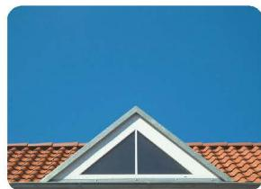

natural_image

Exterior view of a modern house roof with a triangular eave against a clear blue sky (no text or symbols)

# 第二章 不等式与不等式组

natural_image

Aerial view of a dragon boat race on a river with spectators watching from a decorated platform (no visible text or symbols)

1 不等式及其基本性质 / 55  
2 一元一次不等式 /63  
3 一元一次不等式与
一次函数 /67  
4 一元一次不等式组 /71

回顾与思考 /75

复习题 / 75

# 第三章 图形的平移与旋转

1 图形的平移 / 80  
2 图形的旋转 / 90  
3 简单的图案设计 / 101  
☆ 问题解决活动：最短距离 / 104  
回顾与思考 / 106  
复习题 /106

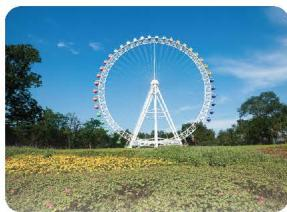

natural_image

Large Ferris wheel in a grassy field under a clear blue sky, surrounded by trees (no text or symbols visible)

# 第四章 因式分解

1 因式分解 / 111  
2 提公因式法 /114  
3 公式法 /118

回顾与思考 /123

复习题 /123

natural_image

Highway traffic scene with multiple lanes and vehicles, no visible text or signage

# 第五章 分式与分式方程

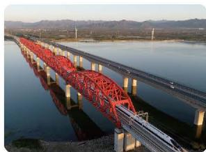

natural_image

Exterior view of a red steel truss bridge spanning a wide river, with distant hills and power transmission lines (no signage or text visible)

1 分式及其基本性质 / 127  
2 分式的运算 /133  
3 分式方程 /143

回顾与思考 /148

复习题 / 148

# 第六章 平行四边形

1 平行四边形的性质 / 153  
2 平行四边形的判定 / 159  
3 三角形的中位线 /171

回顾与思考 / 175

复习题 / 175

natural_image

Aerial view of a large agricultural field with colorful crop patches under a clear blue sky (no text or symbols visible)

# 综合与实践

开展垃圾处理宣传活动 / 180
设计美丽的镶嵌图案 / 181

# 学习印记

# 第一章 三角形的证明及其应用

我们曾经探索过三角形的一些性质，如三角形三个内角的和等于 $180^{\circ}$ 、等腰三角形“三线合一”等。你还记得这些结论的探索过程吗？你能根据已有的基本事实和定理证明这些结论吗？

本章将在“平行线的证明”的基础上，进一步证明：三角形内角和定理及其推论，多边形内角和与外角和公式，等腰三角形、直角三角形的性质定理和判定定理，线段的垂直平分线和角平分线的有关性质定理。还将研究直角三角形全等的特殊判定方法。在这一过程中，你将深化对几何证明的认识，体会数学证明的力量，逐步养成重论据、合乎逻辑的思考和表达习惯，发展几何直观、推理能力等。

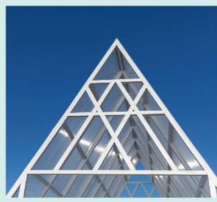

natural_image

Exterior view of a modern glass building with triangular facade against blue sky (no signage or text)

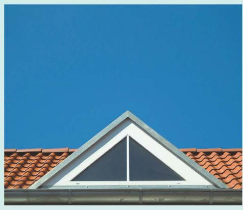

natural_image

Exterior view of a modern house roof with a triangular eave and red-tiled roof tiles against a clear blue sky (no text or symbols)

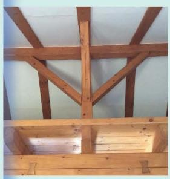

natural_image

Close-up of wooden beams and trusses mounted on a roof (no text or symbols visible)

# 在本章学习过程中，你可以持续思考以下问题：

一个几何命题的发现过程对证明它有什么帮助？  
证明几何命题的方法有哪些？

# 三角形内角和定理

在八年级上册“证明”一章中，我们给出了八条基本事实，并从其中的几条基本事实出发证明了有关平行线的一些结论。运用这些基本事实和已经学习过的定义、定理，我们还可以证明有关三角形的一些结论。

# 尝试·交流

我们知道，三角形三个内角的和等于 $180^{\circ}$ 。你还记得这个结论的探索过程吗？
(1) 如图 1-1, 如果只把 $\angle A$ 移动到 $\angle 1$ 的位置, 那么你能说明这个结论的正确性吗? 如果不移动 $\angle A$ , 那么你还有什么方法可以达到同样的效果?
(2) 你能说说这个结论的证明思路吗? 请试着写出证明过程, 并与同伴进行交流。

已知：如图 1-2， $\triangle ABC$ 。

求证： $\angle A + \angle B + \angle C = 180^{\circ}$
分析：你学过哪些与 $180^{\circ}$ 有关的结论？曾经的撕角拼图活动对你有什么启发？
证明：如图 1-3，延长 BC 至 D，过点 C 作射线 CE，使 CE // BA，则

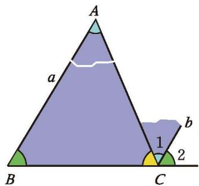

text_image

A
a
B
C
b
1
2

图1-1

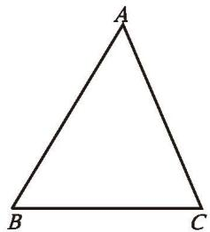

natural_image

Simple geometric triangle diagram labeled A, B, C (no additional text or symbols)

图1-2

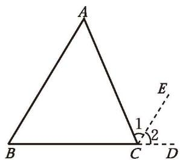

text_image

A
B
C
D
1
2
E

这里的 CD, CE 称为辅助线, 辅助线通常画成虚线。

图 1-3
$\angle 1 = \angle A, \angle 2 = \angle B _ {\circ}$

∵ 点 B, C, D 在同一条直线上，
$\therefore \angle 1 + \angle 2 + \angle A C B = 1 8 0 ^ {\circ} 。$
$\therefore \angle A + \angle B + \angle A C B = 1 8 0 ^ {\circ} 。$

三角形内角和定理 三角形三个内角的和等于 $180^{\circ}$ 。

> [!think] 思考·交流
(1) 如图 1-4, 在证明三角形内角和定理时, 小明的想法是把三个内角 “凑” 到点 $A$ 处, 过点 $A$ 作直线 $PQ$ , 使 $PQ \parallel BC$ , 他的想法可行吗? 如果可行, 你能写出证明过程吗?
(2) 对于三角形内角和定理, 你还有其他证明方法吗? 与同伴进行交流。

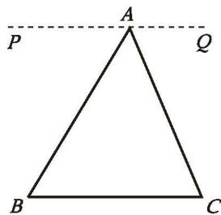

text_image

A
P
Q
B
C

图 1-4

> [!example]- 例1 如图1-5, 在 $\triangle ABC$ 中, $\angle B = 38^{\circ}$ , $\angle C = 62^{\circ}$ , $AD$ 是 $\triangle ABC$ 的角平分线, 求 $\angle ADB$ 的度数。
解：在 $\triangle ABC$ 中，
$\angle B + \angle C + \angle BAC = 180^{\circ}$ （三角形内角和定理）。
$\because \angle B = 3 8 ^ {\circ}, \angle C = 6 2 ^ {\circ},$
$\therefore \angle B A C = 1 8 0 ^ {\circ} - 3 8 ^ {\circ} - 6 2 ^ {\circ} = 8 0 ^ {\circ} 。$

∵ AD 平分 ∠ BAC,
$\therefore \angle B A D = \angle C A D = \frac {1}{2} \angle B A C = \frac {1}{2} \times 8 0 ^ {\circ} = 4 0 ^ {\circ} 。$

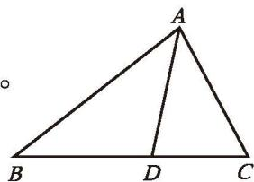

text_image

A
B D C

图1-5

在 $\triangle ADB$ 中，
$\angle B + \angle BAD + \angle ADB = 180^{\circ}$ （三角形内角和定理）。
$\because \angle B = 3 8 ^ {\circ}, \angle B A D = 4 0 ^ {\circ},$
$\therefore \angle A D B = 1 8 0 ^ {\circ} - 3 8 ^ {\circ} - 4 0 ^ {\circ} = 1 0 2 ^ {\circ} 。$

# 尝试·思考

我们已经探索过“两角分别相等且其中一组等角的对边相等的两个三角形全等”这个结论，你能用有关的基本事实和已经学习过的定理证明它吗？

定理 两角分别相等且其中一组等角的对边相等的两个三角形全等。(AAS)

根据全等三角形的定义，我们可以得到

全等三角形的对应边相等、对应角相等。

# 随堂练习

1. 已知：如图，在 $\triangle ABC$ 中， $\angle A = 60^{\circ}$ ， $\angle C = 70^{\circ}$ ，点 $D, E$ 分别在边 $AB$ 和 $AC$ 上，且 $DE \parallel BC$ 。

求证： $\angle ADE=50^{\circ}$

2. 如图, 在 $\triangle ABC$ 中, 已知 $\angle A = 50^{\circ}$ , $BD$ 与 $CE$ 是 $\triangle ABC$ 的高, 点 $O$ 是它们的交点, 求 $\angle ABD$ , $\angle COD$ 的度数。

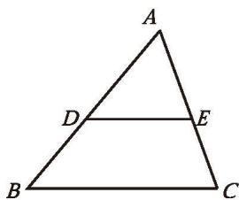

text_image

A
D
E
B
C

(第1题)

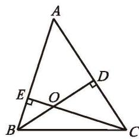

text_image

A
E
O
D
B
C

(第2题)
$\triangle ABC$ 内角的一条边与另一条边的反向延长线所组成的角，叫作 $\triangle ABC$ 的外角（exterior angle）。如图1-6， $\angle 1$ 是 $\triangle ABC$ 的一个外角。你能在图中画出 $\triangle ABC$ 的其他外角吗？

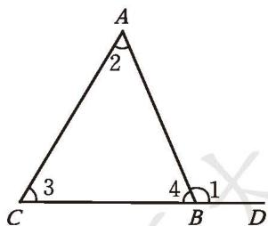

text_image

A
2
3
C
4
B
1
D

图 1-6

> [!think] 思考·交流

观察图 1-6, $\angle 1$ 与 $\triangle ABC$ 的内角有什么关系? 请证明你的结论, 并与同伴进行交流。
由三角形内角和定理，可以得到

推论 ① 三角形的一个外角等于与它不相邻的两个内角的和。
由此可得

推论 三角形的一个外角大于任何一个与它不相邻的内角。

> [!example]- 例2 已知：如图 1-7，在 $\triangle ABC$ 中， $\angle B = \angle C$ ， $AD$ 平分外角 $\angle EAC$ 。
求证： $AD \parallel BC$ 。
分析：只要具备什么条件，就能说明 $AD \parallel BC$ ？
证明：∵ $\angle EAC = \angle B + \angle C$ （三角形的一个外角等于与它不相邻的两个内角的和），
$\begin{array}{l} \angle B = \angle C, \\ \therefore \angle C = \frac {1}{2} \angle E A C _ {\circ} \\ \end{array}$

∵ AD 平分 $\angle EAC$ ,
$\therefore \angle D A C = \frac {1}{2} \angle E A C _ {\circ}$
$\therefore \quad \angle D A C = \angle C _ {\circ}$
$\therefore A D \parallel B C _ {\circ}$

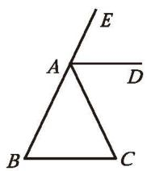

text_image

E
A
D
B
C

图 1-7

还有其他证法吗？

> [!example]- 例3 已知：如图 1-8，P 是 $\triangle ABC$ 内一点，连接 PB，PC。
求证: $\angle BPC > \angle A$ 。
分析：你学过哪些关于角的不等关系的定理？这里能直接使用吗？你遇到的困难是什么？你能通过添加辅助线，构造出直接使用相关定理的图形吗？
证明：如图 1-9，延长 BP，交 AC 于点 D。
$\because \angle BPC$ 是 $\triangle PDC$ 的一个外角（外角的定义），

∴ $\angle BPC > \angle PDC$ (三角形的一个外角大于任何一个与它不相邻的内角)。
$\because \angle {PDC}$ 是 $\bigtriangleup {ABD}$ 的一个外角(外角的定义),

∴ $\angle PDC > \angle A$ (三角形的一个外角大于任何一个与它不相邻的内角)。
$\therefore \angle {BPC} > \angle {A}_{\circ  }$

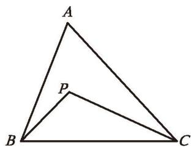

text_image

A
P
B
C

图 1-8

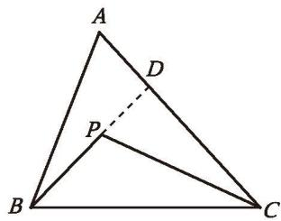

text_image

A
D
P
B
C

图1-9

还有其他证法吗？

# 随堂练习

1. 如图, 在 $\triangle ABC$ 中, $\angle A = 45^{\circ}$ , 外角 $\angle DCA = 100^{\circ}$ , 求 $\angle B$ 和 $\angle ACB$ 的度数。

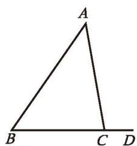

text_image

A
B C D

(第1题)

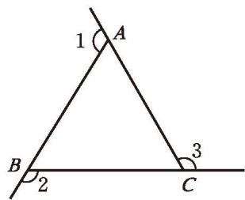

text_image

1
A
B
2
C
3

(第2题)

2. 如图， $\angle 1, \angle 2, \angle 3$ 是 $\triangle ABC$ 的三个外角，那么 $\angle 1, \angle 2, \angle 3$ 的和是多少度？

小明和小亮经常到如图 1-10 所示的广场进行体育锻炼。

natural_image

Aerial view of a landscaped garden with five circular flower beds and surrounding greenery (no text or symbols visible)

图 1-10
(1) 这个广场中心的边缘是一个五边形, 你能设法求出它的五个内角的和吗? 与同伴进行交流。  
(2) 小明、小亮分别利用图 1-11 和图 1-12 求出了五边形五个内角的和。你知道他们是怎样做的吗？你还有其他的方法吗？

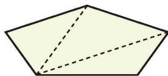

natural_image

Geometric diagram of a pentagon with dashed internal lines (no text or symbols)

图1-11

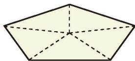

natural_image

Geometric diagram of a pentagon with dashed internal lines, no text or symbols present

图1-12

# 尝试·思考
(1) 按照图 1-11 的方法, 六边形能分成多少个三角形? $n$ ( $n$ 是大于或等于 3 的自然数) 边形呢? 你能确定 $n$ 边形的内角和吗?  
(2) 按照图 1-12 的方法再试一试。

定理 $n$ 边形的内角和等于 $(n - 2) \cdot 180^{\circ}$ 。

> [!example]- 例4 如图 1-13, 在四边形 $ABCD$ 中, $\angle A + \angle C = 180^{\circ}$ 。 $\angle B$ 与 $\angle D$ 有怎样的关系?
解：∵ $\angle A + \angle B + \angle C + \angle D$
$= (4 - 2) \times 1 8 0 ^ {\circ} = 3 6 0 ^ {\circ},$
$\begin{array}{l} \therefore \angle B + \angle D \\ = 3 6 0 ^ {\circ} - (\angle A + \angle C) \\ = 3 6 0 ^ {\circ} - 1 8 0 ^ {\circ} \\ = 1 8 0 ^ {\circ} 。 \\ \end{array}$

# 操作·思考

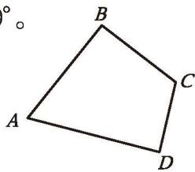

text_image

B
A C
D

图1-13

> [!example]- 例 4 说明：如果四边形一组对角互补，那么另一组对角也互补。
(1) 正三角形、正四边形、正五边形、正六边形、正八边形的每个内角分别是多少度?
(2) 怎样计算正多边形每个内角的度数?

> [!think] 思考·交流

剪掉一张长方形纸片的一个角后，剩下的纸片是几边形？它的内角和是多少度？与同伴进行交流。

# 随堂练习

1. 小彬求出一个正多边形的一个内角为 $145^{\circ}$ 。他的计算正确吗？如果正确，他求的是正几边形的内角？如果不正确，请说明理由。

如图 1-14，小刚在公园沿着五边形步道按逆时针方向慢跑。
(1) 小刚每次从五边形步道的一条边转到下一条边时, 跑步方向改变的角是哪个角? 在图上标出这些角。
(2) 他每跑完一圈, 跑步方向改变的角的总和是多少度? 说说你的理由, 并与同伴进行交流。

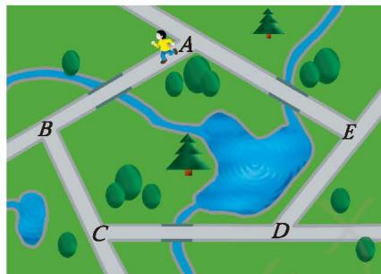

natural_image

Illustration of a park road with labeled points A, B, C, D, E and a person walking along the path (no text or symbols beyond labels)

图 1-14

> [!think] 思考·交流
如果公园步道的形状是六边形、八边形，那么结果会怎样？与同伴进行交流。

多边形内角的一条边与另一条边的反向延长线所组成的角，叫作这个多边形的外角。在每个顶点处取这个多边形的一个外角，它们的和叫作这个多边形的外角和。

可以发现：五边形、六边形、八边形的外角和都等于 $360^{\circ}$ 。

一般地，我们有如下定理：

定理 多边形的外角和等于 $360^{\circ}$ 。

> [!example]- 例5 一个多边形的内角和等于它的外角和的3倍，它是几边形？
解: 设这个多边形是 $n$ 边形, 则它的内角和等于 $(n - 2) \cdot 180^{\circ}$ , 外角和等于 $360^{\circ}$ 。根据题意, 得
$(n - 2) \cdot 1 8 0 ^ {\circ} = 3 \times 3 6 0 ^ {\circ} 。$
解得 $n = 8$ 。
所以，这个多边形是八边形。

> [!think] 思考·交流

本节研究多边形的内角和与外角和的过程中，采用了哪些方法？与同伴进行交流。

# 随堂练习

1. 一个多边形的内角和等于外角和的2倍，它是几边形？如果这个多边形的每个内角都相等，那么每个内角等于多少度？

# 习题 1.1

# 知识技能

1. 在 $\triangle ABC$ 中，已知 $\angle A, \angle B, \angle C$ 的度数之比为4:3:2，求 $\angle A, \angle B$ 和 $\angle C$ 的度数。  
2. 如图, 在 $\triangle ABC$ 和 $\triangle CDA$ 中, $AB \parallel CD$ , $\angle B = \angle D$ , $AB = 3$ , 求 $CD$ 的长。

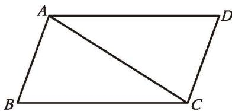

natural_image

Geometric diagram of a parallelogram ABCD with diagonal AC, no text or symbols present

(第2题)

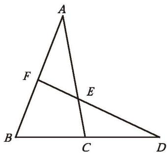

text_image

A
F
E
B
C
D

(第3题)

3. 如图, $\angle ACD$ 是 $\triangle ABC$ 的一个外角, 过点 $D$ 的直线分别交 $AC$ 和 $AB$ 于点 $E$ , $F$ 。下列哪个结论一定不正确?
(1) $\angle B > \angle ACD;$   
(2) $\angle B + \angle ACB = 180^{\circ} - \angle A;$   
(3) $\angle B + \angle ACB < 180^{\circ}$ ;   
(4) $\angle FEC > \angle B$ 。

4. 已知：如图，D 是 $\triangle ABC$ 的边 BC 上的一点， $\angle DAC = \angle B$ 。

求证： $\angle ADC = \angle BAC$ 。

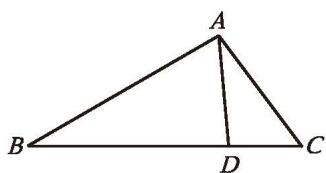

text_image

A
B
D
C

(第4题)

5. 过某个多边形一个顶点的所有对角线，将这个多边形分成 5 个三角形。这个多边形是几边形？它的内角和是多少？  
6. 一个多边形的内角和等于 $1080^{\circ}$ , 它是几边形?  
7. 一个多边形的每个外角都等于与它相邻的内角，这个多边形是几边形？它的每个外角等于多少度？  
8. 是否存在一个多边形，它的每个外角都等于相邻内角的 $\frac{1}{5}$ ？简述你的理由。  
9. 若两个多边形的边数相差 1，则它们的内角和、外角和分别有什么异同？

# 数学理解

10. 已知：如图，在 Rt $\triangle ABC$ 中， $\angle ACB = 90^{\circ}$ ， $CD \perp AB$ ，垂足为 D。
求证： $\angle A = \angle DCB$ 。

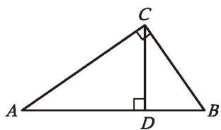

text_image

C
A
D
B

(第10题)

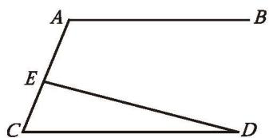

text_image

A
B
E
C
D

(第11题)

11. 已知：如图， $AB \parallel CD$ ，点E在AC上。求证： $\angle A = \angle CED + \angle D$ 。  
12. 如图, 在 $\triangle ABC$ 中, $BF$ 平分 $\angle ABC$ , $CF$ 平分 $\angle ACB$ , $\angle A = 65^{\circ}$ , 求 $\angle F$ 的度数。

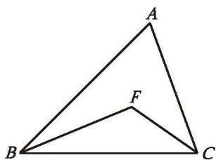

text_image

A
F
B
C

(第12题)

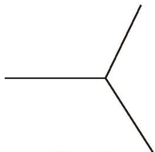

chemical

Simple three-pyracetylene molecular structure diagram

(第13题)

13. 图中所示的是由三个完全相同的正多边形拼成的无缝隙、不重叠的图形的一部分。
(1)这种正多边形是几边形？为什么？  
(2)你能借助这种正多边形拼一个漂亮的图案吗？画出你拼成的图案。

14. 下图中的四边形是同一个四边形不断缩小（保持形状不变）的结果。

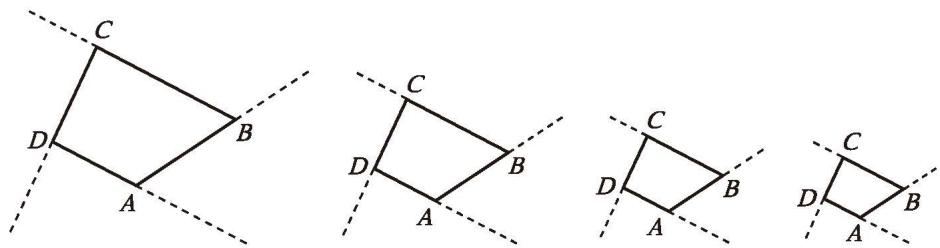

text_image

Geometric diagram showing four quadrilateral configurations with labeled vertices A, B, C and D, including dashed lines for hidden edges.

(第14题)
(1) 在图中标出各个四边形的外角。  
(2) 在缩小的过程中, 四边形对应的各个外角的大小是否发生了变化?  
(3) 如果保持四边形的形状不变, 将四边形不断缩小下去, 请你想象一下最终的形状, 并借助这一变化过程说明四边形的外角和。
(4) 请用类似 (3) 的方法说明五边形、六边形……一般多边形的外角和。

※15. 在四边形的四个内角中，最多能有几个钝角？最多能有几个锐角？简述你的理由。

# 问题解决

16. 如图, ${AD}$ , ${AE}$ 分别是 $\bigtriangleup  {ABC}$ 的角平分线和高。
(1) 已知 $\angle B = 40^{\circ}$ , $\angle C = 60^{\circ}$ , 求 $\angle DAE$ 的度数。你还能求出哪些角的度数?

※(2) $\angle {DAE}$ 与 $\angle B,\angle C$ 有怎样的关系？为什么？

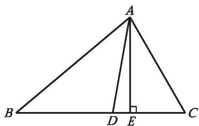

text_image

A
B D E C

(第16题)

# 联系拓广

17. 已知：如图，点 D 在 $\angle BAC$ 的内部。求证：
(1) $\angle BDC > \angle A$ ;   
(2) $\angle BDC = \angle B + \angle C + \angle A$ 。

※18. 在上题中，如果点 $D$ 在线段 $BC$ 的另一侧，又会有怎样的结论？

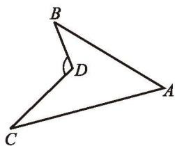

text_image

B
D
C
A

(第17题)

# 等腰三角形

我们曾经探索过等腰三角形的一些性质，你还记得这些性质吗？请你选择其中一条性质进行证明，并与同伴进行交流。

定理 等腰三角形的两个底角相等。

这一定理可以简述为：等边对等角。

已知：如图 1-15, 在 $\triangle ABC$ 中, $AB = AC$ 。

求证： $\angle B=\angle C$ 。
分析：有哪些结论可以证明两个角相等？如图 1-16，还记得利用折纸的方法探索等腰三角形的性质吗？这对你有什么启发？

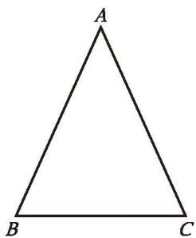

natural_image

Simple geometric triangle diagram labeled A, B, C at vertices (no additional text or symbols)

图1-15

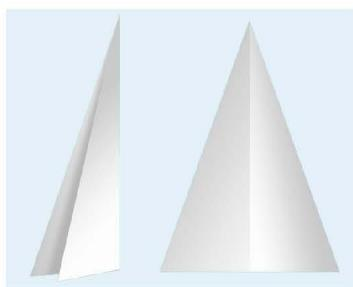

natural_image

Two identical white 3D pyramid shapes against a light blue background (no text or symbols)

图1-16

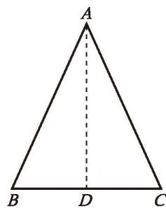

text_image

A
B D C

图1-17
证明：如图 1-17, 取 $BC$ 的中点 $D$ , 连接 $AD$ 。
$\because A B = A C, B D = C D, A D = A D,$
$\therefore \quad \triangle A B D \cong \triangle A C D (\text { S   S   S }) 。$
$\therefore \angle B = \angle C (\text {全等三角形的对应角相等 }) 。$

还有其他证法吗？

> [!think] 思考·交流
由 “等边对等角” 定理的证明过程，你发现线段 $AD$ 还有哪些特征？为什么？与同伴进行交流。

定理 等腰三角形顶角的平分线、底边上的中线、底边上的高重合。

# 尝试·交流

等边三角形是特殊的等腰三角形，它有哪些特殊的性质呢？请尝试证明你发现的结论，并与同伴进行交流。

定理 等边三角形的三个内角都相等，并且每个角都等于 $60^{\circ}$ 。

# 回顾·反思

回顾七年级下册及本节研究等腰三角形性质的过程，你积累了哪些研究图形性质的经验？

# 随堂练习

1. 如图, 在 $\triangle ABC$ 中, $AB = AC$ , $AD$ 是 $\triangle ABC$ 的角平分线, $BC = 8$ , 求 $CD$ 的长。

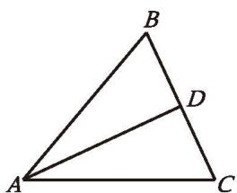

text_image

B
D
A
C

(第1题)

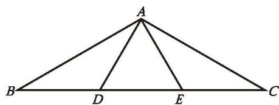

text_image

A
B D E C

(第2题)

2. 如图, 在 $\triangle ABC$ 中, $D, E$ 是 $BC$ 的三等分点, 且 $\triangle ADE$ 是等边三角形, 求 $\angle BAC$ 的度数。

前面已经证明了等腰三角形的两个底角相等。反过来，有两个角相等的三角形是等腰三角形吗？

可以发现：有两个角相等的三角形是等腰三角形。如何证明这一结论呢？

如图 1-18, 在 $\triangle ABC$ 中, $\angle B = \angle C$ , 要想证明 $AB = AC$ , 只要能构造两个全等的三角形, 使 $AB$ 与 $AC$ 成为对应边就可以了。

请你写出证明过程。

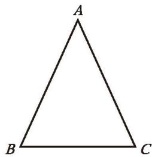

natural_image

Simple geometric triangle diagram labeled A, B, C at vertices (no additional text or symbols)

图1-18

定理 有两个角相等的三角形是等腰三角形。

这一定理可以简述为：等角对等边。

> [!example]- 例1 已知：如图 1-19, $AB = DC$ , $BD = CA$ , $BD$ 与 $CA$ 相交于点 $E$ 。
求证： $\bigtriangleup {AED}$ 是等腰三角形。
证明：∵ AB = DC, BD = CA, AD = DA,
$\therefore \quad \triangle A B D \cong \triangle D C A (\mathrm{SSS}) _ {\circ}$

∴ $\angle ADB = \angle DAC$ (全等三角形的对应角相等)。

∴ AE = DE (等角对等边)。
$\therefore \triangle AED$ 是等腰三角形。

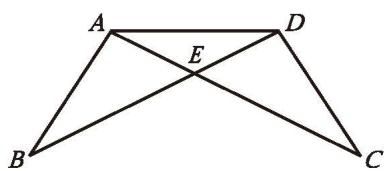

text_image

A
E
D
B
C

图1-19

# 尝试·思考

小明认为，在一个三角形中，如果两个角不相等，那么这两个角所对的边也不相等。你认为小明这个结论成立吗？如果成立，你能证明它吗？

小明的思考过程如下。你能理解他的推理过程吗？

natural_image

Illustration of a boy in a blue shirt gesturing with both hands (no text or symbols)

如图 1-20，在 $\triangle ABC$ 中，已知 $\angle B \neq \angle C$ ，此时 AB 与 AC 要么相等，要么不相等。

假设 AB = AC，那么根据定理“等边对等角”可得 $\angle C = \angle B$ ，这与已知条件 $\angle B \neq \angle C$ 相矛盾, 因此 $AB \neq AC$ 。

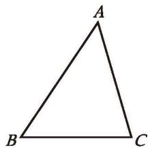

natural_image

Simple geometric triangle labeled ABC with vertices marked (no additional text or symbols)

图 1-20

像小明那样，在证明时，先假设命题的结论不成立，然后推导出与定义、基本事实、已有定理或已知条件相矛盾的结果，从而证明命题的结论一定成立，这种证明方法称为反证法（reduction to absurdity）。

> [!example]- 例2 用反证法证明：一个三角形中不能有两个角是直角。
已知： $\triangle ABC$ 。

求证： $\angle A,\angle B,\angle C$ 中不能有两个角是直角。
证明：假设 $\angle A, \angle B, \angle C$ 中有两个角是直角，不妨设 $\angle A$ 和 $\angle B$ 是直角，即 $\angle A = 90^{\circ}, \angle B = 90^{\circ}$ 。
于是 $\angle A + \angle B + \angle C = 90^{\circ} + 90^{\circ} + \angle C > 180^{\circ}$ 。

这与三角形内角和定理相矛盾，因此“∠A和∠B是直角”的假设不成立。
所以，一个三角形中不能有两个角是直角。

# 随堂练习

1. 如图, 在 $\triangle ABC$ 中, $BD$ 平分 $\angle ABC$ , 交 $AC$ 于点 $D$ , 过点 $D$ 作 $BC$ 的平行线, 交 $AB$ 于点 $E$ , 请判断 $\triangle BDE$ 的形状, 并说明理由。

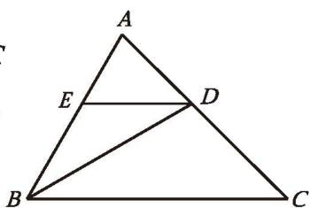

text_image

A
E
D
B
C

(第1题)

2. 已知五个正数的和等于 1，用反证法证明：这五个正数中至少有一个数大于或等于 $\frac{1}{5}$ 。

一个三角形满足什么条件时是等边三角形？一个等腰三角形满足什么条件时是等边三角形？请证明自己的结论，并与同伴进行交流。

定理 三个角都相等的三角形是等边三角形。

定理 有一个角等于 $60^{\circ}$ 的等腰三角形是等边三角形。

# 尝试·思考
(1) 用两个完全相同的含 $30^{\circ}$ 角的三角尺, 你能拼成怎样的三角形? 能拼出一个等边三角形吗?  
(2) 在上述拼接过程中, 你发现了什么结论? 请证明你的结论。

如图 1-21，两个完全相同的含 $30^{\circ}$ 角的三角尺，可以拼成一个等边三角形。由此可以发现： $30^{\circ}$ 角的对边等于三角尺斜边的一半。

natural_image

Ruler of a triangular ruler with measurement markings (no text or symbols visible)

图1-21

已知：如图 1-22（1）， $\triangle ABC$ 是直角三角形， $\angle C=90^{\circ}$ ， $\angle A=30^{\circ}$ 。

求证： $BC=\frac{1}{2}AB$ 。
证明：如图 1-22（2），延长 BC 至 D，使 CD = BC，连接 AD。
$\because \angle A C B = 9 0 ^ {\circ},$
$\therefore \angle A C D = 9 0 ^ {\circ} 。$
$\because A C = A C,$

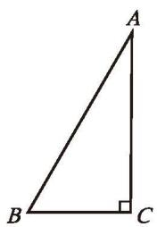

text_image

A
B
C

(1)

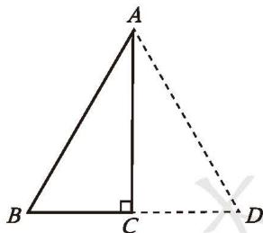

text_image

A
B
C
D

(2)   
图1-22

∴ $\triangle ABC \cong \triangle ADC (SAS)$ 。

∴ AB = AD（全等三角形的对应边相等），
$\angle BAC = \angle DAC$ （全等三角形的对应角相等）。
$\because \angle BAC = 30^{\circ},$
$\therefore \angle BAD = \angle BAC + \angle DAC = 30^{\circ} + 30^{\circ} = 60^{\circ}$

∴ △ABD是等边三角形（有一个角等于60°的等腰三角形是等边三角形）。

∴ $BC=\frac{1}{2}BD=\frac{1}{2}AB$ 。

定理 在直角三角形中，如果一个锐角等于 $30^{\circ}$ ，那么它所对的直角边等于斜边的一半。

> [!example]- 例3 求证：如果等腰三角形的底角为 $15^{\circ}$ , 那么腰上的高是腰长的一半。
已知: 如图 1-23, 在 $\triangle ABC$ 中, $AB = AC$ , $\angle B = 15^{\circ}$ , $CD$ 是腰 $AB$ 上的高。

求证： $CD=\frac{1}{2}AB$ 。
证明：在 $\triangle ABC$ 中，

∵ AB = AC, ∠B = 15°,

∴ $\angle ACB = \angle B = 15^{\circ}$ (等边对等角)。

∴ $\angle DAC = \angle B + \angle ACB = 15^{\circ} + 15^{\circ} = 30^{\circ}$ (三角形的一个外角等于与它不相邻的两个内角的和)。

∵ CD 是腰 AB 上的高，

∴ $\angle ADC = 90^{\circ}$

∴ $CD=\frac{1}{2}AC$ (在直角三角形中，如果一个锐角等于 $30^{\circ}$ ，那么它所对的直角边等于斜边的一半)。

∴ $CD=\frac{1}{2}AB$ 。

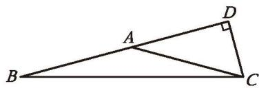

text_image

Geometric diagram of triangle ABC with right angle at D, showing points A, B, C, and D labeled

图1-23

# 随堂练习

1. 已知：如图， $BD \parallel AC, \angle C = 60^{\circ}, DA$ 平分 $\angle BDC$ 。

求证： $\bigtriangleup {ACD}$ 是等边三角形。

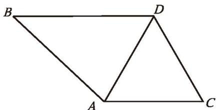

natural_image

Geometric diagram of a quadrilateral ABCD with diagonal BD, no text or symbols present

(第1题)

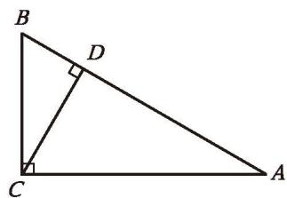

text_image

B
D
C
A

(第2题)

2. 如图, 在 $\triangle ABC$ 中, $\angle ACB = 90^{\circ}$ , $\angle B = 60^{\circ}$ , $CD$ 是 $\triangle ABC$ 的高,且 $BD = 1$ , 求 $AD$ 的长。

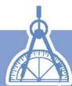

# 习题 1.2

# 知识技能

1. 如图, 在 $\triangle ABC$ 中, $AB = AC$ , $AD$ 是 $\triangle ABC$ 的高, $\angle BAC = 108^{\circ}$ , 求 $\angle BAD$ 的度数。

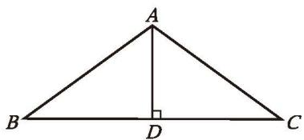

text_image

A
B
D
C

(第1题)

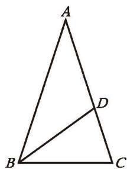

text_image

A
B
C
D

(第2题)

2. 如图, 在 $\triangle ABC$ 中, $AB = AC$ , $BD$ 平分 $\angle ABC$ , 交 $AC$ 于点 $D$ 。若 $BD = BC$ , 则 $\angle A$ 等于多少度?

3. 已知：如图，在 $\triangle ABC$ 中， $AB = AC$ ， $D$ 为 $BC$ 的中点，点 $E$ ， $F$ 分别在 $AB$ 和 $AC$ 上，并且 $AE = AF$ 。求证： $DE = DF$ 。

text_image

A
E
F
B
D
C

(第3题)

text_image

A
D
B
C
E

(第4题)

4. 已知：如图，D，E分别是等边三角形ABC的两边AB，AC上的点，且AD=CE。求证：CD=BE。  
5. 等腰三角形两个底角的平分线有怎样的数量关系？请证明自己结论的正确性。  
6. 已知：如图，∠CAE是△ABC的外角，AD∥BC，且∠1=∠2。

求证： $AB = AC$

text_image

E
1
A
2
D
B
C

(第6题)

text_image

E
A
F
B
P
C

(第7题)

text_image

A
D
E
B
C

(第8题)

7. 已知：如图，在 $\triangle ABC$ 中， $AB=AC$ ，点 $E$ 在 $CA$ 的延长线上， $EP\perp BC$ ，垂足为 $P$ ， $EP$ 交 $AB$ 于点 $F$ 。求证： $\triangle AEF$ 是等腰三角形。  
8. 已知：如图， $\triangle ABC$ 是等边三角形，与 $BC$ 平行的直线分别交 $AB$ 和 $AC$ 于点 $D, E$ 。求证： $\triangle ADE$ 是等边三角形。

9. 某屋架的一部分如图所示, 其中 $BC \perp AC$ , $\angle A = 30^{\circ}$ , $AB = 7.4 \mathrm{~m}$ , 点 $D$ 是 $AB$ 的中点, 且 $DE \perp AC$ , 垂足为 $E$ , 求 $BC$ , $DE$ 的长。

10. 用两个完全相同的含 $45^{\circ}$ 角的三角尺拼成一个三角形, 要求不重叠、不留缝隙。

natural_image

Geometric diagram of a yellow right triangle ABC with point D on side AB and point E on base AC (no labels or measurements)

(第9题)
(1) 拼一拼，并画出所拼的图形。  
(2) 通过 (1) 中的拼图, 你能获得怎样的结论? 请证明你得到的结论。

# > 数学理解

11. (1) 如图 (1), 已知 $\angle \alpha$ 和线段 $a$ , 请用尺规作一个等腰三角形, 使它的一个内角等于 $\angle \alpha$ , 腰长等于 $a$ 。

text_image

α
a

(1)

text_image

β

(2)   
(第11题)
(2) 在 (1) 中, 如果把 $\angle \alpha$ 变成图 (2) 中的 $\angle \beta$ , 其他条件不变呢?

# 问题解决

12. 如图, 一艘轮船从 $A$ 处出发, 以 $18 \mathrm{~kn}^{\textcircled{①}}$ 的速度向正北航行, 经过 $10 \mathrm{~h}$ 到达 $B$ 处。分别从 $A$ , $B$ 处望灯塔 $C$ , 测得 $\angle NAC = 42^{\circ}, \angle NBC = 84^{\circ}$ 。求从 $B$ 处到灯塔 $C$ 的距离。

text_image

C
84°
B
42°
A
N

(第12题)

# 联系拓广

13. (1) 如图, $\triangle ABC$ 是等边三角形, 过它的三个顶点分别作对边的平行线, 得到一个新的 $\triangle DEF$ , $\triangle DEF$ 是等边三角形吗? 你还能找到哪些其他的等边三角形? 点 $A, B, C$ 分别是 $EF, ED, FD$ 的中点吗? 请证明你的结论。

text_image

E
A
F
B
C
D

(第13题)
(2) 如果 $\triangle DEF$ 是等边三角形，点 A, B, C 分别

是 $EF, ED, FD$ 的中点, 那么 $\triangle ABC$ 是等边三角形吗? 请证明你的结论。

※14. 证明：在直角三角形中，如果一条直角边等于斜边的一半，那么这条直角边所对的锐角等于 $30^{\circ}$ 。

※15. 如图，ABCD 是一张长方形纸片，且 AD = 2AB，沿过点 D 的折痕将 A 角翻折，使得点 A 落在 BC 上（如图中的点 A'），折痕交 AB 于点 G，那么 ∠ADG 等于多少度？请证明你的结论（提示：利用第 14 题的结论）。

text_image

A'
B
C
G
A
D

(第15题)

# 直角三角形

我们曾经探索过直角三角形的性质：直角三角形的两个锐角互余。请你证明这一结论。
如果一个三角形有两个角互余，那么这个三角形是直角三角形吗？请证明你的结论，并与同伴进行交流。

定理 直角三角形的两个锐角互余。

定理 有两个角互余的三角形是直角三角形。

我们曾经利用数方格和割补图形的方法得到了勾股定理。实际上，利用基本事实和已有定理，我们能够证明勾股定理（有关证明过程参见本节“阅读·欣赏”）。

勾股定理 直角三角形两条直角边的平方和等于斜边的平方。

# 尝试·交流

在一个三角形中，当两条边的平方和等于第三条边的平方时，我们曾用测量的办法得出“这个三角形是直角三角形”的结论。你能用基本事实和已有定理证明这一结论吗？与同伴进行交流。

已知：如图 1-24（1），在 $\triangle ABC$ 中， $AB^{2} + AC^{2} = BC^{2}$ 。

求证： $\bigtriangleup  {ABC}$ 是直角三角形。
分析：要证明 $\triangle ABC$ 是直角三角形，一般需要证明有一个角是直角。这里的已知条件是边的关系，由此你能想到什么？借助边的关系，你能构造一个直角三角形，使它与 $\triangle ABC$ 全等吗？

text_image

A
B
C

(1)

text_image

A'
B'
C'

(2)   
图1-24
证明: 如图 1-24 (2), 作 Rt $\triangle A'B'C'$ , 使
$\angle A ^ {\prime} = 9 0 ^ {\circ}, A ^ {\prime} B ^ {\prime} = A B, A ^ {\prime} C ^ {\prime} = A C,$

则 $A'B'^2 + A'C'^2 = B'C'^2$ （勾股定理）。
$\because A B ^ {2} + A C ^ {2} = B C ^ {2},$
$\therefore B C ^ {2} = B ^ {\prime} C ^ {\prime 2} 。$
$\therefore B C = B ^ {\prime} C ^ {\prime} 。$
$\therefore \quad \triangle A B C \cong \triangle A ^ {\prime} B ^ {\prime} C ^ {\prime} (\text { SSS }) 。$
$\therefore \angle A = \angle {A}^{\prime } = {90}^{ \circ  }$ (全等三角形的对应角相等)。
因此， $\triangle ABC$ 是直角三角形。

定理 如果三角形两条边的平方和等于第三条边的平方，那么这个三角形是直角三角形。

> [!observe] 观察·交流
(1) 观察本节第一个定理和第二个定理, 它们的条件和结论之间有怎样的关系? 第三个定理和第四个定理呢? 与同伴进行交流。
(2) 观察下面三组命题:
如果两个角是对顶角，那么它们相等；如果两个角相等，那么它们是对顶角。
如果 $a = b$ ，那么 $a^2 = b^2$ 如果 $a^2 = b^2$ ，那么 $a = b$ 。

一个三角形中相等的边所对的角相等；
一个三角形中相等的角所对的边相等。

上面每组中两个命题的条件和结论也有类似的关系吗？与同伴进行交流。

在两个命题中，如果一个命题的条件和结论分别是另一个命题的结论和条件，那么这两个命题称为互逆命题；如果把其中一个命题称为原命题，那么另一个命题就称为它的逆命题。

# 尝试·思考

你能写出命题 “如果两个有理数相等，那么它们的平方相等” 的逆命题吗？它们都是真命题吗？

原命题是真命题，它的逆命题不一定是真命题。如果一个定理的逆命题经过证明是真命题，那么它也是一个定理，其中一个定理称为另一个定理的逆定理。例如，本节学习的第一个定理和第二个定理就是一对互逆定理，第三个定理和第四个定理也是一对互逆定理。你还能举出一些互逆定理的例子吗？

# 随堂练习

1. 在 $\triangle ABC$ 中, 已知 $\angle A = \angle B = 45^{\circ}$ , $BC = 3$ , 求 $AB$ 的长。

2. 已知：在 $\triangle ABC$ 中， $AB = 13 \mathrm{~cm}$ ， $BC = 10 \mathrm{~cm}$ ， $BC$ 边上的中线 $AD = 12 \mathrm{~cm}$ 。求证： $AB = AC$ 。  
3. 说出下列命题的逆命题，并判断每对命题的真假。
(1) 四边形是多边形;  
(2) 两直线平行, 同旁内角互补;  
(3) 如果 ab=0，那么 a=0，b=0。

# 阅读·欣赏

# 勾股定理的证明

利用教科书给出的基本事实和已有定理，我们可以证明勾股定理。

如图 1-25（1），在 $\triangle ABC$ 中， $\angle C=90^{\circ}$ ，BC=a，AC=b，AB=c。

如图 1-25（2），分别以 Rt△ABC 的三边为边作正方形 AHIB，ACDE，CBFG。连接 EB，CH。过点 C 作 AB 的垂线，分别交 AB 和 HI 于点 M，N。正方形 ACDE、长方形 AHNM、长方形 MNIB，以及 △EAB 和 △CAH 的面积分别记作 S 正方形 ACDE，S 长方形 AHNM，S 长方形 MNIB，S △EAB，S △CAH。

text_image

C
b	a
A	c	B

(1)

text_image

Geometric diagram with labeled points, lines, and right-angle markers for mathematical analysis

(2)   
图1-25
$\begin{array}{l} \because \quad E A = C A, \angle E A B = \angle C A H = 9 0 ^ {\circ} + \angle C A B, A B = A H, \\ \therefore \quad \triangle E A B \cong \triangle C A H (\text { SAS }) 。 \\ \end{array}$
又∵ $S_{正方形ACDE}=2S_{\triangle EAB},\quad S_{长方形AHNM}=2S_{\triangle CAH},$
$\therefore \quad b ^ {2} = S _ {\text {长方形} A H N M ^ {\circ}}$
同理 $a^2 = S_{\text{长方形} MNIB}\circ$
$\therefore \quad c ^ {2} = a ^ {2} + b ^ {2} 。$

以上是欧几里得在《原本》中证明勾股定理的大致过程。

勾股定理是数学史上非常重要的定理之一。两千多年来，人们对它进行了大量的研究，给出了多达数百种的证明方法。如果你有兴趣，可查阅有关资料，了解勾股定理的其他证明方法。

两边分别相等且其中一组等边的对角相等的两个三角形全等吗？如果其中一组等边的对角都是直角呢？请你画一画，并与同伴进行交流。

# 尝试·交流

已知斜边和一条直角边，如何作出这个直角三角形呢？
(1) 假设满足条件的直角三角形已经作出, 你能画出这个直角三角形的草图吗?  
(2) 你是按照怎样的步骤画这个草图的? 先画一画, 再用尺规试一试, 并与同伴进行交流。

梳理上述作图过程，请你总结“已知直角三角形的斜边和一条直角边，用尺规作这个三角形”的方法和步骤。

如图 1-26, 已知线段 $a$ , $c$ ( $a < c$ ), 用尺规作 Rt $\triangle ABC$ , 使 $\angle C = 90^\circ$ , $AB = c$ , $BC = a$ 。

图1-26

请按照给出的作法作出相应的图形：

<table><tr><td>作法</td><td>图形</td></tr><tr><td>1. 作射线 CN。2. 过点 C 作射线 CN 的垂线 CM。3. 在射线 CM 上截取 CB = a。4. 以点 B 为圆心,以线段 c 的长为半径作弧,交射线 CN 于点 A。5. 连接 AB。△ABC 就是所要作的直角三角形。</td><td></td></tr></table>

把你作的三角形与同伴作的三角形进行比较，它们一定全等吗？

可以发现：斜边和一条直角边分别相等的两个直角三角形全等。请你尝试证明这一结论。

已知：如图 1-27，在 $\triangle ABC$ 和 $\triangle A'B'C'$ 中， $\angle C = \angle C' = 90^{\circ}$ ， $AB = A'B'$ ， $AC = A'C'$ 。

求证： $\triangle ABC \cong \triangle A'B'C'$ 。
证明：在 $\triangle ABC$ 中，
$\because \angle C = 9 0 ^ {\circ},$

∴ $BC^{2}=AB^{2}-AC^{2}$ (勾股定理)。
同理， $B^{\prime}C^{\prime2}=A^{\prime}B^{\prime2}-A^{\prime}C^{\prime2}$ 。
$\because A B = A ^ {\prime} B ^ {\prime}, A C = A ^ {\prime} C ^ {\prime},$
$\therefore B C = B ^ {\prime} C ^ {\prime} 。$
$\therefore \quad \triangle A B C \cong \triangle A ^ {\prime} B ^ {\prime} C ^ {\prime} (\text { S   S   S }) 。$

text_image

A
C
B

text_image

A'
C' B'

图1-27

定理 斜边和一条直角边分别相等的两个直角三角形全等。

这一定理可以简述为“斜边、直角边”或“HL”。

例如图 1-28, 有两个长度相等的梯子, 左边梯子竖直方向的高度 $A C$ 与右边梯子水平方向的长度 $D F$ 相等, 两个梯子的倾斜角 $\angle C B A$ 和 $\angle E F D$ 的大小有什么关系?
解：根据题意，可知
$\angle B A C = \angle E D F = 9 0 ^ {\circ},$
$B C = E F, A C = D F,$

∴ Rt△BAC ≅ Rt△EDF (HL)。

∴ $\angle CBA = \angle FED$ (全等三角形的对应角相等)。

text_image

Geometric diagram showing a tower with multiple trapezoids and labeled points A, B, C, D, E, F, including right-angle markers at B and D.

图1-28
$\because \angle FED + \angle EFD = 90^{\circ}$ (直角三角形的两个锐角互余),

∴ $\angle CBA + \angle EFD = 90^{\circ}$

# 随堂练习

1. 判断下列命题的真假，并说明理由：
(1) 两个锐角分别相等的两个直角三角形全等;  
(2) 斜边及一锐角分别相等的两个直角三角形全等;  
(3) 两条直角边分别相等的两个直角三角形全等;  
(4) 一条直角边相等且另一条直角边上的中线相等的两个直角三角形全等。

2. 如图, 两根长度均为 $12 \mathrm{~m}$ 的绳子, 一端系在旗杆上的 $A$ 点, 另一端拉直后分别固定在地面的两个木桩 (用 $B, C$ 两点表示) 上, 两个木桩到旗杆底部的距离相等吗? 请说明你的理由。

text_image

A
B O C

(第2题)

# 习题 1.3

# 知识技能

1. 如图, 在四边形 $ABCD$ 中, $AB \parallel CD$ , $E$ 是边 $BC$ 上的一点, 且 $\angle BAE = 25^\circ$ , $\angle CDE = 65^\circ$ , $AE = 2$ , $DE = 3$ , 求 $AD$ 的长。

text_image

Geometric diagram of quadrilateral ABCD with internal points E and connecting lines

(第1题)

text_image

A
B
B₁
C₁
C

(第2题)

2. 一个直角三角形屋架如图所示, 其中 $BC \perp AC$ , $\angle A = 30^{\circ}$ , $AB = 10 \mathrm{~m}$ , $CB_{1} \perp AB$ , $B_{1}C_{1} \perp AC$ , 垂足分别为 $B_{1}, C_{1}$ , 那么 $BC$ 的长是多少? $B_{1}C_{1}$ 呢?

3. 已知：如图，D 是 $\triangle ABC$ 的边 BC 的中点， $DE \perp AC$ ， $DF \perp AB$ ，垂足分别为 E，F，且 DE = DF。求证： $\triangle ABC$ 是等腰三角形。

text_image

A
F
E
B
D
C

(第3题)

text_image

Geometric diagram showing two right triangles ABC and ACD with perpendiculars from E to AC at F, labeled with points A, B, C, D, E, F.

(第4题)

text_image

O
M
A
P
N
B

(第5题)

4. 已知：如图， $AB = CD$ ， $DE \perp AC$ ， $BF \perp AC$ ，垂足分别为 $E$ ， $F$ ，且 $DE = BF$ 。求证：
(1) $AE = CF$ ;
(2) $AB \parallel CD$ 。

5. 用三角尺可以画角平分线: 如图所示, 在已知 $\angle AOB$ 的两边上分别取点 $M$ , $N$ , 使 $OM = ON$ , 再过点 $M$ 画 $OA$ 的垂线, 过点 $N$ 画 $OB$ 的垂线, 两垂线交于点 $P$ , 那么射线 $OP$ 就是 $\angle AOB$ 的平分线。请你证明这一结论。

# 数学理解

6. 判断下列命题的真假，并说明理由：
(1) 两边分别相等的两个直角三角形全等;  
(2)一个锐角和一条边分别相等的两个直角三角形全等。

# 问题解决

7. 如图, 小红想估测离 $A$ 处 $30 \mathrm{~m}$ 的大树的高度, 她站在 $A$ 处仰望树顶 $B$ , 仰角为 $30^{\circ}$ (即 $\angle BDE = 30^{\circ}$ ) 。已知小红身高 $1.52 \mathrm{~m}$ , 求大树的高度 (结果精确到 $0.1 \mathrm{~m}$ )。

8. 有一块三角形空地，它的三条边线分别长 $45 \mathrm{~m}, 60 \mathrm{~m}$ 和 $70 \mathrm{~m}$ 。已知 $60 \mathrm{~m}$ 长的边线为南北向，是否有一条边线为东西向？

9. 已知两个直角三角形有一条直角边相等，添加一个条件使两个直角三角形全等。你有哪些不同的添法？任选其中一种加以证明。

text_image

B
30°
E
D
A

(第7题)

# > 联系拓广

10. 在如图所示的三角形纸片 $ABC$ 中, $\angle C = 90^{\circ}$ , $\angle B = 30^{\circ}$ 。按如下步骤,可以把这张直角三角形纸片分成三张全等的小直角三角形纸片 (图中虚线表示折痕): ① 折叠三角形纸片 $ABC$ , 使点 $B$ 与点 $A$ 重合, 折痕交 $BC$ 于点 $D$ , 交 $AB$ 于点 $E$ ; ② 将折叠后的纸片再沿 $AD$ 折叠。
(1) 由步骤①可以得到哪些等量关系?  
(2) 请证明 $\triangle ACD \cong \triangle AED$ 。  
(3) 按照这种方法, 能否将任意一个直角三角形分成三个全等的小三角形?

text_image

A
E
C
D
B

(第10题)

# 线段的垂直平分线

我们曾经探索过线段垂直平分线的性质：线段垂直平分线上的点到这条线段两个端点的距离相等。请你尝试证明这一结论，并与同伴进行交流。

已知: 如图 1-29, 直线 $MN \perp AB$ , 垂足为 $C$ , 且 $AC = BC$ , $P$ 是 $MN$ 上的任意一点。

求证： $PA = PB$ 。
证明：∵ $MN \perp AB,$
$\therefore \angle P C A = \angle P C B = 9 0 ^ {\circ} 。$
$\because A C = B C, P C = P C,$
$\therefore \quad \triangle P C A \cong \triangle P C B (\mathrm{SAS}) _ {\circ}$

∴ PA = PB（全等三角形的对应边相等）。

text_image

M
P
A
C
B
N

图1-29
如果点 $P$ 与点 $C$ 重合, 那么结论显然成立。

定理 线段垂直平分线上的点到这条线段两个端点的距离相等。

# 尝试·思考

你能写出上面这个定理的逆命题吗？它是真命题吗？请证明自己结论的正确性。

定理 到一条线段两个端点距离相等的点，在这条线段的垂直平分线上。

> [!example]- 例1 已知：如图 1-30，在 $\triangle ABC$ 中， $AB = AC$ ， $O$ 是 $\triangle ABC$ 内一点，且 $OB = OC$ 。
求证: 直线 $AO$ 垂直平分线段 $BC$ 。
证明：∵ AB = AC,

∴ 点 A 在线段 BC 的垂直平分线上（到一条线段两个端）

text_image

A
O
B
C

图1-30

点距离相等的点，在这条线段的垂直平分线上）。
同理，点 O 在线段 BC 的垂直平分线上。

∴ 直线 AO 是线段 BC 的垂直平分线（两点确定一条直线）。

还有其他证法吗？

# 随堂练习

1. 还记得用尺规作线段垂直平分线的方法吗？试用本节所学的定理解释其中的道理。  
2. 已知：如图，AB 是线段 CD 的垂直平分线，E，F 是 AB 上的两点。
求证： $\angle ECF = \angle EDF$ 。

text_image

A
E
C
F
B
D

(第2题)

前面我们用尺规作出了满足一定条件的直角三角形，那么，你能用尺规作出满足一定条件的等腰三角形吗？

# 尝试·交流
（1）已知三角形的一条边及这条边上的高，你能画出满足条件的三角形吗？  
(2) 已知等腰三角形的底边及底边上的高, 你能用尺规作出满足条件的等腰三角形吗? 能作几个? 与同伴进行交流。

梳理上述作图过程，请你总结“已知底边和底边上的高，用尺规作这个等腰三角形”的方法和步骤。

如图 1-31，已知线段 a, h，用尺规作 $\triangle ABC$ ，使 AB = AC，BC = a，高 AD = h。

图1-31

请按照给出的作法作出相应的图形：

<table><tr><td>作法</td><td>图形</td></tr><tr><td>1. 作线段  $BC$ ,使  $BC = a$ 。2. 作线段  $BC$  的垂直平分线  $l$ ,交  $BC$  于点  $D$ 。3. 在  $l$  上截取  $DA = h$ 。4. 连接  $AB$ , $AC$ 。 $\triangle ABC$  就是所要作的等腰三角形。</td><td></td></tr></table>

> [!think] 思考·交流

还记得用尺规过直线 l 上一点 P 作 l 的垂线的方法吗？这种方法将作直线的垂线问题转化为作线段的垂直平分线问题。如果点 P 在直线 l 外呢？此时，还能运用这种转化的方法吗？请你试一试，并与同伴进行交流。

梳理上述作图过程，请你总结出“过直线外一点，用尺规作已知直线的垂线”的方法和步骤。

如图 1-32, 已知直线 $l$ 和 $l$ 外一点 $P$ , 用尺规作 $l$ 的垂线, 使它经过点 $P$ 。

• P

图1-32

请按照给出的作法作出相应的图形：

<table><tr><td>作法</td><td>图形</td></tr><tr><td>1.任取一点Q,使点Q与点P在直线l两旁。2.以点P为圆心,以PQ的长为半径作弧,交直线l于点A和点B。3.作线段AB的垂直平分线m。直线m就是所要作的直线。</td><td></td></tr></table>

为什么直线 $m$ 经过点 $P$ ?

> [!example]- 例2 已知：如图 1-33，在 $\triangle ABC$ 中，边 $AB$ 的垂直平分线与边 $BC$ 的垂直平分线相交于点 $P$ ，垂足分别为 $D, E$ 。
求证: 边 $AC$ 的垂直平分线经过点 $P$ 。
分析：要证明点 $P$ 在边 $AC$ 的垂直平分线上, 需要什么条件？已知的两条垂直平分线相交于点 $P$ , 由此你能得到哪些相关的结论？
证明：如图 1-34，连接 PA，PB，PC。

∵ 点 P 在边 AB 的垂直平分线上，

∴ PA = PB（线段垂直平分线上的点到这条线段两个端点的距离相等）。
同理，PB = PC。
$\therefore P A = P B = P C _ {\circ}$

∴ 点 P 在线段 AC 的垂直平分线上（到一条线段两个端点距离相等的点，在这条线段的垂直平分线上），
即 边 AC 的垂直平分线经过点 P。

text_image

Geometric diagram of triangle ABC with perpendiculars from point D and E to base BC, labeled with points A, B, C, D, E, P.

图1-33  

text_image

Geometric diagram of triangle ABC with perpendiculars and labeled points D, E, P

图1-34

三角形三条边的垂直平分线相交于一点，并且这一点到三个顶点的距离相等。

# 随堂练习

1. 如图,已知 $\triangle ABC$ , 完成下列尺规作图:
(1) 作 $AC$ 边上的高;  
(2) 作 BC 边上的高。

natural_image

Simple geometric diagram of a triangle labeled A, B, C (no additional text or symbols)

(第1题)

# 习题 1.4

# 知识技能

1. 如图,在 $\bigtriangleup  {ABC}$ 中, ${AB} = {AC}$ , $\angle {BAC} = {120}^{ \circ  }$ 。
(1) 用尺规作线段 $AB$ 的垂直平分线, 分别交 $AB$ 和 $BC$ 于点 $E$ , $F$ ;  
(2) 在上述图中连接 $AF$ , 求 $\angle AFC$ 的度数。

natural_image

Simple geometric diagram of a triangle labeled A, B, C (no additional text or symbols)

(第1题)

natural_image

Simple geometric triangle diagram labeled A, B, C at vertices (no additional text or symbols)

(第2题)

2. 如图, 在 $\triangle ABC$ 中, $AB = AC$ , $AB > BC$ , 完成下列尺规作图:
(1) 作 AC 边上的高 BD;  
(2)作 $\triangle ACE$ , 使 $\triangle ACE \cong \triangle ABD$ , 且点 $E$ 在 $AB$ 边上。

# 数学理解

3. 在以线段 $AB$ 为底边的所有等腰三角形中, 它们顶角的顶点的位置有什么共同特征?

# 问题解决

4. 如图, 在 $\triangle ABC$ 中, $BC = 2$ , $\angle BAC > 90^{\circ}$ , $AB$ 的垂直平分线交 $BC$ 于点 $E$ , $AC$ 的垂直平分线交 $BC$ 于点 $F$ , 垂足分别为 $D$ , $G$ 。请找出图中相等的线段, 并求 $\triangle AEF$ 的周长。

text_image

Geometric diagram with labeled points A, B, C, D, E, F, G and right-angle markers at D and G

(第4题)

text_image

Geometric diagram of triangle ABC with intersecting lines and labeled points D and E

(第5题)

5. 如图, 在 $\triangle ABC$ 中, 已知 $AC = 27$ , $AB$ 的垂直平分线交 $AB$ 于点 $D$ , 交 $AC$ 于点 $E$ , $\triangle BCE$ 的周长等于 50 , 求 $BC$ 的长。

6. 如图, $A$ , $B$ 表示两个仓库, 要在 $A$ , $B$ 一侧的河岸边建造一个码头, 使它到两个仓库的距离相等, 码头应建造在什么位置?

7. 某市打算修建一个大型体育中心。在选址过程中，有人建议该体育中心所在位置到该市的三个城镇中心（图中以 $P, Q, R$ 表示）的距离应相等。

text_image

A
•B

(第6题)
(1) 根据上述建议, 试在图 (1) 中画出体育中心 $G$ 的位置。  
(2)如果这三个城镇中心的位置如图(2)所示, $\angle {RPQ}$ 是一个钝角,那么根据上述建议,体育中心 $G$ 应建在什么位置？

text_image

P
Q
R

(1)

text_image

P
Q
R

(2)   
(第7题)
(3) 你对上述建议有何评论? 你对选址有什么建议?

8. 如图, 某市三个城镇中心 $A, B, C$ 恰好分别位于一个等边三角形的三个顶点处, 在三个城镇中心之间铺设通信光缆, 以城镇中心 $A$ 为出发点设计了三种连接方案:
(1) $AB + BC$ ;   
(2) $AD + BC$ ( $D$ 为 $BC$ 的中点);  
(3) ${OA} + {OB} + {OC}$ ( $O$ 为 $\bigtriangleup  {ABC}$ 三边的垂直平分线的交点)。

要使铺设的光缆长度最短，应选哪种方案？

text_image

A
B
C

(1)

text_image

A
B D C

(2)

text_image

A
O
B
D
C

(3)

(第8题)

# 角平分线

我们曾经探索过角平分线的性质：角平分线上的点到这个角的两边的距离相等。请你尝试证明这一结论，并与同伴进行交流。

已知：如图 1-35，OC 是 $\angle AOB$ 的平分线，点 P 在 OC 上， $PD \perp OA$ ， $PE \perp OB$ ，垂足分别为 D，E。

求证： $PD = PE$ 。
证明：∵ $PD \perp OA$ ， $PE \perp OB$ ，垂足分别为 D，E，
$\therefore \angle P D O = \angle P E O = 9 0 ^ {\circ} 。$
$\because \angle 1 = \angle 2, O P = O P,$
$\therefore \quad \triangle P D O \cong \triangle P E O (\text { A   A   S }) 。$

∴ PD = PE（全等三角形的对应边相等）。

text_image

O
1
2
D
A
P
C
E
B

图 1-35

定理 角平分线上的点到这个角的两边的距离相等。

# 尝试·思考

你能写出上面这个定理的逆命题吗？它是真命题吗？请你证明自己结论的正确性。

已知：如图 1-36，点 P 为 $\angle AOB$ 内一点， $PD \perp OA$ ， $PE \perp OB$ ，垂足分别为 D，E，且 PD = PE。

求证：OP平分∠AOB。
证明：∵ $PD \perp OA$ ， $PE \perp OB$ ，垂足分别为 D，E，
$\therefore \angle O D P = \angle O E P = 9 0 ^ {\circ} 。$
$\because \quad P D = P E, O P = O P,$

∴ Rt△DOP ≅ Rt△EOP (HL)。

text_image

O
1
2
D
A
P
E
B

图1-36

∴ $\angle1=\angle2$ （全等三角形的对应角相等）。

∴ OP 平分 $\angle AOB$ 。

定理 在一个角的内部，到角的两边距离相等的点在这个角的平分线上。

> [!example]- 例1 如图 1-37, 在 $\triangle ABC$ 中, $\angle BAC = 60^{\circ}$ , 点 $D$ 在边 $BC$ 上, $AD = 10$ , $DE \perp AB$ , $DF \perp AC$ , 垂足分别为 $E$ , $F$ , 且 $DE = DF$ , 求 $DE$ 的长。
解：∵ $DE \perp AB$ ， $DF \perp AC$ ，垂足分别为 E，F，且 DE = DF，

∴ AD 平分 $\angle BAC$ （在一个角的内部，到角的两边距离相等的点在这个角的平分线上）。

text_image

Geometric diagram of triangle ABC with perpendiculars from points D and E to sides, labeled with right-angle symbols at E and F.

图1-37
又∵ $\angle BAC=60^{\circ}$ ,
$\therefore \angle B A D = 3 0 ^ {\circ} 。$

在 Rt△ADE 中，∠AED=90°，AD=10，

∴ $DE=\frac{1}{2}AD=\frac{1}{2}\times10=5$ （在直角三角形中，如果一个锐角等于 $30^{\circ}$ ，那么它所对的直角边等于斜边的一半）。

# 随堂练习

1. 如图, 某工地在 $\mathrm{A}$ 区, 到公路、铁路距离相等, 距公路与铁路交叉处 ${500}\mathrm{\;m}$ ,请你在图中标出它的位置(比例尺为 $1 : {20000}$ )。

text_image

A区
O

(第1题)

> [!example]- 例2 如图 1-38, 在 $\triangle ABC$ 中, $AC = BC$ , $\angle C = 90^{\circ}$ , $AD$ 是 $\triangle ABC$ 的角平分线, $DE \perp AB$ , 垂足为 $E$ 。
(1) 已知 $CD = 4 \mathrm{~cm}$ , 求 $AC$ 的长;  
(2) 求证: $AB = AC + CD$ 。  
(1) 解: $\because A D$ 是 $\triangle A B C$ 的角平分线, $D C \perp A C$ , $D E \perp A B$ ,
$\therefore {DE} = {CD} = 4\mathrm{\;{cm}}$ (角平分线上的点到这个角的两边的距离相等)。
$\because A C = B C,$

∴ $\angle B = \angle BAC$ (等边对等角)。
$\because \angle C = 9 0 ^ {\circ},$
$\therefore \angle B = \frac {1}{2} \times 9 0 ^ {\circ} = 4 5 ^ {\circ} 。$
$\therefore \angle B D E = 9 0 ^ {\circ} - 4 5 ^ {\circ} = 4 5 ^ {\circ} 。$

∴ BE = DE（等角对等边）。

text_image

A
C
D
B
E

图1-38

在等腰直角三角形 BDE 中，
$BD=\sqrt{DE^{2}+BE^{2}}=\sqrt{2DE^{2}}=4\sqrt{2}\ cm$ （勾股定理）。
$\therefore A C = B C = C D + B D = (4 + 4 \sqrt {2}) \mathrm{cm} 。$
(2) 证明: 由 (1) 的求解过程易知,

Rt $\triangle ACD \cong Rt\triangle AED(HL)$ 。
$\therefore AC=AE$ （全等三角形的对应边相等）。
$\because \quad B E = D E = C D,$
$\therefore A B = A E + B E = A C + C D _ {\circ}$

> [!example]- 例3 已知：如图 1-39，在 $\triangle ABC$ 中，角平分线 $BM$ 与角平分线 $CN$ 相交于点 $P$ 。
求证： $\angle A$ 的平分线经过点 P。

text_image

Geometric diagram of triangle ABC with internal points M, N, P and connecting line segments

图1-39
分析：要证明 $\angle A$ 的平分线经过点 $P$ ，需要什么条件？已知的两条角平分线相交于点 $P$ ，由此你能得到哪些相关的结论？
证明：如图 1-40，过点 P 分别作 $PD \perp AB$ ， $PE \perp BC$ ， $PF \perp AC$ ，垂足分别为 D，E，F。

∵ BM 是 $\triangle ABC$ 的角平分线，

∴ PD = PE（角平分线上的点到这个角的两边的距离相等）。
同理， $PE = PF$ 。
$\therefore \quad P D = P E = P F _ {\circ}$

∴ 点 P 在 $\angle A$ 的平分线上（在一个角的内部，到角的两边距离相等的点在这个角的平分线上），
即 $\angle A$ 的平分线经过点 P。

text_image

Geometric diagram of triangle ABC with internal points, perpendiculars, and labeled segments

图1-40

三角形的三条角平分线相交于一点，并且这一点到三条边的距离相等。

# 随堂练习

1. 已知：如图，在 Rt△ABC 中，∠ACB=90°，∠B=60°，AD，CE 是 △ABC 的角平分线，AD 与 CE 相交于点 F，FM⊥AB，FN⊥BC，垂足分别为 M，N。

求证： $FE = FD$

text_image

Geometric diagram of triangle ABC with perpendiculars and labeled points E, F, M, N, D

(第1题)

# 习题 1.5

# 知识技能

1. 已知：如图，AD 是 $\triangle ABC$ 的角平分线，且 BD = CD， $DE \perp AB$ ， $DF \perp AC$ ，垂足分别为 E， $F_{0}$ 。

求证：EB = FC。

text_image

A
E
F
B
D
C

(第1题)

text_image

Geometric diagram of triangle ABC with point D on BC and right angle at C

(第2题)

2. 已知：如图，在 $\triangle ABC$ 中， $\angle C = 90^{\circ}$ ， $\angle B = 30^{\circ}$ ， $AD$ 是 $\triangle ABC$ 的角平分线。求证： $BD = 2CD$ 。  
3. 已知：如图，△ABC的外角∠CBD和∠BCE的平分线相交于点F。

求证：点 $F$ 在 $\angle DAE$ 的平分线上。

text_image

A
B
C
D
F
E

(第3题)

text_image

Geometric diagram showing triangle OAB with perpendiculars from point C to line AB at P, and right angles marked at D and C.

(第4题)

4. 已知：如图，P 是 $\angle AOB$ 平分线上的一点， $PC \perp OA$ ， $PD \perp OB$ ，垂足分别为 C，D。求证：
(1) OC = OD;   
(2) ${OP}$ 是线段 ${CD}$ 的垂直平分线。

5. 如图,三条公路两两相交,现计划修建一个油库。
(1) 如果要求油库到两条公路 $AB, AC$ 的距离相等, 那么该如何选择油库的位置? 请说明理由。
(2) 如果要求油库到这三条公路的距离都相等, 那么又该如何选择油库的位置?

text_image

A
B
C

(第5题)

# 数学理解

6. 如图, 在 $\triangle ABC$ 中, 点 $D$ 在边 $BC$ 上, $DE \perp AB$ , $DF \perp AC$ , 垂足分别为 $E, F$ , 连接 $AD, EF$ 。当 $AD$ 与 $EF$ 满足什么条件时, $AD$ 是 $\triangle ABC$ 的角平分线? 为什么?

text_image

Geometric diagram of triangle ABC with internal points D, E, F and perpendicular lines marked

(第6题)

# > 联系拓广

7. 如图, 在 $\triangle ABC$ 中, $\angle C = 90^{\circ}$ , $\angle A = 30^{\circ}$ , 作 $AB$ 的垂直平分线, 交 $AB$ 于点 $D$ , 交 $AC$ 于点 $E$ , 连接 $BE$ , 则 $BE$ 平分 $\angle ABC$ 。请证明这一结论。你有几种证明方法?

text_image

Geometric diagram of triangle ABC with perpendiculars from points D and E to base BC, forming right angles at C and D.

(第7题)

text_image

B
O
C
D
A

(第8题)

8. 如图, 用尺规在 $\angle AOB$ 内部作一点 $P$ , 使 $PC = PD$ , 并且点 $P$ 到 $\angle AOB$ 两边的距离相等。

# 问题解决策略：反思

问题 证明：等腰三角形两腰上的中线相等。

已知：如图 1-41，在 $\triangle ABC$ 中，AB = AC，BD 和 CE 分别是边 AC，AB 上的中线。

求证：BD=CE。

# 理解问题

已知条件是什么？目标是什么？将条件标注到图形中，你发现了哪些相等关系？

text_image

A
E
D
B
C

图1-41

# 拟订计划
(1) 证明两条线段相等有哪些常用的方法?  
(2) 以 $BD$ 为边的三角形有哪些? 以 $CE$ 为边的三角形呢? 其中哪些三角形有可能全等?  
(3) 找出两个有可能全等的三角形, 要证明这两个三角形全等, 已知哪些边或角相等? 还需要证明哪些边或角相等?  
(4) 整理你的思路，并与同伴进行交流。

# 实施计划

按照下述思路写出证明过程，并说明每一步的理由。
(1) 通过 $\triangle ABD \cong \triangle ACE$ ，证明 BD = CE。
(2) 通过 $\triangle CBD \cong \triangle BCE$ , 证明 $BD = CE$ 。

# 回顾反思
(1) 比较两种证明方法, 你更喜欢哪种方法? 说说你的理由。  
(2) 根据题目的条件, 你还能得到哪些结论? 与同伴进行交流。  
(3) 适当改变题目的条件, 你还能得到哪些结论?
(4) 本题证明了等腰三角形两腰上的中线相等。反过来, 如果一个三角形两边上的中线相等, 那么这个三角形是等腰三角形吗?
(5) 你认为还可以研究哪些问题？与同伴进行交流。
解决问题之后，还可以继续进行思考与尝试：①条件不变，尝试寻找更多可能成立的结论；②适当改变条件（如将条件变成更一般的条件或类似的条件），探究结论是否仍然成立；③研究是否可以将一些条件和结论互换。

请你解答下列问题。

1. (1) 证明：全等三角形对应边上的中线相等；
(2) 参考上述命题提出几个新的命题，并说明它们与原来命题的联系和区别。

2. (1) 将 $0 \sim 9$ 这 10 个数字填写到图 1-42 中 10 个圆圈内, 使得相邻两数差的绝对值的和最大;
(2) 参考上述问题提出几个新的问题，并说明它们与原来问题的联系和区别。

flowchart

图1-42

# 回顾与思考

1. 说说三角形内角和定理的证明思路。三角形的内角与外角有什么关系？由此得出了哪些推论？

2. 多边形的内角和与边数有怎样的关系？多边形的外角和呢？哪一个更能反映多边形的共同特征？

3. 等腰三角形有哪些性质？等边三角形呢？直角三角形呢？它们各自有哪些判定条件？

4. 叙述两个直角三角形全等的判定条件，并证明本章中学过的一个判定条件。

5. 分别说说线段的垂直平分线、角平分线的性质定理及其逆定理, 你是怎样发现和证明它们的?

6. 请你说出一对互逆命题，并判定它们是真命题还是假命题。

7. 你认为本章哪些定理的证明方法比较独特？举例说明如何用反证法证明，并与同伴进行交流。

8. 在本章中你学习了哪些尺规作图？尺规作图的一般思路是什么？

9. 举例说明你是怎样发现并证明本章一些定理的，总结你在这方面的经验，并与同伴分享。

10. 梳理本章内容，用适当的方式呈现全章知识结构，并与同伴进行交流。

# 复习题

# 知识技能

1. 如图, 在 $\triangle ABC$ 中, 点 $D$ , $E$ 分别在边 $AB$ 和 $AC$ 上, $DE \parallel BC$ , $\angle A = 56^{\circ}$ , $\angle C = 69^{\circ}$ , $\angle DBE = 30^{\circ}$ , 求 $\angle BED$ 的度数。

text_image

A
D
E
B
C

(第1题)

2. 分别确定一般三角形、四边形、五边形、六边形……的内角和,以及正三角形、正四边形、正五边形、正六边形……每个内角的度数,并填入下表。

<table><tr><td>边数</td><td>3</td><td>4</td><td>5</td><td>6</td><td>...</td></tr><tr><td>多边形的内角和</td><td></td><td></td><td></td><td></td><td></td></tr><tr><td>正多边形每个内角的度数</td><td></td><td></td><td></td><td></td><td></td></tr></table>

3. 过多边形某个顶点的所有对角线，将这个多边形分成7个三角形，这个多边形是几边形？

4. 已知：如图,在 $\bigtriangleup  {ABC}$ 中, ${AB} = {AC}$ ,点 $D$ , $E$ 分别在边 ${AC}$ 和 ${AB}$ 上,且 $\angle {ABD} = \angle {ACE}$ , ${BD}$ 与 ${CE}$ 相交于点 $O$ 。求证：
(1) OB = OC;
(2) $BE = CD$ 。

text_image

A
E       D
O
B       C

(第4题)

text_image

A
E
D
B
C

(第5题)

5. 已知：如图，BD，CE 是 $\triangle ABC$ 的高，且 BD = CE。

求证： $\triangle ABC$ 是等腰三角形。

6. 已知: 如图, 在 $\triangle ABC$ 中, 点 $D$ , $E$ 分别在边 $AB$ 和 $AC$ 上, $DE \parallel BC$ , $F$ 是线段 $AD$ 上的一点, $FE$ 的延长线交 $BC$ 的延长线于点 $G$ 。

求证： $\angle EGH > \angle ADE$ 。

text_image

A
F
D
E
B
C
G
H

(第6题)

text_image

B
O
D
A
C
B'

(第7题)

7. 把长方形纸片 $AB^{\prime}CD$ 沿对角线 AC 折叠，得到如图所示的图形，已知 $\angle BAO = 30^{\circ}$ ，求 $\angle AOC$ 和 $\angle BAC$ 的度数。

8. 在 $\triangle ABC$ 中, 已知 $\angle A, \angle B, \angle C$ 的度数之比是 $1:2:3$ , $AB = \sqrt{3}$ , 求 $AC$ 的长。

9. 已知：如图， $AN \perp OB$ ， $BM \perp OA$ ，垂足分别为 N，M，OM = ON，BM 与 AN 相交于点 P。

求证：PM=PN。

text_image

Geometric diagram of triangle OAB with perpendiculars from point M on OA to hypotenuse AB at N, labeled with points O, A, B, M, N, P.

(第9题)

10. 如图, 已知线段 $a$ , 用尺规作底边等于 $a$ 、高等于 $2a$ 的等腰三角形。
$\frac{a}{(\text{第} 10 \text{题})}$

# 数学理解

11. 如图, $\triangle ABC$ 的高 $BD$ 与 $CE$ 相交于点 $O$ , $OD = OE$ , $AO$ 的延长线交 $BC$ 于点 $M_0$ .
(1) 从图中找出几对全等直角三角形，并给出证明。  
(2) 求证: $\triangle ABC$ 是等腰三角形。

text_image

A
E
O
D
B
M
C

(第11题)

text_image

A
B D C

(第12题)

12. 已知：如图，在 $\triangle ABC$ 中， $BC>AC$ 。

求证： $\angle {BAC} > \angle B$ 。
证明：由 ${BC} > {AC}$ ,可在 ${BC}$ 边上截取 ${CD} = {AC}$ ,连接 ${AD}$ 。

● ● ● ● ● ●

请你完成证明过程。

13. 在 $\triangle ABC$ 中， $AB=AC$ ， $AD\perp BC$ ，垂足为 $D$ 。
(1)如图(1),点 $E$ 在线段 $A D$ 上,连接 $B E$ , $C E$ 。请找出图中所有相等

的角，并说明理由。
(2) 如图 (2), 点 $E$ 在线段 $DA$ 的延长线上, 连接 $BE$ , $CE$ 。请找出图中所有相等的线段、相等的角, 并说明理由。
(3) 你还可以提出哪些问题?

text_image

A
E
B
D
C

(1)

text_image

E
A
B
D
C

(2)   
(第13题)

14. 如图, 在 $\triangle ABC$ 中, $\angle C = 90^{\circ}$ , $\angle A = 30^{\circ}$ , $AB$ 的垂直平分线分别交 $AB$ , $AC$ 于点 $D$ , $E$ 。求证: $AE = 2CE$ 。

text_image

Geometric diagram of triangle ABC with perpendiculars from point D on AB to line CE, labeled with points A, B, C, D, E and right-angle symbols.

(第14题)

text_image

Geometric diagram of triangle ABC with perpendiculars from point E on side AD to base BC, labeled with points A, B, C, D, E.

(第 15 题)

15. 如图, 在四边形 $BCDE$ 中, $\angle C = \angle BED = 90^{\circ}$ , $\angle B = 60^{\circ}$ , 延长 $CD$ , $BE$ , 两线相交于点 $A$ 。已知 $CD = 2$ , $DE = 1$ , 求 Rt $\triangle ABC$ 的面积。

16. 如图，已知 $\angle ACB = \angle BDA = 90^{\circ}$ ，要使 $\triangle ACB \cong \triangle BDA$ ，还需要添加什么条件？请你选择其中一个加以证明。

17. 求证：等腰三角形的底角必为锐角。

text_image

C
D
A
B

(第 16 题)

18. 如图, 在 $\triangle ABC$ 中, $\angle B = 64^{\circ}$ , $\angle BAC = 72^{\circ}$ , $D$ 为边 $BC$ 上的一点, $DE$ 交 $AC$ 于点 $F$ , 且 $AB = AD = DE$ , 连接 $AE$ , $\angle E = 55^{\circ}$ 。请判断 $\triangle AFD$ 的形状, 并说明理由。

text_image

Geometric diagram with labeled points A, B, C, D, E, and F forming triangles and intersecting lines

(第18题)

# 问题解决

19. (1) 如图 (1), 在 $\triangle ABC$ 中, $BD$ 平分 $\angle ABC$ , $CD$ 平分 $\angle ACB$ , 试确定 $\angle A$ 和 $\angle D$ 的数量关系;
(2) 如图 (2), 在 $\triangle ABC$ 中, $BE$ 平分 $\angle ABC$ , $CE$ 平分外角 $\angle ACM$ , 试确定 $\angle A$ 和 $\angle E$ 的数量关系;
(3)如图(3),在 $\triangle ABC$ 中, $BF$ 平分外角 $\angle CBP$ , $CF$ 平分外角 $\angle BCQ$ ,试确定 $\angle A$ 和 $\angle F$ 的数量关系。

text_image

A
D
B
C

(1)

text_image

A
B
C
M
E

(2)

text_image

A
B
C
P
Q
F

(3)   
(第19题)

※20. 如图, 在 $\triangle ABC$ 中, $BE$ 和 $BF$ 三等分 $\angle ABC$ , $CE$ 和 $CF$ 三等分 $\angle ACB$ , $\angle A = 75^{\circ}$ 。求 $\angle BEC$ 和 $\angle BFC$ 的度数。

text_image

A
E
F
B
C

(第20题)

21. 如图, 在 $\triangle ABC$ 中, $AB = AC$ , $AB$ 的垂直平分线交 $AB$ 于点 $D$ , 交 $AC$ 于点 $E$ 。已知 $\triangle BCE$ 的周长为 8 , $AC - BC = 2$ , 求 $AB$ 和 $BC$ 的长。

22. 如图, 在等边三角形 $ABC$ 的三边上分别取点 $D, E, F$ , 使 $AD = BE = CF$ 。试判定 $\triangle DEF$ 的形状, 并说明理由。

text_image

A
D
E
B
C

(第21题)

text_image

Geometric diagram of triangle ABC with internal points D, E, F and connecting line segments

(第22题)

text_image

Geometric diagram of triangle ABC with right angle at D, labeled vertices A, B, C, and D

(第23题)

23. 一块菜地的形状如图所示, 其中 $BD = 3 \mathrm{~m}$ , $CD = 4 \mathrm{~m}$ , $AB = 12 \mathrm{~m}$ , $AC = 13 \mathrm{~m}$ , 且 $BD \perp CD$ 。求这块菜地的面积。

24. 已知等腰三角形的底边和腰的长分别为 6 和 5，求这个等腰三角形的面积。

25. 回忆研究三角形内角和的过程与方法，你有哪些心得体会？撰写一篇小短文，并在班级内分享。

# 联系拓广

26. 如图, 已知线段 $c$ , 用尺规作等腰直角三角形, 使它的斜边等于 $c$ 。

c
(第26题)

27. 两边分别相等且其中一组等边的对角（对角是钝角）相等的两个三角形全等吗？如果不全等，请举一反例；如果全等，请加以证明。

28. 已知: $a, b, c$ 是三角形的三边, 且满足 $(a + b + c)^{2} = 3(a^{2} + b^{2} + c^{2})$ 。求证: 这个三角形是等边三角形。

# 第二章 不等式与不等式组

对于跷跷板、拔河比赛、手机流量、汽车限速和打折购物方案的选择等生活场景，你也许并不陌生，但你是否想过它们与某种“不等关系”有关？其实，与相等关系相比，不等关系更为普遍。

本章将结合具体问题了解不等式的意义，探索不等式的基本性质，研究一元一次不等式（组）的解法，运用一元一次不等式解决一些简单的实际问题，体会一元一次不等式与一次函数、一元一次方程之间的内在联系。在这个过程中，你将进一步发展抽象能力、运算能力、几何直观、模型观念等。

natural_image

Aerial view of a river with boats and crowds, alongside a seesaw and a traffic sign indicating 3.5m and 10t (no readable text on the scenes themselves)

# 在本章学习过程中，你可以持续思考以下问题：

为什么要研究不等式？如何建立一个一元一次不等式？  
研究不等式的思路与之前的哪些学习经历类似？你有哪些感悟？在数学学习中，你还能举出这样的例子吗？

# 不等式及其基本性质

如图 2-1, 用两根长度均为 $l \mathrm{~cm}$ 的绳子分别围成一个正方形和一个圆。

natural_image

Two simple geometric shapes: a square and a circle, both outlined in black on white background (no text or symbols)

图2-1
(1) 如果要使正方形的面积不大于 $25 \mathrm{~cm}^{2}$ , 那么绳长 $l$ 应满足怎样的关系式?
(2) 如果要使圆的面积不小于 $100 \mathrm{~cm}^{2}$ , 那么绳长 $l$ 应满足怎样的关系式?
(3) 当 $l = 8$ 时, 正方形和圆的面积哪个大? 如果 $l = 12$ 呢? 改变 $l$ 的取值再试一试, 由此你能得到什么猜想?

# 尝试·思考
(1) 铁路部门对旅客随身携带的行李有如下规定: 每件行李外部尺寸的长、宽、高之和不得超过 $160 \mathrm{~cm}$ 。设行李外部尺寸的长、宽、高分别为 $a \mathrm{~cm}, b \mathrm{~cm}, c \mathrm{~cm}$ , 请你列出行李外部尺寸的长、宽、高满足的关系式。  
(2) 通过测量一棵树的树围 (树干的周长) 可以估算出它的树龄。通常规定以树干离地面 $1.5 \mathrm{~m}$ 的地方为测量部位。某树栽种时的树围为 $6 \mathrm{~cm}$ , 在一定生长期内每年增加约 $1 \mathrm{~cm}$ , 设经过 $x$ 年后这棵树的树围超过 $10 \mathrm{~cm}$ , 请你列出 $x$ 满足的关系式。

> [!observe] 观察·交流
由上述问题分别得到如下关系式：
$\pi \cdot (\frac {l}{2 \pi}) ^ {2} > (\frac {l}{4}) ^ {2}, a + b + c \leqslant 1 6 0, 6 + x > 1 0,$

观察这几个关系式，它们有什么共同特点？与同伴进行交流。

一般地，用符号“<”（或“≤”），“>”（或“≥”）连接的式子叫作不等式（inequality）。

# 尝试·交流

生活中存在许多不等关系，请你举几个用不等式表示的例子，并与同伴进行交流。

# 随堂练习

1. 用适当的符号表示下列关系：
(1) a 是非负数;  
(2) 直角三角形斜边 $c$ 比它的两直角边 $a, b$ 都长;  
(3) x 与 17 的和比 x 的 5 倍小;  
(4) 两数的平方和不小于这两数积的 2 倍。

2. 根据下列信息, 写出有关不等式: 2021年, 我国自主研制的 “海斗一号” 全海深自主遥控潜水器打破了多项无人潜水器的世界纪录, 包括最大下潜深度达到 $10908 \mathrm{~m}$ , 海底连续作业时间超过 $8 \mathrm{~h}$ , 近海底航行距离超过 $14 \mathrm{~km}$ 。

在上一课由树围估算树龄的问题中，我们得到不等式： $6 + x > 10$ 。你能找到满足这个不等式的 x 的一些值吗？

# 尝试·思考
(1) $x = 3, 4, 5, 5.5$ 能使不等式 $6 + x > 10$ 成立吗?  
(2)你能找出多少个使不等式 $6 + x > {10}$ 成立的 $x$ 值？你是怎样找的？

在一个含有未知数的不等式中，能使不等式成立的未知数的值，叫作不等式的解。

一个含有未知数的不等式的所有解，组成这个不等式的解集（solution set）。

例如：5 是不等式 $6 + x > 10$ 的一个解，4.2，5.5，6，7，8，…也是这个不等式的解，不等式 $6 + x > 10$ 的解集是 x > 4；不等式 $x - 1 \leqslant 2$ 的解集是 $x \leqslant 3$ ；不等式 $x^{2} > 0$ 的解集是所有非零实数。

求不等式解集的过程叫作解不等式。

> [!think] 思考·交流

你能在数轴上表示不等式 $6 + x > 10$ 的解集吗？不等式 $x - 1 \leqslant 2$ 的解集又该如何表示呢？与同伴进行交流。

不等式 $6 + x > 10$ 的解集 x > 4 可以用数轴上表示 4 的点右边的部分来表示（如图 2-2），在数轴上表示 4 的点的位置上画空心圆圈，表示 4 不在这个解集内。

text_image

-1 0 1 2 3 4 5 6 7 8 9 10

图2-2

图2-3

不等式 $x - 1 \leqslant 2$ 的解集 $x \leqslant 3$ 可以用数轴上表示 3 的点及其左边的部分来表示（如图 2-3），在数轴上表示 3 的点的位置上画实心圆点，表示 3 在这个解集内。

# 随堂练习

1. 判断正误:
(1) 不等式 $x > \frac{2}{3}$ 的解有无数个；
(2) x=4 是不等式 $x+5>10$ 的解。

2. 将下列不等式的解集分别表示在数轴上：
(1) $x > 4$ ;
(2) $x < -1$ ;
(3) $x \geqslant -2$ ;
(4) $x \leqslant 6$ 。

根据等式的基本性质可以对方程进行变形，进而求解方程。类似地，为了对不等式进行变形，就需要研究不等式的基本性质。

我们不难理解以下结论：
(1) 如果 a > b，那么 b < a。  
(2) 如果 a < b, b < c，那么 a < c。

除此之外，你认为不等式还有哪些性质呢？

# 尝试·交流
(1) 如果在不等式的两边都加或都减同一个数, 那么不等式还成立吗? 请你举例说明。如果在不等式的两边都加或都减同一个代数式呢?  
(2) 如果在不等式的两边都乘同一个不等于 0 的数, 那么不等式还成立吗? 请你举例说明, 并与同伴进行交流。

不等式的基本性质 1 不等式的两边都加（或减）同一个代数式，不等号的方向不变。

不等式的基本性质 2 不等式的两边都乘（或除以）同一个正数，不等号的方向 \_\_\_\_。

不等式的基本性质 3 不等式的两边都乘（或除以）同一个负数，不等号的方向 \_\_\_\_。

不等式的基本性质用字母可以表示为:
如果 a > b，那么 $a \pm c$ \_\_\_\_ $b \pm c$ ;
如果 a > b, c > 0，那么 ac \_\_\_\_ bc, $a \div c$ \_\_\_\_ $b \div c$ ;
如果 a > b, c < 0，那么 ac \_\_\_\_ bc， $a \div c$ \_\_\_\_ $b \div c$ 。

# 尝试·思考

在前面的学习中，我们猜想，无论绳长 $l$ 取何值，圆的面积总大于正方形的面积，即 $\frac{l^2}{4\pi} > \frac{l^2}{16}$ 。你相信这个结论吗？你能利用不等式的基本性质解释这一结论吗？

例 根据不等式的基本性质解下列不等式，并将解集表示在数轴上：
(1) $x - 5 > -1$ ;
(2) $-2x \geqslant 3$ 。
解: (1) 根据不等式的基本性质 1, 两边都加 5, 得
$x > - 1 + 5,$
即
$x > 4 _ {\circ}$

这个不等式的解集在数轴上的表示如图 2-4 所示。

text_image

-1 0 1 2 3 4 5 6 7

图2-4
(2) 根据不等式的基本性质 3, 两边都除以 -2, 得
$x \leqslant - \frac {3}{2} \circ$

这个不等式的解集在数轴上的表示如图 2-5 所示。

text_image

-3
-2 -3/2 -1
0
1
2

图2-5

> [!think] 思考·交流

不等式的基本性质与等式的基本性质有什么联系和区别？与同伴进行交流。

# 随堂练习

1. 已知 $x > y$ ，下列不等式一定成立吗？为什么？
(1) x - 6 < y - 6;
(2) 3x < 3y;
(3) -2x<-2y;
(4) $2x+1>2y+1$ 。

2. 解下列不等式，并将解集表示在数轴上：
(1) $x - 1 > 2$ ;
(2) $-x < \frac{5}{6}$ ;
(3) $\frac{1}{2} x < 3$ 。

## 习题2.1

# 知识技能

1. 用适当的符号表示下列关系：
(1) x 的 3 倍与 8 的和比 x 的 5 倍大;
(2) $x^{2}$ 是非负数;
(3) 地球上海洋面积大于陆地面积;
(4) 老师的年龄比你年龄的 2 倍还大;
(5) 铅球的质量比篮球的质量大;
(6) 中国人民解放军海军福建舰的满载排水量比山东舰的满载排水量大。

2. 在 $0, -4, 3, -3, \frac{1}{5}, -5, 4, -10$ 中，\_\_\_\_ 是方程 $x + 4 = 0$ 的解；\_\_\_\_ 是不等式 $x + 4 \geqslant 0$ 的解；\_\_\_\_ 是不等式 $x + 4 < 0$ 的解。

3. 将下列不等式的解集分别表示在数轴上:
(1) $x \leqslant 0$ ;
(2) x > -2.5;
(3) $x < \frac{2}{3}$ ;
(4) $x \geqslant 4$ 。

4. 已知 $a < b$ , 用“<”或“>”填空:
(1) $a - 3$ \_\_\_\_ $b - 3$ ;
(2) 6a \_\_\_\_ 6b;
(3) -a \_\_\_\_ -b;
(4) a-b \_\_\_\_ 0。

5. 解下列不等式，并将解集表示在数轴上：
(1) $x+3<-1;$
(2) 3x > 27;
(3) $-\frac{x}{3}>5;$
(4) 5x<4x-6。

# 数学理解

6. 请给下列不等式赋予不同的实际背景:
(1) $x+y\leqslant5;$
(2) $2x+1\geqslant3$ 。

7. (1) 不等式 $x < \frac{10}{3}$ 有多少个解？请找出几个。
(2) 不等式 $x < \frac{10}{3}$ 有多少个正整数解？请一一写出来。

8. (1) 比较 $a$ 与 $a + 2$ 的大小;
(2) 比较 2 与 $2 + a$ 的大小;

※(3) 比较 a 与 2a 的大小。

# 问题解决

9. 用甲、乙两种原料调制成 $10 \mathrm{~kg}$ 某种饮料, 这两种原料的维生素 C 含量及购买这两种原料的价格见下表:

<table><tr><td>原料</td><td>甲</td><td>乙</td></tr><tr><td>维生素C的含量/(单位/kg)</td><td>600</td><td>100</td></tr><tr><td>原料价格/(元/kg)</td><td>8</td><td>4</td></tr></table>
(1) 如果要求 $10 \mathrm{~kg}$ 这种饮料中至少含有 4200 单位的维生素 C, 那么所需甲种原料的质量 $x$ (单位: $\mathrm{kg}$ ) 应满足怎样的不等式?
(2) 如果要求调制 $10 \mathrm{~kg}$ 这种饮料的原料费用不超过 72 元, 那么所需甲种原料的质量 $x$ (单位: $\mathrm{kg}$ ) 又满足怎样的不等式?

10. 某弹簧测力计的测量范围是 $0 \sim 50 \mathrm{~N}$ 。小明未注意弹簧测力计的测量范围,用弹簧测力计测量一个物体, 取下物体后, 发现弹簧没有恢复原状。你知道这个物体所受的重力在什么范围吗?

# 联系拓广

11. 在通过桥洞时, 我们往往会看到如图 (1) 所示的标志, 它表示禁止车货总体外廓高度超过标志所示数值的车辆通行。在通过桥面时, 我们往往会看到如图 (2) 所示的标志, 它表示禁止装载总质量超过标志所示数值的车辆通行。请用不等式分别表示可通过该桥洞车辆的车货总体外廓高度 $x$ (单位: $\mathrm{m}$ ) 的范围, 以及可通过该桥面车辆的装载总质量 $y$ (单位: t) 的范围。

text_image

3.5m

(1)

text_image

10t

(2)   
(第11题)

12. 利用不等式的基本性质证明：一个数加一个正数，所得的结果比原来的数大。

# 一元一次不等式

观察下列不等式:
$x + 6 > 1 0, x - 1 \leqslant 2 x, 3 x > 2 7,$

它们有什么共同特点？与同伴进行交流。

这些不等式的左右两边都是整式，只含有一个未知数，并且未知数的次数都是1，像这样的不等式，叫作一元一次不等式（linear inequality with one unknown）。

# 尝试·交流
(1) 在上一节的学习内容中, 你能找出哪些一元一次不等式? 试举两例。  
(2) 还记得如何解一元一次方程吗? 你认为该怎样解不等式 $3 - x < 2x + 6$ 呢? 与同伴进行交流。

> [!example]- 例1 解不等式 $3 - x < 2x + 6$ ，并把它的解集表示在数轴上。
解：两边都加 $-2x$ ，得
$3 - x - 2 x <   2 x + 6 - 2 x _ {\circ}$

合并同类项，得
$3 - 3 x <   6 。$

两边都加-3，得
$3 - 3 x - 3 <   6 - 3 _ {\circ}$

合并同类项，得
$- 3 x <   3 _ {\circ}$

两边都除以 -3，得
$x > - 1 _ {\circ}$
解方程的移项变形对于解不等式同样适用。

这个不等式的解集在数轴上的表示如图 2-6 所示。

text_image

-4 -3 -2 -1 0 1 2 3 4 5

图2-6

> [!example]- 例2 解不等式 $\frac{x - 2}{2} \geqslant \frac{7 - x}{3}$ , 并把它的解集表示在数轴上。
解：去分母，得
$3 (x - 2) \geqslant 2 (7 - x) _ {\circ}$

去括号，得
$3 x - 6 \geqslant 1 4 - 2 x _ {\circ}$

移项、合并同类项，得
$5 x \geqslant 2 0 _ {\circ}$

两边都除以5，得
$x \geqslant 4 _ {\circ}$

这个不等式的解集在数轴上的表示如图 2-7 所示。

text_image

-1 0 1 2 3 4 5 6 7 8

图2-7

> [!think] 思考·交流

你认为解一元一次不等式有哪些需要注意的事项？与同伴进行交流。

# 随堂练习

1. 解下列不等式，并把它们的解集分别表示在数轴上：
(1) 5x<200;
(2) $-\frac{x + 1}{2} < 3;$
(3) $x - 4 \geqslant 2(x + 2)$ ;
(4) $\frac{x - 1}{2} < \frac{4x - 5}{3}$ 。

2. 求不等式 $4(x + 1) \leqslant 24$ 的正整数解。

某种商品的进价为 200 元，标价 300 元销售，商场规定可以打折销售，但利润率不能低于 5%。请你帮助售货员计算一下，这种商品最多可以打几折？

> [!example]- 例3 某班举行环保知识竞赛，规则如下：每位选手有基础分 20 分，需回答 20 道题，每答对一道题得 4 分，每答错或不答一道题扣 1 分。
在这次竞赛中，小明被评为优秀选手（85分或85分以上），小明至少答对了几道题？
解：设小明答对了 $x$ 道题，则他答错和不答的共有 $(20 - x)$ 道题。根据题意，得
$2 0 + 4 x - 1 \times (2 0 - x) \geqslant 8 5 _ {\circ}$
解这个不等式，得
$x \geqslant 1 7 _ {\circ}$
所以，小明至少答对了 17 道题。

# 回顾·反思

对比一元一次不等式与一元一次方程的学习过程，你有哪些感悟？积累了哪些经验？

# 随堂练习

1. 编制一道能用一元一次不等式解决的实际问题，并加以解决。

# 习题 2.2

# > 知识技能

1. 解下列不等式，并把它们的解集分别表示在数轴上：
(1) $-x + 1 > 7x - 3$ ;
(2) $\frac{1 - 2x}{3} \geqslant \frac{4 - 3x}{6}$ ;
(3) $\frac{x}{5} + 1 < x$ ;
(4) $\frac{x + 3}{7} > x - 5$ ;
(5) $\frac{x}{2} + 2 \leqslant \frac{x}{3} - 1$ ;
(6) $6(x-1) \geqslant 3 + 4x_{\circ}$

2. 三个连续正偶数的和小于 19，这样的正偶数组共有多少组？把它们都写出来。

3. 解下列不等式:
(1) $\frac{x - 5}{2} + 1 > x - 3$ ;
(2) $-\frac{x}{5} + \frac{x}{15} \leqslant -1$ ;
(3) $\frac{1}{3} x - 2 < 1 - \frac{1}{5} x$ ;
(4) $x - (3x - 1)\leqslant x + 2_{\circ}$

# 数学理解

4. 下面是小明解不等式 $\frac{x + 5}{2} - 1 < \frac{3x + 2}{2}$ 的过程:

去分母，得 $x+5-1<3x+2$ 。

移项、合并同类项，得 -2x<-2。

两边都除以-2，得 x<1。

他的解法有错误吗？如果有错误，请你指出错在哪里。

# 问题解决

5. 学校准备用 2000 元购买名著和词典作为文艺节奖品，其中名著每套 65 元，词典每本 40 元。现已购买名著 20 套，最多还能购买多少本词典？  
6. 某种商品的进价为 400 元，标价 500 元销售，商店准备打折销售，但要保持利润率不低于 10%，则最多可以打几折？  
7. 某校学生会组织七年级和八年级共 60 名学生参加一项社会调查，七年级学生平均每人调查 15 个对象，八年级学生平均每人调查 20 个对象。为了保证所调查的对象总数不少于 1000 个，至少需要多少名八年级学生参加该项社会调查？

# 一元一次不等式与一次函数

函数 $y = 2x - 5$ 的图象如图2-8所示，观察图象回答下列问题：
(1) x取什么值时，2x-5=0?  
(2) x 取哪些值时，2x - 5 > 0?  
(3) x 取哪些值时，2x - 5 < 0?  
(4) x 取哪些值时，2x - 5 > 1?

你是怎样思考的？与同伴进行交流。

line

| x | y |
|---|---|
| -1 | -5 |
| 0 | 0 |
| 3 | 1 |
| 4 | 3 |
| 5 | 5 |
The chart is a Cartesian coordinate system with x and y axes. The line y = 2x - 5 is drawn as a straight line from (0, -5) to (5, 3). The region between x=0 and x=3 is labeled 'A(2.5, 0)'.

图2-8

# 尝试·思考
如果 $y = -2x - 5$ ，那么当 $x$ 取哪些值时， $y < 0$ ？当 $x$ 取哪些值时， $y < 1$ ？你是怎样求解的？

# 尝试·交流

兄弟俩赛跑，哥哥先让弟弟跑 9 m，然后自己才开始跑。已知弟弟每秒跑 3 m，哥哥每秒跑 4 m。列出函数关系式，在同一平面直角坐标系中画出函数图象，并回答下列问题：
(1) 何时弟弟跑在哥哥前面?  
(2) 何时哥哥跑在弟弟前面?  
(3) 谁先跑过 $20 \mathrm{~m}$ 处? 谁先跑过 $100 \mathrm{~m}$ 处?

你是怎样求解的？与同伴进行交流。

# 回顾·反思

回顾一元一次方程、一元一次不等式、一次函数的学习过程，你对这三者之间的联系有什么感悟？请举例说明。

# 随堂练习

1. 已知 $y_{1} = -x + 3$ , $y_{2} = 3x - 4$ , 当 $x$ 取哪些值时, $y_{1} > y_{2}$ ? 当 $x$ 取哪些值时, $y_{1} < y_{2}$ ?

某学校为打造“书香校园”，准备购买一批图书，预算金额不超过2000元。甲书店的付款方式为：花20元办一张会员卡，所购图书的总价可打八折。乙书店的付款方式为：花200元办一张会员卡，所购图书的总价可打七折。你认为学校选哪个书店购书更合算？

例 某单位计划在新年期间组织员工到某地旅游，参加旅游的人数估计最少有 10 人，最多不超过 25 人，甲、乙两家旅行社的服务质量相同，且报价都是每人 200 元。经过协商，甲旅行社表示可给予每位游客七五折优惠；乙旅行社表示可先免去一位游客的旅游费用，然后给予其余游客八折优惠。该单位选择哪一家旅行社支付的旅游费用较少？
解: 设该单位参加这次旅游的人数是 $x$ 人, 选择甲旅行社时, 所需的费用为 $y_{1}$ 元, 选择乙旅行社时, 所需的费用为 $y_{2}$ 元。根据题意, 得
$y _ {1} = 2 0 0 \times 0. 7 5 x, \quad \text {即} y _ {1} = 1 5 0 x;$
$y _ {2} = 2 0 0 \times 0. 8 (x - 1), \text { 即 } y _ {2} = 1 6 0 x - 1 6 0 。$
由 $y_{1} = y_{2}$ ，得 $150x = 160x - 160$ ，解得 $x = 16$
由 $y_{1} > y_{2}$ ，得 $150x > 160x - 160$ ，解得 $x < 16$
由 $y_{1}<y_{2}$ ，得150x<160x-160，解得x>16。
因为参加旅游的人数最少有 10 人，最多不超过 25 人，所以，当 $x = 16$ 时，甲、乙两家旅行社的收费相同；当 $17 \leqslant x \leqslant 25$ 时，选择甲旅行社费用较少；当 $10 \leqslant x \leqslant 15$ 时，选择乙旅行社费用较少。

在本节问题中，一次函数刻画了问题中两个变量之间存在的一种相互依赖关系，而一元一次不等式或一元一次方程则描述了问题中这两个变量满足某些特定条件时的状态。因此，可以从一次函数的角度解决一元一次不等式或一元一次方程的问题，也可以利用一元一次不等式或一元一次方程研究一次函数的相关问题。

# 随堂练习

1. 某公司 40 名员工到一景点集体参观, 景点门票价格为 $30 \text{ 元} / \text{人}$ 。该景点规定满 40 人可以购买团体票, 票价打八折。这天恰逢妇女节, 该景点做活动, 女士票价打五折, 但不能同时享受两种优惠。请你帮助他们选择购票方案。

# 习题 2.3

# 知识技能

1. 已知 $y_{1} = -x - 2$ , $y_{2} = 2x + 1$ , 当 $x$ 取哪些值时, $y_{1} < y_{2}$ ?

# 问题解决

2. 如图, $l_{1}$ 表示某产品的销售收入与销售量之间的关系, $l_{2}$ 表示该产品的销售成本与销售量之间的关系。该产品的销售量达到多少吨时, 生产该产品才能赢利?

line

| x/t | l1    | l2    |
|-----|-------|-------|
| 0   | 0     | 0     |
| 4   | 4000  | 4000  |
| 8   | 6000  | 6000  |

(第2题)

3. 甲、乙两辆摩托车从相距 $20 \mathrm{~km}$ 的 A, B 两地同时相向而行, 图中 $l_{1}, l_{2}$ 分别表示甲、乙两辆摩托车到 A 地的距离与行驶时间之间的关系。
(1) 哪辆摩托车的行驶速度较快?  
(2) 何时甲摩托车到 B 地的距离大于乙摩托车到 B 地的距离?

4. 某公司计划购买若干台电脑，现从两家商场了解到同一型号的电脑每台报价均

line

| t/h | s/km |
| --- | ---- |
| 0.0 | 20   |
| 0.3 | 8    |
| 0.6 | 20   |

(第3题)

为 6000 元，并且多买都有一定的优惠。两家商场的优惠条件见下表：

<table><tr><td>商场</td><td>优惠条件</td></tr><tr><td>甲商场</td><td>第一台按原报价收费,其余每台优惠25%</td></tr><tr><td>乙商场</td><td>每台优惠20%</td></tr></table>
(1) 该公司到哪家商场购买电脑更合算?  
(2) 该公司准备购买 7 台该型号的电脑, 到乙商场购买更合算吗?

5. 甲、乙两家育种场为响应国家政策，鼓励农民多种粮、种好粮，计划优惠出售一批小麦良种。甲育种场的优惠方式是：若购买小麦良种累计不超过500元，则按原价收费；若超过500元，则超出500元的部分按原价的80%收费。乙育种场的优惠方式是：若购买小麦良种累计不超过300元，则按原价收费；若超过300元，则超出300元的部分按原价的85%收费。假设甲、乙两家育种场小麦良种的单价相同，你认为购买哪家的小麦良种更合算？

# 一元一次不等式组

某学校举办春季运动会，八（1）班承担制作彩旗的任务，计划用4天的课余时间制作彩旗。如果每天比原计划多制作5面，那么所制作彩旗总量将超过124面；如果每天比原计划少制作6面，那么所制作彩旗总量将不足96面。设八（1）班原计划每天制作 $x$ 面彩旗，你能列出哪些不等式？

根据题意, 可以得到不等式 $4(x + 5) > 124$ , $4(x - 6) < 96$ , 其中 $x$ 所代表的对象相同, 因此 $x$ 必须同时满足这两个不等式。把它们合在一起, 就组成一个一元一次不等式组
$\left\{ \begin{array}{l} 4 (x + 5) > 1 2 4, \\ 4 (x - 6) <   9 6 _ {\circ} \end{array} \right. \tag {*}$

一般地, 关于同一个未知数的几个一元一次不等式合在一起, 就组成一个一元一次不等式组 (system of linear inequalities with one unknown)。

# 尝试·交流
(1) 在习题 2.1 第 9 题中, 如果要调制的饮料同时满足两个小题的条件,那么你能列出一个不等式组吗?
(2) 你能尝试找出满足上面一元一次不等式组 (\*) 的未知数的值吗? 与同伴进行交流。

一元一次不等式组中各个不等式的解集的公共部分，叫作这个一元一次不等式组的解集。求不等式组解集的过程，叫作解不等式组。

> [!example]- 例1 解不等式组:
$\left\{ \begin{array}{l l} 2 x - 1 > - x, & \\ \frac {1}{2} x <   3. & \end{array} \right. \tag {①}$
解：解不等式①，得
$x > \frac {1}{3} \circ$
解不等式 ②，得
$x <   6 _ {\circ}$

在同一条数轴上表示不等式 ① ② 的解集，如图 2-9 所示。

text_image

-1
0 1/3
1
2
3
4
5
6
7

图2-9
因此，原不等式组的解集是
$\frac {1}{3} <   x <   6 。$

> [!example]- 例2 解不等式组:
$\left\{ \begin{array}{l l} 5 x - 2 > 3 (x + 1), & \\ \frac {1}{2} x - 1 \geqslant 7 - \frac {3}{2} x _ {\circ} & \end{array} \right. \tag {①}$
解：解不等式①，得
$x > \frac {5}{2} \circ$
解不等式 ②，得
$x \geqslant 4 _ {\circ}$

在同一条数轴上表示不等式 ①②的解集，如图2-10所示。

text_image

0
1
2
5/2
3
4
5
6

图2-10
因此，原不等式组的解集是
$x \geqslant 4 _ {\circ}$

# 尝试·思考

是否存在实数 $x$ ，使得 $x + 3 < 5$ ，且 $x - 2 > 4$ ？你能得到什么结论？

# 随堂练习

1. 解下列不等式组:
(1) $\left\{ \begin{array}{l} 2x > 1, \\ x - 3 < 0; \end{array} \right.$
(2) $\left\{ \begin{array}{l} \frac{x}{2} + 1 < 2(x - 1), \\ \frac{x}{3} > \frac{x + 2}{5}. \end{array} \right.$

2. 在本节一开始的“制作彩旗”问题中，八（1）班原计划每天制作多少面彩旗？

# 阅读·思考

# 一元一次不等式组的应用

在以前的学习中，我们曾经利用方程（组）解决了许多实际问题；在本章我们又学习了用一元一次不等式解决一些实际问题。其实，用一元一次不等式组也可以解决一些实际问题。

人的头发每天大约生长 0.32 mm。小红的头发现在大约有 10 cm 长，那么大约经过多长时间，她的头发才能生长为 16 cm 到 28 cm?
分析与解：这个问题中的不等关系是
$1 6 \mathrm{cm} \leqslant \text { 小红若干天后的头发长度 } \leqslant 2 8 \mathrm{cm。}$

小红的头发现在长度为 $10 \, cm$ ，每天大约生长 $0.32 \, mm$ ，如果设经过 x 天小红的头发可以生长为 $16 \, cm$ 到 $28 \, cm$ ，那么经过 x 天她的头发长度为 $(100 + 0.32x) \, \text{mm}$ 。于是，可得
$1 6 0 \leqslant 1 0 0 + 0. 3 2 x \leqslant 2 8 0 _ {\circ}$
解这个不等式组，得 $187.5 \leqslant x \leqslant 562.5$ 。
因此，大约需要 188 天到 562 天，小红的头发才能生长为 16 cm 到 28 cm。

# 习题 2.4

# 知识技能

1. 解下列不等式组:
(1) $\left\{ \begin{array}{l} x - 5 < 1, \\ 2x > 3; \end{array} \right.$
(2) $\left\{ \begin{array}{l} 2x - 5 > 0, \\ 3 - x < -1; \end{array} \right.$
(3) $\left\{ \begin{array}{l} -2x \geqslant 0, \\ 3x + 5 \leqslant 0; \end{array} \right.$
(4) $\left\{ \begin{array}{l} \frac{x + 1}{2} > 1, \\ 7x - 8 < 9x; \end{array} \right.$
(5) $\left\{ \begin{array}{l} 2x + 5 \leqslant 3(x + 2), \\ \frac{x - 1}{2} < \frac{x}{3}; \end{array} \right.$
(6) $\left\{ \begin{array}{l} 0.2x > 0.3x + 1, \\ 0.5x - 1 < 0.2_{\circ} \end{array} \right.$

# 数学理解

2. 不等式 $3x - 7 > x$ 的解集、不等式 $2 - 5x < 2x$ 的解集与不等式组 $\left\{ \begin{array}{l} 3x - 7 > x, \\ 2 - 5x < 2x \end{array} \right.$ 的解集之间有什么关系？

※3. 已知一元一次不等式组 $\left\{\begin{array}{l} x<-1, \\ x<a \end{array}\right.$ 的解集是 x<-1，求 a 的取值范围。

4. 小明、小华、小刚三人在一起讨论一个一元一次不等式组。

小明：这个不等式组的所有解均为非负数。

小华：其中一个不等式的解集是 $x \leqslant 8$ 。

小刚：其中有一个不等式在求解的过程中需要改变不等号的方向。

请你试着写出符合上述条件的不等式组，并解这个不等式组。

# 问题解决

※5. 一台装载机每小时可装载石料 $50 \mathrm{t}$ 。一堆石料的质量为 $1800 \mathrm{t}$ 到 $2200 \mathrm{t}$ , 那么这台装载机大约要用多长时间才能将这堆石料装完?

6. 已知两根木条的长分别为 $3 \mathrm{dm}, 7 \mathrm{dm}$ , 现再选一根木条, 用这三根木条围成一个三角形木架, 请写出所选木条的长度 $x$ (单位: $\mathrm{dm}$ ) 应满足的不等式组, 并求出这个不等式组的解集。

# 回顾与思考

1. 不等式有哪些基本性质？它与等式的基本性质有什么异同？  
2. 解一元一次不等式与解一元一次方程有什么异同?  
3. 举例说明在数轴上如何表示一元一次不等式（组）的解集。  
4. 回顾本章学习过程，你是怎样利用一元一次不等式解决实际问题的？与同伴进行交流。  
5. 举例说明不等式、函数、方程之间的联系。  
6. 梳理本章内容，用适当的方式呈现全章知识结构，并与同伴进行交流。

# 复习题

# 知识技能

1. 在不等式 $ax + b > 0$ 中, $a, b$ 是常数, 且 $a \neq 0$ 。当 $\underline{\hspace{2cm}}$ 时, 不等式的解集是 $x > -\frac{b}{a}$ ; 当 $\underline{\hspace{2cm}}$ 时, 不等式的解集是 $x < -\frac{b}{a}$ 。

2. 解下列不等式，并把它们的解集分别表示在数轴上：
(1) $2x+3<-1;$
(2) $-2x + 1 < x + 4$ ;
(3) $2(-3+x)-3(x+2)<0;$
(4) $\frac{x}{2} \geqslant 1 + \frac{x - 1}{3}$ ;
(5) $\frac{2x + 1}{3} \leqslant -\frac{x + 5}{2}$ ;
(6) $x+\frac{x}{2}+\frac{x}{3}>11;$
(7) $\frac{7x + 5}{7} - 2 > 2(x + 1)$ ;
(8) $\frac{1 + 2x}{4} - \frac{1 - 3x}{10} > -\frac{1}{5}$ 。

3. 根据下列条件分别列不等式（组）:
(1) $x+1$ 是负数；  
(2) x 的 2 倍与 -3 的差小于零;  
(3) a 的 5 倍与 3 的差不小于 10，且不大于 20。

4. 解下列不等式组，并把它们的解集分别表示在数轴上：
(1) $-5 < 2x + 1 < 6$ ;
(2) $-2 < 1 - \frac{1}{5} x < \frac{3}{5}$ ;
(3) $\left\{ \begin{array}{l} 8x + 5 > 9x + 6, \\ 2x - 1 < 7; \end{array} \right.$
(4) $\left\{ \begin{array}{l} 2x + 3 \leqslant 5, \\ 3x - 2 \geqslant 4. \end{array} \right.$

5. 已知函数 $y=3x+5$ 。
(1) 当 x 取哪些值时，y > 0?
(2) 当 x 取什么值时，y=0?
(3) 当 x 取哪些值时，y < 0?

6. 求不等式 $5(x-2) \leqslant 28 + 2x$ 的正整数解。

7. 解下列不等式组:
(1) $\left\{\begin{aligned}\frac{2x-1}{3}-\frac{5x+1}{2}&\leqslant1,\\5x-1<3(x+1);\end{aligned}\right.$
(2) $\left\{ \begin{array}{l} 2x - 7 < 3(x - 1), \\ \frac{4}{3} x + 3 \geqslant 1 - \frac{2}{3} x_{\circ} \end{array} \right.$

# 数学理解

8. 判断正误:
(1) 由 $2a > 3$ ，得 $a > \frac{3}{2}$ ;
(2) 由 $2 - a < 0$ ，得 $2 < a$ ;
(3) 由 a < b，得 2a < 2b；
(4) 由 a > b，得 $a + m > b + m;$ ( )
(5) 由 a > b，得 -3a > -3b；
(6) 由 $-\frac{1}{2} > -1$ ，得 $-\frac{a}{2} > -a$ 。()

9. a, b 两个实数在数轴上的对应点如图所示:

（第9题）

用“<”或“>”填空：
(1) $a$ \_\_\_\_ b;
(2) $|a|$ \_\_\_\_ $|b|$ ;
(3) $a+b$ \_\_\_\_0;
(4) $a - b$ 0;
(5) $a+b$ \_\_\_\_ a-b;
(6) ab \_\_\_\_ a。

※10. 已知不等式组 $\left\{\begin{array}{l} x+8<4x-1, \\ x>m \end{array}\right.$ 的解集是 x>3，求 m 的取值范围。

※11. 设 a > b > 0，用“<”“>”填空：
(1) $b-a$ \_\_\_\_ 0;
(2) $a^{2}-b^{2}$ \_\_\_\_ 0;
(3) $\sqrt{a}-\sqrt{b}$ \_\_\_\_ 0。

# 问题解决

12. 暑假期间，两位老师计划带领若干名学生外出参加社会实践活动，他们联系了报价均为每人500元的甲、乙两家旅行社。经协商，甲旅行社的优惠条件是：两位老师全额收费，学生都按七折收费。乙旅行社的优惠条件是：老师、学生都按八折收费。他们选择哪家旅行社支付的费用较少？

13. 某大型超市从生产基地购进一批水果，运输过程中质量损失 5%，假设不计超市其他费用。
(1) 如果超市在进价的基础上提高 $5 \%$ 作为售价, 那么请你通过计算说明超市是否亏本;
(2) 如果超市至少要获得 $20 \%$ 的利润, 那么这批水果的售价最低应提高百分之几 (结果精确到 $0.1 \%$ )？

14. 已知关于 $x$ 的方程 $3x + a = x - 7$ 的根是正数, 求实数 $a$ 的取值范围。

15. 某工厂要生产 A, B 两种零件共 150 个, A, B 两种零件的生产成本分别为 $1500$ 元 / 个和 $3000$ 元 / 个。现要求 B 种零件个数不少于 A 种零件个数的 2 倍, 那么生产 A 种零件多少个时, 可使生产成本最少?

16. 通过本章的学习，你对一元一次方程、一元一次不等式、一次函数之间的关系有什么感悟？请以此为主题结合实例写一篇小短文。

# 联系拓广

17. (1) 用“<”“>”或“=”填空:
$5 ^ {2} + 3 ^ {2} \_ 2 \times 5 \times 3;$
$3 ^ {2} + 3 ^ {2} \_ 2 \times 3 \times 3;$
$(- 3) ^ {2} + 2 ^ {2} \quad 2 \times (- 3) \times 2;$
$(- 4) ^ {2} + (- 4) ^ {2} \underline {{\quad}} 2 \times (- 4) \times (- 4) _ {\circ}$
(2) 观察 (1) 中各式, 你能发现它们有什么规律吗? 请用一个含有字母 $a, b$ 的式子表示上述规律。

※（3）运用所学的知识说明你在（2）中发现的规律的正确性。

18. 已知不等式组
$\left\{ \begin{array}{l} 2 x - a <   1, \\ x - 2 b > 3 \end{array} \right.$

的解集是 $-1 < x < 1$ ，则 $(a + 1)(b - 1)$ 的值等于多少？

19. 你知道不等号的由来吗？请查阅资料，写一篇小短文介绍你了解到的信息。

# 第三章 图形的平移与旋转

旋转的摩天轮、荡起的秋千、开动的火车、上下的电梯、转动的风扇……这些现象中蕴含着怎样的运动和变化形式？

我们已经学习过图形的轴对称。除了轴对称，平面内的图形运动还有其他不同的形式。本章将进一步学习图形的平移和旋转，探究它们的性质和应用，以及图形变化与坐标变化之间的关系，建立形与数的联系，构建数学问题的直观模型。在学习过程中，你除了要关注图形运动变化的过程，更要关注在图形运动变化过程中不变的量，想象并表达物体的空间方位和相互之间的位置关系，感知并描述图形的运动和变化规律，发展空间观念、几何直观和推理能力等。

# 在本章学习过程中，你可以持续思考以下问题：

借助平移或旋转研究图形，对认识图形特征有哪些帮助？  
在平面图形的平移、旋转和轴对称过程中，有哪些量是不变的？为什么要关注这些不变量？

# 图形的平移

图 3-1 反映的是日常生活中物体运动的一些场景，这些物体的运动有什么共同特点？你还能举出一些类似的例子吗？与同伴进行交流。

natural_image

Warehouse interior with conveyor belts and cardboard boxes on a long track (no visible text or symbols)

natural_image

Person standing on a modern escalator staircase against a white wall (no text or symbols visible)

natural_image

Interior view of a multi-level modern building with curved white walls and black vertical panels, featuring balconies and decorative elements (no visible text or symbols)

图3-1

在平面内，将一个图形沿某个方向移动一定的距离，这样的图形运动称为平移（translation）。平移不改变图形的形状和大小。

如图 3-2, $\triangle ABC$ 经过平移得到 $\triangle DEF$ , 点 $A, B, C$ 分别平移到了点 $D, E, F$ 。点 $A$ 与点 $D$ 是一组对应点, 线段 $AB$ 与线段 $DE$ 是一组对应线段, $\angle BAC$ 与 $\angle EDF$ 是一组对应角。

你还能从图 3-2 中找出其他的对应点、对应线段和对应角吗？

text_image

A
B
C
D
E
F

图3-2

# 操作·思考

将图 3-3 所示的四边形硬纸片按某一方向平移一定距离。图 3-4 画出了平移前的四边形 ABCD 和平移后的四边形 EFGH。
(1) 在图中任意选一组对应线段, 这两条线段之间有怎样的关系?

图3-3

text_image

Geometric diagram showing two adjacent polygons ABCD and DEF with labeled vertices and dashed lines indicating hidden edges.

图3-4

也可以用数学软件进行探索。
(2) 在图中任意选一组对应角，这两个角之间有怎样的关系？  
(3) 线段 $AE, BF, CG, DH$ 分别是对应点所连成的线段, 它们之间有怎样的关系?

改变硬纸片的形状，再试一试。

一个图形和它经过平移所得的图形中，对应点所连的线段平行（或在一条直线上）且相等，对应线段平行（或在一条直线上）且相等，对应角相等。

> [!example]- 例1 如图 3-5, 经过平移, $\triangle ABC$ 的顶点 $A$ 移到了点 $D$ 。
(1) 指出平移的方向和平移的距离;  
(2) 画出平移后的三角形。
解: (1) 如图 3-6, 连接 $AD$ , 平移的方向是点 $A$ 到点 $D$ 的方向, 平移的距离是线段 $AD$ 的长度。
(2) 如图 3-6, 分别过点 $B$ , $C$ 按射线 $AD$ 的方向作线段 $BE$ , $CF$ , 使它们与线段 $AD$ 平行且相等, 连接 $DE$ , $DF$ , $EF$ , $\triangle DEF$ 就是 $\triangle ABC$

text_image

A
B
C

图3-5

text_image

A
B
C
D
E
F

请在图中找出平行且相等的线段，以及相等的角。

图3-6

对于例 1, 你还有画 $\triangle DEF$ 的其他方法吗?

> [!think] 思考·交流

确定一个图形平移后的位置，需要哪些条件？与同伴进行交流。

# 随堂练习

1. 如图, 点 $A, B, C, D, E, F$ 都在方格纸的格点上①, 你能平移线段 $AB$ , 使得 $AB$ 与 $CD$ 重合吗? 你能平移线段 $AB$ , 使得 $AB$ 与 $EF$ 重合吗? 请你画一画。

text_image

A
B
C
D
E
F

(第1题)

图 3-7 中的 “鱼” 是将坐标为 $(0, 0)$ , $(5, 4)$ , $(3, 0)$ , $(5, 1)$ , $(5, -1)$ , $(3, 0)$ , $(4, -2)$ , $(0, 0)$ 的点用线段依次连接而成的。将这条 “鱼” 向右平移 5 个单位长度。

text_image

y
6
5
4
3
2
1
0
-1
-2
x
-10 2 3 4 5 6 7 8 9 10

图3-7
(1) 画出平移后的新 “鱼”。
(2) 在图中尽量多选取几组对应点, 并将它们的坐标填入下表。

<table><tr><td>原来的“鱼”</td><td>( , )</td><td>( , )</td><td>( , )</td><td>...</td></tr><tr><td>向右平移5个单位长度后的新“鱼”</td><td>( , )</td><td>( , )</td><td>( , )</td><td>...</td></tr></table>
(3) 你发现对应点的坐标之间有什么关系?
如果将原来的“鱼”向左平移4个单位长度呢？请你先想一想，再具体做一做。

> [!observe] 观察·思考
如果将图 3-7 中的 “鱼” 向上或向下平移若干单位长度, 那么平移前后的两条 “鱼” 中, 对应点的坐标之间有什么关系?

# 尝试·思考
(1) 将图 3-7 中 “鱼” 的每个 “顶点” 的纵坐标保持不变, 横坐标分别加 3 , 再将得到的点用线段依次连接起来, 从而画出一条新 “鱼”, 这条新 “鱼” 与原来的 “鱼” 相比有什么变化? 如果纵坐标保持不变, 横坐标分别减 2 呢?
(2) 将图 3-7 中 “鱼” 的每个 “顶点” 的横坐标保持不变, 纵坐标分别加 3 , 所得到的新 “鱼” 与原来的 “鱼” 相比又有什么变化? 如果横坐标保持不变, 纵坐标分别减 2 呢?

> [!think] 思考·交流

在平面直角坐标系中，一个图形沿 $x$ 轴方向平移 $a (a > 0)$ 个单位长度后的图形与原图形对应点的坐标之间有什么关系？如果图形沿 $y$ 轴方向平移 $a (a > 0)$ 个单位长度呢？与同伴进行交流。

# 随堂练习

1. 四边形 ABCD 的顶点坐标分别是 A(0, 3), B(-3, 0), C(0, -3), D(3, 0)。
(1) 将四边形 $ABCD$ 向右平移 6 个单位长度, 得到四边形 $A_{1}B_{1}C_{1}D_{1}$ , 写出四边形 $A_{1}B_{1}C_{1}D_{1}$ 各顶点的坐标:  
(2) 将四边形 $A_{1} B_{1} C_{1} D_{1}$ 向上平移 6 个单位长度, 得到四边形 $A_{2} B_{2} C_{2} D_{2}$ , 写出四边形 $A_{2} B_{2} C_{2} D_{2}$ 各顶点的坐标。

2. (1) 将第 1 题中的四边形 $A_{2} B_{2} C_{2} D_{2}$ 各顶点的纵坐标保持不变, 横坐标分别减 4 , 得到四边形 $A_{3} B_{3} C_{3} D_{3}$ , 它与四边形 $A_{2} B_{2} C_{2} D_{2}$ 相比有什么变化?
(2) 将四边形 $A_{3}B_{3}C_{3}D_{3}$ 各顶点的横坐标保持不变, 纵坐标分别减 4 ,得到四边形 $A_{4}B_{4}C_{4}D_{4}$ , 它与四边形 $A_{3}B_{3}C_{3}D_{3}$ 相比有什么变化?

将图 3-8 中的 “鱼” F 先向下平移 2 个单位长度，再向右平移 3 个单位长度，得到新 “鱼” F'。
(1) 在图 3-8 所示的平面直角坐标系中画出 “鱼” F'。  
(2)能否将“鱼”F'看成是由“鱼”F经过一次平移得到的？如果能，请指出平移的方向和平移的距离，并与同伴进行交流。  
(3) 在 “鱼” F 和 “鱼” F' 中, 对应点的坐标之间有什么关系?

改变 “鱼” F 最初的平移方向（仍沿坐标轴方向）和平移距离，再试一试，并与同伴进行交流。

text_image

y
5
4
3
2
1
F
-1O 0 2 3 6 7 8 9 10 x
-2
-3
-4

图3-8

# 尝试·思考

先将图 3-8 中 “鱼” F 的每个 “顶点” 的横坐标分别加 2，纵坐标保持不变, 得到 “鱼” G; 再将 “鱼” G 的每个 “顶点” 的纵坐标分别加 3 , 横坐标保持不变, 得到 “鱼” H。

将“鱼”F经过怎样平移能得到“鱼”H？你有哪些不同的平移方法？
如果横坐标分别加 2、纵坐标分别减 3 呢？请你先想一想，然后再具体做一做。

> [!think] 思考·交流

一个图形依次沿 $x$ 轴方向、 $y$ 轴方向平移后所得图形与原来的图形相比，位置有什么变化？它们对应点的坐标之间有怎样的关系？与同伴进行交流。

> [!example]- 例2 如图 3-9, 四边形 $ABCD$ 各顶点的坐标分别是 $A(-3, 5)$ , $B(-4, 3)$ , $C(-1, 1)$ , $D(-1, 4)$ , 将四边形 $ABCD$ 先向上平移 3 个单位长度, 再向右平移 4 个单位长度, 得到四边形 $A'B'C'D'$ 。

text_image

y
8
7
A'
6
B'
4
5
3
2
1
B
C
-5 -4 -3 -2 -1 O 1 2 3 4 5 x

图3-9
(1) 四边形 $A'B'C'D'$ 与四边形 $ABCD$ 对应点的横坐标有什么关系？纵坐标呢？分别写出点 $A', B', C', D'$ 的坐标。  
(2) 如果将四边形 $A'B'C'D'$ 看成是由四边形 $ABCD$ 经过一次平移得到的, 那么请指出这一平移的平移方向, 并求出平移距离。
解: (1) 四边形 $A'B'C'D'$ 与四边形 $ABCD$ 相比, 对应点的横坐标分别增加

了4，纵坐标分别增加了3； $A'(1,8)$ ， $B'(0,6)$ ， $C'(3,4)$ ， $D'(3,7)$ 。
（2）如图 3-10，连接 $AA'$ ，由图可知， $AA' = \sqrt{4^2 + 3^2} = 5$ 。因此，如果将四边形 $A'B'C'D'$ 看成是由四边形 $ABCD$ 经过一次平移得到的，那么这一平移的平移方向是由 $A$ 到 $A'$ 的方向，平移距离是 5 个单位长度。

text_image

y
8
A'
6
B'
4
C'
3
2
1
B
D
-5-4-3-2-1O 1 2 3 4 5 x

图3-10

# 随堂练习

1. (1) 在平面直角坐标系中描出点 $A(6,0), B(10,3), C(9,1), D(12,0), E(9,-1), F(10,-3)$ , 然后用线段依次连接 $A, B, C, D, E, F, A$ 各点。
(2) 将 (1) 中所画图形先向左平移 12 个单位长度, 再向上平移 5 个单位长度, 画出第二次平移后的图形。
(3) 如何将 (1) 中所画图形经过一次平移得到 (2) 中所画图形? 平移前后对应点的横坐标有什么关系? 纵坐标呢?

# 习题 3.1

# 知识技能

1. 如图，经过平移， $\triangle ABC$ 的边 $AB$ 移到了 $EF$ ，画出平移后的三角形。你有几种画法？

text_image

A
B C
E
F

(第1题)

2. 如图, 将字母 $\mathrm{A}$ 按箭头所指的方向平移 $3\mathrm{\;{cm}}$ ,画出平移后的图形。

natural_image

Simple geometric diagram showing a triangle with an arrow pointing to its vertex (no text or labels)

(第2题)

text_image

A
F

(第3题)

3. 如图, 经过平移, 五边形的顶点 $A$ 移到了点 $F$ , 画出平移后的五边形。

4. 如图所示的图形是将坐标为 $(0,3), (1,1), (3,0), (1,-1), (0,-3), (-1,-1), (-3,0), (-1,1), (0,3)$ 的点用线段依次连接而成的。将上述各“顶点”的纵坐标保持不变，横坐标分别加 3，再将得到的点用线段依次连接起来，这样得到的图形与原图形相比有什么变化？如果原图形各“顶点”的横坐标保持不变，纵坐标分别加 3 呢？

text_image

y
4
3
1
-5 -4 -3 -1 O 1 3 4 5 x
-3
-4

(第4题)

5. 将第 4 题中的原图形向下平移 3 个单位长度，写出平移后图形各“顶点”的坐标。如果将原图形向左平移 3 个单位长度呢？

6. (1) 在平面直角坐标系中描出点 $A(-8, 7)$ , $B(-7, 3)$ , $C(-6, 7)$ , $D(-5, 3)$ , $E(-4, 7)$ , 并将它们用线段依次连接。
(2) 将 (1) 中所画图形先向右平移 10 个单位长度, 再向下平移 10 个单位长度, 画出第二次平移后的图形。
(3) 如何将 (1) 中所画图形经过一次平移得到 (2) 中所画图形? 平移前后对应点的横坐标有什么关系? 纵坐标呢?

7. 四边形 ABCD 的顶点坐标分别是 A(-5, -1), B(-1, -1), C(-3, -4), D(-7, -4), 将四边形 ABCD 先向上平移 5 个单位长度, 再向右平移 8 个单位长度, 请直接写出第二次平移后四个对应顶点的坐标。

# > 数学理解

8. 小明挪动家里的桌子, 对应的四条腿移动的距离分别是 $10.8 \mathrm{~cm}, 11.1 \mathrm{~cm}, 11.1 \mathrm{~cm}, 11.2 \mathrm{~cm}$ , 这样的挪动是平移吗? 为什么?

9. 如图, 甲、乙、丙三个图形的形状、大小完全相同。 (1) 把甲图形平移后, “顶点” $A(4, 4)$ 的对应点是 $A'(4, 0)$ , 写出另

外6个“顶点”的对应点的坐标。

text_image

y
4
A
2
甲
1
-1 O 1 2 3 4 5 6 7 x

text_image

y
-1
O
1 2 3 4 5 6 7 x
-1
-2
-3
-4
-5
乙

text_image

丙
O1 x

(第9题)
(2) 乙图形与甲图形对应 “顶点” 的坐标之间有什么样的关系? 它可以由甲图形如何变化而来?
(3) 丙图形与甲图形对应 “顶点” 的坐标之间有什么样的关系? 它可以由甲图形如何变化而来?

10. 四边形的顶点坐标分别是 $A(1, 8)$ , $B(0, 6)$ , $C(3, 4)$ , $D(3, 7)$ 。将四边形 $ABCD$ 平移后得到的四个对应顶点的坐标可能分别是 $A'(1, 5)$ , $B'(0, 3)$ , $C'(3, 1)$ , $D'(3, 4)$ 吗? 可能分别是 $A''(8, 8)$ , $B''(7, 6)$ , $C''(9, 4)$ , $D''(3, 7)$ 吗?

11. 五边形 $ABCDE$ 的顶点坐标分别是 $A(0,6)$ , $B(-3,-3)$ , $C(-1,0)$ , $D(1,0)$ , $E(3,3)$ 。将五边形 $ABCDE$ 进行一次平移后顶点 $A$ 的对应点是 $A'(8,12)$ , 请你写出其他对应顶点的坐标, 并求出这一平移的平移距离。

12. 如图, 甲图形与乙图形对应 “顶点” 的坐标之间有什么样的关系? 乙图形可以由甲图形如何变化而来?

text_image

乙
甲

(第12题)

13. $\triangle ABC$ 三个顶点的坐标分别是 $A(0,3), B(-1,0), C(1,0)$ 。小红把 $\triangle ABC$ 平移后得到了 $\triangle A'B'C'$ ，并写出了它的三个顶点的坐标 $A'(0,0), B'(-2,-3), C'(2,-3)$ 。
(1)你认为小红所写的三个顶点的坐标正确吗？
(2) 如果小红所写的三个顶点的纵坐标都正确, 三个顶点的横坐标中只有一个正确, 那么请你帮小红正确写出三个顶点的坐标。

# 问题解决

14. 平移 $\triangle ABC$ , 使得边 $AB$ 移到 $DE$ 的位置。下面是小刚的作业, 他的做法完全正确, 可由于不小心他的作业本被污染了, 请设法帮小刚补全平移前后的 $\triangle ABC$ 和 $\triangle DEF$ 。你有几种方法?

text_image

A
B
D
F

(第14题)

# 图形的旋转

图 3-11 反映的是日常生活中物体运动的一些场景，这些物体的运动有什么共同特点？你还能举出一些类似的例子吗？与同伴进行交流。

natural_image

Wind turbines in a field under a clear blue sky (no text or symbols visible)

natural_image

White alarm clock with dual bells on a wooden surface (no visible text or symbols)

natural_image

Large Ferris wheel with colorful ribbons against a clear blue sky, surrounded by greenery and yellow flowers (no text or symbols visible)

图3-11

在平面内，将一个图形绕一个定点按某个方向转动一个角度，这样的图形运动称为旋转（rotation），这个定点称为旋转中心，转动的角称为旋转角。旋转不改变图形的形状和大小。

如图 3-12, $\triangle ABC$ 绕点 $O$ 按顺时针方向旋转一个角度, 得到 $\triangle DEF$ , 点 $A, B, C$ 分别旋转到了点 $D, E, F$ 。点 $A$ 与点 $D$ 是一组对应点, 线段 $AB$ 与线段 $DE$ 是一组对应线段, $\angle BAC$ 与 $\angle EDF$ 是一组对应角。在这一旋转过程中, 点 $O$ 是旋转中心, $\angle AOD$ , $\angle BOE$ , $\angle COF$ 都是旋转角。

text_image

A
B
C
D
E
F
O

图3-12

# 操作·思考

如图 3-13, 两张透明纸上的四边形 $ABCD$ 和四边形 $EFGH$ 完全重合, 在纸上选取旋转中心 $O$ , 并将其固定。把其中一张纸片绕点 $O$ 旋转一定角度 (如图 3-14)。

text_image

A (E) D(H)
B (F) C(G)
O
O
A D
B C
H G
E H

图3-13  
图3-14
(1) 观察图 3-14 中的两个四边形, 你能发现哪些相等的线段和相等的角?  
(2) 连接 $AO, BO, CO, DO, EO, FO, GO, HO$ , 你又能发现哪些相等的线段和相等的角?  
(3) 在图 3-14 中再取一些对应点, 画出它们与旋转中心所连成的线段,你又能发现什么?

改变透明纸上所画图形的形状，再试一试。

也可以用数学软件进行探索。

一个图形和它经过旋转所得的图形中，对应点到旋转中心的距离相等，任意一组对应点与旋转中心的连线所成的角都等于旋转角，对应线段相等，对应角相等。

> [!observe] 观察·思考

在图 3-15（1）～（4）的四个三角形中，哪个不能由 $\triangle ABC$ 经过平移或旋转得到？

text_image

C
B
A
(1)
(2)
(3)
(4)

图3-15

# 随堂练习

1. 如图,四边形 $ABCD$ 经过旋转后与四边形 $ADEF$ 重合。
(1) 指出这一旋转的旋转中心和旋转角;  
(2) 写出图中相等的线段和相等的角。

natural_image

Geometric diagram of a pentagon with labeled vertices A, B, C, D, E, F (no text or symbols)

(第1题)

text_image

A
B
C
O
D

(第2题)

2. 如图, 你能绕点 $O$ 旋转, 使得线段 ${AB}$ 与线段 ${CD}$ 重合吗? 为什么?

我们已经学习了平面内图形旋转的概念和性质，怎样才能画出一个图形按一定条件旋转后的图形呢？

> [!example]- 例1 在图 3-16 中，画出线段 $AB$ 绕点 $A$ 按顺时针方向旋转 $60^{\circ}$ 后的线段。

natural_image

Simple geometric diagram showing a line segment connecting points A and B (no labels or text)

图3-16

text_image

B
A
C
X

图3-17
解：（1）如图 3-17，以 AB 为一边按顺时针方向画 $\angle BAX$ ，使 $\angle BAX = 60^{\circ}$ 。
(2) 在射线 ${AX}$ 上取点 $C$ ,使 ${AC} = {AB}$ 。

线段 $AC$ 就是线段 $AB$ 绕点 $A$ 按顺时针方向旋转 $60^{\circ}$ 后的线段。

# 操作·交流

如图 3-18, $\bigtriangleup  {ABC}$ 绕点 $O$ 按逆时针方向旋转后,顶点 $A$ 旋转到了点 $D$ 。
(1) 指出这一旋转的旋转角。  
(2) 画出旋转后的三角形。  
(3) 与同伴交流你的画法, 你们的画法都一样吗? 还有其他画法吗?

text_image

A
B C
O
D

图3-18

> [!think] 思考·交流

确定一个图形旋转后的位置，需要哪些条件？你的依据是什么？与同伴进行交流。

# 尝试·思考

观察图 3-19，甲图案进行怎样的运动变化，可以与乙图案重合？写出你的操作过程。

text_image

乙
B
A
甲

图3-19

# 随堂练习

1. 在图中画出线段 $AB$ 绕点 $O$ 按顺时针方向旋转 $50^{\circ}$ 后的线段。

text_image

A
O
B

(第1题)

2. 将如图所示的五边形绕点 $O$ 按顺时针方向旋转 ${90}^{ \circ  }$ ,画出旋转后的图形。

natural_image

Simple geometric shape: a pentagon with an internal line and label O (no text or symbols beyond the label)

(第2题)

观察图 3-20，图（1）经过怎样的运动变化就可以与图（2）重合？观察图 3-21，再试一试。你还能举出一些类似的例子吗？与同伴进行交流。
> 

> 
> |  |  |
> | --- | --- |
> | （1） | （2） |
> 

> 
图3-20

> 
> 

> 
> |  |  |
> | --- | --- |
> | （1） | （2） |
> 

> 
图3-21

> 
如果把一个图形绕着某一点旋转 $180^{\circ}$ , 它能够与另一个图形重合, 那么就说这两个图形关于这个点对称或成中心对称 (central symmetry), 这个点叫作它们的对称中心 (centre of symmetry)。如图 3-22, $\triangle ABC$ 与 $\triangle A'B'C'$ 成中心对称, 点 $O$ 是它们的对称中心。

text_image

A
B
C
O
C'
B'
A'

图3-22

# 尝试·思考
(1)自己画一个图形，选取一个旋转中心，把所画的图形绕旋转中心旋转 $180^{\circ}$ 。  
(2) 连接旋转前后一组对应点, 你发现了什么? 再选几组对应点试一试。

也可以利用数学软件进行操作，请你试一试。

成中心对称的两个图形中，对应点所连线段经过对称中心，且被对称中心平分。

> [!example]- 例2 如图 3-23, 点 $O$ 是线段 $AE$ 的中点, 以点 $O$ 为对称中心, 画出与五边形 $ABCDE$ 成中心对称的图形。
解：如图 3-24，连接 BO 并延长至 $B'$ ，使 $OB' = OB$ ;

连接 $CO$ 并延长至 $C'$ , 使 $OC' = OC$ ;

连接 DO 并延长至 $D'$ ，使 $OD' = OD$ ;

顺次连接 $E, B', C', D', A$ 。

图形 EB'C'D'A 就是以点 O 为对称中心、与五边形 ABCDE 成中心对称的图形。

text_image

C
B
D
A
O
E

图3-23

text_image

Geometric diagram of a hexagon with labeled vertices and internal diagonals, used for spatial geometry problems.

图3-24

> [!observe] 观察·交流

观察图 3-25，这些图形有什么共同特征？你还能举出一些类似的图形吗？与同伴进行交流。
> 

> 
> |  |  |  |  |
> | --- | --- | --- | --- |
> 

> 
图3-25

> 

把一个图形绕某个点旋转 $180^{\circ}$ , 如果旋转后的图形能与原来的图形重合, 那么这个图形叫作中心对称图形, 这个点叫作它的对称中心。

> [!observe] 观察·思考
(1) 观察你所学过的平面图形, 哪些图形是中心对称图形?  
(2) 在上面例 2 中, 图形 $ABCDEB'C'D'$ 是中心对称图形吗?

# 随堂练习

1. 下面哪些图形是中心对称图形？
> 

> 
> |  |  |  |  |
> | --- | --- | --- | --- |
> | （1） | （2） | （3） | （4） |
> 

> 
(第1题)

> 

2. 下面扑克牌中,哪些牌的牌面是中心对称图形？

natural_image

Five playing cards showing different suits and playing positions (no text or symbols)

(第2题)

# 阅读·思考

# 旋转对称图形

观察图 3-26 中的等边三角形，点 O 是它的角平分线的交点，将这个三角形绕着点 O 旋转 $120^{\circ}$ ，可以发现，旋转后的图形与旋转前的图形重合。

类似地, 观察图 3-27 中的正六边形, 点 $O$ 是它的内角平分线的交点, 将这个正六边形绕着点 $O$ 旋转 $60^{\circ}$ , 旋转后的图形也与旋转前的图形重合。

text_image

O

图3-26

text_image

O

图3-27

一般地, 如果把一个图形绕着某一点旋转一定角度 (小于 $360^{\circ}$ ) 后, 能与原来的图形重合, 那么这个图形叫作旋转对称图形, 这个点叫作它的对称中心。

等边三角形和正六边形都是旋转对称图形，图 3-28 所示的图形也都是旋转对称图形。

  
(1)

natural_image

Orange five-pointed star with red outline (no text or symbols)

(2)

natural_image

Green five-pointed star symbol with black outlines (no text or symbols)

(3)   
图3-28

想一想，在你所学过的几何图形中，哪些图形是旋转对称图形？

你能设计一个旋转对称图形吗（要求它不是中心对称图形）？请你试一试。

# 习题 3.2

# 知识技能

1. 如图, 在 $\triangle ABC$ 中, $\angle C = 90^{\circ}$ , $\angle A = 50^{\circ}$ , 点 $D$ 在斜边 $AB$ 上。如果 $\triangle ABC$ 经过旋转后与 $\triangle EBD$ 重合, 那么这一旋转的旋转中心是哪个点? 旋转角是多少度?

2. 如图, $\bigtriangleup  {ABC}$ 绕点 $C$ 旋转后,顶点 $A$ 旋转到了点 $D$ 。

text_image

E
A D B
C

(第1题)
(1) 指出这一旋转的旋转角；
(2) 画出旋转后的三角形。

text_image

A
B C
D

(第2题)

text_image

A
O
B C

(第3题)

3. 如图, $\triangle ABC$ 为等边三角形, 点 $O$ 是 $\triangle ABC$ 角平分线的交点。将 $\triangle ABC$ 绕点 $O$ 按逆时针方向旋转, 分别画出旋转 $30^{\circ}, 60^{\circ}, 90^{\circ}$ 后的图形。

4. 如图，图案（1）进行怎样的运动变化，可以与图案（2）重合？写出你的操作过程。

text_image

A
(1)
B
(2)

(第4题)

5. 在如图所示的 26 个英文大写正体字母中, 哪些字母是中心对称图形?

text_image

A B C D E F G
H I J K L M N
O P Q R S T U
V W X Y Z

(第5题)

text_image

A
O
B

(第6题)

6. 以线段 ${AB}$ 的中点 $O$ 为对称中心,画出与如图所示图形成中心对称的图形。

# 数学理解

7. 在吊扇运转过程中,相同时间内吊扇上每个点运动的路程是否都一样?

8. 举出现实生活中旋转的一些实例。

9. 如图所示的四个四边形形状、大小完全相同。图（2）～（4）中，哪个图形可以由图（1）经过平移或旋转得到？

text_image

B
C
A
D

(1)
> 

> 
> |  |  |  |
> | --- | --- | --- |
> | （2） | （3） | （4） |
> 

> 
(第9题)

> 

natural_image

Abstract line drawing of three stylized figures with geometric shapes (no text or symbols)

(第10题)

10. 敦煌莫高窟中有如图所示的三兔造型。图中的一只“兔子”经过旋转能够与相邻的“兔子”重合，请指出旋转中心，并写出旋转的方向和角度。

11. 有的图形是轴对称图形但不是中心对称图形，有的图形既是轴对称图形又是中心对称图形。请分别举例说明。

# 问题解决

12. 如图, 在 $\triangle ABC$ 中, $AB = AC$ 。请你用两个与 $\triangle ABC$ 全等的三角形拼成一个四边形, 并说明在你拼成的图形中, 其中一个三角形经过怎样的运动变化就可以得到另一个三角形。

text_image

A
B
C

(第12题)

natural_image

Empty white square with black border (no text or symbols)

(第13题)

13. 在图中的空白正方形内部设计一个图案, 使得设计的图案和正方形构成的整体是一个既中心对称又轴对称的图案, 并说明你所设计图案的含义。  
14. 请将图中的一个空白小方格涂上阴影，使它与现有三个带有阴影的小方格一起组成一个中心对称图形。你有几种涂法？

natural_image

Grid pattern with two shaded cells (no text or symbols)

(第14题)

text_image

A
B
E
C

(第15题)

15. 如图, 将 $\triangle ABC$ 绕边 $AC$ 的中点 $E$ 旋转 $180^{\circ}$ , 请画出旋转后的三角形。设点 $B$ 的对应点是点 $D$ , 结合旋转过程, 请写出至少两条关于四边形 $ABCD$ 的边或角的性质。

# 简单的图案设计

在现实生活中，我们经常见到一些美丽的图案。你能用平移、旋转或轴对称分析图 3-29 中各个图案的形成过程吗？与同伴进行交流。

  
(1)

natural_image

Three blue diamond shapes arranged in a triangular pattern (no text or symbols)

(2)
> 

> 
> |  |  |  |  |
> | --- | --- | --- | --- |
> | （3） | （4） | （5） | （6） |
> 

> 
图3-29

> 

> [!observe] 观察·思考

如图 3-30, 取一张长 $30 \mathrm{~cm}$ 、宽 $6 \mathrm{~cm}$ 的纸条, 将它每 $3 \mathrm{~cm}$ 一段, 一反一正像手风琴那样折叠起来。在折好的纸上画出字母 “E”, 并把画出的字母 “E” 挖去。拉开 “手风琴” 纸条, 就可以得到一条以字母 “E” 为图案的花边。

text_image

E3E3E3E3E3E3

图3-30
(1) 在拉开的 “手风琴” 纸条上, 任意一个 “E” 经过怎样变化可得到相邻的 “E” ? 经过怎样变化可得到与它间隔一个的 “E” ?
(2) 在拉开的 “手风琴” 纸条上, 任意一个 “E∃” 经过怎样变化可得到其他的 “E∃”？任意一个 “E∃E” 经过怎样变化可得到其他的 “E∃E”？你还能提出什么问题？你有什么发现？
(3) 利用字母 “E”，借助轴对称和平移，你还能设计哪些图案？

# 操作·思考

如图 3-31, 将一张圆形纸片沿着互相垂直的两条直径对折成一个扇形, 再将这个扇形对折成更小的扇形。在折叠好的扇形上画出字母 “E”, 把画出的字母 “E” 挖去, 再把它展开成一个圆。

flowchart

图3-31

请参照研究 “手风琴” 纸条上字母 “E” 的方法, 尝试研究图 3-31 展开的圆形纸片上的字母 “E” 之间的位置关系。

# 回顾·反思

回顾图形的平移、旋转、轴对称的学习过程，你对图形的运动变化在分析图形、设计图案方面的作用有哪些感悟？积累了哪些经验？

# 随堂练习

1. 右图是2022年北京冬奥会主火炬台造型中的一个基本图案，请你分析它是由哪些基本图形经过怎样的变化（平移、旋转或轴对称）得到的。

2. 请你利用平移、旋转或轴对称设计一个标志，并说一说它的含义。

natural_image

Symmetrical blue line art design with interlaced knot-like motifs (no text or symbols)

(第1题)

# 习题 3.3

# 数学理解

1. 从旋转的角度分析下列图案，并设计一个你喜欢的徽标。
> 

> 
> |  |  |  |  |
> | --- | --- | --- | --- |
> | （1） | （2） | （3） | （4） |
> 

> 
(第1题)

> 

# 问题解决

2. 利用角、线段等基本图形，借助旋转、平移或轴对称设计一个图案，并简述你的设计意图。  
3. 按下面的步骤，可以得到一个别致的图案：

  
①

  
②

natural_image

Abstract geometric shape with yellow and beige color regions separated by a dashed diagonal line (no text or symbols)

③

  
④

  
⑤

  
⑥

(第3题)
(1) 准备一张正三角形纸片；  
(2) 把纸片任意撕成两部分 (如图①、图②);  
(3) 以图①中原正三角形的一边为对称轴, 画出与图①成轴对称的图形 (如图③), 并将新画出的图形以正三角形的这条边的中点为旋转中心旋转, 得到图④ (图②保持不动);  
(4) 把图④平移到图②的右边, 得到图⑤;  
(5) 对图⑤进行适当的修饰, 便得到一个别致的图案 (如图⑥)。

仿照上述步骤具体做一做。

4. 请你设计一个中心对称图案，并解释其中的含义。

# 问题解决活动：最短距离

问题 如图 3-32, 居民区和工厂分别在一条城铁线路的南、北两侧, 现要沿着城铁线路修建一条地下通道, 居民区的居民经过该地下通道去工厂上班。已知该地下通道长度为 $a \mathrm{~m}$ , 那么地下通道的两个出入口应该设计在何处, 才能使居民经过该地下通道去工厂上班的路线最短? 请画出这条最短路线并说明理由 (不考虑地面到地下通道地面的高度)。

text_image

居民区
a m
工厂

图3-32

# 理解问题

上述问题可以抽象成怎样的数学问题？试着写一写、画一画。

# 拟订计划
(1) 你以前遇到过类似的问题吗?   
(2) 解决这个问题最大的困难是什么?  
(3) 地下通道将居民区到工厂的路从中间分成了两段, 你能设法将居民区、通道或工厂 “移动” 位置, 让前后两段路连起来吗?

# 实施计划
(1) 写出你的解决方案。  
(2) 说明你的方案的合理性。

# 回顾反思

通过解决上述问题，你获得了哪些经验？你认为解决这类问题的关键是什么？

请你解决下列问题。

1. 如图 3-33, 某工厂甲、乙两个单位分别位于厂内一条封闭式道路的两旁, 现规划修建一座过路天桥, 要求天桥与道路垂直。那么, 天桥建在何处才能使由甲到乙的路线最短?

text_image

甲
乙

图3-33

2. (1) 如图 3-34, 某工厂计划在一条笔直的道路上新设两个储物点, 两个储物点的间距固定, 工作人员每天进入工厂大门后, 先到甲储物点取物品, 然后沿道路走到乙储物点取物品, 最后到道路另一侧的车间。请画图说明, 两个储物点设在何处, 工作人员所走的路程最短。
(2) 第 (1) 题与本课研究的问题有什么联系和区别?

text_image

大门
甲储物点 乙储物点
道路

$^{①}$ 车间

图3-34

# 回顾与思考

1. 平移是否改变图形的位置、形状和大小？旋转呢？请举例说明。  
2. 平移、旋转各有哪些基本性质？请举例说明。  
3. 在平面直角坐标系中，平移后的图形与原图形对应点的坐标之间有怎样的关系？请举例说明。  
4. 两个成中心对称的图形有哪些特性？中心对称图形有哪些特性？  
5. 你能利用一次平移和一次旋转设计一个图案吗？你想表达什么含义？  
6. 平面图形的平移、旋转、轴对称有什么相同点?  
7. 梳理本章内容，用适当的方式呈现全章知识结构，并与同伴进行交流。

# 复习题

# 知识技能

1. 如图所示的图形向箭头所指方向平移了 4 cm，请画出平移后的图形。  
2. 在平面直角坐标系中, 将坐标为 $(0, 0), (2, 4), (2, 0), (4, 4)$ 的点用线段依次连接起来, 得到一个图案 $\mathbf{N}$ 。
(1) 将图案 N 向左平移 3 个单位长度, 画出平移后的图案;

natural_image

Simple geometric shape with a dashed arrow pointing upward, no text or symbols present

(第1题)
(2) 将图案 N 向下平移 4 个单位长度，画出平移后的图案；  
(3) 将图案 N 先向左平移 3 个单位长度, 再向下平移 4 个单位长度, 画出第二次平移后的图案;  
(4) 画出图案 N 关于横轴对称的图案;
(5) 画出图案 N 关于纵轴对称的图案;
(6) 以原点为对称中心, 画出与图案 $\mathrm{N}$ 成中心对称的图案。

3. 在平面直角坐标系中, 将坐标为 $(2, 0), (2, 2), (0, 2), (0, 3), (2, 5), (3, 5), (2, 2), (5, 3), (5, 2), (3, 0), (2, 0)$ 的点用线段依次连接起来, 得到一个图案。
(1) 每个点的纵坐标保持不变, 横坐标分别加 5 , 再将所得到的各个点用线段依次连接起来, 所得的图案与原图案相比有什么变化?
(2) 如果横坐标保持不变, 纵坐标分别加 7 呢?
(3) 如果横坐标分别加 7，纵坐标分别加 5 呢？
(4) 如果纵坐标保持不变，横坐标分别乘 -1 呢？
(5) 如果横坐标保持不变，纵坐标分别乘 -1 呢？
(6) 如果横、纵坐标都分别乘 -1 呢?

4. 将一个正三角形绕它的一个顶点按逆时针方向旋转，分别画出旋转下列角度后的图形：
(1) $30^{\circ}$ ; (2) $60^{\circ}$ ; (3) $90^{\circ}$ ; (4) $120^{\circ}$ 。

5. 画一个 $\triangle ABC$ ，其中 $\angle B=90^{\circ}$ ，分别画出 $\triangle ABC$ 按如下条件旋转或平移后的三角形：
(1) 以点 B 为旋转中心，按逆时针方向旋转 $30^{\circ}$ ;
(2) 以点 B 为旋转中心，按逆时针方向旋转 $180^{\circ}$ ;
(3) 以 $\triangle ABC$ 外一点 $P$ 为旋转中心, 按逆时针方向旋转 $180^{\circ}$ ;
(4) 将 $\triangle ABC$ 平移, 使点 $B$ 的对应点为点 $A$ 。

6. 如图, 长方形 $A'B'C'D'$ 是长方形 $ABCD$ 绕点 $O$ 按顺时针方向旋转 $70^{\circ}$ 后得到的, 请画出旋转前的长方形 $ABCD$ 。

text_image

O
A'
D'
C'
B'

(第6题)

（第7题）

7. 如图，以点 O 为对称中心，画出与如图所示图形成中心对称的图形。

8. 已知点 $A(2,7)$ , $B(-5,0)$ , $C(0,-1)$ , 在平面直角坐标系中以原点为对称中心, 画出与 $\triangle ABC$ 成中心对称的图形。

# > 数学理解

9. 如图（1），点 D 在正三角形 ABC 的边 BC 上，将 $\triangle ABD$ 绕点 A 旋转，使得旋转后点 B 的对应点为点 C。
(1) 在图 (1) 中画出旋转后的图形。  
(2) 小明是这样做的: 如图 (2), 过点 $C$ 作 $BA$ 的平行线 $l$ , 在 $l$ 上取点 $E$ , 使 $CE = BD$ , 连接 $AE$ , 则 $\triangle ACE$ 即为旋转后的图形。请说明小明这样做的道理。

text_image

A
B D C

(1)

text_image

A
B D C
E
l

(2)   
(第9题)

10. 如图, $\triangle ABC$ 和 $\triangle ADE$ 都是顶角为 $42^{\circ}$ 的等腰三角形, $BC$ 和 $DE$ 分别是底边, 图中的哪两个三角形可以通过怎样的旋转而相互得到?

text_image

Geometric diagram of a tetrahedron with labeled vertices A, B, C, D, E and internal diagonals

(第10题)

text_image

A
B
C

(第11题)

text_image

B'
A'
C'

※11. 如图, $\triangle ABC$ 经过一次旋转得到 $\triangle A'B'C'$ , 请找出这一旋转的旋转中心。

12. 判断正误:
(1) 在同一平面内, 半径相等的两个圆中的一个可以看成是由另一个平移得到的;
(2) 形状、大小完全相同的两个图形中的一个可以看成是由另一个平移得到的;  
(3) 图形经过旋转, 对应线段平行且相等; (   )  
(4)中心对称图形上每一对对应点所连成的线段都被对称中心平分。（ ）

# 问题解决

\*13. 如图所示的“鱼”是将坐标为 $(0,0)$ , $(5,4)$ , $(3,0)$ , $(5,1)$ , $(5,-1)$ , $(3,0)$ , $(4,-2)$ , $(0,0)$ 的点用线段依次连接而成的。将这条“鱼”绕原点 $O$ 按顺时针方向旋转 $90^{\circ}$ 。
(1) 画出旋转后的新 “鱼”;  
(2) 写出旋转后新 “鱼” 各顶点的坐标。

text_image

-1O
2 3
4
1
-2
-3
-4
6
x
y

(第13题)

# 联系拓广

14. 如图, 将 $\triangle ABC$ 绕点 $A$ 按顺时针方向旋转 $60^{\circ}$ , 得到 $\triangle AB'C'$ 。试判断 $\triangle ABB'$ 和 $\triangle ACC'$ 的形状。  
15. 花窗是中国古代园林建筑中窗的一种形式，既具备实用功能又带有装饰效果。如图所示的花窗图案中大量运用了图形的平移、旋转、轴对称。请你设计一个类似的花窗图案。

natural_image

Simple geometric diagram of a quadrilateral labeled ABC (no additional text or symbols)

(第14题)

natural_image

Three circular wooden lattice patterns with geometric and geometric designs, no text or symbols present.

(第15题)

# 第四章 因式分解

你能把 $99^{3} - 99$ 化成几个整数乘积的形式吗？类似地，你能把 $a^{3} - a$ 化成几个整式乘积的形式吗？

我们已经学习过整式的乘法运算。本章将学习如何把一个多项式化为几个整式乘积的形式。你将体会这一过程与整式乘法的联系，感受这种变形对解决相关问题的意义，进一步发展运算能力和推理能力等。

text_image

99³ - 99 = ?
a³ - a = ?
整式乘法
因式分解
3x³ - 3x = ?
ma + mb - m = ?
m² - 16 = ?
y² - 6y + 9 = ?

# 在本章学习过程中，你可以持续思考以下问题：

将一个数或式子写成乘积的形式，在解决什么问题时更方便？  
将一个代数式进行恒等变形，你有哪些方法？这些方法的依据分别是什么？

# 因式分解
$99^{3}-99$ 能被100整除吗？你是怎样想的？与同伴进行交流。

小明是这样做的：
$\begin{array}{l} 9 9 ^ {3} - 9 9 \\ = 9 9 \times 9 9 ^ {2} - 9 9 \times 1 \\ = 9 9 \times (9 9 ^ {2} - 1) \\ = 9 9 \times 9 8 0 0 \\ = 9 8 \times 9 9 \times 1 0 0 。 \\ \end{array}$
所以， $99^{3}-99$ 能被100整除。

text_image

99³ - 99 还能被哪些正整数整除？

在这里，解决问题的关键是把一个数式化成了几个数乘积的形式。

# 尝试·交流

你能把 $a^3 - a$ 化成几个整式乘积的形式吗？与同伴进行交流。

> [!observe] 观察·思考

观察下面拼图过程，写出相应的代数式。等号两边的代数式有什么不同？
(1)   

text_image

m
a
m
b
m
c
→
m
a + b + c
=
。

(2)   

text_image

x
x
x
x+1
x+1
=
∞

把一个多项式化成几个整式乘积的形式，这种变形叫作因式分解（factorization）。例如， $a^{3}-a=a(a+1)(a-1)$ ， $am+bm+cm=m(a+b+c)$ ， $x^{2}+2x+1=(x+1)^{2}$ 都是因式分解。因式分解也可称为分解因式。

# 操作·思考

1. 计算下列各式:
(1) $3x(x-1)=$ \_\_\_\_;   
(2) $m(a + b - 1) =$   
(3) $(m + 4)(m - 4) =$   
(4) $(y-3)^{2}=$ \_\_\_\_。

2. 根据上面的算式进行因式分解:
(1) $3x^{2} - 3x = (\quad)$ ( );   
(2) $ma + mb - m = (\quad)$ ( );   
(3) $m^2 - 16 = (\quad)$ ( );   
(4) $y^{2}-6y+9=(\quad)(\quad)$ 。

3. 因式分解与整式乘法有什么关系？请举例说明。

# 随堂练习

1. 连一连：
$\begin{array}{l} x ^ {2} - y ^ {2} \\ 9 - 2 5 x ^ {2} \\ x ^ {2} + 6 x + 9 \\ x y - y ^ {2} \end{array} \quad \begin{array}{l} (x + 3) ^ {2} \\ y (x - y) \\ (3 + 5 x) (3 - 5 x) \\ (x + y) (x - y) \end{array}$

2. 下列由左边到右边的变形，哪些是因式分解？为什么？
(1) $(a + 3)(a - 3) = a^2 - 9$ ;   
(2) $m^{2}-4=(m+2)(m-2);$   
(3) $a^{2}-b^{2}+1=(a+b)(a-b)+1;$   
(4) $2mR + 2mr = 2m(R + r)$ 。

# 习题 4.1

# 数学理解

1. 下列由左边到右边的变形，哪些是因式分解？
(1) $a(x + y) = ax + ay;$   
(2) $10x^{2} - 5x = 5x(2x - 1)$ ;   
(3) $y^{2}-4y+4=(y-2)^{2};$   
(4) $t^2 - 16 + 3t = (t + 4)(t - 4) + 3t$ 。

2. 求代数式 $IR_{1} + IR_{2} + IR_{3}$ 的值，其中 $R_{1} = 24.2, R_{2} = 36.4, R_{3} = 39.4, I = 2.5$ 。

3. 将下列四个图形拼成一个大长方形，再据此写出一个多项式的因式分解。

（第3题）

# 问题解决

4.（1） $1999^{2}+1999$ 能被1999整除吗？能被2000整除吗？
(2) $16.9 \times \frac{1}{8} + 15.1 \times \frac{1}{8}$ 能被4整除吗?

# 提公因式法

多项式 $ab + bc$ 各项都含有相同的因式吗？多项式 $3x^{2} + x$ 呢？多项式 $mb^{2} + nb - b$ 呢？尝试将这几个多项式分别写成几个因式的乘积，并与同伴进行交流。

多项式 $ab + bc$ 的各项都含有相同的因式 $b$ 。我们把多项式各项都含有的相同因式，叫作这个多项式各项的公因式（common factor）。如 $b$ 就是多项式 $ab + bc$ 各项的公因式。

# 尝试·交流
(1) 多项式 $2x^{2} + 6x^{3}$ 中各项的公因式是什么?  
(2) 你能尝试将多项式 $2x^{2} + 6x^{3}$ 因式分解吗？与同伴进行交流。
如果一个多项式的各项含有公因式，那么就可以把这个公因式提出来，从而将多项式化成两个因式乘积的形式。这种因式分解的方法叫作提公因式法。

> [!example]- 例1 把下列各式因式分解:
(1) $2mn + 4m^2$ ;   
(2) $7p^{2}-21p;$   
(3) $8a^{3}b^{2} - 12ab^{3}c + ab;$   
(4) $-24x^{3} + 12x^{2} - 28x$
解：（1） $2mn+4m^{2}=2m\cdot n+2m\cdot2m=2m(n+2m)$ ;
(2) $7p^{2} - 21p = 7p \cdot p - 7p \cdot 3 = 7p(p - 3)$ ;
(3) $8a^{3}b^{2} - 12ab^{3}c + ab = ab\cdot 8a^{2}b - ab\cdot 12b^{2}c + ab\cdot 1$
$= a b (8 a ^ {2} b - 1 2 b ^ {2} c + 1);$
$\begin{array}{l} (4) - 2 4 x ^ {3} + 1 2 x ^ {2} - 2 8 x \\ = - (2 4 x ^ {3} - 1 2 x ^ {2} + 2 8 x) \\ = - (4 x \cdot 6 x ^ {2} - 4 x \cdot 3 x + 4 x \cdot 7) \\ = - 4 x \left(6 x ^ {2} - 3 x + 7\right) 。 \\ \end{array}$
当多项式第一项的系数是负数时，通常先提出“-”号，使括号内第一项的系数成为正数。在提出“-”号时，多项式的各项都要变号。

> [!think] 思考·交流

提公因式法因式分解与单项式乘多项式有什么关系？与同伴进行交流。

# 随堂练习

1. 把下列各式因式分解：
$\begin{array}{l} (1) m a + m b; \\ (2) 5 y ^ {3} + 2 0 y ^ {2}; (2) \\ (3) 6 x - 9 x y; \\ (4) a ^ {2} b - 5 a b; \\ 4 m ^ {3} - 6 m ^ {2}; (5) \\ (6) a ^ {2} b - 5 a b + 9 b; \\ (7) - a ^ {2} + a b - a c; \\ (8) - 2 x ^ {3} + 4 x ^ {2} - 6 x _ {\circ} \\ \end{array}$

> [!example]- 例2 把下列各式因式分解：
(1) $a(x - 3) + 2b(x - 3)$ ; (2) $y(x + 1) + y^2 (x + 1)^2$ 。
解：(1) $a(x-3)+2b(x-3)=(x-3)(a+2b)$ ;
$\begin{array}{l} y (x + 1) + y ^ {2} (x + 1) ^ {2} = y (x + 1) [ 1 + y (x + 1) ] \tag {2} \\ = y (x + 1) (x y + y + 1) 。 \\ \end{array}$

> [!example]- 例3 把下列各式因式分解:
(1) $a(x - y) + b(y - x)$ ; (2) $6(m - n)^{3} - 12(n - m)^{2}$ 。
解：(1) $a(x - y) + b(y - x) = a(x - y) - b(x - y) = (x - y)(a - b)$ ;
$\begin{array}{l} 6 (m - n) ^ {3} - 1 2 (n - m) ^ {2} = 6 (m - n) ^ {3} - 1 2 [ - (m - n) ] ^ {2} \tag {2} \\ = 6 (m - n) ^ {3} - 1 2 (m - n) ^ {2} \\ = 6 (m - n) ^ {2} (m - n - 2) 。 \\ \end{array}$

> [!think] 思考·交流

利用提公因式法进行因式分解，你积累了哪些经验？与同伴进行交流。

# 尝试·思考

如图 4-1，有三张不同型号的长方形卡片。
(1) 你能选择其中两张卡片拼成一个长方形吗?  
(2) 你能用这三张卡片拼成一个长方形吗?  
(3) 依据 (1)(2) 拼图的过程及结果, 你能写出哪些多项式的因式分解? 你是怎样想的?

  
①

  
②

text_image

a+b
m

③   
图4-1

# 随堂练习

1. 把下列各式因式分解：
(1) $x(a+b)+y(a+b);$
(2) $3a(x - y) - (x - y)$ ;
(3) $6(p + q)^{2} - 12(q + p)$ ;
(4) $a(m - 2) + b(2 - m)$ ;
(5) $2(y - x)^{2} + 3(x - y)$ ;
(6) $mn(m-n)-m(n-m)^{2}$ 。

# 习题 4.2

# > 知识技能

1. 把下列各式因式分解:
(1) $a^{2}x^{2}y - axy^{2};$
(2) $3x^{3} - 3x^{2} + 9x;$
(3) $-24x^{2}y - 12xy^{2} - 28y^{3}$ ;
(4) $-4a^{3}b^{3} + 6a^{2}b - 2ab;$
(5) $-2x^{2}-12xy^{2}+8xy^{3};$
(6) $-3ma^{3} + 6ma^{2} - 12ma$ 。

2. (1) 利用因式分解进行计算:
$mR_{1}^{2}+mR_{2}^{2}+mR_{3}^{2}$ ，其中 $R_{1}=20,\ R_{2}=16,\ R_{3}=12,\ m=3.14$ 。
(2) 求 $xz - yz$ 的值, 其中 $x = 17.8$ , $y = 28.8$ , $z = \frac{7}{11}$ 。
(3) 已知 $ab = 7$ , $a + b = 6$ , 求多项式 $a^2b + ab^2$ 的值。

3. 把下列各式因式分解：
(1) $7(a - 1) + x(a - 1)$ ;
(2) $3(a - b)^{2} + 6(b - a)$ ;
(3) $2(m - n)^{2} - m(m - n)$ ;
(4) $x(x - y)^2 -y(y - x)^2$
(5) $(2a + b)(2a - 3b) - 3a(2a + b)$ ;
(6) $x(x + y)(x - y) - x(x + y)^{2}$ 。

4. 先因式分解，再计算求值：
(1) $4x(m-2)-3x(m-2)^{2}$ ，其中 x=1.5，m=6；
(2) $(a-2)^{2}-6(2-a)$ ，其中a=-2。

# 数学理解

5. 下列因式分解是否正确？为什么？
(1) $2n^{2}-nm-n=2n(n-m-1);$
(2) $-ab^{2}+2ab-3b=-b(ab-2a-3);$
(3) $x(x - y) - y(x - y) = (x - y)^2;$
(4) $a^{2}-a-2=a(a-1)-2$ 。

# 问题解决

6. 某大学有三块草坪, 第一块草坪的面积为 $(a + b)^{2} \mathrm{~m}^{2}$ , 第二块草坪的面积为 $a(a + b) \mathrm{~m}^{2}$ , 第三块草坪的面积为 $b(a + b) \mathrm{~m}^{2}$ , 求这三块草坪的总面积。

7. 写一个可以进行因式分解的多项式，并用图形解释。

# 公式法

观察多项式 $x^{2} - 25, 9x^{2} - y^{2}$ , 它们有什么共同特征? 尝试将它们分别写成两个因式的乘积, 并与同伴进行交流。
事实上，把乘法公式 $(a + b)(a - b) = a^2 - b^2$ 反过来，就得到
$a ^ {2} - b ^ {2} = (a + b) (a - b) _ {\circ}$

> [!example]- 例1 把下列各式因式分解:
(1) $25 - 16x^{2}$ ;
(2) $9a^{2} - \frac{1}{4} b^{2}$ 。
解：(1) $25 - 16x^{2} = 5^{2} - (4x)^{2} = (5 + 4x)(5 - 4x)$ ;
(2) $9a^{2} - \frac{1}{4} b^{2} = (3a)^{2} - \left(\frac{1}{2} b\right)^{2} = \left(3a + \frac{1}{2} b\right)\left(3a - \frac{1}{2} b\right)$ 。

> [!example]- 例2 把下列各式因式分解:
(1) $2x^{3}-8x;$
(2) $9(m + n)^{2} - (m - n)^{2}$ 。
解：(1) $2x^{3}-8x=2x(x^{2}-4)$
$= 2 x \left(x ^ {2} - 2 ^ {2}\right)$
$= 2 x (x + 2) (x - 2);$
(2) $9(m + n)^{2} - (m - n)^{2}$
$= [ 3 (m + n) ] ^ {2} - (m - n) ^ {2}$
$= [ 3 (m + n) + (m - n) ] [ 3 (m + n) - (m - n) ]$
$= (3 m + 3 n + m - n) (3 m + 3 n - m + n)$
$= (4 m + 2 n) (2 m + 4 n)$
$= 4 (2 m + n) (m + 2 n) 。$
当多项式的各项含有公因式时，通常先提出这个公因式，再进一步因式分解。

# 操作·思考

如图 4-2，在一张边长为 a cm 的正方形纸片的四角，各剪去一个边长为 b cm 的正方形，求剩余部分的面积。当 a = 3.6，b = 0.8 时，剩余部分的面积是多少？

text_image

a
b

图4-2

# 随堂练习

1. 判断下列等式是否一定成立：
(1) $x^{2} + y^{2} = (x + y)(x + y)$ ;   
(2) $x^{2} - y^{2} = (x + y)(x - y)$ ;   
(3) $-x^{2}+y^{2}=(-x+y)(-x-y);$ ( )   
(4) $-x^{2} - y^{2} = -(x + y)(x - y)$ 。 （）

2. 把下列各式因式分解：
(1) $a^2 b^2 - m^2$ ; (2) $(m - a)^2 - (n + b)^2$ ;   
(3) $x^{2} - (a + b - c)^{2}$ ; (4) $-16x^{4} + 81y^{4}$ 。

分别把乘法公式 $(a + b)^2 = a^2 + 2ab + b^2, (a - b)^2 = a^2 - 2ab + b^2$ 反过来，就得到
$a ^ {2} + 2 a b + b ^ {2} = (a + b) ^ {2}, a ^ {2} - 2 a b + b ^ {2} = (a - b) ^ {2} 。$

> [!example]- 例3 把下列各式因式分解:
(1) $x^{2}+14x+49;$ (2) $(m+n)^{2}-6(m+n)+9$ 。
解：(1) $x^{2}+14x+49=x^{2}+2\times7x+7^{2}=(x+7)^{2}$ ;
(2) $(m + n)^{2} - 6(m + n) + 9$
$= (m + n) ^ {2} - 2 \times 3 (m + n) + 3 ^ {2}$
$= [ (m + n) - 3 ] ^ {2}$
$= (m + n - 3) ^ {2} \circ$

> [!example]- 例4 把下列各式因式分解:
(1) $3ax^{2} + 6axy + 3ay^{2};$
(2) $-x^{2} - 4y^{2} + 4xy$ 。
解：(1) $3ax^{2}+6axy+3ay^{2}=3a(x^{2}+2xy+y^{2})=3a(x+y)^{2}$ ;
(2) $-x^{2} - 4y^{2} + 4xy = -(x^{2} + 4y^{2} - 4xy)$
$= - \left(x ^ {2} - 4 x y + 4 y ^ {2}\right)$
$= - \left[ x ^ {2} - 2 \cdot x \cdot 2 y + (2 y) ^ {2} \right]$
$= - (x - 2 y) ^ {2} 。$

根据因式分解与整式乘法的关系，我们可以利用乘法公式把某些多项式因式分解，这种因式分解的方法叫作公式法。

# 回顾·反思

回顾从整式乘法到因式分解的探索过程，你有哪些感悟？

# 随堂练习

1. 下列多项式中，哪些可以用公式法因式分解？你是怎样分解的？
(1) $x^{2}-x+\frac{1}{4};$
(2) $9a^{2}b^{2}-3ab+1;$
(3) $\frac{1}{4} m^2 + 3mn + 9n^2$ ;
(4) $x^{6}-10x^{3}-25$ 。

2. 把下列各式因式分解：
(1) $x^{2} - 12xy + 36y^{2}$ ;
(2) $16a^{4} + 24a^{2}b^{2} + 9b^{4};$
(3) $-2xy - x^{2} - y^{2}$ ;
(4) $4 - 12(x - y) + 9(x - y)^{2}$

# 阅读·思考

# 智慧数
如果一个正整数能表示成两个正整数的平方差, 那么称这个正整数为 “智慧数”。例如, $16 = 5^{2} - 3^{2}$ , 16 就是一个智慧数。如果将智慧数从小到大进行排列, 那么第 1000 个智慧数是哪个数?

下面是小颖的思考过程。
设 $p$ 是一个智慧数, 则 $p$ 能表示成两个正整数 $m$ , $n$ 的平方差, 即 $p = m^{2} - n^{2} = (m + n)(m - n)$ , 其中, $m$ , $n$ 是正整数, 且 $m > n$ 。她知道, $m + n$ 与 $m - n$ 有相同的奇偶性, 所以 $p$ 只能是奇数或 4 的倍数。
(1) 当 $p$ 为奇数时, 设 $p = 2k + 1$ ( $k$ 为自然数), 怎样把它表示成两个正整数的平方差呢? 经过尝试, 她发现: 1 不是智慧数, $3 = 4 - 1 = 2^{2} - 1^{2}$ , $5 = 9 - 4 = 3^{2} - 2^{2}$ , $7 = 16 - 9 = 4^{2} - 3^{2}$ , ……于是, 她猜想, 除 1 以外的奇数都是智慧数, 且 $2k + 1 = (k + 1)^{2} - k^{2}$ , $k$ 为正整数。事实上
$(k + 1) ^ {2} - k ^ {2} = (k + 1 + k) (k + 1 - k) = 2 k + 1 。$
所以小颖的猜想是正确的。
(2) 当 p 为 4 的倍数时，……

你认为当 $p$ 为4的倍数时，它一定是智慧数吗？请你说明理由，并找到第1000个智慧数。

# 习题 4.3

# > 知识技能

1. 把下列各式因式分解：
(1) $36 - x^{2}$ ;
(2) $0.25q^{2} - 121p^{2}$ ;
(3) $169x^{2} - 4y^{2}$ ;
(4) $49(a-b)^{2}-16(a+b)^{2}$ ;
(5) $3ax^{2}-3ay^{4}$ ;
(6) $p^{4}-1$ 。

2. 把下列各式因式分解：
(1) $9 - 12t + 4t^{2}$ ;
(2) $y^{2}+y+\frac{1}{4};$
(3) $25m^{2} - 80m + 64$ ;
(4) $(x + y)^2 + 6(x + y) + 9$ ;
(5) $a^{2}-2a(b+c)+(b+c)^{2};$
(6) $-a + 2a^{2} - a^{3}$ 。

# 数学理解

3. 已知多项式 $x^{2} + 1$ 与一个单项式的和是一个多项式的平方, 请你找出一个满足条件的单项式。

# 问题解决

4. 如图，大、小两圆的圆心相同，已知它们的半径分别是 $R \mathrm{~cm}$ 和 $r \mathrm{~cm}$ ，求它们所围成的环形的面积。如果 $R = 8.45, r = 3.45$ 呢（ $\pi$ 取 3.14）？

5. 观察下列各等式，你发现了什么规律？请用代数式表示，并说明其正确性。
$2 ^ {2} - 4 ^ {2} = - 4 \times 3,$
$3 ^ {2} - 5 ^ {2} = - 4 \times 4,$
$4 ^ {2} - 6 ^ {2} = - 4 \times 5,$
$5 ^ {2} - 7 ^ {2} = - 4 \times 6,$

●●●●●●

text_image

r
R

(第4题)

6. 证明：任意两个连续奇数的平方差是8的倍数。

7. 今有环田，中周九十二步，外周一百二十二步，径五步。问：为田几何？（选自《九章算术》）

题目大意：有一块圆环形田（如图），内圆周长92步，外圆周长122步，两圆半径的差为5步，圆环形田的面积是多少（π取3）？

《九章算术》的算法是：两圆周长之和的一半与两圆半径的差的积，即圆环形田的面积。请说明这种算法的道理。

text_image

内圆
外圆

(第7题)

# 回顾与思考

1. 举例说明什么是因式分解。  
2. 因式分解与整式乘法有什么关系?  
3. 因式分解常用的方法有哪些?  
4. 梳理本章内容，用适当的方式呈现全章知识结构，并与同伴进行交流。

# 复习题

# 知识技能

1. 把下列各式因式分解：
(1) $3a^{2}-3b^{2}$ ;   
(2) $y^{2}-9(x+y)^{2}$ ;   
(3) $(x + y + z)^2 - (x - y - z)^2$ ;   
(4) $(x + y)^2 - 14(x + y) + 49$ ;   
(5) $a^{2}b^{2}-0.01;$   
(6) $x^{2}y-2xy^{2}+y^{3};$   
(7) $(a^{2} + 4)^{2} - 16a^{2}$ ;   
(8) $x^{2} - xy + \frac{1}{4} y^{2}$ ;   
(9) $2x^{2}+2x+\frac{1}{2};$   
(10) $(x + 1)(x + 2) + \frac{1}{4}$ 。

2. 先因式分解，再计算求值：
(1) $9x^{2}+12xy+4y^{2}$ ，其中 $x=\frac{4}{3}$ ， $y=-\frac{1}{2}$ ;  
(2) $\left(\frac{a+b}{2}\right)^{2}-\left(\frac{a-b}{2}\right)^{2}$ ，其中 $a=-\frac{1}{8}$ ，b=2。

# 数学理解

3. 利用因式分解说明: $25^{7} - 5^{12}$ 能被 120 整除。

※4. 已知 $x + y = 1$ ，求 $\frac{1}{2} x^2 + xy + \frac{1}{2} y^2$ 的值。

# 问题解决

5. 利用因式分解计算：
(1) $3^{2027} - 3^{2026}$ ;
(2) $(-2)^{101} + (-2)^{100} + 2^{99}$ 。

6. 如图, 某农场修建一座小型水库, 需要一种空心混凝土管道, 它的规格是内径 $d = 45 \mathrm{~cm}$ , 外径 $D = 75 \mathrm{~cm}$ , 长 $l = 300 \mathrm{~cm}$ 。利用因式分解计算浇制一节这样的管道大约需要多少立方米的混凝土 (π 取 3.14, 结果精确到 $0.01 \mathrm{~m}^{3}$ )。

text_image

l
D
d

(第6题)

※7. 已知 $a, b, c$ 是 $\triangle ABC$ 的三边，且满足 $a^2 - b^2 + ac - bc = 0$ ，请判断 $\triangle ABC$ 的形状，并说明理由。

※8. 当 $x$ 取何值时, 多项式 $x^{2} + 2x + 1$ 取得最小值?

※9. 正方形Ⅰ的周长比正方形Ⅱ的周长长 96 cm，它们的面积相差 $960 \, cm^{2}$ 。求这两个正方形的边长。

# > 联系拓广

※10. $2^{48} - 1$ 可以被60和70之间的某两个数整除，求这两个数。

※11. 计算下列各式：
(1) $1-\frac{1}{2^{2}}=$ \_\_\_\_;   
(2) $\left(1-\frac{1}{2^{2}}\right)\left(1-\frac{1}{3^{2}}\right)=$ \_\_\_\_;   
(3) $\left(1 - \frac{1}{2^2}\right)\left(1 - \frac{1}{3^2}\right)\left(1 - \frac{1}{4^2}\right) =$ \_\_\_\_。

试根据所学知识找到计算上面算式的简便方法，并利用你找到的简便方法计算下面的算式：
$\left(1 - \frac {1}{2 ^ {2}}\right) \left(1 - \frac {1}{3 ^ {2}}\right) \left(1 - \frac {1}{4 ^ {2}}\right) \dots \left(1 - \frac {1}{9 ^ {2}}\right) \left(1 - \frac {1}{1 0 ^ {2}}\right) \dots \left(1 - \frac {1}{n ^ {2}}\right) 。$

12. 如图, 有①②③三种不同型号的卡片若干, 其中型号①②分别是边长为 $a$ 和 $b$ 的正方形卡片, 型号③是长为 $a\text{、宽为} b$ 的长方形卡片。

text_image

a
a

①

  
②

  
③   
(第12题)
(1) 请用这些卡片分别拼出面积为 $2a^{2} + ab$ , $a^{2} + 4ab + 4b^{2}$ 的长方形, 并画出图形。

※(2)你能拼出面积为 $3a^{2}+4ab+b^{2}$ 的长方形吗? 如果能, 请画出图形; 如果不能, 请说明理由。
(3) 请再提出一个问题, 并加以解答。

※13. 如果 ab = 0，那么 a = 0 或 b = 0。利用所学知识，尝试求解方程 $x^{2} - 2x = 0$ 。

# 第五章 分式与分式方程

对于 $m + n, 15x^{2}, abc$ 之类的式子，相信你并不陌生；对于类似 $\frac{3}{x}$ ， $\frac{a}{m - n}, \frac{3 - x}{x - 4}$ 这样的式子，你是否知道它们与之前学过的分数、整式有哪些区别和联系呢？

本章将学习分式的概念，研究分式的性质和运算。你将进一步体会类比、归纳等方法在数学学习中的作用，感悟数学运算的力量，发展代数推理能力；还将学习分式方程及其解法，并运用分式方程解决一些简单的实际问题，感悟方程模型应用的普遍性，发展抽象能力、推理能力、运算能力和模型观念等。

text_image

39, 67, 59, ...
m+n, 15 x², abc,
x²+4, x (x+2), ...

natural_image

Aerial view of a red steel truss bridge spanning a wide river, with high-speed trains passing below and mountains in the background (no visible text or symbols).

text_image

y/15 x², 3-x/x-4, 3/x,
a/m-n, c/ab, ...

# 在本章学习过程中，你可以持续思考以下问题：

你是如何得到分式的运算法则的？在这个过程中你有怎样的体会？
分式方程与之前学过的方程有什么异同？用分式方程解决实际问题的关键是什么？

# 分式及其基本性质

2019 年 12 月 30 日，京张高速铁路开通运营，大大缩短了北京市到张家口市的旅程时间。京张高速铁路正线全长 174 km，在这条线路上，甲列车的平均行驶速度是乙列车的 2 倍。
设乙列车的平均行驶速度为 $x \mathrm{~km} / \mathrm{h}$ , 请回答下列问题:
(1) 乙列车从北京市到张家口市的行驶时间是多少?
(2) 甲列车从北京市到张家口市的行驶时间是多少?

# 尝试·思考
(1) 李叔叔计划用 $x$ 元购买一批单价为 $a$ 元 $/ \mathrm{kg}$ 的苹果, 由于购买量大, 现每千克便宜了 $b$ 元, 那么李叔叔现在可以购买多少千克苹果?
(2) 在 2022 年北京冬奥会期间, 某电视台对其中一项赛事进行了连续转播。据统计, 这项赛事前 $a$ 天日均收看人数为 $m$ 万, 后 $b$ 天日均收看人数为 $n$ 万, 那么这 $(a+b)$ 天该赛事的日均收看人数为多少万?

> [!observe] 观察·交流

上面问题中出现了代数式 $\frac{174}{x}, \frac{174}{2x}, \frac{x}{a - b}, \frac{ma + nb}{a + b}$ , 它们有什么共同特征? 它们与整式有什么不同? 与同伴进行交流。

一般地，用 $A, B$ 表示两个整式， $A \div B$ 可以表示成 $\frac{A}{B}$ 的形式。如果 $B$ 中含有字母，那么称 $\frac{A}{B}$ 为分式（fraction），其中 $A$ 称为分式的分子， $B$ 称为分式的分母。对于任意一个分式，分母都不能为零。

# 尝试·交流

你能赋予分式 $\frac{b}{a}, \frac{1}{a - b}$ 一些实际意义吗？与同伴进行交流。

> [!example]- 例1(1) 当 $a = 1, 2, -1$ 时, 分别求分式 $\frac{a + 1}{2a - 1}$ 的值;
(2) 当 a 取什么值时，分式 $\frac{a+1}{2a-1}$ 有意义？
解：（1）当 $a = 1$ 时， $\frac{a + 1}{2a - 1} = \frac{1 + 1}{2\times 1 - 1} = 2;$
当 $a = 2$ 时， $\frac{a + 1}{2a - 1} = \frac{2 + 1}{2\times 2 - 1} = 1;$
当 $a = -1$ 时， $\frac{a + 1}{2a - 1} = \frac{-1 + 1}{2\times(-1) - 1} = 0$
(2) 当分母的值等于零时, 分式没有意义, 除此之外, 分式都有意义。
由分母 2a-1=0，得 $a=\frac{1}{2}$ 。
所以，当 $a\neq\frac{1}{2}$ 时，分式 $\frac{a+1}{2a-1}$ 有意义。

# 随堂练习

1. 当 $x$ 取什么值时, 下列分式有意义?
(1) $\frac{8}{x - 1}$ ;
(2) $\frac{1}{x^2 - 9}$ 。

2. 当 $x = 0, -2, \frac{1}{2}$ 时，分别求分式 $\frac{2x - 1}{3x + 2}$ 的值。

3. 把甲、乙两种饮料按质量比 $x: y$ 混合在一起, 可以调制成一种混合饮料。调制 $1 \mathrm{~kg}$ 这种混合饮料需多少甲种饮料?

我们知道 $\frac{2}{4} = \frac{1}{2}$ ，你认为 $\frac{a}{a^2}$ 与 $\frac{1}{a}$ 相等吗？

回顾分数的基本性质，猜一猜，分式有什么性质？

分式的基本性质 分式的分子与分母都乘（或除以）同一个不等于零的整式，分式的值不变。

这一性质可以用式子表示为： $\frac{b}{a} = \frac{b\cdot m}{a\cdot m},\frac{b}{a} = \frac{b\div m}{a\div m}$ （ $m\neq 0$ ）。

> [!example]- 例2 下列等式的右边是怎样从左边得到的？
(1) $\frac{b}{2x} = \frac{by}{2xy} (y \neq 0)$ ;
(2) $\frac{ax}{bx} = \frac{a}{b}$ 。
解：（1）因为 $y \neq 0$ ，所以 $\frac{b}{2x} = \frac{b \cdot y}{2x \cdot y} = \frac{by}{2xy}$ ;

在例2（2）中，为什么 $x \neq 0$ ？
(2) 因为 $x \neq 0$ , 所以 $\frac{ax}{bx} = \frac{ax \div x}{bx \div x} = \frac{a}{b}$ 。

> [!example]- 例3 化简下列分式:
(1) $\frac{a^2bc}{ab}$ ;
(2) $\frac{x^2 - 1}{x^2 - 2x + 1}$
解：(1) $\frac{a^2bc}{ab} = \frac{ab\cdot ac}{ab} = ac;$
(2) $\frac{x^2 - 1}{x^2 - 2x + 1} = \frac{(x - 1)(x + 1)}{(x - 1)^2} = \frac{x + 1}{x - 1}$ 。

> [!example]- 例3中, $\frac{a^2bc}{ab} = ac$ , 即分子、分母同时约去了整式 $ab$ ; $\frac{x^2 - 1}{x^2 - 2x + 1} = \frac{x + 1}{x - 1}$ , 即分子、分母同时约去了整式 ( $x - 1$ )。把一个分式的分子和分母的公因式约去, 这种变形称为分式的约分 (reduction of a fraction)。
# 操作·交流
(1) 化简分式: $\frac{5xy}{20x^{2}y}$ 。
(2) 在化简 $\frac{5xy}{20x^{2}y}$ 时, 小宇和小丽的做法分别如下。

natural_image

Illustration of a young boy gesturing with one hand (no text or symbols present)

$\frac {5 x y}{2 0 x ^ {2} y} = \frac {5 x}{2 0 x ^ {2}} 。$
$\frac {5 x y}{2 0 x ^ {2} y} = \frac {5 x y}{4 x \cdot 5 x y}$
$= \frac {1}{4 x} 。$

natural_image

Illustration of a young girl in a yellow shirt holding a folder, gesturing with her hand (no text or symbols present)

对于两人的做法，你有什么看法？与同伴进行交流。

在小丽的化简结果中，分子和分母已没有公因式，这样的分式称为最简分式。化简分式时，通常要使结果成为最简分式或者整式。

> [!observe] 观察·思考
(1) $\frac{-x}{-y}$ 与 $\frac{x}{y}$ 有什么关系?  
(2) $\frac{-x}{y}$ ， $\frac{x}{-y}$ 与 $-\frac{x}{y}$ 有什么关系？

# 随堂练习

1. 填空:
(1) $\frac{2x}{x - y} = \frac{()}{(x - y)(x + y)} (x + y \neq 0)$ ;
(2) $\frac{y + 2}{y^2 - 4} = \frac{1}{(\quad)}$ 。

2. 化简下列分式:
(1) $\frac{-14mn^2k}{4m^2n}$ ;
(2) $\frac{x - y}{(x - y)^3}$ ;
(3) $\frac{4 - x^2}{x^2 - 2x}$ 。

# 阅读·思考

# 新建购物中心的吸引力有多大

新建购物中心的吸引力有多大？我们可以考虑两个重要的客观因素：购物中心的占地面积，以及购物中心与民居之间的距离。一般来说，购物中心占地面积越大，意味着可供选购的品种越多，购物中心投资者会投入更多的资金去宣传，以吸引购物者光顾。因此，购物中心的占地面积可视为一个重要“吸引指标”。另外，购物中心越靠近居住区，就越具有“地利”优势。
如果我们用 $F$ 表示每季度的平均购物次数, 用 $S$ 表示购物中心的占地面积，用 d 表示民居与购物中心之间的距离，那么依据经验，F 与 S 近似成正比，与 $d^{2}$ 近似成反比，即 $F=\frac{kS}{d^{2}}$ （k 为常数）。

不知你想过没有，为什么我们会较多前往离家较近的新购物中心？上述公式或许有助于我们理解这一现象。

## 习题5.1

# 知识技能

1. 用适当的代数式表示下列问题的结果：
(1) $\triangle ABC$ 的面积为 $S, AB$ 边的长为 $c$ , 则 $AB$ 边上的高是多少?  
(2) 水果店购进一箱橘子需要 $a$ 元, 已知橘子与箱子的总质量为 $m \mathrm{~kg}$ , 箱子的质量为 $n \mathrm{~kg}$ , 为了不亏本, 这箱橘子的零售价至少应定为每千克多少元?  
(3) 有两块棉田, 第一块 $x \mathrm{hm}^{2}$ , 产棉花 $m \mathrm{kg}$ ; 第二块 $y \mathrm{hm}^{2}$ , 产棉花 $n \mathrm{kg}$ 。这两块棉田平均每公顷的棉产量是多少千克?  
(4) 一件商品的售价是 $x$ 元, 利润率为 $a \% (a > 0)$ , 则这种商品每件的成本是多少元?

2. 当 $x$ 取什么值时, 下列分式有意义?
(1) $\frac{x}{2x - 3}$ ;
(2) $\frac{x - 1}{5x + 10}$ 。

3. 当 $a = -1, b = \frac{2}{3}$ 时，求分式 $\frac{a - b}{4a + 3b}$ 的值。

4. 写一个分式，再编制一个利用此分式求值的问题，并解决这个问题。

5. 化简下列分式:
(1) $\frac{12x^2y^3}{9x^3y^2}$ ;
(2) $\frac{x^2 + x}{x^2 - 1}$ ;
(3) $\frac{x^2 - 9}{x^2 - 6x + 9}$ 。

6. 求下列各式的值:
(1) $\frac{x^{2}-8x+16}{x^{2}-16}$ ，其中x=100；
(2) $\frac{x^{2}-2x}{2y-xy}$ ，其中x=-6，y=28。

# 数学理解

7. 当 $x$ 的值分别为 0.001, 0.01, 0.1, 1, 10, 100, 1000 时, 求分式 $\frac{1}{x}$ 的值, 并说一说 $\frac{1}{x}$ 的值是如何随着 $x$ 值的变化而变化的。如果 $x$ 的值分别为 -0.001, -0.01, -0.1, -1, -10, -100, -1000 呢?

8. 下列等式的右边是怎样从左边得到的？
(1) $\frac{b}{2b} = \frac{1}{2}$ ;
(2) $\frac{b}{x^2y} = \frac{bx}{x^3y}$ ;
(3) $\frac{ab}{4a^2b} = \frac{1}{4a}$ ;
(4) $\frac{y}{2x} = \frac{aby}{2abx} (ab \neq 0)$ 。

9. 写一个能够约分的分式，并进行约分。

10. 在化简 $\frac{9x^{2}y-6xy^{2}}{3xy}$ 时，出现了以下两种解法。
解法一： $\frac{9x^2y - 6xy^2}{3xy} = \frac{3xy(3x - 2y)}{3xy} = 3x - 2y;$
解法二： $\frac{9x^{2}y-6xy^{2}}{3xy}=(9x^{2}y-6xy^{2})\div3xy$
$= 9 x ^ {2} y \div 3 x y - 6 x y ^ {2} \div 3 x y = 3 x - 2 y 。$

请你说出这两种解法的道理。

# 分式的运算

类比分数的运算，你认为分式能进行哪些运算？如何进行这些运算呢？

# 尝试·交流
(1) 两个分数如何相乘、如何相除？请举例说明。  
(2) 你认为两个分式应该如何相乘、如何相除？与同伴进行交流。

与分数乘法、除法的法则类似，分式乘法、除法的法则是：

两个分式相乘，把分子相乘的积作为积的分子，把分母相乘的积作为积的分母；
两个分式相除，把除式的分子和分母颠倒位置后再与被除式相乘。

这一法则可以用式子表示为： $\frac{b}{a}\cdot\frac{d}{c}=\frac{bd}{ac}$ ， $\frac{b}{a}\div\frac{d}{c}=\frac{b}{a}\cdot\frac{c}{d}=\frac{bc}{ad}$ 。

> [!think] 思考·交流
$\left(\frac{b}{a}\right)^n$ 与 $\frac{b^n}{a^n}$ 有什么关系？与同伴进行交流。

# 例1 计算：
(1) $\frac{3a}{4y} \cdot \frac{2y^2}{3a^2}$ ;
(2) $3xy^{2}\div\frac{6y^{2}}{x}$ 。
解：(1) $\frac{3a}{4y}\cdot\frac{2y^{2}}{3a^{2}}=\frac{3a\cdot2y^{2}}{4y\cdot3a^{2}}=\frac{y}{2a};$
(2) $3xy^{2}\div\frac{6y^{2}}{x}=3xy^{2}\cdot\frac{x}{6y^{2}}=\frac{3xy^{2}\cdot x}{6y^{2}}=\frac{1}{2}x^{2}$

> [!example]- 例2 计算:
(1) $\frac{a + 4}{a - 4} \cdot \frac{1}{a^2 + 4a}$ ;
(2) $\frac{a - 1}{a^2 - 4a + 4} \div \frac{a^2 - 1}{a^2 - 4}$ 。
解：(1) $\frac{a + 4}{a - 4} \cdot \frac{1}{a^2 + 4a} = \frac{a + 4}{(a - 4)(a^2 + 4a)}$
$= \frac {a + 4}{(a - 4) \cdot a (a + 4)}$
$= \frac {1}{a (a - 4)};$
(2) $\frac{a - 1}{a^2 - 4a + 4} \div \frac{a^2 - 1}{a^2 - 4} = \frac{a - 1}{a^2 - 4a + 4} \cdot \frac{a^2 - 4}{a^2 - 1}$
$= \frac {(a - 1) (a ^ {2} - 4)}{(a ^ {2} - 4 a + 4) (a ^ {2} - 1)}$
$= \frac {(a - 1) (a - 2) (a + 2)}{(a - 2) ^ {2} (a - 1) (a + 1)}$
$= \frac {a + 2}{(a - 2) (a + 1)} 。$

# 尝试·交流

购买西瓜时, 人们总是希望西瓜瓤占整个西瓜的比例越大越好。假如我们把西瓜都看成球体, 并且西瓜瓤的分布是均匀的, 西瓜皮的厚度都是 $d$ 。已知球的体积公式为 $V = \frac{4}{3} \pi R^{3}$ (其中 $R$ 为球的半径), 请回答下列问题:
(1) 西瓜瓤与整个西瓜的体积的比是多少?
(2) 你认为买大西瓜合算还是买小西瓜合算？与同伴进行交流。

# 随堂练习

1. 计算：
(1) $\frac{a}{b} \cdot \frac{b}{a^2}$ ;
(2) $(\frac{y}{2x})^3 \div \frac{y}{4x}$ ;
(3) $(a^2 - a) \cdot \frac{a - 1}{a}$ ;
(4) $\frac{x^2 + 2x}{x^2 - 6x + 9} \div \frac{x^2 - 4}{x^2 - 3x}$ 。

我们已经学习了分式的乘法和除法运算，那么分式的加法和减法运算该如何进行呢？你打算按照什么思路展开研究？

# 尝试·交流
(1) 两个同分母的分数如何相加减？请举例说明。  
(2) 你认为两个同分母的分式应该如何相加减？与同伴进行交流。

与同分母的分数加减法法则类似，同分母的分式加减法法则是：

同分母的分式相加减，分母不变，把分子相加减。

这一法则可以用式子表示为： $\frac{b}{a}\pm\frac{c}{a}=\frac{b\pm c}{a}$ 。

> [!example]- 例3 计算:
(1) $\frac{a + b}{ab} + \frac{a - b}{ab}$ ;
(2) $\frac{x^2}{x - 2} - \frac{4}{x - 2}$
解：(1) $\frac{a+b}{ab}+\frac{a-b}{ab}=\frac{a+b+a-b}{ab}=\frac{2a}{ab}=\frac{2}{b};$
(2) $\frac{x^2}{x - 2} -\frac{4}{x - 2} = \frac{x^2 - 4}{x - 2} = \frac{(x - 2)(x + 2)}{x - 2} = x + 2.$

结果要化成最简形式哟!

> [!example]- 例4 计算：
(1) $\frac{x}{x - y} + \frac{y}{y - x}$ ;
(2) $\frac{a^2}{a - 1} -\frac{1 - 2a}{1 - a}$
解：(1) $\frac{x}{x-y}+\frac{y}{y-x}=\frac{x}{x-y}-\frac{y}{x-y}=\frac{x-y}{x-y}=1;$
(2) $\frac{a^2}{a - 1} -\frac{1 - 2a}{1 - a} = \frac{a^2}{a - 1} +\frac{1 - 2a}{a - 1} = \frac{a^2 - 2a + 1}{a - 1} = \frac{(a - 1)^2}{a - 1} = a - 1.$

# 随堂练习

1. 下列计算正确吗？如果不正确，请改正。
(1) $\frac{a}{m} + \frac{b}{m} = \frac{a + b}{2m}$ ;
(2) $\frac{a}{x - y} - \frac{a}{y - x} = 0$ ;
(3) $1+\frac{1}{a}=\frac{2}{a};$
(4) $\frac{x}{x + y} + \frac{y}{x + y} = 1$ 。

2. 计算：
(1) $\frac{2}{a} + \frac{5}{a}$ ;
(2) $\frac{3b}{x} - \frac{b}{x}$ ;
(3) $\frac{2a}{2a - b} + \frac{b}{b - 2a}$ 。

我们学习了同分母的分式的加减法运算, 你认为应该如何进行异分母的分式的加减法运算呢? 比如, $\frac{3}{a} + \frac{1}{4a}$ 应该怎样计算?

> [!observe] 观察·交流

在计算 $\frac{3}{a} + \frac{1}{4a}$ 时，小颖和小亮的做法如下。
(1) 你明白他们是怎么做的吗?  
(2) 你对这两种做法有何评论？与同伴进行交流。

natural_image

Illustration of a girl in school uniform gesturing with her hand (no text or symbols)

$\begin{array}{l} \frac {3}{a} + \frac {1}{4 a} = \frac {3 \times 4 a}{a \cdot 4 a} + \frac {a}{4 a \cdot a} \\ = \frac {1 2 a}{4 a ^ {2}} + \frac {a}{4 a ^ {2}} = \frac {1 3 a}{4 a ^ {2}} = \frac {1 3}{4 a} 。 \\ \end{array}$
$\frac {3}{a} + \frac {1}{4 a} = \frac {3 \times 4}{a \cdot 4} + \frac {1}{4 a}$
$= \frac {1 2}{4 a} + \frac {1}{4 a} = \frac {1 3}{4 a} 。$

natural_image

Illustration of a boy with arms crossed, wearing a light blue polo shirt (no text or symbols)

根据分式的基本性质，异分母的分式可以化为同分母的分式，这一过程称为分式的通分。为了计算方便，异分母的分式通分时，通常取最简单的公分母（简称最简公分母）作为它们的共同分母。

与异分母的分数加减法法则类似，异分母的分式加减法法则是：

异分母的分式相加减，先通分，化为同分母的分式，再按同分母的分式的加减法法则进行计算。

这一法则可以用式子表示为：
$\frac {b}{a} \pm \frac {d}{c} = \frac {b c}{a c} \pm \frac {a d}{a c} = \frac {b c \pm a d}{a c} 。$

现在你能理解为什么先学同分母的分式加减法了吧！

> [!example]- 例5 计算:
(1) $\frac{3}{a} + \frac{a - 15}{5a}$ ;
(2) $\frac{1}{x - 3} - \frac{1}{x + 3}$ ;
(3) $\frac{2a}{a^2 - 4} - \frac{1}{a - 2}$ 。
解：（1） $\frac{3}{a} +\frac{a - 15}{5a} = \frac{15}{5a} +\frac{a - 15}{5a} = \frac{15 + a - 15}{5a} = \frac{a}{5a} = \frac{1}{5};$
(2) $\frac{1}{x - 3} -\frac{1}{x + 3} = \frac{x + 3}{(x - 3)(x + 3)} -\frac{x - 3}{(x - 3)(x + 3)}$
$= \frac {x + 3 - (x - 3)}{(x - 3) (x + 3)} = \frac {6}{(x - 3) (x + 3)};$
$\begin{array}{l} = \frac {2 a - (a + 2)}{(a - 2) (a + 2)} \\ = \frac {a - 2}{(a - 2) (a + 2)} \\ = \frac {1}{a + 2} 。 \\ \end{array}$
(3) $\frac{2a}{a^2 - 4} - \frac{1}{a - 2} = \frac{2a}{(a - 2)(a + 2)} - \frac{a + 2}{(a - 2)(a + 2)}$

> [!example]- 例6 小刚家和小丽家到学校的路程都是 $3 \mathrm{~km}$ , 其中小丽骑车走的是平路, 速度是 $2 \nu \mathrm{km} / \mathrm{h}$ ; 小刚骑车需要走 $1 \mathrm{~km}$ 的上坡路、 $2 \mathrm{~km}$ 的下坡路, 在上坡路上的速度是 $\nu \mathrm{km} / \mathrm{h}$ , 在下坡路上的速度是 $3 \nu \mathrm{km} / \mathrm{h}$ 。
(1) 小刚从家到学校需要在路上花费多长时间?  
(2) 小刚和小丽谁在路上花费的时间少？少多长时间？
解: (1) 小刚从家到学校需要在路上花费 $\frac{1}{\nu} + \frac{2}{3\nu} = \frac{3 + 2}{3\nu} = \frac{5}{3\nu}$ (h)。
(2) 小丽从家到学校需要在路上花费 $\frac{3}{2\nu}h$ 。
因为 $\frac{5}{3\nu} >\frac{3}{2\nu}$ ，所以小丽在路上花费的时间少。

小丽在路上花费的时间比小刚少 $\frac{5}{3\nu} -\frac{3}{2\nu} = \frac{10 - 9}{6\nu} = \frac{1}{6\nu}$ (h)。

# 随堂练习

1. 将下列各分式通分:
(1) $\frac{x - 1}{3x^2}, \frac{2}{ax}$ ;
(2) $\frac{3a}{2a - b}, -\frac{1}{b - 2a};$
(3) $\frac{1}{a - 3}, \frac{2}{a^2 + 6a + 9};$
(4) $\frac{1}{x^2 - 4}, \frac{x}{4 - 2x}$

2. 计算：
(1) $\frac{b}{3a} + \frac{a}{2b}$ ;
(2) $\frac{1}{a - 1} -\frac{2}{1 - a^2}$

> [!example]- 例7 计算:
(1) $\frac{x^{2}}{x+1}-x+1;$
(2) $\frac{a}{a - 3} + \frac{1}{a^2 - 9} \cdot \frac{a + 3}{a - 1}$ 。
解：(1) $\frac{x^{2}}{x+1}-x+1=\frac{x^{2}}{x+1}-(x-1)$
$= \frac {x ^ {2}}{x + 1} - \frac {(x - 1) (x + 1)}{x + 1}$
$\begin{array}{l} = \frac {x ^ {2} - (x - 1) (x + 1)}{x + 1} \\ = \frac {1}{x + 1}; \\ \end{array}$
(2) $\frac{a}{a - 3} + \frac{1}{a^2 - 9} \cdot \frac{a + 3}{a - 1} = \frac{a}{a - 3} + \frac{1}{(a + 3)(a - 3)} \cdot \frac{a + 3}{a - 1}$
$= \frac {a}{a - 3} + \frac {1}{(a - 3) (a - 1)}$
$= \frac {a (a - 1)}{(a - 3) (a - 1)} + \frac {1}{(a - 3) (a - 1)}$
$= \frac {a ^ {2} - a + 1}{(a - 3) (a - 1)} 。$

> [!example]- 例8 已知 $\frac{x}{y} = 2$ ，求 $\frac{x}{x - y} - \frac{y}{x + y} - \frac{y^2}{x^2 - y^2}$ 的值。
解： $\frac{x}{x - y} -\frac{y}{x + y} -\frac{y^2}{x^2 - y^2} = \frac{x(x + y) - y(x - y) - y^2}{x^2 - y^2} = \frac{x^2}{x^2 - y^2}$
因为 $\frac{x}{y} = 2$ ，即 $x = 2y$
所以，原式 $= \frac{(2y)^2}{(2y)^2 - y^2} = \frac{4y^2}{3y^2} = \frac{4}{3}$ 。

text_image

还有其他解法吗？

# 尝试·思考

根据规划设计, 某工程队准备修建一条长 $1120 \mathrm{~m}$ 的盲道。由于采用新的施工方式, 实际每天修建盲道的长度比原计划增加 $10 \mathrm{~m}$ , 从而缩短了工期。假设原计划每天修建盲道 $x \mathrm{~m}$ , 那么实际修建这条盲道的工期比原计划缩短了几天?

# 回顾·反思

回顾分式运算的学习过程，你对代数式的运算有哪些感悟？

# 随堂练习

#### 1. 计算：
(1) $\frac{2}{x - 1} - 1$ ;
(2) $\frac{1}{a^2 - a} + \frac{a - 3}{a^2 - 1}$ 。

#### 2. 先化简，再求值：
(1) 已知 $a=\frac{1}{10}$ ，求 $\frac{a+1}{a^{2}-1}-\frac{a+1}{1-a}$ 的值；
(2) 已知 x=3y，求 $\frac{4xy}{x^{2}-y^{2}}-\frac{x+y}{x-y}$ 的值。

## 习题5.2

# 知识技能

#### 1. 计算：
(1) $\frac{bc}{a^2} \cdot \frac{2a}{b^2c}$ ;
(2) $(\frac{2a}{b})^3 \div \frac{6a}{b}$ ;
(3) $\frac{b}{a^2 - 9} \cdot \frac{a + 3}{b^2 - b}$ ;
(4) $\frac{x^2 + xy}{x - y} \div \frac{xy}{x - y}$ ;
(5) $\frac{a}{a - b} \cdot \left(\frac{b - a}{b}\right)^2$ ;
(6) $\frac{4x^2 - 4xy + y^2}{2x + y} \div (4x^2 - y^2)$ 。

#### 2. 计算：
(1) $\frac{m - 1}{x} + \frac{n - m}{x}$ ;
(2) $\frac{3}{mn} - \frac{5}{nm}$ ;
(3) $\frac{a^{2}}{a+b}+\frac{b^{2}+2ab}{a+b};$
(4) $\frac{x + 2y}{2x - y} - \frac{3y - x}{2x - y}$ ;
(5) $\frac{2n - m}{m - n} + \frac{n}{n - m}$ ;
(6) $\frac{x^{2}+5}{x-2}-\frac{1+4x}{2-x}$ 。

#### 3. 先化简，再求值：
$\frac{x^{2}+1}{x+1}-\frac{2}{x+1}$ ，其中 $x=\frac{1}{100}$ 。

4. 计算：
(1) $\frac{x}{a} + \frac{y}{b}$ ;
(2) $\frac{a + b}{ab} - \frac{b + c}{bc}$ ;
(3) $\frac{1}{x - y} + \frac{x}{2x - 2y}$ ;
(4) $\frac{1}{x - 1} + \frac{1}{x^2 - 2x + 1}$ ;
(5) $\frac{12}{m^2 - 9} - \frac{2}{m - 3}$ ;
(6) $\frac{3x}{(x - 3)^2} - \frac{x}{3 - x^\circ}$

5. 用两种方法计算 $\left(\frac{3x}{x-2}-\frac{x}{x+2}\right)\cdot\frac{x^{2}-4}{x}$ 。

6. 计算:
(1) $\frac{2}{x - 3} - \frac{6}{x^2 - 9}$ ;
(2) $1 - \frac{a + 1}{a} \div \frac{a^2 - 1}{a^2 + a}$ ;
(3) $(1 - \frac{1}{a - 1})\cdot \frac{a - 1}{a^2 - 4a + 4};$
(4) $(a + 2 + \frac{1}{a})\div (a - \frac{1}{a})$ 。

7. 先化简，再求值：
(1) 已知 r=100，求 $\frac{2r+2}{r^{2}+2r+1}+\frac{r-1}{r+1}+r$ 的值；
(2) 已知 $m = \frac{1}{5} n$ , 求 $\frac{2n}{m + 2n} + \frac{m}{2n - m} + \frac{4mn}{4n^2 - m^2}$ 的值。

# 数学理解

8. 对于 $a \div b \cdot \frac{1}{b}$ , 小明是这样计算的: $a \div b \cdot \frac{1}{b} = a \div 1 = a$ 。他的计算过程正确吗? 为什么?

9. 按下列程序计算，把答案填写在表格内，并回答下列问题：

flowchart

<table><tr><td>输入x</td><td>3</td><td>2</td><td>-2</td><td> $\frac{1}{3}$ </td><td>...</td></tr><tr><td>输出答案</td><td>1</td><td>1</td><td></td><td></td><td>...</td></tr></table>
(1) 由上述计算你发现了什么规律?
(2) 请说明 (1) 中规律的正确性。

# 问题解决

10. 由甲地到乙地的一条铁路全程为 $s \mathrm{~km}$ , 火车全程运行时间为 $a \mathrm{~h}$ ; 由甲地到乙地的公路全程为这条铁路全程的 $m$ 倍, 汽车全程运行时间为 $b \mathrm{~h}$ 。
(1) 火车速度是汽车速度的多少倍?  
(2) 根据这一情境提出一个问题, 并解决这个问题。

11. 某人用电脑录入汉字的速度相当于手写的 3 倍, 设他手写的速度为 $a$ 字/h, 那么他录入 3000 字比手写少用多长时间?

12. 甲、乙两地之间的航行距离为 $50 \mathrm{~km}$ , 一艘轮船先从甲地顺流航行至乙地, 再从乙地逆流航行返回甲地。已知水流速度为 $4 \mathrm{~km} / \mathrm{h}$ , 如果这艘轮船在静水中的速度为 $x \mathrm{~km} / \mathrm{h}$ , 那么它从甲地到乙地所需的航行时间比从乙地到甲地所需的航行时间少多少?

13. 一项工程，甲单独做 $a \mathrm{~h}$ 完成，乙单独做 $b \mathrm{~h}$ 完成，甲、乙两人一起完成这项工程需要多长时间？

14. 某蓄水池装有 A, B 两个进水管, 每小时可分别进水 $a \mathrm{~m}^{3}, b \mathrm{~m}^{3}$ 。若单独开放 A 进水管, $p \mathrm{~h}$ 可将该蓄水池注满。如果同时开放 A, B 两个进水管, 那么能提前多长时间将该蓄水池注满?

# 联系拓广

※15. 有一杯糖水的含糖量为 $\frac{a}{b} (a < b)$ , 往杯中加入 $c (c > 0) \mathrm{~g}$ 糖, 经验告诉我们现在糖水的含糖量比原来高了。试用所学的数学知识解释其中的道理。

# 分式方程

京张高速铁路正线全长 174 km，在这条线路上，甲列车的平均行驶速度是乙列车的 2 倍，甲列车从北京市到张家口市的行驶时间比乙列车少 $\frac{5}{6}$ h。
(1) 你能找出这一情境中的所有等量关系吗?  
(2) 如果设乙列车的平均行驶速度是 $x \mathrm{~km} / \mathrm{h}$ , 那么 $x$ 满足怎样的方程?  
(3) 如果设甲列车从北京市到张家口市的行驶时间是 $y \mathrm{~h}$ , 那么 $y$ 满足怎样的方程?

# 尝试·思考

为了帮助遭受自然灾害的地区重建家园，某学校号召同学们自愿捐款。已知七年级同学捐款总额为 4800 元，八年级同学捐款总额为 5000 元，八年级捐款人数比七年级多 20 人，而且两个年级人均捐款额恰好相等。如果设七年级捐款人数为 x 人，那么 x 满足怎样的方程？

> [!observe] 观察·交流
由上面的问题，你得到了哪些方程？观察这些方程，它们有什么共同特点？与同伴进行交流。

方程 $\frac{174}{x} - \frac{174}{2x} = \frac{5}{6}$ , $\frac{174}{y} = 2 \times \frac{174}{y + \frac{5}{6}}$ , $\frac{4800}{x} = \frac{5000}{x + 20}$ , 分母中都含有未知数, 像这样的方程叫作分式方程 (fractional equation)。

# 尝试·思考

你能求出方程 $\frac{174}{x} - \frac{174}{2x} = \frac{5}{6}$ 的解吗？你是怎样思考的？

# 随堂练习

1. 2021年，我国全年货物进出口总额为391009亿元，比2020年增长21.4%。设2020年我国全年货物进出口总额为x亿元，请你写出x满足的方程，你能写出几个？其中哪一个是分式方程？

> [!example]- 例1 解方程: $\frac{1}{x - 2} = \frac{3}{x}$ 。
解：因为分式中分母不能为零，
所以 $x \neq 2$ ，且 $x \neq 0$ 。

方程的两边都乘 $x(x - 2)$ ，得
$x = 3 (x - 2) _ {\circ}$
解这个方程，得 $x = 3$ 。

检验：将 $x = 3$ 代入原方程，得

左边 = 1，右边 = 1，左边 = 右边。
所以，x=3 是原方程的根。

化成一元一次方程来求解。

# 尝试·交流

你会解 $\frac{1 - x}{x - 2} = \frac{1}{2 - x} - 2$ 吗？小亮的解法如下。

natural_image

Illustration of a boy in a green polo shirt with arms crossed (no text or symbols)

方程的两边都乘 $(x - 2)$ ，得
$1 - x = - 1 - 2 (x - 2) _ {\circ}$
解这个方程，得
$x = 2 _ {\circ}$

你认为 x=2 是原方程的根吗？与同伴进行交流。

在这里，x=2 不是原方程的根，因为它使得原分式方程的分母为零，我们称它为原方程的增根。

产生增根的原因是，我们在方程的两边都乘了一个使分母为零的整式。
因为解分式方程可能产生增根，所以解分式方程必须检验。通常只需检验所得的根是否使原方程中分式的分母的值等于零就可以了。例1中的检验过程可以简单地写成：“经检验，x=3是原方程的根。”

> [!think] 思考·交流

你是怎样解分式方程的？解分式方程应注意什么？与同伴进行交流。

# 随堂练习

1. 解方程: $\frac{4800}{x} = \frac{5000}{x + 20}$ 。

某单位将沿街的一部分房屋出租。每间房屋的租金第二年比第一年多500元，所有房屋出租的租金第一年为96000元，第二年为102000元。
(1) 你能找出这一情境中的等量关系吗?
(2) 根据这一情境你能提出哪些问题?
(3) 你能利用方程求出这两年每间房屋的租金各是多少吗?

> [!example]- 例2 师徒两人加工同一种 “非遗文化” 工艺品, 师傅比徒弟每天多加工 10 个这种工艺品, 师傅加工 300 个这种工艺品所用的时间是徒弟加工 120 个这种工艺品所用时间的 2 倍, 求师傅和徒弟每天各加工多少个这种工艺品。
分析：问题中有怎样的等量关系？如何分别用代数式表示师傅加工300个这种工艺品、徒弟加工120个这种工艺品所用的时间？
解：设徒弟每天加工这种工艺品 $x$ 个，则师傅每天加工这种工艺品 $(x + 10)$ 个，根据题意，得
$\frac {3 0 0}{x + 1 0} = 2 \times \frac {1 2 0}{x} 。$
解这个方程，得
$x = 4 0 _ {\circ}$

经检验，x=40 是所列方程的根。
$4 0 + 1 0 = 5 0 _ {\circ}$
所以，师傅每天加工这种工艺品 50 个，徒弟每天加工这种工艺品 40 个。

# 随堂练习

1. 何老师去书店买书，他先用60元买了一种科普书若干本，又用60元买了一种文学书若干本。已知所买科普书的单价是文学书单价的1.5倍，何老师所买科普书比文学书少1本，求这种科普书的单价。

2. 有两块面积相同的小麦试验田, 第一块使用原品种, 第二块使用新品种, 分别收获小麦 $12000 \mathrm{~kg}$ 和 $14000 \mathrm{~kg}$ , 已知第一块试验田每公顷的产量比第二块试验田每公顷的产量少 $1500 \mathrm{~kg}$ , 求第一块试验田每公顷的产量。

## 习题5.3

# 知识技能

1. 解方程:
(1) $\frac{3}{x - 1} = \frac{4}{x}$ ;
(2) $\frac{x}{2x - 3} + \frac{5}{3 - 2x} = 4;$
(3) $\frac{6}{x + 1} = \frac{x + 5}{x(x + 1)};$
(4) $\frac{3 - x}{x - 4} + \frac{1}{4 - x} = 1$ ;
(5) $\frac{y - 2}{y - 3} = 2 - \frac{1}{3 - y}$ 。

# 数学理解

2. 小明解方程 $\frac{x-2}{2x-1}+1=\frac{1.5}{1-2x}$ 的过程如下。

方程的两边都乘 $(2x-1)$ ，得 $x-2+(2x-1)=-1.5$ 。
解这个方程，得 $x=\frac{1}{2}$ 。
所以 $x=\frac{1}{2}$ 是原方程的根。

你认为小明的解法对吗？为什么？

# 问题解决

3. 某市为治理污水, 需要铺设一段全长为 $3000 \mathrm{~m}$ 的污水排放管道。为了尽量减少施工对城市交通所造成的影响, 实际施工时每天的工效比原计划增加 $25 \%$ ，结果提前 30 天完成这一任务。实际每天铺设多长管道?

4. 甲种原料与乙种原料的单价比为 $2:3$ , 将价值 2000 元的甲种原料与价值 1000 元的乙种原料混合后, 单价为 9 元, 求甲种原料的单价。

5. 某商店销售一批服装，每件售价 150 元，可获利 25%，求这种服装的成本价。

6. 质检部门抽取甲、乙两厂相同数量的产品进行质量检测，结果甲厂有48件合格产品，乙厂有45件合格产品，甲厂产品的合格率比乙厂产品的合格率高 $5\%$ ，求甲厂产品的合格率。

7. 意大利数学家斐波纳奇曾提出过这样一个问题：若干人平分 10 第纳尔（货币单位），每人得若干；若增加 6 人，再平分 40 第纳尔，则每人所得与前面相同。求第一次分钱的人数。

8. 编制一个能用分式方程解决的问题，并解决这个问题。

# 回顾与思考

1. 实际生活中的一些量可以用分式表示，一些问题可以通过列分式方程解决，请举例说明。

2. 分式的基本性质及有关运算法则与分数有什么异同？分式的基本性质有哪些方面的应用？请举例说明。

3. 我们是如何得到分式运算法则的？你认为研究分式的运算有什么作用？请举例说明。

4. 如何解分式方程？它与解一元一次方程有何联系与区别？

5. 梳理本章内容，用适当的方式呈现全章知识结构，并与同伴进行交流。

# 复习题

# 知识技能

1. 化简下列分式:
(1) $\frac{-2ac^2}{14a^2bc}$ ;
(2) $\frac{4 - a^2}{a^2 - 2a}$ ;
(3) $\frac{x^2 - 16}{2x + 8}$ 。

2. 计算：
(1) $\frac{5x}{y}\cdot\frac{y}{15x^{2}};$
(2) $\frac{2a^2b}{x} \div (-2xb)$ ;
(3) $\frac{5x-5y}{3x^{2}y}\cdot\frac{9xy^{2}}{x^{2}-y^{2}};$
(4) $\frac{a^2 - b^2}{4a^2 + 12ab} \div \frac{a - b}{a + 3b}$

3. 计算：
(1) $\frac{c}{ab} - \frac{a}{bc}$ ;
(2) $\frac{1}{x-3}-\frac{1}{3+x};$
(3) $\frac{a}{a^2 - 1} + \frac{3a + 1}{a^2 - 1} + \frac{2a + 3}{1 - a^2};$
(4) $\left(\frac{1}{a} + \frac{1}{b}\right)^2 \div \left(\frac{a}{b} - \frac{b}{a}\right)$ ;
(5) $m - 1 + \frac{2m - 6}{m^2 - 9} \div \frac{2m + 2}{m + 3}$ ;
(6) $\left(\frac{2}{m} - \frac{1}{n}\right) \div \left(\frac{m^2 + n^2}{n} - 5n\right) \cdot \left(\frac{m}{2n} + \frac{2n}{m} + 2\right)$ 。

4. 解方程:
(1) $\frac{1}{x - 1} = \frac{1}{x^2 - 1}$ ;
(2) $\frac{1}{x - 2} + 3 = \frac{x - 1}{x - 2}$ ;
(3) $\frac{2 - x}{3 + x} = \frac{1}{2} + \frac{1}{x + 3}$ 。

※5.（1）已知 $\frac{m}{n} = \frac{5}{3}$ ，求 $\frac{m}{m + n} + \frac{m}{m - n} - \frac{n^2}{m^2 - n^2}$ 的值；
(2) 已知 $x + \frac{1}{x} = 2$ ，求 $x^{2} + \frac{1}{x^{2}}$ 的值；
(3) 已知 $\frac{3x-4}{(x-1)(x-2)}=\frac{A}{x-1}+\frac{B}{x-2}$ ，求实数 A, B。

# 数学理解

6. 当 $x$ 取什么值时, 下列分式有意义?
(1) $\frac{x + 1}{1 - x}$ ;
(2) $\frac{2x}{(1 - x)^2}$ ;
(3) $\frac{ax}{x}$ 。

7. “因为 $\frac{x^{2}}{x}=x$ ，而 x 取任意实数 x 都有意义，所以使分式 $\frac{x^{2}}{x}$ 有意义的条件是 x 为任意实数。”你认为这种说法对吗？为什么？

8. 分式 $\frac{a-b}{a+1}$ 的值为零时，实数 a, b 应满足什么条件？

9. 根据你的经验，请赋予分式 $\frac{b}{a+1}$ 实际意义。

10. (1) 当 $a$ 取什么整数时, 分式 $\frac{3}{a - 1}$ 的值为整数?
(2) 当 a 取什么整数时，分式 $\frac{a-4}{a-1}$ 的值为整数？

# 问题解决

11. (1) 如果某商品降价 $x\%$ 后的售价为 $a$ 元, 那么该商品的原价为多少元? (2) 某人共打靶 $(m + n)$ 次, 其中有 $m$ 次每次打中 $a$ 环, 有 $n$ 次每次打中 $b$ 环, 求此人平均每次中靶的环数。

12. 联结甲、乙两地的一条公路长 360 km，这条公路改造工程完成后，长途客运车从甲地到乙地的平均车速提高了 50%，运行时间缩短了 2 h。试确定长途客运车原来的平均车速。

13. 八(1)班学生在老师的带领下乘汽车到某红色教育基地参观学习, 该教育基地距学校 $120 \mathrm{~km}$ 。一部分师生乘慢车, 另一部分师生乘快车, 慢车比快车先出发 $0.5 \mathrm{~h}$ , 结果他们同时到达该教育基地。已知快车的速度是慢车速度的 1.2 倍, 求慢车的速度。

14. 某车间加工 1300 个零件后，采用了新工艺，工效提升了 30%，这样同样加工 1300 个零件就少用 10 h。采用新工艺前、后每小时分别加工多少个零件？

15. 一个批发兼零售的文具店规定：凡一次购买铅笔300支以上（不包括300支），可以按批发价付款；购买300支以下（包括300支）只能按零售价付款。某会议会务人员到该店采购铅笔，如果给参会人员每人购买1支，那么只能按零售价付款，需用120元；如果多购买60支，那么可以按批发价付款，同样需用120元。
(1) 该会议的参会人员总数在什么范围内?
(2) 如果按批发价购买 360 支与按零售价购买 300 支所付款相同, 那么该会议的参会人员有多少人?

16. 某商户预测一种应季衬衫能畅销市场，就用8万元购进这种衬衫，衬衫面市后果然供不应求。该商户又用17.6万元购进了第二批这种衬衫，所购数量是第一批购进量的2倍，但单价贵了4元。该商户销售这种衬衫时每件定价都是58元，最后剩下150件按八折销售，很快售完。在这两笔生意中，该商户共赢利多少元？

※17. 某救生员沿一条河顺流游泳 $l \mathrm{~m}$ , 然后逆流游回出发点, 设该救生员在静水中的游泳速度为 $x \mathrm{~m} / \mathrm{s}$ , 水流速度为 $n \mathrm{~m} / \mathrm{s}$ , 该救生员来回一趟需要 $t \mathrm{~s}$ 。
(1) 用含 l, x, n 的代数式表示 t;
(2) 用含 t, x, n 的代数式表示 l。

※18. 某商品的标价比成本价高 $p\%$ ，当该商品降价出售时，为了不亏本，降价幅度最多为 $d\%$ ，请用 $p$ 表示 $d$ 。

※19. 甲、乙两位采购员同去一家饲料公司购买两次饲料。两次购买饲料的价格有变化, 两位采购员的购货方式也不同, 其中, 甲每次购买 $1000 \mathrm{~kg}$ , 乙每次用去 800 元, 而不管购买的饲料量。设两次购买的饲料单价分别是 $m$ 元 / kg 和 $n$ 元 / kg ( $m$ , $n$ 是正数, 且 $m \neq n$ ), 那么甲、乙所购饲料的平均单价各是多少? 哪一个较低? 为什么?

20. 结合本章的学习，你对“数”与“式”的关系有什么感悟？请以此为主题写一篇小短文。

# 联系拓广

21. 已知 $b > a > 0$ 。
(1) 将分式 $\frac{a}{b}$ 的分子、分母都加 1，所得的分式 $\frac{a+1}{b+1}$ 的值增大了还是减小了？为什么？  
(2) 将分式 $\frac{a}{b}$ 的分子、分母都加 2，结果又怎样呢？  
(3) 将分式 $\frac{a}{b}$ 的分子、分母都加 $c (c > 0)$ , 你还能得到什么结论? 说说你的理由, 也可举实例说明。

# 第六章 平行四边形

生活中有哪些物体的形状是平行四边形？你想了解平行四边形的哪些方面？怎样研究这些内容呢？

本章将研究平行四边形的概念、性质和判定，以及三角形的中位线的性质。你将经历观察、实验、构造基本图形等几何发现的过程，进一步感悟几何直观对发现图形性质的作用，理解几何证明的基本形式和规则，体会数学的严谨性，感受几何证明之美，发展几何直观、推理能力等。

natural_image

Roadside scene with metal fence barriers and a blue signboard, surrounded by greenery and hills (no readable text or symbols)

natural_image

Aerial view of a large agricultural field with neatly arranged crop rows under a blue sky, distant mountains in the background (no text or symbols visible)

natural_image

Exterior view of a modern staircase with white railings and black railing (no signage or text)

# 在本章学习过程中，你可以持续思考以下问题：

三角形的研究及有关知识对研究平行四边形有哪些帮助？

在研究图形的性质时，中心对称能发挥怎样的作用？

# 平行四边形的性质

图 6-1 中含有一些平行四边形。观察这些平行四边形，它们有怎样的共同特点？

natural_image

Roadside scene with metal fence barriers and red wheels, surrounded by greenery (no visible text or symbols)

natural_image

Patterned wooden surface with diagonal chevron design (no text or symbols)

natural_image

Interior staircase with white railings and a gray bench, no visible text or symbols

图6-1

两组对边分别平行的四边形叫作平行四边形（parallelogram）。平行四边形不相邻的两个顶点连成的线段叫作它的对角线。如图 6-2，四边形 ABCD 是平行四边形，记作 □ABCD，读作 “平行四边形 ABCD”，线段 BD 就是 □ABCD 的一条对角线。

natural_image

Geometric diagram of a quadrilateral ABCD with diagonal BD, no text or symbols present

图6-2

根据三角形的学习经验，你认为对平行四边形应研究哪些内容？

> [!think] 思考·交流
(1) 平行四边形是中心对称图形吗? 如果是, 你能找出它的对称中心并验证你的结论吗?
(2) 你还发现平行四边形有哪些性质？与同伴进行交流。

平行四边形是中心对称图形，两条对角线的交点是它的对称中心。

我们还发现：平行四边形的对边相等、对角相等。

已知：如图 6-3（1），四边形 ABCD 是平行四边形。

求证: $AB = CD, BC = DA$ 。
分析：要证明两条线段相等，你常用什么方法？在平行四边形中能直接使用这种方法吗？你能构造出可以使用这种方法的图形吗？

natural_image

Simple geometric diagram of a parallelogram labeled ABD with point C on base BC (no text or symbols beyond labels)

(1)

text_image

A
1
4
B
C
2
3
D

(2)   
图6-3
证明：如图 6-3（2），连接 AC。

∵ 四边形 ABCD 是平行四边形，

∴ AB//CD，BC//DA（平行四边形的定义）。

∴ $\angle1=\angle2,\quad\angle3=\angle4$ 。
$\because AC=CA,$

∴ $\triangle ABC \cong \triangle CDA$ 。

∴ AB = CD, BC = DA。

请你证明：平行四边形的对角相等。

定理 平行四边形的对边相等。

定理 平行四边形的对角相等。

> [!example]- 例1 已知：如图 6-4，在 □ABCD 中，E，F 是对角线 AC 上的两点，并且 AE = CF。
求证：BE = DF。
证明：∵ 四边形 ABCD 是平行四边形，

∴ AB = CD（平行四边形的对边相等）， $AB \parallel CD$ （平行四边形的定义）。

text_image

A
E
F
B
C
D

图6-4
$\therefore \angle B A E = \angle D C F _ {\circ}$
又∵ AE = CF,
$\therefore \quad \triangle A B E \cong \triangle C D F _ {\circ}$
$\therefore B E = D F _ {\circ}$

# 随堂练习

1. 已知平行四边形一个内角的度数，能确定其他内角的度数吗？请说明理由。  
2. 如图, 四边形 $ABCD$ 是平行四边形。求:
(1) $\angle ADC$ 和 $\angle BCD$ 的度数;  
(2) $AB$ 和 $BC$ 的长度。

text_image

A
30
D
25
B
56°
C

(第2题)

在上一课的“思考·交流”中，我们还发现：平行四边形的对角线互相平分。请你尝试证明这一结论。

已知：如图 6-5，□ABCD 的两条对角线 AC 与 BD 相交于点 O。

求证：OA = OC，OB = OD。
证明：∵ 四边形 ABCD 是平行四边形，

∴ AB = CD (平行四边形的对边相等), $AB \parallel CD$ (平行四边形的定义)。
$\therefore \angle B A O = \angle D C O, \angle A B O = \angle C D O _ {\circ}$
$\therefore \quad \triangle A B O \cong \triangle C D O _ {\circ}$
$\therefore O A = O C, O B = O D _ {\circ}$

text_image

A
O
B
C
D

图6-5

还有其他证法吗？

定理 平行四边形的对角线互相平分。

> [!example]- 例2 已知：如图 6-6，□ABCD 的对角线 AC 与 BD 相交于点 O，过点 O 的直线与 AD，BC 分别相交于点 E，F。
求证：OE=OF。
证明：∵ 四边形 ABCD 是平行四边形，

∴ DO=BO（平行四边形的对角线互相平分），
AD∥BC（平行四边形的定义）。
$\therefore \angle O D E = \angle O B F _ {\circ}$
$\because \angle D O E = \angle B O F,$
$\therefore \quad \triangle D O E \cong \triangle B O F _ {\circ}$
$\therefore O E = O F _ {\circ}$

text_image

A
E
D
O
B
F
C

图6-6

# 尝试·思考

还记得小学学过的梯形的“样子”吗？画一画，将它与平行四边形比较，并试着给出梯形的定义。

一组对边平行、另一组对边不平行的四边形叫作梯形（trapezoid）。如图 6-7，平行的两边称为梯形的底，较短的底通常称为上底，较长的底通常称为下底。不平行的两边称为梯形的腰，两腰相等的梯形称为等腰梯形。

text_image

上底
腰
高
腰
下底

图6-7

# 尝试·交流

等腰梯形是轴对称图形吗？将等腰梯形纸片折一折，你有哪些发现？与同伴进行交流。

等腰梯形是轴对称图形，等腰梯形在同一底上的两个角相等。

# 随堂练习

1. 已知 □ABCD 的对角线 AC 与 BD 相交于点 O, OA, OB, AB 的长分别为 3, 4, 5, 求其他各边及两条对角线的长度。

2. 如图, 一块梯形玻璃破损成三块, 测量发现 $a \parallel b$ , $\angle 1 = 110^{\circ}$ , $\angle 4 = 125^{\circ}$ , 求 $\angle 2$ 和 $\angle 3$ 的度数。

text_image

a
1
4
b
3
2

(第2题)

## 习题6.1

# 知识技能

1. 如图, 小明用四根木条钉成一个 $\square ABCD$ 木框, 推动 $AB$ 得到 $\square A^{\prime}BCD^{\prime}$ 。已知 $\angle ABA' = 15^{\circ}, \angle A' = 140^{\circ}$ , 求 $\angle ABC$ 的度数。

text_image

A
D
A'
B
C
D'

(第1题)

natural_image

Geometric diagram of a parallelogram ABCD with diagonal AC, no text or symbols present

(第2题)

2. 如图, 在 $\square ABCD$ 中, $\angle ADC = 125^{\circ}, \angle CAD = 21^{\circ}$ , 求 $\angle ABC$ 和 $\angle CAB$ 的度数。

3. 已知：如图，在 □ABCD 中，E，F 分别是边 BC 和 AD 上的点，且 BE = DF。

求证： $\triangle ABE \cong \triangle CDF$ 。

4. 一个平行四边形场地的周长是 $50 \mathrm{~m}$ , 其中一边长 $16 \mathrm{~m}$ , 求其他三边的长度。

text_image

A
F
D
B
E
C

(第3题)

5. 如图（单位：cm），在 □ABCD 中，对角线 AC 与 BD 相交于点 O，BD⊥AD，求 OB 的长度及 □ABCD 的面积。

text_image

A 8 D
10 O
B C

(第5题)

# 数学理解

6. 已知：如图，点 O 为 □ABCD 的对角线 BD 的中点，经过点 O 的直线分别交 BA 的延长线、DC 的延长线、边 AD、边 BC 于点 E, F, G, H。

text_image

Geometric diagram with labeled points and intersecting lines, likely from a math problem or proof

(第6题)
(1) 求证: AE = CF。   
(2) 你还能在图中找到哪些相等的线段？请说明理由。

# 问题解决

7. 如图, 四边形 $ABCD$ 是平行四边形, 若直线 $m$ 经过点 $B, D$ , 则它将 $\square ABCD$ 分成形状、大小完全相同的两部分。请再画出一些具有这样作用的直线。这样的直线有什么共同特征? 请用所学知识解释你的发现。

text_image

A
m
D
B
C

(第7题)

8. 已知：如图,在梯形 $ABCD$ 中, $AD \parallel BC$ , $AB = DC$ 。求证: $\angle B = \angle C$ 。

text_image

A
D
B
C

(第8题)

# 平行四边形的判定

如图 6-8，要画出一个以线段 AB，AD 为邻边，以 $\angle BAD$ 为一个内角的 $\square ABCD$ ，你有哪些画法？与同伴进行交流。

text_image

B
A
D

图6-8

> [!think] 思考·交流

依据定义, 两组对边分别平行的四边形是平行四边形。除此之外, 你还能发现平行四边形的哪些判定条件? 你是怎样想到的? 与同伴进行交流。

我们发现：两组对边分别相等的四边形是平行四边形。请你尝试证明这一结论。

已知：如图 6-9（1），在四边形 ABCD 中，AB = CD，AD = CB。

求证: 四边形 $ABCD$ 是平行四边形。

natural_image

Simple geometric diagram of a parallelogram labeled ABD with vertices marked (no additional text or symbols)

(1)

text_image

A
1
4
B
C
3
2
D

(2)   
图6-9
证明：如图 6-9（2），连接 BD。

在 $\triangle ABD$ 和 $\triangle CDB$ 中，
$\because A B = C D, A D = C B, B D = D B,$
$\therefore \quad \triangle A B D \cong \triangle C D B _ {\circ}$
$\therefore \angle 1 = \angle 2, \angle 3 = \angle 4 。$
$\therefore \quad A B \parallel C D, A D \parallel C B 。$
$\therefore$ 四边形 ${ABCD}$ 是平行四边形(平行四边形的定义)。

定理 两组对边分别相等的四边形是平行四边形。

我们还发现：一组对边平行且相等的四边形是平行四边形。请你尝试证明这一结论。

已知：如图 6-10（1），在四边形 ABCD 中， $AB \parallel CD$ 。

求证: 四边形 $ABCD$ 是平行四边形。

natural_image

Simple geometric diagram of a parallelogram labeled ABCD with no additional text or symbols

(1)

text_image

A
B
C
D

(2)   
图6-10
证明：如图 6-10（2），连接 AC。
$\begin{array}{l} \because \quad A B \parallel C D, \\ \therefore \angle B A C = \angle D C A 。 \\ \end{array}$
又∵ AB = CD, AC = CA,
$\therefore \triangle A B C \cong \triangle C D A _ {\circ}$
$\therefore B C = D A _ {\circ}$

∴ 四边形 ABCD 是平行四边形（两组对边分别相等的四边形是平行四边形）。

你还有其他证法吗？与同伴进行交流。

定理 一组对边平行且相等的四边形是平行四边形。

> [!example]- 例1 已知：如图 6-11，在 □ABCD 中，E，F 分别为 AD 和 CB 的中点。
求证：四边形 $BFDE$ 是平行四边形。
证明：∵ 四边形 ABCD 是平行四边形，

∴ AD = CB（平行四边形的对边相等）， $AD \parallel CB$ （平行四边形的定义）。

∵ E, F 分别为 AD 和 CB 的中点，

∴ $ED=\frac{1}{2}AD,\ FB=\frac{1}{2}CB$ 。
$\therefore ED=FB,\ ED\parallel FB.$

∴ 四边形 BFDE 是平行四边形（一组对边平行且相等的四边形是平行四边形）。

text_image

A
E
D
B
F
C

图6-11

# 随堂练习

1. 如图, 线段 ${AD}$ 是由线段 ${BC}$ 经过平移得到的,分别连接 ${AB},{CD}$ ,四 边形 ${ABCD}$ 是平行四边形吗？请说明理由。

natural_image

Simple geometric diagram of a parallelogram labeled A, B, C, D (no additional text or symbols)

(第1题)

text_image

A
C
B
D
E
F

(第2题)

2. 如图, $AC = BD$ , $AB = CD = EF$ , $CE = DF$ 。图中有哪些互相平行的线段? 请说明理由。

通过上一课 “思考·交流” 的讨论, 我们还发现: 对角线互相平分的四边形是平行四边形。请你尝试证明这一结论。

已知：如图 6-12，四边形 ABCD 的两条对角线 AC 与 BD 相交于点 O，并且 OA = OC，OB = OD。

求证: 四边形 $ABCD$ 是平行四边形。
证明：∵ OA = OC, OD = OB,
$\angle A O D = \angle C O B,$
$\therefore \quad \triangle A O D \cong \triangle C O B _ {\circ}$
$\therefore A D = C B, \angle A D O = \angle C B O _ {\circ}$
$\therefore A D \parallel C B _ {\circ}$

∴ 四边形 ABCD 是平行四边形（一组对边平行且相等的四边形是平行四边形）。

text_image

A
O
B
C
D

图6-12

定理 对角线互相平分的四边形是平行四边形。

> [!example]- 例2 已知：如图 6-13（1），E，F 是 □ABCD 对角线 AC 上的两点，且 AE = CF。
求证: 四边形 $BFDE$ 是平行四边形。
分析：要证明一个四边形是平行四边形，如果从对角线的角度考虑，需要满足什么条件？如果从对边的角度考虑呢？

text_image

A
E
B
C
F
D

(1)

text_image

Geometric diagram of a parallelogram ABCD with internal points E, F, O and connecting lines forming triangles and diagonals.

(2)   
图6-13
证明：如图 6-13（2），连接 BD，交 AC 于点 O。

∵ 四边形 ABCD 是平行四边形，
$\therefore {OA} = {OC},{OB} = {OD}$ (平行四边形的对角线互相平分)。
$\because A E = C F,$
$\therefore O A - A E = O C - C F,$
即 $OE = OF$ 。

∴ 四边形 BFDE 是平行四边形（对角线互相平分的四边形是平行四边形）。

还有其他证法吗？

> [!think] 思考·交流

比较平行四边形的性质定理和判定定理，它们有怎样的关系？与同伴进行交流。

# 回顾·反思

回顾平行四边形性质定理和判定定理的证明过程，你积累了哪些分析证明思路的经验？

# 随堂练习

1. 如图，在 □ABCD 中，对角线 AC 与 BD 相交于点 O，点 E，F 分别是 OA 和 OC 的中点，四边形 BFDE 是平行四边形吗？请说明理由。

text_image

Geometric diagram of a parallelogram with labeled vertices and internal points, used for spatial geometry problems.

(第1题)

如图 6-14，在笔直的铁轨下，夹在两根铁轨之间的平行枕木是否一样长？你能说明理由吗？与同伴进行交流。

natural_image

Railway tracks extending into the distance with overhead power lines and green vegetation under a clear sky (no text or symbols visible)

图6-14

> [!example]- 例3 已知: 如图 6-15, 直线 $a \parallel b$ , $A$ , $B$ 是直线 $a$ 上任意两点, $AC \perp b$ , $BD \perp b$ , 垂足分别为 $C$ , $D$ 。
求证： $AC = BD$
证明：∵ $AC \perp CD,\ BD \perp CD,$
$\therefore \angle 1 = \angle 2 = 9 0 ^ {\circ} 。$
$\therefore A C \parallel B D _ {\circ}$
$\because A B \parallel C D,$

∴ 四边形 ACDB 是平行四边形（平行四边形的定义）。

∴ AC = BD (平行四边形的对边相等)。

text_image

a A B
b C D

图6-15
如果两条直线互相平行，那么其中一条直线上任意一点到另一条直线的距离都相等，这个距离称为平行线之间的距离。

# 操作·思考

夹在两条平行线间的平行线段一定相等吗？为什么？画一画，想一想。

# 尝试·交流

每人准备一张方格纸，以方格纸的格点为顶点画出几个平行四边形，并与同伴讨论各自画图的正确性。

> [!example]- 例4 已知：如图 6-16，在 □ABCD 中，点 M，N 分别在边 AD 和 BC 上，点 E，F 在对角线 BD 上，且 DM = BN，DF = BE。
求证: 四边形 ${MENF}$ 是平行四边形。

text_image

A M D
E F
B N C

图6-16
证明：∵ 四边形 ABCD 是平行四边形，

∴ $AD \parallel BC$ (平行四边形的定义)。
$\therefore \angle M D F = \angle N B E _ {\circ}$
$\because D M = B N, D F = B E,$
$\therefore \quad \triangle M D F \cong \triangle N B E _ {\circ}$
$\therefore M F = N E, \angle M F D = \angle N E B _ {\circ}$
$\therefore \angle M F E = \angle N E F _ {\circ}$
$\therefore \quad M F \parallel N E _ {\circ}$

∴ 四边形 MENF 是平行四边形（一组对边平行且相等的四边形是平行四边形）。

text_image

还有其他证法吗？

# 随堂练习

1. 如图, 在 $\square ABCD$ 中, $\angle ABC = 70^{\circ}$ , $\angle ABC$ 的平分线交 $AD$ 于点 $E$ , 过点 $D$ 作 $BE$ 的平行线交 $BC$ 于点 $F$ , 求 $\angle CDF$ 的度数。

text_image

A
E
D
B
F
C

(第1题)

# 阅读·思考

# 生活中的平行四边形

平行四边形是日常生活中常见的图形，如扶梯护栏、居民小区大门的栅栏道闸等。此外，如图 6-17 所示的缩放尺的结构也是平行四边形。

实际上，平行四边形连杆是机械结构中常见的一种部件。这种连杆在移动时，两对边始终保持平行，能方便地进行往复运动。

natural_image

Illustration of a mechanical linkage system with wooden rods and a red-handled tool, no text or symbols present

图6-17

下面有三组平行四边形连杆机械的实例设计图（如图6-18）： $(\mathrm{A}_{1})(\mathrm{A}_{2})$ 是指针式弹簧秤； $(\mathrm{B}_{1})(\mathrm{B}_{2})$ 是活动工具箱； $(\mathrm{C}_{1})(\mathrm{C}_{2})$ 是儿童荡板。每一组设计图中有一幅是合理的，有一幅有一点问题。你知道哪一幅有问题吗？

natural_image

Illustration of a mechanical device with lever and support structure (no text or symbols)

$(A_{1})$

natural_image

Illustration of a mechanical device with a yellow box and orange lever (no text or symbols)

$(A_{2})$

natural_image

Illustration of a yellow and brown handmade craft kit with wooden legs (no text or symbols)

$(B_{1})$

natural_image

Illustration of a yellow and brown handmade stool with handles and legs (no text or symbols)

$(B_{2})$

natural_image

Illustration of a simple wooden bar structure with purple and yellow supports (no text or symbols)

$(C_{1})$

natural_image

Illustration of a wooden table tennis setup with purple and yellow rods (no text or symbols)

$(C_{2})$   
图6-18

## 习题6.2

# 知识技能

1. 如图, $AC \parallel DE$ , 点 $B$ 在 $AC$ 上, 且 $AB = DE = BC$ 。找出图中的平行四边形, 并说明理由。

text_image

E
D
A
B
C

(第1题)

2. 已知：如图,在四边形 ${ABCD}$ 中, $\angle B = \angle D,\angle 1 = \angle 2$ 。

求证: 四边形 $ABCD$ 是平行四边形。

3. 已知：如图,在四边形 ${ABCD}$ 中, ${AB}//{CD},\angle B = \angle D$ 。

求证：四边形 ABCD 是平行四边形。

text_image

A
1
2
B
C
D

(第2题)

natural_image

Simple geometric diagram of a parallelogram labeled A, B, C, D (no additional text or symbols)

(第3题)

text_image

D
F
C
M
N
A
E
B

(第4题)

4. 已知：如图，在 $\square ABCD$ 中， $E, F$ 分别是边 $AB$ 和 $CD$ 上的点， $AE = CF, M,$

N分别是线段 DE 和 BF 的中点。

求证: 四边形 $ENFM$ 是平行四边形。

5. 已知：如图，在 □ABCD 中，E，F 分别是边 CD 和 AB 上的点，AE∥CF，BE 交 CF 于点 H，DF 交 AE 于点 G。求证：EG = FH。

text_image

Geometric diagram of parallelogram ABCD with internal points E, F, G, H and connecting lines forming triangles and diagonals.

(第5题)

# 数学理解

6. 小明是这样画平行四边形的：如图，将三角尺 $ABC$ 的一边 $AC$ 贴着直尺推移到 $A_{1}B_{1}C_{1}$ 的位置，这时四边形 $ABB_{1}A_{1}$ 就是平行四边形。请解释小明这样做的道理。

text_image

A₁
B₁
C₁
A
B
C

(第6题)

7. 如图, $\square ABCD$ 的对角线 $AC$ 与 $BD$ 相交于点 $O$ , 点 $E$ , $F$ 分别在 $OB$ 和 $OD$ 上。请你添加适当的条件, 使四边形 $AECF$ 是平行四边形, 并说明理由。

text_image

A
O
F
B
E
C
D

(第7题)

natural_image

Pure diagram of a rectangular object with two vertical rulers placed horizontally (no text or symbols)

(第8题)

8. 如图, 为了检验一块木板相对的两个边缘是否平行, 木工师傅常常把两把曲尺的一边紧靠木板一个边缘, 再看木板另一个边缘对应曲尺上的刻度是否相等, 如果刻度相等, 那么木工师傅就判断木板相对的两个边缘平行。请解释木工师傅这样做的道理。

9. 如图, 在 $4 \times 4$ 方格纸中, 每个小方格的边长均为 1 , $A$ , $B$ 两点在格点上, 请在图中格点上找到点 $C$ , 使得 $\triangle ABC$ 的面积为 2 。满足条件的点 $C$ 有几个?

（第9题）

# 问题解决

10. 求证：两组对角分别相等的四边形是平行四边形。

11. 一张平行四边形纸片 $ABCD, AD > AB$ 。
(1)如图,折叠平行四边形纸片 $ABCD$ ,可以得到 $\angle BAD$ 和 $\angle BCD$ 的平分线,其中 $\angle BAD$ 的平分线交 $BC$ 于点 $E$ , $\angle BCD$ 的平分线交 $AD$ 于点 $F$ 。请证明: 四边形 $AECF$ 是平行四边形。
(2) 你还有哪些方法能折出一个平行四边形？选择其中一种，说明你的方法的正确性。

text_image

A
F
D
B
E
C

(第11题)

※12.《几何原本》中有这样一道作图题：作一个平行四边形，使它的一个内角等于给定角，面积等于给定多边形的面积。如图，已知四边形 ABCD 和 $\angle \alpha$ ，如何作 □MNGK，使 $\angle N = \angle \alpha$ ，且 □MNGK 的面积等于四边形 ABCD 的面积？
(1) 如何确定□MNGK的一条边长及这条边上的高?
(2) 请用尺规作 □MNGK。

text_image

A
D
B
C
α

(第12题)

13. 如图, 在 $\square ABCD$ 中, 对角线 $AC$ 与 $BD$ 相交于点 $O$ , 点 $E, F, G, H$ 分别在线段 $AO, BO, CO, DO$ 上。
(1) 如果 $AE = \frac{1}{2} AO$ , $BF = \frac{1}{2} BO$ , $CG = \frac{1}{2} CO$ , $DH = \frac{1}{2} DO$ , 那么四边形 $EFGH$ 是平行四边形吗? 请证明你的结论。
(2) 如果 $AE = \frac{1}{3} AO$ , $BF = \frac{1}{3} BO$ , $CG = \frac{1}{3} CO$ , $DH = \frac{1}{3} DO$ , 那么四边形 $EFGH$ 是平行四边形吗? 请证明你的结论。
(3) 如果 $AE = \frac{1}{n} AO$ , $BF = \frac{1}{n} BO$ , $CG = \frac{1}{n} CO$ , $DH = \frac{1}{n} DO$ , 其中 $n$ 为大于 1 的正整数, 那么上述结论还成立吗?

text_image

A
E
H
F
O
G
B
C
D

(第13题)

14. 如图，小刚在做作业时，发现一道题中有部分文字被污染了。请在被污染的位置补充适当条件，并完成证明。

已知：如图,在四边形 ${ABCD}$ 中,点 $E,F$ 在对角线 ${AC}$ 上,
$\angle1=\angle2,\quad\angle3=\angle4。$

求证：四边形 ABCD 是平行四边形。

text_image

A
E
1
2
F
B
3
C
D
4

(第14题)

# 联系拓广

※15. 如图, 四边形 $ABCD$ 是平行四边形, 过点 $A$ 作直线 $l$ , 交 $CD$ 边于点 $E$ 。
(1) 点 $B$ 、点 $C$ 、点 $D$ 到直线 $l$ 的距离之间有怎样的关系？你是怎么发现的？请证明你的结论。  
(2) 将□ABCD绕点A按顺时针方向旋转，你还能发现哪些结论？选择其中一个结论加以证明。

text_image

l
A
D
E
C
B

(第15题)

# 三角形的中位线

你能将任意一个三角形分成四个全等的三角形吗？你能通过剪拼的方式，将一个三角形拼成一个与其面积相等的平行四边形吗？

> [!think] 思考·交流

小明的做法是: 如图 6-19 (1), 在 $\triangle ABC$ 中, 连接每两边的中点, 看上去就得到了四个全等的三角形。如图 6-19 (2), 将 $\triangle ADE$ 绕点 $E$ 按顺时针方向旋转 $180^{\circ}$ 到 $\triangle CFE$ 的位置, 这样就得到了一个与 $\triangle ABC$ 面积相等的 $\square DBCF$ 。

text_image

A
D
E
B
C
(1)

text_image

A
D
E
F
B
C
(2)

图6-19

从小明的上述做法中，你能猜想出三角形两边中点的连线与第三边有怎样的关系吗？与同伴进行交流。

连接三角形两边中点的线段叫作三角形的中位线。

可以发现：三角形的中位线平行于第三边，且等于第三边的一半。请你尝试证明这一结论。

已知：如图 6-20（1），DE 是 $\triangle ABC$ 的中位线。

求证: $DE \parallel BC$ , $DE = \frac{1}{2} BC$ 。
分析：为证明一条线段等于另一条线段的一半，可否把问题先转化为证明与之有关的某两条线段相等？怎样获得与目标线段相等的线段？前面小明的做法对你有哪些启发？

text_image

A
D
E
B
C

(1)

text_image

A
1
D
E
2
F
B
C

(2)   
图6-20
证明：如图 6-20（2），延长 DE 至 F，使 FE = DE，连接 CF。

在 $\triangle ADE$ 和 $\triangle CFE$ 中，
$\because A E = C E, \angle 1 = \angle 2, D E = F E,$
$\therefore \quad \triangle A D E \cong \triangle C F E _ {\circ}$
$\therefore \quad \angle A = \angle E C F, A D = C F _ {\circ}$
$\therefore C F \parallel A B _ {\circ}$
$\because \quad B D = A D,$
$\therefore \quad C F = B D _ {\circ}$

∴ 四边形 DBCF 是平行四边形（一组对边平行且相等的四边形是平行四边形）。

∴ $DF \parallel BC$ (平行四边形的定义),

DF = BC (平行四边形的对边相等)。
$\therefore D E \parallel B C, D E = \frac {1}{2} B C _ {\circ}$

三角形的中位线定理 三角形的中位线平行于第三边，且等于第三边的一半。

利用三角形的中位线定理可以证明小明分割的四个小三角形全等。

例如图 6-21, □ABCD 的对角线 AC 与 BD 相交于点 O, E 为 AB 的中点, ∠ADB = 90°, AC = 6, OE = 1。求 AD 和 BD 的长度。
解：∵ □ABCD 的对角线 AC 与 BD 相交于点 O,

∴ OA = OC, OD = OB (平行四边形的对角线互相平分)。

text_image

D
O
A
E
B
C

图6-21

∵ E 为 AB 的中点，
$\therefore {OE}$ 是 $\bigtriangleup  {ADB}$ 的中位线(三角形的中位线的定义)。

∴ AD=2OE=2（三角形的中位线定理）。
$\because A C = 6, O A = O C,$
$\therefore O A = \frac {1}{2} A C = \frac {1}{2} \times 6 = 3 。$

在 Rt△ADO 中，由勾股定理可得
$O D = \sqrt {O A ^ {2} - A D ^ {2}} = \sqrt {3 ^ {2} - 2 ^ {2}} = \sqrt {5} 。$
$\therefore B D = 2 O D = 2 \sqrt {5} 。$

# 随堂练习

1. 已知三角形的各边长分别为 $8 \mathrm{~cm}, 10 \mathrm{~cm}$ 和 $12 \mathrm{~cm}$ , 求以各边中点为顶点的三角形的周长。  
2. 如图, $A$ , $B$ 两地被池塘隔开, 小明通过下面的方法估测出了 $A$ , $B$ 间的距离: 先在 $AB$ 外选一点 $C$ , 然后步测出 $AC$ , $BC$ 的中点 $M$ , $N$ , 并步测出 $MN$ 的长, 由此他就知道了 $A$ , $B$ 间的距离。请解释其中的道理。

text_image

A
M
C
N
B

(第2题)

## 习题6.3

# 知识技能

1. 已知：在 $\triangle ABC$ 中， $D, E, F$ 分别是边 $BC, CA, AB$ 的中点。

求证：四边形 ${AFDE}$ 的周长等于 ${AB} + {AC}$ 。

2. 求证：三角形的一条中位线与第三边上的中线互相平分。

# 数学理解

3. 如图, 在四边形 $ABCD$ 中, $E, F, G, H$ 分别是 $AB, CD, AC, BD$ 的中点。 四边形 $EGFH$ 是平行四边形吗? 请证明你的结论。

text_image

Geometric diagram of a trapezoid with labeled vertices and internal points, showing intersecting diagonals and segments.

(第3题)

# 问题解决

4. 在本节随堂练习第2题中，如果 $M, N$ 两点之间还有阻隔，你有什么解决办法？请说明理由。

# 回顾与思考

1. 平行四边形是轴对称图形吗？是中心对称图形吗？此外，平行四边形还有哪些性质？

2. 一个四边形满足什么条件时是平行四边形？这些结论与平行四边形的性质之间有什么样的关系？

3. 回顾平行四边形的研究过程，你积累了哪些经验？与同伴进行交流。

4. 你是怎样得到三角形的中位线定理的？

5. 梳理本章内容，用适当的方式呈现全章知识结构，并与同伴进行交流。

# 复习题

# 知识技能

1. 在 $\square ABCD$ 中, 已知 $AB = 6$ , $AD$ 为 $\square ABCD$ 周长的 $\frac{2}{7}$ , 求 $BC$ 的长度。

2. 在四边形 $ABCD$ 中, $\angle A = 30^{\circ}$ , $\angle B = 150^{\circ}$ , $\angle C = 30^{\circ}$ , $AB = 2$ , 求 $DC$ 的长度。

3. 如图, 在 $\square ABCD$ 中, 点 $E, H, F, G$ 分别在边 $AB, BC, CD, AD$ 上, $EF \parallel AD$ , $GH \parallel CD$ , $EF$ 与 $GH$ 相交于点 $O$ . 图中共有多少个平行四边形?

text_image

A
G
D
E
O
F
B
H
C

(第3题)

text_image

A
D
E
F
B
C

(第4题)

4. 已知：如图，在 □ABCD 中，AE⊥BD，CF⊥BD，垂足分别为 E，F。
求证： $\angle BAE = \angle DCF$ 。

5. 已知：如图，点E在□ABCD的边BC的延长线上，且CE=BC。

求证: 四边形 $ACED$ 是平行四边形。

text_image

A
D
B
C
E

(第5题)

natural_image

Simple geometric diagram of a quadrilateral ABCD with right angle at B (no labels or measurements)

(第6题)

6. 如图, 在梯形 $ABCD$ 中, $AD \parallel BC$ , $\angle B = 90^\circ$ , $AD = 2$ , $BC = 5$ , $\angle C = 60^\circ$ , 求 $CD$ 的长度。  
7. 如图, 剪两张对边平行的纸条, 随意交叉叠放在一起, 转动其中一张, 重合的部分构成了一个四边形。线段 $AB$ 和 $CD$ 的长度有什么关系?

text_image

D
C
A
B

(第7题)

text_image

A
B
C
D

(第8题)

8. 如图, 在 $\square ABCD$ 中, 已知 $AB = 4 \mathrm{~cm}$ , $BC = 9 \mathrm{~cm}$ , $\angle B = 30^{\circ}$ , 求 $\square ABCD$ 的面积。  
9. 画一个 □ABCD，使 ∠B=45°，AB=2cm，BC=3cm。  
10. 已知：如图，四边形 ABCD 是平行四边形，P，Q 是对角线 BD 上的两点，且 BP = DQ。求证： $AP \parallel CQ$ 。

text_image

A
Q
P
D
C
B

(第10题)

11. 已知：如图，在 $\square ABCD$ 中， $\angle ABC$ 的平分线交 $AD$ 于点 $E$ ， $\angle BCD$ 的平分线交 $AD$ 于点 $F$ ，交 $BE$ 于点 $G$ 。求证： $AF = DE$ 。

text_image

A F E D
G
B C

(第11题)

text_image

A
B
C

(第12题)

12. 如图, $\triangle ABC$ 的三边长分别为 $a, b, c$ , 以它的三边中点为顶点组成一个新三角形, 再以这个新三角形三边中点为顶点又组成一个小三角形。求这个小三角形的周长。  
13. 已知：如图，点 O 是 □ABCD 的对角线 BD 的中点，E，F 分别是边 BC 和 AD 上的点，且 $AE \parallel FC$ 。求证：EF 经过点 O。

text_image

A
F
D
O
B
E
C

(第13题)

text_image

Geometric diagram of parallelogram ABCD with diagonals and perpendiculars labeled E and F

(第14题)

14. 已知：如图，在四边形 ABCD 中， $DE \perp AC$ ， $BF \perp AC$ ，垂足分别为 E, F, DE = BF， $\angle ADB = \angle CBD$ 。求证：四边形 ABCD 是平行四边形。

# > 数学理解

15. 如图, $DE$ 是 $\triangle ABC$ 的中位线, 过点 $E$ 作 $AB$ 的平行线, 交 $BC$ 于点 $F$ , 过点 $A$ 作 $BC$ 的平行线, 交直线 $EF$ 于点 $G$ 。请利用这个图形证明三角形的中位线定理。

text_image

A
G
D
E
B
F
C

(第15题)

16. 用六个全等的正三角形拼成如图所示的图形，请找出图中所有的平行四边形，并选择其中之一加以证明。

text_image

A
F
B
O
E
C
D

(第16题)

text_image

M
E
A
D
B
F
G
C
H
N

(第17题)

17. 已知：如图，直线 $MN$ 与 $\square ABCD$ 的对角线 $AC$ 平行，延长 $DA, CB, AB, DC$ ，分别交 $MN$ 于点 $E, F, G, H$ 。求证： $EF = GH$ 。

# 问题解决

18. 小华要做一个平行四边形木框，他有七根木条，长度分别为：①3cm，②5cm，③3cm，④6cm，⑤5cm，⑥8cm，⑦9cm。请你帮他选一选，用哪四根木条可以组成一个平行四边形木框？请说明理由。  
19. 如图, 在平行四边形纸片 $ABCD$ 中, $AB = 3 \mathrm{~cm}$ , 将纸片沿对角线 $AC$ 折叠, $BC$ 与 $AD$ 交于点 $E$ , 此时 $\triangle CDE$ 恰为等边三角形。
(1) 求 AD 的长;  
(2) 求重叠部分的面积。

text_image

B'
A
E
D
B
C

(第19题)

natural_image

Simple geometric diagram of a quadrilateral labeled ABCD (no additional text or symbols)

(第20题)

20. 如图, 某村有一个四边形池塘, 它的四个顶点 $A, B, C, D$ 处均有一棵大树,村里准备开挖池塘建鱼塘, 想使池塘的面积扩大一倍, 又想保持大树在池塘边不动, 并要求扩建后的池塘成平行四边形的形状, 请问能否实现这一设想? 若能, 请你设计出所要求的平行四边形; 若不能, 请说明理由。

21. 人们往往借助三角形来研究平行四边形或一般的多边形。对此你有哪些感悟？请写一篇小短文与同学分享。

# 联系拓广

22. 如图，点 M，N 分别在 □ABCD 的边 AB 和 CD 上。
(1)已知 ${AM} = \frac{1}{2}{AB},{CN} = \frac{1}{2}{CD}$ ,求证: 四边形 ${AMCN}$ 是平行四边形；
(2) 当 $AM = \frac{1}{3} AB$ ， $CN = \frac{1}{3} CD$ 时，四边形 AMCN 是平行四边形吗？如果 $AM = \frac{1}{m} AB$ ， $CN = \frac{1}{m} CD (m > 1)$ 呢？

text_image

A
M
B
C
N
D

(第22题)

你能得出一个一般性的结论吗？试一试！

23. 已知：如图，将 □ABCD 纸片折叠，使得点 C 落在点 A 的位置，折痕为 EF，连接 CE。求证：四边形 AFCE 是平行四边形。

text_image

D'
A E D
B F C
→
D'
A E D
B F C

(第23题)

# 综合与实践

# 开展垃圾处理宣传活动

6月5日是世界环境日，组成合作小组，在学校或社区开展垃圾处理宣传活动，学以致用，用行动为环境保护作贡献。

# 设计方案

1. 以小组为单位确定宣传主题。例如：为什么要推行垃圾分类？白色污染带来了哪些问题？我国使用了哪些先进的垃圾处理技术？……  
2. 你们想到了哪些宣传方式？若在学校或社区进行宣传，应做什么准备工作？要注意哪些问题？  
3. 这个宣传活动会对宣传对象带来哪些影响？应采用什么方式评估宣传活动的成效？其中会用到哪些数学知识？

# 实施方案

1. 制作宣传材料。尽可能多地搜集素材，借助数学知识分析和说明问题，发挥创造性，图文并茂。  
2. 制作评价宣传效果的问卷。可以分别在活动前和活动后发放调查问卷，对比活动前后宣传对象想法的变化；也可以只在活动中发放问卷，了解宣传对象的收获。  
3. 分组开展宣传活动，收集能够反映宣传活动效果的数据。  
4. 分析数据, 用所学的数学知识说明活动的成效, 并初步完成本小组的活动报告 (活动报告的内容可包括宣传主题、宣传方式、宣传成效、活动反思等)。

# 评估反思

1. 回顾宣传活动的全过程，你们遇到了哪些困难或问题？是怎样解决的？还有哪些可以改进的地方？

2. 在这次宣传活动中，数学知识发挥了哪些作用？

# 成果展示

1. 各小组在班级内展示宣传活动的过程及成效。  
2. 根据各方面意见反馈，各小组对活动报告进行修改完善，形成最终的开展垃圾处理宣传的活动报告。

# 设计美丽的镶嵌图案

我们常常在地面、墙面、服装面料上见到由一种或几种形状相同的图形拼接而成的图案（如图1）。像这样，用形状、大小完全相同的一种或几种平面图形进行拼接，彼此之间不留空隙、不重叠地铺成一片，就是平面图形的镶嵌。荷兰艺术家埃舍尔（Maurits Cornelis Escher，1898—1972）运用镶嵌创造了许多令人印象深刻的艺术作品。组成合作小组，一起探索图形镶嵌的奥秘，设计独特的镶嵌图案吧。

natural_image

Four-panel decorative tile pattern: a blue floral pattern, a colorful geometric tile with floral motifs, a green triangle pattern, and a beige wavy pattern (no text or symbols)

图 1

# 设计方案

1. 查阅并欣赏埃舍尔运用镶嵌设计的一些作品，说说这些作品中的图案是如何形成的，其中运用了哪些数学原理。  
2. 小组合作，讨论设计镶嵌图案的步骤与分工，制订研究方案。

# 实施方案

1. 观察图 2，你有哪些发现？  
2. 如果把图 2 中的一只 “鸟” 看作基本图形，那么这个基本图形具有哪些特征？它如何由一个正方形演变而成？

natural_image

Colorful geometric pattern with blue, yellow, and orange star shapes (no text or symbols)

图2

3. 小组合作，仿照埃舍尔的方法，设计一个镶嵌图案。

# 评估反思

1. 回顾研究过程，你们遇到了哪些困难？是怎样克服的？积累了哪些经验？  
2. 在设计镶嵌图案过程中，数学知识发挥了什么作用？

# 成果展示

1. 在班级内展示并交流设计的镶嵌图案，说明图案的形成过程及所运用的数学知识。  
2. 查阅资料，了解更多镶嵌图案，撰写一篇镶嵌图案形成过程的分析报告。

# 学习印记

\- 整理本学期学过的知识与方法，用一张图把它们表示出来，并与同伴进行交流。

\- 在自己经历过的解决问题活动中，选择一个最有挑战性的问题，写出解决它的过程，包括遇到的困难、克服困难的方法与过程，以及所获得的体会，并解释选择这个问题的原因。

\- 通过本学期的数学学习，你有哪些收获？有哪些需要改进的地方？

# 你的回顾：

北师大版

# 后记

本套教科书依据《义务教育课程方案（2022年版）》和《义务教育数学课程标准（2022年版）》编写，在2012年版教科书（2021年获首届全国教材建设奖全国优秀教材一等奖1项、二等奖2项）基础上继承创新。

本套教科书基于核心素养精选素材，注重思想性、科学性、适宜性与时代性；内容的组织体现“课程内容结构化”，注重内容间的内在联系；学与教的活动设计体现“学生认知过程结构化”，引导学习方式和教学方式的变革。本套教科书充分体现数学课程标准的基本理念，帮助学生获得数学的基础知识、基本技能、基本思想、基本活动经验，提升发现和提出问题的能力、分析和解决问题的能力，提高学习数学的兴趣，增强学好数学的信心，养成良好的学习习惯，形成质疑问难、自我反思和勇于探索的科学精神。

本套教科书编写组成员（按姓氏笔画为序排列）：马复、王永会、王建波、刘晓玫、安志军、张惠英、胡赵云、顾继玲、凌晓牧、章飞、章巍、程燕云、綦春霞。

王瑞霖、冯艳萍、乔雪峰、齐栋超、范宇、贾燕军（按姓氏笔画为序排列）参与了本册教科书的修改与讨论。此外，各地教研员、一线教师在教科书试教试用期间提供了宝贵的修改意见和建议，有效提升了教科书质量，在此一并表示感谢！

真诚希望广大师生在使用过程中提出宝贵意见，以便我们进一步修改和完善。欢迎来电来函与我们联系：北京师范大学出版社初中数学编辑室（100088），010-58802832，czsx@bnupg.com。

北京师范大学出版社

北师大版