# 1 小数乘整数（1）

# 过基础关 教材知识巩固练

1 李师傅要用木条给一幅正方形油画制作边框。油画的边长是 3.8 dm, 至少需要准备多少分米的木条?

小华用小数加法计算,请补全。

轩轩将分米转化为厘米,使用竖式计算,请补全。

乐乐根据小数的意义计算，
请补全。

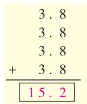

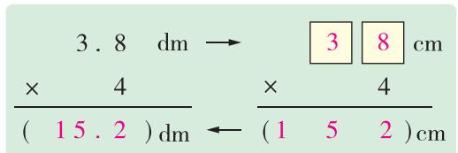

text_image

3.8 dm → 3 8 cm
× 4 × 4
( 15.2 )dm ← (1 5 2 )cm

3.8 表示 38 个 0.1, $38 \times 4 = (152)$ , 表示 (152) 个 0.1, 也就是 (15.2) 个 1, 所以 $3.8 \times 4 = (15.2)$ 。

答:至少需要准备(15.2)dm的木条。

2 列竖式计算。(竖式略)

$$
0. 5 2 \times 7 = 3. 6 4
$$

$$
9 \times 1. 0 5 = 9. 4 5
$$

$$
3. 9 \times 1 6 = 6 2. 4
$$

$$
3 5. 8 \times 3 = 1 0 7. 4
$$

3（情境题·生活情境）2025年1月5日，第41届中国·哈尔滨国际冰雪节在哈尔滨冰雪大世界正式开幕。冰雪节期间，特产店的红肠进行促销，优惠价格为14.5元/包。

(1) 王叔叔买了 5 包红肠, 应付 (72.5) 元。  
(2) 李阿姨买了 11 包红肠, 付给收银员 200 元, 应找回多少钱?

$$
2 0 0 - 1 1 \times 1 4. 5 = 4 0. 5 (\text {元})
$$

答:应找回 40.5 元。

# 过能力关 核心素养提升练

4 国庆节期间,住在北京的小明准备和爸爸、妈妈、爷爷、奶奶一起乘火车去天津游玩。如图是爸爸查到的车票信息。

(1) 小明一家人购票至少需要多少钱？（小明需要购全价票） $54.5 \times 5 = 272.5$ （元）

答: 小明一家人购票至少需要 272.5 元。

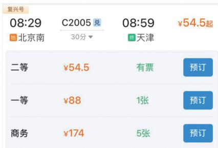

text_image

复兴号
08:29 C2005 空 08:59 ¥54.5起
北京南 30分 ▼ 天津
二等 ¥54.5 有票 预订
一等 ¥88 1张 预订
商务 ¥174 5张 预订

(2)去天津时一家人购买了二等座的票,返程时爸爸考虑到爷爷、奶奶的身体状况,决定给爷爷、奶奶购买商务座的票,其他人购买二等座的票。返程时比去时多花多少钱?

$$
1 7 4. 0 \times 2 - 5 4. 5 \times 2 = 2 3 9 (\text {元}) \text {或} (1 7 4. 0 - 5 4. 5) \times 2 = 2 3 9 (\text {元})
$$

答:返程时比去时多花239元。

# 过基础关 教材知识巩固练

# 1 列竖式计算。(竖式略)

$$
1 2. 4 \times 8 = 9 9. 2
$$

$$
0. 3 4 \times 1 6 = 5. 4 4
$$

$$
2 5 \times 1. 0 8 = 2 7
$$

$$
3 0. 5 \times 6 0 = 1 8 3 0
$$

# 2 选择。(把正确答案的字母填在括号里)

(1)如图,小华在计算 $4.2 \times 6$ 时,先算出了 $42 \times 6$ 的积。她再把这个结果( C )就可以得到

$4.2 \times 6$ 的积。

A. 扩大到原来的 10 倍  
B. 扩大到原来的 100 倍  
C. 缩小到原来的 $\frac{1}{10}$

(2)如图所示的竖式,计算错误的原因是( B )。

A. 列竖式计算时相同数位没有对齐  
B. 先点小数点, 再落因数末尾的 0  
C. 没有去掉积的小数部分末尾的 0

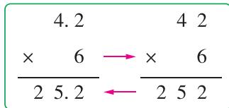

text_image

4.2
× 6 → × 6
-----
2 5.2 ← 2 5 2

$$
\begin{array}{r} 4. 6 \\ \times \quad 3 0 0 \\ \hline 1 3. 8 0 0 \end{array}
$$

3（情境题·生活情境）电视机尺寸是按屏幕对角线的长度来确定的。对角线长18英寸的叫18英寸电视机；对角线长12英寸的叫12英寸电视机；以此类推。小林家买了一台50英寸的电视机，这台电视机屏幕的对角线长多少厘米？

$50 \times 2.54 = 127$ (厘米)

答: 这台电视机屏幕的对角线长 127 厘米。

英寸是长度单位，
1英寸=2.54厘米。

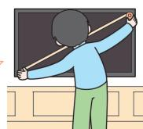

# 过能力关 核心素养提升练

4 (教材 P4 第 5 题变条件) 回声可以用来测定一些限定条件下的距离。某测量员这样利用回声测距离: 他站在某峭壁边朝另一峭壁喊了一声, 经过 10 秒听到回声, 已知声速为 0.34 千米/秒,

则两峭壁间的距离为多少千米?

$10 \div 2 = 5$ (秒)

$5 \times 0.34 = 1.7$ (千米)

答:两峭壁间的距离为 1.7 千米。

注意：听到回声时声音传播了一个来回的路程哟！

视频讲解

# 过基础关 教材知识巩固练

# 1 填一填,算一算。

(1)

$$
\begin{array}{c} 4. 2 \xrightarrow {\times (1 0)} \\ \times 0. 6 \xrightarrow {\times (1 0)} \\ \hline \boxed {2} \boxed {5} \boxed {2} \xleftarrow {\div (1 0 0)} \end{array} \begin{array}{c} \boxed {4} \boxed {2} \\ \times \boxed {6} \\ \hline \boxed {2} \boxed {5} \boxed {2} \end{array}
$$

(2)

$$
\begin{array}{c c c} 1. 0 8 & \xrightarrow {\times (1 0 0)} & 1 0 8 \\ \times & 2. 6 & \xrightarrow {\times (1 0)} \\ \hline 6 & 4 & 8 \\ 2 & 1 & 6 \\ \hline \boxed {2} & \boxed {8} & \boxed {0} & \boxed {8} \end{array} \quad \div (1 0 0 0) \quad \begin{array}{c c c} 1 0 8 \\ \times & 2 6 \\ \hline 6 & 4 & 8 \\ 2 & 1 & 6 \\ \hline 2 & 8 & 0 & 8 \end{array}
$$

# 2 先判断下列各式的积是几位小数,再列竖式计算。(竖式略)

(两)位小数

$$
6. 9 \times 2. 7 = 1 8. 6 3
$$

(三)位小数

$$
0. 4 6 \times 5. 2 = 2. 3 9 2
$$

(三)位小数

$$
4. 2 \times 2. 0 3 = 8. 5 2 6
$$

(三)位小数

$$
0. 6 5 \times 0. 5 = 0. 3 2 5
$$

# 3（名校期末真题）一只成年长颈鹿的身高大约是多少米？

$$
1. 5 \times 4. 2 = 6. 3 (\mathrm{m})
$$

答:一只成年长颈鹿的身高大约是6.3 m。

小知识

长颈鹿是现存世界上最高的陆生动物，刚出生的长颈鹿身高约为1.5 m，成年长颈鹿的身高一般是刚出生时的4.2倍。

  
成年长颈鹿

# 4（教材P9第7题变情境）爸爸给小亮买了一套高度可调式桌椅。小亮的身高是1.52米，他的桌、

椅的高度应分别调为多少?

$$
1. 5 2 \times 0. 4 5 = 0. 6 8 4 (\text { 米 })
$$

$$
1. 5 2 \times 0. 2 5 = 0. 3 8 (\text { 米 })
$$

合适的课桌高度=身高×0.45

合适的椅子高度=身高×0.25

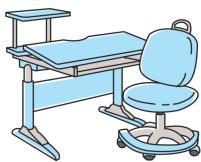

答: 小亮的课桌高度应调为 0.684 米, 椅子高度应调为 0.38 米。

# 过能力关 核心素养提升练

5 在计算 $2.5 \times 1.7$ 时, 小华采取的方法是“整数部分与整数部分相乘, 小数部分与小数部分相乘, 再相加”, 也就是 “ $2 \times 1 + 0.5 \times 0.7 = 2.35$ ”, 但是这样计算出的结果与正确结果不一致。请你结合图中的①②③④四个长方形的面积进行分析, 小华出错是因为少算了图中的哪个长方形的面积? 写出你的思考过程。

小华出错是因为少算了题图中的②和③两个长方形的面积。由题图可知,大长方形的长为 $(2+0.5)$ ,即2.5,宽为 $(1+0.7)$ ,即1.7,大长方形的面积等于 $1 \times 2 + 1 \times 0.5 + 0.7 \times 2 + 0.7 \times 0.5$ ，即①②③④四个长方形的面积之和，小华只计算了①和④两个长方形的面积，少算了②和③两个长方形的面积。

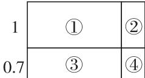

  
视频讲解

# 过基础关 教材知识巩固练

# 1 列竖式计算。(竖式略)

$$
8. 9 \times 0. 5 3 = 4. 7 1 7
$$

$$
0. 3 2 \times 0. 2 5 = 0. 0 8
$$

$$
0. 4 3 \times 1. 0 8 = 0. 4 6 4 4
$$

$$
0. 0 9 7 \times 0. 3 9 = 0. 0 3 7 8 3
$$

2（探究题·规律探究）在下面的 $\bigcirc$ 中填上“＞”“＜”或“＝”。

$$
9 9 \times 1. 5 > 9 9
$$

$$
9 9 \times 0. 9 5 <   9 9
$$

$$
9 9 \times 1 = 9 9
$$

$$
3. 6 5 \times 3. 6 5 > 3. 6 5
$$

$$
1. 2 5 \times 6. 0 5 > 6. 0 5
$$

$$
0. 8 \times 9. 5 <   1 0
$$

我发现:一个数(0 除外)乘大于1 的数,积 $\textcircled{>}$ 原来的数;

一个数(0 除外)乘小于1 的数,积 $\textcircled{<}$ 原来的数。

# 3 选择。(把正确答案的字母填在括号里)

(1) 若 $a \times 1.01 = b = c \times 0.99(a, b, c$ 都大于 0)，则下面的结论正确的是（B）。

$$
\mathrm{A.} a > b > c
$$

$$
\mathrm{B.} c > b > a
$$

$$
\mathrm{C.} b > c > a
$$

(2)如图是笔算 $3.5 \times 2.6$ 的过程,用到的知识点有( C )。

①转化的策略

②积的变化规律

③小数的性质

④乘法分配律

$$
\begin{array}{c} 3. 5 \xrightarrow {\times 1 0} 3 5 \\ \times 2. 6 \xrightarrow {\times 1 0} \times 2 6 \\ \hline 2 1 0 \\ \hline 7 0 \\ \hline 9. 1 \text {Q} \end{array} \div 1 0 0 \frac {7 0}{9 1 0}
$$

$$
\text {   A.   } ① ② ③
$$

$$
\textcircled {B}. ① ③ ④
$$

$$
C. ① 2 ③ 4
$$

4 如果电源插头没有拔掉,电视机在关机状态下也耗电。如果你家电视机在关机后电源插头没有拔掉,那么一天(按11.5小时计算)要浪费约多少千瓦时的电?一个月(按30天计算)呢?

$0.008 \times 11.5 = 0.092$ (千瓦时)

$0.092 \times 30 = 2.76$ (千瓦时)

答:一天要浪费约0.092千瓦时的电,一个月要浪费约2.76千瓦时的电。

电视机关机，但未拔掉电源插头时,每小时约耗电0.008千瓦时。

# 过能力关 核心素养提升练

5（情境题·文化情境）《九章算术》中记载：“方田术曰，广从(zòng)步数相乘得积步。”其中“广”和“从”是指长和宽，也就是说：长方形的面积 = 长 × 宽。计算 40 个相同的长方形(如图)的面积之和，小明列式为 $0.25 \times 40$ ，他做对了吗？如果不对，请写出正确的解题过程。

他做错了。 $0.25 \times 0.14 \times 40 = 1.4 \, (\text{m}^2)$

答:40 个相同的长方形的面积之和为 $1.4 \, m^{2}$ 。

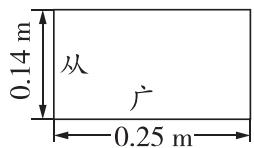

# 过基础关 教材知识巩固练

# 1 先列竖式计算,再验算。(竖式、验算略)

$$
0. 3 5 \times 0. 0 7 = 0. 0 2 4 5
$$

验

算

$$
1. 6 \times 0. 1 7 = 0. 2 7 2
$$

验

算

$$
2. 4 5 \times 1. 4 = 3. 4 3
$$

验

算

# 2 算一算,填一填。

(1) 开学初, 实验小学师生一起到社区做关于“垃圾分类”的问卷调查。老师收回问卷 108 份, 学生收回的问卷数是老师收回的 2.5 倍, 实验小学学生一共收回 (270) 份问卷。

(2) 使用 AI 对这些问卷进行数据统计, 只需用 0.05 小时就可以完成。如果人工统计这些问卷, 那么需要 (2.29) 小时才能完成。

统计相同的问卷数，人工统计所用的时间是AI的45.8倍。

# 3（情境题·科学情境）一个普通番茄约重0.36千克，“太空种子”结出的番茄的质量约是普通番

茄的 2.8 倍。“太空种子”结出的番茄约重多少千克？

$0.36 \times 2.8 = 1.008$ (千克)

答:“太空种子”结出的番茄约重 1.008 千克。

太空种子是精选的作物种子通过航天飞行器搭载到太空，在空间特殊环境下发生变化的种子。

# 4（情境题·文化情境）曾侯乙编钟是战国早期文物，是我国目前发现数量最多、保存最好的一套大型编钟。这套编钟一共65件，其中最小的编钟高20.4厘米，重2.4千克，最大的编钟的高度约是最小的编钟的7.5倍，质量约是最小的编钟的84.8倍。最大的编钟高约多少厘米？重约多少千克？

$20.4 \times 7.5 = 153$ （厘米）

$2.4 \times 84.8 = 203.52$ （千克）

答:最大的编钟高约 153 厘米,重约 203.52 千克。

# 过能力关 核心素养提升练

# 5 阅读材料,回答问题。

材料一 我国自主研制的 16 兆瓦海上风电机组的叶轮直径为 252 米, 叶轮扫风面积约相当于 6.982 个标准足球场的面积; 轮毂(gǔ)高度相当于一座 50 层大楼的高度。

材料二 国际足联规定标准的足球比赛场地为长方形,长为105米,宽为68米。

注:大楼的高度按照每层2.92米计算。

叶轮扫风面积大约是多少平方米？轮毂的高度大约是多少米？

$105 \times 68 = 7140$ (平方米)

$6.982 \times 7140 = 49851.48$ （平方米）

2.92×50=146(米)

答: 叶轮扫风面积大约是 49851.48 平方米。轮毂的高度大约是 146 米。

# 过综合关

# 阶段滚动综合练

1 列竖式计算,带☆的要验算。(竖式、验算略)

$$
1. 3 7 \times 2. 3 = 3. 1 5 1
$$

$$
0. 6 2 4 \times 5 0 = 3 1. 2
$$

$$
\star 1. 5 6 \times 0. 0 2 5 = 0. 0 3 9
$$

验

算

2 选择。(把正确答案的字母填在括号里)

(1)下面算式的积最小的是( C )。

A. $0.28 \times 17$

B. $28 \times 1.7$

C. $0.28 \times 0.17$

D. $2.8 \times 0.17$

(2) 若 $0.89 \times a > 0.89$ ，则 a 的值(A)。

A. 大于 1

B. 小于 1

C. 等于 1

D. 无法判断

(3)(名校期末真题) $A=0.\underbrace{00\cdots0}_{8个0}32,\quad B=0.\underbrace{00\cdots0}_{7个0}3,A\times B$ 的积有(B)位小数。

A. 17

B. 18

C. 20

D. 15

(4)已知“□.5×2.□9”是一个一位小数乘两位小数的算式,下面四个数中有可能是它的得数的是( B )。

A. 0.435

B. 9.405

C. 7.25

D. 33.975

3 周末美佳一家开车去外地看望爷爷奶奶,路上加油时,美佳从加油机(如图)上看见一共加了200元钱的汽油。如果每升汽油可供汽车行驶8.8千米,这些汽油可以供汽车行驶多少千米?

$28.49 \times 8.8 = 250.712$ （千米）

答:这些汽油可以供汽车行驶 250.712 千米。

金额

200.00

元

油量

28.49

升

售价

7.02

元/升

4 五年级两班同学采集树种。五(1)班45人,每人采集了0.14千克;五(2)班36人共采集6.13千克。两班一共采集多少树种?

$45 \times 0.14 + 6.13 = 12.43$ (千克)

答:两班一共采集 12.43 千克树种。

# 过拓展关 思维拓展培优练

5 在□里填上合适的数,并在合适的位置点上小数点。

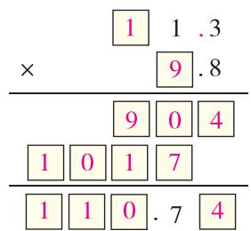

text_image

1 1 .3
×    9 .8
-----
    9 0 4
1 0 1 7
-----
1 1 0 .7 4

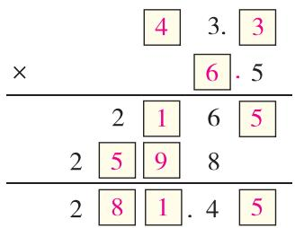

text_image

4 3. 3
× 6 . 5
2 1 6 5
2 5 9 8
2 8 1 . 4 5

或

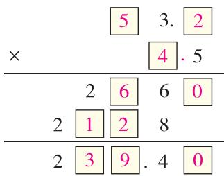

text_image

5 3. 2
×    4 . 5
2 6 6 0
2 1 2 8
2 3 9 . 4 0

视频讲解

# 过基础关 教材知识巩固练

1 想一想,填一填。

(1) $1.65 \times 2.7$ 的积是(三)位小数,保留一位小数是(4.5)。  
(2)人民币最小的单位是(分),所以在计算钱数时,一般保留(两)位小数。例如,每千克黑豆的价格是9.88元,购买0.8千克黑豆需要花(7.90)元。

2 列竖式计算下面各题,按要求用“四舍五入”法保留积的小数位数。(竖式略)

(1) 得数保留整数。

$$
0. 6 2 \times 6 4 5 \approx 4 0 0
$$

(2) 得数保留一位小数。

$$
2. 8 \times 3. 9 \approx 1 0. 9
$$

(3) 得数保留两位小数。

$$
0. 8 7 \times 3. 1 7 \approx 2. 7 6
$$

3 选择。(把正确答案的字母填在括号里)

(1) $9.999 \times 0.1$ 的积保留两位小数是( C )。

A. 9.99

B. 1.0

C. 1.00

D. 99. 99

(2) 近似数是 4.86 的三位小数有 ( B ) 个。

A.1

B. 9

C. 10

D. 无数

4（情境题·生活情境）亭亭与妈妈一起去超市，看见一个营业员边称橙子边熟练地喊道：“3.22千克，19.90元。”亭亭告诉妈妈：“她说的价格是近似数。”

你觉得亭亭说得对吗？（对）（填“对”或“不对”）

请说明你的理由。

理由不唯一, 可以通过精确计算说明, 也可以通过推理说明, 合理即可。如: “3.22 × 6.18” 的两个因数的末位上的数字分别为 “2” 和 “8”, “2 × 8 = 16”, 积的末位数字应为 “6”, 而营业员说是 19.90, 所以说是近似数。

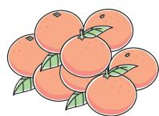  
6.18元/千克

5 (教材 P14 第 11 题变设问) 人体对钠的安全摄入量为每日 2.0 \~ 2.5 g, 过量摄入钠会影响人体健康。若 1 g 干脆面中含 0.019 g 钠, 一包干脆面 48 g, 小明一天吃了 4 包, 超过安全摄入量了吗? (得数保留一位小数)

$$
0. 0 1 9 \times 4 8 \times 4 \approx 3. 6 (\mathrm{g})
$$

$$
3. 6 > 2. 5
$$

答: 小明一天吃了 4 包, 超过了安全摄入量。

人体的钠主要来源于食盐，要控制食盐的摄入量哦！

# 过能力关 核心素养提升练

6 小佳妈妈去超市购买大米,总价“四舍五入”之后,一共支付了 15.4 元。大米的单价和质量都

是一位小数,且末位上的数字均是4,大米的总价“四舍五入”前是多少钱?

答:大米的总价“四舍五入”前是15.36元。

  
视频讲解

# 过基础关 教材知识巩固练

1 用简便方法计算 $88 \times 1.25$ 。下面分别是琪琪和琳琳的算法，请你补充完整。

  
琪琪

我运用了乘法结合律使计算简便。

$$
8 8 \times 1. 2 5
$$

$$
= (1 1 \times 8) \times 1. 2 5
$$

$$
= 1 1 \times (8 \times 1. 2 5)
$$

$$
= 1 1 \times 1 0
$$

$$
= 1 1 0
$$

$$
8 8 \times 1. 2 5
$$

$$
= (8 0 + 8) \times 1. 2 5
$$

$$
= 8 0 \times 1. 2 5 + 8 \times 1. 2 5
$$

$$
= 1 0 0 + 1 0
$$

$$
= 1 1 0
$$

我运用了乘法分配律使计算简便。

  
琳琳

2 选择。(把正确答案的字母填在括号里)

(1) $0.98 \times 101 = 0.98 \times 100 + 0.98 = 98.98$ 是根据（A）使计算简便。

A. 乘法分配律

B. 乘法结合律

C. 乘法交换律

D. 乘法交换律和结合律

(2)下面关于 $1.25 \times 2.4$ 的计算,不正确的是(D)。

A. $1.25 \times 2.4 = 1.25 \times 8 \times 0.3$

B. $1.25 \times 2.4 = 1.25 \times (2 + 0.4)$

C. $1.25 \times 2.4 = 1.25 \times (0.8 + 0.8 + 0.8)$

D. $1.25 \times 2.4 = 1.25 \times 0.8 \times 1.25 \times 3$

3 (情境题·生活情境)李梅家购买了一套住房,平面图如图所示。(墙体厚度忽略不计)

(1) 厨房和卫生间的地面准备选用同一种瓷砖, 一共要贴多少平方米这种瓷砖?

$$
2. 2 \times 2. 6 + 3. 8 \times 2. 6 = 1 5. 6 \left(\mathrm{m} ^ {2}\right)
$$

答:一共要贴 $15.6 \, m^{2}$ 这种瓷砖。

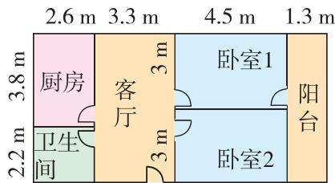

text_image

2.6 m 3.3 m 4.5 m 1.3 m
3.8 m
厨房
客厅
卧室1
阳台
卫生间
3 m
3 m
卧室2
2.2 m

(2)客厅和阳台选用同一种瓷砖,瓷砖每平方米80元,购买这种瓷砖一共要花多少元钱?

$$
(3. 3 + 1. 3) \times (3 + 3) \times 8 0 = 2 2 0 8 (\text {   元   })
$$

答: 购买这种瓷砖一共要花 2208 元。

4 每个茶杯 6.5 元, 茶壶的价钱是每个茶杯的 4 倍。买这样一套茶具(如图), 一共需要多少钱?

$$
6. 5 \times 6 + 6. 5 \times 4 = 6 5 (\text {   元   })
$$

答:一共需要65元。

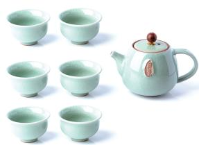

natural_image

Tea set with light green ceramic cups and a teapot (no text or symbols visible)

# 过能力关 核心素养提升练

5 用简便方法计算下面各题。

$$
(1) 1 9. 9 \times 3. 2 + 1. 1 \times 3. 2 - 3. 2
$$

$$
= (1 9. 9 + 1. 1 - 1) \times 3. 2
$$

$$
= 2 0 \times 3. 2
$$

$$
= 6 4
$$

$$
8 4 8 \times 1. 2 5 - 0. 0 3 5 \times 1 2 5 - 4. 4 5 \times 1 2. 5 \tag {2}
$$

$$
= 8 4. 8 \times 1 2. 5 - 0. 3 5 \times 1 2. 5 - 4. 4 5 \times 1 2. 5
$$

$$
= (8 4. 8 - 0. 3 5 - 4. 4 5) \times 1 2. 5
$$

$$
= 8 0 \times 1 2. 5
$$

$$
= 1 0 0 0
$$

# 过综合关

# 阶段滚动综合练

1 计算下面各题,怎样简便怎样算。

$$
\begin{array}{l} 9. 3 \times 1 4. 7 - 2. 3 \times 1 4. 7 \quad 1 0. 1 \times 5. 5 \quad 3. 2 \times 2. 5 \times 1. 2 5 \quad 4. 2 \times 9. 9 + 0. 4 2 \\ = (9. 3 - 2. 3) \times 1 4. 7 = (1 0 + 0. 1) \times 5. 5 = 4 \times 0. 8 \times 2. 5 \times 1. 2 5 = 4. 2 \times 9. 9 + 4. 2 \times 0. 1 \\ = 7 \times 1 4. 7 = 1 0 \times 5. 5 + 0. 1 \times 5. 5 = (4 \times 2. 5) \times (0. 8 \times 1. 2 5) = 4. 2 \times (9. 9 + 0. 1) \\ = 1 0 2. 9 \quad = 5 5 + 0. 5 5 \quad = 1 0 \times 1 \quad = 4. 2 \times 1 0 \\ = 5 5. 5 5 \quad = 1 0 \quad = 4 2 \\ \end{array}
$$

2 一卷丝线正好可以编织大中国结和小中国结各 12 个, 每个大中国结需用丝线 3.6 米, 每个小中国结需用丝线 1.4 米。这卷丝线总共长多少米?

$3.6 \times 12 + 1.4 \times 12 = 60$ （米）

答: 这卷丝线总共长 60 米。

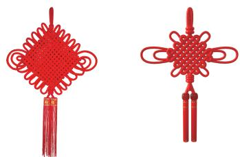

natural_image

Two red Chinese knot ornaments with tassels, no text or symbols present

3 李大伯种了一大片向日葵,这些向日葵成熟后每棵大约可以收葵花籽 0.25 千克,每千克葵花籽可以榨油 0.38 千克。如果李大伯种了 400 棵向日葵,收的葵花籽能榨油多少千克?

$400 \times 0.25 \times 0.38 = 38$ (千克)

答:收的葵花籽能榨油 38 千克。

4（情境题·科学情境）美国的第五代隐形战斗机 F-22 的最高速度为 2.25 马赫(1 马赫约等于 1225 千米/时)，我国的第五代隐形战斗机歼 -20 的最高速度大约是 F-22 的 1.13 倍。歼 -20

的最高速度大约为多少马赫？（得数保留两位小数）

$2.25 \times 1.13 = 2.5425$ （马赫） $\approx 2.54$ （马赫）

答: 歼 -20 的最高速度大约是 2.54 马赫。

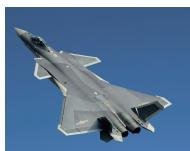  
歼-20

# 过拓展关

# 思维拓展培优练

5 老师在黑板上写了 13 个自然数,让大家计算平均数(得数保留两位小数),小明计算的结果是 12.43,老师说他最后一位数字写错了,其他数字都对。你知道这 13 个自然数的和是多少吗?

答: 这 13 个自然数的和是 162。

  
视频讲解

# 过基础关 教材知识巩固练

# 1 填空。

(1)(探究题·思考过程)小聪带了50元去买巧克力,每盒巧克力9.5元,他带的钱够买5盒巧克力吗?够买6盒吗?想一想,填一填。

1盒巧克力不到(10)元，5盒巧克力不到(50)元，所以用50元买5盒巧克力，钱(够)。

1盒巧克力超过(9)元，6盒巧克力超过(54)元，所以用50元买6盒巧克力，钱(不够)。

(2) 儿童公园有 3 块草地。估一估，(A) 草地和 (B) 草地的面积均约是 $160 \mathrm{~m}^{2}$ ，(C) 草地的面积在 $300 \sim 400 \mathrm{~m}^{2}$ 之间。算一算，(B) 草地的面积约是 $158.8 \mathrm{~m}^{2}$ 。（填字母）

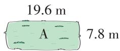

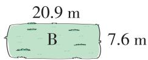

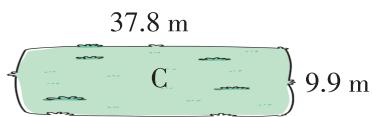

text_image

37.8 m
C
9.9 m

2 某市实行机动车单双号限行,王老师从家开车到学校,需要 0.25 小时。从家骑电动车走同样的路线到学校,如果每小时行驶 20 千米,0.6 小时能到学校吗?

$54 \times 0.25 = 13.5$ (千米)

$20 \times 0.6 = 12$ (千米)

13.5 > 12

答:0.6 小时不能到学校。

平均速度：54千米/时

3 李奶奶买了一只鸡,付了55元,她还买了一条“0.6■”千克的鱼,鱼的售价是40元/千克。李奶奶带了80元钱,够吗?(“0.6■”表示一个两位小数)

乐乐的想法是:把0.6■看作0.6,因为 $40\times0.6=24$ (元), $24+55=79$ (元),79<80,所以80元够了。乐乐的想法对吗?写出你的思考过程。

乐乐的想法不对。把 0.6■看作 0.6, $0.6 \times 40 = 24$ （元）， $24 + 55 = 79$ （元），79 < 80；把 0.6■看作 $0.69, 0.69 \times 40 = 27.6$ （元）， $27.6 + 55 = 82.6$ （元），82.6 > 80。所以无法判断 80 元是否够。（思考过程合理即可）

# 过能力关 核心素养提升练

4 下面是一袋大米的价签,买这袋大米用 45 元够吗?请说明理由。(■表示一个数字)

$5.49 \times 7.95 \approx 5.5 \times 8 = 44$ （元）

44 < 45, 所以够。

# 散装大米

包装日期 2025年4月15日

售价 5.4元/千克

质量 7.■5千克

总价 元

视频讲解

# 过基础关 教材知识巩固练

1（新题型）李叔叔在这个停车场停车4.5小时,需要付停车费多少元?下列解题思路正确的有(②③)。(填序号)

# 收费标准

2小时内（含2小时）收5元；超过2小时的部分，每小时收4.5元。（不足1小时，按1小时计算）

① 李叔叔停车 4.5 小时 >2 小时, 所以应按每小时 4.5 元计费, 停车 4.5 小时按 5 小时计算, 需要付 $5 \times 4.5 = 22.5$ (元)  
②4.5 小时按 5 小时计费, 这 5 小时可以分为 2 小时和 3 小时两部分, 前面 2 小时付 5 元, 后面

3 小时按每小时 4.5 元计算(如图), 需要付 $5 + 3 \times 4.5 = 18.5$ (元)

<table><tr><td>5</td><td>4.5</td><td>4.5</td><td>4.5</td></tr></table>

③4.5 小时按 5 小时计费, 假设 5 小时都按每小时 4.5 元计算, $5 \times 4.5 = 22.5$ (元); 前 2 小时多算 $4.5 \times 2 - 5 = 4$ (元), 那么需要付 22.5 - 4 = 18.5 (元)

2（教材 P18 第 7 题变情境）某市电力公司为鼓励市民节约用电，采取按月分段计费的方法收取电费。每月用电量不超过 100 千瓦时的部分，每千瓦时 0.52 元；超过 100 千瓦时的部分，每千瓦时 0.62 元。

(1)陈红家上个月的用电量为80千瓦时,应缴电费多少钱?

$$
8 0 \times 0. 5 2 = 4 1. 6 (\text {   元   })
$$

答: 应缴电费 41.6 元。

(2)李明家上个月的用电量为120千瓦时,应缴电费多少钱?

$$
1 0 0 \times 0. 5 2 + (1 2 0 - 1 0 0) \times 0. 6 2 = 6 4. 4 (\text {元})
$$

答: 应缴电费 64.4 元。

# 过能力关 核心素养提升练

3 张阿姨要去距离家 7.8 km 的会展中心参观车展,早上 7:30 乘坐普通型出租车去,17:30 乘坐优享型出租车返回。她这一天乘坐出租车一共要花多少钱?（不计等候时间）

行驶 7.8 km, 应按 8 km 计算。

$$
8 + 1. 5 \times (8 - 3) = 1 5. 5 (\text {元})
$$

$$
1 4 + 2. 4 \times (8 - 3) = 2 6 (\text {元})
$$

$$
1 5. 5 + 2 6 = 4 1. 5 (\text {   元   })
$$

答:她这一天乘坐出租车一共要花41.5元。

出租车收费价格表

<table><tr><td>车型</td><td>时间段</td><td>3 km及以内</td><td>超过3 km的部分(不足1 km,按1 km计算)</td></tr><tr><td rowspan="2">普通型出租车</td><td>5:00—22:00</td><td>8元</td><td>1.5元/km</td></tr><tr><td>22:00—次日5:00</td><td>10元</td><td>1.5元/km</td></tr><tr><td rowspan="2">优享型出租车</td><td>5:00—22:00</td><td>14元</td><td>2.4元/km</td></tr><tr><td>22:00—次日5:00</td><td>18元</td><td>3.1元/km</td></tr></table>

# 重难易错专练（一）

# 主题活动 低碳生活小妙招

# 过重难关

# 重点难点滚动练

# 重难点1 理解和掌握小数乘法的算理和计算方法，会用“四舍五入”法取积的近似数

1 (大单元关联)一户家庭每年随手关灯节约的电能相当于节省了多少钱? (1 千瓦时电按 0.56 元收费)(得数保留两位小数)

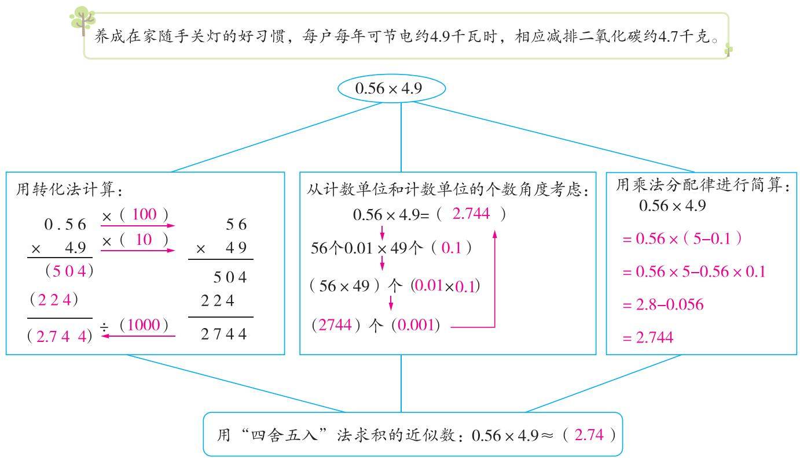

flowchart

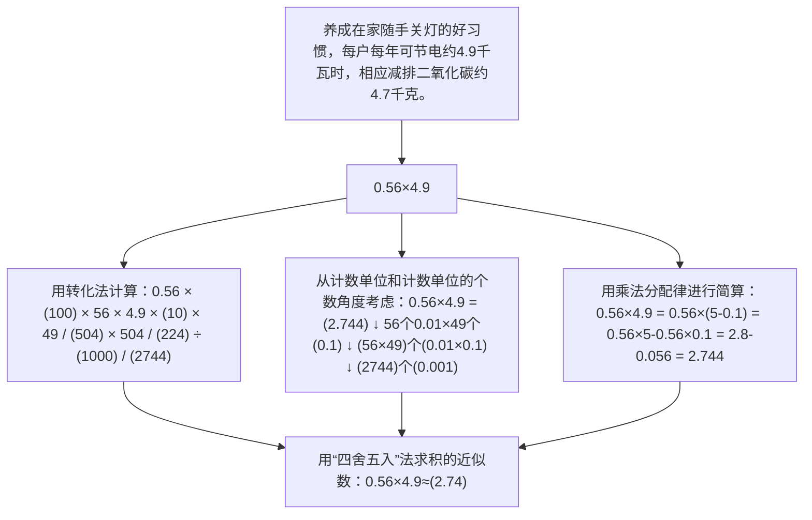

答:一户家庭每年随手关灯节约的电能相当于节省了约(2.74)元。

# 重难点 2 解决有关小数乘法的实际问题

2 育华小学积极践行“循环使用教材”的倡议。已使用但质量完好的教材可以留给下一届的同学重复使用。

循环使用教材，不仅可以减轻家长的负担，让学生养成节约、环保等好习惯，而且能够大量减少树木、纸张、印刷等方面的消耗，符合厉行节俭、反对浪费等建设节约型社会的要求。

(1)今年五年级有240人使用了循环教材,购买教材的费用一共能节约多少元?

$$
2 4 0 \times 2 5. 9 8 = 6 2 3 5. 2 (\text {   元   })
$$

答:购买教材的费用一共能节约 6235.2 元。

每人使用了4本循环教材，可节约25.98元。

(2)开学前,学校会将循环教材中的破损教材作为废纸统一回收处理。近五年一共回收这样的

教材类废纸约 5 吨。这些教材类废纸可造再生纸多少吨？

$$
5 \times 0. 8 5 = 4. 2 5 (\text {   吨   })
$$

答:这些教材类废纸可造再生纸4.25吨。

据统计，1吨废纸可再造0.85吨再生纸，可节省木材3立方米。

3 为鼓励居民节约使用燃气,某燃气公司规定:每2个月为计费周期,2个月中用的燃气总数进行阶梯计费;100立方米及以内的按照每立方米2.25元计费,超出100立方米的部分,按照每立方米2.93元计费。

(1)冬冬家9、10月使用燃气89立方米,应缴纳燃气费多少元?

$89 \times 2.25 = 200.25$ （元）

答:应缴纳燃气费 200.25 元。

(2)亮亮家9、10月使用燃气128立方米,应缴纳燃气费多少元?

128 - 100 = 28 (立方米) $100 \times 2.25 + 28 \times 2.93 = 307.04$ (元)

答: 应缴纳燃气费 307.04 元。

4 为了鼓励大家使用帆布袋,育华小学决定为全校2260名师生每人定做1个帆布袋。下面是两家帆布袋制作公司的费用信息,选择哪一家更划算?通过计算说明。(打样费是指在产品批量生产之前,公司根据客户提供的规格、工艺、尺寸等信息,先行制作一个或数个样品供客户参考和确认的费用)

少生产1个塑料袋能节能约0.04克标准煤，相应减排二氧化碳0.1克，而且塑料袋日常用量极大，我们可以用结实耐用可重复使用的帆布袋取代塑料袋。

A 公司

规格:40 cm×30 cm×10 cm

材质:帆布 印刷工艺:丝网印刷

价格:3.80元/个 100个起批

打样费:300.00元

B 公司

规格:40 cm×30 cm×10 cm

材质:帆布 印刷工艺:丝网印刷

价格:4.05元/个 50个起批

打样费:300.00元 超过1000个返打样费

A 公司: $2260 \times 3.8 + 300 = 8888$ (元)

B 公司:2260 > 1000, 不算打样费 $2260 \times 4.05 = 9153$ (元)

8888 < 9153

答:选择 A 公司更划算。

# 过易错关 易错易混考点练

# 易错点 不会用估算的方法解决简单实际问题

5 育华小学共有 196 台台式电脑,22 台打印机。学校计划通过采取以下措施达到全年节约用电 8000 千瓦时、减排二氧化碳约 8000 千克的目标。估一估,育华小学能完成节能减排计划吗?

以待机代替屏幕保护，每台台式电脑平均每年可省电约6.3千瓦时，相应减排二氧化碳约6千克；调低电脑屏幕亮度，每台台式电脑平均每年可省电约30千瓦时，相应减排二氧化碳约29千克。不使用打印机时将其断电，每台平均每年可省电约10千瓦时，相应减排二氧化碳约9.6千克。

$$
1 9 6 <   2 0 0 \quad 6. 3 <   7 \quad 2 9 <   3 0 \quad 9. 6 <   1 0
$$

$$
2 0 0 \times (7 + 3 0) + 2 2 \times 1 0 = 7 6 2 0 (\text {千瓦时}) \quad 2 0 0 \times (6 + 3 0) + 2 2 \times 1 0 = 7 4 2 0 (\text {千克})
$$

$$
7 6 2 0 <   8 0 0 0 \quad 7 4 2 0 <   8 0 0 0
$$

答: 育华小学不能完成节能减排计划。

反馈区

# 请使用第一单元测评卷，测一测吧！

▶ 见活页卷

# 第二单元 位置

# 1 用数对表示物体的位置

# 过基础关 教材知识巩固练

1 想一想,填一填。

(1)数对是有序的,用数对表示位置时,一般先表示第几(列),再表示第几(行)。(1,3)和(3,1)表示的位置(不同)(填“相同”或“不同”)。(1,3)表示第(1)列、第(3)行;(3,1)表示第(3)列、第(1)行。  
(2)贝贝和乐乐在同一间教室上课,贝贝坐在教室的第2列、第3行,用数对(2,3)表示;乐乐在教室的位置用数对(3,5)表示,那么乐乐坐在该教室的第(3)列、第(5)行。

2（名校期末真题）在央视热播的《中国诗词大会》上，常用“九宫格”考查选手的诗词识别能力，请你根据数对提示的信息，从右图中识别出一句诗，并补全下面的表格。

<table><tr><td>3</td><td>人</td><td>声</td><td>桂</td></tr><tr><td>2</td><td>清</td><td>闲</td><td>落</td></tr><tr><td>1</td><td>花</td><td>泉</td><td>石</td></tr><tr><td></td><td>1</td><td>2</td><td>3</td></tr></table>

<table><tr><td>数对</td><td>(1,3)</td><td>(2,2)</td><td>(3,3)</td><td>(1,1)</td><td>(3,2)</td></tr><tr><td>诗句</td><td>人</td><td>闲</td><td>桂</td><td>花</td><td>落</td></tr></table>

3 如下左图是存快递的“快递柜”(如右图)的部分简化示意图。2号柜子用数对(1,5)表示。

<table><tr><td>6</td><td>1</td><td>7</td><td>13</td><td>19</td><td>25</td><td>31</td></tr><tr><td>5</td><td>2</td><td>8</td><td>14</td><td>20</td><td>26</td><td>32</td></tr><tr><td>4</td><td>3</td><td>9</td><td>15</td><td>21</td><td>27</td><td>33</td></tr><tr><td>3</td><td>4</td><td>10</td><td>16</td><td>22</td><td>28</td><td>34</td></tr><tr><td>2</td><td>5</td><td>11</td><td>17</td><td>23</td><td>29</td><td>35</td></tr><tr><td>1</td><td>6</td><td>12</td><td>18</td><td>24</td><td>30</td><td>36</td></tr><tr><td></td><td>1</td><td>2</td><td>3</td><td>4</td><td>5</td><td>6</td></tr></table>

natural_image

Green grid with yellow geometric shapes and dots, no text or symbols present

(1)请用数对表示出16号柜和28号柜的位置。

16号柜(3,3) 28号柜(5,3)

(2)妈妈的两个快递到了,快递员将包裹分别存放在(6,5)和(1,6)的位置,也就是在(32)号柜和(1)号柜。  
(3)快递员在存放快递时,指示灯显示13～16号柜子,第5列的所有柜子,以及另外两个用数对表示为(4,3)和(6,3)的柜子都是空的。请你在图中找出这些空着的柜子,并涂色,涂色后的图形像数字(4)。(涂色略)

# 过能力关 核心素养提升练

4 同学们玩套圈游戏,如图是各种物品的摆放位置。的位置用数对表示为(1,4)。

(1)用数对表示下面各物品的位置。

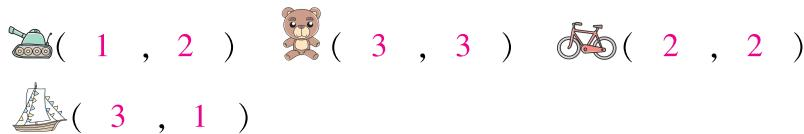

text_image

( 1 , 2 ) ( 3 , 3 ) ( 2 , 2 )
( 3 , 1 )

(2)小刚套中了放在 $(x,2)$ 位置上的物品,用“△”圈出他可能套中的物品。  
(3) 小红套中了放在 $(2, y)$ 位置上的物品，用“○”圈出她可能套中的物品。  
(4) 小红和小刚套中的是同一件物品, 这件物品是(自行车), 用数对表示是(2, 2)。  
第1列  
第2列  
第3列

第4行

第3行

第2行

第1行

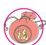

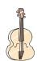

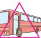

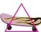

第4列

# 过基础关 教材知识巩固练

1 如图是某学校的建筑位置图,图书馆的位置用数对表示是(2,3)。请根据位置图完成下面各题。

(1)科技楼的位置用数对表示为(5,2)。  
(2) 数对 $(3,2)$ 表示的是(教学楼)的位置,
数对 $(4,1)$ 表示的是(花坛)的位置。  
(3)数对(4,4)表示的是体育馆的位置,请你在图中标出来。  
(4) 果果约优优在“校内( ,2)”见面, 有一个数模糊不清了。请你想一想她们可能在哪个建筑处见面。

答:她们可能在教学楼或科技楼处见面。

体育馆  
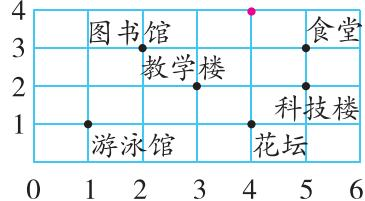

text_image

图书馆
教学楼
游泳馆
花坛
科技楼
食堂
1
2
3
4
5
0 1 2 3 4 5 6

2 (1) 在图中描出下列各点, 并按 $A \rightarrow B \rightarrow C \rightarrow D \rightarrow A$ 的顺序依次连接各点, 画出封闭图形。

$A(1,4)$

$B(5,4)$

$C(5,1)$

$D(1,1)$

(2) 将 (1) 中的图形平移, $A$ 点从原位置 (1,4) 向右平移 2 格, 再向上平移 5 格, $A$ 点的新位置是 $A'(3,9)$ , 请你按照 $A$ 点的位置变化画出平移后的图形 $A'B'C'D'$ , 则 $D'$ 的位置为 (3,6)。

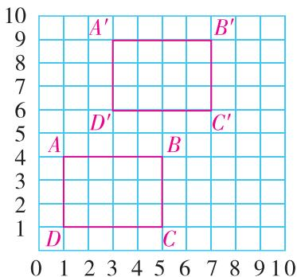

text_image

10
9
8
7
6
5
4
3
2
1
0 1 2 3 4 5 6 7 8 9 10
A'
B'
D'
D
B
C'
C

(3) 把一个点向右(或左)平移几格, (行)数不变, (列)数加(或减)几; 把一个点向上(或下)平移几格, (列)数不变, (行)数加(或减)几。(填“列”或“行”)

# 过能力关 核心素养提升练

3（易错题·概念误解）秦始皇兵马俑二号坑分设战车、混编、骑兵、弩兵四个军阵（见下图）。李明将二号坑中的战车军阵（图中虚线框内区域，战车数共计8行8列）绘制成表格并进行标记。

(1) 若 S 战车的位置为 $(1,3)$ ，则 A 战车的位置为 $(2,6)$ ，B 战车的位置为 $(4,3)$ ，C 战车的位置为 $(7,3)$ ，D 战车的位置在 A 战车向右平移 4 格处。请在下面右图中表示出 C，D 两战车的位置。

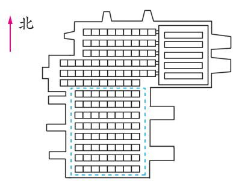

text_image

北

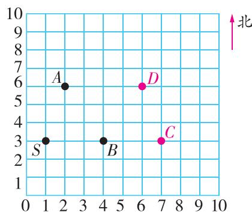

scatter

| Point | X | Y |
|---|---|---|
| A | 2 | 6 |
| B | 4 | 3 |
| C | 7 | 3 |
| D | 6 | 6 |
| S | 1 | 3 |
↑北

(2) E 战车位于 A 战车的南偏东、C 战车的北偏西、D 战车的南偏西、B 战车的北偏东方向，E 战车的位置可能是 (5, 4) 或 (5, 5)。

# 重难易错专练（二）

# 主题活动 精彩的社团活动

# 过重难关

# 重点难点滚动练

# 重难点 1 理解数对的含义，能用数对表示具体情境中物体的位置

1 军棋社团 ★ 军棋最早起源于“作战模拟”。如图为军棋棋盘局部图。若棋子“连长”的位置为(3, 5)，则“团长”的位置为(2, 4)；“营长”向上平移四格后的位置用数对表示为(1, 6)。

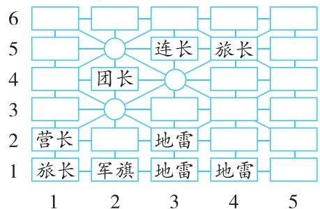

flowchart

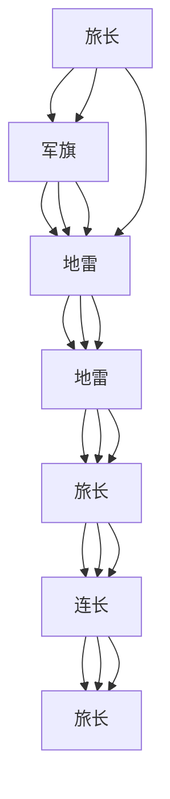

2 无人机航模社团 ★为了庆祝教师节,感谢老师对同学们的无私奉献,无人机航模社团的同学们用无人机在空中写下了“老师我们♥您”的字样。其中“♥”用了18架无人机,请在如图的方格中涂色表示出“♥”型图样,并用数对表示出其中4架无人机的位置。

答案不唯一,只要根据自己的设计写出4个涂色方格对应的数对即可。如:(2,9),(3,9),(7,9),(8,9)。

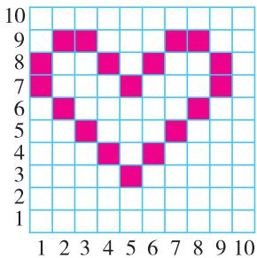

text_image

10
9
8
7
6
5
4
3
2
1
1 2 3 4 5 6 7 8 9 10

重难点 2 能在方格纸上用数对表示物体的位置，明确数对与方格纸上的点存在对应关系  
3 五子棋社团 ☆ 下五子棋时,率先将5颗棋子连成一条线的一方获胜(横、竖、斜均可)。小欣和小丽两人在下五子棋,小欣用白棋,小丽用黑棋。如图,只有黑棋的位置和部分白棋的位置。

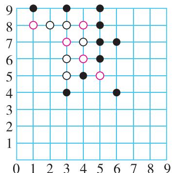

text_image

9
8
7
6
5
4
3
2
1
0 1 2 3 4 5 6 7 8 9

  
视频讲解

(1)请你用数对分别表示图中5颗白棋的位置:(2,8),(3,8),(3,6),(3,5),(4,7)。  
(2)剩下5颗白棋的位置用数对表示分别是(1,8),(3,7),(4,6),(4,8)和(5,5),请你在图上表示出这5颗白棋。  
(3)如果下一步轮到小欣来下,小欣要想赢得这一局,应该把白棋放在(0,8)的位置;如果下一步轮到小丽来下,小丽要想赢得这一局,应该把黑棋放在(2,3)或(7,8)的位置。

4 乐高编程社团 ☆ 同学们一起完成“让小鱼游起来”的创意编程任务,需要根据下面的游戏规则,设计小鱼从起点游到终点的路线。

游戏规则: 小鱼只能沿着垂直或水平方向游, 每次游动的距离不超过 3 个格。

(1)如图1,小鱼的起点在(2,1)的位置,小鱼要游到的终点在(7,5)的位置。  
(2)如图2,天天根据游戏规则设计出了其中的一条路线，并把这条路线以及小鱼在游动过程中经过的点 $A, B, C$ 描了出来。请你在图中用数对表示出 $A, B, C$ 三个点所在的位置。  
(3)请你也试着根据游戏规则设计一条路线，在图3中把这条路线以及小鱼在游动过程中经过的点描出来，并在图中用数对表示出这些点所在的位置。

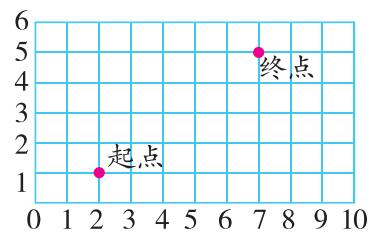

text_image

起点
终点

图1

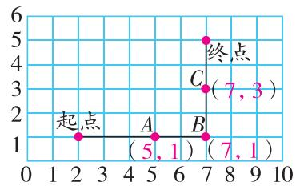

scatter

| Point | X | Y |
|---|---|---|
| 起点 | 2 | 1 |
| A | 5 | 1 |
| B | 7 | 1 |
| C | 7 | 3 |
| 终点 (终点) | 7 | 5 |

图 2

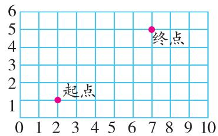

text_image

起点
终点

图3

答案不唯一,如:描点略,小鱼经过的点为(5,1),(5,4),(7,4),(7,5)。

(4)结合上面的活动,观察小鱼沿不同路线游动的过程中,经过的点所在位置数对的变化,你有什么发现?

我的发现: 发现不唯一, 如: 小鱼在沿水平方向游动的过程中, 数对行数不变; 小鱼在沿垂直方向游动的过程中, 数对列数不变。

# 过易错关 易错易混考点练

# 易错点 用数对表示物体的位置时，混淆行和列

5（情境题·文化情境）英歌舞作为潮汕地区最具代表性的传统艺术，流行于广东汕头、揭阳、潮州等地区，已有300多年历史，如今也火到了海外。一个英歌舞表演团队正在进行队列表演，每列人数相等，最后一列最后一个表演者用数对表示为(4,6)，那么这一列的第一个表演者用数对表示为(4,1)，这个表演团队一共有(24)人。

6 学校组织看电影,王兵的电影票如图所示。

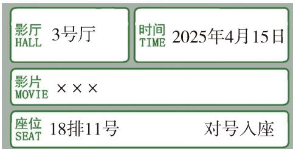

text_image

影厅 3号厅
HALL
时间 TIME 2025年4月15日
影片 ×××
MOVIE
座位 18排11号 对号入座
SEAT

(1)用数对表示位置的方法记录王兵的位置是(11, 18)。  
(2) 李敏的位置是 (7,16)，那么李敏应该坐在 (16) 排 (7) 号座位上。  
(3)王艳的座位既和王兵在同排或同列上,又和李敏在同排或同列上,王艳的位置可能是(11, 16)或(7, 18)。

反馈区

请使用第二单元测评卷，测一测吧！

▶ 见活页卷

# 1 除数是整数的小数除法（1）

# 过基础关 教材知识巩固练

1 妈妈买了 4 个茶杯, 共 39.2 元。平均每个茶杯多少元?

列式: $39.2 \div 4 = \underline{9.8}$ (元)

# 方法一

39.2元 = 36元 + 3.2元

$36 \div 4 = (9)$ (元)

3.2元 = 32角

$32 \div 4 = (8)$ （角） $= (0.8)$ （元）

(9) + (0.8) = (9.8) (元)

所以， $39.2 \div 4 = (9.8)$ （元）

# 方法二

39.2元 = 392角

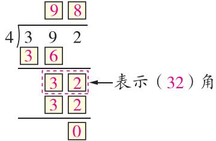

text_image

4\sqrt{3 9 2}
\boxed{3} \boxed{6}
\boxed{3} \boxed{2}
\boxed{3} \boxed{2}
\boxed{0}
←表示（32）角

# 方法三

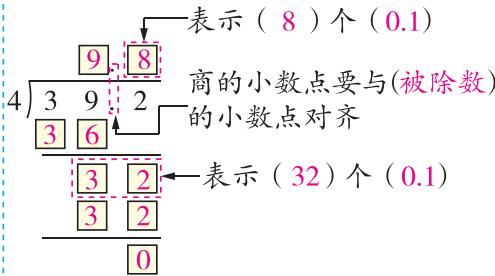

text_image

表示（8）个（0.1）
9 8
4 3 9 2 商的小数点要与(被除数)
3 6 的小数点对齐
3 2 表示（32）个（0.1）
3 2
0

答:平均每个茶杯(9.8)元。

2 算一算,比一比。

$45 \div 3 = 15$

$72 \div 6 = 12$

$516 \div 12 = 43$

945 ÷ 7 = 135

4.5 ÷ 3 = 1.5

7.2 ÷ 6 = 1.2

51.6÷12=4.3

9.45 ÷ 7 = 1.35

3 列竖式计算。(竖式略)

26.4÷6=4.4

28.8 ÷ 18 = 1.6

85.44 ÷ 16 = 5.34

39.1 ÷ 23 = 1.7

4（教材 P26 第 2 题变条件）2024 年元旦假期期间（3 天），全国水路完成旅客发送量比去年同期增长了 90.4 万人次。2024 年元旦假期期间，全国水路平均每天发送旅客多少万人次？

(100.4 + 90.4) ÷ 3 = 63.6 (万人次)

答: 全国水路平均每天发送旅客 63.6 万人次。

2023年元旦假期期间，全国水路完成旅客发送量100.4万人次。

# 过能力关 核心素养提升练

5 周末,小文和爸爸妈妈一起去游乐园,买门票共用了458.5元。游乐园一张成人票的价钱与3张儿童票的价钱相等,一张成人票和一张儿童票各多少钱?(小文需买儿童票)

$458.5 \div (3 + 3 + 1) = 65.5$ （元）

$65.5 \times 3 = 196.5$ （元）

答:一张成人票 196.5 元,一张儿童票 65.5 元。

  
视频讲解

  
小文

# 过基础关 教材知识巩固练

1 下面各题的商哪些小于 1？画“△”。哪些大于 1？画“○”。

$$
1. 5 \div 3 (\quad \triangle)
$$

$$
1 4. 0 7 \div 7 (\quad \bigcirc)
$$

$$
5. 2 \div 8 (\quad \triangle)
$$

$$
2 4. 6 \div 6 (\quad \bigcirc)
$$

$$
2 1. 5 6 \div 7 (\quad \bigcirc)
$$

$$
1 1. 7 \div 9 (\quad \bigcirc)
$$

$$
3. 2 \div 2 (\quad \bigcirc)
$$

$$
4 2. 2 1 \div 4 2 (\quad \bigcirc)
$$

2 我是小老师。(选出下面题目错误的原因,并改正)

$$
\begin{array}{r} 1 \quad 2 \sqrt { \begin{array}{c c} 1 & 5 \\ 1 & 8 \end{array} } \\ \frac {1 \quad 2}{6 \quad 0} \\ \frac {6 \quad 0}{0} \\ (\quad ③) \end{array}
$$

改正：

$$
\begin{array}{r} 1. 5 \\ 1 2 \overline {{) 1 8 . 0}} \\ \underline {{1 2}} \\ 6 0 \\ \underline {{6 0}} \\ 0 \end{array}
$$

$$
\begin{array}{r} 1. 3 \\ 9 \overline {{) 1 . 1 7}} \\ \underline {{9}} \\ 2 7 \\ \underline {{2 7}} \\ 0 \\ (\text {   ①   }) \end{array}
$$

改正：

$$
\begin{array}{r} 0. 1 \quad 3 \\ 9 \overline {{) 1 . 1 \quad 7}} \\ \underline {{9}} \\ 2 \quad 7 \\ \underline {{2 \quad 7}} \\ 0 \end{array}
$$

①不够商1时没有商0  
②除到被除数的末尾仍有余数时，没有添0继续除  
③商中没有点小数点

3 列竖式计算,带☆的用乘法验算。(竖式、验算略)

$$
6 5. 7 \div 1 8 = 3. 6 5
$$

$$
1. 6 9 \div 2 6 = 0. 0 6 5
$$

$$
2 6. 5 2 \div 1 3 = 2. 0 4
$$

$$
\star 4. 9 5 \div 1 1 = 0. 4 5
$$

验算

4（情境题·生活情境）李叔叔入住了新家，购买的新家电拆下来8个纸箱，一共重14千克。李叔叔将这些纸箱卖给废品回收站，得到13.3元。

(1) 平均每个纸箱重多少千克?

(2) 平均每千克纸箱卖多少钱?

$$
1 4 \div 8 = 1. 7 5 (\text { 千   克 })
$$

$$
1 3. 3 \div 1 4 = 0. 9 5 (\text {   元   })
$$

答: 平均每个纸箱重 1.75 千克。

答: 平均每千克纸箱卖 0.95 元。

# 过能力关 核心素养提升练

5（教材 P27 第 2 题变设问）周末，爸爸、妈妈带乐乐去爬山。从山脚下爬到山顶全程大约 7.8 千米。爸爸估计，他们上山时，步行速度大约为平均每小时 2 千米，下山速度则是上山速度的 1.5 倍。这些速度均考虑到吃饭、休息、游玩、拍照等因素的影响。

(1) 利用爸爸估计的速度,他们上午 9 时开始爬山,下午 3 时 10 分能否返回山脚下?

$$
2 \times 1. 5 = 3 (\text { 千   米   /   时 })
$$

$$
7. 8 \div 2 + 7. 8 \div 3 = 6. 5 (\text {   时   }) \quad 6. 5 \text {   时   } = 6 \text {   时   } 3 0 \text {   分   }
$$

$$
9: 0 0 + 6 \text {   时   } 3 0 \text {   分   } = 1 5: 3 0
$$

答: 下午 3 时 10 分不能返回山脚下。

(2)从山脚下爬到山顶,爸爸手机中的运动软件显示他的步数是15600步。请你以米为单位,算一下爸爸上山的平均步长大约是多少。

$$
7. 8 \text { 千米 } = 7 8 0 0 \text { 米 }
$$

$$
7 8 0 0 \div 1 5 6 0 0 = 0. 5 (\text { 米 })
$$

答:爸爸上山的平均步长大约是0.5米。

# 过综合关

# 阶段滚动综合练

1 列竖式计算,带☆的用乘法验算。(竖式、验算略)

$$
1 7. 6 8 \div 5 2 = 0. 3 4
$$

$$
7. 8 \div 7 5 = 0. 1 0 4
$$

$$
\star 4 5. 5 \div 3 5 = 1. 3
$$

$$
3 7 8 \div 5 6 = 6. 7 5
$$

验

算

2 下面是四位同学在计算 $37.5 \div 5$ 时的思考过程, 思路正确的有(①②③④)。(填序号)

①

$$
\begin{array}{c} 3 7. 5 \div 5 = 7. 5 \\ \frac {7 . 5}{5 \sqrt {3 7 . 5}} \\ \frac {3 5}{2 5} \\ \frac {2 5}{0} \end{array}
$$

②

$$
\begin{array}{c} 3 7. 5 \div 5 = 7. 5 \\ \Bigg | _ {\times 1 0} \Bigg | \div 1 0 \\ 3 7 5 \div 5 = 7 5 \end{array}
$$

③

$$
\begin{array}{c} 3 7. 5 \div 5 = 7. 5 \\ \Bigg | _ {\times 2} \Bigg | _ {\times 2} \\ 7 5 \div 1 0 = 7. 5 \end{array}
$$

④

$$
\begin{array}{l} 3 7. 5 = 3 0 + 7 + 0. 5 \\ 3 0 \div 5 = 6 \\ 7 \div 5 = 1. 4 \\ 0. 5 \div 5 = 0. 1 \\ 6 + 1. 4 + 0. 1 = 7. 5 \\ \end{array}
$$

3 “大卡”是表示热量的单位。汉堡、蛋糕等食物都属于高热量食物。例如:一份汉堡套餐(汉堡、可乐加薯条)的热量约为900大卡;一块蛋糕(100 g)的热量约为350大卡。摄入高热量食物容易引起肥胖,通过运动可以消耗多余热量。慢跑1小时大约能消耗500大卡的热量。

(1)吃一份汉堡套餐产生的热量,需要慢跑几小时才能被消耗完?

$$
9 0 0 \div 5 0 0 = 1. 8 (\text {   时   })
$$

答:需要慢跑 1.8 小时才能被消耗完。

(2)吃一块 100 g 的蛋糕产生的热量,需要慢跑几小时才能被消耗完?

$$
3 5 0 \div 5 0 0 = 0. 7 (\text {   时   })
$$

答:需要慢跑 0.7 小时才能被消耗完。

# 过拓展关

# 思维拓展培优练

4（情境题·生活情境）一款晾衣杆的总长度为 $3.05 \, m$ ，在晾衣杆上设计了 12 个均匀分布的挂孔（如图）。每两个挂孔中心之间的距离是多少米？

$$
(3. 0 5 - 0. 1 5 \times 2) \div (1 2 - 1) = 0. 2 5 (\text { 米 })
$$

答:每两个挂孔中心之间的距离是0.25米。

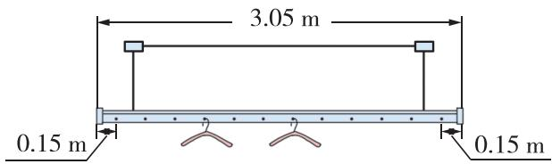

text_image

3.05 m
0.15 m
0.15 m

# 过基础关 教材知识巩固练

# 1 选择。(把正确答案的字母填在括号里)

(1) 小数除法的关键是把除数是小数的除法转化成除数是整数的除法。下面的转化过程最合适的是 ( B )。

$$
\mathrm{A}. 2. 9 6 \div 0. 3 7 = 2. 9 6 \div 3. 7
$$

$$
\mathrm{B}. 2. 9 6 \div 0. 3 7 = 2 9 6 \div 3 7
$$

$$
\mathrm{C}. 2. 9 6 \div 0. 3 7 = 2 9 6 0 \div 3 7 0
$$

(2)如图是亮亮用竖式计算 $2.05 \div 2.5$ 的过程,老师说他算得不对。亮亮错在了哪里? ( C )。

$$
\begin{array}{r} 8. 2 \\ 2 \cdot 5 \overline {{) 2 . 0 . 5}} \\ \underline {{2 0 0}} \\ 5 0 \\ \underline {{5 0}} \\ 0 \end{array}
$$

A. 被除数的小数点没有和除数的小数点向右移动相同的位数  
B. 虽然在余下的数后面添 0 继续除,但是没有在被除数后面添 0  
C. 个位上不够商 1, 没有用 0 占位

# 2 列竖式计算。(竖式略)

$$
0. 8 5 \div 0. 1 7 = 5
$$

$$
1 7. 5 \div 0. 7 = 2 5
$$

$$
6. 0 6 \div 0. 1 5 = 4 0. 4
$$

$$
9. 3 6 \div 5. 2 = 1. 8
$$

3 蚂蚁是举世公认的“大力士”,能举起比自己重数百倍的物体。这颗米粒的质量是蚂蚁体重的多少倍?

$$
0. 5 2 \div 0. 0 4 = 1 3
$$

答: 这颗米粒的质量是蚂蚁体重的 13 倍。

我的体重是0.04 g，这颗米粒重0.52 g。

4（情境题·文化情境）襄阳古城是中国历史上最著名的古城建筑防御体系之一，也是中国最完整的一座古代城池防御建筑。周末，王叔叔开车到离家151.7千米的襄阳古城游玩，去时用了2小时，沿原路返回时用了1.7小时。王叔叔往返全程平均每小时行驶多少千米？

$151.7 \times 2 \div (2 + 1.7) = 82$ (千米)

答: 王叔叔往返全程平均每小时行驶 82 千米。

# 过能力关 核心素养提升练

5 在□里填上合适的数。

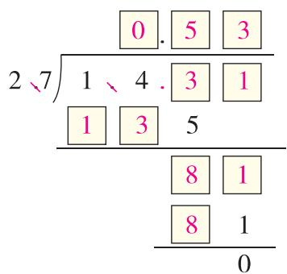

text_image

2、7\(\begin{array}{c}\framebox{0}. \framebox{5} \framebox{3}\\1、4. \framebox{3} \framebox{1}\\ \framebox{1} \framebox{3} \framebox{5}\\ \hline\framebox{8} \framebox{1}\\ \framebox{8} \framebox{1}\\ \hline0\end{array}

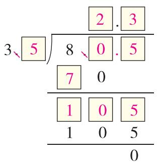

text_image

2.3
3、5)8、0.5
7 0
1 0 5
1 0 5
-----
0

视频讲解

# 过基础关 教材知识巩固练

# 1 选择。(把正确答案的字母填在括号里)

(1)与 $0.6 \div 0.25$ 得数相等的算式是（B）。

A. $6 \div 25$

B. $60 \div 25$

C. $600 \div 25$

D. 0.06 ÷ 0.25

(2)下列算式中,商最大的是( B )。

A. $6.5 \div 1.25$

B. $6.5 \div 0.125$

C. $6.5 \div 12.5$

D. $65 \div 12.5$

(3)(名校期末真题)计算 $0.9 \div 0.15$ , 下面四种方法中不正确的是(B)。

0.9元=90分
A. 0.15元=15分 $90 \div 15 = 6$

B. $\begin{array}{r}6\\0,15\overline{)0,90}\\90\end{array}$

$0.9\div 0.15$ $= (0.9\times 100)\div (0.15\times 100)$ C. $= 90\div 15$ $= 6$

D. $\left.\begin{array}{l}15个0.01 \\15个0.01 \\15个0.01 \\15个0.01\end{array}\right\}$

# 2 列竖式计算,带☆的用乘法验算。(竖式、验算略)

$$
2 0. 1 \div 0. 1 5 = 1 3 4
$$

$$
1. 4 \div 2. 5 = 0. 5 6
$$

$$
\star 3. 5 \div 0. 2 8 = 1 2. 5
$$

验算

# 3（教材 P31 第 8 题变情境）为推进绿色低碳发展,某市计划为每户投入资金 0.68 万元用于建设太阳能光伏发电站,一共投入资金 81.6 万元,该市投资了多少户?

$$
8 1. 6 \div 0. 6 8 = 1 2 0 (\text {   户   })
$$

答:该市投资了 120 户。

# 过能力关 核心素养提升练

# 4 乐乐家 10 月份家庭用电的二氧化碳排放量为 157 kg, 他家 10 月份应缴电费多少元?

<table><tr><td rowspan="4">阶梯电费收取标准</td><td>分档</td><td>月用电量/千瓦时</td><td>电价标准/(元/千瓦时)</td></tr><tr><td>第一档</td><td>1~180</td><td>0.56</td></tr><tr><td>第二档</td><td>181~260</td><td>0.61</td></tr><tr><td>第三档</td><td>261及以上</td><td>0.86</td></tr></table>

用电的二氧化碳排放量(千克)=用电的千瓦时数×0.785

$$
1 5 7 \div 0. 7 8 5 = 2 0 0 (\text { 千   瓦   时 })
$$

$$
1 8 0 \times 0. 5 6 + (2 0 0 - 1 8 0) \times 0. 6 1 = 1 1 3 (\text {元})
$$

答:他家10月份应缴电费113元。

# 过综合关

# 阶段滚动综合练

1 在○里填上“＞”“＜”或“＝”。

46.8 ÷ 0.45 > 46.8

$0.79 \div 1 = 0.79$

35.2 ÷ 1.5 < 35.2 ÷ 0.8

78.6 ÷ 0.99 > 78.6

1.2 ÷ 0.15 > 1.2

14.4 ÷ 3.6 > 1

2 不计算,你能将表格填写完整吗?请填一填。(最后一列答案不唯一)

<table><tr><td>被除数</td><td>2.56</td><td>25.6</td><td>256</td><td>0.256</td><td>25600</td></tr><tr><td>除数</td><td>0.32</td><td>3.2</td><td>32</td><td>0.032</td><td>3200</td></tr><tr><td>商</td><td>8</td><td>8</td><td>8</td><td>8</td><td>8</td></tr></table>

3 列竖式计算,带☆的用乘法验算。(竖式、验算略)

$$
0. 1 6 \div 0. 2 5 = 0. 6 4
$$

$$
0. 6 3 \div 0. 6 = 1. 0 5
$$

$$
\star 6. 7 2 \div 0. 0 4 2 = 1 6 0
$$

验

算

4 五一期间,周老师去黄山旅游,回来时给父亲买了两种茶叶。他花168元买了0.5千克“黄山毛峰”,花270元买了0.75千克“太平猴魁”。每千克“黄山毛峰”比每千克“太平猴魁”便宜多少元?

$$
2 7 0 \div 0. 7 5 = 3 6 0 (\text {   元   })
$$

$$
1 6 8 \div 0. 5 = 3 3 6 (\text {   元   })
$$

$$
3 6 0 - 3 3 6 = 2 4 (\text {   元   })
$$

答: 每千克“黄山毛峰”比每千克“太平猴魁”便宜 24 元。

# 过拓展关 思维拓展培优练

5（名校期末真题）有一种奇妙的景象，让人不禁感叹大自然的鬼斧神工：“山顶银装素裹，山脚繁花似锦。”你知道吗，这背后还隐藏着一个有趣的科学原理呢！

山的高度是用海拔来衡量的。气温会随着海拔的升高而降低，一般情况下，海拔每升高100米，气温就下降0.6℃。

人们可以借助这种科学原理推测出山的高度。有一座山,某一天同一时间测得山顶的温度是0.2 ℃,山脚的温度是21.8 ℃,那么这座山从山脚到山顶的高度是多少米?

(21.8 - 0.2) ÷ 0.6 × 100 = 3600 (米)

答: 这座山从山脚到山顶的高度是 3600 米。

以下是一些常见的解决问题策略，如果有需要，你可以借助其中的一个或几个帮你解决问题。

列式
计算

猜想与尝试

画图

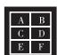

列表

# 过基础关 教材知识巩固练

# 1 列竖式计算,求出下面各题中商的近似数。(竖式略)

(1) 得数保留一位小数。

(2) 得数保留两位小数。

$$
1 5 8 \div 3. 5 \approx 4 5. 1
$$

$$
2. 6 5 \div 4. 5 \approx 0. 6
$$

$$
5. 6 3 \div 0. 6 1 \approx 9. 2 3
$$

$$
6. 4 \div 8. 4 \approx 0. 7 6
$$

2（跨学科融合）如图是唐代诗人韦应物的《滁州西涧》。诗中的“渡”是指渡口，即以船渡方式衔接两岸交通的地点。一名船夫以摆渡为生，每日往返于河的南北两岸，已知两岸的距离是9.5 km，船夫平均每小时划行9.2 km，则船夫划行一个来回大约需要多少小时？（得数保留一位小数）

$$
9. 5 \times 2 = 1 9 (\mathrm{km})
$$

$19 \div 9.2 \approx 2.1$ (时)

答:船夫划行一个来回大约需要 2.1 小时。

独怜幽草涧边生，  
上有黄鹂深树鸣。  
春潮带雨晚来急，  
野渡无人舟自横。

3（易错题·迁移误用）线上支付的普及使得人们的生活更加便利。某网站上烤鸭店和火锅店均推出团购套餐，如图，两家店均消费一份套餐和一张代金券，哪家店的人均消费低？（得数保留两位小数）

烤鸭店:375.8 + 9.9 - 30 = 355.7(元)

$355.7 \div 3 \approx 118.57$ （元）

火锅店:257.9 + 95 - 100 = 252.9(元)

$252.9 \div 2 = 126.45$ （元）

118.57 < 126.45

答:烤鸭店的人均消费低。

烤鸭店

三人招牌套餐375.8元，

一张30元的代金券9.9元

火锅店

超值人气双人餐257.9元，

一张 100 元的代金券 95 元

# 过能力关 核心素养提升练

4 跳水比赛中,选手每轮得分的计算方法如下:

flowchart

选手李佳在某一跳中选择了难度系数为3.1的跳水动作,7位裁判的评分分别为9.0,8.7,8.2,9.2,9.5,8.6,8.5。请你根据上面提供的计算方法,算出李佳这一跳的得分。(得数保留一位小数)

$(9.0+8.7+9.2+8.6+8.5)\times3.1\div5\times3\approx81.8$ (分)

答: 李佳这一跳的得分约是 81.8 分。

# 过基础关 教材知识巩固练

# 1 选择。(把正确答案的字母填在括号里)

(1)5.235235…的循环节是( C )。

A. 5.235

B. 5.23

C. 235

D. 35

(2)关于下面的小数,说法错误的是( B )。

① 0.15

② 0.32

③ 4.578932…

④ 5.125125…

⑤ 0.323232

A. ①⑤是有限小数

B. ②③④是循环小数

C. ②③④是无限小数

D. ②④是循环小数

# 2 写出下面各循环小数的近似数。

(1)保留两位小数。

3. i ≈ 3.11

0. $\dot{8} \approx 0.89$

2. $\dot{2}\dot{5} \approx 2.25$

6.74949\$\cdots\$≈6.75

(2)保留三位小数。

13. $\dot{5}\dot{7} \approx 13.576$

4.6 $\dot{9}$ ≈ 4.700

5. 175 ≈ 5.175

0.1999\$\cdots\$\$\approx\$0.200

3 列竖式计算下面各题,除不尽的先用循环小数表示所得的商,再保留两位小数,写出它的近似数。(竖式略)

$$
5 7 \div 3 3 = 1. 7 2 7 2 \dots \approx 1. 7 3
$$

$$
0. 1 9 \div 0. 6 = 0. 3 1 6 6 6 \dots \approx 0. 3 2
$$

$$
1. 6 6 \div 0. 1 5 = 1 1. 0 6 6 \dots \approx 1 1. 0 7
$$

4 乐乐不小心把下面四个循环小数中表示循环节的点弄丢了,请你在对应数字上面帮他补上表示循环节的点,使式子成立,并说明你的理由。

$$
0. 2 0 2 4 > 0. 2 0 2 4 > 0. 2 0 2 4 > 0. 2 0 2 4
$$

$$
0. 2 0 2 \dot {4} > 0. 2 0 \dot {2} \dot {4} > 0. \dot {2} 0 2 \dot {4} > 0. 2 \dot {0} 2 \dot {4}
$$

理由不唯一, 如: 0.2024 写作 0.20244…, 0.2024 写作 0.20242…, 0.2024 写作 0.20242024…, 0.2024 写作 0.2024024…, 这四个数的前 5 个数字完全一样, 依次比较第 6 个、第 7 个数字, 可得 0.20244… > 0.20242… > 0.20242024… > 0.2024024…。

# 过能力关 核心素养提升练

5 (易错题·概念误解)已知 $13 \div 14 = 0.9285714$ , 商的小数点后第 2023 位上的数字是几? 商的小数部分前 23 位上的所有数字之和是多少?

$$
(2 0 2 3 - 1) \div 6 = 3 3 7
$$

$$
(2 3 - 1) \div 6 = 3 \dots 4
$$

$$
9 + (2 + 8 + 5 + 7 + 1 + 4) \times 3 + (2 + 8 + 5 + 7) = 1 1 2
$$

答:商的小数点后第2023位上的数字是4。商的小数部分前23位上的所有数字之和是112。

  
视频讲解

# 过基础关 教材知识巩固练

1（探究题·规律探究）(1)用计算器计算下面各题,你发现了什么规律?

$$
1 \div 9 = 0. 1 1 1 \dots
$$

$$
2 \div 9 = 0. 2 2 2 \dots
$$

$$
3 \div 9 = 0. 3 3 3 \dots
$$

$$
4 \div 9 = 0. 4 4 4 \dots
$$

$$
5 \div 9 = 0. 5 5 5 \dots
$$

$$
6 \div 9 = 0. 6 6 6 \dots
$$

我发现:商都是(循环)小数,并且除数不变,被除数乘几,商也就乘(几)。

(2) 不计算, 直接写出得数。

$$
1 0 \div 9 = 1. 1 1 1 \dots
$$

$$
1 1 \div 9 = 1. 2 2 2 \dots
$$

$$
1 2 \div 9 = 1. 3 3 3 \dots
$$

$$
1 3 \div 9 = 1. 4 4 4 \dots
$$

$$
1 4 \div 9 = 1. 5 5 5 \dots
$$

$$
1 5 \div 9 = 1. 6 6 6 \dots
$$

2 用计算器计算每组的前三题,发现规律后直接写出后两题的得数。

$$
0. 4 \times 0. 9 = 0. 3 6
$$

$$
0. 4 4 \times 0. 9 9 = 0. 4 3 5 6
$$

$$
0. 4 4 4 \times 0. 9 9 9 = 0. 4 4 3 5 5 6
$$

$$
0. 4 4 4 4 \times 0. 9 9 9 9 = 0. 4 4 4 3 5 5 5 6
$$

$$
0. 4 4 4 4 4 \times 0. 9 9 9 9 9 = 0. 4 4 4 4 3 5 5 5 5 6
$$

$$
2 \times 9. 9 = 1 9. 8
$$

$$
3 \times 9. 9 9 = 2 9. 9 7
$$

$$
4 \times 9. 9 9 9 = 3 9. 9 9 6
$$

$$
5 \times 9. 9 9 9 9 = 4 9. 9 9 9 5
$$

$$
6 \times 9. 9 9 9 9 9 = 5 9. 9 9 9 9 4
$$

3 先用计算器计算第一行的三个算式,观察并找出规律,然后直接写出第二行算式的商。

$$
1 \div 3 = 0. \dot {3}
$$

$$
1 \div 3 3 = 0. \dot {0} \dot {3}
$$

$$
1 \div 3 3 3 = 0. \dot {0} 0 \dot {3}
$$

$$
1 \div 3 3 3 3 = 0. \dot {0} 0 0 \dot {3}
$$

$$
1 \div 3 3 3 3 3 = 0. \dot {0} 0 0 0 \dot {3}
$$

$$
1 \div 3 3 3 3 3 3 = 0. \dot {0} 0 0 0 0 \dot {3}
$$

4 先找出规律,再按照规律填数。

(1)1.5

3

6

12

24

(2)25

1

0.2

0.04

(3)60

15

3.75

0.9375

0.234375

# 过能力关 核心素养提升练

5（开放题·结论开放）先用计算器计算前三个算式，找出规律后把后面的算式补充完整，并用计算器检验。检验略。

$2.1 \times 0.9 \div 0.1 = \underline{18.9}$   
3.21×0.9÷0.01= 288.9   
4.321 × 0.9 ÷ 0.001 = 3888.9

5.4321 ×0.9 ÷ 0.0001 = 48888.9

6.54321 ×0.9 ÷ 0.00001 = 588888.9

7.654321 ×0.9 ÷ 0.000001 = 6888888.9

# 过综合关

# 阶段滚动综合练

1 用计算器计算左面三题,发现规律后直接写出右面三题的商。

$$
2. 4 \div 9. 9 = 0. 2 4 2 4 \dots
$$

$$
2. 7 \div 9. 9 = 0. 2 7 2 7 \dots
$$

$$
2. 5 \div 9. 9 = 0. 2 5 2 5 \dots
$$

$$
2. 8 \div 9. 9 = 0. 2 8 2 8 \dots
$$

$$
2. 6 \div 9. 9 = 0. 2 6 2 6 \dots
$$

$$
2. 9 \div 9. 9 = 0. 2 9 2 9 \dots
$$

2 选择。(把正确答案的字母填在括号里)

(1)算式 $1 \div 0.99$ 的商大约在右图中点 ( B ) 的位置。

A. $A$

B. B

C. C

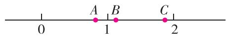

text_image

0
A B C
1 2

(2)下面的循环小数中,最小的数是( B )。

A.3.462

B. 3.462

C. 3.46

(3)如图是一道小数除法题的计算过程,已知这道题的商等于7.45,那么竖式中的A是( B )。

A.4

B. 5

C. 6

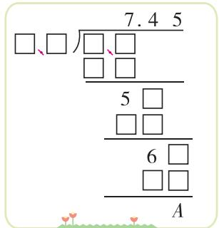

text_image

7.4 5
□、□
□、□
□、□
5 □
□ □
6 □
□ □
A

3 (情境题·科学情境)湾畔无人机,外卖飞着来。王阿姨在深圳湾公园观鸟后下单相距2.88千米的商家,无人机起飞12分钟后她在公园指定空投柜内获得“从天而降”的外卖。按此速度,李叔叔下单外卖的商家距离公园指定空投柜有4.5千米,无人机起飞后多长时间他才能获得“从天而降”的外卖? (得数保留整数)

$2.88 \div 12 = 0.24$ (千米/分)

4.5÷0.24≈19(分)

答:无人机起飞后约 19 分钟他才能获得“从天而降”的外卖。

# 过拓展关

# 思维拓展培优练

4 “BMI”是身体质量指数(简称体质指数),是国际上常用的衡量人体胖瘦程度以及是否健康的重要标准。“BMI”的计算方法如下:

BMI = 体重 ÷ (身高 × 身高) (体重以千克为单位, 身高以米为单位)

《国家学生体质健康标准》对五年级学生的身体质量指数标准评分如下：

<table><tr><td>等级</td><td>低体重</td><td>正常</td><td>超重</td><td>肥胖</td></tr><tr><td>男生</td><td> $\leqslant 14.3$ </td><td>14.4 ~ 21.4</td><td>21.5 ~ 24.1</td><td> $\geqslant 24.2$ </td></tr><tr><td>女生</td><td> $\leqslant 13.7$ </td><td>13.8 ~ 20.5</td><td>20.6 ~ 22.9</td><td> $\geqslant 23.0$ </td></tr></table>

请你算一算,李兰的身体质量指数属于哪个等级?

$$
3 4 \div (1. 5 \times 1. 5) \approx 1 5. 1
$$

$$
1 3. 8 <   1 5. 1 <   2 0. 5
$$

答: 李兰的身体质量指数属于正常等级。

我是五（2）班的学生，上周刚刚体检完，我的体重是34千克，身高是1.5米。

李兰

# 过基础关 教材知识巩固练

1 选择。(把正确答案的字母填在括号里)

(1)(名校期末真题)美味蛋糕店特制了一种生日蛋糕,每个需要 0.32 kg 面粉。刘师傅准备了 4 kg面粉做蛋糕,她最多可以做几个生日蛋糕?下面说法正确的是( C )。

康康: $4 \div 0.32 = 12.5$ （个），最多可以做 12.5 个。

小华:算出来是12.5,最多能做12个,0.5个不足1个,做不了1个蛋糕。

乐乐:12.5 四舍五入,最多可以做 13 个。

轩轩:如果做13个的话, $13 \times 0.32 = 4.16(\text{kg})$ ,4.16 > 4,面粉不够。

A. 康康

B. 乐乐

C. 小华和轩轩

D. 康康和乐乐

(2) 解决下面的问题, 用“进一法”取近似值比较合理的是 ( A )。

A. 张大叔家今年共收获 13.6 吨苹果,用一辆载质量 4 吨的卡车来运,至少几次运完

B. 做一个轮胎需要 7.6 千克橡胶, 40 千克橡胶最多可以做多少个这样的轮胎

C. 一只海豚 18 分钟游了 15 千米, 这只海豚每分钟能游多少千米(得数保留一位小数)

D. 每套儿童服装用布 1.3 米, 48 米布最多可以做多少套这样的儿童服装

2 阳光幼儿园开展食育课,今天体验“特香包”制作过程。在烘焙师傅的带领下,同学们跃跃欲试。

(1)如果每个“特香包”需要0.45千克揉好的面团,那么8.3千克面团最多可以做多少个“特香包”?

$$
8. 3 \div 0. 4 5 \approx 1 8 (\text {个})
$$

答:8.3 千克面团最多可以做 18 个“特香包”。

(2) 做好的这批“特香包”要用指定的纸盒包装。每个纸盒最多可以装 4 个, 要准备几个纸盒才能将它们全部装完?

$$
1 8 \div 4 \approx 5 (\text { 个 })
$$

答:要准备 5 个纸盒才能将它们全部装完。

3 一本故事书有 36000 字, 如果每行最多排 28 个字, 每页排 24 行, 这本故事书至少有多少页?

$$
3 6 0 0 0 \div 2 8 \approx 1 2 8 6 (\text { 行 })
$$

$$
1 2 8 6 \div 2 4 \approx 5 4 (\text {   页   })
$$

答: 这本故事书至少有 54 页。

# 过能力关 核心素养提升练

4 (易错题·方法误用)为了装扮教室庆祝国庆节,五(1)班购买了15米绿纸、28米红纸,每0.12米绿纸可以做一片绿叶,每0.37米红纸可以做一朵红花。3片绿叶和2朵红花扎成一束,一共可以扎多少束?

$$
1 5 \div 0. 1 2 = 1 2 5 (\text { 片 })
$$

$$
2 8 \div 0. 3 7 \approx 7 5 (\text {朵})
$$

$$
1 2 5 \div 3 \approx 4 1 (\text {   束   })
$$

$$
7 5 \div 2 \approx 3 7 (\text { 束 })
$$

$$
3 7 <   4 1
$$

答:一共可以扎 37 束。

  
视频讲解

# 过基础关 教材知识巩固练

1 一辆电动汽车行驶 100 km 耗电 17 千瓦时。

(1)算式“100÷17”解决的问题是 1 千瓦时电能供电动汽车行驶多少千米。  
(2)算式“17÷100”解决的问题是行驶1千米耗电多少千瓦时。

2 在水果批发市场,同样品质的草莓,李阿姨在甲摊位花 79.5 元买了 3 kg,王阿姨在乙摊位花 228 元买了 9 kg。在哪个摊位买更便宜?

小红:( √ )

$$
7 9. 5 \div 3 = 2 6. 5 (\text {元})
$$

$$
2 2 8 \div 9 \approx 2 5. 3 3 (\text {元})
$$

$$
2 6. 5 > 2 5. 3 3
$$

答:在乙摊位买更便宜。

小刚:( √ )

$$
9 \div 3 = 3
$$

$$
2 2 8 \div 3 = 7 6 (\text {元})
$$

$$
7 9. 5 > 7 6
$$

答:在乙摊位买更便宜。

小明:( √ )

$$
9 \div 3 = 3
$$

$$
7 9. 5 \times 3 = 2 3 8. 5 (\text {元})
$$

$$
2 3 8. 5 > 2 2 8
$$

答:在乙摊位买更便宜。

(1)在正确方法的括号里画“√”。  
(2)(开放题·结论开放)你最喜欢哪位同学的解答方法？请写出他的解题思路。

答案不唯一,如:我最喜欢小红的解答方法。她的解题思路是:先求出甲摊位和乙摊位每千克草莓的价格,再比较两个摊位每千克草莓的价格,26.5>25.33,得出在乙摊位买更便宜。我最喜欢小刚的解答方法。解题思路是:在乙摊位买的草莓数量是在甲摊位买的3倍,求出在乙摊位买3千克草莓需要76元,79.5>76,得出在乙摊位买更便宜。

我最喜欢小明的解答方法。解题思路是:在乙摊位买的草莓数量是在甲摊位买的3倍,求出在甲摊位买9千克草莓需要238.5元,238.5>228,得出在乙摊位买更便宜。

3 服装厂制作一批衣服。已知制作一套衣服需要 4.5 平方米棉布，现有 300 平方米棉布。

(1)这些棉布最多可以做几套衣服?

$$
3 0 0 \div 4. 5 \approx 6 6. 7 (\text {套})
$$

不够做 67 套衣服,因此要“去尾”,可以做成 66 套

答:这些棉布最多可以做66套衣服。

(2) 做好衣服后需要人工绣上图案, 平均一套衣服需要绣线 8.5 米, 一卷绣线 105 米, 绣完这批衣服需要几卷绣线?

$$
8. 5 \times 6 6 = 5 6 1 (\text { 米 })
$$

$$
5 6 1 \div 1 0 5 \approx 5. 3 4 (\text {   卷   })
$$

5 卷不够用,因此要“进一”,需要 6 卷绣线

答:绣完这批衣服需要6卷绣线。

# 过能力关 核心素养提升练

4 小华在计算 30.6 除以一个数时, 商的小数点向右多点了一位, 结果是 20.4。这道题的除数是多少?

$$
3 0. 6 \div (2 0. 4 \div 1 0) = 1 5
$$

答: 这道题的除数是 15。

  
视频讲解

# 过重难关

# 重点难点滚动练

# 重难点1 理解小数除法的算理，掌握小数除法的计算方法及商的近似数的求法

萱萱和同学们来到穿黄工程进行研学,了解到南水北调中线穿黄工程是中国首次运用大直径(9.0米)盾构施工穿越大江大河的工程。工程主干线全长约19.30 km,由三部分组成:南岸明渠、穿黄隧洞和北岸明渠。穿黄隧洞单洞长4.25 km,包括过河隧洞和邙山隧洞,其中过河隧洞段长3.45 km,邙山隧洞段长0.8 km。

# 1 根据材料解决下面问题。画信息略

(1)你知道除法算式“ $4.25 \div 0.8$ ”解决的问题是什么吗？请在上面的材料中用“\~\~\~\~\~”画出算式相关的信息并在下面的横线上写出对应的问题。

穿黄隧洞的长度是邙山隧洞长度的几倍？

(2)萱萱用了两种方法来计算 $4.25 \div 0.8$ ，在下图中填一填。

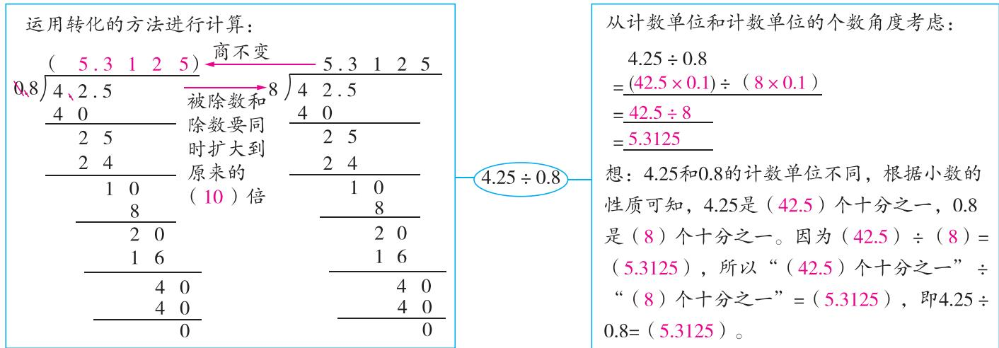

text_image

运用转化的方法进行计算：
( 5.3 1 2 5) ←商不变
0.8√4、2.5        8√4 2.5
4 0         被除数和
     2 5       4 0
     2 4       2 5
     1 0       2 4
     8         1 0
     2 0       8
     1 6         2 0
     4 0         1 6
     4 0         4 0
     0           0

4.25÷0.8
从计数单位和计数单位的个数角度考虑：
4.25÷0.8
= (42.5×0.1)÷(8×0.1)
=42.5÷8
=5.3125
想：4.25和0.8的计数单位不同，根据小数的
性质可知，4.25是（42.5）个十分之一，0.8
是（8）个十分之一。因为（42.5）÷（8）=
（5.3125），所以“（42.5）个十分之一”÷
“（8）个十分之一”=(5.3125)，即4.25÷
0.8=(5.3125)。

(3)请根据萱萱的计算结果,用“四舍五入”法求商的近似数。

$4.25 \div 0.8 \approx 5$ （得数保留整数） $4.25 \div 0.8 \approx 5.3$ （得数保留一位小数）

$4.25 \div 0.8 \approx 5.313$ （得数保留三位小数）

(4)请根据萱萱的计算结果,快速写出下面各题的商。

$$
4 2 5 \div 8 = 5 3. 1 2 5
$$

$$
4 2. 5 \div 0. 8 = 5 3. 1 2 5
$$

$$
4. 2 5 \div 8 = 0. 5 3 1 2 5
$$

$$
0. 4 2 5 \div 0. 8 = 0. 5 3 1 2 5
$$

$$
4 2 5 \div 8 0 = 5. 3 1 2 5
$$

$$
4 2 5 0 \div 0. 8 = 5 3 1 2. 5
$$

2 盾构机是一种隧道掘进的专用工程机械,广泛应用于铁路、公路、地铁和水利等基建工程的隧道环节。若 2 台某品牌盾构机同时工作 3.5 小时能挖 152.5 米,平均 1 台盾构机 1 小时能挖多少米? (得数保留两位小数)

152.5÷3.5÷2≈21.79(米)

答: 平均 1 台盾构机 1 小时能挖约 21.79 米。

重难点 2 会用 “进一法” “去尾法” 解决简单的实际问题

3 研学结束后,萱萱一行人来到了黄河岸边的草莓采摘园,他们采摘了 8.4 kg 草莓,使用了 3 张 “90 代 100” 的代金券,后又付了 19.2 元。

(1)这个草莓采摘园的草莓每千克价格是多少元?

$$
(1 0 0 \times 3 + 1 9. 2) \div 8. 4 = 3 8 (\text {   元   })
$$

答: 这个草莓采摘园的草莓每千克价格是 38 元。

(2) 将这些草莓进行分装, 每个礼品盒能装 500 g, 需要几个礼品盒?

$$
5 0 0 \mathrm{g} = 0. 5 \mathrm{kg}
$$

$$
8. 4 \div 0. 5 = 1 6. 8 (\text {个})
$$

$$
1 6 + 1 = 1 7 (\text {   个   })
$$

答:需要 17 个礼品盒。

(3)每个手提袋可以装3个礼品盒,能装满几个手提袋?

$$
1 7 \div 3 \approx 5. 7 (\text { 个 })
$$

答:能装满 5 个手提袋。

重难点 3 会用计算器探索规律

4 研学返程途中,萱萱和乐乐玩“猜数字”的数学游戏。游戏规则如下:

①从 1\~9 这 9 个数字中任选一个最喜欢的；②把这个数字在计算器上输入九次；  
③用这个九位数÷12345679,得到商。

乐乐得到的商是45,萱萱一下猜出来他最喜欢的数字是“5”,同学们,你们也想试一下吗?请你们利用计算器算出左面3题的商,试着找一下规律,把右面的题补充完整吧!

$$
1 1 1 1 1 1 1 1 1 \div 1 2 3 4 5 6 7 9 = (9)
$$

$$
5 5 5 5 5 5 5 5 5 \div 1 2 3 4 5 6 7 9 = 4 5
$$

$$
2 2 2 2 2 2 2 2 2 \div 1 2 3 4 5 6 7 9 = (1 8)
$$

$$
(6 6 6 6 6 6 6 6 6) \div 1 2 3 4 5 6 7 9 = (5 4)
$$

$$
3 3 3 3 3 3 3 3 3 \div 1 2 3 4 5 6 7 9 = (2 7)
$$

$$
(7 7 7 7 7 7 7 7) \div 1 2 3 4 5 6 7 9 = (6 3)
$$

# 过易错关 易错易混考点练

易错点 解决实际问题时，混淆“四舍五入”法、“进一法”和“去尾法”

5 根据问题选择正确的算式,在括号里填序号。

(1)37 名同学去划船,一条船最多可坐 8 人,最少需要几条船? (④)  
(2) 小明用 37 元钱买了一盒水彩笔, 共 8 支, 一支大约多少钱? (③)  
(3)食堂有 $37\mathrm{kg}$ 的花生油, 每天用 $8\mathrm{kg}$ , 够用几天? (②)  
(4) 把 37 kg 的蜂蜜平均装在 8 个瓶子里, 每个瓶子装多少千克? (①)

$$
① 3 7 \div 8 = 4. 6 2 5
$$

$$
② 3 7 \div 8 \approx 4
$$

$$
③ 3 7 \div 8 \approx 4. 6 3
$$

$$
④ 3 7 \div 8 \approx 5
$$

# 过综合关

# 单元滚动综合练

# 1 填一填。

(1) $30.6 \div 0.18 = (3060) \div 18$ $0.087 \div 0.29 = (8.7) \div (29)$

(2)7.1515…是(无)限小数,可以简写为(7.15),循环节是(15),精确到千分位约是(7.152)。

(3) 在○里填上“＞”“＜”或“＝”。

$$
0. 8 1 9 \div 1 7 <   0. 8 1 9
$$

$$
1 0. 2 \div 0. 3 > 1 0. 2 \times 0. 3
$$

$$
9. 8 \dot {2} <   9. 8 \dot {2}
$$

$$
3. 7 5 5 \textcircled {<  } 3. 7 \dot {5}
$$

(4) 根据计算规律填写。

$$
3. 3 \times 6. 7 = 2 2. 1 1
$$

$$
3. 3 3 \times 6 6. 7 = 2 2 2. 1 1 1
$$

$$
3. 3 3 3 \times 6 6 6. 7 = 2 2 2 2. 1 1 1 1
$$

$$
3. 3 3 3 3 \times 6 6 6 6. 7 = (\quad 2 2 2 2 2. 1 1 1 1 1 \quad)
$$

# 2 列竖式计算,带☆的要用乘法验算。(竖式、验算略)

$$
4. 3 4 \div 3. 1 = 1. 4
$$

$$
7 1. 3 \div 4 2 \approx 1. 7 0
$$

$$
\star 5 7 \div 3. 8 = 1 5
$$

(得数保留两位小数)

验算

# 3 脱式计算。(能简算的要简算)

$$
8. 8 4 \div 2. 6 + 1. 3 2
$$

$$
3. 2 5 \times 6 \div 1. 2
$$

$$
(5. 6 - 0. 1 2) \div 0. 8
$$

$$
8. 6 4 \div 0. 2 5 \div 0. 4
$$

$$
= 3. 4 + 1. 3 2
$$

$$
= 1 9. 5 \div 1. 2
$$

$$
= 5. 4 8 \div 0. 8
$$

$$
= 8. 6 4 \div (0. 2 5 \times 0. 4)
$$

$$
= 4. 7 2
$$

$$
= 1 6. 2 5
$$

$$
= 6. 8 5
$$

$$
= 8. 6 4 \div 0. 1
$$

$$
= 8 6. 4
$$

# 4 选择。(把正确答案的字母填在括号里)

(1) 王山想用计算器计算 $2.08 \div 26$ ，结果他错误地输入了 $208 \div 26$ 。下面的方法中，可以弥补错误的是（B）。

A. 乘 100

B. 除以 100

C. 乘 1000

(2) (名校期末真题)小明的作业不小心被墨水遮盖了一部分(如图),根据能看到的数,确定这个除法算式的商是( C )。

A. 2.081

B. 2.082

C.2.081

(3) 已知 $A = 0$ . $\underbrace{000 \cdots 0}_{2018 \text{个} 0} 36, B = 0$ . $\underbrace{000 \cdots 0}_{2019 \text{个} 0} 18$ , 那么 $A \div B = (\quad A$ )。

A. 20

B.0.2

C. 2

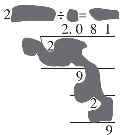

text_image

2 ÷ = 
2.0 8 1
2
9
2
9

  
视频讲解

5（名校期末真题）根据下面两个算式，将所选信息的序号和问题写在横线上，再计算解答。（可以借助画图等方法分析）

①张叔叔要修剪 446 平方米的草坪  
③平均每小时修剪 54 平方米

算式一: $(446-54\times4.5)\div3.5$

信息：①②③④

问题：剩下的平均每小时修剪多少平方米？

解答: $(446-54\times4.5)\div3.5=58$ (平方米)

答:剩下的平均每小时修剪 58 平方米。

②已经修剪了4.5小时  
④剩下的要用3.5小时修剪完

算式二: $54 \times 4.5 - (446 - 54 \times 4.5)$

信息：①②③

问题：已经修剪的比剩下的多多少平方米？

解答: $54 \times 4.5 - (446 - 54 \times 4.5) = 40$ (平方米)

答:已经修剪的比剩下的多40平方米。

# 过拓展关 思维拓展培优练

6 阅读下面的信息,回答问题。

长江发源于“世界屋脊”——青藏高原上的唐古拉山脉各拉丹冬雪山西南侧，干流流经我国11个省级行政区，在世界大河中长度居世界第三位。长江干流宜昌以上为上游，长约4500千米，流域面积约100万平方千米；宜昌至湖口为中游，长约960千米，流域面积约68万平方千米；湖口以下为下游，长约940千米，流域面积约12万平方千米。

(1)长江干流上游的长度约是中游的多少倍?

(得数保留一位小数)

$$
4 5 0 0 \div 9 6 0 \approx 4. 7
$$

答:长江干流上游的长度约是中游的4.7倍。

(2)(开放题·结论开放)再提出一个用除法

计算的问题并解答。

答案不唯一,如:

长江中游的流域面积是长江下游流域面积的多少倍？（得数保留一位小数）

$$
6 8 \div 1 2 \approx 5. 7
$$

答:长江中游的流域面积约是长江下游流域面积的 5.7 倍。

7 在马拉松健康跑和家庭跑中完赛将获得完赛徽章,制作徽章时,改进了制作方法。原来准备做1800个徽章的材料,现在可以做多少个?

①健康跑和家庭跑共4000人参赛；  
③一个徽章需用锌合金材料 12 g;  
⑤现在做一个徽章少用0.2元材料。

② 原来做一个徽章用 3.8 元的材料；  
④现在做一个徽章用3.6元的材料；

从方框中选出你需要的信息,根据所选的信息,解答上面的问题。选择信息()。

答案不唯一,如:②④ $1800 \times 3.8 \div 3.6 = 1900$ (个)

答:现在可以做 1900 个。

或②⑤ $1800 \times 3.8 \div (3.8 - 0.2) = 1900$ (个)

答:现在可以做 1900 个。

# 反馈区

# 请使用第三单元测评卷，测一测吧！

▶ 见活页卷

# 1 可能性（1）

# 过基础关 教材知识巩固练

1 用“可能”“不可能”或“一定”填空。

(1) 车辆经过一个路口，（可能）遇到红灯。  
(2)三角形(一定)是由三条线段围成的。  
(3)无限小数(可能)比有限小数大。  
(4)两条平行线(不可能)相交。

2 选择。(把正确答案的字母填在括号里)

(1)一个不透明的布袋中装了一些大小、形状和质地都相同的小球,阳阳闭上眼睛随意摸出一个后又放回,结果连续6次都摸到白球。下面说法不正确的是(A)。

A. 布袋里一定全是白球

B. 布袋里可能全是白球

C. 布袋里一定有白球

(2)数学家罗曼诺夫斯基进行了80640次掷硬币实验,其中正面朝上的次数是39699次,反面朝上的次数是40941次。如果他再抛1次,那么(B)。

A. 一定正面朝上

B. 可能正面朝上也可能反面朝上

C. 一定反面朝上

3 在一个不透明的袋子里有四张分别写有“唐僧”“孙悟空”“猪八戒”“沙僧”的卡片,小朋友们任意抽取一张,抽到哪张卡片就演哪个角色。

(1)下面是小朋友们在抽卡片之前的讨论,正确的在括号里画“√”,错误的画“×”。

菲菲:我想演唐僧,如果我是第一个抽,那么这个愿望有可能会实现。 (√)

乐乐:孙悟空最厉害,我一定能抽到这张卡片。 (×)

芳芳:白龙马既美丽又善良,可是我不可能演这个角色了。 (√)

贝贝:我也喜欢孙悟空,即使我排在最后,也有可能演到这个角色。 (√)

(2) 小朋友们开始抽卡片了, 请你根据已知的信息填空。

第一个抽的是菲菲,她抽到了写有“猪八戒”的卡片。

第二个轮到乐乐，他抽到了写有“孙悟空”的卡片。

第三个轮到芳芳,她可能抽到写有(唐僧或沙僧)的卡片。

第四个轮到贝贝,他(不可能)抽到写有“孙悟空”的卡片。

# 过能力关 核心素养提升练

4（开放题·结论开放）请按照要求制作角色游戏牌，填写角色前的英文字母即可。（注：“T——老师”“A——外星人”“S——学生”“P——警察”“D——医生”均为游戏角色）

(1) 在第一副牌中玩家不可能抽到“老师”。(答案不唯一, 只要没有“T”即可)  
(2)在第二副牌中玩家可能抽到“外星人”,也可能抽到“学生”。(答案不唯一,“A”和“S”至少各有一张,其他不限)

(3)在第三副牌中玩家可能抽到“学生”“警察”或“医生”，不可能抽到“外星人”。（答案不唯一，“S”“P”“D”至少各有一张，“A”一张也不能有，其他不限）

<table><tr><td>第一副牌:</td><td>A</td><td>A</td><td>S</td><td>S</td><td>P</td><td>D</td></tr><tr><td>第二副牌:</td><td>A</td><td>A</td><td>S</td><td>S</td><td>T</td><td>D</td></tr><tr><td>第三副牌:</td><td>S</td><td>T</td><td>D</td><td>P</td><td>S</td><td>D</td></tr></table>

# 过基础关 教材知识巩固练

1 有①、②、③三个飞镖靶盘(如图), 思思和笑笑玩掷飞镖游戏, 若飞镖落在阴影部分, 则思思赢; 若飞镖落在空白部分, 则笑笑赢。

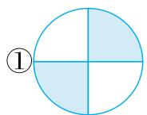

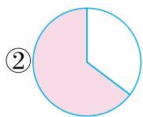

(1)如果思思赢的可能性大,她们用的是(②)号飞镖靶盘;  
(2)如果笑笑赢的可能性大,她们用的是(③)号飞镖靶盘;  
(3)如果两人赢的可能性相等,她们用的是(①)号飞镖靶盘。

2 选择。(把正确答案的字母填在括号里)

(1)一个不透明的盒子里有各种游乐项目的门票(其中:碰碰车2张、摩天轮9张、旋转木马3张、梦幻迷城1张),如果小丽从这些门票中任意抽一张,最有可能抽到(B)的门票。

A. 碰碰车

B. 摩天轮

C. 旋转木马

D. 梦幻迷城

(2)(名校期末真题)四个相同的盒子,装有黑、白两种颜色的球(质量、大小、材质都相同)。王红每次从盒里摸出一个球,记录下它的颜色,再放回去摇匀,重复30次,记录结果如表。根据表中的数据,王红最有可能用的盒子是(A)。

<table><tr><td>颜色</td><td>记录</td><td>次数</td></tr><tr><td>黑色</td><td>正正正正一</td><td>21</td></tr><tr><td>白色</td><td>正正</td><td>9</td></tr></table>

(3)盒子里已有红球 10 个, 黄球 8 个, 蓝球 5 个。要使摸到黄球的可能性最大, 不可行的办法是 (D)。

A. 取出 3 个红球

B. 放入 3 个黄球

C. 取出 4 个红球

D. 放入 3 个蓝球

(4)有①、②、③三种抽奖活动(如图),中奖的可能性最大的是(A)。

A. ①

B. ②

C. ③

D. 一样大

3. 袋子里有 15 颗果冻, 其中有 9 颗黄色的, 5 颗红色的, 1 颗白色的, 摸出 2 颗果冻, 可能出现哪些情况? 请列举出来。

袋子里有 15 颗果冻, 其中有 9 颗黄色的, 5 颗红色的, 1 颗白色的, 摸出 2 颗果冻, 可能出现 2 颗黄色的、2 颗红色的、1 颗白色的和 1 颗黄色的、1 颗白色的和 1 颗红色的、1 颗红色的和 1 颗黄色的中的任意一种情况。

  
视频讲解

# 过能力关 核心素养提升练

4 用下面的三张卡片摆一摆。假如摆出的三位数是单数,亮亮赢;摆出的三位数是双数,小明赢。想一想,谁赢的可能性大?这样公平吗?

答: 亮亮赢的可能性大, 这样不公平。

# 过基础关 教材知识巩固练

1 一只暗箱里放有9个大小一样的球,每次摸出一个,记录后放回摇匀,一共摸了30次,摸出的情况如下表。这9个球最有可能是( B )。

<table><tr><td></td><td>红球</td><td>黄球</td><td>蓝球</td><td>合计</td></tr><tr><td>次数</td><td>15</td><td>10</td><td>5</td><td>30</td></tr></table>

A. 红球 5 个、黄球 1 个、蓝球 3 个

B. 红球 5 个、黄球 3 个、蓝球 1 个

C. 红、黄、蓝球各 3 个

D. 红球 3 个、黄球 2 个、白球 2 个、蓝球 2 个

2 五(2)班的同学在校门口统计5分钟内马路上的车流量,结果如表格所示。

<table><tr><td>种类</td><td>电动车</td><td>小轿车</td><td>面包车</td><td>公交车</td><td>自行车</td></tr><tr><td>数量/辆</td><td>10</td><td>22</td><td>4</td><td>2</td><td>6</td></tr></table>

他们说得对吗？对的在括号里画“√”，错的画“×”。

(1)下一辆一定是小轿车。 (×) (2)下一辆可能是电动车。 (√)  
(3) 下一辆不可能是面包车。 (×) (4) 下一辆是公交车的可能性最小。(√)  
(5)下一辆是小轿车的可能性最大。（√）（6）下一辆一定不是自行车。（×）

3（情境题·生活情境）小宁设计了一个转盘，上面写着“扫地”和“刷碗”，转到哪个小宁当天就必须做哪项家务。一月份小宁做家务的情况如下表。根据表中数据，小宁设计的转盘不可能是下面哪个？最有可能是下面哪个？说明理由。

<table><tr><td>扫地</td><td>刷碗</td></tr><tr><td>23</td><td>8</td></tr></table>

  
①

  
②

  
③

小宁设计的转盘不可能是③,最有可能是①。根据小宁做家务的情况发现,小宁既扫地又刷碗,且扫地的次数比刷碗的次数多,所以小宁设计的转盘上,一定有扫地和刷碗这两项,且扫地的可能性大于刷碗的可能性,所以不可能是只有扫地的③,最有可能是扫地可能性大于刷碗可能性的①。

# 过能力关 核心素养提升练

4（开放题·结论开放）抽奖。（按要求在如图所示的转盘中填写）（答案不唯一，合理即可）

text_image

①
①
①
①
②
②
③
②

第（1）题图

text_image

A
A
A
B
A
B
A
C

第（2）题图

(1) 参与游戏和表演的同学抽奖。抽到即时贴(填①)的可能性最大, 抽到套尺(填②)的可能性第二, 抽到文具盒(填③)的可能性最小。  
(2) 抽幸运奖。什么都抽不到(填 A)的可能性最大, 抽到《十万个为什么》(填 B)的可能性较小, 抽到“四大名著”(填 C)的可能性最小。

# 过重难关

# 重点难点滚动练

# 重难点1 能用“一定”“可能”“不可能”等描述随机事件发生的可能性

1 春天话剧社招募话剧员啦！话剧“我的航天梦”需要三位小朋友分别扮演“科学家”“航天员”和“工程师”。三张卡片上分别写着“科学家”“航天员”和“工程师”，乐乐、芳芳和亭亭抽卡片确定要扮演的角色。乐乐先抽，他可能抽到（科学家或航天员或工程师）；如果乐乐抽到“科学家”，芳芳再抽，她可能抽到（航天员或工程师）；如果芳芳抽到“航天员”，亭亭最后抽，她一定抽到（工程师）。

# 重难点 2 理解事件发生的可能性是有大小的，能根据事件发生的可能性的大小进行推测

2

  
芳芳

我如果参加比赛，转动转盘，
转到的诗人有（4）种可能，
分别是（李白、杜甫、王维、
孟浩然）。转到诗人（李白）
的可能性最大。

# 有趣的诗朗诵比赛

为激发阅读热情，活跃校园气氛，本班将举行诗朗诵比赛，参赛同学转动转盘（如图）选择一位诗人的诗进行朗诵。

text_image

李白
杜甫
王维
孟浩然
孟浩然
李白
杜甫

3 五(1)班同学分成8个小组,分别在一张画有树叶的A4纸上玩掷硬币游戏。游戏规则如下:

(1) 将硬币拿到 A4 纸上方的固定高度后往下掷, 观察硬币所落区域, 并记录落在空白区域和落在树叶区域的次数。

(2)每次掷的高度和往下掷的力度尽量保持一致,且保证硬币落在 A4 纸上。落在树叶与空白区域交接处,或落在 A4 纸外均视为无效,需重新掷。  
(3) 每个小组掷 20 次, 将有效数据记录在统计表里。下面是 8 个小组的统计情况。

<table><tr><td>小组</td><td>第1组</td><td>第2组</td><td>第3组</td><td>第4组</td><td>第5组</td><td>第6组</td><td>第7组</td><td>第8组</td><td>合计</td></tr><tr><td>落在树叶区域/次</td><td>9</td><td>10</td><td>13</td><td>8</td><td>11</td><td>10</td><td>6</td><td>12</td><td>79</td></tr><tr><td>落在空白区域/次</td><td>11</td><td>10</td><td>7</td><td>12</td><td>9</td><td>10</td><td>14</td><td>8</td><td>81</td></tr></table>

根据统计结果,分析五(1)班最有可能是在上图中的哪张纸上掷硬币,并说明理由。

$$
7 9 + 8 1 = 1 6 0 \quad 7 9 \div 1 6 0 = 0. 4 9 3 7 5 \quad 8 1 \div 1 6 0 = 0. 5 0 6 2 5 \quad 0. 4 9 3 7 5 <   0. 5 0 6 2 5
$$

答: 落在空白区域的次数多, 但落在空白区域和树叶区域的次数又非常接近, 所以最有可能是在纸 B 上掷硬币。

4 萌萌和贝贝进行五子棋比赛(执黑先行),下面是他们为确定谁执黑棋而设计的两种方案。他们的方案是否公平?请说明理由。如果不公平,请修改规则使方案公平。

方案一:掷硬币,正面朝上,萌萌执黑棋;反面朝上,贝贝执黑棋。

方案二:掷骰子,朝上的点数大于3,萌萌执黑棋;小于3,贝贝执黑棋。

方案一中,硬币正、反面朝上的可能性相等,公平。

方案二中,朝上的点数大于3的情况有4、5、6三种,小于3的情况有1、2两种,大于3的可能性大,不公平。

修改方法不唯一,如:朝上的点数是双数,萌萌执黑棋;朝上的点数是单数,贝贝执黑棋。

5 一家自行车公司要推销一款自行车,该公司的策划部计划周末在购物商场举办购车抽奖活动。应该设立一、二、三等奖各多少名才比较合理？请帮他们设计一个方案吧！

一共有10辆自行车参与活动，设立一、二、三等奖，每购买一辆就能参加一次抽奖活动，人人有奖！奖品的总价不能超过10辆自行车的盈利总额，保证不亏本。需要根据各奖项的人数，合理设计抽奖规则。

进货价：650元

售卖价：780元

1. 奖项设计。

<table><tr><td>奖项</td><td>奖项数量/个</td><td>奖品单价/元</td><td>奖品总价/元</td></tr><tr><td>一等奖</td><td>1</td><td>300</td><td rowspan="3">850</td></tr><tr><td>二等奖</td><td>2</td><td>100</td></tr><tr><td>三等奖</td><td>7</td><td>50</td></tr></table>

2. 抽奖规则。(道具可使用转盘、骰子、小球、扑克牌等)

选择摸彩球的方式。

抽奖规则:盒子里面有3种颜色的10个彩球,其中红球1个,蓝球2个,绿球7个,摸到红球中一等奖,摸到蓝球中二等奖,摸到绿球中三等奖,摸出后不放回。

# 过易错关 易错易混考点练

# 易错点 误认为事件发生的可能性大，事件就一定发生

6 选择。(把正确答案的字母填在括号里)

(1) 芳芳用一枚硬币做抛硬币游戏, 前五次都抛出了反面。第六次抛出的结果 ( C )。

A. 一定是反面

B. 一定是正面

C. 可能是反面

(2)盒子里有两种不同颜色的球(除颜色不同外,其他都相同),每次摸出1个球,记录颜色后放回,摇匀,继续摸球。悦悦摸了10次,摸球的情况如下表。

<table><tr><td>第几次</td><td>1</td><td>2</td><td>3</td><td>4</td><td>5</td><td>6</td><td>7</td><td>8</td><td>9</td><td>10</td></tr><tr><td>颜色</td><td>蓝</td><td>蓝</td><td>蓝</td><td>蓝</td><td>红</td><td>蓝</td><td>蓝</td><td>蓝</td><td>蓝</td><td>红</td></tr></table>

根据表中数据推测,下面合理的说法是( A )。

A. 下一次摸到蓝球的可能性大

B. 盒子里蓝球的数量一定是红球的 4 倍

C. 下一次不可能摸到红球

D. 下一次一定会摸到蓝球

(3) 包里装有 17 支红笔和 2 支蓝笔, 以下说法正确的是 ( C )。

A. 明明从中任意摸出一支, 摸到的一定是红笔

B. 乐乐摸了 10 次(每摸出一次后放回), 6 次摸到蓝笔, 4 次摸到红笔, 他说: “摸到蓝笔的可能性大。”

C. 佳佳从中任意摸出 2 支, 可能是一支红笔和一支蓝笔

(4)一个盒子里放了一些材质和大小都相同的小球,蓉蓉每次摸出一个球,然后放回搅匀再摸,像这样摸了4次,每次摸到的都是红球。下面说法合理的是(B)。

A. 盒子里一定全部都是红球

B. 盒子里红球可能比较多

C. 第五次蓉蓉摸到的一定还是红球

D. 第五次蓉蓉一定会摸到其他颜色的球

# 反馈区

# 请使用第四单元测评卷，测一测吧！

▶ 见活页卷

# 过基础关 教材知识巩固练

1 莉莉和小刚在一块长方形区域玩掷硬币的游戏,如果硬币落到橘红色区域,那么莉莉赢;如果硬币落到蓝色区域,那么小刚赢。请你根据图判断,他们两人谁赢的可能性大,为什么?

莉莉赢的可能性大,因为橘红色区域比蓝色区域面积大。

<table><tr><td></td><td></td><td></td><td></td><td></td><td></td></tr><tr><td></td><td></td><td></td><td></td><td></td><td></td></tr><tr><td></td><td></td><td></td><td></td><td></td><td></td></tr></table>

2（探究题·思考过程）同时掷出两枚骰子，将朝上的点数之和填入表中。

# 填表略

(1)从表中可以看出,和有(11)种不同的结果,分别是(2、3、4、5、6、7、8、9、10、11、12)。  
(2) 同时掷两枚骰子, 下面说法错误的是 ( C )。

A. 两枚骰子的点数可能相同  
B. 两枚骰子的点数之和不可能是 1 和 13  
C. 掷两次, 结果一定不同

(3) 把表中点数之和出现的次数用下面的统计图表示出来。

<table><tr><td>+</td><td>1</td><td>2</td><td>3</td><td>4</td><td>5</td><td>6</td></tr><tr><td>1</td><td></td><td></td><td></td><td></td><td></td><td></td></tr><tr><td>2</td><td></td><td></td><td></td><td></td><td></td><td></td></tr><tr><td>3</td><td></td><td></td><td></td><td></td><td></td><td></td></tr><tr><td>4</td><td></td><td></td><td></td><td></td><td></td><td></td></tr><tr><td>5</td><td></td><td></td><td></td><td></td><td></td><td></td></tr><tr><td>6</td><td></td><td></td><td></td><td></td><td></td><td></td></tr></table>

点数之和2\~12出现的次数统计图  

bar

| 点数之和 | 次数 |
| :--- | :--- |
| 2 | 1 |
| 3 | 2 |
| 4 | 3 |
| 5 | 4 |
| 6 | 5 |
| 7 | 6 |
| 8 | 5 |
| 9 | 4 |
| 10 | 3 |
| 11 | 2 |
| 12 | 1 |

(4)根据上面的统计图可知,两枚骰子的点数之和是(7)的可能性最大。  
(5)如果方方和笑笑掷40次骰子,规定:一方,点数之和是2\~4,10\~12,获胜;另一方,点数之和是5\~9,获胜。你建议方方选点数之和是多少呢?为什么?

选点数之和是 5～9。因为点数之和是 5～9 出现的次数比点数之和是 2～4,10～12 出现的次数多,所以获胜的可能性大。

# 过能力关 核心素养提升练

3 小瑞和小芳进行象棋比赛,她们通过掷两枚骰子的方法决定谁先走,规定:若朝上的数字之积为单数,则小芳先走;若朝上的数字之积为双数,则小瑞先走。你认为这个规定公平吗?为什么?不公平。因为积为单数的情况有9种,积为双数的情况有27种,小瑞先走的可能性大,小芳先走的可能性小,所以不公平。

# 1. 用字母表示数

# 1 用字母表示数（1）

# 过基础关 教材知识巩固练

# 1 填一填。

(1)一本书共有 x 页, 已经看了 29 页, 还剩 (x - 29) 页。  
(2)哈雷彗星平均每76年出现一次,在a年出现一次,再一次出现是( $a+76$ )年。  
(3)微信支付是一种新型的支付方式。如果张老师微信零钱有100元,买练习本花了x元,还剩(100-x)元;当x=16时,微信零钱还剩(84)元。

# 2 选择。(把正确答案的字母填在括号里)

(1)下面问题( B )的结果能用式子 $a + 5$ 表示。

A. 一件上衣 a 元, 比一条裤子贵 5 元, 一条裤子多少钱  
B. 一根绳子, 第一次用去 a 米, 第二次用去 5 米, 绳子比原来短了多少米  
C. 一辆公交车上有一些人, 在某站上来 5 人后, 现在有 a 人, 原来有多少人

(2) 小华今年 a 岁, 妈妈今年 32 岁, 20 年后妈妈比小华大 ( B ) 岁。

A. $32 - a + 20$

B. 32 - a

C. 20

D. 52

(3)在一组连续的自然数中,如果一个数是a,那么a后面的两个数分别是( A )。

A. $a + 1$ , $a + 2$

B. $a - 2$ , $a + 2$

C. $a + 2$ , $a + 4$

D. $a - 1, a + 1$

# 3 看图回答问题。

text_image

800米
小华家
小军家
x米
学校
y米
小丽家

(1) 小华家到学校的路程是 $(800 + x)$ 米。  
(2) 小军家到小丽家的路程是 $(x + y)$ 米。  
(3)从家到学校,小丽比小军要多走( y-x )米。  
(4) 如果 x = 400, y = 900, 上面三个题的结果分别是多少?

$$
8 0 0 + x = 1 2 0 0 \quad x + y = 1 3 0 0 \quad y - x = 5 0 0
$$

# 过能力关 核心素养提升练

# 4 观察下图,假设月历中十字框正中间的数是 x, 总结框中数的规律,并完成下列各题。

text_image

日一二三四五六
1 2 3 4 5
6 7 8 9 10 11 12
13 14 15 16 17 18 19
20 21 22 23 24 25 26
27 28 29 30 31

(1) 按照规律在右面的十字框中填入带有字母的式子。  
(2)右面的十字框中这5个数的和是(5x)。  
(3) 当这 5 个数的和是 80 时, x = (16)。

text_image

x-7
x-1	x	x+1
	x+7

# 过基础关 教材知识巩固练

# 1 把结果相等的两个式子连起来。

text_image

b + b
b × c
a × 2 × b
b × 1
b × b
b
2ab
2b
b²
bc

# 2 填一填。

(1) 王师傅每小时生产 m 个零件, 8 小时生产 (8m) 个零件。  
(2)从北京到上海的距离是 $x\mathrm{km}$ , 如果汽车每小时行驶 $80\mathrm{km}$ , 需要 $(x \div 80)$ 小时才能到达。  
(3)(情境题·生活情境)五(1)班开展了“爱阅读”活动,下面是老师推荐书单的一部分。

<table><tr><td>书名</td><td>《失落的一角》</td><td>《笨狼的故事》</td><td>《窗边的小豆豆》</td><td>《童年》</td></tr><tr><td>页数</td><td>112</td><td>265</td><td>272</td><td>276</td></tr></table>

①小华看一本书,一共看了 a 天,平均每天看 23 页,这本书共(23a)页;当 a=12 时,小华看的这本书是(《童年》)(填书名)。  
②小梅看一本 b 页的书, 准备 16 天看完, 平均每天要看 ( $b \div 16$ ) 页; 如果这本书是《窗边的小豆豆》, 小梅平均每天要看 (17) 页。

# 3 选择。(把正确答案的字母填在括号里)

(1)绘画比赛,四年级有 x 件作品获奖,五年级获奖作品的数量是四年级的 1.4 倍,五年级获奖的作品有( B )件。

A. $1.4 \div x$

B. 1.4x

C. $x \div 1.4$

(2) 天天购买 n 盒彩笔, 共付 30 元, 每盒彩笔 ( C ) 元。

A. 30n

B. $n \div 30$

C. $30 \div n$

text_image

4 (1)
n kg
n kg
n kg

一共重 3n kg。

text_image

(2)
n 毫升
刚好倒6杯

每杯果汁 $n \div 6$ 毫升。

# 过能力关 核心素养提升练

# 5 为了探究一种皮球的下落高度与弹跳高度的关系,通过实验,得到下面的数据。

<table><tr><td>下落高度/cm</td><td>30</td><td>44</td><td>69</td><td>98</td><td>137</td></tr><tr><td>弹跳高度/cm</td><td>15</td><td>22</td><td>34.5</td><td>49</td><td>68.5</td></tr></table>

(1) 如果用 x cm 表示下落高度, 相应的弹跳高度是 $(x \div 2)$ cm。  
(2)根据(1)中 x 的含义, 当 x=190 时, 这种皮球的弹跳高度是多少厘米?

当 x = 190 时, $x \div 2 = 190 \div 2 = 95$

答:这种皮球的弹跳高度是95 cm。

text_image

下落高度
地面
弹跳高度

# 过基础关 教材知识巩固练

1 根据运算律,在下面的□里填上适当的数或字母。

$$
a + \boxed {2 7} = 2 7 + \boxed {a}
$$

$$
6. 5 + (\boxed {b} + a) = (\boxed {6. 5} + b) + \boxed {a}
$$

$$
a - b - c = \boxed {a} - (\boxed {b} + \boxed {c})
$$

$$
b \times \boxed {3. 4} = 3. 4 \times \boxed {b}
$$

$$
5 \times (2. 4 \times a) = (\boxed {5} \times \boxed {2. 4}) \times \boxed {a}
$$

$$
(\boxed {9} + \boxed {b}) \times \boxed {1 2} = 9 \times 1 2 + b \times 1 2
$$

2 根据路程与速度、时间的关系解决下面的问题。

(1) 用 v 表示速度, t 表示时间, s 表示路程。

(2) 如果 v=60 米/分, 15 分钟走多少米?

$$
\begin{array}{l} s = \underline {{v t}} \\ t = \underline {{\quad s \div v \quad}} \\ v = \underline {{\quad s \div t \quad}} \\ \end{array}
$$

$$
6 0 \times 1 5 = 9 0 0 (\text { 米 })
$$

答:15 分钟走 900 米。

(3) 小强家距离学校 900 米, 如果小强每分钟走 75 米, 从家到学校需要多长时间? (先选择上面的一个公式再作答)

$$
t = s \div v
$$

$$
9 0 0 \div 7 5 = 1 2 (\text { 分 })
$$

答:从家到学校需要走 12 分钟。

3 先填表,再回答问题。

<table><tr><td>工作效率/(个/分)</td><td>工作时长/分</td><td>工作总量/个</td></tr><tr><td>x</td><td>20</td><td>20x</td></tr><tr><td>12.5</td><td>y</td><td>12.5y</td></tr><tr><td>a</td><td>t</td><td>at</td></tr></table>

小江是饺子店的师傅，他每分钟能包17个饺子，利用表中的公式计算他每小时能包多少个饺子。

$$
1 7 \times 6 0 = 1 0 2 0 (\text {个})
$$

答:他每小时能包 1020 个饺子。

4 (易错题·迁移误用)如图,从一个长方形中挖去一个正方

形,按要求填空。

text_image

a
b
n

  
视频讲解

(1)这个图形的周长是 $2a+2b$ 。  
(2)这个图形的面积是 $ab - n^{2}$ 。

# 过能力关 核心素养提升练

5 请你用一种方法来说明乘法分配律 $(a + b)c = ac + bc$ 。（可以画一画或写一写）

示例：

计算上面整个图形的面积时, 可以看成求一个长是 $(a + b)$ 、宽是 c 的大长方形的面积, 面积为 $(a + b)c$ ; 也可以看成求两个小长方形的面积之和, 面积之和为 $ac + bc$ 。所以 $(a + b)c = ac + bc$ 。

# 过综合关

# 阶段滚动综合练

# 1 将下面的式子与对应的问题连一连。(图中 m > n)

text_image

笔记本
m 元
墨水
n 元
m - n
1 本笔记本和 3 瓶墨水一共多少钱？
2m
每瓶墨水多少钱？
n ÷ 3
1 本笔记本比 3 瓶墨水贵多少钱？
m + n
2 本笔记本多少钱？

# 2 小兵的妈妈租了一间门市,去年每月租金为 a 元,今年每月租金比去年增加了 300 元。

(1)去年一年的租金是(12a)元。  
(2)今年每月租金是 $(a+300)$ 元。  
(3) 如果 a = 3000，那么今年一年的租金是(39600)元。

# 3 如图,一个大长方形由 12 个小正方形拼成。

(1) 小正方形的边长为 c 分米, 这个大长方形的周长是 (14c) 分米, 面积是 $(12c^{2})$ 平方分米。  
(2) 如果 c=8，这个大长方形的周长和面积分别是多少？

当 c=8 时, $14c=14\times8=112$

$$
1 2 c ^ {2} = 1 2 \times 8 \times 8 = 7 6 8
$$

答: 如果 c=8, 这个大长方形的周长是 112 分米, 面积是 768 平方米。

# 4 小明家、小芳家和学校在一条直线上。已知小明家距离学校 2 km, 小明家和小芳家相距 a km。 画图不唯一, 如:

text_image

小芳家①
学校
小芳家②
小明家
小芳家③

可以先在图中画一画，确定小明家与小芳家的位置，再解答。

(1)用字母表示小芳家到学校的距离可以是 $(a-2)$ km、 $(2-a)$ km 或 $(a+2)$ km。  
(2) 当 a=2.6 时, 小芳家到学校的距离至少是 (0.6) km。

# 过拓展关 思维拓展培优练

# 5（新题型）在下面的4个图形中任选2个，拼成一个长方形。想一想：你能拼出几种不同的长方形？在表中填写所选图形的编号，并用含有字母的式子写一写所拼长方形的周长和面积。

text_image

a ①
m
b ②
m
a ③
n
b ④
n

<table><tr><td>图形</td><td>周长</td><td>面积</td></tr><tr><td>12</td><td> $2(m + a + b)$ </td><td> $m(a + b)$ </td></tr><tr><td>34</td><td> $2(n + a + b)$ </td><td> $n(a + b)$ </td></tr><tr><td>13</td><td> $2(n + m + a)$ </td><td> $a(m + n)$ </td></tr><tr><td>24</td><td> $2(m + n + b)$ </td><td> $b(m + n)$ </td></tr></table>

# 过基础关 教材知识巩固练

1 在括号里填写含有字母的式子。

(1) 王师傅有 210 米布, 已经做了 a 套衣服, 每套衣服用布 1.8 米, 还剩 (210 - 1.8a) 米布。  
(2)一个长方形的周长是 C, 长是 a, 这个长方形的宽是 $(C \div 2 - a)$ 。

text_image

(3) a 厘米 a 厘米 a 厘米 a 厘米 15 厘米
( 4a + 15 )厘米

2 选择。(把正确答案的字母填在括号里)

(1)(名校期末真题)五(1)班有35名学生,其中男生有 $(35-a)$ 名,在向“希望工程”捐书活动中,平均每人捐书3本。下面说法正确的是( C )。

A. 3a 表示全班捐书本数

B. $3a$ 表示男生捐书本数

C. 3a 表示女生捐书本数

(2)式子 $(3a-8)$ 可以解决的问题是( C )。

A. 晶晶有 a 元零花钱, 文文的零花钱比晶晶的 3 倍多 8 元, 文文有多少元零花钱?  
B. 杨树的高度是 a 米, 比松树高度的 3 倍少 8 米, 松树高多少米?  
C. 故事书有 a 本, 科技书的本数比故事书的 3 倍少 8 本, 科技书有多少本?

3 水果店运来香蕉 25 筐, 每筐 x kg, 运来芒果的质量比香蕉多 76 kg。

(1)用式子表示运来芒果的质量。

$$
2 5 x + 7 6
$$

(2)根据(1)中的式子,当x=35时,求运来芒果的质量。

当 x=35 时, $25x+76=25\times35+76=951$

答: 当 x = 35 时, 运来芒果的质量是 951 kg。

4 学校有图书 8300 册, 发给每班 200 册, 发了 x 个班。

(1)用式子表示剩下图书的册数。

$$
8 3 0 0 - 2 0 0 x
$$

(2) 当 x = 16 时, 利用 (1) 中的式子算一算, 学校还剩图书多少册?

当 x = 16 时, 8300 - 200x = 8300 - 200 ×

$$
1 6 = 8 3 0 0 - 3 2 0 0 = 5 1 0 0
$$

答: 当 x = 16 时, 学校还剩图书 5100 册。

natural_image

Illustration of two children holding stacks of books, next to a stack of books on a table (no text or symbols present)

(3) 这里的 $x$ 能表示哪些自然数？

$8300 \div 200 = 41.5, x$ 最大是 41。

答: 这里的 x 能表示 0 \~ 41 的自然数。

# 过能力关 核心素养提升练

5(易错题·方法误用)如图,3个杯子摞起来高16厘米,5个杯子摞起来高22厘米,(9)个杯子摞起来高34厘米。n个杯子摞起来的高度是(3n+7)厘米。

视频讲解

# 过基础关 教材知识巩固练

# 1 填一填。

(1)一大箱牛奶98元,一小箱牛奶52元。某超市今日购进大箱牛奶和小箱牛奶各a箱,共花费(150a)元。  
(2)买1个足球a元,买1个篮球b元,买3个足球比买3个篮球需多付(3(a-b))元。  
(3)一个移动硬盘的存储空间如下图所示,已使用的空间是剩余空间的4倍。这个移动硬盘的存储空间是(5a)GB。

text_image

已用
剩余
a GB

# 2 如图是实验小学科学实验室和实验准备室的平面示意图。

(1)用含有字母的式子表示科学实验室和实验准备室的总面积。

$$
1 2 a + 4 a = 1 6 a
$$

text_image

科学实验室
实验准备室
12米
4米

(2)根据(1)中的式子,当a=8时,求科学实验室和实验准备室的总面积。

当 a=8 时, $16a=16 \times 8=128$

答: 当 a = 8 时, 科学实验室和实验准备室的总面积为 128 平方米。

# 3 在一场篮球比赛中,高叔叔共投进 10 个球,其中 3 分球 x 个,其余的为 2 分球。

(1)用含有字母的式子表示高叔叔一共的得分。

(2) 当 $x = 4$ 时, 求高叔叔一共得多少分。

$$
3 x + (1 0 - x) \times 2 = x + 2 0
$$

当 x=4 时, $x+20=24$

答: 当 x = 4 时, 高叔叔一共得 24 分。

# 过能力关 核心素养提升练

# 4（名校期末真题）我国记录温度常用摄氏温度，还有一些国家用华氏温度记录温度。华氏温度与摄氏温度之间的关系如表所示。

(1) 当摄氏温度是 $15^{\circ}$ C 时, 相当于华氏温度 (59) $^{\circ}$ F。  
(2) 当华氏温度是 $68^{\circ}$ F 时, 相当于摄氏温度 (20) ℃。  
(3)华氏温度和摄氏温度之间有什么关系？用你喜欢的方式表示出来。

答案不唯一,如:华氏温度 = 摄氏温度 × 1.8 + 32。

<table><tr><td>摄氏温度/°C</td><td>华氏温度/°F</td></tr><tr><td>10</td><td>50</td></tr><tr><td>11</td><td>51.8</td></tr><tr><td>12</td><td>53.6</td></tr><tr><td>13</td><td>55.4</td></tr><tr><td>......</td><td>......</td></tr></table>

# 过综合关

# 阶段滚动综合练

# 1 计算下面各题。

$$
3 b + 6 b = 9 b
$$

$$
1 5 x - 8 x = 7 x
$$

$$
m + 5 m - 2 = 6 m - 2
$$

$$
0. 8 y + 2 y = 2. 8 y
$$

$$
1 0 b - 3. 6 b = 6. 4 b
$$

$$
(3. 6 a + 1. 2 a) \times 2 = 9. 6 a
$$

# 2 选择。(把正确答案的字母填在括号里)

(1)三个连续自然数,中间的一个数是a,这三个连续自然数的和是(B)。

A. $3a - 3$

B. 3a

C. $3a + 3$

(2)下列各式中,得数一定相等的是( B ) $(a\neq0)$ 。

A. $2a$ 和 $a^2$

B. $2(a + 1)$ 和 $2a + 2$

C. $a \times 0$ 和 $a + 0$

# 3 一只笼子里装有鸡和兔子各 x 只。

(1)用式子表示:笼子中鸡和兔子一共有(6x)条腿,鸡比兔子一共少(2x)条腿。  
(2)根据(1)中的式子,当x=18时,笼子中鸡和兔子一共有(108)条腿。

# 4 人在运动时所能承受的心跳速率通常和人的年龄有关。用 a 表示一个人的年龄, 用 b 表示正常情况下, 这个人在运动时所能承受的每分钟心跳的最高次数, 则 $b = 0.8 \times (220 - a)$ 。

(1) 正常情况下, 一个 10 岁的少年在运动时所能承受的每分钟心跳的最高次数是多少?

当 a = 10 时，

$$
b = 0. 8 \times (2 2 0 - a) = 0. 8 \times (2 2 0 - 1 0) = 1 6 8
$$

答:一个 10 岁的少年在运动时所能承受的每分钟心跳的最高次数是 168。

(2)一个45岁的人在运动时,10秒心跳的次数为23,达到他能承受的每分钟心跳最高次数了吗?

当 a = 45 时，

$$
b = 0. 8 \times (2 2 0 - a) = 0. 8 \times (2 2 0 - 4 5) = 1 4 0
$$

$$
2 3 \times (6 0 \div 1 0) = 1 3 8 \quad 1 3 8 <   1 4 0
$$

答:未达到他能承受的每分钟心跳最高次数。

# 5 乐乐在信息课上编制了一个计算小程序,输入一个数后,小程序通过计算会输出另一个数(如图)。根据这个计算程序,解决下列问题。

(1) 输入数 7, 输出数 (15)。  
(2) 输入数(6), 输出数 13。  
(3)这个计算小程序的运算规律是什么？用你喜欢的方式写出来。

如果输入数 n，则输出的数为 $(2n+1)$ 。

flowchart

# 过拓展关 思维拓展培优练

# 6 (探究题·规律探究)用小棒摆六边形。

chemical

Chemical structure of a polycyclic aromatic hydrocarbon with alternating double bonds

● ● ● ● ● ●

视频讲解

(1) 像这样摆下去, 摆 n 个六边形需要( $5n+1$ ) 根小棒; 当 n=10 时, 一共需要(51) 根小棒。  
(2)1001 根小棒可以摆(200)个这样的六边形。

# 1 方程的意义

# 过基础关 教材知识巩固练

1 下面哪些式子是方程？是方程的在括号里画“√”。

$$
2 5 + 7 3 = 9 8 (\quad)
$$

$$
x + 1 5 > 3 6 (\quad)
$$

$$
a + 4 7 (\quad)
$$

$$
9 a - 1 5 = 1 5 0 (\quad \checkmark)
$$

$$
2 5 <   1 7 + 1 6 (\quad)
$$

$$
1 5 (x + 8) = 1 5 0 (\quad \checkmark)
$$

2 选择。(把正确答案的字母填在括号里)

(1)下面情境( B )中的数量关系可以用方程表示出来。

text_image

80克
x克 x克
C.

(2)明明和方方玩“猜数”游戏。明明说:“我想的数先加上200然后再乘2,得数是2018。”方方说:“我可以用方程(B)算出你想的数。”

$$
\mathrm{A.} x + 2 0 0 \times 2 = 2 0 1 8
$$

$$
\mathrm{B.} 2 (x + 2 0 0) = 2 0 1 8
$$

$$
\mathrm{C.} 2 x + 2 0 0 = 2 0 1 8
$$

3 用方程表示下面的数量关系。

$$
2 0 + x = 1 2 0
$$

$$
2 x = 3 8
$$

4（教材 P66 第 3 题变情境）用方程表示下面的数量关系。

(1)一座荒山的面积约为7800公顷,其中y公顷改种优质草,其余500公顷改种优质林。

$$
7 8 0 0 - y = 5 0 0 (\text {或} y + 5 0 0 = 7 8 0 0)
$$

(2)位于雅砻江流域的二滩水电站每月发电 $z$ 亿千瓦时，年平均发电量达到170亿千瓦时。

$$
1 2 z = 1 7 0
$$

(3)我国“长征五号”火箭的近地轨道运载能力是25吨，“长征二号E”火箭比“长征五号”火箭的近地轨道运载能力少x吨，“长征二号E”火箭的近地轨道运载能力是9.5吨。

$$
2 5 - x = 9. 5 (\text {或} 9. 5 + x = 2 5)
$$

# 过能力关 核心素养提升练

5 图中大正方形的边长为 a，小正方形的边长为 b。

(1)用 b 表示 a: $a = 1.5b$ 。  
(2)若拼成的大长方形的周长为 24, 列出一个只含有字母 b 的关于周长的方程: 11b = 24。

text_image

a	a
b	b	b

# 过基础关 教材知识巩固练

# 1 想一想,填一填。

(1)如图1,1个篮球和(2)个排球同样重,天平两边再各放上2个排球,天平(平衡)。

text_image

Illustration showing a balance scale with basketball and soccer balls on opposite sides, illustrating the change in ball quantities.

图1

text_image

a a
a a
b
b

图2

(2)如图 $2,4a = 2b$ ，天平两边物品同时减少一半，天平仍（平衡），此时 $b = (2a)$ 。

# 2 选择。(把正确答案的字母填在括号里)

(1)(名校期末真题)根据等式的性质,下面表达错误的是(B)。

A. 若 $x - 3 = 30$ ，则 $x - 3 + 3 = 30 + 3$   
B. 若 $3x - 24 = 12$ ，则 $3x - 24 \div 12 = 12 \div 12$   
C. 若 6x = 24，则 $6x \div 6 = 24 \div 6$   
D. 若 $x \div 2.5 = 0.96$ ，则 $x \div 2.5 \times 2.5 = 0.96 \times 2.5$

(2)如图,天平右边放了两块铁块,左边放了一块铁块和一个1 kg的砝码,天平两边正好平衡。如果天平右边再放一块铁块,要保持天平平衡,左边应放一个(A)kg的砝码。1 kg

A.1

B.2

C. 3

D. 4

# 3 在 ○ 里填上适当的运算符号, 在 □ 里填上适当的数。

(1) $x = y$ 。（其中 $z$ 不等于0）

$$
x + 2. 6 = y + \boxed {2. 6}
$$

$$
x + z = y + \boxed {z}
$$

$$
x - z = y - \boxed {z}
$$

$$
x - 1 5. 2 = y - \boxed {1 5. 2}
$$

$$
x \quad \textcircled {\times} \quad z = y \times z
$$

$$
x \div z = y \quad \textcircled {\div} \quad z
$$

$$
x \div 1 0. 5 = y \div \boxed {1 0. 5}
$$

$$
\boxed {x} \div 5. 4 = y \div 5. 4
$$

# 过能力关 核心素养提升练

# 4 根据图 1 和图 2, 判断图 3 中天平哪端将下沉。请说明理由。

  
图 1

  
图 2

  
图3

  
视频讲解

答:题图 3 中▲那端将下沉。

理由:由题图1可知,2个■=5个●,由题图2可知,1个■=2个▲,所以2个■=4个▲,可得出5个●=4个▲。因此,1个▲>1个●,▲那端将下沉。

# 过基础关 教材知识巩固练

1 在 ○ 里填上运算符号, 在 □ 里填上合适的数。

(1) $x - 24 = 56$

解:x-24 + 24 =56 + 24

$$
x = \boxed {8 0}
$$

(2) $45 + x = 64$

解: $45 + x$ - 45 = 64 - 45

$$
x = \boxed {1 9}
$$

2 解下列方程。(带☆的要检验)(过程及检验略)

$$
7 6 + x = 1 0 5
$$

$$
x = 2 9
$$

$$
x - 4 6 = 9 0
$$

$$
x = 1 3 6
$$

$$
x - 5. 6 = 4
$$

$$
x = 9. 6
$$

$$
\star x + 1. 8 = 3. 5
$$

$$
x = 1. 7
$$

3 看图列方程,并求出方程的解。

text_image

(1)
x个
16个

$$
x + 4 = 1 6
$$

$$
x = 1 2
$$

原价： $x$ 元

降价：62元

现价：486元

$$
x - 6 2 = 4 8 6
$$

$$
x = 5 4 8
$$

$$
y + 6 0 ^ {\circ} + 5 0 ^ {\circ} = 1 8 0 ^ {\circ}
$$

$$
y = 7 0 ^ {\circ}
$$

4 观察右图,列出两个不同的方程并求解。

答案不唯一,如:

$$
1 5 0 + x = 2 0 0
$$

$$
x = 5 0
$$

$$
2 0 0 + y = 5 0 0
$$

$$
y = 3 0 0
$$

text_image

150米 x米 y米
200米
500米

# 过能力关 核心素养提升练

5 若方程 $7.8 + x = 12.8$ 与方程( ) - x = 8.9 有相同的解, 括号里应填几?

$$
7. 8 + x = 1 2. 8
$$

$$
x = 5
$$

$$
(\quad) - x = 8. 9
$$

$$
(\quad) - 5 = 8. 9
$$

$$
(\quad) = 1 3. 9
$$

答:括号里应填 13.9。

  
视频讲解

# 过基础关 教材知识巩固练

# 1 解下列方程。(带☆的要检验)(过程及检验略)

$$
6 x = 1. 8
$$

$$
\star 4. 5 - x = 2. 3
$$

$$
x = 0. 3
$$

$$
x = 2. 2
$$

$$
1 7. 5 \div x = 2. 5
$$

$$
\star x \div 0. 2 2 = 3. 5
$$

$$
x = 7
$$

$$
x = 0. 7 7
$$

# 2（名校期末真题）看图列方程，并求出方程的解。

(1)

text_image

x元 x元 x元 x元
6元

$$
4 x = 6
$$

$$
x = 1. 5
$$

(2)长方形草地的面积是500平方米。

text_image

20米
x米

$$
2 0 x = 5 0 0
$$

$$
x = 2 5
$$

# 3 先列出方程,再求出方程的解。

(1)x 与 0.5 的和是 5.5。

$$
x + 0. 5 = 5. 5
$$

$$
x = 5
$$

(2)x除以8.5的商是7.5。

$$
x \div 8. 5 = 7. 5
$$

$$
x = 6 3. 7 5
$$

(3)98 减去 x 的差是 43。

$$
9 8 - x = 4 3
$$

$$
x = 5 5
$$

# 4 不计算,把下列每组方程中代表数值最大的字母圈出来。

$$
4 x = 6 0
$$

$$
5 y = 6 0
$$

$$
6 z = 6 0
$$

$$
3 ⓦ = 6 0
$$

$$
a \div 6 = 1 2
$$

$$
b \div 7 = 1 2
$$

$$
c \div 8 = 1 2
$$

$$
ⓓ \div 9 = 1 2
$$

$$
ⓐ + 1 2 3 = 8 0 0
$$

$$
b + 2 2 3 = 8 0 0
$$

$$
c + 3 3 3 = 8 0 0
$$

$$
d + 4 3 3 = 8 0 0
$$

$$
8 7 - x = 1 8
$$

$$
7 7 - y = 1 8
$$

$$
6 7 - z = 1 8
$$

$$
5 7 - w = 1 8
$$

# 过能力关 核心素养提升练

# 5 在 □ 里填上合适的数,使每个方程的解都是 x=6。

$$
\boxed {3. 6} + x = 9. 6
$$

$$
x - \boxed {0. 6} = 5. 4
$$

$$
x \times \boxed {1. 5} = 9
$$

$$
x \div \boxed {0. 2} = 3 0
$$

把x=6代入方程中，
原方程就转化为以
为未知数的方程

# 过基础关 教材知识巩固练

# 1 选择。(把正确答案的字母填在括号里)

(1) 解方程 $36 \div (42 - 3x) = 3$ 时, 先把(A)看作一个整体, 再把(C)看作一个整体。

A. $42 - 3x$

B. $36 \div (42 - 3x)$

C. 3x

(2) $4(x+1.7)=20.4$ 到 $4x+6.8=20.4$ 运用的运算律是(B)。

A. 乘法结合律

B. 乘法分配律

C. 乘法交换律

(3)x=8 是下列方程( C )的解。

A. 5x - 9 = 17

B. $2(8x-14)=80$

C. $(32 + 2x) \div 3 = 16$

# 2 解下列方程。(过程略)

$$
5 x - 3 6 = 3 4
$$

$$
9 x - 8 \times 1. 2 = 2. 1
$$

$$
8 x - 5. 5 x = 2 0
$$

$$
(9 x - 7) \times 2 1 = 4 2
$$

$$
x = 1 4
$$

$$
x = 1. 3
$$

$$
x = 8
$$

$$
x = 1
$$

# 3 看图列方程,并求出方程的解。

(1)

text_image

48元
x元 x元
102元

$$
4 8 + 2 x = 1 0 2
$$

$$
x = 2 7
$$

(2)

text_image

周长 24 厘米
x 厘米
7 厘米

$$
(x + 7) \times 2 = 2 4
$$

$$
x = 5
$$

# 4 按要求列方程,并求出方程的解。

(1)1.2 与 $x$ 的和的一半等于3, 求 $x$ 。

$$
(1. 2 + x) \div 2 = 3
$$

$$
x = 4. 8
$$

(2)24.4 减去 x 的 8 倍的差, 正好是 1.8 的 4 倍, 求 x。

$$
2 4. 4 - 8 x = 1. 8 \times 4
$$

$$
x = 2. 1 5
$$

# 过能力关 核心素养提升练

5（易错题·方法误用）朱老师的汽车牌照如图所示。已知 $\bigcirc +\bigcirc = \square ,\bigcirc +\square +\square +5 = 15,$ $\triangle +\triangle = \bigcirc$ ，那么朱老师的汽车牌照号码的后三个数是什么？

答:朱老师的汽车牌照号码的后三个数是2、4、1。

浙A·8S○□△

视频讲解

# 过综合关

# 阶段滚动综合练

1 在○里填上“＞”“＜”或“＝”。

(1) 当 x=4 时, $6x+x$ = 28, $6+x$ < 28。  
(2) 当 x=10 时， $(4x-6)\div2$ > 15, $(4x+6)\div2$ > 15。

2 看图列方程,并求出方程的解。

(1)等腰三角形的周长是44 cm。

text_image

20 cm
x cm x cm
2x + 20 = 44
x = 12

(2)

text_image

科技书
x本
故事书
x本 x本
339本

$$
x + 2 x = 3 3 9
$$

$$
x = 1 1 3
$$

3 解下列方程。(带☆的要检验)(过程及检验略)

$$
3 x = 7. 5
$$

$$
x = 2. 5
$$

$$
1 6 x - 4 x = 1 5 6
$$

$$
x = 1 3
$$

$$
2 (x - 4. 5) = 6. 8
$$

$$
x = 7. 9
$$

$$
\star (5 x + 9) \div 6 = 4
$$

$$
x = 3
$$

4 方程 $2x + 13.2 = 30$ 与 ax - 3.2 = 13.6 的解相同, a 的值是多少?

方程 $2x + 13.2 = 30$ 的解为 x = 8.4，把 x = 8.4 代入 ax - 3.2 = 13.6 中，得 8.4a - 3.2 = 13.6，解得 a = 2。

# 过拓展关

# 思维拓展培优练

5 看图回答问题。

(1)n 只小熊排队,有(2+2n)只脚着地。  
(2) 如果共有 26 只脚着地, 那么有多少只小熊在排队?

解: 设有 x 只小熊在排队。

$$
2 + 2 x = 2 6
$$

$$
x = 1 2
$$

答:有 12 只小熊在排队。

text_image

后面的小熊都是2只脚着地。

# 过基础关 教材知识巩固练

# 1 选择。(把正确答案的字母填在括号里)

图书馆星期一借出 182 本书,其中下午借出 84 本书。星期一借出书的数量是星期二的 2 倍。

(1)要求出星期一上午借出的本数,下列数量关系错误的是( C )。

A. 上午借出的本数 + 下午借出的本数 = 182

B.182 - 下午借出的本数 = 上午借出的本数

C. 182 + 上午借出的本数 = 下午借出的本数

(2)设星期二借出 x 本,下列方程正确的是( A )。

A. 2x = 182

B. $x \div 2 = 182$

C. $x \div 182 = 2$

# 2 根据线段图列方程,解决实际问题。(只列方程不解答)

(1) 排球有多少个？ 2x = 60   
(2)羽毛球有多少个？ $y+15=60$

# 3 列方程解决问题。

other

|        | 数量   |
| ------ | ------ |
| 羽毛球 | 少15个 |
| 行业球 | y个    |
| 行业球 | 60个   |
| 排球   | x个    |

(1)兴华小学举办“实现中国梦”书法比赛活动,五年级共有36幅作品获奖,比四年级的获奖作品多12幅。四年级有多少幅作品获奖?

解: 设四年级有 x 幅作品获奖。

$$
\begin{array}{l} x + 1 2 = 3 6 \\ x = 2 4 \\ \end{array}
$$

答: 四年级有 24 幅作品获奖。

(2)(情境题·文化情境)浙江省长兴县的百叶龙是最有特色的舞龙表演之一。百叶龙身躯由大荷花分9段层层连接延伸,每段9朵荷花,共5103片花瓣叠成。每朵荷花由几片花瓣组成?

解: 设每朵荷花由 x 片花瓣组成。

$$
x \times 9 \times 9 = 5 1 0 3
$$

$$
x = 6 3
$$

答: 每朵荷花由 63 片花瓣组成。

natural_image

Festive dragon sculpture made of pink and green dragon-like shapes, no text or symbols visible

# 过能力关 核心素养提升练

4（名校期末真题）某地为便于残障人士的轮椅通行，通过了一项关于建筑物前斜坡高度的规定：每1米高的斜坡，至少需要12米的水平长度。某建筑物前的空地长36米，那么此处的斜坡最高多少米？（斜坡没有拐弯）

解: 设此处的斜坡最高 x 米。

$$
1 2 x = 3 6
$$

$$
x = 3
$$

答:此处的斜坡最高3米。

# 过基础关 教材知识巩固练

1（名校期末真题）洞头推出冬游海岛狂欢季活动，小宇参加“海鲜捞一捞”活动用了59.4元，花的钱比小舟的1.5倍还多14.4元。小舟用了多少元？

(1)请用示意图或文字表示等量关系(2 选 1)。

示意图：

text_image

小舟：
? 元
小宇：
1.5倍 多14.4元

文字：

小舟花的钱数 $\times 1.5 + 14.4 =$ 小宇花的钱数

(2)列方程解答。

解: 设小舟用了 x 元。

$$
1. 5 x + 1 4. 4 = 5 9. 4
$$

$$
x = 3 0
$$

答: 小舟用了 30 元。

2 某地蟋蟀叫的次数与气温(单位:摄氏度)有如下近似关系:蟋蟀每分钟叫的次数=7×当地的气温-21。如果当地的蟋蟀每分钟叫49次,那么当地的气温是多少摄氏度?

解:设当地的气温是 x 摄氏度。

$$
7 x - 2 1 = 4 9
$$

$$
x = 1 0
$$

答:当地的气温是10摄氏度。

3（情境题·文化情境）《朱子家训》用524个字，精辟地阐明了修身治家之道，是一篇家教名著。它的字数比《诫子书》的6倍还多8个。请你先提出一个数学问题，并写下来，再列方程解答。

问题：答案不唯一，如：《诫子书》有多少个字？

解: 设《诫子书》有 x 个字。

$$
6 x + 8 = 5 2 4
$$

$$
x = 8 6
$$

答:《诫子书》有 86 个字。

# 过能力关 核心素养提升练

4（易错题·方法误用）古文有云：“耳听隔壁客分银，不知多少人和银。人分半斤差半斤，人分四两余四两。试问精明能算者，多少人分多少银？”古文的意思：隔壁客人在分银子，不知道有多少位客人，也不知道有多少两银子。如果一人分8两，则少8两；如果一人分4两，则多4两。你知道有多少位客人，多少两银子吗？（旧市制1斤=16两，半斤=8两）

解: 设有 x 位客人。

$$
8 x - 8 = 4 x + 4
$$

$$
x = 3
$$

$$
8 x - 8 = 8 \times 3 - 8 = 1 6 (\text {或} 4 x + 4 = 4 \times 3 + 4 = 1 6)
$$

答:有 3 位客人,16 两银子。

# 过综合关

# 阶段滚动综合练

# 1 选择。(把正确答案的字母填在括号里)

(1)有甲、乙两筐苹果,甲筐苹果重30千克,乙筐苹果重x千克。从甲筐里拿4千克放入乙筐,两筐苹果就一样重。下列方程正确的是( C )。

A. $x + 4 = 30$

B. $x - 4 = 30$

C. $x + 4 = 30 - 4$

D. $x - 4 = 30 + 4$

(2)(名校期末真题)下面的问题中,不能用方程 $4x + 3 = 27$ 解决的是(C)。

text_image

A.
x个/筒
27个

text_image

B.
27

C. 南宁某地为感谢东北人民对南宁某幼儿园“小砂糖橘”研学团的喜爱与照顾,精选优质水果发往东北。其中砂糖橘 27 吨,比沃柑的 4 倍少 3 吨,沃柑准备了多少吨?  
D. 用一根长 27 厘米的细绳绕保温杯 4 圈, 多出 3 厘米, 绕保温杯一圈需细绳多少厘米?

2

柳州体育中心：x公顷

广西体育中心：11公顷
北京冬季奥林匹克公园：

(1)图中柳州体育中心的占地面积是 x 公顷,广西体育中心的占地面积是(5x)公顷,北京冬季奥林匹克公园的占地面积是(6x+11)公顷。  
(2)(开放题·结论开放)选择合适的信息,列方程解决问题。

a. 广西体育中心的占地面积约 133.5 公顷。  
b. 北京冬季奥林匹克公园的占地面积约 171.2 公顷。  
c. 北京冬季奥林匹克公园的占地面积比柳州体育中心多 144.5 公顷

我选择信息( b )来计算柳州体育中心的面积。

$$
6 x + 1 1 = 1 7 1. 2
$$

$$
x = 2 6. 7
$$

答:柳州体育中心的面积为 26.7 公顷。

# 过拓展关 思维拓展培优练

# 3 (探究题·规律探究)鞋子的长度与码数之间的关系如表格所示。

<table><tr><td>长度/cm</td><td>20</td><td>21</td><td>22</td><td>23</td><td>...</td></tr><tr><td>码数</td><td>30</td><td>32</td><td>34</td><td>36</td><td>...</td></tr></table>

  
视频讲解

观察表格,发现长度与码数之间的关系式:( 长度×2-10=码数 )。

44 码的鞋子对应的长度是多少厘米?

解: 设 44 码的鞋子对应的长度是 $x \, cm$ 。

$$
2 x - 1 0 = 4 4
$$

$$
x = 2 7
$$

答:44 码的鞋子对应的长度是 27 cm。

# 过基础关 教材知识巩固练

# 1 把下面的等量关系式补充完整,并列出方程。

一个篮球 x 元, 一个足球 60 元, 体育用品商店今天卖出篮球和足球各 8 个, 一共卖了 880 元。

(1)等量关系式：篮球的总价 + 足球的总价 = 卖的总钱数。

列方程： $8x + 60 \times 8 = 880$ 。

(2)等量关系式:(篮球的单价+足球的单价)×8=卖的总钱数。

列方程： $(x + 60)\times 8 = 880$

# 2 列方程解决问题。

(1) 李老师买下面两种书一共用去 166 元, 其中《昆虫记》买了 7 本, 《疯狂阅读》买了多少本?

解: 设《疯狂阅读》买了 x 本。

$$
1 8 \times 7 + 8 x = 1 6 6
$$

$$
x = 5
$$

答:《疯狂阅读》买了5本。

  
《昆虫记》  
18元/本

  
《疯狂阅读》  
8元/本

(2) 幼儿园老师把 120 块饼干平均分给大班和小班的小朋友, 每人分 3 块刚好分完。小班有 18 个小朋友, 大班有多少个小朋友?

解: 设大班有 x 个小朋友。

$$
3 \times (x + 1 8) = 1 2 0
$$

$$
x = 2 2
$$

答: 大班有 22 个小朋友。

(3)(跨学科融合)“遥知兄弟登高处,遍插茱萸少一人。”古人有重阳节佩戴茱萸香包的习俗,119 g茱萸刚好分装在8个红色香包和若干个绿色香包中,每个香包都装8.5 g茱萸,则一共装了多少个绿色香包?

解: 设一共装了 x 个绿色香包。

$$
8. 5 \times (8 + x) = 1 1 9
$$

$$
x = 6
$$

答:一共装了6个绿色香包。

# 过能力关 核心素养提升练

# 3 4年前妈妈的年龄是女儿的6倍,今年妈妈34岁,今年女儿多少岁?

解: 设今年女儿 x 岁。

$$
6 (x - 4) = 3 4 - 4
$$

$$
x = 9
$$

答:今年女儿9岁。

  
视频讲解

# 过基础关 教材知识巩固练

1 一只长颈鹿比一只梅花鹿高 3.65 米,且长颈鹿的身高是梅花鹿的 3.5 倍,长颈鹿和梅花鹿的身高各是多少米?

解:设梅花鹿的身高是 x 米,则长颈鹿的身高是 3.5x 米。

$$
3. 5 x - x = 3. 6 5
$$

$$
x = 1. 4 6
$$

$$
3. 5 x = 3. 5 \times 1. 4 6 = 5. 1 1
$$

答:长颈鹿的身高是5.11米,梅花鹿的身高是1.46米。

2 妈妈买了 5 千克大米和 3 千克绿豆, 共花 92.4 元。已知每千克绿豆的价钱是每千克大米的 3 倍。每千克大米多少元?

解: 设每千克大米 x 元。

$$
5 x + 3 x \times 3 = 9 2. 4
$$

$$
x = 6. 6
$$

答:每千克大米6.6元。

3（开放题·条件开放）先选择条件，再列方程解决问题。

条件:①小轿车和大客车共有175辆；②小轿车比大客车多105辆；③小轿车的辆数是大客车的4倍。

问题:大客车和小轿车各有多少辆? 选择条件(①)和(②)。

解答:

解: 设大客车有 x 辆, 则小轿车有 $(105 + x)$ 辆。

$$
x + 1 0 5 + x = 1 7 5
$$

$$
x = 3 5
$$

$$
1 0 5 + x = 1 0 5 + 3 5 = 1 4 0
$$

答: 大客车有 35 辆, 小轿车有 140 辆。

4 目前,支付方式越来越多,喜乐汇超市支持现金、微信和支付宝三种支付方式。2月26日超市收款情况如下:收到微信支付和支付宝支付共169次,微信支付的次数是支付宝支付的1.6倍,支付宝收款2680元,比现金的5倍多280元。

(1)超市收到微信和支付宝支付各几次?

解:设支付宝支付 x 次,则微信支付了 1.6x 次。

$$
x + 1. 6 x = 1 6 9
$$

$$
x = 6 5
$$

$$
6 5 \times 1. 6 = 1 0 4 (\text { 次 })
$$

答: 支付宝支付了 65 次, 微信支付了 104 次。

(2)超市当天收到现金支付多少元？（先画线段图,再列方程解答）

解:设超市当天收到现金支付 x 元。

画线段图如下:

text_image

现金： ? 元
支付宝： 多280元
5x + 280 = 2680
x = 480

答:超市当天收到现金支付480元。

# 过能力关 核心素养提升练

5 箱子里有同样数量的红色球和蓝色球。每次取出 12 个红色球,8 个蓝色球,取了几次后,红色球剩下 2 个,蓝色球剩下 14 个。一共取了几次? 原来两种颜色的球各有多少个? ☐视

解: 设一共取了 x 次。

$$
1 2 x - 8 x = 1 4 - 2
$$

$$
x = 3
$$

$3 \times 12 + 2 = 38$ （个）答：一共取了3次，原来两种颜色的球各有38个。

视频讲解

# 过基础关 教材知识巩固练

# 1 先根据线段图把等量关系式补充完整,再列出方程。

text_image

(1)
960 千米
120千米/时 x小时相遇 80千米/时
甲车 乙车
甲车行驶的路程 + 乙车行驶的路程 =总路程
方程: 120x + 80x = 960

text_image

(2)
65千米/时
282.5千米
2.5小时相遇
x千米/时
甲车
乙车
甲车行驶的路程 + 乙车行驶的路程 =总路程
方程: 65×2.5+2.5x=282.5

# 2（新题型）婷婷和小明约好周日去公园锻炼，从公园南门到东门有一条步道。

(1)选择下面的哪些信息可以解决小明提出的问题？在□里画“√”。

√ 婷婷每分钟走 55 m, 小明每分钟走 65 m。  
☐ 婷婷一步的距离是 0.5 m, 小明一步的距离是 0.6 m。  
√从公园南门到东门的步道长2400 m。

(2) 根据你选择的信息列方程解决小明提出的问题。

解: 设两人走 x 分钟能相遇。

$$
(5 5 + 6 5) x = 2 4 0 0
$$

$$
x = 2 0
$$

答:两人走 20 分钟能相遇。

周日上午9:00，我们俩从步道的两端同时出发，相向而行。

我们俩走几分钟能相遇？

text_image

婷婷
小明

# 3 甲、乙两艘船从大连开往上海。甲船每小时行 36 千米, 乙船每小时行 42 千米。甲船开出 1 小时后乙船才出发, 乙船经过几小时才能追上甲船?

解: 设乙船经过 x 小时才能追上甲船。

$$
4 2 x - 3 6 x = 3 6 \times 1
$$

$$
x = 6
$$

答: 乙船经过 6 小时才能追上甲船。

# 过能力关 核心素养提升练

# 4 玲玲和军军沿着运动场跑步。

(1)两人同时从 A 点出发向相反方向跑(如图), 经过多少秒两人第一次相遇?

解: 设经过 x 秒两人第一次相遇。

$$
5 x + 3 x = 4 0 0
$$

$$
x = 5 0
$$

答:经过 50 秒两人第一次相遇。

(2) 如果两人同时从 A 点出发向同一方向跑, 那么经过多少秒军军第一次追上玲玲?

解: 设经过 x 秒军军第一次追上玲玲。

$$
5 x - 3 x = 4 0 0
$$

$$
x = 2 0 0
$$

答: 经过 200 秒军军第一次追上玲玲。

text_image

我每秒跑3米。
我每秒跑5米。
运动场一圈
长400米。
玲玲
A
军军

  
视频讲解

# 过综合关

# 阶段滚动综合练

1 地球表面海洋面积约是陆地面积的 2.4 倍,陆地面积比海洋面积约小 2.1 亿平方千米。陆地面积和海洋面积大约各是多少亿平方千米?

解: 设陆地面积约是 x 亿平方千米, 则海洋面积约是 2.4x 亿平方千米。

$$
2. 4 x - x = 2. 1
$$

$$
x = 1. 5
$$

$$
2. 4 x = 2. 4 \times 1. 5 = 3. 6
$$

答:陆地面积约是1.5亿平方千米,海洋面积约是3.6亿平方千米。

2 李阿姨要为公司6位到北京出差的同事买高铁票(如图),首选二等座票,由于二等座票余票不足6张,就买了几张一等座票,一共花了3271元。买的二等座票和一等座票各有多少张?(先填空,再列方程解答)

解:设买了 x 张一等座票,则买了(6-x)张二等座票。

$$
7 4 8. 5 x + (6 - x) \times 4 4 3. 5 = 3 2 7 1
$$

$$
7 4 8. 5 x + 2 6 6 1 - 4 4 3. 5 x = 3 2 7 1
$$

$$
3 0 5 x = 6 1 0
$$

$$
x = 2
$$

商务座 一等座
有 有
¥1403.5 ¥748.5

二等座有
¥443.5

二等座票:6 - 2 = 4(张)

答:买了4张二等座票,2张一等座票。

3 甲、乙两车从相距480千米的两地同时出发,相向而行,经过3.2小时相遇。已知甲车每小时行驶的路程是乙车的1.5倍,则甲、乙两车的速度各是多少?

解:设乙车的速度是 x 千米/时,则甲车的速度是 1.5x 千米/时。

$$
(x + 1. 5 x) \times 3. 2 = 4 8 0
$$

$$
x = 6 0
$$

$1.5 \times 60 = 90$ （千米/时）

答:甲车的速度是90千米/时,乙车的速度是60千米/时。

# 过拓展关 思维拓展培优练

4（跨学科融合）“龟兔赛跑”。动物王国里举行长跑运动会，乌龟和兔子都参加了比赛。

(1) 比赛开始几分钟后, 兔子超过乌龟 1248 m, 你知道比赛开始多久了吗?

解:设比赛开始 x 分钟了。

$$
\begin{array}{c} 6 4 0 x - 1 6 x = 1 2 4 8 \\ x = 2 \end{array}
$$

答: 比赛开始 2 分钟了。

(2)乌龟最终以2小时的成绩到达了终点,兔子途中睡了2.5小时,它比乌龟晚到多久?

解: 设它比乌龟晚到 x 分钟。

2.5 时 = 150 分 2 时 = 120 分

$$
(1 2 0 + x - 1 5 0) \times 6 4 0 = 1 2 0 \times 1 6
$$

$$
x = 3 3
$$

答: 它比乌龟晚到 33 分钟。

我每分钟跑640 m。

我每分钟跑16 m。

视频讲解

# 过重难关 重点难点滚动练

# 重难点1 用含有字母的式子表示数和数量关系

# 1 阅读材料,用含有字母的式子填空。

粮食产量 2024 年全年粮食产量约 7 亿吨, 比 2023 年增加 a 亿吨。其中, 夏粮产量约 1.5 亿吨, 秋粮产量比夏粮产量的 b 倍还多 0.8 亿吨。

(1)2023年全年粮食产量约是(7-a)亿吨。  
(2)2024年秋粮的产量约是(1.5b+0.8)亿吨。(用含有字母b的式子表示)  
(3) 李大伯家 2024 年收获小麦 5.6 吨, 玉米 7 吨, 小麦的市场收购价格为 x 万元/吨, 玉米的市场收购价格为 y 万元/吨。李大伯家 2024 年的小麦和玉米一共能卖 ( $5.6x + 7y$ ) 万元。当 x = 0.24, y = 0.232 时, 李大伯家 2024 年的小麦和玉米一共能卖 (2.968) 万元。

# 重难点 2 在具体情境中找出数量关系，并能用方程表示

# 2 阅读材料,用方程表示下面的数量关系。

粮食种植面积 2024 年全年粮食种植面积为 11932 万公顷。玉米的种植面积为 4474 万公顷，大豆的种植面积为 x 万公顷，糖料的种植面积为 y 万公顷，棉花的种植面积比糖料的种植面积的 2 倍少 12 万公顷。

(1) 玉米的种植面积比大豆的种植面积的 4 倍多 338 万公顷。

$$
4 x + 3 3 8 = 4 4 7 4
$$

(2)棉花的种植面积和糖料的种植面积共432万公顷。

$$
2 y - 1 2 + y = 4 3 2
$$

# 重难点 3 会用方程解决生活中的实际问题

# 3 2024 年河南省的粮食总产量约 6719 万吨, 比山西省粮食总产量的 4 倍还多 843 万吨。山西省的粮食总产量是多少万吨?

贝贝根据小组制订的解决问题评价标准,解决了这道题目,请你结合评价标准对他的解答过程进行打分并填入表中。(每项都需要打分)

bar

| 地区 | 粮食总产量 (万吨) |
| :--- | :--- |
| 山西省 | ? |
| 河南省 | 843 |
| 河南省粮食总产量 | 6719 |

山西省粮食总产量 $\times 4 + 843 =$ 河南省粮食总产量
解:设山西省的粮食总产量为 x 万吨。

$$
\begin{array}{l} 4 x + 8 4 3 = 6 7 1 9 \\ 4 x = 6 7 1 9 + 8 4 3 \\ 4 x = 7 5 6 2 \\ x = 1 8 9 0. 5 \\ \end{array}
$$

答:山西省的粮食总产量为 1890.5 万吨。

<table><tr><td>评价项目</td><td>评价标准</td><td>我的评价</td></tr><tr><td>阅读理解(2分)</td><td>能提取有用信息,并能用线段图表示出来。</td><td>2分</td></tr><tr><td>找出等量关系(1分)</td><td>能根据题意写出正确的等量关系。</td><td>1分</td></tr><tr><td>列方程(1分)</td><td>能正确列出方程。</td><td>1分</td></tr><tr><td>解答(1分)</td><td>格式规范,解答正确。</td><td>0分</td></tr></table>

# 4 阅读材料,解决下面的问题。

科技种植 育秧“科技范”，耕种机械化。采取工厂化育秧直供秧苗，可以节约成本，降低育秧风险，发苗均匀，成秧率高。机械化插秧省时、省力，且苗距均匀，后期除草、施肥更方便，秧苗的成活率明显提高，普通稻田（地势平坦）可以使用插秧机，而梯田就只能依靠人工插秧。（亩是中国市制土地面积单位，一亩约等于667平方米。）

(1)春天育苗厂日产7万盘秧苗,能够满足0.28万亩稻田用秧。鑫美育苗厂日产10万盘秧苗,能够满足0.52万亩稻田用秧。两个育苗厂要共同完成8万亩稻田的育秧工作,需要多少天?解:设需要x天。

$$
\begin{array}{l} (0. 2 8 + 0. 5 2) x = 8 \\ x = 1 0 \\ \end{array}
$$

答:需要 10 天。

(2)高山梯田需人工插秧,一亩收费300元;普通梯田需机械插秧,一亩收费100元。王叔叔承包了高山梯田和普通稻田共650亩,插秧费花了95000元。王叔叔承包的高山梯田和普通稻田各有多少亩?

解:设王叔叔承包的高山梯田有 x 亩,则普通稻田有 $(650-x)$ 亩。

$$
3 0 0 x + 1 0 0 \times (6 5 0 - x) = 9 5 0 0 0
$$

$$
x = 1 5 0
$$

$$
6 5 0 - x = 6 5 0 - 1 5 0 = 5 0 0
$$

答: 王叔叔承包的高山梯田有 150 亩, 普通稻田有 500 亩。

# 过易错关 易错易混考点练

# 易错点 列方程时，找不到正确的数量关系

# 5 选择。(把正确答案的字母填在括号里)

(1)一个两位数,个位上的数字是x,十位上的数字是y,这个两位数是( C )。

A. $xy$

B. $10x + y$

C. $x + 10y$

D. $x + y \div 10$

(2) 投篮比赛。结合图示的情境,以下等量关系中能正确表示轩轩得分的有( C )。

①小华的得分 -4 分 = 轩轩的得分  
②小华的得分 +4 分 = 轩轩的得分  
③贝贝的得分 ÷ 2 + 4 分 = 轩轩的得分  
④贝贝的得分 × 2 - 4 分 = 轩轩的得分

A. ①③

B.①②

C. ②③

D.②④

我得了22分。

贝贝的得分是我的2倍。

我比小华多4分。

# 过综合关

# 单元滚动综合练

# 1 想一想,填一填。

(1) $a \times 8 \times b$ 可以简写成(8ab)。  
(2) 小红有 m 枚邮票, 比小雅少 5 枚, 小雅有 $(m + 5)$ 枚邮票。  
(3) $(a+b)\times c=ac+bc$ 表示(乘法分配律)。(填运算律)  
(4)学校买了6副羽毛球拍,每副a元;买了x副乒乓球拍,每副9.5元。 $6a+9.5x$ 表示(6副羽毛球拍和x副乒乓球拍的总价)。  
(5)萌萌的体重是 $x$ 千克,贝贝的体重比萌萌体重的2倍还多1.5千克,贝贝的体重是 $(2x + 1.5)$ 千克;当 $x = 35$ 时,贝贝的体重是(71.5)千克。  
(6)(情境题·文化情境)漏窗是中国古典园林建筑中的装饰性透空窗,有景中有画、画中有景的艺术效果。下面是“灯笼锦”样式的漏窗设计示意图,第1幅图有5个正八边形,第2幅图有8个。按照这样的规律设计,第6幅图有(20)个正八边形,第n幅图有(3n+2)个正八边形。

  
第1幅图

  
第2幅图

  
第3幅图

● ● ● ● ● ●

# 2（易错题·迁移误用）看图填一填。

(1)

  
y元/瓶

2盒牛奶共（12y）元

(2)

钥匙长（m-14）厘米

(3)

大长方形的面积为（12ab）

# 3 选择。(把正确答案的字母填在括号里)

(1) 当 n=3 时, $13-n^{2}$ 的结果是(A)。

A.4

B.7

C. 10

D. 100

(2) 如果 x=2 是方程 $2+m=5+3x$ 的解, 那么 m 的值是 (D)。

A. 12

B. 10

C. 8

D. 9

(3)根据等式的性质,由“ $(3x+5-a)\times10=(5y-a)\times10$ ”可以推出(A)。

A. $3x + 5 = 5y$

B. 3x = y

C. $x = y$

D. $3x + 5 = y$

# 4 解方程,带☆的要检验。(过程及检验略)

$$
5 x - 3. 2 4 = 1. 2 6
$$

$$
8 (x + 3. 2) = 3 7. 6
$$

$$
\star 4. 3 x + 3. 6 x = 3 9. 5
$$

$$
x = 0. 9
$$

$$
x = 1. 5
$$

$$
x = 5
$$

5 单车骑行属于户外有氧运动。周末,东东爸爸和妈妈同时相向骑行。经过35分钟后,妈妈落后爸爸7千米,爸爸每分钟骑行0.6千米。妈妈每分钟骑行多少千米? (列方程计算)

解: 设妈妈每分钟骑行 x 千米。

$$
0. 6 \times 3 5 - 3 5 x = 8
$$

$$
x = 0. 4
$$

答:妈妈每分钟骑行0.4千米。

6（大单元关联）妈妈想给小红的书桌配一把学生座椅，她查阅了相关资料。

学生座椅的高度至关重要,它要与学生的身高相匹配。高度不合适的座椅可能导致学生坐姿不正确,甚至引发驼背。

某品牌学生座椅专卖店建议最适宜的学生座椅高度: 学生身高的厘米数乘0.25, 再加2 cm。

(1)某学生的身高是 $a \mathrm{~cm}$ , 最适宜这个学生的座椅高度是 $(0.25a + 2) \mathrm{cm}$ 。

小红的身高是 $150 \, cm$ 。用上面的式子计算，最适宜她的座椅高度是（39.5）cm。

(2)专卖店有一把高度为 32 cm 的学生座椅,把它推荐给身高为多少厘米的学生最为适宜?

解:设把它推荐给身高为 x 厘米的学生最为适宜。

$$
0. 2 5 x + 2 = 3 2
$$

$$
x = 1 2 0
$$

答:把它推荐给身高为 120 厘米的学生最为适宜。

7 (新题型)学校准备举办元旦文艺晚会,需要给舞蹈队的女同学购买服装,每人一件上衣和一条裙子。根据下面的材料选择信息并提出数学问题。

(1) 提出一个用 $(60 + 35) \times x = 1520$ 解决的问题。

已知信息：②③④。（填序号）

问题：舞蹈队有多少名女同学？

(2) 提出一个用 $(x + 35) \times 16 = 1520$ 解决的问题。

已知信息：①③④。（填序号）

问题：每件上衣需要多少元？

text_image

①舞蹈队有16名女同学
②每件上衣需要60元
③每条裙子需要35元
④一共花去1520元

# 过拓展关 思维拓展培优练

8 2024 年 9 月 14 日, 中秋国庆彩灯游园会在位于丰台的北京园博园召开。园内一条迎宾路上挂着 A、B 两款灯笼串, 每款都是由大灯笼和小灯笼组合成串(如图)。已知大灯笼共有 20 个, 小灯笼

共有 98 个, A、B 两款灯笼串各有多少串?

解: 设 A 款灯笼串有 x 串, 则 B 款灯笼串有 $(20 - x)$ 串。

$$
6 x + 4 \times (2 0 - x) = 9 8
$$

$$
x = 9
$$

20 - 9 = 11(串)

答: A 款灯笼串有 9 串, B 款灯笼串有 11 串。

text_image

A款
B款

# 反馈区

# 请使用第五单元测评卷，测一测吧！

# ▶ 见活页卷

# 1 平行四边形的面积（1）

# 过基础关 教材知识巩固练

# 1 计算下面每个平行四边形的面积。

(1)

$$
S = a h = 5 \times 3 = 1 5 (\mathrm{dm} ^ {2})
$$

(2)

$$
S = a h = 3. 6 \times 4 = 1 4. 4 \left(\mathrm{m} ^ {2}\right)
$$

(3)

text_image

1.2 cm
2 cm
1.5 cm
2.5 cm

$$
S = a h = 2. 5 \times 1. 2 = 3 (\mathrm{cm} ^ {2}) \text {或}
$$

$$
S = a h = 1. 5 \times 2 = 3 (\mathrm{cm} ^ {2})
$$

2 (1) 平行四边形的高扩大到原来的 3 倍, 它的面积就扩大到原来的 (3) 倍。  
(2)(名校期末真题)下面的做法中,能推导出平行四边形面积公式的有(①②)。(填序号)

text_image

①

text_image

② 中点 中点 → 中点 中点

text_image

Diagram illustrating light refraction or diffraction process with labeled steps and directional arrows

text_image

④ 中点

3 在方格纸中画出两个不同形状的平行四边形,使它们的面积都与图中平行四边形的面积相等。它们的周长(不相等)。(填“相等”或“不相等”)(每个小方格的边长是1 cm)  
4 如图,一条宽 25 m 的公路,穿过一块平行四边形的麦田(它的底是 1000 m,高是 400 m),这块麦田的实际耕种面积是多少平方米?

$$
1 0 0 0 \times 4 0 0 - 2 5 \times 4 0 0 = 4 0 0 0 0 0 - 1 0 0 0 0 = 3 9 0 0 0 0 \left(\mathrm{m} ^ {2}\right)
$$

答: 这块麦田的实际耕种面积是 $390000 \, m^{2}$ 。

natural_image

Three geometric shapes (rectangle, parallelogram, parallelogram) drawn on grid paper with no text or symbols

natural_image

Simple geometric diagram showing a parallelogram with a vertical line and a small right-angle mark (no text or symbols)

# 过能力关 核心素养提升练

5 一般地面停车位长 $6 \mathrm{~m}$ , 宽 $3 \mathrm{~m}$ 。为了方便停车, 工人将点 $A 、 B 、 C$ 都向左移动相同的距离, 并重

新画线,改成平行四边形停车位(如图)。

(1)重画后,每个停车位的长边( A ),对应的高( B )。

A. 变长了

B. 变短了

C. 不变

(2)重画后一个停车位的面积是多少平方米？与原来相比，面积是如何变化的？

text_image

A B C
A B C

$$
6 \times 3 = 1 8 \left(\mathrm{m} ^ {2}\right)
$$

答:重画后一个停车位的面积是 $18 \, m^{2}$ ，与原来相比，面积不变。

# 过基础关 教材知识巩固练

1 把表格补充完整。

<table><tr><td>底</td><td>1.5 cm</td><td>4 dm</td><td>5 m</td><td>3 m</td></tr><tr><td>高</td><td>3 cm</td><td>2.4 dm</td><td>2.4 m</td><td>0.7 m</td></tr><tr><td>平行四边形的面积</td><td> $4.5 \text{ cm}^{2}$ </td><td> $9.6 \text{ dm}^{2}$ </td><td> $12 \text{ m}^{2}$ </td><td> $2.1 \text{ m}^{2}$ </td></tr></table>

2 选择。(把正确答案的字母填在括号里)

(1)平行四边形的底和高都扩大到原来的2倍,则面积扩大到原来的(B)倍。

A.2

B. 4

C. 6

(2)如图,下面说法错误的是( C )。

A. 图形①和图形②的面积相等

B. 图形③的面积是图形②的2倍

C. 因为不知道图形的高,所以不能比较这三个图形的面积

(3)如图,正方形的周长为16 cm,则平行四边形的面积是( C )cm $^{2}$ 。

A. 64

B. 32

C. 16

3 把一个长方形铁丝框架拉成一个平行四边形铁丝框架, 框架的高比原来矮了 5 cm, 如图。框架围成图形的面积有什么变化? 变化了多少?

$$
2 0 \times 3 0 = 6 0 0 \left(\mathrm{cm} ^ {2}\right)
$$

$$
(2 0 - 5) \times 3 0 = 4 5 0 (\mathrm{cm} ^ {2})
$$

$$
6 0 0 - 4 5 0 = 1 5 0 \left(\mathrm{cm} ^ {2}\right)
$$

text_image

20 cm
30 cm
5 cm

答:框架围成图形的面积变小了,减少了 $150 \, cm^{2}$ 。

4（名校期末真题）双鹤湖公园景色宜人，适合休闲娱乐，园中有一个近似于平行四边形的苗圃（如图），面积接近1公顷。它的底边大约长多少米？

1 公顷 = 10000 平方米

$$
1 0 0 0 0 \div 8 0 = 1 2 5 (\text { 米 })
$$

答: 它的底边大约长 125 米。

text_image

80米
?米

# 过能力关 核心素养提升练

5 如图,一个平行四边形,如果底增加 2 cm,面积增加 20 cm²;如果高增加 3 cm,面积增加 45 cm²。

原平行四边形的面积是多少平方厘米?

$$
2 0 \div 2 = 1 0 (\mathrm{cm}) \quad 4 5 \div 3 = 1 5 (\mathrm{cm})
$$

$$
1 5 \times 1 0 = 1 5 0 \left(\mathrm{cm} ^ {2}\right)
$$

答: 原平行四边形的面积是 $150 \, cm^{2}$ 。

text_image

3 cm
2 cm

视频讲解

# 过基础关 教材知识巩固练

1 (探究题·思考过程)东东和同学们在推导“三角形的面积公式为什么是 $S = ah \div 2$ ”时,分别想出了如图几种方法。

东东:我把三角形转化成长方形进行推导。

text_image

中点 中点

郑郑：我把三角形转化成（平行四边形）进行推导。

natural_image

Geometric diagram of a right triangle with a shaded triangular region and dashed lines indicating sides (no text or labels)

乐乐:我把三角形转化成平行四边形进行推导。

natural_image

Geometric diagram of a right triangle with a dashed rectangle and a right angle marker (no text or labels)

文文:我把三角形转化成（长方形）进行推导。

(1) 把图中的信息补充完整。  
(2) 如果三角形的底用 a 表示, 高用 h 表示, 那么在东东的方法中, 转化之后的长方形的宽是转化前三角形高的 (一半), 用字母表示就是 ( $h \div 2$ )。长方形的长和三角形的底 (相等)。因为长方形的面积等于长 × 宽, 所以三角形的面积公式用字母表示就是 ( $S = ah \div 2$ )。  
(3) 乐乐的方法中, 平行四边形的面积与三角形的面积关系是 (平行四边形的面积是每个三角形面积的 2 倍 )。

2 计算下面每个三角形的面积。

(1)

$$
S = a h \div 2
$$

$$
= 5. 6 \times 2 \div 2
$$

$$
= 5. 6 \left(\mathrm{dm} ^ {2}\right)
$$

(2)

text_image

5 cm
9 cm

$$
S = a h \div 2
$$

$$
= 9 \times 5 \div 2
$$

$$
= 2 2. 5 \left(\mathrm{cm} ^ {2}\right)
$$

(3)

text_image

1.5 cm
3 cm
1.2 cm
2.4 cm

$$
\begin{array}{l} S = a h \div 2 \\ = 2. 4 \times 1. 5 \div 2 \\ = 1. 8 \left(\mathrm{cm} ^ {2}\right) \text {或} \\ \end{array}
$$

$$
\begin{array}{l} S = a h \div 2 \\ = 3 \times 1. 2 \div 2 \\ = 1. 8 \left(\mathrm{cm} ^ {2}\right) \\ \end{array}
$$

3 阳光社区进行环境美化,准备在一块长 $30 \, m$ 、宽 $16 \, m$ 的长方形空地中间修建一个六边形的喷水池(如图),阴影部分为草坪,喷水池的占地面积是多少平方米?

$$
1 6 \div 2 = 8 (\mathrm{m})
$$

$$
3 0 \times 1 6 - 5 \times 8 \div 2 \times 4 = 4 0 0 \left(\mathrm{m} ^ {2}\right)
$$

答: 喷水池的占地面积是 $400 \, m^{2}$ 。

text_image

5 m
5 m
中点
喷水池
5 m
5 m
中点
5 m

# 过能力关 核心素养提升练

4（易错题·方法误用）如图是由4个完全相同的直角三角形围成的

大正方形,直角三角形的两条直角边长分别是 $3 \, cm$ 和 $4 \, cm$ 。求大正方形的面积是多少平方厘米。

$$
3 \times 4 \div 2 \times 4 + (4 - 3) \times (4 - 3) = 2 5 \left(\mathrm{cm} ^ {2}\right)
$$

答: 大正方形的面积是 $25 \, cm^{2}$ 。

视频讲解

# 过基础关 教材知识巩固练

# 1 选择。(把正确答案的字母填在括号里)

(1)一个底是 $4.5 \mathrm{~cm}$ 的三角形。如果高不变, 底增加 $3 \mathrm{~cm}$ , 面积就增加 $6 \mathrm{~cm}^{2}$ 。原来三角形的面积是 (B) $\mathrm{cm}^{2}$ 。

A. 4.5

B.9

C. 18

(2)如图,小正方形的边长是2 cm,大正方形的边长是3 cm,阴影部分面积最大的是图( C )。

A.

B.

C.

2 如图,阴影部分的面积是 $20 \, dm^{2}$ , 则空白部分的面积是多少?

$$
2 0 \times 2 \div 4 = 1 0 (\mathrm{dm})
$$

$$
5 \times 1 0 \div 2 = 2 5 \left(\mathrm{dm} ^ {2}\right)
$$

答: 空白部分的面积是 $25 \, dm^{2}$ 。

3（新题型）同学们在边长1厘米的方格纸上画图形,琳琳画出了如图所示的图形,她发现平行四边形的面积是涂色部分面积的2倍。

(1) 小丽也在方格纸上画出了下面两个图形。

natural_image

Geometric diagram of a polygon with shaded triangular regions on a grid background (no text or symbols)

natural_image

Geometric diagram of a trapezoid with shaded triangular regions on a grid background (no text or symbols)

natural_image

Geometric diagram of a quadrilateral and triangle on a grid background, with no text or symbols

我发现在这两个图形中，平行四边形的面积也是涂色部分面积的2倍。

你同意小丽的说法吗？写一写、算一算，也可以画一画，说明你的理由。

答:我 同意 小丽的说法。(填“同意”或“不同意”)

我的理由:如图,第一个图形:把左边阴影三角形的面积转化为三角形 ACD 的面积,则阴影部分的面积等于三角形 ABC 的面积,等于平行四边形面积的一半。第二个图形:把右边阴影部分的面积转化为三角形 ENG 的面积,则阴影部分的面积等于三角形 EFG 的面积,等于平行四边形面积的一半。(答案不唯一,合理即可)

(2)请你判断下面这两个图形中,平行四边形面积还是涂色部分面积的2倍吗?如果是,在括号里画“√”;如果不是,在括号里画“×”。

natural_image

Geometric diagram of a zigzag line on a grid background (no text or symbols)

( √ )

natural_image

Geometric diagram of a parallelogram divided into triangles on a grid background (no text or symbols)

( √ )

# 过能力关 核心素养提升练

(3)结合以上分析判断,你有了什么发现?产生了哪些新问题?在下面的横线上写一写。

我的发现或新问题: (答案不唯一, 合理即可) 三角形的底在平行四边形的底上, 三角形的底对应的顶点在三角形底所在平行四边形对边上, 那么无论这样的三角形有多少个, 它们的面积和都等于平行四边形面积的一半。

# 过基础关 教材知识巩固练

1（情境题·文化情境）明明在阅读《九章算术注》时了解到，我国古代数学家刘徽利用“出入相补”原理计算平面图形的面积。“出入相补”原理是指：把一个图形分割、移补，而面积保持不变。如图1，将三角形通过“出入相补”转化成长方形。请将图2中的梯形也用“出入相补”原理转化成长方形，将你的转化过程在图2中画出来。

natural_image

Geometric diagram showing a triangle with an internal shaded region and curved arrows indicating rotation or direction (no text or symbols)

图 1

text_image

Geometric diagram showing a trapezoid with two curved arrows indicating rotation or movement on a grid background.

图 2

转化后的长方形的长相当于原来的梯形的 上底与下底之和的一半，

转化后的长方形的宽相当于原来的梯形的高。

用 a 表示梯形的上底, b 表示梯形的下底, h 表示梯形的高,

因为长方形的面积 =    长    ×    宽
↓    ↓

所以梯形的面积 $= \underline{\text{(上底} + \text{下底})\div 2}\times \underline{\text{高}} = \underline{\text{(a} + b)h\div 2}$ 。

2 计算下面每个梯形的面积。

(1)

text_image

4 m
5 m
2 m

$$
\begin{array}{l} S = (a + b) h \div 2 \\ = (2 + 4) \times 5 \div 2 \\ = 1 5 \left(\mathrm{m} ^ {2}\right) \\ \end{array}
$$

(2)

text_image

4 dm
8 dm
7 dm

$$
\begin{array}{l} S = (a + b) h \div 2 \\ = (4 + 7) \times 8 \div 2 \\ = 4 4 \left(\mathrm{dm} ^ {2}\right) \\ \end{array}
$$

(3)

$$
\begin{array}{l} S = (a + b) h \div 2 \\ = (2 7 + 5 2) \times 4 6 \div 2 \\ = 1 8 1 7 \left(\mathrm{cm} ^ {2}\right) \\ \end{array}
$$

3 在一个古镇景点戏台前,有一片上底是 $30 \, m$ , 下底是 $50 \, m$ , 高是 $60 \, m$ 的梯形室外场地,为了保证安全,这片场地上最多能容纳多少人同时看戏?

$$
\begin{array}{l} S = (a + b) h \div 2 = (3 0 + 5 0) \times 6 0 \div 2 = 2 4 0 0 \left(\mathrm{m} ^ {2}\right) \\ 2 4 0 0 \div 0. 7 5 = 3 2 0 0 (\text {人}) \\ \end{array}
$$

答: 这片场地上最多能容纳 3200 人同时看戏。

一般来说，室内景点人均活动面积低于 $1\ m^{2}$ ，室外景点人均活动面积低于 $0.75\ m^{2}$ 时，就有发生踩踏事故的危险。

# 过能力关 核心素养提升练

4 王伯伯和李阿姨均利用一根浮标绳和池塘边的堤岸围了如图所示的梯形区域(两人所用的浮标绳的长度相同),已知一根浮标绳长 $40 \, m$ 。谁围的水域面积大? 大多少?

李阿姨所围水域的面积: $(40-10)\times8\div2=120(m^{2})$

王伯伯所围水域的面积: $(40-10)\times10\div2=150(m^{2})$

$$
1 5 0 - 1 2 0 = 3 0 \left(\mathrm{m} ^ {2}\right)
$$

答: 王伯伯围的水域面积大, 大 $30 \, m^{2}$ 。

这是我围的。

  
李阿姨

text_image

10 m
8 m
10 m

这是我围的。

  
王伯伯

# 过基础关 教材知识巩固练

1 想一想,填一填。

(1)一个梯形的上底是2 cm,下底是3 cm,高是4 cm,它的面积是(10)cm²;一个梯形的面积是48 cm²,如果上底增加3 cm,下底减少3 cm,高不变,得到的新四边形的面积是(48)cm²。  
(2)一个直角梯形,上底、下底的和是20厘米,两腰分别是5厘米、9厘米,这个梯形的面积是(50)平方厘米。  
(3)一张梯形纸片的上底是6厘米,下底是8厘米,高是4厘米,从这张纸片上剪去一个最大的平行四边形,剩下部分的面积是(4)平方厘米。

2 选择。(把正确答案的字母填在括号里)

(1)一个梯形的高与它的上底、下底的乘积分别是 $12\ dm^{2}$ 和 $20\ dm^{2}$ ，这个梯形的面积是(A)。

A. $16 \mathrm{dm}^{2}$

B. $32 \, dm^{2}$

C. 64 dm $^{2}$

(2)用式子表示如图所示的平行四边形中涂色部分的面积,错误的是( C )。(单位:cm)

A. $(3.2 + 3.2 - 1.9) \times 1.4 \div 2$

B. $3.2 \times 1.4 - 1.9 \times 1.4 \div 2$

C. $(3.2 + 3.2 - 1.9) \times 1.4$

3 回收废旧塑料瓶不仅可以减少污染,而且还能废物利用。李老师把家里的废旧塑料瓶集中放在墙边堆成一个近似的梯形,已知最上层有5个塑料瓶,最下层有11个塑料瓶,每相邻两层相差1个,一共有7层。这堆塑料瓶一共有多少个?(假设废旧塑料瓶是相同的)

$(5+11)\times7\div2=56$ （个）

答: 这堆塑料瓶一共有 56 个。

4（名校期末真题）“斗”是我国量粮食的器具，木制，口大底小，底部封闭，开口和底部为正方形，四个侧面的外观是等腰梯形。斗为合卯契合，完全不用一颗钉子。如图是这个斗的一个侧面，制作这样一个斗，至少需要木板多少平方厘米？

$$
(1 5 + 1 2. 5) \times 1 0 \div 2 \times 4 + 1 2. 5 \times 1 2. 5 = 7 0 6. 2 5 \left(\mathrm{cm} ^ {2}\right)
$$

答: 至少需要木板 $706.25 \, cm^{2}$ 。

text_image

15 cm
10 cm
侧面
12.5 cm

# 过能力关 核心素养提升练

5 在手工课上,甜甜做了两个完全相同的直角三角形,并把它们叠在了一起(如图)。

请你想办法求出阴影部分的面积。(单位:厘米)

$(7-2+7)\times4\div2=24$ （平方厘米）

答: 阴影部分的面积是 24 平方厘米。

想一想，涂色梯形的面积和不涂色梯形的面积相等吗？

视频讲解

text_image

A
2
D
7
G
B 4 E C F

# 过基础关 教材知识巩固练

1（新题型）(1)下面是小明计算如图所示图形的面积的过程。

$$
1 5 \times 1 0 = 1 5 0 \left(\mathrm{m} ^ {2}\right)
$$

$$
(4 + 1 0) \times (1 5 - 1 2) \div 2 = 2 1 (\mathrm{m} ^ {2})
$$

$$
1 5 0 - 2 1 = 1 2 9 \left(\mathrm{m} ^ {2}\right)
$$

text_image

12 m
4 m
10 m
15 m

他是把该图看成哪些基本图形进行计算的？请在图中画线表示出小明的思路。

(2)还可以怎么计算？请把你的想法写出来。

答案不唯一。如: 还可以将图形分割成一个三角形和一个长方形进行计算。

$$
1 0 \times 1 2 = 1 2 0 \left(\mathrm{m} ^ {2}\right)
$$

$$
(1 5 - 1 2) \times (1 0 - 4) \div 2 = 9 \left(\mathrm{m} ^ {2}\right)
$$

$$
1 2 0 + 9 = 1 2 9 \left(\mathrm{m} ^ {2}\right)
$$

text_image

12 m
4 m
10 m
15 m

2 一个牧场的形状如图所示。这个牧场的面积是多少平方米？合多少公顷？

$$
2 3 0 - 1 5 0 = 8 0 (\mathrm{m})
$$

$$
(3 0 + 2 2 0) \times 8 0 \div 2 = 1 0 0 0 0 (\mathrm{m} ^ {2})
$$

$$
(1 8 0 + 2 2 0) \times 1 5 0 \div 2 = 3 0 0 0 0 (\mathrm{m} ^ {2})
$$

$10000 + 30000 = 40000 \, (\text{m}^2) \quad 40000 \text{ 平方米 } = 4 \text{ 公顷}$

text_image

30 m
220 m
150 m
180 m
230 m

答: 这个牧场的面积是 40000 平方米, 合 4 公顷。

3（教材 P99 第 5 题变条件）如图是聪聪用一张边长是 6 cm 的正方形纸剪下的一个大写字母“Y”，

请你帮聪聪计算一下它的面积。

$$
4 \times (6 - 4) \div 2 = 4 (\mathrm{cm} ^ {2})
$$

$$
(4 + 6) \times 2 \div 2 \times 2 = 2 0 (\mathrm{cm} ^ {2})
$$

$$
6 \times 6 - 4 - 2 0 = 1 2 (\mathrm{cm} ^ {2})
$$

text_image

4 cm
4 cm
4 cm
2 cm 2 cm

答:聪聪所剪的大写字母“Y”的面积是 $12 \, cm^{2}$ 。

4 如图,某小区内有一块长方形草地,长 20 m、宽 12 m,中间有两条小路,一条是长方形,另一条是平行四边形,求草地的面积。

$$
1 2 \times 2 0 - 2 \times 2 0 - 2 \times 1 2 + 2 \times 2 = 1 8 0 (\mathrm{m} ^ {2})
$$

答:草地的面积是 $180 \, m^{2}$ 。

text_image

2 m
12 m
2 m
20 m

# 过能力关 核心素养提升练

5 如图,把这个组合图形分成 A、B、C 三部分,三角形 A 的面积比三角形 B 的面积大多少平方米?

$$
(4 0 + 6 0) \times 6 0 \div 2 - 6 0 \times 4 0 = 6 0 0 (\mathrm{m} ^ {2})
$$

答:三角形 A 的面积比三角形 B 的面积大 $600 \, m^{2}$ 。

text_image

60 m
B
C
A
40 m
60 m

# 过基础关 教材知识巩固练

1（名校期末真题）图中每个小方格的面积是 $1\mathrm{cm}^2$ ，请你估一估阴影部分的面积。

(1)可以通过数方格确定阴影部分的面积。方格纸上满格的有(21)格,不是满格的有(27)格,阴影部分的面积大约是(34.5)cm²。  
(2) 还可以将该图形近似转化为 (三角) 形进行估算, 阴影部分的面积大约是 (33) $\mathrm{cm}^{2}$ 。

2 有一块近似梯形的草坪(如图),则这块草坪的面积约是多少平方米?

$$
(1 5 + 2 0) \times 3 0 \div 2 = 5 2 5 \left(\mathrm{m} ^ {2}\right)
$$

答: 这块草坪的面积约是 $525 \, m^{2}$ 。

natural_image

Simple outline of a state with shaded regions on a grid background (no text or symbols)

text_image

15 m
30 m
20 m

3 图中每个小方格的面积是 $1 \, cm^{2}$ ，计算阴影部分的面积。

(1)

natural_image

Simple geometric diagram of a house shape on grid paper (no text or symbols)

$$
(3 + 5) \times 3 \div 2 + 6 \times 5 \div 2 = 2 7 (\mathrm{cm} ^ {2})
$$

(2)

natural_image

Simple geometric shape resembling a symmetrical arch or lens on a grid background (no text or symbols)

$$
4 \times 4 = 1 6 \left(\mathrm{cm} ^ {2}\right)
$$

4 细心的妈妈记录了亮亮的成长过程,下面是亮亮两岁时的脚印,请你帮亮亮估计脚印的面积。

(图中每个小方格的面积是 $1 \, cm^{2}$ )

答:亮亮脚印的面积约为 $48 \, cm^{2}$ 。（答案不唯一，接近即可）

natural_image

Abstract diagram with a light green irregular shape on a grid background, surrounded by smaller circles (no text or symbols)

# 过能力关 核心素养提升练

5 图中两个大正方形的边长都是 8 厘米。先计算每个正方形中 1 个小方格的面积, 再估计荷叶的面积。想一想, 哪种估计方法估计得更准确? 为什么?

第一个题图中 1 个小方格的面积: $8 \times 8 \div (4 \times 4) = 4$ (平方厘米)

text_image

4个整格 + 12个半格
(4 + 12 ÷ 2) × 4 = 40（平方厘米）

natural_image

Abstract geometric pattern with radial lines and a central star-like shape, no text or symbols present

natural_image

Abstract geometric pattern with radial lines on a grid background (no text or symbols)

第二个题图中 1 个小方格的面积: $8 \times 8 \div (8 \times 8) = 1$ (平方厘米)

text_image

31 个整格 + 29 个半格
(31 + 29 ÷ 2) × 1 = 45.5 (平方厘米)

答:用第二个题图中的估计方法估计得更准确,因为第二个题图中小方格分割得更小,估算的误差更小。

# 重难易错专练（六）

综合实践 育华小学将校园里的一些闲置土地整理成一块块劳动基地,分到各年级。学生们可自主在劳动基地里种植不同的作物,使他们在学习之余能亲身体会劳动的快乐。

# 过重难关 重点难点滚动练

# 重难点 1 理解平行四边形、三角形和梯形的面积计算公式的推导过程，掌握面积计算公式

1 各年级的劳动基地形状还不一样呢！有长方形、平行四边形、梯形等，让我们先回忆一下图形面积计算公式的推导过程吧。填一填。

text_image

a
h
S = ah
→
h
a
S = ah
→
h
a
S = ah÷2
a
b
h
b
a
S = (a+b) h÷2

(1)平行四边形的底相当于长方形的(长),平行四边形的高相当于长方形的(宽),拼成的平行四边形的面积与原长方形的面积(相等)。(最后一空填“相等”或“不相等”)  
(2)两个完全一样的三角形拼成一个平行四边形,拼成的平行四边形的底等于三角形的(底),高等于三角形的(高),所以每个三角形的面积等于(平行四边形)面积的一半。  
(3)两个完全一样的梯形拼成一个平行四边形,拼成的平行四边形的底等于梯形的(上底+下底),高等于梯形的(高),所以每个梯形的面积等于(平行四边形)面积的一半。

# 重难点2 能用平行四边形、三角形和梯形的面积计算公式解决实际问题

2 四年级的同学们将劳动基地改造成了中草药种植基地,同学们亲身体验中草药的种植过程,参与中医药文化传承。三种种子各需要多少克?

<table><tr><td>品种</td><td>艾草</td><td>柴胡</td><td>车前草</td></tr><tr><td>每平方米需要种子</td><td>7.49 g</td><td>22.50 g</td><td>5.25 g</td></tr></table>

text_image

10 m
艾草
柴胡
车前草
10 m
10 m
20 m

艾草: $10 \times 10 \div 2 \times 7.49 = 374.5$ (g)

柴胡: $10 \times 10 \times 22.50 = 2250$ (g)

车前草: $(10+20)\times10\div2\times5.25=787.5(g)$

答:需要艾草种子 374.5 g, 柴胡种子 2250 g, 车前草种子 787.5 g。

3 一年级的劳动基地形状是一个靠墙的直角梯形(如图),同学们用篱笆把劳动基地围起来种上了西瓜,并在篱笆上挂满了有关西瓜的知识卡片。篱笆总长50 m,其中一条边长12 m,一年级的劳动基地面积为多少平方米?

$$
(5 0 - 1 2) \times 1 2 \div 2 = 2 2 8 \left(\mathrm{m} ^ {2}\right)
$$

答:一年级的劳动基地面积为 $228 \, m^{2}$ 。

4 二年级的劳动基地呈梯形(如图)。同学们准备从中划出一个最大的平行四边形地块用来种黄瓜,剩下的部分种西红柿。黄瓜和西红柿的种植密度如表所示。至少需要准备黄瓜苗和西红柿苗各多少株?

黄瓜苗: $14 \times 16 \times 4 = 896$ (株)

西红柿苗: $(30-14)\times16\div2\times5=640$ （株）

答: 至少需要准备黄瓜苗 896 株, 西红柿苗 640 株。

<table><tr><td>黄瓜</td><td>西红柿</td></tr><tr><td>4株/ $m^{2}$ </td><td>5株/ $m^{2}$ </td></tr></table>

text_image

14 m
16 m
30 m

# 重难点3 计算组合图形的面积

三年级的同学们准备在下面这块劳动基地上种植小麦，并完成从种子到面粉的全过程科普。小麦在自然条件下亩产400 kg～550 kg，具体产量会受土壤肥沃程度、气候、品种等因素的影响，如果受到了病害、天气、自然灾害以及管理不善等因素的影响，产量会有所降低。（亩是中国市制土地面积单位，一亩约等于667 m²）

5 结合上述数据推算,这块劳动基地最多可以收获多少千克小麦? (得数保留整数)

添加辅助线如图。

$$
6 0 \times 2 0 + (6 0 + 2 0) \times (6 0 - 2 0) \div 2 = 2 8 0 0 \left(\mathrm{m} ^ {2}\right)
$$

$$
2 8 0 0 \div 6 6 7 \times 5 5 0 \approx 2 3 0 9 (\mathrm{kg})
$$

答: 这块劳动基地最多可以收获 2309 kg 小麦。

text_image

60 m
20 m
60 m
20 m

# 过易错关 易错易混考点练

易错点 1 计算图形的面积时，底与高不对应

6 六年级的劳动基地是一块不规则的图形(如图),其中四边形 ABCE 是平行四边形,图形 DCE 是三角形。这块劳动基地的面积有多大?(单位:m)

$$
1 0 \times 1 1 + 1 3 \times 8 \div 2 = 1 6 2 \left(\mathrm{m} ^ {2}\right)
$$

答: 这块劳动基地的面积是 $162 \, m^{2}$ 。

text_image

A 10 E
11 13
B 10 C
9
D
Ø

易错点2 对图形的面积公式掌握不牢

7 五年级的劳动基地形状是平行四边形,被分成了两块面积都是 $270 \mathrm{~m}^{2}$ 的三角形地(如图)。这块劳动基地的周长是多少?下面是萌萌的解答过程。她算得对吗?说明你的理由。

$$
\begin{array}{l} 2 7 0 \times 2 = 5 4 0 \left(\mathrm{m} ^ {2}\right) \\ 5 4 0 \div 1 8 = 3 0 (\mathrm{m}) \\ 5 4 0 \div 2 2. 5 = 2 4 (\mathrm{m}) \\ (2 4 + 3 0) \times 2 = 1 0 8 (\mathrm{m}) \\ \end{array}
$$

text_image

22.5 m
18 m

对。因为平行四边形的面积是两个三角形的面积和，已知平行四边形的高，根据平行四边形的面积公式可以分别求出两条高各自所对应的底边，然后再根据平行四边形的周长公式解答。（理由不唯一，合理即可）

# 过综合关

# 单元滚动综合练

# 1 选择。(把正确答案的字母填在括号里)

(1)(名校期末真题)下面两种情形中,涂色部分图形的面积没有发生变化的是(B)。

①把一个用细木条钉成的平行四边形框拉成一个长方形。

natural_image

Diagram showing a parallelogram transforming into a rectangular frame (no text or symbols)

②把一堆均匀斜放的练习本摞成一个长方体。

A. ①

B. ②

C. ①②

D. 以上没有正确答案

(2) 李师傅想从一个梯形边角料(如图)中剪出一个最大的三角形, 这个三角形的面积有多大? 下列算法正确的是(B)。

A. $32 \times 17.5$

B. $32 \times 17.5 \div 2$

C. $23 \times 17.5$

D. $23 \times 17.5 \div 2$

text_image

23 cm
17.5 cm
32 cm

(3)如图,两条平行线之间的甲、乙、丙三个图形的面积大小关系是( A )。

A. $S_{\text{甲}} = S_{\text{乙}} = S_{\text{丙}}$

B. $S_{\text{甲}} > S_{\text{乙}} > S_{\text{丙}}$

C. $S_{\text{甲}} < S_{\text{乙}} < S_{\text{丙}}$

D. 无法判断

text_image

1 cm
0.5 cm
甲
乙
丙
2 cm
1.5 cm

(4)(情境题·文化情境)泥塑(北京兔儿爷)是北京的传统手工艺品,被列入第四批国家级非物质文化遗产代表性项目名录。王力有一张北京兔儿爷图案的卡片,他把这张卡片的轮廓描在方格纸上(如图),这张卡片的面积最接近( B )cm $^{2}$ 。(图中每个方格代表 1 cm $^{2}$ )

text_image

Illustration showing a cartoon rabbit holding a Chinese character '福' next to a blue abstract shape, with a grid background.

A. 10

B. 20

C. 21

D. 30

# 2 求下面每个图形中涂色部分的面积。

(1)

text_image

3 cm
10 cm
12 cm

$$
1 2 \times 3 \div 2 + 1 2 \times 1 0 =
$$

$$
1 3 8 \left(\mathrm{cm} ^ {2}\right)
$$

(2)

text_image

8 cm
8 cm 5 cm
5 cm

$$
8 \times 8 + 5 \times 5 - 8 \times (8 + 5) \div 2 =
$$

$$
3 7 \left(\mathrm{cm} ^ {2}\right)
$$

(3)

text_image

5 cm
2 cm
4.5 cm
7 cm

$$
(5 + 7) \times 4. 5 \div 2 = 2 7 (\mathrm{cm} ^ {2})
$$

$$
5 \times 2 \div 2 = 5 \left(\mathrm{cm} ^ {2}\right)
$$

$$
2 7 - 5 = 2 2 \left(\mathrm{cm} ^ {2}\right)
$$

3 图中的梯形是由一张长方形纸片折叠而成的。这个梯形的面积是多少平方厘米？（单位：cm）

梯形的下底: $7 + 3 + 3 = 13 \, (\text{cm})$

梯形的面积: $(7+13)\times4\div2=40(cm^{2})$

答: 这个梯形的面积是 $40 \, cm^{2}$ 。

text_image

7
3 3
4 4

视频讲解

4（新题型）将一张长方形纸剪一刀，剪成了一个三角形和一个梯形（如图，单位：cm）。

(1)三角形和梯形的面积分别是多少平方厘米?

三角形的面积: $2 \times 2 \div 2 = 2 \, (\text{cm}^2)$

梯形的面积: $(5+7)\times2\div2=12(cm^{2})$

答:三角形的面积是 $2 \, cm^{2}$ ，梯形的面积是 $12 \, cm^{2}$ 。

text_image

2
2
7
5

(2)如果在梯形中继续剪,最多还可以剪出多少个图中的三角形? (注: 三角形不能是拼接的)

如图是小红的想法。

你同意小红的想法吗？在□中画“√”。□同意 √不同意如果不同意，你认为最多还可以剪出（5）个图中的三角形。把你的想法在下面写一写，或者在图中画一画。

text_image

我用梯形的面积
除以三角形的面积，得到最多还
可以剪出6个图
中的三角形。
小红

如图：

$$
7 \div 2 = 3 (\text { 个 }) \dots 1 (\mathrm{cm})
$$

$$
2 \div 2 = 1 (\text { 个 })
$$

$$
1 \times 3 \times 2 = 6 (\text {个}) \quad 6 - 1 = 5 (\text {个})
$$

所以最多还可以剪出 5 个图中的三角形。

text_image

2
2
7
5
2

5 如图,小敏用彩纸剪了一件小衣服。请你帮小敏算出这件衣服用了多少彩纸。(单位:cm)

$$
[ (1 0 - 5) \div 2 + 1 0 \div 2 ] \times 2 \div 2 \times 2 = 1 5 (\mathrm{cm} ^ {2})
$$

$$
8 \times 5 = 4 0 \left(\mathrm{cm} ^ {2}\right) \quad 1 5 + 4 0 = 5 5 \left(\mathrm{cm} ^ {2}\right)
$$

答:这件衣服用了 $55 \, cm^{2}$ 彩纸。

text_image

10
5
2
8

# 过拓展关 思维拓展培优练

6 (大单元关联)万达商场的一个连锁餐吧给顾客提供了 A、B、C、D 四个不同主题的就餐区域,这四个就餐区域的平面图如图所示。

text_image

8 m
14 m
A
B
14 m
C
14 m
4 m
D
10 m

  
视频讲解

(1)午餐时间,A 区域约有 90 位顾客用餐,C 区域约有 70 位顾客用餐。请你快速判断:在就餐的高峰时间,哪个区域比较拥挤?说明你的理由。

C 区域比较拥挤。

理由: A 区域是长方形, C 区域是三角形, 这两个区域等底等高, 即 A 区域的面积是 C 区域面积的 2 倍。 $70 \times 2 = 140$ , 如果 A 区域中有 140 位顾客用餐, 则两个区域同样拥挤, 实际上 A 区域约有 90 位顾客用餐, 90 < 140, 所以 C 区域比较拥挤。

(2)预计第二批顾客大约有80位,假如每位顾客的就餐区域至少需要 $1.2\ m^{2}$ ,你认为B和D哪个区域可以容纳这80位顾客同时就餐?为什么?

B 区域: $14 \times 8 = 112 \, (\text{m}^2)$ D 区域: $(10 + 4) \times 8 \div 2 = 56 \, (\text{m}^2)$

$$
8 0 \times 1. 2 = 9 6 \left(\mathrm{m} ^ {2}\right) \quad 1 1 2 > 9 6 > 5 6
$$

答: B 区域可以容纳这 80 位顾客同时就餐。

(3) 如果想要 4 个就餐区域的面积相等, 可以怎样做呢? 说说你的想法。

方法不唯一,如:A、B 区域的长分别缩短为原来的一半,即 7 m。

# 反馈区

# 请使用第六单元测评卷，测一测吧！

▶ 见活页卷

# 1 植树问题（1）

# 过基础关 教材知识巩固练

# 1 想一想,填一填。

(1) 在某条小路的一边植树(如图), 每隔 5 m 种一棵(两端都种)。

<table><tr><td>小路长度/m</td><td>间隔长度/m</td><td>间隔数/个</td><td>植树棵数</td></tr><tr><td>10</td><td>5</td><td>2</td><td>3</td></tr><tr><td>15</td><td>5</td><td>3</td><td>4</td></tr><tr><td>20</td><td>5</td><td>4</td><td>5</td></tr><tr><td>25</td><td>5</td><td>5</td><td>6</td></tr><tr><td>...</td><td>...</td><td>...</td><td>...</td></tr><tr><td>5x</td><td>5</td><td>x</td><td>x+1</td></tr></table>

flowchart

(2)16 个小朋友排成一行,每相邻两个小朋友间隔 $2 \, m$ 。这一行第一个小朋友和最后一个小朋友相距 (30) m。  
(3)(跨学科融合)打点计时器是测量短暂时间的工具。一个打点计时器在纸带上打出9个点（从出现第1个点到出现第9个点）用了0.16秒,照这样计算,0.7秒可以打出(36)个点。

2 一个信号灯,闪5下用了20秒。照这样计算,40秒闪多少下?

$$
2 0 \div (5 - 1) = 5 (\text {秒}) \quad 4 0 \div 5 + 1 = 9 (\text {下})
$$

答:40 秒闪 9 下。

3 一个外卖员到一栋办公楼里送餐,恰好遇到电梯使用高峰期,为了准时把饭菜送到7楼的客户手中,他决定走楼梯,一共走了126级台阶,每上一层楼要走多少级台阶?

$$
1 2 6 \div (7 - 1) = 2 1 (\text {   级   })
$$

答: 每上一层楼要走 21 级台阶。

# 过能力关 核心素养提升练

4 在男子 110 米栏比赛中,从起点到第一栏的距离是 13.72 米,相邻两栏之间的距离是 9.14 米,最后一栏到终点的距离是 14.02 米。那么一名运动员在一场比赛中,一共要跨越多少栏?

如图。

text_image

13.72米
起点 第一栏
14.02米
最后一栏 终点

$$
(1 1 0 - 1 3. 7 2 - 1 4. 0 2) \div 9. 1 4 + 1 = 1 0 (\text { 栏 })
$$

答:一共要跨越 10 栏。

画线段图可以帮助理解哦！

# 过基础关 教材知识巩固练

1 在非纸笔情景乐考中,聪聪抽到了这样一道表述性的题目:“学校里有两根旗杆,相距30米(如图),要在杆子间的绳子上每隔2米挂1面小旗,一共可以挂多少面?”请你补充聪聪的思考过程。

(1)它属于植树问题中的两端都不栽的情况。  
(2)用到的规律是 棵数 = 间隔数 - 1。  
(3)列式是 $30 \div 2 - 1 = 14$ (面)。

2 选择。(把正确答案的字母填在括号里)

natural_image

Simple line drawing of a horizontal beam with two vertical supports and a red triangular load at the center (no text or symbols)

(1) 学校有一条长 $60 \, m$ 的小路, 计划在小路一边栽树, 每隔 $5 \, m$ 栽一棵 (一端栽, 一端不栽), 共需要栽 (C) 棵树。

A. 13

B. 11

C. 12

D. 10

(2)为了防止衣架滑动,爸爸在一根晾衣竿上等距离打了20个圆孔(两端都不打孔,如图)。这根晾衣竿长( C )m。

text_image

0.1 m 0.1 m 0.1 m .... 0.1 m 0.1 m

A. 1.9

B. 2

C. 2.1

D.2.2

3 王师傅要把一根 $6 \, m$ 长的木头锯成 $0.5 \, m$ 长的小段, 如果每锯断一次需要 2.2 分钟, 把这根木头锯完需要多少分钟?

$(6 \div 0.5 - 1) \times 2.2 = 24.2$ (分)

答: 把这根木头锯完需要 24.2 分钟。

natural_image

Illustration of a worker using a power tool to cut wood shovels on a pile of bricks (no text or symbols)

4 在河堤的一边栽树。

(1) 如果每隔 4 m 栽一棵柳树, 一共能栽 60 棵柳树 (一端栽, 一端不栽)。这段河堤有多长?

(2)如果每隔6 m栽一棵杨树(两端都不栽),一共可栽多少棵杨树?

$$
6 0 \times 4 = 2 4 0 (\mathrm{m})
$$

$240 \div 6 - 1 = 39$ (棵)

答:这段河堤长 240 m。

答:一共可栽39棵杨树。

# 过能力关 核心素养提升练

5 (易错题·迁移误用)在一条长88 m的公路两旁植树,每隔相等的距离栽一棵树(两端都不栽),一共栽了42棵树,相邻两棵树之间的距离是多少米?

$$
8 8 \div (4 2 \div 2 + 1) = 4 (\mathrm{m})
$$

答:相邻两棵树之间的距离是 $4 \, m$ 。

# 过基础关 教材知识巩固练

1 为了保护一棵古树,园林工人为它做了一个长 32 m 的圆形护栏,如果每隔 2 m 打一个桩,一共需要打多少个桩?

算式： $32 \div 2 = 16$ （个）

想一想:这个问题可以看作( B )的植树问题。

A. 两端都栽

B. 一端栽, 一端不栽

C. 两端都不栽

画一画,请你用图示说明。

2 一个圆形水池周围每隔 $6 \mathrm{~m}$ 栽一棵杨树, 共栽了 40 棵, 水池的周长是多少米?

$$
6 \times 4 0 = 2 4 0 (\mathrm{m})
$$

答:水池的周长是 240 m。

3 张大爷家有一个正方形池塘,绕池塘四周走一圈,正好走了 $350 \, m$ 。在池塘四周种了 20 棵柳树（四个顶点上各种 1 棵），平均每相邻两棵柳树相距多少米？

$$
3 5 0 \div 2 0 = 1 7. 5 (\mathrm{m})
$$

答: 平均每相邻两棵柳树相距 17.5 m。

4（跨学科融合）读下面这首诗，解决诗中的问题。

$3000 \div 5 \div (1 + 2) \times 2 = 400$ （棵）

答: 桃树有 400 棵。

湖边春色分外娇，一棵柳树两棵桃，
平湖周围三千米，五米一棵都栽到，
漫步湖畔赏美景，可知桃树有多少？

natural_image

Simple line drawing of a river with trees along the banks and a small boat on the water (no text or symbols)

# 过能力关 核心素养提升练

5 公园里有一个正方形的花坛,最外层每边摆了20盆花。(花坛中每列、每行摆的花数量相同)

(1)最外层一共摆了多少盆花?

(20 - 1) × 4 = 76 (盆)

答: 最外层一共摆了 76 盆花。

(2)整个花坛一共有多少盆花?

$20 \times 20 = 400$ (盆)

答:整个花坛一共有 400 盆花。

视频讲解

# 过重难关

# 重点难点滚动练

# 重难点 1 在不封闭道路上的植树问题（两端都栽、一端栽一端不栽、两端都不栽）

1 在一条长 200 米的小路一边植树,每隔 5 米栽一棵(两端都栽)。一共要栽多少棵树?爱动脑筋的乐乐想通过一步一步推导,找到间隔数、植树棵数和距离之间的关系。

(1) 我动手: 看图填一填。

text_image

5 m
10 m
15 m
20 m

5米栽一棵，两端都要栽，能栽2棵。

10米，5米一段，可分（2）段，
能栽（3）棵。

15米，5米一段，可分（3）段，
能栽（4）棵。

20米，5米一段，可分（4）段，
能栽（5）棵。

(2) 我探究: 探究点与段的规律。

<table><tr><td>距离</td><td>间距</td><td>间隔数</td><td>棵数</td><td></td><td></td></tr><tr><td>20 m</td><td>5 m</td><td>(4)段</td><td>(5)棵</td><td>(20)÷(5)=(4)(段)</td><td>(4)+(1)=(5)(棵)</td></tr><tr><td>25 m</td><td>5 m</td><td>(5)段</td><td>(6)棵</td><td>(25)÷(5)=(5)(段)</td><td>(5)+(1)=(6)(棵)</td></tr><tr><td>30 m</td><td>5 m</td><td>(6)段</td><td>(7)棵</td><td>(30)÷(5)=(6)(段)</td><td>(6)+(1)=(7)(棵)</td></tr><tr><td>...</td><td>...</td><td>...</td><td>...</td><td>...</td><td>...</td></tr><tr><td>200 m</td><td>5 m</td><td>(40)段</td><td>(41)棵</td><td>(200)÷(5)=(40)(段)</td><td>(40)+(1)=(41)(棵)</td></tr></table>

(3) 我总结: 通过上面的探究, 我们知道两端都栽的情况下, 距离、间距、间隔数、棵数之间具有如下关系: 距离 ÷ 间距 = 间隔数, 棵数 = 间隔数 + 1。

一端栽一端不栽,棵数与间隔数的关系是( 棵数 = 间隔数 );

两端都不栽,棵数与间隔数的关系是( 棵数 = 间隔数 - 1 )。

# 重难点 2 在封闭道路上的植树问题

2 在一个周长为 40 米的圆形池塘周围种五彩月季,每隔 10 米种一棵,一共要准备多少棵?

(1) 我探究: 请先在圆上画一画, 然后把圆拉直成线段, 再在线段上画一画。

通过画图可发现：一棵树对应一个间隔，圆上的间隔数有（4）个，能种（4）棵。

通过 “化曲为直” 可发现：封闭曲线上的植树问题可转化成线段植树问题,相当于（一端栽，一端不栽）的情形。

(2)我发现:封闭曲线上植树,间隔数与棵数的关系是( 棵数 = 间隔数 )。

# 重难点 3 利用植树问题模型解决生活中的实际问题

# 3 下面让我们用探究的规律解决一些生活中的问题吧。

(1)社区服务中心大楼共7层,每相邻两层之间有15级台阶。计划每隔5级台阶摆放一盆绿萝(一楼楼梯口要摆放)。

①从1楼到7楼共有多少级台阶?

②一共需要摆放多少盆绿萝？

$$
(7 - 1) \times 1 5 = 9 0 (\text {级})
$$

$$
9 0 \div 5 + 1 = 1 9 (\text { 盆 })
$$

答:从 1 楼到 7 楼共有 90 级台阶。

答:一共需要摆放 19 盆绿萝。

(2)沿着小区道路一侧种玉兰花树(两端都栽),每隔6米栽一棵,一共栽了36棵。从第一棵到最后一棵的距离是多少米?

$$
(3 6 - 1) \times 6 = 2 1 0 (\text { 米 })
$$

答:从第一棵到最后一棵的距离是210米。

# 过易错关 易错易混考点练

# 易错点 不能灵活使用植树模型解决变式类植树问题

4 寒暑假时,社区工作人员都会成立一个托班专门托管小区里放假的孩子们,辅导作业,带领阅读,做游戏等。10名女生手拉手围成一个圆圈,若每2名女生之间站3名男生,共有多少名学生?

$$
1 0 + 1 0 \times 3 = 4 0 (\text { 名 })
$$

答: 共有 40 名学生。

5 如图,在一个长 $9 \, m$ 、宽 $3 \, m$ 的长方形舞台外沿,每隔 $1 \, m$ 挂一束气球(一束气球有 3 个),靠墙的一面不挂,但四个角都要挂。一共需要多少个气球?

$$
(9 + 3 + 3) \div 1 + 1 = 1 6 (\text {   束   })
$$

$$
1 6 \times 3 = 4 8 (\text {   个   })
$$

答:一共需要 48 个气球。

text_image

舞台
9 m
3 m

6 在一个正方形花坛的四周,每条边上摆4盆花,最少能摆多少盆花?最多能摆多少盆花?

最少: 四个角各摆一盆花

$$
4 \times (4 - 1) = 1 2 (\text { 盆 })
$$

答:最少能摆 12 盆花。

最多: 四个角不摆花

$$
4 \times 4 = 1 6 (\text { 盆 })
$$

答:最多能摆 16 盆花。

可以画图试一试。

# 反馈区

# 请使用第七单元测评卷，测一测吧！

▶ 见活页卷

# 1 数与代数——小数乘、除法

# 过综合关 阶段滚动综合练

# 1 直接写出得数。

$$
2. 4 \times 0. 4 = 0. 9 6
$$

$$
2. 4 \div 0. 4 - 3 = 3
$$

$$
0. 3 6 \times 1 0 - 1. 6 = 2
$$

$$
1. 5 \times 4 + 1. 7 = 7. 7
$$

$$
0. 4 \div 0. 8 = 0. 5
$$

$$
5. 6 \div 5. 6 + 0. 8 = 1. 8
$$

# 2 想一想,填一填。

(1)0.142857142857…用简便方式写作( 0. $\dot{1}$ 42857 ),循环节是( 142857 )。

(2) 根据 $42 \times 38 = 1596$ ，快速写出下面各题的结果。

$$
4. 2 \times 3. 8 = (1 5. 9 6) \quad 4 2 0 \times 0. 0 3 8 = (1 5. 9 6) \quad 1. 5 9 6 \div 3. 8 = (0. 4 2)
$$

(3) $3.7 \times 0.15$ 的积是(三)位小数,保留两位小数是(0.56)。

(4) 在○里填上“＞”“＜”或“＝”。

$$
3. 3 5 \times 0. 9 <   3. 3 5
$$

$$
4 5. 3 \times 2. 1 > 4 5. 3
$$

$$
3. 0 8 \div 0. 5 > 3. 0 8
$$

$$
4 0. 5 8 \div 3. 1 <   4 0. 5 8
$$

$$
0. 8 6 \div 0. 7 > 0. 8 6 \div 1. 7
$$

$$
0. 3 \textcircled {<  } 1 \div 3
$$

(5)通过本学期的学习,聪明的你肯定认识到了,不管是整数乘法还是小数乘法,所得的积其实都是计数单位的个数累加的结果。如: $300 \times 20 = (3 \times 100) \times (2 \times 10) = (3 \times 2) \times (100 \times 10) = 6 \times 1000$ ,其中“千”是积的计数单位,“6”是计数单位的个数。根据这个道理, $6.8 \times 0.7 = (476) \times (0.01)$ 。

# 3 选择。(把正确答案的字母填在括号里)

(1)(名校期末真题)计算 $1.2 \times 1.3$ , 小玲采用竖式计算, 小华则用画图的方式表达自己的想法。如图, 观察思考, 乘法竖式中箭头所指的这一步计算的是图中 (B) 的面积。

text_image

1.2
× 1.3
​
​
​
​
​
​
​
​
​
​
​
​
​
​
​
​
​
​
​
​
​
​
​
​
​
​
​
​
​
​
​
​
​
​
​
​
​
​
​
​
​
​
​
​
​
​
​
​
​
​
1.5 6
1.2 6
1 0.3 0.2
① ②
③ ④

$$
\mathrm{A.} ① + ②
$$

$$
\mathrm{B.} ③ + ④
$$

$$
\mathrm{C.} ① + ③
$$

(2) 如果 $>0$ , $>0$ , 那么在下列式子中, $>0$ 的是 (C)。

$$
\text { A. } \bigcirc \times 1. 1 = \bigcirc
$$

$$
\textcircled {B}. \bigcirc \div 0. 9 = \bigcirc
$$

$$
\text { C. } \bigcirc \times 0. 9 = \bigcirc \times 1. 1
$$

(3)天天一家开车去旅游,在京哈高速上行驶36千米,大约用了18分钟,这时距离服务区还有7.2千米。按照这样的速度,还需要多长时间才能到达服务区?下列算式中不能解决这个问题的是( C )。

$$
A. 7. 2 \div (3 6 \div 1 8)
$$

$$
\mathrm{B.} 7. 2 \div 3 6 \times 1 8
$$

$$
\mathrm{C.} 3 6 \div 1 8 \times 7. 2
$$

(4)两数相除的结果是1.881,如果把除数的小数点向右移动一位,那么计算结果是(B)。

$$
\mathrm{A.18.} \dot {8} 1 \dot {8}
$$

$$
\mathrm{B.0.} \dot {1} 8 \dot {8}
$$

$$
\mathrm{C.18.} \dot {8} \dot {1}
$$

# 4 列竖式计算。(带☆的要验算)(竖式及验算略)

$$
7. 1 8 \times 0. 2 5 \approx 1. 8 0
$$

$$
\star 8. 3 1 6 \div 6. 3 = 1. 3 2
$$

$$
3 4. 8 \div 0. 6 7 \approx 5 1. 9 4
$$

(得数保留两位小数)

(得数保留两位小数)

# 5 计算下面各题,怎样简便就怎样算。

$$
1 0. 1 \times 8 7
$$

$$
3. 7 5 \times 8. 1 2 - 3. 7 5 \times 0. 1 2
$$

$$
2. 5 \times 0. 3 2 \times 1. 2 5
$$

$$
= (1 0 + 0. 1) \times 8 7
$$

$$
= 3. 7 5 \times (8. 1 2 - 0. 1 2)
$$

$$
= 2. 5 \times (0. 4 \times 0. 8) \times 1. 2 5
$$

$$
= 1 0 \times 8 7 + 0. 1 \times 8 7
$$

$$
= 3. 7 5 \times 8
$$

$$
= (2. 5 \times 0. 4) \times (0. 8 \times 1. 2 5)
$$

$$
= 8 7 0 + 8. 7
$$

$$
= 3 0
$$

$$
= 1 \times 1
$$

$$
= 8 7 8. 7
$$

$$
= 1
$$

# 6 王老师准备开设一门有关剪纸的校本课程。

(1)学校的教室长 $8.5 \mathrm{~m}$ 、宽 $6 \mathrm{~m}$ 。如果剪纸课程要求教室里每名学生的占地面积不少于 $1.2 \mathrm{~m}^{2}$ ，每间教室最多能容纳多少名学生同时上剪纸课？

$$
8. 5 \times 6 \div 1. 2 \approx 4 2 (\text { 名 })
$$

答: 每间教室最多能容纳 42 名学生同时上剪纸课。

(2) 剪纸课上一共有 24 名同学, 每人发 10 张彩纸。一包彩纸有 50 张, 王老师至少要准备多少包彩纸?

$$
2 4 \times 1 0 \div 5 0 \approx 5 (\text {   包   })
$$

答: 王老师至少要准备 5 包彩纸。

# 7（开放题·结论开放）根据路边临时停车收费标准，解决问题。

贝贝

真是开心的一天！从13:00逛到现在。

现在是16:42，步行到停车场需要10分钟，
我们是在这里休息一会儿，还是……

萌萌

如果你是萌萌,你会选择何时离开超市前往停车场?停车费需付多少元?

答案不唯一,如:如果我是萌萌,我会选择立即离开超市前往停车场。

到达停车场的时间是 16 时 52 分, 16 时 52 分 - 13 时 = 3 时 52 分, 按停车 4 时计算。

$$
1 0 + (4 - 2) \div 0. 5 \times 6. 5 = 3 6 (\text {   元   })
$$

答:停车费需付36元。

<table><tr><td colspan="2">路边临时停车收费标准</td></tr><tr><td>时段</td><td>收费标准</td></tr><tr><td>半小时内</td><td>免费</td></tr><tr><td>2小时以内</td><td>10元/(车·次)</td></tr><tr><td>超过2小时的部分(不足半小时按半小时计算)</td><td>6.5元/(车·半小时)</td></tr></table>

8 a、b、c 都是一位小数,在直线上表示如图:

①b - a

② $b \times a$

③ $b \div a$

text_image

0
a b
c
1
2
3

上面的选项中,谁的计算结果与数 c 最接近? 写出你的理由。(提示:可以用举例说明也可以用文字说明)

(理由不唯一)从题图中可以看出0<a<b<1<c<2,

假设 a=0.5, b=0.8。

① $b - a = 0.8 - 0.5 = 0.3$ ② $b \times a = 0.8 \times 0.5 = 0.4$ ③ $b \div a = 0.8 \div 0.5 = 1.6$

因为 0.3 < 0.4 < 1 < 1.6 < 2，所以③ $b \div a$ 的计算结果与数 c 最接近。

9 (情境题·生活情境)天然气是一种清洁高效的能源,有着广泛的应用。很多家庭使用天然气主要用于日常做饭和生活用热水,属于“一般生活用气”。某地区“一般生活用气”以年度为周期,采用阶梯计费方式,计费标准如表所示。

(1) 张阿姨家 2024 年的天然气用量是 300 立方米。张阿姨家 2024 年的天然气费是多少元？

$$
3 0 0 \times 2. 6 1 = 7 8 3 (\text {   元   })
$$

答: 张阿姨家 2024 年的天然气费是 783 元。

<table><tr><td></td><td>用气量/米 $^{3}$ </td><td>价格/(元/米 $^{3}$ )</td></tr><tr><td>第一阶梯</td><td>0~350(含)</td><td>2.61</td></tr><tr><td>第二阶梯</td><td>350~500(含)</td><td>2.83</td></tr><tr><td>第三阶梯</td><td>500以上</td><td>4.23</td></tr></table>

(2) 李阿姨家 2024 年的天然气用量是 360 立方米。计算李阿姨家 2024 年的天然气费用, 下面哪种方法正确? 请说明理由。

方法一：
2.61 × 360

方法二：
2.83 × 360

方法三： $2.61\times 350 + 2.83\times (360 - 350)$

方法三正确。因为 360 立方米属于第二阶梯, 所以用完 350 立方米后, 多余的部分按照每立方米 2.83 元计算。

# 过拓展关 思维拓展培优练

10 李叔叔给某公司运送 1000 个花瓶,每个花瓶运费为 0.5 元,运输途中每损坏一个,不仅不给运费,还要赔偿 5 元。送完货,李叔叔获得运费 423 元,你知道他损坏了多少个花瓶吗?

$$
1 0 0 0 \times 0. 5 = 5 0 0 (\text {元})
$$

$$
5 0 0 - 4 2 3 = 7 7 (\text {元})
$$

$$
5 + 0. 5 = 5. 5 (\text {   元   })
$$

$$
7 7 \div 5. 5 = 1 4 (\text {   个   })
$$

答:他损坏了 14 个花瓶。

视频讲解

11 有 48 个双数, 它们的平均数保留一位小数是 73.9, 如果保留两位小数, 最小是多少?

保留一位小数是 73.9, 保留两位小数最小是 73.85。

$$
7 3. 8 5 \times 4 8 = 3 5 4 4. 8
$$

这 48 个双数的和最小是 3546。

$$
3 5 4 6 \div 4 8 \approx 7 3. 8 8
$$

如果保留两位小数,最小是73.88。

视频讲解

# 过综合关 阶段滚动综合练

# 1 想一想,填一填。

(1)玲玲买了1支钢笔和3本笔记本,每支钢笔8元,每本笔记本a元,一共要付 $(8+3a)$ 元。  
(2)买8瓶矿泉水用去a元,买1瓶牛奶用去b元。1瓶矿泉水比1瓶牛奶便宜 $b-a\div8$ 元。  
(3)同学们在果园帮农民伯伯摘苹果,四年级同学摘了 $a \mathrm{~kg}$ ,六年级同学摘的质量是四年级同学的4倍,两个年级同学一共摘了(5a) $\mathrm{kg}$ ,四年级同学比六年级同学少采摘(3a) $\mathrm{kg}$ 。  
(4)蔓越莓被誉为“超级水果”。100 g 蔓越莓所含 A 型原花青素约 218 毫克,比 100 g 草莓所含 A 型原花青素的 4 倍还多 2 毫克。设 100 g 草莓所含 A 型原花青素的质量为 x 毫克,根据数量关系可列出方程:( $4x + 2 = 218$ )。(不用解答)  
(5)如图, $\angle 1$ 和 $\angle 2$ 组成一个直角, 其中 $\angle 2$ 的度数正好是 $\angle 1$ 的 2 倍, 则 $\angle 1 = (30)^{\circ}, \angle 2 = (60)^{\circ}$ 。  
(6)(情境题·文化情境)古时候我国常用“尺”作长度单位,至今也时常使用。1 米 = 100 厘米 = 3 尺,腰围尺寸 = 腰围厘米数 ÷ 100 × 3。如果用 L 表示腰围厘米数,那么腰围尺寸 = (L ÷ 100 × 3),芳芳用软尺量得自己的腰围是 60 厘米,是(1.8)尺。

# 2 选择。(把正确答案的字母填在括号里)

(1) 当 m=1.5, n=3 时, $10m-n^{2}=(A)$ 。

A. 6

B. 9

C. 24

D. 27.75

(2)长方形的周长是b米,宽是8米,长是( C )米。

A. $(b - 8) \div 2$

B. $b - 2 \times 8$

C. $b \div 2 - 8$

D. $b \div 8$

(3)(大单元关联)下面几个问题中,不能用“ $2x+8$ ”表示的是(D)。

求三角形的周长

  
A

求梯形的面积

  
B

求两种树的总棵数

  
C

求女生的人数

text_image

男生：
x人
2倍
女生：
8人

D

(4)下面四组式子中,两个式子一定相等的是( C )。

A. $2a$ 和 $a^2$

B. $8 - 3t$ 和 $5t$

C. $b^{2}$ 和 $b \times b$

D. $(a + b)c$ 和 $(a + b)\times (b + c)$

(5)下列方程的解与图中点 A 表示的数最接近的是( D )。

A. $2 \div x = 1.01$

B. $4.1 \div x = 4$

C. 0.4x = 1.3

text_image

0
1
2
3
4
5
A

D. 0.99x = 4.1

(6)用小棒按下面的方法摆小鱼图案。

  
第一幅

  
第二幅

flowchart

第三幅

像这样继续摆下去,摆第 n 幅小鱼图案需要( B )根小棒。

A. $8n$

B. $2 + 6n$

C. 8n - 2

D. $8 + 6n$

3 解方程。(带☆的要检验)(过程及检验略)

$$
2 x + 8 x = 7 2
$$

$$
(x - 8) \div 3 = 4. 8
$$

$$
\star 5 x + 0. 8 \times 2 = 7. 3
$$

$$
x = 7. 2
$$

$$
x = 2 2. 4
$$

$$
x = 1. 1 4
$$

4 如图是某成年人步行时留下的脚印。

p表示步长（单位：m），n表示每分钟走的步数。 $n \div p = 140$ 可以用来描述n和p之间的关系。

(1)这个关系适用于王叔叔的步行,如果王叔叔每分钟走98步,他的步长是多少米?

当 n=98 时, $p=n\div140=98\div140=0.7$

答:他的步长是0.7 m。

(2)这个关系也适用于李叔叔的步行。李叔叔知道自己的步长是 $0.8 \mathrm{~m}$ 。他沿着公园的人行道走了20分钟，李叔叔走了多少米？

当 p=0.8 时, $n=p\times140=0.8\times140=112$

$$
1 1 2 \times 0. 8 \times 2 0 = 1 7 9 2 (\mathrm{m})
$$

答: 李叔叔走了 1792 m。

5 列方程解决下列问题。

(1)(情境题·科学情境)2021年10月17日新华社报道了令人振奋的测产结果:由“杂交水稻之父”袁隆平团队研发的杂交水稻双季亩产继去年突破1500千克大关后,再次刷新纪录,达到1603.9千克!这意味着袁隆平院士生前提出的攻关目标实现了。水稻亩产量1603.9千克,比新中国成立初期水稻亩产量的6倍还多103.9千克,新中国成立初期水稻亩产量是多少千克?(亩是中国市制土地面积单位,一亩大约等于667平方米)

解:设新中国成立初期水稻亩产量是 x 千克。

$$
6 x + 1 0 3. 9 = 1 6 0 3. 9
$$

$$
x = 2 5 0
$$

答:新中国成立初期水稻亩产量是250千克。

(2)龟和鹤的数量相同,鹤比龟少30只脚,龟和鹤分别有多少只?

解:设龟有 x 只,鹤有 x 只。

$$
4 x - 2 x = 3 0
$$

$$
x = 1 5
$$

答:龟有 15 只,鹤有 15 只。

(3)某市实行“垃圾分类回收”政策。生活垃圾的分类回收价格如下表所示。

<table><tr><td>纸张类</td><td>纺织物类</td><td>金属类</td><td>塑料制品类</td><td>其他</td></tr><tr><td>0.80元/千克</td><td>1.20元/千克</td><td>1.50元/千克</td><td>1.40元/千克</td><td>公益性回收</td></tr></table>

王阿姨往小区的“智能垃圾分类机”里放了4千克废报纸和一些纺织物,得到7.28元。王阿姨放了多少千克的纺织物?

解:设王阿姨放了 x 千克的纺织物。

$$
\begin{array}{l} 1. 2 x + 0. 8 \times 4 = 7. 2 8 \\ x = 3. 4 \\ \end{array}
$$

答: 王阿姨放了 3.4 千克的纺织物。

(4)如图,动物园中虎舍和熊猫馆相距100 m,要在两馆之间的路两旁栽树(两端都不栽),相邻两棵树之间的距离是4 m,需要购买多少棵树苗?

解:设路一旁需栽 x 棵树。

$$
(x + 1) \times 4 = 1 0 0
$$

$$
x = 2 4
$$

$$
2 x = 2 \times 2 4 = 4 8
$$

答:需要购买 48 棵树苗。

text_image

熊猫馆
虎舍

6 根据题意先把线段图补充完整,再列方程解决问题。

周末,爸爸、妈妈和丽丽在家里一起折幸运星。爸爸折幸运星的颗数是丽丽的3倍,妈妈折幸运星的颗数比丽丽的2倍多12颗。妈妈和丽丽一共折了120颗幸运星。丽丽折了多少颗?

解: 设丽丽折了 x 颗。

$$
x + 2 x + 1 2 = 1 2 0
$$

$$
x = 3 6
$$

答:丽丽折了 36 颗。

text_image

( x )颗
( 丽丽 ) [ ]
( 爸爸 ) [ ] ( 120 )颗
( 妈妈 ) [ ]

# 过拓展关 思维拓展培优练

7 (情境题·科学情境)复兴号列车自投入使用以来,深受

人们的青睐,其中加长版的复兴号列车总定员达1193人。一辆加长版的复兴号列车以每秒55米的速度通过一条全长400米的隧道,从车头进入到车尾驶出一共要14.8秒,这辆加长版复兴号列车长多少米?(先根据题意找出等量关系,再列方程解答)

加长版复兴号列车的长度 + 隧道的长度 = 加长版复兴号列车行驶的速度 × 加长版复兴号列车行驶的时间

解: 设这辆加长版复兴号列车长 x 米。

$$
x + 4 0 0 = 5 5 \times 1 4. 8
$$

$$
x = 4 1 4
$$

答:这辆加长版复兴号列车长414米。

8 甲、乙两车分别从 A、B 两地同时出发,相向而行。经过 4 小时在距离中点 16 km 的 P 处相遇。已知甲车的速度是乙车的 1.2 倍,相遇时,两车各行驶了多少千米?

解:设乙车的速度是 x 千米/时,则甲车的速度是 1.2x 千米/时。

$$
(1. 2 x - x) \times 4 = 1 6 \times 2
$$

$$
x = 4 0
$$

$$
1. 2 x = 1. 2 \times 4 0 = 4 8
$$

甲车: $48 \times 4 = 192$ (千米)

乙车: $40 \times 4 = 160$ (千米)

答:甲车行驶了 192 千米,乙车行驶了 160 千米。

text_image

甲车
A
16 km
中点
P
乙车
B

# 过综合关 阶段滚动综合练

# 1 想一想,填一填。

(1)有一块平行四边形的布,它的四条边的长度相等,周长是2 m,一条高是3 dm。这个平行四边形的面积是(15) $dm^{2}$ 。

(2)一个直角三角形三条边的长度分别是 $6\mathrm{cm},8\mathrm{cm},10\mathrm{cm}$ ，这个三角形的面积是（24） $\mathrm{cm}^2$ 。

(3)一个等腰梯形,它的周长是60 cm,一条腰的长度是15 cm,高是12 cm。这个梯形的面积是(180)cm²。

(4)(情境题·文化情境)《蝶几谱》是中国古代组合家具的设计图。“蝶几”以三角形和梯形为基本图形,因形似蝶翅,故名“蝶几”。如图是“蝶几”家具的一部分,它是由“左半斜”的直角梯形和“小三斜”的三角形两块组成的图形,这个组合图形的面积是(10)dm²。

text_image

2 dm
2 dm
左半斜
小三斜
4 dm
4 dm

# 2 选择。(把正确答案的字母填在括号里)

(1) 把一个梯形按如图所示的方式拼成一个三角形。如果梯形的高是 4 厘米, 面积是 16 平方厘米, 那么拼成的三角形的底是 ( C ) 厘米。

A.2

B. 4

C. 8

D. 16

text_image

高
中点
底

(2)左下图表示的是一间房子侧面墙的形状,同学们在计算它的面积时,用到的不同的想法如下:

text_image

甲
5 × 5 + 5 × 2.5 ÷ 2

text_image

乙
(5+7.5)×2.5÷2

text_image

丙
5×2.5÷2×5

text_image

丁
5 × 7.5 - 2.5 × 2.5

上面四位同学的想法中,不正确的是( B )。

A. 甲

B. 乙

C. 丙

D. 丁

(3)一堆木料,每相邻两层相差一根,最上面一层有14根,最下面一层有28根,这堆木料共有( B )根。

A. 320

B. 315

C. 280

D. 300

(4)(新题型)如图,三个完全相同的长方形中,阴影部分的面积(D)。

text_image

甲
乙
丙

A. 甲面积大

B. 乙面积大

C. 丙面积大

D. 一样大

请你在上面方格图的空白处,画一个与甲、乙、丙形状不同,但与丙面积相等的三角形。

# 3 计算下面各组合图形的面积。(单位:cm)

(1)

$$
8 \times 5. 4 + 8 \times 2 \div 2 =
$$

$$
5 1. 2 \left(\mathrm{cm} ^ {2}\right)
$$

(2)

geo

| Dimension | Value |
|---|---|
| Top Left | 4.5 |
| Top Right | 5.5 |
| Bottom Left | 4.5 |
| Bottom Right | 4.5 |
| Bottom Right | 11 |

$$
1 1 \times 4. 5 + (1 1 - 4. 5 + 4. 5) \times
$$

$$
(5. 5 - 4. 5) \div 2 = 5 5 (\mathrm{cm} ^ {2})
$$

(3)

text_image

5 4
10
12

$$
(5 + 1 2) \times 1 0 \div 2 - 5 \times 4 =
$$

$$
6 5 \left(\mathrm{cm} ^ {2}\right)
$$

4 估计下面图形的面积。

text_image

1 cm
1 cm{

大约(18)cm²

text_image

1 cm
1 cm

大约(29)cm $^{4}$

5 有一块近似于平行四边形的花圃(如图),平均每平方米产鲜花50枝,这块花圃大约能产鲜花多少枝?

$76 \times 30 \times 50 = 114000$ （枝）

答: 这块花圃大约能产鲜花 114000 枝。

text_image

76 m
30 m

6 (情境题·生活情境)手机 SIM 卡可以实现手机接入移动通信网络、接打电话、发信息、访问互联网等功能,它的内部储存了手机客户的相关信息。随着移动通信技术的发展,SIM 卡的尺寸也在不断演变,以适应不同型号的手机。下图这张手机 SIM 卡的面积约是多少平方毫米?

$$
(1 1 + 1 5) \times (2 5 - 2 2) \div 2 + 2 2 \times 1 5 = 3 6 9 (\mathrm{mm} ^ {2})
$$

答:这张手机 SIM 卡的面积约是 $369 \, mm^{2}$ 。

(单位: mm)   

text_image

5
11
22
15
25

# 过拓展关 思维拓展培优练

7（探究题·思考过程）计算图中涂色部分的面积。（单位：cm）

text_image

5
10
①
②
4 3 3
3 3 3 1
...
10

$$
\begin{array}{r l} ① & S = 1 0 \times 5 \div 2 \\ & = 2 5 (\mathrm{cm} ^ {2}) \end{array}
$$

$$
\begin{array}{l} ② S = 5 \times 5 \div 2 + 5 \times 5 \div 2 \\ = (5 + 5) \times 5 \div 2 \\ = 1 0 \times 5 \div 2 \\ = 2 5 \left(\mathrm{cm} ^ {2}\right) \\ \end{array}
$$

$$
\begin{array}{l} ③ S = 4 \times 5 \div 2 + 3 \times 5 \div 2 + 3 \times 5 \div 2 \\ = (4 + 3 + 3) \times 5 \div 2 \\ = 1 0 \times 5 \div 2 \\ = 2 5 \left(\mathrm{cm} ^ {2}\right) \\ \end{array}
$$

(1) 按照规律, 写出第④个平行四边形中涂色部分的面积的计算过程:

$$
\begin{array}{l} S = 3 \times 5 \div 2 + 3 \times 5 \div 2 + 3 \times 5 \div 2 + \\ 1 \times 5 \div 2 \\ = (3 + 3 + 3 + 1) \times 5 \div 2 \\ = 1 0 \times 5 \div 2 \\ = 2 5 \left(\mathrm{cm} ^ {2}\right) \\ \end{array}
$$

(2)不计算,最后一个平行四边形中涂色部分的面积是(25)平方厘米。

8 有一个梯形,如果上底增加 $4 \, cm$ , 下底和高都不变,这时就变成了一个平行四边形,面积增加了 $10 \, cm^{2}$ ; 如果上底减少 $3 \, cm$ , 下底和高都不变,这时就变成了一个三角形。这个梯形的面积是多少平方厘米?

这个梯形的高: $10 \times 2 \div 4 = 5$ (cm)

这个梯形的面积: $(3+3+4)\times5\div2=25(cm^{2})$

答: 这个梯形的面积是 $25 \, cm^{2}$ 。

  
视频讲解

# 过综合关 阶段滚动综合练

# 1 按要求完成下面各题。

(1)用数对表示方格纸①中三角形 ABC 各顶点的位置。

$A(3,3) B(3,1) C(1,2)$

(2) 把(1)中每个点对应数对中的第一个数扩大到原来的2倍,第二个数不变,得到一个新位置,在方格纸②中描出各点,连成三角形 $A_{1}B_{1}C_{1}$ 。

text_image

6
5
4
A
3
C
2
B
1
0 1 2 3 4 5 6 7

①

text_image

6
5
4
3
2
1
C₁
A₁
B₁
0 1 2 3 4 5 6 7

②

(3) 把(1)中每个点对应数对中的第一个数不变,第二个数扩大到原来的2倍,得到一个新位置,在方格纸③中描出各点,连成三角形 $A_{2}B_{2}C_{2}$ 。

(4) 把 (1) 中每个点对应数对中的第一个数扩大到原来的

text_image

A₂
6
5
4
C₂
3
2
B₂
1
0 1 2 3 4 5 6 7

③

text_image

6
5
4
C₃
A₃
3
B₃
2
1
0 1 2 3 4 5 6 7

④

2 倍,第二个数也扩大到原来的 2 倍,得到一个新位置,在方格纸④中描出各点,连成三角形 $A_{3}B_{3}C_{3}$ 。

(5)我发现,方格纸(④)中的三角形与三角形 ABC 最像。

# 2 如图是育才小学所在街区的平面图。

(1)用数对表示下列场所的位置。

育才小学(1, 1), 体育馆(3, 6),

商场(7,8),医院(8,1)。

(2) 周日, 贝贝的活动路线是 $(1,7) \rightarrow (4,3) \rightarrow (6,4) \rightarrow (9,7)$ 。

他这一天先后去了哪些地方？

答:他这一天先后去了邮局、图书馆、少年宫、公园。

scatter

| 地区 | 数值 |
| :--- | :--- |
| 邮局 | 7 |
| 体育馆 | 6 |
| 学年宫 | 4 |
| 医院 | 1 |
| 早知馆 (4,3) | 3 |
| 早知馆 (4,3) | 2 |
| 早知馆 (4,3) | 1 |
| 商场 | 8 |
| 公园 | 7 |
| 育才小学 | 1 |

# 过拓展关 思维拓展培优练

# 3 哥哥给了星星一张破损的藏宝图,并告诉她一些破译信息。(数对中第一个数表示从左往右数的第几列,第二个数表示从下往上数的第几行)

text_image

补给站
兵器库
冒险岛
藏宝洞

补给站的位置是（6，★），兵器库的位置是（●，4）。

(1) 按照哥哥说的信息,冒险岛的位置用数对表示应该是(8,6)。  
(2)照这样看,藏宝洞的位置可能是( C )。

A. $(9,7)$

B. $(3,3)$

C. $(9,3)$

D. $(7,4)$

# 过综合关 阶段滚动综合练

# 1 想一想,填一填。

(1)两位数乘两位数的积(不可能)是两位数,(可能)是三位数。(填“一定”“可能”或“不可能”)  
(2)袋子里有4个白球,3个红球,2个蓝球,这些球除颜色外完全一样,从中任意摸出一个小球,有(3)种可能;从中任意摸出两个小球,有(6)种可能。  
(3)(名校期末真题)袋子里装有3个黄球和7个绿球,从中任意摸出一个球,摸到(绿球)的可能性大;要使摸到两种球的可能性相等,需再往袋子里装入(4)个黄球,或者拿出(4)个绿球;要使摸出黄球的可能性大,至少需再往袋子里放(5)个黄球。

# 2 选择。(把正确答案的字母填在括号里)

(1) 在箱子里放有不同颜色的球, 从放有 (A) 的箱子里摸出白球的可能性最小。

A. 3 个红球、3 个黑球、1 个白球

B. 2 个白球、3 个红球、2 个黑球

C. 2 个红球、2 个白球、3 个黑球

D. 2 个黑球、2 个红球、3 个白球

(2)用下面4个盒子中的其中一个进行摸球游戏,摸球25次的结果是红球20次,黄球5次。由此推测,摸的最可能是(A)盒子。

(3)一个月份中，(B)有5个星期一。

A. 不可能

B. 可能

C. 一定

# 过拓展关 思维拓展培优练

# 3 转盘游戏的奥秘。

你只要出1元钱就可以随意转动一次转盘，转盘停止时指针落在哪个区域（指针落在区域分界线上时重新转），你就按照这个区域所示的数字相应地顺时针跳过几格，然后按照对应的说明确定你的奖金是多少。例如：当指针指向“2”区域的时候，你就顺时针跳过两格到“5”，按奖金说明，“5”对应的奖金为0.2元，你就可得0.2元。

天天转动了三次,结果如下。这个游戏公平吗?说明理由。

第一次停在了“6”，按照规则，顺时针跳过六格到“1”，奖金为0.1元。第二次停在了“5”，按照规则，顺时针跳过五格到“5”，奖金为0.2元。第三次停在了“1”，按照规则，顺时针跳过一格到“3”，奖金为0.1元。

pie

| Segment | Value |
|---|---|
| 1 | 2 |
| 2 | 3 |
| 3 | 4 |
| 4 | 5 |
| 5 | 6 |
| 6 | 6 |

恭喜发财 

<table><tr><td>“1”</td><td>0.1元</td><td>“4”</td><td>10元</td></tr><tr><td>“2”</td><td>0.3元</td><td>“5”</td><td>0.2元</td></tr><tr><td>“3”</td><td>0.1元</td><td>“6”</td><td>5元</td></tr></table>

# 这个游戏不公平。

因为转盘是6等分的,因此指针指向每个数字的机会均等,但最后跳到的数字只有1,3,5(见下表)。因此,最终得到“1”“3”“5”对应奖金的可能性相等,而最终得到“2”“4”“6”对应奖金的可能性全部为0。“1”“3”“5”对应的奖金都是低于1元的低额奖金,“4”“6”对应的奖金数额高,但根本无法得到。因此这个游戏不公平。

<table><tr><td>指针指向的数字</td><td>最后跳到的数字</td></tr><tr><td>1</td><td>3</td></tr><tr><td>2</td><td>5</td></tr><tr><td>3</td><td>1</td></tr><tr><td>4</td><td>3</td></tr><tr><td>5</td><td>5</td></tr><tr><td>6</td><td>1</td></tr></table>

反馈区

# 请使用期末综合测评卷，测一测吧！

▶ 见活页卷