# 第一单元测评卷

时间:60 分钟 满分:100 + 10 分

# 一、填空。(每空1分,共27分)

1. 计算 $0.72 \times 0.6$ 时, 先把 0.72 看作 (72), 把 0.6 看作 (6), 再按照整数乘法算出积, 最后看 0.72 和 0.6 中一共有 (三) 位小数, 就从积的 (右) 边起数出 (三) 位, 点上小数点。  
2.4.036×0.8的积是(四)位小数；3.2×0.27的积是(三)位小数。  
3.2.34×0.5 中,如果因数 2.34 扩大到原来的 10 倍,要使积不变,因数 0.5 应改为(0.05)。  
4. 明明在探究小数乘法时, 不小心墨水弄脏了竖式, 请你观察他的探究过程(如图), 括号内应该填(1.088)。

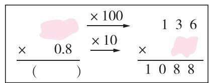  
第4题图

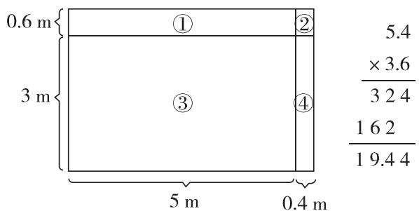

geo

| Section | Dimension (m) |
|---|---|
| ① | 0.6 |
| ② | 3 |
| ③ | 5 |
| ④ | 0.4 |
The image contains a mathematical expression: '× 3.6 / 324' and '162 / 19.44'. The numbers above the diagram are '5.4', '× 3.6 / 324', and '162 / 19.44'.

第5题图

5. 如图, 右边竖式计算的是左边整个长方形的面积。仔细观察, 回答下列问题。

(1) 竖式计算中 $4 \times 6$ 表示 4 个 (0.1) 和 6 个 (0.1) 相乘, 所得的积表示的是整个长方形中 (②) 的面积。  
(2) 竖式中“162”表示(③)和(④)的面积一共是 $16.2 \, m^{2}$ 。

6. 在○里填上“＞”“＜”或“＝”。

$4.8 \times 1.02 > 4.8$

$3.4 \times 0.4 < 3.4 \times 2$

$8.5 \times 12 \textcircled{=} 85 \times 1.2$

$0.48 \times 0.9 < 0.48$

0.25 × 0.01 < 0.25

$75 \times 0.13 > 0.13 \times 7.5$

7. 根据右边的竖式, 直接写出括号内的数。

$329 \times 6 = (1974)$

$0.329 \times 7.6 = (2.5004)$

× 76
1974

(3.29) $\times 7.6 = 25.004$

$7 \times (3.29) = 23.03$

2 3 0 3
2 5 0 0 4

8. 某种大米每千克 4.95 元, 妈妈要买 4.8 千克这种大米, 带 25 元钱够吗? ( 够 ) ( 填“够”或 “不够”), 理由是 ( $4.95 \times 4.8 < 5 \times 5 = 25$ , 所以带 25 元钱够 (理由不唯一, 合理即可)。  
9.(情境题·生活情境)某停车场的收费标准如下。某日,李阿姨19:45开车驶入该停车场,20:58驶出停车场,李阿姨需要支付停车费(9)元。

<table><tr><td>停车时间</td><td>收费标准</td><td>特殊说明</td></tr><tr><td>8:00(不含)~20:00</td><td>每车位:3元/15分</td><td rowspan="2">不满15分钟,按15分钟计算</td></tr><tr><td>20:00(不含)~次日8:00</td><td>每车位:1.5元/15分</td></tr></table>

# 二、选择。(把正确答案的字母填在括号里)(每题2分,共10分)

1. 两个因数的积的近似数是 5.84, 这个积可能是 (D)。

A. 5.848

B. 5.847

C. 5.8453

D. 5.83502

2. 下面的算式中,与 $6.3 \times 0.99$ 的结果相等的是(D)。

A. $6.3 \times 10 - 6.3 \times 0.1$

B. $6.3 - 6.3 \times 0.1$

C. $6.3 \times 1 - 0.01$

D. 6.3 - 6.3 × 0.01

3. 张叔叔买了 3.7 千克鸡蛋, 每千克 10.9 元。按照下面方法 (D) 估算后付款, 可以确保所付的钱一定够。

A. $3 \times 10 = 30$

B. $3 \times 11 = 33$

C. $4 \times 10 = 40$

D. $4 \times 11 = 44$

4.（名校期末真题）初步判断 $3.68 \times 5.4 = 19.872$ 的结果是否正确时，可取的方法有（D）。

①积和因数是否都有三位小数  
②积末尾的2是不是两个因数末尾的8和4乘积的尾数  
③将两因数分别看作4和6,积19.872是否小于4和6的积24  
④将两因数分别看作3和5,积19.872是否大于3和5的积15

A. ①

B.①②

C. ①②③

D.①②③④

5. 数 M、N 在直线上的位置如图所示。 $M \times N$ 的结果的位置可能是(A)。

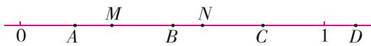

A. $A$

B. $B$

C. C

D. D

# 三、计算。(共27分)

1. 直接写得数。(8 分)

$0.5 \times 3 = 1.5$

$2.5 \times 4 = 10$

1.25×0.8=1

$0.3 + 0.7 \times 3 = 2.4$

$4.08 \times 100 = 408$

$0.12 \times 0.03 = 0.0036$

$1.4 \times 0.6 = 0.84$

$1.5 \times 0.6 - 0.6 = 0.3$

2. 列竖式计算, 带☆的要验算。(10 分)(竖式、验算略)

$6.08 \times 0.8 = 4.864$

0.23 × 1.7 ≈ 0.4

☆3.8×0.45=1.71

(得数保留一位小数)

验

算

3. 下列各题怎样简便就怎样算。(9 分)

$$
2. 5 \times 3. 6 \times 0. 4
$$

$$
= 2. 5 \times 0. 4 \times 3. 6
$$

$$
= 1 \times 3. 6
$$

$$
= 3. 6
$$

$$
3. 5 \times 1 0 2
$$

$$
= 3. 5 \times (1 0 0 + 2)
$$

$$
= 3. 5 \times 1 0 0 + 3. 5 \times 2
$$

$$
= 3 5 0 + 7
$$

$$
= 3 5 7
$$

$$
0. 8 \times (1 2. 5 - 1. 2 5)
$$

$$
= 0. 8 \times 1 2. 5 - 0. 8 \times 1. 2 5
$$

$$
= 1 0 - 1
$$

$$
= 9
$$

四、走进生活。(共36分)

# 丰富多彩的周末生活

1. 学习音乐知识。数学中的黄金分割比(约为0.618:1)应用广泛,一些音乐家喜欢在创作乐曲时将节奏的转折点安排在全曲的黄金分割点处。按照这种做法,如果是89节的乐曲,就用 $89 \times 0.618 \approx 55$ ,那么转折点应设在55节处;如果是50节的乐曲,转折点应设在多少节处?(得数保留整数)(6分)

$$
5 0 \times 0. 6 1 8 = 3 0. 9 (\text {节}) \approx 3 1 (\text {节})
$$

答:转折点应设在31节处。

2. 参观海洋馆。

中华鲟是我国一级重点保护野生动物。一只雄性中华鲟体长1.7 m，体重78 kg；一只雌性中华鲟体长是这只雄性中华鲟的1.35倍，体重是这只雄性中华鲟的2.3倍。

请你提出一个用小数乘法解决的数学问题并解答。(7 分)

答案不唯一,如:

这只雌性中华鲟的体长是多少米？

$$
1. 7 \times 1. 3 5 = 2. 2 9 5 (\mathrm{m})
$$

答:这只雌性中华鲟的体长是2.295 m。

3. 赏桂花,吃桂花糕。

(1)丽丽和妈妈骑电动车以21.6千米/时的平均速度,行驶0.35小时,到郊外赏桂花。往返一共骑行约多少千米? (得数保留整数)(5分)

$$
2 1. 6 \times 0. 3 5 \times 2 \approx 1 5 (\text {千米})
$$

答:往返一共骑行约 15 千米。

(2) 赏完桂花, 丽丽和妈妈去买桂花糕。桂花糕每千克 19.8 元, 她们买了 1.5 千克。结账时, 妈妈有一个 2.3 元的红包可以抵扣, 妈妈实际要支付多少元? (5 分)

$$
1 9. 8 \times 1. 5 - 2. 3 = 2 7. 4 (\text {元})
$$

答:妈妈实际要支付27.4元。

4. 买水果。如图表示的是两种水果的售价(每种水果的售价都被■挡住了一个数字)。王阿姨用100元买了3千克橙子后,剩下的钱够买5千克苹果吗? (6分)

$$
1 8. \square 8 > 1 8 \quad 1 \square . 5 0 > 1 0
$$

$$
1 8 \times 3 = 5 4 (\text {   元   })
$$

$$
1 0 \times 5 = 5 0 (\text {   元   })
$$

$$
5 4 + 5 0 = 1 0 4 (\text {元})
$$

$$
1 0 4 > 1 0 0
$$

  
苹果: 1■.50元/千克

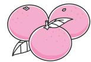  
橙子:18.■8元/千克

答:剩下的钱不够买 5 千克苹果。

5. 邮寄特产。广东某快递公司的收费标准如下。

<table><tr><td>目的地</td><td>首重(1千克及以内)</td><td>续重(每千克加收)(不足1千克,按1千克计算)</td></tr><tr><td>广东省内</td><td>12元</td><td>2元</td></tr><tr><td>江苏、浙江、上海、北京、福建</td><td>22元</td><td>11元</td></tr><tr><td>天津、重庆、安徽、广西、贵州、海南、河北、河南、湖北、湖南、江西、山东、山西、陕西、四川、云南</td><td>22元</td><td>12.5元</td></tr><tr><td>甘肃、黑龙江、吉林、辽宁、内蒙古、宁夏、青海、西藏、新疆</td><td>22元</td><td>18元</td></tr></table>

丽丽要从广东省广州市给在湖南的叔叔寄些当地特产,称重共7.8千克,请你算一算丽丽需要支付快递费多少元。(7分)

7.8 千克按 8 千克计算。

$$
(8 - 1) \times 1 2. 5 + 2 2 = 1 0 9. 5 (\text {   元   })
$$

答:丽丽需要支付 109.5 元快递费。

附加题。(共10分)

阳光超市新推出的桃酥糕点每 500 克售价为 23.5 元。超市搞优惠活动, 每买 500 克送 100 克 (不满 500 克不赠送)。丽丽的妈妈一共买了 3 千克桃酥, 她应该付多少钱?

3 千克 = 3000 克

$$
3 0 0 0 \div (5 0 0 + 1 0 0) = 5
$$

$$
5 \times 2 3. 5 = 1 1 7. 5 (\text {元})
$$

答:她应该付117.5元。

# 第二单元测评卷

时间:60 分钟 满分:100 + 10 分

# 一、填空。(每空1分,共13分)

1. 为庆祝国庆节,同学们正在表演团体操,下面是部分同学所站位置的示意图。

(1)如果张琼的位置用(2,5)表示,那么刘华的位置是(1,2),齐梦的位置是(3,3),李亚的位置是(6,3)。  
(2)位置在(1,6)的同学是(张思),位置在(4,1)的同学是(周平)。  
(3) 王静和华罗在同一列, 和刘华在同一行, 她的位置是 (5, 2)。

2. 下面是电脑中 Excel(电子表格)的一部分, 中间工作区被分成若干个单元格。

<table><tr><td></td><td>A</td><td>B</td><td>C</td><td>D</td></tr><tr><td>1</td><td>部门</td><td>一月</td><td>二月</td><td>三月</td></tr><tr><td>2</td><td>一公司</td><td>67</td><td>86</td><td>87</td></tr><tr><td>3</td><td>二公司</td><td>85</td><td>78</td><td>67</td></tr><tr><td>4</td><td>三公司</td><td>87</td><td>98</td><td>79</td></tr></table>

<table><tr><td>6</td><td>张思</td><td></td><td></td><td></td><td></td><td></td></tr><tr><td>5</td><td></td><td>张琼</td><td></td><td></td><td></td><td></td></tr><tr><td>4</td><td></td><td></td><td></td><td></td><td>华罗</td><td></td></tr><tr><td>3</td><td></td><td></td><td>齐梦</td><td></td><td></td><td>李亚</td></tr><tr><td>2</td><td>刘华</td><td></td><td></td><td></td><td></td><td></td></tr><tr><td>1</td><td></td><td></td><td></td><td>周平</td><td></td><td></td></tr></table>

(1)单元格(A,2)的内容是“一公司”,单元格(D,2)的内容是(87),单元格(C,1)的内容是(二月)。  
(2)“85”在单元格( B ， 3 )内，“86”在单元格( C ， 2 )内。

3. 如图, 点 A 所在的位置用数对表示为 $(1,2)$ , 点 B 所在的位置用数对表示为 $(3,3)$ , 点 C 所在的位置用数对表示为 $(3,1)$ , 三角形 ABC 是一个 (等腰) 三角形。

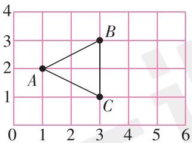

text_image

4
3
B
2
A
1
C
0 1 2 3 4 5 6

# 二、选择。(把正确答案的字母填在括号里)(每小题2分,共10分)

1. 小柔坐在教室的第 4 列、第 6 行, 用数对表示是 (4,6)。

(1) 她正前方有 (D) 位同学。

A. 2

B. 3

C. 4

D. 5

(2) 如果 2 个人坐一起, 她同桌的座位用数对表示是 (A)。

A. $(3,6)$

B. $(4,5)$

C. $(4,3)$

D. $(7,6)$

2. (名校期末真题) 如果用数对 $(5, x)$ 和 $(y, 4)$ 表示的位置在同一列, 那么 $y$ 的值是 (B)。

A. 4

B. 5

C. 9

D. 无法确定

3. 如图是某动物园的示意图。

(1) 小菲刚去了景点 (2,3)，她刚去的景点是 ( B )。

A. 大象馆

B. 猴山

C. 孔雀园

D. 海洋世界

(2)狮虎山的位置是从海洋世界向西走3格,狮虎山的位置用数对表示是( C )。

A. $(4,1)$

B. $(4,7)$

C. $(1,4)$

D. $(1,7)$

# 三、文字游戏。(共16分)

观察方格,完成下面各题。

1. 如果方格中的“公”用数对(3,2)表示,那么“爱”和“国”的位置分别用数对(2,3)和(6,1)表示。(4分)  
2. 下面的数对分别表示什么汉字？请填入表中。(12 分)

<table><tr><td>数对</td><td>(3,1)</td><td>(6,2)</td><td>(4,2)</td><td>(6,4)</td><td>(5,3)</td><td>(5,1)</td></tr><tr><td>汉字</td><td>文</td><td>明</td><td>和</td><td>谐</td><td>诚</td><td>信</td></tr></table>

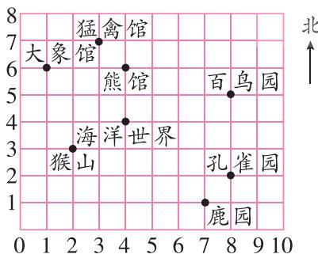

text_image

大象馆
猛禽馆
熊馆
百鸟园
海洋世界
猴山
世界
孔雀园
鹿园
北

<table><tr><td>4</td><td>自</td><td>业</td><td>主</td><td>正</td><td>民</td><td>谐</td></tr><tr><td>3</td><td>富</td><td>爱</td><td>治</td><td>平</td><td>诚</td><td>法</td></tr><tr><td>2</td><td>善</td><td>等</td><td>公</td><td>和</td><td>强</td><td>明</td></tr><tr><td>1</td><td>由</td><td>敬</td><td>文</td><td>友</td><td>信</td><td>国</td></tr><tr><td></td><td>1</td><td>2</td><td>3</td><td>4</td><td>5</td><td>6</td></tr></table>

# 四、动手操作。(共16分)

1. 如图, 点 A 的位置用数对表示是 $(5,6)$ , 将三角形 ABC 先向左平移 3 格, 再向下平移 4 格, 画出平移后的图形 $A'B'C'$ , 写出平移后各顶点的位置。(9 分)

$A^{\prime}(2,2)$ $B^{\prime}(5,1)$ $C^{\prime}(7,3)$

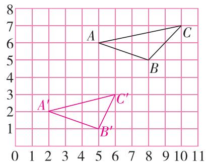

text_image

8
7
6
A
C
5
B
4
3
2
1
A'
C'
B'
6 7 8 9 10 11
0 1 2 3 4 5 6 7 8 9

2. 请你根据下面的描述,在图中画出猫捉老鼠的路线图。(7 分)

开始时,猫在(0,0)的位置,老鼠在(3,2)的位置。老鼠的逃跑路线是:先逃到(5,5)的位置,再逃到(6,3)的位置,再逃到(8,3)的位置,最后逃到(9,0)的位置。猫从起点沿着老鼠所在的位置依次追去,最后捉到了老鼠。

[Non-Text]   
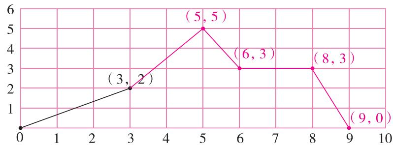

line

| Point | X | Y |
|---|---|---|
| (3,2) | 3 | 2 |
| (5,5) | 5 | 5 |
| (6,3) | 6 | 3 |
| (8,3) | 8 | 3 |
| (9,0) | 9 | 0 |

RJ·测评卷2—2

# 五、解决问题。(共45分)

# 璀璨的中国药文化、棋文化

1. 妈妈要去药店购买中草药“四神汤”。

四神汤配方: 茯苓 20 克, 山药 20 克, 莲子 20 克, 芡实 20 克。热水煎服或当作代茶饮。

# 作用功效

四神汤现多指茯苓、山药、莲子、芡实组成的中医著名的健脾食方，对人体具有健脾、养颜、降燥等诸多益处。

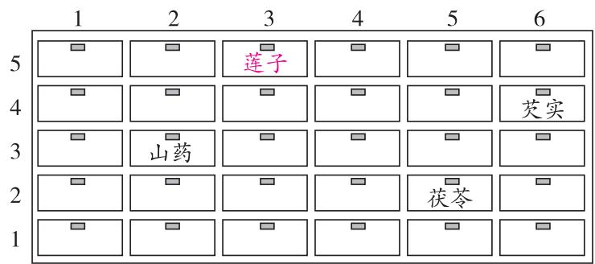

text_image

1
2
3
4
5
6
5
莲子
4
芡实
3
山药
2
茯苓
1

(1)如果用数对表示山药和芡实的位置为山药(2,3)，芡实(6,4)，那么茯苓的位置可以用数对(5，2)表示。(2分)

(2)莲子的位置用数对(3,5)表示,请你在药柜上标出来。(2分)

2. 长白山地区气候湿润、植被丰富, 是人参、五味子、细辛、刺五加等药材的重要产地。8月下旬是采收野生五味子的旺季, 小艺一家都在山上忙碌。小艺在山上的位置如图所示(每个小方格的边长表示100米)。

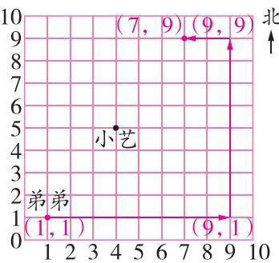

scatter

| Point | X  | Y |
|-------|----|---|
| (1,1) | 1  | 1 |
| (7,9) | 7  | 9 |
| (9,1) | 9  | 9 |
| (7,9) | 7  | 9 |
| (9,1) | 9  | 9 |

(1)用数对表示小艺的位置是(4,5)。(2分)

(2) 小艺妈妈在她正北方 200 米处, 妈妈的位置可以用数对 (4, 7) 表示。(2 分)

(3)爸爸采五味子的速度比较快,一开始在山上(2,3)位置,他以每小时200米的速度向正东方前进,3小时后爸爸的位置可以用数对(8,3)表示。(4分)

(4)小艺的弟弟按照 $(1,1)\rightarrow (9,1)\rightarrow (9,9)\rightarrow (7,9)$ 的路线进山帮忙采收。请你在图中画出弟弟的行走路线，并算一算，弟弟共走了多少米？（8分）

弟弟一共走了 18 格, $18 \times 100 = 1800$ (米)

答:弟弟共走了 1800 米。

3. 中国象棋是中华民族的文化瑰宝, 共有 32 个圆形棋子, 棋子分为两种颜色, 摆放和走棋都在棋盘格的交叉点上(如图), 双方交替行棋。

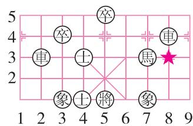

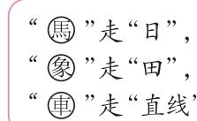

(1)图中两个“⊕”所在的位置可以分别用数对(4, 1)和(4, 3)表示。(4分)

(2)“炮”所在的位置用(8,3)表示,请在图中用“★”表示出“炮”的位置。(2分)

(3)若“馬”向左边走一步,到达的位置可能是哪里?请将可能到达的位置用数对全部表示出来。(8分)

(6,5),(5,4),(5,2),(6,1)

4. 五子棋是我国的传统棋类游戏,双方分别使用黑白两色的棋子,下在棋盘竖线与横线的交叉点上,先形成五子连珠者获胜。小明正在学习五子棋,根据右图回答问题。

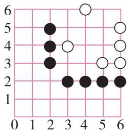

(1)如果白棋要阻止黑棋获胜,必须落在哪个位置阻断黑棋的连线?请用数对表示这个位置。(4分)

$(2,2)$

(2) 黑棋被阻断后, 你认为下一步可以在哪个位置放黑棋? 用数对表示这个位置, 并说一说你的理由。(7 分)

我认为下一步可以在(3,3)这个位置放黑棋,因为它能与(2,4)和(4,2)处的黑棋形成三子连珠。(答案不唯一)

附加题。(共10分)

如图, 点 A 用数对表示是(9,5), 点 B 用数对表示是(10,9)。图中还有一个点 D, 并且点 D 与其他三个点构成一个平行四边形。

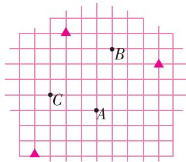

text_image

B
C
A

(1)图中点 C 的位置用数对表示是(6, 6)。(4 分)

(2) 点 D 可能在什么位置？在图上用“▲”标出点 D 的位置，并用数对表示出来。(6 分)

点 D 的位置可能是 $(5,2)$ ，可能是 $(7,10)$ ，还可能是 $(13,8)$ 。

# 第三单元测评卷

时间:60 分钟 满分:100 + 10 分

# 一、填空。(每空1分,共21分)

$$
1. 0. 4 0 5 \div 0. 2 5 = (4 0. 5) \div 2 5
$$

$$
1. 5 \div 0. 0 4 5 = (1 5 0 0) \div 4 5
$$

2.3.208208…是(循环)小数,循环节是(208),用简便形式记作(3.208)。  
3. 根据 $91.2 \div 6 = 15.2$ ，在括号里填上适当的数。

$$
(9 1 2 0) \div 6 0 0 = 1 5. 2
$$

$$
9 1 2 \div (0. 6) = 1 5 2 0
$$

$$
0. 9 1 2 \div 0. 6 = (1. 5 2)
$$

4. 在○里填上“＞”“＜”或“＝”。

$$
0. 8 \div 1. 2 <   0. 8
$$

$$
0. 6 \div 0. 1 9 > 0. 6
$$

$$
1 0 1 \times 0. 9 9 <   1 0 1 \div 0. 9 9
$$

5. 在 5.68、5.6868…、5.8686…、5.688…这四个数中, 最大的数是 (5.8686…), 最小的数是 (5.68), 有限小数是 (5.68), 无限小数有 (3) 个。  
6. 李奶奶带了 20 元去购买挂面, 每袋挂面 5.5 元, 她最多可以买 (3) 袋。结合题意补全下面的竖式。

$$
\begin{array}{r l} & 5, 5 \sqrt {2 0 0} \\ & \frac {1 6 5 \cdots \cdots \text {表示(3)袋挂面(16.5)元}}{3 5 \cdots \cdots \text {表示还剩下(3.5)元}} \end{array}
$$

7. (易错题·方法误用)学校召开运动会,需要为运动员准备560瓶矿泉水。如果张老师按超市的促销活动整箱购买(如图),至少需要买(22)箱矿泉水才能满足运动员的需求。张老师准备了600元用于购买这些矿泉水,估一估,她准备的钱(不够)。(在第二个括号里填“够”或“不够”)

超市的促销活动是每买一箱送2瓶。

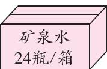

29.9元/箱

# 二、选择。(把正确答案的字母填在括号里)(每题2分,共14分)

1. 计算“除数是小数的除法”时,要把除数转化成整数。下面是小红对 4 个算式转化的过程,其中错误的是( D )。

$$
\text { A. } 5, 1 \sqrt {1 9 , 3 . 8}
$$

$$
\text { B. } 0, \underbrace {0 . 5} _ {\text { }} \sqrt {1 0 , \underbrace {3 . 5} _ {\text { }}}
$$

$$
\text { C. } 1, \underbrace {5} _ {\rightarrow} \sqrt {2 4 , 0}
$$

$$
\text { D. } 1, \underbrace {6} _ {\rightarrow} \sqrt {8 , \underbrace {3 2} _ {\rightarrow}}
$$

2.1.6÷0.11 的商的最高位在( B )位上。

A. 个

B. 十

C. 十分

D. 百分

3.2.42736736…的小数部分第20位上的数字是( D )。

A.2

B.7

C. 3

D. 6

4. $a \div 0.8 = b \times 0.8(a, b$ 均不为0），那么 $a$ 和 $b$ 的大小关系是（B）。

A. $a > b$

B. $a < b$

C. $a = b$

D. 无法判断

5. 超市有三种品质相同、规格不同的蜂蜜, 买哪一种最划算? ( B )。

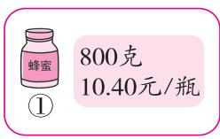

A. ①

B. ②

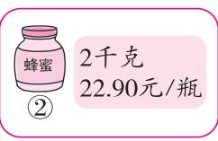

C. ③

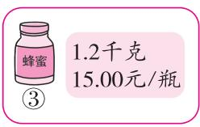

D. 三种一样

6.6 kg 西瓜能榨 1.8 kg 西瓜汁, 照这样计算, 要榨 1 kg 西瓜汁需要西瓜多少千克? 列式正确的是( A )。

A. $6 \div 1.8$

B. $1.8 \div 6$

C. $6 \times 1.8$

D. $6 + 1.8$

7. (名校期末真题) 在计算 $2.4 \div 0.3$ 时, 四名同学将计算的道理说明如下, 不正确的是 (C)。

$$
\begin{array}{r l} & 2. 4 \div 0. 3 \\ \text {A.} & = (2 4 \times 0. 1) \div (3 \times 0. 1) \\ & = 2 4 \div 3 \end{array}
$$

$$
B. \quad 0. 3
$$

$$
\begin{array}{r l} & 2. 4 \div 0. 3 \\ \text {C.} & = (2 4 \times 1 0) \div (3 \times 1 0) \\ & = 2 4 \div 3 \div 1 0 0 \end{array}
$$

$$
D. \quad 0 \quad 1 \quad 2
$$

# 三、计算。(共27分)

1. 直接写得数。(8 分)

$$
8 0 \div 1. 6 = 5 0
$$

$$
0. 1 2 \times 5 = 0. 6
$$

$$
0. 2 \times 0. 8 = 0. 1 6
$$

$$
9. 9 \div 1. 1 = 9
$$

$$
1 8 \div 0. 9 = 2 0
$$

$$
0. 5 8 \div 5 8 = 0. 0 1
$$

$$
7. 1 \div 0. 1 = 7 1
$$

$$
0. 7 2 \div 4 = 0. 1 8
$$

2. 列竖式计算, 带☆的要验算。(10 分)(竖式、验算略)

$$
1 5. 4 \div 2. 1 = 7. 3
$$

$$
1 6. 7 8 \div 0. 2 8 \approx 5 9. 9
$$

$$
\star 6 2. 1 3 \div 0. 5 7 = 1 0 9
$$

(得数用循环小数表示)

(得数保留一位小数)

验

算

3. 计算下面各题,能简算的要简算。(9 分)

$$
2. 5 6 \div 0. 0 4 \div 2. 5
$$

$$
7. 0 2 \div (2. 1 + 0. 6)
$$

$$
5. 7 \times 4. 6 + 1 5. 9 \div 0. 3
$$

$$
= 2. 5 6 \div (0. 0 4 \times 2. 5)
$$

$$
= 7. 0 2 \div 2. 7
$$

$$
= 2 6. 2 2 + 5 3
$$

$$
= 2. 5 6 \div 0. 1
$$

$$
= 2. 6
$$

$$
= 7 9. 2 2
$$

$$
= 2 5. 6
$$

# 四、按要求做题。(共17分)

1. (新题型) 按要求回答下面各题。

(1) 根据 $31 \times 8 = 248$ ，填表。(5 分)

<table><tr><td>被除数</td><td>0.248</td><td>24.8</td><td>2.48</td><td>0.0248</td><td>248</td></tr><tr><td>除数</td><td>0.8</td><td>80</td><td>8</td><td>0.08</td><td>800</td></tr><tr><td>商</td><td>0.31</td><td>0.31</td><td>0.31</td><td>0.31</td><td>0.31</td></tr></table>

(2) 观察上表, 想一想, 填一填。(4 分) 答案不唯一, 只要根据 $31 \times 8 = 248$ 这个算式填写正确即可。

$$
(2 4. 8) \div (8) = (2 4 8) \div (8 0) = 3. 1
$$

(3) 观察上表,你发现了什么规律? (2 分)

答案不唯一,无论从乘法的角度还是从除法的角度,分析合理即可。

2. 找规律, 填一填。(6 分)(最后两空答案不唯一)

$$
\begin{array}{l} 8 1 \div 9 = 9 \\ (8 8. 8 8 8 5) \div 9 = 9. 8 7 6 5 \\ 8 8. 2 \div 9 = 9. 8 \\ (8 8. 8 8 8 8 6) \div 9 = 9. 8 7 6 5 4 \\ 8 8. 8 3 \div 9 = 9. 8 7 \\ 8 8. 8 8 8 8 8 7 \div 9 = (9. 8 7 6 5 4 3) \\ 8 8. 8 8 4 \div 9 = (9. 8 7 6) \\ (8 8. 8 8 8 8 8 8 8) \div 9 = (9. 8 7 6 5 4 3 2) \\ \end{array}
$$

五、解决问题。(共21分)

材料一:数学藏在直播间! 拼团均摊用“除”法,运费凑整“进一”算,丝带包装“去尾”裁等。小数除法解锁网购奥秘,智慧生活触手可及。让数字跳动在购物车,用公式玩转数学江湖!

1. 直播间秒杀。直播间售卖坚果礼盒, 原价 98.4 元, 限时 3 人拼团, 拼团价是 65.6 元, 原价是拼团价的多少倍? (4 分)

$$
9 8. 4 \div 6 5. 6 = 1. 5
$$

答: 原价是拼团价的 1.5 倍。

2. 礼盒包装。萌宝童装仓库打包礼盒, 现有 58 米丝带, 每个礼盒需用 2.5 米丝带装饰。这些丝带最多能装饰多少个礼盒? (4 分)

$$
5 8 \div 2. 5 = 2 3. 2 (\text {   个   })
$$

答:这些丝带最多能装饰 23 个礼盒。

3. 直播时长分配。主播计划用 5 小时讲解 36 款商品, 每款商品讲解时间大致相同。平均每款商品的讲解时间为多少分钟? (得数保留一位小数) (4 分)

$$
5 \times 6 0 = 3 0 0 (\text { 分 })
$$

$$
3 0 0 \div 3 6 \approx 8. 3 (\text { 分 })
$$

答: 平均每款商品的讲解时间为 8.3 分钟。

材料二:低碳生活是指人们在生活中尽量减少所耗能量,从而降低碳(特别是二氧化碳)排放量的一种生活方式。你知道吗?每家每户在生活中都会排放“碳”。

排“碳”量计算公式：

用自来水的二氧化碳排放量(千克)=使用量(吨)×0.91

开私家车的二氧化碳排放量(千克)=耗油量(升)×2.7

4.7 月份小美家开私家车的二氧化碳排放量是 148.5 千克。这个月小美家的私家车耗油多少升？(4 分)

148.5÷2.7=55(升)

答: 这个月小美家的私家车耗油 55 升。

5. 为了减少生活中的碳排放量,小美的爸爸决定从1月份开始,每天采用“步行+乘坐公交车+步行”的方式上班(如图)。已知小美家到爸爸的工作单位的路程是13.3千米,公交车的平均速度是30千米/时,爸爸乘坐公交车需花费多长时间?(5分)

家 → 公交站牌 → 公交站牌 → 工作单位
7:00出发 步行600米 乘坐公交车 步行400米

$600 + 400 = 1000$ （米）

1000 米 = 1 千米

13.3 - 1 = 12.3 (千米)

$12.3 \div 30 = 0.41$ (时)

答:爸爸乘坐公交车需花费 0.41 小时。

附加题。(共10分)

为了加强公民的节水意识,合理利用水资源,某地规定如下用水收费标准:每户每月的用水量不超过20吨(含20吨)时,水费按“基本价”收费;超过20吨(不含20吨)时,不超过的部分仍按“基本价”收费,超过的部分按“调节价”收费。某户居民今年四、五月份的用水量和水费如下表所示:

<table><tr><td>月份</td><td>用水量/吨</td><td>水费/元</td></tr><tr><td>4</td><td>16</td><td>33.60</td></tr><tr><td>5</td><td>25</td><td>65.00</td></tr></table>

请你算一算,这个地区水费的“调节价”为每吨多少元?若该户居民六月份的用水量为30吨,则该户居民六月份的水费是多少元?

33.60÷16=2.1(元)

2.1×20=42(元)

$$
(6 5 - 4 2) \div (2 5 - 2 0) = 4. 6 (\text {元})
$$

$$
4 2 + 4. 6 \times (3 0 - 2 0) = 8 8 (\text {元})
$$

答: 这个地区水费的“调节价”为每吨4.6元, 该户居民六月份的水费是88元。

# 第四单元测评卷

时间:60 分钟 满分:100 + 10 分

# 一、填空。(每空2分,共28分)

1. 算式中的□代表一个不为0的一位数。观察下面的算式，在括号中填上“可能”“不可能”或“一定”。

(1) $1.25 \times \square$ ，积的末尾（可能）有0；(2) $80 \times \square$ ，积的末尾（一定）有0；  
(3) $16.3 \times \square$ , 积的末尾(不可能)有0。

2. 口袋里装有 5 个红球、3 个白球和 1 个绿球,从中任意摸一个球。(填“大于”“小于”或“等于”)

(1)摸到白球的可能性(大于)摸到绿球的可能性。  
(2) 摸到白球的可能性(小于)摸到红球的可能性。

(3)如果再放进去2个绿球,摸到白球的可能性(等于)摸到绿球的可能性。

3. 一个袋子里有红、绿、黄三种颜色的球, 它们除颜色外都相同。从中摸出一个球后放回去摇匀, 这样重复摸了 100 次, 其中有 28 次是红球, 62 次是绿球, 10 次是黄球。由此推测, 袋子里(绿)球最多, 再摸一次, 摸出(黄)球的可能性最小。

4. 盒子里放了 3 个红球、2 个白球、5 个绿球和 7 个蓝球，小华从中任意摸出一个球，摸出的球的颜色有（4）种可能，摸出（白）球的可能性最小。要想摸出这种颜色的球的可能性最大，至少往盒子里再加（6）个这种颜色的球。

5. 五(1)班的10名同学抽签表演节目(如图)。同学们依次从中任意抽出一张(不放回),第1名同学抽到(讲故事)的可能性大,第4名同学抽到(讲故事)的可能性大。

讲故事 讲故事 讲故事 讲故事 讲故事 讲故事 唱歌 唱歌

6. 从布袋里摸形状、大小相同的糖,要使摸到水果糖的可能性最小,摸到奶糖的可能性最大,还有可能摸到酥心糖,布袋中至少要装(6)颗糖。

# 二、选择。（把正确答案的字母填在括号里）（每题3分，共18分）

1. 同学们玩掷骰子游戏。骰子的六个面上分别标有 1 \~ 6 这六个数字, 掷一次出现“3”的可能性与出现“2”的可能性相比, ( A )。

A. 一样大

B. 出现“3”的可能性大

C. 出现“3”的可能性小

2. (跨学科融合) 唐代大诗人李白在《北风行》中有诗句: “燕山雪花大如席, 片片吹落轩辕台。”用夸张的语气描绘了大雪纷飞的景象。若某城市已连续下雪 5 天, 则第 6 天 ( A ) 下雪。

A. 可能

B. 一定

C. 不可能

3.（名校期末真题）如图，3个盒子中分别装有一些球，这些球除颜色外完全相同。

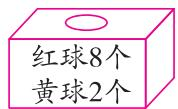  
甲

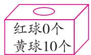  
乙

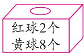  
丙

5 名同学选择了其中同一个盒子玩摸球游戏。每人摸 20 次,每次从盒子中任意摸出一个球,记录颜色后放回摇匀,再摸下一次。他们摸出红球、黄球的次数情况如表所示。

<table><tr><td></td><td>乐乐</td><td>聪聪</td><td>小红</td><td>小轩</td><td>玲玲</td></tr><tr><td>红球/次</td><td>3</td><td>0</td><td>4</td><td>5</td><td>9</td></tr><tr><td>黄球/次</td><td>17</td><td>20</td><td>16</td><td>15</td><td>11</td></tr></table>

根据表中的数据进行推理,他们最有可能选择的盒子是( C )。

A. 甲

B. 乙

C. 丙

4. 张强与刘明下象棋,他们用摸球游戏决定谁先走,如果摸到黄球,张强先走;如果摸到红球,刘明先走。选择下面( B )选项的盒子摸球最公平。

A. 黄球 7 个, 红球 3 个

B. 黄球 5 个, 红球 5 个

C. 黄球 4 个, 红球 6 个

5. 两个同样大小的正方体, 每个正方体的 6 个面上都分别标着数字 $1 \sim 6$ , 同时掷这两个正方体, 得到两个数字, 这两个数字的和 (B)。

A. 从 1 到 6 共 6 个数, 都有可能

B. 从 2 到 12 共 11 个数, 都有可能

C. 从 1 到 12 共 12 个数, 都有可能

6. 学校对面新开了一家小超市, 小超市的老板想搞一个购物抽奖活动。现在有三个方案, 选择方案 ( C ) 对老板最有利。

A. 掷骰子, 掷出 6 点即中奖

B. 从四张不同花色的扑克牌中抽到红桃即中奖

C. 转动如图所示的转盘, 指针指向阴影区域即中奖

# 三、动手操作。(共31分)

1. 设计摸球游戏。请你从“平分秋色”“十拿九稳”“百发百中”中选择一个成语，根据成语的意思，想一想中奖可能性的大小，然后给盒子中的小球涂色表示中奖的可能性。我选的词语

是 答案不唯一,如:平分秋色 。(6 分)

我这样涂色：

从盒子中摸到涂色的球表示中奖，摸到没涂色的球表示没有中奖。

2. 下面的 3 个盒子里分别放有 6 个除颜色外, 其他完全相同的小球。从这 3 个盒子里分别摸出 1 个小球, 把摸得的结果和对应的盒子连起来。(6 分)

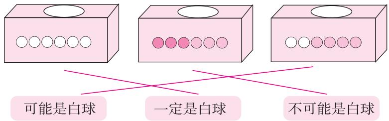

text_image

可能是白球
一定是白球
不可能是白球

3. 同学们在玩“谁是幸运者”的游戏,每一个人可以选择一种颜色,指针停到哪种颜色(指针停到线上时重新转),选择这种颜色的人就是幸运者。为了游戏的公平性,请你根据参加游戏的人数在圆盘上涂上颜色。(每个关于“4人游戏”的涂色,我是这样想的:

2人游戏  
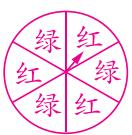

3人游戏  
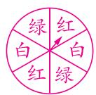

4人游戏  
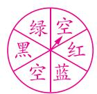

“4 人游戏”: 涂绿、红、蓝、黑四种颜色, 各涂一份, 剩余两份为空白, 指针停到空白区域时重新转。

4. 桌面上有四种不同的卡片(如图)若干张,分别把它们反扣在桌面上(图案一面向下),每次任意翻开一张,再放回去搅匀后接着翻。

  
猴子

  
熊

  
熊猫

  
牛

翻牌结果记录表

<table><tr><td></td><td>正正正正正下</td></tr><tr><td></td><td>正正正一</td></tr><tr><td></td><td>正正正</td></tr><tr><td></td><td>正正一</td></tr></table>

(1)根据记录结果补全统计表。(5分)

(2)根据翻牌统计结果,想一想,(猴子)图案的卡片数量可能最多;(牛)图案的卡片数量可能最少。(2分)

(3)如果再翻一次,翻到(猴子)图案卡片的可能性最大。(2分)

(4)要使翻到牛图案卡片的可能性和翻到猴子图案卡片的可能性差不多,需要(增加)牛图案卡片的数量。(填“增加”或“减少”)(2分)

# 四、解决问题。(共23分)

为了激发学生们的学习兴趣,五年级的各科老师们设计了多种抽奖方式,奖品有免作业、文具大礼包、免值日等。努力学习,这些统统都有可能属于你!

1. 语文学科的老师们准备了一个抽奖箱,里面装有 12 张免值日一次券、8 张免作业一次券、2 张文具大礼包券和哪吒卡片券 30 张。心心说:“我可能抽到免作业一次券。”妍妍说:“我抽到的一定是哪吒卡片券。”谁的判断正确?为什么?(7 分)

答案:心心的判断正确。抽奖盒中有免作业一次券,因此抽到它是可能的;但妍妍说的“一定”错误,因为仍有抽到其他券的可能性。

2. 数学学科的老师们设计了抽奖转盘。统计了 100 次学生转转盘获得的奖品情况(如表)。

<table><tr><td>奖品</td><td>免作业一次</td><td>免值日一次</td><td>文具大礼包</td></tr><tr><td>获奖人数</td><td>34</td><td>50</td><td>16</td></tr></table>

①号  
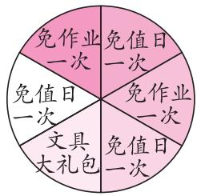

②号  
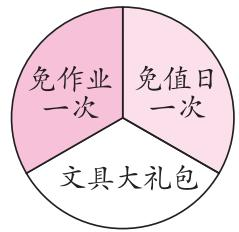

根据表中的数据推测,数学老师们设计的是几号转盘?写出你判断的理由。(7 分)
数学老师们设计的是①号转盘,因为代表免值日一次的面积占转盘面积的一半,代表文具大礼包的面积最小。

3. 英语学科的老师们做了两个抽奖箱, 两个箱子里均放有 1\~6 号小球各 5 个, 并制定抽奖规则如下:

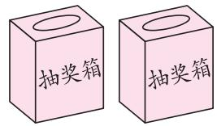

# 抽奖规则

☆每人抽奖一次

☆从两个箱子里各摸一个球,求得两球数字之和

和是2或12

一等奖

文具大礼包

和是3或11

二等奖

免作业一次

和是4或10

三等奖

免值日一次

和是5、6、7、8或9

纪念奖

表扬信一张

(1)天天正在抽奖,她最有可能获得(纪念)奖。(3分)

(2) 乐乐说：“获得一等奖的可能性大于获得二等奖的可能性。”小明说：“获得一等奖的可能性肯定小于获得二等奖的可能性。”他们谁说得对？为什么？（6 分）

小明说得对,因为和是2或12的情况少于和是3或11的情况,所以获得一等奖的可能性小于获得二等奖的可能性。

# 附加题。(共10分)

从下面的箱子中任意摸出3个球,摸到1红、1白和1黄的可能性大,还是摸到1白2黄的可能性大?为什么?

可能性相等,因为摸到1白、1红和1黄的情况有3种可能,摸到1白2黄的情况也有3种可能。

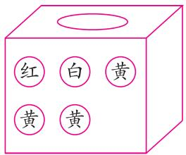

# 期中综合测评卷

时间:70 分钟 满分:100 + 10 分

一、填空。（第9题4分，其余每空1分，共23分）

1. $1.28 \times 4.3$ 的积是(三)位小数;2.496 精确到百分位是(2.50)。

2.5÷11 的商是 0.4545…,用简便方法记作(0.45),把它保留三位小数约是(0.455)。

3. 根据 $7.56 \times 5.4 = 40.824$ ，直接写出下面各题的得数。

$75.6\times 0.54 = (40.824)$ $4.0824\div 5.4 = (0.756)$ $40.824\div 54 = (0.756)$

4. 除夕夜,乐乐家包饺子时在饺子里包了一枚硬币,吃饺子时,奶奶吃了8个,爸爸吃了15个,妈妈吃了8个,乐乐吃了5个,(爸爸)吃到硬币的可能性最大,(奶奶)和(妈妈)吃到硬币的可能性相同。

5. 在 ○ 里填上“＞”“＜”或“＝”。

15.8 ÷ 1.2 < 15.8

3.25×0.9 < 3.25

$1 \div 0.25 \textcircled{=} 1 \times 4$

6. 王老师在一家网上体育用品店购买以下物品。

<table><tr><td>物品种类</td><td>篮球</td><td>跳绳</td><td>板羽球</td></tr><tr><td>售价</td><td>75.90元/个</td><td>14.60元/根</td><td>32.50元/套</td></tr><tr><td>数量</td><td>1个</td><td>10根</td><td>2套</td></tr></table>

该店铺有“满300元减20元”的优惠活动,王老师购买以上物品的金额(不能)享受优惠。(填“能”或“不能”)

7. 一个篮球 51 元, 1000 元可以买 (19) 个这样的篮球。把这些篮球放到箱子里, 每箱放 6 个, 需要 (4) 个箱子。

8. 乐乐在教室里的座位用数对表示为(3,4)，表示他在第3列、第4行的位置，那么和他在同一行的左右桌同学的座位用数对表示为(2,4)和(4,4)，他前桌同学的座位用数对表示为(3,3)。

9. (跨学科融合)语文中有很多 AABB 形式的四字词语,例如:干干净净,高高兴兴,数学上也有 AABB 形式的算式。先计算下面的前三道算式,再根据规律写出一道类似的算式。

$1122 \div 11 = (102) \quad 2233 \div 11 = (203) \quad 3344 \div 11 = (304)$ $(4455) \div (11) = (405)$ (算式不唯一)

二、选择。(把正确答案的字母填在括号里)(每题2分,共14分)

1. 李叔叔打包一个纸箱需要 1.5 米的胶带,一卷长 25 米的胶带,最多能打包多少个纸箱? 如图,用竖式计算能打包的箱子个数,其中竖式中的 10 表示( B )。

A. 10 米

B. 10 分米

C. 10 厘米

D. 10 毫米

2. 魔术师手中有 20 张牌: 红桃 3 张, 黑桃 9 张, 梅花 5 张, 其余的是方块。从中任意抽出一张牌, 抽出的花色可能性最大的是 ( B )。

16
15)250
150
100
90
10

A. 红桃

B. 黑桃

C. 梅花

D. 方块

3. 一种豆浆每 100 克含 4.5 克蛋白质, 300 克这种豆浆含 ( C ) 克蛋白质。

A. 3.5

B. 10.5

C. 13.5

D. 15

4. 下列简算过程正确的是( B )。

A. $7.2 \times 8.4 + 1.6 = 7.2 \times (8.4 + 1.6)$

B. $0.32 \div 0.25 = (0.32 \times 4) \div (0.25 \times 4)$

C. $3.7 \times 9.9 = 3.7 \times 10 - 0.1$

D. $2.5 \times 4.4 = (2.5 \times 4) \times (2.5 \times 0.4)$

5.（名校期末真题）数 a 和 b 用直线上的点表示如图，算式 $a \div b, a \times b$ ，b - a 的计算结果大于 a 的有（C）个。

A. 0

B. 1

C. 2

D. 3

6. 甲、乙、丙都是大于0的数,且甲×0.9=乙÷0.9=丙,比较甲、乙、丙的大小,下列排序正确的是( B )。

A. 甲 > 乙 > 丙

B. 甲 > 丙 > 乙

C. 乙 > 甲 > 丙

D. 乙 > 丙 > 甲

7. 小华家和小丽家在学校的两侧(如图)。小丽每分钟走64米, 小华每分钟走76米, 她俩同时从家出发向对方家走去, 大约在(B)相遇。

小丽家 M N 学校 O P 小华家
1.44千米 0.66千米

A. $M$ 点

B. $N$ 点

C. O 点

D. P 点

# 三、计算。(共27分)

1. 直接写得数。(8 分)

3.6 ÷ 0.6 = 6

12.5 × 0.8 = 10

$0.4 \times 50 = 20$

$7 \div 14 = 0.5$

4.8 ÷ 4 = 1.2

3.8 ÷ 0.01 = 380

$0.99 \times 0.25 \times 40 = 9.9$

1.02×60=61.2

2. 列竖式计算, 带☆的要验算。(10 分)(竖式及验算略)

$0.35 \times 1.02 \approx 0.36$

☆6.16÷2.2=2.8

$72 \div 9.9 = 7.27$

(结果保留两位小数)

(商用循环小数表示)

3. 计算下面各题,能简算的要简算。(9 分)

0.125 × 3.2 × 0.25

13 ÷ 0.4 ÷ 2.5

$9.88 \div [5 \times (8.2 - 7.4)]$

$= 0.125 \times (4 \times 0.8) \times 0.25$

$= 13 \div (0.4 \times 2.5)$

$= 9.88 \div [5 \times 0.8]$

$= (0.125 \times 0.8) \times (4 \times 0.25)$

$= 13 \div 1$

=9.88 ÷ 4

$= 0.1 \times 1$

= 13

=2.47

$= 0.1$

# 四、动手操作。(共11分)

# 1. 转盘游戏。

(1)如图,指针停在灰色区域琳琳赢,停在白色区域乐乐赢(停在线上重新转)。(2分)

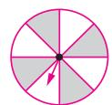  
甲

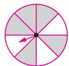  
乙

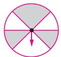  
丙

①想让琳琳赢的可能性大,要用(乙)转盘玩。
②要使游戏公平,应该用(甲或丙)转盘玩。

(2) 乐乐设计的转盘上有灰色和白色两种区域。用他的转盘转动 100 次, 转到灰色区域 21 次, 转到白色区域 79 次, 乐乐设计的转盘最有可能是什么样子的呢? 请你在图中画一画。(3 分)

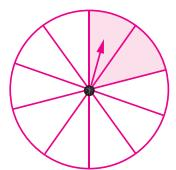

# 2. 你知道小芳这张表中的秘密吗?

我把单数按规律写在右边的表格中，每个数的位置都是固定的。如：5的位置是（3，1），15的位置是（3，2），35的位置是（3，4）。

<table><tr><td>第5行</td><td>...</td><td>...</td><td>...</td><td>...</td><td>...</td></tr><tr><td>第4行</td><td></td><td></td><td>35</td><td></td><td></td></tr><tr><td>第3行</td><td></td><td>23</td><td></td><td></td><td>29</td></tr><tr><td>第2行</td><td>11</td><td></td><td>15</td><td>17</td><td></td></tr><tr><td>第1行</td><td>1</td><td>3</td><td>5</td><td></td><td>9</td></tr><tr><td></td><td>第1列</td><td>第2列</td><td>第3列</td><td>第4列</td><td>第5列</td></tr></table>

(1)数7的位置是(4, 1), 数27的位置是(4, 3), 数57的位置是(4, 6)。(3分)

(2)位置(3, 8)表示的数是(75)，数81的位置是(1, 9)，数99的位置是(5, 10)。(3分)

# 五、解决问题。(共25分)

山东省临沂市郯城县红花镇被誉为“中国结艺之乡”，是中国最大的中国结生产基地，红花镇生产的中国结占中国市场份额的 $70\%$ 。除了在国内市场独占鳌头，这里的中国结还远销美国、韩国、日本、东南亚等国家和地区。

1. 十一期间,芳芳和爸爸、妈妈、妹妹一起驾车去红花镇游玩。出发前妈妈去超市买水果和零食。妈妈的手机微信钱包里有 145 元,她买了 1.9 kg 的苹果、2 kg 樱桃和 3 袋饼干,剩下的钱还够买 4 瓶橙汁吗? (6 分)

<table><tr><td></td><td></td><td></td><td></td></tr><tr><td>9.6元/千克</td><td>43.8元/千克</td><td>5.7元/袋</td><td>3.6元/瓶</td></tr></table>

$$
1. 9 <   2 \quad 9. 6 <   1 0 \quad 4 3. 8 <   4 5 \quad 5. 7 <   6 \quad 3. 6 <   4
$$

$$
2 \times 1 0 + 2 \times 4 5 + 3 \times 6 + 4 \times 4 = 1 4 4 (\text {元})
$$

$$
1 4 4 <   1 4 5
$$

答:剩下的钱够买4瓶橙汁。

2. 午餐时间到了,芳芳一家决定在高速服务区吃午饭。服务区有两家餐厅,分别推出优惠活动。

甲餐厅:每份套餐20元,儿童套餐半价。乙餐厅:每份套餐14.5元。

请你算一算,他们去哪家餐厅就餐,总价比较便宜?(芳芳和妹妹都是儿童)(6分)

甲餐厅: $20 \times 2 + (20 \div 2) \times 2 = 60$ （元）

乙餐厅: $14.5 \times 4 = 58$ (元)

58 < 60

答:他们去乙餐厅就餐,总价比较便宜。

3. 来到中国结博物馆, 芳芳一家被琳琅满目的中国结所吸引, 展厅内摆满了品类繁多、五颜六色的结艺编织品。他们还学习了编中国结。编一个中国结要用 0.74 米的红绳, 那么 4 米长的红绳能编 6 个这样的中国结吗?

下面是两位同学的做法：

√ 明明: $4 \div 0.74 \approx 5.4$ (个) $5.4 \approx 5 \quad 5 < 6$ 答:不能编6个这样的中国结。

√ 聪聪: $0.74 \times 6 = 4.44$ (米) 4.44 > 4
答:不能编6个这样的中国结。

(1)请分析以上两位同学的做法，并在正确做法相应的同学名字前的□里画“√”。(2分)  
(2)选择一种正确的做法说明这样计算的道理。(5分)

(答案不唯一)明明的做法: $4 \div 0.74$ , 就是求 4 米长的红绳可以编几个这样的中国结, 商为 5.4, 用“去尾法”取近似值是 5, 即 4 米长的红绳只能编 5 个这样的中国结, $5 < 6$ , 因此, 不能编 6 个这样的中国结。

4. 芳芳一家离开红花镇之后又去临沂市参观了沂州古城和琅琊古城。他们上午 10:00 把车停到了琅琊古城附近的停车场, 下午 2:00 离开。买门票、看演出花了 472 元, 吃饭、买纪念品花了 539 元。该停车场支持无感支付(即先离场后支付), 这样节省时间。到家后, 爸爸收到停车场扣费短信, 停车费为 6 元。请你通过计算检验一下扣除的费用对不对。(6 分)

把 472 看作 470, 把 539 看作 530。

$$
4 7 0 + 5 3 0 = 1 0 0 0 (\text {   元   })
$$

可以免费停车 2 小时。

从上午 10:00 到下午 2:00 共 4 小时， $(4-2)\div0.5\times1.5=6$ （元）

答:扣除的费用对。

白天停车收费标准：

①停车2小时以内(含2小时)收费5元；2小时以上每0.5小时收费1.5元，不满0.5小时按0.5小时计算。
②在景区全场累计消费满1000元,免费停车2小时;
免费停车2小时后,每0.5小时收费1.5元,不满0.5小时按0.5小时计算。

附加题。(共10分)

小宁和小芳走同一段路,小宁每小时走4.5千米,小芳每小时比小宁少走0.9千米,小芳走完这段路比小宁多用0.25小时。这段路有多少千米?

$$
(4. 5 - 0. 9) \times 0. 2 5 \div 0. 9 \times 4. 5 = 4. 5 (\text {千米})
$$

答:这段路有4.5千米。

# 第五单元测评卷

时间:60 分钟 满分:100 + 10 分

一、填空。（第5题2分，其余每空1分，共20分）

1. 杨树有 a 棵, 比梨树多 30 棵, 梨树有 (a - 30) 棵。  
2. 教室里有 a 人, 出去了 x 人, 又进来 6 人, 现在教室里有 ( $a - x + 6$ ) 人。  
3. 小红录一份 2000 字的稿件, 平均每分钟打 85 个字, 她打了 x 分钟后, 剩下 (2000 - 85x) 个字没录; 当 x = 20 时, 剩下 (300) 个字没录。  
4. 如果正方形的边长为 $a$ ，则周长是（ $4a$ ），面积是（ $a^2$ ）。如果正方形的周长为 $b$ ，则面积是 $(b \div 4)^2$ 。  
5. 根据运算律在□里填上适当的数或字母。

$$
x + 7 x = x \times (\boxed {1} + \boxed {7})
$$

$$
2. 5 (x + \boxed {6}) = \boxed {2. 5} \times \boxed {x} + \boxed {2. 5} \times 6
$$

6. 京港澳高速公路的区间测速路段长 s 千米, 限速 120 千米/时, 张叔叔开车通过这段路用了 t 小时, $s \div t$ 表示 (张叔叔开车的速度); 如果 s = 22, t = 0.2, 张叔叔开车 (没有) 超速。(填“有”或“没有”)

7. 在□里填上合适的数,使下面方程的解都是 x=6。

$$
3 x - 7 = \boxed {1 1}
$$

$$
3 x + \boxed {1 7} = 3 5
$$

$$
3 x - \boxed {2} x = 6
$$

$$
5 x \div \boxed {1 2} = 2. 5
$$

8. (情境题·生活情境)“长桌宴”是侗寨最为隆重的待客礼俗。每当有受到全寨尊敬的客人来侗寨,各家便会拼成长条桌,拼菜成席,共同款待客人,让客人一次性感受全寨各家各户的盛情。长桌的拼摆方式及座位如图所示。4 张桌子拼在一起可坐(18)人,n 张桌子拼在一起可坐( $4n+2$ )人。

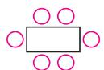  
1张桌子

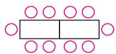  
2张桌子

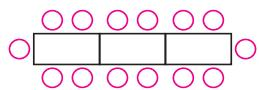  
3张桌子

9. 为确保信息安全,信息需要加密传输,发送方由明文→密文(加密),接收方由密文→明文(解密),已知加密规则为明文a,b,c对应的密文为 $a+1$ , $2b+4$ , $3c+9$ ,例如明文1,2,3对应的密文为2,8,18。如果接收方得到的密文为7,18,15,则解密得到的明文是(6),(7),(2)。

二、选择。(把正确答案的字母填在括号里)(每题3分,共18分)

1. 下列式子中, 有( B )个是方程。

$$
① 5 x + 8
$$

$$
② 3 x + 4 = 9
$$

$$
③ 9 - 5 x = 2 0 - 7 x
$$

$$
④ 8 x + 7 > 1 5
$$

A.1

B.2

C. 3

D. 4

2. “a 的 3.5 倍比 b 多 0.6”用式子表示是( D )。

A. $3.5 \div a - b = 0.6$

B. $a \div 3.5 - b = 0.6$

C. 3.5a + b = 0.6

D. 3.5a - b = 0.6

3. 买了 a 千克西红柿, 每千克 7.5 元, 又买了 b 千克黄瓜, 每千克 6 元, 那么 7.5a - 6b 表示 (D)。

A. 买西红柿和黄瓜共付多少元

B. 西红柿比黄瓜重多少千克

C. 每千克西红柿比每千克黄瓜贵多少元

D. 买黄瓜比买西红柿少付多少元

4. 根据如图所示信息列方程, 正确的方程有( C )个。

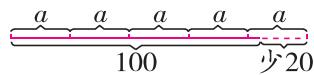

①5a = 100 - 20 ②5a = 100 + 20 ③5a - 100 = 20 ④5a - 20 = 100

A.1

B.2

C. 3

D. 4

5. 妈妈和爸爸通过支付宝 AR 扫一扫一扫共得到福卡 54 张, 妈妈的福卡数量是爸爸的 2 倍, 要求妈妈和爸爸分别得到多少张福卡, 应设\_\_\_\_为 $x$ 张, 列方程为\_\_\_\_。(B)

A. 妈妈得到的福卡数量

$2x + x = 54$

B. 爸爸得到的福卡数量

$2x + x = 54$

C. 妈妈得到的福卡数量

$2x + 1 = 54$

D. 爸爸得到的福卡数量

$x + 0.5x = 54$

6. (大单元关联)一个一位小数, 它十分位上的数是 a, 个位上的数是 b, 十位上的数是 c, 这个一位小数可写成 (C)。

A. cba

B. $c + b + a$

C. $10c + b + 0.1a$

D. 10c + 1 + 0.1a

# 三、计算。(共18分)

1. 直接写得数。(8 分)

$$
8 x + 6 x = 1 4 x
$$

$$
6 b - 1. 5 b = 4. 5 b
$$

$$
0. 5 \times c = 0. 5 c
$$

$$
6 y \div 2 = 3 y
$$

$$
a \times a = a ^ {2}
$$

$$
0. 3 ^ {2} = 0. 0 9
$$

$$
2 \times a \times b = 2 a b
$$

$$
2 x - 0. 5 x + 1. 5 x = 3 x
$$

2. 解方程, 带☆的要检验。(10 分)(过程及检验略)

$$
x + 3. 8 = 1 5
$$

$$
5 x + 2 x = 1 4. 7
$$

$$
\star 3 (x - 1. 8) = 2 1
$$

$$
x = 1 1. 2
$$

$$
x = 2. 1
$$

$$
x = 8. 8
$$

# 四、看图列方程，并求解。(每题4分，共8分)

1.

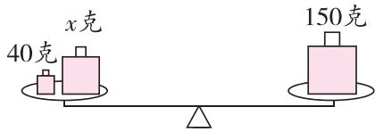

$$
x + 4 0 = 1 5 0
$$

$$
x = 1 1 0
$$

2.

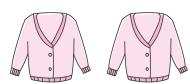  
x元 x元

  
75元 75元

  
75元

$$
2 x + 7 5 \times 3 = 3 4 5
$$

$$
x = 6 0
$$

# 五、列方程解决问题。(共36分)

# 科技发展之中国航空航天事业及铁路建设

1. 长征系列运载火箭是中国自行研制的航天运载工具,其中长征三号的起飞质量大约比长征十一号起飞质量的4倍少22吨。

(1) 如果用 m 表示长征十一号的起飞质量, 那么用 m 表示长征三号的起飞质量是 (4m - 22)。(2 分)

(2)如果长征三号的起飞质量约是210吨,求长征十一号的起飞质量。(4分)

$$
4 m - 2 2 = 2 1 0
$$

$$
m = 5 8
$$

答:长征十一号的起飞质量约是58吨。

2. 探寻水资源是月球探测的首要任务之一。日前,我国科学家通过研究嫦娥五号月壤矿物中的氢含量,提出一种全新生产水的方法。研究团队确认1克月壤大约可产生75毫克的水。以此推算,1吨月壤产生的75千克水基本可满足50个成人1天的饮水量。一个成人每天饮水量大约是多少千克? (5分)

解: 设一个成人每天饮水量大约是 x 千克。

$$
5 0 x = 7 5
$$

$$
x = 1. 5
$$

答:一个成人每天饮水量大约是 1.5 千克。

3. 1970 年中国发射了独立自主研制的第一颗人造地球卫星“东方红一号”，迈出了走向太空的第一步。2020 年“嫦娥五号”完成了登月采样返回之旅。从“东方红一号”到“嫦娥五号”，中国成功发射了三百个航天器，俗称“三百星”。完成第一个“百星”用了 41 年时间，比完成第三个“百星”所用时间的 13 倍还多 2 年。完成第三个“百星”用了多少年？（5 分）

解:设完成第三个“百星”用了 x 年。

$$
1 3 x + 2 = 4 1
$$

$$
x = 3
$$

答: 完成第三个“百星”用了 3 年。

4. 2024 年我国高速铁路营业里程达到 4.8 万千米, 比 2015 年的 2 倍还多 0.84 万千米。2015 年我国高速铁路营业里程是多少万千米? (5 分)

解: 设 2015 年我国高速铁路营业里程是 x 万千米。

$$
2 x + 0. 8 4 = 4. 8
$$

$$
x = 1. 9 8
$$

答:2015 年我国高速铁路营业里程是 1.98 万千米。

5. 青藏铁路是世界上海拔最高、线路最长的高原铁路, 东起青海西宁, 西至西藏拉萨, 全长 1956 千米。

(1)从格尔木至拉萨的青藏铁路长约1142千米,它比从西宁至格尔木的铁路长的1.5倍少79千米。从西宁至格尔木的铁路长约为多少千米? (5分)

解:设从西宁至格尔木的铁路长约为 x 千米。

$$
1. 5 x - 7 9 = 1 1 4 2
$$

$$
x = 8 1 4
$$

答:从西宁至格尔木的铁路长约为814千米。

(2)唐古拉山口的青藏铁路最高点海拔约是5072米,比上海佘山东峰海拔的70倍多4米。上海佘山东峰的海拔约是多少米? (5分)

解:设上海佘山东峰的海拔约是 x 米。

$$
7 0 x + 4 = 5 0 7 2
$$

$$
x = 7 2. 4
$$

答: 上海佘山东峰的海拔约是 72.4 米。

(3)两列火车分别从拉萨和西宁同时出发,已知快车的速度为90千米/时,慢车的速度为73千米/时。行驶多长时间后两车第一次相距244.5千米?(5分)

解: 设行驶 x 小时后两车第一次相距244.5千米。

$$
9 0 x + 7 3 x = 1 9 5 6 - 2 4 4. 5
$$

$$
x = 1 0. 5
$$

答:行驶 10.5 小时后两车第一次相距 244.5 千米。

附加题。(共10分)

已知 A 站至 H 站的总里程为 1500 千米, 全程参考价为 180 元, 下表是沿途各站至 H 站的里程:

<table><tr><td>车站</td><td>A</td><td>B</td><td>C</td><td>D</td><td>E</td><td>F</td><td>G</td></tr><tr><td>各站至H站的里程/千米</td><td>1500</td><td>1130</td><td>910</td><td>622</td><td>402</td><td>219</td><td>72</td></tr></table>

据了解,火车票的票价是按“全程参考价×实际乘车里程÷总里程”的方法来确定的,例如,B站至E站的票价为 $180 \times (1130 - 402) \div 1500 = 87.36$ (元)≈87(元)。旅客王大妈乘火车去女儿家,上车过两站后拿着火车票问乘务员:“我快到站了吗?”乘务员看到王大妈手中的票的票价为66元,马上说下一站就到了。王大妈的实际乘车里程是多少千米?乘车区间是哪两个站之间?写出你的思考过程。

解: 设王大妈的实际乘车里程是 x 千米。

$$
1 8 0 x \div 1 5 0 0 = 6 6
$$

$$
x = 5 5 0
$$

表中 D、G 两站之间的距离为 622 - 72 = 550（千米），符合条件。

答: 王大妈的实际乘车里程是 550 千米, 乘车区间是 D 站与 G 站之间。

# 第六单元测评卷

时间:60 分钟 满分:100 + 10 分

# 一、填空。(每空1分,共21分)

1. 如图是用不同的操作方法将一张平行四边形纸片和一个平行四边形木框架转化成一个长方形, 请在括号里填出转化后的长方形的长与宽。(单位: cm)

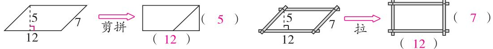

text_image

5
12
7
剪拼
(12)
(5)
5
12
7
拉
(12)
(7)

2. 一个平行四边形的底是 $8 \mathrm{~cm}$ , 高是 $6 \mathrm{~cm}$ , 它的面积是 $(48 \mathrm{~cm}^{2})$ , 与它等底等高的三角形的面积是 $(24 \mathrm{~cm}^{2})$ 。

3. 一个梯形的面积是9.6平方分米, 上底是5分米, 高是3分米, 下底是(1.4)分米。

4. 如图, 长方形的面积是 $72 \, cm^{2}$ , 则平行四边形的面积是 (72) $cm^{2}$ , 三角形的面积是 (36) $cm^{2}$ , 梯形的面积是 (36) $cm^{2}$ 。

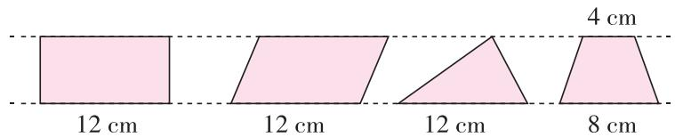

text_image

12 cm
12 cm
12 cm
8 cm
4 cm

5.（易错题·方法误用）如图，方格纸中有4个图形。（每个小方格的面积表示 $1\ cm^{2}$ ）

(1)在这4个图形中，(①)号图形和(④)号图形的面积相等。

(2)从这4个图形中选择3个,拼成一个平行四边形,它们是(①)、(②)和(③)号图形。拼成的平行四边形的面积是(54)cm²。

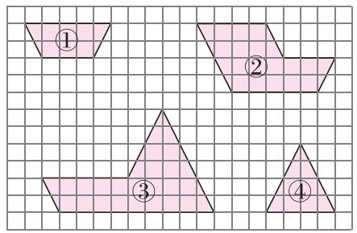

text_image

Geometric diagram showing four labeled triangles on a grid background, with shaded regions and numbered labels ① to ④.

第5题图

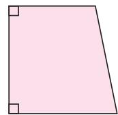  
第6题图

6. 如图, 一个直角梯形的下底是 $10 \mathrm{~cm}$ , 如果把上底增加 $2 \mathrm{~cm}$ , 它就变成了一个正方形, 这个直角梯形的面积是 (90) $\mathrm{cm}^{2}$ 。

7. 平行四边形 ABCD 的底是 10 cm, 高是 4.9 cm (如图)。长方形 AEDF 的面积是 (49) cm²。

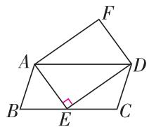  
第7题图

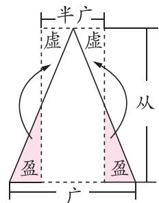  
第8题图

8. (情境题·文化情境)中国古代数学名著《九章算术》中记载了三角形的面积计算方法是“半广以乘正从”(如图)。如果三角形的底是10厘米,高是12厘米,那么转化成的长方形的长是(12)厘米,宽是(5)厘米,面积是(60)平方厘米。

# 二、选择。(把正确答案的字母填在括号里)(每题2分,共16分)

1. 求如图所示的三角形面积, 下列算式正确的是 ( A )。

A. $ab \div 2$

B. $ac \div 2$

C. hc

D. $hb \div 2$

2. 如图, 甲、乙两个梯形的面积相等, 那么梯形乙的上底为 ( A )。

A.3.7 厘米

B.2.6 厘米

C. 4 厘米

D. 无法确定

3. 下面是四种估算叶子面积的方法, 每个小方格的面积都表示 $1 \, cm^{2}$ , 不合理的是 (D)。

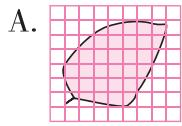  
不满一格的按半格计算, $S=27\ cm^{2}$

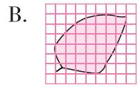  
超过半格算一格, 不到半格忽略不计, $S=31\ cm^{2}$

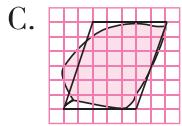  
看作近似的平行四边形, $S = 30 \mathrm{~cm}^{2}$

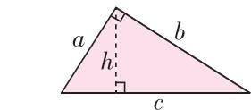

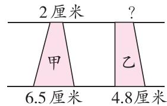

  
看作近似的长方形, $S = 42 \mathrm{~cm}^{2}$

4. 如图,要计算虚线右边图形的面积,下面方法中正确的有( C )。

  
A.①②③

  
B.①③

  
C. ②③

  
D.①②

5. 下面( C )中涂色部分的面积与其他涂色部分的面积不相等。

6. 图中①号阴影部分的面积和②号阴影部分的面积相比较，( C )。

A. ①号阴影部分的面积大

B. ②号阴影部分的面积大

C. 一样大

D. 无法确定

  
第6题图

  
第7题图

第8题图  

7. 如图, a = 2b, 梯形的面积是三角形面积的( B )。

A.6倍

B.5 倍

C. 4 倍

D. 3 倍

8. (名校期末真题) 将等腰三角形 ABC 沿虚线对折, 折下来的部分恰好拼成了一个长方形(如图)。已知三角形 ABC 的底是 6 cm, 高是 4 cm, 图中涂色部分的面积是 (A) cm²。

A. 3

B. 6

C. 12

D. 24

# 三、计算下面图形的面积。(每题4分,共12分)

1.

2.

7. $1 \times 3 \div 2 = 10.65(\mathrm{cm}^2)$

4. $5 \times 2 = 9(\mathrm{cm}^2)$

(5+8)×4÷2+(6-4+6)×5÷2=

$46(\mathrm{m}^{2})$ （方法不唯一）

# 四、按要求做题。(共18分)

1. 在下面的格子图中分别画一个面积与长方形面积相等的平行四边形、三角形和梯形，并标出各图形的相关数据。（每个小方格的面积表示 $1 \, cm^{2}$ ）(9 分)

text_image

3
4
3
8
5

2.（名校期末真题）下面是四位同学在进行梯形面积计算公式推导过程中想到的方法。

text_image

小晴（√）
2 cm
4 cm
6 cm
6 × 4 ÷ 2 = 12 (cm²)
2 × 4 ÷ 2 = 4 (cm²)
12 + 4 = 16 (cm²)

text_image

小飞（√）
2 cm
4 cm
中点 中点
6 cm
4 ÷ 2 = 2 (cm²)
(6 + 2) × 2 = 16 (cm²)

text_image

小雨（√）
2 cm
4 cm
中点 中点
6 cm
4 × 2 × 2 = 16 (cm²)

text_image

小涵（√）
2 cm 6 cm
4 cm
6 cm 2 cm
(2 + 6) × 4 = 32 (cm²)
32 ÷ 2 = 16 (cm²)

(1)你认为哪些同学的方法是正确的？在题目中名字后面的（ ）里画“√”。(4分)  
(2)任选一位同学的方法说明思路。(5分)

我要解释说明的是(小飞)的方法: 把一个梯形剪成高相等的两个梯形, 再拼成一个平行四边形, 拼成的平行四边形的底等于梯形上下底的和, 高等于原梯形高的一半, 平行四边形的面积 = 底 × 高, 即平行四边形的面积 = 梯形上下底的和 × 梯形的高 ÷ 2, 故梯形的面积 = 上下底的和 × 高 ÷ 2, 即梯形的面积 = (上底 + 下底) × 高 ÷ 2。

# 五、解决问题。(共33分)

# 校园建设

1. 学校的阅览室是平行四边形, 现要为阅览室地面铺瓷砖, 瓷砖选用边长是 80 厘米的方砖。如图是工人师傅已贴好的部分瓷砖, 若每平方米要付 150 元工钱, 则贴完瓷砖一共需要付多少工钱? (6 分)

80 厘米 = 0.8 米

底: $9 \times 0.8 = 7.2$ （米） 高: $6 \times 0.8 = 4.8$ （米）

$7.2 \times 4.8 \times 150 = 5184$ （元）

答:一共需要付 5184 元工钱。

2. 学校要在校园内规划一些停车位,以其中一块长方形用地规划为例,为了方便车辆进出,每个停车位都设计为大小相同的平行四边形。左右空余部分作为绿地,如图所示。

(1)每个停车位的面积是多少平方米？(4分)

$$
3 \times 6 = 1 8 \left(\mathrm{m} ^ {2}\right)
$$

答:每个停车位的面积是 $18 \, m^{2}$ 。

(2)铺设绿地面积的总和是多少平方米？(5分)

$$
2 \times 6 \div 2 + (4 + 6 + 4) \times 2 \div 2 = 2 0 \left(\mathrm{m} ^ {2}\right)
$$

答:铺设绿地面积的总和是 $20 \, m^{2}$ 。

text_image

2 m
绿地
6 m
行车道
3 m
停车位
停车位
停车位
停车位
绿地
4 m
2 m

3. 学校将原来正方形草坪的一条边缩短 12 m, 另一条边延长 26 m (如图), 现在梯形草坪下底的长度是上底的 3 倍。改造后的梯形草坪面积是多少平方米? (7 分)

上底: $(26+12)\div(3-1)=19(m)$

下底: $19 \times 3 = 57$ (m)

高: $19 + 12 = 31 \, (\text{m})$

面积: $(19+57)\times31\div2=1178(m^{2})$ 或 $19\times(3+1)\times31\div2=1178(m^{2})$

答:改造后的梯形草坪面积是 $1178 \, m^{2}$ 。

text_image

12 m
26 m

4. 学校新建游泳馆即将投入使用,从入校大门到游泳馆,急需一块指示牌(如图)。五年级学生张慧想到这学期刚学习了多边形的面积,正好验证一下能否学有所用,便自愿申请制作游泳馆指示牌(指示牌要求用整块 KT 板制作,不可拼接)。

(1) 张慧找到 A、B、C、D 四块 KT 板, 请你帮她选一块来制作指示牌, 你想选哪一块? 说明理由。(5 分)

text_image

A
30 cm
30 cm

选 KT 板 B 进行制作指示牌。因为指示牌的总长度为 $20 + 10 = 30 \, (\text{cm})$ ，宽度为 $20 \, cm$ ，所以选用 KT 板 B 比较合适，不浪费。（答案不唯一）

(2)用所选的这块 KT 板制成指示牌,损耗面积是多少? (提示:可以在所选图中画指示牌的草图,再列式计算)(6 分)

草图略

$$
3 0 \times 2 0 - (1 0 \times 2 0 + 1 0 \times 2 0 \div 2) = 3 0 0 (\mathrm{cm} ^ {2})
$$

答:损耗面积是 $300 \, cm^{2}$ 。

# 附加题。(共10分)

(1)如图1,在这个梯形里一共有(3)对面积相等的三角形。(2分)  
(2)三角形 AOD 和三角形 BOC 这两个三角形面积相等的理由是: (因为三角形 ABD 和三角形 ABC 的面积相等, 所以同时减去三角形 AOB 的面积, 结果也相等)。(3 分)  
(3)请你用从中得到的启示,算一算,图2中,甲的面积比乙的面积少多少平方厘米?(5分)

$5 \times 2 \div 2 - 3 \times 2 \div 2 = 2$ (平方厘米)

答:甲的面积比乙的面积少2平方厘米。

  
图1

  
图2

# 第七单元测评卷

时间:60 分钟 满分:100 + 10 分

一、填空。(每空2分,共18分)

1. 一条马路长 400 m, 在路的一旁每隔 20 m 栽一棵树, 若两端都栽, 一共要栽 (21) 棵树; 若两端都不栽, 一共要栽 (19) 棵树; 若一端栽, 一端不栽, 一共要栽 (20) 棵树。  
2. 在小路的一侧插彩旗,每隔 5 米插一面,两端都要插,正好一共插了 20 面彩旗,这条小路长 (95) 米。  
3. 在一条道路的一旁每隔 18 米安装一盏路灯(一端安装, 一端不安装), 共安装了 90 盏路灯, 这条道路全长(1620)米。  
4. 圆形滑冰场的周长为 $400 \, m$ ，每隔 $20 \, m$ 设置一个安全员，共需要（20）个安全员。  
5. 明明爬楼梯,从一楼爬到三楼用了 60 秒,照这样的速度,他从一楼爬到六楼一共需要 (150) 秒。  
6. 五年级共有 49 名学生参加运动会开幕式,他们排成一个方阵,这个方阵的最外层一共有 (24) 名学生。  
7. (易错题·方法误用)20名同学坐在老师画好的圆形场地外围玩“丢手绢”的游戏。刚开始的时候,每相邻两人之间的距离是2米。玩了一会儿后,有12名同学被淘汰,剩下的同学继续玩,在不改变圆形场地的大小且每相邻两人之间的距离依旧相等的情况下,每相邻两人之间的距离应该改为(5)米。

二、选择。(把正确答案的字母填在括号里)(每题2分,共12分)

1. 在一个圆形跑道的外侧,每隔 $10 \, m$ 插一面彩旗,一共插了 40 面彩旗,跑道的外侧周长是( A )m。

A. 400

B. 410

C. 390

2. 红领巾公园内有一条林荫大道全长 800 米, 在它的一侧从头到尾等距离地放着 21 个垃圾桶, 每相邻两个垃圾桶之间相距 ( A ) 米。

A. 40

B. 38

C. 36

3. 每相邻两盏路灯之间的距离是 15 m, 丽丽从第 1 盏路灯走到第 10 盏路灯, 共走了 ( C ) m。

A. 150

B. 120

C. 135

4. 王师傅把一根长 10 m 的铝合金切割成 5 段, 如果每次切割损耗铝合金 3 mm, 那么切割完这根铝合金会损耗( A )。

A. 12 mm

B. 15 mm

C. 18 mm

5. 一段公路长 3600 m, 在公路两旁每隔 9 m 栽一棵梧桐树 (两端都不栽), 共栽梧桐树 ( B ) 棵。

A. 802

B. 798

C. 399

6. 小宝发热住院,医生每隔 3 小时给他量一次体温,第 4 次量体温正好是 21:00,那么第 1 次量体温是( C )。

A. 6:00

B. 9:00

C. 12:00

# 三、计算。(共27分)

1. 口算。(8 分)

$2.5 \times 4 = 10$

$0.25 \times 0.4 = 0.1$

8 - 2.19 = 5.81

15.36 + 7.3 = 22.66

56.8 ÷ 8 = 7.1

$18 \div 0.6 = 30$

$5.6 \times 20 = 112$

$54 \div 1.8 = 30$

2. 列竖式计算, 带☆的要验算。(10 分)(竖式及验算略)

$4.5 \times 0.72 = 3.24$

6.05×0.96≈5.81

☆6.3÷0.42=15

(得数保留两位小数)

3. 解方程。(9 分)(过程略)

3. $8x + x = 6$

$x \div 4.9 = 12$

$(x + 2.5) \times 2.8 = 14$

x = 1.25

$x = 58.8$

$x = 2.5$

四、国庆节到了,同学们在边长是4米的正方形升旗台的四周摆上花盆,间隔是1米,请你按照下面的方法摆一摆。(每题4分,共8分)

1.

共（16）盆，每边（5）盆。

2.

共（16）盆，每边（4）盆。

五、解决问题。(共35分)

1. 某路公交车行驶路线全长 18 km, 相邻两站之间的距离都是 1 km, 往返这条路线要设置多少个站牌? (起点和终点都设置站牌) (5 分)

$$
\begin{array}{l} 1 8 \div 1 + 1 = 1 9 (\text {   个   }) \\ 1 9 \times 2 = 3 8 (\text {   个   }) \\ \end{array}
$$

答:往返这条路线要设置38个站牌。

2. 鑫源小区物业要在相距 72 米的两幢楼房之间种两排桂花树, 共 16 棵。如果两头都不栽, 平均每相邻两棵树之间的距离应是多少米? (5 分)

$$
7 2 \div (1 6 \div 2 + 1) = 8 (\text {米})
$$

答: 平均每相邻两棵树之间的距离应是 8 米。

3. 一条笔直的公路的一边每隔 7 米有一棵槐树, 芳芳乘电车从第一棵树开始数, 3 分钟后正好数到第 151 棵, 电车的速度是多少? (5 分)

$$
7 \times (1 5 1 - 1) \div 3 = 3 5 0 (\text {米/分})
$$

答:电车的速度是 350 米/分。

4. 一个人工湖的周长是 $150 \mathrm{~m}$ , 在它的周围每隔 $6 \mathrm{~m}$ 栽一棵柳树。再在相邻的两棵柳树之间每隔 $2 \mathrm{~m}$ 栽一棵樱花树, 一共栽了多少棵樱花树? (5 分)

$$
1 5 0 \div 6 = 2 5 \quad 6 \div 2 = 3
$$

3 - 1 = 2(棵) $25 \times 2 = 50$ (棵)

答:一共栽了50棵樱花树。

5.(探究题·思考过程)阅读下面的材料,回答问题。

五(1)班同学要在长300米的道路两旁,每隔5米栽一棵树。

老师问：“哪位同学能告诉老师，我们需要准备多少棵树？”

唐璐不假思索地说：“122棵。”

康康认真地说：“120 棵。”

小萱不太确定地说：“118棵。”

老师说：“你们说得都对。”

(1)为什么三个人说的结果各不相同？(3分)

因为三个人所用的植树方式不同。

(2)唐璐所选择的植树方式为( B ),康康所选择的植树方式为( C ),小萱所选择的植树方式为( A )。(3分)

A. 两端都不栽

B. 两端都栽

C. 只栽一端

(3)如果按照唐璐所选择的植树方式,那么要在长150米的道路两旁,每隔3米栽一棵树,一共需要栽多少棵树? (4分)

$(150 \div 3 + 1) \times 2 = 102$ （棵）

答:一共需要栽 102 棵树。

6.(情境题·生活情境)乌篷船是江南地区独特的交通工具,在一条河上有4只乌篷船在水中行驶(如图),每相邻两只船之间相隔6米,船长5米。从第一只船的船头到最后一只船的船尾,一共有多少米?(5分)

$$
6 \times (4 - 1) + 5 \times 4 = 3 8 (\text {   米   })
$$

答:从第一只船的船头到最后一只船的船尾,一共有38米。

text_image

?米

附加题。(共10分)

同学们用花盆摆出下面的图形,每隔5分米摆一盆,两个交点处各摆一盆,每一个圆的周长都是12米,一共需要摆多少盆花?

5 分米 = 0.5 米

$$
1 2 \div 0. 5 \times 2 - 2 = 4 6 (\text { 盆 })
$$

答:一共需要摆 46 盆花。

# 期末综合测评卷（一）

时间:70 分钟 满分:100 + 10 分

一、填空。（第9题2分，其余每空1分，共19分）

$$
\begin{array}{r} 1. 3 \\ 1 4 \overline {{) 1 8 . 2}} \end{array}
$$

1. 右图除法笔算过程中的“42”表示 42 个(十)分之一。

$$
\begin{array}{c} 1 \text {4} \\ \hline 4 \text {2} \end{array}
$$

2.3.48×5.23 的积是(四)位小数;7.8÷12 的商是(两)位小数。

$$
\begin{array}{c} 4 \text {2} \\ \hline 0 \end{array}
$$

3.0.69,0.69,0.69,0.96这四个数中,最大的数是(0.96),最小的数是(0.69)。

4. 要把 80 个石榴分装在盒子里, 每盒装 6 个, 装了 a 盒后还剩 (80 - 6a) 个。当 a = 12 时, 还剩 (8) 个。

5. 在○里填上“＞”“＜”或“＝”。

2.2020 × 1.8 > 2.2020

10.23 × 0.99 < 10.23

2.3 ÷ 0.3 > 2.3

6. 在一组平行线间, 有一个三角形和一个平行四边形(如图)。如果三角形 ABC 的面积是 25 平方分米, 平行四边形 DBCF 的面积是 (50) 平方分米。

7. (情境题·生活情境)包粽子时会用到一种食品级棉线。某食品店有一款包粽子用的棉线，每捆棉线长25米,如果包一个粽子需要0.6米棉线,那么这捆棉线最多可以包(41)个粽子。

8. 某停车场收费标准如下: 1 小时内 (含 1 小时), 每 30 分钟 (不足 30 分钟按 30 分钟收费) 收费 2.5 元; 超过 1 小时, 超过的时间每 30 分钟 (不足 30 分钟按 30 分钟收费) 收费 1.5 元。爸爸停车 2 小时, 应交停车费 (8) 元。

9. (名校期末真题)校园有一块正方形的空地,想栽种不同植物。有种设计方案如图:由中心的小正方形和四周4个完全相同的三角形组成了一个风车形状。若在4个三角形的空地上种月季花,面积是(96)平方米。

20米

10. 我们已经知道一个三角形的内角和是 $180^{\circ}$ 。如图所示的五边形可以分成（3）个三角形，它的内角和是（540）°。用同样的方法，一个 $n$ 边形可以分成（ $n - 2$ ）个三角形，它的内角和是（ $180 \times (n - 2)$ ）°。

# 二、选择。（把正确答案的字母填在括号里）（每题2分，共10分）

1. 两个因数的积保留两位小数约是 2.64, 这个积不可能是 ( C )。

A. 2.635

B. 2.641

C. 2.645

D. 2.6449

2. 下面说法正确的有( B )句。

①与自然数 m 相邻的两个自然数分别是 $(m+1)$ 和 $(m+2)$ 。  
②点 $A(4,3)$ 与点 $B(8,3)$ 在同一行上。  
③一个平行四边形的底增加 2 cm, 对应的高减少 2 cm, 面积保持不变。  
④一根木头锯成3段需要12分钟,锯成5段需要20分钟。

A. 0

B.1

C. 2

D. 3

3. 阳光公园儿童游乐区将推出一些比赛活动,获奖者将会获得定制奖章,奖章的正面如图所示(每个小方格的边长都是1 cm),下面估算方法中最接近精确结果的是(B)。

A. 可以把奖章正面估计为边长是 $4 \mathrm{~cm}$ 的正方形, 所以面积是 $16 \mathrm{~cm}^{2}$   
B. 将奖章看作近似的三角形, 底和高都是 $4 \, cm$ , 所以面积是 $8 \, cm^{2}$   
C. 奖章图案是轴对称图形, 图形左边大约占 6 格, 是 $6 \mathrm{~cm}^{2}$ , 所以面积是 $12 \mathrm{~cm}^{2}$   
D. 方格纸的面积是 $36 \, cm^{2}$ ，奖章正面的面积大约占方格纸面积的一半，所以面积是 $18 \, cm^{2}$

4. 从东单路口到王府井路口道路一侧有 12 座华灯,每隔 50 米建一座,且路口处均建有华灯。那么东单路口到王府井路口的距离是( C )米。

A. 250

B. 500

C. 550

D. 600

5. (大单元关联)本学期我们利用“转化”的方法解决了许多问题,下面做法正确的有( C )。

  
①

  
②

  
③

  
④

A. ②③④

B.①②③

C.①②④

D.①②③④

# 三、计算。(共36分)

1. 口算。(8 分)

4.6÷0.2=23

$30 \times 2.5 = 75$

$4.7 \times 0.2 = 0.94$

8. $1 \div 9 \times 0.3 = 0.27$

1. $25 \times 10 = 12.5$

0.28 ÷ 0.7 = 0.4

0.1 × 2.7 = 0.27

0.48 ÷ 0.6 = 0.8

2. 列竖式计算, 带☆的要验算。(10 分)(竖式及验算略)

3.8×0.72≈2.74

☆2.346÷0.23=10.2

1. $25 \div 2.3 \approx 0.54$

(得数保留两位小数)

(得数保留两位小数)

3. 下面各题, 怎样算简便就怎样算。(9 分)

$101 \times 3.79 - 3.79$

3.8×11-3.8

9.05 - 24.12 ÷ 3.6

$= (101 - 1) \times 3.79$

$= 3.8 \times (11 - 1)$

=9.05 - 6.7

$= 100 \times 3.79$

=3.8×10

=2.35

=379

= 38

4. 解方程。(9 分)(过程略)

$x + 0.25x = 1.5$

30 - 2x = 3.4

(3x-2)÷5=36.2

$x = 1.2$

$x = 13.3$

$x = 61$

四、现在有五个装有小球的盒子,规定每次只能摸出一个球。把摸到蓝球的可能性的大小分成 A、B、C、D、E 五个等级,如图所示。请根据信息把字母填在相应的括号里。(共 5 分)

( E )

( D )

( C )

( B )

( A )

A

B

C

D

E

五、图 A 是某校各班级在礼堂里的位置图。(共 5 分)

第5行
第4行
第3行
第2行
第1行

第1列

第2列

第3列

第4列

图B

图A

1. 根据图 A 中各个班级在礼堂里的位置, 请在图 B 中, 用 ▲ 标出一(1)班的位置, 用 ★ 标出四(3)班的位置, 用 ● 标出五(2)班的位置。(3 分)图略  
2. 若某班的位置用数对表示是 $(3, x)$ , 则可能是哪个班? (写出所有可能的情况) (2 分)

有 5 种可能的情况, 分别是一(3)班、二(2)班、三(2)班、五(1)班、六(1)班。

六、解决问题。(共25分)

春节是中华传统文化中最重要的节日之一,跨越千山万水人们也会回家与家人一同庆祝。为了应对春运的挑战,我国各级政府和交通部门会采取一系列措施,确保人们能够顺利、安全地回家。春节期间人们会在家中进行各种活动,如贴对联、制作年夜饭等,商场也会进行装饰,烘托节日的气氛。

1. 春运期间,某省高速公路对大约 0.16 亿辆小客车减免收费。若平均每辆小客车减免 43 元,则该省高速公路对小客车减免收费的金额一共约有多少亿元? (5 分)

$43 \times 0.16 = 6.88$ （亿元）

答:该省高速公路对小客车减免收费的金额一共约有6.88亿元。

2. 已知 A 市机场春运期间发送旅客 30.1 万人次, 比 B 市的 2.5 倍少 0.9 万人次。B 市机场春运期间发送旅客多少万人次? (列方程解答) (5 分)

解: 设 B 市机场春运期间发送旅客 x 万人次。

$$
2. 5 x - 0. 9 = 3 0. 1
$$

$$
x = 1 2. 4
$$

答: B 市机场春运期间发送旅客 12.4 万人次。

3. 为了烘托节日的气氛,宏泰商场装饰了一面气球墙,是一个等腰梯形(如图)。从这面气球墙上选了一个面积最大的平行四边形装饰红色气球,剩余部分装饰金色气球。请你当设计师,先在图中画出你设计的面积最大的平行四边形,并求出装饰金色气球的面积是多少平方米。(5 分)

画图不唯一,如:

$$
(8 - 5) \times 4 \div 2 = 6 (\mathrm{m} ^ {2})
$$

答:装饰金色气球的面积是 $6 \, m^{2}$ 。

4. 每到过年, 家家户户都会在窗户上贴漂亮的窗花。芳芳、红红和军军剪窗花时, 三个人在讨论下面的问题。

一张边长为 $4 \, cm$ 的正方形红纸,从相邻两边的中点连一条线段,沿着这条线段剪去一个角(如图),剩下的面积是多少平方厘米?下面是三个人的解答方法。

$$
4 \times 4 - 2 \times 2 \div 2 = 1 4 \left(\mathrm{cm} ^ {2}\right)
$$

$$
4 \times 2 + (2 + 4) \times 2 \div 2 = 1 4 \left(\mathrm{cm} ^ {2}\right)
$$

芳芳（√）

$$
(2 + 4) \times 4 \div 2 + 2 \times 2 \div 2 = 1 4 (\mathrm{cm} ^ {2})
$$

红红（√）

军军（√）

(1)请在你认为方法正确的同学名字后面的括号里画“√”。(2分)  
(2)请选择一个你认为正确的同学的解法,解释解题思路。(3分)

我选择芳芳的解法,从正方形中剪去一个等腰直角三角形,剩下的面积 = 正方形的面积 - 剪去的三角形的面积。正方形的面积是 $4 \times 4 = 16 \, (\text{cm}^2)$ , 剪去的三角形的两条直角边长都是 2 cm, 剪去的三角形的面积是 $2 \times 2 \div 2 = 2 \, (\text{cm}^2)$ , 所以剩下的面积 = 16 - 2 = 14 ( $cm^2$ )。(答案不唯一,言之有理即可)

5. 菲菲、齐齐和书法小组的同学相约在腊月二十六一起上街义务写春联。他们打算先买4瓶墨汁,然后用剩下的钱买红纸,你知道剩下的钱可以买多少张红纸吗? (5分)

$(180-4\times4.5)\div2.2\approx73$ （张）

答:剩下的钱可以买 73 张红纸。

  
菲菲

我们计划用180元购买红纸和墨汁。

  
2.2元/张

  
4.5元/瓶

附加题。(共10分)

某学校举行长跑比赛。运动员跑到离起点5千米的返回点处再返回到起点。已知领先的运动员每分钟跑320米，最后的运动员每分钟跑305米，起跑多少分钟后这两名运动员相遇？相遇时离返回点有多少米？

解: 设起跑 x 分钟后这两名运动员相遇。

5 千米 = 5000 米

$$
3 2 0 x + 3 0 5 x = 5 0 0 0 \times 2
$$

$$
x = 1 6
$$

$$
3 2 0 \times 1 6 - 5 0 0 0 = 1 2 0 (\text {   米   })
$$

答:起跑 16 分钟后这两名运动员相遇,相遇时离返回点有 120 米。

# 期末综合测评卷（二）

时间:70 分钟 满分:100 + 10 分

# 一、填空。(每空1分,共16分)

1.9.4÷6的商用循环小数表示为(1.56)，商精确到百分位约是(1.57)。  
2. 苹果和梨的价格分别是 5 元/千克和 3.8 元/千克, 买 x 千克苹果和 y 千克梨, 共需 ( $5x + 3.8y$ ) 元; 当 x = 5, y = 3 时, 共需 (36.4) 元。  
3. 根据 $125 \times 26 = 3250$ ，直接写出下列算式的结果。

$$
1. 2 5 \times 2. 6 = (3. 2 5)
$$

$$
1 2. 5 \times 2 6 0 = (3 2 5 0)
$$

$$
3. 2 5 \div 2. 6 = (1. 2 5)
$$

4. 妈妈准备买 2 袋调味料、1 瓶酱油和 4 块香皂, 30 元钱够吗? 估一估。(够)(填“够”或“不够”), 你估算的过程是( $2 \times 3 + 5 + 4 \times 4 = 27$ (元), 27 < 30 )。

<table><tr><td>生活用品</td><td>调味料</td><td>酱油</td><td>香皂</td></tr><tr><td>价格</td><td>2.8元/袋</td><td>4.6元/瓶</td><td>3.7元/块</td></tr></table>

5. 右图中每个小方格的面积是 1 平方米, 估算一下, 这个图形的面积大约是 (33) 平方米。  
6. 育才学校有一条长 160 米的主干道, 在两边每隔 20 米安装了一盏太阳能路灯 (两端不安装), 一共安装了 (14) 盏路灯。在每相邻两盏路灯之间栽了 2 棵香樟树, 一共栽了 (24) 棵香樟树。  
7. 王东和李阳用转盘(如图)玩游戏,转盘指针指向的数大于10算王东获胜,否则算李阳获胜。在A、B处填上合适的数(不与转盘上的数相同),要使这个游戏对双方都公平,A处可以填(14),B处可以填(13)。

  
第7题图

  
第8题图

  
第9题图

8. 在一个 400 米长的环形跑道上, 甲、乙两人相距 100 米(如图), 甲每分钟走 50 米, 乙每分钟走 60 米。如果两人同时沿顺时针方向走, 那么经过 (10) 分钟乙第一次追上甲。  
9. 如图是一座由多个小三角形一层一层堆积而成的“金字塔”。从上往下第一层是1个小三角形,第二层是3个小三角形,以此类推。图中小三角形的个数一般可以这样算:三角形总个数=（最上层个数+最下层个数）×层数÷2。图中共有(25)个三角形。

# 二、选择。(把正确答案的字母填在括号里)(每题2分,共10分)

1. 每本词典 17.5 元, 100 元最多可以买( B )本。

A. 4

B. 5

C. 6

D. 7

2. 如果采用节水刷牙的方式,一个四口之家按每人每天刷牙两次算,那么每天可节水 (D) 升。

如果刷牙时不间断放水，刷一次牙大约用水6升。如果用漱口杯接水刷牙，刷一次牙需要用水约0.6升。

A.5.4

B. 10.8

C. 21.6

D. 43.2

3. (大单元关联) 以下几个问题, 不能用 $2(a + 6)$ 解决的是 (A)。

C. 用两个完全一样的直角梯形拼成一个等腰梯形, 这个等腰梯形的面积是多少平方厘米?

D. 用①②③三个图形拼成一个平行四边形, 这个平行四边形的面积是多少平方厘米?

4. 把一张梯形纸片剪拼成一个平行四边形(如图), 下面的说法错误的是(B)。

A. 平行四边形的面积一定等于梯形的面积  
B. 平行四边形的周长一定等于梯形的周长  
C. 平行四边形的底是梯形上底、下底之和  
D. 平行四边形的高是梯形高的一半

5. 甲、乙两艘轮船同时从 A 地出发开往 B 地。经过 16 小时后, 甲船落后乙船 72 千米。要解决 “甲船每小时行驶多少千米?” 这个问题, 还应从下面的选项中选择一个信息是 ( B )。

text_image

A地
甲
乙
72 km
B地

A. $A$ 地到 $B$ 地一共有1290千米  
C. 乙船还剩 138 千米到达 B 地

B. 乙船每小时行驶 34.5 千米

D. 甲船还剩 4 小时到达 B 地

# 三、计算。(共36分)

1. 口算。(8 分)

$$
5. 8 \times 2 = 1 1. 6
$$

$$
6. 8 \div 4 = 1. 7
$$

$$
0. 2 8 + 0. 7 2 = 1
$$

$$
5 x + 3 x = 8 x
$$

$$
0 \div 0. 9 9 8 = 0
$$

$$
2 4 \div 1 0 0 + 0. 7 6 = 1
$$

$$
5 0 \times 0. 0 7 = 3. 5
$$

$$
9 \div 6 = 1. 5
$$

2. 列竖式计算, 带☆的要验算。(10 分)(竖式及验算略)

$$
6 5. 3 \times 0. 7 3 = 4 7. 6 6 9
$$

$$
\star 9. 2 5 \div 7. 4 = 1. 2 5
$$

$$
1 2. 8 5 \div 3. 5 \approx 3. 7
$$

(得数保留一位小数)

3. 下面各题, 怎样算简便就怎样算。(9 分)

$$
\begin{array}{l} 0. 2 5 \times 7. 5 8 \times 0. 0 4 \\ 4. 3 7 \times 3. 5 + 4. 3 7 \times 6. 5 \\ (6. 0 2 \times 5 - 3. 1) \div 4. 5 \\ = 0. 2 5 \times 0. 0 4 \times 7. 5 8 \\ = 4. 3 7 \times (3. 5 + 6. 5) \\ = (3 0. 1 - 3. 1) \div 4. 5 \\ = 0. 0 1 \times 7. 5 8 \\ = 4. 3 7 \times 1 0 \\ = 2 7 \div 4. 5 \\ = 0. 0 7 5 8 \\ = 4 3. 7 \\ = 6 \\ \end{array}
$$

4. 解方程。(9 分)(过程略)

$$
x \div 4. 8 = 0. 4
$$

$$
3. 5 x - x = 1. 6
$$

$$
2 (1. 8 + x) = 6. 1 4
$$

$$
x = 1. 9 2
$$

$$
x = 0. 6 4
$$

$$
x = 1. 2 7
$$

# 四、动手操作。(共11分)

1. (新题型)东东在计算右图的面积时,列出了算式“ $30 \times 12 + (9 + 30) \times (20 - 12) \div 2$ ”,请你判断,图(B)可以表示东东的思路。

  
A

  
B

  
C

  
D

用图 C 的方法应该列出的算式是: $(30 \times 20 - (30 - 9) \times (20 - 12) \div 2)$ 。(不计算)(5 分)

2. 如图, 每个小方格的边长是 $1 \, m$ 。

(1)下面的三个点中,离 B 点(5,1)最近的点是(②)。(填序号)
(2 分)

①(4,2)

②(6,1)

③(6,2)

(2)以线段 AB 为底,在方格图中画一个平行四边形,使它的面积是 $12 \, m^{2}$ 。(2 分)

(3)以线段 $AB$ 为底,在(2)中所画平行四边形内画一个最大的三角形 $ABC$ 。(要在图中标出 $C$ 点)(2分)

line

| Point | X | Y |
|---|---|---|
| A | 1 | 1 |
| B | 5 | 1 |
| C | 4 | 4 |
| (Top) | 2 | 4 |
| (Bottom) | 6 | 4 |

# 五、(名校期末真题)解决问题。(共27分)

“柑”甜来袭！小雪与大雪两个节气之间，三垟湿地内的瓯柑已采摘上市了！瓯柑集市上，除了瓯柑鲜果，还汇聚了温州各地美食与特产，温州大馄饨、永嘉的番薯干……赶“集”的市民在品尝美食的同时还能观赏捏糖人、画糖画等非遗表演，人气高涨。

1. 一揉、一捏、一拉、一吹之间，惟妙惟肖的糖人，瞬间唤醒了一个时代的记忆和欢愉。王师傅捏吹一个糖人需要 $15 \mathrm{~g}$ 麦芽糖，他准备了 $867 \mathrm{~g}$ 麦芽糖，最多能捏多少个糖人？（5 分）

$$
8 6 7 \div 1 5 \approx 5 7 (\text { 个 })
$$

答:最多能捏 57 个糖人。

2. 集市上瓯柑有促销活动, 原价每箱 192 元, 现价每箱 180 元。原来买 30 箱瓯柑的钱, 现在可以买多少箱? (5 分)

$$
1 9 2 \times 3 0 \div 1 8 0 = 3 2 (\text {箱})
$$

答:现在可以买 32 箱。

3. 欢欢和乐乐去赶“集”，他们同时从家步行出发，经过 0.5 小时后两人正好在三垟湿地门口相遇。欢欢每小时行 4 km。

text_image

乐乐家
欢欢家
三垟湿地

(1)结合上面线段图分析，( 乐乐 )的平均速度快。(填“欢欢”或“乐乐”)(1分)  
(2) 如果设乐乐平均每小时行 $x \mathrm{~km}$ , 将下面的问题和式子用线连接起来。(3 分)

乐乐家到三垟湿地有多少千米？

乐乐家距离欢欢家有多少千米？

欢欢和乐乐一共步行了多少千米？

(3)如果欢欢家和乐乐家相距0.6 km, 乐乐平均每小时行多少千米? (3分)

解:设乐乐平均每小时行 x km。

$$
\begin{array}{l} 0. 5 x - 4 \times 0. 5 = 0. 6 \\ x = 5. 2 \\ \end{array}
$$

答: 乐乐平均每小时行 5.2 千米。

4. 画糖画的小铺旁有一张不规则的收银桌(如图), 它的桌面面积是多少平方分米? (5 分)

(1) 芳芳是这样计算的: $8 \times 2 + (8 + 2) \times (8 - 2) \div 2$ , 选项(B)符合芳芳的想法。

  
A

  
B

  
C

  
D

(2)在第(1)题剩下的三个选项中,选一种你喜欢的方法进行计算。我选择(A),我是这样算的:

$$
(2 + 8) \times 8 \div 2 + 2 \times (8 - 2) \div 2 = 4 6 (\mathrm{dm} ^ {2})
$$

答:它的桌面面积是 $46 \, dm^{2}$ 。

5. 王阿姨逛完集市后坐出租车回家,集市离她家有6.3千米,请问王阿姨需要付多少钱? (5分)

6.3 - 3 = 3.3 (千米)

不足 1 千米的, 按 1 千米计算。

$10 + 4 \times 1.5 = 16$ (元)

答: 王阿姨需要付 16 元钱。

# 出租车收费标准

①3千米以内(含3千米)收费10元。  
②超过3千米部分,每千米收1.5元。  
③不足1千米的,按1千米计算。

附加题。(共10分)

如图,左边梯形和右边三角形的面积相等,三角形的底是多少?(单位:厘米)

解:设三角形的底为 x 厘米,则 BC 为 $(9 - x)$ 厘米。

$$
\begin{array}{l} (9 - x + 5) \times 4 \div 2 = x \times 4 \div 2 \\ x = 7 \\ \end{array}
$$

答:三角形的底是7厘米。

