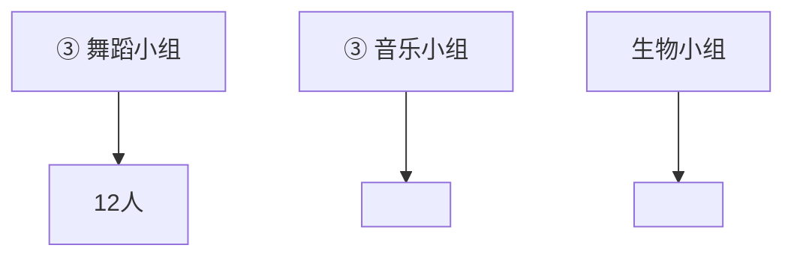

```mermaid
graph TD
    A["•"] --> B["•"]
    B --> C["•"]
    C --> D["•"]
    D --> E["•"]
    E --> F["•"]
    F --> G["•"]
    G --> H["•"]
    H --> I["•"]
    I --> J["•"]
    J --> K["•"]
    K --> L["•"]
    L --> M["•"]
    M --> N["•"]
    N --> O["•"]
    O --> P["•"]
    P --> Q["•"]
    Q --> R["•"]
    R --> S["•"]
    S --> T["•"]
    T --> U["•"]
    U --> V["•"]
    V --> W["•"]
    W --> X["•"]
    X --> Y["•"]
    Y --> Z["•"]
    Z --> A
    style A fill:#fff,stroke:#000
    style B fill:#fff,stroke:#000
    style C fill:#fff,stroke:#000
    style D fill:#fff,stroke:#000
    style E fill:#fff,stroke:#000
    style F fill:#fff,stroke:#000
    style G fill:#fff,stroke:#000
    style H fill:#fff,stroke:#000
    style I fill:#fff,stroke:#000
    style J fill:#fff,stroke:#000
    style K fill:#fff,stroke:#000
    style L fill:#fff,stroke:#000
    style M fill:#fff,stroke:#000
    style N fill:#fff,stroke:#000
    style O fill:#fff,stroke:#000
    style P fill:#fff,stroke:#000
    style Q fill:#fff,stroke:#000
    style R fill:#fff,stroke:#000
    style S fill:#fff,stroke:#000
    style T fill:#fff,stroke:#000
    style U fill:#fff,stroke:#000
    style V fill:#fff,stroke:#000
    style W fill:#fff,stroke:#000
```

# 1 分数乘整数

## 过基础关 教材知识巩固练

#### 1 看图写算式。

text_image

3/7
3/7
?

加法算式： $\frac{3}{7} +\frac{3}{7} = \frac{6}{7}$

乘法算式： $\frac{3}{7}\times2=\frac{6}{7}$

text_image

Math puzzle image showing four identical circles with shaded segments, one labeled with a question mark below.

加法算式： $\frac{3}{8} +\frac{3}{8} +\frac{3}{8} +\frac{3}{8} = \frac{3}{2}$

乘法算式： $\frac{3}{8} \times 4 = \frac{3}{2}$

#### 2 选一选。

(1) 计算 $\frac{9}{10} \times 6$ ，简便且正确的是（C）。

A. $\frac{9}{10}\times6=\frac{27}{54}\frac{54}{10}=\frac{27}{5}$

B. $\frac{9}{10}\times6=\frac{3}{10}\times\frac{2}{6}=\frac{6}{10}$

C. $\frac{9}{10} \times 6 = \frac{9 \times 6^{3}}{10} = \frac{27}{5}$

(2)根据 $\frac{5}{16} \times \frac{3}{4}$ 约分的过程, 可以知道 $\star = (\quad A)$ 。

A. 12

B. 16

C. 15

#### 3 计算。

$$
\frac {2}{1 3} \times 5 = \frac {1 0}{1 3}
$$

$$
\frac {1}{6} \times 1 0 = \frac {5}{3}
$$

$$
\frac {3}{1 9} \times 6 = \frac {1 8}{1 9}
$$

$$
\frac {5}{1 2} \times 8 = \frac {1 0}{3}
$$

$$
\frac {4}{1 1} \times 2 2 = 8
$$

$$
\frac {7}{5} \times 5 = 7
$$

$$
\frac {2}{3} \times 0 = 0
$$

$$
\frac {7}{1 8} \times 1 2 = \frac {1 4}{3}
$$

4 (教材 P6 第 3 题变情境) 春节前夕, 李叔叔用一根粗铁丝做一个棱长是 $\frac{2}{5} \mathrm{~m}$ 的正方体灯笼框架, 需要粗铁丝多少米? 做 10 个呢? (接头处忽略不计)

$$
\frac {2}{5} \times 1 2 = \frac {2 4}{5} (\mathrm{m}) \quad \frac {2 4}{5} \times 1 0 = 4 8 (\mathrm{m})
$$

答:做一个棱长是 $\frac{2}{5}$ m 的正方体灯笼框架,需要粗铁丝 $\frac{24}{5}$ m;做 10 个需要粗铁丝 48 m。

## 过能力关 核心素养提升练

5 (易错题·概念误解) 小优整理书桌时, 发现书桌有点儿不稳, 就用一张厚 $\frac{1}{6} \mathrm{~mm}$ 的牛皮纸对折三次后垫在书桌的一条腿下面, 书桌恰好放稳了。这条桌腿垫高了多少毫米?

$2 \times 2 \times 2 = 8$ （层） $\frac{1}{6} \times 8 = \frac{4}{3}$ （mm）

答:这条桌腿垫高了 $\frac{4}{3}$ mm。

视频讲解

## 过基础关 教材知识巩固练

#### 1 计算。

$$
\frac {2}{1 5} \times 3 = \frac {2}{5}
$$

$$
4 \times \frac {3}{1 1} = \frac {1 2}{1 1}
$$

$$
6 \times \frac {4}{9} = \frac {8}{3}
$$

$$
2 1 \times \frac {5}{7} = 1 5
$$

#### 2 填一填。

(1) 一袋大米重 25 kg, 2 袋大米重 (50) kg, $\frac{1}{2}$ 袋大米重 ( $\frac{25}{2}$ ) kg, $\frac{2}{5}$ 袋大米重 (10) kg。  
(2) $\frac{3}{8}$ 吨 = ( 375 ) 千克 $\frac{3}{4}$ 米 = ( $\frac{15}{2}$ ) 分米 $\frac{5}{6}$ 时 = ( 50 ) 分

#### 3 选一选。

(1)妈妈的微信钱包里有480元,在儿童节这一天,她带两个孩子去游乐园用了 $\frac{1}{5}$ ,吃饭用了 $\frac{1}{4}$ 。
算式“ $480 \times \frac{1}{5}$ ”解决的问题是(B)。

A. 剩下的钱

B. 去游乐园用的钱

C.吃饭用的钱

D. 去游乐园和吃饭一共用的钱

(2)(名校期末真题)杯子中原来盛有 $800 \, mL$ 水, 小华将杯中的水倒出一些后,情况如图所示。求从杯子中倒出了多少毫升水, 正确的列式是 ( C )。

A. $800 \times \frac{3}{5}$

B. $800 \times \frac{3}{8}$

C. $800 \times (1 - \frac{3}{8})$

D. $800 \times (1 - \frac{3}{5})$

(3) 下面的大长方形表示 3 平方米, 涂色部分表示 $\frac{3}{8}$ 平方米的是 ( C )。

视频讲解

## 过能力关 核心素养提升练

#### 4 (1) 张叔叔今天已经送了多少件快递？

$$
2 2 0 \times \frac {2}{5} = 8 8 (\text {   件   })
$$

答: 张叔叔今天已经送了 88 件快递。

今天有 220 件快递要送，我才送了 $\frac{2}{5}$ 。

张叔叔

(2) 张叔叔再送多少件, 就送了这些快递的 $\frac{3}{4}$ ?

$$
2 2 0 \times \frac {3}{4} = 1 6 5 (\text {   件   }) \quad 1 6 5 - 8 8 = 7 7 (\text {   件   })
$$

答: 张叔叔再送 77 件, 就送了这些快递的 $\frac{3}{4}$ 。

## 过基础关 教材知识巩固练

1 计算。

$$
\frac {5}{6} \times \frac {1}{3} = \frac {5}{1 8}
$$

$$
\frac {6}{5} \times \frac {4}{3} = \frac {8}{5}
$$

$$
\frac {2}{1 1} \times \frac {1}{3} = \frac {2}{3 3}
$$

$$
\frac {5}{7} \times \frac {1 4}{1 5} = \frac {2}{3}
$$

2 “数形结合”是数学中重要的思想方法,可以更加直观地表示出分数乘法的算理,请你在下面的方格中画一画,算一算 $\frac{2}{5}\times\frac{2}{3}$ 。

(1) 画一画。画图略

(2)算一算。

$$
\frac {2}{5} \times \frac {2}{3} = \frac {4}{1 5}
$$

3 填一填。

(1) 黄豆是蛋白质含量非常丰富的豆类, 其蛋白质含量约占 $\frac{9}{25}$ , 那么 $\frac{10}{3}$ 千克黄豆约有 ( $\frac{6}{5}$ ) 千克蛋白质。

(2) 在○里填上“＞”“＜”或“＝”。

$$
\frac {2}{3} \times \frac {5}{4} > \frac {2}{3}
$$

$$
\frac {3}{5} \times \frac {7}{9} <   \frac {3}{5}
$$

$$
\frac {7}{8} \times \frac {7}{1 0} = \frac {7}{1 0} \times \frac {7}{8}
$$

4（名校期末真题）选一选。

(1)下列选项中,不能用来表示 $\frac{1}{2} \times \frac{1}{4}$ 的是( C )。

(2)如图,设大长方形的面积为“1”,涂色部分的面积= $\left(\mathrm{C}\right)$ 。

A. $\frac{2}{3}\times\frac{1}{2}$

B. $\frac{1}{2}\times\frac{3}{4}$

C. $\frac{3}{8}\times\frac{1}{2}$

D. $4 \times \frac{3}{8}$

## 过能力关 核心素养提升练

5 $\frac{4}{9} \times \frac{3}{5} < \frac{5}{\boxed{\quad}}$ , □里最大能填几？下面是琳琳的分析。

分析: $\frac{4}{9}\times\frac{3}{5}=\frac{4}{15}$ ，即 $\frac{4}{15}<\frac{5}{\boxed{\quad}}$ ;将两个分数的分子变相同，
则有 $\frac{4}{15}=\frac{20}{75},\frac{5}{\boxed{\quad}}=\frac{20}{4\times\boxed{\quad}}$ ;进而可知 $\frac{20}{75}<\frac{20}{4\times\boxed{\quad}}$ ,即75>4× $\boxed{\quad}$ ,所以 $\boxed{\quad}$ 里最大能填18。

请你根据琳琳的方法,解答下题。

$\frac{3}{8}\times\frac{\square}{9}<\frac{5}{6},\square$ 里最大能填几?

$\frac{3}{8}\times\frac{\square}{9}=\frac{\square}{24},\frac{\square}{24}<\frac{5}{6};$ 将两个

视频讲解

分数的分母变相同, 则有

$\frac{5}{6} = \frac{20}{24}$ ; 进而可知 $\frac{\square}{24} < \frac{20}{24}$ , 即

<20,所以里最大能填19。

## 过基础关 教材知识巩固练

1 计算。

$$
\frac {5}{8} \times \frac {2}{5} = \frac {1}{4}
$$

$$
\frac {7}{6} \times \frac {2}{2 1} = \frac {1}{9}
$$

$$
\frac {5}{1 3} \times \frac {1 3}{2 0} = \frac {1}{4}
$$

$$
\frac {2 5}{3 6} \times \frac {2 7}{4 0} = \frac {1 5}{3 2}
$$

2 火眼金睛辨对错,把不对的改正过来。

$$
3 \times \frac {3}{5} = 3 \times \frac {\frac {1}{3}}{5} = \frac {1}{5}
$$

$$
3 \times \frac {3}{5} = \frac {9}{5}
$$

$$
\frac {5}{8} \times \frac {3}{1 0} = \frac {\frac {2}{5}}{8} \times \frac {3}{\frac {1 0}{1}} = \frac {3}{4}
$$

$$
\frac {5}{8} \times \frac {3}{1 0} = \frac {5}{8} \times \frac {3}{1 0} = \frac {3}{1 6}
$$

$$
\frac {7}{9} \times \frac {3}{1 4} = \frac {7}{9} \times \frac {3}{1 4} = \frac {8}{1 7}
$$

$$
\frac {7}{9} \times \frac {3}{1 4} = \begin{array}{c c} 1 & 1 \\ \frac {7}{9} & \frac {3}{1 4} \\ 3 & 2 \end{array} = \frac {1}{6}
$$

$$
\frac {7}{1 2} \times \frac {6}{5} = \frac {7}{\frac {1 2}{2}} \times \frac {\frac {1}{6}}{5} = \frac {7}{1 0}
$$

3（名校期末真题）近期幸福小学开展了“AI 科技·智享未来”的科技节体验活动。聪聪对本班参加活动的同学进行了统计：其中参加“3D 打印”体验的人数是参加“AI 绘画”体验人数的 $\frac{2}{3}$ ，参加“AI 绘画”体验的人数是参加“VR 太空旅行”体验人数的 $\frac{3}{4}$ 。那么聪聪班参加“3D 打印”体验的人数是参加“VR 太空旅行”体验人数的几分之几？

$$
\frac {2}{3} \times \frac {3}{4} = \frac {1}{2}
$$

答:聪聪班参加“3D 打印”体验的人数是参加“VR 太空旅行”体验人数的 $\frac{1}{2}$ 。

4 选一选。

(1)下面 4 个算式的结果中,分数单位最小的是( A )。

A. $\frac{2}{3}\times\frac{5}{7}$

B. $\frac{3}{2}\times\frac{5}{7}$

C. $\frac{2}{3}\times\frac{7}{5}$

D. $\frac{3}{2}\times\frac{7}{5}$

(2)下列算式中，(A)的积在 $\frac{1}{2}$ 和 $\frac{4}{5}$ 之间。

A. $\frac{5}{4}\times\frac{1}{2}$

B. $\frac{1}{2}\times\frac{4}{5}$

C. $\frac{1}{2}\times\frac{1}{2}$

D. $\frac{2}{5}\times\frac{1}{4}$

## 过能力关 核心素养提升练

5（探究题·思考过程）下面两个算式分别是整数乘法和小数乘法的计算过程。

$$
3 0 \times 5 0 = 3 \times 1 0 \times 5 \times 1 0 = (3 \times 5) \times (1 0 \times 1 0) = 1 5 \times 1 0 0 = 1 5 0 0
$$

$$
0. 3 \times 0. 5 = 3 \times 0. 1 \times 5 \times 0. 1 = (3 \times 5) \times (0. 1 \times 0. 1) = 1 5 \times 0. 0 1 = 0. 1 5
$$

(1)它们在计算道理上有什么相同之处?

都是先把因数改写成计数单位的个数乘计数单位的形式,再应用乘法交换律、结合律算出结果。(表意正确即可)

(2)你觉得分数乘法在计算道理上与整数乘法和小数乘法有相同之处吗？如果有，请举例说明；如果没有，请说明理由。

有,如 $\frac{3}{8}\times\frac{4}{7}=3\times\frac{1}{8}\times4\times\frac{1}{7}=(3\times4)\times(\frac{1}{8}\times\frac{1}{7})=12\times\frac{1}{56}=\frac{3}{14}$ 。(正确即可)

(3) 如果计算过程是 $(3 \times 4) \times \left(\frac{1}{13} \times \frac{1}{7}\right)$ ，那么可能是哪两个分数相乘？（写出一种即可）

可能是 $\frac{3}{13}$ 和 $\frac{4}{7}$ 相乘。(答案不唯一)

## 过综合关

### 阶段滚动综合练

#### 1 计算。

$$
\frac {2}{7} \times \frac {3}{8} = \frac {3}{2 8}
$$

$$
\frac {4}{2 1} \times 9 = \frac {1 2}{7}
$$

$$
1 6 \times \frac {3}{5} = \frac {4 8}{5}
$$

$$
3 \frac {1}{7} \times \frac {2 1}{1 1} = 6
$$

#### 2（名校期末真题）选一选。

(1) 小林说: “一个数乘一个分数所得的积一定比这个数小。”他这句话说错了, 下面算式中能说明他的说法是错误的是 ( B )。

A. $4 \times \frac{3}{8}$

B. $\frac{4}{5}\times\frac{8}{3}$

C. $\frac{3}{7}\times14$

D. $\frac{7}{8}\times\frac{5}{6}$

(2)下面图形中,涂色部分的面积是 $\frac{2}{5}m^{2}$ 的是(B)。

A. $1 \, m^{2}$

B. $1 \, m^{2}$

C. $2 \, m^{2}$

D. $5 \, m^{2}$

3 (情境题·科学情境)C919 大型客机是中国首款按照国际适航标准研制的单通道大型干线客机,该客机的翼展约 36 米,机身高度是翼展长度的 $\frac{1}{3}$ 。C919 大型客机的机身高度约是多少米?

$36 \times \frac{1}{3} = 12$ （米）

答:C919 大型客机的机身高度约是 12 米。

4 (情境题·生活情境)妈妈给亮亮买了一个运动手环,连接手机上的 APP 就可以记录亮亮的各种健康信息。周六早上,手机上显示亮亮昨晚的睡眠时间占全天的 $\frac{5}{12}$ ,其中深度睡眠时间占睡眠时间的 $\frac{3}{5}$ 。亮亮昨晚的深度睡眠时间占全天的几分之几?

$$
\frac {5}{1 2} \times \frac {3}{5} = \frac {1}{4}
$$

答: 亮亮昨晚的深度睡眠时间占全天的 $\frac{1}{4}$ 。

## 过拓展关 思维拓展培优练

#### 5（探究题·规律探究）找规律,完成下面各题。

(1)先观察下面各式,再算一算。

① $\frac{1}{2}-\frac{1}{3}=\frac{(1)}{(6)}$

② $\frac{1}{4}-\frac{1}{5}=\frac{(1)}{(20)}$

③ $\frac{1}{6}-\frac{1}{7}=\frac{(1)}{(42)}$

$$
\frac {1}{2} \times \frac {1}{3} = \frac {(1)}{(6)}
$$

$$
\frac {1}{4} \times \frac {1}{5} = \frac {(1)}{(2 0)}
$$

$$
\frac {1}{6} \times \frac {1}{7} = \frac {(1)}{(4 2)}
$$

(2)请你再写出两组这样的算式,并算一算。(3)根据你发现的规律计算: $\frac{1}{a}-\frac{1}{a+1}=\frac{1}{a(a+1)}$

$$
\frac {1}{3} - \frac {1}{4} = \frac {1}{1 2} \quad \frac {1}{5} - \frac {1}{6} = \frac {1}{3 0}
$$

$\frac{1}{a}\times\frac{1}{a+1}=\frac{1}{a(a+1)}$ 。(a 不为0)

$$
\frac {1}{3} \times \frac {1}{4} = \frac {1}{1 2} \quad \frac {1}{5} \times \frac {1}{6} = \frac {1}{3 0}
$$

(答案不唯一)

## 过基础关 教材知识巩固练

1 计算 $0.25 \times \frac{4}{5}$ 时, 下面三位同学有不同的解题方法, 请你帮他们补充完整。

丽丽可以把0.25化成分数, $0.25 \times \frac{4}{5} = (\frac{1}{4}) \times (\frac{4}{5}) = (\frac{1}{5})$ 。

萌萌 可以把 $\frac{4}{5}$ 化成小数, $0.25 \times \frac{4}{5} = (0.25) \times (0.8) = (0.2)$ 。

(0.05)

贝贝 还可以直接用小数与分母约分计算, $0.25 \times \frac{4}{5} = 0.25 \times \frac{4}{5} = (0.05) \times (4) = (0.2)$ 。

2 计算。

$$
0. 2 5 \times \frac {4}{2 5} = 0. 0 4
$$

$$
\frac {4}{5} \times 1. 1 = 0. 8 8
$$

$$
\frac {3}{4} \times 0. 6 = 0. 4 5
$$

$$
2. 6 \times \frac {1}{2} = 1. 3
$$

$$
0. 4 5 \times \frac {3}{5} = 0. 2 7
$$

$$
8. 8 \times \frac {5}{2 2} = 2
$$

3 (跨学科融合) 乐乐看见远处的闪电后, 经过 3.75 秒听到雷声。已知雷声在空气中每秒约传 $\frac{1}{3}$ 千米, 你知道闪电的地方离乐乐多远吗? (闪电的传播时间忽略不计)

$\frac{1}{3}\times3.75=1.25$ （千米）

答:闪电的地方离乐乐 1.25 千米。

4 某饭店买来面粉 0.875 吨,第一天用去这批面粉的 $\frac{3}{14}$ ,第二天又用去 $\frac{3}{16}$ 吨,两天共用去面粉多少吨?

$0.875 \times \frac{3}{14} + \frac{3}{16} = \frac{3}{8}$ (吨)

答:两天共用去面粉 $\frac{3}{8}$ 吨。

## 过能力关 核心素养提升练

5 学校环保社团收集废旧纸箱进行回收利用,第一小组收集了30.5千克纸箱,如果从第一小组收集的纸箱中拿出 $\frac{1}{5}$ 给第二小组,那么两个小组收集的纸箱就一样多了,第二小组收集了多少千克纸箱?

$30.5 \times \frac{1}{5} = 6.1$ (千克)

30.5 - 6.1 - 6.1 = 18.3 (千克)

答: 第二小组收集了 18.3 千克纸箱。

## 过基础关 教材知识巩固练

1 计算下面各题。

$$
\frac {2}{5} - \frac {1}{3} \times \frac {1}{4}
$$

$$
= \frac {2}{5} - \frac {1}{1 2}
$$

$$
= \frac {1 9}{6 0}
$$

$$
\frac {1}{9} \times (9 - \frac {2}{9})
$$

$$
= \frac {1}{9} \times 9 - \frac {1}{9} \times \frac {2}{9}
$$

$$
= 1 - \frac {2}{8 1}
$$

$$
= \frac {7 9}{8 1}
$$

$$
0. 6 \times \frac {3}{8} \times \frac {2}{3}
$$

$$
= 0. 6 \times (\frac {3}{8} \times \frac {2}{3})
$$

$$
= \frac {3}{5} \times \frac {1}{4}
$$

$$
= \frac {3}{2 0}
$$

$$
\left(\frac {5}{6} + \frac {3}{4}\right) \times 1 2
$$

$$
= \frac {5}{6} \times 1 2 + \frac {3}{4} \times 1 2
$$

$$
= 1 0 + 9
$$

$$
= 1 9
$$

2 如图,求告示栏的周长和面积。

周长: $\left(\frac{4}{5}+\frac{11}{20}\right)\times2=\frac{27}{10}(m)$ 面积: $\frac{4}{5}\times\frac{11}{20}=\frac{11}{25}(m^{2})$

答:告示栏的周长为 $\frac{27}{10}$ m, 面积为 $\frac{11}{25}$ m $^{2}$ 。

text_image

社区居民文明公约
社区“十不准”
创建城市卫生社区
4/5 m
11/20 m

3 绿城小学为了开展劳动实践课,专门建设了一块劳动实践基地,劳动课上同学们在这块基地浇水,小优每次浇水2升,小文每次浇水 $\frac{12}{5}$ 升,两人各浇了15次,一共浇水多少升?

$(2+\frac{12}{5})\times15=2\times15+\frac{12}{5}\times15=66$ （升）

答:一共浇水66升。

4 李叔叔家距离单位大约 15 千米,他每天开新能源汽车上下班(中午不回家),如果新能源汽车平均每千米耗电 $\frac{1}{5}$ 千瓦·时,电价是0.56元/(千瓦·时),照这样计算,李叔叔开的这辆车一个月(按20天计算)耗电要花多少钱?

$0.56 \times \frac{1}{5} \times 15 \times 2 = 3.36$ （元） $3.36 \times 20 = 67.2$ （元）

答: 李叔叔开的这辆车一个月(按 20 天计算)耗电要花 67.2 元。

5 (易错题·方法误用)一位同学把 $\left(a+\frac{4}{7}\right)\times3$ 错当成 $a+\frac{4}{7}\times3$ 进行计算,这样正确结果与算出的错误结果相差多少?

$$
(a + \frac {4}{7}) \times 3 = 3 a + \frac {1 2}{7} \quad a + \frac {4}{7} \times 3 = a + \frac {1 2}{7} \quad 3 a + \frac {1 2}{7} - (a + \frac {1 2}{7}) = 2 a
$$

答: 正确结果比算出的错误结果多 2a。

## 过能力关 核心素养提升练

6 如图,三个大小相同的长方形拼在一起,组成一个大长方形,把第二个长方形平均分成2份,再把第三个长方形平均分成3份,那么图中涂色部分的面积是大长方形面积的几分之几?

$$
\left(\frac {1}{2} + \frac {2}{3}\right) \times \frac {1}{3} = \frac {7}{1 8}
$$

答:图中涂色部分的面积是大长方形面积的 $\frac{7}{18}$ 。

  
视频讲解

## 过基础关 教材知识巩固练

#### 1 填一填。

(1) 在计算 $\left(\frac{5}{8} + \frac{1}{6}\right) \times 24$ 时可以运用乘法（分配）律使得计算简便。  
(2) $\frac{5}{11} \times \frac{2}{5} + \frac{2}{5} \times \frac{8}{11} = (\boxed{\frac{5}{11}} + \boxed{\frac{8}{11}}) \times \boxed{\frac{2}{5}}$

$$
2 4 \times (3 + \frac {5}{6}) = 2 4 \times \boxed {3} + 2 4 \times \boxed {\frac {5}{6}}
$$

$$
\frac {1 2}{1 3} \times \frac {6}{7} \times \frac {8}{1 2} = \frac {6}{7} \times (\boxed {\frac {1 2}{1 3}} \times \boxed {\frac {8}{1 2}})
$$

#### 2 用简便算法计算下面各题。

$$
\begin{array}{l} \frac {5}{9} + \frac {2}{7} \times \frac {5}{9} \\ = \frac {5}{9} \times 1 + \frac {2}{7} \times \frac {5}{9} \\ = \frac {5}{9} \times (1 + \frac {2}{7}) \\ = \frac {5}{9} \times \frac {9}{7} \\ = \frac {5}{7} \\ \end{array}
$$

$$
8 \times \frac {8}{9} + \frac {1}{9} \times 8
$$

$$
= 8 \times \left(\frac {8}{9} + \frac {1}{9}\right)
$$

$$
\begin{array}{l} = 8 \times 1 \\ = 8 \end{array}
$$

$$
\begin{array}{l} \frac {5}{1 2} \times \frac {1}{4} \times \frac {4}{1 5} \\ = \frac {5}{1 2} \times \left(\frac {1}{4} \times \frac {4}{1 5}\right) \\ = \frac {5}{1 2} \times \frac {1}{1 5} \\ = \frac {1}{3 6} \\ \end{array}
$$

$$
\frac {5 9}{1 0 0} \times 1 0 1
$$

$$
= \frac {5 9}{1 0 0} \times (1 0 0 + 1)
$$

$$
= \frac {5 9}{1 0 0} \times 1 0 0 + \frac {5 9}{1 0 0} \times 1
$$

$$
= 5 9 + \frac {5 9}{1 0 0}
$$

$$
= 5 9 \frac {5 9}{1 0 0}
$$

#### 3 解决问题。

(1)二氧化硫是大气主要污染物之一。柳杉可以吸收大气中的二氧化硫。若每公顷柳杉林每年可吸收 $\frac{18}{25}$ t 二氧化硫, $\frac{5}{6}$ 公顷柳杉林 6 年可以吸收多少吨二氧化硫?

$$
\frac {1 8}{2 5} \times \frac {5}{6} \times 6 = \frac {1 8}{5} (t)
$$

答: $\frac{5}{6}$ 公顷柳杉林6年可以吸收 $\frac{18}{5}$ t二氧化硫。

(2)中国结是中国传统工艺品,具有悠久的历史。甲、乙两种中国结各做20个,红红比强强要多用多少米彩绳?

$$
2 0 \times \frac {3}{5} - 2 0 \times \frac {2}{5} = 2 0 \times (\frac {3}{5} - \frac {2}{5}) = 4 (\mathrm{m})
$$

答: 红红比强强要多用 4 m 彩绳。

  
强强

我做1个甲种中国结，需要 $\frac{2}{5}$ m彩绳。

我做1个乙种中国结，需要 $\frac{3}{5}$ m彩绳。

  
红红

## 过能力关 核心素养提升练

4 (探究题·规律探究)简便计算: $\frac{17}{25}\times\frac{5}{37}+\frac{8}{25}\times\frac{17}{37}+\frac{2}{25}\times\frac{17}{37}$ 。(请你根据老虎博士的思路计算)

$$
\begin{array}{l} \frac {1 7}{2 5} \times \frac {5}{3 7} + \frac {8}{2 5} \times \frac {1 7}{3 7} + \frac {2}{2 5} \times \frac {1 7}{3 7} \\ = \frac {5}{2 5} \times \frac {1 7}{3 7} + \frac {8}{2 5} \times \frac {1 7}{3 7} + \frac {2}{2 5} \times \frac {1 7}{3 7} \\ = \left(\frac {5}{2 5} + \frac {8}{2 5} + \frac {2}{2 5}\right) \times \frac {1 7}{3 7} \\ = \frac {3}{5} \times \frac {1 7}{3 7} \\ = \frac {5 1}{1 8 5} \\ \end{array}
$$

在积不变的情况下,交换分子的位置,使每个乘法算式中的一个因数相同,再运用乘法分配律进行计算。

  
视频讲解  
老虎博士

# 练习课（第 5 \~ 7 课时）

## 过综合关

### 阶段滚动综合练

#### 1 选一选。

(1) 计算 $4.8 \times \frac{3}{8}$ 时, 算式 (C) 最简便。

A. $4.8 \times \frac{3}{8} = \frac{\cancel{24}}{5} \times \frac{3}{\cancel{8}} = \frac{9}{5}$

B. $4.8 \times \frac{3}{8} = 4.8 \times 0.375 = 1.8$

C. $4.8 \times \frac{3}{8} = 4.8 \times \frac{3}{8} = 1.8$

(2)下列能用乘法结合律进行简便计算的是(A)。

A. $\frac{5}{6}\times26\times\frac{4}{13}$

B. $\left(\frac{3}{5}-\frac{2}{7}\right)\times35$

C. $\frac{11}{14}+\frac{3}{14}\times7$

#### 2 用简便算法计算下面各题。

$$
\begin{array}{l} 0. 2 5 \times \frac {4}{3} \times 4 \\ = 0. 2 5 \times 4 \times \frac {4}{3} \\ = 1 \times \frac {4}{3} \\ = \frac {4}{3} \\ \frac {1 8}{1 3} \times \frac {3}{4} + \frac {8}{1 3} \times 0. 7 5 - \frac {3}{4} \\ = \frac {1 8}{1 3} \times \frac {3}{4} + \frac {8}{1 3} \times \frac {3}{4} - \frac {3}{4} \times 1 \\ = \left(\frac {1 8}{1 3} + \frac {8}{1 3} - 1\right) \times \frac {3}{4} \\ = \frac {3}{4} \\ 9 9 \times \frac {9 7}{9 8} \\ = (9 8 + 1) \times \frac {9 7}{9 8} \\ = 9 8 \times \frac {9 7}{9 8} + 1 \times \frac {9 7}{9 8} \\ = 9 7 + \frac {9 7}{9 8} \\ = 9 7 \frac {9 7}{9 8} \\ \left(\frac {1}{3} + \frac {2}{5}\right) \times 5 \times 3 \\ = \left(\frac {1}{3} + \frac {2}{5}\right) \times (5 \times 3) \\ = \left(\frac {1}{3} + \frac {2}{5}\right) \times 1 5 \\ = \frac {1}{3} \times 1 5 + \frac {2}{5} \times 1 5 \\ \begin{array}{l} = 5 + 6 \\ = 1 1 \end{array} \\ \end{array}
$$

3 从上海到武汉的水路长约 $1100 \mathrm{~km}$ 。一艘客轮从上海港开往武汉港, 已经行驶了全程的 $\frac{2}{5}$ 。一艘货轮从武汉港开往上海港, 已经行驶了全程的 $\frac{1}{5}$ 。

(1)请在图上标出此时客轮的大致位置。

图略,把全程分为大致相等的5份,标注在距离上海港2份长度的位置。

(2)此时两艘轮船相距多少千米?

$$
1 1 0 0 \times (1 - \frac {2}{5} - \frac {1}{5}) = 4 4 0 (\mathrm{km})
$$

答:此时两艘轮船相距 440 km。

武汉港

上海港

## 过拓展关

### 思维拓展培优练

4 (名校期末真题)希望小学六(1)班的同学设计了一期板报,设计方案如图所示。本期板报分为4个板块,分别是“作业展览”“学习之星”“阅读花园”“一周天下事”,这4个板块所占版面大小相同。其中,“作业展览”板块的 $\frac{1}{5}$ 版面用来张贴主题,剩下的版面平均分配给语文和数学两个学科,用来展览优秀作业。展览数学优秀作业的版面面积是多少平方米?

$$
(1 - \frac {1}{5}) \times \frac {1}{2} = \frac {2}{5} \quad \frac {1}{4} \times \frac {2}{5} = \frac {1}{1 0}
$$

$$
4 \times 1. 2 5 \times \frac {1}{1 0} = \frac {1}{2} (\mathrm{m} ^ {2})
$$

答:展览数学优秀作业的版面面积是 $\frac{1}{2}\mathrm{m}^{2}$

text_image

作业展览
数学优秀
作业展览
语文优秀
作业展览
学习之星
阅读花园
一周天下事
4 m

视频讲解

## 过基础关 教材知识巩固练

1 学校组织同学们参观地质博物馆,六年级去了220人,五年级去的人数是六年级的 $\frac{10}{11}$ ,四年级去的人数是五年级的 $\frac{4}{5}$ ,四年级去了多少人?

要求“四年级去了多少人”，可以先求出（五）年级去的人数，再求出四年级去的人数，综合算式为 $220 \times \frac{10}{11} \times \frac{4}{5}$ ；也可以先求出（四）年级去的人数占（六）年级去的人数的几分之几，再求出四年级去的人数，综合算式为 $220 \times (\frac{10}{11} \times \frac{4}{5})$ 。

2 学校新开办了体操社团,六年级共有 36 人参加,六年级一、二班参加的人数情况如图所示,那么六年级二班有多少人参加体操社团?

$$
3 6 \times \frac {5}{9} \times \frac {2}{5} = 8 (\text {人})
$$

答:六年级二班有8人参加体操社团。

line

| 类别 | 数量 (人) |
|---|---|
| 体操社团总人数 | 36 |
| 一班 | |
| 二班 | ?人 |

3 五年级分得多少本?

$$
9 0 0 \times \frac {2}{9} \times \frac {4}{5} = 1 6 0 (\text {本})
$$

答:五年级分得160本。

分给五年级的本数相当于六年级的 $\frac{4}{5}$ 。

一共900本

我们六年级分得总数的 $\frac{2}{9}$ 。

4（新题型）根据题目和算式选择合适的信息。

据说,红柳桉树可以活1000年,榆树的寿命约是红柳桉树的 $\frac{1}{2}$ ,\_\_\_\_。

枣树大约可以活多少年？

要使问题可以用算式“ $1000 \times \frac{1}{2} \times \frac{4}{5}$ ”来解答,应在横线上补充的信息是(④)。

①枣树的寿命约是红柳桉树的 $\frac{4}{5}$ ②红柳桉树的寿命约是枣树的 $\frac{4}{5}$   
③榆树的寿命约是枣树的 $\frac{4}{5}$ ④枣树的寿命约是榆树的 $\frac{4}{5}$

## 过能力关 核心素养提升练

5 (易错题·方法误用)工程队为一条长 4.5 km 的道路铺设沥青,第一天铺了全长的 $\frac{1}{3}$ ,第二天铺了剩下的 $\frac{3}{5}$ 。还剩多少千米没有铺?

$4.5 \times \left(1 - \frac{1}{3}\right) \times \left(1 - \frac{3}{5}\right) = 1.2 \, (\text{km})$ 答: 还剩 1.2 km 没有铺。

视频讲解

## 过基础关 教材知识巩固练

1 王强今年存了 1000 元压岁钱, 李明比王强少存了 $\frac{2}{5}$ , 李明今年存了多少压岁钱?

要求“李明今年存了多少压岁钱”，可以先求出（李明比王强少存的钱数），再求出李明今年存的钱数，列式是 $1000 - 1000 \times \frac{2}{5}$ ；也可以先求出（李明存的钱数是王强的几分之几），再求出李明今年存的钱数，列式是 $1000 \times (1 - \frac{2}{5})$ 。

2 看图列式计算。

(1)

text_image

24个班级
去年：
比去年增加\frac{1}{6}
今年：
?个班级

$$
2 4 \times (1 + \frac {1}{6}) = 2 8 (\text {个})
$$

(2)

line

| 类别 | 数值     |
| ---- | -------- |
| 梨   | 63 吨    |
| 苹果 | 比梨少 3/7 |

$$
6 3 \times (1 - \frac {3}{7}) = 3 6 (\text {吨})
$$

3 把表格补充完整。

<table><tr><td>题干</td><td colspan="3">狗的平均寿命是10年,_,另一种动物的平均寿命是多少年?</td></tr><tr><td>条件</td><td>另一种动物的平均寿命比狗少 $\frac{4}{5}$ </td><td>另一种动物的平均寿命是狗的 $\frac{3}{5}$ </td><td>另一种动物的平均寿命比狗多 $\frac{1}{2}$ </td></tr><tr><td>列式</td><td> $10 \times (1 - \frac{4}{5})$ </td><td> $10 \times \frac{3}{5}$ </td><td> $10 \times (1 + \frac{1}{2})$ </td></tr></table>

4（教材 P15 第 5 题变设问）新庄茶场去年种茶树的面积是 $\frac{4}{5}$ 公顷，今年种茶树的面积比去年增加了 $\frac{1}{8}$ 。今年种茶树的面积是多少公顷？奇思在解决这个问题时，列出了算式 $\frac{4}{5} - \frac{4}{5} \times \frac{1}{8}$ 。

(1) 奇思列的算式(错误)(填“正确”或“错误”)。如果错误,那么正确的列式应该是( $\frac{4}{5} + \frac{4}{5} \times \frac{1}{8}$ )。  
(2)如果用“ $\frac{4}{5} - \frac{4}{5} \times \frac{1}{8}$ ”这个式子解决问题,上面画横线的条件应该怎样改变?请写出来。

今年种茶树的面积比去年减少了 $\frac{1}{8}$

## 过能力关 核心素养提升练

5 (探究题·思考过程)数学课上,老师出示了这样一个问题:商场开展十一促销活动,一件衣服10月1日的价格比9月份降了 $\frac{1}{10}$ ,国庆假期结束后,10月9日的价格又比10月1日的价格涨了 $\frac{1}{10}$ ,那么10月9日的价格与9月份的价格比较,变了吗?小军看后说:“价格没有变化,因为它先降了又涨了。”你同意小军的说法吗?请说明理由。

我不同意小军的说法。理由:假设9月份的价格是100元。

$100 \times \left(1 - \frac{1}{10}\right) \times \left(1 + \frac{1}{10}\right) = 99$ （元） 99 < 100 所以价格降低了。

## 过综合关

### 阶段滚动综合练

#### 1 根据算式将缺少的条件补充完整。

果园里种植椰子树 200 棵，\_\_\_\_，种植芒果树多少棵？

(1) $200 \times \frac{1}{5}$ : 种植的杧果树棵数是椰子树的 $\frac{1}{5}$ 。  
(2) $200 \times \left(1 + \frac{1}{5}\right)$ : 种植的芒果树棵数比椰子树多 $\frac{1}{5}$ 。  
(3) $200 \times \left(1 - \frac{1}{5}\right)$ : 种植的芒果树棵数比椰子树少 $\frac{1}{5}$ 。  
(4) $200 \times \frac{1}{5} + 15$ : 种植的杧果树棵数比椰子树的 $\frac{1}{5}$ 多15棵。

#### 2 先看线段图获取信息与问题,再列式解决。

line

| 类别 | 数量 |
|---|---|
| 排球: | 36个 |
| 足球: | 3个 |
| 篮球: | ?个 |

(1)从左图中你可以获取哪些数学信息?

信息: 排球有 36 个, 足球的个数是排球的 $\frac{2}{3}$ ，篮球的个数是足球的 $\frac{3}{4}$ 。

问题: 篮球有多少个?

(2) 列式计算:

$$
3 6 \times \frac {2}{3} \times \frac {3}{4} = 1 8 (\text {个})
$$

#### 3（名校期末真题）航航的爸爸要去北京参加医学研讨会。下面是一些关于这次医学研讨会的信息。

①这次医学研讨会参会人数达到200。

②其中女医生人数占总人数的 $\frac{7}{20}$ 。

③男医生人数比女医生人数多 $\frac{1}{7}$ 。

④护士的人数比女医生人数少 $\frac{2}{7}$ 。

根据问题选择合适信息的序号填在括号里并解答。

(1)参加本次医学研讨会的男医生一共有多少名？（①②③）

$$
2 0 0 \times \frac {7}{2 0} = 7 0 (\text {名}) \quad 7 0 \times (1 + \frac {1}{7}) = 8 0 (\text {名})
$$

答: 参加本次医学研讨会的男医生一共有 80 名。

(2)参加本次医学研讨会的护士一共有多少名？（①②④）

$200 \times \frac{7}{20} = 70$ （名） $70 \times \left(1 - \frac{2}{7}\right) = 50$ （名）答：参加本次医学研讨会的护士一共有50名。

## 过拓展关

### 思维拓展培优练

4 学校购进 8100 本课外图书分给三、四、五、六年级,三年级分得的本数占其他年级分得的总本数的 $\frac{4}{11}$ , 四年级分得的本数占其他年级分得的总本数的 $\frac{1}{5}$ , 五年级分得的本数占其他年级分得的总本数的 $\frac{2}{7}$ , 六年级分得多少本课外图书?

$$
8 1 0 0 \times (1 - \frac {4}{1 1 + 4} - \frac {1}{5 + 1} - \frac {2}{7 + 2}) = 2 7 9 0 (\text {本})
$$

答:六年级分得 2790 本课外图书。

  
视频讲解

### 主题活动 “一带一路”互利共赢

“一带一路”是“丝绸之路经济带”和“21世纪海上丝绸之路”的简称,历经十几载春华秋实,越来越多的国家和地区通过共建“一带一路”实现自身更好发展。

#### 重难点 1 连续求一个数的几分之几是多少

1 我国对埃及出口的陶瓷中有一套圆盘格外精美,其中2号圆盘的面积是最大的1号圆盘面积的 $\frac{2}{3}$ ,最小的3号圆盘面积是2号圆盘面积的 $\frac{2}{3}$ ,如果下面的长方形表示最大的1号圆盘的面积,请你用画图的方法表示出3号圆盘的面积,并完成下题。图略

根据题意,可以得到3号圆盘的面积占最大的1号圆盘面积的( $\frac{4}{9}$ ),列式:( $\frac{2}{3}\times\frac{2}{3}=\frac{4}{9}$ )。

重难点 2 能利用分数乘法解决简单的实际问题

2 在“一带一路”倡议的推动下,中欧班列的运输效率大幅提升。某中欧班列从我国西安到德国汉堡的运输时间由原来的 20 天缩短至原来的 $\frac{3}{4}$ 。现在该中欧班列从我国西安到德国汉堡的运输时间是多少天?

$$
2 0 \times \frac {3}{4} = 1 5 (\text {   天   })
$$

答:现在该中欧班列从我国西安到德国汉堡的运输时间是15天。

3 智利的车厘子是深受国人喜爱的水果,智利与我国相距约 20000 千米,一车车厘子从智利发货到我国大约需要 32 天,“一带一路”倡议提出后,通过直达上海的快线只需原来时间的 $\frac{3}{4}$ 便可到达我国,“一带一路”倡议提出后,车厘子从智利运输到我国的时间大约少用了多少天?

$$
3 2 \times (1 - \frac {3}{4}) = 8 (\text {   天   })
$$

答:车厘子从智利运输到我国的时间大约少用了8天。

重难点 3 解决稍复杂的分数应用题

4 榴莲被誉为“水果之王”,我国的榴莲几乎全部依赖进口,价格高昂,但随着“一带一路”经济带的推动,榴莲的价格也有了变化,某地1月份榴莲的价格约为每千克28元,2月份榴莲的价格比1月份上涨了 $\frac{1}{4}$ ,3月份榴莲的价格是2月份价格的 $\frac{6}{7}$ ,3月份榴莲的价格是每千克多少元?

$$
2 8 \times (1 + \frac {1}{4}) \times \frac {6}{7} = 3 0 (\text {元})
$$

答:3 月份榴莲的价格是每千克 30 元。

5 共建“一带一路”，让优质农产品“走出去”，绘就农业合作新“丰”景。据统计，陕西省苹果、猕猴桃产业规模位居全国第一位，红枣、樱桃产业规模位居全国第二位。农场计划今年增加一批果树种植来增加年收益。下面是其中三种果树的数据。

①这三种果树一共有300万棵； ②红枣树的棵数比樱桃树的棵数少 $\frac{3}{5}$   
③樱桃树的棵数占这三种树总棵数的 $\frac{1}{3}$ ; ④红枣树的棵数占苹果树棵数的 $\frac{1}{4}$ 。

请你选择合适的信息,提出一个问题并解答。

我选择的信息是:( 答案不唯一:如①②③ )。(填序号)

我提出的问题是:红枣树有多少棵?

我这样解答:樱桃树: $300 \times \frac{1}{3} = 100$ (万棵)

红枣树: $100 \times \left(1 - \frac{3}{5}\right) = 40$ (万棵)

答:红枣树有40万棵。

## 过易错关 易错易混考点练

#### 易错点 1 在分数运算中，不能正确运用乘法运算律进行简便运算

6 用简便方法计算下面各题。

$$
\begin{array}{l} \frac {3}{8} \times 0. 2 5 + \frac {1}{4} \times \frac {5}{8} \\ \frac {2}{9} - \frac {2}{5} \times \frac {2}{9} \\ 2 8 \times \frac {1 3}{2 7} \\ \left(\frac {3}{2 3} + \frac {2}{4 1}\right) \times 4 6 \times 8 2 \\ = \frac {3}{8} \times \frac {1}{4} + \frac {1}{4} \times \frac {5}{8} \\ = \frac {2}{9} \times 1 - \frac {2}{5} \times \frac {2}{9} \\ = (2 7 + 1) \times \frac {1 3}{2 7} \\ = \frac {3}{2 3} \times 4 6 \times 8 2 + \frac {2}{4 1} \times 8 2 \times 4 6 \\ = \frac {1}{4} \times (\frac {3}{8} + \frac {5}{8}) \\ = \frac {2}{9} \times (1 - \frac {2}{5}) \\ = 2 7 \times \frac {1 3}{2 7} + 1 \times \frac {1 3}{2 7} \\ = 6 \times 8 2 + 4 \times 4 6 \\ = \frac {1}{4} \\ = \frac {2}{9} \times \frac {3}{5} \\ = 1 3 \frac {1 3}{2 7} \\ = 4 9 2 + 1 8 4 \\ = \frac {2}{1 5} \\ \end{array}
$$

#### 易错点 2 混淆分量与分率或找不准单位 “1”

7 选一选。

(1)一根绳子剪成两段,第一段长 $\frac{4}{5}$ m,第二段的长度是全长的 $\frac{3}{5}$ ,两段绳子相比,(B)。

A. 第一段长

B. 第二段长

C. 两段一样长

D. 无法比较

(2)两根同样长的绳子,第一根剪去 $\frac{3}{4}$ m,第二根剪去全长的 $\frac{3}{4}$ ,余下的部分相比,(D)。

A. 第一根长

B. 第二根长

C. 两根一样长

D. 无法比较

(3)两根绳子都剪去同样长的一段后,第一根剪去的部分是全长的 $\frac{3}{4}$ ,第二根剪去的部分是全长的 $\frac{3}{5}$ ,原来这两根绳子相比,( B )。

A. 第一根长

B. 第二根长

C. 两根一样长

D. 无法比较

# 整理和复习

## 过综合关

### 单元滚动综合练

#### 1 填一填。

(1)(大单元关联)乐乐把整数、小数和分数乘法做了比较研究,发现都可以用计数单位来进行关联。请根据乐乐的思路,把表中“分数乘法”的计算过程补充完整。

<table><tr><td>整数乘法</td><td>如 $2 \times 3 = (1 \times 1) \times (2 \times 3) = 1 \times 6 = 6$ </td><td>6个1</td></tr><tr><td>小数乘法</td><td>如 $0.2 \times 0.3 = (0.1 \times 0.1) \times (2 \times 3) = 0.01 \times 6 = 0.06$ </td><td>6个0.01</td></tr><tr><td>分数乘法</td><td>如 $\frac{1}{5} \times \frac{3}{10} = \underline{\left( \frac{1}{5} \times \frac{1}{10} \right) \times (1 \times 3)} = \underline{\frac{1}{50} \times 3 = \frac{3}{50}}$ </td><td> $\underline{3\text{个}\frac{1}{50}}$ </td></tr></table>

(2)六(1)班有60名学生,其中男生占了 $\frac{3}{5}$ ,女生有24名,对吗?(对)(填“对”或“不对”),判断理由是判断理由不唯一,如: $24\div60=\frac{2}{5},\frac{2}{5}+\frac{3}{5}=1$ 。

(3)铺一条长40 km的暖气管道,第一周铺了全长的 $\frac{2}{5}$ ,第二周铺了全长的 $\frac{1}{4}$ ,\_\_\_\_?
(根据算式补充问题)

① $40 \times \left( \frac{2}{5} + \frac{1}{4} \right)$ ，问题是第一周和第二周一共铺了多少千米；

② $40 \times \left( \frac{2}{5} - \frac{1}{4} \right)$ ，问题是第一周比第二周多铺了多少千米；

③ $40 \times \left(1 - \frac{2}{5} - \frac{1}{4}\right)$ ，问题是还有多少千米没有铺。

#### 2 选一选。

(1)在分析“ $\frac{1}{2}$ 吨的 $\frac{1}{4}$ 是多少?”的过程中,下面的示意图不正确的是( C )。

text_image

A. \frac{1}{4}\n\frac{1}{2}吨

text_image

B.
1/4
1/2吨

text_image

C. \frac{1}{4} \frac{1}{2}吨

text_image

D. \frac{1}{4} \frac{1}{2}吨

(2) 如果 $\frac{6}{7} \times \frac{3}{a} > \frac{6}{7} (a > 0)$ ，那么（C）。

A. $a > 3$

B. a = 3

C. a < 3

D. 无法判断

(3)(名校期末真题)舞蹈小组有12人,音乐小组的人数是舞蹈小组的 $\frac{1}{3}$ ,生物小组的人数是音乐小组的 $\frac{3}{4}$ 。下面哪些示意图能表示三个小组人数的数量关系? ( C )

text_image

音乐小组
①
生物小组 舞蹈小组

text_image

舞蹈小组有12人
②音乐小组
生物小组

flowchart

A. ①②

B.①③

C.①②③

D. ②③

(4)(新题型)下列选项不能用 $50 \times \left(1 + \frac{1}{4}\right)$ 解决的是(D)。

text_image

A. 上午
卖出50 kg
比上午多1/4
下午
卖出? kg

C. 营业额/万元  

bar

| 年份 | 营业额 (万元) |
| :--- | :--- |
| 2023 | 50 |
| 2024 | 65 |
比去年增加 1/4

B.   

text_image

12 cm
50 cm²
E
H
F
I
6 cm
G
梯形EFGH的面积是? cm²

D.   

text_image

50 L
用去\frac{1}{4}
? L

3 计算下面各题,能简算的要简算。

$$
\begin{array}{l} (\frac {4}{7} + \frac {8}{9}) \times 6 3 \\ = \frac {4}{7} \times 6 3 + \frac {8}{9} \times 6 3 \\ = 3 6 + 5 6 \\ = 9 2 \\ \frac {6 3}{1 0 0} \times 9 9 \\ = \frac {6 3}{1 0 0} \times (1 0 0 - 1) \\ = \frac {6 3}{1 0 0} \times 1 0 0 - \frac {6 3}{1 0 0} \times 1 \\ = 6 2 \frac {3 7}{1 0 0} \\ \frac {3}{8} \times (\frac {5}{1 3} \times 1 6) \times \frac {5 2}{2 5} \\ = \frac {3}{8} \times 1 6 \times \left(\frac {5}{1 3} \times \frac {5 2}{2 5}\right) \\ = 6 \times \frac {4}{5} \\ = \frac {2 4}{5} \\ \frac {1}{5} + \frac {2}{7} \times 3. 5 \\ = \frac {1}{5} + 1 \\ = \frac {6}{5} \\ \end{array}
$$

4 (名校期末真题)因为地球引力,我们在地球上抛下一个物体都会坠落向地面。如图所示,一个有弹性的橡皮小球从 A 点抛落到地面上会反弹至最高点 B,然后恰好落在一个高 10 厘米的石台上,再次反弹起到最高点 C,再落到地面上……经过测试发现:该球每次弹起的高度都是下落高度的 $\frac{4}{5}$ ,如果 A 点距离地面的高度为 100 厘米,那么 C 点距离地面的高度是多少厘米?

$(100 \times \frac{4}{5} - 10) \times \frac{4}{5} = 56$ （厘米） $56 + 10 = 66$ （厘米）

答: C 点距离地面的高度是 66 厘米。

## 过拓展关 思维拓展培优练

5 小明先将两张同样长的长方形卡片分别等分成 3 份和 4 份(如图 1 所示), 然后进行了重新拼摆 (如图 2 所示), 拼摆后的图形长多少厘米?

$$
1 9. 2 \times \frac {3}{4} - 1 9. 2 \times \frac {2}{3} = 1. 6 (\mathrm{cm})
$$

$$
1 9. 2 + 1. 6 = 2 0. 8 (\mathrm{cm})
$$

答: 拼摆后的图形长 20.8 cm。

  
图1

  
图 2

  
视频讲解

6 有一满杯果汁,花花第一次喝掉了 $\frac{1}{4}$ , 然后往杯中加满水, 再喝掉 $\frac{1}{4}$ , 花花哪一次喝的果汁多? 列算式说明理由。

$(1-\frac{1}{4})\times\frac{1}{4}=\frac{3}{16}\quad\frac{3}{16}<\frac{1}{4}$ 答:花花第一次喝的果汁多。

  
视频讲解

反馈区

请使用第一单元测评卷，测一测吧！

▶ 见活页卷

# 1 描述物体的位置

## 过基础关 教材知识巩固练

1（情境题·科学情境）如图是嫦娥五号着陆点及其附近部分环形坑的位置示意图。这些环形坑是以我国古代著名科学家的名字来命名的，这是古代科技和现代科技完美结合的表现。请根据图上所示的位置填空。

(1) 沈括在着陆点(北)偏(东)(63)°方向上, 距离(61)km。  
(2) 宋应星在着陆点(东)偏(南)(23)°方向上, 距离 (53) km。  
(3) 刘徽在着陆点(西)偏(南)(15)°方向上, 距离(16)km。  
(4)裴秀在着陆点(西)偏(北)(60)°方向上,距离(34)km。

2 中国最圆的千年古村落菊径村位于江西省婺源县,菊径村的风水布局独特,被形容为“中国最圆的村庄”。暑假,研学团的团长带领同学们走进菊径村,为了保障安全,团长打开定位系统随时关注同学们的位置变化情况,如图是某段时间团长观测到同学们的位置图,看图填一填。

text_image

北
34 km
61 km
裴秀
15°
西
60°
刘徽
16 km
着陆点
23°
东
53 km
沈括
南
宋应星

(1) 天天在团长的 (南) 偏 (东) (30)°方向 1200 m 处。  
(2) 乐乐在团长的(北)偏(西)(45)°方向(900)m处。  
(3)团长在果果的(南)偏(西)(30)°方向(600)m处,在悠悠的(北)偏(东)(30)°方向(300)m处。  
(4)悠悠准备到果果处参观,她要向(北)偏(东)(30)°方向走(900)m。

text_image

北
乐乐
果果
团长
悠悠
天天
西
东
南

## 过能力关 核心素养提升练

3 冰壶被称为“冰上国际象棋”，展示的是静动之美和取与舍的智慧。乐乐对冰壶非常感兴趣，于是去体验了冰壶运动。

(1)量一量,填一填。

在教练的指导下,乐乐用红色冰壶球 B 将黄色冰壶球 A 击出了大本营。红色冰壶球 $B_{1}$ 在红色冰壶球 B 的(北)偏(东)(75)°方向(7)m 处,在红色冰壶球 $B_{2}$ 的(北)偏(西)(75)°方向(2)m 处。

text_image

北
1米

(2) 黄色冰壶球 A 移动到了位置 $A_{1}$ ，请你以 $A_{1}$ 为观测点，用方向和距离描述黄色冰壶球 A 的位置。

黄色冰壶球 A 在黄色冰壶球 $A_{1}$ 的南偏西（或西偏南） $45^{\circ}$ 方向 2 m 处。

### 主题活动 我当小导游

黄山市是一座历史悠久、风景秀丽的城市,这里有很多值得观光的景点。想要充分了解黄山市,离不开导游们的介绍。请你当一名小导游,参与下面的挑战吧!

## 过基础关 教材知识巩固练

1 用方向和距离描述大致位置 通过测量黄山市地图得知:太平湖在黄山风景区的北偏东20°方向30千米处。花山谜窟在黄山风景区东偏南60°方向50千米处。

(1)请你根据上面的描述,在图中标出景点的大致位置。  
(2) 填一填。

黄山风景区在太平湖的（南）偏（西）（20）°方向（30）千米处，在花山谜窟的（西）偏（北）（60）°方向（50）千米处。

2 用数对标出相应位置 如果黄山风景区附近有 5 处乘车点, 可乘大巴直达景区。请你根据下面的描述找一找、填一填, 并在方格图中标出各乘车点相应的位置。

text_image

北
20°
30 km
太平湖
60°
东
黄山风景区
南
10 km
花山谜窟

scatter

| Point | X | Y |
|---|---|---|
| 乘车点C | 2 | 10 |
| 乘车点B | 5 | 7 |
| 乘车点A | 4 | 4 |
| 乘车点D | 9 | 5 |
| 乘车点E | 7 | 3 |

如果一个小正方形的对角线长 10 km, 那么你所在的位置点 (0, 0) 东偏北 $45^{\circ}$ 方向 40 km 处是乘车点 A(4, 4), 乘车点 B(5, 7) 西偏北 $45^{\circ}$ 方向 30 km 处是乘车点 C(2, 10), 乘车点 D(9, 5) 西偏南 $45^{\circ}$ 方向 20 km 处是乘车点 E(7, 3)。

## 过能力关 核心素养提升练

3 游戏互动 现有四份礼物(遮阳伞、登山杖、太阳帽、水杯)藏在售票口附近,请你根据下面的描述,在图中标出这四份礼物的位置。

(1) 遮阳伞在售票口正南方向 400 米处。  
(2) 登山杖在售票口东偏北 $40^{\circ}$ 方向 200 米处。  
(3)太阳帽在售票口西偏南 $30^{\circ}$ 方向 600 米处。  
(4)水杯与太阳帽的位置关于平面图“东西”方向对称,请你在图中找到水杯的位置,并以售票口为观测点,用方向和距离描述出水杯的位置。

答:水杯在售票口西偏北 $30^{\circ}$ （或北偏西 $60^{\circ}$ ）方向 600 米处。

text_image

水杯
北
西
600米
30°
200米
登山杖
40°
售票口
东
-400米
太阳帽
200米
南
遮阳伞

### 主题活动 果果的周末

## 过基础关 教材知识巩固练

1 周六,果果和家人从家出发去果蔬绿色主题公园的路线图如下,看图填一填。

(1) 果果和爸爸妈妈开车从家出发, 先向 (东) 偏 (南) (30)°方向行驶 (2) km 到达超市, 再向 (北) 偏 (东) (70)°方向行驶 (3) km 到达姑姑家, 接上姑姑后向 (正东) 方向行驶 (4) km 到达果蔬绿色主题公园。

text_image

北
果果家
30°
2 km
70°
超市
3 km
姑姑家
4 km
果蔬绿色
主题公园
果

(2)根据果果一家去果蔬绿色主题公园的路线写出返程时的路线。

果果一家从果蔬绿色主题公园出发,先向正西方向行驶4 km到达姑姑家,再向南偏西70°方向行驶3 km到达超市,最后向西偏北30°方向行驶2 km到达家。

2 (1)下面是果果和家人在果蔬绿色主题公园采摘游玩的路线图,请你根据路线图完成表格。

text_image

草莓园
15°
45°
黄瓜园
北
30°
40°
公园门口
15°
辣椒园
番茄园
100 m

<table><tr><td></td><td>方向</td><td>步行时间</td></tr><tr><td>公园门口→草莓园</td><td>东偏北 30°</td><td>7 分钟</td></tr><tr><td>草莓园→黄瓜园</td><td>东偏南 15°</td><td>10 分钟</td></tr><tr><td>黄瓜园→辣椒园</td><td>西偏南 45°</td><td>6 分钟</td></tr><tr><td>辣椒园→番茄园</td><td>西偏南 15°</td><td>5 分钟</td></tr><tr><td>番茄园→公园门口</td><td>西偏北 40°</td><td>6 分钟</td></tr></table>

(2) 果果一家在果蔬绿色主题公园采摘游玩, 全程共步行 (1700) 米, 他们步行走完全程的平均速度是每分钟 (50) 米。

## 过能力关 核心素养提升练

3 周日, 果果去“冰上乐园”溜冰, 她先从 A 地向北偏东 $60^{\circ}$ 方向滑了 400 m 到达 B 地, 接着向西偏北 $60^{\circ}$ 方向滑了 200 m 到达 C 地, 然后又向南偏西 $60^{\circ}$ 方向滑了 400 m 到达 D 地。请你画一画, 算一算, 这时果果离 A 地多少米?

text_image

北
60°
C
60°
D
B
100 m
60°
A

A 地、B 地、C 地、D 地组成一个长方形,这时果果离 A 地 200 米。

# 重难易错专练（二）

### 主题活动 快递让生活更便捷

## 过重难关

### 重点难点滚动练

#### 重难点 1 能用方向和距离描述某个点的位置，能根据方向和距离的描述，在图中确定某个点的位置

1 看,勤劳的快递员张叔叔正在给顾客们送快递呢!
如图,以快递公司为观测点:

(1) A 小区在(东)偏(北)(30)°方向上, 距离快递公司(6)km。  
(2) B 小区在(西)偏(北)(45)°方向上,距离快递公司(4)km。  
(3) C 小区位于正西方向 4 km 处, 请你在图中标出 C 小区的位置。略  
(4) D 小区位于东偏南 $30^{\circ}$ 方向 8 km 处, 请你在图中标出 D 小区的位置。略

2 右图是两个派送点的位置图,先观察,再回答下列问题。

(1)从和美商场看,天都酒店位于(东)偏(南)(30)°方向,距离(15)千米处;从天都酒店看,和美商场位于(北)偏(西)(60)°方向,距离(15)千米处。  
(2) 如果两个快递员叔叔分别从和美商场和天都酒店按照右图路线相对开出, 速度分别是 900 米/分和 600 米/分。几分钟后他们会相遇? 请你在图中标出他们相遇的大概位置。

$$
1 5 \mathrm{km} = 1 5 0 0 0 \mathrm{m}
$$

$$
1 5 0 0 0 \div (9 0 0 + 6 0 0) = 1 0 (\text { 分 })
$$

答:10 分钟后他们会相遇。

text_image

北
B小区
A小区
西
快递公司
东
南
2 km

text_image

和美商场
30°
15 km
北
60°
天都酒店

图略(相遇点离和美商场的路程是全程的 $\frac{3}{5}$ ，离天都酒店的路程是全程的 $\frac{2}{5}$ ，大致位置正确即可)

#### 重难点 2 能用数学语言描述某个点的运动路线

3 如图是张叔叔某一天送快递时的行驶路线图。

(1) 张叔叔从快递公司出发，
向（东）偏（北）
（20）°方向，行驶
（4）km到达翠林小区，
接着向（东）偏（北）
（40）°方向行驶（3）
km到达市医院。

(2) 张叔叔到达市医院后, 怎样行驶可以到达第一小学?

text_image

快递公司
1 km
20°
翠林小区
40°
市医院
35°
第一小学
北

答:从市医院出发,向东偏南 $35^{\circ}$ 方向,行驶 5 km 可以到达第一小学。

4 张叔叔按照“快递公司→翠林小区→市医院→第一小学→城北小区”的路线送快递(如图)。到达城北小区后,他还有两个地方的快递需要配送。

(1)以城北小区为观测点,派送点A在西偏北30°方向,距离是3 km。派送点B在西偏南30°方向,距离是3 km。请你在图中标出它们的位置。略  
(2) 如果张叔叔不按照原路线返回,他该怎样将剩下的快递派送掉并且回到快递公司呢?请你设计出两条大致的派送路线。(假设任意两点之间都有直达路线)

(正确即可)

路线 1: 城北小区→派送点 A→派送点 B→快递公司。

路线 2: 城北小区→派送点 B→派送点 A→快递公司。

text_image

1 km
快递公司
20°
翠林小区
40°
市医院
35°
第一小学
45°
城北小区
北

## 过易错关 易错易混考点练

#### 易错点 1 描述路线图时，方向描述错误

5 李叔叔刚刚从事快递员工作,他从快递公司出发想把快递送到李明家,到新华书店时迷路了,于是他打电话向张叔叔求助。

(1) 如果你是张叔叔,根据路线图,你能告诉李叔叔接下来应该怎么走吗?请写一写。

从新华书店出发, 向东偏南 $26^{\circ}$ 方向行驶 9 km 到达大润发超市, 再向西偏南 $30^{\circ}$ 方向行驶 7 km 到达李明家。

(2) 李叔叔到达李明家后原路返回快递公司, 请你根据路线图先说一说返回时所行驶的方向和路程, 再写一写。

从李明家出发,向东偏北 $30^{\circ}$ 方向行驶7 km到大润发超市,再向西偏北 $26^{\circ}$ 方向行驶9 km到新华书店,最后向东偏北 $40^{\circ}$ 方向行驶4 km到达快递公司。

text_image

快递公司
4 km
北
新华书店 140°
26°
9 km
大润发超市
30°
7 km
李明家

#### 易错点 2 绘制路线图时，容易画错方向的角度

6 请你根据下面的描述画出李叔叔送快递时的行驶路线图。略

李叔叔从快递公司出发,先向正东方向行驶2 km到达和平小区,再向北偏东40°方向行驶1.5 km到达科技园,再向东偏南30°方向行驶2.5 km到达市民广场,最后向东偏北30°方向行驶3 km到达体育馆。

1 km

快递公司

和平小区

# 反馈区

请使用第二单元测评卷，测一测吧！

▶ 见活页卷

# 1. 倒数的认识

## 过基础关 教材知识巩固练

#### 1 填一填。

(1) $\frac{3}{8}$ 的倒数是( $\frac{8}{3}$ ),25的倒数是( $\frac{1}{25}$ ), $\frac{7}{2}$ 的倒数是( $\frac{2}{7}$ ),1.8的倒数是( $\frac{5}{9}$ )。  
(2)(1)的倒数是它本身,(0)没有倒数。  
(3)最小的质数的倒数是 $\left(\frac{1}{2}\right)$ ，最小的合数的倒数是 $\left(\frac{1}{4}\right)$ 。  
(4) $\frac{2}{3} \times \left(\frac{3}{2}\right) = 1.25 \times \left(\frac{4}{5}\right) = 1\frac{1}{5} \times \left(\frac{5}{6}\right) = 1$   
(5) $\frac{5}{7}$ 的倒数与 $\frac{10}{21}$ 的积是( $\frac{2}{3}$ ), $\frac{3}{5}$ 与1.5的积的倒数是( $\frac{10}{9}$ )。  
(6) 已知 $a \times \frac{6}{7} = b \times \frac{11}{10} = c \times 0.5 = 1 (a, b, c$ 三个数均不为 0)，请将这三个数按从小到大的顺序排列： $(b < a < c)$ 。

#### 2 (名校期末真题)选一选。

(1)下列说法正确的是( C )。

A. 因为 $\frac{7}{9} \times \frac{9}{7} = 1$ ，所以 $\frac{7}{9}$ 是倒数， $\frac{9}{7}$ 也是倒数

B. $\frac{1}{2} + \frac{1}{2} = 1$ ，所以 $\frac{1}{2}$ 的倒数是 $\frac{1}{2}$

C. 面积为 1 的长方形, 它的长和宽互为倒数

D. 假分数的倒数都小于 1

(2) 如果 a 与 b 互为倒数, 那么 $\frac{4}{a} \times \frac{3}{b} = (\quad D)$ 。

A. $\frac{3}{4}$

B. $\frac{4}{3}$

C. $\frac{1}{12}$

D. 12

(3)如图,直线上有 a、b、c、d 四个数,其中有可能互为倒数的是( B )。

A. $a$ 和 $b$

B. $a$ 和 $c$

C. $b$ 和 $d$

D. $b$ 和 $c$

#### 3 在 $\frac{a}{7}$ 中，a 是一个不为 0 的自然数。

(1) 当 $a$ 为 (1,2,3,4,5,6) 时, $\frac{a}{7}$ 的倒数大于它本身。  
(2) 当 a 为(大于 7 的自然数)时, $\frac{a}{7}$ 的倒数小于它本身。  
(3) 当 a 为 (7) 时, $\frac{a}{7}$ 的倒数等于它本身。

## 过能力关 核心素养提升练

#### 4 一个数与它的倒数的和是 4.25, 这个数是多少?

答: 这个数是 4 或 $\frac{1}{4}$ 。

## 过基础关 教材知识巩固练

#### 1 想一想,填一填。

想:把 $\frac{30}{17}$ 平均分成6份,就是把30个 $\frac{1}{17}$ 平均分成6份,每份是( $\frac{5}{17}$ )。

想: 把 $\frac{30}{17}$ 平均分成 6 份, 每份就是 $\frac{(30)}{(17)}$ 的 $\frac{(1)}{(6)}$ 。

$$
\frac {3 0}{1 7} \div 6 = \left\{ \begin{array}{l} \frac {(3 0) \div (6)}{1 7} = \frac {(5)}{1 7} \\ \frac {(3 0)}{1 7} \times \frac {(1)}{(6)} = \frac {(5)}{1 7} \end{array} \right.
$$

#### 2 算一算。

$$
\frac {6}{1 7} \div 3 = \frac {2}{1 7}
$$

$$
\frac {8}{1 1} \div 4 = \frac {2}{1 1}
$$

$$
\frac {9}{1 1} \div 6 = \frac {3}{2 2}
$$

$$
\frac {1 4}{3} \div 8 = \frac {7}{1 2}
$$

$$
\frac {1 0}{7} \div 1 0 = \frac {1}{7}
$$

$$
\frac {5}{1 2} \div 6 = \frac {5}{7 2}
$$

$$
\frac {8}{9} \div 8 = \frac {1}{9}
$$

$$
\frac {3 3}{3 5} \div 2 2 = \frac {3}{7 0}
$$

#### 3（名校期末真题）选一选。

(1)下面各图中可以表示 $\frac{2}{3}\div2$ 的是( C )。

B.   

C.   

D.   

text_image

2/3
1/2

(2) 将 $\frac{16}{5} \mathrm{~m}$ 长的丝带剪成相同的 4 段, 每段长多少米? 下面 4 种解法中正确的是 (D)。

$$
① \frac {1 6}{5} \div 4 = \frac {1 6 \div 4}{5} = \frac {4}{5} (\mathrm{m})
$$

$$
② \frac {1 6}{5} \div 4 = \frac {1 6}{5} \times \frac {1}{4} = \frac {4}{5} (\mathrm{m})
$$

$$
③ \frac {1 6}{5} \div 4 = (\frac {1 6}{5} \times 5) \div (4 \times 5) = \frac {4}{5} (\mathrm{m})
$$

$$
④ \frac {1 6}{5} = 3. 2 \quad 3. 2 \div 4 = 0. 8 (\mathrm{m})
$$

A. ①②

B.①②③

C. ①②④

D.①②③④

## 过能力关 核心素养提升练

#### 4（情境题·文化情境）《九章算术》是一本数学名著，它的出现标志着我国古代数学形成了完整的体系。书中“方田”一章中有这样的记载。

今有七人,分九钱三分钱之一,得几何?人得一钱三分钱之一,列算式为: $9\frac{1}{3}\div7=\frac{28}{3}\div\frac{21}{3}=\frac{28}{21}=\frac{4}{3}=1\frac{1}{3}$ 。(除数与被除数通分,再把分子相除)

今有四人,分五钱二分钱之一,得几何?你能帮忙解决这个问题吗?

$$
5 \frac {1}{2} \div 4 = \frac {1 1}{2} \div \frac {8}{2} = \frac {1 1}{8} = 1 \frac {3}{8}
$$

答:人得一钱八分钱之三。

## 过基础关 教材知识巩固练

#### 1 计算。

$$
2 5 \div \frac {5}{6} = 3 0
$$

$$
\frac {5}{1 2} \div \frac {5}{9} = \frac {3}{4}
$$

$$
\frac {8}{5} \div \frac {4}{9} = \frac {1 8}{5}
$$

$$
\frac {6}{7} \div \frac {3}{1 4} = 4
$$

$$
\frac {5}{1 3} \div \frac {1 5}{2 6} = \frac {2}{3}
$$

$$
2 6 \div \frac {1 3}{1 4} = 2 8
$$

$$
\frac {2}{5} \div \frac {6}{7} = \frac {7}{1 5}
$$

$$
\frac {5}{7} \div \frac {1 5}{1 4} = \frac {2}{3}
$$

#### 2 (探究题·规律探究)探究除法算式中商与被除数的关系。(被除数和除数均大于0)

(1) 先计算下面各题, 再比较各算式中商与被除数的大小关系, 你发现了什么?

$$
1 2 \div \frac {4}{3} = 9
$$

$$
1 2 \div 1 = 1 2
$$

$$
1 2 \div \frac {1}{3} = 3 6
$$

$$
\frac {4}{9} \div \frac {4}{3} = \frac {1}{3}
$$

$$
\frac {4}{9} \div 1 = \frac {4}{9}
$$

$$
\frac {4}{9} \div \frac {1}{3} = \frac {4}{3}
$$

我发现:一个数除以一个大于1的数,商(小于)被除数;除以一个等于1的数,商(等于)被除数;除以一个小于1的数,商(大于)被除数。

(2)不计算,在○里填上“＞”“＜”或“＝”。

$$
1 5 \div \frac {5}{8} > 1 5
$$

$$
1 5 \div \frac {9}{8} <   1 5
$$

$$
\frac {5}{8} \div \frac {9}{8} <   \frac {5}{8}
$$

$$
\frac {9}{8} \div \frac {5}{8} > \frac {7}{8}
$$

(3)亮亮认为“两个数的商一定比被除数小”。下面的算式(D)说明他的想法是错误的。

$$
\mathrm{A.} \frac {9}{1 7} \div 2
$$

$$
\mathrm{B.} \frac {3}{8} \div \frac {5}{4}
$$

$$
\mathrm{C.} 1 9 \div 4
$$

$$
\mathrm{D.} \frac {6}{5} \div \frac {2}{1 5}
$$

3 弋阳年糕是江西著名特产,以弋阳大禾谷米为原料, $\frac{6}{5}$ kg 弋阳大禾谷米大约可碾出 $\frac{9}{50}$ kg 淀粉。
1 千克弋阳大禾谷米大约可碾出多少千克淀粉？每碾出 1 千克淀粉大约需要多少千克弋阳大禾谷米？

$$
\frac {9}{5 0} \div \frac {6}{5} = \frac {3}{2 0} (\mathrm{kg}) \quad \frac {6}{5} \div \frac {9}{5 0} = \frac {2 0}{3} (\mathrm{kg})
$$

答:1 千克弋阳大禾谷米大约可碾出 $\frac{3}{20}$ kg 淀粉, 每碾出 1 千克淀粉大约需要 $\frac{20}{3}$ kg 矢阳大禾谷米。

## 过能力关 核心素养提升练

4 (探究题·新知迁移)(1)判断这道题的计算结果是否正确: $\frac{4}{15} \div \frac{2}{3} = \frac{4 \div 2}{15 \div 3} = \frac{2}{5}$ 。(正确)

(2) 如果你认真思考,仔细观察,就会有新的发现。

假设:a、b、c、d均为非0自然数。

$$
\frac {b}{a} \div \frac {d}{c} = \frac {b}{a} \times \frac {c}{d} = \frac {b c}{a d}, \frac {b \div d}{a \div c} = \frac {b}{d} \div \frac {a}{c} = \frac {b}{d} \times \frac {c}{a} = \frac {b c}{a d}, \text {则} \frac {b}{a} \div \frac {d}{c} = \frac {b \div d}{a \div c} 。
$$

看来,分数除以分数,还有另一种计算方法:分数除以分数,用被除数的(分子)除以除数的(分子)作分子,被除数的(分母)除以除数的(分母)作分母。特别是当被除数的分子、分母分别是除数的分子、分母的倍数时,用这种方法尤为快捷、简便。请你写两道题进行验证。

用于验证的两道题答案不唯一,如: $\frac{8}{27}\div\frac{2}{9}=\frac{8\div2}{27\div9}=\frac{4}{3}$ $\frac{14}{45}\div\frac{7}{5}=\frac{14\div7}{45\div5}=\frac{2}{9}$

视频讲解

## 过基础关 教材知识巩固练

1 计算下面各题。

$$
\begin{array}{l} \frac {1 3}{7} \times \frac {3}{2 5} \div \frac {3}{2 5} \\ 1 - \frac {5}{8} \div \frac {2 5}{2 8} - \frac {3}{1 0} \\ 4 \div \frac {4}{5} - \frac {4}{5} \div 4 \\ 3. 7 \times \frac {3}{1 1} + 3. 7 \div \frac {1 1}{8} \\ = \frac {1 3}{7} \times \left(\frac {3}{2 5} \times \frac {2 5}{3}\right) \\ = 1 - \frac {7}{1 0} - \frac {3}{1 0} \\ = 4 \times \frac {5}{4} - \frac {4}{5} \times \frac {1}{4} \\ = 3. 7 \times \frac {3}{1 1} + 3. 7 \times \frac {8}{1 1} \\ = \frac {1 3}{7} \\ = 0 \\ = 5 - \frac {1}{5} \\ = 3. 7 \times \left(\frac {3}{1 1} + \frac {8}{1 1}\right) \\ = 4 \frac {4}{5} \\ = 3. 7 \\ \end{array}
$$

2 (教材 P34 第 9 题变情境)同学们准备制作 60 面彩旗喜迎“国庆”, 现已经做了 25 面, 大约用了 $\frac{1}{2}$ 小时。照这个速度, 全部做完大约需要多少小时?

$\frac{1}{2}\times(60\div25)=\frac{6}{5}$ （时）或 $\left(\frac{1}{2}\div25\right)\times60=\frac{6}{5}$ （时）或 $60\div(25\div\frac{1}{2})=\frac{6}{5}$ （时）

答:全部做完大约需要 $\frac{6}{5}$ 小时。

3 为庆祝学校成立 50 周年,育才小学计划用 3D 打印技术绘制一幅长 $\frac{1}{25}$ 千米的“校园记忆”主题画卷,前 2 天完成了它的 $\frac{2}{5}$ 。照这个速度,完成整幅画卷需要多少天?

$\frac{1}{25}\times\left(\frac{2}{5}\div2\right)=\frac{1}{125}$ （千米） $\frac{1}{25}\div\frac{1}{125}=5$ （天）

答: 完成整幅画卷需要 5 天。

4 学校去年的用纸量约为 5 t。其中有 $\frac{3}{5}$ 的废纸可以回收利用, 可以加工出多少吨再生纸?

$$
5 \times \frac {3}{5} \times (\frac {4}{5} \div \frac {7}{5}) = \frac {1 2}{7} (t)
$$

答: 可以加工出 $\frac{12}{7}$ t 再生纸。

再生纸是以可回收利用的废纸为原料加工生产出来的纸张。 $\frac{7}{5}$ t可回收利用的废纸可以加工出 $\frac{4}{5}$ t再生纸。

## 过能力关 核心素养提升练

5 丽丽在解答“ $\frac{9}{5}$ 加上一个数除以 $\frac{3}{7}$ 的商, 和是多少”这道题时, 因为先算了加法, 再算的除法, 所以得数误算为 $\frac{77}{10}$ 。你能帮她算出这道题的正确得数吗?

$$
\frac {7 7}{1 0} \times \frac {3}{7} - \frac {9}{5} = \frac {3}{2} \quad \frac {9}{5} + \frac {3}{2} \div \frac {3}{7} = \frac {5 3}{1 0}
$$

答:这道题的正确得数应为 $\frac{53}{10}$ 。

视频讲解

## 过综合关

### 阶段滚动综合练

#### 1（名校期末真题）选一选。

(1) 在研究 $2 \div \frac{2}{5}$ 如何计算的过程中, 下列表述不正确的是 ( B )。

A. 把它们化成计数单位相同的分数, 可以得到: $2 \div \frac{2}{5} = \frac{10}{5} \div \frac{2}{5} = 10 \div 2$   
B. 根据分数与除法的关系, 可以得到: $2 \div \frac{2}{5} = 2 \div 2 \div 5$   
C. 把分数化成小数, 可以得到: $2 \div \frac{2}{5} = 2 \div 0.4$   
D. 根据商不变的性质, 可以得到: $2 \div \frac{2}{5} = (2 \times \frac{5}{2}) \div (\frac{2}{5} \times \frac{5}{2}) = 5 \div 1$

(2)一个直角三角形的面积是 $\frac{9}{10} \mathrm{~cm}^2$ , 一条直角边长 $\frac{3}{5} \mathrm{~cm}$ , 另一条直角边长 (C) cm。

A. $\frac{27}{50}$

B. $\frac{3}{2}$

C. 3

D. $\frac{3}{4}$

2

我在写作业时，不小心将墨水洒在了本子上，导致题目有些看不清了，请你先帮我推理出题目的算式，再在旁边重新计算出来。

$$
\begin{array}{l} \frac {3}{5} \textcircled {\text {  }} \frac {1}{8} + \frac {2}{5} \div \textcircled {\text {   }} \\ = \text {   ♡   } + \frac {2}{5} \times \frac {1}{8} \\ = \frac {3}{4 0} + \\ = \text {   } \text {   } \\ \end{array}
$$

$$
\begin{array}{l} \frac {3}{5} \times \frac {1}{8} + \frac {2}{5} \div 8 \\ = \frac {3}{4 0} + \frac {2}{5} \times \frac {1}{8} \\ = \frac {3}{4 0} + \frac {1}{2 0} \\ = \frac {1}{8} \\ \end{array}
$$

#### 3 解下列方程。(过程略)

$$
\frac {6}{7} x = 5. 4
$$

$$
x = 6. 3
$$

$$
\frac {3}{7} x - \frac {1}{4} = \frac {1}{5}
$$

$$
x = \frac {2 1}{2 0}
$$

$$
\frac {2}{3} x + \frac {2}{5} x = \frac {8}{2 5}
$$

$$
x = \frac {3}{1 0}
$$

$$
\frac {7}{1 0} x \div 5. 6 = \frac {1}{2 0}
$$

$$
x = 0. 4
$$

## 过拓展关 思维拓展培优练

4 有一条线段 AB, 以端点 A 为起点量出全长的 $\frac{2}{3}$ , 并在线段上做记号 M, 以端点 B 为起点量出全长的 $\frac{4}{5}$ , 并在线段上做记号 N。如果 MN 之间的长度是 14 cm, 那么线段 AB 的长度是多少? (先画出草图, 再列式解答)

text_image

2/3
4/5
A N M B
14 cm

$$
1 4 \div (\frac {2}{3} + \frac {4}{5} - 1) = 3 0 (\mathrm{cm})
$$

答: 线段 AB 的长度是 30 cm。

视频讲解

## 过基础关 教材知识巩固练

#### 1 先看图写数量关系式,再列式解答。

line

| 年级   | 人数 |
| ------ | ---- |
| 六年级 | ?人  |
| 五年级 | 210人 |

六年级人数 = 210 ÷ $\frac{7}{8}$ 210 ÷ $\frac{7}{8}$ = 240 (人)

text_image

(2) 占全长的 \frac{4}{7}
行驶 28 km
全长? km

全长 = 28 ÷ $\frac{4}{7}$ 28 ÷ $\frac{4}{7}$ = 49 (km)

2 北京颐和园由昆明湖和万寿山组成,其中昆明湖占地 219 公顷,万寿山占地面积仅是颐和园的 $\frac{1}{4}$ 。颐和园的占地面积是多少公顷?（用方程解答）

解:设颐和园的占地面积是 x 公顷。

$$
\begin{array}{l} (1 - \frac {1}{4}) x = 2 1 9 \\ \frac {3}{4} x = 2 1 9 \\ x = 2 9 2 \\ \end{array}
$$

答:颐和园的占地面积是292公顷。

3 每天吃少量的苹果能预防多种疾病,每 200 g 苹果肉中含蛋白质约 $\frac{2}{5}$ g, 占一个 10 岁儿童一天所需蛋白质的 $\frac{1}{100}$ , 一个 10 岁儿童一天大约需要多少克蛋白质?

$$
\frac {2}{5} \div \frac {1}{1 0 0} = 4 0 (\mathrm{g})
$$

答:一个 10 岁儿童一天大约需要 40 g 蛋白质。

4 某市计划对回收垃圾的 $\frac{2}{3}$ 进行分类整理,已分类整理60吨。后来政策调整,又对回收垃圾总量的 $\frac{1}{4}$ 进行分类整理。现在分类整理的垃圾总量是多少吨?

解:设计划回收垃圾 x 吨。

$$
\begin{array}{l} \frac {2}{3} x = 6 0 \\ x = 9 0 \\ \end{array}
$$

$90 \times \frac{1}{4} = 22.5$ （吨） $60 + 22.5 = 82.5$ （吨）

答: 现在分类整理的垃圾总量是 82.5 吨。

## 过能力关 核心素养提升练

5. 上下两层书架, 如果从上层取出 15 本书放入下层, 这时下层的书的本数正好是上层的 $\frac{5}{7}$ 。已知下层原来有 35 本书, 上层原来有多少本书?

解:设上层原来有 x 本书。

$$
\frac {5}{7} (x - 1 5) = 3 5 + 1 5
$$

$$
x = 8 5
$$

答: 上层原来有 85 本书。

text_image

(2) 占全长的 \frac{4}{7}
行驶 28 km
全长? km

  
视频讲解

## 过基础关 教材知识巩固练

1 先看图写数量关系式,再列式(或列方程)解答。

line

| 鸡    | 鸭   |
| ----- | ---- |
| 45 只 | x 只 |

text_image

(2) 第1天门票收入？元
增加 1/6
第2天门票收入1120元

鸡的只数 $\times (1 - \frac{3}{8}) = 45$

$$
(1 - \frac {3}{8}) x = 4 5
$$

$$
\frac {5}{8} x = 4 5
$$

$$
x = 7 2
$$

第 1 天门票收入 × $\left(1 + \frac{1}{6}\right)$ = 第 2 天门票收入

$$
1 1 2 0 \div (1 + \frac {1}{6})
$$

$$
= 1 1 2 0 \times \frac {6}{7}
$$

$$
= 9 6 0 (\text {元})
$$

2（跨学科融合）《诗经》是我国第一部诗歌总集，分为《风》《雅》《颂》三个部分，其中《雅》有105篇。

(1)《雅》比《风》少 $\frac{11}{32}$ ，《风》有多少篇？

(2)《雅》比《颂》多 $\frac{13}{8}$ ,《颂》有多少篇?

$105 \div (1 - \frac{11}{32}) = 160$ （篇）

$105 \div (1 + \frac{13}{8}) = 40$ （篇）

答:《风》有 160 篇。

答:《颂》有 40 篇。

3 安安一家人到嵩山游玩看到《归嵩山作》这首古诗,爸爸提议一家人比赛背诵这首诗,妈妈花费了12分钟完成背诵,爸爸所用的时间是妈妈的 $\frac{5}{6}$ ,爸爸所用的时间比安安多 $\frac{3}{5}$ ,安安用了几分钟?

爸爸所用时间: $12 \times \frac{5}{6} = 10$ (分) 解:设安安用了 x 分钟。

$$
x \times (1 + \frac {3}{5}) = 1 0
$$

x=6.25 答: 安安用了 6.25 分钟。

4 某商店售卖两件不同的耳机,最后都以60元的价格售出,其中一件赚了 $\frac{1}{5}$ ,另一件亏了 $\frac{1}{5}$ ,整体来看,商店是亏了还是赚了?下面是小杰的想法,你同意吗?请说明理由。

不同意小杰的想法。

理由: $60 \div (1 + \frac{1}{5}) = 50$ （元） 60 - 50 = 10（元）

$60 \div (1 - \frac{1}{5}) = 75$ （元） $75 - 60 = 15$ （元）

  
小杰

一件赚了 $\frac{1}{5}$ ，一件亏了 $\frac{1}{5}$ ，

且两件耳机的售价相同，
所以商店不亏也不赚。

所以赚了的那件耳机的成本价是 50 元, 赚了 10 元; 亏了的那件耳机的成本价是 75 元, 亏了 15 元。比较可知, 商店亏了 5 元。

## 过能力关 核心素养提升练

5 某小学六年级学生中,男生人数占六年级总人数的 $\frac{7}{12}$ ,后来又转来 15 名男生,这时男生人数占六年级总人数的 $\frac{3}{5}$ 。六年级原有学生多少人?

$$
\frac {7}{1 2} \div (1 - \frac {7}{1 2}) = \frac {7}{5} \quad \frac {3}{5} \div (1 - \frac {3}{5}) = \frac {3}{2} \quad 1 5 \div (\frac {3}{2} - \frac {7}{5}) = 1 5 0 (\text {人})
$$

$150 \div (1 - \frac{7}{12}) = 360$ （人）答：六年级原有学生360人。

  
视频讲解

## 过基础关 教材知识巩固练

#### 1 看图回答问题。

(1) 若设男生人数为 x 人, 则女生人数为 $\left(\frac{5}{4}x\right)$ 人, 列方程是 $\left(x+\frac{5}{4}x=54\right)$ 。

line

| 性别 | 人数 |
| ---- | ---- |
| 女生 | ?人 |
| 男生 | ?人 |
54 人 |

(2) 若设女生人数为 x 人, 则男生人数为 $\left(\frac{4}{5}x\right)$ 人, 列方程是 $\left(x+\frac{4}{5}x=54\right)$ 。

2 同学们观看“天宫课堂”后,了解了更多太空的知识,为了进一步帮助学生了解航空航天的知识,学校成立了“天宫社团”。成立后社团成员数达到了210人,请你根据图中的信息,求出社团中男生和女生各有多少人。

解:设社团中男生有 x 人,则女生有 $\frac{3}{4}x$ 人。

$$
\begin{array}{r l} x + \frac {3}{4} x & = 2 1 0 \\ x & = 1 2 0 \end{array}
$$

line

| 性别 | 人数 |
| :--- | :--- |
| 男生 | ?人 |
| 女生 | ?人 |
| 210人 | ?人 |

$\frac{3}{4}\times120=90$ （人）答：社团中男生有120人，女生有90人。

3 母亲节当天,六年级组织了“爱心感恩”活动,每位同学自己动手做一件手工艺品送给妈妈。

①做贺卡的人数比折花的人数多16人。  
③有 $\frac{1}{6}$ 的同学选择为妈妈折花。

②折一朵花需要 $\frac{5}{8}$ 张彩纸。

④折花的人数是做贺卡人数的 $\frac{1}{3}$ 。

(1)要求做贺卡的和折花的各有多少人,需要的信息是(①④)。(填序号)  
(2)解答过程(用方程解答):

解:设做贺卡的有 x 人,则折花的有 $\frac{1}{3}x$ 人。

$$
x - \frac {1}{3} x = 1 6
$$

$$
x = 2 4
$$

$24 \times \frac{1}{3} = 8$ （人）答：做贺卡的有24人，折花的有8人。

4 一个长方形的周长是 $60 \mathrm{~cm}$ , 宽是长的 $\frac{2}{3}$ 。这个长方形的长和宽各是多少厘米?

解:设这个长方形的长是 x cm, 则宽是 $\frac{2}{3}x$ cm。

$$
\begin{array}{l} (x + \frac {2}{3} x) \times 2 = 6 0 \\ x = 1 8 \\ \end{array}
$$

$18 \times \frac{2}{3} = 12 \, (\text{cm})$ 答: 这个长方形的长是 $18 \, cm$ , 宽是 $12 \, cm$ 。

## 过能力关 核心素养提升练

5 小明和小华都养了一些金鱼,小明把自己金鱼的 $\frac{1}{5}$ 送给小华后,两人的金鱼条数同样多。已知小明原来的金鱼比小华多8条,那么小明和小华原来各有多少条金鱼?

解:设小明原来有 x 条金鱼,则小华原来有 $(x-8)$ 条金鱼。

$$
(1 - \frac {1}{5}) x = x - 8 + \frac {1}{5} x
$$

$$
x = 2 0
$$

20 - 8 = 12(条) 答: 小明原来有 20 条金鱼, 小华原来有 12 条金鱼。

  
视频讲解

## 过基础关 教材知识巩固练

1 科技馆举行了拼图比赛。桌面上摆放有六种经典的几何拼图模块,按照指示图完成这些拼图,就能赢得比赛。星星单独完成拼图需要 10 分钟,辰辰单独完成需要 12 分钟。他们想用 6 分钟完成拼图,两人合作能成功吗?

$1 \div \left( \frac{1}{10} + \frac{1}{12} \right) = \frac{60}{11}$ (分) $\frac{60}{11} < 6$ 答:两人合作能成功。

2 (名校期末真题)选一选。

(1)施工队计划修一条2千米长的水渠,10天修了全长的 $\frac{1}{8}$ 。照这样计算,修完这条水渠需要多少天?下面4位同学的解答方法中正确的有(D)个。

聪聪 $2 \div (2 \times \frac{1}{8} \div 10) = 80$ (天)

明明 $1 \div \left( \frac{1}{8} \div 10 \right) = 80$ (天)

乐乐 10 天修 $\frac{1}{8}$ ,20 天修 $\frac{2}{8}$ ,30 天修 $\frac{3}{8}$ ……80 天修完。

亮亮 解:设修完这条水渠需要 x 天。 $\frac{1}{8}x=10,x=80$ 。

A. 1

B.2

C. 3

D. 4

(2)下列问题中,不能用算式 $1\div(\frac{1}{12}+\frac{1}{18})$ 解决的是(D)。

A. 一个游泳池有两个排水口, 如果只打开 1 号排水口, 需要 12 分钟把水排空; 如果只打开 2 号排水口, 需要 18 分钟把水排空。如果两个排水口一起排水, 几分钟能将水排空  
B. 一套家具,由熟练工单独制作需要 24 天,由学徒工单独制作需要 36 天,现由熟练工、学徒工各 2 名合作,需要几天才能制作完成  
C. 乐乐和妈妈沿操场跑道散步, 乐乐走一圈需要 18 分钟, 妈妈走一圈需要 12 分钟, 两人同时同地出发, 相背而行, 几分钟后相遇  
D. 修一条 100 m 的路, 甲队每天修 12 m, 乙队每天修 18 m, 甲、乙两队合修多少天可以修完

3 应县木塔是纯木结构楼阁式建筑,现在古塔需要修复。甲队单独修复需要 12 天完成。甲队工作 3 天后,乙队加入一起修复,两队合作 5 天就能完成修复工作。乙队单独修复这座古塔需要多少天?

解:设乙队单独修复这座古塔的工作效率为 x。

$$
\left(\frac {1}{1 2} + x\right) \times 5 = 1 - \frac {1}{1 2} \times 3
$$

$$
\left(\frac {1}{1 2} + x\right) \times 5 = \frac {3}{4}
$$

$x=\frac{1}{15}\quad1\div\frac{1}{15}=15$ （天）答：乙队单独修复这座古塔需要15天。

## 过能力关 核心素养提升练

4 欣欣工厂计划生产一批防护服,1号车间单独做需要10天完成;2号车间单独做需要12天完成;3号车间单独做需要15天完成。1号车间先做2天,剩下的2号车间和3号车间合作,做几天可以完成?

假设该工厂计划生产的工作总量为 1。

1 号车间每天做 $1 \div 10 = \frac{1}{10}$ 2 号车间每天做 $1 \div 12 = \frac{1}{12}$

3 号车间每天做 $1 \div 15 = \frac{1}{15}$ $(1 - \frac{1}{10} \times 2) \div (\frac{1}{12} + \frac{1}{15}) = \frac{16}{3}$ (天)

答:剩下的2号车间和3号车间合作,做 $\frac{16}{3}$ 天可以完成。

视频讲解

### 主题活动

# 劳动砺心智，实践促成长

为了加强孩子们的劳动观念,培养他们的实践能力,实验小学组织学生到附近农场开展了一次以“劳动砺心智,实践促成长”为主题的实践活动。

#### 重难点 1 运用分数除法解决简单的实际问题

1 早上 8:10 同学们坐大巴从学校出发, 去往农场最快需要 60 分钟, 最慢需要 90 分钟。大巴行驶了 24 千米时到达高速出口收费站, 正好走了全程的 $\frac{3}{4}$ , 到达农场所用的时间是最慢时间的 $\frac{11}{15}$ 。

(1)今天从学校到达农场用时多少分钟?

(2)从学校到农场有多少千米?

$$
9 0 \times \frac {1 1}{1 5} = 6 6 (\text { 分 })
$$

$$
2 4 \div \frac {3}{4} = 3 2 (\text {千米})
$$

答:今天从学校到达农场用时66分钟。

答:从学校到农场有 32 千米。

#### 重难点 2 运用分数混合运算解决简单的实际问题

2 为了保证此次活动的顺利进行,王老师依据年级进行了分组。低年级组有 128 人,高年级组的人数是低年级组人数的 $\frac{3}{8}$ ,又是中年级组人数的 $\frac{4}{11}$ ,中年级组有多少人?

$$
1 2 8 \times \frac {3}{8} \div \frac {4}{1 1} = 1 3 2 (\text {人})
$$

答: 中年级组有 132 人。

#### 重难点 3 解决工程类的实际问题

3 “劳动大比拼”第一个环节——小轱辘推磨(如图)。同学们开展了磨玉米面热身活动,低年级组单独磨完需要15分钟,中年级组单独磨完需要12分钟,高年级组单独磨完需要10分钟。低、中、高年级组合作完成需要多长时间?

$$
1 \div (\frac {1}{1 5} + \frac {1}{1 2} + \frac {1}{1 0}) = 4 (\text {分})
$$

答: 低、中、高年级组合作完成需要 4 分钟。

natural_image

Group of people gathered around a large wooden mill outdoors, with no visible text or symbols.

#### 重难点 4 选择合适的信息解决分数除法相关的问题

4 劳动最光荣,收获的喜悦在田间。本次实践活动“劳动大比拼”第二个环节——田中寻宝。比赛分成六组:拔萝卜组、摘花生组、挖红薯组、砍甘蔗组、掰玉米组和摘苹果组。

①掰玉米组有28人。

②挖红薯组的人数比砍甘蔗组的人数多16人。

③砍甘蔗组的人数是挖红薯组的人数的 $\frac{3}{7}$ 。

④掰玉米组的人数比拔萝卜组的人数少 $\frac{2}{9}$ 。

⑤掰玉米组的人数比摘苹果组的人数多 $\frac{1}{3}$ 。

(1)求拔萝卜组有多少人,需要的信息是(①④)(填序号),并写出解答过程。

$$
2 8 \div (1 - \frac {2}{9}) = 3 6 (\text {人})
$$

答:拔萝卜组有36人。

(2)挖红薯组和砍甘蔗组各有多少人？（用方程解答）

解:设挖红薯组有 x 人,则砍甘蔗组有 $\frac{3}{7}x$ 人。

$$
x - \frac {3}{7} x = 1 6
$$

$$
x = 2 8
$$

$$
\frac {3}{7} \times 2 8 = 1 2 (\text {人})
$$

答:挖红薯组有28人,砍甘蔗组有12人。

(3)选择合适的信息并提出问题,使得列式为 $28 \div \left(1 + \frac{1}{3}\right)$ ,再计算。

选择信息①⑤,问题:摘苹果组有多少人?

$$
2 8 \div (1 + \frac {1}{3}) = 2 1 (\text {人})
$$

## 过易错关 易错易混考点练

#### 易错点 1 找不准已知量和单位 “1” 的对应关系导致错误

5 根据不同的条件写出算式。

石家庄市城镇生活垃圾分类采用“四分法”，分为有害垃圾、易腐垃圾、可回收物、其他垃圾。某天本市产生有害垃圾约 $\frac{1}{10}$ 万吨，\_\_\_\_，这天共产生可回收物约多少万吨？

(1)产生的有害垃圾是可回收物的 $\frac{5}{4}$

数量关系式：可回收物质量 $\times \frac{5}{4} =$ 有害垃圾质量 列式计算： $\frac{1}{10}\div \frac{5}{4} = \frac{2}{25}$ （万吨）

(2)产生的可回收物是有害垃圾的 $\frac{7}{12}$

数量关系式：有害垃圾质量 $\times \frac{7}{12} =$ 可回收物质量 列式计算： $\frac{1}{10}\times \frac{7}{12} = \frac{7}{120}$ （万吨）

#### 易错点 2 运用抽象 “1” 解决实际问题时出错

6 如下图,依依用 15 块 A 型积木搭,壮壮用 10 块 B 型积木搭,两人搭的高度相同。苹苹用一块 A 型积木和一块 B 型积木间隔地搭,如果搭的高度与依依和壮壮的相同,那么苹苹用 A 型积木和 B 型积木各多少块?

$$
1 \div (\frac {1}{1 5} + \frac {1}{1 0}) = 6 (\text {块})
$$

答: 苹苹用 A 型积木和 B 型积木各 6 块。

依依

壮壮

苹苹

视频讲解

# 整理和复习

## 过综合关

### 单元滚动综合练

#### 1 理一理,填一填。

(1) 解决“已知一个数的几分之几是多少,求这个数”的问题时,可以用(除)法,也可以列方程解答,题中的等量关系式是(这个数)×(几分之几)=已知数。  
(2) 解决“已知比一个数多(或少)几分之几的数是多少,求这个数”的问题时,题中的等量关系式是(这个数)×(1±几分之几)=(已知数)。  
(3) 解决“已知一个数是另一个数的几分之几及这两个数的和, 求这两个数”的问题时, 题中的等量关系式是 (另一个数) + (另一个数) × 几分之几 = (这两个数的和)。  
(4) 解决“工程”问题时, 可假设工作总量为 1 , 题中的等量关系式是工作总量 ÷ (工作效率之和) = (合作时间)。

#### 2 填一填。

(1) $\frac{4}{5}\times\left(\frac{5}{4}\right)=0.7\div\left(0.7\right)=\left(\frac{1}{11}\right)\times11=\frac{5}{18}+\left(\frac{13}{18}\right)=1$   
(2)在研究 $\frac{2}{5}\div\frac{3}{4}$ 时,聪聪这样想:因为 $\frac{2}{5}\div\frac{3}{4}=a$ ,所以 $a\times\frac{3}{4}=\frac{2}{5}$ ,依据是(①);将等式变形得 $a\times\frac{3}{4}\times\frac{4}{3}=\frac{2}{5}\times\frac{4}{3}$ ,依据是(③);计算得 $a=\frac{2}{5}\times\frac{4}{3}$ ,所以 $\frac{2}{5}\div\frac{3}{4}=\frac{2}{5}\times\frac{4}{3}$ ,依据是(②)。(填序号)

①除法是乘法的逆运算

②等量的等量相等

③等式的基本性质

(3)周瑜,而立之年已是东吴大都督,未到不惑之年就英年早逝。已知他去世时年龄的十位上的数字是个位上的 $\frac{1}{2}$ ,则周瑜去世时是(36)岁。(提示:三十而立,四十不惑)

#### 3 选一选。

(1) 新星小学有学生 1500 人, \_\_\_\_, 育才小学有学生多少人? 如果列算式为 $1500 \div \left(1 - \frac{3}{5}\right)$ , 那么横线上应补充的条件是 ( B )。

A. 新星小学的学生人数比育才小学多 $\frac{3}{5}$

B. 新星小学的学生人数比育才小学少 $\frac{3}{5}$

C. 育才小学的学生人数比新星小学多 $\frac{3}{5}$

D. 育才小学的学生人数比新星小学少 $\frac{3}{5}$

(2)(情境题·文化情境)《九章算术》中有这样一个问题:“今有人持金十二斤出关。关税之,十分而取一。今关取金二斤,偿钱五千。问金一斤值钱几何?”这道题的意思是:某人携带了12斤金子出关,按照规定,他应缴纳十分之一的税金。现在此人缴纳了2斤金子作为税金,关卡找给他5000枚钱,问一斤金子的价钱是多少枚钱?下面说法正确的是(D)。

① $12 \times \frac{1}{10}$ 求的是缴纳的税金。② $2 - 12 \times \frac{1}{10}$ 求的是关卡找给他多少斤的金子。  
③ $(2-12\times\frac{1}{10})\times5000$ 求的是一斤金子的价钱是多少枚。  
④ $5000 \div (2 - 12 \times \frac{1}{10})$ 求的是一斤金子的价钱是多少枚。

A. ①②

B.①②③

C. ①④

D.①②④

4（名校期末真题）阅读下面关于分数除法的计算过程，然后回答问题。

$$
\frac {4}{5} \div 3 = \frac {4}{5} \div \frac {1 5}{5} = (4 \times \frac {1}{5}) \div (1 5 \times \frac {1}{5}) = (4 \div 1 5) \times (\frac {1}{5} \div \frac {1}{5}) = \frac {4}{1 5} \times 1 = \frac {4}{1 5}
$$

$$
2 \div \frac {2}{3} = \frac {6}{3} \div \frac {2}{3} = (6 \times \frac {1}{3}) \div (2 \times \frac {1}{3}) = (6 \div 2) \times (\frac {1}{3} \div \frac {1}{3}) = 3 \times 1 = 3
$$

(1)请你按照上面的计算过程,计算 $\frac{3}{4}\div2$ 。

$$
\frac {3}{4} \div 2 = \frac {3}{4} \div \frac {8}{4} = (3 \times \frac {1}{4}) \div (8 \times \frac {1}{4}) = (3 \div 8) \times (\frac {1}{4} \div \frac {1}{4}) = \frac {3}{8} \times 1 = \frac {3}{8}
$$

(2)请你以 $\frac{5}{6}\div\frac{5}{12}$ 为例,说明计算两个分数相除时,也可以按照上面的计算过程进行计算。

$$
\frac {5}{6} \div \frac {5}{1 2} = \frac {1 0}{1 2} \div \frac {5}{1 2} = (1 0 \times \frac {1}{1 2}) \div (5 \times \frac {1}{1 2}) = (1 0 \div 5) \times (\frac {1}{1 2} \div \frac {1}{1 2}) = 2 \times 1 = 2
$$

5（情境题·文化情境）《九章算术》是我国古代的数学专著，它标志着我国古代数学完整体系的形成。请你阅读材料解决问题。

<table><tr><td>原文:今有凫起南海,七日至北海;雁起北海,九日至南海。今凫雁俱起。问何日相逢?——《九章算术》</td><td>译文:一只野鸭从南海飞到北海要用7天,一只大雁从北海飞到南海要用9天。如果它们同时从两地起飞,几天后相遇?</td></tr></table>

$1 \div \left( \frac{1}{7} + \frac{1}{9} \right) = \frac{63}{16}$ (天) 答: $\frac{63}{16}$ 天后相遇。

## 过拓展关 思维拓展培优练

6 “双十一”购物节过后,幸福家园小区有一批快递需要配送,第一天上午快递员配送了这批快递的 $\frac{1}{4}$ ,下午配送了这批快递的 $\frac{1}{3}$ ,第二天上午配送了50件快递,还剩下100件没有配送。这批快递一共有多少件?

$(50 + 100) \div (1 - \frac{1}{4} - \frac{1}{3}) = 360$ （件）

答: 这批快递一共有 360 件。

7 (情境题·文化情境)古算趣题——以碗知僧。

《算法统宗》是我国明代珠算家程大位的著作。在这部著作中,许多数学问题都是以歌诀形式呈现的。“以碗知僧”就是其中一首,这首歌诀的大意是山上有一古寺叫都来寺,在这座寺庙里,3个和尚合吃一碗饭,4个和尚合分一碗汤,一共用了364只碗。都来寺里有多少个和尚?

解:设都来寺里有 x 个和尚。

$$
\frac {1}{3} x + \frac {1}{4} x = 3 6 4
$$

$$
x = 6 2 4
$$

答:都来寺里有 624 个和尚。

# 以碗知僧

巍巍古寺在山中,不知寺内几多僧。
三百六十四只碗,恰合用尽不差争。
三人共食一碗饭,四人共尝一碗羹。
请问先生能算者,都来寺内几多僧?

  
视频讲解

# 反馈区

# 请使用第三单元测评卷，测一测吧！

▶ 见活页卷

# 1 比的意义

## 过基础关 教材知识巩固练

#### 1 填一填。

(1)一辆汽车行驶 160 km 大约用了 2 小时,则它行驶的路程与所用时间的比是(160): (2),比值是(80),这个比值表示的是(这辆汽车的平均速度)。

(2) $9 \div 10 = (9) : (10) = \frac{(9)}{(10)}$

( 4.5 ):6=0.75

6: ( 8 ) = 0.75

(3)六(1)班男生人数比女生人数少 $\frac{1}{8}$ ，女生人数与男生人数的比是(8:7)，女生人数与全班人数的比是(8:15)。

#### 2 求下面各比的比值。

8:34 = $\frac{4}{17}$

4: $\frac{8}{5} = \frac{5}{2}$

$\frac{2}{5}$ : $\frac{4}{15} = \frac{3}{2}$

30 kg: 300 g = 100

0.3: $\frac{2}{7} = \frac{21}{20}$

0.4:1.2= $\frac{1}{3}$

1.5:3 = $\frac{1}{2}$

20 分: $\frac{1}{3}$ 时 = 1

#### 3 选一选。

(1)下列说法正确的是( C )。

A. 一场足球比赛的比分为 $3:0$ , 所以比的后项可以是 0  
B. 一个比的后项是 10, 比值是 $\frac{1}{2}$ , 则前项是 20  
C. $\frac{6}{7}$ 既可以看成一个分数,也可以看成两个数的比

(2) 录入同一份书稿, 王明用了 16 分钟, 张红用了 19 分钟。王明与张红的工作效率比是 ( B )。

A. 16:19

B. 19:16

C. 不能确定

4 实验小学举行篮球比赛,六(2)班的三名篮球运动员在某场比赛中投篮情况统计如下表。哪名运动员投篮最准?为什么?

李博:3:4=3÷4=0.75

张鹏:11:16=11÷16=0.6875

王子涵:5:8=5÷8=0.625

0.75 > 0.6875 > 0.625

答: 李博投篮最准。

<table><tr><td>运动员</td><td>李博</td><td>张鹏</td><td>王子涵</td></tr><tr><td>投中次数与投球次数之比</td><td>3:4</td><td>11:16</td><td>5:8</td></tr></table>

## 过能力关 核心素养提升练

5 阳光小学设置了丰富多彩的校本课程。参加陶笛课程的人数是参加机器人课程人数的 $\frac{1}{3}$ ，参加轮滑课程的人数比参加篮球课程的人数多 $\frac{1}{3}$ ，参加沙画课程的人数比参加泥塑课程的人数少 $\frac{1}{3}$ 。

(1) 参加陶笛课程的人数与参加机器人课程的人数的比是 (1): (3)。  
(2) 参加轮滑课程的人数与参加篮球课程的人数的比是 (4): (3)。  
(3)参加沙画课程的人数与参加泥塑课程的人数的比是(2):(3)。

## 过基础关 教材知识巩固练

#### 1 把下面各比化成最简整数比。(过程略)

0.64: $\frac{1}{8} = 128:25$

0.25:0.4 = 5:8

2 时:45 分 = 8:3

#### 2 (教材 P50 第 4 题变情境) 把下面各比化成后项是 100 的比。

(1) 小华做黄豆种子发芽试验, 发芽的种子数与试验种子总数的比是 18:25。
72:100

(2)某网店九月份与十月份销售智能扫地机器人的数量比是 214:200。
107:100

#### 3 填一填。

(1) $4 \div 3 = (8) : 6 = 12 : (9) = \frac{(20)}{15} = \frac{(16)}{12}$   
(2) 在 4:9 中, 如果前项增加 8, 要使比值不变, 那么后项应增加 (18)。  
(3) 将 150 g 糖溶解到 2.5 kg 水中, 糖与糖水的最简整数比是 (3:53), 如果再加上 300 g 糖, 要使糖水的甜度不变, 那么应该再加上 (5) kg 水。  
(4)如图,甲、丙两个三角形面积的最简单的整数比是(5):(3)。

#### 4 选一选。

(1)(跨学科融合)志愿服务精神是:奉献、友爱、互助、进步。在这8个字中,左右结构的字数与这8个字的最简整数比是(B)。

A. 2:8

B. 1:4

C. 3:8

(2)学校为各班教室消毒,需要将消毒剂与水按照1:49的比例配制成消毒剂稀释液擦拭桌椅和地面。下面几位同学的配比不符合要求的是( C )。

A. 乐乐: 消毒剂 30 mL, 水 1470 mL

B. 思思: 消毒剂 30 mL, 稀释液 1500 mL

C. 亮亮: 消毒剂 30 mL, 水 1500 mL

(3) 李婕用制图软件在电脑上制图, 她需要把图涂成土黄色, 调制的方法是红、绿两种颜色按照 6:5 的比混合调配。操作如图, 则绿色应输入 ( B )。

A. 288

B. 200

C. 160

<table><tr><td>颜色模式(D)</td><td>RGB</td><td></td></tr><tr><td>红色(R)</td><td>240</td><td></td></tr><tr><td>绿色(G)</td><td>?</td><td></td></tr></table>

## 过能力关 核心素养提升练

5 (教材 P51 思考题变条件) 如图, 两个三角形重叠部分的面积相当于大三角形面积的 $\frac{1}{8}$ , 相当于小三角形面积的 $\frac{1}{5}$ 。大三角形和小三角形的面积比是 (8:5)。

重叠部分的面积可看作“1”。

视频讲解

## 过综合关

### 阶段滚动综合练

1 先把下面各比化成最简整数比,再求比值。

0.4: $\frac{1}{8}$

1.2:0.6

$\frac{4}{5}:\frac{2}{3}$

0.3 m:24 cm

0.4: $\frac{1}{8} = 16:5 = \frac{16}{5}$

1.2:0.6 = 2:1 = 2

$\frac{4}{5}:\frac{2}{3}=6:5=\frac{6}{5}$

0.3 m:24 cm = 5:4 = $\frac{5}{4}$

2 填一填。

(1)在一个直角三角形中,两个锐角的度数比是1:1,其中一条直角边长8 cm,这个直角三角形的面积是(32) $cm^{2}$ 。  
(2)两个正方形的边长比是3:5,它们的周长比是(3):(5),面积比是(9):(25)。  
(3)如图是甲、乙、丙三人单独走完同一段路所需时间的统计图。

①若甲、乙两人所用时间的比是3:4,则乙单独走完这段路用了(16)分钟。

②甲、丙两人的速度比是(5):(4)。

bar

| 类别 | 数值 (分) |
|---|---|
| 甲 | 12 |
| 乙 | 3 |
| 丙 | 15 |
单位：分

3 选一选。

(1)如图所示的各三角形中,两条直角边的边长比值相等的是( C )。

A. ①和②   
B. ②和③   
C. ①和④   
D. ②和④

text_image

Grid diagram with four numbered geometric shapes and shaded regions, likely for area or puzzle solving.

(2)《中华人民共和国国旗法》规定:国旗的长与宽的比是3:2。下面不能作为国旗尺寸的是( C )。

A. $192 \, cm \times 128 \, cm$

B. 96 cm × 64 cm

C. 240 cm × 150 cm

D. 144 cm × 96 cm

(3)钟面上,时针的转速与分针的转速之比是(D)。

A. 1:60

B. 12:1

C. 60:1

D. 1:12

4（开放题·结论开放）在方格纸上画出两个大小不同的长方形，使每个长方形的长与宽的比都是3:1。

(1)这两个长方形的周长比是(1):(2)。  
(2)这两个长方形的面积比是(1):(4)。

natural_image

Two pink outlined rectangles on a grid background, no text or symbols present

(答案不唯一)

## 过拓展关 思维拓展培优练

5 如图,7个完全相同的小长方形刚好拼成一个大长方形。

(1) 小长方形的长与宽的比是 (4): (3), 大长方形的长与宽的比是 (12): (7)。

(2) 如果小长方形的长为 $12 \, cm$ ，那么拼成的大长方形的面积是 (756) $cm^{2}$ 。

## 过基础关 教材知识巩固练

1 新能源汽车能有效促进节能减排,越来越受欢迎。一个停车场共停了220辆汽车,其中传统燃油汽车和新能源汽车辆数的比是9:2。这个停车场有新能源汽车多少辆?

$220 \div (9 + 2) \times 2 = 40$ (辆)

答: 这个停车场有新能源汽车 40 辆。

2 (名校期末真题)酸梅汤是中国传统的消暑饮料。劳动课上,老师分享了制作配方(如图)。小强准备用8 L水,按配方制作最佳口味的酸梅汤,需要乌梅多少克?

$30 \div 6 \times 8 = 40$ (克)

答:需要乌梅 40 克。

# 酸梅汤配方

(该配方用 6 L 水口味最佳)

<table><tr><td>乌梅 30 g</td><td>甘草 10 g</td></tr><tr><td>山楂 30 g</td><td>玫瑰茄 5 g</td></tr><tr><td>桂花 5 g</td><td>枸杞子 10 g</td></tr><tr><td>陈皮 8 g</td><td>冰糖 240 g</td></tr></table>

3 第三实验小学举行“我和我的祖国”快闪表演。求气球方阵、花环方阵和彩旗方阵各有多少人。

$240 \times \frac{1}{4} = 60$ (人)

240 - 60 = 180(人)

六年级有学生 240 人，总人数的 $\frac{1}{4}$ 排成气球方阵。

剩下的按 2:3 的人数比排成花环方阵和彩旗方阵。

$180 \times \frac{2}{2 + 3} = 72$ （人） $180 \times \frac{3}{2 + 3} = 108$ （人）

答: 气球方阵有 60 人, 花环方阵有 72 人, 彩旗方阵有 108 人。

4 足球的表面是由黑色五边形皮和白色六边形皮围成的。已知一个足球表面的白色六边形皮比黑色五边形皮多8块,且二者的块数比是5:3,这种足球表面一共有多少块皮?

$8 \div (5 - 3) \times (5 + 3) = 32$ （块）

答:这种足球表面一共有32块皮。

5 家常馒头主要用面粉和水按 2:1 的比配料, 加入食用发酵母可以使馒头松软。小明家经营早餐店, 有一次小明发现父亲往一个大陶缸里倒入了一些面粉, 然后加入了 2.5 千克水, 再称出 50 克发酵母倒入陶缸里。面揉好后切成小块的面团, 这样一个 75.5 克的面团中大约会用掉多少克面粉?

$2.5 \times 2 = 5$ （千克） 50 克 = 0.05 千克

面粉: 水: 发酵母 = 5:2.5:0.05 = 100:50:1 $75.5 \times \frac{100}{100 + 50 + 1} = 50$ (克)

答: 这样一个 75.5 克的面团中大约会用掉 50 克面粉。

## 过能力关 核心素养提升练

6 修一条公路,已修长度和未修长度的比是2:3,如果再修3.6千米,就正好修了一半。这条公路全长多少千米?（尝试先画线段图,再解答）

线段图略

$3.6 \div \left( \frac{1}{2} - \frac{2}{2 + 3} \right) = 36$ （千米）答：这条公路全长36千米。

视频讲解

### 主题活动 无障碍通道的秘密

周末,乐乐和同学去公园游玩时发现在公共卫生间旁边有个无障碍通道。

#### 重难点 1 理解比的意义、会求比值

1 这个无障碍通道的侧面是一个直角三角形(如图),通道的垂直 $30 \, cm$ 高度和水平长度的比是(1):(8),比值是( $\frac{1}{8}$ )。(其实这个比就是通道的坡度)

text_image

2.4 m

#### 重难点 2 掌握比的基本性质，会化简比

2 无障碍通道建设的坡道有最大垂直高度的要求,坡度、最大垂直高度及水平长度的要求如下表所示。例如,当坡度是1:20时,垂直高度不能超过1.2 m。请完成下表。

<table><tr><td>坡度</td><td>1:20</td><td>1:16</td><td>1:12</td><td>1:10</td></tr><tr><td>最大垂直高度/m</td><td>1.2</td><td>0.9</td><td>0.75</td><td>0.6</td></tr><tr><td>水平长度/m</td><td>24</td><td>14.4</td><td>9</td><td>6</td></tr></table>

#### 重难点 3 会应用比的知识解决简单的实际问题

3 下面是一条坡道的示意图,对照上面的表格,想一想,这条坡道是否符合无障碍通道建设的坡道要求?请说明理由。

$$
0. 8 5: 1 0. 2 = 1: 1 2
$$

对照表格可知,1:12 坡度对应的最大垂直高度是

text_image

10.2 m
0.85 m

0.75 m, 0.85 > 0.75, 所以不符合无障碍通道建设的坡道要求。

#### 重难点 4 会应用比的知识解决稍复杂的实际问题

4 在公园无障碍通道的旁边有一条小路, 小路长 120 m、宽 2 m, 现要给这条小路铺设边长 5 dm 的正方形防滑地砖, 设计人员选用了灰色和白色两种地砖, 具体铺设方案如下图。

<table><tr><td></td><td></td><td></td><td></td><td></td><td></td><td></td><td></td><td></td><td></td><td></td><td></td><td></td></tr><tr><td></td><td></td><td></td><td></td><td></td><td></td><td></td><td></td><td></td><td></td><td></td><td></td><td></td></tr><tr><td></td><td></td><td></td><td></td><td></td><td></td><td></td><td></td><td></td><td></td><td></td><td></td><td></td></tr></table>

(1)铺设这条小路,共需要(960)块地砖。  
(2)从图中可以看出,铺白色地砖的面积与铺灰色地砖的面积的比是多少? 白色地砖有多少块?  
铺白色地砖的面积: 铺灰色地砖的面积 = 3:1 $960 \div (1 + 3) \times 3 = 720$ (块)   
答:铺白色地砖的面积与铺灰色地砖的面积的比是3:1,白色地砖有720块。

重难点 5 灵活应用按比分配解决实际问题

5 早晨,一位水果摊老板运来200 kg西瓜在公园门口售卖。下午,一位男顾客问:“你这西瓜怎么卖?”老板说:“每千克5元,上午卖了 $\frac{5}{8}$ ,如果你能把剩下的西瓜全部买去,我可以按每千克3元的价格便宜卖给你。”旁边的女顾客听了跟男顾客说:“我和你按2:3的质量比把老板剩下的西瓜全部买了吧?”男顾客说:“可以!”那么女顾客和男顾客各应付多少钱?

$$
2 0 0 \times (1 - \frac {5}{8}) = 7 5 (\mathrm{kg}) \quad 7 5 \div (2 + 3) \times 2 \times 3 = 9 0 (\text {元}) \quad 7 5 \div (2 + 3) \times 3 \times 3 = 1 3 5 (\text {元})
$$

答: 女顾客应付 90 元, 男顾客应付 135 元。

## 过易错关 易错易混考点练

6 阅读材料,回答问题。

《儿童青少年近视防控公共卫生综合干预技术指南》指出儿童青少年近视普遍易感,必须采取全人群策略防控,开展近视防控健康教育,增加日间户外活动,减少近距离、长时间用眼。还有一些小学生爱眼护眼小常识:读书写字时眼睛要距离书本一尺,一米的长度和一尺的长度的比是3:1;看电视时也要保持最佳观看距离,最佳观看距离=电视对角线距离×4。

注：电视机的寸数就是指电视机的屏幕对角线长度。英寸是一种长度单位，1英寸=2.54 cm。

易错点 1 求比的前项或后项时没有注意单位不统一

(1)根据上面的材料可知,一尺约(33.3)cm,60英寸电视的最佳观看距离是(6.1)m。(得数保留一位小数)

易错点 2 混淆比的意义，不理解比的前项和后项之间的关系

(2)如今高清电视屏幕的长与宽之比由原来的4:3发展为16:9,下面四位同学说了自己对16:9的理解,其中错误的是(军军)。(填名字)

亮亮 如果电视机屏幕长 8 英寸,那么宽应该是 4.5 英寸。

乐乐 电视机屏幕的宽是长的 $\frac{9}{16}$ 。

琪琪 电视机屏幕的长比宽长 $\frac{7}{9}$ 。

军军 电视机屏幕的长减少7英寸,就和宽一样长了。

易错点 3 按比分配时，单位 “1” 寻找错误

(3)研究表明,每天保持2小时户外活动可以有效预防或者控制近视。亮亮同学国庆放假在家,早上8:00起床,晚上11:00睡觉,这期间他五分之一的时间用来吃饭和写作业,剩余的时间按照3:1用来看电视和户外活动,亮亮同学放假在家户外活动的时间符合有效预防或者控制近视的最低时长要求吗?为什么?

符合最低时长要求。

理由: $12 - 8 + 11 = 15$ (时) $15 \times \left(1 - \frac{1}{5}\right) = 12$ (时) $12 \times \frac{1}{3 + 1} = 3$ (时) 3 > 2

所以符合最低时长要求。

# 反馈区

# 请使用第四单元测评卷，测一测吧！

▶ 见活页卷

# 1. 圆的认识

# 1 圆的认识

## 过基础关 教材知识巩固练

1 填一填。

(1)圆有(无数)条半径,(无数)条直径。在同圆或等圆中,半径与直径的比是(1:2)。  
(2)用圆规画一个直径为 $12 \, cm$ 的圆, 圆规两脚间的距离是 (6) cm。  
(3)一张圆形的纸,至少要对折(2)次,才能找到圆心。

2 选一选。

(1)在观看马戏表演的时候,人们一般都会围成圆形,这应用了圆特征中的( A )。

A. 同圆中的半径都相等

B. 圆心决定圆的位置

C. 半径决定圆的大小

(2) 在长 $10 \, cm$ 、宽 $6 \, cm$ 的长方形内画一个最大的圆，它的半径是 ( A )。

A. 3 cm

B. 5 cm

C. 6 cm

(3)大圆半径是小圆半径的2倍,那么小圆直径与大圆直径的比是( B )。

A. 2:1

B. 1:2

C. 1:1

3 (教材 P58 第 2 题变条件) 观察图形, 算一算(单位: cm)。

(1)

text_image

4

(2)

大圆直径：（8）cm  
小圆半径：（2）cm

text_image

9
3

小圆直径: ( 3 ) cm
长方形周长: ( 30 ) cm

4 按要求画一画。画法不唯一。

(1)

画一个直径为 3 厘米的圆，并用字母标出它的圆心、半径和直径。

text_image

d=3 厘米
O
r

(2)

在下面的正方形内画一个最大的圆。(先找到圆心，再画圆)

## 过能力关 核心素养提升练

5 为迎接教师节,六(1)班的同学打算用五色小圆片布置教室。童童有一张长12 dm、宽8 dm的蜡光纸,要剪成半径是1 dm的小圆片,最多能剪多少个? (可以先画出示意图,再解答)

text_image

12 dm
d=2 dm
8 dm

视频讲解

$r=1\ dm$ $d=1\times2=2(\mathrm{dm})$ $12\div2=6(\text{个})$ $8\div2=4(\text{个})$ $6\times4=24(\text{个})$

答:最多能剪出 24 个半径为 1 dm 的小圆片。

## 过基础关 教材知识巩固练

#### 1 画出下列图形的所有对称轴。

natural_image

Geometric diagram showing a circle with a rectangle inscribed in the center, intersected by dashed lines (no text or labels)

natural_image

Geometric diagram of a square with internal diagonals and dashed lines, no text or symbols present

natural_image

Simple geometric diagram showing a circle with intersecting dashed lines and a shaded inner region (no text or symbols)

#### 2（教材 P59 第 7 题变条件）根据对称轴画出轴对称图形的另外一半。

natural_image

Three geometric shapes (circle, square, triangle) drawn on grid paper with dashed lines indicating hidden lines (no text or symbols)

对称轴  
对称轴

#### 3（开放题·结论开放）利用圆规和三角尺，在下图中添上几笔，设计成生活中的标志或物品。略

natural_image

Simple blue circular outline on white background (no text or symbols)

natural_image

Simple blue circular outline on white background (no text or symbols)

natural_image

Simple blue circular outline on white background (no text or symbols)

#### 4 “中国馆”的窗棂上雕刻有线槽和各种花纹。我们从古朴的窗棂装饰上找到了以下四个图形。

  
①

natural_image

Two overlapping circles with a vertical dashed line intersecting at the center (no text or symbols)

②

  
③

  
④

(1)画出以上四个图形的对称轴。(各画出一条即可)画法不唯一,如:  
(2)这些图形你会画吗?请任意选择一个你喜欢的图形,试着画在这些图形的最右边。(答案不唯一)

## 过能力关 核心素养提升练

#### 5 想一想,填一填。

natural_image

Geometric diagram showing a circle inscribed in a square with internal grid lines (no text or symbols)

可以利用正方形和圆的对称性试一试哦！  

涂色部分的面积: 空白部分的面积 = (1): (1)。

## 过基础关 教材知识巩固练

#### 1 填一填。

(1)从一张边长 10 厘米的正方形纸片中剪一个最大的圆,圆的直径是(10)厘米,它的周长是(31.4)厘米。  
(2)大本钟是伦敦市的标志性建筑物。钟盘上时针的长度是 $2.75 \mathrm{~m}$ , 大本钟的时针转动一周, 时针的尖端走过的路程是 (17.27) m。  
(3)要画一个周长是25.12 cm的圆,圆规两脚之间的距离应是(4)cm。

#### 2 选一选。

(1)下列关于圆周率的说法正确的是(D)。

A. 直径越小, 圆周率越小

B. 大圆的圆周率大, 小圆的圆周率小

C. 圆周率是 3.14

D. 圆周率是个固定的数, 是个无限不循环小数

(2)丽水小区原有一个直径为8米的圆形花坛,扩建后,新的圆形花坛的周长为37.68米,这个花坛扩建后的直径比原来增加了(A)米。

A. 4

B.2

C. 6

D. 8

3（新题型）你知道打中 10 米气步枪的靶心有多难吗？靶子最外圈的周长约为 141.3 毫米。如果借助实物描述靶子大小，你觉得下面哪个描述比较合适？请说明理由。

②中的描述比较合适。

理由: $141.3 \div 3.14 \div 2 = 22.5$ (毫米)

①比门小一些  
②比手掌小一些  
③比数学课本封面小一些

22.5 毫米 = 2.25 厘米

即靶子最外圈的半径约为 2.25 厘米, 把成人的手掌看作一个圆, 则手掌的半径约为 4 厘米。所以如果借助实物描述靶子大小, ② 比手掌小一些比较合适。

4 (名校期末真题)儿童乐园新建了摩天轮,并准备从摩天轮的中心点向外每5米铺设一圆形彩色光带(如图),目前从①\~③号已铺设完成,已经铺设了多少米的彩色光带?

$$
2 \times 3. 1 4 \times 5 + 2 \times 3. 1 4 \times (5 \times 2) + 2 \times 3. 1 4 \times (5 \times 3) = 1 8 8. 4 (\text { 米 })
$$

答: 已经铺设了 188.4 米彩色光带。

text_image

①
②
③

## 过能力关 核心素养提升练

5 (教材 P64 第 12 题变设问) 小明用绳子把 4 瓶矿泉水捆在一起(如图), 一共捆了 3 圈, 已知每瓶矿泉水的底面直径是 $6 \mathrm{~cm}$ , 最后接头处用了 $12 \mathrm{~cm}$ , 捆这 4 瓶矿泉水一共用了多少厘米的绳子?

$$
3. 1 4 \times 6 = 1 8. 8 4 (\mathrm{cm}) \quad 1 8. 8 4 + 6 \times 4 = 4 2. 8 4 (\mathrm{cm})
$$

$$
4 2. 8 4 \times 3 + 1 2 = 1 4 0. 5 2 (\mathrm{cm})
$$

答:捆这 4 瓶矿泉水一共用了 140.52 cm 的绳子。

视频讲解

## 过基础关 教材知识巩固练

#### 1 填一填。

(1)如图,小正方形的周长是8 cm,圆的周长是(12.56 cm),大正方形的周长是(16 cm)。  
(2)一个圆的半径扩大到它的3倍后周长是75.36米,这个圆原来的周长是(25.12)米。  
(3)毛毛和豆豆在玩“猫捉老鼠”的游戏(如图)。毛毛从圆心 O 向点 A 方向跑,豆豆从点 B 沿弧线也向点 A 方向跑。豆豆的速度至少是毛毛的( $\pi$ )倍,才能在点 A 处追上毛毛。

  
第(1)题图

  
第(3)题图

#### 2 求涂色部分的周长(单位:cm)。

text_image

(1)
4.5
d = 5
7

$$
4. 5 \times 2 + 7 + (7 - 5) + \frac {1}{2} \times
$$

$$
3. 1 4 \times 5 = 2 5. 8 5 (\mathrm{cm})
$$

text_image

(2)
2
2
d = 6

$$
\frac {1}{2} \times 3. 1 4 \times 6 + (6 - 2 - 2) +
$$

$$
3. 1 4 \times 2 = 1 7. 7 (\mathrm{cm})
$$

#### 3 选一选。

(1)在一个长 $3 \, cm$ 、宽 $2 \, cm$ 的长方形中画一个最大的半圆, 这个半圆的周长是 ( C ) cm。

A.5.14

B. 4.71

C. 7.71

(2)右图中,从A到B,路线①和路线②相比较,(C)。

A. 路线①长

B. 路线②长

C. 一样长

## 过能力关 核心素养提升练

4 (探究题·新知迁移)(1)利用圆的特点可以设计出很多美观的图案,如图是小天画出的图案,他是这样画的:先用圆规画出外面的大圆 O,接着再在直径上画出里面的两个大小相等的小圆,分别记为圆 $O_{1}$ 和圆 $O_{2}$ 。如果大圆 O 的直径是 10 cm,那么大圆 O 的周长是多少? 圆 $O_{1}$ 和圆 $O_{2}$ 的周长之和是多少?

大圆 O 的周长: $3.14 \times 10 = 31.4 \, (\text{cm})$

圆 $O_{1}$ 的周长: $3.14 \times (10 \div 2) = 15.7 \, (\text{cm})$

圆 $O_{2}$ 的周长: $3.14 \times (10 \div 2) = 15.7 \, (\text{cm})$

圆 $O_{1}$ 和圆 $O_{2}$ 的周长之和: $15.7 + 15.7 = 31.4 \, (\text{cm})$

text_image

O
→
O₁ O₂

(2) 小天又继续进行了设计与探究, 画出了下面的图案, 你能根据前面的探究, 求出圆 $O_{1}$ 、圆 $O_{2}$ 和圆 $O_{3}$ 的周长之和是多少吗? 你有什么发现? 请写一写。

假设圆 $O_{1}$ 的直径是 $d_{1}$ cm，圆 $O_{2}$ 的直径是 $d_{2}$ cm，圆 $O_{3}$ 的直径是 $d_{3}$ cm，则 $d_{1} + d_{2} + d_{3} = 10$ cm。

圆 $O_{1}$ 、圆 $O_{2}$ 和圆 $O_{3}$ 的周长之和 $= 3.14 \times d_{1} + 3.14 \times d_{2} + 3.14 \times d_{3} = 3.14 \times (d_{1} + d_{2} + d_{3}) = 3.14 \times 10 = 31.4(\mathrm{~cm})$

我发现: 圆 $O_{1}$ 、圆 $O_{2}$ 和圆 $O_{3}$ 的周长之和等于圆 O 的周长。

## 过基础关 教材知识巩固练

1 如图, 把一个半径为 r 的圆分成 32 等份, 拼成一个近似的长方形。这个长方形的长近似于圆的 (周长的一半), 宽近似于圆的 (半径), 所以圆的面积公式为 ( $S = \pi r^{2}$ )。

flowchart

2 (教材 P69 第 1 题变条件) 完成下面的表格。

<table><tr><td>圆</td><td>半径/cm</td><td>直径/cm</td><td>周长/cm</td><td>面积/cm2</td></tr><tr><td>A</td><td>6</td><td>12</td><td>37.68</td><td>113.04</td></tr><tr><td>B</td><td>7</td><td>14</td><td>43.96</td><td>153.86</td></tr><tr><td>C</td><td>5</td><td>10</td><td>31.4</td><td>78.5</td></tr></table>

3 秋天到了,地鼠小白开始为冬眠贮藏食物了,它清理出一块半径是 4 dm 的圆形地面搭建粮囤来存放萝卜。

(1) 粮囤的搭建就是在这个圆形地面上围一圈栅栏, 它需要 (25.12) dm 长的栅栏, 这个圆形地面的面积是 (50.24) dm $^{2}$ 。  
(2)勤劳的小白去地里拔萝卜,拔完后发现正好堆了3堆,每一堆所占地面都可近似看成一个圆,量得第一个圆的周长是18.84 dm,它的半径是(3)dm,它的占地面积是(28.26) $dm^{2}$ 。  
(3)萝卜大丰收,小白准备把粮囤的半径扩大到原来的2倍,那么栅栏的周长将会扩大到原来的(2)倍,粮囤的占地面积扩大到原来的(4)倍。  
(4)小白从晚上9时开始拔萝卜,一直到夜晚12时才休息。如图,时针的长度是9 cm,请你算出这段时间内时针在钟面上扫过的面积。

$$
\frac {1}{4} \times 3. 1 4 \times 9 ^ {2} = 6 3. 5 8 5 (\mathrm{cm} ^ {2})
$$

答:这段时间内时针在钟面上扫过的面积是 $63.585 \, cm^{2}$ 。

## 过能力关 核心素养提升练

4 下图中圆的周长是 25.12 cm, 圆的面积正好等于长方形 OABC 面积的 2 倍, 求涂色部分的面积。

$25.12 \div 3.14 \div 2 = 4(\mathrm{~cm})$ $3.14 \times 4^{2} = 50.24(\mathrm{~cm}^{2})$ $50.24 \div 2 = 25.12(\mathrm{~cm}^{2})$

25.12 - 50.24 × $\frac{1}{4}$ = 12.56 (cm²)

答:涂色部分的面积是 $12.56 \, cm^{2}$ 。

## 过基础关 教材知识巩固练

1 关于右图,下面 3 位同学的说法错误的是(小文)。

小华说：“它是一个圆环，构成这个圆环的两个圆是同心圆。”

小夏说：“它的面积等于外圆面积与内圆面积的差。”

小文说：“经过计算，它的面积是 $3.14 \, cm^{2}$ 。”

2 如图,最小的圆的半径是 $1 \, cm$ , 并且所有的圆的半径依次相差 $1 \, cm$ , 则涂色部分与空白部分的面积之比是多少?

涂色部分的面积: $3.14 \times (4^{2} - 3^{2}) + 3.14 \times (2^{2} - 1^{2}) = 31.4 \, (\text{cm}^{2})$

空白部分的面积: $3.14 \times 5^{2} - 31.4 = 47.1 \, (\text{cm}^{2})$

涂色部分与空白部分的面积比:31.4:47.1=2:3

3（情境题·生活情境）公园不仅是城市居民休闲游憩的好去处，更是文化传播的重

要场所。春城公园内有一个“围树座椅”（如图），这个“围树座椅”的外沿周长是15.7米，椅面宽5分米，“围树座椅”椅面的面积是多少平方米？

$15.7 \div 3.14 \div 2 = 2.5$ （米） 5 分米 $= 0.5$ 米 $2.5 - 0.5 = 2$ （米）

$3.14 \times (2.5^{2} - 2^{2}) = 7.065$ （平方米）

答:“围树座椅”椅面的面积是 7.065 平方米。

natural_image

Outdoor bench with orange wooden benches and a central cylindrical structure, no visible text or symbols

4 (情境题·文化情境)我国古代数学名著《九章算术》方田章记载了这样一种求圆环面积的公式: “并中外周而半之,以径乘之为积步。”意思是将外圆和内圆的周长的平均数乘环的宽度可以得到圆环的面积。利用这个公式求下面圆环的面积,并利用我们教材上计算圆环面积的方法验证结果是否正确。

$$
(3 1. 4 + 2 5. 1 2) \div 2 \times 1 = 2 8. 2 6 (\mathrm{cm} ^ {2}) \quad 3 1. 4 \div 3. 1 4 \div 2 = 5 (\mathrm{cm})
$$

$$
2 5. 1 2 \div 3. 1 4 \div 2 = 4 (\mathrm{cm}) \quad 3. 1 4 \times \left(5 ^ {2} - 4 ^ {2}\right) = 2 8. 2 6 \left(\mathrm{cm} ^ {2}\right)
$$

所以结果正确。

$$
\begin{array}{r l} & C _ {\text {外}} = 3 1. 4 \mathrm{cm} \\ & C _ {\text {内}} = 2 5. 1 2 \mathrm{cm} \end{array}
$$

text_image

1 cm

## 过能力关 核心素养提升练

5 水滴滴入水中、石头落入水中,平静的水面就会产生许多圆形的波纹,这些波纹叫涟漪(如图)。波纹向四周扩散的速度为每秒1米。如果每秒产生2个新的波纹,并且后面的波纹以相同的速度向四周扩散。水滴滴入水中2秒后,最外圈波纹的面积比从外向内数第2圈波纹的面积大多少平方米?

$$
\begin{array}{l} 3. 1 4 \times (1 \times 2) ^ {2} - 3. 1 4 \times [ 1 \times (2 - 0. 5) ] ^ {2} = 5. 4 9 5 \\ (\text {平方米}) \end{array}
$$

答: 最外圈波纹的面积比从外向内数第 2 圈波纹的面积大 5.495 平方米。

注意每秒产生2个新的波纹，则每0.5秒产生1个新的波纹哟！

视频讲解

## 过基础关 教材知识巩固练

#### 1 选一选。

(1)如图是一个外方内圆的设计图。下列说法错误的是( C )。

A. 正方形的边长是圆的直径  
B. 正方形的面积是 $4r^{2}$ , 圆的面积是 $\pi r^{2}$   
C. 正方形的周长和圆的周长的比是 $\pi: 4$

(2)如图,计算涂色部分的面积,列式正确的是( B )。(图中小正方形的边长表示1厘米)

A. $(7^{2}-4^{2})\pi$

B. $(7\div 2)^{2}\pi -(4\div 2)^{2}\pi$

C. $(7 \div 2)^{2}\pi - 4^{2}\pi$

(3)在一个半径为 $2 \, cm$ 的圆中画一个最大的正方形, 这个正方形的面积为 ( A ) $cm^{2}$ 。

A.8

B. 16

C. 4

2 (教材 P70 第 9 题变条件) 战国时期, 齐、燕、秦三国的通行货币中有方孔圆钱。方孔圆钱一般用铜铸造。如图所示, 方孔圆钱的直径约为 3.4 厘米, 重 8 克左右。其中方孔的边长为 0.8 厘米, 这枚铜钱一个面的面积是多少平方厘米?

$3.14 \times (3.4 \div 2)^{2} - 0.8^{2} = 8.4346$ (平方厘米)

答:这枚铜钱一个面的面积是 8.4346 平方厘米。

3 一张可折叠的圆桌,半径是0.6 m,折叠后成了正方形,如图。折叠部分的面积约是多少平方米? (得数保留两位小数)

$3.14 \times 0.6^{2} - 0.6 \times 2 \times 0.6 \div 2 \times 2 = 0.4104 \approx$ $0.41(\mathrm{~m}^2)$

答:折叠部分的面积约是 $0.41 \, m^{2}$ 。

text_image

0.6 m

## 过能力关 核心素养提升练

4 一块正方形草地,边长是 20 m,在两个对角的顶点处各固定一个射程是 20 m 的自动喷水装置,如果这两个喷水装置同时开启,它们都能喷洒到的草坪面积是多少平方米?（先在图上画一画,再解答）

如图,阴影部分为它们都能喷洒到的草坪。

text_image

喷头
喷头

3. $14 \times 20^{2} \times \frac{1}{4} \times 2 - 20 \times 20 = 228(\mathrm{~m}^{2})$

答:它们都能喷洒到的草坪面积是 $228 \, m^{2}$ 。

text_image

喷头
喷头
视频讲解

# 练习课（第1\~3课时）

## 过综合关

### 阶段滚动综合练

#### 1 填一填。

(1)转化思想是学习数学的一个重要思想,它会让我们终身受益。小红把一张圆形彩纸片分成若干(偶数)等份,拼成一个以半径为宽、圆周长的一半为长的近似长方形。已知长方形的周长为49.68 cm,则圆形彩纸片的面积是(113.04 )cm²。

(2) 半径为 $6 \, cm$ 的圆的外面和里面各有一个正方形(如图)。外面正方形的面积是 (144) $cm^{2}$ ，里面正方形的面积是 (72) $cm^{2}$ 。

#### 2 选一选。

(1) 如果一个大圆的半径正好是一个小圆的直径,那么小圆的面积是大圆面积的( B )。

A. $\frac{1}{2}$

B. $\frac{1}{4}$

C. $\frac{1}{8}$

(2)在周长是 $48 \, cm$ 的正方形中,剪一个最大的四分之一圆。这个四分之一圆的面积是 ( C ) $cm^{2}$ 。

A. 75.36

B. 90.43

C. 113.04

3 一家火锅店内特制的锅(如图)的直径是40厘米,现在要在锅的周围配上50厘米宽的桌面,这个桌面的面积有多大?

$40 \div 2 = 20$ （厘米） $50 + 20 = 70$ （厘米）

$3.14 \times (70^{2} - 20^{2}) = 14130$ (平方厘米)

答: 这个桌面的面积为 14130 平方厘米。

text_image

桌面
锅

4（探究题·规律探究）刘明在三个圆中分别画了一个最大的正方形，并完成了下表。

(1) 观察表中的数据,你发现了什么?

我发现在圆中画一个最大的正方形，
圆和正方形的面积之比是 $\pi:2$ 。

<table><tr><td>圆的直径/cm</td><td>1</td><td>2</td><td>3</td></tr><tr><td>圆的面积/cm2</td><td>0.25π</td><td>π</td><td>2.25π</td></tr><tr><td>正方形的面积/cm2</td><td>0.5</td><td>2</td><td>4.5</td></tr><tr><td>圆和正方形的面积之比</td><td>π:2</td><td>π:2</td><td>π:2</td></tr></table>

(2)如图是一个直径为 $4 \mathrm{~cm}$ 的圆,请先在圆中画一个最大的正方形,然后通过计算验证一下(1)中的发现。

圆的半径: $4 \div 2 = 2$ (cm)

圆的面积: $\pi\times2^{2}=4\pi(\mathrm{~cm}^{2})$

正方形的面积: $4 \times 2 \div 2 \times 2 = 8 \, (\text{cm}^2)$

圆的面积: 正方形的面积 = 4π:8 = π:2

## 过拓展关

### 思维拓展培优练

5 如图,已知各圆的面积都是 $3.14 \, cm^{2}$ , 涂色部分的面积是多少?

$$
r ^ {2} = 3. 1 4 \div 3. 1 4 = 1 (\mathrm{cm} ^ {2}) \quad r = 1 \mathrm{cm}
$$

正方形的边长: $1 \times 2 = 2$ (cm)

$$
2 \times 2 - 3. 1 4 + 3. 1 4 \times 3 = 1 0. 2 8 \left(\mathrm{cm} ^ {2}\right)
$$

答:涂色部分的面积是 $10.28 \, cm^{2}$ 。

视频讲解

## 过基础关

# 教材知识巩固练

1 下列哪些图中的涂色部分是扇形？在括号里画“√”，并标出圆心角，描出弧。标圆心角和描弧略

text_image

C
A
B

( )

  
( √ )

  
( √ )

  
( )

2

在右面画一个直径是 $3 \, cm$ 的圆，再在圆中画一个圆心角是 $120^{\circ}$ 的扇形。

略

3 填一填。

(1) 半圆形可以看成圆心角是 (180)°的扇形, 如果用 r 表示半圆形所在圆的半径, 那么半圆形的周长可以表示为 $(\pi r + 2r)$ , 面积可以表示为 $\left(\frac{1}{2}\pi r^{2}\right)$ 。  
(2)手工课上,聪聪把一张圆形彩纸沿对称轴连续对折4次,此时展开后会得到若干个圆心角是(22.5)°的扇形,这些扇形的面积是原来圆形彩纸面积的( $\frac{1}{16}$ )。  
(3)科学实验中,把一个圆形的投影区域分成两个扇形,这两个扇形的圆心角度数之比是7:9,大扇形的面积是45平方厘米,那么这个圆形投影区域的面积是(80)平方厘米。

4（情境题·生活情境）汽车上有雨刷装置,如果一个雨刷呈扇形摆动,刮出的区域是如图所示的

涂色部分,那么这个雨刷刮出的区域的面积是多少?

$$
4 0 - 3 0 = 1 0 (\mathrm{cm})
$$

$$
3. 1 4 \times (4 0 ^ {2} - 1 0 ^ {2}) \times \frac {1}{4} = 1 1 7 7. 5 (\mathrm{cm} ^ {2})
$$

答:这个雨刷刮出的区域的面积是 $1177.5 \, cm^{2}$ 。

text_image

30 cm
40 cm

## 过能力关

# 核心素养提升练

5 下图中三个圆的周长都是 25.12 cm, 圆心恰在直角梯形的三个顶点处, 求圆与梯形重叠部分

(阴影部分)的面积。

$$
3 6 0 ^ {\circ} - 9 0 ^ {\circ} = 2 7 0 ^ {\circ} \quad 2 7 0 ^ {\circ} \div 3 6 0 ^ {\circ} = \frac {3}{4}
$$

$$
2 5. 1 2 \div 3. 1 4 \div 2 = 4 (\mathrm{cm})
$$

$$
3. 1 4 \times 4 ^ {2} \times \frac {3}{4} = 3 7. 6 8 (\mathrm{cm} ^ {2})
$$

答: 圆与梯形重叠部分(阴影部分)的面积是 $37.68 \, cm^{2}$ 。

natural_image

Simple geometric diagram with a rectangle and three circles, no text or symbols present

  
视频讲解

# 重难易错专练（五）

### 主题活动 乡村旅游中的数学问题

党中央提出振兴乡村经济。某乡镇利用本地特色,开发了乡村旅游。2024年国庆节,轩轩一家自驾去该乡镇旅游,请你帮轩轩解决旅途中的一系列问题吧!

## 过重难关 重点难点滚动练

#### 重难点 1 掌握圆的周长和面积的推导

1 在途中,轩轩和妈妈一起讨论起数学的转化思想。爸爸看他们讨论得热火朝天,就给他们讲解了另一种数学思想——化曲为直,并让他们用此思想解决问题。爸爸说:“若将一张圆形纸片平均分成16份,然后拼成一个近似的平行四边形(如图)。”对比变化前后的两个图形,下面表述正确的是( C )。

other

| Segment | Value |
|---|---|
| 1 | 16 |
| 2 | 15 |
| 3 | 14 |
| 4 | 13 |
| 5 | 12 |
| 6 | 11 |
| 7 | 10 |
| 8 | 9 |
| 9 | 8 |
| 10 | 7 |
| 11 | 6 |
| 12 | 5 |
The image shows a transformation from a circular grid to a trapezoidal pattern. The numbers inside each segment are explicitly labeled on the grid.

A. 变化前后, 图形的面积和周长都不变  
C. 变化前后,图形的面积不变,周长增加了

B. 变化前后,图形的面积和周长都增加了  
D. 变化前后,图形的面积减少了,周长增加了

#### 重难点 2 掌握圆的周长的计算

2 来到村子后,轩轩看见村民正在用卡车运一批用白铁皮制成的圆柱形空油桶。如果将一个底面半径为 0.5 m 的空油桶平躺着从车厢尾部滚到最前端(如图),需要滚动(3)圈。

text_image

0.5 m
9.92 m
0.5 m

#### 重难点 3 掌握圆环面积的计算

3 村子里的魔术团为了“喜迎国庆”的表演,需要做帽子道具,如图是一个帽子的设计图纸,要做下

面的环形帽檐,需要用布多少平方厘米? (单位:厘米)

$$
2 0 \div 2 = 1 0 (\mathrm{cm}) \quad 3. 1 4 \times (2 0 + 1 0) ^ {2} - 3. 1 4 \times 1 0 ^ {2} = 2 5 1 2 (\text { 平   方   厘   米 })
$$

答:需要用布 2512 平方厘米。

text_image

20
20

#### 重难点 4 会用圆的面积的知识解决实际问题

4 该吃午餐了,轩轩和妈妈发现村里有一家环境不错的比萨店。比萨店生意很好,服务员热情地向他们介绍了比萨的种类、价格,他们决定要一个12寸的。妈妈付了钱就入座耐心等待,过一会儿,服务员上前说:“很抱歉,12寸的没了,考虑给您换两个6寸的,您看可以吗?”轩轩没加考虑应允了,妈妈想了想说:“好像不合理吧?”你认为这种调换合理吗?请通过计算说明理由。(说明:比萨的12寸、6寸是指它的直径,分别约为30 cm、15 cm,比萨的厚度忽略不计)

不合理。

理由: $3.14 \times (30 \div 2)^{2} = 706.5 \, (\text{cm}^{2})$ $3.14 \times (15 \div 2)^{2} \times 2 = 353.25 \, (\text{cm}^{2})$ $353.25 < 706.5$

所以我认为这种调换不合理。

重难点 5 会解决 “方中圆、圆中方” 问题

5 村子里开发了一个亲子采摘园,其中有一块边长为 100 米的正方形区域,园方打算在这块区域内修建一个最大的圆形儿童游乐区,让孩子们在采摘之余也能尽情玩耍。这个圆形儿童游乐区的面积是多少平方米?剩余可供种植采摘作物的面积是多少平方米?

$100 \div 2 = 50$ （米） $3.14 \times 50^{2} = 7850$ （平方米） $100 \times 100 = 10000$ （平方米）

10000 - 7850 = 2150 (平方米)

答: 这个圆形儿童游乐区的面积是 7850 平方米, 剩余可供种植采摘作物的面积是 2150 平方米。

6 如图,轩轩所住房间的挂画是直径为 $20 \, cm$ 的圆,涂色部分的面积是多少平方厘米?

$$
2 0 \div 2 = 1 0 (\mathrm{cm})
$$

$$
3. 1 4 \times 1 0 ^ {2} = 3 1 4 (\mathrm{cm} ^ {2})
$$

$$
2 0 \times 1 0 \div 2 \times 2 = 2 0 0 (\mathrm{cm} ^ {2})
$$

$$
3 1 4 - 2 0 0 = 1 1 4 \left(\mathrm{cm} ^ {2}\right)
$$

答:涂色部分的面积是 $114 \, cm^{2}$ 。

natural_image

Geometric diagram of a circle with inscribed quadrilateral and diagonal lines, no text or symbols present

## 过易错关 易错易混考点练

易错点 1 错认为半圆的周长就是圆周长的一半

7 该旅游景点有一个半圆形的鱼塘,直径为 40 米。为了吸引游客驻足观赏,在鱼塘周围每隔 0.4 米设置一个观赏小牌,一共要设置多少个观赏小牌?

$3.14 \times 40 = 125.6$ （米） $\frac{1}{2} \times 125.6 = 62.8$ （米） $62.8 + 40 = 102.8$ （米）

102.8÷0.4=257(个)

答:一共要设置 257 个观赏小牌。

易错点 2 没有正确理解圆环外圆直径的求法

8 村子里还有一个圆形花卉基地,里面种了 3 种不同的花卉。种小雏菊和种白玉兰的地组成直径为 6 m 的小圆,周围是宽为 1.2 m 的种郁金香的地,最外面是 0.9 m 宽的小路(如图)。轩轩根据学过的知识算出了小路的面积,你知道他是怎么算的吗? ( $\pi$ 取 3)

$$
6 + 1. 2 \times 2 = 8. 4 (\mathrm{m})
$$

$$
8. 4 + 0. 9 \times 2 = 1 0. 2 (\mathrm{m})
$$

$$
8. 4 \div 2 = 4. 2 (\mathrm{m}) \quad 1 0. 2 \div 2 = 5. 1 (\mathrm{m})
$$

$$
3 \times (5. 1 ^ {2} - 4. 2 ^ {2}) = 2 5. 1 1 (\mathrm{m} ^ {2})
$$

答: 小路的面积是 $25.11 \, m^{2}$ 。

text_image

1.2 m
6 m
0.9 m
小路

## 过综合关

### 单元滚动综合练

#### 1 选一选。

(1)(新题型)我们知道“同一个圆所有的半径都相等”,利用这个结论,判断下面每个选项中三条线段(两圆的半径和圆心的连线)首尾相接能围成三角形的是( C )。

  
A

flowchart

B

  
C

flowchart

D

(2)一辆行驶中的小轿车的前轮压碎了一个苹果,在路上留下了几个印记(如图)。苹果与第一个印记之间的距离大约是2米,则2米表示(B)。

text_image

2米

A. 两车轮之间的距离

B. 车轮的周长

C. 车轮的直径

(3)(名校期末真题)国际摔跤比赛通常在一个边长12米的正方形毯子上进行,分为黄色比赛区、红色消极区和蓝色保护区(如图)。求红色消极区外边线的长度,下面列式正确的是( C )。

A. $7 \times 2\pi$

B. $(7+1)\pi$

C. $(7 + 1\times 2)\pi$

D. $\left(\frac{7}{2}+1\right)^{2}\pi$

text_image

环宽1米的红色消极区
直径7米的黄色比赛区
(包含直径1米的中心区)
蓝色保护区

(4)下面各图形中涂色部分的周长最大的是( C )(单位:cm)。

  
A

  
B

text_image

8

C

#### 2 填一填。

(1) 妞妞从一张长 $8 \, cm$ 、宽 $6 \, cm$ 的长方形彩色纸板上剪一个最大的圆，圆的面积是 (28.26) $cm^{2}$ ; 如果剪一个最大的半圆，半圆的面积是 (25.12) $cm^{2}$ 。

(2) 把圆沿着半径分成若干等份, 然后拼成一个近似的长方形, 周长增加了 $10 \, cm$ , 这个圆的半径是 (5) cm, 面积是 (78.5) cm²。

(3)如图,每个小正方形的边长是2厘米。如果在长6厘米、宽4厘米的长方形中画出一个“逗号”,那么这个“逗号”的周长是(18.84)厘米。

(4)一个底面是圆的扫地机器人,贴合着一块地毯边缘行进一周(如图)。这块地毯的两端是半圆,中间是长方形。扫地机器人圆形底面的半径是1.5 dm,它的圆心走过路线的长度是(76.82)dm。

text_image

18 dm
O
5 dm

3 丽丽家刚装修完新房,全家三人通过家庭会议决定把家具的规划和选择大权交给丽丽。丽丽说:“民以食为天,我要先去选餐厅的家具!”

(1)丽丽看中了一个圆形餐桌,这个圆形餐桌桌面的直径为 $1.8 \, m$ ,那么这个桌面的面积是多少平方米?

$$
3. 1 4 \times (1. 8 \div 2) ^ {2} = 2. 5 4 3 4 \left(\mathrm{m} ^ {2}\right)
$$

答: 这个桌面的面积是 $2.5434 \, m^{2}$ 。

(2)爷爷、奶奶和姥姥、姥爷经常一起到丽丽家用餐,如果每隔0.7 m坐一个人,这个餐桌够坐吗?

$$
\begin{array}{l} 3. 1 4 \times 1. 8 = 5. 6 5 2 (\mathrm{m}) \quad 0. 7 \times 7 = 4. 9 (\mathrm{m}) \\ 5. 6 5 2 > 4. 9 \\ \end{array}
$$

答: 这个餐桌够坐。

(3)妈妈提议给餐桌桌面铺一块圆形桌布(如图),实用又美观,桌布每平方米20元,铺上后要使桌布一周都垂下0.1 m,那么购买桌布需要花多少钱?

$$
3. 1 4 \times (1. 8 \div 2 + 0. 1) ^ {2} \times 2 0 = 6 2. 8 (\text {元})
$$

答:购买桌布需要花62.8元。

(4)考虑到用餐夹菜方便,丽丽提议再买一个圆形转盘放在桌面上,销售人员向他们介绍了一个半径为0.7 m的玻璃转盘,那么该转盘周围留出放碗筷的面积为多少平方米?

$$
3. 1 4 \times (1. 8 \div 2) ^ {2} - 3. 1 4 \times 0. 7 ^ {2} = 1. 0 0 4 8 (\mathrm{m} ^ {2})
$$

答:该转盘周围留出放碗筷的面积为1.0048 m²。

## 过拓展关 思维拓展培优练

4 (名校期末真题)线段 AB 的长是 12 cm, 点 P 在线段 AB 上运动, 以线段 AP、BP 为直径分别画圆 (如图), 然后分别计算两个圆的面积 (计算时 $\pi$ 取 3), 再求出它们的面积之和。

text_image

A
P
B

$AP = 1\mathrm{cm}$

text_image

A
P
B

$AP = 2\mathrm{cm}$

text_image

A
P
B ......

$AP = 3\mathrm{cm}$

(1) 将 $AP = 10 \, cm$ 时的面积之和填入下表。

<table><tr><td>AP的长/cm</td><td>1</td><td>2</td><td>3</td><td>4</td><td>5</td><td>6</td><td>7</td><td>8</td><td>9</td><td>10</td><td>11</td></tr><tr><td>面积之和/cm2</td><td>91.5</td><td>78</td><td>67.5</td><td>60</td><td>55.5</td><td>54</td><td>55.5</td><td>60</td><td>67.5</td><td>(78)</td><td>91.5</td></tr></table>

(2) 观察上表回答问题。

①当点 P 运动到某一位置时,大圆的面积恰好是小圆的 4 倍,这时面积之和是(60)cm $^{2}$ 。  
②当 $AP$ 分别为 $5.4 \mathrm{~cm}, 6 \mathrm{~cm}$ 和 $6.2 \mathrm{~cm}$ 时, 它们对应的面积之和分别用 $S_{1}, S_{2}, S_{3}$ 表示。则下面关系正确的是 (B)。

A. $S_{1} <   S_{2} <   S_{3}$

B. $S_{2} <   S_{3} <   S_{1}$

C. $S_{2} <   S_{1} <   S_{3}$

# 反馈区

# 请使用第五单元测评卷，测一测吧！

▶ 见活页卷

## 过基础关 教材知识巩固练

1 下面是某小学新建成的塑胶跑道。

text_image

85.39 m
321
73 m

从上图可知,直道长度是(85.39)m,从内往外数,第一条半圆形跑道内侧的直径是(73)m,第二条半圆形跑道内侧的直径是(75)m。以后每条半圆形跑道内侧的直径都比前一条半圆形跑道内侧的直径大(2)m。

2 结合第 1 题中的信息, 回答下面问题。

(1)请你计算出 1 号跑道内侧的周长。 $3.14 \times 73 + 85.39 \times 2 = 400 \, (\text{m})$ 答: 1 号跑道内侧的周长是
400 m。

(2)请你计算出2号跑道内侧的周长。 $3.14 \times 75 + 85.39 \times 2 = 406.28 \, (m)$ 答:2 号跑道内侧的周长是 $406.28 \, m$ 。

(3)请你计算出3号跑道内侧的周长。 $3.14 \times (75 + 2) + 85.39$ $\times 2 = 412.56 \, (\text{m})$ 答:3 号跑道内侧的周长是 $412.56 \, m$ 。

通过以上计算我发现:每相邻两条跑道的周长差约为(6.28)m,如果以内道跑一圈为标准,跑一圈,每一道的起跑线要比前一道提前约(6.28)m。

3 下面是中原区实验小学的操场示意图(单位:m)。

(1)高珊沿跑道的外圈跑一圈,李倩沿跑道的内圈跑一圈,高珊比李倩多跑了多少米?

$$
3. 1 4 \times 5 \times 2 = 3 1. 4 (\mathrm{m})
$$

答:高珊比李倩多跑了 31.4 m。

(2)如果把这条跑道平均分成4条跑道,以内圈为标准,跑一圈,那么每相邻两条跑道的起点相差多少米?

$$
3 1. 4 \div 4 = 7. 8 5 (\mathrm{m})
$$

答: 每相邻两条跑道的起点相差 7.85 m。

text_image

5
30
60

## 过能力关 核心素养提升练

4 一辆玩具车的左右车轮相距 10 cm, 在轨道(如图)上跑一圈, 内侧的车轮比外侧的车轮少跑了多少厘米?

$$
3. 1 4 \times 1 0 \times 2 = 6 2. 8 (\mathrm{cm})
$$

答:内侧的车轮比外侧的车轮少跑了 62.8 cm。

text_image

10 cm
20 cm
80 cm

# 1 百分数的意义和读写

## 过基础关 教材知识巩固练

#### 1 填一填。

(1)如图是小亮下载一份资料的示意图,表示还有(35)%没有完成,其中65%

65% 表示(已完成的下载量)占(资料总量)的 $\frac{65}{100}$ 。

(2)六(1)班有95%的人喜欢数学,那么喜欢数学的人数与全班人数的比是(19):(20)。  
(3)为建设知识产权强国,我国计划到2025年,专利密集型产业增加值占GDP比重达到13%,版权产业增加值占GDP比重达到百分之七点五。13%读作(百分之十三),百分之七点五写作(7.5%)。  
(4)(跨学科融合)读成语,在括号里写上合适的百分数。

百发百中(100%) 十拿九稳(90%) 一分为二(50%) 一箭双雕(200%)

#### 2 选一选。

(1)下列分数可以用百分数表示的是( B )。

A. 乐乐喝了 $\frac{2}{5} \mathrm{~L}$ 牛奶

B. 丽丽完成了作业的 $\frac{5}{6}$

C. 一袋大米吃了 $\frac{8}{5} \mathrm{~kg}$

(2)某商品降价 25%, 表示的意义不正确的是( B )。

A. 降低的价钱是原价的 $25 \%$

B. 现价比原价降低了 $75 \%$

C. 现价是原价的 75%

(3) 把 35% 的百分号去掉, 它的结果( A )。

A. 扩大到原来的 100 倍

B. 缩小到原来的 $\frac{1}{100}$

C. 不变

#### 3 将下列百分数填在括号里,每个数只填一次。

120%

100%

52%

300%

0.03%

(1)我国土地正在以每年(0.03%)的速度被沙漠侵蚀。  
(2)六年级同学的身高大约是出生时的(300%)。  
(3)中国神舟系列宇宙飞船七次发射都取得了成功,用百分数表示是(100%)。  
(4)某小学男生人数占全校总人数的 48%, 女生人数占全校总人数的 (52%)。  
(5)高速公路上,一辆小轿车超过一辆货车的一瞬间,小轿车的速度是货车的(120%)。

## 过能力关 核心素养提升练

#### 4（易错题·概念误解）数学测试中,测试成绩达到90分及以上的为优秀。

  
小丽

这次测试,(1)班的优秀率为80%。

这次测试，（2）班的优秀率也为80%。

  
小明

从左面的信息中,你能判断出哪个班这次数学测试成绩是优秀的人数多吗?为什么?

不能,原因是不知道这两个班各有多少人。

# 2 求百分率及分数、小数化成百分数

## 过基础关 教材知识巩固练

1（教材 P84 第 3 题变设问）分别用分数、小数和百分数表示图中涂色部分占大正方形的多少。

分数( $\frac{2}{5}$ )

小数(0.4)

百分数(40%)

分数( $\frac{1}{2}$ )

小数(0.5)

百分数(50%)

分数( $\frac{12}{25}$ )

小数(0.48)

百分数(48%)

2 填一填。

(1)把下面的小数和分数改写成百分数。(除不尽的,百分号前保留一位小数)

$$
0. 0 8 = (8) \%
$$

$$
2. 15 = (215) \%
$$

$$
\frac {13}{20} = (65) \%
$$

$$
\frac {5}{6} \approx (\quad 83.3 \quad) \%
$$

(2) 据调查, 全世界有 200 多个国家, 其中缺水的国家有 100 多个, 严重缺水的国家有 40 多个。缺水的国家约占全世界国家总数的 (50)% , 严重缺水的国家约占全世界国家总数的 (20)% 。

3 选一选。

(1)下面的百分率可以大于 $100\%$ 的是（C）。

A. 命中率

B. 及格率

C. 增长率

(2)赵娜将 $20 \, g$ 糖放入 $180 \, g$ 水中,待糖溶解后,她喝了这杯糖水的一半,剩下的糖水的含糖率是( A )。

A. 10%

B. 5%

C. 11.1%

4（名校期末真题）某地规定，新建小区的绿化率不得低于30%。在占地面积为9000平方米的新建小区内，已经绿化的面积为1000平方米，如果再绿化2000平方米，那么这个新建小区的绿化率能达到30%吗？（写出你的思考过程）

$$
(1000 + 2000) \div 9000 \approx 0.333 = 33.3 \% \quad 33.3 \% > 30 \%
$$

答: 这个新建小区的绿化率能达到 30%。

## 过能力关 核心素养提升练

5 恩格尔系数是指居民家庭中食品支出总额占家庭消费支出总额的百分比。恩格尔系数的高低与生活水平程度的关系如图。

(1)根据这一标准,生活水平越高,恩格尔系数越(低)。  
(2)刘涛家12月份各种支出情况如下表:

<table><tr><td>项目</td><td>教育</td><td>食品</td><td>水电</td><td>衣物家居</td><td>其他</td></tr><tr><td>金额/元</td><td>525</td><td>1500</td><td>175</td><td>350</td><td>575</td></tr></table>

刘涛家 12 月份的恩格尔系数是多少？生活水平情况如何？

恩格尔系数 生活水平小于20%——极其富裕

20%\~30%——富裕

30%\~40%——相对富裕

40%\~50%——小康

50%\~60%——温饱

大于60%——贫穷

$$
1500 \div (525 + 1500 + 175 + 350 + 575) = 0.48 = 48 \% \quad 40 \% <   48 \% <   50 \%
$$

答:刘涛家 12 月份的恩格尔系数是 48%, 生活水平属于小康。

## 过基础关 教材知识巩固练

1（新题型）阅读下面的资料，仿照示例将百分数在直线上表示出来，并化成分数和小数。

(1)一种飞轮储能的电动车和普通电动车相比,可节约33%的电能。  
(2)一般来说,水电站的发电成本仅为火电站的16%到25%。  
(3)在建站用地上,核电站用地比火电站节省81%至90%。

line

|        | 百分数   | 分数   | 小数   |
| ------ | -------- | ------ | ------ |
|          | 16%      | 4/25   | 0.16   |
|          | 25%      | 1/4    | 0.25   |
|          | 33%      | 33/100 | 0.33   |
|          | (40%)    | (2/5)  | (0.4)  |
|          |          | 81/100 | 0.81   |
|          |          | 9/10   | 0.9    |
|          | 81%      |        |        |
|          | 90%      |        |        |

2 选一选。

(1)(名校期末真题)下面不能用 $240 \times 40\%$ 这个算式解决的问题是( C )。

A. 儿童公园种植的杨树有 240 棵, 柳树棵数是杨树棵数的 40%, 种植柳树多少棵  
B. 华伦小学六年级一共有 240 名学生, 其中男生人数占六年级总人数的 40%, 男生有多少人  
C. 水果店运进 240 千克苹果, 运进的苹果是梨的 40%, 运进的梨有多少千克

(2) 黄豆含有丰富的营养, 其中蛋白质约占 36%, 脂肪约占 $\frac{9}{50}$ , 碳水化合物约占 $\frac{1}{4}$ , 这三者中 (A) 的含量最高。

A. 蛋白质

B. 脂肪

C. 碳水化合物

3 “陶瓷艺术”是中国传统文化与现代艺术结合的艺术形式。它与绘画、雕塑、设计以及其他工艺美术等有着无法割舍的关系。实验小学开设了陶艺社团，六(1)班男生有20人，女生有30人，其中参加陶艺社团的人数占全班总人数的 $24\%$ ，参加陶艺社团的有多少人？

$$
(20 + 30) \times 24 \% = 12 (\text{人})
$$

答: 参加陶艺社团的有 12 人。

4（情境题·文化情境）《三国志》是我国史学上第一部纪传体断代国别史，由西晋史学家陈寿所著。全书共65卷，《魏书》的卷数是全书卷数的 $\frac{6}{13}$ ，《蜀书》的卷数是《魏书》的 $50\%$ 。《蜀书》有多少卷？

$$
65 \times \frac {6}{13} = 30 (\text { 卷 }) \quad 30 \times 50 \% = 15 (\text { 卷 })
$$

答:《蜀书》有 15 卷。

## 过能力关 核心素养提升练

5 小美今年 12 岁, 身高 1.46 m。据调查, 全国同龄女生的标准身高约为 1.50 m, 实际身高与标准身高相差 4% 以内均为正常, 小美的身高属于正常范围吗?

$$
1. 5 0 - 1. 4 6 = 0. 0 4 (\mathrm{m})
$$

$$
1.50 \times 4 \% = 0.06 (\mathrm{m})
$$

$$
0. 0 4 <   0. 0 6
$$

答: 小美的身高属于正常范围。

## 过综合关

### 阶段滚动综合练

#### 1 填一填。

(1)读下面的资料,按要求填空。

我国人口约占世界总人口的 $22\%$ ，人均耕地面积只有世界人均耕地面积的 $\frac{2}{5}$ ，森林覆盖率只有全球平均水平的百分之六十七，属于土地资源相对短缺的国家。

①22% 读作(百分之二十二);百分之六十七写作(67%)。  
②我国人均耕地面积只有世界人均耕地面积的(40)%。  
③资料中画线部分的意思是(我国森林覆盖率是全球森林覆盖率平均水平的 $\frac{67}{100}$ )。

(2) $0.67, \frac{2}{3}, 6.67, 66.7\%$ 按从大到小的顺序排列为 $(6.67 > 0.67 > 66.7\% > \frac{2}{3})$ 。  
(3)一款手机原价2400元,在促销活动中按原价的85%销售,便宜了(360)元。  
(4)我国是油菜种植大国,油菜田遍布山谷平原。如果一种油菜籽的出油率是38%\~40%,500 kg 这种油菜籽至少可榨油(190)kg,要榨1140 kg 菜籽油至少需要(2850)kg 这种油菜籽。

#### 2（名校期末真题）选一选。

(1) 据专家介绍, 按照“七步洗手法”, 采用流动的水洗手, 可去除 $80\%$ 以上的微生物。下面是四位同学用画图的方法 (涂色部分) 表示 $80\%$ , (C) 图是错的。

  
A

  
B

  
C

  
D

(2)“先人留下浓荫树,后辈儿孙好乘凉”,植树有益于子孙后代。今年植树节,刘庄种柳树90棵,结果有10棵未成活,又补种10棵,全部成活。今年植树的成活率是(A)。

A. 90%

B. 95%

C. 100%

D. 110%

(3) 目前人类已知的昆虫有 100 余万种, 世界上蜻蜓的种数占昆虫总种数的 $0.45\%$ 。下面说法中不正确的是 (D)。

A. 如果昆虫有 10000 种, 那么蜻蜓有 45 种  
B. 蜻蜓的种数占昆虫总种数的 $\frac{9}{2000}$   
C. 把昆虫总种数看作 100 份, 蜻蜓的种数还不足 1 份的一半  
D. 蜻蜓的种数很少, 可能不足 50 种

## 过拓展关

### 思维拓展培优练

3 一件衣服定价200元,如果按定价的95%出售可赚40元;如果按定价的70%出售,是赚钱还是亏本?赚或亏了多少钱?

$$
200 \times 95 \% - 40 = 150 (\text { 元 })
$$

$$
200 \times 70 \% = 140 (\text { 元 }) \quad 140 <   150
$$

$$
1 5 0 - 1 4 0 = 1 0 (\text {   元   }) \quad \text {答:亏本,亏了   } 1 0 \text {   元。   }
$$

  
视频讲解

## 过基础关 教材知识巩固练

1 乘坐城市绿色公交,环保低碳出行,是我们每个公民应尽的义务。乘坐空调公交车每人需投币2元,如果刷公交卡,那么每次扣费1.6元。小明的爸爸每次乘坐公交车都是刷卡付费,如果他投币付费,那么会比刷卡付费贵百分之几?

$$
(2 - 1.6) \div 1.6 = 0.25 = 25 \%
$$

答:会比刷卡付费贵 25%。

2 通常情况下,当温度为 $0^{\circ}$ C 时,水开始结冰。小雨准备了 $45 \, cm^{3}$ 的水,结成冰后发现冰的体积约为 $50 \, cm^{3}$ 。

(1)水结成冰后,体积约增加了百分之几? (2)冰融化成水后,体积约减少了百分之几?

$$
(50 - 45) \div 45 \approx 0.111 = 11.1\%
$$

$$
(50 - 45) \div 50 = 0.1 = 10 \%
$$

答:水结成冰后,体积约增加了11.1%。

答:冰融化成水后,体积约减少了10%。

3（开放题·结论开放）如图是某小学六年级学生参加课外兴趣小组情况的统计图,请你根据统计图,提出一个有关百分数的用两步计算解决的数学问题,并解答。

答案不唯一,如:参加科技组的人数比参加围棋组的人数多百分之几?

$$
(25 - 10) \div 10 = 1.5 = 150 \%
$$

答: 参加科技组的人数比参加围棋组的人数多 150%。

bar

| 组别 | 人数 |
| :--- | :--- |
| 围棋组 | 10 |
| 科技组 | 25 |
| 篮球队 | 12 |
| 合唱队 | 40 |
组别

4（名校期末真题）中国铁路经过第六次提速后，“复兴号”动

车的标准速度为每小时 350 km。按照这个速度,原来 7 小时的车程现在只需要 4 小时。现在 “复兴号” 动车速度比原来提高了百分之几?

$$
\left(\frac {1}{4} - \frac {1}{7}\right) \div \frac {1}{7} = \frac {3}{4} = 75 \%
$$

答:现在“复兴号”动车速度比原来提高了75%。

## 过能力关 核心素养提升练

5 方中圆,圆中方。

(1) 圆的面积比大正方形的面积少百分之几?

$$
1 0 \times 1 0 = 1 0 0 \left(\mathrm{cm} ^ {2}\right)
$$

$$
3. 1 4 \times (1 0 \div 2) ^ {2} = 7 8. 5 \left(\mathrm{cm} ^ {2}\right)
$$

$$
(100 - 78.5) \div 100 = 0.215 = 21.5\%
$$

答:圆的面积比大正方形的面积少21.5%。

(2) 圆的面积比小正方形的面积多百分之几?

$$
1 0 \times (1 0 \div 2) \div 2 \times 2 = 5 0 \left(\mathrm{cm} ^ {2}\right)
$$

$$
(78.5 - 50) \div 50 = 0.57 = 57\%
$$

答: 圆的面积比小正方形的面积多 57%。

text_image

10 cm

  
视频讲解

## 过基础关 教材知识巩固练

#### 1 选一选。

(1) 许昌胖东来,被誉为超市界的天花板、没有淡季的 6A 级景区,胖东来 2024 年的销售总额为 170 亿元,2023 年的销售总额比 2024 年少 37.1%,胖东来 2023 年的销售总额为( D )亿元。

A. $170 \div 37.1\%$

B. $170 \div (1 - 37.1\%)$

C. $170 \times 37.1\%$

D. $170 \times (1 - 37.1\%)$

(2)果园有苹果树100棵。\_\_\_\_,桃树有多少棵?如果用算式“ $100 \times (1 + 20\%)$ ”来解决这个问题,应选的信息是(D)。

A. 桃树的棵数是苹果树的 80%

B. 苹果树的棵数是桃树的 80%

C. 桃树的棵数比苹果树少 20%

D. 桃树的棵数比苹果树多 $20\%$

2 (情境题·科学情境)2024年10月30日4时27分,搭载神舟十九号载人飞船的长征二号F遥十九运载火箭在酒泉卫星发射中心点火发射成功,6名航天员在太空会师,神舟十九号比神舟十八号装载体积提升了20%,装载质量约提高了30%,神舟十八号的装载质量大约是400千克,神舟十九号的装载质量大约是多少千克?

$$
400 \times (1 + 30\%) = 520 (\text{千克})
$$

答:神舟十九号的装载质量大约是520千克。

3 10 岁的乐乐跟妈妈去旅行。先从郑州飞往北京,妈妈的机票价格为 1910 元,乐乐的机票价格是多少钱呢? 接着从北京飞往巴黎,乐乐的机票价格为 6000 元,妈妈的机票价格又是多少钱呢?

$$
1910 \times 50 \% = 955 (\text{元})
$$

解: 设妈妈从北京飞往巴黎的机票价格为 x 元。

$$
(1 - 25 \%) x = 6000
$$

$$
x = 8 0 0 0
$$

答:从郑州飞往北京,乐乐的机票价格为955元;从北京飞往巴黎,妈妈的机票价格为8000元。

儿童（2\~12岁）乘坐国内航班的票价是成人票价的50%，乘坐国际航班的票价比成人票价低25%。

## 过能力关 核心素养提升练

4 在中国画《千里江山图》中,青、绿、黄三色交融,呈现不同颜色,以下是黄、蓝两色调配出的色阶图。

bar

| 色种   | 比值     |
| ------ | -------- |
| 藤黄   | 4:1=4    |
| 柳黄   | 3:2=3/2  |
| 豆绿   | 1:1=1    |
| 碧绿   | 2:3=2/3  |
| 靛青   | 1:4=1/4  |
| 黛蓝   |          |

如果现有黄色颜料 100 克, 比蓝色颜料少 20%, 那么调配出的是什么颜色?

$$
100 \div (1 - 20\%) = 125 (\text { 克 }) \quad 100: 125 = 4: 5 = \frac{4}{5} \quad 1 > \frac{4}{5} > \frac{2}{3}
$$

答:调配出的是碧绿色。

## 过基础关 教材知识巩固练

#### 1 选一选。

(1)一套绘本120元,降价10%后出售,恰逢商场活动又降价20%,现在这套绘本卖(A)元。

A. 86.4

B. 84

C. 90

(2)育才小学连续三年举行“图书漂流”活动,此活动是把图书捐给家庭贫困的孩子,育才小学第二年捐助的图书比第一年增加20%,第三年比第二年增加15%,则下列关于捐助图书数量的描述一定正确的是(D)。

A. 第三年比第一年增加了 35%

B. 第三年比第二年多捐了 5 本

C. 第一年比第三年少捐 80%

D. 第三年是第一年的 1.38 倍

#### 2 数眼看股市。

假设每天股价涨到前一天收盘价的 10%, 称为涨停; 每天股价跌到前一天收盘价的 10%, 称为跌停。某只股票第一天跌停, 第二天涨停, 这只股票这两天涨了还是跌了? 涨跌的幅度是多少?

$$
1 \times (1 - 10\%) \times (1 + 10\%) = 0.99 \quad 0.99 <   1 \quad (1 - 0.99) \div 1 = 0.01 = 1\%
$$

答:这只股票这两天跌了,跌了1%。

3 “山虎家电”有一种电冰箱原价3500元,10月1日开展促销活动,降价12%销售,在此基础上,家电老板又返还售价5%的现金。此时购买这台电冰箱相当于降价百分之几?便宜了多少钱?

$$
1 \times (1 - 12\%) \times (1 - 5\%) = 0.836 \quad (1 - 0.836) \div 1 = 0.164 = 16.4\%
$$

$$
3500 \times 16.4 \% = 574 (\text { 元 })
$$

答:此时购买这台电冰箱相当于降价16.4%,便宜了574元。

4 (情境题·科学情境)科学兴趣小组用两种不同的大豆种子做发芽试验,第一种大豆种子的总数量比第二种大豆种子发芽的数量多50%,第一种大豆种子的发芽率是95%。第一种大豆种子发芽的数量是第二种大豆种子发芽数量的百分之几?

假设第二种大豆种子发芽的数量为 1。

$$
1 \times (1 + 50\%) = 1.5 \quad 1.5 \times 95\% = 1.425 \quad 1.425 \div 1 = 1.425 = 142.5\%
$$

答:第一种大豆种子发芽的数量是第二种大豆种子发芽数量的 142.5%。

## 过能力关 核心素养提升练

5 某小学有 20% 的学生近视, 经过矫正后近视的学生比原来减少 5%, 对近视的学生进行跟踪治疗后, 近视的学生又减少 20%。现在这所学校的学生近视率为百分之几?

假设该小学有 1000 名学生。

原来近视的人数: $1000 \times 20\% = 200$ (人)

矫正后近视的人数: $200 \times (1 - 5\%) = 190$ (人)

治疗后近视的人数: $190 \times (1 - 20\%) = 152$ (人)

$$
152 \div 1000 = 0.152 = 15.2\%
$$

答:现在这所学校的学生近视率为 15.2%。

  
视频讲解

## 过重难关

### 重点难点滚动练

#### 重难点 1 理解百分数的意义，掌握百分数、分数、小数的互化

1 伴随着我国科技的不断崛起,5G 移动电话用户数量得到了大幅提升。某城区今年计划修建移动基站 260 个,其中 5G 移动基站为 78 个。据该城区电信部门统计,截止到 2024 年底,该城区 5G 移动电话用户为 26 万户,较 2023 年底增长 30%。

(1)上面的30%表示(该城区2024年底5G移动电话用户数量比2023年底5G移动电话用户数量多 $\frac{30}{100}$ )。  
(2)该城区今年计划修建的5G移动基站数量占修建移动基站计划数量的(30)%，同时也是已经修建5G移动基站数量的20%，已经修建的5G移动基站为(390)个。  
(3)2023年底,该城区5G移动电话用户数量是多少?

$$
26 \div (1 + 30\%) = 26 \div 1.3 = 20 (\text{万户})
$$

答:2023 年底,该城区 5G 移动电话用户数量是 20 万户。

#### 重难点 2 理解增加百分之几、减少百分之几的意义

2 信息从源头到目的地所需的时间,被称为“延迟”。每一代移动通信技术的延迟都在缩短。具体如下:

<table><tr><td>通信时代</td><td>3G</td><td>4G</td><td>5G</td></tr><tr><td>延迟/毫秒</td><td>100</td><td>30</td><td>1</td></tr></table>

(1)从上表可以看出,4G延迟是3G延迟的(30)%；  
(2)5G 延迟比 3G 延迟大约缩短了百分之几?

$$
(100 - 1) \div 100 = 0.99 = 99 \%
$$

答:5G 延迟比 3G 延迟大约缩短了 99%。

#### 重难点 3 掌握百分数在实际生活中的应用

3 手机超市在十一期间对某款 5G 手机进行了有奖试机评价活动。上午有 40 人参与评价,其中好评率为 95%;下午又有 10 人参与评价,其中 8 人给了好评。通过当天的评价,该款手机的好评率是多少?

$$
40 \times 95 \% = 38 (\text { 人 }) (38 + 8) \div (40 + 10) = 0.92 = 92 \%
$$

答:该款手机的好评率是 92%。

4 十一期间,手机超市其中几款 5G 手机的销售情况如下:

①A 款售出 180 部。 ②B 款售出的部数比 A 款少 20%。
③C 款售出的部数比 A 款多 20%。 ④C 款售出的部数是 D 款的 60%。

(1)要求 D 款售出多少部,需要用到的信息有(①③④)。(填序号)  
(2)根据你选择的信息,计算出 D 款手机售出多少部。

$$
180 \times (1 + 20\%) = 216 (\text { 部 }) \quad 216 \div 60\% = 360 (\text { 部 })
$$

答:D 款手机售出 360 部。

重难点 4 解决单位 “1” 变化的稍复杂的百分数问题

5 随着网络通信的发展和普及,各类线上“云”活动纷纷涌现。某诗词爱好者参加了某直播平台举办的“诗词答题”活动,为了提高成绩,他打算三天完成本次答题活动的全部题库内容。第一天完成了题库的25%,第二天完成了余下的40%,第二天比第一天多完成了3首。这次活动题库共有多少首诗词?

解: 设这次活动题库共有 x 首诗词。

$$
\begin{array}{l} (x - 25 \% x) \times 40 \% - 25 \% x = 3 \\ 0. 3 x - 0. 2 5 x = 3 \\ 0. 0 5 x = 3 \\ \end{array}
$$

$$
x = 6 0
$$

答:这次活动题库共有60首诗词。

## 过易错关 易错易混考点练

#### 易错点 1 不理解百分数的实际含义

6 选一选。

(1)下面是手机质检中的百分率, ( C )一定小于 100%。

A. 合格率

B. 一次通过率

C. 次品率

(2)购手机赠奖券,商场特惠开启惊喜福利。该奖券的中奖率为1%,则购买一部手机( C )中奖。

A. 一定能

B. 不可能

C. 有可能

(3)某款手机在一次质量抽查中,有1000部手机合格,20部手机不合格,其不合格率(A)。

A. 小于 2%

B. 等于 2%

C. 大于 2%

#### 易错点 2 解决增加百分之几、减少百分之几的实际问题时易出错

7 下面是某手机运动记录软件上显示的几种体育运动每小时的耗氧量(如下表)。

<table><tr><td>运动项目</td><td>打篮球</td><td>游泳</td><td>散步</td></tr><tr><td>耗氧量(升/时)</td><td>90</td><td>100</td><td>60</td></tr></table>

(1)安静时每小时的耗氧量比散步时的少75%,安静时每小时的耗氧量是多少升?

$$
60 \times (1 - 75\%) = 15 (\text { 升 })
$$

答:安静时每小时的耗氧量是 15 升。

(2)每小时游泳的耗氧量比打篮球的耗氧量多百分之几?

$$
(100 - 90) \div 90 \approx 0.111 = 11.1\%
$$

答: 每小时游泳的耗氧量比打篮球的耗氧量多 11.1%。

#### 易错点 3 解决涨降幅度问题时易出错

8 去年某品牌手机 3 月份的销售量比 2 月份的销售量降低了 30%,4 月份搞促销活动,销售量比 3 月份上涨了 40%。那么 4 月份的销售量与 2 月份相比,是涨了还是降了?变化幅度是多少?

假设 2 月份的销售量为 1。

$$
1 \times (1 - 30\%) \times (1 + 40\%) = 0.98 <   1 \quad (1 - 0.98) \div 1 = 0.02 = 2\%
$$

答:4 月份的销售量比 2 月份降低了 2%。

  
视频讲解

# 整理和复习

## 过综合关

### 单元滚动综合练

#### 1 填一填。

(1)请你分别用除法、分数、小数和百分数表示图中阴影部分的面积与整个图形面积之间的关系。

( 2 ) ÷ ( 5 ) = $\frac{( 2 )}{( 5 )}$ = ( 0.4 ) ( 填小数) = ( 40 ) %

(2)六(1)班有50人,星期五有2人请假,这天六(1)班的出勤率是(96%)。

(3)(新题型)从“80%、150%、 $\frac{3}{5}$ ”中选择合适的数写在下面的括号里:六年级教室里凳子的高度是( $\frac{3}{5}$ )米,课桌的高度是凳子高度的(150%),班主任李老师的手机充电已完成(80%)。

(4)某校校园里香樟树与桂花树的数量比是8:5,香樟树比桂花树多(60%),桂花树比香樟树少(37.5)%。

#### 2 选一选。

(1)在2024年巴黎奥运会中,中国代表团共斩获91枚奖牌(40金,27银,24铜),中国代表团获得的金牌数比银牌多(B)%。

A. 32.5

B. 48.1

C. 67.5

D. 19.4

(2)六年级参加“国家学生体质健康测试”的结果如下,达标率最高的是(D)。

1 班: 共 38 人，其中 5 人未达标。

2 班: 共 40 人，其中 34 人达标。

3 班: 共 39 人，其中 34 人达标。

4班:共35人，其中4人未达标。

A.1 班

B.2 班

C. 3 班

D. 4 班

(3)(新题型)教师节就要到了,小东和小北准备折千纸鹤送给老师。小东折了30只千纸鹤,\_\_\_\_,小北折了几只千纸鹤?如果用算式 $30\div(1-25\%)$ 来解决这个问题,应选的信息是( C )。

A. 小北比小东少折 25%

B. 小东比小北多折 25%

C. 小东比小北少折 25%

D. 小北比小东多折 25%

(4)某件商品在实体店的价格是50元,比网上的价格贵了10元,贵了( C )。

A. 16.7%

B. 20%

C. 25%

D. 30%

3 某小区一则售房广告如下:本小区环境优美,景色宜人,占地面积20公顷,其中绿化面积占 $\frac{1}{4}$ ,住宅楼占地12公顷,剩余20%为儿童游乐场、篮球场、道路等公共设施。请根据以上信息判断该广告是否真实。

$$
20 \times \frac{1}{4} + 20 \times 20 \% + 12 = 21 (\text{公顷}) \quad 21 > 20
$$

答:该广告不真实。

4（情境题·生活情境)李叔叔准备去外地出差,在铁路12306网站上买了一张8月10日中午12:00发车的高铁票,票价为180元。他在8月8日上午10:00接到取消出差的通知。按照规定,火车票退票需要扣除手续费,最新规定如下表:

<table><tr><td>距离开车时间</td><td>8天以上(含8天)</td><td>48小时及以上、8天以内</td><td>24小时及以上、48小时以内</td><td>24小时以内</td></tr><tr><td>退票手续费</td><td>免费</td><td>票面价的5%</td><td>票面价的10%</td><td>票面价的20%</td></tr></table>

(1) 如果李叔叔接到取消出差的通知后立即申请退票,那么应扣多少手续费?

$$
180 \times 5 \% = 9 (\text{元})
$$

答:应扣9元手续费。

(2) 如果李叔叔收到取消出差通知后, 过了 3 小时才申请退票, 那么能退回多少钱?

$$
180 \times (1 - 10\%) = 162 (\text{元})
$$

答:能退回 162 元钱。

5 电脑城出售一款标价3200元的电脑,从10月1日开始,价格降低了10%,12月12日开始又降价10%。

(1) 李老师购入这款电脑时价格比原价少 320 元, 她是在哪个时间段购入的?

10月1日前

10月1日—12月11日 √

12月12日

作出判断后在上方相应的 □ 里画“√”，并结合算式说明理由。

$$
3 2 0 \div 3 2 0 0 = 0. 1 = 1 0 \% \quad \text { 降价 } 1 0 \%
$$

所以李老师是在 10 月 1 日—12 月 11 日购入的电脑。

(2)刘老师如果在12月13日购买这款电脑,他需要付多少钱?

$$
3200 \times (1 - 10\%) \times (1 - 10\%) = 2592 (\text {元})
$$

答:刘老师需要付2592元。

6 阅读下面材料,回答问题。

2022 年,新颁布的《道路交通安全法实施条例》关于除校车、中型以上载客载货汽车、危险物品运输车辆以外的其他机动车(如私家车)有以下小型车规定:在高速或城市快速路上,超过规定时速 20% 以下的不扣分;超过规定时速 20% 至 50% 的扣 6 分;超过规定时速 50% 以上的扣 12 分。李叔叔开着私家车以 100 千米/时的速度在快速路上行驶,前方出现限速标志(如图)。如果他不减速将会受到扣几分的处罚?通过计算说明理由。

如果他不减速将会受到扣6分的处罚。

理由:(100-80)÷80=0.25=25%

$$
20 \% <   25 \% <   50 \%
$$

答:如果他不减速将会受到扣6分的处罚。

80

小型车

## 过拓展关 思维拓展培优练

7 春光小学体育室原有篮球 30 个, 篮球的个数比足球少 60%, 篮球赛要开始了, 体育老师又买了一些篮球, 这时篮球的个数占两种球总个数的 40%, 又买来多少个篮球?

$$
30 \div (1 - 60\%) = 75 (\text{个})
$$

$$
75 \div (1 - 40\%) = 125 (\text{个})
$$

$$
125 \times 40 \% - 30 = 20 (\text{个})
$$

答: 又买来 20 个篮球。

  
视频讲解

反馈区

请使用第六单元测评卷，测一测吧！

▶ 见活页卷

# 1 扇形统计图的认识

## 过基础关 教材知识巩固练

1（跨学科融合）《史记》分为本纪、表、书、世家、列传五部分，其中本纪12篇，表10篇，如图是五部分的篇数所占百分比。

(1)(列传)的篇数最多,占《史记》总篇数的(53.8)。   
(2)《史记》一共有(130)篇,其中书有(8)篇。(结果保留整数)

pie

| 类别 | 占比 (%) |
| :--- | :--- |
| 世家 | 23.1 |
| 书 | 6.2 |
| 本纪表 | -9.2 |
| 列传 | ( ) |

2 2024 年巴黎奥运会于 7 月 26 日至 8 月 11 日举行,中国体育代表团共获得

40 金 27 银 24 铜, 总计 91 枚奖牌, 取得了我国 1984 年全面参加夏季奥运会以来境外参赛历史最好成绩。下面能表示我国金牌、银牌、铜牌获得情况的统计图是 ( B )。

3（情境题·科学情境）2023年，ChatGPT引起了全球对人工智能的广泛关注。随后，Gemini、PaLM、Grok等众多AI模型涌现。如图是2023年、2024年AI模型市场占有率扇形统计图，请根据统计图完成下列问题。

(1)请将 2024 年 AI 模型市场占有率扇形统计图补充完整。  
(2)2023 年与 2024 年 ChatGPT 市场占有率的比值为( $\frac{25}{17}$ )。  
(3) 若 AI 市场规模由 2023 年的 1000 亿元增长到 2024 年的 1200 亿元, PaLM 所占市场份额增加了 (32) 亿元。

2023年AI模型市场占有率扇形统计图

pie

| Category | Percentage (%) |
| :--- | :--- |
| ChatGPT | 50 |
| Gemini | 12 |
| PaLM | 16 |
| Grok | 7 |
| 其他 | 15 |

2024年AI模型市场占有率扇形统计图

pie

| Category | Percentage (%) |
| :--- | :--- |
| Gemini | 24 |
| PaLM | 16 |
| Grok | 12 |
| ChatGPT | 34 |
| 其他 | 14 |

## 过能力关 核心素养提升练

4 某品牌有三种型号的手机,A 型号每部可获利 100 元,B 型号每部可获利 120 元,C 型号每部可获利 160 元。已知这三种型号的手机在“十一”黄金周共获利 7200 元,A 型号的手机共售出 20 部,所获利润如图所示。

(1) 卖出 B、C 两种型号的手机各多少部?

B 型号: $7200 \times 30\% \div 120 = 18$ (部)

C 型号: $(7200 - 7200 \times 30\% - 100 \times 20) \div 160 = 19$ (部)

答: 卖出 B 型号手机 18 部, 卖出 C 型号手机 19 部。

(2)补全扇形统计图。(写出计算过程)

A 型号: $100 \times 20 \div 7200 \approx 0.278 = 27.8\%$ $360^{\circ} \times 27.8\% \approx 100^{\circ}$

C 型号: $160 \times 19 \div 7200 \approx 0.422 = 42.2\%$ $360^{\circ} \times 42.2\% \approx 152^{\circ}$

A、B、C三种型号手机所获利润统计图

pie

| Category | Percentage (%) |
| :--- | :--- |
| A | 27.8 |
| B | 30 |
| C | 42.2 |

  
视频讲解

## 过基础关 教材知识巩固练

#### 1 填一填。

(1)要反映某校 2021—2024 年在校学生人数变化情况,选用(折线)统计图更合适。2021—2024 年在校学生人数变化情况统计表

<table><tr><td>年份</td><td>2021</td><td>2022</td><td>2023</td><td>2024</td></tr><tr><td>人数</td><td>680</td><td>706</td><td>720</td><td>710</td></tr></table>

(2)要反映某食堂 2024 年 5 月份各种蔬菜用量情况,选择(条形)统计图更合适。
2024 年 5 月份各种蔬菜用量情况统计表

<table><tr><td>蔬菜</td><td>西红柿</td><td>茄子</td><td>土豆</td><td>生菜</td></tr><tr><td>用量/千克</td><td>320</td><td>280</td><td>360</td><td>250</td></tr></table>

(3)要反映某村庄各种农作物的种植面积占耕地总面积的百分比情况,选择(扇形)统计图更合适。

各种农作物的种植面积占耕地总面积的百分比情况统计表

<table><tr><td>类型</td><td>玉米</td><td>大豆</td><td>棉花</td><td>花生</td><td>小麦</td></tr><tr><td>所占百分比</td><td>31%</td><td>19%</td><td>7%</td><td>22%</td><td>21%</td></tr></table>

2 某博物馆为展品准备了人工讲解、语音播报和 AR 增强三种讲解方式,为了了解观众对讲解方式的需求,对部分观众开展了随机的问卷调查,共回收有效问卷 1000 张(需要讲解的被调查者每人只能选择一种讲解方式)。对调查数据进行整理并绘制了如下不完整的统计图:

观众需要的讲解方式扇形统计图  

pie

| 类别 | 占比 (%) |
| :--- | :--- |
| 不需要讲解 | 50 |
| 语音播报 | m |
| AR增强 | n |

人工讲解5%

观众需要的讲解方式条形统计图  

bar

| 讲解方式 | 人数 |
| :--- | :--- |
| 不需要讲解 | 500 |
| 语音播报 | 300 |
| AR增强 | 150 |
| 人工讲解 | 50 |
讲解方式：无数据。图表中虚线标示了“不需要讲解”。

根据统计图提供的信息,回答下列问题:

(1)扇形统计图中, $m=(30)$ , $n=(15)$ 。

(2)补全条形统计图。

(3)若该博物馆平均每天接待观众约2万人,则需要AR增强讲解的约有(3000)人。

## 过能力关 核心素养提升练

3 某校就学生对端午节文化习俗的了解情况进行了随机调查,并将调查结果绘成两幅统计图。

<table><tr><td>A</td><td>很了解</td></tr><tr><td>B</td><td>比较了解</td></tr><tr><td>C</td><td>了解较少</td></tr><tr><td>D</td><td>不了解</td></tr></table>

bar

| 了解程度 | 人数 |
| :--- | :--- |
| A | 81 |
| B | 99 |
| C | 105 |
| D | 15 |

pie

| Category | Value (%) |
|---|---|
| C | 35 |
| B | (33) |
| A | 27 |
| D | (5) |

(1)本次共调查了(300)人,请补全条形统计图和扇形统计图。   
(2)(开放题·结论开放)若该校共有学生1000人,你能提出什么数学问题?请你提问并解答。

答案不唯一,如:该校学生对端午节文化习俗“很了解”和“比较了解”的共有多少人?

$$
1000 \times (27 \% + 33\%) = 600 (\text{人})
$$

答:该校学生对端午节文化习俗“很了解”和“比较了解”的共有600人。

## 过重难关

### 重点难点滚动练

#### 重难点 1 能读懂扇形统计图，并根据扇形统计图进行数据分析和预测

#### 1 如图是某房地产 2024 年第一季度各户型房屋销量统计图。

(1)整个圆表示(某房地产2024年第一季度各户型房屋销售总量)。从图中可知,这个季度销售量最好的是( $95 \, m^{2}$ )户型。  
(2) 购买 $110 \, m^{2}$ 户型的占其中的 (23)%；如果该房地产第一季度共销售了 1200 套房屋，那么第一季度 $110 \, m^{2}$ 户型的房屋共销售 (276) 套。  
(3) 张华家购买了一套 $95 \, m^{2}$ 的房子, 并在国庆期间进行了装修, 各项装修费用合计 12 万元, 各项支出如图所示, 其中全屋定制大约花了 ( B ) 元。

A. 3000   
B. 30000   
C. 50000

pie

| Segment | Area (m²) | Percentage (%) |
|---|---|---|
| Light Blue | 95 | 42 |
| Yellow | 110 | 38 |
| Pink | 128 | 19 |
| Light Green | 144 | 16 |

房屋改造  
安装门窗  
全屋定制（橱柜衣柜等）  
卫浴产品  
其他

#### 重难点 2 能根据实际情况正确选择统计图，并根据扇形统计图中的数据解决稍复杂的问题

#### 2 资料卡:网购,你会货比三家吗?同样一件商品,可以在不同商家看看,比比质量和价格,再作出最优选择。现在人们虽然习惯网购,但货比三家的习惯还是存在。小菲妈妈准备在网上购买一台榨汁机,她在不同的网购平台进行挑选时,找到了如下信息。

A 款:

<table><tr><td>好评</td><td>中评</td><td>差评</td></tr><tr><td>240人</td><td>45人</td><td>15人</td></tr></table>

B 款:

pie

| 类别 | 占比 (%) |
| :--- | :--- |
| 好评 | 84 |
| 中评 | 12 |
| 差评 | 4 |

请根据以上资料卡中的信息回答问题。

(1)下图中能够代表 A 款榨汁机好评、中评、差评情况的统计图是( B )。

pie

| Category | Value |
|---|---|
| Light Blue | 100 |
| Light Green | 40 |
| Light Grey | 10 |

□好评   
□中评   
□差评

B.

□好评   
□中评   
□差评

C.

□好评   
□中评   
□差评

(2)请根据表格信息计算 A 款榨汁机的差评率,你认为 A 款和 B 款哪款产品更受欢迎呢?

$$
\begin{array}{l} 15 \div (240 + 45 + 15) = 5 \% \\ 5 \% > 4 \% \\ \end{array}
$$

答: B 款产品更受欢迎。

(3)下面说法正确的是( C )。

A. A 款榨汁机好评率比 B 款榨汁机好评率高   
B. 给予 B 款榨汁机好评的人数一定比 A 款榨汁机多  
C. 如果有 550 人对 B 款榨汁机进行评价,那么有 22 人给出了差评  
D. A 款榨汁机的数据可以绘制成折线统计图来反映各类评价与总评价之间的关系

(4) 小菲妈妈对两款榨汁机的好评情况进行了分类整理, 得到下面的结果。

pie

A款榨汁机好评种类统计图
| 类别 | 占比 (%) |
|---|---|
| 产品质量 | 63 |
| 售后服务 | 14 |
| 价格 | 18 |
| 外观 | 5 |

pie

B款榨汁机好评种类统计图
| 类别 | 占比 (%) |
|---|---|
| 产品质量 | 81 |
| 外观 | 13 |
| 价格 | 4 |
| 售后服务 | 2 |

①如果小菲妈妈更加看重产品的质量与外观,那么你建议她购买哪款榨汁机?请写出理由。B款,B款产品的质量与外观的好评率比较高。(合理即可)   
②如果小菲妈妈更加看重产品的售后服务,那么你建议她购买哪款榨汁机?请写出理由。A 款,A 款产品售后服务的好评率比较高。(合理即可)

## 过易错关 易错易混考点练

#### 易错点 1 比较扇形统计图时，忽略单位 “1” 不一样

3 如图是六(1)班、六(2)班男、女生人数统计图,其中说法正确的是( B )。

A.(2)班的男生人数比女生多40%   
B.(1)班的女生人数占全班的 $\frac{2}{5}$   
C.(1)班的女生人数一定比(2)班的女生多

  
六（1）班

  
六（2）班

#### 易错点 2 对比较复杂的数据进行分析和预测时易出错

4（名校期末真题）今年秋季房展会设有 A、B、C、D 4 个展厅，第一天的参观人数情况如图所示。其中第一天 D 展厅参观人数最多，B、C 展厅参观人数相同。

(1)请根据以上信息,将统计图图例补充完整。  
(2) 主办方根据第一天的参观人数情况准备了第二天的宣传材料, 并设计出了如下三个发放方案, 你觉得哪个方案合理? 请说明你的理由。

pie

| Segment | Percentage (%) |
|---|---|
| Light Blue | 30 |
| Yellow | 40 |
| Light Green | 15 |
| Pink | 15 |

(D)展厅  
( B ) 展厅   
( A ) 展厅   
( C ) 展厅

方案一:每个展厅 1500 份。

方案二: D 展厅 2400 份, A 展厅 1800 份, 其余 2 个展厅各 900 份。

方案三: D 展厅 1000 份, A 展厅 1400 份, 其余 2 个展厅各 1800 份。

方案二合理。理由:方案二中各展厅发放的宣传材料份数占总份数的百分比与第一天各展厅参观人数统计情况相匹配。

## 过基础关 教材知识巩固练

1 每年的3月22日是“世界水日”,3月22日至3月28日是“中国水周”。下面是幸福路小学六(1)班学生分小组对学校四个漏水的水龙头做的统计,在滴水状态下的不同水龙头,滴水情况统计如下表。

<table><tr><td>水龙头</td><td>A</td><td>B</td><td>C</td><td>D</td></tr><tr><td>时间/分</td><td>3</td><td>6</td><td>4</td><td>4</td></tr><tr><td>漏水/毫升</td><td>135</td><td>240</td><td>200</td><td>180</td></tr><tr><td>漏水速度(毫升/分)</td><td>45</td><td>40</td><td>50</td><td>45</td></tr></table>

(1)请你计算出每个水龙头的滴水速度,并填入上表。   
(2)用下面的统计图表示水龙头 A \~ D 在 1 小时的漏水量。图略

漏水量/L   

text_image

3
2
1
0
A B C D 水龙头

(3)要计算学校水龙头每分钟漏水的量,可以选用(平均)数来表示这些水龙头1分钟漏水的量,根据上表可知,平均每个水龙头每分钟漏水(45)毫升。  
(4)照这样计算,平均每个水龙头每天浪费多少升水?一年呢?(一年按365天计算)

$$
4 5 \mathrm{mL} = 0. 0 4 5 \mathrm{L} \quad 0. 0 4 5 \times 6 0 \times 2 4 = 6 4. 8 (\mathrm{L}) \quad 6 4. 8 \times 3 6 5 = 2 3 6 5 2 (\mathrm{L})
$$

答: 平均每个水龙头每天浪费 64.8 L 水, 一年浪费 23652 L 水。

## 过能力关 核心素养提升练

2 为了节约用水,乐乐家采取了一些节水措施,一周共节约 280 L 水,并绘制了如图所示的扇形统计图。

(1)请补全扇形统计图。  
(2) 乐乐家采取这些节水措施一周后, 安装节水型水龙头节约 (126) L 水, 洗菜水浇花节约 (42) L 水。  
(3)请你提出一个数学问题并解答。

答案不唯一,如:乐乐家采取这些节水措施一周后,拖地用水冲洗马桶节约多少升水?

$$
280 \times 30 \% = 84 (\mathrm{L})
$$

答: 拖地用水冲洗马桶节约 84 L 水。

pie

| 类别 | 占比 (%) |
|---|---|
| 安装节水型水龙头 | 45 |
| 拖地用水冲洗马桶 | 30 |
| 洗菜水浇花 | 15 |
| 其他 | 10 |

# 数与形

## 过基础关 教材知识巩固练

1 认真观察右图,看从中能受到什么启发,再写出下面算式的结果。

$$
\frac {1}{2} + \frac {1}{4} + \frac {1}{8} + \frac {1}{1 6} + \frac {1}{3 2} + \frac {1}{6 4} = (\frac {6 3}{6 4}) \quad \frac {1}{2} + \frac {1}{4} + \frac {1}{8} + \dots + \frac {1}{2 5 6} = (\frac {2 5 5}{2 5 6})
$$

$$
1 - \frac {1}{2} - \frac {1}{4} - \frac {1}{8} - \frac {1}{1 6} - \frac {1}{3 2} - \frac {1}{6 4} - \frac {1}{1 2 8} = (\quad \frac {1}{1 2 8})
$$

$$
1 - \frac {1}{2} - \frac {1}{4} - \frac {1}{8} - \frac {1}{1 6} - \frac {1}{3 2} - \frac {1}{6 4} - \frac {1}{1 2 8} - \frac {1}{2 5 6} \dots \dots = 0
$$

treemap

| Segment | Value |
|---|---|
| 1/2 | 1/2 |
| 1/4 | 1/4 |
| 1/8 | 1/8 |
| 1/16 | 1/16 |
| 1/32 | 1/32 |
| 1/64 | 1/64 |

2 选一选。

(1) 小刚离开家不久, 发现作业本被忘在家里了, 于是返回家里取了作业本再去学校。下图中 ( C ) 能近似地表示这个情境。

text_image

离家的距离
A.
O
时间

text_image

离家的距离
B.
O
时间

line

| 时间 | 离家的距离 |
| ---- | -------- |
| 0    | 0        |
| 1    | 1        |

(2)用相同的圆画图,依据前四幅图的规律,想一想,图5中的阴影部分面积是( B )个圆的面积。

  
图1

  
图 2

natural_image

Geometric diagram of overlapping circles and triangles with shaded regions (no text or symbols)

图3

natural_image

Geometric diagram of eight blue circles arranged in a 3x3 grid with a central rectangle and connecting lines (no text or symbols)

图4

natural_image

Geometric diagram of interconnected circles with lines and shaded regions (no text or symbols)

图 5

A.2

B. $\frac{5}{2}$

C. 3

D. $\frac{7}{2}$

## 过能力关 核心素养提升练

3 (探究题·新知迁移)(1)根据所学的面积知识,填一填。

text_image

b
b
a
a 转化为
b
b
a
a-b
a
b

阴影部分的面积 = 大正方形的面积 - 小正方形的面积

$$
= (\quad a \quad) ^ {2} - (\quad b \quad) ^ {2}
$$

$$
= (\quad a + b \quad) \times (\quad a - b \quad)
$$

(2)根据上面的公式,快速计算下面各题。

$$
6 7 ^ {2} - 6 6 ^ {2} = 1 3 3
$$

$$
7 2 ^ {2} - 2 8 ^ {2} = 4 4 0 0
$$

$$
6 5 ^ {2} - 3 5 ^ {2} = 3 0 0 0
$$

## 过重难关

### 重点难点滚动练

#### 重难点 1 数形结合，掌握看图找规律的方法

1 学校阅览室有能坐 4 人的方桌, 如果多于 4 人, 就把方桌拼成一行, 2 张方桌拼成一行能坐 6 人 (如图), 请你结合这个规律, 填写下表。

natural_image

Three geometric diagrams showing triangles arranged in a grid pattern (no text or symbols)

<table><tr><td>桌子的张数</td><td>1</td><td>2</td><td>3</td><td>4</td><td>...</td><td>n</td></tr><tr><td>坐的人数</td><td>4</td><td>6</td><td>8</td><td>10</td><td>...</td><td>2n+2</td></tr></table>

按照上图的拼法,周六,乐乐和同学一共20人就坐读书,需要拼(9)张桌子。

重难点 2 以形解数，借助图形分析关系

2 阅读结束后,思思、琪琪、苗苗、晶晶、甜甜和乐乐 6 人进行羽毛球单打比赛,每 2 人之间都要比赛 1 场,思思打了 5 场,琪琪打了 5 场,苗苗打了 4 场,晶晶打了 3 场,甜甜打了 2 场,这时乐乐打了几场?分别是和谁打的?可以用连线的方法试一试,把你的想法在空白处画一画吧。

乐乐打了3场,分别是和思思、琪琪、苗苗打的。图略

## 过易错关

### 易错易混考点练

易错点 根据直观图分析稍复杂的问题时出错

3 周日,乐乐和爸爸开车从家去动物园,在去的路上,乐乐画出了汽车的速度随时间的变化情况,如图所示。(等红灯的时间忽略不计)

(1)汽车行驶了多长时间？它的最大速度是多少？
答:汽车行驶了 16 分钟, 最大速度为 30 千米/时。

(2)从家到动物园,开车行驶的路程是多少千米?
6 - 2 = 4(分)

$(4+8)\div60\times30\div2\times2=6$ （千米）

答:开车行驶的路程是6千米。

line

| 时间/分 | 速度/(千米/时) |
| ------- | ------------- |
| 0       | 0             |
| 2       | 30            |
| 4       | 30            |
| 6       | 30            |
| 8       | 0             |
| 10      | 0             |
| 12      | 30            |
| 14      | 30            |
| 16      | 30            |
| 18      | 0             |
| 20      | 0             |

# 反馈区

请使用第七、八单元测评卷，测一测吧！

▶ 见活页卷

# 1 数与代数（1）

## 过综合关

### 阶段滚动综合练

#### 1 填一填。

(1)二七塔和大玉米楼都是郑州市的地标性建筑。二七塔高63米;大玉米楼高280米。大玉米楼和二七塔的高度之比是(280):(63),化为最简单的整数比是(40):(9),比值是( $\frac{40}{9}$ )。  
(2) 如果 $a \div \frac{5}{4} = b \times \frac{5}{8} = c \times \frac{5}{7} = d \div \frac{4}{5} (a, b, c, d \text{ 均不为 } 0)$ ，那么 a、b、c、d 中最大的是（b），最小的是（d）。  
(3) $3 \div \left( \frac{12}{5} \right) = \frac{5}{4} \times \left( 1 \right) = 5: \left( 4 \right) = 1.25 = \frac{(20)}{16} = (125) \%$   
(4)一堆煤共9吨,用去 $\frac{2}{3}$ 吨,还剩( $\frac{25}{3}$ )吨;一堆煤共9吨,用去 $\frac{2}{3}$ ,还剩(3)吨。  
(5)有 $\frac{3}{4}$ 吨货物,如果每天运走 $\frac{1}{8}$ 吨,(6)天可以运完;如果每天运走这堆货物的 $\frac{1}{4}$ ,(4)天可以运完。  
(6) 李华和沈明参加冬季长跑锻炼活动, 李华每天跑步 1800 m, 比沈明每天少跑 $\frac{1}{10}$ 。沈明每天跑多少米? 小亮解决该问题时, 列出了错误的算式: $1800 - 1800 \times \frac{1}{10}$ 。

①分析上面的错例,写出错因:(没有找对单位“1”)  
②如果要用“ $1800 - 1800 \times \frac{1}{10}$ ”这个式子来解决问题,上面的题目应该怎样改编,请写出来:
( 李华每天跑步 $1800 \, m$ , 沈明比李华每天少跑 $\frac{1}{10}$ , 沈明每天跑多少米？ )

#### 2 选一选。

(1)根据右图可以列出的算式是( C )。

A. $\frac{1}{3}\times\frac{5}{8}$

B. $\frac{2}{3}\times\frac{3}{8}$

C. $\frac{2}{3}\times\frac{5}{8}$

natural_image

Grid pattern with dashed blue lines forming a 4x4 layout (no text or symbols)

(2)根据图意,算式 $a \div b, a \times b, b \div a$ 中,计算结果小于 a 的算式有( B )个。

A.1

B. 2

C. 3

(3)扎染技术是我国传统的手工染色技术之一,劳动课上同学们用紫色颜料和水配制扎染所用的染液。下面染液中颜色最深的是(A)。

A. 15 g 紫色颜料和 6 kg 水

B. 12 g 紫色颜料和 5 kg 水

C. 20 g 紫色颜料和 10 kg 水

(4)同学们用扎染后的绳子分别制作一个“双钱结”和一个“同心结”,一共需要48分钟,制作“双钱结”的时间是“同心结”的 $\frac{3}{5}$ ,下面说法正确的是( C )。

A. 制作“双钱结”的时间比“同心结”的时间少 $\frac{2}{3}$

B. 制作“同心结”的时间是总时间的 $\frac{3}{8}$

C. 制作“同心结”的时间是 30 分钟

3 计算下面各题,能简算的要简算。

$$
\begin{array}{l} \frac {5}{9} \times (\frac {9}{5} + 1 8) \\ \frac {5}{1 8} \div \frac {7}{1 2} + \frac {1 3}{1 8} \times \frac {1 2}{7} \\ 2. 4 \times (\frac {7}{1 2} + \frac {3}{4} - \frac {2}{3}) \\ \frac {7}{1 1} \div \left[ \frac {2}{5} - \left(1 - \frac {7}{1 0}\right) \right] \\ = \frac {5}{9} \times \frac {9}{5} + \frac {5}{9} \times 1 8 = \frac {5}{1 8} \times \frac {1 2}{7} + \frac {1 3}{1 8} \times \frac {1 2}{7} = 2. 4 \times \frac {7}{1 2} + 2. 4 \times \frac {3}{4} - 2. 4 \times \frac {2}{3} = \frac {7}{1 1} \div (\frac {4}{1 0} - \frac {3}{1 0}) \\ \begin{array}{l l} = 1 + 1 0 & = \left(\frac {5}{1 8} + \frac {1 3}{1 8}\right) \times \frac {1 2}{7} \\ = 1 1 & = 1. 6 \end{array} \quad = 1. 4 + 1. 8 - 1. 6 \quad = \frac {7}{1 1} \div \frac {1}{1 0} \\ = 1 \times \frac {1 2}{7} = \frac {7 0}{1 1} \\ = \frac {1 2}{7} \\ \end{array}
$$

4（易错题·概念误解）创新小学安排五、六年级的学生去科技馆研学，其中五年级参与研学的学生有180人，求六年级参与研学的人数。找出下列条件和算式的对应关系，连一连。

①六年级参与研学的人数比五年级的多 $\frac{1}{2}$ a. $180 \div (1 + \frac{1}{2})$

②五年级参与研学的人数比六年级的少 $\frac{1}{2}$ b. $180 \times (1 - \frac{1}{2})$

③五年级参与研学的人数是六年级的 $\frac{1}{2}$ c.180÷ $\frac{1}{2}$

④五年级参与研学的人数比六年级的多 $\frac{1}{2}$ d. $180 \times (1 + \frac{1}{2})$

⑤六年级参与研学的人数比五年级的少 $\frac{1}{2}$ /e.180÷(1- $\frac{1}{2}$ )

⑥六年级参与研学的人数是五年级的 $\frac{1}{2}$ —— f.180× $\frac{1}{2}$

5（开放题·结论开放）根据下面的信息提出一个数学问题并解答。（答案不唯一）

李明看一本书,第一天看了45页,第二天看的页数比第一天看的多 $\frac{1}{5}$ ,第二天看了全书的 $\frac{1}{6}$ ,第三天看的页数比第一天看的少 $\frac{1}{3}$ 。

问题：这本书共有多少页？

$$
4 5 \times (1 + \frac {1}{5}) = 5 4 (\text {   页   })
$$

$$
5 4 \div \frac {1}{6} = 3 2 4 (\text {   页   })
$$

答:这本书共有324页。

6 如图,一辆客车从 A 地出发经过 1 小时到达 B 地,再从 B 地行驶 2 小时到达 C 地。客车在国道上行驶的平均速度与在高速公路上行驶的平均速度之比是 2:3。已知该客车从 A 地到达 C 地一共行驶了 272 千米,求该客车在高速公路上平均每小时行驶多少千米。

A 地到 B 地与 B 地到 C 地的路程比为 $(1 \times 2)$ : $(2 \times 3) = 1:3$

$$
2 7 2 \times \frac {3}{1 + 3} = 2 0 4 (\text {千米})
$$

$$
2 0 4 \div 2 = 1 0 2 (\text { 千   米 })
$$

text_image

A
B
C
高速公路
国道

答:该客车在高速公路上平均每小时行驶102千米。

7（新题型）学校开展了“我劳动，我快乐”的实践教育活动。六年级有一块 $350 \, m^{2}$ 的劳动基地，经同学们商讨决定：

①玉米种植面积占总面积的 $\frac{2}{7}$ 。 ②大白菜的种植面积是玉米的 $\frac{3}{4}$ 。  
③红薯和玉米的种植面积比是 $3:2$ 。 ④土豆的种植面积是红薯的 $\frac{1}{6}$ 。

(1)算式“ $350 \times \frac{2}{7}$ ”解决的问题:(求玉米的种植面积)。

(2)要求红薯的种植面积,需选择信息(①③)。(填序号)

请根据选择的信息解答：

$$
3 5 0 \times \frac {2}{7} = 1 0 0 (\mathrm{m} ^ {2}) \quad 1 0 0 \div 2 \times 3 = 1 5 0 (\mathrm{m} ^ {2})
$$

答:红薯的种植面积是 $150 \, m^{2}$ 。

8 学校对校园科技馆进行翻新升级,以下是主要信息:

①科技馆翻新面积为 $630 \, m^{2}$ 。  
②科技馆的展厅从4个增加到6个。   
③该工程的工程款为 126 万元。  
④该工程如果由甲队单独做要60天。  
⑤该工程如果由乙队单独做要90天。

(1)甲、乙两队合作完成科技馆的翻新工程,几天能完成?

$$
1 \div (\frac {1}{6 0} + \frac {1}{9 0}) = 3 6 (\text {   天   })
$$

答: 甲、乙两队合作完成科技馆的翻新工程, 36 天能完成。

(2)在实际施工过程中,甲队由于中途有事,只工作了30天,乙队工作了45天。如果将工程款按照工作时间分配,那么甲、乙两队分别分到多少钱?

$$
1 2 6 \times \frac {3 0}{3 0 + 4 5} = 5 0. 4 (\text {万元}) \quad 1 2 6 \times \frac {4 5}{3 0 + 4 5} = 7 5. 6 (\text {万元})
$$

答:甲队分到 50.4 万元,乙队分到 75.6 万元。

## 过拓展关 思维拓展培优练

9 冬季是流感多发季,六(3)班今天因感冒缺勤的人数是出勤人数的 $\frac{1}{7}$ , 后来又有一名同学有事请假, 这时缺勤人数是出勤人数的 $\frac{1}{6}$ , 这个班有学生多少人?

解:设今天原来出勤人数是 x 人,则今天因感冒缺勤的人数是 $\frac{1}{7}x$ 人。

$$
\frac {1}{7} x + 1 = (x - 1) \times \frac {1}{6}
$$

$$
x = 4 9
$$

$$
4 9 \times \frac {1}{7} = 7 (\text {人}) \quad 4 9 + 7 = 5 6 (\text {人})
$$

答: 这个班有学生 56 人。

## 过综合关 阶段滚动综合练

#### 1 填一填。

(1)在浙江,少先队员们走进中国丝绸博物馆,体验织布、扎染等传统非遗项目,感受中华优秀传统文化魅力。体验扎染的人数占65%,这里的65%表示(体验扎染的人数占少先队员参观总人数的65%)。  
(2) 在 $\pi, 3.14, 31.4\%$ 、3.4 和 $314\%$ 这五个数中, 最大的数是 (3.4 ), 最小的数是 (31.4%), 相等的两个数是 (3.14) 和 (314%)。  
(3)太平洋面积约是地球表面海洋面积的 $\frac{1}{2}$ , 地球表面海洋面积约比太平洋面积多 (100)%。  
(4)生物小组进行种子发芽试验,50粒种子中有6粒未发芽,发芽率为(88)%。他们又选了50粒种子进行试验,如果这50粒种子的发芽率要在90%以上,那么不发芽的种子不能超过(4)粒。  
(5)如图: $1 \mathrm{~cm}$ 1 cm 2 cm ……60个这样的小梯形拼出的图形是(平行四边形), 周长是(182)cm。

#### 2 选一选。

(1)用一张边长是 $16 \, cm$ 的正方形纸片剪出如图所示的风车图案制作宣传海报（上色部分），这张正方形纸片的使用率约是（B）%（这里使用率是指实际用纸面积占整张纸的百分比）。

A. 20

B. 39

C. 51

(2)如图,下列说法不正确的是( C )。

A. 男生、女生的人数比是 5:6

B. 女生比男

生多 20%

C. 男生比女生少 20%

(3)甲、乙两人同时从同一地点出发,向同一目的地行进,甲的速度比乙的速度慢20%,则到达目的地后,甲、乙所用的时间比是( C )。

A. 5:6

B. 4:5

C. 5:4

3（情境题·科学情境）“智能语音识别系统”是人工智能、云计算、大数据等多项技术结合的产物，为人们的生活带来了许多便利。某评价机构对 A、B 两款导航软件的语音识别系统做了如下测试：

<table><tr><td rowspan="2">测试环境</td><td colspan="2">A款导航软件</td><td colspan="2">B款导航软件</td></tr><tr><td>测试数量/个</td><td>正确识别数量/个</td><td>测试数量/个</td><td>正确识别数量/个</td></tr><tr><td>开车</td><td>40</td><td>34</td><td>50</td><td>38</td></tr><tr><td>骑车</td><td>40</td><td>25</td><td>50</td><td>35</td></tr><tr><td>步行</td><td>40</td><td>30</td><td>50</td><td>39</td></tr></table>

根据上面的测试结果,如果你想步行去某地,你会选择哪款导航软件?请说明你的理由。

$$
30 \div 40 \times 100 \% = 75 \%
$$

$$
39 \div 50 \times 100 \% = 78 \%
$$

$$
75 \% <   78 \%
$$

答: 我会选择 B 款导航软件, 因为 B 款导航软件步行状态下的正确识别率比 A 款高。

4 (1)我国是世界上最早发明雨伞的国家,从油纸伞到现代伞,支撑结构和材料都进行了优化,伞骨材质从竹子变成了强度更高的铝合金,质量有所减少。已知一把直径为100厘米的油纸伞的质量是660克,而一把同样直径的现代伞的质量是332克,现代伞比油纸伞轻了百分之多少?

$$
(660 - 332) \div 660 \approx 0.497 = 49.7\%
$$

答:现代伞比油纸伞轻了 49.7%。

(2)手工社团的乐乐想买一把油纸伞进行手绘,他发现某平台上油纸伞的价钱随着“双十二”的到来不断变化。“双十二”前夕一把24元,“双十二”这天上午降了25%,晚上又上涨了25%。如果乐乐在“双十二”这天晚上买一把油纸伞,要花多少钱?

$$
24 \times (1 - 25\%) \times (1 + 25\%) = 22.5 (\text{元})
$$

答:要花22.5元。

5 改革开放 40 多年来,我国铁路运行的列车发生了巨大变化,从普通列车到快速列车,再到高速列车(如“和谐号”“复兴号”),中国铁路技术装备已“领跑世界”。下面是小雪收集到的关于我国列车运行速度的一些信息:

①普通列车运行的速度是120千米/时。

②普通列车运行的速度是“和谐号”列车的 40%。

③快速列车运行的速度是普通列车的 125%，“复兴号”列车运行的速度是快速列车的 $\frac{7}{3}$ 。

(1)根据信息①和信息②,请你提出一个数学问题,并解答。

答案不唯一,如:“和谐号”列车的运行速度是多少?

$120 \div 40\% = 300$ （千米/时）

答:“和谐号”列车的运行速度是300千米/时。

(2)“复兴号”列车的运行速度是多少?

$120 \times 125\% \times \frac{7}{3} = 350$ （千米/时）

答:“复兴号”列车的运行速度是350千米/时。

(3)如图,A、B两地与B、C两地的路程比是3:5。王叔叔乘坐普通列车从A地到B地用了2小时,又从B地换乘快速列车到C地。王叔叔从B地到C地用了多少小时?

$$
120 \times 125 \% = 150 (\text{千米/时})
$$

A B C

$120 \times 2 \times \frac{5}{3} \div 150 = \frac{8}{3}$ (时)

答: 王叔叔从 B 地到 C 地用了 $\frac{8}{3}$ 小时。

#### 6 阅读信息,解决问题。

盐水浓度是指盐在盐水总量中所占的百分比。盐水浓度 $= \frac{\text{盐的质量}}{\text{盐的质量} + \text{水的质量}} \times 100\%$ 。

饱和盐水是指在一定温度下盐水中所含盐量达到最大限度(不能再溶解)。如:水温50 ℃时饱和盐水的浓度约为27%。

(1) 小亮在一次实验中, 将 54 g 盐放入 346 g 水中充分搅拌并全部溶解, 此时盐水的浓度是多少?

$$
\frac {54}{54 + 346} \times 100 \% = 13.5 \%
$$

答:此时盐水的浓度是13.5%。

(2) 小亮准备了 $50^{\circ}$ C 的水, 如果他用 54 g 盐配制出一杯饱和盐水, 需要多少克 $50^{\circ}$ C 的水?

$$
54 \div 27 \% = 200 (\mathrm{g}) \quad 200 - 54 = 146 (\mathrm{g})
$$

答:需要 $146 \, g \, 50 \, ^{\circ}C$ 的水。

## 过拓展关 思维拓展培优练

7 (探究题·规律探究) 每个 □ 都是棱长为 $1 \mathrm{~cm}$ 的正方体。一个挨着一个排成一排, 拼成长方体, 如 □ 。

你要研究的问题是正方体个数与拼成的长方体表面积之间的关系。

探索过程:

个数

1

2

3

...

图形

...

表面积 $(\mathrm{cm}^2)$

6

10

14

...

根据你的发现填空：

(1) 当正方体个数为 4 时, 所拼成的长方体表面积是 (18) cm²。

(2) 当正方体个数为 a 时, 所拼成的长方体表面积是 $(4a + 2) \text{cm}^{2}$ 。

(3) 当拼成的长方体表面积是 $202 \, cm^{2}$ 时, 正方体个数是 (50) 个。

8 李叔叔是一名快递配送员,主要负责富民小区和花园小区的快递派送,现有 350 件快递需要派送。

①富民小区的快递又运来了它的 20%, 花园小区派送了它的 25%。  
②此时富民、花园两个小区的快递数量比是6:5。

富民小区原来有多少件快递？

解:设此时富民、花园两个小区的快递数量分别是6x件、5x件。

$$
6x \div (1 + 20\%) + 5x \div (1 - 25\%) = 350
$$

$$
x = 3 0
$$

$6 \times 30 \div (1 + 20\%) = 150$ （件）

答:富民小区原来有 150 件快递。

  
视频讲解

## 过综合关 阶段滚动综合练

#### 1 填一填。

(1)在一个边长为 $80 \, cm$ 的正方形里画一个最大的圆,这个图形有(4)条对称轴,其中圆的周

长是(251.2)cm,圆和正方形之间部分的面积是(1376) $cm^{2}$ 。

(2)如图,公司在王叔叔家的(西偏南50°)方向上,王叔叔骑自行车每分钟骑行250米,他从家到健身房需要8分钟,如果他骑自行车速度不变,从家到公司需要(16)分钟。

text_image

北
健身房 50°
王叔叔家
50°
公司

(3) 明明把一个由草绳编织成的圆形茶杯垫片沿直径剪开, 草绳伸直后得到两个近似的三角形, 再拼成平行四边形 (如图)。测得平行四边形的底是 $15.7 \mathrm{~cm}$ , 圆形茶杯垫片的半径是 (5) cm。

text_image

沿线剪开
底

(4) 欢欢用一张半径为 $15 \, cm$ 的圆形纸片制作折纸花朵。她先将纸对折 3 次，再剪下其中一个扇形做成花瓣，此扇形的圆心角是 (45)°，面积是 $\left(\frac{225}{8}\pi\right)\mathrm{cm}^{2}$ （保留 $\pi$ ）。

(5)如图,半圆中有一个直角三角形,其中两条直角边分别长6 cm、8 cm,斜边长10 cm,涂色部分的面积是(15.25) $cm^{2}$ 。

natural_image

Geometric diagram of a semicircle with shaded regions and a right angle, no text or symbols present

第(5)题图

text_image

8 cm
4 cm

第(6)题图

(6)如图,两个半圆的直径分别是8 cm、4 cm,涂色部分的周长是(37.68)cm,面积是(25.12)cm²。

#### 2（名校期末真题）某机场停机坪采用无人配送车给旅客们配送行李，下面是1号配送车某次配送的路线。

(1)1号配送车从行李存放处出发,到达A号客机后,继续向东偏北30°方向,距离150 m处配送行李,请标出此刻1号配送车的位置。  
(2) A 号客机的正北方向 100 m 处停放着 2 号配送车,请标出 2 号配送车的位置。

text_image

2号配送车
1号配送车
30°
A号客机
45°
行李存放处
北
50米

3 一个冰球比赛场地(示意图如图所示), 四角为半径 8 m、圆心角 $90^{\circ}$ 的扇形圆弧。请你借助示意图画一画, 标一标, 并计算出这个冰球比赛场地的使用面积。

$$
3. 1 4 \times 8 ^ {2} = 2 0 0. 9 6 \left(\mathrm{m} ^ {2}\right)
$$

$$
6 1 \times (3 0 - 8 - 8) = 8 5 4 \left(\mathrm{m} ^ {2}\right)
$$

$$
(6 1 - 8 - 8) \times 8 \times 2 = 7 2 0 (\mathrm{m} ^ {2})
$$

$$
2 0 0. 9 6 + 8 5 4 + 7 2 0 = 1 7 7 4. 9 6 \left(\mathrm{m} ^ {2}\right)
$$

text_image

61 m
8 m
30 m

答: 这个冰球比赛场地的使用面积是1774.96 m²。

4（名校期末真题）按要求做题。

为了增加居民的休闲活动空间,某社区准备新建一个口袋公园,下面的左图是口袋公园的平面设计图,其中空白部分(4个完全相同的扇形)为活动区域,阴影部分为绿植区域。

text_image

北
A
B
O
20 m

(1)以正方形中心 O 点为观测点, A 点在正(北)方向上, 距离是(10)m; B 点在(北)偏(东)(45)度方向上。  
(2) 绿植区域的图形共有 (4) 条对称轴, 绿植区域的面积是 (86) $m^{2}$ 。   
(3)在保证活动区域和绿植区域面积不变的情况下,还可以有不同的设计方案。请在上面空白正方形中用圆规画出你的新设计图(如没有新设计,也可以画出原设计图),并将绿植区域涂上阴影。

答案不唯一

## 过拓展关 思维拓展培优练

5 下面左图中两个半径为 r 的等圆相交且只有一个交点 $(P_{1})$ 的位置关系叫作两个圆“相切”， $P_{1}$ 点就叫作两个圆的切点，这时发现点 $O_{1}, P_{1}, O_{2}$ 在一条直线上。

(1) 在左图中添加一个等圆使三个圆相切如右图的位置关系, 请用直尺和圆规作图, 找到圆心 O 并标注在左图中, 同时标注另外两个切点 $P_{2}, P_{3}$ 。(请保留作图痕迹)

text_image

O₁
P₁
O₂
P₂
O
P₃
O₁
P₁
O₂

(2)求出作图后的三个“切点”所围成弧线的最短总长。

$$
\frac {1}{2} \times 2 \times 3. 1 4 \times r = 3. 1 4 r
$$

# 4 统计与概率

## 过综合关 阶段滚动综合练

1 贝贝有 500 元零用钱,存入了微信钱包中,如图是她零用钱的使用情况,50% 表示的含义是(存入微信理财通的钱数占总钱数的 50%),代表的是(250)元。买衣服比买学习资料多花总钱数的(10)% ,多花了(50)元。

pie

| 类别 | 占比 (%) |
| :--- | :--- |
| 买学习资料的 | 20 |
| 存入微信理财通的 | 50 |
| 买衣服的 | 30 |

2 六年级(1)班同学分成四个组玩投沙包游戏,四个组一共得了60分。各组得分情况如下表:

<table><tr><td>第一组</td><td>第二组</td><td>第三组</td><td>第四组</td></tr><tr><td>9分</td><td>30分</td><td>15分</td><td>6分</td></tr></table>

下面四幅图中,能够准确表示四个组得分情况的是( D )。

  
A

  
B

  
C

  
D

3（名校期末真题）六年级开展了“美丽食堂”主题实践活动，如图是关于菜品口味调查情况的统计图。

六年级每日最喜欢的菜品投票情况统计图  

bar

| 种类 | 女生 (人数/人) | 男生 (人数/人) |
| :--- | :--- | :--- |
| 素菜 | 45 | 15 |
| 半荤半素 | 58 | 26 |
| 耦菜 | 26 | 68 |

六年级每日最喜欢的菜品投票情况统计图  

pie

| Category | Percentage (%) |
|---|---|
| 素菜 | 25 |
| 半荤半素 | 35 |
| 耦菜 | 40 |

(1)喜欢素菜的男生比女生少 $\frac{2}{3}$ ，求喜欢素菜的女生人数。

$$
1 5 \div (1 - \frac {2}{3}) = 4 5 (\text {人})
$$

答:喜欢素菜的女生有45人。

(2) 利用统计图的信息, 求出相关百分率数据和圆心角度数后把扇形统计图画完整。

六年级学生总人数: $(58+26)\div35\%=240$ （人）

喜欢荤菜的男生人数:240 - 45 - 15 - 58 - 26 - 26 = 70(人)

喜欢素菜的人数占比: $(45 + 15) \div 240 = 25\%$

喜欢素菜的人数所对应的圆心角度数: $360^{\circ} \times 25\% = 90^{\circ}$

喜欢荤菜的人数占比: $(26 + 70) \div 240 = 40\%$

喜欢荤菜的人数所对应的圆心角度数: $360^{\circ} \times 40\% = 144^{\circ}$

4 王老师调查两个不同学校的学生:你用什么交通方式上学?如图是调查结果。

text_image

步行
公交车
自行车

A学校的120名学生

text_image

小轿车
步行
公交车
自行车

B学校的360名学生

(1) 晶晶说: “A 学校步行上学的学生人数比 B 学校步行上学的人数要多。” 她的说法正确吗? 说明你的理由。

她的说法不正确。

理由: A 学校步行上学的人数: $120 \times 50\% = 60$ (人)

B 学校步行上学的人数: $360 \times 25\% = 90$ (人)

因为 60 < 90，

所以 A 学校步行上学的人数比 B 学校步行上学的人数少, 晶晶的说法不正确。

(2) B 学校 $\frac{1}{3}$ 的学生乘小轿车上学, 乘公交车和骑自行车的人数一样多, B 学校有多少名学生骑自行车上学?

$$
360 \times (1 - 25 \% - \frac{1}{3}) \div 2 = 75 (\text{人})
$$

答: B 学校有 75 名学生骑自行车上学。

## 过拓展关 思维拓展培优练

5 小红家想买一套能容纳 10 人就餐的圆桌和转盘,以下是圆桌的型号:

<table><tr><td rowspan="2">圆桌</td><td>型号</td><td>1号</td><td>2号</td><td>3号</td><td>4号</td></tr><tr><td>直径/cm</td><td>100</td><td>130</td><td>150</td><td>180</td></tr></table>

(1) 如果每人需要 55 cm 的位置就餐, 挑选几号圆桌最合适? (请用算式说明理由)

$$
5 5 \times 1 0 = 5 5 0 (\mathrm{cm}) \quad 5 5 0 \div 3. 1 4 \approx 1 7 5 (\mathrm{cm}) \quad 1 8 0 > 1 7 5
$$

答:挑选 4 号圆桌最合适。

(2) 小红家购买的圆桌是(1)中选定的型号。

text_image

圆桌和转盘的半径
相差0.3 m~0.35 m
比较合适。
转盘
圆桌
转盘间距

①转盘的直径可能是多少厘米?

当圆桌和转盘的半径相差 $0.3 \, m$ 时，

$$
0. 3 \mathrm{m} = 3 0 \mathrm{cm} \quad 1 8 0 - 3 0 \times 2 = 1 2 0 (\mathrm{cm})
$$

当圆桌和转盘的半径相差 $0.35 \, m$ 时，

$$
0. 3 5 \mathrm{m} = 3 5 \mathrm{cm} \quad 1 8 0 - 3 5 \times 2 = 1 1 0 (\mathrm{cm})
$$

所以转盘的直径应在 $110 \, cm$ 至 $120 \, cm$ 之间。

小红家购买圆桌和转盘所花钱数情况统计图

②买转盘花了多少钱?

$$
90^{\circ}\div 360^{\circ} = 25\%
$$

$$
480 \div (1 - 35 \% - 25\%) = 1200 (\text{元})
$$

$1200 \times 25\% = 300$ （元）

答:买转盘花了 300 元。

# 反馈区

# 请使用期末综合测评卷，测一测吧！

▶ 见活页卷