# 第一单元测评卷

时间:60 分钟 满分:100 + 10 分

# 一、填空。(每空1分,共20分)

1. 下面每个大长方形的面积都表示 2 平方米。

(1) 阴影部分表示 2 平方米的 $\left(\frac{1}{5}\right)$ ，是 $\left(\frac{2}{5}\right)$ 平方米。

(2)阴影部分表示( $\frac{2}{3}$ (或2))平方米的( $\frac{2}{5}$ (或 $\frac{2}{15}$ )，是( $\frac{4}{15}$ )平方米。

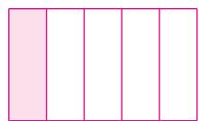

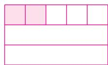

2. “双减”以来,同学们的作业量大大下降,乐乐用 $\frac{3}{5}$ 小时就完成了数学和英语两门作业,这两门作业共用了(36)分钟。如果数学、英语和语文三门作业用时都一样,那么完成这三门作业需要(54)分钟。  
3. (15) 角 = $\frac{3}{2}$ 元 $\frac{4}{5}$ 时 = (48) 分 $\frac{4}{25}$ 千米 = (160) 米  
4. 在○里填上“＞”“＜”或“＝”。

$$
\frac {5}{8} \textcircled {>} \frac {5}{8} \times \frac {3}{7}
$$

$$
\frac {6}{7} \times \frac {2}{3} = \frac {1}{1 4} \times 8
$$

$$
\frac {2}{9} \times \frac {5}{6} <   \frac {2}{9} \times (\frac {5}{6} \times \frac {6}{5})
$$

5. (情境题·文化情境)《九章算术》中有一题为“今有田广七分步之四,从五分步之三。问田有几何?”翻译为:有一块长方形田地,宽 $\frac{4}{7}$ 步,长 $\frac{3}{5}$ 步,这块田地的周长是( $\frac{82}{35}$ )步,面积是( $\frac{12}{35}$ )平方步。  
6. 北京故宫博物院内的慈宁宫花园南北长约 0.13 千米, 东西宽约是南北长的 $\frac{5}{13}$ , 东西宽约 (0.05) 千米。  
7. 如图所示, $2000 \times \frac{1}{5}$ 解决的问题:
( 四月份用电比三月份用电节约了多少千瓦时 );
要求四月份用电多少千瓦时,列式:

$$
(2 0 0 0 \times (1 - \frac {1}{5})) 。
$$

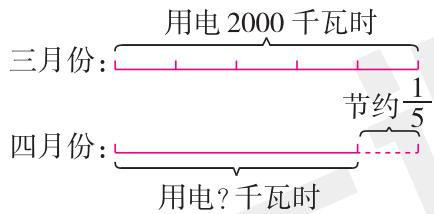

text_image

用电2000千瓦时
三月份：
节约1/5
四月份：
用电?千瓦时

8. 织女星的运行速度是 14 千米/秒, 牛郎星的运行速度比织女星快 $\frac{6}{7}$ , 牛郎星的运行速度是 (26 千米/秒)。  
9. 一本故事书 144 页, 小华看了 3 天后, 剩下的页数比这本书的 $\frac{2}{3}$ 多 10 页, 还剩下 (106) 页。

二、选择。(每题 2 分, 共 12 分)

1. 关于“ $\frac{2}{7} \times 3 = \frac{2 \times 3}{7} = \frac{6}{7}$ ”，下面说法错误的是（C）。

A. 分母不变表示分数单位不变, 分子和整数相乘的积表示分数单位的个数

$$
\mathrm{B.} \frac {2}{7} \times 3 = \frac {1}{7} \times 2 \times 3 = \frac {1}{7} \times (2 \times 3) = \frac {6}{7}
$$

$$
\mathrm{C.} \frac {2}{7} \times 3 = \frac {3 + 3}{7} = \frac {2 \times 3}{7} = \frac {6}{7}
$$

2. 某小学“课后延时服务需求”调研中, 低年级有需求的人数相当于中年级有需求人数的 $\frac{1}{3}$ , 中年级有需求的人数相当于高年级有需求人数的 $\frac{3}{5}$ 。这所小学低年级有需求的人数相当于高年级有需求人数的 ( B )。

$$
\mathrm{A.} \frac {1}{1 5}
$$

$$
\mathrm{B.} \frac {1}{5}
$$

$$
\mathrm{C.} \frac {1}{3}
$$

3. 已知 $\frac{a}{7} \times \frac{b}{12} \times \frac{c}{11} = \frac{5}{12}$ , 三个因数都是最简真分数, 那么 $a + b + c = (\quad C)$ 。

$$
\mathrm{A.20}
$$

$$
\mathrm{B.18}
$$

$$
\mathrm{C.23}
$$

4. (名校期末真题) 春蕾小学共有 950 名学生, 六年级人数占全校的 $\frac{1}{5}$ 。下面问题 (B) 与算式 $950 \times (1 - \frac{1}{5})$ 相符合。

A. 六年级有多少人

B. 其余年级有多少人

C. 其余年级比六年级多多少人

5. 在下面三个实际问题中,不能用“一个数×几分之几=另一个数”这个关系式解决的是( C )。

A. 学校在端午节前夕组织高年级学生包粽子。五、六年级学生一共包了 840 个粽子, 准备把其中的 $\frac{1}{4}$ 送到养老院。送到养老院的粽子有多少个?  
B.《西游记》是我国四大古典名著之一,成书于16世纪中叶。明明读一本220页的《西游记》,已经读了这本书的 $\frac{2}{5}$ 。明明读了多少页?  
C. 春节快到了,妈妈为了装饰房间,计划制作中国结。每个中国结用红色丝带 2 m, 黄色丝带 $\frac{3}{4}$ m。制作一个中国结共需要多少米丝带?

6. 某社区去年拥有私家车的家庭有 600 户, 今年比去年增加了 $\frac{1}{4}$ , 今年拥有私家车的家庭有多少户? 下面图 (B) 正确表达了题目的意思。

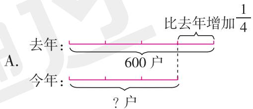

text_image

比去年增加\frac{1}{4}
A. 去年: 
600户
今年: ?户

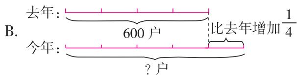

text_image

去年: 
600户
比去年增加1/4
今年: 
?户

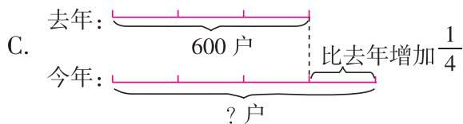

text_image

C. 去年: 600户 比去年增加\frac{1}{4}
今年: ?户

# 三、计算。(共26分)

1. 直接写出得数。(8 分)

$$
\frac {2}{1 1} \times \frac {2}{3} = \frac {4}{3 3}
$$

$$
\frac {1}{2} \times \frac {1}{3} = \frac {1}{6}
$$

$$
\frac {2}{5} \times \frac {1}{4} = \frac {1}{1 0}
$$

$$
8. 8 \times \frac {5}{2 2} = 2
$$

$$
\frac {3}{4 9} \times 7 = \frac {3}{7}
$$

$$
\frac {1 8}{3 5} \times \frac {7}{1 2} = \frac {3}{1 0}
$$

$$
1. 5 \times \frac {2}{3} = 1
$$

$$
\frac {5}{9} \times \frac {3}{1 0} = \frac {1}{6}
$$

2. 计算,能简算的要简算。(18 分)

$$
\begin{array}{l} 2 4 \times (\frac {1}{4} + \frac {1}{6}) \\ \frac {8}{9} \times \frac {2}{5} \times \frac {3}{8} \\ \frac {8}{1 5} - \frac {4}{7} \times \frac {8}{1 5} \\ = 2 4 \times \frac {1}{4} + 2 4 \times \frac {1}{6} \\ = \left(\frac {8}{9} \times \frac {3}{8}\right) \times \frac {2}{5} \\ = \frac {8}{1 5} \times (1 - \frac {4}{7}) \\ = 6 + 4 \\ = \frac {1}{3} \times \frac {2}{5} \\ = \frac {8}{1 5} \times \frac {3}{7} \\ = 1 0 \\ = \frac {2}{1 5} \\ = \frac {8}{3 5} \\ \frac {5}{1 2} \times \frac {4}{7} \times 4 8 \times 2 8 \\ \frac {5}{8} \times \frac {5}{4} \times 3. 2 \\ \frac {7}{1 0} \times 9 9 + \frac {7}{1 0} \\ = (\frac {5}{1 2} \times 4 8) \times (\frac {4}{7} \times 2 8) \\ = \frac {2 5}{3 2} \times 3. 2 \\ = \frac {7}{1 0} \times (9 9 + 1) \\ = 2 0 \times 1 6 \\ = 2. 5 \\ = \frac {7}{1 0} \times 1 0 0 \\ = 3 2 0 \\ = 7 0 \\ \end{array}
$$

四、把算式和对应的问题连起来。(共8分)

树木园里种了 150 棵金桂,丹桂比金桂少 $\frac{4}{15}$ ,月桂比金桂多 $\frac{1}{5}$ 。

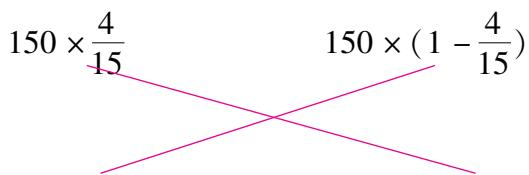

text_image

150 × 4/15
150 × (1 - 4/15)

丹桂有多少棵  
金桂比丹桂多多少棵

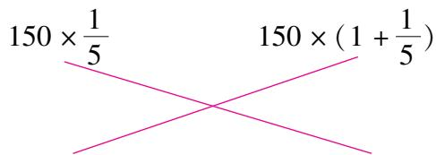

text_image

150 × 1/5
150 × (1 + 1/5)

月桂有多少棵  
月桂比金桂多多少棵

五、解决问题。(共34分)

1. (跨学科融合)下面诗句中的瀑布的高度约是多少米? (唐代一尺约是现在的 $\frac{307}{1000}$ 米)(5 分)

$$
3 0 0 0 \times \frac {3 0 7}{1 0 0 0} = 9 2 1 (\text { 米 })
$$

答:诗句中的瀑布的高度约是921米。

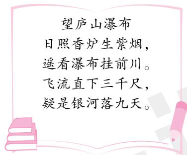

text_image

望庐山瀑布
日照香炉生紫烟，
遥看瀑布挂前川。
飞流直下三千尺，
疑是银河落九天。

2. 人体的奥秘。

(1)人体在不同年龄段的骨骼数不同,成人共有骨头206块,其中手骨的块数占全身骨头数的 $\frac{27}{103}$ ,脊椎骨的数量是手骨的 $\frac{13}{27}$ 。成人有多少块脊椎骨?(5分)

$206 \times \frac{27}{103} \times \frac{13}{27} = 26$ （块）答：成人有26块脊椎骨。

(2)人体各部分之间存在着有趣的关系。一般来说,颈部周长的 $\frac{1}{2}$ 等于手腕的周长,大拇指的长度比手腕的周长少 $\frac{3}{5}$ 。小小测量出她颈部的周长是25厘米,那么她大拇指的长度大约是多少厘米?(5分)

$25 \times \frac{1}{2} \times (1 - \frac{3}{5}) = 5$ （厘米）答：她大拇指的长度大约是5厘米。

3. 一个两居室住房的总面积是90平方米,其中部分房间面积情况如表。根据这些数据,请你提出一个两步乘法计算的数学问题并解答。(6分)

答案不唯一,如:

卫生间的面积是多少平方米?

$90 \times \frac{2}{9} \times \frac{2}{5} = 8$ (平方米)

答: 卫生间的面积是 8 平方米。

<table><tr><td>主卧占总面积的</td><td>2/9</td></tr><tr><td>厨房占总面积的</td><td>1/6</td></tr><tr><td>厨房占客厅的</td><td>1/2</td></tr><tr><td>卫生间占主卧的</td><td>2/5</td></tr></table>

4. 暑假期间小亮在家阅读名著《西游记》，下面是他读某一回后的阅读记录。请你选择三条读书记录作为信息提出一个用本单元学习的知识解决的问题并解答。(6 分)

答案不唯一,如:选①②③,问题:小亮读错的字有多少个? $350 \times \frac{1}{70} \times \left(1 + \frac{3}{5}\right) = 8$ (个)

答: 小亮读错的字有 8 个。

# 阅读记录

①本回有350个字。

②一共有 $\frac{1}{70}$ 的字不认识。

③读错的字比不认识的字多 $\frac{3}{5}$ 。

④不认识的字中根据上下文能理解其中意思的占 $\frac{3}{8}$ 。

5. 足球赛门票 150 元一张,降价后观众增加了 $\frac{1}{2}$ , 收入增加了 $\frac{1}{5}$ , 则一张门票降价多少元? (7 分) 假设原来的观众人数为 100 人, 那么原来的收入为 $150 \times 100 = 15000$ (元)。

现在的观众人数为: $100 \times \left(1 + \frac{1}{2}\right) = 150$ (人)

现在的收入为: $15000 \times \left(1 + \frac{1}{5}\right) = 18000$ (元)

现在一张门票的价格为: $18000 \div 150 = 120$ (元)

150 - 120 = 30(元)

答:一张门票降价30元。

附加题。(共10分)

“宫、商、角、徵、羽”是中国古代音乐的基本音阶,其发音管的管长可以通过“三分损益法”计算得出。具体方法如下:假设基本音“宫”的管长是81,经“三分益一”得“徵”,即 $81 \times (1 + \frac{1}{3}) = 108$ ,则“徵”音的管长是108;“徵”经“三分损一”得“商”,即 $108 \times (1 - \frac{1}{3}) = 72$ ,则“商”音的管长是72;“商”经“三分益一”得“羽”;“羽”经“三分损一”得“角”。按照上面的假设,“角”音的管长是多少?“角”音的管长比“宫”音的管长少几分之几?

$$
7 2 \times (1 + \frac {1}{3}) \times (1 - \frac {1}{3}) = 6 4 \quad (8 1 - 6 4) \div 8 1 = \frac {1 7}{8 1}
$$

答:“角”音的管长是64,“角”音的管长比“宫”音的管长少 $\frac{17}{81}$ 。

# 第二单元测评卷

时间:60 分钟 满分:100 + 10 分

# 一、填空。(除标明外,其余每空1分,共34分)

1. 看图填一填。

(1)科技楼在教学楼(南)偏(西)(45)°方向(300)m处。  
(2)实验楼在教学楼(东)偏(南)(40)°方向(100)m处。  
(3)大门在教学楼北偏西 $30^{\circ}$ 方向 200 m 处,请在图中标出大门的位置。(2 分)  
(4)图书馆在教学楼北偏东 $30^{\circ}$ 方向200 m处,请在图中标出图书馆的位置。(2分)

2. 根据下图描述台风路径。

台风“妮娜”在海面生成后,先在沿海城市 A 市登陆,之后向(北)偏(西)(45)°方向行了(600)km 到达 B 市,又向(北)偏(西)(30)°方向行了(400)km 到达 C 市,一路风力逐渐减弱。

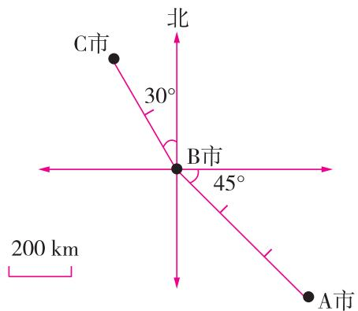

text_image

北
30°
B市
45°
A市
C市
200 km

3. (情境题·文化情境) 在中国象棋的棋盘上, 每枚棋子的行走路线都有自己的规则, 如馬走“日”。

(1)开始下棋前,“馬”的起始位置在(7,0),它走一步可以直接到达的位置有(3)个,分别是((5,1),(6,2),(8,2))。(最后一空3分)  
(2)图中的“馬”最少走(3)步可以到达(4,4)。

我的路线:从起始位置出发,向(西)偏(北)(27)°方向走a个长度单位到达(5,1),接着(向北偏东27°方向走a个长度单位到达(6,3),最后向西偏北27°方向走a个长度单位到达(4,4)(走法不唯一)。(最后一空4分)

提示:两个相同的小正方形组成的长方形,其中对角线的长度为 a 个单位长度,如图所示。

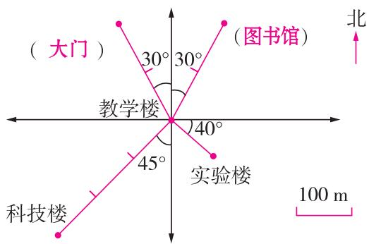

text_image

(大门)
30°
30°
教学楼
740°
45°
实验楼
科技楼
(图书馆)
北
100 m

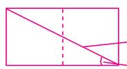

长度： $a$ 个单位长度

角度： $27^{\circ}$

# 二、选择。(把正确答案的序号填在括号里)(每题3分,共18分)

1. 赤壁之战时,曹操军队在孙刘联军的西偏北 $30^{\circ}$ 方向上,下面选项图中正确的是( C )。

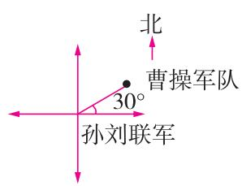  
A

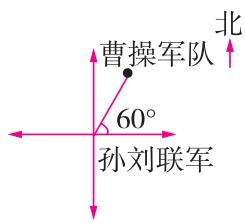  
B

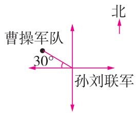  
C

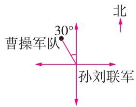  
D

2. 地图上测得温州在杭州的南偏东 $15^{\circ}$ 约 300 千米处, 那么杭州在温州的 (D)。

A. 东偏南 $15^{\circ}$ 约 300 千米处

B. 东偏南 $75^{\circ}$ 约 300 千米处

C. 西偏北 $15^{\circ}$ 约 300 千米处

D. 西偏北 $75^{\circ}$ 约 300 千米处

3. 如图, 某渔船在海上出现故障, 它应该向救援中心发送 (D) 的信息。

A. 我们的船在中山岛的西偏南 $30^{\circ}$ 方向处  
B. 我们的船在中山岛的北偏东 $30^{\circ}$ 方向处  
C. 我们的船在中山岛的西偏南 $30^{\circ}$ 方向 50 km 处  
D. 我们的船在中山岛的东偏北 $30^{\circ}$ 方向 50 km 处

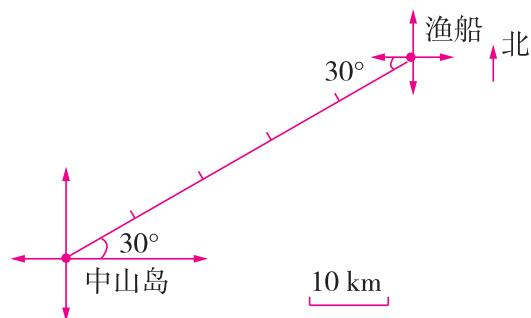

text_image

渔船
北
30°
中山岛
30°
10 km

4. 学校组织六年级学生开展国防教育军训活动。训练时, 莉莉的 2 点钟方向 30 m 处是果果, 莉莉的 8 点钟方向 40 m 处是明明, 果果和明明之间的直线距离是 ( B ) m。(点钟方向: 如图, 观察者在钟表中心处, 正面所对为 12 点钟方向, 背面所对为 6 点钟方向)

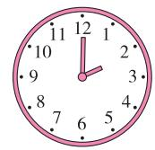

A. 50

B. 70

C. 30

D. 10

5. 如图, 乐乐画了一幅北斗七星图, 图中从天权到天璇的正确路线是 ( A )。

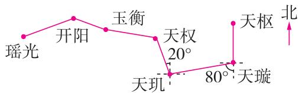

flowchart

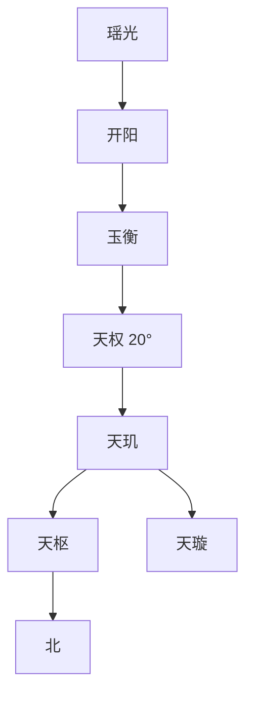

A. 先向南偏东 $20^{\circ}$ 到天玑, 再向北偏东 $80^{\circ}$   
C. 先向南偏东 $20^{\circ}$ 到天玑, 再向东偏北 $80^{\circ}$

B. 先向东偏南 $20^{\circ}$ 到天玑, 再向东偏北 $20^{\circ}$

D. 先向东偏南 $20^{\circ}$ 到天玑, 再向东偏北 $80^{\circ}$

6. 某公园摆渡车的行驶路线是从正门向正东行驶 2 km 后, 再向西偏南 $60^{\circ}$ 方向行驶 1 km, 然后向正西方向行驶 2 km, 最后向北偏东 $30^{\circ}$ 方向行驶, 驶回正门, 正确的路线图是 (A)。

A. 正门

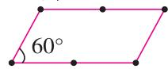

B. 正门

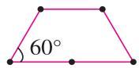

C. 正门

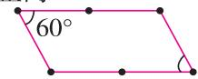

D. 正门

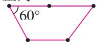

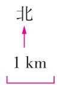

# 三、动手操作。(共20分)

1. 模范社区为了进一步规范电动车的停放,减少安全隐患,经广泛征求意见,决定新建两个电动车停放点。请按下面的描述画出每个停放点的位置。

(1) 停放点 1: 在篮球场的北偏东 $30^{\circ}$ 方向 300 m 处。(4 分)  
(2) 停放点 2: 在停放点 1 的南偏东 $40^{\circ}$ 方向 400 m 处。(4 分)

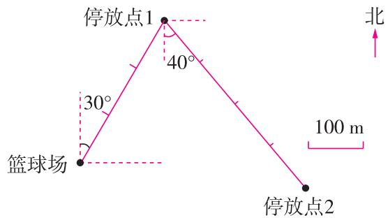

text_image

停放点1
40°
30°
篮球场
100 m
停放点2
北

2. (情境题·科学情境)智能 AI 技术的使用,改变了人们的工作方式。餐饮行业中,机器人送餐已经成为一种新的送餐方式。下图是某餐厅送餐机器人某次送餐的路线图。

(1)机器人从出菜口端上菜后,怎样走能送到1号桌?请你向它发出移动指令。(2分)  
(2)机器人到达1号桌后,要继续向西偏北35°方向走7.5米给3号桌送餐。请标出3号桌的位置。(3分)  
(3)为3号桌送完餐后,机器人接到新的指令:原路返回出菜口,继续为其他桌送餐。请描述机器人的返回路线。(4分)  
(4)机器人每分钟走9.42米,为保证其他桌顾客按时用餐,送餐机器人需要在2分钟内从3号桌原路返回出菜口取餐。它能否来得及呢?请写出你的思考过程。(3分)

(1) 机器人向北偏东 $35^{\circ}$ 方向走 6 m 送到 1 号桌。  
(3)机器人先向东偏南 $35^{\circ}$ 方向走 7.5 米到达 1 号桌, 再向南偏西 $35^{\circ}$ 方向走 6 米回到出菜口。  
(4) $9.42 \times 2 = 18.84 \, (\text{m}) \quad 6 + 7.5 = 13.5 \, (\text{m})$

18.84 > 13.5, 它能来得及。

# 四、解决问题。(共28分)

1. 古丝绸之路积淀了以和平合作、开放包容、互学互鉴、互利共赢为核心的丝路精神。如图是古丝绸之路的部分路线示意图。请描述从长安出发到安都奥克的路线。(10 分)

从长安出发, 向西偏北 $20^{\circ}$ 方向走 1200 千米到敦煌, 然后向南偏西 $60^{\circ}$ 方向走 500 千米到楼兰, 接着向西偏北 $10^{\circ}$ 方向走 700 千米到和田, 然后向北偏西 $60^{\circ}$ 方向走 1500 千米到马鲁, 接着向西偏北 $20^{\circ}$ 方向走 2000 千米到安都奥克。

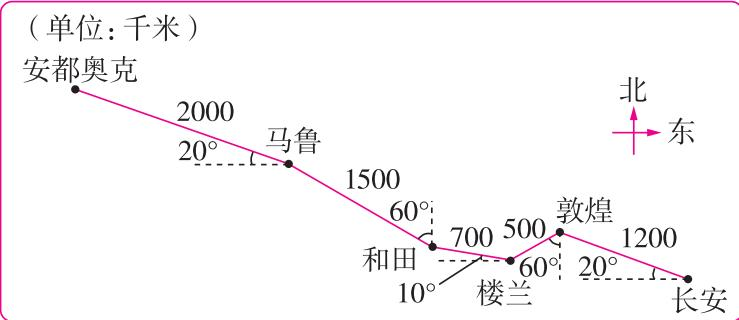

line

| 城市 | 数值 (千米) | 平台位置 | 占比 (°) |
| :--- | :--- | :--- | :--- |
| 安都奥克 | 2000 | 马鲁 | 20 |
| 马鲁 | 1500 | 和田 | 60 |
| 和田 | 700 | 楼兰 | 10 |
| 敦煌 | 500 | 长安 | 60 |
| 敦煌 | 1200 | 北东 | 20 |
(单位: 千米)

2. (名校期末真题)“低碳出行,从我做起。”为了响应国家号召,爸爸骑共享单车上班。他先从家向北偏东30°方向骑600米到广场,再向正东方向骑1200米到超市,最后向东偏南40°方向骑1800米到单位。根据描述,请你画出爸爸从家到单位的路线图。(8分)(画法不唯一)

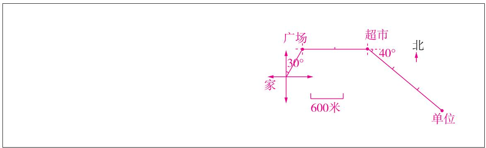

text_image

广场
30°
家
600米
超市
40°
北
单位

3. 乐乐家在百货商场的北偏西 $40^{\circ}$ 方向 2500 米处, 图书馆在农业银行东偏南 $40^{\circ}$ 方向, 农业银行到百货商场的距离与到图书馆的距离相等。下面是乐乐坐出租车从家去图书馆的路线图, 已知出租车车费在 3 千米以内 (含 3 千米) 按起步价 9 元计算, 以后每增加 1 千米车费就增加 2 元, 不足 1 千米按 1 千米算。乐乐一共要花多少元? (10 分)

$2500 + 500 \times 3 \times 2 = 5500$ （米）

5500 米 = 5.5 千米

5.5≈6

(6 - 3) × 2 + 9 = 15 (元)

答: 乐乐一共要花 15 元。

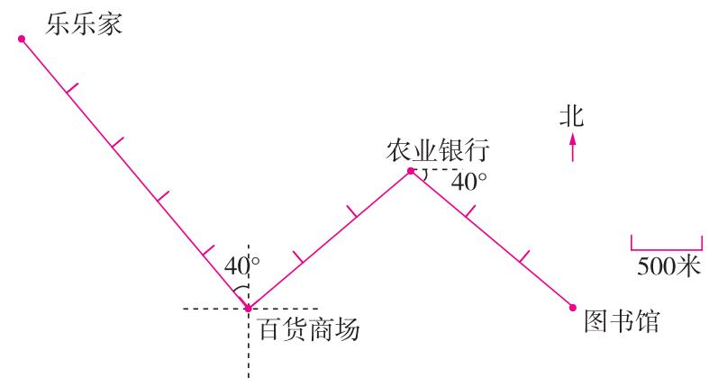

text_image

乐乐家
40°
百货商场
农业银行
40°
北
500米
图书馆

附加题。(共10分)

小东、小红、小丽和小北是好朋友，星期天，他们总是一起玩耍。

小东

从我家到小丽家只要沿西偏南 $30^{\circ}$ 方向走 $200\mathrm{m}$ 就到了，从我家去小北家更近，直接向正北方向走 $150\mathrm{m}$ 就到了。

小丽

从我家到小北家沿南偏东 $35^{\circ}$ 方向走 $300\mathrm{m}$ 就到了。

我要去小红家和她一起踢足球，你知道该怎样走吗？

小丽只要沿着东偏北 $30^{\circ}$ 方向走 200 m 到小东家, 然后向正北方向走 150 m 到小北家, 最后沿北偏西 $35^{\circ}$ 方向走 300 m 就到小红家了。

# 第三单元测评卷

时间:60 分钟 满分:100 + 10 分

一、填空。（第5\~7题每题2分，其余每空1分，共22分）

1. 两个数的乘积为 1, 这样的两个数在数学中互为 ( 倒数 ), 0.75 和 ( $\frac{4}{3}$ ) 互为倒数, 若 $m$ 和 $n$ 互为倒数, 则 $\frac{m}{4} \times \frac{n}{3}$ 的结果是 ( $\frac{1}{12}$ )。  
2. 书香润泽心灵,阅读丰富人生。张丽在学校“书香润校园”活动中,5天看了《草房子》总页数的 $\frac{3}{4}$ ,她平均每天看这本书的( $\frac{3}{20}$ )。  
3. (14) kg 的 $\frac{3}{7}$ 是 6 kg, $\frac{5}{9}$ kg 的 ( $\frac{27}{25}$ ) 是 $\frac{3}{5}$ kg, 15 t 比 ( $\frac{25}{2}$ ) t 多 $\frac{1}{5}$ 。  
4. 在 ○ 里填上“＞”“＜”或“＝”。

$$
\frac {3}{7} \div \frac {1}{3} > \frac {3}{7}
$$

$$
1 \times \frac {3 2}{3 5} <   1 \div \frac {3 2}{3 5}
$$

$$
\frac {6 9}{7 3} \textcircled {<  } \frac {6 9}{7 3} \div \frac {3}{7}
$$

$$
\frac {3}{4} \div \frac {1}{2} = \frac {3}{4} \times 2
$$

$$
\frac {7}{6} \div \frac {1}{5} \textcircled {>} \frac {7}{6} \times \frac {4}{5}
$$

$$
\frac {4}{1 5} \div \frac {4}{1 5} > \frac {4}{3} \times \frac {1}{5} \div \frac {4}{3} \times \frac {1}{5}
$$

5. 故宫博物院是我国最大的古代文化艺术博物馆, 其占地面积大约是 72 公顷, 比天安门广场的占地面积多 $\frac{7}{11}$ 。天安门广场的占地面积大约是 (44) 公顷。  
6. 无人智能配送车是一种可以实现全自动化配送的智能机器人。东方大厦用无人智能配送车给各部门配送快递, 现有一些快递要送, 根据下面两辆配送车的对话, 用算式“ $1 \div \left( \frac{1}{2} + \frac{1}{3} \right)$ ”解决的问题是(两辆配送车同时配送, 多长时间可以送完)。

我是小艺，很高兴为您服务。我单独送，2小时能送完。

我是Mike，我单独送，送完需要3小时。

7. “王师傅 $\frac{3}{4}$ 小时生产 6 个零件, 1 小时能生产几个?” 乐乐在解决这个问题时先画图, 然后列式计算, 过程: $6 \div \frac{3}{4} = 6 \times \frac{1}{3} \times 4 = 8$ (个), 其中 “ $6 \times \frac{1}{3}$ ” 计算的是 (王师傅 $\frac{1}{4}$ 小时生产零件的个数)。

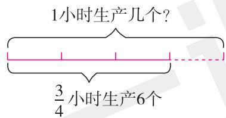

text_image

1小时生产几个?
3/4 小时生产6个

8. (情境题·文化情境)《九章算术》是我国古代一部数学专著,书中将分数除法的解法概括为“经分”,刘徽在为“经分”注释时,将这种方法重新命名为“散分法”。下面的算式就是用“散分法”计算的。

$$
\begin{array}{l} \frac {5}{6} \div \frac {7}{1 2} = \frac {5 \times 1 2}{6 \times 1 2} \div \frac {6 \times 7}{6 \times 1 2} = (5 \times 1 2) \div (6 \times 7) = \frac {5 \times 1 2}{6 \times 7} \\ 2 \div \frac {2}{3} = \frac {2 \times 3}{1 \times 3} \div \frac {1 \times 2}{1 \times 3} = (2 \times 3) \div (1 \times 2) = \frac {2 \times 3}{1 \times 2} \\ \end{array}
$$

根据上面的计算过程,请你用含有字母的式子表示出“散分法”的计算过程。(a、b、c、d 均不

为0)

$$
\frac {b}{a} \div \frac {d}{c} = (\frac {b c}{a c} \div \frac {a d}{a c}) = (\quad b c \div a d) = (\frac {b c}{a d})
$$

# 二、选择。(把正确答案的序号填在括号里)(每题2分,共12分)

1. 为了得到 $2 \div \frac{2}{3}$ 的结果, 同学们用了三种不同的方法, 方法合理的有 (D) 个。

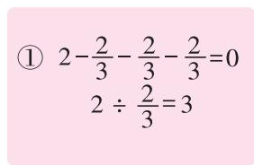  
A.0   
B.1

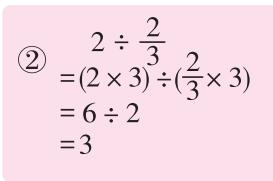  
C. 2

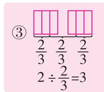  
D. 3

2. (名校期末真题)下面的问题不能用算式 $24 \div \left(1 - \frac{1}{4}\right)$ 解决的是(A)。

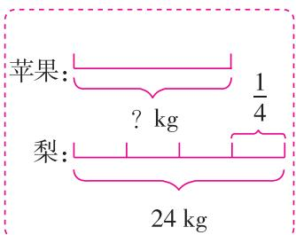

text_image

苹果：
? kg
1/4
梨：
24 kg

A

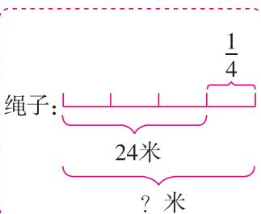

text_image

绳子:
24米
? 米
1/4

B

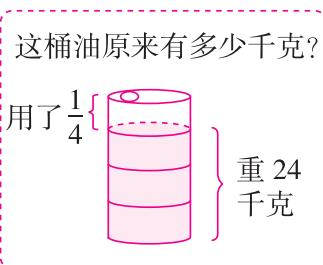

text_image

这桶油原来有多少千克？
用了\(\frac{1}{4}\) { 重24
    千克

C

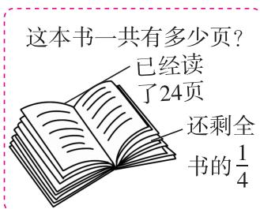

text_image

这本书一共有多少页？
已经读了24页
还剩全书的1/4

D

3. (新题型)下面四幅图中, $a$ 和 $b$ 表示不同的数, 则图 (C) 中的 $a$ 与 $b$ 互为倒数。

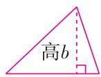  
底 $a$

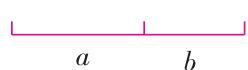

B. 线段总长度为 1

  
长a

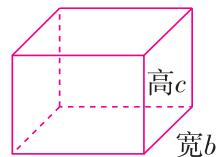  
长 $a$

A. 三角形面积为 1

A. 三角形面积为 1

4. 我国有悠久的青铜器铸造历史, 古籍《考工记》中就有关于冶炼青铜工具时铜锡配比的记载, 在铸造青铜剑时, 铜的含量是锡的 $\frac{2}{5}$ , 如果铸造一把青铜剑, 其中需要的锡、铜总量为 560 克, 那么锡的含量是多少? 如果把锡的含量设为 $x$ 克, 正确的方程是 ( A )。

A. $x + \frac{2}{5}x = 560$

B. $x - \frac{2}{5} x = 560$

C. $5x + 2x = 560$

D. $5x - 2x = 560$

5. 刘叔叔去年使用微信消费 1.8 万元, \_\_\_\_。使用支付宝消费多少万元? 横线上补充下面信息 ( C ), 才能用算式 $1.8 \div \left(1 - \frac{3}{5}\right)$ 解决。

A. 使用支付宝消费是微信的 $\frac{3}{5}$

B. 使用支付宝消费比微信少 $\frac{3}{5}$

C. 使用微信消费比支付宝少 $\frac{3}{5}$

D. 使用支付宝消费比微信多 $\frac{3}{5}$

6. 黄瓜的价格今年三月份比二月份涨了 $\frac{1}{5}$ , 四月份比三月份降了 $\frac{1}{5}$ , 四月份黄瓜的价格与二月份相比, (B)。

A. 涨了

B. 降了

C. 不变

D. 无法确定

# 三、计算。(共26分)

1. 直接写出得数。(8 分)

$$
\frac {6}{7} \div 3 = \frac {2}{7}
$$

$$
5 \div \frac {1}{1 5} = 7 5
$$

$$
\frac {3}{5} \times 1 0 = 6
$$

$$
\frac {1}{2} \div \frac {1}{8} = 4
$$

$$
\frac {4}{5} \div \frac {4}{5} = 1
$$

$$
\frac {1}{4} \times \frac {3}{5} = \frac {3}{2 0}
$$

$$
0 \div \frac {2 8}{2 9} = 0
$$

$$
\frac {9}{1 0} \div \frac {6}{5} = \frac {3}{4}
$$

2. 脱式计算,能简算的要简算。(9 分)

$$
\frac {2 1}{5} \div 7 \times \frac {5}{9}
$$

$$
\frac {1}{8} \times \frac {2}{7} + \frac {5}{7} \div 8
$$

$$
\frac {8}{1 5} \times \left[ \frac {5}{6} \div \left(\frac {7}{9} - \frac {1}{3}\right) \right]
$$

$$
= \frac {2 1}{5} \times \frac {1}{7} \times \frac {5}{9}
$$

$$
= \frac {1}{8} \times \frac {2}{7} + \frac {5}{7} \times \frac {1}{8}
$$

$$
= \frac {8}{1 5} \times \left[ \frac {5}{6} \div \left(\frac {7}{9} - \frac {3}{9}\right) \right]
$$

$$
= \frac {1}{3}
$$

$$
= \frac {1}{8} \times \left(\frac {2}{7} + \frac {5}{7}\right)
$$

$$
= \frac {8}{1 5} \times \left[ \frac {5}{6} \times \frac {9}{4} \right]
$$

$$
= \frac {1}{8}
$$

$$
= \frac {8}{1 5} \times \frac {5}{6} \times \frac {9}{4}
$$

$$
= 1
$$

3. 解方程。(9 分)(过程略)

$$
\frac {3}{4} + \frac {2}{5} x = \frac {9}{1 0}
$$

$$
x - \frac {1}{5} x = \frac {2}{3}
$$

$$
\frac {1}{3} x \div \frac {1}{6} = 1 8
$$

$$
x = \frac {3}{8}
$$

$$
x = \frac {5}{6}
$$

$$
x = 9
$$

四、看图列式计算。(每题5分,共10分)

1.

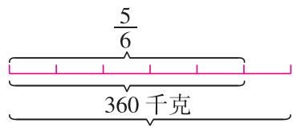  
?千克

2.大米：

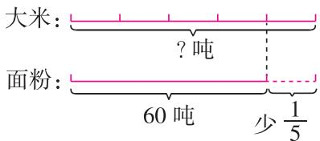

text_image

大米：
?吨
面粉：
60吨 少1/5

$360 \div \frac{5}{6} = 432$ (千克)

$$
6 0 \div (1 - \frac {1}{5}) = 7 5 (\text {吨})
$$

五、解决问题。(共30分)

春节期间,人们会举办新春庙会、非遗展演、民俗灯会、花车巡游等多样的新春活动来庆祝春节。

1. 春节期间,公园中有花车巡游供游客们欣赏,巡游线路长 2 km,15 分钟刚好巡游线路全长的 $\frac{3}{5}$ ,照这个速度,多长时间能巡游线路全长的 $\frac{9}{10}$ ? (5 分)

$$
1 5 \div \frac {3}{5} \times \frac {9}{1 0} = 2 2. 5 (\text {分})
$$

答:22.5 分钟能巡游线路全长的 $\frac{9}{10}$ 。

2. 为了民俗灯会开展得更加丰富多彩,主办方特意选择了一些学生的作品在文创园进行展览。学生作品中,有32幅水粉画、24幅国画,共占学生作品总数的 $\frac{8}{15}$ 。这次展览中一共有多少幅学生作品? (5分)

$$
(3 2 + 2 4) \div \frac {8}{1 5} = 1 0 5 (\text {   幅   })
$$

答:这次展览中一共有105幅学生作品。

3. 春节期间, 星星在河南博物院见到了武则天金简, 重 223.5 克, 造型规整, 上面刻有 3 行 63 字铭文。河南博物院设计的文创纪念品金简书签宽 2 厘米, 比真品的宽少 $\frac{3}{4}$ , 真品的宽是多少厘米? (用方程解答) (5 分)

解:设真品的宽是 x 厘米。

$$
x \times (1 - \frac {3}{4}) = 2
$$

$$
\frac {1}{4} x = 2
$$

$$
x = 8
$$

答:真品的宽是8厘米。

4. 郑州市各大文创园成为春节期间大家首选的网红打卡点。某文创园旺季打卡人数比淡季打卡人数多1440人,其中淡季打卡人数是旺季打卡人数的 $\frac{1}{3}$ ,淡季和旺季的打卡人数各是多少人?

(1)下面是三位同学的解法,哪些同学的解法是正确的?请在相应名字后面的□里画“√”。(2分)

龙龙 √

解: 设旺季打卡人数是 x 人。

$$
x - \frac {1}{3} x = 1 4 4 0
$$

$$
x = 2 1 6 0
$$

淡季打卡人数：

$$
2 1 6 0 \times \frac {1}{3} = 7 2 0 (\text {人})
$$

浩浩

解: 设淡季打卡人数是 x 人。

$$
x - \frac {1}{3} x = 1 4 4 0
$$

$$
x = 2 1 6 0
$$

旺季打卡人数：

$$
2 1 6 0 \times \frac {1}{3} = 7 2 0 (\text {人})
$$

思思 √

淡季打卡人数：

旺季打卡人数：多1440人

解:设淡季打卡人数是 x 人。

$$
3 x - x = 1 4 4 0
$$

$$
x = 7 2 0
$$

旺季打卡人数:720×3=2160(人)

(2)在正确的解法中,你最喜欢谁的?请你用文字说明这种解法的思路。(3分)

我最喜欢龙龙的。由题意知,旺季打卡人数是单位“1”,所以设旺季打卡人数为 x 人,则淡季打卡人数为 $\frac{1}{3}x$ 人,由“旺季打卡人数比淡季打卡人数多 1440 人”,可列方程,从而求出 x,再利用淡季打卡人数是旺季打卡人数的 $\frac{1}{3}$ ,求出淡季打卡人数。(答案不唯一,言之有理即可)

5. 灯展的精彩呈现少不了工匠们的精心设计,某文创园的灯展布置邀请了甲、乙、丙三个人来设计,如图是三个人单独完成某场地灯展布置需要的时间。 时间/时

(1) 如果三个人同时工作,需要多久能完成该场地的布置工作? (5 分)

$$
1 \div (\frac {1}{1 5} + \frac {1}{2 0} + \frac {1}{2 5}) = \frac {3 0 0}{4 7} (\text {   时   })
$$

时间/时

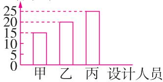

答:需要 $\frac{300}{47}$ 小时能完成该场地的布置工作。

(2)甲单独工作3小时后,需要去其他场地进行布置,剩余的任务需要乙、丙一起完成,这项任务共耗时多久?(5分)

$$
(1 - \frac {1}{1 5} \times 3) \div (\frac {1}{2 0} + \frac {1}{2 5}) = \frac {8 0}{9} (\text {时}) \quad 3 + \frac {8 0}{9} = \frac {1 0 7}{9} (\text {时})
$$

答:这项任务共耗时 $\frac{107}{9}$ 小时。

附加题。(共10分)

一个正方体的六个面标有6个数,把它展开后如图。若a是最小的质数,b是最小的合数,c既不是质数也不是合数,且相对两个面上标的数字与含有字母的式子刚好互为倒数,则 $d+e+f=(3\frac{1}{2})$ 。

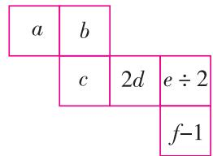

# 第四单元测评卷

时间:60 分钟 满分:100 + 10 分

# 一、填空。(每空1分,共18分)

1. “5G”网络是第五代移动通信网络,我们对于5G最直观的印象就是“快”。在一次测试中

4G 和 5G 的网速如表所示,5G 和 4G 的网速比是(10:1),比值是(10);同一部电影,在 4G 网络中下载完成的时间与在 5G 网络中下载完成的时间比是(10:1)。

<table><tr><td>4G 网速</td><td>100 Mbps</td></tr><tr><td>5G 网速</td><td>1000 Mbps</td></tr></table>

2.3: $8 = \frac{(9)}{24} = 15: (40) = (21) \div 56 = (0.375)$ (填小数)   
3. 如图, 在直角三角形中, $\angle 1$ 和 $\angle 2$ 的度数比是 $2:3$ , $\angle 1$ 的度数是 ( $36^{\circ}$ )。  
4. 不同种类的豆子中脂肪和蛋白质含量的比是不同的。

<table><tr><td>豆子种类</td><td>红豆</td><td>绿豆</td><td>黄豆</td></tr><tr><td>脂肪、蛋白质含量比</td><td>3:101</td><td>1.5:40</td><td>1:2</td></tr></table>

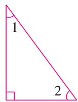

表中的豆子中，（红豆）的脂肪和蛋白质含量的比值最小，（黄豆）的最大。

5. 若给 2:5 的后项加上 7, 要使比值不变, 前项应(乘 2.4(或加 2.8))。  
6. 兰兰一家三口和美美一家四口到餐馆用餐,餐费总共是 406 元。两家按人数分别付用餐费, 兰兰一家应付(174)元,美美一家应付(232)元。  
7. 如图, 大、小两个正方形中阴影部分的面积比是 5:2, 那么大、小两个正方形的周长之比是 (5:2), 面积之比是 (25:4)。  
8. 有两条长度不同的绳子, 当第一条用去 $\frac{3}{5}$ , 第二条用去 $\frac{3}{7}$ 时, 剩下的部分一样长。那么第一条绳子和第二条绳子原来的长度之比是 (10:7)。  
9. 一个长方体广告灯箱的棱长总和是 $64 \, cm$ ，灯箱长与宽的比是 $5:2$ ，高是 $2 \, cm$ 。这个长方体广告灯箱的长是（10）cm，宽是（4）cm。

# 二、选择。(把正确答案的序号填在括号里)(每题2分,共16分)

1. 黄老师买了一台电饭煲,电饭煲里面有本说明书,说明书上标注米和水的用量是 2:3。你认为厂家标注米和水的比是想告诉我们( B )。

A. 煮米饭时, 水要比米多一杯  
B. 煮米饭时,要保持水的用量是米的 1.5 倍  
C. 煮米饭时, 米放 2 杯, 水放 3 杯

2. 下面说法正确的是( C )。

A. 2 m:3 m 的比值是 $\frac{2}{3}$ m  
B. 一场足球赛的比赛结果是 2:0, 所以比的后项可以为 0  
C. 如果 $a:b=1:3$ , 那么 $a$ 是 $b$ 的 $\frac{1}{3}$

3. 某小学参加暑期托管的学生共有 56 人, 参加托管的男、女生人数比不可能是( A )。

A. 2:3

B. 4:3

C. 5:3

4.(新题型)下面三个情境中的比,可以用2:3表示的有( A )个。

情境一  
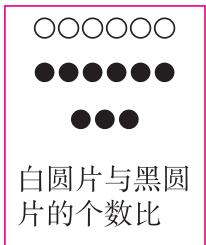

A.1

B. 2

情境二  
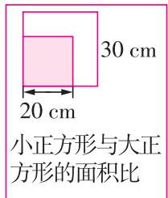

C. 3

情境三  
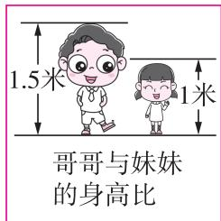

5.(探究题·思考过程)在探究比的基本性质时,有三位同学先后交流了自己的想法,( C )的想法对。

小华  
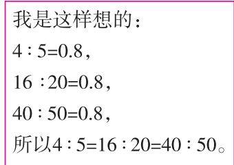

text_image

我是这样想的：
4:5=0.8,
16:20=0.8,
40:50=0.8,
所以4:5=16:20=40:50。

B. 小敏、小明

小敏  
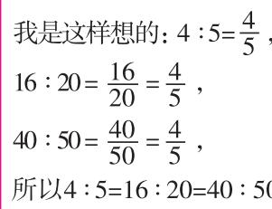

小明  

A. 小华、小敏

C. 小华、小敏、小明

6. (情境题·生活情境)二维码因其安全、便捷,在生活中很受大家欢迎,卖煎饼的王阿姨根据需要,也弄了一个自己的二维码,某天王阿姨共收了456元,二维码收款和现金收款的比是3:1,则二维码收款( B )元。

A. 114

B. 342

C. 152

7. 妈妈用蜂蜜和水调制了几杯蜂蜜水, 每个杯子的容量相同, 每杯蜂蜜水中蜂蜜与水的体积比如图。如果将(2)和(3)两满杯饮料混合起来, 混合后饮料中蜂蜜与水的体积比是( C )。

A. 1:4

B. 1:2

C. 4:11

bar_stacked

| Category | Value 1 | Value 2 |
|---|---|---|
| (1) | 1:8 | 1:4 |
| (2) | 1:4 | 1:2 |
| (3) | 1:2 | 2:1 |
| (4) | 1:2 | 1:4 |

8. 把宽与长的比值为 0.618 的长方形称为“黄金长方形”。下面三个长方形中, 最接近“黄金长方形”的是( B )。

text_image

A
B
C

# 三、计算。(共24分)

1. 求出下面各比的比值。(12 分)

7.5:0.25

$\frac{5}{8}:\frac{5}{6}$

$\frac{1}{8}$ :0.5

$\frac{3}{4}$ 时:25分

30

$\frac{3}{4}$ (或0.75)

$\frac{1}{4}$ (或0.25)

$\frac{9}{5}$ (或1.8)

2. 把下面各比化成最简单的整数比。(12 分)

$\frac{17}{56}$ : 0.875

$\frac{12}{5}:\frac{36}{16}$

1.2 毫升: $\frac{3}{5}$ 升

1.5 吨: 250 千克

17:49

16:15

1:500

6:1

四、动手操作。(每个方格的边长表示1厘米)(共10分)(画法不唯一)

1. 画一个周长是 18 厘米的长方形, 长和宽的比是 2:1。(5 分)

2. 将所画的长方形按面积比为 1:2 分成两部分。
(5 分)

五、解决问题。(共32分)

natural_image

Simple geometric diagram of a rectangle on a grid background (no text or symbols)

孝是中华民族的传统美德,是所有人必须具备的基本素养。百善孝为先,孝是一代人与另一代人之间感情的链条。

1. 小云的奶奶过生日,小云给奶奶买了老花镜和生日蛋糕作为礼物,一共花了 165 元,买老花镜和买生日蛋糕所花钱数之比为 3:8,买生日蛋糕花了多少钱? (5 分)

$165 \times \frac{8}{3 + 8} = 120$ （元）

答:买生日蛋糕花了 120 元。

2. 奶奶喜欢吃红豆馅糕点, 小云的妈妈要制作一些送给奶奶。有三种配比方案, 如下表。

<table><tr><td>方案</td><td>一</td><td>二</td><td>三</td></tr><tr><td>面团和红豆馅的质量比</td><td>3:2</td><td>1:1</td><td>5:7</td></tr></table>

妈妈准备了 500 g 面团, 如果既想满足奶奶的要求, 又想把面团都用完, 需要准备多少克红豆馅? (5 分)

方案一中红豆馅占总质量的 $\frac{2}{5}$ ，方案二中红豆馅占总质量的 $\frac{1}{2}$ ，方案

三中红豆馅占总质量的 $\frac{7}{12}$ ，因为 $\frac{7}{12}>\frac{1}{2}>\frac{2}{5}$ ，所以选择方案三。

$$
5 0 0 \div 5 \times 7 = 7 0 0 (\mathrm{g})
$$

答:需要准备 700 g 红豆馅。

3. 中午小云一家去饭店吃饭,为奶奶庆祝生日。已知该饭店一共有 40 位客人(包括大人和小孩)正在就餐,若每张餐桌坐 5 名大人和 3 名小孩,刚好坐满,正在就餐的大人和小孩各有多少人? (5 分)

$$
5 + 3 = 8
$$

大人: $40 \times \frac{5}{8} = 25$ (人) 小孩: $40 \times \frac{3}{8} = 15$ (人)

答: 正在就餐的大人有 25 人, 小孩有 15 人。

4. 吃完饭后, 小云的爸爸买了一些西瓜和苹果, 买西瓜和苹果所花的钱数之比是 $5:3$ , 已知买西瓜所花的钱比买苹果的多 12 元, 买西瓜和苹果一共花了多少钱? (5 分)

$$
1 2 \div (5 - 3) \times (5 + 3) = 4 8 (\text {元})
$$

答:买西瓜和苹果一共花了48元。

5. 小云的妈妈用蔬果洗涤剂清洗水果,蔬果洗涤剂瓶子上标明的比表示浓缩液和水的体积之比(如图),按照这些比可以配制出不同浓度的稀释液。妈妈按 1:3 的比配制了 1200 mL 的稀释液,其中浓缩液和水的体积分别是多少毫升?下面是四位同学的思考过程:

text_image

小兰
每份是：1200÷4=300（mL）
浓缩液有：300×1=300（mL）
水有：300×3=900（mL）
所以浓缩液有300 mL，水有900 mL。
小刚
浓缩液有：1200×1/3=400（mL）
水有：1200-400=800（mL）
所以浓缩液有400 mL，水有800 mL。
小强
浓缩液有：1200×1/4=300（mL）
水有：1200×3/4=900（mL）
所以浓缩液有300 mL，水有900 mL。
稀释液：
300 mL
浓缩液：
900 mL
从线段图上看出浓缩液有300 mL，
水有900 mL。

(1)上面四位同学的思考过程哪些是合理的？请在相应名字后面的□里画“√”。(4分)  
(2)这些合理的思考过程中你最喜欢谁的？请用文字说明理由。(2分)

答案不唯一,合理即可,如:这些合理的思考过程我最喜欢小兰的,因为小兰的思考过程比较容易理解。把稀释液平均分成4份,其中浓缩液占1份,水占3份,用稀释液的总体积算出每份的体积后,就很容易分别求出浓缩液和水的体积。

6. 下午, 大家去菜地帮奶奶种蔬菜, 菜地有 $180 \, m^{2}$ , 其中 $\frac{2}{3}$ 的面积种植黄瓜, 剩下的按 2:3 的比种植茄子和辣椒, 则这三种蔬菜的种植面积各是多少平方米? (6 分)

黄瓜: $180 \times \frac{2}{3} = 120 \left( \mathrm{~m}^{2} \right)$ 茄子: (180 - 120) $\times \frac{2}{3 + 2} = 24 \left( \mathrm{~m}^{2} \right)$

辣椒: $(180-120)\times\frac{3}{3+2}=36(m^{2})$

答: 黄瓜的种植面积是 $120 \, m^{2}$ ，茄子的种植面积是 $24 \, m^{2}$ ，辣椒的种植面积是 $36 \, m^{2}$ 。

附加题。(共10分)

中国古代数学名著《算法统宗》中记载了一些诗歌形式的数学问题,其中一个问题如下。

三百七十八里关,初行健步不为难,次日脚痛减一半,六朝才得到其关,要见每朝行里数,请公仔细算相还。

意思是:一个人到关口要走378里路,第一天健步行走,从第二天起因脚痛,每天走的路程为前一天的一半,走了6天到达关口。算算每天行走的里数。

根据题中的信息,这个人第一天走的路程与总路程的最简单的整数比是(32):(63)。

# 期中综合测评卷

时间:70 分钟 满分:100 + 10 分

一、填空。(每空1分,共26分)

1. 3: (4) = $\frac{3 + (18)}{4 + 24} = (30) \div 40 = 0.75$   
2. $\frac{3}{5}$ 与 $(\frac{5}{3})$ 互为倒数,0.4的倒数是 $(\frac{5}{2})$ ,最大的一位数的倒数是 $(\frac{1}{9})$ 。  
3. 在○里填上“＞”“＜”或“＝”。

$\frac{7}{9} \times \frac{6}{7} < \frac{7}{9}$

$\frac{9}{10}\times\frac{2}{3}<\frac{2}{3}$

$\frac{5}{6}\times\frac{5}{2}$ = $\frac{5}{6}\div\frac{2}{5}$

4. 如图, 表示的数量关系是 ( b ) × $\frac{2}{5}$ = ( a )。

根据比的意义,可以得到( a ): ( b ) = $\frac{2}{5}$ 。

5. 某种农药 $\frac{3}{2}$ 千克加水稀释后可喷洒 1 公顷菜地。照这样计算，喷洒 $\frac{5}{6}$ 公顷菜地需要 $(\frac{5}{4})$ 千克农药； $\frac{9}{4}$ 千克农药可喷洒 $(\frac{3}{2})$ 公顷菜地。  
6. $\frac{2}{9}$ :0.375 化成最简单的整数比是(16:27),2 吨:250 千克的比值是(8)。  
7. 研究动物运动的专家发现,动物的小腿骨与大腿骨的长度比值可以反映该种动物的运动速度,比值越大的动物跑得越快。

<table><tr><td>动物</td><td>盐都龙</td><td>马</td><td>羚羊</td></tr><tr><td>小腿骨与大腿骨的长度比</td><td>59:50</td><td>23:25</td><td>5:4</td></tr></table>

上面三种动物，（羚羊）的速度最快，（马）的速度最慢。

8. 小亮骑自行车郊游,信息如图。

(1)要解决题中的问题,列式为 $\left(8\div\frac{2}{7}\right)$ ,用到的数量关系式是(速度=路程÷时间)。

(2) 小明经过分析,选择了如下解答,请你结合主题图的情境,说说每个算式表示的意义。

① $8 \times \frac{1}{2}$ ( $\frac{1}{7}$ 小时骑行的路程); ② $8 \times \frac{1}{2} \times 7$ (1 小时骑行的路程)。

(3) 小军的计算方法是 $8 \div \frac{2}{7} = (8 \times 7) \div (\frac{2}{7} \times 7) = 8 \times 7 \div 2 = 8 \times 7 \times \frac{1}{2}$ 。小军的算法用到了（商不变）的规律，它的具体内容是（被除数和除数同时乘（或除以）同一个不为0的数，商不变）。  
(4) 小红通过数据分析, 从组内的 6 名同学 (不同的生活情境) 的探究方法中归纳了 “一个数除以一个分数” 的算法是 (一个数除以一个分数, 等于乘这个分数的倒数)。

# 二、选择。(把正确答案的序号填在括号里)(每题2分,共10分)

1. 下列计算过程错误的是( B )。

A. $7 \times 7 \frac{1}{15} = 7 \times 7 + 7 \times \frac{1}{15}$

B. $7 \div 7 \frac{1}{15} = 7 \div 7 + 7 \div \frac{1}{15}$

C. $\frac{25}{26} \times 25 = 25 - 25 \times \frac{1}{26}$

D. $1 \div 25 - \frac{1}{26} \div 25 = (1 - \frac{1}{26}) \div 25$

2. 如图是赵阿姨在狂欢购物节的支出情况, 则以下等量关系式正确的有( C )。

text_image

数码：
服饰：
食品：

①服饰支出 $\times \frac{4}{5} =$ 数码支出 ②服饰支出 $\times \frac{5}{8} =$ 食品支出  
③数码支出 $\times\frac{1}{2}=$ 食品支出 ④数码支出 $\times(1-\frac{1}{5})=$ 服饰支出

A.①②③

B.①②④

C. ②③④

D.①②③④

3. 下列说法正确的是( D )。

A. 男生人数比女生人数少 $\frac{1}{7}$ , 男生人数相当于女生人数的 $\frac{7}{6}$   
B. 一件衣服先涨价 $\frac{1}{10}$ , 再降价 $\frac{1}{10}$ , 价格不变  
C. 若甲数的 $\frac{1}{5}$ 等于乙数的 $\frac{1}{4}$ , 则甲数小于乙数  
D. 1 米的 $\frac{7}{9}$ 和 7 米的 $\frac{1}{9}$ 一样长

4. (名校期末真题)小明根据“婴儿每分钟心跳的次数比青少年多 $\frac{4}{5}$ ”, 画出了如图的示意图。看到这幅图, 四名同学分别说出了自己的想法。其中想法错误的是 ( C )。

小宇:青少年心跳次数是婴儿的 $\frac{5}{9}$

小丽: 婴儿心跳次数是青少年的 $\frac{9}{5}$

小乐:青少年心跳次数比婴儿少 $\frac{4}{5}$

小华:婴儿和青少年的心跳次数比是9:5

A. 小宇

B. 小丽

C. 小乐

D. 小华

5. (新题型)六(1)班男生人数比女生人数多 $\frac{1}{6}$ , 下图四位同学用自己的方式表示了对男生、女生及全班人数的数量关系的理解。下面说法正确的是 (C)。

text_image

女生:○○○○○○
男生:○○○○○○
多的1/6
小东
男生: 1/6
女生: 
小南
小西
女生人数占全班人数的6/13
男生人数占全班人数的7/13
小北

A. 只有小南和小北是对的

B. 只有小东和小南是对的

C. 小东、小西和小北都是对的

D. 他们都是对的

# 三、计算。(共26分)

1. 直接写出得数。(8 分)

$$
\frac {2}{7} \times \frac {7}{9} = \frac {2}{9}
$$

$$
\frac {1}{5} \div 0. 2 = 1
$$

$$
\frac {1}{8} \times 2 4 = 3
$$

$$
0 \div \frac {9}{1 0 0} = 0
$$

$$
\frac {3}{5} \times \frac {5}{6} = \frac {1}{2}
$$

$$
\frac {1}{4} \div \frac {1}{4} = 1
$$

$$
\frac {2}{3} \div \frac {1 4}{1 5} = \frac {5}{7}
$$

$$
\frac {8}{9} \times 0. 3 7 5 = \frac {1}{3}
$$

2. 计算,能简算的要简算。(9 分)

$$
\frac {1 1}{1 9} \times \frac {1}{6} + \frac {5}{6} \times \frac {1 1}{1 9}
$$

$$
= \left(\frac {1}{6} + \frac {5}{6}\right) \times \frac {1 1}{1 9}
$$

$$
= \frac {1 1}{1 9}
$$

$$
\frac {2}{7} \div (5 - \frac {5}{1 3} - \frac {8}{1 3})
$$

$$
= \frac {2}{7} \div [ 5 - (\frac {5}{1 3} + \frac {8}{1 3}) ]
$$

$$
= \frac {2}{7} \div [ 5 - 1 ]
$$

$$
= \frac {1}{1 4}
$$

$$
\left(\frac {3}{4} - \frac {3}{4} \times \frac {5}{6}\right) \div \frac {3}{2}
$$

$$
= \left[ \frac {3}{4} \times \left(1 - \frac {5}{6}\right) \right] \div \frac {3}{2}
$$

$$
= \frac {3}{4} \times \frac {1}{6} \times \frac {2}{3}
$$

$$
= \frac {1}{1 2}
$$

3. 解方程。(9 分)(过程略)

$$
x + \frac {2}{7} x = \frac {3}{4}
$$

$$
6 x \div \frac {1}{3} = \frac {9}{1 0}
$$

$$
x = \frac {7}{1 2}
$$

$$
x = \frac {1}{2 0}
$$

$$
8 - \frac {1}{5} x = 2
$$

$$
x = 3 0
$$

四、动手操作。(共6分)

如图是乐乐家的扫地机器人在客厅进行清理工作时的路线示意图,请你认真观察并回答问题。

1. 电视柜在起点的(西北)方向,起点在电视柜的(东南)方向。(2分)  
2. 在绿植的西偏北 $30^{\circ}$ 方向 3 米处有一个书报架, 请你在图中标出书报架的位置。(2 分)  
3. 在一次清理工作中,扫地机器人从起点出发,先行进到茶几处,再行进到绿植处,最后行进到书报架处。请你描述扫地机器人的行进路线。(2 分)

扫地机器人从起点出发,先向东偏北 $30^{\circ}$ 方向行进 4.5 米

到达茶几处,再向正北方向行进3米到达绿植处,最后向西偏北 $30^{\circ}$ 方向行进3米到达书报架处。

五、解决问题。(共32分)

国庆节期间,乐乐一家去北京游玩。下面让我们跟着乐乐的脚步,一起去北京看看吧!

1. 乐乐一家到北京的第一件事就是去天安门广场观看升旗仪式。天安门广场每月第一天升国旗护旗队员有96名,而平日升国旗护旗队员的人数比每月第一天少 $\frac{5}{16}$ 。平日升国旗护旗队员有多少名? (5分)

$$
9 6 \times (1 - \frac {5}{1 6}) = 6 6 (\text {名})
$$

答:平日升国旗护旗队员有66名。

text_image

书报架
30°
绿植
北
茶几
45°
起点
30°
电视柜
1.5 m

2. 接着,他们参观了故宫,游玩了天坛公园。故宫又称“紫禁城”,其占地总面积达72公顷,约比天坛公园占地面积的 $\frac{1}{4}$ 多4公顷。天坛公园的占地面积约是多少公顷? (5分)

解:设天坛公园的占地面积约是 x 公顷。

$$
\begin{array}{l} \frac {1}{4} x + 4 = 7 2 \\ x = 2 7 2 \\ \end{array}
$$

答: 天坛公园的占地面积约是 272 公顷。

3. 晚上回到酒店, 乐乐的爸爸汇总了观看升旗仪式、游玩故宫和天坛公园的时间(如下)。游玩天坛公园的时间约是多少小时? (5 分)

①游玩故宫的时间是5小时。 ②看升国旗的时间约是游玩故宫时间的 $\frac{1}{4}$ 。  
③看升国旗的时间约是游玩天坛公园时间的 $\frac{2}{5}$ 。

$5 \times \frac{1}{4} \div \frac{2}{5} = \frac{25}{8}$ (时)

答:游玩天坛公园的时间约是 $\frac{25}{8}$ 小时。

4. 乐乐的爸爸还提前在网上预订了八达岭长城的门票,包含2张成人票和1张儿童票。已知每张成人票和每张儿童票的票价比是2:1,他们预订的门票总价是100元,成人票多少元一张?儿童票呢?(5分)

成人票: $100 \times \frac{2}{2 + 2 + 1} = 40$ (元)

儿童票: $100 \times \frac{1}{2 + 2 + 1} = 20$ (元)

答: 成人票 40 元一张, 儿童票 20 元一张。

5. 在游览长城时,爸爸指着城墙上那些人为的“伤痕”告诉乐乐:“保护文物是每个人应尽的责任和义务,因此,我们不能再给长城添加‘伤痕’了。”如果安排甲、乙两队对城墙上的“伤痕”进行清理,甲队单独做要15天完成,乙队单独做要20天完成。

(1)甲、乙两队合作,多少天能完成任务? (6分)

$$
1 \div (\frac {1}{1 5} + \frac {1}{2 0}) = \frac {6 0}{7} (\text { 天 })
$$

答: $\frac{60}{7}$ 天能完成任务。

(2) 如果乙队单独做 4 天, 剩下的由甲、乙两队合作完成, 还需要多少天能完成任务? (6 分)

$$
1 - 4 \times \frac {1}{2 0} = \frac {4}{5} \quad \frac {4}{5} \div (\frac {1}{1 5} + \frac {1}{2 0}) = \frac {4 8}{7} (\text {天})
$$

答:还需要 $\frac{48}{7}$ 天能完成任务。

附加题。(共10分)

有甲、乙两筐苹果,甲筐的苹果比乙筐的多 18 kg,如果从两筐中各取出 5 kg,那么甲筐里剩下的苹果与乙筐里剩下的苹果的质量比是 3:2。甲筐原有苹果多少千克?

依题意画线段图如下：

故甲筐原有苹果的质量为 $18 \times 3 + 5 = 59 \, (\text{kg})$ 。

答:甲筐原有苹果 59 kg。

text_image

甲筐拿走5 kg后
18 kg
乙筐拿走5 kg后
5 kg
甲筐原有
5 kg
乙筐原有

# 第五单元测评卷

时间:60 分钟 满分:100 + 10 分

# 一、选择。(把正确答案的序号填在括号里)(每题2分,共16分)

1. 下面各图中, 对称轴条数最多的是( C )。

  
A

  
B

  
C

  
D

2. 数学课上,同学们将做好的硬纸板“车轮”沿直尺的边滚一滚,描出圆心留下的痕迹,如图所示。

为什么圆心留下的痕迹是直线？下面解释最合理的是（C）。

A. 圆心决定圆的位置

B. 圆是曲边图形, 它的边很光滑

C. 同一个圆中所有的半径都相等

D. 圆是轴对称图形

3. 一个钟表的时针长为 $8 \, cm$ ，从 3 点走到 6 点，时针针尖走过的路程为 ( C ) cm。

A. 50.24

B. 25.12

C. 12.56

D. 6.28

4. 为了保护一棵古树,工作人员用一根长 $6.28 \, m$ 的传统手工编织麻绳缠绕树干,刚好能围绕这棵树的树干 2 圈。已知树干的横截面为圆形,那么这棵古树树干横截面的面积是 ( B ) $m^{2}$ 。

A. 3.14

B. 0.785

C. 1.57

D. 6.28

5. 如图, 计算涂色部分的面积, 列式正确的是 ( B )。(图中每个小方格的边长是 1 厘米)

A. $(6\div2)^{2}\pi-4^{2}\pi$

B. $\left[(6\div 2)^{2} - (4\div 2)^{2}\right]\pi$

C. $(6^{2}-4^{2})\pi$

D. $\left[(6\div 2)^{2} + (4 - 2)^{2}\right]\pi$

6. (名校期末真题) 小明用一张彩纸制作扇面, 先在彩纸上画了两个半圆, 小圆半径是 1 分米, 大圆半径是 3 分米 (如图 1), 沿弧线剪开后, 又剪掉了剩下图形的 $\frac{1}{6}$ (如图 2), 制成了一个扇面 (如图 3)。求制作出的扇面面积, 下面列式正确的是 (A)。

  
图 1

  
图 2

  
图 3

A. $(3^{2} - 1^{2})\times \pi \times \frac{1}{2}\times (1 - \frac{1}{6})$

B. $(3 - 1)^{2} \times \pi \times \frac{1}{2} \times (1 - \frac{1}{6})$

C. $(3 - 1)\times \pi \times (1 - \frac{1}{6})$

D. $(3^{2} - 1^{2})\times \pi \times \frac{1}{2}\times (1 - \frac{1}{6}\times 2)$

7. (探究题·思考过程)下面是4名同学推导圆面积公式的过程,其中错误的是( C )。

text_image

长=πr 宽=r
S圆=长×宽=
πr×r=πr²

A

底=πr 高=r
S圆=底×高=
πr×r=πr²

B

底=1/8 πr 高=r
S圆=底×高÷2×8=
1/8πr×r×8=πr²

C

上底+下底=(1/4πr+2/4πr) 高=r
S圆=(上底+下底)×高÷2×8/3=
(1/4πr+2/4πr)×r÷2×8/3=πr²

D

8. 如图, 圆的半径是 $10 \, cm$ , 涂色部分和空白部分的面积比是 ( C )。

A. $4:\pi$

B. $\pi: 2$

C. $(\pi-2):2$

D. $2:\pi$

# 二、填空。(第1\~9题每空1分,其余每空2分,共24分)

1. 被称为国之重器的“中国天眼(FAST)”是世界上最大、最灵敏的单口径射电望远镜, 其上方的图案是一个直径为 500 m 的圆, 它的占地面积是 (196250) m $^{2}$ ; 如果沿着它的边缘走一圈, 要走 (1570) m。

2. 一个圆形花坛, 原来直径是 15 米, 扩建后的直径与原来直径的比是 4:3, 扩建后花坛的直径是 (20) 米, 扩建后花坛的周长是 (62.8) 米。

3. 白居易《府西池》中的诗句“池有波纹冰尽开”描绘了春雨打在水面荡开层层波纹的场景。若雨滴落入一个长 10 m, 宽 6 m 的长方形池子中, 所形成最大的整圆波纹的直径是 (6) m, 面积是 (28.26) m²。

4. 如图, 把圆平均分成若干份, 剪拼成一个近似的长方形。这个长方形的长为 $6.28 \, dm$ , 宽是 (2) dm。原来圆的面积是 (12.56) dm²。

5. 儿童乐园要修建一个圆形旋转木马场地。旋转木马场地的直径是6米,它的周边还有1米宽的小路,并在外侧围上栏杆,栏杆内的占地面积是(50.24)平方米,小路的面积是(21.98)平方米。

6. 蛋糕店有一种正方体蛋糕盒, 底面周长为 16 dm, 里面放一个底面是圆形的最大蛋糕, 这个蛋糕的半径是 (2) dm, 底部面积是 (12.56) dm²。

7. 一个扇形的面积是它所在圆面积的 $\frac{1}{4}$ ，则这个扇形的圆心角是（90）°。若圆的半径是8 cm，则扇形的面积是（50.24）cm $^{2}$ 。

8. 在停车场的出入口都有起落杆。这根起落杆完成一次升起运动(如图), 起落杆最远端(A点)移动了(6.28)m。

  
第8题图

  
第9题图

  
第10题图

  
第11题图

9. 如图, 圆内涂色部分的面积是 $15 \, cm^{2}$ , 圆内空白部分的面积是 (79.2) $cm^{2}$ 。

10. 如图, 已知圆的面积等于长方形的面积, 长方形的长为 $6.28 \, cm$ , 则圆的面积是 (12.56) $cm^{2}$ 。

11. 如图, 等边三角形的边长是 $6 \, cm$ , 则涂色部分的面积是 (14.13) $cm^{2}$ , 空白部分的周长是 (9.42) $cm$ 。

12. “黄金螺旋线”是一种优美的螺旋曲线,自然界中存在许多黄金螺旋线的图案。它可以用大小不同的圆心角是 $90^{\circ}$ 的扇形弧线画出来(如图),第1步中扇形的半径是 $1 \mathrm{~cm}$ ,按如图的方法继续画,第6步要画的扇形的弧线长是(12.56)cm。

flowchart

# 三、画一画，算一算。（共12分）

在学习了圆的知识后,小聪同学设计了一个图案(如下图所示)。

natural_image

Grid pattern with dashed pink lines forming rectangular cells (no text or symbols)

1. 请你用直尺和圆规将小聪同学设计的图案画在方格纸上(方格纸中每个小正方形的边长都是 $1 \mathrm{~cm}$ )。(6分)略

2. 求出小聪同学设计的图案中阴影部分的面积。(6 分)

半圆的面积: $3.14 \times (4 \div 2)^{2} \div 2 = 6.28(\text{cm}^{2})$ 小圆的面积: $3.14 \times (2 \div 2)^{2} = 3.14(\text{cm}^{2})$ 正方形的面积: $2 \times 1 \div 2 \times 2 = 2(\text{cm}^{2})$ 阴影部分的面积: $6.28 - 3.14 + 2 = 5.14(\text{cm}^{2})$

# 四、按要求计算。(每题6分,共18分)

1. 求涂色部分的周长。

3. $14 \times 10 \div 2 + 10 + 10 \div$

$2 \times 2 = 35.7(\mathrm{~cm})$

2. 求涂色部分的面积。

$(6 + 10)\times (6\div 2)\div 2 - 3.14\times$

$(6 \div 2)^{2} \div 2 = 9.87(\mathrm{dm}^{2})$

3. 求涂色部分的面积。

$3 \times 3 = 9 \, (\text{cm}^2)$

# 五、解决问题。(每题6分,共30分)

建设生态文明,是关系人民福祉、关乎民族未来的长远大计。生态文明建设就是把可持续发展提升到绿色发展高度。在绿色发展过程中,同学们如何运用所学的数学知识来解决实际问题呢?让我们来试一试!

1. 市政规划出一块面积为 2 公顷的空地建造一个公园, 并在公园东西两侧各建一块周长为 94.2 m 的圆形草坪, 现准备分别在两块草坪的中央安装自动旋转喷灌设备, 有射程为 10 m、15 m、20 m 三种规格的设备, 你认为选哪种规格最合适? 为什么?

答案唯一,解法不唯一。如:

$$
2 \times 3. 1 4 \times 1 0 = 6 2. 8 (\mathrm{m}) \quad 2 \times 3. 1 4 \times 1 5 = 9 4. 2 (\mathrm{m})
$$

$$
2 \times 3. 1 4 \times 2 0 = 1 2 5. 6 (\mathrm{m}) \quad 9 4. 2 = 9 4. 2
$$

答:选用射程为 $15 \, m$ 的设备最合适, $10 \, m$ 的不能覆盖整块草坪, 而 $20 \, m$ 的射程超出了草坪, 会造成浪费。

2. 市政还准备在公园中心挖一个半径为 $40 \, m$ 的圆形人工湖,你知道这个人工湖的占地面积吗?

$$
3. 1 4 \times 4 0 ^ {2} = 5 0 2 4 \left(\mathrm{m} ^ {2}\right)
$$

答:这个人工湖的占地面积是 $5024 \, m^{2}$ 。

3. 公园管理处计划沿湖边铺设一条宽为 $2 \, m$ 的鹅卵石小路, 铺设每平方米小路大约需要鹅卵石 $50 \, kg$ , 铺设这条小路大约需要多少千克鹅卵石?

$$
4 0 + 2 = 4 2 (\mathrm{m})
$$

$$
3. 1 4 \times (4 2 ^ {2} - 4 0 ^ {2}) \times 5 0 = 2 5 7 4 8 (\mathrm{kg})
$$

答:铺设这条小路大约需要 25748 kg 鹅卵石。

4. 为方便人们锻炼,市政还计划在公园内建一个运动场(如图),两边是半圆形,中间是长方形。如果赵旭站在 A 点,刘飞站在 B 点,两人同时按顺时针方向跑步,赵旭每分钟跑 315 m,刘飞每分钟跑 275 m,那么赵旭大约几分钟后能追上刘飞?(得数保留一位小数)

$$
3. 1 4 \times 6 0 \times \frac {1}{2} + 9 0 = 1 8 4. 2 (\mathrm{m})
$$

$$
1 8 4. 2 \div (3 1 5 - 2 7 5) \approx 4. 6 (\text { 分 })
$$

答:赵旭大约 4.6 分钟后能追上刘飞。

5. 自来水公司在此公园里铺设自来水管道的同时, 还需在路面上设置一些井盖。已知井盖的形状是直径为 $6 \, dm$ 的圆, 若在每个井盖周围涂抹上水泥, 如图中阴影所示, 如果每平方分米水泥的成本为 2 元, 那么涂抹完一个井盖周围所用的水泥的成本是多少元?

$$
6 \times 6 - 3. 1 4 \times (6 \div 2) ^ {2} = 7. 7 4 (\mathrm{dm} ^ {2})
$$

$$
2 \times 7. 7 4 = 1 5. 4 8 (\text {   元   })
$$

答:涂抹完一个井盖周围所用的水泥的成本是 15.48 元。

附加题。(共10分)

如图,小圆的半径是1 cm,大圆的半径是5 cm,小圆沿着大圆外边缘滚动直至回到起始位置,小圆圆心经过的路程是多少厘米? 小圆扫过的面积是多少平方厘米? (得数保留 $\pi$ )

$$
5 + 1 = 6 (\mathrm{cm})
$$

$$
2 \pi \times 6 = 1 2 \pi (\mathrm{cm})
$$

$$
5 + 1 \times 2 = 7 (\mathrm{cm})
$$

$$
\pi \times 7 ^ {2} - \pi \times 5 ^ {2} = 2 4 \pi (\mathrm{cm} ^ {2})
$$

答: 小圆圆心经过的路程是 $12 \pi \, cm$ 。小圆扫过的面积是 $24 \pi \, cm^{2}$ 。

# 第六单元测评卷

时间:60 分钟 满分:100 + 10 分

# 一、填空。(每空2分,共30分)

1. 城市公交追求零排放、零污染,节能环保。目前,某市公交车辆运营总数是8058辆,其中新能源公交车7813辆,占比约97%。这里的97%表示的意思是(新能源公交车的数量占公交车辆运营总数的 $\frac{97}{100}$ )。

2. (名校期末真题) 谢灵运曰: “天下才共一石(十斗), 曹子建独得八斗, 我得一斗, 自古及今共用一斗。” 成语“才高八斗”便由此而来, 如果用百分数来表示曹子建的才华可用(80)% , 把曹子建与谢灵运的才华用比来表示可以写成(8:1)。

3. (跨学科融合)“春还春节美,春日春风过。春心日月异,春情处处多。”这几句诗节选自南北朝诗人创作的一首描写春景的古诗。诗句中出现次数最多的汉字占这几句诗总字数的(30)%。

4. 某新型火箭发动机首次测试时推力是 500 吨, 经过技术改进后, 第二次测试时推力比第一次增加了 20%, 那么第二次测试时推力是 (600) 吨。

5. 如图是汪老师用电脑下载一份文件的示意图。根据图中信息,这份文件一共有(45)GB;如果下载速度一直不变,已经下载了(4)分钟。(注:“GB”是电脑文件大小的计量单位)

<table><tr><td colspan="2">已完成20%</td><td rowspan="2">II ×速度:38.4 MB/s</td></tr><tr><td></td><td></td></tr><tr><td colspan="3">剩余时间:16分钟剩余文件大小:36.0 GB</td></tr></table>

6. 油菜籽的出油率在 $35\% \sim 42\%$ 之间。现在有700千克油菜籽, 最多可以出油 (294) 千克, 如果要榨210千克的油, 至少需要 (500) 千克油菜籽。

7. 春节期间, 小城同学和他的家人一起去放烟花。他们买了一盒“仙女棒”烟花, 第一晚燃放了这盒烟花的 40%, 还剩下 30 根, 这盒烟花一共有 (50) 根。

8. (情境题·文化情境)“八月涛声吼地来,头高数丈触山回”中的“丈”,“黄河远上白云间,一片孤城万仞山”中的“仞”都是我国古代的长度单位。我国古代以“尺”为最基本的长度单位,古人常将一尺默认为一手之长,因此便有了“布手知尺”的说法,其中,一仞等于八尺或七尺,一丈等于十尺。把一仞按照八尺计算,一丈比一仞多(25)%。

9. “春运”期间,从甲地开往乙地的长途汽车票单价从 90 元提高到 100 元,提价(11.1)% (百分号前保留一位小数);“春运”后车票恢复到原价,价格又降低了(10)%。

10. 每逢节日,百货公司就要举行促销活动,“元旦”的活动是:满 200 元减 100 元,满 300 元减 150 元,满 400 元减 200 元……(以此类推,上不封顶)

(1)如果李阿姨要买一套原价750元的服装,那么实际上的折扣率是(53.3%)。(除不尽时,百分号前保留一位小数)

(2)某品牌的帽子连续降价两次,每次都降价10%,现价是32.4元,这顶帽子的原价是(40)元。

# 二、选择。(把正确答案的序号填在括号里)(每题2分,共12分)

1. 右面是优优看到一盒饼干的营养成分表, 下面说法正确的是( C )。

A. 100 克饼干中含有 $11\%$ 的蛋白质  
B. 脂肪含量占这盒饼干的 49%  
C. 碳水化合物的含量占这盒饼干的 $61.3\%$   
D. 饼干中钠的营养素参考值为 41%

<table><tr><td>序号</td><td>1</td><td>2</td><td>3</td><td>4</td><td>5</td><td>6</td><td>7</td><td>8</td></tr><tr><td>跳绳次数</td><td>154</td><td>104</td><td>152</td><td>141</td><td>127</td><td>132</td><td>136</td><td>133</td></tr></table>

A. 125

B. 130

C. 135

D. 140

3. (新题型)学校合唱团中男生人数比女生人数少 20% 。下列理解正确的( D )。

<table><tr><td>小华:可以画图来表示</td><td>小夏:因为男生人数比女生人数少20%,所以女生人数比男生人数多20%</td></tr><tr><td>小文:合唱团中男生人数与女生人数的比是4:5</td><td>小明:合唱团中男生人数占 $\frac{4}{9}$ ,女生人数占 $\frac{5}{9}$ </td></tr></table>

A. 只有小华

B. 只有小华和小夏

C. 只有小文和小明

D. 只有小华、小文和小明

4. 某品牌方便面的广告语这样宣传: “增量 25%, 加量不加价。”该品牌方便面现在每袋的质量是 120 g, 要计算增量前每袋多少克, 下面列式正确的是 ( A )。

A. $120 \div (1 + 25\%)$

B. $120 \times (1 + 25\%)$

C. $120 \times (1 - 25\%)$

D. $120 \div (1 - 25\%)$

5. 首饰的含金量一般用“12K”“18K”“20K”“24K”等表示。“24K”表示百分之百的足金，“12K”表示含金量是 $50 \%$ 。如果一件质量为60克的首饰中金的质量为51克，你认为表示这件首饰的含金量最合适的是（C）。

A. 12K

B. 18K

C. 20K

D. 24K

6. 一个电话手表, 若卖 1000 元, 可以赚进价的 25%; 若卖 1200 元, 可以赚进价的 ( C )。

A. 30%

B. 40%

C. 50%

D. 60%

# 三、按要求填一填。(共14分)

1. 用小数、分数、百分数分别表示涂色部分。(6 分)

(1)如图1,小数:(0.38);分数:( $\frac{19}{50}$ );百分数:(38%)。

(2) 如图 2, 小数: (0.51); 分数: $\left(\frac{51}{100}\right)$ ; 百分数: (51%)。

2. 选择合适的百分数填空。(每个百分数最多只能用一次)(8 分)

101%

100%

80%

0.2%

  
图1

  
图2

(1)六(1)班同学植树 101 棵,全部成活,成活率是(100%)。

(2)据了解,我国小学生的近视率约是(22.78%)。

(3)土豆脂肪含量少,热量低,是一种减肥食品,土豆中只含有(0.2%)的脂肪。

(4)今晚的家庭作业乐乐已经完成了(80%),完成了一大半。

# 四、看图列式计算。(每题4分,共8分)

1.

line

| 性别 | 人数 (人) |
| :--- | :--- |
| 男生 | ? 人 |
| 比男生少 | 15% |
| 女生 | 34 人 |

$$
34 \div (1 - 15\%) = 40 (\text{人})
$$

2.

bar

| Category | Value (%) |
|---|---|
| Top Bar | 25 |
| Bottom Bar | 48 |
? 吨 (labeled as '吨')

$$
48\times (1 - 25\%) = 36(\text{吨})
$$

五、解决问题。(第1题6分,第2、3题各7分,第4、5题各8分,共36分)

在中国传统文化的长河中,射箭的技艺、四物汤的滋养、木版年画与刺绣刚柔相济的美学对话,以及茶文化的源远流长,都在动静张弛间传承着千年不绝的文化基因。

1. 射箭是一项修身养性的现代娱乐活动。以下是两位选手在某次比赛中的成绩,你认为哪位选手的射箭技艺更精湛呢?为什么?

$$
16 \div (9 + 16) = 0.64 = 64\%
$$

$$
14 \div (6 + 14) = 0.7 = 70\%
$$

$$
70 \% > 64 \%
$$

<table><tr><td>选手</td><td>射中次数(次)</td><td>未射中次数(次)</td></tr><tr><td>甲</td><td>16</td><td>9</td></tr><tr><td>乙</td><td>14</td><td>6</td></tr></table>

答: 乙选手的射箭技艺更精湛, 因为乙的命中率高。

2. 四物汤被誉为“养血第一方”。它主要是由当归、熟地、川芎（xiōng）、白芍四味中药组成的。请根据四物汤的配方信息计算一副普通的四物汤的质量。

$$
10 \div (1 - 60 \% - 20\%) = 50 (\text { 克 })
$$

答:一副普通的四物汤的质量是50克。

四物汤配方

白芍 10 克, 熟地和当归占总质量的 60%, 20% 是川芎。

3. 河南开封朱仙镇的木版年画历史悠久,是春节必不可少的年货。临近春节,需要赶制一批印

画木版,如图是4位雕版匠人制作所需木版用时情况的统计图。请根据统计图中的数据提出一个与百分数有关的数学问题并解答。

(答案不唯一)

甲工匠比丁工匠多用时百分之几？

$$
(5 - 4) \div 4 = 25 \%
$$

答: 甲工匠比丁工匠多用时 25%。

bar

| 人员 | 时间/天 |
| :--- | :--- |
| 甲 | 5 |
| 乙 | 3 |
| 丙 | 6 |
| 丁 | 4 |

4. 中国刺绣历史悠久, 是针法精细、色彩绚丽的传统手

工艺,具有艺术价值与文化内涵。绣韵轩刺绣专卖店有苏绣作品210幅,湘绣作品比苏绣作品的 $\frac{5}{7}$ 多10幅。据统计,苏绣作品的60%销往海外,湘绣作品的80%销往海外。

小明说：“苏绣作品的数量是湘绣作品的一半。”

小亮说：“湘绣的海外销售量比苏绣多。”

你认同谁的说法？为什么？

我认同小亮的说法。

理由: $210 \times \frac{5}{7} + 10 = 160$ (幅) $160 \div 2 = 80$ (幅)

210 > 80, 所以小明说的不对;

$$
210 \times 60 \% = 126 (\text { 幅 }) \quad 160 \times 80 \% = 128 (\text { 幅 })
$$

126 < 128, 所以我认同小亮的说法。

5. 我国茶文化的起源可以追溯到神农氏时代,至今,以碧螺春为代表的绿茶深受人们喜爱。碧螺春的价格受天气条件、生产成本、市场需求等因素影响,特级一等碧螺春的价格先下降了20%,之后又上涨了25%,特级一等碧螺春现在的价格和原来相比有什么变化?请阐述你的理由。

$$
1 \times (1 - 20\%) \times (1 + 25\%) = 1
$$

答: 特级一等碧螺春现在的价格和原来相比不变。

附加题。(共10分)

甲、乙两艘轮船分别从 A、B 两地同时出发,相向而行。相遇时,距离中点 80 千米,\_\_\_\_。

A、B 两地相距多少千米?

(1)下面哪位同学补充的条件可以解决提出的问题？请在括号里画“√”。(3分)
玲玲:这时,甲比乙多行了全程的20%。(√)

明明:乙行了全程的40%。(√)

芳芳:甲、乙行驶的速度比是3:2。(√)

(2)在你认为正确的条件中,选择你最喜欢的补充条件,解决这个问题。(7分)

答案不唯一,如:选择玲玲补充的条件。

$$
80 \times 2 \div 20 \% = 800 (\text{千米})
$$

答: A、B 两地相距 800 千米。

# 第七、八单元测评卷

时间:60 分钟 满分:100 + 10 分

# 一、填空。(每空2分,共32分)

1. $1 + 3 + 5 + 7 + 9 = (5)^{2}$ ; $4^{2} = 1 + 3 + 5 + (7)$ 。  
2. 2024 年 8 月 8 日是我国第 16 个“全民健身日”，这天小宇来到健身广场，看到广场上有人在跳广场舞，有人在跳绳，还有人在打太极拳……

(1) 小字想: 我可以制作一个(条形)统计图来表示每种运动参与人数的多少; 也可以制作一个(折线)统计图来表示某种运动在不同时间段参与人数的变化情况。  
(2) 小宇想表示三种健身运动参与人数与参与三种健身运动总人数的关系, 制成了如图所示的统计图。

①从图中可以直观看出参与(跳广场舞)的人数最多,参与(跳绳)的人数最少,参与(跳绳)的人数占参与三种健身运动总人数的25%。  
②如果打太极拳的人数有 32 人,那么参与三种健身运动的总人数有(100)人,跳广场舞的人数有(43)人。

3. 某社区倡导居民安装“全民反诈”APP,为了了解社区居民“防诈骗意识”的情况,对社区居民进行了问卷调查。请你根据下面统计图中的信息填空。

bar

| 等级 | 人数 |
|---|---|
| 很强 | 1 |
| 强 | 1 |
| 一般 | 20 |
| 弱 | 17 |
| 很弱 | 15 |
| 等级 | 0 |

(1)一共有(100)人参与了本次调查。   
(2)这次调查“防诈骗意识”很强与“防诈骗意识”强的人数比是1:3,调查结果中“防诈骗意识”很强的有(12)人,“防诈骗意识”强的有(36)人。

4. 六年级 8 个班进行足球比赛, 每两个班之间要进行一场比赛。为了解决“一共要比赛多少场”的问题, 亮亮尝试用下面的方法先找找其中的规律:

2个班

1 场

3个班

$1 + 2 = 3$ （场）

4个班

$1 + 2 + 3 = 6$ （场）

5个班

$1 + 2 + 3 + 4 = 10$ （场）

(1)结合亮亮的思考过程,请在上面横线上列式并计算5个班的比赛场数。   
(2) 按照这个规律, 接着列式并计算 8 个班的比赛场数: (1 + 2 + 3 + 4 + 5 + 6 + 7 = 28 (场))。

5. 如图, 画 2 个正方形能得到 4 个直角三角形(第 2 幅), 画 3 个正方形能得到 8 个直角三角形 (第 3 幅), 画 $n$ 个正方形能得到 $(4(n - 1))$ 个直角三角形。若大正方形的边长为 8 厘米, 那么第 4 幅图中圆的面积为 (6.28) 平方厘米。

  
第1幅

  
第2幅

  
第3幅

  
第4幅

# 二、选择。(每题2分,共12分)

1. 学校礼仪队在六年级挑选了40人做校庆活动的礼仪队员。其中,六(1)班有20人,六(2)班有10人,六(3)班有8人,六(4)班只有2人。用下面的图(D)来反映统计的结果最合适。

  
A

  
B

  
C

  
D

2. 著名的毕达哥拉斯学派把 1,3,6,10……这样的数称为“三角形数”，把 1,4,9,16……这样的数称为“正方形数”。从右图中可以发现，任何一个大于 1 的“正方形数”都可以看作两个相邻“三角形数”之和。下列等式中，符合这一规律的是（B）。

A. 25 = 9 + 16

B. $36 = 15 + 21$

C. 49 = 18 + 31

D. 64 = 31 + 33

3. (新题型)如下各图都表示“1”, 阴影部分的大小与问号表示的长度可以用 $\frac{1}{2} + \frac{1}{4} + \frac{1}{8}$ 表示的有 (C) 个。

  
A.1

  
B.2

  
C. 3

  
D. 4

4. 按下面三幅图的样子继续画, 第⑩幅图中阴影部分的面积可以表示为( D )。(图中每个圆的半径为 r)

  
①

  
②

  
③

● ● ● ● ● ●

A. $40r^{2}$

B. $10 \times (\pi - 2)r^{2}$

C. $9 \times (4 - \pi)r^{2}$

D. $10 \times (4 - \pi) r^{2}$

5.（名校期末真题）奥运赛场上，中国代表团在跳水、举重、乒乓球、射击这四个项目中屡获佳绩。下图是第29届和第33届奥运会中国代表团金牌分布情况统计图。

第29届北京奥运会中国代表团金牌分布情况

第33届巴黎奥运会中国代表团金牌分布情况

pie

| 项目 | 占比 (%) |
| :--- | :--- |
| 跳水 | 14.6 |
| 举重 | 10.4 |
| 乒乓球 | 8.3 |
| 射击 | 10.4 |
| 其他项目 | 56.3 |

pie

| 项目 | 占比 (%) |
| :--- | :--- |
| 跳水 | 20.0 |
| 举重 | 12.5 |
| 乒乓球 | 12.5 |
| 射击 | 12.5 |
| 其他项目 | 42.5 |

根据统计图中的信息,以下说法错误的是( D )。

A. 在第 29 届中,举重、射击项目获得的金牌数量同样多  
B. 在第 33 届中, 跳水、举重、乒乓球和射击这四个项目获得的金牌数量之和超过中国代表团金牌总数的 50%  
C. 在这两届比赛中,每一届跳水项目获得的金牌数量都是这四个项目中最多的  
D. 射击项目在第 33 届中获得的金牌数量一定比第 29 届多

6. “龟兔赛跑”中兔子跑得快,一开始领先,但它太骄傲了,在途中睡了一觉再继续跑;乌龟跑得慢,但一直不停地跑,抵达终点,赢得胜利。下面哪幅图基本反映了比赛的过程? ( B )

# 三、用心观察,探索规律。(共4分)

你做过用手指计数的游戏吗？一个小朋友按如图所示的规律练习计数，当她数到2025时，会落到哪根手指上？

$$
2 0 2 5 \div 8 = 2 5 3 \dots 1
$$

答:会落到拇指上。

radar

| Left Hand Position | Right Hand Position | Value |
| :--- | :--- | :--- |
| 1 | 2 | 9 |
| 2 | 3 | 1 |
| 3 | 4 | 2 |
| 4 | 5 | 8 |
| 5 | 6 | 7 |
| 6 | 7 | 10 |
| 7 | 8 | 16 |
| 8 | 9 | 10 |
| 9 | 10 | 11 |
| 10 | 11 | 15 |
| 11 | 12 | 14 |
| 12 | 13 | 18 |
| 13 | 14 | 19 |
The chart displays a single data point labeled '左手' (Left Hand) with values ranging from 8 to 19. The other values are not explicitly labeled but are inferred based on the radial distance and position of each hand.

# 四、解决问题。(共52分)

1. 下面是妈妈在超市选购的物品情况,总共花了300元,请你根据扇形统计图,回答下面问题。

(1)买牛奶花了(60)元。(2分)   
(2)买蔬菜的钱比买肉类的钱多了(20)%。(2分)  
(3)根据图中信息,提出一个用百分数计算的问题并解答。(6分)
答案不唯一,如:买毛巾所花的钱占总钱数的百分之几?

$$
90 \div 300 = 0.3 = 30\% \quad 45 \div 300 = 0.15 = 15\%
$$

$$
1 - 15\% - 30\% - 20\% - 25\% = 10\%
$$

答:买毛巾所花的钱占总钱数的 10%。

pie

| 类别 | 数值 (元) | 占比 (%) |
| :--- | :--- | :--- |
| 洗发水 | 45 | |
| 肉类 | | 25 |
| 牛奶 | | 20 |
| 毛巾 ? 元 | | |

2. 为了解六年级学生对“课后服务”艺术拓展课程的需求,学校进行了问卷调查(每人从四类课程中选择一类课程),制成扇形统计图(如图)。根据扇形统计图解决问题。

(1)请把扇形统计图(如图)补充完整。(2分)   
(2)如果用条形统计图表示喜欢各类课程学生的人数,应选择( B )。(2分)

六年级学生“课后服务”艺术拓展课程需求调查统计图2024年6月

pie

| 类别 | 占比 (%) |
| :--- | :--- |
| 音乐类 | 45 |
| 美术类 | 20 |
| 表演类 | 20 |
| 舞蹈类 | 15 |

(3)选择舞蹈类的同学有24人,则参与本次问卷调查的同学共有(160)人。(2分)   
(4)根据统计图提供的数据信息,你对学校六年级“课后服务”艺术拓展课程的开设有什么建议?请写出理由。(4分)

建议多开设音乐类的拓展课程。(合理即可)

3. 学校人工智能社团成员对于参与社团活动有两种态度,一部分同学“有信心克服困难”,另一部分同学“有畏难情绪”。老师又对他们的学习需求进行了问卷调查,调查问卷和结果如下。

社团成员学习需求统计表

<table><tr><td colspan="3">调查问卷(单选)</td></tr><tr><td rowspan="5">你希望学习的内容是()。A.人工智能科普B.使用人工智能工具C.编程</td><td>参与社团活动的态度</td><td>有信心克服困难的同学有畏难情绪的同学</td></tr><tr><td>选择A的人数</td><td>17(6)</td></tr><tr><td>选择B的人数</td><td>2715</td></tr><tr><td>选择C的人数</td><td>113</td></tr><tr><td>合计</td><td>55(24)</td></tr></table>

社团成员学习需求统计图

  
有信心克服困难的同学

  
有畏难情绪的同学

(1) 观察上面的统计表和统计图。“有信心克服困难”的同学中, 有 (30.9)% 的人选择 “A”, 希望学习“编程”的同学中, 有 (3) 人“有畏难情绪”。(4 分)  
(2) 将上面的统计图和统计表补充完整。(6 分)  
(3)根据调查结果,在正确说法后面的括号里画“√”,在错误说法后面的括号里画“×”。(4分)
说法1:选择“B”的同学中,“有畏难情绪”的比“有信心克服困难”的人数多。(×)
说法2:为了满足更多同学的学习需求,老师可以多安排一些“使用人工智能工具”的学习内容。(√)

4. 国庆节期间, 小云一家自驾旅游, 他们一家晚上住在宾馆, 下图描述了某一天小云家的汽车离宾馆的距离 s(千米) 和行驶所用的时间 t(时) 之间的关系, 请你看图回答下面的问题。

(4)返程用了(1)小时,返程的速度是(75)千米/时。(4分)

(1)第 1 小时汽车行驶的速度是(50)千米/时。(2 分)  
(2)去时的路上他们在距离宾馆(50)
千米的地方停留了(30)分钟。
(4分)  
(3) 目的地距离宾馆 (75) 千米, 他们在目的地游玩了 (2) 小时。(4 分)  
(5)用你的语言描述这个图。(4分)

小云一家先行驶了 1 小时到达距离宾馆 50 千米的地方, 然后在此地停留了 0.5 小时后向目的地出发, 又用了 0.5 小时到达目的地, 在目的地游玩了 2 小时后, 用 1 小时回到宾馆。(合理即可)

附加题。(共10分)

观察表中三角形个数的变化规律,并补全下表。(6 分)

<table><tr><td>图形</td><td></td><td></td><td></td><td></td></tr><tr><td>横截线条数/条</td><td>0</td><td>1</td><td>2</td><td>3</td></tr><tr><td>三角形个数/个</td><td>6</td><td>12</td><td>18</td><td>24</td></tr></table>

(1) 若三角形中横截线条数有 n 条, 则有 $(6(n+1))$ 个三角形。(用含 n 的式子来表示)(2 分)  
(2)若三角形中横截线条数有16条,则有(102)个三角形。(2分)

# 期末综合测评卷（一）

时间:70 分钟 满分:100 + 10 分

# 一、计算。(共26分)

1. 直接写出得数。(8 分)

$$
\frac {2}{5} \times 5 = 2
$$

$$
\frac {1}{6} \div \frac {1}{3} = \frac {1}{2}
$$

$$
\frac {4}{9} \div \frac {4}{7} = \frac {7}{9}
$$

$$
\frac {1}{4} \times \frac {8}{1 3} = \frac {2}{1 3}
$$

$$
\frac {7}{8} \times \frac {4}{3} = \frac {7}{6}
$$

$$
\frac {1}{2} \div 50 \% = 1
$$

$$
2 \div \frac {2}{1 1} = 1 1
$$

$$
2. 4 \times \frac {3}{8} = 0. 9
$$

2. 计算下面各题,能简算的要简算。(9 分)

$$
\frac {5}{1 4} \times 0. 2 \div \frac {5}{7}
$$

$$
= \frac {5}{1 4} \times \frac {1}{5} \div \frac {5}{7}
$$

$$
= \frac {1}{1 4} \times \frac {7}{5}
$$

$$
= \frac {1}{1 0}
$$

$$
\left(\frac {4}{5} - \frac {1}{2} \times \frac {4}{5}\right) \div \frac {2}{3}
$$

$$
= \frac {4}{5} \times \left(1 - \frac {1}{2}\right) \times \frac {3}{2}
$$

$$
= \frac {4}{5} \times \frac {1}{2} \times \frac {3}{2}
$$

$$
= \frac {3}{5}
$$

$$
\left(\frac {3}{4} - \frac {3}{1 6}\right) \times \left(\frac {2}{9} + \frac {1}{3}\right)
$$

$$
= \frac {9}{1 6} \times \frac {5}{9}
$$

$$
= \frac {5}{1 6}
$$

3. 解方程。(9 分)

$$
\frac {1}{5} x + \frac {7}{1 0} x = 1 8
$$

$$
x = 2 0
$$

$$
\frac {4}{5} x \div 25 \% = 16
$$

$$
x = 5
$$

$$
x \colon \frac {2}{3} = \frac {4}{7}
$$

$$
x = \frac {8}{2 1}
$$

二、填空。(5\~7题每题2分,其余每空1分,共20分)

1. 根据图中涂色部分与整个图形的面积关系填一填。

$\frac{(3)}{(8)}$ (填最简分数) $= 12:(32) = (37.5)\% = (0.375)$ (填小数)

2. 在 ○ 里填上“＞”“＜”或“＝”。

$$
\frac {8}{9} \times \frac {4}{5} <   \frac {8}{9}
$$

1.25 的倒数 = 2 的 $\frac{2}{5}$

$$
\frac {6}{7} \times \frac {2}{3} <   \frac {2}{3} \div \frac {6}{7}
$$

3. 寒冷的冬天喝养生粥可以御寒保暖、养胃健脾，增强抵抗力，下面是一款银耳莲子粥的配料。银耳莲子粥【润肺止咳】：百合28克，比银耳的用量少 $30\%$ ，莲子的用量比百合少 $50\%$ 。

银耳用量(40)克,莲子用量(14)克。

4. 看图回答问题。

(1)求航模社团的人数,算式是 $\left(21\times\left(1+\frac{2}{3}\right)\right)$ 。

(2)算式“ $(4-3)\div4$ ”解决的问题是(书法社团的人数比足球社团的人数少几分之几)。

5. 某品牌新能源汽车在今年“元旦”期间进行促销活动,降价8%。在此基础上,又返还售价5%的现金。此时买这个品牌的新能源汽车,相当于降价(12.6)%。

6. 近日对好又多超市“粮油区”进行一次调查,在众多食用油当中,销售量排名前三的分别是菜籽油、花生油和大豆油,且三种食用油销售量的比是 6:4:3,如果这个超市近日卖出的菜籽油是 24 桶,那么卖出的花生油和大豆油一共是(28)桶。

7. 小芳同学在学完圆的知识之后, 想到了苏州的小桥流水, 创作了一幅图(如图)。这幅图是由 5 个完全相同的半圆组合而成, 小芳同学在画半圆的时候, 圆规两脚间的距离是(18) mm。(单位:mm)

书法社团：

8. 冰嬉也称“冰戏”，是我国北方一项传统的体育活动。如图为某次冰嬉表演按一定规律排列的队列。

(1) 队列(4)的表演人数有 13 人; 队列 9 有(33)人表演。

队列1

队列2

队列3

(2)从队列1到队列12,共有(276)人参加表演。

# 三、选择。(每题2分,共14分)

1. 计算 $\frac{2}{3} \times \frac{2}{5}$ 时, 东东是这么算的: $\frac{2}{3} \times \frac{2}{5} = \frac{2 \times 2}{3 \times 5}, 2 \times 2$ 得到的“4”表示 (C)。

A. 4 个 $\frac{1}{3}$

B. 4 个 $\frac{1}{5}$

C. 4 个 $\frac{1}{15}$

D. 4 个 $\frac{4}{15}$

2. 煮米饭时,稀一点的米饭,米和水的比大概是 2:3;干一点的米饭,米和水的比大概是 1:1。根据以上信息,煮软硬适中的米饭,米和水的比可以是( C )。

A. $1: 2$

B. 3:5

C. 5:6

D. 3:2

3. 下面四个情境中的比可以用 2:3 表示的有( C )个。

含糖率 40%

糖与水的质量比

小圆与大圆的周长比

钢笔与铅笔的长度比

橡皮的总价与数量的比

A.1

B. 2

C. 3

D. 4

4. (新题型)陈明在班级群里提交的作业如下所示,他这5道判断题的正确率为( D )。

①一堆细沙用去 $\frac{1}{10}$ ，又运来 $\frac{1}{10}$ 吨，这堆细沙的质量没有变。（×）  
②因为 $\frac{3}{5}\times\frac{1}{3}\times5=1$ ，所以 $\frac{3}{5}$ 、 $\frac{1}{3}$ 、5互为倒数。（×）  
③小明与小华身高的比是5:6,则小明比小华矮 $\frac{1}{6}$ 。(√)  
④两个大小不同的圆,若直径都增加1厘米,则周长增加的长度相等。(√)  
⑤玉米种子的发芽率是99%，说明只有1粒玉米种子没有发芽。（√）

A. 20%

B. 40%

C. 60%

D. 80%

5. 为提高市民的身体素质,活跃群众的文化生活,省体育馆要重新装修。下表是各个施工队完成装修所需要的时间。如果要求两队合作13天内完成这个装修任务,不合适的组合是( B )。

<table><tr><td>施工队</td><td>甲</td><td>乙</td><td>丙</td><td>丁</td></tr><tr><td>时间/天</td><td>20</td><td>30</td><td>24</td><td>25</td></tr></table>

A. 丙和丁

B. 乙和丙

C. 甲和乙

D. 甲和丁

6. 如图表示的是 1 班和 2 班男生、女生人数的情况, 如果两个班级人数相同, 那么 1 班的男生比 2 班的男生多 ( B )。

A.4 人

B. 11 人

C. 18 人

D. 43 人

  
1班

bar

| 性别 | 人数 |
|---|---|
| 女生 | 20 |
| 男生 | 16 |

2班

7. 华罗庚说：“数缺形时少直观，形缺数时难入微。”下列数与形表达正确的是（D）。

  
图1

  
图 2

  
图 3

  
图4

①图 1 把整个长方形看作 1 公顷, 则涂色部分表示 $\frac{1}{2}$ 公顷的 $\frac{3}{5}$   
②图 2 中大正方形的面积是 $1 \, m^{2}$   
③图 3 中最大正方形的面积是 $a^{2} + 2ab + b^{2}$   
④图 4 中从甲到乙的路程设为 $x \mathrm{~km}$ , 则可列方程为 $(1 - \frac{3}{4}) x = 50$

A. ①②③

B.①②④

C.①③④

D.①②③④

四、动手操作。(共10分)

1. 奥运五环是奥林匹克运动会的标志, 是奥林匹克精神的鲜明象征。参考奥运五环的设计理念, 请你利用圆为我们学校春季运动会的会徽设计一款 LOGO(标志), 画在方框中, 保留作图痕迹, 并写出你的设计理念。(6 分) 设计略, 设计理念合理即可。

The image contains no text or characters. It is a blank rectangular box with a thin pink border. According to the correction guidelines, such lines must be ignored. Therefore, the corrected OCR output is:

\`\`\`text
[Empty]

我的设计理念：\_\_\_\_

2. 京东五星电器接到一份外卖订单。外卖员从京东五星电器出发,先向东偏南 $45^{\circ}$ 方向行驶 $1000 \mathrm{~m}$ 到万达广场,再向西偏南 $30^{\circ}$ 方向行驶 $1500 \mathrm{~m}$ 到达体育中心,再向西偏北 $20^{\circ}$ 方向行驶 $1000 \mathrm{~m}$ 到达电影院,最后向正西方向行驶 $500 \mathrm{~m}$ 到达绿苑小区。根据上面的描述画出外卖员的路线图。(4 分)

text_image

北京
西
45°
京东五星电器
南
万达广场
30°
绿苑小区
电影院
20°
体育中心
500 m

五、解决问题。(共30分)

从北京冬奥会到巴黎奥运会,我国运动员取得了不错的成绩,其中也蕴含了一些数学问题,让我们一起去解决吧!

1. “冰丝带”国家速滑馆的曲面幕墙是由 160 根 S 形钢龙骨构成的框架, 最长的一根 S 形钢龙骨的质量约 6 吨, 约比最短的一根 S 形钢龙骨重 $\frac{5}{7}$ , 最短的一根 S 形钢龙骨约重多少吨? (5 分)

$$
6 \div (1 + \frac {5}{7}) = 3. 5 (\text {   吨   })
$$

答: 最短的一根 S 形钢龙骨约重 3.5 吨。

2. 在冰雪运动项目中, 滑雪场地是一个 U 型的雪槽(如图 1)。从点 A 沿着图中所描出的线滑行到点 B, 经过的路线可以看作由两个半径相同的四分之一圆周和一段长 15 m 的线段拼接

而成(如图2)。从点A到点B经过的路线是多少米？(5分)

3.14×7×2÷4×2+15=36.98(米)

答: 从点 A 到点 B 经过的路线是 36.98 米。

  
图1

  
图 2

3. 五棵松体育馆计划招聘 21 名女讲解员和 4 名男讲解员, 现打算将女讲解员和男讲解员的人数之比调整为 4:1。

(1)请判断下面两种设计方案是否可行,如果不可行,请简单说明原因;如果可行,请算出增加或减少的人数。(4分)

方案 A: 女讲解员的人数不变, 增加男讲解员的人数。

方案 B: 男讲解员的人数不变, 减少女讲解员的人数。

方案 A 不可行, 因为 21 不是 4 的整数倍, 所以增加的男讲解员人数不是整数, 不符合实际。方案 B 可行。 $4 \div 1 \times 4 = 16$ （名） 21 - 16 = 5（名） 即方案 B 应减少 5 名女讲解员。

(2)请你再设计一种可行的方案,并算出结果填在表格里。(6分)

方案：总人数不变，减少女讲解员人数，增加男讲解员人数。

计算过程: $(21+4)\div(4+1)=5$ (名)

增加的男讲解员人数:5 - 4 = 1(名)

减少的女讲解员人数:21 - 5 × 4 = 1(名)

<table><tr><td></td><td>女讲解员</td><td>男讲解员</td></tr><tr><td>人数</td><td>20</td><td>5</td></tr></table>

4. 2024 年在巴黎举行的第 33 届夏季奥运会,中国体育代表团取得了我国自 1984 年全面参加夏季奥运会以来境外参赛历史最好成绩。

(1)中国体育代表团获得的银牌与铜牌的比是9:8,请你完成下表。(4分)

<table><tr><td>代表团</td><td>金牌</td><td>银牌</td><td>铜牌</td><td>总计</td></tr><tr><td>中国</td><td>40</td><td>27</td><td>24</td><td>91</td></tr></table>

(2)要表达自1984年以来近十届夏季奥运会中国获得金牌数量变化情况,选用(折线)统计图比较合适。(2分)  
(3)巴黎奥运会期间,有2.3亿观众通过中央广播电视总台观看中国代表团优势项目跳水比赛,累计观看乒乓球比赛的人数比观看跳水比赛的人数多39%,观看乒乓球比赛的有多少亿人?(得数保留一位小数)(4分)

$$
2. 3 \times (1 + 39\%) \approx 3. 2 (\text{亿人})
$$

答:观看乒乓球比赛的约有 3.2 亿人。

附加题。(共10分)

凿壁借光是西汉匡衡幼时凿穿墙壁引邻舍之烛光读书的故事。假如当时匡衡在读一本故事书,第一天读了这本书的 $\frac{2}{7}$ ,第二天读的页数与第一天读的页数的比是4:5,两天后剩下68页没读。这本故事书一共有多少页?

$$
6 8 \div (1 - \frac {2}{7} - \frac {2}{7} \times \frac {4}{5}) = 1 4 0 (\text {页})
$$

答: 这本故事书一共有 140 页。

# 期末综合测评卷（二）

时间:70 分钟 满分:100 + 10 分

# 一、计算。(共24分)

1. 直接写出得数。(12 分)

$$
\frac {5}{1 1} \times \frac {1}{8} = \frac {5}{8 8}
$$

$$
\frac {7}{1 2} \div 7 = \frac {1}{1 2}
$$

$$
6. 3 \times \frac {2}{9} = 1. 4
$$

$$
\frac {3}{4} \div 75 \% = 1
$$

$$
30 \times 40 \% = 12
$$

$$
\frac {6}{5} \div \frac {6}{2 5} = 5
$$

$$
\frac {4}{7} \times 2 1 = 1 2
$$

$$
\frac {3}{7} \div \frac {7}{2} = \frac {6}{4 9}
$$

$$
9 \div \frac {3}{8} = 2 4
$$

$$
\frac {1}{3} \times \frac {1}{4} = \frac {1}{1 2}
$$

$$
0 \div \frac {4}{1 7} = 0
$$

$$
\frac {3}{5} \div 9 = \frac {1}{1 5}
$$

2. 计算或解方程。(能简算的要简算)(12 分)

$$
\frac {3 5}{3 6} \div 7 \times \frac {3}{5}
$$

$$
\frac {3 7}{9 9} \times 9 8
$$

$$
(\frac {5}{6} - \frac {2}{1 7}) \times 1 2 - \frac {1 0}{1 7}
$$

$$
\frac {1}{2} x - 45 \% = 10
$$

$$
= \frac {3 5}{3 6} \times \frac {1}{7} \times \frac {3}{5} = \frac {3 7}{9 9} \times (9 9 - 1)
$$

$$
= \frac {5}{6} \times 1 2 - \frac {2}{1 7} \times 1 2 - \frac {1 0}{1 7}
$$

$$
\text{解:} \frac {1}{2} x - 45 \% + 45 \% = 10 + 45 \%
$$

$$
= \frac {5}{3 6} \times \frac {3}{5}
$$

$$
= 3 7 - \frac {3 7}{9 9}
$$

$$
= 1 0 - \frac {2 4}{1 7} - \frac {1 0}{1 7}
$$

$$
\frac {1}{2} x = 1 0. 4 5
$$

$$
= \frac {1}{1 2}
$$

$$
= 3 6 \frac {6 2}{9 9}
$$

$$
= 1 0 - \left(\frac {2 4}{1 7} + \frac {1 0}{1 7}\right)
$$

$$
x = 2 0. 9
$$

$$
= 1 0 - 2
$$

$$
= 8
$$

# 二、填空。(第6,7题每题2分,其余每空1分,共19分)

1. ( 10 ) : 16 = $\frac{5}{(8)}$ = ( 15 ) ÷ 24 = 0.625 = ( 62.5 ) %

2. 在 0.272, 27.3% 和 $\frac{3}{11}$ 中, 最大的数是 (27.3%), 最小的数是 (0.272)。

3. 在○里填上“＞”“＜”或“＝”。

$$
\frac {6}{7} \div 99 \% > \frac {6}{7}
$$

$$
\frac {9}{2 6} \times 1 7 = \frac {1 7}{2 6} \div \frac {1}{9}
$$

$$
a \times \frac {3}{4} <   a + \frac {3}{4}
$$

4. 若 a, b 互为倒数, 则 2025 - 2ab = (2023); 若 a 没有倒数, b 的倒数是它本身, 则 2025 - 2ab = (2025)。

5. 要冲泡出一杯口感良好的信阳毛尖茶, 每 3 g 信阳毛尖茶叶要用 150 g 水冲泡, 茶叶与水的比是 (1:50); 如果一个玻璃茶杯中倒入 450 g 水, 那么需要放 (9) g 信阳毛尖茶叶。

6. 公园有一条环形健身步道, 小明走一圈需要 20 分钟, 小亮走一圈需要 30 分钟。两人同时同地出发, 相背而行, (12) 分钟后相遇。

7. (情境题·科学情境)2024年11月4日01时24分,神舟十八号乘组成功返回,它在太空驻留时间比神舟十七号约长3%,神舟十七号在太空驻留时间比神舟十六号约长20%。神舟十八号在太空驻留时间与神舟十六号相比的变化幅度是(23.6)%。

8. 如图, 已知 $EG = 10 \, cm$ , 正方形 AEFG 的面积是正方形 ABCD 面积的 ( $\frac{1}{2}$ ) (填分数), 阴影部分的面积是 (21.5) $cm^{2}$ 。

# 三、选择。(每题2分,共12分)

1. 根据中国传统礼仪,给客人倒水时应倒水杯容量的 70% \~ 80% 。一个盛有 2.4 L 水的水壶,往容量为 100 mL 的杯子里倒水,最多可以倒( B )杯。

A. 24

B. 34

C. 14

D. 44

2. (新题型)“化曲为直”是我们推导圆面积公式所用的方法,下面各图中不能推导出圆的面积公式的是( B )。

text_image

A.

text_image

D.

3.(名校期末真题)下列问题,能用算式 $18 \div \left(1 - \frac{2}{5}\right)$ 解决的是(D)。

A. 水果店运来 18 箱梨, 苹果比梨的箱数少 $\frac{2}{5}$ , 苹果有多少箱?

B. 一根绳子剪去了 $\frac{2}{5}$ 米, 还剩 18 米, 这根绳子原来有多长?

C. 美美要完成一幅书法作品, 已经写了 18 个字, 完成了 $\frac{2}{5}$ , 这幅作品共有几个字?

D. 一本书已经看了18页,还剩下全书的 $\frac{2}{5}$ 没看,这本书一共多少页?

4. 王昌龄善作七言律诗,而高适则善作五言绝句,明明收集两人诗词共28首,其中高适的诗词数量是王昌龄诗词数量的 $\frac{3}{4}$ ,明明收集王昌龄、高适的诗词数量分别是( B )。

A. 12,16

B. 16,12

C. 18,10

D. 10,18

5. 工人师傅想给右图中的角柜正面(粗线部分)安装铝合金装饰条, 准备长度为( C ) dm 的铝合金装饰条最合适。(π 取 3)

A. 36

B. 66

text_image

建议多准备10%。
6 dm
6 dm
15 dm

C. 73

D. 152

6. 今天学校科创节闭幕式, 家住在同小区的小宇和小舟刚好在校门口遇见, 小宇说: “今天我妈妈开车送我, 出发没多久就开始堵车, 还好没有迟到。” 小舟说: “我每天走路到学校, 不怕堵车。” 下面可以表示这天小宇、小舟离家时间和离家距离关系的图是 (D)。

  
A

  
B

  
C

  
D

四、动手操作。(共10分)

根据要求画图并作答。

1. 如图所示,一个公园是正方形布局,近期景观升级需要将其改造为圆形,请你在设计图中画一个最小的圆,使它恰好能够围住正方形。(先用虚线表示出你是怎样找到圆心的,并给圆心标上字母 O,再用实线画圆。)(4 分)  
2. 公园的南门到北门距离 200 米, 扩建后公园面积增加了多少平方米? (4 分)

$$
2 0 0 \div 2 = 1 0 0 (\text {   米   })
$$

$$
3. 1 4 \times 1 0 0 ^ {2} - 2 0 0 \times 1 0 0 \div 2 \times 2 = 1 1 4 0 0 (\text { 平   方   米 })
$$

答: 扩建后公园面积增加了 11400 平方米。

text_image

北门
西门
小明
O
南门
东门
30°
地铁站
50米

3. 小明现在的位置在公园的中心,他计划从东门离开搭乘地铁回家。地铁站在公园东门北偏东 $30^{\circ}$ 距离 100 米的位置,请画出地铁站的位置。(2 分)  
五、解决问题。(共35分)

二十四节气是我国传统历法体系及其相关实践活动的重要组成部分,其中一些节气有着它们特殊的寓意,如立春这天要吃春饼,寓意“咬断冬天,迎接春天”,冬至这天要吃饺子,寓意“财源广进,和和美美”……

1. 春饼是用面粉烙制的薄饼,是我国民间传统食物。和面时,面粉和水的比例为 5:3。如果和成的面团重量是 320 克,那么面粉的质量是多少克? (6 分)

$$
3 2 0 \div (5 + 3) = 4 0 (\text { 克 })
$$

$$
4 0 \times 5 = 2 0 0 (\text { 克 })
$$

答:面粉的质量是200克。

2. 如图是齐齐和妈妈烙的春饼, 春饼的直径是 16 厘米, 齐齐把烙好的一张春饼对折摆放在一个长 16 厘米、宽 8 厘米的长方形盘子里, 请你在下面长方形中画出折叠后的示意图, 并计算出盘子剩余部分的面积。(6 分)

画图略

$$
1 6 \div 2 = 8 (\text {   厘米   })
$$

$$
3. 1 4 \times 8 ^ {2} \div 2 = 1 0 0. 4 8 (\text { 平方厘米 })
$$

$$
1 6 \times 8 = 1 2 8 (\text { 平   方   厘   米 })
$$

$$
1 2 8 - 1 0 0. 4 8 = 2 7. 5 2 (\text { 平   方   厘   米 })
$$

答:盘子剩余部分的面积是27.52平方厘米。

text_image

16厘米
8厘米

3. 冬至这天, 六(1)班组织学生分小组包饺子, 第一小组包了 240 个饺子, 第三小组包了 180 个饺子。第三小组包的饺子数量比第一小组少百分之多少? (6 分)

$$
(240 - 180) \div 240 = 25 \%
$$

答:第三小组包的饺子数量比第一小组少 25%。

4. 包完饺子后,同学们统计了一下饺子数量,韭菜鸡蛋馅饺子的个数是香菇牛肉馅的 $\frac{5}{8}$ ,猪肉白菜馅饺子的个数是香菇牛肉馅的 $\frac{11}{12}$ 。已知韭菜鸡蛋馅的饺子有300个,则猪肉白菜馅的饺子有多少个? (6分)

$$
3 0 0 \div \frac {5}{8} \times \frac {1 1}{1 2} = 4 4 0 (\text {个})
$$

答:猪肉白菜馅的饺子有 440 个。

5. 下面是六(1)班学生最喜欢吃的饺子馅统计图。

pie

| 类别 | 占比 (%) |
| :--- | :--- |
| 韭菜鸡蛋馅 | 37.5 |
| 香菇牛肉馅 | 30 |
| 猪肉白菜馅 | 12.5 |
| 其他 | 20 |

六（1）班学生最喜欢吃的饺子馅统计图  

bar

| 类别 | 数量/个 |
| :--- | :--- |
| 香菇牛肉馅 | 12 |
| 韭菜鸡蛋馅 | 15 |
| 猪肉白菜馅 | 0 |
| 其他 | 8 |

(1)六(1)班一共有(40)人。(2分)   
(2) 把扇形统计图、条形统计图补充完整。(4 分)  
(3)请根据以上数据,提出一个与百分数有关的问题并解答。(注:提出一个一步解答的问题并解答得3分,提出一个两步及以上解答的问题并解答得5分)

答案不唯一,如:喜欢韭菜鸡蛋馅的学生人数比喜欢猪肉白菜馅的多百分之多少?

$$
4 0 - 1 2 - 1 5 - 8 = 5 (\text {人})
$$

$$
(15 - 5) \div 5 = 2 = 200 \%
$$

答：喜欢韭菜鸡蛋馅的学生人数比喜欢猪肉白菜馅的多 200%。

附加题。(共10分)

拜年,是我国民间古老的传统习俗。琪琪一家驱车前往姥姥家拜年,他们以每小时84千米的速度行驶了全程的 $\frac{2}{7}$ 后到达高速服务区休息。如果再行驶48千米,那么已行路程和剩下路程的比是5:2,琪琪家到姥姥家全程多少千米?

$$
4 8 \div (\frac {5}{5 + 2} - \frac {2}{7}) = 1 1 2 (\text {千米})
$$

答:琪琪家到姥姥家全程112千米。