# 第一单元 大数的认识

# 1 亿以内数的认识

# 过基础关

# 教材知识巩固练

1 填一填。

(1) 在数位顺序表中,从个位起,第(5)位是万位,它左边是(十万)位;第8位是(千万)位;第(9)位是亿位,它的计数单位是(亿)。  
(2)一百万一百万地数:八千七百万、(八千八百万)、八千九百万、(九千万)。

2 选一选。

(1)个位、百位、万位、百万位、千万位是几个不同的(A)。

A. 数位

B. 计数单位

C. 数级

(2)一个数万级上是125,个级上是407,这个数是( C )。

A. 407125

B. 125407

C. 1250407

3（情境题·生活情境）阅读信息，回答问题。

“深中通道”是广东省境内连接深圳市和中山市以及广州市的跨海通道，于2024年6月30日正式通车。截至2024年7月20日16时10分，深中通道的通行车流量达2000000车次，其中客车通行车流量为1849800车次，货车通行车流量为150200车次。

(1)150200 是一个(六)位数,表示(15)个万和(200)个一。  
(2)1849800 这个数左边的“8”表示( 8 个十万 ),右边的“8”表示( 8 个百 ),左边的“8”表示的数值是右边的“8”的( 1000 )倍。

# 过能力关

# 核心素养提升练

4（名校期末真题）趣味数学大比拼，亮亮根据下面提示破解密码，就能成为冠军。

①它是一个七位数,最高位上的数是2。  
②万位上的数是最大的一位数。  
③每相邻三个数位上的数字之和是18。

我先将数位顺序表补充完整，再确定各个数位上的数，密码是 2792792。

  
亮亮

<table><tr><td>亿级</td><td colspan="4">万级</td><td colspan="4">个级</td></tr><tr><td>......</td><td>千万位</td><td>百万位</td><td>十万位</td><td>万位</td><td>千位</td><td>百位</td><td>十位</td><td>个位</td></tr><tr><td></td><td></td><td>2</td><td>7</td><td>9</td><td>2</td><td>7</td><td>9</td><td>2</td></tr></table>

  
视频讲解

# 过基础关 教材知识巩固练

# 1（情境题·生活情境）读出下面横线上的数。

(1)2024 年末,浙江省常住人口为66700000 人,杭州市常住人口为12624000 人。
第一个数读作: 六千六百七十万 第二个数读作: 一千二百六十二万四千

(2)中国国家图书馆是国家总书库,馆藏实体资源中中文图书14763662册,外文图书4550712册(截至2023年12月)。

第一个数读作：一千四百七十六万三千六百六十二
第二个数读作：四百五十五万零七百一十二

# 2 选一选。

(1)下面的数读作( C )。

<table><tr><td>千百十万</td><td>千百十个</td></tr><tr><td>万万万</td><td></td></tr><tr><td>位位位位</td><td>位位位位</td></tr><tr><td>1005</td><td>0305</td></tr></table>

<table><tr><td>A.一千零五万三百零五</td></tr><tr><td>B.一千零六万零三百零五</td></tr><tr><td>C.一千零五万零三百零五</td></tr></table>

(2) 在 8 和 5 之间添上 5 个 0, 这个数读作 ( B )。

A. 八十万零五

B. 八百万零五

C. 八千万零五

(3)下面各数,读出的0最多的是( B )。

A. 606060

B. 6060606

C. 6006606

# 3 连一连。

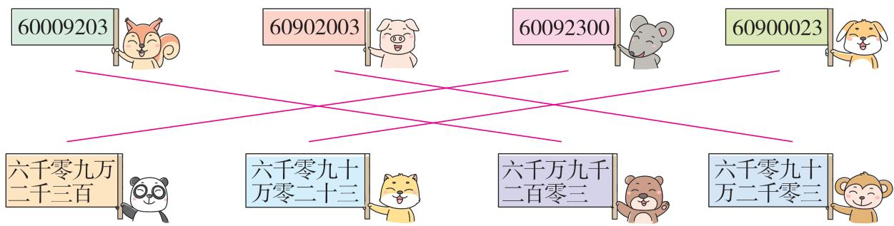

other

| Category | Value |
|---|---|
| 六千零九万二千三百 | 60009203 |
| 六千零九十万零二十三 | 60902003 |
| 六千万九千二百零三 | 60092300 |
| 六千零九十万二千零三 | 60900023 |

# 过能力关 核心素养提升练

# 4（开放题·结论开放）在下面的计数器上挪动一颗珠子，可以得到一个新的多位数。

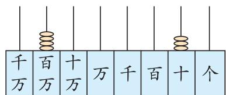

text_image

千万 百万 十万 万 千 百 十 个

要使这个数读两个零,应该挪动一颗珠子到(万)位上,这个新的数读作(三百零一万零三十或四百零一万零二十)。

# 过基础关

# 教材知识巩固练

1（教材 P7 做一做变条件）将下列各数写在数位顺序表中。

<table><tr><td></td><td></td><td>千万位</td><td>百万位</td><td>十万位</td><td>万位</td><td>千位</td><td>百位</td><td>十位</td><td>个位</td></tr><tr><td>七十万五千六百一十三</td><td>写作:</td><td></td><td></td><td>7</td><td>0</td><td>5</td><td>6</td><td>1</td><td>3</td></tr><tr><td>四千零八十一万零二十</td><td>写作:</td><td>4</td><td>0</td><td>8</td><td>1</td><td>0</td><td>0</td><td>2</td><td>0</td></tr><tr><td>九千九百万二千九百</td><td>写作:</td><td>9</td><td>9</td><td>0</td><td>0</td><td>2</td><td>9</td><td>0</td><td>0</td></tr></table>

2（名校期末真题）写出下面横线上的数。

natural_image

Scenic view of a traditional Chinese pavilion surrounded by lotus flowers and greenery, with mountains in the background (no text or symbols visible)

natural_image

Scenic lakeside view with blooming cherry trees and traditional Chinese pavilions reflected in calm water (no text or symbols visible)

杭州西湖以湖光山色与深厚文化闻名,湖面面积达六百三十八万平方米。
写作: 6380000

武汉东湖绿道一期与二期总长约十万一千九百八十米,是国内最长的5A级城市核心区环湖绿道。
写作: 101980

3 选一选。

(1)六千零九万的正确写法是( B )。

A. 6009000

B. 60090000

C. 60000009

(2)写一千三百零三万零三十这个数时,个级上要写( B )个0。

A. 2

B. 3

C. 4

4（情境题·生活情境）妈妈去银行给星星申购了一份儿童教育基金，这个业务的合同上有一个编号，编号信息如下：编号是一个八位数，最高位上的数字是8，十万位上的数字比千万位上的数字小5，十位上的数字是十万位上的数字的2倍，其余数位上一个单位也没有。这个编号是（80300060）。

# 过能力关

# 核心素养提升练

5 小宁读数时,不小心把一个数的千位与百位上的数字交换了位置,万位与百万位上的数字交换了位置,读成了五千零二十八万零四百九十。这个数的正确读法是什么? 正确的写法呢?

这个数的正确读法是五千八百二十万四千零九十,正确写法是58204090。

视频讲解

# 过综合关

# 阶段滚动综合练

# 1 填一填。

(1) 从个位起, 每 ( 四 ) 个数位是一级, 万级包含的计数单位有 ( 万 )、( 十万 )、( 百万 )、( 千万 )。  
(2)2024 年清明节假期 3 天,湖南省累计接待游客14913700 人次,横线上的数的最高位是(千万)位,读作(一千四百九十一万三千七百)。

# 2（教材 P9 第 6 题变条件）用不同的方式表示 40600050。

(1) 用计数器表示这个数。

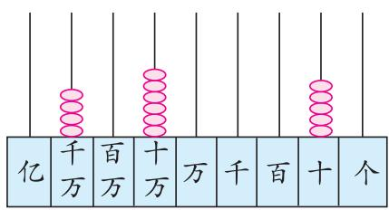

text_image

亿
千万
百万
十万
万
千
百
十
个

(2) 这个数是由(四千万)、六十万、(五十)组成的。

(3)这个数是由4个(千万)、6个(十万)和5个十组成的。

(4) 40600050 = (40000000) + (600000) + (50)。

# 3 选一选。

(1)下面说法不合理的是( B )。

A. 青藏铁路的平均海拔超过 4000 米

B. 华英小学有 150000 名小学生

C. 北京市的常住人口超过 20000000 人

(2)从 5306090 中划去( C )上的“0”, 这个数读出两个 0。

A. 万位

B. 百位

C. 个位

# 4（开放题·结论开放）用4个4和3个0按要求组成不同的七位数。（各写两个即可）

# (答案不唯一)

(1)一个0都不读。

4444000 4404400

(2) 只读出一个 0。

4044400 4404004

(3)读出两个0。

4044040 4044004

# 过拓展关

# 思维拓展培优练

# 5 强强和冬冬玩猜数游戏。强强说：“有一个七位数，最高位上的数是9，十万位上的

数是2,百位上的数比百万位上的数小3,其余四个数位上的数是3个0和1个7,且读数时读出两个0。”猜一猜,这个七位数是(9200607)。

视频讲解

# 过基础关

# 教材知识巩固练

1 在○里填上“＞”“＜”或“＝”。

507039 < 507309

928034 < 928043

一千万 $\textcircled{=}$ 10 个百万

2050000 > 205000

808080 < 880080

900000 > 899999

2 选一选。

(1)下面三种商品,最便宜的是( A )。

A.

笔记本电脑 12880 元

B.

汽车 265800 元

C.

货车 123800 元

(2)下面表示的数中,最大的是( C )。

A. 6000000 + 700000 + 30

B. 6 个十万、7 个万、3 个百

C. 六百七十万零三百

(3)957860 > 9 □0004, □里可填( B )中任意一个数字。

A. $0 \sim 4$

B. $0 \sim 5$

C. $5 \sim 9$

3（名校期末真题）棉花全身都是“宝”，2023年我国棉花主要种植地区的产量如下。

<table><tr><td>地区</td><td>河北省</td><td>山东省</td><td>湖北省</td><td>新疆维吾尔自治区</td></tr><tr><td>产量/吨</td><td>104000</td><td>126000</td><td>96000</td><td>5112000</td></tr></table>

请你将主要种植地区的棉花产量按照由多到少的顺序排列。

(5112000)吨>(126000)吨>(104000)吨>(96000)吨

4（新题型）比较每题中两个数的大小,并写出判断理由。(■表示1个被遮挡的数字)

(1)891500 < 100040

(2)578400 > 56 ■900

理由:891500 是六位数,而■100040 是七位数。比较大数的大小时,如果位数不同,位数少的数就小,所以 891500 < ■100040。

理由:578400 和 56■900 都是六位数, 比较大数的大小时, 位数相同的两个数, 从最高位比起, 两个数的最高位上都是 5, 接着再比较万位上的数, 7 > 6, 所以 578400 > 56■900。

# 过能力关

# 核心素养提升练

5 用下面八张数字卡片按要求组数。

1

3

5

6

8

0

0

0

(1) 组成最大的八位数: (86531000)。  
(2) 组成最小的八位数: (10003568)。  
(3)组成读出三个0的最小的八位数:(10350608)。

视频讲解

# 过基础关

# 教材知识巩固练

1（情境题·科学情境）世界上长度排名前三的三条河流。

尼罗河 长约 6670000 米, 流域面积约是 2870000 平方千米。

长江 长约 6360000 米, 流域面积约是 1800000 平方千米。

亚马孙河 长约 6400000 米, 流域面积约是 6900000 平方千米。

把下面的数改写成用“万”作单位的数。

$$
6 6 7 0 0 0 0 = 6 6 7 \text {   万   }
$$

$$
6 3 6 0 0 0 0 = 6 3 6 \text {   万   }
$$

$$
6 4 0 0 0 0 0 = 6 4 0 \text {万}
$$

$$
2 8 7 0 0 0 0 = 2 8 7 \text {   万   }
$$

$$
1 8 0 0 0 0 0 = 1 8 0 \text {万}
$$

$$
6 9 0 0 0 0 0 = 6 9 0 \mathrm{万}
$$

2 选一选。

(1) 把一个整万数改写成用“万”作单位的数, 这个数的大小与原数相比, ( C )。

A. 变大了

B. 变小了

C. 不变

(2)下面的数,把( B )改写成用“万”作单位的数是490万。

A. 490000

B. 4900000

C. 49000000

(3)一个含有两级的数是由8个千万,5个万组成的,这个数用“万”作单位是(A)。

A. 8005 万

B. 80050000

C. 8050 万

3 照样子在括号里填上最接近的整万数。

示例: 32万 < 324000 < 33万

( 36 万 ) < 367000 < ( 37 万 )

( 407 万 ) <4077000 < ( 408 万 )

( 8118 万 ) <81182000 < ( 8119 万 )

4

计算 700000 + 430000 时, 可以这样算: ① 先把这两个数改写成用“万”作单位的数, 把 700000 改写成 70 万, 430000 改写成 43 万; ② 因为 70 万 + 43 万 = 113 万, 所以 700000 + 430000 = 1130000。

根据上面的方法计算下面各题。

150000 + 22 万 = 37 万(或 370000)

830000 - 210000 = 620000 (或 62 万)

# 过能力关

# 核心素养提升练

5（探究题·新知迁移）我们学会了用“万”作单位改写整万数,那你会不会用“百”“千”作单位改写整百、整千数?各举1个例子。(答案不唯一)

400 = 4 百 5000 = 5 千

# 过基础关

# 教材知识巩固练

1 先写出横线上的数,再省略万位后面的尾数求出近似数。

(1)牙齿最多的动物是蜗牛,共有二万五千六百颗牙齿。

写作：25600 近似数：3 万

(2)商场9月份的营业额为七百八十四万二千八百六十元。

写作：7842860 近似数：784 万

2 选一选。

(1)一个数精确到万位是20万,这个数可能是(A)。

A. 195999

B. 209111

C. 205999

(2)在下面的数线图中用虚线圈出了很多数,这些数都可以“四舍五入”到万位,写成( C )万。

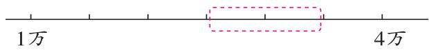

text_image

1万
4万

A. 1

B. 2

C. 3

3（情境题·生活情境）春运期间，河南省除雪里程达24660千米，高速公路出口流量约7209万辆。

(1) 按要求求近似数。

<table><tr><td>原数</td><td>要求</td><td>近似数</td></tr><tr><td rowspan="3">24660</td><td>省略百位后面的尾数</td><td>24700</td></tr><tr><td>省略千位后面的尾数</td><td>25000</td></tr><tr><td>省略万位后面的尾数</td><td>20000</td></tr></table>

(2)用“四舍五入”法得到的近似数与原数相比，(D)。(填字母)

A. 近似数大

B. 原数大

C. 二者相等

D. 大小无法确定

(3) 近似数是 7209 万的数最大是 (72094999), 最小是 (72085000)。

# 过能力关

# 核心素养提升练

4（易错题）在横线上填上合适的数。

(1)36 □ 318≈36 万, □ 里可以填 0,1,2,3,4。  
(2)729 □060≈730 万，□里可以填 5,6,7,8,9。  
(3)61249 □ 30≈6125 万，□里可以填 0,1,2,3,4,5,6,7,8,9。  
(4)10 □ 43699≈1024 万, □里可以填 2。

视频讲解

# 过综合关

# 阶段滚动综合练

# 1 填一填。

(1)第二十五届哈尔滨冰雪大世界累计接待游客 2710000 人次,为海内外游客展示了中国东北地区的冰雪魅力。横线上的数改写成用“万”作单位的数是(271万)。  
(2)一个数由99个万和5356个一组成,这个数写作(995356),省略万位后面的尾数约是(100)万。  
(3) 将 519130“四舍五入”到万位约是 (52 万), 将 520198“四舍五入”到万位约是 (52 万)。  
①在图上标一标这两个数的大致位置。略
②(520198)更接近52万。

# 2（易错题·迁移误用）选一选。

(1) 如果 411 □ 000 ≈ 411 万, □ 里能填的数是 ( C )。

A. 9

B. 5

C. 4

D. 0

(2)4 □ 999998 < 47899999, □里最大可以填( B )。

A. 5

B. 6

C. 7

D. 8

# 3（教材 P15 第 6 题变设问）先填表格,再把国家的名称按照国土面积从小到大的顺序排一排。

<table><tr><td>国家</td><td>国土面积(平方千米)</td><td>“四舍五入”到万位(万平方千米)</td></tr><tr><td>菲律宾</td><td>299764</td><td>30</td></tr><tr><td>马来西亚</td><td>330257</td><td>33</td></tr><tr><td>印度尼西亚</td><td>1913579</td><td>191</td></tr><tr><td>泰国</td><td>513120</td><td>51</td></tr></table>

排序：菲律宾 < 马来西亚 < 泰国 < 印度尼西亚

# 过拓展关

# 思维拓展培优练

# 4 用 4,5,9 和 3 个 0 这六个数字按要求写出六位数。

(1)

写出一个“四舍五入”到万位约等于50万的最小六位数：495000。

(2)

写出一个“四舍五入”到万位约等于50万的最大六位数：\_\_\_\_。

(3)

写出一个与95万最接近的六位数：950004。

(4)

写出一个与40万最接近的六位数：400059。

# 过基础关

# 教材知识巩固练

# 1 填一填。

(1) 表示物体个数的 1,2,3,4,…都是(自然数)。一个物体也没有,用(0)表示。  
(2)自然数的个数是(无限的)。最小的自然数是(0)，(没有)最大的自然数。相邻的两个自然数相差(1)。  
(3)在数位顺序表中,每相邻两个计数单位之间的进率都是(十),这样的计数方法叫作(十进制)计数法。  
(4)十进制在生活中很常见,下面用到十进制的有(④⑤)。(填序号)

① 60 秒 = 1 分

② 12 个 = 1 打

③ 24 时 = 1 天

④ 10 分米 = 1 米

⑤ 1 元 = 10 角

⑥ 1 周 = 7 天

# 2 选一选。

(1)一个九位数,它最高位的计数单位是( B )。

A. 千万

B. 亿

C. 十亿

(2) 四千亿零七十万这个数 ( B )。

A. 没有个级

B. 是一个十二位数

C. 不是自然数

(3)下面说法正确的是( C )。

A. 巴比伦数字: I Ⅱ Ⅲ Ⅳ V V VI VII VIII IX

B. 阿拉伯数字是由阿拉伯人发明的

C. 1,2,3…是阿拉伯数字

# 过能力关

# 核心素养提升练

3 (探究题·新知迁移)我国的古人用小棍子(算筹)记数。下面是1\~9的两种表示方法。用算筹表示多位数时,从右到左,纵横相间,并用“空一位”的方法表示0,如下图中的29和306。

  
视频讲解

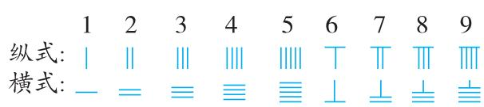

text_image

纵式: | | | | | | | | | T | | | | | |
横式: - = ≡ ≡ ≡ ⊥ ⊥ ⊥ ⊥ ⊥

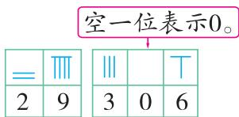

text_image

空一位表示0。
=
Ⅲ
Ⅱ
T
2 9
3 0 6

请你试着写出算筹表示的数或用算筹表示出下面的数。

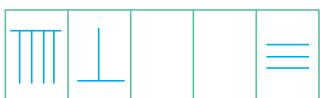

(96003)

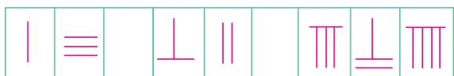

text_image

| ≡ | ⊥ || | | | ⊥ | |

1 3 0 6 2 0 8 7 9

# 过基础关

# 教材知识巩固练

# 1 填一填。

(1)937200000 读作（九亿三千七百二十万），其中 7 在（百万）位上，表示（7 个百万）。  
(2) 8154607000 个级的数是 (7000), 万级的数是 (5460), 亿级的数是 (81), 读作 (八十一亿五千四百六十万七千)。

# 2 选一选。

(1) 在 4000009 的末尾添上 2 个 0, 得到一个新数, 这个数读作 (A)。

A. 四亿零九百

B. 四十万零九百

C. 四亿零九

(2)中国国家大剧院占地总面积为 118900 平方米,总造价3067000000 元。关于横线上的数,下列说法正确的是(B)。

A. 最高位是百亿位

B. 读作: 三十亿六千七百万

C. 这个数中的“6”比“7”小 1000000

# 3（跨学科融合）读出下面横线上的数。

(1)三峡大坝是世界上最大的水电站,正常蓄水位为175米,总库容为39300000000立方米,形成了总面积达1084000000平方米的人工湖泊。

第一个数读作：三百九十三亿 第二个数读作：十亿八千四百万

(2) 我国有丰富的石油资源和煤炭资源, 其中石油资源的基础储量大约是 3851206500 吨, 煤炭资源的基础储量大约是 218570000000 吨。

第一个数读作：三十八亿五千一百二十万六千五百

第二个数读作：二千一百八十五亿七千万

# 4 连一连。

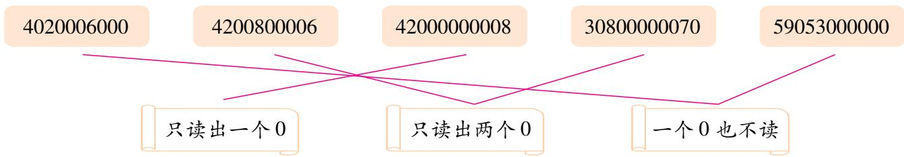

flowchart

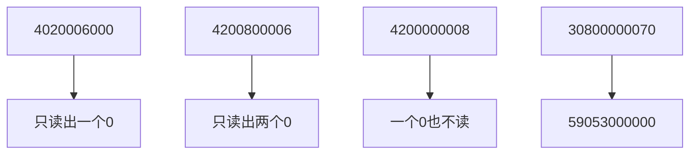

# 过能力关

# 核心素养提升练

5 李老师笔记本电脑的密码是一个九位数。李老师忘记密码是多少了,他只记得密码是由 5 个 7 和 4 个 0 组成的,并且万位上的数是 7。请你借助李老师的记忆和提示帮李老师找回密码:(707070707)。(提示:该密码读数时要读出四个 0)

# 过基础关

# 教材知识巩固练

1 写出下面横线上的数。

(1)河南省有一处被誉为“天然地质史书”的地质奇观——嵩山书册崖,其形成与十八亿年前的中岳运动密切相关。

写作：1800000000

(2) 截止到 2024 年底, 我国 5G 移动电话用户达十亿一千四百万户。

写作：1014000000

2 把下面各数改写成用“亿”作单位的数。

$$
4 5 0 0 0 0 0 0 0 0 = \underline {{4 5}} \text {亿}
$$

$$
2 1 0 0 0 0 0 0 0 0 0 = \underline {{2 1 0}} \text {亿}
$$

$$
7 0 1 0 0 0 0 0 0 0 0 = \underline {{7 0 1}} \text {亿}
$$

$$
5 0 0 3 0 0 0 0 0 0 0 0 0 = \underline {{5 0 0 3}} \text {亿}
$$

3 根据要求写出下面各数。

(1)由 2 个亿和 2794 个一组成的数。

写作：200002794

(2)由十五亿、八百万和二十组成的数。

写作：1508000020

(3) 80000000000 + 700000 + 6000 + 500

写作：80000706500

4（情境题·科学情境）阅读材料，把横线上的数按从小到大的顺序排列起来。

火星与地球间的距离呈周期性变化,最近时约 55000000 千米,最远时可达 4 亿多千米。据了解,当“天问一号”探测器抵达火星时,飞行里程约 475000000 千米,距离地球约 19200 万千米。

$$
5 5 0 0 0 0 0 0 <   1 9 2 0 0 \text {   万   } <   4 \text {   亿   } <   4 7 5 0 0 0 0 0 0
$$

# 过能力关

# 核心素养提升练

5 一个数有三级,其中某一级上的数恰好是火警电话号码添一个“0”,某一级上的数是急救中心电话号码添一个“0”,另一级上的数是交通事故报警电话号码添一个“0”。这个数最大是多少? 最小是多少? (提示:“0”只能添在电话号码的前面或后面,不能添在电话号码数字中间)

这个数最大是 122012001190，

最小是 119001200122。

火警电话:119

急救中心电话:120

交通事故报警电话:122

视频讲解

# 过基础关

# 教材知识巩固练

1 用“四舍五入”法省略亿位后面的尾数,写出下列各数的近似数。

149597870≈(1)亿

778330000≈( 8 )亿

1429400000≈( 14 )亿

2870990000≈(29)亿

2 选一选。

(1) 把 960085103“四舍五入”到亿位, 求近似数是看 ( B ) 位上的数进行取舍。

A. 亿

B. 千万

C. 百万

D. 十亿

(2)下面各数,最接近14亿的是(D)。

A. 1390010000

B. 1485600000

C. 1417050000

D. 1400040000

(3)(名校期末真题)下面各数中,省略亿位后面的尾数约是10亿的数有( C )。

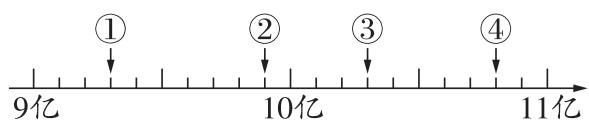

text_image

①
9亿
②
10亿
③
11亿

A. ①②③④

B. ③

C. ②③

D. ②

3 在横线上填上合适的数。

(1)5 □ 4000000≈5 亿，□里可以填 0,1,2,3,4。

(2)19 □ 1900000≈20 亿，□里可以填 5,6,7,8,9。

(3)987 □0000000≈987 亿，□里可以填 1,2,3,4。

4（易错题·方法误用）他俩谁说得对？为什么？

他俩说得都对。因为芳芳是省略亿位后面的尾数,约是9亿;贝贝是省略万位后面的尾数,约是89700万。

897000023的近似数是9亿。

897000023的近似数是89700万。

芳芳

贝贝

# 过能力关

# 核心素养提升练

5（新题型）下图中的数字圈,从任何一个数字开始按箭头方向都可以顺次组成一个九位数。组成最大的数是多少？最小的数是多少？改写成用“亿”作单位的近似数分别是多少？

组成最大的数是 993195198, 改写成用“亿”作单位的近似数是 10 亿; 组成最小的数是 195198993, 改写成用“亿”作单位的近似数是 2 亿。

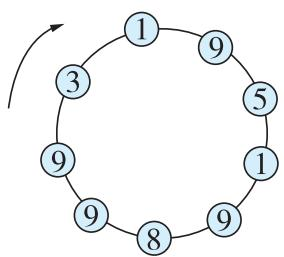

flowchart

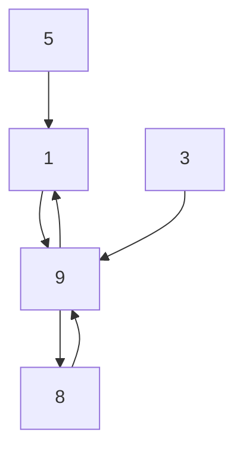

视频讲解

# 过综合关

# 阶段滚动综合练

# 1 填一填。

(1)2024年,宁波舟山港完成货物吞吐量1377000000吨,稳居全球第一。

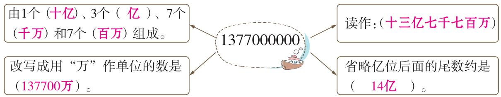

flowchart

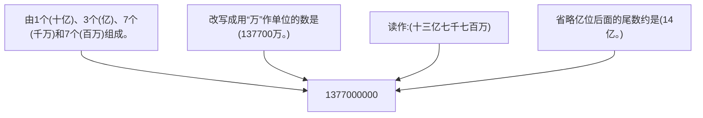

(2)与1亿相邻的两个自然数分别是(9999999)和(10000001)。  
(3) 在 3 和 6 中间添 (10) 个 0, 这个数就读作三千亿零六, 写作 (300000000006)。  
(4)1024 □ 3000000 > 102463000093, □ 里最小能填(7)。

2（跨学科融合）下面是有关地球的小知识。请你把资料补充完整。

# 地球小知识

年龄 约 4600000000 岁 = ( 46 亿 ) 岁 (改写成用“亿”作单位的数)

公转周期 约 365 天

地球赤道半径 约 6378140 米, 横线上的数是一个(七)位数, 读作: (六百三十七万八千一百四十)。

地球表面积 约 510000000 平方千米,把它“四舍五入”到亿位约是(5)亿平方千米。

地球轨道周长 约 924375700 千米,省略万位后面的尾数约是(92438 万)千米。

3 用 5 个 0 和 3,8,9,2,6,7 组成一个十一位数,要求所有的 0 都读出来。这个数省略亿位后面的尾数约是 308 亿,组成的数可能是什么? (写出一个即可)

答案不唯一,如 30809020607。

  
视频讲解

# 过拓展关

# 思维拓展培优练

4 在计数器上用 22 颗珠子表示一个十位数, 这个数用“四舍五入”法省略亿位后面的尾数约是 30 亿, 这个数最小是 (295000006), 把它在计数器上表示出来。

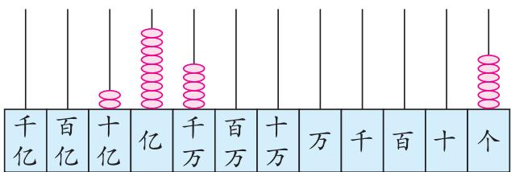

text_image

千亿
百亿
十亿
亿
千万
百万
十万
万
千
百
十
个

# 过基础关

# 教材知识巩固练

# 1 填一填。

(1) 两千多年前, 中国人用 (算筹) 计算。一千多年前, 中国人又发明了 (算盘), 它的 1 颗上珠表示 (5), 1 颗下珠表示 (1)。

(2)

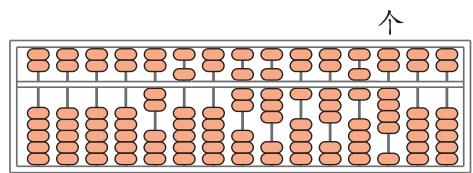

text_image

个

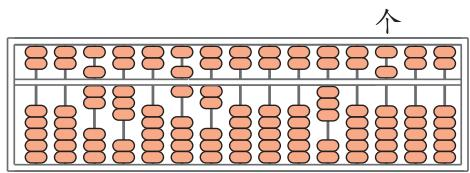

text_image

个

写作：250781364

写作：73062000305

读作：二亿五千零七十八万一千三百六十四 读作：七百三十亿六千二百万零三百零五

# 2 选一选。

(1)用计算器计算时,清除输错的数字用(D)键。

A. OFF

B. ON

C. M +

D. CE

(2)(易错题·迁移误用)小明用计算器计算1350乘48。他依次按1350×这七个键后,计算器上显示出10800。这时,小明发现自己在按第二个因数时少按了4。如果要得到1350乘48的正确结果,但又不取消重按,那么应该继续依次按( C )。

A. + 4 0 =

B. × 4 =

C. × 6 =

D. × 4 0 =

3 先用计算器算一算第 1 列三个算式,再根据规律接着写出第 2 列其他算式和得数。

$$
1 1 1 1 1 1 \div 3 7 0 3 7 = 3
$$

$$
2 2 2 2 2 2 \div 3 7 0 3 7 = 6
$$

$$
3 3 3 3 3 3 \div 3 7 0 3 7 = 9
$$

$$
(4 4 4 4 4 4) \div (3 7 0 3 7) = (1 2)
$$

$$
(5 5 5 5 5 5) \div (3 7 0 3 7) = (1 5)
$$

$$
(6 6 6 6 6 6) \div (3 7 0 3 7) = (1 8)
$$

# 过能力关

# 核心素养提升练

4（探究题·思考过程）老师常说，计算器是一种工具，不能代替我们思考。你知道亮亮算得比计算器还快的窍门在哪里吗？写一写。

$$
\begin{array}{l} 9 9 8 + 9 9 9 + 1 0 0 0 + 1 0 0 1 + 1 0 0 2 - 2 2 \\ = 1 0 0 0 - 2 + 1 0 0 0 - 1 + 1 0 0 0 + \\ 1 0 0 0 + 1 + 1 0 0 0 + 2 - 2 2 \\ = 5 0 0 0 - 2 2 \\ = 4 9 7 8 \\ \end{array}
$$

这个简单，我已经算出来了，结果是4978。

$$
9 9 8 + 9 9 9 + 1 0 0 0 + 1 0 0 1 + 1 0 0 2 - 2 2
$$

怎么比我用计算器还算得快？

亮亮

玲玲

# 过重难关

# 重点难点滚动练

近年来,我国城市轨道交通遍地开花,为城市的高速运转带来了活力与硬实力保障。截至2024年12月31日,31个省(自治区、直辖市)和新疆生产建设兵团共有43个城市开通运营地铁、轻轨线路,运营里程九百四十七万七千六百米,完成客运量31130000000人次,进站量18510000000人次;16个城市开通运营单轨、磁浮、市域快速轨道交通线路,运营里程970700米,完成客运量980000000人次,进站量660000000人次;18个城市开通运营有轨电车、自动导向轨道线路,运营里程497300米,完成客运量130000000人次。

# 重难点 1 掌握数位顺序表、计数单位及数的含义

# 1 想一想,填一填。

(1)在数位顺序表中,从个位起,第(七)位是百万位,它左边是(千万)位;第四位是(千)位,它的计数单位是(千)。  
(2)31130000000 是一个(十一)位数,它由(3113000)个万组成。明明说,这个数左边的“3”和右边的“3”表示的含义一样,你同意吗?(不同意),理由是(左边的“3”表示3个百亿,右边的“3”表示3个千万)。

# 重难点 2 掌握大数的读写、改写、求近似数和大小比较

# 2 读出下面的数。

970700 读作: (九十七万零七百)

980000000 读作: (九亿八千万)

18510000000 读作: (一百八十五亿一千万)

3 2024 年地铁、轻轨运营里程九百四十七万七千六百米, 画线的数写作 (9477600), 这个数省略万位后面的尾数约是 (948) 万。

4 2024 年全年客运量比 2023 年增加 2800000000 人次,也就是增加(28)亿人次。

5 将下面的数据按照从小到大的顺序排列。

660000000

497300

130000000

497300 < 130000000 < 660000000

# 易错点 1 混淆数级、数位、计数单位

# 6 选一选。

(1)亿位、十亿位、百亿位、千亿位都是亿级的(A)。

A. 数位

B. 数级

C. 计数单位

(2) 古人没有“数”的概念, 打猎收获一只猎物就用一个小石子表示, 当猎物多时, 就把若干个小石子换成一个大石子表示, 这里的“石子”相当于我们现在的 ( C )。

A. 数位

B. 数级

C. 计数单位

# 易错点 2 读写中间或末尾有 0 的数时出错

# 7 下面是笑笑做的练习题,请你给她批改。(用○圈出错误的地方,并在横线上改正) 圈错略

(1)在数字4和5之间添(5)个0,就读作四千万零五。

改正：6

(2)三千五百万零七十写作(3500070)。

改正：35000070

(3)由 2 个亿、6 个千万、4 个万和 9 个一组成的数是(260400009)。

改正：260040009

(4)230600000,236007000,236070000,20036077 这四个数中,一个 0 也不读的是 (236007000)。

改正：

# 易错点 3 不能灵活运用求近似数的方法

8 在□里填上合适的数。

709 4 800≈709 万(填最大的数)

61 9 0945700≈62 亿(填最大的数)

59 7 26600 > 59726500 (填最小的数)

2099 1 000≈2099 万(填最小的数)

9 一个七位数由数字7、5、9、6、1和2个0组成。已知1在十位上,这个七位数省略万位后面的尾数约是568万。这个七位数是多少?

这个七位数是 5679010。

# 过综合关

# 单元滚动综合练

# 1 填一填。

(1) 自然数的最小计数单位是(个或一), 百万和亿之间的进率是(100)。  
(2)一个十一位数,最高位上的数是6,从个位起第七位上的数是8,个位上的数是3,其余各数位上的数是最小的自然数,这个数写作(60008000003),读作(六百亿零八百万零三),四舍五入到亿位约是(600亿)。  
(3) $997 + 998 + 999 + 1000 + 1001 + 1002 + 1003 = (7000)$   
(4)从 5704590212 中划去 4 个数字,使剩下的 6 个数字(前后顺序不变)组成一个六位数,这个六位数最大是(790212),最小是(450212)。

2 在 ○ 里填上“＞”“＜”或“＝”。

390000 > 93000

163000000 < 16 亿

500000000 = 5 亿

32 万= 320000

643000 > 64 万

586000 > 568000

# 3 选一选。

(1)下面横线上的数是近似数的是( B )。

A. 截至某日,央视新闻的微信公众号已经发表了 3291 篇原创内容  
B. 小宁写了一篇 450 字左右的作文 
C. 湘潭大学校友向母校捐赠 1000 万元

(2)写出下面各数时,写出的0最多的是( C )。

A. 七十万零七百

B. 一万零五

C. 四百万六千

(3)三位同学用不同的方式表示算盘上的这个数,其中错误的是( C )。

百十 千百十

亿亿亿万万万千百十个

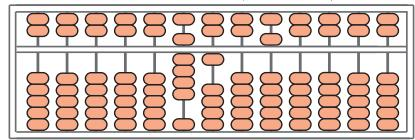

text_image

Abacus representation showing beads positioned at various positions of a 12-digit number

A. 910500   
B. 由 91 个万和 500 个一组成  
C. 900000 + 1000 + 500

(4)下列说法正确的是( B )。

A. 由 4 个千万和 4 个百组成的数读作四千万四百  
B. 含有个级、万级和亿级的数中, 最小的是九位数  
C. 999999 可能比 1 □ 00000 大

4 用计算器计算左边三个算式,再根据规律直接写出右边算式的得数。

$$
9 \times 9 + 7 = 8 8
$$

$$
9 8 7 6 \times 9 + 4 = 8 8 8 8 8
$$

$$
9 8 \times 9 + 6 = 8 8 8
$$

$$
9 8 7 6 5 \times 9 + 3 = 8 8 8 8 8 8
$$

$$
9 8 7 \times 9 + 5 = 8 8 8 8
$$

$$
9 8 7 6 5 4 \times 9 + 2 = 8 8 8 8 8 8 8
$$

5（情境题·生活情境）阅读材料，回答问题。

材料一:2025年春节假期8天,全国国内旅游出游五亿零一百万人次,国内游客出游总花费677002000000元。出入境旅游约14366000人次,其中出境旅游约3783800人次。

材料二:海南离岛免税销售火爆。海口海关统计显示,2025年1月28日至2月4日,海口海关共监管离岛免税购物金额2094000000元,人均消费8706元。2024年,海口海关共监管离岛免税销售金额30940000000元。据悉,海南省旅游和广电体育厅一季度发放酒店消费券10000000元。

(1)读出或写出下面的数。

五亿零一百万

写作:( 501000000 )

677002000000

读作:( 六千七百七十亿零二百万 )

14366000

读作:( 一千四百三十六万六千 )

(2) 将 10000000 改写成用“万”作单位的数是 (1000 万)。

(3)写出下面各数的近似数。

2094000000≈(21)亿

3783800≈( 378 )万

30940000000≈(309)亿

# 过拓展关 思维拓展培优练

6 这个数最大是多少？最小是多少？

一个九位数，各个数位上的数字之和是15，其中万位上的数字是亿位上数字的2倍。

这个数最大是 430080000, 最小是 100020039。

  
视频讲解

反馈区

请使用第一单元测评卷，测一测吧！

▶ 见活页卷

# 过基础关

# 教材知识巩固练

教材例题
讲解

1 1亿里有(10)个一千万,1亿里有(100)个一百万,1亿里有(1000)个十万,1亿里有(10000)个一万。

2 (探究题·新知迁移)小星研究“1亿枚一元硬币摞起来有多高?”这个问题时,先将10枚一元硬币摞起来测量出了高度,然后分别推测出了1千枚、1万枚、1亿枚硬币摞起来的高度。请根据下表中的数据,将记录表补充完整。

<table><tr><td>硬币数量/枚</td><td>10</td><td>1000</td><td>10000</td><td>100000000</td></tr><tr><td>高度</td><td>2厘米</td><td>(2)米</td><td>(20)米</td><td>(200000)米</td></tr></table>

3 阅读下面的信息,回答问题。

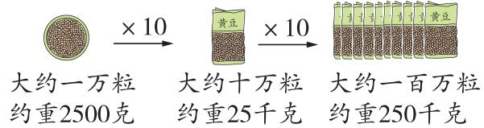

text_image

大约一万粒
约重2500克
×10
大约十万粒
约重25千克
×10
大约一百万粒
约重250千克

(1)1 亿粒黄豆约重(25000)千克。  
(2)下面哪种情况下的黄豆和1亿粒黄豆更接近？在□里画“√”。

text_image

一车100袋黄豆，
每袋25千克。

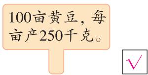

text_image

100亩黄豆,每
亩产250千克。

# 过能力关

# 核心素养提升练

4（情境题·科学情境）水是人体的重要组成部分。

(1)100 滴水大约重 8 克,1 亿滴水大约重多少千克?

$$
1 0 0 0 0 0 0 0 0 \div 1 0 0 \times 8 = 8 0 0 0 0 0 0 (\text {   克   })
$$

8000000 克 = 8000 千克

答:1 亿滴水大约重 8000 千克。

(2)我国约有14亿人口,如果每人每天节约一滴水,全国每天大约可以节约多少吨水?

8000 千克 = 8 吨

$8 \times 14 = 112$ （吨）

答:如果每人每天节约一滴水,全国每天大约可以节约112吨水。

(3)请你列举2条节约水资源的方法。

(答案不唯一)①随手关紧水龙头;②家中洗菜的水用来浇花。

# 第二单元 公顷和平方千米

# 1 公顷的认识

# 过基础关 教材知识巩固练

1 填一填。

(1)如图,边长是100米的正方形面积是1公顷。

所以:1 公顷 = 100 米 × 100 米 = ( 10000 ) 平方米

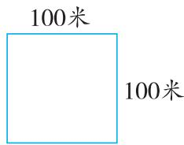

text_image

100米
100米

(2)“中国天眼”是 500 米口径球面射电望远镜。它的反射面积约 25 公顷, 约合 (250000) 平方米。  
(3) 在○里填上“＞”“＜”或“＝”。

2 公顷 > 2000 平方米

90000 平方米 = 9 公顷

2 选一选。

(1)一条长方形飞机跑道长600米,宽50米,占地面积是(B)。

A. 3000 平方米

B. 3 公顷

C. 30 公顷

(2)1 公顷大约和( C )的面积差不多。

A. 边长为 10 米的正方形花坛  
B. 长为 50 米, 宽为 21 米的长方形泳池  
C. 200 个长为 8 米, 宽为 6 米的教室

3（情境题·生活情境）请你为佳佳的日记填上合适的面积单位。

今天,我们家搬进了新房子,可宽敞了!妈妈说它有120(平方米)呢!爸爸还说等我放假了要带我去北京玩。我想去占地面积是44(公顷)的天安门广场看一看。我还想去北海公园,它的占地面积约为68(公顷)。

# 过能力关 核心素养提升练

4（开放题·结论开放）我们学习本课后知道:边长100米的正方形,它的面积是1公顷。你还能设计出其他面积是1公顷的图形吗?试试看吧。要求:画出示意图,并标上相关数据。

(答案不唯一)

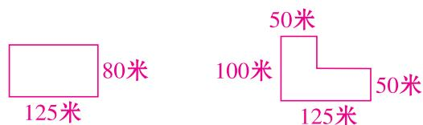

text_image

80米
125米
50米
100米
50米
125米

# 过基础关 教材知识巩固练

# 1 填一填。

(1) 边长是 1 千米的正方形的面积是 1 平方千米, 也就是 (1000) 米 × (1000) 米 = (1000000) 平方米, 所以 1 平方千米 = (1000000) 平方米 = (100) 公顷。  
(2) 家乐果园的占地面积约为 5 公顷, (20) 个这样的果园占地面积大约是 1 平方千米。  
(3)200 公顷 = ( 2 ) 平方千米 50 平方千米 = ( 5000 ) 公顷
100 平方千米 = ( 10000 ) 公顷 = ( 100000000 ) 平方米

2 在○里填上“＞”“＜”或“＝”。

400 公顷 < 40 平方千米

8 平方千米 > 80000 平方米

7000000 m $^{2}$ = 7 km $^{2}$

500 平方千米 > 5 公顷

3（情境题·生活情境）在括号里填上合适的单位。

中国国家体育馆
总占地面积

约10（公顷）

澳门特别行政区
的面积

约33（平方千米）

我国首条跨海高铁——
福厦高铁全长

约277（千米）

4（易错题·方法误用）农业观光园是集科技示范、生态观光、产业开发于一体的综合园区。一个长方形农业观光园长6千米，张叔叔驾驶汽车每小时行驶44千米，绕观光园一周需要半小时，这个观光园的面积是多少公顷？

$44 \div 2 = 22$ (千米)

$(22-6\times2)\div2=5$ （千米）

$6 \times 5 = 30$ (平方千米)

30 平方千米 = 3000 公顷

答: 这个观光园的面积是 3000 公顷。

# 过能力关 核心素养提升练

5 有一块长方形土地,如果它的长增加4千米,面积就增加24平方千米;如果它的宽增加5千米,面积就增加45平方千米。这块长方形土地的面积是多少平方千米?合多少公顷?

长方形的宽: $24 \div 4 = 6$ (千米)

长方形的长: $45 \div 5 = 9$ (千米)

$6 \times 9 = 54$ (平方千米)

54 平方千米 = 5400 公顷

答: 这块长方形土地的面积是 54 平方千米, 合 5400 公顷。

# 重难易错专练（二）

# 主题活动 种植园里的大学问

# 过重难关

# 重点难点滚动练

重难点 1 认识公顷和平方千米，掌握公顷、平方千米和平方米的换算

1 蟠桃园 如果 10 平方米土地能栽种 2 棵蟠桃树,那么 1 公顷土地能栽种(2000)棵蟠桃树,1 平方千米的土地能栽种(200000)棵蟠桃树。

2 苹果园 ★苹果园中各种苹果的种植面积如下表。

<table><tr><td>红富士</td><td>元帅</td><td>花牛</td></tr><tr><td>2 公顷 160 平方米</td><td>98000 平方分米</td><td>10900 平方米</td></tr></table>

请你把这些苹果种类按种植面积从大到小的顺序排一排。（比较时注意单位哟！）

# 红富士、花牛、元帅

重难点 2 综合运用面积计算方法及单位换算的知识解决问题

3 蚂蚁森林公益活动 ★大家通过走路、坐公交等环保行为攒能量,养大手机里的虚拟树后,就能在沙漠种一棵实体的树保护地球。

大约18千克绿色能量能种一棵梭梭树，一棵梭梭树能固定10平方米的沙地。

爸爸每年能收集约36千克绿色能量。

  
亮亮

按照亮亮爸爸收集绿色能量的标准,如果5万人一起收集能量,一年之后种下的梭梭树可以固定多少平方千米的沙地?

$$
3 6 \times 5 0 0 0 0 = 1 8 0 0 0 0 0 (\text { 千   克 })
$$

$$
1 8 0 0 0 0 0 \div 1 8 = 1 0 0 0 0 0 (\text {   棵   })
$$

$$
1 0 0 0 0 0 \times 1 0 = 1 0 0 0 0 0 0 (\text { 平   方   米 })
$$

$$
1 0 0 0 0 0 0 \text {   平方米   } = 1 \text {   平方千米   }
$$

答:一年之后种下的梭梭树可以固定1平方千米的沙地。

# 过易错关

# 易错易混考点练

易错点 缺乏对面积单位大小的生活感知

4 葡萄园 ★葡萄园的面积有（B），园内种植了阳光玫瑰和巨峰葡萄两个品种，一年能赚9万元。（填字母）

A. 10 平方米

B.2 公顷

C. 200 平方千米

反馈区

# 请使用第二单元测评卷，测一测吧！

▶ 见活页卷

# 1 线段、直线、射线

# 过基础关

# 教材知识巩固练

1 把下面各图形的序号填在相应的括号里,你有什么发现?

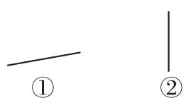

直线:( ①②⑥ )

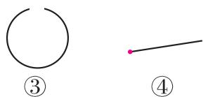

text_image

③
④

射线:( ④⑦ )

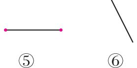

线段:( ⑤ )

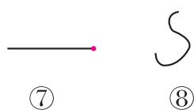

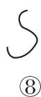

我发现 线段有(2)个端点,长度有限,射线有(1)个端点,直线有(0)个
端点,射线和直线都是无限长。

2（跨学科融合）阅读小丽的数学日记，按要求做题。

我们做事要像(线段)一样,有始有终;
我们学习要像(射线)一样,有始无终;
我们想象要像(直线)一样,无始无终。

用“线段”“直线”或“射线”填空。

3 (教材 P44 第 1 题变设问)画一画,填一填。

(1) 过点 A 画直线 m。（画法不唯一）经过点 A 可以画（无数）条直线。  
(2) 过 B、C 两点画直线 n。经过 B、C 两点可以画(1)条直线。

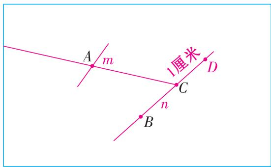

text_image

A m
1厘米
C
n
B
D

(3) 在直线 n 上取一点 D, 使线段 CD 的长为 1 cm。(画法不唯一)

(4)画出射线 CA。

(5)数一数,画好的图形中有(2)条直线,(10)条射线,(4)条线段。

# 过能力关

# 核心素养提升练

4 下面是一把磨损严重的直尺, 只能看清直尺上的几个刻度。如果只用这把直尺来测量线段的长度, 那么一次可以测量出 (6) 种不同的长度。

<table><tr><td>0</td><td>3</td><td>4</td><td>10</td></tr></table>

视频讲解

# 过基础关

# 教材知识巩固练

# 1 填一填。

(1) 填出右边角的各部分名称。这个角记作 ( $\angle 1$ )。  
(2)从一点引出两条(射线)所组成的图形叫作角,角通常用符号(∠)来表示。

(边)
(顶点) $\overset{1}{\underset{\text{(边)}}{ \rightarrow}}$

2 判断下面的图形是不是角,是角的画“√”,不是角的画“×”。

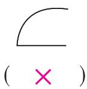

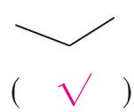

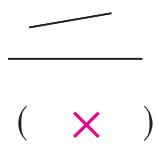

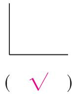

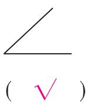

3 下图中各有几个角?

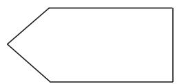  
( 5 )个角

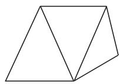  
( 14 )个角

4（跨学科融合）明明有一些正方形手工纸,如果沿直线剪掉一个角,还剩几个角?
(在下面画出来)

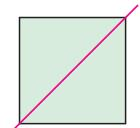  
剩3个角

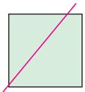  
剩4个角

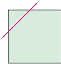  
剩5个角

想一想有几种情况，要考虑全面哟！

# 过能力关

# 核心素养提升练

5(探究题·规律探究)照样子,以 A 为端点,试着向不同方向画射线。边画边完成下表。

  
视频讲解

<table><tr><td>图形</td><td></td><td></td><td></td><td></td></tr><tr><td>射线条数</td><td>2</td><td>3</td><td>4</td><td>5</td></tr><tr><td>角的个数</td><td>1</td><td>3</td><td>6</td><td>10</td></tr></table>

根据上面的规律,想一想:如果画6条射线,一共有(15)个角;如果画7条射线,一共有(21)个角。

# 过基础关 教材知识巩固练

1 下面量角的方法对吗？在正确的方法下面的括号里填出角的度数。

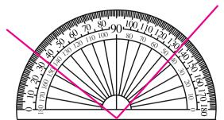

text_image

0
10
20
30
40
50
60
70
80
90
100
110
120
130
140
150
160
170
180
190
200
210
220
230
240
250
260
270
280
290
300
310
320
330
340
350
360
370
380
390
400
410
420
430
440
450
460
470
480
490
500

( )

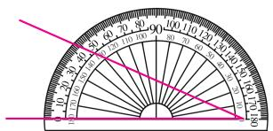

text_image

120
120
120
120
120
120
120
120
120
120
120
120
120
120
120
120
120
120
120
120
120
120
120
120
120
120

( )

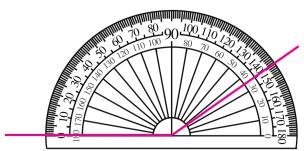

text_image

34
12
8
6
4
2
0
-2
+2
-4
+4
-6
+6
-8
+8
-10
+10
-12
+12
-14
+14
-16
+16
-18
+18
-18
+18
-18
+18
-18
+18
-18
+18
-18
+18
-18
+18
-18
+18
-18
+18
-18
+18
-18
+18
-18
+18
-18
+18
-16

( $145^{\circ}$ )

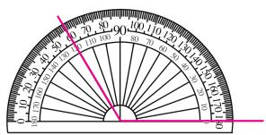

text_image

0
10
20
30
40
50
60
70
80
90
100
110
120
130
140
150
160
170
180
190
200
210
220
230
240
250
260
270
280
290
300
310
320
330
340
350
360
370
380
390
400
410
420
430
440
450
460
470
480
490
500
510
520
530
540
550
560
570
580
590
600

( $120^{\circ}$ )

总结:用量角器量角时,把量角器的(中心)与角的顶点重合, $0^{\circ}$ 刻度线与角的一条边(重合),角的另一条边所对的量角器上的刻度,就是这个角的度数。

2 量出下面各角的度数。

1 ∠ 1 = (75°)

$\angle2=(40^{\circ})$

3 ∠3 = ( 120° )

3 选一选。

(1)下面( B )的说法是错误的。

A. 角的两条边张开得越大, 角就越大  
B. 把一个 $30^{\circ}$ 的角放在 10 倍的放大镜下和放在 100 倍的放大镜下看到的角不一样大  
C. 量角器上每一小份所对的角的度数是 $1^{\circ}$

(2)如图是一个破损的量角器,观察图中量角器上的刻度, $\angle1=(C)$ 。

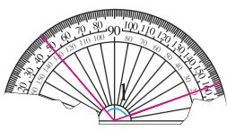

A. $50^{\circ}$

B. $160^{\circ}$

C. $110^{\circ}$

# 过能力关 核心素养提升练

4（探究题·新知迁移）动手操作:量出下面各图中每个角的度数,并填在表中。

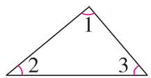  
①

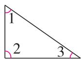  
②

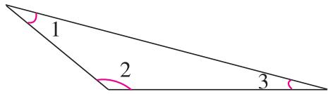

text_image

1
2
3

③

<table><tr><td></td><td>∠1</td><td>∠2</td><td>∠3</td><td>∠1+∠2+∠3</td></tr><tr><td>1</td><td>90°</td><td>40°</td><td>50°</td><td>180°</td></tr><tr><td>2</td><td>55°</td><td>90°</td><td>35°</td><td>180°</td></tr><tr><td>3</td><td>25°</td><td>140°</td><td>15°</td><td>180°</td></tr></table>

计算分析:求出三个角的度数之和,并填在表中,你发现了什么?

我发现：三角形三个角的度数之和等于 $180^{\circ}$ 。

# 过基础关 教材知识巩固练

# 1 填一填。

(1)下面度数的角,有(3)个是锐角,有(1)个是钝角。

$39^{\circ}$

$89^{\circ}$

$90^{\circ}$

112°

$76^{\circ}$

$180^{\circ}$

$360^{\circ}$

$192^{\circ}$

(2) 把一张圆形的纸对折两次。

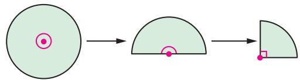

flowchart

$360^{\circ}$

(180°)

( 90° )

周角

(平角)

(直角)

我发现：

1 周角 = ( 2 ) 平角 = ( 4 ) 直角。

# 2 (教材 P45 第 7 题变条件) 求下面各角的度数。

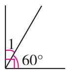

$$
\angle 1 = (3 0 ^ {\circ})
$$

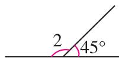

$$
\angle 2 = (1 3 5 ^ {\circ})
$$

$$
\angle 3 = (3 0 ^ {\circ})
$$

$$
\angle 4 = (1 5 0 ^ {\circ})
$$

# 3 下面三幅图都是由一副三角尺拼成的,请你算一算 $\angle1,\angle2,\angle3$ 各是多少度。

$$
\angle 1 = (1 5 0 ^ {\circ})
$$

$$
\angle 2 = (1 5 ^ {\circ})
$$

$$
\angle 3 = (6 0 ^ {\circ})
$$

# 4（大单元关联）先填出钟面上的这些角，再回答问题。

( 30 )°

(锐)角

( 90 )°

(直)角

(120)°

(钝)角

(1) 分针走 1 小时, 走了 (360)°, 是 (周) 角。  
(2)钟面上(6)时整,时针和分针形成的角是平角,再过半小时,时针和分针形成的角是(锐)角。  
(3) 李老师早上 7:00 出门, 当天晚上 7:00 到家, 这段时间钟面上的时针旋转所形成的角是 ( 周 ) 角。

# 过能力关 核心素养提升练

# 5 如图, $\angle1$ 和 $\angle3$ 的度数相等吗? 请你说出理由。

相等。因为 $\angle1$ 和 $\angle2$ 合在一起是一个平角， $\angle3$ 和 $\angle2$ 合在一起也是一个平角，所以 $\angle1 = \angle3$ 。（理由合理即可）

text_image

1
2
3

视频讲解

# 过基础关 教材知识巩固练

# 1 用量角器按要求画角。

(1)以下面的射线作为角的一条边画一个 $65^{\circ}$ 的角和一个 $135^{\circ}$ 的角。图略

natural_image

Two simple geometric lines: a straight line and a horizontal line with a dot at the intersection (no text or symbols)

(2) 先量出 $\angle1$ 的度数, 再在右边画出一个同样大小、开口向左的角。图略

2（开放题·结论开放）你能用一副三角尺画出哪些度数的角？试一试，至少画出2个。（保留作图痕迹）（答案不唯一）

text_image

15°
75°

3 你能想办法画出一个 $240^{\circ}$ 的角吗？下面是两个同学的探究方法，请你选择一种方法画一画。（保留作图痕迹）

text_image

或玲玲：
120°
240°

$240^{\circ} = 180^{\circ} + 60^{\circ}$ ，用平角加上一个 $60^{\circ}$ 的锐角就能得到一个 $240^{\circ}$ 的角。

亮亮

$240^{\circ}=360^{\circ}-120^{\circ}$ ，用周角减去一个 $120^{\circ}$ 的钝角就行了。

# 过能力关 核心素养提升练

4（探究题·规律探究）小华在观看台球比赛时发现,当球撞向桌边时,会向另一个方向弹走,如图所示。

自主探究:量出右面角的度数。

$$
\angle 1 = (4 5 ^ {\circ}), \angle 2 = (4 5 ^ {\circ}),
$$

$$
\angle 3 = \left(3 5 ^ {\circ}\right), \angle 4 = \left(3 5 ^ {\circ}\right) 。
$$

通过观察以上各角的度数,我发现:台球撞向桌边时与桌边所形成的角的度数和弹走时与桌边所形成的角的度数(相等)。

解决问题:运用自主探究中的结论,补全下面台球的行进路线。

natural_image

Two diagrams showing light ray paths with pink dots and arrows, no text or symbols present

# 过重难关

# 重点难点滚动练

# 重难点 1 认识直线、射线、线段

# 1 观察下面的图形,将表格补充完整。

①

②

③

④

<table><tr><td>图形名称</td><td>图形(填序号)</td><td>相同点</td><td>端点个数</td><td>能否测量</td></tr><tr><td>线段</td><td>2</td><td rowspan="3">都是直的</td><td>2</td><td>能</td></tr><tr><td>射线</td><td>1</td><td>1</td><td>不能</td></tr><tr><td>直线</td><td>4</td><td>0</td><td>不能</td></tr></table>

# 重难点 2 认识直角、平角和周角，掌握角之间的关系

# 2 武器和角 ☆ 坦克是现代陆上作战的主要武器之一,凭借又厚又重的装甲进行防御。你知道吗? 将垂直装甲改下角度,使其变成与水平面成一定夹角的“倾斜装甲”,就可以具备更好的实战效能。大家好我们是装甲

(1) 图中 ( $\angle 1$ 、 $\angle 2$ ) 是直角, ( $\angle 3$ 、 $\angle 5$ ) 是锐角, ( $\angle 4$ 、 $\angle 6$ ) 是钝角。

flowchart

(2)(4)个∠1可以拼成一个周角。  
(3) 图中 $\angle3$ 与 $\angle4$ 组成的角是(平)角。已知 $\angle3=45^{\circ},\angle4=(135)^{\circ},\angle5=(45)^{\circ}$ 。

# 3 建筑和角 ★我国居民住房屋顶的坡度由南往北是逐渐减缓的,呈现南尖北平的特点。南方的年降水量大,气候炎热,高而尖的屋顶既利于排水,又利于通风散热。

(1)亮亮的奶奶住在河北,小姨住在浙江,如图是他根据上面的知识设计的屋顶,你知道哪一个是小姨家,哪一个是奶奶家吗?(填一填)  
(2) 亮亮在设计时, $\angle 1$ 画成了 $70^{\circ}$ , 那么 $\angle 2 = (20)^{\circ}$ 。

natural_image

Simple line drawing of a house with roof, door, and window (no text or symbols)

(小姨家)

text_image

2
1
0

(奶奶家)

重难点 3 掌握角的度量方法

4 礼仪和角 ★ 在交往礼仪中,鞠躬是时常需要的。弯腰的角度不同,表示的含义也不同(如图)。照样子,标记下面礼仪中鞠躬所弯的角,测量并记录鞠躬的度数。(标记不唯一)

站立

致意

敬礼

深度敬礼

$$
\angle 1 = (1 5) ^ {\circ} (\angle 2) = (3 0) ^ {\circ} (\angle 3) = (4 5) ^ {\circ}
$$

重难点 4 掌握角的画法

5 图画和角 ★ 长征五号 B 运载火箭是专门为中国载人航天工程空间站建设而研制的一型新型运载火箭,是中国近地轨道运载能力最大的新一代运载火箭。小明画的火箭简图中,用一副三角尺可以画出的角是( D )。

A. $\angle 1 = 140^{\circ}$

B. $\angle 2 = 110^{\circ}$

C. $\angle 3 = 160^{\circ}$

D. $\angle 4 = 135^{\circ}$

6 游乐设施和角 ★ 请你先阅读下面资料,再当个小小设计师,为幼儿园的小朋友设计一款既安全又好玩的滑梯。(在方框中用线段画出攀登梯架和滑道,并标出度数)(画法不唯一,合理即可)

【资料】滑梯要根据儿童的年龄和体型来设计，才能有益于他们的健康成长。一般在为幼儿园小朋友设计时，滑梯攀登梯架倾角为70°左右，双侧设扶手栏杆。滑道倾角30°\~35°，两侧还有围板保护安全。（倾角：指攀登梯架或滑道与地面的夹角）

text_image

攀登
梯架
滑道
地面
70°
30°

# 过易错关 易错易混考点练

易错点 1 混淆直线、射线、线段和角的特征  
7 在A\_\_\_\_B中，A、B两点之间是一条（线段）；若把它从A点起向左无限延伸得到一条（射线）；若把它从B点起向右无限延伸得到一条（射线）；若把AB两端各延长10米，得到一条（线段）。  
易错点 2 测量角的度数时，将量角器的内、外圈混淆或只把量角器的中心和角的顶点对齐  
8 判断下面的测量结果是否正确,如果不正确请量出正确的度数。

(1)

text_image

1)
10
20
30
40
50
60
70
80
90
100
110
120
130
140
150
160
170
180
180
180
180
180
180
180
180
180
180
180
180
180
180
180
180
180
180
180
180
180
180
180
180
180
170
160
150
140
130
120
110
100
90
80
70
60
50
40
30
20
10
0
(80 170 150 140 130 120 110 100 90 80 70 60 50 40 30 20 10 0 90 80 70 60 50 40 30 20 10 0 90 80 70 60 50 40 30 20 10 0 90 70 60 50 40 30 20 10 0 90 60 50 40 30 20 10 0 90 50 40 30 20 10 0 90 40 30 20 10 0 90 30 20 10 90

$$
\angle 1 = 6 0 ^ {\circ}
$$

判断（×）

正确的度数（ $65^{\circ}$ ）

(2)

text_image

0
10
20
30
40
50
60
70
80
90
100
110
120
130
140
150
160
170
180
190
200
210
220
230
240
250
260
270
280
290
300
310
320
330
340
350
360
370
380
390
400
410
420
430
440
450
460
470
480
490
500
510
520
530
540
550
560
570
580
590
600
610
620
630
640
650
660
670
680
690
700

$$
\angle 2 = 1 4 0 ^ {\circ}
$$

判断（×）

正确的度数（ $40^{\circ}$ ）

反馈区

请使用第三单元测评卷，测一测吧！

▶ 见活页卷

# 第四单元 三位数乘两位数

# 1 三位数乘两位数的笔算

# 过基础关

# 教材知识巩固练

1 (情境题·生活情境)学校准备买28台饮水机,每台饮水机135元,一共需要多少钱?根据竖式填一填。

text_image

1 3 5
× 2 8
1 0 8 0
2 7 0
3 7 8 0
先算（ 8 ）×135，表示买（ 8 ）台饮水机需要（ 1080 ）元。
再算（ 20 ）×135，表示买（ 20 ）台饮水机需要（ 2700 ）元。
最后算（ 1080 ）+（ 2700 ），表示买（ 28 ）台饮水机需要（ 3780 ）元。

2 列竖式计算。

$$
2 7 3 \times 7 4 = 2 0 2 0 2
$$

$$
\begin{array}{r} 2 7 3 \\ \times \quad 7 4 \\ \hline 1 0 9 2 \\ 1 9 1 1  \\ \hline 2 0 2 0 2 \end{array}
$$

$$
3 5 \times 1 6 4 = 5 7 4 0
$$

$$
\begin{array}{r} 1 6 4 \\ \times \quad 3 5 \\ \hline 8 2 0 \\ 4 9 2  \\ \hline 5 7 4 0 \end{array}
$$

$$
4 9 6 \times 5 8 = 2 8 7 6 8
$$

$$
\begin{array}{r} 4 9 6 \\ \times \quad 5 8 \\ \hline 3 9 6 8 \\ 2 4 8 0  \\ \hline 2 8 7 6 8 \end{array}
$$

3（跨学科融合）阅读下面的短报，回答问题。

# 世界环境日:天星小学学子开展环保活动

本报讯 6月5日是世界环境日,天星小学三年级286名同学和四年级345名同学在广场参加了主题为“让地球充满生机”的环保活动。在本次活动中,平均每人清理绿地约82平方米。清理后的广场面貌焕然一新。

natural_image

Illustration of two children cleaning a trash bin on grass, with a trash can nearby (no text or symbols)

三年级大约清理绿地多少平方米？四年级呢？

三年级: $286 \times 82 = 23452$ (平方米)

四年级: $345 \times 82 = 28290$ (平方米)

答:三年级大约清理绿地 23452 平方米,四年级大约清理绿地 28290 平方米。

# 过能力关

# 核心素养提升练

4（易错题·方法误用）不计算,选择答案,并说明理由。

$$
4 3 5 \times 1 8 = (\quad \mathrm{B})
$$

A. 3400

B. 7830

C. 7835

D. 45900

理由是: $435 \times 18$ 的结果大约是 $400 \times 20 = 8000$ , 且积的末尾是 0, 只有 B 符合 (合理即可)。

# 过基础关 教材知识巩固练

# 1 口算。(估算答案不唯一,合理即可)

$$
4 0 \times 9 0 = 3 6 0 0
$$

$$
1 2 \times 6 0 = 7 2 0
$$

$$
1 3 0 \times 4 0 = 5 2 0 0
$$

$$
5 0 2 \times 6 5 \approx 3 5 0 0 0
$$

$$
1 8 0 \times 3 0 = 5 4 0 0
$$

$$
1 0 3 \times 5 0 = 5 1 5 0
$$

$$
3 0 \times 2 0 1 = 6 0 3 0
$$

$$
4 9 7 \times 7 8 \approx 4 0 0 0 0
$$

# 2 列竖式计算。

$$
6 0 8 \times 1 5 = 9 1 2 0
$$

$$
\begin{array}{r} 6 0 8 \\ \times \quad 1 5 \\ \hline 3 0 4 0 \\ 6 0 8  \\ \hline 9 1 2 0 \end{array}
$$

$$
8 0 5 \times 7 0 = 5 6 3 5 0
$$

$$
\begin{array}{r} 8 0 5 \\ \times \quad 7 0 \\ \hline 5 6 3 5 0 \end{array}
$$

$$
3 5 0 \times 2 6 = 9 1 0 0
$$

$$
\begin{array}{c} 3 5 0 \\ \times 2 6 \\ \hline 2 1 0 \\ 7 0 \\ \hline 9 1 0 0 \end{array}
$$

# 3 填一填。

(1) 计算 $420 \times 50$ 时, 先算 ( $42 \times 5$ ), 再在积的末尾添上 (2) 个 0, 结果是 (21000)。

(2)右面是一个三位数乘两位数的计算过程,这个算式是( $216 \times 53$ )。

<table><tr><td>200×50</td><td>10×50</td><td>6×50</td></tr><tr><td>200×3</td><td>10×3</td><td>6×3</td></tr></table>

# 4 大象的体重是(6688)千克,鲸鱼的体重是(9000)千克。

一只斑马重209千克，我的体重是斑马的32倍。

一头牛重750千克，我的体重是牛的12倍。

# 5 (情境题·生活情境)天星小学的29名教师要去北京参加学习培训,查询车票信息如下。请你帮忙算一算,买票(不包括返程票)至少需要多少元?(提示:图中的张数表示各类票剩余的张数)

$$
3 0 9 \times 9 = 2 7 8 1 (\text {   元   })
$$

$$
2 9 - 9 = 2 0 (\text { 名 }) \quad 4 9 5 \times 2 0 = 9 9 0 0 (\text { 元 })
$$

$$
9 9 0 0 + 2 7 8 1 = 1 2 6 8 1 (\text {元})
$$

答:买票(不包括返程票)至少需要 12681 元。

text_image

07:56
郑州东
周口东
3时17分
G1572 >
11:13
北京西
二等
¥309
9张
一等
¥495
38张
商务
¥977
18张

# 过能力关 核心素养提升练

# 6 两个末尾有 0 的数相乘, 积是 2400。这两个数分别是多少? 至少写出三组。

(至少写出三组)10 和 240,20 和 120,30 和 80,40 和 60。

# 过综合关

# 阶段滚动综合练

1 在 ○ 里填上“＞”“＜”或“＝”。

$$
2 1 0 \times 5 0 = 2 1 \times 5 0 0
$$

$$
3 9 \times 4 3 0 <   4 5 0 \times 4 3
$$

$$
2 4 0 \times 2 3 > 1 2 0 \times 3 0
$$

2 选一选。

(1)在乘法计算中,一个因数的末尾有2个“0”,积的末尾(B)个“0”。

A. 一定有 2

B. 至少有 2

C. 有 3

D. 有 4

(2)(名校期末真题)学校准备购买22套《图说史记》,每套269元,一共要花多少元?下面关于图中a、b的理解,不正确的是(A)。

①a 和 b 表示的结果完全相同  
②a 表示 538 个一, b 表示 538 个十  
③a 和 b 表示的计数单位的个数相同  
④a 表示买 2 套书要花多少元, b 表示买 20 套书要花多少元

A. 只有①

B.①③

C. ②④

D. ②③④

text_image

2 6 9
× 2 2
-----
5 3 8 ← a
5 3 8 ← b
-----
5 9 1 8

3 下面计算中,对的画“√”,错的画“×”,并改正。

$$
\begin{array}{r} {2 8 0} \\ {\times 3 5} \\ \hline {1 4 0} \\ {8 4} \\ \hline {9 8 0} \end{array}
$$

$$
\begin{array}{r l} (\times) & 2 8 0 \\ & \times 3 5 \\ & \hline 1 4 0 \\ & 8 4 \\ & \hline 9 8 0 0 \end{array}
$$

$$
\begin{array}{r} 3 \quad 0 \quad 5 \\ \times \quad 5 \quad 0 \\ \hline 1 \quad 7 \quad 5 \quad 0 \end{array}
$$

( × )

$$
\begin{array}{r} {3 0 5} \\ {\times \quad 5 0} \\ \hline {1 5 2 5 0} \end{array}
$$

4 李阿姨要一次交一年的停车费,一共需要交多少元?

$$
1 5 0 \times 1 2 = 1 8 0 0 (\text {   元   })
$$

$$
1 8 0 0 - 3 0 0 = 1 5 0 0 (\text {   元   })
$$

每个停车位每月交 150 元, 按年交, 每年优惠 300 元。

答:一共需要交 1500 元。

5 为关爱老年人生活,李阿姨打算为社区里的空巢老人选购25个相同的电热水壶,她带了5000元钱,可以买哪一种?

方法一

A 种: $109 \times 25 = 2725$ (元)

B 种: $198 \times 25 = 4950$ (元)

C 种: $220 \times 25 = 5500$ (元)

$$
2 7 2 5 <   4 9 5 0 <   5 0 0 0 <   5 5 0 0
$$

方法二

$$
1 0 9 <   1 9 8 <   2 0 0
$$

A种109元

B种198元

C种220元

$$
2 0 0 \times 2 5 = 5 0 0 0 (\text {元})
$$

$$
1 0 9 \times 2 5 <   5 0 0 0
$$

$$
1 9 8 \times 2 5 <   5 0 0 0
$$

答: 可以买 A 种或 B 种。

# 过拓展关

# 思维拓展培优练

6 用2、0、4、5、6这五个数字组成一个两位数和一个三位数,要使乘积最大,应是哪两个数?要使乘积最小呢?

乘积最大: $620 \times 54 = 33480$ 或 $540 \times 62 = 33480$

先想一想最高位上是几，
再算一算，比一比。

视频讲解

乘积最小: $456 \times 20 = 9120$

答:要使乘积最大,应是620和54或540和62,要使乘积最小,应是456和20。

# 过基础关

# 教材知识巩固练

# 1 找规律,填一填。

flowchart

(后两空答案不唯一)

flowchart

# 2 选一选。

(1)两个因数相乘的积是360,如果一个因数不变,另一个因数除以10,那么积是( C )。

A. 3600

B. 360

C. 36

(2) 在算式 $28 \times 45 = 1260$ 中, 一个因数乘 4, 另一个因数除以 2, 积是 (B)。

A. 630

B. 2520

C. 5040

# 3 (情境题·生活情境)欣欣小区有一个长方形的小花园,占地面积是8平方米。(用积的变化规律解答)

(1)为响应业主的建议,小区将这个小花园进行扩建改造,改造后的长是原来的3倍,宽是原来的2倍。改造后的小花园的面积是多少平方米?

$$
3 \times 2 = 6
$$

$8 \times 6 = 48$ (平方米)

答:改造后的小花园的面积是 48 平方米。

(2)改造后的小花园要种植9棵牡丹花苗和16棵月季花苗,一共要用多少钱?

$$
9 \div 3 = 3
$$

$$
1 6 \div 4 = 4
$$

$$
8 0 \times 3 + 5 0 \times 4 = 4 4 0 (\text {   元   })
$$

答:一共要用 440 元钱。

<table><tr><td>牡丹花苗</td><td>月季花苗</td></tr><tr><td>3棵80元</td><td>4棵50元</td></tr></table>

# 过能力关

# 核心素养提升练

# 4 已知 $A \times B = 640$ 。

(1) $A \times (2 \times B) = (1280)$

(2) $(A\times 8)\times (B\div 8) = (\quad 640$

# 过基础关

# 教材知识巩固练

# 1 鲜花选购 ★选一选。

(1) 每束玫瑰花 80 元, 张阿姨买了 5 束, 共花了多少钱? 这道题是 ( C )。

A. 已知总价和数量, 求单价

B. 已知总价和单价, 求数量

C. 已知单价和数量, 求总价

(2)根据下面信息(B)，可以求出妈妈买了多少枝牡丹花。

①买牡丹花共花了80元钱

②每束有 5 枝

③每枝牡丹花8元

A. ①和②

B. ①和③

C. ②和③

2 购买文创产品 ★李叔叔到河南博物院参观,临走时买了一些礼物打算送给朋友。请你选择信息填入下表,再将表格补充完整。

<table><tr><td></td><td>单价/元</td><td>数量/个</td><td>总价/元</td></tr><tr><td>文物修复盲盒</td><td>99</td><td>3</td><td>297</td></tr><tr><td>文创玉佩手工糖</td><td>19</td><td>8</td><td>152</td></tr><tr><td>陶瓷杯</td><td>154</td><td>2</td><td>308</td></tr><tr><td colspan="4">共计(757)元</td></tr></table>

我买了3个文物修复盲盒，共花了297元；8个文创玉佩手工糖，每个19元；1对陶瓷杯308元。

3 购买门票 ★ 四年级同学去动物园秋游,一班有 48 人,二班有 49 人,三班有 52 人。动物园的门票价格如下。

<table><tr><td>购票人数</td><td>1~50</td><td>51~100</td><td>100以上</td></tr><tr><td>票价</td><td>15元/人</td><td>13元/人</td><td>10元/人</td></tr></table>

(1)每个班单独购票,各需要多少元?

(2)三个班合起来购票,一共需要多少元?

一班: $48 \times 15 = 720$ (元)

$48 + 49 + 52 = 149$ （人）

二班: $49 \times 15 = 735$ (元)

$10 \times 149 = 1490$ （元）

三班: $52 \times 13 = 676$ (元)

答: 三个班合起来购票, 一共需要1490元。

答:每个班单独购票,一班需要720元,

二班需要 735 元,三班需要 676 元。

# 过能力关

# 核心素养提升练

4 促销活动 ★开心商店正在出售一种太阳帽(如图)。

(1) 李叔叔买了 6 顶, 送了 1 顶, 每顶便宜了多少钱?

(方法不唯一)

$$
1 4 - 6 \times 1 4 \div (6 + 1) = 2 (\text {   元   })
$$

答: 每顶便宜了 2 元钱。

(2)旅行团要给49人每人买1顶,一共需要多少钱?

$$
4 9 \div (6 + 1) = 7 (\text { 组 })
$$

$$
7 \times 6 \times 1 4 = 5 8 8 (\text {元})
$$

答:一共需要 588 元钱。

  
视频讲解

  
14 元/顶
每买6顶送1顶

# 过基础关

# 教材知识巩固练

1 雨燕飞行之谜 ★ 飞行速度最快的鸟是尖尾雨燕,它平时的飞行速度为每小时 170 千米,最快时可以达到每小时 352 千米。

(1)横线上的速度可以写成(170千米/时),读作(170千米每时)。  
(2)一只尖尾雨燕 2 小时最多可以飞行多少千米? 题目中已知(速度)和(时间),要求(路程),列式是 $352 \times 2 = 704$ (千米)。  
(3)一只尖尾雨燕要飞向 54 千米远的树林,如果每分钟飞行 3 千米,多少分钟能到达?

$$
5 4 \div 3 = 1 8 (\text { 分 })
$$

答:18 分钟能到达。

2 上学行程挑战 林强 7:10 从家出发,以 65 米/分的速度走路上学。

(1)他7:25大约在什么位置？（请用“△”在图上标记出来）

林强家
1560米
学校（位置合理即可）

(2)他7:40能到学校吗?

7 时 40 分 - 7 时 10 分 = 30 分

$$
6 5 \times 3 0 = 1 9 5 0 (\text { 米 })
$$

$$
1 9 5 0 > 1 5 6 0
$$

答:他 7:40 能到学校。

3 火车提速计算 ★一列火车以每小时 90 千米的速度从甲地开往乙地,12 小时到达,火车提速后只用 9 小时就能到达。提速后火车每小时行多少千米?

$$
9 0 \times 1 2 \div 9 = 1 2 0 (\text {千米})
$$

答:提速后火车每小时行 120 千米。

# 过能力关

# 核心素养提升练

4 机器人测试 ★在一场小型机器人性能测试中,机器人甲和机器人乙要完成1000米的赛道挑战。比赛开始,机器人甲以15米/分的稳定速度持续前进。机器人乙中途故障,工作人员原地调试程序用了1小时,之后继续前进,它的行进速度是100米/分。算一算,最终哪个机器人先到达终点?

乙:1000÷100=10(分)

1 时 = 60 分 $60 + 10 = 70$ (分)

甲: $15 \times 70 = 1050$ (米)

$$
1 0 5 0 > 1 0 0 0
$$

答:最终机器人甲先到达终点。

# 练习课(第 4、5 课时)

# 过综合关

# 阶段滚动综合练

# 1 选一选。

(1) 小明和妈妈买水果时, 妈妈随口说道: “现在的水果吃不起, 真是太贵了!” 妈妈的说法是指水果的 ( B ) 高。

A. 总价

B. 单价

C. 数量

D. 时间

(2)下列动物中,速度最快的是(D)。

A. 羚羊: 每分钟跑 1440 米

B. 野驴:1200 米/分

C. 长颈鹿: 3 分钟跑 3 千米

D. 游隼(sǔn): 俯冲 10 分钟可达 50 千米

2（情境题·生活情境）下面是利群农贸市场部分商品的价格。

<table><tr><td>猪肉</td><td>牛肉</td><td>羊肉</td><td>对虾</td><td>带鱼</td></tr><tr><td>24元/千克</td><td>28元/千克</td><td>32元/千克</td><td>48元/千克</td><td>15元/千克</td></tr></table>

幸福饭店的王师傅从这里购买的商品情况如下。

猪肉:76 千克

买牛肉用了644元

对虾:15千克

买带鱼用了270元

(1)根据上面信息,请你提出一个求数量的问题。(不必解答)

(答案不唯一)王师傅买了多少千克牛肉?

(2) 王师傅买水产一共花了多少元?

$$
1 5 \times 4 8 + 2 7 0 = 9 9 0 (\text {   元   })
$$

答: 王师傅买水产一共花了 990 元。

3 一辆货车下午 2:00 从入口驶入高速公路,要从距入口 369 千米的收费站出口驶出高速公路,途中在服务区休息了 15 分钟。当天下午 6:00 之前,它能到达收费站出

口吗？（注意红色圆圈内是最高限速哟！）

6 时 -2 时 =4 时

$$
9 0 \times 4 = 3 6 0 (\text { 千   米 }) \quad 3 6 0 <   3 6 9
$$

答:它不能到达收费站出口。

# 过拓展关

# 思维拓展培优练

4 超市从取暖器厂批发了 125 台取暖器, 批发价是 85 元/台。超市先以 108 元/台的价格卖出 82 台, 之后天气回暖就将剩下的取暖器以 82 元/台的价格全部售出。该超市在取暖器这个项目上是赚了还是亏了? (请你通过计算说明理由)

$$
1 0 8 \times 8 2 + (1 2 5 - 8 2) \times 8 2 = 1 2 3 8 2 (\text {元})
$$

$$
1 2 5 \times 8 5 = 1 0 6 2 5 (\text {   元   })
$$

$$
1 0 6 2 5 <   1 2 3 8 2
$$

答:该超市在取暖器这个项目上是赚了。

# 过重难关

# 重点难点滚动练

中国载人空间站名为“天宫”，是中国研发的具有100%自主知识产权的空间站。航天事业离不开计算，只有算得准，咱们国家的航天事业才能稳健发展。

# 重难点 1 理解三位数乘两位数的算理并能正确计算

1 列竖式计算。

$$
\begin{array}{c c c c} 3 1 7 \times 5 6 = 1 7 7 5 2 & 5 4 8 \times 7 0 = 3 8 3 6 0 & 6 0 5 \times 2 4 = 1 4 5 2 0 & 4 3 0 \times 1 5 = 6 4 5 0 \\ \hline 3   1   7 & 5   4   8 & 6   0   5 & 4   3   0 \\ \times \quad 5   6 & \times \quad 7   0 & \times \quad 2   4 & \times \quad 1   5 \\ \hline 1   9   0   2 & 3   8   3   6   0 & 2   4   2   0 & 2   1   5 \\ \hline 1   5   8   5 & & 1   2   1   0 & 4   3 \\ \hline 1   7   7   5   2 & & 1   4   5   2   0 & \hline \end{array}
$$

# 重难点 2 理解并会应用积的变化规律

2 “天宫”科普基地吸引着众多参观者。

(1) 王叔叔买门票。成人票每张 30 元, 买 8 张成人票需要 (240) 元。儿童票的单价是成人票的一半, 买同样多的儿童票需要 (120) 元。  
(2) 基地为了鼓励小朋友,答对下题可以兑换纪念章。快来试一试吧。

根据 $26 \times 48 = 1248$ ，直接写出下面各题的结果。

$$
2 6 \times 4 8 0 = 1 2 4 8 0 \quad 2 6 0 0 \times 4 8 = 1 2 4 8 0 0 \quad 2 6 0 \times 4 8 0 = 1 2 4 8 0 0
$$

$$
1 3 \times 4 8 0 = 6 2 4 0 \quad 2 6 0 \times 9 6 = 2 4 9 6 0 \quad 1 3 0 \times 9 6 = 1 2 4 8 0
$$

# 重难点 3 利用三位数乘两位数和常见的数量关系解决实际问题

3 中国空间站绕地球一圈约用 90 分钟,也就是说,在一个地球日,航天员们在空间站上即可看到 15 \~ 16 次日出和日落。

(1)如果绕地球 168 圈,大约需要多长时间?

$$
1 6 8 \times 9 0 = 1 5 1 2 0 (\text { 分 })
$$

答:大约需要 15120 分钟。

(2)神舟十六号3名航天员在轨驻留154天,最多能看到多少次日出和日落?

$$
1 5 4 \times 1 6 = 2 4 6 4 (\text {次})
$$

答:最多能看到 2464 次日出和日落。

4 你知道吗？中国空间站距离地球约 400 千米, 绕地球飞行一圈约用 90 分钟, 飞行速度高达 8 千米/秒。那么中国空间站绕地球一圈大约飞行多少千米?

(1)横线上的速度表示(每秒飞行8千米)。  
(2) 解决这个问题用到的数量关系是(速度 × 时间 = 路程)。  
(3)列式解答。

$$
8 \times 6 0 \times 9 0 = 4 3 2 0 0 (\text { 千   米 })
$$

答:中国空间站绕地球一圈大约飞行 43200 千米。

5 为了增长学生的航天知识,激起青少年们对科学的热爱,天星小学准备购进 12 个

中国空间站模型,一共需要多少元?

$12 \div 3 = 4$ (组)

$308 \times 4 = 1232$ （元）

答:一共需要 1232 元。

售价：108元/个
活动价：308元/3个

# 过易错关

# 易错易混考点练

易错点 1 列竖式计算时不能灵活处理因数中间或末尾的 0

6 下面计算对的画“√”，错的画“×”，并改正。

text_image

6 0 2
× 2 4
-----
2 4 8
1 2 4
-----
1 4 8 8
( × )
6 0 2
× 2 4
-----
2 4 0 8
1 2 0 4
-----
1 4 4 4 8

text_image

8 9 0
× 3 0
-----
2 6 7 0
( × )
8 9 0
× 3 0
-----
2 6 7 0 0

易错点 2 不能灵活应用积的变化规律

7 农科院有一块占地面积是 840 平方米的长方形试验田,试验田的宽是 7 米。现在要对试验田进行重新规划。算一算,每种方案的占地面积各是多少平方米?

方案一:长不变,宽增加到14米。

方案二:长不变,宽增加14米。

  
视频讲解

方案一: $14 \div 7 = 2$ 方案二: $(14 + 7) \div 7 = 3$

$840 \times 2 = 1680$ （平方米） $840 \times 3 = 2520$ （平方米）

或 $840 \div 7 = 120$ （米） 或 $840 \div 7 = 120$ （米）

$120 \times 14 = 1680$ （平方米） $120 \times (14 + 7) = 2520$ （平方米）

答:方案一的占地面积是 1680 平方米,方案二的占地面积是 2520 平方米。

# 反馈区

# 请使用第四单元测评卷，测一测吧！

# ▶ 见活页卷

# 1 平行与垂直

# 过基础关 教材知识巩固练

1（易错题·概念误解）填一填。

记作： $a \parallel b$

读作：a平行于b

记作： $a \perp b$

读作：a垂直于b

直线 $a$ 叫作直线 $b$

的(垂线),交点O

是(垂足)。

2 观察下面各组同一平面内的两条线,填序号。

相交的有(①③⑤⑦⑧),互相垂直的有(③⑦),互相平行的有(②⑥)。

3 选一选。

(1)(情境题·生活情境)推拉门的上、下轨道( C )。

A. 互相垂直

B. 相交

C. 互相平行

(2) 在同一个平面内, 如果两条直线都和同一条直线互相平行, 那么这两条直线 (A); 如果两条直线都和同一条直线互相垂直, 那么这两条直线 (A)。

A. 互相平行

B. 互相垂直

C. 无法判断

(3) 将一张长方形纸对折两次, 展开后得到的折痕 ( C )。

A. 互相平行

B. 互相垂直

C. 可能互相平行,也可能互相垂直

4（情境题·文化情境）三坊七巷位于福州鼓楼区，因至今仍保留“西三个坊、东七条巷、南北一中轴”的古代城市里坊格局而得名。如图是三坊七巷的部分示意图，观察坊巷走向，发现（③）和（②或⑤）互相垂直，（②）和（⑤）互相平行。（填序号）

text_image

①黄巷
②安民巷
③南后街
④宫巷
⑤吉庇巷

# 过能力关 核心素养提升练

5 观察下图,已知 $\angle1=55^{\circ},\angle2=35^{\circ}$ , 直线 b 与直线 c 互相垂直吗? 为什么?

直线 b 与直线 c 互相垂直。因为直线 b 与直线 c 的夹角为 $90^{\circ}$ 。

text_image

a
b
2
c
1

  
视频讲解

# 过基础关 教材知识巩固练

1 下面图( B )画垂线的方法是错误的。(填字母)

text_image

A.

text_image

C.

2 过点 P 画出已知直线的垂线,并填空。

过直线上一点画已知直线的垂线,可以画(1)条;过直线外一点画已知直线的垂线,可以画(1)条。

3 比萨斜塔是世界七大奇迹之一,科学家伽利略在这里进行了著名的自由落体实验,证明了两个质量不同的铁球同时从同一高度坠落,它们将同时着地。请你在右侧示意图中画出这个铁球下落的路线。

natural_image

Simple geometric diagram showing a horizontal line and a vertical line with a circle, no text or symbols present.

4 按要求画图。

(1) 过点 B 画 CD 的垂线。

(2) 过点 P 画 AC 的垂线。

text_image

A
B
D
C

text_image

B
P
A
C

# 过能力关 核心素养提升练

5 (探究题·新知迁移)在下面的直线上任选3个点,经过这3个点分别画已知直线的垂线,这3条垂线之间有什么关系?

画法不唯一,如:

natural_image

Simple geometric diagram showing three perpendicular lines with right-angle markers on a diagonal line (no text or labels)

这 3 条垂线互相平行。

# 过基础关

# 教材知识巩固练

1（教材 P59 例 3 变设问）下图中，直线 $m \parallel n$ ，按要求作答。

(1)

先在直线m上任选3个点，分别向直线n画垂直的线段。再量一量这些线段的长度并标出来。

text_image

m
2 cm
2 cm
2 cm
n

(2)我发现:这两条平行线 m 和 n 之间可以画(无数)条垂直线段,且所有垂线段的长度都(相等)。  
(3)根据你的发现,检验一下每个图上直线 a、b 是否互相平行。(保留画图痕迹)

natural_image

Diagram showing concentric circles with two intersecting lines labeled a and b (no text or symbols beyond labels)

text_image

b
a

每个图上直线 a、b 都互相平行。画图略。

2 选一选。

(1)如图,点 A 到直线 BD 的距离是( B )的长度。

A. 线段 $AB$

B. 线段 $AE$

C. 线段 $AD$

(2)公路上有三条小路可以通往小明家,它们的长度分别是325米、287米、224米,其中有一条小路与公路是垂直的,这条小路的长度是( C )米。

A. 325

B. 287

C. 224

3（情境题·生活情境）体育课上,老师带大家做抢凳子游戏,下面的这种站位公平

吗？（试着在图上画一画）如果不公平，对谁最有利？为什么？

这种站位不公平,对小颖最有利。因为四个人在同一条直线上,凳子到这条直线的垂直线段是最近的

text_image

为什么？
凳子
小芳 小丽 小颖 小红

路线,而小颖刚好站在垂足的位置(如图),所以小颖离凳子最近,对小颖最有利。

# 过能力关

# 核心素养提升练

4 下面是学校平面图的一部分,地下有一根水管经过点 A,并与图中的下水道平行。

text_image

水管
A
排水沟
下水道

(1)请在图中画一条直线表示这根水管。  
(2)图中点 A 处有一个水龙头, 现在要从此处挖一条排水沟连接到下水道, 应怎样挖才能使其长度最短? 请在图中画一条线段表示排水沟。

# 过基础关 教材知识巩固练

1（探究题·思考过程）怎样画一个长4厘米，宽2厘米的长方形？填一填，画一画。

因为长方形相邻的两条边相互（垂直），所以可以用画（垂线）的方法来画。

2 厘米

4 厘米

2（教材 P63 第 12 题变条件）先测量，再按要求画图。

(1)下面是一个长方形的两条边,请把它画完整。

(2)下面是一个正方形的一条边,请把它画完整。

text_image

( 3 ) 厘米
( 2 ) 厘米

( 2 ) 厘米

3 按要求作图。

(1)画一个周长为8厘米的正方形。(先写出思考过程再画图)

$8 \div 4 = 2$ (厘米)

text_image

2 厘米

(2) 分别在下面两个图中画一个最大的长方形和一个最大的正方形。

# 过能力关 核心素养提升练

4 (名校期末真题)把一个长方形的长减少2厘米,宽增加2厘米,就变成了一个周长为24厘米的正方形。你能画出原来的长方形吗?试一试,画一画。

$24 \div 4 = 6$ (厘米)

长: $6+2=8$ (厘米)

宽:6 - 2 = 4(厘米)

画出的长方形长8厘米,宽4厘米。画图略。

视频讲解

# 过综合关

# 阶段滚动综合练

# 1 选一选。

(1)如图,下列选项不正确的是( C )。

A. $b \parallel c$

B. $a \perp d$

C. $b \perp d$

(2)下面说法正确的是( C )。

A. 平行线就是不相交的两条直线

B. 两条直线相交,交点就是垂足

C. 垂直是相交的一种特殊情况

2 (情境题·文化情境)战国时期的墨家代表著作《墨经》中有一句话“平,同高也”,这句话描述了平行线的特点。请你用画图的方法说明这句话的意思。(方法不唯一,合理即可)

text_image

a
2.2 cm 2.2 cm 2.2 cm
b

两条平行线之间可以画无数条垂线段,所有垂线段都平行且相等。

3（跨学科融合）如图是亮亮跳远后的示意图。AB 是起跳线，C 是左脚的落点，D 是右脚的落点。如果用尺子量亮亮的跳远成绩，尺子该怎么放？请画出示意图并说明理由。

text_image

A
B
C
D

(合理即可)根据跳远规则,选择离起跳线较近的落点,从该落点到起跳线作垂直线段,这条线段的长度就是亮亮的跳远成绩。

4（教材 P62 第 7 题变设问）下图是挂在天花板上的“安全出口”指示牌。请你验证一下，指示牌挂歪了吗？写出判断的依据和验证方法。

指示牌挂歪了。两条平行线之间的距离应该是相等的，但通过测量可知指示牌连接天花板的两条垂直的线段的长度不同，所以挂歪了。

text_image

安全出口
EXIT

# 过拓展关

# 思维拓展培优练

5（教材 P63 第 15 题变情境）写出下图中互相平行和互相垂直的直线并填空。

text_image

a b c d e l

(1) $\underline{a} \parallel \underline{c}$ , $\underline{b} \parallel \underline{d}$ , $\underline{b} \parallel \underline{e}$ , $\underline{d} \parallel \underline{e}$ , $\underline{a} \perp \underline{l}$ , $\underline{c} \perp \underline{l}$ 。  
(2) 认真观察, 我发现: 在同一平面内, 平行于同一条直线的两条直线互相 (平行); 在同一平面内, 垂直于同一条直线的两条直线互相 (平行)。

# 过基础关

# 教材知识巩固练

1（易错题·概念误解）关于平行四边形,下列说法正确的有(①③④⑤⑥)。(填序号)

对边相等

①

邻边相等

②

对角相等

③

有4条底

④

两组对边
分别平行

⑤

可以画无数条高

⑥

具有稳定性

⑦

2 选一选。

(1)下面三个事例中，(C)没有利用平行四边形容易变形这一特点。

A.

伸缩挂钩

B.

伸缩晾衣架

C.

停车位

(2)如图,用两手捏住长方形框架的两个对角,向相反方向拉,拉成的平行四边形和原长方形相比,下列说法错误的是( C )。

A. 形状变了

B. 周长不变

natural_image

Simple geometric diagram showing a rectangle transforming into a parallelogram via an arrow (no text or symbols)

C. 周长改变

3 画一画,填一填。

(1) 过点 A 画出平行四边形两条不同的高。

(2)画出平行四边形以 BC 为底的高。

text_image

A
B
高
D
C

text_image

A
D
B
C
幅

(画法不唯一)

(3)在平行四边形的某一个底上可以作(无数)条高,这些高的长度都(相等)。

4 芳芳用四根小棒摆成了一个周长是 28 厘米的平行四边形, 其中一根小棒的长度是 6 厘米, 另外三根小棒的长度分别是多少厘米?

$(28 - 6 \times 2) \div 2 = 8$ (厘米)

答:另外三根小棒的长度分别是8厘米、8厘米、6厘米。

# 过能力关

# 核心素养提升练

5 数一数,下图中分别有几个平行四边形?

text_image

C D E F G
A B

( 3 )个

( 9 )个

# 过基础关 教材知识巩固练

1（教材 P68 第 6 题变条件）下图中 $a \parallel b$ ，读图回答问题。

text_image

A B C D
E F G H
a
b

图中有(6)个梯形,分别是: 梯形 ABFE、梯形 BCGF、梯形 CDHG、梯形 ACGE、梯形 BDHF、梯形 ADHE。

2（名校期末真题）如图，将一个平行四边形和一个三角形交叉摆放。

text_image

4 cm
5 cm

重叠部分是(梯)形,理由是(只有一组对边平行的四边形是梯形)。

它的高是(4)厘米。

3 如图,6 条直线相交。已知甲是平行四边形,丙是梯形,那么乙是(梯)形。

4 按要求画一画。(每个小方格表示边长为 1 厘米的正方形)

text_image

丙
甲
乙

(1)标出下面梯形的上底和下底,并画出高。  
(2)画一个上底是3厘米,下底是5厘米,高是3厘米的直角梯形。

text_image

下底
高
上底

# 过能力关 核心素养提升练

5（探究题·新知迁移）量出下面等腰梯形每个角的度数,你有什么发现?

text_image

1
2
3
4

$$
\angle 1 = (1 2 0) ^ {\circ} \quad \angle 2 = (1 2 0) ^ {\circ}
$$

$$
\angle 3 = (6 0) ^ {\circ} \quad \angle 4 = (6 0) ^ {\circ}
$$

$$
\angle 1 = (8 0) ^ {\circ} \quad \angle 2 = (8 0) ^ {\circ}
$$

$$
\angle 3 = (1 0 0) ^ {\circ} \quad \angle 4 = (1 0 0) ^ {\circ}
$$

我发现:等腰梯形的四个角的度数之和是(360)°,且同一底边上的两个角度数(相等)。

# 练习课(第 5、6 课时)

# 过综合关

# 阶段滚动综合练

1 如图的 3 组小棒,想要围成平行四边形应该选择(②),围成等腰梯形应该选择(①)。(填序号)

2 选一选。

(1)如图是一副七巧板,用这些板块拼图形,下列选项中不能拼成平行四边形的是( C )。

text_image

①
②
③
④
⑤
⑥
⑦

A. ①②

B. ③④⑤

C. ③④⑥

(2)如图是由边长分别为6厘米和4厘米的两个正方形组成的,涂色部分的四边形是( C )。

natural_image

Geometric diagram showing two overlapping squares with diagonal lines, no text or symbols present

A. 长方形

B. 平行四边形

C. 梯形

3 (教材 P69 第 11 题变设问) 动手操作。(每个小方格表示边长为 $1 \mathrm{~cm}$ 的正方形)

text_image

①
上底
腰
②
腰
下底

(1)图①是不是一个平行四边形？（不是）。如果不是，请将图①改成一个平行四边形。（图①改法不唯一）  
(2)图②是直角梯形的两条边,将这个梯形补画出来并标出该梯形各部分的名称。  
(3)图②补全的直角梯形的高是(3)厘米。

# 过拓展关

# 思维拓展培优练

4 王大爷有一块木板(如图),这块木板是一个等腰梯形。王大爷打算把它做成一个最大的长方形桌面,他应该怎样做?

沿梯形的高锯开,锯成的两部分就可以拼组成一个最大的长方形桌面。

  
视频讲解

# 过重难关

# 重点难点滚动练

# 重难点 1 掌握平行和垂直的概念和特征

# 周六——公园游玩

1 到公园门口时,亮亮看到公园的名字被翻译成了“BEIHUAN PARK”,亮亮发现这些字母中,(E、H)既存在互相垂直,又存在互相平行的线段。  
2 公园广场摆放了两排花,亮亮想要知道这两排花是否互相平行,便和哥哥在地上拉了一些与其中一排花垂直的绳子,并量出这些绳子的长度(绳子夹在两排花之间,如图)。这两排花互相平行吗?请你说明理由。

这两排花不互相平行,因为平行线之间的距离处处相等,而这两排花之间与其中一排花垂直的三条线段的长度分别是7 m、8 m、10 m,都不相等。

<table><tr><td colspan="4">第一排</td></tr><tr><td></td><td>7m</td><td>8m</td><td>10m</td></tr><tr><td colspan="4">第二排</td></tr></table>

# 重难点 2 掌握平行四边形和梯形的特征

3 亮亮看见公园里有人站在升降机上修剪树枝(如图),他立刻说:“升降机是利用了(平行四边)形的(容易变形)的性质而设计的。”  
4 亮亮看到一块美丽的梯形花园,并将它画在了网格纸上(如图)。

(1)亮亮的下列想法正确吗？（正确的画“√”，错误的画“×”）

这是一个直角梯形。 (√)

梯形 ABCD 中只有 $AD \perp AB$ ，也只有 $AD \parallel BC$ 。 (×)

这个梯形的高是 $2 \, cm$ 。 (√)

有两个这样完全相同的梯形,就可以拼成更大的梯形。 (√)

text_image

1 cm
A D
B C
} 1 cm

(2)亮亮看到有一条笔直的路将这个梯形花园分成了两个部分,其中一部分是平行四边形,那么另一部分不可能是(A)。(填字母)

A. 平行四边形

B. 三角形

C. 梯形

# 周日——体能锻炼

重难点 3 掌握垂线的画法，会画长方形，会画平行四边形、梯形的高

5 亮亮和爸爸去游泳馆。

(1) 亮亮在游泳池里游泳, 当他游到 A 点处时想尽快上岸, 请你帮助他设计一条游上岸的最近路线, 在图中画出来。并说明为什么这样设计。

text_image

A

直线外一点与这条直线上所有点的连线中,垂线段最短。

(2) 游泳馆准备开辟一块亲子游玩区, 设计了下面两种图形, 现在需要画出每种图形的一条高, 请你试一试。答案不唯一, 如:

text_image

高
□

# 过易错关 易错易混考点练

易错点 1 对点到直线的距离不理解

6 亮亮和三位小朋友玩沙包。他们站在起掷线上原地投掷,沙包落地点到起掷线的距离是他们的投掷成绩。下面是四人第一次投掷沙包的示意图,请你判断谁的成

绩最好,并说明判断依据。

小军的成绩最好。要看谁的成绩最好,就要看沙包落地点到起掷线的垂直距离哪个长,小军的在第三道横虚线之外,与起掷线的距离明显大于其他三人,所以小军的成绩最好。

text_image

起掷线
小江
亮亮
小军
小力

易错点 2 混淆长方形、正方形、平行四边形和梯形的关系

7 在下面的图中表示出所给图形之间的关系。(填字母)

text_image

四边形
( C )
( B )
( A )
正方形

A. 长方形

B. 平行四边形

C. 梯形

# 反馈区

请使用第五单元测评卷，测一测吧！

▶ 见活页卷

# 1.口算除法

# 过基础关

# 教材知识巩固练

1 (探究题·思考过程)为了得到 $120 \div 20$ 的结果,三位同学给出了不同的想法,其中合理的是( C )。(填字母)

小芳

$$
2 0 \times 6 = 1 2 0
$$

$$
1 2 0 \div 2 0 = 6
$$

小华

12个十按每份2个十平均分, 可以分成6份

$$
1 2 0 \div 2 0 = 6
$$

小夏

$$
1 2 \div 2 = 6
$$

$$
1 2 0 \div 2 0 = 6
$$

A. 小芳和小华

B. 小芳和小夏

C. 小芳、小华和小夏

2 口算。

$$
8 0 \div 4 0 = 2
$$

$$
1 6 0 \div 4 0 = 4
$$

$$
3 5 0 \div 5 0 = 7
$$

$$
4 2 0 \div 6 0 = 7
$$

$$
8 0 \div 4 1 \approx 2
$$

$$
1 6 2 \div 4 0 \approx 4
$$

$$
3 5 0 \div 4 7 \approx 7
$$

$$
4 2 3 \div 6 0 \approx 7
$$

3 一只东北虎的体重是 200 千克, 一只金钱豹的体重是 50 千克。东北虎的体重是金钱豹的几倍?

$$
2 0 0 \div 5 0 = 4
$$

答:东北虎的体重是金钱豹的4倍。

4 (情境题·生活情境)妈妈在网上买了30张自粘书皮(如图)。每张书皮大约几角钱?

11.8 元 = 118 角

$118 \div 30 \approx 4$ （角）

答: 每张书皮大约 4 角钱。

券后¥11.8 券前¥13.8

已选择: 4\~9年级套装款
30张 配姓名贴

# 过能力关

# 核心素养提升练

5 一瓶止咳糖浆的用法用量如下。这瓶止咳糖浆够一个10岁儿童最少服用几天？

$20 \times 3 = 60$ （毫升）

$120 \div 60 = 2$ （天）

答: 这瓶止咳糖浆够一个 10 岁儿童最少服用 2 天。

【规格】每瓶120毫升

【用法用量】口服，每日3次。

3\~7 岁 每次5\~10毫升

7 岁以上 每次10\~20毫升

  
视频讲解

# 2. 笔算除法

# 1 除数是整十数的笔算除法（1）

# 过基础关

# 教材知识巩固练

1 (1) 先根据算式 $86 \div 20$ 在小棒图上圈 (2) 算一算, 填一填。

一圈,再填一填。圈图略

$152 \div 20 = (7) \cdots (12)$

natural_image

Illustration of six bundles of green bamboo stalks with blue straps, arranged in rows (no text or symbols)

想: 86里面最多有(4)个20, 所以商(4), 商要写在(个)位上。

text_image

2 0\sqrt{8 6\n8 0\n\boxed{6}}

2 0 $\sqrt{152}$ $\frac{140}{12}$

被除数的前两位比20小，要看前(三)位。想： $20 \times (7)$ 接近152且小于152，所以商(7)。

2（教材 P74 第 2 题变条件）在相应的位置写出各题的商。

$20\sqrt[3]{60}$

70\sqrt{490}

$80\sqrt{657}$

$20\sqrt[3]{64}$

$70\sqrt{552}$

50 $\sqrt{280}$

3 先想一想( )里最大能填几,再列竖式计算。

$$
3 0 \times (2) <   7 2
$$

$$
3 0 \times (6) <   1 8 6
$$

$$
5 0 \times (5) <   2 6 7
$$

$$
8 0 \times (5) <   4 3 8
$$

$$
7 2 \div 3 0 = 2 \dots 1 2
$$

$$
1 8 6 \div 3 0 = 6 \dots 6
$$

$$
2 6 7 \div 5 0 = 5 \dots 1 7
$$

$$
4 3 8 \div 8 0 = 5 \dots 3 8
$$

$$
\begin{array}{r} 2 \\ 3 \overline {{0}} \overline {{7 2}} \\ \underline {{6 0}} \\ 1 2 \end{array}
$$

$$
\begin{array}{r} 6 \\ 3 \overline {{0}} \overline {{1 8 6}} \\ \underline {{1 8 0}} \\ 6 \end{array}
$$

$$
\begin{array}{r} 5 \\ 5 \overline {{) 0}} \overline {{) 2 6 7}} \\ \underline {{2 5 0}} \\ 1 7 \end{array}
$$

$$
\begin{array}{r} 5 \\ 8 \overline {{0}} \overline {{) 4 3 8}} \\ \underline {{4 0 0}} \\ 3 8 \end{array}
$$

4（情境题·文化情境）青花瓷被称为中国的国瓷，具有极高的知名度。某陶瓷厂新做了180个青花瓷花瓶，要全部装箱运走。

(1) 如果每箱装 30 个, 需要装多少箱? (2) 如果每箱装 40 个, 需要装多少箱?

$$
1 8 0 \div 3 0 = 6 (\text {   箱   })
$$

$$
1 8 0 \div 4 0 = 4 (\text {   箱   }) \dots \dots 2 0 (\text {   个   })
$$

答:需要装6箱。

$$
4 + 1 = 5 (\text {   箱   })
$$

答:需要装5箱。

# 过能力关

# 核心素养提升练

5 按要求在括号里填上适当的数。

(1)使被除数最大:(319)÷40=7……(39)   
(2)使被除数最小:(123)÷(31)=3……30

# 2 除数是整十数的笔算除法（2）

# 过基础关

# 教材知识巩固练

1（名校期末真题）40袋牛轧糖装一盒，现在有228袋牛轧糖，一共可以装满多少盒？

40×(5)接近228且小于228,所以商(5)。
(40)×(5)← $\frac{200}{28}$ 表示 5盒可以装200袋牛轧糖
(结合情境写一写)

2 先想一下( )里最大能填几,再列竖式计算。

$$
2 0 \times (4) <   9 9
$$

$$
7 0 \times (6) <   4 7 9
$$

$$
6 0 \times (6) <   3 8 7
$$

$$
9 0 \times (8) <   8 0 5
$$

$$
9 9 \div 2 0 = 4 \dots 1 9
$$

$$
4 7 9 \div 7 0 = 6 \dots 5 9
$$

$$
3 8 7 \div 6 0 = 6 \dots 2 7
$$

$$
8 0 5 \div 9 0 = 8 \dots 8 5
$$

$$
\begin{array}{r} 4 \\ 2 \overline {{) 0}} \overline {{9 9}} \\ \underline {{8 0}} \\ 1 9 \end{array}
$$

$$
\begin{array}{r} 6 \\ 7 \overline {{) 0}} \overline {{) 4 7 9}} \\ \underline {{4 2 0}} \\ 5 9 \end{array}
$$

$$
\begin{array}{r} 6 \\ 6 \overline {{) 3 8 7}} \\ \underline {{3 6 0}} \\ 2 7 \end{array}
$$

$$
\begin{array}{r} 8 \\ 9 \overline {{) 0}} \overline {{8 0 5}} \\ \underline {{7 2 0}} \\ 8 5 \end{array}
$$

3 森林医生。

text_image

4
40√166
160
-----
6

改正:

$$
\begin{array}{r} 4 \\ \therefore \quad 4 0 \overline {{) 1 6 6}} \\ \underline {{1 6 0}} \\ 6 \end{array}
$$

text_image

8
7 0√5 5 6
5 6 0
-----
4

改正:

$$
\begin{array}{r} 7 \\ 7 0 \overline {{) 5 5 6}} \\ 4 9 0 \\ \hline 6 6 \end{array}
$$

text_image

6
50√370
300
-----
70

$$
\text {改正:} \begin{array}{c} 7 \\ 5 0 \sqrt {3 7 0} \\ \frac {3 5 0}{2 0} \end{array}
$$

4（情境题·文化情境）中国结是我国特有的一种手工编织工艺品。若编织一个中国结需要80厘米长的红色绳子,现有一根7米长的红色绳子,最多可以编几个这样的中国结?

7 米 = 700 厘米

$700 \div 80 = 8$ （个）……60（厘米）

答:最多可以编8个这样的中国结。

# 过能力关

# 核心素养提升练

5（易错题·方法误用）某路口的信号灯在上午9时整转换成红灯,如果该灯每90秒转换一次红灯,到上午9时5分要转换多少次红灯?

9 时 5 分 - 9 时 = 5 分

$5 \times 60 = 300$ (秒)

$300 \div 90 = 3$ （次）……30（秒）

答: 到上午 9 时 5 分要转换 3 次红灯。

# 过基础关

# 教材知识巩固练

1 (教材 P78 第 2 题变条件)根据试商情况,写出准确的商。再观察一下,你有什么发现?

$$
\begin{array}{r} 4 0 \quad 4 \\ 4 2 \overline {{) 1 6 8}} \\ 1 6 8 \end{array}
$$

准确的商是(4)

$$
\begin{array}{r} 7 0 \quad 5 \\ 7 1 \overline {{) 3 5 0}} \\ \underline {{3 5 5}} \end{array}
$$

准确的商是(4)

$$
\begin{array}{r} 9 0 \quad 6 \\ 9 2 \overline {{) 5 4 3}} \\ \underline {{5 5 2}} \end{array}
$$

准确的商是(5)

我发现:用“四舍”法试商时,商容易偏(大),这时需要调(小)。

2 列竖式计算下面各题。

$$
6 2 \div 1 2 = 5 \dots 2
$$

$$
\begin{array}{r} 5 \\ 1 \overline {{) 2}} \overline {{6 2}} \\ \underline {{6 0}} \\ 2 \end{array}
$$

$$
1 7 0 \div 4 1 = 4 \dots 6
$$

$$
\begin{array}{r} 4 \\ 4 \overline {{) 1}} \overline {{) 1 7 0}} \\ \underline {{1 6 4}} \\ 6 \end{array}
$$

$$
4 5 0 \div 5 3 = 8 \dots 2 6
$$

$$
\begin{array}{r} 8 \\ 5 \overline {{) 3}} \overline {{4 5 0}} \\ \underline {{4 2 4}} \\ 2 6 \end{array}
$$

3（名校期末真题）下表是书店某一天三种图书的销售情况，这一天哪种图书最畅销？

<table><tr><td>图书名称</td><td>单价/元</td><td>营业额/元</td></tr><tr><td>《儿童百科全书》</td><td>14</td><td>420</td></tr><tr><td>《世界未解之谜》</td><td>21</td><td>378</td></tr><tr><td>《儿童文学》</td><td>12</td><td>384</td></tr></table>

因为420>384>378，
所以这一天《儿童百科全书》最畅销。

(1) 我(不同意)亮亮的想法。(填“同意”或“不同意”)  
(2) 如果同意,请说明理由。如果不同意,请你说明这一天哪种图书最畅销,写出你的思考过程。

$$
4 2 0 \div 1 4 = 3 0 (\text {   本   })
$$

$$
3 7 8 \div 2 1 = 1 8 (\text {本})
$$

$$
3 8 4 \div 1 2 = 3 2 (\text {   本   })
$$

$$
1 8 <   3 0 <   3 2
$$

答:这一天《儿童文学》最畅销。

# 过能力关

# 核心素养提升练

4 小明在计算一道除法题时,把除数 32 错看成了 23,计算的商和余数都是 9,正确的商和余数分别是多少?

$$
2 3 \times 9 + 9 = 2 1 6
$$

$$
2 1 6 \div 3 2 = 6 \dots 2 4
$$

答: 正确的商是 6, 余数是 24。

# 过基础关

# 教材知识巩固练

1 列竖式计算下面各题。(带★的要验算)并填写你的发现。

$$
2 9 8 \div 5 9 = 5 \dots 3
$$

$$
\begin{array}{r} 5 \\ 5 \overline {{) 9}} \overline {{) 2 9 8}} \\ \underline {{2 9 5}} \\ 3 \end{array}
$$

$$
3 4 3 \div 4 9 = 7
$$

$$
\begin{array}{r} 7 \\ 4 \quad 9 \overline {{) 3 4 3}} \\ \underline {{3 4 3}} \\ 0 \end{array}
$$

$$
\star 4 9 2 \div 7 8 = 6 \dots 2 4
$$

$$
\begin{array}{r} 6 \\ 7 \overline {{) 8}} \overline {{4 9 2}} \\ \underline {{4 6 8}} \\ 2 4 \end{array}
$$

$$
\text {   验算:   } \begin{array}{c c c} & 7 & 8 \\ \times & & 6 \\ \hline 4 & 6 & 8 \\ + & 2 & 4 \\ \hline 4 & 9 & 2 \end{array}
$$

我发现:用“五入”法试商时,商容易偏(小),这时需要调(大)。

2（名校期末真题）在相应位置写出各题的商，你发现了什么？

$$
2 9 \sqrt {2 5 8} ^ {8}
$$

$$
\begin{array}{r} 9 \\ 6 9 \overline {{) 6 3 7}} \end{array}
$$

$$
5 7 \sqrt {5 2 0} ^ {9}
$$

$$
\begin{array}{r} 9 \\ 3 3 \overline {{) 3 1 2}} \end{array}
$$

我发现:被除数和除数最高位上的数相同,且被除数的前两位比除数小时,商是(8)或(9)。

3 花店准备了 215 枝玫瑰,171 枝康乃馨。这些花最多能扎成多少束?

$$
2 1 5 \div 2 8 = 7 (\text { 束 }) \dots \dots 1 9 (\text { 枝 })
$$

$$
1 7 1 \div 1 9 = 9 (\text {   束   }) \quad 9 > 7
$$

28枝玫瑰和19枝康乃馨可以扎成一束。

答:这些花最多能扎成7束。

4（情境题·生活情境）芳芳在旅游途中路过纪念品店，被漂亮的团扇吸引住了，准备买几把回去送给好朋友，200元最多可以买几把团扇？还剩多少元？

$$
2 0 0 \div 2 9 = 6 (\text { 组 }) \dots \dots 2 6 (\text { 元 })
$$

$$
2 6 \div 1 9 = 1 (\text {   把   }) \dots \dots 7 (\text {   元   })
$$

$$
6 \times 2 + 1 = 1 3 (\text {   把   })
$$

19元/把
29元/2把

答:200 元最多可以买 13 把团扇,还剩 7 元。

# 过能力关

# 核心素养提升练

5 在□里填入合适的数字。

text_image

58
1 7 4
1 7 4
0

或  

text_image

58
464
464
0

text_image

1 6
    7
    1 4 4
    1 1 2
    ---
      2

# 过基础关 教材知识巩固练

1（教材 P82 第 2 题变条件）直接在相应的位置写出下面各题的商。

$$
\begin{array}{r} (6) \\ 1 5 \overline {{) 9 0}} \end{array}
$$

$$
\begin{array}{r} (7) \\ 1 6 \overline {{) 1 1 8}} \end{array}
$$

$$
\begin{array}{r} (8) \\ 2 5 \overline {{) 2 1 0}} \end{array}
$$

$$
\begin{array}{r} (9) \\ 2 6 \overline {{) 2 5 0}} \end{array}
$$

2 列竖式计算下面各题。

$$
1 9 5 \div 2 5 = 7 \dots 2 0
$$

$$
\begin{array}{r} 7 \\ 2 \quad 5 \overline {{) 1 9 5}} \\ \underline {{1 7 5}} \\ 2 0 \end{array}
$$

$$
8 9 \div 1 4 = 6 \dots 5
$$

$$
\begin{array}{r} 6 \\ 1 \overline {{) 4}} \overline {{8 9}} \\ \underline {{8 4}} \\ 5 \end{array}
$$

$$
3 1 5 \div 3 6 = 8 \dots 2 7
$$

$$
\begin{array}{r} 8 \\ 3 \overline {{6}} \overline {{) 3 1 5}} \\ \underline {{2 8 8}} \\ 2 7 \end{array}
$$

3 计算下面各题,你发现了什么?

$$
\begin{array}{r} 5 \\ 2 4 \overline {{) 1 2 0}} \\ \underline {{1 2 0}} \\ 0 \end{array}
$$

$$
\begin{array}{r} 5 \\ 4 8 \overline {{) 2 4 3}} \\ \underline {{2 4 0}} \\ 3 \end{array}
$$

$$
\begin{array}{r} 5 \\ 5 6 \overline {{) 2 8 9}} \\ 2 8 0 \\ \hline 9 \end{array}
$$

$$
\begin{array}{r} 5 \\ 6 4 \overline {{) 3 2 7}} \\ \underline {{3 2 0}} \\ 7 \end{array}
$$

我发现:被除数的前两位正好是除数的(一半)时,这些题的商都是(5)。

4（情境题·生活情境）实验小学开展“去公园”社会实践活动，四年级有149名男生和136名女生参加，至少需要租多少辆这样的车？

$$
1 4 9 + 1 3 6 = 2 8 5 (\text {名})
$$

$$
2 8 5 \div 3 6 = 7 (\text { 辆 }) \dots 3 3 (\text { 名 })
$$

$$
7 + 1 = 8 (\text { 辆 })
$$

  
限乘客36人

答: 至少需要租 8 辆这样的车。

5 (教材 P82 第 6 题变情境) 琪琪每分钟走 64 米, 丽丽每分钟走 76 米。琪琪家到超市有 576 米, 丽丽从家到超市用的时间比琪琪多 3 分钟。丽丽家离超市有多少米?

$$
5 7 6 \div 6 4 = 9 (\text { 分 })
$$

$$
7 6 \times (9 + 3) = 9 1 2 (\text { 米 })
$$

答:丽丽家离超市有912米。

# 过能力关 核心素养提升练

text_image

丽丽家
超市
琪琪家
576米

6 计算 3 □ 7 ÷ 36 时, 把 36 看作 40 来试商, 商 8, 但初商小了, 需改商 9。□里最小可以填(2)。

# 过基础关

# 教材知识巩固练

# 1 填一填。

(1) 刘老师计划花 700 元给运动员买巧克力。已知巧克力每盒 16 元, 如图竖式中箭头所指的数表示买 (40) 盒要 (60) 元。  
(2) 判断下面各题的商是几位数。

(两)位数

(两)位数

(一)位数

(一)位数

# 2 列竖式计算下面各题,带★的要验算。

$$
7 2 6 \div 2 8 = 2 5 \dots 2 6
$$

$$
\begin{array}{r} 2 \quad 8 \sqrt { \begin{array}{c c c} 2 & 5 \\ 7 & 2 & 6 \\ 5 & 6 \\ \hline 1 & 6 & 6 \\ 1 & 4 & 0 \\ \hline 2 & 6 \end{array} } \end{array}
$$

$$
5 9 8 \div 3 1 = 1 9 \dots 9
$$

$$
\begin{array}{r} 1 \quad 9 \\ 3 \quad 1 \overline {{) 5 \quad 9 \quad 8}} \\ \underline {{3 \quad 1}} \\ 2 \quad 8 \quad 8 \\ \underline {{2 \quad 7 \quad 9}} \\ 9 \end{array}
$$

$$
\star 8 2 6 \div 2 5 = 3 3 \dots 1
$$

$$
\begin{array}{r} 3 3 \\ 2 5 \overline {{) 8 2 6}} \\ \underline {{7 5}} \\ 7 6 \\ \underline {{7 5}} \\ 1 \end{array}
$$

$$
\begin{array}{r l} \text {验算:} & 2 5 \\ & \times 3 3 \\ & \hline 7 5 \\ & 7 5 \\ & \hline 8 2 5 \\ & + 1 \\ & \hline 8 2 6 \end{array}
$$

# 3 下面是糕点房售出的三种糕点的情况,请在空格中填上适当的数。

<table><tr><td>种类</td><td>单价/元</td><td>数量/千克</td><td>总价/元</td></tr><tr><td>萝卜糕</td><td>33</td><td>25</td><td>825</td></tr><tr><td>芋头糕</td><td>45</td><td>16</td><td>720</td></tr><tr><td>马拉糕</td><td>48</td><td>110</td><td>5280</td></tr></table>

# 4（情境题·生活情境）动物园里有21只企鹅，饲养员准备了344千克食物，已经喂了50千克，剩下的食物平均给每只企鹅喂多少千克？

(344 - 50) ÷ 21 = 14 (千克)

答:剩下的食物平均给每只企鹅喂 14 千克。

# 过能力关

# 核心素养提升练

# 5 (情境题·文化情境)古代丝绸之路是东西方经济文化交流的桥梁。亮亮和玲玲正在模拟古代丝绸之路上的商人用茶叶换芝麻的场景。(古代1斤=16两)

$$
2 \times 1 6 + 4 = 3 6 (\text {两})
$$

$$
4 3 2 \div 3 6 = 1 2 (\text {   两   })
$$

答:需要准备 12 两茶叶。

1两茶叶可以换2斤4两芝麻。

  
亮亮

  
玲玲

我想换432两芝麻，需要准备多少两茶叶？

# 7 商是两位数的笔算除法（2）

# 过基础关

# 教材知识巩固练

1 列竖式计算下面各题,带★的要验算。

$$
7 3 2 \div 1 8 = 4 0 \dots 1 2
$$

$$
\begin{array}{r} 4 0 \\ 1 8 \overline {{) 7 3 2}} \\ \underline {{7 2}} \\ 1 2 \end{array}
$$

$$
8 3 9 \div 2 2 = 3 8 \dots 3
$$

$$
\begin{array}{r} 3 8 \\ 2 2 \overline {{) 8 3 9}} \\ \underline {{6 6}} \\ 1 7 9 \\ \underline {{1 7 6}} \\ 3 \end{array}
$$

$$
\star 5 5 8 \div 5 5 = 1 0 \dots 8
$$

$$
\begin{array}{r} 1 \quad 0 \\ 5 \quad 5 \overline {{) 5 \quad 5 \quad 8}} \\ \underline {{5 \quad 5}} \\ 8 \end{array}
$$

$$
\begin{array}{r l} \text {验算:} & 5 5 \\ & \times 1 0 \\ & \hline 5 5 0 \\ & + 8 \\ & \hline 5 5 8 \end{array}
$$

2 森林医生,圈出错误之处并改正。

text_image

2
2 4√(4 8 6
4 8
-----
6

改正：

$$
\begin{array}{r} 2 0 \\ 2 4 \overline {{) 4 8 6}} \\ 4 8 \\ \hline 6 \end{array}
$$

text_image

20
35√720
70
/
2

改正：

$$
\begin{array}{r} 2 0 \\ 3 5 \overline {{) 7 2 0}} \\ 7 0 \\ \hline 2 0 \end{array}
$$

3（情境题·生活情境）服装厂接到一个加工900套出口服装的订单。如果每天加工55套,能按客户的要求完成任务吗?

(方法不唯一)

$$
9 0 0 \div 5 5 = 1 6 (\text {   天   }) \dots \dots 2 0 (\text {   套   })
$$

$16 + 1 = 17$ （天） 17 天 > 半个月

答:不能按客户的要求完成任务。

客户要求半个月内发货。

4（情境题·科学情境）王老师收集了在湿地栖息的部分鸟类的信息，制成了长方形的信息卡片，一共制作了896张，如果把它们放在特制的相册中，每个相册有16个版面，每个版面可以放4张这种卡片，装完这些卡片至少需要多少个这样的相册？

方法一: $896 \div 4 \div 16 = 14$ (个)

方法二: $16 \times 4 = 64$ (张)

$$
8 9 6 \div 6 4 = 1 4 (\text {   个   })
$$

答:装完这些卡片至少需要 14 个这样的相册。

# 过能力关

# 核心素养提升练

5 (情境题·文化情境)龟兔赛跑,全程2000米。兔子途中睡了一觉,乌龟爬到终点时,兔子离终点还剩400米。兔子在途中睡了多长时间?

$$
2 0 0 0 \div 2 5 = 8 0 (\text {   分   })
$$

$$
2 0 0 0 - 4 0 0 = 1 6 0 0 (\text {   米   })
$$

$$
1 6 0 0 \div 3 2 0 = 5 (\text {分}) \quad 8 0 - 5 = 7 5 (\text {分})
$$

答:兔子在途中睡了75分。

我每分钟跑320米。

我每分钟爬25米。

视频讲解

# 过基础关

# 教材知识巩固练

1 在○里填上适当的运算符号,在□里填上适当的数。

$$
2 4 0 \div 3 0 = (2 4 0 \textcircled {\div} \boxed {1 0}) \div (3 0 \div 1 0)
$$

$$
1 5 0 \div 2 5 = (1 5 0 \boxed {\times} \boxed {4}) \div (2 5 \times 4)
$$

$$
3 6 0 \div 2 4 = (3 6 0 \div 1 2) \div (2 4 \textcircled {\div} \boxed {1 2})
$$

$$
1 8 0 \div 1 5 = (1 8 0 \times 4) \div (1 5 \boxed {\times} \boxed {4})
$$

2 选一选。

(1)(新题型)

这幅图可以表示 $8 \div 2$ 。

如果把每个小三角形看作10，那么这幅图也可以表示 $80\div20$ 。

如果把每个小三角形看作 100,那么这幅图还可以表示( B )。

A. $800 \div 20$

B. $800 \div 200$

C. $800 \div 400$

(2) 小天在用计算器计算 $6300 \div 45$ 时, 错误地输成了 $6300 \div 450$ , 将结果 (C) 可以弥补他的错误。

A. 乘2

B. 除以 10

C. 乘 10

3 先计算出每列中第1题的商,再写出下面两题的商。

$$
\left\{ \begin{array}{l} 9 0 \div 3 0 = 3 \\ 9 0 0 \div 3 0 0 = 3 \\ 9 0 0 0 \div 3 0 0 0 = 3 \end{array} \right.
$$

$$
\left\{ \begin{array}{l} 4 8 \div 6 = 8 \\ 4 8 \div 2 4 = 2 \\ 4 8 0 \div 6 = 8 0 \end{array} \right.
$$

$$
\left\{ \begin{array}{l} 7 0 \div 5 = 1 4 \\ 3 5 0 \div 5 = 7 0 \\ 3 5 0 \div 2 5 = 1 4 \end{array} \right.
$$

$$
\left\{ \begin{array}{l} 6 3 \div 9 = 7 \\ 1 2 6 \div 1 8 = 7 \\ 2 5 2 \div 3 6 = 7 \end{array} \right.
$$

4 制作东坡肉时,为了不让肉块松散,一般用棉线捆起来烹煮。已知捆 3 块东坡肉需要 2 米长的棉线。照这样计算,一根 24 米长的棉线能捆多少块这样的东坡肉?

$$
2 4 \div 2 = 1 2
$$

$12 \times 3 = 36$ (块)

答:一根 24 米长的棉线能捆 36 块这样的东坡肉。

  
东坡肉

# 过能力关

# 核心素养提升练

5（探究题·规律探究）利用商的变化规律和左边三个算式直接填空。

$$
1 1 1 1 1 1 1 1 1 \div 9 = 1 2 3 4 5 6 7 9
$$

$$
4 4 4 4 4 4 4 4 4 \div (3 6) = 1 2 3 4 5 6 7 9
$$

$$
2 2 2 2 2 2 2 2 2 \div 1 8 = 1 2 3 4 5 6 7 9
$$

$$
(6 6 6 6 6 6 6 6 6) \div 5 4 = 1 2 3 4 5 6 7 9
$$

$$
3 3 3 3 3 3 3 3 3 \div 2 7 = 1 2 3 4 5 6 7 9
$$

$$
(7 7 7 7 7 7 7 7) \div (6 3) = 1 2 3 4 5 6 7 9
$$

(最后两空答案不唯一)

# 过基础关 教材知识巩固练

1（教材 P88 第 2 题变条件）在（）里填上适当的数，使计算简便。（填法不唯一）

$$
\begin{array}{l} 7 0 0 \div 5 0 = 1 4 \\ \Big | \times (\quad 2) \Big | \times (\quad 2 \end{array}
$$

$$
(1 4 0 0) \div (1 0 0)
$$

$$
\begin{array}{l} 6 3 0 \div 3 5 = 1 8 \\ \downarrow \div (7) \downarrow \div (7) \\ (9 0) \div (5) \\ \end{array}
$$

$$
1 4 0 0 \div 2 5 = 5 6
$$

$$
\Big | \times (4) \Big | \times (4)
$$

$$
(5 6 0 0) \div (1 0 0)
$$

2（名校期末真题）要把980个橘子装箱，每箱装80个，可以装多少箱？还剩多少个？

根据如图竖式,可以( B )。(填字母)

A. 装 12 箱, 还剩 2 个  
B. 装 12 箱, 还剩 20 个  
C. 装 120 箱, 还剩 2 个  
D. 装 120 箱, 还剩 20 个

text_image

1 2
8 0√9 8 0
8
-----
1 8
-----
1 6
-----
2

3 用竖式计算,带★的要验算。

$$
\begin{array}{c} 4 5 0 \div 6 0 = 7 \dots 3 0 \\ \frac {6 0 \sqrt [ 7 ]{4 5 0}}{\frac {4 2}{3}} \end{array}
$$

$$
6 0 0 \div 5 0 = 1 2
$$

$$
\begin{array}{r} 1 2 \\ 5 \text {   Q   } \sqrt {6 0 \text {   Q   }} \\ \underline {{5}} \\ 1 0 \\ \underline {{1 0}} \\ 0 \end{array}
$$

$$
\star 7 0 0 0 \div 3 0 0 = 2 3 \dots 1 0 0
$$

$$
\begin{array}{r} 2 3 \\ 3 \text {   Q   Q   } \sqrt {7 0 \text {   Q   Q   }} \\ \underline {{6}} \\ 1 0 \\ \underline {{9}} \\ 1 \end{array}
$$

$$
\begin{array}{r l} \text {验算:} & 2 3 \\ & \times 3 0 0 \\ & \hline 6 9 0 0 \\ & + 1 0 0 \\ & \hline 7 0 0 0 \end{array}
$$

4 用你喜欢的方法计算下面各题。方法不唯一

$$
\begin{array}{l} 3 8 0 \div (1 9 \times 4) \\ = 3 8 0 \div 1 9 \div 4 \\ = 2 0 \div 4 \\ = 5 \\ \end{array}
$$

$$
3 0 0 0 \div 8 \div 1 2 5
$$

$$
= 3 0 0 0 \div (8 \times 1 2 5)
$$

$$
= 3 0 0 0 \div 1 0 0 0
$$

$$
= 3
$$

$$
1 8 0 \div 4 5
$$

$$
= 1 8 0 \div 9 \div 5
$$

$$
= 2 0 \div 5
$$

$$
= 4
$$

# 过能力关 核心素养提升练

5 一个数除以 400, 如果被除数和除数的末尾同时去掉两个 0, 这时余数减少了 297。

原来的余数是多少？（先补充下面的分析，再解答）

$$
2 9 7 \div 9 9 = 3 \quad 3 \times 1 0 0 = 3 0 0
$$

答:原来的余数是 300。

被除数和除数同时去掉两个0，说明被除数、除数和余数都同时除以（100）。

将原来的余数看作100份，则现在的余数是（1）份，减少了（99）份。

  
视频讲解

# 过重难关

# 重点难点滚动练

# 重难点 1 掌握除数是两位数的口算和笔算方法

1 口算。

$$
1 5 0 \div 5 0 = 3
$$

$$
4 8 0 \div 6 = 8 0
$$

$$
2 4 \times 4 = 9 6
$$

$$
2 7 9 \div 3 8 \approx 7
$$

$$
6 3 0 \div 9 0 = 7
$$

$$
9 1 \div 7 = 1 3
$$

$$
1 2 5 \times 8 = 1 0 0 0
$$

$$
8 9 2 \div 9 0 \approx 1 0
$$

2 列竖式计算,带★的要验算。

$$
1 5 2 \div 3 2 = 4 \dots 2 4
$$

$$
3 9 6 \div 5 9 = 6 \dots 4 2
$$

$$
\star 5 0 0 \div 2 4 = 2 0 \dots 2 0
$$

$$
\begin{array}{r} 4 \\ 3 \overline {{) 2}} \overline {{1 5 2}} \\ \underline {{1 2 8}} \\ 2 4 \end{array}
$$

$$
\begin{array}{r} 6 \\ 5 \overline {{) 9}} \overline {{) 3 9 6}} \\ \underline {{3 5 4}} \\ 4 2 \end{array}
$$

$$
\begin{array}{r} 2 \quad 4 \sqrt { \begin{array}{c c c} 2 & 0 \\ 5 & 0 & 0 \\ 4 & 8 \end{array} } \\ \hline 2 \quad 0 \end{array}
$$

$$
\begin{array}{r l} \text {验算:} & 2 4 \\ & \times 2 0 \\ & \hline 4 8 0 \\ & + 2 0 \\ & \hline 5 0 0 \end{array}
$$

# 重难点 2 理解商的变化规律，能利用商的变化规律进行简算

3 选一选。

(1) 比较三道除法算式 $95 \div 16, 950 \div 160, 9500 \div 1600$ 的结果，(D)。

A. 商和余数都不相同

B. 商和余数都相同

C. 商不相同,余数相同

D. 商相同,余数不相同

(2)下列正确的有( B )个。

① $864 \div 24 = (864 + 10) \div (24 + 10)$   
② $80 \div 16 = (80 \div 4) \div (16 \div 4)$   
③ 被除数不变,除数乘8,商乘8  
④ 因为 $270 \div 90 = 3$ ，所以 $(270 \times a) \div (90 \times a) = 3$ （a 不为 0）

A. 1

B.2

C. 3

D. 4

4 用你喜欢的方法计算。方法不唯一

$$
1 3 0 0 \div 2 5
$$

$$
6 3 0 \div (7 \times 2)
$$

$$
6 9 0 0 \div 1 7 0 0 = 4 \dots 1 0 0
$$

$$
= (1 3 0 0 \times 4) \div (2 5 \times 4)
$$

$$
= 6 3 0 \div 7 \div 2
$$

$$
= 5 2 0 0 \div 1 0 0
$$

$$
= 9 0 \div 2
$$

$$
= 5 2
$$

$$
= 4 5
$$

$$
\begin{array}{r} 4 \\ 1 7 0 0 \overline {{) 6 9 0 0}} \\ \underline {{6 8}} \\ 1 \end{array}
$$

# 重难点 3 能利用除数是两位数的除法解决实际问题

# 5 先阅读下面的材料,再解决问题。

# 童声合唱团巡回演唱会

时间：2025年10月17日 19:30

简介：合唱团有160名成员，平均年龄为11岁

票价：38元/张

(1) 童声合唱团排练时, 如果每 28 人站一行, 可以站成多少行? 还剩多少人?

$160 \div 28 = 5$ （行）……20（人）

答: 可以站成 5 行, 还剩 20 人。

(2) 小龙一家开车去看演唱会, 全程 162 千米, 汽车每小时行 54 千米, 他们 15:40 出发, 来得及吗?

$162 \div 54 = 3$ (时)

19 时 30 分 - 15 时 40 分 = 3 时 50 分

3 时 50 分 > 3 时

答: 来得及。

(3) 李老师带 40 名同学一起去看演唱会。

①用 900 元现金购买门票够吗？如果不够，还差几张？

$900 \div 38 = 23$ （张）……26（元）

$40 + 1 - 23 = 18$ (张)

答:用 900 元现金购买门票不够,还差 18 张。

②每人一瓶矿泉水,怎样买最省钱?

$40 + 1 = 41$ (人)

$41 \div 24 = 1$ （箱）……17（瓶）

$17 \div 12 = 1$ （提）……5（瓶）

$48 + 30 + 5 \times 3 = 93$ (元)

答:买 1 箱 24 瓶装的、1 提 12 瓶装的和 5 瓶单价是 3 元的最省钱。

text_image

一瓶 3 元
一提 (12瓶) 30 元
一箱 (24瓶) 48 元

# 过易错关

# 易错易混考点练

# 易错点 1 竖式计算的过程中，“四舍五入”法试商时整十数参与了运算，或余数≥除数

# 6 我是小老师。(圈出错误,分析错误原因并改正)圈错略,错因言之有理即可。

(70) 8
68√564
560
4

改正：8
68 $\sqrt{564}$ 544
20

$\frac{6}{35}\sqrt{245}$ $\frac{210}{35}$

改正： $\frac{7}{35\sqrt{245}}$ 245
0

错因：错将除数当成 70 直接计算。

错因：没有除尽。

# 易错点 2 不能正确理解商的变化规律而出错

# 7（名校期末真题）在计算时，同学们要养成检查和验算的习惯。下面是小天计算

“630 ÷ 20”的过程。

(1) 小天这样算的依据是(商不变的规律)。   
(2) 小天的计算结果正确吗？请说明理由。

不正确,因为被除数和除数同时除以10,余数也发生了变化,余数应该乘10,才是正确的余数。 $630 \div 20 = 31 \cdots 10$ （合理即可）

text_image

630 ÷ 20 = 31 · · · · 1
    3 1
2 0 √6 3 0
    6
    ---
    3
    2
    ---
    1

# 过综合关

# 单元滚动综合练

# 1 填一填。

(1) (200) ÷ 40 = 20 ÷ 4 = (120) ÷ 24 = 2000 ÷ (400) = 220 ÷ (44)   
(2)一个整数除以 28 商 5 且有余数,被除数最大是(167)。  
(3) 根据 $65 \div 3 = 21 \cdots 2$ ，直接写出下面算式的商和余数。

① $650 \div 30 = (21) \cdots (20)$ ② $6500 \div 300 = (21) \cdots (200)$

# 2 选一选。

(1)(名校期末真题)观察并阅读下面三个试商过程,不正确的是( C )。

$$
\begin{array}{r} 3 0 \quad 8 \\ 2 6 \sqrt {2 4 0} \\ \underline {{2 0 8}} \\ 3 2 \end{array}
$$

32大于26，所以商8小了，改商9

A

$$
\begin{array}{r} 5 \\ 7 2 \overline {{) 3 6 2}} \end{array}
$$

被除数的前两位是除数的一半，可以在个位商5

B

$$
\begin{array}{r} 6 0 \quad 7 \\ 6 2 \sqrt {4 3 0} \\ \underline {{4 2 0}} \end{array}
$$

430-420=10，
10<62，所以
商7正确。

C

(2)下面的算式中,与 $420 \div 35$ 的得数不相等的是(B)。

A. $(420 \div 5) \div (35 \div 5)$

B. $(420 \times 5) \div (35 \div 5)$

C. $420 \div 7 \div 5$

(3)网购平台开展公益助农活动,要把230吨橙子运往快递中转站发往各地。一辆货车一次最多运39吨,它至少运(B)次才能运完。

A. 5

B. 6

C. 7

# 3（新题型）用你喜欢的方法计算下面各题，并将题目的结果填入短文中，使短文成立。

$$
7 2 2 \div 3 8 = 1 9
$$

$$
\begin{array}{r} 1 9 \\ 3 8 \overline {{) 7 2 2}} \\ \underline {{3 8}} \\ 3 4 2 \\ \underline {{3 4 2}} \\ 0 \end{array}
$$

$$
1 6 2 0 0 \div 2 0 0 = 8 1
$$

$$
\begin{array}{r} 8 1 \\ 2 0 0 \overline {{) 1 6 2 0 0}} \\ \underline {{1 6}} \\ 2 \\ \underline {{2}} \\ 0 \end{array}
$$

$$
5 0 4 \div 1 4 = 3 6
$$

$$
\begin{array}{r} 3 6 \\ 1 4 \overline {{) 5 0 4}} \\ \underline {{4 2}} \\ 8 4 \\ \underline {{8 4}} \\ 0 \end{array}
$$

$$
1 5 0 0 \div 2 \div 5
$$

$$
= 1 5 0 0 \div (2 \times 5)
$$

$$
= 1 5 0 0 \div 1 0
$$

$$
= 1 5 0
$$

方法不唯一。

你知道吗？鲁迅原名周树人，字豫才，浙江绍兴人。他是中国伟大的文学家、思想家和革命家。他18 81 年出生于破落的封建家庭，1902年前往日本学医，后弃医从文。19 18年5月，首次用笔名“鲁迅”发表中国现代文学史上第一篇白话短篇小说《狂人日记》。19 36 年10月病逝于上海，终年55岁。

4 面包车和大客车同时从甲城出发到乙城,两车的行驶情况如图。

(1)哪辆车行驶得快一些?

$312 \div 4 = 78$ (千米/时)

$210 \div 3 = 70$ （千米/时） 78 > 70

答:面包车行驶得快一些。

  
面包车

4 小时行驶 312 千米

  
大客车

3 小时行驶 210 千米

(2)面包车一路上一共加了2次油,每次都加了24升,共用了384元。平均每升油多少钱?

$384 \div 2 \div 24 = 8$ (元)

答: 平均每升油 8 元钱。

(3)面包车绕山走远路,需要行驶1092千米;大客车穿山洞走近路,需要行驶910千米。在实际的行驶途中,大客车休息了125分钟,面包车休息了55分钟,算一算哪辆车先到达乙城。

$1092 \div 78 = 14$ (时)

$910 \div 70 = 13$ (时)

13 时 + 125 分 = 15 时 5 分

14 时 +55 分 = 14 时 55 分

15 时 5 分 > 14 时 55 分

答:面包车先到达乙城。

# 过拓展关

# 思维拓展培优练

5 (情境题·生活情境)超市五谷杂粮柜台小米每千克16元,红豆每千克12元,薏米每千克17元。从这三种食品中取同样的质量混合成“杂粮米”出售,售出多少千克才能获得585元的营业款?

$(16 + 12 + 17) \div 3 = 15$ （元/千克）

$585 \div 15 = 39$ (千克)

答:售出 39 千克才能获得 585 元的营业款。

6 (名校期末真题)天星小学创建节约型校园,计划采购300个节能灯。现有甲、乙两个商店可以选择,两个商店同款节能灯的标价都是15元,但优惠方式不同。为了节省费用,学校应该到哪个商店购买?请通过计算说明。

甲商店: $10+1=11$ (个)

$300 \div 11 = 27$ （组）……3（个）

(300 - 27) × 15 = 4095 (元)

乙商店: $300 \times (15 - 2) = 3900$ （元）

3900 < 4095

答: 学校应该到乙商店购买。

甲商店：每买10个赠送1个  
乙商店：每个优惠2元

# 反馈区

# 请使用第六单元测评卷，测一测吧！

▶ 见活页卷

# 1 条形统计图（1）

# 过基础关 教材知识巩固练

1 下面是小明按照学号记录的四(1)班同学的出生季节情况,回答下面问题。

<table><tr><td>春</td><td>夏</td><td>夏</td><td>春</td><td>秋</td><td>秋</td><td>冬</td><td>春</td><td>夏</td></tr><tr><td>秋</td><td>春</td><td>秋</td><td>冬</td><td>春</td><td>夏</td><td>冬</td><td>春</td><td>冬</td></tr><tr><td>冬</td><td>冬</td><td>春</td><td>冬</td><td>夏</td><td>夏</td><td>冬</td><td>冬</td><td>春</td></tr><tr><td>春</td><td>秋</td><td>夏</td><td>冬</td><td>夏</td><td>夏</td><td>春</td><td>冬</td><td>冬</td></tr></table>

你知道吗？在气象部门，通常以阳历3\~5月为春季，6\~8月为夏季，9\~11月为秋季，12月\~次年2月为冬季。

(1)根据上面的记录情况,把下面的统计表填写完整。

<table><tr><td>季节</td><td>春</td><td>夏</td><td>秋</td><td>冬</td></tr><tr><td>人数</td><td>10</td><td>9</td><td>5</td><td>12</td></tr></table>

(2)根据统计表中的数据,绘制条形统计图。  
(3)统计图中每格代表(1)人。  
(4)(冬)季出生的同学最多,有(12)名。
夏季和秋季出生的同学共有(14)名。  
(5)从统计图中,你还能知道哪些信息?

答案不唯一,如:秋季出生的同学人数最少。

bar

| 季节 | 人数 |
|---|---|
| 春 | 10 |
| 夏 | 9 |
| 秋 | 5 |
| 冬 | 12 |

# 过能力关 核心素养提升练

2 右边是某地 12 月份空气质量状况统计图，其中一部分被撕掉了。

(1)如果空气质量为良的天数是空气质量为优的天数的2倍,那么空气质量为良的有(12)天。   
(2) 观察统计图, 想一想, 算一算, 空气质量为重度污染的可能有 (B) 天。(填字母)

A. 4

B. 5

C. 10

histogram

| 污染程度 | 天数 (天数) |
| :--- | :--- |
| 优 | 11 |
| 良 | 9 |
| 良 | 8 |
| 轻、中度污染 | 8 |
| 中度污染 | 7 |
| 重度污染 | 5 |
| 空气质量状况 | 3 |

# 过基础关

# 教材知识巩固练

1 如图是贝贝家 7\~12 月的用水情况,根据条形统计图回答问题。

(1) 图中每格代表 (2) 吨水, 半格代表 (1) 吨水。  
(2)(8)月的用水量最多,(11)月的用水量最少。  
(3)请你根据以上信息提出一个数学问题并解答。

bar

| 月份 | 用水量 (吨) |
| :--- | :--- |
| 7月 | 9 |
| 8月 | 10 |
| 9月 | 8 |
| 10月 | 8 |
| 11月 | 5 |
| 12月 | 7 |

答案不唯一,如:

贝贝家7\~12月共用水多少吨?

$$
9 + 1 0 + 8 + 8 + 5 + 7 = 4 7 (\text {   吨   })
$$

答: 贝贝家 7 \~ 12 月共用水 47 吨。

# 过能力关

# 核心素养提升练

2（教材 P101 第 3 题变情境）芳芳对四(2)班同学最喜爱的课外书情况做了调查,调查结果如下。

第一组：

<table><tr><td>课外书类型</td><td>儿童文学</td><td>科普百科</td><td>手工游戏</td><td>动漫卡通</td></tr><tr><td>人数</td><td>2</td><td>0</td><td>8</td><td>3</td></tr></table>

全班：

<table><tr><td>课外书类型</td><td>儿童文学</td><td>科普百科</td><td>手工游戏</td><td>动漫卡通</td></tr><tr><td>人数</td><td>12</td><td>6</td><td>20</td><td>9</td></tr></table>

(1)根据统计表完成下面的统计图。

第一组最喜爱的课外书情况统计图  

bar

| 课外书类型 | 人数 |
| :--- | :--- |
| 儿童文学 | 2 |
| 科普百科 | 0 |
| 手工游戏 | 8 |
| 动漫卡通 | 3 |

全班最喜爱的课外书情况统计图  

bar

| 课外书类型 | 人数 |
| :--- | :--- |
| 儿童文学 | 12 |
| 科普百科 | 6 |
| 手工游戏 | 20 |
| 动漫卡通 | 9 |

(2)第一个统计图中每格代表(1)人,第二个统计图中每格代表(2)人。  
(3)根据调查结果,你想对同学们说点什么?

答案不唯一,合理即可,如:

同学们,虽然手工游戏图书可以给我们带来很多乐趣,但科普百科类的图书可以开阔我们的眼界,增长知识,我们也要多读一读。

# 过基础关

# 教材知识巩固练

# 1 阳光小学各兴趣小组人数如下表。(每人只参加一个兴趣小组)

<table><tr><td>兴趣小组</td><td>机器人</td><td>积木</td><td>唱歌</td><td>篮球</td><td>书法</td><td>田径</td></tr><tr><td>人数</td><td>30</td><td>35</td><td>55</td><td>25</td><td>40</td><td>20</td></tr></table>

(1) 根据统计表中的信息, 绘制条形统计图。  
(2)图中每格代表(5)人。  
(3) 如果统计结果是下面这样, 绘制条形统计图时每格代表 (10) 人合适。

<table><tr><td>兴趣小组</td><td>机器人</td><td>积木</td><td>唱歌</td><td>篮球</td><td>书法</td><td>田径</td></tr><tr><td>人数</td><td>30</td><td>50</td><td>70</td><td>10</td><td>40</td><td>20</td></tr></table>

bar

| 类别 | 人数 |
| :--- | :--- |
| 机器人 | 30 |
| 积木 | 35 |
| 唱歌 | 55 |
| 篮球 | 25 |
| 书法 | 40 |
| 田径 | 20 |
兴趣小组

2 2023 年,中国航天交上了一份亮眼的成绩单! 2023 年中国航天发射次数达到 67 次,比 2022 年增加 3 次,再创新高。

(1) 将条形统计图补充完整。  
(2)(2023)年我国航天发射次数最多,比最少的年份多发射(33)次。  
(3)根据以上信息,你有什么感受?  
近年来,我国航天事业飞速发展。我为中国的航天事业感到骄傲,为自己是一个中国人感到自豪。(答案不唯一)

2019\~2023年我国航天发射次数统计图  

bar

| 年份 | 次数 |
| :--- | :--- |
| 2023 | 67 |
| 2022 | 64 |
| 2021 | 55 |
| 2020 | 39 |
| 2019 | 34 |

# 过能力关

# 核心素养提升练

3 (情境题·生活情境)下面两幅图是商场2024年各季度销售短袖衬衫和羊毛衫的情况统计图。图(B)表示的是短袖衬衫的销售情况。

bar

| 季度 | 件数 |
|---|---|
| 第一季度 | 300 |
| 第二季度 | 150 |
| 第三季度 | 75 |
| 第四季度 | 500 |

bar

| 季度 | 件数 |
|---|---|
| 第一季度 | 50 |
| 第二季度 | 200 |
| 第三季度 | 410 |
| 第四季度 | 110 |

  
视频讲解

# 重难易错专练（七）

# 主题活动 以“图”观“会”

# 过重难关

# 重点难点滚动练

# 重难点 1 认识条形统计图，能根据条形统计图中的数据提出并回答问题

# 1 亚运会 ★从北京第十一届亚运会开始,中国代表团连续名列金牌榜第一名,数据如下表。

第 11 \~ 19 届亚运会中国代表团金牌数量统计表

<table><tr><td>届序</td><td>11</td><td>12</td><td>13</td><td>14</td><td>15</td><td>16</td><td>17</td><td>18</td><td>19</td></tr><tr><td>数量/枚</td><td>183</td><td>125</td><td>129</td><td>150</td><td>165</td><td>199</td><td>151</td><td>132</td><td>201</td></tr></table>

(1)请你将统计图补充完整。  
(2)金牌最多的一届和最少的一届相差(76)枚。  
(3)1974年第7届亚洲运动会是中国体育代表团首次参加的亚运会,获得了32枚金牌,第19届亚运会获得的金牌数比第7届的(6)倍还多(9)枚。  
(4)在第19届亚运会中,中国代表团的奖牌数遥遥领先,排名第一,除了金牌,

第11\~19届亚运会中国代表团金牌数量统计图数量/枚  

bar

| 届序 | 数值 |
| :--- | :--- |
| 11 | 183 |
| 12 | 125 |
| 13 | 129 |
| 14 | 150 |
| 15 | 165 |
| 16 | 199 |
| 17 | 151 |
| 18 | 132 |
| 19 | 201 |

还获得了 111 枚银牌和 71 枚铜牌, 日本代表团一共获得了 188 枚奖牌(金牌、银牌和铜牌的总和), 排名第二。中国代表团的奖牌数比日本代表团多多少枚?

$$
2 0 1 + 1 1 1 + 7 1 = 3 8 3 (\text { 枚 })
$$

$$
3 8 3 - 1 8 8 = 1 9 5 (\text { 枚 })
$$

答:中国代表团的奖牌数比日本代表团多 195 枚。

# 重难点 2 会根据统计表绘制并分析条形统计图

# 2 奥运会 ★奥林匹克运动会,是世界上影响力最大的体育盛会。以下是2024年巴黎奥运会中国部分运动项目金牌统计表和统计图。

2024 年巴黎奥运会中国部分运动项目金牌统计表 2024 年巴黎奥运会中国部分运动项目金牌统计图

金牌数/枚

<table><tr><td>运动项目</td><td>金牌数/枚</td></tr><tr><td>射击</td><td>5</td></tr><tr><td>自由式小轮车</td><td>1</td></tr><tr><td>乒乓球</td><td>5</td></tr><tr><td>跳水</td><td>8</td></tr><tr><td>游泳</td><td>2</td></tr></table>

bar

| 运动项目 | 数量 |
| :--- | :--- |
| 射击 | 5 |
| 自由式小轮车 | 1 |
| 乒乓球 | 5 |
| 跳水 | 8 |
| 游泳 | 2 |
运动项目

(1)请根据统计表中的信息,将统计图补充完整。  
(2)在上面的统计图中,我国(跳水)项目获得的金牌最多。  
(3)下面是2024年巴黎奥运会部分运动项目产生金牌总数统计图。

2024 年巴黎奥运会部分运动项目产生金牌总数统计图  

bar

| 运动项目 | 金牌总数/枚 |
| :--- | :--- |
| 射击 | 15 |
| 自由式小轮车 | 2 |
| 乒乓球 | 5 |
| 跳水 | 8 |
| 游泳 | 35 |
运动项目
金牌总数/枚

根据上面两幅统计图中的信息,写一写你的发现,并根据你的发现向国家体育总局提出一条相应的建议。

(答案不唯一,言之有理即可)中国运动员在奥运会跳水比赛中获得金牌的数量最多,在自由式小轮车运动中获得金牌的数量最少。

建议: 国家体育总局大力发展自由式小轮车运动, 争取在下一届奥运赛场上取得好成绩。

# 过易错关

# 易错易混考点练

# 易错点 1 对条形统计图的认识不清导致判断出错

# 3 校运会 ★ 观察下面的条形统计图,并进行判断。(对的画“√”,错的画“×”)

# 三、四、五年级校运会获得奖牌数统计图

奖牌数  
  
三年级

奖牌数  
  
四年级

奖牌数  
  
五年级

(1)三年级的直条最高,获得的奖牌最多。(×)  
(2)五年级获得的奖牌数最多,三年级获得的奖牌数最少,四年级获得10枚奖牌。(√)

# 易错点 2 不能根据数据判断 1 格代表多少合适

4 下面是某基地花卉苗木种植面积统计表。

<table><tr><td>年份</td><td>2017</td><td>2018</td><td>2019</td><td>2020</td><td>2021</td></tr><tr><td>面积/平方米</td><td>5000</td><td>10000</td><td>15000</td><td>20000</td><td>25000</td></tr></table>

(1)用条形统计图表示上面这些数据,1格代表(5000)平方米合适。  
(2)你能得到什么信息?

答案不唯一,如 2017 \~ 2021 年,该基地花卉苗木种植面积逐渐增大。

# 第八单元 数学广角——优化

# 1 湯茶问题

# 过基础关 教材知识巩固练

1 (教材 P105 第 1 题变情境) 小明起床后要做下面四件事, 时间安排最合理的是 ( D )。(填字母)

a 整理床铺:5 分钟

b 洗漱:10 分钟

c 吃早餐:15 分钟

d 听英语:15 分钟

A. $a \rightarrow b \rightarrow c \rightarrow d$

B. 同时做 ab→c→d

C. a→同时做 bd→c

D. $a \rightarrow b \rightarrow$ 同时做 cd

2 妈妈上午 11:00 开始做午饭。请你根据下表帮妈妈算一算她最快什么时候能做好午饭。该怎么安排？

<table><tr><td>淘米</td><td>电饭锅煮饭</td><td>洗菜</td><td>切菜</td><td>炒菜</td></tr><tr><td>2分钟</td><td>20分钟</td><td>6分钟</td><td>3分钟</td><td>5分钟</td></tr></table>

(1)电饭锅煮饭的同时可以做的事情有(洗菜、切菜、炒菜)。  
(2)画出流程图。

淘米 2 分钟→电饭锅煮饭 20 分钟(同时洗菜 6 分钟→切菜 3 分钟→炒菜 5 分钟)

(3)妈妈最快在几时几分做好午饭?

$$
2 + 2 0 = 2 2 (\text { 分 })
$$

答:妈妈最快在 11 时 22 分做好午饭。

# 过能力关 核心素养提升练

3 周末,妈妈先从家骑车送晓云去钢琴中心学钢琴,然后去商场购物。下面是她们的行走路线和所用时间。她们办完这些事情回到家,至少需要多长时间?

$$
1 0 + 2 + (\underline {{2 + 7 + 3 0 + 7}}) + 1 0 = 6 8 \text {(分)}
$$

学钢琴 40 分钟 + 步行 6 分钟

答:她们办完这些事情回到家,至少需要68分钟。

学钢琴40分钟

骑车
2 分钟
步行
6 分钟

骑车
10 分钟

视频讲解

购物30分钟

晓云家

# 过基础关

# 教材知识巩固练

1 选一选。

(1)一个平底锅每次最多只能煎2个鸡蛋,用它煎1个鸡蛋需要2分钟(正面、反面各1分钟)。煎3个鸡蛋至少需要(A)分钟。

A. 3

B. 4

C. 6

(2) 蒸 1 根红薯需要 30 分钟, 一笼可以蒸 8 根红薯, 那么蒸 4 根红薯需要 ( B ) 分钟。

A. 15

B. 30

C. 60

(3)烧饼是我国的一种传统美食。一家烧饼店用烤箱做烧饼,每次能烤20个,两面都要烤,每面要烤5分钟。烤熟150个烧饼至少需要( C )分钟。

A. 300

B. 80

C. 75

2（教材 P107 第 2 题变设问）游乐场有一个射箭场地、一个骑车场地。射箭、骑车一次各需要 5 分钟，且一个场地一次只能由一个人使用。有 3 个小朋友来游玩，如果每个小朋友都能玩到这两种游戏，至少需要多少分钟？该按怎样的顺序安排他们玩游戏？填写在表格中。

<table><tr><td></td><td>1号小朋友</td><td>2号小朋友</td><td>3号小朋友</td></tr><tr><td>第1次</td><td>射箭</td><td>骑车</td><td></td></tr><tr><td>第2次</td><td></td><td>射箭</td><td>骑车</td></tr><tr><td>第3次</td><td>骑车</td><td></td><td>射箭</td></tr></table>

$3 \times 5 = 15$ (分)

答: 至少需要 15 分钟。

# 过能力关

# 核心素养提升练

3 妈妈用小平底锅煎鸡翅,两面都要煎,煎一面需要 5 分钟,小平底锅里一次只能放 3 只鸡翅,煎 4 只鸡翅至少需要多少分钟?

$4 \times 2 = 8$ （面）

$8 \div 3 = 2$ （次）……2（面）

$2 + 1 = 3$ (次)

$3 \times 5 = 15$ (分)

答:煎 4 只鸡翅至少需要 15 分钟。

# 过基础关

# 教材知识巩固练

1 小学组围棋总决赛正在进行,比赛采取“三局两胜”制。甲、乙两校的参赛选手情况如下,两个学校各名次的选手实力相近。如果你是甲学校的领队,该怎样“排兵布阵”?填写在表格中。(答案不唯一)

<table><tr><td rowspan="2">甲学校</td><td>李明</td><td>王威</td><td>宋欣</td></tr><tr><td>第一名</td><td>第二名</td><td>第三名</td></tr></table>

<table><tr><td rowspan="2">乙学校</td><td>王萌</td><td>张博</td><td>刘华</td></tr><tr><td>第一名</td><td>第二名</td><td>第三名</td></tr></table>

<table><tr><td></td><td>甲学校</td><td>乙学校</td><td>本场胜者</td></tr><tr><td>第一场</td><td>宋欣</td><td>王萌</td><td>乙学校</td></tr><tr><td>第二场</td><td>李明</td><td>张博</td><td>甲学校</td></tr><tr><td>第三场</td><td>王威</td><td>刘华</td><td>甲学校</td></tr></table>

2 (跨学科融合) 四年级举行 1 分钟跳绳比赛, 每班派 5 名选手参加, 下面是四(1)班与四(2)班选手的最优成绩。比赛采取“五局三胜”制。如果比赛中每个人都能发挥出最优成绩, 怎么安排, 四(1)班才能获胜? 填写在表格中。(答案不唯一)

<table><tr><td rowspan="2">四(1)班成绩/下</td><td>小伟</td><td>小丽</td><td>小杰</td><td>小静</td><td>小刚</td></tr><tr><td>113</td><td>123</td><td>130</td><td>137</td><td>142</td></tr></table>

<table><tr><td rowspan="2">四(2)班成绩/下</td><td>小红</td><td>小阳</td><td>小贝</td><td>小乐</td><td>小军</td></tr><tr><td>119</td><td>128</td><td>137</td><td>139</td><td>145</td></tr></table>

<table><tr><td></td><td>第一局</td><td>第二局</td><td>第三局</td><td>第四局</td><td>第五局</td></tr><tr><td>四(1)班</td><td>小伟</td><td>小丽</td><td>小杰</td><td>小静</td><td>小刚</td></tr><tr><td>四(2)班</td><td>小军</td><td>小红</td><td>小阳</td><td>小贝</td><td>小乐</td></tr><tr><td>本局胜者</td><td>四(2)班</td><td>四(1)班</td><td>四(1)班</td><td>平局</td><td>四(1)班</td></tr></table>

# 过能力关

# 核心素养提升练

3 20 枚棋子放在盒子中,小光、小文两人轮流从盒子中取棋子,每人每次只能取 1 枚或 2 枚,取到最后一枚棋子的人获胜。小文要想获胜,可以采取什么策略?

小文要想获胜,可以采取以下策略:

①如果是小文先取,就取2枚,接下来每次根据小光取的枚数来决定取几枚(3减去小光取的枚数);

  
视频讲解

②如果是小光先取,并且取了1枚,小文第一次就应该取1枚,接下来每次根据小光取的枚数来决定取几枚(3减去小光取的枚数);  
③如果是小光先取,并且取了2枚,小文就应该尽量取到剩下18枚中的第3,6,9,12,15枚。

# 过重难关

# 重点难点滚动练

# 重难点 1 会解决沏茶问题、烙饼问题等，能合理安排时间

1 吃早饭 ★亮亮家的面包机一次最多能烤 2 片面包,一片面包正面要烤 2 分钟,反面要烤 1 分钟。亮亮家早上要吃 5 片面包,至少需要烤多长时间? (结合图示进行表述) $3 + 2 + 2 + 1 = 8$ (分)

先烤 2 片面包, 需要 3 分钟。再按照下图烤剩下的 3 片面包, 需要 $2 + 2 + 1 = 5$ (分)。

答: 至少需要烤 8 分钟。

2 做家务 ★亮亮吃完早饭帮妈妈做家务,扫地用 2 分钟,擦桌子用 2 分钟,拖地用 15 分钟,自动洗衣机洗衣服用 25 分钟,晾衣服用 3 分钟。

(1)亮亮做完这些事情至少需要多少分钟?

$$
2 + 2 + 1 5 = 1 9 (\text { 分 })
$$

$$
1 9 <   2 5
$$

$$
2 5 + 3 = 2 8 (\text { 分 })
$$

答: 亮亮做完这些事情至少需要 28 分钟。

(2)如果亮亮在做这五件事情的过程中,利用空余时间做口算练习,他每分钟可以做15道题,那么亮亮最多能做(90)道题。

# 重难点 2 会解决对策问题（以弱胜强）

3 玩军棋 ★亮亮和爸爸各有“团长”“营长”“连长”三枚军棋(级别高的棋子可以吃掉级别低的棋子,团长、营长、连长的级别依次降低),如果每人每次出一枚军棋,让爸爸先出,那么亮亮怎样才能赢?将出棋方案填在表格中。

<table><tr><td></td><td>第一次</td><td>第二次</td><td>第三次</td></tr><tr><td>爸爸</td><td>团长</td><td>连长</td><td>营长</td></tr><tr><td>亮亮</td><td>连长</td><td>营长</td><td>团长</td></tr><tr><td>胜者</td><td>爸爸</td><td>亮亮</td><td>亮亮</td></tr></table>

4 打篮球 ★小区举行拍球比赛,参赛人员安排如下。

<table><tr><td>第一队</td><td>陆莎</td><td>杜小雯</td><td>赵亮亮</td><td>陶欣然</td></tr><tr><td>最好成绩/下</td><td>230</td><td>180</td><td>210</td><td>205</td></tr></table>

<table><tr><td>第二队</td><td>宋圆</td><td>何文龙</td><td>刘佳佳</td><td>肖俊刚</td></tr><tr><td>最好成绩/下</td><td>220</td><td>190</td><td>165</td><td>210</td></tr></table>

四局三胜:如果比赛中每个人都能发挥出最好成绩,第二队有可能获胜吗?该怎样对阵?(用线连一连对阵情况)第二队有可能获胜。

text_image

陆莎
杜小雯
赵亮亮
陶欣然
宋圆
何文龙
刘佳佳
肖俊刚

# 过易错关

# 易错易混考点练

# 易错点 1 没有理解和掌握烙饼问题的解决方法

5 煎芝麻饼 ★亮亮跟妈妈学习煎芝麻饼,芝麻饼的两面都需要煎,每煎一面需要6分钟,一个锅里最多可以放4张芝麻饼。那么煎6张芝麻饼至少需要多长时间?

$$
6 \times 2 \div 4 \times 6 = 1 8 (\text { 分 })
$$

答:煎 6 张芝麻饼至少需要 18 分钟。

# 易错点 2 统筹安排所做事情时考虑不周全

6 准备睡觉 ★ 亮亮每天晚上睡觉前要做的事情如下,如果他晚上9:00开始做,那么最早晚上( A )可以去睡觉。(填字母)

<table><tr><td>背诵古诗</td><td>烧水</td><td>洗脚</td><td>喝牛奶</td><td>整理书包</td></tr><tr><td>5分钟</td><td>10分钟</td><td>5分钟</td><td>5分钟</td><td>5分钟</td></tr></table>

A. 9:15

B. 9:20

C. 9:30

# 反馈区

# 请使用第七、八单元测评卷，测一测吧！

▶ 见活页卷

# 1 数与代数（1）

# 过综合关

# 阶段滚动综合练

# 1 填一填。

(1)4000440 的最高位是(百万)位,最右边的 4 表示 4 个(十),中间的 4 表示 4 个(百),最左边的 4 表示 4 个(百万)。最左边的 4 是最右边的 4 的(100000)倍。  
(2)一个十一位数,最高位上的数是8,从个位起第六位上的数是3,个位上的数是6,其余各数位上的数是0,这个数写作(80000300006),读作(八百亿零三十万零六)。  
(3) 在 35 的后面添 (5) 个 0, 这个数就变成了三百五十万。在 35 的中间添 (7) 个 0, 这个数就变成了三亿零五。  
(4) 将 50500505, 50500550, 55000055, 55500500 按照从大到小的顺序排列。

$$
(5 5 5 0 0 5 0 0) > (5 5 0 0 0 0 5 5) > (5 0 5 0 0 5 5 0) > (5 0 5 0 0 5 0 5)
$$

(5)(名校期末真题)一个数经过“四舍五入”后,约等于45万,这个数最小是(445000),最大是(454999)。在下面标出这个数的范围。

这个数的范围是大于或等于 445000, 小于 455000, 且不能等于 450000, 画图略

text_image

44万
45万
46万

(6)仔细观察下面这组算式,补全右面的两个算式。

$$
1 \times 8 + 1 = 9
$$

$$
1 2 \times 8 + 2 = 9 8
$$

$$
1 2 3 \times 8 + 3 = 9 8 7
$$

$$
1 2 3 4 \times 8 + 4 = 9 8 7 6
$$

$$
(1 2 3 4 5 6) \times 8 + 6 = (9 8 7 6 5 4)
$$

$$
(1 2 3 4 5 6 7 8) \times 8 + 8 = (9 8 7 6 5 4 3 2)
$$

# 2 选一选。

(1)在计算过程中,如果发现输入的数据不正确,按( B )键不能清除数据。

A. AC

B. 0

C. ON/C

(2)为了避免文件丢失,李老师做好一份文档后,总是上传到网络云盘中。这天她突然忘记了网络云盘的密码,只记得按数的读法,要读出三个0,云盘的密码可能是( C )。

A. 3003300

B. 3033300

C. 3030303

(3)用算盘表示 123705, 下面正确的是 ( C )。

text_image

A.
↑
个

text_image

B.
个

text_image

个
C.

(4)下面各数,最接近10亿的是( A )。

A. 1000000900

B. 1000009000

C. 1000010000

(5)《三国演义》是我国古典四大名著之一,人民文学出版社出版的《三国演义》(第三版)字数四舍五入到千位约是717千字。根据这个数据,下面说法正确的是( C )。

A.《三国演义》的字数最多是717999字

B. 如果四舍五入到万位，《三国演义》的字数约是71万字

C. 如果省略十万位后面的尾数，《三国演义》的字数约是7十万字

3 读出或写出下面各数。

7698500

读作：七百六十九万八千五百

3506800900

读作：三十五亿零六百八十万零九百

由三百八十、三百八十万和三百八十亿组成的数。写作：38003800380

$$
9 0 0 0 0 0 0 0 0 + 3 0 0 0 0 0 0 0 + 7 0 0 0 0 0 + 1 0 0 0
$$

写作：930701000

4 在□里填上合适的数字。

20 0 5680≈201 万

189 5 3600000≈190亿(或6,7,8,9)

2 9 008000 > 28108000

48790000 < 48 8 0 万(或 9)

5 先阅读下面资料,再回答问题。

地球上海洋的总面积约为三亿六千零五十万平方千米,约占地球表面积的71%。太平洋是全球第一大海洋，面积为179680000平方千米，平均深度为3957米，最大深度为11034米。

(1)横线上的数写作(360500000),省略亿位后面的尾数约是(4)亿。  
(2) 太平洋的面积为 (179680000) 平方千米, 这个数表示 (1) 个亿和 (7968) 个万, 改写成用“万”作单位的数是 (17968 万)。

6 你能想象 1 亿有多大吗？100 粒大米约重 4 克。

(1)照这样计算,1亿粒大米约重多少克?

$$
1 \text {亿} = 1 0 0 0 0 0 0 0 0
$$

$$
1 0 0 0 0 0 0 0 0 \div 1 0 0 \times 4 = 4 0 0 0 0 0 0 (\text {   克   })
$$

答:1 亿粒大米约重 4000000 克。

(2) 如果一个成年人每天能吃 500 克大米,那么 1 亿粒大米大约够多少个成年人吃一天?

$$
4 0 0 0 0 0 0 \div 5 0 0 = 8 0 0 0 (\text {   个   })
$$

答:1 亿粒大米大约够 8000 个成年人吃一天。

# 过拓展关 思维拓展培优练

7 用 5,1,6,9 和 5 个 0 组成九位数。

(1) 组成最大的数: (965100000)。  
(2)组成最接近6亿的数:(600000159)。  
(3)组成只读出两个0的数:(510900006,900600051)。(写出两个即可)(答案不唯一)  
(4) 组成的数省略亿位后面的尾数约是 1 亿: (100000965)。(写出一个即可)
(答案不唯一)  
(5) 组成只读一个 0 的最大数: (965010000)。

8 (1) 在下面的计数器上用 20 个珠子表示一个自然数。每个数位上都有珠子, 这个自然数最大是多少? (先试着画一画, 再写出这个数)

text_image

亿
千万
百万
十万
万
千
百
十
个

写作：941111111

(2)一个自然数的各个数位上的数字之和是50,这个自然数最小是多少?

$$
5 0 \div 9 = 5 \dots 5
$$

答: 这个自然数最小是 599999。

# 过综合关

# 阶段滚动综合练

# 1 填一填。

(1) $125 \times 80$ 的积是(五)位数,积的末尾有(4)个0。  
(2) $15 \times \star = 210$ ,那么 $45 \times \star = (630)$ ;(150)× $\star = 2100$ 。  
(3)复兴号动车组列车是目前世界上运行速度最快的高速列车,列车最高运行速度为400千米/时,横线上部分读作(400千米每时),表示列车最快(每小时行400千米)。如果按标准时速350千米运行,从甲地到乙地需要3小时,那么两地之间的距离是(1050)千米,要用到的数量关系是(速度×时间=路程)。  
(4) 若 $A \div B = 5 \cdots 2$ ，则 $(A \times 10) \div (B \times 10) = (5) \cdots (20)$ 。  
(5)下面( )里最大能填几?

$$
4 0 \times (7) <   3 1 6
$$

$$
7 9 \times (5) <   4 0 0
$$

$$
8 3 \times (6) <   5 1 0
$$

(6)李阿姨从果园摘了168个苹果,每32个装一筐,需要(6)个筐才能装完。   
(7) 乐乐在计算一个三位数乘两位数时, 把两位数 36 个位上的 6 看成了 0, 乘得的积比正确的结果少了 1440, 正确的算式是 ( $240 \times 36 = 8640$ )。

# 2 选一选。

(1)如图,竖式计算中的524表示( B )。 262

A. $262 \times 2$

$$
\begin{array}{r} {\times 2 3} \\ {\hline 7 8 6} \end{array}
$$

B. $262 \times 20$

$$
\begin{array}{c} \text {524} \\ \hline 6 0 2 6 \end{array}
$$

C. $262 \times 3$

(2) 小华认为: “三位数除以两位数的结果一定是一位数。”下面例子 ( C ) 可以帮助他认识到自己的想法不正确。

A. $96 \div 32$

B. $180 \div 36$

C. $864 \div 24$

(3)两个数相乘的积是48,其中一个因数乘5,要使积不变,另一个因数应(B)。

A. 不变

B. 除以 5

C. 乘 5

(4)一个长方形的面积是60平方厘米,长是12厘米,如果它的面积扩大到180平方厘米,宽不变,那么扩大后的长是(A)厘米。

A. 36

B. 12

C. 3

# 3 算一算。

(1) 口算。

$$
2 5 \times 4 = 1 0 0
$$

$$
5 6 0 \div 7 0 = 8
$$

$$
9 0 0 \times 1 1 = 9 9 0 0
$$

$$
7 2 0 \div 7 9 \approx 9
$$

$$
1 3 0 \times 4 0 = 5 2 0 0
$$

$$
8 1 0 \div 3 0 = 2 7
$$

$$
2 6 0 \div 2 0 = 1 3
$$

$$
5 0 2 \times 5 8 \approx 3 0 0 0 0
$$

(2)列竖式计算,带★的要验算。

$$
2 4 5 \times 1 8 = 4 4 1 0
$$

$$
\begin{array}{r} 2 4 5 \\ \times \quad 1 8 \\ \hline 1 9 6 0 \\ 2 4 5  \\ \hline 4 4 1 0 \end{array}
$$

$$
4 0 6 \times 5 3 = 2 1 5 1 8
$$

$$
\begin{array}{r} 4 0 6 \\ \times \quad 5 3 \\ \hline 1 2 1 8 \\ 2 0 3 0  \\ \hline 2 1 5 1 8 \end{array}
$$

$$
\star 7 9 1 \div 7 2 = 1 0 \dots 7 1
$$

$$
\begin{array}{r} 1 \quad 0 \\ 7 \quad 2 \sqrt {7 \quad 9 \quad 1} \\ \underline {{7 \quad 2}} \\ 7 \quad 1 \end{array}
$$

$$
\begin{array}{r l} \text {验算:} & 7 2 \\ & \times 1 0 \\ & \hline 7 2 0 \\ & + 7 1 \\ & \hline 7 9 1 \end{array}
$$

$$
4 5 0 \times 4 8 = 2 1 6 0 0
$$

$$
\begin{array}{r} 4 5 0 \\ \times \quad 4 8 \\ \hline 3 6 0 \\ 1 8 0  \\ \hline 2 1 6 0 0 \end{array}
$$

$$
3 9 4 \div 7 8 = 5 \dots 4
$$

$$
\begin{array}{r} 5 \\ 7 \overline {{) 8}} \overline {{3 9 4}} \\ \underline {{3 9 0}} \\ 4 \end{array}
$$

$$
\star 4 6 0 0 \div 8 0 = 5 7 \dots 4 0
$$

$$
\begin{array}{r} 5 7 \\ 8 \overline {{) 4 6 0 0}} \\ \underline {{4 0}} \\ 6 0 \\ \underline {{5 6}} \\ 4 \end{array}
$$

验算：

$$
\begin{array}{r} 5 \quad 7 \\ \times \quad 8 \quad 0 \\ \hline 4 \quad 5 \quad 6 \quad 0 \\ + \quad 4 \quad 0 \\ \hline 4 \quad 6 \quad 0 \quad 0 \end{array}
$$

4（情境题·生活情境）清明上河园是根据宋代画家张择端的画作《清明上河图》建造的，再现了原图中的风物景观。李叔叔所在单位一行35人去参观清明上河园。

(1)他们一共要花多少元?

$$
3 5 \times 1 2 0 + 1 5 0 = 4 3 5 0 (\text {   元   })
$$

答:他们一共要花 4350 元。

门票每人120元，还要在园区内部请一个讲解员，需要150元。

(2)他们从单位出发时,大巴车平均每小时行驶54千米,2小时到达。原路返回时,由于堵车,平均每小时行驶36千米。返回时用了多长时间?

$$
5 4 \times 2 \div 3 6 = 3 (\text {   时   })
$$

答:返回时用了3小时。

5 创新小学在元旦举办“笔墨童年,书画精彩”校园书画活动。张老师负责购买活动奖品。

(1) 张老师买了 20 盒蜡笔, 每盒 24 元。如果用这些钱买水彩笔, 买的盒数是蜡笔的 (2) 倍, 能买 (40) 盒。  
(2) 张老师带了 500 元去买下面这款钢笔, 张老师去哪个商店购买比较划算? 请通过计算说明。

甲商店: $500 \div 35 = 14$ (支)……10(元)

$14 \div 10 = 1$ （组）……4（支）

$14 + 1 = 15$ (支)

在甲商店可以买 15 支钢笔,还剩 10 元。

乙商店:35 - 3 = 32(元)

$500 \div 32 = 15$ (支)……20(元)

在乙商店可以买 15 支钢笔,还剩 20 元。

答: 张老师去乙商店购买比较划算。

  
35元/支

甲商店：每买10支送1支

乙商店：每支钢笔便宜3元

# 过拓展关 思维拓展培优练

6（情境题·科学情境）阅读下面的材料，回答问题。

声音是由物体振动产生的，通过物体以波的形式从一个地方传到另一个地方，声音在不同物质中的传播速度不同。下面是声音在部分物质中的传播速度。

海水（常温）：1500 米/秒

空气（15 ℃）：340 米/秒

铜（棒）：3750 米/秒

铁（棒）：5200 米/秒

小红对着远处大山(气温 $15^{\circ}$ C) 大吼了一声, 大约 4 秒后听到回声。小红和大山之间大约相距多少米?

$$
3 4 0 \times 4 \div 2 = 6 8 0 (\text { 米 })
$$

答: 小红和大山之间大约相距 680 米。

7 (名校期末真题)这学期我们在学习三位数乘两位数和除数是两位数的除法时,都遇到过末尾有“0”的情况。下面是两位同学的计算方法。

  
开心

在计算 $320\times40$ 的时候,我是这样算的:先算 $32\times4=128$ ,然后直接在末尾添上两个“0”,所以 $320\times40=12800$ 。

( √ )

在计算 $720 \div 30$ 的时候, 我是这样算的: 因为 $72 \div 3 = 24$ , 所以 $720 \div 30 = 24$ 。

( √ )

  
高兴

(1)在你认为正确的方法下面的括号内画“√”。  
(2)选择一个你认为正确的方法,说明这样计算的道理。

若选择开心,道理:把320看成32个十,40看成4个十,先算 $32 \times 4 = 128, 10 \times 10 = 100, 128 \times 100 = 12800$ ;一个因数乘10,另一个因数也乘10,积就乘 $10 \times 10$ 的积。

若选择高兴,道理:利用商不变的规律,被除数和除数同时除以10,商不变。

# 过综合关

# 阶段滚动综合练

# 1 填一填。

(1) 用两个直角可以拼成一个(平)角;要拼成一个周角,需要(4或2)个(直或平)角。  
(2)请你选择一个符合的条件,把序号填在括号里。

①只有一组对边平行

②两组对边分别平行

③上底和下底相等

④邻边相等

⑤邻边相互垂直

flowchart

(3) 如图, 已知 $\angle1=30^{\circ}, \angle2=(30^{\circ}), \angle3=(60^{\circ}), \angle4=(150^{\circ})$ 。

# 2 选一选。

(1)右图中的角是(A)。

A. $65^{\circ}$

B. $75^{\circ}$

C. $115^{\circ}$

text_image

1
2
3
4
5
6
7
8
9
10
11
12
13
14
15
16
17
18
19
20
21
22
23
24
25
26
27
28
29
30
31
32
33
34
35
36
37
38
39
40
41
42
43
44
45
46
47
48
49
50
51
52
53
54
55
56
57
58
59
60
61
62
63
64
65
66
67
68
69
70
71
72
73
74
75
76
77
78
79
80

(2)在两条平行线之间画两条垂直线段,第1条长5厘米,第2条长(B)厘米。

A. 4

B. 5

C. 6

(3)杭州西湖的湖面面积约为6平方千米,扬州瘦西湖的湖面面积约为500000平方米,武汉东湖的湖面面积约为3300公顷。(B)的湖面面积最小。

A. 杭州西湖

B. 扬州瘦西湖

C. 武汉东湖

(4) 已知 $\angle1\neq0^{\circ},\angle1+\angle2=90^{\circ},\angle1+\angle3=180^{\circ}$ ，那么 $\angle3$ 一定是（B）。

A. 锐角

B. 钝角

C. 直角

# 3（名校期末真题）按要求完成下面各题。（每小格的边长表示1厘米）

text_image

D
E
A
C
B

(高的画法不唯一)

(1)画射线 EA、直线 CE,请你观察一下,四边形 ABCE 是一个(梯)形。它的高是 (3)厘米。(2)在图中找一个点 D,使四边形 ABCD 是一个平行四边形,并画出这个平行四边形和它的高。如图。

4 利用下面的平行线,画一个正方形和一个直角梯形。(直角梯形的一个角是 $60^{\circ}$ )画图略。

5 要在道路 a 或 b 上建一个地铁口, P 处是大型写字楼, 地铁口设在哪里, 才能使在该写字楼工作的人到地铁口最近? 请在图上表示出来并说明理由。(保留画图痕迹)

text_image

b
C
P
a
D

点 C 即为地铁口的位置。

理由:从直线外一点到这条直线所画的所有线段中,垂线段最短。观察发现,点 P 到道路 b 的距离最短。

# 过拓展关 思维拓展培优练

6 (探究题·新知迁移)有趣的测量。

动手操作:量一量,填一填。

text_image

1°

钥匙的长度: ( 3 cm )

长方形的面积: $(8\ cm^{2})$

角的大小: ( 50° )

整理分析：

<table><tr><td></td><td>度量单位</td><td>度量单位的个数</td></tr><tr><td>钥匙的长度</td><td>1 cm</td><td>3</td></tr><tr><td>长方形的面积</td><td> $1{\mathrm{\;{cm}}}^{2}$ </td><td>8</td></tr><tr><td>角的大小</td><td> ${1}^{ \circ }$ </td><td>50</td></tr></table>

归纳总结:它们度量的道理是(相同)(填“相同”或“不同”)的,都是度量单位的累加。

7 将一张长方形纸按如图所示的方法折叠, $\angle1$ 的度数是( $30^{\circ}$ )。

text_image

1 120°

视频讲解

# 过综合关

# 阶段滚动综合练

1 下面是四年级一次郊游中参加各项目的人数统计表。(每人只能参加一个项目)

<table><tr><td>项目</td><td>野炊</td><td>爬山</td><td>放风筝</td><td>钓鱼</td></tr><tr><td>人数</td><td>40</td><td>20</td><td>50</td><td>35</td></tr></table>

四年级郊游中参加各项目的人数统计图  

bar

| 项目 | 人数 |
| :--- | :--- |
| 野炊 | 40 |
| 爬山 | 20 |
| 放风筝 | 50 |
| 钓鱼 | 35 |

(1)用上面条形统计图表示表格中的数据时,1格代表(10)人比较合适。  
(2)根据你确定的1格所代表的人数,用上面条形统计图表示出表格中的数据。  
(3) 四年级参加这次郊游的一共有 (145) 人, 其中参加 (放风筝) 项目的人数最多。参加野炊的人数是参加爬山人数的 (2) 倍。  
(4)(开放题·结论开放)请你根据统计图提出一个问题并解答。

(答案不唯一)参加爬山和钓鱼的一共有多少人?

$$
2 0 + 3 5 = 5 5 (\text {人})
$$

答: 参加爬山和钓鱼的一共有 55 人。

2 妈妈要烧一道“香葱炒蛋”，这道菜需要六道工序。每道工序所需时间如下：敲蛋1分钟，洗葱、切葱1分钟，打蛋1分钟，洗锅2分钟，烧热锅、烧热油3分钟，炒菜4分钟。烧好这道菜最少需要多少分钟？请画出流程图。

$$
2 + 3 + 4 = 9 (\text { 分 })
$$

(流程图不唯一) 洗锅 (2 分钟) → 烧热锅、烧热油 (同时敲蛋 → 洗葱、切葱 → 打蛋)
(3 分钟) → 炒菜 (4 分钟)

答:烧好这道菜最少需要9分钟。

3 萍萍想要用平底锅煎牛排,锅里每次最多只能煎两份牛排,两面都要煎,每面煎5分。煎5份牛排至少要用多长时间?

$$
5 \times 2 \div 2 \times 5 = 2 5 (\text { 分 })
$$

答:煎 5 份牛排至少要用 25 分。

4 学校举行 3 分钟踢毽子比赛,采取“三局两胜”制。下表是四(1)班和四(2)班各 3 名队员的最好成绩。

四(1)班

<table><tr><td>姓名</td><td>李林</td><td>周慧</td><td>张倩</td></tr><tr><td>数量/下</td><td>69</td><td>78</td><td>93</td></tr></table>

四(2)班

<table><tr><td>姓名</td><td>王红</td><td>赵静</td><td>吴敏</td></tr><tr><td>数量/下</td><td>72</td><td>85</td><td>99</td></tr></table>

如果比赛中每个人都能发挥出最好成绩,四(1)班要想获胜,怎样安排合理呢?请填写下表。(可合理调换顺序)

<table><tr><td></td><td>四(1)班</td><td>四(2)班</td><td>获胜班级</td></tr><tr><td>第一场</td><td>李林</td><td>吴敏</td><td>四(2)班</td></tr><tr><td>第二场</td><td>周慧</td><td>王红</td><td>四(1)班</td></tr><tr><td>第三场</td><td>张倩</td><td>赵静</td><td>四(1)班</td></tr></table>

# 过拓展关 思维拓展培优练

5（名校期末真题）下面是某商场三种电器的销售价格和某个星期这三种电器的销售情况条形统计图。这个星期电饭煲的销售量比微波炉的2倍多5台；豆浆机的销售量比电饭煲少23台。

  
微波炉  
728 元

  
电饭煲  
509 元

  
豆浆机  
380 元

销售量/台  

bar

| 种类 | 数值 |
|---|---|
| 微波炉 | 15 |
| 电饭煲 | 35 |
| 豆浆机 | 12 |

(1)这个星期电饭煲的销售量是(35)台,豆浆机的销售量是(12)台。  
(2)根据所求数据把条形统计图补充完整。  
(3)这个商场这个星期三种电器的销售收入一共是多少元?

微波炉: $728 \times 15 = 10920$ (元)

电饭煲:509×35=17815(元)

豆浆机: $380 \times 12 = 4560$ (元)

$10920 + 17815 + 4560 = 33295$ （元）

答: 这个商场这个星期三种电器的销售收入一共是 33295 元。

(4)根据三种电器的销售情况,如果你是商场的经理,下个月你打算怎样进货?说说你的理由。

多进些电饭煲,少进些微波炉和豆浆机,因为电饭煲的销量比微波炉和豆浆机好很多。(答案不唯一,合理即可)

# 反馈区

# 请使用期末综合测评卷，测一测吧！

▶ 见活页卷