# 第一单元测评卷

时间:60 分钟 满分:100 + 10 分

# 一、填一填。（第4题4分，其余每空1分，共33分）

1. 从个位起第六位是(十万)位,它对应的计数单位是(十万);第(九)位是亿位,它对应的计数单位是(亿)。与千万位相邻的数位是(百万位)和(亿位)。  
2. 十万十万地数, 数 10 次是 (一百万), 一千万一千万地数, 数 10 次是 (一亿)。  
3. 自然保护区是研究各类生态系统的重要基地。九连山国家级自然保护区的面积约是134116000平方米,赣江源国家级自然保护区的面积约是161008500平方米,盐城国家级珍禽自然保护区的面积约是二十四亿七千二百六十万平方米。

(1)134116000 读作(一亿三千四百一十一万六千),省略万位后面的尾数约是(13412)万。  
(2)161008500 中左边的“1”表示 1 个(亿),右边的“1”表示 1 个(百万)。  
(3)二十四亿七千二百六十万写作(2472600000),这个数里有(24)个亿和(7260)个万,把这个数改写成用“万”作单位的数是(247260)万。

4. (名校期末真题)“文心一言”是我国推出的一款 AI 机器人,对它说:“请按从小到大的顺序写出自然数。”它能写出的最小自然数是(0)。它能写出最大的自然数吗?答案是(不能),理由是(没有最大的自然数)。

5. 在○里填上“＞”“＜”或“＝”。

824659 > 823968

760 万 = 7600000

99888 < 10 万

7820000000 > 78 亿

59896321 < 234569871

42003900 > 42000023

6. 一个九位数, 最高位上的数是 5, 百万位上的数是 8, 个位上的数是 1, 其余各数位上的数都是 0, 这个数写作 (508000001), “四舍五入” 到亿位是 (5 亿)。  
7. 最大的八位数是(99999999)，添上(1)就是最小的九位数。

8. 一个数用“五入”法省略万位后面的尾数后约是80万, 这个数的千位上的数字最小应该是(5), 最大应该是(9), 万位上一定是(9)。

# 二、选一选。（把正确答案的字母填在括号里）（每题2分，共10分）

1. (名校期末真题)下面对 40600 这个数表示不正确的是( B )。

A. $6 \times 100 + 4 \times 10000$

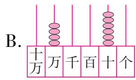

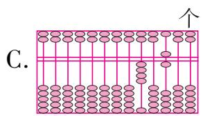

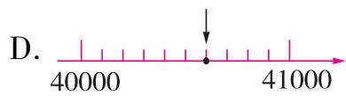

2. (名校期末真题) 如果把下面计数器上十万位上的一颗珠子移到万位, 这时得到的新数与原数相比 (A)。

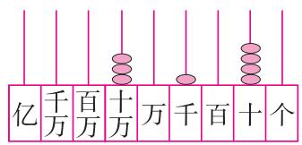

A. 小了 90000

B. 小了 100000

C. 大了 90000

D. 不变

3. 在 2700165 的任意两个相邻数字中间插入两个 0, 使这个新数只读一个 0。这个新数是 ( C )。

A. 270010065

B. 200700165

C. 270000165

D. 270010605

4. (易错题·方法误用)下面各数“四舍五入”后,得到的近似数都是 4055 万,其中最接近 4055 万的数是( B )。

A. 40551000

B. 40549999

C. 40550002

D. 40545009

5. 用计算器计算时, 需要用到存起来的数, 可按 ( C ) 键提取。

A. MC

B. $M +$

C. MR

D. AC

# 三、按要求做题。(共35分)

1. 读出或写出下面各数。(5 分)

3200003

读作：三百二十万零三

32006500300

读作：三百二十亿零六百五十万零三百

六十亿零八百万零四 写作：6008000004

9个十亿、8个百万、4个千和5个百 写作：9008004500

50000000 + 6000000 + 90000 + 600 + 3 写作：56090603

2. (易错题·概念误解)在括号里填上合适的数。(8分)

(1)5760135 > 57 □ 1035

(2)153701369 < 153 □ 10369

方框里最大应填(5)。

方框里最小应填(7)。

(3)6904 □ 867≈6904 万

(4)85 □ 123987≈8亿5千万

方框里可以填(0,1,2,3,4)。

方框里最大应填(4)。

3. 按规律填数。(12 分)

(1)59990,59995,(60000),60005,(60010)。

(2)1000000,999900,(999800),(999700),999600。

(3) $1 \times 1 = 1$

$11 \times 11 = 121$

$111 \times 111 = 12321$

$1111 \times 1111 = (1234321)$

$11111 \times 11111 = (123454321)$

4. 用 8,2,3,4,0,0,0 这 7 个数字组成符合要求的七位数。(10 分)

(1) 最小的七位数: (2000348)。

(2)最大的七位数:(8432000)。

(3)一个0都不读的七位数:(4238000)。(答案不唯一)

(4) 所有 0 都读出来的七位数: (8040302)。(答案不唯一)

(5)省略万位后面的尾数约是340万的最大的七位数:(3402800)。

四、阅读下面的材料,回答问题。(共22分)

◆2023年全年粮食产量695410000吨,比上年增加8880000吨。其中,夏粮产量约146150000吨,早稻产量约28340000吨,秋粮产量约520920000吨。

◆2023年全年旅客运输总量9300000000人次,其中,铁路3850000000人次,公路4570000000人次,水路260000000人次,民航620000000人次。

◆2023年全年完成邮政行业寄递业务总量162500000000件。邮政业完成邮政函件业务970000000件，包裹业务20000000件，快递业务量一千三百二十亿七千万件。

1. 为了读写方便,请把下面的数改写成用“万”或“亿”作单位的数。(8 分)

695410000 = ( 69541 ) 万

8880000 = ( 888 ) 万

9300000000 = ( 93 )亿

162500000000 = ( 1625 )亿

2. 将夏粮产量、早稻产量、秋粮产量按照从高到低的顺序排列。(3 分)

(520920000)吨>(146150000)吨>(28340000)吨

3. 请你用近似数表示不同方式下旅客运输量。(8 分)

铁路:( 39 亿 )人次

公路:( 46 亿 )人次

水路:( 3 亿 )人次

民航:(6亿)人次

4. 2023 年全年快递业务量写作（132070000000）件；请在下面表示出这个数。
(3 分)

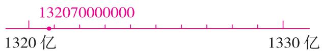

附加题。(共10分)

姗姗和轩轩分别用 27 颗珠子在计数器上拨了一个九位数。两人拨的数分别是多少？先在计数器上画一画，再写一写，读一读。

我拨的数是只读一个0的最大的九位数。

姗姗

我拨的数是省略亿位后面的尾数是3亿的最小数。

  
轩轩

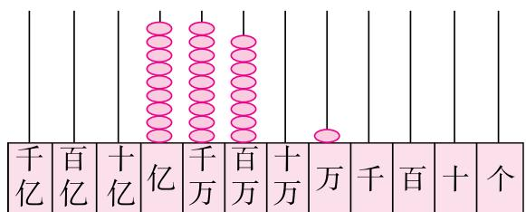

text_image

千亿
百亿
十亿
亿
千万
百万
十万
万
千
百
十
个

写作：998010000

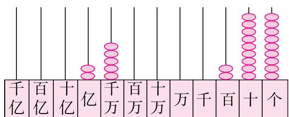

text_image

千亿
百亿
十亿
亿
千万
百万
十万
万
千
百
十
个

写作：250000299

读作：九亿九千八百零一万

读作：二亿五千万零二百九十九

# 第二单元测评卷

时间:60 分钟 满分:100 + 10 分

# 一、填一填。（第7、8题每空2分，其余每空1分，共35分）

1. 测量土地面积时, 常用(公顷)和(平方千米)作单位。  
2. 边长是(100 米)的正方形的面积是1公顷,边长是(1千米(或1000 米))的正方形的面积是1平方千米。  
3.6 平方千米 = ( 600 ) 公顷 30000 平方米 = ( 3 ) 公顷

5 公顷 = ( 50000 ) 平方米

8 平方千米 = ( 8000000 ) 平方米

200 公顷 = ( 2 ) 平方千米 = ( 2000000 ) 平方米

4. 山西省是中华民族发祥地之一,被誉为“华夏文明摇篮”,全省总面积 156700 平方千米,合(15670000)公顷。三晋历史文化第一名山的藏山风景区位于山西省阳泉市的盂县,占地面积 12000000 平方米,合(12)平方千米。  
5. 国家速滑馆“冰丝带”的建筑面积约 8 公顷,那么(25)个这样的“冰丝带”建筑面积大约是 2 平方千米。  
6.(名校期末真题)在○里填上“＞”“＜”或“＝”。

3 平方千米 > 30000 平方米

800 平方米 < 8 平方千米

2000 公顷 = 2 平方千米 + 1800 公顷

40000 平方米 = 4 公顷

7. (名校期末真题)在括号里填上合适的单位名称。

(1)一间教室的占地面积约为56(平方米)。  
(2)课桌桌面的面积约是44(平方分米),数学书封面的面积约是450(平方厘米)。  
(3)鄱阳湖是中国第一大淡水湖,它的占地面积约是4125(平方千米)。  
(4)一个旅游景区的形状近似长方形,长约2千米,宽约1千米,绕它走一周,大约要走6(千米),景区的面积约是2(平方千米),约合200(公顷)。

8. 如果 1 平方米能种 16 棵草莓苗, 1 公顷大约能种 (160000) 棵草莓苗, 1 平方千米大约能种 (16000000) 棵草莓苗。

# 二、选一选。(把正确答案的字母填在括号里)(每题3分,共18分)

1. (易错题·迁移误用)下面进率不是 100 的两个面积单位是( C )。

A. 平方米和平方分米

B. 平方分米和平方厘米

C. 平方米和公顷

D. 公顷和平方千米

2. 最接近 1 公顷的是( B )。

A. 卧室的占地面积

B. 400 米跑道围起来部分的占地面积

C. 1 个篮球场的占地面积

D. 石家庄市的占地面积

3. 一块长方形的林地的面积是 15 公顷。它的宽是 100 米, 长是( B )米。

A. 15

B. 1500

C. 150

D. 15000

4. (名校期末真题)深圳被称为“公园里的城市”。下面占地面积最大的公园是( B )。

A. 占地面积约 77 万平方米的深圳人才公园  
B. 占地面积约 546 公顷的仙湖植物园  
C. 占地面积约 116000 平方米的白石龙音乐公园  
D. 占地面积约 2 平方千米的莲花山公园

5. 一个果园占地 1 公顷, 里面种了 2000 棵果树, 平均每棵树占地 ( A ) 平方米。

A. 5

B. 10

C. 2

D. 50

6.(易错题·迁移误用)“如果5平方米能站10人,那么1公顷大约能站多少人?”同学们用不同方法解决这个问题,其中正确的有( C )种。

① $10 \times 10000 = 100000$ (人)

② $\left\{\begin{array}{l}10000\div5=2000\\2000\times10=20000(\text{人})\end{array}\right.$

③ ×2000 5平方米 → 10人
1公顷 → 20000人 ×2000

④ $10 \div 5 = 2$ (人) $2 \times 10000 = 20000$ (人)

A. 1

B. 2

C. 3

D. 4

# 三、中国五岳是中国汉文化中五大名山的总称。五岳分别是东岳泰山、西岳华山、南岳衡山、北岳恒山、中岳嵩山。下面是它们的占地面积情况。(共11分)

<table><tr><td>五大名山</td><td>泰山</td><td>华山</td><td>衡山</td><td>恒山</td><td>嵩山</td></tr><tr><td>占地面积</td><td>24200 公顷</td><td>148 平方千米</td><td>640000000 平方米</td><td>14751 公顷</td><td>45000 万平方米</td></tr></table>

1. 请你将这些面积按从大到小的顺序排一排。(5 分)

( 640000000 平方米 ) > ( 45000 万平方米 ) > ( 24200 公顷 ) > ( 148 平方千米 ) > ( 14751 公顷 )

2. 算一算,泰山的占地面积和衡山的占地面积相差多少平方千米? (6 分)

24200 公顷 = 242 平方千米

640000000 平方米 = 640 平方千米

640 - 242 = 398 (平方千米)

答:泰山的占地面积和衡山的占地面积相差 398 平方千米。

# 四、解决问题。(共36分)

天星小学创客社团开展“小小规划师”实践活动,让同学们用数学知识模拟解决城市建设与环境规划中的问题。

1. 小区规划问题 ★有一个长方形住宅小区, 长 200 米, 宽 100 米。

(1)这个小区的占地面积是多少平方米？合多少公顷？(6分)

$200 \times 100 = 20000$ （平方米）

20000 平方米 = 2 公顷

答: 这个小区的占地面积是 20000 平方米, 合 2 公顷。

(2)开发商在宣传单中说:“本小区的绿化面积高达小区总面积的二分之一”。经测量,该小区的实际绿化面积是8000平方米。这个广告真实吗?为什么?(6分)答:这个广告不真实。

理由: $2 \div 2 = 1$ (公顷)

1 公顷 = 10000 平方米

10000 > 8000

与实际不符,所以这个广告不真实。(理由正确即可)

2. 渔业规划问题 ☆李叔叔家有一个面积是1公顷的正方形鱼塘,现要对鱼塘进行扩建,边长增加200米。扩建后鱼塘的面积是多少公顷? 如果每公顷鱼塘能产鱼15吨,那么扩建后能产鱼多少吨? (6分)

面积为 1 公顷的正方形鱼塘的边长为 100 米。

$(100 + 200) \times (100 + 200) = 90000$ （平方米）

90000 平方米 = 9 公顷

$9 \times 15 = 135$ （吨）

答: 扩建后鱼塘的面积是 9 公顷, 扩建后能产鱼 135 吨。

3. 城市清洁问题 ★一辆洒水车每分钟行驶 200 米,洒水的宽度是 10 米。洒水车行驶 1 小时,能洒多少公顷的地面? (6 分)

(方法不唯一) $200 \times 10 = 2000$ (平方米)

1 时 = 60 分

$2000 \times 60 = 120000$ （平方米）

120000 平方米 = 12 公顷

答:能洒 12 公顷的地面。

4. 环境绿化问题 ☆植树造林可以美化环境,净化空气。

1公顷森林1年大约滞尘32吨。

1公顷森林在生长季节每周大约可吸收6300千克二氧化碳。

(1)5 平方千米的森林 1 年大约滞尘多少吨? (6 分)

5 平方千米 = 500 公顷

$32 \times 500 = 16000$ （吨）

答:5 平方千米的森林 1 年大约滞尘 16000 吨。

(2)1 公顷的森林在 6 月份(生长季节)大约可以吸收多少千克二氧化碳? 合多少吨? (6 分)

$6300 \div 7 \times 30 = 27000$ （千克）

27000 千克 = 27 吨

答:1 公顷的森林在 6 月份(生长季节)大约可以吸收 27000 千克二氧化碳,合 27 吨。

附加题。(共10分)

如图,有一个长9千米、宽6千米的长方形林场。为了利于树木生长,在林场的四个角种植矮植株植物,中间种植高植株植物,该林场中间种植的高植株植物的占地面积是多少?

$9 \times 6 - (9 - 3) \times (6 - 2) = 30$ (平方千米)

答:该林场中间种植的高植株植物的占地面积是 30 平方千米。

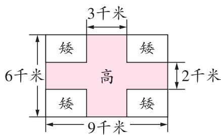

text_image

3千米
矮
矮
6千米
高
2千米
矮
矮
9千米

# 第三单元测评卷

时间:60 分钟 满分:100 + 10 分

# 一、填一填。(第5\~8题每空2分,其余每空1分,共28分)

1. 手电筒、汽车灯等射出来的光线,都可以看作(射线)。

2. 从一点引出两条射线所组成的图形叫作(角), 这个点叫作角的(顶点), 这两条射线叫作角的(边)。

3. 把我们学过的角按从大到小的顺序排列: (周) 角 > (平) 角 > (钝) 角 > (直) 角 > (锐) 角。

4. 队列练习时, 原地向左或向右转, 转过一个(直)角; 向后转, 转过一个(平)角; 连续向后转(2)次, 才能转过一个周角。

5. 右图是一张长方形纸折起来以后形成的图形, 已知 $\angle 1 = 28^{\circ}$ , 那么 $\angle 2 = (34)^{\circ}$ 。

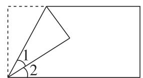

6. 比平角小 $135^{\circ}$ 的角是 (45)°, 这个角比直角小 (45)°。

7.(易错题·方法误用)亮亮用量角器量角时犯了两个错误。

(1)第一个角的一条边没有与 $0^{\circ}$ 刻度线对齐,而是与 $10^{\circ}$ 的刻度线对齐了,这样读出的数为 $80^{\circ}$ ,实际这个角的度数是 (70)°。

(2)第二个角的一条边和内圈的 $0^{\circ}$ 刻度线重合,读数时他读成了外圈的刻度,读出的是 $65^{\circ}$ ,实际这个角的度数是 (115)°。

8. —— —— —— —— —— 这条直线上共有（6）条线段，（8）条射线，（1）条直线。

# 二、选一选。（把正确答案的字母填在括号里）（每题2分，共16分）

1. 可可画了一个房子(如图), 房子是由一些三角形和四边形组成的, 这些图形都是由一条条 ( C ) 组成的。

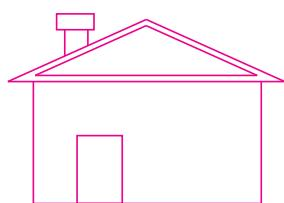

A. 直线

B. 射线

C. 线段

D. 以上都有

2. 如图, 点 $M, O, N, P, L$ 在同一条直线上, 从探照灯 (点 $O$ ) 射出一条光线, 当光线穿过点 $N$ 后, 一定不能穿过 (A) 点。

A. $M$

B. P

C. L

D. N

$L_{\bullet}$

3. 植树时,确保树坑排成一行的方法(如图)所含的数学原理是(D)。

A. 两点之间线段最短   
B. 直线可以无限延长  
C. 点到直线间垂线段最短   
D. 两点确定一条直线

植树时，需要先确定两个树坑的位置，以便使得其他的树坑能和它们排成一行。

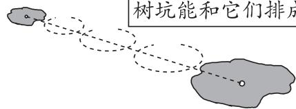

D. $60^{\circ}$

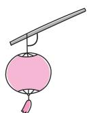

4. 估一估, 图中竹竿和绳子形成的夹角是( A )。

A. $110^{\circ}$

B. $160^{\circ}$

C. $90^{\circ}$

5.(名校期末真题)下列说法正确的是( B )。

A. 将一条长 5 厘米的线段向一端延长 5 厘米就成了一条射线  
B. 两个角正好拼成平角, 一个角是锐角, 另一个角一定是钝角  
C. 用一副三角尺能拼出一个 $100^{\circ}$ 的角  
D. 平角只有一条边, 周角也只有一条边

6.(情境题·生活情境)如图所示的两个三角板,一个是老师用的,一个是小明用的。∠1和∠2相比,(A)。

A. $\angle 1$ 和 $\angle 2$ 相等  
B. $\angle 1$ 比 $\angle 2$ 大  
C. $\angle 1$ 比 $\angle 2$ 小  
D. 无法比较

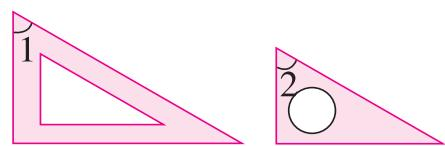

7. 下面从左到右分别是小红、小刚和小亮画的角, 哪两个人画的角大小相等? ( C )

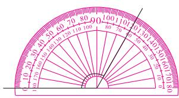  
小红

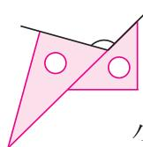  
小刚

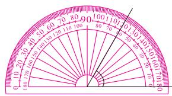  
小亮

A. 小红和小亮

B. 小刚和小亮

C. 小红和小刚

D. 三人画的一样大

8. 两个锐角合起来最大可以拼成一个( A )。

A. 钝角

B. 平角

C. 周角

D. 直角

# 三、实践操作。(共26分)

1. 在钟面上画出时针和分针, 让它们所成的角等于给定的度数。想一想, 可能是几时整? 在横线上填一填。(8 分) 图略

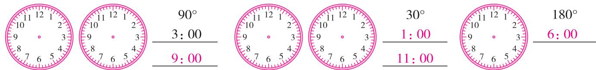

text_image

10 12 1
9 3
8 4
7 6 5
90°
3:00
9:00
10 12 1
9 3
8 4
7 6 5
10 12 1
9 3
8 4
7 6 5
30°
1:00
11:00
10 12 1
9 3
8 4
7 6 5
180°
6:00

2. 写出下面各图中两个三角尺拼成的角的度数。(9 分)

(1)

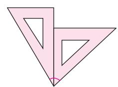

( 75° )

(2)

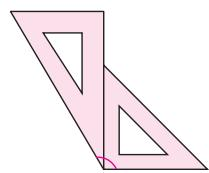

( $120^{\circ}$ )

(3)

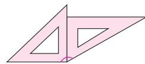

( $150^{\circ}$ )

3. 用你喜欢的方法画出下面度数的角。(9 分)图略

$40^{\circ}$

165°

$105^{\circ}$

# 四、算一算、填一填。(共11分)

1. 如图, 已知 $\angle3 + \angle2 = \angle2 + \angle1 = 90^{\circ}, \angle1 = 30^{\circ}, \angle3 = (30^{\circ})$ 。(2 分)

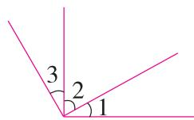  
第1题图

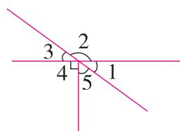  
第2题图

2. 如图, 已知 $\angle1=35^{\circ}, \angle2=(145^{\circ}), \angle3=(35^{\circ}), \angle5=(55^{\circ})$ 。(9分)

五、解决问题。(共19分)

# 无处不在的“角度”

1.(名校期末真题)爬楼梯时,有的楼梯比较陡,有的楼梯比较缓。

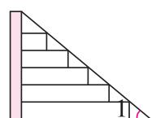  
底角

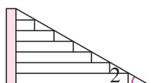  
底角

楼梯的坡度一般为 $20^{\circ}\sim45^{\circ}$ ，人上、下楼梯最舒适的坡度为 $30^{\circ}$ 左右。

(1)量一量∠1和∠2分别是多少度。(4分)

$$
\angle 1 = (4 0) ^ {\circ}
$$

$$
\angle 2 = (3 0) ^ {\circ}
$$

(2) 楼梯的陡缓与什么有关呢? 下面 3 位同学的说法, 你同意谁的说法? 请在括号里画“√”。(3 分)

小华:底角的大小与楼梯的陡缓没有关系。 （）

亮亮:底角越大,楼梯越平缓。()

轩轩:底角小的楼梯平缓一些。 (√)

2.(情境题·生活情境)为了让电线杆稳固地垂直于地面,两侧常用拉紧的钢丝绳索固定。如图,要从电线杆的点A分别向左侧和右侧地面安装绳索AB和AC,电线杆和两条绳索形成的两个角的度数要完全相同。

(1)量一量,电线杆与绳索AB形成的角是(35)°。

(2 分)

(2)根据测量结果,画出另一条绳索AC。(4分)

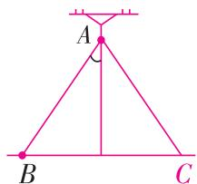

3.(情境题·生活情境)汽车有一双 $360^{\circ}$ 的“眼睛”。如图,司机通过前方能观察到的最大角度约是 $180^{\circ}$ ;通过左侧和右侧,司机分别能观察到的最大角度约是 $40^{\circ}$ 。通过车内后视镜,司机能观察到的角度大约是多少度?(6分)

$$
3 6 0 ^ {\circ} - 1 8 0 ^ {\circ} - 4 0 ^ {\circ} - 4 0 ^ {\circ} = 1 0 0 ^ {\circ}
$$

答: 司机能观察到的角度大约是 $100^{\circ}$ 。

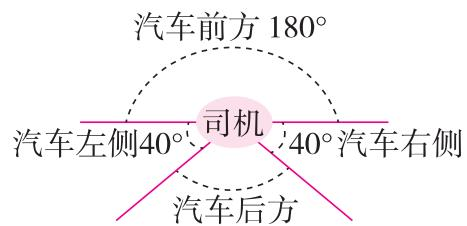

text_image

汽车前方 180°
司机
汽车左侧40° 40° 汽车右侧
汽车后方

附加题。(共10分)

华华把三个相同的正方形按下图的方式摆放,已知 $\angle2=30^{\circ},\angle3=45^{\circ}$ ,请你帮他求出 $\angle1$ 的度数。

$$
9 0 ^ {\circ} - 3 0 ^ {\circ} = 6 0 ^ {\circ} \quad 9 0 ^ {\circ} - 4 5 ^ {\circ} = 4 5 ^ {\circ}
$$

$$
6 0 ^ {\circ} + 4 5 ^ {\circ} - 9 0 ^ {\circ} = 1 5 ^ {\circ}
$$

答: $\angle 1$ 的度数是 $15^{\circ}$ 。

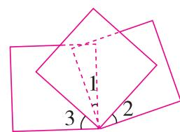

# 第四单元测评卷

时间:60 分钟 满分:100 + 10 分

# 一、填一填。（第5\~7题每空2分，其余每空1分，共27分）

1. 计算 $180 \times 30$ 时, 可以先算 (18) 乘 (3) 的积, 再在积的末尾添上 (2) 个 0, 这样算比较简便。  
2. 猎豹是陆地上跑得最快的动物, 每分钟可以跑 990 米, 它的速度可以记作 (990 米/分), 照这样的速度, 猎豹奔跑 12 分钟, 跑过的路程是 (11880) 米。  
3. 根据算式 $250 \times 24 = 6000$ ，直接写出下面算式的积。

$$
2 5 0 \times 1 2 = (3 0 0 0)
$$

$$
2 5 0 \times 4 8 = (1 2 0 0 0)
$$

$$
7 5 0 \times 1 2 = (\quad 9 0 0 0 \quad)
$$

4. 在○里填上“＞”“＜”或“＝”。

$$
4 0 2 \times 5 1 > 2 0 0 0 0
$$

$$
3 9 \times 1 5 0 = 4 5 0 \times 1 3
$$

$$
4 0 8 \times 1 1 <   2 5 8 \times 2 2
$$

5. (名校期末真题)已知 $A \times B = 380$ 。

(1) 如果 A 乘 3, B 不变, 那么积是 (1140)。  
(2) 如果 A 乘 3, 同时 B 除以 3, 那么积是 (380)。  
(3) 如果 A 乘 3, 同时 B 也乘 3, 那么积是 (3420)。

6. 观察框里的三道算式和右面的竖式, 可以知道

该竖式计算的是(286)×(35)=10010，
箭头指着的两个数相乘的积写在(千)位上。

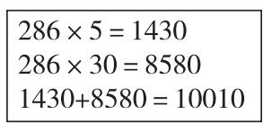

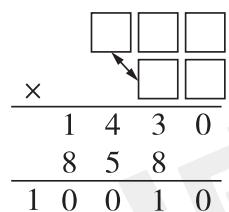

7. 乘法算式 $308 \times \square 0$ , 要使积是四位数, □里最大填 (3); 要使积是五位数, □里最小填 (4)。

# 二、选一选。（把正确答案的字母填在括号里）（每题2分，共12分）

1. 下面算式“3”ד6”表示的意思是 $300 \times 6$ 的是( A )。

A. $345 \times 26$

B. $435 \times 26$

C. $543 \times 62$

D. $345 \times 62$

2. 图中点 P 表示的数可能是下面算式( C )的积。

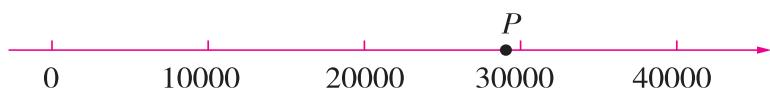

text_image

P
0 10000 20000 30000 40000

A. $498 \times 39$

B. $498 \times 49$

C. $498 \times 59$

D. $509 \times 61$

3. 一个两位数与 350 相乘, 下列说法中错误的是 (D)。

A. 积的末尾至少有 1 个 0   
C. 积的末尾可能有 3 个 0

B. 积的末尾可能有 2 个 0

D. 积的末尾可能没有 0

4. 下面问题中, 可以借助“单价 × 数量 = 总价”这个数量关系解决的是( B )。

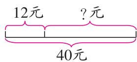  
A

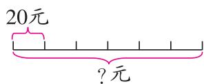  
B

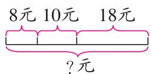  
C

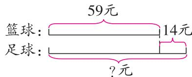  
D

5.(情境题·生活情境)周末,开心一家三口自驾到龙门石窟游玩。上午8:30出发,小轿车的速度是80千米/时,途中休息了10分钟,用时2小时到达。开心家到龙门石窟大约多少千米?解答这个问题,需要用到的信息有( C )。

A. 80 千米/时, 2 小时

B. 80 千米/时, 10 分钟

C. 80 千米/时, 2 小时, 10 分钟

D. 80 千米/时, 2 小时, 上午 8:30

6.(情境题·科学情境)将库布齐沙漠变为绿洲是我们中国人创造的一个奇迹。下面图1是沙漠中的一块绿地,图2的箭头所指的部分表示的是(A)。

A. 种植沙蒿的面积  
B. 种植沙打旺的面积  
C. 这块绿地的总面积  
D. 以上都不对

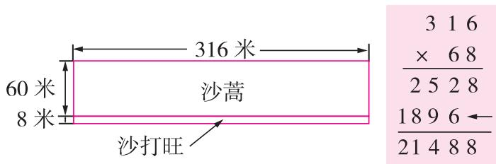

text_image

316米
60米
8米
沙蒿
沙打旺
3 1 6
× 6 8
2 5 2 8
18 9 6 ←
21 4 8 8

图1  
图2

# 三、算一算。(共26分)

1. 直接写出得数。(8 分)(估算答案不唯一)

$$
3 0 \times 4 0 = 1 2 0 0
$$

$$
3 0 0 \times 5 0 = 1 5 0 0 0
$$

$$
4 4 \times 2 0 0 = 8 8 0 0
$$

$$
4 0 4 \times 7 9 \approx 3 2 0 0 0
$$

$$
3 2 0 \times 2 0 = 6 4 0 0
$$

$$
1 2 2 \times 3 0 = 3 6 6 0
$$

$$
1 2 5 \times 8 0 = 1 0 0 0 0
$$

$$
1 8 9 \times 3 1 \approx 6 0 0 0
$$

2. 列竖式计算。(18 分)

$$
2 4 8 \times 4 3 = 1 0 6 6 4
$$

$$
2 0 9 \times 5 7 = 1 1 9 1 3
$$

$$
6 0 6 \times 4 0 = 2 4 2 4 0
$$

$$
\begin{array}{r} {2 4 8} \\ {\times 4 3} \\ \hline {7 4 4} \end{array}
$$

$$
\begin{array}{r} 2 0 9 \\ \times \quad 5 7 \\ \hline 1 4 6 3 \end{array}
$$

$$
\begin{array}{r} {6 0 6} \\ {\times \quad 4 0} \\ \hline {2 4 2 4 0} \end{array}
$$

$$
\begin{array}{r} 9 \quad 9 \quad 2 \\ \hline 1 \quad 0 \quad 6 \quad 6 \quad 4 \end{array}
$$

$$
\begin{array}{c c c c c} 1 & 0 & 4 & 5 \\ \hline 1 & 1 & 9 & 1 & 3 \end{array}
$$

$$
7 2 0 \times 5 5 = 3 9 6 0 0
$$

$$
\begin{array}{r} 7 2 0 \\ \times \quad 5 5 \\ \hline 3 6 0 \\ 3 6 0  \\ \hline 3 9 6 0 0 \end{array}
$$

$$
4 2 \times 2 1 7 = 9 1 1 4
$$

$$
\begin{array}{r} {2 1 7} \\ {\times \quad 4 2} \\ {\hline 4 3 4} \\ {8 6 8} \\ {\hline 9 1 1 4} \end{array}
$$

$$
5 8 0 \times 7 0 = 4 0 6 0 0
$$

$$
\begin{array}{r} {5 8 0} \\ {\times 7 0} \\ \hline {4 0 6 0 0} \end{array}
$$

# 四、解决问题。(共35分)

1. 李老师家的供暖费是多少元？(4 分)

  
李老师

我们小区是燃气（油、电）锅炉供热，按建筑面积收取供暖费。我家的建筑面积是108平方米。

按建筑面积收取供暖费，如果是市热力集团供热，居民供暖收费标准是每平方米24元；如果是燃气（油、电）锅炉供热，居民供暖收费标准是每平方米30元。

$$
1 0 8 \times 3 0 = 3 2 4 0 (\text {元})
$$

答: 李老师家的供暖费是 3240 元。

2.(名校期末真题)李老师和11名同事一起从北京到上海去学习。

(1)下面是他们要乘坐的高铁的票价图，他们买票至少要付多少元？

(答案不唯一)

(先补充问题,再写出数量关系并列式解答)(6分)

单价 × 数量 = 总价

$$
6 3 0 \times 1 2 = 7 5 6 0 (\text {元})
$$

答:他们至少要付7560元。

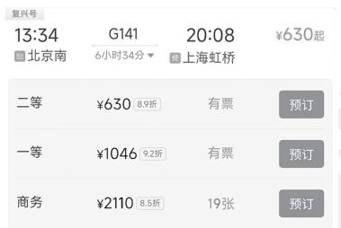

text_image

复兴号
13:34 G141 20:08 ¥630起
北京南 6小时34分 上海虹桥
二等 ¥630 8.9折 有票 预订
一等 ¥1046 9.2折 有票 预订
商务 ¥2110 8.5折 19张 预订

(2)下面是京沪高铁路线及沿线主要车站的示意图。他们乘坐的高铁平均每小时行驶236千米,经过4小时行驶到哪个车站附近?请你写出解答过程,并用▲在图上标记出来。(5分)

$$
2 3 6 \times 4 = 9 4 4 (\text {千米})
$$

$$
1 2 2 + 9 0 1 = 1 0 2 3 (\text {千米})
$$

答: 经过 4 小时行驶到南京南站附近。

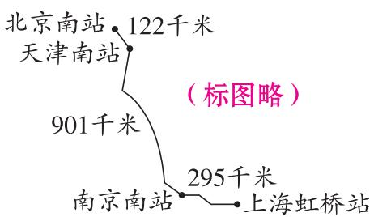

geo

| 站站 | 千米 |
| :--- | :--- |
| 北京南站 | 122 |
| 天津南站 | |
| 901千米 | |
| 南京南站 | 295 |
| 上海虹桥站 | (标图略) |

3. 天星小学开展“美化校园,从我做起”的环保活动。三年级有 109 人,平均每人捡 31 个塑料瓶,四年级有 110 人,平均每人捡 39 个塑料瓶,两个年级大约共捡了多少个塑料瓶? (5 分)

$$
1 0 9 \times 3 1 \approx 3 3 0 0 (\text {个}) \quad 1 1 0 \times 3 9 \approx 4 4 0 0 (\text {个})
$$

$$
3 3 0 0 + 4 4 0 0 = 7 7 0 0 (\text {个})
$$

答:两个年级大约共捡了 7700 个塑料瓶。

4. 农学院有一块长方形空地(如右图)。学校为了给同学们建造一块实验田,要对空地进行扩建,长不变,宽增加到30米。

180平方米 10米

扩建后的空地面积是多少平方米?

(1) 小丽是这样解决这个问题的:

$$
3 0 \div 1 0 = 3 \quad 1 8 0 \times 3 = 5 4 0 (\text {平方米})
$$

她先求：扩建后的宽是原来的几倍；再求：扩建后的空地面积。（6分）

(2)你还可以怎么解决？请用和小丽不同的方法进行解答。(4分)

$$
1 8 0 \div 1 0 = 1 8 (\text {   米   }) \quad 3 0 \times 1 8 = 5 4 0 (\text {   平方米   })
$$

答: 扩建后的空地面积是 540 平方米。

5. 大队部刘老师准备在网上买 60 件汉诺塔奖励给环保活动中表现优秀的同学(如

图),请你帮她算一算需要多少钱。(5 分)

$$
6 0 \div (5 + 1) = 1 0 (\text { 组 })
$$

$$
1 0 \times 5 \times 1 8 = 9 0 0 (\text {   元   })
$$

答:需要 900 元钱。

双十一：买5送1，还免快递费哟！

汉诺塔大号木制儿童益智通关玩具

价格：¥18.00

数量 -1+ (库存504件)

加入购物车 立即购买

附加题。(共10分)

复兴号列车自投入使用以来,深受人们的青睐。一辆加长版的复兴号列车全长约414米,如果以每秒55米的速度通过一条隧道,从车头进入隧道到车尾驶出隧道一共要114秒。这条隧道大约有多长?

$$
5 5 \times 1 1 4 - 4 1 4 = 5 8 5 6 (\text {   米   })
$$

答:这条隧道大约有 5856 米。

# 期中综合测评卷

① 时间:70 分钟 满分:100+10 分

# 一、填一填。(每空1分,共26分)

1.(情境题·生活情境)阅读下面信息,回答问题。

# 《哪吒之魔童闹海》(以下简称《哪吒2》)春节期间电影票房

统计时间:1月29日—2月4日

总票房： 元

总观影人次:94866600

总场次:1234609

<table><tr><td colspan="4">《哪吒2》单日票房(单位:元)</td></tr><tr><td>初一</td><td>初二</td><td>初三</td><td>初四</td></tr><tr><td>488000000</td><td>480000000</td><td>619000000</td><td>732000000</td></tr><tr><td>初五</td><td>初六</td><td>初七</td><td></td></tr><tr><td>813000000</td><td>844000000</td><td>867000000</td><td></td></tr></table>

(1)《哪吒2》春节期间总票房是一个十位数,它的最高位是(十亿)位,它的最高位上是4,亿位上是8,千万位上是4,百万位上是3,其他数位上是0,这个数是(4843000000),读作(四十八亿四千三百万),省略“亿”位后面的尾数约是(48)亿。  
(2)《哪吒 2》春节期间总场次是(1234609),省略“万”位后面的尾数约是(123)万。  
(3)《哪吒2》春节期间总观影人次是(94866600),从左边起,第一个“6”表示(6个万),第二个“6”表示(6个千)。  
(4)从初一到初七,单日票房最高的是初(七),最低的是初(二)。

2. 王叔叔购买了 24 张《哪吒 2》的首映票, 每张票售价 134 元。他一共花了多少钱? 根据下面的竖式在括号内填上适当的数。

$$
\begin{array}{r l} & \times \quad 1 \quad 3 \quad 4 \\ & \times \quad 2 \quad 4 \\ & \hline 5 \quad 3 \quad 6 \\ & \dots \dots \text {表示买（4）张票花了536元} \\ & 2 \quad 6 \quad 8 \\ & \dots \dots \text {表示买（20）张票花了（2680）元} \\ & \hline 3 \quad 2 \quad 1 \quad 6 \end{array}
$$

3. 小芳每天放学回家 8:30 做完作业, 9:00 洗漱完毕, 9:30 上床睡觉。这三个时刻钟表上的时针和分针所形成的较小角依次是(锐)角、(直)角、(钝)角。  
4. 在○里填上“＞”“＜”或“＝”。

86500200 <

685002000

1999 公顷

> 2 平方千米

890 × 11

= 89 × 110

☆ × △ =

$(\star \times 6) \times (\angle$

÷6)(☆和△

均不为0)

5. (名校期末真题)在括号里填上合适的数或单位名称。

(1) 厦门市总面积大约是 1700 平方千米, 合 (170000) 公顷。  
(2)一个标准篮球场的面积一般为 420(平方米)。  
(3)五缘湾湿地公园是厦门最大的湿地生态园区,被称为厦门的“城市绿肺”,占地85(公顷),大约相当于2000个标准篮球场的面积。

6. 在 6009 末尾至少添(3)个 0, 可以使得到的新数一个零都不读。

7.99 □ 6800 < 9966900, □ 里最大填(6)。

# 二、选一选。（把正确答案的字母填在括号里）（每题2分，共10分）

1. 小明用不同方法表示出了 5004000, 其中正确的是 ( B )。

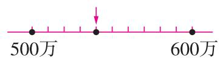  
A

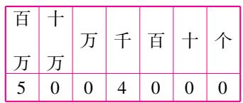  
B

5004000 =

500 + 4000

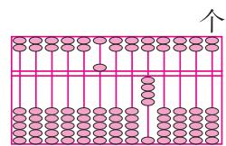  
C   
D

2. 我们通常采用的画角方法有: 量角器画角和三角尺拼角。下面的角中, 只能用量角器来画的是 ( B )。

A. $75^{\circ}$

B. $100^{\circ}$

C. $135^{\circ}$

D. $105^{\circ}$

3. 在——●——●——●——中, 条数最多的是( B )。

A. 线段

B. 射线

C. 直线

D. 无法确定

4. 下面场地的面积最接近 1 公顷的是( D )。

A. 一间小学的教室

B. 一个标准游泳池

C. 一个标准篮球场

D. 一个标准足球场

5. (名校期末真题)下面是四位同学计算“2 □ 3 × 26”的竖式, 中间的过程被遮住了, 通过估算判断计算正确的是( A )。

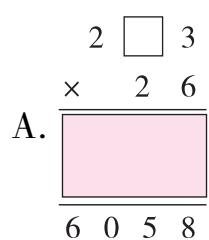

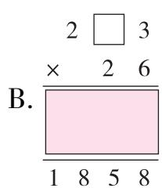

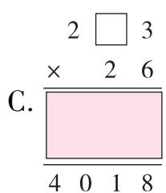

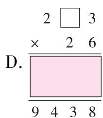

# 三、算一算。(共22分)

1. 直接写出得数。(8 分)(估算答案不唯一)

$$
1 5 \times 5 0 0 = 7 5 0 0
$$

$$
6 0 \times 1 2 0 = 7 2 0 0
$$

$$
2 3 0 \times 4 0 = 9 2 0 0
$$

$$
2 9 8 \times 6 0 \approx 1 8 0 0 0
$$

$$
2 4 0 \times 4 0 = 9 6 0 0
$$

$$
4 0 0 \times 2 5 = 1 0 0 0 0
$$

$$
2 8 \times 2 0 0 = 5 6 0 0
$$

$$
4 0 1 \times 8 8 \approx 3 6 0 0 0
$$

2. 列竖式计算。(8 分)

$$
1 6 5 \times 3 7 = 6 1 0 5
$$

$$
4 8 0 \times 1 8 = 8 6 4 0
$$

$$
3 0 6 \times 2 5 = 7 6 5 0
$$

$$
4 6 7 \times 5 0 = 2 3 3 5 0
$$

$$
\begin{array}{r} {1 6 5} \\ {\times \quad 3 7} \\ {\hline 1 1 5 5} \\ {4 9 5} \\ {\hline 6 1 0 5} \end{array}
$$

$$
\begin{array}{r} {4 8 0} \\ {\times 1 8} \\ \hline {3 8 4} \\ {4 8} \\ \hline {8 6 4 0} \end{array}
$$

$$
\begin{array}{r} {3 0 6} \\ {\times \quad 2 5} \\ {\hline 1 5 3 0} \\ {6 1 2} \\ {\hline 7 6 5 0} \end{array}
$$

$$
\begin{array}{r} {4 6 7} \\ {\times \quad 5 0} \\ \hline {2 3 3 5 0} \end{array}
$$

3. 先计算出第 1 行算式的得数, 再根据规律写出第 2 行算式的得数。(6 分)

$$
1 \times 9 = 9
$$

$$
2 1 \times 9 = 1 8 9
$$

$$
3 2 1 \times 9 = 2 8 8 9
$$

$$
4 3 2 1 \times 9 = 3 8 8 8 9
$$

$$
5 4 3 2 1 \times 9 = 4 8 8 8 8 9
$$

$$
6 5 4 3 2 1 \times 9 = 5 8 8 8 8 8 9
$$

# 四、按要求回答问题。(共18分)

1. 中原奇妙游中秋灯会的门票价格是 3 张 50 元, 请你据此完成下表。(8 分)

<table><tr><td>数量/张</td><td>6</td><td>21</td><td>30</td><td>90</td></tr><tr><td>价格/元</td><td>100</td><td>350</td><td>500</td><td>1500</td></tr></table>

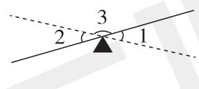

2. 如图是一个跷跷板的示意图, 右边压下来, 左边就会翘上去 (如图中虚线)。请你测量 $\angle 1 = (30)^{\circ}$ , 计算 $\angle 3 = (150)^{\circ}$ 。(6 分)  
3.(名校期末真题)从人体脊柱健康的角度考虑,座椅靠背与座椅面的夹角是115°时最接近自然腰部的形状。如图是座椅的下半部分的侧面示意图,请你从点A开始,画出最有利于人体脊柱健康的座椅靠背。(4分)

五、解决问题。(共24分)

天星小学在10月开展“读书小明星”活动，鼓励学生多读书，读好书。

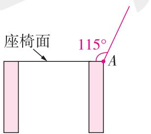

text_image

座椅面
115°
A

1. 为了积极参加“读书小明星”活动,第一学习小组3位成员每天都坚持阅读至少40页。照这样计算,第一学习小组10月份至少一共能读多少页? (5分)

$$
\begin{array}{l} 4 0 \times 3 = 1 2 0 (\text {   页   }) \\ 1 2 0 \times 3 1 = 3 7 2 0 (\text {   页   }) \\ \end{array}
$$

答: 第一学习小组 10 月份至少一共能读 3720 页。

2. 亮亮和华华相约周六去图书馆读书。

(1)图书馆呈长方形,长 160 米,宽 125 米。这个图书馆的占地面积有多少公顷?
(5 分)

$$
1 6 0 \times 1 2 5 = 2 0 0 0 0 (\text { 平   方   米 })
$$

20000 平方米 = 2 公顷

答: 这个图书馆的占地面积有 2 公顷。

(2) 请你从下面选择一组信息, 提出一个已知时间和速度, 求路程的问题。(6 分)

①华华家到图书馆的路程是 1080 米

②亮亮步行的速度是75米/分

③华华 8:30 从家出发,8:50 到达图书馆

④亮亮从家到图书馆用了15分钟

选择的信息是(②)和(④),提出的问题是: 亮亮家到图书馆的路程是多少米? (答案不唯一)

列式解答：

$$
7 5 \times 1 5 = 1 1 2 5 (\text {   米   })
$$

答:亮亮家到图书馆的路程是 1125 米。

3. 为了让学生了解更多航天方面的知识,学校图书馆准备购买 28 本《航天小百科》,一共需要多少钱? (8 分)

$8 + 1 = 9$ （本） $16 \times 8 = 128$ （元）

$28 \div 9 = 3$ （组）……1（本）

$3 \times 128 = 384$ （元） $384 + 16 = 400$ （元）

答:一共需要 400 元。

每本《航天小百科》16元,买8本送一本。

附加题。(共10分)

为响应“足球进校园”的号召,天星小学准备购进一批足球。李老师去体育用品店购买足球时发现,如果买15个足球,还剩200元,如果买20个足球,还差325元。李老师一共带了多少钱?

$$
(3 2 5 + 2 0 0) \div (2 0 - 1 5) = 1 0 5 (\text {   元   })
$$

$$
1 0 5 \times 1 5 + 2 0 0 = 1 7 7 5 (\text {   元   })
$$

答: 李老师一共带了 1775 元。

# 第五单元测评卷

时间:60 分钟 满分:100 + 10 分

# 一、填一填。(每空2分,共20分)

1. 下面各组线中,互相平行的有(②),互相垂直的有(①④)。

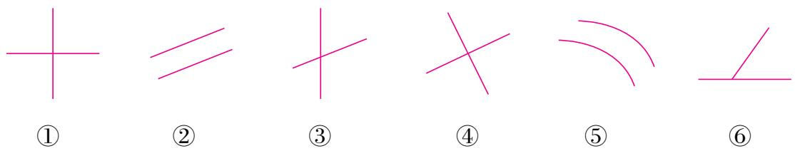

text_image

①
②
③
④
⑤
⑥

2. 学校的电动伸缩门利用的是平行四边形(容易变形)的特点。  
3. 平行四边形有(无数)条高,梯形有(无数)条高。一个图形的底和高互相(垂直)。  
4. 在同一平面内,从直线外一点画这条直线的垂线,可以画(1)条。  
5. 把一个平行四边形框架拉一拉,使它变成一个长方形,它的周长会(不变),高会(变长)。(填“变长”“变短”或“不变”)  
6.(教材 P68 第 8 题变设问)数学课上,同学们想到了借助一张长方形纸条和一张三角形透明胶片叠放的方法创造梯形。(重叠部分是梯形)

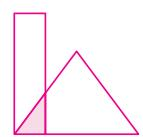  
小刚

  
小华

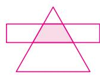  
莉莉

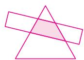  
小美

上面四名同学的作品中,不符合要求的是(小刚)的作品。

# 二、选一选。（把正确答案的字母填在括号里）（每题3分，共21分）

1. 如图,与北四环中路垂直的道路是( A )。

A. 安立路

B. 北三环中路

C. 京藏高速

D. 京承高速

text_image

京藏
安立
京承
高速
北四环中路
高速
北三环中路

2. (名校期末真题)下面是得到一组“平行线”的三种方法。

  
①

  
②

  
③

下面说法正确的是( D )。

A. 只有①和③正确

B. 只有①和②正确

C. 只有②和③正确

D. ①②③都正确

3. 同一平面内两条直线的位置关系“平行”“相交”“垂直”用图可以表示为( C )。

A

B.

C.

D.

4. 下面说法正确的是( B )。

A. 平行四边形的每条高都相等

B. 同一个梯形的高长度都相等

C. 梯形的每条边都不相等

D. 平行四边形的每条边都相等

5. 两个完全一样的( B )一定可以拼成一个长方形。

A. 梯形

B. 直角梯形

C. 等腰梯形

D. 三角形

6. 用 8 根小棒交叉摆放(如图), 其中 $a \parallel b, c \parallel d$ , 涂色部分是四个四边形。下面说

法错误的是( D )。

A. ①是梯形

B. ②既不是平行四边形也不是梯形

C. ③是平行四边形

D. ④是平行四边形

7. (易错题·概念误解)下面有关平行四边形的描述错误的是 ( C )。

text_image

a b
① ②
③ ④
c
d

A.

用如下4根小棒，可以摆成不同的平行四边形。

B.

将长方形拉成平行四边形，对边依然平行且相等，周长也不变。

C.

以AB为底，
OM为高，只能画出一个平行四边形。

D.

将正方形拉成平行四边形，边长不变，高变了。

# 三、实践操作。(共41分)

1. 画一个长是宽的 2 倍的长方形。

(4 分)(画法不唯一)

text_image

2 cm
4 cm

2. 画出平行四边形指定底边上的高。

(6 分)(画法不唯一)

  
底

3. 你知道下面两个图形的名称吗？请在括号里填上它们的名称，并把方格纸中同类图形的序号填在对应的“\_\_\_\_”上并写出分类的理由。（包含特殊情况哦）(8 分)

text_image

Diagram showing ten numbered geometric shapes arranged in a grid, with numbers 1 through 10 labeled on each shape.

平行四边形): ①⑤⑥⑧⑩

(梯形): ③④⑦

理由:(理由合理即可)

有两组对边分别平行的四边形

是平行四边形。

理由:(理由合理即可)

只有一组对边平行的四边形

是梯形。

4.(名校期末真题)已知直线 $m \parallel n$ , 按要求画图。(画法不唯一)

text_image

A
B
m
D
C
n

(1) 上图中 ABCD 是一个等腰梯形, 画出它任意一条高。(4 分)  
(2) 在梯形 ABCD 内画一个最大的平行四边形。在它的左侧再画一个相同的平行四边形。(6 分)  
(3)如何检验你画的平行四边形的左右两条边线互相平行? 可以在图上画一画或写一写检验的过程。(5 分)

(验证方法不唯一,画一画略)

方法一: 可以在左右两条边线上选择几个点, 向对边作垂直线段, 测量这几条垂直线段的长度是否相等, 若相等, 则说明左右两边互相平行。

方法二: 将左右两条边线向两端无限延伸, 看是否会相交, 如不相交, 则说明左右两边互相平行。

5. 在下面的梯形中画出一条线段,能将这个梯形分成两个什么图形呢? 对于这个问题同学们提出了以下四种想法,尝试画一画。(8 分)(答案不唯一)

(1) 能将这个梯形分成一个平行四边形和一个三角形。

(2) 能将这个梯形分成一个梯形和一个三角形。

(3) 能将这个梯形分成两个梯形。

(4) 能将这个梯形分成两个三角形。

四、解决问题。(共18分)

天星小学四年级校园运动操比赛在即,各班摩拳擦掌,蓄势待发!

1.(情境题·生活情境)王老师要去操场上看四(1)班同学们练习。请你帮他设计最短的路线,并说明设计原理。(6分)

从直线外一点到这条直线所画的垂直线段最短,所以从王老师所处的位置向操场画一条垂线段即可。

  
王老师

2. (情境题·生活情境) 四(2)班啦啦队准备用一根 50 cm 长(如图)的塑料条做一个有一条边是 10 cm 的平行四边形道具, 应该把这根塑料条怎样截开, 才能正好做一个平行四边形? (重叠部分忽略不计)(6 分)

(方法不唯一) $50 \div 2 - 10 = 15 \, (\text{cm})$

50 cm

答:截成 $10 \, cm$ 、 $10 \, cm$ 、 $15 \, cm$ 、 $15 \, cm$ 的四根塑料条,才能正好做一个平行四边形。

3.(情境题·生活情境)四(3)班的同学为比赛制作“入场牌”,他们将一个平行四边形纸板沿着高剪开之后,拼接成一个长方形(没有重合部分),如图,在拼好的长方形纸板四周粘上一圈彩带,彩带最短需要多少分米?(6分)

text_image

8分米
4分米

$(8+4)\times2=24$ (分米)

答:彩带最短需要 24 分米。

附加题。(共10分)

数一数,填一填。

( 2 )个三角形

( 6 )个平行四边形

( 10 )个梯形

# 第六单元测评卷

时间:60 分钟 满分:100 + 10 分

# 一、填一填。(每空1分,共25分)

1. 计算 $814 \div 42$ 时, 可以把 42 看作 (40) 来试商, 这时商会偏 (大)。  
2. 花园小学开展图书漂流活动, 小红的班上共收到图书 142 本。如果每名同学能搬 30 本, 至少需要 (5) 名同学才能将这些图书一次搬回教室。

3.(1)要使 $3 \div 6 \div 35$ 的商是一位数，里可以填(0,1,2,3,4)。

(2)要使 $41 \div 44$ 的商是一位数，里可以填 (1,2,3)。  
(3)要使 $523 \div \boxed{4}$ 的商是两位数，☐里最小填(1)。

4. (易错题·迁移误用) 括号里最大能填几?

$$
2 9 \times (6) <   1 8 3
$$

$$
5 6 \times (7) <   4 1 8
$$

$$
4 0 \times (9) <   3 7 1
$$

$$
4 3 \times (7) <   3 2 8
$$

$$
4 5 \times (8) <   3 8 0
$$

$$
(9) \times 8 0 <   7 2 7
$$

5. 如图, 小明在计算 $\square \square \square \div 25$ 时, 先用 4 试商, 发现被除数减去 25 与 4 的乘积, 差是 26。那么正确的商是 (5), 余数是 (1)。

6.(名校期末真题)根据 $720 \div 30 = 24$ , 写出下面各题的商。

$$
7 2 0 0 \div 3 0 0 = (2 4)
$$

$$
7 2 0 \div 1 5 = (4 8)
$$

$$
3 6 0 \div 3 0 = (1 2)
$$

$$
7 2 0 \div 6 0 = (1 2)
$$

$$
7 2 0 0 \div 3 0 = (2 4 0)
$$

$$
3 6 0 \div 1 5 = (2 4)
$$

7. 花店有 615 枝花, 如果用 28 枝花做一个花篮, 能做 (21) 个这样的花篮, 再加 (1) 枝花就够再做 1 个花篮了。

8. 如果被除数 ÷ 除数 = 100, 那么 (被除数 × 2) ÷ (除数 ÷ 2) = (400)。  
9. 小丽在计算一道除法算式时把除数 45 写成了 54, 结果算出的商是 18, 余数是 11, 正确的商是 (21), 余数是 (38)。

# 二、选一选。(把正确答案的字母填在括号里)(每题2分,共10分)

1.476÷48 的商的最高位在( A )位上。

A. 个

B. 十

C. 百

D. 万

2. 与算式 $270 \div (5 \times 9)$ 结果不相等的算式是( B )。

A. $270 \div 5 \div 9$

B. $270 \div 5 \times 9$

C. $270 \div 45$

D. $270 \div 9 \div 5$

3. 学校共有 630 名学生, 每 18 人组成一个环保小组, 可以组成多少个小组? 如图, 小明用竖式计算, 方框中的数表示的意思是 ( C )。

A. 3 个小组 54 人

B. 3 个小组 540 人

C. 30 个小组 540 人

D. 30 个小组 54 人

4. 下表是水果店某天销售 3 种水果的情况统计, 这一天中销量最多的水果是( C )。

<table><tr><td>品种</td><td>苹果</td><td>香蕉</td><td>梨</td></tr><tr><td>价格/(元/kg)</td><td>13</td><td>12</td><td>15</td></tr><tr><td>营业额/元</td><td>520</td><td>600</td><td>765</td></tr></table>

A. 苹果

B. 香蕉

C. 梨

D. 三种一样多

5. 已知 $\star \div \triangle = \square$ ……70（ $\star$ 和 $\triangle$ 都是整十数），如果把 $\star$ 和 $\triangle$ 同时除以 10，那么余数是（A）。

A.7

B. 70

C. 700

D. 没有余数

# 三、算一算。(共38分)

1. 口算。(8 分)

$$
1 6 0 0 \div 4 0 = 4 0
$$

$$
2 8 0 \div 4 0 = 7
$$

$$
1 8 0 \div 2 0 \div 3 = 3
$$

$$
2 0 2 \div 4 1 \approx 5
$$

$$
4 0 0 0 \div 5 0 0 = 8
$$

$$
2 7 0 0 \div 3 0 = 9 0
$$

$$
7 2 0 \div 9 \div 2 0 = 4
$$

$$
6 3 2 \div 9 2 \approx 7
$$

2. 列竖式计算。(带☆的要验算)(13 分)

$$
2 5 2 \div 2 8 = 9
$$

$$
7 3 6 \div 2 3 = 3 2
$$

$$
8 1 0 \div 2 5 = 3 2 \dots 1 0
$$

$$
\begin{array}{r} 9 \\ 2 \quad 8 \overline {{) 2 5 2}} \\ \underline {{2 5 2}} \\ 0 \end{array}
$$

$$
\begin{array}{r} 3 2 \\ 2 3 \overline {{) 7 3 6}} \\ \underline {{6 9}} \\ 4 6 \\ \underline {{4 6}} \\ 0 \end{array}
$$

$$
\begin{array}{r} 2 \quad 5 \sqrt { \begin{array}{c c c} & 3 & 2 \\ 8 & 1 & 0 \\ 7 & 5 \end{array} } \\ \hline 6 & 0 \\ 5 & 0 \\ \hline 1 & 0 \end{array}
$$

$$
8 2 0 \div 6 0 = 1 3 \dots 4 0
$$

$$
9 8 0 \div 1 4 = 7 0
$$

$$
\star 4 2 0 \div 2 4 = 1 7 \dots 1 2
$$

$$
\begin{array}{r} 1 \quad 3 \\ 6 \quad 0 \sqrt {8 \quad 2 \quad 0} \\ \underline {{6}} \\ 2 \quad 2 \\ \underline {{1 \quad 8}} \\ 4 \end{array}
$$

$$
\begin{array}{r} 7 0 \\ 1 4 \overline {{) 9 8 0}} \\ \underline {{9 8}} \\ 0 \end{array}
$$

$$
\begin{array}{r} 1 7 \\ 2 4 \overline {{) 4 2 0}} \\ \underline {{2 4}} \\ 1 8 0 \\ \underline {{1 6 8}} \\ 1 2 \end{array}
$$

$$
\begin{array}{r l} & \text {   验算:   } \\ & \times \quad 1 7 \\ & \hline 1 6 8 \\ & 2 4 \\ & \hline 4 0 8 \\ & + \quad 1 2 \\ & \hline 4 2 0 \end{array}
$$

3. 用你喜欢的方法计算下面各题。(9 分)(方法不唯一)

$$
\begin{array}{l} 3 6 0 \div 4 5 \\ 6 0 0 0 \div 1 2 5 \\ 7 0 0 0 \div 1 4 0 \\ = 3 6 0 \div (9 \times 5) \\ = (6 0 0 0 \times 8) \div (1 2 5 \times 8) \\ = 7 0 0 0 \div (7 0 \times 2) \\ = 3 6 0 \div 9 \div 5 \\ = 4 8 0 0 0 \div 1 0 0 0 \\ = 7 0 0 0 \div 7 0 \div 2 \\ = 4 0 \div 5 \\ = 4 8 \\ = 1 0 0 \div 2 \\ = 5 0 \\ \end{array}
$$

$$
= 8
$$

4. 下面的计算对吗？对的画“√”，错的画“×”，说明错误原因并改正。（8 分）
(错因说明合理即可)

$$
\begin{array}{r} 1 9 0 \\ 5 \text {   or   } \sqrt {9 5 \text {   or   }} \end{array}
$$

( × ) 改正: 19

错因：

被除数和
除数都除

以同一个

数,商不变。

$$
5 \sqrt [ 9 ]{9 5}
$$

$$
\begin{array}{r} 8 \\ 9 0 \overline {{) 7 2 5}} \end{array}
$$

$$
\begin{array}{c} 7 \quad 2 \\ \hline \quad 5 \end{array}
$$

( × ) 改正:

错因：

商8不能写在十位

上，第二

层应写720。

$$
\text {正:} \quad 8   9 0 \sqrt {7 2 5}
$$

$$
\begin{array}{r} 7 \quad 2 \quad 0 \\ \hline \quad 5 \end{array}
$$

四、解决问题。(共27分)

冬至是我国二十四节气之一。冬至通常发生在每年的12月21日或22日，它是北半球白昼时间最短，夜晚时间最长的一天。

1. 为了深入了解冬至这个节气,亮亮从图书馆借了一本《二十四节气故事》,亮亮要在三周内读完,他每天至少要读多少页? (5 分)

$$
3 \times 7 = 2 1 (\text { 天 })
$$

$314 \div 21 = 14$ （页）……20（页）

$14 + 1 = 15$ (页)

答:他每天要读15页。

2. 冬至这天,我国北方地区有吃饺子的习俗。社区准备购买 16 盒水饺送给社区的老人,怎么买最省钱?最少需要花多少元?(5 分)

$$
1 5 0 \div 1 0 = 1 5 (\text {   元   })
$$

$48 \div 3 = 16$ (元)

15 < 16 < 20, 10 盒装的最便宜, 3 盒装的次之, 1 盒装的最贵。

$16 \div 10 = 1$ （箱）……6（盒）

$6 \div 3 = 2$ (组)

$150 + 48 \times 2 = 246$ （元）

<table><tr><td>书名:二十四节气故事</td><td>出版社:宁夏人民出版社</td></tr><tr><td>尺寸:240 mm × 170 mm</td><td>定价:32.80元</td></tr><tr><td>页数:314页</td><td>开本:1/16</td></tr></table>

bar

| 类别 | 数量 (盒) | 金额 (元) |
|---|---|---|
| 一箱 | 10 | 150 |
| 一组 | 3 | 48 |
| 一盒 | | 20 |

答:买 1 箱 10 盒装的和 2 组 3 盒装的最省钱,最少需要花 246 元。

3. 从冬至这一天开始,天气越来越冷。小丽和妈妈相约去购买冬服,上午 10:00 在商场门口集合。

(1)妈妈从家出发,她到商场的路程是4050米,她骑车的速度是270米/分。请你算一算,妈妈要准时赴约,她最晚什么时候从家出发呢?(5分)

$$
4 0 5 0 \div 2 7 0 = 1 5 (\text { 分 })
$$

10 时 - 15 分 = 9 时 45 分

答:她最晚上午9:45从家出发。

(2)妈妈带了2000元,先买了2件下面的羽绒服,剩下的钱给小丽买杂志,最多可以买多少本杂志? (5分)

$$
2 0 0 0 - 8 9 9 \times 2 = 2 0 2 (\text {   元   })
$$

$202 \div 39 = 5$ （本）……7（元）

答:剩下的钱最多可以买5本杂志。

  
899 元/件

  
39 元/本

4. 亮亮的奶奶有冬季泡脚的习惯,妈妈打算用 150 元给奶奶买泡脚用的足浴包。
她最多能买多少袋? 有多少包? (7 分)

$$
1 5 0 \div 2 8 = 5 (\text { 袋 }) \dots 1 0 (\text { 元 })
$$

$5 \div 2 = 2$ （组）……1（袋）

$5 + 2 = 7$ (袋)

$7 \times 30 = 210$ (包)

答:最多能买7袋,有210包。

  
28 元/袋  
买2赠1

附加题。(共10分)

一列火车通过一座长 720 米的铁桥用了 40 秒,以同样的速度穿过 1220 米的隧道用了 60 秒。这列火车的速度是多少? 火车长多少?

速度: $(1220-720)\div(60-40)=25$ （米/秒）

车长: $25 \times 40 - 720 = 280$ (米)

答:这列火车的速度是25米/秒,火车长280米。

# 第七、八单元测评卷

时间:60 分钟 满分:100 分

# 一、选一选。（把正确答案的字母填在括号里）（每题3分，共12分）

1. 写数学作业、制作语文小报和朗读英语课文,这三件事一个人( A )同时进行。

A. 不能

B. 能

C. 有可能

D. 无法确定能不能

2. 少儿图书馆一天的图书借阅情况如下:

<table><tr><td>图书种类</td><td>科幻类</td><td>文学类</td><td>益智类</td><td>动漫类</td></tr><tr><td>借阅本数</td><td>80</td><td>100</td><td>140</td><td>160</td></tr></table>

用条形统计图表示左面数据时,如果科幻类用4格表示,那么益智类用( B )格表示。

A. 10

B. 7

C. 8

D. 14

3. 煮 1 根玉米需要 20 分,一锅可以煮 5 根玉米,那么煮 3 根玉米至少需要( B )分。

A. 12

B. 20

C. 60

D. 100

4. (名校期末真题)下列说法错误的是( C )。

A. 故事书最多,漫画书最少  
B. 教辅书的数量是漫画书的 2 倍  
C. 科普书比故事书少 20 本  
D. 故事书比漫画书多 35 本

# 二、填一填。(每空3分,共18分)

小玲家图书数量统计图  

bar

| 类别 | 数量/本 |
| :--- | :--- |
| 科普书 | 35 |
| 故事书 | 45 |
| 漫画书 | 10 |
| 教辅书 | 20 |
| 图书种类 | |

1. 小华到医院体检,要体检的项目和每个项目所需要的时间如下表。

<table><tr><td>测量身高、体重</td><td>B超</td><td>心电图</td><td>抽血</td><td>等待抽血结果</td></tr><tr><td>3分钟</td><td>10分钟</td><td>8分钟</td><td>5分钟</td><td>30分钟</td></tr></table>

如何合理地安排体检顺序？请你把安排流程图画在下面。

flowchart

小华体检需要的时间至

少是(35)分钟。

2. 一个平底锅一次最多只能煎 2 条小黄鱼, 如果煎 1 条小黄鱼需要 4 分钟(正、反面各 2 分钟), 那么煎 5 条小黄鱼至少需要(10)分钟。  
3. 玲玲和芳芳两人玩扑克牌比大小的游戏,每人每次出一张牌,各出3次,赢两次

者胜。玲玲的牌是

，芳芳的牌是

如果玲玲先出,芳芳获胜的策略是10—(2),6—(9),4—(5)。

# 三、专家建议: 小学生的睡眠时间每天要达到 10 个小时。下表是庆阳小学四(1)班学生每天的睡眠情况。(共 27 分)

<table><tr><td>睡眠时间</td><td>10小时及以上</td><td>9~10小时</td><td>8~9小时</td><td>7~8小时</td><td>7小时以下</td></tr><tr><td>人数</td><td>18</td><td>6</td><td>5</td><td>3</td><td>2</td></tr></table>

1. 根据表中数据绘制条形统计图。(12 分)

bar

| 睡眠时间 | 人数 |
|---|---|
| 7小时以下 | 2 |
| 7~8小时 | 3 |
| 8~9小时 | 5 |
| 9~10小时 | 6 |
| 10小时及以上 | 18 |

2. 全班共有(34)人参加了本次调查。(3分)  
3. 睡眠时间在(10 小时及以上)的人数最多,在(7 小时以下)的人数最少。有(16)人睡眠时间不够。(9 分)  
4. 根据统计结果,你想对哪些同学说些什么或者有什么建议? (3 分)

答案不唯一,如:想对睡眠不足 10 小时的同学说:“保证充足的睡眠才能更好地学习。”建议同学们合理安排自己的时间,保证充足的睡眠。

# 四、下面是某超市六月份几种饮料的销售情况。(共14分)

<table><tr><td>种类</td><td>可乐</td><td>雪碧</td><td>绿茶</td><td>运动饮料</td></tr><tr><td>瓶数</td><td>400</td><td>260</td><td>40</td><td>300</td></tr></table>

1. 你认为用哪个图表示表中的数据比较合适？为什么？请选择一个条形图把统计结果表示出来。(10 分)用图 A 表示比较合适,因为用图 A 表示更精确。

bar

| 种类 | 瓶数 (瓶数) |
| :--- | :--- |
| 可乐 | 400 |
| 雪碧 | 260 |
| 绿茶 | 40 |
| 运动饮料 | 300 |

bar

| 类别     | 瓶数 |
| -------- | ---- |
| 可乐     | 500  |
| 雪碧     | 500  |
| 绿茶     | 500  |
| 运动饮料 | 500  |
| 种类     | 500  |

2. 如果你是超市的老板,下个月进货时你会注意什么? (4 分) 下个月进货时多进一些可乐,少进一些绿茶。(合理即可)

五、(名校期末真题)妈妈开车和乐乐一起从家出去办事,妈妈要去超市买东西,乐乐要去图书馆借书。下面是他们要走的路线和所用时间。他们办完这些事回到家,至少要用多长时间?(共8分)

$$
8 + 2 + \underline {{(2 + 5 + 3 8 + 5)}} + 8 = 6 8 (\text {   分   })
$$

借书 40 分钟 + 步行 10 分钟

答:他们办完这些事回到家,至少
要用 68 分钟。

flowchart

# 六、四(1)班和四(2)班参加跳绳比赛。(共21分)

参赛队员一分钟跳绳的最优成绩如下：

<table><tr><td>班级</td><td colspan="3">四(1)班</td><td colspan="3">四(2)班</td></tr><tr><td>姓名</td><td>白雪</td><td>李珍</td><td>张浩</td><td>王阳</td><td>赵光</td><td>陈晓</td></tr><tr><td>数量/下</td><td>115</td><td>(130)</td><td>160</td><td>(90)</td><td>125</td><td>(150)</td></tr></table>

四（1）班一分钟跳绳最优成绩统计图  

bar

| 姓名 | 数量/下 |
| :--- | :--- |
| 白雪 | 115 |
| 李珍 | 130 |
| 张浩 | 160 |

四（2）班一分钟跳绳最优成绩统计图  

bar

| 姓名 | 数量/下 |
| :--- | :--- |
| 王阳 | 90 |
| 赵光 | 125 |
| 陈晓 | 150 |

1. 请把统计表和统计图补充完整。(9 分)  
2. 从图中你能得到什么信息？（至少写出两条）(6 分)

答案不唯一,如:四(1)班三名同学中第一名是张浩,第二名是李珍,第三名是白雪;四(2)班三名同学中第一名是陈晓,第二名是赵光,第三名是王阳;四(1)班每个名次的同学都比四(2)班对应名次的同学跳得多等。

3. 如果要进行团体比赛,采取“三局两胜”制,以上队员都发挥出最优成绩。四(1)班队员出场的顺序依次是白雪、张浩、李珍,四(2)班有可能获胜吗?该怎么安排?(6分)

有可能获胜,安排如下:

<table><tr><td></td><td>四(1)班</td><td>四(2)班</td><td>获胜者</td></tr><tr><td>第一场</td><td>白雪</td><td>赵光</td><td>四(2)班</td></tr><tr><td>第二场</td><td>张浩</td><td>王阳</td><td>四(1)班</td></tr><tr><td>第三场</td><td>李珍</td><td>陈晓</td><td>四(2)班</td></tr></table>

# 期末综合测评卷（一）

时间:70 分钟 满分:100 + 10 分

# 数与代数

# 一、填一填。(每空1分,共9分)

1. 2023 年,“双十一”全网销售总额约是24347000000元,横线上的数读作(二百四十三亿四千七百万),其中7在(百万)位,表示7个(百万),省略亿位后面的尾数约是(243)亿。  
2. 比较大小,请在○里填上“＞”“＜”或“＝”。

15 个百万

1500000

10101010

> 990099

200 × 28

290 × 20

3. “超市”搞促销活动,原价 16 元一盒的中性笔,买三送一。李老师要买 4 盒中性笔,应付(48)元,优惠后每盒中性笔实际(12)元。

# 二、选一选。(每题2分,共10分)

4. 下面各数中, 一个 0 也不读的是( A )。

A. 90009000

B. 90900000

C. 900090900

D. 90090000

5. 买 48 元/袋的鸭脖花了 576 元,买了多少袋? 竖式计算结果如图,箭头所指部分表示( C )。

A. 买 1 袋花了 48 元

B. 买 10 袋花了 48 元

C. 买 10 袋花了 480 元

D. 买 1 袋花了 480 元

6.(名校期末真题)一套商铺的售价用“四舍五入”法省略万位后面的尾数约是60万,该商铺的价格可能是( B )。

line

| Point | Value |
|---|---|
| ① | 59万 |
| ② | 60万 |
| ③ | 61万 |
| ④ | 61万 |

A. ①和②

B. ②和③

C. ③和④

D. 只有③

7. 与 $120 \div 15$ 的商相等的算式是 (C)。

A. $(120 \times 5) \div (15 \div 5)$

B. $(120-5)\div(15-5)$

C. $(120 \div 5) \div (15 \div 5)$

D. $(120+5)\div(15+5)$

8. 商店里一包 200 张的“福”字宣纸大约厚 2 厘米, 1 亿张宣纸大约厚( B )千米。

A. 1

B. 10

C. 100

D. 1000

# 三、算一算。(共18分)

9. 直接写得数。(8 分)

$$
1 4 \times 7 = 9 8
$$

$$
4 8 0 \div 8 0 = 6
$$

$$
3. 3 - 1 = 2. 3
$$

$$
4 5 2 \div 5 2 \approx 9
$$

$$
7 5 0 \div 5 0 = 1 5
$$

$$
2 0 0 \times 1 9 = 3 8 0 0
$$

$$
4 2 0 - 7 0 = 3 5 0
$$

$$
1 - \frac {3}{8} = \frac {5}{8}
$$

10. 列竖式计算, 带☆的要验算。(10 分)

$$
2 4 0 \times 3 5 = 8 4 0 0
$$

$$
4 0 8 \times 7 0 = 2 8 5 6 0
$$

$$
\begin{array}{r} 2 4 0 \\ \times \quad 3 5 \\ \hline 1 2 0 \\ 7 2  \\ \hline 8 4 0 0 \end{array}
$$

$$
\begin{array}{r} {4 0 8} \\ {\times \quad 7 0} \\ \hline {2 8 5 6 0} \end{array}
$$

$$
\star 6 6 5 \div 2 5 = 2 6 \dots 1 5
$$

$$
\begin{array}{r} 2 \quad 5 \sqrt { \begin{array}{c c c} 2 & 6 \\ 6 & 6 & 5 \\ 5 & 0 \end{array} } \\ \hline 1 \quad 6 \quad 5 \\ \hline 1 \quad 5 \quad 0 \\ \hline 1 \quad 5 \end{array}
$$

$$
\begin{array}{r l} & \text {验算:} \\ & \frac {\times \quad 2 6}{1 3 0} \\ & \frac {5 2}{6 5 0} \\ & + \quad 1 5 \\ & \frac {6 6 5}{6 6 5} \end{array}
$$

# 四、解决问题。(共18分)

11.(名校期末真题)我国铁路从绿皮车发展到现在的高铁,取得了举世瞩目的成就。

  
1990年  
40千米/时

  
1997年  
140千米/时

  
1998年  
160千米/时

  
2004年  
200千米/时

  
现在  
350千米/时

(1)从北京到广州按现在时速大约行驶8小时到达,在1990年时大约要行驶多长时间才能到达? (6分)

$$
3 5 0 \times 8 = 2 8 0 0 (\text {千米})
$$

$$
2 8 0 0 \div 4 0 = 7 0 (\text {   时   })
$$

答: 在 1990 年时大约要行驶 70 小时才能到达。

(2)请你从上面任选一个信息,再补充一个信息,根据这两个信息提出一个能用“路程、速度、时间”这组数量关系解决的问题。(6分)(答案不唯一)

我选择的信息：2004年时速200千米/时。

我补充的信息: A、B 两地相距 1000 千米。

我提出的问题：2004年从A地到B地，坐火车需要多少小时？

12. (情境题·生活情境)商店新进一批益智玩具,进货单不小心被撕了。你知道一共花了多少元吗? (6 分)

$$
1 2 \times (1 2 9 + 3 4 5) = 5 6 8 8 (\text {元})
$$

答:一共花了 5688 元。

<table><tr><td>商品名称</td><td>单价</td><td>数量</td><td>金额</td></tr><tr><td>超级华容道</td><td>129元</td><td>12件</td><td rowspan="2"></td></tr><tr><td>故事机</td><td>345元</td><td>12件</td></tr><tr><td>合计</td><td colspan="3"></td></tr></table>

# 图形与几何

# 一、填一填。(第5题4分,其他每空1分,共11分)

1. 在括号里填适当的面积单位。

手工教室的面积约 56(平方米) 举办纸艺展的文化宫占地约 3(公顷)

2.5000 公顷 = ( 50 ) 平方千米

3 平方千米 60 公顷 = ( 360 ) 公顷

3. 亮亮每天早上7:00起床,这时钟表上时针和分针所成的较小角是(钝)角。

4. 手工课上, 亮亮将两张长 8 厘米、宽 5 厘米的长方形纸交叉摆放(如图), 重叠部分是一个(平行四边)形, 它的高是(5)厘米。

5. (名校期末真题) 如右图, 小丽、小兰和小敏三位同学早晨同时从家出发去学校, 如果她们行走的速度相同, 最先到达学校的是 (小兰)。这样判断的理由是: (理由合理即可) 从直线外一点到这条直线所画的垂直线段最短, 所以小兰家离学校最近。因为她们速度大先到学校。 )。

text_image

学校
小丽家 小兰家
小敏家

# 二、选一选。(每题2分,共4分)

6. 亮亮用自制的量角器量一个角(如图), 这个角的度数是(B)。

A. $30^{\circ}$

B. $60^{\circ}$

C. $90^{\circ}$

D. $120^{\circ}$

7. 在如图的点子图中再选一个点 D, 使四边形 ABCD 成为一个梯形, 点 D 有 (D) 种选法。

A. 2

B. 3

C. 4

D. 5

# 三、画图。(共10分)

8. 如图为长方形 $ABCD$ 的一半。

(1)量一量, $\angle C=(30)^{\circ}$ ,这是一个(锐)角。(4分)  
(2) 将它补成完整的长方形, 并标出点 D。(3 分)  
(3) 过点 B 画线段 AC 的垂线。(3 分)

# 四、解决问题。(共6分)

9. 一个学生实践基地计划扩建一块长为 25 米, 面积为 375 平方米的学生实践菜地。扩建后长为 50 米, 宽保持不变。扩建后的面积是多少平方米? (6 分)

(方法不唯一) $50 \div 25 = 2$

$375 \times 2 = 750$ (平方米)

答: 扩建后的面积是 750 平方米。

# 统计与概率

下面是四(1)班45人“课间10分钟”最喜欢的活动统计表。(每人只选择一项)(共9分)

<table><tr><td>项目</td><td>球类活动</td><td>阅读</td><td>跳绳</td><td>棋类活动</td><td>其他</td></tr><tr><td>人数</td><td>16</td><td>12</td><td>6</td><td></td><td>6</td></tr></table>

1. 如图, 图中一格表示 (2) 人, 根据统计数据将条形统计图补充完整。(4 分)

四（1）班学生最喜欢的课间活动统计图  

bar

| 项目 | 人数 |
| :--- | :--- |
| 球类活动 | 16 |
| 阅读 | 12 |
| 跳绳 | 6 |
| 棋类活动 | 5 |
| 其他 | 6 |

2. 请根据上面的信息提出一个数学问题并解答。(5 分)

略,合理即可。

# 综合与实践

碰碰车游戏。(共5分)

亮亮、华华、乐乐三位同学玩双人碰碰车。现在只有一辆空闲碰碰车，三位同学都想开两次，每次10分钟，则最少需要（30）分钟，请用画图的方法表示出你的想法。

第1次
亮亮 华华
10分钟

第2次
亮亮 乐乐
10分钟

第3次
华华 乐乐
10分钟

# (画图不唯一)

附加题。(共10分)

两个数相除,商是11,余数是16,被除数、除数、商和余数的和是463,那么被除数是(401),除数是(35)。

# 期末综合测评卷（二）

① 时间:70 分钟

满分:100 + 10 分

# 一、填一填。(第2题7分,其余每空1分,共18分)

1. (名校期末真题)我国香港特别行政区的陆地总面积约是十一亿零六百万平方米,横线上的数写作(110600000),改写成用“万”作单位的数是(110600)万,省略亿位后面的尾数约是(11)亿,香港特别行政区的陆地总面积约是(110600)公顷,约是(1106)平方千米。

2. 我们可以用不同的方式表示多位数。

(1)108009500 由(1)个亿,(800)个万和(9500)个一组成。  
(2)6000606 = ( 6000000 ) + 600 + ( 6 )   
(3)下面算盘上的数写作(30205062)。请在计数器上表示这个数。

text_image

十 千百十
亿亿万万万千百十个

3. 在○里填上“＞”“＜”或“＝”。

500505 < 505050

10 平方千米 > 100 公顷

4. 一个六位数 5 \_\_\_\_ 2 \_\_\_\_ 3, 在 \_\_\_\_ 上一共填 3 个“0”, 使这个数读出两个零, 这个六位数是 (500203)。

5. 学校计划购买 11 套“航天科普丛书”，每套 284 元。一共要花多少钱？竖式计算过程如图，第一步的得数为甲，第二步的得数为乙，甲和乙相比，（乙）大。理由是（甲表示 284，乙表示 284 个 10，所以乙大。）。（理由合理即可）

6. 妈妈每天早上起床后要做以下事情:穿衣(1 分),刷牙(3 分),洗脸(2 分),煮鸡蛋(8 分),烤面包(2 分),吃早餐(6 分)。妈妈最少用(15 )分能完成这些事情。

二、选一选。(把正确答案的字母填在括号里)(每题2分,共10分)

1. 乐乐的量角器坏了,他量出来的角(如图)是( C )。

A. $40^{\circ}$

B. $60^{\circ}$

C. $80^{\circ}$

D. $90^{\circ}$

2. 老师请同学们画一个“两组对边分别平行”的四边形，(A)画出的图形是错误的。

3. 下面说法正确的是( B )。

A. 两条直线不相交就平行

B. 平角的两条边在一条直线上

C. 梯形的四条边一定都不相等

D. 四边形最少有一组对边平行

4. $890 \div 30 = 29 \cdots 20$ , 如果被除数和除数同时乘 10, 那么商和余数是 (D)。

A. 29,30

B. 290, 200

C. 29, 20

D. 29,200

5.(名校期末真题)四年级举行100米赛跑,四(1)班三位选手的成绩分别是A:16秒,B:19秒,C:21秒。四(2)班三位选手的成绩分别是甲:15秒,乙:20秒,丙:23秒。四(1)班选手的出场顺序是A→B→C,如果采取三局两胜制,四(2)班选择(C)出场顺序可以获胜。

A. 甲 $\rightarrow$ 乙 $\rightarrow$ 丙

B. 乙→丙→甲

C. 丙→甲→乙

D. 甲→丙→乙

# 三、算一算。(共26分)

1. 直接写得数。(8 分)

$$
5 0 \times 8 = 4 0 0
$$

$$
1 4 0 \times 6 = 8 4 0
$$

$$
0 \times 7 + 7 = 7
$$

$$
9 0 0 \div 2 0 = 4 5
$$

$$
3 6 0 0 \div 4 0 = 9 0
$$

$$
6 0 \times 3 0 0 = 1 8 0 0 0
$$

$$
1 2 5 \times 6 = 7 5 0
$$

$$
5 4 1 \div 6 0 \approx 9
$$

2. 列竖式计算。(9 分)

$$
3 0 8 \times 2 5 = 7 7 0 0
$$

$$
9 5 2 \div 2 8 = 3 4
$$

$$
9 5 0 \div 9 0 = 1 0 \dots 5 0
$$

$$
\begin{array}{r} {3 0 8} \\ {\times 2 5} \\ \hline {1 5 4 0} \\ {6 1 6} \\ \hline {7 7 0 0} \end{array}
$$

$$
\begin{array}{r} 3 4 \\ 2 8 \overline {{) 9 5 2}} \\ \underline {{8 4}} \\ 1 1 2 \\ \underline {{1 1 2}} \\ 0 \end{array}
$$

$$
\begin{array}{r} 1 \quad 0 \\ 9 \quad 0 \sqrt {9 \quad 5 \quad 0} \\ \underline {{9}} \\ 5 \end{array}
$$

3. 用你喜欢的方法计算。(9 分)(方法不唯一)

$$
4 8 0 \div (4 \times 8)
$$

$$
4 0 0 \div 2 5
$$

$$
2 8 0 0 \div 5 6
$$

$$
= 4 8 0 \div 4 \div 8
$$

$$
= (4 0 0 \times 4) \div (2 5 \times 4)
$$

$$
= (2 8 0 0 \div 7) \div (5 6 \div 7)
$$

$$
= 1 2 0 \div 8
$$

$$
= 1 6 0 0 \div 1 0 0
$$

$$
= 4 0 0 \div 8
$$

$$
= 1 5
$$

$$
= 1 6
$$

$$
= 5 0
$$

# 四、实践操作。(共18分)

1. 右图每个小方格的边长表示 1 厘米。

(1)量一量, $\angle B$ 的度数是( $56^{\circ}$ )。(2分)  
(2) 在图中找一个点 D, 使得四边形 ABCD 成为一个平行四边形, 并把它画出来。(2 分)  
(3)在平行四边形 ABCD 中,画出这个平行四边形的

一条高,并且要使这条高能把平行四边形 ABCD 分割成两个同样大的梯形。(2 分)

(4) 平行四边形 ABCD 的高为 (3) 厘米。(2 分)

2. (名校期末真题)人正常的眨眼可以消除眼睛的疲劳。如果眨眼次数过少,对眼睛的健康不利。下面是人在各种状态下平均每分钟眨眼的次数。

text_image

A
B
C
D

<table><tr><td>状态</td><td>看书</td><td>写字</td><td>平常</td><td>看电视</td><td>玩手机游戏</td></tr><tr><td>每分钟眨眼次数</td><td>(15)</td><td>18</td><td>24</td><td>12</td><td>10</td></tr></table>

(1)请完成统计表和条形统计图。(4分)  
(2)从统计图中可以看出,在(平常)状态下,每分钟眨眼次数最多;

在(玩手机游戏)状态下,眼睛最容易疲劳。(4分)

bar

| 状态 | 每分钟眨眼次数 |
| :--- | :--- |
| 看书 | 15 |
| 写字 | 18 |
| 平常 | 24 |
| 看电视 | 12 |
| 玩手机游戏 | 10 |

(3)针对上面的数据,你想对同学们说:

为了保护好自己的视力,要控制玩手机游戏的时间(答案不唯一)。(2分)

# 五、解决问题。(共28分)

我国是茶的故乡,最早种植、制作茶叶。茶文化深深融入人们的生活,成为传承中华文化的重要载体。

1. 李叔叔开车从 A 城经 B 城到 C 城参观茶园(如图 1)。汽车从 A 城到 B 城的平均速度如图 2。

text_image

3时
2时
A城
B城
C城
360千米

图 1

  
图 2

  
图3

(1)从 A 城到 B 城的路程是多少千米? (3 分)

$$
3 \times 7 0 = 2 1 0 (\text {千米})
$$

答:从 A 城到 B 城的路程是 210 千米。

(2)从 B 城到 C 城的平均速度是多少? 仿照图 2 的样子, 把汽车从 B 城到 C 城的平均速度在图 3 中表示出来。(5 分)

$$
(3 6 0 - 2 1 0) \div 2 = 7 5 (\text { 千   米   /   时 })
$$

答:从 B 城到 C 城的平均速度是 75 千米/时。

(3)汽车从 A 城到 C 城的平均速度是多少？(4 分)

$$
3 6 0 \div (2 + 3) = 7 2 (\text { 千   米   /   时 })
$$

答:汽车从 A 城到 C 城的平均速度是 72 千米/时。

2. 李叔叔了解到, 这个茶园的面积有 24 公顷, 大约有 4 万株茶树, 平均每公顷产 650 千克茶叶。

(1)这个茶园能产多少千克茶叶？(4分)

$$
2 4 \times 6 5 0 = 1 5 6 0 0 (\text { 千   克 })
$$

答: 这个茶园能产 15600 千克茶叶。

(2) 平均每株茶树大约占地多少平方米？(4 分)

24 公顷 = 240000 平方米

$$
2 4 0 0 0 0 \div 4 0 0 0 0 = 6 (\text { 平   方   米 })
$$

答: 平均每株茶树大约占地 6 平方米。

3. 返程时李叔叔想要用 450 元购买一些茶叶。同一种茶叶在不同商店的价格如图。

(1) 如果在甲商店购买,最多买几盒? 还剩多少钱? (4 分)

$$
4 5 0 \div 9 8 = 4 (\text { 组 }) \dots 5 8 (\text { 元 })
$$

$$
5 8 \div 5 5 = 1 (\text {   盒   }) \dots 3 (\text {   元   })
$$

$$
2 \times 4 + 1 = 9 (\text {   盒   })
$$

答:最多可以买9盒,还剩3元。

(2) 李叔叔在哪个商店买更划算？请说明理由。(4 分)

李叔叔在乙商店买更划算。理由如下：

甲商店:450 - 3 = 447(元), 买9盒。

$$
\text {   乙商店:   } 4 5 0 \div 5 0 = 9 (\text {   盒   })
$$

$$
4 5 0 - 8 = 4 4 2 (\text {   元   })
$$

$$
4 4 2 <   4 4 7
$$

答: 李叔叔在乙商店买更划算。

(若学生有其他比较方法合理也可)

附加题。(共10分)

在一次车展中,由25辆相同的汽车组成一列车队,每辆车长4米,每相邻两辆车之间相隔5米,车队以每分钟50米的速度经过80米长的主席台。车辆全部通过主席台需要多少分钟?

$$
(2 5 - 1) \times 5 = 1 2 0 (\text { 米 })
$$

$$
2 5 \times 4 + 1 2 0 = 2 2 0 (\text {米})
$$

$$
(2 2 0 + 8 0) \div 5 0 = 6 (\text {分})
$$

答: 车辆全部通过主席台需要 6 分钟。

甲商店

55元/盒

98元/2盒

乙商店

50 元/盒

消费满100元立减8元