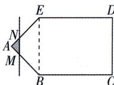

## 题型 2 函数解析式的求法

- [Question 4](questions/Question_4_q4_L43.md)
- [Question 5](questions/Question_5_q5_L45.md)
- [Question 6](questions/Question_6_q6_L48.md)
- [Question 7](questions/Question_7_q7_L50.md)
