# 专题1 函数不等式结论篇

# 一．函数定义域

(1) 分式中的分母不为 0;  
（2）偶次方根下的数（或式）大于或等于0；  
（3）零指数幂的底数不为0；  
（4）指数式的底数大于0且不等于1；  
（5）对数式的底数大于0且不等于1，真数大于0；  
（6）正切函数 $y = \tan x (x \in R \text{ 且 } x \neq k\pi + \frac{\pi}{2}, k \in Z)$ .

# 二．函数单调性

1. 直接证明，并且记住几条常见结论：

（1）若 $f(x)$ 是增函数，则 $-f(x)$ 为减函数；若 $f(x)$ 是减函数，则 $-f(x)$ 为增函数；  
（2）若 $f(x)$ 和 $g(x)$ 均为增（或减）函数，则在 $f(x)$ 和 $g(x)$ 的公共定义域上 $f(x)+g(x)$ 为增（或减）函数；  
（3）若 $f(x) > 0$ 且 $f(x)$ 为增函数，则函数 $\sqrt{f(x)}$ 为增函数， $\frac{1}{f(x)}$ 为减函数；若 $f(x) > 0$ 且 $f(x)$ 为减函数，则函数 $\sqrt{f(x)}$ 为减函数， $\frac{1}{f(x)}$ 为增函数.

2. 求导判断，当 $f'(x) \geq 0$ 时，此区间单调递增，当 $f'(x) \leq 0$ 时，此区间单调递减.

3. 对称性判断，如果函数为轴对称图形，则在对称轴两边出现单调性相反情况（参考二次函数和余弦函数），若为中心对称图形，则对称中心两边单调性相同（参考反比例函数和正弦函数）.

2. 复合函数单调性的判断

讨论复合函数 $y = f[g(x)]$ 的单调性时要注意：既要把握复合过程，又要掌握基本函数的单调性。一般需要先求定义域，再把复杂的函数正确地分解为两个简单的初等函数的复合，然后分别判断它们的单调性，再用复合法则，复合法则如下：

1. 若 $u = g(x), y = f(u)$ 在所讨论的区间上都是增函数或都是减函数，则 $y = f[g(x)]$ 为增函数；  
2. 若 $u = g(x), y = f(u)$ 在所讨论的区间上一个是增函数，另一个是减函数，则 $y = f[g(x)]$ 为减函数。列表如下：

<table><tr><td>u=g(x)</td><td>y=f(u)</td><td>y=f[g(x)]</td></tr><tr><td>增</td><td>增</td><td>增</td></tr><tr><td>增</td><td>减</td><td>减</td></tr><tr><td>减</td><td>增</td><td>减</td></tr><tr><td>减</td><td>减</td><td>增</td></tr></table>

# 三．函数奇偶性

函数 $f(x)$ 是定义在区间 D 上的奇函数，则对任意的 $x \in D$ ，都有 $f(x) + f(-x) = 0$ .

特别地，若奇函数 $f(x)$ 在 D 上有最值，则 $f(x)_{\min} + f(x)_{\max} = 0$ .

①若函数 $f(x)$ 是奇函数，且 $g(x)=f(x)+c$ ，则必有 $g(x)+g(-x)=2c$

②若函数 $f(x)$ 是奇函数，且 $g(x) = f(x) + c$ ，则必 $g(x)_{\max} + g(x)_{\min} = 2c$

# 特殊函数奇偶性

奇函数：① 函数 $f(x) = m\left(\frac{a^x + 1}{a^x - 1}\right) (x \neq 0)$ 或函数 $f(x) = m\left(\frac{a^x - 1}{a^x + 1}\right)$ .

② 函数 $f(x)=\pm(a^{x}-a^{-x})$ .

③ 函数 $f(x) = \log_a\frac{x + m}{x - m} = \log_a(1 + \frac{2m}{x - m})$ 或函数 $f(x) = \log_a\frac{x - m}{x + m} = \log_a(1 - \frac{2m}{x + m})$ .

④ 函数 $f(x) = \log_a(\sqrt{x^2 + 1} + x)$ 或函数 $f(x) = \log_a(\sqrt{x^2 + 1} - x)$ .

注意：关于①式，可以写成函数 $f(x)=m+\frac{2m}{a^{x}-1}(x\neq0)$ 或函数 $f(x)=m-\frac{2m}{a^{x}+1}(m\in R)$ .

偶函数：① 函数 $f(x)=\pm(a^{x}+a^{-x})$ .

② 函数 $f(x) = \log_a (a^{mx} + 1) - \frac{mx}{2}$ .

③ 函数 $f(|x|)$ 类型的一切函数.

# 四．函数的对称性

（1）若函数 $y=f(x+a)$ 为偶函数，则函数 $y=f(x)$ 关于 x=a 对称.  
（2）若函数 $y=f(x+a)$ 为奇函数，则函数 $y=f(x)$ 关于点 $(a,0)$ 对称.  
（3）若 $f(x)=f(2a-x)$ ，则函数 $f(x)$ 关于 x=a 对称.  
（4）若 $f(x)+f(2a-x)=2b$ ，则函数 $f(x)$ 关于点 $(a,b)$ 对称.  
（5）若函数 $y=f(x)$ 关于直线 x=a 对称，则 $f(a+x)=f(a-x)$ .

推论1 关系式 $f(a + x) = f(a - x)$ 也可以写成 $f(x) = f(2a - x)$ 或 $f(-x) = f(2a + x)$ .

若写成 $f(a+x)=f(b-x)$ ，则函数 $y=f(x)$ 关于直线 $x=\frac{(a+x)+(b-x)}{2}=\frac{a+b}{2}$ 对称.

（6）若函数 $y=f(x)$ 关于点 $(a,b)$ 对称，则 $f(a+x)+f(a-x)=2b$

推论 2 关系式 $f(a+x)+f(a-x)=2b$ 也可以写成 $f(2a+x)+f(-x)=2b$ 或 $f(2a-x)+f(x)=2b$

（7）函数 $y=f(a+x)$ 与 $y=f(a-x)$ 关于 y 轴对称，函数 $y=f(a+x)$ 与 $y=-f(a-x)$ 关于原点对称.  
（8）若 $f(m+x)=f(m-x)$ 恒成立，则 $y=f(x)$ 的图像关于直线 x=m 对称.  
（9）设函数 $y = f(x)$ 定义在实数集上，则函数 $y = f(x - m)$ 与 $y = f(m - x) (m > 0)$ 的图象关于直线 $x = m$ 对称.  
（10）若 $f(a+x)=f(b-x)$ ，对任意 $x\in R$ 恒成立，则 $y=f(x)$ 的图象关于直线 $x=\frac{a+b}{2}$ 对称.  
（11）函数 $y = f(a + x)$ 与函数 $y = f(b - x)$ 的图象关于直线 $x = \frac{b - a}{2}$ 对称.  
（12）函数 $y = f(x)$ 与函数 $y = f(2a - x)$ 的图象关于直线 x = a 对称.  
（13）函数 $y = f(x)$ 与函数 $y = 2b - f(2a - x)$ 的图象关于点 $(a, b)$ 中心对称.

# 高考必备对称公式：

$f(a + x) = f(b - x)\Rightarrow$ 关于 $x = \frac{a + b}{2}$ 轴对称

$f(a + x) = -f(b - x)\Rightarrow$ 关于点 $(\frac{a + b}{2},0)$ 中心对称

$f(a + x) = -f(b - x) + 2m \Rightarrow (\frac{a + b}{2}, m)$ 中心对称

# 五．函数的周期性

（1）若函数 $f(x)$ 满足 $f(x + m) = -f(x)$ ，则 $T = 2|m|$ .  
（2）若函数 $f(x)$ 满足 $f(x + m) = \pm \frac{1}{f(x)}$ ，则 $T = 2|m$ .  
（3）若函数 $f(x)$ 满足 $f(x + m) = \frac{1 - f(x)}{1 + f(x)}$ ，则 $T = 2|m$ .  
(4) 结合 (1), (2), (3) 可得: 当一个函数 $f(x + m) = \varphi(x) = \varphi^{-1}(x)$ 时, 一定有 $f(x + 2m) = f(x)$ , $f(x)$ 是周期为 $2m$ 的周期函数.

推论 $f(x + m) = \frac{af(x) + b}{cf(x) + d}$ 当且仅当 $a + d = 0$ 时， $f(x)$ 是周期为 $2m$ 的周期函数.

（5）若函数 $f(x)$ 满足 $f(x) = f(x + a) + f(x - a)$ ，则函数 $f(x)$ 是以 $6|a|$ 为周期的周期函数.

(6) $f(x + m) = \frac{f(x) + \sqrt{3}}{1 - \sqrt{3}f(x)}$ ， $f(x)$ 是周期为 $3m$ 的周期函数.

(7) $f(x + m) = 1 - \frac{1}{f(x)}$ , $f(x)$ 是周期为 $3m$ 的周期函数.

（8）结合(6)(7)可得：当一个函数 $f(x + m) = \varphi (x)$ 时，则可以根据迭代推出 $f(x + 2m) = \varphi_2(x) = f(x)$ ，那么 $f(x)$ 是周期为 $3m$ 的周期函数

（9）函数 $f(x + m) = \frac{af(x) + b}{cf(x) + d}$ ，当仅当 $(a + d)^2 = ad - bc$ 时， $f(x)$ 是周期为 $3m$ 的周期函数.

(10) $f(x + m) = \frac{1 + f(x)}{1 - f(x)}$ ，则 $T = 4m$

（11）函数 $f(x + m) = \frac{af(x) + b}{cf(x) + d}$ ，当仅当 $(a + d)^2 = 2(ad - bc)$ 时， $f(x)$ 是周期为 $4m$ 的周期函数.

(12) $f(x + m) = \frac{1 + \sqrt{3}f(x)}{\sqrt{3} - f(x)}$ ，则 $T = 6m$

（14）函数 $f(x + m) = \frac{af(x) + b}{cf(x) + d}$ ，当仅当 $(a + d)^2 = 3(ad - bc)$ 时， $f(x)$ 是周期为 $6m$ 的周期函数；当 $(a + d)^2 > 3(ad - bc)$ 时，不会再产生周期函数.

（15）周期函数的迭代定理：若 $f(x + m) = \varphi [f(x)]$ ，则存在 $f(x + 2m) = \varphi_2[f(x)]$ ， $f(x + 3m) = \varphi_3[f(x)]$ ，一定存在最小的正整数 $n$ ，使得 $\varphi_n[f(x)] = f(x)$ 成立，即 $f(x + nm) = \varphi_n[f(x)] = f(x)$ ， $nm$ 即为这个函数的最小正周期。

(16) $f(x)=f(x+a)+f(x-a)$ ，则 $f(x)$ 是以 6a 为周期的周期函数.

（17）若函数 $f(x)$ 满足 $f(x + a) = f(x + b)$ 或 $f(x - a) = f(x - b)$ ，则 $T = |b - a|$

# 六．对称与周期的关系

（1）若函数 $f(x)$ 的图象关于直线 $x = a$ ， $x = b$ 都对称，则 $f(x)$ 为周期函数且 $2|b - a|$ 是它的一个周期.

推论 若偶函数 $f(x)$ 的图象关于直线 $x = a$ 对称，则 $f(x)$ 为周期函数，且 $2|a|$ 是它的一个周期.

（2）函数 $f(x) (x \in R)$ 的图象关于两点 $A(a, y_0)$ 、 $B(b, y_0)$ 都对称，则函数 $f(x)$ 是以 $2|b - a|$ 为周期的周期函数.

推论 若奇函数 $f(x)$ 的图象关于 $A(a,0)$ 对称，则 $f(x)$ 为周期函数，且 $2|a|$ 是它的一个周期.

（3）函数 $f(x)$ ( $x \in R$ ) 的图象关于 $A(a, y_{0})$ 和直线 x = b 都对称，则函数 $f(x)$ 是以 $4|b - a|$ 为周期的周期函数.

推论1若奇函数 $f(x)$ 的图象关于直线 $x = a$ 对称，则 $y = f(x)$ 为周期函数，且 $4|a|$ 是它的一个周期.

（4）周期为 T 的奇函数一定关于点 $\left(\frac{T}{2}, 0\right)$ 对称，周期为 T 的偶函数关于直线 $x = \frac{T}{2}$ 对称.

# 高考必备对称和周期公式：

$f(a + x) = f(b - x)\Rightarrow$ 关于 $x = \frac{a + b}{2}$ 轴对称

$f(a + x) = -f(b - x)\Rightarrow$ 关于点 $(\frac{a + b}{2},0)$ 中心对称

$f(a + x) = -f(b - x) + 2m \Rightarrow (\frac{a + b}{2}, m)$ 中心对称

$$
f (x) = f (x + a) \Rightarrow T = | a |; \quad f (x) = - f (x + a) \Rightarrow T = 2 | a |;
$$

$$
f (x) = \frac {1}{f (x + a)} \Rightarrow T = 2 | a |; \quad f (x) = - \frac {1}{f (x + a)} \Rightarrow T = 2 | a |;
$$

# 七．抽象函数的模特函数

（1）若 $f(x + y) = f(x) + f(y)$ ，则 $f(x) = xf(1)$ （正比例函数）

（2）若 $f(x + y) = f(x)f(y)$ ，则 $f(x) = [f(1)]^x$ （指数函数）例如： $f(x) = 2^x$ ，即 $f(x) = [f(1)]^x$ .

(3) 若 $f(xy)=f(x)+f(y)$ ，则 $f(x)=\log_{b}x$ (对数函数)

(4) 若 $f(xy)=f(x)f(y)$ ，则 $f(x)=x^{a}$ （幂函数）

（5）若 $f(x+y)=f(x)+f(y)+m$ ，则 $f(x)=xf(1)-m$ （一次函数）

# 八．指对运算与换底公式

(1) $a^m a^n = a^{m + n}(a > 0, m, n \in Q)$ ;

(2) $(a^{m})^{n} = a^{mn}(a > 0, m, n\in Q)$ ;

(3) $(ab)^{m} = a^{m}b^{m}(a > 0, b > 0, m\in Q)$ ;

(4) $\sqrt[n]{a^m} = a^{\frac{m}{n}} (a > 0, m, n \in Q)$ .

(5) $\log_a(MN) = \log_a M + \log_a N$ ;

(6) $\log_a\frac{M}{N} = \log_aM - \log_aN;$

(7) $\log_{a^m} b^n = \frac{n}{m} \log_a b(m, n \in R)$ ;

(8) $a^{\log_a b} = b$ 和 $\log_a a^b = b$

(9) $\log_{a}x=\log_{b}y=\log_{a^{m}b^{n}}z\Leftrightarrow x^{m}y^{n}=z$ （当 m=n=1 时， $\log_{a}x=\log_{b}y=\log_{ab}z\Leftrightarrow xy=z$ ）.

（10）换底公式： $\log_a b = \frac{\log_c b}{\log_c a}$

# 倒数原理与约分法则

（1）倒数原理： $\log_a b = \frac{1}{\log_b a}$

（2）约分法则： $\log_a b\cdot \log_b c = \log_a c$

# 九．函数最值

# 1. 三角换元

求函数 $f(x) = \sqrt{b - x} + \sqrt{x - a} (x \in [a, b]$ 且 $a < b$ 的值域，利用平方和为常数，由于 $(\sqrt{b - x})^2 + (\sqrt{x - a})^2 = b - a$ 故令 $\sqrt{b - x} = \sqrt{b - a}\cos \alpha$ ， $\sqrt{x - a} = \sqrt{b - a}\sin \alpha$ （ $0 \leq \alpha \leq \frac{\pi}{2}$ ）， $f(x) = \sqrt{2(b - a)}\sin (\alpha + \frac{\pi}{4}) \in [\sqrt{b - a}, \sqrt{2(b - a)}]$ .

# 2. 对称中心平移和对称轴平移后求最值问题

若 $f(x)$ 都可以唯一表示成一个奇函数 $g(x)$ 与一个偶函数 $h(x)$ 之和，当 $h(x) = m$ 时，则 $f(x)$ 关于点 $(0, m)$ 中心对称，即可以理解为将奇函数 $g(x)$ 向上平移了 $m$ 个单位，即 $f(x) + f(-x) = 2f(0) = 2m$ ；当 $h(x) \neq m$ 时，则有 $f(x) + f(-x) = 2h(x)$ .

推论 若 $f(x)=g(x)+m$ ，则 $f(x)_{\max}+f(x)_{\min}=2f(0)=2m$ 。

（1）已知 $f(x)=ax+\frac{b}{x}-2$ ，则 $f(\ln3)+f(\ln\frac{1}{3})=-4$ 。  
（2）已知 $f(x)=ax+\frac{b}{x}-c\sin x+3$ ，则 $f(\ln3)+f(\ln\frac{1}{3})=6$ .  
（3）已知函数 $f(x)=\ln(\sqrt{1+x^{2}}-x)+2$ ，则 $f(\lg5)+f(\lg\frac{1}{5})=4$ 。  
（4）已知函数 $f(x)=\ln(\sqrt{1+9x^{2}}-3x)+1$ ，则 $f(\lg2)+f(\lg\frac{1}{2})=2$ 。

# 3. 最值与双变量函数不等式问题（包裹性定理）

定理一 若 $y = f(x)$ 满足 $\forall x_{1}, x_{2} \in D, |f(x_{1}) - f(x_{2})| < m$ 恒成立，则在区间 D 上 $f(x)_{\max} - f(x)_{\min} < m$ 如图 1 所示，令 AB = m，则 $|f(x_{1}) - f(x_{2})| < m$ 恒成立.

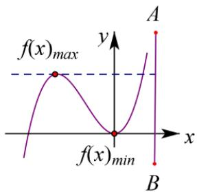

text_image

f(x)_{max}
y
A
f(x)_{min}
x
B

图1

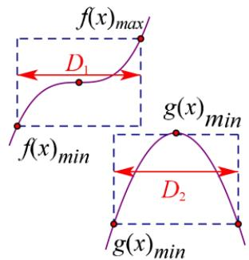

text_image

f(x)_{max}
D_1
f(x)_{min}
g(x)_{min}
D_2
g(x)_{min}

图2

定理二 若 $y = f(x)$ ， $y = g(x)$ 满足 $\forall x_{1} \in D_{1}$ ， $x_{2} \in D_{2}$ ， $f(x_{1}) > g(x_{2})$ 恒成立，则在各自区间上 $f(x)_{\min} > g(x)_{\max}$ ；如图 2 所示， $f(x)$ 的区域始终在 $g(x)$ 区域上方才满足条件.

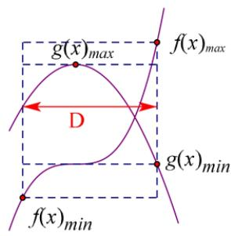

text_image

g(\bar{x})_{max}
f(x)_{max}
D
g(x)_{min}
f(x)_{min}

图 3

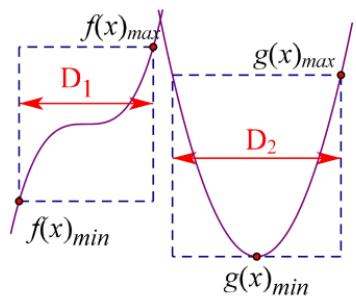

text_image

f(x)_{max}
D_1
f(x)_{min}
g(x)_{max}
D_2
g(x)_{min}

图4

定理三（包裹性定理）若 $y = f(x)$ ， $y = g(x)$ 满足若 $\forall x_1 \in D$ ，总 $\exists x_0 \in D$ ，使得 $f(x_0) = g(x_1)$ 成立，则在区间 $D$ 上 $\left\{ \begin{array}{l} f(x)_{\min} < g(x)_{\min} \\ f(x)_{\max} > g(x)_{\max} \end{array} \right.$ ；如图3， $y = f(x)$ 所在区域能包含 $y = g(x)$ 所在区域时，满足条件。

定理四 若 $y = f(x)$ ， $y = g(x)$ 满足 $\forall x_1 \in D_1$ ，总 $\exists x_2 \in D_2$ 使得 $f(x_1) > g(x_2)$ 能成立，则在区间 $D$ 上 $f(x)_{\min} > g(x)_{\min}$ ；如图4， $y = f(x)$ 所在区域最小值大于 $y = g(x)$ 所在区域最小值时，满足条件.

注意 包裹性定理的关键在于区别符号 $\forall$ 与 $\exists$ ，还要看是否有两个区间与 $x_{1} \in D_{1}$ ， $x_{2} \in D_{2}$ 。

# 十．不等式性质

# 1. 不等式的性质

<table><tr><td>性质</td><td>别名</td><td>性质内容</td><td>注意</td></tr><tr><td>1</td><td>对称性</td><td> $a > b \Leftrightarrow b \leq a$ </td><td> $\Leftrightarrow$ </td></tr><tr><td>2</td><td>传递性</td><td> $a > b, b > c \Rightarrow a > c$ </td><td>不可逆</td></tr><tr><td>3</td><td>可加性</td><td> $a > b \Leftrightarrow a + c \geq b + c$ </td><td>可逆</td></tr><tr><td>4</td><td>可乘性</td><td> $a > b, c > 0 \Rightarrow ac > bc$  $a > b, c < 0 \Rightarrow ac < bc$ </td><td> $c$ 的符号</td></tr><tr><td>5</td><td>同向可加性</td><td> $a>b,\ c>d\Rightarrow\underline{a+c>b+d}$ </td><td>同向</td></tr><tr><td>6</td><td>同向同正可乘性</td><td> $a>b>0,\ c>d>0\Rightarrow\underline{ac>bd}$ </td><td>同向</td></tr><tr><td>7</td><td>可乘方性</td><td> $a>b>0\Rightarrow a^{n}\geq b^{n}(n\in\mathbf{N},\ n\geq2)$ </td><td>同正</td></tr></table>

# 2. 糖水不等式的性质

定理：若 $a > b > 0$ ， $m > 0$ ，则一定有 $\frac{b + m}{a + m} >\frac{b}{a}$ ，或者 $\frac{a + m}{b + m} <  \frac{a}{b}$

通俗的理解就是 $a$ 克的不饱和糖水里含有 $b$ 克糖，往糖水里面加入 $m$ 克糖，则糖水更甜；

证明： $\frac{b+m}{a+m}-\frac{b}{a}=\frac{ab+am-ab-bm}{a^{2}+am}=\frac{(a-b)m}{a^{2}+am}>0$ ； $\frac{a+m}{b+m}-\frac{a}{b}=\frac{ab+bm-ab-am}{b^{2}+bm}=-\frac{(a-b)m}{b^{2}+bm}<0$

# 十一.基本不等式

1. 基本不等式：如果 $a > 0$ ， $b > 0$ ， $\sqrt{ab} \leqslant \frac{a + b}{2}$ ，当且仅当 $a = b$ 时，等号成立。其中 $\frac{a + b}{2}$ 叫做正数 $a$ ， $b$ 的算术平均数， $\sqrt{ab}$ 叫做正数 $a$ ， $b$ 的几何平均数。

2. 变形: $ab \leqslant \left(\frac{a + b}{2}\right)^2$ , $a, b \in \mathbf{R}$ , 当且仅当 $a = b$ 时, 等号成立. $a + b \geqslant 2\sqrt{ab}$ , $a, b$ 都是正数, 当且仅当 $a = b$ 时, 等号成立.

3. 用基本不等式 $\frac{x + y}{2} \geqslant \sqrt{xy}$ 求最值应注意：

(1)x, y 是正数.

(2)①如果 xy 等于定值 P，那么当 x=y 时，和 $x+y$ 有最小值 $2\sqrt{P}$ ;

②如果 $x+y$ 等于定值 S，那么当 x=y 时，积 xy 有最大值 $\frac{1}{4}S^{2}$ .

(3)讨论等号成立的条件是否满足.

4. 利用基本不等式求最大值或最小值时，应注意什么问题呢？

利用基本不等式求最值时应注意：一正，二定，三相等.

# 5. 基本不等式常用模型

模型一： $mx + \frac{n}{x} \geq 2\sqrt{mn} (m > 0, n > 0, x > 0)$ ，当且仅当 $x = \sqrt{\frac{n}{m}}$ 时等号成立.

# 模型二：加项变换

$mx + \frac{n}{x - a} = m(x - a) + \frac{n}{x - a} + ma \geq 2\sqrt{mn} + ma (m > 0, n > 0, x > 0)$ ，当且仅当 $x - a = \sqrt{\frac{n}{m}}$ 时等号成立.

思考：若函数 $f(x)=x+\frac{1}{x-2}(x>2)$ 在 x=a 处有最小值，则 a= \_\_\_\_.

$f(x) = x + \frac{1}{x - 2} = x - 2 + \frac{1}{x - 2} + 2 \geq 2 + 2 = 4$ 当且仅当 $x - 2 = \frac{1}{x - 2} \Rightarrow x = 3$ 时等号成立．故选 $C$ ：

# 模型三：同除转化为基本不等式

$\frac{x}{ax^2 + bx + c} = \frac{1}{ax + b + \frac{c}{x}} \leq \frac{1}{2\sqrt{ac} + b} (a > 0, c > 0, x > 0)$ ，当且仅当 $x = \sqrt{\frac{c}{a}}$ 时等号成立.

思考：若对任意 x > 0， $\frac{x}{x^{2} + 3x + 1} \leq a$ 恒成立，则 a 的取值范围是 \_\_\_\_.

$\frac{x}{x^2 + 3x + 1} = \frac{1}{x + 3 + \frac{1}{x}} \leq \frac{1}{2 + 3} \leq a$ ，当且仅当 $x = 1$ 时等号成立，故 $a \geq \frac{1}{5}$ .

# 模型四：凑和为常数型

$x(n - mx) = \frac{mx(n - mx)}{m} \leq \frac{1}{m} \cdot \left(\frac{mx + n - mx}{2}\right)^2 = \frac{n^2}{4m} (m > 0, n > 0, 0 < x < \frac{n}{m})$ ，当且仅当 $x = \frac{n}{2m}$ 时等号成立.

思考：已知 $0 < x < \frac{1}{2}$ ，则 $y = x(1 - 2x)$ 的最大值为 \_\_\_\_.

由于 $1 - 2x > 0$ ，则 $y = x(1 - 2x) = \frac{1}{2}\cdot 2x\cdot (1 - 2x)\leqslant \frac{1}{2} (\frac{2x + 1 - 2x}{2})^2 = \frac{1}{8}$ 当且仅当 $2x = 1 - 2x$ ，即 $x = \frac{1}{4}$ 时，等号成立.

# 模型五：等式转化为不等式模型

若出现 $m(a+b)+nab=c$ ，其中 a、b、m、n、 $c\in R^{*}$

因为 $a + b \geq 2\sqrt{ab} \Rightarrow ab \leq \frac{(a + b)^2}{4}$ ，可以转化为 $2m\sqrt{ab} + nab \leq c$ 或 $m(a + b) + n\frac{(a + b)^2}{4} \geq c$ ，

从而求出 $a + b$ 及 $ab$ 的取值范围．若出现求 $ma + nb$ 取值范围，先将式子 $m(a + b) + nab = c$ 因式分解成为 $(a + x)(b + y) = z$ 形式，再用基本不等式求出 $ma + nb$ 最值.

也可以考虑用柯西不等式解出答案，先进行因式分解 $(a + x)(b + y) = z$ ，再用柯西不等式分析.

# 十二. 柯西不等式

柯西不等式二元式：设 $a$ ， $b$ ， $c$ ， $d\in R^{+}$ ，有 $(a + b)(c + d)\geq (\sqrt{ac} +\sqrt{bd})^{2}$ 当且仅当 $\frac{a}{c} = \frac{b}{d}$ 时等号成立.

# 模型一：分母的倍数和为常数

$(a + b)(\frac{m}{a} + \frac{n}{b}) \geq (\sqrt{m} + \sqrt{n})^2$ ，其中 $a, b, m, n \in R^{+}$ ，例如： $(a + b)(\frac{1}{a} + \frac{1}{b}) \geq (\sqrt{a\frac{1}{a}} + \sqrt{b\frac{1}{b}})^2 = 4$ ；

对柯西不等式变形，易得 $(\frac{a^2}{x} +\frac{b^2}{y})(x + y)\geq (a + b)^2$ 在 $a,b,x,y > 0$ 时，就有了 $\frac{a^2}{x} +\frac{b^2}{y}\geq \frac{(a + b)^2}{x + y}$ 当 $\frac{a}{x} = \frac{b}{y}$ 时，等号成立．同理 $\frac{a^2}{x} +\frac{b^2}{y} +\frac{c^2}{z}\geq \frac{(a + b + c)^2}{x + y + z},$ 当 $\frac{a}{x} = \frac{b}{y} = \frac{c}{z}$ 时，等号成立．我们将这种不等式叫做权方和不等式.我们接下来还会继续分析讲解权方和不等式

思考： $x, y \in R^{+}$ ，且 $\frac{1}{x} + \frac{9}{y} = 1$ ，则 $(x + y)_{\min} =$ \_\_\_\_.

$(x + y)(\frac{1}{x} + \frac{9}{y}) \geq (\sqrt{1} + \sqrt{9})^2 = 16$ ，当且仅当 $x = 3y$ 时等号成立，又 $\because \frac{1}{x} + \frac{9}{y} = 1, \therefore x + y \geq 16$ .

# 模型二：一高一低和式配凑类型

已知 $x^{2} + y^{2}$ 的值，求 $x + y$ 的取值范围，或者已知 $x + y$ 的值，求 $2x^{2} + 3y^{2}$ 的最值或者求 $\sqrt{x} +\sqrt{y}$ 的最值即 $(x^{2} + y^{2})(m^{2} + n^{2})\geq (mx + ny)^{2}$ ，其中 $m$ ， $n\in R^{+}$

例 $(a^2 + b^2)(1 + 1) \geq (a + b)^2$ 或者写成 $\sqrt{\frac{a^2 + b^2}{2}} \geq \frac{a + b}{2}$

思考： $a,b\in R,a^2 +2b^2 = 6$ ，则 $a + b$ 的最小值是

$(a^{2} + 2b^{2})(1 + \frac{1}{2})\geq (a + b)^{2}\Rightarrow (a + b)^{2}\leq 9\Rightarrow -3\leq a + b\leq 3$ ，当且仅当 $a = 2b = -2$ 时等号成立，故最小值为-3.

# 模型三：同次积式配凑类型

已知 $xy$ 的值，求 $(x + m)(y + n)(m, n \in R^{*})$ 的最值，利用 $(x + m)(y + n) \geq (\sqrt{xy} + \sqrt{mn})^{2}$ 求最值.

思考：设 $a > 0, b > 0, a + b + 1 = ab$ ，求设 $3a + 2b$ 最小值.

$$
\begin{array}{l} a + b + 1 = a b \Rightarrow (a - 1) (b - 1) = 2 \\ 3 a + 2 b = 3 (a - 1) + 2 (b - 1) + 5 \geq 2 \sqrt {6 (a - 1) (b - 1)} + 5 = 4 \sqrt {3} + 5 \\ \end{array}
$$

基本不等式和柯西不等式都悉数登场，那么关于什么时候用什么不等式成为了关键，我们可以根据结构来分析，如果是已知和式定值求积式最值，或者积式定值求和式最值，这就是形式转变，一般用基本不等式；而已知和式定值，求和式（倒数和、平方和、根式和）的最值，或者已知积式（需要因式分解确定）定值，求另一个齐次积式定值，我们通常用柯西不等式。总结起来一句话，形式的改变用基本不等式，形式的不变用柯西不等式，尽管两个不等式是相通的.

# 专题 2 三角向量结论篇

# 一．象限角与弧度制

# 1. 象限角

把角放在平面直角坐标系中，使角的顶点与原点重合，角的始边与 $x$ 轴的非负半轴重合，那么，角的终边在第几象限，就说这个角是第几象限角；如果角的终边在坐标轴上，就认为这个角不属于任何一个象限.

<table><tr><td>第一象限角的集合</td><td> $\left\{ {\alpha \mid {k} \cdot {360}^{ \circ } < \alpha < k \cdot {360}^{ \circ } + {90}^{ \circ },k \in Z}\right\}$ </td></tr><tr><td>第二象限角的集合</td><td> $\left\{ {\alpha \mid {k} \cdot {360}^{ \circ } + {90}^{ \circ } < \alpha < k \cdot {360}^{ \circ } + {180}^{ \circ },k \in Z}\right\}$ </td></tr><tr><td>第三象限角的集合</td><td> $\left\{ {\alpha \mid {k} \cdot {360}^{ \circ } + {180}^{ \circ } < \alpha < k \cdot {360}^{ \circ } + {270}^{ \circ },k \in Z}\right\}$ </td></tr><tr><td>第四象限角的集合</td><td> $\left\{ {\alpha \mid {k} \cdot {360}^{ \circ } - {90}^{ \circ } < \alpha < k \cdot {360}^{ \circ },k \in Z}\right\}$ </td></tr></table>

# 2. 弧度制

（1）1 弧度的角：长度等于半径长的弧所对的圆心角叫做 1 弧度的角，弧度用符号 rad 表示.  
（2）. 角 $\alpha$ 的弧度数：如果半径为 $r$ 的圆的圆心角 $\alpha$ 所对弧的长为 $l$ ，那么 $l = r\alpha$ ，角 $\alpha$ 的弧度数的绝对值是 $\left|\alpha\right| = \frac{l}{r}$   
(3). 角度与弧度的换算① $1^{\circ}=\frac{\pi}{180}rad$ ② $1rad=\frac{180^{\circ}}{\pi}$   
（4）. 弧长、扇形面积的公式：设扇形的弧长为 $l$ ，圆心角大小为 $\alpha(rad)(0 < \alpha < 2\pi)$ ，半径为 $r$ ，又 $l = r\alpha$ ，则扇形的面积为 $S = \frac{1}{2} l \cdot r = \frac{1}{2} \cdot |\alpha| \cdot r^2$ .

# 二．同角三角函数

（1）平方关系： $\sin^2\alpha +\cos^2\alpha = 1$ （2）商数关系： $\frac{\sin\alpha}{\cos\alpha} = \tan \alpha (\alpha \neq \frac{\pi}{2} +k\pi)$

齐次分式：分子分母的正余弦次数相同，例如：

$$
\frac {a \sin \alpha + b \cos \alpha}{c \sin \alpha + d \cos \alpha} \text {或者} a \sin^ {2} \alpha + b \cos^ {2} \alpha + c \sin \alpha \cos \alpha \Rightarrow \frac {a \sin^ {2} \alpha + b \cos^ {2} \alpha + c \sin \alpha \cos \alpha}{\sin^ {2} \alpha + \cos^ {2} \alpha}
$$

# 三．三角函数诱导公式

<table><tr><td>公式</td><td>一</td><td>二</td><td>三</td><td>四</td><td>五</td><td>六</td></tr><tr><td>角</td><td> $2k\pi + \alpha (k \in Z)$ </td><td> $\pi + \alpha$ </td><td> $-\alpha$ </td><td> $\pi - \alpha$ </td><td> $\frac{\pi}{2} - \alpha$ </td><td> $\frac{\pi}{2} + \alpha$ </td></tr><tr><td>正弦</td><td> $\sin \alpha$ </td><td> $-\sin \alpha$ </td><td> $-\sin \alpha$ </td><td> $\sin \alpha$ </td><td> $\cos \alpha$ </td><td> $\cos \alpha$ </td></tr><tr><td>余弦</td><td> $\cos \alpha$ </td><td> $-\cos \alpha$ </td><td> $\cos \alpha$ </td><td> $-\cos \alpha$ </td><td> $\sin \alpha$ </td><td> $-\sin \alpha$ </td></tr><tr><td>正切</td><td> $\tan \alpha$ </td><td> $\tan \alpha$ </td><td> $-\tan \alpha$ </td><td> $-\tan \alpha$ </td><td></td><td></td></tr><tr><td>口诀</td><td colspan="4">函数名不变,符号看象限</td><td colspan="2">函数名改变,符号看象限</td></tr></table>

【记忆口诀】“奇变偶不变，符号看象限”

# 四．两角和与差的正余弦与正切

(1) $\sin(\alpha \pm \beta) = \sin \alpha \cos \beta \pm \cos \alpha \sin \beta$ ;

(2) $\cos (\alpha \pm \beta) = \cos \alpha \cos \beta \mp \sin \alpha \sin \beta$

(2) $\tan(\alpha\pm\beta)=\frac{\tan\alpha\pm\tan\beta}{1\mp\tan\alpha\tan\beta}$ ;

# 1. 两角和与差正切公式变形

$$
\tan \alpha \pm \tan \beta = \tan (\alpha \pm \beta) (1 \mp \tan \alpha \tan \beta); \quad \tan \alpha \cdot \tan \beta = 1 - \frac {\tan \alpha + \tan \beta}{\tan (\alpha + \beta)} = \frac {\tan \alpha - \tan \beta}{\tan (\alpha - \beta)} - 1
$$

# 2. 二倍角公式

(1) $\sin 2\alpha = 2\sin \alpha \cos \alpha$ ;

(3) $\tan 2\alpha = \frac{2\tan\alpha}{1 - \tan^2\alpha}$

(2) $\cos 2\alpha = \cos^2\alpha -\sin^2\alpha = 2\cos^2\alpha -1 = 1 - 2\sin^2\alpha ;$

# 3. 半角公式

$$
\sin \frac {\alpha}{2} = \pm \sqrt {\frac {1 - \cos \alpha}{2}},
$$

$$
\cos \frac {\alpha}{2} = \pm \sqrt {\frac {1 + \cos \alpha}{2}},
$$

$$
\tan \frac {\alpha}{2} = \pm \sqrt {\frac {1 - \cos \alpha}{1 + \cos \alpha}} = \frac {\sin \alpha}{1 + \cos \alpha} = \frac {1 - \cos \alpha}{\sin \alpha}.
$$

# 4. 辅助角公式

第一类：一次辅助角 $f(x) = a\sin x \pm b\cos x$

$f(x)=a\sin x\pm b\cos x=\sqrt{a^{2}+b^{2}}\sin(x\pm\varphi)$ (辅助角 $\varphi$ 由点 $(a,b)$ 决定, $\tan\varphi=\frac{b}{a}$ ).

第二类：二次辅助角 $f(x)=a\sin\omega x\cos\omega x\pm b\cos^{2}\omega x(a,b>0)$

$$
f (x) = \frac {a}{2} \sin 2 \omega x \pm \frac {b}{2} (\cos 2 \omega x + 1) = \frac {\sqrt {a ^ {2} + b ^ {2}}}{2} \sin (2 \omega x \pm \phi) \pm \frac {b}{2} (\tan \phi = \frac {b}{a})
$$

若遇到 $\sin^{2}\alpha$ ，则通过公式 $\sin^{2}\alpha=1-\cos^{2}\alpha$ 转化成 $\cos^{2}\alpha$

注意：（1） $\cos^4\alpha -\sin^4\alpha = (\cos^2\alpha -\sin^2\alpha)(\cos^2\alpha +\sin^2\alpha) = \cos 2\alpha = 2\cos^2\alpha -1$

(2) $2\sin^{2}(\alpha \pm \frac{\pi}{4}) = (\sin \alpha \pm \cos \alpha)^{2} = 1 \pm 2\sin \alpha \cos \alpha$

# 5. 万能辅助角公式

已知三角形的一个内角 C，求 $\sin A + \sin B$ 或者 $\sin A + \lambda \sin B$

$$
a + b = 4 R \cos \frac {C}{2} \sin \left(A + \frac {C}{2}\right), \quad a + \lambda b = 2 R \sqrt {\lambda^ {2} + 2 \lambda \cos C + 1} \sin (B + \varphi) \leq 2 R \sqrt {\lambda^ {2} + 2 \lambda \cos C + 1} (\lambda > 0)
$$

# 6. 正切恒等式

$$
\tan A + \tan B + \tan C = \tan A \cdot \tan B \cdot \tan C (\text {当} A + B + C = k \pi \text {时})
$$

证明：∵ $\tan(A+B)=\frac{\tan A+\tan B}{1-\tan A\tan B}$ ， $\tan C=-\tan(A+B)$ .∴ $\tan A+\tan B=-\tan C(1-\tan A\tan B)$

故 $\tan A + \tan B + \tan C = \tan A\cdot \tan B\cdot \tan C$

推论： $\tan \frac{A}{2} +\tan \frac{B}{2} +\frac{-1}{\tan\frac{C}{2}} = \tan \frac{A}{2}\cdot \tan \frac{B}{2}\cdot \frac{-1}{\tan\frac{C}{2}}$ （当 $A + B + C = \pi$ 时）

证明： $A + B + C = \pi \Rightarrow \frac{A + B}{2} = \frac{\pi}{2} -\frac{C}{2}\Rightarrow \frac{A + B}{2} -\left(\frac{\pi}{2} -\frac{C}{2}\right) = 0\Rightarrow \tan \frac{A}{2} +\tan \frac{B}{2}\tan \left(\frac{\pi}{2} -\frac{C}{2}\right)$

$$
= - \tan \frac {A}{2} \tan \frac {B}{2} \tan \left(\frac {\pi}{2} - \frac {C}{2}\right) \Rightarrow \tan \frac {A}{2} + \tan \frac {B}{2} - \frac {1}{\tan \frac {C}{2}} = - \tan \frac {A}{2} \cdot \tan \frac {B}{2} \cdot \frac {1}{\tan \frac {C}{2}}
$$

# 五．三角函数图像

# 1. 正弦曲线的定义

（1）正弦函数 $y=\sin x,\quad x\in R$ 的图象叫正弦曲线.

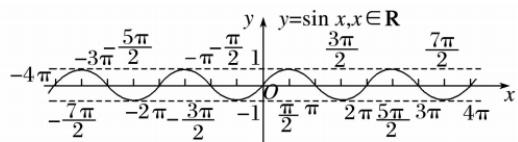

line

| x | y |
|---|---|
| -7π/2 | -3π/2 |
| -2π/2 | -π/2 |
| -1 | -π/2 |
| 0 | 0 |
| π/2 | 3π/2 |
| 2π/2 | 5π/2 |
| 3π/2 | 7π/2 |
| 4π | 0 |

(2)五点法:

①画出正弦曲线在 $[0,2\pi]$ 上的图象的五个关键点 $(\underline{0},0)$ ， $(\frac{\pi}{2},1)$ ， $(\underline{\pi},0)$ ， $(\frac{3\pi}{2},-1)$ ， $(2\pi,0)$ ，用光滑的曲线连接；  
②将所得图象向左、向右平行移动 $2\pi$ 个单位长度.

# 2. 余弦曲线的定义

（1）余弦函数 $y=\cos x,\quad x\in R$ 的图象叫余弦曲线.

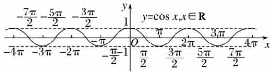

line

| x | y |
|---|---|
| -4π | -7π/2 |
| -3π | -5π/2 |
| -2π | -3π/2 |
| -π | -π |
| -π/2 | -1 |
| 0 | 0 |
| π/2 | π |
| 3π/2 | 2π |
| 5π/2 | 3π |
| 7π/2 | 4π |
y = cos(x, x ∈ R)

(2)要得到 $y=\cos x$ 的图象, 只需把 $y=\sin x$ 的图象向左平移 $\frac{\pi}{2}$ 个单位长度即可, 这是由于 $\cos x=\sin\left(x+\frac{\pi}{2}\right)$ .  
(3)用 “五点法”：画余弦曲线 $y=\cos x$ 在 $[0,2\pi]$ 上的图象时，所取的五个关键点分别为 $(0,1)$ ， $(\frac{\pi}{2},0)$ ， $(\pi,-1)$ ， $(\frac{3\pi}{2},0)$ ， $(2\pi,1)$ ，再用光滑的曲线连接.

# 3. 正弦函数、余弦函数的单调性与最值

<table><tr><td></td><td>正弦函数</td><td>余弦函数</td></tr><tr><td>定义域</td><td>R</td><td>R</td></tr><tr><td>值域</td><td>[-1,1]</td><td>[-1,1]</td></tr><tr><td>单调性</td><td>在 $[2k\pi - \frac{\pi}{2}, 2k\pi + \frac{\pi}{2}] (k \in \mathbf{Z})$ 上单调递增,在 $[2k\pi + \frac{\pi}{2}, 2k\pi + \frac{3\pi}{2}] (k \in \mathbf{Z})$ 上单调递减</td><td>在 $[2k\pi - \pi, 2k\pi](k \in \mathbf{Z})$ 上单调递增,在 $[2k\pi, 2k\pi + \pi](k \in \mathbf{Z})$ 上单调递减</td></tr><tr><td>最值</td><td> $x = \frac{\pi}{2} + 2k\pi (k \in \mathbf{Z})$ 时, $y_{\max} = 1$ ; $x = -\frac{\pi}{2} + 2k\pi (k \in \mathbf{Z})$ 时, $y_{\min} = -1$ </td><td> $x = 2k\pi (k \in \mathbf{Z})$ 时, $y_{\max} = 1$ ; $x = 2k\pi + \pi (k \in \mathbf{Z})$ 时, $y_{\min} = -1$ </td></tr></table>

4. 正弦函数 $y = \sin x$ 与 $y = A\sin (\omega x + \varphi)(\omega > 0)$ 的图象性质关系

<table><tr><td></td><td> $y = \sin x$ </td><td> $y = A\sin(\omega x + \varphi)$ </td></tr><tr><td>周期</td><td> $2\pi$ </td><td> $\frac{2\pi}{\omega}$ </td></tr><tr><td>定义域</td><td> $R$ </td><td> $R$ </td></tr><tr><td>最大值</td><td> $1, x = 2k\pi + \frac{\pi}{2}$ 取得</td><td> $A, \text{当} x = \frac{2k\pi + \frac{\pi}{2} - \varphi}{\omega}$ 取得</td></tr><tr><td>最小值</td><td> $-1, \text{当} x = 2k\pi + \frac{3\pi}{2}$ 取得</td><td> $-A, \text{当} x = \frac{2k\pi + \frac{3\pi}{2} - \varphi}{\omega}$ 取得</td></tr><tr><td>单调增区间</td><td> $[2k\pi - \frac{\pi}{2}, 2k\pi + \frac{\pi}{2}]$ </td><td> $[\frac{2k\pi - \frac{\pi}{2} - \varphi}{\omega}, \frac{2k\pi + \frac{\pi}{2} - \varphi}{\omega}]$ </td></tr><tr><td>单调减区间</td><td> $[2k\pi + \frac{\pi}{2}, 2k\pi + \frac{3\pi}{2}]$ </td><td> $[\frac{2k\pi + \frac{\pi}{2} - \varphi}{\omega}, \frac{2k\pi + \frac{3\pi}{2} - \varphi}{\omega}]$ </td></tr><tr><td>对称轴</td><td> $x = k\pi + \frac{\pi}{2}$ </td><td> $x = \frac{k\pi + \frac{\pi}{2} - \varphi}{\omega}$ </td></tr><tr><td>对称中心</td><td> $(k\pi,0)$ </td><td> $(\frac{k\pi - \varphi}{\omega},0)$ </td></tr></table>

类比于研究 $y = \sin x$ 的性质，只需将 $y = A\sin (\omega x + \varphi)$ 中的 $\omega x + \varphi$ 看成 $y = \sin x$ 中的 $x$ ，但在求 $y = A\sin (\omega x + \varphi)$ 的单调区间时，要特别注意 $A$ 和 $\omega$ 的符号，通过诱导公式先将 $\omega$ 化为正数．研究函数 $y = A\cos (\omega x + \varphi)$ ， $y = A\tan (\omega x + \varphi)$ 的性质的方法与其类似，也是类比、转化.

# 5. 正切函数的性质与图象

函数 $y=\tan x$ 的图象与性质

<table><tr><td>解析式</td><td> $y=\tan x$ </td></tr><tr><td>图象</td><td>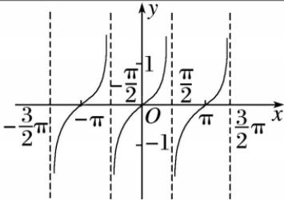</td></tr><tr><td>定义域</td><td> $\{ |x \neq k\pi + \frac{\pi}{2}, k \in Z\}$ </td></tr><tr><td>值域</td><td>R</td></tr><tr><td>最小正周期</td><td> $\pi$ </td></tr><tr><td>奇偶性</td><td>奇函数</td></tr><tr><td>单调性</td><td>在每个开区间 $(k\pi - \frac{\pi}{2}, k\pi + \frac{\pi}{2}) (k \in \mathbf{Z})$ 上都是增函数</td></tr><tr><td>对称性</td><td>对称中心 $(\frac{k\pi}{2}, 0) k \in \mathbf{Z}$ </td></tr></table>

# 六．三角函数平移与伸缩变换

A, $\omega$ , $\varphi$ 对函数 $y = A \sin(\omega x + \varphi)$ 图象的影响

1. $\varphi$ 对 $y = \sin (x + \varphi)$ , $x \in R$ 图象的影响

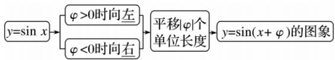

flowchart

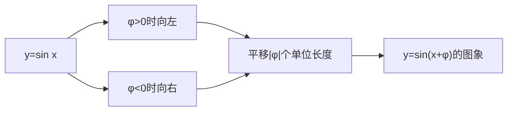

2. $\omega (\omega >0)$ 对 $y = \sin (\omega x + \varphi)$ 图象的影响

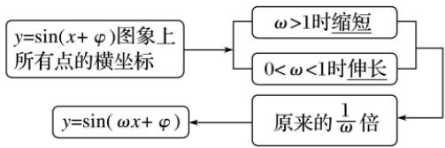

flowchart

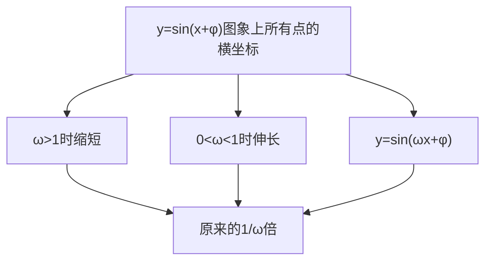

3. $A(A > 0)$ 对 $y = A\sin (\omega x + \varphi)$ 图象的影响

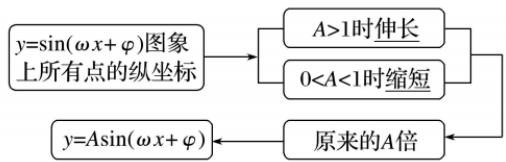

flowchart

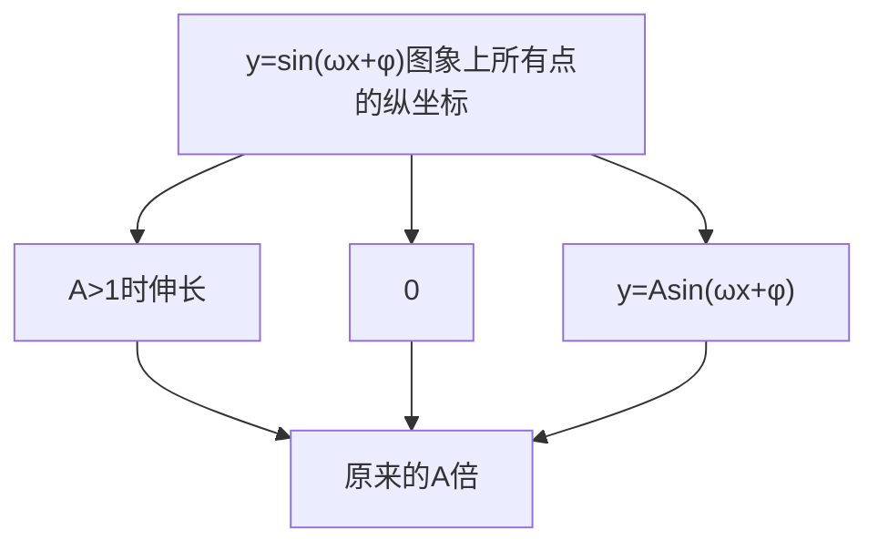

4. 函数 $y = A \sin(\omega x + \varphi)$ 的图象可以通过下列两种方式得到：

$$
\begin{array}{r l} & 1. y = \sin x \xrightarrow {\text {图象左移} \varphi} y = \sin (x + \varphi) \xrightarrow {\frac {\text {横坐标缩短到原来的} \frac {1}{\omega} \text {倍}}{\omega}} y = \sin (\omega x + \varphi) \\ & \xrightarrow {\text {纵坐标伸长为原来的} A \text {倍}} y = A \sin (\omega x + \varphi) \end{array}
$$

$$
\begin{array}{r l} & 2. y = \sin x \xrightarrow {\text {横坐标缩短到原来的} \frac {1}{\omega} \text {倍}} y = \sin (\omega x) \xrightarrow {\text {图象左移} \frac {\varphi}{\omega}} y = \sin (\omega x + \varphi) \\ & \xrightarrow {\text {纵坐标伸长为原来的} A \text {倍}} y = A \sin (\omega x + \varphi) \end{array}
$$

关键：把握先移后缩和先缩后移的区别。类比可以得到： $y = A \cos(\omega x + \varphi)$ ， $y = A \tan(\omega x + \varphi)$ 的图象.定理： $y = A \sin(\omega x + \varphi_{1}) \rightarrow y = A \sin(\omega x + \varphi_{2})$ 则平移单位为 $\frac{|\varphi_{2} - \varphi_{1}|}{\omega}$ （注意平移方向）.

# 七． $\omega$ 函数卡根法

1. $\omega$ 函数卡根法模型之五点法卡根

卡根分两种，一是五点法卡根，二是周期卡根，区别就在于卡根的区间 $(a, b)$ 或者 $[a, b]$ 是否包含0，比如 $[- \frac{\pi}{3}, \frac{\pi}{6}]$ 这个范围内进行卡根，那么一定选择五点卡根法， $[\frac{\pi}{4}, \frac{\pi}{3}]$ 这个范围内进行卡根，那么一定选择周期卡根法.

$y = \sin x$ 与 $y = A \sin (\omega x + \varphi)$ 只需要找到相对应的点位,我们通常讲到的一个周期内的五点法,这五个重要的点就是卡根卡 $\omega$ 范围最重要的参照.

五点卡根法：通常 $f(x) = A\sin (\omega x + \varphi)$ 当中，都会给一个条件，就是 $|\varphi| < \frac{\pi}{2}$ ，所以，当 $0 < \varphi < \frac{\pi}{2}$ 时，图象如左下，当 $-\frac{\pi}{2} < \varphi < 0$ 时，图象如右下：

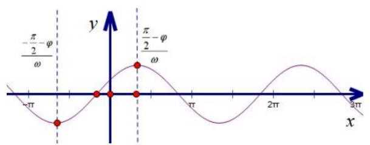

line

| x       | y         |
| ------- | --------- |
| -π      | -π/2 - φ/ω |
| 0       | 0         |
| π/2     | π/2 - φ/ω |
| 3π      | 0         |

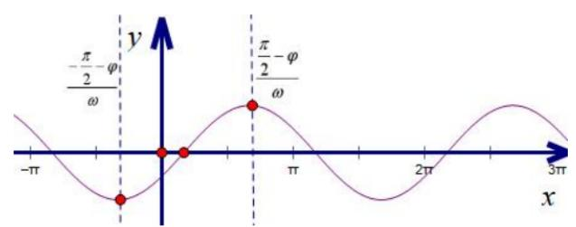

line

| x       | y         |
| ------- | --------- |
| -π      | -π/2 - φ / ω |
| -π/2    | -π        |
| π       | π/2 - φ / ω |
| π       | 0         |
| 3π      | 0         |

我们通过图形可以知道，无论 $\omega$ 为任意正数，正弦函数的靠近零点的第一个递增区间最小值 $\frac{-\frac{\pi}{2} - \varphi}{\omega}$ 和最大值 $\frac{\frac{\pi}{2} - \varphi}{\omega}$ 均在第三和第一象限，卡根就从这个周期的五点开始操作，我们称之为五点卡根法.

# 2. $\omega$ 函数卡根法模型之周期卡根法

如果卡根区间没有过零点，那么在卡根区间进行周期卡根，就看最多或者最少能放进去几个周期，当然，前提就是要先卡形式，即 $\omega$ 关于 $n$ 的表达式（ $n$ 为正整数）.

定理：轴心距 $\frac{2n - 1}{4} T(n\in N^{*})$ ，也可以转化为 $\frac{(2n - 1)\pi}{2\omega} (n\in N^{*})$

# 八．向量基础知识

# 1. 向量加法的定义及其运算法则

# (1). 三角形法则

已知非零向量 a, b，在平面内任取一点 A，作 $\overrightarrow{AB} = a$ ， $\overrightarrow{BC} = b$ ，则向量 $\overrightarrow{AC}$ 叫做 a 与 b 的和，记作 $a + b$ ，即 $a + b = \overrightarrow{AB} + \overrightarrow{BC} = \overrightarrow{AC}$ 。这种求向量和的方法，称为向量加法的三角形法则。

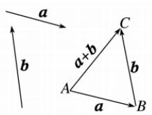

# (2). 平行四边形法则

以同一点 O 为起点的两个已知向量 a, b 为邻边作 □OACB，则以 O 为起点的对角线 $\overrightarrow{OC}$ 就是 a 与 b 的和。把这种作两个向量和的方法叫做向量加法的平行四边形法则

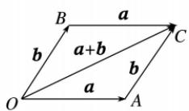

# 2. 向量的减法

（1）.定义：向量 a 加上 b 的相反向量，叫做 a 与 b 的差，即 $a - b = a + (-b)$ ，因此减去一个向量，相当于加上这个向量的相反向量，求两个向量差的运算，叫做向量的减法.

（2）.几何意义：在平面内任取一点 O，作 $\overrightarrow{OA}=a,\quad\overrightarrow{OB}=b$ ，则向量 $a-b=\overrightarrow{BA}$ ，如图所示.

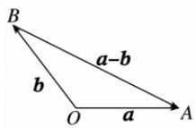

（3）.如果把两个向量的起点放在一起，那么这两个向量的差是以减向量的终点为起点，被减向量的终点为终点的向量.

# 3. 向量数乘的定义

实数 $\lambda$ 与向量 $\pmb{a}$ 的积是一个向量，这种运算叫做向量的数乘，记作 $\lambda \pmb{a}$ ，其长度与方向规定如下：

(1) $|\lambda a|=\underline{|\lambda||a|}$ .

(2) $\lambda a(a\neq0)$ 的方向 $\left\{\begin{aligned}\text{当}\underline{\lambda>0} \text{时，与}a\text{的方向相同;}\\ \text{当}\underline{\lambda<0} \text{时，与}a\text{的方向相反.}\end{aligned}\right.$ 特别地，当 $\lambda=0$ 时， $\lambda a=\underline{0}.$ 当 $\lambda=-1$ 时， $(-1)a=-a.$

# 向量数乘的运算律

(1) $\lambda(\mu\boldsymbol{a})=\underline{(\lambda\mu)\boldsymbol{a}}.$

(2) $(\lambda+\mu)\boldsymbol{a}=\underline{\lambda\boldsymbol{a}+\mu\boldsymbol{a}}.$

(3) $\lambda(a+b)=\underline{\lambda a+\lambda b}.$

特别地， $(- \lambda) a = -\lambda a = \underline{\lambda}(-a)$ ， $\lambda(a - b) = \underline{\lambda a - \lambda b}$ .

# 4.共线向量表示之对面的女孩看过来

平面上 $O$ ， $A$ ， $B$ 三点不共线， $D$ 在直线 $AB$ 上，且 $\overrightarrow{AD} = \lambda \overrightarrow{AB}$ ，令 $\overrightarrow{OA} = \vec{a}$ ， $\overrightarrow{OB} = \vec{b}$ ， $\overrightarrow{OD} = \vec{x}$ ，则有 $\vec{x} = \lambda \vec{b} +(1 - \lambda)\vec{a}$

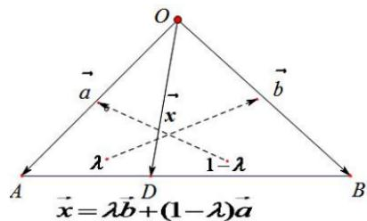

text_image

O
a
x
b
λ
1-λ
A
D
B
x = λb + (1 - λ)a

其表达意思就是从一个顶点 $O$ 引出三个向量，且它们共线，每一个向量 $\vec{a}$ ， $\vec{b}$ 分别乘以它对面的比值，简称对面的女孩看过来.

特殊点：当 D 为 AB 中点时， $\lambda=\frac{1}{2}$ ， $\vec{x}=\frac{1}{2}\vec{b}+\frac{1}{2}\vec{a}$ （中线定理）

# 5. 向量数量积的定义

(1).非零向量 a, b 的夹角为 $\theta$ ，数量 $|a||b|\cos\theta$ 叫做向量 a 与 b 的数量积(或内积)，记作 $a \cdot b$ ，即 $a \cdot b = |a||b|\cos\theta$ ，

(2).投影向量: 在平面内任取一点 $O$ , 作 $\overrightarrow{OM} = a$ , $\overrightarrow{ON} = b$ , 过点 $M$ 作直线 $ON$ 的垂线, 垂足为 $M_1$ , 则 $\overrightarrow{OM}_1$ 就是向量 $a$ 在向量 $b$ 上的投影向量. 设与 $b$ 方向相同的单位向量为 $e$ , $a$ 与 $b$ 的夹角为 $\theta$ , 则 $\overrightarrow{OM}_1$ 与 $e$ , $a$ , $\theta$ 之间的关系为 $\overrightarrow{OM}_1 = |\underline{a}| \cos \theta e$ .

(3). 平面向量数量积的性质

设向量 a 与 b 都是非零向量，它们的夹角为 $\theta$ ，e 是与 b 方向相同的单位向量。则

① $a \cdot e = e \cdot a = |a| \cdot \cos \theta.$ ② $a \perp b \Leftrightarrow a \cdot b = 0.$ ③当 $a // b$ 时， $a \cdot b = \begin{cases} |a||b|, & a \text{与 } b \text{ 同向,}\\ -|a||b|, & a \text{与 } b \text{ 反向.} \end{cases}$ ④ $|a \cdot b| \leq |a||b|.$

# 6. 平面向量的坐标表示

在平面直角坐标系中，设与 $x$ 轴、 $y$ 轴方向相同的两个单位向量分别为 $\pmb{i},\pmb{j}$ ，取 $\{\pmb{i},\pmb{j}\}$ 作为基底。对于平面内的任意一个向量 $\pmb{a}$ ，由平面向量基本定理可知，有且只有一对实数 $x, y$ ，使得 $\pmb{a} = x\pmb{i} + y\pmb{j}$ 。平面内的任一向量 $\pmb{a}$ 都可由 $x, y$ 唯一确定，我们把有序数对 $(x, y)$ 叫做向量 $\pmb{a}$ 的坐标，记作 $\underline{\pmb{a}} = (x, y)$ 。在直角坐标平面中， $\pmb{i} = (1,0),\ p = (0,1),\ \pmb{0} = (0,0)$ 。

# (1). 平面向量加、减运算以及数乘的坐标表示

设 $a=(x_{1}, y_{1})$ ， $b=(x_{2}, y_{2})$ ，向量加法： $a+b=(x_{1}+x_{2}, y_{1}+y_{2})$ ，向量减法： $a-b=(x_{1}-x_{2}, y_{1}-y_{2})$

已知点 $A(x_{1}, y_{1})$ ， $B(x_{2}, y_{2})$ ，那么向量 $\overrightarrow{AB} = (x_{2} - x_{1}, y_{2} - y_{1})$ ，即任意一个向量的坐标等于表示此向量的有向线段的终点的坐标减去起点的坐标.

（2）.已知 $\boldsymbol{a}=(x,y)$ ，则 $\lambda\boldsymbol{a}=(\lambda x,\lambda y)$ ，即：实数与向量的积的坐标等于用这个实数乘原来向量的相应坐标.

# （3）平面向量共线的坐标表示

设 $a = (x_{1}, y_{1})$ ， $b = (x_{2}, y_{2})$ ，其中 $b \neq 0$ 。则 $a$ ， $b$ 共线的充要条件是存在实数 $\lambda$ ，使 $a = \lambda b$ 。如果用坐标表示，可写为 $(x_{1}, y_{1}) = \lambda(x_{2}, y_{2})$ ，当且仅当 $x_{1}y_{2} - x_{2}y_{1} = 0$ 时，向量 $a$ ， $b(b \neq 0)$ 共线。可简记为：纵横交错积相减。

# (4) 平面向量数量积的坐标表示

①设非零向量 $a = (x_{1},y_{1}),b = (x_{2},y_{2}),a$ 与 $\pmb{b}$ 的夹角为 $\theta$ 则 $a\cdot b = x_1x_2 + y_1y_2.$   
②若 $\boldsymbol{a}=(x,y)$ ，则 $\left|\boldsymbol{a}\right|=\sqrt{x^{2}+y^{2}}.$   
③若表示向量 a 的有向线段的起点和终点的坐标分别为 $(x_{1}, y_{1})$ ， $(x_{2}, y_{2})$ ，则 $a=(x_{2}-x_{1}, y_{2}-y_{1})$ ，

$$
| \boldsymbol {a} | = \sqrt {(x _ {2} - x _ {1}) ^ {2} + (y _ {2} - y _ {1}) ^ {2}}.
$$

$$
④ \boldsymbol {a} \perp \boldsymbol {b} \Leftrightarrow x _ {1} x _ {2} + y _ {1} y _ {2} = 0.
$$

$$
⑤ \cos \theta = \frac {\boldsymbol {a} \cdot \boldsymbol {b}}{| \boldsymbol {a} | | \boldsymbol {b} |} = \frac {x _ {1} x _ {2} + y _ {1} y _ {2}}{\sqrt {x _ {1} ^ {2} + y _ {1} ^ {2}} \sqrt {x _ {2} ^ {2} + y _ {2} ^ {2}}}.
$$

# 九．极化恒等式

1. 极化恒等式: $\vec{a} \cdot \vec{b} = \frac{1}{4} (\vec{a} + \vec{b})^2 - (\vec{a} - \vec{b})^2$ ，我们再之前提到两个向量的数量积，有两个方案，一是知道模和夹角，二是知道两个向量的坐标，极化恒等式的出现，使得向量的数量积有了第三种方案，就是利用中线的平方差，这样无需任何角度和坐标，完全靠长度平方差来解决，向量完全靠模长化解决数量积问题，联想我们学习的极坐标，所谓“极化”，就是完全模长化，这个完全模长化的恒等式就叫极化恒等式.

在 $\triangle ABC$ 中，若 $AM$ 是 $\triangle ABC$ 的 $BC$ 边中线，有以下两个重要的向量关系： $\left\{ \begin{array}{l} \overrightarrow{AM} = \frac{1}{2} (\overrightarrow{AC} + \overrightarrow{AB}) \\ \overrightarrow{BM} = \frac{1}{2} (\overrightarrow{AC} - \overrightarrow{AB}) \end{array} \right.$

定理1 平行四边形两条对角线的平分和等于两条邻边平分和的两倍. 以此类推到三角形, 若 $AM$ 是 $\Delta ABC$ 的中线, 则 $AB^{2} + AC^{2} = 2(AM^{2} + BM^{2})$ .

定理2 在 $\Delta ABC$ 中，若 $M$ 是 $BC$ 的中点，则有 $\overrightarrow{AB} \cdot \overrightarrow{AC} = \overrightarrow{AM}^2 - \frac{1}{4}\overrightarrow{BC}^2 = \overrightarrow{AM}^2 - \overrightarrow{BM}^2$ .

2. 极化恒等式向量乘积型： $\overrightarrow{PA}\cdot\overrightarrow{PB}=\lambda$

定理 平面内，若 A, B 为定点，且 $\overrightarrow{PA} \cdot \overrightarrow{PB} = \lambda$ ，则 P 的轨迹是以 AB 中点 M 为圆心， $\sqrt{\lambda + \frac{1}{4} AB^{2}}$ 为半径的圆。
证明 由 $\overrightarrow{PA}\cdot\overrightarrow{PB}=\lambda$ ，根据极化恒等式可知， $PM^{2}-\frac{1}{4}AB^{2}=\lambda$ ，所以 $PM=\sqrt{\frac{1}{4}AB^{2}+\lambda}$ ，P 的轨迹是以 M 为圆心 $\sqrt{\lambda+\frac{1}{4}AB^{2}}$ 为半径的圆.

3. 极化恒等式特殊之矩形大法

如图，在矩形ABCD中，若对角线AC和BD交于点O，P为平面内任意一点，有以下两个重要的向量关系：① $PA^{2}+PC^{2}=PB^{2}+PD^{2}$ ；② $\overrightarrow{PA}\cdot\overrightarrow{PC}=\overrightarrow{PB}\cdot\overrightarrow{PD}$ .

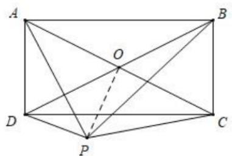

text_image

A
O
B
D
P
C

证明：①连接 $PO$ ，根据极化恒等式 $a^2 + b^2 = 2\left[\left(\frac{a + b}{2}\right)^2 + \left(\frac{a - b}{2}\right)^2\right]$ ，可得

$$
P A ^ {2} + P C ^ {2} = 2 \left(P O ^ {2} + \frac {A C ^ {2}}{4}\right) = P B ^ {2} + P D ^ {2};
$$

②根据极化恒等式 $\vec{a} \cdot \vec{b} = \left(\frac{a + b}{2}\right)^2 - \left(\frac{a - b}{2}\right)^2$ ，可得 $\overrightarrow{PA} \cdot \overrightarrow{PC} = PO^2 - \frac{AC^2}{4} = \overrightarrow{PB} \cdot \overrightarrow{PD}$

推广到空间，得到的结论就是：底面是矩形的四棱锥相对侧棱长的平方和以及向量乘积均相等.

# 十．向量等数据线定理

1. 等和线定理：如图设 $e_{1}$ ， $e_{2}$ 是平面内两个不共线向量，若 $\overrightarrow{OP}=xe_{1}+ye_{2}$ ，且 $x+y=1$ ， $\overrightarrow{OQ}=x^{\prime}e_{1}+y^{\prime}e_{2}$ 且 $x^{\prime}+y^{\prime}=k$ ，则有 $k=\frac{\left|\overrightarrow{OQ}\right|}{\left|\overrightarrow{OP}\right|}$ .

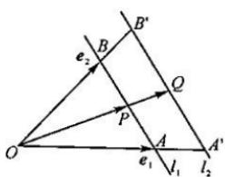

text_image

B'
e₂
B
Q
P
O
A
l₁
l₂
e₁
A'

证明：设 $\overrightarrow{OQ} = \lambda \overrightarrow{OP}$ ，根据相似三角形关系可知： $\overrightarrow{OQ} = \lambda (xe_1 + ye_2) = \lambda xe_1 + \lambda ye_2 = x'e_1 + y'e_2$ 所以 $x' + y' = \lambda(x + y) = \lambda$ 所以 $x' + y' = k = \frac{\left|\overrightarrow{OQ}\right|}{\left|\overrightarrow{OP}\right|}$ .

# 2. 等差线定理：

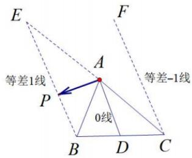

text_image

E
F
等差1线
A
等差-1线
P
0线
B D C

如图设 $\overrightarrow{AB} = e_1$ ， $\overrightarrow{AC} = e_2$ 是平面内两个不共线向量，若 $\overrightarrow{AP} = xe_1 + ye_2$ ，反向延长 $\overrightarrow{AC}$ 到 $E$ ，使 $\overrightarrow{AE} = -\overrightarrow{AC}$ 当 $P$ 位于直线 $BE$ 上时，一定有 $x - y = 1$ ，若 $\overrightarrow{AQ} = x'e_1 + y'e_2$ 且 $x' + y' = k$ ，则有 $k = \frac{\left|\overrightarrow{AQ}\right|}{\left|\overrightarrow{AP}\right|}$ .特殊的，当 $Q$ 位于直线 $CF$ 上时，有 $x - y = -1$ ，当 $Q$ 位于直线 $AD$ 上时，有 $x - y = 0$

# 3. 倒数等和线

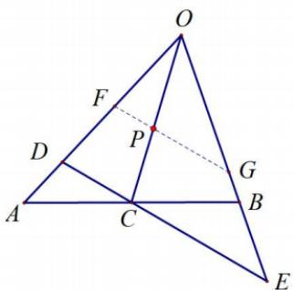

text_image

Geometric diagram of triangle OAE with internal points and lines, including intersection point P and auxiliary lines

如图，设 $\overrightarrow{OA}=e_{1}$ ， $\overrightarrow{OB}=e_{2}$ 是平面内两个不共线向量，若 $\overrightarrow{OC}=xe_{1}+ye_{2}$ ，一定有 $x+y=1$ ，若 $\overrightarrow{OD}=\lambda e_{1}$ ， $\overrightarrow{OE}=\mu e_{2}$ ，则 $\overrightarrow{OC}=xe_{1}+ye_{2}=\frac{x\overrightarrow{OD}}{\lambda}+\frac{y\overrightarrow{OE}}{\mu}$ ，故一定有 $\frac{x}{\lambda}+\frac{y}{\mu}=1$ ；

同理，当 $\overrightarrow{OP}=k\overrightarrow{OC}$ ，且 $\overrightarrow{OF}=\lambda^{\prime}e_{1}$ ， $\overrightarrow{OG}=\mu^{\prime}e_{2}$ ，则 $\overrightarrow{OP}=x^{\prime}e_{1}+y^{\prime}e_{2}=\frac{x^{\prime}\overrightarrow{OF}}{\lambda^{\prime}}+\frac{y\overrightarrow{OG}}{\mu^{\prime}}$ ，故一定有 $x^{\prime}+y^{\prime}=k$ ， $\frac{x'}{\lambda'}+\frac{y'}{\mu'}=1;$

# 4. 等商线

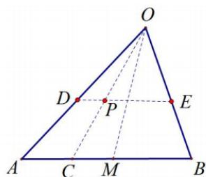

text_image

O
D
P
E
A
C
M
B

如图所示，令 $\frac{OD}{OA} = \frac{OE}{OB} = \frac{OP}{OC} = k$ ，若 $\overrightarrow{OP} = \lambda \overrightarrow{OA} +\mu \overrightarrow{OB}$ ，根据等和线定理可得 $\frac{\lambda}{\mu} = \frac{|PE|}{|PD|} = \frac{|BC|}{|CA|}$ ，所以直线 $OC$ 就是一条等商线，特别的，当 $M$ 为 $AB$ 中点时， $OM$ 为等商1线.

# 十一．四心定理

# 1. 重心定理和奔驰定理

如图，已知 $\triangle ABC$ 的顶点 $A(x_{1},y_{1})$ ， $B(x_{2},y_{2})$ ， $C(x_{3},y_{3})$ ，则 $\triangle ABC$ 的重心坐标为 $G(x,y)$

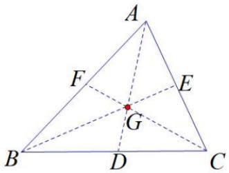

text_image

A
F
E
G
B
D
C

（1）重心定理：①在 $\triangle ABC$ 中，若 $G$ 为重心，则 $\overrightarrow{AG}=\frac{1}{3}\overrightarrow{AB}+\frac{1}{3}\overrightarrow{AC}$ ．

② $\overrightarrow{GA} +\overrightarrow{GB} +\overrightarrow{GC} = \overrightarrow{0}$ . ③ $\left\{ \begin{array}{l}x = \frac{x_1 + x_2 + x_3}{3}\\ y = \frac{y_1 + y_2 + y_3}{3} \end{array} \right.$

④三角形的重心分中线两段线段长度比为 2:1，且分的三个三角形面积相等.

(2) 奔驰定理：若 $S_{A} \cdot \overrightarrow{OA} + S_{B} \cdot \overrightarrow{OB} + S_{C} \cdot \overrightarrow{OC} = \overrightarrow{0}$ ，则 $S_{AOB} : S_{AOC} : S_{BOC} = S_{C} : S_{B} : S_{A}$ ;

# 2. 垂心定理

若 $AD$ 为三角形 $ABC$ 底边 $BC$ 上的高，P为高AD上任意一点，则一定有 $\overrightarrow{AP} \cdot \overrightarrow{PB} = \overrightarrow{AP} \cdot \overrightarrow{PC}$

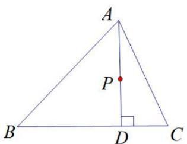

text_image

A
P
B
D
C

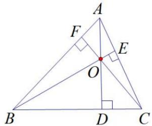

text_image

A
F
E
O
B
D
C

证明： $\overrightarrow{AP}\quad\overrightarrow{PB}\quad\overrightarrow{AP}\quad\overrightarrow{PC}\quad\overrightarrow{AP}\quad(\overrightarrow{PC}\quad\overrightarrow{PB})=0\quad\overrightarrow{AP}\quad\overrightarrow{BC}=0$

同理，我们可以得到: $\overrightarrow{BP}$ $\overrightarrow{PC}$ $\overrightarrow{BP}$ $\overrightarrow{PA}$ $\overrightarrow{BP}$ $(\overrightarrow{PC}$ $\overrightarrow{PA})=0$ $\overrightarrow{BP}$ $\overrightarrow{AC}=0$

$\overrightarrow{CP}$ $\overrightarrow{PB}$ $\overrightarrow{CP}$ $\overrightarrow{PA}$ $\overrightarrow{CP}$ $(\overrightarrow{PB}$ $\overrightarrow{PA})=0$ $\overrightarrow{CP}$ $\overrightarrow{AB}=0$

（1）垂心定理：三角形三边上的高相交于一点（如图右），故点 $O$ 是 $\Delta ABC$ 的垂心，

则一定有 $\overrightarrow{OA} \cdot \overrightarrow{OB} = \overrightarrow{OB} \cdot \overrightarrow{OC} = \overrightarrow{OC} \cdot \overrightarrow{OA}$ .

$\overrightarrow{OA}$ $\overrightarrow{OB}$ $\overrightarrow{OC}$ $\overrightarrow{OB}$ $\overrightarrow{OB}$ $(\overrightarrow{OA}$ $\overrightarrow{OC})=0$ $\overrightarrow{OB}$ $\overrightarrow{CA}=0$ ，即 $\overrightarrow{OB}\perp\overrightarrow{CA}$ ，以此类推即可证明.

(2) 垂心的向量乘积定理:

如下图，若 $O$ 是 $\Delta ABC$ 的垂心，G是边BC所在直线上的一点，则 $\overrightarrow{AB} \cdot \overrightarrow{AC} = \overrightarrow{AO} \cdot \overrightarrow{AC} = \overrightarrow{AO} \cdot \overrightarrow{AB} = \overrightarrow{AO} \cdot \overrightarrow{AG}$

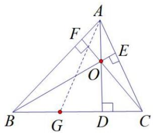

text_image

Geometric diagram of triangle ABC with perpendiculars and labeled points, including right angles at D and E.

证明：由于 $\overrightarrow{AB}$ 和 $\overrightarrow{AO}$ 在 $\overrightarrow{AC}$ 上的投影为都为 $\overrightarrow{AE}$ ，故 $\overrightarrow{AB} \cdot \overrightarrow{AC} = \overrightarrow{AO} \cdot \overrightarrow{AC} = |\overrightarrow{AE}| \cdot |\overrightarrow{AC}|$ ，

同理， $\overrightarrow{AC}$ 和 $\overrightarrow{AO}$ 在 $\overrightarrow{AB}$ 上的投影为都为 $\overrightarrow{AF}$ ，故 $\overrightarrow{AB} \cdot \overrightarrow{AC} = \overrightarrow{AO} \cdot \overrightarrow{AB} = |\overrightarrow{AF}| \cdot |\overrightarrow{AB}|$ ，

由于 $\overrightarrow{AG} = \overrightarrow{AB} +\overrightarrow{BG}$ ，故 $\overrightarrow{AG}\cdot \overrightarrow{AO} = (\overrightarrow{AB} +\overrightarrow{BG})\cdot \overrightarrow{AO} = \overrightarrow{AB}\cdot \overrightarrow{AO} = \overrightarrow{AB}\cdot \overrightarrow{AC}.$

# 3. 外心定理

外心：三条边垂直平分线的交点，外心到三个顶点的距离相等，即 $\left|\overrightarrow{OA}\right|=\left|\overrightarrow{OB}\right|=\left|\overrightarrow{OC}\right|$ ;

外心向量定理：

(1) $\overrightarrow{AO} \cdot \overrightarrow{AB} = \frac{1}{2}\left|\overrightarrow{AB}\right|^2, \quad \overrightarrow{AO} \cdot \overrightarrow{AC} = \frac{1}{2}\left|\overrightarrow{AC}\right|^2; \quad \overrightarrow{BO} \cdot \overrightarrow{BC} = \frac{1}{2}\left|\overrightarrow{BC}\right|^2;$   
(2) $\overrightarrow{AO} \cdot \overrightarrow{AF} = \frac{1}{4}\left|\overrightarrow{AB}\right|^2 + \frac{1}{4}\left|\overrightarrow{AC}\right|^2,\quad \overrightarrow{BO} \cdot \overrightarrow{BE} = \frac{1}{4}\left|\overrightarrow{AB}\right|^2 + \frac{1}{4}\left|\overrightarrow{BC}\right|^2,\quad \overrightarrow{CO} \cdot \overrightarrow{CD} = \frac{1}{4}\left|\overrightarrow{BC}\right|^2 + \frac{1}{4}\left|\overrightarrow{AC}\right|^2;$   
(3) $\overrightarrow{AO} \cdot \overrightarrow{BC} = \frac{1}{2}\left|\overrightarrow{AC}\right|^2 - \frac{1}{2}\left|\overrightarrow{AB}\right|^2$ ， $\overrightarrow{BO} \cdot \overrightarrow{AC} = \frac{1}{2}\left|\overrightarrow{BC}\right|^2 - \frac{1}{2}\left|\overrightarrow{BA}\right|^2$ ， $\overrightarrow{CO} \cdot \overrightarrow{AB} = \frac{1}{2}\left|\overrightarrow{BC}\right|^2 - \frac{1}{2}\left|\overrightarrow{AC}\right|^2$

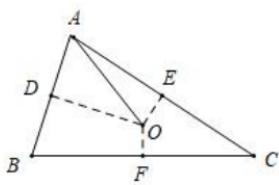

text_image

Geometric diagram of triangle ABC with points D, E, F, O and auxiliary lines, including a dashed segment from D to O.

# 4. 内心定理

（1）角平分线定理：若 $\overrightarrow{OA} = \vec{a}$ ， $\overrightarrow{OB} = \vec{b}$ ，则∠AOB平分线上的向量 $\overrightarrow{OM}$ 为 $\lambda (\frac{\vec{a}}{|\vec{a}|} +\frac{\vec{b}}{|\vec{b}|})$ ， $\lambda$ 由 $\overrightarrow{OM}$ 决定角平分线定理证明： $\frac{\vec{a}}{|\vec{a}|}$ 和 $\frac{\vec{b}}{|\vec{b}|}$ 分别为 $\overrightarrow{OA}$ 和 $\overrightarrow{OB}$ 方向上的单位向量， $\frac{\vec{a}}{|\vec{a}|} +\frac{\vec{b}}{|\vec{b}|}$ 是以 $\frac{\vec{a}}{|\vec{a}|}$ 和 $\frac{\vec{b}}{|\vec{b}|}$ 为一组邻边的平行四边形过 $O$ 点的的一条对角线，而此平行四边形为菱形，故 $\frac{\vec{a}}{|\vec{a}|} +\frac{\vec{b}}{|\vec{b}|}$ 在∠AOB平分线上，但∠AOB平分线上的向量 $\overrightarrow{OM}$ 终点的位置由 $\overrightarrow{OM}$ 决定.当 $\lambda = 1$ 时，四边形OAMB构成以∠AOB=120°的菱形.

(2) 内心定理

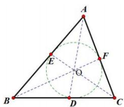

text_image

Geometric diagram of triangle ABC with internal points D, E, F and auxiliary lines forming a circle, labeled with center O.

①角平分线的交点，到三条边的距离相等；  
② $\overrightarrow{OA} \cdot a + \overrightarrow{OB} \cdot b + \overrightarrow{OC} \cdot c = 0$ ;

证明：如图， $\Delta ABC$ 中， $AD$ 、 $BF$ 、 $CE$ 分别为 $\angle A, \angle B, \angle C$ 的平分线， $O$ 为 $\Delta ABC$ 内心，根据奔驰定理，

$\overrightarrow{OA} \cdot S_A + \overrightarrow{OB} \cdot S_B + \overrightarrow{OC} \cdot S_C = 0$ ，故只需证明 $S_A: S_B: S_C = a:b:c$ ，由于 $S_A: S_B: S_C = ar: br: cr = a:b:c$ ，故命题得证.

③ $\overrightarrow{AO}\cdot(a+b+c)=\overrightarrow{AB}\cdot b+\overrightarrow{AC}\cdot c$

证明：根据 $\overrightarrow{OA} \cdot a + \overrightarrow{OB} \cdot b + \overrightarrow{OC} \cdot c = 0$ 得： $\overrightarrow{AO} \cdot a = \overrightarrow{OB} \cdot b + \overrightarrow{OC} \cdot c = (\overrightarrow{OA} + \overrightarrow{AB}) \cdot b + (\overrightarrow{OA} + \overrightarrow{AC}) \cdot c$

所以 $\overrightarrow{AO}\cdot(a+b+c)=\overrightarrow{AB}\cdot b+\overrightarrow{AC}\cdot c$

同理可得： $\overrightarrow{BO}\cdot (a + b + c) = \overrightarrow{BA}\cdot a + \overrightarrow{BC}\cdot c;\quad \overrightarrow{CO}\cdot (a + b + c) = \overrightarrow{CA}\cdot a + \overrightarrow{CB}\cdot b.$

内角平分线定理： $\frac{b}{c}=\frac{|DC|}{|BD|}$ ； $\frac{a}{c}=\frac{|CF|}{|AF|}$ ； $\frac{a}{b}=\frac{|BE|}{|AE|}$ （利用面积比证明）

※④ $\overrightarrow{AD} = \frac{b}{b + c}\overrightarrow{AB} +\frac{c}{b + c}\overrightarrow{AC} = \frac{bc}{b + c}\left(\frac{\overrightarrow{AB}}{\left|\overrightarrow{AB}\right|} +\frac{\overrightarrow{AC}}{\left|\overrightarrow{AC}\right|}\right)$ ，同理 $\overrightarrow{BF} = \frac{ac}{a + c}\left(\frac{\overrightarrow{BA}}{\left|\overrightarrow{BA}\right|} +\frac{\overrightarrow{BC}}{\left|\overrightarrow{BC}\right|}\right);\overrightarrow{CE} = \frac{ab}{a + b}\left(\frac{\overrightarrow{CA}}{\left|\overrightarrow{CA}\right|} +\frac{\overrightarrow{CB}}{\left|\overrightarrow{CB}\right|}\right)$   
※⑤ $\overrightarrow{AO} = \overrightarrow{AD} \cdot \frac{|AB|}{|AB| + |BD|} = \frac{bc}{b + c} \cdot \frac{c}{c + \frac{ac}{b + c}} \left( \frac{\overrightarrow{AB}}{|\overrightarrow{AB}|} + \frac{\overrightarrow{AC}}{|\overrightarrow{AC}|} \right) = \frac{bc}{a + b + c} \left( \frac{\overrightarrow{AB}}{|\overrightarrow{AB}|} + \frac{\overrightarrow{AC}}{|\overrightarrow{AC}|} \right)$ ，同理可得：

$$
\overrightarrow {B O} = \frac {a c}{a + b + c} \left(\frac {\overrightarrow {B A}}{| \overrightarrow {B A} |} + \frac {\overrightarrow {B C}}{| \overrightarrow {B C} |}\right); \quad \overrightarrow {C O} = \frac {a b}{a + b + c} \left(\frac {\overrightarrow {C A}}{| \overrightarrow {C A} |} + \frac {\overrightarrow {C B}}{| \overrightarrow {C B} |}\right)
$$

注意：④和⑤利用了内角平分线定理，其中（5）和（3）是相通的，一个模型，我们需要重点掌握前三个.

# 十二. 正弦定理与余弦定理

# 1. 余弦定理

在 $\triangle ABC$ 中，角A，B，C的对边分别是a，b，c，则有

<table><tr><td rowspan="3">余弦定理</td><td>语言叙述</td><td>三角形中任何一边的平方,等于其他两边平方的和减去这两边与它们夹角的余弦的积的两倍</td></tr><tr><td>公式表达</td><td> $a^{2}=b^{2}+c^{2}-2bc\cos A$ , $b^{2}=\underline{a^{2}+c^{2}-2ac\cos B}$ , $c^{2}=\underline{a^{2}+b^{2}-2ab\cos C}$ </td></tr><tr><td>推论</td><td> $\cos A=\frac{b^{2}+c^{2}-a^{2}}{2bc}$ ,</td></tr><tr><td></td><td></td><td> $\cos B = \frac{a^2 + c^2 - b^2}{2ac}$ , $\cos C = \frac{a^2 + b^2 - c^2}{2ab}$ </td></tr></table>

# 2. 正弦定理

在一个三角形中，各边和它所对角的正弦的比相等，即 $\frac{a}{\sin A}=\frac{b}{\sin B}=\frac{c}{\sin C}$ .我们来看一下变形公式：

(1). $a=\underline{2R\sin A}$ , $b=\underline{2R\sin B}$ , $c=\underline{2R\sin C}$ .   
(2). $\sin A=\frac{a}{2R}$ , $\sin B=\frac{b}{2R}$ , $\sin C=\frac{c}{2R}$ (其中 R 是 $\triangle ABC$ 外接圆的半径).  
(3). $S = \frac{1}{2} ab\sin C = \frac{1}{2} ac\sin B = \frac{1}{2} bc\sin A$

# 3.三角形多解问题

（1）由于全等三角形的证明中没有边边角这一类，其实就是两条边和一条边所对的角为已知时，不能确定一个三角形，即 $a$ 、 $b$ 、 $A$ ， $(a > b)$ 当大边所对角为未知量，则会出现两个解的情况，唯一要保证的是这个未知角求得的正弦值小于1；当小边所对的角未知时，通常有唯一解.

<table><tr><td></td><td colspan="3">A为锐角</td><td colspan="2">A为钝角或直角</td></tr><tr><td>图形</td><td>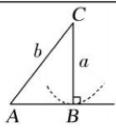</td><td>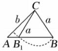</td><td>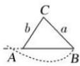</td><td colspan="2">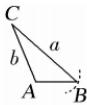</td></tr><tr><td>关系式</td><td>a=bsin A</td><td>bsin A &lt; a &lt; b</td><td>a≥b</td><td>a &gt; b</td><td>a≤b</td></tr><tr><td>解的个数</td><td>一解</td><td>两解</td><td>一解</td><td>一解</td><td>无解</td></tr></table>

# 十三．解三角形二级结论汇总

# 1. 射影定理

在 $\triangle ABC$ 中， $a = b\cos C + c\cos B$ ， $b = c\cos A + a\cos C$ ， $c = a\cos B + b\cos A$

# 2. 灵动面积周长公式

(1). 余弦定理推导式: $(a + b - c)(a + b + c) = (a + b)^2 - c^2 = 2ab(1 + \cos C)$ , (把 $(a + b)$ 当做一个整体)  
(2). 面积公式推导式:

$$
S = \frac {1}{2} a b \sin C = \frac {1}{2} \frac {\left(a ^ {2} + b ^ {2} - c ^ {2}\right)}{2 \cos C} \sin C = \frac {1}{4} \left(a ^ {2} + b ^ {2} - c ^ {2}\right) \tan C.
$$

$$
2 a b \cos C = a ^ {2} + b ^ {2} - c ^ {2} \Rightarrow 2 a b (1 + \cos C) = (a + b) ^ {2} - c ^ {2} \Rightarrow a b = \frac {(a + b) ^ {2} - c ^ {2}}{2 (1 + \cos C)}, \text {又} S = \frac {1}{2} a b \sin C
$$

椭圆灵动焦点三角形面积公式： $S=\frac{1}{4}\left[\left(a+b\right)^{2}-c^{2}\right]\frac{\sin C}{1+\cos C}=\frac{1}{4}\left[\left(a+b\right)^{2}-c^{2}\right]\tan\frac{C}{2}$

同理 $2ab(-1 + \cos C) = (a - b)^2 - c^2 \Rightarrow ab = \frac{(a - b)^2 - c^2}{2(-1 + \cos C)}$ ，代入 $S = \frac{1}{2} ab\sin C$

双曲线灵动焦点三角形面积公式： $S=\frac{1}{4}\left[\left(a-b\right)^{2}-c^{2}\right]\frac{\sin C}{-1+\cos C}=\frac{1}{4}\left[c^{2}-\left(a-b\right)^{2}\right]\frac{1}{\tan\frac{C}{2}}$

# 3. 倍长定比分线

构造三角形用万能辅助角，如图，若 $P$ 在边 $BC$ 上，且满足 $\overrightarrow{PC} = \lambda \overrightarrow{BP}$ ， $|AP| = m$ ，则延长 $AP$ 至 $D$ ，使 $\overrightarrow{PD} = \lambda \overrightarrow{AP}$ ，连接 $CD$ ，易知 $AB // DC$ ，且 $DC = \lambda c$ ，则关于 $b + \lambda c = 2R\sin (\theta + \varphi)$ 来解决求最大值，或者求值问题；由于 $2R = \frac{|AD|}{\sin \angle ACD} = \frac{(1 + \lambda)|AP|}{\sin \angle BAC}$ ，根据万能辅助角公式可得：

$$
b + \lambda c = \frac {(1 + \lambda) | A P |}{\sin \angle B A C} 2 \cos \frac {\angle A C D}{2} \sin \left(\theta + \frac {\angle A C D}{2}\right) \leq \frac {(1 + \lambda) | A P |}{\cos \frac {\angle B A C}{2}}
$$

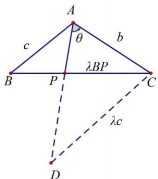

text_image

A
θ
b
c
λBP
B
P
C
λc
D

# 4. 米勒定理

已知点 $M$ ， $N$ 是 $\angle AOB$ 的边 $OA$ 上的两个定点，点 $P$ 是边 $OB$ 上的一动点，则当且仅当三角形MPN的外接圆与边 $OB$ 相切于点 $P$ 时， $\angle MPN$ 最大.

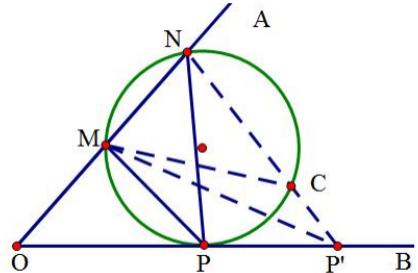

text_image

A
N
M
C
O
P
P'
B

证明：如图，设 $P'$ 是边 $OB$ 上不同于点 $P$ 的任意一点，连结 $P'M, P'N$ ， $P'N''$ 交圆于点 $C$ ，因为 $\angle MP'N$ 是圆外角， $\angle MPN$ 是圆周角，易证 $\angle MP'N < \angle MCN = \angle MPN$ ，故 $\angle MPN$ 最大.

根据切割线定理得， $OP^{2}=OM\cdot ON$ ，即 $OP=\sqrt{OM\cdot ON}$ ，于是我们有： $\angle MPN$ 最大等价于三角形 MPN 的外接圆与边 OB 相切于点 $P\Rightarrow OP^{2}=OM\cdot ON$ 等价于 $OP=\sqrt{OM\cdot ON}$ .

# 5. 张角定理

（1）张角定理：如图，在 $\triangle ABC$ 中， $D$ 为 $BC$ 边上的一点，连接 $AD$ ，设 $AD = l$ ， $\angle BAD = \alpha$ ， $\angle CAD = \beta$ ，则一定有 $\frac{\sin (\alpha + \beta)}{l} = \frac{\sin \alpha}{b} + \frac{\sin \beta}{c}$ .

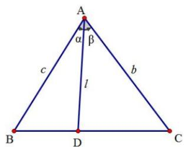

text_image

A
α β
c b
l
B D C

证明： $\because S_{\triangle ABC} = S_{\triangle ABD} + S_{\triangle ACD}$ ， $\therefore \frac{1}{2} bc\sin (\alpha +\beta) = \frac{1}{2} cl\sin \alpha +\frac{1}{2} bl\sin \beta$

同除以 $\frac{1}{2} bcl$ 得： $\frac{\sin(\alpha + \beta)}{l} = \frac{\sin\alpha}{b} +\frac{\sin\beta}{c}$

(2) 角平分线张角定理: ①当 $\alpha = \beta$ 时, $\cos \alpha = \frac{1}{2} \frac{AD}{b} + \frac{AD}{c}$ (角平分线张角定理)

② $S_{\triangle ABC} = \frac{1}{2} AD \cdot (b + c) \sin \alpha \geq AD^2 \tan \alpha$ （角平分线面积问题）

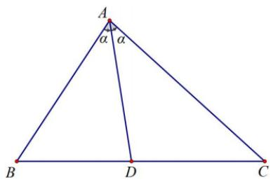

text_image

A
α α
B D C

# 6. 角平分线之斯库顿定理

如图， $AD$ 是 $\triangle ABC$ 的角平分线，则 $AD^{2} = AB\cdot AC - BD\cdot CD.$ 就其位置关系而言，可记忆：中方 $=$ 上积一下积

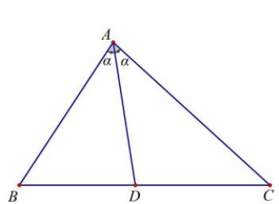

text_image

A
α α
B D C

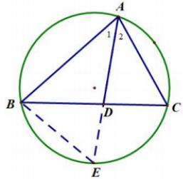

text_image

A
1 2
B D C
E

# 7. 倍角定理

$$
B = 2 A \Leftrightarrow b ^ {2} = a (a + c)
$$

$C=2B\Leftrightarrow c^{2}=b(b+a)$ ，这样的三角形称为“倍角三角形”.

$$
A = 2 C \Leftrightarrow a ^ {2} = c (c + b)
$$

# 几何背景

构造相似三角形（必要性），已知 $b^{2}=a(a+c)$ ，证B=2A，如图所示：延长CB至D，使得BD=AB=c。由 $b^{2}=a(a+c)$ 得 $\frac{a}{b}=\frac{b}{a+c}$ ，因为 $\frac{CA}{CB}=\frac{CD}{CA}$ 所以 $\triangle ACB\sim\triangle DCA$ ，所以 $\angle D=\angle CAB$ ，又BD=AB，得 $\angle ABC=2\angle D=2\angle CAB$ 。

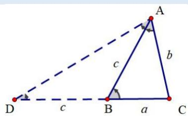

text_image

A
b
c
D
C
a
B
c

推论 1: $A = 2B \Leftrightarrow \frac{a}{\sin 2B} = \frac{b}{\sin B} = \frac{c}{\sin 3B} \Leftrightarrow b = \frac{a}{2\cos B} = \frac{c}{3 - 4\sin^{2}B}$

推论2： $A = 2B\Leftrightarrow \frac{c}{b} = 1 + 2\cos A\Leftrightarrow b + c = 2a\cos B$

# 几何背景

（1）.关于 $A = 2B\Leftrightarrow b = \frac{a}{2\cos B} = \frac{c}{3 - 4\sin^2B}$

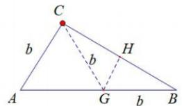

text_image

C
b
H
b
A
G
b
B

如图，我们构造 $\left|CG\right|=\left|AC\right|=b$ ，则 $\angle CGA=\angle A=2\angle B$ ，故 $\angle BCG=\angle B$ ，所以 $\left|BH\right|=b\cos B=\frac{a}{2}$ ;关于 $b=\frac{c}{3-4\sin^{2}B}$ ，即证 $c-b=2b\cos A$ ，我们参考下一模型；

(2). 关于 $A = 2B \Leftrightarrow c - b = 2b \cos A$

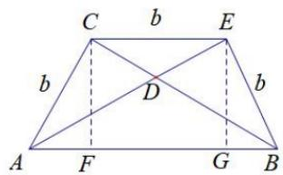

text_image

C b E
b D b
A F G B

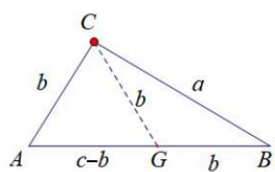

text_image

C
b
a
b
A
c-b
G
b
B

如左图，构造等腰梯形ABEC，由于 $\angle CAD = \angle BAD = \angle CBA$ ，故 $|AC| = |CE| = |BE| = |FG| = b$

$\left|AF\right| = \left|BG\right| = b\cos A$ ，所以 $\left|AB\right| = c = b + 2b\cos A$

如右图，我们构造 $\left|CG\right|=\left|AC\right|=b$ ，则 $\angle CGA=\angle A=2\angle B$ ，故 $\angle BCG=\angle B$ ，所以 $\left|BG\right|=b$ ，

$$
\left| A G \right| = c - b = 2 b \cos A;
$$

（3）.关于 $A=2B \Leftrightarrow b+c=2a\cos B$

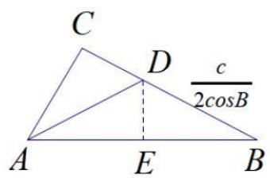

text_image

C
D
c
—
2cosB
A
E
B

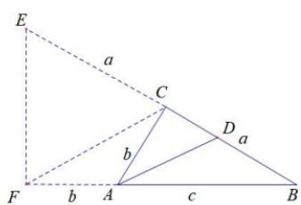

text_image

E
a
C
b
D a
F b A c B

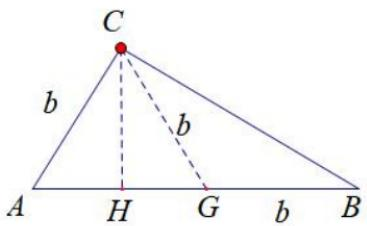

text_image

C
b
b
A H G b B

如左图，由于 A=2B，作 $\angle BAC$ 平分线 AD 交 BC 于 D，作 $DE \perp AB$ 于点 E，由于 $\angle CAD = \angle DAB = \angle B$ ，故$\left|AE\right| = \left|EB\right| = \frac{c}{2},\quad \left|DB\right| = \frac{c}{2\cos B}$ ，根据内角平分线定理得： $\frac{b}{c} = \frac{|CD|}{|DB|}$ ，即 $\frac{b + c}{c} = \frac{a}{|DB|}$ ，所以 $b + c = 2a\cos B$ 如中图，延长 $BC$ 至 $E$ ，使 $\left|CB\right| = \left|CE\right| = a$ ，延长 $BA$ 至 $F$ ，使 $\left|AF\right| = \left|AC\right| = b$ ，根据内角平分线定理，我们可知 $\frac{|AC|}{|AB|} = \frac{|CD|}{|DB|} = \frac{|AF|}{|AB|}$ ，所以 $AD // CF$ ，所以 $\angle CFB = \angle B$ ，所以 $|CF| = a = \frac{1}{2}|BE|$ ，所以 $2a\cos B = b + c$

如右图，我们构造 $\left|CG\right|=\left|AC\right|=b$ ，则 $\angle CGA=\angle A=2\angle B$ ，故 $\angle BCG=\angle B$ ，所以 $\left|BG\right|=b,\left|AG\right|=c-b$ ，作
CH⊥AB于H，所以 $\left|BH\right|=b+\frac{c-b}{2}=\frac{b+c}{2}=a\cos B$ ;

综上，我们发现构造以 b 为腰的等腰三角形 CGB 是最佳方案.

# 8. 以正切为背景的二级结论体系

（1）正切比值（射影比值）定理： $\tan A = \lambda \tan B\Leftrightarrow c = (\lambda +1)b\cos A\Leftrightarrow \frac{a^2 - b^2}{\lambda - 1} = \frac{c^2}{\lambda + 1} (\lambda \neq 0).$

证明：（充分性）因为 $\tan A = \lambda \tan B$ ，所以 $\frac{\sin A}{\cos A} = \lambda \frac{\sin B}{\cos B}$ ，所以 $\sin A \cos B = \lambda \sin B \cos A$ ，

即 $\sin A\cos B + \sin B\cos A = (\lambda +1)\sin B\cos A$ ，故 $\sin (A + B) = \sin C = (\lambda +1)\sin B\cos A$ ， $c = (\lambda +1)b\cos A$ ：

根据余弦定理， $c=(\lambda+1)b\frac{b^{2}+c^{2}-a^{2}}{2bc}$ ，故 $(\lambda+1)(b^{2}-a^{2})+(\lambda-1)c^{2}=0$ ，即 $\frac{a^{2}-b^{2}}{\lambda-1}=\frac{c^{2}}{\lambda+1}$ ，必要性反推即可，这里不详细说明.

# 几何背景

如下左图：CD 为 AB 边上的高，且 $\overrightarrow{BD} = \lambda \overrightarrow{DA}$ ，则 $\tan A = \frac{h}{|AD|} = \lambda \frac{h}{|BD|} = \lambda \tan B$ ;

由于 $\left|AD\right|=b\cos A,\quad\left|BD\right|=a\cos B=\lambda b\cos A$ ，所以 $c=\left|AD\right|+\left|BD\right|=(\lambda+1)b\cos A$ ;

由于 $a^2 - b^2 = |BD|^2 - |AD|^2 = (\lambda^2 - 1)|AD|^2$ ，且 $c^2 = (1 + \lambda)^2|AD|^2$ ，所以 $\frac{a^2 - b^2}{\lambda - 1} = \frac{c^2}{\lambda + 1}$

所以，正切的比值定理也叫射影比值定理.建议大家画图记忆，以便考场中随时推导.

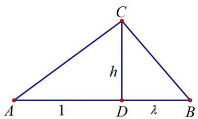

text_image

C
h
A 1 D λ B

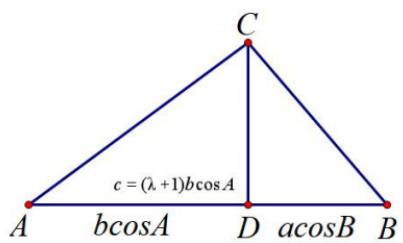

text_image

C
c = (\lambda + 1)b\cos A
A b\cos A D a\cos B B

注意：当 $\lambda=1$ 时，即我们上一讲介绍到的 $c=2b\cos A\Leftrightarrow\sin C=2\sin B\cos A$ ，就是等腰三角形；

当 $\lambda = 0$ 时， $c = b\cos A \Leftrightarrow \sin C = \sin B\cos A \Leftrightarrow \cos B = 0$ ，是直角三角形，由于直角无正切值，故 $\lambda \neq 0$ 。

# (2) 正切倒数和(底高比)定理:

公式一： $\frac{1}{\tan A} +\frac{1}{\tan B} = \frac{\lambda}{\tan C}\Leftrightarrow a^2 +b^2 = \frac{\lambda + 2}{\lambda} c^2$

公式二： $\frac{1}{\tan A}+\frac{1}{\tan B}=\lambda\Leftrightarrow S=\frac{c^{2}}{2\lambda}\Leftrightarrow\sin C=\lambda\sin A\sin B$ ，且 $\frac{b}{a}+\frac{a}{b}\leq\sqrt{\lambda^{2}+4}$ ；

【证明】公式一：（充分性）因为 $\frac{1}{\tan A} + \frac{1}{\tan B} = \frac{\lambda}{\tan C}$ ，所以 $\frac{\cos A}{\sin A} + \frac{\cos B}{\sin B} = \frac{\lambda \cos C}{\sin C}$ ，所以 $\sin C \sin B \cos A + \sin A \sin C \cos B = \lambda \sin A \sin B \cos C$ ， $bc \cos A + ac \cos B = \lambda ab \cos C$ ，

所以 $\frac{b^2 + c^2 - a^2}{2} +\frac{a^2 + c^2 - b^2}{2} = \frac{\lambda}{2} (a^2 +b^2 -c^2)$ ，所以 $a^2 +b^2 = \frac{\lambda + 2}{\lambda} c^2$ ：必要性反向证明即可.

公式二： $\frac{1}{\tan A} +\frac{1}{\tan B} = \lambda \Rightarrow \frac{\cos A}{\sin A} +\frac{\cos B}{\sin B} = \lambda \Rightarrow \sin B\cos A + \cos B\sin A = \sin C = \lambda \sin A\sin B$

$$
S = \frac {1}{2} a b \sin C = \frac {1}{2} \sin A \sin B \sin C \cdot 4 R ^ {2} = \frac {1}{2 \lambda} \sin^ {2} C \cdot 4 R ^ {2} = \frac {c ^ {2}}{2 \lambda},
$$

$\frac{b}{a}+\frac{a}{b}=\frac{a^{2}+b^{2}}{ab}=\frac{2ab\cos C+c^{2}}{ab}=2\cos C+\frac{\sin^{2}C}{\sin A\sin B}=2\cos C+\lambda\sin C=\sqrt{\lambda^{2}+4}\sin(C+\varphi)\leq\sqrt{\lambda^{2}+4}$ （其中

$$
\tan \varphi = \frac {2}{\lambda})
$$

# 几何背景

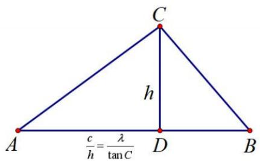

text_image

C
h
A	C	D	B
\frac{c}{h}=\frac{\lambda}{\tan C}

$$
\frac {1}{\tan A} + \frac {1}{\tan B} = \frac {\lambda}{\tan C} \text {型}
$$

text_image

C
h
A D B
c = λh

$$
\frac {1}{\tan A} + \frac {1}{\tan B} = \lambda \text {型}
$$

公式一如左图：由于 $\frac{1}{\tan A} + \frac{1}{\tan B} = \frac{|AD|}{h} + \frac{|BD|}{h} = \frac{c}{h} = \frac{\lambda}{\tan C}$ ，且 $S = \frac{ch}{2} = \frac{c^{2} \tan C}{2\lambda} = \frac{1}{4}(a^{2} + b^{2} - c^{2}) \tan C$ ，故 $a^2 + b^2 - c^2 = \frac{2c^2}{\lambda}$ ，即 $a^2 + b^2 = \frac{\lambda + 2}{\lambda} c^2$

公式二如右图： $\frac{1}{\tan A} +\frac{1}{\tan B} = \frac{|AD|}{h} +\frac{|BD|}{h} = \frac{c}{h} = \lambda$ ，故 $S = \frac{ch}{2} = \frac{c^2}{2\lambda}$

$$
\sin A \sin B = \frac {h}{a} \cdot \frac {h}{b} = \frac {h ^ {2}}{\frac {2 S}{\sin C}} = \frac {h ^ {2}}{c h} \sin C = \frac {\sin C}{\lambda}
$$

# 9. 托勒密定理

（1）狭义托勒密定理：在圆内接四边形中，两条对角线的乘积等于两组对边乘积之和.

text_image

Geometric diagram showing a circle with inscribed quadrilateral ABCD and auxiliary points E and O, including connecting lines and a dashed line from D to E.

text_image

A
E
B
C
D

如图上，设四边形ABCD内接于圆 $O$ ，则有 $AB\cdot CD + AD\cdot BC = AC\cdot BD$

（2）广义托勒密定理：在四边形ABCD中，有AB CD AD BC AC BD，当且仅当四边形ABCD四点共圆时，等号成立.

# 专题 3 立体几何结论篇

# 一、基础公式篇

1. 圆柱、圆锥、圆台的侧面展开图及侧面积公式

<table><tr><td></td><td>圆柱</td><td>圆锥</td><td>圆台</td></tr><tr><td>侧面展开图</td><td></td><td></td><td></td></tr><tr><td>侧面积公式</td><td> $S_{\text{圆柱侧}} = 2\pi rl$ </td><td> $S_{\text{圆锥侧}} = \pi rl$ </td><td> $S_{\text{圆台侧}} = \pi (r + r')l$ </td></tr></table>

2. 空间几何体的表面积与体积公式

<table><tr><td>几何体\名称</td><td>表面积</td><td>体积</td></tr><tr><td>柱体(棱柱和圆柱)</td><td> $S_{\text{表面积}} = S_{\text{侧}} + 2S_{\text{底}}$ </td><td> $V = Sh$ </td></tr><tr><td>锥体(棱锥和圆锥)</td><td> $S_{\text{表面积}} = S_{\text{侧}} + S_{\text{底}}$ </td><td> $V = \frac{1}{3}Sh$ </td></tr><tr><td>台体(棱台和圆台)</td><td> $S_{\text{表面积}} = S_{\text{侧}} + S_{\text{上}} + S_{\text{下}}$ </td><td> $V = \frac{1}{3}(S_{\text{上}} + S_{\text{下}} + \sqrt{S_{\text{上}}S_{\text{下}}}) \cdot h$ </td></tr><tr><td>球</td><td> $S = 4\pi R^{2}$ </td><td> $V = \frac{4}{3}\pi R^{3}$ </td></tr></table>

3. 空间几何体的直观图常用斜二测画法面积： $S_{\text{直}} = \frac{\sqrt{2}}{4} S_{\text{原}}$

# 二、平行与垂直

1. 平行的判定

（一）直线与平面平行

<table><tr><td></td><td>文字语言</td><td>图形语言</td><td>符号语言</td></tr><tr><td>判定定理</td><td>平面外一条直线与此平面内的一条直线平行,则直线与此平面平行.</td><td></td><td></td></tr><tr><td>性质定理</td><td>如果一条直线和一个平面平行,经过这条直线的平面和这个平面相交,那么这条直线就和交线平行.</td><td></td><td></td></tr></table>

# （二）性质定理与判定定理

<table><tr><td></td><td>文字语言</td><td>图形语言</td><td>符号语言</td></tr><tr><td>判定定理</td><td>一个平面内有两条相交直线与另一个平面平行,则这两个平面平行</td><td></td><td></td></tr><tr><td>性质定理</td><td>如果两个平行平面同时与第三个平面相交,那么它们的交线平行</td><td></td><td></td></tr></table>

# 2. 垂直的判定

# （一）直线和平面垂直的定义

直线 $l$ 与平面 $\alpha$ 内的任意一条直线都垂直，就说直线 $l$ 与平面 $\alpha$ 互相垂直

# （二）直线与平面垂直

<table><tr><td></td><td>文字语言</td><td>图形语言</td><td>符号语言</td></tr><tr><td>判定定理</td><td>一条直线与平面内的两条相交直线都垂直,则该直线与此平面垂直</td><td></td><td></td></tr><tr><td>推论</td><td>如果在两条平行直线中,有一条垂直于平面,那么另一条直线也垂直这个平面</td><td></td><td></td></tr><tr><td>性质定理</td><td>垂直于同一个平面的两条直线平行</td><td></td><td></td></tr></table>

# （三）性质定理与判定定理

<table><tr><td></td><td>文字语言</td><td>图形语言</td><td>符号语言</td></tr><tr><td>判定定理</td><td>一个平面过另一个平面的一条垂线,则这两个平面互相垂直</td><td></td><td></td></tr><tr><td>性质定理</td><td>两个平面互相垂直,则一个平面内垂直于交线的直线垂直于另一个平面</td><td></td><td></td></tr></table>

# 三、外接球问题秒杀求法

<table><tr><td>模型</td><td>模型图</td><td>适用几何体</td><td>解题流程</td><td>公式</td></tr><tr><td>长方体模型</td><td></td><td>长方体的顶点构成的几何体模型</td><td>先补成长方体,再找长方体的长宽高</td><td> $(2R)^{2} = a^{2} + b^{2} + c^{2}$ </td></tr><tr><td>对棱相等模型</td><td></td><td>对棱相等的三棱锥(也是特殊的长方体模型)</td><td>先补成长方体,再找长方体的三对面对角线 $x,y,z$ </td><td> $R^{2} = \frac{x^{2} + y^{2} + z^{2}}{8}$ </td></tr><tr><td>斗笠模型</td><td></td><td>圆锥、顶点在地面的射影是底面外心的正棱锥</td><td>找底面外接圆半径 $r$ ,找高 $h$ </td><td> $R^{2} = \frac{r^{2} + h^{2}}{2h}$ </td></tr><tr><td>汉堡模型</td><td></td><td>圆柱,直棱柱,一条侧棱垂直底面的棱锥</td><td>找底面外接圆半径 $r$ ,找高 $h$ </td><td> $R^{2} = r^{2} + \frac{h^{2}}{4}$ </td></tr><tr><td>切瓜模型</td><td></td><td>存在一组邻面垂直的几何体</td><td>找两个垂面的外接圆半斤 $r_{1},r_{2}$ ,两个面的交线 $l$ </td><td> $R^{2} = r_{1} + r_{2} - \frac{l^{2}}{4}$ </td></tr><tr><td>怀表模型</td><td></td><td>两个全等等腰三角形折叠式棱锥</td><td>找等腰三角形的高 $H$ ,找外接圆半径 $r$ ,找二面角 $\theta$ </td><td> $R^{2} = r^{2} + (h - r)^{2} \tan^{2} \frac{\theta}{2}$ </td></tr><tr><td>夹角问题终极公式</td><td></td><td>任意普通情况</td><td>找两相邻面的截面外接圆圆心到交线的距离 $m,n$ 找二面角 $\theta$ ,找两个面的交线 $l$ </td><td> $R^{2} = \frac{m^{2} + n^{2} - 2mn\cos\alpha}{\sin^{2}\alpha} + \frac{l^{2}}{4}$ </td></tr></table>

# 三、内切球半径求法

# 1.棱锥内切球半径

（1）等体积法：由球心到各面距离相等，多面体体积可表示为

$$
V = \frac {1}{3} r S _ {1} + \frac {1}{3} r S _ {2} + \frac {1}{3} r S _ {3} + \dots + \frac {1}{3} r S _ {n} = \frac {1}{3} r \left(S _ {1} + S _ {2} + \dots + S _ {n}\right) = \frac {1}{3} r S _ {\text {表}}, \text {所以} r = \frac {3 V}{S _ {\text {表}}}.
$$

（2）相似法求解正棱锥内切球半径：（以下以正三棱锥为例）

如图，由正三棱锥内切球球心 $O$ 在高线上，则球与侧面的切点 $E$ 在侧面的高线 $PD$ 上，与底面的切点 $H$ 为高线垂足，易知 $\Delta POE \sim \Delta PDH$ ，故利用 $\frac{OE}{DH} = \frac{PO}{PD}$ ，可解出内切球半径 $R$ .

text_image

P
E
O
A
D
H
B
C

2. 旋转体内切球半径：（可按照轴截面的内切圆半径计算，外接球同理）

如图，已知圆锥高为 h，底面半径为 r，利用两个直角三角形 $\Delta ABD$ 和 $\Delta AOE$ 相似可得 $\frac{OE}{AE} = \frac{BD}{AD}$ ，故 $\frac{R}{\sqrt{h^{2} + r^{2}} - r} = \frac{r}{h}$ ，所以 $R = \frac{r}{h} (\sqrt{h^{2} + r^{2}} - r)$ .

text_image

V
h
R
O
O₁
r

text_image

A
O
R
E
C
D
r
B

注：圆柱、圆台同样以轴截面的方式处理.

3. 常见几何体内切球、外接球半径

棱长为 a 的正方体：内切球半径 $R=\frac{a}{2}$ ，外接球半径 $R=\frac{\sqrt{3}}{2}a$ .

棱长为 a 的正四面体：内切球半径 $R = \frac{\sqrt{6}}{12} a$ ，外接球半径 $R = \frac{\sqrt{6}}{4} a$ .

柱体侧棱长 a，底面外接圆半径 r：柱体可能不存在内切球，柱体中最大的球的半径 $R=\left\{\frac{a}{2},\quad r\right\}_{\min}$ 四、常见几何体的性质

1. 四面体的性质

（1）三组对棱分别相等的四面体必内接于唯一的长方体，且四面体的棱分别为长方体的面对角线；  
（2）正四面体 P-ABC 可以补为正方体且正方体的棱长 $a=\frac{PA}{\sqrt{2}}$ ;  
（3）若四面体有三条棱两两互相垂直．则可将其放入某个长方体内；  
（4）若四面体的四个面均是直角三角形．则可将其放入某个长方体内；  
（5）三组对棱分别相等的四面体的棱长 $A^{\prime}B$ 、 $BC^{\prime}$ 、 $A^{\prime}C^{\prime}$ 、必构成锐角三角形；  
（6）任一四面体均内接于唯一的平行六面体．且四面体体积是平行六面体体积的三分之一；

(7) 若侧棱长相等. 则顶点在底面上的射影为其外心. 且侧棱与底面的线面角相等 (逆命题: 顶点在底面上的射影为其外心. 或侧棱与底面的线面角相等, 则侧棱长相等成立);  
(8) 若顶点到下底面三边的距离相等. 则顶点在底面上的射影必为其内心（或旁心）. 且侧面与底面的二面角相等（逆命题: 顶点在底面上的射影为其内心（或旁心）. 或各侧面与底面的二面角相等, 则顶点到下底面三边的距离相等成立）;

注：若顶点到下底面中两边 $AB$ 、 $AC$ 的距离相等，则 $P$ 在底面上的射影必在 $\angle BAC$ 平分线上，且侧面与底面的二面角相等， $\angle PAC = \angle PAB$ ：

（9）若两组对棱分别互相垂直．则第三组对棱必垂直．且任一顶点在其对面上的射影必为其垂心（逆命题：一组对棱垂直．且任一顶点在其对面上的射影为其垂心，则两组对棱分别互相垂直成立）；  
（10）连接两组对棱的中点可组成平行四边形EGFH．且另一组对棱与该面距离相等；  
(11) 过一组对棱（AB 与 CD）中点（E, F）连线的任一平面（E, G, F, H 共面）必平分其 $V_{A-BCD}$ 体积，即 $V_{AC-BGFH} = V_{BD-BZFH}$   
(12) 异面直线 $AC$ 与 $OB$ 所成角 $\theta$ 的公式： $\cos \theta = \frac{\|AB|^2 + |OC|^2 - |BC|^2 - |OA|^2|}{2AC \cdot OB}$

# 2. 正方体的性质

(1) $BD_{1} \perp$ 平面 $A_{1}C_{1}D$ , $BD_{1} \perp$ 平面 $ACB_{1}$ (如图).  
(2) F 为平面 $A_{1}C_{1}D$ 的中心. E 为平面 $ACB_{1}$ 的中心（如图）.  
(3) E, F 为 BD 的三等分点（如图）.  
(4) 平面 $A_{1}C_{1}D \parallel$ 平面 $ACB_{1}$ (如图).  
（5）在长方体中， $\alpha,\beta,\gamma$ 为对角线， $\cos^{2}\alpha+\cos^{2}\beta+\cos^{2}\gamma=1$   
(6) 在长方体中， $\alpha', \beta', \gamma'$ 为对角线， $\cos^2 \alpha' + \cos^2 \beta' + \cos^2 \gamma' = 1$

# 3. 墙角体性质

(1) $\Delta ABC$ 为锐角三角形.   
(2) 顶点 P 在底面上的投影 H 恰为 $\Delta ABC$ 的垂心.  
(3) 设墙角 P 到底面的距离为 h，墙角的三侧棱长分别为 a, b, c

则有 $\frac{1}{h^2} = \frac{1}{a^2} +\frac{1}{b^2} +\frac{1}{c^2}$

(4) $abc \geq 3\sqrt{3}h^{3}$

（5）如图，设三个侧面和底面的面积分别为 $S_{\Delta ABP}$ ， $S_{\Delta BCP}$ ， $S_{\Delta CAP}$ ， $S_{\Delta ABC}$ 则 $S^{2}_{\Delta ABP} + S^{2}_{\Delta BCP} + S^{2}_{\Delta CAP} = S^{2}_{\Delta ABC}$ .

text_image

Geometric diagram of a cube with labeled vertices and internal points, showing shaded regions for spatial relationships.

text_image

P
a
h
b
A
H
B
C

(6) 如图，设侧面与底面所成的二面角分别为 $\alpha, \beta, \gamma$ ，则 $\cos^2\alpha + \cos^2\beta + \cos^2\gamma = 1$ ， $\sin^2\alpha + \sin^2\beta + \sin^2\gamma = 2$ 。

text_image

P
b
a
c
h
B
β
F
α
D
γ
H
C
E

(7) 若点 $Q$ 为底面 $ABC$ 内任意一点．如图．设 $\angle APQ = \alpha, \angle BPQ = \beta. \angle CPQ = \gamma.$ 则有

$$
\cos^ {2} \alpha + \cos^ {2} \beta + \cos^ {2} \gamma = 1
$$

text_image

P
a
c
b
C
Q
A
B

(8) 设侧棱 $PA, PB, PC$ 与底面 $ABC$ 所成角为 $\alpha', \beta', \gamma'$ . 则 $\sin^2 \alpha' + \sin^2 \beta' + \sin^2 \gamma' = 1$   
(9) 若点 $Q$ 为底面 $ABC$ 内任意一点. 设 $PQ$ 与平面 $PAC$ 所成角为 $\alpha$ , $PQ$ 与平面 $PAB$ 所成角为 $\gamma$ , $\sin^2 \alpha'' + \sin^2 \beta'' + \sin^2 \gamma'' = 1$

（10）设墙角体底面 $\Delta ABC$ 内一点 M 到各侧面的距离分别为 $h_{1}, h_{2}, h_{3}$ 则点 M 到顶点 P 的距离：

$$
d = \sqrt {h _ {1} ^ {2} + h _ {2} ^ {2} + h _ {3} ^ {3}}
$$

# 五、空间向量的相关问题

# 1. 空间向量的相关运算

若空间向量 $\vec{a}=(x_{1},y_{1},z_{1})$ , $\vec{b}=(x_{2},y_{2},z_{2})$ ;

（1）向量模长： $|\vec{a}|=\sqrt{x_{1}^{2}+y_{1}^{2}+z_{1}^{2}}$ ；  
(2) 向量的加减: $\vec{a} \pm \vec{b} = (x_{1} \pm x_{2}, y_{1} \pm y_{2}, z_{1} \pm z_{2})$ ;   
（3）向量的平行 $\vec{a} // \vec{b} \Rightarrow \vec{a} = \lambda \vec{b} \Rightarrow \begin{cases} x_1 = \lambda x_2 \\ y_1 = \lambda y_2 \\ z_1 = \lambda z_2 \end{cases}$   
（4）向量的平行：若 $\vec{a} \perp \vec{b} \Rightarrow \vec{a} \cdot \vec{b} = 0 \Rightarrow x_{1}x_{2} + y_{1}y_{2} + z_{1}z_{2} = 0$ ;  
（5）向量的数量积：已知向量 $\vec{a},\vec{b}$ ，则 $|\vec{a} |\cdot |\vec{b} | \cdot \cos < \vec{a},\vec{b} >$ 叫做 $\vec{a},\vec{b}$ 的数量积，记作 $\vec{a} \cdot \vec{b}$ ，即 $\vec{a} \cdot \vec{b} = |\vec{a} |\cdot |\vec{b} |\cdot \cos < \vec{a},\vec{b} >$ 。向量 $\vec{a},\vec{b}$ 的夹角公式 $\cos < \vec{a},\vec{b} > = \frac{\vec{a} \cdot \vec{b}}{|\vec{a}|\cdot|\vec{b}|} = \frac{a_1b_1 + a_2b_2 + a_3b_3}{\sqrt{a_1^2 + a_2^2 + a_3^2}\sqrt{b_1^2 + b_2^2 + b_3^2}}.$

# 2. 异面直线所成角

设直线 a, b 的方向向量为 $\vec{a}$ ， $\vec{b}$ ，其夹角为 $\theta$ ，则 $\cos\varphi=\cos\theta=\frac{\vec{a}\cdot\vec{b}}{|\vec{a}|\cdot|\vec{b}|}$ （其中 $\varphi$ 为异面直线 a，b 所成的角）

# 3. 直线与平面所成角

（1）过平面外一点 B 做 $BB' \perp$ 平面 $\alpha$ ，交平面 $\alpha$ 于点 $B'$ ；连接 $AB'$ ，则 $\angle BAB'$ 即为直线 AB 与平面 $\alpha$ 的夹角。接下来在 $Rt\triangle ABB'$ 中解三角形。即 $\sin\angle BAB' = \frac{BB'}{AB} = \frac{h}{斜线长}$ （其中 h 即点 B 到面 $\alpha$ 的距离，可以采用等体积法求 h，斜线长即为线段 AB 的长度）：  
（2）设直线 l 的方向向量为 $\vec{e}$ ，平面 $\alpha$ 的法向量为 $\vec{n}$ ，直线 l 与平面 $\alpha$ 所成的角为 $\phi$ ，两向量 $\vec{e}$ 与 $\vec{n}$ 的夹角为 $\theta$ ，则有 $\sin\varphi=\left|\cos\theta\right|=\frac{\left|\vec{e}\cdot\vec{n}\right|}{\left|\vec{e}\right|\left|\vec{n}\right|}$ ，或者 $\sin\varphi=\cos\theta$

# 4. 空间中的距离

（1）设两条异面直线 $a, b$ 的公垂线的方向向量为 $\vec{n}$ ，这时分别在 $a, b$ 上任取 $A, B$ 两点，则向量在 $\vec{n}$ 上的正射影长就是两条异面直线 $a, b$ 的距离.

则 $d = |\overrightarrow{AB} \cdot \frac{\vec{n}}{|\vec{n}|} | = \frac{|\overrightarrow{AB} \cdot \vec{n}|}{|\vec{n}|}$ ，即两异面直线间的距离，等于两异面直线上分别任取两点的向量和公垂线方向向量的数量积的绝对值与公垂线的方向向量模的比值。

(2) 设直线 l 的方向向量为 $\vec{e}$ ，平面 $\alpha$ 的法向量为 $\vec{n}$ ，直线 l 与平面 $\alpha$ 所成的

角为 $\varphi$ ，两向量 $\vec{e}$ 与 $\vec{n}$ 的夹角为 $\theta$ ，则有 $\sin\varphi=\left|\cos\theta\right|=\frac{\left|\vec{e}\cdot\vec{n}\right|}{\left|\vec{e}\right|\cdot\left|\vec{n}\right|}$ .

# 5. 点到平面的距离

A 为平面 $\alpha$ 外一点(如图)， $\vec{n}$ 为平面 $\alpha$ 的法向量，过 A 作平面 $\alpha$ 的斜线 AB 及垂线 AH，如图所示：

$|\overrightarrow{AH}|=|\overrightarrow{AB}|\cdot\sin\theta=|\overrightarrow{AB}|\cdot|\cos<\overrightarrow{AB},n>|=|\overrightarrow{AB}|\frac{|\overrightarrow{AB}\cdot\vec{n}|}{|\overrightarrow{AB}|\cdot|\vec{n}|}= \frac{|\overrightarrow{AB}\cdot\vec{n}|}{|\vec{n}|}$ ，所以 $d=\frac{|\overrightarrow{AB}\cdot\vec{n}|}{|\vec{n}|}$ .

# 6.二面角与射影面积公式

影面积法求二面角：二面角 $\theta: \cos\theta = \frac{S'}{S}$ 其中 S 为斜面面积， $S'$ 为投影面积.

# 6. 已知异面直线及夹角，求四面体体积

已知异面直线段 $AB = a, CD = b$ 异面直线夹角 $\theta$ ，且异面直线距离为 $d$ 则四面体 $ABCD$ 体积为：

$$
V _ {A B C D} = \frac {1}{6} a b d \sin \theta
$$

# 六、其他公式补充

# 1. 空间余弦定理

空间四边形 ABCD 的两条异面直线 AC 与 BD 夹角为 $\theta$ ，则满足：

$$
\cos \theta = \frac {\left| \left| A B \right| ^ {2} + \left| C D \right| ^ {2} - \left| A D \right| ^ {2} - \left| B C \right| ^ {2} \right|}{2 A C \cdot B D}
$$

# 2. 三余弦定理

设二面角 C-OB-A 大小为 $\alpha$ ， $\angle COB = \theta_{1}, \angle AOB = \theta_{2}$ ， $\angle AOC = \theta$ ，如图所示，此时三余弦定理可推广为： $\cos\theta = \cos\theta_{1}\cos\theta_{2} + \sin\theta_{1}\sin\theta_{2}\sin\alpha$ ，特别地，当 $\alpha = \frac{\pi}{2}$ 时，有 $\cos\theta = \cos\theta_{1}\cos\theta_{2}$

# 3. 最小角定理

平面的斜线和它在平面内的射影所成的锐角，是这条斜线和平面内任一直线所成角中的最小者，即线面角是最小的线线角。（由三余弦定理 $\cos \angle PAB = \cos \theta \cdot \cos \angle OAB$ 可得）

# 4. 最大角定理

对于一个锐二面角，在其中一个半平面内的任一条直线与另一个半平面所成的线面角的最大值等于二面角的平面角，即二面角是最大的线面角。（由三正弦定理 $\sin \theta = \sin \alpha \cdot \sin \angle PAB$ 可得

# 5. 点到平面的距离公式

已知平面 $\alpha: Ax + By + Cz + D = 0$ ，点 $P(x_0, y_0, z_0)$ 到平面 $\alpha$ 的距离是 $d = \frac{|Ax_0 + By_0 + Cz_0 + D|}{\sqrt{A^2 + B^2 + C^2}}$

# 专题 4 数列结论篇

# 一．等差数列

# 1. 常用结论

（1）通项公式的推广： $a_{n} = a_{m} + (n - m)d(n, m \in N^{*})$   
（2）在等差数列 $\{a_{n}\}$ 中，当 $m + n = p + q$ 时， $a_{m} + a_{n} = a_{p} + a_{q}(m, n, p, q \in N^{*})$ .

特别地，若 $m+n=2t$ ，则 $a_{m}+a_{n}=2a_{t}(m, n, t\in N^{*})$ .

(3) $a_{k}, a_{k + m}, a_{k + 2m}, \cdots$ 仍是等差数列，公差为 $md(k, m \in N^{*})$ .   
(4) $S_{n}, S_{2n} - S_{n}, S_{3n} - S_{2n}, \cdots$ 也成等差数列，公差为 $n^{2}d$ .  
（5）若 $\{a_{n}\}$ ， $\{b_n\}$ 是等差数列，则 $\{pa_{n} + qb_{n}\}$ 也是等差数列.

（6）若 $\{a_{n}\}$ 是等差数列，则 $\left\{\frac{S_{n}}{n}\right\}$ 也成等差数列，其首项与 $\{a_{n}\}$ 首项相同，公差是 $\{a_{n}\}$ 公差的 $\frac{1}{2}$ .

（7）若项数为偶数 2n，则 $S_{2n}=n(a_{1}+a_{2n})=n(a_{n}+a_{n+1})$ ， $S_{偶}-S_{奇}=nd$ ； $\frac{S_{奇}}{S_{偶}}=\frac{a_{n}}{a_{n+1}}$ .

（8）若项数为奇数 $2n - 1$ ，则 $S_{2n - 1} = (2n - 1)a_n$ ； $S_{\text{奇}} - S_{\text{偶}} = a_n$ ； $\frac{S_{\text{奇}}}{S_{\text{偶}}} = \frac{n}{n - 1}$

(9) 在等差数列 $\{a_{n}\}$ 中，若 $a_{1}>0, d<0$ ，则满足 $\left\{\begin{aligned}a_{m}&\geq0\\ a_{m+1}&\leq0\end{aligned}\right.$ 的项数 m 使得 $S_{n}$ 取得最大值 $S_{m}$ ；若 $a_{1}<0, d>0$ ，则满足 $\left\{\begin{aligned}a_{m}&\leq0\\ a_{m+1}&\geq0\end{aligned}\right.$ 的项数 m 使得 $S_{n}$ 取得最小值 $S_{m}$ .

# 4. 等差数列的前 $n$ 项和公式与函数的关系

$S_{n} = \frac{d}{2} n^{2} + (a_{1} - \frac{d}{2})n$ ．数列 $\{a_{n}\}$ 是等差数列 $\Leftrightarrow S_{n} = An^{2} + Bn$ （ $A$ 、 $B$ 为常数）.

# 5. 等差数列的前 $n$ 项和的最值

在等差数列 $\{a_{n}\}$ 中， $a_1 > 0$ ， $d < 0$ ，则 $S_{n}$ 存在最大值；若 $a_1 < 0$ ， $d > 0$ ，则 $S_{n}$ 存在最小值.

# 2. $a_{n}$ 与 $S_{n}$ 之间一步转换

$$
a _ {m _ {1}} + a _ {m _ {2}} + a _ {m _ {3}} + \dots \dots + a _ {m _ {n}} = n a _ {\frac {m _ {1} + m _ {2} + m _ {3} + \dots . . . + m _ {n}}{n}}
$$

例： $a_{2}+a_{6}+a_{7}=3a_{5}$ ; $3a_{8}-a_{12}=2a_{6}$ .

公式一： $S_{n}=a_{1}+a_{2}+a_{3}+\cdots\cdots+a_{n}\Rightarrow S_{n}=n\cdot a_{\frac{n+1}{2}}$ （其中 n 为奇数）例： $S_{5}=5a_{3}$

公式二： $a_{n} = \frac{S_{2n - 1}}{2n - 1}$ 例： $a_5 = \frac{S_9}{9}$ ； $a_8 = \frac{S_{15}}{15}$

当 $m_{1}$ 、 $m_{2}$ 、 $m_{3}$ 、…、 $m_{n}$ 也成等差数列时，均有 $a_{m_{1}} + a_{m_{2}} + a_{m_{3}} + \cdots + a_{m_{n}} = na \frac{m_{1} + m_{n}}{2}$ .

# 3. 只有 S 的模型与最值问题

性质1.等差数列中： $\frac{S_{m + n}}{m + n} = \frac{S_m - S_n}{m - n}$ ，则有 $\frac{S_{2m + m}}{2m + m} = \frac{S_{2m} - S_m}{2m - m}$ 可以求出 $S_{3m}$ ，甚至 $S_{4m}$

注意：①若 $S_{m} = S_{n}$ ，则一定有： $S_{m + n} = 0$ ； $a_{\frac{m + n + 1}{2}} = 0$

② $S_{n}$ ， $S_{2n} - S_n$ ， $S_{3n} - S_{2n}$ 成等差数列，公差为 $n^2 d$

性质2.等差数列 $\{a_{n}\}$ 中： $\{\frac{S_n}{n}\}$ 为首项是 $a_1$ ，公差是 $\frac{d}{2}$ 的等差数列，若 $m + n = p + q$ ，则 $\frac{S_m}{m} + \frac{S_n}{n} = \frac{S_p}{p} + \frac{S_q}{q}$ ；特别的，若 $m + n = 2p$ ，则有 $\frac{S_m}{m} + \frac{S_n}{n} = \frac{2S_p}{p}$ .

性质 3. $S_{n}$ 有最大值 $\Leftrightarrow\left\{\begin{aligned}a_{n}>0\\ a_{n+1}<0\end{aligned}\right.$ ; $S_{n}$ 有最小值 $\Leftrightarrow\left\{\begin{aligned}a_{n}<0\\ a_{n+1}>0\end{aligned}\right.$ ，若 $a_{n}=0$ ，则有 $S_{n}=S_{n-1}$ 同时取得最值. $S_{n}>0,\quad n$ 的最大值 $\Leftrightarrow\left\{\begin{aligned}S_{n}>0\\ S_{n+1}<0\end{aligned}\right.$ ; $S_{n}<0,n$ 的最大值 $\Leftrightarrow\left\{\begin{aligned}S_{n}<0\\ S_{n+1}>0\end{aligned}\right.$ .

# 二．等比数列

# 1. 常用等比数列结论

1. 若 $m + n = p + q = 2k(m, n, p, q, k \in N^{*})$ ，则 $a_{m} \cdot a_{n} = a_{p} \cdot a_{q} = a_{k}^{2}$ .

2. 若 $\{a_{n}\}$ , $\{b_{n}\}$ (项数相同) 是等比数列, 则 $\{\lambda a_{n}\} (\lambda \neq 0)$ , $\{\frac{1}{a_n}\}$ , $\{a_{n}^2\}$ , $\{a_{n} \cdot b_{n}\}$ , $\{\frac{a_{n}}{b_{n}}\}$ 仍是等比数列.

3. 在等比数列 $\{a_{n}\}$ 中，等距离取出若干项也构成一个等比数列，即 $a_{n}, a_{n + k}, a_{n + 2k}, a_{n + 3k}\ldots$ 为等比数列，公比为 $q^{k}$ .

4. 公比不为-1的等比数列 $\{a_{n}\}$ 的前 $n$ 项和为 $S_{n}$ ，则 $S_{n}, S_{2n} - S_{n}, S_{3n} - S_{2n}$ 仍成等比数列，其公比为 $q^{n}$ .

5. $\{a_{n}\}$ 为等比数列，若 $a_{1} \cdot a_{2} \ldots a_{n} = T_{n}$ ，则 $T_{n}, \frac{T_{2n}}{T_{n}}, \frac{T_{3n}}{T_{2n}}, \cdots$ 成等比数列.

6. 当 $q \neq 0$ ， $q \neq 1$ 时， $S_{n} = k - k \cdot q^{n} (k \neq 0)$ 是 $\{a_{n}\}$ 成等比数列的充要条件，此时 $k = \frac{a_{1}}{1 - q}$ .

7. 有穷等比数列中，与首末两项等距离的两项的积相等．特别地，若项数为奇数时，还等于中间项的平方.

2. 等比积秒杀公式： $a_{m_{1}} \cdot a_{m_{2}} \cdot a_{m_{3}} \cdot \ldots \cdot a_{m_{n}} = (a_{\frac{m_{1} + m_{2} + m_{3} + \cdots + m_{n}}{n}})^{n}$

注：角标为分数时，小题依然适用.

例： $a_{2}\cdot a_{6}\cdot a_{7}=(a_{5})^{3}$ ; $a_{1}\cdot a_{2}\cdot a_{3}\cdots\cdot a_{n}=(a_{\frac{1+n}{2}})^{n}$ ; $a_{1}\cdot a_{2}\cdot a_{3}\cdots\cdot a_{9}=(a_{5})^{9}$

拓展：若 $m_{1}$ 、 $m_{2}$ 、 $m_{3}\cdots m_{n}$ 成等差数列时，有 $a_{m_{1}}\cdot a_{m_{2}}\cdot a_{m_{3}}\cdot\ldots\cdot a_{m_{n}}=(a_{\frac{m_{1}+m_{n}}{2}})^{n}$

# 3. 等间隔的等比数列比值

公式 1: $\frac{a_{m_1+k} + a_{m_2+k} + \cdots a_{m_n+k}}{a_{m_1} + a_{m_2} + \cdots a_{m_n}} = q^k$ .

例如：① $\frac{a_{3}+a_{6}+\cdots a_{99}}{a_{2}+a_{5}+\cdots a_{98}}=q$ ② $\frac{a_{3}+a_{6}+\cdots a_{99}}{a_{1}+a_{4}+\cdots a_{97}}=q^{2}$ ③ $\frac{a_{7}+a_{8}+a_{9}}{a_{4}+a_{5}+a_{6}}=q^{3}$ ④ $\frac{a_{7}+a_{8}+a_{9}}{a_{1}+a_{2}+a_{3}}=q^{6}$

强调：一定要项数相等，才能用此定理。

推论：在等比数列 $\{a_{n}\}$ 中，当项数 $n = 2k$ 时， $S_{\text{偶}} = qS_{\text{奇}}$ 。

公式 2: $S_{m+n}=S_{m}+q^{m}S_{n}=S_{n}+q^{n}S_{m}$ .

例如：① $S_{10} = S_5 + q^5 S_5$ ；② $S_{15} = S_5 + q^5 S_{10} = S_5(1 + q^5 + q^{10})$ ；③ $S_{2m} = S_m + q^m S_m$ ；

④ $S_{3m} = S_m + q^m S_{2m} = S_m(1 + q^m +q^{2m})$

强调：两个公式表达的其实是同一个意思，整体成等比数列.

# 三．数列通项求法

# 1. 整体等比构造

第一类：递推式 $a_{n + 1} = ka_n + f(n)(k\neq 0,1)$ 转化为 $a_{n + 1} + g(n + 1) = k[a_n + g(n)]$ ， $g(n)$ 为待定系数

1. 当 $f(n) = A$ 时， $a_{n+1} + \frac{A}{k-1} = k\left(a_n + \frac{A}{k-1}\right)$ ， $\left\{a_n + \frac{A}{k-1}\right\}$ 是以 $a_1 + \frac{A}{k-1}$ 为首项， $k$ 为公比的等比数列。  
2. 当 $f(n) = Ak^n$ 时，同除以 $k^n$ ，得： $\frac{a_{n+1}}{k^n} = \frac{a_n}{k^{n-1}} + A$ ，数列 $\left\{\frac{a_n}{k^{n-1}}\right\}$ 是以 $a_1$ 为首项， $A$ 为公差的等差数列，则 $\frac{a_n}{k^{n-1}} = a_1 + A(n-1)$ .  
3. $a_{n + 1} = ka_{n} + an + b$ 转化成 $a_{n + 1} + A(n + 1) + B = k(a_n + An + B)$ 即 $\left\{ \begin{array}{l}kA - A = a\\ kB - B - A = b \end{array} \right.$ 解出 $A,B$ ；可得数列

$\{a_{n} + An + B\}$ 是以 $a_1 + A + B$ 为首项， $k$ 为公比的等比数列， $a_{n} + An + B = (a_{1} + A + B) \cdot k^{n - 1}$

$$
\therefore a _ {n} = (a _ {1} + A + B) \cdot k ^ {n - 1} - A n - B.
$$

2. 二阶递推之方程组法 $a_{n+1} = pa_n + qa_{n-1}(a_1 = a, a_2 = b, n \geq 2)$

1. 设 $a_{n+1} - \alpha a_n = \beta (a_n - \alpha a_{n-1})$ 与 $a_{n+1} = pa_n + qa_{n-1}$ 比较，得 $\alpha + \beta = p, \alpha \cdot \beta = -q$ ，可知：

$\alpha, \beta$ 是方程 $x^{2} - px - q = 0$ 的两根，容易求得 $\alpha, \beta$ .

(I) 当 $\alpha \neq \beta$ 时，数列 $\{a_{n+1} - \alpha a_n\}$ 是以 $a_2 - \alpha a_1$ 为首项， $\beta$ 为公比的等比数列

同时满足数列 $\{a_{n + 1} - \beta a_n\}$ 是以 $a_2 - \beta a_1$ 为首项， $\alpha$ 为公比的等比数列

则有 $\left\{ \begin{array}{l} a_{n + 1} - \alpha a_n = (b - \alpha a)\beta^{n - 1} \\ a_{n + 1} - \beta a_n = (b - \beta a)\alpha^{n - 1} \end{array} \right.$ 两式联立，消去 $a_{n + 1}$ 得： $a_{n} = \frac{1}{\beta - \alpha}\left[(b - \alpha a)\beta^{n - 1} - (b - \beta a)\alpha^{n - 1}\right]$

特例：当 $p + q = 1$ 时， $a_{n + 1} - a_n = -qa_n + qa_{n - 1}$ ， $\therefore \{a_{n + 1} - a_n\}$ 是以 $b - a$ 为首项，- $q$ 为公比的等比数列

$\therefore a_{n + 1} - a_n = (b - a)(-q)^{n - 1}$ ，同时 $a_{n + 1} + qa_{n} = a_{n} + qa_{n - 1},\therefore \{a_{n + 1} + qa_n\}$ 是以 $b + qa$ 为常数的数列

故可以求出： $a_{n} = a + \frac{(b - a)\left[1 - (-q)^{n - 1}\right]}{1 + q}$

特征根解方程法：令 $a_{n} = x\cdot \alpha^{n} + y\cdot \beta^{n}$ ，再将 $a_1,a_2$ 代入即可.

（II）当 $\alpha = \beta$ 时，设 $a_{n+1} - \alpha a_n = \alpha (a_n - \alpha a_{n-1}) = \alpha^{n-1}(b - \alpha a)$ ，两边同除以 $\alpha^{n-1}$ 得： $\frac{a_{n+1}}{\alpha^{n-1}} - \frac{a_n}{\alpha^{n-2}} = b - \alpha a$ 数列 $\left\{\frac{a_{n}}{\alpha^{n-2}}\right\}$ 是以 $\alpha a$ 为首项， $b-\alpha a$ 为公差的等差数列， $\therefore\frac{a_{n}}{\alpha^{n-2}}=\alpha a+(n-1)(b-\alpha a)$

# 3. 整体等差构造系列

（1）数列 $\{a_{n}\}$ 满足： $a_{n + 1} = \frac{ba_n}{ka_n + b}$ ，则有 $\frac{1}{a_{n + 1}} = \frac{b + ka_n}{ba_n} = \frac{1}{a_n} +\frac{k}{b}$

∴ $\left\{\frac{1}{a_{n}}\right\}$ 是以 $\frac{1}{a_{1}}$ 为首项， $\frac{k}{b}$ 为公差的等差数列，即： $\frac{1}{a_{n}}=\frac{1}{a_{1}}+(n-1)\frac{k}{b}$ .

(2) 若数列 $\left\{a_{n}\right\}$ 的前 n 项和为 $S_{n}$ ，且满足 $a_{n} + kS_{n}S_{n-1} = 0$ ，则有 $S_{n} - S_{n-1} + kS_{n}S_{n-1} = 0$ ，两边同除以 $S_{n}S_{n-1}$ 得： $\frac{1}{S_{n}} - \frac{1}{S_{n-1}} = k$ ，故 $\left\{\frac{1}{S_{n}}\right\}$ 是以 $\frac{1}{a_{1}}$ 为首项，k 为公差的等差数列，即 $\frac{1}{S_{n}} = \frac{1}{a_{1}} + (n-1)k$ ，再用 $a_{n} = S_{n} - S_{n-1}$ ，求 $\left\{a_{n}\right\}$ .

（3）数列 $\{a_{n}\}$ 满足： $a_{n + 1} = qa_{n} + rq^{n}$ ，则将边同时除以 $q^n$ ，得到 $\frac{a_{n + 1}}{q^n} = \frac{a_n}{q^{n - 1}} +r$ ， $\left\{\frac{a_n}{q^{n - 1}}\right\}$ 是以 $a_1$ 为首项， $r$ 为公差的等差数列，即： $\frac{a_n}{q^{n - 1}} = a_1 + (n - 1)r$ ，∴ $a_{n} = [a_{1} + (n - 1)r]\bullet q^{n - 1}$

# 4. 迭代法之辅助数列模型：

$f(n) = \frac{h(n + 1)}{h(n)}$ 或 $f(n) = \frac{h(n)}{h(n + 1)}$ ，则 $\frac{a_{n + 1}}{h(n + 1)} = \frac{a_n}{h(n)}\left(a_{n + 1}h(n + 1) = a_nh(n)\right)$

$\left\{\frac{a_n}{h(n)}\right\}\left(\text{或}\left\{a_n h(n)\right\}\right)$ 是常数数列， $\frac{a_n}{h(n)} = \frac{a_1}{h(1)}\left(\text{或} a_n h(n) = a_1 h(1)\right) \therefore a_n = a_1 \cdot \frac{h(n)}{h(1)}\left(\text{或} a_n = a_1 \cdot \frac{h(1)}{h(n)}\right)$

注意：如果

$f(n) = \frac{h(n + 1)}{h(n - 1)}$ 或 $f(n) = \frac{h(n - 1)}{h(n + 1)}$

则 $\frac{a_{n + 1}}{h(n)h(n + 1)} = \frac{a_n}{h(n)h(n - 1)}\big(a_{n + 1}h(n)h(n + 1) = a_n h(n)h(n - 1)\big)$

# 5. 模型汇总

常数型 $a_{n + 1} = Aa_n + B$ （ $AB\neq 0$ ， $A\neq 1$ ）

结论 $a_{n + 1} + \frac{B}{A - 1} = A(a_n + \frac{B}{A - 1})$

一次函数型 $a_{n + 1} = Aa_n + Bn + C$ （ $AB\neq 0$ ， $A\neq 1$ ）

结论 $a_{n + 1} + \frac{B}{A - 1}\left(\frac{An}{A - 1} +\frac{C}{B}\right) = A(a_n + \frac{B}{A - 1}\left(\frac{An}{A - 1} +\frac{C}{B}\right))$

指数函数型 $a_{n + 1} = Aa_n + B\cdot C^n +D$ （ $ABC\neq 0$ ， $A\neq C\neq 1$ ）

结论 $a_{n + 1} + \frac{B}{A - C}\cdot C^{n + 1} + \frac{D}{A - 1} = A(a_n + \frac{B}{A - C}\cdot C^{n + 1} + \frac{D}{A - 1})$

(也可以构造成累加，另外此类型还有 A=C 型)

奇偶型 $a_1 = A$ ， $a_2 = B$ ， $a_{n + 2} = a_n + C$ （此类型还有作商型）

结论 $a_{n} = \frac{C}{2} n + D + E(-1)^{n}$ （代入 $a_1, a_2$ 求出 $D, E$ ）

幂函数型 $a_{n + 1} = A(a_n)^B (a_n > 0, A \neq 1, A \in R^+, B \neq 0, 1)$

结论 $\lg a_{n + 1} = B\lg a_n + \lg A$ （再转类型一）

(此类型还有 $a_{n+1}=A^{n}\cdot(a_{n})^{B}$ 型)

分式型 $a_{n+1}=\frac{Aa_{n}}{Ba_{n}+C}$ （ $AB\neq0$ ，此类型还有分子 $Aa_{n}+D$ 型）

结论 $\frac{1}{a_{n + 1}} = \frac{C}{A}\cdot \frac{1}{a_n} +\frac{B}{A}$ （再转类型一）

二阶递推型 $a_{n + 2} = Aa_{n + 1} + Ba_n$

结论 $a_{n + 2} + xa_{n + 1} = y(a_{n + 1} + xa_n)$ （ $x - y = A$ ， $xy = B$ ）

当 $x \neq y$ 时，特征根解方程法：令 $a_{n} = \alpha \cdot x^{n} + \beta \cdot y^{n}$ ，再将 $a_{1}, a_{2}$ 代入.

当 $x = y$ 时，特征根解方程法：令 $a_{n} = (\alpha n + \beta)x^{n}$ ，再将 $a_{1}, a_{2}$ 代入.

# 四．奇偶数列篇

# 1. 跳跃数列与分段求和

# (1) 跳跃等差数列

定义： $a_{n + 2}$ 与 $a_{n}$ 不是数列 $\{a_n\}$ 中连续的项，故此我们称满足 $a_{n + 2} - a_n = d$ 条件的数列 $\{a_n\}$ 为跳跃等差数列.

1. 分奇偶讨论法：通过对数列下标 $n$ 进行换元，分为奇数项与偶数项两种情况分而治之.

①当 $n$ 为奇数时，可令 $n = 2k - 1 (k \in N^{*})$ ，反解得 $k = \frac{n + 1}{2}$ ，于是

$$
a _ {n} = a _ {2 k - 1} = a _ {1} + (k - 1) d = a _ {1} + \left(\frac {n + 1}{2} - 1\right) d = a _ {1} + \frac {n - 1}{2} d;
$$

②当 $n$ 为偶数时，可令 $n = 2k$ （ $k \in N^{*}$ ），反解得 $k = \frac{n}{2}$ ，于是

$$
a _ {n} = a _ {2 k} = a _ {2} + (k - 1) d = a _ {2} + \left(\frac {n}{2} - 1\right) d = a _ {2} + \frac {n - 2}{2} d.
$$

综上所述， \(a\_{n} = \left\{ \begin{array}{ll}a\_{1} + \frac{n - 1}{2} d & (n\) 为奇数）\\ a\_{2} + \frac{n - 2}{2} d & (n\) 为偶数） \end{array} .\right.\)

注意换元后，要将最后的结果还原成关于 $n$ 的表达式.

2. 待定系数法：此类型题由于 $a_1$ 和 $a_2$ 作为数列奇数项和偶数项首项，会使得数列变形出现一些计算难度，故可以采用待定系数法来求统一的通项公式，考虑首项的因素，需要在原始的待定系数的前面加上 $(-1)^n$ 。具体操作如下：

令 $a_{n} = xn + y + z(-1)^{n}$ ，其中 $x = \frac{d}{2}$ ，代入 $n = 1$ 和 $n = 2$ 即可确定 $y$ 和 $z$ ：

(2) 跳跃等差数列变形: $a_{n+1} + a_n = f(n)$ 类型

当 $a_{n} + a_{n + 1} = f(n) = An + B$ 时，则 $a_{n - 1} + a_n = A(n - 1) + B$ ，两式相减得： $a_{n + 1} - a_{n - 1} = A$ ，故 $\{a_n\}$ 是隔项的等差数列，公差为 A； $a_{n}=\left\{\begin{aligned}&a_{1}+A\left(\frac{n+1}{2}-1\right)\quad n\text{为奇数}\\ &a_{2}+A\left(\frac{n}{2}-1\right)\quad n\text{为偶数}\end{aligned}\right.$

# (3) 跳跃等比数列

定义： $a_{n + 2}$ 与 $a_{n}$ 不是数列 $\{a_n\}$ 中连续的项，因此我们称满足 $\frac{a_{n + 2}}{a_n} = q$ 条件的数列 $\{a_n\}$ 为跳跃等比数列.

分奇偶讨论法：通过对数列下标 $n$ 进行换元，分为奇数项与偶数项两种情况分而治之.

①当 n 为奇数时，可令 $n=2k-1\quad(k\in N^{*})$ ，反解得 $k=\frac{n+1}{2}$ ，于是 $a_{n}=a_{2k-1}=a_{1}\cdot q^{k-1}=a_{1}\cdot q^{\frac{n+1}{2}-1}=a_{1}\cdot q^{\frac{n-1}{2}}$ ;  
②当 $n$ 为偶数时，可令 $n = 2k$ （ $k \in N^{*}$ ），反解得 $k = \frac{n}{2}$ ，于是 $a_{n} = a_{2k} = a_{2} \cdot q^{k-1} = a_{2} \cdot q^{\frac{n}{2}-1} = a_{2} \cdot q^{\frac{n-2}{2}}$ .

综上所述， \(a\_{n} = \left\{ \begin{array}{ll}a\_{1}\cdot q^{\frac{n - 1}{2}} & ,n\) 为奇数\\ \\ a\_{2}\cdot q^{\frac{n - 2}{2}} & ,n\) 为偶数 \end{array} .\) 注意换元后，要将最后的结果还原成关于 \(n\) 的表达式

（4）跳跃等比数列变形： $a_{n}a_{n+1}=f(n)=q^{n}$ 时，则 $a_{n-1}a_{n}=q^{n-1}$ ，两式相除得： $\frac{a_{n+1}}{a_{n-1}}=q$ ，故 $\{a_{n}\}$ 是跳

跃的等比数列，公比为 $q$ ； $\therefore a_{n} = \begin{cases} a_{1} \cdot q^{\left(\frac{n+1}{2}-1\right)} & , n \text{为奇数} \\ a_{2} \cdot q^{\left(\frac{n}{2}-1\right)} & , n \text{为偶数} \end{cases}$

# 2. 递推中含有隔项规律的数列求和

定理：若数列 $\left\{a_{n}\right\}$ 满足 $a_{n+1} + (-1)^{n}a_{n} = An + B$ ， $S_{n}$ 为其前 n 项和，则 $S_{4}$ ， $S_{8} - S_{4}$ ， $S_{12} - S_{8} \cdots$ 成等差数列，公差为 8A；④⑤⑥

证明： $\left\{ \begin{array}{ll}a_{2} - a_{1} = A + B & (1)\\ a_{3} + a_{2} = 2A + B & (2)\\ a_{4} - a_{3} = 3A + B & (3) \end{array} \right.$ $2\times (2) - (1) + (3)$ 得： $a_1 + a_2 + a_3 + a_4 = 6A + 2B$ ，同理

$\left\{ \begin{array}{ll}a_{6} - a_{5} = 5A + B & (4)\\ a_{7} + a_{6} = 6A + B & (5)\\ a_{8} - a_{7} = 7A + B & (6) \end{array} \right.\quad 2\times (5) - (4) + (6)\text{得：} a_{5} + a_{6} + a_{7} + a_{8} = 14A + 2B,\text{故} S_{4},S_{8} - S_{4},$

$S_{12} - S_8\dots$ 是以 $6A + 2B$ 为首项， $8A$ 为公差的等差数列；此类型题可以求出通项，但花的时间太多，显然每4项为一个整体操作更简单．一些数列含有周期性，需要列举几项，发现规律后再简化.

# 3. 二阶等差数列的前 n 项和公式

在数列 $\{a_{n}\}$ 中，从第二项起，每一项与它的前一项的差按照前后次序排成新的数列，即

$a_{2}-a_{1},a_{3}-a_{2},a_{4}-a_{3},\cdots,a_{n}-a_{n-1},\cdots$ 成为一个等差数列，则称数列 $\left\{a_{n}\right\}$ 为二阶等差数列，记 $d_{1}=a_{2}-a_{1}$ ， $d_{2}=\left(a_{3}-a_{2}\right)-\left(a_{2}-a_{1}\right)$ ，其通项公式为 $a_{n}=a_{1}+(n-1)d_{1}+\frac{(n-1)(n-2)d_{2}}{2}$ . 若记不住公式，可设为：

$a_{n} = \frac{d_{2}}{2} n^{2} + bn + c$ ，代入 $a_1$ ， $a_2$ ，待定出 $b$ ， $c$ ，即可得到通项公式.二阶等差数列 $\{a_n\}$ 的前 $n$ 项和公式为 $S_{n} = na_{1} + \frac{n(n - 1)d_{1}}{2!} +\frac{n(n - 1)(n - 2)d_{2}}{3!}.$

# 五、求和篇

# 1. 公式法

（1）等差数列 $\{a_{n}\}$ 的前 $n$ 项和为： $S_{n} = \frac{n(a_{1} + a_{n})}{2} = na_{1} + \frac{n(n - 1)}{2} d$ ，推导方法为倒序相加法.  
（2）等比数列 $\{a_{n}\}$ 的前n项和为： $S_{n}=\left\{\begin{aligned}&na_{1},q=1\\&\frac{a_{1}(1-q^{n})}{1-q},q\neq1\end{aligned}\right.$ ，推导方法为乘公比与错位相减法.  
（3）一些常见的数列的前 n 项和：

① $\sum_{k=1}^{n}k=1+2+3+\cdots+n=\frac{1}{2}n(n+1)$ ; $\sum_{k=1}^{n}2k=2+4+6+\cdots+2n=n(n+1)$ .

② $\sum_{k=1}^{n}(2k-1)=1+3+5+\cdots+(2n-1)=n^{2}$ ;   
③ $\sum_{k=1}^{n}k^{2}=1^{2}+2^{2}+3^{2}+\cdots+n^{2}=\frac{1}{6}n(n+1)(2n+1)$ ;   
④ $\sum_{k=1}^{n} k^3 = 1^3 + 2^3 + 3^3 + \cdots + n^3 = \left[\frac{n(n+1)}{2}\right]^2$ .

# 2. 几种数列求和的常用方法

（1）分组转化求和法：一个数列的通项公式是由若干个等差或等比或可求和的数列组成的，则求和时可用分组求和法，分别求和后相加减.  
（2）裂项相消法：把数列的通项拆成两项之差，在求和时中间的一些项可以相互抵消，从而求得前 $n$ 项和.  
（3）错位相减法：如果一个数列的各项是由一个等差数列和一个等比数列的对应项之积构成的，那么求这个数列的前 $n$ 项和即可用错位相减法求解.  
（4）倒序相加法：如果一个数列 $\{a_{n}\}$ 与首末两端等“距离”的两项的和相等或等于同一个常数，那么求这个数列的前 $n$ 项和即可用倒序相加法求解.

# 3. 错误相减法终极求和公式

等差乘等比数列求和，令 $c_{n}=(An+B)\cdot q^{n}$ ，可以用错位相减法

$$
T _ {n} = (A + B) q + (2 A + B) q ^ {2} + (3 A + B) q ^ {3} + \dots + (A n + B) q ^ {n} \tag {①}
$$

$$
q T _ {n} = (A + B) q ^ {2} + (2 A + B) q ^ {3} + (3 A + B) q ^ {4} + \dots + (A n + B) q ^ {n + 1} \tag {②}
$$

①-②得： $(1-q)T_{n}=(A+B)q-(An+B)q^{n+1}+A(q^{2}+q^{3}+\ldots+q^{n})$

整理得： $T_{n}=\left[\frac{An}{q-1}+\frac{B}{q-1}-\frac{A}{(q-1)^{2}}\right]q^{n+1}-\left[\frac{B}{q-1}-\frac{A}{(q-1)^{2}}\right]q$

口诀：加1去 $n$ ， $q - 1$ 值入，楼上楼下.

# 4. 裂项相消：

# (1) 常见型

若 $\{a_{n}\}$ 为等差数列，且首项为 $a_1$ ，公差为 $d$ ，数列 $\{b_n\}$ 的前 $n$ 项和为 $S_{n}$ ，则有：

① $b_{n}=\frac{1}{a_{n}a_{n+1}}=\frac{1}{d}\left(\frac{1}{a_{n}}-\frac{1}{a_{n+1}}\right)$ （接龙型）， $S_{n}=\frac{1}{d}\left(\frac{1}{a_{1}}-\frac{1}{a_{n+1}}\right)=\frac{n}{a_{1}a_{n+1}}$   
② $b_{n}=\frac{1}{a_{n}a_{n+2}}=\frac{1}{2d}\left(\frac{1}{a_{n}}-\frac{1}{a_{n+2}}\right)$ （隔项型） $S_{n}=\frac{1}{2d}\left(\frac{1}{a_{1}}+\frac{1}{a_{2}}-\frac{1}{a_{n+1}}-\frac{1}{a_{n+2}}\right)$   
③ $b_{n}=\frac{1}{\sqrt{a_{n}}+\sqrt{a_{n+1}}}=\frac{1}{d}(\sqrt{a_{n+1}}-\sqrt{a_{n}})$ （根式型） $S_{n}=\frac{1}{d}\left(\sqrt{a_{n+1}}-\sqrt{a_{1}}\right)$

# (2) 特殊等差数列与裂项相消:

若等差数列 $\{a_{n}\}$ 满足： $b_{n} = (-1)^{n - 1}\frac{a_{n} + a_{n + 1}}{a_{n}a_{n + 1}}$ ，则 $b_{n} = (-1)^{n - 1}\left(\frac{1}{a_{n}} +\frac{1}{a_{n + 1}}\right)$ ，则数列 $\{b_n\}$ 前 $n$ 项和

$$
S _ {n} = \left(\frac {1}{a _ {1}} + \frac {1}{a _ {2}}\right) - \left(\frac {1}{a _ {2}} + \frac {1}{a _ {3}}\right) + \dots + (- 1) ^ {n - 1} \left(\frac {1}{a _ {n}} + \frac {1}{a _ {n + 1}}\right) = \frac {1}{a _ {1}} + \frac {(- 1) ^ {n - 1}}{a _ {n + 1}}
$$

(3) 带有等比数列的裂项相消:

$$
a _ {n} = \frac {q ^ {n}}{(q ^ {n} + m) (q ^ {n + 1} + m)} = \frac {1}{q - 1} \left(\frac {1}{q ^ {n} + m} - \frac {1}{q ^ {n + 1} + m}\right) (\text {其中} m \in R, q \neq 1)
$$

$$
S _ {n} = \frac {1}{q - 1} \left(\frac {1}{q + m} - \frac {1}{q ^ {2} + m} + \frac {1}{q ^ {2} + m} - \frac {1}{q ^ {3} + m} + \dots + \frac {1}{q ^ {n} + m} - \frac {1}{q ^ {n + 1} + m}\right) = \frac {1}{q - 1} \left(\frac {1}{q + m} - \frac {1}{q ^ {n + 1} + m}\right)
$$

（4）平方式递推与裂项相消：

$$
① a _ {n + 1} = a _ {n} (a _ {n} + 1) \Rightarrow \frac {1}{a _ {n + 1}} = \frac {1}{a _ {n}} - \frac {1}{a _ {n} + 1} \Rightarrow \frac {1}{a _ {n} + 1} = \frac {1}{a _ {n}} - \frac {1}{a _ {n + 1}} \Rightarrow \sum_ {i = 1} ^ {n} \frac {1}{a _ {i} + 1} = \frac {1}{a _ {1}} - \frac {1}{a _ {n + 1}}
$$

$$
② a _ {n + 1} = \frac {a _ {n} ^ {2}}{m} + a _ {n} \Rightarrow \frac {a _ {n + 1}}{m} = \frac {a _ {n}}{m} \left(\frac {a _ {n}}{m} + 1\right) \Rightarrow \frac {1}{a _ {n} + m} = \frac {1}{a _ {n}} - \frac {1}{a _ {n + 1}} \Rightarrow \sum_ {i = 1} ^ {n} \frac {1}{a _ {i} + m} = \frac {1}{a _ {1}} - \frac {1}{a _ {n + 1}}
$$

$$
③ a _ {n + 1} - 1 = a _ {n} \left(a _ {n} - 1\right) \Rightarrow \frac {1}{a _ {n + 1} - 1} = \frac {1}{a _ {n} - 1} - \frac {1}{a _ {n}} \Rightarrow \frac {1}{a _ {n}} = \frac {1}{a _ {n} - 1} - \frac {1}{a _ {n + 1} - 1} \Rightarrow \sum_ {i = 1} ^ {n} \frac {1}{a _ {i}} = \frac {1}{a _ {1} - 1} - \frac {1}{a _ {n + 1} - 1}
$$

$$
④ a _ {n + 1} = \frac {a _ {n} ^ {2}}{2 m} + \frac {m}{2} \Rightarrow \frac {1}{a _ {n + 1} - m} = \frac {2 m}{(a _ {n} - m) (a _ {n} + m)} \Rightarrow \frac {1}{a _ {n} + m} = \frac {1}{a _ {n} - m} - \frac {1}{a _ {n + 1} - m} \Rightarrow \sum_ {i = 1} ^ {n} \frac {1}{a _ {i} + m} = \frac {1}{a _ {1} - m} - \frac {1}{a _ {n + 1} - m}
$$

（5）阶乘型与裂项相消： $a_{n} = \frac{n}{(n + 1)!} = \frac{1}{n!} -\frac{1}{(n + 1)!}$

(6) 等差与等比混合型: ① $a_{n} = \frac{q^{n}[1 + (1 - q)n]}{n(n + 1)} = \frac{q^{n}}{n} - \frac{q^{n + 1}}{n + 1}$ ; ② $a_{n} = \frac{q^{n}[k + (1 - q^{k})n]}{n(n + k)} = \frac{q^{n}}{n} - \frac{q^{n + k}}{n + k}$

注意：通常采用反推法：1. 构造：按照等差部分裂项，构造 $\frac{q^{n}}{n}-\frac{q^{n+k}}{n+k}$ 的形式

2. 反推：通分计算 $\frac{q^n}{n} - \frac{q^{n + k}}{n + k}$

3. 调平系数：通分结果对照题目已知的 $a_{n}$ 调平系数

# 5. 放缩法求和

# (1) 放缩路径的选择

若放缩后求和发现放“过”了，即实现不了所证的目标，通常我们有两条路径选择：第一个方法是微调：看能否使数列中的前几项不动，其余项放缩，从而减小放缩的程度，使之符合所证不等式；第二个方法就是选择放缩程度更小的方式再进行尝试.

(1) 括号内放缩

$$
① \frac {1}{n} - \frac {1}{n + 1} = \frac {1}{n (n + 1)} <   \frac {1}{n ^ {2}} <   \frac {1}{n (n - 1)} = \frac {1}{n - 1} - \frac {1}{n} (n \geq 2);
$$

$$
② \frac {2 ^ {n}}{(2 ^ {n} - 1) ^ {2}} = \frac {2 ^ {n}}{(2 ^ {n} - 1) (2 ^ {n} - 1)} <   \frac {2 ^ {n}}{(2 ^ {n} - 1) (2 ^ {n} - 2)} = \frac {2 ^ {n - 1}}{(2 ^ {n} - 1) (2 ^ {n - 1} - 1)} = \frac {1}{2 ^ {n - 1} - 1} - \frac {1}{2 ^ {n} - 1} (n \geq 2)
$$

可更一般化为： $\frac{a^n}{(a^n - 1)^2} = \frac{a^n}{(a^n - 1)(a^n - 1)} < \frac{a^n}{(a^n - 1)(a^n - a)} = \frac{a^{n - 1}}{(a^n - 1)(a^{n - 1} - 1)} = \frac{1}{a - 1}\left(\frac{1}{a^{n - 1} - 1} -\frac{1}{a^n - 1}\right)$

$$
(n \geq 2, a \geq 2, n, a \in N ^ {*})
$$

(1) 括号外放缩

① $\frac{1}{n^2} < \frac{1}{n^2 - 1} = \frac{1}{2} (\frac{1}{n - 1} -\frac{1}{n + 1})(n\geq 2)$

② $\frac{1}{n^2} = \frac{4}{4n^2} < \frac{4}{4n^2 - 1} = 2\left(\frac{1}{2n - 1} -\frac{1}{2n + 1}\right)$

③ $\frac{1}{(2n - 1)^2} < \frac{1}{4n(n - 1)} = \frac{1}{4}\left(\frac{1}{n - 1} -\frac{1}{n}\right)$ （ $n\geq 2$ ）

④ $2(\sqrt{n + 1} -\sqrt{n}) = \frac{2}{\sqrt{n + 1} + \sqrt{n}} <  \frac{2}{2\sqrt{n}} <  \frac{2}{\sqrt{n} + \sqrt{n - 1}} = 2(\sqrt{n} -\sqrt{n - 1})$

⑤ $\frac{1}{\sqrt{n}} = \frac{2}{2\sqrt{n}} < \frac{2}{\sqrt{n} + \sqrt{n - 2}} = \sqrt{n} - \sqrt{n - 2}$ （ $n \in N^{*}$ ， $n \geq 2$ ）

⑥ $\frac{1}{\sqrt{n}} = \frac{2}{2\sqrt{n}} < \frac{2}{\sqrt{n + 1} + \sqrt{n - 1}} = \sqrt{n + 1} - \sqrt{n - 1}$

⑦ $\frac{1}{2^n - 1} = \frac{2^{n + 1} - 1}{(2^n - 1)(2^{n + 1} - 1)} < \frac{2^{n + 1}}{(2^n - 1)(2^{n + 1} - 1)} = \frac{2}{2^n - 1} -\frac{2}{2^{n + 1} - 1}$

$$
\frac {1}{3 ^ {n} - 1} = \frac {3 ^ {n + 1} - 1}{(3 ^ {n} - 1) (3 ^ {n + 1} - 1)} <   \frac {3 ^ {n + 1}}{(3 ^ {n} - 1) (3 ^ {n + 1} - 1)} = \frac {3}{2} \left(\frac {1}{3 ^ {n} - 1} - \frac {1}{3 ^ {n + 1} - 1}\right)
$$

⑧ $a^{n-1} \geq 1$ （a > 1），底数 a 的取值，根据题目具体调整即可

$$
\frac {1}{3 ^ {n} - 1} <   \frac {1}{3 ^ {n} - 3 ^ {n - 1}} = \frac {1}{2 \cdot 3 ^ {n - 1}} (n \geq 2), \quad \frac {1}{a ^ {n} - b} \leq \frac {1}{a ^ {n - 1} (a - b)} (a > b \geq 1), \quad \frac {1}{a ^ {n} - b ^ {n}} \leq \frac {1}{a ^ {n - 1} (a - b)} (a > b \geq 1)
$$

(3) 二项式定理

①由于 $2^{n}-1=(1+1)^{n}-1=(C_{n}^{0}+C_{n}^{1}+\cdots+C_{n}^{n})-1>C_{n}^{1}+C_{n}^{2}=\frac{n(n+1)}{2}(n\geq3)$ ,

于是 $\frac{1}{2^n - 1} < \frac{2}{n(n + 1)} = 2\left(\frac{1}{n} - \frac{1}{n + 1}\right) (n \geq 3)$

② $2^{n}>2n+1\ (n\geq3)$ ， $2^{n}=(1+1)^{n}=C_{n}^{0}+C_{n}^{1}+\cdots+C_{n}^{n-1}+C_{n}^{n}>C_{n}^{0}+2C_{n}^{1}=2n+1$ ；

$$
2 ^ {n} \geq n ^ {2} + n + 2 (n \geq 5), \quad 2 ^ {n} = (1 + 1) ^ {n} = C _ {n} ^ {0} + C _ {n} ^ {1} + C _ {n} ^ {2} + \dots + C _ {n} ^ {n - 2} + C _ {n} ^ {n - 1} + C _ {n} ^ {n} \geq 2 C _ {n} ^ {0} + 2 C _ {n} ^ {1} + 2 C _ {n} ^ {2} = n ^ {2} + n + 2.
$$

(4) 糖水不等式

若 $b > a > 0$ ， $m > 0$ ，则 $\frac{a + m}{b + m} >\frac{a}{b}$ ；若 $b > a > m > 0$ ，则 $\frac{a - m}{b - m} <  \frac{a}{b}$

解释：b 克不饱和糖水里含有 a 克糖，再往糖水里加入 m 克糖，则糖水变甜.

如， $\frac{1}{3^n - 1} < \frac{1 + 1}{3^n - 1 + 1} = \frac{2}{3^n} (n\geq 1)$

# (2) 放缩精度的控制

在利用 “放缩法” 证明不等式问题时，最容易掉入的坑就是放缩过度。为了避免放缩过度，我们往往需要多次尝试探路，才可能试探到合适的放缩途径，这样会费时费力。如何提前预判，做到恰到好处的放缩就尤为关键。当出现放缩过度的情况时，可调整放缩的起点，从第 $k$ （ $2 \leq k \leq 4$ ）项开始放缩。

# (3) 裂项放缩

对于放缩后，再裂项相消求和类型，通过放缩后的裂项公式的首项或前几项的和即可判断放缩的精度是否满足题设要求。常见的题目无非是从第一项开始放缩、从第二项开始放缩或者从第三项开始放缩这三种。比如：

（1） $\frac{1}{n^2} = \frac{4}{4n^2} < \frac{4}{4n^2 - 1} = 2\left(\frac{1}{2n - 1} -\frac{1}{2n + 1}\right)$ ，从第一项开始放缩，放缩的精度为 $s_n <   2\cdot \frac{1}{2 - 1} = 2$   
(2) $\frac{1}{n^2} < \frac{1}{n^2 - 1} = \frac{1}{2} (\frac{1}{n - 1} - \frac{1}{n + 1})(n \geq 2)$ ，从第二项开始放缩，放缩的精度为 $S_n < 1 + \frac{1}{2} \cdot \frac{1}{2 - 1} = \frac{3}{2}$ ；保留前两项，从第三项开始放缩，放缩的精度为 $S_n < 1 + \frac{1}{2^2} + \frac{1}{2} \cdot \frac{1}{3 - 1} = \frac{3}{2}$ .  
（3） $\frac{1}{n^{2}}<\frac{1}{n(n-1)}=\frac{1}{n-1}-\frac{1}{n}(n\geq1)$ ，从第二项开始放缩，放缩的精度为 $s_{n}<1+\frac{1}{2-1}=2$ ；保留前两项，从第三项开始放缩，放缩的精度为 $S_{n}<1+\frac{1}{2^{2}}+\frac{1}{3-1}=\frac{7}{4}$ .

# (4) 等比放缩

含有 $\frac{1}{a^n - 1}$ 的数列，可放缩为等比数列，也可以放缩后进行裂项.

①等比数列前 $n$ 项和的极限：构造等比数列 $\{b_n\}$ ，其首项为 $b_1$ ，公比为 $q$ 。等比数列 $\{b_n\}$ 的前项和 $T_n = \frac{b_1(1 - q^n)}{1 - q}$ 。当 $q \in (0, 1)$ 时，则数列 $\{T_n\}$ 中的项 $T_n$ 会趋向某一定值，有 $\lim_{n \to +\infty} T_n = \frac{b_1}{1 - q}$ ，也称数列 $\{T_n\}$ 收敛于 $\frac{b_1}{1 - q}$ 。  
②证明 $a_{1} + a_{2} + \cdots + a_{n} < m$ （m 为常数）型数列不等式的思路：当待证不等式的一端为常数时，我们只需将另一端对应的数列通项进行恰当的放缩，变成等比数列，再通过求和达到证明的目的.

$a_{1}+a_{2}+\cdots+a_{n}<b_{1}+b_{2}+\cdots+b_{n}=\frac{b_{1}(1-q^{n})}{1-q}<\frac{b_{1}}{1-q}\leq m$ （m为常数），其中 $\{b_{n}\}$ 为递缩等比数列.

通过逆向思维，我们可以由 $m = \frac{b_1}{1 - q}$ 出发操作，先尝试对 $q$ 进行适当的赋值，其中 $q \in (0, 1)$ ，再确定出 $b_1$ ，从而求出 $b_n$ ，构造出数列 $\{b_n\}$ ，再证明 $a_n < b_n$ 即可。上述中构造的 $\{b_n\}$ 并非唯一，因为 $q$ 是任取的。一般找底数大的，因为这样赋值，数列的收敛性会越好，精度就会越高，能更好地避免放缩过度。为了变形化简方便，我们通常取 $a_n$ 中幂的底数。

③ $\frac{1}{a-b}+\frac{1}{a^{2}-b^{2}}+\cdots+\frac{1}{a^{n}-b^{n}}<m\quad(a>b\geq1)$ 型精度公式

构造等比数列 $\{c_n\}$ ，其首项为 $c_1$ ，公比为 $q$ 。要使 $\frac{1}{a - b} + \frac{1}{a^2 - b^2} + \dots + \frac{1}{a^n - b^n} < c_1 + c_2 + \dots + c_n \leq m$ 成立，我们令 $q = \frac{1}{a}$ ，且 $m = \frac{c_1}{1 - q}$ ，则 $c_1 = (1 - q)m = (1 - \frac{1}{a})m$ ，于是 $c_n = (1 - \frac{1}{a})m(\frac{1}{a})^{n-1} = \frac{(a - 1)m}{a^n}$ ，即有 $\frac{1}{a^n - b^n} \leq c_n = \frac{(a - 1)m}{a^n}$ 成立，只需 $\frac{a^n}{a^n - b^n} \leq (a - 1)m$ 成立，只需 $\frac{a^n - b^n + b^n}{a^n - b^n} \leq (a - 1)m$ ，只需 $\frac{b^n}{a^n - b^n} \leq (a - 1)m - 1$ ，只需

$\frac{1}{(\frac{a}{b})^n - 1} \leq (a - 1)m - 1$ ，故 $(\frac{a}{b})^n - 1 \geq \frac{1}{(a - 1)m - 1}$ ，于是我们可以得到 $(\frac{a}{b})^n \geq 1 + \frac{1}{(a - 1)m - 1}$ .

令 $f(n) = \left(\frac{a}{b}\right)^n$ ，当 $a > b \geq 1$ 时， $f(n)$ 单调递增，只需上式中 $n = 1$ 时成立即可，即有 $\frac{a}{b} \geq 1 + \frac{1}{(a - 1)m - 1}$ ，化简得 $m \geq \frac{a}{(a - b)(a - b)}$ 。同样地，我们也可以得到 $n \geq 2$ 情形下的精度公式。

综上所述，对于 $\frac{1}{a-b}+\frac{1}{a^{2}-b^{2}}+\cdots+\frac{1}{a^{n}-b^{n}}<m$ （ $a>b\geq1$ ）型放缩，我们可以得到下面的放缩精度公式：

$$
\varepsilon = \left\{ \begin{array}{l} \frac {a}{(a - b) (a - 1)} \leq m, n = 1 \\ \sum_ {k = 1} ^ {n - 1} \frac {1}{a ^ {k} - b ^ {k}} + \frac {a}{\left(a ^ {n} - b ^ {n}\right) (a - 1)} \leq m, n \geq 2 \end{array} \right.
$$

通过精度公式我们可以提前预知放缩的精度，不仅能快速判断到底从第几项开始放缩，而且还能根据需要调节放缩的精度.

# 六、斐波那契数列

定义：一个数列，前两项都为1，从第三项起，每一项都是前两项之和，那么这个数列称为斐波那契数列，又称黄金分割数列；表达式 $F_{0}=1,F_{1}=1,F_{n}=F_{n-1}+F_{n-2}\left(n\geq3,n\in N^{*}\right)$

通项公式： $F_{n}=\frac{1}{\sqrt{5}}\left[\left(\frac{1+\sqrt{5}}{2}\right)^{n}-\left(\frac{1-\sqrt{5}}{2}\right)^{n}\right]$ （又叫“比内公式”，是用无理数表示有理数的一个范例。）

比较有趣的是：一个完全是自然数的数列，通项公式竟然是用无理数表示的.

证明：线性递推数列的特征方程为： $x^{2} = x + 1$ ，解得： $x_{1} = \frac{1 + \sqrt{5}}{2}$ ， $x_{2} = \frac{1 - \sqrt{5}}{2}$ 则 $F_{n} = c_{1}x_{1}^{n} + c_{2}x_{2}^{n}$

由于 $F_{1} = F_{2} = 1$ ，则 $\left\{ \begin{array}{l}1 = c_1x_1 + c_2x_2\\ 1 = c_1x_1^2 +c_2x_2^2 \end{array} \right.$ 解得： $c_{1} = \frac{1}{\sqrt{5}}$ ； $c_{2} = -\frac{1}{\sqrt{5}}$ 则有 $F_{n} = \frac{1}{\sqrt{5}}\left[\left(\frac{1 + \sqrt{5}}{2}\right)^{n} - \left(\frac{1 - \sqrt{5}}{2}\right)^{n}\right]$

斐波那契数列的一些性质：

1. 求和问题：① $S_{n}=a_{n+2}-1$ ；② $a_{1}+a_{3}+a_{5}+\cdots a_{2n-1}=a_{2n}$ ；③ $a_{2}+a_{4}+a_{6}+\cdots a_{2n}=a_{2n+1}-1$

证明：① $a_{n+2}=S_{n+2}-S_{n+1}=(a_{n+2}-a_{n+1})+(a_{n+1}-a_{n})+\cdots+(a_{2}-a_{1})+a_{1}=a_{n}+a_{n-1}+\cdots+a_{1}+a_{1}=S_{n}+1$ ，故 $S_{n}=a_{n+2}-1$ ，此证明方法也是错位相减的一种特例（直接写成累加亦可）.

② $a_{1} + a_{3} + \cdots + a_{2n-1} = a_{1} + (a_{1} + a_{2}) + (a_{3} + a_{4}) + \cdots + (a_{2n-3} + a_{2n-2}) = a_{1} + S_{2n-2} = a_{2n}$ ，此证明过程也需要利用
①的结论.  
③ $a_{2} + a_{4} + \dots +a_{2n} = a_{1} + (a_{2} + a_{3}) + (a_{4} + a_{5}) + \dots +(a_{2n - 2} + a_{2n - 1}) = S_{2n - 1} = a_{2n + 1} - 1.$

这三个式子用数学归纳法证明也非常简单，无需强化记忆，每次列出前几项比划一下，考试中如果出现需

要这些结论的，拿出前几项即时推导即可.

2. 平方和问题： $a_{1}^{2} + a_{2}^{2} + \cdots + a_{n}^{2} = a_{n}a_{n+1}$ （根据面积公式推导，如下图）

text_image

S₁
a₁
S₃
S₂
a₂
a₂
a₁

构造正方形来设计面积， $a_1^2 + a_2^2 + a_3^2 = S_1 + S_2 + S_3 = (a_1 + a_2)(a_2 + a_3) = a_3a_4$ ，以此类推，也可以用数学归纳法证明，知道一个大致的方向即可.

3. 裂项问题： $\frac{1}{a_{1}a_{3}}+\frac{1}{a_{2}a_{4}}+\cdots+\frac{1}{a_{2n-3}a_{2n-1}}+\frac{1}{a_{2n-2}a_{2n}}=\frac{1}{a_{2}}\left(\frac{1}{a_{1}}-\frac{1}{a_{3}}\right)+\frac{1}{a_{3}}\left(\frac{1}{a_{2}}-\frac{1}{a_{4}}\right)+\cdots+\frac{1}{a_{2n-2}}\left(\frac{1}{a_{2n-3}}-\frac{1}{a_{2n-1}}\right)$

$$
+ \frac {1}{a _ {2 n - 1}} \left(\frac {1}{a _ {2 n - 2}} - \frac {1}{a _ {2 n}}\right) = \frac {1}{a _ {1} a _ {2}} - \frac {1}{a _ {2 n - 1} a _ {2 n}}.
$$

注意：如果是斐波那契数列的部分项求和也可以，比如

$$
\frac {p}{a _ {m} a _ {m + 2}} + \frac {p}{a _ {m + 1} a _ {m + 3}} + \dots + \frac {p}{a _ {m + n - 2} a _ {m + n}} = \frac {p}{a _ {m + 1} a _ {m}} - \frac {p}{a _ {m + n - 1} a _ {m + n}},
$$

前提就是必须隔项，否则无法裂项相消.

# 七、函数迭代与不动点问题

# 1. 函数迭代和数列的关系

已知函数 $y = f(x)$ 满足 $a_{n+1} = f(a_n)$ ，则一定有 $a_{n+1} = f(a_n) = f_2(a_{n-1}) = \cdots = f_n(a_1)$ ，故函数 $y = f(x)$ 通过反复迭代产生的一系列数构成了数列 $\{a_n\}$ 或者记为 $\{b_n\}$ 、 $\{x_n\}$ ，而数列的每一项与函数迭代的关系可以如下表所示：下面以函数 $y = 2x + 1$ 和数列 $a_{n+1} = 2a_n + 1$

<table><tr><td>数列</td><td> $a_1$ </td><td> $a_2$ </td><td> $a_3$ </td><td> $a_4$ </td><td> $a_5$ </td><td> $a_6$ </td><td>...</td><td> $a_n$ </td><td> $a_{n+1}$ </td></tr><tr><td>函数</td><td>x</td><td>f(x)</td><td> $f_2(x)$ </td><td> $f_3(x)$ </td><td> $f_4(x)$ </td><td> $f_5(x)$ </td><td>...</td><td> $f_{n-1}(x)$ </td><td> $f_n(x)$ </td></tr><tr><td>数列</td><td>1</td><td>3</td><td>7</td><td>15</td><td>31</td><td>63</td><td>...</td><td> $2^n - 1$ </td><td> $2^{n+1}-1$ </td></tr><tr><td>数列</td><td>-1</td><td>-1</td><td>-1</td><td>-1</td><td>-1</td><td>-1</td><td>...</td><td>-1</td><td>-1</td></tr><tr><td>函数</td><td>x</td><td>2x+1</td><td>4x+3</td><td>8x+7</td><td>16x+15</td><td>32x+31</td><td>...</td><td> $2^{n-1}x + 2^{n-1}-1$ </td><td> $2^n x + 2^n - 1$ </td></tr></table>

可以发现：

1. 数列的递推式和函数的迭代式是有着相同的法则的，故数列的任何一项 $\left(a_{n}, a_{n+1}\right)$ 都在函数 $y = f(x)$ 上.  
2. 数列的通项公式是函数对 $a_1$ 迭代 $n - 1$ 次的结果，即 $a_n = f_{n-1}(a_1)$ ，每一次由于迭代产生出的因变量成为下一次迭代的自变量.  
3. 数列的首项 $a_{1}$ 对整个数列有很大的影响，当迭代不断重复出现同一结果时，我们将其称为不动点.

# 2. 函数的迭代图象——蛛网图

函数的迭代图象，简称蛛网图或者折线图，函数 $y = f(x)$ 和直线 $y = x$ 共同决定.

其步骤如下：

1. 在同一坐标系中作出 $y = f(x)$ 和 $y = x$ 的图象（草图），并确定不动点。（如图1所示）

line

| x  | y=x  | y=2x+1 |
|----|------|--------|
| 0  | -2   | -2     |
| 5  | 4    | 6      |
| 10 | 8    | 12     |
| 15 | 12   | 18     |

图1

line

| Point | x  | y  |
|-------|----|----|
| (a₁,a₂) | 0  | 3  |
| (a₂,a₃) | 2  | 7  |
| (a₃,a₄) | 6  | 14 |
| (15,14) | 15 | 14 |

图2

2. 在找出不动点之后，确定范围，将不动点之间的图象放大，并找出起始点 $a_1$ （如图2所示）  
3. 由 $a_1$ 向 $y = f(x)$ 作垂直于 $x$ 轴的直线与 $y = f(x)$ 相交，并确定交点 $\left(a_1, a_2\right)$ .  
4. 由 $\left(a_{1}, a_{2}\right)$ 向 $y = x$ 作平行于 $x$ 轴的直线与 $y = x$ 相交，并确定交点 $\left(a_{2}, a_{2}\right)$ .  
5. 由 $\left(a_{2}, a_{2}\right)$ 向 $y = f(x)$ 作垂直于 $x$ 轴的直线与 $y = f(x)$ 相交，并确定交点 $\left(a_{2}, a_{3}\right)$ .

重复 4, 5, 直至找到点 $(a_{n}, a_{n+1})$ 的最终去向.

# 3. 蛛网图与数列的单调性

定理1： $y = f(x)$ 的单调增区间存在两个不动点 $x_{1}$ ， $x_{2} (x_{1} < x_{2})$ ，且在两个不动点之间形成一上凸的图形时，（如图9）则数列 $a_{n+1} = f(a_{n})$ 在两个不动点之间的区间是递增的，即 $a_{n+1} > a_{n}$ ，在两不动点以外的区间则是递减的，即 $a_{n+1} < a_{n}$ .

定理2： $y = f(x)$ 的单调增区间存在两个不动点 $x_{1}$ ， $x_{2}$ ( $x_{1} < x_{2}$ )，且在两个不动点之间形成一下凹的图形时，（如图10）则数列 $a_{n+1} = f(a_{n})$ 在两个不动点之间的区间是递减的，即 $a_{n+1} < a_{n}$ ，在两不动点以外的区间则是递增的，即 $a_{n+1} > a_{n}$ .

line

| x    | y     |
| ---- | ----- |
| -5   | -4    |
| -4   | -2    |
| -3   | 0     |
| -2   | 2     |
| -1   | 4     |
| 0    | 6     |
| 1    | 8     |
| 2    | 10    |
| 3    | 10    |
| 4    | 10    |
| 5    | 10    |
| 6    | 10    |
| 7    | 10    |
| 8    | 10    |
| 9    | 10    |
| 10   | 10    |

图9

line

| Point | x    | y    |
|-------|------|------|
| a₁,a₂ | 9    | 8    |
| a₂,a₃ | 10   | 6    |
| a₃,a₄ | 4    | 4    |
| a₄,a₅ | 3    | 2    |
| a₁,a₂ | 12   | 13   |
| a₂,a₃ | 13   | 13   |
| a₃,a₄ | 7    | 8    |
| a₄,a₅ | 15   | 16   |

图 10

综上可得，当 $y = f(x)$ 的单调增区间位于上凸内或者下凹外时，即当迭代起点 $a_1$ 位于此区域时，一定有 $a_{n+1} > a_n$ ，同理，当迭代起点 $a_1$ 位于单调增区间的上凸外或者下凹内时，一定有 $a_{n+1} < a_n$ .

# 4. 数列的极限

根据蛛网图可知，当一数列 $\{a_{n}\}$ 为单调上凸曲线时，迭代点 $(a_{n}, a_{n+1})$ 会无限靠近大的不动点 $x_{2}$ ，我们将这个大的不动点 $x_{2}$ 称为数列 $\{a_{n}\}$ 的极限，记为 $\lim_{n \to +\infty} a_{n} = x_{2}$ ；当一数列 $\{a_{n}\}$ 为单调下凹曲线时，迭代点 $(a_{n}, a_{n+1})$ 会无限靠近小的不动点 $x_{1}$ ，我们将这个小的不动点 $x_{1}$ 称为数列 $\{a_{n}\}$ 的极限，记为 $\lim_{n \to +\infty} a_{n} = x_{1}$ .

# 几种常见的函数迭代图（未画折线）

$$
y = a (x - h) ^ {2} + h (a > 0)
$$

$$
y = a (x - h) ^ {2} + h (a <   0)
$$

$$
y = \sqrt {a x + b} (a > 0, b > 0)
$$

$$
y = \frac {a x + b}{c x + d} (a d > b c)
$$

顶点为不动点抛物线

顶点为不动点的抛物线

横着的抛物线

二四象限反比例函数的平移函数

请思考： $\lim_{n\to+\infty}a_{n}=h$

$$
\lim _ {n \rightarrow + \infty} a _ {n} = h
$$

$$
\lim _ {n \rightarrow + \infty} a _ {n} = x _ {1}
$$

$$
\lim _ {n \rightarrow + \infty} a _ {n} = x _ {2}
$$

# 5. 摆动数列以及由求导构造函数单调性来解决数列问题

由反比例（递减函数）函数迭代构成的摆动数列，如图11所示，当 $f(x)$ 在区间为减函数时，和直线y=x相交于不动点，那么由此函数迭代构成的数列为摆动数列，即奇数项和偶数项具有相反的单调性，但都螺旋靠近不动点，极限也是不动点。如图11所示 $a_{1}<a_{3}<a_{5}<\cdots<a_{2n-1}$ ，同时 $a_{2}>a_{4}>a_{6}>\cdots>a_{2n}$ ；如图12所示 $a_{1}>a_{3}>a_{5}>\cdots>a_{2n-1}$ ，同时 $a_{2}<a_{4}<a_{6}<\cdots<a_{2n}$ 。

text_image

(a₁,a₂)
(a₃,a₄)
(a₅,a₆)
(a₄,a₇)
(a₂,a₈)
(a₁,0)

图 11

text_image

f(x) = \u221ax^2 - 2\u209a x + 2
4.61
g(x) = x
(a₂,a₃)
(a₄,a₅)
(a₅,a₆)
(a₃,a₄)
(a₁,a₂)
0.4
0.2
0.0
0.5
1

图 12

# 专题 5 解析几何结论篇

# 一．直线的方程

<table><tr><td>名称</td><td>方程的形式</td><td>常数的几何意义</td><td>适用范围</td></tr><tr><td>点斜式</td><td> $y - y_0 = k(x - x_0)$ </td><td>k为斜率, $(x_0, y_0)$ 是直线上一定点</td><td>不垂直于x轴</td></tr><tr><td>斜截式</td><td> $y = kx + b$ </td><td>k为斜率,b是直线在y轴上的截距</td><td>不垂直于x轴</td></tr><tr><td>两点式</td><td> $\frac{y - y_1}{y_2 - y_1} = \frac{x - x_1}{x_2 - x_1}$ </td><td> $(x_1, y_1)$ 和 $(x_2, y_2)$ 是直线上的两个定点</td><td>不垂直于x轴和y轴</td></tr><tr><td>截距式</td><td> $\frac{x}{a} + \frac{y}{b} = 1$ </td><td>a为直线在x轴上的非零截距,b为直线在y轴上的非零截距</td><td>不垂直于x轴和y轴,且不过原点</td></tr><tr><td>一般式</td><td> $Ax + By + C = 0 (A^2 + B^2 \neq 0)$ </td><td>A、B、C为系数</td><td>任何位置的直线</td></tr></table>

1. 常用的直线方程的具体分析

(1) 点斜式 过已知点 $(x_{0}, y_{0})$ ，且斜率为 k 的直线方程： $y - y_{0} = k(x - x_{0})$ .

注 ①当直线斜率不存在时，不能用点斜式表示，此时方程为 $x = x_0$ ；

② $\frac{y-y_{0}}{x-x_{0}}=k$ 表示： $y-y_{0}=k(x-x_{0})$ 直线上除去点 $(x_{0},y_{0})$ 的图形.

(2) 斜截式 若已知直线在 $y$ 轴上的截距为 $b$ ，斜率为 $k$ ，则直线方程： $y = kx + b$ 。【 $b$ 是纵截距！】

①截距的概念 直线在 y 轴、x 轴上的截距指的是直线与 y 轴、x 轴交点的纵坐标、横坐标，也分别叫做纵截距和横截距；截距可以大于 0，可以小于 0，可以等于 0，截距与距离是完全不同的两个概念.

②求直线截距的方法 在直线方程中令 x=0，解出 y 的值即为直线在 y 轴上的截距；在直线方程中令 y=0，求得 x 的值，即为直线在 x 轴上的截距.

(3) 两点式 若已知直线经过 $(x_{1}, y_{1})$ 和 $(x_{2}, y_{2})$ 两点，且 $x_{1} \neq x_{2}$ ， $y_{1} \neq y_{2}$ ，则直线方程： $\frac{y - y_{1}}{y_{2} - y_{1}} = \frac{x - x_{1}}{x_{2} - x_{1}}$ . 注 ①不能表示与 $x$ 轴和 $y$ 轴垂直的直线；

②当两点式方程写成如下形式 $(x_{2}-x_{1})(y-y_{1})-(y_{2}-y_{1})(x-x_{1})=0$ 时，

或者 $x(y_{2} - y_{1}) - y(x_{2} - x_{1}) = x_{1}y_{2} - x_{2}y_{1}$ （为后面不联立体系找定点定值做准备），此时，直线方程可以适应于任何一条直线.

(4) 截距式 若已知直线在 x 轴、y 轴上的截距分别是 a 、 b 且 $a \neq 0$ ， $b \neq 0$ ，则直线方程： $\frac{x}{a} + \frac{y}{b} = 1$ .

注 ①不能表示与 x 轴垂直的直线，也不能表示与 y 轴垂直的直线，也不能表示过原点的直线；

②用截距式解题要注意防止由于“零截距”造成丢解的情况，当出现“截距相等”“截距的绝对值相等”“截

距互为相反数”时容易丢解.

③截距式也可以表示为 $mx + ny = 1$ ，这样就可以表示任意的不过零点的直线，这也是为齐次化解决斜率和积常见的方法，其中 m 表示 x 轴截距的倒数，n 表示 y 轴截距的倒数.  
(5) 一般式 任何一条直线方程均可写成一般式: $Ax + By + C = 0$ (A、B 不同时为 0 或 $A^2 + B^2 \neq 0$ ); 反之,任何一个有解的二元一次方程都表示一条直线.

注 ①直线方程的特殊形式，都可以化为直线方程的一般式，但一般式不一定都能化为特殊形式，这要看系数 A、B、C 是否为 0 才能确定.

②熟练地指出此时直线的方向向量： $(B,-A)$ ， $(-B,A)$ ，或单位向量 $\left(\frac{B}{\sqrt{A^{2}+B^{2}}},\frac{-A}{\sqrt{A^{2}+B^{2}}}\right)$ ；直线的法向量： $(A,B)$ （与直线垂直的向量）.

(6) 参数式①之标准式 $\left\{\begin{aligned}x&=x_{0}+t\cos\alpha\\ y&=y_{0}+t\sin\alpha\end{aligned}\right.$ (t 为参数); 其中直线的方向向量为 $(\cos\alpha,\sin\alpha)$ ，t 的几何意义为 $\left|PP_{0}\right|$ ，斜率为 $\tan\alpha$ ， $\alpha$ 为倾斜角，且 $0 \leq \alpha < \pi$ .

(7) 其他直线方程 要会根据条件灵活设直线方程，尤其在直线和圆锥曲线相交的题型中，常用到(1)点斜式和(2)斜截式的变形设法，直线方程分别为： $t(y - y_{0}) = x - x_{0}$ ， $x = ty + m$ .

# 2. 直线系过定点问题

(1) 平行直线系 与直线 $Ax + By + C = 0$ 平行的直线系方程为 $Ax + By + C_{1} = 0 (C_{1} \neq C)$ .

(2) 垂直直线系 与直线 $Ax + By + C = 0$ 垂直的直线系方程为 $Bx - Ay + C_{1} = 0 (C_{1} \neq C)$ .

（3）过两交点的直线系 过两相交直线 $l_{1}: A_{1}x + B_{1}y + C_{1} = 0$ 和 $l_{2}: A_{2}x + B_{2}y + C_{2} = 0$ 交点的直线系方程为 $A_{1}x + B_{1}y + C_{1} + \lambda (A_{2}x + B_{2}y + C_{2}) = 0$ ，此直线系不包括 $l_{2}$ ：

注意 推广到过曲线 $f_{1}(x,y)=0$ 与 $f_{2}(x,y)=0$ 的交点的方程为： $f_{1}(x)+\lambda f_{2}(x)=0$ .

# 3. 对称问题

(1)点关于点的对称问题通常利用中点坐标公式．点 $P(x,y)$ 关于 $Q(a,b)$ 的对称点为 $P'(2a-x,2b-y)$ .  
(2)直线关于点的对称直线通常用转移法或取特殊点来求.设 $l$ 的方程为 $Ax + By + C = 0(A^2 +B^2\neq 0)$ 和点 $P(x_0,y_0)$ ，则 $l$ 关于 $P$ 点的对称直线方程为 $A(2x_0 - x) + B(2y_0 - y) + C = 0.$   
(3)点关于直线的对称点，要抓住“垂直”和“平分”。设 $P(x_0, y_0)$ ， $l: Ax + By + C = 0 (A^2 + B^2 \neq 0)$ ， $P$ 关于 $l$ 的对称点 $Q$ 可以通过条件① $PQ \perp l$ ；② $PQ$ 的中点在 $l$ 上来求得。  
(4)求直线关于直线的对称直线的问题可转化为点关于直线的对称问题.

# 4. 两点间的距离

公式：点 $P_{1}(x_{1}, y_{1})$ ， $P_{2}(x_{2}, y_{2})$ 间的距离公式 $\left|P_{1}P_{2}\right|=\sqrt{(x_{2}-x_{1})^{2}+(y_{2}-y_{1})^{2}}$ .

# 5. 点到直线的距离、两条平行线间的距离

<table><tr><td></td><td>点到直线的距离</td><td>两条平行直线间的距离</td></tr><tr><td>定义</td><td>点到直线的垂线段的长度</td><td>夹在两条平行直线间公垂线段的长</td></tr><tr><td>图示</td><td></td><td></td></tr><tr><td>公式(或求法)</td><td>点 $P(x_0, y_0)$ 到直线 $l: Ax+By+C=0$ 的距离 $d=\frac{|Ax_0+By_0+C|}{\sqrt{A^2+B^2}}$ </td><td>两条平行直线 $l_1: Ax+By+C_1=0$ 与 $l_2: Ax+By+C_2=0$ 之间的距离 $d=\frac{|C_1-C_2|}{\sqrt{A^2+B^2}}$ </td></tr></table>

# 二．圆的方程

# 1. 圆的标准方程

(1)条件：圆心为 $C(a, b)$ ，半径长为 r.  
(2)方程： $(x-a)^{2}+(y-b)^{2}=r^{2}$   
(3)特例：圆心为坐标原点，半径长为 r 的圆的方程是 $x^{2} + y^{2} = r^{2}$ .

# 2. 点与圆的位置关系

点 $M(x_0, y_0)$ 与圆 $C: (x - a)^2 + (y - b)^2 = r^2$ 的位置关系及判断方法

<table><tr><td>位置关系</td><td>利用距离判断</td><td>利用方程判断</td></tr><tr><td>点M在圆上</td><td> $|CM|=r$ </td><td> $(x_0-a)^2+(y_0-b)^2=r^2$ </td></tr><tr><td>点M在圆外</td><td> $|CM\rangle r$ </td><td> $(x_0-a)^2+(y_0-b)^2>r^2$ </td></tr><tr><td>点M在圆内</td><td> $|CM|<r$ </td><td> $(x_0-a)^2+(y_0-b)^2<r^2$ </td></tr></table>

# 3. 圆的一般方程

# （1）圆的一般方程

当 $D^{2}+E^{2}-4F>0$ 时，二元二次方程 $x^{2}+y^{2}+Dx+Ey+F=0$ 称为圆的一般方程.

# （2）方程 $x^{2}+y^{2}+Dx+Ey+F=0$ 表示的图形

<table><tr><td>条件</td><td>图形</td></tr><tr><td> $D^{2}+E^{2}-4F<0$ </td><td>不表示任何图形</td></tr><tr><td> $D^{2}+E^{2}-4F=0$ </td><td>表示一个点 $\left(-\frac{D}{2}, -\frac{E}{2}\right)$ </td></tr><tr><td> $D^{2}+E^{2}-4F>0$ </td><td>表示以 $\left(-\frac{D}{2}, -\frac{E}{2}\right)$ 为圆心,以 $\frac{\sqrt{D^{2}+E^{2}-4F}}{2}$ 为半径的圆</td></tr></table>

4. 直线 $Ax + By + C = 0$ 与圆 $(x - a)^2 + (y - b)^2 = r^2$ 的位置关系及判断

<table><tr><td colspan="2">位置关系</td><td>相交</td><td>相切</td><td>相离</td></tr><tr><td colspan="2">公共点个数</td><td>2个</td><td>1个</td><td>0个</td></tr><tr><td rowspan="2">判断方法</td><td>几何法:设圆心到直线的距离为 $d = \frac{|Aa + Bb + C|}{\sqrt{A^2 + B^2}}$ </td><td> $d < r$ </td><td> $d = r$ </td><td> $d > r$ </td></tr><tr><td>代数法:由 $\begin{cases} Ax + By + C = 0, \\ (x - a)^2 + (y - b)^2 = r^2, \end{cases}$  消元得到一元二次方程,可得方程的判别式 $\Delta$ </td><td> $\Delta >0$ </td><td> $\Delta = 0$ </td><td> $\Delta < 0$ </td></tr></table>

# 5. 圆的弦长的求法

(1) 几何法 即垂径定理，当直线和圆相交时，设弦长为 l，弦心距为 d，半径为 r，则 $\left(\frac{l}{2}\right)^{2} + d^{2} = r^{2}$ .

(2) 代数法 设直线 $l$ 的斜率为 $k$ ，直线 $l$ 与圆的两个交点分别为 $A(x_1, y_1)$ 、 $B(x_2, y_2)$ ，则圆的弦长 $\left|AB\right| = \sqrt{1 + k^2}\left|x_A - x_B\right| = \sqrt{1 + \frac{1}{k^2}}\left|y_A - y_B\right| = \frac{\sqrt{\Delta}}{|a|}$ ，其中的 $\left|x_A - x_B\right|$ 和 $\left|y_A - y_B\right|$ ，可以将直线和圆的方程联立，消去 $y$ 或 $x$ ，利用韦达定理进行求解.

text_image

O
r
d
A C B

text_image

l₁ l
O
d = r + d'

text_image

l₁ l l₂
O
d = r - d'

6. 求过某一点的圆的切线方程

(1)点 $(x_{0}, y_{0})$ 在圆上.

①先求切点与圆心连线的斜率 $k$ ，再由垂直关系得切线的斜率为 $-\frac{1}{k}$ ，由点斜式可得切线方程.

②如果斜率为零或不存在，则由图形可直接得切线方程 $y = y_{0}$ 或 $x = x_{0}$ .

结论：

①过圆 $x^{2} + y^{2} = r^{2}$ 上一点 $(x_0, y_0)$ 的切线方程为： $xx_0 + yy_0 = r^2$ ；

②过圆 $(x - a)^2 +(y - b)^2 = r^2$ 上一点 $(x_0,y_0)$ 的切线方程为： $(x - a)(x_0 - a) + (y - b)(y_0 - b) = r^2$

③过圆 $x^{2} + y^{2} + Dx + Ey + F = 0$ 上一点 $(x_0, y_0)$ 的切线方程为： $xx_{0} + yy_{0} + D \cdot \frac{x + x_{0}}{2} + E \cdot \frac{y + y_{0}}{2} + F = 0$ .

注 上述切线方程是利用“替换法则”得到的.

(2)点 $(x_{0}, y_{0})$ 在圆外.

①设切线方程为 $y-y_{0}=k(x-x_{0})$ ，由圆心到直线的距离等于半径建立方程，可求得 k，也就得切线方程.

② 当用此法只求出一个方程时，另一个方程应为 $x = x_0$ ，因为在上面解法中不包括斜率不存在的情况.

③过圆外一点的切线有两条．一般不用联立方程组的方法求解.

# 7. 两圆的位置关系及其判定

(1)几何法：若两圆的半径分别为 $r_1$ ， $r_2$ ，两圆连心线的长为 $d$ ，则两圆的位置关系如下：

<table><tr><td>位置关系</td><td>外离</td><td>外切</td><td>相交</td><td>内切</td><td>内含</td></tr><tr><td>图示</td><td></td><td></td><td></td><td></td><td></td></tr><tr><td>d与r1,r2的关系</td><td>dr1+r2</td><td>d=r1+r2</td><td>|r1-r2|&lt;dr1-r2|</td><td>d=|r1-r2|</td><td>d&lt;|r1-r2|</td></tr></table>

(2)代数法：设两圆的一般方程为

$$
C _ {1}: x ^ {2} + y ^ {2} + D _ {1} x + E _ {1} y + F _ {1} = 0 \left(D _ {1} ^ {2} + E _ {1} ^ {2} - 4 F _ {1} > 0\right),
$$

$$
C _ {2}: x ^ {2} + y ^ {2} + D _ {2} x + E _ {2} y + F _ {2} = 0 \left(D _ {2} ^ {2} + E _ {2} ^ {2} - 4 F _ {2} > 0\right),
$$

联立方程得 $\left\{\begin{aligned}x^{2}+y^{2}+D_{1}x+E_{1}y+F_{1}&=0,\\ x^{2}+y^{2}+D_{2}x+E_{2}y+F_{2}&=0,\end{aligned}\right.$

则方程组解的个数与两圆的位置关系如下:

<table><tr><td>方程组解的个数</td><td>2组</td><td>1组</td><td>0组</td></tr><tr><td>两圆的公共点个数</td><td>2个</td><td>1个</td><td>0个</td></tr><tr><td>两圆的位置关系</td><td>相交</td><td>外切或内切</td><td>外离或内含</td></tr></table>

# 三．圆系方程的应用

1. 相交两圆的公共弦 若圆 $C_1: x^2 + y^2 + D_1x + E_1y + F_1 = 0$ 与圆 $C_2: x^2 + y^2 + D_2x + E_2y + F_2 = 0$ 相交，则两圆方程相减，即可得到两圆的公共弦 $AB$ 所在的直线方程为： $(D_1 - D_2)x + (E_1 - E_2)y + F_1 - F_2 = 0$ .

注意 (1) 当两圆相切时，它为内公切线方程；

（2）当两圆相离或包含时，它为到两圆的与连心线垂直的切线段相等的点的集合；显然，当两圆相离且半径相等时，它为两圆的对称轴.

# 2. 圆 vs 直线

经过圆 $C: x^{2} + y^{2} + Dx + Ey + F = 0$ 与直线 $l: Ax + By + C = 0$ 的两个交点的圆系方程是：

$$
x ^ {2} + y ^ {2} + D x + E y + F + \lambda (A x + B y + C) = 0.
$$

# 3. 圆 vs 圆

经过圆 $C_{1}: x^{2} + y^{2} + D_{1}x + E_{1}y + F_{1} = 0$ 与圆 $C_{2}: x^{2} + y^{2} + D_{2}x + E_{2}y + F_{2} = 0$ 的两个交点的圆系方程是：

$$
x ^ {2} + y ^ {2} + D _ {1} x + E _ {1} y + F _ {1} + \lambda (x ^ {2} + y ^ {2} + D _ {2} x + E _ {2} y + F _ {2}) = 0 (\text {其中} \lambda \neq - 1,),
$$

# 4. 圆 vs 切点

与圆 $C: x^{2} + y^{2} + Dx + Ey + F = 0$ 相切于点 $(x_{0}, y_{0})$ 的圆系方程可设为：

$$
x ^ {2} + y ^ {2} + D x + E y + F + \lambda \left[ (x - x _ {0}) ^ {2} + (y - y _ {0}) ^ {2} \right] = 0.
$$

我们按照极限思想，把切点当作一个半径无穷小的圆，符合圆 vs 圆的圆系模型.

# 5. 圆 vs 切线

经过圆 $C: x^{2} + y^{2} + Dx + Ey + F = 0$ 与直线 $l: Ax + By + C = 0$ 相切的圆系方程是：

$$
x ^ {2} + y ^ {2} + D x + E y + F + \lambda (A x + B y + C) = 0.
$$

# 四．阿波罗尼斯圆

一般地，平面内到两个定点距离之比为常数 $\lambda (\lambda >0,\lambda \neq 1)$ 的点的轨迹是圆，此圆被叫做“阿波罗尼斯圆”。特殊地，当 $\lambda = 1$ 时，点 $P$ 的轨迹是线段 $AB$ 的中垂线.

已知动点 P 与两定点 A、B 的距离之比为 $\lambda(\lambda > 0)$ ，点 P 的轨迹方程为一个阿波罗尼斯圆.

证明：不妨设 $A(-c,0)$ 、 $B(c,0)(c>0)$ ， $P(x,y)$ ，由 $\frac{|PA|}{|PB|}=\lambda(\lambda>0)$ 得： $\frac{\sqrt{(x+c)^{2}+y^{2}}}{\sqrt{(x-c)^{2}+y^{2}}}=\lambda$ ，即

$$
(1 - \lambda^ {2}) x ^ {2} + 2 c (1 + \lambda^ {2}) x + c ^ {2} (1 - \lambda^ {2}) + (1 - \lambda^ {2}) y ^ {2} = 0,
$$

①当 $\lambda \neq 1$ 时，即为 $x^{2} + \frac{2c(1 + \lambda^{2})}{1 - \lambda^{2}}x + c^{2} + y^{2} = 0$ ，整理得： $\left(x - \frac{\lambda^{2} + 1}{\lambda^{2} - 1}c\right)^{2} + y^{2} = \left(\frac{2\lambda c}{\lambda^{2} - 1}\right)^{2}$ ，即点 P 的轨迹是以 $\left(\frac{\lambda^{2} + 1}{\lambda^{2} - 1}c, 0\right)$ 为圆心， $\left|\frac{2\lambda c}{\lambda^{2} - 1}\right|$ 为半径的圆；

②当 $\lambda=1$ 时，化简得 x=0 ，即点 P 的轨迹为 y 轴.

如图，①A、C、B、D 为调和点列；②PC、PD 分别为 $\angle APB$ 的内、外角平分线；③PC $\perp PD$ ；以上三个条件中，知道任意两个都可以推得第三个！

text_image

P
A C B D

设阿波罗尼斯圆的圆心为 O，半径 OC = OD = r，则有 $\frac{PA}{PB} = \frac{AC}{CB} = \frac{AD}{DB} = \lambda$ ，即 $\frac{OA - r}{r - OB} = \frac{OA + r}{OB + r} = \lambda$ ，即 $\frac{OA - r + OA + r}{r - OB + r + OB} = \frac{OA - r - (OA + r)}{r - OB - (r + OB)} = \lambda$ ，即 $\frac{OA}{r} = \frac{r}{OB} = \lambda$ ，即 $OA \cdot OB = r^{2}$ （反演）.

同时， $\frac{OA}{r}=\frac{r}{OB}=\lambda\Rightarrow\left\{\begin{aligned}\frac{OA}{r}&= \lambda\\ \frac{OB}{r}&=\frac{1}{\lambda}\end{aligned}\right.\Rightarrow\frac{OA}{r}-\frac{OB}{r}=\frac{AB}{r}=\lambda-\frac{1}{\lambda}$ ，即 $r=\frac{AB}{\lambda-\frac{1}{\lambda}}$ .

# 1. 已知两个定点及定比，求阿波罗尼斯圆

半径公式 已知动点 P 与两定点 A、B 的距离之比为 $\lambda(\lambda \neq 1)$ ，则已知两个定点 A、B，及定比 $\lambda$ ，则.

注意：阿氏圆的常用公式 $\frac{PA}{PB} = \frac{OA}{r} = \frac{r}{OB} = \lambda$ ，① $OA\cdot OB = r^2$ ，②阿氏圆的半径为： $r = \left|\frac{AB}{\lambda - \frac{1}{\lambda}}\right|$

# 2.三角形定比边与隐藏的阿氏圆

若三角形中出现 $b = \lambda a(\lambda \neq 1)$ ，且 $c$ 为定值，则点 $C$ 位于阿波罗尼斯圆上.

# 五．圆锥曲线三个定义

# 1. 椭圆第一定义关于“和”

平面内与两个定点 $F_{1}$ 、 $F_{2}$ 的距离的和等于常数 $2a$ （ $2a$ 大于 $\left|F_1F_2\right|$ ）的点的轨迹；其中，两个定点称做椭圆的焦点，两焦点间的距离叫做焦距.

设 $M(x,y)$ 是椭圆上任意一点，焦点 $F_{1}(-c,0)$ 和 $F_{2}(c,0)$ ，由上述椭圆的定义可得：

$\sqrt{(x + c)^2 + y^2} + \sqrt{(x - c)^2 + y^2} = 2a$ ，将这个方程移项，两边平方得： $a^2 - cx = a\sqrt{(x - c)^2 + y^2}$ ，两边再平方，整理得： $\frac{x^2}{a^2} + \frac{y^2}{b^2} = 1 (a > b > 0)$

注意：（1）.椭圆的标准方程 $\left\{\begin{aligned}\frac{x^{2}}{a^{2}}+\frac{y^{2}}{b^{2}}=1(a>b>0)\Leftrightarrow\text {中心在原点，焦点在}x\text {轴上；}\\ \frac{y^{2}}{a^{2}}+\frac{x^{2}}{b^{2}}=1(a>b>0)\Leftrightarrow\text {中心在原点，焦点在}y\text {轴上．}\end{aligned}\right.$

我们仅以 $\frac{x^2}{a^2} +\frac{y^2}{b^2} = 1(a > b > 0)$ 展开性质介绍分析.

(2).顶点 $A_{1}(-a,0)$ , $A_{2}(a,0)$ , $B_{1}(0,-b)$ , $B_{2}(0,b)$ .  
（3）．长轴和短轴 长轴为 2a，短轴为 2b，注意区分长半轴为 a，短半轴为 b.  
(4). 焦点 $F_{1}(-c,0)$ , $F_{2}(c,0)$ .  
（5）．焦距 $\left|F_{1}F_{2}\right|=2c(c>0)$ ，同时： $c^{2}=a^{2}-b^{2}$   
（6）．离心率 $e=\frac{c}{a}(0<e<1)$ ；离心率越大，椭圆越扁.

椭圆的离心率是描述椭圆扁平程度的一个重要数据．因为a>c>0，所以e的取值范围是0<e<1；

①e 越接近 1，则 c 就越接近 a，从而 $b=\sqrt{a^{2}-c^{2}}$ 越小，因此椭圆越扁；  
②e 越接近于 0, c 就越接近 0，从而 b 越接近于 a，这时椭圆就越接近于圆.

# 2. 双曲线第一定义关于“差”

平面内与两个定点 $F_{1}$ 、 $F_{2}$ 的距离的差的绝对值等于常数且小于 $\left|F_1F_2\right|$ 的点的轨迹；其中，两个定点叫做双曲线的焦点，焦点间的距离叫做焦距.

注意： $\left|PF_{1}\right|-\left|PF_{2}\right|=2a$ 与 $\left|PF_{2}\right|-\left|PF_{1}\right|=2a\quad(a>0)$ 分别表示双曲线的一支．若有 “绝对值”，点的轨迹表示双曲线的两支；若无 “绝对值”，点的轨迹仅为双曲线的一支；

根据 $\left|\sqrt{(x+c)^{2}+y^{2}}-\sqrt{(x-c)^{2}+y^{2}}\right|=2a$ ，化简得： $\frac{x^{2}}{a^{2}}-\frac{y^{2}}{b^{2}}=1(a,b>0)$ .

注意：（1）.双曲线的标准方程： $\left\{ \begin{array}{l} \frac{x^2}{a^2} -\frac{y^2}{b^2} = 1(a,b > 0)\Leftrightarrow \text{中心在原点，焦点在} x\text{轴上；}\\  \frac{y^2}{a^2} -\frac{x^2}{b^2} = 1(a,b > 0)\Leftrightarrow \text{中心在原点，焦点在} y\text{轴上}. \end{array} \right.$

(2). 顶点: $A_{1}(-a,0)$ , $A_{2}(a,0)$ .   
(3). 实轴和虚轴 实轴长为 2a，虚轴长为 2b；  
(4). 焦点 $F_{1}(-c,0)$ , $F_{2}(c,0)$ .  
(5). 焦距 $\left|F_{1}F_{2}\right|=2c(c>0)$ ，满足关系式： $c^{2}=a^{2}+b^{2}$ .

text_image

y
B₂
F₁ A₁ O A₂ F₂ x
B₁

（6）．离心率 $e=\frac{c}{a}(e>1)$ ，离心率越大，开口越大；

# 3. 椭圆第二定义关于“比”

平面内与一个定点的距离和到一条定直线的距离的比是常数 $e(0 < e < 1)$ 的点的轨迹，其中，定点为焦点，定直线叫做准线，常数 $e$ 叫做离心率.

设 $M(x,y)$ 是椭圆上任意一点，定点为 $F_{1}(-c,0)$ ，定直线为 $x=\frac{a^{2}}{c}$ ，常数 $e=\frac{c}{a}$ ，由上述椭圆的定义可得： $\frac{\sqrt{(x-c)^{2}+y^{2}}}{\left|\frac{a^{2}}{c}-x\right|}=\frac{c}{a}$ ，变形即可.

焦半径 椭圆上的点到焦点的距离；设 $P(x_{0}, y_{0})$ 为椭圆上的一点，

① 焦点在 x 轴：焦半径 $\left\{\begin{aligned}&\left|PF_{1}\right|=a+ex_{0}\\&\left|PF_{2}\right|=a-ex_{0}\end{aligned}\right.$ （左加右减）；② 焦点在 y 轴：焦半径 $\left\{\begin{aligned}&\left|PF_{1}\right|=a+ey_{0}\\&\left|PF_{2}\right|=a-ey_{0}\end{aligned}\right.$ （上加下减）.

注意：利用第二定义快速进行证明，结合图像，长的加，短的减。

注意：焦半径公式，在大题中不能直接使用，大题建议往焦长公式方向走，使用余弦定理推导。

# 4. 双曲线第二定义关于“比”

平面内与一个定点的距离和到一条定直线的距离的比是常数 $e(e > 1)$ 的点的轨迹；其中，定直线叫做准线，常数 $e$ 叫做离心率.

根据 $\frac{\sqrt{(x - c)^2 + y^2}}{\left|\frac{a^2}{c} - x\right|} = \frac{c}{a}$ ，化简得到 $\frac{x^2}{a^2} - \frac{y^2}{b^2} = 1(a, b > 0)$ .

焦半径 设 $P(x_{0}, y_{0})$ 为双曲线上的一点，

① 焦点在 x 轴：P 在左支 $\left\{\begin{aligned}|PF_{1}| & = -a - ex_{0}\\ |PF_{2}| & = a - ex_{0}\end{aligned}\right.$ ，P 在右支 $\left\{\begin{aligned}|PF_{1}| & = a + ex_{0}\\ |PF_{2}| & = -a + ex_{0}\end{aligned}\right.$ ;  
②焦点在 y 轴：P 在下支 $\left\{\begin{aligned}&\left|PF_{1}\right|=-a-ey_{0}\\&\left|PF_{2}\right|=a-ey_{0}\end{aligned}\right.$ ，P 在上支 $\left\{\begin{aligned}&\left|PF\right|_{1}=a+ey_{0}\\&\left|PF\right|_{2}=-a+ey_{0}\end{aligned}\right.$

# 5. 椭圆第三定义关于“积”

第三定义通常作为性质来考查使用，故我们以介绍性质为主。

已知关于原点对称的两个定点，那么到这两定点连线的斜率之积为定值 $-\frac{b^2}{a^2}$ 或 $e^2 - 1 (0 < e < 1)$ 的点的轨迹是椭圆，通常这两个定点分别为长轴或者短轴顶点.

另一方面，设 $M(x,y)$ 是椭圆上任意一点，两个定点为 $A_{1}(x_{1},y_{1})$ 、 $A_{2}(-x_{1}, - y_{1})$ ，常数 $e = \frac{c}{a}$ ， $k_{MA_1}\cdot k_{MA_2} = \frac{y - y_1}{x - x_1}\cdot \frac{y + y_1}{x + x_1} = \frac{y^2 - y_1^2}{x^2 - x_1^2}$ ，根据椭圆方程：将 $\frac{x^2}{a^2} +\frac{y^2}{b^2} = 1(a > b > 0)$ ，变形成 $y^{2} = b^{2} - \frac{b^{2}x^{2}}{a^{2}}$ ，所以 $k_{MA_1}\cdot k_{MA_2} = -\frac{b^2}{a^2}$ ，椭圆上动点到关于原点对称的两个定点的连线的斜率之积等于常数.

注意：本结论也可以用点差法证明，会在后面章节详细说明。

# 6. 双曲线第三定义之“积”

到关于原点对称的两个定点连线的斜率之积为定值 $\frac{b^2}{a^2}$ 或 $e^2 - 1 (e > 1)$ 的点的轨迹是双曲线；通常定点为实轴或虚轴顶点，定值为正值.

另一方面，设 $M(x,y)$ 是双曲线上任意一点，两个定点为 $A_{1}(x_{1},y_{1})$ 、 $A_{2}(-x_{1},-y_{1})$ ，常数 $e=\frac{c}{a}$ ， $k_{MA_{1}}\cdot k_{MA_{2}}=\frac{y-y_{1}}{x-x_{1}}\cdot\frac{y+y_{1}}{x+x_{1}}=\frac{y^{2}-y_{1}^{2}}{x^{2}-x_{1}^{2}}$ ，根据双曲线方程：将 $\frac{x^{2}}{a^{2}}-\frac{y^{2}}{b^{2}}=1(a,b>0)$ ，变形成 $y^{2}=\frac{b^{2}x^{2}}{a^{2}}-b^{2}$ ，所以 $k_{MA_{1}}\cdot k_{MA_{2}}=\frac{b^{2}}{a^{2}}$ ，双曲线上动点到关于原点对称的两个定点的连线的斜率之积等于常数.

# 7. 抛物线的定义

平面内与一个定点的距离等于到一条定直线的距离点的轨迹；其中，定点为抛物线的焦点，定直线叫做准线.

抛物线标准方程 $y^{2}=2px(p>0)$ 为例，焦点在 x 轴上，开口向右. 参数 p 是焦点到准线的距离，称为焦准距，故 p 恒为正数.

顶点为原点 $O(0,0)$ ，以 $x$ 轴为对称轴，且没有对称中心，焦点为 $F\left(\frac{p}{2},0\right)$ ，准线为 $x = -\frac{p}{2}$ ，由于抛物线的离心率 $e$ 都等于1，故抛物线通径为 $2ep = 2p$ ；

焦半径： $\left|PF\right|=x_{0}+\frac{p}{2}$ .

焦点弦： $x_{A}+x_{B}+p=\frac{p}{1-\cos\alpha}+\frac{p}{1+\cos\alpha}=\frac{2p}{\sin^{2}\alpha}(\alpha\neq0)$ ；特殊地，当 $\alpha=\frac{\pi}{2}$ 时，为通径2p。

text_image

y
A
α
O
F
A₁
x
B

# 六．焦长焦比体系

1.椭圆焦点弦：若过焦点的直线与椭圆相交于两点 $A$ 和 $B$ ， $\angle AF_1F_2$ 为 $\alpha$ ，则称线段 $|AB|$ 为焦点弦.

①如图， $\left|AF_{1}\right|=\frac{b^{2}}{a-c\cos\alpha}$ ； $\left|BF_{1}\right|=\frac{b^{2}}{a+c\cos\alpha}$ ;

当焦点弦过左焦点时，焦点弦的长度 $\left|AB\right|=\frac{2ab^{2}}{a^{2}-c^{2}\cos^{2}\alpha}=\frac{2ab^{2}}{b^{2}+c^{2}\sin^{2}\alpha}$ ；当焦点弦过右焦点时，有 $\left|AB\right|=\frac{2ab^{2}}{a^{2}-c^{2}\cos^{2}\alpha}=\frac{2ab^{2}}{b^{2}+c^{2}\sin^{2}\alpha}$ .

② 过椭圆焦点的所有弦中通径（垂直于焦点的弦）最短，通径为 $2ep = \frac{2b^{2}}{a}$ (p 为焦准距).

③ 4a 体: 过椭圆 $\frac{x^{2}}{a^{2}} + \frac{y^{2}}{b^{2}} = 1 (a > b > 0)$ 的左焦点 $F_{1}$ 的弦 AB 与右焦点 $F_{2}$ 围成的三角形 $\triangle ABF_{2}$ 的周长是 4a;

焦比定理: 过椭圆 $\frac{x^{2}}{a^{2}} + \frac{y^{2}}{b^{2}} = 1$ 的左焦点 $F_{1}$ 的弦, 令 $\left|AF_{1}\right| = \lambda \left|F_{1}B\right|$ , $\frac{b^{2}}{a - c\cos\alpha} = \frac{\lambda b^{2}}{a + c\cos\alpha} \Rightarrow e\cos\alpha = \frac{\lambda - 1}{\lambda + 1}$ ④, 代入焦长公式①可得 $\left|AF_{1}\right| = \frac{(\lambda + 1)b^{2}}{2a}$ , $\left|BF_{1}\right| = \frac{(\lambda + 1)b^{2}}{2\lambda a}$ ⑤.

这样组合①②③④⑤，焦点弦问题才能形成闭环.

text_image

A
F₁
O
B
F₂
x
y

2. 双曲线焦比定理之交一支类型

A、B 是双曲线 $\frac{x^{2}}{a^{2}} - \frac{y^{2}}{b^{2}} = 1$ 左支上两点， $F_{1}$ 是左焦点， $\angle AF_{1}O$ 为 $\alpha$ ，AB 过 $F_{1}$ ，c 是双曲线半焦距，如左图，则 $\left|AF_{1}\right| = \frac{b^{2}}{a + c\cos\alpha}$ ①； $\left|BF_{1}\right| = \frac{b^{2}}{a - c\cos\alpha}$ ②；（根据长减短加判断符号） $\left|AB\right| = \frac{2ab^{2}}{a^{2} - c^{2}\cos^{2}\alpha}$ ③。令 $\left|AF_{1}\right| = \lambda \left|F_{1}B\right|$ ，即 $\frac{b^{2}}{a + c\cos\alpha} = \frac{\lambda b^{2}}{a - c\cos\alpha} \Rightarrow e\cos\alpha = \frac{1 - \lambda}{\lambda + 1} (0 < \lambda < 1)$ ④（如果 $\lambda > 1$ ，有 $e\cos\alpha = \frac{\lambda - 1}{\lambda + 1}$ ），代入弦长公式可得 $\left|AF_{1}\right| = \frac{(\lambda + 1)b^{2}}{2a}$ ， $\left|BF_{1}\right| = \frac{(\lambda + 1)b^{2}}{2\lambda a}$ ⑤（与椭圆一致）。

text_image

A
α
F₁
B
O
x
y

text_image

y
A
B
α
F₁ O x

3. 双曲线焦比定理之交两支类型

A 是双曲线 $\frac{x^{2}}{a^{2}} - \frac{y^{2}}{b^{2}} = 1$ 左支上一点，B 是双曲线右支上一点， $F_{1}$ 是左焦点， $\angle AF_{1}O$ 为 $\alpha$ ，AB 过 $F_{1}$ ，c 是双曲线半焦距，如右图，由于交两支时，有 $\left|k\right| < \frac{b}{a}$ ，平方得： $\tan^{2}\alpha < \frac{b^{2}}{a^{2}}$ ，即 $\cos\alpha > \frac{a}{c}$ ，故 $a - c\cos\alpha < 0$

$\left|AF_{1}\right|=\frac{b^{2}}{a+c\cos\alpha}$ ①； $\left|BF_{1}\right|=\frac{b^{2}}{c\cos\alpha-a}$ ②；（根据长减短加判断符号） $\left|AB\right|=\frac{2ab^{2}}{c^{2}\cos^{2}\alpha-a^{2}}$ ③.

令 $\left|BF_{1}\right|=\lambda\left|AF_{1}\right|$ ，即 $\frac{b^{2}}{c\cos\alpha-a}=\frac{\lambda b^{2}}{a+c\cos\alpha}\Rightarrow e\cos\alpha=\frac{\lambda+1}{\lambda-1}(\lambda>1)$ ④

代入弦长公式可得 $\left|BF_{1}\right|=\frac{(\lambda-1)b^{2}}{2a}$ ， $\left|AF_{1}\right|=\frac{(\lambda-1)b^{2}}{2\lambda a}$ ⑤.

# 七．离心率

1. 椭圆的特征三角形与离心率

<table><tr><td>标准方程</td><td> $\frac{x^2}{a^2}+\frac{y^2}{b^2}=1(a>b>0)$ </td><td> $\frac{x^2}{b^2}+\frac{y^2}{a^2}=1(a>b>0)$ </td></tr><tr><td>图形</td><td></td><td></td></tr><tr><td>离心率</td><td colspan="2">\( e=\frac{c}{a}(0</td></tr></table>

2. 短轴端点处 $\angle F_{1}PF_{2}$ 张角最大

（1）已知椭圆 $\frac{x^2}{a^2} +\frac{y^2}{b^2} = 1(a > b > 0)$ 的左、右两焦点分别为 $F_{1}$ 、 $F_{2}$ ， $P$ 是椭圆上一动点，在焦点三角形 $PF_{1}F_{2}$ 中，若 $\angle F_1PF_2$ 最大，则点 $P$ 为椭圆短轴的端点.

（2）已知椭圆 $\frac{x^{2}}{a^{2}}+\frac{y^{2}}{b^{2}}=1(a>b>0)$ 的左、右两焦点分别为 $F_{1}$ 、 $F_{2}$ ，若椭圆上存在一点 P，使得 $\angle F_{1}PF_{2}=\theta$ ，则椭圆离心率 $e\in\left[\sin\frac{\theta}{2},1\right)$ .

(3) $\overrightarrow{PF_{1}}\cdot\overrightarrow{PF_{2}}\in[b^{2}-c^{2},b^{2}]$

3. 双曲线离心率与渐近线

<table><tr><td colspan="2">标准方程</td><td> $\frac{x^{2}}{a^{2}} - \frac{y^{2}}{b^{2}} = 1 (a >0, b >0)$ </td><td> $\frac{y^{2}}{a^{2}} - \frac{x^{2}}{b^{2}} = 1 (a >0, b >0)$ </td></tr><tr><td colspan="2">图形</td><td></td><td></td></tr><tr><td></td><td>渐近线</td><td> $y = \pm \frac{b}{a} x$ </td><td> $y = \pm \frac{a}{b} x$ </td></tr></table>

<table><tr><td></td><td>离心率</td><td> $e=\frac{c}{a},\;e\in(1,+\infty)$ ,其中 $c=\sqrt{a^{2}+b^{2}}$ </td></tr><tr><td colspan="2"> $a,\;b,\;c$ 间的关系</td><td> $c^{2}=a^{2}+b^{2}(c>a>0,\;c>b>0)$ </td></tr></table>

4. 直角 $\angle F_{1}PF_{2}$ 的约束

text_image

y
P
α
F₁
F₂
x

text_image

F₁
α
O
P
F₂
x
y

椭圆篇： $\left|PF_{2}\right|=2c\sin\alpha,\left|PF_{1}\right|=2c\cos\alpha$ ，有 $\left|PF_{1}\right|+\left|PF_{2}\right|=2a$ ，带入可得 $2c\sin\alpha+2c\cos\alpha=2a$ ，求得 $e=\frac{1}{\sin\alpha+\cos\alpha}=\frac{1}{\sqrt{2}\sin(\alpha+\frac{\pi}{4})}$ ，根据 $\alpha$ 范围求解值域.

双曲线篇：双曲线同样存在类似定理，如上右图 $\left|PF_{2}\right|=2c\sin\alpha,\left|PF_{1}\right|=2c\cos\alpha$ ，有 $\left|PF_{1}\right|-\left|PF_{2}\right|=2a$ ，带入可得 $2c\cos\alpha-2c\sin\alpha=2a$ ，求得 $e=\frac{1}{\cos\alpha-\sin\alpha}=\frac{1}{\sqrt{2}\cos(\alpha+\frac{\pi}{4})}$

5.渐近线勾股三角形与离心率

双曲线 $\frac{x^2}{a^2} -\frac{y^2}{b^2} = 1(a > 0,b > 0)$ 的焦点到渐近线的距离为定值 $b$ ，如左图所示，由于渐近线 $OA$ 的斜率为 $\frac{b}{a}$ ，又 $OF = c$ ， $a^2 +b^2 = c^2$ ，显然 $AF$ 的长度是定值 $b$

如右图所示，过双曲线 $\frac{x^2}{a^2} -\frac{y^2}{b^2} = 1(a > 0,b > 0)$ 的左焦点 $F_{1}(-c,0)(c > 0)$ 作圆 $x^{2} + y^{2} = a^{2}$ 的切线，切点为 $P$ ，那么，点 $P$ 在渐近线 $y = -\frac{b}{a} x$ 上，也在左准线 $x = -\frac{a^2}{c}$ 上，即点 $P\left(-\frac{a^2}{c},\frac{ab}{c}\right)$

text_image

y
A
a
b
O
c
F
x

text_image

y
P
F₁ O F₂ x
x = -a²/c

6. 双曲线坐标特征三角形

如图，以 $F_{1}F_{2}$ 为直径的圆与双曲线 $\frac{x^2}{a^2} -\frac{y^2}{b^2} = 1(a > 0,b > 0)$ 的渐近线在第一象限内的交点坐标为 $(a,b)$ .不过，很多时候，题目会以“点 $P$ 在渐近线上，且 $PF_{1}\bot PF_{2}$ ”的形式给出条件.

text_image

y
P
F₁ O F₂ x

7.焦点到渐近线垂线构造的相似直角三角形

text_image

y
M
F₁ O F₂ x

图1

text_image

y
N
M
a
b
F₂
x
F₁
O
a
b
P

图 2

text_image

y
M
a
b
F₂
F₁
O
a
b
P
x
N

图 3

①如图1所示，当离心率 $e=\sqrt{2}$ 时，过焦点作渐近线垂线，则不会形成直角三角形；  
②如图2所示，当离心率 $e>\sqrt{2}$ 时，过焦点 $F_{2}$ 作渐近线 $l_{1}$ 垂线 $MN(k_{MN}<0)$ ，会交 $l_{2}$ 于第二象限点N，令 $\overrightarrow{NM}=\lambda\overrightarrow{MF_{2}}$ ，则双曲线离心率为 $e=\sqrt{2}\cdot\sqrt{\frac{\lambda+1}{\lambda}}$ ；  
③如图3所示，当离心率 $e<\sqrt{2}$ 时，过焦点 $F_{2}$ 作渐近线 $l_{1}$ 垂线 $MN(k_{MN}<0)$ ，会交 $l_{2}$ 于第四象限点N，令 $\overrightarrow{NF_{2}}=\lambda\overrightarrow{F_{2}M}$ ，则双曲线离心率为 $e=\sqrt{2}\cdot\sqrt{\frac{\lambda}{\lambda+1}}$ ；

8.椭圆双曲线的通径体三角形

如左图所示，若 $AF_{2} \perp F_{1}F_{2}$ ，易知 $\left|AF_{2}\right| = \frac{b^{2}}{a}$ ，若 $\overrightarrow{AF_1} = \lambda \overrightarrow{F_1B} (\lambda > 1)$ ，则一定有 $\left|AF_1\right| = \frac{\lambda + 1}{2} \cdot \frac{b^2}{a}$ ，根据 $\left|AF_1\right| + \left|AF_2\right| = 2a$ 可得 $\frac{\lambda + 3}{2} \cdot \frac{b^2}{a} = 2a$ ，即 $\frac{\lambda + 3}{4} \cdot (1 - e^2) = 1 \Rightarrow e = \sqrt{\frac{\lambda - 1}{\lambda + 3}}$ （无需记忆）.

text_image

y
F₁ O A
B F₂ x

text_image

y
A
B
F₁ O F₂ x

双曲线如法炮制，若 $AF_{2} \perp F_{1}F_{2}$ ，易知 $\left|AF_{2}\right| = \frac{b^{2}}{a}$ ，若 $\overrightarrow{AF_1} = \lambda \overrightarrow{BF_1} (\lambda > 1)$ ，则一定有 $\left|AF_{1}\right| = \frac{\lambda - 1}{2} \cdot \frac{b^{2}}{a}$ ，根据 $\left|AF_{1}\right| - \left|AF_{2}\right| = 2a$ 可得 $\frac{\lambda - 3}{2} \cdot \frac{b^{2}}{a} = 2a$ （如右图）

9. 椭圆与双曲线的焦弦直角体与离心率

text_image

y
A
F₁ O F₂
x
B

text_image

y
F₁
A
O
F₂
x
B
C

如图左所示，若 $AF_{2} \perp AB$ ，且 $\overrightarrow{AF_1} = \lambda \overrightarrow{F_1B}$ ， $\angle AF_1F_2 = \alpha$ ，我们可以借助公式 $e\cos \alpha = \frac{|\lambda - 1|}{\lambda + 1}$ 可得 $\frac{c}{a} \cdot \frac{\lambda + 1}{2} \cdot \frac{b^2}{a} \cdot \frac{1}{2c} = \frac{\lambda - 1}{\lambda + 1}$ 来求出 $a$ 和 $b$ 的关系，由于 $\lambda > 1$ ，从而求出离心率.

如图右所示，若 $BF_{2} \perp AC$ ， $AB$ 过原点，且 $\overrightarrow{AF_2} = \lambda \overrightarrow{F_2C} (0 < \lambda < 1)$ ，通过补全矩形，可得 $AF_{1} \perp AC$ ， $|AF_{2}| = \frac{\lambda + 1}{2} \cdot \frac{b^{2}}{a}$ ，借助公式 $e\cos \alpha = \frac{|\lambda - 1|}{\lambda + 1}$ 可得 $\frac{c}{a} \cdot \frac{\lambda + 1}{2} \cdot \frac{b^{2}}{a} \cdot \frac{1}{2c} = \frac{1 - \lambda}{\lambda + 1}$ 来求出 $a$ 和 $b$ 的关系，从而求出离心率.

注意：若直线 $AB$ 交双曲线两支于 $A$ 、 $B$ 两点， $\left|\overrightarrow{AF}\right| = \lambda \left|\overrightarrow{FB}\right| (\lambda > 1)$ ，则 $\left|\overrightarrow{AF}\right| = \frac{\lambda - 1}{2} \frac{b^2}{a}$ ， $\angle AFF' = \alpha$ 时， $e\cos \alpha = \frac{\lambda + 1}{\lambda - 1}$ . 当 $\lambda$ 未知时，就考虑勾股定理.

# 10. 椭圆与双曲线的等腰三角形与离心率问题

如图左所示，若 $|AB| = |AF_2|$ ，且 $\overrightarrow{AF_1} = \lambda \overrightarrow{F_1B} (\lambda > 1)$ ，令 $|AB| = |AF_2| = m$ ，则 $|AF_1| = 2a - m$ ， $|BF_1| = 2m - 2a$ ， $|BF_2| = 4a - 2m$ ，根据 $|AF_1| = 2a - m = \lambda |BF_1| = \lambda (2m - 2a)$ 求出 $m$ ，从而求出离心率。

text_image

y
A
F₁ O F₂
x
B

text_image

y
A
F₁ O F₂ x
B

如图右所示，若 $\left|AB\right|=\left|BF_{1}\right|$ ，且 $\overrightarrow{BF_{2}}=\lambda\overrightarrow{F_{2}A}(\lambda>1)$ ，令 $\left|AB\right|=\left|BF_{1}\right|=m$ ，则 $\left|BF_{2}\right|=m-2a$ ， $\left|AF_{2}\right|=2a$ ，根据 $\left|AF_{2}\right|=2a=\frac{\lambda+1}{2\lambda}\frac{b^{2}}{a}$ ，求出 $\frac{b^{2}}{a^{2}}$ .

# 11. 双曲线的 $4a$ 底边等腰三角形

text_image

y
M
A
B
F₁ O F₂ x

如图，若 $\left|F_{2}A\right|=\left|F_{2}B\right|=m$ 与 $\left|AB\right|=4a$ 互为充要条件.

核心技能： $\left|AB\right|=4a=\frac{2ab^{2}}{c^{2}\cos^{2}\alpha-a^{2}}\Rightarrow e^{2}(\cos^{2}\alpha-\sin^{2}\alpha)=1\Rightarrow e^{2}=\frac{1+k^{2}}{1-k^{2}}$

补充定理：当 $\left|F_{2}A\right|=\left|F_{2}B\right|$ 或者 $\left|AB\right|=4a$ 时，令 $\angle AF_{1}F_{2}=\alpha$ ，M为AB的中点，则一定存在：① $\left|F_{1}M\right|=\left|F_{2}B\right|$ ，② $e=\frac{1}{\sqrt{\cos 2\alpha}}$ .

# 八．焦点三角形的性质

1. 椭圆 $\frac{x^{2}}{a^{2}} + \frac{y^{2}}{b^{2}} = 1 (a > b > 0)$ 焦点为 $F_{1}$ ， $F_{2}$ ，P 为椭圆上的点， $\angle F_{1}PF_{2} = \theta$ ，如图，

则 $S_{\Delta F_{1}PF_{2}} = b^{2} \cdot \frac{\sin \theta}{1 + \cos \theta} = b^{2} \tan \frac{\theta}{2}$ （灵动椭圆焦点三角形面积公式）

text_image

y
P
θ
F₁ O F₂ x
y
P
α
β
F₁ O F₂ x

注意：焦点三角形面积，本质来自于解三角形部分， $S=\frac{1}{4}[(a+b)^{2}-c^{2}]\frac{\sin C}{1+\cos C}=\frac{1}{4}[(a+b)^{2}-c^{2}]\tan\frac{C}{2}$

（1）直角三角等面积法：如图2，当 $PF_{1}\perp PF_{2}$ 时，有 $S_{\triangle F_{1}PF_{2}}=b^{2}=\frac{2c\left|y_{p}\right|}{2}\Rightarrow\left|y_{p}\right|=\frac{b^{2}}{c}$ ;

$S_{\triangle F_{1}PF_{2}}=b^{2}=\frac{mn}{2}\Rightarrow mn=2b^{2};r=a-c$ ，（注意：r为内切圆半径）

（2）任意角度的等面积法： $S_{\triangle F_1PF_2} = c \left| y_p \right| = b^2 \tan \frac{\theta}{2} = \frac{1}{2} \overrightarrow{PF_1} \cdot \overrightarrow{PF_2} \tan \theta = (a + c)r$

（3）最大面积、最大夹角问题：当点 P 位于椭圆的短轴顶点时， $S_{\triangle F_{1}PF_{2}}=\frac{2c\left|y_{p}\right|}{2}=c\left|y_{p}\right|=bc$ 取最大值，根据等面积原理，此时 $S_{\triangle F_{1}PF_{2}}=b^{2}\tan\frac{\theta}{2}=bc\Rightarrow\tan\frac{\theta}{2}=\frac{c}{b}$ .

（4）直角顶点的讨论：当 $S_{\triangle F_1PF_2} = b^2\tan \frac{\theta}{2} = bc$ 时， $\theta$ 取得最大值，若 $\theta >90^{\circ}$ ，则 $\frac{\theta}{2} >45^{\circ}$ ， $\tan \frac{\theta}{2} = \frac{c}{b} >1$ 同理，若 $\theta = 90^{\circ}$ ，则 $\frac{\theta}{2} = 45^{\circ}$ ， $\tan \frac{\theta}{2} = \frac{c}{b} = 1$ ；若 $\theta < 90^{\circ}$ ，则 $\frac{\theta}{2} < 45^{\circ}$ ， $\tan \frac{\theta}{2} = \frac{c}{b} < 1$ 。在分析直角顶点个数时，当 $c > b$ 时， $PF_{1}\bot PF_{2}$ 有四个点 $P$ 存在；当 $c = b$ 时， $PF_{1}\bot PF_{2}$ 有两个点 $P$ 存在；当 $c < b$ 时， $PF_{1}\bot PF_{2}$ 无点 $P$ 存在。（注意： $PF_{1}\bot PF_{2}$ 与 $Rt\triangle PF_1F_2$ 的区别）

（5）已知椭圆方程为 $\frac{x^2}{a^2} +\frac{y^2}{b^2} = 1(a > b > 0)$ ，左右两焦点分别为 $F_{1}$ 、 $F_{2}$ ， $P$ 是椭圆上一点，在焦点三角形 $PF_{1}F_{2}$ 中， $\angle PF_1F_2 = \alpha$ ， $\angle PF_2F_1 = \beta$ ，则有：

全国新高考高中数学老师教研备课微信群定期分享高中数学资料，方便老师教研备课。包括 ppt 课件、word 教案、教学设计、名校资料、模拟试卷、高考真题、教辅图书、名师讲义、培优课程、名师网课等等优质高中数学资料！欢迎各位高中数学老师加入，共同交流，实现资源共享！需要进群请加微信：A57585857 或扫码进群！

① $e=\frac{c}{a}=\frac{2c}{2a}=\frac{\left|F_{1}F_{2}\right|}{\left|PF_{1}\right|+\left|PF_{2}\right|}=\frac{\sin(\alpha+\beta)}{\sin\alpha+\sin\beta}=\frac{\cos\frac{\alpha+\beta}{2}}{\cos\frac{\alpha-\beta}{2}}=\frac{\cos\frac{\alpha}{2}\cos\frac{\beta}{2}-\sin\frac{\alpha}{2}\sin\frac{\beta}{2}}{\cos\frac{\alpha}{2}\cos\frac{\beta}{2}+\sin\frac{\alpha}{2}\sin\frac{\beta}{2}}=\frac{1-\tan\frac{\alpha}{2}\tan\frac{\beta}{2}}{1+\tan\frac{\alpha}{2}\tan\frac{\beta}{2}}$ ;

② $\tan\frac{\alpha}{2}\cdot\tan\frac{\beta}{2}=\frac{a-c}{a+c}=\frac{1-e}{1+e}$ .

2. 椭圆内心与旁心

text_image

y
P
I
F₁ O N M F₂ A x

text_image

y
P
E
J
D
F₁ O F₂ C x

内心定理：如左图， $I$ 为 $\triangle PF_{1}F_{2}$ 内切圆的圆心， $PI$ 和 $F_{1}F_{2}$ 相交于点 $N$ ， $\frac{|IN|}{|IP|} = e$ ， $\frac{S_{\triangle IF_1F_2}}{S_{\triangle PF_1F_2} - S_{\triangle IF_1F_2}} = e$ ：

旁心定理：如右图所示，焦点三角形 $PF_{1}F_{2}$ 的旁切圆 J 和 $F_{1}F_{2}$ 的延长线、 $PF_{2}$ 、 $F_{1}P$ 的延长线分别切于点 C、D、E，旁心 J 的轨迹为： $x=\pm a$ ，和长轴的两个顶点相切，其中 -b<y<b 且 $y\neq0$ 。

3. 双曲线焦点三角形性质

双曲线 $\frac{x^2}{a^2} -\frac{y^2}{b^2} = 1(a > 0,b > 0)$ 的焦点为 $F_{1}$ 、 $F_{2}$ ， $B$ 为双曲线上的点， $\angle F_1BF_2 = \alpha$ ，如图，则 $S_{\triangle F_1BF_2} = b^2\cdot \frac{\sin\alpha}{1 - \cos a} = \frac{b^2}{\tan\frac{\alpha}{2}}$ （灵动双曲线焦点三角形面积公式）.

text_image

F₁
O
x
y
B
α
F₂

text_image

y
E
P
I
D
F₁ O C F₂ x

（1）直角三角等面积法：当 $BF_{1} \perp BF_{2}$ 时，有 $S_{\triangle F_{1}BF_{2}} = b^{2} = \frac{2c|y_{B}|}{2} \Rightarrow |y_{B}| = \frac{b^{2}}{c}$ ; $b^{2} = \frac{mn}{2} \Rightarrow mn = 2b^{2}$ ;  
(2) 任意角度的等面积法: ; $S_{\triangle F_1BF_2} = c \left| y_B \right| = \frac{b^2}{\tan \frac{\alpha}{2}} = \frac{1}{2} \overrightarrow{BF_1} \cdot \overrightarrow{BF_2} \tan \alpha$ .

4. 双曲线的内心轨迹和旁心

内心定理：已知双曲线 $\frac{x^2}{a^2} -\frac{y^2}{b^2} = 1(a > 0,b > 0)$ ，则焦点三角形 $PF_{1}F_{2}$ 的内心 $I$ 的轨迹是：

$x = \pm a(-b < y < b, y \neq 0)$ ，和实轴的两个顶点相切.

推论 1 已知点 P 是双曲线 $\frac{x^{2}}{a^{2}} - \frac{y^{2}}{b^{2}} = 1 (a > 0, b > 0)$ 左支上除顶点外的一点， $F_{1}$ 、 $F_{2}$ 分别是双曲线的左、右焦点， $\angle PF_{1}F_{2} = \alpha$ ， $\angle PF_{2}F_{1} = \beta$ ，双曲线的离心率为 e，则 $\frac{\tan\frac{\alpha}{2}}{\tan\frac{\beta}{2}} = \frac{r}{c - a} \cdot \frac{a + c}{r} = \frac{e + 1}{e - 1}$ .

推论2 如下图所示， $O_{1}$ 为焦点三角形 $MF_{1}F_{2}$ 的内心， $O_{2}$ 为焦点三角形 $NF_{1}F_{2}$ 的内心， $MN$ 倾斜角为 $\alpha$ ，令 $\left|AO_1\right| = r_1$ ， $\left|AO_2\right| = r_2$ ，则一定有 $\left|O_1O_2\right| = \frac{2(c - a)}{\sin\alpha}$ ①； $r_1r_2 = (c - a)^2$ ②；

text_image

y
M
O₁ G
D
F₁ A F₂ x
O₂ E
N

旁心定理: I 是 $\triangle PF_{1}F_{2}$ 的旁心, $F_{1}I$ 、 $F_{2}I$ 分别是 $\angle PF_{1}D$ 、 $\angle PF_{2}D$ 的角平分线. 如图 12 则: $\frac{|ID|}{|IP|}=e$ , $\frac{S_{\triangle IF_{1}D}}{S_{\triangle PF_{1}I}}=e$ .

text_image

y
P
I
F₁ O F₂ D x

# 5. 椭圆双曲线共焦点问题

text_image

y
A
P
F₁ O F₂ x

椭圆双曲线共焦点三角形的问题：如图，椭圆 $\frac{x^2}{a^2} +\frac{y^2}{b^2} = 1$ 和双曲线 $\frac{x^2}{a^2} -\frac{y^2}{b^2} = 1$ 共焦点，由于两个式子 $a,b$ 不同，将椭圆写成 $\frac{x^2}{m} +\frac{y^2}{n} = 1(m > 0,n > 0)$ ，双曲线写成 $\frac{x^2}{p} -\frac{y^2}{q} = 1(p > 0,q > 0)$ 可以知道

$$
S _ {\triangle F _ {1} P F _ {2}} = n \cdot \frac {\sin \alpha}{1 + \cos \alpha} = q \cdot \frac {\sin \alpha}{1 - \cos \alpha} \Rightarrow \frac {n}{1 + \cos \alpha} = \frac {q}{1 - \cos \alpha} \Rightarrow \cos \alpha = \frac {n - q}{n + q}, | P F _ {1} | \cdot | P F _ {2} | = m - p = n + q
$$

①当 $PF_{1} \perp PF_{2}$ 时，椭圆和双曲线的离心率 $e_{椭} = \frac{2c}{2a} = \frac{|F_{1}F_{2}|}{|PF_{1}| + |PF_{2}|}; e_{双} = \frac{2c}{2a} = \frac{|F_{1}F_{2}|}{\|PF_{1}| - |PF_{2}\|};$

$$
\frac {1}{e _ {\text {椭}} ^ {2}} + \frac {1}{e _ {\text {双}} ^ {2}} = \frac {\left(\left| P F _ {1} \right| + \left| P F _ {2} \right|\right) ^ {2}}{\left| F _ {1} F _ {2} \right| ^ {2}} + \frac {\left(\left| P F _ {1} \right| - \left| P F _ {2} \right|\right) ^ {2}}{\left| F _ {1} F _ {2} \right| ^ {2}} = \frac {2 \left(\left| P F _ {1} \right| ^ {2} + \left| P F _ {2} \right| ^ {2}\right)}{\left| F _ {1} F _ {2} \right| ^ {2}} = 2
$$

②当 $\angle F_{1}PF_{2} = \alpha$ 时，一定有 $\frac{1 - \cos\alpha}{e_{\text{椭}}^{2}} +\frac{1 + \cos\alpha}{e_{\text{双}}^{2}} = 2\Rightarrow \frac{\sin^{2}\frac{\alpha}{2}}{e_{\text{椭}}^{2}} +\frac{\cos^{2}\frac{\alpha}{2}}{e_{\text{双}}^{2}} = 1.$

# 九. 抛物线基本性质

# 1. 焦点弦性质

如左图，已知 $AB$ 是过抛物线 $y^{2} = 2px(p > 0)$ 焦点 $F$ 的弦， $M$ 是 $AB$ 的中点， $l$ 是抛物线的准线， $MN \perp l, N$ 为垂足. 其中 $A(x_{1}, y_{1}), B(x_{2}, y_{2})$ .

text_image

y
C
A
N
M
O
F
x
D
B

text_image

y
A
N O F x
B

(1). 以 $AB$ 为直径的圆必与准线 $l$ 相切  
(2). $x_{1}x_{2} = \frac{p^{2}}{4}, y_{1}y_{2} = -p^{2}$ （重点）

(3). $FN \perp AB, FC \perp FD$

(4). 设 $BD \perp l$ , D 为垂足，则 A、O、D 三点在一条直线上  
（5）如右图，已知抛物线 $y^{2} = 2px$ 的焦点为 $F$ ，其准线与 $x$ 轴的交点为 $N$ ，过点 $F$ 作直线与此抛物线交于 $A$ 、 $B$ 两点，若 $\overrightarrow{NB} \cdot \overrightarrow{AB} = 0$ ，则有： $|AF| - |BF| = 2p$ .

# 2. 直线和抛物线联立式

已知 AB 是抛物线 $y^{2}=2px(p>0)$ 的弦，令 AB 方程为 $x=ty+m$ ，故 $y^{2}=2p(ty+m)$ ， $y_{1}+y_{2}=2pt$ ，$y_{1}y_{2}=-2pm,\quad x_{1}x_{2}=m^{2},\quad y_{1}+y_{2}=2pt\Rightarrow y_{0}=\frac{y_{1}+y_{2}}{2}=pt$ （中点弦问题） $(t=\frac{1}{k}$ ，是直线AB斜率的倒数）同理，焦点在 $y$ 轴上的抛物线 $x^{2} = 2py(p > 0)$ ，令 $AB$ 方程为 $y = kx + m$ ，故 $x^{2} = 2p(kx + m)$

$x_{1}+x_{2}=2pk,\quad x_{1}x_{2}=-2pm,\quad y_{1}y_{2}=m^{2},\quad x_{1}+x_{2}=2pk\Rightarrow x_{0}=\frac{x_{1}+x_{2}}{2}=pk$ （中点弦问题）

也可以通过斜率和差互换表示弦的中点坐标与弦所在直线的斜率的关系: $y_0 = \frac{p}{k}$ ，如下:

$y_{1}^{2}=2px_{1},\quad y_{2}^{2}=2px_{2}$ 作差得 $\frac{y_{2}-y_{1}}{x_{2}-x_{1}}=\frac{2p}{y_{1}+y_{2}}=\frac{p}{y_{0}}$ ，其中 $M(x_{0},y_{0})$ 是AB中点。或者说，若设AB的斜率为k，

则 AB 中点纵坐标 $y_{0}=\frac{p}{k}$ . 当抛物线的焦点在 y 轴上时，可得 $\frac{y_{2}-y_{1}}{x_{2}-x_{1}}=\frac{x_{1}+x_{2}}{2p}=\frac{x_{0}}{p}$ ,

我们利用设而不求的点差法，将两点坐标之差的斜率转化为两点坐标之和的方法叫做斜率和差互换，同样方式，我们还可推导椭圆： $\frac{y_{2}-y_{1}}{x_{2}-x_{1}}=-\frac{b^{2}}{a^{2}}\frac{x_{1}+x_{2}}{y_{1}+y_{2}}$ 和双曲线： $\frac{y_{2}-y_{1}}{x_{2}-x_{1}}=\frac{b^{2}}{a^{2}}\frac{x_{1}+x_{2}}{y_{1}+y_{2}}$ 的斜率和差互换模型。

3. 中垂线过对称轴定点

若抛物线 $y^{2} = 2px(p > 0)$ 的弦 $AB$ 中点为 $M(x_0, y_0)$ ，则 $AB$ 中垂线过定点 $(x_0 + p, 0)$ ，

若抛物线 $x^{2} = 2py(p > 0)$ 的弦 $AB$ 中点为 $M(x_0,y_0)$ ，则 $AB$ 中垂线过定点 $(0,y_0 + p)$

text_image

y
A
M
N (p+x₀,0)
O
x
B

4. 顶点为直角的三角形斜边过定点

已知 $AB$ 是抛物线 $y^{2} = 2px(p > 0)$ 的弦， $OA \perp OB \Leftrightarrow$ 直线 $AB$ 过定点 $(2p, 0)$

text_image

y
A
O
(2p,0)
x
B

同理，已知 $AB$ 是抛物线 $x^{2} = 2py(p > 0)$ 的弦， $OA \perp OB \Leftrightarrow$ 直线 $AB$ 过定点 $(0, 2p)$

5. 抛物线对称角平分线定理

抛物线 $y^{2}=2px$ 与直线 $l: x=ty+m$ 相交于 A, B 两点，联立得 $\left\{\begin{aligned}y^{2}&=2px\\ x&=ty+m\end{aligned}\right.$ 消去 x 得： $y^{2}-2pty-2pm=0$ ；即 $y_{1}y_{2}=-2pm\Leftrightarrow m=\frac{y_{1}y_{2}}{-2p}$ ※；由此推出两大定理.

定理 1: 过对称轴上任意一定点 $N(m, 0)$ 的一条弦 AB，端点与对应点 $G(-m, 0)$ 的连线所成角 $\angle AGB$ 被对称轴 (NG 所在直线) 平分

定理 2: 过点 $P(t, 0)$ 的任一直线交抛物线于 A, B 两点，点 A 关于 x 轴的对称点 $A'$ ，则点 $A'$ ，B， $P'(-t, 0)$ 三点共线。（对称之点，三点共线）

全国新高考高中数学老师教研备课微信群定期分享高中数学资料，方便老师教研备课。包括 ppt 课件、word 教案、教学设计、名校资料、模拟试卷、高考真题、教辅图书、名师讲义、培优课程、名师网课等等优质高中数学资料！欢迎各位高中数学老师加入，共同交流，实现资源共享！需要进群请加微信：A57585857 或扫码进群！

text_image

y
B
G O F N x
A

text_image

y
A
P'(-t,0) O F P(t,0) x
B
A'

6. 轴点等比与斜率比值

text_image

y
A
D
O
M
N
T
x
B
C

已知抛物线 $y^{2} = 2px(p > 0)$ ， $M(m, 0)$ ， $N(n, 0)$ ，过点 $M$ 的动直线交抛物线于 $A(x_{1}, y_{1})$ 、 $B(x_{2}, y_{2})$ 两点，直线 $AN$ 、 $BN$ 分别交抛物线于点 $C(x_{3}, y_{3})$ 、 $D(x_{4}, y_{4})$ ，则：

(1) 设直线 CD 与 x 轴的交点为 $T(t, 0)$ 满足: $n^{2} = mt$ (轴点等比性质);  
(2) 直线 AB 和 CD 的斜率都存在，则 $\frac{k_{AB}}{k_{CD}} = \frac{n}{m} = \frac{t}{n} = \frac{|NT|}{|MN|}$ (斜率比值性质).

7. 抛物线的两点式直线方程

过抛物线 $y^{2}=2px$ 上两点 $A(x_{1},y_{1})$ 、 $B(x_{2},y_{2})$ 的直线 AB 方程是: $(y_{1}+y_{2})y=2px+y_{1}y_{2}$ .

记忆方法: 把抛物线化成标准方程, 然后将最左端的二次自动降为一次, 再在最左端和最右端加上 “ $y_{1} + y_{2}$ 、 $y_{1}y_{2}$ ”皆可.

同理，如果抛物线的形式是 $x^{2} = 2py(p > 0)$ ，直线 $AB$ 的方程是： $(x_{1} + x_{2})x = 2py + x_{1}x_{2}$

# 十．抛物线切线与阿基米德三角形

1. 切线方程

(1) 抛物线 $y^{2}=2px$ 上的一点 $P(x_{0},y_{0})$ 切线方程为: $y_{0}y=p(x+x_{0})$ .  
(2)抛物线 $x^{2}=2py$ 上的一点 $P(x_{0},y_{0})$ 切线方程为: $x_{0}x=p(y+y_{0})$ .

2. 切点弦方程

点 P 在抛物线外，PA 切抛物线于 $A(x_{1}, y_{1})$ ，PB 切抛物线于 $B(x_{2}, y_{2})$ ，直线 AB 是抛物线的切点弦方程.

(1) 抛物线 $y^{2}=2px$ 外一点 $P(x_{0},y_{0})$ 对抛物线的切点弦的方程 AB 为: $y_{0}y=p(x+x_{0})$ .  
(2)抛物线 $x^{2} = 2py$ 外一点 $P(x_0,y_0)$ 对抛物线的切点弦的方程 $AB$ 为： $x_0x = p(y + y_0)$

# 3. 阿基米德三角形

阿基米德三角形:圆锥曲线的弦与过弦的端点的两条切线所围成的三角形叫做阿基米德三角形。

此处以抛物线 $x^{2} = 2py(p > 0)$ 进行说明：如图，以 $F$ 为焦点的抛物线 $x^{2} = 2py(p > 0)$ 在点 $A$ 、 $B$ 处的切线相交于点 $P$ ，则 $\triangle PAB$ 就是阿基米德三角形，且称弦 $AB$ 为阿基米德三角形的底边.

直线和抛物线 $x^{2}=2py(p>0)$ 交于 A、B 两点，过点 A、B 分别作切线交于点 P，设 $A(x_{1},y_{1})$ ， $B(x_{2},y_{2})$ ，AB 中点为 Q，

则(1)点P的坐标为 $\left(\frac{x_{1}+x_{2}}{2},\frac{x_{1}x_{2}}{2p}\right)$ ;

(2) $|PQ| = \frac{x_0^2 - 2py_0}{p}$

# 4. 阿基米德三角形面积公式

设 $P(x_{0}, y_{0})$ ，则阿基米德 $\triangle PAB$ 的面积为： $S_{\triangle PAB} = \frac{\sqrt{(y_{0}^{2} - 2px_{0})^{3}}}{p} = \frac{|y_{1} - y_{2}|^{3}}{8p}$ ;

阿基米德三角形通常是点 $P(x_{0}, y_{0})$ 为主动变量，故我们的第一选择是： $S_{\triangle PAB} = \frac{\sqrt{(x_{0}^{2} - 2py_{0})^{3}}}{p}$

# 十一．齐次化与斜率和积问题

# 第一类 点 $P(x_0, y_0)$ 在圆锥曲线上

# 1. 椭圆篇

已知点 $P(x_{0}, y_{0})$ 是椭圆上一个定点, 椭圆 $C: \frac{x^{2}}{a^{2}} + \frac{y^{2}}{b^{2}} = 1 (a > b > 0)$ 上有两动点 A 、 B

(1) 若直线 $k_{PA} + k_{PB} = \lambda (\lambda \neq 0)$ , 则直线 $AB$ 过定点 $(x_0 - \frac{2y_0}{\lambda}, -y_0 - \frac{2x_0b^2}{\lambda a^2})$ ;  
(2) 若直线 $k_{PA} + k_{PB} = 0$ ，则直线 AB 斜率为定值 $\frac{x_{0}b^{2}}{y_{0}a^{2}}$ ;  
(3)若直线 $k_{PA} \cdot k_{PB} = \lambda (\lambda \neq \frac{b^2}{a^2})$ ，则直线 $AB$ 过定点 $(\frac{\lambda a^2 + b^2}{\lambda a^2 - b^2} x_0, -\frac{\lambda a^2 + b^2}{\lambda a^2 - b^2} y_0)$ ；  
(4)若直线 $k_{PA} \cdot k_{PB} = \frac{b^2}{a^2}$ , 则直线 $AB$ 斜率为定值 $-\frac{y_0}{x_0}$ ;  
(5)当直线 AB 过定点为原点时, 则有 $k_{PA} \cdot k_{PB} = -\frac{b^{2}}{a^{2}}$ (第三定义);

# 2. 双曲线篇

过双曲线 $\frac{x^2}{a^2} -\frac{y^2}{b^2} = 1$ 上任一点 $P(x_0,y_0)$ ， $A$ 、 $B$ 为双曲线上两动点

(1) 若 $k_{PA} + k_{PB} = \lambda (\lambda \neq 0)$ , 则直线 $AB$ 恒过定点 $(a^2 x_0 - \frac{2a^2y_0}{\lambda}, -a^2y_0 + \frac{2b^2x_0}{\lambda})$ .  
(2) 若直线 $k_{PA} + k_{PB} = 0$ ，则直线 AB 斜率为定值 $-\frac{x_{0}b^{2}}{y_{0}a^{2}}$ (2022 新课标全国一卷);  
(3) 若 $k_{PA} \cdot k_{PB} = \lambda (\lambda \neq -\frac{b^2}{a^2})$ ，则直线 $AB$ 恒过定点 $(\frac{\lambda a^2 - b^2}{\lambda a^2 + b^2} x_0, -\frac{\lambda a^2 - b^2}{\lambda a^2 + b^2} y_0)$ .  
(4)若直线 $k_{PA} \cdot k_{PB} = -\frac{b^2}{a^2}$ , 则直线 $AB$ 斜率为定值 $\frac{y_0}{x_0}$ ;  
(5)当直线 AB 过定点为原点时, 则有 $k_{PA} \cdot k_{PB} = \frac{b^{2}}{a^{2}}$ (第三定义);

# 3. 抛物线篇

过抛物线 $y^{2}=2px$ 上任一点 $P(x_{0},y_{0})$ 引两条弦 PA、PB，

(1) 若 $k_{PA} \cdot k_{PB} = \lambda (\lambda \neq 0)$ , 则直线 $AB$ 恒过定点 $(x_0 - \frac{2p}{\lambda}, -y_0)$ . (2018 全国一卷文科)  
(2) 若 $k_{PA} + k_{PB} = \lambda (\lambda \neq 0)$ , 则直线 $AB$ 恒过定点 $(x_0 - \frac{2y_0}{\lambda}, \frac{2p}{\lambda} - y_0)$ .  
(3)若直线 $k_{PA} + k_{PB} = 0$ ，则直线 $AB$ 斜率为定值则 $-\frac{p}{y_0}$

# 第二类 点 $P(x_0, y_0)$ 在圆锥曲线外

# 1. 角平分线定理

(1)椭圆 $C: \frac{x^2}{a^2} + \frac{y^2}{b^2} = 1$ 对称轴上的两点 $M$ 、 $N$ , 且 $M$ 、 $N$ 不在 $C$ 上, 若点 $M$ 、 $N$ 满足 $x_M \cdot x_N = a^2$ (或者 $y_M \cdot y_N = b^2$ ), 则过点 $M$ 作任意直线与椭圆交于 $A$ 、 $B$ 两点, 则 $MN$ 平分 $\angle ANB$ , 也可以表示为 $k_{AN} + k_{BN} = 0$ . 双曲线也具备一样的性质.  
(2) 抛物线等角定理: 抛物线 $y^{2} = 2px$ 对称轴上关于 y 轴对称的两点 M、N，则过点 M 作任意直线与抛物线交于 A、B 两点，则，则 MN 平分 $\angle ANB$ ，也可以表示 $k_{AN} + k_{BN} = 0$ 。

# 2. 以原点为公共顶点的斜率问题，

(1) 已知椭圆 $\frac{x^{2}}{a^{2}} + \frac{y^{2}}{b^{2}} = 1 (a > b > 0)$ ，O 为坐标原点，AB 为椭圆上的两动点，且 $OA \perp OB$ ，则原点到 AB 的距离 $d = |OH|$ 为定值： $\frac{1}{d^{2}} = \frac{1}{a^{2}} + \frac{1}{b^{2}}$ .

text_image

y
B
H
A
O
x

(2) 已知椭圆 $\frac{x^{2}}{a^{2}} + \frac{y^{2}}{b^{2}} = 1 (a > b > 0)$ ，O 为坐标原点，AB 为椭圆上的两动点， $k_{OA}$ 、 $k_{AB}$ 、 $k_{OB}$ 成等比数列，则一

定有 $k_{AB} = \pm \frac{b}{a};|OA|^2 +|OB|^2 = a^2 +b^2$

# 3. 斜率等差模型

椭圆或双曲线 $\frac{x^2}{a^2} \pm \frac{y^2}{b^2} = 1$ 中, 设直线 $AB$ 与椭圆或双曲线交于 $A$ 、 $B$ 两点, 且直线 $AB$ 与 $x$ 轴、 $y$ 轴的交点分分别为 $M(m,0)$ 、 $N(0,n)$ , 点 $M$ 和点 $N$ 均不是椭圆顶点,

text_image

P
y
A
N
M
B
x

text_image

Q
y
A
N
x
B

(1)若点 P 在直线 $x=\frac{a^{2}}{m}$ 上, 则 $k_{PA}+k_{PB}=2k_{PM}$ ;  
(2) 若 Q 是直线 $y = \frac{b^{2}}{n}$ 上任一点，则 $\frac{1}{k_{QA}} + \frac{1}{k_{QB}} = \frac{2}{k_{QN}}$ .  
(3)如图, 设直线 AB 与抛物线 $y^{2}=2px$ 交于 A、B 两点, 且直线 AB 与 x 轴交于点 $M(m,0)$ , 若点 P 在直线 x=-m 上, 则 $k_{PA}+k_{PB}=2k_{PM}$ .  
(4)如图, 设直线 AB 与抛物线 $x^{2}=2py$ 交于 A、B 两点, 且直线 AB 与 y 轴交于点 $N(0,n)$ , 若点 P 在直线 y = -n 上, 则 $\frac{1}{k_{PA}} + \frac{1}{k_{PB}} = \frac{2}{k_{PN}}$ .

text_image

y
A
x
M
P
B

text_image

y
N
A
B
x
P

# 第三类 隐藏的斜率问题

# 1. 隐藏的斜率之积

若以椭圆的左顶点 A 作 AP、AQ 交椭圆于 P、Q 两点，且 PQ 过 x 轴上点 $D(m,0)$ ，延长 AP、AQ 交直线 x=n 于 M、N 两点，以 MN 为直径作圆，则圆在 x 轴上交于两定点 $T_{1}$ 、 $T_{2}$ ；

text_image

y
A
O
P
D
Q
T₁
R
x=n
M
T₂
x
N

利用平移构造齐次化可得： $k_{PA} \cdot k_{QA}$ 为定值 $\frac{b^{2}(m-a)}{a^{2}(m+a)}$ ，又由于 $k_{AP} \cdot k_{AQ} = k_{AM} \cdot k_{AN} \Leftrightarrow \frac{y_{M}}{n+a} \cdot \frac{y_{N}}{n+a} = \frac{b^{2}(m-a)}{a^{2}(m+a)}$ ，即 $y_{M} y_{N} = \frac{b^{2}(m-a)}{a^{2}(m+a)} \cdot (n+a)^{2}$ ，即 $RT^{2} = \Delta x = \frac{b | n+a|}{a} \sqrt{\frac{m-a}{m+a}}$ ，因此，以 MN 为直径的圆恒过定点 $T_{1}(n - \Delta x, 0)$

和 $T_{2}(n + \Delta x,0)$

2. 隐藏的斜率之比

若 A、B 为椭圆长轴顶点, 直线 MN 交椭圆于 M、N 两点, 交长轴于点 $P(m,0)$ , 则 $\frac{k_{AM}}{k_{BN}}$ 为定值, 反之, $\frac{k_{AM}}{k_{BN}}$ 为定值, 则 MN 过长轴上定点 $P(m,0)$ ;

text_image

y
M
P(m,0)
A
O
B
x
N

3. 隐藏的轴点弦与斜率和积关系

text_image

y
A
M
P
x
o
B

text_image

y
P
o
M
A
x
B

(1) 已知点 $P(a, 0)$ 是椭圆 $C: \frac{x^2}{a^2} + \frac{y^2}{b^2} = 1 (a > b > 0)$ 右顶点（左图），椭圆上弦 $AB$ 过定点 $M(a + t, 0)$ ，则 $k_{PA} k_{PB} = \frac{b^2(t + 2a)}{a^2t} =$ 定值；

（2）已知点 $P(0, b)$ 是椭圆 $C: \frac{x^{2}}{a^{2}} + \frac{y^{2}}{b^{2}} = 1 (a > b > 0)$ 上顶点（右图），椭圆上弦 AB 过定点 $M(0, b + t)$ ，则 $k_{PA} k_{PB} = -\frac{2b^{2}}{at} = \text{定值}$ ;

text_image

y
M
A
o
P
x
B

text_image

y
P
M
A
O
x
B

（3）已知点 $P(a,0)$ 是椭圆 $C:\frac{x^{2}}{a^{2}}+\frac{y^{2}}{b^{2}}=1(a>b>0)$ 右顶点（左图），椭圆上弦 AB 过定点 $M(a,t)$ ，则 $k_{PA}+k_{PB}=-\frac{2b^{2}}{at}=$ 定值；

(4)已知点 $P(0, b)$ 是椭圆 $C: \frac{x^{2}}{a^{2}} + \frac{y^{2}}{b^{2}} = 1 (a > b > 0)$ 上顶点（右图），椭圆上弦 AB 过定点 $M(t, b)$ ，则 $\frac{1}{k_{PA}} + \frac{1}{k_{PB}} = -\frac{2a^{2}}{bt} =$ 定值；

关于斜率和积定值的隐藏，我们做以下归类整理：

(1) 当角的顶点 P 为椭圆的 x 轴顶点时, 第三边所在的直线平移前后均过了 x 轴定点, 那么斜率之积 $k_{PA}k_{PB}$ 为定值, 当第三边直线平移后过了 y 轴定点时（平移前不是轴点弦）, 那么斜率之和 $k_{PA} + k_{PB}$ 为定值;

(2)当角的顶点 P 为椭圆的 y 轴顶点时, 第三边直线平移后过了 x 轴定点（平移前不是轴点弦）, 那么斜率倒数和 $\frac{1}{k_{P A}} + \frac{1}{k_{P B}}$ 为定值, 当第三边直线平移前后均过了 y 轴定点时, 那么斜率之积 $k_{P A} k_{P B}$ 为定值;

最终得到一句口诀: 同积异和! 即轴点弦和顶点角平移前后在相同轴上, 斜率积为定值, 轴点弦和角顶点角平移后在不同轴上, 斜率和或者倒数和为定值.

# 十二．定比点差

# 1. 定比分点的概念

定比分点： $P(x, y)$ 为经过两个不同的定点 $A(x_{1}, y_{1})$ 、 $B(x_{2}, y_{2})$ 的直线上的一点，且满足 $\overrightarrow{AP} = \lambda \overrightarrow{PB}$ ，
则： $\left\{\begin{aligned}&x=\frac{x_{1}+\lambda x_{2}}{1+\lambda}\\ &y=\frac{y_{1}+\lambda y_{2}}{1+\lambda}\end{aligned}\right.$ ( $\lambda$ 为参数， $\lambda\neq-1$ )

# 2. 调和点列的概念

  
图①

text_image

A
P
B
Q

图②

如下图①，点 $P$ 在线段 $AB$ 上，则满足 $\frac{|\overrightarrow{AP}|}{|\overrightarrow{PB}|} = \lambda (\lambda >0)$ 的点 $P$ 是唯一存在的.但是，如果将线段 $AB$ 改为直线 $AB$ ，此时，满足 $\frac{|\overrightarrow{AP}|}{|\overrightarrow{PB}|} = \lambda$ 的点有两个，如下图②，不妨记另一个点为 $Q$ ，则 $\frac{AP}{PB} = \frac{AQ}{QB} = \lambda (\lambda \neq 1)$ ，在此种情况下，我们称点 $A$ 、 $P$ 、 $B$ 、 $Q$ 为调和点列，或者称点 $P$ 、 $Q$ 调和分割点 $A$ 、 $B$ ：

若 $\overrightarrow{AM} = \lambda \overrightarrow{MB}$ 且 $\overrightarrow{AN} = -\lambda \overrightarrow{NB}$ ，则称 $M, N$ 调和分割 $A, B$ ，根据定义，那么 $A, B$ 也调和分割 $M, N$ .

# 3. 定比分点和调和分点支配下的圆锥曲线

定理 1: 在椭圆或双曲线中，设 A, B 为椭圆或双曲线上的两点. 若存在 P, Q 两点，满足 $\overrightarrow{AP} = \lambda \overrightarrow{PB}, \overrightarrow{AQ} = -\lambda \overrightarrow{QB}$ ，一定有 $\frac{x_{P} x_{Q}}{a^{2}} \pm \frac{y_{P} y_{Q}}{b^{2}} = 1$

定理 2: 在抛物线 $y^{2}=2px$ 中，设 A, B 为抛物线上的两点. 若存在 P, Q 两点，满足 $\overrightarrow{AP}=\lambda\overrightarrow{PB},\overrightarrow{AQ}=-\lambda\overrightarrow{QB}$ ，一定有 $y_{P}y_{O}=p(x_{P}+x_{O})$ .

# 4. 轴点弦与定比点差法妙用

# 类型一 定点在 $x$ 轴

过定点 $P(x_{P}, 0)$ 的直线与椭圆 $\frac{x^{2}}{a^{2}} + \frac{y^{2}}{b^{2}} = 1 (a > b > 0)$ 相交于 A、B 两点，设 $\overrightarrow{AP} = \lambda \overrightarrow{PB} (\lambda \neq \pm 1), A(x_{1}, y_{1})$ ， $B(x_{2}, y_{2})$ ，则在直线 AB 上一定存在点 Q 满足 $\overrightarrow{AQ} = -\lambda \overrightarrow{QB}$ ，根据定比点差法可知 $x_{Q} = \frac{a^{2}}{x_{p}}$ .

一定有 $\left\{\begin{aligned}x_{1}&=\frac{x_{P}+x_{Q}}{2}+\frac{x_{P}-x_{Q}}{2}\cdot\lambda\\ x_{2}&=\frac{x_{P}+x_{Q}}{2}+\frac{x_{P}-x_{Q}}{2\lambda}\\ y_{1}&+\lambda y_{2}=0\end{aligned}\right.$

# 类型二 定点在 $y$ 轴

过定点 $P(0, y_p)$ 的直线与椭圆 $\frac{x^2}{a^2} + \frac{y^2}{b^2} = 1 (a > b > 0)$ 相交于 $A$ 、 $B$ 两点，设 $\overrightarrow{AP} = \lambda \overrightarrow{PB} (\lambda \neq \pm 1), A(x_1, y_1)$ ， $B(x_2, y_2)$ ，则在直线 $AB$ 上一定存在点 $Q$ 满足 $\overrightarrow{AQ} = -\lambda \overrightarrow{QB}$ ，根据定比点差法可知 $y_Q = \frac{b^2}{y_P}$ 。同理： $\left\{ \begin{array}{l}y_{1} = \frac{y_{P} + y_{Q}}{2} +\frac{y_{P} - y_{Q}}{2}\cdot \lambda \\ y_{2} = \frac{y_{P} + y_{Q}}{2} +\frac{y_{P} - y_{Q}}{2\lambda}\\ x_{1} + \lambda x_{2} = 0 \end{array} \right.$

由于在考试当中我们经常要拿出这三个等式，故我们称之为：“三炮齐鸣，天下太平”

# 类型三 抛物线三炮齐鸣

过定点 $P(m, 0)$ 的直线 AB 和抛物线 $y^{2}=2px(p>0)$ 相交，设 $\overrightarrow{AP}=\lambda\overrightarrow{PB}, A(x_{1}, y_{1}), B(x_{2}, y_{2})$ ，则有：

$$
\left\{ \begin{array}{l} m = \frac {x _ {1} + \lambda x _ {2}}{1 + \lambda} \\ - m = \frac {x _ {1} - \lambda x _ {2}}{1 - \lambda}, \text {即} \\ y _ {1} = - \lambda y _ {2} \end{array} \right. \left\{ \begin{array}{l} x _ {1} = m \lambda \\ x _ {2} = \frac {m}{\lambda} \\ y _ {1} = - \lambda y _ {2} \end{array} \right.
$$

# 5. 中点截距定理 “1+1 类型”

如图所示，在椭圆 $\frac{x^2}{a^2} +\frac{y^2}{b^2} = 1(a > b > 0)$ 中， $A$ 、 $B$ 为椭圆上的两点，设 $x$ 轴上一点 $P(m,0)$ ，存在直线 $x = n$ 和 $x$ 轴上一点 $Q$ ，连接 $BQ$ 并延长交直线 $x = n$ 于 $M$ ，

则:① $n=\frac{a^{2}}{m}$ :② 直线 AM//x 轴:③ $x_{Q}=\frac{m+\frac{a^{2}}{m}}{2}$ .

text_image

M
A
Q
P
O
x=n
B
y
x

# 6. 圆锥曲线角平分线定理 “1+1 类型”

已知 AB 交椭圆 $\frac{x^{2}}{a^{2}}+\frac{y^{2}}{b^{2}}=1(a>b>0)$ 长轴 (短轴) 于点 P, B, $B^{r}$ 是椭圆上关于长轴 (短轴) 对称的两点，直

线 $AB'$ 交长轴(短轴)于 $Q$ ，则 $\frac{x_P x_Q}{a^2} = 1$ 或 $\frac{y_P y_Q}{b^2} = 1.$ （双曲线也有相同性质，抛物线的已经在之前介绍了）

text_image

y
A
B'
O
P
Q
x
B

# 7. 轴点弦引双线 “1+2” 类型

一条轴点弦给到我们三炮齐鸣的两个点坐标，当这两个点分别在不同直线上时，则他们交点会产生一些特殊的定值，这在近几年的高考中也很常见，由于一条轴点弦(只有一个参数 $\lambda$ )引出两条线，通常会用到两次三点共线或者两个直线斜率的关系，我们称之为“ $1 + 2$ ”类型.

# 8. 焦弦常数与蝴蝶定理 “2+1” 类型

焦弦常数: 设点 P 为椭圆或双曲线上任一点，过焦点 $F_{1}$ 、 $F_{2}$ 分别作弦 PA、PB，设 $\overrightarrow{PF_{1}} = \lambda \overrightarrow{F_{1}A}, \overrightarrow{PF_{2}} = \mu \overrightarrow{F_{2}B}$ ，则 $\lambda + \mu = \frac{2(a^{2} + c^{2})}{a^{2} - c^{2}} = \frac{2(1 + e^{2})}{1 - e^{2}}$ .

text_image

y
P
F₁
F₂
O
x
A
B

推广: 如果将焦点 $F_{1}$ 、 $F_{2}$ 换成 $M_{1}(-m,0)$ 、 $M_{2}(m,0)$ ，则 $\lambda + \mu = \frac{2(a^{2} + m^{2})}{a^{2} - m^{2}}$ .

坎迪定理:如图，A、B、C、D都是椭圆上的动点，已知 $M(m,0)$ ， $H(\frac{a^{2}}{m},0)$ ，AC与BD交于点M，则一定有： $\frac{1}{MG}-\frac{1}{ME}=\frac{1}{MA_{2}}-\frac{1}{MA_{1}}$ ， $\frac{k_{AB}}{k_{CD}}=\frac{HG}{HE}$

text_image

y
A
E
O
M
D
A₁
B
C
G
H
x

# 9. 非轴点弦的定比点差法与三炮齐鸣

定比点差法的一般变形公式

椭圆 $\frac{x^{2}}{a^{2}}+\frac{y^{2}}{b^{2}}=1(a>b>0)$ ，点 $A(x_{1},y_{1})$ 、 $B(x_{2},y_{2})$ 是椭圆上的点，且 $\overrightarrow{AP}=\lambda\overrightarrow{PB},P(x_{0},y_{0})$ ，则：

$$
\left\{ \begin{array}{l l} \lambda x _ {2} = x _ {0} (1 + \lambda) - x _ {1} \\ \lambda y _ {2} = y _ {0} (1 + \lambda) - y _ {1} & (\text {非轴点弦三炮齐鸣}) \\ \left(\frac {x _ {0} x _ {1}}{a ^ {2}} + \frac {y _ {0} y _ {1}}{b ^ {2}} - 1\right) = \frac {1 + \lambda}{2} \cdot \left(\frac {x _ {0} ^ {2}}{a ^ {2}} + \frac {y _ {0} ^ {2}}{b ^ {2}} - 1\right) \end{array} \right.
$$

在上面椭圆的基碛上，我们也可以大胆猜测，对于抛物线 $y^{2}=2px$ ，设点 $A(x_{1},y_{1})$ 、 $B(x_{2},y_{2})$ 为抛物线上的点，且 $\overrightarrow{AP} = \lambda \overrightarrow{PB}, P(x_0, y_0)$ ，则亦有对偶公式： $\left\{ \begin{array}{l} y_0y_1 - p(x_0 + x_1) = \frac{(1 + \lambda)}{2} \cdot (y_0^2 - 2px_0) \\ y_0y_2 - p(x_0 + x_2) = \frac{(1 + \frac{1}{\lambda})}{2} \cdot (y_0^2 - 2px_0), \end{array} \right.$

# 十三．曲线系

如果两条曲线方程是 $f_{1}(x, y) = 0$ 和 $f_{2}(x, y) = 0$ ，它们的交点是 $P_{i}(x_{i}, y_{i})$ ，方程 $f_{1}(x, y) + \lambda f_{2}(x, y) = 0$ 的曲线表示经过点 $P_{i}(i = 1, 2)$ （ $\lambda$ 是任意常数）的高次曲线方程，叫做曲线系方程.

# 1. 圆锥曲线与两相交直线构成的圆系方程（四点共圆问题）

圆锥曲线上的四点共圆问题：圆锥曲线 $f_{1}(x,y) = Ax^{2} + By^{2} + Dx + Ey + F = 0$ 上存在四点 $P$ 、 $Q$ 、 $M$ 、 $N$ ，且 $PQ$ 与 $MN$ 相交于点 $T$ ，若满足 $|TM| \cdot |TN| = |TP| \cdot |TQ|$ ，则 $P$ 、 $Q$ 、 $M$ 、 $N$ 四点共圆（如图）.

曲线系方程： $Ax^{2}+By^{2}+Dx+Ey+F+\lambda(k_{1}x-y+m_{1})(k_{2}x-y+m_{2})=0$

或者 $Ax^2 + By^2 + Dx + Ey + F + \lambda (k_1x - y + m_1)(k_2x - y + m_2) = \mu (x^2 + y^2 + D_1x + E_1y + F_1)$ .

text_image

Mathematical diagrams showing an ellipse and a hyperbola with labeled points and coordinate axes

由于没有 $xy$ 的项，必有 $-k_{1} - k_{2} = 0$ ，即 $PQ$ 与 $MN$ 斜率互为相反数.

定理：圆锥曲线的内接四边形 $PQMN$ 出现四点共圆时，一定有任何一组对边对应所在的直线倾斜角互补。其方程可以写成 $Ax^2 + By^2 + Dx + Ey + F + \lambda (kx - y + m_1)(-kx - y + m_2) = 0$ ，此时 $A - \lambda k^2 = B + \lambda$ ，方程表示一个圆。

推论：若圆锥曲线 $f_{1}(x, y) = Ax^{2} + By^{2} + Dx + Ey + F = 0$ 上存在四点 $P$ 、 $Q$ 、 $M$ 、 $N$ ，斜率互为相反数，且 $PQ$ 是 $MN$ 中垂线，则 $k_{MN} = \pm 1$ ；

# 2. 两条相交直线上四点构成圆锥曲线（四点定椭问题）

text_image

y
M
P
x
A
O
Q
B
N

模型构造： $f_{1}(x,y)+\lambda f_{2}(x,y)=\mu f_{3}(x,y)$

如图，A、B分别为椭圆 $\frac{x^{2}}{a^{2}}+\frac{y^{2}}{b^{2}}=1(a>b>0)$ 的左右顶点，M、N为椭圆上任意两点，MN与x轴交于点Q，AM与BN交于点P，我们可以理解为A，M，B，N四点确定椭圆（双曲线和抛物线也一致），那么四点之间连线有6条，我们选取两条交点在椭圆内的直线乘积式构造弱化二次曲线 $f_{1}(x,y)=0$ ，再选取两条交点在椭圆外的直线乘积式构造另一条弱化的二次曲线 $f_{2}(x,y)=0$ ，可以理解为两条弱化的二次曲线形成了这个椭圆 $f_{3}(x,y)=\frac{x^{2}}{a^{2}}+\frac{y^{2}}{b^{2}}-1=0$ ，即 $f_{1}(x,y)+\lambda f_{2}(x,y)=\mu f_{3}(x,y)$

注意：这里最终结果会指向一个极点极线性质 $x_{P}x_{Q} = a^{2}$ ，故在设计 $l_{AB}:y = 0$ ， $l_{MN}:x - ky - m = 0$

$$
f _ {1} (x, y) = y \cdot (x - k y - m) = 0, l _ {A M}: x - k _ {1} y + a = 0, l _ {B N}: x - k _ {2} y - a = 0
$$

$f_{2}(x,y) = (x - k_{1}y + a)\cdot (x - k_{2}y - a) = 0$ ，从而得出： $y\cdot (x - ky - m) + \lambda (x - k_1y + a)\cdot (x - k_2y - a) = \mu (\frac{x^2}{a^2} +\frac{y^2}{b^2} -1);$

记住：曲线系只需要对比系数，确定参数，无需展开求出 $\lambda$ 和 $\mu$ ， $k$ ， $k_{1}$ ， $k_{2}$ 均是斜率倒数，不是斜率.

# 十四．同构方程

# 1. 抛物线两点式方程引起的同构式

一旦抛物线上出现三点， $A(x_{1},y_{1})$ 、 $B(x_{2},y_{2})$ 、 $C(x_{3},y_{3})$ ，这样就会出现轮换，这里就会涉及同构式，所以轮换对称的三个方程 $\left\{ \begin{array}{l} AB:(y_1 + y_2)y = 2px + y_1y_2\\ AC:(y_1 + y_3)y = 2px + y_1y_3\\ BC:(y_2 + y_3)y = 2px + y_2y_3 \end{array} \right.$ ，它们的坐标形式结构相同，仅仅是字母变量不同，

我们把这种拥有相同的特征和形态的式子叫做同构式。

（1）抛物线内圆的切线构成的内接三角形同构原理：

如图，PA 和 PB 是圆的两条切线，它们都满足:①过 $P(x_{0}, y_{0})$ ; ②都与圆 C 相切:③都是抛物线的弦. 它们拥有三个等价条件，唯一的区别就是一个用 $f(x_{1}, y_{1}) = 0$ 表示，一个用 $f(x_{2}, y_{2}) = 0$ 表示，AB 又是一条直线，故 $AB: f(x, y) = 0$ . 所以同构的关键就是找到 $f(x_{1}, y_{1}) = 0$ ，当然必须用到的就是抛物线两点式方程来搭建.

text_image

y
P
C
A
B
x

(2) 彭塞列闭合定理.

$A_{1}$ 、 $A_{2}$ 、 $A_{3}$ 是 C 上的三个点，直线 $A_{1}A_{2}$ ， $A_{1}A_{3}$ 均与圆 M 相切，则直线 $A_{2}A_{3}$ 与圆 M 相切.

text_image

y
A₁
M
x
A₂
A₃

# 2. 从抛物线平行等位线引起的同构式

text_image

y
A
D
P
O
x
B
C

text_image

y
A
C
O
P
x
B
D

如图所示，抛物线 $y^{2} = 2px$ 上存在 $A(x_{1},y_{1})$ ， $B(x_{2},y_{2})$ ， $C(x_{3},y_{3})$ ， $D(x_{4},y_{4})$ 四点， $AD$ 与 $BC$ 交于 $P(x_0,y_0)$ ，且 $AB // CD$ ，令 $\overrightarrow{AP} = \lambda \overrightarrow{PD}$ ， $\overrightarrow{BP} = \lambda \overrightarrow{PC}$ ，则

(1) $k_{AB} = k_{CD} = \frac{p}{y_0}$ ; (2) $y_1 + y_2 = y_3 + y_4 = 2y_0$ ; (3) $y_1y_2 = (1 + \lambda)y_0^2 - 2\lambda px_0$ , $y_3y_4 = (1 + \frac{1}{\lambda})y_0^2 - \frac{2px_0}{\lambda}$ ;

同理，抛物线 $x^{2} = 2py$ 上存在 $A(x_{1},y_{1})$ ， $B(x_{2},y_{2})$ ， $C(x_{3},y_{3})$ ， $D(x_4,y_4)$ 四点， $AD$ 与 $BC$ 交于 $P(x_0,y_0)$ 且 $AB / / CD$ ，令 $\overrightarrow{AP} = \lambda \overrightarrow{PD}$ ， $\overrightarrow{BP} = \lambda \overrightarrow{PC}$ ，则

(1) $k_{AB} = k_{CD} = \frac{x_0}{p}$ ; (2) $x_1 + x_2 = x_3 + x_4 = 2x_0$ ; (3) $x_1x_2 = (1 + \lambda)x_0^2 - 2\lambda py_0$ , $x_3x_4 = (1 + \frac{1}{\lambda})x_0^2 - \frac{2py_0}{\lambda}$ ;

# 3. 椭圆切线夹（“蒙日圆”）一般情形：

问题: 过 $\frac{x^{2}}{a^{2}} + \frac{y^{2}}{b^{2}} = 1 (a > b > 0)$ 外一点 $P(x_{0}, y_{0})$ 作椭圆两条切线. 切点分别为 A、B，若 $k_{PA} \cdot k_{PB} = \lambda$ . 讨论 P 的轨迹.

text_image

A(x₁, y₁)
k₁
y
P(x₀, y₀)
k₂
k₃
k₄
B (x₂, y₂)
O
x

如果是切线同构成切点弦，这是走阿基米德三角形的线路，一旦涉及两切线斜率和积问题，用 $k_{PA}$ 构造一个联立式子，利用判别式为零，从而得出 $k_{PA}$ 的二次方程： $ak_{PA}^2 + bk_{PA} + c = 0$ ，而 $k_{PB}$ 也满足这个方程，故 $k_{PA}$ 、 $k_{PB}$ 是此同构方程 $ak^2 + bk + c = 0$ 的两个根，从而再利用韦达定理来确定 $k_{PA} \cdot k_{PB} = \lambda$ 的关系式。我们也可以理解为 $k_{PA}$ 确定方程 $ak^2 + bk + c = 0$ ，而 $k_{PA}$ ， $k_{PB}$ 是此方程的根。

先联立看切线： $\left\{ \begin{array}{l} \frac{x^2}{a^2} +\frac{y^2}{b^2} = 1\\ y = kx + m \end{array} \right.\Rightarrow (a^2 k^2 +b^2)x^2 +2kma^2 x + a^2 (m^2 -b^2) = 0,\quad \Delta = 0\Rightarrow a^2 k^2 +b^2 -m^2 = 0\dots \dots ①$

将 $m = y_{0} - kx_{0}$ 代入①得关于 k 的一元一次方程: $(a^{2} - x_{0}^{2})k^{2} + 2x_{0}y_{0}k + b^{2} - y_{0}^{2} = 0 \cdots \cdots$ ②

易知 $k_{PA}$ 、 $k_{PB}$ 同时满足②式，故 $k_{PA}$ 、 $k_{PB}$ 是②式的两个根，我们设为 $k_{1}$ 、 $k_{2}$ ，

所以 $k_{1} \cdot k_{2} = \frac{b^{2} - y_{0}^{2}}{a^{2} - x_{0}^{2}} = \lambda$ ，所以 $\lambda x_{0}^{2} - y_{0}^{2} = \lambda a^{2} - b^{2}$ ;

(1) $\lambda < -1$ ，P 为焦点在 y 轴上的椭圆；  
(2) $\lambda = -1$ ， $P$ 为半径为 $r = \sqrt{a^2 + b^2}$ 的圆，即“蒙日圆”：  
(3) $\lambda \in (-1, 0)$ ， $P$ 为焦点在 $x$ 轴上的椭圆：  
(4) $\lambda \in (0, \frac{b^2}{a^2})$ ， $P$ 为焦点在 $y$ 轴上的双曲线；  
(5) $\lambda = \frac{b^2}{a^2}$ , $P$ 为斜率为 $\pm \frac{b}{a}$ 的射线;  
(6) $\lambda > \frac{b^2}{a^2}$ , $P$ 为焦点在 $x$ 轴上的双曲线;

# 4. 由内准圆引起的斜率同构

已知 $M(x_0, y_0)$ 是椭圆 $\frac{x^2}{a^2} + \frac{y^2}{b^2} = 1 (a > b > 0)$ 上的一点，过原点 $O$ 作圆 $M: (x - x_0)^2 + (y - y_0)^2 = r^2$ 两条切线，切点为 $A$ 、 $B$ ，且与椭圆交于点 $P$ 、 $Q$ ，记 $k_{OP} = k_1$ ， $k_{OQ} = k_2$ ，则有以下等价条件：

text_image

y
P
M
A
Q
O
x

$$
① r ^ {2} = \frac {a ^ {2} b ^ {2}}{a ^ {2} + b ^ {2}}; ② k _ {1} k _ {2} = - \frac {b ^ {2}}{a ^ {2}}; ③ \left| O A \right| ^ {2} + \left| O B \right| ^ {2} = a ^ {2} + b ^ {2}.
$$

# 5. 斜率和积为定值的切线同构（与齐次化同源）

斜率和积同构，是通过直线与直线相交联立 $\left\{ \begin{array}{l} y = kx + m \\ y = k_{1}(x - x_{0}) + y_{0} \end{array} \right.$ 解点，通过解出来的点用斜率 $k_{1}$ 、 $k$ 、 $m$ 表示，代入所在的圆锥曲线方程得出一个关于 $k_{1}$ 的二次方程，同理 $k_{2}$ 也满足此同构方程；同样，也可以 $\left\{ \begin{array}{l} \frac{x^2}{a^2} + \frac{y^2}{b^2} = 1 \\ y = k_1(x - x_0) + y_0 \end{array} \right.$ 联立得到 $x_{1} + x_{0}$ 从而解出 $x_{1}$ 和 $y_{1}$ ，然后代入直线 $y = kx + m$ ，得出一个关于 $k_{1}$ 的二次方程，同理 $k_{2}$ 也满足此同构方程，那么轻松拿捏 $k_{1} + k_{2}$ ， $k_{1}k_{2}$ 。口诀就是：联二代三，同构定系！

# 6. 同解同构方程

# 题型一: 点式同解同构方程

如果一条直线 $l$ 上两点在曲线 $C_1$ 上，又在曲线 $C_2$ 上，我们可以通过联立得到关于 $x_1, x_2$ 的方程

$$
a _ {1} x ^ {2} + b _ {1} x + c _ {1} = 0 \textcircled {1}
$$

和 $a_{2}x^{2}+b_{2}x+c_{2}=0②$

则①②为同解方程，对比系数，一定有 $\frac{a_1}{a_2} = \frac{b_1}{b_2} = \frac{c_1}{c_2}$ ，从而解决相关问题。这种方式对外接圆问题尤为有效。

# 题型二:斜率同解同构

同解同构，可以是坐标点的同解同构，也可以是斜率的同解同构，斜率同解同构，顾名思义，就是两直线分别交两个曲线于不同点，这两条直线的 $k_{1}$ ， $k_{2}$ 就能用来进行两次同构，形成同解同构方程.

# 十五．三角代换

# 1. 椭圆双曲线的三角代换与两点式方程

（1）椭圆 $\frac{x^2}{a^2} +\frac{y^2}{b^2} = 1(a > b > 0)$ 的三角换元方程是 $\left\{ \begin{array}{l}x = a\cos \alpha \\ y = b\sin \alpha \end{array} \right.$ ，其中 $\alpha$ 是参数． $\alpha$ 不代表倾斜角.  
（2）椭圆 $\frac{x^2}{b^2} +\frac{y^2}{a^2} = 1(a > b > 0)$ 的三角换元方程是 $\left\{ \begin{array}{l}x = b\cos \alpha \\ y = a\sin \alpha \end{array} \right.$ ，其中 $\alpha$ 是参数． $\alpha$ 不代表倾斜角.  
（3）椭圆 $\frac{x^2}{a^2} +\frac{y^2}{b^2} = 1(a > b > 0)$ ，设 $A(a\cos \theta_{1},b\sin \theta_{1})$ ， $B(a\cos \theta_2,b\cos \theta_2)$ ，我们借助齐次化半角模型

$$
\left\{x _ {1} = a \cos \theta_ {1} = a \frac {\cos^ {2} \frac {\theta_ {1}}{2} - \sin^ {2} \frac {\theta_ {1}}{2}}{\cos^ {2} \frac {\theta_ {1}}{2} + \sin^ {2} \frac {\theta_ {1}}{2}} = a \frac {1 - \tan^ {2} \frac {\theta_ {1}}{2}}{1 + \tan^ {2} \frac {\theta_ {1}}{2}} = a \frac {1 - t _ {1} ^ {2}}{1 + t _ {1} ^ {2}} \right.
$$

同理，

$$
x _ {2} = a \cos \theta_ {2} = a \frac {1 - \tan^ {2} \frac {\theta_ {2}}{2}}{1 + \tan^ {2} \frac {\theta_ {2}}{2}} = a \frac {1 - t _ {2} ^ {2}}{1 + t _ {2} ^ {2}}
$$

$$
\left\{y _ {1} = b \sin \theta_ {1} = b \frac {2 \sin \frac {\theta_ {1}}{2} \cos \frac {\theta_ {1}}{2}}{\cos^ {2} \frac {\theta_ {1}}{2} + \sin^ {2} \frac {\theta_ {1}}{2}} = b \frac {2 \tan \frac {\theta_ {1}}{2}}{1 + \tan^ {2} \frac {\theta_ {1}}{2}} = b \frac {2 t _ {1}}{1 + t _ {1} ^ {2}} \right.
$$

$$
y _ {2} = b \sin \theta_ {2} = b \frac {2 \tan \frac {\theta_ {2}}{2}}{1 + \tan^ {2} \frac {\theta_ {2}}{2}} = b \frac {2 t _ {2}}{1 + t _ {2} ^ {2}}
$$

（4）如果椭圆 $\frac{x^{2}}{a^{2}}+\frac{y^{2}}{b^{2}}=1(a>b>0)$ ，设 $A(a\frac{1-t_{1}^{2}}{1+t_{1}^{2}}, b\frac{2t_{1}}{1+t_{1}^{2}})$ ， $B(a\frac{1-t_{2}^{2}}{1+t_{2}^{2}}, b\frac{2t_{2}}{1+t_{2}^{2}})$ ，则 AB 的方程为：

$$
y - b \frac {2 t _ {1}}{1 + t _ {1} ^ {2}} = \frac {b \frac {2 t _ {2}}{1 + t _ {2} ^ {2}} - b \frac {2 t _ {1}}{1 + t _ {1} ^ {2}}}{a \frac {1 - t _ {2} ^ {2}}{1 + t _ {2} ^ {2}} - a \frac {1 - t _ {1} ^ {2}}{1 + t _ {1} ^ {2}}} (x - a \frac {1 - t _ {1} ^ {2}}{1 + t _ {1} ^ {2}}) \Rightarrow a y \left(t _ {1} + t _ {2}\right) - b x \left(t _ {1} t _ {2} - 1\right) = a b \left(t _ {1} t _ {2} + 1\right) \quad (\text {椭圆三角两点式方程})
$$

双曲线：中心在原点，坐标轴为对称轴的双曲线的三角换元有以下两种情况：

（1）双曲线 $\frac{x^2}{a^2} -\frac{y^2}{b^2} = 1(a > 0,b > 0)$ 的三角换元方程是 $\left\{ \begin{array}{ll}x = \frac{a}{\cos\alpha}\\ y = b\tan \alpha \end{array} \right.$ ，其中 $\alpha$ 是参数． $\alpha$ 不代表倾斜角.  
（2）双曲线 $\frac{y^2}{a^2} -\frac{x^2}{b^2} = 1(a > 0,b > 0)$ 的三角换元方程是 $\left\{ \begin{array}{ll}x = b\tan \alpha \\ y = \frac{a}{\cos\alpha} \end{array} \right.$ ，其中 $\alpha$ 是参数． $\alpha$ 不代表倾斜角.  
(3) 由 $\frac{x^2}{a^2} - \frac{y^2}{b^2} = 1 (a > 0, b > 0) \Leftrightarrow \begin{cases} x = \frac{a}{\cos \theta}, & \text{设} A(\frac{a}{\cos \theta_1}, b \tan \theta_1), \\ y = b \tan \theta, & B(\frac{a}{\cos \theta_2}, b \tan \theta_2) \end{cases}$

$$
\left\{ \begin{array}{l} x _ {1} = \frac {a}{\cos \theta_ {1}} = a \frac {\cos^ {2} \frac {\theta_ {1}}{2} + \sin^ {2} \frac {\theta_ {1}}{2}}{\cos^ {2} \frac {\theta_ {1}}{2} - \sin^ {2} \frac {\theta_ {1}}{2}} = a \frac {1 + \tan^ {2} \frac {\theta_ {1}}{2}}{1 - \tan^ {2} \frac {\theta_ {1}}{2}} = a \frac {1 + t _ {1} ^ {2}}{1 - t _ {1} ^ {2}} \\ y _ {1} = b \tan \theta_ {1} = b \frac {\sin \theta_ {1}}{\cos \theta_ {1}} = 2 b \frac {\sin \frac {\theta_ {1}}{2} \cos \frac {\theta_ {1}}{2}}{\cos^ {2} \frac {\theta_ {1}}{2} - \sin^ {2} \frac {\theta_ {1}}{2}} = b \frac {2 \tan \frac {\theta_ {1}}{2}}{1 - \tan^ {2} \frac {\theta_ {1}}{2}} = b \frac {2 t _ {1}}{1 - t _ {1} ^ {2}} \end{array} \text {同理，} \left\{ \begin{array}{l} x _ {2} = \frac {a}{\cos \theta_ {2}} = a \frac {1 + t _ {2} ^ {2}}{1 - t _ {2} ^ {2}} \\ y _ {2} = b \tan \theta_ {2} = b \frac {2 t _ {2}}{1 - t _ {2} ^ {2}} \end{array} \right. \right.
$$

$$
(4) y - b \frac {2 t _ {1}}{1 - t _ {1} ^ {2}} = \frac {b \frac {2 t _ {2}}{1 - t _ {2} ^ {2}} - b \frac {2 t _ {1}}{1 - t _ {1} ^ {2}}}{a \frac {1 + t _ {2} ^ {2}}{1 - t _ {2} ^ {2}} - a \frac {1 + t _ {1} ^ {2}}{1 - t _ {1} ^ {2}}} (x - a \frac {1 + t _ {1} ^ {2}}{1 - t _ {1} ^ {2}}) \Rightarrow a y (t _ {1} + t _ {2}) - b x (t t _ {2} + 1) = a b (t t _ {2} - 1) (\text {双曲线三角两点式方程})
$$

相比于椭圆，就是 $t_1t_2 + 1$ 和 $t_1t_2 - 1$ 互换了位置，都是 $ay(t_{1} + t_{2}) - bx() = ab()$ 形式，椭圆的左右两端是加号，双曲线左边全部是加号.

# 十六 斜率双用

# 1 点差法与斜率双用

斜率的和差互换：设椭圆 $\frac{x^2}{a^2} +\frac{y^2}{b^2} = 1$ 的弦 $AB$ ，其中 $A(x_{1},y_{1})$ ， $B(x_{2},y_{2})$ ，则 $k_{AB} = -\frac{b^2(x_1 + x_2)}{a^2(y_1 + y_2)}$

过二次曲线 $C$ 上一定点 $P(x_0, y_0)$ 做两条直线交 $C$ 于 $A(x_1, y_1)$ ， $B(x_2, y_2)$ ，两点，直线 $PA$ 、 $PB$ 的斜率分别为 $k_1$ 、 $k_2$ ，且 $k_1$ 、 $k_2$ 满足： $m(k_1 + k_2) + nk_1k_2 + p = 0$ ，则直线 $AB$ 恒过定点

我们仅以 $k_{PA} \cdot k_{PB} = \lambda (\lambda \neq \frac{b^{2}}{a^{2}})$ 为已知条件，具体操作如下：

根据点差法可得： $\left\{\begin{aligned}k_{AP}&=\frac{y_{1}-y_{0}}{x_{1}-x_{0}}=-\frac{b^{2}(x_{0}+x_{1})}{a^{2}(y_{0}+y_{1})}\\ k_{BP}&=\frac{y_{2}-y_{0}}{x_{2}-x_{0}}=-\frac{b^{2}(x_{0}+x_{2})}{a^{2}(y_{0}+y_{2})}\end{aligned}\right.$ ，为了对称性，下面进入斜率双用的交叉相乘模式，

$$
\left\{ \begin{array}{l l} \frac {y _ {1} - y _ {0}}{x _ {1} - x _ {0}} [ - \frac {b ^ {2} (x _ {0} + x _ {2})}{a ^ {2} (y _ {0} + y _ {2})} ] = \lambda \\ \frac {y _ {2} - y _ {0}}{x _ {2} - x _ {0}} [ - \frac {b ^ {2} (x _ {0} + x _ {1})}{a ^ {2} (y _ {0} + y _ {1})} ] = \lambda \end{array} \right., \text {为了作差能得到} x _ {1} y _ {2} - x _ {2} y _ {1}, \text {必须一个差式斜率跟和式斜率交叉相乘得来.}
$$

如果处理斜率之和， $\left\{\begin{aligned}\frac{y_{1}-y_{0}}{x_{1}-x_{0}}+\frac{y_{2}-y_{0}}{x_{2}-x_{0}}&=\lambda\\-\frac{b^{2}}{a^{2}}\frac{x_{1}+x_{0}}{y_{1}+y_{0}}-\frac{b^{2}}{a^{2}}\frac{x_{2}+x_{0}}{y_{2}+y_{0}}&=\lambda\end{aligned}\right.$ ，这里通分后作差能得到 $x_{1}y_{2}-x_{2}y_{1}$ ，所以也是两个差式

和两个和式的结果进行作差. 积式交叉, 和商同型.

# 2. 斜率双用下的斜率异构

过 $\left\{ \begin{array}{l} C_{1}: \frac{x^{2}}{a^{2}} + \frac{y^{2}}{b^{2}} = 1 \\ C_{2}: x^{2} + y^{2} = b^{2} \end{array} \right.$ （或者 $\left\{ \begin{array}{l} C_{1}: \frac{x^{2}}{a^{2}} - \frac{y^{2}}{b^{2}} = 1 \\ C_{2}: x^{2} + y^{2} = a^{2} \end{array} \right.$ ）的一个公共点 $A$ 作 $AM$ 交 $C_{1}$ 于 $M$ ， $AN$ 交 $C_{2}$ 于 $N$ ，且 $k_{AM} = \frac{b^{2}}{a^{2}} k_{AN}$ （或者 $k_{AM} = -\frac{b^{2}}{a^{2}} k_{AN}$ ），则 $MN$ 过两曲线的另一个公共点.

# 十七．参数方程与复数变换

# 1. 长度参数 t 引入与参数方程

直线：经过点 $P_{0}(x_{0},y_{0})$ ，倾斜角为 $\alpha$ 的直线的参数方程是 $\left\{ \begin{array}{l}x = x_0 + t\cos \alpha \\ y = y_0 + t\sin \alpha \end{array} \right.$ （ $t$ 为参数）.

text_image

y
l
P(x, y)
P₀ α Q
O x

注意：（1）．在直线的参数方程 $\left\{\begin{aligned}x&=x_{0}+t\cos\alpha\\ y&=y_{0}+t\sin\alpha\end{aligned}\right.$ （t 为参数）中 t 的几何意义是表示在直线上过定点 $P_{0}(x_{0},y_{0})$ 与直线上的任一点 $P(x,y)$ 构成的有向线段 $P_{0}P$ 的模，且在直线上任意两点 $P_{1}$ 、 $P_{2}$ 的距离为

$$
\left| P _ {1} P _ {2} \right| = \left| t _ {1} - t _ {2} \right| = \sqrt {\left(t _ {1} + t _ {2}\right) ^ {2} - 4 t _ {1} t _ {2}}.
$$

（2）．若直线与已知二次曲线相交于 A 、 B 两点时，则将此直线代入二次曲线，得到两根 $t_{1}$ 和 $t_{2}$ ，则 $\left|AB\right|=\left|t_{1}-t_{2}\right|$ .  
（3）．定点 $P_{0}$ 是线段 AB 的中点可得 $t_{1} + t_{2} = 0$ ；设线段 AB 中点为 M，则点 M 对应的参数值 $t_{M} = \frac{t_{1} + t_{2}}{2}$ （由此可求 $|AB|$ 及中点坐标）.

# 2. 长度参数 t 解决与共线分弦问题

性质 1 已知圆锥曲线的椭圆（双曲线）半通径为 $ep=\frac{b^{2}}{a}$ ， $(p=\frac{b^{2}}{c}$ 代表焦准距）抛物线半通径为 p，在焦点所在的对称轴上，必定存在定点 M，过定点 M 的弦为 PQ，则 $\frac{1}{|MP|}+\frac{1}{|MQ|}=\frac{2}{ep}$ ，此时 M 必为焦点.

性质 2 若圆锥曲线的离心率为 e，焦准距为 p，在长轴（实轴）所在的对称轴上，必定存在定点 M，过 M 的弦为 PQ，满足 $\frac{1}{|MP|^{2}} + \frac{1}{|MQ|^{2}} = \frac{2 - e^{2}}{e^{2} p^{2}}$ .

（1）对于椭圆 $\frac{x^2}{a^2} +\frac{y^2}{b^2} = 1(a > b > 0)$ ，过定点 $M(\pm \frac{ac}{\sqrt{a^2 + b^2}} ,0)$ 的弦为 $PQ$ ，则 $\frac{1}{|MP|^2} +\frac{1}{|MO|^2} = \frac{a^2 + b^2}{b^4}$   
（2）对于双曲线 $\frac{x^2}{a^2} -\frac{y^2}{b^2} = 1(a > b > 0)$ ，过定点 $M(\pm \frac{ac}{\sqrt{a^2 - b^2}},0)$ 的弦为 $PQ$ ，则 $\frac{1}{|MP|^2} +\frac{1}{|MO|^2} = \frac{a^2 - b^2}{b^4}$

（3）对于抛物线 $y^{2} = 2px(p > 0)$ ，过定点 $M(p,0)$ 的弦为 $PQ$ ，则 $\frac{1}{|MP|^2} + \frac{1}{|MQ|^2} = \frac{1}{p^2}$ .

# 3. 复数的模与辐角表示圆锥曲线方程

设 $M$ 是平面内任意一点，它的直角坐标是 $(x, y)$ ，转化为复平面， $z_{M} = x + yi = r(\cos \theta + i\sin \theta)$ ，可以得出它们之间的关系： $x = r\cos \theta$ ， $y = r\sin \theta$ 。又可得到关系式： $r^2 = x^2 + y^2$ ， $\arg z_{M} = \theta$ 。这就是复平面坐标与直角坐标的互化公式。

# 第一类：复数变换处理平行问题

平行问题, 则 $\theta$ 相等, 抓住这一点, 能简化很多问题. 根据复平面坐标与直角坐标的转换关系: $\left\{\begin{aligned} x &= r \cos \theta \\ y &= r \sin \theta \end{aligned}\right.$ 椭圆： $\frac{x^{2}}{a^{2}}+\frac{y^{2}}{b^{2}}=1\Leftrightarrow\frac{1}{r^{2}}=\frac{\cos^{2}\theta}{a^{2}}+\frac{\sin^{2}\theta}{b^{2}}\Leftrightarrow r^{2}=\frac{a^{2}b^{2}}{a^{2}-c^{2}\cos^{2}\theta}$ ;

双曲线： $\frac{x^2}{a^2} -\frac{y^2}{b^2} = 1\Leftrightarrow \frac{1}{r^2} = \frac{\cos^2\theta}{a^2} -\frac{\sin^2\theta}{b^2}\Leftrightarrow r^2 = \frac{a^2b^2}{c^2\cos^2\theta - a^2};$

# 第二类：复数代换下圆锥曲线中的垂直问题

复平面处理垂直问题，当 $OA \perp OB$ 时，令 $z_A = x_A + y_A i = r_1 (\cos \theta + i \sin \theta)$ ，所以 $A(r_1 \cos \theta, r_1 \sin \theta)$ ， $z_B = x_B + y_B i = r_2 (\cos (\theta \pm \frac{\pi}{2}) + i \sin (\theta \pm \frac{\pi}{2}))$ ，所以 $B(r_2 \cos (\theta \pm \frac{\pi}{2}), r_2 \sin (\theta \pm \frac{\pi}{2}))$ ，即 $B(\mp r_2 \sin \theta, \pm r_2 \cos \theta))$ ，然后代入其相应方程，进行运算。

# 第三类 复数代换下的等腰直角三角形

已知点 A, B, C 都在圆锥曲线 $\Gamma$ 上，若 $\Delta ABC$ 是以 AC 为斜边的等腰直角三角形，设 $B(x_{0}, y_{0})$ ， $z_{BA} = a + bi$ ： $z_{BC}=z_{BA}\cdot(\cos90^{\circ}+i\sin90^{\circ})=-b+ai$ （复数三角变换），故 $\left\{\begin{aligned}x_{A}-x_{0}&=a\\ y_{A}-y_{0}&=b\end{aligned}\right.\Rightarrow\left\{\begin{aligned}x_{A}&=x_{0}+a\\ y_{A}&=y_{0}+b\end{aligned}\right.$

$\left\{ \begin{array}{l} x_{C} - x_{0} = -b \\ y_{C} - y_{0} = a \end{array} \right. \Rightarrow \left\{ \begin{array}{l} x_{C} = x_{0} - b \\ y_{C} = y_{0} + a \end{array} \right.$ ，如果涉及等边三角形 $ABC$ ，我们可以可以令 $A(x_{0}, y_{0})$ ， $z_{AB} = a + bi$ ，则 $z_{AC} = (a + bi)(\cos 60^{\circ} + i\sin 60^{\circ}) = \frac{a - \sqrt{3}b}{2} + \frac{\sqrt{3}a + b}{2}i$ ，如果三角形的两个点或者三个点在曲线上，再代入曲线方程求解。

# 专题6 导数结论篇

# 一、恒成立篇

# 1. 同构

# (1) 八大函数

text_image

y
y=xe^x
-1 O
-1/e
x

①

text_image

y
y=x/e^x
1/e
O
1
x

②

text_image

y
e
y=e^x/x
O
1
x

③

line

| x | y = e^x - x - 1 |
|---|---|
| -2 | 1 |
| -1 | 0.5 |
| 0 | 0 |
| 1 | 1 |
| 2 | 2 |
| 3 | 3 |

④

text_image

y
y=lnx
O
1/e
-1/e
x

⑤

text_image

y
1/e
O
e
x
y=lnx/x

⑥

text_image

y
e
y=x/lnx
O
1
e
x

⑦

line

| x    | y     |
| ---- | ----- |
| -1   | 3.0   |
| 0    | 0.0   |
| 1    | 0.5   |
| 2    | 1.0   |
| 3    | 1.5   |

⑧

# (2) 常见变形 模型总结 (a > 0, x > 0)

$$
1 = \ln e, 2 = \ln e ^ {2}, 1 + \ln x = \ln (e x), \ln x - 1 = \ln \frac {x}{e};
$$

$$
x \mathrm{e} ^ {x} = \mathrm{e} ^ {x + \ln x}, a \mathrm{e} ^ {x} = \mathrm{e} ^ {x + \ln a}, x + \ln x = \ln (x \mathrm{e} ^ {x});
$$

$$
\frac {e ^ {x}}{x} = e ^ {x - \ln x}, \frac {e ^ {x}}{a} = e ^ {x - \ln a}, x - \ln x = \ln \frac {e ^ {x}}{x};
$$

$$
x ^ {2} \mathrm{e} ^ {x} = \mathrm{e} ^ {x + 2 \ln x}, a ^ {2} \mathrm{e} ^ {x} = \mathrm{e} ^ {x + 2 \ln a}, x + 2 \ln x = \ln \left(x ^ {2} \mathrm{e} ^ {x}\right);
$$

$$
\frac {e ^ {x}}{x ^ {2}} = e ^ {x - 2 \ln x}, \frac {e ^ {x}}{a ^ {2}} = e ^ {x - 2 \ln a}, x - 2 \ln x = \ln \left(\frac {e ^ {x}}{x ^ {2}}\right);
$$

# (3) 基本模型

（1）积型： $ae^{a} \leq b \ln b \xrightarrow{\text{三种同构方式}} \left\{ \begin{aligned} & \text{同右: } e^{a} \ln e^{a} \leq b \ln b - - - - - - - - - - f(x) = x \ln x \\ & \text{同左: } ae^{a} \leq (\ln b)e^{\ln b} - - - - - - - - - - - f(x) = xe^{x} \\ & \text{取对: } a + \ln a \leq \ln b + \ln (\ln b) - - - - - - f(x) = x + \ln x \end{aligned} \right.$

全国新高考高中数学老师教研备课微信群定期分享高中数学资料，方便老师教研备课。包括 ppt 课件、word 教案、教学设计、名校资料、模拟试卷、高考真题、教辅图书、名师讲义、培优课程、名师网课等等优质高中数学资料！欢迎各位高中数学老师加入，共同交流，实现资源共享！需要进群请加微信：A57585857 或扫码进群！

扫码进高中数学最全资料群
微信：A57585857  

（2）商型： $\frac{\mathrm{e}^a}{a} <  \frac{b}{\ln b}\xrightarrow{\text{三种同构方式}}\left\{ \begin{array}{l}\text{同左:}\frac{\mathrm{e}^a}{a} <  \frac{\mathrm{e}^{\ln b}}{\ln b} - - - - - - - - - - - - - - - - - - - f(x) = \frac{\mathrm{e}^x}{x}\\ \text{同右:}\frac{\mathrm{e}^a}{\ln \mathrm{e}^a} <  \frac{b}{\ln b} - - - - - - - - - - - - - - - - f(x) = \frac{x}{\ln x}\\ \text{取对:}a - \ln a <   \ln b - \ln (\ln b) - - - - - - - f(x) = x- \ln x \end{array} \right.$

（3）和差型： $e^{a} \pm a > b \pm \ln b \xrightarrow{\text{两种同构方式}} \left\{ \begin{aligned} & \text{同左: } e^{a} \pm a > e^{\ln b} \pm \ln b - - - - - \to f(x) = e^{x} \pm x \\ & \text{同右: } e^{a} \pm \ln e^{a} > b \pm \ln b - - - - - \to f(x) = x \pm \ln x \end{aligned} \right.$

如： $\mathrm{e}^{ax} + ax > \ln(x + 1) + x + 1 \Leftrightarrow \mathrm{e}^{ax} + ax > \mathrm{e}^{\ln(x + 1)} + \ln(x + 1) \Leftrightarrow ax > \ln(x + 1).$

# 2. 反函数常见模型

①乘除型： $e^{ax}$ 与 $\frac{\ln x}{a}$ ，或 $\frac{e^{x}}{a}$ 与 $\ln(ax)(a>0)$ ;  
②加减型： $e^{x+a}$ 与 $\ln x-a$ ，或 $e^{x}+a$ 与 $\ln(x-a)$ ；  
③混合型： $e^{ax} + b$ 与 $\ln\frac{(x - b)}{a}$ ，或 $\frac{e^{x}}{a} + b$ 与 $\ln(a(x - b))$ .

# 3. 分而治之常见模型

# (1) 高人一等型

若 $F(x) > 0$ 对 $x \in D$ 恒成立，且 $F(x) = f(x) - g(x)$ ，我们可以转化为 $f(x) > g(x)$ ，通过分别求出两个函数的最值，当 $f(x)_{\min} > g(x)_{\max}$ 时一定成立，我们称之为高人一等，如图所示；

text_image

y
y=f(x)
n
m
y=g(x)
O
x

# (2) 错位 PS 型

若 $F(x) > 0$ 对 $x \in D$ 恒成立，且 $F(x) = f(x) - g(x)$ ，我们可以转化为 $f(x) > g(x)$ ，通过分别求出两个函数的最值，当 $f(x)_{\min} = f(x_1) \geq g(x)_{\max} = g(x_2)$ ， $x_1 \neq x_2$ 时不等式一定成立，我们称之为错位 $PS$ ，如图所示。通常我们将 $f(x)$ 叫做上函数， $g(x)$ 叫做下函数。

text_image

y
y=f(x)
m
y=g(x)
O
x₁
x₂
x

# (3) 亲密接触型

若 $F(x) \geq 0$ 对 $x \in D$ 恒成立，且 $F(x) = f(x) - g(x)$ ，我们可以转化为 $f(x) \geq g(x)$ ，通过分别求出两个函数的最值，当 $f(x)_{\min} \geq g(x)_{\max}$ ，且 $f(x)_{\min} = f(x_0) = g(x)_{\max} = g(x_0)$ 时一定成立，我们称之为亲密接触，如图所示.

text_image

y
y=f(x)
m
y=g(x)
O
x₀
x

# (4) 天各一方

若含参数 $a$ 的函数 $F(x) \geq 0$ 对 $x \in [x_0, +\infty)$ 恒成立，且 $F(0) = 0$ ，构造 $F(x) = f(x) - h(a)g(x)$ ，在这种情况下 $f(x) \geq h(a)g(x)$ 恒成立，且 $f(x)_{\min} = f(x_0) = m$ ，只需 $h(a)g(x)$ 单调递减；或者 $y = f(x)$ 单调递增，且 $f'(x_0) = 0$ ，只需 $h(a)g(x)$ 单调递减，这也是我们通常讲到的端点效应（洛必达法则）；此法叫做天各一方，如图所示，在端点效应中推导矛盾区间时往往需要切线放缩.

text_image

y
y=f(x)
m
y=h(a)g(x)
O
x

# 2. 找基友与单身狗

# (1) 对数的处理

设 $f(x)$ 为可导函数, 则有 $(f(x) \cdot \ln x)' = f'(x) \ln x + f(x) \cdot \frac{1}{x}$ , 若 $f(x)$ 为非常数函数, 求导式子中含有 $\ln x$ , 这类问题需要多次求导. 处理这类函数的秒杀技巧是将 $\ln x$ 前面部分提出, 就留下 $\ln x$ 这个单身狗, 然后研究剩余部分, 这类方法技巧叫对数单身狗.

# (2) 指数的处理

设 $f(x)$ 为可导函数，则有 $(e^{x} - f(x))' = e^{x} - f'(x)$ ，若 $f(x)$ 为非常数函数，求导式子中还是含有 $e^{x}$ ，针对此类型，可以采用做商的方法，构造 $[\frac{f(x)}{e^x}]' = \frac{f'(x) - f(x)}{e^x}$ ，从而达到简化证明和求最值的目的， $e^{x}$ 总在找属于它的基友，此类方法技巧俗称指数找基友。

# 3. 常用放缩式

# (1) 指数切线放缩

秘籍 1 0 线放缩

① $e^{x} \geq x + 1$ (切点横坐标是 x = 0, $x \in R$ );

② $e^{x}\geq x^{2}+1$ （切点横坐标是x=0， $x\geq0$ ）；  
③ $e^{x}\geq\frac{1}{2}x^{2}+x+1$ （切点横坐标是x=0， $x\geq0$ ）.

秘籍 2 1 线放缩

① $e^{x-1} \geq x$ （切点横坐标是 $x = 1, x \in R$ ）；  
② $e^{x}\geq ex$ （切点横坐标是 $x=1,\quad x\in R$ ）；  
③ $e^{x}\geq\frac{e}{2}x^{2}+\frac{e}{2}$ （切点横坐标是x=1， $x\geq1$ ）；  
④ $e^{x} \geq ex + (x - 1)^{2}$ (切点横坐标是 x = 1, x = 0, $x \geq 0$ );

# (2) 对数切线放缩

秘籍 1 ‘1’ 线放缩

$\ln x \leq x - 1$ （也可以记为 $\ln ex \leq x$ ，切点为 $(1,0)$ 引起的放缩） $\ln x \geq 1 - \frac{1}{x}$ （用 $\frac{1}{x}$ 替换 $x$ ，切点横坐标 $x = 1$ ），或者记为 $x \ln x \geq x - 1$ 。 $\ln x \leq x^2 - x$ 。（由 $\ln x \leq x - 1$ 及 $x - 1 \leq x^2 - x$ 切点横坐标是 $x = 1$ ），或者记为 $\frac{\ln x}{x} \leq x - 1$ 。线对数不等式链条

$$
x ^ {2} - x \geq x \ln x \geq x - 1 \geq \ln x \geq 1 - \frac {1}{x} \geq \frac {\ln x}{x} (x = 1, x > 0)
$$

秘籍 2 0 线放缩

$\ln(x+1)\leq x$ （由 $\ln x\leq x-1$ 向左平移一个单位来理解）

秘籍 3 e 线放缩:

$\ln x \leq \frac{x}{e}$ . （用 $\frac{x}{e}$ 替换 $x$ ，切点横坐标是 $x = e$ ），表示过原点与 $f(x) = \ln x$ 的切线为 $y = \frac{x}{e}$ .

# （3）三角函数放缩

我们通常能够用到的是： $\sin x \leq x$ 对于 $x \geq 0$ 恒成立； $\cos x \geq 1 - \frac{x^{2}}{2}$ 对于 $x \in R$ 恒成立； $\sin x \geq x - \frac{1}{6}x^{3}$ 对于 $x \geq 0$ 恒成立； $\tan x \geq x$ 对于 $0 \leq x < \frac{\pi}{2}$ 恒成立，当然还有三角函数有界性 $\sin x \leq 1, \cos x \leq 1$ .

# 4. 导数与数列放缩

模型一 等差数列的裂项相消放缩：

$$
\frac {1}{n ^ {2}} <   \frac {1}{n (n - 1)} = \frac {1}{n - 1} - \frac {1}{n} (n \geq 2), \quad \frac {1}{n ^ {2}} > \frac {1}{n (n + 1)} = \frac {1}{n} - \frac {1}{n + 1}, \quad \frac {1}{n ^ {4}} <   \frac {1}{n ^ {2}} <   \frac {1}{n (n - 1)} = \frac {1}{n - 1} - \frac {1}{n} (n \geq 2).
$$

$$
1 - \frac {1}{n ^ {2}} <   1 - (\frac {1}{n} - \frac {1}{n + 1}) (n \geq 2); \quad \frac {1}{n ^ {2} - 1} = \frac {1}{2} (\frac {1}{n - 1} - \frac {1}{n + 1}) (n \geq 2).
$$

模型二 等比数列的裂项相消放缩：设 $\{a_{n}\}$ 是以 $a_{1}$ 为首项，且公比为 q 的等比数列，关于

$$
\frac {a _ {n}}{\left(a _ {n} + 1\right) \left(a _ {n + 1} + 1\right)} = \frac {1}{q - 1} \left(\frac {1}{a _ {n} + 1} - \frac {1}{a _ {n + 1} + 1}\right) <   \sum_ {i = 1} ^ {n} \frac {a _ {i}}{\left(a _ {i} + 1\right) \left(a _ {i + 1} + 1\right)} \frac {1}{q - 1} \cdot \frac {1}{a _ {1} + 1}.
$$

模型三 已知数列 $\{a_{n}\}$ 满足： $a_{n+1}=a_{n}(a_{n}+1)$ ，则 $\frac{1}{a_{n+1}}=\frac{1}{a_{n}(a_{n}+1)}=\frac{1}{a_{n}}-\frac{1}{1+a_{n}}$ ，故 $\frac{1}{1+a_{n}}=\frac{1}{a_{n}}-\frac{1}{a_{n+1}}$

故 $\sum_{i=1}^{n} \frac{1}{1+a_i} = \frac{1}{a_1} - \frac{1}{a_{n+1}} < \frac{1}{a_1}$ .

# 5. 抽象函数导函数构造

角度1导数和差，构造和差型函数

$$
f ^ {\prime} (x) + c = [ f (x) + c x ] ^ {\prime}; \quad f ^ {\prime} (x) + g ^ {\prime} (x) = [ f (x) + g (x) ] ^ {\prime}; \quad f ^ {\prime} (x) - g ^ {\prime} (x) = [ f (x) - g (x) ] ^ {\prime};
$$

和与积联系，构造乘积型函数；差与商联系，构造分式型函数：

$$
f ^ {\prime} (x) g (x) + f (x) g ^ {\prime} (x) = [ f (x) g (x) ] ^ {\prime}; \frac {f ^ {\prime} (x) g (x) - f (x) g ^ {\prime} (x)}{g ^ {2} (x)} = [ \frac {f (x)}{g (x)} ] ^ {\prime}.
$$

# 角度 2 幂函数及其抽象构造

定理 1 $xf'(x) + f(x) > 0 \Leftrightarrow [xf(x)]' > 0$ ; $xf'(x) - f(x) > 0 \Leftrightarrow [\frac{f(x)}{x}]' > 0$

证明：因为 $xf'(x) + f(x) = [xf(x)]'$ ; $\frac{xf'(x) - f(x)}{x^2} = \left[\frac{f(x)}{x}\right]'$ ，所以 $xf'(x) + f(x) > 0$ ，则函数 $y = xf(x)$ 单调递增； $xf'(x) - f(x) > 0$ ，则 $y = \frac{f(x)}{x}$ 单调递增.

定理2 当 $x > 0$ 时， $xf'(x) + nf(x) > 0 \Leftrightarrow [x^n f(x)]' > 0$ ； $xf'(x) - nf(x) > 0 \Leftrightarrow [\frac{f(x)}{x^n}]' > 0$

证明 因为 $x^{n}f'(x)+nx^{n-1}f(x)=[x^{n}f(x)]'$ ; $\frac{x^{n}f'(x)-nx^{n-1}f(x)}{x^{2n}}=\left[\frac{f(x)}{x^{n}}\right]'$ ，所以 $xf'(x)+nf(x)>0$ ，则函数 $y=x^{n}f(x)$ 单调递增； $xf'(x)-nf(x)>0$ ，则 $y=\frac{f(x)}{x^{n}}$ 单调递增.

# 角度 3 指数函数与抽象构造

定理 3 $f'(x) + f(x) > 0 \Leftrightarrow [e^{x}f(x)]' > 0$ ; $f'(x) + f(x) < 0 \Leftrightarrow [e^{x}f(x)]' < 0$ , $f'(x) - f(x) > 0 \Leftrightarrow [\frac{f(x)}{e^{x}}]' > 0$ ;

$$
f ^ {\prime} (x) - f (x) <   0 \Leftrightarrow [ \frac {f (x)}{e ^ {x}} ] ^ {\prime} <   0
$$

证明：因为 $\left[f(x)e^x\right]' = e^x\left[f'(x) + f(x)\right]$ ， $\left[\frac{f(x)}{e^x}\right]' = \frac{f'(x) - f(x)}{e^x}$ ，所以 $f'(x) + f(x) > 0$ ，则 $y = f(x)e^x$ 单调递增；反之 $y = f(x)e^x$ 单调递减； $f'(x) - f(x) > 0$ ，则 $y = \frac{f(x)}{e^x}$ 单调递增；反之 $y = \frac{f(x)}{e^x}$ 单调递减。

定理 4 $f'(x) + f(x) > a \Leftrightarrow [e^{x}(f(x) - a)]' > 0$ ; $f'(x) - f(x) > a \Leftrightarrow [\frac{(f(x) + a)}{e^{x}}]' > 0$ .

证明：因为 $f'(x) + f(x) - a = \frac{[e^{x}(f(x) - a)]'}{e^{x}}$ ; $f'(x) - f(x) - a = e^{x}[\frac{(f(x) + a)}{e^{x}}]'$ ，所以 $f'(x) + f(x) > a$ ，则 $y = e^{x}(f(x) - a)$ 单调递增； $f'(x) + f(x) < a$ ， $y = e^{x}(f(x) - a)$ 单调递减；若 $f'(x) - f(x) > a$ ，则 $y = \frac{f(x) + a}{e^{x}}$

单调递增，若 $f^{\prime}(x) - f(x) < a$ ，则 $y = \frac{f(x) + a}{e^x}$ 单调递减.

定理 5 正弦同号，余弦反号定理

$f'(x)\sin x + f(x)\cos x > 0 \Leftrightarrow [f(x)\sin x]' > 0$ ，当 $x \in \left(-\frac{\pi}{2}, \frac{\pi}{2}\right)$ ， $f'(x) \tan x + f(x) > 0 \Leftrightarrow [f(x)\sin x]' > 0$ ；

$f'(x)\sin x - f(x)\cos x > 0 \Leftrightarrow \left[\frac{f(x)}{\sin x}\right]' > 0$ ，当 $x \in \left(-\frac{\pi}{2}, \frac{\pi}{2}\right)$ ， $f'(x)\tan x - f(x) > 0 \Leftrightarrow \left[\frac{f(x)}{\sin x}\right]' > 0$ ；

$\cos xf'(x) - f(x)\sin x > 0 \Leftrightarrow [f(x)\cos x]' > 0$ ，当 $x \in \left(-\frac{\pi}{2}, \frac{\pi}{2}\right)$ ， $f'(x) - f(x)\tan x > 0 \Leftrightarrow [f(x)\cos x]' > 0$ ；

$f^{\prime}(x)\cos x + f(x)\sin x > 0\Leftrightarrow [\frac{f(x)}{\cos x}]^{\prime} > 0$ ，当 $x\in (-\frac{\pi}{2},\frac{\pi}{2})$ ， $f^{\prime}(x) + f(x)\tan x > 0\Leftrightarrow [\frac{f(x)}{\cos x}]^{\prime} > 0$

遇正切时化切为弦，请自己证明相关结论.

# 二、零点篇

# 1.三次函数

设三次函数为： $f(x)=ax^{3}+bx^{2}+cx+d$ （a、b、c、 $d\in R$ 且 $a\neq0$ ），其基本性质有：

性质 1：①定义域为 R；②值域为 R，函数在整个定义域上没有最大值、最小值；③单调性和图像：

<table><tr><td></td><td colspan="2">a&gt;0</td><td colspan="2">a&lt;0</td></tr><tr><td rowspan="2">图像</td><td>Δ&gt;0</td><td>Δ≤0</td><td>Δ&gt;0</td><td>Δ≤0</td></tr><tr><td>图1-6-1</td><td>图1-6-2</td><td>图1-6-3</td><td>图1-6-4</td></tr></table>

性质2：三次方程 $f(x) = 0$ 的实数根的个数

对于三次函数 $f(x)=ax^{3}+bx^{2}+cx+d$ （a、b、c、 $d\in R$ 且 $a\neq0$ ），其导数为 $f'(x)=3ax^{2}+2bx+c$ 当 $b^{2}-3ac>0$ ，其导数 $f'(x)=0$ 有两个解 $x_{1}$ ， $x_{2}$ ，原函数有两个极值 $x_{1}$ ， $x_{2}=\frac{-b\pm\sqrt{b^{2}-3ac}}{3a}$ .

①当 $f(x_{1})\cdot f(x_{2})>0$ 时，原方程有且只有一个实根；  
②当 $f(x_{1})\cdot f(x_{2})=0$ 时，原方程有两个实数根；  
③当 $f(x_{1})\cdot f(x_{2})<0$ 时，原方程三个实数根.

性质 3: 对称性

（1）三次函数是中心对称曲线，且对称中心是； $\left(-\frac{b}{3a},f\left(-\frac{b}{3a}\right)\right)$ ;  
（2）奇函数的导数是偶函数，偶函数的导数是奇函数，周期函数的导数还是周期函数.

# 2.零点比大小策略妙解双参数比值问题

1. $kx + b \leq f(x)$ 恒成立，求 $\frac{b}{k}$ 的最值和取值范围；2. $kx + b \geq f(x)$ 恒成立，求 $\frac{b}{k}$ 的最值和取值范围.

如图2-2-1所示，通常的方法是构造函数 $g(x) = f(x) - kx$ ，则 $g(x)_{\min} \geq b$ 时，从而达到解决此类型的目的，这种解答方法适合解答题，但此类型题目出现在选填压轴题的几率更大，常规思路由于计算量大，对一道客观题来说没必要，故需要采纳一些高观点低运算的方法，此类型可以利用数形结合的思想，如图2-2-2所示，通常 $y = f(x)$ 是一个凹函数（ $f(x) > 0$ ），如 $kx + b \leq f(x)$ 意味着 $y = f(x)$ 与 $y = kx + b$ 相切时即恒成立， $(-\frac{b}{k}, 0)$ 是直线和 $x$ 轴的交点，记为 $(x_2, 0)$ ，将 $y = f(x)$ 的唯一零点 $x_1$ 求出，满足 $x_1 \leq x_2 = -\frac{b}{k}$ 即可.

text_image

y
O
x

图2-2-1

text_image

y
O
x₁
x₂
x

图2-2-2

text_image

y
O
x

图2-2-3

text_image

y
O
x₂
xᵥ
x

图2-2-4

同理，在比较 $kx + b \geq f(x)$ 时，也是一类型转化，此时 $y = f(x)$ 为凸函数 $(f(x) < 0)$ ，也将图2-2-3的方案转化为图2-2-4，构造 $x_{1} \geq x_{2} = -\frac{b}{k}$ ；四个图中的虚线直线是不可能满足题目要求的，此方法叫零点比大小.

# 3. 隐零点工具介绍：隐形零点、设而不求

第一步：用零点存在性定理判定导函数零点的存在性，列出零点方程 $f'(x_{0})=0$ ，并结合 $f(x)$ 的单调性得到零点的范围；

第二步：以零点为分界点，说明导函数 $f'(x)$ 的正负，进而得到 $f(x)$ 的最值表达式；

第三步：求解问题．我们将其称为隐形零点三部曲.

隐零点代换的两个关键步骤是“虚设零点(并卡范围)”和“整体代换”.

我们在利用导函数研究原函数 $f(x_0)$ 的极值时，有时我们虽然证明了导函数的零点存在，甚至唯一，但是无法真正地把零点解出来，这时候我们不得不将零点虚设为 $x_0$ ，再利用导函数为0，我们可以得到关于隐零点 $x_0$ 的一个等式，利用它进行代换，可以将我们所求的极值 $f(x_0)$ 中的表达式进行化简，以便于我们接下来对 $f(x_0)$ 的大小或性质进行研究.

# 4. 找点的本质与问题探究

高考题近几年在零点问题上考得越来越多，要求也越来越高，曾经觉得一个 $x \to 0$ ，或者 $x \to \infty$ 时 $f(x) \to \infty$ 就能解决问题的时代也一去不复返，我们必须加强找点的意识，那么找点到底是什么呢？在把同构思想向全国各地发散和传递之后，如今我们想把找点的思想传播开来，因为它已经成为高考中重点考查的内容，这个趋势已经不可逆，正所谓不找点，无导数.

# (1) 找点的四问四答

问题一：什么是找点？

函数中存在零点，通常我们寻找这个零点，需要用到零点存在定理，就是当 $m < x_0 < n$ 时，一定有

$f(m)\cdot f(n)<0$ ，这样说明 $y=f(x)$ 在区间 $(m,n)$ 内一定有一个零点.

只要高考题中出现了零点问题，那就需要进行找点，就是找出这个 $m$ 和 $n$ ，其实找点的本质就是一句话：把不可解方程转化为可解方程。

# 问题二：哪些方程是高中阶段可解的？

① $ax + b = 0$ ;   
② $ax^{2} + bx + c = 0(b^{2} - 4ac > 0)$ ;   
③ $a \ln x + b = 0$ ;   
④ $ae^{x} + b = 0(ab < 0)$ ;   
⑤ $ax^{n} + b = 0 (n = 2k \text{ 时， } ab < 0)$ ;

# 问题三：如何将不可解方程转化为可解方程？

第一步：先对函数进行求导分析，分析单调性和极值之后，确定零点所处的大概范围；

第二步：对函数的变化趋势进行分析，分析函数每一项，找出导致出现变号零点的主体变量和客体变量，比如函数 $f(x)=e^{x}+ax+b(a<0)$ ，当 $x\to-\infty$ 时，导致 $f(x)>0$ ，ax 为正，且无界，是主体变量， $e^{x}$ 和 b 有界，是客体变量；当 $x\to+\infty$ 时，导致 $f(x)>0$ ， $e^{x}$ 为正，且无界，是主体变量，ax 为负且无界，b 有界，但是 $e^{x}$ 显然递增变化更快，控制着 $f(x)>0$ 的趋势，则 $ax+b$ 是客体变量；

第三步：将客体变量通过有界放缩或者同构放缩，转化为问题二的五个可解方程，找出零点的范围.

# 问题四：找点只能解决零点与零点个数问题吗？

数学是一个整体思想体系，显然，含参数的恒成立问题也需要找点，如果是参变分离求最值，可以不需要找点，此类型题相对简单；一旦参变分离无法求最值，那就需要考虑必要性探路，此时在推导矛盾区间时候就必须要找点，甚至极值点偏移构造和切割线夹问题，其本质都需要用到找点，正所谓不找点无导数.

# (2) 找点起步篇——找点放缩方式

物理学电磁感应有一个重要的定理叫做“楞次定理”，其中最重要的一句口诀叫做“增反减同”，这个原理也能应用在找点上，就是单调递增的函数 $f(x)$ ，需要找到 $x_{1} \in (m, n)$ ，使 $f(x_{1}) = 0$ ，我们在找大点的时候需要一个更小的函数 $g(x)$ ，使 $g(n) = 0$ （如左图蓝色虚线）；找小点则需要构造一个更大的函数 $h(x)$ ，使 $h(m) = 0$ (如左图红色虚线)，我们将此叫做“增反”，即增函数找大点构造小函数，找小点构造大函数，当然 $g(x)$ 以及 $h(x)$ 都是我们上面介绍的那五个可求出零点的函数；

减函数则满足 “减同”，即减函数找大点构造大函数，找小点构造小函数(图右)，这类 “增反减同” 的找点法原理我们叫做楞次找点原理.

text_image

y
f(x)
h(x)
g(x)
x
O

text_image

y
f(x)
g(x)
O
h(x)
x

同理，我们来研究有极值点的函数找点原理，当函数极大值大于零或者极小值小于零，通常会有两个零点，高考中一旦需要我们去找这两个零点时，我们也可以根据楞次找点法进行分析，两边都构造放缩函数，得到可解方程。我们通常将零点当中的较小零点用 $x_{1}$ 表示，较大零点用 $x_{2}$ 表示。若 $f(x_0)$ 为函数唯一极小值点，那么我们需要找到 $x_{1} \in (a, x_{0})$ ， $x_{2} \in (x_{0}, b)$ ，我们可以利用不同的范围来进行放缩，当 $x < x_{0}$ 时，构造 $f(x) > h(x)$ ，当 $h(a) = 0$ 时，一定有 $f(a) > 0$ （如下图左）；同理当 $x > x_0$ 时，构造 $f(x) > g(x)$ ，当 $g(b) = 0$ 时，一定有 $f(b) > 0$ （如下图右）；当然 $h(x)$ 和 $g(x)$ 通常都是零点易求的函数。由于 $h(x)$ 和 $g(x)$ 不是唯一的，我们有多种构造方法和构造选择，故我们把这类型极小值小于零的两个零点问题的放缩找点类型称为“众星捧月”。

text_image

f(x)
h(x)
a
y
x

text_image

y
f(x)
g(x)
x
b

同样，在极大值大于零的两个零点问题时，则需要构造“仙女散花”的模型(如下图)

text_image

f(x)
g(x)
O
x
y

text_image

h(x)
f(x)
O
x
y

# （3）找点放缩方法篇——极值函数找小点篇

当一个函数有极值的情况下，通常就会出现多个零点，我们把有单个极值（设为 $x_0$ ）的函数称为单峰函数，通常单峰函数有两个零点，我们在这里先探索找小零点的方法.

# 1. 指数直接被放缩成常数

当我们需要找一个零点 $f(x_{1}) = 0$ 位于 $x_{1} < x_{0}$ 时， $e^{x} \in (0, e^{x_0})$ 瞬间有界了，所以根据有界找界，我们直接利用无界吊打有界来进行找点， $e^{x}$ 这个我们觉得很恐怖的函数在这里却成为了客体，被轻松拿捏.

# 2. 对数是主体

# 3. 借助有界同构函数找小点

# （4）找点放缩方法篇——极值函数找大点篇

# 1. 需要借助的找点放缩函数

# 2. 指数的二倍放大

在函数含有指数 $e^x$ 的情况下，当我们需要找一个比极值点更大的点的时候，我们知道 $x \to +\infty$ 时， $f(x) \to +\infty$ ，所以我们需要在找一个比极值点 $x_0$ 更大的点，介于指数的计算方便性，我们通常选择 $f(2x_0)$ 来参考.

# 3. 对数的平方倍和二倍放大

在函数含有对数 $\ln x$ 的情况下，当我们需要找一个比极值点更大的点的时候，我们知道 $x \to +\infty$ 时， $f(x) \to +\infty$ ，所以我们需要再找一个比极值点 $x_0$ 更大的点，为了指数的计算方便性，我们通常选择 $f(x_0^2)$ 来参考.

# 4. 借助同构异构函数找大点

当函数的主体部分和客体部分都是无穷大的时候，这里就涉及谁的变化速率更大的问题，通常我们通

过构造六大有界同构函数或者利用异构剥离客体变量形式来处理。

当 $x \to 0$ 时，含有 $\ln x$ 的式子，我们构造 $\ln x + ax = \frac{1}{\sqrt{x}} \cdot (\sqrt{x} \ln x + ax \sqrt{x})$ ，利用 $\sqrt{x} \ln x \geq -\frac{2}{e}$ 来设立界限；

当 $x \to +\infty$ 时，含有 $\ln x$ 的式子，我们构造 $\ln x + ax = \sqrt{x} \cdot \left( \frac{\ln x}{\sqrt{x}} + a\sqrt{x} \right)$ ，利用 $\frac{\ln x}{\sqrt{x}} \leq \frac{2}{e}$ 来设立界限；

当 $x \to +\infty$ 时，含有 $e^{x}$ 的式子，我们构造 $e^{x} + ax = e^{\frac{x}{2}} \cdot (e^{\frac{x}{2}} + \frac{ax}{e^{\frac{x}{2}}})$ ，利用 $\frac{x}{e^{\frac{x}{2}}} \leq \frac{2}{e}$ 来设立界限；

# (5) 三个零点问题

三个零点问题，有的题目难度比较大，我们在本章节仅仅站在高考角度来进行分析，通常不需要找三个零点，一般会有一个中心零点已知，然后以这个中心零点的两边产生三个单调区间，这样就需要找两个极值点和两个零点，所以此类型找点都需要进行两次找点过程分析，同时由于单调区间的两次变化，考生直接在考卷上表示当 $x \to \infty$ 时， $f(x) \to \infty$ ，则会被判定扣分。这也体现了高考对于找点的要求越来越高。

当然，三次函数的三个零点问题相对简单，四段论找点即可，参考本章第二讲.

我们都知道对数函数有一个相对紧密的放缩函数——飘带函数，下面我们以对数和飘带函数的零点个数进行建模：

定理：若 $f(x) = \ln x - a(x - \frac{1}{x})$ ，当 $a\geq \frac{1}{2}$ 时，有且仅有零点 $x_0 = 1$ .（如左下图）；

当 $0 < a < \frac{1}{2}$ 时，有三个零点， $0 < x_{1} < 1$ ， $x_{2} = 1$ ， $x_{3} > 1$ 且 $x_{1}x_{3} = 1$ 。（如右下图）；

text_image

f(x)=\ln x-a(x-\frac{1}{x})(a\geq\frac{1}{2})
O
1
x
y

text_image

f(x)=\ln x-a(x-\frac{1}{x})(0<a<\frac{1}{2})
O
1
x
y

证明: 因为 $f(1)=0$ ， $f'(x)=\frac{-ax^{2}+x-a}{x^{2}}$ ，令 $g(x)=-ax^{2}+x-a$ ，当 $\Delta=1-4a^{2}\leq0$ ，即 $a\geq\frac{1}{2}$ ，此时 $f'(x)<0$ 恒成立，则 $f(x)$ 在 $(0,+\infty)$ 单调递减，故 $f(x)$ 有且仅有 $x_{0}=1$ 一个零点；

当 $0 < a < \frac{1}{2}$ 时， $f'(x) = 0$ 时， $x = \frac{1 \pm \sqrt{1 - 4a^2}}{2a}$ ，记 $m = \frac{1 - \sqrt{1 - 4a^2}}{2a}$ ， $n = \frac{1 + \sqrt{1 - 4a^2}}{2a}$ ，故 $f(x)$ 在区间 $(0, m)$ 和 $(n, +\infty)$ 单调递减，在区间 $(m, n)$ 单调递增，由于 $f(1) = 0$ ，且 $f(x) + f(\frac{1}{x}) = 0$ ，所以我们只需要进行一次找点操作即可，我们知道 $f(x)$ 在 $(0, m)$ 单调递减， $(m, 1)$ 单调递增，且负数部分 $-ax$ 能取到最小值，当 $0 < x < 1$ 时， $f(x) = \ln x - ax + \frac{a}{x} > \ln x - a + \frac{a}{x}$

方案一:我们需要找一个点 $x_{0}$ ，使 $f(x_{0})>0,\quad x\to0$ 时，决定此函数为正的主体部分是 $\frac{a}{x}\in(a,+\infty)$ ，而另一边为负的变量 $\ln x\in(-\infty,0)$ ，那么要完成找点任务，必须要得出 $\frac{a}{x}$ 比 $\ln x$ 变化更快，我们都知道切线放缩式子 $\ln x<x-1$ ，从而得出 $\ln\frac{1}{x}<\frac{1}{x}-1$ ，即 $\ln x>1-\frac{1}{x}$ ，但是在本类型题中，我们发现利用 $\ln x>1-\frac{1}{x}$ 放缩后，

根本得不出结果，原因就是 $1 - \frac{1}{x}$ 与 $a - \frac{a}{x}$ 属于同阶无穷小，所以我们不妨用 $\ln \sqrt{x} > 1 - \frac{1}{\sqrt{x}}$ ，则 $\ln x > 2 - \frac{2}{\sqrt{x}}$ 这样就设计出 $\ln x$ 的阶比 $\frac{a}{x}$ 更低，可以利用 $f(x) > \ln x - a + \frac{a}{x} > 2 - \frac{2}{\sqrt{x}} - a + \frac{a}{x} = 0$ ，取 $x = \frac{1}{(\frac{2}{a} - 1)^2}$ ， $\exists x_1 \in (\frac{1}{(\frac{2}{a} - 1)^2}, 1)$ 使 $f(x_1) = 0$ ；当 $x > 1$ 时，操作类似， $f(x) = \ln x - ax + \frac{a}{x} < \ln x - ax + a < 2\sqrt{x} - 2 - ax + a = 0$ 取 $x = (\frac{2}{a} - 1)^2$ ， $\exists x_3 \in (1, (\frac{2}{a} - 1)^2)$ ，使 $f(x_3) = 0$ ；（或者： $f(x) + f(\frac{1}{x}) = 0, f(\frac{1}{(\frac{2}{a} - 1)^2}) > 0$ 则 $f((\frac{2}{a} - 1)^2) < 0$ ）

相比于其它关于找点的作品，本人其实不是很喜欢用放缩式来找点，更喜欢用界限设定，因为放缩需要经验，因为众多的放缩式选取中，容易产生放缩不到位或者放缩过度的情况，比如本题，如果不是精细分析，怎么会想到 $\ln x > 2 - \frac{2}{\sqrt{x}}$ 呢？但是一旦进行主客体分析后，在进行设界，这样找点是精准且易操作。这就是为什么，大家能因为同构着迷，却很少迷上放缩.

本题我们也来尝试一下同构找点，根据之前的操作经验，当 $x \to +\infty$ 时，指数提出 $\mathrm{e}^{\frac{x}{2}}$ ，对数则提出 $\sqrt{x}$ 当 $x \to 0$ 时，对数则提出 $\frac{1}{\sqrt{x}}$ ：

方案二: (同构找点) 当 x > 1 时， $f(x) = \ln x - ax + \frac{a}{x} = \sqrt{x} \left( \frac{\ln x}{\sqrt{x}} - a\sqrt{x} + \frac{a}{x\sqrt{x}} \right) < \sqrt{x} \left( \frac{\ln x}{\sqrt{x}} - a\sqrt{x} + a \right)$

$<\sqrt{x}\left(\frac{2}{e}-a\sqrt{x}+a\right)$ ，故取 $x=\left(\frac{2}{ae}+1\right)^{2}$ ; $\exists x_{3}\in(1,\left(\frac{2}{ae}+1\right)^{2})$ ，使 $f(x_{3})=0$ ;

当 $0 < x < 1$ 时， $f(x) = \ln x - ax + \frac{a}{x} = \frac{1}{\sqrt{x}} (\sqrt{x} \ln x - ax\sqrt{x} + \frac{a}{\sqrt{x}}) > \frac{1}{\sqrt{x}} (-\frac{2}{e} - a + \frac{a}{\sqrt{x}})$ ，故取 $x = \frac{1}{(\frac{2}{ae} + 1)^2}$ ； $\exists x_1 \in (\frac{1}{(\frac{2}{ae} + 1)^2}, 1)$ ，使 $f(x_1) = 0$ ；

方案三:(异构找点)我们发现当x>1时， $f(x)=\ln x-ax+\frac{a}{x}$ ，导致整个函数走向负值的是-ax，类似于同构
找点，主体-ax 只能放一半留一半，且需要构造一个恒负函数 $h(x)$ ，所以 $f(x)=\ln x-ax+\frac{a}{x}=(\ln ax-\frac{ax}{2})-\ln a-\frac{ax}{2}+\frac{a}{x}<-\ln a-\frac{ax}{2}+a=0$ ，取 $x=\frac{2(a-\ln a)}{a}$ ; (利用 $\ln x<\frac{x}{2}$ ), $\exists x_{3}\in(1,\frac{2(a-\ln a)}{a})$ , 使 $f(x_{3})=0$ ;
同理，当0<x<1时， $f(x)=\ln x-ax+\frac{a}{x}=(\frac{a}{2x}+\ln\frac{x}{a})+\ln a-ax+\frac{a}{2x}>\ln a-ax+\frac{a}{2x}>\ln a-a+\frac{a}{2x}=0$ ，取 $x=\frac{a}{2(a-\ln a)}$ ; (利用 $\ln x < \frac{x}{2}$ ，同理 $\ln \frac{1}{x} < \frac{1}{2x} \Rightarrow \frac{1}{2x} + \ln x > 0$ ) $\exists x_{1} \in (\frac{a}{2(a-\ln a)}, 1)$ ，使 $f(x_{1})=0$ ；

# 5. 泰勒展开与放缩原理

若函数 f 在点 $x_{0}$ 存在直至 n 阶导数，则有 $f(x)=T_{n}(x)+o((x-x_{0})^{n})$ ；

即 $f(x)=f(x_{0})+f'(x_{0})(x-x_{0})+\frac{f''(x_{0})}{2!}(x-x_{0})^{2}+\cdots\frac{f^{(n)}(x_{0})}{n!}(x-x_{0})^{n}+d((x-x_{0})^{n})$ (1)

（1）式称为函数 $f$ 在点 $x_0$ 处的泰勒公式， $R_{n}(x) = f(x) - T_{n}(x)$ 称为泰勒公式的余项，形如 $o((x - x_0)^n)$ 的余项称为佩亚诺(Peano)型余项．所以（1）式又称为带有佩亚诺型余项的泰勒公式.

以后用得较多的是泰勒公式（2）在 $x_0 = 0$ 时的特殊形式：

$f(x)=f(0)+f'(0)x+\frac{f''(0)}{2!}x^{2}+\ldots+\frac{f^{(n)}(0)}{n!}x^{n}+o(x^{n})$ (2)，它也称为（带有佩亚诺余项的）麦克劳林(Maclaurin)公式．由此可得近似公式： $f(x)\approx f(0)+f'(0)x+\frac{f''(0)}{2!}x^{2}+\ldots+\frac{f^{(n)}(0)}{n!}x^{n}$ (3)；

由此可以得到高考常考函数在 0 处的泰勒展开式:

$$
e ^ {x} = 1 + x + \frac {x ^ {2}}{2 !} + \dots + \frac {x ^ {n}}{n !} + o (x ^ {n}) \quad \frac {1}{1 - x} = 1 + x + x ^ {2} + x ^ {3} + \dots
$$

$$
\frac {1}{1 + x} = 1 - x + x ^ {2} - x ^ {3} + \dots \quad \ln (1 + x) = x - \frac {x ^ {2}}{2} + \frac {x ^ {3}}{3} + \dots + (- 1) ^ {n - 1} \frac {x ^ {n}}{n} + o \left(x ^ {n}\right)
$$

$$
(1 + x) ^ {\alpha} = 1 + \alpha x + \frac {\alpha (\alpha - 1)}{2 !} x ^ {2} + \dots + \frac {\alpha (\alpha - 1) \cdots (\alpha - n + 1)}{n !} x ^ {n} + \dots x \in (- 1, 1)
$$

$$
\sin x = x - \frac {x ^ {3}}{3 !} + \frac {x ^ {5}}{5 !} - \frac {x ^ {7}}{7 !} + \dots \quad \cos x = 1 - \frac {x ^ {2}}{2 !} + \frac {x ^ {4}}{4 !} - \frac {x ^ {6}}{6 !} + \dots \quad \tan x = x + \frac {1}{3} x ^ {3} + \frac {2}{1 5} x ^ {5} + \frac {1 7}{3 1 5} x ^ {7} + O (x ^ {7}) (| x | <   \frac {\pi}{2})
$$

由此我们能根据泰勒展开进行放缩， $e^{x}=1+x+\frac{x^{2}}{2!}+\quad\frac{x^{n}}{n!}+\cdots\quad e^{x}\quad1+x+\frac{x^{2}}{2};\quad e^{-x}\quad1\quad x+\frac{x^{2}}{2};$

# 题型一 关于指数的泰勒展开和经典指数不等式

一切从 $e^{x} \geq x + 1$ 在 $x \in R$ 恒成立开始，形成 $h(x) = e^{x} - x - 1 \geq 0$ ，x = 0 时取 “=” 此 $h(x)$ 是同构异构常见的母函数。 $e^{x} \geq x + 1$ ，当 x = 0 时取 “=”.

对上式子两边进行积分有： $e^{x} \geq \frac{1}{2} x^{2} + x + c$ 要在 $x = 0$ 时取“=”，将 $x = 0$ 代入有 $c = 1$ .

即 $e^{x} \geq \frac{1}{2} x^{2} + x + 1 (x \geq 0)$ ，当 x = 0 时取 “=”.

同理继续有： $e^x\geq \frac{1}{6} x^3 +\frac{1}{2} x^2 +x + 1(x\geq 0)$ ，当 $x = 0$ 时取“ $=$ ”.

一直积分下去，即有 $e^{x}=1+x+\frac{1}{2}x^{2}+\cdots+\frac{x^{n}}{n!}+0(x^{n+1})$ 当 x=0 时取 “=” .

此时延伸出一系列不等式，当知道 $x = 0$ 处泰勒展开，我们可以用 $x - x_0 = 0$ 代换，可求出 $x = x_0$ 处泰勒展开，即知道任意一点处的泰勒。一般高考要求二次，故此处只总结到二次。

① $h(x)=e^{x}-x-1\geq0$ ，当 x=0 时取 “=”， $x\in R$ 时恒成立；  
② $h(x)=e^{x}-\frac{1}{2}x^{2}-x-1\geq0$ ，当 x=0 时取 “=”， $x\geq0$ 时恒成立， $x\leq0$ 时 $h(x)\leq0$ ；

③ $h(x)=e^{x}+e^{-x}-2\geq0$ ，当 x=0 时取 “=”， $x\in R$ 时恒成立；  
④ $h(x) = e^{x} - e^{-x} - 2x\geq 0$ ，当 $x = 0$ 时取“ $=$ ”， $x\geq 0$ 时恒成立， $x\leq 0$ 时 $h(x)\leq 0$

注意：根据飘带函数，当 $x \geq 1$ 时， $\ln x \leq \frac{1}{2} (x - \frac{1}{x})$ 恒成立，当 $0 < x \leq 1$ 时， $\ln x \geq \frac{1}{2} (x - \frac{1}{x})$ 恒成立，用 $e^x$ 替换原来的 $x$ 即可；或者根据 $e^x \geq \frac{1}{2} x^2 + x + 1$ ， $e^{-x} \leq \frac{1}{2} x^2 - x + 1$ ，两式相减即得；

⑤ $h(x) = e^{x} + e^{-x} - 2 - x^{2}\geq 0$ ，当 $x = 0$ 时取“ $=$ ”， $x\in R$ 时恒成立；

注意：根据 $e^x \geq \frac{1}{6} x^3 + \frac{1}{2} x^2 + x + 1$ ， $e^{-x} \geq -\frac{1}{6} x^3 + \frac{1}{2} x^2 - x + 1$ ，两式相加即得；

⑥ $h(x)=e^{x}-e^{-x}-2x-\frac{1}{3}x^{3}\geq0$ ，当 x=0 时取 “=”， $x\geq0$ 时恒成立， $x\leq0$ 时 $h(x)\leq0$ ；

注意：根据 $e^{x} \geq \frac{1}{24} x^{4} + \frac{1}{6} x^{3} + \frac{1}{2} x^{2} + x + 1$ ， $e^{-x} \leq \frac{1}{24} x^{4} - \frac{1}{6} x^{3} + \frac{1}{2} x^{2} - x + 1$ ，两式相减即得；

⑦ $h(x)=e^{x}-\frac{e}{2}x^{2}-1$ ，当 x=0 时取 “=”， $x\geq0$ 时 $h(x)\geq0$ ；当 x<0 时， $h(x)<0$ ；

注意： $e^{x} \geq ex$ ，两边取积分，得 $e^{x} \geq \frac{e}{2} x^{2} + c$ ，代入端点 x = 0 即得，由于 x = 0 并非 $e^{x} \geq ex$ 的切点，故在 x = 1 处时，很明显发现 $h(1) > 0$ ，但不影响 $h(x)$ 的拐点就是 x = 1，这里还能得到一个弱化的不等式 $e^{x} \geq x^{2} + 1$ 对 $x \in [0, +\infty)$ 恒成立。（此不等式会用在 2021 新高考 II 卷压轴导数题找点中，详见本章第五讲）

⑧ $h(x)=e^{x}-\frac{3}{2}x^{2}-1\geq0$ ，当 x=0 时取 “=”， $x\geq0$ 时恒成立；

注意：这是一个指数加强型的不等式，常规方法很难证明，需要借助泰勒展开放缩来证明，当然不能在0处，先要讨论一下单调性， $h'(x)=e^{x}-3x$ ，故我们构造函数 $g(x)=\frac{e^{x}}{x}$ ，易知存在 $x_{1}<1<x_{2}$ ，使得 $\frac{e^{x_{1}}}{x_{1}}=\frac{e^{x_{2}}}{x_{2}}=3$ 成立，故 $x\in(0,x_{1})$ 和 $(x_{2},+\infty)$ 时， $h(x)$ 单调递增， $x\in(x_{1},x_{2})$ 时， $h(x)$ 单调递减，已知 $h(0)=0$ ，故只需证 $h(x_{2})\geq0$ ，且 $e^{x_{2}}=3x_{2}$ ，代入 $h(x_{2})=e^{x_{2}}-\frac{3}{2}x_{2}^{2}-1$ ，当 $h(x_{2})=-\frac{3}{2}x_{2}^{2}+3x_{2}-1>0$ ，此时 $x_{2}\in(1,1+\frac{\sqrt{3}}{3})$ ，故我们只需验证 $x\in(1,1+\frac{\sqrt{3}}{3})$ 时， $h'(x)$ 的正负值， $h'(1)=e-3<0$ ，关于 $h'(1+\frac{\sqrt{3}}{3})$ 需要借助泰勒放缩，即 $\frac{1}{e}h'(1+\frac{\sqrt{3}}{3})=e^{\frac{\sqrt{3}}{3}}-\frac{3}{e}(1+\frac{\sqrt{3}}{3})>1+\frac{\sqrt{3}}{3}+\frac{1}{6}+\frac{1}{18\sqrt{3}}-\frac{3}{e}(1+\frac{\sqrt{3}}{3})>0$ ，故 $h'(1)h'(1+\frac{\sqrt{3}}{3})<0$ ，

$x_{2}\in (1,1 + \frac{\sqrt{3}}{3})\Leftrightarrow h(x_{2}) = e^{x_{2}} - \frac{3}{2} x_{2}^{2} - 1 > 0$ ，所以命题得证.

本结论对 140 分以下的学生不做要求.

# 通过平移得到：

⑨ $h(x) = e^{x} - ex$ 或 $e^{x - 1} - x\geq 0$ ，当 $x = 1$ 时取“ $=$ ”， $x\in R$ 时恒成立；

⑩ $h(x)=e^{x}-\frac{e}{2}x^{2}-\frac{e}{2}$ ，当 x=1 时取 “=”， $x\geq1$ 时 $h(x)\geq0$ 恒成立， $x\leq1$ 时 $h(x)\leq0$ ;

注意：利用 $e^x \geq e x$ ，且 $x = 1$ 时等号成立，两边取积分得： $e^x \geq \frac{e}{2} x^2 + c$ ，代入 $x = 1$ 得 $e^x \geq \frac{e}{2} x^2 + \frac{e}{2}$ ，易知 $x = 1$ 为函数的拐点，则 $x \geq 1$ 时， $h(x) \geq 0$ 恒成立， $x \leq 1$ 时则有 $h(x) \leq 0$ ；

⑪ $h(x)=e^{x}-ex-(x-1)^{2}$ ，当 x=0 或 x=1 时取 “=”， $x\geq0$ 时恒成立， $x\leq0$ 时 $h(x)\leq0$ ；（利用指数找基友证明）  
⑫利用 $x - x_{0}$ 代替前面 8 个母函数，可得到前 8 个母函数在 $x = x_{0}$ 处的母函数表达式；

亦可总结为： $e^{x - x_0} = 1 + (x - x_0) + \frac{1}{2} (x - x_0)^2 +\dots +\frac{(x - x_0)^n}{n!} +0((x - x_0)^{n + 1})$ 在 $x = x_0$ 处“ $=$ ”.

# 题型二 关于对数的泰勒展开和飘带函数放缩

$$
\ln x = (x - 1) - \frac {(x - 1) ^ {2}}{2} + \frac {(x - 1) ^ {3}}{3} + \dots + (- 1) ^ {n - 1} \frac {(x - 1) ^ {n}}{n} + \dots \quad \ln x \quad x - 1; \quad \ln x \geq x - 1 - \frac {(x - 1) ^ {2}}{2} = - \frac {x ^ {2}}{2} + 2 x - \frac {3}{2};
$$

还是可用 $x - x_0$ 代换 $x$ ，可得出 $\ln (x - x_0 + 1)$ 在 $x = x_0$ 处的泰勒展开。如果需要 $x = x_0$ 处的 $\ln x$ 泰勒放缩，则利用 $\frac{x}{x_0}$ 替换 $x$ ，即先求出1处的表达式。如 $\ln \frac{x}{x_0} \leq \frac{x}{x_0} - 1$ ， $x = x_0$ 时取“=” $\Leftrightarrow \ln x \leq \frac{x}{x_0} - 1 + \ln x_0$ 求出 $\ln x$ 在 $x = x_0$ 处切线。

① $g(x)=x-\ln(x+1)\geq0$ ，当 x=0 时取 “=”； $g(x-1)=h(x)=x-1-\ln x\geq0$ ，当 x=1 时取 “=”；

$h(\frac{x}{e})=\frac{x}{e}-\ln x\geq0$ ，当x=e时 $h(x)=0$ ； $h(\sqrt{x})=\sqrt{x}-1-\frac{1}{2}\ln x\geq0$ 当x=1时取“=”；

② $h(x)=\ln(x+1)-x+\frac{1}{2}x^{2}$ ，当 $x\leq0$ 时 $h(x)\leq0$ ；当 x=0 时取 “=”；当 $x\geq0$ 时 $h(x)\geq0$ ；

注意： $\ln(1+x)=x-\frac{x^{2}}{2}+\frac{x^{3}}{3}+\cdots+(-1)^{n-1}\frac{x^{n}}{n}+\cdots\Rightarrow\ln(1+x)\leq x;\quad\ln(1+x)\geq x-\frac{x^{2}}{2};$

③ $h(x)=\ln x-1+\frac{1}{x}\geq0$ ，当 x=1 时取 “=”;

④ $h(x)=x\ln x-x+1\geq0$ ，当 x=1 时取 “=”;

注意：由于 $g(x)=x-\ln x-1\geq0$ ，故 $g(\frac{1}{x})=\frac{1}{x}+\ln x-1\geq0$ ， $xg(\frac{1}{x})=x\ln x-x+1\geq0$ ；

⑤ $h(x)=x^{2}-x-\ln x\geq0$ ，当 x=1 时取 “=”;

注意： $x - 1\geq \ln x\geq \frac{\ln x}{x};$

⑥ $h(x)=x^{2}-x-x\ln x\geq0$ ，当 x=1 时取 “=”;

注意：由于 $g(x)=x-\ln x-1\geq0$ ，故 $xg(x)=x^{2}-x-x\ln x\geq0$ ；

⑦指对互换 $h(x)=e^{2x}-e^{x}-x\geq0$ ，当 x=0 时取 “=”；或 $h(x)=x\cdot e^{x}-e^{x}+1\geq0$ ，当 x=0 时取 “=”；

令 $g(x) = x^{2} - x - \ln x\geq 0$ ， $g(e^{x}) = e^{2x} - e^{x} - x\geq 0$ ； $\varphi (x) = x\ln x - x + 1\geq 0$ ， $\varphi (e^x) = xe^x -e^x +1\geq 0$

⑧ $h(x)=\frac{1}{2}(x^{2}-1)-\ln x\geq0$ ，当 x=1 时取 “=”；

注意：令 $g(x)=x-1-\ln x\geq0$ ，则 $\frac{1}{2}g(x^{2})=\frac{1}{2}(x^{2}-\ln x^{2}-1)=\frac{1}{2}(x^{2}-1)-\ln x\geq0$ ；

⑨ $h(x) = \ln x - \frac{2(x - 1)}{x + 1}$ ，当 $x \in (0, 1]$ 时 $h(x) \leq 0$ ；当 $x = 1$ 时 $h(x) = 0$ ；当 $x \in [1, +\infty)$ 时 $h(x) \geq 0$ ；  
⑩ $h(x)=\ln x-\frac{1}{2}(x-\frac{1}{x})$ ，当 $x\in(0,1]$ 时 $h(x)\geq0$ ；当 x=1 时 $h(x)=0$ ；当 $x\in[1,+\infty)$ 时 $h(x)\leq0$ ；

注意：9 和 10 均为飘带函数放缩，属于常见式.

⑪ $h(x)=\ln(x+1)-\frac{2x}{x+2}$ ，当 $x\in(-1,0]$ 时 $h(x)\leq0$ ；当 x=0 时 $h(x)=0$ ；当 $x\in[0,+\infty)$ 时 $h(x)\geq0$ ；

注意：飘带函数 9 左移 1 个单位得到；

⑫ $h(x)=\ln\frac{x}{a}-\frac{2(x-a)}{x+a}$ ，当 $x\in(0,a]$ 时 $h(x)\leq0$ ；当 x=a 时 $h(x)=0$ ；当 $x\in[0,+\infty)$ 时 $h(x)\geq0$ ；

注意：飘带函数亦可平移，亦可比值代换，将飘带函数9横坐标扩大为原来的 $a$ 倍得来；

⑬ $h(x)=\ln\frac{x}{a}-\frac{1}{2}\left(\frac{x}{a}-\frac{a}{x}\right)$ ，当 $x\in(0,a]$ 时 $h(x)\geq0$ ；当 x=a 取 $h(x)=0$ ；当 $x\in[a,+\infty)$ 时 $h(x)\leq0$ ；

注意：将飘带函数 10 横坐标扩大为原来的 a 倍得来；

⑭ $h(x)=n\ln x-\frac{2(x^{n}-1)}{x^{n}+1}$ ，当 x=1 时 $h(x)=0$ ，当 $x\in(0,1]$ ， $h(x)\leq0$ ， $x\in[1,+\infty)$ ， $h(x)\geq0$ ；

注意：飘带函数9用 $x^n$ 代替 $x$ ：

⑮ $h(x)=n\ln x-\frac{1}{2}(x^{n}-\frac{1}{x^{n}})$ ，当 x=1 时 $h(x)=0$ ，当 $x\in(0,1]$ ， $h(x)\geq0$ ， $x\in[1,+\infty)$ ， $h(x)\leq0$ ；

注意：飘带函数 10 用 $x^{n}$ 代替 x :

⑯ $h(x)=\ln x-\frac{(x+5)(x-1)}{4x+2}\leq0$ ，当 x=1 时取 “=”；

注意：飘带放缩搞不定的时候想到它，但这个来源于飘带函数10的积分式.

# 题型三 关于对数的泰勒展开和飘带函数放缩:

$$
\sin x = x - \frac {x ^ {3}}{3 !} + \frac {x ^ {5}}{5 !} - \frac {x ^ {7}}{7 !} + \dots \quad \sin x \quad x; \quad \sin x \quad x \quad \frac {x ^ {3}}{6} (x \quad 0); \quad \sin x \quad x; \quad \sin x \quad x \quad \frac {x ^ {3}}{6} (x \quad 0)
$$

$$
\cos x = 1 - \frac {x ^ {2}}{2 !} + \frac {x ^ {4}}{4 !} - \frac {x ^ {6}}{6 !} + \dots \quad \cos x \quad 1 - \frac {x ^ {2}}{2}
$$

观察发现， $\sin x$ 为奇函数，只有奇次项； $\cos x$ 为偶函数，只有偶次项；

如果需 $x = x_0$ 处的三角泰勒，只需 $x - x_0 = 0$ 代替 $x$ 即可，最后提示一下多项式函数，利用 $x^n \geq 0 (x \geq 0, n > 1)$ 展开放缩.

# 常见母函数构造：

① $h(x)=x-\sin x$ ，x=0 时 $h(x)=0$ ， $x\in[0,+\infty)$ 时， $h(x)\geq0$ ； $x\in(-\infty,0]$ 时 $h(x)\leq0$ ；

注意： $h(x) = x - \sin x$ 也是单调递增函数， $x_{2} > x_{1}\Rightarrow h(x_{2}) > h(x_{1})\Rightarrow x_{2} - x_{1} > \sin x_{2} - \sin x_{1};$

② $h(x)=\cos x-1+\frac{1}{2}x^{2}$ ，x=0 时 $h(x)=0$ ， $x\in R$ 时 $h(x)\geq0$ ；

③ $h(x)=\sin x-x+\frac{1}{6}x^{3}$ ，x=0 时 $h(x)=0$ ， $x\in[0,+\infty)$ 时 $h(x)\geq0$ ； $x\in(-\infty,0]$ 时 $h(x)\leq0$ ；

④ $h(x)=\tan x-x,\quad x=0$ 时 $h(x)=0,\quad x\in[0,\frac{\pi}{2})$ 时 $h(x)\geq0;\quad x\in(-\frac{\pi}{2},0]$ 时 $h(x)\leq0;$

注意： $h^{\prime}(x) = \frac{1}{\cos^{2}x} - 1 = \tan^{2}x\geq 0$ ，且 $h(0) = 0$ ，故 $x\in [0,\frac{\pi}{2})$ 时 $h(x)\geq 0$ ； $x\in (-\frac{\pi}{2},0]$ 时 $h(x)\leq 0$

⑤ $h(x)=\tan x-x-\frac{1}{3}x^{3}$ ，x=0 时 $h(x)=0$ ， $x\in[0,\frac{\pi}{2})$ 时 $h(x)\geq0$ ； $x\in(-\frac{\pi}{2},0]$ 时 $h(x)\leq0$ ；

注意： $h'(x)=\frac{1}{\cos^{2}x}-1-x^{2}=\tan^{2}x-x^{2}$ ，根据4可知 $h'(x)=\tan^{2}x-x^{2}\geq0$ 恒成立，且 $h(0)=0$ ，故得证；

⑥ $h(x)=\sin x-x\cos x$ ，x=0 时 $h(x)=0$ ， $x\in[0,\frac{\pi}{2})$ 时 $h(x)\geq0$ ；

注意： $h^{\prime}(x) = x\sin x\geq 0$ 对 $x\in [0,\frac{\pi}{2})$ 恒成立，也可以理解为 $h(x) = \sin x - x\cos x = \cos x(\tan x - x)\geq 0$ 对 $x\in [0,\frac{\pi}{2})$ 恒成立， $x\in (-\frac{\pi}{2},0]$ ， $h(x)\leq 0$

⑦ $h(x)=\frac{\sin x}{x}$ 是偶函数， $h(x)$ 在 $(0,\pi)$ 单调递减；

⑧ $h(x)=\frac{1}{3}x-\frac{\sin x}{2+\cos x}$ 是奇函数，x=0 时 $h(x)=0$ ， $h(x)$ 在 $(-π, π)$ 单调递增；

注意： $h'(x)=\frac{1}{3}-\frac{2\cos x+1}{(2+\cos x)^{2}}=\frac{(1-\cos x)^{2}}{3(2+\cos x)^{2}}\geq0$ ；

⑨ $h(x)=\sin x+\tan x-2x-\frac{1}{6}x^{3}\geq0,\quad x=0$ 时 $h(x)=0,\quad x\in[0,\frac{\pi}{2})$ ;

注意： $h^{\prime}(x) = \cos x + \frac{1}{\cos^{2}x} - 2 - \frac{x^{2}}{2} = \cos x - 1 + \frac{x^{2}}{2} + (\frac{1}{\cos^{2}x} - x^{2} - 1) = \cos x - 1 + \frac{x^{2}}{2} + (\frac{\sin^{2}x + \cos^{2}x}{\cos^{2}x} - x^{2} - 1)$ $= (\cos x - 1 + \frac{x^2}{2}) + (\tan^2 x - x^2)\geq 0$ （属于导中构）

或者理解为： $h(x) = \sin x + \tan x - 2x - \frac{1}{6} x^3 = (\sin x - x + \frac{1}{6} x^3) + (\tan x - x - \frac{1}{3} x^3)\geq 0$ （原函数异构）

⑩ $h(x)=\sin x\cdot\tan x-x^{2}$ ，x=0 时 $h(x)=0$ ， $x\in(-\frac{\pi}{2},\frac{\pi}{2})$ 时 $h(x)\geq0$ ；

注意：此函数求导证明比较麻烦，故我们考虑万能公式， $\sin x=\frac{2\tan\frac{x}{2}}{1+\tan^{2}\frac{x}{2}}$ ， $\tan x=\frac{2\tan\frac{x}{2}}{1-\tan^{2}\frac{x}{2}}$ ，故

$$
h (x) = \frac {4 \tan^ {2} \frac {x}{2}}{1 - \tan^ {4} \frac {x}{2}} - 4 (\frac {x}{2}) ^ {2} \geq 4 (\tan^ {2} \frac {x}{2} - (\frac {x}{2}) ^ {2}) \geq 0
$$

⑪ $h(x)=e^{x}-\sin x-\cos x\geq0$ 对 $x\in[-\frac{5\pi}{4},+\infty)$ 恒成立；

注意：参考本章第一讲例 15.

⑫ $h(x)=2\sin x-x\cos x-x\geq0$ 对 $x\in[0,\pi]$ 恒成立；

注意： $h^{\prime}(x) = \cos x + x\sin x - 1$ ， $h''(x) = x\cos x$ ，当 $x = \frac{\pi}{2}$ 时， $h''(x) = 0$ ，故 $h^{\prime}(x)$ 在 $(0,\frac{\pi}{2})$ 单调递增， $(\frac{\pi}{2},\pi)$

单调递减， $h'(0)=0$ ， $h'(\pi)=-2$ ，故 $\exists x_{0}\in(\frac{\pi}{2},\pi)$ ，使 $h'(x_{0})=0$ ，故 $h(x)$ 在区间 $[0,x_{0})$ 单调递增， $(x_{0},\pi]$ 单调递减，由于 $h(0)=0,\quad h(\pi)=0$ ，故 $h(x)\geq0$ 对 $x\in[0,\pi]$ 恒成立；

⑬ $h(x)=e^{x}-2x+\sin x-1\geq0$ 对 $x\in R$ 恒成立；

注意： $h'(x)=e^{x}+\cos x-2,\quad h''(x)=e^{x}-\sin x$ ，当x>0时， $h''(x)>0$ ，故 $h'(x)$ 单调递增，由于 $h'(0)=0$ ，故 $h'(x)>0$ 对 $x\in(0,+\infty)$ 恒成立，即x>0时， $h(x)>0$ ；当 $x\leq0$ 时， $h'(x)<1+\cos x-2<0$ ，故 $h(x)$ 单调递减，所以 $h(x)_{\min}=h(0)=0$ ；本题经常出现极点效应 $h(x)=e^{x}-ax+\sin x-1\geq0$ 恒成立时，a=2。

一般指数 $e^x$ ，对数 $\ln (x + 1)$ 和三角 $\sin x$ ， $\cos x$ 之间混合类型，考虑 $x = 0$ 处进行泰勒放缩和异构.

# 三，、偏移篇

# 1. 飘带函数与对数平均不等式

# (1) 飘带函数

函数 $y = ax - \frac{b}{x}$ （ $a > 0, b > 0$ ）的图像类似两条无限延伸的飘带，故把它称为飘带函数。由于一条飘带函数 $y = \frac{1}{2}(x - \frac{1}{x})$ 与对数函数 $\ln x$ 具有紧密的放缩关系，为使整个函数放缩关系完整，我们通常用一个反比例函数 $y = \frac{2(x - 1)}{x + 1}$ 对 $y = \ln x$ 进行逼近放缩，如图，从图像可以看出三个函数在 $x = 1$ 的左右两边大小关系彻底发生改变，即有结论：

① $\frac{1}{2}(x-\frac{1}{x})<\ln x<\frac{2(x-1)}{x+1},\quad x\in(0,1)$ ;   
② $\frac{2(x - 1)}{x + 1} \leq \ln x \leq \frac{1}{2}(x - \frac{1}{x}), x \in [1, +\infty)$ ，此不等式在多变元问题中是常见有效的放缩方法，是多元问题的一条主线，万万不能忘记.

line

| x    | f(x)        | g(x)        | h(x)        |
| ---- | ----------- | ----------- | ----------- |
| 0    | 0           | 0           | 0           |
| 1    | 1/2         | ln x        | 2/(x-1)/(x+1) |

证明①构造函数 $f(x)=\ln x-\frac{1}{2}(x-\frac{1}{x})$ ，则 $f'(x)=\frac{1}{x}-\frac{1}{2}-\frac{1}{2x^{2}}=-\frac{(x-1)^{2}}{2x^{2}}\leq0$ ，而 $f(1)=0$ 故当 0<x<1 时， $\ln x>\frac{1}{2}(x-\frac{1}{x})$ ；当 $x\geq1$ 时 $\ln x\leq\frac{1}{2}(x-\frac{1}{x})$ .

②构造函数 $g(x)=\ln x-\frac{2(x-1)}{x+1}$ ，则 $g'(x)=\frac{1}{x}-\frac{4}{(x+1)^{2}}=\frac{(x-1)^{2}}{x(x+1)^{2}}\geq0$ ，而 $f(1)=0$ ，故当 0<x<1 时， $\ln x<\frac{2(x-1)}{x+1}$ ；当 $x\geq1$ 时， $\ln x\geq\frac{2(x-1)}{x+1}$ .

# (2) 对数平均不等式

对数平均不等式: 两个正数 a, b 的对数平均 $L(a, b) = \left\{ \begin{aligned} & \frac{a - b}{\ln a - \ln b} (a \neq b), \\ & a (a = b) \end{aligned} \right.$ ，有如下关系 $\sqrt{ab} \leq L(a, b) \leq \frac{a + b}{2}$ ，
即几何平均数≤对数平均数≤算术平均数．证明如下：

证：由题意知当 a=b 时，等号成立，以下为 $a \neq b$ 时的证明；

法 1(对称化构造)由题意知 $\frac{a-b}{\ln a-\ln b}>0$ 恒成立，当 $a\neq b$ 时，设 $k=\frac{a-b}{\ln a-\ln b}>0$ ，
则 $k \ln a - k \ln b = a - b$ , $k \ln a - a = k \ln b - b$ ，等号左右结构对称，构造函数 $f(x) = k \ln x - x$ ，则 $f(a) = f(b)$ . 对 $f(x)$ 求导得到 $f'(x)=\frac{k}{x}-1$ ，可以发现 $f'(k)=0$ ，所以 $f(x)$ 在 $(0, k)$ 上单调递增，在 $(k, +\infty)$ 上单调递减，
不等式关系可改写为 $\sqrt{ab}<k<\frac{a+b}{2}\Rightarrow\left\{\begin{aligned}a+b&>2k\\ ab&<k^{2}\end{aligned}\right.$ ， $f(x)$ 为单峰函数，可以利用两个常规的极值点偏移求解，也可以直接利用本章第五讲的内容，直接得到结论.

法 2(比值代换)为了换元之后我们能更清晰地找到 t 的范围,

不妨设 $a > b$ ， $\sqrt{ab} < \frac{a - b}{\ln a - \ln b} < \frac{a + b}{2}$ ，令 $t = \frac{a}{b} >1$ ，则 $b\sqrt{t} < \frac{b(t - 1)}{\ln t} < \frac{b(t + 1)}{2}$ ，下面可以对不等式进行整理和化简得到 $\sqrt{t} < \frac{t - 1}{\ln t} < \frac{t + 1}{2}$ ，所以 $\frac{2(t - 1)}{t + 1} < \ln t < \sqrt{t} -\frac{1}{\sqrt{t}}$ ，可以继续构造函数求证.

法 3(主元法)不妨设 a > b， $\sqrt{ab} < \frac{a - b}{\ln a - \ln b} \Rightarrow \ln a - \ln b < \frac{\sqrt{a}}{\sqrt{b}} - \frac{\sqrt{b}}{\sqrt{a}} \Rightarrow \ln a - \ln b - \frac{\sqrt{a}}{\sqrt{b}} + \frac{\sqrt{b}}{\sqrt{a}} < 0$ .
令 $f(a)=\ln a-\ln b-\frac{\sqrt{a}}{\sqrt{b}}+\frac{\sqrt{b}}{\sqrt{a}},\quad a\in(b,+\infty)$ ，则 $f'(a)=\frac{1}{a}-\frac{1}{2\sqrt{ab}}-\frac{\sqrt{b}}{2a\sqrt{a}}=-\frac{(\sqrt{a}-\sqrt{b})^{2}}{2a\sqrt{ab}}<0$ ，得 $f(a)$ 在 $(b,+\infty)$ 上单调递减，所以 $f(a)<f(b)=0$ ，左边得证，右边同理可证.

# (3) 指数平均不等式

ALG 不等式又称对数平均不等式．考虑到实际应用中常常使用指数，为计算方便，我们引入 ALG 不等式的拓展——指数形式的不等式．下简称指数平均不等式.

# 1、ALG 不等式的证明(指数)

设 $a = e^{m}$ ， $b = e^n$ ，则 $E(a,b) = \left\{ \begin{array}{l} \frac{e^m - e^n}{m - n} (m\neq n)\\ e^m (m = n) \end{array} \right.$ ，有如下关系： $e^{\frac{m + n}{2}}\leq E(a,b)\leq \frac{e^m + e^n}{2}$ ．证明如下：

证法一由对数平均不等式 $\sqrt{ab} < \frac{a - b}{\ln a - \ln b} < \frac{a + b}{2} (a > b)$ 令 $a = e^{m}$ , $b = e^{n} (m > n)$ , 所以 $\sqrt{e^{m}e^{n}} < \frac{e^{m} - e^{n}}{m - n} < \frac{e^{m} + e^{n}}{2}$ , 即 $e^{\frac{m + n}{2}} < \frac{e^{m} - e^{n}}{m - n} < \frac{e^{m} + e^{n}}{2}$ .

证法二 求证 $e^{\frac{m + n}{2}} < \frac{e^m - e^n}{m - n} < \frac{e^m - e^n}{2}$ $(m > n)$ ，先证 $e^{\frac{m + n}{2}} < \frac{e^m - e^n}{m - n}$ 两边同时除以 $e^{\frac{m + n}{2}}$

得 $1 < \frac{e^{\frac{m - n}{2}} - e^{\frac{n - m}{2}}}{m - n}$ ，令 $\frac{m - n}{2} = t (t > 0)$ ，则 $\frac{n - m}{2} = -t$ ， $m - n = 2t$ ，所以 $1 < \frac{e^t - e^{-t}}{2t}$ ，即证 $e^t - e^{-t} > 2t$ ，

令 $g(t) = e^{t} - e^{-t} - 2t$ （ $t > 0$ ），则 $g'(x) = e^{t} + e^{-t} - 2$ （ $t > 0$ ），因为 $e^{t} + e^{-t} \geq 2$ ，所以 $g'(x) \geq 0$ ，所以 $g(x)$ 为增函数，所以 $g(t) > g(0)_{\min} = 0$ ，即 $g(t) > 0$ 恒成立，故原式得证。再证 $\frac{e^m - e^n}{m - n} < \frac{e^m + e^n}{2}$ ，即证

$m - n > 2\frac{e^{m} - e^{n}}{e^{m} + e^{n}}$ ，即 $m - n > 2\frac{e^{m - n} - 1}{e^{m - n} + 1}$ ，令 $m - n = t > 0$ ，构造函数 $f(t) = t - 2\frac{e^t - 1}{e^t + 1} (t > 0)$ ， $f'(t) = \frac{(e^t - 1)^2}{(e^t + 1)^2} > 0$ 所以 $f(t) > f(0) = 0$ ，得证．综上原式得证.

# 3. 帕德逼近

（1）常用的帕德逼近

<table><tr><td> $f(x) = e^{x}$ </td><td>0</td><td>1</td><td>2</td></tr><tr><td>0</td><td>1(先大后小)</td><td> $x + 1$ (恒小于)</td><td> $\frac{x^{2} + 2x + 2}{2}$ (先大后小)</td></tr><tr><td>1</td><td> $\frac{1}{1 - x}$ (恒大于)</td><td> $\frac{2 + x}{2 - x}$ (先小后大)</td><td> $\frac{x^{2} + 4x + 6}{-2x + 6}$ (恒大于)</td></tr><tr><td>2</td><td> $\frac{2}{x^{2} - 2x + 2}$ (先大后小)</td><td> $\frac{2x + 6}{x^{2} - 4x + 6}$ (恒小于)</td><td> $\frac{x^{2} + 6x + 12}{x^{2} - 6x + 12}$ (先大后小)</td></tr></table>

<table><tr><td> $f(x) = \ln x$ </td><td>0</td><td>1</td><td>2</td></tr><tr><td>0</td><td></td><td> $x - 1$ (恒大于)</td><td> $\frac{-x^{2} + 4x - 3}{2}$ (先大后小)</td></tr><tr><td>1</td><td></td><td> $\frac{2(x - 1)}{x + 1}$ (先大后小)</td><td> $\frac{x^{2} + 4x - 5}{4x + 2}$ (恒大于)</td></tr><tr><td>2</td><td></td><td> $\frac{12(x - 1)}{-x^{2} + 8x + 5}$ (恒大于)</td><td> $\frac{3x^{2} - 3}{x^{2} + 4x + 1}$ (先大后小)</td></tr></table>

(2) 帕德逼近在高考中的和型与积型拟合

我们在解决极值点偏移问题时，通常是单个极值点，两个零点的模型，我们通过极大值和极小值类型来分类，如下：

第一类： $f(x)$ 极小值模型

text_image

y
f(x)
g(x)
O x₁x₃ x₂x₄ x

text_image

y
f(x)
x₁
x₄
O
x₃
x₂
x
g(x)

如果我们需要构造 $x_{1} + x_{2} < 2x_{0}$ 以及 $x_{1}x_{2} < x_{0}^{2}$ ，我们需要找到 $f(x)$ 极值点处的先大后小的拟合函数 $g(x)$ ，如左图，且 $g(x_{3}) = g(x_{4})$ 时，一定有 $x_{3} + x_{4} \leq 2x_{0}$ 或者 $x_{3}x_{4} \leq x_{0}^{2}$ ；

如果我们需要构造 $x_{1} + x_{2} > 2x_{0}$ 以及 $x_{1}x_{2} > x_{0}^{2}$ ，我们需要找到 $f(x)$ 极值点处的先小后大的拟合函数 $g(x)$ ，如右图，且 $g(x_{3}) = g(x_{4})$ 时，一定有 $x_{3} + x_{4} \geq 2x_{0}$ 或者 $x_{3}x_{4} \geq x_{0}^{2}$ ；

第二类： $f(x)$ 极大值模型

text_image

y
f(x)
O
x₁
x₃
x₂
x₄
g(x)

text_image

y
f(x)
O
x₃
x₁
x₂
x
x₄
g(x)

如果我们需要构造 $x_{1} + x_{2} < 2x_{0}$ 以及 $x_{1}x_{2} < x_{0}^{2}$ ，我们需要找到 $f(x)$ 的先小后大的拟合函数 $g(x)$ ，如左图，且 $g(x_{3}) = g(x_{4})$ 时，一定有 $x_{3} + x_{4} \leq 2x_{0}$ 或者 $x_{3}x_{4} \leq x_{0}^{2}$ ；

如果我们需要构造 $x_{1} + x_{2} > 2x_{0}$ 以及 $x_{1}x_{2} > x_{0}^{2}$ ，我们需要找到 $f(x)$ 的先大后小的拟合函数 $g(x)$ ，如右图，且 $g(x_{3}) = g(x_{4})$ 时，一定有 $x_{3} + x_{4} \geq 2x_{0}$ 或者 $x_{3}x_{4} \geq x_{0}^{2}$ ；

# （3）帕德逼近在高考中的差型拟合

第一类： $f(x)$ 极小值模型

text_image

y
g(x)
x₃
O x₁ x₂ x x
f(x)

text_image

y
f(x)
x₁
O x₃ x₂ x₄ x
g(x)

如果我们需要构造 $x_{2} + x_{1} > x_{4} - x_{3}$ ，我们需要找到 $f(x)$ 的恒大的拟合函数 $g(x)$ ，如左图，且它们共极值点；

如果我们需要构造 $x_{2} + x_{1} < x_{4} - x_{3}$ ，我们需要找到 $f(x)$ 的恒小的拟合函数 $g(x)$ ，如右图，且它们共极值点；

第二类： $f(x)$ 极大值模型

line

| x    | f(x)  | g(x)  |
| ---- | ----- | ----- |
| x₁   | ~0.5  | ~0.2  |
| x₃   | ~1.0  | ~0.8  |
| x₄   | ~0.7  | ~0.6  |

line

| x    | f(x)  | g(x)  |
| ---- | ----- | ----- |
| x3   | -     | -     |
| x1   | -     | -     |
| x2   | -     | -     |
| x4   | -     | -     |

如果我们需要构造 $x_{2} + x_{1} > x_{4} - x_{3}$ ，我们需要找到 $f(x)$ 的恒小的拟合函数 $g(x)$ ，如左图，且它们共极

值点；

如果我们需要构造 $x_{2} + x_{1} < x_{4} - x_{3}$ ，我们需要找到 $f(x)$ 的恒大的拟合函数 $g(x)$ ，如右图，且它们共极值点；

# 帕德逼近在指对跨阶构造齐次型函数拟合

帕德逼近出现在指对跨阶类型时，注意三点：

第一，极值点统一，则指数平移构造，即 $e^{x-x_{0}}$ 的帕德逼近，对数倍缩构造，即 $\ln\frac{x}{x_{0}}$ 的帕德逼近；

第二，帕德的阶位要统一，通常 $R_{1,1}(x)$ 和 $R_{2,0}(x)$ （泰勒展开二阶）最多，最重要构造二次或者分式的可解方程.

第三，共零点问题则构造一阶恒大或者恒小的不等式，比如含有 $(x - 1)e^{x}$ 或者 $(x - 1)\ln x$ ，涉及它们在 $x = 1$ 处的极值点构造，即 $e^x$ 和 $\ln x$ 只能构造切线这类恒成立的不等式.