# 38 个常用结论

# 内容提要

一些常用的结论, 整理成到一起, 形成了这本常用结论小册子.

把结论分成了两类: 一类是重要结论, 这是必须掌握的; 另一类是二级结论, 可以选择性地掌握.

# 目录

# 函数

重要结论 3: 函数图象的对称轴和对称中心结论

重要结论 4: 双对称的周期结论

重要结论 5: 经典切线放缩不等式

二级结论 27: 常用泰勒公式

# 平面向量

重要结论 6: 向量中线定理

重要结论 7: 三点共线向量系数和结论

重要结论 8: 投影向量计算公式

重要结论 9: 重心坐标

二级结论 29: 极化恒等式

# 三角函数、解三角形

重要结论 10: 角平分线性质定理

重要结论 11: 三角形的内切圆半径公式

二级结论 28: 万能公式

# 数列

重要结论 12: 等差、等比数列的片段和性质

# 立体几何

重要结论 13: 三垂线定理

二级结论 31: 正四面体外接球、内切球半径

# 解析几何

重要结论 14: 椭圆通径公式

重要结论 15: 双曲线通径公式

重要结论 17: 弦长公式

重要结论 18: 双曲线的焦点到渐近线距离结论

重要结论 19: 切线、切点弦统一结论

重要结论 20: 椭圆的中点弦斜率积结论

重要结论 21: 双曲线的中点弦斜率积结论

二级结论 32: 角版焦半径、焦点弦公式, 焦原三角形面积公式

二级结论 33: 原点三角形面积公式

二级结论 34: 椭圆的第三定义斜率积结论

二级结论 35: 双曲线第三定义斜率积结论  
二级结论 36: 抛物线的垂直定点结论  
二级结论 37: 以抛物线的焦点弦为直径的圆与准线相切  
二级结论 38: 点乘双根法

# 概率统计

重要结论 22: 平均数、方差的性质

重要结论 23: 期望、方差的性质

重要结论 24: 超几何分布期望公式

# 不等式

二级结论 25: 糖水不等式  
二级结论 26: 三元均值不等式

# 其它

重要结论 1: 子集个数结论  
重要结论 2: 等比性质  
重要结论 16: 韦达定理推论  
二级结论 30: 重心等分面积结论

# 38 个常用结论

# 重要结论 1: (子集个数结论)

设集合 A 有 $n(n \in N^{*})$ 个元素, 则 A 的子集有 $2^{n}$ 个, 非空子集有 $2^{n}-1$ 个, 真子集有 $2^{n}-1$ 个, 非空真子集有 $2^{n}-2$ 个.

证明: 设 A 的元素分别为 $x_{1}, x_{2}, \cdots, x_{n}$ ，集合 B 是集合 A 的子集，

则要分析集合 B 有几种情况, 可分步考虑 A 中的每个元素是否在 B 中,

因为 $x_{1}, x_{2}, \cdots, x_{n}$ 均可能在或不在 B 中, 所以每个元素都有 2 种情况,

由分步乘法计数原理, 集合 B 有 $2 \times 2 \times \cdots \times 2 = 2^{n}$ 种情况,

故 A 的子集有 $2^{n}$ 个,

去掉空集, A 的非空子集有 $2^{n}-1$ 个,

去掉 A 本身, A 的真子集有 $2^{n}-1$ 个,

去掉空集和 A 本身, A 的非空真子集有 $2^{n}-2$ 个.

# 重要结论 2: (等比性质)

设 $\frac{a}{b} = \frac{c}{d}$ , 且 $b + d \neq 0$ , 则 $\frac{a}{b} = \frac{c}{d} = \frac{a + c}{b + d}$ .

证明: 设 $\frac{a}{b} = \frac{c}{d} = k$ ，则 a = bk, c = dk，

所以 $\frac{a+c}{b+d}=\frac{bk+dk}{b+d}=\frac{k(b+d)}{b+d}=k$ ，故 $\frac{a}{b}=\frac{c}{d}=\frac{a+c}{b+d}$

# 重要结论 3: (函数图象的对称轴和对称中心结论)

(1) 若 $f(x)$ 满足 $f(a+x)=f(b-x)$ ，则 $f(x)$ 的图象关于直线 $x=\frac{a+b}{2}$ 对称.  
(2) 若 $f(x)$ 满足 $f(a+x)+f(b-x)=c$ ，则 $f(x)$ 的图象关于点 $\left(\frac{a+b}{2},\frac{c}{2}\right)$ 对称.  
(3) 若将上述 (1)(2) 中的 $x$ 全部换成 $2x$ (或 $3x$ 等等), 结论依然成立.

例如, 若 $f(a+2x)=f(b-2x)$ ，则仍可得到 $f(x)$ 关于直线 $x=\frac{a+b}{2}$ 对称.

证明：(1) 设 $P(x, f(x))$ 是函数 $f(x)$ 图象上任意一点,

则 P 关于直线 $x=\frac{a+b}{2}$ 的对称点为 $P'(a+b-x,f(x))$ ,

如图1, 要证结论成立, 只需证 $P'$ 也在 $f(x)$ 的图象上, 即证 $f(x)=f(a+b-x)$ ,

在 $f(a + x) = f(b - x)$ 中将 $x$ 换成 $x - a$ 可得 $f(a + (x - a)) = f(b - (x - a))$ ,

所以 $f(x)=f(a+b-x)$ ，故 $f(x)$ 的图象关于直线 $x=\frac{a+b}{2}$ 对称；

(2) 设 $P(x, f(x))$ 是函数 $f(x)$ 图象上任意一点,

则 P 关于 $\left(\frac{a+b}{2},\frac{c}{2}\right)$ 的对称点为 $P'(a+b-x,c-f(x))$ ,

如图 2, 要证结论成立, 只需证 $P'$ 也在 $f(x)$ 的图象上,

即证 $c - f(x) = f(a + b - x)$ ，也即证 $f(x) + f(a + b - x) = c$

在 $f(a + x) + f(b - x) = c$ 中将 $x$ 换成 $x - a$ 可得 $f(a + (x - a)) + f(b - (x - a)) = c$

所以 $f(x) + f(a + b - x) = c$ ，故 $f(x)$ 的图象关于 $\left(\frac{a + b}{2},\frac{c}{2}\right)$ 对称

(3) 以 $f(a + 2x) = f(b - 2x)$ 为例, 此式对任意的实数 $x$ 都成立,

则将 x 换成 $\frac{x}{2}$ 可得 $f(a+x)=f(b-x)$ ，所以 $f(x)$ 的图象关于直线 $x=\frac{a+b}{2}$ 对称.

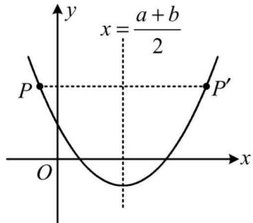

text_image

x = \frac{a + b}{2}
P
P'
O
x
y

图1

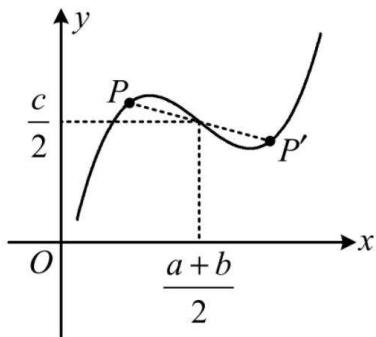

text_image

y
c/2
P
P'
O
a + b/2
x

图2

# 重要结论 4: (双对称的周期结论, 可借助三角函数辅助理解)

(1) 若函数 $f(x)$ 有两条对称轴, 则 $f(x)$ 一定是周期函数, 周期为对称轴距离的 2 倍.  
(2) 若函数 $f(x)$ 有一条对称轴, 一个对称中心, 则 $f(x)$ 一定是周期函数, 周期为对称中心与对称轴之间距离的 4 倍.  
(3) 若函数 $f(x)$ 有在同一水平线上的两个对称中心, 则 $f(x)$ 一定是周期函数, 周期为对称中心之间距离的 2 倍.

证明：(1) 设函数 $f(x)$ 的两条对称轴分别为 x=a, x=b，不妨假设 b>a，

则 $\left\{ \begin{array}{l} f(2a + x) = f(-x) \\ f(2b + x) = f(-x) \end{array} \right.$ ，所以 $f(2a + x) = f(2b + x)$ ，

在上式中将 x 换成 x-2a 可得 $f(x)=f(x+2b-2a)$ ,

所以 $f(x)$ 一定是周期函数, 周期 T=2b-2a, 周期为对称轴之间距离的 2 倍.

(2) 设函数 $f(x)$ 的对称轴为 x=a，对称中心为 $(b,c)$ ，则 $\left\{\begin{aligned}f(2a+x)-f(-x)=0\\ f(2b+x)+f(-x)=2c\end{aligned}\right.$

所以 $f(2a + x) + f(2b + x) = 2c$ ，将 $x$ 换成 $x - 2a$ 可得 $f(x) + f(x + 2b - 2a) = 2c$

所以 $f(x + 2b - 2a) = -f(x) + 2c(\mathrm{i})$

在式(i)中将 $x$ 换成 $x + 2b - 2a$ 可得 $f(x + 2b - 2a + 2b - 2a) = -f(x + 2b - 2a) + 2c$

结合式(i)可得 $f(x + 4b - 4a) = -[-f(x) + 2c] + 2c = f(x)$ ，

所以函数 $f(x)$ 一定是周期函数, 周期 $T = 4b - 4a$ ,

周期为对称轴与对称中心之间距离的 4 倍.

(3) 设 $f(x)$ 的两个对称中心分别为 $(a, m), (b, m)$ ，不妨假设 $b > a$ ，

则 $\left\{ \begin{array}{l} f(2a + x) + f(-x) = 2m \\ f(2b + x) + f(-x) = 2m \end{array} \right.$ ，两式作差得： $f(2a + x) - f(2b + x) = 0$ ，

所以 $f(2a + x) = f(2b + x)$ ，将 $x$ 换成 $x - 2a$ 可得 $f(2a + x - 2a) = f(2b + x - 2a)$ ，

所以 $f(x) = f(x + 2b - 2a)$ ，故 $f(x)$ 为周期函数，周期为 $T = 2b - 2a$ ，

周期为两对称中心之间距离的 2 倍.

# 重要结论 5: (经典切线放缩不等式)

(1) $\mathrm{e}^x \geqslant x + 1$ ，当且仅当 $x = 0$ 时取等号.  
(2) $\mathrm{e}^x \geqslant ex$ ，当且仅当 $x = 1$ 时取等号.  
(3) $1-\frac{1}{x}\leqslant\ln x\leqslant x-1$ ，当且仅当x=1时取等号.  
(4) $\ln x \leqslant \frac{x}{\mathrm{e}}$ ，当且仅当 $x = \mathrm{e}$ 时取等号.

上述不等式的图象特征如下面的两个图:

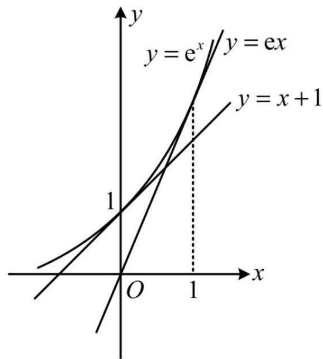

text_image

y
y = e^x
y = ex
y = x + 1
1
O
1
x

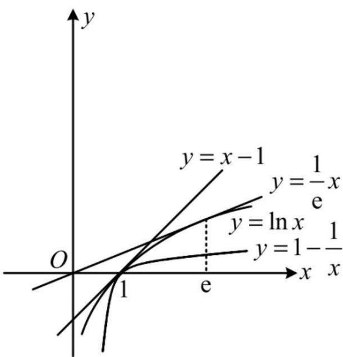

text_image

y
y = x - 1
y = \frac{1}{e}x
y = \ln x
y = 1 - \frac{1}{x}
O
1
e
x

证明：(1) 设 $f(x)=\mathrm{e}^{x}-x-1, x \in R$ ，则 $f'(x)=\mathrm{e}^{x}-1$ ，所以 $f'(x)<0 \Leftrightarrow x<0$ ，

$f^{\prime}(x) > 0\Leftrightarrow x > 0$ ，故 $f(x)$ 在 $(-\infty ,0)$ 上 $\searrow$ ，在 $(0, + \infty)$ 上 $\nearrow$

所以 $f(x) \geqslant f(0) = 0$ ，从而 $\mathrm{e}^x - x - 1 \geqslant 0$ ，故 $\mathrm{e}^x \geqslant x + 1$ ，取等条件是 $x = 0$ 。

(2) 设 $g(x) = \mathrm{e}^{x} - ex, \quad x \in R$ ，则 $g'(x) = \mathrm{e}^{x} - \mathrm{e}$ ，所以 $g'(x) < 0 \Leftrightarrow x < 1$ ，

$g^{\prime}(x) > 0\Leftrightarrow x > 1$ ，故 $g(x)$ 在 $(-\infty ,1)$ 上 $\searrow$ ，在 $(1, + \infty)$ 上 $\nearrow$

所以 $g(x) \geqslant g(1) = 0$ ，从而 $e^{x} - ex \geqslant 0$ ，故 $e^{x} \geqslant ex$ ，取等条件是 x = 1。

(3) 设 $h(x) = \ln x - x + 1, x > 0$ ，则 $h'(x) = \frac{1}{x} - 1 = \frac{1 - x}{x}$ ，所以 $h'(x) > 0 \Leftrightarrow 0 < x < 1$

$h'(x) < 0 \Leftrightarrow x > 1$ ，故 $h(x)$ 在 $(0,1)$ 上 $\nearrow$ ，在 $(1,+\infty)$ 上 $\searrow$ ，

所以 $h(x) \leqslant h(1) = 0$ ，从而 $\ln x - x + 1 \leqslant 0$ ，故 $\ln x \leqslant x - 1$ ，取等条件是 $x = 1$

在上式中将 $x$ 换成 $\frac{1}{x}$ 可得 $\ln \frac{1}{x} \leqslant \frac{1}{x} - 1$ ，所以 $-\ln x \leqslant \frac{1}{x} - 1$ ，故 $\ln x \geqslant 1 - \frac{1}{x}$ ，

取等条件是 $\frac{1}{x}=1$ ，即x=1。

(4) 设 $r(x) = \ln x - \frac{x}{\mathrm{e}}, x > 0$ ，则 $r'(x) = \frac{1}{x} - \frac{1}{\mathrm{e}} = \frac{\mathrm{e} - x}{ex}$ ，所以 $r'(x) > 0 \Leftrightarrow 0 < x < \mathrm{e}$ ，

$r'(x) < 0 \Leftrightarrow x > e$ ，故 $r(x)$ 在 $(0, e)$ 上 $\nearrow$ ，在 $(e, +\infty)$ 上 $\searrow$ ，

所以 $r(x) \leqslant r(\mathrm{e}) = 0$ ，从而 $\ln x - \frac{x}{\mathrm{e}} \leqslant 0$ ，故 $\ln x \leqslant \frac{x}{\mathrm{e}}$ ，取等条件是 x = e。

# 重要结论 6: (向量中线定理)

如图, 设 D 是 BC 中点, 则 $\overrightarrow{AD} = \frac{1}{2}\overrightarrow{AB} + \frac{1}{2}\overrightarrow{AC}$ .

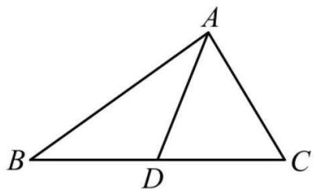

text_image

A
B
D
C

证明： $\overrightarrow{AD}=\overrightarrow{AB}+\overrightarrow{BD}=\overrightarrow{AB}+\frac{1}{2}\overrightarrow{BC}=\overrightarrow{AB}+\frac{1}{2}\left(\overrightarrow{AC}-\overrightarrow{AB}\right)=\frac{1}{2}\overrightarrow{AB}+\frac{1}{2}\overrightarrow{AC}$

# 重要结论 7: (三点共线向量系数和结论)

如图, 平面内 A, B, C 三点不共线, 点 D 满足 $\overrightarrow{AD} = \lambda \overrightarrow{AB} + \mu \overrightarrow{AC} (\lambda, \mu \in R)$ , 则 B, C, D 三点共线的充要条件是 $\lambda + \mu = 1$ .

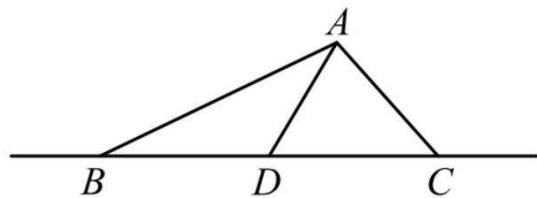

text_image

A
B D C

证明:先看充分性.

当 $\lambda +\mu = 1$ 时， $\mu = 1 - \lambda$

所以 $\overrightarrow{AD} = \lambda \overrightarrow{AB} + \mu \overrightarrow{AC} = \lambda \overrightarrow{AB} + (1 - \lambda) \overrightarrow{AC} = \lambda (\overrightarrow{AB} - \overrightarrow{AC}) + \overrightarrow{AC} = \lambda \overrightarrow{CB} + \overrightarrow{AC}$ ,

从而 $\overrightarrow{AD}-\overrightarrow{AC}=\lambda\overrightarrow{CB}$ ，故 $\overrightarrow{CD}=\lambda\overrightarrow{CB}$ ，所以 B,C,D 三点共线，充分性成立；

再看必要性.

当 B, C, D 三点共线时, 可设 $\overrightarrow{BD} = m\overrightarrow{BC}$ ,

所以 $\overrightarrow{AD}=\overrightarrow{AB}+\overrightarrow{BD}=\overrightarrow{AB}+m\overrightarrow{BC}=\overrightarrow{AB}+m(\overrightarrow{AC}-\overrightarrow{AB})=(1-m)\overrightarrow{AB}+m\overrightarrow{AC}$

与 $\overrightarrow{AD} = \lambda \overrightarrow{AB} + \mu \overrightarrow{AC}$ 对比可得 $\left\{\begin{aligned}\lambda &=1-m \\ \mu &=m\end{aligned}\right.$ ,

所以 $\lambda + \mu = 1 - m + m = 1$ ，必要性成立；

所以 B, C, D 三点共线的充要条件是 $\lambda + \mu = 1$ .

# 重要结论 8: (投影向量计算公式)

向量 b 在向量 a 上的投影向量为 $\frac{a \cdot b}{|a|^{2}} a$ .

证明:如图, 设 e 为与 a 同向的单位向量, 则 b 在 a 上的投影向量为 $(|b|\cos\theta)e$ ,

由于 $e=\frac{a}{|a|}$ ，所以 $(|b|\cos\theta)e=(|b|\cos\theta)\frac{a}{|a|}=\frac{|b|\cos\theta}{|a|}a=\frac{|a|\cdot|b|\cos\theta}{|a|^{2}}a=\frac{a\cdot b}{|a|^{2}}a$ .

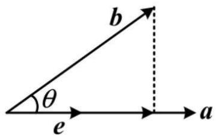

text_image

b
θ
e
a

# 重要结论 9: (重心坐标)

$\triangle ABC$ 的顶点分别为 $A(x_{1},y_{1}),B(x_{2},y_{2}),C(x_{3},y_{3})$

则 $\triangle ABC$ 的重心 $G$ 的坐标为 $\left(\frac{x_1 + x_2 + x_3}{3},\frac{y_1 + y_2 + y_3}{3}\right)$ . 这一结论可推广到空间中.

证明:如图, 设 $G(x,y)$ 为 $\triangle ABC$ 的重心, 则 $|AG|:|GD|=2:1$ ,

所以 $\overrightarrow{AG}=\frac{2}{3}\overrightarrow{AD}=\frac{2}{3}\times\frac{1}{2}\left(\overrightarrow{AB}+\overrightarrow{AC}\right)=\frac{1}{3}\left(\overrightarrow{AB}+\overrightarrow{AC}\right)$ (i),

又 $\overrightarrow{AG} = (x - x_1, y - y_1), \overrightarrow{AB} = (x_2 - x_1, y_2 - y_1), \overrightarrow{AC} = (x_3 - x_1, y_3 - y_1)$

所以由式(i)可得 $\left\{\begin{aligned}x-x_{1}&=\frac{1}{3}(x_{2}-x_{1}+x_{3}-x_{1})\\ y-y_{1}&=\frac{1}{3}(y_{2}-y_{1}+y_{3}-y_{1})\end{aligned}\right.$ ，整理得： $\left\{\begin{aligned}x&=\frac{x_{1}+x_{2}+x_{3}}{3}\\ y&=\frac{y_{1}+y_{2}+y_{3}}{3}\end{aligned}\right.$

故重心 G 的坐标为 $\left(\frac{x_{1}+x_{2}+x_{3}}{3},\frac{y_{1}+y_{2}+y_{3}}{3}\right)$ .

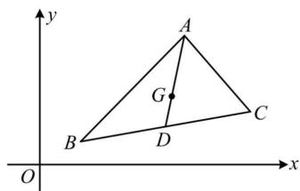

text_image

y
A
G
B
D
C
O
x

# 重要结论 10: (角平分线性质定理)

如图, $\triangle ABC$ 的内角A的平分线与BC交于点D，则 $\frac{AB}{AC}=\frac{BD}{CD}$ .

证明: 设 $\triangle ABC$ 的 BC 边上的高为 h，则 $\frac{S_{\triangle ABD}}{S_{\triangle ACD}} = \frac{\frac{1}{2} BD \cdot h}{\frac{1}{2} CD \cdot h} = \frac{BD}{CD} (i)$ ,

又 AD 是内角 A 的平分线, 所以 $\angle BAD = \angle CAD$ ,

故 $\frac{S_{\triangle ABD}}{S_{\triangle ACD}} = \frac{\frac{1}{2} AB \cdot AD \cdot \sin \angle BAD}{\frac{1}{2} AC \cdot AD \cdot \sin \angle CAD} = \frac{AB}{AC}$ , 结合式 (i) 可得 $\frac{AB}{AC} = \frac{BD}{CD}$ .

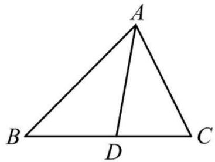

text_image

A
B D C

# 重要结论 11: (三角形的内切圆半径公式)

设 $\triangle ABC$ 的面积为 S，周长为 L，内切圆半径为 r，则 $r=\frac{2S}{L}$ .

证明:如图, 设切点分别为 D,E,F, 则 $OD \perp AB, OE \perp BC, OF \perp AC$ ,

所以 $S = S_{\triangle OAB} + S_{\triangle OBC} + S_{\triangle OAC} = \frac{1}{2} AB \cdot OD + \frac{1}{2} BC \cdot OE + \frac{1}{2} AC \cdot OF$

$= \frac{1}{2} AB\cdot r + \frac{1}{2} BC\cdot r + \frac{1}{2} AC\cdot r = \frac{1}{2} (AB + BC + AC)r = \frac{1}{2} Lr$ ，所以 $r = \frac{2S}{L}$

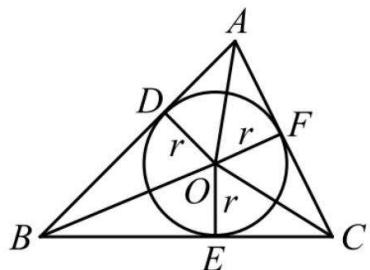

text_image

A
D
r
r
F
O
r
B
E
C

# 重要结论 12: (等差、等比数列的片段和性质)

(1) 若 $\{a_{n}\}$ 是公差为 d 的等差数列, 其前 n 项和为 $S_{n}$ , 则 $S_{m}, S_{2m} - S_{m}, S_{3m} - S_{2m}, \cdots$ 也构成等差数列, 公差为 $m^{2}d$ .

(2) 若 $\{a_{n}\}$ 是公比为 q 的等比数列, 其前 n 项和为 $S_{n}$ , 则当 $q \neq -1$ 或 m 为奇数时,

$S_{m}, S_{2m} - S_{m}, S_{3m} - S_{2m}, \cdots$ 也构成等比数列，公比为 $q^{m}$ .

证明：(1) $S_{m}=a_{1}+a_{2}+\cdots+a_{m},\quad S_{2m}-S_{m}=a_{m+1}+a_{m+2}+\cdots+a_{2m}$

因为 $a_{m+1}-a_{1}=md,\quad a_{m+2}-a_{2}=md,\quad\cdots,\quad a_{2m}-a_{m}=md,$

所以 $(S_{2m}-S_{m})-S_{m}=(a_{m+1}+a_{m+2}+\cdots+a_{2m})-(a_{1}+a_{2}+\cdots+a_{m})$

$$
= \left(a _ {m + 1} - a _ {1}\right) + \left(a _ {m + 2} - a _ {2}\right) + \dots + \left(a _ {2 m} - a _ {m}\right)
$$

$$
= m d + m d + \dots + m d = m ^ {2} d,
$$

同理, $(S_{3m}-S_{2m})-(S_{2m}-S_{m})=(a_{2m+1}+a_{2m+2}+\cdots+a_{3m})-(a_{m+1}+a_{m+2}+\cdots+a_{2m})$

$$
\begin{array}{l} = \left(a _ {2 m + 1} - a _ {m + 1}\right) + \left(a _ {2 m + 2} - a _ {m + 2}\right) + \dots + \left(a _ {3 m} - a _ {2 m}\right) \\ = m d + m d + \dots + m d = m ^ {2} d, \\ \end{array}
$$

以此类推, $S_{m},S_{2m}-S_{m},S_{3m}-S_{2m},\cdots$ 构成公差为 $m^{2}d$ 的等差数列.

(2) 当 $q \neq -1$ 或 m 为奇数时, $S_{m}, S_{2m} - S_{m}, S_{3m} - S_{2m}, \cdots$ 均不为 0,

且 $\frac{S_{2m}-S_{m}}{S_{m}}=\frac{a_{m+1}+a_{m+2}+\cdots+a_{2m}}{a_{1}+a_{2}+\cdots+a_{m}}=\frac{a_{1}q^{m}+a_{2}q^{m}+\cdots+a_{m}q^{m}}{a_{1}+a_{2}+\cdots+a_{m}}=q^{m},$

$$
\frac {S _ {3 m} - S _ {2 m}}{S _ {2 m} - S _ {m}} = \frac {a _ {2 m + 1} + a _ {2 m + 2} + \cdots + a _ {3 m}}{a _ {m + 1} + a _ {m + 2} + \cdots + a _ {2 m}} = \frac {a _ {m + 1} q ^ {m} + a _ {m + 2} q ^ {m} + \cdots + a _ {2 m} q ^ {m}}{a _ {m + 1} + a _ {m + 2} + \cdots + a _ {2 m}} = q ^ {m},
$$

以此类推, $S_{m},S_{2m}-S_{m},S_{3m}-S_{2m},\cdots$ 构成公比为 $q^{m}$ 的等比数列.

# 重要结论 13: (三垂线定理)

如图, $a \subset \alpha, l$ 在 $\alpha$ 内的射影是 $b$ , 若 $a \perp b$ , 则 $a \perp l$ , 此结论反过来也成立, 即当 $a \perp l$ 时, 也有 $a \perp b$ .

证明: 因为 $\left\{\begin{aligned}c\perp\alpha\\ a\subset\alpha\end{aligned}\right.$ ，所以 $a\perp c$ ，故 $a\perp b\Leftrightarrow a\perp$ 图中的三角形所在平面 $\Leftrightarrow a\perp l$

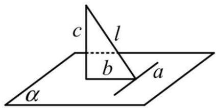

text_image

c
l
b
a
α

# 重要结论 14: (椭圆通径公式)

对于椭圆, 过其焦点且垂直于长轴的弦叫做通径, 通径的长为 $\frac{2b^2}{a}$ , 其中 $a, b$ 分别为椭圆的长半轴长、短半轴长.

证明:如图,不妨设椭圆的方程为 $\frac{x^{2}}{a^{2}}+\frac{y^{2}}{b^{2}}=1(a>b>0)$ ，其焦点为 $(\pm c,0)$ ，

过其焦点且与长轴垂直的直线的方程为 x=c 或 x=-c，以 x=c 为例，

将 x=c 代入 $\frac{x^{2}}{a^{2}}+\frac{y^{2}}{b^{2}}=1$ 可得 $\frac{c^{2}}{a^{2}}+\frac{y^{2}}{b^{2}}=1$ ,

解得: $y = \pm \sqrt{b^2\left(1 - \frac{c^2}{a^2}\right)} = \pm \sqrt{b^2 \cdot \frac{a^2 - c^2}{a^2}} = \pm \sqrt{\frac{b^4}{a^2}} = \pm \frac{b^2}{a}$ ,

所以图中通径长 $\left|AB\right|=\frac{2b^{2}}{a}$ ，由椭圆的对称性可知通径 $A'B'$ 的长也为 $\frac{2b^{2}}{a}$ .

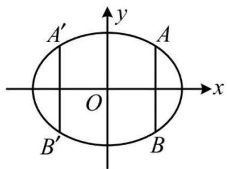

text_image

A'
A
O
B'
B
x
y

# 重要结论 15: (双曲线通径公式)

对于双曲线, 过其焦点且垂直于实轴的弦叫做通径, 通径的长为 $\frac{2b^2}{a}$ , 其中 $a, b$ 分别为双曲线的实半轴长、虚半轴长.

证明:如图,不妨设双曲线的方程为 $\frac{x^{2}}{a^{2}} - \frac{y^{2}}{b^{2}} = 1 (a > 0, b > 0)$ , 其焦点为 $(\pm c, 0)$ ,

过其焦点且与实轴垂直的直线的方程为 x=c 或 x=-c，以 x=c 为例，

将 x=c 代入 $\frac{x^{2}}{a^{2}}-\frac{y^{2}}{b^{2}}=1$ 可得 $\frac{c^{2}}{a^{2}}-\frac{y^{2}}{b^{2}}=1$ ,

解得: $y=\pm\sqrt{b^{2}\left(\frac{c^{2}}{a^{2}}-1\right)}=\pm\sqrt{b^{2}\cdot\frac{c^{2}-a^{2}}{a^{2}}}=\pm\sqrt{\frac{b^{4}}{a^{2}}}=\pm\frac{b^{2}}{a}$ ,

所以图中通径长 $\left|AB\right|=\frac{2b^{2}}{a}$ ，由双曲线的对称性可知通径 $A'B'$ 的长也为 $\frac{2b^{2}}{a}$ .

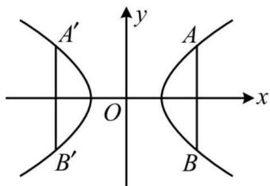

text_image

A'
O
B'
A
B
x
y

# 重要结论 16: (韦达定理推论)

设 $x_{1}, x_{2}$ 是一元二次方程 $ax^{2} + bx + c = 0 (a \neq 0)$ 的

两根, 则 $\left|x_{1}-x_{2}\right|=\frac{\sqrt{\Delta}}{\left|a\right|}$ .

证明:由韦达定理, $x_{1}+x_{2}=-\frac{b}{a},x_{1}x_{2}=\frac{c}{a}$ ，所以 $|x_{1}-x_{2}|=\sqrt{(x_{1}-x_{2})^{2}}$

$$
= \sqrt {\left(x _ {1} + x _ {2}\right) ^ {2} - 4 x _ {1} x _ {2}} = \sqrt {\left(- \frac {b}{a}\right) ^ {2} - 4 \cdot \frac {c}{a}} = \sqrt {\frac {b ^ {2}}{a ^ {2}} - \frac {4 c}{a}} = \sqrt {\frac {b ^ {2} - 4 a c}{a ^ {2}}} = \frac {\sqrt {\Delta}}{| a |}.
$$

# 重要结论 17: (弦长公式)

设 $A(x_{1},y_{1}), B(x_{2},y_{2})$ ,

若 A, B 在直线 $y = kx + b$ 上，则 $\left|AB\right| = \sqrt{1 + k^{2}} \cdot \left|x_{1} - x_{2}\right|$ ;

若 $A, B$ 在直线 $x = my + t$ 上, 则 $|AB| = \sqrt{1 + m^2} \cdot |y_1 - y_2|$ .

特别地, 当 A, B 是直线与椭圆 (或双曲线、抛物线) 交点时, 常联立直线与椭圆 (或双曲线、抛物线) 的方程, 得到关于 x 或 y 的一元二次方程, 则上述弦长公式中的 $\left|x_{1}-x_{2}\right|$ , $\left|y_{1}-y_{2}\right|$ 可由韦达定理推论来算.

以 $|x_{1} - x_{2}|$ 为例, 假设联立直线与圆锥曲线得到的一元二次方程是 $ax^{2} + bx + c = 0 (a \neq 0)$ , 则 $|x_{1} - x_{2}| = \frac{\sqrt{\Delta}}{|a|}$ ,

所以此时的弦长公式可写成 $|AB| = \sqrt{1 + k^2} \cdot |x_1 - x_2| = \sqrt{1 + k^2} \cdot \frac{\sqrt{\Delta}}{|a|}$ .

证明:由两点间的距离公式, $|AB|=\sqrt{(x_{1}-x_{2})^{2}+(y_{1}-y_{2})^{2}}$ (i),

若 A, B 两点在直线 $y = kx + b$ 上，则 $\left\{\begin{aligned}y_{1}&=kx_{1}+b\\ y_{2}&=kx_{2}+b\end{aligned}\right.$

代入 (i) 得 $|AB| = \sqrt{(x_1 - x_2)^2 + (kx_1 + b - kx_2 - b)^2} = \sqrt{(x_1 - x_2)^2 + k^2(x_1 - x_2)^2}$

$$
= \sqrt {\left(1 + k ^ {2}\right) \left(x _ {1} - x _ {2}\right) ^ {2}} = \sqrt {1 + k ^ {2}} \cdot | x _ {1} - x _ {2} |;
$$

若 A, B 两点在直线 $x = my + t$ 上，则 $\left\{\begin{aligned}x_{1}&=my_{1}+t\\ x_{2}&=my_{2}+t\end{aligned}\right.$

代入 (i) 得 $\left|AB\right|=\sqrt{\left(my_{1}+t-my_{2}-t\right)^{2}+\left(y_{1}-y_{2}\right)^{2}}$

$$
= \sqrt {m ^ {2} (y _ {1} - y _ {2}) ^ {2} + (y _ {1} - y _ {2}) ^ {2}}
$$

$$
= \sqrt {\left(m ^ {2} + 1\right) \left(y _ {1} - y _ {2}\right) ^ {2}} = \sqrt {1 + m ^ {2}} \cdot | y _ {1} - y _ {2} |.
$$

重要结论 18: 双曲线的焦点到其渐近线的距离等于虚半轴长 b.

证明:不妨设双曲线为 $\frac{x^{2}}{a^{2}} - \frac{y^{2}}{b^{2}} = 1 (a > 0, b > 0)$ ，则该双曲线的渐近线为 $y = \pm \frac{b}{a} x$ ，即 $bx \pm ay = 0$ ，设双曲线的焦点为 $(\pm c, 0)$ ，

则焦点到渐近线的距离 $d = \frac{|\pm cb|}{\sqrt{b^2 + (\pm a)^2}} = \frac{bc}{\sqrt{a^2 + b^2}} = \frac{bc}{c} = b$

# 重要结论 19: (切线、切点弦统一结论)

设点 $P(x_{0},y_{0})$ ，将圆的标准方程 $(x-a)^{2}+(y-b)^{2}=r^{2}$ 变成 $(x-a)(x_{0}-a)+(y-b)(y_{0}-b)=r^{2}$ ，或在圆的一般式方程 $x^{2}+y^{2}+Dx+Ey+F=0$ 中，用 $x_{0}x$ 替换 $x^{2}$ ，用 $y_{0}y$ 替换 $y^{2}$ ，用 $\frac{x+x_{0}}{2}$ 替换 x，

用 $\frac{y+y_{0}}{2}$ 替换 y，可以得到一个新方程，

当 P 在圆上时, 如图 1, 该方程表示切线 l;

当 P 在圆外时, 如图 2, 该方程表示切点弦 AB 所在直线的方程.

本结论对椭圆、双曲线、抛物线也成立.

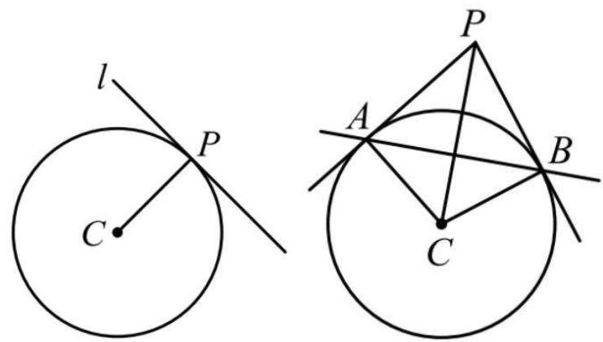

text_image

l
P
C
A
P
B
C

图1  
图2

证明: 按圆、椭圆、双曲线、抛物线逐一论证上述统一结论较繁琐, 下面我们只证圆的切点弦方程.

如下图, 因为 PA, PB 是圆的切线, 所以 $PA \perp AC, PB \perp BC$ ,

故 P, A, C, B 四点都在以 PC 为直径的圆上, AB 即为该圆与圆 C 的公共弦,

由 $P(x_0,y_0),C(a,b)$ 可得 $PC$ 中点为 $\left(\frac{x_0 + a}{2},\frac{y_0 + b}{2}\right),|PC|^2 = (x_0 - a)^2 +(y_0 - b)^2,$

故以 $PC$ 为直径的圆的方程为 $\left(x - \frac{x_0 + a}{2}\right)^2 +\left(y - \frac{y_0 + b}{2}\right)^2 = \frac{1}{4} [(x_0 - a)^2 +(y_0 - b)^2 ]$

展开整理得: $x^{2} + y^{2} - (x_{0} + a)x - (y_{0} + b)y + ax_{0} + by_{0} = 0$ (i),

圆 C 的方程为 $x^{2} + y^{2} - 2ax - 2by + a^{2} + b^{2} = r^{2}(ii)$ ,

用方程(ii)减去方程(i)可得 $(x_0 - a)x + (y_0 - b)y - ax_0 - by_0 + a^2 +b^2 = r^2$

整理得直线 AB 的方程为 $(x_{0}-a)(x-a)+(y_{0}-b)(y-b)=r^{2}$ .

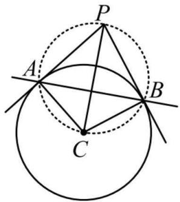

text_image

Geometric diagram showing a circle with inscribed triangle ABC and auxiliary lines, including a dashed circle and tangent points.

# 重要结论 20: (椭圆的中点弦斜率积结论)

如图, AB 是椭圆 $\frac{x^{2}}{a^{2}} + \frac{y^{2}}{b^{2}} = 1 (a > b > 0)$ 的一条不与坐标轴垂直且不过原点的弦, M 为 AB 中点, 则 $k_{AB} \cdot k_{OM} = -\frac{b^{2}}{a^{2}}$ .

注: 对于焦点在 y 轴上的椭圆 $\frac{y^{2}}{a^{2}} + \frac{x^{2}}{b^{2}} = 1 (a > b > 0)$ ，则上述斜率积为 $-\frac{a^{2}}{b^{2}}$ .

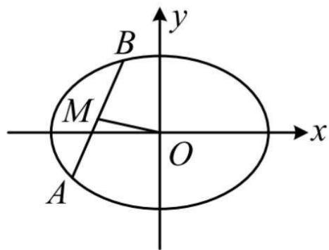

text_image

y
B
M
O
x
A

证明: 设 $A(x_{1},y_{1}), B(x_{2},y_{2}), x_{1} \neq x_{2}, y_{1} \neq y_{2}$ ,

因为 A, B 都在椭圆上, 所以 $\left\{\begin{aligned}\frac{x_{1}^{2}}{a^{2}}+\frac{y_{1}^{2}}{b^{2}}=1\\ \frac{x_{2}^{2}}{a^{2}}+\frac{y_{2}^{2}}{b^{2}}=1\end{aligned}\right.$

两式作差得: $\frac{x_1^2 - x_2^2}{a^2} + \frac{y_1^2 - y_2^2}{b^2} = 0$ ，整理得: $\frac{y_1 - y_2}{x_1 - x_2} \cdot \frac{y_1 + y_2}{x_1 + x_2} = -\frac{b^2}{a^2} (\mathrm{i})$

注意到 $\frac{y_1 - y_2}{x_1 - x_2} = k_{AB},\frac{y_1 + y_2}{x_1 + x_2} = \frac{2y_M}{2x_M} = \frac{y_M}{x_M} = k_{OM}$ ，所以式(i)即为 $k_{AB}\cdot k_{OM} = -\frac{b^2}{a^2}$

对于焦点在 y 轴上的情形, 证法与上面相同, 不再赘述.

# 重要结论 21: (双曲线的中点弦斜率积结论)

如图, $AB$ 是双曲线 $\frac{x^2}{a^2} -\frac{y^2}{b^2} = 1(a > 0,b > 0)$ 的一条不与坐标轴垂直且不过原点的弦, $M$ 为 $AB$ 中点, 则 $k_{AB}\cdot k_{OM} = \frac{b^2}{a^2}$ .

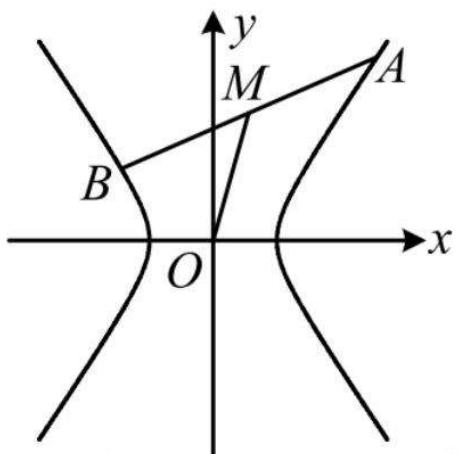

text_image

y
M
A
B
O
x

注: 对于焦点在 y 轴上的双曲线 $\frac{y^{2}}{a^{2}} - \frac{x^{2}}{b^{2}} = 1 (a > 0, b > 0)$ ，则上述斜率积为 $\frac{a^{2}}{b^{2}}$ .

证明: 设 $A(x_{1},y_{1}), B(x_{2},y_{2}), x_{1} \neq x_{2}, y_{1} \neq y_{2}$ ,

因为 A, B 都在双曲线上, 所以 $\left\{\begin{aligned}\frac{x_{1}^{2}}{a^{2}}-\frac{y_{1}^{2}}{b^{2}}&=1\\ \frac{x_{2}^{2}}{a^{2}}-\frac{y_{2}^{2}}{b^{2}}&=1\end{aligned}\right.$

两式作差得: $\frac{x_1^2 - x_2^2}{a^2} - \frac{y_1^2 - y_2^2}{b^2} = 0$ ，整理得: $\frac{y_1 - y_2}{x_1 - x_2} \cdot \frac{y_1 + y_2}{x_1 + x_2} = \frac{b^2}{a^2} (\mathrm{i})$ ,

注意到 $\frac{y_1 - y_2}{x_1 - x_2} = k_{AB},\frac{y_1 + y_2}{x_1 + x_2} = \frac{2y_M}{2x_M} = \frac{y_M}{x_M} = k_{OM}$ ，所以式(i)即为 $k_{AB}\cdot k_{OM} = \frac{b^2}{a^2}$

对于焦点在 y 轴上的情形, 证法与上面相同, 不再赘述.

# 重要结论 22: (平均数、方差的性质)

设数据 $x_{1}, x_{2}, \cdots, x_{n}$ 的平均数为 $\bar{x}$ ，方差为 $s^{2}$ ，标准差为 s，则数据 $ax_{1} + b, ax_{2} + b, \cdots, ax_{n} + b$ 的平均数为 $a\bar{x} + b$ ，方差为 $a^{2}s^{2}$ ，标准差为 $|a|s$ 。

证明:由题意, $\bar{x}=\frac{x_{1}+x_{2}+\cdots+x_{n}}{n},s^{2}=\frac{1}{n}\left[\left(x_{1}-\bar{x}\right)^{2}+\left(x_{2}-\bar{x}\right)^{2}+\cdots+\left(x_{n}-\bar{x}\right)^{2}\right]$

所以 $\bar{y}=\frac{y_{1}+y_{2}+\cdots+y_{n}}{n}=\frac{ax_{1}+b+ax_{2}+b+\cdots+ax_{n}+b}{n}$

$$
= \frac {a \left(x _ {1} + x _ {2} + \cdots + x _ {n}\right) + n b}{n} = a \cdot \frac {x _ {1} + x _ {2} + \cdots + x _ {n}}{n} + b = a \bar {x} + b,
$$

故新数据的方差 $s_{1}^{2}=\frac{1}{n}\left[\left(y_{1}-\bar{y}\right)^{2}+\left(y_{2}-\bar{y}\right)^{2}+\cdots+\left(y_{n}-\bar{y}\right)^{2}\right]$

$$
\begin{array}{l} = \frac {1}{n} \left[ \left(a x _ {1} + b - a \bar {x} - b\right) ^ {2} + \left(a x _ {2} + b - a \bar {x} - b\right) ^ {2} + \dots + \left(a x _ {n} + b - a \bar {x} - b\right) ^ {2} \right] \\ = \frac {1}{n} \left[ a ^ {2} \left(x _ {1} - \bar {x}\right) ^ {2} + a ^ {2} \left(x _ {2} - \bar {x}\right) ^ {2} + \dots + a ^ {2} \left(x _ {n} - \bar {x}\right) ^ {2} \right] \\ = a ^ {2} \cdot \frac {1}{n} \left[ (x _ {1} - \bar {x}) ^ {2} + (x _ {2} - \bar {x}) ^ {2} + \dots + (x _ {n} - \bar {x}) ^ {2} \right] = a ^ {2} s ^ {2}, \\ \end{array}
$$

标准差 $s_{1}=\sqrt{a^{2}s^{2}}=|a|s$ .

# 重要结论 23: (期望、方差的性质)

设随机变量 X 的期望为 $E(X)$ ，方差为 $D(X)$ ，

标准差为 $\sqrt{D(X)}$ ，若 $Y = aX + b$ ，则 Y 的期望 $E(Y) = aE(X) + b$ ，方差 $D(Y) = a^{2}D(X)$ ，标准差为 $|a|\sqrt{D(X)}$ 。

证明: 设 X 的分布列为

<table><tr><td>X</td><td>$ x_{1} $</td><td>$ x_{2} $</td><td>...</td><td>$ x_{n} $</td></tr><tr><td>P</td><td>$ p_{1} $</td><td>$ p_{2} $</td><td>...</td><td>$ p_{n} $</td></tr></table>

则 $E(X)=x_{1}p_{1}+x_{2}p_{2}+\cdots+x_{n}p_{n}(i)$ ,

$$
D (X) = \left[ x _ {1} - E (X) \right] ^ {2} p _ {1} + \left[ x _ {2} - E (X) \right] ^ {2} p _ {2} + \dots + \left[ x _ {n} - E (X) \right] ^ {2} p _ {n} \quad (\mathrm{ii}),
$$

因为 $Y = aX + b$ ，所以 Y 的分布列为

<table><tr><td>Y</td><td>$ ax_{1} + b $</td><td>$ ax_{2} + b $</td><td>...</td><td>$ ax_{n} + b $</td></tr><tr><td>P</td><td>$ p_{1} $</td><td>$ p_{2} $</td><td>...</td><td>$ p_{n} $</td></tr></table>

故 $E(Y)=(ax_{1}+b)p_{1}+(ax_{2}+b)p_{2}+\cdots+(ax_{n}+b)p_{n}$

$$
= a \left(x _ {1} p _ {1} + x _ {2} p _ {2} + \dots + x _ {n} p _ {n}\right) + b \left(p _ {1} + p _ {2} + \dots + p _ {n}\right) (i i i),
$$

将式 (i) 和 $p_{1} + p_{2} + \cdots + p_{n} = 1$ 代入式 (iii) 可得 $E(Y) = aE(X) + b$ ,

$$
D (Y) = \left[ a x _ {1} + b - E (Y) \right] ^ {2} p _ {1} + \left[ a x _ {2} + b - E (Y) \right] ^ {2} p _ {2} + \dots + \left[ a x _ {n} + b - E (Y) \right] ^ {2} p _ {n}
$$

$$
= \left[ a x _ {1} + b - a E (X) - b \right] ^ {2} p _ {1} + \left[ a x _ {2} + b - a E (X) - b \right] ^ {2} p _ {2} + \dots + \left[ a x _ {n} + b - a E (X) - b \right] ^ {2} p _ {n}
$$

$$
= a ^ {2} \left[ x _ {1} - E (X) \right] ^ {2} p _ {1} + a ^ {2} \left[ x _ {2} - E (X) \right] ^ {2} p _ {2} + \dots + a ^ {2} \left[ x _ {n} - E (X) \right] ^ {2} p _ {n}
$$

$$
= a ^ {2} \left\{\left[ x _ {1} - E (X) \right] ^ {2} p _ {1} + \left[ x _ {2} - E (X) \right] ^ {2} p _ {2} + \dots + \left[ x _ {n} - E (X) \right] ^ {2} p _ {n} \right\} = a ^ {2} D (X),
$$

随机变量 $Y$ 的标准差为 $\sqrt{D(Y)} = \sqrt{a^2 D(X)} = |a| \sqrt{D(X)}$ .

# 重要结论 24: (超几何分布期望公式)

设随机变量 X 服从超几何分布, 三个参数分别为 N, n, M, 则 $E(X) = n \cdot \frac{M}{N}$ .

# 二级结论 25: (糖水不等式)

设 $a > b > 0, c > 0$ ，则 $\frac{b + c}{a + c} > \frac{b}{a}$ .

证明： $\frac{b+c}{a+c}-\frac{b}{a}=\frac{(b+c)a-(a+c)b}{(a+c)a}=\frac{c(a-b)}{(a+c)a}$ (i)

因为 a > b > 0, c > 0，所以 $(a + c)a > 0, a - b > 0$ ，结合(i)可得 $\frac{b+c}{a+c}-\frac{b}{a}>0$ ，故 $\frac{b+c}{a+c}>\frac{b}{a}$ .

# 二级结论 26: (三元均值不等式)

设 $a, b, c$ 为正实数, 则 $\frac{a + b + c}{3} \geqslant \sqrt[3]{abc}$ , 当且仅当 $a = b = c$ 时取等号. 此不等式可变形成 $abc \leqslant \left(\frac{a + b + c}{3}\right)^3$ .

# 二级结论 27: (常用泰勒公式)

(1) $e^{x}=1+x+\frac{x^{2}}{2!}+\frac{x^{3}}{3!}+\cdots+\frac{x^{n}}{n!}+\cdots;$   
(2) $\ln(1+x)=x-\frac{1}{2}x^{2}+\frac{1}{3}x^{3}-\cdots+\frac{(-1)^{n+1}}{n}x^{n}+\cdots;$   
(3) $(1 + x)^{a} = 1 + ax + \frac{a(a - 1)}{2!} x^{2} + \dots +\frac{a(a - 1)(a - 2)\cdots(a - n + 1)}{n!} x^{n} + \dots ;$   
(4) $\sin x = x - \frac{x^3}{3!} + \frac{x^5}{5!} - \cdots + \frac{(-1)^{n-1}}{(2n-1)!} x^{2n-1} + \cdots$ ;   
(5) $\cos x = 1 - \frac{x^2}{2!} +\frac{x^4}{4!} -\dots +\frac{(-1)^n}{(2n)!} x^{2n} + \dots .$

# 二级结论 28: (万能公式)

设 $\alpha \neq 2k\pi + \pi$ 且 $\alpha \neq k\pi + \frac{\pi}{2}$ , 其中 $k \in Z$ , 则

(1) $\sin \alpha = \frac{2\tan\frac{\alpha}{2}}{1 + \tan^2\frac{\alpha}{2}}$ ; (2) $\cos \alpha = \frac{1 - \tan^2\frac{\alpha}{2}}{1 + \tan^2\frac{\alpha}{2}}$ ; (3) $\tan \alpha = \frac{2\tan\frac{\alpha}{2}}{1 - \tan^2\frac{\alpha}{2}}$ .

证明：(1) $\sin \alpha = 2\sin \frac{\alpha}{2}\cos \frac{\alpha}{2} = \frac{2\sin\frac{\alpha}{2}\cos\frac{\alpha}{2}}{\cos^2\frac{\alpha}{2} + \sin^2\frac{\alpha}{2}} = \frac{2\tan\frac{\alpha}{2}}{1 + \tan^2\frac{\alpha}{2}};$   
(2) $\cos \alpha = \cos^2\frac{\alpha}{2} -\sin^2\frac{\alpha}{2} = \frac{\cos^2\frac{\alpha}{2} - \sin^2\frac{\alpha}{2}}{\cos^2\frac{\alpha}{2} + \sin^2\frac{\alpha}{2}} = \frac{1 - \tan^2\frac{\alpha}{2}}{1 + \tan^2\frac{\alpha}{2}};$   
(3) $\tan \alpha = \tan \left(2 \times \frac{\alpha}{2}\right) = \frac{2\tan\frac{\alpha}{2}}{1 - \tan^2\frac{\alpha}{2}}.$

# 二级结论 29: (极化恒等式)

如图, 设 D 为 BC 中点, 则 $\overrightarrow{AB} \cdot \overrightarrow{AC} = |\overrightarrow{AD}|^{2} - |\overrightarrow{BD}|^{2}$ .

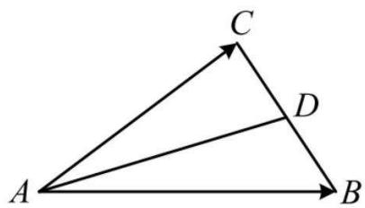

text_image

A
B
C
D

证明： $\overrightarrow{AB}\cdot\overrightarrow{AC}=\left(\overrightarrow{AD}+\overrightarrow{DB}\right)\cdot\left(\overrightarrow{AD}+\overrightarrow{DC}\right)$ ，因为 $\overrightarrow{DC}=-\overrightarrow{DB}$

所以 $\overrightarrow{AB} \cdot \overrightarrow{AC} = (\overrightarrow{AD} + \overrightarrow{DB}) \cdot (\overrightarrow{AD} - \overrightarrow{DB}) = |\overrightarrow{AD}|^2 - |\overrightarrow{BD}|^2,$

此结论虽然归为了二级结论,但针对性较强(涉及中线或底边中点的数量积问题),推荐掌握.

# 二级结论 30: (重心等分面积结论)

设 $\triangle ABC$ 的重心为 G，则 $S_{\triangle GAB} = S_{\triangle GAC} = S_{\triangle GBC}$ .

证明:如图, 因为 G 是 $\triangle ABC$ 的重心, 所以 D, E, F 分别为所在边的中点,

且 AG:GD = BG:GE = CG:GF = 2:1，考虑 $\triangle GAB$ 和 $\triangle GBD$ 的面积,

若都以 B 为顶点, 则它们的高相等, 设为 h, 则 $\frac{S_{\triangle GAB}}{S_{\triangle GBD}} = \frac{\frac{1}{2} AG \cdot h}{\frac{1}{2} GD \cdot h} = \frac{AG}{GD} = 2$ ,

所以 $S_{\triangle GAB}=\frac{2}{3}S_{\triangle ABD}$ ，又 D 为 BC 中点，所以 $S_{\triangle ABD}=\frac{1}{2}S_{\triangle ABC}$ ，

从而 $S_{\triangle GAB}=\frac{2}{3}\times\frac{1}{2}S_{\triangle ABC}=\frac{1}{3}S_{\triangle ABC}$ ，同理， $S_{\triangle GAC}=S_{\triangle GBC}=\frac{1}{3}S_{\triangle ABC}$ ，故结论成立.

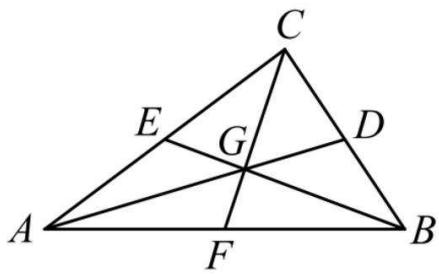

text_image

C
E
G
D
A
F
B

# 二级结论 31: (正四面体外接球、内切球半径)

设正四面体的棱长为 a，则其外接球半径 $R=\frac{\sqrt{6}}{4}a$ ，内切球半径 $r=\frac{\sqrt{6}}{12}a$ 。

证明:如图,将正四面体放入正方体中,二者有相同的外接球,

由正四面体的棱长为 a 可得正方体的棱长为 $\frac{\sqrt{2}}{2}a$ ,

所以正方体的外接球半径 $R=\frac{\sqrt{2}}{2}a\times\frac{\sqrt{3}}{2}=\frac{\sqrt{6}}{4}a$

故正四面体的外接球半径 $R=\frac{\sqrt{6}}{4}a$ ,

内切球半径 r 即为球心 O 到正四面体的面的距离,

如图, 球心 O 为正方体的中心, 即 CE 的中点,

由图可知 CE 在面 AEBF 内的射影是 EF，

因为 $AB \perp EF$ ，所以由三垂线定理， $AB \perp CE$ ，

又 CE 在面 BGDE 内的射影为 EG，且 $BD \perp EG$ ，

所以由三垂线定理, $BD \perp CE$ , 故 $CE \perp$ 平面 ABD,

设 OE 与平面 ABD 交于点 I，则点 O 到平面 ABD 的距离

$$
O I = O E - I E = \frac {1}{2} C E - I E = \frac {\sqrt {3}}{2} \times \frac {\sqrt {2}}{2} a - I E = \frac {\sqrt {6}}{4} a - I E \quad (\mathrm{i}),
$$

由三棱锥的等体积性, $V_{E-ABD}=V_{A-EBD}$ ,

所以 $\frac{1}{3} \times \frac{1}{2} \times a^2 \times \frac{\sqrt{3}}{2} \times IE = \frac{1}{3} \times \frac{1}{2} \times \left(\frac{\sqrt{2}}{2} a\right)^2 \times \frac{\sqrt{2}}{2} a$ ，解得: $IE = \frac{\sqrt{6}}{6} a$ ，代入 (i) 得 $OI = \frac{\sqrt{6}}{4} a - \frac{\sqrt{6}}{6} a = \frac{\sqrt{6}}{12} a$ ，所以正四面体的内切球半径 $r = \frac{\sqrt{6}}{12} a$ 。

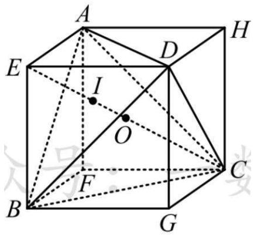

text_image

A
H
E
I
O
B
F
C
G

# 二级结论 32: (角版焦半径、焦点弦公式, 焦原三角形面积公式)

设抛物线 $y^{2}=2px(p>0)$ 的焦点为 F, O 为原点.

(1) 焦半径公式: 如图 1, 设 A 为抛物线上任意一点, 记 $\angle AFO = \alpha$ , 则焦半径

$$
| A F | = \frac {p}{1 + \cos \alpha}.
$$

(2)焦点弦公式: 如图 2, AB 是抛物线的焦点弦, 记 $\angle AFO = \alpha$ , 则 $|AB| = \frac{2p}{\sin^{2}\alpha}$ .  
(3) 焦原三角形面积公式: 如图 3, 设 AB 是抛物线的焦点弦, 记 $\angle AFO = \alpha$ , 则

$$
S _ {\triangle A O B} = \frac {p ^ {2}}{2 \sin \alpha}.
$$

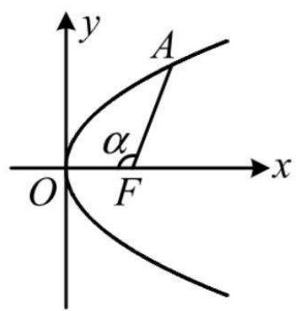

text_image

y
A
α
O
F
x

图1

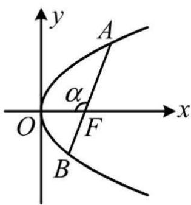

text_image

y
A
α
O
F
x
B

图2

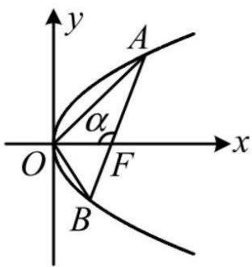

text_image

y
A
α
O
F
x
B

图3

证明: (1) 作 $AM \perp x$ 轴于 M, 先考虑 M 在 F 右侧的情形, 如图 4,

设 $A(x_0,y_0)$ ，则 $|FM| = x_0 - \frac{p}{2}$

又 $|FM| = |AF|\cos \angle AFM = |AF|\cos (\pi -\alpha) = -|AF|\cos \alpha$

与上式比较可得: $-|AF|\cos\alpha=x_{0}-\frac{p}{2}$ ,

另一方面, 由坐标版焦半径公式知 $\left|AF\right|=x_{0}+\frac{p}{2}$ ,

与上式作差消去 $x_0$ 整理得: $|AF| = \frac{p}{1 + \cos\alpha}$ ;

同理可证当 M 在 F 左侧或恰好与 F 重合时, 都有 $\left|AF\right|=\frac{p}{1+\cos\alpha}$ .

(2) 如图 5, $\angle BFO = \pi - \alpha$ ,

由(1)中的焦半径公式可得 $|AF|=\frac{p}{1+\cos\alpha}$ ,

$$
| B F | = \frac {p}{1 + \cos (\pi - \alpha)} = \frac {p}{1 - \cos \alpha},
$$

所以 $|AB| = |AF| + |BF| = \frac{p}{1 + \cos\alpha} + \frac{p}{1 - \cos\alpha}$

$$
= \frac {p (1 - \cos \alpha) + p (1 + \cos \alpha)}{(1 + \cos \alpha) (1 - \cos \alpha)} = \frac {2 p}{1 - \cos^ {2} \alpha} = \frac {2 p}{\sin^ {2} \alpha}.
$$

(3) 如图 6, 作 $OD \perp AB$ 于 $D$ , 则 $|OD| = |OF|\sin \angle OFD$

$$
= | O F | \sin (\pi - \alpha) = | O F | \sin \alpha = \frac {p}{2} \cdot \sin \alpha ,
$$

由(2)中的焦点弦公式可得 $|AB|=\frac{2p}{\sin^{2}\alpha}$ ,

所以 $S_{\triangle AOB}=\frac{1}{2}|AB|\cdot|OD|=\frac{1}{2}\cdot\frac{2p}{\sin^{2}\alpha}\cdot\frac{p}{2}\cdot\sin\alpha=\frac{p^{2}}{2\sin\alpha}$ .

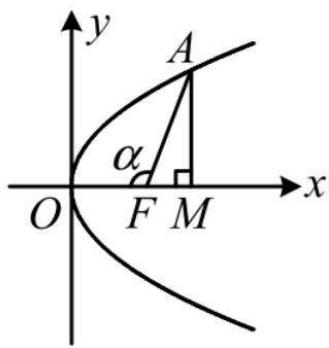

text_image

y
A
α
O F M x

图4

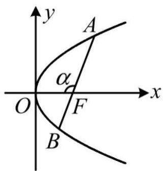

text_image

y
A
α
O
F
x
B

图 5

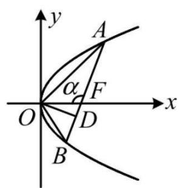

text_image

y
A
α
F
O
D
x
B

图6

# 二级结论 33: (原点三角形面积公式)

设 O 为原点, $A(x_{1},y_{1}), B(x_{2},y_{2})$ , 则

$$
S _ {\triangle A O B} = \frac {1}{2} \left| x _ {1} y _ {2} - x _ {2} y _ {1} \right|.
$$

证明:如图, 设 $\angle AOB = \theta$ , 则 $\cos\theta = \frac{\overrightarrow{OA} \cdot \overrightarrow{OB}}{|\overrightarrow{OA}| \cdot |\overrightarrow{OB}|}$ ,

所以 $S_{\triangle AOB} = \frac{1}{2}\left|\overrightarrow{OA}\right|\cdot \left|\overrightarrow{OB}\right|\cdot \sin \theta = \frac{1}{2}\left|\overrightarrow{OA}\right|\cdot \left|\overrightarrow{OB}\right|\cdot \sqrt{1 - \cos^2\theta}$

$$
= \frac {1}{2} | \overrightarrow {O A} | \cdot | \overrightarrow {O B} | \cdot \sqrt {1 - \left(\frac {\overrightarrow {O A} \cdot \overrightarrow {O B}}{| \overrightarrow {O A} | \cdot | \overrightarrow {O B} |}\right) ^ {2}} = \frac {1}{2} \sqrt {| \overrightarrow {O A} | ^ {2} \cdot | \overrightarrow {O B} | ^ {2} - (\overrightarrow {O A} \cdot \overrightarrow {O B}) ^ {2}}
$$

$$
= \frac {1}{2} \sqrt {\left(x _ {1} ^ {2} + y _ {1} ^ {2}\right) \left(x _ {2} ^ {2} + y _ {2} ^ {2}\right) - \left(x _ {1} x _ {2} + y _ {1} y _ {2}\right) ^ {2}}
$$

$$
= \frac {1}{2} \sqrt {x _ {1} ^ {2} x _ {2} ^ {2} + x _ {1} ^ {2} y _ {2} ^ {2} + y _ {1} ^ {2} x _ {2} ^ {2} + y _ {1} ^ {2} y _ {2} ^ {2} - \left(x _ {1} ^ {2} x _ {2} ^ {2} + y _ {1} ^ {2} y _ {2} ^ {2} + 2 x _ {1} x _ {2} y _ {1} y _ {2}\right)}
$$

$$
= \frac {1}{2} \sqrt {x _ {1} ^ {2} y _ {2} ^ {2} + x _ {2} ^ {2} y _ {1} ^ {2} - 2 x _ {1} x _ {2} y _ {1} y _ {2}} = \frac {1}{2} \sqrt {\left(x _ {1} y _ {2} - x _ {2} y _ {1}\right) ^ {2}} = \frac {1}{2} | x _ {1} y _ {2} - x _ {2} y _ {1} |.
$$

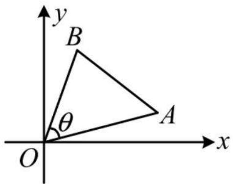

text_image

y
B
θ
O
A
x

# 二级结论 34: (椭圆的第三定义斜率积结论)

如图1, 设 A, B 分别是椭圆 $\frac{x^{2}}{a^{2}} + \frac{y^{2}}{b^{2}} = 1 (a > b > 0)$ 的左、右顶点, P 是椭圆上不与 A, B 重合的任意一点, 则

$$
k _ {P A} \cdot k _ {P B} = - \frac {b ^ {2}}{a ^ {2}}.
$$

注:(1)上述结论中 A,B 是椭圆的左、右顶点, 可将其推广为椭圆上关于原点对称的任意两点, 如图 2, 只要直线 PA,PB 的斜率都存在, 就仍然满足 $k_{PA} \cdot k_{PB} = -\frac{b^{2}}{a^{2}}$ .

(2) 若是焦点在 $y$ 轴上的椭圆 $\frac{y^2}{a^2} + \frac{x^2}{b^2} = 1 (a > b > 0)$ , 则上述斜率积为 $-\frac{a^2}{b^2}$ .

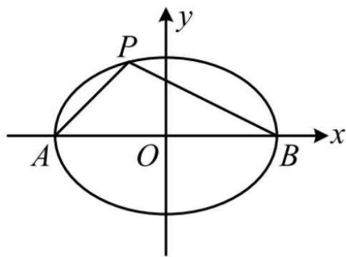

text_image

y
P
A O B x

图1

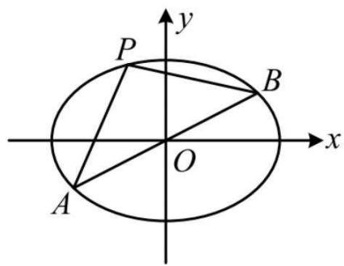

text_image

y
P
B
O
x
A

图 2

证明: 图 1 是图 2 的特殊情况, 故下面只证图 2 的一般性结论,

设 $A(x_{1},y_{1}),P(x_{2},y_{2})$ ，则 $B(-x_1, - y_1)$

$$
k _ {P A} \cdot k _ {P B} = \frac {y _ {2} - y _ {1}}{x _ {2} - x _ {1}} \cdot \frac {y _ {2} + y _ {1}}{x _ {2} + x _ {1}} = \frac {y _ {2} ^ {2} - y _ {1} ^ {2}}{x _ {2} ^ {2} - x _ {1} ^ {2}} (\mathrm{i}),
$$

因为点 A 在椭圆上, 所以 $\frac{x_{1}^{2}}{a^{2}} + \frac{y_{1}^{2}}{b^{2}} = 1$ ,

故 $y_{1}^{2}=b^{2}\left(1-\frac{x_{1}^{2}}{a^{2}}\right)=-\frac{b^{2}}{a^{2}}(x_{1}^{2}-a^{2})$ ,

同理 $y_{2}^{2}=-\frac{b^{2}}{a^{2}}(x_{2}^{2}-a^{2})$ ,

所以 $y_{2}^{2}-y_{1}^{2}=-\frac{b^{2}}{a^{2}}(x_{2}^{2}-a^{2}-x_{1}^{2}+a^{2})=-\frac{b^{2}}{a^{2}}(x_{2}^{2}-x_{1}^{2})$

代入 (i) 得: $k_{PA} \cdot k_{PB} = -\frac{b^{2}}{a^{2}}$ ;

在上述条件中令 $A(-a,0)$ , $B(a,0)$ ，即得图1的特殊情况下的结论，

对于焦点在 y 轴上的情形, 证法与上面相同, 不再赘述.

此结论虽然归为了二级结论, 但针对性较强 (涉及椭圆上的点 P 与椭圆上关于原点对称的 A, B 两点的连线斜率积问题), 推荐掌握.

# 二级结论 35: (双曲线第三定义斜率积结论)

如图1, 设 A, B 分别是双曲线 $\frac{x^{2}}{a^{2}} - \frac{y^{2}}{b^{2}} = 1 (a > 0, b > 0)$ 的左、右顶点, P 是双曲线上不与 A, B 重合的任意一点,

则 $k_{PA} \cdot k_{PB} = \frac{b^2}{a^2}$ .

注:(1)上述结论中 A,B 是双曲线的左、右顶点, 可将其推广为双曲线上关于原点对称的任意两点, 如图 2, 只要直线 PA,PB 的斜率都存在, 就仍满足 $k_{PA} \cdot k_{PB} = \frac{b^{2}}{a^{2}}$ .

(2) 若是焦点在 y 轴上的双曲线, 则上述斜率积为 $\frac{a^{2}}{b^{2}}$ .

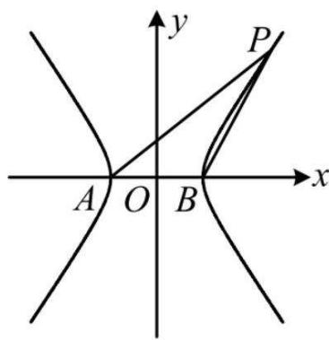

text_image

y
P
A O B x

图1

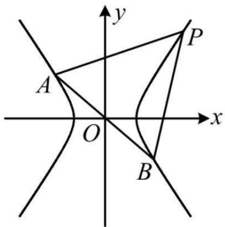

text_image

y
P
A
O
x
B

图 2

证明: 图 1 是图 2 的特殊情况, 故下面只证图 2 的一般性结论,

设 $A(x_{1},y_{1}),P(x_{2},y_{2})$ ，则 $B(-x_1, - y_1)$

$$
k _ {P A} \cdot k _ {P B} = \frac {y _ {2} - y _ {1}}{x _ {2} - x _ {1}}, \frac {y _ {2} + y _ {1}}{x _ {2} + x _ {1}} = \frac {y _ {2} ^ {2} - y _ {1} ^ {2}}{x _ {2} ^ {2} - x _ {1} ^ {2}} (\mathrm{i}),
$$

因为点 A 在双曲线上, 所以 $\frac{x_{1}^{2}}{a^{2}} - \frac{y_{1}^{2}}{b^{2}} = 1$ ,

故 $y_{1}^{2}=b^{2}\left(\frac{x_{1}^{2}}{a^{2}}-1\right)=\frac{b^{2}}{a^{2}}(x_{1}^{2}-a^{2})$ ,

同理, $y_{2}^{2}=\frac{b^{2}}{a^{2}}(x_{2}^{2}-a^{2})$ ,

所以 $y_{2}^{2}-y_{1}^{2}=\frac{b^{2}}{a^{2}}(x_{2}^{2}-a^{2}-x_{1}^{2}+a^{2})=\frac{b^{2}}{a^{2}}(x_{2}^{2}-x_{1}^{2})$

代入 (i) 得: $k_{PA} \cdot k_{PB} = \frac{b^{2}}{a^{2}}$ ;

在上述条件中令 $A(-a,0)$ , $B(a,0)$ ，即得图1的特殊情况下的结论，

对于焦点在 y 轴上的情形, 证法与上面相同, 不再赘述.

此结论虽然归为了二级结论, 但针对性较强 (涉及双曲线上的点 P 与双曲线上关于原点对称的 A, B 两点的连线斜率积问题), 推荐掌握.

# 二级结论 36: (抛物线的垂直定点结论)

设 A, B 为抛物线 $y^{2}=2px(p>0)$ 上两点,

O 为原点, 若 $OA \perp OB$ , 则直线 AB 过定点 $M(2p,0)$ .

证明: 设直线 AB 的方程为 $x = my + t$ ，设 $A(x_{1}, y_{1}), B(x_{2}, y_{2})$ ，

因为 $OA \perp OB$ ，所以 $\overrightarrow{OA} \cdot \overrightarrow{OB} = x_{1}x_{2} + y_{1}y_{2} = 0$ (i),

联立 $\left\{\begin{aligned}x=my+t\\ y^{2}=2px\end{aligned}\right.$ 消去 x 整理得: $y^{2}-2pmy-2pt=0(ii)$ ,

由韦达定理, $y_{1}y_{2}=-2pt$ ，所以 $x_{1}x_{2}=\frac{y_{1}^{2}}{2p}\cdot\frac{y_{2}^{2}}{2p}=\left(\frac{y_{1}y_{2}}{2p}\right)^{2}=t^{2}$

代入 (i) 得 $t^{2}-2pt=0$ ，所以 t=0 或 2p，

当 t=0 时, A,B 中有一个与原点重合, 不合题意,

所以 t=2p，

经检验, 满足方程 $(ii)$ 的判别式 $\Delta > 0$ ,

从而直线 AB 的方程为 $x = my + 2p$ ，故直线 AB 过定点 $M(2p,0)$ .

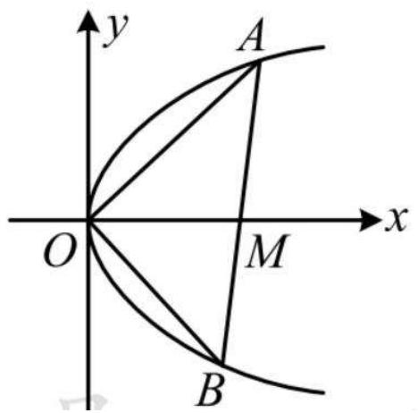

text_image

y
A
O
M
x
B

# 二级结论 37: (以抛物线的焦点弦为直径的圆与准线相切)

证明: 设以 AB 为直径的圆的圆心为 AB 中点 P, 半径为 r, 则 $r = \frac{1}{2} |AB|$ ,

如图, 作 $AM \perp$ 准线 $l$ 于点 $M, BN \perp l$ 于点 $N, PQ \perp l$ 于点 $Q$ ,

则由抛物线定义, $|AM|=|AF|,|BN|=|BF|$ ,

所以 $|PQ| = \frac{1}{2} (|AM| + |BN|) = \frac{1}{2} (|AF| + |BF|) = \frac{1}{2} |AB|$ ，

这说明点 $P$ 到准线的距离等于 $\pmb{r}$

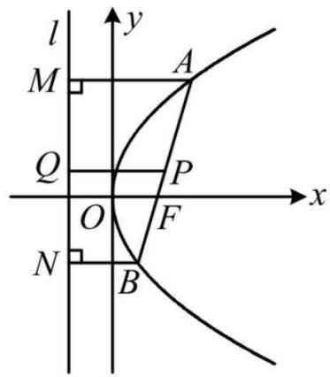

text_image

l
y
M
A
Q
P
O
F
x
N
B

故准线与以 AB 为直径的圆相切.

# 二级结论 38: (点乘双根法)

若将直线与圆雉曲线方程联立, 得到关于 x 的一元二次方程 $ax^{2} + bx + c = 0 (a \neq 0)$ ,

设该方程的两根为 $x_{1}, x_{2}$ ,

现在要算 $(x_{1} - t)(x_{2} - t)$ ，将其展开为 $x_{1}x_{2} - t(x_{1} + x_{2}) + t^{2}$

结合韦达定理来算可行,但有时这样做计算量较大,

更简单的方法是根据 $x_{1}, x_{2}$ 是该方程的两根,

将该方程左侧的 $ax^{2}+bx+c$ 化为两根式,

得到 $ax^{2}+bx+c=a(x-x_{1})(x-x_{2})$ ,

观察发现在两端同时令 x = t，

即可得到 $at^{2}+bt+c=a(t-x_{1})(t-x_{2})$ ,

从而 $(x_{1} - t)(x_{2} - t) = \frac{at^{2} + bt + c}{a}$

这样就快速求出了目标量 $(x_{1}-t)(x_{2}-t)$ ,

此法叫做“点乘双根法”.

全国新高考高中数学老师教研备课微信群定期分享高中数学资料，方便老师教研备课。包括 ppt 课件、word 教案、教学设计、名校资料、模拟试卷、高考真题、教辅图书、名师讲义、培优课程、名师网课等等优质高中数学资料！欢迎各位高中数学老师加入，共同交流，实现资源共享！需要进群请加微信：A57585857 或扫码进群！

扫码进高中数学最全资料群
微信：A57585857  
