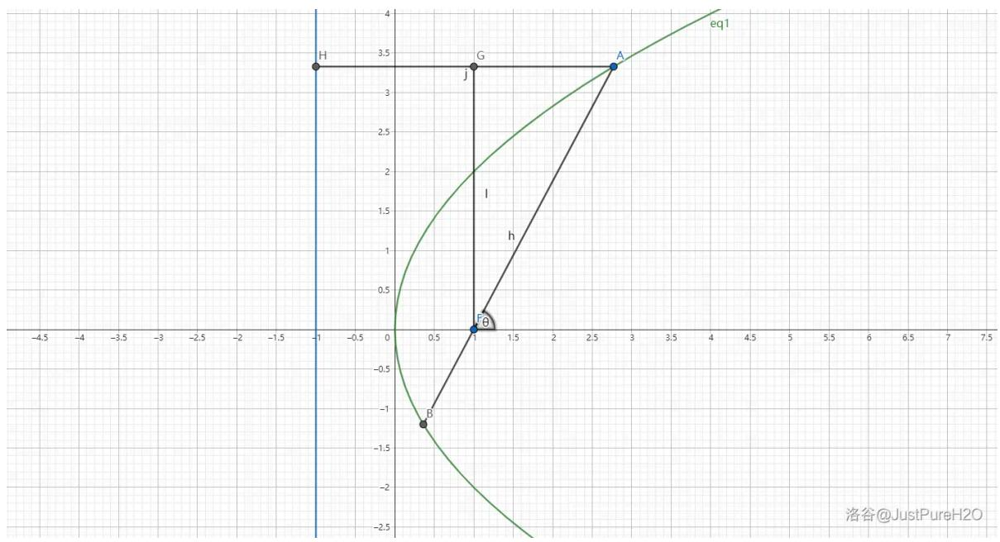
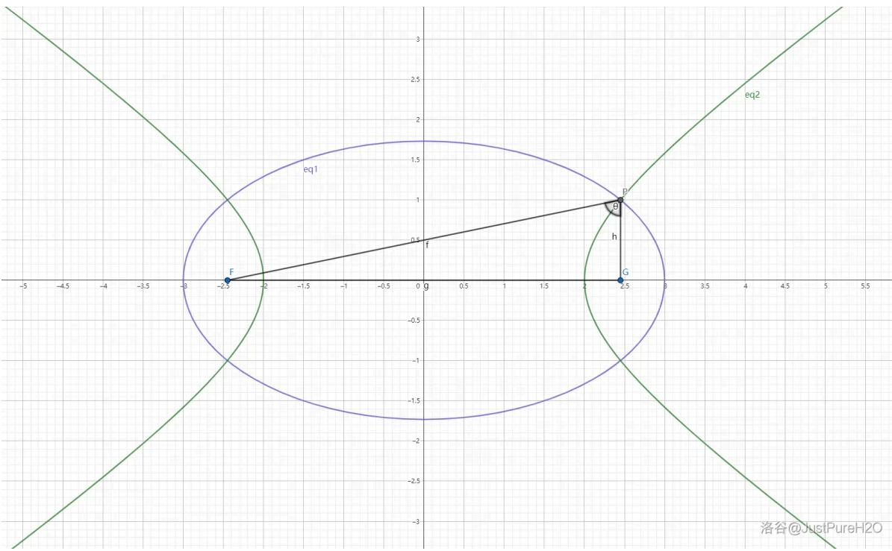
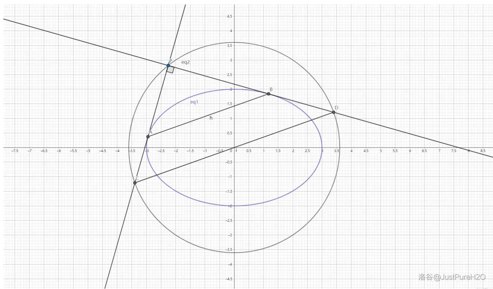
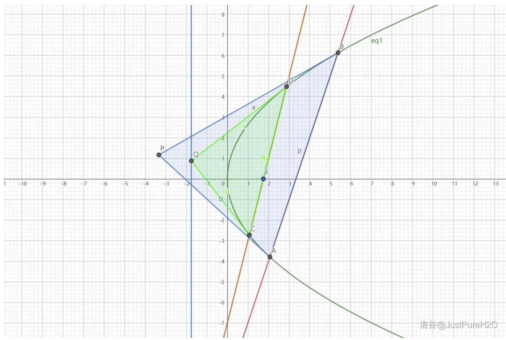
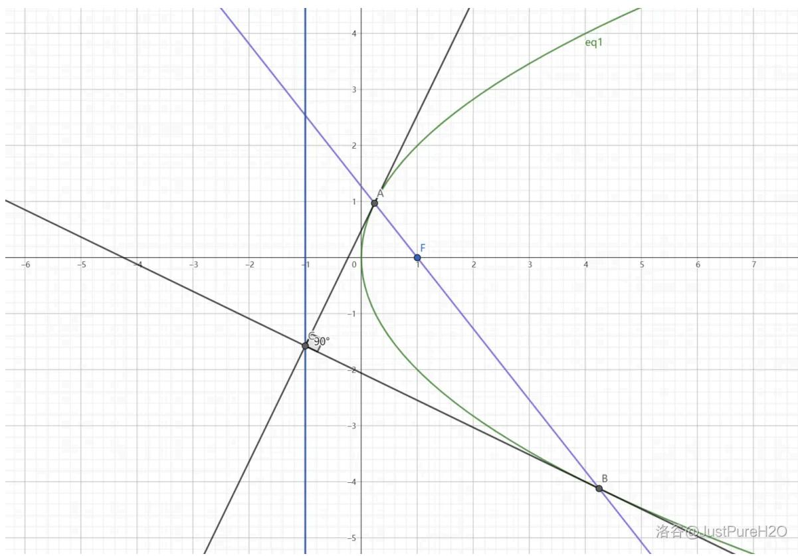
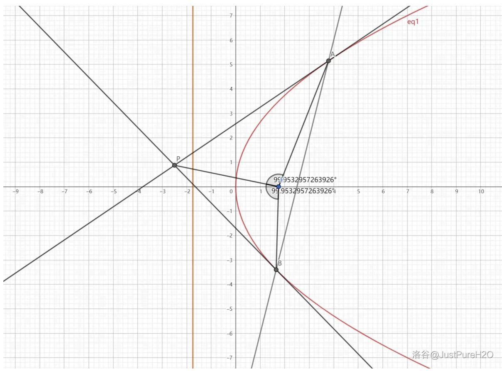
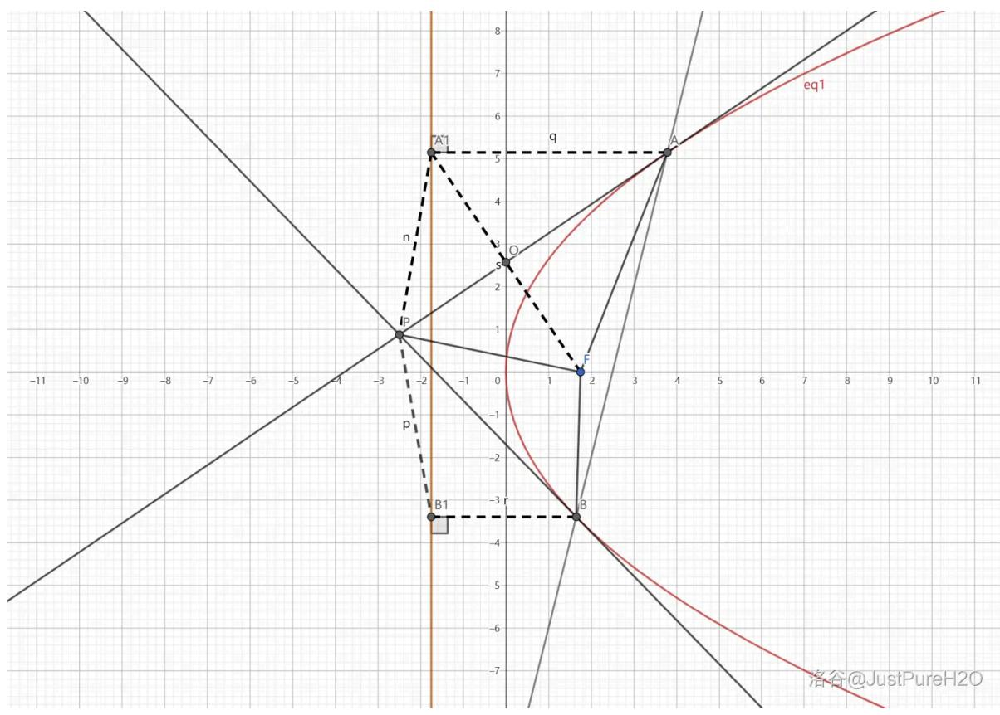
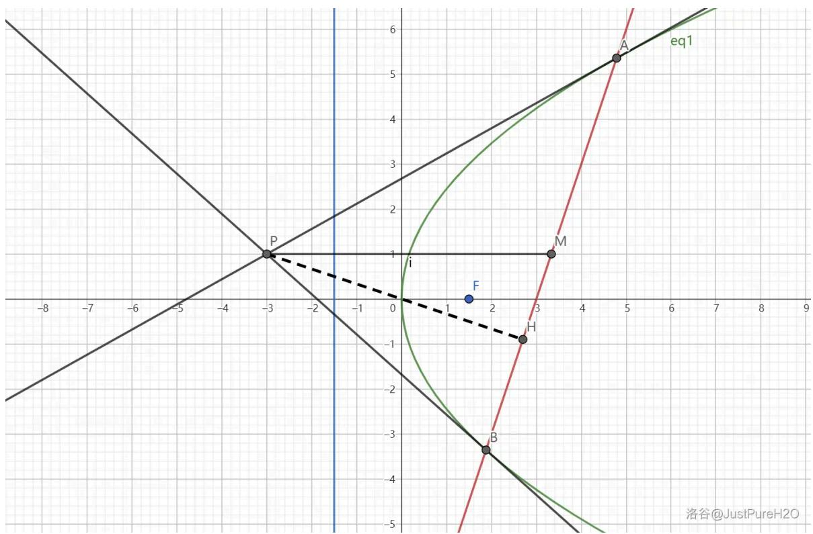
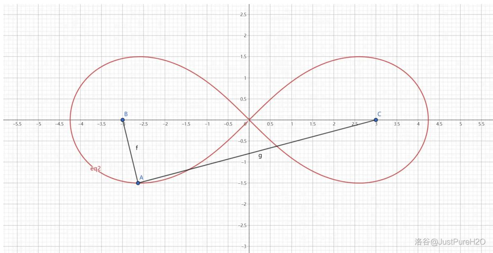
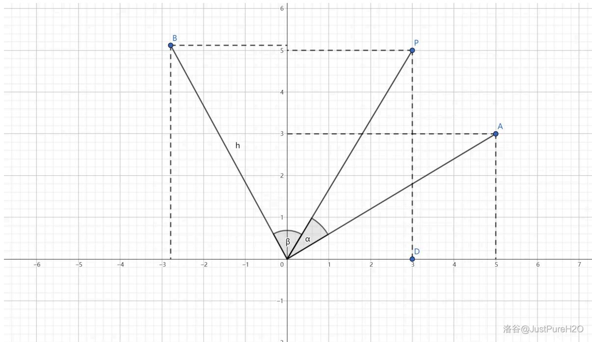

# Note

本文原作者：JustPureH20

原文连接：https://justpureh2o.cn/articles/61430/

# 圆锥曲线 常用二级结论附证明过程

# 前言

做这篇文章最初的缘由，似乎也早已忘却了，大抵是期中时拍拍脑子生出的主意，然终竟无法再考究了……然而既已入年，我想自己许是有些寂寞而无所事事了。恰逢 A 君邀我做一篇圆锥曲线的文章，他仿佛有点谑我的意思，欲以此指代方才过去的令人悲哀的数学考题，我举起手机只是说：

“假如一道圆锥曲线填空压轴，它是没有常数且万难算出的，考场上有许多没背二级结论的高中生，见到就跳过了，然而是舍小保大，并不感到挂科的悲哀。现在你教他们背二级结论，说动了想冲高分的几人，使这不幸的少数者来受知晓结论而仍解不出的可能挂科的苦楚，你倒以为对得起他们么？”

“然而几个人既然背了，你不能说决没有解出这个题的希望。”

是的，我虽然自有我的确信，然而说到希望，却是不能抹杀的。因为希望是在于将来，决不能以我之必无的证明，来折服了他之所谓可有，于是我终于答应他也做圆锥曲线的文章了。



# 椭圆 基础二级结论

若无特殊说明，椭圆标准方程 $E: \frac{x^{2}}{a^{2}} + \frac{y^{2}}{b^{2}} = 1$ 均满足 a > b > 0，焦点在 x 轴上。且若无特殊指明，“椭圆 $E'$ 均指上述的椭圆 $E: \frac{x^{2}}{a^{2}} + \frac{y^{2}}{b^{2}} = 1$ 。

# 通径

在椭圆 E 中，与焦点所在轴垂直的焦点弦被椭圆截得线段的长称作其通径。椭圆的通径长 $d = \frac{2b^{2}}{a}$ 。

评析：直接将横坐标 $\pm c$ 代入即可解得纵坐标，通径长为纵坐标绝对值的二倍。

# 证明：

横坐标 c 代入椭圆解析式:

$$
\frac {c ^ {2}}{a ^ {2}} + \frac {y ^ {2}}{b ^ {2}} = 1
$$

得到 $y^{2}=b^{2}-b^{2}e^{2}$ 。

因为在椭圆中有 $a^2 = b^2 + c^2$ ，因此 $c^2 = a^2 - b^2$ ，椭圆离心率还可以表示成

$e = \frac{c}{a} = \sqrt{\frac{c^2}{a^2}} = \sqrt{\frac{a^2 - b^2}{a^2}} = \sqrt{1 - \frac{b^2}{a^2}}$ 。代入得：

$$
\begin{array}{l} y ^ {2} = b ^ {2} - e ^ {2} b ^ {2} \\ = b ^ {2} - (1 - \frac {b ^ {2}}{a ^ {2}}) b ^ {2} \\ = \frac {b ^ {4}}{a ^ {2}} \\ y = \pm \frac {b ^ {2}}{a} \\ \end{array}
$$

此时 $d = 2|y| = \frac{2b^2}{a}$ 。

证毕。

# 圆周定理

在椭圆 E 中，A, B 是椭圆上关于原点对称的两点，M 是椭圆上异于 A, B 的一点。那么直线 AM, BM 的斜率之积为 $-\frac{b^{2}}{a^{2}}$ 。

评析：也不需要什么特殊的技巧，就是设点硬算。这个结论是必背的经典二级结论之一。

证明：

设 $A(x_{1},y_{1})B(-x_{1}, - y_{1})M(x_{2},y_{2})$ 。那么两直线斜率之积可以表示为 $k_{AM}k_{BM}$ ，即：

$$
\begin{array}{l} k _ {A M} \cdot k _ {B M} = \frac {y _ {2} - y _ {1}}{x _ {2} - x _ {1}} \times \frac {y _ {2} + y _ {1}}{x _ {2} + x _ {1}} \\ = \frac {y _ {2} ^ {2} - y _ {1} ^ {2}}{x _ {2} ^ {2} - x _ {1} ^ {2}} \\ \end{array}
$$

三点都在椭圆上，代入椭圆解析式得关系式：

$$
\left\{\begin{array}{l}\frac {x _ {1} ^ {2}}{a ^ {2}} + \frac {y _ {1} ^ {2}}{b ^ {2}} = 1\\\frac {x _ {2} ^ {2}}{a ^ {2}} + \frac {y _ {2} ^ {2}}{b ^ {2}} = 1\end{array}\right.\rightarrow \left\{\begin{array}{l}y _ {1} ^ {2} = b ^ {2} - \frac {b ^ {2} x _ {1} ^ {2}}{a ^ {2}}\\y _ {2} ^ {2} = b ^ {2} - \frac {b ^ {2} x _ {2} ^ {2}}{a ^ {2}}\end{array}\right.
$$

将 $y_{1}^{2}$ 和 $y_{2}^{2}$ 用 $x_{1}^{2}, x_{2}^{2}$ 表示出来：

$$
\begin{array}{l} = \frac {\frac {b ^ {2}}{a ^ {2}} (x _ {1} ^ {2} - x _ {2} ^ {2})}{x _ {2} ^ {2} - x _ {1} ^ {2}} \\ = - \frac {b ^ {2}}{a ^ {2}} \\ \end{array}
$$

证毕。

拓展变形：我们默认椭圆的焦点位于 $x$ 轴，那万一焦点在 $y$ 轴上呢？首先我们需要保证较大的分母为 $a$ ，较小的为 $b$ ，例如 $\frac{y^2}{9} +\frac{x^2}{4} = 1$ ，此时 $a^2 = 9,b^2 = 4$ ，现在的两直线斜率之积为 $-\frac{9}{4}$ ，即 $-\frac{a^2}{b^2}$ ，分子分母调换了！做题时一定要注意，证明方法同上。

# 广义垂径定理/中点弦公式

在椭圆 E 中，A, B 为椭圆上两点，M 为弦 AB 的中点，那么直线 OM 与直线 AB 的斜率之积为 $-\frac{b^{2}}{a^{2}}$ 。

评析：处理中点的方法一共有两个——常规联立法和点差法。此处我们使用第一种，因为韦达定理可以很轻松的表示出中点的坐标；同时设出直线 AB 代表我们可以只用一个 k 表示其斜率，由于 OM 过原点，表示它的斜率也是容易的。那我们就开始吧。

# 证明：

设直线 $AB:y = kx + m$ 。斜率不存在时无意义，故斜率一定存在。联立方程：

$$
\left\{ \begin{array}{l} y = k x + m \\ \frac {x ^ {2}}{a ^ {2}} + \frac {y ^ {2}}{b ^ {2}} = 1 \end{array} \right.
$$

得:

$$
b ^ {2} x ^ {2} + a ^ {2} \left(k ^ {2} x ^ {2} + 2 m k x + m ^ {2}\right) - a ^ {2} b ^ {2} = 0
$$

$$
(b ^ {2} + a ^ {2} k ^ {2}) x ^ {2} + 2 a ^ {2} m k x + a ^ {2} m ^ {2} - a ^ {2} b ^ {2} = 0
$$

根据韦达定理得：

$$
x _ {1} + x _ {2} = - \frac {2 a ^ {2} m k}{b ^ {2} + a ^ {2} k ^ {2}}, x _ {1} x _ {2} = \frac {a ^ {2} m ^ {2} - a ^ {2} b ^ {2}}{b ^ {2} + a ^ {2} k ^ {2}}
$$

因此 $M\left(-\frac{a^{2}mk}{b^{2}+a^{2}k^{2}},\frac{b^{2}m}{b^{2}+a^{2}k^{2}}\right)$ 。得到斜率乘积为 $k\cdot\left(-\frac{b^{2}m}{a^{2}mk}\right)=-k\cdot\frac{b^{2}}{a^{2}k}=-\frac{b^{2}}{a^{2}}$ 。
证毕。

拓展变形：易错点与上一个结论相同，焦点所在坐标轴改变后，乘积会从原先的 $-\frac{b^2}{a^2}$ 变成 $-\frac{a^2}{b^2}$ 。

# 焦半径公式

令 $F_{1}, F_{2}$ 为椭圆 $E$ 的左右焦点， $P(x_{0}, y_{0})$ 为椭圆上一点，那么

$|PF_{1}| = a + ex_{0}, |PF_{2}| = a - ex_{0}$ 。其中 $e = \frac{c}{a}$ ，即椭圆的离心率。

评析：这个结论其实就是椭圆第二定义的变形式，不信你看。

证明：

先证 $|PF_1| = a + ex_0$ 。对于 $F_{1}$ 来说，对应的准线为直线 $x = -\frac{a^2}{c}$ 。根据椭圆第二定义有：

$$
\frac {| P F _ {1} |}{x _ {0} + \frac {a ^ {2}}{c}} = e
$$

$$
\frac {\left| P F _ {1} \right|}{x _ {0} + \frac {a}{e}} = e
$$

$$
\left| P F _ {1} \right| = e x _ {0} + a
$$

再证 $|PF_2| = a - ex_0$ 。其实根据椭圆第一定义 $|PF_1| + |PF_2| = 2a$ 即可推出它，但是我们继续用第二定义推导。此时对应的准线是直线 $x = \frac{a^2}{c}$ :

$$
\frac {\left| P F _ {2} \right|}{\frac {a}{e} - x _ {0}} = e
$$

$$
\left| P F _ {2} \right| = a - e x _ {0}
$$

证毕。

拓展变形：焦点在 $y$ 轴上时，结论变为 $|PF_1| = a + ey_0, |PF_2| = a - ey_0$ 。

# 焦点三角形相关

椭圆的左右焦点 $F_{1}, F_{2}$ 与椭圆上一点 $P$ 组成的三角形 $\triangle PF_{1}F_{2}$ 称作这个椭圆的焦点三角形。

本节中出现的角 $\theta$ 若无特殊说明均指代 $\angle F_{1}PF_{2}$ 。

# 取值范围

焦点三角形 $\triangle PF_{1}F_{2}$ 中， $|PF_{1}| \in (a - c, a + c), |PF_{2}| \in (a - c, a + c), |PF_{1}||PF_{2}| \leq a^{2}$

。

评析：前两个非常好证，他们理论上在 P 与左右端点重合时取到最值，但是此时 $P, F_{1}, F_{2}$ 三点共线，因此不是三角形，所以是开区间。对于第三个，乘积的取值范围，则需要基本不等式。

证明：

根据基本不等式有：

$$
\left| P F _ {1} \right| \left| P F _ {2} \right| \leq \left(\frac {\left| P F _ {1} \right| + \left| P F _ {2} \right|}{2}\right) ^ {2} = a ^ {2}
$$

证毕。

# 周长

焦点三角形 $\triangle PF_{1}F_{2}$ 的周长 $C_{\triangle PF_1F_2} = |PF_1| + |PF_2| + |F_1F_2| = 2a + 2c$ 。

评析：根据椭圆的第一定义来的， $\left|PF_{1}\right|+\left|PF_{2}\right|=2a,\left|F_{1}F_{2}\right|=2c$ 。

# 面积

焦点三角形 $\triangle PF_{1}F_{2}$ 的面积 $S_{\triangle F_1F_2} = b^2\tan \frac{\theta}{2}$

评析：出现角度和面积，我们需要想到正/余弦定理。根据正弦定理的三角形面积公式 $S = \frac{1}{2} ab\sin \theta$ 以及余弦定理的 $c^2 = a^2 + b^2 - 2ab\cos \theta$ ，我们可以解决大部分与边长和角度有关的圆锥曲线证明/求值问题。

# 证明：

由正弦定理得， $S_{\triangle PF_1F_2} = \frac{1}{2}|PF_1||PF_2|\sin \theta$

在 $\triangle PF_{1}F_{2}$ 中运用余弦定理： $|F_{1}F_{2}|^{2} = 4c^{2} = |PF_{1}|^{2} + |PF_{2}|^{2} - 2|PF_{1}||PF_{2}|\cos \theta$ ，得到 $|PF_{1}||PF_{2}| = \frac{|PF_{1}|^{2} + |PF_{2}|^{2} - 4c^{2}}{2\cos\theta}$ 。

同时根据完全平方公式，

$|PF_1|^2 + |PF_2|^2 = (|PF_1| + |PF_2|)^2 - 2|PF_1||PF_2| = 4a^2 - 2|PF_1||PF_2|$ ，代入上式移项解得 $|PF_1||PF_2| = \frac{2(a^2 - c^2)}{1 + \cos\theta}$ ，根据面积公式可得

$$
S = \frac {(a ^ {2} - c ^ {2}) \sin \theta}{1 + \cos \theta} = \frac {b ^ {2} \sin \theta}{1 + \cos \theta} = b ^ {2} \tan \frac {\theta}{2} 。
$$

证毕。

拓展变形：三角函数的半角公式（附证明）。

--正/余弦半角公式

根据余弦倍角公式的变形式 $\cos 2\theta = 2\cos^2\theta -1$ ，将 $2\theta$ 换成 $\theta$ ， $\theta$ 换成 $\frac{\theta}{2}$ 即得

$$
\cos \theta = 2 \cos^ {2} {\frac {\theta}{2}} - 1, \cos {\frac {\theta}{2}} = \sqrt {\frac {\cos \theta + 1}{2}} 。
$$

同理，对于正弦函数，有 $\cos 2\theta = 1 - 2\sin^2\theta \to \cos \theta = 1 - 2\sin^2\frac{\theta}{2}\rightarrow \sin \frac{\theta}{2} = \sqrt{\frac{1 - \cos\theta}{2}}$ 。

--正切半角公式

由正切函数定义可得 $\tan \frac{\theta}{2} = \frac{\sin \frac{\theta}{2}}{\cos \frac{\theta}{2}}$ ，利用三角函数的升幂，也就是上面导出正余弦半角公式时使用的余弦倍角公式，分子分母同乘 $\cos \frac{\theta}{2}$ 可得：

$$
\tan {\frac {\theta}{2}} = \frac {\sin {\frac {\theta}{2}} \cos {\frac {\theta}{2}}}{\cos^ {2} {\frac {\theta}{2}}} = \frac {\frac {1}{2} \sin \theta}{\frac {1}{2} (1 + \cos \theta)} = \frac {\sin \theta}{\cos \theta + 1} 。
$$

因此证明面积公式时出现的 $\frac{\sin\theta}{\cos\theta + 1}$ 可以换成 $\tan \frac{\theta}{2}$ 。三个公式汇总起来就是：

$$
\sin {\frac {\theta}{2}} = \sqrt {\frac {1 - \cos \theta}{2}} \qquad \cos {\frac {\theta}{2}} = \sqrt {\frac {\cos \theta + 1}{2}} \qquad \tan {\frac {\theta}{2}} = \frac {\sin \theta}{\cos \theta + 1}
$$

# 内切圆

焦点三角形 $\triangle PF_{1}F_{2}$ 的内切圆半径为 $\frac{c}{\sin\theta}$ ，已知半径也可求出顶角 $\sin \theta = \frac{c}{R}$ 。

评析：这一条其实也没什么，主要是正弦定理的运用。因为在三角形中 $\frac{a}{\sin A} = \frac{b}{\sin B} = \frac{c}{\sin C} = 2R$ ，其中 $R$ 就是内切圆半径。将 $\theta$ 所对的边 $F_{1}F_{2}$ 的长度代入即可证得该结论。

# 离心率公式

令焦点三角形 $\triangle PF_{1}F_{2}$ 的底角 $\angle PF_{1}F_{2} = \alpha, \angle PF_{2}F_{1} = \beta$ ，那么椭圆的离心率

$$
e = \frac {\sin (\alpha + \beta)}{\sin \alpha + \sin \beta} = \frac {\sin \theta}{\sin \alpha + \sin \beta} 。
$$

评析：有角有边，当然考虑正余弦定理。

# 证明：

易知此时 $\theta = \pi -\alpha -\beta$ 。根据正弦定理有 $\frac{2c}{\sin(\pi - \alpha - \beta)} = \frac{2c}{\sin(\alpha + \beta)} = \frac{|PF_1|}{\sin\beta} = \frac{|PF_2|}{\sin\alpha}$ 。在椭圆中又有 $|PF_{1}| + |PF_{2}| = 2a$ ，那么 $|PF_2| = 2a - |PF_1|$ 。

代入连等式中，得到 $\frac{2c}{\sin(\alpha + \beta)} = \frac{|PF_1|}{\sin\beta} = \frac{2a - |PF_1|}{\sin\alpha}$ ，根据后两项可以解出 $|PF_1| = \frac{2a\sin\beta}{\sin\alpha + \sin\beta}$ ，此时代入第二项得到 $\frac{2c}{\sin(\alpha + \beta)} = \frac{2a}{\sin\alpha + \sin\beta}$ 。

此时 $\frac{c}{a} = e = \frac{\sin(\alpha + \beta)}{\sin\alpha + \sin\beta} = \frac{\sin\theta}{\sin\alpha + \sin\beta}$ 。

证毕。

# 双曲线 基础二级结论

若无特殊说明，双曲线标准方程 $E: \frac{x^{2}}{a^{2}} - \frac{y^{2}}{b^{2}} = 1$ ，满足 a > 0, b > 0, $a \neq b$ ，焦点在 x 轴上。且若无特殊说明，“双曲线 $E'$ ”均指上述的标准双曲线 $E: \frac{x^{2}}{a^{2}} - \frac{y^{2}}{b^{2}} = 1$ 。

# 通径

在双曲线 E 中，与焦点所在轴垂直的焦点弦被双曲线截得线段的长称作其通径。双曲线的通径长 $d = \frac{2b^{2}}{a}$ 。

评析：与椭圆证法相同。

# 证明：

将横坐标 $\pm c$ 代入得 $y^{2} = b^{2}e^{2} - b^{2}$ 。因为双曲线满足 $c^2 = a^2 +b^2$ ，可以推导出 $e = \sqrt{1 + \frac{b^2}{a^2}}$ 那么 $y^{2} = \frac{b^{4}}{a^{2}}$ ，得到 $y = \pm \frac{2b^2}{a}$ 。此时通径长为 $d = 2|y| = \frac{2b^2}{a}$

证毕。

# 圆周定理

在双曲线 E 中，A, B 是双曲线上关于原点对称的两点，M 是双曲线上异于 A, B 的一点。那么直线 AM, BM 的斜率之积为 $\frac{b^{2}}{a^{2}}$ 。

评析：双曲线有关二级结论的证明思路和椭圆基本相同，这里我们沿用椭圆的证明方法继续硬算。

证明：

设 $A(x_{1},y_{1})B(-x_{1}, - y_{1})M(x_{2},y_{2})$ ，那么：

$$
\begin{array}{l} k _ {A M} \cdot k _ {B M} = \frac {y _ {2} - y _ {1}}{x _ {2} - x _ {1}} \times \frac {y _ {2} + y _ {1}}{x _ {2} + x _ {1}} \\ = \frac {y _ {2} ^ {2} - y _ {1} ^ {2}}{x _ {2} ^ {2} - x _ {1} ^ {2}} \\ \end{array}
$$

三点都在双曲线上，得到：

$$
\left\{ \begin{array}{l} y _ {1} ^ {2} = \frac {b ^ {2} x _ {1} ^ {2}}{a ^ {2}} - b ^ {2} \\ y _ {2} ^ {2} = \frac {b ^ {2} x _ {2} ^ {2}}{a ^ {2}} - b ^ {2} \end{array} \right.
$$

代入得:

$$
\begin{array}{l} = \frac {\frac {b ^ {2}}{a ^ {2}} (x _ {2} ^ {2} - x _ {1} ^ {2})}{x _ {2} ^ {2} - x _ {1} ^ {2}} \\ = \frac {b ^ {2}}{a ^ {2}} \\ \end{array}
$$

证毕。

拓展变形：焦点所在坐标轴改变时同样要变成 $\frac{a^2}{b^2}$ 。

# 广义垂径定理/中点弦公式

在双曲线 E 中，A, B 为双曲线上两点，M 为弦 AB 的中点，那么直线 OM 与直线 AB 的斜率之积为 $\frac{b^{2}}{a^{2}}$ 。

评析：同样使用椭圆的证明方法

证明：

令直线 AB: $y = kx + m$ ，斜率不存在时无意义，故斜率存在。联立直线和双曲线方程：

$$
\left\{ \begin{array}{l} y = k x + m \\ \frac {x ^ {2}}{a ^ {2}} - \frac {y ^ {2}}{b ^ {2}} = 1 \end{array} \right.
$$

得到： $(b^{2} - a^{2}k^{2})x^{2} - 2a^{2}mkx - a^{2}m^{2} - a^{2}b^{2} = 0$ 。韦达定理得

$$
x _ {1} + x _ {2} = \frac {2 a ^ {2} m k}{b ^ {2} - a ^ {2} k ^ {2}}, x _ {1} x _ {2} = - \frac {a ^ {2} m ^ {2} + a ^ {2} b ^ {2}}{b ^ {2} - a ^ {2} k ^ {2}} 。
$$

得到中点坐标 $M\left(\frac{a^2mk}{b^2 - a^2k^2},\frac{b^2m}{b^2 - a^2k^2}\right)$ ，此时斜率之积表示为：

$$
\begin{array}{l} k _ {A B} \cdot k _ {O M} = k \cdot \frac {b ^ {2} m}{a ^ {2} m k} \\ = k \cdot \frac {b ^ {2}}{a ^ {2} k} \\ = \frac {b ^ {2}}{a ^ {2}} \\ \end{array}
$$

证毕。

拓展变形：焦点在 $y$ 轴上时对应的乘积是 $\frac{a^2}{b^2}$ 。

# 焦半径公式

令 $F_{1}, F_{2}$ 为双曲线 $E$ 的左右焦点， $P(x_{0}, y_{0})$ 为双曲线上一点， $P$ 在右支上时有

$|PF_{1}| = a + ex_{0}, |PF_{2}| = -a + ex_{0}$ ; 在左支上时有 $|PF_{1}| = -a - ex_{0}, |PF_{2}| = a - ex_{0}$ 。

评析：双曲线第二定义的变形

证明：

当 $P$ 在右支时，根据第二定义，有 $\frac{|PF_1|}{\frac{a^2}{c} + x_0} = \frac{|PF_1|}{\frac{a}{e} + x_0} = e$ ，得到 $|PF_{1}| = a + ex_{0}$ ，然后根据双曲线中 $||PF_1| - |PF_2|| = 2a$ 可得 $|PF_2| = -a + ex_{0}$ 。

同理可以证得左支公式。

证毕。

拓展变形：焦点在 $y$ 轴上时要把 $x_0$ 换成 $y_0$ 。

# 渐近线相关

过原点且在无穷远处与双曲线的距离无限趋近于 0 的两条直线叫做这个双曲线的渐近线。焦点在 x 轴上时渐近线的解析式为 $y = \pm \frac{b}{a}x$ ; 若在 y 轴上则为 $y = \pm \frac{a}{b}x$ , 即 $x = \pm \frac{b}{a}y$ 。

# 焦点-渐近线距离

双曲线的焦点与任意一条渐近线的距离均为 b。

评析：使用点到直线的距离公式证明。

证明：

左焦点 $F_{1}(-c,0)$ ，到渐近线 $y \pm \frac{b}{a} x = 0$ 的距离为：

$$
d = \frac {\frac {b}{a} c}{\sqrt {1 + \frac {b ^ {2}}{a ^ {2}}}} = \frac {e b}{e} = b
$$

证毕。

# 焦点三角形相关

双曲线的左右焦点 $F_{1}, F_{2}$ 与双曲线上一点 P 组成的三角形 $\triangle PF_{1}F_{2}$ 称作这个双曲线的焦点三角形。

本节中出现的角 $\theta$ 若无特殊说明均指代 $\angle F_{1}PF_{2}$ 。

# 周长

焦点三角形 $\triangle PF_{1}F_{2}$ 的周长为 $2e|x_0| + 2c$ 。

评析：根据前面所证明的焦半径公式可得这个结论。

# 面积

焦点三角形 $\triangle PF_{1}F_{2}$ 的面积为 $\frac{b^{2}}{\tan\frac{\theta}{2}} = b^{2} \cot\frac{\theta}{2}$ 。

# 证明：

正弦定理得： $S = \frac{1}{2} |PF_1||PF_2|\sin \theta$ 。余弦定理得：

$4c^{2} = |PF_{1}|^{2} + |PF_{2}|^{2} - 2|PF_{1}||PF_{2}|\cos \theta$ ，得到 $|PF_1||PF_2| = \frac{|PF_1|^2 + |PF_2|^2 - 4c^2}{2\cos\theta}$ 。根据完全平方公式，有 $(|PF_1| - |PF_2|)^2 = 4a^2 = |PF_1|^2 + |PF_2|^2 - 2|PF_1||PF_2|$ ，联立可得 $|PF_{1}||PF_{2}| = \frac{|PF_{1}||PF_{2}| + 2a^{2} - 2c^{2}}{\cos\theta}$ ，解得 $|PF_{1}||PF_{2}| = \frac{2b^{2}}{1 - \cos\theta}$ 。代入面积公式得 $S = \frac{b^2\sin\theta}{1 - \cos\theta} = b^2\cot \frac{\theta}{2}$ 。

证毕。

拓展变形：余切的半角公式证明。

$$
\begin{array}{l} \cot {\frac {\theta}{2}} = \frac {\cos {\frac {\theta}{2}}}{\sin {\frac {\theta}{2}}} \\ = \frac {\sin \frac {\theta}{2} \cos \frac {\theta}{2}}{\sin^ {2} \frac {\theta}{2}} \\ = \frac {\frac {1}{2} \sin \theta}{\frac {1}{2} (1 - \cos \theta)} \\ = \frac {\sin \theta}{1 - \cos \theta} \\ \end{array}
$$

# 离心率公式

令焦点三角形 $\triangle PF_{1}F_{2}$ 的底角 $\angle PF_{1}F_{2} = \alpha, \angle PF_{2}F_{1} = \beta$ ，那么双曲线的离心率为

$$
e = \frac {\sin \theta}{\sin \beta - \sin \alpha} 。
$$

证明：

由正弦定理， $\frac{2c}{\sin\theta}=\frac{|PF_{1}|}{\sin\beta}=\frac{|PF_{2}|}{\sin\alpha}$ ，不妨假设当前P在右支上，那么 $|PF_{1}|-|PF_{2}|=2a$ ，即 $|PF_{2}|=|PF_{1}|-2a$ 。解得 $|PF_{1}|=\frac{2a\sin\beta}{\sin\beta-\sin\alpha}$ 。此时有 $\frac{2c}{\sin\theta}=\frac{2a}{\sin\beta-\sin\alpha}$ 。得到

$$
e = \frac {c}{a} = \frac {\sin \theta}{\sin \beta - \sin \alpha} 。
$$

证毕。

# 抛物线基础二级结论

若无特殊说明，抛物线标准方程 $E: y^{2} = 2px$ 均满足 p > 0，焦点在 x 轴正半轴。且若无特殊指明，“抛物线 E”均指上述的抛物线 $E: y^{2} = 2px$ 。

# 通径

抛物线的通径长为 2p。

评析：抛物线中只要涉及到焦半径相关的内容，都要第一时间想到焦半径长等于该点与准线的距离从而进行转化，这样可以简化计算。

证明：

横坐标 $\frac{p}{2}$ 代入，得到焦半径为 $\frac{p}{2} + \frac{p}{2} = p$ ，通径为二倍焦半径，即 $2p$ 。

证毕。

# 焦点弦定理

抛物线 E 的一条焦点弦交抛物线于 A, B 两点，那么直线 OA 与直线 OB 的乘积为定值 -4。

评析：我们可以恰当选择直线的横截式和斜截式来方便计算。在本例中，由于抛物线方程的二次项在 $y$ 上，并且直线过 $x$ 轴上的定点，我们自然地选择横截式来进行计算。

证明：

令直线 $AB: x = ty + \frac{p}{2}$ ，联立抛物线方程 $y^{2} = 2px$ 得：

$$
y ^ {2} = 2 p t y + p ^ {2}
$$

$$
y ^ {2} - 2 p t y - p ^ {2} = 0
$$

根据韦达定理，得：

$$
y _ {1} + y _ {2} = 2 p t \quad y _ {1} y _ {2} = - p ^ {2} x _ {1} + x _ {2} = 2 t \left(y _ {1} + y _ {2}\right) + p = 4 t ^ {2} p + p \quad x _ {1} x _ {2} = t ^ {2} y _ {1} y _ {2}
$$

斜率的乘积表示为：

$$
\begin{array}{l} k _ {O A} \cdot k _ {O B} = \frac {y _ {1} y _ {2}}{x _ {1} x _ {2}} \\ = - \frac {p ^ {2}}{\frac {p ^ {2}}{4}} \\ = - 4 \\ \end{array}
$$

证毕。

拓展变形：事实上，证明过程中由韦达定理导出的关系式 $x_{1}x_{2} = \frac{p^{2}}{4}$ 和 $y_{1}y_{2} = -p^{2}$ 在实践中更为常用一些。

# 两点弦公式

抛物线 E 上两点 $A(x_{1}, y_{1})$ 和 $B(x_{2}, y_{2})$ 组成的弦 AB 的斜率为 $\frac{2p}{y_{1} + y_{2}}$ 。

评析：适时避开繁琐的高次计算是非常有用的。

证明：

因为两点在抛物线上，因此坐标满足：

$$
\left\{\begin{array}{l}y _ {1} ^ {2} = 2 p x _ {1}\\y _ {2} ^ {2} = 2 p x _ {2}\end{array}\right.\rightarrow \left\{\begin{array}{l}x _ {1} = \frac {y _ {1} ^ {2}}{2 p}\\x _ {2} = \frac {y _ {2} ^ {2}}{2 p}\end{array}\right.
$$

所以斜率可以表示为： $\frac{y_{2}-y_{1}}{x_{2}-x_{1}}=\frac{y_{2}-y_{1}}{\frac{y_{2}^{2}-y_{1}^{2}}{2p}}=\frac{2p(y_{2}-y_{1})}{(y_{1}+y_{2})(y_{2}-y_{1})}=\frac{2p}{y_{1}+y_{2}}$ 。

证毕。

# 焦半径公式

抛物线 E 的焦点弦 AB 分别在第一象限和第四象限交抛物线于 A, B 两点，直线 AB 与 x 轴的夹角是 $\theta$ ，那么 $|AF| = \frac{p}{1 - \cos\theta}, |BF| = \frac{p}{1 + \cos\theta}, |AB| = \frac{2p}{\sin^{2}\theta}$ 。

评析：直接看不太容易，来一张图辅助一下：

line

| Point | X    | Y    |
|-------|------|------|
| B     | 0.5  | -1.0 |
| A     | 2.8  | 3.5  |
| G     | 1.0  | 3.5  |
| H     | -1.0 | 3.5  |
| j     | 1.0  | 3.5  |
| l     | 1.0  | 1.0  |
| h     | 1.0  | 0.0  |
| θ     | 1.0  | -1.0 |

# 证明：

由抛物线定义知： $|AH| = |AF| = |GH| + |AG| = |GH| + |AF|\cos \theta = p + |AF|\cos \theta$ ，移项可得 $|AF| = \frac{p}{1 - \cos\theta}$ 。同理可证得 $|BF| = \frac{p}{1 + \cos\theta}$ 。

此时 $|AB| = |AF| + |BF| = \frac{p}{1 - \cos\theta} + \frac{p}{1 + \cos\theta} = \frac{2p}{\sin^2\theta}$ 。

证毕。

# 椭圆-双曲线共焦点问题

在本章中，我们默认存在一个椭圆 $E_{1}:\frac{x^{2}}{a_{1}^{2}} +\frac{y^{2}}{b_{1}^{2}} = 1$ 与 $E_{2}:\frac{x^{2}}{a_{2}^{2}} -\frac{y^{2}}{b_{2}^{2}} = 1$ 共焦点。若无特殊说明， $P$ 为两圆锥曲线在第一象限内的交点， $\angle F_1PF_2 = \theta$ 。如下图：

text_image

eq1
f
h
P
g
G
-2.5
-2.5
-2.5
-2.5
-2.5
-2.5
-2.5
-2.5
-2.5
-2.5
-2.5
-2.5
-2.5
-2.5
-2.5
-2.5
-2.5
-2.5
-2.5
-2.5
-2.0
-2.0
-2.0
-2.0
-2.0
-2.0
-2.0
-2.0
-2.0
-2.0
-2.0
-2.0
-2.0
-2.0
-2.0
-2.0
-2.0
-2.0
-2.0
-2.0
-2.5
-2.5
-2.5
-2.5
-2.5
-2.5
-2.5
-2.5
-2.5
-2.5
-2.5
洛谷@JustPureH2O

# 焦半径

共焦点的椭圆和双曲线满足 $|PF_1| = a_1 + a_2, |PF_2| = a_1 - a_2$ 。

评析：注意利用好椭圆和双曲线的定义。

# 证明：

在椭圆中，有 $|PF_1| + |PF_2| = 2a_1$ ；在双曲线中，有 $|PF_1| - |PF_2| = 2a_2$ ，两式相加得 $2|PF_1| = 2a_1 + 2a_2$ ，相减得 $2|PF_2| = 2a_1 - 2a_2$ 。由此得到：

$$
\left| P F _ {1} \right| = a _ {1} + a _ {2} \quad \left| P F _ {2} \right| = a _ {1} - a _ {2}
$$

证毕。

# 离心率与角的关系

共焦点的椭圆和双曲线满足 $\frac{\sin^2\frac{\theta}{2}}{e_1^2} +\frac{\cos^2\frac{\theta}{2}}{e_2^2} = 1$

评析：同样是有角有边，考虑正/余弦定理。这个结论可以帮助你快速解决诸如 $e_1^2 e_2^2, \frac{1}{e_1^2} + \frac{1}{e_2^2}$ 等式子的最值问题。

# 证明：

借用上一节的焦半径结论，并综合余弦定理，可以得到：

$$
a _ {1} ^ {2} + a _ {2} ^ {2} + 2 a _ {1} a _ {2} + a _ {1} ^ {2} + a _ {2} ^ {2} - 2 a _ {1} a _ {2} - 2 \left(a _ {1} ^ {2} - a _ {2} ^ {2}\right) \cos \theta = 4 c ^ {2}
$$

$$
2 a _ {1} ^ {2} + 2 a _ {2} ^ {2} - 2 a _ {1} ^ {2} \cos \theta + 2 a _ {2} ^ {2} \cos \theta = 4 c ^ {2}
$$

$$
(1 - \cos \theta) a _ {1} ^ {2} + (1 + \cos \theta) a _ {2} ^ {2} = 2 c ^ {2}
$$

$$
\frac {(1 - \cos \theta) a _ {1} ^ {2}}{2 c ^ {2}} + \frac {(1 + \cos \theta) a _ {2} ^ {2}}{2 c ^ {2}} = 1
$$

$$
\frac {1 - \cos \theta}{2 e _ {1} ^ {2}} + \frac {1 + \cos \theta}{2 e _ {2} ^ {2}} = 1
$$

$$
\frac {\sin^ {2} \frac {\theta}{2}}{e _ {1} ^ {2}} + \frac {\cos^ {2} \frac {\theta}{2}}{e _ {2} ^ {2}} = 1
$$

证毕。

拓展变形：正余弦函数的升幂/降幂公式。

由余弦的二倍角公式 $\cos \theta = 2\cos^2{\frac{\theta}{2}} - 1 = 1 - 2\sin^2{\frac{\theta}{2}}$ ，得到

$\sin^2\frac{\theta}{2} = \frac{1 - \cos\theta}{2},\cos^2\frac{\theta}{2} = \frac{1 + \cos\theta}{2}$ 。即证得降幂公式。事实上，余弦的二倍角公式就是升幂公式。

# 蒙日圆

椭圆 $E$ 上任意两条互相垂直的切线焦点的轨迹组成了一个圆，称作蒙日圆/外准圆。椭圆 $\frac{x^2}{a^2} +\frac{y^2}{b^2} = 1$ 的蒙日圆为 $x^{2} + y^{2} = a^{2} + b^{2}$ 。如下图：

text_image

eq2
eq1
h
洛谷@JustPureH2O

若无特殊说明，两切线交于 $P$ ，且与椭圆分别交于点 $A$ 和 $B$ ，与蒙日圆分别交于点 $C$ 和 $D$ 。

# 轨迹方程

椭圆 E 对应的蒙日圆方程为 $x^{2} + y^{2} = a^{2} + b^{2}$ 。

评析：没有感情，只有设点。

证明：

切线斜率不存在时， $P(\pm a, \pm b)$ ，显然在圆 $x^{2} + y^{2} = a^{2} + b^{2}$ 上。

切线斜率存在时，设 $PM:y = kx + m$ ，则根据垂直关系有 $PN:y = -\frac{1}{k} x + n$

联立 $PM$ 与椭圆方程，并根据相切关系得：

$$
(b ^ {2} + a ^ {2} k ^ {2}) x ^ {2} + 2 a ^ {2} m k x + a ^ {2} m ^ {2} - a ^ {2} b ^ {2} = 0
$$

$$
\Delta = 0
$$

$$
4 a ^ {4} m ^ {2} k ^ {2} - 4 a ^ {2} \left(b ^ {2} + a ^ {2} k ^ {2}\right) \left(m ^ {2} - b ^ {2}\right) = 0
$$

$$
a ^ {2} k ^ {2} + b ^ {2} - m ^ {2} = 0
$$

$$
m ^ {2} = a ^ {2} k ^ {2} + b ^ {2}
$$

同理可得 $\frac{a^2}{k^2} + b^2 - n^2 = 0 \to a^2 + b^2 k^2 = n^2 k^2$ 。

联立两直线方程得到 $P\left(\frac{k(n - m)}{k^2 + 1},\frac{nk^2 + m}{k^2 + 1}\right)$ ，此时 $|OP|^2 = \frac{n^2k^2 + m^2}{k^2 + 1} = \frac{a^2 + b^2k^2 + a^2k^2 + b^2}{k^2 + 1} = a^2 +b^2$ 。因此 $P$ 在圆 $x^{2} + y^{2} = a^{2} + b^{2}$ 上。

证毕。

# 几何性质 其一

蒙日圆上一点 P 引出的两条切线交蒙日圆于 C, D 两点，直线 CD 过原点。

评析：无

证明：

根据圆内直径所对的圆周角恒为直角的关系，可得 $CD$ 为蒙日圆直径，即 $C, O, D$ 三点共线、 $CD$ 过原点。

证毕。

# 广义垂径定理

P 为蒙日圆上一点，过 P 作椭圆 E 的两条切线 PA, PB，切点为 A, B，连接 OP，则

$$
k _ {O P} \cdot k _ {A B} = - \frac {b ^ {2}}{a ^ {2}} \circ
$$

评析：利用圆锥曲线的切点弦方程即可快速解决。

证明：

令 $P(x_{0}, y_{0})$ ，那么 $k_{OP} = \frac{y_{0}}{x_{0}}$ 。根据圆锥曲线的切点弦公式，得到切点弦 $AB : \frac{x_{0}}{a^{2}} x + \frac{y_{0}}{b^{2}} y = 1$ ，得到 $k_{AB} = -\frac{b^{2} x_{0}}{a^{2} y_{0}}$ 。相乘即得结果 $-\frac{b^{2}}{a^{2}}$ 。

证毕。

拓展变形：椭圆交点所在坐标轴变化后仍然会变成 $-\frac{a^2}{b^2}$ 。同时根据结果和中点弦公式可以得知 $AB$ 与 $OP$ 的交点 $M$ 为 $AB$ 中点。

# 几何性质 其二

蒙日圆上一点 $P$ 向椭圆引两条切线 $PA$ 和 $PB$ ，交椭圆于 $A, B$ ，交蒙日圆于 $C, D$ ， $OP$ 交 $AB$ 于 $M$ 点，有 $AB // CD$ 。

评析：利用几何关系进行证明。前置是上面的广义垂径定理和几何性质一。

证明：

根据蒙日圆，得到顶角 $\angle APB = 90\backslash$ degree。根据上面广义垂径定理得到的 $M$ 为 $AB$ 中点的关系，结合直角三角形斜边上的中线定理，可以得到 $PM = PA = PB$ ，所以 $\angle APO = \angle OAP$ 。同样在大直角三角形 $PCD$ 中类似地又有 $\angle DCP = \angle OAP$ ，因此 $\angle DCP = \angle APO$ 。同位角相等，两直线平行。

证毕。

拓展变形：根据这条性质，广义垂径定理可以推广成 $k_{OP} \cdot k_{CD} = -\frac{b^2}{a^2}$ 。

# 几何性质 其三

从蒙日圆上一点 P 向椭圆 E 引两条切线 PA, PB，切点为 A, B。那么

$$
k _ {O A} k _ {A P} = k _ {O B} k _ {B P} = - \frac {b ^ {2}}{a ^ {2}}, k _ {O A} k _ {O B} = - \frac {b ^ {4}}{a ^ {4}} 。
$$

评析：运用切线公式和已知的垂直条件快速解题。

证明：

令 $A(x_{1},y_{1}),B(x_{2},y_{2})$ ，则根据切线公式得 $PA:\frac{x_1}{a^2} x + \frac{y_1}{b^2} y = 1$ ，斜率为 $-\frac{b^2x_1}{a^2y_1}$ ，乘积为 $-\frac{b^2x_1}{a^2y_1}\cdot \frac{y_1}{x_1} = -\frac{b^2}{a^2}$ 。同理可以证得 $k_{OB}k_{PB} = -\frac{b^2}{a^2}$ 。

综合以上两式 $k_{OA}k_{PA} = k_{OB}k_{PB} = -\frac{b^2}{a^2}$ ，得 $k_{OA}k_{OB}k_{PA}k_{PB} = \frac{b^4}{a^4}$ ，根据蒙日圆的切线垂直条件 $k_{PA}k_{PB} = -1$ ，得到 $k_{OA}k_{OB} = -\frac{b^4}{a^4}$ 。

证毕。

# 阿基米德三角形

抛物线的某条弦 $AB$ ，过 $A, B$ 的两条抛物线的切线相交于 $P$ 点，三角形 $PAB$ 称作这个抛物线的阿基米德三角形。如下图：

text_image

P
Q
a
c
q
F
p
B
eq1
C
A
洛谷@JustPureH2O

$\triangle ABP$ 和 $\triangle CDQ$ 都是这个抛物线的阿基米德三角形。

若无特殊说明，本章中的抛物线 E 均指代抛物线 $y^{2}=2px(p>0)$ 。

# 几何性质 其一

阿基米德三角形在抛物线上的弦的中点为 M，那么该弦所对的顶点 P 满足 $PM \parallel x$ 。

评析：巧妙运用切线方程解决问题。

# 证明：

令弦的端点 $A(x_{1},y_{1}),B(x_{2},y_{2})$ ，点在抛物线上得 $x_{1} = \frac{y_{1}^{2}}{2p},x_{2} = \frac{y_{2}^{2}}{2p}$ 。根据切线方程得 $PA:y_1y = px + px_1$ ，同理得 $PB:y_2y = px + px_2$ ，联立解得交点 $P(\frac{y_1y_2}{2p},\frac{y_1 + y_2}{2})$ 。中点得 $M(\frac{y_1^2 + y_2^2}{4p},\frac{y_1 + y_2}{2})$ ，得到 $PM / / x$ 。

证毕。

# 几何性质 其二

当阿基米德三角形在抛物线上的弦过顶点 $G(x_{0}, y_{0})$ 时，该弦所对顶点的运动轨迹为 $y_{0}y = p(x + x_{0})$ 。

评析：利用切点弦公式，或者是几何性质一可以证明。此处选用几何性质一进行证明。

# 证明：

令底边 $A(x_{1},y_{1}),B(x_{2},y_{2})$ ，根据几何性质一得顶点 $P\left(\frac{y_1y_2}{2},\frac{y_1 + y_2}{2}\right)$ 。因为定点 $G$ 在 $AB$ 上，应有 $k_{AB} = k_{AG}$ ，即：

$$
\begin{array}{l} \frac {y _ {2} - y _ {1}}{x _ {2} - x _ {1}} = \frac {y _ {1} - y _ {0}}{x _ {1} - x _ {0}} \\ {\frac {y _ {2} - y _ {1}}{\frac {y _ {2} ^ {2}}{2 p} - \frac {y _ {1} ^ {2}}{2 p}}} = {\frac {2 p}{y _ {1} + y _ {2}}} = {\frac {y _ {1} - y _ {0}}{\frac {y _ {1} ^ {2}}{2 p} - x _ {0}}} \\ y _ {1} ^ {2} - 2 p x _ {0} = y _ {1} ^ {2} + y _ {1} y _ {2} - y _ {0} \left(y _ {1} + y _ {2}\right) \\ 2 p x _ {0} = y _ {0} \left(y _ {1} + y _ {2}\right) - y _ {1} y _ {2} \\ 2 p x _ {0} = 2 y _ {0} y _ {p} - 2 x _ {p} \\ y _ {0} y _ {p} = p (x _ {0} + x _ {p}) \\ \end{array}
$$

因此 P 在直线 $y_{0}y = p(x + x_{0})$ 上。

证毕。

拓展变形：此结论的推论有--当底边过焦点时，顶点的轨迹为抛物线准线；底边过 $x$ 轴定点 $(a,0)$ 时，顶点轨迹为直线 $x = -a$ 。

# 几何性质 其三

当阿基米德三角形的底边过焦点时，阿基米德三角形的顶角为 $90 \backslash degree$ ，即 $PA \perp PB$ 。

line

| Point | X    | Y    |
|-------|------|------|
| A     | 0.5  | 1.0  |
| F     | 0.8  | 0.5  |
| B     | 4.2  | -4.0 |

评析：可以借助几何性质一来快速解决。

证明：

令 $A(x_{1},y_{1}),B(x_{2},y_{2})$ ，由几何性质一可得 $P\left(\frac{y_1y_2}{2p},\frac{y_1 + y_2}{2}\right)$ 。两切线斜率之积为：

$$
\begin{array}{l} k _ {1} k _ {2} = \frac {y _ {1} - \frac {y _ {1} + y _ {2}}{2}}{x _ {1} - \frac {y _ {1} y _ {2}}{2 p}} \times \frac {y _ {2} - \frac {y _ {1} + y _ {2}}{2}}{x _ {2} - \frac {y _ {1} y _ {2}}{2 p}} \\ = \frac {\frac {y _ {1} - y _ {2}}{2}}{\frac {y _ {1} ^ {2} - y _ {1} y _ {2}}{2 p}} \times \frac {\frac {y _ {2} - y _ {1}}{2}}{\frac {y _ {2} ^ {2} - y _ {1} y _ {2}}{2 p}} \\ = \frac {p \left(y _ {1} - y _ {2}\right)}{y _ {1} \left(y _ {1} - y _ {2}\right)} \times \frac {p \left(y _ {2} - y _ {1}\right)}{y _ {2} \left(y _ {2} - y _ {1}\right)} \\ = \frac {p ^ {2}}{y _ {1} y _ {2}} \\ \end{array}
$$

最后联系到抛物线焦点弦定理中 $y_{1}y_{2} = -p^{2}$ （设直线代入韦达定理得出）可以得到斜率之积为-1，即两直线垂直。

证毕。

# 几何性质 其四

在阿基米德三角形中，恒有 $\angle PFA = \angle PFB$ 。

scatter

| Point | X     | Y     |
|-------|-------|-------|
| A     | 5     | 5     |
| B     | 3     | -3    |
| P     | -2    | 1     |

评析：几何法搭配解析几何解题较为快速。

证明：

过 $A, B$ 分别作准线的垂线 $AA_{1}, BB_{1}$ ，垂足为 $A_{1}, B_{1}$ ，连接 $A_{1}P, B_{1}P, A_{1}F, A_{1}F \cap AP = O$ ，如下图：

text_image

eq1
A'
q
A
O
s
P
-2
-1
0
1
2
B
B1
-3
-4
-5
-6
-7
洛谷@JustPureH2O

令 $A(x_{1},y_{1}),B(x_{2},y_{2})$ ，根据切线公式可得 $PA:y = \frac{p}{y_1} x + \frac{px_1}{y_1}$ ，得到斜率 $k_{PA} = \frac{p}{y_1}$ 。由垂直得 $A_{1}(-\frac{p}{2},y_{1})$ ，因此 $A_{1}F$ 斜率为 $-\frac{y_1}{p}$ ，乘积为-1，有 $AP\perp A_1F$ 。

在抛物线中，有 $|AA_{1}| = |AF|$ ，根据直角三角形HL型全等得 $\triangle A_{1}AO\cong \triangle FAO$ ，进而有 $\angle A_{1}AO = \angle FAO$ ，再次可SAS证得 $\triangle A_1AP\cong \triangle FAP$ 。仿照上述全等推导可证得 $\triangle BFP\cong \triangle BB_1P$ 。那么 $\angle PFB = \angle BB_1P,\angle PFA = \angle PA_1A$ 。

根据几何性质一可得， $y_{P}=\frac{y_{1}+y_{2}}{2}$ ，就有 $A_{1}P=B_{1}P,\angle PA_{1}B_{1}=\angle PB_{1}A_{1}$ ，因此 $\angle PA_{1}A=\angle PB_{1}B=90\backslash degree+\angle PA_{1}B_{1}$ ，进而得到 $\angle PFB=\angle PFA$ 。

证毕。

# 几何性质 其五

在阿基米德三角形中，有 $\left|AF\right|\cdot\left|BF\right|=\left|PF\right|^{2}$ 。

评析：根据性质一得出的点的坐标代入计算即可验证。

# 证明：

根据性质一可得 $P\left(\frac{y_{1}y_{2}}{2p}, \frac{y_{1}+y_{2}}{2}\right)$ ，距离公式可得

$$
| P F | ^ {2} = (\frac {y _ {1} y _ {2}}{2 p} - \frac {p}{2}) ^ {2} + (\frac {y _ {1} + y _ {2}}{2}) ^ {2} = \frac {p ^ {2}}{4} + \frac {y _ {1} ^ {2} y _ {2} ^ {2}}{4 p ^ {2}} + \frac {y _ {1} ^ {2} + y _ {2} ^ {2}}{4} 。
$$

同时，在抛物线中满足 $|AF| = x_{A} + \frac{p}{2} = \frac{y_{1}^{2}}{2p} + \frac{p}{2}$ ；同理有 $|BF| = x_{B} + \frac{p}{2} = \frac{y_{2}^{2}}{2p} + \frac{p}{2}$ 。相乘：

$$
\begin{array}{l} | A F | \cdot | B F | = \left(\frac {y _ {1} ^ {2}}{2 p} + \frac {p}{2}\right) \times \left(\frac {y _ {2} ^ {2}}{2 p} + \frac {p}{2}\right) \\ = \frac {y _ {1} ^ {2} y _ {2} ^ {2}}{4 p ^ {2}} + \frac {p ^ {2}}{4} + \frac {y _ {1} ^ {2} + y _ {2} ^ {2}}{4} \\ = | Q F | ^ {2} \\ \end{array}
$$

证毕。

# 几何性质 其六

底边 AB 长为 a 的阿基米德三角形的面积最大值为 $\frac{a^{3}}{8p}$ 。

评析：利用三角形面积等于底乘高除以二，再对高的长度进行放缩即可。

证明：

如图：PH 为 $\triangle APB$ 在 AB 边上的高，M 为 AB 中点。令 AB: $x = ky + b$ 。

line

| Point | x    | y    |
|-------|------|------|
| P     | -3   | 1    |
| A     | 5    | 5.5  |
| M     | 3.5  | 1    |
| B     | 2.5  | -3.5 |
| F     | 1.5  | -1   |

易知 $|PH|\leq |PM|$ ，在 $AB\perp x$ 时等号成立。

$$
| A B | = a = \sqrt {(k ^ {2} + 1) (y _ {1} - y _ {2}) ^ {2}} \geq \sqrt {(y _ {1} - y _ {2}) ^ {2}} 。
$$

根据性质一， $P\left(\frac{y_{1}y_{2}}{2p},\frac{y_{1}+y_{2}}{2}\right)$ ， $M\left(\frac{x_{1}+x_{2}}{2},\frac{y_{1}+y_{2}}{2}\right)$

$$
| P M | = \frac {x _ {1} + x _ {2}}{2} - \frac {y _ {1} y _ {2}}{2 p} = \frac {y _ {1} ^ {2} + y _ {2} ^ {2}}{4 p} - \frac {y _ {1} y _ {2}}{2 p} = \frac {(y _ {1} - y _ {2}) ^ {2}}{4 p} 。
$$

此时 $S_{\triangle APB} \leq \frac{1}{2} a \frac{(y_1 - y_2)^2}{4p} \leq \frac{a^3}{8p}$ ，当且仅当 $AB \perp x$ 时取得等号。

证毕。

# 新定义曲线

# 伯努利双纽线

平面内一点 P 到 x 轴两定点 $(\pm a,0)$ 的距离之积为定值 $a^{2}$ 的曲线叫做伯努利双纽线（简称双纽线），其解析式为 $(x^{2}+y^{2})^{2}=2a^{2}(x^{2}-y^{2})$ 。若定点在 y 轴上则为 $(x^{2}+y^{2})^{2}=2a^{2}(y^{2}-x^{2})$ 。

伯努利双纽线 $(x^{2} + y^{2})^{2} = 18(x^{2} - y^{2})$ 的图像如下：

line

| Point | X    | Y    |
|-------|------|------|
| A     | -2.5 | -1.5 |
| B     | -3   | -0.5 |
| C     | 3    | 0    |

# 轨迹方程

评析：设点计算。

解：

令 $P(x,y),F_{1}(-a,0),F_{2}(a,0)$ ， $|PF_1||PF_2| = a^2$ ，可得：

$$
\begin{array}{l} | P F _ {1} | | P F _ {2} | = a ^ {2} \\ \sqrt {(x + a) ^ {2} + y ^ {2}} \sqrt {(x - a) ^ {2} + y ^ {2}} = a ^ {2} \\ \sqrt {x ^ {2} + y ^ {2} + a ^ {2} - 2 a x} \sqrt {x ^ {2} + y ^ {2} + a ^ {2} + 2 a x} = a ^ {2} \\ \sqrt {x ^ {4} + y ^ {4} + a ^ {4} + 2 x ^ {2} y ^ {2} + 2 x ^ {2} a ^ {2} + 2 y ^ {2} a ^ {2} - 4 x ^ {2} a ^ {2}} = a ^ {2} \\ \sqrt {x ^ {4} + y ^ {4} + a ^ {4} + 2 x ^ {2} y ^ {2} - 2 x ^ {2} a ^ {2} + 2 y ^ {2} a ^ {2}} = a ^ {2} \\ x ^ {4} + y ^ {4} + 2 x ^ {2} y ^ {2} = 2 x ^ {2} a ^ {2} - 2 y ^ {2} a ^ {2} \\ (x ^ {2} + y ^ {2}) ^ {2} = 2 a ^ {2} (x ^ {2} - y ^ {2}) \\ \end{array}
$$

拓展变形：定点在 $y$ 轴上时同理。

# 顶点极值

双纽线上下四个顶点为 $(\pm \frac{\sqrt{3}}{2} a, \pm \frac{1}{2} a)$ 。

评析：可利用二次方程判别式，来求解其极值。

# 证明：

令直线 $l_{1}: y = t$ ，联立得 $x^{4} + t^{4} + 2t^{2}x^{2} - 2a^{2}x^{2} + 2t^{2}a^{2} = 0$ 。根据图像对称性可知，若交点存在，则必为一对或两对绝对值相等的值。用二次项 $k^{2}$ 换元四次项 $x^{4}$ 得

$$
k ^ {2} + t ^ {4} + 2 t ^ {2} k - 2 a ^ {2} k + 2 t ^ {2} a ^ {2} = 0 \text {, 整理得} k ^ {2} + (2 t ^ {2} - 2 a ^ {2}) k + 2 t ^ {2} a ^ {2} + t ^ {4} = 0
$$

换元后的方程仅有一个实根，则 $\Delta = 0$ ，即：

$$
(2 t ^ {2} - 2 a ^ {2}) ^ {2} - 4 (2 t ^ {2} a ^ {2} + t ^ {4}) = 0
$$

$$
4 t ^ {4} - 8 a ^ {2} t ^ {2} + 4 a ^ {4} - 8 a ^ {2} t ^ {2} - 4 t ^ {4} = 0
$$

$$
a ^ {4} - 4 a ^ {2} t ^ {2} = 0
$$

$$
a ^ {2} - 4 t ^ {2} = 0
$$

$$
t = \pm \frac {a}{2}
$$

反解得此时横坐标为 $\pm\frac{\sqrt{3}}{2}a$ ，即曲线的上顶点为 $(\pm\frac{\sqrt{3}}{2}a,\pm\frac{1}{2}a)$ 。同时不难发现其左右顶点为 $(\pm\sqrt{2}a,0)$ 。

证毕。

# 整点

在双纽线上，且横纵坐标均为整数的点叫做整点。

评析：首先根据上面给出的方法计算出顶点极值，接着在整数范围内套公式计算。

例如章头给出的双纽线 $(x^{2} + y^{2})^{2} = 18(x^{2} - y^{2})$ ，结合上一节算出横纵坐标的取值范围

$x \in [-3\sqrt{2}, 3\sqrt{2}], y \in [-\frac{3}{2}, \frac{3}{2}]$ 。由于 $y$ 的范围较小，枚举 $y$ 方便些。 $y = 0$ 时，

(0,0), $(\pm3\sqrt{2},0)$ 在图像上，只有 $(0,0)$ 符合要求；y=1 时，解方程 $x^{4}-16x^{2}+19=0$ ，换元可得 $x^{2}=8\pm3\sqrt{5}$ ，开根不可能得出整数。枚举完毕，整点仅 $(0,0)$ 。

切记不要忘记原点也在图像上。

# 带旋圆锥曲线 / 非标准型圆锥曲线

# 旋转变换

点 $P(x,y)$ 绕原点逆时针旋转 $\theta$ 角后的新坐标为 $P_{1}(x\cos\theta+y\sin\theta,-x\sin\theta+y\cos\theta)$ ，顺时针旋转 $\theta$ 角后的新坐标为 $P_{2}(x\cos\theta-y\sin\theta,x\sin\theta+y\cos\theta)$ 。

评析：如果你了解线性变换的相关知识，你就会知道这其实是乘旋转矩阵得到的结果。但如果你不知道，我们可以不用线性代数知识，现场推导一番。

证明：

line

| Point | X  | Y  |
|-------|----|----|
| A     | 5  | 3  |
| B     | -3 | 5  |
| P     | 3  | 5  |
| D     | 3  | 3  |

令 $P(x,y)$ ，假设 $OP$ 与 $x$ 轴正半轴所成角为 $\varphi$ ，那么 $x = |OP|\cos \varphi ,y = |OP|\sin \varphi$ ，整理得 $\sin \varphi = \frac{y}{|OP|},\cos \varphi = \frac{x}{|OP|}$ 。由几何关系和旋转可得，

$x_{A} = |OP|\cos (\varphi -\alpha),y_{A} = |OP|\sin (\varphi -\alpha)$ 。以 $x_{A}$ 推导为例：

$$
\begin{array}{l} x _ {A} = | O P | \cos (\varphi - \alpha) \\ = | O P | (\cos \varphi \cos \alpha + \sin \varphi \sin \alpha) \\ = | O P | \cos \varphi \cos \alpha + | O P | \sin \varphi \sin \alpha \\ = | O P | \frac {x}{| O P |} \cos \alpha + | O P | \frac {y}{| O P |} \sin \alpha \\ = x \cos \alpha + y \sin \alpha \\ \end{array}
$$

同理可得 $y_{A} = -x\sin \alpha +y\cos \alpha$ ，再如上算出 $B$ 点坐标，即证得成立。

证毕。

# 拓展变形：

如何将这一点运用到圆锥曲线上来呢？我们根据这个原理，联想到圆锥曲线的旋转本质上是将曲线上每一个点都做旋转变换，每个点的横纵坐标变换都满足如上规则。因此如果将圆锥曲线写成一个函数形式 $f(x, y)$ ，那么对应的逆时针旋转就是将函数变为 $f(x \cos \theta + y \sin \theta, -x \sin \theta + y \cos \theta)$ ，顺时针同理。

当然，旋转后的圆锥曲线与原圆锥曲线的形状是相同的。这意味着圆锥曲线的离心率等由其本身形状所决定的量不会发生改变，但是垂径定理、圆周定理将不再适用。

# GGapa

评论

# 0 个表情

1 条评论 - 由 giscus 提供支持

最早

最新