# 椭圆

1. $\left|PF_{1}\right|+\left|PF_{2}\right|=2a$ 2.标准方程 $\frac{x^{2}}{a^{2}}+\frac{y^{2}}{b^{2}}=1$ 3. $\frac{\left|PF_{1}\right|}{d_{1}}=e<1$

4. 点 P 处的切线 PT 平分 $\triangle PF_{1}F_{2}$ 在点 P 处的外角.

5. PT 平分 $\triangle \mathrm{PF}_{1} \mathrm{~F}_{2}$ 在点 P 处的外角, 则焦点在直线 PT 上的射影 H 点的轨迹是以长轴为直径的圆, 除去长轴的两个端点.

6. 以焦点弦 PQ 为直径的圆必与对应准线相离.
7. 以焦点半径 PF₁ 为直径的圆必与以长轴为直径的圆内切.

8. 设 $\mathrm{A}_{1} 、 \mathrm{A}_{2}$ 为椭圆的左、右顶点, 则 $\triangle \mathrm{PF}_{1} \mathrm{~F}_{2}$ 在边 $\mathrm{PF}_{2}$ (或 $\mathrm{PF}_{1}$ ) 上的旁切圆, 必与 $\mathrm{A}_{1} \mathrm{~A}_{2}$ 所在的直线切于 $\mathrm{A}_{2}$ (或 $\mathrm{A}_{1}$ ).

9. 椭圆 $\frac{x^2}{a^2} + \frac{y^2}{b^2} = 1$ （ $\mathrm{a} > \mathrm{b} > 0$ ）的两个顶点为 $A_1(-a,0), A_2(a,0)$ ，与 $\mathbf{y}$ 轴平行的直线交椭圆于 $\mathrm{P}_1, \mathrm{P}_2$ 时 $\mathrm{A}_1\mathrm{P}_1$ 与 $\mathrm{A}_2\mathrm{P}_2$ 交点的轨迹方程是 $\frac{x^2}{a^2} - \frac{y^2}{b^2} = 1$ .

10. 若 $P_{0}(x_{0},y_{0})$ 在椭圆 $\frac{x^2}{a^2} +\frac{y^2}{b^2} = 1$ 上，则过 $P_{0}$ 的椭圆的切线方程是 $\frac{x_0x}{a^2} +\frac{y_0y}{b^2} = 1.$

11. 若 $P_{0}(x_{0},y_{0})$ 在椭圆 $\frac{x^2}{a^2} +\frac{y^2}{b^2} = 1$ 外，则过Po作椭圆的两条切线切点为 $\mathrm{P_1}$ 、 $\mathrm{P_2}$ ，则切点弦 $\mathrm{P_1P_2}$ 的直线方程是 $\frac{x_0x}{a^2} +\frac{y_0y}{b^2} = 1.$

12. AB 是椭圆 $\frac{x^{2}}{a^{2}} + \frac{y^{2}}{b^{2}} = 1$ 的不平行于对称轴的弦，M 为 AB 的中点，则 $k_{OM} \cdot k_{AB} = -\frac{b^{2}}{a^{2}}$ .

13. 若 $P_{0}(x_{0},y_{0})$ 在椭圆 $\frac{x^2}{a^2} +\frac{y^2}{b^2} = 1$ 内，则被Po所平分的中点弦的方程是 $\frac{x_0x}{a^2} +\frac{y_0y}{b^2} = \frac{x_0^2}{a^2} +\frac{y_0^2}{b^2}$

14. 若 $P_{0}(x_{0},y_{0})$ 在椭圆 $\frac{x^2}{a^2} +\frac{y^2}{b^2} = 1$ 内，则过Po的弦中点的轨迹方程是 $\frac{x^2}{a^2} +\frac{y^2}{b^2} = \frac{x_0x}{a^2} +\frac{y_0y}{b^2}$

15. 若 PQ 是椭圆 $\frac{x^{2}}{a^{2}} + \frac{y^{2}}{b^{2}} = 1 (a > b > 0)$ 上对中心张直角的弦，则 $\frac{1}{r_{1}^{2}} + \frac{1}{r_{2}^{2}} = \frac{1}{a^{2}} + \frac{1}{b^{2}} (r_{1} = |OP|, r_{2} = |OQ|)$ .

16. 若椭圆 $\frac{x^2}{a^2} + \frac{y^2}{b^2} = 1$ （ $\mathrm{a} > \mathrm{b} > 0$ ）上中心张直角的弦 L 所在直线方程为 $Ax + By = 1 (AB \neq 0)$ ，则(1) $\frac{1}{a^2} + \frac{1}{b^2} = A^2 + B^2; (2)L = \frac{2\sqrt{a^4A^2 + b^4B^2}}{a^2A^2 + b^2B^2}$ .

17. 给定椭圆 $C_1: b^2 x^2 + a^2 y^2 = a^2 b^2$ （a > b > 0）， $C_2: b^2 x^2 + a^2 y^2 = \left(\frac{a^2 - b^2}{a^2 + b^2} ab\right)^2$ ，则(i)对 $C_1$ 上任意给定的点 $P(x_0, y_0)$ ，它的任一直角弦必须经过 $C_2$ 上一定点 M $\left(\frac{a^2 - b^2}{a^2 + b^2} x_0, -\frac{a^2 - b^2}{a^2 + b^2} y_0\right)$ .

(ii)对 $C_{2}$ 上任一点 $P'(x_{0}^{'} , y_{0}^{'} )$ 在 $C_{1}$ 上存在唯一的点 $M^{'}$ ，使得 $M^{'}$ 的任一直角弦都经过 $P^{'}$ 点.

18. 设 $P(x_{0}, y_{0})$ 为椭圆（或圆）C: $\frac{x^{2}}{a^{2}} + \frac{y^{2}}{b^{2}} = 1$ (a > 0, b > 0) 上一点， $P_{1}P_{2}$ 为曲线 C 的动弦, 且弦 $PP_{1}$ , $PP_{2}$ 斜率存在，记为 $k_{1}, k_{2}$ ，则直线 $P_{1}P_{2}$ 通过定点 $M(mx_{0}, -my_{0}) (m \neq 1)$ 的充要条件是 $k_{1} \cdot k_{2} = -\frac{1 + m}{1 - m} \cdot \frac{b^{2}}{a^{2}}$ .

19. 过椭圆 $\frac{x^2}{a^2} + \frac{y^2}{b^2} = 1$ (a > 0, b > 0) 上任一点 $A(x_0, y_0)$ 任意作两条倾斜角互补的直线交椭圆于 B,C 两点，则直线 BC 有定向且 $k_{BC} = \frac{b^2x_0}{a^2y_0}$ （常数）.

20. 椭圆 $\frac{x^2}{a^2} + \frac{y^2}{b^2} = 1$ (a > b > 0) 的左右焦点分别为 $F_1, F_2$ , 点 $P$ 为椭圆上任意一点 $\angle F_1PF_2 = \gamma$ , 则椭圆的焦点三角形的面积为 $S_{\Delta F_1PF_2} = b^2 \tan \frac{\gamma}{2}$ , $P(\pm \frac{a}{c} \sqrt{c^2 - b^2 \tan^2 \frac{\gamma}{2}}, \pm \frac{b^2}{c} \tan \frac{\gamma}{2})$ .

21. 若 P 为椭圆 $\frac{x^2}{a^2} + \frac{y^2}{b^2} = 1$ （a > b > 0）上异于长轴端点的任一点， $F_1, F_2$ 是焦点， $\angle PF_1F_2 = \alpha$ ， $\angle PF_2F_1 = \beta$ ，则 $\frac{a - c}{a + c} = \tan \frac{\alpha}{2} \tan \frac{\beta}{2}$ .

22. 椭圆 $\frac{x^2}{a^2} + \frac{y^2}{b^2} = 1$ （ $\mathrm{a} > \mathrm{b} > 0$ ）的焦半径公式： $|MF_1| = a + ex_0, |MF_2| = a - ex_0(F_1(-c, 0), F_2(c, 0), M(x_0, y_0))$ .

23. 若椭圆 $\frac{x^2}{a^2} +\frac{y^2}{b^2} = 1$ （a>b>0）的左、右焦点分别为 $\mathrm{F}_1$ 、 $\mathrm{F}_2$ ，左准线为L，则当 $\sqrt{2} -1\leq e <   1$ 时，可在椭圆上求一点P，使得 $\mathrm{PF_1}$ 是P到对应准线距离d与 $\mathrm{PF_2}$ 的比例中项

24．P 为椭圆 $\frac{x^{2}}{a^{2}}+\frac{y^{2}}{b^{2}}=1$ （a>b>0）上任一点， $F_{1},F_{2}$ 为二焦点，A 为椭圆内一定点，则 $2a-|AF_{2}|\leq|PA|+|PF_{1}|\leq2a+|AF_{2}|$ ，当且仅当 $A,F_{2},P$ 三点共线时，等号成立.

25. 椭圆 $\frac{x^2}{a^2} + \frac{y^2}{b^2} = 1 (a > b > 0)$ 上存在两点关于直线 $l: y = k(x - x_0)$ 对称的充要条件是 $x_0^2 \leq \frac{(a^2 - b^2)^2}{a^2 + b^2k^2}$ .

26. 过椭圆焦半径的端点作椭圆的切线，与以长轴为直径的圆相交，则相应交点与相应焦点的连线必与切线垂直.

27. 过椭圆焦半径的端点作椭圆的切线交相应准线于一点，则该点与焦点的连线必与焦半径互相垂直.

28. P 是椭圆 $\left\{\begin{aligned}x &= a \cos \varphi \\ y &= b \sin \varphi\end{aligned}\right.$ （a > b > 0）上一点，则点 P 对椭圆两焦点张直角的充要条件是 $e^{2} = \frac{1}{1 + \sin^{2} \varphi}$ .

29. 设 A,B 为椭圆 $\frac{x^2}{a^2} + \frac{y^2}{b^2} = k (k > 0, k \neq 1)$ 上两点，其直线 AB 与椭圆 $\frac{x^2}{a^2} + \frac{y^2}{b^2} = 1$ 相交于 $P, Q$ ，则 $AP = BQ$ .

30．在椭圆 $\frac{x^{2}}{a^{2}}+\frac{y^{2}}{b^{2}}=1$ 中，定长为 $2m\left(o<m\leq a\right)$ 的弦中点轨迹方程为 $m^{2}=\left[1-\left(\frac{x^{2}}{a^{2}}+\frac{y^{2}}{b^{2}}\right)\right]\left(a^{2}\cos^{2}\alpha+b^{2}\sin^{2}\alpha\right)$ ，其中 $\tan\alpha=-\frac{bx}{ay}$ ，当 y=0 时， $\alpha=90^{\circ}$

31. 设 S 为椭圆 $\frac{x^{2}}{a^{2}} + \frac{y^{2}}{b^{2}} = 1 (a > b > 0)$ 的通径，定长线段 L 的两端点 A, B 在椭圆上移动，记 $|AB| = l, M(x_{0}, y_{0})$ 是 AB 中点，则当 $l \geq \Phi S$ 时，有 $(x_{0})_{\max} = \frac{a^{2}}{c} - \frac{l}{2e} (c^{2} = a^{2} - b^{2}, e = \frac{c}{a})$ ; 当 $l < \Phi S$ 时，有 $(x_{0})_{\max} = \frac{a}{2b} \sqrt{4b^{2} - l^{2}}, (x_{0})_{\min} = 0$ .

32. 椭圆 $\frac{x^2}{a^2} + \frac{y^2}{b^2} = 1$ 与直线 $Ax + By + C = 0$ 有公共点的充要条件是 $A^2 a^2 + B^2 b^2 \geq C^2$ .

33．椭圆 $\frac{(x-x_{0})^{2}}{a^{2}}+\frac{(y-y_{0})^{2}}{b^{2}}=1$ 与直线 $Ax+By+C=0$ 有公共点的充要条件是 $A^{2}a^{2}+B^{2}b^{2}\geq(Ax_{0}+By_{0}+C)^{2}$ .

34. 设椭圆 $\frac{x^{2}}{a^{2}} + \frac{y^{2}}{b^{2}} = 1$ （a > b > 0）的两个焦点为 $F_{1}$ 、 $F_{2}$ ，P（异于长轴端点）为椭圆上任意一点，在 $\triangle PF_{1}F_{2}$ 中，记 $\angle F_{1}PF_{2} = \alpha$ ， $\angle PF_{1}F_{2} = \beta$ ， $\angle F_{1}F_{2}P = \gamma$ ，则有 $\frac{\sin \alpha}{\sin \beta + \sin \gamma} = \frac{c}{a} = e$ 。

35. 经过椭圆 $b^{2}x^{2} + a^{2}y^{2} = a^{2}b^{2}$ （a > b > 0）的长轴的两端点 $A_{1}$ 和 $A_{2}$ 的切线，与椭圆上任一点的切线相交于 $P_{1}$ 和 $P_{2}$ ，则 $|P_{1}A_{1}| \cdot |P_{2}A_{2}| = b^{2}$ .

36. 已知椭圆 $\frac{x^2}{a^2} + \frac{y^2}{b^2} = 1$ （a > b > 0），O 为坐标原点，P、Q 为椭圆上两动点，且 $OP \perp OQ$ 。（1） $\frac{1}{|OP|^2} + \frac{1}{|OO|^2} = \frac{1}{a^2} + \frac{1}{b^2}$ ；（2） $|OP|^2 + |OQ|^2$ 的最小值为 $\frac{4a^2b^2}{a^2 + b^2}$ ；（3） $S_{\Delta OPQ}$ 的最小值是 $\frac{a^2b^2}{a^2 + b^2}$ .

37. MN 是经过椭圆 $b^{2}x^{2}+a^{2}y^{2}=a^{2}b^{2}$ （a>b>0）焦点的任一弦，若 AB 是经过椭圆中心 O 且平行于 MN 的弦，则 $\left|AB\right|^{2}=2a\left|MN\right|$ .

38. MN 是经过椭圆 $b^{2}x^{2}+a^{2}y^{2}=a^{2}b^{2}$ （a>b>0）焦点的任一弦，若过椭圆中心 O 的半弦 $OP \perp MN$ ，则 $\frac{2}{a|MN|}+\frac{1}{|OP|^{2}}=\frac{1}{a^{2}}+\frac{1}{b^{2}}$ .

39. 设椭圆 $\frac{x^{2}}{a^{2}} + \frac{y^{2}}{b^{2}} = 1$ （a > b > 0），M(m, o) 或 (o, m) 为其对称轴上除中心，顶点外的任一点，过 M 引一条直线与椭圆相交于 P、Q 两点，则直线 A₁P、A₂Q(A₁, A₂ 为对称轴上的两顶点) 的交点 N 在直线 l: $x = \frac{a^{2}}{m}$ (或 $y = \frac{b^{2}}{m}$ ) 上.

40. 设过椭圆焦点 F 作直线与椭圆相交 P、Q 两点，A 为椭圆长轴上一个顶点，连结 AP 和 AQ 分别交相应于焦点 F 的椭圆准线于 M、N 两点，则 $MF \perp NF$ .

41. 过椭圆一个焦点 F 的直线与椭圆交于两点 P、Q, $A_{1}$ 、 $A_{2}$ 为椭圆长轴上的顶点， $A_{1}P$ 和 $A_{2}Q$ 交于点 M, $A_{2}P$ 和 $A_{1}O$ 交于点 N，则 $MF \perp NF$ .

42. 设椭圆方程 $\frac{x^2}{a^2} + \frac{y^2}{b^2} = 1$ ，则斜率为 $k(k \neq 0)$ 的平行弦的中点必在直线 $l: y = kx$ 的共轭直线 $y = k'x$ 上，而且 $kk' = -\frac{b^2}{a^2}$ .

43. 设 A、B、C、D 为椭圆 $\frac{x^2}{a^2} + \frac{y^2}{b^2} = 1$ 上四点, AB、CD 所在直线的倾斜角分别为 $\alpha, \beta$ ，直线 AB 与 CD 相交于 P, 且 P 不在椭圆上, 则 $\frac{|PA| \cdot |PB|}{|PC| \cdot |PD|} = \frac{b^2 \cos^2 \beta + a^2 \sin^2 \beta}{b^2 \cos^2 \alpha + a^2 \sin^2 \alpha}$ .

44. 已知椭圆 $\frac{x^{2}}{a^{2}}+\frac{y^{2}}{b^{2}}=1$ (a>b>0), 点 P 为其上一点 F $_{1}$ , F $_{2}$ 为椭圆的焦点, $\angle F_{1}PF_{2}$ 的外 (内) 角平分线为 $l$ , 作 F $_{1}$ 、F $_{2}$ 分别垂直 $l$ 于 R、S, 当 P 跑遍整个椭圆时, R、S 形成的轨迹方程是

$$
x ^ {2} + y ^ {2} = a ^ {2} \left(c ^ {2} y ^ {2} = \frac {\left[ a ^ {2} y ^ {2} + b ^ {2} x (x \pm c) \right] ^ {2}}{a ^ {2} y ^ {2} + b ^ {2} (x \pm c) ^ {2}}\right).
$$

45. 设 $\triangle ABC$ 内接于椭圆 $\Gamma$ ，且 $AB$ 为 $\Gamma$ 的直径， $l$ 为 $AB$ 的共轭直径所在的直线， $l$ 分别交直线 $AC$ 、 $BC$ 于 $E$ 和 $F$ ，又 $D$ 为 $l$ 上一点，则 $CD$ 与椭圆 $\Gamma$ 相切的充要条件是 $D$ 为 $EF$ 的中点.

46. 过椭圆 $\frac{x^2}{a^2} + \frac{y^2}{b^2} = 1$ （ $\mathrm{a} > \mathrm{b} > 0$ ）的右焦点F作直线交该椭圆右支于M,N两点，弦MN的垂直平分线交x轴于P，则 $\frac{|PF|}{|MN|} = \frac{e}{2}$ .

47. 设 A $(x_{1}, y_{1})$ 是椭圆 $\frac{x^{2}}{a^{2}} + \frac{y^{2}}{b^{2}} = 1 \quad (a > b > 0)$ 上任一点，过 A 作一条斜率为 $-\frac{b^{2}x_{1}}{a^{2}y_{1}}$ 的直线 L，又设 d 是原点到直线 L 的距离， $r_{1}, r_{2}$ 分别是 A 到椭圆两焦点的距离，则 $\sqrt{r_{1}r_{2}}d = ab$ .

48. 已知椭圆 $\frac{x^2}{a^2} + \frac{y^2}{b^2} = 1$ （a > b > 0）和 $\frac{x^2}{a^2} + \frac{y^2}{b^2} = \lambda$ （ $0 < \lambda < 1$ ），一直线顺次与它们相交于 A、B、C、D 四点，则 $|\mathrm{AB}| = |\mathrm{CD}|$ .

49. 已知椭圆 $\frac{x^{2}}{a^{2}} + \frac{y^{2}}{b^{2}} = 1$ （a > b > 0），A、B、是椭圆上的两点，线段 AB 的垂直平分线与 x 轴相交于点 $P(x_{0}, 0)$ ，则 $-\frac{a^{2} - b^{2}}{a} < x_{0} < \frac{a^{2} - b^{2}}{a}$ .

50. 设 P 点是椭圆 $\frac{x^{2}}{a^{2}} + \frac{y^{2}}{b^{2}} = 1$ （a > b > 0）上异于长轴端点的任一点， $F_{1}$ 、 $F_{2}$ 为其焦点记 $\angle F_{1}PF_{2} = \theta$ ，则

(1) $\left|PF_{1}\right|\left|PF_{2}\right|=\frac{2b^{2}}{1+\cos\theta}.$ (2) $S_{\Delta PF_{1}F_{2}}=b^{2}\tan\frac{\theta}{2}.$

51. 设过椭圆的长轴上一点 B（m,o）作直线与椭圆相交于 P、Q 两点，A 为椭圆长轴的左顶点，连结 AP 和 AQ 分别交相应于过 H 点的直线 MN: x = n 于 M，N 两点, 则 $\angle MBN = 90^{\circ} \Leftrightarrow \frac{a - m}{a + m} = \frac{a^{2}(n - m)^{2}}{b^{2}(n + a)^{2}}$ .

52. L 是经过椭圆 $\frac{x^{2}}{a^{2}} + \frac{y^{2}}{b^{2}} = 1$ （a > b > 0）长轴顶点 A 且与长轴垂直的直线，E、F 是椭圆两个焦点，e 是离心率，点 $P \in L$ ，若 $\angle EPF = \alpha$ ，则 $\alpha$ 是锐角且 $\sin \alpha \leq e$ 或 $\alpha \leq \arcsin e$ （当且仅当 $|PH| = b$ 时取等号）.

53. L 是椭圆 $\frac{x^{2}}{a^{2}} + \frac{y^{2}}{b^{2}} = 1 (a > b > 0)$ 的准线, A、B 是椭圆的长轴两顶点, 点 $P \in L$ , e 是离心率, $\angle EPF = \alpha$ , H 是 L 与 X 轴的交点 c 是半焦距, 则 $\alpha$ 是锐角且 $\sin \alpha \leq e$ 或 $\alpha \leq \arcsin e$ (当且仅当 $|PH| = \frac{ab}{c}$ 时取等号).

54. L 是椭圆 $\frac{x^{2}}{a^{2}} + \frac{y^{2}}{b^{2}} = 1 (a > b > 0)$ 的准线，E、F 是两个焦点，H 是 L 与 x 轴的交点，点 $P \in L, \angle EPF = \alpha$ ，离心率为 e，半焦距为 c，则 $\alpha$ 为锐角且 $\sin \alpha \leq e^{2}$ 或 $\alpha \leq \arcsin e^{2}$ （当且仅当 $|PH| = \frac{b}{c} \sqrt{a^{2} + c^{2}}$ 时取等号）.

55. 已知椭圆 $\frac{x^{2}}{a^{2}} + \frac{y^{2}}{b^{2}} = 1$ （a > b > 0），直线 L 通过其右焦点 $F_{2}$ ，且与椭圆相交于 A、B 两点，将 A、B 与椭圆左焦点 $F_{1}$ 连结起来，则 $b^{2} \leq |F_{1}A| \cdot |F_{1}B| \leq \frac{(2a^{2} - b^{2})^{2}}{a^{2}}$ （当且仅当 AB ⊥ x 轴时右边不等式取等号，当且仅当 A、 $F_{1}$ 、B 三点共线时左边不等式取等号）.

56. 设 A、B 是椭圆 $\frac{x^{2}}{a^{2}} + \frac{y^{2}}{b^{2}} = 1$ （a > b > 0）的长轴两端点，P 是椭圆上的一点， $\angle PAB = \alpha$ ， $\angle PBA = \beta, \angle BPA = \gamma, c, e$ 分别是椭圆的半焦距离心率，则有(1) $|PA|=\frac{2ab^{2}|\cos\alpha|}{a^{2}-c^{2}\cos^{2}\alpha}$ .(2) $\tan\alpha\tan\beta=1-e^{2}.$ (3) $S_{\Delta PAB}=\frac{2a^{2}b^{2}}{b^{2}-a^{2}}\cot\gamma.$

57. 设 A、B 是椭圆 $\frac{x^{2}}{a^{2}} + \frac{y^{2}}{b^{2}} = 1$ （a > b > 0）长轴上分别位于椭圆内（异于原点）、外部的两点，且 $x_{A}$ 、 $x_{B}$ 的横坐标 $x_{A} \cdot x_{B} = a^{2}$ ，（1）若过 A 点引直线与这椭圆相交于 P、Q 两点，则 $\angle PBA = \angle QBA$ ；（2）若过 B 引直线与这椭圆相交于 P、Q 两点，则 $\angle PAB + \angle QAB = 180^{\circ}$ .

58. 设 A、B 是椭圆 $\frac{x^{2}}{a^{2}} + \frac{y^{2}}{b^{2}} = 1$ （a > b > 0）长轴上分别位于椭圆内（异于原点），外部的两点，（1）若过 A 点引直线与这椭圆相交于 P、Q 两点，（若 B P 交椭圆于两点，则 P、Q 不关于 x 轴对称），且 $\angle PBA = \angle QBA$ ，则点 A、B 的横坐标 $x_{A}$ 、 $x_{B}$ 满足 $x_{A} \cdot x_{B} = a^{2}$ ；（2）若过 B 点引直线与这椭圆相交于 P、Q 两点，且 $\angle PAB + \angle QAB = 180^{\circ}$ ，则点 A、B 的横坐标满足 $x_{A} \cdot x_{B} = a^{2}$ 。

59. 设 $A, A'$ 是椭圆 $\frac{x^2}{a^2} + \frac{y^2}{b^2} = 1$ 的长轴的两个端点， $QQ'$ 是与 $AA'$ 垂直的弦，则直线 $AQ$ 与 $A'Q'$ 的交点 $P$ 的轨迹是双曲线 $\frac{x^2}{a^2} - \frac{y^2}{b^2} = 1$ .

60．过椭圆 $\frac{x^{2}}{a^{2}}+\frac{y^{2}}{b^{2}}=1$ （a>b>0）的左焦点 F 作互相垂直的两条弦 AB、CD 则 $\frac{8ab^{2}}{a^{2}+b^{2}}\leq|AB|+|CD|\leq\frac{2(a^{2}+b^{2})}{a}$ .

61. 到椭圆 $\frac{x^2}{a^2} + \frac{y^2}{b^2} = 1$ （ $\mathrm{a} > \mathrm{b} > 0$ ）两焦点的距离之比等于 $\frac{a - c}{b}$ （c为半焦距）的动点M的轨迹是姊妹圆 $(x \pm a)^2 + y^2 = b^2$ .

62. 到椭圆 $\frac{x^{2}}{a^{2}} + \frac{y^{2}}{b^{2}} = 1$ （a > b > 0）的长轴两端点的距离之比等于 $\frac{a - c}{b}$ （c 为半焦距）的动点 M 的轨迹是姊妹圆 $(x \pm \frac{a}{e})^{2} + y^{2} = (\frac{b}{e})^{2}$ .

63. 到椭圆 $\frac{x^{2}}{a^{2}} + \frac{y^{2}}{b^{2}} = 1$ （a > b > 0）的两准线和 x 轴的交点的距离之比为 $\frac{a - c}{b}$ （c 为半焦距）的动点的轨迹是姊妹圆 $(x \pm \frac{a}{e^{2}})^{2} + y^{2} = (\frac{b}{e^{2}})^{2}$ （e 为离心率）.

64．已知 P 是椭圆 $\frac{x^{2}}{a^{2}}+\frac{y^{2}}{b^{2}}=1$ （a>b>0）上一个动点， $A^{\prime},A$ 是它长轴的两个端点，且 $AQ\perp AP,A^{\prime}Q\perp A^{\prime}P$ ，则 Q 点的轨迹方程是 $\frac{x^{2}}{a^{2}}+\frac{b^{2}y^{2}}{a^{4}}=1$ .

65. 椭圆的一条直径(过中心的弦)的长，为通过一个焦点且与此直径平行的弦长和长轴之长的比例中项.

66. 设椭圆 $\frac{x^2}{a^2} + \frac{y^2}{b^2} = 1$ （ $a > b > 0$ ）长轴的端点为 $A, A', P(x_1, y_1)$ 是椭圆上的点过 P 作斜率为 $-\frac{b^2x_1}{a^2y_1}$ 的直

线 $l$ ，过 $A, A'$ 分别作垂直于长轴的直线交 $l$ 于 $M, M'$ ，则（1） $|AM||A'M'| = b^2$ 。（2）四边形 $MAA'M'$ 面积的最小值是 $2ab$ 。

67. 已知椭圆 $\frac{x^{2}}{a^{2}} + \frac{y^{2}}{b^{2}} = 1$ （a > b > 0）的右准线 l 与 x 轴相交于点 E，过椭圆右焦点 F 的直线与椭圆相交于 A、B 两点，点 C 在右准线 l 上，且 BC // x 轴，则直线 AC 经过线段 EF 的中点.

68. OA、OB 是椭圆 $\frac{(x-a)^{2}}{a^{2}}+\frac{y^{2}}{b^{2}}=1$ （a>0, b>0）的两条互相垂直的弦，O 为坐标原点，则（1）直线 AB 必经过一个定点 $\left(\frac{2ab^{2}}{a^{2}+b^{2}},0\right)$ . (2) 以 O A、O B 为直径的两圆的另一个交点 Q 的轨迹方程是 $\left(x-\frac{ab^{2}}{a^{2}+b^{2}}\right)^{2}+y^{2}=\left(\frac{ab^{2}}{a^{2}+b^{2}}\right)^{2}(x\neq0)$ .

69. $P(m, n)$ 是椭圆 $\frac{(x - a)^2}{a^2} + \frac{y^2}{b^2} = 1$ （ $a > b > 0$ ）上一个定点，PA、PB是互相垂直的弦，则（1）直线AB必经过一个定点 $(\frac{2ab^2 + m(a^2 - b^2)}{a^2 + b^2}, \frac{n(b^2 - a^2)}{a^2 + b^2})$ 。（2）以PA、PB为直径的两圆的另一个交点Q的轨迹方程是

$$
(x - \frac {a b ^ {2} + a ^ {2} m}{a ^ {2} + b ^ {2}}) ^ {2} + (y - \frac {b ^ {2} n}{a ^ {2} + b ^ {2}}) ^ {2} = \frac {a ^ {2} [ b ^ {4} + n ^ {2} (a ^ {2} - b ^ {2}) ]}{(a ^ {2} + b ^ {2}) ^ {2}} (x \neq m \text {且} y \neq n).
$$

70. 如果一个椭圆短半轴长为 b，焦点 $F_{1}$ 、 $F_{2}$ 到直线 L 的距离分别为 $d_{1}$ 、 $d_{2}$ ，那么（1） $d_{1}d_{2}=b^{2}$ ，且 $F_{1}$ 、 $F_{2}$ 在 L 同侧 $\Leftrightarrow$ 直线 L 和椭圆相切。（2） $d_{1}d_{2}>b^{2}$ ，且 $F_{1}$ 、 $F_{2}$ 在 L 同侧 $\Leftrightarrow$ 直线 L 和椭圆相离，（3） $d_{1}d_{2}<b^{2}$ ，或 $F_{1}$ 、 $F_{2}$ 在 L 异侧 $\Leftrightarrow$ 直线 L 和椭圆相交。

71. AB 是椭圆 $\frac{x^{2}}{a^{2}} + \frac{y^{2}}{b^{2}} = 1 (a > b > 0)$ 的长轴，N 是椭圆上的动点，过 N 的切线与过 A、B 的切线交于 C、D 两点，则梯形 ABDC 的对角线的交点 M 的轨迹方程是 $\frac{x^{2}}{a^{2}} + \frac{4y^{2}}{b^{2}} = 1 (y \neq 0)$ .

72. 设点 $P(x_0, y_0)$ 为椭圆 $\frac{x^2}{a^2} + \frac{y^2}{b^2} = 1$ （ $a > b > 0$ ）的内部一定点，AB 是椭圆 $\frac{x^2}{a^2} + \frac{y^2}{b^2} = 1$ 过定点 $P(x_0, y_0)$ 的任一弦，当弦 AB 平行（或重合）于椭圆长轴所在直线时 $(|PA| \cdot |PB|)_{\max} = \frac{a^2b^2 - (a^2y_0^2 + b^2x_0^2)}{b^2}$ . 当弦 AB 垂直于长轴所在直线时， $(|PA| \cdot |PB|)_{\min} = \frac{a^2b^2 - (a^2y_0^2 + b^2x_0^2)}{a^2}$ .

73. 椭圆焦三角形中,以焦半径为直径的圆必与以椭圆长轴为直径的圆相内切.

74. 椭圆焦三角形的旁切圆必切长轴于非焦顶点同侧的长轴端点.

75. 椭圆两焦点到椭圆焦三角形旁切圆的切线长为定值 a+c 与 a-c.

76. 椭圆焦三角形的非焦顶点到其内切圆的切线长为定值 a-c.

77. 椭圆焦三角形中,内点到一焦点的距离与以该焦点为端点的焦半径之比为常数 e(离心率). (注:在椭圆焦三角形中,非焦顶点的内、外角平分线与长轴交点分别称为内、外点.)

78. 椭圆焦三角形中,内心将内点与非焦顶点连线段分成定比 e.

79. 椭圆焦三角形中,半焦距必为内、外点到椭圆中心的比例中项.

80. 椭圆焦三角形中,椭圆中心到内点的距离、内点到同侧焦点的距离、半焦距及外点到同侧焦点的距离成比例.

81. 椭圆焦三角形中,半焦距、外点与椭圆中心连线段、内点与同侧焦点连线段、外点与同侧焦点连线段成比例.

82. 椭圆焦三角形中,过任一焦点向非焦顶点的外角平分线引垂线,则椭圆中心与垂足连线必与另一焦半径所

在直线平行.

83. 椭圆焦三角形中,过任一焦点向非焦顶点的外角平分线引垂线,则椭圆中心与垂足的距离为椭圆长半轴的长.

84. 椭圆焦三角形中,过任一焦点向非焦顶点的外角平分线引垂线,垂足就是垂足同侧焦半径为直径的圆和椭圆长轴为直径的圆的切点.

85. 椭圆焦三角形中,非焦顶点的外角平分线与焦半径、长轴所在直线的夹角的余弦的比为定值 e.

86. 椭圆焦三角形中,非焦顶点的法线即为该顶角的内角平分线.

87. 椭圆焦三角形中,非焦顶点的切线即为该顶角的外角平分线.

88. 椭圆焦三角形中,过非焦顶点的切线与椭圆长轴两端点处的切线相交,则以两交点为直径的圆必过两焦点.

89. 已知椭圆 $\frac{x^2}{a^2} + \frac{y^2}{b^2} = 1 (a > 0, b > 0)$ (包括圆在内) 上有一点 $P$ , 过点 $P$ 分别作直线 $y = \frac{b}{a} x$ 及 $y = -\frac{b}{a} x$ 的平行线，与 $x$ 轴于 $M, N$ ，与 $y$ 轴交于 $R, Q$ . $O$ 为原点，则：（1） $|OM|^2 + |ON|^2 = 2a^2$ ；（2） $|OQ|^2 + |OR|^2 = 2b^2$ .

90. 过平面上的 P 点作直线 $l_{1}: y = \frac{b}{a}x$ 及 $l_{2}: y = -\frac{b}{a}x$ 的平行线，分别交 x 轴于 M, N，交 y 轴于 R, Q。（1）若 $|OM|^{2} + |ON|^{2} = 2a^{2}$ ，则 P 的轨迹方程是 $\frac{x^{2}}{a^{2}} + \frac{y^{2}}{b^{2}} = 1 (a > 0, b > 0)$ 。(2) 若 $|OQ|^{2} + |OR|^{2} = 2b^{2}$ ，则 P 的轨迹方程是 $\frac{x^{2}}{a^{2}} + \frac{y^{2}}{b^{2}} = 1 (a > 0, b > 0)$ 。

91. 点 P 为椭圆 $\frac{x^{2}}{a^{2}} + \frac{y^{2}}{b^{2}} = 1 (a > 0, b > 0)$ (包括圆在内) 在第一象限的弧上任意一点，过 P 引 x 轴、y 轴的平行线，交 y 轴、x 轴于 M, N，交直线 $y = -\frac{b}{a} x$ 于 Q, R，记 $\Delta OMQ$ 与 $\Delta ONR$ 的面积为 $S_{1}, S_{2}$ ，则： $S_{1} + S_{2} = \frac{ab}{2}$ .

92. 点 P 为第一象限内一点，过 P 引 x 轴、y 轴的平行线，交 y 轴、x 轴于 M, N，交直线 $y = -\frac{b}{a}x$ 于 Q, R，
记 $\Delta OMQ$ 与 $\Delta ONR$ 的面积为 $S_{1}, S_{2}$ ，已知 $S_{1} + S_{2} = \frac{ab}{2}$ ，则 P 的轨迹方程是 $\frac{x^{2}}{a^{2}} + \frac{y^{2}}{b^{2}} = 1 (a > 0, b > 0)$ .

# 椭圆性质 92 条证明

1. 椭圆第一定义。2. 由定义即可得椭圆标准方程。3. 椭圆第二定义。

4. 如图，设 $P(x_{0}, y_{0})$ ，切线 PT（即 l）的斜率为 k， $PF_{1}$ 所在直线 $l_{1}$ 斜率为 $k_{1}$ ， $PF_{2}$ 所在直线 $l_{2}$ 斜率为 $k_{2}$ 。

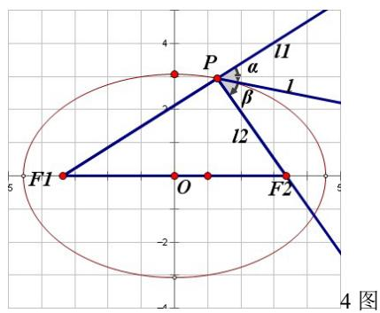

text_image

4
P
α
l1
β
l2
F1
O
F2
5
-2
4 图

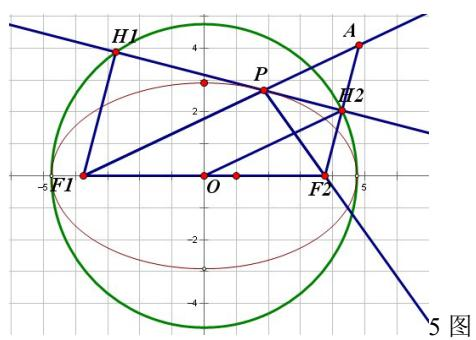

text_image

H1
4
P
2
H2
-5 F1 O F2
-2
-4
5 图

由两直线夹角公式 $\tan \theta = \left|\frac{k_1 - k_2}{1 + k_1k_2}\right|$ 得：

$$
\tan \alpha = \left| \frac {k - k _ {1}}{1 + k k _ {1}} \right| = \left| \frac {\frac {b ^ {2} x _ {0}}{a ^ {2} y _ {0}} + \frac {y _ {0}}{x _ {0} + c}}{1 - \frac {b ^ {2} x _ {0}}{a ^ {2} y _ {0}} \cdot \frac {y _ {0}}{x _ {0} + c}} \right| = \left| \frac {b ^ {2} x _ {0} ^ {2} + a ^ {2} y _ {0} ^ {2} + b ^ {2} x _ {0} c}{a ^ {2} x _ {0} y _ {0} + a ^ {2} c y _ {0} - b ^ {2} x _ {0} y _ {0}} \right| = \left| \frac {a ^ {2} b ^ {2} + b ^ {2} c x _ {0}}{c ^ {2} x _ {0} y _ {0} + a ^ {2} c y _ {0}} \right| = \left| \frac {b ^ {2} (a ^ {2} + c x _ {0})}{c y _ {0} (a ^ {2} + c x _ {0})} \right| = \frac {b ^ {2}}{c | y _ {0} |}
$$

$$
\tan \beta = \left| \frac {k - k _ {2}}{1 + k k _ {2}} \right| = \left| \frac {\frac {b ^ {2} x _ {0}}{a ^ {2} y _ {0}} + \frac {y _ {0}}{x _ {0} - c}}{1 - \frac {b ^ {2} x _ {0}}{a ^ {2} y _ {0}} \cdot \frac {y _ {0}}{x _ {0} - c}} \right| = \left| \frac {b ^ {2} x _ {0} ^ {2} + a ^ {2} y _ {0} ^ {2} - b ^ {2} x _ {0} c}{a ^ {2} x _ {0} y _ {0} - a ^ {2} c y _ {0} - b ^ {2} x _ {0} y _ {0}} \right| = \left| \frac {a ^ {2} b ^ {2} - b ^ {2} c x _ {0}}{c ^ {2} x _ {0} y _ {0} - a ^ {2} c y _ {0}} \right| = \left| \frac {b ^ {2} (a ^ {2} - c x _ {0})}{c y _ {0} (a ^ {2} - c x _ {0})} \right| = \frac {b ^ {2}}{c | y _ {0} |}
$$

$\because \alpha, \beta \in \left(0, \frac{\pi}{2}\right) \therefore \alpha = \beta$ 同理可证其它情况。故切线PT平分点P处的外角。

5.如图，延长 $\mathrm{F_1P}$ 至A，使 $\mathrm{PA = PF_2}$ ，则 $\Delta PAF_{2}$ 是等腰三角形， $\mathrm{AF_2}$ 中点即为射影 $\mathrm{H}_{2}$ 。则 $OH_{2} = \frac{F_{1}A}{2} = a$ ，同理可得 $OH_{1} = a$ ，所以射影 $\mathrm{H}_{1}, \mathrm{H}_{2}$ 的轨迹是以长轴为直径的圆除去两端点。  
6. 设 P, Q 两点到与焦点对应的准线的距离分别为 $d_{1}, d_{2}$ , 以 PQ 中点到准线的距离为 $d$ , 以 PQ 为直径的圆的半径为 r, 则 $d = \frac{d_{1} + d_{2}}{2} = \frac{PF + FQ}{2e} = \frac{r}{e} > r$ , 故以 PQ 为直径的圆与对应准线相离。

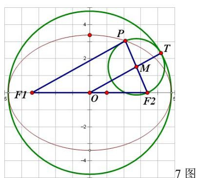

text_image

F1
O
P
M
T
F2
-2
-4
5
4
2
5
7 图

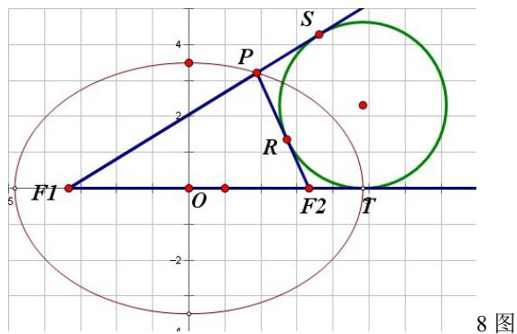

text_image

F1
O
F2
T
S
P
R
4
3
2
-2
4
8 图

7.如图，两圆圆心距为 $d=\left|OM\right|=\frac{\left|PF_{1}\right|}{2}=\frac{2a-\left|PF_{2}\right|}{2}=a-\frac{\left|PF_{2}\right|}{2}=a-r$ ，故两圆内切。  
8.如图，由切线长定理： $\left|F_{1}S\right|+\left|F_{1}T\right|=\left|PF_{1}\right|+\left|PF_{2}\right|+\left|F_{1}F_{2}\right|=2a+2c,\quad\left|F_{1}S\right|=\left|F_{1}T\right|=a+c$

而 $\left|F_{1}T\right|=a+c=\left|F_{1}A_{2}\right|$ ，T 与 $A_{2}$ 重合，故旁切圆与 x 轴切于右顶点，同理可证 P 在其他位置情况。

9. 易知 $A_{1}(-a,0)A_{2}(a,0)$ ，设 $P_{1}(x_{0},y_{0}), P_{2}(x_{0}, -y_{0})$ ，则 $\frac{x_0^2}{a^2} + \frac{y_0^2}{b^2} = 1$

$$
A _ {1} P _ {1}: y = \frac {y _ {0}}{a + x _ {0}} (x + a), A _ {2} P _ {2}: y = \frac {y _ {0}}{a - x _ {0}} (x - a)
$$

则 $x_{P} = \frac{a^{2}}{x_{0}}\Rightarrow P\left(\frac{a^{2}}{x_{0}},\frac{ay_{0}}{x_{0}}\right)\therefore \frac{x_{P}^{2}}{a^{2}} -\frac{y_{P}^{2}}{b^{2}} = \frac{a^{2}}{x_{0}^{2}} -\frac{a^{2}y_{0}^{2}}{b^{2}x_{0}^{2}} = \frac{a^{2}b^{2} - a^{2}y_{0}^{2}}{b^{2}x_{0}^{2}} = 1\therefore P$ 点的轨迹方程为 $\frac{x^2}{a^2} -\frac{y^2}{b^2} = 1$

10. $\because P_{0}(x_{0},y_{0})$ 在椭圆 $\frac{x^2}{a^2} +\frac{y^2}{b^2} = 1$ 上 $\therefore \frac{x_0^2}{a^2} +\frac{y_0^2}{b^2} = 1$ ，对 $\frac{x^2}{a^2} +\frac{y^2}{b^2} = 1$ 求导得：

$$
\frac {2 x}{a ^ {2}} + \frac {2 y y ^ {\prime}}{b ^ {2}} = 0 \therefore y ^ {\prime} = - \frac {b ^ {2} x _ {0}}{a ^ {2} y _ {0}}
$$

∴切线方程为 $y-y_{0}=-\frac{b^{2}x_{0}}{a^{2}y_{0}}(x-x_{0})$ 即 $\frac{x_{0}x}{a^{2}}+\frac{y_{0}y}{b^{2}}=\frac{x_{0}^{2}}{a^{2}}+\frac{y_{0}^{2}}{b^{2}}=1$

11. 设 $P_{1}(x_{1}, y_{1}), P_{2}(x_{2}, y_{2})$ ，由 10 得： $\frac{x_{0}x_{1}}{a^{2}} + \frac{y_{0}y_{1}}{b^{2}} = 1, \frac{x_{0}x_{2}}{a^{2}} + \frac{y_{0}y_{2}}{b^{2}} = 1$ ，因为点 $P_{1}, P_{2}$ 在直线 $P_{1}P_{2}$ 上，且同时满足方程 $\frac{x_{0}x}{a^{2}} + \frac{y_{0}y}{b^{2}} = 1$ ，所以 $P_{1}P_{2} : \frac{x_{0}x}{a^{2}} + \frac{y_{0}y}{b^{2}} = 1$

12. 设 $A(x_{1},y_{1}), B(x_{2},y_{2}), M(x_{0},y_{0})$ 则有 $\frac{x_{1}^{2}}{a^{2}}+\frac{y_{1}^{2}}{b^{2}}=1,\frac{x_{2}^{2}}{a^{2}}+\frac{y_{2}^{2}}{b^{2}}=1$ 作差得： $\frac{x_{1}^{2}-x_{2}^{2}}{a^{2}}+\frac{y_{1}^{2}-y_{2}^{2}}{b^{2}}=0$

$$
\Rightarrow \frac {\left(x _ {1} - x _ {2}\right) \left(x _ {1} + x _ {2}\right)}{a ^ {2}} + \frac {\left(y _ {1} - y _ {2}\right) \left(y _ {1} + y _ {2}\right)}{b ^ {2}} = 0
$$

$$
\Rightarrow k _ {A B} = \frac {y _ {1} - y _ {2}}{x _ {1} - x _ {2}} = - \frac {b ^ {2} \left(x _ {1} + x _ {2}\right)}{a ^ {2} \left(y _ {1} + y _ {2}\right)} = - \frac {b ^ {2} x _ {0}}{a ^ {2} y _ {0}} = - \frac {b ^ {2}}{a ^ {2} k _ {O M}} \Rightarrow k _ {A B} \cdot k _ {O M} = - \frac {b ^ {2}}{a ^ {2}}
$$

13.由 12 可得： $y - y_{0} = -\frac{b^{2}x_{0}}{a^{2}y_{0}}(x - x_{0}) \Rightarrow a^{2}y_{0}y - a^{2}y_{0}^{2} + b^{2}x_{0}x - b^{2}x_{0}^{2} = 0$

$$
\Rightarrow b ^ {2} x _ {0} x + a ^ {2} y _ {0} y = b ^ {2} x _ {0} ^ {2} + a ^ {2} y _ {0} ^ {2} \Rightarrow \frac {x _ {0} x}{a ^ {2}} + \frac {y _ {0} y}{b ^ {2}} = \frac {x _ {0} ^ {2}}{a ^ {2}} + \frac {y _ {0} ^ {2}}{b ^ {2}}
$$

14. .由 12 可得: $\frac{y - y_0}{x - x_0} \cdot \frac{y}{x} = -\frac{b^2}{a^2} \Rightarrow a^2 y^2 - a^2 y_0 y + b^2 x^2 - b^2 x_0 x = 0$

$$
\Rightarrow b ^ {2} x ^ {2} + a ^ {2} y ^ {2} = b ^ {2} x _ {0} x + a ^ {2} y _ {0} y \Rightarrow \frac {x ^ {2}}{a ^ {2}} + \frac {y ^ {2}}{b ^ {2}} = \frac {x _ {0} x}{a ^ {2}} + \frac {y _ {0} y}{b ^ {2}}
$$

15. 设 $P(a \cos t, b \sin t), Q(a \cos t', b \sin t')$ ，则 $k_{OP} \cdot k_{OQ} = \frac{b \sin t}{a \cos t} \cdot \frac{b \sin t'}{a \cos t'} = -1 \therefore \tan t \cdot \tan t' = -\frac{a^2}{b^2}$

$$
\begin{array}{l} \frac {1}{r _ {1} ^ {2}} + \frac {1}{r _ {2} ^ {2}} = \frac {r _ {1} ^ {2} + r _ {2} ^ {2}}{r _ {1} ^ {2} r _ {2} ^ {2}} = \frac {a ^ {2} (\cos^ {2} t + \cos^ {2} t ^ {\prime}) + b ^ {2} (\sin^ {2} t + \sin^ {2} t ^ {\prime})}{(a ^ {2} \cos^ {2} t + b ^ {2} \sin^ {2} t) (a ^ {2} \cos^ {2} t ^ {\prime} + b ^ {2} \sin^ {2} t ^ {\prime})} \\ = \frac {a ^ {2} \left(\frac {1}{\cos^ {2} t} + \frac {1}{\cos^ {2} t ^ {\prime}}\right) + b ^ {2} \left(\frac {\tan^ {2} t ^ {\prime}}{\cos^ {2} t} + \frac {\tan^ {2} t}{\cos^ {2} t ^ {\prime}}\right)}{\left(a ^ {2} + b ^ {2} \tan^ {2} t\right) \left(a ^ {2} + b ^ {2} \tan^ {2} t ^ {\prime}\right)} = \frac {a ^ {2} \left(2 + \tan^ {2} t + \tan^ {2} t ^ {\prime}\right) + b ^ {2} \left(\tan^ {2} t + \tan^ {2} t ^ {\prime}\right) + 2 b ^ {2} \tan^ {2} t \tan^ {2} t ^ {\prime}}{a ^ {4} + a ^ {2} b ^ {2} \left(\tan^ {2} t + \tan^ {2} t ^ {\prime}\right) + b ^ {4} \tan^ {2} t \tan^ {2} t ^ {\prime}} \\ \end{array}
$$

$$
= \frac {\left(a ^ {2} + b ^ {2}\right) \left(\tan^ {2} t + \tan^ {2} t ^ {\prime}\right) + 2 a ^ {2} \frac {a ^ {2} + b ^ {2}}{b ^ {2}}}{2 a ^ {4} + a ^ {2} b ^ {2} \left(\tan^ {2} t + \tan^ {2} t ^ {\prime}\right)} = \frac {\left(\frac {1}{a ^ {2}} + \frac {1}{b ^ {2}}\right) \left[ \left(\tan^ {2} t + \tan^ {2} t ^ {\prime}\right) + 2 \frac {a ^ {2}}{b ^ {2}} \right]}{2 \frac {a ^ {2}}{b ^ {2}} + \left(\tan^ {2} t + \tan^ {2} t ^ {\prime}\right)} = \frac {1}{a ^ {2}} + \frac {1}{b ^ {2}}
$$

16.将直线AB代入椭圆方程中得： $\left(A^2 a^2 +B^2 b^2\right)x^2 -2Aa^2 x + a^2\left(1 - B^2 b^2\right) = 0$

$$
\Delta = 4 a ^ {2} B ^ {2} b ^ {2} \left(A ^ {2} a ^ {2} + B ^ {2} b ^ {2} - 1\right), \quad | A B | = \frac {2 a b \sqrt {A ^ {2} + B ^ {2}}}{A ^ {2} a ^ {2} + B ^ {2} b ^ {2}} \sqrt {A ^ {2} a ^ {2} + B ^ {2} b ^ {2} - 1}
$$

设 $A(x_{1},y_{1}),B(x_{2},y_{2})$ 则 $x_{1} + x_{2} = \frac{2Aa^{2}}{A^{2}a^{2} + B^{2}b^{2}}$ ， $x_{1}x_{2} = \frac{a^{2}(1 - B^{2}b^{2})}{A^{2}a^{2} + B^{2}b^{2}}$ ， $y_{1}y_{2} = \frac{b^{2}(1 - A^{2}a^{2})}{A^{2}a^{2} + B^{2}b^{2}}$

$$
\because O A \perp O B
$$

$$
\therefore x _ {1} x _ {2} + y _ {1} y _ {2} = 0 \Rightarrow a ^ {2} + b ^ {2} = a ^ {2} b ^ {2} (A ^ {2} + B ^ {2}) \Rightarrow A ^ {2} + B ^ {2} = \frac {1}{a ^ {2}} + \frac {1}{b ^ {2}}
$$

$$
\left| A B \right| = \frac {2 a b \sqrt {A ^ {2} + B ^ {2}}}{A ^ {2} a ^ {2} + B ^ {2} b ^ {2}} \sqrt {A ^ {2} a ^ {2} + B ^ {2} b ^ {2} - 1} = \frac {2 \sqrt {\left(a ^ {2} + b ^ {2}\right) \left(A ^ {2} a ^ {2} + B ^ {2} b ^ {2} - 1\right)}}{A ^ {2} a ^ {2} + B ^ {2} b ^ {2}}
$$

$$
= \frac {2 \sqrt {A ^ {2} a ^ {4} + B ^ {2} b ^ {4} + a ^ {2} b ^ {2} (A ^ {2} + B ^ {2}) - (a ^ {2} + b ^ {2})}}{A ^ {2} a ^ {2} + B ^ {2} b ^ {2}} = \frac {2 \sqrt {A ^ {2} a ^ {4} + B ^ {2} b ^ {4}}}{A ^ {2} a ^ {2} + B ^ {2} b ^ {2}}
$$

17.(I) 设椭圆内直角弦 AB 的方程为: $y - m = k(x - n)$ 即 $y = kx + m - kn$ 。

当斜率 k 存在时，代入椭圆 $C_{1}$ 方程中得： $\left(a^{2}k^{2}+b^{2}\right)x^{2}+2a^{2}k(m-kn)x+a^{2}\left[(m-kn)^{2}-b^{2}\right]=0$

设 $A(x_{1},y_{1}),B(x_{2},y_{2})$ 得 $x_{1} + x_{2} = -\frac{2a^{2}k(m - kn)}{a^{2}k^{2} + b^{2}}, x_{1}x_{2} = \frac{a^{2}\left[(m - kn)^{2} - b^{2}\right]}{a^{2}k^{2} + b^{2}}$

则 $\overrightarrow{PA} \cdot \overrightarrow{PB} = (x_0 - x_1)(x_0 - x_2) + (y_0 - y_1)(y_0 - y_2)$

$$
= (k ^ {2} + 1) x _ {1} x _ {2} - (k ^ {2} n + k y _ {0} + x _ {0} - m k) (x _ {1} + x _ {2}) + x _ {0} ^ {2} + [ y _ {0} - (m - k n) ] ^ {2} = 0
$$

$$
\Rightarrow a ^ {2} (k ^ {2} + 1) \left[ (m - k n) ^ {2} - b ^ {2} \right] + (k ^ {2} n + k y _ {0} + x _ {0} - m k) 2 a ^ {2} k (m - k n) + (a ^ {2} k ^ {2} + b ^ {2}) x _ {0} ^ {2} + (a ^ {2} k ^ {2} + b ^ {2}) [ y _ {0} - (m - k n) ] ^ {2}
$$

$$
\Rightarrow a ^ {2} (k ^ {2} + 1) (m - k n) ^ {2} - a ^ {2} (k ^ {2} + 1) b ^ {2} + \left(a ^ {2} k ^ {2} + b ^ {2}\right) x _ {0} ^ {2} + \left(a ^ {2} k ^ {2} + b ^ {2}\right) y _ {0} ^ {2} + \left(a ^ {2} k ^ {2} + b ^ {2}\right) (m - k n) ^ {2}
$$

$$
- 2 y _ {0} (m - k n) \left(a ^ {2} k ^ {2} + b ^ {2}\right) - 2 a ^ {2} k ^ {2} (m - k n) ^ {2} + 2 a ^ {2} k x _ {0} (m - k n) + 2 a ^ {2} k ^ {2} y _ {0} (m - k n) = 0
$$

$$
\Rightarrow a ^ {2} (m - k n) ^ {2} - a ^ {2} (k ^ {2} + 1) b ^ {2} + \left(a ^ {2} k ^ {2} + b ^ {2}\right) x _ {0} ^ {2} + \left(a ^ {2} k ^ {2} + b ^ {2}\right) y _ {0} ^ {2} + b ^ {2} (m - k n) ^ {2} - 2 y _ {0} (m - k n) b ^ {2} + 2 a ^ {2} k x _ {0} (m - k n) =
$$

$$
\Rightarrow \left(a ^ {2} k ^ {2} + b ^ {2}\right) \left(x _ {0} ^ {2} + y _ {0} ^ {2}\right) + \left(a ^ {2} + b ^ {2}\right) (m - k n) ^ {2} - a ^ {2} b ^ {2} (k ^ {2} + 1) + 2 (m - k n) \left(a ^ {2} k x _ {0} - b ^ {2} y _ {0}\right) = 0
$$

$$
\Rightarrow a ^ {2} k ^ {2} \left(x _ {0} ^ {2} + y _ {0} ^ {2}\right) + b ^ {2} \left(x _ {0} ^ {2} + y _ {0} ^ {2}\right) + \left(a ^ {2} + b ^ {2}\right) m ^ {2} + \left(a ^ {2} + b ^ {2}\right) k ^ {2} n ^ {2} - 2 k m n \left(a ^ {2} + b ^ {2}\right) - a ^ {2} b ^ {2} k ^ {2} - a ^ {2} b ^ {2}
$$

$$
+ 2 m a ^ {2} k x _ {0} - 2 m b ^ {2} y _ {0} - 2 k ^ {2} n a ^ {2} x _ {0} + 2 k n b ^ {2} y _ {0} = 0
$$

$$
\Rightarrow \left\{ \begin{array}{l} a ^ {2} x _ {0} ^ {2} + (a ^ {2} + b ^ {2}) n ^ {2} - b ^ {2} x _ {0} ^ {2} - 2 n a ^ {2} x _ {0} = 0 \\ m a ^ {2} x _ {0} + n b ^ {2} y _ {0} = m n (a ^ {2} + b ^ {2}) \\ b ^ {2} y _ {0} ^ {2} + (a ^ {2} + b ^ {2}) m ^ {2} - a ^ {2} y _ {0} ^ {2} - 2 m b ^ {2} y _ {0} = 0 \end{array} \Rightarrow \left\{ \begin{array}{l} m = \frac {b ^ {2} - a ^ {2}}{a ^ {2} + b ^ {2}} y _ {0} \\ n = \frac {a ^ {2} - b ^ {2}}{a ^ {2} + b ^ {2}} x _ {0} \end{array} \right. \right.
$$

即直线 AB 过定点 $\left(\frac{a^{2}-b^{2}}{a^{2}+b^{2}}x_{0},\frac{b^{2}-a^{2}}{a^{2}+b^{2}}y_{0}\right)$ ，此点在 $C_{2}$ 上。当直线斜率不存在时，直线 AB 也过 $C_{2}$ 上的定点。

(II) 由上可知 $C_{1}$ 和 $C_{2}$ 上点由此建立起一种一一对应的关系，即证。

18. 必要性：设 $P_{1}P_{2}$ : $y + my_{0} = k(x - mx_{0})$ 。k 存在时，代入椭圆方程中得：

$$
\left(a ^ {2} k ^ {2} + b ^ {2}\right) x ^ {2} - 2 a ^ {2} k m \left(y _ {0} + k x _ {0}\right) x + a ^ {2} m ^ {2} \left(y _ {0} + k x _ {0}\right) ^ {2} - a ^ {2} b ^ {2} = 0
$$

设 $P_{1}(x_{1},y_{1}),P_{2}(x_{2},y_{2})$ 得 $x_{1} + x_{2} = \frac{2a^{2}km(y_{0} + kx_{0})}{a^{2}k^{2} + b^{2}},\quad x_{1}x_{2} = \frac{a^{2}m^{2}(y_{0} + kx_{0})^{2} - a^{2}b^{2}}{a^{2}k^{2} + b^{2}}$

$$
k _ {1} \cdot k _ {2} = \frac {\left(y _ {0} - y _ {1}\right) \left(y _ {0} - y _ {2}\right)}{\left(x _ {0} - x _ {1}\right) \left(x _ {0} - x _ {2}\right)} = \frac {k ^ {2} x _ {1} x _ {2} - k \left(m y _ {0} + m k x _ {0} + y _ {0}\right) \left(x _ {1} + x _ {2}\right) + \left(m y _ {0} + m k x _ {0} + y _ {0}\right) ^ {2}}{x _ {1} x _ {2} - x _ {0} \left(x _ {1} + x _ {2}\right) + x _ {0} ^ {2}}
$$

$$
= \frac {b ^ {2} (m + 1) \left[ 2 k m x _ {0} y _ {0} + k ^ {2} x _ {0} ^ {2} (m - 1) + y _ {0} ^ {2} (m + 1) \right]}{a ^ {2} (m - 1) \left[ 2 k m x _ {0} y _ {0} + k ^ {2} x _ {0} ^ {2} (m - 1) + y _ {0} ^ {2} (m + 1) \right]} = \frac {b ^ {2} (m + 1)}{a ^ {2} (m - 1)}
$$

k 不存在时， $P_{1}P_{2}$ : $x=mx_{0}$ 则 $y=\pm\frac{b}{a}\sqrt{a^{2}-m^{2}x_{0}^{2}}$

$$
k _ {1} \cdot k _ {2} = \frac {\left(y _ {0} - \frac {b}{a} \sqrt {a ^ {2} - m ^ {2} x _ {0} ^ {2}}\right) \left(y _ {0} + \frac {b}{a} \sqrt {a ^ {2} - m ^ {2} x _ {0} ^ {2}}\right)}{x _ {0} ^ {2} (1 - m) ^ {2}} = \frac {y _ {0} ^ {2} - \frac {b ^ {2}}{a ^ {2}} \left(a ^ {2} - m ^ {2} x _ {0} ^ {2}\right)}{x _ {0} ^ {2} (1 - m) ^ {2}} = \frac {b ^ {2} x _ {0} ^ {2} (m ^ {2} - 1)}{a ^ {2} x _ {0} ^ {2} (1 - m) ^ {2}} = \frac {b ^ {2} (m + 1)}{a ^ {2} (m - 1)}
$$

必要性得证。

充分性：设 $P_{1}P_{2}$ 过定点 $(q, p)$ ，则 $P_{1}P_{2}$ ： $y = kx + p - kq$ 。代入椭圆方程得：

$$
\left(a ^ {2} k ^ {2} + b ^ {2}\right) x ^ {2} + 2 a ^ {2} k (p - k q) x + a ^ {2} (p - k q) ^ {2} - a ^ {2} b ^ {2} = 0
$$

设 $P_{1}(x_{1},y_{1}), P_{2}(x_{2},y_{2})$ 得 $x_{1} + x_{2} = -\frac{2a^{2}k(p - kq)}{a^{2}k^{2} + b^{2}}, x_{1}x_{2} = \frac{a^{2}(p - kq)^{2} - a^{2}b^{2}}{a^{2}k^{2} + b^{2}}$

则 $k_{1}\cdot k_{2} = \frac{(y_{1} - y_{0})(y_{2} - y_{0})}{(x_{1} - x_{0})(x_{2} - x_{0})} = \frac{k^{2}x_{1}x_{2} + k(p - kq - y_{0})(x_{1} + x_{2}) + (p - kq - y_{0})^{2}}{x_{1}x_{2} - x_{0}(x_{1} + x_{2}) + x_{0}^{2}}$

$$
= \frac {a ^ {2} k ^ {2} (p - k q) ^ {2} - a ^ {2} b ^ {2} k ^ {2} - 2 a ^ {2} k ^ {2} (p - k q) (p - k q - y _ {0}) + (p - k q - y _ {0}) ^ {2} (a ^ {2} k ^ {2} + b ^ {2})}{a ^ {2} (p - k q) ^ {2} - a ^ {2} b ^ {2} + 2 a ^ {2} k x _ {0} (p - k q) + x _ {0} ^ {2} (a ^ {2} k ^ {2} + b ^ {2})}
$$

$$
= \frac {b ^ {2} \left[ (p - k q) ^ {2} - 2 y _ {0} (p - k q) + \left(y _ {0} ^ {2} - k ^ {2} x _ {0} ^ {2}\right) \right]}{a ^ {2} \left[ (p - k q) ^ {2} + 2 k x _ {0} (p - k q) + \left(k ^ {2} x _ {0} ^ {2} - y _ {0} ^ {2}\right) \right]} = \frac {m + 1}{m - 1} \cdot \frac {b ^ {2}}{a ^ {2}}
$$

$$
\Rightarrow \frac {(p - k q) ^ {2} - 2 y _ {0} (p - k q) + \left(y _ {0} ^ {2} - k ^ {2} x _ {0} ^ {2}\right)}{(p - k q) ^ {2} + 2 k x _ {0} (p - k q) + \left(k ^ {2} x _ {0} ^ {2} - y _ {0} ^ {2}\right)} = \frac {m + 1}{m - 1}
$$

$$
\Rightarrow k ^ {2} \left(m x _ {0} ^ {2} + q ^ {2} - m q x _ {0} - q x _ {0}\right) + k \left(m p x _ {0} + p x _ {0} - m q y _ {0} + q y _ {0} - 2 p q\right) + \left(m p y _ {0} - p y _ {0} + p ^ {2} - m y _ {0} ^ {2}\right) = 0
$$

$$
\Rightarrow \left\{ \begin{array}{l} m x _ {0} ^ {2} + q ^ {2} - m q x _ {0} - q x _ {0} = 0 \\ m p x _ {0} + p x _ {0} - m q y _ {0} + q y _ {0} - 2 p q = 0 \Rightarrow \left\{ \begin{array}{l} (q - x _ {0}) (q - m x _ {0}) = 0 \dots \dots (1) \\ p x _ {0} (m + 1) + q y _ {0} (1 - m) = 2 p q \dots \dots (2) \\ (p - y _ {0}) (m y _ {0} + p) = 0 \dots \dots (3) \end{array} \right. \end{array} \right.
$$

注意到 $\mathrm{m} \neq 1$ ，解（1）（3）得 $p = -my_0, q = mx_0$ ，代入（2）式，成立。

验证 k 不存在的情况，也得到此结论。故 l 过定点 $(mx_{0}, -my_{0})(m \neq 1)$ ，充分性得证。

19. 设 AB: $y - y_{0} = k(x - x_{0})$ 即 $y = kx + y_{0} - kx_{0}$

$$
\left\{ \begin{array}{l} y = k x + y _ {0} - k x _ {0} \\ \frac {x ^ {2}}{a ^ {2}} + \frac {y ^ {2}}{b ^ {2}} = 1 \end{array} \Rightarrow \left(a ^ {2} k ^ {2} + b ^ {2}\right) x ^ {2} + 2 a ^ {2} k \left(y _ {0} - k x _ {0}\right) x + a ^ {2} \left[ \left(y _ {0} - k x _ {0}\right) ^ {2} - b ^ {2} \right] = 0 \right.
$$

$$
\Rightarrow x _ {0} + x _ {B} = \frac {2 a ^ {2} k \left(k x _ {0} - y _ {0}\right)}{a ^ {2} k ^ {2} + b ^ {2}} \Rightarrow x _ {B} = \frac {a ^ {2} k ^ {2} x _ {0} - 2 a ^ {2} k y _ {0} - b ^ {2} x _ {0}}{a ^ {2} k ^ {2} + b ^ {2}} \Rightarrow B \left(\frac {a ^ {2} k ^ {2} x _ {0} - 2 a ^ {2} k y _ {0} - b ^ {2} x _ {0}}{a ^ {2} k ^ {2} + b ^ {2}}, \frac {b ^ {2} y _ {0} - a ^ {2} k ^ {2} y _ {0} - 2 b ^ {2} k x _ {0}}{a ^ {2} k ^ {2} + b ^ {2}}\right)
$$

同理 $C\left(\frac{a^{2}k^{2}x_{0}+2a^{2}ky_{0}-b^{2}x_{0}}{a^{2}k^{2}+b^{2}},\frac{b^{2}y_{0}-a^{2}k^{2}y_{0}+2b^{2}kx_{0}}{a^{2}k^{2}+b^{2}}\right)\therefore k_{BC}=\frac{4b^{2}kx_{0}}{4a^{2}ky_{0}}=\frac{b^{2}x_{0}}{a^{2}y_{0}}$

20. 由余弦定理：

$$
\left| P F _ {1} \right| ^ {2} + \left| P F _ {2} \right| ^ {2} - 2 \left| P F _ {1} \right| \left| P F _ {2} \right| \cos \gamma = (2 c) ^ {2} \Rightarrow \left(\left| P F _ {1} \right| + \left| P F _ {2} \right|\right) ^ {2} = 4 c ^ {2} + 2 \left| P F _ {1} \right| \left| P F _ {2} \right| (\cos \gamma + 1)
$$

$$
\Rightarrow 4 a ^ {2} = 4 c ^ {2} + 2 \left| P F _ {1} \right| \left| P F _ {2} \right| (\cos \gamma + 1) \Rightarrow \left| P F _ {1} \right| \left| P F _ {2} \right| = \frac {2 b ^ {2}}{\cos \gamma + 1} = \frac {b ^ {2}}{\cos^ {2} \frac {\gamma}{2}}
$$

$$
S _ {\Delta F _ {1} P F _ {2}} = \frac {1}{2} \left| P F _ {1} \right| \left| P F _ {2} \right| \sin \gamma = \frac {b ^ {2} \sin \gamma}{\cos \gamma + 1} = \frac {2 b ^ {2} \sin \frac {\gamma}{2} \cos \frac {\gamma}{2}}{2 \cos^ {2} \frac {\gamma}{2}} = b ^ {2} \tan \frac {\gamma}{2} = c \left| y _ {P} \right|
$$

$$
\Rightarrow \left| y _ {P} \right| = \frac {b ^ {2}}{c} \tan \frac {\gamma}{2}, \left| x _ {P} \right| = \sqrt {a ^ {2} - \frac {a ^ {2} b ^ {2}}{c ^ {2}} \tan^ {2} \frac {\gamma}{2}} = \frac {a}{c} \sqrt {c ^ {2} - b ^ {2} \tan^ {2} \frac {\gamma}{2}} \therefore P \left(\pm \frac {a}{c} \sqrt {c ^ {2} - b ^ {2} \tan^ {2} \frac {\gamma}{2}}, \pm \frac {b ^ {2}}{c} \tan \frac {\gamma}{2}\right)
$$

21.由34: $\frac{a - c}{a + c} = \frac{1 - e}{1 + e} = \frac{\sin\beta + \sin\alpha - \sin\gamma}{\sin\beta + \sin\alpha + \sin\gamma} = \frac{\sin\beta + \sin\alpha - \sin(\alpha + \beta)}{\sin\beta + \sin\alpha + \sin(\alpha + \beta)}$

$$
\begin{array}{l} = \frac {\sin \beta + \sin \alpha - \sin \alpha \cos \beta - \sin \beta \cos \alpha}{\sin \beta + \sin \alpha + \sin \alpha \cos \beta + \sin \beta \cos \alpha} = \frac {\sin \beta (1 - \cos \alpha) + \sin \alpha (1 - \cos \beta)}{\sin \beta (1 + \cos \alpha) + \sin \alpha (1 + \cos \beta)} \\ = \frac {2 \sin \frac {\beta}{2} \cos \frac {\beta}{2} \cdot 2 \sin^ {2} \frac {\alpha}{2} + 2 \sin \frac {\alpha}{2} \cos \frac {\alpha}{2} \cdot 2 \sin^ {2} \frac {\beta}{2}}{2 \sin \frac {\beta}{2} \cos \frac {\beta}{2} \cdot 2 \cos^ {2} \frac {\alpha}{2} + 2 \sin \frac {\alpha}{2} \cos \frac {\alpha}{2} \cdot 2 \cos^ {2} \frac {\beta}{2}} = \frac {\sin \frac {\alpha}{2} \sin \frac {\beta}{2} \left(\cos \frac {\beta}{2} \sin \frac {\alpha}{2} + \cos \frac {\alpha}{2} \sin \frac {\beta}{2}\right)}{\cos \frac {\beta}{2} \cos \frac {\alpha}{2} \left(\sin \frac {\beta}{2} \cos \frac {\alpha}{2} + \sin \frac {\alpha}{2} \cos \frac {\beta}{2}\right)} \\ = \frac {\sin \frac {\alpha}{2} \sin \frac {\beta}{2}}{\cos \frac {\beta}{2} \cos \frac {\alpha}{2}} = \tan \frac {\alpha}{2} \tan \frac {\beta}{2} \\ \end{array}
$$

22.由第二定义得： $\left|MF_{1}\right|=e\left(x_{0}+\frac{a^{2}}{c}\right)=a+ex_{0},\left|MF_{2}\right|=e\left(\frac{a^{2}}{c}-x_{0}\right)=a-ex_{0}$   
23. $\frac{PF_1}{d} = \frac{PF_2}{PF_1} = e \Rightarrow PF_2 = e \cdot PF_1 \Rightarrow a - ex_0 = e(a + ex_0) \Rightarrow x_0 = \frac{1 - e}{e^2 + e} a$

$$
\because x _ {0} \in (0, a ] \therefore \frac {1 - e}{e ^ {2} + e} \leq 1 \Rightarrow e ^ {2} + 2 e - 1 \geq 0 \Rightarrow e \geq \sqrt {2} - 1 \text {或} e \leq - 1 - \sqrt {2} \because e \in (0, 1) \therefore e \in [ \sqrt {2} - 1, 1)
$$

24. 在 $\Delta APF_{2}$ 中, 有 $PF_{2} - AF_{2} \leq PA \leq PF_{2} + AF_{2}$

$$
\therefore P F _ {1} + P A \leq P F _ {1} + P F _ {2} + A F _ {2} = 2 a + A F _ {2}, P F _ {1} + P A \geq P F _ {1} + P F _ {2} - A F _ {2} = 2 a - A F _ {2}
$$

都当且仅当A、P、 $F_{2}$ 三点共线时取等号。

25.设椭圆上的点 $A\left(x_{1},y_{1}\right),B\left(x_{2},y_{2}\right)$ 关于 $l:y = kx + m$ 对称， $M\left(x_0^{\prime},y_0^{\prime}\right)$ 。

由12得： $k_{AB} = -\frac{b^2x_0'}{a^2y_0'} = -\frac{1}{k}\Rightarrow k = \frac{a^2y_0'}{b^2x_0'} = \frac{a^2(kx_0' + m)}{b^2x_0'}\Rightarrow x_0' = -\frac{a^2m}{c^2k},y_0' = -\frac{b^2m}{c^2}$

又 $\because M$ 在椭圆内， $\therefore \frac{a^2m^2}{c^4k^2} + \frac{b^2m^2}{c^4} = \frac{(a^2 + b^2k^2)m^2}{c^4k^2} < 1 \Rightarrow m^2 < \frac{c^4k^2}{a^2 + b^2k^2}$ 若 $m = -kx_0$ ，则

$$
x _ {0} ^ {2} <   \frac {c ^ {4}}{a ^ {2} + b ^ {2} k ^ {2}} = \frac {\left(a ^ {2} - b ^ {2}\right) ^ {2}}{a ^ {2} + b ^ {2} k ^ {2}}
$$

26.由 5 即可得证。  
27. 设 $\mathrm{P}(a\cos \varphi, b\sin \varphi)$ ，则切线 $l: \frac{\cos \varphi}{a} x + \frac{\sin \varphi}{b} y = 1$ ， $\mathrm{A}\left(\frac{a^2}{c}, \frac{b}{\sin \varphi}\left(1 - \frac{a\cos \varphi}{c}\right)\right)$

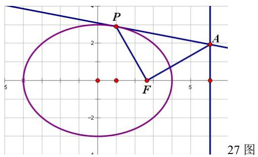

text_image

P
A
F
27 图

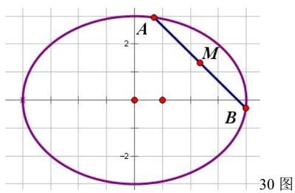

text_image

A
2
M
B
-2
30 图

$$
\therefore \overrightarrow {F P} \cdot \overrightarrow {F A} = (a \cos \varphi - c, b \sin \varphi) \cdot \left(\frac {b ^ {2}}{c}, \frac {b}{\sin \varphi} \left(1 - \frac {a \cos \varphi}{c}\right)\right) = \frac {a b ^ {2} \cos \varphi}{c} - b ^ {2} + b ^ {2} - \frac {a b ^ {2} \cos \varphi}{c} = 0 \therefore F P \perp F A
$$

28. 设 $P(a \cos \varphi, b \sin \varphi)$ , 由射影定理有: $b^2 \sin^2 \varphi = (c - a \cos \varphi)(c + a \cos \varphi) = c^2 - a^2 \cos^2 \varphi$

$$
\Rightarrow c ^ {2} = a ^ {2} \cos^ {2} \varphi + (a ^ {2} - c ^ {2}) \sin^ {2} \varphi \Rightarrow e ^ {2} = \cos^ {2} \varphi + (1 - e ^ {2}) \sin^ {2} \varphi
$$

$$
\Rightarrow (1 + \sin^ {2} \varphi) e ^ {2} = \sin^ {2} \varphi + \cos^ {2} \varphi = 1 \Rightarrow e ^ {2} = \frac {1}{1 + \sin^ {2} \varphi}
$$

29. 设 $C_1: \frac{x^2}{a^2} + \frac{y^2}{b^2} = 1, C_2: \frac{x^2}{a^2} + \frac{y^2}{b^2} = k (k > 1), AB(l): Ax + By + C = 0$ 。联立 $C_1, l$ 得：

$\left(A^{2}a^{2} + B^{2}b^{2}\right)x^{2} + 2Aa^{2}Cx + a^{2}C^{2} - a^{2}b^{2}B^{2} = 0$ ，由韦达定理： $x_{A} + x_{B} = -\frac{2Aa^{2}C}{A^{2}a^{2} + B^{2}b^{2}}$

同理 $x_{P} + x_{Q} = -\frac{2Aa^{2}C}{A^{2}a^{2} + B^{2}b^{2}}$ 。则

$$
\mathrm{AP} - \mathrm{BQ} = \sqrt {1 + \frac {A ^ {2}}{B ^ {2}}} \left| x _ {A} - x _ {P} \right| - \sqrt {1 + \frac {A ^ {2}}{B ^ {2}}} \left| x _ {B} - x _ {Q} \right| = \sqrt {1 + \frac {A ^ {2}}{B ^ {2}}} \left(\left| x _ {A} - x _ {P} \right| - \left| x _ {B} - x _ {Q} \right|\right)
$$

而 $x_{A}-x_{P}, x_{B}-x_{Q}$ 的符号一定相反，故 $\left|x_{A}-x_{P}\right|-\left|x_{B}-x_{Q}\right|=x_{A}+x_{B}-\left(x_{P}+x_{Q}\right)=0$ 。所以 AP=BQ

30. 设 $A(a\cos \theta, b\sin \theta), B(a\cos \varphi, b\sin \varphi)$ ， $M(x_0, y_0)$ 为 AB 中点。

则

$$
\left| A B \right| ^ {2} = a ^ {2} (\cos \theta - \cos \varphi) ^ {2} + b ^ {2} (\sin \theta - \sin \varphi) ^ {2} = 4 a ^ {2} \sin^ {2} \frac {\theta + \varphi}{2} \sin^ {2} \frac {\theta - \varphi}{2} + 4 b ^ {2} \cos^ {2} \frac {\theta + \varphi}{2} \sin^ {2} \frac {\theta - \varphi}{2} = 4 m ^ {2}
$$

$$
\Rightarrow a ^ {2} \sin^ {2} \frac {\theta + \varphi}{2} \sin^ {2} \frac {\theta - \varphi}{2} + b ^ {2} \cos^ {2} \frac {\theta + \varphi}{2} \sin^ {2} \frac {\theta - \varphi}{2} = m ^ {2}
$$

而 $x_0 = \frac{a\cos\theta + a\cos\varphi}{2} = a\cos \frac{\theta + \varphi}{2}\cos \frac{\theta - \varphi}{2}, y_0 = \frac{b\sin\theta + b\sin\varphi}{2} = b\sin \frac{\theta + \varphi}{2}\cos \frac{\theta - \varphi}{2}$

设 $A = \sin^2\frac{\theta - \varphi}{2}, B = \sin^2\frac{\theta + \varphi}{2}$ ，则 $x_0^2 = a^2(1 - A)(1 - B), y_0^2 = b^2(1 - A)B, m^2 = a^2AB + b^2A(1 - B)$

解得 $A = 1 - \left(\frac{x_0^2}{a^2} +\frac{y_0^2}{b^2}\right),B = \frac{\frac{y_0^2}{b^2}}{\frac{x_0^2}{a^2} + \frac{y_0^2}{b^2}},$ 代入 $\mathrm{m}^2$ 得： $m^2 = \left[1 - \left(\frac{x_0^2}{a^2} +\frac{y_0^2}{b^2}\right)\right]\left(\frac{\frac{a^2y_0^2}{b^2}}{\frac{x_0^2}{a^2} + \frac{y_0^2}{b^2}} +\frac{\frac{b^2x_0^2}{a^2}}{\frac{x_0^2}{a^2} + \frac{y_0^2}{b^2}}\right)$

令 $\tan \alpha = -\frac{bx_0}{ay_0}$ 得：

$$
m ^ {2} = \left[ 1 - \left(\frac {x _ {0} ^ {2}}{a ^ {2}} + \frac {y _ {0} ^ {2}}{b ^ {2}}\right) \right] \left(\frac {a ^ {2}}{\tan^ {2} \alpha + 1} + \frac {b ^ {2} \cdot \tan^ {2} \alpha}{\tan^ {2} \alpha + 1}\right) = \left[ 1 - \left(\frac {x _ {0} ^ {2}}{a ^ {2}} + \frac {y _ {0} ^ {2}}{b ^ {2}}\right) \right] (a ^ {2} \cos^ {2} \alpha + b ^ {2} \sin^ {2} \alpha)
$$

所以定长为 $2\mathrm{m}$ （ $0 < \mathrm{m} \leq \mathrm{a}$ ）的弦中点轨迹方程为 $m^2 = \left[1 - \left(\frac{x^2}{a^2} + \frac{y^2}{b^2}\right)\right]\left(a^2 \cos^2 \alpha + b^2 \sin^2 \alpha\right)$ 。

其中 $\tan\alpha=-\frac{bx}{ay}$ ，当 y=0 时， $\alpha=90^{\circ}$ 。

31. 设 $A(a \cos \alpha, b \sin \alpha)$ , $B(a \cos \beta, b \sin \beta)$ , $M(x_{0}, y_{0})$ 为 AB 中点。则：

$$
x _ {0} = \frac {a \cos \alpha + a \cos \beta}{2} = a \cos \frac {\alpha + \beta}{2} \cos \frac {\alpha - \beta}{2} \Rightarrow \cos \frac {\alpha - \beta}{2} = \frac {x _ {0}}{a \cos \frac {\alpha + \beta}{2}}
$$

$$
\left| A B \right| ^ {2} = a ^ {2} (\cos \alpha - \cos \beta) ^ {2} + b ^ {2} (\sin \alpha - \sin \beta) ^ {2} = 4 a ^ {2} \sin^ {2} \frac {\alpha + \beta}{2} \sin^ {2} \frac {\alpha - \beta}{2} + 4 b ^ {2} \cos^ {2} \frac {\alpha + \beta}{2} \sin^ {2} \frac {\alpha - \beta}{2}
$$

$$
= 4 \sin^ {2} \frac {\alpha - \beta}{2} \left(a ^ {2} \sin^ {2} \frac {\alpha + \beta}{2} + b ^ {2} \cos^ {2} \frac {\alpha + \beta}{2}\right) = 4 \left(1 - \cos^ {2} \frac {\alpha - \beta}{2}\right) \left(a ^ {2} - c ^ {2} \cos^ {2} \frac {\alpha + \beta}{2}\right) = l ^ {2}
$$

$$
\Rightarrow a ^ {2} - \left(a ^ {2} \cos^ {2} \frac {\alpha - \beta}{2} + c ^ {2} \cos^ {2} \frac {\alpha + \beta}{2}\right) + c ^ {2} \cos^ {2} \frac {\alpha + \beta}{2} \cos^ {2} \frac {\alpha - \beta}{2} = \frac {l ^ {2}}{4}
$$

$$
\Rightarrow e ^ {2} x _ {0} ^ {2} - \left(\frac {x _ {0} ^ {2}}{\cos^ {2} \frac {\alpha + \beta}{2}} + c ^ {2} \cos^ {2} \frac {\alpha + \beta}{2}\right) + a ^ {2} = \frac {l ^ {2}}{4} \leq a ^ {2}
$$

二次函数 $\mathrm{y = e^2x^2 - mx + a^2}$ 与 $y = \frac{l^2}{4}$ 在 $[0,a]$ 内的交点即为 $\mathbf{x}_0$ 的值。由图易知 $\mathrm{y = e^2x^2 - mx + a^2}$ 与 $y = \frac{l^2}{4}$ 的左交点为 $\mathbf{x}_0$ 的值。当 $\mathfrak{m}$ 增大时， $\mathbf{x}_0$ 减小。要使 $\mathbf{x}_0$ 最大，则要使 $\mathfrak{m}$ 最小。

$\frac{x_0^2}{\cos^2\frac{\alpha + \beta}{2}} + c^2\cos^2\frac{\alpha + \beta}{2}\geq 2cx_0$ ，此时等号成立时 $\cos^2\frac{\alpha + \beta}{2} = \frac{x_{0\max}}{c}\leq 1\Rightarrow x_{0\max}\leq c$

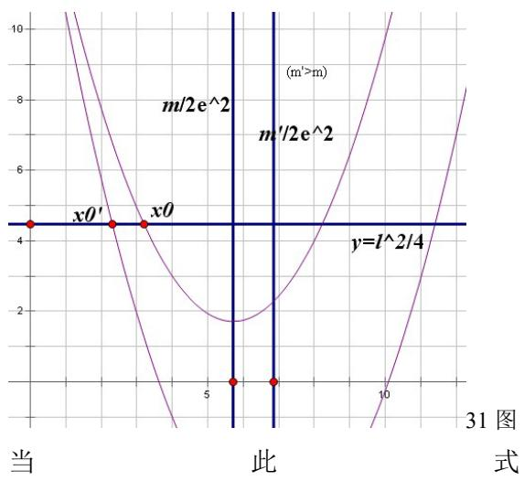

line

| Point | x     | y       |
|-------|-------|---------|
| x0'   | 0     | 4       |
| x0    | 5     | 4       |
| x0'   | 10    | 0       |

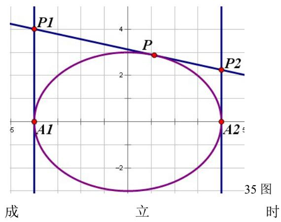

text_image

P1
4
P
P2
A1
2
A2
5
-2
成
立
时
35 图

$$
y = e ^ {2} x ^ {2} - m x + a ^ {2} = \frac {l ^ {2}}{4} \Rightarrow e ^ {2} x _ {0 \max} ^ {2} - 2 c x _ {0 \max} + a ^ {2} = \frac {l ^ {2}}{4} \Rightarrow e x _ {0 \max} - a = - \frac {l}{2} \Rightarrow x _ {0 \max} = \frac {a}{e} - \frac {l}{2 e} = \frac {a ^ {2}}{c} - \frac {l}{2 e}
$$

当 $x_{0\max} = \frac{a}{e} -\frac{l}{2e} = \frac{a^2}{c} -\frac{l}{2e} = c$ 时： $l^2 = 4(ce - a)^2\Rightarrow l = 2(a - ce) = \frac{2b^2}{a} = \Phi (\text{通径})$

当 $x_{0\max} \leq c$ 时： $l \geq \frac{2b^2}{a} = \Phi$ ∴ 当 $l \geq \Phi = \frac{2b^2}{a}$ 时 $x_{0\max} \leq c$ ， $x_{0\max} = \frac{a^2}{c} - \frac{l}{2e}$ 。

当 $x_{0\max} > c$ 时，当 $\cos^2\frac{\alpha + \beta}{2} = 1$ ，即AB垂直于x轴时 $\mathbf{x}_0$ 最大。

$$
e ^ {2} x _ {0 \max} ^ {2} - x _ {0 \max} ^ {2} + a ^ {2} - c ^ {2} = \frac {l ^ {2}}{4} \Rightarrow x _ {0 \max} ^ {2} = \frac {b ^ {2} - \frac {l ^ {2}}{4}}{1 - e ^ {2}} = \frac {a ^ {2}}{4 b ^ {2}} (4 b ^ {2} - l ^ {2}) \Rightarrow x _ {0 \max} = \frac {a}{2 b} \sqrt {4 b ^ {2} - l ^ {2}}
$$

考虑到对称性 $x_{0\min}=0$ 对任意情况均成立。

$$
\therefore x _ {0 \min} = 0, \quad x _ {0 \max} = \left\{ \begin{array}{l} \frac {a ^ {2}}{c} - \frac {l}{2 e} \left(x _ {0 \max} \leq c, l \geq \Phi = \frac {2 b ^ {2}}{a}, A B \text {过焦点,} \cos^ {2} \frac {\alpha + \beta}{2} = \frac {x _ {0}}{c}\right) \\ \frac {a}{2 b} \sqrt {4 b ^ {2} - l ^ {2}} \left(x _ {0 \max} > c, l <   \Phi = \frac {2 b ^ {2}}{a}, A B \perp x \text {轴,} \cos^ {2} \frac {\alpha + \beta}{2} = 1\right) \end{array} \right.
$$

$$
3 2. \left\{ \begin{array}{l} b ^ {2} x ^ {2} + a ^ {2} y ^ {2} = a ^ {2} b ^ {2} \\ A x + B y + C = 0 \end{array} \Rightarrow \left(A ^ {2} a ^ {2} + B ^ {2} b ^ {2}\right) x ^ {2} + 2 a ^ {2} A C x + a ^ {2} \left(C ^ {2} - B ^ {2} b ^ {2}\right) = 0 \right.
$$

$$
\Delta = 4 a ^ {4} A ^ {2} C ^ {2} - 4 a ^ {2} \left(C ^ {2} - B ^ {2} b ^ {2}\right) \left(A ^ {2} a ^ {2} + B ^ {2} b ^ {2}\right) \geq 0 \Rightarrow A ^ {2} a ^ {2} + B ^ {2} b ^ {2} \geq C ^ {2}
$$

33. $\left\{ \begin{array}{l} b^{2}(x - x_{0})^{2} + a^{2}(y - y_{0})^{2} = a^{2}b^{2} \\ Ax + By + C = 0 \end{array} \right.$

$$
\Rightarrow \left(A ^ {2} a ^ {2} + B ^ {2} b ^ {2}\right) x ^ {2} + 2 \left(a ^ {2} A C - B ^ {2} b ^ {2} x _ {0} + a ^ {2} A B y _ {0}\right) x + \left(a ^ {2} C ^ {2} + a ^ {2} B ^ {2} y _ {0} ^ {2} + B ^ {2} b ^ {2} x _ {0} ^ {2} - a ^ {2} B ^ {2} b ^ {2} + 2 a ^ {2} B C y _ {0}\right) = 0
$$

$$
\Delta \geq 0 \Rightarrow A ^ {2} a ^ {2} + B ^ {2} b ^ {2} \geq A ^ {2} x _ {0} ^ {2} + B ^ {2} y _ {0} ^ {2} + C ^ {2} + 2 A B x _ {0} y _ {0} + 2 A C x _ {0} + 2 B C y _ {0} = (A x _ {0} + B y _ {0} + C) ^ {2}
$$

当 $x_0 = y_0 = 0$ 时，即为32： $A^2 a^2 +B^2 b^2\geq C^2$

34.由正弦定理得 $\frac{F_1F_2}{\sin\alpha} = \frac{PF_2}{\sin\beta} = \frac{PF_1}{\sin\gamma}$ ，所以 $\frac{\sin\alpha}{\sin\beta + \sin\gamma} = \frac{F_1F_2}{PF_1 + PF_2} = \frac{2c}{2a} = \frac{c}{a} = e$ 。

35. 设 $P(a \cos \varphi, b \sin \varphi)$ ，则 P 点处的切线为 $\frac{\cos \varphi}{a} x + \frac{\sin \varphi}{b} y = 1$ ，

由此可得： $y_{P_1} = \frac{b}{\sin\varphi}\big(1 + \cos \varphi \big),y_{P_2} = \frac{b}{\sin\varphi}\big(1 - \cos \varphi \big)\therefore \left|P_1A_1\right|\cdot \left|P_2A_2\right| = \frac{b^2\left(1 - \cos^2\varphi\right)}{\sin^2\varphi} = b^2$

36.（1）同 15.

(2) 由 15,36 (3): $\frac{1}{|OP|^2} + \frac{1}{|OQ|^2} = \frac{|OP|^2 + |OQ|^2}{|OP|^2 |OQ|^2} = \frac{|OP|^2 + |OQ|^2}{4S_{\Delta OPQ}^2} = \frac{a^2 + b^2}{a^2b^2}$

$$
\therefore | O P | ^ {2} + | O Q | ^ {2} = \frac {\left(a ^ {2} + b ^ {2}\right) 4 S _ {\Delta O P Q} ^ {2}}{a ^ {2} b ^ {2}} \geq \frac {4 \left(a ^ {2} + b ^ {2}\right)}{a ^ {2} b ^ {2}} \cdot \left(\frac {a ^ {2} b ^ {2}}{a ^ {2} + b ^ {2}}\right) ^ {2} = \frac {4 a ^ {2} b ^ {2}}{a ^ {2} + b ^ {2}}
$$

(3) 设 $P(a\cos \theta ,b\sin \theta),Q(a\cos \varphi ,b\sin \varphi)$

$$
\overrightarrow {O P} \cdot \overrightarrow {O Q} = a ^ {2} \cos \theta \cos \varphi + b ^ {2} \sin \theta \sin \varphi = 0 \Rightarrow \tan \theta \tan \varphi = - \frac {a ^ {2}}{b ^ {2}}
$$

$$
2 S _ {\Delta O P Q} = \left| \overrightarrow {O P} \times \overrightarrow {O Q} \right| = \left\| \begin{array}{c c} a \cos \theta & b \sin \theta \\ a \cos \varphi & b \sin \varphi \end{array} \right\| = \left| a b (\sin \theta \cos \varphi - \sin \varphi \cos \theta) \right|
$$

$$
\Rightarrow \frac {4 S _ {\triangle O P Q} ^ {2}}{a ^ {2} b ^ {2}} = \sin^ {2} \theta \cos^ {2} \varphi + \sin^ {2} \varphi \cos^ {2} \theta - 2 \sin \theta \cos \theta \sin \varphi \cos \varphi
$$

$$
= \frac {\tan^ {2} \theta + \tan^ {2} \varphi - 2 \tan \theta \tan \varphi}{(\tan^ {2} \theta + 1) (\tan^ {2} \varphi + 1)} = \frac {\tan^ {2} \theta + \frac {\frac {a ^ {4}}{b ^ {4}}}{\tan^ {2} \theta} + 2 \frac {a ^ {2}}{b ^ {2}}}{\frac {a ^ {4}}{b ^ {4}} + \tan^ {2} \theta + \frac {\frac {a ^ {4}}{b ^ {4}}}{\tan^ {2} \theta} + 1}
$$

$$
\Rightarrow \frac {a ^ {2} b ^ {2}}{4 S _ {\Delta O P Q} ^ {2}} = \frac {\frac {a ^ {4}}{b ^ {4}} - 2 \frac {a ^ {2}}{b ^ {2}} + 1}{\tan^ {2} \theta + \frac {\overline {{b ^ {4}}}}{\tan^ {2} \theta} + 2 \frac {a ^ {2}}{b ^ {2}}} + 1 \leq \frac {a ^ {4} - 2 a ^ {2} b ^ {2} + b ^ {4}}{4 a ^ {2} b ^ {2}} + 1 = \frac {(a ^ {2} + b ^ {2}) ^ {2}}{4 a ^ {2} b ^ {2}} \Rightarrow S _ {\Delta O P Q} ^ {2} \geq \left(\frac {a ^ {2} b ^ {2}}{a ^ {2} + b ^ {2}}\right) ^ {2} \Rightarrow S _ {\Delta O P Q} \geq \frac {a ^ {2} b ^ {2}}{a ^ {2} + b ^ {2}}
$$

$$
\therefore S _ {\min} = \frac {a ^ {2} b ^ {2}}{a ^ {2} + b ^ {2}}
$$

37. 设 $\angle MFx = \theta, AB: \begin{cases} x = t\cos \theta \\ y = t\sin \theta \end{cases}$ ，椭圆 $\rho = \frac{p}{1 + e\cos\theta} \left( p = \frac{b^2}{a} \right)$

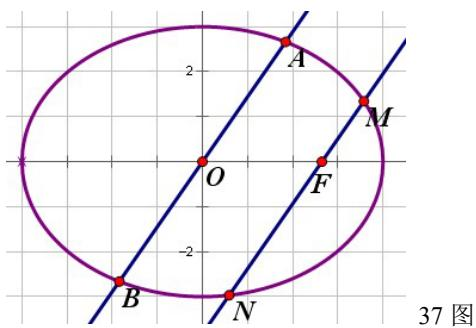

text_image

2
A
O
F
M
-2
B
N
37 图

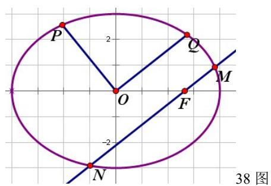

text_image

P
2
Q
M
O
F
-2
N
38 图

则 $MN = \frac{p}{1 + e\cos\theta} +\frac{p}{1 - e\cos\theta} = \frac{2p}{1 - e^2\cos^2\theta} = \frac{2ab^2}{a^2 - c^2\cos^2\theta} = \frac{2ab^2}{a^2\sin^2\theta + b^2\cos^2\theta}$

将 AB 的方程代入椭圆的标准方程中得： $t^{2}=\frac{a^{2}b^{2}}{a^{2}\sin^{2}\theta+b^{2}\cos^{2}\theta}$ ，由参数 t 的几何意义可知：

$$
\left| A B \right| ^ {2} = 4 t ^ {2} = \frac {4 a ^ {2} b ^ {2}}{a ^ {2} \sin^ {2} \theta + b ^ {2} \cos^ {2} \theta} = 2 a | M N |
$$

38.作半弦 $\mathrm{OQ}\bot \mathrm{OP}$ ，由37得： $\left|OQ\right|^2 = \frac{a}{2}\left|M N\right|$ ，由15： $\frac{1}{\left|OP\right|^2} +\frac{1}{\left|OQ\right|^2} = \frac{1}{\left|OP\right|^2} +\frac{2}{a\left|M N\right|} = \frac{1}{a^2} +\frac{1}{b^2}$   
39. 设 $l: x = ty + m, P(x_1, y_1), Q(x_2, y_2)$ ，将 $l$ 的方程代入椭圆得：

$$
\left(a ^ {2} + b ^ {2} t ^ {2}\right) y ^ {2} + 2 b ^ {2} m t y + b ^ {2} \left(m ^ {2} - a ^ {2}\right) = 0
$$

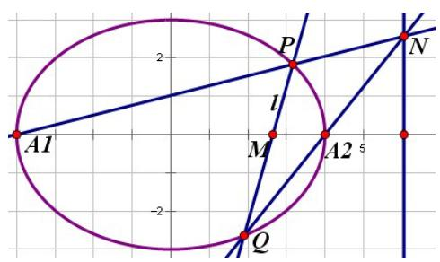

text_image

A1
P
l
M
A2
Q
N

由韦达定理得： $y_{1} + y_{2} = -\frac{2b^{2}mt}{a^{2} + b^{2}t^{2}}, y_{1}y_{2} = \frac{b^{2}(m^{2} - a^{2})}{a^{2} + b^{2}t^{2}}$ ，直线 $A_{1}P$ 的方程为 $y = \frac{y_1}{x_1 + a}(x + a)$ ，直线 $A_{2}Q$ 的方程为 $y = \frac{y_2}{x_2 - a}(x - a)$ ，联立 $A_{1}P$ 和 $A_{2}Q$ 得交点 $N$ 的横坐标 $x = \frac{2ty_1y_2 + (a + m)y_2 + (m - a)y_1}{(a + m)y_2 + (a - m)y_1} a$ ，代入化简：

$$
x = \frac {2 b ^ {2} t m ^ {2} - 2 b ^ {2} t a ^ {2} - 2 b ^ {2} m ^ {2} t + a (a ^ {2} + b ^ {2} t ^ {2}) (y _ {2} - y _ {1})}{- 2 a b ^ {2} m t + m (a ^ {2} + b ^ {2} t ^ {2}) (y _ {2} - y _ {1})} a = \frac {a [ (a ^ {2} + b ^ {2} t ^ {2}) (y _ {2} - y _ {1}) - 2 a b ^ {2} t ]}{m [ (a ^ {2} + b ^ {2} t ^ {2}) (y _ {2} - y _ {1}) - 2 a b ^ {2} t ]} a = \frac {a ^ {2}}{m}
$$

所以交点一定在直线 $x = \frac{a^2}{m}$ 上。同理可证M在y轴上的情况。

引理（张角定理）：A,C,B三点按顺序排列在一条直线上。直线外一点P对AC的张角为 $\alpha$ ，对CB的张角为 $\beta$ 。

则： $\frac{\sin(\alpha + \beta)}{PC} = \frac{\sin\alpha}{PB} + \frac{\sin\beta}{PA}$

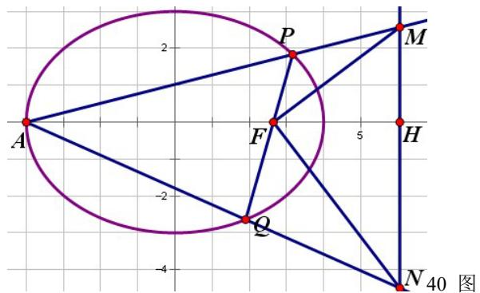

text_image

A
2
P
M
F
5
H
Q
-2
-4
N 40 图

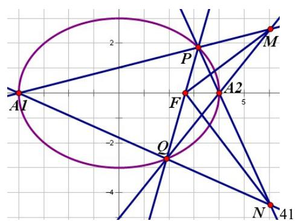

text_image

A1
2
P
M
F
A2
5
O
-2
-4
N
41

图

40.如图，A为左顶点时，设 $\angle PFH = \theta ,\angle MFH = \varphi$ ，则 $\angle AFP = \pi -\theta ,\angle PFM = \theta -\varphi$

$FH=\frac{a^{2}}{c}-c=\frac{b^{2}}{c}=\frac{b^{2}}{ae}=\frac{p}{e},FM=\frac{p}{e\cos\varphi}\left(p=\frac{b^{2}}{a}\right)$ 。对 F-APM 由 张 角 定 理：

$$
\frac {\sin (\pi - \varphi)}{F P} = \frac {\sin (\pi - \theta)}{F M} + \frac {\sin (\theta - \varphi)}{F A}
$$

$$
\Rightarrow \sin \varphi + e \sin \varphi \cos \theta = e \sin \theta \cos \varphi + \sin (\theta - \varphi) - e \sin (\theta - \varphi) \Rightarrow \sin \varphi = \sin (\theta - \varphi)
$$

$\because 0 < \theta < \pi \therefore \varphi = \theta - \varphi$ 即 FM 平分 $\angle PFH$ ，同理 FN 平分 $\angle QFH$ 。 $\therefore \angle MFN = 90^{\circ}$ 即 MF⊥NF 当 A 为右顶点时，由 39 可知左顶点 A' 与 P、M；Q、N 分别共线，于是回到上一种情况。

41.如图，设 $\angle PFA_{2} = \theta ,\angle MFA_{2} = \varphi$ ，则 $\angle A_1FP = \pi -\theta ,\angle PFM = \theta -\varphi ,\angle A_2FQ = \pi -\theta$

对 F-QA₂M 和 F-A₁PM 由 张 角 定 理：

$$
\frac {\sin (\pi - \varphi)}{F P} = \frac {\sin (\pi - \theta)}{F M} + \frac {\sin (\theta - \varphi)}{F A _ {1}}, \frac {\sin (\pi - \theta + \varphi)}{F A _ {2}} = \frac {\sin (\pi - \theta)}{F M} + \frac {\sin \varphi}{F Q}
$$

两式相减并化简得： $\frac{\sin\varphi}{FP} +\frac{\sin\varphi}{FQ} = \frac{\sin(\theta - \varphi)}{FA_1} +\frac{\sin(\theta - \varphi)}{FA_2}\Rightarrow \sin \varphi = \sin (\theta -\varphi)$

$\because 0 < \theta < \pi \therefore \varphi = \theta - \varphi$ 即 FM 平分 $\angle PFA_{2}$ ，同理 FN 平分 $\angle QFA_{2}$ 。 $\therefore \angle MFN = 90^{\circ}$ 即 MF⊥NF

42.由 12 即可证得。

43. 设 $P(x_{0}, y_{0})$ ，AB: $\left\{\begin{aligned} x &= x_{0} + t \cos \alpha \\ y &= y_{0} + t \sin \alpha \end{aligned}\right.$ ，CD: $\left\{\begin{aligned} x &= x_{0} + t \cos \beta \\ y &= y_{0} + t \sin \beta \end{aligned}\right.$ ，将 AB 的方程代入椭圆得：

$$
\left(b ^ {2} \cos^ {2} \alpha + a ^ {2} \sin^ {2} \alpha\right) t ^ {2} + 2 \left(b ^ {2} x _ {0} \cos \alpha + a ^ {2} y _ {0} \sin \alpha\right) t + \left(b ^ {2} x _ {0} ^ {2} + a ^ {2} y _ {0} ^ {2} - a ^ {2} b ^ {2}\right) = 0
$$

由参数 t 的几何意义可知： $\left|PA\right|\cdot\left|PB\right|=\left|t_{1}t_{2}\right|=\frac{\left|b^{2}x_{0}^{2}+a^{2}y_{0}^{2}-a^{2}b^{2}\right|}{b^{2}\cos^{2}\alpha+a^{2}\sin^{2}\alpha}$ ，同理

$$
\left| P C \right| \cdot \left| P D \right| = \frac {\left| b ^ {2} x _ {0} ^ {2} + a ^ {2} y _ {0} ^ {2} - a ^ {2} b ^ {2} \right|}{b ^ {2} \cos^ {2} \beta + a ^ {2} \sin^ {2} \beta}
$$

$$
\therefore \frac {\left| P A \right| \cdot \left| P B \right|}{\left| P C \right| \cdot \left| P D \right|} = \frac {b ^ {2} \cos^ {2} \beta + a ^ {2} \sin^ {2} \beta}{b ^ {2} \cos^ {2} \alpha + a ^ {2} \sin^ {2} \alpha}
$$

44. 对于外角平分线的情况由 5 即可证得，下仅证 l 为内角平分线的情况。

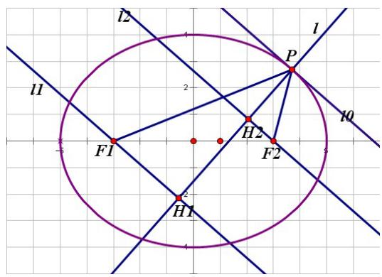

text_image

l2
l1
F1
H2
P
F2
H1
l0

设 $\mathrm{P}\big(a\cos \varphi ,b\sin \varphi \big)$ ，则 $l_0:\frac{\cos\varphi}{a} x + \frac{\sin\varphi}{b} y = 1\Rightarrow b\cos \varphi +a\sin \varphi -ab = 0$

则 $l:a\sin \varphi x - b\cos \varphi y - c^2\sin \varphi \cos \varphi = 0$ ， $l_{1}:b\cos \varphi x + a\sin \varphi y + bc\cos \varphi = 0$

$l_{2}:b\cos\varphi x+a\sin\varphi y-bc\cos\varphi=0$ 。分别联立l、 $l_{1}$ 和l、 $l_{2}$ 得：

$$
H _ {1} \left(\frac {c \cos \varphi (a c \sin^ {2} \varphi - b ^ {2} \cos \varphi)}{a ^ {2} \sin^ {2} \varphi + b ^ {2} \cos^ {2} \varphi}, - \frac {b c \sin \varphi \cos \varphi}{a - c \cos \varphi}\right), H _ {2} \left(\frac {c \cos \varphi (a c \sin^ {2} \varphi + b ^ {2} \cos \varphi)}{a ^ {2} \sin^ {2} \varphi + b ^ {2} \cos^ {2} \varphi}, \frac {b c \sin \varphi \cos \varphi}{a + c \cos \varphi}\right)
$$

则 $x_{H_1} + c = \frac{ac\sin^2\varphi}{a - c\cos\varphi}, x_{H_2} - c = -\frac{ac\sin^2\varphi}{a + c\cos\varphi}$ 对 $H_{1}$ 点： $\frac{b(x + c)}{ay} = -\tan \varphi \Rightarrow \tan \varphi = -\frac{b(x + c)}{ay}$

$\therefore \sin \varphi = \pm \frac{b(x + c)}{\sqrt{a^2y^2 + b^2(x + c)^2}},\cos \varphi = \mp \frac{ay}{\sqrt{a^2y^2 + b^2(x + c)^2}}$ ，代回 $x_{H_1} + c$ 式得：

$$
\frac {x + c}{a c} = \frac {\frac {b ^ {2} (x + c) ^ {2}}{a ^ {2} y ^ {2} + b ^ {2} (x + c) ^ {2}}}{a \pm \frac {a c y}{\sqrt {a ^ {2} y ^ {2} + b ^ {2} (x + c) ^ {2}}}} \Rightarrow 1 \pm \frac {c y}{\sqrt {a ^ {2} y ^ {2} + b ^ {2} (x + c) ^ {2}}} = \frac {b ^ {2} c (x + c)}{a ^ {2} y ^ {2} + b ^ {2} (x + c) ^ {2}}
$$

$$
\Rightarrow \pm \frac {c y}{\sqrt {a ^ {2} y ^ {2} + b ^ {2} (x + c) ^ {2}}} = \frac {b ^ {2} c (x + c) - a ^ {2} y ^ {2} - b ^ {2} (x + c) ^ {2}}{a ^ {2} y ^ {2} + b ^ {2} (x + c) ^ {2}} = - \frac {a ^ {2} y ^ {2} + b ^ {2} x (x + c)}{a ^ {2} y ^ {2} + b ^ {2} (x + c) ^ {2}} \Rightarrow c ^ {2} y ^ {2} = \frac {\left[ a ^ {2} y ^ {2} + b ^ {2} x (x + c) \right] ^ {2}}{a ^ {2} y ^ {2} + b ^ {2} (x + c) ^ {2}}
$$

同理对 $H_{2}$ 点得 $c^2 y^2 = \frac{\left[a^2y^2 + b^2x(x - c)\right]^2}{a^2y^2 + b^2(x - c)^2}$ 。故 $H_{1}$ 点、 $H_{2}$ 点的轨迹方程为 $c^2 y^2 = \frac{\left[a^2y^2 + b^2x(x \pm c)\right]^2}{a^2y^2 + b^2(x \pm c)^2}$

45.由伸缩变换 $y' = \frac{a}{b} y$ 将椭圆（左图）变为圆（右图），椭圆中的共轭直径变为圆中相互垂直的直径。所证命题变为证CD与圆O相切的充要条件是D为EF中点。

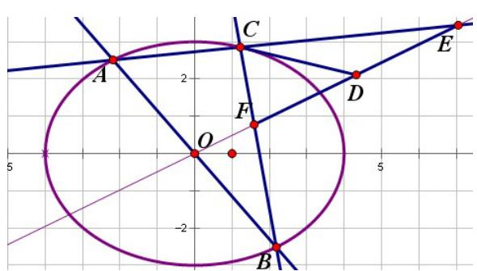

text_image

Geometric diagram with labeled points A, B, C, D, E, F, O and intersecting lines on a grid background

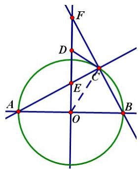

text_image

Geometric diagram showing a circle with intersecting lines and labeled points A, B, C, D, E, F, O, including perpendiculars and chords.

充分性: 若 D 为 EF 中点 ∵C 在圆上, AB⊥OE ∴FC⊥CE, OF⊥OB ∴CD=DE=DF ∴∠DCF=∠OFB=∠OAC=∠OCA ∴∠OCD=∠OCA+∠ECD=∠ECD+∠DCF=∠ECF=90°∴OC⊥CD ∴CD 与圆相切。

必要性：若 CD 与圆相切，则 $\angle OCD = \angle ACB = \angle FOB = 90^{\circ}$ $\therefore \angle DCF = \angle OCA = \angle OAC = \angle CFD$ $\therefore DF = DC$ $\because \angle ECF = 90^{\circ}$ $\therefore \angle DEC = 90^{\circ} - \angle CFD = 90^{\circ} - \angle DCF = \angle DCE$ $\therefore CD = DE = DF$ 即 D 为 EF 中点。

46. 设 $\angle MFx = \varphi$ ，由椭圆极坐标方程： $|MN| = \frac{p}{1 - e\cos\varphi} + \frac{p}{1 + e\cos\varphi} = \frac{2p}{1 - e^2\cos^2\varphi}$

$$
\left| H F \right| = \frac {\left| \frac {p}{1 - e \cos \varphi} - \frac {p}{1 + e \cos \varphi} \right|}{2} = \frac {e p | \cos \varphi |}{1 - e ^ {2} \cos^ {2} \varphi}, \quad \left| P F \right| = \frac {| H F |}{| \cos \varphi |} = \frac {e p}{1 - e ^ {2} \cos^ {2} \varphi} \quad \therefore \frac {| P F |}{| M N |} = \frac {e}{2}
$$

47.由10可知 $l$ 为切线 $l:b^{2}x_{1}x + a^{2}y_{1}y - a^{2}b^{2} = 0$ $\therefore d = \frac{a^2b^2}{\sqrt{b^4x_1^2 + a^4y_1^2}}$ 由 $22:r_1r_2 = a^2 -e^2 x_1^2$

$$
\therefore \sqrt {r _ {1} r _ {2}} d = \sqrt {a ^ {2} - e ^ {2} x _ {1} ^ {2}} \cdot \frac {a ^ {2} b ^ {2}}{\sqrt {b ^ {4} x _ {1} ^ {2} + a ^ {4} y _ {1} ^ {2}}} = \frac {a ^ {2} b ^ {2} \sqrt {a ^ {2} - e ^ {2} x _ {1} ^ {2}}}{\sqrt {b ^ {4} x _ {1} ^ {2} + a ^ {2} b ^ {2} (a ^ {2} - x _ {1} ^ {2})}} = \frac {a ^ {2} b \sqrt {a ^ {2} - e ^ {2} x _ {1} ^ {2}}}{\sqrt {a ^ {4} - c ^ {2} x _ {1} ^ {2}}} = a b
$$

48. 同 29。

49. 设 $AB$ 中点为 $M(x_0, y_0)$ , 则 $k_{AB} = -\frac{b^2x_0}{a^2y_0} \therefore k_{MP} = \frac{a^2y_0}{b^2x_0} \therefore MP: y - y_0 = \frac{a^2y_0}{b^2x_0}(x - x_0)$

令 $y = 0$ ，得 $x_{P} = \frac{a^{2} - b^{2}}{a^{2}} x_{0}\because x_{0}\in (-a,a)\therefore x_{P}\in \left(-\frac{a^{2} - b^{2}}{a},\frac{a^{2} - b^{2}}{a}\right)$

50. 同 20。

51. 设 $l: x = ty + m, P(x_1, y_1), Q(x_2, y_2)$ ，代入椭圆方程得： $\left(a^2 + b^2 t^2\right)y^2 + 2b^2 mty + b^2(m^2 - a^2) = 0$

由韦达定理得： $y_{1} + y_{2} = -\frac{2b^{2}mt}{a^{2} + b^{2}t^{2}}, y_{1}y_{2} = \frac{b^{2}(m^{2} - a^{2})}{a^{2} + b^{2}t^{2}}$

由A、P、M三点共线得 $y_{M} = \frac{n + a}{x_{1} + a} y_{1} = \frac{(n + a)y_{1}}{ty_{1} + m + a}$ ，同理 $y_{N} = \frac{(n + a)y_{2}}{ty_{2} + m + a}$

$$
\begin{array}{l} \therefore \overrightarrow {B M} \cdot \overrightarrow {B N} = (n - m) ^ {2} + y _ {M} y _ {N} = (n - m) ^ {2} + \frac {(n + a) ^ {2} y _ {1} y _ {2}}{t ^ {2} y _ {1} y _ {2} + t (m + a) (y _ {1} + y _ {2}) + (m + a) ^ {2}} \\ = (n - m) ^ {2} + \frac {b ^ {2} (m ^ {2} - a ^ {2}) (n + a) ^ {2}}{b ^ {2} t ^ {2} (m ^ {2} - a ^ {2}) - 2 b ^ {2} m t ^ {2} (m + a) + (m + a) ^ {2} (a ^ {2} + b ^ {2} t ^ {2})} \\ = (n - m) ^ {2} + \frac {b ^ {2} (m - a) (n + a) ^ {2}}{b ^ {2} t ^ {2} (m - a) - 2 b ^ {2} m t ^ {2} + (m + a) (a ^ {2} + b ^ {2} t ^ {2})} = (n - m) ^ {2} + \frac {b ^ {2} (m - a) (n + a) ^ {2}}{a ^ {2} (m + a)} = 0 \Rightarrow \frac {a - m}{a + m} = \frac {a ^ {2} (n - m) ^ {2}}{b ^ {2} (n + a) ^ {2}} \\ \end{array}
$$

52,53,54 为同一类题（最佳观画位置问题），现给出公式：若有两定点 A $(-k,0)$ ，B $(k,0)$ ，点 P $(m,y)$ 在直线 x=m 上（m>k），则当 $y^{2}=(m+k)(m-k)=m^{2}-k^{2}$ 时， $\angle APB$ 最大，其正弦值为 $\frac{k}{m}$ 。

52. k=c, m=a $\therefore$ sinα≤e, 当且仅当 PH=b 时取等号。
53. k=a, m= $\frac{a^{2}}{c}$ $\therefore$ sinα≤e, 当且仅当 PH= $\frac{ab}{c}$ 时取等号。

54. $\mathrm{k = c,m = \frac{a^2}{c}}$ $\therefore \sin \alpha \leq \mathrm{e}^2$ 当且仅当 $\mathrm{PH} = \frac{b}{c}\sqrt{a^2 + c^2}$ 时取等号。

55.设 $\angle \mathrm{AF}_2\mathrm{x} = \theta$ ， $\left|F_1A\right|\cdot \left|F_1B\right| = \left(2a - \frac{p}{1 + e\cos\theta}\right)\left(2a - \frac{p}{1 - e\cos\theta}\right) = 4a^2 +\frac{p(p - 4a)}{1 - e^2\cos^2\theta}$

$$
\because p (p - 4 a) <   0 \quad \therefore \cos^ {2} \theta \uparrow \quad | F _ {1} A | \cdot | F _ {1} B | \downarrow
$$

∴ 当 $\theta = 0^{\circ}$ 时， $\left(\left|F_{1}A\right|\cdot\left|F_{1}B\right|\right)_{\min}=b^{2}$ ； 当 $\theta =90^{\circ}$ 时， $\left(\left|F_{1}A\right|\cdot\left|F_{1}B\right|\right)_{\max}=\frac{\left(2a^{2}-b^{2}\right)^{2}}{a^{2}}$

$$
\therefore b ^ {2} \leq \left| F _ {1} A \right| \cdot \left| F _ {1} B \right| \leq \frac {\left(2 a ^ {2} - b ^ {2}\right) ^ {2}}{a ^ {2}}
$$

56.（1）设 $AP: \begin{cases} x = t\cos \alpha - a \\ y = t\sin \alpha \end{cases}$ ，代入椭圆方程得： $\left(b^{2}\cos^{2}\alpha + a^{2}\sin^{2}\alpha\right)t^{2} = 2ab^{2}t\cos \alpha$ $\because AP = |t| \neq 0$

$$
\therefore \mathrm{AP} = | t | = \frac {2 a b ^ {2} | \cos \alpha |}{b ^ {2} \cos^ {2} \alpha + a ^ {2} \sin^ {2} \alpha} = \frac {2 a b ^ {2} \cos \alpha}{a ^ {2} - c ^ {2} \cos^ {2} \alpha}
$$

（2）设 $P\left(x_0,y_0\right)$ 则 $\tan \alpha \tan \beta = \frac{y_0^2}{a^2 - x_0^2} = \frac{b^2}{a^2} = 1 - e^2$

(3) $S = \frac{1}{2} PA\cdot AB\sin \alpha = \frac{2a^2b^2\sin\alpha\cos\alpha}{a^2 - c^2\cos^2\alpha} = \frac{2a^2b^2\tan\alpha}{a^2\tan^2\alpha + b^2}$

由（2）： $\tan (\alpha +\beta) = \frac{\tan\alpha + \frac{b^2}{a^2\tan\alpha}}{1 - \frac{b^2}{a^2}} = \frac{a^2\tan^2\alpha + b^2}{c^2\tan\alpha} = -\tan \gamma \Rightarrow \cot \gamma = -\frac{c^2\tan\alpha}{a^2\tan^2\alpha + b^2}$

$$
\therefore S = - \frac {2 a ^ {2} b ^ {2} \cot \gamma}{c ^ {2}} = \frac {2 a ^ {2} b ^ {2} \cot \gamma}{b ^ {2} - a ^ {2}}
$$

57.由 58 可证。

58.（1）易知 PQ 的斜率为 0 和斜率不存在时，对任意 x 轴上的点 A 都成立。设 PQ: $x = ty + m$ ，A (m, 0)

代入椭圆方程得： $\left(a^{2} + b^{2}t^{2}\right)y^{2} + 2b^{2}mty + b^{2}\left(m^{2} - a^{2}\right) = 0$ ，则

$$
y _ {1} + y _ {2} = - \frac {2 b ^ {2} m t}{a ^ {2} + b ^ {2} t ^ {2}}, y _ {1} y _ {2} = \frac {b ^ {2} (m ^ {2} - a ^ {2})}{a ^ {2} + b ^ {2} t ^ {2}}
$$

若 $\angle PBA = \angle QBA$ ，则 $k_{BQ} + k_{BP} = 0\Rightarrow \frac{y_1}{x_1 - x_B} +\frac{y_2}{x_2 - x_B} = 0\Rightarrow y_1(ty_2 + m - x_B) + y_2(ty_1 + m - x_B) = 0$

$$
\Rightarrow 2 t y _ {1} y _ {2} + (m - x _ {B}) (y _ {1} + y _ {2}) = 0 \Rightarrow \frac {2 b ^ {2} t (m ^ {2} - a ^ {2})}{a ^ {2} + b ^ {2} t ^ {2}} - \frac {2 b ^ {2} m t (m - x _ {B})}{a ^ {2} + b ^ {2} t ^ {2}} = 0 \Rightarrow 2 b ^ {2} t (m ^ {2} - a ^ {2}) - 2 b ^ {2} m t (m - x _ {B}) = 0
$$

$$
\Rightarrow m ^ {2} t - a ^ {2} t - m ^ {2} t + m t x _ {B} = 0 \Rightarrow x _ {B} = \frac {a ^ {2}}{m} \Rightarrow x _ {A} \cdot x _ {B} = m \cdot \frac {a ^ {2}}{m} = a ^ {2}
$$

（2）作 P 关于 x 轴的对称点 $P'$ ，由（1）即证。

59. 同 9。

60.设椭圆 $\rho = \frac{p}{1 - e\cos\varphi} = \frac{b^2}{a - c\cos\varphi},\varphi \in \left[0,\frac{\pi}{2}\right]$

则 $\left|AB\right| + \left|CD\right| = \frac{b^2}{a - c\cos\varphi} +\frac{b^2}{a - c\cos\left(\varphi +\frac{\pi}{2}\right)} +\frac{b^2}{a - c\cos(\varphi + \pi)} +\frac{b^2}{a - c\cos\left(\varphi +\frac{3\pi}{2}\right)}$

$$
= \frac {b ^ {2}}{a - c \cos \varphi} + \frac {b ^ {2}}{a + c \cos \varphi} + \frac {b ^ {2}}{a - c \sin \varphi} + \frac {b ^ {2}}{a + c \sin \varphi} = \frac {8 a b ^ {2} (a ^ {2} + b ^ {2})}{4 a ^ {2} b ^ {2} + c ^ {4} \sin^ {2} 2 \varphi}
$$

当 $\varphi = \frac{\pi}{4}$ 时， $|AB| + |CD|$ 有最小值 $\frac{8ab^2}{a^2 + b^2}$ ；当 $\varphi = 0$ 或 $\frac{\pi}{2}$ 时， $|AB| + |CD|$ 有最大值 $\frac{2(a^2 + b^2)}{a}$

$$
\therefore \frac {8 a b ^ {2}}{a ^ {2} + b ^ {2}} \leq | A B | + | C D | \leq \frac {2 (a ^ {2} + b ^ {2})}{a}
$$

61,62,63为同一类问题,现给出公式:若点P到两定点A $(-m,0)$ ,B $(m,0)$ 的距离之比 $\frac{PA}{PB}=k(k>0,k\neq1)$ ,
则 P 点的轨迹为一个圆，圆心坐标为 $\left(\frac{k^{2}+1}{k^{2}-1}m,0\right)$ ，圆的半径为 $\frac{2km}{\left|k^{2}-1\right|}$ 。

下三个题的比值 k 均为 $\frac{a-c}{b}$ ，代入上述公式得：圆心坐标为 $\left(\frac{m}{e},0\right)$ ，圆的半径为 $\frac{b}{c}m$ 。

61.m=c，圆心坐标为 $\left(\pm a,0\right)$ ，圆的半径为b。轨迹方程是姊妹圆 $\left(x\pm a\right)^{2}+y^{2}=b^{2}$ 。

62.m=a，圆心坐标为 $\left(\pm\frac{a}{e},0\right)$ ，圆的半径为 $\frac{b}{e}$ 。轨迹方程是姊妹圆 $\left(x\pm\frac{a}{e}\right)^{2}+y^{2}=\left(\frac{b}{e}\right)^{2}$ 。

63. $m=\frac{a^{2}}{c}$ ，圆心坐标为 $\left(\pm\frac{a}{e^{2}},0\right)$ ，圆的半径为 $\frac{b}{e^{2}}$ 。轨迹方程是姊妹圆 $\left(x\pm\frac{a}{e^{2}}\right)^{2}+y^{2}=\left(\frac{b}{e^{2}}\right)^{2}$ 。

64. 设 $P(a \cos \varphi, b \sin \varphi), Q(x, y), A(-a, 0), A'(a, 0)$ ，由 $\overrightarrow{AP} \cdot \overrightarrow{AQ} = \overrightarrow{A'P} \cdot \overrightarrow{A'Q} = 0$ 得 $Q\left(-a \cos \varphi, -\frac{a^2 \sin \varphi}{b}\right)$

消去参数 $\varphi$ 得 Q 点的轨迹方程： $\frac{x^{2}}{a^{2}}+\frac{b^{2}y^{2}}{a^{4}}=1$

65. 同 37。 66.（1）同 35（2）由基本不等式 $|AM| + |A'M'| \geq 2b$ ，则梯形 $MAA'M'$ 面积的最小值为

$$
\frac {1}{2} \cdot 2 a \cdot 2 b = 2 a b 。
$$

67. 设 AC 交 x 轴于 M，AD⊥l 于 D。由椭圆第二定义： $\frac{FM}{EM} = \frac{\frac{AM \cdot BC}{AC}}{\frac{CM \cdot AD}{AC}} = \frac{AM \cdot BC}{CM \cdot AD} = \frac{AF \cdot BC}{BF \cdot AD} = \frac{e}{e} = 1$ ∴AC 过 EF 的中点。

68.（1）由17可知当椭圆方程为 $\frac{x^2}{a^2} +\frac{y^2}{b^2} = 1$ 时，AB过定点 $\left(\frac{a^2 - b^2}{a^2 + b^2}\cdot -a,0\right)$ 。当椭圆方程变为 $\frac{(x - a)^2}{a^2} +\frac{y^2}{b^2} = 1$

时，椭圆向右平移了 $a$ 个单位，定点也应向右平移了 $a$ 个单位，故此时AB过定点 $\left(\frac{a^2 - b^2}{a^2 + b^2} \cdot -a + a, 0\right)$ 即 $\left(\frac{2ab^2}{a^2 + b^2}, 0\right)$

（2）由69（2）P为原点，即 $\mathrm{m = n = 0}$ 时Q点的轨迹方程是 $\left(x - \frac{ab^2}{a^2 + b^2}\right)^2 +y^2 = \left(\frac{ab^2}{a^2 + b^2}\right)^2(x\neq 0)$ 。

69.（1）由17可知当椭圆方程为 $\frac{x^2}{a^2} +\frac{y^2}{b^2} = 1$ 时，AB过定点 $\left(\frac{a^2 - b^2}{a^2 + b^2} (m - a),\frac{b^2 - a^2}{a^2 + b^2} n\right)$ 。当椭圆方程变为 $\frac{(x - a)^2}{a^2} +\frac{y^2}{b^2} = 1$

时，椭圆向右平移了 a 个单位，定点也应向右平移了 a 个单位，故此时 AB 过定点 $\left(\frac{a^{2}-b^{2}}{a^{2}+b^{2}}(m-a)+a,\frac{b^{2}-a^{2}}{a^{2}+b^{2}}n\right)$ 即 $\left(\frac{2ab^{2}+m(a^{2}-b^{2})}{a^{2}+b^{2}},\frac{n(b^{2}-a^{2})}{a^{2}+b^{2}}\right)$ 。

（2）先证椭圆中心在原点的情况。椭圆方程为： $\frac{x^{2}}{a^{2}}+\frac{y^{2}}{b^{2}}=1,\quad P\left(x_{0},y_{0}\right)$ ，AB的斜率为 $k=\tan\theta$ 。

由 17（1）：AB 过定点 $\left(\frac{a^{2}-b^{2}}{a^{2}+b^{2}}x_{0},\frac{b^{2}-a^{2}}{a^{2}+b^{2}}y_{0}\right)$ ，设 AB: $y-\frac{b^{2}-a^{2}}{a^{2}+b^{2}}y_{0}=k\left(x-\frac{a^{2}-b^{2}}{a^{2}+b^{2}}x_{0}\right)$ ，PQ: $y-y_{0}=-\frac{1}{k}(x-x_{0})$

两者联立得 $y_{Q} = \frac{2b^{2}kx_{0}}{(k^{2} + 1)(a^{2} + b^{2})} +\frac{a^{2}(k^{2} - 1)y_{0}}{(k^{2} + 1)(a^{2} + b^{2})} +\frac{b^{2}y_{0}}{a^{2} + b^{2}}$

$$
x _ {Q} = \frac {2 a ^ {2} k y _ {0}}{(k ^ {2} + 1) (a ^ {2} + b ^ {2})} + \frac {b ^ {2} (1 - k ^ {2}) x _ {0}}{(k ^ {2} + 1) (a ^ {2} + b ^ {2})} + \frac {a ^ {2} x _ {0}}{a ^ {2} + b ^ {2}}
$$

则 $x_{Q} - \frac{a^{2}x_{0}}{a^{2} + b^{2}} = \frac{2a^{2}ky_{0}}{(k^{2} + 1)(a^{2} + b^{2})} +\frac{b^{2}(1 - k^{2})x_{0}}{(k^{2} + 1)(a^{2} + b^{2})} = \frac{2a^{2}y_{0}\tan\theta}{(\tan^{2}\theta + 1)(a^{2} + b^{2})} +\frac{b^{2}x_{0}(1 - \tan^{2}\theta)}{(\tan^{2}\theta + 1)(a^{2} + b^{2})}$

$$
= \frac {2 a ^ {2} y _ {0} \sin \theta \cos \theta}{a ^ {2} + b ^ {2}} + \frac {b ^ {2} x _ {0} (\cos^ {2} \theta - \sin^ {2} \theta)}{a ^ {2} + b ^ {2}} = \frac {a ^ {2} y _ {0}}{a ^ {2} + b ^ {2}} \sin 2 \theta + \frac {b ^ {2} x _ {0}}{a ^ {2} + b ^ {2}} \cos 2 \theta
$$

$$
y _ {Q} - \frac {b ^ {2} y _ {0}}{a ^ {2} + b ^ {2}} = \frac {2 b ^ {2} k x _ {0}}{(k ^ {2} + 1) (a ^ {2} + b ^ {2})} + \frac {a ^ {2} (k ^ {2} - 1) y _ {0}}{(k ^ {2} + 1) (a ^ {2} + b ^ {2})} = \frac {2 b ^ {2} x _ {0} \tan \theta}{(\tan^ {2} \theta + 1) (a ^ {2} + b ^ {2})} + \frac {a ^ {2} y _ {0} (\tan^ {2} \theta - 1)}{(\tan^ {2} \theta + 1) (a ^ {2} + b ^ {2})}
$$

$$
= \frac {2 b ^ {2} x _ {0} \sin \theta \cos \theta}{a ^ {2} + b ^ {2}} + \frac {a ^ {2} y _ {0} (\sin^ {2} \theta - \cos^ {2} \theta)}{a ^ {2} + b ^ {2}} = \frac {b ^ {2} x _ {0}}{a ^ {2} + b ^ {2}} \sin 2 \theta - \frac {a ^ {2} y _ {0}}{a ^ {2} + b ^ {2}} \cos 2 \theta
$$

$$
\therefore \left(x _ {Q} - \frac {a ^ {2} x _ {0}}{a ^ {2} + b ^ {2}}\right) ^ {2} + \left(y _ {Q} - \frac {b ^ {2} y _ {0}}{a ^ {2} + b ^ {2}}\right) ^ {2} = \left(\frac {a ^ {2} y _ {0}}{a ^ {2} + b ^ {2}} \sin 2 \theta + \frac {b ^ {2} x _ {0}}{a ^ {2} + b ^ {2}} \cos 2 \theta\right) ^ {2} + \left(\frac {b ^ {2} x _ {0}}{a ^ {2} + b ^ {2}} \sin 2 \theta - \frac {a ^ {2} y _ {0}}{a ^ {2} + b ^ {2}} \cos 2 \theta\right) ^ {2}
$$

$$
= \frac {b ^ {4} x _ {0} ^ {2} + a ^ {4} y _ {0} ^ {2}}{\left(a ^ {2} + b ^ {2}\right) ^ {2}} = \frac {b ^ {2} \left(a ^ {2} b ^ {2} - a ^ {2} y _ {0} ^ {2}\right) + a ^ {4} y _ {0} ^ {2}}{\left(a ^ {2} + b ^ {2}\right) ^ {2}} = \frac {a ^ {2} \left[ b ^ {4} + y _ {0} ^ {2} \left(a ^ {2} - b ^ {2}\right) \right]}{\left(a ^ {2} + b ^ {2}\right) ^ {2}}
$$

当椭圆方程变为 $\frac{(x - a)^2}{a^2} +\frac{y^2}{b^2} = 1$ 时，椭圆向右平移了 $a$ 个单位，圆心也应向右平移了 $a$ 个单位，而半径不变。故此时圆心的坐标为 $\left(\frac{a^2(m - a)}{a^2 + b^2} +a,\frac{b^2n}{a^2 + b^2}\right)$ 即 $\left(\frac{ab^2 + a^2m}{a^2 + b^2},\frac{b^2n}{a^2 + b^2}\right)$ ，半径的平方仍为 $\frac{a^2\left[b^4 + y_0^2(a^2 - b^2)\right]}{\left(a^2 + b^2\right)^2}$ 。

∴Q 点的轨迹方程为 $\left(x_{Q}-\frac{ab^{2}+a^{2}m}{a^{2}+b^{2}}\right)^{2}+\left(y_{Q}-\frac{b^{2}n}{a^{2}+b^{2}}\right)^{2}=\frac{a^{2}\left[b^{4}+y_{0}^{2}\left(a^{2}-b^{2}\right)\right]}{\left(a^{2}+b^{2}\right)^{2}}\left(x\neq m\text{且}y\neq n\right)$ 。

70. 设 L:Ax+By+C=0, 则 $d_{1}=\frac{|C-Ac|}{\sqrt{A^{2}+B^{2}}}, d_{2}=\frac{|C+Ac|}{\sqrt{A^{2}+B^{2}}}$ $\therefore d_{1}d_{2}=\frac{|C^{2}-A^{2}c^{2}|}{A^{2}+B^{2}}$

将 L 代入椭圆方程得： $\left(A^{2}a^{2}+B^{2}b^{2}\right)y^{2}+2BCb^{2}y+b^{2}C^{2}-A^{2}a^{2}b^{2}=0$ ，

$$
\Delta = 4 a ^ {2} b ^ {2} A ^ {2} \left(A ^ {2} a ^ {2} + B ^ {2} b ^ {2} - C ^ {2}\right)
$$

$$
\Delta <   0 \Leftrightarrow A ^ {2} a ^ {2} + B ^ {2} b ^ {2} - C ^ {2} <   0 \Leftrightarrow (A ^ {2} + B ^ {2}) b ^ {2} + A ^ {2} c ^ {2} - C ^ {2} <   0 \Leftrightarrow C ^ {2} - A ^ {2} c ^ {2} > (A ^ {2} + B ^ {2}) b ^ {2} > 0
$$

$d_{1}d_{2} > b^{2}\Leftrightarrow$ 直线 $L$ 和椭圆相离，且 $\mathrm{F_1}$ 、 $\mathrm{F_2}$ 在L同侧。 $d_{1}d_{2} = b^{2}\Leftrightarrow$ 直线L和椭圆相切，且 $\mathrm{F_1}$ 、 $\mathrm{F_2}$ 在 $L$ 同侧。

$d_{1}d_{2}<b^{2}\Leftrightarrow$ 直线 L 和椭圆相交，或 $F_{1}$ 、 $F_{2}$ 在 L 异侧。

71.

由

35

:

$$
y _ {C} = \frac {b}{\sin \varphi} (1 + \cos \varphi), y _ {D} = \frac {b}{\sin \varphi} (1 - \cos \varphi) \therefore \frac {1}{y _ {M}} = \frac {1}{y _ {C}} + \frac {1}{y _ {D}} = \frac {\sin \varphi}{b (1 + \cos \varphi)} + \frac {\sin \varphi}{b (1 - \cos \varphi)} = \frac {2}{b \sin \varphi}
$$

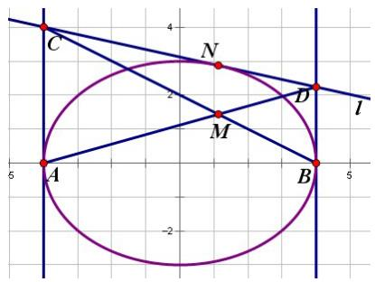

text_image

C
N
D
I
A
M
B
5
4
2
-2
5

$\therefore y_{M} = \frac{b\sin\varphi}{2}$ 由 $\frac{x_M + a}{2a} = \frac{y_M}{y_D}$ 得 $x_{M} = a\cos \varphi$ ，消去参数 $\varphi$ 得M点的轨迹方程为：

$$
\frac {x ^ {2}}{a ^ {2}} + \frac {4 y ^ {2}}{b ^ {2}} = 1 (y \neq 0)
$$

72.由43： $\left|PA\right|\cdot\left|PB\right|=\frac{\left|b^{2}x_{0}^{2}+a^{2}y_{0}^{2}-a^{2}b^{2}\right|}{b^{2}\cos^{2}\theta+a^{2}\sin^{2}\theta}=\frac{a^{2}b^{2}-\left(b^{2}x_{0}^{2}+a^{2}y_{0}^{2}\right)}{b^{2}+c^{2}\sin^{2}\theta}$ 。当 $\theta=0$ 即AB与椭圆长轴平行时，

$\left(PA \cdot PB\right)_{\max} = \frac{a^2 b^2 - \left(b^2 x_0^2 + a^2 y_0^2\right)}{b^2}$ ；当 $\theta = \frac{\pi}{2}$ 即 AB 与椭圆短轴平行时，

$$
\left(P A \cdot P B\right) _ {\min} = \frac {a ^ {2} b ^ {2} - \left(b ^ {2} x _ {0} ^ {2} + a ^ {2} y _ {0} ^ {2}\right)}{a ^ {2}}
$$

73. 同 7。 74. 同 8。 75. 由 8 可知， $F_{2}$ 处的切线长 $\left|F_{2}T\right|=a+c-2c=a-c$ ，同理可证 P 在其他位置情况。  
76. 如图，由切线长定理 PS=PT，PS+PT=PF $_{1}$ +PF $_{2}$ -F $_{1}$ S-F $_{2}$ T=PF $_{1}$ +PF $_{2}$ -F $_{1}$ Q-F $_{2}$ Q=2a-2c，所以 PS=PT=a-c

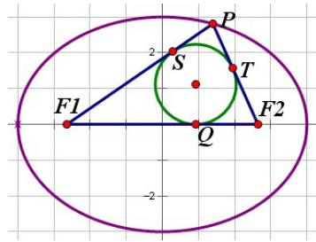

text_image

F1
2
S
P
T
Q
F2
-2

76 图

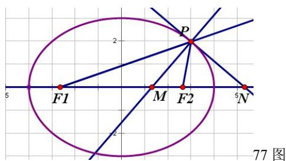

text_image

F1
M
F2
N
77 图

77. 设 $\mathrm{P}(a\cos \varphi ,b\sin \varphi)$ ，由79中得到的内点坐标和22中的焦半径公式： $\frac{x_M + c}{PF_1} = \frac{\frac{c^2\cos\varphi}{a} + c}{a + c\cos\varphi} = e$

$$
\frac {c - x _ {M}}{P F _ {2}} = \frac {c - \frac {c ^ {2} \cos \varphi}{a}}{a - c \cos \varphi} = e
$$

78. $\because MN$ 平分 $\angle F_{1}MF_{2}\therefore \frac{MF_{1}}{MF_{2}} = \frac{NF_{1}}{NF_{2}}\Rightarrow \frac{MF_{2}}{NF_{2}} = \frac{MF_{1}}{NF_{1}}$ ，同理 $F_{2}I$ 平分 $\angle MF_2N$

$$
\therefore \frac {M I}{N I} = \frac {M F _ {2}}{N F _ {2}} = \frac {M F _ {1} + M F _ {2}}{N F _ {1} + N F _ {2}} = \frac {2 a}{2 c} = \frac {1}{e}
$$

79. 设 $\mathrm{P}(a\cos \varphi ,b\sin \varphi)$ ，则 $\angle F_{1}PF_{2}$ 外角平分线（即切线） $l:\frac{\cos\varphi}{a} x + \frac{\sin\varphi}{b} y = 1$ ，由此得外点 $N\left(\frac{a}{\cos\varphi},0\right)$

同理 $\angle F_{1}PF_{2}$ 内角平分线（即法线） $l^{\prime}:\frac{\sin\varphi}{b} x - \frac{\cos\varphi}{a} y - \frac{c^{2}}{ab}\sin\varphi\cos\varphi = 0$ ，由此得内点 $M\left(\frac{c^{2}\cos\varphi}{a},0\right)$ $\therefore x_{M}\cdot x_{N} = \frac{c^{2}\cos\varphi}{a}\cdot \frac{a}{\cos\varphi} = c^{2}$

80.由79中得到的内外点坐标可得： $c\left(c - \frac{c^2\cos\varphi}{a}\right) = \frac{c^2\cos\varphi}{a}\left(\frac{a}{\cos\varphi} -c\right)$ ，即证。

81.由79中得到的内外点坐标可得： $\frac{a}{\cos\varphi}\left(c - \frac{c^2\cos\varphi}{a}\right) = c\left(\frac{a}{\cos\varphi} -c\right)$ ，即证。

82. 同 5。 83. 同 5。 84. 由 5,7 即证。

85. 设 $\mathrm{P}(a\cos \varphi ,b\sin \varphi)$ ，则 $\angle F_{1}PF_{2}$ 外角平分线（即切线） $l:\frac{\cos\varphi}{a} x + \frac{\sin\varphi}{b} y = 1$ ，

$$
\tan \beta = - \frac {\frac {\cos \varphi}{a}}{\frac {\sin \varphi}{b}} = - \frac {b}{a \tan \varphi}
$$

由 50 得： $\tan\left(\frac{\pi}{2}-\alpha\right)=\cot\alpha=\frac{bc\sin\varphi}{b^{2}}=\frac{c\sin\varphi}{b},\quad\tan\alpha=\frac{b}{c\sin\varphi}$ 则

$$
\frac {\cos^ {2} \alpha}{\cos^ {2} \beta} = \frac {\frac {1}{\tan^ {2} \alpha + 1}}{\frac {1}{\tan^ {2} \beta + 1}} = \frac {\tan^ {2} \beta + 1}{\tan^ {2} \alpha + 1} = \frac {\frac {b ^ {2}}{a ^ {2} \tan^ {2} \varphi} + 1}{\frac {b ^ {2}}{c ^ {2} \sin^ {2} \varphi} + 1} = \frac {\frac {b ^ {2} c ^ {2} \sin^ {2} \varphi}{a ^ {2} \tan^ {2} \varphi} + c ^ {2} \sin^ {2} \varphi}{b ^ {2} + c ^ {2} \sin^ {2} \varphi} = \frac {b ^ {2} e ^ {2} \cos^ {2} \varphi + c ^ {2} \sin^ {2} \varphi}{b ^ {2} + c ^ {2} \sin^ {2} \varphi}
$$

$$
= \frac {b ^ {2} e ^ {2} - b ^ {2} e ^ {2} \sin^ {2} \varphi + a ^ {2} e ^ {2} \sin^ {2} \varphi}{b ^ {2} + c ^ {2} \sin^ {2} \varphi} = \frac {b ^ {2} e ^ {2} + c ^ {2} e ^ {2} \sin^ {2} \varphi}{b ^ {2} + c ^ {2} \sin^ {2} \varphi} = e ^ {2} \Rightarrow \frac {\cos \alpha}{\cos \beta} = e
$$

86.由4即证。 87.同4。

88.由71: $y_{C} = \frac{b}{\sin \varphi}(1 + \cos \varphi), y_{D} = \frac{b}{\sin \varphi}(1 - \cos \varphi), F_{1}(-c,0), F_{2}(c,0)$

$$
\therefore \overrightarrow {C F _ {1}} \cdot \overrightarrow {F _ {1} D} = (a + c) (a - c) - \frac {b ^ {2} (1 - \cos^ {2} \varphi)}{\sin^ {2} \varphi} = 0
$$

同理：

$$
\therefore \overrightarrow {C F _ {2}} \cdot \overrightarrow {F _ {2} D} = (a + c) (a - c) - \frac {b ^ {2} (1 - \cos^ {2} \varphi)}{\sin^ {2} \varphi} = 0
$$

$\therefore CF_{1} \perp F_{1}D, CF_{2} \perp F_{2}D$ ，即两焦点在以两交点为直径的圆上。

89. 设 $\mathrm{P}(a\cos \varphi ,b\sin \varphi)$ ，则 $l_{1}:y - b\sin \varphi = \frac{b}{a} (x - a\cos \varphi)\Rightarrow y = \frac{b}{a} x + b(\sin \varphi -\cos \varphi)$

同理 $l_{2}:y = -\frac{b}{a} x + b(\sin \varphi +\cos \varphi)$

$$
\therefore \left| O M \right| ^ {2} = \left[ \frac {b (\cos \varphi - \sin \varphi)}{\frac {b}{a}} \right] ^ {2} = a ^ {2} (\cos \varphi - \sin \varphi) ^ {2} = a ^ {2} (1 - \sin 2 \varphi)
$$

同

理

$$
\left| O N \right| ^ {2} = a ^ {2} (\cos \varphi + \sin \varphi) ^ {2} = a ^ {2} (1 + \sin 2 \varphi) \therefore | O M | ^ {2} + | O N | ^ {2} = a ^ {2} (1 + \sin 2 \varphi) + a ^ {2} (1 - \sin 2 \varphi) = 2 a ^ {2}
$$

同理 $\left|OQ\right|^{2}+\left|OR\right|^{2}=b^{2}(1+\sin2\varphi)+b^{2}(1-\sin2\varphi)=2b^{2}$

90. 设 $\mathrm{P}(x_{0}, y_{0})$ ，则 $l_{1}: y = \frac{b}{a} x + y_{0} - \frac{b}{a} x_{0}, l_{2}: y = -\frac{b}{a} x + y_{0} + \frac{b}{a} x_{0}$

$$
\therefore \left| O M \right| ^ {2} = \left(\frac {\frac {b}{a} x _ {0} - y _ {0}}{\frac {b}{a}}\right) ^ {2} = \left(\frac {b x _ {0} - a y _ {0}}{b}\right) ^ {2}, \left| O N \right| ^ {2} = \left(\frac {\frac {b}{a} x _ {0} + y _ {0}}{\frac {b}{a}}\right) ^ {2} = \left(\frac {b x _ {0} + a y _ {0}}{b}\right) ^ {2}
$$

$$
\therefore \left| O M \right| ^ {2} + \left| O N \right| ^ {2} = \left(\frac {b x _ {0} - a y _ {0}}{b}\right) ^ {2} + \left(\frac {b x _ {0} + a y _ {0}}{b}\right) ^ {2} = \frac {2 \left(b ^ {2} x _ {0} ^ {2} + a ^ {2} y _ {0} ^ {2}\right)}{b ^ {2}} = 2 a ^ {2}
$$

同

理

$$
\left| O Q \right| ^ {2} = \left(\frac {b}{a} x _ {0} - y _ {0}\right) ^ {2}, \left| O R \right| ^ {2} = \left(\frac {b}{a} x _ {0} + y _ {0}\right) ^ {2}
$$

$$
\therefore \left| O Q \right| ^ {2} + \left| O R \right| ^ {2} = \left(\frac {b}{a} x _ {0} - y _ {0}\right) ^ {2} + \left(\frac {b}{a} x _ {0} + y _ {0}\right) ^ {2} = 2 \left(\frac {b ^ {2}}{a ^ {2}} x _ {0} ^ {2} + y _ {0} ^ {2}\right) = 2 b ^ {2}
$$

均推出 P 点的轨迹方程为 $\frac{x^{2}}{a^{2}} + \frac{y^{2}}{b^{2}} = 1$ 。

91. $\because P(x,y),PMQ//x$ 轴, $PNR//y$ 轴 $\therefore M(0,y),N(x,0),Q\left(-\frac{a}{b} y,y\right),R\left(x,-\frac{b}{a} x\right)$

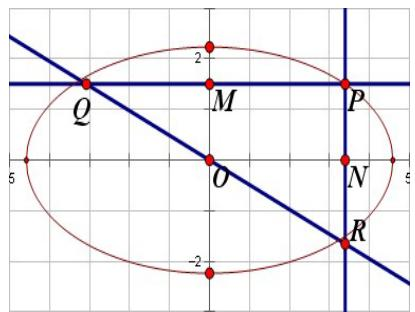

text_image

Q
M
P
O
N
R
-2
5
2
-2

$$
\therefore S _ {1} = \frac {1}{2} y \cdot \frac {a}{b} y = \frac {1}{2} \cdot \frac {a y ^ {2}}{b}, S _ {2} = \frac {1}{2} x \cdot \frac {b}{a} x = \frac {1}{2} \cdot \frac {b x ^ {2}}{a} \quad \therefore S _ {1} + S _ {2} = \frac {1}{2} \left(\frac {a y ^ {2}}{b} + \frac {b x ^ {2}}{a}\right) = \frac {a b}{2} \left(\frac {x ^ {2}}{a ^ {2}} + \frac {y ^ {2}}{b ^ {2}}\right) = \frac {a b}{2}
$$

92. 设 $\mathrm{P}(x_0, y_0)$ ，则 $x_Q = -\frac{a}{b} y_0, y_R = -\frac{b}{a} x_0$ $\therefore S_1 + S_2 = \frac{1}{2}\left(\frac{ay_0^2}{b} + \frac{bx_0^2}{a}\right) = \frac{ab}{2}$ 由此得 $\mathbf{P}$ 点的轨迹方程为 $\frac{x^2}{a^2} + \frac{y^2}{b^2} = 1$ 。