# Mathematics

# 高中数学 思想方法导引

主 编 张金良

副主编 江战明 杨帆

72位高中数学名师联合编著
字典式实用解题方法工具书

# 高中数学思想方法导引

主 编 张金良

副主编 江战明 杨帆

编 委 （按姓氏笔画排列）

王野 王勇强 毕里兵 江琦

严兴光 顾予恒 景芳 谢丽丽

# 图书在版编目(CIP)数据

高中数学思想方法导引 / 张金良主编. — 杭州: 浙江大学出版社, 2023.5

ISBN 978-7-308-23640-9

Ⅰ．①高… Ⅱ．①张… Ⅲ．①中学数学课－高中－教学参考资料 Ⅳ．①G634.603

中国国家版本馆 CIP 数据核字(2023)第 059378 号

# 高中数学思想方法导引

主 编 张金良

策划编辑 陈海权(QQ:1010892859)

责任编辑 董文

责任校对 陈海权

封面设计 林智广告

出版发行 浙江大学出版社

(杭州市天目山路148号 邮政编码310007)

(网址：http://www.zjupress.com)

排版 杭州星云光电图文制作有限公司

印刷 杭州高腾印务有限公司

开 本 787mm×1092mm 1/16

印 张 20.75

字 数 398 千

版印次 2023年5月第1版 2023年5月第1次印刷

书号 ISBN 978-7-308-23640-9

定 价 59.80 元

# 编写人员及单位

沈良 杭州市萧山区第五高级中学

范东晖 浙江省北仑中学

滕诗媛 温州市第八高级中学

沈 瑜 桐乡市高级中学

张金良 浙江省教育厅教研室

李 红 浙江省严州中学新安江校区

刘美良 浙江省绍兴鲁迅中学

曲文瑞 杭州师范大学附属未来科技城学校

庞海燕 杭州市余杭高级中学

张雪芳 浙江省萧山中学

俞海东 浙江省嵊州中学

陈巴尔 浙江省温州中学

李学军 杭州师范大学附属未来科技城学校

张春杰 杭州学军中学

邵琳华 浙江省绍兴市阳明中学

王雅萍 东阳市第二高级中学

叶秋平 杭州学军中学

龚超群 浙江省武义第一中学

赵朕博 浙江省湖州中学

许彪 浙江省台州中学

何承生 浙江师范大学附属中学

王一行 绍兴市第一中学

刘娇 浙江省安吉县昌硕高级中学

景芳 杭州师范大学附属中学

谢丽丽 浙江省杭州第二中学

王 凯 杭州市源清中学

陈坚 诸暨市牌头中学

曹良华 杭州市余杭高级中学

王勇强 湖州市教科研中心

祝玲 浙江省兰溪市第一中学

竺吴辉 浙江省北仑中学

周洁 杭州学军中学

韩新蕾 安吉县昌硕高级中学

杨帆 浙江省杭州第二中学

毕里兵 浙江省台州中学

骆银海 诸暨市教育研究中心

李雪纯 浙江省温州市第八高级中学

沈志强 浙江省临安中学

寿利军 浙江省诸暨二中

林新华 浙江省温岭中学

姚 恒 浙江省湖州中学

余海东 义乌市教育研修院

吴贤盛 浙江省金华第一中学

王 鑫 义乌市青岩书院

顾钰萍 浙江省湖州中学

顾予恒 杭州第二中学钱江学校

江琦 杭州市余杭第一中学

朱祖煌 浙江省诸暨中学  
代云龙 浙江省金华市外国语学校  
陈锋 浙江省义乌市第三中学  
钱 方 浙江省永嘉中学  
赵洋 浙江省新昌中学  
张洁 浙江省绍兴市阳明中学  
俞颂吉 杭州市源清中学  
叶根福 浙江省杭州高级中学  
吴仲玲 浙江省义乌中学  
王华 桐乡市教育局教研科研室  
李璜 浙江省嘉兴当湖高中  
刘勇 杭州市余杭第一中学  
胡 艺 杭州市余杭中学  
叶灵娅 浙江省温岭中学  
许颖洲 浙江大学附属中学  
王燕萍 浙江省桐庐中学  
林洁 杭州市余杭高级中学  
王野 浙江省台州中学  
项莉敏 浙江省台州中学  
骆永明 浙江省绍兴市第一中学  
蒋吉林 浙江省龙泉市第一中学  
林建平 浙江省龙泉市第一中学  
陈碧文 浙江省宁波市正始中学  
杨洁 浙江省鄞州中学  
徐小芳 杭州学军中学海创园学校

# 前言

数学方法是人们以数学为工具认识世界和改造世界时所使用的方法,主要包括数学发现的一般方法(如观察与实验、分析与综合、比较与分类以及一般化与特殊化等),数学推理常用的策略性方法(如整体把握、代数思维、数形结合等),解决数学问题常用的技巧性方法(如换元法、待定系数法、反证法、递推法等).本书是以新课标、新教材、新高考为指导的思想方法工具书,它由浙江省11地市72位名校名师编写,精选了高中数学解题中诸如公式法、配方法、换元法、消元法、定义法、判别式法、分析法、综合法、同一法、作差法、作商法、构造法、基本量法、模型法、对称法、增量法、枚举法、面积法、待定系数法、观察法、反证法、赋值法、配凑法、点差法等使用较多、应用较广的72种数学思想方法,这些方法都是破解当前高中数学学习疑难点的重要方法.72位名师呕心沥血,数易其稿,每位名师精心打磨其中的一种方法.每种方法均由方法介绍(特点和作用)、典例示范、巩固练习三个部分组成:方法介绍言简意赅,主要阐明了方法的内涵、解题对象、适用范围和使用策略;典例示范以精选或自编的难度适中、简洁新颖的典型例题为示范进行讲解,力求体现方法的应用,包含思路、解答、反思三部分;巩固练习是方法的应用实践,也是典例示范的有力补充.

本书还具有方法全面、例题新颖、难易适中、普适性强的特点。本书的作者均为新课标、新教材、新高考的实践者，写作内容始终围绕高中数学学习中的难点、疑点展开，对引导学生系统理解和掌握处理各类问题的方法具有提纲挈领的作用。

本书是张金良名师工作室为广大读者呈上的一部对高中数学学习有所助力的精品图书，适合高二、高三年级学生及高中数学教师阅读。

# 目录

1 公式法 …… 1  
2 配方法 4  
3 换元法 8  
4 消元法 …… 11  
5 定义法 …… 14  
6 判别式法 …… 18  
7 分析法 …… 21  
8 综合法 …… 25  
9 比较法 …… 30  
10 构造法 …… 34  
11 基本量法 …… 39  
12 对称法 …… 42  
13 增量法 …… 46  
14 导数法 …… 50  
15 枚举法 …… 53  
16 向量法 …… 58  
17 面积法 …… 62  
18 待定系数法 … 66  
19 排除法 …… 69  
20 正难则反 …… 72  
21 裂项法 …… 75  
22 赋值法 …… 79  
23 估算法 …… 83  
24 配凑法 86

25 变更主元 …… 90  
26 数形结合 …… 94  
27 命题转换 …… 99   
28 整体考虑 …… 103   
29 局部处理 …… 106  
30 变量分离法 … 110  
31 适度放缩 …… 115   
32 均值代换 …… 120   
33 借助数轴 …… 123   
34 均值不等式 … 126  
35 柯西不等式 … 131  
36 变角变次 …… 134  
37 “1”的代换 … 137   
38 差异分析法 … 140  
39 边角互化 …… 143  
40 和差代换 …… 147  
41 三角代换 …… 152  
42 齐次化 …… 155  
43 构造对偶 …… 159   
44 合一变形 …… 161  
45 差积互化 …… 166  
46 基向量法 …… 169  
47 极化恒等式 … 175  
48 等高线 …… 179

49 递推法 …… 183  
50 进退互用 …… 187  
51 不动点 …… 191  
52 倒序相加法 … 197  
53 同除一式 …… 201  
54 倒置变换 …… 204   
55 两边取对数 … 207  
56 平方开方 …… 209  
57 累差累商 …… 213  
58 分组求和 …… 217  
59 增项减项 …… 221   
60 数学归纳法 … 224  
61 错位相减 …… 228   
62 解析法 …… 231  
63 点差法 …… 235  
64 设而不求 …… 240   
65 参数法 …… 244  
66 插空法 …… 248  
67 捆绑法 …… 251  
68 隔板法 …… 254  
69 等体积法 …… 256  
70 补形法 …… 261  
71 辅助平面法 … 265  
72 模型法 …… 270

巩固练习答案 276

# 1 公式法

引路人 杭州市萧山区第五高级中学 沈良

本思想方法涉及模块: 函数、导数、数列、不等式、解析几何、立体几何、三角、向量、概率与统计.

# 方法介绍

公式法,指应用公式解决问题的方法,包含对公式的直接应用、变形使用和拓展应用等,体现了人们数学化地思考与解决问题的过程.公式是纽带,沟通了数学中量与量之间的联系,而要运用好公式解决问题,需要理解公式的内涵,知晓公式的变形,明确公式的适用范围等.

# 典例示范

# (一) 正向使用公式

例1 已知 $\tan \alpha = \frac{1}{2}, \tan \beta = \frac{1}{3}, \alpha, \beta$ 均为锐角，则 $\alpha + \beta =$ \_\_\_\_.

思路 欲求 $\alpha +\beta$ ，先求 $\tan (\alpha +\beta)$ ，考虑使用两角和正切公式.

解答 由题意可知， $\tan (\alpha + \beta) = \frac{\tan \alpha + \tan \beta}{1 - \tan \alpha \tan \beta} = 1$ ，且 $\alpha, \beta$ 均为锐角，故 $\alpha + \beta = \frac{\pi}{4}$ .

反思 依据题意, 直接使用两角和公式, 求得 $\tan(\alpha+\beta)$ 的值, 从而解决问题.

例 2 设 $\{a_{n}\}$ 是等比数列，公比 $q=\sqrt{2}$ ， $S_{n}$ 为 $\{a_{n}\}$ 的前 n 项和，记 $T_{n}=\frac{17S_{n}-S_{2n}}{a_{n+1}}$ ， $n\in N^{*}$ ，设 $T_{n_{0}}$ 为数列 $\{T_{n}\}$ 的最大项，则 $n_{0}=$ \_\_\_\_.

思路 根据等比数列通项公式与求和公式,先求 $T_{n}$ 的表达式,再具体研究最值.

解答 由题意知， $T_{n}=\frac{17\cdot\frac{a_{1}(1-q^{n})}{1-q}-\frac{a_{1}(1-q^{2n})}{1-q}}{a_{1}q^{n}}=\frac{1}{1-q}\left(\frac{16}{q^{n}}+q^{n}-17\right)$ ，因为 $q=\sqrt{2}$ ，所以 $\frac{16}{q^{n}}+q^{n}\geqslant8$ ，当且仅当 n=4 时等号成立，此时 $T_{n}$ 有最大值，故 $n_{0}=4$ 。

反思 先利用公式求得 $T_{n}$ 的表达式，再利用基本不等式求得最值，此公式既有等式形式，也有不等式形式.

# (二)逆向使用公式

例3 求值： $\frac{\cos 15^{\circ} + \sin 15^{\circ}}{\cos 15^{\circ} - \sin 15^{\circ}}.$

思路 代数式为齐次式,首先考虑弦化切,后续再结合代数式特征进行转化.

解答 $\frac{\cos 15^{\circ} + \sin 15^{\circ}}{\cos 15^{\circ} - \sin 15^{\circ}} = \frac{1 + \tan 15^{\circ}}{1 - \tan 15^{\circ}} = \frac{\tan 45^{\circ} + \tan 15^{\circ}}{1 - \tan 45^{\circ} \tan 15^{\circ}} = \tan 60^{\circ} = \sqrt{3}$ .

反思 由代数式 $\frac{1 + \tan 15^{\circ}}{1 - \tan 15^{\circ}}$ 的特征，构造后逆向使用两角和正切公式求解.

# (三)变形使用公式

例 4 已知函数 $f(x)=4\sin x \sin^{2}\left(\frac{x}{2}+\frac{\pi}{4}\right)+\cos2x$ ，则 $f(x)$ 的最大值为 \_\_\_\_.

思路 根据条件,需要应用三角公式对函数进行等价变形.

解答 $f(x) = 4\sin x\sin^2 \left(\frac{x}{2} + \frac{\pi}{4}\right) + \cos 2x = 4\sin x \cdot \frac{1 - \cos \left(x + \frac{\pi}{2}\right)}{2} + 1 - 2\sin^2 x = 2\sin x(1 + \sin x) + 1 - 2\sin^2 x = 2\sin x + 1$ ，故 $f(x)_{\max} = 3$ .

反思 借助公式 $\cos 2x = 1 - 2\sin^2 x$ ，得 $\sin^2 x = \frac{1 - \cos 2x}{2}$ ，体现了公式的变形使用.

# (四)构造使用公式

例 5 已知实数 x, y 满足 $x^{2}-2x+y^{2}-4y=-4$ ，求 $\left|2x+y+3\right|$ 的最小值.

思路 二元条件下,研究相应代数式的最值,需要寻求代数式表达的意义.

解答 联想点到直线的距离公式 $d = \frac{|Ax + By + C|}{\sqrt{A^2 + B^2}}$ ，得 $|2x + y + 3| = \sqrt{5} \cdot \frac{|2x + y + 3|}{\sqrt{2^2 + 1^2}}$ ，它表示圆 $(x - 1)^2 + (y - 2)^2 = 1$ 上的点到直线 $2x + y + 3 = 0$ 的距离的 $\sqrt{5}$ 倍，由几何意义知，所求最小值是 $7 - \sqrt{5}$ .

反思 通过构造,先将代数式转化为圆上点到直线的距离,再结合图象寻找距离的最小值,解决最值问题.

# 巩固练习

1. 已知 $\alpha + \beta = \frac{\pi}{4}$ , 则 $(1 + \tan \alpha)(1 + \tan \beta)$ 的值为 ( ).

A. 1

B. 2

C. 3

D. 4

2. 若 $\alpha \in \left(0, \frac{\pi}{2}\right)$ , $\tan 2\alpha = \frac{\cos \alpha}{2 - \sin \alpha}$ , 则 $\tan \alpha$ 的值为 ( ).

A. $\frac{\sqrt{15}}{15}$

B. $\frac{\sqrt{5}}{5}$

C. $\frac{\sqrt{5}}{3}$

D. $\frac{\sqrt{15}}{3}$

3. 记 $S_{n}$ 为正项等比数列 $\{a_{n}\}$ 的前 n 项和，若 $S_{4}-2S_{2}=2$ ，则 $S_{6}-S_{4}$ 的最小值为 \_\_\_\_.

4. 已知抛物线: $y^{2}=2px (p>0)$ ，若第一象限的 A, B 两点在抛物线上，焦点为 F, $|AF|=2, |BF|=4, |AB|=3$ ，则直线 AB 的斜率 k 的值为 \_\_\_\_.

5. 已知实数 $x, y$ 满足 $(x - 1)^2 + (y - 2)^2 = 1$ ，求 $z = \frac{2x + y}{\sqrt{x^2 + y^2}}$ 的最小值.

# 2 配方法

引路人 浙江省北仑中学 范东晖

本思想方法涉及模块: 函数、导数、数列、不等式、解析几何、三角、向量、概率与统计等.

# 方法介绍

配方与展开是代数变形的两种基本形式.所谓配方法,是指对代数式进行定向变形(常常配成“完全平方”),通过恰当的配凑,使问题明了化、简单化,从而解决数学计算问题的方法.配方法使用的基本配方依据是二项式定理,一般地,“一元”问题只需一次配方即可,而“多元”问题常需多次配方,有整体配方、局部配方之分.

# 典例示范

# (一)一元配方问题

例1 已知函数 $f(x) = 2^{x} + \lambda \cdot 2^{-x}$ 为偶函数, 若不等式 $f(2x) \geqslant f(x) - m$ 恒成立, 求实数 $m$ 的最小值.

思路 从函数的奇偶性定义出发, 可得 $\lambda = 1$ , 注意到 $f(2x) = 2^{2x} + 2^{-2x} = (2^x + 2^{-x})^2 - 2 = f^2(x) - 2$ , 此时不等式转化为 $m \geqslant f(x) - f(2x) = f(x) - f^2(x) + 2$ , 再进行配方.

解答 由题意知 $f(-x) = f(x)$ ，即 $2^{-x} + \lambda \cdot 2^{x} = 2^{x} + \lambda \cdot 2^{-x}$ 在 $\mathbf{R}$ 上恒成立，整理得 $(\lambda - 1)(2^{-x} - 2^{x}) = 0$ 在 $\mathbf{R}$ 上恒成立，解得 $\lambda = 1$ ，

所以 $f(x) = 2^{x} + 2^{-x}, f(2x) = 2^{2x} + 2^{-2x} = (2^{x} + 2^{-x})^{2} - 2 = f^{2}(x) - 2.$

因为 $f(2x) \geqslant f(x) - m$ 恒成立，

所以 $m \geqslant f(x) - f(2x) = f(x) - f^{2}(x) + 2$ 恒成立.

令 $g(x) = -f^{2}(x) + f(x) + 2 = -\left[f(x) - \frac{1}{2}\right]^{2} + \frac{9}{4},$

又 $f(x) \geqslant 2$ ，所以当 $f(x) = 2$ 时， $g(x)$ 取得最大值 0，

所以 $m \geqslant 0$ ，所以实数 m 的最小值为 0。

反思 解题时要关注问题的整体结构,如本题解题的关键点在于对 $2^{x}+2^{-x}$ 这一整体的理解,将其看成一个“元”,基于对式子的理解只需进行一次配方,问题求解就水到渠成了.结合其他数学知识和性质,有一些其他的配方形式,例如 $1+\sin2\alpha=1+2\sin\alpha\cos\alpha=(\sin\alpha+\cos\alpha)^{2}, x^{2}+\frac{1}{x^{2}}=(x+\frac{1}{x})^{2}-2=\left(x-\frac{1}{x}\right)^{2}+2$ ,以及解析几何中的韦达定理和弦长公式等.

# (二)多元配方问题

例2 若 $a\sqrt{1 - b^2} + b\sqrt{1 - a^2} = 1$ ，求证： $a^2 +b^2 = 1$

思路 本题是代数证明问题,通过观察代数式的结构特征,发现以 $a\sqrt{1-b^{2}}$ , $b\sqrt{1-a^{2}}$ 为中间项进行配方,通过配凑,可以得到 $(a-\sqrt{1-b^{2}})^{2}+(b-\sqrt{1-a^{2}})^{2}=0$ ,即配成两个平方之和为零的形式,利用平方的非负性可得结论.

解答 由已知等式及 $a^2 + 1 - a^2 = 1, 1 - b^2 + b^2 = 1$

配方得 $a^{2}-2a\sqrt{1-b^{2}}+(1-b^{2})+b^{2}-2b\sqrt{1-a^{2}}+(1-a^{2})=0$

即 $(a-\sqrt{1-b^{2}})^{2}+(b-\sqrt{1-a^{2}})^{2}=0$ ，

则有 $a=\sqrt{1-b^{2}}$ , $b=\sqrt{1-a^{2}}$ ,

两式两边平方都可得 $a^{2}+b^{2}=1$ .

反思 对于有些多元问题,通过观察,分析式子的结构特征,进行配方变形,利用同构关系,构造形如 $x^{2}+y^{2}=0$ 的模型,进而得到 x=y.

例 3 已知 $a, b \in R$ ，关于 x 的方程 $x^{4} + ax^{3} + 2x^{2} + bx + 1 = 0$ 有一个实数根，求 $a^{2} + b^{2}$ 的最小值.

思路 本题是以一元方程为背景的最值求解问题,分析题意可知,对于x的四次方程,直接配方非常困难.可考虑转化为 $x^{2}+ax+2+\frac{1}{x^{2}}+\frac{b}{x}=0$ ,分别以 $x,\frac{1}{x}$ 为元进行配方,转化为关于 $x,\frac{1}{x}$ 的平方和的最值问题,这是解决本题的关键突破口,也是最小值的本质.

解答 显然 x=0 不是原方程的根.

原方程可等价变形为 $x^{2}+ax+2+\frac{1}{x^{2}}+\frac{b}{x}=0$ ，

配方得 $\left(x + \frac{a}{2}\right)^2 +\left(\frac{1}{x} +\frac{b}{2}\right)^2 = \frac{a^2}{4} +\frac{b^2}{4} -2,$

则有 $\frac{a^{2}}{4}+\frac{b^{2}}{4}-2\geqslant0$ ，即 $a^{2}+b^{2}\geqslant8$ ，

当且仅当 $x=-\frac{a}{2},\frac{1}{x}=-\frac{b}{2}$ ，且 $a^{2}+b^{2}=8$ 时等号成立，

此时 a=b=-2, x=1, 或 a=b=2, x=-1.

所以 $a^{2}+b^{2}$ 的最小值为 8.

反思 此类多元最值问题对学生来说相对陌生,可将其视为关于某个字母(主元)的二次函数或利用配方法求解.

灵活运用完全平方公式 $(a+b)^{2}=a^{2}+2ab+b^{2}$ ，可得到各种配方形式：

$$
a ^ {2} + b ^ {2} = (a + b) ^ {2} - 2 a b = (a - b) ^ {2} + 2 a b;
$$

$$
a ^ {2} + a b + b ^ {2} = (a + b) ^ {2} - a b = (a - b) ^ {2} + 3 a b = \left(a + \frac {b}{2}\right) ^ {2} + \left(\frac {\sqrt {3}}{2} b\right) ^ {2};
$$

$$
a ^ {2} + b ^ {2} + c ^ {2} + a b + b c + c a = \frac {1}{2} [ (a + b) ^ {2} + (b + c) ^ {2} + (c + a) ^ {2} ];
$$

$$
a ^ {2} + b ^ {2} + c ^ {2} = (a + b + c) ^ {2} - 2 (a b + b c + c a) = (a + b - c) ^ {2} - 2 (a b - b c - c a);
$$

$$
a ^ {3} + b ^ {3} + c ^ {3} - 3 a b c = \frac {1}{2} (a + b + c) [ (a - b) ^ {2} + (b - c) ^ {2} + (c - a) ^ {2} ].
$$

# 巩固练习

1. 定义运算 $\begin{vmatrix} a & b \\ c & d \end{vmatrix} = ad - bc$ ，若函数 $f(x) = \begin{vmatrix} x - 1 & 2 \\ -x & x + 3 \end{vmatrix}$ 在 $[-4, m]$ 上单调递减，则实数 m 的取值范围是（）.

A. $\left[-2,+\infty\right)$

B. $(-∞,-2]$

C. $(-4,-2]$

D. $\left[-4,-2\right]$

2. 在 Rt△ABC 中, $C=90^{\circ}$ , AC=8, BC=6, P 是△ABC 内切圆上的动点, 求点 P 到△ABC 的三个顶点的距离的平方和的最大值和最小值.

3. 求函数 $y = \sin x \cos x + \sin x + \cos x$ 的最大值.

4. 对于实数 $x, y, S = x^{2} + 2xy + 3y^{2} + 2x + 6y + 4$ 的最小值是 \_\_\_\_.

5. 对于 c>0，若非零实数 a, b 满足 $4a^{2}-2ab+4b^{2}-c=0$ ，且使 $|2a+b|$ 最大，则 $\frac{3}{a}-\frac{4}{b}+\frac{5}{c}$ 的最小值为 \_\_\_\_.

# 3 换元法

引路人 温州市第八高级中学 滕诗媛

本思想方法涉及模块: 函数、不等式、三角函数、导数、数列、解析几何.

# 方法介绍

换元法是代数运算过程中非常重要的简化运算的方法.所谓换元法,是指引入一个或几个新的变量代替原来的某些变量,求出结果后返回去求原变量的方法.用换元法解题,能使复杂的问题简单化、简洁化.换元法的本质是等量代换,目的是简化运算,化难为易,化繁为简.

在解题中,换元的同时要确定新的变量的取值范围,实现真正意义上的等量代换.

# 典例示范

# (一)整体换元:以“元”换“式”

例 1 求函数 $f(x)=\sin2x+\sin x+\cos x$ 的值域.

思路 在处理函数值域问题时,常根据函数的性质或图象进行处理,本题式子结构相对复杂,考虑到 $\sin2x$ 与 $\sin x + \cos x$ 有平方关系,即 $(\sin x + \cos x)^{2} = 1 + \sin2x$ ,可将 $\sin x + \cos x$ 看成整体进行换元,使问题得以简化.

解答 令 $t = \sin x + \cos x, t \in [-\sqrt{2}, \sqrt{2}]$ ，则 $\sin 2x = t^2 - 1$

从而 $f(x) = g(t) = t^2 + t - 1 \in \left[-\frac{5}{4}, 1 + \sqrt{2}\right]$ .

反思 本题对分析问题与解决问题的能力有一定的要求. 当题目中某些式子之间有明显的相等或不等关系时, 常采用整体换元的方法, 用新的变量重构题目中的变量关系, 将问题转化成熟悉的形式进行求解.

# (二)三角换元:以“式”换“元”

例2 若 $x^{2} + y^{2} = 2$ ，求 $z = \frac{2}{x^2} +\frac{2y}{x} +7$ 的最小值.

思路 本题可考虑借助 $(\sqrt{2}\sin \theta)^{2} + (\sqrt{2}\cos \theta)^{2} = 2$ 进行三角换元求解.

解答 令 $x = \sqrt{2}\sin \theta ,y = \sqrt{2}\cos \theta$ ，则有 $\theta \in [-\pi ,\pi ]$

从而 $z = \frac{1}{\sin^2\theta} +\frac{2}{\tan\theta} +7 = \frac{\sin^2\theta + \cos^2\theta}{\sin^2\theta} +\frac{2}{\tan\theta} +7 = \frac{1}{\tan^2\theta} +\frac{2}{\tan\theta} +8 =$ $\left(\frac{1}{\tan\theta} +1\right)^2 +7\geqslant 7.$

反思 利用同角三角函数的平方关系, 可以解决一类求最值的问题. 值得一提的是, 三角换元的同时要考虑角的范围, 如本题, 若 $x, y$ 是正数, 则角的范围应限制在 $\theta \in \left(0, \frac{\pi}{2}\right)$ . 还有一些题目有隐含限制条件, 比如 $f(x) = \sqrt{x} + \sqrt{4 - x}$ , 换元时要考虑被替换式的取值范围, 此时设 $x = 4\cos^2\theta$ , 则 $\theta \in \left[0, \frac{\pi}{2}\right]$ , 保证换元过程是等量代换.

# (三)均值换元:以“元”换“元”

例3 已知 $a > 0, b > 0$ ，且 $a + b = 2$ ，求 $\frac{a^2 + b}{a^2 + b^2}$ 的最大值.

思路 本题从已知条件入手,可以利用 $a+b=2 \Rightarrow a=2-b$ 进行消元,但计算量不小,考虑继续优化解法.通常,对称的换元方式能够使问题求解更加方便,即设 $a=1+t, b=1-t$ .

解答 设 $a = 1 + t, b = 1 - t, -1 < t < 1$

则 $\frac{a^2 + b}{a^2 + b^2} = \frac{(1 + t)^2 + 1 - t}{(1 + t)^2 + (1 - t)^2} = \frac{1}{2} \cdot \frac{t^2 + t + 2}{t^2 + 1} = \frac{1}{2}\left(1 + \frac{t + 1}{t^2 + 1}\right)$ ,

令 $m=t+1\in(0,2)$ ,

则 $\frac{t + 1}{t^2 + 1} = \frac{m}{(m - 1)^2 + 1} = \frac{m}{m^2 - 2m + 2} = \frac{1}{m + \frac{2}{m} - 2} \leqslant \frac{1}{2\sqrt{2} - 2} = \frac{\sqrt{2} + 1}{2}$ ,

当且仅当 $m=\sqrt{2}$ 时取等号.

所以 $\frac{a^2 + b}{a^2 + b^2} \leqslant \frac{1}{2}\left(1 + \frac{\sqrt{2} + 1}{2}\right) = \frac{\sqrt{2} + 3}{4}$ ,

当且仅当 $a=\sqrt{2}$ , $b=2-\sqrt{2}$ 时取等号.

反思 在解决形如 $x + y = 2a$ 的问题时, 可以将两变量 $x, y$ 用 $a + d, a - d$ 来表示, 以“元”换“元”的同时利用式子的对称关系简化运算. 同样地, 若有 $xy = a^2$ , 则可以将 $x, y$ 用 $ap, \frac{a}{p}$ 来表示.

# 三 巩固练习

1.(多选)已知正数 a, b 满足 $a^{2} + b^{2} = 1$ ，则下列说法中正确的是()。

A. $a + b$ 的最大值是 $\sqrt{2}$

B. ab 的最大值是 $\frac{1}{2}$

C. $a - b$ 的最小值是-1

D. $\frac{a}{b-2}$ 的最小值是 $-\frac{\sqrt{3}}{3}$

2. 已知 $x + y + z = 3$ ，则 $x^{2} + y^{2} + z^{2}$ 的最小值为 \_\_\_\_.

3. 已知函数 $f(x) = 9^x - 3^{x + 1} + c$ (其中 $c$ 是常数), 若当 $x \in [0,1]$ 时, $f(x) < 0$ 恒成立, 求实数 $c$ 的取值范围.

# 4 消元法

引路人 桐乡市高级中学 沈瑜

本思想方法涉及模块: 函数、导数、不等式、解析几何、三角.

# 方法介绍

消元法是由一些未知数间的等量关系,通过有限次的恒等变形,消去其中某些未知数,从而得到另一些相关未知数间的等量关系的数学方法,它是解决多变量问题的一般方法.在有些含多变量表达式的题目中,所提供的条件为不等关系,也可以通过不等关系进行消元.消元最理想的状态是将多变量表达式转化为单变量表达式,便于求解.

# 典例示范

例 1 设正实数 x, y, z 满足 $x^{2} - 3xy + 4y^{2} - z = 0$ ，则当 $\frac{z}{xy}$ 取最小值时， $x + 2y - z$ 的最大值为 \_\_\_\_.

思路 先通过 $\frac{z}{xy}$ 取得最小值确定x,y,z之间的关系,然后将所求表达式进行消元,再求 $x+2y-z$ 的最大值.

解答 因为 $x^{2} - 3xy + 4y^{2} - z = 0$ ，所以 $z = x^{2} - 3xy + 4y^{2}$

则 $\frac{z}{xy} = \frac{x^2 - 3xy + 4y^2}{xy}\geqslant \frac{-3xy + 4xy}{xy} = 1$ ，当且仅当 $x = 2y$ 时等号成立，

即 $\frac{z}{xy}$ 取最小值,此时 $z=2y^{2}$ ,

所以 $x+2y-z=2y+2y-2y^{2}=-2(y-1)^{2}+2\leqslant2.$

反思 利用等量关系消元,用 x,y 表示 z,将三元最值问题转化为二元最值问题;利用不等式求得函数的最值,利用不等式取等的条件确定 x,y 的关系,将二元最值问题转化为一元最值问题求解.

例 2 设 m 为实数, 函数 $f(x)=\ln x+\mathrm{e}x$ , 直线 $y=ax+\frac{b}{2}$ 是曲线 $y=f(x)$ 的切线, 求 $a+b$ 的最小值.

思路 这是一个切线问题,设切点得切线方程,比较系数,将 a,b 转化为关于切点的函数,达到消元的目的,进而求解相应的最值.

解答 设切点为 $(x_0, \ln x_0 + \mathrm{e}x_0)$ ，由 $f(x) = \ln x + \mathrm{e}x$ ，得 $f'(x) = \frac{1}{x} + \mathrm{e}$ ，

切线方程为 $y-\ln x_{0}-\mathrm{e}x_{0}=\left(\frac{1}{x_{0}}+\mathrm{e}\right)(x-x_{0})$ ,

化简, 比较系数得 $\left\{\begin{aligned}\frac{1}{x_{0}}+\mathrm{e}=a,\\ \ln x_{0}-1=\frac{b}{2},\end{aligned}\right.$ 所以 $a+b=\frac{1}{x_{0}}+e+2(\ln x_{0}-1)$ .

考虑函数 $y=\frac{1}{x}+e+2(\ln x-1)$ ，求导得 $y'=\frac{2}{x}-\frac{1}{x^{2}}=\frac{2x-1}{x^{2}}$ ，函数在 $\left(0,\frac{1}{2}\right)$ 上单调递减，在 $\left(\frac{1}{2},+\infty\right)$ 上单调递增，所以 $y_{\min}=y|_{x=\frac{1}{2}}=e-2\ln2$ .

反思 通过消元, 消去参数 a, b.

例 3 已知 a>0, b>0，且 $a+2b+ab=30$ ，求 ab 的最大值.

思路 通过换元, 将 b 用 a 表示.

解答 设 $ab = y$ ，则 $b = \frac{y}{a}$ ，代入已知式得 $a + \frac{2y}{a} + y = 30$

化简得 $a^{2}+(y-30)a+2y=0$ ，

由 $\Delta=(y-30)^{2}-8y\geqslant0$ , 解得 $y\leqslant18$ 或 $y\geqslant50$

因为 a>0, b>0，所以 0<y<30，故 $y \leqslant 18$ .

所以 $(ab)_{\max}=18.$

反思 消去参数 b, 转化为以 a 为主元的一元二次方程.

例 4 已知 a, b, c 均为实数，且 $a + b + c = 5$ , $ab + bc + ca = 3$ ，求证： $-1 \leqslant c \leqslant \frac{13}{3}$ .

思路 通过消元, 消去 a, b, 转化为关于 c 的一元问题.

解答 将条件变形为 $a + b = 5 - c$ ,

$$
a b = 3 - c (b + a) = 3 - c (5 - c) = c ^ {2} - 5 c + 3,
$$

则 a, b 是方程 $x^{2}-(5-c)x+c^{2}-5c+3=0$ 的两根，

从而 $\Delta = (5 - c)^2 - 4(c^2 - 5c + 3) \geqslant 0$ ，解得 $-1 \leqslant c \leqslant \frac{13}{3}$ ，得证.

反思 消去参数 a, b，转化为以 c 为主元的一元二次方程.

# 三 巩固练习

1. 设 $a > b > c > 0$ ，则 $2a^2 + \frac{1}{ab} + \frac{1}{a(a - b)} - 10ac + 25c^2$ 的最小值为 \_\_\_\_.

2. 在平面直角坐标系 $xOy$ 中, 过点 $M(1,0)$ 的直线 $l$ 交椭圆 $E: \frac{x^2}{4} + \frac{y^2}{2} = 1$ 于 $A, B$ 两点, 若 $\overrightarrow{AM} = \lambda \overrightarrow{MB}$ , 则 $\lambda$ 的取值范围为 \_\_\_\_.

3. 已知函数 $f(x)=x(1-\ln x)$ .

(1) 讨论 $f(x)$ 的单调性；

(2) 设 a, b 为两个不相等的正数，且 $b \ln a - a \ln b = a - b$ ，证明： $2 < \frac{1}{a} + \frac{1}{b} < e.$

# 5 定义法

引路人 浙江省教育厅教研室 张金良

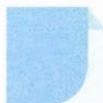

本思想方法涉及模块: 函数、导数、数列、不等式、解析几何、立体几何、三角、向量、概率与统计.

# 方法介绍

所谓定义法,是指直接用数学定义解题.用定义法解题,是最直接的方法,也是最基本的方法,事实上,一切解题的方法最终都能归结到定义法.

在实际的解题中,学生尽管知道定义、定理、公式、法则是解题的依据,却常常忽视利用定义去解题,这是“路走远了,忘记了来时路”.

定义法解题有两个方面:(1)直接用定义解题;(2)回归定义解题.其中回归定义的思维策略是对题目涉及的概念、所给表达式的特征、条件陈述的关键字及题中内隐的定义进行观察分析,进而回归.

# 典例示范

# (一)紧扣定义,直接推理

例1 若函数 $f(x)$ 是不恒为零的偶函数，且对任意实数 $x$ 都有 $xf(x + 1) = (x + 1)f(x)$ ，求 $f\left(f\left(\frac{5}{2}\right)\right)$ .

思路 当 $x \neq 0$ 时，将 $xf(x + 1) = (x + 1)f(x)$ 变形为 $\frac{f(x + 1)}{x + 1} = \frac{f(x)}{x}$ ，由周期函数的定义知 $\frac{f(x)}{x}$ 既是周期为1的函数，又是奇函数，于是由奇函数与周期函数的定义可求解.

解答 当 x=0 时, $f(x)=0$ .

当 $x \neq 0$ 时，由 $xf(x + 1) = (x + 1)f(x)$ 得 $\frac{f(x + 1)}{x + 1} = \frac{f(x)}{x}$ ，

令 $g(x) = \frac{f(x)}{x}$ , 得 $g(x)$ 既是奇函数, 又是周期为 1 的函数.

于是， $g\left(-\frac{1}{2}\right) = g\left(\frac{1}{2}\right) = -g\left(\frac{1}{2}\right)$ ，解得 $g\left(\frac{1}{2}\right) = 0$

所以 $f\left(\frac{5}{2}\right)=5f\left(\frac{1}{2}\right)=\frac{5}{2}g\left(\frac{1}{2}\right)=0$ ，所以 $f\left(f\left(\frac{5}{2}\right)\right)=f(0)=0.$

反思 本题考查了奇偶函数、周期函数的定义及简单的复合函数,只要紧扣定义,适当换元、赋值,就能破题.

例 2 0-1 周期序列在通信技术中有着重要应用. 若序列 $a_1 a_2 \cdots a_n \cdots$ 满足 $a_i \in \{0,1\} (i=1,2,\cdots)$ , 且存在正整数 $m$ , 使得 $a_{i+m} = a_i (i=1,2,\cdots)$ 成立, 则称其为 0-1 周期序列, 并称满足 $a_{i+m} = a_i (i=1,2,\cdots)$ 的最小正整数 $m$ 为这个序列的周期. 对于周期为 $m$ 的 0-1 周期序列 $a_1 a_2 \cdots a_n \cdots, C(k) = \frac{1}{m} \sum_{i=1}^{m} a_i a_{i+k} (k=1,2,\cdots,m-1)$ 是描述其性质的重要指标. 下列周期为 5 的 0-1 周期序列中, 对任意 $k (k=1,2,3,4)$ , 满足 $C(k) \leqslant \frac{1}{5}$ 的序列是 ( ).

A. 11010…

B. 11011…

C. 10001…

D. 11001…

思路 本题以通信技术中的0-1周期序列为背景自定义考题,求解时紧扣周期的概念与 $C(k)$ 的定义,逐一代入排除即可.

解答 由 $a_{i + m} = a_i$ 知，序列 $a_i$ 的周期为 $m$ .

由已知， $m = 5,C(k) = \frac{1}{5}\sum_{i = 1}^{5}a_{i}a_{i + k}(k = 1,2,3,4).$

对于选项 A, $C(1)=\frac{1}{5}\sum_{i=1}^{5}a_{i}a_{i+1}=\frac{1}{5}(a_{1}a_{2}+a_{2}a_{3}+a_{3}a_{4}+a_{4}a_{5}+a_{5}a_{6})$ $=\frac{1}{5}\times(1+0+0+0+0)=\frac{1}{5}\leqslant\frac{1}{5},$

$C(2) = \frac{1}{5}\sum_{i = 1}^{5}a_{i}a_{i + 2} = \frac{1}{5} (a_{1}a_{3} + a_{2}a_{4} + a_{3}a_{5} + a_{4}a_{6} + a_{5}a_{7}) = \frac{1}{5}\times (0+$ $1 + 0 + 1 + 0) = \frac{2}{5}$ ，不合题意.

对于选项 B, $C(1)=\frac{1}{5}\sum_{i=1}^{5}a_{i}a_{i+1}=\frac{1}{5}(a_{1}a_{2}+a_{2}a_{3}+a_{3}a_{4}+a_{4}a_{5}+a_{5}a_{6})$ $=\frac{1}{5}\times(1+0+0+1+1)=\frac{3}{5}$ ，不合题意.

对于选项 D, $C(1)=\frac{1}{5}\sum_{i=1}^{5}a_{i}a_{i+1}=\frac{1}{5}(a_{1}a_{2}+a_{2}a_{3}+a_{3}a_{4}+a_{4}a_{5}+a_{5}a_{6})$ $=\frac{1}{5}\times(1+0+0+0+1)=\frac{2}{5}$ ，不合题意.

故选 C.

反思 本题考查阅读理解与运用新定义解决问题的迁移能力,对逻辑推理能力要求很高.

# (二)回到定义,简化解题

例 3 存在函数 $f(x)$ 满足: 对任意 $x \in R$ 都有().

A. $f(\sin 2x) = \sin x$

B. $f(\sin2x)=x^{2}+x$

C. $f(x^{2} + 1) = |x + 1|$

D. $f(x^{2} + 2x) = |x + 1|$

思路 本题有两种基本思路:一是回到函数定义,通过赋值排除 A,B,C;二是利用复合函数性质,回到周期函数、偶函数的定义,通过概念判断直接破题.

解答 解法 1: 令 $x=\frac{\pi}{4}$ 或 $x=\frac{5\pi}{4}$ ，分别代入 A, B, $f(1)$ 有两个值，与函数定义矛盾，排除 A, B；同理，令 $x=\pm1$ ，排除 C；故选 D.

解法 2: 由复合函数的性质知, 若 $f(g(x))$ 的内函数 $g(x)$ 为周期函数, 则 $f(g(x))$ 也是周期函数且周期不超过内函数 $g(x)$ 的周期; 若 $g(x)$ 为偶函数, 则 $f(g(x))$ 也是偶函数. 于是一目了然地排除 A, B, C, 故选 D.

反思 解法 2 是触及问题本质的解法, 利用复合函数与周期函数的概念直接破题, 值得倡导.

例 4 已知 $F_{1}, F_{2}$ 为椭圆 $C: \frac{x^{2}}{16} + \frac{y^{2}}{4} = 1$ 的两个焦点, P, Q 为 C 上关于坐标原点对称的两点, 且 $|PQ| = |F_{1}F_{2}|$ , 则四边形 $PF_{1}QF_{2}$ 的面积为 \_\_\_\_.

思路 由已知可得 $PF_{1} \perp PF_{2}$ , 从而设 $|PF_{1}| = m, |PF_{2}| = n$ , 利用椭圆的定义得 $m + n = 8$ , 结合勾股定理易求四边形 $PF_{1}QF_{2}$ 的面积等于 $mn$ .

解答 因为 $P, Q$ 为 $C$ 上关于坐标原点对称的两点，且 $|PQ| = |F_1F_2|$ ，所以四边形 $PF_{1}QF_{2}$ 为矩形.

设 $|PF_{1}| = m, |PF_{2}| = n$ ，则 $m + n = 8, m^{2} + n^{2} = 48$ ，

所以 $64=(m+n)^{2}=m^{2}+2mn+n^{2}=48+2mn$ ，得 mn=8，

所以四边形 $PF_{1}QF_{2}$ 的面积等于 8.

反思 解题的关键是利用椭圆的定义,并发现四边形 $PF_{1}QF_{2}$ 为矩形.

# 巩固练习

1. 函数 $y=\frac{\sin x\cos x}{\sin x+\cos x}(x\in\left[0,\frac{\pi}{2}\right])$ 的值域是 \_\_\_\_.  
2. 已知 $\sqrt{x^2 - 10\sqrt{3}x + 80} + \sqrt{x^2 + 10\sqrt{3}x + 80} = 20$ ，则实数 $x$ 的值为 \_\_\_\_.  
3. 已知椭圆 $\frac{x^2}{9} + \frac{y^2}{5} = 1$ 的左、右焦点分别为 $F_1, F_2$ ，点 $P$ 在椭圆上且在 $x$ 轴的上方。若线段 $PF_1$ 的中点在以原点 $O$ 为圆心， $|OF_1|$ 为半径的圆上，求直线 $PF_1$ 的斜率。  
4. 已知椭圆 $C: \frac{x^2}{100} + \frac{y^2}{36} = 1$ ，两圆 $C_1: (x - 8)^2 + y^2 = 1, C_2: (x + 8)^2 + y^2 = 1$ ，设 $P, A, B$ 分别是 $C, C_1, C_2$ 上的点，求 $|PA| + |PB|$ 的最小值。  
5. 已知有限数列 $\{a_{n}\}$ ，若 $\{a_{n}\}$ 满足 $\left|a_{1}-a_{2}\right|\leqslant\left|a_{1}-a_{3}\right|\leqslant\cdots\leqslant\left|a_{1}-a_{m}\right|$ ，m 是项数，则称 $\{a_{n}\}$ 具有性质 p.

(1) 分别判断数列 3,2,5,1 和 4,3,2,5,1 是否具有性质 p，并说明理由；

(2) 若 $a_1 = 1$ ，公比为 $q$ ，项数为 10 的等比数列具有性质 $p$ ，求 $q$ 的取值范围.

# 6 判别式法

引路人 浙江省严州中学新安江校区 李红

本思想方法涉及模块: 函数、方程、不等式、数列、向量.

# 方法介绍

判别式法是根据已知或所构造的一元二次方程根的存在性,通过判别式 $\Delta\geqslant0$ (或 $\Delta<0$ )求解问题的方法.运用判别式法时,要考虑研究对象的隐含范围.

# 典例示范

# (一)判别式法解决所求目标的取值范围(最值)问题

例 1 设 $a_{1}, d$ 为实数，首项为 $a_{1}$ ，公差为 d 的等差数列 $\{a_{n}\}$ 的前 n 项和为 $S_{n}$ ，满足 $S_{5}S_{6} + 15 = 0$ ，求 d 的取值范围.

思路 将已知条件 $S_{5}S_{6} + 15 = 0$ 转化为关于 $a_1$ 的一元二次方程，求 $d$ 的取值范围.

解答 因为 $S_{5}S_{6}+15=0$ ，所以 $(5a_{1}+10d)(6a_{1}+15d)+15=0$ ，

化简得 $2a_{1}^{2}+9da_{1}+10d^{2}+1=0$ .

因为 $a_{1}$ 为实数，于是有 $\Delta=81d^{2}-8(10d^{2}+1)\geqslant0$ ，

解得 $d \leqslant -2\sqrt{2}$ 或 $d \geqslant 2\sqrt{2}$ .

反思 本题以数列为载体,通过构造以 $a_1$ 为主元的一元二次方程,运用 $\Delta \geqslant 0$ , 求参数 $d$ 的取值范围. 若题目条件不变, 用同样的方法, 可求得 $a_1$ 的取值范围是 $(- \infty, -2\sqrt{10}]\cup [2\sqrt{10}, + \infty)$ .

拓展 设 $x, y$ 为实数，且 $4x^{2} + y^{2} + xy = 1$ ，则 $2x + y$ 的最大值是 \_\_\_\_.

思路 通过换元法,构造以 x 或 y 为主元的一元二次方程,运用 $\Delta \geqslant 0$ , 求参数的取值范围.

解答 设 $2x + y = t$ ，则 $y = t - 2x$ ，于是有 $4x^{2} + (t - 2x)^{2} + x(t - 2x) = 1$

化简得 $6x^{2} - 3tx + t^{2} - 1 = 0$ ，由 $\Delta = 9t^2 -24(t^2 -1)\geqslant 0$ ，得 $t_\mathrm{max} = \frac{2\sqrt{10}}{5}$

所以 $2x+y$ 的最大值是 $\frac{2\sqrt{10}}{5}$ .

反思 与运用基本不等式解决此类题相比,判别式法最便捷.

# (二)判别式法求函数的值域

例2 求函数 $y = \frac{x^2 - x + 1}{2x^2 - 2x + 3}$ 的值域.

思路 把求函数 $y = f(x)$ 的值域, 转化为求方程 $f(x) - y = 0$ 有解时相应的 $y$ 的取值范围.

解答 将函数变形为 $(2y-1)x^{2}+(1-2y)x+(3y-1)=0.$

(1) 当 $y=\frac{1}{2}$ 时, 方程无解.  
(2) 当 $y \neq \frac{1}{2}$ 时, 因为 x 取任意实数,

所以 $\Delta=(1-2y)^{2}-4(2y-1)(3y-1)\geqslant0$ , 解得 $\frac{3}{10}\leqslant y<\frac{1}{2}$

综合(1)(2)知此函数的值域为 $\left[\frac{3}{10},\frac{1}{2}\right)$ .

反思 用判别式法时,要考虑原函数的定义域.

# 三 巩固练习

1. 若实数 x, y 满足 $x^{2} + y^{2} + xy = 1$ ，则 x 的最大值是 \_\_\_\_.

2. 设 $e_1, e_2$ 为单位向量，非零向量 $b = x e_1 + y e_2, x, y$ 为实数，若 $e_1, e_2$ 的夹角为 $\frac{5\pi}{6}$ ，则 $\frac{|x|}{|b|}$ 的最大值是 \_\_\_\_.

3. 已知函数 $y=\frac{ax+b}{x^{2}+1}$ 的值域是 $[-1,4]$ ，则 a=\_\_\_\_，b=\_\_\_\_。

4. 求函数 $y=2x+\sqrt{1-2x}$ 的最值.

# 7 分析法

引路人 浙江省绍兴鲁迅中学 刘美良

本思想方法涉及模块: 函数、导数、数列、不等式、三角、立体几何等.

# 方法介绍

证明有些数学题时,从题设条件出发难以发现思维的路径和处理的方法,这时,可从要证明的结论出发,逐步寻求使它成立的充分条件,直至把要证明的结论归结为判定一个明显成立的条件(已知条件、定理、定义、公理等)为止,这种证明方法叫作分析法.

分析法是数学解题中常用的一种直接证明方法,更是一种由未知到已知、由结论逐步追溯到前提的思考方法.在具体问题的求解过程中,可单独运用分析法或将分析法与综合法相结合,培养“由已知探未知、由未知看须知”的数学思维方式.

# 典例示范

例1 已知 $a > 0$ ，求证： $\sqrt{a^2 + \frac{1}{a^2}} -\sqrt{2}\geqslant a + \frac{1}{a} -2.$

思路 作差比较法是证明代数不等式的常用方法,注意到不等式左边是含a的无理根式,直接作差所得的代数式符号判断比较困难,于是寻找目标不等式成立的充分条件,即只需证 $\sqrt{a^{2}+\frac{1}{a^{2}}+2\geqslant a+\frac{1}{a}+\sqrt{2}}$ 成立.

证明 要证 $\sqrt{a^2 + \frac{1}{a^2}} - \sqrt{2} \geqslant a + \frac{1}{a} - 2$ ，只需证 $\sqrt{a^2 + \frac{1}{a^2}} + 2 \geqslant a + \frac{1}{a} + \sqrt{2}$ ，

因为 $a > 0$ ，故只需证 $\left(\sqrt{a^2 + \frac{1}{a^2}} + 2\right)^2 \geqslant \left(a + \frac{1}{a} + \sqrt{2}\right)^2,$

即 $a^2 + \frac{1}{a^2} + 4\sqrt{a^2 + \frac{1}{a^2}} + 4 \geqslant a^2 + 2 + \frac{1}{a^2} + 2\sqrt{2}\left(a + \frac{1}{a}\right) + 2,$

从而只需证 $2\sqrt{a^2 + \frac{1}{a^2}} \geqslant \sqrt{2}\left(a + \frac{1}{a}\right)$ ,

即证 $4\left(a^{2} + \frac{1}{a^{2}}\right)\geqslant 2\left(a^{2} + 2 + \frac{1}{a^{2}}\right)$ ，即证 $a^2 +\frac{1}{a^2}\geqslant 2$

而上述不等式显然成立,故原不等式成立.

反思 对于含无理根式的不等式证明,当直接运用比较法证明比较困难时,常运用分析法证明原不等式,其中将待证的不等式两边平方是把无理式转化为有理式的常用方法.

例 2 如图, $SA \perp$ 平面 ABC, $AB \perp BC$ , 过点 A 作 SB 的垂线, 垂足为 E, 过点 E 作 SC 的垂线, 垂足为 F, 求证: $AF \perp SC$ .

思路 要证明空间两直线垂直,常转化为证明线面垂直,于是要证 $AF \perp SC$ , 只需证 $SC \perp$ 平面 AEF, 故只需证 $SC \perp AE$ , 从而只需证 $AE \perp$ 平面 SBC.

证明 要证 $AF \perp SC$ ，只需证 $SC \perp$ 平面 $AEF$ ，而 $SC \perp EF, EF \cap AE = E$

故只需证 $SC \perp AE$

只需证 $AE \perp$ 平面 SBC,

而 $AE \perp SB, SB \cap BC = B,$

故只需证 $AE \perp BC$ ,

只需证 $BC \perp$ 平面 SAB，而 $BC \perp AB, AB \cap SA = A$ ，

故只需证 $BC \perp SA$ ，由题意知 $SA \perp$ 平面 ABC，

故 $BC \perp SA$ 显然成立, 所以 $AF \perp SC$ .

反思 证明空间两直线垂直,关键是寻找其成立的充分条件,即证其中一条直线垂直于另一条直线所在的平面.

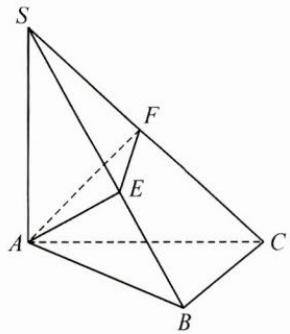

text_image

Geometric diagram of a polyhedron with labeled vertices A, B, C, S, F and internal points E, showing solid and dashed edges.

例3 已知数列 $\{a_{n}\}$ 满足: $a_{n+2} = 3a_{n+1} - 2a_{n}, a_{1} = 1, a_{2} = 3$ . 记 $b_{n} = \frac{\sqrt{3n+1}}{a_{n+1} + 1}, S_{n}$ 为数列 $\{b_{n}\}$ 的前 $n$ 项和, 求证: $S_{n} \leqslant \frac{\sqrt{7}}{2} - \frac{\sqrt{3n+7}}{2^{n+1}}$ .

思路 先运用已知条件得到 $b_{n}=\frac{\sqrt{3n+1}}{2^{n+1}}$ . 考虑到直接求数列 $\{b_{n}\}$ 的前 n 项和 $S_{n}$ 比较困难, 于是将要证的目标式 $S_{n}\leqslant\frac{\sqrt{7}}{2}-\frac{\sqrt{3n+7}}{2^{n+1}}$ 视为 $S_{n}\leqslant\frac{\sqrt{7}}{2}-\frac{\sqrt{3n+7}}{2^{n+1}}=D_{n}=d_{1}+d_{2}+\cdots+d_{n}$ , 转化为证明 $b_{n}=\frac{\sqrt{3n+1}}{2^{n+1}}\leqslant d_{n}=\frac{\sqrt{3n+4}}{2^{n}}-\frac{\sqrt{3n+7}}{2^{n+1}}$ , 从而运用分析法证明.

证明 由 $a_{n + 2} = 3a_{n + 1} - 2a_n$ ，得 $a_{n + 2} - a_{n + 1} = 2(a_{n + 1} - a_n)$

故数列 $\{a_{n + 1} - a_n\}$ 为等比数列，又 $a_2 - a_1 = 2$ ，则 $a_{n + 1} - a_n = 2^n$

所以 $a_{n}=a_{1}+(a_{2}-a_{1})+(a_{3}-a_{2})+\cdots+(a_{n}-a_{n-1})=2^{n}-1.$

考虑到待证式的右边是一个含 $n$ 的代数式，记 $D_{n} = \frac{\sqrt{7}}{2} -\frac{\sqrt{3n + 7}}{2^{n + 1}}$

令其为数列 $\{d_n\}$ 的前 $n$ 项和，可得 $d_{n} = D_{n} - D_{n - 1} = \frac{\sqrt{3n + 4}}{2^{n}} -\frac{\sqrt{3n + 7}}{2^{n + 1}}.$

故欲证 $S_{n}\leqslant \frac{\sqrt{7}}{2} -\frac{\sqrt{3n + 7}}{2^{n + 1}}$ ，只要证 $b_{n} = \frac{\sqrt{3n + 1}}{2^{n + 1}}\leqslant d_{n} = \frac{\sqrt{3n + 4}}{2^{n}} -\frac{\sqrt{3n + 7}}{2^{n + 1}},$

只要证 $\sqrt{3n + 1} +\sqrt{3n + 7}\leqslant 2\sqrt{3n + 4}$ ，只要证 $\sqrt{(3n + 1)(3n + 7)}\leqslant 3n + 4$

只要证 $9n^{2} + 24n + 7 \leqslant 9n^{2} + 24n + 16$ ，显然成立，

所以 $b_{n} = \frac{\sqrt{3n + 1}}{2^{n + 1}}\leqslant d_{n} = \frac{\sqrt{3n + 4}}{2^{n}} -\frac{\sqrt{3n + 7}}{2^{n + 1}}$ 成立.

对两边分别求和，有 $S_{n}\leqslant D_{n} = \frac{\sqrt{7}}{2} -\frac{\sqrt{3n + 7}}{2^{n + 1}}$ 成立，得证.

反思 证明数列不等式 $S_{n} < f(n)$ ，分析法更加贴近学生的实际思维发展区，将和式的大小比较转化为数列对应项的大小比较，即 $S_{n} - S_{n-1} < f(n) - f(n-1)(n \geqslant 2)$ ，容易探求并发现问题的切入点，也为运用综合法证明搭建了思维的“脚手架”。

# 巩固练习

1. 下列利用分析法证明问题的推理过程, 不正确的是().

A. 要证 $\sqrt{3} + \sqrt{7} < 2\sqrt{5}$ , 只需证 $(\sqrt{3} + \sqrt{7})^2 < (2\sqrt{5})^2$

B. 要证 $a^2 + b^2 - 1 - a^2 b^2 \leqslant 0$ ，只需证 $(a^2 - 1)(b^2 - 1) \geqslant 0$

C. 要证一元二次方程的两根 $x_{1}, x_{2}$ 都大于 2，只需证 $x_{1} + x_{2} > 4$ ，且 $x_{1}x_{2} > 4$

D. 要证 a, b, c 成等差数列(顺序固定), 只需证 $a + c = 2b$

2. 已知 $a > b > c, a + b + c = 0$ ，用分析法证明： $\frac{\sqrt{b^2 - ac}}{a} < \sqrt{3}$ .

3. 已知 $\alpha, \beta \neq k\pi + \frac{\pi}{2} (k \in \mathbf{Z})$ ，且 $\sin \theta + \cos \theta = 2\sin \alpha, \sin \theta \cos \theta = \sin^2 \beta$ ，求证： $\frac{1 - \tan^2 \alpha}{1 + \tan^2 \alpha} = \frac{1 - \tan^2 \beta}{2(1 + \tan^2 \beta)}.$

4. 已知数列 $\{a_{n}\}$ 满足 $a_{1}=1, a_{n+1}=\frac{1}{n(a_{n}+1)}(n\in\mathbf{N}^{*})$ .

(1) 求 $a_{2}, a_{3}$ ，并猜想 $\{a_{n}\}$ 的通项公式（不需证明）；

(2) 求证: $\sqrt{a_{1}} + \sqrt{a_{2}} + \cdots + \sqrt{a_{n}} < \sqrt{2} (\sqrt{2n+1} - 1)$ .

# 8 综合法

引路人 杭州师范大学附属未来科技城学校 曲文瑞

本思想方法涉及模块: 函数、导数、数列、不等式、解析几何、立体几何、三角、向量、概率与统计等.

# 方法介绍

所谓综合法,即从已知条件出发,利用定义、公理、定理、性质等,经过一系列的推理、论证而得出命题成立的方法.综合法又叫顺推证法.

与分析法(执果索因)刚好相反,综合法的思维方向是“顺推”,即由已知条件出发,逐步推出其必要条件(由因导果),最后导出所需证明的命题成立.当问题比较复杂时,通常先把分析法和综合法结合起来使用,以分析法寻找解答的思路,再用综合法叙述,表达整个解题过程.两种方法相互转换,相互渗透,互为前提,充分运用这一辩证关系,可以拓宽解题思路.

# 典例示范

例 1 如图, 在三棱柱 $ABC-A_{1}B_{1}C_{1}$ 中, $AA_{1} \perp$ 平面 ABC, D, E 分别为 $A_{1}C_{1}, B_{1}C_{1}$ 的中点, AB = AC. 求证:

(1) $AB \parallel$ 平面 CDE;  
(2) $A_{1}E\perp CE.$

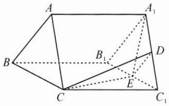

text_image

A
B
C
D
E
B₁
C₁
A₁

思路 (1)由 $D, E$ 分别为 $A_{1}C_{1}, B_{1}C_{1}$ 的中点，可得 $A_{1}B_{1} // DE$ ，又 $AB // A_{1}B_{1}$ ，所以 $AB // DE$ ，由线面平行的判定定理可得 $AB //$ 平面 $CDE$ .

(2)由已知易得 $A_{1}E \perp B_{1}C_{1}, CC_{1} \perp A_{1}E$ ，进而得 $A_{1}E \perp$ 平面 $BB_{1}C_{1}C$ .

解答 (1) 因为 $D, E$ 分别为 $A_{1}C_{1}, B_{1}C_{1}$ 的中点, 所以 $A_{1}B_{1} // DE$ ,

又在三棱柱 $ABC - A_{1}B_{1}C_{1}$ 中， $AB \parallel A_{1}B_{1}$ ，所以 $AB \parallel DE$

又 $DE \subset$ 平面 $CDE, AB \not\subset$ 平面 $CDE$ , 所以 $AB \parallel$ 平面 $CDE$ .

(2) 因为 AB = AC，所以 $A_{1}B_{1} = A_{1}C_{1}$ ，

又 E 为 $B_{1}C_{1}$ 的中点, 所以 $A_{1}E \perp B_{1}C_{1}$ .

在三棱柱 $ABC-A_{1}B_{1}C_{1}$ 中， $AA_{1}\perp$ 平面 ABC，则 $CC_{1}\perp$ 平面 $A_{1}B_{1}C_{1}$ ，

又 $A_{1}E \subset$ 平面 $A_{1}B_{1}C_{1}$ ，所以 $CC_{1} \perp A_{1}E$ .

因为 $CC_{1} \cap B_{1}C_{1} = C_{1}$ ，所以 $A_{1}E \perp$ 平面 $BB_{1}C_{1}C$ ，

又 $CE \subset$ 平面 $BB_{1}C_{1}C$ ，所以 $A_{1}E \perp CE$ .

反思 本题主要考查直线与平面平行、直线与平面垂直的判定与性质定理,考查空间想象能力与思维能力,属于中档题.在证明的过程中,我们只需从已知条件出发,结合图形特征,逐步推理,直至找出我们要证明的线面平行或线线垂直所需要的条件,从而使问题得证,这就是利用综合法解决问题的一般思路.

例 2 记 $S_{n}$ 为数列 $\{a_{n}\}$ 的前 n 项和，已知 $\frac{2S_{n}}{n} + n = 2a_{n} + 1$ .

(1) 证明： $\{a_{n}\}$ 是等差数列；

(2) 若 $a_{4}, a_{7}, a_{9}$ 成等比数列，求 $S_{n}$ 的最小值.

思路 (1)要证明数列 $\{a_{n}\}$ 为等差数列, 只需从已知条件出发, 把已知条件转化为 $a_{n} - a_{n-1} = d$ ( $d$ 为常数) 的形式, 利用等差数列的定义即可得证.

(2)要求 $S_{n}$ 的最小值, 只需从已知条件出发, 先求出通项公式 $a_{n}$ , 再利用等差数列的前 $n$ 项和公式求出 $S_{n}$ .

解答 (1) $\frac{2S_n}{n} + n = 2a_n + 1$ ，即 $2S_{n} + n^{2} = 2na_{n} + n$ ①，

当 $n \geqslant 2$ 时， $2S_{n-1} + (n-1)^{2} = 2(n-1)a_{n-1} + (n-1)$ ②，

①-②得 $2S_{n} + n^{2} - 2S_{n - 1} - (n - 1)^{2} = 2na_{n} + n - 2(n - 1)a_{n - 1} - (n - 1)$

即 $2a_{n} + 2n - 1 = 2na_{n} - 2(n - 1)a_{n - 1} + 1$

即 $2(n-1)a_{n}-2(n-1)a_{n-1}=2(n-1)$ ,

所以 $a_{n} - a_{n - 1} = 1, n \geqslant 2$ 且 $n \in \mathbf{N}^{*}$ , 所以 $\{a_{n}\}$ 是以1为公差的等差数列.

(2)由(1)可得 $a_{4}=a_{1}+3,a_{7}=a_{1}+6,a_{9}=a_{1}+8,$

又 $a_4, a_7, a_9$ 成等比数列，所以 $a_7^2 = a_4a_9$

即 $(a_{1} + 6)^{2} = (a_{1} + 3)(a_{1} + 8)$ ，解得 $a_1 = -12$ ，所以 $a_{n} = n - 13$

所以 $S_{n} = -12n + \frac{n(n - 1)}{2} = \frac{1}{2} n^{2} - \frac{25}{2} n = \frac{1}{2}\left(n - \frac{25}{2}\right)^{2} - \frac{625}{8},$

当 n=12 或 n=13 时， $(S_{n})_{\min}=-78$ .

反思 本题主要考查等差数列的判定与证明、等差数列的通项公式、等差数列的前 n 项和公式, 属于中档题. 在解题的过程中, 我们只需从已知条件出发, 利用演绎推理的过程, 把已知条件逐步转化为证明一个数列是等差数列应满足的条件, 即由因导果.

例 3 已知椭圆 $C: \frac{x^{2}}{a^{2}} + \frac{y^{2}}{b^{2}} = 1 (a > b > 0)$ 的离心率为 $\frac{\sqrt{2}}{2}$ ，且过点 A(2,1).

(1) 求 C 的方程:

(2) 点 M, N 在 C 上, 且 $AM \perp AN, AD \perp MN, D$ 为垂足, 证明: 存在定点 Q, 使得 $|QD|$ 为定值.

思路 (1)根据离心率的定义,把点A(2,1)代入方程,解方程组即可.

(2)由已知 $AM \perp AN, AD \perp MN$ ，可证得直线 MN 过定点 E，再利用 $AD \perp MN$ ，得出 $AD \perp DE$ ，由于 $|AE|$ 为定值，且 $\triangle ADE$ 为直角三角形，AE 为斜边，所以 AE 的中点 Q 满足 $|QD|$ 为定值 ( $|AE|$ 的一半).

解答 (1)由题意可得 $\left\{ \begin{array}{l} \frac{c}{a} = \frac{\sqrt{2}}{2}, \\ \frac{4}{a^2} + \frac{1}{b^2} = 1, \\ a^2 = b^2 + c^2, \end{array} \right.$ 解得 $a^2 = 6, b^2 = c^2 = 3$

故椭圆 C 的方程为 $\frac{x^{2}}{6} + \frac{y^{2}}{3} = 1$ .

(2)设点 $M(x_{1},y_{1}),N(x_{2},y_{2})$ ，因为 $AM\bot AN$ ，所以 $\overrightarrow{AM}\cdot \overrightarrow{AN} = 0$

即 $(x_{1}-2)(x_{2}-2)+(y_{1}-1)(y_{2}-1)=0$ ①.

当直线 MN 的斜率存在时, 设其方程为 $y = kx + m$ , 如图 1,

代入椭圆方程，消去 $y$ 并整理得 $(1 + 2k^2)x^2 +4kmx + 2m^2 -6 = 0$

则 $x_{1} + x_{2} = -\frac{4km}{1 + 2k^{2}}$ ②， $x_{1}x_{2} = \frac{2m^{2} - 6}{1 + 2k^{2}}$ ③，

根据 $y_{1}=kx_{1}+m,y_{2}=kx_{2}+m,$

代入①式整理可得 $(k^{2}+1)x_{1}x_{2}+(km-k-2)(x_{1}+x_{2})+(m-1)^{2}+4=0$

将②③代入得 $(k^2 + 1)\frac{2m^2 - 6}{1 + 2k^2} + (km - k - 2)\left(-\frac{4km}{1 + 2k^2}\right) + (m - 1)^2 + 4 = 0$

化简得 $(2k+3m+1)(2k+m-1)=0$ .

因为点 A(2,1) 不在直线 MN 上，所以 $2k + m - 1 \neq 0$ ，

所以 $2k+3m+1=0, k\neq1$ ,

于是直线 MN 的方程为 $y=k(x-\frac{2}{3})-\frac{1}{3}$ ，直线 MN 过定点 $E(\frac{2}{3},-\frac{1}{3})$ .

当直线 $MN$ 的斜率不存在时，可得 $N(x_{1}, - y_{1})$ ，如图2.

代入①式得 $(x_{1}-2)^{2}+1-y_{1}^{2}=0$ ，

结合 $\frac{x_{1}^{2}}{6}+\frac{y_{1}^{2}}{3}=1$ ，解得 $x_{1}=2$ （舍去）或 $x_{1}=\frac{2}{3}$ ，

故直线 MN 过点 $E\left(\frac{2}{3}, -\frac{1}{3}\right)$ .

text_image

y
M
A
D
O
E
x
N

图1

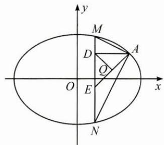

text_image

y
M
D
A
Q
O
E
x
N

图2

由于 $AE$ 为定值，且 $\triangle ADE$ 为直角三角形， $AE$ 为斜边，所以 $AE$ 的中点 $Q$ 满足 $|QD|$ 为定值，即 $|QD| = \frac{1}{2} |AE| = \frac{1}{2}\sqrt{\left(2 - \frac{2}{3}\right)^2 + \left(1 + \frac{1}{3}\right)^2} = \frac{2\sqrt{2}}{3}$ .

由于 $A(2,1), E\left(\frac{2}{3}, -\frac{1}{3}\right)$ ，故由中点坐标公式可得 $Q\left(\frac{4}{3}, \frac{1}{3}\right)$ .

故存在点 $Q\left(\frac{4}{3},\frac{1}{3}\right)$ ，使得 $|QD|$ 为定值.

反思 本题主要考查了椭圆标准方程的求法, 直线与椭圆的位置关系, 以及椭圆中定点、定值问题的解题策略. 在解答的过程中, 采用了分析法进行演绎推理, 从已知条件 $AM \perp AN$ 出发, 得出直线 $MN$ 过定点 $E$ , 从而推出 $|AE|$ 为定值, 再利用 $\triangle ADE$ 为直角三角形, $AE$ 为斜边, 根据直角三角形斜边上的中线等于斜边的一半, 得出 $|QD|$ 为定值.

# 巩固练习

1. 已知抛物线 $C: y^{2} = 8x$ 的焦点为 $F$ , 准线为 $l, P$ 是 $l$ 上一点, $Q$ 是直线 $PF$ 与 $C$ 的一个交点, 若 $\overrightarrow{FP} = 4\overrightarrow{FQ}$ , 则 $|QF| = (\quad)$ .

A. $\frac{7}{2}$

B. 3

C. $\frac{5}{2}$

D. 2

2. 若 $\alpha \in \left(0, \frac{\pi}{2}\right)$ , $\tan 2\alpha = \frac{\cos \alpha}{2 - \sin \alpha}$ , 则 $\tan \alpha = (\quad)$ .

A. $\frac{\sqrt{15}}{15}$

B. $\frac{\sqrt{5}}{5}$

C. $\frac{\sqrt{5}}{3}$

D. $\frac{\sqrt{15}}{3}$

3. 若 a > 0, b > 0，则 $\frac{1}{a} + \frac{a}{b^{2}} + b$ 的最小值为 \_\_\_\_.

4. 已知函数 $f(x) = |\mathrm{e}^x - 1|$ , $x_1 < 0, x_2 > 0$ ，函数 $f(x)$ 的图象在点 $A(x_1, f(x_1))$ 和点 $B(x_2, f(x_2))$ 处的两条切线互相垂直，且分别交 $y$ 轴于 $M$ ， $N$ 两点，则 $\frac{|AM|}{|BN|}$ 的取值范围是 \_\_\_\_.

5. 设函数 $f(x)=\ln(a-x)$ ，已知 x=0 是函数 $y=xf(x)$ 的极值点.

(1) 求 $a$ 的值；

(2) 证明: $\frac{x + f(x)}{xf(x)} < 1$ .

# 9 比较法

引路人 杭州市余杭高级中学 庞海燕

本思想方法涉及模块: 函数、导数、数列、不等式.

# 方法介绍

数值大小比较题型在高考选择题中出现频率高. 该题型知识点涉及面广, 综合性强, 解题过程中多运用作差比较法、作商比较法、单调性比较法等比较实数大小的基础方法.

作差比较法:作差→变形→判断符号(与0比较大小)→结论.

作商比较法:作商→变形→判断符号(与1比较大小)→结论,适用于同号的两个数或式的比较.

单调性比较法:构造函数→判断单调性→比较函数值→结论.

若 $f(x)$ 单调递增，则 $f(a) > f(b) \Leftrightarrow a > b, f(a) < f(b) \Leftrightarrow a < b$ ;

若 $f(x)$ 单调递减，则 $f(a) > f(b) \Leftrightarrow a < b, f(a) < f(b) \Leftrightarrow a > b.$

# 典例示范

例1 已知 $a > b > 0$ ，求证： $\sqrt{a} >\sqrt{b}$

思路 作差后比较 $\sqrt{a}-\sqrt{b}$ 与0的大小.

解答 $\sqrt{a} -\sqrt{b} = \frac{(\sqrt{a} - \sqrt{b})(\sqrt{a} + \sqrt{b})}{\sqrt{a} + \sqrt{b}} = \frac{a - b}{\sqrt{a} + \sqrt{b}} >0$ ，故 $\sqrt{a} >\sqrt{b}$ 成立.

反思 作差比较法是比较两个实数大小的基本方法.

例2 设 $a = \log_3 2, b = \log_5 3, c = \frac{2}{3}$ , 则（ ）.

A. $a < c < b$

B. $a < b < c$

C. b<c<a

D. c<a<b

# (一)作差比较

思路 将对数与常数作差比较,可进一步化为同底数的两对数相减,借助对数运算性质,两数相减后得到的值是一个可判断正负的对数.

解答 $a - c = \log_32 - \frac{2}{3} = \log_32 - \log_33^{\frac{2}{3}} = \log_3\frac{2}{3^{\frac{2}{3}}} = \log_3\sqrt[3]{\frac{8}{9}} <  \log_31 = 0,$ 故 $a <   c;b - c = \log_53 - \frac{2}{3} = \log_53 - \log_55^{\frac{2}{3}} = \log_5\frac{3}{5^{\frac{2}{3}}} = \log_5\sqrt[3]{\frac{27}{25}} >\log_51 = 0$ ，故 $c <   b.$ 综上， $a <   c <   b$ ，故选A.

利用换底公式,亦可如下比较: $a-c=\frac{\ln2}{\ln3}-\frac{2}{3}=\frac{3\ln2-2\ln3}{3\ln3}=\frac{\ln8-\ln9}{3\ln3}<0$ ,即a<c;b-c= $\frac{\ln3}{\ln5}-\frac{2}{3}=\frac{3\ln3-2\ln5}{3\ln5}=\frac{\ln27-\ln25}{3\ln5}>0$ ,即b>c.

反思 作差比较法是比较两个实数大小的基本方法.第二种解答借助换底公式将原对数化为底数为e的对数式，简化计算过程，两两作差后通分判断正负.

# (二)作商比较

思路 将对数与常数作商比较,借助对数运算性质变形整理,化为可与1比较大小的对数式,进而判断两数的大小关系.

解答 显然 a, b, c 均为正数.

$\frac{a}{c}=\frac{3}{2}\log_{3}2=\frac{1}{2}\log_{3}8<\frac{1}{2}\log_{3}9=1$ ，故 $0<\frac{a}{c}<1$ ，即a<c；

$\frac{b}{c} = \frac{3}{2}\log_53 = \frac{1}{2}\log_527 > \frac{1}{2}\log_525 = 1$ ，故 $\frac{b}{c} > 1$ ，即 $c < b$ .

综上，a<c<b，故选A.

反思 作商比较法适用于积、商、幂、指数、对数、根式形式的不等式证明.

# (三)构造函数比较

例 3 若 $2^{a} + \log_{2}a = 4^{b} + 2\log_{4}b$ ，则（）.

A. $a > 2b$

B. $a <   2b$

C. $a > b^{2}$

D. $a < b^{2}$

思路 显然 $a, b$ 的具体形式难以解出，难以作差、作商比较，观察条件结构，将其变形为 $2^{a} + \log_{2} a = 2^{2b} + \log_{2} b$ ，利用单调性比较.

解答 首先比较 $a$ 和 $2b, 2^a + \log_2 a = 2^{2b} + \log_2 b < 2^{2b} + \log_2 2b$ , 考虑函数 $f(x) = 2^x + \log_2 x, f(x)$ 在 $(0, +\infty)$ 上单调递增, 由 $f(a) < f(2b)$ , 得 $a < 2b$ .

再比较 $a$ 和 $b^2, 2^a + \log_2 a = 4^b + \log_2 b$ ，考虑函数 $g(x) = 4^x + \log_2 x$ ，如图，可知 $f(x) < g(x)$ 在 $(0, +\infty)$ 上恒成立，而 $f(a) = g(b)$ ，分析图象知无法判断 $a$ 和 $b^2$ 的大小.

综上,故选 B.

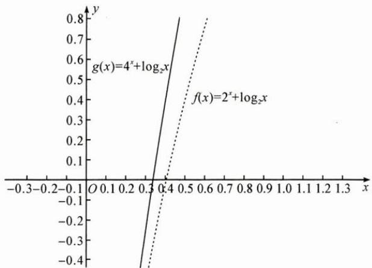

line

| x     | g(x) = 4^x + log₂x | f(x) = 2^x + log₂x |
|-------|---------------------|---------------------|
| 0.3   | 0.5                 | 0.5                 |
| 0.4   | 0.6                 | 0.6                 |
| 0.5   | 0.7                 | 0.7                 |
| 0.6   | 0.8                 | 0.8                 |

反思 构造函数,利用单调性比较两个数或式的大小,不仅可以穿插在作差、作商比较的过程中,亦适用于作差、作商比较有困难的情况.

# 巩固练习

1. 设 $f(x)$ 是定义域为 $\mathbf{R}$ 的偶函数，且在 $(0, +\infty)$ 上单调递减，则（ ）.

A. $f(\log_3\frac{1}{4}) > f(2^{-\frac{3}{2}}) > f(2^{-\frac{2}{3}})$

B. $f(\log_3\frac{1}{4}) > f(2^{-\frac{2}{3}}) > f(2^{-\frac{3}{2}})$

C. $f\left(2^{-\frac{3}{2}}\right) > f\left(2^{-\frac{2}{3}}\right) > f\left(\log_3\frac{1}{4}\right)$

D. $f\left(2^{-\frac{2}{3}}\right) > f\left(2^{-\frac{3}{2}}\right) > f\left(\log_3\frac{1}{4}\right)$

2. 设 x, y, z 为正数，且 $2^{x} = 3^{y} = 5^{z}$ ，则（）.

A. 2x<3y<5z

B. 5z<2x<3y

C. 3y<5z<2x

D. 3y<2x<5z

3. 若 $2^{x}-2^{y}<3^{-x}-3^{-y}$ ，则（）.

A. $\ln(y-x+1)>0$

B. $\ln(y-x+1)<0$

C. $\ln|x-y|>0$

D. $\ln |x - y| < 0$

4. 已知 $9^{m}=10, a=10^{m}-11, b=8^{m}-9$ ，则（）.

A. $a > 0 > b$

B. a > b > 0

C. b > a > 0

D. b>0>a

# 10 构造法

引路人 浙江省萧山中学 张雪芳

本思想方法涉及模块: 函数、导数、数列、不等式、解析几何、立体几何、三角、向量.

# 方法介绍

所谓构造法,是根据问题的结构及隐含条件构造出一种与原问题紧密相关的数学对象,从而使原问题转化并且最终得到解决的数学解题方法.

构造法按构造对象的不同可分为: 构造函数、构造方程(组)、构造图形、构造数列、构造向量等.

# 典例示范

# (一)构造图形、构造向量

例1 证明两角差的余弦公式: $\cos (\alpha - \beta) = \cos \alpha \cos \beta + \sin \alpha \sin \beta$ .

思路 在平面直角坐标系中作出任意角 $\alpha, \beta$ 的终边，则角 $\alpha - \beta$ 也能在图中表示出来， $(\cos \alpha, \sin \alpha), (\cos \beta, \sin \beta)$ 分别是角 $\alpha, \beta$ 的终边与单位圆的交点坐标，因此可以通过构造图形来证明.

证明 证法1:如图,不妨令 $\alpha\neq2k\pi+\beta,k\in Z$ .设单位圆与x轴相交于点A(1,0),以x轴非负半轴为始边作角 $\alpha,\beta,\alpha-\beta$ ,它们的终边分别与单位圆相交于点 $P_{1}\left(\cos\alpha,\sin\alpha\right)$ , $A_{1}\left(\cos\beta,\sin\beta\right)$ ,

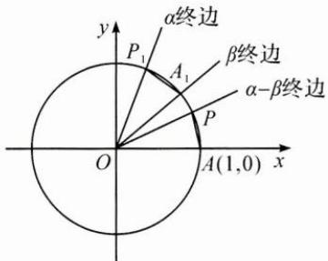

text_image

α终边
P₁
A₁
β终边
α-β终边
P
O
A(1,0)
x
y

$$
P (\cos (\alpha - \beta), \sin (\alpha - \beta)).
$$

连接 $A_{1}P_{1}, AP$ ，可知 $\widehat{AP} = \widehat{A_{1}P_{1}}$ ，所以 $AP = A_{1}P_{1}$ .

根据两点间距离公式，

得 $\left[\cos (\alpha -\beta) - 1\right]^{2} + \sin^{2}(\alpha -\beta) = (\cos \alpha -\cos \beta)^{2} + (\sin \alpha -\sin \beta)^{2},$

化简得 $\cos(\alpha-\beta)=\cos\alpha\cos\beta+\sin\alpha\sin\beta.$

当 $\alpha = 2k\pi +\beta ,k\in \mathbf{Z}$ 时，容易证明上式仍然成立.

证法 2: 如图, 以 x 轴非负半轴为始边作角 $\alpha, \beta$ , 它们的终边分别与单位圆相交于点 A, B, 则 $\overrightarrow{OA} = (\cos\alpha, \sin\alpha), \overrightarrow{OB} = (\cos\beta, \sin\beta)$ .

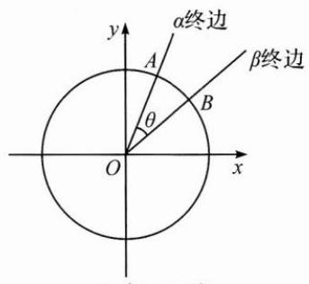

text_image

α终边
β终边
A
B
θ
O
x
y

由向量数量积的坐标表示,有 $\overrightarrow{OA}\cdot\overrightarrow{OB}=\cos\alpha\cos\beta+\sin\alpha\sin\beta.$

设 $\overrightarrow{OA}$ 与 $\overrightarrow{OB}$ 的夹角为 $\theta$ ，则 $\overrightarrow{OA} \cdot \overrightarrow{OB} = |\overrightarrow{OA}| |\overrightarrow{OB}| \cos \theta = \cos \theta$

所以 $\cos\theta=\cos\alpha\cos\beta+\sin\alpha\sin\beta.$

另一方面， $\alpha - \beta = 2k\pi \pm \theta, k \in \mathbf{Z}$ ，于是 $\cos (\alpha - \beta) = \cos \alpha \cos \beta + \sin \alpha \sin \beta.$

反思 两角差的余弦公式是三角恒等变换的基础,其他三角公式可以在此公式的基础上变形得到.证明此公式的方法有很多:在人教A版教材必修第一册“三角恒等变换”中,通过构造图形,由两点间距离公式推得;在必修第二册“向量”中,通过构造向量、构造图形,由数量积运算推得.

# (二)构造方程

例 2 在 $\triangle ABC$ 中, $AB=8, AC=5, BC=7, O$ 是 $\triangle ABC$ 的外心, $\overrightarrow{AO}=x\overrightarrow{AB}+y\overrightarrow{AC}$ ,求 $x,y$ 的值.

思路 在向量等式 $\overrightarrow{AO} = x\overrightarrow{AB} +y\overrightarrow{AC}$ 的两边同时点乘 $\overrightarrow{AB}$ ，再同时点乘 $\overrightarrow{AC}$ ，构造方程组.

解答 由向量数量积的几何意义可得，

$$
\overrightarrow {A O} \cdot \overrightarrow {A B} = \frac {\overrightarrow {A B ^ {2}}}{2} = 3 2, \overrightarrow {A O} \cdot \overrightarrow {A C} = \frac {\overrightarrow {A C ^ {2}}}{2} = \frac {2 5}{2},
$$

$$
\text {又} \overrightarrow {A B} \bullet \overrightarrow {A C} = | \overrightarrow {A B} | | \overrightarrow {A C} | \cos A = | \overrightarrow {A B} | | \overrightarrow {A C} | \frac {| \overrightarrow {A B} | ^ {2} + | \overrightarrow {A C} | ^ {2} - | \overrightarrow {B C} | ^ {2}}{2 | \overrightarrow {A B} | | \overrightarrow {A C} |} = 2 0,
$$

$$
\text {构造方程组} \left\{ \begin{array}{l l} \overrightarrow {A O} \cdot \overrightarrow {A B} = x   \overrightarrow {A B ^ {2}} + y   \overrightarrow {A C} \cdot \overrightarrow {A B}, \\ \overrightarrow {A O} \cdot \overrightarrow {A C} = x   \overrightarrow {A C} \cdot \overrightarrow {A B} + y   \overrightarrow {A C ^ {2}}, \end{array} \right. \text {即} \left\{ \begin{array}{l l} 3 2 = 6 4 x + 2 0 y, \\ \frac {2 5}{2} = 2 0 x + 2 5 y, \end{array} \right. \text {解得} \left\{ \begin{array}{l l} x = \frac {1 1}{2 4}, \\ y = \frac {2}{1 5}. \end{array} \right.
$$

反思 在向量等式的两边点乘一个非零向量, 把向量等式转化为代数方程, 从而通过构造方程求得未知数的值.

# (三)构造函数

例 3 若对于任意 x>0，不等式 $2ae^{2x}-\ln x+\ln a\geqslant0$ 恒成立，则实数 a 的最小值为 \_\_\_\_.

思路 设 $f(x) = 2ae^{2x} - \ln x + \ln a, f(x) \geqslant 0$ 恒成立，即 $f(x)_{\min} \geqslant 0$ ，因此可以通过研究函数的单调性确定其最小值。进一步观察式子结构，可以变形为 $2ae^{2x} + \ln a + 2x \geqslant \ln x + 2x, \ln (ae^{2x}) + 2ae^{2x} \geqslant \ln x + 2x$ ，不等式两边结构相同，可以构造函数，利用函数的单调性解决。

解答 解法 1: $f(x)=2ae^{2x}-\ln x+\ln a\geqslant0$ , $f'(x)=4ae^{2x}-\frac{1}{x}$ .

因为 a>0，所以 $f'(x)$ 在 $(0,+\infty)$ 上单调递增，

又当 $x \to 0$ 时， $f'(x) \to -\infty$ ，当 $x \to +\infty$ 时， $f'(x) \to +\infty$

所以 $f^{\prime}(x) = 0$ 有唯一解，设为 $x_0$ ，则 $f(x)$ 在 $(0,x_0)$ 上单调递减，在 $(x_0, + \infty)$ 上单调递增， $f(x)_{\min} = f(x_0) = 2ae^{2x_0} - \ln x_0 + \ln a.$

由 $f'(x_{0})=0$ 得 $4a\mathrm{e}^{2x_{0}}=\frac{1}{x_{0}}$ ,

两边取以 e 为底的对数得 $\ln4a+2x_{0}=-\ln x_{0}$ ,

因此 $f(x_0) = \frac{1}{2x_0} +\ln 4a + 2x_0 + \ln a\geqslant 2 + \ln 4a^2\geqslant 0$ ，得 $a\geqslant \frac{1}{2\mathrm{e}}.$

故 a 的最小值为 $\frac{1}{2e}$ .

解法 2: 在不等式 $2ae^{2x}-\ln x+\ln a \geqslant 0$ 的两边同时加 2x,

变形得 $2ae^{2x} + \ln a + 2x\geqslant \ln x + 2x$ ，即 $\ln (a\mathrm{e}^{2x}) + 2a\mathrm{e}^{2x}\geqslant \ln x + 2x.$

构造函数 $g(x)=\ln x+2x$ ，可得 $g(a\mathrm{e}^{2x})\geqslant g(x)$ .

因为 $g(x)$ 在 $(0, +\infty)$ 上单调递增，因此 $ae^{2x} \geqslant x$ 对于任意 x > 0 恒成立，即 $a \geqslant \frac{x}{e^{2x}}$ 对于任意 x > 0 恒成立.

构造函数 $h(x)=\frac{x}{\mathrm{e}^{2x}}$ ，则 $h'(x)=\frac{1-2x}{\mathrm{e}^{2x}}$ ，

$h(x)$ 在 $\left(0, \frac{1}{2}\right)$ 上单调递增，在 $\left(\frac{1}{2}, +\infty\right)$ 上单调递减，

$$
h (x) _ {\max} = h \left(\frac {1}{2}\right) = \frac {1}{2 \mathrm{e}},
$$

因此 $a \geqslant \frac{1}{2e}$ ，故 a 的最小值为 $\frac{1}{2e}$ .

解法 $3:2ae^{2x}-\ln x+\ln a\geqslant0\Leftrightarrow2ae^{2x}\geqslant\ln\frac{x}{a}$

$$
\Leftrightarrow 2 x \mathrm{e} ^ {2 x} \geqslant \ln \frac {x}{a} \cdot \frac {x}{a} \Leftrightarrow 2 x \mathrm{e} ^ {2 x} \geqslant \ln \frac {x}{a} \cdot \mathrm{e} ^ {\ln \frac {x}{a}},
$$

构造函数 $G(x)=xe^{x}$ ，则 $G(2x)\geqslant G\left(\ln\frac{x}{a}\right)$ 对任意 x>0 恒成立。以下略。

解法 $4:2ae^{2x}-\ln x+\ln a\geqslant0\Leftrightarrow2ae^{2x}\geqslant\ln\frac{x}{a}$

$$
\Leftrightarrow 2 x \mathrm{e} ^ {2 x} \geqslant \ln \frac {x}{a} \cdot \frac {x}{a} \Leftrightarrow \ln \mathrm{e} ^ {2 x} \cdot \mathrm{e} ^ {2 x} \geqslant \ln \frac {x}{a} \cdot \frac {x}{a},
$$

构造函数 $H(x) = x\ln x$ ，则 $H(\mathrm{e}^{2x})\geqslant H\left(\frac{x}{a}\right)$ 对任意 $x > 0$ 恒成立.以下略

反思 本题解法 2～4 通过发现代数式的同构特点,构造函数解决问题,运算量比解法 1 小.在构造函数解决问题时,可根据问题形式的特点,分析问题的已知条件和结论的特性,从函数的定义域、值域、奇偶性、单调性、有界性、图象等方面加以分析、判断,合理构造与之相关的函数,然后运用所构造函数的性质巧妙解决原问题.

# 巩固练习

1. 已知 $a < 5$ 且 $a\mathrm{e}^{5} = 5\mathrm{e}^{a}$ , $b < 4$ 且 $b\mathrm{e}^{4} = 4\mathrm{e}^{b}$ , $c < 3$ 且 $c\mathrm{e}^{3} = 3\mathrm{e}^{c}$ , 则（ ）.

A. $c < b < a$

B. b<c<a

C. a<c<b

D. $a < b < c$

2. 已知函数 $f(x) = \sqrt{x^2 - 4x + 13} + \sqrt{x^2 - 10x + 26}$ ，则 $f(x)$ 的最小值为 \_\_\_\_.

3. 已知实数 $a, b$ 满足方程组 $\left\{ \begin{array}{l} (a - 1)^3 + 2022(a - 1) = 1, \\ (b - 1)^3 + 2022(b - 1) = -1, \end{array} \right.$ 则 $a + b =$ \_\_\_\_.

4. 已知实数 $a, b, c$ 满足 $a + b + c = 5, ab + bc + ca = 3$ ，则 $c$ 的最大值为 \_\_\_\_.

5. 已知函数 $f(x)=x(1-\ln x)$ .

(1) 讨论 $f(x)$ 的单调性；

(2) 设 $a, b$ 为两个不相等的正数，且 $b \ln a - a \ln b = a - b$ ，证明： $2 < \frac{1}{a} + \frac{1}{b} < e$ .

# 11 基本量法

引路人 浙江省嵊州中学 俞海东

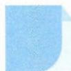

本思想方法涉及模块: 函数、数列、不等式、解析几何、三角、向量.

# 方法介绍

在数学运算过程中,往往需要根据题目给的条件,设定未知量,分析已知量和未知量之间的关系,列出相应等式求解.在这些已知量、未知量中,选定其中的一些量,则其他的量就可以用它们来表达,这些量我们称之为基本量.在解题过程中如何选择基本量,是分析、解决问题的一个重要环节.

# 典例示范

# (一)向量问题中寻找基底

例 1 已知向量 a, b 满足 $\left|2a+b\right|=3,\left|b\right|=1$ ，则 $\left|a\right|+2\left|a+b\right|$ 的最大值为 \_\_\_\_.

思路 观察条件和目标式中出现的四个向量 $2a + b, b, a, a + b$ ，根据平面向量基本定理求解。

解答 选 $a = p, a + b = q$ 为基底，

则目标式为 $|p|+2|q|$ ，条件为 $|p+q|=3,|q-p|=1$ ，

则 $2p^{2} + 2q^{2} = (p + q)^{2} + (p - q)^{2} = 10$ ，令 $p = \sqrt{5}\cos \theta ,q = \sqrt{5}\sin \theta ,$

则 $p+2q=\sqrt{5}\cos\theta+2\sqrt{5}\sin\theta=5\sin(\theta+\varphi)$ ，当 $\sin(\theta+\varphi)=1$ 时取到最大值 5.

反思 四个向量模的问题,找平方关系配系数.

# (二)数列问题中选择基本量

例 2 设等差数列 $\{a_{n}\}$ 的前 n 项和为 $S_{n}$ ，已知 $a_{3}=12, S_{12}>0, S_{13}<0.$

(1)求公差 d 的取值范围；

(2)指出 $S_{1}, S_{2}, S_{3}, \cdots, S_{12}$ 中哪一个值最大，并说明理由.

思路 在等差数列中求哪项最大,解题的关键是寻找等差数列的正负分界点: $a_{k}\geqslant0,a_{k+1}\leqslant0$ .如果用一般的思路,基本量是 $a_{1},d$ ,表示 $a_{k},a_{k+1}$ 比较困难,故选择中间项作为基本量.

解答 (1)依题意,有 $S_{12}=12a_{1}+\frac{12\times(12-1)}{2}d>0$ ,

$$
S _ {1 3} = 1 3 a _ {1} + \frac {1 3 \times (1 3 - 1)}{2} d <   0, \text {即} \left\{ \begin{array}{l l} 2 a _ {1} + 1 1 d > 0 & ①, \\ a _ {1} + 6 d <   0 & ②, \end{array} \right.
$$

由 $a_{3}=12$ ，得 $a_{1}=12-2d$ ③.

将③式分别代入①，②两式，得 $\left\{\begin{aligned}&24+7d>0,\\ &3+d<0,\end{aligned}\right.$ 解得 $-\frac{24}{7}<d<-3.$

(2)由 d<0 可知 $a_{1}>a_{2}>\cdots>a_{12}$ ,

因此，若在 $1\sim 12$ 中存在自然数 $n$ ，使得 $a_{n} > 0,a_{n + 1} <   0$

则 $S_{n}$ 就是 $S_{1}, S_{2}, S_{3}, \cdots, S_{12}$ 中的最大值.

由于 $S_{12}=6(a_{6}+a_{7})>0$ ， $S_{13}=13a_{7}<0$ ，即 $a_{6}+a_{7}>0, a_{7}<0$ ，

由此得 $a_{6} > -a_{7} > 0$ ，即 $a_{6} > 0, a_{7} < 0$ ，故在 $S_{1}, S_{2}, S_{3}, \cdots, S_{12}$ 中， $S_{6}$ 的值最大.

反思 第(1)小题以 $a_{1}, d$ 为基本量, 第(2)小题以中间项为基本量.

# (三)不等式问题中选择基本量

例 3 已知函数 $f(x)=x^{2}-ax-4(a\in\mathbb{R})$ 的两个零点为 $x_{1}, x_{2}$ ，设 $x_{1}<x_{2}$ ，当 a>0 时，证明： $-2<x_{1}<0$ .

思路 条件中有变量 $x_{1}, x_{2}, a$ ，结论中有变量 $x_{1}$ ，解题时利用韦达定理消去 $x_{2}$ ，利用不等关系 $a > 0$ 消去 $a$ 。

解答 条件转化为 $\left\{ \begin{array}{l} \Delta > 0, \\ x_{1} + x_{2} = a, \\ x_{1}x_{2} = -4, \\ x_{1} < x_{2}, \\ a > 0, \end{array} \right.$ 目标式为 $-2 < x_{1} < 0.$

这个是三元规划问题,考虑利用不等关系消元为 $\left\{\begin{aligned}x_{1}+x_{2}&>0,\\ x_{1}x_{2}&=-4,\\ x_{1}&<x_{2},\end{aligned}\right.$

从而 $x_{1} < 0, x_{2} > 0$

再利用等式 $x_{1}x_{2} = -4$ 消元得 $x_{1} - \frac{4}{x_{1}} >0$ ，化简得 $-2 < x_{1} < 0.$

反思 观察条件与结论的差异, 将条件中比结论中多余的字母或结构消去. 或利用零点存在性定理得 $f(0) = -4 < 0$ , $f(-2) = 4 + 2a - 4 = 2a > 0$ , 从而 $-2 < x_{1} < 0$ .

# 巩固练习

1. 已知 $x > y \geqslant 0$ ，求 $\frac{3x + y}{x + y} + \frac{2x}{x - y}$ 的最小值.

2. 已知正实数 x, y 满足 $\frac{1}{x} + \frac{1}{y} = 2$ ，探究 $f(x, y) = xy - \frac{4}{7}(x^{2} + y^{2})$ 的最大值.

3. 已知 $\left|a+b\right|=1,\left|3a+b\right|=2,\left\langle a+b,a-b\right\rangle=60^{\circ}$ ，求 a,b 的夹角的余弦值.

4. 已知平面向量 $a, b$ 满足 $|2a - b| = 2$ ，且 $a \cdot (a + b) = 1$ ，求 $|a + b|$ 的取值范围.

# 12 对称法

引路人 浙江省温州中学 陈巴尔

本思想方法涉及模块: 函数、立体几何、解析几何.

# 方法介绍

对称法的运用包括发现对称与构造对称，在高中阶段应用极为广泛。对称方式包括关于点、线、面对称，对称形式包括镜面对称、中心对称，涉及函数、立体几何、解析几何等重点内容。对称法的应用过程中需要注意的是，要对是否具有对称性作出正确的判断，有些图形的对称判断比较直观，对于一些较为复杂的问题，还要加以计算与推理。

# 典例示范

例1 设函数 $f(x)$ 的定义域为 $\mathbf{R}, f(x + 1)$ 为奇函数， $f(x + 2)$ 为偶函数，当 $x \in [1, 2]$ 时， $f(x) = ax^2 + b$ 。若 $f(0) + f(3) = 6$ ，则 $f\left(\frac{9}{2}\right) = (\quad)$ 。

A. $-\frac{9}{4}$

B. $-\frac{3}{2}$

C. $\frac{7}{4}$

D. $\frac{5}{2}$

思路 由条件容易发现函数图象具有轴对称性与中心对称性,所以考虑利用对称性将 $f(0)$ , $f(3)$ 转化为区间 $[1,2]$ 上某处的函数值,从而解决问题.

解答 因为 $f(x+1)$ 为奇函数, 所以其函数图象关于点 $(1,0)$ 中心对称,

因为 $f(x+2)$ 为偶函数, 所以其函数图象关于直线 x=2 轴对称,

因此 $f(0)+f(3)=-f(2)+f(1)=6.$

又因为 $f(1) = 0$ ，所以 $f(2) = -6$ ，得 $\left\{ \begin{array}{l}a + b = 0,\\ 4a + b = -6, \end{array} \right.$ 解得 $a = -2,b = 2$

由对称性可得 $f\left(\frac{9}{2}\right)=f\left(-\frac{1}{2}\right)=-f\left(\frac{5}{2}\right)=-f\left(\frac{3}{2}\right)=\frac{5}{2}$ ，故选 D.

反思 本题的关键是发现函数图象的对称性,利用对称性将条件与所求的自变量的函数值转化为给定区间内自变量的函数值,从而解决问题.遇到图象具有对称性的函数,给定某个区间的信息,转求其他区间内信息的相关问题,都可以采取这种策略.

例 2 函数 $f(x)=\sqrt{x^{2}+4}+\sqrt{x^{2}-2x+2}$ 的最小值为 \_\_\_\_.

思路 由根号内二次式的结构,容易联想到配成完全平方,因此该函数可以看成两个距离之和.

解答 $f(x) = \sqrt{x^2 + 2^2} +\sqrt{(x - 1)^2 + 1^2},$

设 $A(x,0)$ , $B(0,2)$ , $C(1,1)$ ,

则可知 $f(x)=|AB|+|AC|$ ,

如图,作点 $C(1,1)$ 关于 x 轴的对称点 $C'(1,-1)$ ,

则 $|AB| + |AC| = |AB| + |AC'| \geqslant |BC'| = \sqrt{10}$ ,

当 A, B, C 三点共线时取等号，

因此 $f(x)_{\min}=\sqrt{10}$ .

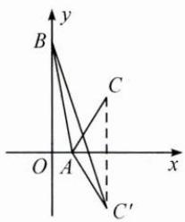

text_image

y
B
C
O A x
C'

反思 本题的关键是通过构造镜面对称变换,将函数的最值问题转化为两点之间的最短距离问题.这种构造对称的思想方法不单可以运用在平面问题中,在许多空间的最值问题中也十分重要.

例 3 已知三棱锥 P-ABC 的四个顶点在球 O 的球面上, PA=PB=PC, $\triangle ABC$ 是边长为 2 的正三角形, E, F 分别是 PA, AB 的中点, $\angle CEF=90^{\circ}$ , 则球 O 的体积为().

A. $8 \sqrt{6} \pi$

B. $4\sqrt{6}\pi$

C. $2 \sqrt{6} \pi$

D. $\sqrt{6} \pi$

思路 由正三棱锥结构的对称性,可以联想到对称的几何元素具有相同的性质,从而可以巧妙地利用垂直条件,快速解决问题.

解答 三棱锥 P-ABC 为正三棱锥, 如图, 取 PC 的中点 G, BC 的中点 H, 连接 AG, GH, 则由 $\angle CEF = 90^{\circ}$ 和正三棱锥的对称性易知 $AG \perp GH$ .

因为 $BP \parallel EF \parallel GH$ ，所以 $BP \perp AG, BP \perp CE,$

因为 AG 与 CE 相交且都在平面 APC 内, 所以 BP ⊥ 平面 APC,

所以 $BP \perp PA, BP \perp PC$ .

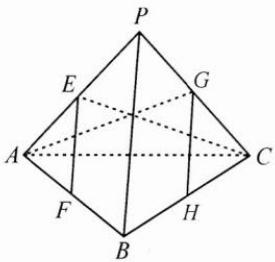

text_image

Geometric diagram of a polyhedron with labeled vertices and internal points, used for spatial geometry problems.

由正三棱锥的对称性可知 $PA, PB, PC$ 两两垂直，且 $PA = PB = PC = \sqrt{2}$ ，可将该三棱锥还原成一个以 $PA, PB, PC$ 为棱的正方体，正方体的体对角线即为球 $O$ 的直径，即 $2R = \sqrt{6}, R = \frac{\sqrt{6}}{2}$ .

所以球 O 的体积为 $V=\frac{4}{3}\pi R^{3}=\sqrt{6}\pi$ ，故选 D.

反思 本题的关键是利用正三棱锥结构的对称性,通过构造对称的几何元素,使得垂直条件得到灵活运用.这种发现对称、构造对称、利用对称的思想方法在许多几何问题中十分重要.

# 巩固练习

1.(多选)已知函数 $f(x)=x^{2}+m$ , $g(x)=f(f(x))-x$ , 则().

A. 当 $m=\frac{1}{4}$ 时, 函数 $g(x)$ 有且仅有一个零点

B. 当 $m > \frac{1}{4}$ 时, 函数 $g(x)$ 没有零点

C. 当 $0 < m < \frac{1}{4}$ 时, 函数 $g(x)$ 有两个不同的零点

D. 当 m<0 时, 函数 $g(x)$ 有四个不同的零点

2. 如图, 在长方形 $ABCD$ 中, $AD < CD$ , 现将 $\triangle ACD$ 沿 $AC$ 折至 $\triangle ACD'$ , 使得二面角 $A - CD' - B$ 为锐角, 设直线 $AD'$ 与直线 $BC$ 所成角的大小为 $\alpha$ ,

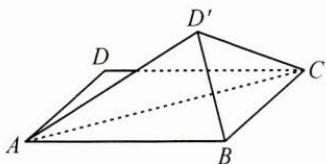

text_image

Geometric diagram of a parallelepiped with labeled vertices A, B, C, D, D' and internal diagonals

直线 $BD'$ 与平面 ABC 所成角的大小为 $\beta$ ，二面角 $A-CD'-B$ 的大小为 $\gamma$ ，则 $\alpha, \beta, \gamma$ 的大小关系是（）.

A. $\alpha >\beta >\gamma$

B. $\alpha >\gamma >\beta$

C. $\gamma >\alpha >\beta$

D. 不能确定

3. 如图, 在棱长为 1 的正方体 $ABCD - A_{1}B_{1}C_{1}D_{1}$ 中, $E$ 为棱 $BC$ 的中点, $F$ 是棱 $C_{1}D_{1}$ 上的动点, 若 $P$ 为线段 $BD_{1}$ 上的动点, 则 $PE + PF$ 的最小值为 \_\_\_\_.

4. 已知函数 $f(x)=x^{2}-2x+a\left(\mathrm{e}^{x-1}+\mathrm{e}^{-x+1}\right)$ 有唯一零点，则 a= \_\_\_\_.

5. 如图, 已知椭圆方程为 $\frac{x^2}{4} + \frac{y^2}{3} = 1, F_1, F_2$ 分别为其左、右焦点, $P$ 为椭圆上的动点, 过点 $F_1$ 作椭圆在点 $P$ 处的切线的垂线, 垂足为 $H$ , 求点 $H$ 的轨迹方程.

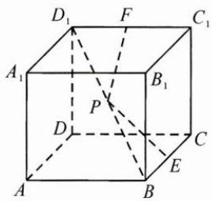

text_image

D₁ F C₁
A₁ B₁
P
D C
A B E

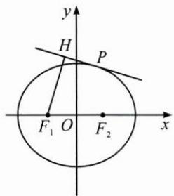

text_image

y
H
P
F₁ O F₂ x

# 13 增量法

引路人 杭州师范大学附属未来科技城学校 李学军

本思想方法涉及模块: 函数、导数、数列、不等式、解析几何、立体几何、三角、向量.

# 方法介绍

对于两个实数 a 和 b，若 a > b，则可令 $a = b + t (t > 0)$ ，t 称为和式增量；若 a > b > 0，则可令 $a = bt (t > 1)$ ，t 称为积式增量。用增量解题的方法叫作增量法。

用增量法解题一般包括以下两个方面:(1)探究解题思路,恰当地引入新量;(2)新增量是解决问题的关键,对引入增量之后的问题进行分析,寻找解题的突破口.增量法的实质是转化思想,难点在于如何进行等价转化.

# 典例示范

# (一)和式增量

例1 已知 $a > b > c$ ，比较 $\frac{1}{a - b} + \frac{1}{b - c} + \frac{1}{c - a}$ 与0的大小.

思路 本题有两个基本思路:一是从代数式直接入手,通分变形进行比较;二是通过增量把不等关系转化为相等关系.

解答 解法 1: 令 $a=m+c, b=n+c, m>n>0$ ,

则 $\frac{1}{a - b} +\frac{1}{b - c} +\frac{1}{c - a} = \frac{1}{m - n} +\frac{1}{n} -\frac{1}{m} = \frac{m^2 - mn + n^2}{(m - n)mn} = \frac{\left(m - \frac{n}{2}\right)^2 + \frac{3}{4}n^2}{(m - n)mn} >0.$

解法 2: 令 $a=m+c, b=n+c, m>n>0$ ,

则 $\frac{1}{a - b} +\frac{1}{b - c} +\frac{1}{c - a} = \frac{1}{m - n} +\frac{1}{n} -\frac{1}{m} >\frac{1}{n} -\frac{1}{m} = \frac{m - n}{mn} >0.$

反思 通过引入两个增量, 把 a, b 用 c, m, n 来表示, 能够很容易地比较大小. 解法 2 在引进增量的过程中还利用了不等式的放缩, 使得解答更加简洁.

例 2 已知椭圆 $T: \frac{x^{2}}{4} + \frac{y^{2}}{2} = 1$ ，过椭圆内一点 $M(1,1)$ 作直线 l，交椭圆 T 于 A, B 两点，且 $\overrightarrow{AM} = \overrightarrow{MB}$ ，求直线 l 的方程及线段 AB 的长.

思路 根据题意引入增量,用增量表示 A,B 两点的坐标,代入椭圆方程,可以求得增量之间的关系,从而求得直线方程和线段 AB 的长.

解答 因为点 $M(1,1)$ 在椭圆 T 内，且 $\overrightarrow{AM} = \overrightarrow{MB}$ ,

所以设 $A(1+t,1+m)$ , $B(1-t,1-m)$ ,

则有 $\left\{\begin{aligned}\frac{(1+t)^{2}}{4}+\frac{(1+m)^{2}}{2}&=1,\\ \frac{(1-t)^{2}}{4}+\frac{(1-m)^{2}}{2}&=1,\end{aligned}\right.$

两式相减得 $\frac{4t}{4}+\frac{4m}{2}=0$ ，所以 $k_{l}=\frac{m}{t}=-\frac{1}{2}$ ，

所以直线 l 的方程为 $y-1=-\frac{1}{2}(x-1)$ ，即 $x+2y-3=0$ 。

由 $\left\{\begin{aligned}\frac{(1+t)^{2}}{4}+\frac{(1+m)^{2}}{2}&=1,\\ t&=-2m,\end{aligned}\right.$ 得 $m^{2}=\frac{1}{6},t^{2}=\frac{4}{6},$

所以 $|AB|=2\sqrt{t^{2}+m^{2}}=2\sqrt{\frac{1}{6}+\frac{4}{6}}=\frac{\sqrt{30}}{3}.$

反思 把 A, B 两点的坐标代入椭圆方程, 利用点差法求解, 在求线段 AB 的长时, 利用增量的平方和求解, 非常便捷.

# (二)积式增量

例 3 已知 $f(x)=\ln x-ax^{2}+(2-a)x$ ，设 $f(x)$ 的图象与 x 轴交于 A, B 两点，线段 AB 的中点横坐标为 $x_{0}$ ，证明： $f'(x_{0})<0$ 。

思路 根据题意,先求导,然后代入 $x_{0}$ 求出 $f'(x_{0})$ 的表达式,通过引进增量 $x_{2}=tx_{1}(t>1)$ ,转化为研究增量的函数关系.

解答 设 $A(x_{1},0),B(x_{2},0)$ ，且 $x_{2} > x_{1} > 0$ ，则 $x_0 = \frac{x_1 + x_2}{2}$

而 $f^{\prime}(x_0) = \frac{1}{x_0} -2ax_0 + 2 - a = \frac{2}{x_1 + x_2} -a(x_1 + x_2) + 2 - a,$

又 $\ln x_{1} - ax_{1}^{2} + (2 - a)x_{1} = 0,\ln x_{2} - ax_{2}^{2} + (2 - a)x_{2} = 0,$

两式相减得 $\ln x_{1} - \ln x_{2} - a(x_{1}^{2} - x_{2}^{2}) + (2 - a)(x_{1} - x_{2}) = 0$

即 $\frac{\ln x_1 - \ln x_2}{x_1 - x_2} - a(x_1 + x_2) + (2 - a) = 0,$

所以 $f'(x_{0})=\frac{2}{x_{1}+x_{2}}-\frac{\ln x_{1}-\ln x_{2}}{x_{1}-x_{2}}.$

令 $x_{2}=tx_{1}(t>1)$ ,

则 $f^{\prime}(x_0) = \frac{2}{x_1 + tx_1} -\frac{\ln x_1 - \ln tx_1}{x_1 - tx_1} = \frac{1}{x_1(1 - t)}\Big[\frac{2(1 - t)}{1 + t} +\ln t\Big].$

令 $g(t)=\frac{2(1-t)}{1+t}+\ln t(t>1)$ ，则 $g'(t)=\frac{(1-t)^{2}}{t(1+t)^{2}}>0$ ，

$g(t)$ 在 $(1, +\infty)$ 上单调递增，

所以 $g(t) > g(1) = 0$ .

又因为 $\frac{1}{x_{1}(1-t)}<0$ ，所以 $f'(x_{0})<0$ 。

反思 通过 $x_{2} = tx_{1}(t > 1)$ , 把关于 $x_{1}, x_{2}$ 的不等式问题转化为关于 $t$ 的一元不等式问题, 有效实现了减元, 然后利用导数工具研究函数的单调性进行证明.

# 三 巩固练习

1. 向高为 $H$ 的水瓶中注水, 注满为止, 如果注水量 $V$ 与水深 $h$ 的函数关系的图象如图所示, 那么水瓶的形状是下列选项中的 ( ).

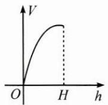

line

| h | V |
|---|---|
| 0 | 0 |
| H | Peak |

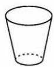  
A

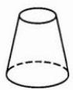  
B

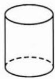  
C

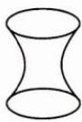  
D

2. 已知单位向量 $e_{1}, e_{2}$ 的夹角为 $\frac{\pi}{3}$ ，设 $a = 2e_{1} + \lambda e_{2}$ ，则当 $\lambda < 0$ 时， $\lambda + |a|$ 的取值范围是（）.

A. $(1,2)$

B. $(-1,2)$

C. $(-1,4)$

D. $(-∞,2)$

3. 已知 a, b > 0，且 $a + b = 1$ ，则 $\left(a + \frac{1}{a}\right)\left(b + \frac{1}{b}\right)$ 的最小值是 \_\_\_\_.

4. 设等比数列 $\{a_{n}\}$ 满足 $a_{1} + a_{3} = 10, a_{2} + a_{4} = 5$ ，则 $a_{1}a_{2}\cdots a_{n}$ 的最大值为 \_\_\_\_.

5. 已知 $f(x) = \mathrm{e}^{ax} - x$ ，其中 $a \neq 0$ ，在 $f(x)$ 的图象上任取两点 $A(x_1, f(x_1))$ ， $B(x_2, f(x_2)) (x_1 < x_2)$ ，记直线 $AB$ 的斜率为 $k$ ，是否存在 $x_0 \in (x_1, x_2)$ ，使 $f'(x_0) > k$ 成立？若存在，求 $x_0$ 的取值范围；若不存在，说明理由。

# 14 导数法

引路人 杭州学军中学 张春杰

本思想方法涉及模块: 函数、解析几何、立体几何、三角函数、不等式.

# 方法介绍

导数法, 就是利用导数的定义和运算解决函数问题的方法, 其中也包括可以化归到函数问题的不等式证明、立体几何、解析几何等问题. 求切线、讨论函数单调性、求最值通常可以利用导数法处理.

# 典例示范

例 1 已知抛物线 C: $y^{2}=2px(p>0)$ 的焦点为 F, K 为抛物线 C 的准线 l 与 x 轴的交点, 若过点 K 且倾斜角为 $45^{\circ}$ 的直线与 C 仅有一个公共点 $P(3, t)$ , 则 t= \_\_\_\_.

思路 直线与抛物线有且仅有一个公共点,说明直线与抛物线相切,可利用导数的几何意义求解.

解答 由题意知点 $P(3, t)$ 在第一象限，由抛物线 $C: y^2 = 2px (p > 0)$ 可得 $y = \sqrt{2px}$ ，求导可得 $y' = \frac{\sqrt{2p}}{2\sqrt{x}}$ ，由导数的几何意义可知切线 $PK$ 的斜率为 $k = \frac{\sqrt{2p}}{2\sqrt{3}} = \tan 45^\circ = 1$ ，解得 $p = 6$ ，将点 $P(3, t)$ 代入 $C: y^2 = 12x$ ，解得 $t = 6$ （负值舍去）.

反思 导数的几何意义是破解与曲线有关的切线问题最常用的方法之一. 抛物线在第一象限的部分可看作一个函数的图象, 利用导数的几何意义确定切线的斜率,结合题目中切点坐标即可确定参数 p 的值,进而确定抛物线上点的坐标.

例 2 已知 $a, b \in R$ ，且 $2^{a} > 2^{b} > 1$ ，则（）.

A. $\mathrm{e}^a -\mathrm{e}^b <  \ln a - \ln b$

B. $b\ln a < a\ln b$

C. $\frac{b}{a} >\mathrm{e}^{a - b}$

D. $\frac{\sin a-\sin b}{a-b}<1$

思路 由选项结构知,应先构造函数并通过导数判断其单调性,再比较大小.

解答 由 $2^{a} > 2^{b} > 1$ 知 $a > b > 0$ .

对于 A, 若 $y=e^{x}-\ln x$ 且 $x\in(0,+\infty)$ ，则 $y'=\mathrm{e}^{x}-\frac{1}{x}$ ,

故 $y^{\prime}|_{x=\frac{1}{2}}=\sqrt{e}-2<0,y^{\prime}|_{x=1}=e-1>0,$

即 $y'$ 在 $(0, +\infty)$ 上单调递增且 $y'$ 在 $\left(\frac{1}{2}, 1\right)$ 上存在零点，

所以 y 在 $(0, +\infty)$ 上不单调，则 $e^{a} - \ln a < e^{b} - \ln b$ 不一定成立，排除 A；

对于 B, 若 $y=\frac{\ln x}{x}$ 且 $x\in(0,+\infty)$ ，则 $y'=\frac{1-\ln x}{x^{2}}$ ,

在 $(0,e)$ 上 $y^{\prime}>0,y$ 单调递增；在 $(e,+\infty)$ 上 $y^{\prime}<0,y$ 单调递减，

故 y 在 $(0, +\infty)$ 上不单调，则 $\frac{\ln a}{a} < \frac{\ln b}{b}$ 不一定成立，排除 B；

对于 C, 若 $y = x e^{x}$ 且 $x \in (0, +\infty)$ ，则 $y' = e^{x}(x + 1) > 0$ ，

$y$ 在 $(0, +\infty)$ 上单调递增，所以 $a\mathrm{e}^{a} > b\mathrm{e}^{b}$ ，即 $\frac{b}{a} < \mathrm{e}^{a - b}$ ，排除C；

对于 D, 若 $y = x - \sin x$ 且 $x \in (0, +\infty)$ ，则 $y' = 1 - \cos x \geqslant 0$ ，

y 在 $(0, +\infty)$ 上单调递增，所以 $a - \sin a > b - \sin b$ ，即 $\frac{\sin a - \sin b}{a - b} < 1$ ，D 正确。故选 D.

反思 观察选项,发现各个选项的表达形式比较整齐,具备构造函数的条件;对于比较大小的问题,我们常常借助函数单调性来判断,而导数法是研究函数单调性的有效工具.尝试将选项转化成不等号两边结构较为整齐的等价形式,从而发现可以构造的函数,这是解题的关键.

例3 已知正数 $x, y$ 满足 $x + 4y = x^2y^3$ ，则 $\frac{8}{x} + \frac{1}{y}$ 的最小值是 \_\_\_\_.

思路 本题可利用均值不等式求最值,也可根据条件等式减少变量个数,将目标式转化为单变量函数,利用导数法求函数最值.

解答 由 $x + 4y = x^2 y^3$ ，整理可得关于 $x$ 的二次方程 $y^{3}x^{2} - x - 4y = 0$

由求根公式可得 $x=\frac{1+\sqrt{1+16y^{4}}}{2y^{3}}$ (负值舍去)，

则 $\frac{8}{x} +\frac{1}{y} = \frac{16y^3}{1 + \sqrt{1 + 16y^4}} +\frac{1}{y} = \frac{\sqrt{1 + 16y^4}}{y}.$

构造函数 $f(y) = \frac{\sqrt{1 + 16y^4}}{y}$ ，求导可得 $f'(y) = \frac{16y^4 - 1}{y^2\sqrt{1 + 16y^4}}$

令 $f'(y)=0$ ，解得 $y=\frac{1}{2}$ ，所以 $f(y)$ 的最小值为 $f\left(\frac{1}{2}\right)=2\sqrt{2}$ .

所以 $\frac{8}{x} +\frac{1}{y}$ 的最小值为 $2\sqrt{2}$ ，当且仅当 $x = 4\sqrt{2} +4,y = \frac{1}{2}$ 时取到.

反思 导数法是求一些代数式最值时常用的方法,关键是通过变形将所求式转化为只含有一个变量的函数.本题中,将 x,y 的关系式整理成关于 x 的方程,利用求根公式用 y 表示 x,这是解题的关键.

# 巩固练习

1. 已知函数 $y = \sin x + a\cos x$ 的图象关于直线 $x = \frac{5\pi}{3}$ 对称，则函数 $y = a\sin x + \cos x$ 的图象关于直线（）对称.

A. $x = \frac{\pi}{3}$

B. $x = \frac{2\pi}{3}$

C. $x=\frac{11\pi}{6}$

D. $x=\pi$

2. 若不等式 $a(x+1)e^{x}-x<0$ 有且仅有一个正整数解，求实数 a 的取值范围.

3. 设 $a=\ln15-\ln14, b=\frac{15}{196}, c=\tan\frac{15}{196}$ ，则（）.

A. $c < b < a$

B. $b < a < c$

C. a<c<b

D. $a < b < c$

# 15 枚举法

引路人 浙江省绍兴市阳明中学 邵琳华

本思想方法涉及模块: 计数原理、排列组合、概率与统计、数列、不定方程.

# 方法介绍

枚举法，起源于原始的计数方法，即数数.

枚举法是指在进行归纳推理时,逐个考察某类事情的所有可能情况,得出一般且可靠的结论的一种数学方法.通常来说,将问题的所有可能的答案一一列举,然后根据条件逐个判断答案是否合适,合适就保留,不合适就舍弃.

# 典例示范

# (一)计数问题,枚举开路

例 1 将一个骰子连续抛掷三次,它落地时向上的点数依次成等差数列的情况有多少种?

思路 关键词是点数依次成等差数列,可以有两个思路:①把抛掷三次的所有结果一一列举,从中找到“点数依次成等差数列”的情况;②先按照等差数列的规律分类,得到每类可能的情况,再累加所有情况.

解答 思路①,一个骰子连续抛掷三次,共产生216种结果,从中找出满足条件的有18种,这样列举显然费时费力,容易遗漏.

改变策略,引进思路②,按照等差数列的规律分类.

公差为 0 的情况有 6 种, 分别是 $(1,1,1)$ , $(2,2,2)$ , $(3,3,3)$ , $(4,4,4)$ , $(5,5,5)$ , $(6,6,6)$ ;

公差为 1 的情况有 4 种, 分别是 $(1,2,3)$ , $(2,3,4)$ , $(3,4,5)$ , $(4,5,6)$ ;

公差为 2 的情况有 2 种, 分别是 $(1,3,5)$ , $(2,4,6)$ ;

公差为-1的情况有4种，分别是 $(3,2,1)$ ， $(4,3,2)$ ， $(5,4,3)$ ， $(6,5,4)$ ；

公差为-2的情况有2种，分别是 $(5,3,1)$ ， $(6,4,2)$ .

故满足条件的情况共有 18 种.

反思 当所枚举的情形较多时,可以先对问题进行有效分类,这样可以大大减轻枚举法带来的一一列举的压力,还可更好地满足“不重不漏”的要求.

# (二)古典概型,善用枚举

例 2 甲、乙、丙三位同学进行羽毛球比赛,约定赛制如下:累计负两场者被淘汰;比赛前抽签决定首先比赛的两人,另一人轮空;每场比赛的胜者与轮空者进行下一场比赛,负者下一场轮空,直至有一人被淘汰;当一人被淘汰后,剩余的两人继续比赛,直至其中一人被淘汰,另一人最终获胜,比赛结束.

经抽签，甲、乙首先比赛，丙轮空.设每场比赛双方获胜的概率都为 $\frac{1}{2}$

(1)求甲连胜四场的概率;   
(2)求需要进行第五场比赛的概率;  
(3)求丙最终获胜的概率.

思路 本题涉及比赛中轮空、淘汰等情况，在解决问题时有一定的困难。可从分类、枚举等角度入手，通过画树状图、列表的方式来处理。

解答 如图,先将比赛情况分成四类,对情况①具体研究,再利用对称性,得到其他情况下相应的概率.其中,A表示甲输掉比赛,B表示乙输掉比赛,C表示丙输掉比赛.

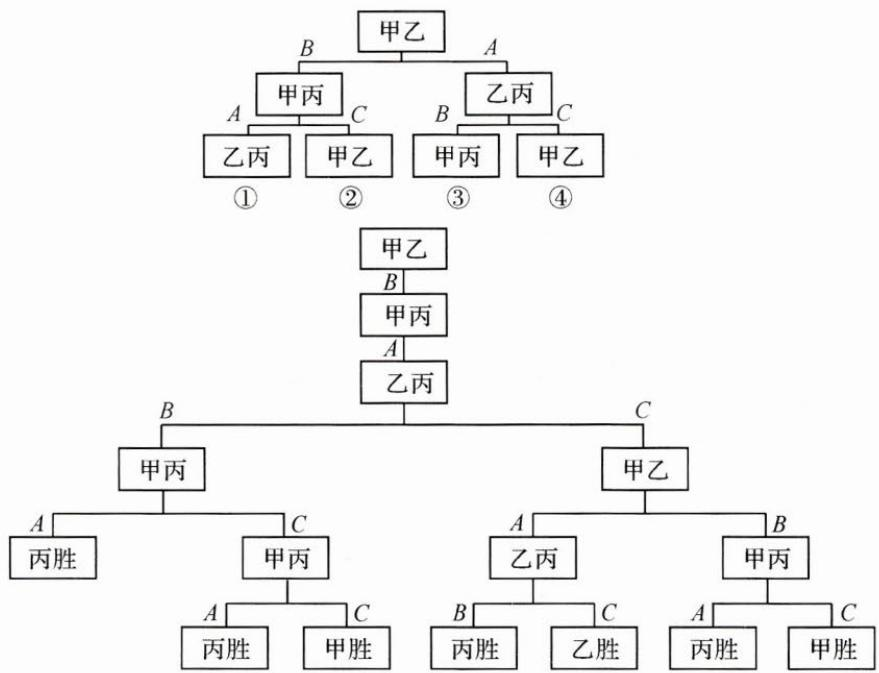

在情况①中，甲获胜的概率为 $\frac{1}{32} +\frac{1}{32} = \frac{1}{16}$ ，乙获胜的概率为 $\frac{1}{32}$ ，丙获胜的概率为 $\frac{1}{16} +\frac{1}{32} +\frac{1}{32} +\frac{1}{32} = \frac{5}{32}$ .列表如下.

<table><tr><td>项目</td><td>甲获胜概率</td><td>乙获胜概率</td><td>丙获胜概率</td></tr><tr><td>情况1</td><td> $\frac{1}{16}$ </td><td> $\frac{1}{32}$ </td><td> $\frac{5}{32}$ </td></tr><tr><td>情况2</td><td> $\frac{5}{32}$ </td><td> $\frac{1}{32}$ </td><td> $\frac{1}{16}$ </td></tr><tr><td>情况3</td><td> $\frac{1}{32}$ </td><td> $\frac{1}{16}$ </td><td> $\frac{5}{32}$ </td></tr><tr><td>情况4</td><td> $\frac{1}{32}$ </td><td> $\frac{5}{32}$ </td><td> $\frac{1}{16}$ </td></tr><tr><td>总计</td><td> $\frac{9}{32}$ </td><td> $\frac{9}{32}$ </td><td> $\frac{7}{16}$ </td></tr></table>

(1)甲连胜四场的概率 $P(\text{甲})=\left(\frac{1}{2}\right)^{4}=\frac{1}{16}.$

(2)由树状图易知四场结束比赛的概率是 $\frac{1}{4}$ ，所以，需要进行第五场比赛的概率是 $\frac{3}{4}$ .

(3)丙最终获胜的概率 $P(\text{丙})=\frac{7}{16}$ .

反思 画树状图和列表分析在计算机领域有着广泛运用. 它们作为枚举法的表现形式, 具有直观清晰、操作性强等特征. 在本题中, 使用枚举法能很好地解决读题障碍, 降低解题难度.

# (三)不定方程,枚举回归

例 3 求方程 $x+2y+3z=12$ 的非负整数解的个数.

思路 此方程用公式求解困难较大,用枚举法合理分类效果颇佳.

解答 由题意知, $x, y, z$ 均为非负整数, 即 $x \in [0, 12], y \in [0, 6], z \in [0, 4]$ .

不妨选择对 z 进行分类(此分类列举情形最少), 列表如下.

<table><tr><td>z=0</td><td>x+2y=12</td><td> $\begin{cases} x=0, & x=2, \\ y=6, & y=5, \end{cases}$   $\begin{cases} x=4, & x=6, \\ y=4, & y=3, \end{cases}$   $\begin{cases} x=8, & x=10, \\ y=2, & y=1, \end{cases}$   $\begin{cases} x=12, \\ y=0 \end{cases}$ </td></tr><tr><td>z=1</td><td>x+2y=9</td><td> $\begin{cases} x=1, & x=3, \\ y=4, & y=3, \end{cases}$   $\begin{cases} x=5, & x=7, \\ y=2, & y=1, \end{cases}$   $\begin{cases} x=9, \\ y=0 \end{cases}$ </td></tr><tr><td>z=2</td><td>x+2y=6</td><td> $\begin{cases} x=0, & x=2, \\ y=3, & y=2, \end{cases}$   $\begin{cases} x=4, & x=6, \\ y=1, & y=0 \end{cases}$ </td></tr><tr><td>z=3</td><td>x+2y=3</td><td> $\begin{cases} x=1, & x=3, \\ y=1, & y=0 \end{cases}$ </td></tr><tr><td>z=4</td><td>x+2y=0</td><td> $\begin{cases} x=0, \\ y=0 \end{cases}$ </td></tr></table>

从表中看出,满足题意的非负整数解有19个.

反思 不定方程常带有限制条件. 运用枚举法, 合理使用限制条件, 能起到事半功倍的效果.

# 巩固练习

1. 定义 $[x]$ 为不超过 $x$ 的最大整数（如 $[2.5] = 2, [4] = 4, [-2.5] = -3$ ）。已知 $a_{n} = \left[\frac{2}{7} \times 10^{n}\right]$ ，数列 $\{b_{n}\}$ 满足 $b_{1} = a_{1}, b_{n} = a_{n} - 10a_{n-1} (n \in \mathbf{N}^{*}, n \geqslant 2)$ ，则 $b_{2022} = (\quad)$ 。

A. 2

B. 4

C. 7

D. 8

2. 甲、乙、丙三人进行羽毛球练习赛, 其中两人比赛, 另一人当裁判, 每局比赛结束时, 负的一方在下一局当裁判. 设各局比赛双方获胜的概率均为 $\frac{1}{2}$ , 各局比赛的结果相互独立. 若第一局甲当裁判, 则前四局中乙当裁判一次的概率为( ).

A. $\frac{1}{8}$

B. $\frac{1}{4}$

C. $\frac{3}{8}$

D. $\frac{5}{8}$

3. 满足 $4(ab + bc + ca) = 3abc$ 的正整数 $a, b, c$ 可组成的不同的有序数组 $(a, b, c)$ 共有多少个？

# 16 向量法

引路人 东阳市第二高级中学 王雅萍

本思想方法涉及模块: 平面几何、函数、不等式、解析几何、立体几何.

# 方法介绍

所谓向量法,是指对平面或立体几何中的边赋予方向,利用向量运算律、向量的性质及向量基本定理解决一些简单的几何问题的方法,也指将函数、不等式中的代数结构转化为向量的模或两向量的夹角等,进而解决问题的方法.

用向量法解决平面几何问题有“三部曲”（向量化 $\rightarrow$ 向量运算 $\rightarrow$ “翻译”），可以程序化地解决问题。但用向量法解决平面几何问题也并非百试百灵，一般比较适合解决垂直、平行、共线等定性问题和计算长度、角度等定量问题。

# 典例示范

例 1 如图, 在 Rt△OAB 中, ∠AOB=90°, OA=3, OB=2, 点 M 在 OB 上, 且 OM=1, 点 N 在 OA 上, 且 ON=1, P 为 AM 与 BN 的交点, 求 ∠MPN.

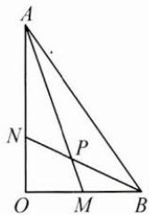

text_image

A
N
P
O
M
B

思路 求 $\angle MPN$ 可以转化为求 $\overrightarrow{PM}$ 和 $\overrightarrow{PN}$ 的夹角, 题目已知 $OA$ 和 $OB$ 的长度和夹角, 所以既可以以 $\overrightarrow{OA}$ 和 $\overrightarrow{OB}$ 为基底, 也可以分别以 $OA, OB$ 为 $x$ 轴、 $y$ 轴建立平面直角坐标系, 利用向量的夹角公式解决问题.

解答 解法 1: 设 $\overrightarrow{OA} = a, \overrightarrow{OB} = b, \overrightarrow{AM}$ 与 $\overrightarrow{BN}$ 的夹角为 $\theta$ ,

则 $\overrightarrow{OM} = \frac{1}{2}\pmb{b},\overrightarrow{ON} = \frac{1}{3}\pmb {a},|\pmb {a}| = 3,|\pmb {b}| = 2,$

因为 $\overrightarrow{AM}=\overrightarrow{OM}-\overrightarrow{OA}=\frac{1}{2}\boldsymbol{b}-\boldsymbol{a},\overrightarrow{BN}=\overrightarrow{ON}-\overrightarrow{OB}=\frac{1}{3}\boldsymbol{a}-\boldsymbol{b},$

所以 $\overrightarrow{AM} \cdot \overrightarrow{BN} = \left(\frac{1}{2}\boldsymbol{b} - \boldsymbol{a}\right) \cdot \left(\frac{1}{3}\boldsymbol{a} - \boldsymbol{b}\right) = -5$

又 $|\overrightarrow{AM}| = \sqrt{10}, |\overrightarrow{BN}| = \sqrt{5}$ , 所以 $\cos \theta = \frac{\overrightarrow{AM} \cdot \overrightarrow{BN}}{|\overrightarrow{AM}| |\overrightarrow{BN}|} = \frac{-5}{\sqrt{5} \times \sqrt{10}} = -\frac{\sqrt{2}}{2}$ .

因为 $\theta\in[0,\pi]$ ，所以 $\theta=\frac{3}{4}\pi$ .

又因为 $\angle MPN$ 为 $\overrightarrow{AM}$ 与 $\overrightarrow{BN}$ 的夹角,所以 $\angle MPN=\frac{3}{4}\pi$ .

解法 2: 如图, 以 O 为坐标原点, OB 为 x 轴, OA 为 y 轴, 建立直角坐标系, 则 A(0,3), B(2,0), M(1,0), N(0,1),

可得 $\overrightarrow{AM}=(1,-3),\overrightarrow{BN}=(-2,1)$ .

设 $\overrightarrow{AM}$ 与 $\overrightarrow{BN}$ 的夹角为 $\theta$ ，

则 $\cos \theta = \frac{\overrightarrow{AM} \cdot \overrightarrow{BN}}{|\overrightarrow{AM}| |\overrightarrow{BN}|} = \frac{-5}{\sqrt{5} \times \sqrt{10}} = -\frac{\sqrt{2}}{2}$ .

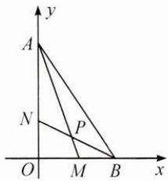

text_image

y
A
N
P
O
M
B
x

因为 $\theta\in[0,\pi]$ ，所以 $\theta=\frac{3}{4}\pi$ ，所以 $\angle MPN=\frac{3}{4}\pi$ 。

反思 利用向量法解决平面几何问题,首先需要向量化,即将题目的问题和关键条件中的边赋予方向,然后利用基向量或者平面直角坐标系中点的坐标加以运算,最后将两个向量的夹角余弦值“翻译”为两条边的夹角.

例 2 求函数 $f(x)=\sqrt{x^{2}+4}+\sqrt{(3-x)^{2}+9}$ 的最小值.

思路 遇到形如 $\sqrt{(a - c)^2 + (b - d)^2}$ 的结构，可以联想并应用向量的模长.

解答 设 $a=(x,2)$ , $b=(3-x,3)$ ，因为 $|a+b|\leqslant|a|+|b|$ ,

所以 $\sqrt{x^2 + 4} +\sqrt{(3 - x)^2 + 9}\geqslant \sqrt{34},$

当且仅当 $a \parallel b$ 且 $a$ 与 $b$ 方向相同，即 $x = \frac{6}{5}$ 时，等号成立.

故所求最小值为 $\sqrt{34}$ .

反思 这是一道函数不等式题目,由于向量也可以用坐标表示,所以向量的运算可以看成变量和字母运算的结果,这是借助向量解决函数、不等式问题的基础.用向量解决函数、不等式问题时,需要关注代数式结构,发挥想象.

例 3 如图, 已知过点 $F(1,0)$ 的直线与抛物线 $y^{2}=4x$ 交于 A, B 两点, 点 C 在抛物线上, 使得 $\triangle ABC$ 的重心 G 在 x 轴上, 直线 AC 交 x 轴于点 Q (点 Q 在点 F 的右侧). 记 $\triangle AFG, \triangle CQG$ 的面积分别为 $S_{1}, S_{2}$ , 求 $\frac{S_{1}}{S_{2}}$ 的最小值及此时点 G 的坐标.

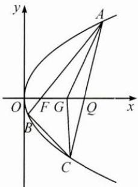

text_image

y
A
O F G Q x
B
C

思路 本题所求面积之比, 是 $\triangle ABC$ 的重心 $G$ 与边 $AB$ 的一部分 $AF$ 构成的三角形面积 $S_{1}$ 和重心 $G$ 与另一边 $AC$ 的一部分 $CQ$ 构成的三角形面积 $S_{2}$ 的比值. 可以先利用向量表达重心 $G$ , 再根据点 $F, G, Q$ 均在 $x$ 轴上, “翻译”三点共线这一几何条件来转化题目条件, 最后尝试解答.

解答 设 $\overrightarrow{AF}=\lambda\overrightarrow{AB},\overrightarrow{AQ}=\mu\overrightarrow{AC}$ ，其中 $\lambda,\mu\in(0,1)$

因为 G 为 $\triangle ABC$ 的重心, 所以 $\overrightarrow{AG} = \frac{1}{3}\overrightarrow{AB} + \frac{1}{3}\overrightarrow{AC} = \frac{1}{3\lambda}\overrightarrow{AF} + \frac{1}{3\mu}\overrightarrow{AQ}$ ,

又因为 F, G, Q 三点共线，所以 $\frac{1}{3\lambda} + \frac{1}{3\mu} = 1, \lambda = \frac{\mu}{3\mu - 1}$ .

因为 $\frac{S_{1}}{S_{2}}=\frac{S_{\triangle AFG}}{S_{\triangle CQG}}=\frac{\lambda S_{\triangle ABG}}{(1-\mu)S_{\triangle AGC}}=\frac{\lambda}{1-\mu}$ ，代入 $\lambda=\frac{\mu}{3\mu-1}$

可得 $\frac{S_1}{S_2} = \frac{\frac{\mu}{3\mu - 1}}{1 - \mu} = \frac{1}{4 - (3\mu + \frac{1}{\mu})} \geqslant \frac{1}{4 - 2\sqrt{3\mu \cdot \frac{1}{\mu}}} = \frac{2 + \sqrt{3}}{2},$

当且仅当 $\mu=\frac{\sqrt{3}}{3}$ 时取等号，所以当 $G(2,0)$ 时， $\frac{S_{1}}{S_{2}}$ 有最小值 $\frac{2+\sqrt{3}}{2}$ .

反思 解析几何中图形的重要位置关系(如平行、垂直、相交、三点共线等)和数量关系(如距离、角等),如果能用向量代数运算进行表达,运算量将大大减少.

# 巩固练习

1. 已知正方形 $ABCD, E, F$ 分别是 $CD, AD$ 的中点, $BE$ 与 $CF$ 交于点 $P$ .

(1) 求证: $BE \perp CF$ ;   
(2) 求 AP 与 AB 的长度之比.

2. 设 $x, y \in \mathbb{R}$ , 求函数 $f(x) = \sqrt{x^2 + (1 - y)^2} + \sqrt{y^2 + (1 - x)^2}$ 的最小值.

3. 如图, 已知椭圆 $E: \frac{x^{2}}{4} + y^{2} = 1$ , 若 $A$ 是椭圆的右顶点, $B$ 是椭圆的上顶点, $P(x_{0}, y_{0}) (y_{0} > 1)$ 在以 $AB$ 为直径的圆上, 延长 $PB$ , 交椭圆 $E$ 于点 $Q$ , 求 $|BP||BQ|$ 的最大值.

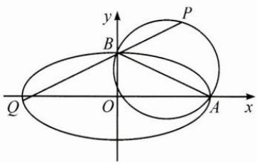

text_image

y
P
B
Q
O
A
x

# 17 面积法

引路人 杭州学军中学 叶秋平

本思想方法涉及模块: 函数、解析几何、立体几何、三角函数、不等式、平面向量.

# 方法介绍

面积法,就是在图形的变换过程中,以同一面积的不同表示为基础,以面积相等或比例关系为纽带,实现图形之间或几何与代数之间相互转化的方法.

# 典例示范

例 1 在 $\triangle ABC$ 中, 内角 $A, B, C$ 的对边分别为 $a, b, c$ , 已知 $b=1, B=\frac{\pi}{3}$ , 求:

(1) $\triangle ABC$ 的周长 $C_{\triangle ABC}$ 的取值范围:

(2)AC边上的中线长的取值范围：

(3)△ABC的内切圆半径r的取值范围.

思路 因为 $b=1, B=\frac{\pi}{3}$ ，由平面几何知识知点 B 的轨迹为圆弧，当点 B 运动时， $\triangle ABC$ 的形状与大小随之发生变化，可借助图形直观地解决问题.

解答 (1)由 $b^{2} = a^{2} + c^{2} - 2ac\cos B$ 知 $1 = a^{2} + c^{2} - ac$ ，即 $1 + 3ac = (a + c)^{2}$ ，说明周长随面积同步变化.

由题意, 点 B 的轨迹为圆弧, 由对称性, 取其中一半考虑.

如图, 设 AC 的中垂线与圆弧交于点 P, 则 P 为直径的一个端点. 结合图形可知, 当点 B 由点 A (或 C) 沿圆弧运动到点 P 时, $\triangle ABC$ 的高逐渐变大, $S_{\triangle ABC}$ 逐渐变大. 所以当点 B 无限靠近点 A (或 C) 时, $\triangle ABC$ 的周长趋向于 2; 当点 B 位于点 P 处时, $\triangle ABC$ 的周长的最大值为 3. 所以 $C_{\triangle ABC} \in (2, 3]$ .

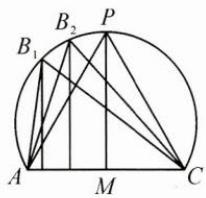

text_image

B₁
B₂
P
A
M
C

(2)取 $AC$ 的中点 $M$ , 则 $AC$ 边上的中线为 $BM$ , 根据平行四边形的性质有 $(2BM)^{2} + AC^{2} = 2(BA^{2} + BC^{2})$ , 即 $(2BM)^{2} + 1 = 2(a^{2} + c^{2})$ ,

则 $(2BM)^{2} = 2ac + 1$ ，说明中线 $BM$ 的长随面积同步变化.

当点 B 无限靠近点 A（或 C）时，BM 趋向于 $\frac{1}{2}$ ; 当点 B 位于点 P 处时，ac = 1, $BM = \frac{\sqrt{3}}{2}$ . 所以 $BM \in \left(\frac{1}{2}, \frac{\sqrt{3}}{2}\right]$ .

(3)由 $S_{\triangle ABC} = \frac{1}{2} (a + b + c)r = \frac{1}{2} ac\sin B$ ，得 $r = \frac{\frac{\sqrt{3}}{2} ac}{a + c + 1},$

因为 $1 + 3ac = (a + c)^2$ ，所以 $r = \frac{\frac{\sqrt{3}}{6}[(a + c)^2 - 1]}{a + c + 1} = \frac{\sqrt{3}}{6} (a + c - 1),$

又 $1 < a + c \leqslant 2$ ，所以 $0 < r \leqslant \frac{\sqrt{3}}{6}$ .

反思 在 $\triangle ABC$ 中, 若已知一边, 如 $c$ , 则从形式上看, $ab$ 与三角形的面积对应, $a + b$ 与三角形的周长对应, $a^2 + b^2$ 与三角形的中线长对应, 内切圆半径 $r$ 可以用 $a + b, ab$ 表示. 又 $a^2 + b^2 = (a + b)^2 - 2ab$ , 说明三者可以相互转化, 则关于周长、中线长、内切圆半径的问题均可转化为面积来考虑.

例 2 如图, 正六边形 ABCDEF 的边长为 1, 对角线 AC, CE 与过点 B 的直线分别相交于点 M, N, 若 AM = CN = p, 则 p 的值是().

A. $\frac{\sqrt{3}}{3}$

B. $\frac{\sqrt{3}}{2}$

C. $\frac{2\sqrt{3}}{3}$

D. 1

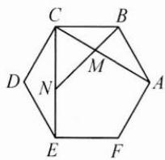

text_image

C
B
D
N
M
A
E
F

思路 正六边形 $ABCDEF$ 的对角线 $AC, CE$ 的长为定值, $AM = CN = p$ , 则 $p$ 与 $\frac{AM}{AC}, \frac{CN}{CE}$ 有关, 进而可转化为面积之比来解决.

解答 设 $S_{\triangle ABC} = S$ ，则 $S_{\triangle ACE} = 3S, S_{\triangle BCE} = 2S,$

设 $\frac{AM}{AC}=\frac{CN}{CE}=\lambda(0<\lambda<1)$ ，则 $\frac{S_{\triangle BCM}}{S_{\triangle ABC}}=\frac{MC}{AC}=1-\lambda,S_{\triangle BCM}=(1-\lambda)S,$

又 $\frac{S_{\triangle MCN}}{S_{\triangle ACE}} = \frac{\frac{1}{2}\times MC\times CN}{\frac{1}{2}\times AC\times CE} = (1 - \lambda)\lambda ,S_{\triangle MCN} = \lambda (1 - \lambda)S_{\triangle ACE} = 3\lambda (1 - \lambda)S,$

$$
S _ {\triangle B C N} = \lambda S _ {\triangle B C E} = 2 \lambda S,
$$

由 $S_{\triangle BCN} = S_{\triangle BCM} + S_{\triangle MCN}$ ，得 $2\lambda = 1 - \lambda +3\lambda (1 - \lambda)$ ，而 $\lambda >0$ ，解得 $\lambda = \frac{\sqrt{3}}{3}$

再由 $AC=CE=\sqrt{3}$ ，得 $p=AM=\lambda AC=1$ ，故选 D.

反思 p 与线段之比 $\lambda$ 有关. 先把线段之比转化为面积之比, 再利用面积分割建立关于 $\lambda$ 的方程, 求出 $\lambda$ 的值, 也就得到了 p 的值.

例 3 如图, 设椭圆 $\frac{x^{2}}{9} + \frac{y^{2}}{5} = 1$ 的左、右焦点分别为 $F_{1}, F_{2}$ , 过焦点 $F_{1}$ 的直线交椭圆于 $A(x_{1}, y_{1}), B(x_{2}, y_{2})$ 两点, 若 $\triangle ABF_{2}$ 的内切圆的面积为 $\pi$ , 则 $|y_{1} - y_{2}| =$ \_\_\_\_.

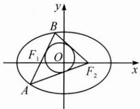

text_image

y
B
F₁ O F₂ x
A

思路 $\triangle ABF_{2}$ 的周长为定值，又可算出三角形的内切圆半径，则可算出 $\triangle ABF_{2}$ 的面积，将面积用铅垂高乘水平宽表示，即可算出 $\left|y_1 - y_2\right|$

解答 椭圆 $\frac{x^2}{9} +\frac{y^2}{5} = 1$ 的左、右焦点分别为 $F_{1},F_{2},a = 3,b = \sqrt{5},c = 2,$

$\triangle ABF_{2}$ 的内切圆的面积为 $\pi$ ，则 $\triangle ABF_{2}$ 的内切圆半径 $r = 1$

$\triangle ABF_{2}$ 的面积 $S_{\triangle ABF_2} = \frac{1}{2} (|AB| + |AF_2| + |BF_2|)r = 2a\times 1 = 6.$

又 $S_{\triangle ABF_2} = \frac{1}{2}|F_1F_2||y_1 - y_2| = 2|y_1 - y_2| = 6$ ，所以 $|y_1 - y_2| = 3.$

反思 本题利用面积转换, 即 $S_{\triangle ABF_2} = \frac{1}{2} (|AB| + |AF_2| + |BF_2|) r = \frac{1}{2} |F_1F_2||y_1 - y_2|$ , 简捷地计算出 $|y_1 - y_2|$ .

在 $\triangle ABC$ 中，内角A,B,C所对的边分别为a,b,c，三角形的外接圆半径

为 $R$ ，内切圆半径为 $r$ ，边 $a$ 上的高为 $h_a$ ，记 $p = \frac{1}{2} (a + b + c)$ ，则有：

$$
\begin{array}{l} S _ {\triangle A B C} = \frac {1}{2} a h _ {a} = \frac {1}{2} a b \sin C = 2 R ^ {2} \sin A \sin B \sin C = \frac {a ^ {2} \sin B \sin C}{2 \sin A} \\ = \frac {a b c}{4 R} = \sqrt {p (p - a) (p - b) (p - c)} = p r = r R (\sin A + \sin B + \sin C) \\ = \frac {1}{2} \times \text { 铅垂高 } \times \text { 水平宽 }. \\ \end{array}
$$

三角形的面积有多种表示形式,解题时可根据题目条件灵活使用.

# 巩固练习

1. 如图, 设抛物线 $y^{2}=4x$ 的焦点为 F, 不经过焦点的直线上有三个不同的点 A, B, C, 其中点 A, B 在抛物线上, 点 C 在 y 轴上, 则 $\triangle BCF$ 与 $\triangle ACF$ 的面积之比是().

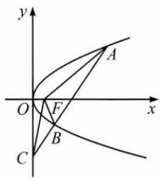

text_image

y
A
O
F
x
B
C

A. $\frac{|BF| - 1}{|AF| - 1}$

B. $\frac{|BF|^2 - 1}{|AF|^2 - 1}$

C. $\frac{|BF| + 1}{|AF| + 1}$

D. $\frac{|BF|^{2}+1}{|AF|^{2}+1}$

2. 在 $\triangle ABC$ 中, 内角 $A, B, C$ 所对的边分别为 $a, b, c, \angle ABC = 120^{\circ}$ , $\angle ABC$ 的平分线交 $AC$ 于点 $D$ , 且 $BD = 1$ , 则 $4a + c$ 的最小值为\_\_\_\_.  
3. 如图, 在直三棱柱 $ABC - A_{1}B_{1}C_{1}$ 中, 侧面 $AA_{1}B_{1}B$ 为正方形, $AB = BC = 2, E, F$ 分别为 $AC, CC_{1}$ 的中点, $D$ 为棱 $A_{1}B_{1}$ 上的点, $BF \perp A_{1}B_{1}$ .

(1) 证明: $BF \perp DE;$

(2) 当 $B_{1}D$ 为何值时, 平面 $BB_{1}C_{1}C$ 与平面 DFE 所成的锐二面角的正弦值最小?

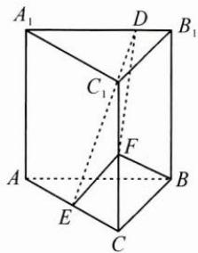

text_image

A₁
D
B₁
C₁
F
A
E
C
B

# 18 待定系数法

引路人 浙江省武义第一中学 龚超群

本思想方法涉及模块: 函数、数列、不等式、解析几何、向量.

# 方法介绍

待定系数法是利用方程思想,借助代数式恒等求对应系数的方法.一般地,先设出含参数的解析式(关系结构式),再根据已知条件或对应项(位置)的系数相等,建立关于参数的方程(组),最后解出参数,从而求得解析式(关系结构式).

# 典例示范

例1 已知 $f(x)$ 是一次函数,且满足 $3f(x + 1) - 2f(x - 1) = 2x + 17$ ,则 $f(x) =$ \_\_\_\_.

思路 题目给出的已知条件为一次函数, 又已知 $3f(x+1)-2f(x-1)$ 的运算结果式, 可以设一次函数解析式, 将 $f(x+1)$ , $f(x-1)$ 代入解析式后, 利用恒等式解得待定系数的值.

解答 设 $f(x) = ax + b (a \neq 0)$ ,

则 $3f(x + 1) - 2f(x - 1) = 3ax + 3a + 3b - 2ax + 2a - 2b = ax + 5a + b,$

即 $ax + 5a + b = 2x + 17$ 不论 $x$ 为何值都成立，

所以 $\left\{\begin{aligned}a=2,\\ b+5a=17,\end{aligned}\right.$ 解得 $\left\{\begin{aligned}a=2,\\ b=7,\end{aligned}\right.$

所以 $f(x)=2x+7$ .

反思 在遇到求函数解析式的问题时,可以将函数图象的性质、函数关系等与待定系数法相结合,求出函数解析式.

例2 在数列 $\{a_{n}\}$ 中，若 $a_1 = 1, a_{n+1} = 2a_n + 3$ ，则通项公式 $a_{n} = \_$ .

思路 形如 $a_{n+1} = ca_n + d (c \neq 0, 1)$ 的数列，可以运用待定系数法设 $a_{n+1} + \lambda = c(a_n + \lambda)$ ，求出 $\lambda$ 后，化为等比数列，进而求出其通项.

解答 递推公式 $a_{n + 1} = 2a_n + 3$ 可以转化为 $a_{n + 1} + t = 2(a_n + t)$

即 $a_{n + 1} = 2a_n + t$ ，解得 $t = 3.$ 故 $a_{n + 1} + 3 = 2(a_n + 3).$

令 $b_{n} = a_{n} + 3$ ，则 $b_{1} = a_{1} + 3 = 4$ ，且 $\frac{b_{n + 1}}{b_n} = \frac{a_{n + 1} + 3}{a_n + 3} = 2,$

所以 $\{b_n\}$ 是以4为首项，2为公比的等比数列， $b_{n} = 4\cdot 2^{n - 1} = 2^{n + 1}$

所以 $a_{n} = 2^{n + 1} - 3.$

反思 递推公式的形式为待定系数法提供了结构的启示,从而构造出形如 $a_{n+1} + t = 2(a_n + t)$ 的目标式.

例 3 已知 $-1 < x + y < 4$ 且 2 < x - y < 3，求 z = 2x - 3y 的取值范围.

思路 已知 $x + y, x - y$ 的取值范围，根据不等式的运算性质，把 $z = 2x - 3y$ 表示为 $x + y, x - y$ 的线性和，然后对两个不等式 $-1 < x + y < 4, 2 < x - y < 3$ 进行运算即可得到 $z = 2x - 3y$ 的取值范围。用待定系数法设系数，使得 $z = 2x - 3y = (m + n)x + (m - n)y$ ，求得 $m, n$ .

解答 设 $z = 2x - 3y = m(x + y) + n(x - y)$ ，

即 $2x - 3y = (m + n)x + (m - n)y$

所以 $\left\{\begin{aligned}m+n=2,\\ m-n=-3,\end{aligned}\right.$ 解得 $\left\{\begin{aligned}m&=-\frac{1}{2},\\ n&=\frac{5}{2}.\end{aligned}\right.$

由 $-1 < x + y < 4$ 知 $-2 < -\frac{1}{2} (x + y) < \frac{1}{2}$ ①，

由 $2 < x - y < 3$ 知 $5 < \frac{5}{2} (x - y) < \frac{15}{2}$ ②，

①+②得 $3<-\frac{1}{2}(x+y)+\frac{5}{2}(x-y)<8$ , 即 3<z<8.

反思 双变量不等式中系数的确定是解题的关键,合理设置双变量不等式的系数,从而可以运用待定系数法.

例 4 如图, 在 $\triangle ABC$ 中, 点 $D$ 在线段 $BC$ 上, 且满足 $BD = \frac{1}{3} BC$ , 过点 $D$ 的直线分别交直线 $AB$ , $AC$ 于不同的两点 $M, N$ , 若 $\overrightarrow{AM} = m \overrightarrow{AB}$ , $\overrightarrow{AN} = n \overrightarrow{AC}$ , 则 $\frac{2}{m} + \frac{1}{n} =$ \_\_\_\_.

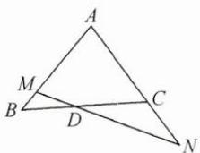

text_image

A
M
B
D
C
N

思路 过点 $D$ 的直线分别交直线 $AB, AC$ 于不同的两点 $M, N$ , 点 $M, N$ 位置不确定, 但 $M, D, N$ 三点共线, 可以利用三点共线的结论, 运用待定系数法设基底前的系数, 用相同的基底表达同一个向量, 解方程得到所求值.

解答 因为 M, N, D 三点共线, 所以 $\overrightarrow{AD} = \lambda \overrightarrow{AM} + (1 - \lambda) \overrightarrow{AN}$ ,

又 $\overrightarrow{AM}=m\overrightarrow{AB},\overrightarrow{AN}=n\overrightarrow{AC}$ ，所以 $\overrightarrow{AD}=\lambda m\overrightarrow{AB}+(1-\lambda)n\overrightarrow{AC}$

又 $\overrightarrow{BD} = \frac{1}{3}\overrightarrow{BC}$ ，所以 $\overrightarrow{AD} = \overrightarrow{AB} +\overrightarrow{BD} = \overrightarrow{AB} +\frac{1}{3}\overrightarrow{BC} = \frac{2}{3}\overrightarrow{AB} +\frac{1}{3}\overrightarrow{AC},$

所以 $\lambda m=\frac{2}{3},(1-\lambda)n=\frac{1}{3}$ ，故 $\frac{2}{m}+\frac{1}{n}=3$ .

反思 向量的加减、共线的充要条件、平面向量的基本定理、平面向量的坐标表示、线段的定比分点、线段的平移等内容都涉及待定系数法.

# 巩固练习

1. 已知 $f(x)$ 是一次函数，且 $f(f(x)) = x + 2$ ，求函数 $f(x)$ 的解析式.  
2. 已知二次函数 $f(x)$ 的图象经过原点，且 $1 \leqslant f(-1) \leqslant 2, 3 \leqslant f(1) \leqslant 4$ ，求 $f(-2)$ 的取值范围.  
3. 在平面直角坐标系中, 求经过三点 $(0,0)$ , $(1,1)$ , $(2,0)$ 的圆的方程.

# 19 排除法

引路人 浙江省湖州中学 赵朕博

本思想方法涉及模块: 函数、导数、数列、不等式、解析几何、立体几何、三角、向量、概率与统计.

# 方法介绍

排除法指的是在所有的可能的结果中,把一切错误的结果排除掉,剩余的只能是正确的结果的一种逻辑思维方法.使用排除法主要有两种思路:(1)从条件出发,选定特例,精简讨论范围;(2)从结果出发,选定特例,推出矛盾.

# 典例示范

# (一)从条件出发

例 1 如图, 在三棱锥 A-BCD 中, $AB \perp$ 平面 BCD, $BC \perp DC$ , 且 AB = BC = CD, P 为线段 AD 上的动点 (含端点). 设直线 BP 与平面 ABC 所成的角为 $\alpha$ , 二面角 P-BC-D 的平面角为 $\beta$ , 二面角 P-BC-A 的平面角为 $\gamma$ , 则 $\sin^{2}\alpha + \sin^{2}\beta + \sin^{2}\gamma$ ( ).

A. 有最小值 $\frac{3}{2}$

B. 有最大值 $\frac{3}{2}$

C. 有最小值 $\frac{5}{4}$

D. 有最大值 $\frac{5}{4}$

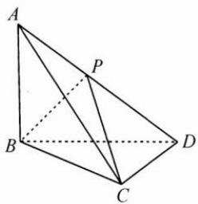

text_image

Geometric diagram of a tetrahedron with labeled vertices A, B, C, D and point P on edge AB

思路 这是立体几何中的动态几何问题, 因为 P 为线段 AD 上的动点, 一般的思路是分析寻找 $\alpha, \beta, \gamma$ 三个角不随点 P 变化的固定关系, 或者设变量把 $\alpha, \beta, \gamma$ 三个角统一代数表示出来. 但在本题中, 可以对点 P 取特殊位置, 利用排除法解决问题.

解答 因为 P 为线段 AD 上的动点(含端点)，把点 P 取在点 A 处，则 $\alpha=0^{\circ},\beta=90^{\circ},\gamma=0^{\circ}$ ，所以 $\sin^{2}\alpha+\sin^{2}\beta+\sin^{2}\gamma=1$ ，排除 A,C.

把点 $P$ 取在点 $D$ 处，则直线 $BP$ 与平面 $ABC$ 所成的角 $\alpha$ 即为 $\angle DBC = 45^{\circ}, \beta = 0^{\circ}, \gamma = 90^{\circ}$ ，此时 $\sin^{2} \alpha + \sin^{2} \beta + \sin^{2} \gamma = \frac{3}{2}$ ，排除 D.

故选B.

反思 本题从正面做也不困难,首先可以发现不管点 P 怎么动, $\beta,\gamma$ 是平面 PBC 分直二面角 A-BC-D 的平面角所成的两个角,所以 $\beta$ 与 $\gamma$ 互余,所以 $\sin^{2}\beta+\sin^{2}\gamma=1$ ,从而看线面角 $\alpha$ 就可以了,根据最大角定理,当点 P 与点 D 重合时线面角 $\alpha$ 最大,即 $\sin^{2}\alpha$ 最大.

当然,其中的转化对于一部分同学来说依然具有一定的难度,此时可以看出排除法的优越性.虽然现在越来越多的题目在命题的时候就会注意避免用排除法能轻易解决的情况,但只要是选择题,排除法永远有一席之地.

# (二) 从结果出发

例 2 已知数列 $\{a_{n}\}$ 满足 $a_{1}=0, a_{20}=17, (a_{k+1}-a_{k}+2)(a_{m+1}-a_{m}-3)=0 (k, m=1,2,3,\cdots,19, k\neq m)$ ，集合 $A=\{a_{1}, a_{2}, a_{3}, \cdots, a_{20}\}$ ，则集合 A 中元素的最小值可能为（）.

A.-3

B.-4

C.-5

D.-6

思路 由 $(a_{k+1}-a_{k}+2)(a_{m+1}-a_{m}-3)=0(k,m=1,2,3,\cdots,19,k\neq m)$ 得 $a_{k+1}-a_{k}=-2$ 或 $a_{m+1}-a_{m}=3$ ，即数列后一项相对于前一项的变化要么是-2，要么是+3；因为集合 $A=\{a_{1},a_{2},a_{3},\cdots,a_{20}\},a_{1}=0,a_{20}=17$ ，所以一共进行了8次-2,11次+3，而且要保证没有重复的数字出现，数列具体的通项难以得到，可以从写出一些错误示例和正确示例开始思考，例如： $0\rightarrow-2\rightarrow-4\rightarrow-6\rightarrow-3\rightarrow0\rightarrow\cdots$ 是不行的， $0\rightarrow-2\rightarrow1\rightarrow-1\rightarrow2\rightarrow5\rightarrow3\rightarrow6\rightarrow4\rightarrow7\rightarrow10\rightarrow8$ →11→9→12→15→13→16→14→17 是可行的. 这种情况下排除法往往可以发挥很大的作用.

解答 若最小值是-3, 则接下来一定是 $-3 \rightarrow 0$ , 与 $a_{1}=0$ 重复. 排除 A.

若最小值是-5，则 $\left\{\begin{aligned}&3\rightarrow1\\ &-2\rightarrow1\\ &-2\rightarrow-4\end{aligned}\right.\rightarrow-1\rightarrow-3\rightarrow-5\rightarrow-2\rightarrow1$ ，均有重复，排除C.

若最小值是-6，则 $0 \rightarrow -2 \rightarrow -4 \rightarrow -6 \rightarrow -3 \rightarrow -5 \rightarrow -2$ ，有重复，排除D.

故选B.

反思 对于 B, 也可以正面推出思路中列举的一种可能性, 但从选项切入用排除法, 不需要从 0 开始, 只需要在具体数字附近展开, 分析和思考的量就少了很多, 更容易获得正确答案.

# 巩固练习

1. 已知数列 $\{a_{n}\}$ 的各项均为非负数, $a_{1} = 1$ , $a_{605} = 1813$ , 且对任意的 $n \in \mathbf{N}^{*}$ , 都有 $a_{n+1} \leqslant \frac{a_{n} + a_{n+2}}{2}$ , 则 $a_{10}$ 的最大值为 ( ).

A. 26

B. 27

C. 28

D. 29

2. 已知无穷项实数数列 $\{a_{n}\}$ 满足 $a_{1} = t, \frac{4}{a_{n+1}} = \frac{1}{a_{n}} - \frac{1}{a_{n}-1}$ , 则（ ）.

A. 存在 t > 1，使得 $a_{2021} = a_{1}$   
B. 存在 t<0，使得 $a_{2021}=a_{1}$   
C. 若 $a_{2021}=a_{1}$ ，则 $a_{2}=a_{1}$   
D. 至少有 2021 个不同的 t，使得 $a_{2021}=a_{1}$

3. 已知函数 $f(x) = ax^2 - x\ln x - a$ 在 (0,1) 上有零点，求实数 $a$ 的取值范围.

# 20 正难则反

引路人 浙江省台州中学 许彪

本思想方法涉及模块:集合、函数、导数、数列、不等式、解析几何、立体几何、三角函数、平面向量、计数原理、概率与统计.

# 方法介绍

正难则反是数学解题的重要方法及技巧. 当一些问题正面解决比较繁杂, 或需要考虑的因素多, 或解题思路不明朗时, 可以考虑其对立面, 即从问题的反面出发破解问题.

# 典例示范

例 1 3 位男生和 3 位女生共 6 位同学站成一排, 若男生甲不站两端, 3 位女生中有且只有 2 位女生相邻, 则不同排法的种数是( ).

A. 360

B. 288

C. 216

D. 96

思路 直接从正面求解不易,故考虑反面情况,先考虑女生满足条件的排法,再减去男生甲不符合条件的排法.

解答 6 位同学站成一排, 3 位女生中有且只有 2 位女生相邻的排法有 $\mathrm{A}_3^3\mathrm{C}_3^2\mathrm{A}_4^2\mathrm{A}_2^2 = 432$ 种, 其中男生甲站两端的有 $\mathrm{A}_2^1\mathrm{A}_2^2\mathrm{C}_3^2\mathrm{A}_3^2\mathrm{A}_2^2 = 144$ 种, 符合条件的排法共有 $432 - 144 = 288$ 种, 故选 B.

反思 这是有多个限制条件的排列问题,先只考虑女生的限制条件降低难度,再排除男生的限制条件,从而达到目的.

例 2 已知△ABC 为锐角三角形, SA⊥平面 ABC, 点 A 在平面 SBC 内的射影为 H. 求证: H 不是△SBC 的垂心.

思路 否定性的问题,从正面解决比较困难,可以考虑从反面论证.

证明 假设 H 是 $\triangle SBC$ 的垂心.

如图, 连接 BH 并延长, 交 SC 于点 D, 则 $BD \perp SC$ ,

由于点 A 在平面 SBC 内的射影为 H，所以 $AH \perp SC$ ，

又 $BD \cap AH = H$ ，所以 $SC \perp$ 平面 ABH，

又 $AB \subset$ 平面 ABH，所以 $AB \perp SC$ ，

而 $AB \perp SA, SA \cap SC = S$ ，所以 $AB \perp$ 平面 SAC，

又 $AC \subset$ 平面 SAC，所以 $AB \perp AC$ ，这与 $\triangle ABC$ 为锐角三角形相矛盾，

所以 H 不是 $\triangle SBC$ 的垂心.

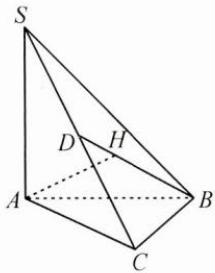

text_image

S
D
H
A
B
C

反思 本题涉及的方法是反证法,反证法是正难则反的重要体现.

例 3 已知函数 $f(x)$ 在区间 $[a,b]$ 上的图象连续， $f(a)<0, f(b)>0$ ，且 $f(x)$ 在 $[a,b]$ 上单调递增，求证： $f(x)$ 在 $(a,b)$ 上有且只有一个零点.

思路 先由函数零点存在性定理判定函数在 $(a, b)$ 上有零点，再用反证法证明零点唯一.

证明 因为 $f(x)$ 在 $[a, b]$ 上的图象连续， $f(a) < 0, f(b) > 0$ ，即 $f(a)f(b) < 0$ ，所以 $f(x)$ 在 $(a, b)$ 上至少存在一个零点.

设零点为 m，则 $f(m)=0$ .

假设 $f(x)$ 在 $(a,b)$ 上还存在另一个零点 n，即 $f(n)=0, n \neq m$ .

若 n > m，则 $f(n) > f(m)$ ，即 0 > 0，矛盾；

若 n<m，则 $f(n)<f(m)$ ，即 0<0，矛盾.

因此假设不正确, 即 $f(x)$ 在 $(a, b)$ 上有且只有一个零点.

反思 涉及否定性、唯一性、至少和至多的问题,经常从反面来考虑,可以使问题变得更简单.

# 三 巩固练习

1. 有两排座位, 前排 11 个座位, 后排 12 个座位, 现安排 2 人就座, 规定前排中间的 3 个座位不能坐, 并且这 2 人不左右相邻, 那么不同排法的种数是 ( ).

A. 234

B. 346

C. 350

D. 363

2. 设两个非零向量 $e_{1}, e_{2}$ 不共线，若 $ke_{1} + e_{2}$ 与 $e_{1} + ke_{2}$ 也不共线，则实数 k 的取值范围是 \_\_\_\_.

3. 设集合 $A = \left\{(x, y) \mid \frac{m}{2} \leqslant (x - 2)^2 + y^2 \leqslant m^2, x, y \in \mathbf{R}\right\}, B = \{(x, y) \mid 2m \leqslant x + y \leqslant 2m + 1, x, y \in \mathbf{R}\}$ ，若 $A \cap B \neq \emptyset$ ，则实数 $m$ 的取值范围是 \_\_\_\_.

# 21 裂项法

引路人 浙江师范大学附属中学 何承生

本思想方法涉及模块: 数列、不等式.

# 方法介绍

裂项法是解决数列求和问题常用的方法,通过分解数列的项,重新组合消去一些项,最终达到化简求和的目的.该方法是分解与组合思想在数列求和中的具体应用.应用裂项法的主要依据为数列通项公式的结构特征,以分式和根式居多,将每一项 $a_{n}$ 拆成形如 $a_{n}=f(n)-f(n-k)(k=1,2,\cdots)$ 的结构,在求和时消去相邻(或相隔)项.换一个角度理解,“裂项”的本质是“通分”的逆变形.裂项法往往与数列不等式、数列放缩相结合,通过把握通项的结构特征找到破解问题的方法.

# 典例示范

例1 已知等差数列 $\{a_{n}\}$ 的前 $n$ 项和为 $S_{n}, a_{3} = 3, S_{4} = 10$ , 求 $\sum_{k=1}^{n} \frac{1}{S_{k}}$ .

思路 $\sum_{k=1}^{n} \frac{1}{S_k}$ 表示求数列 $\left\{\frac{1}{S_n}\right\}$ 的前 $n$ 项和, 求和的常用方法有公式法、裂项相消法、错位相减法等, 每一种方法都有对应的结构特征, 所以根据已知条件先求出 $S_n$ , 然后根据 $S_n$ 的结构特点选择恰当的方法求 $\sum_{k=1}^{n} \frac{1}{S_k}$ .

解答 设等差数列 $\{a_{n}\}$ 的首项为 $a_{1}$ ，公差为d，

由题意有 $\left\{\begin{aligned}a_{1}+2d&=3,\\ 4a_{1}+\frac{4\times3}{2}d&=10,\end{aligned}\right.$ 解得 $\left\{\begin{aligned}a_{1}&=1,\\ d&=1,\end{aligned}\right.$

于是 $S_{n} = na_{1} + \frac{n(n - 1)}{2} d = \frac{n(n + 1)}{2},$

故 $\frac{1}{S_{n}}=\frac{2}{n(n+1)}=2\left(\frac{1}{n}-\frac{1}{n+1}\right)$ ,

所以 $\sum_{k=1}^{n} \frac{1}{S_k} = 2\left[(1 - \frac{1}{2}) + (\frac{1}{2} - \frac{1}{3}) + \cdots + (\frac{1}{n} - \frac{1}{n+1})\right] = 2\left(1 - \frac{1}{n+1}\right)$ $= \frac{2n}{n+1}$ .

反思 根据 $\frac{1}{S_n} = \frac{2}{n(n + 1)}$ ，选择裂项法的理由是：① $\frac{2}{n(n + 1)}$ 可以分解为 $2\left(\frac{1}{n} - \frac{1}{n + 1}\right)$ ，分解后的两项结构式相同，不妨称之为依序同构；② 因为裂项后的两项依序同构，所以可与其他分解项相消，达到化简求和的目的。

能使用裂项法的常见结构有：

(1) $\frac{1}{n(n + k)} = \frac{1}{k}\left(\frac{1}{n} - \frac{1}{n + k}\right)$ ;

(2) $\frac{1}{(2n - 1)(2n + 1)} = \frac{1}{2}\left(\frac{1}{2n - 1} -\frac{1}{2n + 1}\right);$

(3) $\frac{1}{\sqrt{n + 1} + \sqrt{n}} = \sqrt{n + 1} - \sqrt{n}$ ;

(4) $\frac{2^n}{(2^n - 1)(2^{n + 1} - 1)} = \frac{1}{2^n - 1} -\frac{1}{2^{n + 1} - 1};$

(5) $\log_a\left(1 + \frac{1}{n}\right) = \log_a\left(\frac{n + 1}{n}\right) = \log_a(n + 1) - \log_a n;$

(6) $\frac{1}{n(n + 1)(n + 2)} = \frac{1}{2}\left[\frac{1}{n(n + 1)} -\frac{1}{(n + 1)(n + 2)}\right].$

例2 已知数列 $\{a_{n}\}$ 满足 $a_1 = \frac{1}{2}, a_{n+1} = \frac{na_n}{(n+1)(na_n+1)}$ , 求 $a_1 + a_2 + \cdots + a_n$ .

思路 将数列 $\{a_{n}\}$ 的递推式 $a_{n + 1} = \frac{na_n}{(n + 1)(na_n + 1)}$ 变形为 $(n + 1)a_{n + 1}$ $= \frac{na_n}{na_n + 1}$ ，出现了依序同构的两项 $(n + 1)a_{n + 1}, na_n$ ，这是选择裂项法的依据.

解答 由 $a_{n + 1} = \frac{na_n}{(n + 1)(na_n + 1)}$ 得 $(n + 1)a_{n + 1} = \frac{na_n}{na_n + 1}$

于是有 $\frac{1}{(n+1)a_{n+1}}-\frac{1}{na_{n}}=1,$

则当 $n \geqslant 2$ 时， $\frac{1}{na_n} = \left[\frac{1}{na_n} - \frac{1}{(n-1)a_{n-1}}\right] + \left[\frac{1}{(n-1)a_{n-1}} - \frac{1}{(n-2)a_{n-2}}\right]$ $+\cdots + \left(\frac{1}{2a_2} - \frac{1}{a_1}\right) + \frac{1}{a_1} = (n-1) + 2 = n + 1$ ，当 $n = 1$ 时也满足，

所以 $a_{n} = \frac{1}{n(n + 1)}$ ，所以 $\sum_{i = 1}^{n}a_{i} = \sum_{i = 1}^{n}\left(\frac{1}{i} -\frac{1}{i + 1}\right) = 1 - \frac{1}{n + 1} = \frac{n}{n + 1}.$

反思 本题的难点在于通过递推关系式求出通项,需要尝试变形寻找化简的方向,将递推式裂项变形,利用累加法求出通项,进而用裂项法求出数列 $\{a_{n}\}$ 的前n项和.处理形如 $a_{n+1}=\frac{na_{n}}{(n+1)(na_{n}+1)}$ 问题的方法多为裂项法.

例 3 已知数列 $\{a_{n}\}$ 为等差数列， $\{b_{n}\}$ 为等比数列， $a_{1}=b_{1}=1, a_{5}=5(a_{4}-a_{3}), b_{5}=4(b_{4}-b_{3})$ . 对任意的正整数 n，设 $c_{n}=\frac{a_{n-1}b_{n}}{a_{n}a_{n+1}}$ ，求数列 $\{c_{n}\}$ 的前 n 项和.

思路 由已知条件求出数列 $\{a_{n}\},\{b_{n}\}$ 的通项公式，再求出 $c_{n} = \frac{a_{n - 1}b_{n}}{a_{n}a_{n + 1}}$ 容易判断此式为可裂项的结构.

解答 设 $\{a_{n}\}$ 的公差为 $d, \{b_{n}\}$ 的公比为 $q$ .

由 $a_1 = 1, a_5 = 5(a_4 - a_3)$ ，得 $d = 1$ ，所以 $a_n = n$ .

由 $b_{5} = 4(b_{4} - b_{3})$ ，得 $q^{2} - 4q + 4 = 0$ ，得 $q = 2$ ，所以 $b_{n} = 2^{n - 1}$

所以 $c_{n}=\frac{a_{n-1}b_{n}}{a_{n}a_{n+1}}=\frac{(n-1)2^{n-1}}{n(n+1)}=\frac{2^{n}}{n+1}-\frac{2^{n-1}}{n}$ ,故 $c_{1} + c_{2} + c_{3} + \dots +c_{n} = \frac{2}{2} -\frac{1}{1} +\frac{4}{3} -\frac{2}{2} +\dots +\frac{2^{n}}{n + 1} -\frac{2^{n - 1}}{n} = \frac{2^{n}}{n + 1} -1.$

反思 $\frac{(n - 1)2^{n - 1}}{n(n + 1)}$ 所呈现的结构是使用裂项法求和的特征暗示，如果不知道如何裂项，可设 $\frac{(n - 1)2^{n - 1}}{n(n + 1)} = \frac{(xn - y)2^n}{n} -\frac{[x(n + 1) - y]2^{n + 1}}{n + 1}$ ，必须依序同构，即第一项 $\frac{(xn - y)2^n}{n} = f(n)$ ，则后一项应为 $f(n + 1)$ ，可依据通项的结构，使用待定系数法求解相关系数.

# 巩固练习

1. 已知数列 $\{a_{n}\}$ 的通项公式为 $a_{n} = \frac{1}{\sqrt{n} + \sqrt{n + 2}}, n \in \mathbf{N}^{*}$ , 求数列 $\{a_{n}\}$ 的前 $n$ 项和 $T_{n}$ .

2. 已知正项等差数列 $\{a_{n}\}$ 的前 $n$ 项和 $S_{n}$ 满足 $S_{n}^{2} - (n^{2} + n - 1)S_{n} - (n^{2} + n) = 0$ ，令 $b_{n} = \frac{n + 1}{(n + 2)^{2}a_{n}^{2}}$ ，求数列 $\{b_{n}\}$ 的前 $n$ 项和 $T_{n}$ ，并证明对于任意的 $n \in \mathbf{N}^{*}$ ，都有 $T_{n} < \frac{5}{64}$ .

3. 已知数列 $\{a_{n}\}$ 的前 $n$ 项和 $S_{n} = -3n^{2}, n \in \mathbf{N}^{*}$ , $\{b_{n}\}$ 为单调递增的等比数列, 且 $b_{1}b_{2}b_{3} = 512, a_{1} + b_{1} = a_{3} + b_{3}$ , 若 $c_{n} = \frac{b_{n}}{(b_{n} - 2)(b_{n} - 1)}$ , 求数列 $\{c_{n}\}$ 的前 $n$ 项和 $T_{n}$ .

4. 已知数列 $\{a_{n}\}$ 的通项公式为 $a_{n} = 2n - 1, n \in \mathbf{N}^{*}$ , 令 $b_{n} = (-1)^{n - 1} \frac{4n}{a_{n} a_{n + 1}}$ , 求数列 $\{b_{n}\}$ 的前 $n$ 项和 $T_{n}$ .

5. 已知数列 $\{a_{n}\}$ 的通项公式为 $a_{n} = n \cdot 2^{n - 1}, n \in \mathbf{N}^{*}$ , 求数列 $\left\{\frac{a_{n + 2}}{a_n a_{n + 1}}\right\}$ 的前 $n$ 项和 $S_{n}$ .

# 22 赋值法

引路人 绍兴市第一中学 王一行

本思想方法涉及模块: 函数、三角函数、导数、数列、二项式定理、解析几何等.

# 方法介绍

赋值法是指给关于某些变量的一般关系式赋予恰当的数值或代数式后，通过运算推理，最后得出结论的一种解题方法。赋值法的逻辑基础是：一般 $\rightarrow$ 特殊，即：若对任意的 $x \in D$ ，某式恒成立，那么对于 $D$ 中的特殊值，该式一定成立。

赋值法可以将抽象的推理转化为具体的计算,从而使问题数值化、直观化、简单化.值得注意的是,用特殊赋值法解决解答题属于必要性先行,后续还需对答案的充分性进行证明.

# 典例示范

例1 已知函数 $f(x)$ 的定义域为 $\mathbf{R}$ , 且 $f(x + y) + f(x - y) = f(x)f(y), f(1) = 1$ , 则 $\sum_{k=1}^{22} f(k) = (\quad)$ .

A.-3

B.-2

C. 0

D. 1

思路 通过赋值法,令 y=1 可得抽象函数的周期性;令 x=1,y=0,又可得到 $f(0)=2$ ,从而根据周期性与递推关系得到答案.

解答 令 $y = 1$ ，得 $f(x + 1) + f(x - 1) = f(x)\Rightarrow f(x + 1) = f(x) - f(x - 1),$

整体替换得 $f(x+2)=f(x+1)-f(x)$ ， $f(x+3)=f(x+2)-f(x+1)$ ，

消去 $f(x+2)$ 和 $f(x+1)$ ，得到 $f(x+3)=-f(x)$ ，故 $f(x)$ 的周期为 6；

再令 $x = 1, y = 0$ ，得 $f(1) + f(1) = f(1)f(0) \Rightarrow f(0) = 2$

则 $f(2)=f(1)-f(0)=1-2=-1$ ,

$$
f (3) = - 2, f (4) = - 1, f (5) = 1, f (6) = 2.
$$

故 $\sum_{k=1}^{22}f(k)=3\left[f(1)+f(2)+\cdots+f(6)\right]+f(19)+f(20)+f(21)+$

$$
f (2 2) = f (1) + f (2) + f (3) + f (4) = 1 + (- 1) + (- 2) + (- 1) = - 3.
$$

故选 A.

反思 本题将多个知识点融会贯通,主要考查抽象函数的求值、周期性、递推关系等,可以利用赋值法解决,不同的赋值可以得到不同的结果.另外,抽象函数的单调性也经常考查,根据抽象函数的不同,单调性证明常分解成:

$$
f (x _ {1}) - f (x _ {2}) = f (x _ {1} - x _ {2} + x _ {2}) - f (x _ {2}), f (x _ {1}) - f (x _ {2}) = f \left(\frac {x _ {1}}{x _ {2}} \cdot x _ {2}\right) - f (x _ {2}),
$$

结合单调性将函数值的大小问题简化成自变量的大小问题.

例2 若 $(2x - 3)^{5} = a_{0} + a_{1}x + a_{2}x^{2} + a_{3}x^{3} + a_{4}x^{4} + a_{5}x^{5}$ ，求：

(1) $a_{0}+a_{1}+a_{2}+a_{3}+a_{4}+a_{5}$ ;   
(2) $(a_0 + a_2 + a_4)^2 - (a_1 + a_3 + a_5)^2$ ;   
(3) $a_{1}+a_{3}+a_{5}$ ;   
(4) $|a_0| + |a_1| + |a_2| + |a_3| + |a_4| + |a_5|$ ;   
(5) $a_{0}-\frac{a_{1}}{2}+\frac{a_{2}}{2^{2}}-\frac{a_{3}}{2^{3}}+\frac{a_{4}}{2^{4}}-\frac{a_{5}}{2^{5}};$

(6) $a_{1} + 2a_{2} + 3a_{3} + 4a_{4} + 5a_{5}$ ;

(7) $a_{0}-a_{2}+a_{4}.$

思路 解决展开式系数和、奇数项、偶数项(含 $x$ 的偶次幂、奇次幂)的问题, 常用方法就是赋值法. 对于综合性更强的题目, 还需要观察系数的特点, 利用导数、复数等知识解决.

解答 (1) 令 $x = 1$ ，则 $a_0 + a_1 + a_2 + a_3 + a_4 + a_5 = (-1)^5 = -1$ ①.

(2) 令 $x = -1$ ，则 $a_0 - a_1 + a_2 - a_3 + a_4 - a_5 = (-5)^5 = -3125$ ②，

$$
\begin{array}{l} (a _ {0} + a _ {2} + a _ {4}) ^ {2} - (a _ {1} + a _ {3} + a _ {5}) ^ {2} \\ = (a _ {0} + a _ {1} + a _ {2} + a _ {3} + a _ {4} + a _ {5}) (a _ {0} - a _ {1} + a _ {2} - a _ {3} + a _ {4} - a _ {5}) = 3 1 2 5. \\ \end{array}
$$

(3)由 $\frac{①-②}{2}$ ，得 $a_{1}+a_{3}+a_{5}=1562.$

(4) 解法 1: 根据展开式通项 $T_{k+1} = C_{5}^{k}(2x)^{5-k}(-3)^{k}, k=0,1,\cdots,5$ ，易得 $a_{0}, a_{2}, a_{4}<0, a_{1}, a_{3}, a_{5}>0$ ，由 $\frac{①+②}{2}$ ，得 $a_{0} + a_{2} + a_{4} = -1563$ ，

故 $|a_{0}|+|a_{1}|+|a_{2}|+|a_{3}|+|a_{4}|+|a_{5}|=3125.$

解法2：发现 $(2x + 3)^{5} = |a_{0}| + |a_{1}|x + |a_{2}|x^{2} + |a_{3}|x^{3} + |a_{4}|x^{4} + |a_{5}|x^{5}$

令 $x = 1$ ，得 $\left|a_0\right| + \left|a_1\right| + \left|a_2\right| + \left|a_3\right| + \left|a_4\right| + \left|a_5\right| = 5^5 = 3125.$

(5) 令 $x = -\frac{1}{2}$ , 则 $a_0 - \frac{a_1}{2} + \frac{a_2}{2^2} - \frac{a_3}{2^3} + \frac{a_4}{2^4} - \frac{a_5}{2^5} = (-4)^5 = -1024$ .

(6)由 $(2x - 3)^{5} = a_{0} + a_{1}x + a_{2}x^{2} + a_{3}x^{3} + a_{4}x^{4} + a_{5}x^{5}$ ，两边同时求导得 $10(2x - 3)^{4} = a_{1}x + 2a_{2}x + 3a_{3}x^{2} + 4a_{4}x^{3} + 5a_{5}x^{4},$

令 x=1，得 $a_{1}+2a_{2}+3a_{3}+4a_{4}+5a_{5}=10$ .

(7) 令 $x = \mathrm{i}$ (i 为虚数单位), 则 $(a_0 - a_2 + a_4) + (a_1 - a_3 + a_5)\mathrm{i} = 597 + 122\mathrm{i}$ , 得 $a_0 - a_2 + a_4 = 597$ .

反思 解决二项式问题常用赋值法. 常见的赋值方法为令 $x=\pm1$ ，赋值后加减消元，解决展开式系数和、奇数项、偶数项（含 x 的偶次幂、奇次幂）的问题，如(1)(2)(3)(4)；也可根据系数的特点进行赋值，如(5)；对于综合性更强的题目，还需要观察系数的特点，利用两边求导、复数的周期性规律等知识解决，如(6)(7).

例 3 已知 $\sin2\theta=a,\cos2\theta=b$ ，则 $\tan\left(\theta+\frac{\pi}{4}\right)=()$ .

A. $\frac{b}{1+a}$

B. $\frac{a}{1 + b}$

C. $\frac{1+a}{b}$

D. $\frac{1 + b}{a}$

思路 常规做法是切化弦,利用二倍角公式求解;用特殊赋值法可以更加便捷.

解答 令 $\theta = 0$ ，排除B,D;令 $\theta \to \frac{\pi}{4}$ ，排除A.故选C.

反思 对于选择、填空题,可以通过特殊赋值法将一般问题特殊化,从而轻松得到答案,也就是我们常说的尽量不要“小题大做”,这同时也是一种不错的解题技巧.值得注意的是,解答题中若用特殊赋值法得到答案,即必要性先行,则还需证明充分性.

# 巩固练习

1. 定义在 $\mathbf{R}$ 上的函数 $f(x)$ 满足: 对任意 $x_{1}, x_{2} \in \mathbf{R}$ , 都有 $f(x_{1} + x_{2}) = f(x_{1}) + f(x_{2}) + 1$ 成立, 且当 $x > 0$ 时, $f(x) > -1$ .

(1) 求证: $f(x)+1$ 为奇函数;

(2) 求证: $f(x)$ 为 R 上的增函数.

2. 已知 $(1-x)^{2022}=a_{0}+a_{1}(x-3)+a_{2}(x-3)^{2}+\cdots+a_{2022}(x-3)^{2022}$ $(x\in\mathbb{R})$ ，则 $a_{1}-2a_{2}+3a_{3}-4a_{4}+\cdots+2021a_{2021}-2022a_{2022}=$ \_\_\_\_.

3. 在 $\triangle ABC$ 中, 内角 $A, B, C$ 所对的边分别为 $a, b, c$ , 若 $a, b, c$ 按顺序成等差数列, 则 $\frac{\cos A + \cos C}{1 + \cos A \cos C} = (\quad)$ .

A. $\frac{3}{5}$

B. $\frac{4}{5}$

C. $\frac{3}{4}$

D. $\frac{4}{3}$

# 23 估算法

引路人 浙江省安吉县昌硕高级中学 刘娇

本思想方法涉及模块: 函数、不等式、解析几何、立体几何、三角函数、概率与统计等.

# 方法介绍

估算法一般包括范围估计、极端值估计和推理估计，对部分选择题和填空题十分有效，处理含参数的问题时，用估算法也可以适当减少讨论.

一般地,当选项差距较大且没有合适的解题思路时,可以通过适当放大和缩小部分数据,或通过极端值(或位置)进行一定的推理,估算出答案的大概范围或者近似值,从而减少计算量,方便检验答案的正确性,提高解题效率.

# 典例示范

例1 已知椭圆 $\frac{x^2}{a^2} +\frac{y^2}{b^2} = 1(a > b > 0)$ 的左、右焦点分别是 $F_{1},F_{2}$ ，若椭圆上存在一点 $P$ 使得 $\angle F_1PF_2 = 60^\circ$ ，则椭圆的离心率的取值范围是（ ）.

A. $\left(0,\frac{1}{2}\right]$

B. $\left[\frac{1}{2},1\right)$

C. $\left(0,\frac{\sqrt{3}}{2}\right]$

D. $\left[\frac{\sqrt{3}}{2},1\right)$

思路 椭圆是轴对称图形, 点 P 的运动使得 $\angle F_{1}PF_{2}$ 的变化也具有对称性, 因此, 确定好临界状态, 即可根据图象估计离心率的变化.

解答 当点 $P$ 位于短轴端点 $P_{0}$ 处时， $\angle F_{1}P_{0}F_{2}$ 最大，得离心率的边界值 $e = \frac{1}{2}$ ，排除C，D；椭圆越扁， $\angle F_{1}P_{0}F_{2}$ 越大，离心率越大，故选B.

反思 本题考查了椭圆的离心率的求法和运算能力,结合图形推理估计点 P 符合条件的临界位置,简单方便.

例 2 古希腊时期,人们认为最美人体的头顶至肚脐的长度与肚脐至足底的长度之比是 $\frac{\sqrt{5}-1}{2}\left(\frac{\sqrt{5}-1}{2}\approx0.618\right)$ ，称为黄金分割比例),著名的“断臂维纳斯”便是如此(如图).此外,最美人体的头顶至咽喉的长度与咽喉至肚脐的长度之比也是 $\frac{\sqrt{5}-1}{2}$ .若某人满足上述两个黄金分割比例,且腿长为 105cm,头顶至脖子下端的长度为 26cm,则其身高可能是().

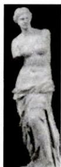

natural_image

Statue of a classical female figure, possibly Venus de Milo, in grayscale (no visible text or symbols)

A. $165 \mathrm{~cm}$

B. ${175}\mathrm{\;{cm}}$

C. ${185}\mathrm{\;{cm}}$

D. ${190}\mathrm{\;{cm}}$

思路 结合实际情况,由条件中黄金分割比例的定义和数据近似值进行估算.

解答 将头顶至脖子下端的长度 26cm 近似看成头顶至咽喉的长度, 可得咽喉至肚脐的长度小于 $\frac{26}{0.618} \approx 42cm$ ; 再由头顶至肚脐的长度与肚脐至足底的长度之比约是 0.618, 得肚脐至足底的长度小于 $\frac{42 + 26}{0.618} \approx 110cm$ , 从而该人的身高小于 $110 + 42 + 26 = 178cm$ . 由于肚脐至足底的长度大于 105cm, 可得头顶至肚脐的长度大于 $105 \times 0.618 \approx 65cm$ , 从而该人的身高大于 $105 + 65 = 170cm$ . 故选 B.

反思 本题设计数值估算,审题时应明确具体的有效数据,根据黄金分割比例的定义列等式和不等式;列等式时,“头顶至咽喉的长度”由“头顶至脖子下端的长度”来近似估算,“肚脐至足底的长度”由“腿长”近似估算,从而方便解答.

例3 已知函数 $f(x) = ax^{2} - ax - x\ln x$ ，且 $f(x) \geqslant 0$ .

(1) 求 $a$ 的值；

(2) 证明: $f(x)$ 存在唯一的极大值点 $x_0$ , 且 $\frac{1}{\mathrm{e}^2} < x_0 < \frac{1}{\mathrm{e}}$ .

思路 第(1)问,由 x>0 得 $ax-a-\ln x\geqslant0$ , 即 $a(x-1)\geqslant\ln x$ , 由 $x-1\geqslant\ln x$ 可先估计 a=1, 再结合图象验证; 第(2)问, 可以通过二次求导估算 $x_{0}$ 的范围, 进而估算 $f(x_{0})$ 的范围.

解答 (1) $x > 0$ ，则 $ax - a - \ln x \geqslant 0$ ，即 $a(x - 1) \geqslant \ln x$ ，而 $y = x - 1$ 是曲线 $y = \ln x$ 的切线，估计 $a = 1$ .

如图 1, 改变 a 的值, 直线 $y = a(x - 1)$ 的斜率改变, 都不满足题意, 故 a = 1.

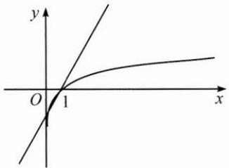

text_image

y
O 1 x

图1

(2) $f(x)=x^{2}-x-x\ln x,f'(x)=2x-\ln x-2,$

$f''(x)=2-\frac{1}{x}$ ，易知 $f''(x)$ 单调递增， $f''\left(\frac{1}{2}\right)=0,f'\left(\frac{1}{2}\right)<0.$

如图 2, 当 $0 < x < x_{0}$ 时, $f'(x) > 0$ ; 当 $x_{0} < x < 1$ 时, $f'(x) < 0$ ; 当 x > 1 时, $f'(x) > 0$ , 故 $f(x)$ 有唯一的极大值点 $x_{0}$ .

又 $f^{\prime}\left(\frac{1}{\mathrm{e}^{2}}\right) = \frac{2}{\mathrm{e}^{2}} - 2 - \ln \frac{1}{\mathrm{e}^{2}} >0,f^{\prime}\left(\frac{1}{\mathrm{e}}\right) = \frac{2}{\mathrm{e}} - \ln \frac{1}{\mathrm{e}} - 2<$ $0,$ 故 $\frac{1}{\mathrm{e}^2} < x_0 <   \frac{1}{\mathrm{e}}.$

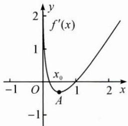

line

| x    | f'(x) |
| ---- | ----- |
| -1   | 2     |
| 0    | 0     |
| 1    | 1     |
| 2    | 2     |

图2

反思 函数题目中的范围估算往往从两方面入手:一是“以直代曲”,寻找曲线的切线;二是估算自变量的范围,结合函数零点存在性定理、极端值或特值点求解.

# 巩固练习

1. 若过点 $(a, b)$ 可以作曲线 $f(x) = \mathrm{e}^{x}$ 的两条切线，则（ ）.

A. $\mathrm{e}^{b} < a$

B. $e^{a}<b$

C. $0 < a < e^{b}$

D. $0 < b < e^{a}$

2. 设 0 < a < 1，随机变量 X 的分布列如表所示，则当 a 从 0 到 1 逐渐增大时，（）.

<table><tr><td>X</td><td>0</td><td>a</td><td>1</td></tr><tr><td>P</td><td> $\frac{1}{3}$ </td><td> $\frac{1}{3}$ </td><td> $\frac{1}{3}$ </td></tr></table>

A. $D(X)$ 增大

B. $D(X)$ 减小

C. $D(X)$ 先增大后减小

D. $D(X)$ 先减小后增大

3. 已知 $a=\left(\frac{3}{5}\right)^{-\frac{1}{3}}$ , $b=\left(\frac{4}{3}\right)^{-\frac{1}{2}}$ , $c=\ln\frac{3}{5}$ ，则这三个数按由小到大的顺序排列为 \_\_\_\_.

4. 若不等式 $f(x)=ae^{x}-e^{x}-x\geqslant0(x\in[0,+\infty))$ 恒成立，求实数 a 的取值范围.

# 24 配凑法

引路人 杭州师范大学附属中学 景芳

本思想方法涉及模块: 函数、导数、数列、不等式、解析几何、三角、向量等.

# 方法介绍

配凑法是指在解答数学问题的过程中,利用恒等变形的方式巧妙地配凑出适当的数、式或图形的方法,体现了化归的思想.

# 典例示范

例1 若 $0 < x < 1$ ，求 $\frac{1}{x} + \frac{2x}{1 - x}$ 的最小值.

思路 注意到分母之和为 1, 可以结合 1 的逆用解决问题.

解答 $\frac{1}{x} +\frac{2x}{1 - x} = \frac{1}{x} +\frac{2}{1 - x} -2 = \left(\frac{1}{x} +\frac{2}{1 - x}\right)(x + 1 - x) - 2 = 1 + \frac{1 - x}{x} +\frac{2x}{1 - x}\geqslant 1 + 2\sqrt{2}$ ，当且仅当 $\frac{1 - x}{x} = \frac{2x}{1 - x}$ 即 $x = \sqrt{2} -1$ 时， $\frac{1}{x} +\frac{2x}{1 - x}$ 取到最小值 $1 + 2\sqrt{2}$

反思 解决该问题,首先需要把分式 $\frac{2x}{1-x}$ 的分子配凑成有关分母1-x的式子,即 $\frac{-2(1-x)+2}{1-x}$ ,从而分离常数,这是处理分式问题的常用策略.

例 2 已知向量 a, b 满足 $\left|2a+3b\right|=1$ ，则 $a \cdot b$ 的最大值为 \_\_\_\_.

思路 解题的关键是结合 $2a + 3b$ 的模长为定值1的条件，把 $\pmb{a}\cdot \pmb{b}$ 配凑成 $2a\cdot 3b$ ，根据数量积运算的极化恒等式，即 $2a\cdot 3b = \frac{(2a + 3b)^2}{4} -$ $\frac{(2a - 3b)^2}{4}$ ，结合 $(2a - 3b)^2\geqslant 0$ 得出最大值.

解答 由极化恒等式可知， $2a\cdot 3b = \frac{(2a + 3b)^2}{4} -\frac{(2a - 3b)^2}{4}$

因为 $|2a + 3b| = 1$ ，所以 $2a\cdot 3b = \frac{1}{4} -\frac{(2a - 3b)^2}{4}$ 因为 $(2a - 3b)^{2}\geqslant 0$

所以 $2a \cdot 3b$ 的最大值为 $\frac{1}{4}$ ，所以 $a \cdot b$ 的最大值为 $\frac{1}{24}$ .

反思 本题通过系数的配凑,使 $a \cdot b$ 转化为已知条件中的 $2a$ 和 $3b$ 的数量积运算,再结合 $|2a + 3b| = 1$ ,选择用极化恒等式计算 $2a \cdot 3b$ .通过对题中的条件和问题进行观察联结,恰当地进行系数、结构的配凑,从而可以直接利用已知条件、已学公式和定理解决问题.

例 3 已知向量 a, b 的夹角为 $60^{\circ}$ ，且 $|a - b| = 1$ ，求 $a \cdot (a + 2b)$ 的最大值.

思路 运用向量的模的运算公式将已知条件转化为 $a^2 - |a||b| + b^2 = 1$ ，根据向量数量积的运算律得 $a \cdot (a + 2b) = a^2 + |a||b|$ . 对于这样的二次双变量问题，通常可以用配凑齐次分式、基本不等式或几何关系等策略解题.

解答 由题意得 $a^2 - |a||b| + b^2 = 1, a \cdot (a + 2b) = a^2 + |a||b|$ .

解法 1: 观察题设和结论, 配凑齐次式.

由 $a \cdot (a + 2b) = a^2 + |a||b| = \frac{a^2 + |a||b|}{1} = \frac{a^2 + |a||b|}{a^2 - |a||b| + b^2}$ ,

令 $\frac{|a|}{|b|}=t$ ，则 $a\cdot(a+2b)=1+\frac{2t-1}{t^{2}-t+1}$

令 $2t - 1 = m$ ，则 $\pmb {a}\cdot (\pmb {a} + 2\pmb {b}) = 1 + \frac{m}{\left(\frac{m + 1}{2}\right)^2 - \left(\frac{m + 1}{2}\right) + 1} = 1 + \frac{4m}{m^2 + 3},$

分子、分母同除以 $m$ 配凑基本不等式积为定值的形式，

则 $a \cdot (a + 2b) = 1 + \frac{4}{m + \frac{3}{m}}$ ，显然当 $m > 0$ 时可求得最大值，

$m + \frac{3}{m} \geqslant 2\sqrt{3}$ , 当且仅当 $\frac{|a|}{|b|} = \frac{\sqrt{3} + 1}{2}$ 时, $a \cdot (a + 2b)$ 的最大值为 $1 + \frac{2\sqrt{3}}{3}$ .

解法 2: 设 $|a|=x+y, |b|=x-y,$

由 $a^{2}-|a||b|+b^{2}=1$ 得 $x^{2}+3y^{2}=1$ .

因为 $\boldsymbol{a} \cdot (\boldsymbol{a} + 2\boldsymbol{b}) = \boldsymbol{a}^{2} + |\boldsymbol{a}| |\boldsymbol{b}| = 2x^{2} + 2xy = 2(x^{2} + xy)$ ,

由 $1 = x^{2} + 3y^{2} = (1 - \lambda)x^{2} + \lambda x^{2} + 3y^{2}\geqslant (1 - \lambda)x^{2} + 2\sqrt{3\lambda} xy$

根据求解形式，配凑 $1 - \lambda = 2\sqrt{3\lambda}$ ，则 $\lambda = 7 - 4\sqrt{3}$

此时 $1 = x^{2} + 3y^{2} = (1 - \lambda)x^{2} + \lambda x^{2} + 3y^{2}\geqslant (1 - \lambda)(x^{2} + xy)$

所以 $\boldsymbol{a} \cdot (\boldsymbol{a} + 2\boldsymbol{b}) = 2(x^{2} + xy) \leqslant \frac{2}{1 - \lambda} = 1 + \frac{2\sqrt{3}}{3}.$

解法 3: 配凑余弦定理形式.

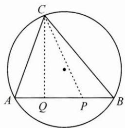

text_image

C
A Q P B

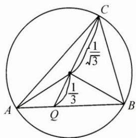

text_image

C
1/√3
1/3
A
Q
B

由 $a^2 - |a||b| + b^2 = 1$ ，构造一个底边长为 1，顶角为 $60^\circ$ 的三角形，如图， $AB = 1, \angle ACB = 60^\circ$ ，

令 $\overrightarrow{CA} = a, \overrightarrow{CB} = b, AP = \frac{2}{3} AB, AQ = \frac{1}{3} AB,$

则 $\boldsymbol{a} \cdot (\boldsymbol{a} + 2\boldsymbol{b}) = 3\boldsymbol{a} \cdot \left(\frac{1}{3}\boldsymbol{a} + \frac{2}{3}\boldsymbol{b}\right) = 3 \overrightarrow{CA} \cdot \overrightarrow{CP} = 3 \overrightarrow{CQ}^{2} - \frac{1}{3} \leqslant 3 \left(\frac{1}{\sqrt{3}} + \frac{1}{3}\right)^{2} - \frac{1}{3} = 1 + \frac{2\sqrt{3}}{3}.$

反思 由解法1不难体会到,当遇到齐次结构时,把问题配凑成齐次分式是解决的有效途径.解法2和解法3分别采用了换元和数形结合的方法,过程中都需要配凑系数和结构,才能成功地使用已知条件.

# 巩固练习

1. 已知 $5x^{2}y^{2} + y^{4} = 1 (x, y \in \mathbf{R})$ ，则 $x^{2} + y^{2}$ 的最小值为（ ）.

A. $\frac{3\sqrt{2}}{5}$

B. $\frac{4}{5}$

C. $\frac{3}{5}$

D. $\frac{1}{2}$

2. 在数列 $\{a_{n}\}$ 中，已知 $a_1 = \frac{1}{2}, a_{n+1} = \frac{a_n}{2 + 3a_n}$ ，求 $a_{n}$ .

3. 已知 x<3，求 $\frac{4}{x-3}+x$ 的最大值.

4. 已知 $5x^{2} + y^{2} = 1$ ，求 $2x^{2} + xy$ 的最大值.

# 25 变更主元

引路人 浙江省杭州第二中学 谢丽丽

本思想方法涉及模块: 函数、导数、数列、不等式.

# 方法介绍

所谓主元法, 就是在一个多元数学问题中, 以其中一个为主元, 将问题化归为该主元的函数、方程或不等式等问题, 其本质是函数与方程思想的应用. 有些看似复杂的问题, 如果选取适当的字母作为主元, 往往可以起到化难为易的作用. 在实际的解题中, 什么时候需要变更主元, 是思维难点. 打破思维定式, 合理推理, 独辟蹊径, 才能柳暗花明.

# 典例示范

# (一) 多元问题, 分步设定主元

例1 不等式 $\ln x - \frac{1}{2} x^2 + bx + c \leqslant 0$ 对任意 $x \in (0, +\infty), b \in \left(0, \frac{3}{2}\right)$ 恒成立，求实数 $c$ 的取值范围.

思路 此类问题常因思维定式而被看成关于 x 的函数进行讨论, 后续步骤比较复杂; 但是若变换一个角度, 将 b 作为主元, 就可以看成关于 b 的一元函数, 将恒成立问题转化为函数最值问题.

解答 设 $f(b) = xb + \ln x - \frac{1}{2} x^2 + c$ ，因为 $x \in (0, +\infty)$ ，所以 $f(b)$ 单调递

增，则在 $b \in \left(0, \frac{3}{2}\right)$ 上不等式 $\ln x - \frac{1}{2} x^2 + bx + c \leqslant 0$ 恒成立，只需 $f\left(\frac{3}{2}\right) = \frac{3}{2} x + \ln x - \frac{1}{2} x^2 + c \leqslant 0$ ，分离变量得 $c \leqslant \frac{1}{2} x^2 - \frac{3}{2} x - \ln x$ .

设 $h(x) = \frac{1}{2} x^2 -\frac{3}{2} x - \ln x$ ，将 $x$ 看作主元，求出 $h(x)$ 的最小值即可.

由 $h'(x)=x-\frac{3}{2}-\frac{1}{x}=\frac{2x^{2}-3x-2}{2x}=0$ , 得 $x=-\frac{1}{2}$ (舍去) 或 x=2.

若 $h'(x)>0$ ，则 x>2；若 $h'(x)<0$ ，则 0<x<2。

所以 $h(x)$ 在 $(0,2)$ 上单调递减，在 $(2,+\infty)$ 上单调递增，

$h(x) = \frac{1}{2} x^2 -\frac{3}{2} x - \ln x$ 的最小值是 $h(2) = -1 - \ln 2$ ，故 $c\leqslant -1 - \ln 2.$

反思 在解题前,应从多个角度分析解题思路,比较不同方法的优劣,先确定方法,再实施运算.

# (二)品味结构,数形结合

例 2 已知函数 $f(x)=x^{2}+ax+\frac{ax+1}{x^{2}}+b(a,b\in\mathbb{R})$ 有零点，则 $a^{2}+b^{2}$ 的取值范围是 \_\_\_\_.

思路 根据结构特征, 令 $t = x + \frac{1}{x}$ , 将问题转化为关于 t 的方程, 再从形的角度进行分析, 利用几何意义求解.

解答 解法1: 令 $t = x + \frac{1}{x} \in (-\infty, -2] \cup [2, +\infty)$ ，则问题转化为方程 $t^{2} + at + b - 2 = 0$ 在 $(-∞, -2] ∪ [2, +∞)$ 上有解，求 $a^{2} + b^{2}$ 的取值范围.

从形的角度理解,可以将 $ta+b+t^{2}-2=0$ 看作直线方程, $(a,b)$ 即为该直线上任意一点, $a^{2}+b^{2}$ 即为点 $(a,b)$ 与原点距离的平方,可得 $a^{2}+b^{2}=\left(\frac{|t^{2}-2|}{\sqrt{t^{2}+1}}\right)^{2}$ ,令 $m=t^{2}+1,m\geqslant5$ ,则 $a^{2}+b^{2}=\frac{m^{2}-6m+9}{m}=m-6+\frac{9}{m}\geqslant\frac{4}{5}$ .

解法 2: 可以利用正难则反的思想, 先处理方程 $t^{2} + at + b - 2 = 0$ 的解均在 $(-2, 2)$ 内或方程无解. 过程略.

反思 对于多元问题,要确定每个元在问题中所处的地位,分清主次;适当数形结合,切换思路.解法1最佳,解法2借助正难则反的思想.

# (三)合理构造,设定主元

例 3 已知函数 $f(x)=x(1-\ln x)$ ，设 a, b 为两个不相等的正数，且 $b\ln a-a\ln b=a-b$ ，证明： $\frac{1}{a}+\frac{1}{b}<e$ .

思路 变换结构特征, 将条件 $b \ln a - a \ln b = a - b$ 与所给函数建立联系. 设 $x_{2} = tx_{1}$ , 将 $x_{1}, x_{2}$ 建立联系, 构造新变量 t, 以 t 为主元, 得到关于 t 的函数, 进而求解.

解答 $f'(x)=1-\ln x-1=-\ln x.$

当 $x \in (0,1)$ 时， $f'(x) > 0, f(x)$ 单调递增；

当 $x \in (1, +\infty)$ 时， $f'(x) < 0, f(x)$ 单调递减.

$f(x)$ 的单调递增区间为 $(0,1)$ ，单调递减区间为 $(1,+\infty)$ .

因为 $b\ln a - a\ln b = a - b$ ，即 $b(\ln a + 1) = a(\ln b + 1)$ ，即 $\frac{\ln a + 1}{a} = \frac{\ln b + 1}{b}$ ，

所以 $f\left(\frac{1}{a}\right)=f\left(\frac{1}{b}\right)$ ，设 $\frac{1}{a}=x_{1},\frac{1}{b}=x_{2}$ ，不妨设 $0<x_{1}<1,x_{2}>1$ .

当 $x \in (0,1)$ 时， $f(x) = x(1 - \ln x) > 0$ ，

当 $x \in (\mathrm{e}, +\infty)$ 时， $f(x) = x(1 - \ln x) < 0$

故 $1 < x_{2} < \mathrm{e}$ .

设 $x_{2} = tx_{1}$ ，则 $t > 1$ ，结合 $\frac{\ln a + 1}{a} = \frac{\ln b + 1}{b},\frac{1}{a} = x_1,\frac{1}{b} = x_2,$

得 $x_{1}(1 - \ln x_{1}) = x_{2}(1 - \ln x_{2})$ ，即 $1 - \ln x_{1} = t(1 - \ln t - \ln x_{1})$

故 $\ln x_{1} = \frac{t - 1 - t\ln t}{t - 1}$

要证 $x_{1} + x_{2} <   \mathrm{e}$ ，即证 $(t + 1)x_{1} <   \mathrm{e}$ ，即证 $\ln (t + 1) + \ln x_1 <   1$

即证 $\ln (t + 1) + \frac{t - 1 - t\ln t}{t - 1} < 1$ ，即证 $(t - 1)\ln (t + 1) - t\ln t < 0.$

令 $S(t)=(t-1)\ln(t+1)-t\ln t, t>1$ ,

则 $S'(t)=\ln(t+1)+\frac{t-1}{t+1}-1-\ln t=\ln\left(1+\frac{1}{t}\right)-\frac{2}{t+1}$ ,

易证当 t>1 时， $\ln\left(1+\frac{1}{t}\right)\leqslant\frac{1}{t}<\frac{2}{t+1}$ ，故 $S'(t)<0$ 恒成立，

则 $S(t)$ 在 $(1, +\infty)$ 上为减函数， $S(t) < S(1) = 0$

故 $(t - 1)\ln (t + 1) - t\ln t < 0$ 成立，即 $x_{1} + x_{2} < e$ 成立.

综上， $\frac{1}{a} +\frac{1}{b} <  \mathrm{e}.$

反思 主元 $t$ 的构造有一定难度, 需要具备一定的代数变形能力. 解题方法是将多元问题单元化, 合理构造主元.

# 巩固练习

1. 已知不等式 $2x - 1 > m(x^2 - 1)$ 对满足 $m \in [-2, 2]$ 的一切实数 $m$ 恒成立，求 $x$ 的取值范围.

2. 已知函数 $f(x)=x^{2}+ax+b(a,b\in\mathbb{R})$ 在区间 $(0,1)$ 上有两个零点，则 $3a+b$ 的取值范围是 \_\_\_\_.

3. 已知函数 $f(x) = x + \frac{a}{x} + b (x \neq 0)$ ，其中 $a, b \in \mathbb{R}$ . 若对任意的 $a \in \left[\frac{1}{2}, 2\right]$ ，不等式 $f(x) \leqslant 10$ 在 $x \in \left[\frac{1}{4}, 1\right]$ 上恒成立，求 $b$ 的取值范围.

4. 若正实数 $x, y, w$ 满足 $x \geqslant y \geqslant w$ 和 $x + y \leqslant 2(z + w)$ ，则 $\frac{w}{x} + \frac{z}{y}$ 的最小值等于（ ）.

A. $\frac{3}{4}$

B. $\frac{7}{8}$

C. 1

D. 以上都不对

# 26 数形结合

引路人 杭州市源清中学 王凯

本思想方法涉及模块: 函数、不等式、向量.

# 方法介绍

数与形是数学中两个基本的研究对象,它们是有联系的,在一定条件下可以相互转化,称为数形结合.数形结合的应用大致可分为两种情形:一是借助形的几何直观性来阐明数之间某种关系,称为“以形助数”;二是借助数的精确性来阐明形的某些属性,称为“以数解形”.

# 典例示范

# (一)以形助数,构图看果

例1 已知函数 $f(x) = \begin{cases} 2^{x + 1}, & x \leqslant 0, \\ 3 - |x - a|, & x > 0, \end{cases}$ $g(x) = \log_2(x + 4), h(x) = f(x) - g(x)$ ，若 $h(x)$ 的零点有4个，求实数 $a$ 的取值范围.

思路 如图, 作出 $f(x)$ 的图象(黑线)和 $g(x)$ 的图象(蓝线), 那么问题就是寻求这两个图象有 4 个交点时参数 a 的取值范围.

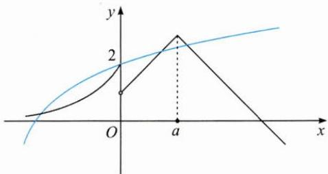

text_image

y
2
O
a
x

解答 通过图象可知, $h(x)$ 能否有4个零点取决于x>0时 $f(x)$ 与 $g(x)$ 的图象交点的个数.参数a的作用是控制倒“V”函数的对称轴和最大值,通过移动其图象可以得到两个临界值.当倒“V”函数的图象经过点 $M(0,2)$ 时,a=1(如图1);当倒“V”函数图象的最高点在点 $N(4,3)$ 处时,a=4(如图2).那么实数a的取值范围为(1,4).

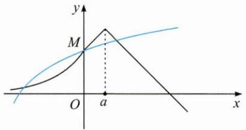

text_image

y
M
O a x

图1

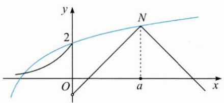

text_image

y
2
N
O
a
x

图2

反思 要关注代数结构中具有几何意义的数值,用好这些信息,实现“以形助数”.

例 2 已知单位向量 e，平面向量 a, b 满足 $a \cdot e = 2, b \cdot e = 3, a \cdot b = 0$ ，则 $|a - b|$ 的最小值为 \_\_\_\_.

思路 可以通过建系得到代数关系,利用不等式的知识求解,也可以根据条件建构直观图形.

解答 如图, 设 $OE=1, OA'=2, OB'=3$ , 且 $AA'\perp OE, BB'\perp OE.$

令 $\overrightarrow{OE}=e,\overrightarrow{OA}=a,\overrightarrow{OB}=b.$

因为 $a \cdot b = 0$ ，所以 $a \perp b$ ，那么以 OA 和 OB 为邻边构造矩形 OADB，两对角线的交点为 P，作 $PP' \perp OE$ .

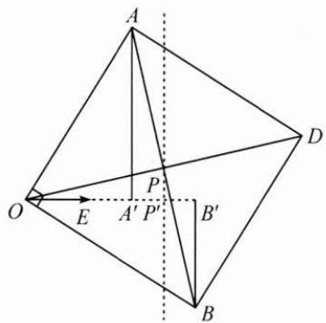

text_image

A
O
E
P
A' P'
B'
B
D

由 P 为 AB 的中点易得 $\left|OP'\right|=2.5$ ,

则 $|a-b|=|\overrightarrow{BA}|=|\overrightarrow{OD}|=2|\overrightarrow{OP}|\geqslant2|\overrightarrow{OP'}|=5,$

故所求最小值为 5.

反思 向量是刻画现实世界中“既有大小又有方向的量”的数学工具,对于向量问题,若能找出代数形式背后的“形”,结合平面几何中的一些基本方法,问题就可以一“望”而解.

# (二)以数解形,代数寻果

例3 已知函数 $f(x) = \begin{cases} x - \frac{4}{x} - a, & x \geqslant a, \\ a - \left(x + \frac{4}{x}\right), & x < a, \end{cases}$ 若关于 $x$ 的方程 $|f(x)-a|=4$ 恰有四个不同的实数根，求正实数 $a$ 的取值范围.

思路 探求方程 $|f(x) - a| = 4$ 的根的个数，最直观的方式是借助函数图象.

解答 不妨令 $g(x) = f(x) - a$ ，则 $g(x) = \begin{cases} x - \frac{4}{x} - 2a, & x \geqslant a, \\ -\left(x + \frac{4}{x}\right), & x < a. \end{cases}$

$g(x)$ 的图象在 $(- \infty, 0)$ 上是确定的，在 $(a, +\infty)$ 上单调递增，在 $(0, a)$ 上是否单调，取决于 $a$ 和2的大小关系，故分为两类，当 $0 < a \leqslant 2$ 时，如图1，当 $a > 2$ 时，如图2.

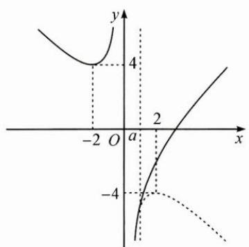

text_image

y
4
-2 O a 2 x
-4

图1

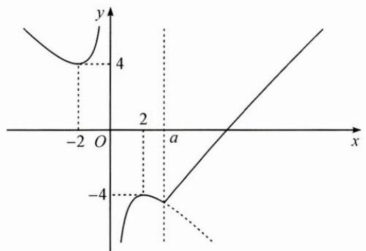

text_image

y
4
-2 O 2 a x
-4

图2

方程 $|f(x)-a|=4$ 的根的个数可转换成函数 $g(x)$ 的图象与直线 $y=\pm4$ 交点的个数，由图易得，当a>2时有四个不同的交点，故 $a\in(2,+\infty)$ .

例 4 如果函数 $f(x)=\sqrt{x+2}+a-x$ 存在两个不同的零点, 求实数 a 的取值范围.

思路 可以用方程观点和函数观点来解决.

解答 解法 1(方程观点):

问题等价于方程 $\sqrt{x + 2} = x - a(x\geqslant a)$ 有两根，

两边平方可得 $x + 2 = x^{2} - 2ax + a^{2}$

令 $g(x) = x^{2} - (2a + 1)x + a^{2} - 2$ ，问题转化为函数 $g(x)$ 在 $[a, +\infty)$ 上有两个零点，借助二次函数图象(如图), 可得 $\left\{\begin{aligned}\Delta&=4a+9>0,\\ a+\frac{1}{2}>a,\\ g(a)&\geqslant0,\end{aligned}\right.$

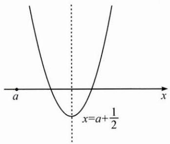

text_image

a
x=a+\frac{1}{2}

故 $-\frac{9}{4}<a\leqslant-2.$

解法 2(函数观点):

令 $m(x)=\sqrt{x+2}$ ,

$$
n (x) = x - a (x \geqslant a),
$$

问题转化为在 $[a, +\infty)$ 上 $m(x)$ 和 $n(x)$ 的图象有两个交点.

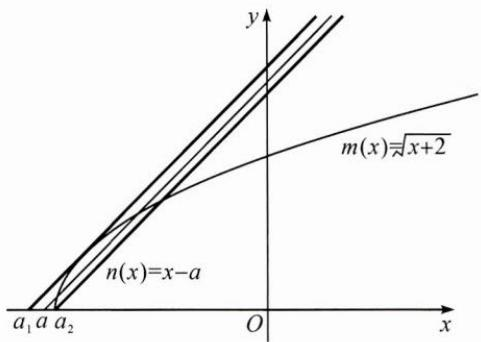

text_image

m(x)=√(x+2)
n(x)=x-a
a₁ a a₂ O x
y

如图, 可得 $a_{\min}=a_{2}=-2$ .

当 $n(x)$ 和 $m(x)$ 的图象相切时，a 接近最大临界值 $a_{1}$ （取不到）.

不妨设切点为 $P(x_0, y_0)$ ，则有 $m'(x_0) = \frac{1}{2\sqrt{x_0 + 2}} = 1$ ，解得 $x_0 = -\frac{7}{4}$ ，

代入 $m(x)$ 可得 $y_{0}=\frac{1}{2}$ ，即 $P\left(-\frac{7}{4},\frac{1}{2}\right)$ ，代入 $n(x)$ 可得 $a_{1}=-\frac{9}{4}$ .

故 $-\frac{9}{4}<a\leq-2.$

反思 对代数结构的不同处理方法,会导致不同的几何表征.本题的两种解法都是利用图象来搭桥,直观地找到问题的解决思路,再利用代数工具进行“精准打击”,获得结果.

# 巩固练习

1. 已知正实数 $x, y$ 满足 $x + y = 2$ ，则 $x + \sqrt{x^2 + y^2 - 2x + 1}$ 的最小值为 \_\_\_\_.

2. 设函数 $f(x) = |x^3 - |x + a| + 3|$ ，若 $f(x)$ 在 $[-1, 1]$ 上的最大值为 2，则实数 $a$ 所有可能的取值组成的集合是 \_\_\_\_.

3. 已知 $a, b \in \mathbb{R}$ 且 $0 \leqslant a + b \leqslant 1$ ，函数 $f(x) = x^2 + ax + b$ 在 $\left[-\frac{1}{2}, 0\right]$ 上至少存在一个零点，求 $a - 2b$ 的取值范围.

4. 已知函数 $f(x) = \sqrt{3 - \frac{x^2}{2}}$ , $g(x) = 1 - r + \sqrt{2r^2 - (x - 2 + r)^2}$ .

命题①:对于任意的 r>0,2 是函数 $y=f(x)-g(x)$ 的零点;

命题②:对于任意的 r>0,2 是函数 $y=f(x)-g(x)$ 的极值点.

下列说法中正确的是( ).

A. 命题①和②都成立

B. 命题①和②都不成立

C. 命题①成立, 命题②不成立

D. 命题①不成立, 命题②成立

# 27 命题转换

引路人 诸暨市牌头中学 陈坚

本思想方法涉及模块: 函数、导数、数列、方程、不等式、向量、排列组合、立体几何、解析几何等.

# 方法介绍

所谓命题转换,就是变换问题,通过一再改变问题的叙述和形式,改变观察和分析问题的角度,使问题呈现出新的面貌,引发新的思考、新的联想,从而使问题获得解答.

命题转换的核心是变形,转换的方法多种多样,通常通过分解与重组、强化与弱化、变量代换、增设辅助元等方法实现已知与未知、数与形、实际问题与数学问题的转换.

本节只讨论“若 $p$ ，则 $q$ ”这种形式的命题，有时只需转换命题的条件 $p$ ，有时只需转换命题的结论 $q$ ，有时则需要同时转换命题的条件与结论.

# 典例示范

# (一)转换条件

例 1 设关于 x 的方程 $x^{2}-ax-2=0$ 和 $x^{2}-x-1-a=0$ 的实数根分别为 $x_{1}, x_{2}$ 和 $x_{3}, x_{4}$ ，若 $x_{1}<x_{3}<x_{2}<x_{4}$ ，则实数 a 的取值范围为 \_\_\_\_.

思路 本题如果根据条件直接求根,再通过根之间的大小关系解得 a 的取值范围,显然比较麻烦.这种思路易“想”不易“做”,所以要对条件进行转换.

解答 解法1:条件转换为 $x_{1}, x_{2}$ 是函数 $y = x - \frac{2}{x}$ 与 $y = a$ 的图象的两个交点的横坐标, $x_{3}, x_{4}$ 是函数 $y = x^{2} - x - 1$ 与 $y = a$ 的图象的两个交点的横坐标, 数形结合(如图1)易知 $-1 < a < 1$ .

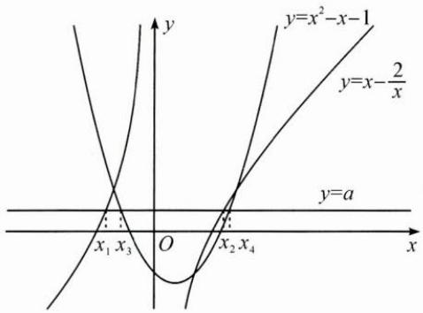

text_image

y
y=x²-x-1
y=x-\frac{2}{x}
y=a
x₁ x₃ O x₂ x₄
x

图1

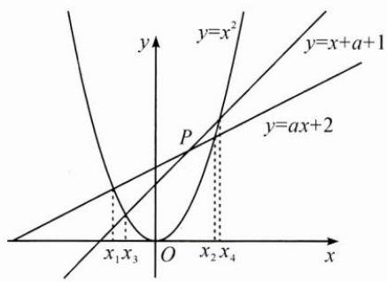

text_image

y
y=x²
y=x+a+1
P
y=ax+2
x₁x₃ O x₂x₄ x

图2

解法 2: 条件转换为 $x_{1}, x_{2}$ 是抛物线 $y = x^{2}$ 与动直线 $y = ax + 2$ 的两个交点的横坐标， $x_{3}, x_{4}$ 是抛物线 $y = x^{2}$ 与动直线 $y = x + a + 1$ 的两个交点的横坐标，数形结合（如图 2）易知 -1 < a < 1.

反思 对于这种构思精巧、条件隐蔽的数学问题,若能见数思形,用图形说话(数形转换),则可使问题简捷获解.

# (二)转换结论

例 2 已知向量 a, b 满足 $\left|a\right|=1,\left|b\right|=2$ ，则 $\left|a+b\right|+\left|a-b\right|$ 的最小值是 \_\_\_\_，最大值是 \_\_\_\_。

思路 本题条件简洁,关键是如何转换结论(目标).可以通过引入坐标(或基底),把目标转换为函数最值问题, $|a+b|+|a-b|=\sqrt{5+4\cos\theta}+\sqrt{5-4\cos\theta}$ ,其中 $\theta$ 是向量a,b的夹角;可以转换为线性规划问题;还可以把向量的模看成两点间的距离,把目标转换为一个动点到两个定点的距离之和的最值问题.

解答 解法1: 设 $\langle a, b \rangle = \theta$ ，则 $|a + b| + |a - b| = \sqrt{5 + 4\cos\theta} + \sqrt{5 - 4\cos\theta}$ ,

$(|a+b|+|a-b|)^{2}=10+2\sqrt{25-16\cos^{2}\theta}$ ，转换为函数最值问题.

易知所求最小值为 4, 最大值为 $2\sqrt{5}$ .

解法2：设 $|\pmb {a} + \pmb {b}| = \sqrt{5 + 4\cos\theta} = x, |\pmb {a} - \pmb {b}| = \sqrt{5 - 4\cos\theta} = y, x, y \geqslant 1,$

则有 $x^{2} + y^{2} = 10$ ，命题转换为已知 $x^{2} + y^{2} = 10(x,y\geqslant 1)$ ，求 $z = x + y$ 的最值.以下略.

解法3: 设 $a=(1,0)$ ，则 $-a=(-1,0)$ ， $b=(2\cos\alpha,2\sin\alpha)$ ， $A(1,0)$ ， $A'(-1,0)$ ， $B(2\cos\alpha,2\sin\alpha)$ ，所以 $|a+b|+|a-b|=|BA|+|BA'|$ ，点 B 的轨迹是以点 A， $A'$ 为焦点，长轴长为 $|BA|+|BA'|$ 的椭圆.

如图, 点 B 也在圆 $x^{2} + y^{2} = 4$ 上.

当点 B 经过点 $M(2,0)$ 时，椭圆的长轴长 $\left|BA\right| + \left|BA'\right|$ 的最小值为 4；

当点 B 经过点 $N(0,2)$ 时，椭圆的长轴长 $\left|BA\right| + \left|BA'\right|$ 的最大值为 $2\sqrt{5}$ .

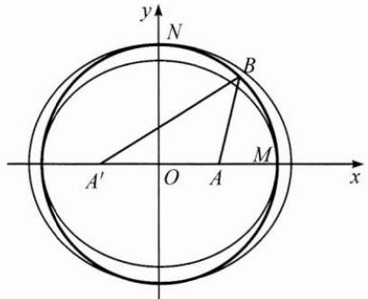

text_image

y
N
B
A'
O
A
M
x

反思 有时换一个视角看问题(视角转换),解答就势如破竹.

# (三)转换条件与结论

例 3 已知 $a, b \in \mathbf{R}_{+}, c > -1$ ，且满足 $\lg a + a + c = 0, \ln b + b + c = 0$ ，则（）.

A. $a \cos a > b \cos b$

B. $a \cos a < b \cos b$

C. $a \sin b > b \sin a$

D. $a\sin b < b\sin a$

思路 将条件转换为函数图象的交点,通过数形结合得到 a 与 b 的大小关系,再将结论转换为研究函数的单调性或直线的斜率.

解答 条件转换为 $\lg a = -a - c, \ln b = -b - c$ ，可视为 $a$ 是 $y = \lg x$ 与 $y = -x - c$ 图象的交点的横坐标， $b$ 是 $y = \ln x$ 与 $y = -x - c$ 图象的交点的横坐标。数形结合易得 $0 < a < b < 1$ 。

解法 1: 对于结论, 选项 D 为 $a \sin b < b \sin a$ , 即 $\frac{\sin b}{b} < \frac{\sin a}{a}$ , 转换为分析函数 $y = \frac{\sin x}{x}$ 的单调性.

因为 $y'=\frac{x\cos x-\sin x}{x^{2}}=\frac{\cos x(x-\tan x)}{x^{2}}<0$ 对 $x\in(0,1)$ 恒成立，

所以 $y=\frac{\sin x}{x}$ 在 $(0,1)$ 上单调递减，又 a<b，故 D 正确.

解法 2: 将 $y=\frac{\sin x}{x}=\frac{\sin x-0}{x-0}$ 转换为 $y=\sin x$ 图象上的一点 $(x,\sin x)$ 与原点 $O(0,0)$ 连线的斜率，在 $(0,1)$ 上，斜率在变小，故 D 正确.

反思 解决数学问题有时需要从一个系统转换到另一个系统(系统转换).本题实现了方程、函数、不等式之间的相互转换,使得问题求解十分便利.

# 巩固练习

1. 在长方体 $ABCD - A_{1}B_{1}C_{1}D_{1}$ 中， $AB = BC = 1, AA_{1} = \sqrt{3}$ ，则异面直线 $AD_{1}$ 与 $DB_{1}$ 所成角的余弦值为（ ）.

A. $\frac{1}{5}$

B. $\frac{\sqrt{5}}{6}$

C. $\frac{\sqrt{5}}{5}$

D. $\frac{\sqrt{2}}{2}$

2. 从 2 位女生和 4 位男生中选 3 位参加科技比赛, 且至少有 1 位女生入选, 则不同的选法共有 \_\_\_\_ 种. (用数字填写答案)

3. 在 $\triangle ABC$ 中, 内角 $A, B, C$ 的对边分别为 $a, b, c$ , 则“ $C$ 是锐角”是“ $c^{3} < 2(a^{3} + b^{3})$ ”的( ).

A. 充分不必要条件

B. 必要不充分条件

C. 充要条件

D. 既不充分也不必要条件

4. 如图, 已知圆 $C: (x - 2)^{2} + (y - 2)^{2} = 1$ , $\triangle ABD$ 为圆 $C$ 的内接正三角形, $M$ 为边 $BD$ 的中点, 当 $\triangle ABD$ 绕圆心 $C$ 转动, 同时点 $N$ 在边 $AB$ 上运动时, $\overrightarrow{ON} \cdot \overrightarrow{CM}$ 的最大值是 \_\_\_\_.

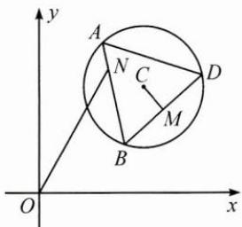

text_image

y
A
N
C
D
M
B
O
x

# 28 整体考虑

引路人 杭州市余杭高级中学 曹良华

本思想方法涉及模块:不等式、函数、导数、立体几何、解析几何等.

# 方法介绍

整体考虑,就是对于一个数学问题,要着眼整体,胸怀全局.通过对局部与整体的对比、联想、分析,挖掘和发现局部与整体的内在联系,有目的、有意识地整体处理,从而简洁、高效地解决问题.整体考虑主要包括整体代换、整体换元、整体复原、整体构造等.

# 典例示范

# (一)整体代换与换元

例 1 已知 $\frac{1}{2a+b} + \frac{1}{1+b} = 1 (a > 0, b > 0)$ ，则 $2a + 4b$ 的最小值为 \_\_\_\_.

思路 对问题中的 $2a+b,1+b$ 整体考虑, 进行换元, 使问题中的结构得到简化, 特征更加明显, 便于找到求解的思路和方法.

解答 设 $\left\{\begin{aligned}m&=2a+b,\\ n&=1+b,\end{aligned}\right.$ 则 $\frac{1}{m}+\frac{1}{n}=1(m>0,n>1),2a+4b=m+3n-3.$

因为 $m+3n=(m+3n)\left(\frac{1}{m}+\frac{1}{n}\right)=\frac{3n}{m}+\frac{m}{n}+4\geqslant4+2\sqrt{3}$ ,

当且仅当 $m = \sqrt{3} n = \sqrt{3} + 1$ 时等号成立，所以 $(2a + 4b)_{\min} = 1 + 2\sqrt{3}$ .

反思 通过换元,将问题转化为常见的基本不等式求最值问题,充分体现了整体考虑的价值.

例 2 已知直线 $y=kx+4$ 交椭圆 $\frac{x^{2}}{4}+y^{2}=1$ 于 M, N 两点, O 是坐标原点, 且直线 OM, ON 的斜率 $k_{1}, k_{2}$ 满足 $k_{1}+k_{2}=2$ , 则该直线的方程为 \_\_\_\_.

思路 如按常规思路考虑,往往着眼于M,N的坐标表达及相互关系,通过联立方程及韦达定理解方程,运算量较大,常常出现“会而不对”的现象.这里考虑整体处理M,N的坐标,即视 $k_{1},k_{2}$ 为整体,整体代换处理.

解答 设 $M(x_{1},y_{1}), N(x_{2},y_{2})$ ,

联立方程组 $\left\{\begin{aligned}\frac{x^{2}}{4}+y^{2}=1,\\ y=kx+4,\end{aligned}\right.$ 得 $\frac{x^{2}}{4}+y^{2}=\left(\frac{y-kx}{4}\right)^{2},$

整理并齐次化处理,可得 $15\left(\frac{y}{x}\right)^{2}+2k\left(\frac{y}{x}\right)+4-k^{2}=0.$

显然该方程的两根就是 $k_{1} = \frac{y_{1}}{x_{1}}, k_{2} = \frac{y_{2}}{x_{2}}$ ，所以 $\frac{y_1}{x_1} + \frac{y_2}{x_2} = -\frac{2k}{15} = 2$

解得 k = -15，则所求直线方程为 $y = -15x + 4$ .

反思 对“1”整体代换,构造齐次式,这是解题的关键,然后利用韦达定理获解.相比传统方法,整体考虑的优势十分明显.

# (二)整体复原

例 3 如图, 在四面体 A-BCD 中, $AB=CD=\sqrt{41}$ , $AC=BD=2\sqrt{13}$ , $AD=BC=\sqrt{61}$ , 则该四面体的外接球半径为 \_\_\_\_.

思路 将四面体 A-BCD 补形, 复原到长方体中, 如图, 则只需要用待定系数法求出长、宽、高, 从而求得外接球半径.

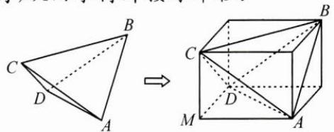

text_image

Geometric diagram showing a triangular pyramid and its 3D cube with labeled vertices A, B, C, D, M

解答 设补形所得长方体的长、宽、高分别为 $x, y, z$ ，则 $\left\{ \begin{array}{l} x^2 + z^2 = 52, \\ x^2 + y^2 = 61, \\ y^2 + z^2 = 41, \end{array} \right.$

解得 $x^{2} + y^{2} + z^{2} = 77 = (2R_{\text{外接球}})^{2}$ ，所以外接球的半径为 $\frac{\sqrt{77}}{2}$ .

反思 将几何体通过割补等方式复原到长方体、正方体中,有助于问题的可视化、便捷化处置,这是运用整体方法解决问题的典型案例.

# (三)整体构造

例 4 已知函数 $f(x)$ 的定义域为 $(0, +\infty)$ ， $f'(x)$ 是 $f(x)$ 的导函数，满足 $f(x) < -xf'(x)$ ，则不等式 $f(x+1) > (x-1)f(x^{2}-1)$ 的解集为 \_\_\_\_.

思路 构造函数 $g(x) = xf(x)$ ，对不等式代数变形得 $(x + 1)f(x + 1) > (x^2 - 1)f(x^2 - 1)$ ，根据单调性即可解决问题。

解答 构造函数 $g(x) = xf(x)$ ，因为 $g'(x) = f(x) + xf'(x) < 0$ ，所以 $g(x)$ 在 $(0, +\infty)$ 上单调递减.

$f(x + 1) > (x - 1)f(x^{2} - 1)$ 可化为 $(x + 1)f(x + 1) > (x^2 -1)f(x^2 -1),$

即 $g(x+1)>g(x^{2}-1)$ ，于是有 $\left\{\begin{aligned}x+1&<x^{2}-1,\\ x+1&>0,\\ x^{2}&-1>0,\end{aligned}\right.$ 解得 $x\in(2,+\infty)$ .

反思 根据问题中局部的结构特征,整体构造函数 $g(x)$ 并对不等式等价变形,有利于认清问题的数学本质,简洁、准确地解决问题.

# 三 巩固练习

1. 已知三棱锥 P-ABC 的三条棱 PA, PB, PC 两两垂直，且 PA=PB=PC=1，则该三棱锥的外接球体积为 \_\_\_\_。

2. 已知直线 $y = kx + 3$ 交双曲线 $\frac{x^{2}}{3} - y^{2} = 1$ 于 A, B 两点，O 是坐标原点，且直线 OA, OB 的斜率 $k_{1}, k_{2}$ 满足 $k_{1}k_{2} = 1$ ，则该直线的方程为

3. 若对任意实数 $x, a \cos x + b \cos 2x + 1 \geqslant 0$ 恒成立，则 $(a + b)_{\max} =$

# 29 局部处理

引路人 湖州市教科研中心 王勇强

本思想方法涉及模块: 不等式、函数、导数、立体几何等.

# 方法介绍

整体和局部是同一事物的两个方面.有些数学问题从整体上处理难以解决,就必须先分析研究问题的某一部分,得出初步结论后,再进一步研究,从而使数学问题获得解决.这种分析问题和解决问题的思维方法称为局部处理法.

# 典例示范

# (一)局部固定法

例 1 已知 a>0, b>0, c>0, $a+b=2$ ，则 $\frac{ac}{b}-\frac{c}{2}+\frac{c}{ab}+\frac{\sqrt{5}}{c-2}$ 的最小值为 \_\_\_\_.

思路 先固定变量 c，将原不等式看成关于变量 a, b 的代数式，求出最小值，再让变量 c 变化，进一步求出原不等式的最小值.

解答 先固定 $c$ ，因为 $a + b = 2, a > 0, b > 0$ ，所以 $\frac{a}{b} + \frac{1}{ab} = \frac{a^2 + 1}{ab} = \frac{a^2 + \left(\frac{a + b}{2}\right)^2}{ab} = \frac{1}{4}\left(\frac{b}{a} + \frac{5a}{b}\right) + \frac{1}{2} \geqslant \frac{1 + \sqrt{5}}{2}$ ，当且仅当 $b = \sqrt{5} a$ 时等号成立.

因此， $\frac{ac}{b}-\frac{c}{2}+\frac{c}{ab}+\frac{\sqrt{5}}{c-2}\geqslant\frac{1+\sqrt{5}}{2}c-\frac{c}{2}+\frac{\sqrt{5}}{c-2}=\frac{\sqrt{5}}{2}(c-2)+\frac{\sqrt{5}}{c-2}+\sqrt{5}\geqslant\sqrt{10}+\sqrt{5}$ ，当且仅当 $b=\sqrt{5}a,c=2+\sqrt{2}$ 时等号成立，

即 $\frac{ac}{b} -\frac{c}{2} +\frac{c}{ab} +\frac{\sqrt{5}}{c - 2}$ 的最小值为 $\sqrt{10} +\sqrt{5}$

反思 本题考查分析问题与解决问题的能力,对逻辑推理能力要求很高.从条件 $a+b=2$ 中发现变量a,b是相互制约的,变量c相对独立,故采用局部固定法,固定变量c,即提取c后进行变形处理,进而得解.

# (二)局部突破法

例 2 如图, 在三棱台 DEF-ABC 中, 平面 ADFC⊥平面 ABC, ∠ACB=∠ACD=45°, CD=2BC.

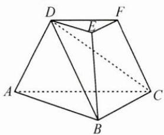

natural_image

Geometric diagram of a polyhedron with labeled vertices A, B, C, D, and F (no text or symbols present)

(1) 证明: $EF \perp DB$ ;

(2) 求 DF 与平面 BCD 所成角的正弦值.

思路 分析题意, 可发现三棱台 $DEF-ABC$ 上、下两个底面的对应边互相平行且成比例, 且三组对边的比值相等. 平面 $ADFC \perp$ 平面 $ABC$ , 作 $DH \perp AC$ , 垂足为 $H$ , 则 $DH \perp$ 平面 $ABC$ . 由于该几何体的棱长没有具体数值, $HA$ , $DF$ 的长可变, 且研究发现问题(1)与(2)均与此无关, 所以采用局部突破法, 只需突破该几何体的局部(三棱锥 $D-HBC$ )即可.

解答 (1)作 $DH \perp AC$ 于点 $H$ , 连接 $BH$ .

因为平面 $ADFC \perp$ 平面 ABC，而平面 $ADFC \cap$ 平面 ABC = AC，所以 $DH \perp$ 平面 ABC，从而 $DH \perp BC$ .

因为 $\angle ACB = \angle ACD = 45^{\circ}$ ，所以 $CD = \sqrt{2} CH = 2BC$ ，则 $CH = \sqrt{2} BC.$

natural_image

Geometric diagram of a tetrahedron with labeled vertices D, H, B, C (no text or symbols present)

取三棱锥 D-HBC, 如图, 在 $\triangle CBH$ 中,

$BH^{2}=CH^{2}+BC^{2}-2CH\cdot BC\cos45^{\circ}=BC^{2}$ ，即 $BH^{2}+BC^{2}=CH^{2}$ ，所以 $BH\perp BC$ .

由棱台的定义可知， $EF \parallel BC$ ，所以 $DH \perp EF, BH \perp EF,$

又 $BH \cap DH = H$ ，所以 $EF \perp$ 平面 BHD，而 $DB \subset$ 平面 BHD，所以 $EF \perp DB$ .

(2) 因为 $DF \parallel CH$ , 所以 $DF$ 与平面 $BCD$ 所成角即为 $CH$ 与平面 $BCD$ 所成角.

作 $HG \perp BD$ 于点 G，连接 CG.

由(1)可知, $BC\perp$ 平面BHD,所以平面 $BCD\perp$ 平面BHD,

而平面 $BCD \cap$ 平面 BHD = BD，所以 $HG \perp$ 平面 BCD，

即 CH 在平面 BCD 内的射影为 CG, $\angle HCG$ 即为所求角.

设 BC=a，则 $CH=\sqrt{2}a$ ，

在 Rt△HDB 中， $HG=\frac{BH\cdot DH}{BD}=\frac{\sqrt{2}a\cdot a}{\sqrt{3}a}=\frac{\sqrt{2}}{\sqrt{3}}a$

所以 $\sin\angle HCG=\frac{HG}{CH}=\frac{\sqrt{3}}{3}.$

反思 常规立体几何题的几何体形状是确定的,各个点的位置都能分析出来.然而本题的三棱台形状并不确定,有些点的位置也是变化的,这与常规立体几何认知有冲突,需要通过条件逐步读懂几何体的图形结构,突破局部图形——三棱锥 D-HBC,从而找到合适的解题思路.

例 3 已知 x>0，求证： $\ln x-e^{-x}+\frac{1}{x}>0.$

思路 本题有两个基本思路:一是从整体考虑,研究函数 $f(x)=\ln x-\mathrm{e}^{-x}+\frac{1}{x}$ 的性质,求得该函数的最小值来求证,但是解题过程非常复杂;二是从局部突破,将原问题转化为求证新的不等式 $\ln x+\frac{1}{x}>\mathrm{e}^{-x}$ ,从两个局部函数 $g(x)=\ln x+\frac{1}{x}$ 和 $h(x)=\mathrm{e}^{-x}$ 的性质去分析,通过局部的性质来揭示整体的性态,从而间接破题.

解答 令 $g(x) = \ln x + \frac{1}{x}, h(x) = \mathrm{e}^{-x}$ , 则 $g'(x) = \frac{x - 1}{x^2}$ , 易知 $g(x)$ 在 $(0,1)$ 上单调递减, 在 $(1, +\infty)$ 上单调递增, 所以 $g(x)$ 的最小值为 $g(1) = 1$ .

当 x>0 时， $h(x)=\mathrm{e}^{-x}<\mathrm{e}^{0}=1$ .

故当 $x > 0$ 时， $\ln x + \frac{1}{x} >\mathrm{e}^{-x}$ ，不等式 $\ln x - \mathrm{e}^{-x} + \frac{1}{x} >0$ 恒成立.

反思 整体的特性是由各个局部及其相互作用方式决定的,局部总会以一定的形式或在一定程度上反映整体的性质.在解决某些较复杂的数学问题时,应当善于从局部去认识整体,有局部突破意识.

# 巩固练习

1. 已知函数 $f(x) = x^3 (a \cdot 2^x - 2^{-x})$ 是偶函数，则 $a =$

2. 已知实数 a, b, c 满足 $3a^{2} + b^{2} \leqslant c \leqslant 1$ ，则 $2a + b + c$ 的取值范围是 \_\_\_\_。

3. 如图, 已知三棱台 $ABC - A_{1}B_{1}C_{1}$ , 二面角 $A_{1} - AC - B$ 的大小为 $60^{\circ}$ , 点 $A_{1}$ 在平面 $ABC$ 内的射影 $D$ 在 $BC$ 上, $AA_{1} = AB = 4$ , $\angle A_{1}AC = 30^{\circ}$ , $\angle BAC = 90^{\circ}$ .

text_image

A₁
B₁
C₁
A
B
D
C

(1)证明:AC⊥平面A₁B₁D;

(2)求直线 $A_{1}B$ 与平面 $ACC_{1}A_{1}$ 所成角的正弦值.

4. 当 b > a > 0 时，求证： $\ln b - \ln a > \frac{2a(b - a)}{a^{2} + b^{2}}$ .

# 30 变量分离法

引路人 浙江省兰溪市第一中学 祝玲

本思想方法涉及模块: 函数、导数、不等式等.

# 方法介绍

变量分离法,是将一个方程或不等式中的变量与参数经过适当的变形整合,分离为两个更简单的结构或者几何意义更明显的代数式的方法.

在解决数学问题的过程中,经常会遇到含有参数的函数、方程或不等式,当整体处理难度较大时,通过变量分离把问题转化为求函数的值域、最值或零点等问题,可以有效避免复杂的参数讨论及运用数形结合时遇到的作图难等问题.下面用全分离和半分离这两种方法研究和解决含有参数的函数、导数和不等式的典型问题.

# 典例示范

例 1 已知方程 $\ln|x| - ax^{2} + \frac{3}{2} = 0$ 有 4 个不同的实数根，则实数 a 的取值范围是 \_\_\_\_.

思路 由于方程左边对应的函数是一个偶函数,且 $x \neq 0$ ,于是只要当 $x > 0$ 时,方程 $\ln x - ax^2 + \frac{3}{2} = 0$ 有2个不同的实数根即可.

解答 问题等价于当 $x > 0$ 时，方程 $\ln x - ax^2 +\frac{3}{2} = 0$ 有2个不同的实数根.

解法1(不分离): 令 $f(x)=\ln x-ax^{2}+\frac{3}{2}(x>0)$ ,

则 $f'(x)=\frac{1}{x}-2ax=\frac{1-2ax^{2}}{x}.$

①当 $a \leqslant 0$ 时， $f'(x) > 0$ ，故 $f(x)$ 在 $(0, +\infty)$ 上至多有 1 个零点，不符合题意，舍去.

②当 a>0 时， $f(x)$ 在 $\left(0,\sqrt{\frac{1}{2a}}\right)$ 上单调递增，在 $\left(\sqrt{\frac{1}{2a}},+\infty\right)$ 上单调递减，

所以 $f(x)_{\max} = f\left(\sqrt{\frac{1}{2a}}\right) = \ln \sqrt{\frac{1}{2a}} + 1 > 0$ ，解得 $a < \frac{\mathrm{e}^2}{2}$ .

又当 $x \to 0$ 时， $f(x) \to -\infty$ ，当 $x \to +\infty$ 时， $f(x) \to -\infty$

所以, 当 $0 < a < \frac{e^{2}}{2}$ 时, 函数 $f(x)$ 在 $(0, +\infty)$ 上有 2 个零点, 即原方程有 4 个不同的实数根.

解法 2(全分离): $\ln x - ax^{2} + \frac{3}{2} = 0 \Leftrightarrow \ln x + \frac{3}{2} = ax^{2} \Leftrightarrow a = \frac{\ln x + \frac{3}{2}}{x^{2}}.$

令 $f(x) = \frac{\ln x + \frac{3}{2}}{x^2} (x > 0)$ ，则 $f'(x) = \frac{-2(1 + \ln x)}{x^3}$ ，

易知 $f(x)$ 在 $\left(0, \frac{1}{\mathrm{e}}\right)$ 上单调递增，在 $\left(\frac{1}{\mathrm{e}}, +\infty\right)$ 上单调递减，

所以 $f(x)_{\max}=f\left(\frac{1}{e}\right)=\frac{e^{2}}{2}.$

又当 $x \to 0$ 时， $f(x) \to -\infty$ ，当 $x \to +\infty$ 时， $f(x) \to 0$ ，所以 $0 < a < \frac{e^2}{2}$ .

解法 3(半分离): $\ln x - ax^{2} + \frac{3}{2} = 0 \Leftrightarrow \ln x = ax^{2} - \frac{3}{2}$ .

令 $g(x)=\ln x, h(x)=ax^{2}-\frac{3}{2}(x>0)$ ，如图，显然当 $a \leqslant 0$ 时，两函数图象只有 1 个交点，不满足题意，故 a > 0，当 $h(x)$ 与 $g(x)$ 的图象相切时是临界情况，此时 a 最大.

text_image

y
h(x)
g(x)
O
a
x

设两条曲线相切时切点坐标为 $(x_{0},y_{0})$ ,则 $\left\{\begin{aligned}\frac{1}{x_{0}}&=2ax_{0},\\ \ln x_{0}&=ax_{0}^{2}-\frac{3}{2},\end{aligned}\right.$ 解得 $\left\{\begin{aligned}x_{0}&=\frac{1}{e},\\ a&=\frac{e^{2}}{2},\end{aligned}\right.$

所以当 $h(x)$ 与 $g(x)$ 的图象有2个交点时， $0 < a < \frac{\mathrm{e}^2}{2}$ .

反思 “分离”较之“不分离”，有效避免了对参数的分类讨论；“半分离”较之“全分离”，又有函数简单、易作图的优点。在处理一个陌生的、复杂的方程时，可以通过等价变换，使等式两边转化成熟悉的、简单的函数，然后结合函数图象快速求解。

例 2 当 $x \in [1,4]$ 时，不等式 $0 \leqslant ax^{3} + bx^{2} + 4a \leqslant 4x^{2}$ 恒成立，则 $a + b$ 的取值范围是 \_\_\_\_.

思路 双参数问题整体处理比较困难,可以尝试对不等式进行巧妙变形,有效分离.

解答 解法1: 原不等式 $\Leftrightarrow -bx^{2} \leqslant a(x^{3} + 4) \leqslant (4 - b)x^{2}$

$$
\Leftrightarrow - b \leqslant a \left(x + \frac {4}{x ^ {2}}\right) \leqslant 4 - b.
$$

令 $f(x) = x + \frac{4}{x^2}, x \in [1,4]$ ，则 $f'(x) = \frac{x^3 - 8}{x^3}$ .

易知 $f(x)$ 在 $[1,2]$ 上单调递减，在 $[2,4]$ 上单调递增，

所以在 x=2 处， $f(x)$ 取得极小值 $f(2)=3$ .

又 $f(1) = 5, f(4) = \frac{17}{4}$ , 所以 $f(x) \in [3, 5]$ ,

所以 $\left\{\begin{aligned}a&\geqslant0,\\ -b&\leqslant3a,\\ 5a&\leqslant4-b\end{aligned}\right.$ 或 $\left\{\begin{aligned}a&<0,\\ -b&\leqslant5a,\\ 3a&\leqslant4-b.\end{aligned}\right.$

由 $a + b = 2(3a + b) - (5a + b)$ ，可得 $-4 \leqslant a + b \leqslant 8$ .

解法 2: 原不等式 $\Leftrightarrow -b \leqslant a\left(x + \frac{4}{x^{2}}\right) \leqslant 4 - b.$

①当 $a > 0$ 时，

原不等式 $\Leftrightarrow -\frac{b}{a}\leqslant x + \frac{4}{x^2}\leqslant \frac{4 - b}{a}\Leftrightarrow -\frac{x}{4} -\frac{b}{4a}\leqslant \frac{1}{x^2}\leqslant -\frac{x}{4} -\frac{b - 4}{4a},$

如图,区间端点与切线位置为临界状态,解得 $a+b \geqslant -4$ .

text_image

y
2
1
O
2
4
x
-1

②当 a<0 时，原不等式 $\Leftrightarrow -\frac{x}{4}-\frac{b-4}{4a}\leqslant\frac{1}{x^{2}}\leqslant-\frac{x}{4}-\frac{b}{4a}$ ，同理得 $a+b\leqslant8$ .  
③当 $a = 0$ 时，原不等式 $\Leftrightarrow -b\leqslant 0\leqslant 4 - b\Rightarrow 0\leqslant b\leqslant 4$ ，故 $0\leqslant a + b\leqslant 4.$

综上， $-4 \leqslant a + b \leqslant 8.$

反思 解决双参数问题,一般先解决一个参数,再处理另一个参数.解法2通过半分离,将问题转化为一次函数与幂函数的图象之间的位置关系,利用函数的凹凸性作切线,区间端点与切线位置为临界状态.

# 巩固练习

1. 已知函数 $f(x) = \begin{cases} x^3, & x \geqslant 0, \\ -x, & x < 0. \end{cases}$ 若函数 $g(x) = f(x) - |kx^2 - 2x| (k \in \mathbf{R})$ 恰有4个零点，则 $k$ 的取值范围是（ ）.

A. $\left(-\infty,-\frac{1}{2}\right)\cup(2\sqrt{2},+\infty)$

B. $\left(-\infty,-\frac{1}{2}\right)\cup(0,2\sqrt{2})$

C. $(-∞,0)∪(0,2\sqrt{2})$

D. $(-∞,0)∪(2\sqrt{2},+∞)$

2. 设函数 $f(x)=\mathrm{e}^{x}(2x-1)-ax+a$ ，其中 a<1，若存在唯一的整数 $x_{0}$ ，使得 $f(x_{0})<0$ ，则 a 的取值范围是（）.

A. $\left[-\frac{3}{2e},1\right)$

B. $\left[-\frac{3}{2e},\frac{3}{4}\right)$

C. $\left[\frac{3}{2e},\frac{3}{4}\right)$

D. $\left[\frac{3}{2e},1\right)$

3. 已知函数 $f(x)=ax^{2}+bx+c(a,b,c\in\mathbb{R})$ ，若存在实数 $a\in[1,2]$ ，对任意 $x\in[0,1]$ ，都有 $f(x)\leqslant1$ ，则 $2b+3c$ 的最大值是 \_\_\_\_.

4. 已知函数 $f(x) = |\lg x| - kx - 2$ ，给出下列四个结论：

①若 k=0，则 $f(x)$ 有两个零点；  
②存在 k<0，使得 $f(x)$ 有一个零点；  
③存在 k<0，使得 $f(x)$ 有三个零点；  
④存在 k>0，使得 $f(x)$ 有三个零点.

以上正确结论的序号是

5. 已知 $a > 0$ 且 $a \neq 1$ , 函数 $f(x) = \frac{x^a}{a^x} (x > 0)$ .

(1) 当 a=2 时, 求 $f(x)$ 的单调区间;  
(2)若曲线 $y = f(x)$ 与直线 $y = 1$ 有且仅有两个交点，求 $a$ 的取值范围.

# 31 适度放缩

引路人 浙江省北仑中学 竺吴辉

本思想方法涉及模块:导数、数列、三角函数.

# 方法介绍

放缩法就是针对目标代数式的结构特征,利用已有不等式的基本性质、函数的单调性及某些代数式的有界性,对目标不等式进行适当放大或缩小的方法.放缩法的主要理论依据是不等关系的传递性与方向的一致性,灵活使用放缩法,可以化繁为简、化难为易.

用放缩法证明不等式,通常要寻找一个中间量,借此来解决问题.放缩法灵活多变、技巧性强,要注意放缩的“尺度”,放得过大或缩得过小,都是不能解决问题的.

# 典例示范

# (一)数列不等式求和(积)问题

例 1 (1) 在数列 $\{a_{n}\},\{b_{n}\}$ 中， $a_{1}=2,b_{1}=4,a_{n},b_{n},a_{n+1}$ 成等差数列， $b_{n},a_{n+1},b_{n+1}$ 成等比数列 $(n\in\mathbf{N}^{*})$ . 证明： $\frac{1}{a_{1}+b_{1}}+\frac{1}{a_{2}+b_{2}}+\cdots+\frac{1}{a_{n}+b_{n}}<\frac{5}{12}$ ;

(2) 求证: $\frac{1}{2} \times \frac{3}{4} \times \cdots \times \frac{2n-1}{2n} < \sqrt{\frac{1}{2n+1}} (n \in \mathbb{N}^{*})$ .

思路 数列不等式证明的本质是求和(积),需要将问题中不能(难)求和(积)的数列通项转化为能(易)求和(积)的数列通项.在转化的过程中,必然有一定的误差,因此要结合结论去寻求适当的放缩方式.

解答 (1)由题意易得 $a_{n} = n(n + 1), b_{n} = (n + 1)^{2}$ ,

$$
a _ {n} = \frac {1}{a _ {n} + b _ {n}} = \frac {1}{n (n + 1) + (n + 1) ^ {2}} = \frac {1}{(n + 1) (2 n + 1)}.
$$

解法1: 当 n=1 时, $S_{1}=\frac{1}{2\times3}=\frac{1}{6}<\frac{5}{12}$ , 不等式成立;

当 $n \geqslant 2$ 时， $\frac{1}{a_n + b_n} = \frac{1}{(n + 1)(2n + 1)} < \frac{1}{2n(n + 1)} = \frac{1}{2}\left(\frac{1}{n} - \frac{1}{n + 1}\right)$ .

故 $S_{n} = \frac{1}{a_{1} + b_{1}} +\frac{1}{a_{2} + b_{2}} +\dots +\frac{1}{a_{n} + b_{n}} <   \frac{1}{6} +\frac{1}{2}\left(\frac{1}{2} -\frac{1}{3} +\dots +\frac{1}{n} -\frac{1}{n + 1}\right)$ $= \frac{5}{12} -\frac{1}{2(n + 1)} <   \frac{5}{12}.$

解法2: 假设 $\frac{1}{a_{n}+b_{n}}=\frac{1}{2}\cdot\frac{1}{n^{2}+\frac{3}{2}n+\frac{1}{2}}<\frac{1}{2}\left(\frac{1}{n+k}-\frac{1}{n+k+1}\right)$ ,

则 $S_{n}<\frac{1}{2}\left(\frac{1}{1+k}-\frac{1}{2+k}+\cdots+\frac{1}{n+k}-\frac{1}{n+k+1}\right)=\frac{1}{2}\left(\frac{1}{k+1}-\frac{1}{n+k+1}\right)<\frac{1}{2}\cdot\frac{1}{k+1}=\frac{5}{12}$ ，解得 $k=\frac{1}{5}$ .

此时， $\frac{1}{a_n + b_n} < \frac{1}{2}\left(\frac{1}{n + \frac{1}{5}} -\frac{1}{n + \frac{6}{5}}\right) = \frac{1}{2}\cdot \frac{1}{n^2 + \frac{7}{5} n + \frac{6}{25}}$ 成立，得证.

(2) 因为 $(2n)^{2}>(2n)^{2}-1=(2n-1)(2n+1)$ ,

所以 $2n > \sqrt{(2n - 1)(2n + 1)}$ ，从而 $\frac{2n - 1}{2n} < \sqrt{\frac{2n - 1}{2n + 1}}$

故 $\frac{1}{2} \times \frac{3}{4} \times \cdots \times \frac{2n - 1}{2n} < \sqrt{\frac{1}{3}} \times \sqrt{\frac{3}{5}} \times \cdots \times \sqrt{\frac{2n - 1}{2n + 1}} = \sqrt{\frac{1}{2n + 1}}$ .

反思 放缩应有“度”，不能太大，也不能太小，要根据所证明的不等式结构来选择放缩的方法。放缩过程中，需要多次试探才能找到正确方法，由于放缩是有误差的，因此，可以保留部分项来提高放缩的精度。

# (二)函数不等式证明问题

例2 函数 $f(x) = \frac{ae^x}{x + b}$ 的图象在 $x = 1$ 处的切线方程为 $y = \frac{e}{4}(x + 1)$ .

(1) 求 a, b 的值;

(2) 当 x > 0 且 $x \neq 1$ 时，求证： $f(x) > \frac{x - 1}{\ln x}$ .

思路 已知函数图象在 $x = 1$ 处的切线方程为 $y = \frac{\mathrm{e}}{4}(x + 1)$ , 根据导数的意义, 可以构造关于 $a, b$ 的一个方程组, 求解可得 $a, b$ 的值. 第(2)问要证 $f(x) > \frac{x - 1}{\ln x}$ , 即证 $\frac{\mathrm{e}^x}{x + 1} > \frac{x - 1}{\ln x}$ , 如果直接证明, 计算会比较复杂, 且很有可能无功而返, 特别是不等式中同时含有 $\mathrm{e}^x$ 和 $\ln x$ 时, 运算的复杂度更大. 利用题中隐含的“提示”: 函数图象在 $x = 1$ 处的切线方程为 $y = \frac{\mathrm{e}}{4}(x + 1)$ , 可以尝试进行放缩和转化, 如果能够证明 $\frac{\mathrm{e}^x}{x + 1} \geqslant \frac{\mathrm{e}}{4}(x + 1) > \frac{x - 1}{\ln x}$ , 问题就迎刃而解了.

解答 (1) 过程略, a=b=1.

(2)要证 $f(x) > \frac{x - 1}{\ln x}$ , 只需证 $\frac{\mathrm{e}^x}{x + 1} \geqslant \frac{\mathrm{e}}{4}(x + 1) > \frac{x - 1}{\ln x}$ .

先证 $\frac{\mathrm{e}^x}{x + 1}\geqslant \frac{\mathrm{e}}{4} (x + 1)$ ，只需证 $\mathrm{e}^x\geqslant \frac{\mathrm{e}}{4} (x + 1)^2.$

设 $F(x) = \mathrm{e}^{x} - \frac{\mathrm{e}}{4}(x + 1)^{2}$ ，则 $F^{\prime}(x) = \mathrm{e}^{x} - \frac{\mathrm{e}}{2}(x + 1), F^{\prime \prime}(x) = \mathrm{e}^{x} - \frac{\mathrm{e}}{2}$ .

令 $F''(x)=\mathrm{e}^{x}-\frac{\mathrm{e}}{2}=0$ , 得 $x=1-\ln2$ .

当 $x \in (0,1-\ln2)$ 时， $F''(x) < 0, F'(x)$ 为减函数；

当 $x \in (1 - \ln 2, +\infty)$ 时， $F''(x) > 0, F'(x)$ 为增函数.

又因为 $F'(0)=1-\frac{e}{2}<0, F'(1-\ln2)<0$ ，且 $F'(1)=0$

所以当 $x \in (0,1)$ 时， $F'(x) < 0, F(x)$ 为减函数；

当 $x \in (1, +\infty)$ 时， $F'(x) > 0, F(x)$ 为增函数.

因此 $F(x) \geqslant F(1) = 0$ ,

$\mathrm{e}^{x}\geqslant\frac{\mathrm{e}}{4}(x+1)^{2}$ 即 $\frac{\mathrm{e}^{x}}{x+1}\geqslant\frac{\mathrm{e}}{4}(x+1)$ 在 $(0,+\infty)$ 上恒成立.

再证 $\frac{e}{4}(x+1)>\frac{x-1}{\ln x}.$

设 $G(x)=\ln x-\frac{4(x-1)}{\mathrm{e}(x+1)}$ ，则 $G'(x)=\frac{1}{x}-\frac{8}{\mathrm{e}(x+1)^{2}}=\frac{\mathrm{e}x^{2}+(2\mathrm{e}-8)x+\mathrm{e}}{\mathrm{e}x(x+1)^{2}}$ .

设 $g(x)=\mathrm{e}x^{2}+(2\mathrm{e}-8)x+\mathrm{e}$ ，这个关于 x 的方程的判别式 $\Delta=4(\mathrm{e}-4)^{2}-4\mathrm{e}^{2}<0$ ，所以 $g(x)>0$ 恒成立，所以 $G'(x)>0$ ，故 $G(x)$ 在 $(0,+\infty)$ 上为增函数，且 $G(1)=0$ 。

当 0 < x < 1 时， $\ln x < 0, G(x) = \ln x - \frac{4(x - 1)}{\mathrm{e}(x + 1)} < 0$ ，所以 $\frac{\mathrm{e}}{4}(x + 1) > \frac{x - 1}{\ln x}$ ;

当 $x > 1$ 时， $\ln x > 0,G(x) = \ln x - \frac{4(x - 1)}{\mathrm{e}(x + 1)} >0$ ，所以 $\frac{\mathrm{e}}{4} (x + 1) > \frac{x - 1}{\ln x}$

综上， $\frac{\mathrm{e}^{x}}{x+1}\geqslant\frac{\mathrm{e}}{4}(x+1)>\frac{x-1}{\ln x}$ ，从而 $f(x)>\frac{x-1}{\ln x}$ .

反思 当遇到函数的超越不等式问题时,需要对问题进行适度放缩.可以先观察下题干中是否存在隐含的“提示”,若不存在,可以尝试用 $e^{x-1} \geqslant x \geqslant \ln(x+1)$ 等常用不等式及其转化形式,如 $e^{x} \geqslant ex$ 和 $x \ln x \geqslant -\frac{1}{e}$ ,将复杂函数转化为简单函数,将不同名函数转化为同名函数,这样问题就可以大为简化.

# 巩固练习

1. 已知数列 $\{a_{n}\}$ 满足 $a_{1} = 1, a_{n+1} = \frac{a_{n}}{1 + \sqrt{a_{n}}} (n \in \mathbf{N}^{*})$ . 记数列 $\{a_{n}\}$ 的前 $n$ 项和为 $S_{n}$ , 则（ ）.

A. $\frac{3}{2} < S_{100} < 3$

B. $3 < S_{100} < 4$

C. $4 <   S_{100} <   \frac{9}{2}$

D. $\frac{9}{2} < S_{100} < 5$

2. 已知函数 $f(x) = \frac{\mathrm{e}^{x - 1}}{x} + \ln x - ax$ ，若 $f(x) \geqslant 0$ 恒成立，则实数 $a$ 的取值范围为（ ）.

A. $\left(-\infty,\frac{1}{e}\right]$

B. $\left(\frac{1}{e},1\right]$

C. $\left(-\infty,\frac{1}{e^{2}}\right]$

D. $(-\infty, 1]$

3. $1 + \frac{1}{\sqrt{2}} + \frac{1}{\sqrt{3}} + \cdots + \frac{1}{\sqrt{100}}$ 的整数部分是 \_\_\_\_.

4. 已知 A, B, C 是 $\triangle ABC$ 的三个内角，则 $\sin A + \sin B + \sin C$ 的最大值为 \_\_\_\_.

5. 求证: 当 $m, n \in N^{*}$ ，且 1 < m < n 时，都有 $(1 + m)^{n} > (1 + n)^{m}$ .

# 32 均值代换

引路人 杭州学军中学 周洁

本思想方法涉及模块: 函数、不等式、三角.

# 方法介绍

所谓均值代换,是指利用若干个变量的平均值和一个字母重新定义原来变量之间的关系,从而便于计算.当 n 个变量 $x_{i}(i=1,2,\cdots,n)$ 的和为定值 a 时,可设 $x_{i}=\frac{a}{n}+t_{i}$ ,其中 $t_{1}+t_{2}+\cdots+t_{n}=0$ ,这种代换叫作均值代换.均值代换以问题中某些变量的平均值为基点,对这些变量进行线性变换,从而引入新的变量,以达到简化问题与解决问题的目的,是换元法的一种特殊形式.

# 典例示范

例1 设 $x > 0, y > 0, x + 2y = 4$ ，求 $\frac{(x + 1)(2y + 1)}{xy}$ 的最小值.

思路 本题求解时直接消元即可.通过观察目标结构,发现这里需要的变量是x与2y,而题目所给条件恰为两数和,于是构造均值代换,起到消元的作用.

解答 令 $x = 2 - t, 2y = 2 + t, t \in (-2, 2)$ ,

则 $\frac{(x + 1)(2y + 1)}{xy} = \frac{2(3 - t)(3 + t)}{(2 - t)(2 + t)} = 2\left(1 - \frac{5}{t^2 - 4}\right), t^2 - 4 \in [-4,0)$ ，

故 $\frac{(x-1)(2y+1)}{xy}\geqslant2\times\left(1-\frac{5}{-4}\right)=\frac{9}{2}$ ，当且仅当t=0，即x=2,y=1时取等号.

反思 均值代换的本质是消元,利用均值的对称性消元得到普通二次分式,可以简化运算.

例2 设 $x, y, z \in \mathbf{R}$ , 且 $x + y + z = 1$ .

(1)求 $(x-1)^{2}+(y+1)^{2}+(z+1)^{2}$ 的最小值；  
(2) 若 $(x - 2)^{2} + (y - 1)^{2} + (z - a)^{2} \geqslant \frac{1}{3}$ 恒成立，证明： $a \leqslant -3$ 或 $a \geqslant -1$ .

思路 第(1)问中变量为 $x - 1, y + 1, z + 1$ ，其和为定值，可以利用均值代换得到三元二次不等式，而该不等式的最小值易求。第(2)问同理，变量为 $x - 2, y - 1, z - a$ ，其和与参数 $a$ 有关，构造均值代换后求最小值，最后解关于 $a$ 的不等式即可。

解答 （1）令 x-1=a， $y+1=b,z+1=c$ ，则 $a+b+c=2$ ，

令 $a = \frac{2}{3} +\alpha ,b = \frac{2}{3} +\beta ,c = \frac{2}{3} +\gamma ,\alpha +\beta +\gamma = 0,$

则 $(x - 1)^2 +(y + 1)^2 +(z + 1)^2 = a^2 +b^2 +c^2$

$$
= \frac {4}{3} + \frac {4}{3} (\alpha + \beta + \gamma) + \alpha^ {2} + \beta^ {2} + \gamma^ {2} = \frac {4}{3} + \alpha^ {2} + \beta^ {2} + \gamma^ {2} \geqslant \frac {4}{3},
$$

当且仅当 $\alpha=\beta=\gamma=0$ 时取等号，此时 $x=\frac{5}{3}$ ， $y=z=-\frac{1}{3}$ .

(2)令 $x - 2 = m$ ， $y - 1 = n,z - a = p$ ，则 $m + n + p = -2 - a$

令 $m = \frac{-2 - a}{3} +\alpha ,n = \frac{-2 - a}{3} +\beta ,p = \frac{-2 - a}{3} +\gamma ,\alpha +\beta +\gamma = 0,$

则 $(x - 2)^{2} + (y - 1)^{2} + (z - a)^{2} = m^{2} + n^{2} + p^{2}$

$$
= \frac {(2 + a) ^ {2}}{3} - \frac {4 + 2 a}{3} (\alpha + \beta + \gamma) + \alpha^ {2} + \beta^ {2} + \gamma^ {2} = \frac {(2 + a) ^ {2}}{3} + \alpha^ {2} + \beta^ {2} + \gamma^ {2} \geqslant \frac {1}{3},
$$

从而 $\frac{(2 + a)^2}{3} \geqslant \frac{1}{3}$ ，解得 $a \leqslant -3$ 或 $a \geqslant -1$ .

反思 均值代换避免了使用多元柯西不等式或多元均值不等式,使得未知量之间的关系直观且清晰.构造的多元函数中各变量之和为定值,对计算起到了简化作用,其最值容易求得.

例3 已知两两不相等的实数 $x_{1}, y_{1}, x_{2}, y_{2}, x_{3}, y_{3}$ 同时满足: ① $x_{1} < y_{1}, x_{2} < y_{2}, x_{3} < y_{3}$ ; ② $x_{1} + y_{1} = x_{2} + y_{2} = x_{3} + y_{3}$ ; ③ $x_{1}y_{1} + x_{3}y_{3} = 2x_{2}y_{2} > 0$ , 则以下选项中恒成立的是( ).

A. $2x_{2}<x_{1}+x_{3}$

B. $2x_{2}>x_{1}+x_{3}$

C. $x_{2}^{2} <   x_{1}x_{3}$

D. $x_{2}^{2} > x_{1}x_{3}$

思路 题中有 6 个变量, 如何减少变量个数是关键. 利用条件②, 构造均值代换, 将 6 个变量减少为 4 个, 再利用条件①③找到新变量之间的限制和联系.

解答 令 $x_{1} + y_{1} = x_{2} + y_{2} = x_{3} + y_{3} = 2m$

则 $\left\{\begin{aligned}x_{1}&=m-a,\\ y_{1}&=m+a,\end{aligned}\right.\left\{\begin{aligned}x_{2}&=m-b,\\ y_{2}&=m+b,\end{aligned}\right.\left\{\begin{aligned}x_{3}&=m-c,\\ y_{3}&=m+c,\end{aligned}\right.$ 其中 $a\neq b\neq c$ 且a,b,c>0,

代入③得 $m^{2}-a^{2}+m^{2}-c^{2}=2(m^{2}-b^{2})>0$ ，则有 $\left\{\begin{aligned}a^{2}+c^{2}&=2b^{2},\\ m^{2}&>b^{2}.\end{aligned}\right.$

$$
x _ {1} + x _ {3} - 2 x _ {2} = (m - a) + (m - c) - 2 (m - b) = 2 b - (a + c),
$$

因为 $(2b)^{2} - (a + c)^{2} = 2(a^{2} + c^{2}) - (a + c)^{2} = (a - c)^{2} > 0,$

所以 $x_{1} + x_{3} - 2x_{2} = 2b - (a + c) > 0$ ，故A正确，B错误.

$$
\begin{array}{l} x _ {1} x _ {3} - x _ {2} ^ {2} = (m - a) (m - c) - (m - b) ^ {2} \\ = (2 b - a - c) m + a c - b ^ {2} = (2 b - a - c) m - \frac {(a - c) ^ {2}}{2}, \\ \end{array}
$$

上面已证 2b-a-c>0，因为不知道 m 的正负，所以该式的正负无法确定.

故选 A.

反思 当和为定值时,通过均值代换重新定义变量,使得变量个数减少,题目难度随之降低,体现了变量之间的简洁联系,起到简化计算的作用.

# 巩固练习

1. 已知 $a + b = 2, \frac{(1 - a)^{2}}{b} + \frac{(1 - b)^{2}}{a} = -4$ ，则 ab = \_\_\_\_.

2. 已知实数 $a, b, c$ 满足 $a + b + c = 0, a^2 + b^2 + c^2 = 1$ ，求 $a$ 的最大值.

3. 若 $x, y, z$ 为实数，且 $x + 2y + 2z = 6$ ，求 $x^{2} + y^{2} + z^{2}$ 的最小值.

4. 在 $\triangle ABC$ 中, 内角 $A, B, C$ 所对的边分别为 $a, b, c, -\sin 2A - \sin 2B - \sin 2C = 2\sqrt{3} \sin B \sin C, BC = 3$ , 求 $\triangle ABC$ 周长的最大值.

5. 设实数 x, y, z 满足 $\left\{\begin{aligned}x+y+z-1=0,\\ xy-z^{2}+7z-14=0,\end{aligned}\right.$ 则当 z 为何值时， $x^{2}+y^{2}$ 取最大值？最大值为多少？

# 33 借助数轴

引路人 安吉县昌硕高级中学 韩新蕾

本思想方法涉及模块: 函数、导数、不等式等.

# 方法介绍

对于单变量范围问题,可借助数轴,用数形结合的方法来直观解决.常见题型有:集合的运算、高次不等式求解(数轴标根法或穿针引线法)、与绝对值有关的解不等式或求最值问题.

# 典例示范

# (一)借助数轴进行集合运算

例 1 设集合 $S = \{ x \mid x < -1 \text{ 或 } x > 5 \} , T = \{ x \mid a < x < a + 8 \} , S \cup T = \mathbf{R}$ ，则 $a$ 的取值范围是 \_\_\_\_.

思路 从容易作图的集合 S 入手, 在数轴上画出 S 的范围, 由于 $S \cup T = R$ , 而数轴上有一部分区域没有被 S 包含, 说明集合 T 负责补 S 空缺的部分.

text_image

T
S
a -1 5 a+8

解答 由图象得 $\left\{\begin{aligned}a&<-1,\\ a&+8&>5,\end{aligned}\right.$ 则 $a\in(-3,-1)$ .

反思 处理集合的交并补运算,数轴是得力的工具.使用时可用不同颜色或不同高度来区分各个集合的区域,用实心点和空心点来区分集合是否包含端点.处理含参数问题时,要检验参数与边界点重合时是否满足题意.

# (二)借助数轴解高次不等式

例2 解不等式: $\frac{x^{2}+2x-2}{3+2x-x^{2}}<x$ .

思路 解分式不等式的步骤为: 移项→通分→分子、分母相除化为相乘. 此时转化为解高次不等式问题, 可利用数轴标根法(穿针引线法)解决.

解答 通过移项、通分,原不等式可化为:

$$
\begin{array}{r l} & {\frac {x ^ {3} - x ^ {2} - x - 2}{- (x ^ {2} - 2 x - 3)} <   0 \Leftrightarrow \frac {(x - 2) (x ^ {2} + x + 1)}{(x - 3) (x + 1)} > 0 \Leftrightarrow \frac {x - 2}{(x - 3) (x + 1)} > 0 \Leftrightarrow} \\ & {(x - 2) (x - 3) (x + 1) > 0.} \end{array}
$$

（分式 $>0$ 的含义是分子与分母同号，而乘积 $>0$ 也表示两部分同号，所以它们是同解变形.）

由数轴标根法得解集为 $x \in (-1, 2) \cup (3, +\infty)$ .

反思 解高次不等式可采用数轴标根法(穿针引线法), 步骤为: 标根 $\rightarrow$ 穿线 $\rightarrow$ 得解. 先把不等式左边因式分解, 如例题中的 $(x - 2)(x - 3)(x + 1)$ , 得到每个因式的零点 $2, 3, -1$ , 并标在数轴上; 这些零点把数轴分成了若干段, 即 $(- \infty, -1), (-1, 2), (2, 3), (3, + \infty)$ , 分析每一段上 $(x - 2)(x - 3)(x + 1)$ 的符号, 并用曲线标在数轴上, 例如 $(-1, 2)$ 上三个因式的符号分别为一、一、十, 相乘为正, 所以引线时线在数轴上方, 表示函数 $y = (x - 2)(x - 3)(x + 1)$ 在 $(-1, 2)$ 上的图象在 $x$ 轴上方. 这样, 每跨过一个零点, 会使一个因式变号, 所以会呈现“穿针引线”的效果. 如果遇到偶次因式, 例如 $(x - 1)^{2}$ , 其零点为 1 , 则在 1 的左右两侧这个因式不变号, 所以有“奇穿偶不穿”的规律.

# (三)借助数轴解决绝对值相关问题

例3 求函数 $y = |x - 1| + |x + 3|$ 的最小值.

思路 本题可以分类去绝对值,画出分段函数图象,进而得到最小值,这样计算略复杂.考虑到绝对值的几何意义,可借助数轴直接求解.

解答 $|x - 1| + |x + 3|$ 的几何意义是数轴上的动点 $x$ 到1的距离与到-3的距离之和.

如图, 显然当 $x \in [-3, 1]$ 时, 距离之和最小, 所以函数的最小值为 4.

反思 $|x - a|$ 表示数轴上的实数 $x$ 对应的点与实数 $a$ 对应的点之间的距离，借助这一几何意义可以处理形如 $\sum_{i=1}^{n}|x - x_i|$ 的最小值问题。不妨设 $x_1 \leqslant x_2 \leqslant x_3 \leqslant \cdots \leqslant x_n$ ，若 $n$ 为奇数，则当 $x = x_{\frac{i+1}{2}}$ 时取最小值；若 $n$ 为偶数，则当 $x \in [x_{\frac{i}{2}}, x_{\frac{i}{2}+1}]$ 时取最小值。

# 巩固练习

1. 对于任意的 $x \in \mathbf{R}$ , 满足 $(a - 2)x^{2} + 2(a - 2)x - 4 < 0$ 恒成立的所有实数 $a$ 构成集合 $A$ , 使不等式 $|x - 4| + |x - 3| < a$ 的解集是空集的所有实数 $a$ 构成集合 $B$ , 则 $A \cap (\complement_{\mathbb{R}} B) =$ \_\_\_\_.

2. 已知函数 $f(x)=x^{3}+ax^{2}+bx+c$ ，且 $0<f(-1)=f(-2)=f(-3)\leqslant3$ ，则（）.

A. $c \leqslant 3$

B. $3 < c \leq 6$

C. $6 < c \leqslant 9$

D. $c > 9$

3. 已知 e 为自然对数的底数, 设函数 $f(x)=(\mathrm{e}^{x}-1)(x-1)^{k}(k=1,2)$ , 则().

A. 当 k=1 时, $f(x)$ 在 x=1 处取得极小值  
B. 当 k=1 时, $f(x)$ 在 x=1 处取得极大值  
C. 当 k=2 时, $f(x)$ 在 x=1 处取得极小值  
D. 当 k=2 时， $f(x)$ 在 x=1 处取得极大值

4. 求函数 $f(x)=2|x-1|+\frac{1}{2}|x+2|$ 的最小值.

# 34 均值不等式

引路人 浙江省杭州第二中学 杨帆

本思想方法涉及模块: 函数、三角、数列、不等式、解析几何.

# 方法介绍

均值不等式是高中数学中的重要公式,日常解题时通常涉及几何均值、算术均值、平方均值三种均值,多为二维(基本不等式)与三维形式,具体如下.

1. $\sqrt{ab} \leqslant \frac{a + b}{2} \leqslant \sqrt{\frac{a^2 + b^2}{2}} (a, b$ 均为正数，当且仅当 $a = b$ 时取等号），进一步掌握重要不等式 $a^2 + b^2 \geqslant \pm 2ab (a, b \in \mathbb{R}$ ，当且仅当 $a = b$ 或 $a = -b$ 时取等号）.  
2. $\sqrt[3]{abc} \leqslant \frac{a + b + c}{3} \leqslant \sqrt{\frac{a^2 + b^2 + c^2}{3}} (a, b, c$ 均为正数，当且仅当 $a = b = c$ 时取等号).

均值不等式涉及“和”“积”“平方和”三种常见的代数结构，公式反映了这三种结构之间的不等关系，故均值不等式在处理不等关系、比较大小、求最值与证明不等式等方面有广泛的应用.

# 典例示范

# （一）建立不等关系，寻求大小范围

例1 已知 $9^{m} = 10, a = 10^{m} - 11, b = 8^{m} - 9$ ，则（ ）.

A. $a > 0 > b$

B. $a > b > 0$

C. $b > a > 0$

D. $b > 0 > a$

思路 先将指数转化为对数,通过对数换底公式,结合对数运算性质,利用基本不等式发现对数的大小关系,再利用对数恒等式进一步化简得到结论.这种方法直接且常用,属于通性通法.

解答 由 $9^{m} = 10$ 可得 $m = \log_910 = \frac{\lg 10}{\lg 9} > 1$

而 $\lg 9\cdot \lg 11 <   \left(\frac{\lg 9 + \lg 11}{2}\right)^2 = \left(\frac{\lg 99}{2}\right)^2 <  1 = (\lg 10)^2$ ，所以 $\frac{\lg 10}{\lg 9} >\frac{\lg 11}{\lg 10},$

从而 $m > \lg 11$ ，所以 $a = 10^{m} - 11 > 10^{\lg 11} - 11 = 0.$

又 $\lg 8\cdot \lg 10 <   \left(\frac{\lg 8 + \lg 10}{2}\right)^{2} = \left(\frac{\lg 80}{2}\right)^{2} <   (\lg 9)^{2}$ ，所以 $\frac{\lg 9}{\lg 8} >\frac{\lg 10}{\lg 9},$

从而 $\log_89 > m$ ，所以 $b = 8^{m} - 9 <   8^{\log_{8}9} - 9 = 0.$

综上，a>0>b. 故选 A.

反思 上述解法将均值不等式融于对数运算性质中,要求较高,难以发现,应予以重视.在一般问题中,有些结构的大小关系比较明显,如给出条件“x,y满足 $x^{2}+y^{2}-xy=1$ ”,则可变形为 $(x+y)^{2}-1=3xy\leqslant3\left(\frac{x+y}{2}\right)^{2}$ ,从而求出“和”的范围,同理也可求出“积”的范围.

还可以采用“构造法”，通过构造函数，利用函数单调性比较大小，也是常见方法，且较为快捷。由 $9^{m} = 10$ ，可得 $m = \log_910\in (1,1.5)$ 。根据 $a,b$ 的形式构造函数 $f(x) = x^{m} - x - 1(x > 1)$ ，则 $f^{\prime}(x) = mx^{m - 1} - 1$ ，令 $f^{\prime}(x) = 0$ ，解得 $x_0 = m^{\frac{1}{1 - m}}$ ，由 $m = \log_910\in (1,1.5)$ 知 $x_0\in (0,1),f(x)$ 在 $(1, + \infty)$ 上单调递增，所以 $f(10) > f(8)$ ，即 $a > b$ ，又因为 $f(9) = 9^{\log_910} - 10 = 0$ ，所以 $a > 0 > b$

# （二）利用等号成立，求取最大最小

例2 已知实数 $x, y > 0$ 且 $\frac{2}{x} + \frac{1}{y} = 1$ ，若不等式 $(x - 2y)^2 \geqslant m(x + 2y)$ 恒成立，求实数 $m$ 的取值范围.

思路 对于不等式恒成立问题,先分离变量,转化为寻求 $\frac{(x-2y)^{2}}{x+2y}$ 的最值,再结合条件进行结构变形,利用基本不等式求出最值,验证等号成立条件.

解答 由条件可得 $m \leqslant \frac{(x - 2y)^2}{x + 2y}$ 恒成立，即求 $t = \frac{(x - 2y)^2}{x + 2y}$ 的最小值. 变

形可得 $t = \frac{(x - 2y)^2}{x + 2y} = \frac{(x + 2y)^2 - 8xy}{x + 2y} = x + 2y - 8$ ，转化为求 $x + 2y$ 的最小值.

解法1: 将条件逆代可得 $(x+2y)\left(\frac{2}{x}+\frac{1}{y}\right)=4+\frac{4y}{x}+\frac{x}{y}\geqslant4+2\sqrt{\frac{4xy}{xy}}=8$ (当且仅当 x=2y，即 x=4, y=2 时取等号)，故 $t_{\min}=0$ ，则 $m\leqslant0$ .

解法2: 将条件变形得 $x + 2y = xy$ ，调整系数后，由基本不等式得 $x + 2y = \frac{1}{2}x(2y) \leqslant \frac{1}{2}\left(\frac{x + 2y}{2}\right)^{2}$ ，由 $x + 2y > 0$ ，得 $x + 2y \geqslant 8$ ，故 $t_{\min} = 0$ ，则 $m \leqslant 0$ 。

解法3: 将条件变形得 $x + 2y = xy$ ，代入得 $t = \frac{(x - 2y)^{2}}{xy} = \frac{x^{2} - 4xy + 4y^{2}}{xy} = \frac{x}{y} + \frac{4y}{x} - 4 \geqslant 2\sqrt{\frac{4xy}{xy}} - 4 = 0$ ，则 $m \leqslant 0$ .

解法 4: 由于 $x+2y=xy>0, (x-2y)^{2}\geqslant0$ ，故 $t=\frac{(x-2y)^{2}}{x+2y}\geqslant0$ ，当且仅当 x=2y，即 x=4, y=2 时取等号，故 $t_{\min}=0$ ，则 $m\leqslant0$ 。

反思 对于最值问题,一方面要重视结构的联系与转化,如“和为定值,积有最大值,平方和有最小值”,另一方面要验证等号能否取到.当条件或结论结构比较复杂时,通常可以整体换元处理,使问题变得直观明了.

# （三）通过结构变换，证明不等关系

例3 已知 $x, y, z > 0$ ，并且 $\frac{x^2}{1 + x^2} + \frac{y^2}{1 + y^2} + \frac{z^2}{1 + z^2} = 2$ ，求证： $\frac{x}{1 + x^2} + \frac{y}{1 + y^2} + \frac{z}{1 + z^2} \leqslant \sqrt{2}$ .

思路 对于“对称轮换结构”的证明,往往可以选择局部先行分析,利用均值不等式证明局部结构后类比推广到其他结构,再将局部结果累加得到整体结论成立.

解答 解法1: 因为 $\frac{x^{2}}{1+x^{2}}+\frac{2}{1+x^{2}}\geqslant2\sqrt{\frac{2x^{2}}{(1+x^{2})^{2}}}=2\sqrt{2}\cdot\frac{x}{1+x^{2}}$ ,

同理可得 $\frac{y^2}{1 + y^2} +\frac{2}{1 + y^2}\geqslant 2\sqrt{2}\cdot \frac{y}{1 + y^2},\frac{z^2}{1 + z^2} +\frac{2}{1 + z^2}\geqslant 2\sqrt{2}\cdot \frac{z}{1 + z^2},$

三式相加得 $\frac{x^2}{1 + x^2} +\frac{y^2}{1 + y^2} +\frac{z^2}{1 + z^2} +2\left(\frac{1}{1 + x^2} +\frac{1}{1 + y^2} +\frac{1}{1 + z^2}\right)$

$$
\geqslant 2 \sqrt {2} \left(\frac {x}{1 + x ^ {2}} + \frac {y}{1 + y ^ {2}} + \frac {z}{1 + z ^ {2}}\right).
$$

由 $\frac{x^2}{1 + x^2} +\frac{y^2}{1 + y^2} +\frac{z^2}{1 + z^2} = 2$ ，易得 $\frac{1}{1 + x^2} +\frac{1}{1 + y^2} +\frac{1}{1 + z^2} = 1.$

则有 $2 + 2 \times 1 \geqslant 2\sqrt{2}\left(\frac{x}{1 + x^2} + \frac{y}{1 + y^2} + \frac{z}{1 + z^2}\right)$ ,

故 $\frac{x}{1 + x^2} +\frac{y}{1 + y^2} +\frac{z}{1 + z^2}\leqslant \sqrt{2}.$

解法2：由 $\frac{x^2}{1 + x^2} +\frac{y^2}{1 + y^2} +\frac{z^2}{1 + z^2} = 2$ ，易得 $\frac{1}{1 + x^2} +\frac{1}{1 + y^2} +\frac{1}{1 + z^2} = 1.$

因为 $\frac{\sqrt{2}x}{1 + x^2} = \frac{1}{1 + x^2}\cdot \sqrt{2x^2}\leqslant \frac{1}{1 + x^2}\cdot \frac{2 + x^2}{2} = \frac{1}{2} +\frac{1}{2(1 + x^2)},$

同理可得 $\frac{\sqrt{2}y}{1 + y^2}\leqslant \frac{1}{2} +\frac{1}{2(1 + y^2)},\frac{\sqrt{2}z}{1 + z^2}\leqslant \frac{1}{2} +\frac{1}{2(1 + z^2)}$

三式相加得 $\sqrt{2}\left(\frac{x}{1 + x^2} +\frac{y}{1 + y^2} +\frac{z}{1 + z^2}\right)\leqslant \frac{3}{2} +\frac{1}{2}\left(\frac{1}{1 + x^2} +\frac{1}{1 + y^2} +\frac{1}{1 + z^2}\right)$ $= \frac{3}{2} +\frac{1}{2} = 2$ ，所以 $\frac{x}{1 + x^2} +\frac{y}{1 + y^2} +\frac{z}{1 + z^2}\leqslant \sqrt{2}.$

反思 利用结论“ $a^{2}+b^{2}+c^{2}\geqslant ab+bc+ca$ ”（需先行证明），有以下证法.

令 $\frac{x^{2}}{1+x^{2}}=X,\frac{y^{2}}{1+y^{2}}=Y,\frac{z^{2}}{1+z^{2}}=Z$ ，则 $X+Y+Z=2$ ，

得 $x^{2} = \frac{X}{1 - X},y^{2} = \frac{Y}{1 - Y},z^{2} = \frac{Z}{1 - Z},$

所以 $\left(\frac{x}{1 + x^2} +\frac{y}{1 + y^2} +\frac{z}{1 + z^2}\right)^2 = \left(\frac{X}{x} +\frac{Y}{y} +\frac{Z}{z}\right)^2\leqslant 3\left(\frac{X^2}{x^2} +\frac{Y^2}{y^2} +\frac{Z^2}{z^2}\right)$

$$
= 3 \left(\frac {X ^ {2}}{\frac {X}{1 - X}} + \frac {Y ^ {2}}{\frac {Y}{1 - Y}} + \frac {Z ^ {2}}{\frac {Z}{1 - Z}}\right) = 3 [ (X + Y + Z) - (X ^ {2} + Y ^ {2} + Z ^ {2}) ]
$$

$$
\leqslant 3 \left[ 2 - \frac {1}{3} (X + Y + Z) ^ {2} \right] = 3 \times \left(2 - \frac {1}{3} \times 2 ^ {2}\right) = 2,
$$

所以 $\frac{x}{1 + x^2} +\frac{y}{1 + y^2} +\frac{z}{1 + z^2}\leqslant \sqrt{2}.$

当然,本题利用柯西不等式或其他结论也可快速得到证明,请自行尝试.

# 巩固练习

1. 已知 $5^{5}<8^{4}, 13^{4}<8^{5}$ . 设 $a=\log_{13}8, b=\log_{5}3, c=\log_{8}5$ , 则().

A. $c < a < b$

B. $b < c < a$

C. $b < a < c$

D. a < b < c

2. 若 a, b, c 是不同时为 0 的实数，则 $\frac{ab + bc}{a^{2} + 2b^{2} + c^{2}}$ 的最大值为（）.

A. $\frac{1}{2}$

B. $\frac{1}{4}$

C. $\frac{\sqrt{2}}{2}$

D. $\frac{\sqrt{3}}{2}$

3. 在 $\triangle ABC$ 中, 已知边 $a, b, c$ 所对的内角分别为 $A, B, C$ , 若 $2 \sin^{2} B + 3 \sin^{2} C = 2 \sin A \sin B \sin C + \sin^{2} A$ , 则 $\tan A = \_$ .

4. 阅读下列不等式的证法, 解决后面的问题.

证明： $(a_{1}b_{1} + a_{2}b_{2})^{2}\leqslant (a_{1}^{2} + a_{2}^{2})(b_{1}^{2} + b_{2}^{2}).$

证明: 令 $A=\sqrt{a_{1}^{2}+a_{2}^{2}}$ , $B=\sqrt{b_{1}^{2}+b_{2}^{2}}$ ,

则 $\frac{a_1b_1 + a_2b_2}{\sqrt{a_1^2 + a_2^2}\sqrt{b_1^2 + b_2^2}} = \frac{a_1b_1}{AB} +\frac{a_2b_2}{AB} = \frac{a_1}{A}\cdot \frac{b_1}{B} +\frac{a_2}{A}\cdot \frac{b_2}{B}$

$$
\leqslant \frac {1}{2} \left(\frac {a _ {1} ^ {2}}{A ^ {2}} + \frac {b _ {1} ^ {2}}{B ^ {2}}\right) + \frac {1}{2} \left(\frac {a _ {2} ^ {2}}{A ^ {2}} + \frac {b _ {2} ^ {2}}{B ^ {2}}\right) = \frac {1}{2} \left(\frac {a _ {1} ^ {2} + a _ {2} ^ {2}}{A ^ {2}} + \frac {b _ {1} ^ {2} + b _ {2} ^ {2}}{B ^ {2}}\right) = \frac {1}{2} \times (1 + 1) = 1,
$$

故 $(a_{1}b_{1} + a_{2}b_{2})^{2}\leqslant (a_{1}^{2} + a_{2}^{2})(b_{1}^{2} + b_{2}^{2}).$

(1) 若 $x_{1}, x_{2}, y_{1}, y_{2} \in \mathbf{R}_{+}$ , 利用上述结论, 证明: $(x_{1} + x_{2})(y_{1} + y_{2}) \geqslant (\sqrt{x_{1}y_{1}} + \sqrt{x_{2}y_{2}})^{2}$ ;

(2) 若 $x_{1}, x_{2}, y_{1}, y_{2}, z_{1}, z_{2} \in \mathbf{R}_{+}$ , 模仿上述证法并结合 (1) 的证法, 证明: $(x_{1} + x_{2})(y_{1} + y_{2})(z_{1} + z_{2}) \geqslant (\sqrt[3]{x_{1}y_{1}z_{1}} + \sqrt[3]{x_{2}y_{2}z_{2}})^{3}$ .

# 35 柯西不等式

引路人 浙江省台州中学 毕里兵

本思想方法涉及模块: 函数、导数、数列、不等式、解析几何、三角、向量等.

# 方法介绍

柯西不等式是数学中一个非常重要的不等式,它历史悠久,形式优美,结构对称,具有较强的应用性.柯西不等式也是高中数学的一个重要知识点,是证明命题、研究最值问题的强有力的工具.它常常作为重要的基础去架设条件与结论间的桥梁,以证明和推广其他不等式,是发现新命题的重要工具,是一个极有魅力的不等式.

柯西不等式: 设 $x_{1}, x_{2}, \cdots, x_{n}, y_{1}, y_{2}, \cdots, y_{n}$ 均是实数，

则 $(x_{1}y_{1}+x_{2}y_{2}+\cdots+x_{n}y_{n})^{2}\leqslant(x_{1}^{2}+x_{2}^{2}+\cdots+x_{n}^{2})(y_{1}^{2}+y_{2}^{2}+\cdots+y_{n}^{2})$

当且仅当 $x_{i}=\lambda y_{i}(i=1,2,\cdots,n)$ 时取等号.

# 典例示范

例1（多选）若实数 $x, y$ 满足 $x^{2} + y^{2} - xy = 1$ ，则（ ）.

A. $x + y \leq  1$

B. $x + y \geq -2$

C. $x^{2} + y^{2}\leqslant 2$

D. $x^{2} + y^{2}\geqslant 1$

思路 从 $x^{2} + y^{2} - xy = 1$ 出发，注意到 $1 = x^{2} + y^{2} - xy = \left(x - \frac{1}{2} y\right)^{2} + \frac{3}{4} y^{2}$ $= \frac{3}{2}(x^{2} + y^{2}) - \frac{1}{2}(x + y)^{2} = \frac{1}{2}(x^{2} + y^{2}) + \frac{1}{2}(x - y)^{2}$ ，利用柯西不等式求解.

解答 因为 $(x + y)^2 = \left(x - \frac{1}{2} y + \frac{3}{2} y\right)^2 = \left[1 \cdot \left(x - \frac{1}{2} y\right) + \sqrt{3} \cdot \left(\frac{\sqrt{3}}{2} y\right)\right]^2$

$$
\leqslant (1 + 3) \left[ \left(x - \frac {1}{2} y\right) ^ {2} + \left(\frac {\sqrt {3}}{2} y\right) ^ {2} \right] = 4,
$$

所以 $-2\leqslant x+y\leqslant2$ ，故A错，B对.

又因为 $(x - y)^2 \leqslant (1 + 1)(x^2 + y^2) = 2(x^2 + y^2)$ ,

所以 $1 = x^{2} + y^{2} - xy = \frac{1}{2} (x^{2} + y^{2}) + \frac{1}{2} (x - y)^{2}\leqslant \frac{1}{2} (x^{2} + y^{2}) + (x^{2} + y^{2}),$

即 $x^{2} + y^{2}\geqslant \frac{2}{3},$

又因为 $(x + y)^2 \leqslant (1 + 1)(x^2 + y^2) = 2(x^2 + y^2)$ ,

所以 $1 = x^{2} + y^{2} - xy = \frac{3}{2} (x^{2} + y^{2}) - \frac{1}{2} (x + y)^{2}\geqslant \frac{3}{2} (x^{2} + y^{2}) - (x^{2} + y^{2}),$

即 $x^{2}+y^{2}\leqslant2$ , 故 C 对, D 错.

故选BC.

反思 解题时要注意代数式基于目标的变形,如目标为 $x^{2}+y^{2}$ , 把条件变形为 $x^{2}+y^{2}-xy=\frac{3}{2}(x^{2}+y^{2})-\frac{1}{2}(x+y)^{2}=\frac{1}{2}(x^{2}+y^{2})+\frac{1}{2}(x-y)^{2}$ , 问题就能迎刃而解了.

例 2 已知直线 l 交椭圆 $C: \frac{x^{2}}{3} + y^{2} = 1$ 于 A, B 两点，且原点 O 到直线 l 的距离为 $\frac{\sqrt{3}}{2}$ ，求 $\triangle AOB$ 面积的最大值.

思路 设 $A(x_{1},y_{1}),B(x_{2},y_{2})$ ，先求 $\triangle AOB$ 的面积 $S = \frac{1}{2}\left|x_1y_2 - x_2y_1\right|$ 再利用柯西不等式求解.

解答 设 $A(x_{1},y_{1}),B(x_{2},y_{2})$ ，则直线 $l$ 的方程是 $(y_{2} - y_{1})(x - x_{1}) - (x_{2} - x_{1})(y - y_{1}) = 0$ ，即 $(y_{2} - y_{1})x - (x_{2} - x_{1})y + x_{2}y_{1} - x_{1}y_{2} = 0.$

由原点 $O$ 到直线 $l$ 的距离为 $\frac{\sqrt{3}}{2}$ ，得 $\frac{|x_1y_2 - x_2y_1|}{\sqrt{(x_2 - x_1)^2 + (y_2 - y_1)^2}} = \frac{\sqrt{3}}{2}$ ，

即 $\sqrt{(x_2 - x_1)^2 + (y_2 - y_1)^2} = \frac{2}{\sqrt{3}} |x_1y_2 - x_2y_1|$

所以 $\triangle AOB$ 的面积 $S = \frac{1}{2} \cdot |AB| \cdot \frac{\sqrt{3}}{2} = \frac{\sqrt{3}}{4}\sqrt{(x_2 - x_1)^2 + (y_2 - y_1)^2} = \frac{1}{2}|x_1y_2 - x_2y_1|$ ,

又 $A(x_{1},y_{1}),B(x_{2},y_{2})$ 在椭圆 $C:\frac{x^2}{3} +y^2 = 1$ 上，即 $\frac{x_1^2}{3} +y_1^2 = 1,\frac{x_2^2}{3} +y_2^2 = 1,$

则 $S = \frac{\sqrt{3}}{2}\left|\frac{x_1}{\sqrt{3}}\cdot y_2 - y_1\cdot \frac{x_2}{\sqrt{3}}\right|\leqslant \frac{\sqrt{3}}{2}\sqrt{\left(\frac{x_1^2}{3} + y_1^2\right)\left(\frac{x_2^2}{3} + y_2^2\right)} = \frac{\sqrt{3}}{2},$

当 $A(-\sqrt{3},0),B(0,1)$ 时取等号，故所求最大值为 $\frac{\sqrt{3}}{2}$

反思 解题时要注意面积 $S = \frac{1}{2} |x_1y_2 - x_2y_1|$ 与 $\frac{x^2}{3} + y^2 = 1$ 的联系，把目标与条件通过柯西不等式建立关系，就能水到渠成了.

# 巩固练习

1. 已知直线 $l: Ax + By + C = 0$ ，求点 $P(x_{0}, y_{0})$ 到直线 l 的距离.  
2. 已知实数 a, b, c, d 满足 $a + b + c + d = 3$ , $a^{2} + 2b^{2} + 3c^{2} + 6d^{2} = 5$ , 求实数 a 的最值.  
3. 设正实数 a, b, c 满足 $a^{2} + 4b^{2} + 9c^{2} = 4b - 12c - 2$ ，求 $\frac{1}{a} + \frac{2}{b} + \frac{3}{c}$ 的最小值.  
4. 求函数 $f(x)=\sqrt{16+6x-x^{2}}+\sqrt{36x-68-x^{2}}$ 的最大值.  
5. 已知 $a, b \in \mathbf{R}$ , 关于 $x$ 的方程 $x^4 + ax^3 + 2x^2 + bx + 1 = 0$ 有实数根, 求 $a^2 + b^2$ 的最小值.

# 36 变角变次

引路人 诸暨市教育研究中心 骆银海

本思想方法涉及模块:三角.

# 方法介绍

所谓变角,即根据问题中的角与已知条件中的角之间的联系,进行角之间的变换.特别要关注两角的和差是否是常见角.

所谓变次,即降次与升次,最常见的就是倍角公式升次与半角公式降次.

通过一系列的“变角”“变次”，利用等价转换，可使复杂问题简单化，陌生问题熟悉化，从而解决三角求值、化简、证明等问题.

# 典例示范

# (一) 关注角的联系, 熟练运用公式

例1 已知 $\sin [2(\alpha + \beta)] = n\sin 2\gamma (n \neq 1)$ ，则 $\frac{\tan (\alpha + \beta + \gamma)}{\tan (\alpha + \beta - \gamma)} =$ \_\_\_\_.

思路 本题主要从角的结构来构造,要仔细分析条件和结论中两组角之间的关系.

解答 因为 $\sin [(\alpha +\beta +\gamma) + (\alpha +\beta -\gamma)] = n\sin [(\alpha +\beta +\gamma) - (\alpha +\beta -\gamma)],$

所以 $\sin(\alpha+\beta+\gamma)\cos(\alpha+\beta-\gamma)+\cos(\alpha+\beta+\gamma)\sin(\alpha+\beta-\gamma)$

$$
= n \sin (\alpha + \beta + \gamma) \cos (\alpha + \beta - \gamma) - n \cos (\alpha + \beta + \gamma) \sin (\alpha + \beta - \gamma),
$$

得 $(n - 1)\sin (\alpha +\beta +\gamma)\cos (\alpha +\beta -\gamma) = (n + 1)\cos (\alpha +\beta +\gamma)\sin (\alpha +\beta -\gamma),$

即 $\frac{\tan(\alpha + \beta + \gamma)}{\tan(\alpha + \beta - \gamma)} = \frac{n + 1}{n - 1}$ .

反思 同一题中,角多一些也不可怕,将本题中的 $\alpha+\beta$ 看作一个整体会更显简洁,只用抓住条件与结论中角之间的必然联系,关注角之间的结构,合理拆分,就能做到去伪存真.

# (二)注重结构角度,转化实现联系

例2 若角 $\alpha, \beta$ 满足 $\sin (\alpha + \beta) + \cos (\alpha + \beta) = 2\sqrt{2}\cos \left(\alpha + \frac{\pi}{4}\right)\sin \beta$ ，则（ ）.

A. $\tan (\alpha +\beta) = 1$

B. $\tan (\alpha +\beta) = -1$

C. $\tan(\alpha-\beta)=1$

D. $\tan (\alpha -\beta) = -1$

思路 从角的结构观察 $\alpha + \beta + \frac{\pi}{4}$ 与 $\left(\alpha + \frac{\pi}{4}\right) + \beta$ 的联系, 从而先合一变形, 再用公式展开; 作为客观题, 也可采用特殊值法筛选出正确答案.

解答 解法1: 因为 $\sin(\alpha+\beta)+\cos(\alpha+\beta)$

$$
\begin{array}{l} = \sqrt {2} \sin (\alpha + \beta + \frac {\pi}{4}) = \sqrt {2} \sin [ (\alpha + \frac {\pi}{4}) + \beta ] \\ = \sqrt {2} \sin \left(\alpha + \frac {\pi}{4}\right) \cos \beta + \sqrt {2} \cos \left(\alpha + \frac {\pi}{4}\right) \sin \beta = 2 \sqrt {2} \cos \left(\alpha + \frac {\pi}{4}\right) \sin \beta , \\ \end{array}
$$

所以 $\sqrt{2}\sin \left(\alpha +\frac{\pi}{4}\right)\cos \beta = \sqrt{2}\cos \left(\alpha +\frac{\pi}{4}\right)\sin \beta ,$

即 $\sin \left(\alpha +\frac{\pi}{4}\right)\cos \beta -\cos \left(\alpha +\frac{\pi}{4}\right)\sin \beta = \sin \left(\alpha +\frac{\pi}{4} -\beta\right) = 0,$

故 $\sin \left(\alpha -\beta +\frac{\pi}{4}\right) = \frac{\sqrt{2}}{2}\sin (\alpha -\beta) + \frac{\sqrt{2}}{2}\cos (\alpha -\beta) = 0,$

故 $\sin (\alpha -\beta) = -\cos (\alpha -\beta)$ ，从而 $\tan (\alpha -\beta) = -1.$ 故选D.

解法 2: 设 $\beta=0$ ，则 $\sin\alpha+\cos\alpha=0$ ，取 $\alpha=\frac{3\pi}{4}$ ，排除 A, C;

再设 $\alpha = 0$ ，则 $\sin \beta +\cos \beta = 2\sin \beta$ ，取 $\beta = \frac{\pi}{4}$ ，排除B.故选D.

反思 本题考查对角的结构重组与整合的能力.

# (三)依需升次降次,实现角度转化

例3 化简： $\cos 2\theta +6\sin^2{\frac{\theta}{2}} -8\sin^4{\frac{\theta}{2}} =$

思路 从次数和角的结构同步入手,不断化简到熟悉的结论上来.

解答 原式 $= 2\cos^2\theta - 1 + 3 - 3\cos \theta - 8\left(\frac{1 - \cos\theta}{2}\right)^2 = 2\cos^2\theta + 2 - 3\cos \theta - 2(1 - 2\cos \theta + \cos^2\theta) = \cos \theta.$

反思 本题考查了降幂公式的使用,化简以后可用特殊值“ $\theta=\pi$ ”来检验:左边=1+6-8=-1;右边= $\cos\pi=-1$ .

# 巩固练习

1. 已知 $\sin\alpha+\cos\beta=1,\cos\alpha+\sin\beta=0$ ，则 $\sin(\alpha+\beta)=$ \_\_\_\_.  
2. 已知 $\alpha\in(0,\pi)$ ，且 $3\cos2\alpha-8\cos\alpha=5$ ，则 $\sin\alpha=(\quad)$ .

A. $\frac{\sqrt{5}}{3}$

B. $\frac{2}{3}$

C. $\frac{1}{3}$

D. $\frac{\sqrt{5}}{9}$

3. 设 $f(x)=(1+\cos2x)\sin^{2}x(x\in\mathbf{R})$ ，则函数 $f(x)$ 是（）.

A. 最小正周期为 $\pi$ 的奇函数

B. 最小正周期为 $\pi$ 的偶函数

C. 最小正周期为 $\frac{\pi}{2}$ 的奇函数

D. 最小正周期为 $\frac{\pi}{2}$ 的偶函数

4. $\cos^{4}20^{\circ}+\cos^{4}40^{\circ}+\cos^{4}80^{\circ}=$ \_\_\_\_.

5. 已知锐角 $\alpha, \beta$ 满足 $\sin^2\alpha + \sin^2\beta = \sin (\alpha + \beta)$ ，求证： $\alpha + \beta = \frac{\pi}{2}$ .

# 37 “1”的代换

引路人 浙江省温州市第八高级中学 李雪纯

本思想方法涉及模块:三角函数、不等式、平面向量、复数、二项式定理.

# 方法介绍

自然数 1 是人们最早用于计数的单位, 数的发展从 1 开始. 对于一些复杂的数学问题, 直接解决有困难时, 可尝试根据题目特点, 对隐藏的“1”进行合理的数学变形, 巧妙利用“1”变化多端的表达形式, 或构造有关“1”的各类表达形式, 突破题目的难点, 从而解决问题.

# 典例示范

# (一)“1”的代换

例1 若 $\tan \theta = -2$ ，则 $\frac{\sin \theta (1 + \sin 2\theta)}{\sin \theta + \cos \theta} = (\quad)$ .

A. $-\frac{6}{5}$

B. $-\frac{2}{5}$

C. $\frac{2}{5}$

D. $\frac{6}{5}$

思路 已知“切”求“弦”，考虑“弦化切”，故要将结论进行齐次化处理，此过程中利用“ $1=\sin^{2}\theta+\cos^{2}\theta$ ”进行逆代，可以达到调整代数式次数的目的。

解答 $\frac{\sin\theta(1 + \sin 2\theta)}{\sin\theta + \cos\theta} = \frac{\sin\theta(\sin^2\theta + \cos^2\theta + 2\sin\theta\cos\theta)}{\sin\theta + \cos\theta} = \sin\theta(\sin\theta + \cos\theta)$

$$
= \frac {\sin \theta (\sin \theta + \cos \theta)}{\sin^ {2} \theta + \cos^ {2} \theta} = \frac {\tan^ {2} \theta + \tan \theta}{1 + \tan^ {2} \theta} = \frac {4 - 2}{1 + 4} = \frac {2}{5}.
$$

反思 本题如果利用 $\tan \theta = -2$ 求出 $\sin \theta$ 和 $\cos \theta$ 的值，可能还需要分象限讨论其正负.齐次化处理可以避开这一讨论.

# (二)“1”的转换

例 2 若 $a^{2}+b^{2}=c^{2}+d^{2}=1$ ，且 $ac+bd=0$ ，则 $ab+cd=$ \_\_\_\_.

思路 转换已知条件中的“1”，利用“1”的合理变形进行尝试，联系同角三角函数值的关系表达式，进一步转化已知条件，进而求解.

解答 设 $\sin\alpha=a,\cos\alpha=b,\sin\beta=c,\cos\beta=d.$

因为 $ac + bd = 0$ ，所以 $ac + bd = \sin\alpha\sin\beta + \cos\alpha\cos\beta = \cos(\alpha - \beta) = 0$ .

$$
a b + c d = \sin \alpha \cos \alpha + \sin \beta \cos \beta = \frac {1}{2} (\sin 2 \alpha + \sin 2 \beta) = \sin (\alpha + \beta) \cos (\alpha - \beta),
$$

因为 $\cos(\alpha-\beta)=0$ ，所以 $ab+cd=0$ 。

反思 本题考查分析问题与解决问题的能力,对逻辑推理能力要求很高.由条件 $a^2 + b^2 = c^2 + d^2 = 1$ 联系到同角三角函数关系,巧妙借助“1”的灵活转换,将代数问题转化为三角函数问题,借助三角恒等变换得出结论,使得问题简化,进而获得解决.

# (三)“1”的构造

例3 已知实数 $x, y, z$ 满足 $x + y + z = 0$ ，证明： $\frac{x(x + 2)}{2x^2 + 1} + \frac{y(y + 2)}{2y^2 + 1} + \frac{z(z + 2)}{2z^2 + 1} \geqslant 0$ ，并指出等号成立的条件.

思路 分析题意,可发现在需证明的分式不等式中,分子、分母结构并不一致,导致已知条件无法直接使用,因此考虑构造“1”进行代换,促使其上下同构.

解答 若 xyz=0，则不等式显然成立，且等号成立的条件为 x=y=z=0.

若 $xyz \neq 0$ ，则可将原不等式变形为 $\frac{2x(x + 2)}{2x^2 + 1} + \frac{2y(y + 2)}{2y^2 + 1} + \frac{2z(z + 2)}{2z^2 + 1} \geqslant 0$

构造“1”进行代换，得 $\frac{2x(x + 2)}{2x^2 + 1} + 1 + \frac{2y(y + 2)}{2y^2 + 1} + 1 + \frac{2z(z + 2)}{2z^2 + 1} + 1 \geqslant 3$

即 $\frac{2x(x + 2)}{2x^2 + 1} +\frac{2x^2 + 1}{2x^2 + 1} +\frac{2y(y + 2)}{2y^2 + 1} +\frac{2y^2 + 1}{2y^2 + 1} +\frac{2z(z + 2)}{2z^2 + 1} +\frac{2z^2 + 1}{2z^2 + 1}\geqslant 3,$

化简得 $\frac{(2x + 1)^2}{2x^2 + 1} +\frac{(2y + 1)^2}{2y^2 + 1} +\frac{(2z + 1)^2}{2z^2 + 1}\geqslant 3.$

因为 $x + y + z = 0$ ，故 $xy, yz, xz$ 三个数中有且仅有一个正数，不妨设 $yz > 0$ 则 $\frac{(2y + 1)^2}{2y^2 + 1} + \frac{(2z + 1)^2}{2z^2 + 1} \geqslant \frac{(2y + 1 + 2z + 1)^2}{2y^2 + 1 + 2z^2 + 1} = \frac{2(-x + 1)^2}{x^2 - 2yz + 1} > \frac{2(-x + 1)^2}{x^2 + 1}$ .

又 $\frac{(2x + 1)^2}{2x^2 + 1} +\frac{2(1 - x)^2}{x^2 + 1} -3 = \frac{2x^2(x - 1)^2}{(2x^2 + 1)(x^2 + 1)}\geqslant 0,$

故原不等式成立，且等号成立的条件为 $x = 1, y = z = -\frac{1}{2}$ .

反思 不等式问题通常可利用配凑、消元等方式分析求解,然而本题的不等式结构看似对称且齐次,但与已知条件之间难以直接关联转换,这与常规思路有所冲突.本题需要构造“1”进行代换,通过构造“1”并灵活变形,使不等式同构,重构与已知条件之间的联系,进而突破难点,解决问题.

# 目巩固练习

1. 已知 $\alpha \in R, \sin\alpha + 2\cos\alpha = \frac{\sqrt{10}}{2}$ ，则 $\tan\alpha =$ \_\_\_\_ .

2. 已知 $2x^{2}-xy+y^{2}=1(x,y\in\mathbb{R})$ ，则 $x+y$ 的最大值为 \_\_\_\_.

3. 已知 x, y > 0，且 $x + y + \frac{1}{x} + \frac{1}{2y} = \frac{19}{4}$ ，则 $\frac{3}{x} - \frac{7}{16y}$ 的最小值为 \_\_\_\_.

4. 已知对任意正实数 $x, y, z, xy + yz + xz = 1$ ，确定 $M$ 的最大值，使得 $\frac{x}{1 + \frac{yz}{x}} + \frac{y}{1 + \frac{xz}{y}} + \frac{z}{1 + \frac{yx}{z}} \geqslant M$ .

# 38 差异分析法

引路人 浙江省临安中学 沈志强

本思想方法涉及模块: 函数、不等式、三角函数、二项式定理.

# 方法介绍

所谓差异分析法,就是通过分析题目的条件与结论中出现的数量特征(如元素的个数、字母系数),关系特征(如大于、等于)以及位置特征等之间的异同,逐步缩小差异来完成解题的方法.

差异分析法的适用范围很广,例如三角函数中角的构造、解三角形中的边角互化、基本不等式中的和积互化等.解题时,应多从条件与结论之间的代数特征、几何结构等方面的差异去分析突破.

# 典例示范

# (一)边角转化

例1 在 $\triangle ABC$ 中, 内角 $A, B, C$ 的对边分别为 $a, b, c$ , 已知 $\frac{\cos A - 2\cos C}{\cos B} = \frac{2c - a}{b}$ , 求 $\frac{\sin C}{\sin A}$ 的值.

思路 利用正弦定理把边化为角或者把角化为边,再利用三角形内角之间的正余弦关系处理.

解答 解法 1: (边化角) 在 $\triangle ABC$ 中, 由 $\frac{\cos A - 2\cos C}{\cos B} = \frac{2c - a}{b}$ 及正弦定

理可得 $\frac{\cos A - 2\cos C}{\cos B} = \frac{2\sin C - \sin A}{\sin B}$

则 $\cos A\sin B + \sin A\cos B = 2\sin C\cos B + 2\cos C\sin B,$

即 $\sin (A + B) = 2\sin (C + B)$ ，而 $A + B + C = \pi$ ，则 $\sin C = 2\sin A$ ，即 $\frac{\sin C}{\sin A} = 2.$

解法2：(角化边)在 $\triangle ABC$ 中，由 $\frac{\cos A - 2\cos C}{\cos B} = \frac{2c - a}{b}$

得 $b\cos A - 2b\cos C = 2c\cos B - a\cos B$ ,

由余弦定理可得 $\frac{b^2 + c^2 - a^2}{2c} -\frac{a^2 + b^2 - c^2}{a} = \frac{a^2 + c^2 - b^2}{a} -\frac{a^2 + c^2 - b^2}{2c},$

整理可得 c=2a，由正弦定理可得 $\frac{\sin C}{\sin A}=\frac{c}{a}=2.$

反思 利用正余弦定理在解三角形过程中进行边与角的互化, 是常见的解三角形的策略.

# (二)和积转化

例 2 已知 a, b, c 为正数，且满足 abc = 1。证明：

(1) $\frac{1}{a} + \frac{1}{b} + \frac{1}{c} \leqslant a^2 + b^2 + c^2$ ;   
(2) $(a + b)^{3} + (b + c)^{3} + (c + a)^{3}\geqslant 24.$

思路 (1) 利用条件把 1 替换成 $abc$ ，即证 $bc + ac + ab \leqslant a^2 + b^2 + c^2$ ，然后根据不等式左右结构特点，构造完全平方式或利用基本不等式解决。(2) 借助均值不等式和条件 $abc = 1$ ，达到证明的目的。

解答 (1) 因为 $a^2 + b^2 \geqslant 2ab, b^2 + c^2 \geqslant 2bc, c^2 + a^2 \geqslant 2ac$ , 又 $abc = 1$ ,

故有 $a^2 + b^2 + c^2 \geqslant ab + bc + ca = \frac{ab + bc + ca}{abc} = \frac{1}{a} + \frac{1}{b} + \frac{1}{c}$ , 得证.

(2) 因为 $a, b, c$ 为正数且 $abc = 1$ ,

故有 $(a + b)^{3} + (b + c)^{3} + (c + a)^{3}\geqslant 3\sqrt[3]{(a + b)^{3}(b + c)^{3}(a + c)^{3}}$

$$
= 3 (a + b) (b + c) (a + c) \geqslant 3 \times (2 \sqrt {a b}) \times (2 \sqrt {b c}) \times (2 \sqrt {a c}) = 2 4,
$$

所以 $(a + b)^{3} + (b + c)^{3} + (c + a)^{3}\geqslant 24.$

反思 分析不等式两边的结构差异,选择合适的处理方法进行和与积以及平方和的互化.

# (三)同构法

例 3 若 $2^{a} + \log_{2}a = 4^{b} + 2\log_{4}b$ ，则（）.

A. $a > 2b$

B. $a <   2b$

C. $a > b^{2}$

D. $a < b^{2}$

思路 本题以指数、对数为载体,主要考查构造函数并利用函数的单调性比较大小.

解答 设 $f(x) = 2^{x} + \log_{2}x$ ，则 $f(x)$ 为增函数，

因为 $2^{a} + \log_{2}a = 4^{b} + 2\log_{4}b = 2^{2b} + \log_{2}b,$

所以 $f(a) - f(2b) = 2^{a} + \log_{2}a - (2^{2b} + \log_{2}2b) = 2^{2b} + \log_{2}b - (2^{2b} + \log_{2}2b) = \log_{2}\frac{1}{2} = -1 <   0,$

所以 $f(a)<f(2b)$ ，从而 a<2b，B 正确。

$$
\begin{array}{r l} & f (a) - f (b ^ {2}) = 2 ^ {a} + \log_ {2} a - (2 ^ {b ^ {2}} + \log_ {2} b ^ {2}) = 2 ^ {2 b} + \log_ {2} b - (2 ^ {b ^ {2}} + \log_ {2} b ^ {2}) = \\ & 2 ^ {2 b} - 2 ^ {b ^ {2}} - \log_ {2} b. \end{array}
$$

当 b=1 时， $f(a)-f(b^{2})=2>0$ ，此时 $f(a)>f(b^{2})$ ，有 $a>b^{2}$ ；

当 $b = 2$ 时， $f(a) - f(b^2) = -1 < 0$ ，此时 $f(a) < f(b^2)$ ，有 $a < b^2$ .

所以 C, D 错误, 故选 B.

反思 根据指数、对数的运算性质对已知式进行变形,消除结构差异,构造函数,利用函数的单调性比较大小.

# 巩固练习

1. 若将函数 $f(x)=x^{5}$ 表示为 $f(x)=a_{0}+a_{1}(1+x)+a_{2}(1+x)^{2}+\cdots+a_{5}(1+x)^{5}$ ，其中 $a_{0}, a_{1}, a_{2}, \cdots, a_{5}$ 为实数，则 $a_{3}=$ \_\_\_\_.

2. 设 a, b, c 均为正数，且 $a + b + c = 1$ ，证明：

(1) $ab+bc+ca\leqslant\frac{1}{3}$ ; (2) $\frac{a^{2}}{b}+\frac{b^{2}}{c}+\frac{c^{2}}{a}\geqslant1.$

3. 在锐角 $\triangle ABC$ 中, $a, b, c$ 分别为内角 $A, B, C$ 所对的边长, $\frac{b}{a} + \frac{a}{b} = 6\cos C$ , 则 $\frac{\tan C}{\tan A} + \frac{\tan C}{\tan B} =$ \_\_\_\_.

# 39 边角互化

引路人 浙江省诸暨二中 寿利军

本思想方法涉及模块:三角.

# 方法介绍

边角互化是在解与三角形有关的问题时,处理三角形边、角混合条件的一种常用手段.利用逻辑推理,通过正弦定理或余弦定理进行边角互化,综合利用三角恒等变换等知识推出三角形的边角关系,进而求值(范围)或判断三角形的形状.若要把“边”化为“角”,常利用 $a=2R\sin A$ , $b=2R\sin B$ , $c=2R\sin C$ ;若要把“角”化为“边”,常利用 $\sin A=\frac{a}{2R}$ , $\sin B=\frac{b}{2R}$ , $\sin C=\frac{c}{2R}$ , $\cos C=\frac{a^{2}+b^{2}-c^{2}}{2ab}$ 等.

# 典例示范

# (一)化角为边

例 1 记△ABC 的内角 A, B, C 的对边分别为 a, b, c. 已知 $b^{2} = ac$ ，点 D 在边 AC 上， $BD \sin \angle ABC = a \sin C$ .

(1) 证明: BD = b;   
(2) 若 AD=2DC，求 $\cos\angle ABC.$

思路 第(1)问结论研究边长问题,故将条件中的“角”利用正弦定理转化成边.第(2)问可以将结论中的余弦值利用余弦定理转化成边,从而研究边长的等量关系.

解答 (1)由题设知 $BD = \frac{a\sin C}{\sin\angle ABC}$ , 由正弦定理知 $\frac{c}{\sin C} = \frac{b}{\sin\angle ABC}$ , 即 $\frac{\sin C}{\sin\angle ABC} = \frac{c}{b}$ , 所以 $BD = \frac{ac}{b}$ , 又 $b^2 = ac$ , 所以 $BD = b$ , 得证.

(2)由题意知 BD=b, AD= $\frac{2b}{3}$ , DC= $\frac{b}{3}$ ,

$$
\cos \angle A D B = \frac {b ^ {2} + \frac {4 b ^ {2}}{9} - c ^ {2}}{2 b \cdot \frac {2 b}{3}} = \frac {\frac {1 3 b ^ {2}}{9} - c ^ {2}}{\frac {4 b ^ {2}}{3}}, \cos \angle C D B = \frac {b ^ {2} + \frac {b ^ {2}}{9} - a ^ {2}}{2 b \cdot \frac {b}{3}} = \frac {\frac {1 0 b ^ {2}}{9} - a ^ {2}}{\frac {2 b ^ {2}}{3}},
$$

又 $\angle ADB = \pi -\angle CDB$ ，则 $\frac{\frac{13b^2}{9} - c^2}{\frac{4b^2}{3}} = \frac{a^2 - \frac{10b^2}{9}}{\frac{2b^2}{3}}$ 整理得 $2a^{2} + c^{2} = \frac{11b^{2}}{3}$

又 $b^{2} = ac$ ，所以 $2a^{2} + \frac{b^{4}}{a^{2}} = \frac{11b^{2}}{3}$ 整理得 $6a^4 - 11a^2 b^2 + 3b^4 = 0$

解得 $\frac{a^2}{b^2} = \frac{1}{3}$ 或 $\frac{a^2}{b^2} = \frac{3}{2}$ ，由余弦定理知 $\cos \angle ABC = \frac{a^2 + c^2 - b^2}{2ac} = \frac{4}{3} - \frac{a^2}{2b^2}$ .

当 $\frac{a^{2}}{b^{2}}=\frac{1}{3}$ 时， $\cos\angle ABC=\frac{7}{6}>1$ ，不合题意；当 $\frac{a^{2}}{b^{2}}=\frac{3}{2}$ 时， $\cos\angle ABC=\frac{7}{12}$ .

反思 化角为边,即根据正弦定理或余弦定理把已知条件中角的关系转化为边的关系,整理得到边与边之间的数量关系,从而确定三角形的形状.

# (二)化边为角

例 2 已知 $\triangle ABC$ 的内角 A, B, C 的对边分别为 a, b, c, $(\sin B - \sin C)^{2} = \sin^{2}A - \sin B\sin C$ , 且 $\sqrt{2}a + b = 2c$ , 求 $\sin C$ .

思路 条件两边为 $a, b, c$ 的齐次型，利用 $a = 2R\sin A, b = 2R\sin B, c = 2R\sin C$ 将边化为角，再利用三角恒等变换求得 $\sin C$ .

解答 由已知得 $\sin^2 B + \sin^2 C - \sin^2 A = \sin B\sin C$

由正弦定理得 $b^{2} + c^{2} - a^{2} = bc$ ，由余弦定理得 $\cos A = \frac{b^2 + c^2 - a^2}{2bc} = \frac{1}{2}$

因为 $0^{\circ}<A<180^{\circ}$ ，所以 $A=60^{\circ}, B=120^{\circ}-C.$

由题设及正弦定理得 $\sqrt{2}\sin A+\sin(120^{\circ}-C)=2\sin C,$

即 $\frac{\sqrt{6}}{2} +\frac{\sqrt{3}}{2}\cos C + \frac{1}{2}\sin C = 2\sin C$ ，得 $\cos (C + 60^{\circ}) = -\frac{\sqrt{2}}{2},$

因为 $0^{\circ}<C<120^{\circ}$ ，所以 $\sin(C+60^{\circ})=\frac{\sqrt{2}}{2}$ ，

故 $\sin C = \sin (C + 60^{\circ} - 60^{\circ}) = \sin (C + 60^{\circ})\cos 60^{\circ} - \cos (C + 60^{\circ})\sin 60^{\circ}$ $= \frac{\sqrt{6} + \sqrt{2}}{4}.$

反思 化边为角,即根据正弦定理与余弦定理把已知条件中边的关系转化为角的关系,再进行三角恒等变换,得到角的三角函数值或角的三角函数值之间的关系,进而得到三角形的角与角之间的关系,从而确定三角形的形状.

# (三)边角互化

例 3 设△ABC 的内角 A, B, C 的对边分别为 a, b, c, $a\cos C - \frac{1}{2}c = b$ .

(1)求角 A 的大小;

(2) 若 a=3，求 $\triangle ABC$ 的周长 l 的取值范围.

思路 已知等式两边为 a, b, c 的齐次型, 可用正弦定理将边化为角, 也可用余弦定理将角化为边. 第(2)问中由于一边和其对角已知, 即可求得 2R, 再利用 $a = 2R \sin A, b = 2R \sin B, c = 2R \sin C$ 化边为角, 利用三角函数的知识求得范围.

解答 (1)由 $a\cos C - \frac{1}{2} c = b$ 得 $\sin A\cos C - \frac{1}{2}\sin C = \sin B,$

又 $\sin B = \sin (A + C) = \sin A\cos C + \cos A\sin C$ ，所以 $\frac{1}{2}\sin C = -\cos A\sin C,$

因为 $\sin C \neq 0$ ，所以 $\cos A = -\frac{1}{2}$ ，又 $0 < A < \pi$ ，所以 $A = \frac{2\pi}{3}$ .

(2) 解法 1: 由正弦定理得 $b=\frac{a\sin B}{\sin A}=2\sqrt{3}\sin B, c=2\sqrt{3}\sin C,$

则 $l = a + b + c = 3 + 2\sqrt{3} (\sin B + \sin C) = 3 + 2\sqrt{3} [\sin B + \sin (A + B)]$

$$
= 3 + 2 \sqrt {3} \left(\frac {1}{2} \sin B + \frac {\sqrt {3}}{2} \cos B\right) = 3 + 2 \sqrt {3} \sin \left(B + \frac {\pi}{3}\right),
$$

因为 $A=\frac{2\pi}{3}, B\in\left(0,\frac{\pi}{3}\right)$ ，所以 $B+\frac{\pi}{3}\in\left(\frac{\pi}{3},\frac{2\pi}{3}\right), \sin\left(B+\frac{\pi}{3}\right)\in\left(\frac{\sqrt{3}}{2},1\right]$

则 $\triangle ABC$ 的周长 $l$ 的取值范围为 $(6,3 + 2\sqrt{3} ]$

解法 2: 由 $b^{2}+c^{2}+bc=9$ 得 $(b+c)^{2}-9=bc\leqslant\left(\frac{b+c}{2}\right)^{2}$ ,

解得 $b + c \leqslant 2\sqrt{3}$ , 又 $b + c > a = 3$ , 故 $3 < b + c \leqslant 2\sqrt{3}$ ,

则 $\triangle ABC$ 的周长l的取值范围为 $(6,3+2\sqrt{3}]$ .

反思 在可利用已知条件求得 $\triangle ABC$ 的外接圆直径 $2R$ 的情况下, 利用正弦定理可处理关于 $\sin A, \sin B, \sin C$ 或 $a, b, c$ 的非齐次型等式问题.

# 巩固练习

1. 在 $\triangle ABC$ 中, 内角 $A, B, C$ 所对的边分别为 $a, b, c$ , 若 $3b\cos A = c\cos A + a\cos C$ , 则 $\tan A$ 的值是 ( ).

A. $-2\sqrt{2}$

B. $-\sqrt{2}$

C. $2\sqrt{2}$

D. $\sqrt{2}$

2. $\triangle ABC$ 的内角 $A, B, C$ 的对边分别为 $a, b, c$ , 已知 $a \sin A - b \sin B = 4c \sin C, \cos A = -\frac{1}{4}$ , 则 $\frac{b}{c} = (\quad)$ .

A. 6

B. 5

C. 4

D. 3

3. 在 $\triangle ABC$ 中, 内角 $A, B, C$ 所对的边分别为 $a, b, c$ , 若 $a \cos A = b \cos B$ , 则 $\triangle ABC$ 是 \_\_\_\_三角形.

4. 在 $\triangle ABC$ 中, 内角 $A, B, C$ 所对的边分别为 $a, b, c$ , 已知 $b \sin C + c \sin B = 4a \sin B \sin C, b^{2} + c^{2} - a^{2} = 8$ , 则 $\triangle ABC$ 的面积为\_\_\_\_.

5. $\triangle ABC$ 的内角 $A, B, C$ 的对边分别为 $a, b, c$ , 已知 $a \sin \frac{A + C}{2} = b \sin A$ .

(1) 求 B;

(2) 若 $\triangle ABC$ 为锐角三角形, 且 c=1, 求 $\triangle ABC$ 面积的取值范围.

# 40 和差代换

引路人 浙江省温岭中学 林新华

本思想方法涉及模块: 函数、不等式、解析几何、三角.

# 方法介绍

对于任意实数 $x, y$ ，均有 $x = \frac{x + y}{2} + \frac{x - y}{2}, y = \frac{x + y}{2} - \frac{x - y}{2}$ ，若令 $\left\{ \begin{array}{l} a = \frac{x + y}{2}, \\ b = \frac{x - y}{2}, \end{array} \right.$ 则有 $\left\{ \begin{array}{l} x = a + b, \\ y = a - b, \end{array} \right.$ 这种代换称作和差代换，它描述了解析几何中坐标旋转的一种形式。比如等轴双曲线 $xy = 1$ ，令 $\left\{ \begin{array}{l} x = a + b, \\ y = a - b, \end{array} \right.$ 则可以转化为标准形式的等轴双曲线 $a^2 - b^2 = 1$ 。实际上，和差代换起到了把坐标轴逆时针旋转 $45^\circ$ 的作用。一般地，当已知条件或所求中出现“和平衡形式” $k(x^n \pm y^n)(n \in \mathbf{N}^*)$ 或“积平衡形式” $x^n y^n (n \in \mathbf{N})$ 时，则令 $\left\{ \begin{array}{l} x = a + b, \\ y = a - b, \end{array} \right.$ 经过和、差、积的运算，可达到减元、消元的目的。

# 典例示范

# (一) 在一次条件式的应用

例1 已知 $a, b \in \mathbf{R}, a + b = 2$ ，则 $\frac{1}{a^2 + 1} + \frac{1}{b^2 + 1}$ 的最大值为（ ）.

A. 1

B. $\frac{6}{5}$

C. $\frac{\sqrt{2}+1}{2}$

D. 2

思路 本题目标是求两个分式之和的最大值,已知条件给出一次等式,且等式右边为常数,于是可利用和差代换.

解答 由已知, 可设 $a=1+d, b=1-d, d \in R$ ,

则 $\frac{1}{a^2 + 1} +\frac{1}{b^2 + 1} = \frac{1}{d^2 + 2d + 2} +\frac{1}{d^2 - 2d + 2} = 2\times \frac{d^2 + 2}{d^4 + 4}$ ，令 $t = d^{2} + 2,t\geqslant 2$

于是有 $\frac{1}{a^2 + 1} +\frac{1}{b^2 + 1} = 2\times \frac{t}{(t - 2)^2 + 4} = \frac{2}{t + \frac{8}{t} - 4}\leqslant \frac{2}{4\sqrt{2} - 4} = \frac{\sqrt{2} + 1}{2},$

当且仅当 $t=2\sqrt{2}$ ，即 $d^{2}=2\sqrt{2}-2$ 时取等号。故选 C.

反思 本题还有其他解法,而用和差代换法的优势在于使得所求式化简后比较简洁,最终达到一种“平衡”形式.

# (二)在二次条件式的应用

例2 (1)已知实数 $x, y$ 满足 $x^{2} - \frac{5}{4} xy + y^{2} = \frac{5}{4}$ , 求 $x^{2} + y^{2}$ 的取值范围;

(2)已知实数 $x, y$ 满足 $x^{2} + xy - 2y^{2} = 1$ , 求 $x + y$ 的取值范围.

思路 第(1)问中二次条件式的特点是 $x^{2}, y^{2}$ 的系数相同且含有交叉项 $xy$ ，利用和差代换可以消去交叉项。而第(2)问中二次条件式的特点是 $x^{2}, y^{2}$ 的系数不同且含有交叉项 $xy$ ，直接用和差代换不能消去交叉项，等式左边能分解为两因式之积，所以“积平衡形式”特点更显著，用积商代换更好。

解答 (1) 令 $\left\{ \begin{array}{l} x = u - v, \\ y = u + v, \end{array} \right.$ 代入已知等式得 $3u^{2} + 13v^{2} = 5$

即 $v^{2} = \frac{1}{13} (5 - 3u^{2})\geqslant 0$ ，得 $0\leqslant u^2\leqslant \frac{5}{3}$

所以 $x^{2} + y^{2} = 2u^{2} + 2v^{2} = \frac{10}{13}(2u^{2} + 1)\in \left[\frac{10}{13},\frac{10}{3}\right].$

(2) 解法 1(积商代换): $x^{2} + xy - 2y^{2} = (x - y)(x + 2y) = 1$ ,

令 $\left\{\begin{aligned}x-y&=uv,\\ x+2y&=\frac{u}{v},\end{aligned}\right.$ 则 $u=\pm1$ ,且 $\left\{\begin{aligned}x&=\frac{\frac{u}{v}+2uv}{3},\\ y&=\frac{\frac{u}{v}-uv}{3},\end{aligned}\right.$

所以 $x + y = \frac{\frac{2u}{v} + uv}{3}\in \left(-\infty , - \frac{2\sqrt{2}}{3}\right]\cup \left[\frac{2\sqrt{2}}{3}, + \infty\right).$

解法 2(和差代换): $x^{2} + xy - 2y^{2} = (x - y)(x + 2y) = 1$ ,

令 $\left\{\begin{aligned}x-y&=u-v,\\ x+2y&=u+v,\end{aligned}\right.$ 从而 $\left\{\begin{aligned}x&=u-\frac{1}{3}v,\\ y&=\frac{2}{3}v,\end{aligned}\right.$ 由 $u^{2}-v^{2}=1$ ，可令 $\left\{\begin{aligned}u&=\sec\theta,\\ v&=\tan\theta,\end{aligned}\right.$

则 $x + y = u + \frac{1}{3}v = \sec\theta + \frac{1}{3}\tan\theta = \frac{1}{3}\left(\frac{\sin\theta + 3}{\cos\theta}\right)$ .

令 $k = \frac{\sin\theta + 3}{\cos\theta}$ , 它表示单位圆上的点 $(\cos \theta, \sin \theta)$ (不包括在 $y$ 轴上的两点)与定点 $(0, -3)$ 的连线的斜率, 数形结合易得 $k \leqslant -2\sqrt{2}$ 或 $k \geqslant 2\sqrt{2}$ .

因为 $x + y = \frac{1}{3} k$ ，所以 $x + y \leqslant -\frac{2\sqrt{2}}{3}$ 或 $x + y \geqslant \frac{2\sqrt{2}}{3}$

故 $x + y$ 的取值范围为 $\left(-\infty, -\frac{2\sqrt{2}}{3}\right] \cup \left[\frac{2\sqrt{2}}{3}, +\infty\right)$ .

反思 对于含有交叉项的二元二次方程：

$$
A x ^ {2} + B x y + C y ^ {2} + D x + E y + F = 0 (B \neq 0) (\text {※}),
$$

当 A=C 时，利用和差代换 $\left\{\begin{aligned}x&=u-v,\\ y&=u+v,\end{aligned}\right.$ 可消去方程（※）中的交叉项.

当 $A \neq C$ 时，令 $\Delta = B^{2} - 4AC$ .

(1) 当 $\Delta > 0$ 时, $Ax^{2} + Bxy + Cy^{2}$ 必可因式分解, 设 $Ax^{2} + Bxy + Cy^{2} =$

$(ax + by)(cx + dy)$ , 利用和差代换 $\left\{ \begin{array}{l} ax + by = u - v, \\ cx + dy = u + v, \end{array} \right.$ 可消去方程（※）中的交叉项.

需要说明的是,这种情况下,利用积商代换可能更方便.

(2) 当 $\Delta = 0$ 时, $Ax^2 + Bxy + Cy^2$ 必为完全平方式, 设 $Ax^2 + Bxy + Cy^2 = (ax + by)^2$ , 利用代换 $\left\{ \begin{array}{l} ax + by = u, \\ x = v \end{array} \right.$ 或 $\left\{ \begin{array}{l} ax + by = u, \\ y = v, \end{array} \right.$ 均可消去方程 (※) 中的交叉项.

(3) 当 $\Delta < 0$ 时，必有 AC > 0，不妨设 A > 0 且 C > 0，利用代换 $\left\{\begin{aligned}\sqrt{A}x&=u-v,\\ \sqrt{Cy}&=u+v,\end{aligned}\right.$ 可消去方程(※)中的交叉项. $\sqrt{Cy}=u+v,$

# (三)在高次条件式的应用

例 3 若 $a + b + c = 0, a^{3} + b^{3} + c^{3} = abc$ ，则 $a^{5} + b^{5} + c^{5} =$ \_\_\_\_.

思路 条件式中有三次项和一次项,且有三个变量,利用和差代换可以达到消元化简的目的.

解答 设 $\left\{\begin{aligned}a=m+n,\\ b=m-n,\end{aligned}\right.$ 则 $c=-(a+b)=-2m,$

从而由 $a^3 + b^3 + c^3 = abc$ 得 $m(m^2 - n^2) = 0$ ，则 $m = 0$ 或 $m = \pm n$ .

当 m=0 时，有 a=-b, c=0，显然有 $a^{5}+b^{5}+c^{5}=0$ .

当 $m=\pm n$ 时，有 b=0, a=-c，或 a=0, b=-c，仍然有 $a^{5}+b^{5}+c^{5}=0$ .

故 $a^5 + b^5 + c^5 = 0$ .

反思 本题表面上看比较复杂,但通过和差代换可以用两个变量来表示a,b,c三个变量,起到了减元、消元的作用,在化简过程中出现的对称式可以抵消.另一种想法是直接解方程组求a,b,c的值,貌似行不通,但实际上 $a+b+c=0$ 这个条件可转化为 $c=-(a+b)$ ,可用来消元.

# 巩固练习

1. 已知 $a + b = 1$ ，求证： $a^{4} + b^{4} \geqslant \frac{1}{8}$ .

2. 已知实数 $x, y$ 满足 $x^{2} + xy + y^{2} = 1$ , 求 $S = x^{2} - xy + y^{2}$ 的取值范围.

3. 已知实数 $x, y$ 满足 $x^{2} - 4xy + 4y^{2} - 2x + 3y + 1 = 0$ , 求 $x - 3y$ 的最大值.

4. 已知 $a, b \geqslant 0, a^3 + b^3 = 2$ ，求证： $\sqrt[3]{2} \leqslant a + b \leqslant 2$ .

# 41 三角代换

引路人 浙江省湖州中学 姚恒

本思想方法涉及模块: 函数、三角、不等式、解析几何、立体几何.

# 方法介绍

所谓三角代换,是指利用三角函数的性质将代数或几何问题转化成三角问题,使题目得以突破的解题方法,其实质是换元思想,体现了“三角”是数学中的工具的特征,恰当地利用三角代换有助于培养学生联想和类比的能力.

当三角代换可应用于去根号或问题变换成三角形式易求解时,应利用已知代数式与三角知识中的某些联系进行换元.例如,求函数 $y=\sqrt{x}+\sqrt{1-x}$ 的值域时,易发现 $x\in[0,1]$ , 设 $x=\sin^{2}\theta,\theta\in\left[0,\frac{\pi}{2}\right]$ , 问题就变成了熟悉的求三角函数值域;当变量 x,y 满足条件 $x^{2}+y^{2}=r^{2}(r>0)$ 时,可进行三角代换 $x=r\cos\theta,y=r\sin\theta$ , 化为三角问题.

# 典例示范

# (一) 利用参数, 直接换元

例 1 已知 $x^{2}+4y^{2}=4x$ ，则 $x+y$ 的取值范围是 \_\_\_\_.

思路 本题以圆的方程为背景考查三角换元公式的运用,求解时利用圆的参数方程,巧妙地以角为变量,达到消元的目的.

解答 解法 1: 已知式可变形为 $(x-2)^{2}+(2y)^{2}=4$ ,

令 $\left\{\begin{aligned}x-2&=2\cos\theta,\\ 2y&=2\sin\theta,\end{aligned}\right.$ 则 $\left\{\begin{aligned}x&=2+2\cos\theta,\\ y&=\sin\theta,\end{aligned}\right.$ $\theta\in[0,2\pi]$ ,

故 $x + y = 2\cos \theta +\sin \theta +2 = \sqrt{5}\sin (\theta +\varphi) + 2\in [2 - \sqrt{5},2 + \sqrt{5} ].$

解法 2: 令 $x + y = t$ ，则 $y = -x + t$ ，

代入原方程得 $x^{2}+4(-x+t)^{2}=4x$ ，整理得 $5x^{2}-(8t+4)x+4t^{2}=0$ ，

由于方程有实数根，故 $\Delta \geqslant 0$ ，得 $2 - \sqrt{5} \leqslant t \leqslant 2 + \sqrt{5}$ .

反思 本题考查了三角换元的一般应用能力. 此外, 如解法 2, 也可以根据方程有解, 利用判别式来解题.

# (二)挖掘结构,灵活换元

例 2 已知实数 x, y 满足 $4x^{2}-5xy+4y^{2}=5$ ，求 $S=x^{2}+y^{2}$ 的范围.

思路 有形如 $x^{2} + y^{2}$ 的结构时，可以用三角换元法试一试.

解答 设 $\left\{ \begin{array}{l} x = \sqrt{S}\cos \alpha, \\ y = \sqrt{S}\sin \alpha, \end{array} \right.$ 代入 $4x^{2} - 5xy + 4y^{2} = 5$ 得 $4S - 5S\sin \alpha \cos \alpha = 5$ 解得 $S = \frac{10}{8 - 5\sin 2\alpha}$ .

因为 $-1 \leqslant \sin 2\alpha \leqslant 1$ ，所以 $3 \leqslant 8 - 5\sin 2\alpha \leqslant 13$ ，所以 $\frac{10}{13} \leqslant \frac{10}{8 - 5\sin 2\alpha} \leqslant \frac{10}{3}$ ，

所以 $S \in \left[\frac{10}{13}, \frac{10}{3}\right]$ .

反思 根据题目的结构特征,引进三角代换,往往能化繁为简、变难为易,找到简捷合理的解题途径.也可以尝试从条件入手,采用均值换元法,设 $x^{2}=\frac{S}{2}+t,y^{2}=\frac{S}{2}-t,t\in\left[-\frac{S}{2},\frac{S}{2}\right]$ .

# 三 巩固练习

1. 已知实数 $x, y$ 满足 $x^{2} + y^{2} = 5$ ，则 $t = 4x^{2} - 5xy + 4y^{2}$ 的范围为（ ）.

A. $\left[-\frac{15}{2},\frac{65}{2}\right]$

B. $\left[\frac{15}{2},\frac{65}{2}\right]$

C. $\left[-\frac{65}{2},-\frac{15}{2}\right]$

D. $[15,45]$

2. 已知函数 $f(x)$ 满足 $f(x + 1) = 1 + \sqrt{2f(x) - f^2(x)} (x \in \mathbf{R})$ ，则 $f(2021) + f(2022)$ 的最大值是（ ）.

A. 4

B. $2+\sqrt{2}$

C. 2

D. $2 - \sqrt{2}$

3. 已知 $a > 0, b > 0, c > 0$ 且 $a^2 + b^2 + c^2 = 1$ ，求 $3ab + bc$ 的最大值.

4. 求函数 $y=2x+\sqrt{4x^{2}-8x+3}$ 的最小值.

5. 设 $\triangle ABC$ 的三个顶点在椭圆 $\frac{x^2}{a^2} + \frac{y^2}{b^2} = 1 (a > b > 0)$ 上, 坐标原点 $O$ 是 $\triangle ABC$ 的重心, 求证: $\triangle ABC$ 的面积为定值.

# 42 齐次化

引路人 义乌市教育研修院 余海东

本思想方法涉及模块: 函数、不等式、解析几何、三角.

# 方法介绍

形如 $2x + y, 4x^{2} + y^{2} + xy, \frac{x^{2} - xy}{2xy + y^{2}}$ 的各项次数相同的代数式称为齐次式.

齐次式经常出现在三角函数求值、不等式求最值(或证明)、解析几何、函数最值等问题中.齐次化的本质是“消元”，通过代数变形，将二元化为一元，通过整体处理，达到减少字母的效果，以此降低解题的维度与难度.

# 典例示范

# (一)常值替换,构造齐次分式

例 1 若正实数 a, b 满足 $a + b = 1$ ，则 $\frac{b}{4a} + \frac{1}{b}$ 的最小值为 \_\_\_\_.

思路 本题根据已知条件和所求的代数式结构,可以利用基本不等式、二次方程判别式、齐次化等方法来求解.把代数式 $\frac{b}{4a}+\frac{1}{b}$ 中的“1”用已知条件“ $a+b$ ”替换,即 $\frac{b}{4a}+\frac{1}{b}=\frac{b}{4a}+\frac{a+b}{b}=\frac{b}{4a}+\frac{a}{b}+1$ ,将 $\frac{b}{a}$ 看成一个整体变量,利用基本不等式求最值.

解答 构造齐次式 $\frac{b}{4a}+\frac{1}{b}=\frac{b}{4a}+\frac{a+b}{b}=\frac{b}{4a}+\frac{a}{b}+1$

$\frac{b}{a} > 0$ ，则 $\frac{b}{4a} + \frac{1}{b} = \frac{b}{4a} + \frac{a}{b} + 1 \geqslant 2\sqrt{\frac{b}{4a} \cdot \frac{a}{b}} + 1 = 2$ ，当且仅当 $\frac{b}{4a} = \frac{a}{b}$ 时取等号，即 $\left\{ \begin{array}{l} \frac{b}{4a} = \frac{a}{b}, \\ a + b = 1, \end{array} \right.$ 解得 $\left\{ \begin{array}{l} a = \frac{1}{3}, \\ b = \frac{2}{3}, \end{array} \right.$ 此时 $\frac{b}{4a} + \frac{1}{b}$ 的最小值为 2.

反思 本题求代数式 $\frac{b}{4a} + \frac{1}{b}$ 的最小值, 考虑到两个变量 $a, b$ 之间满足关系 $a + b = 1$ , 为了将所求式齐次化, 将 $\frac{b}{4a} + \frac{1}{b}$ 中的第二项分式分子中的“1”用 “ $a + b$ ”替换, 然后利用整体思想将原题转化为关于 $\frac{b}{a}$ 的单变量问题来解决.

# (二) 平方升次, 构造齐次等式

例2 已知 $2\sin \alpha + \cos \alpha = \frac{\sqrt{10}}{2}, \alpha \in \mathbf{R}$ , 则 $\tan \alpha = (\quad)$ .

A. $-\frac{1}{3}$

B. 3

C. $-\frac{1}{3}$ 或 3

D. -3 或 $\frac{1}{3}$

思路 本题可利用同角三角函数的基本关系, 将已知条件 $2 \sin \alpha + \cos \alpha = \frac{\sqrt{10}}{2}$ 和 $\sin^2 \alpha + \cos^2 \alpha = 1$ 联立, 求出 $\sin \alpha, \cos \alpha$ 后再求 $\tan \alpha$ , 这种方法运算量较大; 也可通过对 $2 \sin \alpha + \cos \alpha = \frac{\sqrt{10}}{2}$ 两边平方, 构造出关于 $\sin \alpha, \cos \alpha$ 的齐二次式, 并利用同角的商数关系, 将分子、分母同除以 $\cos^2 \alpha (\cos \alpha \neq 0)$ 转化为关于 $\tan \alpha$ 的一元二次方程进行求解.

解答 $2\sin\alpha+\cos\alpha=\frac{\sqrt{10}}{2}$ 两边平方得 $4\sin^{2}\alpha+4\sin\alpha\cos\alpha+\cos^{2}\alpha=\frac{5}{2}$ ,

则有 $\frac{4\sin^2\alpha + 4\sin\alpha\cos\alpha + \cos^2\alpha}{\sin^2\alpha + \cos^2\alpha} = \frac{5}{2}$ , 即 $\frac{4\tan^2\alpha + 4\tan\alpha + 1}{\tan^2\alpha + 1} = \frac{5}{2}$ ,

整理得 $3\tan^2\alpha + 8\tan \alpha - 3 = 0$ ，解得 $\tan \alpha = -3$ 或 $\tan \alpha = \frac{1}{3}$ ，故选D.

反思 本题需将 $\sin \alpha, \cos \alpha$ 分别看成一次式，通过平方转化为二次式，并把转化后的二次式看成分母为1的分式，将分母“1”用“ $\sin^2\alpha + \cos^2\alpha$ ”替换。考虑到 $\tan \alpha = \frac{\sin \alpha}{\cos \alpha}$ 可以弦化切，将含两个变量的方程转化为只含一个变量的方程进行求解。在齐次化过程中，要考虑到 $\cos \alpha \neq 0$ （当 $\cos \alpha = 0$ 时， $\sin \alpha = \pm 1$ 不符合条件）。

# (三)两边同除,构造齐次方程

例 3 已知直线 $l: y = kx + 4$ 交椭圆 $C: \frac{x^{2}}{4} + y^{2} = 1$ 于 M, N 两点，O 是坐标原点，直线 OM, ON 的斜率分别为 $k_{1}, k_{2}$ ，且满足 $k_{1} + k_{2} = 2$ ，求直线 l 的方程.

思路 直线 $OM, ON$ 的斜率满足 $k_{1} + k_{2} = 2$ ，设点 $M(x_{1}, y_{1}), N(x_{2}, y_{2})$ ，则有 $\frac{y_{1}}{x_{1}} + \frac{y_{2}}{x_{2}} = 2$ ，利用齐次化的方法构造关于 $\frac{y}{x}$ 的二次方程，结合根与系数的关系求解.

解答 将直线 $l: y = kx + 4$ 转化为 $\frac{y - kx}{4} = 1$ ，代入椭圆 $C: \frac{x^{2}}{4} + y^{2} = 1$ ，

得 $\frac{x^2}{4} + y^2 = \left(\frac{y - kx}{4}\right)^2$ ，整理得 $15y^{2} + 2kxy + (4 - k^{2})x^{2} = 0$

两边同除以 $x^{2}$ ，得 $15\left(\frac{y}{x}\right)^{2} + 2k\left(\frac{y}{x}\right) + 4 - k^{2} = 0$

显然方程的两个根就是 $k_{1} = \frac{y_{1}}{x_{1}}, k_{2} = \frac{y_{2}}{x_{2}}$ ，由韦达定理知 $\frac{y_1}{x_1} + \frac{y_2}{x_2} = -\frac{2k}{15}$ .

又直线 $OM, ON$ 的斜率满足 $k_{1} + k_{2} = 2$ ，则有 $\frac{y_1}{x_1} + \frac{y_2}{x_2} = -\frac{2k}{15} = 2$ ，解得 $k = -15$ ，

所以直线方程为 $y = -15x + 4$ .

反思 本题还有其他解法, 计算量会稍微大些. 对于过已知点的两条直线的斜率之和(或积)问题, 可以将曲线方程与直线方程联立, 得到关于 x, y 的二次齐次式, 齐次化后利用韦达定理, 可以简化解题步骤, 减少运算量.

# 巩固练习

1. 已知 $\frac{\cos^{2}\alpha - \sin^{2}\alpha}{1 + 2\sin\alpha\cos\alpha} = 3$ ，则 $4\sin^{2}\alpha - 2\sin\alpha\cos\alpha - 3 =$ \_\_\_\_ .

2. 设 x, y 为实数，若 $4x^{2} + y^{2} + xy = 1$ ，则 $2x + y$ 的最大值为 \_\_\_\_.

3. 使得 $5x + 12\sqrt{xy} \leqslant a(x + y)$ 对所有正实数 $x, y$ 都成立的实数 $a$ 的最小值为（ ）.

A. 8

B. 9

C. 10

D. 以上都不对

4. 在 $\triangle ABC$ 中, 若 $A = \frac{\pi}{3}, b = 6$ , 且 $\frac{3\sin^2 C}{\cos C} = 2\sin A\sin B$ , 则 $c = (\quad)$ .

A. 2

B. 3

C. 4

D. 6

5. 已知 $A(x_{1}, y_{1})$ , $B(x_{2}, y_{2})$ 是椭圆 $C: \frac{x^{2}}{a^{2}} + \frac{y^{2}}{b^{2}} = 1 (a > b > 0)$ 上的两点, O 为坐标原点, 且 $OA \perp OB$ , 求证: 点 O 到直线 AB 的距离为定值.

# 43 构造对偶

引路人 浙江省金华第一中学 吴贤盛

本思想方法涉及模块:三角、数列、不等式、函数、方程.

# 方法介绍

对偶式是指与原代数式结构对称(或相似、相近)的具有某种对称关系的代数式. 对偶法解题就是根据题中某式 A 的结构特征, 构造 A 的对偶式 B, 并对 A 与 B 进行适当的和、差、积等运算, 再进行适当变换, 从而使问题得以巧妙解决.

常见的对偶式有 $A+B$ 与 A-B, AB 与 $\frac{A}{B}$ , $\sin x$ 与 $\cos x$ 等.

# 典例示范

例1 已知 $\alpha \in \mathbf{R}, \sin \alpha + 2\cos \alpha = \sqrt{5}$ , 求 $\tan \alpha$ 的值.

思路 利用正弦和余弦的对偶性,构造原式的对偶式 $\cos\alpha-2\sin\alpha$ , 注意到两式平方和为定值,从而巧妙求解.

解答 设 $A=\sin\alpha+2\cos\alpha$ ，构造对偶式 $B=\cos\alpha-2\sin\alpha$ ，

由于 $A^2 + B^2 = (\sin \alpha + 2\cos \alpha)^2 + (\cos \alpha - 2\sin \alpha)^2 = 5(\sin^2 \alpha + \cos^2 \alpha) = 5$

又 $A = \sqrt{5}$ ，所以 $B = 0$ ，从而 $\cos \alpha = 2\sin \alpha$ ，所以 $\tan \alpha = \frac{1}{2}$

反思 $a\sin x + b\cos x$ 的对偶式为 $a\cos x - b\sin x$ ，两者关系为 $(a\sin x + b\cos x)^2 +(a\cos x - b\sin x)^2 = a^2 +b^2.$

例 2 求证: $\left(1+\frac{1}{1}\right)\left(1+\frac{1}{3}\right)\cdots\left(1+\frac{1}{2n-1}\right)>\sqrt{2n+1}$ .

思路 利用奇数和偶数的对偶性,构造对偶式,两式相乘化简即可证明.

解答 设 $A=\left(1+\frac{1}{1}\right)\left(1+\frac{1}{3}\right)\cdots\left(1+\frac{1}{2n-1}\right)$ ,

构造对偶式 $B=\left(1+\frac{1}{2}\right)\left(1+\frac{1}{4}\right)\cdots\left(1+\frac{1}{2n}\right)$ ,

易知 B<A，所以 $A \cdot B < A^{2}$ .

又 $A \cdot B = \left(\frac{2}{1} \cdot \frac{4}{3} \cdot \dots \cdot \frac{2n}{2n - 1}\right)\left(\frac{3}{2} \cdot \frac{5}{4} \cdot \dots \cdot \frac{2n + 1}{2n}\right) = 2n + 1$

所以 $A > \sqrt{2n+1}$ ，即 $\left(1 + \frac{1}{1}\right)\left(1 + \frac{1}{3}\right) \cdots \left(1 + \frac{1}{2n-1}\right) > \sqrt{2n+1}$ .

反思 本题通过构造对偶式, 比较两对偶式的大小, 再作积运算, 使得问题的解答变得简洁优美.

例 3 解方程: $\sqrt{x^{2}+4x+5}-\sqrt{x^{2}-4x+5}=2.$

思路 构造原根式的对偶式,两者相乘化简即可求解.

解答 设 $A=\sqrt{x^{2}+4x+5}-\sqrt{x^{2}-4x+5}$ ,

构造对偶式 $B=\sqrt{x^{2}+4x+5}+\sqrt{x^{2}-4x+5}$ ，由 AB=8x，得 B=4x，

又 $A + B = 2\sqrt{x^2 + 4x + 5} = 2 + 4x$ ，即 $\sqrt{x^2 + 4x + 5} = 1 + 2x,$

两边平方得 $x^{2}=\frac{4}{3}$ ，由 $B\geqslant0$ 可知 $x\geqslant0$ ，所以方程的解为 $x=\frac{2\sqrt{3}}{3}$ .

反思 $\sqrt{A} +\sqrt{B}$ 的对偶式为 $\sqrt{A} -\sqrt{B}$ ，两式相乘后利用平方差公式将根号去掉，从而简化了运算过程.

# 巩固练习

1. 求 $\sin10^{\circ}\sin30^{\circ}\sin50^{\circ}\sin70^{\circ}$ 的值.

2. 求函数 $f(x)=\sqrt{3x-6}+\sqrt{3-x}$ 的值域.

3. 解方程: $\sqrt{x-\frac{1}{x}}+\sqrt{1-\frac{1}{x}}=x.$

# 44 合一变形

引路人 义乌市青岩书院 王鑫

本思想方法涉及模块:三角、函数、不等式、向量.

# 方法介绍

三角恒等变换中,形如 $y=a\sin x+b\cos x$ , $y=\frac{a\sin x+b\cos x+c}{d\sin x+e\cos x+f}$ 等的式子,逆用两角和(或差)的正弦(或余弦)公式,对其进行合一变形,就可以化简成 $y=A\sin(\omega x+\varphi)+B$ 或 $y=A\cos(\omega x+\varphi)+B$ 的形式,进而研究其性质.

合一变形的标志:化为同角正余弦的一次式.

$$
\begin{array}{l} a \sin x + b \cos x = \sqrt {a ^ {2} + b ^ {2}} \left(\sin x \cdot \frac {a}{\sqrt {a ^ {2} + b ^ {2}}} + \cos x \cdot \frac {b}{\sqrt {a ^ {2} + b ^ {2}}}\right) \\ = \sqrt {a ^ {2} + b ^ {2}} \sin (x + \varphi), \text {其中} \sin \varphi = \frac {b}{\sqrt {a ^ {2} + b ^ {2}}}, \cos \varphi = \frac {a}{\sqrt {a ^ {2} + b ^ {2}}}. \\ \end{array}
$$

# 典例示范

# (一)同角一次,合一变形

例1 设函数 $f(x) = \sin x + \cos x (x \in \mathbb{R})$ .

(1) 求函数 $y = f^{2}\left(x + \frac{\pi}{2}\right)$ 的最小正周期；  
(2) 求函数 $y = f(x)f\left(x - \frac{\pi}{4}\right)$ 在 $\left[0, \frac{\pi}{2}\right]$ 上的最大值.

思路 $f(x) = \sin x + \cos x$ 可以直接合一变形，化简成 $y = A\sin (\omega x + \varphi)$ 的形式再研究性质.

解答 $f(x)=\sin x+\cos x=\sqrt{2}\sin\left(x+\frac{\pi}{4}\right)$ .

(1) 函数 $y = f^2 \left( x + \frac{\pi}{2} \right) = \left[ \sqrt{2} \sin \left( x + \frac{\pi}{2} + \frac{\pi}{4} \right) \right]^2 = 2\cos^2 \left( x + \frac{\pi}{4} \right) = 1 + \cos \left[ 2 \left( x + \frac{\pi}{4} \right) \right] = 1 + \cos \left( 2x + \frac{\pi}{2} \right) = 1 - \sin 2x$ ，则其最小正周期为 $T = \frac{2\pi}{2} = \pi$ .

(2) 函数 $y = f(x)f\left(x - \frac{\pi}{4}\right) = \sqrt{2}\sin \left(x + \frac{\pi}{4}\right) \cdot \sqrt{2}\sin \left(x - \frac{\pi}{4} + \frac{\pi}{4}\right)$

$$
= \sqrt {2} (\sin x + \cos x) \sin x = \sqrt {2} (\sin^ {2} x + \sin x \cos x)
$$

$$
= \sqrt {2} \left(\frac {1 - \cos 2 x}{2} + \frac {1}{2} \sin 2 x\right) = \sin \left(2 x - \frac {\pi}{4}\right) + \frac {\sqrt {2}}{2},
$$

因为 $x \in \left[0, \frac{\pi}{2}\right]$ , 所以 $2x - \frac{\pi}{4} \in \left[-\frac{\pi}{4}, \frac{3\pi}{4}\right]$ ,

当 $2x - \frac{\pi}{4} = \frac{\pi}{2}$ 即 $x = \frac{3\pi}{8}$ 时，所求函数最大值为 $1 + \frac{\sqrt{2}}{2}$

反思 合一变形是高考的热点,一般化简成 $y=A\sin(\omega x+\varphi)+B$ 或 $y=A\cos(\omega x+\varphi)+B$ 的形式,先利用两角和差的正余弦公式(或诱导公式)得到形如 $y=a\sin x\cos x+b\sin^{2}x+c\cos^{2}x$ 的二次式,再利用降幂公式化成形如 $y=m\sin2x+n\cos2x+k$ 的同角正余弦的一次式,最后通过合一变形,研究三角函数的性质.

变式 在 $\triangle ABC$ 中, $B = 60^{\circ}$ , $AC = \sqrt{3}$ , 则 $AB + 2BC$ 的取值范围为 \_\_\_\_.

思路 由正弦定理可以实现“边化角”，得到 $2\sin C + 4\sin A$ ，消去 $C$ ，即转化为三角函数求值域问题.

解答 $B = 60^{\circ}$ ，则 $A + C = 120^{\circ},C = 120^{\circ} - A(0^{\circ} <   A <   120^{\circ})$

由正弦定理有 $\frac{BC}{\sin A}=\frac{AB}{\sin C}=\frac{AC}{\sin B}=2$ ，

则 $BC=2\sin A, AB=2\sin C=2\sin(120^{\circ}-A)$ ,

$$
A B + 2 B C = \sqrt {3} \cos A + 5 \sin A = 2 \sqrt {7} \left(\sin A \cdot \frac {5}{2 \sqrt {7}} + \cos A \cdot \frac {\sqrt {3}}{2 \sqrt {7}}\right)
$$

$= 2\sqrt{7}\sin (A + \varphi)$ ，其中 $\sin \varphi = \frac{\sqrt{3}}{2\sqrt{7}},\cos \varphi = \frac{5}{2\sqrt{7}},$

因为 $A \in \left(0, \frac{2\pi}{3}\right), A + \varphi \in \left(\varphi, \varphi + \frac{2\pi}{3}\right)$ ,

所以 $\sin(A+\varphi)>\min\left\{\sin\varphi,\sin\left(\varphi+\frac{2\pi}{3}\right)\right\}=\frac{\sqrt{21}}{14},\sin(A+\varphi)\in\left(\frac{\sqrt{21}}{14},1\right]$

所以 $AB+2BC=2\sqrt{7}\sin(A+\varphi)\in(\sqrt{3},2\sqrt{7}]$ .

反思 本题的合一变形过程中出现了非特殊角 $\varphi$ ，虽然不能得到具体的 $\varphi$ 的大小，但可以表示出 $\sin \varphi, \cos \varphi$ 的值，再进行求解。

# (二)分式化整式,有界性求解

例2 求函数 $f(x) = \frac{\sin x}{3 - 2\cos x}, x \in (0, \pi)$ 的最大值.

思路 看到正余弦的一次分式型函数,可联想合一变形.

解答 解法 1: 令 $y=\frac{\sin x}{3-2\cos x}$ ，得 $3y-2y\cos x=\sin x$ ，

即 $\sin x + 2y\cos x = 3y$ ,

合一变形得 $\sqrt{1 + 4y^2}\sin (x + \varphi) = 3y$ ，其中 $\cos \varphi = \frac{1}{\sqrt{1 + 4y^2}}$

所以 $\sin(x+\varphi)=\frac{3y}{\sqrt{1+4y^{2}}}$ ,

由 $|\sin (x + \varphi)| = \left|\frac{3y}{\sqrt{1 + 4y^2}}\right| \leqslant 1$ ，解得 $-\frac{\sqrt{5}}{5} \leqslant y \leqslant \frac{\sqrt{5}}{5}$

从而 $f(x)_{\max} = \frac{\sqrt{5}}{5}\Big(\text{当且仅当}\cos x = \frac{2}{3}\text{时取到}\Big)$ .

解法2：由 $\sqrt{5}\sin x + 2\cos x = 3\sin (x + \varphi)\leqslant 3$ 得 $3 - 2\cos x\geqslant \sqrt{5}\sin x,$

又 $\sin x > 0$ ，所以 $f(x) = \frac{\sin x}{3 - 2\cos x}\leqslant \frac{\sin x}{\sqrt{5}\sin x} = \frac{\sqrt{5}}{5},$

从而 $f(x)_{\max} = \frac{\sqrt{5}}{5}\Big(\text{当且仅当}\cos x = \frac{2}{3}\text{时取到}\Big)$ .

反思 对于形如 $y = \frac{a\sin x + b\cos x + c}{d\sin x + e\cos x + f}$ 的式子，用解法1化简成整式，通过合一变形，结合正弦函数的有界性可得出值域；解法2逆用合一变形公式，将 $3 - 2\cos x$ 放缩成 $\sqrt{5}\sin x$ ，得出最值.

一般地，若 $a\sin x + b\cos x \leqslant \sqrt{a^2 + b^2}$ ，则 $\sqrt{a^2 + b^2} - a\sin x \geqslant b\cos x$

所以 $A - m\sin x \geqslant \sqrt{A^2 - m^2} |\cos x|$ ，同理， $A - m\cos x \geqslant \sqrt{A^2 - m^2} |\sin x|$ .

变式 已知函数 $f(x, \alpha) = \frac{x^2 + x\sin\alpha + 2024}{x^2 + x\cos\alpha + 2024} (x, \alpha \in \mathbf{R})$ , $f(x, \alpha)$ 的最大值和最小值分别为 $M$ 和 $m$ ，则 $Mm =$ \_\_\_\_.

思路 分式的分子、分母同除以 $x$ ，视其为以 $\alpha$ 为主元的正余弦一次式，可联想到合一变形。

解答 当 $x = 0$ 时， $f(x, \alpha) = 1$

当 $x \neq 0$ 时， $f(x, \alpha) = \frac{x^2 + x\sin\alpha + 2024}{x^2 + x\cos\alpha + 2024} = \frac{x + \frac{2024}{x} + \sin\alpha}{x + \frac{2024}{x} + \cos\alpha}$ ，

令 $x + \frac{2024}{x} = n$ ，则 $|n|\geqslant 2\sqrt{2024},f(x,\alpha) = \frac{n + \sin\alpha}{n + \cos\alpha} = y,$

则 $yn + y\cos \alpha = n + \sin \alpha$ ，即 $\sin \alpha -y\cos \alpha = n(y - 1)$

合一变形得 $\sqrt{1 + y^2}\sin (\alpha -\varphi) = n(y - 1)$ ，其中 $\cos \varphi = \frac{1}{\sqrt{1 + y^2}}$

由 $|\sin (x - \varphi)| = \left|\frac{n(y - 1)}{\sqrt{1 + y^2}}\right| \leqslant 1$ ，得 $\frac{(y - 1)^2}{1 + y^2} \leqslant \frac{1}{n^2} \leqslant \frac{1}{8096}$

则 $8096(y - 1)^2 \leqslant 1 + y^2$ ，即 $8095y^2 - 2 \times 8096y + 8095 \leqslant 0$ .

由题意， $8095y^{2}-2\times8096y+8095\leqslant0\Rightarrow m\leqslant y\leqslant M,$

即 $8095y^{2}-2\times8096y+8095=0$ 的两根为 M, m，由韦达定理得 Mm=1.

反思 通过对解析式变形、换元,得到正余弦的一次式,再通过合一变形,分离变量后得到关于 y 的一元二次不等式,进而得到其最值.

# (三)多元变量,逐个击破

例 3 设 A, B, C 是 $\triangle ABC$ 的内角，则 $\sin A + \sin B \sin C$ 的最大值（）.

A. 等于 $\frac{3}{2}$

B. 等于 $\frac{3 + 2\sqrt{2}}{4}$

C. 等于 $\frac{1 + \sqrt{5}}{2}$

D. 不存在

思路 考虑到目标式中 $\sin B\sin C$ 为二次式, 可先将 $\sin A$ 换成 $\sin(B+C)$ , 实现消元, 再固定 C, 对其进行合一变形, 然后以 B 为主元, 降次并合一变形, 得最大值.

解答 $\sin A + \sin B \sin C = \sin B \cos C + \sin C \cos B + \sin B \sin C$

$$
\begin{array}{l} = (\cos B + \sin B) \sin C + \sin B \cos C = \sqrt {(\cos B + \sin B) ^ {2} + \sin^ {2} B} \sin (C + \varphi) \\ \leqslant \sqrt {(\cos B + \sin B) ^ {2} + \sin^ {2} B} = \sqrt {\frac {3}{2} + \frac {\sqrt {5}}{2} \sin (2 B + \theta)} \leqslant \frac {1 + \sqrt {5}}{2}, \\ \end{array}
$$

故选 C.

反思 本题变量多,先消元,再利用主元思想逐个突破,熟练识别“同角一次”模型,实施合一变形.

# 巩固练习

1. 当 $x=\theta$ 时，函数 $f(x)=\sin x-2\cos x$ 取得最大值，则 $\cos\theta=$ \_\_\_\_.

2. 若函数 $f(x)=a\sin x+(1-a)\cos x$ 的图象有一条对称轴为直线 $x=\frac{\pi}{4}$ ，则函数 $g(x)=(1-a)\sin x+(1+a)\cos x$ 的最大值是 \_\_\_\_.

3. 已知关于 $x$ 的函数 $f(x) = \frac{-2^x + \sin\theta}{2^{-x} + \cos\theta} (0 \leqslant x \leqslant 1)$ 的最小值为 $g(\theta)$ , 则对一切 $\theta \in \left[0, \frac{\pi}{2}\right]$ , $g(\theta)$ 的最大值为 \_\_\_\_.

4. 如图, 圆 O 的半径为 1, $OA = \frac{1}{2}$ , 设 B, C 为圆上的任意两个点, 则 $\overrightarrow{AC} \cdot \overrightarrow{BC}$ 的取值范围是 \_\_\_\_.

5. 已知 $\triangle ABC$ 的内角 A, B, C 的对边分别为 a, b, c, $(\sin B - \sin C)^{2} = \sin^{2} A - \sin B \sin C.$

text_image

C
A O B

(1) 求 A;

(2) 若 $\sqrt{2}a + b = 2c$ ，求 $\sin C$ .

# 45 差积互化

引路人 浙江省湖州中学 顾钰萍

本思想方法涉及模块:三角函数,函数的最值.

# 方法介绍

差积互化包括和差化积与积化和差.

和差化积是将两个同名三角函数值的和差化为另外两个三角函数值的积,以达到变角的目的,公式如下:

$$
\sin \alpha + \sin \beta = 2 \sin \frac {\alpha + \beta}{2} \cos \frac {\alpha - \beta}{2}, \sin \alpha - \sin \beta = 2 \cos \frac {\alpha + \beta}{2} \sin \frac {\alpha - \beta}{2},
$$

$$
\cos \alpha + \cos \beta = 2 \cos \frac {\alpha + \beta}{2} \cos \frac {\alpha - \beta}{2}, \cos \alpha - \cos \beta = - 2 \sin \frac {\alpha + \beta}{2} \sin \frac {\alpha - \beta}{2}.
$$

积化和差是将两个三角函数值的积化为另外两个三角函数值的和差,以达到降次的目的,公式如下:

$$
\sin \alpha \cos \beta = \frac {1}{2} [ \sin (\alpha + \beta) + \sin (\alpha - \beta) ], \cos \alpha \sin \beta = \frac {1}{2} [ \sin (\alpha + \beta) - \sin (\alpha - \beta) ],
$$

$$
\cos \alpha \cos \beta = \frac {1}{2} [ \cos (\alpha + \beta) + \cos (\alpha - \beta) ], \sin \alpha \sin \beta = - \frac {1}{2} [ \cos (\alpha + \beta) - \cos (\alpha - \beta) ].
$$

差积的互化选用哪组公式,其关键是变换的方向.需要降次还是升次,需要变为两角的和或差还是两角和差的半角,这因题而异.在变换过程中,如果运用上述公式,往往能事半功倍,用更少的时间快速地解决问题.

# 典例示范

例1 已知 $\left\{ \begin{array}{l} \sin \alpha + \sin \beta = b, \\ \cos \alpha + \cos \beta = a, \end{array} \right.$ 求 $\cos (\alpha - \beta)$ 和 $\cos (\alpha + \beta)$ .

思路 由两角差的余弦公式, 要求 $\cos (\alpha - \beta)$ , 要知道 $\cos \alpha \cos \beta$ 和 $\sin \alpha \sin \beta$ , 考虑把条件中的两个等式平方求和. 但这样的方法不能求出 $\cos (\alpha + \beta)$ , 若是对条件运用和差化积公式, 就能求出 $\tan \frac{\alpha + \beta}{2}$ , 进一步求出 $\cos (\alpha + \beta)$ .

解答 由 $(\sin \alpha + \sin \beta)^2 + (\cos \alpha + \cos \beta)^2 = a^2 + b^2$

得 $2 + 2\sin \alpha \sin \beta + 2\cos \alpha \cos \beta = a^2 + b^2$ ，解得 $\cos (\alpha - \beta) = \frac{a^2 + b^2 - 2}{2}$ .

$$
\sin \alpha + \sin \beta = 2 \sin \frac {\alpha + \beta}{2} \cos \frac {\alpha - \beta}{2} = b, \cos \alpha + \cos \beta = 2 \cos \frac {\alpha + \beta}{2} \cos \frac {\alpha - \beta}{2} = a,
$$

两式相除得 $\tan \frac{\alpha + \beta}{2} = \frac{b}{a}$ , 得 $\sin \frac{\alpha + \beta}{2} = \pm \frac{b}{\sqrt{a^2 + b^2}}$ ,

故 $\cos (\alpha +\beta) = 1 - 2\sin^2{\frac{\alpha + \beta}{2}} = 1 - \frac{2b^2}{a^2 + b^2} = \frac{a^2 - b^2}{a^2 + b^2}.$

反思 求解 $\cos (\alpha -\beta)$ 的想法是比较常规的，利用了恒等式 $\sin^2\alpha +\cos^2\alpha = 1$ 。对 $\cos (\alpha +\beta)$ 的求解则是另辟蹊径，利用了和差化积公式中恰好出现了 $\alpha +\beta$ 。求出 $\tan \frac{\alpha + \beta}{2} = \frac{b}{a}$ 后，求解 $\cos (\alpha +\beta)$ 也可以用万能公式。本题如果不用和差化积公式，就需要把角 $\alpha$ 看成 $(\alpha +\beta) - \beta$ ，把角 $\beta$ 看成 $(\alpha +\beta) - \alpha$ ，计算比较复杂，对转化的要求也更高。

例2 设 $\cos (\alpha +\beta)\cos (\alpha -\beta) = \frac{1}{3}$ ，则 $\cos^2\alpha -\sin^2\beta =$

思路 利用积化和差公式,把条件转化为 $\cos2\alpha$ 和 $\cos2\beta$ ,再利用二倍角公式.

解答 $\cos(\alpha+\beta)\cos(\alpha-\beta)=\frac{1}{2}(\cos2\alpha+\cos2\beta)=\frac{1}{2}(2\cos^{2}\alpha-1+1-2\sin^{2}\beta)=\cos^{2}\alpha-\sin^{2}\beta,$ 所以 $\cos^{2}\alpha-\sin^{2}\beta=\frac{1}{3}.$

反思 本题也可以利用两角和差的余弦公式化简， $\cos (\alpha + \beta)\cos (\alpha - \beta) = (\cos \alpha \cos \beta - \sin \alpha \sin \beta)(\cos \alpha \cos \beta + \sin \alpha \sin \beta) = \cos^2\alpha \cos^2\beta - \sin^2\alpha \sin^2\beta =$ $\cos^2\alpha (1 - \sin^2\beta) - (1 - \cos^2\alpha)\sin^2\beta = \cos^2\alpha -\sin^2\beta .$ 相比之下，利用积化和差公式比常规方法更加快捷方便.

例 3 已知 $\alpha\in\left(0,\frac{\pi}{4}\right)$ ，则 $\sin\left(\frac{\pi}{3}-\alpha\right)\sin\alpha\sin\left(\frac{\pi}{3}+\alpha\right)$ 的取值范围为 \_\_\_\_.

思路 观察条件,选择其中两项进行积化和差,降次后再用一次积化和差公式,可以化成三倍角求解.

解答 $\sin\left(\frac{\pi}{3}-\alpha\right)\sin\alpha\sin\left(\frac{\pi}{3}+\alpha\right)=\sin\left(\frac{\pi}{3}-\alpha\right)\sin\left(\frac{\pi}{3}+\alpha\right)\sin\alpha$

$$
= - \frac {1}{2} \left(\cos \frac {2 \pi}{3} - \cos 2 \alpha\right) \sin \alpha = \frac {1}{4} \sin \alpha + \frac {1}{2} \cos 2 \alpha \sin \alpha
$$

$$
= \frac {1}{4} \sin \alpha + \frac {1}{4} (\sin 3 \alpha - \sin \alpha) = \frac {1}{4} \sin 3 \alpha ,
$$

因为 $\alpha \in \left(0, \frac{\pi}{4}\right)$ ，故 $3\alpha \in \left(0, \frac{3\pi}{4}\right)$ ，则原式 $= \frac{1}{4} \sin 3\alpha \in \left(0, \frac{1}{4}\right]$ .

反思 本题也可以考虑用两角和差的正弦公式展开后再化简,同样可以把原式化简为 $\frac{3}{4}\sin\alpha-\sin^{3}\alpha$ ,这实际上是 $\frac{1}{4}\sin3\alpha$ 用三倍角公式的一个展开.当然,要求 $\frac{3}{4}\sin\alpha-\sin^{3}\alpha$ 的取值范围,也可以选择用先换元再求导的方法.

# 巩固练习

1. $\frac{\sin 10^{\circ} + \sin 50^{\circ}}{\sin 35^{\circ} \sin 55^{\circ}} =$ \_\_\_\_.

2. 若函数 $f(x)=2\sin x\cos(x+\varphi)$ 在区间 $\left(0,\frac{\pi}{2}\right)$ 上单调递增，则满足条件的一个 $\varphi=$ \_\_\_\_.

3. 在 $\triangle ABC$ 中, 内角 $A, B, C$ 所对的边分别为 $a, b, c$ , 设 $S$ 为 $\triangle ABC$ 的面积, 满足 $S = \frac{\sqrt{3}}{4} (a^2 + b^2 - c^2)$ .

(1) 求角 C 的大小;

(2) 求 $\sin A + \sin B$ 的最大值.

4. 设 $\alpha, \beta \in (0, \pi), \alpha + \beta \in (0, \pi)$ ，求 $\cos \alpha + \cos \beta + \sin (\alpha + \beta)$ 的最大值.

# 46 基向量法

引路人 杭州第二中学钱江学校 顾予恒

本思想方法涉及模块: 向量、立体几何等.

# 方法介绍

平面上两个不共线的向量(空间中三个不共面的向量)可以确定一组基底,有了它才有了向量空间的基础.基向量法,其本质就是平面(空间)向量基本定理与向量多种运算的灵活应用,通过运算和推理解决一系列问题,充分体现了向量法的思想,实现几何直观与代数运算的有机融合.

用基向量法解决问题的一般步骤：

①分析几何对象的基本元素及其相互关系,灵活选取一组合适的基底;  
②利用向量基本定理及相关向量知识,将基本要素用基底表示;  
③将原问题(求模长、角度、数量积、位置关系等)转化为关于基底的代数运算问题,并得出代数结果;  
④将代数结果翻译为几何意义,得到问题的解答.

# 典例示范

# (一)平面几何背景

例 1 如图, 已知菱形 ABCD 的边长为 2, $\angle BAD = 120^{\circ}$ , 点 E, F 分别在边 BC, CD 上, $\overrightarrow{BE} = \lambda \overrightarrow{BC}, \overrightarrow{DF} = \mu \overrightarrow{DC}$ , 若 $\lambda + \mu = \frac{2}{3}$ , 则 $\overrightarrow{AE} \cdot \overrightarrow{AF}$ 的最小值为 \_\_\_\_.

text_image

A
B E C
F
D

思路 本题要求两个向量的数量积,故考虑选取合适的基底来表示向量 $\overrightarrow{AE},\overrightarrow{AF}$ ,利用数量积运算求解.

解答 取 $\overrightarrow{AB},\overrightarrow{AD}$ 为一组基底，

因为 $\overrightarrow{BE}=\lambda\overrightarrow{BC}=\lambda\overrightarrow{AD},\overrightarrow{DF}=\mu\overrightarrow{DC}=\mu\overrightarrow{AB},$

所以 $\overrightarrow{AE} \cdot \overrightarrow{AF} = (\overrightarrow{AB} + \overrightarrow{BE}) \cdot (\overrightarrow{AD} + \overrightarrow{DF}) = (\overrightarrow{AB} + \lambda \overrightarrow{AD}) \cdot (\overrightarrow{AD} + \mu \overrightarrow{AB})$

$$
= \lambda \overrightarrow {A D} ^ {2} + \mu \overrightarrow {A B} ^ {2} + (1 + \lambda \mu) \overrightarrow {A B} \cdot \overrightarrow {A D}
$$

$$
= 4 (\lambda + \mu) + (1 + \lambda \mu) \times 2 \times 2 \times \left(- \frac {1}{2}\right) = - 2 (1 + \lambda \mu) + \frac {8}{3}.
$$

因为 $\lambda + \mu = \frac{2}{3}, \lambda, \mu > 0$ ，所以 $\lambda \mu \leqslant \left(\frac{\lambda + \mu}{2}\right)^2 = \frac{1}{9}$ ，

所以 $\overrightarrow{AE} \cdot \overrightarrow{AF} = -2(1 + \lambda \mu) + \frac{8}{3} \geqslant \frac{4}{9}$ , 当且仅当 $\lambda = \mu = \frac{1}{3}$ 时取等号.

故所求最小值为 $\frac{4}{9}$ .

反思 数量积是两个向量之间的一种运算,它具有良好的运算律.用基向量法解决数量积问题,一般步骤为:①用基底表示所求向量;②遵循向量数量积的运算律,将原本毫无瓜葛的两个向量之间的运算转化为两个已知模长和夹角的基底向量之间的运算.

例 2 如图, 在 $\triangle ABC$ 中, $AC = BC = 1$ , $AB = \sqrt{3}$ , $\overrightarrow{CE} = x\overrightarrow{CA}, \overrightarrow{CF} = y\overrightarrow{CB}$ , 其中 $x, y \in (0,1)$ , 且 $x + 4y = 1$ ,若 M, N 分别是线段 EF, AB 的中点, 求线段 MN 长度的最小值.

text_image

C
E
F
M
A
N
B

思路 向量的模长对应线段的长度,因此用求向量模长的方式来求平面几何中的长度是很好的方法.

解答 取 $\overrightarrow{CA},\overrightarrow{CB}$ 为一组基底,易知其夹角为 $120^{\circ}$ ,

则 $\overrightarrow{CM} = \frac{1}{2}\overrightarrow{CE} +\frac{1}{2}\overrightarrow{CF} = \frac{x}{2}\overrightarrow{CA} +\frac{y}{2}\overrightarrow{CB},\overrightarrow{CN} = \frac{1}{2}\overrightarrow{CA} +\frac{1}{2}\overrightarrow{CB},$

故 $\overrightarrow{MN} = \overrightarrow{CN} -\overrightarrow{CM} = (\frac{1}{2}\overrightarrow{CA} +\frac{1}{2}\overrightarrow{CB}) - (\frac{x}{2}\overrightarrow{CA} +\frac{y}{2}\overrightarrow{CB}) = (\frac{1}{2} -\frac{x}{2})\overrightarrow{CA}+$ $(\frac{1}{2} -\frac{y}{2})\overrightarrow{CB},$

$$
| \overrightarrow {M N} | ^ {2} = \left[ \left(\frac {1}{2} - \frac {x}{2}\right) \overrightarrow {C A} + \left(\frac {1}{2} - \frac {y}{2}\right) \overrightarrow {C B} \right] ^ {2}
$$

$$
= \left(\frac {1}{2} - \frac {x}{2}\right) ^ {2} + \left(\frac {1}{2} - \frac {y}{2}\right) ^ {2} - \left(\frac {1}{2} - \frac {x}{2}\right) \left(\frac {1}{2} - \frac {y}{2}\right).
$$

因为 $x + 4y = 1$ ，故 $x = 1 - 4y\in (0,1)$ ，得 $y\in \left(0,\frac{1}{4}\right)$

即 $|\overrightarrow{MN}|^2 = \frac{1}{4} (21y^2 - 6y + 1), y \in \left(0, \frac{1}{4}\right)$ ,

故当 $y=\frac{1}{7}$ 时，MN 的长度取得最小值 $\frac{\sqrt{7}}{7}$ .

反思 用基向量法解决模长问题,一般步骤为:①用基底表示所求向量;②利用向量模长公式 $|a|=\sqrt{a^{2}}$ ,转化为基底之间的运算.

# (二)立体几何背景

基向量法不仅在平面几何问题中广泛使用,用空间向量解决立体几何问题同样有效.大家经常会用向量坐标法解决立体几何问题,它其实是基向量法的一种特殊情况,即选取的一组基底恰为正交基底.所以基向量法是一种更为本质的处理方法.

例 3 如图, 在平行六面体 $ABCD-A_{1}B_{1}C_{1}D_{1}$ 中, 已知 $\angle A_{1}AB = \angle A_{1}AD = \angle DAB = \frac{\pi}{3}$ , 其中 AB = 2, AD = 3, $AA_{1} = 4$ , 点 E, F 分别在 $BB_{1}$ 和 $DD_{1}$ 上, 且 $BE = \frac{1}{3}BB_{1}, DF = \frac{2}{3}DD_{1}$ .

text_image

D₁
A₁
F
B₁
C₁
D
E
C
A
B

(1) 证明: A, E, $C_{1}$ , F 四点共面;

(2) 求 EF 的长度.

思路 本题的模型是一个平行六面体,常规的建系设点需要配合几何推导和辅助证明.选取斜基底可以迅速解决空间中的共面问题和长度问题.

解答 (1) 取 $\overrightarrow{AB}, \overrightarrow{AD}, \overrightarrow{AA_1}$ 为一组基底, 则 $\overrightarrow{AF} = \overrightarrow{AD} + \overrightarrow{DF} = \overrightarrow{AD} + \frac{2}{3} \overrightarrow{AA_1}$ ,

$$
\overrightarrow {A E} = \overrightarrow {A B} + \overrightarrow {B E} = \overrightarrow {A B} + \frac {1}{3} \overrightarrow {A A _ {1}}, \overrightarrow {A C _ {1}} = \overrightarrow {A B} + \overrightarrow {A D} + \overrightarrow {A A _ {1}},
$$

于是 $\overrightarrow{AC_{1}}=\overrightarrow{AF}+\overrightarrow{AE}$ ，故A,E, $C_{1}$ ,F四点共面.

(2) $\overrightarrow{EF} = \overrightarrow{AF} -\overrightarrow{AE} = \overrightarrow{AD} -\overrightarrow{AB} +\frac{1}{3}\overrightarrow{AA_1},$

则 $|\overrightarrow{EF}| = \sqrt{\left(\overrightarrow{AD} - \overrightarrow{AB} + \frac{1}{3}\overrightarrow{AA_1}\right)^2}$

$$
= \sqrt {\overrightarrow {A D ^ {2}} + \overrightarrow {A B ^ {2}} + \frac {1}{9} \overrightarrow {A A _ {1}} ^ {2} - 2 \overrightarrow {A D} \cdot \overrightarrow {A B} - \frac {2}{3} \overrightarrow {A B} \cdot \overrightarrow {A A _ {1}} + \frac {2}{3} \overrightarrow {A D} \cdot \overrightarrow {A A _ {1}}}
$$

$$
= \frac {\sqrt {9 1}}{3}.
$$

反思 对于立体几何中许多不易建立空间直角坐标系的问题,空间基向量法或许是不错的选择.

例 4 如图, 在三棱台 ABC-DEF 中, 平面 ACFD⊥平面 ABC, AB=AD=2DE=3, BC= $\sqrt{3}$ , AC=3 $\sqrt{2}$ , CF= $\frac{\sqrt{6}}{2}$ .

(1) 证明: $CA \perp BD$ ;

(2) 求直线 AE 与平面 ABC 所成角的正弦值.

text_image

Geometric diagram of a polyhedron with labeled vertices A, B, C, D, E, F and dashed internal lines

思路 本题的难点在于不易建立空间直角坐标系,因此选取模长已知的向量 $\overrightarrow{AB},\overrightarrow{AC},\overrightarrow{AD}$ 为基底,从而迅速解决立体几何中的位置关系和求角问题.

解答 (1) 记 $\overrightarrow{AB} = a, \overrightarrow{AC} = b, \overrightarrow{AD} = c$ ，则有 $|a| = 3, |b| = 3\sqrt{2}, |c| = 3$ .

由 $\sqrt{3} = |\overrightarrow{BC}| = |a - b| = \sqrt{9 + 18 - 2a\cdot b}$ ，得 $a\cdot b = 12$

又 $\overrightarrow{CF} = \overrightarrow{CA} +\overrightarrow{AD} +\overrightarrow{DF} = -\frac{1}{2}\pmb {b} + \pmb {c},$

故 $\frac{\sqrt{6}}{2}=|\overrightarrow{CF}|=\sqrt{\frac{9}{2}+9-\boldsymbol{b}\cdot\boldsymbol{c}}$ ，得 $b\cdot c=12$ .

因为 $\overrightarrow{BD}=\overrightarrow{BA}+\overrightarrow{AD}=-a+c,$

所以 $\overrightarrow{AC} \cdot \overrightarrow{BD} = \boldsymbol{b} \cdot (-\boldsymbol{a} + \boldsymbol{c}) = \boldsymbol{b} \cdot \boldsymbol{c} - \boldsymbol{a} \cdot \boldsymbol{b} = 0$ ，故 $CA \perp BD$ .

(2)设平面 ABC 的一个法向量为 n，由平面 $ACFD \perp$ 平面 ABC 可知 $n \parallel$ 平面 ACFD，所以 $n = xb + yc$ .

由 $n \perp a, n \perp b$ ，可得 $n \cdot a = xa \cdot b + ya \cdot c = 12x + ya \cdot c = 0$

$$
\boldsymbol {n} \cdot \boldsymbol {b} = x \boldsymbol {b} ^ {2} + y \boldsymbol {b} \cdot \boldsymbol {c} = 1 8 x + 1 2 y = 0.
$$

取 $x = 2$ ，则 $y = -3, n = 2b - 3c, a \cdot c = 8, |n| = \sqrt{(2b - 3c)^2} = 3.$

另一方面， $\overrightarrow{AE} = \overrightarrow{AD} +\overrightarrow{DE} = \frac{1}{2}\pmb {a} + \pmb {c}$ ，所以 $|\overrightarrow{AE}| = \left|\frac{1}{2}\pmb {a} + \pmb {c}\right| = \frac{\sqrt{77}}{2}.$

设直线 $AE$ 与平面 $ABC$ 所成角为 $\theta$

则 $\sin \theta = \frac{|\pmb{n} \cdot \overrightarrow{AE}|}{|\pmb{n}| |\overrightarrow{AE}|} = \frac{\left| \pmb{n} \cdot \left( \frac{1}{2} \pmb{a} + \pmb{c} \right) \right|}{|\pmb{n}| \left| \frac{1}{2} \pmb{a} + \pmb{c} \right|} = \frac{\pmb{n} \cdot \pmb{c}}{|\pmb{n}| \left| \frac{1}{2} \pmb{a} + \pmb{c} \right|} = \frac{(2\pmb{b} - 3\pmb{c}) \cdot \pmb{c}}{|\pmb{n}| \left| \frac{1}{2} \pmb{a} + \pmb{c} \right|} =$

$$
\frac {| 2 4 - 2 7 |}{3 \times \frac {\sqrt {7 7}}{2}} = \frac {2 \sqrt {7 7}}{7 7}.
$$

反思 基向量法不用添辅助线,用代数的运算来弥补几何的缺失,是沟通代数与几何的一座桥梁.我们常用的空间直角坐标系法其实就是基向量法的一种特殊情况.在第(2)问的解答过程中,涉及用基向量表示平面的法向量,一种方式是结合立体图形的特点,找出平面的法向量并表示之,而另一种方式是完全通过代数运算,算出法向量的基底表示.

# 巩固练习

1. 在等腰梯形 ABCD 中, 已知 $AB \parallel DC, AB = 2, BC = 1, \angle ABC = 60^{\circ}$ , 点 E 和 F 分别在线段 BC 和 DC 上, 且 $\overrightarrow{BE} = \frac{2}{3}\overrightarrow{BC}, \overrightarrow{DF} = \frac{1}{6}\overrightarrow{DC}$ , 则 $\overrightarrow{AE} \cdot \overrightarrow{AF} =$ \_\_\_\_.

2. 如图, 已知 $S$ 是边长为 1 的正三角形所在平面外一点, 且 $SA = SB = SC = 1, M, N$ 分别是 $AB, SC$ 的中点, 则异面直线 $SM$ 与 $BN$ 所成角的余弦值为 \_\_\_\_.

3. 如图, 在四面体 ABCD 中, $AB = \sqrt{7}$ , BC = 2, AC = 3, AD = 4, $CD = \sqrt{13}$ , $AD \perp BC$ , 则 BD = \_\_\_\_.

text_image

Geometric diagram of a pyramid with labeled vertices and internal points, used in spatial geometry problems.

text_image

A
B
C
D

4. 如图, 在梯形 $ABCD$ 中, $AB \parallel CD$ , $AD = CD = BC = 2$ , $\angle ABC = 60^\circ$ ; 在矩形 $ACFE$ 中, $AE = 1$ ; $BF = \sqrt{3}$ .

(1) 求证: $AC \perp BF$ ;

(2) 求直线 BD 与平面 BEF 所成角 $\theta$ 的正弦值.

text_image

Geometric diagram of a tetrahedron with labeled vertices A, B, C, D, E, F and internal diagonals

# 47 极化恒等式

引路人 杭州市余杭第一中学 江琦

本思想方法涉及模块: 向量、解析几何、三角.

# 方法介绍

极化恒等式建立向量与几何长度(数量)之间的桥梁,常用来解决有关向量数量积的问题,要求两个向量共起点或者可以转化到共起点的情形.对于具有三角形几何背景的数学问题,利用极化恒等式求解尤为简单.

# (一)极化恒等式

对于向量 a, b，通过恒等变形可得 $a \cdot b = \frac{1}{4}[(a + b)^{2} - (a - b)^{2}]$ ，这个式子就叫作极化恒等式.

# (二)几何延伸

# (1) 平行四边形模型

向量的数量积表示为以这组向量为邻边的平行四边形的“和对角线”与“差对角线”平方差的 $\frac{1}{4}$ .

如图， $\overrightarrow{AB} \cdot \overrightarrow{AD} = \frac{1}{4}\left(|\overrightarrow{AC}|^2 - |\overrightarrow{DB}|^2\right)$ .

text_image

D
O
A
B
C

# (2)三角形模型

向量的数量积可表示为三角形中线长与半底边长的平方差.

如图， $O$ 为 $BD$ 的中点， $\overrightarrow{AB} \cdot \overrightarrow{AD} = |\overrightarrow{AO}|^2 - |\overrightarrow{OD}|^2.$

# 典例示范

text_image

A
B O D

例 1 已知向量 a, b 满足 $\left|2a+3b\right|=1$ ，则 $a \cdot b$ 的最大值为 \_\_\_\_.

思路 解决本题的关键是如何表达 $a \cdot b$ ，结合模长为定值1的条件，可以考虑构造对称平方，即 $a \cdot b = \frac{(2a + 3b)^2}{24} - \frac{(2a - 3b)^2}{24}$ ，再结合 $(2a - 3b)^2 \geqslant 0$ 得出最大值。如果能够想到极化恒等式是专门用来解决向量数量积问题的，那么 $a \cdot b$ 就会有另一种表达方式了。

解答 如图, 设 $2a=\overrightarrow{OA}, 3b=\overrightarrow{OB}$ ,

取 AB 的中点 M，则 $\left|\overrightarrow{OM}\right|=\frac{1}{2}\left|2a+3b\right|=\frac{1}{2}$ ,

对于 $\triangle OAB$ ，由极化恒等式可知 $2a\cdot 3b = \overrightarrow{OA}\cdot \overrightarrow{OB} =$ $\overrightarrow{OM^2} -\overrightarrow{MB^2}$

text_image

B
M
O
A

$|\overrightarrow{OM}|=\frac{1}{2}$ 是定值，当 $\angle BOA$ 趋向于0时， $|\overrightarrow{MB}|$ 趋向于0，

所以 $2a \cdot 3b = \overrightarrow{OM^2} - \overrightarrow{MB^2} \leqslant \frac{1}{4} - 0 = \frac{1}{4}$ , 因此 $a \cdot b$ 的最大值为 $\frac{1}{24}$ .

反思 本题给出平面向量的线性条件,求解平面向量数量积的最大值,问题设置简洁,但要真正化解运算却要费一番功夫.考虑到向量的几何背景,画出线性图形,构造三角形和一边的中点M,利用极化恒等式,问题就能迎刃而解.

例 2 在 $\triangle ABC$ 中, $P_{0}$ 是边 $AB$ 上的定点, 满足 $P_{0}B=\frac{1}{4}AB$ , 且对于边 $AB$ 上任意一点 $P$ , 恒有 $\overrightarrow{PB}\cdot\overrightarrow{PC}\geqslant\overrightarrow{P_{0}B}\cdot\overrightarrow{P_{0}C}$ , 则( ).

A. $\angle ABC = 90^{\circ}$

B. $\angle BAC = 90^{\circ}$

C. ${AB} = {AC}$

D. ${AC} = {BC}$

思路 本题若采用普通的方法, 只能通过逐个检验, 对不满足条件的情况进行排除, 从而选出答案, 需要花费较多的时间. 如果注意到这是一个关于向量数量积的问题, 而且是在三角形的模型背景下, 就可以尝试采用极化恒等式进行突破.

解答 如图, 设 D 为 BC 的中点.

text_image

C
D
A
P
M
P₀
B

由极化恒等式得 $\overrightarrow{PB} \cdot \overrightarrow{PC} = \overrightarrow{PD^2} - \overrightarrow{BD^2}, \overrightarrow{P_0B} \cdot \overrightarrow{P_0C} = \overrightarrow{P_0D^2} - \overrightarrow{BD^2}$ ,

由 $\overrightarrow{PB} \cdot \overrightarrow{PC} \geqslant \overrightarrow{P_0B} \cdot \overrightarrow{P_0C}$ , 即 $\overrightarrow{PD^2} \geqslant \overrightarrow{P_0D^2}$ , 得 $|\overrightarrow{PD}| \geqslant |\overrightarrow{P_0D}|$ ,

即 $P_{0}D$ 是点 D 与边 AB 上任意一点 P 连线的最小值, 故 $P_{0}D \perp AB$ .

作 $CM \perp AB$ ，由于 D 为 BC 的中点，故 $P_{0}$ 为 BM 的中点，

而 $P_{0}B=\frac{1}{4}AB$ ，故 $BM=\frac{1}{2}AB$ ，故 M 为 AB 的中点，所以 AC=BC.

故选D.

反思 本题很好地反映了利用极化恒等式处理动点数量积问题的优越性. 将数量积转化为线段长度的关系, 使得“数”的问题更加形象化.

例 3 已知 A, B 为双曲线 $\frac{x^{2}}{16}-\frac{y^{2}}{4}=1$ 上经过原点的一条动弦，M 为圆 $C: x^{2}+(y-2)^{2}=1$ 上的一个动点，则 $\overrightarrow{MA} \cdot \overrightarrow{MB}$ 的最大值为（）.

A. -15

B. -9

C.-7

D.-6

思路 处理圆锥曲线中的向量关系,一般方法是运用坐标法结合韦达定理进行运算求解,此法运算量大,需要扎实的运算功底.考虑到本题是有关向量数量积的问题,可以采用极化恒等式,更加简洁高效.

解答 O 为 AB 的中点, 由极化恒等式可得 $\overrightarrow{MA} \cdot \overrightarrow{MB} = \overrightarrow{MO^{2}} - \overrightarrow{OA^{2}}$ ,

而 $\overrightarrow{MO}_{\mathrm{max}}^2 = (2 + 1)^2 = 9, \overrightarrow{OA}_{\mathrm{min}}^2 = 4^2 = 16,$

因此 $\overrightarrow{MA} \cdot \overrightarrow{MB}$ 的最大值为 $\overrightarrow{MO}_{\max}^{2} - \overrightarrow{OA}_{\min}^{2} = 9 - 16 = -7$ ，故选C.

反思 在圆锥曲线中,如果能结合其规律特点运用极化恒等式,那么效果是非常不错的,作为工具的极化恒等式既体现了应用之美,又体现了几何之美.

# 三 巩固练习

1. 已知 $|\overrightarrow{OA}| = |\overrightarrow{OB}| = 2$ ，且向量 $\overrightarrow{OA}$ 与 $\overrightarrow{OB}$ 的夹角为 $120^{\circ}$ ，若 $P$ 为平面 $OAB$ 上任意一点， $|\overrightarrow{PO}| = 1$ ，则 $\overrightarrow{AP} \cdot \overrightarrow{BP}$ 的取值范围为（ ）.

A. $[-1, 1]$

B. $\left[-1,3\right]$

C. $\left[-3,1\right]$

D. $\left[-3,3\right]$

2. 已知平面向量 $a, b, c$ 满足 $a = 1, a \cdot b = \frac{1}{2}, a \cdot c = 2, |2b - c| = 2$ , 则 $b \cdot c$ 的最小值为 \_\_\_\_.

3. 在半径为 1 的扇形 AOB 中, 若 $\angle AOB = 60^{\circ}$ , $C$ 为弧 AB 上的动点, $AB$ 与 OC 交于点 P, 则 $\overrightarrow{OP} \cdot \overrightarrow{BP}$ 的最小值是 \_\_\_\_.

# 48 等高线

引路人 浙江省诸暨中学 朱祖煌

本思想方法涉及模块: 向量、三角函数.

# 方法介绍

若 $\overrightarrow{OA}$ 与 $\overrightarrow{OB}$ 是平面内的任意两个不共线向量，平面内的向量 $\overrightarrow{OP} = x\overrightarrow{OA} + y\overrightarrow{OB}$ ，其中实数 $x, y$ 满足 $x + y = t$ （ $t$ 为定值），则动点 $P$ 的轨迹为与直线 $AB$ 平行的直线 $l$ ，其中 $|t|$ 为相似比。反之亦成立。我们称直线 $l$ 为等高线。

(1) 当等高线恰为直线 AB 时, t=1;  
(2) 当等高线在点 O 和直线 AB 之间时, 0 < t < 1;

(3) 当直线 AB 在点 O 和等高线之间时, t > 1;

(4) 当点 O 在直线 AB 和等高线之间时, t < 0;

(5) $|t|$ 与等高线到点O的距离成正比.

在平面向量基本定理 $\overrightarrow{OP}=x\overrightarrow{OA}+y\overrightarrow{OB}$ 的表达式中,研究两系数的线性表达式 $\lambda x+\mu y$ 的最值时,可用等高线的相关结论来解决.

text_image

t>1
t=1
B₁
0<t<1
B
l(等高线)
B₂
P
t<0
A₃
O
A₂
A
A₁
B₃

# 典例示范

类型一: 利用等高线, 确定两系数的线性表达式 $\lambda x + \mu y$ 的最值.

例1 如图, $\overrightarrow{OA}, \overrightarrow{OB}$ 是夹角为 $\frac{2\pi}{3}$ 的两个单位向量, 点 $C$ 在以 $O$ 为圆心的圆弧 $\widehat{AB}$ 上运动 (含端点). 若 $\overrightarrow{OC} = x\overrightarrow{OA} + y\overrightarrow{OB}$ , 其中 $x, y \in \mathbb{R}$ , 则 $x + 2y$ 的最大值是 \_\_\_\_.

text_image

B
C
O
A

思路 思路一:由于动点 C 的变化使 x, y 变化, 从而选择能描述动点 C 变化的一个变量, 建立 $x + 2y$ 与此变量之间的函数关系, 可以考虑建立直角坐标系, 设 $C(\cos\theta, \sin\theta)$ , 其中 $\theta \in \left[0, \frac{2\pi}{3}\right]$ , 从而转化为平面向量的坐标运算来处理. 思路二: 由 $\overrightarrow{OC} = x \overrightarrow{OA} + y \overrightarrow{OB}$ 的表达形式知, 本题是求两个系数和的最值, 因此可以用等高线的相关结论来处理.

解答 解法1:如图1,以O为坐标原点,建立平面直角坐标系,则A(1,0), $B\left(-\frac{1}{2},\frac{\sqrt{3}}{2}\right)$ ,设 $C(\cos\theta,\sin\theta)$ ,其中 $\theta\in\left[0,\frac{2\pi}{3}\right]$ .

由 $\overrightarrow{OC} = x\overrightarrow{OA} +y\overrightarrow{OB}$ ，得 $(\cos \theta ,\sin \theta) = x(1,0) + y\left(-\frac{1}{2},\frac{\sqrt{3}}{2}\right)$ ，解得 $\left\{ \begin{array}{l}x = \cos \theta +\frac{1}{\sqrt{3}}\sin \theta ,\\ y = \frac{2}{\sqrt{3}}\sin \theta , \end{array} \right.$

所以 $x + 2y = \cos \theta +\frac{5}{\sqrt{3}}\sin \theta = \frac{2\sqrt{21}}{3}\sin (\theta +\varphi)\leqslant \frac{2\sqrt{21}}{3}\left(\text{其中}\tan \varphi = \frac{\sqrt{3}}{5}\right),$

当且仅当 $\theta=\frac{\pi}{2}-\varphi$ 时， $x+2y$ 的最大值为 $\frac{2\sqrt{21}}{3}$ .

text_image

y
B
C
O
A
x

图1

text_image

M
B
C
l
B₁
H
O
A

图2

解法 2: 设 $B_{1}$ 为 OB 的中点, 则 $\overrightarrow{OC}=x\overrightarrow{OA}+y\overrightarrow{OB}=x\overrightarrow{OA}+2y\left(\frac{1}{2}\overrightarrow{OB}\right)=x\overrightarrow{OA}+2y\left(\overrightarrow{OB_{1}}\right)$ .

连接 $AB_{1}$ , 平移直线 $AB_{1}$ 至与 $\widehat{AB}$ 相切, 记为 $l$ , 切点记为 $M$ , 连接 $OM$ , 交 $AB_{1}$ 于点 $H$ , 如图2, 则将 $\overrightarrow{OH}$ 用 $\overrightarrow{OA}, \overrightarrow{OB}_{1}$ 线性表示, 对应系数和等于1.

利用余弦定理得 $AB_{1} = \frac{\sqrt{7}}{2}$ ，由 $S_{\triangle OAB_1} = \frac{1}{2} OA\cdot OB_1\cdot \sin \frac{2\pi}{3} = \frac{1}{2} AB_1\cdot$ $OH$ ，解得 $OH = \frac{\sqrt{3}}{2\sqrt{7}}$ ，故由等高线的结论知当 $x + 2y$ 取得最大值时点 $C$ 与点 $M$ 重合，最大值为 $\frac{OM}{OH} = \frac{2\sqrt{21}}{3}$

反思 由 $\overrightarrow{OC} = x\overrightarrow{OA} +y\overrightarrow{OB}$ ，利用等高线求 $\lambda x + \mu y$ 的最值的步骤为：

1. 确定系数和的值为 1 的等高线；

2. 平移(旋转)该等高线, 结合动点的可行域, 分析在何处取得最大值和最小值;

3. 由长度比(点的位置), 计算最大值和最小值.

类型二: 利用等高线, 确定终点轨迹.

例2 已知平面非零向量 $a, b, c, d$ ，满足 $|a| = |b| = a \cdot b = 2, |c + b| = 1, d = (1 - 2\lambda)a + \lambda b$ ，则 $|c - d|$ 的最小值为 \_\_\_\_.

思路 将题目中的基本条件向量 a, b 用几何图形表示, 将限制条件向量 c, d 提炼成向量终点的轨迹, 结合图形求出 $\left|c-d\right|$ 的最小值.

解答 由 $|a| = |b| = a \cdot b = 2$ 知 $a, b$ 的夹角为 $\frac{\pi}{3}$ , 作出 $a = \overrightarrow{OA}, b = \overrightarrow{OB}$ , 如图, 由 $|c + b| = |c - (-b)| = 1$ 确定 $c$ 的终点 $C$ 在以 $-b$ 的终点 $B_{1}$ 为圆心, 1 为半径的圆上, $d = (1 - 2\lambda)a + 2\lambda\left(\frac{1}{2}b\right)$ , 故 $d$ 的终点 $D$ 在直线 $AB_{2}$ 上 ( $B_{2}$ 为 $OB$ 的中点), 得 $|c - d|_{\min} = 2$ .

text_image

Geometric diagram with labeled points and lines, including a dashed circle and intersecting segments

反思 1. 平面向量共线定理表达式中三个向量的起点务必一致, 若不一致, 本着少数服从多数的原则, 优先平移固定的向量;

2. 利用等高线确定终点的轨迹时, 需要变换基底向量, 使得目标代数式的系数和为定值.

# 三 巩固练习

1. 如图，在矩形 ABCD 中，AB=1, AD=2，动点 P 在以点 C 为圆心且与 BD 相切的圆上，若 $\overrightarrow{AP}=\lambda\overrightarrow{AB}+\mu\overrightarrow{AD}$ ，则 $\lambda+\mu$ 的最大值为（）.

text_image

Geometric diagram showing a square ABCD with diagonal BD and a circle PCD intersecting at point C, labeled with points A, B, C, D.

A. 3

B. $2\sqrt{2}$

C. $\sqrt{5}$

D. 2

2. 已知 G 为 $\triangle ADE$ 的重心, P 为 $\triangle DEG$ 内的一点 (含边界), B, C 分别为 AD, AE 的三等分点 (B, C 均靠近点 A), 若 $\overrightarrow{AP} = \alpha \overrightarrow{AB} + \beta \overrightarrow{AC}$ , 则 $\alpha + \frac{1}{2}\beta$ 的取值范围为 \_\_\_\_.

3. 已知 O 是 $\triangle ABC$ 的外接圆圆心，且 AB = 3, AC = 4. 若存在非零实数 x, y，使得 $\overrightarrow{AO} = x\overrightarrow{AB} + y\overrightarrow{AC}$ ，且 $x + 2y = 1$ ，则 $\cos\angle BAC =$ \_\_\_\_.

4. 已知平面向量 a, b, c 满足 $\left|a\right|=1, \left|b\right|=2, \left|c\right|=3$ ，若 $b \cdot c = 0$ ，设 $0 < \lambda < 1$ ，则 $\left|a - \lambda b - (1 - \lambda)c\right|$ 所有取不到的值的集合为 \_\_\_\_.

# 49 递推法

引路人 浙江省金华市外国语学校 代云龙

本思想方法涉及模块: 函数、数列、计数原理、概率.

# 方法介绍

所谓递推法,是指通过已知条件,利用特定关系得出中间推论,进而得到结果的一种推理方法.在实际解题中,递推法一般从这几个角度思考:(1)列举找规律;(2)找相邻项之间的关系;(3)整体考虑,结合方程或映射得出结果.

# 典例示范

# (一)函数数列,迭代递推

例1 已知 $f(x) = \frac{1}{x + 1}$ .

(1) 定义 $h(x)=\frac{2}{f(x)}+1, h^{(2)}(x)=h(h(x)), \cdots, h^{(n)}(x)=h(h^{(n-1)}(x))$ ,
则 $h^{(8)}(1)=$ \_\_\_\_；

(2)数列 $\{a_{n}\}$ 满足 $a_{1}=1,a_{n+1}=-f(a_{n})$ ，则 $a_{2022}=$ \_\_\_\_；

(3)正数数列 $\{b_n\}$ 满足 $b_{1} = 1, b_{n + 2} = f(b_{n})$ ，若 $b_{2010} = b_{2012}$ ，则 $b_{20} + b_{11} =$ \_\_\_\_.

思路 对于迭代函数,可以先列举前几次迭代,找出规律进行归纳,对于(1)(3),也可由不动点得出一般性结论.

解答 (1) 解法 1(归纳法): $h(x) = \frac{2}{f(x)} + 1 = 2x + 3$ ,

$$
\begin{array}{l} h ^ {(2)} (x) = 2 (2 x + 3) + 3 = 2 ^ {2} x + 2 \times 3 + 3, \\ h ^ {(3)} (x) = 2 \left(2 ^ {2} x + 2 \times 3 + 3\right) + 3 = 2 ^ {3} x + 2 ^ {2} \times 3 + 2 \times 3 + 3, \\ \end{array}
$$

猜测并归纳得 $h^{(n)}(x)=2^{n}x+2^{n-1}\times3+\cdots+2\times3+3=2^{n}x+3\times2^{n}-3$ 所以 $h^{(8)}(1)=2^{10}-3=1021.$

解法 2(不动点法): $h(x)=\frac{2}{f(x)}+1=2x+3 \Rightarrow h(x)+3=2(x+3)$ ,

$$
h ^ {(2)} (x) + 3 = 2 [ h (x) + 3 ], \dots , h ^ {(n)} (x) + 3 = 2 [ h ^ {(n - 1)} (x) + 3 ],
$$

迭代得 $h^{(n)}(x)+3=2^{n}(x+3)$ ，即 $h^{(n)}(x)=2^{n}(x+3)-3$ ，

故 $h^{(8)}(1)=1021.$

(2) $a_{n+1}=-f(a_{n})=\frac{-1}{1+a_{n}},a_{1}=1$ ，则 $a_{2}=\frac{-1}{1+a_{1}}=-\frac{1}{2},a_{3}=\frac{-1}{1+a_{2}}=-2,$ $a_{4}=\frac{-1}{1+a_{3}}=1$ , 周期为 3, 所以 $a_{2022}=a_{3}=-2$ .

(3) $b_{n+2}=f(b_n)=\frac{1}{1+b_n},b=1$ ，则 $b_{3}=\frac{1}{1+b_{1}}=\frac{1}{2},\cdots,b_{11}=\frac{1}{1+b_{9}}=\frac{8}{13},\cdots,b_{2010}=b_{2012}=\frac{1}{1+b_{2010}}$ ，则 $b_{2010}=\frac{\sqrt{5}-1}{2}$ ，依此类推可得 $b_{20}=\frac{\sqrt{5}-1}{2}$ （数列的不动点），所以 $b_{20}+b_{11}=\frac{3+13\sqrt{5}}{26}$ .

反思 函数迭代(递推)一般以不动点为背景,当然也可以通过列举找规律猜想归纳,当数列不动点方程无实数根时,则有复数根,根据复数的三角表示,利用特殊根具有周期性,可以通过列举观察规律(如第(2)问).

# (二)计数概率,整体递推

例 2 设坐标平面内有一个质点从原点出发, 沿 x 轴跳动.

(1)质点每次向正方向或负方向跳 1 个单位长度,经过 5 次跳动,质点落在点(3,0)处(允许重复过此点),则质点不同的运动方法共有\_\_\_\_种;(用数字作答)

(2)(多选)质点每次向正方向跳1或2个单位长度,记质点落在点 $(n,0)$ 处的跳法数为 $a_{n}$ ,下列说法中正确的是();

A. $a_1 = 1, a_2 = 2, a_{n+2} = a_{n+1} + a_n (n \in \mathbf{N}^*)$

B. $a_{1}+a_{2}+\cdots+a_{2022}=a_{2024}-1$

C. $a_{1}+a_{3}+a_{5}+\cdots+a_{2021}=a_{2022}-1$

D. $a_1^2 + a_2^2 + \dots + a_{2022}^2 = a_{2022}a_{2023} - 1$

(3)质点每次向正方向跳1或2个单位长度,且概率分别为 $\frac{2}{3},\frac{1}{3}$ ,记质点落在点(n,0)处的概率为 $p_{n}$ ,则 $p_{1}+p_{2}=$ \_\_\_\_, $p_{n}=$ \_\_\_\_.

思路 对于(1), 数据较少, 可用穷举法, 数据多时需整体考虑, 利用方程思想; 对于(2), 可通过逆推思想得到递推式, 再将递推式经过合理变形得到其他结构; 对于(3), 它是在(2)的基础上进行了加权, 结合权重得到递推式, 进而得到通项.

解答 (1) 解法 1(穷举法): 共有 5 种, 过程略.

解法2(整体递推):由 $\left\{\begin{aligned}m+n=5,\\ m\times1+n\times(-1)=3,\end{aligned}\right.$ 可得 $\left\{\begin{aligned}m=4,\\ n=1,\end{aligned}\right.$ 问题转化为求4个1,1个-1构成的排列个数,易知质点不同的运动方法共有 $C_{5}^{1}=5$ 种.

(2)由题意知,到(1,0)有1种;到(2,0)可由原点也可由(1,0)跳1次,共2种;到 $(n+2,0)$ 可由 $(n,0)$ 也可由 $(n+1,0)$ 跳1次,即 $a_{n+2}=a_{n+1}+a_{n}$ ,故A正确.

$a_{n}=a_{n+2}-a_{n+1}$ ，累加得 $a_{1}+a_{2}+\cdots+a_{2022}=a_{2024}-a_{2}=a_{2024}-2$ ，故B错误.

$$
\begin{array}{r l} & a _ {1} + a _ {3} + \dots + a _ {2 0 2 1} = a _ {1} - a _ {2} + (a _ {2} + a _ {3}) + a _ {5} + \dots + a _ {2 0 2 1} = - 1 + (a _ {4} + a _ {5}) \\ & + \dots + a _ {2 0 2 1} = a _ {2 0 2 2} - 1, \text {故C正确.} \end{array}
$$

$a_{n+1}^{2}=a_{n+2}a_{n+1}-a_{n+1}a_{n}$ ，累加得 $a_{1}^{2}+a_{2}^{2}+\cdots+a_{2022}^{2}=a_{2022}a_{2023}-1$ ，故D正确.
故选 ACD.

(3) $p_{1}=\frac{2}{3},p_{2}=\frac{2}{3}\times\frac{2}{3}+\frac{1}{3}=\frac{7}{9}$ ，所以 $p_{1}+p_{2}=\frac{13}{9}$ .

进一步可得 $p_{n + 2} = \frac{2}{3} p_{n + 1} + \frac{1}{3} p_n$ ，所以 $p_{n + 2} - p_{n + 1} = -\frac{1}{3} (p_{n + 1} - p_n)$

则 $p_n - p_{n-1} = \frac{1}{9} \times \left(-\frac{1}{3}\right)^{n-2} (n \geqslant 2)$ , 又 $p_1 = \frac{2}{3}$ , 得 $p_n = \frac{1}{4} \left[3 + \left(-\frac{1}{3}\right)^n\right]$ .

反思 计数方式比较灵活,除了会利用列举计数,也应尝试整体考虑、寻找递推关系等方法.对于(3),得到二阶齐次线性递推式后,也可用特征根方程求解.

# 巩固练习

1.（多选）已知数列 \(\{a\_{n}\}\) 满足： \(a\_1 = m\) （ \(m\) 为正整数）， \(a\_{n + 1} =\) \(\left\{ \begin{array}{ll}\frac{a\_n}{2},a\_n\) 为偶数， & 若 \(a\_6 = 1\) ，则 \(m\) 所有可能的取值为（ ）.\\ 3an+1,an为奇数， \end{array} \right.\)

A. 1

B. 4

C. 5

D. 32

2. 嫦娥二号卫星完成探月任务后, 继续进行深空探测, 成为我国第一颗环绕太阳飞行的人造卫星. 为研究嫦娥二号绕日周期与地球绕日周期的比值, 用到数列 $\{b_{n}\}: b_{1} = 1 + \frac{1}{\alpha_{1}}, b_{2} = 1 + \frac{1}{\alpha_{1} + \frac{1}{\alpha_{2}}}, b_{3} = 1 + \frac{1}{\alpha_{1} + \frac{1}{\alpha_{2} + \frac{1}{\alpha_{3}}}}, \cdots$ , 依此类

推, 其中 $\alpha_{k} \in \mathbf{N}^{*}(k=1,2,\cdots)$ , 则().

A. $b_{1} <   b_{5}$

B. $b_{3} < b_{8}$

C. $b_{6} < b_{2}$

D. $b_{4} < b_{7}$

3. 若数列 $\{a_{n}\}$ 满足 $a_{n + 1} + (-1)^{n}a_{n} = 2n - 1$ ，则 $\{a_{n}\}$ 的前60项和为

4. 将标号为 $1, 2, \cdots, 6$ 的 6 个球放入标号为 $1, 2, \cdots, 6$ 的 6 个盒子内，每个盒子内放 1 个球.

(1) 恰有 3 个球的标号与其所在盒子的标号不一致的放法共有 \_\_\_\_ 种；

(2) 至少有 3 个球的标号与其所在盒子的标号不一致的放法共有 \_\_\_\_ 种.

5. 甲口袋中装有 2 个黑球和 1 个白球, 乙口袋中装有 3 个白球. 现从甲、乙两口袋中各任取 1 个球交换放入另一口袋里, 重复 $n$ 次这样的操作, 记甲口袋中黑球个数为 $X_{n}$ , 恰有 2 个黑球的概率为 $p_{n}$ , 恰有 1 个黑球的概率为 $q_{n}$ .

(1) 求 $p_{1}, q_{1}$ 和 $p_{2}, q_{2}$ ;

(2) 求 $2p_{n} + q_{n}$ 与 $2p_{n-1} + q_{n-1}$ 的递推关系式和 $X_{n}$ 的数学期望 $E(X_{n})$ .
(用 n 表示)

# 50 进退互用

引路人 浙江省义乌市第三中学 陈锋

本思想方法涉及模块: 函数、导数、数列、不等式、解析几何、立体几何.

# 方法介绍

所谓进退互用, 就是指利用“化归”解决问题的过程中, 通过“弱化条件”“强化目标”或“弱化目标”等手段解决问题的方法. 当遇到一个非基本的问题时, 可以通过分解、变形、代换、平移、旋转、伸缩等多种方式, 将问题化归为一个熟悉的基本问题. 这是一种进退互用、双向推理的解题方法.

进退互用解题有三个方面:(1)投石问路,以退为进;(2)弱化目标,退中求进;(3)强化目标,以进为退.进与退是相对的,如果问题比较复杂,则退到简单情形,在处理简单情形过程中寻找解决一般情形的途径,体现了由易到难的思想.例如,把立体问题化归为平面问题,体现了以退为进的思想;而构造函数,利用函数的性质解决不等式问题,则体现了以进为退的思想.

# 典例示范

# (一)投石问路,以退为进

例 1 已知 $a_{n}=3n+2, b_{n}=2^{n}, n \in N^{*}$ . 设数列 $\{a_{n}\}$ 和 $\{b_{n}\}$ 的公共项从小到大组成数列 $\{c_{n}\}$ ，求数列 $\{c_{n}\}$ 的前 n 项和 $S_{n}$ .

思路 本题是数列公共项组成新数列的问题,可以从简单情形入手,投石问路,找到规律,以退为进.

解答 由 $a_{n} = 3n + 2$ 知，数列 $\{a_{n}\}$ 表示被3除余2的所有正整数（不小于5).从简单情形开始，观察数列 $\{b_n\}$ 的前10项：2,4,8,16,32,64,128,256,512,1024，发现下面画横线的项也是数列 $\{a_{n}\}$ 的项，所以它们属于数列 $\{c_{n}\}$ .于是， $c_{1} = 8, c_{2} = 32, c_{3} = 128, c_{4} = 512$ ，猜想 $c_{n} = b_{2n + 1}$ ，下面证明之.

证法 $1:b_{2n+1}=2^{2n+1}=2\times4^{n}=2\times(3+1)^{n}=2\times(C_{n}^{0}3^{n}+C_{n}^{1}3^{n-1}+\cdots+C_{n}^{n-1}\times3+C_{n}^{n})=2\times(C_{n}^{0}3^{n}+C_{n}^{1}3^{n-1}+\cdots+C_{n}^{n-1}\times3)+2=3m+2=a_{m}.$

故 $S_{n} = \frac{8(1 - 4^{n})}{1 - 4} = \frac{8}{3} (4^{n} - 1).$

证法 2: 用数学归纳法证明 $c_{n}=b_{2n+1}$ .

当 n=1 时， $c_{1}=8=b_{3}$ ，成立；

假设当 $n = k(k \in \mathbf{N}^*)$ 时， $c_k = b_{2k+1} = a_m$ ，即 $2^{2k+1} = 3m + 2$

则当 $n = k + 1$ 时， $b_{2k + 3} = 2^{2k + 3} = 4 \times 2^{2k + 1} = 4(3m + 2) = 12m + 8 = 3(4m + 2) + 2 = a_{4m + 2}$ ，

而 $b_{2k + 2} = 2^{2k + 2} = 2\times 2^{2k + 1} = 2(3m + 2) = 6m + 4 = 3(2m + 1) + 1\neq a_n.$

综上， $c_{n} = b_{2n + 1} = 2^{2n + 1}$

故 $S_{n} = \frac{8(1 - 4^{n})}{1 - 4} = \frac{8}{3}(4^{n} - 1).$

反思 从 $n = 1$ 开始逐个研究，退到最简单的情形，通过对简单情形的讨论，探索出一般结论，或者在处理简单情形过程中觅得解决一般情形的途径，以达到投石问路的目的。“退”只是一种策略，能否运用以退为进的思想解决问题，往往取决于能否从简单情形向一般情形或复杂情形过渡。

# (二)弱化目标,退中求进

例 2 如图, 在三棱锥 O-ABC 中, OA=BC, OB=AC, OC=AB, 且 $\angle AOB = \alpha, \angle BOC = \beta, \angle COA = \gamma.$ 求证: $\tan\alpha + \tan\beta + \tan\gamma = \tan\alpha\tan\beta\tan\gamma.$

text_image

O
A
B
C

思路 先不急于证明 $\tan \alpha + \tan \beta + \tan \gamma = \tan \alpha \tan \beta \tan \gamma$ ，弱化条件，退一步，考虑证明 $\alpha + \beta + \gamma = \pi$ 。但是 $\alpha, \beta, \gamma$ 为空间中的三个角，不在同一个平面上，能不能利用几何知识，把这三个角放在同一个三角形中呢？

解答 在 $\triangle AOB$ 与 $\triangle BCA$ 中, $AB$ 是公共边, 又 $OA = BC$ , $OB = AC$ , 所以 $\triangle AOB \cong \triangle BCA$ , 所以 $\angle ACB = \alpha$ , 同理可得 $\angle BAC = \beta$ , $\angle ABC = \gamma$ , 从而可得 $\alpha + \beta + \gamma = \pi$ , 所以 $\alpha + \beta = \pi - \gamma$ .

故 $\tan (\alpha +\beta) = \tan (\pi -\gamma)$ ，从而 $\frac{\tan\alpha + \tan\beta}{1 - \tan\alpha\tan\beta} = -\tan \gamma ,$

所以 $\tan \alpha +\tan \beta = -\tan \gamma +\tan \alpha \tan \beta \tan \gamma ,$

即 $\tan\alpha+\tan\beta+\tan\gamma=\tan\alpha\tan\beta\tan\gamma.$

反思 从总目标退回来,找到子目标,这是一种逆向推理的思想;再从已知条件出发,达到子目标,实现双向推理.在解题时,要思考:由条件可以得到什么?目标需要做什么?回答这两个问题,往往能快速找到答案.

# (三)强化目标,以进为退

例 3 设 $a=2\ln1.01, b=\ln1.02, c=\sqrt{1.04}-1$ ，则（）.

A. $a < b < c$

B. $b < c < a$

C. $b < a < c$

D. $c < a < b$

思路 $a$ 与 $b$ 的比较可转化为同底对数的大小比较, $a$ 与 $c$ 的比较则以进为退, 先构造一个函数, 研究函数的性质, 再退回来研究 $a$ 与 $c$ 的关系. 难点在于构造函数的技巧.

解答 因为 $a = 2\ln 1.01 = \ln 1.01^2 = \ln 1.0201, b = \ln 1.02$ ，所以 $a > b$ ，排除 A, D.

再比较 $a$ 与 $c$ ，作差得 $a - c = 2\ln 1.01 - \sqrt{1.04} + 1$

为了研究差的正负,构造函数 $f(x)=2\ln(1+x)-\sqrt{1+4x}+1$ ,

则 $a - c = 2\ln 1.01 - \sqrt{1.04} + 1 = f(0.01)$ .

$$
\begin{array}{l} f ^ {\prime} (x) = \frac {2}{1 + x} - \frac {4}{2 \sqrt {1 + 4 x}} = \frac {2 [ \sqrt {1 + 4 x} - (1 + x) ]}{(1 + x) \sqrt {1 + 4 x}} \\ = \frac {2 (2 x - x ^ {2})}{(1 + x) \sqrt {1 + 4 x} [ \sqrt {1 + 4 x} + (1 + x) ]}. \\ \end{array}
$$

当 0 < x < 2 时， $f'(x) > 0$ ， $f(x)$ 在 $(0, 2)$ 上单调递增，

所以 $f(0.01) > f(0) = 0$ ，即 a > c，故选 B.

反思 把一个只含具体数字的代数式放到函数里,通过研究函数的性质,以进为退,得到具体数字的关系.这种以进为退的思想通常在不等式、数列、函数中有所运用.

# 巩固练习

1. 若 $2^{x}-2^{y}<3^{-x}-3^{-y}$ ，则（）.

A. $\ln(y-x+1)>0$

B. $\ln (y - x + 1) <   0$

C. $\ln |x - y| > 0$

D. $\ln|x-y|<0$

2. 如图, 已知矩形 $ABCD, PA \perp$ 平面 $ABCD, PA = AB = 2, BC = a$ , 若线段 $BC$ 上存在点 $E$ , 使得 $PE \perp DE$ , 则 $a$ 的取值范围为 \_\_\_\_.

text_image

P
A
B
E
C
D

3. 已知抛物线 $y^{2}=4x$ ，过点 $P(4,0)$ 的直线 l 与抛物线相交于 $A(x_{1},y_{1})$ ， $B(x_{2},y_{2})$ 两点，则 $y_{1}^{2}+y_{2}^{2}$ 的最小值为 \_\_\_\_.

4. 已知函数 $f(x)=ax^{2}-a-\ln x$ ，其中 $a\in R$ 。确定 a 的所有可能取值，使得 $f(x)>\frac{1}{x}-\mathrm{e}^{1-x}$ 在区间 $(1,+\infty)$ 上恒成立。（ $e=2.718\cdots$ 为自然对数的底数）

# 51 不动点

引路人 浙江省永嘉中学 钱方

本思想方法涉及模块: 函数、导数、数列.

# 方法介绍

定义 一般地, 设函数 $f(x)$ 的定义域为 I, 如果存在 $x_{0} \in I$ , 使得 $f(x_{0}) = x_{0}$ , 则称 $x_{0}$ 为函数 $f(x)$ 的不动点.

我们可从两个方面理解:一是从代数角度看,函数 $f(x)$ 的不动点就是方程 $f(x)=x$ 的根;二是从几何角度看,函数 $f(x)$ 的不动点就是函数 $f(x)$ 的图象与直线 y=x 的交点的横坐标.

本讲主要探究函数中的不动点问题和数列中的不动点问题.

# 典例示范

# (一)不动点在函数中的应用

例 1 设集合 $M=\{x\in\mathbf{R}\mid f(x)=x\}$ ， $N=\{x\in\mathbf{R}\mid f(f(x))=x\}$ .

(1) 若 $f(x)=x^{2}-1$ ，求集合 M 和 N；  
(2) 求证: $M \subseteq N$ ;   
(3) 若 $f(x)=x^{2}-2x+c$ ，且 M=N，求实数 c 的取值范围.

思路 第(1)问,集合M和N即函数的不动点与稳定点.

一般地，设函数 $f(x)$ 的定义域为 $I$ ，如果存在 $x_0\in I$ ，使得 $f(f(x_0)) = x_0$

则称 $x_0$ 为函数 $f(x)$ 的稳定点.

第(2)问是探究不动点与稳定点的关系,第(3)问解决含参数的函数问题.

解答 (1) 因为函数 $f(x) = x^2 - 1$ ，由 $f(x) = x$ ，可得方程 $x^2 - 1 = x$ ，

解得 $x=\frac{1\pm\sqrt{5}}{2}$ ，所以 $M=\left\{\frac{1-\sqrt{5}}{2},\frac{1+\sqrt{5}}{2}\right\}$ ;

又由 $f(f(x)) = x$ ，得方程 $(x^{2} - 1)^{2} - 1 = x$ ，解得 $x = 0$ 或-1或 $\frac{1\pm\sqrt{5}}{2}$

所以 $N=\left\{0,-1,\frac{1-\sqrt{5}}{2},\frac{1+\sqrt{5}}{2}\right\}$ .

(2)对于任意 $x \in M$ ，满足 $f(x) = x$ ，可得 $f(f(x)) = f(x) = x$ ，即 $x \in N$ ，所以 $M \subseteq N$ .

(3) 记 $y = f(x)$ ，则关于 x 的方程 $f(f(x)) = x$ 的解为方程组 $\left\{\begin{aligned} y &= x^{2} - 2x + c, \\ x &= y^{2} - 2y + c \end{aligned}\right.$ 的解中 x 的值，两式相减可得 $(x - y)(x + y - 1) = 0$ ①，

要使 $f(x)=x$ 与 $f(y)=x$ 有相同的解，则方程①的解应满足 x-y=0，所以方程 $x+y-1=0$ 无解，即 $x^{2}-x+c-1=0$ 无解，

$\Delta=(-1)^{2}-4(c-1)<0$ , 解得 $c>\frac{5}{4}$ ;

或其解为 $x=y=\frac{1}{2}$ ，解得 $c=\frac{5}{4}$ .

所以实数 c 的取值范围是 $\left[\frac{5}{4}, +\infty\right)$ .

反思 本题考查了函数与方程的思想. 第(2)问也可以从图象角度来理解, 不动点是函数 $y = f(x)$ 的图象与直线 $y = x$ 的交点的横坐标, 而稳定点则是曲线 $y = f(x)$ 与曲线 $x = f(y)$ 的交点的横坐标. 如图, 若 $x_0$ 为函数 $y = f(x)$ 的不动点, 则 $x_0$ 必为函数 $y = f(x)$ 的稳定点.

text_image

f(x)=x^2-1
y=x
O

# (二)不动点在数列中的应用

例2 设 $a, b \in \mathbb{R}$ , 数列 $\{a_n\}$ 满足 $a_1 = a, a_{n+1} = a_n^2 + b, n \in \mathbb{N}^*$ , 则（ ）.

A. 当 $b=\frac{1}{2}$ 时, $a_{10}>10$   
B. 当 $b=\frac{1}{4}$ 时, $a_{10}>10$   
C. 当 b = -2 时, $a_{10} > 10$   
D. 当 b = -4 时, $a_{10} > 10$

思路 本题四个选项如果一一代入运算,则非常复杂,而如果利用不动点,数形结合,则可大大提升解题速度.

解答 对于 A, 根据 $a_{n+1}=a_{n}^{2}+\frac{1}{2}$ ，作出函数 $f(x)=x^{2}+\frac{1}{2}$ 与 $g(x)=x$ 的图象，此时两图象没有交点，可绘制出迭代图象，如图 1，得出 $a_{n}\rightarrow+\infty$ .

text_image

f(x)=x^2+\frac{1}{2}
A_4(a_4,a_5)
g(x)=x
A_3(a_3,a_4)
B_4(a_4,a_4)
A_2(a_2,a_3)
B_3(a_3,a_3)
B_2(a_2,a_2)
A_1(a_1,a_2)
O
1
2 x

图1

text_image

y
A₄(a₄, a₅)
A₃(a₃, a₄)
A₂(a₂, a₃)
B₄(a₄, a₄)
B₃(a₃, a₃)
A₁(a₁, a₂)
B₂(a₂, a₂)
O
0.5 x

图2

同理,对于 B, 可得函数 $f(x)=x^{2}+\frac{1}{4}$ 有唯一不动点 $\frac{1}{2}$ , 如图 2, 所以 $a_{n}\rightarrow\frac{1}{2}$ .

对于 C, 函数 $f(x)=x^{2}-2$ 有两个不动点 -1 与 2.

当 $a_1 = -1$ 或2时， $a_n$ 分别恒等于-1或2；

当 $a_1 \in [-2, 2)$ 且 $a_1 \neq -1$ 时， $a_n \in [-2, 2]$ ;

当 $a_1 \in (-\infty, -2) \cup (2, +\infty)$ 时， $a_n \to +\infty$

对于 D, 类比 C 可判断.

所以可以排除 B, C, D, 故选 A.

反思 数列是特殊的函数,本题将数列的性质问题转化为函数不动点问题,考查直观想象能力.利用不动点,可以解决一类数列单调性与收敛性的问题.

变式 数列 $\{a_{n}\}$ 中， $a_{1} = 2, a_{n+1} = \frac{5a_{n} + 4}{2a_{n} + 7}$ ，求 $a_{n}$ .

思路 用不动点法求形如 $a_{n + 1} = \frac{pa_n + q}{ta_n + s}$ 的数列通项问题的步骤：

将 $a_{n + 1}, a_n$ 均换成 $x$ , 得 $x = \frac{px + q}{tx + s}$ , 设 $x_1, x_2$ 是函数 $f(x) = \frac{px + q}{tx + s}$ 的两个不动点.

① 若 $f(x)$ 有两个相异的不动点，则可构造出等比型数列 $\left\{\frac{a_{n}-x_{1}}{a_{n}-x_{2}}\right\}$ ;  
②若 $f(x)$ 有两个相同的不动点，则可构造出等差型数列 $\left\{\frac{1}{a_{n+1}-x_{1}}\right\}$ .

解答 令 $x = \frac{5x + 4}{2x + 7}$ , 则 $2x^{2} + 7x = 5x + 4$ , 解得 $x_{1} = -2, x_{2} = 1$ .

构造 $\frac{a_{n + 1} + 2}{a_{n + 1} - 1} = 3\cdot \frac{a_n + 2}{a_n - 1}$ ，得 $\frac{a_n + 2}{a_n - 1} = \frac{2 + 2}{2 - 1}\cdot 3^{n - 1} = 4\cdot 3^{n - 1},$

所以 $a_{n} + 2 = 4\cdot 3^{n - 1}a_{n} - 4\cdot 3^{n - 1}$ ，即 $a_{n} = \frac{4\cdot 3^{n - 1} + 2}{4\cdot 3^{n - 1} - 1}$

反思 如果数列对应的函数有两个相同的不动点,比如数列 $\{a_{n}\}$ 满足 $a_{1}=a,a_{n+1}=\frac{1}{2-a_{n}}$ ,求通项 $a_{n}$ ,则令 $x=\frac{1}{2-x}$ ,解得x=1.

①当 a=1 时， $a_{n}=1$ ;  
②当 $a \neq 1$ 时， $\frac{1}{a_{n+1} - 1} = \frac{1}{a_n - 1} - 1$ ，得 $a_n = \frac{(1 - a)n + 2a - 1}{(1 - a)n + a}$ .

例3 若数列 $\{x_{n}\}$ 满足 $x_{1} = 1, x_{n} = x_{n + 1} + \ln (1 + x_{n + 1})(n\in \mathbf{N}^{*})$ ，证明：

(1) $0 < x_{n + 1} < x_n$ ;   
(2) $2x_{n+1}-x_{n}\leqslant\frac{x_{n}x_{n+1}}{2};$   
(3) $\frac{1}{2^{n - 1}}\leqslant x_n\leqslant \frac{1}{2^{n - 2}}.$

思路 由于 $x_{n} - x_{n + 1} = \ln (1 + x_{n + 1})$ ，故第(1)问的关键是证明 $x_{n + 1} > 0$ 而递推关系是 $x_{n} = f(x_{n + 1})$ ，只能由后向前推，故本问采用反证法较合理.要证第(2)问，只需证 $x_{n}x_{n + 1} - 4x_{n + 1} + 2x_{n} = x_{n + 1}^{2} - 2x_{n + 1} + (x_{n + 1} + 2)\ln (1+$ $x_{n + 1})\geqslant 0.$ 于是构造函数 $f(x) = x^{2} - 2x + (x + 2)\ln (1 + x),x\geqslant 0$ ，求导得其在 $(0, + \infty)$ 上单调递增，从而 $f(x)\geqslant f(0) = 0$ ，即得证.下面着重解答第(3)问.

解答 (3) 易证不等式 $\ln x \leqslant x - 1$ ，所以 $x_{n} = x_{n + 1} + \ln (1 + x_{n + 1}) \leqslant x_{n + 1} + x_{n + 1} = 2x_{n + 1}$ ，所以 $x_{n} \geqslant \frac{1}{2^{n - 1}}$ 成立.

由(2)知 $\frac{x_n x_{n+1}}{2} \geqslant 2x_{n+1} - x_n$ ，将其看成等式，则可利用不动点法得其不动点为0与2，得 $\frac{x_{n+1}-2}{x_{n+1}-0} \leqslant 2 \cdot \frac{x_n-2}{x_n}$ ，于是 $\frac{1}{x_{n+1}} - \frac{1}{2} \geqslant 2\left(\frac{1}{x_n} - \frac{1}{2}\right) > 0$ ，

所以 $\frac{1}{x_n} -\frac{1}{2}\geqslant 2\left(\frac{1}{x_{n - 1}} -\frac{1}{2}\right)\geqslant \dots \geqslant 2^{n - 1}\left(\frac{1}{x_1} -\frac{1}{2}\right) = 2^{n - 2},$

得 $\frac{1}{x_n} \geqslant \frac{1}{2} + 2^{n-2}$ , 所以 $x_n \leqslant \frac{1}{2^{n-2}}$ .

综上， $\frac{1}{2^{n - 1}}\leqslant x_n\leqslant \frac{1}{2^{n - 2}}.$

反思 第(3)问右边的证明源于递推关系 $x_{n} = \frac{4x_{n + 1}}{x_{n + 1} + 2}$ ，但这样的设置过于常规，利用不动点法或两边取倒数法均可解决，因此命题者引入了不等关系，实现难度的提升.

# 巩固练习

1.(多选)已知函数 $f(x)=x^{2}+m$ , $g(x)=f(f(x))-x$ , 则().

A. 当 $m=\frac{1}{4}$ 时, 函数 $g(x)$ 有且仅有一个零点  
B. 当 $m > \frac{1}{4}$ 时, 函数 $g(x)$ 没有零点  
C. 当 $0 < m < \frac{1}{4}$ 时, 函数 $g(x)$ 有两个不同的零点  
D. 当 m<0 时, 函数 $g(x)$ 有四个不同的零点

2. 已知 $f(x) = x^2 + bx + c$ ，方程 $f(x) = x$ 的两个根为 $x_1, x_2$ ，且 $x_1 - x_2 > 2$ ，设方程 $f(f(x)) = x$ 的另外两个根是 $x_3, x_4$ ，且 $x_3 > x_4$ ，则（ ）.

A. $x_{4} <   x_{2} <   x_{3} <   x_{1}$

B. $x_{2} <   x_{4} <   x_{3} <   x_{1}$

C. $x_{2} <   x_{4} <   x_{1} <   x_{3}$

D. $x_{4} <   x_{2} <   x_{1} <   x_{3}$

3. 设数列 $\{a_{n}\}$ 满足 $a_{1} = 1, a_{n+1} = \frac{a_{n} + 2}{a_{n}}, n \in \mathbf{N}^{*}$ , 则数列 $\{a_{n}\}$ 的通项公式为 \_\_\_\_.

4. 已知曲线 $C_{1}: y = \frac{x + 1}{6x} (x > 0)$ 和直线 $l: y = x$ ，从 $C_{1}$ 上的点 $P_{1}$ 出发作直线平行于 $x$ 轴，交直线 $l$ 于点 $Q_{1}$ ，再从点 $Q_{1}$ 出发作直线平行于 $y$ 轴，交曲线 $C_{1}$ 于点 $P_{2}$ ，不断重复以上步骤，记点 $P_{n}$ 的横坐标为 $a_{n}$ （其中 $0 < a_{1} < \frac{1}{2}$ ）.

(1) 求 $a_{n+1}$ 与 $a_n$ 的递推关系式；

(2) 当 $a_1 = \frac{1}{3}$ 时，证明： $|a_2 - a_1| + |a_3 - a_2| + \dots + |a_{n+1} - a_n| < \frac{4}{3}$ .

# 52 倒序相加法

引路人 浙江省新昌中学 赵洋

本思想方法涉及模块: 函数、数列、排列组合.

# 方法介绍

倒序相加法是数列求和的一种经典方法,其形式如下.

记数列 $\{a_{n}\}$ 的前 $n$ 项和为 $S_{n}$ ，则有：

$$
S _ {n} = a _ {1} + a _ {2} + \dots + a _ {n},
$$

$$
S _ {n} = a _ {n} + a _ {n - 1} + \dots + a _ {1},
$$

若有 $a_{1}+a_{n}=a_{2}+a_{n-1}=a_{3}+a_{n-2}=\cdots=a_{n}+a_{1}$ ，则 $S_{n}=\frac{n}{2}(a_{1}+a_{n})$ .

推导等差数列的前 $n$ 项和公式就用了这种方法, 其实质是通过倒序相加得到 $n$ 个相同的和, 将较复杂的求和问题转化为常数数列的求和问题 (即求项数与项的数值的乘积). 一般地, 前 $n$ 项中, 与两端等距离的两项之和相等的数列, 都可以用这种方法求和. 进一步而言, 与两端等距离的两项之和具有相同性质的数列求和, 是倒序相加求和思想的进阶.

# 典例示范

# (一)理解方法,灵活运用

例 1 设函数 $f(x)=\frac{1}{2^{x}+\sqrt{2}}$ ，利用课本中推导等差数列前 n 项和公式的方法，可求得 $f\left(\frac{1}{n}\right)+f\left(\frac{2}{n}\right)+\cdots+f\left(\frac{n-1}{n}\right)=$ \_\_\_\_.

思路 本题有两个基本思路:一是利用倒序相加法,二是利用函数 $f(x)$ 的图象关于点 $\left(\frac{1}{2},\frac{\sqrt{2}}{4}\right)$ 对称.两者的出发点是一致的,都是利用 $f\left(\frac{i}{n}\right)+f\left(\frac{n-i}{n}\right)=\frac{\sqrt{2}}{2}(i=1,2,\cdots,n-1)$ 为定值来解题.

解答 解法 1: 因为 $f\left(\frac{i}{n}\right) + f\left(\frac{n-i}{n}\right) = \frac{\sqrt{2}}{2} (i=1,2,\cdots,n-1)$ ,

所以 $f\left(\frac{1}{n}\right)+f\left(\frac{2}{n}\right)+\cdots+f\left(\frac{n-1}{n}\right)=\frac{\sqrt{2}(n-1)}{4}.$

解法 2: 因为 $f\left(\frac{1}{2}+x\right)+f\left(\frac{1}{2}-x\right)=\frac{\sqrt{2}}{2}$ ,

所以 $f\left(\frac{1}{n}\right)+f\left(\frac{2}{n}\right)+\cdots+f\left(\frac{n-1}{n}\right)=\frac{\sqrt{2}(n-1)}{4}$ .

反思 数列是特殊的函数,有些函数求值问题可以利用数列求和的方法解决.

# (二)理解思想,迁移运用

例 2 若数列 $\{a_{n}\}$ 是等差数列，则 $S=C_{n}^{0}a_{1}+C_{n}^{1}a_{2}+C_{n}^{2}a_{3}+\cdots+C_{n}^{n}a_{n+1}=$ \_\_\_\_.

思路 组合数 $C_{n}^{i}$ 具有性质 $C_{n}^{i}=C_{n}^{n-i}$ ，可以利用倒序相加法来求和.

解答 因为 $S=C_{n}^{0}a_{1}+C_{n}^{1}a_{2}+C_{n}^{2}a_{3}+\cdots+C_{n}^{n}a_{n+1}$

$$
S = \mathrm{C} _ {n} ^ {n} a _ {n + 1} + \dots + \mathrm{C} _ {n} ^ {1} a _ {2} + \mathrm{C} _ {n} ^ {0} a _ {1}, \text {即} S = \mathrm{C} _ {n} ^ {0} a _ {n + 1} + \mathrm{C} _ {n} ^ {1} a _ {n} + \dots + \mathrm{C} _ {n} ^ {n - 1} a _ {2} + \mathrm{C} _ {n} ^ {n} a _ {1},
$$

所以 $2S=C_{n}^{0}(a_{1}+a_{n+1})+C_{n}^{1}(a_{2}+a_{n})+\cdots+C_{n}^{n}(a_{n+1}+a_{1})$ .

因为数列 $\{a_{n}\}$ 是等差数列，所以 $a_{1}+a_{n+1}=a_{2}+a_{n}=\cdots=a_{n+1}+a_{1}$

所以 $2S=(a_{1}+a_{n+1})(C_{n}^{0}+C_{n}^{1}+C_{n}^{2}+\cdots+C_{n}^{n})=(a_{1}+a_{n+1})2^{n}$

所以 $S=(a_{1}+a_{n+1})2^{n-1}$ .

反思 在等差数列与组合数相乘的求和问题中,组合数的性质与等差数列的性质完美结合,需要真正理解两者的性质,对逻辑推理能力要求很高.

# (三)思想进阶,整体活用

例 3 已知函数 $f(x)$ 满足 $f(2-x)=2-f(x)(x\in\mathbf{R})$ ，函数 $y=\frac{x}{x-1}$ 与 $y=f(x)$ 的图象的交点为 $(x_{i},y_{i})(i=1,2,\cdots,n)$ ，则 $\sum_{i=1}^{n}(x_{i}+y_{i})=$ \_\_\_\_.

思路 本题可以看作两个数列求和, 因为函数 $f(x)$ 的图象关于点(1,1)中心对称, 函数 $y = \frac{x}{x - 1}$ 的图象也关于点(1,1)中心对称, 从而两函数图象的交点 $(x_{i}, y_{i})$ (将 $x_{i}$ 从小到大排列) 关于点(1,1)中心对称, 可以利用倒序相加法来求和, 即有 $x_{i} + y_{i} + x_{n - i} + y_{n - i} = 4$ .

解答 因为函数 $f(x)$ 满足 $f(2 - x) = 2 - f(x)$ ，所以函数 $f(x)$ 的图象关于点(1,1)中心对称。因为函数 $y = \frac{x}{x - 1}$ 的图象也关于点(1,1)中心对称，从而两函数图象的交点 $(x_{i},y_{i})$ （将 $x_{i}$ 从小到大排列）关于点(1,1)中心对称，从而必有 $n$ 为偶数，且 $x_{i} + x_{n - i} = 2,y_{i} + y_{n - i} = 2$ ，即 $x_{i} + y_{i} + x_{n - i} + y_{n - i} = 4$ ，所以 $\sum_{i = 1}^{n}(x_{i} + y_{i}) = \frac{1}{2}\times 4\times n = 2n$ 。

反思 发现两个函数图象具有相同的对称中心 $(a, b)$ ，从而得出两函数图象的交点关于对称中心 $(a, b)$ 对称，将这些交点坐标进行排序之后可以得到 $x_{i} + y_{i} + x_{n - i} + y_{n - i} = 2a + 2b$ 。尤其要关注的是对称中心 $(a, b)$ 是否在函数图象上，这关系到交点个数的奇偶性。这可以看作倒序相加法的进阶，是配对求和思想的体现。

# 三 巩固练习

1. 已知函数 $f(x)=\frac{2}{1+x^{2}}(x\in\mathbb{R})$ ，若等比数列 $\{a_{n}\}$ 满足 $a_{1}a_{2022}=1$ ，则 $f(a_{1})+f(a_{2})+\cdots+f(a_{2022})=(\quad)$ .

A. 2

B. 1011

C. 2022

D. 4044

2. 已知数列 $\{a_{n}\}$ 的通项公式为 $a_{n} = n - 2 (n \in \mathbf{N}^{*})$ ，设 $f(x) = x + \log_{2} \frac{2 + x}{8 - x} (x \in \mathbf{R})$ ，则数列 $\{f(a_{n})\}$ 的各项之和为（ ）.

A. 27

B. 30

C. 33

D. 36

3. 设数列 $\{a_{n}\}$ 的通项公式为 $a_{n}=\sin^{2}n^{\circ}$ ，则 $a_{1}+a_{2}+\cdots+a_{89}=$ \_\_\_\_.

4. 已知函数 $f(x)=\frac{4^{x}}{2+4^{x}}, n \in \mathbb{N}^{*}$ ，则 $f\left(\frac{1}{n}\right)+f\left(\frac{2}{n}\right)+\cdots+f\left(\frac{n-1}{n}\right)=$ \_\_\_\_.

5. 已知在数列 $\{a_{n}\}$ 中, $a_{1} = \frac{23}{25}, a_{n} = 2 - \frac{1}{a_{n-1}} (n \geqslant 2, n \in \mathbf{N}^{*})$ , 数列 $\{b_{n}\}$ 满足 $b_{n} = \frac{1}{a_{n}-1} (n \in \mathbf{N}^{*})$ .

(1)求数列 $\{b_{n}\}$ 的通项公式；

(2) 求 $\left|b_{1}\right|+\left|b_{2}\right|+\left|b_{3}\right|+\cdots+\left|b_{20}\right|$ ;

(3)求数列 $\{a_{n}\}$ 中的最大项和最小项,并说明理由.

# 53 同除一式

引路人 浙江省绍兴市阳明中学 张洁

本思想方法涉及模块: 不等式、三角函数、圆锥曲线、函数、数列.

# 方法介绍

同除一式,是指通过对等式的左右两边或对分式的分子、分母同除以一个非零数(或式)的操作,可达到简化代数式结构、消元等目的,最终将原问题转化为更简便易求解的新问题.

# 典例示范

# (一)化齐次,再同除,消元至简

例1 若 $\tan \theta = -2$ ，则 $\frac{\sin \theta (1 + \sin 2\theta)}{\sin \theta + \cos \theta} = (\quad)$ .

A. $-\frac{6}{5}$

B. $-\frac{2}{5}$

C. $\frac{2}{5}$

D. $\frac{6}{5}$

思路 将原式先利用二倍角公式和平方关系配方化简, 然后增添分母 $(1=\sin^{2}\theta+\cos^{2}\theta)$ , 转化为齐次商形式, 利用分子、分母同除以 $\cos^{2}\theta$ 的操作, 将原式化为正切 $\tan\theta$ 的表达式, 代入 $\tan\theta=-2$ 即可得到结果.

解答 $\frac{\sin\theta(1 + \sin 2\theta)}{\sin\theta + \cos\theta} = \frac{\sin\theta(\sin^2\theta + \cos^2\theta + 2\sin\theta\cos\theta)}{\sin\theta + \cos\theta} = \sin \theta (\sin \theta + \cos \theta)$

$$
= \frac {\sin \theta (\sin \theta + \cos \theta)}{\sin^ {2} \theta + \cos^ {2} \theta} = \frac {\tan^ {2} \theta + \tan \theta}{\tan^ {2} \theta + 1} = \frac {4 - 2}{4 + 1} = \frac {2}{5}.
$$

故选 C.

反思 本题如果利用 $\tan \theta = -2$ 求出 $\sin \theta, \cos \theta$ 的值进行计算，需要分象限讨论；而化齐次商式后利用分子、分母同除以 $\cos^2\theta$ ，可以避免讨论，也实现了消元，将含有正余弦的原式化为仅含正切的表达式，从而使问题得到解决。

例2 已知实数 $a, b$ 满足 $ab > 0$ , 求 $\frac{a}{a + b} - \frac{a}{a + 2b}$ 的最大值.

思路 对所求代数式先进行通分化简,得到一个齐次商式,再将分子、分母同除以ab进行转化,最终得到一个仅含 $\frac{a}{b}$ 的表达式,从而使问题得到解决.

解答 $\frac{a}{a + b} -\frac{a}{a + 2b} = \frac{a(a + 2b - a - b)}{(a + b)(a + 2b)} = \frac{ab}{a^2 + 3ab + 2b^2}$ ，因为 $ab > 0$ ，所以原式 $= \frac{ab}{a^2 + 3ab + 2b^2} = \frac{1}{3 + \frac{a}{b} + \frac{2b}{a}}\leqslant \frac{1}{3 + 2\sqrt{\frac{a}{b}\cdot\frac{2b}{a}}} = \frac{1}{3 + 2\sqrt{2}} = 3 - 2\sqrt{2}$ ，当且仅当 $\frac{a}{b} = \frac{2b}{a}$ 时等号成立，所以 $\frac{a}{a + b} -\frac{a}{a + 2b}$ 的最大值是 $3 - 2\sqrt{2}$

反思 本题原本是一个双变量求最值的问题,但通过化简得到一个齐次商式后,利用齐次同除,实现了消元,将含a,b的双变量问题转化成了仅含 $\frac{a}{b}$ 的单变量问题,将原复杂问题变得简单易求.

# (二)非齐次,亦同除,优化结构

例 3 已知数列 $\{a_{n}\}$ 满足 $a_{1}=3, a_{n+1}=3a_{n}+2\cdot3^{n+1}(n\in\mathbf{N}^{*})$ . 求数列 $\{a_{n}\}$ 的通项公式.

思路 根据已知条件中的递推关系式,在等式两边同除以 $3^{n+1}$ ,可构造得到一个具有等差特征的新数列 $\left\{\frac{a_n}{3^n}\right\}$ ,从而求得数列 $\{a_n\}$ 的通项公式.

解答 在等式 $a_{n+1} = 3a_n + 2 \cdot 3^{n+1}$ 两边同除以 $3^{n+1}$ , 得 $\frac{a_{n+1}}{3^{n+1}} = \frac{a_n}{3^n} + 2$ , 即 $\frac{a_{n+1}}{3^{n+1}} - \frac{a_n}{3^n} = 2$ , 所以数列 $\left\{\frac{a_n}{3^n}\right\}$ 是公差为 2 的等差数列, 且首项 $\frac{a_1}{3} = 1$ , 所以 $\frac{a_n}{3^n} = 1 + 2(n-1) = 2n-1$ , 所以数列 $\{a_n\}$ 的通项公式为 $a_n = (2n-1)3^n$ .

反思 满足 $a_{n+1} = pa_n + f(n) (p \neq 0, 1)$ 的数列 $\{a_n\}$ , 既非等差数列也非等比数列, 直接求通项有困难. 通过在等式两边同除以 $p^{n+1}$ 的操作对原式结构进行优化, 将其转化为 $\frac{a_{n+1}}{p^{n+1}} = \frac{a_n}{p^n} + \frac{f(n)}{p^{n+1}}$ , 从而构造新数列 $\left\{\frac{a_n}{p^n}\right\}$ , 用累加等方法, 先求出数列 $\left\{\frac{a_n}{p^n}\right\}$ 的通项公式, 进而求数列 $\{a_n\}$ 的通项公式.

类似地，递推关系形如 $a_{n + 1}a_n = pa_n + qa_{n + 1}(p,q\neq 0)$ 的数列 $\{a_{n}\}$ ，可在等式两边同除以 $a_{n + 1}a_n$ ，变形为 $\frac{p}{a_{n + 1}} +\frac{q}{a_n} = 1$ ，即 $p\left(\frac{1}{a_{n + 1}} -\lambda\right) + q\left(\frac{1}{a_n} -\lambda\right) = 0$ （其中 $\lambda (p + q) = 1)$ ，实现递推关系式的优化，便于进一步构造新的具有某种特征（等差或等比特征）的数列，以实现问题的求解.

# 巩固练习

1. 已知 $\tan\theta=-2$ ，则 $\sin(\theta-\pi)\cos(\pi+\theta)=$ \_\_\_\_.

2. 已知实数 x, y 满足 $4x^{2} + y^{2} + xy = 1$ ，则 $2x + y$ 的最大值为 \_\_\_\_.

3. 设 $S_{n}$ 是数列 $\{a_{n}\}$ 的前 n 项和，且满足 $a_{1} = -1, a_{n+1} = S_{n}S_{n+1}$ . 则 $S_{n} =$ \_\_\_\_ .

4. 设正项数列 $a_{0}, a_{1}, a_{2}, \cdots, a_{n}, \cdots$ 满足 $\sqrt{a_{n}a_{n-2}} - \sqrt{a_{n-1}a_{n-2}} = 2a_{n-1}$ $(n \in \mathbf{N}^{*}, n \geqslant 2)$ ，且 $a_{0} = a_{1} = 1$ ，求数列 $\{a_{n}\}$ 的通项公式.

# 54 倒置变换

引路人 杭州市源清中学 俞颂吉

本思想方法涉及模块: 函数、数列.

# 方法介绍

所谓倒置变换,就是通过取倒数来改变代数式的结构,从而降低问题难度,简化解题过程,使较复杂的问题迎刃而解.

倒置变换的目的一般有三类:(1)将代数式转化为熟悉的式子,在解不等式时经常碰到;(2)均衡式子结构,在数列求通项时应用较多;(3)简化式子结构,经常应用于研究函数的性质.

在使用此方法时需注意以下两点:(1)考虑取倒数后分母是否可能为零,对于这种情况,先讨论取倒数前分子为零是否符合题意,当分子不为零时再取倒数;(2)考虑取倒数前后的式子是否等价,特别是不等式取倒数后,不等号是否要改变方向.

# 典例示范

# (一)转为熟知

例1 求函数 $y = \frac{x - 1}{x^2 + 2x + 1} (x > 1)$ 的值域.

思路 如果直接求解,则先让分式的分母与 y 相乘,转化为关于 x 的二次方程,然后利用二次函数图象与 x 轴有交点,求出 y 的范围,而且还要考虑x>1, 相当麻烦. 考虑等式两边取倒数, 再把新的分母 x-1 换元, 就可以转化为 $y=x+\frac{k}{x}(k>0,x>0)$ 类型的函数, 这样就变成了熟悉的函数, 求值域的问题就迎刃而解了.

解答 由题意知 $x - 1 \neq 0$ .

将 $y=\frac{x-1}{x^{2}+2x+1}$ 两边取倒数，得 $\frac{1}{y}=\frac{x^{2}+2x+1}{x-1}$ ，

令 $t = x - 1, t > 0$ ，则 $\frac{1}{y} = \frac{t^2 + 4t + 4}{t} = t + \frac{4}{t} + 4 \geqslant 8$ ，得 $0 < y \leqslant \frac{1}{8}$ .

所以函数的值域为 $\left(0,\frac{1}{8}\right]$ .

反思 当函数是分母为二次式、分子为一次式的分式函数时, 可以通过取倒数, 转化为熟悉的 $y=ax+\frac{b}{x}$ 型函数, 这样, 求值域相当方便. 当然还需注意取倒数前的分子是否可能为零.

# (二)均衡结构

例 2 已知数列 $\{a_{n}\}$ 满足 $a_{1}=1, a_{n+1}=\frac{a_{n}}{a_{n}+2}, n\in N^{*}$ ，求数列 $\{a_{n}\}$ 的通项公式.

思路 本题是通过递推公式来求通项公式,而递推公式等号右边是分子、分母都为一次的分式,分子较简单,分母较复杂,可以考虑两边同时取倒数,均衡等号两边的结构,构造等比数列.

解答 由题意知 $a_{n} \neq 0$ ，等式两边取倒数，得 $\frac{1}{a_{n+1}} = \frac{a_n + 2}{a_n} = \frac{2}{a_n} + 1$ ，即 $\frac{1}{a_{n+1}} + 1 = 2\left(\frac{1}{a_n} + 1\right)$ ，所以数列 $\left\{\frac{1}{a_n} + 1\right\}$ 是以 2 为首项，2 为公比的等比数列，即 $\frac{1}{a_n} + 1 = 2^n$ ，所以 $a_n = \frac{1}{2^n - 1}$ .

反思 倒置变换法运用于由数列递推公式求通项公式时,递推公式往往是分式,且分母比分子复杂.取倒数后构造的新数列往往是等差数列或等比数列.

# (三) 简化结构

例 3 若关于 x 的方程 $kx^{2}(x+2)-|x|=0$ 有四个不同的实数根，求实数 k 的取值范围.

思路 因为要求单参数 $k$ 的取值范围, 且显然 $x = 0$ 为方程的一个根, 所以可以先分离变量得 $k = \frac{1}{(x + 2) |x|}$ , 但仍然比较麻烦, 因此考虑取倒数, 思路就豁然开朗了.

解答 显然 $x = 0$ 为方程的一个根.

当 $x \neq 0$ 时，由 $kx^{2}(x + 2) = |x|$ 约去 $|x|$ 后，分离变量得 $k = \frac{1}{(x + 2)|x|}$ ，

两边取倒数得 $\frac{1}{k}=(x+2)\left|x\right|$ ,

根据函数 $y = \frac{1}{k}$ 与 $y = (x + 2)|x|(x \neq 0)$ 的图象有三个交点，

可得 $0 < \frac{1}{k} < 1$ ，则 k > 1。

反思 倒置变换法有时会让比较复杂的函数变得简单而容易研究,比如本题,如果利用函数 $y=\frac{1}{(x+2)|x|}$ 解题就很麻烦,但取倒数转化为函数 $y=(x+2)|x|(x\neq0)$ 就非常简单.

# 巩固练习

1. 已知函数 $f(x)=\frac{x-2}{x^{2}-2x+1}(x>2)$ ，则函数的值域为 \_\_\_\_.

2. 已知数列 $\{a_{n}\}$ 满足 $a_{1}=1, a_{n+1}=\frac{a_{n}}{3a_{n}+1}, n\in N^{*}$ ，则数列 $\{a_{n}\}$ 的通项公式为 \_\_\_\_.

3. 若关于 $x$ 的方程 $kx^{2}(x + 4) + |x| = 0$ 有三个不同的实数根, 则实数 $k = \_$ .

# 55 两边取对数

引路人 浙江省杭州高级中学 叶根福

本思想方法涉及模块: 函数.

# 方法介绍

所谓“两边取对数”，就是把不含对数符号的等式转化为含有对数符号的等式，即设 $x, y, a$ 均为正数，且 $a \neq 1$ ，若 $x = y$ ，则 $\log_a x = \log_a y$ .

一些与指数有关的问题，通过对式子两边取对数，可以把指数部分的参数“请下来”，运用对数的运算法则进行计算。两边取对数常常能有效解决由指数带来的麻烦，从而达到化繁为简的目的。因此，当函数、方程、不等式中指数关系比较复杂或运用指数运算处理比较困难时，常常用到此法。

# 典例示范

例1 已知实数 $a, b$ 满足 $(2a)^{\ln 2} = (3b)^{\ln 3}, 3^{\ln a} = 2^{\ln b}$ , 求 $a, b$ 的值.

思路 已知条件的指数关系比较复杂,两边取对数可把问题转化为解一个二元一次方程组,从而达到化繁为简的目的.

解答 两边取自然对数得 $\ln 2 \cdot (\ln 2 + \ln a) = \ln 3 \cdot (\ln 3 + \ln b), \ln a \cdot \ln 3 = \ln b \cdot \ln 2$ ，解得 $\ln a = -\ln 2, \ln b = -\ln 3$ ，即 $a = \frac{1}{2}, b = \frac{1}{3}$ .

反思 两边取对数能有效解决由指数带来的麻烦.

例 2 已知 a>0 且 $a\neq1$ ，函数 $f(x)=\frac{x^{a}}{a^{x}}(x>0)$ 。若曲线 $y=f(x)$ 与直线 y=1 有且仅有两个交点，求 a 的取值范围。

思路 对方程 $a^x = x^a$ 两边取对数后分离变量, 把问题转化为方程 $\frac{\ln x}{x} = \frac{\ln a}{a}$ 有两个不同的实数根.

解答 $f(x) = \frac{x^a}{a^x} = 1\Leftrightarrow a^x = x^a\Leftrightarrow x\ln a = a\ln x\Leftrightarrow \frac{\ln x}{x} = \frac{\ln a}{a}.$

设函数 $g(x) = \frac{\ln x}{x}$ , 则曲线 $y = f(x)$ 与直线 $y = 1$ 有且仅有两个交点, 等价于曲线 $y = g(x)$ 与直线 $y = \frac{\ln a}{a}$ 有两个交点, 易知 $a$ 的取值范围是 $(1, e) \cup (e, +\infty)$ .

(此处省略利用导数研究函数 $g(x)$ 的性质的步骤)

反思 两边取对数能够实现运算之间的转化,如可以将乘方转化为乘法,将乘法转化为加法.

# 巩固练习

1. 已知 $a < 5$ 且 $a\mathrm{e}^{5} = 5\mathrm{e}^{a}$ , $b < 4$ 且 $b\mathrm{e}^{4} = 4\mathrm{e}^{b}$ , $c < 3$ 且 $c\mathrm{e}^{3} = 3\mathrm{e}^{c}$ , 则（ ）.

A. $c < b < a$

B. $b < c < a$

C. $a < c < b$

D. $a < b < c$

2.（多选）已知 $a = m^{\lg m}, b = n^{\lg n}, c = m^{\lg n}, d = n^{\lg m}$ ，且 $m \neq 1, n \neq 1$ ，则（ ）.

A. $\exists m, n\in(0,+\infty)$ ，使得 a<b<c<d  
B. 对 $\forall m, n \in (0, +\infty)$ , 都有 $c = d$   
C. $\exists m, n$ 且 $m \neq n$ , 使得 $a = b = c = d$   
D. $a, b, c, d$ 中至少有两个大于 1

3. $(\lg3)^{\lg3}\cdot3^{\lg(\log_{3}10)}$ 的值为\_\_\_\_.

4. 已知方程 $a^x - x^2 = 0 (a > 1)$ 有三个实数根，求实数 $a$ 的取值范围.

# 56 平方开方

引路人 浙江省义乌中学 吴仲玲

本思想方法涉及模块:方程、函数、数列、不等式、解析几何、三角、向量.

# 方法介绍

利用恒等式 $|x|^2 = x^2$ 对某些具有特定结构的代数式进行变形整理，从而简化原问题的结构，助力问题解决，这样的方法称为平方开方法.

平方开方法作为等价变形的一种方式,多用于代数解题以及部分解析几何问题的化简.通过平方,使部分问题中的变量趋于集中,走向齐次;通过开方,确保变形的等价与同解,从而回归原问题的解决;先平方后开方,也使部分有关无理数、绝对值和向量的问题得以简化.

选用该方法时需特别关注每一步的严谨推理,同时需合理关注题中的隐含条件,如定义域等.

# 典例示范

# (一)简便运算入手,进行平方开方

例1 求 $\log_6(\sqrt{2 + \sqrt{3}} +\sqrt{2 - \sqrt{3}})$ 的值.

思路 本题可对根式 $\sqrt{2 + \sqrt{3}}$ 和 $\sqrt{2 - \sqrt{3}}$ 内部进行配方, 进而化简与求解, 但这里将各根式内部直接化成完全平方不容易想到, 不如将整个真数部分平方后再开方求解来得容易.

$$
\begin{array}{l} = \sqrt {2 + \sqrt {3} + 2 - \sqrt {3} + 2 \sqrt {(2 + \sqrt {3}) (2 - \sqrt {3})}} \\ = \sqrt {2 + 2 + 2} = \sqrt {6}, \\ \end{array}
$$

解答 $\sqrt{2 + \sqrt{3}} +\sqrt{2 - \sqrt{3}} = \sqrt{\left(\sqrt{2 + \sqrt{3}} + \sqrt{2 - \sqrt{3}}\right)^2}$

故 $\log_6(\sqrt{2 + \sqrt{3}} +\sqrt{2 - \sqrt{3}}) = \log_6\sqrt{6} = \frac{1}{2}.$

反思 要求 $\log_6(\sqrt{2 + \sqrt{3}} +\sqrt{2 - \sqrt{3}})$ 的值，需关注真数中两个根式间的内在联系： $(\sqrt{2 + \sqrt{3}})^2 +( \sqrt{2 - \sqrt{3}})^2 = 4,(2 + \sqrt{3})(2 - \sqrt{3}) = 1$ ，对真数平方即可实现从无理式向有理式的转变，从而化繁为简.

# (二)着眼变量集中,进行平方开方

例 2 已知函数 $y=\sqrt{1-x}+\sqrt{x+3}$ 的最大值为 M，最小值为 m，则 $\frac{m}{M}$ 的值为（）.

A. $\frac{1}{4}$

B. $\frac{1}{2}$

C. $\frac{\sqrt{2}}{2}$

D. $\frac{\sqrt{3}}{2}$

思路 就本类型问题而言,两边平方可使变量 x 集中在一起,转化为求二次函数最值,避免利用导数判断函数的单调性.先求得 $y^{2}$ 的最大值和最小值,再开方即可.

解答 对于函数 $y = \sqrt{1 - x} + \sqrt{x + 3}$ ，有 $\left\{ \begin{array}{l} 1 - x \geqslant 0, \\ x + 3 \geqslant 0, \end{array} \right.$ 得 $-3 \leqslant x \leqslant 1$

$$
y ^ {2} = 4 + 2 \sqrt {1 - x} \sqrt {x + 3} = 4 + 2 \sqrt {(1 - x) (x + 3)} = 4 + 2 \sqrt {- x ^ {2} - 2 x + 3},
$$

当 x=-1 时， $y^{2}$ 取最大值， $M^{2}=8$ ，

当 $x = -3$ 或1时， $y^{2}$ 取最小值， $m^2 = 4$

故 $\frac{m}{M}=\sqrt{\frac{1}{2}}=\frac{\sqrt{2}}{2}$ ，故选C.

反思 函数 $y = \sqrt{1 - x}$ 与函数 $y = \sqrt{x + 3}$ 的单调性不一致，利用导数判断单调性也相对麻烦。根据 $\sqrt{1 - x} + \sqrt{x + 3}$ 的结构特征，平方即可把变量 $x$ 集中在局部，呈现表达式的新形态。另外，对于函数问题，应注意定义域优先，如本题要先确定自变量的取值范围。

# (三)着力齐次结构,进行平方开方

例3 设 $a, b, c, d$ 均为正数，且 $a + b = c + d$ ，证明：

(1) 若 $ab > cd$ ，则 $\sqrt{a} + \sqrt{b} > \sqrt{c} + \sqrt{d}$ ；  
(2) $\sqrt{a} + \sqrt{b} > \sqrt{c} + \sqrt{d}$ 是 $|a - b| < |c - d|$ 的充要条件.

思路 (1) $\sqrt{a} + \sqrt{b} > \sqrt{c} + \sqrt{d}$ 与问题中其他表达式的次数不一致, 两边平方齐次化处理后进行尝试对比, 运用不等式的性质, 结合 $a, b, c, d$ 均为正数, 且 $a + b = c + d, ab > cd$ , 即可得证.

(2)从两方面证明:①由 $\sqrt{a}+\sqrt{b}>\sqrt{c}+\sqrt{d}$ ，证得 $|a-b|<|c-d|$ ;②由 $|a-b|<|c-d|$ ，证得 $\sqrt{a}+\sqrt{b}>\sqrt{c}+\sqrt{d}$ .同样先利用两边平方进行齐次化处理，再运用不等式的性质，即可得证.

解答 (1) $(\sqrt{a} + \sqrt{b})^2 = a + b + 2\sqrt{ab}, (\sqrt{c} + \sqrt{d})^2 = c + d + 2\sqrt{cd}$ ,

因为 $a, b, c, d$ 均为正数， $a + b = c + d, ab > cd$ ，所以 $\sqrt{ab} > \sqrt{cd}$ ，

从而 $(\sqrt{a} +\sqrt{b})^2 >(\sqrt{c} +\sqrt{d})^2$ ，则 $\sqrt{a} +\sqrt{b} >\sqrt{c} +\sqrt{d}$

(2)①若 $\sqrt{a} +\sqrt{b} >\sqrt{c} +\sqrt{d}$ ，则 $(\sqrt{a} +\sqrt{b})^{2} > (\sqrt{c} +\sqrt{d})^{2},$

即 $a + b + 2\sqrt{ab} > c + d + 2\sqrt{cd}$ ，由 $a + b = c + d$ ，有 $ab > cd$

又 $(a - b)^2 = (a + b)^2 - 4ab, (c - d)^2 = (c + d)^2 - 4cd,$

从而 $(a - b)^2 < (c - d)^2$ ，即 $|a - b| < |c - d|$ .

②若 $|a-b|<|c-d|$ ，则 $(a-b)^{2}<(c-d)^{2}$ ，

即 $(a + b)^2 - 4ab < (c + d)^2 - 4cd$

又 $a + b = c + d$ ，则 $ab > cd$ ，由(1)知 $\sqrt{a} +\sqrt{b} >\sqrt{c} +\sqrt{d}$

综上， $\sqrt{a} +\sqrt{b} >\sqrt{c} +\sqrt{d}$ 是 $|a - b| <   |c - d|$ 的充要条件.

反思 本题条件给出的是一次式结构,而目标中都是二次根式结构,像这样,题设和结论都呈现明显的非齐次结构特征时,利用平方开方法尝试进行齐次化整理,有利于探寻解题思路.

# 三 巩固练习

1. $\log_{2}(\sqrt{4+\sqrt{7}}+\sqrt{4-\sqrt{7}})=$ \_\_\_\_.   
2. 函数 $y=\sqrt{1-\sin x}+\sqrt{1+\sin x}$ 的单调递增区间为 \_\_\_\_.  
3. 若向量 a, b 的夹角为 $150^{\circ}, a = \sqrt{3}, b = 4$ ，求 $\left|2a + b\right|$ 的值.  
4. 设数列 $\{a_{n}\}$ 满足 $a_{1}=2, a_{n+1}=a_{n}+\frac{1}{a_{n}}(n=1,2,3,\cdots)$ .

(1) 证明: $a_{n} > \sqrt{2n + 1}$ 对一切正整数 $n$ 恒成立;

(2) 令 $b_{n}=\frac{a_{n}}{\sqrt{n}}(n=1,2,3,\cdots)$ ，判断 $b_{n}$ 与 $b_{n+1}$ 的大小，并说明理由.

# 57 累差累商

引路人 桐乡市教育局教研科研室 王华

本思想方法涉及模块: 函数、数列、不等式等.

# 方法介绍

所谓累差迭加法,是指由形如 $a_{1}=a, a_{n}-a_{n-1}=f(n)$ ( $n\geqslant2$ ) 的递推关系求数列通项公式的一种方法;所谓累商迭乘法,是指由形如 $a_{1}=a, \frac{a_{n}}{a_{n-1}}=g(n)$ ( $n\geqslant2$ ) 的递推关系求数列通项公式的一种方法.

利用累差迭加法、累商迭乘法来求解数学问题时，若呈现的递推关系是不等式关系，也可以利用构造法解决。已知形如 $a_1 = a, a_{n+1} - a_n < f(n)$ 的递推关系，则 $a_n < a + f(1) + f(2) + \cdots + f(n-1)$ ；已知形如 $a_1 = a, \frac{a_{n+1}}{a_n} < g(n)$ 的递推关系，则 $a_n < ag(1)g(2)\cdots g(n-1)$ 。

# 典例示范

# (一)构造等差型,累差迭加

例 1 已知数列 $\{a_{n}\}$ 满足 $a_{n+1}=3a_{n}+2\times3^{n}+1, a_{1}=3$ ，求数列 $\{a_{n}\}$ 的通项公式.

思路 欲求数列 $\{a_{n}\}$ 的通项公式, 可构造新的等差型, 考虑对已知的等式进行变形.

解答 $a_{n + 1} = 3a_{n} + 2\times 3^{n} + 1$ 两边同除以 $3^{n + 1}$ ，得 $\frac{a_{n + 1}}{3^{n + 1}} = \frac{a_n}{3^n} +\frac{2}{3} +\frac{1}{3^{n + 1}},$

则 $\frac{a_{n + 1}}{3^{n + 1}} -\frac{a_n}{3^n} = \frac{2}{3} +\frac{1}{3^{n + 1}}$ ，故当 $n\geqslant 2$ 时，

$$
\begin{array}{l} \frac {a _ {n}}{3 ^ {n}} = \left(\frac {a _ {n}}{3 ^ {n}} - \frac {a _ {n - 1}}{3 ^ {n - 1}}\right) + \left(\frac {a _ {n - 1}}{3 ^ {n - 1}} - \frac {a _ {n - 2}}{3 ^ {n - 2}}\right) + \left(\frac {a _ {n - 2}}{3 ^ {n - 2}} - \frac {a _ {n - 3}}{3 ^ {n - 3}}\right) + \dots + \left(\frac {a _ {2}}{3 ^ {2}} - \frac {a _ {1}}{3 ^ {1}}\right) + \frac {a _ {1}}{3} \\ = \left(\frac {2}{3} + \frac {1}{3 ^ {n}}\right) + \left(\frac {2}{3} + \frac {1}{3 ^ {n - 1}}\right) + \left(\frac {2}{3} + \frac {1}{3 ^ {n - 2}}\right) + \dots + \left(\frac {2}{3} + \frac {1}{3 ^ {2}}\right) + \frac {3}{3} \\ = \frac {2 (n - 1)}{3} + \left(\frac {1}{3 ^ {n}} + \frac {1}{3 ^ {n - 1}} + \frac {1}{3 ^ {n - 2}} + \dots + \frac {1}{3 ^ {2}}\right) + 1 \\ = \frac {2 (n - 1)}{3} + \frac {\frac {1}{3 ^ {n}} \left(1 - 3 ^ {n - 1}\right)}{1 - 3} + 1 = \frac {2 n}{3} + \frac {1}{2} - \frac {1}{2 \times 3 ^ {n}}, \\ \end{array}
$$

则 $a_{n} = \frac{2n}{3}\times 3^{n} + \frac{1}{2}\times 3^{n} - \frac{1}{2} (n\geqslant 2).$

当 n=1 时,也满足上式.

综上， $a_{n} = \frac{2n}{3}\times 3^{n} + \frac{1}{2}\times 3^{n} - \frac{1}{2}.$

反思 把递推关系式 $a_{n+1} = 3a_n + 2 \times 3^n + 1$ 转化为 $\frac{a_{n+1}}{3^{n+1}} - \frac{a_n}{3^n} = \frac{2}{3} + \frac{1}{3^{n+1}}$ , 利用累差迭加法求出数列 $\left\{\frac{a_n}{3^n}\right\}$ 的通项公式, 再求数列 $\{a_n\}$ 的通项公式.

# (二)构造等比型,累商迭乘

例 2 已知数列 $\{a_{n}\}$ 满足 $a_{1}=1, a_{n}=a_{1}+2a_{2}+3a_{3}+\cdots+(n-1)a_{n-1}$ $(n\geqslant2)$ ，求数列 $\{a_{n}\}$ 的通项公式.

思路 欲求数列 $\{a_{n}\}$ 的通项公式, 可构造新的等比型, 考虑对已知的等式进行变形.

解答 因为 $a_{n}=a_{1}+2a_{2}+3a_{3}+\cdots+(n-1)a_{n-1}(n\geqslant2)$ ①，

所以 $a_{n+1}=a_{1}+2a_{2}+3a_{3}+\cdots+(n-1)a_{n-1}+na_{n}$ ②，

②-①得 $a_{n + 1} - a_n = na_n(n\geqslant 2)$

则 $a_{n + 1} = (n + 1)a_n(n\geqslant 2)$ ，故 $\frac{a_{n + 1}}{a_n} = n + 1(n\geqslant 2)$

所以 $a_{n} = \frac{a_{n}}{a_{n - 1}}\cdot \frac{a_{n - 1}}{a_{n - 2}}\cdot \dots \cdot \frac{a_3}{a_2}\cdot a_2$

$$
= [ n (n - 1) \times \dots \times 4 \times 3 ] a _ {2} = \frac {n !}{2} a _ {2} (n \geqslant 3) \quad ③.
$$

由 $a_{n}=a_{1}+2a_{2}+3a_{3}+\cdots+(n-1)a_{n-1}(n\geqslant2)$ ,

取 $n = 2$ 得 $a_2 = a_1$

又知 $a_1 = 1$ ，则 $a_2 = 1$ ，代入③式得 $a_{n} = \frac{n!}{2} (n\geqslant 3)$ ④.

当 n=1 时, $a_{1}=1$ 不满足④式;

当 n=2 时， $a_{2}=1$ ，满足④式.

综上， $\{a_{n}\}$ 的通项公式为 $a_{n} = \left\{ \begin{array}{l}1,n = 1,\\ \frac{n!}{2},n\geqslant 2. \end{array} \right.$

反思 把递推关系式 $a_{n+1} = (n+1)a_n(n \geqslant 2)$ 转化为 $\frac{a_{n+1}}{a_n} = n+1 (n \geqslant 2)$ , 利用累商迭乘法求出数列 $\{a_n\}$ 的通项公式.

# (三)数列综合问题,累差累商“双剑合璧”

例 3 已知数列 $\{a_{n}\}$ 满足 $a_{1}=1, a_{n+1}=\frac{a_{n}}{1+\sqrt{a_{n}}}(n\in\mathbf{N}^{*})$ ，记数列 $\{a_{n}\}$ 的前 n 项和为 $S_{n}$ ，则（）.

A. $\frac{3}{2} < S_{100} < 3$

B. $3 <   S_{100} <   4$

C. $4 <   S_{100} <   \frac{9}{2}$

D. $\frac{9}{2} < S_{100} < 5$

思路 首先得到 $a_{n}$ 与 $a_{n + 1}$ 的不等关系，然后求出 $a_{n}$ 的取值范围，最后得到 $S_{100}$ 的取值范围.

解答 由条件知 $a_{n} > 0, a_{2} = \frac{1}{2}$ , 所以 $S_{100} > \frac{3}{2}$ .

由 $a_{n + 1} = \frac{a_n}{1 + \sqrt{a_n}}$ 得 $\frac{1}{a_{n + 1}} = \frac{1}{a_n} +\frac{1}{\sqrt{a_n}} = \left(\frac{1}{\sqrt{a_n}} +\frac{1}{2}\right)^2 -\frac{1}{4},$

所以 $\frac{1}{a_{n + 1}} < \left(\frac{1}{\sqrt{a_n}} +\frac{1}{2}\right)^2$ ，则 $\frac{1}{\sqrt{a_{n + 1}}} < \frac{1}{\sqrt{a_n}} +\frac{1}{2}$ 即 $\frac{1}{\sqrt{a_{n + 1}}} -\frac{1}{\sqrt{a_n}} < \frac{1}{2}.$

由累差迭加法可得 $\frac{1}{\sqrt{a_n}} \leqslant 1 + \frac{n - 1}{2} = \frac{n + 1}{2}$ , 当且仅当 $n = 1$ 时取等号,

所以 $a_{n + 1} = \frac{a_n}{1 + \sqrt{a_n}}\leqslant \frac{a_n}{1 + \frac{2}{n + 1}} = \frac{n + 1}{n + 3} a_n$ ，所以 $\frac{a_{n + 1}}{a_n}\leqslant \frac{n + 1}{n + 3},$

由累商迭乘法可得 $a_{n} \leqslant \frac{6}{(n + 1)(n + 2)}$ ，当且仅当 $n = 1$ 时取等号.

裂项求和得 $S_{100} \leqslant 6 \times \left( \frac{1}{2} - \frac{1}{3} + \frac{1}{3} - \frac{1}{4} + \cdots + \frac{1}{101} - \frac{1}{102} \right) = 6 \times \left( \frac{1}{2} - \frac{1}{102} \right) < 3$ ，即 $\frac{3}{2} < S_{100} < 3$ .

故选A.

反思 利用放缩法和累商迭乘法求得 $a_{n} \leqslant \frac{6}{(n + 1)(n + 2)}$ ，利用裂项相消法得到 $S_{100}$ 的取值范围.

# 巩固练习

1. 设数列 $\{a_{n}\}$ 满足 $na_{n+1} - (n+1)a_{n} = \frac{n}{n+2} (n \in \mathbf{N}^{*}), a_{1} = \frac{1}{2}$ , 则 $a_{n} = (\quad)$ .

A. $\frac{1}{n+1}$

B. $\frac{n}{n+1}$

C. $\frac{n^2}{n + 1}$

D. $\frac{2n}{(n+1)^{2}}$

2. 已知数列 $\{a_{n}\}$ 的前 $n$ 项和为 $S_{n}$ , 且 $a_{n+1} = \frac{4S_{n}-1}{2n-1}, a_{1} = 1, n \in \mathbf{N}^{*}$ , 则 $\{a_{n}\}$ 的通项公式为 $a_{n} = (\quad)$ .

A. $n$

B.2n-1

C. 3n-2

D. $-2n+3$

3. 在数列 $\{a_{n}\}$ 中， $a_{1}=2$ ，若平面向量 $\boldsymbol{b}_{n}=(2,n+1)$ 与 $\boldsymbol{c}_{n}=(-1+a_{n+1}-a_{n},a_{n})$ 平行，则 $\{a_{n}\}$ 的通项公式为 \_\_\_\_.

4. 设数列 $\{a_{n}\}$ 满足 $a_{1}=1, a_{2}=2$ ，且对于其中任意三个连续的项 $a_{n-1}, a_{n}, a_{n+1}$ ，都有 $a_{n}=\frac{(n-1)a_{n-1}+(n+1)a_{n+1}}{2n}(n\geqslant2)$ ，则 $\{a_{n}\}$ 的通项公式为 \_\_\_\_.

5. 记 $S_{n}$ 为数列 $\{a_{n}\}$ 的前 n 项和, $b_{n}$ 为数列 $\{S_{n}\}$ 的前 n 项积, 已知 $\frac{2}{S_{n}} + \frac{1}{b_{n}} = 2$ , 证明: 数列 $\{b_{n}\}$ 是等差数列.

# 58 分组求和

引路人 浙江省嘉兴当湖高中 李璜

本思想方法涉及模块: 数列、函数等.

# 方法介绍

分组求和法是指当数列本身不是特殊数列(等差数列、等比数列或其他常见数列)时,通过恰当分组将数列转化为多个可求和数列,分别求和后再相加减,从而求出原数列的前 n 项和的方法.

利用分组求和法求和的关键是对数列恰当分组,即观察原数列结构,看是否能够分成多个数列分别求和.常见的分组类型有拆项分组和分段分组,其中拆项分组是高考的常考题型,一般有通项拆分、奇偶项拆分等形式.

# 典例示范

例1 已知在等比数列 $\{a_{n}\}$ 中， $a_{1} = 1$ ，且 $2a_{2}$ 是 $a_{3}$ 和 $4a_{1}$ 的等差中项。数列 $\{b_{n}\}$ 满足 $b_{n+2} + b_{n} = 2b_{n+1}$ ，且 $b_{1} = 1, b_{7} = 13$ 。

(1)求数列 $\{a_{n}\}$ 的通项公式；  
(2)求数列 $\{a_{n}+b_{n}\}$ 的前n项和 $T_{n}$ .

思路 本题第(2)问是典型的数列求和问题,数列的通项由一个等差数列和一个等比数列组成,对这种类型的数列求和,可采用分组求和法,等差数列放一起,等比数列放一起,分别求和后再相加.

解答 (1)由题意知 $2 \times 2a_{2} = a_{3} + 4a_{1}$ , 得 $q = 2$ , 故 $a_{n} = 2^{n - 1}$ .

(2) 易知 $b_{n} = 2n - 1$ ，则 $a_{n} + b_{n} = 2^{n - 1} + 2n - 1$ ，

故 $T_{n} = (a_{1} + b_{1}) + (a_{2} + b_{2}) + \dots +(a_{n} + b_{n})$

$$
= (2 ^ {0} + 1) + (2 ^ {1} + 3) + \dots + (2 ^ {n - 1} + 2 n - 1)
$$

$$
= (2 ^ {0} + 2 ^ {1} + \dots + 2 ^ {n - 1}) + (1 + 3 + \dots + 2 n - 1)
$$

$$
= \frac {2 ^ {0} (1 - 2 ^ {n})}{1 - 2} + \frac {(1 + 2 n - 1) n}{2} = 2 ^ {n} - 1 + n ^ {2}.
$$

反思 对于数列求和问题,最重要的是观察通项公式,转化为熟悉的形式,比如本题可以拆分为最基本的等差数列求和与等比数列求和.

例2 已知数列 $\{a_{n}\}$ 满足 $a_1 = 1, a_{n+1} = \begin{cases} a_n + 1, & n \text{为奇数,}\\ a_n + 2, & n \text{为偶数.} \end{cases}$

(1) 记 $b_{n}=a_{2n}$ ，写出 $b_{1}, b_{2}$ ，并求数列 $\{b_{n}\}$ 的通项公式；

(2) 求 $\{a_{n}\}$ 的前 20 项和 $S_{20}$ .

思路 由递推关系可以得出数列 $\{a_{n}\}$ 的奇数项、偶数项均是公差为3的等差数列，且首项分别为 $a_1 = 1, a_2 = 2$ ，因此可以采用分组求和的方式，分别把奇数项、偶数项放在一起求和，最后相加.

解答 (1) 显然 $2n$ 为偶数, 则 $a_{2n+1} = a_{2n} + 2, a_{2n+2} = a_{2n+1} + 1$ ,

所以 $a_{2n+2}=a_{2n}+3$ ，即 $b_{n+1}=b_{n}+3$ ，且 $b_{1}=a_{2}=a_{1}+1=2$ ，

所以 $\{b_n\}$ 是以2为首项，3为公差的等差数列，于是 $b_{1} = 2, b_{2} = 5, b_{n} = 3n - 1.$

(2)由题意知数列 $\{a_{n}\}$ 满足 $a_{1}=1,a_{2n}=a_{2n-1}+1,a_{2n+1}=a_{2n}+2,$

所以 $a_{2n+1}=a_{2n}+2=a_{2n-1}+3$ ,

所以数列 $\{a_{n}\}$ 的奇数项是以1为首项,3为公差的等差数列.

由(1)知数列 $\{a_{n}\}$ 的偶数项是以2为首项,3为公差的等差数列.

从而 $S_{20}=(a_{1}+a_{3}+a_{5}+\cdots+a_{19})+(a_{2}+a_{4}+a_{6}+\cdots+a_{20})$

$$
= 1 0 \times 1 + \frac {1 0 \times 9}{2} \times 3 + 1 0 \times 2 + \frac {1 0 \times 9}{2} \times 3 = 3 0 0.
$$

反思 本题中递推关系由分段函数形式给出,关键在于从中分析出数列的奇数项和偶数项的递推关系,进而用分组求和法解决.

例3 已知公比大于1的等比数列 $\{a_{n}\}$ 满足 $a_2 + a_4 = 20, a_3 = 8$ .

(1) 求 $\{a_{n}\}$ 的通项公式；

(2) 记 $b_{m}$ 为 $\{a_{n}\}$ 在区间 $(0, m] (m \in \mathbf{N}^{*})$ 上的项的个数，求数列 $\{b_{m}\}$ 的前100项和 $S_{100}$ .

思路 显然 $\{a_{n}\}$ 为等比数列， $b_{m}$ 的值和m的值有关，列举后得知m=1， $b_{m}=0;m\in\{2,3\},b_{m}=1;m\in\{4,\cdots,7\},b_{m}=2;m\in\{8,\cdots,15\},b_{m}=3;m\in\{16,\cdots,31\},b_{m}=4;m\in\{32,\cdots,63\},b_{m}=5;m\in\{64,\cdots,100\},b_{m}=6.$ 显然适合用分组求和法求解.

解答 (1) $a_{n}=2^{n}$ .

(2)由题设及(1)知 $b_{1}=0$ ，且当 $2^{n}\leqslant m<2^{n+1}$ 时， $b_{m}=n$ ，

所以 $S_{100}=b_{1}+(b_{2}+b_{3})+(b_{4}+b_{5}+b_{6}+b_{7})+\cdots+(b_{32}+b_{33}+\cdots+b_{63})+(b_{64}+b_{65}+\cdots+b_{100})$

$$
= 0 + 1 \times 2 + 2 \times 2 ^ {2} + 3 \times 2 ^ {3} + 4 \times 2 ^ {4} + 5 \times 2 ^ {5} + 6 \times (1 0 0 - 6 3) = 4 8 0.
$$

反思 $b_{m}$ 是一个本题中新定义的概念, 很多学生不能很好地理解. 要理解这个新概念, 可以求出 $\{a_{n}\}$ 的通项公式后列举 $b_{m}$ 的值找规律, 从而发现它是分段函数的形式, 然后采用分组求和法求解.

# 巩固练习

1. 已知等差数列 $\{a_{n}\}$ 的公差为 $d (d \neq 0)$ , 前 $n$ 项和为 $S_{n}$ , 且满足 \_\_\_\_.

从① $S_{10}=5(a_{10}+1)$ ; ② $a_{1},a_{2},a_{6}$ 成等比数列; ③ $S_{5}=35$ 这三个条件中任选两个, 补充到题干中的横线位置, 并根据你的选择解决下列问题.

(1) 求 $a_{n}$ ;   
(2) 若 $b_{n} = \frac{1}{2^{n}}$ , 求数列 $\{a_{n} + b_{n}\}$ 的前 $n$ 项和 $T_{n}$ .

2. 已知各项都为正数的数列 $\{a_{n}\}$ 满足 $a_{n+1} + a_{n} = 3 \cdot 2^{n}, a_{1} = 1$ .

(1) 若 $b_{n}=a_{n}-2^{n}$ ，求证： $\{b_{n}\}$ 是等比数列；  
(2)求数列 $\{a_{n}\}$ 的前n项和 $S_{n}$ .

3. 已知 $S_{n}$ 是数列 $\{a_{n}\}$ 的前 $n$ 项和，且 $a_{1} = 1, a_{n} + a_{n+1} = 2n + 1$ .

(1)求数列 $\{a_{n}\}$ 的通项公式；  
(2) 记 $b_n = \begin{cases} 2^{a_n}, & n \text{为奇数,} \\ a_n, & n \text{为偶数,} \end{cases}$ 求数列 $\{b_n\}$ 的前 $2n$ 项和 $T_{2n}$ .

4. 已知数列 $\{a_{n}\}$ 的前 n 项和为 $S_{n}=\frac{3}{2}n^{2}-\frac{1}{2}n$ .

(1)求数列 $\{a_{n}\}$ 的通项公式；  
(2)设数列 $b_{n} = [\lg a_{n}]$ ，其中 $[x]$ 表示不超过 $x$ 的最大整数，求 $\{b_n\}$ 的前1000项和 $T_{1000}$ .

# 59 增项减项

引路人 杭州市余杭第一中学 刘勇

本思想方法涉及模块: 函数、数列、不等式、解析几何、三角、向量.

# 方法介绍

所谓增项减项,是指在一些问题的处理过程中通过增加或者减少一些项(式),使得题设式变为已知或者熟悉的关系式.这种处理方法的关键是对题设式的分析和对目标的整体把握,通过增项减项,化难为易.

增项减项有两个方面:(1)通过先增项后减项来使式子完整,把复杂的问题简单化;(2)通过减去多余的干扰项,适当放缩,让没有规律的式子变得有规律,在数列和函数的放缩处理中经常出现.

# 典例示范

# (一)增项减项,实现求“值”

例 1 (1) 函数 $y = x + \frac{1}{x - 1} (x > 1)$ 的最小值为 \_\_\_\_；

(2)已知 $\alpha$ 是第二象限角， $\sin\left(\alpha+\frac{\pi}{6}\right)=\frac{1}{3}$ ，则 $\sin\alpha=$ \_\_\_\_.

思路 (1)通过减 1 加 1 ,使得式子可以利用基本不等式求最小值;(2)通过增加 $\frac{\pi}{6}$ ,化目标为已知,从而快速求值.

解答 (1) $y = x + \frac{1}{x - 1} = x - 1 + \frac{1}{x - 1} + 1 \geqslant 2 + 1 = 3$ ，最小值当且仅当 $x = 2$ 时取到.

(2) 因为 $\alpha$ 是第二象限角, $\sin\left(\alpha+\frac{\pi}{6}\right)=\frac{1}{3}$ ,

则 $\alpha + \frac{\pi}{6}$ 也是第二象限角， $\cos \left( \alpha + \frac{\pi}{6} \right) = -\frac{2\sqrt{2}}{3}$ ，

故 $\sin \alpha = \sin \left(\alpha +\frac{\pi}{6} -\frac{\pi}{6}\right) = \frac{\sqrt{3}}{2}\sin \left(\alpha +\frac{\pi}{6}\right) - \frac{1}{2}\cos \left(\alpha +\frac{\pi}{6}\right) = \frac{\sqrt{3} + 2\sqrt{2}}{6}.$

反思 增项减项的目的是将题设式化为目标式,或者化为能实现目标的特征结构式.

例 2 若 $2^{a} + \log_{2}a = 4^{b} + 2\log_{4}b$ ，则（）.

A. $a > 2b$

B. $a <   2b$

C. $a > b^{2}$

D. $a < b^{2}$

思路 通过增加或者减少项的系数,构造相同的结构式,利用函数的单调性判断自变量的大小关系.

解答 $2^{a} + \log_{2}a = 4^{b} + 2\log_{4}b = 2^{2b} + \log_{2}b <   2^{2b} + \log_{2}2b,$

设 $f(x) = 2^{x} + \log_{2}x$ ，易知 $f(x)$ 为增函数，

则由 $f(a) < f(2b)$ ，得 $a < 2b$

故选B.

反思 解决本题的关键是通过增项(减项)产生同构式.

# (二)增项减项,化繁为简

例 3 已知数列 $\{a_{n}\},\{b_{n}\}$ 满足 $a_{n}=2n-2,b_{n}=n^{2}+n$ ，记 $c_{n}=\sqrt{\frac{a_{n}}{2b_{n}}}$ ， $n\in N^{*}$ ，证明： $c_{1}+c_{2}+\cdots+c_{n}<2\sqrt{n}$ .

思路 学生对 $c_{n} = \sqrt{\frac{a_{n}}{2b_{n}}} = \sqrt{\frac{2n - 2}{2n(n + 1)}} = \sqrt{\frac{n - 1}{n(n + 1)}}$ 感到陌生，无从下手，用数学归纳法证明运算量也偏大.如果把根式分子上的“1”减掉，就变成一个很好处理的数列求和问题，用数学归纳法或放缩法都很容易解决.

解答 解法 $1:c_{n} = \sqrt{\frac{a_{n}}{2b_{n}}} = \sqrt{\frac{2n - 2}{2n(n + 1)}} = \sqrt{\frac{n - 1}{n(n + 1)}} <   \sqrt{\frac{n}{n(n + 1)}}.$

$$
\sqrt {\frac {1}{n + 1}} = \frac {2}{2 \sqrt {n + 1}} <   \frac {2}{\sqrt {n} + \sqrt {n + 1}} = 2 (\sqrt {n + 1} - \sqrt {n}),
$$

则 $c_{1}+c_{2}+\cdots+c_{n}<2(\sqrt{n+1}-1)<2\sqrt{n}.$

解法 $2:c_{n} = \sqrt{\frac{a_{n}}{2b_{n}}} = \sqrt{\frac{2n - 2}{2n(n + 1)}} = \sqrt{\frac{n - 1}{n(n + 1)}} <   \sqrt{\frac{n}{n(n + 1)}} = \sqrt{\frac{1}{n + 1}} <$ $\sqrt{\frac{1}{n}} = \frac{2}{2\sqrt{n}} <  \frac{2}{\sqrt{n} + \sqrt{n - 1}} = 2(\sqrt{n} -\sqrt{n - 1})$

则 $c_{1}+c_{2}+\cdots+c_{n}<2\sqrt{n}$ .

反思 解决本题的关键是通过减项处理, 把复杂的代数式放缩为简单的、容易处理的代数式, 从而实现求和的目的.

# 巩固练习

1. 已知 $x > -\frac{1}{2}$ ，则函数 $y = x + \frac{2}{2x + 1}$ 的最小值为 \_\_\_\_.

2. 设 a > 0, b > 0, 下列说法中正确的是().

A. 若 $2^{a} + 2a = 2^{b} + 3b$ ，则 $a > b$

B. 若 $2^{a} + 2a = 2^{b} + 3b$ ，则 $a < b$

C. 若 $2^{a}-2a=2^{b}-3b$ ，则 a>b

D. 若 $2^{a}-2a=2^{b}-3b$ ，则 a<b

3. $\cos20^{\circ}\cos40^{\circ}\cos60^{\circ}\cos80^{\circ}=$ \_\_\_\_.

4. 已知 $\alpha$ 是第一象限角， $\cos\left(\alpha+\frac{\pi}{3}\right)=\frac{1}{3}$ ，则 $\sin\alpha=$ \_\_\_\_.

5. 已知正项数列 $\{x_{n}\}$ 满足 $x_{1} = 1, x_{n}^{2} + x_{n} = 3x_{n+1}^{2} + 2x_{n+1}$ , 求证: $\left(\frac{1}{2}\right)^{n-1} \leqslant x_{n} \leqslant \left(\frac{1}{2}\right)^{n-2}$ .

# 60 数学归纳法

引路人 杭州市余杭中学 胡艺

本思想方法涉及模块：推理、证明、几何、等式、不等式等.

# 方法介绍

数学归纳法是证明与正整数 $n$ 有关的数学命题的非常实用的研究工具，是一种特殊的数学演绎证明方法。数学归纳法在代数证明和几何证明中都有着广泛的应用。和其他方法相比，数学归纳法的解题思路更顺畅，因而无法替代，在用其他方法难以作答时，数学归纳法不失为一种有效的好方法。

一般地,证明一个与正整数 n 有关的命题,可按下列步骤进行:

(1)(归纳奠基)证明当 $n=n_{0}(n\in\mathbf{N}^{*})$ 时命题成立.

(2)(归纳递推)以“当 $n=k\quad(k\in\mathbf{N}^{*},k\geqslant n_{0})$ 时,命题成立”为条件,推出“当 $n=k+1$ 时,命题也成立”.

只要完成这两个步骤, 就可以断定命题对从 $n_0$ 开始的所有正整数都成立, 这种证明方法称为数学归纳法. 步骤(1)称为“归纳奠基”, 多为验证的形式; 步骤(2)称为“归纳递推”, 是证明一个“递推关系”, 实际上是要证明一个新的命题. 两个步骤之间彼此关联, 是一个有机的整体, 缺一不可.

# 典例示范

例1 已知函数 $f(x) = \sin^2 x \sin 2x$ .

(1) 讨论 $f(x)$ 在区间 $(0, \pi)$ 上的单调性，并证明： $|f(x)| \leqslant \frac{3\sqrt{3}}{8}$ ;

(2) 设 $n \in N^{*}$ ，证明： $\sin^{2}x\sin^{2}2x\sin^{2}4x\cdots\sin^{2}2^{n}x \leqslant \frac{3^{n}}{4^{n}}$ .

思路 本题的第(2)问以函数与导数知识为载体,利用导数研究函数的性质,并运用基本不等式,其形式结构体现了函数不等式的特征,利用数学归纳法可以使解题思路更顺畅.

解答 (1)略.

(2)先用数学归纳法证明 $\sin^{4}x\sin^{6}2x\sin^{6}4x\cdots\sin^{6}2^{n-1}x\sin^{2}2^{n}x\leqslant\left(\frac{3}{4}\right)^{3n}$

①当 $n = 1$ 时， $\sin^4 x\sin^2 2x = f^2 (x)\leqslant \left(\frac{3\sqrt{3}}{8}\right)^2 = \left(\frac{3}{4}\right)^3$ 成立.

②假设当 $n=k(k\in\mathbf{N}^{*})$ 时， $\sin^{4}x\sin^{6}2x\sin^{6}4x\cdots\sin^{2}2^{k}x\leqslant\left(\frac{3}{4}\right)^{3k}$

则当 $n=k+1$ 时， $\sin^{4}x\sin^{6}2x\sin^{6}4x\cdots\sin^{6}2^{k}x\sin^{2}2^{k+1}x$

$$
\begin{array}{l} = \left(\sin^ {4} x \sin^ {6} 2 x \sin^ {6} 4 x \dots \sin^ {2} 2 ^ {k} x\right) \left(\sin^ {4} 2 ^ {k} x \sin^ {2} 2 ^ {k + 1} x\right) \\ \leqslant \left(\frac {3}{4}\right) ^ {3 k} (\sin^ {4} 2 ^ {k} x \sin^ {2} 2 ^ {k + 1} x) = \left(\frac {3}{4}\right) ^ {3 k} (4 \sin^ {6} 2 ^ {k} x \cos^ {2} 2 ^ {k} x) \\ \leqslant \left(\frac {3}{4}\right) ^ {3 k} \cdot \frac {4}{3} \left(\frac {\sin^ {2} 2 ^ {k} x + \sin^ {2} 2 ^ {k} x + \sin^ {2} 2 ^ {k} x + 3 - 3 \sin^ {2} 2 ^ {k} x}{4}\right) ^ {4} \\ = \left(\frac {3}{4}\right) ^ {3 k} \cdot \left(\frac {3}{4}\right) ^ {3} = \left(\frac {3}{4}\right) ^ {3 (k + 1)}, \\ \end{array}
$$

此时,命题也成立.

根据①②得 $\sin^{4}x\sin^{6}2x\sin^{6}4x\cdots\sin^{6}2^{n-1}x\sin^{2}2^{n}x\leqslant\left(\frac{3}{4}\right)^{3n}$ .

故 $\sin^{6}x\sin^{6}2x\sin^{6}4x\cdots\sin^{6}2^{n}x$

$$
= (\sin^ {2} x) \left(\sin^ {4} x \sin^ {6} 2 x \sin^ {6} 4 x \dots \sin^ {6} 2 ^ {n - 1} x \sin^ {2} 2 ^ {n} x\right) (\sin^ {4} 2 ^ {n} x)
$$

$$
\leqslant \left(\frac {3}{4}\right) ^ {3 n} \left(\sin^ {2} x \sin^ {4} 2 ^ {n} x\right) \leqslant \left(\frac {3}{4}\right) ^ {3 n},
$$

即 $\sin^{2}x\sin^{2}2x\sin^{2}4x\cdots\sin^{2}2^{n}x\leqslant\frac{3^{n}}{4^{n}}.$

反思 该高考题具有竞赛试题的背景,综合性比较强,对分析和解决问题能力要求较高.利用数学归纳法求解,可以发现它有方便着手、思路顺畅等显而易见的优势.

例2 设等差数列 $\{a_{n}\}$ 的前 $n$ 项和为 $S_{n}, a_{3} = 4, a_{4} = S_{3}$ . 数列 $\{b_{n}\}$ 满足: 对任意 $n \in \mathbf{N}^{*}, S_{n} + b_{n}, S_{n+1} + b_{n}, S_{n+2} + b_{n}$ 成等比数列.

(1)求数列 $\{a_{n}\},\{b_{n}\}$ 的通项公式；

(2) 记 $c_{n}=\sqrt{\frac{a_{n}}{2b_{n}}}$ , $n\in N^{*}$ , 求证: $c_{1}+c_{2}+\cdots+c_{n}<2\sqrt{n}$ .

思路 本题第(2)问可以利用数学归纳法进行证明,在证明过程中要注意不等式的放缩.

解答 (1) $a_{n}=2n-2,b_{n}=n(n+1)$ .

(2) $c_{n}=\sqrt{\frac{a_{n}}{2b_{n}}}=\sqrt{\frac{2n-2}{2n(n+1)}}=\sqrt{\frac{n-1}{n(n+1)}},n\in\mathbf{N}^{*}.$

下面用数学归纳法证明不等式成立.

①当 n=1 时， $c_{1}=0<2$ ，不等式成立。  
②假设当 $n=k(k\in\mathbf{N}^{*})$ 时不等式成立，即 $c_{1}+c_{2}+\cdots+c_{k}<2\sqrt{k}$

当 $n=k+1$ 时， $c_{1}+c_{2}+\cdots+c_{k}+c_{k+1}<2\sqrt{k}+\sqrt{\frac{k}{(k+1)(k+2)}}<2\sqrt{k}+\sqrt{\frac{1}{k+1}}$

$$
<   2 \sqrt {k} + \frac {2}{\sqrt {k + 1} + \sqrt {k}} = 2 \sqrt {k} + 2 (\sqrt {k + 1} - \sqrt {k}) = 2 \sqrt {k + 1},
$$

即当 $n=k+1$ 时, 不等式也成立.

根据①②得,不等式 $c_{1}+c_{2}+\cdots+c_{n}<2\sqrt{n}$ 对任意 $n\in N^{*}$ 成立.

反思 本题是数列不等式的证明问题,常规思路是把 $2\sqrt{n}$ 当成数列的前 $n$ 项和,求出通项公式让其大于 $c_{n}$ ,也就是用通项放缩法.放缩法通常难度较大,如果直接利用数学归纳法,则步骤固定,更为简捷方便.

# 三 巩固练习

1. 设数列 $\{a_{n}\}$ 满足 $a_{1} = 3, a_{n+1} = 3a_{n} - 4n$ .

(1) 计算 $a_{2}, a_{3}$ ，猜想 $\{a_{n}\}$ 的通项公式，并加以证明；

(2)求数列 $\{2^{n}a_{n}\}$ 的前n项和 $S_{n}$ .

2. 已知数列 $\{x_{n}\}$ 满足 $x_{1} = 1, x_{n} = x_{n + 1} + \ln (1 + x_{n + 1}), n \in \mathbf{N}^{*}$ . 证明：

(1) $0 < x_{n+1} < x_n$ ;   
(2) $2x_{n+1}-x_{n}\leqslant\frac{x_{n}x_{n+1}}{2};$   
(3) $\frac{1}{2^{n - 1}}\leqslant x_n\leqslant \frac{1}{2^{n - 2}}.$

3. 平面内有 $n$ 个圆, 其中每两个圆都相交于两点, 并且每三个圆都不相交于同一点. 求证: 这 $n$ 个圆把平面分成 $f(n) = n^2 - n + 2$ 个部分.  
4. 已知数列 $\{a_{n}\}$ 满足 $a_{1} \in N^{*}, a_{1} \leqslant 36$ ，且 $a_{n+1} = \begin{cases} 2a_{n}, & a_{n} \leqslant 18, \\ 2a_{n} - 36, & a_{n} > 18, \end{cases}$ n = 1，

2, …, 记集合 $M = \{a_{n} \mid n \in N^{*}\}$ .

(1) 若 $a_{1}=6$ ，写出集合 M 的所有元素；  
(2) 若集合 M 存在一个元素是 3 的倍数, 证明: M 的所有元素都是 3 的倍数;  
(3) 求集合 M 的元素个数的最大值.

# 61 错位相减

引路人 浙江省温岭中学 叶灵娅

本思想方法涉及模块: 数列、函数、不等式.

# 方法介绍

如果数列的通项由一个等差数列的通项与一个等比数列的通项相乘构成,那么常选用错位相减法来求此数列的前 n 项和.这也是等比数列前 n 项和公式的推导方法.

错位相减法万能公式:若数列 $\{a_{n}\}$ 满足 $a_{n}=(an+b)q^{n-1}$ ，则其前n项和 $S_{n}=(An+B)q^{n}+C$ ，其中 $A=\frac{a}{q-1},B=\frac{b-A}{q-1},C=-B.$

错位相减法的步骤: ①写出 $S_{n}$ ; ②在等式两边同乘等比数列的公比 q; ③将两个等式错位相减, 并化简; ④利用等比数列前 n 项和公式求和, 并验证.

# 典例示范

例 1 求数列 $\frac{2}{2}, \frac{4}{2^{2}}, \frac{6}{2^{3}}, \cdots, \frac{2n}{2^{n}}, \cdots$ 的前 n 项和.

思路 根据错位相减法基本步骤求解. 本题的通项是商的形式, 可化成积的形式, 这样在计算过程中更容易避免除法引起的计算错误.

解答 解法 1: 设 $S_{n}=\frac{2}{2}+\frac{4}{2^{2}}+\frac{6}{2^{3}}+\cdots+\frac{2n}{2^{n}}$ ,

则 $S_{n}=2\times\frac{1}{2}+4\times\frac{1}{2^{2}}+6\times\frac{1}{2^{3}}+\cdots+2n\times\frac{1}{2^{n}}$ ①，

$$
\frac {1}{2} S _ {n} = 2 \times \frac {1}{2 ^ {2}} + 4 \times \frac {1}{2 ^ {3}} + \dots + (2 n - 2) \frac {1}{2 ^ {n}} + 2 n \times \frac {1}{2 ^ {n + 1}} \quad ②,
$$

①-②得 $\frac{1}{2}S_{n}=2\left(\frac{1}{2}+\frac{1}{2^{2}}+\cdots+\frac{1}{2^{n}}\right)-2n\times\frac{1}{2^{n+1}}$

$$
= 2 \times \frac {\frac {1}{2} \left(1 - \frac {1}{2 ^ {n}}\right)}{1 - \frac {1}{2}} - 2 n \times \frac {1}{2 ^ {n + 1}} = 2 \left(1 - \frac {1}{2 ^ {n}}\right) - 2 n \times \frac {1}{2 ^ {n + 1}} = 2 - \frac {n + 2}{2 ^ {n}},
$$

所以 $S_{n}=4-\frac{n+2}{2^{n-1}}$ .

解法 2: 由错位相减法万能公式知, 令 $a_{n}=n\left(\frac{1}{2}\right)^{n-1}$ , 则 a=1, b=0, $q=\frac{1}{2}$ ,故 $A = \frac{1}{\frac{1}{2} - 1} = -2, B = \frac{0 - (-2)}{\frac{1}{2} - 1} = -4, C = 4,$

从而 $S_{n} = (-2n - 4)\frac{1}{2^{n}} + 4 = 4 - \frac{n + 2}{2^{n - 1}}.$

反思 错位相减法主要考查数学运算能力,对计算能力要求较高.要特别关注相减的项数及没有参与相减的项的保留,错位相减后化简整理时也要特别仔细,避免出错.

例 2 已知数列 $\{a_{n}\}$ 的前 n 项和为 $S_{n}, S_{n}=2a_{n}-n, n\in N^{*}$ .

(1)求数列 $\{a_{n}\}$ 的通项公式；

(2) 令 $b_{n} = 2na_{n}$ , 求数列 $\{b_{n}\}$ 的前 $n$ 项和 $T_{n}$ .

思路 (1) 利用数列通项与前 $n$ 项和的关系求通项公式; (2) 先将通项拆成两部分, 再进行分组求和, 其中一组利用错位相减法求和.

解答 (1) 当 $n = 1$ 时, $S_{1} = 2a_{1} - 1$ , 故 $a_{1} = 1$ ,

当 $n \geqslant 2$ 时， $\left\{ \begin{array}{l} S_n = 2a_n - n, \\ S_{n-1} = 2a_{n-1} - (n-1), \end{array} \right.$

两式相减得 $a_{n}=2a_{n-1}+1$ ，即 $a_{n}+1=2(a_{n-1}+1)$ .

又 $a_1 + 1 = 2$ ，故 $\{a_n + 1\}$ 是首项为2，公比为2的等比数列，

则 $a_{n} + 1 = 2^{n}$ ，即 $a_{n} = 2^{n} - 1, n \geqslant 2.$

又 $a_1 = 1$ 也符合上式，所以 $a_{n} = 2^{n} - 1, n \in \mathbf{N}^{*}$

(2)由(1)得 $b_{n}=2na_{n}=2n(2^{n}-1)=n\times2^{n+1}-2n$

$$
\begin{array}{l} T _ {n} = b _ {1} + b _ {2} + \dots + b _ {n} \\ = (1 \times 2 ^ {2} - 2) + (2 \times 2 ^ {3} - 4) + \dots + (n \times 2 ^ {n + 1} - 2 n) \\ = (1 \times 2 ^ {2} + 2 \times 2 ^ {3} + \dots + n \times 2 ^ {n + 1}) - 2 (1 + 2 + \dots + n). \\ \end{array}
$$

令 $A_{n}=1\times2^{2}+2\times2^{3}+\cdots+n\times2^{n+1}$ ，即 $T_{n}=A_{n}-n(n+1)$ .

$$
A _ {n} = 1 \times 2 ^ {2} + 2 \times 2 ^ {3} + \dots + (n - 1) 2 ^ {n} + n \times 2 ^ {n + 1} \quad ①,
$$

$$
2 A _ {n} = 1 \times 2 ^ {3} + 2 \times 2 ^ {4} + \dots + (n - 1) 2 ^ {n + 1} + n \times 2 ^ {n + 2} \quad ②,
$$

①-②得 $-A_{n}=2^{2}+2^{3}+\cdots+2^{n+1}-n\times2^{n+2}=\frac{4(1-2^{n})}{1-2}-n\times2^{n+2}$

$$
= - 4 + 2 ^ {n + 2} - n \times 2 ^ {n + 2} = - (n - 1) 2 ^ {n + 2} - 4,
$$

则 $A_{n}=(n-1)2^{n+2}+4$ ,

所以 $T_{n}=(n-1)2^{n+2}+4-n^{2}-n.$

反思 本题若没有注意到先拆分通项再分组求和,自然就想不到用错位相减法来求解.

# 巩固练习

1. 已知等差数列 $\{a_{n}\}$ 的前 $n$ 项和为 $S_{n}(n \in \mathbf{N}^{*})$ ，且 $a_{1} + a_{6} = a_{4}, S_{6} = 9$ ，数列 $\{b_{n}\}$ 满足 $b_{1} = 2, b_{n} - b_{n-1} = 2^{n-1} (n \geqslant 2, n \in \mathbf{N}^{*})$ .

(1)求数列 $\{a_{n}\}$ 和 $\{b_{n}\}$ 的通项公式；

(2)求数列 $\{a_{n}b_{n}\}$ 的前n项和 $T_{n}$ ，并求 $T_{n}$ 的最小值.

2. 已知正项等比数列 $\{a_{n}\}(n\in\mathbf{N}^{*})$ , $a_{2}=4$ , $2a_{1}+a_{2}=a_{3}$ , 数列 $\{b_{n}\}$ 的前 n 项和 $S_{n}$ 满足 $S_{n}=na_{n}$ .

(1) 求 $a_{n}, b_{n}$ ;

(2) 证明: $\frac{b_{2}}{a_{1}a_{2}} + \frac{b_{3}}{a_{2}a_{3}} + \frac{b_{4}}{a_{3}a_{4}} + \cdots + \frac{b_{n+1}}{a_{n}a_{n+1}} < 2$ .

3. 已知数列 $\{a_{n}\}$ 的首项 $a_{1}=1$ ，函数 $f(x)=x^{4}+a_{n+1}\cos2x-(2a_{n}+1)$ 有唯一零点，求数列 $\{n^{2}(a_{n}+1)\}$ 的前 n 项和.

# 62 解析法

引路人 浙江大学附属中学 许颖洲

本思想方法涉及模块: 平面几何、解析几何.

# 方法介绍

所谓解析法,是指应用解析式求解数学模型的方法.

在几何问题中,我们常可以应用解析法,通过建立平面直角坐标系,将几何问题转化为代数问题,再通过代数运算解决问题,起到事半功倍的效果.

运用解析法解题有四个步骤:(1)选择恰当的坐标系;(2)用坐标表示数学对象;(3)利用代数运算研究数学对象;(4)将运算结果翻译为几何结论.

# 典例示范

# (一)解析法在平面几何中的应用

例 1 已知在△ABC 中, 点 D 在边 BC 上, ∠ADB=120°, AD=2, CD =2BD, 当 $\frac{AC}{AB}$ 取得最小值时, BD= \_\_\_\_.

思路 首先根据题意选择恰当的平面直角坐标系,即以点 D 为坐标原点建系;再根据 CD=2BD, $\angle ADB=120^{\circ}$ ,表示出点 A,B,C 的坐标;最后利用两点间距离公式得到 $\frac{AC}{AB}$ 的代数表示,并利用基本不等式或函数的单调性求最值.

解答 令 $BD = t(t > 0)$ ，以 $D$ 为原点， $DC$ 为 $x$ 轴，建立如图所示的平面直角坐标系，则 $A(1, \sqrt{3})$ ， $B(-t, 0), C(2t, 0)$ .

text_image

y
A
B D C x

利用两点间距离公式得 $\frac{AC^{2}}{AB^{2}}=\frac{(2t-1)^{2}+3}{(t+1)^{2}+3}$ ,

化简得 $\frac{AC^{2}}{AB^{2}}=\frac{4t^{2}-4t+4}{t^{2}+2t+4}=4-\frac{12}{(t+1)+\frac{3}{t+1}}$ ,

当且仅当 $t = \sqrt{3} - 1$ 时， $\frac{AC^2}{AB^2}$ 有最小值 $4 - 2\sqrt{3}$ ，此时 $BD = \sqrt{3} - 1$

反思 在利用解析法解决平面几何问题时,需要注意以下几个细节.

(1) 恰当地建系可以将数学对象(点、直线等)更方便地用坐标表示. 建系时应充分考虑几何图形的对称性, 同时让尽可能多的相关点在坐标轴上.  
(2)准确运用公式来表示几何关系. 常见的有斜率公式、两点间距离公式、点到直线的距离公式等.  
(3)充分考虑所设参数的实际意义,并注意其对结果的影响.例如本题中BD为线段,因此需在t>0的前提下进行求解.

例 2 古希腊数学家阿波罗尼斯(约公元前 262—前 190 年)证明过这样一个命题:在平面内到两定点距离之比为常数为 $k(k>0 \text{ 且 } k\neq1)$ 的点的轨迹是圆.后来人们将这个圆称为阿波罗尼斯圆,简称阿氏圆.若平面内两定点 A,B 间的距离为 2,动点 P 满足 $\frac{PA}{PB}=\sqrt{3}$ ,则 $\triangle ABP$ 面积的最大值为 \_\_\_\_.

思路 根据题意,以线段 AB 的中点为坐标原点 O, 建立平面直角坐标系. 设出点 P 的坐标, 根据 $\frac{PA}{PB} = \sqrt{3}$ 列出方程, 化简并确定点 P 的轨迹为圆, 最后由 $S_{\triangle ABP} = \frac{1}{2} |AB| |y|$ 求解最值.

解答 以 $AB$ 的中点为坐标原点 $O, \overrightarrow{AB}$ 方向为 $x$ 轴正方向建立平面直角坐标系，则 $A(-1,0), B(1,0)$ .

设动点 $P(x,y)$ ，因为 $\frac{PA}{PB} = \sqrt{3}$ ，所以有 $\frac{\sqrt{(x + 1)^2 + y^2}}{\sqrt{(x - 1)^2 + y^2}} = \sqrt{3}$

两边平方并整理得 $x^{2}+y^{2}-4x+1=0$ ，

即点 P 的轨迹方程为 $(x-2)^{2}+y^{2}=3$ .

要使 $\triangle ABP$ 的面积最大，只需点 $P$ 的纵坐标 $y$ 取到最大值 $\sqrt{3}$ ，此时 $S_{\triangle ABP}$ 的最大值为 $\frac{1}{2} \times 2 \times \sqrt{3} = \sqrt{3}$ .

反思 在解决平面几何中的动点轨迹问题时常使用解析法,通常先设出动点的坐标,再根据几何条件得到动点的轨迹方程,其中常见的有直线、圆、椭圆等,最后结合圆锥曲线、函数、不等式等知识进行求解.

# （二）解析法在立体几何中的应用

例 3 如图, 已知矩形 ABCD, AB = 3, AD = 1, E 为 CD 的中点, F 为线段 CE (除端点外) 上的动点, 将 $\triangle AFD$ 沿 AF 折起, 使平面 $ABD \perp$ 平面 ABC, 在平面 ABD 内, 过点 D 作 $DK \perp AB$ , K 为垂足, 则 AK 长度的取值范围为().

text_image

Geometric diagram showing a rectangle transformed into a parallelogram with labeled points and lines

A. $\left(\frac{1}{3},\frac{2}{3}\right)$

B. $\left(\frac{1}{3},\frac{1}{2}\right)$

C. $\left(\frac{1}{3},1\right)$

D. $(0, \frac{1}{2})$

思路 本题可先将立体几何问题转化为平面几何问题,由于原平面图形是矩形,因此可利用解析法建立平面直角坐标系,用坐标表示点 K,进而根据几何条件求得 AK 长度的范围.

解答 在立体图形中, 过点 K 作 $KG \perp AF$ 于点 G, 连接 DG, 因为 $DK \perp AB$ , 平面 $ABD \perp$ 平面 ABC, 所以 $DK \perp$ 平面 ABC, 又 $KG \perp AF$ , 所以 $DG \perp AF$ .

将图形再展开成平面, 在矩形 ABCD 中, 易知 D, G, K 三点共线, 且 $DK \perp AF$ . 以矩形 ABCD 的顶点 A 为坐标原点, $\overrightarrow{AB}$ 方向为 x 轴正方向建立如图所示的平面直角坐标系.

text_image

y
D
F
C
G
A
K
B
x

易知 $D(0,1)$ ，设 $K(t,0)$ ，则直线 $DK$ 的方程为 $\frac{x}{t} + y = 1$ .

又 $DK \perp AF$ ，则直线 $AF$ 的方程为 $y = tx$ ，令 $y = 1$ ，得 $x = \frac{1}{t}$ ，即 $DF = \frac{1}{t}$ .

由题意可知 $\frac{3}{2}<\frac{1}{t}<3$ ，解得 $\frac{1}{3}<t<\frac{2}{3}$ ，故选A.

反思 本题为立体几何中常见的翻折问题,在利用解析法解决立体几何问题时,若能够化“立体”为“平面”,就能“柳暗花明又一村”.本题也可用特值法或建立空间直角坐标系用空间向量法解决,相比较而言,解析法既可避免特值法的不够严谨,又可以简化空间向量法的繁杂运算.

# 巩固练习

1. 在 $\triangle ABC$ 中, 内角 $A, B, C$ 所对的边分别为 $a, b, c, \angle ABC = 120^{\circ}$ , $\angle ABC$ 的平分线交 $AC$ 于点 $D$ , 且 $BD = 1$ , 则 $4a + c$ 的最小值为\_\_\_\_.

2. 已知平面内 A, B 两点间的距离为 2，动点 C 满足 $AC = \sqrt{2} BC$ ，则 $\angle CAB$ 的最大值为 \_\_\_\_，此时 $S_{\triangle ABC} =$ \_\_\_\_ .

3. 在 $\triangle ABC$ 中, $\angle ACB=90^{\circ}$ , $AB=2$ , $AC=\sqrt{3}$ , $D$ 为 $AC$ 上的一点(不含端点), 将 $\triangle BCD$ 沿直线 $BD$ 折起, 使点 $C$ 在平面 $ABD$ 内的射影 $O$ 在线段 $AB$ 上, 则线段 $OB$ 的长度的取值范围是( ).

A. $(\frac{1}{2}, 1)$

B. $\left(\frac{1}{2},\frac{\sqrt{3}}{2}\right)$

C. $\left(\frac{\sqrt{3}}{2},1\right)$

D. $(0, \frac{\sqrt{3}}{2})$

# 63 点差法

引路人 浙江省桐庐中学 王燕萍

本思想方法涉及模块: 解析几何、向量.

# 方法介绍

所谓点差法, 是指当直线与圆锥曲线相交时, 不妨设两个交点为 $A(x_{1}, y_{1}), B(x_{2}, y_{2})$ , 将这两点代入圆锥曲线的方程, 并将所得两式相减, 得到一个与弦 $AB$ 的中点和斜率、曲线的系数相关的式子, 从而大大减少运算量的方法. 当问题中出现“弦中点”且弦的斜率存在时, 可考虑用点差法.

# 典例示范

# (一)中点弦问题

例1 过椭圆 $\frac{x^2}{16} + \frac{y^2}{4} = 1$ 内一点 $M(2,1)$ 引一条弦，使弦被点 $M$ 平分，求这条弦所在的直线方程.

思路 设弦的两个端点,设而不求,代入椭圆方程,利用平方差公式,整理得到关于弦的斜率与弦中点坐标的关系式,即点差法.

解答 设直线与椭圆的交点为 $A(x_{1},y_{1}),B(x_{2},y_{2})$ ，因为 $M(2,1)$ 为 $AB$ 的中点，所以 $x_{1} + x_{2} = 4,y_{1} + y_{2} = 2,$

又 A, B 两点在椭圆上，则 $x_{1}^{2} + 4y_{1}^{2} = 16$ , $x_{2}^{2} + 4y_{2}^{2} = 16$ ,

两式相减得 $(x_{1}^{2} - x_{2}^{2}) + 4(y_{1}^{2} - y_{2}^{2}) = 0$

所以 $\frac{y_1 - y_2}{x_1 - x_2} = -\frac{x_1 + x_2}{4(y_1 + y_2)} = -\frac{1}{2}$ , 即 $k_{AB} = -\frac{1}{2}$ ,

故所求直线方程为 $x+2y-4=0$ .

反思 涉及中点弦的问题,当直线与圆锥曲线相交时,可以利用点差法求得中点弦所在直线方程的斜率和中点与原点连线的斜率之间的关系.当然也可以采用通法,即联立方程,看判别式,应用韦达定理,同时也要注意一些细节,如“相交于两点”要转化为“判别式大于零”.

例 2 已知椭圆 $\frac{x^{2}}{6} + \frac{y^{2}}{3} = 1$ ，直线 l 与椭圆在第一象限交于 A, B 两点，与 x 轴，y 轴分别交于 M, N 两点，且 $|MA| = |NB|$ , $|MN| = 2\sqrt{3}$ ，则直线 l 的方程为 \_\_\_\_.

思路 令 $AB$ 的中点为 $E$ , 设 $A(x_{1}, y_{1}), B(x_{2}, y_{2})$ , 利用点差法得到 $k_{OE} \cdot k_{AB} = -\frac{1}{2}$ , 设直线 $AB: y = kx + m, k < 0, m > 0$ , 求出点 $M, N$ 的坐标, 再根据 $|MN|$ 求出 $k, m$ , 即可得解.

解答 如图, 令 $AB$ 的中点为 $E$ , 因为 $|MA| = |NB|$ , 所以 $|ME| = |NE|$ .

text_image

y
N
A
E
B
O
M
x

设 $A(x_{1},y_{1}),B(x_{2},y_{2})$ ，由 $\frac{x_1^2}{6} +\frac{y_1^2}{3} = 1,\frac{x_2^2}{6} +\frac{y_2^2}{3} = 1,$

有 $\frac{x_{1}^{2}}{6}-\frac{x_{2}^{2}}{6}+\frac{y_{1}^{2}}{3}-\frac{y_{2}^{2}}{3}=0$ ，即 $\frac{(x_{1}-x_{2})(x_{1}+x_{2})}{6}+\frac{(y_{1}+y_{2})(y_{1}-y_{2})}{3}=0$ ，

所以 $\frac{(y_{1}+y_{2})(y_{1}-y_{2})}{(x_{1}-x_{2})(x_{1}+x_{2})}=-\frac{1}{2}$ ，即 $k_{OE}\cdot k_{AB}=-\frac{1}{2}$ .

设直线 AB: $y=kx+m, k<0, m>0$ ,

令 $x = 0$ 得 $y = m$ ，令 $y = 0$ 得 $x = -\frac{m}{k}$ 即 $M\left(-\frac{m}{k},0\right),N(0,m)$

所以 $E\left(-\frac{m}{2k}, \frac{m}{2}\right)$ , 即 $k \cdot \frac{\frac{m}{2}}{-\frac{m}{2k}} = -\frac{1}{2}$ , 解得 $k = -\frac{\sqrt{2}}{2}$ 或 $k = \frac{\sqrt{2}}{2}$ (舍去),

又 $|MN| = \sqrt{m^2 + (\sqrt{2}m)^2} = 2\sqrt{3}$ ，解得 $m = 2$ 或 $m = -2$ （舍去），

所以直线 $AB:y = -\frac{\sqrt{2}}{2} x + 2$ ，即 $x + \sqrt{2} y - 2\sqrt{2} = 0.$

反思 条件中虽然没有直接给出弦中点,但是可以通过条件挖掘出弦中点信息,进而利用点差法,结合弦长公式,得到直线方程.

# (二)弦中点轨迹

例 3 过椭圆 $\frac{x^{2}}{64}+\frac{y^{2}}{36}=1$ 上一点 $P(-8,0)$ 作直线交椭圆于点Q，求PQ中点的轨迹方程.

思路 求点的轨迹方程即求曲线上的点的横、纵坐标所满足的关系式，本题给出的方法是找到动点 $(x, y)$ 与已知条件的内在联系，列出关于 $x, y$ 的关系式，进而求出轨迹的方程.

解答 设弦 $PQ$ 的中点 $M(x, y)$ , 弦端点 $P(x_1, y_1), Q(x_2, y_2)$ ,

则有 $\left\{\begin{aligned}9x_{1}^{2}+16y_{1}^{2}&=576,\\ 9x_{2}^{2}+16y_{2}^{2}&=576,\end{aligned}\right.$ 两式相减得 $9(x_{1}^{2}-x_{2}^{2})+16(y_{1}^{2}-y_{2}^{2})=0,$

又 $x_{1}+x_{2}=2x, y_{1}+y_{2}=2y,$

所以 $9 \times 2x(x_{1} - x_{2}) + 16 \times 2y(y_{1} - y_{2}) = 0$ ,

所以 $k_{PQ}=\frac{y_{1}-y_{2}}{x_{1}-x_{2}}=-\frac{9x}{16y}$ ,

而 $k_{PM}=\frac{y-0}{x-(-8)}$ ，故 $-\frac{9x}{16y}=\frac{y}{x+8}$ ，

化简可得点 M 的轨迹方程为 $9x^{2}+72x+16y^{2}=0$ ( $x\neq-8$ ).

反思 解决问题的关键是找到弦的端点 P, Q 在直线上的性质和在椭圆上的性质的内在联系, 进而利用弦的斜率与中点的关系求解.

# (三)对称性问题

例4 已知实轴长为 $2a$ 、虚轴长为 $2b$ 的双曲线 $S$ 的焦点在 $x$ 轴上，直线 $y = -\sqrt{3} x$ 是双曲线 $S$ 的一条渐近线，且原点 $O, A(a,0), B(0,-b)$ 使等式 $|\overrightarrow{OA}|^2 + |\overrightarrow{OB}|^2 = \frac{4}{3} |\overrightarrow{OA}|^2 |\overrightarrow{OB}|^2$ 成立.

(1)求双曲线 S 的方程;

(2) 若双曲线 S 上存在两个点关于直线 $l: y = kx + 4$ 对称, 求实数 k 的取值范围.

思路 对于(2)，先设出两点及其中点坐标，再用点差法根据垂直关系求出中点坐标满足的关系式；接着联立直线方程，求出交点，即中点；最后由中点位置及对应范围求出参数的取值范围.

解答 (1) 双曲线 $S$ 的方程为 $x^{2} - \frac{y^{2}}{3} = 1$ .

(2) 当 k=0 时, 双曲线 S 上显然不存在两个点关于直线 $l: y=kx+4$ 对称.

当 $k \neq 0$ 时，设 $M(x_{1}, y_{1}), N(x_{2}, y_{2}), MN$ 的中点 $P(x, y)$ ,

则由点 M, N 在双曲线上, 有 $x_{1}^{2}-\frac{y_{1}^{2}}{3}=1$ , $x_{2}^{2}-\frac{y_{2}^{2}}{3}=1$ ,

两式相减并整理得 $\frac{y_{1}-y_{2}}{x_{1}-x_{2}}=\frac{3(x_{1}+x_{2})}{y_{1}+y_{2}}$ ,

又 $k_{MN} = \frac{y_1 - y_2}{x_1 - x_2} = -\frac{1}{k}, x_1 + x_2 = 2x, y_1 + y_2 = 2y$ ，则 $-\frac{1}{k} = \frac{3x}{y}$ ，

将上式与双曲线方程联立,由判别式大于0,

得 $\left(-\frac{1}{k}\right)^{2}-3>1$ 或 $\left(-\frac{1}{k}\right)^{2}-3<0$ ，解得 $|k|>\frac{\sqrt{3}}{3}$ 或 $|k|<\frac{1}{2}$ ，且 $k\neq0$ .

所以 k 的取值范围是 $\left(-\infty, -\frac{\sqrt{3}}{3}\right) \cup \left(-\frac{1}{2}, 0\right) \cup \left(0, \frac{1}{2}\right) \cup \left(\frac{\sqrt{3}}{3}, +\infty\right)$ .

反思 抓住两点关于直线对称体现的两个要点:两直线垂直(斜率之积为-1)和两点连线的中点在对称直线上.至于参数的范围,则由联立后方程的判别式产生.

# 巩固练习

1. 已知斜率为 $k$ 的直线 $l$ 与椭圆 $C: \frac{x^2}{4} + \frac{y^2}{3} = 1$ 交于 $A, B$ 两点，线段 $AB$ 的中点为 $M(1, m) (m > 0)$ ，那么 $k$ 的取值范围是（ ）.

A. $k < -\frac{1}{2}$

B. $-\frac{1}{2} < k < \frac{1}{2}$

C. $k > \frac{1}{2}$

D. $k < -\frac{1}{2}$ 或 $k > \frac{1}{2}$

2. 已知点 $M(-1,1)$ 和抛物线 $C: y^{2}=4x$ ，过 C 的焦点且斜率为 k 的直线与 C 交于 A, B 两点。若 $\angle AMB=90^{\circ}$ ，则 k= \_\_\_\_.

3. 在平面直角坐标系 $xOy$ 中, 过椭圆 $M: \frac{x^2}{a^2} + \frac{y^2}{b^2} = 1 (a > b > 0)$ 右焦点的直线 $x + y - \sqrt{3} = 0$ 交 $M$ 于 $A, B$ 两点, $P$ 为 $AB$ 的中点, 且直线 $OP$ 的斜率为 $\frac{1}{2}$ , 求 $M$ 的方程.

4. 若椭圆 $\frac{x^2}{2} + \frac{y^2}{3} = 1$ 上存在两点 $A, B$ 关于直线 $l: y = 4x + m$ 对称，求 $m$ 的取值范围.

# 64 设而不求

引路人 杭州市余杭高级中学 林洁

本思想方法涉及模块: 解析几何、函数、导数等.

# 方法介绍

设而不求, 就是在运算求解时设一些辅助元(参数), 在解题过程中巧妙地消去辅助元(参数), 而不必求出其具体的值的方法. 这种方法可以优化解题过程, 使得解题更便捷.

# 典例示范

# (一)设而不求,方程思想

例 1 已知函数 $f(x)=x^{2}+ax+b$ ，其中 a, b 是实数，函数 $f(x)$ 的值域为 $[0,+\infty)$ ，若关于 x 的不等式 $x^{2}+ax+b<c$ 的解集为 $(m,m+6)$ ，则实数 c= \_\_\_\_.

思路 先将不等式化为等式(方程)，再结合根与系数的关系，利用设而不求思想求解.

解答 由函数 $f(x)$ 的值域为 $[0, +\infty)$ ，得 $a^2 - 4b = 0 \quad (*)$ .

不等式 $x^{2} + ax + b < c$ 的解集为 $(m, m + 6)$ ，可转化为方程 $x^{2} + ax + b - c = 0$ 的两个根为 $m$ 和 $m + 6$ ，结合根与系数的关系（韦达定理）可知 $|m + 6 - m| = \sqrt{a^2 - 4(b - c)}$ .

将 $(\ast)$ 式整体代入上式可得 $c = 9$

反思 将题中不等式的解集转化为方程的根,结合设而不求的思想解决方程根的问题.

# (二)设而不求,优化解题

例 2 如图, 已知点 P 是 y 轴左侧 (不含 y 轴) 一点, 抛物线 C: $y^{2} = 4x$ 上存在不同的两点 A, B, 满足 PA, PB 的中点均在 C 上. 设 AB 的中点为 M, 证明: $PM \perp y$ 轴.

思路 先用中点坐标公式分别表示出 $PA, PB$ 的中点坐标，然后结合中点在曲线上将两中点坐标分别代入曲线方程得到两个同构式,用设而不求思想得到 A,B 两点纵坐标所满足的一元二次方程,结合韦达定理来证明.

text_image

y
A
P
O
M
x
B

解答 设 $A(x_{1},y_{1}),B(x_{2},y_{2}),P(x_{0},y_{0})$

由 $PA, PB$ 的中点都在抛物线上，可得：

$$
\left(\frac {y _ {1} + y _ {0}}{2}\right) ^ {2} = 4 \times \frac {x _ {1} + x _ {0}}{2} \quad ①,
$$

$$
\left(\frac {y _ {2} + y _ {0}}{2}\right) ^ {2} = 4 \times \frac {x _ {2} + x _ {0}}{2} \quad ②,
$$

从而得 $y_{1}, y_{2}$ 是方程 $\left(\frac{y + y_0}{2}\right)^2 = 4 \times \frac{x + x_0}{2}$ 的两个根，

整理方程可得 $y^{2} - 2y_{0}y + 8x_{0} - y_{0}^{2} = 0$ .

结合韦达定理可得 $y_{1} + y_{2} = 2y_{0}$ ，即 $y_0 = \frac{y_1 + y_2}{2}$

因此 $PM \parallel x$ 轴，即 $PM \perp y$ 轴.

反思 将证明“ $PM \perp y$ 轴”转化为证明“ $y_0 = \frac{y_1 + y_2}{2}$ ”. 解析几何中常常会采用设而不求的方法来处理点坐标间的相互关系, 借助韦达定理巧妙地解决问题.

# (三)设而不求,化解零点

例 3 设函数 $f(x)=\mathrm{e}^{x}-x-2$ ，当 x>0 时，不等式 $(x-k)f'(x)+x+1>0$ 恒成立，求整数 k 的最大值.

思路 先将不等式变形成 $k < \frac{x + 1}{\mathrm{e}^x - 1} + x$ ，则 $k$ 必须小于函数 $g(x) = \frac{x + 1}{\mathrm{e}^x - 1} + x (x > 0)$ 的最小值，求导发现导函数 $g'(x)$ 的零点无法求解，因而利用设而不求思想处理隐零点，估计出函数最小值的范围。

解答 由题意知 $f'(x) = \mathrm{e}^x - 1$ ，不等式可变形为 $k < \frac{x + 1}{\mathrm{e}^x - 1} + x (x > 0)$ ，

令 $g(x)=\frac{x+1}{\mathrm{e}^{x}-1}+x(x>0)$ ，则 $g'(x)=\frac{\mathrm{e}^{x}(\mathrm{e}^{x}-x-2)}{(\mathrm{e}^{x}-1)^{2}}$

令 $h(x)=\mathrm{e}^{x}-x-2(x>0)$ ，则 $h'(x)=\mathrm{e}^{x}-1>0$ ，

$h(x)$ 在 $(0, +\infty)$ 上单调递增，

且 $h(1)=\mathrm{e}-3<0,h(2)=\mathrm{e}^{2}-4>0,$

所以存在唯一零点 $x_0 \in (1, 2)$ ，使 $h(x_0) = 0$ ，即 $\mathrm{e}^{x_0} = x_0 + 2$

由此可知， $g(x)$ 在 $(0, x_{0})$ 上单调递减，在 $(x_{0}, +\infty)$ 上单调递增，

所以 $g(x)_{\min}=g(x_{0})=\frac{x_{0}+1}{\mathrm{e}^{x_{0}}-1}+x_{0}=x_{0}+1\in(2,3)$ ,

从而整数 k 的最大值为 2.

反思 在利用导数求函数最值时,若无法求出导函数的零点的具体值,则可用设而不求思想处理隐零点,从而估计出函数最小值的范围.

# 巩固练习

1. 设 O 为坐标原点, 直线 x=a 与双曲线 $C: \frac{x^{2}}{a^{2}} - \frac{y^{2}}{b^{2}} = 1 (a > 0, b > 0)$ 的两条渐近线分别交于 D, E 两点, 若 $\triangle ODE$ 的面积为 8, 则双曲线的焦距的最小值为().

A. 4

B. 8

C. 16

D. 32

2. 已知斜率为 $\sqrt{13}$ 的直线过抛物线 C: $y^{2}=4x$ 的焦点，且与 C 交于 A, B 两点，则 $|AB|=$ \_\_\_\_ .

3. 若一条直线经过曲线 $(x - 2)^{2} + (y - 1)^{2} = 4$ 和 $x^{2} + y^{2} = 1$ 的交点, 则这条直线的一般方程为 \_\_\_\_.

4. 已知函数 $g(x) = \frac{\ln x}{1 + x} - \ln x$ ，求证：存在实数 $x_0$ ，使得 $g(x)$ 在 $x = x_0$ 处取得最大值，且 $g(x_0) = x_0$ .

# 65 参数法

引路人 浙江省台州中学 王野

本思想方法涉及模块: 函数、解析几何等.

# 方法介绍

当直接寻找变量 $x, y$ 间的关系显得困难时，如能恰当地引入一个新的变量 $t$ （称其为参数），建立起变量 $x, y$ 与参数 $t$ 的直接关系，就能间接地建立起 $x$ 和 $y$ 的关系，这种数学思想就是参数思想，这种引入参数、建立参数方程求解数学问题的方法，就称为参数法.

参数法在解析几何中有着广泛的应用,例如用参数法求轨迹、最值以及定点定值问题.使用参数法的一般步骤是:(1)选取恰当的参数 t;(2)建立 x,y 关于参数 t 的参数方程 $\left\{\begin{aligned}x=f(t),\\ y=g(t);\end{aligned}\right.$ (3)通过运算消去参数 t,得到未知量 x,y 的关系,从而获解.在这个过程中,要注意参数 t 的取值范围.

# 典例示范

例1 已知动圆的解析式为 $x^{2} + y^{2} + 4bx - 2by + 6b^{2} - 4 = 0$ ，求圆心的轨迹方程.

思路 通过配方, 将圆的一般方程化为标准方程, 可以发现圆心的横、纵坐标都可以由参数 b 表示, 只需消去参数 b, 就可以获得 x 和 y 之间的数量关系, 即圆心的轨迹方程. 注意不要忘了参数 b 的取值范围.

解答 解析式可化为 $(x + 2b)^2 +(y - b)^2 = 4 - b^2$

则圆心为 $(-2b,b)$ ，半径为 $\sqrt{4-b^{2}}$ ，

设圆心为 $(x, y)$ ，半径为 $r$ ，则 $\left\{ \begin{array}{l} x = -2b, \\ y = b, \end{array} \right.$ $x = -2y$

由 $r = \sqrt{4 - b^2} > 0$ 得 $-2 < b < 2$ ，从而 $-4 < x < 4$

所以圆心的轨迹方程为 $x+2y=0(-4<x<4)$ .

反思 本题的参数 b 是题目自带的, 不需要专门去设参数; 另外, 通过代入法就可以直接消去参数, 但是这里容易遗忘参数 b 的取值范围.

例 2 已知线段 AB 的长为 a，点 P 在线段 AB 上，且 $\frac{|AP|}{|PB|}=2$ 。若点 A 在 y 轴正半轴上运动，点 B 在 x 轴正半轴上运动，求动点 P 的轨迹方程。

思路 动点 P 的横、纵坐标间的关系并不明显, 此时可以以角为参数, 将横、纵坐标分别用三角函数表示, 建立参数方程.

解答 设点 $P(x,y)$ , AB 与 x 轴的夹角为 $\theta,0<\theta<\frac{\pi}{2}$ .

过点 P 作 $PM \perp x$ 轴于点 M, $PN \perp y$ 轴于点 N,

因为 $|AB|=a,\frac{|AP|}{|PB|}=2$ ，所以 $|AP|=\frac{2}{3}a,|BP|=\frac{a}{3}$

所以 $x = |PN| = |AP|\cos \theta = \frac{2}{3} a\cos \theta ,y = |PM| = |PB|\sin \theta = \frac{a}{3}\sin \theta ,$

即动点 $P$ 的参数方程为 $\left\{ \begin{array}{l} x = \frac{2}{3} a \cos \theta, \\ y = \frac{a}{3} \sin \theta, \end{array} \right.$ 则 $\left\{ \begin{array}{l} \cos \theta = \frac{3x}{2a}, \\ \sin \theta = \frac{3y}{a}, \end{array} \right.$

得动点 P 的轨迹方程为 $\frac{9x^{2}}{4a^{2}} + \frac{9y^{2}}{a^{2}} = 1 (x > 0, y > 0)$ .

反思 选择恰当的参数是运用参数法的前提,而角度是经常用到的一类参数;消参数是参数法的关键,但并不是所有的参数方程都可以用代入法消参数,例如本题就是用三角恒等式 $\sin^{2}\theta+\cos^{2}\theta=1$ 来消参数.

例 3 已知椭圆 $C: \frac{x^{2}}{4} + y^{2} = 1, A(2,0), B(0,1), P$ 是椭圆 C 上的任意一点，直线 PA 与 y 轴交于点 M，直线 PB 与 x 轴交于点 N，求证： $|AN| \cdot |BM|$ 为定值.

思路 题目中涉及三个动点 $M, N, P$ , 其中点 $M, N$ 随着点 $P$ 的运动而运动. 因此, 以点 $P$ 的坐标为参数, $M, N$ 两点的坐标可以用点 $P$ 的坐标表示.

解答 设点 $P(x_0, y_0)$ ，则 $x_0^2 + 4y_0^2 = 4$ .

当 $x_{0} \neq 0$ 时，直线 PA: $y = \frac{y_{0}}{x_{0} - 2}(x - 2)$ .

令 $x = 0$ ，则 $y_{M} = -\frac{2y_{0}}{x_{0} - 2}$ 所以 $\vert BM\vert = \vert 1 - y_M\vert = \left|1 + \frac{2y_0}{x_0 - 2}\right|$

直线 $PB:y = \frac{y_0 - 1}{x_0} x + 1,$

令 $y = 0$ ，则 $x_{N} = -\frac{x_{0}}{y_{0} - 1}$ 所以 $\left|AN\right| = \left|2 - x_N\right| = \left|2 + \frac{x_0}{y_0 - 1}\right|$

所以 $|AN|\cdot|BM|=\left|2+\frac{x_{0}}{y_{0}-1}\right|\cdot\left|1+\frac{2y_{0}}{x_{0}-2}\right|$

$$
= \left| \frac {x _ {0} ^ {2} + 4 y _ {0} ^ {2} + 4 x _ {0} y _ {0} - 4 x _ {0} - 8 y _ {0} + 4}{x _ {0} y _ {0} - x _ {0} - 2 y _ {0} + 2} \right|
$$

$$
= \left| \frac {4 x _ {0} y _ {0} - 4 x _ {0} - 8 y _ {0} + 8}{x _ {0} y _ {0} - x _ {0} - 2 y _ {0} + 2} \right| = 4.
$$

反思 对于多动点问题,若这些动点中有一个是主动点,其余点是从动点,那么以主动点的坐标为参数,其余各点的坐标均可以用主动点的坐标表示,并以此来解决问题.这种方法称为点参数法,因为主动点只有一个,可以更准确地称它为单点参数法.

例 4 已知双曲线 $C: x^{2} - \frac{y^{2}}{3} = 1$ ，过右焦点 F 的直线与 C 的两条渐近线分别交于 A, B 两点，点 $P(x_{1}, y_{1}), Q(x_{2}, y_{2})$ 在 C 上，且 $x_{1} > x_{2} > 0, y_{1} > 0$ 。过点 P 且斜率为 $-\sqrt{3}$ 的直线与过点 Q 且斜率为 $\sqrt{3}$ 的直线交于点 M。若 M 是线段 AB 的中点，求证： $PQ \parallel AB$ 。

思路 题目中出现了五个动点 $A, B, P, Q, M$ , 可以选取 $A, B$ 为主动点, $P, Q, M$ 为从动点, 则以主动点的坐标为参数, 三个从动点的坐标均可以表示出来.

解答 设 $A(m, \sqrt{3} m), B(n, -\sqrt{3} n), M(x_0, y_0)$ ,

则 $x_0 = \frac{m + n}{2}, y_0 = \frac{\sqrt{3}(m - n)}{2}$ .

直线 $PM:y = -\sqrt{3} (x - x_0) + y_0 = -\sqrt{3} x + \sqrt{3} m,$

代入双曲线方程 $x^{2}-\frac{y^{2}}{3}=1$ 可得 $x_{1}=\frac{m^{2}-1}{2m}$ ,

将其代入直线 PM 的方程, 可得 $y_{1}=\frac{\sqrt{3}(m^{2}+1)}{2m}$ .

同理可得 $x_{2} = \frac{n^{2} - 1}{2n},y_{2} = -\frac{\sqrt{3}(n^{2} + 1)}{2n}.$

所以 $k_{PQ} = \frac{y_1 - y_2}{x_1 - x_2} = \frac{\sqrt{3}[n(m^2 + 1) + m(n^2 + 1)]}{n(m^2 - 1) - m(n^2 - 1)} = \frac{\sqrt{3}(mn + 1)(m + n)}{(mn + 1)(m - n)} = \frac{\sqrt{3}(m + n)}{m - n}$ , 又因为 $k_{AB} = \frac{\sqrt{3}(m + n)}{m - n}$ , 所以 $k_{AB} = k_{PQ}$ .

所以 $PQ \parallel AB$ .

反思 当动点太多时,选取哪些点作为主动点,哪些点作为从动点,是解题的关键.本题的主动点有两个,得到的是双参数方程.

# 巩固练习

1. 已知动圆的解析式为 $x^{2} + y^{2} - 6x\cos\beta - 4y\sin\beta = 0$ ，求圆心的轨迹方程.

2. 已知抛物线 $C: y^{2} = 2px (p > 0)$ 的焦点 F 到准线的距离为 2.

(1) 求 C 的方程；

(2)已知 O 为坐标原点, 点 P 在 C 上, 点 Q 满足 $\overrightarrow{PQ}=9\overrightarrow{QF}$ , 求直线 OQ 斜率的最大值.

3. 已知抛物线 $C: x^{2} = 2py (p > 0)$ 的焦点为 F，点 F 与圆 $M: x^{2} + (y + 4)^{2} = 1$ 上点的距离的最小值为 4.

(1) 求 $p$ ;

(2) 若点 P 在圆 M 上, PA, PB 是 C 的两条切线, A, B 是切点, 求 $\triangle PAB$ 面积的最大值.

# 66 插空法

引路人 浙江省台州中学 项莉敏

本思想方法涉及模块:排列组合.

# 方法介绍

插空法,是指解决某些元素“不相邻”的排列组合问题的一种思想方法. “不相邻”问题分一种元素不相邻和多种元素同时不相邻两类. 若只有一种元素不相邻,则可先排不受限的元素,再将要求不相邻的元素插入已排好元素的间隙或两端位置. 若有两种或两种以上元素不相邻,则要进行二次插空或多次插空;或先确定插空的模型,如“ABAB”型、“ABABA”型、“ABCBA”型等,再按照模型的结构将相应的元素排入指定位置.

运用插空法解决问题时,不仅要判断相关元素是否相同及其个数,还要根据条件确定可以插空的位置的特征及其个数.若不相同的元素进行插空,则因元素间的有序性而属于排列问题;若相同的元素进行插空,则因元素间的无序性而属于组合问题.解决复杂的不相邻问题时,往往需要将插空法与间接法、分类讨论法等综合起来运用.

# 典例示范

# (一) 只有一种元素不相邻

例 1 3 位老师和 4 位学生排成一列, 则 3 位老师互不相邻的排法共有 \_\_\_\_ 种.

思路 本题只要求老师不相邻,可考虑先排学生,再将3位老师进行插空.

解答 先将 4 位学生排成一列, 有 $A_{4}^{4}$ 种排法; 4 人的间隙及两端有 5 个位置, 再从这 5 个位置中任选 3 个位置安排 3 位老师, 有 $A_{5}^{3}$ 种排法; 由分步计数原理得共有 $A_{4}^{4}A_{5}^{3}=24\times60=1440$ 种排法.

反思 本题也可以先排老师,再选择若干位学生插入3位老师形成的4个空隙之中.但是这种方法需要对插入学生的人数进行分类讨论,相对比较麻烦.

例 2 电影院一排有 10 个位置, 甲、乙、丙 3 个人去看电影, 要求他们坐在同一排, 且每个人左右两边都有空位, 则坐法共有 \_\_\_\_ 种.

思路 本题可以先放好7个空座位,再将甲、乙、丙3个人插到空座位之间.

解答 先放 7 个空座位, 因为空座位是相同的, 所以有 $C_{7}^{7}$ 种排法; 再从 7 个空座位之间的 6 个间隙中选择 3 个坐甲、乙、丙, 有 $A_{6}^{3}$ 种坐法. 所以每个人左右两边都有空位的坐法有 $C_{7}^{7}A_{6}^{3}=120$ 种.

反思 若先排人,再安排空座位,则需要对插入的空位个数进行分类讨论.此题要求每个人左右两边都要有空座位,即至少有1个空座位.若先在3个人形成的2个间隙及两端的位置分别各放1个空座位,则形成“X人X人X人X”的模型结构.因为标记“X”处至少要放1个空座位,则接下来只需要在4个“X”标记中选1处、2处或3处放剩下的3个相同的空座位,有 $C_{4}^{1}+A_{4}^{2}+C_{4}^{3}=20$ 种放法.又因为3个人的全排列有 $A_{3}^{3}$ 种,所以共有 $20A_{3}^{3}=120$ 种坐法.

# (二)有两种及以上的元素不相邻

例 3 某学校为弘扬中华传统“孝”文化,评选出 2 名男生和 2 名女生为校园“孝”之星,需在宣传窗中展示他们的照片,要求同性别学生的照片不相邻,则不同的排法共有\_\_\_\_种.

思路 要求同性别学生的照片不能相邻,且男女生人数相同,即形成男女相间排列的模式:①男女男女;②女男女男.可先排好其中一类对象,再将另一类插入相应的位置.

解答 2 名男生的排列有 $A_{2}^{2}=2$ 种，形成 3 个空隙，按题意，只能将 2 名女生排在前 2 个或后 2 个空隙中，有 $2A_{2}^{2}=4$ 种，所以不同的排法有 $2\times4=8$ 种.

反思 “相间排列”问题,要求两类元素的个数要么相等,要么相差一个.

例 4 把 a, a, a, b, b, c, d 这 7 个字母排成一排, 要求 3 个 a 两两不相邻, 且两个 b 也不相邻, 则不同的排法共有 \_\_\_\_ 种.

思路 本题比较复杂,有四类元素,其中的两类元素要求互不相邻.字母a的个数最多,可先排b,b,c,d,此时的2个b可以相邻,再插入3个a.若2个b相邻,则2个b之间必须放1个a.

解答 先排 b, b, c, d.

①若2个b不相邻，则先排c,d，再插2个b，有 $A_{2}^{2}C_{3}^{2}=6$ 种；  
②若 2 个 b 相邻,也有 $A_{3}^{3}$ 种.排好后都形成 5 个空位.

对于情况①,只需在5个空位中任意选3个插入a,共有 $6C_{5}^{3}=60$ 种;

但对于情况②,2个b之间必须放1个a,只能从其他的4个空位中选2个插入剩下的2个a,有 $A_{3}^{3}C_{4}^{2}=36$ 种.

所以共有 $60+36=96$ 种.

反思 当有两类元素互不相邻时, 可先满足元素个数较多的一类元素不相邻, 另一类元素随意排放, 然后再减去另一类元素相邻的排法种数. 如本题的第二步, 可先从 5 个空位中任意选 3 个插入 3 个 a, 再减去有 2 个 b 相邻的种数, 即 $A_{3}^{3}C_{4}^{3}$ 种, 故共有 $(A_{2}^{2}C_{3}^{2} + A_{3}^{3})C_{5}^{3} - A_{3}^{3}C_{4}^{3} = 120 - 24 = 96$ 种.

# 巩固练习

1. 10 个人排队, 其中甲、乙、丙、丁 4 人两两不相邻的排法有( )种.

A. $\mathrm{A}_5^5\mathrm{A}_7^4$

B. $\mathrm{A}_{10}^{10} - \mathrm{A}_7^7\mathrm{A}_4^4$

C. $\mathrm{A}_6^6\mathrm{A}_7^4$

D. $\mathrm{A}_6^6\mathrm{A}_6^4$

2. 只用 1, 2, 3, 4 这 4 个数字组成一个五位数, 规定这 4 个数字必须全部使用, 且同一数字不能相邻出现, 则这样的五位数有( )个.

A. 96

B. 144

C. 240

D. 288

3. 一次表彰大会上, 计划安排 5 名优秀学生代表上台发言, 这 5 名优秀学生分别来自高一、高二和高三三个年级, 其中高一、高二年级各 2 名, 高三年级 1 名. 发言时, 若要求来自同一年级的学生不相邻, 则不同的排法共有 \_\_\_\_ 种.

4.3 名男生与 4 名女生站成一排照相, 要求站在甲、乙 2 名男生之间的女生恰好有 2 名, 并且甲、丙 2 名男生不能相邻, 则不同的排法共有 \_\_\_\_ 种.

# 67 捆绑法

引路人 浙江省绍兴市第一中学 骆永明

本思想方法涉及模块: 计数原理、概率.

# 方法介绍

所谓捆绑法,是指在排列组合中解决某几个元素相邻问题时,先把相邻的若干元素“捆绑”为一个整体,再与其余元素全排列,然后“松绑”,单独考虑这个整体内部各元素间顺序的方法.处理元素相邻问题,应遵循“先整体,后局部”的原则.

# 典例示范

例 1 6 人按下列要求站成一排, 分别有多少种不同的站法?

(1)甲、乙必须相邻；

(2)甲、乙之间恰有两人.

思路 （1）甲、乙必须相邻，将其作为一个整体捆绑，再和其余4人进行全排列即可；（2）先在甲、乙之间排两人，且甲、乙两人自身也要排列，再将甲、乙以及中间的两人捆绑，与剩下的两人全排列即可.

解答 (1)捆绑法:甲、乙必须相邻,作为一个整体,有 $\mathrm{A}_2^2$ 种,再和其余4人进行全排列,有 $\mathrm{A}_5^5$ 种,所以共有 $\mathrm{A}_2^2\mathrm{A}_5^5 = 240$ 种站法.

(2)先在甲、乙之间排两人,有 $A_{4}^{2}$ 种,且甲、乙两人自身排列,有 $A_{2}^{2}$ 种,再将甲、乙以及中间的两人捆绑,与剩下的两人全排列,有 $A_{3}^{3}$ 种.

则甲、乙之间恰有两人的站法有 $A_{2}^{2}A_{4}^{2}A_{3}^{3}=144$ 种.

反思 解决相邻问题的常用方法就是捆绑法,解题时一定要注意捆绑起来的整体内部的顺序问题.

例 2 生活中,人们常用“通五经贯六艺”形容一个人才识技艺过人,这里的“六艺”,其实源于中国周朝的贵族教育体系,具体包括“礼、乐、射、御、书、数”.为弘扬中国传统文化,某校周六开展“六艺”知识讲座,每“艺”安排一节课,上午四节,下午两节,要求“礼”必须排在前两节,“御”和“射”必须相邻(上午第四节和下午第一节不算相邻),则不同的排法有\_\_\_\_种.

思路 “御”和“射”相邻捆绑在一起,对“礼”这个特殊元素分类,再与其他元素进行全排列.

解答 把“御”和“射”全排列，有 $A_{2}^{2}$ 种，构成一个大元素.

“礼”在第一节，大元素在上午，有 $2A_{2}^{2}A_{3}^{3}=24$ 种排法；

“礼”在第一节，大元素在下午，有 $A_{2}^{2}A_{3}^{3}=12$ 种排法；

“礼”在第二节，大元素在上午，有 $A_{2}^{2}A_{3}^{3}=12$ 种排法；

“礼”在第二节，大元素在下午，有 $A_{2}^{2}A_{3}^{3}=12$ 种排法.

因此共有 $24+3\times12=60$ 种排法.

反思 本题考查了多个限制条件,除了相邻问题可以利用捆绑法求解外,对于一些特殊的元素,也可以优先考虑用捆绑法.

例 3 现有红、黄、蓝、绿、紫五只杯子, 将它们叠成一叠, 则在黄色杯子和绿色杯子相邻的条件下, 黄色杯子和红色杯子也相邻的概率为( ).

A. $\frac{1}{10}$

B. $\frac{1}{3}$

C. $\frac{1}{4}$

D. $\frac{2}{3}$

思路 先利用捆绑法分别求出“黄色杯子和绿色杯子相邻”与“黄色杯子和绿色杯子、红色杯子都相邻”的概率,再利用条件概率即可求解.

解答 五只杯子全排列,有 $A_{5}^{5}=120$ 种方式.

设“黄色杯子和绿色杯子相邻”为事件 A，采用捆绑法，共有 $A_{2}^{2}A_{4}^{4}=48$ 种，则 $P(A)=\frac{48}{120}=\frac{2}{5}$ .

设“黄色杯子和红色杯子相邻”为事件 B，则事件 AB 表示“黄色杯子和绿色

杯子、红色杯子都相邻”，采用捆绑法，共有 $\mathrm{A}_2^2\mathrm{A}_3^3 = 12$ 种，则 $P(AB) = \frac{12}{120} = \frac{1}{10}$

所以 $P(B|A)=\frac{P(AB)}{P(A)}=\frac{\frac{1}{10}}{\frac{2}{5}}=\frac{1}{4}$ ，故选 C.

反思 本题考查了捆绑法、条件概率,对逻辑推理和数学运算素养要求较高.

# 巩固练习

1.4 人相约到定点医院接种疫苗,他们一起登记后,等待电脑系统随机叫号进入接种室,则甲不被第一个叫到且乙、丙被相邻叫到的概率为().

A. $\frac{1}{8}$

B. $\frac{1}{6}$

C. $\frac{1}{4}$

D. $\frac{1}{3}$

2. 用 1,2,3,4,5 组成没有重复数字的五位数, 其中满足 2 与 4 相邻并且 1 与 5 不相邻的五位数共有 \_\_\_\_ 个. (结果用数值表示)

3. 某校周五的课程表设计中, 要求安排 8 节课 (上午 4 节、下午 4 节), 分别安排语文、数学、英语、物理、化学、生物、政治、历史各 1 节, 其中生物只能安排在第一节或最后一节, 数学和英语必须相邻 (上午的最后一节与下午的第一节不记作相邻), 则周五的课程顺序的编排方法共有 \_\_\_\_ 种.

4. 已知某校毕业典礼由 6 个节目组成, 考虑整体效果, 对节目演出顺序有如下要求: 节目甲必须排在前 3 个, 且节目丙、丁必须排在一起. 求该校毕业典礼节目演出顺序的编排方法种数.

# 68 隔板法

引路人 浙江省龙泉市第一中学 蒋吉林

本思想方法涉及模块:排列组合、模型思想.

# 方法介绍

在组合问题中,对于“把 $N$ 个相同的元素分成 $n (n \leqslant N)$ 份,每份至少1个元素,共有几种不同的分法?”这样的问题,其解法是在 $N$ 个相同的元素所形成的 $N - 1$ 个空档中插入 $n - 1$ 块隔板,故共有 $\mathrm{C}_{N-1}^{n-1}$ 种分法,这种解决问题的方法称为隔板法.此类问题必须具备以下两个条件:(1)所有元素必须相同;(2)每份至少分得1个元素.

# 典例示范

例 1 学校准备把 15 个参加高中数学联赛的名额分配到高三年级的 1\~3 班, 每班至少 1 个名额, 不同的分配方案共有多少种?

思路 把 15 个名额当成 15 个相同的小球, 分成 3 份, 即在 15 个元素间插入 2 块隔板, 符合隔板法的要求.

解答 相当于将 15 个小球排成一排, 插入 2 块隔板, 分成 3 份. 15 个小球间有 14 个空隙, 从中选 2 个插隔板, 共 $C_{14}^{2}=91$ 种.

反思 名额分配问题类似相同元素的分配,用隔板隔开,不同的隔开形式对应不同的分配数量.

解题模型 1: 把 N 个相同的小球放入 $n (n \leqslant N)$ 个盒子, 每个盒子至少放 1 个小球, 有 $C_{N-1}^{n-1}$ 种放法.

例 2 方程 $x + y + z + w = 16$ 共有 \_\_\_\_ 组非负整数解.

思路 求非负整数解组数时,可以先求正整数解的组数,可以先增加4个小球,变成把20个小球放入4个盒子,每个盒子至少放1个小球,然后再从每个盒子中取出1个小球即可.

解答 先对每个数加 1, 则和为 20, 再分成 4 组, 即求“方程 $x + y + z + w = 20$ 共有多少组正整数解”, 所以共有 $C_{19}^{3} = 969$ 组.

反思 非负整数解问题可以转化为正整数解问题,就是几个盒子先相应增加几个小球,使每个盒子至少放1个小球,得到隔板模型.

解题模型 2: 把 N 个相同的小球放入 $n (n \leqslant N)$ 个盒子, 允许某些盒子是空盒, 有 $C_{N+n-1}^{n-1}$ 种放法.

例 3 把 10 个相同的排球分给 3 个班级, 每个班级至少分到 2 个排球, 共有几种不同的分法?

思路 为了使每个班级至少分到1个排球,可以考虑先分给每个班级1个排球,此时问题转化为“把7个相同的排球分给3个班级,每个班级至少分到1个排球”,符合隔板模型.

解答 相当于把 7 个排球分给 3 个班级, 每个班级至少分到 1 个排球, 故有 $C_{7-1}^{3-1}=C_{6}^{2}=15$ 种分法.

反思 对于“每个盒子分到超过1个小球”的问题,可以将几个盒子先相应减少几个小球,使每个盒子至少放1个小球,得到隔板模型.

解题模型 3: 把 N 个相同的小球放入 $n(2n \leqslant N)$ 个盒子, 每个盒子至少放 2 个小球, 有 $C_{N-n-1}^{n-1}$ 种放法.

# 目巩固练习

1. 学校要从高二年级的 8 个班中选 12 人, 组织一个年级学生分会, 每班至少选 1 人, 共有几种选法?

2. 把 10 个相同的排球分给 3 个班级, 允许有些班级没有分到排球, 共有几种不同的分法?

3. 求 $(a+b+c)^{9}$ 的展开式中共有多少项.

4. 把 20 个相同的小球放入编号为 1, 2, 3 的 3 个盒子中, 要求每个盒子中的小球数不得少于盒子的编号数, 有多少种放法?

5. 若方程 $x_{1} + x_{2} + x_{3} + x_{4} = 12$ 满足 $x_{1} \geqslant -1, x_{2} \geqslant 3, x_{3} \geqslant -2, x_{4} \geqslant 2$ ，则其共有多少组整数解？

# 69 等体积法

引路人 浙江省龙泉市第一中学 林建平

本思想方法涉及模块:立体几何.

# 方法介绍

所谓等体积法,是指利用不同的底面积和相应的高来求一个几何体的体积的方法.利用体积相等,也可以求出某一底面所对应的高或某一条高所对应的底面积.

在实际的解题中,学生经常会因为顶点和相应的高选择不恰当、线面垂直的证明不熟练或数学运算不过关而出错.

等体积法的作用体现在三个方面:(1)求锥体的体积或倍数关系;(2)求点、线或平面到平面的距离;(3)求直线与平面、平面与平面所成的角.

# 典例示范

例 1 （多选）如图，四边形 ABCD 为正方形，ED ⊥ 平面 ABCD, FB // ED, AB = ED = 2FB, 记三棱锥 E - ACD, F - ABC, F - ACE 的体积分别为 $V_{1}, V_{2}, V_{3}$ ，则（）.

A. $V_{3} = 2V_{2}$

B. $V_{3} = 2V_{1}$

C. $V_{3} = V_{1} + V_{2}$

D. $2V_{3} = 3V_{1}$

text_image

Geometric diagram of a tetrahedron with labeled vertices A, B, C, D, E, and F

思路 本题有两个基本思路:一是利用体积公式找到等量关系和不等关系,通过不等关系破题;二是用特殊值求体积大小破题.

解答 解法 1: 如图, 连接 BD, 交 AC 于点 G, 连接 EG, FG.

$$
V _ {1} = \frac {1}{3} S _ {\triangle A C D} \cdot E D, V _ {2} = \frac {1}{3} S _ {\triangle A B C} \cdot F B,
$$

由于 $S_{\triangle ACD}=S_{\triangle ABC}, ED=2FB,$ 故 $V_{1}=2V_{2}.$

因为 $ED \perp$ 平面 ABCD, $AC \subset$ 平面 ABCD,

所以 $AC \perp ED$ ，

又在正方形 ABCD 中， $AC \perp BD$ ，且 $BD \cap ED = D$ ，

所以 $AC \perp$ 平面 BFED，

text_image

Geometric diagram of a tetrahedron with labeled vertices and internal points, used for spatial geometry problems.

所以点 E 到平面 FAC 的距离 $h_{E}$ 即为点 E 到 GF 的距离, 同理, 点 B 到平面 FAC 的距离 $h_{B}$ 为点 B 到 GF 的距离.

因为 $V_{2} = \frac{1}{2} S_{\triangle FAC}\cdot h_{B},V_{3} = \frac{1}{2} S_{\triangle FAC}\cdot h_E$ ，所以判断 $V_{2}$ 与 $V_{3}$ 的倍数关系即判断 $h_B$ 与 $h_E$ 的倍数关系.

设 AB=ED=2FB=2a，则 $EG=\sqrt{6}a, GF=\sqrt{3}a, EF=3a$

所以 $EG^{2}+GF^{2}=EF^{2}$ ，故 $h_{E}=EG=\sqrt{6}a$ ，

在 Rt△BGF 中， $h_{B}=\frac{GB\cdot BF}{GF}=\frac{\sqrt{6}}{3}a$ ，所以 $h_{E}=3h_{B}$ ，故 $V_{3}=3V_{2}$ .

所以 $V_{3}=V_{1}+V_{2},2V_{3}=3V_{1}$ . 故选 CD.

解法 2: 同解法 1 图, 令 AB = ED = 2FB = 2, 则 $V_{1} = \frac{4}{3}$ , $V_{2} = \frac{2}{3}$ ,

$$
V _ {3} = V _ {F - A E G} + V _ {F - E C G} = V _ {A - E F G} + V _ {C - E F G} = \frac {1}{3} S _ {\triangle E F G} \cdot A C,
$$

计算得 $FG=\sqrt{3}$ , $EG=\sqrt{6}$ , EF=3, 则 $S_{\triangle FEG}=\frac{3\sqrt{2}}{2}$ , 从而 $V_{3}=2$ ,

所以 $V_{3}=V_{1}+V_{2},2V_{3}=3V_{1}$ . 故选 CD.

反思 求几何体体积大小或倍数关系的问题,可通过等体积法解决,把握等量关系和不等关系是本质,亦可通过特殊值及割补法破题.

例 2 底面 ABCD 为菱形的直四棱柱被平面 AEFG 所截几何体如图所示, AB = DG = 2, CF = 3, $\angle BAD = \frac{\pi}{3}$ .

text_image

Geometric diagram of a polyhedron with labeled vertices A, B, C, D, E, F, G and solid/dashed edges indicating spatial relationships.

(1) 求点 D 到平面 BFG 的距离；

(2)求锐二面角 A-EC-B 的余弦值.

思路 第(1)问有两个基本思路:一是通过顶点和底面轮换求解;二是由顶点和底面的轮换再加顶点的转移求解.第(2)问通过等体积法计算体高和面高,求解二面角的正弦值,从而求得余弦值.

解答 (1)解法 1: 如图, 连接 $BD$ , 交 $AC$ 于点 $O$ , 连接 $DF$ ,

由 $AB = 2, \angle BAD = \frac{\pi}{3}$ , 得 $BD = 2$ ,

由 DG=2, CF=3, 得 $GF=\sqrt{5}$ , $DF=\sqrt{13}$ ,

则 $S_{\triangle DFG} = 2$

在直四棱柱中, 平面 $DCFG \perp$ 平面 ABCD, 所以点 B 到平面 DCFG 的距离即为点 B 到 DC 的距离,

text_image

Geometric diagram of a polyhedron with labeled vertices and internal points, used for spatial geometry problems.

在等边 $\triangle BCD$ 中, 易知 DC 边上的高 $h_{B}=\sqrt{3}$ .

在 Rt△BDG 中， $BG=\sqrt{GD^{2}+BD^{2}}=2\sqrt{2}$ ，

又 $BF = \sqrt{13}$ ，所以 $BG^2 + GF^2 = BF^2$ ，则 $S_{\triangle BFG} = \sqrt{10}$ ，

由 $V_{D-BFG}=V_{B-DFG}$ 得 $\frac{1}{3}S_{\triangle BFG}\cdot h_{D}=\frac{1}{3}S_{\triangle DFG}\cdot h_{B}$ ，进而得 $h_{D}=\frac{\sqrt{30}}{5}$ .

解法 2: 在直四棱柱中, $CF \parallel$ 平面 GBD, 故点 C 到平面 GBD 的距离等于点 F 到平面 GBD 的距离, 所以 $V_{D-BFG} = V_{F-BDG} = V_{C-BDG}$ .

由 $AB = DG = 2, CF = 3, \angle BAD = \frac{\pi}{3}$ , 得 $BG = 2\sqrt{2}, GF = \sqrt{5}, BF = \sqrt{13}, BD = 2$ , 所以 $S_{\triangle BFG} = \sqrt{10}, S_{\triangle BDG} = 2$ .

在直四棱柱中， $DG \perp$ 平面 ABCD， $CO \subset$ 平面 ABCD，所以 $CO \perp DG$ ，

在菱形 ABCD 中， $CO \perp BD, DG \cap BD = D$ ，所以 $CO \perp$ 平面 BDG，

故 $h_C = \sqrt{3}$ ，则由 $\frac{1}{3} S_{\triangle BFG} \cdot h_D = \frac{1}{3} S_{\triangle BDG} \cdot h_C$ ，得 $h_D = \frac{\sqrt{30}}{5}$ .

(2)通过等体积法，由 $V_{B - ACE} = V_{E - ABC}$ 求出点 $B$ 到平面ACE的距离 $h$

在直四棱柱中， $AE \parallel GF, EF \parallel AG$ ，故四边形 AEFG 为平行四边形，所以 $AE = FG = \sqrt{5}$ ，在 Rt△ABE 中，BE = 1，又 $EC = \sqrt{5}, AC = 2\sqrt{3}$ ，故 $S_{\triangle ACE} = \sqrt{6}$ .

又 $S_{\triangle ABC} = \sqrt{3}$ ，所以由 $\frac{1}{3} S_{\triangle ACE}\cdot h = \frac{1}{3} S_{\triangle ABC}\cdot BE$ ，得 $\sqrt{6} h = \sqrt{3},h = \frac{\sqrt{2}}{2}.$

在 Rt△BCE 中，EC 边上的高 $d=\frac{BE\cdot BC}{EC}=\frac{2\sqrt{5}}{5}$ ,

所以锐二面角 $A - EC - B$ 的正弦值为 $\sin \theta = \frac{h}{d} = \frac{\sqrt{10}}{4}$

故所求余弦值为 $\cos\theta=\frac{\sqrt{6}}{4}$ .

反思 求点到面的距离,可用顶点和底面转换思想或顶点转移方法;求线与面或面与面的距离,可以转化为求点到面的距离;对于二面角问题,可通过等体积法计算体高和面高求正弦值,从而求解其他三角函数值;线面角问题亦可通过求解体高来解决.

# 巩固练习

1. 在棱长为 1 的正方体 $ABCD - A_{1}B_{1}C_{1}D_{1}$ 中, $E$ 是线段 $A_{1}B_{1}$ 的中点, $F$ 是线段 $AB$ 的中点, 则直线 $CF$ 到平面 $AC_{1}E$ 的距离等于 \_\_\_\_.

2. 如图, 在四棱锥 $P - ABCD$ 中, $PA \perp$ 平面 $ABCD$ , $AD \parallel BC$ , $AB = AD = AC = 3$ , $PA = BC = 4$ , $M$ 为线段 $AD$ 上一点, $AM = 2MD$ , $N$ 为 $PC$ 的中点.

text_image

Geometric diagram of a pyramid with labeled vertices and internal points, used in spatial geometry problems.

(1) 证明: $MN \parallel$ 平面 $PAB$ ;

(2)求四面体 N-BCM 的体积.

3. 小明同学设计了一个封闭的包装盒, 如图所示, 底面 ABCD 是边长为 8 (单位: cm) 的正方形, $\triangle EAB$ , $\triangle FBC$ , $\triangle GCD$ , $\triangle HDA$ 均为正三角形, 且它们所在的平面都与平面 ABCD 垂直.

text_image

Geometric diagram of a polyhedron with labeled vertices and internal points, used for spatial geometry problems.

(1) 证明: $EF \parallel$ 平面 $ABCD$ ;

(2)求该包装盒的容积.(不计包装盒材料的厚度)

4. 如图，在 Rt△POA 中， $PO \perp OA, PO = 2OA = 4$ ，将△POA 绕边 PO 旋转到△POB 的位置，使 $\angle AOB = 90^{\circ}$ ，得到圆锥的一部分，C 为 $\widehat{AB}$ 上的点，且 $\widehat{AC} = \frac{1}{3}\widehat{AB}$ .

text_image

P
O
A
C
B

(1) 求点 O 到平面 PAB 的距离；

(2)设直线 PC 与平面 PAB 所成的角为 $\varphi$ ，求 $\sin\varphi$ 的值.

5. 如图，在正三棱锥 P-ABC 中，PA=2, M, N 分别为 PC, AC 的中点， $BM \perp MN$ .

text_image

Geometric diagram of a triangular pyramid with labeled vertices and internal points

(1) 求点 P 到平面 ABC 的距离；

(2)求平面 BMN 与平面 ABC 夹角的余弦值.

# 70 补形法

引路人 浙江省宁波市正始中学 陈碧文

本思想方法涉及模块:立体几何.

# 方法介绍

《九章算术·商功》中有言：“斜解立方，得两堑堵。斜解堑堵，其一为阳马，一为鳖臑。阳马居二，鳖臑居一，不易之率也。合两鳖臑三而一，验之以某，其形露矣。”大意是，将立方体沿对角面切开，可以得到两个堑堵（底面为等腰直角三角形的直三棱柱），再把堑堵沿一个三角截面切开，可以得到一个阳马（底面为正方形的四棱锥）和一个鳖臑（四个面均为直角三角形的三棱锥）。

显然,在立体几何问题中常见的柱、锥、台等几何模型,并不是独立存在的,都可以看作长方体的一部分.既然如此,在解决立体几何问题的过程中,可以将非特殊几何体补全为特殊几何体(长方体、正三棱柱等),并进一步在特殊几何体的框架下去研究问题中的线面关系,从而使线面关系更清晰,以达到简化问题的目的.这种研究方法称为补形法.

# 典例示范

# (一) 追本溯源, 还原立方

例 1 在四面体 A-BCD 中, 三组对棱的长分别相等且依次为 $\sqrt{41}$ , $\sqrt{34}$ , 5, 则此四面体的体积为 \_\_\_\_.

思路 四面体 A-BCD 的三组对棱长分别相等, 可将其补形为三个面的对角线长分别为 $\sqrt{41}$ , $\sqrt{34}$ , 5 的长方体.

解答 如图, 将四面体 ABCD 补形为面对角线长分别为 $\sqrt{41}$ , $\sqrt{34}$ , 5 的长方体, 可求得长方体的长、宽、高分别为 5, 4, 3, 则长方体的体积为 60, 四面体的体积为长方体的 $\frac{1}{3}$ , 即四面体的体积为 20.

natural_image

Geometric diagram of a cube with labeled vertices A, B, C, D and internal diagonals (no text or symbols)

反思 本题考查了整体看问题的能力,当问题提供的几何体模型为非特殊多面体时,可依据其几何特征,尝试补形.如遇台体,可将其补形为锥体;如遇锥体,可将其补形为直棱柱,甚至长方体.

# (二)翻转模型,底面重构

例 2 如图, 正方形 ABCD 所在平面与半圆弧 CD 所在平面垂直, M 是半圆弧 CD 上异于 C, D 的点. 当三棱锥 M-ABC 的体积最大时, 求平面 MAB 与平面 MCD 所成二面角的正弦值.

text_image

Geometric diagram showing a circle with inscribed quadrilateral ABCD and auxiliary points M, D, C, B, including dashed lines indicating hidden segments.

思路 以平面 MCD 为底面, 将四棱锥 M-ABCD 补形为三棱柱, 并进一步补形为长方体, 则平面 MAB 为长方体的截面, 平面 MCD 为长方体的底面.

解答 由题意可知, 当 MC=MD 时, 三棱锥 M-ABC 的体积最大.

如图, 以等腰 Rt△MCD 为底面, 将四棱锥 M-ABCD 补形为底面是等腰直角三角形的直棱柱(图 1), 并进一步补形为长方体(图 2), 则平面 MAB 为长方体的截面, 平面 MCD 为长方体的底面. 取 AB 的中点 F, 连接 EF, MF, 如图 3, ∠EFM 即为所求二面角的平面角.

设 $MC = MD = a$ ，则 $CD = AD = EM = \sqrt{2}a, EF = \frac{\sqrt{2}}{2}a, \tan \angle EFM = \frac{EM}{EF} = 2,$ $\sin \angle EFM = \frac{2}{5}\sqrt{5}$ ，即平面 $MAB$ 与平面 $MCD$ 所成二面角的正弦值为 $\frac{2}{5}\sqrt{5}$ .

text_image

Geometric diagram of a cylinder with labeled points A, B, C, D, and M, showing solid and dashed lines for edges and diagonals.

图1

natural_image

3D geometric diagram of a cube with labeled vertices A, B, C, D, and M, showing shaded triangular faces (no text or symbols)

图2

natural_image

Geometric diagram of a triangular prism with labeled vertices A, B, C, D, and M (no text or symbols present)

图3

反思 本题考查从不同视角观察几何模型的能力. 当问题涉及的面斜置时, 尝试翻动几何体, 使其中一个相关面成为底面, 将问题中的线面角、面面角模型转化成几何定义中的标准模型, 从而降低解题的难度.

# (三)局部迁移,重设背景

例 3 如图, 在三棱台 DEF-ABC 中, 平面 ADFC⊥平面 ABC, $\angle ACB = \angle ACD = 45^{\circ}$ , 求 DF 与平面 DBC 所成角的正弦值.

text_image

D
F
E
A
C
B

思路 将问题中的 A, B, C, D 四点提取出来, 保持其相对位置不变, 整体植入正方体中, 可得 DF 是正方体的棱 AC 的平行线, 平面 DBC 是正方体的截面.

解答 如图, 将棱台放入以 AC 为棱的正方体内, 则点 B, D 均在正方体面对角线所在的直线上, 则 DF 与平面 DCB 所成角即为 AC 与平面 CMN 所成角, 计算得所求线面角的正弦值为 $\frac{\sqrt{3}}{3}$ .

text_image

M
D
A
B
C
N

反思 立体几何问题的本质,就是研究空间几何体中点、线、面三者之间的位置关系,而几何体中的面由线段围成,线段又由点相连得到,因此,对于立体几何问题的研究,归根到底就是对空间中点的定位.本题考查了在错综复杂的几何系统中提取关键元素的能力,在保持问题中相关点、线、面相对位置不变的情况下整体提取图形,并植入正方体中,实现化繁为简.

# 巩固练习

1. 如图，在四棱锥 $A - BCDE$ 中，平面 $ABC \perp$ 平面 $BCDE, \angle CDE = \angle BED = 90^{\circ}, AB = CD = 2, DE = BE = 1, AC = \sqrt{2}$ ，求二面角 $B - AD - E$ 的大小.

natural_image

Geometric diagram of a tetrahedron with labeled vertices A, B, C, D, E (no text or symbols present)

2. 如图, 三棱锥 $P - ABC$ 的底面是边长为 3 的等边三角形, 侧棱 $PA = 3$ , $PB = 4$ , $PC = 5$ , 设 $M, N$ 分别是 $PC, BC$ 的中点, 求直线 $AP$ 与平面 $AMN$ 所成角.

text_image

P
M
A
C
N
B

3. 如图, 四棱锥 $P - ABCD$ 的底面为正方形, $PD \perp$ 底面 $ABCD$ . 设平面 $PAD$ 与平面 $PBC$ 的交线为 $l$ . 若 $PD = AD, Q$ 为 $l$ 上的点, 求 $PB$ 与平面 $QCD$ 所成角的正弦值的最大值.

text_image

P
A
D
B
C

4. 如图, 已知三棱柱 $ABC - A_{1}B_{1}C_{1}$ , 平面 $A_{1}ACC_{1} \perp$ 平面 $ABC$ , $\angle ABC = 90^{\circ}$ , $\angle BAC = 30^{\circ}$ , $A_{1}A = A_{1}C = AC$ , $E$ , $F$ 分别是 $AC$ , $A_{1}B_{1}$ 的中点, 求直线 $EF$ 与平面 $A_{1}BC$ 所成角的余弦值.

text_image

A₁
F
C₁
B₁
A
E
C
B

# 71 辅助平面法

引路人 浙江省鄞州中学 杨洁

本思想方法涉及模块:立体几何.

# 方法介绍

辅助平面能使空间中的直线、平面的位置关系更明确. 在用综合法解决立体几何问题时常用到辅助平面法, 例如异面直线间的距离问题、动态问题、找线面角或二面角的平面角问题等.

研究某些动态问题中的平行、垂直关系时,难以运用静态的判定、性质定理进行定性或定量分析,对于此类问题,可构造辅助平面,找到不动的量.

类型①:构造某平面的平行平面,原理是“两个平面平行,一平面内任意一条直线必平行于另一个平面.”

类型②:构造某直线的垂直平面,原理是“直线垂直于平面,则该直线必垂直于平面内的任何一条直线.”

在用综合法找线面角和二面角的平面角时,第一步往往是找垂线,如图,已知平面 $\alpha$ 外一点 P,找到该平面 $\alpha$ 的垂线 PH 是关键.如果能找到过点 P 的平面 $\alpha$ 的辅助垂直平面 $\beta$ ,则由面面垂直性质定理知,只要过点 P 作平面 $\alpha$ 与平面 $\beta$ 的交线 AB 的垂线即可.

text_image

P
α H
β
P
B
α H
A

# 典例示范

例 1 点 P 在正方体 $ABCD-A_{1}B_{1}C_{1}D_{1}$ 的侧面 $CDD_{1}C_{1}$ 及边界上运动，并保持 $BP \perp A_{1}C$ ，若正方体的棱长为 1，则 BP 的取值范围是 \_\_\_\_.

思路 要保持 $BP \perp A_{1}C$ ，则点 $P$ 必在过点 $B$ 且垂直于 $A_{1}C$ 的平面内，找到此辅助平面是解决问题的突破口。

解答 构造 $A_{1}C$ 的垂直平面 $BC_{1}D$ ，易得点 $P$ 在线段 $C_1D$ 上运动，如图.于是在正 $\triangle BC_{1}D$ 中，边长为 $\sqrt{2}$ ，得 $BP\in \left[\frac{\sqrt{6}}{2},\sqrt{2}\right]$

text_image

D₁
A₁
B₁
C₁
P
A
D
B
C

反思 本题的原理是: 直线垂直于平面, 则该直线必垂直于平面内的任何一条直线.

例 2 如图, 在四棱锥 $P-ABCD$ 中, $\triangle PAD$ 为等边三角形, 四边形 $ABCD$ 为直角梯形, $CD \parallel AB$ , $BC \perp AB$ , 平面 $PAD \perp$ 平面 $ABCD$ , $E$ , $F$ 分别为 $AD$ , $CP$ 的中点, $AD=AB=2CD=2$ .

(1) 证明: 直线 EF // 平面 PAB;  
(2) 求直线 EF 与平面 PBC 所成角的正弦值；  
(3)求二面角 E-PC-B 的余弦值.

text_image

Geometric diagram of a triangular pyramid with labeled vertices and internal points

思路 第(1)问关键在于构造平面 PAB 的平行平面(即辅助平面).

对于第(2)问,欲过点 E 作平面 PBC 的垂线,先找过点 E 且垂直于平面 PBC 的辅助平面.

对于第(3)问,在(2)的基础上,由于辅助平面 EFH 与棱 PC 垂直,则该平面与两个半平面的交线所成角就是二面角 E-PC-B 的平面角.若不考虑(2)的铺垫,则可在辅助平面 ABCD 中构造平面 PEC 的垂线,再由三垂线法确定二面角的平面角.

解答 (1)如图1,取BC的中点M,连接EM,FM,则 $EM\parallel AB$ .

因为 $EM \not\subset$ 平面 $PAB, AB \subset$ 平面 $PAB$ , 所以 $EM \parallel$ 平面 $PAB$ .

因为 $FM \parallel PB, FM \not\subset$ 平面 $PAB, PB \subset$ 平面 $PAB$ , 所以 $FM \parallel$ 平面 $PAB$ .

而 $EM \cap FM = M$ ，故平面 $FEM \parallel$ 平面 PAB.

因为 $EF \subset$ 平面 $FEM$ , 所以 $EF \parallel$ 平面 $PAB$ .

text_image

Geometric diagram of a triangular pyramid with labeled vertices and internal points, used for spatial geometry problems.

图1

text_image

Geometric diagram of a pyramid with labeled vertices and internal points, showing solid and dashed lines for edges and diagonals.

图2

(2)如图2,连接PM,作 $EH\perp PM$ 于点H,连接FH.

因为平面 $PAD \perp$ 平面 ABCD，交线为 AD，在正 $\triangle PAD$ 中， $PE \perp AD$ ，所以 $PE \perp$ 平面 ABCD，所以 $PE \perp BC$ 。

又因为 $EM \perp BC, EM \cap PE = E$ ，所以 $BC \perp$ 平面 PEM，

因为 $BC \subset$ 平面 PBC, 所以平面 $PBC \perp$ 平面 PEM.

因为 $EH \perp PM$ ，平面 $PBC \cap$ 平面 PEM = PM，所以 $EH \perp$ 平面 PBC，所以 $\angle EFH$ 是直线 EF 与平面 PBC 所成角.

在 Rt△PEM 中， $EH=\frac{PE\cdot EM}{PM}=\frac{\sqrt{3}\times\frac{3}{2}}{\sqrt{3+\frac{9}{4}}}=\frac{3}{7}\sqrt{7}$ ，

连接 $EC$ ，在 $\mathrm{Rt}\triangle PEC$ 中， $EF = \frac{PC}{2} = \frac{\sqrt{6}}{2},$

所以 $\sin\angle EFH=\frac{EH}{EF}=\frac{\sqrt{42}}{7}.$

(3) 解法 1: 由 (2) 知 $EH \perp$ 平面 PBC, 则 $PC \perp EH$ .

又因为 $PC \perp EF, EF \cap EH = E$ ，所以 $PC \perp$ 平面 EFH，

所以 $PC \perp FE, PC \perp FH, \angle EFH$ 是二面角 E - PC - B 的平面角，

$$
\cos \angle E F H = \sqrt {1 - \sin^ {2} \angle E F H} = \frac {\sqrt {7}}{7}.
$$

解法 2: 如图 3, 过点 B 作 EC 的垂线, 垂足为 G, 再作 $GQ \perp PC$ 于点 Q, 连接 QB.

因为 $PE \perp$ 平面 ABCD, $PE \subset$ 平面 PEC,

所以平面 $ABCD \perp$ 平面 PEC.

text_image

Geometric diagram of a triangular pyramid with labeled vertices and internal points, showing solid and dashed edges.

图3

又因为平面 $ABCD \cap$ 平面 PEC = EC,

连接 BE, 在正△BEC 中, $BG \perp EC$ , 所以 $BG \perp$ 平面 PEC.

因为 $GQ \perp PC$ ，由三垂线定理得 $BQ \perp PC$ ，

所以 $\angle GQB$ 是二面角E-PC-B的平面角.

在正 $\triangle BEC$ 中， $BG=\frac{3}{2}$ ，

在等腰 Rt△PEC 中， $QG=\frac{CG}{\sqrt{2}}=\frac{\sqrt{3}}{2\sqrt{2}}=\frac{\sqrt{6}}{4}$

所以 $\tan\angle GQB=\frac{BG}{QG}=\sqrt{6}$ ，从而 $\cos\angle GQB=\frac{\sqrt{7}}{7}$ .

反思 发现第(2)问的线面角和第(3)问的二面角大小相同,自然引发思考:在一般情况下,线面角和二面角有什么关系?

text_image

β
P
G
H
O
l
α

如图, 在二面角 $\alpha - l - \beta$ 中, $OP \subset$ 平面 $\beta, O \in l$ , 作 $PH \perp$ 平面 $\alpha$ 于点 $H$ , 则 $\angle POH$ 是直线 $OP$ 与平面 $\alpha$ 所成角. 过垂足 $H$ 引交线 $l$ 的垂线 $HG$ , 连接 $GP$ , 则 $\angle PGH$ 是二面角 $\alpha - l - \beta$ 的平面角.

从定性角度看, 有 $\angle POH \leqslant \angle PGH$ ; 从定量角度看, 则有三正弦定理 $\sin \angle PGH \cdot \sin \angle POG = \sin \angle POH$ , 可记忆为二面角的正弦值乘线棱角的正弦值等于线面角的正弦值, 因此, 当 $\angle POG = 90^{\circ}$ , 即点 $O$ 与点 $G$ 重合时, $\angle POH = \angle PGH$ .

# 目巩固练习

1. 如图, 在棱长为 2 的正方体 $ABCD-A_{1}B_{1}C_{1}D_{1}$ 中, $M,N$ 分别是棱 $A_{1}B_{1}, A_{1}D_{1}$ 的中点, 动点 $O$ 在正方体表面上运动, 使得 $BO \parallel$ 平面 $AMN$ , 则点 $O$ 的轨迹长度为 \_\_\_\_.

text_image

D₁
N
A₁
M
B₁
C₁
A
D
B
C

2. 如图，在四棱锥 $S - ABCD$ 中， $AD \parallel BC, AD \perp CD$ ，平面 $CSD \perp$ 平面 $ABCD, CS \perp DS, CS = 2AD = 2$ ， $E$ 为 $BS$ 的中点， $CE = \sqrt{2}, AS = \sqrt{3}$ .

natural_image

Geometric diagram of a polyhedron with labeled vertices A, B, C, D, E, S (no text or symbols present)

(1) 求点 A 到平面 BCS 的距离；

(2)求二面角 E-CD-A 的大小.

3. 如图，在直三棱柱 $ABC - A_{1}B_{1}C_{1}$ 中， $\angle BAC = 90^{\circ}, AB = AC = 1, D, E$ 分别为 $AA_{1}, B_{1}C$ 的中点.

(1) 证明: $DE \perp$ 平面 $BCC_{1}B_{1}$ ;

(2)已知 $B_{1}C$ 与平面 BCD 所成的角为 $30^{\circ}$ ，求二面角 $D - BC - B_{1}$ 的余弦值.

text_image

A₁
B₁
D
E
A
B
C
C₁

# 72 模型法

引路人 杭州学军中学海创园学校 徐小芳

本思想方法涉及模块: 函数、数列、排列组合、概率与统计、立体几何、解析几何.

# 方法介绍

模型法在高中数学中分为两个层面: 其一是在实际问题中, 通过分析数据、观察特征, 进行抽象、构建, 得到函数、数列、排列组合或统计与概率的模型, 转而用数学的方法来解决问题; 其二是在具体的数学问题中, 追根溯源, 发现背景, 将问题归结为一个或者多个基本模型, 这就需要在平时学习中及时总结模型, 用对应的策略来处理.

# 典例示范

# (一) 实际问题中抽象模型

例 1 A 地组织物流企业的汽车运输队由高速公路向 B 地运送物资. 已知 A 地距离 B 地 500km. 设车队从 A 地匀速行驶到 B 地, 高速公路限速为 60\~110km/h. 车队每小时运输成本 (单位: 元) 由可变部分和固定部分组成, 可变部分与速度 v (单位: km/h) 的立方成正比, 比例系数为 b, 固定部分为 a 元. 若 $b = \frac{1}{200}$ , $a = 10^{4}$ , 为了使全程运输总成本最低, 车队的速度 v 应为 \_\_\_\_ km/h.

思路 根据实际问题背景,提取有效信息,抽象出函数模型,解决最值问题后回归原问题.

解答 由题意知, 总成本 $f(v)$ 是关于速度 v 的函数, 总成本 = 每小时运输成本 × 时间, 分别将每小时运输成本、时间表示为 $a + bv^{3}$ , $\frac{500}{v}$ ,

则 $f(v) = (a + bv^3)\frac{500}{v} = \left(10^4 +\frac{1}{200} v^3\right)\frac{500}{v} = \frac{5\times 10^6}{v} +\frac{5v^2}{2} (60\leqslant v\leqslant 110),$

由 $f'(v)=-\frac{5\times10^{6}}{v^{2}}+5v$ 知 $f(v)$ 在 (60,100) 上单调递减，在 (100,110) 上单调递增，故当 v=100km/h 时总成本最低.

反思 对于有实际背景的应用问题,要善于把握关键信息,根据问题需求构建相应函数模型.此类问题重在寻找目标函数模型,常见的有指数模型(扩散问题)、对数模型等,建立函数模型后,结合实际背景确定定义域,解决函数单调性、导数等相关问题,最后回归实际问题.

# (二)几何对称中发现模型

例 2 已知正三棱台的高为 1, 上、下底面边长分别 $3 \sqrt{3}, 4 \sqrt{3}$ , 其顶点都在同一球面上, 则该球的表面积为 \_\_\_\_.

思路 先找到上、下底面的圆心，并确定外接圆的大小，再在垂直于上、下底的截面图中求解.

解答

text_image

Diagram of a sphere with labeled points O and dashed concentric circles, likely illustrating geometric or topological concepts.

图1

text_image

O₁ r₁ A
O₂ r₂ B
O r

图2

text_image

O₁
r₁
A
r
O
O₂
r₂
B

图3

如图 1, 由正三棱台知, 上、下底面都是正三角形, 且外心连线垂直于底面, 分别设上、下底面的外接圆圆心为 $O_{1}, O_{2}$ , 半径为 $r_{1}, r_{2}$ ,

则 $r_1 = \frac{\sqrt{3}}{3} \times 3\sqrt{3} = 3, r_2 = \frac{\sqrt{3}}{3} \times 4\sqrt{3} = 4.$

作过外接球球心且垂直于上、下底的截面.

情况一: 上、下底面在球心同一侧(如图 2).

设外接球半径为 $r, OO_{2}=x, O_{1}O_{2}=1$ ,

注意到 $\triangle OAO_{1}$ 和 $\triangle OBO_{2}$ 都以r为斜边长，

有 $r_2^2 + x^2 = r^2 = r_1^2 + (x + 1)^2$

解得 x=3，则 r=5，根据球的表面积公式可得 $S=100\pi$ .

情况二: 上、下底面在球心两侧(如图 3).

设外接球半径为 $r, OO_{2}=x, O_{1}O_{2}=1$ ,

注意到 $\triangle OAO_{1}$ 和 $\triangle OBO_{2}$ 都以r为斜边长，

有 $r_2^2 + x^2 = r^2 = r_1^2 + (1 - x)^2$ ，解得 $x = -3 < 0$ ，故舍去。

综上,该球表面积为 $100\pi$ .

反思 本题涉及外接球模型,本质是确定球心和半径,关键在于发现立体图形中存在的对称性.正棱台绕轴线 $O_{1}O_{2}$ 旋转特定角度后可以与原图形重合,且轴线垂直于上、下底面,所以作过 $O_{1}O_{2}$ 的截面,可以把立体几何问题转化为平面几何问题.

实际上,对直棱柱、正棱台、正棱锥(可认为是特殊的棱台),都可以这样处理.特别地,对于长方体,其外接球直径等于其体对角线长,也可以衍生出其他模型,即对于一些比较特殊的几何体,利用前面的补形法,将其补为长方体,使原几何体的顶点都落在长方体的顶点上,那么根据长方体的特殊性质,能很快得到外接球半径.

# (三)圆锥曲线中巧用模型

例 3 已知 A, B 为双曲线 E 的左、右顶点，点 M 在 E 上（不同于点 A, B）， $\triangle ABM$ 为等腰三角形，且顶角为 $120^{\circ}$ ，则 E 的离心率为 \_\_\_\_.

思路 过双曲线上除顶点外一点 $M$ 分别与两顶点 $A, B$ 作直线，两条直线的斜率乘积 $k_{AM} \cdot k_{BM} = \frac{b^2}{a^2} = e^2 - 1$ ，为定值，且仅与离心率相关。由题设中几何关系分别计算出直线 $AM, BM$ 的斜率，进而由上述模型求解离心率。

解答 如图,不妨设双曲线方程为 $\frac{x^{2}}{a^{2}}-\frac{y^{2}}{b^{2}}=1(a>0,b>0)$ ,

取 AM 的中点 K，因为 $OK \parallel BM$ ，所以 $k_{AM} \cdot k_{BM} = k_{AM} \cdot k_{OK}$ .

对双曲线上任意两点 $(x_{1},y_{1}),(x_{2},y_{2})$ ,

有 $\left\{\begin{aligned}\frac{x_{1}^{2}}{a^{2}}-\frac{y_{1}^{2}}{b^{2}}&=1\\ \frac{x_{2}^{2}}{a^{2}}-\frac{y_{2}^{2}}{b^{2}}&=1\end{aligned}\right.$ ①,

text_image

y
K M
A O B x

①-②，得 $\frac{(x_{1}-x_{2})(x_{1}+x_{2})}{a^{2}}-\frac{(y_{1}-y_{2})(y_{1}+y_{2})}{b^{2}}=0,$

此处取 $A(x_{1},y_{1}), M(x_{2},y_{2})$ ，则 $K\left(\frac{x_{1}+x_{2}}{2},\frac{y_{1}+y_{2}}{2}\right)$ ，

故 $k_{AM} \cdot k_{OK} = \frac{y_2 - y_1}{x_2 - x_1} \cdot \frac{y_1 + y_2}{x_1 + x_2} = \frac{b^2}{a^2}$ .

由等腰三角形的几何性质知 $k_{AM}=\tan30^{\circ}, k_{BM}=k_{OK}=\tan60^{\circ}$ ,

可知 $\frac{b^{2}}{a^{2}}=k_{AM}\cdot k_{BM}=1$ ，故离心率 $e=\sqrt{2}$ .

反思 本题可按解答给出的方法利用点差法逐步求解,但涉及过双曲线顶点的直线时,可尝试以斜率乘积为定值的模型为突破口,打开思路,从而大幅度简化求解过程.对于该类问题,可总结抽象出如下结论.

记双曲线 $\frac{x^{2}}{a^{2}}-\frac{y^{2}}{b^{2}}=1(a>0,b>0)$ 的左、右顶点分别为A,B,对双曲线上除顶点外一点 $M,k_{AM}\cdot k_{BM}=\frac{b^{2}}{a^{2}}=e^{2}-1;$

记椭圆 $\frac{x^2}{a^2} +\frac{y^2}{b^2} = 1(a > b > 0)$ 的左、右端点分别为 $A,B$ ，对椭圆上除左、右端点外一点 $M,k_{AM}\cdot k_{BM} = -\frac{b^2}{a^2} = e^2 -1.$

当 e=0 时，对应的圆锥曲线为圆，有 $k_{AM} \cdot k_{BM} = -1$ ，故该模型也可理解为“圆的直径所对的圆周角为直角”的推广。

# 巩固练习

1. 已知 A, B, C 是半径为 1 的球 O 的球面上的三个点，且 $AC \perp BC, AC = BC = 1$ ，则三棱锥 O - ABC 的体积为（）.

A. $\frac{\sqrt{2}}{12}$

B. $\frac{\sqrt{3}}{12}$

C. $\frac{\sqrt{2}}{4}$

D. $\frac{\sqrt{3}}{4}$

2. 已知球 O 的半径为 1, 四棱锥的顶点为 O, 底面的四个顶点均在球 O 的球面上, 则当该四棱锥的体积最大时, 其高为 \_\_\_\_.  
3. 已知椭圆 $C: \frac{x^2}{a^2} + \frac{y^2}{b^2} = 1 (a > b > 0)$ 的左顶点为 $A$ , 点 $P, Q$ 均在 $C$ 上, 且关于 $y$ 轴对称, 若直线 $AP, AQ$ 的斜率之积为 $\frac{1}{4}$ , 则 $C$ 的离心率为 \_\_\_\_.  
4. 已知椭圆 $\frac{x^2}{4} + y^2 = 1, P$ 是椭圆的上顶点，过点 $P$ 作斜率为 $k (k \neq 0)$ 的直线 $l$ 交椭圆于另一点 $A$ ，设点 $A$ 关于原点的对称点为 $B$ ，线段 $PB$ 的中垂线与 $y$ 轴交于点 $N$ ，若点 $N$ 在椭圆内部，求斜率 $k$ 的取值范围.

# 巩固练习答案

# 1 公式法

1. B 【解析】由 $1 = \tan (\alpha +\beta) = \frac{\tan\alpha + \tan\beta}{1 - \tan\alpha\tan\beta},$

得 $1 = \tan \alpha +\tan \beta +\tan \alpha \tan \beta ,$

故 $(1 + \tan \alpha)(1 + \tan \beta)$

$$
= 1 + \tan \alpha + \tan \beta + \tan \alpha \tan \beta = 2,
$$

故选B.

2. A 【解析】由 $\tan2\alpha=\frac{2\tan\alpha}{1-\tan^{2}\alpha}=\frac{2\sin\alpha\cos\alpha}{\cos^{2}\alpha-\sin^{2}\alpha}=\frac{\cos\alpha}{2-\sin\alpha}$ ，得 $\sin\alpha=\frac{1}{4}$ ，易得 $\tan\alpha=\frac{\sqrt{15}}{15}$ ，故选 A.

3.8 【解析】由 $(S_{4}-S_{2})^{2}=S_{2}(S_{6}-S_{4})$ ,

得 $S_{6} - S_{4} = \frac{(S_{4} - S_{2})^{2}}{S_{2}} = S_{2} + \frac{4}{S_{2}} + 4\geqslant 8,$

当且仅当 $S_{2}=2$ 时取等号.

4. $\frac{\sqrt{5}}{2}$ 【解析】设 $A(x_{1},y_{1}),B(x_{2},y_{2})$

根据焦半径公式， $|AF|=x_{1}+\frac{p}{2}=2,$ $|BF|=x_{2}+\frac{p}{2}=4$ , 得 $|x_{1}-x_{2}|=2$ ,

由 $|AB|=\sqrt{1+k^{2}}\left|x_{1}-x_{2}\right|=3$ ，且k>0，
得 $k=\frac{\sqrt{5}}{2}$ .

5.【解析】联想数量积公式 $\cos\theta=\frac{x_{1}x_{2}+y_{1}y_{2}}{\sqrt{x_{1}^{2}+y_{1}^{2}}\sqrt{x_{2}^{2}+y_{2}^{2}}}$ ,

得 $z = \frac{2x + y}{\sqrt{x^2 + y^2}} = \sqrt{5}\frac{2\times x + 1\times y}{\sqrt{2^2 + 1^2}\sqrt{x^2 + y^2}}.$

记 $\overrightarrow{OA} = (2,1),\overrightarrow{OB} = (x,y)$ ，则 $z$ 为向量

$\overrightarrow{OA},\overrightarrow{OB}$ 的夹角余弦值的 $\sqrt{5}$ 倍，且点 B 在以 $(1,2)$ 为圆心，1 为半径的圆上，结合图象可知，当 $\overrightarrow{OB}=(0,2)$ 时， $\overrightarrow{OA}$ 与 $\overrightarrow{OB}$ 的夹角最大，此时 $z_{\min}=1$ .

# 2 配方法

1. C 【解析】由定义知 $f(x)=(x-1)(x+3)+2x=x^{2}+4x-3=(x+2)^{2}-7$ ，利用一元二次函数的单调性可知选 C.

2.【解析】建立函数关系,用配方法化归为一次函数区间上的最值问题.

如图建系，则 $A(8,0),B(0,6),C(0,0)$ 其内切圆方程为 $(x - 2)^{2} + (y - 2)^{2} = 4$ 设 $P(x,y)$ 是圆上的动点，

则 $S = |PA|^2 + |PB|^2 + |PC|^2$

$$
\begin{array}{l} = (x - 8) ^ {2} + y ^ {2} + x ^ {2} + (y - 6) ^ {2} + x ^ {2} + y ^ {2} \\ = 3 [ (x - 2) ^ {2} + (y - 2) ^ {2} ] - 4 x - 7 6 \\ = 3 \times 4 - 4 x + 7 6 = 8 8 - 4 x. \\ \end{array}
$$

题目即求 $S$ 在 $[0,4]$ 上的最值，

由单调性得 $S_{max}=88, S_{min}=72.$

text_image

y
B
P
C
A
x

3.【解析】设 $u = \sin x + \cos x = \sqrt{2}\sin \left(x + \frac{\pi}{4}\right)$

$$
\in [ - \sqrt {2}, \sqrt {2} ],
$$

则 $y = \frac{u^2 - 1}{2} + u = \frac{1}{2}(u + 1)^2 - 1$ ,当 $u = \sqrt{2}$ 时， $y$ 在 $[- \sqrt{2}, \sqrt{2}]$ 上的最大值为 $\frac{1}{2} + \sqrt{2}$ .

4.1 【解析】对原式配方，

$$
\begin{array}{l} = (x + y) ^ {2} + 2 (x + y) + 1 + 2 (y + 1) ^ {2} + 1 \\ = (x + y + 1) ^ {2} + 2 (y + 1) ^ {2} + 1 \geqslant 1, \\ \end{array}
$$

得 $S = x^{2} + 2xy + y^{2} + 2x + 2y + 2y^{2} + 4y + 4$

当且仅当 x=0, y=-1 时取等号.

5. -2 【解析】由题意可得 $c=\frac{5}{8}(2a+b)^{2}$

$$
+ \frac {3}{8} (2 a - 3 b) ^ {2} \geqslant \frac {5}{8} (2 a + b) ^ {2},
$$

当且仅当 $2a = 3b$ 时取等号，

所以 $|2a+b|_{\max}=\sqrt{\frac{8}{5}c}$ ,

此时 $a=\frac{3}{2}b, c=10b^{2}$ .

所以 $\frac{3}{a} -\frac{4}{b} +\frac{5}{c} = \frac{1}{2}\left(\frac{1}{b} -2\right)^2 -2\geqslant -2.$

# 3 换元法

1. ABD 【解析】正数 a, b 满足 $a^{2} + b^{2} = 1$ ,
则可设 $a=\sin\theta, b=\cos\theta, \theta\in\left(0, \frac{\pi}{2}\right)$ .

对于 A, $a + b = \sin\theta + \cos\theta = \sqrt{2}\sin\left(\theta + \frac{\pi}{4}\right)$ ，当 $\theta = \frac{\pi}{4}$ 时， $a + b$ 取得最大值 $\sqrt{2}$ ，故 A 正确.

对于 B, $ab = \sin\theta\cos\theta = \frac{1}{2}\sin2\theta$ , 当 $\theta = \frac{\pi}{4}$ 时，ab 取得最大值 $\frac{1}{2}$ ，故 B 正确.

对于 C, $a - b = \sin\theta - \cos\theta = \sqrt{2}\sin\left(\theta - \frac{\pi}{4}\right)$ ，由于 $\theta - \frac{\pi}{4} \in \left(-\frac{\pi}{4}, \frac{\pi}{4}\right)$ ，所以 a - b 没有最小值，故 C 错误.

对于 D, $\frac{a}{b-2}$ 表示圆 $a^{2}+b^{2}=1$ 上的点 $(b,a)$ 与点 $P(2,0)$ 的连线的斜率, 如图.

由图可知, 当过点 P 的直线与圆相切时, $\frac{a}{b-2}$ 取得最值, 易知 $\angle OPD = 30^{\circ}$ , 切线
PD 的倾斜角为 $150^{\circ}$ ，斜率为 $-\frac{\sqrt{3}}{3}$ ，为 $\frac{a}{b-2}$ 的最小值，故 D 正确.

故选 ABD.

text_image

a
2
D
1
O
P
b
E

2.3 【解析】设 $x=1+t_{1}, y=1+t_{2}, z=1+t_{3}$ ，且 $t_{1}+t_{2}+t_{3}=0$ ，

$$
\begin{array}{l} = (1 + t _ {1}) ^ {2} + (1 + t _ {2}) ^ {2} + (1 + t _ {3}) ^ {2} \\ = 3 + 2 \left(t _ {1} + t _ {2} + t _ {3}\right) + t _ {1} ^ {2} + t _ {2} ^ {2} + t _ {3} ^ {2} \geqslant 3. \\ \end{array}
$$

则 $x^{2} + y^{2} + z^{2}$

3.【解析】 $f(x)=9^{x}-3^{x+1}+c$

$$
= (3 ^ {x}) ^ {2} - 3 \cdot 3 ^ {x} + c,
$$

设 $t=3^{x}$ ，当 $x\in[0,1]$ 时， $t\in[1,3]$ ，

则 $g(t)=t^{2}-3t+c<0$ 恒成立，

参变分离得 $c<-t^{2}+3t$ 在 $t\in[1,3]$ 上恒成立，可得 c<0，即 c 的取值范围为 $(-∞,0)$ .

# 4 消元法

1.4 【解析】 $a^{2}-10ac+25c^{2}=(a-5c)^{2}\geqslant0$ $a^{2}+\frac{1}{ab}+\frac{1}{a(a-b)}=a^{2}+\frac{1}{b(a-b)}\geqslant a^{2}+\frac{4}{a^{2}}$ $\geqslant4$ , 经检验等号能取到.

2. $\left[\frac{1}{3},3\right]$ 【解析】定比点差法,用整体消元思想,过程略.

3.【解析】(1)略.

(2)由题意知 $\frac{\ln a+1}{a}=\frac{\ln b+1}{b}$ ,

利用比值换元,不妨令 $t=\frac{a}{b}, t\in(0,1)$ ,
同例 2 得到结论的左侧部分.

右侧部分先换元，令 $x_{1} = \frac{1}{a}, x_{2} = \frac{1}{b}$ ，将问题转化为“已知 $f(x_{1}) = f(x_{2})$ ，证明 $x_{1} + x_{2} < e$ ”，利用单调性和消元的思想，构造函数 $y = f(x) - f(e - x)$ ， $0 < x < 1$ ，进而得证。

# 5 定义法

1. $\left[0,\frac{\sqrt{2}}{4}\right]$ 【解析】设 $m=\sin x, n=\cos x$ ，则 $y=\frac{mn}{m+n}$ ，由三角函数的定义知 $P(m,n)$ 是角 x 与单位圆的交点，利用基本不等式可得结论.

2. $\pm 4 \sqrt{5}$ 【解析】

$$
\begin{array}{l} \sqrt {x ^ {2} - 1 0 \sqrt {3} x + 8 0} + \sqrt {x ^ {2} + 1 0 \sqrt {3} x + 8 0} \\ = \sqrt {(x - 5 \sqrt {3}) ^ {2} + 5} + \sqrt {(x + 5 \sqrt {3}) ^ {2} + 5} \\ = \sqrt {(x - 5 \sqrt {3}) ^ {2} + y ^ {2}} + \sqrt {(x + 5 \sqrt {3}) ^ {2} + y ^ {2}} \\ = 2 0 \text {, 其中} y ^ {2} = 5 \\ \end{array}
$$

$$
\begin{array}{l} \sqrt {x ^ {2} - 1 0 \sqrt {3} x + 8 0} + \sqrt {x ^ {2} + 1 0 \sqrt {3} x + 8 0} \\ = \sqrt {(x - 5 \sqrt {3}) ^ {2} + 5} + \sqrt {(x + 5 \sqrt {3}) ^ {2} + 5} \\ = \sqrt {(x - 5 \sqrt {3}) ^ {2} + y ^ {2}} + \sqrt {(x + 5 \sqrt {3}) ^ {2} + y ^ {2}} \\ = 2 0 \text {, 其中} y ^ {2} = 5 \\ \end{array}
$$

利用椭圆的定义即得 $x=\pm4\sqrt{5}$ .

3.【解析】设 $\angle PF_{1}F_{2} = \theta$ ，由椭圆的定义及 $\triangle F_1F_2P$ 是等腰三角形得 $8\cos \theta +4 = 6$ 得 $\tan \theta = \pm \sqrt{15}$ ，因为 $P$ 是上半椭圆上一点，所以直线 $PF_{1}$ 的斜率是 $\sqrt{15}$

4.【解析】 $|PA|+|PB|$

$$
\begin{array}{l} = (| P A | + \left| C _ {1} A \right|) + (| P B | + \left| C _ {2} B \right|) - 2 \\ \geqslant \left| P C _ {1} \right| + \left| P C _ {2} \right| - 2 = 1 8. \\ \end{array}
$$

5.【解析】(1)对于第一个数列，

有 $|2-3|=1,|5-3|=2,|1-3|=2,$

满足题意,该数列具有性质 p;

对于第二个数列，

有 $|3-4|=1,|2-4|=2,|5-4|=1,$

$$
\vert 1 - 4 \vert = 3,
$$

不满足题意,该数列不具有性质 p.

(2) $q \in (-\infty, -2] \cup (0, +\infty)$ .

由题意， $|q^{n}-1|\geqslant|q^{n-1}-1|$ ， $n\in \{2,3,\cdots,9\}$

两边平方得 $q^{2n} - 2q^n + 1 \geqslant q^{2n-2} - 2q^{n-1} + 1$ 整理得 $(q-1)q^{n-1}[q^{n-1}(q+1)-2] \geqslant 0$ 分 $q \geqslant 1, 0 < q < 1, -1 < q < 0, q \leqslant -1$ 四类讨论可解.

# 6 判别式法

1. $\frac{2\sqrt{3}}{3}$ 【解析】将条件变形为 $y^{2} + xy + x^{2}$ $-1 = 0, \Delta = x^{2} - 4(x^{2} - 1) \geqslant 0$ ，解得 $-\frac{2\sqrt{3}}{3} \leqslant x \leqslant \frac{2\sqrt{3}}{3}$ ，故 $x_{\max} = \frac{2\sqrt{3}}{3}$ .

2.2 【解析】由题意得 $b^{2}=x^{2}+y^{2}-\sqrt{3}xy$ ，于是有 $y^{2}-\sqrt{3}xy+x^{2}-b^{2}=0$ ，因为 y 为实数，所以 $\Delta=(\sqrt{3}x)^{2}-4(x^{2}-b^{2})\geqslant0$ ，即 $4b^{2}\geqslant x^{2}$ ，所以 $\frac{|x|}{|b|}\leqslant2$ .

3. ±4; 3 【解析】将函数变形为 $yx^{2}-ax+y-b=0$ .

当 $y \neq 0$ 时，这个关于 $x$ 的方程有解，

则 $\Delta=a^{2}-4y(y-b)\geqslant0,$

即 $4y^{2}-4by-a^{2}\leqslant0.$

由题设知 $y_{\min} = -1, y_{\max} = 4$ 是方程 $4y^{2} - 4by - a^{2} = 0$ 的两个根，

根据韦达定理，

得 $b=(-1)+4,-\frac{a^{2}}{4}=(-1)\times4,$

解得 $a=\pm4, b=3.$

当 y=0 时， $a=\pm4$ ，b=3 也满足题意。

4.【解析】将函数变形为 $4x^{2}-2(2y-1)x+y^{2}-1=0, x \in \left(-\infty, \frac{1}{2}\right]$ ,

从而得 $\Delta=\left[2(2y-1)\right]^{2}-16(y^{2}-1)\geqslant0,$

解得 $y \leqslant \frac{5}{4}$ ，且当 $x = \frac{3}{8}$ 时， $y = \frac{5}{4}$ ，

所以原函数的最大值是 $\frac{5}{4}$ ，无最小值.

# 7 分析法

1. C 【解析】对于 A, $\sqrt{3} + \sqrt{7} > 0$ 且 $2\sqrt{5} > 0$ ,$(\sqrt{3}+\sqrt{7})^{2}<(2\sqrt{5})^{2}$ 是 $\sqrt{3}+\sqrt{7}<2\sqrt{5}$ 的充分条件，A 正确.

对于 B, $(a^{2}-1)(b^{2}-1)\geqslant0$ 变形可得 $a^{2}b^{2}-a^{2}-b^{2}+1\geqslant0$ ，即 $a^{2}+b^{2}-1-a^{2}b^{2}\leqslant0$ ，则 $(a^{2}-1)(b^{2}-1)\geqslant0$ 是 $a^{2}+b^{2}-1-a^{2}b^{2}\leqslant0$ 的充分条件，B 正确.

对于 $C, x_{1} + x_{2} > 4$ 且 $x_{1}x_{2} > 4$ 不能推出一元二次方程的两根 $x_{1}, x_{2}$ 都大于 2，如 $x_{1} = 1, x_{2} = 5$ ，C 错误.

对于 D, 若 $a + c = 2b$ , 则 a, b, c 为等差数列, 所以 $a + c = 2b$ 是 a, b, c 为等差数列的充分条件, D 正确.

故选C.

2.【解析】因为 $a > b > c, a + b + c = 0$

所以 $a > 0, c < 0$

要证 $\frac{\sqrt{b^{2}-ac}}{a}<\sqrt{3}$ ，只需证 $\sqrt{b^{2}-ac}<\sqrt{3}a$ ，
只需证 $b^{2}-ac<3a^{2}$

又 $b = -(a + c)$ ，只需证 $(a + c)^2 -ac <   3a^2$ 即证 $a^2 +c^2 +ac <   3a^2$

即证 $(a-c)(2a+c)>0$ ,

因为 $a - c > 0, 2a + c = a + c + a = a - b > 0$ 所以 $(a - c)(2a + c) > 0$ 成立，

所以原不等式 $\frac{\sqrt{b^2 - ac}}{a} < \sqrt{3}$ 成立.

3.【解析】一方面，因为 $(\sin\theta+\cos\theta)^{2}=1+2\sin\theta\cos\theta,$

故由已知得 $4\sin^{2}\alpha-2\sin^{2}\beta=1$ ①.

另一方面，要证 $\frac{1 - \tan^2\alpha}{1 + \tan^2\alpha} = \frac{1 - \tan^2\beta}{2(1 + \tan^2\beta)}$

只需证 $\frac{1 - \frac{\sin^2\alpha}{\cos^2\alpha}}{1 + \frac{\sin^2\alpha}{\cos^2\alpha}} = \frac{1 - \frac{\sin^2\beta}{\cos^2\beta}}{2(1 + \frac{\sin^2\beta}{\cos^2\beta})},$

即证 $\cos^{2}\alpha-\sin^{2}\alpha=\frac{1}{2}(\cos^{2}\beta-\sin^{2}\beta)$ ,

即证 $1 - 2\sin^2\alpha = \frac{1}{2} (1 - 2\sin^2\beta)$

即证 $4\sin^2\alpha - 2\sin^2\beta = 1$ ②.

①式与②式相同，故原命题得证.

4.【解析】(1)根据题意,易得 $a_{2}=\frac{1}{2}$ , $a_{3}=\frac{1}{3}$ , 猜想 $a_{n}=\frac{1}{n}$ .

(2)考虑到待证式的右边是一个含 $n$ 的表达式，故设 $Q_{n} = \sqrt{2}\left(\sqrt{2n + 1} -1\right)$

记 $d_{n}=Q_{n}-Q_{n-1}=\sqrt{2}\left(\sqrt{2n+1}-\sqrt{2n-1}\right)$ ,
设 $S_{n}=\sqrt{a_{1}}+\sqrt{a_{2}}+\cdots+\sqrt{a_{n}}$

欲证 $S_{n} < \sqrt{2} (\sqrt{2n + 1} -1)$

只需证 $\sqrt{a_n} = \frac{1}{\sqrt{n}} < d_n = \sqrt{2} (\sqrt{2n + 1} - \sqrt{2n - 1})$

只需证 $\frac{1}{2n} < 2n + 1 + 2n - 1 - 2\sqrt{4n^2 - 1}$ 只需证 $\sqrt{4n^2 - 1} < 2n - \frac{1}{4n}$

只需证 $4n^{2} - 1 < 4n^{2} - 1 + \frac{1}{16n^{2}}$ ，显然成立.对 $\sqrt{a_n} = \frac{1}{\sqrt{n}} < d_n = \sqrt{2}$ （ $\sqrt{2n + 1} - \sqrt{2n - 1}$ ）两边分别求和，

有 $S_{n} < \sqrt{2} (\sqrt{2n + 1} -1)$ 成立，得证.

# 8 综合法

1. B 【解析】如图, 过点 Q 作 $Q M \perp$ 准线 l 于点 M,

因为 $\overrightarrow{FP} = 4\overrightarrow{FQ}$ ，所以 $\frac{|PQ|}{|PF|} = \frac{3}{4}$

又 $\frac{|QM|}{4}=\frac{|PQ|}{|PF|}=\frac{3}{4}$ ，所以 $|QM|=3$ ，

由抛物线的定义知 $|QF| = |QM| = 3.$ 故选B.

text_image

P
y
M
Q
O
F(2,0)
x

2. A 【解析】由 $\tan 2\alpha = \frac{\cos\alpha}{2 - \sin\alpha}$

得 $\frac{\sin 2\alpha}{\cos 2\alpha} = \frac{2\sin\alpha\cos\alpha}{1 - 2\sin^2\alpha} = \frac{\cos\alpha}{2 - \sin\alpha},$

因为 $\alpha \in \left(0, \frac{\pi}{2}\right)$ , 所以 $\cos \alpha \neq 0$ ,

则 $2\sin \alpha (2 - \sin \alpha) = 1 - 2\sin^2\alpha$

解得 $\sin \alpha = \frac{1}{4}$ ，则 $\cos \alpha = \sqrt{1 - \sin^2\alpha} = \frac{\sqrt{15}}{4}$ ，

所以 $\tan\alpha=\frac{\sin\alpha}{\cos\alpha}=\frac{\sqrt{15}}{15}$ . 故选 A.

3. $2 \sqrt{2}$ 【解析】解法1：

因为 $\frac{a_{1}+a_{2}+\cdots+a_{n}}{n}\geqslant\sqrt[n]{a_{1}a_{2}\cdots a_{n}}$

所以 $\frac{1}{a} +\frac{a}{b^2} +b = \frac{1}{a} +\frac{a}{b^2} +\frac{b}{2} +\frac{b}{2}$

$$
\geqslant 4 \sqrt [ 4 ]{\frac {1}{a} \cdot \frac {a}{b ^ {2}} \cdot \frac {b}{2} \cdot \frac {b}{2}} = 2 \sqrt {2},
$$

当且仅当 $\frac{1}{a} = \frac{a}{b^2} = \frac{b}{2}$ 时等号成立，

即当 $a = b = \sqrt{2}$ 时， $\frac{1}{a} +\frac{a}{b^2} +b$ 取得最小值 $2\sqrt{2}$

解法 2: 因为 a > 0, b > 0,

所以 $\frac{1}{a} +\frac{a}{b^2} +b\geqslant 2\sqrt{\frac{1}{a}\cdot\frac{a}{b^2}} +b$

$$
= \frac {2}{b} + b \geqslant 2 \sqrt {\frac {2}{b} \cdot b} = 2 \sqrt {2},
$$

当且仅当 $\frac{1}{a}=\frac{a}{b^{2}}$ 和 $\frac{2}{b}=b$ 同时成立，即 $a=b=\sqrt{2}$ 时等号成立.

4.(0,1)【解析】由题意， $f(x)=\left|e^{x}-1\right|=$ $\left\{\begin{aligned}&1-e^{x},&x<0,\\ &e^{x}-1,x&\geqslant0,\end{aligned}\right.$

则 $f'(x)=\left\{\begin{aligned}-\mathrm{e}^{x},&x<0,\\ \mathrm{e}^{x},&x\geqslant0,\end{aligned}\right.$

所以 $A(x_{1},1-\mathrm{e}^{x_{1}}),B(x_{2},\mathrm{e}^{x_{2}}-1)$ ,

$$
k _ {A M} = - \mathrm{e} ^ {x _ {1}}, k _ {B N} = \mathrm{e} ^ {x _ {2}},
$$

如图，由 $AM \perp BN$ 知 $-\mathrm{e}^{x_1}\mathrm{e}^{x_2} = -1$

得 $x_{1} + x_{2} = 0$

$$
A M: y - 1 + \mathrm{e} ^ {x _ {1}} = - \mathrm{e} ^ {x _ {1}} (x - x _ {1}),
$$

$$
M \left(0, \mathrm{e} ^ {x _ {1}} x _ {1} - \mathrm{e} ^ {x _ {1}} + 1\right),
$$

$$
\left| A M \right| = \sqrt {x _ {1} ^ {2} + \left(\mathrm{e} ^ {x _ {1}} x _ {1}\right) ^ {2}} = \sqrt {1 + \mathrm{e} ^ {2 x _ {1}}} \left| x _ {1} \right|,
$$

同理， $|BN| = \sqrt{1 + \mathrm{e}^{2x_2}} |x_2|$

所以 $\frac{|AM|}{|BN|} = \frac{\sqrt{1 + \mathrm{e}^{2x_1}} |x_1|}{\sqrt{1 + \mathrm{e}^{2x_2}} |x_2|}$

$$
= \sqrt {\frac {1 + \mathrm{e} ^ {2 x _ {1}}}{1 + \mathrm{e} ^ {2 x _ {2}}}} = \sqrt {\frac {1 + \mathrm{e} ^ {2 x _ {1}}}{1 + \mathrm{e} ^ {- 2 x _ {1}}}} = \mathrm{e} ^ {x _ {1}} \in (0, 1).
$$

text_image

y
F
B
A
E O M x
N

5.【解析】(1) $f(x)$ 的定义域为 $(-∞,a)$ ,

令 $g(x) = xf(x) = x\ln (a - x), x \in (-\infty, a)$ ,

则 $g^{\prime}(x) = \ln (a - x) + \frac{-x}{a - x}.$

因为 x=0 是函数 $y=xf(x)$ 的极值点，则有 $g'(0)=0$ ，即 $\ln a=0$ ，所以 a=1。

当 a=1 时， $g'(x)=\ln(1-x)+\frac{-x}{1-x}$

$$
= \ln (1 - x) + \frac {- 1}{1 - x} + 1,
$$

且 $g'(0)=0$ ,

因为 $g''(x)=\frac{-1}{1-x}+\frac{-1}{(1-x)^{2}}=\frac{x-2}{(1-x)^{2}}<0,$

则 $g^{\prime}(x)$ 在 $(-\infty ,1)$ 上单调递减，

所以当 $x \in (-\infty, 0)$ 时， $g'(x) > 0$

当 $x \in (0,1)$ 时， $g'(x) < 0$

x=0 是函数 $y=xf(x)$ 的极大值点.

综上所述，a=1.

(2)由(1)可知, $xf(x)=x\ln(1-x)$ ,

因为当 $x \in (-\infty, 0)$ 时， $x \ln (1 - x) < 0$

当 $x \in (0,1)$ 时， $x \ln (1 - x) < 0$

所以需证明 $x + \ln (1 - x) > x\ln (1 - x)$

即证明 $x+(1-x)\ln(1-x)>0.$

令 $h(x)=x+(1-x)\ln(1-x)$ , x<1,

则 $h'(x)=(1-x)\cdot\frac{-1}{1-x}+1-\ln(1-x)$

$$
= \ln (1 - x),
$$

$$
h ^ {\prime} (0) = 0,
$$

当 $x \in (-\infty, 0)$ 时， $h'(x) < 0$

当 $x \in (0,1)$ 时， $h'(x) > 0$ ，

所以 x=0 为 $h(x)$ 的极小值点，

所以 $h(x) > h(0) = 0$ ,

即 $x+\ln(1-x)>x\ln(1-x)$ ,

故 $\frac{x + \ln(1 - x)}{x\ln(1 - x)} < 1$ ，即 $\frac{x + f(x)}{xf(x)} < 1$ 得证.

# 9 比较法

1. C 【解析】利用单调性比较法.

由 $f(x)$ 为偶函数知 $f\left(\log_3\frac{1}{4}\right) = f\left(-\log_34\right)$

$$
= f \left(\log_ {3} 4\right), \text {而} 0 <   2 ^ {- \frac {3}{2}} <   2 ^ {- \frac {2}{3}} <   1 <
$$

$\log_{3}4$ ，且 $f(x)$ 在 $(0,+\infty)$ 上单调递减，
故选 C.

2. D 【解析】利用作商比较法.

令 $2^{x} = 3^{y} = 5^{z} = k$ ，其中 $k > 1$

则有 $x=\log_{2}k, y=\log_{3}k, z=\log_{5}k$ ,

$$
\frac {2 x}{3 y} = \frac {2 \lg k}{\lg 2} \cdot \frac {\lg 3}{3 \lg k} = \frac {\lg 9}{\lg 8} > 1,
$$

则 2x>3y，排除 A,B;

再比较 $2x$ 与 $5z$

$$
\frac {2 x}{5 z} = \frac {2 \lg k}{\lg 2} \cdot \frac {\lg 5}{5 \lg k} = \frac {\lg 2 5}{\lg 3 2} <   1, \text {则} 2 x <   5 z.
$$

故选D.

3. A 【解析】利用单调性比较法.

由 $2^{x} - 2^{y} < 3^{-x} - 3^{-y}$ 得 $2^{x} - 3^{-x} < 2^{y} - 3^{-y}$ ，

令 $f(t) = 2^{t} - 3^{-t}$ ，则 $f(t)$ 为 $\mathbf{R}$ 上的增函数，

所以 x<y,y-x>0,y-x+1>1,

所以 $\ln(y-x+1)>0$ ，则 A 正确，B 错误； $|x-y|$ 与 1 的大小不确定，故 C，D 无法确定.

故选A.

4. A 【解析】转化为比较 $\log_{10}11, \log_{9}10, \log_{8}9$ 三个数的大小.

解法 1: (作差比较) 由于三个对数不同底, 考虑化同底之后作差.

$$
\log_ {1 0} 1 1 - \log_ {9} 1 0 = \lg 1 1 - \frac {1}{\lg 9} = \frac {\lg 1 1 \cdot \lg 9 - 1}{\lg 9}
$$

$$
<   \frac {\left(\frac {\lg 1 1 + \lg 9}{2}\right) ^ {2} - 1}{\lg 9} <   \frac {\left(\frac {\lg 1 0 0}{2}\right) ^ {2} - 1}{\lg 9} = 0,
$$

故 $\log_{10}11<\log_{9}10$ ，同理， $\log_{9}10<\log_{8}9$ 。
所以 a>0, b<0, 故选 A.

解法2:(作商比较) $\frac{\log_{9}10}{\log_{8}9}=\log_{9}10\cdot\log_{9}8<\left(\frac{\log_{9}10+\log_{9}8}{2}\right)^{2}<1,$

故 $\log_{9}10<\log_{8}9$ ，同理， $\log_{10}11<\log_{9}10$ 。
下同解法 1.

解法3:(单调性比较)令 $f(x)=\log_{x}(x+1)$ ，x>1，求导得 $f'(x)<0,f(x)$ 在 $(1,+\infty)$ 上单调递减，故 $\log_{10}11<\log_{9}10<\log_{8}9$ 。下同解法1。

# 10 构造法

1. D 【解析】 $ae^{5}=5e^{a}, be^{4}=4e^{b}, ce^{3}=3e^{c}$ 可转化为 $\frac{e^{5}}{5}=\frac{e^{a}}{a}, \frac{e^{4}}{4}=\frac{e^{b}}{b}, \frac{e^{3}}{3}=\frac{e^{c}}{c}$ ，构造函数 $f(x)=\frac{e^{x}}{x}$ ，则 a, b, c 分别是与自变量取 5, 4, 3 时所得函数值相等的 x 值。作图可知 a<b<c（图略），故选 D.

2.5 【解析】 $f(x)=\sqrt{(x-2)^{2}+(0-3)^{2}}+\sqrt{(x-5)^{2}+[0-(-1)]^{2}}$ ，转化为 x 轴上的动点到两定点 $(2,3)$ ， $(5,-1)$ 的距离之和最小，易知距离之和的最小值为 5.

3.2 【解析】设 $f(x)=x^{3}+2022x$ , $f(x)$ 为奇函数且在 R 上单调递增，

$$
f (a - 1) = f (1 - b),
$$

因此 a-1=1-b, $a+b=2$ .

4. $\frac{13}{3}$ 【解析】 $a + b = 5 - c, ab = c^2 - 5c + 3$

构造一元二次方程 $t^{2}-(5-c)x+c^{2}-5c+3=0$ ，则其两根为 a, b，则 $\Delta\geqslant0$ ，

即 $(5-c)^{2}-4(c^{2}-5c+3)\geqslant0$ ,

解得 $-1 \leqslant c \leqslant \frac{13}{3}$ , 故 $c$ 的最大值为 $\frac{13}{3}$ .

5.【解析】(1) $f'(x)=-\ln x$ , $f(x)$ 在 $(0,1)$ 上单调递增，在 $(1,+\infty)$ 上单调递减.

(2) $b\ln a-a\ln b=a-b\Leftrightarrow\frac{\ln a}{a}-\frac{\ln b}{b}=\frac{1}{b}-\frac{1}{a}$

$$
\Leftrightarrow \frac {1 + \ln a}{a} = \frac {1 + \ln b}{b},
$$

即 $f\left(\frac{1}{a}\right)=f\left(\frac{1}{b}\right)$ ,

令 $p=\frac{1}{a}, q=\frac{1}{b}$ ，不妨设 0<p<1<q，
下面证明 $2 < p + q < e$ .

①先证 $p + q > 2$ ，当 $q \geqslant 2$ 时显然成立.

当 $q \in (1,2)$ 时，要证 $p + q > 2$ ，即证 p > 2 - q，
又因为 2-q<1, p<1,

所以只需证 $f(p) > f(2 - q)$

即证 $f(q) > f(2 - q)$ .

令 $g(x)=f(x)-f(2-x)$ , $x\in(1,2)$ ,

则 $g^{\prime}(x) = f^{\prime}(x) + f^{\prime}(2 - x)$

$$
= - \ln [ - (x - 1) ^ {2} + 1 ] > 0,
$$

所以 $g(x)$ 在 $(1,2)$ 上单调递增，

所以 $g(x) > g(1) = 0$ ，即 $f(q) > f(2 - q)$ .

②再证 $p+q<e.$

当 $x \in (0, e)$ 时， $f(x) > 0$ ，

当 $x \in (\mathrm{e}, +\infty)$ 时， $f(x) < 0$

所以 0 < p < 1 < q < e,

所以 $e-p>e-1>1$ ，

要证 $p + q <   \mathrm{e}$ ，只要证 $q <   \mathrm{e} - p$

只要证 $f(q) > f(e - p)$ ,

即证 $f(p) > f(e - p)$ .

令 $h(x)=f(x)-f(e-x), x\in(0,1)$ ,

$$
h ^ {\prime} (x) = f ^ {\prime} (x) + f ^ {\prime} (\mathrm{e} - x) = - \ln [ x (\mathrm{e} - x) ].
$$

设方程 $x(e-x)=1$ 的小于 1 的根为 $x_{0}$ ，则 $h(x)$ 在 $(0, x_{0})$ 上单调递增，在 $(x_{0}, 1)$ 上单调递减，

$$
h (1) = f (1) - f (\mathrm{e} - 1) > 0, h (0) = 0,
$$

因此 $h(x)>0$ ，即 $f(p)>f(e-p)$ .

综上，得证.

# 11 基本量法

1.【解析】观察得 $3x + y = 2(x + y) + (x - y)$ ，

$$
2 x = (x + y) + (x - y),
$$

令 $x + y = a, x - y = b$ ，则 a > 0, b > 0，

结论变为求 $\frac{2a+b}{a}+\frac{a+b}{b}$ 的最小值，

$$
\frac {2 a + b}{a} + \frac {a + b}{b} = \frac {b}{a} + \frac {a}{b} + 3 \geqslant 2 + 3 = 5,
$$

当且仅当 a=b 即 y=0 时取等号.

故所求最小值为 5.

2.【解析】条件和结论都是对称式,考虑选基本量为 $x+y,xy$ .

将条件变为 $x + y = 2xy$ ,

则 $f(x,y) = xy - \frac{4}{7} [(x + y)^2 - 2xy]$

$$
= - \frac {4}{7} \left[ (x + y) ^ {2} - 2 x y - \frac {7}{4} x y \right]
$$

$$
= - \frac {4}{7} \left[ (x + y) ^ {2} - \frac {1 5}{4} x y \right]
$$

$$
= - \frac {4}{7} \left[ (x + y) ^ {2} - \frac {1 5}{8} (x + y) \right]
$$

$$
= - \frac {4}{7} (x + y - \frac {1 5}{1 6}) ^ {2} + \frac {2 2 5}{4 4 8},
$$

因为 $x + y = 2xy\leqslant \frac{(x + y)^2}{2},$

所以 $x + y \geqslant 2$ ，

所以当 $x+y=2$ 时， $f(x,y)_{\max}=-\frac{1}{7}$ .

3.【解析】令 $a + b = p, a - b = q$

则原题目变成：

已知 $|p|=1,|2p+q|=2,$

$$
\langle \boldsymbol {p}, \boldsymbol {q} \rangle = 6 0 ^ {\circ},
$$

求 $\frac{p+q}{2},\frac{p-q}{2}$ 的夹角 $\theta$ 的余弦值.

由 $4|p|^2 + 4p \cdot q + |q|^2 = 4$

得 $|q|=2$ ，则 $\left|\frac{p+q}{2}\right|=\frac{\sqrt{7}}{2},\left|\frac{p-q}{2}\right|=\frac{\sqrt{3}}{2}$

$$
\cos \theta = \frac {\frac {\boldsymbol {p} + \boldsymbol {q}}{2} \cdot \frac {\boldsymbol {p} - \boldsymbol {q}}{2}}{\left| \frac {\boldsymbol {p} + \boldsymbol {q}}{2} \right| \left| \frac {\boldsymbol {p} - \boldsymbol {q}}{2} \right|} = \frac {\frac {- 3}{4}}{\frac {\sqrt {7}}{2} \times \frac {\sqrt {3}}{2}} = \frac {- 3 \sqrt {9 1}}{9 1}.
$$

4.【解析】解法1：由 $4a^{2} - 4a\cdot b + b^{2} = 4$ $a^2 +a\cdot b = 1$

$$
\vert \boldsymbol {a} + \boldsymbol {b} \vert = \sqrt {\boldsymbol {a} ^ {2} + 2 \boldsymbol {a} \cdot \boldsymbol {b} + \boldsymbol {b} ^ {2}},
$$

令 $|a|=x,|b|=y,$

消去 $a \cdot b$ 得 $8x^{2} + y^{2} = 8$ .

再考虑- $|a||b|\leqslant a\cdot b\leqslant|a||b|$ ,

即 $-xy\leqslant1-x^{2}\leqslant xy,$

将 $y \geqslant \frac{1 - x^2}{x}$ 代入 $8x^{2} + y^{2} = 8$ 得 $\frac{1}{9} \leqslant x^{2} \leqslant 1$ ,

目标式 $|a+b|=\sqrt{10-9x^{2}}$ ,

得 $1 \leqslant |a + b| \leqslant 3$ .

解法 2: 设 $2a - b = (2, 0)$ , $a + b = (x, y)$ ,

则 $a=\left(\frac{x+2}{3},\frac{y}{3}\right)$ ,

条件 $a \cdot (a + b) = 1$ 转化为 $\frac{x(x + 2)}{3} + \frac{y^{2}}{3} = 1$ ,
即 $(x+1)^{2}+y^{2}=4$ ,

表示以 $(-1,0)$ 为圆心，2为半径的圆，

目标 $|\pmb {a} + \pmb {b}| = \sqrt{x^2 + y^2}$ ，其几何意义为动点 $P(x,y)$ 到原点 $O$ 的距离 $|PO|$

所以 $1 \leqslant |PO| \leqslant 3$ .

# 12 对称法

1. ABC 【解析】易知方程 $f(f(x))=x$ 的零点即函数 $f(x)=x^{2}+m$ 的图象与直线 y=x 交点的横坐标，以及函数 $f(x)=x^{2}+m$ 图象上的关于直线 y=x 对称的两个（不同的）点的横坐标.

当 $m=\frac{1}{4}$ 时，由于函数 $f(x)=x^{2}+m$ 的图象与直线 y=x 相切，显然只有唯一零点；当 $m>\frac{1}{4}$ 时，由于函数 $f(x)=x^{2}+m$ 的图象与直线 y=x 相离，显然无零点；

当 $m < \frac{1}{4}$ 时, 如图, 可知函数 $f(x) = x^{2} + m$ 的图象与直线 y = x 有两个不同的交点, 因此必有两个不同的零点.

接下来我们考虑函数 $f(x) = x^{2} + m$ 的图

象上是否存在两点关于直线 y=x 对称. 如图, 将函数 $f(x)=x^{2}+m$ 的图象 C 关于直线 y=x 作镜面对称得到曲线 $C'$ , 则 C 上是否存在两个 (不同的) 对称点, 等价于两条曲线 C 与 $C'$ 是否有两个不在直线 y=x 上的交点 P, $P'$ , 又易知 $PP'$ 恒与直线 y=x 垂直, 所以临界状态时交点 P, $P'$ 重合于曲线 C 与直线 y=x 的交点 A, 即曲线 C 在点 A 处的切线与直线 y=x 垂直.

设 $A(t,t)$ ，则 $\left\{\begin{aligned}t=t^{2}+m,\\ 2t=-1,\end{aligned}\right.$ 解得 $m=-\frac{3}{4}$ .
结合图象知，

当 $m < -\frac{3}{4}$ 时， $g(x)$ 有四个零点，

当 $-\frac{3}{4}\leqslant m<\frac{1}{4}$ 时， $g(x)$ 有两个零点.

故选ABC.

text_image

y
P'
O
x
A
P
B

2. B 【解析】由四面体 $D^{\prime}-ABC$ 的对称性可知，二面角 $A-CD^{\prime}-B$ 等于二面角 $D^{\prime}-BC-A$ ，则由二面角的最大性，可知 $\gamma>\beta$ ; 又因为 $BC\perp AB$ ，所以二面角 $D^{\prime}-AB-C$ 又等于直线 BC 与平面 $D^{\prime}AB$ 所成的线面角，则由线面角的最小性，可知 $\gamma<\alpha$ . 故选 B.

3. $\sqrt{2}$ 【解析】如图,取AB的中点 $E'$ ,则由正方体的对称性可知 $PE=PE'$ ,所以 $PF+PE=PF+PE'\geqslant FE'\geqslant\sqrt{2}$ ,当F,P分别为 $D_{1}C_{1},D_{1}B$ 的中点时取等号.

text_image

D₁
F
C₁
A₁
B₁
P
D
C
E
A
E′
B

4. $\frac{1}{2}$ 【解析】由 $f(x) = x^{2} - 2x + a(\mathrm{e}^{x - 1} +$ $\mathrm{e}^{-x + 1})$ 可得 $f(2 - x) = f(x)$ ，所以 $f(x)$ 的图象关于直线 $x = 1$ 轴对称，因此唯一的零点只能为 $x = 1$

由 $f(1)=1^{2}-2+a(e^{1-1}+e^{-1+1})=0$ ,
解得 $a=\frac{1}{2}$ .

5.【解析】本题作为传统的解析几何问题，可以通过常规代数方法解决，这里应用对称这种重要的思想方法给出全新的解法。作点 $F_{1}$ 关于切线HP的对称点 $F_{1}^{\prime}$ ，如图，则有 $|PF_{1}| = |PF_{1}^{\prime}|$ ，又由椭圆的光学性质可知，焦半径 $PF_{1}, PF_{2}$ 与切线所成的角相等，所以 $F_{1}^{\prime}, P, F_{2}$ 三点共线，因此有 $|F_{1}^{\prime}F_{2}| = |PF_{2}| + |PF_{1}^{\prime}| = |PF_{2}| + |PF_{1}| = 4$ ，所以点 $F_{1}^{\prime}$ 的轨迹是以 $F_{2}$ 为圆心，4为半径的圆；又因为H恒为 $F_{1}^{\prime}F_{1}$ 的中点，所以 $|OH| = \frac{1}{2}|F_{1}^{\prime}F_{2}| = 2$ ，点H的轨迹是以O为圆心，2为半径的圆，所以轨迹方程为 $x^{2} + y^{2} = 4$ 。

text_image

y
F₁'
H'
P
F₁ O F₂ x

# 13 增量法

1. B 【解析】因为容器中总的水量(即注水量)V关于水深h的函数图象是上凸的, 即h每增加一个单位增量 $\Delta h$ , V的增量 $\Delta V$ 越来越小, 这说明容器的横截面积越来越小, 故选B.

2. B 【解析】由已知得 $\lambda + |a| = \lambda +$

$$
\sqrt {\lambda^ {2} + 2 \lambda + 4} (\lambda <   0),
$$

令 $x = \lambda + 1$

则 $\lambda + |\pmb{a}| = x - 1 + \sqrt{x^2 + 3} (x < 1)$ .

令 $y_{1} = \sqrt{x^{2} + 3}, y_{2} = -x,$

转化为双曲线 $y_{1}=\sqrt{x^{2}+3}$ 上横坐标小于 1 且在上支的一点到一条渐近线 $y_{2}=-x$ 上一点的纵向距离问题，

如图， $0<y_{1}-y_{2}<3$ ，

所以 $-1<x-1+\sqrt{x^{2}+3}<2$ ，故选B.

text_image

y
5
4
3
2
D
E
O
x
-4
-2
-1

3. $\frac{25}{4}$ 【解析】因为 $a, b > 0$ ，且 $a + b = 1$

设 $a = \frac{1}{2} + t, b = \frac{1}{2} - t\left(-\frac{1}{2} < t < \frac{1}{2}\right)$ ,

则 $\left(a + \frac{1}{a}\right)\left(b + \frac{1}{b}\right) = \frac{t^4 + \frac{3}{2}t^2 + \frac{25}{16}}{\frac{1}{4} - t^2}$

$$
\geqslant \frac {\frac {2 5}{1 6}}{\frac {1}{4}} = \frac {2 5}{4},
$$

当且仅当 t=0 时取等号.

4.64 【解析】设该等比数列的公比为 $q$

则 $q = \frac{a_2 + a_4}{a_1 + a_3} = \frac{1}{2}$

可得 $a_{1}+\frac{1}{4}a_{1}=10$ ，得 $a_{1}=8$ ，

所以 $a_{n} = 8\cdot \left(\frac{1}{2}\right)^{n - 1} = \left(\frac{1}{2}\right)^{n - 4}.$

$$
a _ {1} a _ {2} \dots a _ {n} = \left(\frac {1}{2}\right) ^ {- 3 - 2 - 1 + 0 + \dots + (n - 4)} =
$$

$$
\left(\frac {1}{2}\right) ^ {\frac {1}{2} (n ^ {2} - 7 n)},
$$

易知当 n=3 或 n=4 时， $\frac{1}{2}(n^{2}-7n)$ 取得最小值 -6，故 $a_{1}a_{2}\cdots a_{n}$ 的最大值为 $\left(\frac{1}{2}\right)^{-6}=64.$

5.【解析】由题意知 $k = \frac{\mathrm{e}^{ax_2} - \mathrm{e}^{ax_1}}{x_2 - x_1} - 1$

设 $g(x)=f'(x)-k=a\mathrm{e}^{ax}-\frac{\mathrm{e}^{ax_{2}}-\mathrm{e}^{ax_{1}}}{x_{2}-x_{1}}$ 令 $x_{2}=x_{1}+t(t>0)$ ,

则 $g(x_{1}) = a\mathrm{e}^{ax_{1}} - \frac{\mathrm{e}^{ax_{1} + at} - \mathrm{e}^{ax_{1}}}{t}$

$$
= \frac {\mathrm{e} ^ {a x _ {1}}}{t} (a t + 1 - \mathrm{e} ^ {a t}),
$$

同理， $g(x_{2}) = \frac{\mathrm{e}^{ax_{2}}}{t} (at - 1 + \mathrm{e}^{-at})$

易证 $e^{x} \geqslant x + 1$ (当且仅当 x = 0 时等号成立)，得 $e^{at} \geqslant at + 1, e^{-at} \geqslant -at + 1$ ,

所以 $g(x_{1})<0, g(x_{2})>0.$

又 $g'(x) = a^{2} \mathrm{e}^{ax} > 0$ ，所以 $g(x)$ 在 $[x_{1}, x_{2}]$ 上的图象是一条连续不断的曲线，故存在唯一实数 $c = \frac{1}{a} \ln \frac{\mathrm{e}^{ax_{2}} - \mathrm{e}^{ax_{1}}}{a(x_{2} - x_{1})}$ ，使得 $g(c) = 0$ ，

当 $x \in (x_1, c)$ 时， $g(x) < 0$

当 $x \in (c, x_2)$ 时， $g(x) > 0$

所以当且仅当 $x \in (c, x_{2})$ 时， $f'(x_{0}) > k$ .

所以存在 $x_0 \in (x_1, x_2)$ ，使得 $f'(x_0) > k$ 成立，且 $x_0 \in \left(\frac{1}{a} \ln \frac{\mathrm{e}^{ax_2} - \mathrm{e}^{ax_1}}{a(x_2 - x_1)}, x_2\right)$ .

# 14 导数法

1. C 【解析】 $y = f(x) = \sin x + a\cos x = \sqrt{1 + a^2}\sin (x + \varphi)$ ,

其中 $\sin\varphi=\frac{a}{\sqrt{1+a^{2}}},\cos\varphi=\frac{1}{\sqrt{1+a^{2}}}$ .

直线 $x=\frac{5\pi}{3}$ 为函数 $f(x)$ 图象的对称轴，
则 $f(x)$ 在 $x=\frac{5\pi}{3}$ 处取到最值， $f'\left(\frac{5\pi}{3}\right)=0.$

又 $f'(x)=\cos x-a\sin x,$

$$
f ^ {\prime} \left(\frac {5 \pi}{3}\right) = \cos \frac {5 \pi}{3} - a \sin \frac {5 \pi}{3} = 0,
$$

所以 $a=-\frac{\sqrt{3}}{3}$ .

进一步求解可知选 C.

2.【解析】不等式 $a(x + 1)\mathrm{e}^x -x <   0$ 可化为

$$
a (x + 1) <   \frac {x}{\mathrm{e} ^ {x}}.
$$

令 $g(x) = a(x + 1), h(x) = \frac{x}{\mathrm{e}^x}, x \in \mathbf{R}$ .

$g(x)=a(x+1)$ 的图象恒过定点 $P(-1,0)$ . $h(x)=\frac{x}{e^{x}}$ ，则 $h'(x)=\frac{1-x}{e^{x}}$ .

当 $x \in (-\infty, 1)$ 时， $h'(x) > 0, h(x)$ 单调递增；

当 $x \in (1, +\infty)$ 时， $h'(x) < 0, h(x)$ 单调递减.

所以当 x=1 时， $h(x)_{\max}=h(1)=\frac{1}{e}$ .

又 $h(2) = \frac{2}{\mathrm{e}^2}$ , 记点 $A\left(1, \frac{1}{\mathrm{e}}\right), B\left(2, \frac{2}{\mathrm{e}^2}\right)$ ,

且 $h(0)=0$ ，当 $x\to+\infty$ 时， $h(x)\to0^{+}$ ，
作出 $h(x)$ 的大致图象，如图.

text_image

y
P(-1,0)
A(1,1/e)
O
x
B(2,2/e²)

若不等式 $a(x+1)e^{x}-x<0$ 有且仅有一个正整数解，则结合函数图象知，必有 $k_{PB}\leqslant a<k_{PA}$ .

$$
k _ {P B} = \frac {\frac {2}{\mathrm{e} ^ {2}} - 0}{2 - (- 1)} = \frac {2}{3 \mathrm{e} ^ {2}}, k _ {P A} = \frac {\frac {1}{\mathrm{e}} - 0}{1 - (- 1)} = \frac {1}{2 \mathrm{e}},
$$

则 $\frac{2}{3\mathrm{e}^2}\leqslant a <   \frac{1}{2\mathrm{e}}.$

3. D 【解析】 $a=\ln\left(\frac{1}{14}+1\right)$ , $b=\frac{1}{14}\times\frac{15}{14}$ ,

$$
c = \tan \left(\frac {1}{1 4} \times \frac {1 5}{1 4}\right).
$$

令 $h(x)=x-\ln(x+1)(x>-1)$ ,

则 $h'(x)=1-\frac{1}{x+1}=\frac{x}{x+1}.$

当 $x \in (-1,0)$ 时， $h'(x) < 0, h(x)$ 单调递减；当 $x \in (0, +\infty)$ 时， $h'(x) > 0, h(x)$ 单调递增.

所以 $h(x)_{\min}=h(0)=0$ ,

故 $h\left(\frac{1}{14}\right) = \frac{1}{14} -\ln \left(1 + \frac{1}{14}\right) > 0,$

而 $\frac{1}{14}\times\frac{15}{14}>\frac{1}{14}>\ln\left(\frac{1}{14}+1\right)$ ，故b>a.

令 $f(x)=x\cos x-\sin x\left(x\in\left(0,\frac{\pi}{2}\right)\right)$ ,

则 $f'(x)=\cos x-x\sin x-\cos x=-x\sin x,$

当 $x \in \left(0, \frac{\pi}{2}\right)$ 时， $f'(x) < 0, f(x)$ 单调递减，
所以 $f(x) < f(0) = 0$ ,

故 $f\left(\frac{15}{196}\right) = \frac{15}{196}\cos \frac{15}{196} -\sin \frac{15}{196} < 0,$

即 $\frac{15}{196}<\tan\frac{15}{196}$ ，故b<c.

综上， $a < b < c$ ，故选D.

# 15 枚举法

1. B 【解析】用枚举法找规律.

$$
a _ {1} = \left[ \frac {2 0}{7} \right] = 2 = b _ {1}, a _ {2} = \left[ \frac {2 0 0}{7} \right] = 2 8, b _ {2} = 8,
$$

同理， $a_3 = 285, b_3 = 5, a_4 = 2857, b_4 = 7$

$$
a _ {5} = 2 8 5 7 1, b _ {5} = 1, a _ {6} = 2 8 5 7 1 4, b _ {6} = 4,
$$

$$
a _ {7} = 2 8 5 7 1 4 2, b _ {7} = 2, \dots , b _ {n + 6} = b _ {n}.
$$

故 $\{b_n\}$ 是以6为周期的周期数列，

则 $b_{2022} = b_{6\times 337} = b_6 = 4.$ 故选B.

2. D 【解析】画出“谁当裁判”的树状图(图略), 观察得共有 8 种等可能的情况. 其中前四局中乙当裁判一次有 5 种情况, 乙当裁判两次有 2 种情况, 乙没当裁判有 1 种情况. 前四局中乙当裁判一次的

概率是 $\frac{5}{8}$ ，故选D.

3.【解析】 $4(ab+bc+ca)=3abc$ 可变形为 $\frac{1}{a}+\frac{1}{b}+\frac{1}{c}=\frac{3}{4},a,b,c$ 为正整数.

不妨设 $a \leqslant b \leqslant c$ ，则 $\frac{3}{a} \geqslant \frac{3}{4}$ ，得 $a \leqslant 4$ .

当 a=4 时, b=c=4.

当 a=3 时，b=4, c=6，或 b=3, c=12.

当 a=2 时, b=8, c=8, 或 b=6, c=12, 或 b=5, c=20.

即当 $a, b, c$ 都取4时，有序数组有1个；当 $a, b, c$ 取3,4,6时，有序数组有6个；当 $a, b, c$ 取3,3,12时，有序数组有3个；当 $a, b, c$ 取2,8,8时，有序数组有3个；当 $a, b, c$ 取2,6,12时，有序数组有6个；当 $a, b, c$ 取2,5,20时，有序数组有6个。故不同的有序数组共有25个。

# 16 向量法

1.【解析】(1)略；(2)1.

2.【解析】设 $a=(x,1-y)$ , $b=(1-x,y)$ ,

因为 $|a+b|\leqslant|a|+|b|$ ,

所以 $\sqrt{x^2 + (1 - y)^2} +\sqrt{y^2 + (1 - x)^2}\geqslant \sqrt{2}.$

3.【解析】因为 $PA \perp PB$ ,

所以 $|BP|$ 是 $\overrightarrow{BA}$ 在 $\overrightarrow{BP}$ 方向上的投影长，所以 $|BP||BQ| = \overrightarrow{QB} \cdot \overrightarrow{BA}$ .

设直线 BQ 的方程为 $y=kx+1$ ，

联立椭圆方程 $\frac{x^2}{4} + y^2 = 1$ 可得，

$$
\overrightarrow {Q B} \cdot \overrightarrow {B A} = \frac {1 6 k - 8 k ^ {2}}{4 k ^ {2} + 1} = - 2 + \frac {2 (8 k + 1)}{4 k ^ {2} + 1},
$$

令 $t=8k+1$ ，由 0<k<2，知 1<t<17，

所以 $\overrightarrow{QB} \cdot \overrightarrow{BA} = -2 + \frac{32t}{t^2 - 2t + 17}$

$$
= - 2 + \frac {3 2}{t + \frac {1 7}{t} - 2} \leqslant - 2 + \frac {3 2}{2 \sqrt {1 7} - 2}
$$

$=\sqrt{17}-1$ , 当且仅当 $t=\sqrt{17}$ 时取等号,
所以所求有最大值为 $\sqrt{17}-1$ .

# 17 面积法

1. A 【解析】 $\frac{S_{\triangle BCF}}{S_{\triangle ACF}}=\frac{|BC|}{|AC|}=\frac{x_{B}}{x_{A}}=\frac{|BF|-1}{|AF|-1}$ ，故选 A.

2.9 【解析】利用 $S_{\triangle ABC} = \frac{1}{2} ab \sin C$ ，由 $S_{\triangle ABC} = S_{\triangle ABD} + S_{\triangle BCD}$ ，可得 $a + c = ac$ ，进而求出 $4a + c$ 的最小值为 9.

3.【解析】(1)略.

(2) 如图, 取 BC 的中点 N, 连接 $FB_{1}$ , FN, $B_{1}N$ , 则 $\triangle DEF$ 在平面 $BB_{1}C_{1}C$ 上的射影为 $\triangle B_{1}NF$ .

text_image

Geometric diagram of a cube with labeled vertices and internal points, used for spatial geometry problems.

记平面 $BB_{1}C_{1}C$ 与平面 DFE 所成的锐二面角的平面角为 $\theta$ ，则 $\cos\theta=\frac{S_{\triangle B_{1}NF}}{S_{\triangle DEF}}$ .
设 $B_{1}D=t(0\leqslant t\leqslant2)$ ,

则 $S_{\triangle DEF}=\frac{1}{2}DF\cdot EF\sin\angle DFE$ $=\frac{1}{2}\sqrt{2t^{2}-2t+14}$ ,

易知 $S_{\triangle B_{1}NF}=\frac{3}{2}$ ,

则 $\cos\theta=\frac{S_{\triangle B_{1}NF}}{S_{\triangle DEF}}=\frac{3}{\sqrt{2t^{2}-2t+14}}$ ,

$$
\sin \theta = \sqrt {1 - \frac {9}{2 (t ^ {2} - t + 7)}},
$$

当 $t=\frac{1}{2}$ ，即 $B_{1}D=\frac{1}{2}$ 时，平面 $BB_{1}C_{1}C$ 与平面 DFE 所成的锐二面角的正弦值最小，最小值为 $\frac{\sqrt{3}}{3}$ .

# 18 待定系数法

1.【解析】设 $f(x)=kx+b(k\neq0)$ ,

由 $f(f(x)) = x + 2$

得 $k(kx+b)+b=x+2$ ,

即 $k^{2}x+kb+b=x+2$ ,

所以 $k^2 = 1$ ，且 $kb + b = 2$ ，解得 $k = b = 1$

所以 $f(x)=x+1$ .

2.【解析】 $6 \leqslant f(-2) \leqslant 10.$

3.【解析】设圆的方程为 $x^{2} + y^{2} + Dx + Ey + F = 0 (D^{2} + E^{2} - 4F > 0)$ ,

则有 $\left\{\begin{aligned}F&=0,\\ 1+1+D+E+F&=0,\\ 4+2D+F&=0,\end{aligned}\right.$

解得 D = -2, E = 0, F = 0,

即圆的方程为 $x^{2}+y^{2}-2x=0$ .

# 19 排除法

1. C 【解析】由 $a_{1}=1, a_{605}=1813$ ,

取 $a_{n + 1} = \frac{a_n + a_{n + 2}}{2}$ ，则可以推出 $\{a_n\}$ 为等差数列，公差为3，此时 $a_{10} = 28$ ，排除A,B.

由 $a_{n + 1}\leqslant \frac{a_n + a_{n + 2}}{2}$ 得 $a_{n + 2} - a_{n + 1}\geqslant a_{n + 1} - a_n$ 记 $d_{n} = a_{n + 1} - a_{n}$ ，则 $d_{n + 1} > d_n$

若 $a_{10}=29$ ，则由 $a_{10}=1+d_{1}+d_{2}+\cdots+d_{9}$ ，得 $d_{9}>3$ ，

所以 $a_{605}=29+d_{10}+d_{11}+\cdots+d_{604}>$ $29+595\times3=1814,$

矛盾,排除 D.

故选C.

2.D【解析】首先由 $\frac{4}{a_{n + 1}} = \frac{1}{a_n} -\frac{1}{a_n - 1}$ 得

$$
\begin{array}{l} a _ {n + 1} = - 4 a _ {n} (a _ {n} - 1), \\ a _ {n + 1} - 1 = - 4 a _ {n} (a _ {n} - 1) - 1 \\ = - (2 a _ {n} - 1) ^ {2} <   0, \\ \end{array}
$$

即 $a_{n} < 1 (n \geqslant 2)$ ,

所以若 $a_{1}=t>1$ ，则 $a_{2021}<a_{1}$ ，排除 A.

由 $a_{n + 1} = -4a_n(a_n - 1)$ ，若 $a_1 = t <   0$

可以推出 $a_{n} < 0$ （用数学归纳法可证），

所以 $a_{n + 1} - a_n = -4a_n(a_n - 1) - a_n =$

$$
a _ {n} (3 - 4 a _ {n}) <   0,
$$

$\{a_{n}\}$ 单调递减, 排除 B.

由 $a_{n + 1} = -4a_n(a_n - 1), a_1 = t$

得 $a_{2}=4t(1-t)$ ,

$$
a _ {3} = 4 [ 4 t (1 - t) ] [ 1 - 4 t (1 - t) ].
$$

若 $a_3 = a_1$ ，则 $16(1 - t)(2t - 1)^2 = 1$

该方程有除了 $\frac{3}{4}$ 之外的其他解，

所以 $a_{2021}=\cdots=a_{3}=a_{1}$ ，但 $a_{2}\neq a_{1}$ ，排除 C.
故选 D.

3.【解析】当 $a \leqslant 0$ 时， $f(x) = ax^2 - x\ln x - a = a(x - 1)(x + 1) - x\ln x > 0$ ，所以舍去。

当 a>0 时， $f'(x)=2ax-\ln x-1$ ，

令 $f''(x)=2a-\frac{1}{x}=0$ ,

得 $x = \frac{1}{2a}$ 是 $f^{\prime}(x)$ 的极小值点，

所以 $f'(x)_{\min}=f'\left(\frac{1}{2a}\right)=\ln2a.$

当 $a \geqslant \frac{1}{2}$ 时， $f'(x) \geqslant 0, f(x)$ 在 $(0,1)$ 上单调递增， $f(x) < f(1) = 0, f(x)$ 无零点，舍去；

当 $0 < a < \frac{1}{2}$ 时， $f'(x)$ 在 $(0,1)$ 上单调递减，

又 $f^{\prime}(1) = 2a - 1 <   0,f^{\prime}\left(\frac{1}{\mathrm{e}}\right) = \frac{2a}{\mathrm{e}} >0,$

故 $f^{\prime}(x)$ 在 $(0,1)$ 上存在唯一零点 $x_0$ ，即 $x_0$ 是 $f(x)$ 的极大值点， $f(x_0) > f(1) = 0$ ，又当 $x\to 0$ 时， $f(x)\rightarrow -a$ ，由零点存在性定理知， $f(x)$ 在 $(0,1)$ 上有零点.

综上， $0<a<\frac{1}{2}$ .

# 20 正难则反

1. B 【解析】 $A_{23}^{2}-17A_{2}^{2}-A_{3}^{1}A_{20}^{1}A_{2}^{2}-A_{3}^{2}=$ 346. 故选 B.

2. $k \neq -1$ 且 $k \neq 1$ 【解析】先求 $ke_{1} + e_{2}$ 与

$e_{1}+ke_{2}$ 共线时 k 的取值范围, 再求其补集.

3. $\frac{1}{2} \leqslant m \leqslant \sqrt{2} + 2$ 【解析】先求 $A \cap B = \emptyset$ 的情况，对 $A$ 分 $A = \emptyset$ 和 $A \neq \emptyset$ 两类讨论，再求补集.

# 21 裂项法

1.【解析】 $a_{n}=\frac{1}{\sqrt{n}+\sqrt{n+2}}=\frac{1}{2}\left(\sqrt{n+2}-\sqrt{n}\right)$ ,

$$
T _ {n} = \frac {1}{2} (\sqrt {n + 1} + \sqrt {n + 2} - 1 - \sqrt {2}).
$$

2.【解析】易得 $a_{n}=2n$ ,

则 $b_{n} = \frac{n + 1}{4n^{2}(n + 2)^{2}} = \frac{1}{16}\left[\frac{1}{n^{2}} -\frac{1}{(n + 2)^{2}}\right],$

$$
T _ {n} = \frac {1}{1 6} \Big [ 1 + \frac {1}{2 ^ {2}} - \frac {1}{(n + 1) ^ {2}} - \frac {1}{(n + 2) ^ {2}} \Big ] <
$$

$$
\frac {5}{6 4}.
$$

3.【解析】 $a_{n}=-6n+3,b_{n}=2^{n+1}$

$$
c _ {n} = \frac {2 ^ {n + 1}}{(2 ^ {n + 1} - 2) (2 ^ {n + 1} - 1)}
$$

$$
= \frac {2 ^ {n}}{(2 ^ {n} - 1) (2 ^ {n + 1} - 1)}
$$

$$
= \frac {1}{2 ^ {n} - 1} - \frac {1}{2 ^ {n + 1} - 1},
$$

$$
T _ {n} = 1 - \frac {1}{2 ^ {n + 1} - 1}.
$$

4.【解析】 $b_{n}=(-1)^{n-1}\frac{4n}{a_{n}a_{n+1}}$

$$
= (- 1) ^ {n - 1} \left(\frac {1}{2 n - 1} + \frac {1}{2 n + 1}\right),
$$

当 $n$ 为偶数时，

$$
T _ {n} = \left(1 + \frac {1}{3}\right) - \left(\frac {1}{3} + \frac {1}{5}\right) + \left(\frac {1}{5} + \frac {1}{7}\right) -
$$

$$
\dots + \left(\frac {1}{2 n - 3} + \frac {1}{2 n - 1}\right) - \left(\frac {1}{2 n - 1} + \frac {1}{2 n + 1}\right)
$$

$$
= 1 - \frac {1}{2 n + 1} = \frac {2 n}{2 n + 1};
$$

当 $n$ 为奇数时，

$$
\begin{array}{l} T _ {n} = \left(1 + \frac {1}{3}\right) - \left(\frac {1}{3} + \frac {1}{5}\right) + \left(\frac {1}{5} + \frac {1}{7}\right) - \\ \dots - \left(\frac {1}{2 n - 3} + \frac {1}{2 n - 1}\right) + \left(\frac {1}{2 n - 1} + \frac {1}{2 n + 1}\right) \\ = 1 + \frac {1}{2 n + 1} = \frac {2 n + 2}{2 n + 1}. \\ \end{array}
$$

于是 $T_{n}=\left\{\begin{aligned}\frac{2n+2}{2n+1},&n\text{为奇数,}\\ \frac{2n}{2n+1},&n\text{为偶数.}\end{aligned}\right.$

5.【解析】 $\frac{a_{n + 2}}{a_na_{n + 1}} = \frac{(n + 2)2^{n + 1}}{n\cdot 2^{n - 1}\cdot(n + 1)2^n}$

$$
= 4 \left[ \frac {1}{n \cdot 2 ^ {n - 1}} - \frac {1}{(n + 1) 2 ^ {n}} \right],
$$

则 $S_{n} = 4\left\{\left(\frac{1}{1\cdot 2^{0}} -\frac{1}{2\cdot 2^{1}}\right) + \left(\frac{1}{2\cdot 2^{1}} -\right.\right.$

$$
\left. \frac {1}{3 \cdot 2 ^ {2}}\right) + \dots + \left[ \frac {1}{n \cdot 2 ^ {n - 1}} - \frac {1}{(n + 1) 2 ^ {n}} \right] \Bigg \}
$$

$$
= 4 - \frac {4}{(n + 1) 2 ^ {n}}.
$$

# 22 赋值法

1.【解析】(1)由 $f(1+0)=f(1)+f(0)+1$ ，得 $f(0)=-1$ ，

$$
f (x + (- x)) = f (x) + f (- x) + 1,
$$

即-1=f(x)+f(-x)+1,

$$
f (x) + 1 = - [ f (- x) + 1 ],
$$

可得 $f(x)+1$ 为奇函数.

(2) 设 $x_{1} > x_{2}$ ，则 $x_{1} - x_{2} > 0$ ，

$$
f (x _ {1}) - f (x _ {2}) = f (x _ {1} - x _ {2} + x _ {2}) - f (x _ {2})
$$

$= f(x_{1} - x_{2}) + 1 > -1 + 1 = 0$ ，得证.

2. 2022 【解析】先换元，令 t = x - 3，则 $(t + 2)^{2022} = a_{0} + a_{1}t + a_{2}t^{2} + \cdots + a_{2022}t^{2022}$ ,

两边同时求导, 得 $2022(t+2)^{2021}=a_{1}+2a_{2}t+\cdots+2022a_{2022}t^{2021}$ ,

令 t = -1，得待求式 = 2022。

3. B 【解析】用特殊赋值法, 令 a=b=c=1, 易知选 B.

# 23 估算法

1. D 【解析】如图, 当点 $A(a, b)$ 在 $x$ 轴上

方、曲线 $f(x)=\mathrm{e}^{x}$ 的右下方时，可以画出两条切线，则 $b<\mathrm{e}^{a}$ . 将 $A(a,b)$ 同侧的点 $(1,1)$ 代入曲线 $f(x)=\mathrm{e}^{x}$ ，有 $1<\mathrm{e}^{1}$ ，估计 $0<b<\mathrm{e}^{a}$ . 故选 D.

text_image

y
B
1
C
A
O
x

2. D 【解析】D(X) 反映离散程度, 随机变量 X 的概率分布均匀, 若 a 也取平均值 $\frac{1}{2}$ , 则 D(X) 最小, 当 a 越靠近 0 或 1 时, 估算可知离散程度越大, D(X) 越大. 故选 D.

3. c<b<a 【解析】由函数的单调性可估算范围， $a=\left(\frac{3}{5}\right)^{-\frac{1}{3}}>\left(\frac{3}{5}\right)^{0}=1,0<b=\left(\frac{4}{3}\right)^{-\frac{1}{2}}<\left(\frac{4}{3}\right)^{0}=1,c=\ln\frac{3}{5}<\ln1=0$ ，所以 c<b<a。

4.【解析】由 $f(0)=a-1 \geqslant 0$ ，估算 $a \geqslant 1$ .

当 $a = 1$ 时， $f(x) = -x \leqslant 0$ ，舍去。

当 a>1 时， $f'(x)=(a-1)e^{x}-1$ 单调递增，
令 $f'(x)=(a-1)e^{x}-1=0$ ，得 $x=\ln\frac{1}{a-1}$ .

若 $\ln\frac{1}{a-1}\leqslant0$ , 即 $a\geqslant2$

则当 $x \in [0, +\infty)$ 时， $f'(x) > 0$ ， $f(x)$ 单调递增， $f(x) \geqslant f(0) > 0$ ；

若 $\ln \frac{1}{a - 1} >0$ ，即 $1 < a < 2$

则当 $x \in \left[0, \ln \frac{1}{a - 1}\right)$ 时， $f'(x) < 0, f(x)$ 单调递减，

当 $x \in \left( \ln \frac{1}{a-1}, +\infty \right)$ 时， $f'(x) > 0$ ， $f(x)$ 单调递增，

得 $f(x)\geqslant f\left(\ln \frac{1}{a - 1}\right)$

$$
\begin{array}{l} = (a - 1) \mathrm{e} ^ {\ln \frac {1}{a - 1}} - \ln \frac {1}{a - 1} \\ = 1 - \ln \frac {1}{a - 1} \geqslant 0, \\ \end{array}
$$

解得 $a \geqslant 1 + \frac{1}{\mathrm{e}}$

所以 $a \geqslant 1 + \frac{1}{e}$ .

# 24 配凑法

1. B 【解析】 $1=5x^{2}y^{2}+y^{4}=y^{2}(5x^{2}+y^{2})$

$$
= \frac {1}{4} (4 y ^ {2}) (5 x ^ {2} + y ^ {2}) \leqslant \frac {1}{4} \left(\frac {5 x ^ {2} + 5 y ^ {2}}{2}\right) ^ {2},
$$

当且仅当 $4y^{2}=5x^{2}+y^{2}$ 时， $x^{2}+y^{2}$ 取到最小值 $\frac{4}{5}$ . 故选 B.

2.【解析】 $\frac{1}{a_{n + 1}} = \frac{2}{a_n} +3,\frac{1}{a_{n + 1}} +3 = 2\left(\frac{1}{a_n} +3\right),$

所以 $\left\{\frac{1}{a_{n}}+3\right\}$ 是以 5 为首项, 2 为公比的等比数列, $\frac{1}{a_{n}}+3=5\cdot2^{n-1}$ ,

得 $a_{n} = \frac{1}{5\cdot 2^{n - 1} - 3}$

3.【解析】 $\frac{4}{x - 3} + x = -\left(\frac{4}{3 - x} +3 - x\right) + 3,$

因为 x<3，所以 $\frac{4}{3-x}+3-x\geqslant4$ ，

所以 $\frac{4}{x-3}+x\leqslant-4+3=-1.$

经检验等号能取到,故所求最大值为-1.

4.【解析】配凑 $1 = (5 - \lambda)x^{2} + \lambda x^{2} + y^{2}\geqslant$

(5-λ) $x^{2}+2\sqrt{\lambda}xy$ ,

当 $5-\lambda=2(2\sqrt{\lambda})$ ，即 $\lambda=1$ 时，

(5-λ) $x^{2}+2\sqrt{\lambda}xy=4x^{2}+2xy,$

所以 $1=5x^{2}+y^{2}=4x^{2}+x^{2}+y^{2}\geqslant4x^{2}+2xy,$

从而 $2x^{2}+xy \leqslant \frac{1}{2}$ .

# 25 变更主元

1.【解析】设 $f(m) = (x^{2} - 1)m - (2x - 1)$ ，

则不等式 $2x - 1 > m(x^{2} - 1)$ 对满足 $m\in$ $[-2,2]$ 的一切实数 $m$ 恒成立

$\Leftrightarrow f(m) < 0$ 对 $m \in [-2, 2]$ 恒成立.

当 $-2\leqslant m\leqslant 2$ 时， $f(m) <   0$

$$
\Leftrightarrow \left\{ \begin{array}{l} f (2) = 2 \left(x ^ {2} - 1\right) - (2 x - 1) <   0, \\ f (- 2) = - 2 \left(x ^ {2} - 1\right) - (2 x - 1) <   0, \end{array} \right.
$$

即 $\left\{\begin{aligned}&2x^{2}-2x-1<0,\\ &2x^{2}+2x-3>0,\end{aligned}\right.$

解得 $\left\{\begin{aligned}\frac{1-\sqrt{3}}{2}<x<\frac{1+\sqrt{3}}{2},\\ x>\frac{-1+\sqrt{7}}{2}或x<\frac{-1-\sqrt{7}}{2},\end{aligned}\right.$

故 $x$ 的取值范围是 $\left(\frac{\sqrt{7} - 1}{2},\frac{\sqrt{3} + 1}{2}\right)$

2. $(-5,0)$ 【解析】设两个零点为 $x_{1}, x_{2}$ ，则 $x_{1}, x_{2} \in (0,1)$ ，

$$
f (x) = \left(x - x _ {1}\right) \left(x - x _ {2}\right),
$$

$$
a = - \left(x _ {1} + x _ {2}\right), b = x _ {1} x _ {2},
$$

可得 $3a+b=-3(x_{1}+x_{2})+x_{1}x_{2}$

而 $-5 < -3 - 2x_{2} < (-3 + x_{2})x_{1} - 3x_{2} < -3x_{2} < 0$

所以 $3a+b\in(-5,0)$ .

3.【解析】先将 $a$ 看作主元，记关于 $a$ 的一次函数 $g(a)=\frac{1}{x}a+x+b$ ，则对任意的 $a\in\left[\frac{1}{2},2\right]$ ，不等式 $g(a)\leqslant10$ 恒成立.

由于 $x > 0$ ，故 $g(a)$ 单调递增，则只要 $g(2) = \frac{2}{x} +x + b\leqslant 10$ ，因此不等式 $\frac{2}{x} +x$ $+b\leqslant 10$ 在 $\left[\frac{1}{4},1\right]$ 上恒成立.

分离变量得不等式 $b \leqslant 10 - \left(\frac{2}{x} + x\right)$ 在 $\left[\frac{1}{4}, 1\right]$ 上恒成立，

故 $b \leqslant \left[10 - \left(\frac{2}{x} + x\right)\right]_{\min} = 10 - \left(\frac{2}{x} + x\right)_{\max}$

$= 10 - \left(8 + \frac{1}{4}\right) = \frac{7}{4}$ , 即 $b \leqslant \frac{7}{4}$ .

4. D 【解析】两个条件中, 只有第二个条件与 z 有关, 那么首先消去的应该是变量 z.

$$
\frac {w}{x} + \frac {z}{y} \geqslant \frac {w}{x} + \frac {\frac {x + y}{2} - w}{y}
$$

$$
= w \left(\frac {1}{x} - \frac {1}{y}\right) + \frac {x}{2 y} + \frac {1}{2},
$$

因为 $\frac{1}{x} -\frac{1}{y} < 0,w\leqslant y,$

则 $w\left(\frac{1}{x} -\frac{1}{y}\right) + \frac{x}{2y} +\frac{1}{2}$

$$
\begin{array}{l} \geqslant y \left(\frac {1}{x} - \frac {1}{y}\right) + \frac {x}{2 y} + \frac {1}{2} = \frac {y}{x} + \frac {x}{2 y} - \frac {1}{2} \\ \geqslant 2 \sqrt {\frac {1}{2}} - \frac {1}{2} = \sqrt {2} - \frac {1}{2}, \\ \end{array}
$$

当且仅当 $x=\sqrt{2}y, w=y$ 时等号同时成立，故选 D.

# 26 数形结合

1.2

2. $\left\{-3,5 - \frac{2\sqrt{3}}{9},1 + \frac{2\sqrt{3}}{9}\right\}$

3.【解析】设 $g(x) = -x^{2}, x \in \left[-\frac{1}{2}, 0\right]$ ,

$$
h (x) = a x + b,
$$

函数 $f(x)=x^{2}+ax+b$ 在 $\left[-\frac{1}{2},0\right]$ 上至少存在一个零点，即 $g(x)$ 和 $h(x)$ 的图象有交点.

根据题意可得 $h(1)=a+b\in[0,1]$ ,

所求目标 $a-2b=-2h\left(-\frac{1}{2}\right)$ ,

如图，当 $h(1) = 0$ 且 $h(x)$ 的图象过原点 $O$ 时(即直线 AD), $h\left(-\frac{1}{2}\right)$ 取到最大值 0;当 $h(1) = 1$ 且 $h(x)$ 的图象过原点 $O$ 时（即直线 $BC), h\left(-\frac{1}{2}\right)$ 取到最小值 $-\frac{1}{2}$ .

所以 $a - 2b = -2h\left(-\frac{1}{2}\right)\in [0,1].$

line

| x    | y     |
| ---- | ----- |
| -0.5 | -0.2  |
| 0.0  | 0.0   |
| 1.0  | 1.0   |

4. C 【解析】因为 $f(2)-g(2)=0$ ，所以命题①成立.

由题意可知函数 $f(x)$ 的图象是椭圆 $\frac{x^2}{6} +\frac{y^2}{3} = 1$ 在 $x$ 轴上方的部分，函数 $g(x)$

的图象是以 $M(2-r,1-r)$ 为圆心， $\sqrt{2}r$ 为半径的动圆的上半部分，圆心M在直线y=x-1上，如图.

由于圆关于直线 y=x-1 对称，而椭圆不关于直线 y=x-1 对称，所以一定存在某个范围的 r，使得当 x<2 时，椭圆在圆的上方，当 x>2 时，椭圆在圆的下方，即当 x<2 时， $y=f(x)-g(x)>0$ ，

当 $x > 2$ 时， $y = f(x) - g(x) < 0$ .

根据函数极值点的定义可知,此时2不是函数 $y=f(x)-g(x)$ 的极值点,即命题②不成立.

故选C.

text_image

y
2
1
O
-1
M
x
-2
-2

# 27 命题转换

1. C 【解析】如图,通过补体法将空间角(线线角)转换为平面角.(降维转换)

text_image

Geometric diagram of a cube with labeled vertices and internal points, used for spatial geometry problems.

2.16 【解析】“至少、至多”问题常常采用正难则反法， $C_{6}^{3}-C_{4}^{3}=16$ （正反转换）

3. A 【解析】C 是锐角，

则 $c^2 < a^2 + b^2 \Leftrightarrow \left(\frac{a}{c}\right)^2 + \left(\frac{b}{c}\right)^2 > 1$

将 $c^3 < 2(a^3 + b^3)$ 转换为 $\left(\frac{a}{c}\right)^3 + \left(\frac{b}{c}\right)^3 > \frac{1}{2}$ ，进而转换为线性规划问题。（视角转换）

4. $\frac{1}{4} + \sqrt{2}$ 【解析】固定 $\triangle ABD$ , 则原点 $O$ 的轨迹是以 $C$ 为圆心, $2\sqrt{2}$ 为半径的圆. 再从投影的角度分析可得最值. (动静转换)

# 28 整体考虑

1. $\frac{\sqrt{3}}{2}\pi$ 【解析】将三棱锥复原为正方体，如图，可知三棱锥与正方体的外接球相同，其半径是正方体的体对角线长的一半，为 $\frac{\sqrt{3}}{2}$ ，所以球的体积为 $\frac{\sqrt{3}}{2}\pi$ .

natural_image

Geometric diagram of a cube with labeled vertices A, B, C and internal point P (no text or symbols beyond labels)

2. $y = \pm \sqrt{13} x + 3$ 【解析】设 $M(x_{1},y_{1})$

$N(x_{2},y_{2})$ ，联立方程组 $\left\{\begin{aligned}\frac{x^{2}}{3}-y^{2}&=1,\\ y&=kx+3,\end{aligned}\right.$

得 $\frac{x^2}{3} - y^2 = \left(\frac{y - kx}{3}\right)^2$

整理得 $10\left(\frac{y}{x}\right)^2 - 2k\left(\frac{y}{x}\right) + k^2 - 3 = 0$

所以 $k_{1}k_{2}=\frac{y_{1}}{x_{1}}\cdot\frac{y_{2}}{x_{2}}=\frac{k^{2}-3}{10}=1$

解得 $k = \pm \sqrt{13}$

所以所求直线方程为 $y=\pm\sqrt{13}x+3$ .

3.2 【解析】注意到 $a + b$ 中 $a, b$ 系数相同，不妨令 $\cos x = \cos 2x = 2\cos^2 x - 1$ ，于是 $x = \frac{2}{3}\pi$ ，则有 $(a + b)\left(-\frac{1}{2}\right) + 1 \geqslant 0$ ，即 $a + b \leqslant 2$ 下面检验 $a + b = 2$ 是否能取到.

当 $a + b = 2$ 时， $a\cos x + b\cos 2x + 1 = 2b\cos^2 x + (2 - b)\cos x + 1 - b \geqslant 0$ 恒成立，即 $b(2\cos^2 x - \cos x - 1) + 2\cos x + 1$

$= (2\cos x + 1)[b(\cos x - 1) + 1] \geqslant 0$ 恒成立，

故 $\cos x = \frac{b - 1}{b} = -\frac{1}{2}$ , 解得 $b = \frac{2}{3}, a = \frac{4}{3}$ ,

此时对任意实数 $x, a \cos x + b \cos 2x + 1 \geqslant 0$ 恒成立.

所以 $(a+b)_{\max}=2.$

# 29 局部处理

1.1 【解析】由题意可知,局部函数 $g(x)=a \cdot 2^{x}-2^{-x}$ 是奇函数,

故 $g(-x)=-g(x)$ ,

整理得 $(a-1)(2^{x}+2^{-x})=0$ ，故a=1。

2. $\left[-\frac{7}{12},1+\frac{\sqrt{21}}{3}\right]$ 【解析】采用局部固定法，先固定c，将 $2a+b$ 与 $3a^{2}+b^{2}$ 联系起来。运用柯西不等式，

得 $(2a + b)^{2} = \left(\frac{2}{\sqrt{3}}\cdot \sqrt{3} a + 1\cdot b\right)^{2}$

$$
\leqslant \left(\frac {4}{3} + 1\right) (3 a ^ {2} + b ^ {2}) \leqslant \frac {7}{3} c,
$$

故 $-\frac{\sqrt{21c}}{3}\leqslant2a+b\leqslant\frac{\sqrt{21c}}{3}.$

再将 $2a+b$ 转化为 c，从而运用二次函数求值域的方法来解决问题.

3.【解析】(1)略.

(2)采用局部突破法.

过点 D 作 $DH \perp AC$ 于点 H，连接 $A_{1}H$ ，如图，因为 $A_{1}D \perp$ 平面 ABC，所以 $\angle DHA_{1}$ 即为二面角 $A_{1}-AC-B$ 的平面角，所以 $\angle DHA_{1}=60^{\circ}$ .

接下来不要考虑整个棱台,只需研究局部三棱锥 $A_{1}-AHD$ 即可.

在 $\triangle A_{1}AH$ 中， $AA_{1} = 4,\angle A_{1}AH = 30^{\circ}$ 可得 $A_{1}H = 2,AH = 2\sqrt{3}$

在 $\triangle A_{1}HD$ 中， $A_{1}D=\sqrt{3},DH=1.$

在 $\triangle AHD$ 中， $AD = \sqrt{13},\sin \angle DAH =$ $\frac{1}{\sqrt{13}}.$

在 $\triangle ABD$ 中, 因为 $\angle BAC=90^{\circ}$ ,

所以 $\cos\angle DAB=\sin\angle DAH=\frac{1}{\sqrt{13}}.$

又因为 AB=4，由余弦定理可得 $BD^{2}=AD^{2}+AB^{2}-2AB\cdot AD\cdot\cos\angle DAB=21$ ，
所以 $A_{1}B=\sqrt{A_{1}D^{2}+BD^{2}}=2\sqrt{6}$ .

设点 B 到平面 $ACC_{1}A_{1}$ 的距离为 h，
直线 $BA_{1}$ 与平面 $ACC_{1}A_{1}$ 所成角为 $\theta$ ,
由 $V_{B-AA_{1}H}=V_{A_{1}-AHB}$

得 $\frac{1}{3}S_{\triangle AA_{1}H}\cdot h=\frac{1}{3}S_{\triangle AHB}\cdot A_{1}D,$

得 $h = 2\sqrt{3}$ ，故 $\sin \theta = \frac{h}{A_1B} = \frac{2\sqrt{3}}{2\sqrt{6}} = \frac{\sqrt{2}}{2}.$

text_image

A₁
C₁
A
H
B₁
C
B
D

4. 【解析】要证 $\ln b - \ln a > \frac{2a(b - a)}{a^2 + b^2}$

只需证 $\ln b - \frac{2ab}{a^{2} + b^{2}} > \ln a - \frac{2a^{2}}{a^{2} + b^{2}}$ (\*), 故只需研究局部函数 $f(x) = \ln x -$

$\frac{2ax}{a^2 + b^2}, x \in (0, b]$ 的单调性即可. (\*)式等价于 $f(b) > f(a)$ , 以下略.

# 30 变量分离法

1. D 【解析】由 $g(0)=0$ ，将问题转化为 $y=|kx-2|$ 与 $h(x)=\frac{f(x)}{|x|}$ 的图象有 3 个不同的交点.

2. D 【解析】函数 $g(x)=\mathrm{e}^{x}(2x-1)$ 在直线 $y=a(x-1)$ 下方的图象中，只有一个点的横坐标为整数，故 $-a>g(0)=-1$ 且 $g(-1)=-\frac{3}{\mathrm{e}}\geqslant-2a$ ，解得 $\frac{3}{2e}\leqslant a<1$ .

3.1 【解析】当 $x = 0$ 时， $c \leqslant 1$ .

当 $x \neq 0$ 时，分离成 $a \leqslant \frac{1 - bx - c}{x^2}$ ，

则 $a_{\mathrm{min}} = 1 \leqslant \frac{1 - bx - c}{x^2}$ ,

故 $x^{2} + bx + c\leqslant 1$ 对 $x\in [0,1]$ 恒成立，所以 $c\leqslant 1$ ，且 $b + c\leqslant 0$

所以 $2b+3c=2(b+c)+c\leqslant1.$

4. ①②④ 【解析】 $f(x)=0\Leftrightarrow|\lg x|=kx+2$ ，考虑直线 $y=kx+2$ 与曲线 $g(x)=|\lg x|$ 的左、右支分别相切的情形，利用方程思想以及数形结合可判断各结论的正误.

5.【解析】(1) 单调递增区间为 $\left(0, \frac{2}{\ln 2}\right)$ ，单调递减区间为 $\left(\frac{2}{\ln 2}, +\infty\right)$ .

(2) $\frac{x^{a}}{a^{x}}=1\Leftrightarrow x^{a}=a^{x}\Leftrightarrow a\ln x=x\ln a\Leftrightarrow\frac{\ln x}{x}=\frac{\ln a}{a}$ ，即曲线 $g(x)=\frac{\ln x}{x}$ 与直线 $y=\frac{\ln a}{a}$ 有两个交点，结合 $g(x)$ 的图象，可得 $0<\frac{\ln a}{a}<\frac{1}{e}$ ，即 $g(1)<g(a)<g(e)$ ，根据 $g(x)$ 的图象和单调性得到a的取值范围为 $(1,e)\cup(e,+\infty)$ .

# 31 适度放缩

1. A 【解析】 $a_{n+1}=\frac{a_{n}}{1+\sqrt{a_{n}}}$

$$
\begin{array}{l} \Rightarrow \frac {1}{a _ {n + 1}} = \frac {1}{a _ {n}} + \frac {1}{\sqrt {a _ {n}}} = \left(\frac {1}{\sqrt {a _ {n}}} + \frac {1}{2}\right) ^ {2} - \frac {1}{4} \\ \Rightarrow \frac {1}{\sqrt {a _ {n + 1}}} - \frac {1}{\sqrt {a _ {n}}} <   \frac {1}{2}, \\ \end{array}
$$

累加得 $\frac{1}{\sqrt{a_n}} \leqslant \frac{n + 1}{2}$ , 故 $a_n \geqslant \frac{4}{(n + 1)^2}$ ,

所以 $a_{n + 1} = \frac{a_n}{1 + \sqrt{a_n}}\leqslant \frac{n + 1}{n + 3} a_n$

由累乘法可得 $a_{n} \leqslant \frac{6}{(n + 1)(n + 2)}$

故 $S_{100} \leqslant 6 \times \left( \frac{1}{2} - \frac{1}{3} + \cdots + \frac{1}{101} - \frac{1}{102} \right)$

$$
= 6 \times \left(\frac {1}{2} - \frac {1}{1 0 2}\right) <   3,
$$

显然 $S_{100} > \frac{3}{2}$ ，故选 A.

2. D 【解析】由于 $f(x) \geqslant 0$ 恒成立，故 $f(1) = 1 - a \geqslant 0$ ，得 $a \leqslant 1$ .

利用不等式 $e^{x} \geqslant x + 1$ (当且仅当 x = 0 时等号成立)，

$$
\begin{array}{l} f (x) = \mathrm{e} ^ {x - \ln x - 1} + \ln x - a x \\ \geqslant x - \ln x + \ln x - a x = (1 - a) x \geqslant 0, \\ \end{array}
$$

从而 $a \leqslant 1$ ，故选 D.

3.18 【解析】 $2(\sqrt{n + 1} -\sqrt{n}) = \frac{2}{\sqrt{n + 1} + \sqrt{n}}$

$$
\begin{array}{l} <   \frac {1}{\sqrt {n}} = \frac {2}{\sqrt {n} + \sqrt {n}} <   \frac {2}{\sqrt {n} + \sqrt {n - 1}} \\ = 2 (\sqrt {n} - \sqrt {n - 1}), \\ \end{array}
$$

取 n=100，累加即得.

4. $\frac{3\sqrt{3}}{2}$ 【解析】 $\sin A + \sin B + \sin C + \sin 60^{\circ}$

$$
\begin{array}{l} = 2 \sin \frac {A + B}{2} \cos \frac {A - B}{2} + 2 \sin \frac {C + 6 0 ^ {\circ}}{2}. \\ \cos \frac {C - 6 0 ^ {\circ}}{2} \\ \end{array}
$$

$$
\begin{array}{l} \leqslant 2 \sin \frac {A + B}{2} + 2 \sin \frac {C + 6 0 ^ {\circ}}{2} \\ = 4 \sin \frac {A + B + C + 6 0 ^ {\circ}}{4} \cos \frac {A + B - C - 6 0 ^ {\circ}}{4} \\ \leqslant 4 \sin \frac {A + B + C + 6 0 ^ {\circ}}{4} = 2 \sqrt {3}. \\ \end{array}
$$

故 $\sin A + \sin B + \sin C \leqslant \frac{3\sqrt{3}}{2}$ .

5.【解析】设函数 $f(x)=\frac{\ln(x+1)}{x}(x \geqslant 2)$ ,

则 $f^{\prime}(x) = \frac{\frac{x}{x + 1} - \ln(x + 1)}{x^{2}}.$

解法1（构造函数）：

令 $g(x) = \frac{x}{x + 1} -\ln (x + 1)(x\geqslant 2),$

则 $g'(x)=\frac{1}{(x+1)^{2}}-\frac{1}{x+1}=\frac{-x}{(x+1)^{2}}$ ,

由 $x \geqslant 2$ 可知 $g'(x) < 0$ ,

故 $g(x)$ 在 $[2, +\infty)$ 上单调递减，

因此 $g(x) \leqslant g(2) = \frac{2}{3} - \ln 3 < 0.$

由于 $f'(x)=\frac{g(x)}{x^{2}}<0$ ,

故 $f(x)$ 在 $[2, +\infty)$ 上单调递减.

故当 $m, n \in \mathbf{N}^*$ ，且 $2 \leqslant m < n$ 时，

$$
f (m) > f (n) \Rightarrow \frac {\ln (m + 1)}{m} > \frac {\ln (n + 1)}{n}.
$$

从而 $(1+m)^{n}>(1+n)^{m}$ .

解法 2(适度放缩):

$x \geqslant 2$ ，则 $\frac{x}{x + 1} < 1 < \ln 3 \leqslant \ln (x + 1)$

可知 $f'(x)<0$ ，故 $f(x)$ 在 $[2,+\infty)$ 上单调递减.

下同解法1.

# 32 均值代换

1.-1 【解析】令 $a=1+t, b=1-t$ ,

则原式可化为 $\frac{t^{2}}{1-t}+\frac{t^{2}}{1+t}=t^{2}\cdot\frac{2}{1-t^{2}}=-4,$

可得 $t^{2}=2$ ，所以 ab=1-t²=-1。

2.【解析】由题意知 $b+c=-a$ ，

令 $b=-\frac{a}{2}+t,c=-\frac{a}{2}-t,$

则 $a^2 +\left(-\frac{a}{2} +t\right)^2 +\left(-\frac{a}{2} -t\right)^2 = 1,$

即 $\frac{3a^{2}}{2}+2t^{2}=1,\frac{3a^{2}}{2}=1-2t^{2}\leqslant1,$

故 $a^2 \leqslant \frac{2}{3}, -\frac{\sqrt{6}}{3} \leqslant a \leqslant \frac{\sqrt{6}}{3}$ .

3.【解析】令 $x=2+2t,\ y=1+m,z=1-t$

$$
- m, t, m \in \mathbf {R},
$$

则 $x^{2} + y^{2} + z^{2}$

$$
\begin{array}{l} = 6 + 5 t ^ {2} + 2 m ^ {2} + 2 m t + 6 t \\ = 6 + 5 t ^ {2} + (2 m + 6) t + 2 m ^ {2} \\ = 6 + 5 \left[ t ^ {2} + \frac {2 m + 6}{5} t + \left(\frac {m + 3}{5}\right) ^ {2} \right] - \\ 5 \left(\frac {m + 3}{5}\right) ^ {2} + 2 m ^ {2} \\ = 6 + 5 \left(t + \frac {m + 3}{5}\right) ^ {2} + \frac {9}{5} m ^ {2} - \frac {6}{5} m - \frac {9}{5} \\ \geqslant \frac {9}{5} m ^ {2} - \frac {6}{5} m + \frac {2 1}{5} \geqslant \frac {2 1}{5} - \frac {1}{5} = 4, \\ \end{array}
$$

当且仅当 $t=-\frac{2}{3}, m=\frac{1}{3}$ 时取等号，

此时 $x=\frac{2}{3}$ , $y=z=\frac{4}{3}$ .

4.【解析】由正弦定理及余弦定理可得 $A =$ $\frac{2\pi}{3}$ ，则 $B+C=\frac{\pi}{3}$ ，可设 $B=\frac{\pi}{6}-d,C=\frac{\pi}{6}+d,-\frac{\pi}{6}<d<\frac{\pi}{6}$ .

由正弦定理知 $\frac{3}{\sin\frac{2\pi}{3}}=\frac{b}{\sin B}=\frac{c}{\sin C}=2\sqrt{3}$ ,

得 $b = 2\sqrt{3}\sin \left(\frac{\pi}{6} -d\right),c = 2\sqrt{3}\sin \left(\frac{\pi}{6} +d\right),$

则 $\triangle ABC$ 的周长为 $a + b + c$

$$
\begin{array}{l} = 3 + 2 \sqrt {3} \sin \left(\frac {\pi}{6} - d\right) + 2 \sqrt {3} \sin \left(\frac {\pi}{6} + d\right) \\ = 3 + 2 \sqrt {3} \left(\frac {1}{2} \cos d - \frac {\sqrt {3}}{2} \sin d + \frac {1}{2} \cos d + \right. \\ \left. \frac {\sqrt {3}}{2} \sin d\right) \\ \end{array}
$$

$$
= 3 + 2 \sqrt {3} \cos d,
$$

当 d=0，即 $B=C=\frac{\pi}{6}$ 时， $\triangle ABC$ 的周长

取得最大值 $3+2\sqrt{3}$ .

5.【解析】由 $x + y = 1 - z$ ,

设 $x=\frac{1-z}{2}+t, y=\frac{1-z}{2}-t,$

则 $xy = \left(\frac{1 - z}{2}\right)^2 - t^2 = z^2 - 7z + 14,$

整理得 $3z^{2}-26z+55=-4t^{2}\leqslant0$

即 $(3z-11)(z-5)\leqslant0$ ,

解得 $\frac{11}{3} \leqslant z \leqslant 5$

且 $x^{2} + y^{2} = (x + y)^{2} - 2xy$

$$
= (z - 1) ^ {2} - 2 \left(z ^ {2} - 7 z + 1 4\right)
$$

$$
= - (z - 6) ^ {2} + 9,
$$

当 z=5 时， $(x^{2}+y^{2})_{\max}=8.$

# 33 借助数轴

1.(1,2]【解析】对任意的 $x \in \mathbf{R}$ ,

$(a-2)x^{2}+2(a-2)x-4<0$ ①恒成立.

当 a=2 时，①变为 -4<0，恒成立；

当 $a \neq 2$ 时, 若要①成立,

则 $\left\{\begin{aligned}a-2&<0,\\ \Delta&=4(a-2)^{2}+16(a-2)<0,\end{aligned}\right.$

得-2<a<2，从而 $A=(-2,2]$ ，

$|x-4|+|x-3|<a$ 的解集是空集，

等价于 $(|x-4|+|x-3|)_{\min}\geqslant a$ ,

由 $|x-4|+|x-3|$ 的几何意义,借助数轴易得 $(|x-4|+|x-3|)_{\min}=1$ ,

所以 $B=(-\infty,1]$ ， $C_{R}B=(1,+\infty)$ ，

所以 $A \cap C_{R} B = (1, 2]$ .

2. C 【解析】设 $f(x)=(x+1)(x+2)$

$$
(x + 3) + k,
$$

根据 $f(0)=c$ ，比较常数项可知 k=c-6。画出 $f(x)$ 的大致图象（如图），这里曲线穿过的不是 x 轴，而是直线 $y=f(-1)=k$ ，即图象往上平移了。

根据图象有 $0<c-6 \leqslant 3$ ，解得 $6<c \leqslant 9$ .
故选 C.

line

| x | y |
|---|---|
| -3 | 0 |
| -2 | 1 |
| -1 | 0 |
| 0 | 1 |
| 1 | 2 |
| 2 | 3 |
k (horizontal reference) for x < -1 and x > -1.

3. C 【解析】当 k=1 时，

$$
f (x) = \left(\mathrm{e} ^ {x} - 1\right) (x - 1),
$$

根据穿针引线法画出草图,如图1,不合题意;

当 $k = 2$ 时， $f(x) = (\mathrm{e}^x - 1)(x - 1)^2$

画出草图,如图2,显然 $f(x)$ 在x=1处取到极小值.

故选C.

  
图 1

  
图2

4.【解析】 $f(x)=2\left|x-1\right|+\frac{1}{2}\left|x+2\right|$

$$
\begin{array}{l} = \frac {1}{2} (| x - 1 | + | x - 1 | + | x - 1 | + \\ \left. \left| x - 1 \right| + \left| x + 2 \right|\right), \\ \end{array}
$$

由绝对值的几何意义得, 当 $x \in [-2, 1]$

时， $|x - 1| + |x + 2|$ 最小，只需在此基础上使 $3|x - 1|$ 最小，显然应取 $x = 1$

所以 $f(x)_{\min}=f(1)=\frac{3}{2}$ .

# 34 均值不等式

1. B 【解析】因为 $a=\log_{13}8$ ，故 $8=13^{a}$ ，

所以 $13^{4}<8^{5}=13^{5a}$ ，故 $a>\frac{4}{5}$ ，

同理, $5=8^{c}$ ,所以 $8^{5c}=5^{5}<8^{4}$ ,故 $c<\frac{4}{5}$ ,

而 $\frac{c}{b} = \log_85\cdot \log_35 = \frac{\lg^25}{\lg 3\cdot\lg 8},$

$$
\lg 3 \cdot \lg 8 <   \left(\frac {\lg 3 + \lg 8}{2}\right) ^ {2} <   \lg^ {2} 5,
$$

所以 $\frac{\lg^{2}5}{\lg3\cdot\lg8}>1$ ，即 $\frac{c}{b}>1$ ，所以c>b.

所以 a>c>b，故选 B.

2. A 【解析】因为 a, b 均为正实数，

则 $\frac{ab + bc}{a^2 + 2b^2 + c^2} = \frac{a + c}{\frac{a^2 + c^2}{b} + 2b} \leqslant \frac{a + c}{2\sqrt{\frac{a^2 + c^2}{b} \times 2b}}$

$$
\begin{array}{l} = \frac {a + c}{2 \sqrt {2 (a ^ {2} + c ^ {2})}} = \frac {1}{2} \sqrt {\frac {a ^ {2} + 2 a c + c ^ {2}}{2 (a ^ {2} + c ^ {2})}} \\ = \frac {1}{2} \sqrt {\frac {1}{2} + \frac {a c}{a ^ {2} + c ^ {2}}} \leqslant \frac {1}{2} \sqrt {\frac {1}{2} + \frac {a c}{2 \sqrt {a ^ {2} c ^ {2}}}} = \frac {1}{2}, \\ \end{array}
$$

当且仅当 $\frac{a^2 + c^2}{b} = 2b$ 且 $a = c$ ，即 $a = b = c$

时取等号，则 $\frac{ab + bc}{a^2 + 2b^2 + c^2}$ 的最大值为 $\frac{1}{2}$ ，故选A.

3. -1 【解析】由正弦定理得 $2b^{2} + 3c^{2} = 2bc\sin A + a^{2}$ ，由余弦定理得 $2b^{2} + 3c^{2} = 2bc\sin A + b^{2} + c^{2} - 2bc\cos A$ ，即 $\frac{b^{2} + 2c^{2}}{2bc} = \sin A - \cos A$ .

因为 $\frac{b^2 + 2c^2}{2bc} \geqslant \frac{2\sqrt{b^2 \cdot 2c^2}}{2bc} = \sqrt{2}$ ,

$$
\sin A - \cos A \leqslant \sqrt {2},
$$

所以 $b=\sqrt{2}c, A=\frac{3\pi}{4}$ ，得 $\tan A=-1$ .

4.【解析】(1)根据 $(a_{1}b_{1}+a_{2}b_{2})^{2}\leqslant(a_{1}^{2}+a_{2}^{2})\cdot(b_{1}^{2}+b_{2}^{2})$ ，将其中的 $a_{1},a_{2},b_{1},b_{2}$ 分别换成 $\sqrt{x_{1}},\sqrt{x_{2}},\sqrt{y_{1}},\sqrt{y_{2}}$ ，

可得 $(\sqrt{x_1}\sqrt{y_1} +\sqrt{x_2}\sqrt{y_2})^2$

$$
\begin{array}{l} \leqslant \left[ (\sqrt {x _ {1}}) ^ {2} + (\sqrt {x _ {2}}) ^ {2} \right] \left[ (\sqrt {y _ {1}}) ^ {2} + (\sqrt {y _ {2}}) ^ {2} \right] \\ = \left(x _ {1} + x _ {2}\right) \left(y _ {1} + y _ {2}\right), \\ \end{array}
$$

故 $(x_{1} + x_{2})(y_{1} + y_{2})\geqslant (\sqrt{x_{1}y_{1}} +\sqrt{x_{2}y_{2}})^{2}.$

(2) 令 $A = \sqrt[3]{x_1^3 + x_2^3}, B = \sqrt[3]{y_1^3 + y_2^3}$ ,

$$
C = \sqrt [ 3 ]{z _ {1} ^ {3} + z _ {2} ^ {3}},
$$

则 $\frac{x_1y_1z_1 + x_2y_2z_2}{ABC}$

$$
= \frac {x _ {1}}{A} \cdot \frac {y _ {1}}{B} \cdot \frac {z _ {1}}{C} + \frac {x _ {2}}{A} \cdot \frac {y _ {2}}{B} \cdot \frac {z _ {2}}{C}
$$

$$
\begin{array}{l} \leqslant \frac {\left(\frac {x _ {1}}{A}\right) ^ {3} + \left(\frac {y _ {1}}{B}\right) ^ {3} + \left(\frac {z _ {1}}{C}\right) ^ {3}}{3} \\ + \frac {\left(\frac {x _ {2}}{A}\right) ^ {3} + \left(\frac {y _ {2}}{B}\right) ^ {3} + \left(\frac {z _ {2}}{C}\right) ^ {3}}{3} \\ = \frac {\left(\frac {x _ {1}}{A}\right) ^ {3} + \left(\frac {x _ {2}}{A}\right) ^ {3}}{3} + \frac {\left(\frac {y _ {1}}{B}\right) ^ {3} + \left(\frac {y _ {2}}{B}\right) ^ {3}}{3} \\ + \frac {\left(\frac {z _ {1}}{C}\right) ^ {3} + \left(\frac {z _ {2}}{C}\right) ^ {3}}{3} \\ = \frac {x _ {1} ^ {3} + x _ {2} ^ {3}}{3 A ^ {3}} + \frac {y _ {1} ^ {3} + y _ {2} ^ {3}}{3 B ^ {3}} + \frac {z _ {1} ^ {3} + z _ {2} ^ {3}}{3 C ^ {3}} \\ = \frac {A ^ {3}}{3 A ^ {3}} + \frac {B ^ {3}}{3 B ^ {3}} + \frac {C ^ {3}}{3 C ^ {3}} = \frac {1}{3} + \frac {1}{3} + \frac {1}{3} = 1, \\ \end{array}
$$

所以 $\frac{x_1y_1z_1 + x_2y_2z_2}{ABC}\leqslant 1$

即 $x_{1}y_{1}z_{1} + x_{2}y_{2}z_{2}\leqslant ABC,$

所以 $(x_{1}y_{1}z_{1} + x_{2}y_{2}z_{2})^{3}\leqslant A^{3}B^{3}C^{3}$

$$
= \left(x _ {1} ^ {3} + x _ {2} ^ {3}\right) \left(y _ {2} ^ {3} + y _ {2} ^ {3}\right) \left(z _ {1} ^ {3} + z _ {2} ^ {3}\right),
$$

将上式中的 $x_{1}, y_{1}, z_{1}, x_{2}, y_{2}, z_{2}$ 分别换成 $\sqrt[3]{x_1}, \sqrt[3]{y_1}, \sqrt[3]{z_1}, \sqrt[3]{x_2}, \sqrt[3]{y_2}, \sqrt[3]{z_2}$ ，

得 $\left(\sqrt[3]{x_1} \cdot \sqrt[3]{y_1} \cdot \sqrt[3]{z_1} + \sqrt[3]{x_2} \cdot \sqrt[3]{y_2} \cdot \sqrt[3]{z_2}\right)^3$

$$
\leqslant \left[ (\sqrt [ 3 ]{x _ {1}}) ^ {3} + (\sqrt [ 3 ]{x _ {2}}) ^ {3} \right] \left[ (\sqrt [ 3 ]{y _ {1}}) ^ {3} + \right.
$$

$$
\left. \left(\sqrt [ 3 ]{y _ {2}}\right) ^ {3} \right] \left[ \left(\sqrt [ 3 ]{z _ {1}}\right) ^ {3} + \left(\sqrt [ 3 ]{z _ {2}}\right) ^ {3} \right],
$$

所以 $\left(\sqrt[3]{x_{1}y_{1}z_{1}}+\sqrt[3]{x_{2}y_{2}z_{2}}\right)^{3}\leqslant(x_{1}+x_{2})\cdot(y_{1}+y_{2})(z_{1}+z_{2})$ ，得证.

# 35 柯西不等式

1.【解析】设点 $Q(x,y)$ 是直线 $l$ 上任意一点，则点 $P$ 到直线 $l$ 的距离就是点 $P$ 与动点 $Q$ 的最短距离.

又 $|PQ|^{2}=(x-x_{0})^{2}+(y-y_{0})^{2}$ ,

由 $Ax + By + C = 0$ 可得，

$$
A (x - x _ {0}) + B (y - y _ {0}) = - \left(A x _ {0} + B y _ {0} + C\right),
$$

$$
(A x _ {0} + B y _ {0} + C) ^ {2}
$$

$$
= \left[ A (x - x _ {0}) + B (y - y _ {0}) \right] ^ {2}
$$

$$
\leqslant (A ^ {2} + B ^ {2}) \left[ (x - x _ {0}) ^ {2} + (y - y _ {0}) ^ {2} \right],
$$

从而有 $(x - x_0)^2 + (y - y_0)^2 \geqslant \frac{(Ax_0 + By_0 + C)^2}{A^2 + B^2}$ ,

当且仅当 $A(y - y_0) = B(x - x_0)$ 时取等号，此时 $PQ \perp l$

故点 $P$ 到直线 $l$ 的距离为 $\frac{|Ax_0 + By_0 + C|}{\sqrt{A^2 + B^2}}.$

2.【解析】由柯西不等式，

有 $(2b^{2}+3c^{2}+6d^{2})\left(\frac{1}{2}+\frac{1}{3}+\frac{1}{6}\right)\geqslant$ $(b+c+d)^{2}$ ,

即由条件可得 $5 - a^{2}\geqslant (3 - a)^{2}$

解得 $1 \leqslant a \leqslant 2$

当且仅当 $\frac{\sqrt{2}b}{\sqrt{1/2}}=\frac{\sqrt{3}c}{\sqrt{1/3}}=\frac{\sqrt{6}d}{\sqrt{1/6}}$ 时取等号.

当 $b = \frac{1}{2}, c = \frac{1}{3}, d = \frac{1}{6}$ 时， $a$ 的最大值为2，

当 $b = 1, c = \frac{2}{3}, d = \frac{1}{3}$ 时， $a$ 的最小值为1.

3.【解析】由 $a^2 + 4b^2 + 9c^2 = 4b - 12c - 2$

可得 $a^2 +(2b - 1)^2 +(3c - 2)^2 = 3$

所以 $(a+2b-1+3c-2)^{2}$

$$
\leqslant (1 + 1 + 1) \left[ a ^ {2} + (2 b - 1) ^ {2} + (3 c - 2) ^ {2} \right]
$$

$$
= 9,
$$

即 $a+2b+3c \leqslant 6.$

$$
\left(\frac {1}{a} + \frac {2}{b} + \frac {3}{c}\right) (a + 2 b + 3 c) \geqslant (1 + 2 + 3) ^ {2}
$$

=36,所以 $\frac{1}{a}+\frac{2}{b}+\frac{3}{c}\geqslant\frac{36}{a+2b+3c}\geqslant6$ ,

当且仅当 $a = b = c = 1$ 时取等号，

所以 $\frac{1}{a}+\frac{2}{b}+\frac{3}{c}$ 的最小值是6.

4.【解析】 $(\sqrt{16 + 6x - x^2} +\sqrt{36x - 68 - x^2})^2$

$$
= (\sqrt {8 - x} \sqrt {2 + x} + \sqrt {3 4 - x} \sqrt {x - 2}) ^ {2}
$$

$$
\leqslant (8 - x + x - 2) (2 + x + 3 4 - x) = 2 1 6,
$$

当且仅当 $x=\frac{46}{7}$ 时取等号，

所以 $f(x) \leqslant 6\sqrt{6}$ ， $f(x)$ 的最大值是 $6\sqrt{6}$ .

5.【解析】显然 x=0 不是原方程的根.

原方程可等价变形为：

$$
a x ^ {3} + b x = - \left(x ^ {4} + 2 x ^ {2} + 1\right),
$$

由柯西不等式得 $(x^{4} + 2x^{2} + 1)^{2}$

$$
= (a x ^ {3} + b x) ^ {2} \leqslant \left(a ^ {2} + b ^ {2}\right) \left(x ^ {6} + x ^ {2}\right),
$$

即 $a^2 + b^2 \geqslant \frac{(x^4 + 2x^2 + 1)^2}{x^6 + x^2} = \frac{\left(\frac{x^4 + 2x^2 + 1}{x^2}\right)^2}{\frac{x^6 + x^2}{x^4}}$

$$
= \frac {\left(x ^ {2} + \frac {1}{x ^ {2}} + 2\right) ^ {2}}{x ^ {2} + \frac {1}{x ^ {2}}},
$$

设 $x^{2} + \frac{1}{x^{2}} = t$ ，则 $t\geqslant 2$

所以 $a^2 + b^2 \geqslant \frac{(t + 2)^2}{t} = t + \frac{4}{t} + 4 \geqslant 8$

当且仅当 t=2，即 $x=\pm1$ 时取等号，
所以 $a^{2}+b^{2}$ 的最小值为 8.

# 36 变角变次

1. $-\frac{1}{2}$ 【解析】因为 $\sin \alpha + \cos \beta = 1$

$$
\cos \alpha + \sin \beta = 0,
$$

所以 $\sin^{2}\alpha+\cos^{2}\beta+2\sin\alpha\cos\beta=1$

$$
\cos^ {2} \alpha + \sin^ {2} \beta + 2 \cos \alpha \sin \beta = 0,
$$

两式相加得 $2+2\sin(\alpha+\beta)=1$ ，

所以 $\sin(\alpha+\beta)=-\frac{1}{2}.$

2. A 【解析】由条件知 $6\cos^{2}\alpha-8\cos\alpha-8=0$ ,

则 $(\cos\alpha-2)(3\cos\alpha+2)=0$ ,

得 $\cos\alpha=-\frac{2}{3},\sin\alpha=\frac{\sqrt{5}}{3}$ ，故选 A.

3. D 【解析】 $f(x)=2\cos^{2}x\sin^{2}x=\frac{1}{2}\sin^{2}2x$

$= \frac{1 - \cos 4x}{4}$ 易知选D.

4. $\frac{9}{8}$ 【解析】原式 $= \left(\frac{1 + \cos 40^{\circ}}{2}\right)^{2}+$

$$
\left(\frac {1 + \cos 8 0 ^ {\circ}}{2}\right) ^ {2} + \left(\frac {1 + \cos 1 6 0 ^ {\circ}}{2}\right) ^ {2}
$$

$$
= \frac {3}{4} + \frac {1}{2} (\cos 4 0 ^ {\circ} + \cos 8 0 ^ {\circ} + \cos 1 6 0 ^ {\circ}) +
$$

$$
\frac {1}{4} \left(\cos^ {2} 4 0 ^ {\circ} + \cos^ {2} 8 0 ^ {\circ} + \cos^ {2} 1 6 0 ^ {\circ}\right)
$$

$$
= \frac {3}{4} + \frac {1}{2} (\cos 4 0 ^ {\circ} + \cos 8 0 ^ {\circ} + \cos 1 6 0 ^ {\circ}) +
$$

$$
\frac {1}{8} \left(3 + \cos 8 0 ^ {\circ} + \cos 1 6 0 ^ {\circ} + \cos 3 2 0 ^ {\circ}\right)
$$

$$
= \frac {9}{8} + \frac {5}{8} \left[ \cos (6 0 ^ {\circ} - 2 0 ^ {\circ}) + \cos (6 0 ^ {\circ} + 2 0 ^ {\circ}) \right.
$$

$$
\left. - \cos 2 0 ^ {\circ} \right] = \frac {9}{8}.
$$

5.【解析】由题意知 $\sin^2\alpha +\sin^2\beta = \sin \alpha \cos \beta$

$$
+ \cos \alpha \sin \beta ,
$$

$$
\sin_ {\alpha} (\sin \alpha - \cos \beta) = \sin \beta (\cos \alpha - \sin \beta),
$$

则 $\sin \alpha -\cos \beta$ 与 $\cos \alpha -\sin \beta$ 同号或同为零.

若 $\sin \alpha >\cos \beta$ 且 $\cos \alpha >\sin \beta$

则 $1 = \sin^2\alpha +\cos^2\alpha >\cos^2\beta +\sin^2\beta = 1$ ，矛盾；

若 $\sin \alpha < \cos \beta$ 且 $\cos \alpha < \sin \beta$ ,

则 $1 = \sin^2\alpha +\cos^2\alpha <  \cos^2\beta +\sin^2\beta = 1$ ，矛盾.

故 $\cos \alpha = \sin \beta$ 且 $\sin \alpha = \cos \beta$ ，即 $\alpha +\beta = \frac{\pi}{2}$

# 37 “1”的代换

1.3 或 $-\frac{1}{3}$ 【解析】将已知条件两边平方，
构造“1”进行代换，

得 $\frac{(\sin\alpha + 2\cos\alpha)^2}{\sin^2\alpha + \cos^2\alpha} = \left(\frac{\sqrt{10}}{2}\right)^2,$

转化为 $\tan \alpha$ 后求解.

2. $\frac{4\sqrt{7}}{7}$ 【解析】联系已知条件, 将“1”灵活转换,

得 $(x + y)^2 = \frac{(x + y)^2}{2x^2 - xy + y^2} = 1 + \frac{9}{s + \frac{16}{s} - 1}$

$$
\in \left[ 0, \frac {1 6}{7} \right],
$$

其中 $s=3\left(\frac{y}{x}\right)-1\in\mathbf{R}.$

另外，分子、分母同除的过程中要考虑

s=0 和 x=0 的情况.

3. $-\frac{1}{4}$ 【解析】构造“1”进行代换.

$$
x + y + \frac {1}{x} + \frac {1}{2 y} = \frac {1 9}{4},
$$

则 $\frac{3}{x} -\frac{7}{16y} +x + y + \frac{1}{x} +\frac{1}{2y} -\frac{19}{4}$

$$
= x + y + \frac {4}{x} + \frac {1}{1 6 y} - \frac {1 9}{4} \geqslant \frac {9}{2} - \frac {1 9}{4} = - \frac {1}{4},
$$

当且仅当 $\left\{\begin{aligned}x&=\frac{4}{x},\\ y&=\frac{1}{16y},\end{aligned}\right.$ 即 $\left\{\begin{aligned}x&=2,\\ y&=\frac{1}{4}\end{aligned}\right.$ 时取等号.

4.【解析】待证不等式可变形为 $\frac{x^2}{x + yz} +$

$$
\frac {y ^ {2}}{y + x z} + \frac {z ^ {2}}{z + y x} \geqslant M,
$$

因为 x, y, z > 0,

可得 $\left(\frac{x^2}{x + yz} +\frac{y^2}{y + xz} +\frac{z^2}{z + yx}\right)(x + yz$

$$
+ y + x z + z + x y) \geqslant (x + y + z) ^ {2},
$$

化简得 $\frac{x^2}{x + yz} +\frac{y^2}{y + xz} +\frac{z^2}{z + yx}$

$$
\geqslant \frac {(x + y + z) ^ {2}}{x + y z + y + x z + z + x y} = \frac {(x + y + z) ^ {2}}{x + y + z + 1},
$$

当且仅当 $\frac{x^2}{x^2 + xyz} = \frac{y^2}{y^2 + xyz} = \frac{z^2}{z^2 + xyz}$

时等号成立，即 $x = y = z = \frac{\sqrt{3}}{3}$

由 $(x+y+z)^{2}\geqslant3(yz+xz+xy)$ ,

有 $x + y + z \geqslant \sqrt{3}$ ,

当且仅当 $x=y=z=\frac{\sqrt{3}}{3}$ 时成立.

下面证明函数 $f(u) = \frac{u^2}{u + 1} (u \geqslant \sqrt{3})$ 单调递增.

事实上，令 $u > v \geqslant \sqrt{3}$ ，

$$
f (u) > f (v) \Leftrightarrow \frac {u ^ {2}}{u + 1} > \frac {v ^ {2}}{v + 1}
$$

$$
\Leftrightarrow u ^ {2} v + u ^ {2} - u v ^ {2} - v ^ {2} > 0
$$

$$
\Leftrightarrow (u - v) (u v + u + v) > 0 \Leftrightarrow u - v > 0,
$$

于是 $f(u) \geqslant f(\sqrt{3}) = \frac{3(\sqrt{3} - 1)}{2}.$

故 $\frac{x^2}{x + yz} +\frac{y^2}{y + xz} +\frac{z^2}{z + yx}\geqslant \frac{(x + y + z)^2}{x + y + z + 1}$

$$
\geqslant \frac {3 (\sqrt {3} - 1)}{2},
$$

因此， $M_{\mathrm{max}} = \frac{3(\sqrt{3} - 1)}{2}$

# 38 差异分析法

1.10 【解析】根据函数解析式的结构特点进行变形, $f(x)=x^{5}=(1+x-1)^{5}$ ,把 $1+x$ 看成整体再展开,得 $a_{3}=C_{5}^{3}(-1)^{2}=10$ .

2.【解析】(1)由 $a^{2}+b^{2}\geqslant2ab,b^{2}+c^{2}\geqslant2bc$ ,

$$
c ^ {2} + a ^ {2} \geqslant 2 c a,
$$

得 $a^2 + b^2 + c^2 \geqslant ab + bc + ca$

由题设得 $(a+b+c)^{2}=1$ ，

即 $a^{2}+b^{2}+c^{2}+2ab+2bc+2ca=1$ ,

所以 $3(ab+bc+ca)\leqslant1$ ,

即 $ab + bc + ca \leqslant \frac{1}{3}$ .

(2)由 $\frac{a^2}{b} + b \geqslant 2a, \frac{b^2}{c} + c \geqslant 2b, \frac{c^2}{a} + a \geqslant 2c,$

得 $\frac{a^2}{b} +\frac{b^2}{c} +\frac{c^2}{a} +(a + b + c)\geqslant 2(a + b + c),$

即 $\frac{a^{2}}{b}+\frac{b^{2}}{c}+\frac{c^{2}}{a}\geqslant a+b+c,$

所以 $\frac{a^2}{b} +\frac{b^2}{c} +\frac{c^2}{a}\geqslant 1.$

3.4 【解析】由 $\frac{b}{a}+\frac{a}{b}=6\cos C,$

得 $6ab\cos C = a^2 +b^2$

即 $6ab \cdot \frac{a^2 + b^2 - c^2}{2ab} = a^2 + b^2$

得 $a^2 + b^2 = \frac{3c^2}{2}$ ,

$$
\frac {\tan C}{\tan A} + \frac {\tan C}{\tan B} = \frac {\sin C}{\cos C} \cdot \frac {\cos B \sin A + \sin B \cos A}{\sin A \sin B}
$$

$$
= \frac {\sin C}{\cos C} \cdot \frac {\sin (A + B)}{\sin A \sin B} = \frac {1}{\cos C} \cdot \frac {\sin^ {2} C}{\sin A \sin B},
$$

由正弦定理可知，上式 $= \frac{1}{\cos C}\cdot \frac{c^2}{ab} =$ $\frac{c^2}{\frac{1}{6}(a^2 + b^2)} = \frac{c^2}{\frac{1}{6}\cdot\frac{3c^2}{2}} = 4.$

# 39 边角互化

1. C 【解析】由余弦定理得 $c\cos A + a\cos C = c \cdot \frac{b^{2} + c^{2} - a^{2}}{2bc} + a \cdot \frac{a^{2} + b^{2} - c^{2}}{2ab} = b$ ,

则 $3b\cos A = c\cos A + a\cos C = b$ ,

两边约去 b，得 $3\cos A=1,\cos A=\frac{1}{3}>0$ ，

所以 A 为锐角，且 $\sin A = \sqrt{1 - \cos^{2} A} = \frac{2\sqrt{2}}{3}$ ,

因此， $\tan A=\frac{\sin A}{\cos A}=2\sqrt{2}$ . 故选 C.

2. A 【解析】由正弦定理得 $a^{2}-b^{2}=4c^{2}$ ，
由余弦定理得 $-\frac{1}{4}=\cos A=\frac{b^{2}+c^{2}-a^{2}}{2bc}$ 所以 $\frac{c^{2}-4c^{2}}{2bc}=-\frac{1}{4}$ ，所以 $\frac{3c}{2b}=\frac{1}{4}$ ，
所以 $\frac{b}{c}=\frac{3}{2}\times4=6$ ，故选A.

3. 等腰或直角 【解析】由正弦定理，

得 $\frac{a}{b}=\frac{\sin A}{\sin B}$ ，又 $a\cos A=b\cos B$ ，

所以 $\frac{a}{b}=\frac{\cos B}{\cos A}$ ，所以 $\frac{\sin A}{\sin B}=\frac{\cos B}{\cos A}$

则 $\sin A\cos A=\sin B\cos B,$

即 $\sin2A=\sin2B.$

因为 A, B 为三角形的内角, 所以 2A = 2B

或 $2A + 2B = \pi$ ，得 $A = B$ 或 $A + B = \frac{\pi}{2}$

所以 $\triangle ABC$ 是等腰三角形或直角三角形.

4. $\frac{2\sqrt{3}}{3}$ 【解析】由 $b\sin C + c\sin B = 4a\sin B\sin C,$

结合正弦定理可得 $\sin B\sin C + \sin C\sin B = 4\sin A\sin B\sin C$ ,

可得 $\sin A=\frac{1}{2}$ ，又 $b^{2}+c^{2}-a^{2}=8$ ，

结合余弦定理有 $a^{2}=b^{2}+c^{2}-2bc\cos A$ ,
可得 $2bc\cos A=8$ ,

所以 A 为锐角, $\cos A=\frac{\sqrt{3}}{2}$ ,从而 $bc=\frac{8\sqrt{3}}{3}$ ,
所以 $\triangle ABC$ 的面积为 $S=\frac{1}{2}bc\sin A=$ $\frac{1}{2}\times\frac{8\sqrt{3}}{3}\times\frac{1}{2}=\frac{2\sqrt{3}}{3}.$

5.【解析】(1)根据 $a\sin\frac{A+C}{2}=b\sin A$ ,

由正弦定理得 $\sin A\sin\frac{A+C}{2}=\sin B\sin A,$ 因为 $0 < A < \pi$ ，故 $\sin A > 0$ ，

消去 $\sin A$ 得 $\sin \frac{A+C}{2}=\sin B.$

因为 $0 < B < \pi, 0 < \frac{A + C}{2} < \pi,$

故 $\frac{A+C}{2}=B$ 或 $\frac{A+C}{2}+B=\pi,$

而 $A + B + C = \pi$ ，故 $\frac{A + C}{2} +B = \pi$ 不成立，所以 $\frac{A + C}{2} = B$ ，得 $3B = \pi$ ，所以 $B = \frac{\pi}{3}$

(2) 因为 $\triangle ABC$ 是锐角三角形, 由(1)知 $B=\frac{\pi}{3}, A+B+C=\pi$ , 得 $A+C=\frac{2\pi}{3}$ ,

故 $\left\{\begin{aligned}0&C<C<\frac{\pi}{2},\\ 0&<\frac{2\pi}{3}-C<\frac{\pi}{2},\end{aligned}\right.$ 解得 $\frac{\pi}{6}<C<\frac{\pi}{2}.$

由正弦定理得 $\frac{a}{\sin A}=\frac{c}{\sin C}$ ，又c=1，

由三角形面积公式有 $S_{\triangle ABC}=\frac{1}{2}ac\sin B=\frac{1}{2}c^{2}\cdot\frac{a}{c}\cdot\sin B=\frac{1}{2}c^{2}\cdot\frac{\sin A}{\sin C}\cdot\sin B$

$$
= \frac {\sqrt {3}}{4} \cdot \frac {\sin \left(\frac {2 \pi}{3} - C\right)}{\sin C}
$$

$$
= \frac {\sqrt {3}}{4} \cdot \frac {\sin \frac {2 \pi}{3} \cos C - \cos \frac {2 \pi}{3} \sin C}{\sin C}
$$

$$
= \frac {\sqrt {3}}{4} \left(\sin \frac {2 \pi}{3} \cdot \frac {1}{\tan C} - \cos \frac {2 \pi}{3}\right)
$$

$$
= \frac {3}{8} \cdot \frac {1}{\tan C} + \frac {\sqrt {3}}{8}.
$$

又因为 $\frac{\pi}{6} < C < \frac{\pi}{2}, \tan C > \frac{\sqrt{3}}{3}$ ,

故 $\frac{\sqrt{3}}{8} < \frac{3}{8} \cdot \frac{1}{\tan C} + \frac{\sqrt{3}}{8} < \frac{\sqrt{3}}{2}$ ,

即 $\frac{\sqrt{3}}{8} < S_{\triangle ABC} < \frac{\sqrt{3}}{2}$ .

# 40 和差代换

1.【解析】由 $a + b = 1$ ，设 $a = \frac{1}{2} +x,b = \frac{1}{2} -x,$

则 $a^4 + b^4 = \left(\frac{1}{2} + x\right)^4 + \left(\frac{1}{2} - x\right)^4$

$$
= \frac {1}{8} + 3 x ^ {2} + 2 x ^ {4} \geqslant \frac {1}{8}.
$$

2.【解析】令 $\left\{ \begin{array}{l} x = u - v, \\ y = u + v, \end{array} \right.$ 代入条件得 $3u^{2} + v^{2}$

$= 1$ ，即 $v^{2} = 1 - 3u^{2}\left(0\leqslant u^{2}\leqslant \frac{1}{3}\right)$

则 $S = x^{2} - xy + y^{2} = u^{2} + 3v^{2} = 3 - 8u^{2}$

由 $0 \leqslant u^{2} \leqslant \frac{1}{3}$ 得 $\frac{1}{3} \leqslant S \leqslant 3$

故 $S$ 的取值范围为 $\left[\frac{1}{3}, 3\right]$ .

3.【解析】由条件得 $(x - 2y)^{2} - 2x + 3y + 1$

$= 0$ ，令 $\left\{ \begin{array}{l}x - 2y = u,\\ y = v, \end{array} \right.$ 从而 $\left\{ \begin{array}{l}x = u + 2v,\\ y = v, \end{array} \right.$

代入条件得 $(u - 1)^2 = v$

所以 $x - 3y = u - v = u - (u - 1)^2$

$$
= - \left(u - \frac {3}{2}\right) ^ {2} + \frac {5}{4},
$$

因此 $(x-3y)_{\max}=\frac{5}{4}$ ，此时x=2， $y=\frac{1}{4}$ .

4.【解析】不妨设 $a \geqslant b$ ，

令 $\left\{\begin{aligned}a&=x+y,\\ b&=x-y,\end{aligned}\right.$ $x\geqslant y\geqslant0,$

则 $a + b = 2x$ ，只需证 $\sqrt[3]{\frac{1}{4}}\leqslant x\leqslant 1$ 即可.

由 $a^3 + b^3 = (x + y)^3 + (x - y)^3 = 2$

整理得 $x^{3} + 3xy^{2} = 1$

所以 $x^{3} = 1 - 3xy^{2}\leqslant 1$ ，所以 $x\leqslant 1$

又因为 $x \geqslant y \geqslant 0$

所以 $1 = x^{3} + 3xy^{2}\leqslant x^{3} + 3x\cdot x^{2} = 4x^{3}$

故 $\frac{1}{4} \leqslant x^3, \sqrt[3]{\frac{1}{4}} \leqslant x.$

综上， $\sqrt[3]{\frac{1}{4}}\leqslant x\leqslant 1$ ，即 $\sqrt[3]{2}\leqslant a + b\leqslant 2$ ，得证.

# 41 三角代换

1. B 【解析】令 $\left\{\begin{aligned}x&=\sqrt{5}\cos\theta,\\ y&=\sqrt{5}\sin\theta,\end{aligned}\right.$ $\theta\in[0,2\pi]$ ,

则 $t = 4x^{2} - 5xy + 4y^{2} = 20 - \frac{25}{2}\sin 2\theta \in$

$\left[\frac{15}{2},\frac{65}{2}\right]$ ，故选B.

2. B 【解析】 $f(x+1)=1+\sqrt{2f(x)-f^{2}(x)}$

$$
\begin{array}{l} \Rightarrow f (x + 1) = 1 + \sqrt {1 - [ f (x) - 1 ] ^ {2}} \\ \Rightarrow [ f (x + 1) - 1 ] ^ {2} + [ f (x) - 1 ] ^ {2} = 1, \\ \end{array}
$$

令 $f(x + 1) = 1 + \cos \theta, f(x) = 1 + \sin \theta,$

$$
\theta \in \left[ - \frac {\pi}{2}, \frac {\pi}{2} \right],
$$

则 $f(2021) + f(2022) = 2 + \cos \theta +\sin \theta \leqslant$

$2+\sqrt{2}$ ，当 $\theta=\frac{\pi}{4}$ 时取等号，故选 B.

3.【解析】设 $a = \sin \alpha \sin \beta, c = \sin \alpha \cos \beta, b = \cos \alpha$ ，其中 $\alpha, \beta \in \left(0, \frac{\pi}{2}\right)$ ，

则 $3ab + bc = \frac{3}{2}\sin 2\alpha \sin \beta +\frac{1}{2}\sin 2\alpha \cos \beta$

$$
= \frac {\sqrt {1 0}}{2} \sin 2 \alpha \sin (\beta + \theta),
$$

其中 $\theta \in \left(0, \frac{\pi}{2}\right), \tan \theta = \frac{1}{3}$ .

当 $\alpha=\frac{\pi}{4},\beta=\frac{\pi}{2}-\theta$ 时， $3ab+bc=\frac{\sqrt{10}}{2}$

即当 $a = \frac{3\sqrt{5}}{10}, b = \frac{\sqrt{2}}{2}, c = \frac{\sqrt{5}}{10}$ 时，

$3ab + bc$ 的最大值为 $\frac{\sqrt{10}}{2}$

4.【解析】函数 $y = 2x + \sqrt{4x^2 - 8x + 3}$ 可化为 $y = (2x - 2) + \sqrt{(2x - 2)^2 - 1} + 2$ .

由 $(2x-2)^{2}\geqslant1$ ，得 $|2x-2|\geqslant1$ ，

可设 $2x - 2 = \frac{1}{\sin\alpha}\left(-\frac{\pi}{2} \leqslant \alpha \leqslant \frac{\pi}{2}\right)$ 且 $\alpha \neq 0$

当 $0 < \alpha \leqslant \frac{\pi}{2}$ 时， $y = \frac{1}{\sin\alpha} + \sqrt{\frac{1}{\sin^2\alpha} - 1} + 2$

$$
= \frac {1 + \cos \alpha}{\sin \alpha} + 2 = \frac {1}{\tan \frac {\alpha}{2}} + 2,
$$

当 $\alpha=\frac{\pi}{2}$ ，即 $x=\frac{3}{2}$ 时，y 有最小值 3.

当 $-\frac{\pi}{2} \leqslant \alpha < 0$ 时， $y = \frac{1}{\sin \alpha} + \sqrt{\frac{1}{\sin^2 \alpha}} - 1$

$$
+ 2 = \frac {1 - \cos \alpha}{\sin \alpha} + 2 = \tan \frac {\alpha}{2} + 2,
$$

当 $\alpha=-\frac{\pi}{2}$ ，即 $x=\frac{1}{2}$ 时，y 有最小值 1.

综上,所求函数的最小值为1.

5.【解析】令 $A(a\cos\alpha,b\sin\alpha)$ , $B(a\cos\beta,b\sin\beta)$ ，则 $C(-a(\cos\alpha+\cos\beta),-b(\sin\alpha+\sin\beta))$ ，点 C 在椭圆上，

代入得 $(\cos\alpha+\cos\beta)^{2}+(\sin\alpha+\sin\beta)^{2}=1$ ，即 $\cos(\alpha-\beta)=-\frac{1}{2}.$

$$
S _ {\triangle A B C} = 3 S _ {\triangle O A B} = \frac {3}{2} a b | \sin (\alpha - \beta) |
$$

$= \frac{3\sqrt{3}}{4} ab$ ，为定值.

# 42 齐次化

1. $-\frac{7}{5}$ 【解析】由 $\frac{\cos^2\alpha - \sin^2\alpha}{1 + 2\sin\alpha\cos\alpha}$

$$
\begin{array}{l} = \frac {\cos^ {2} \alpha - \sin^ {2} \alpha}{\cos^ {2} \alpha + \sin^ {2} \alpha + 2 \sin \alpha \cos \alpha} \\ = \frac {1 - \tan^ {2} \alpha}{1 + \tan^ {2} \alpha + 2 \tan \alpha} = \frac {1 - \tan \alpha}{1 + \tan \alpha} = 3, \\ \end{array}
$$

可得 $\tan\alpha=-\frac{1}{2}$ ,

则 $\sin^2\alpha = \frac{\sin^2\alpha}{\sin^2\alpha + \cos^2\alpha} = \frac{\tan^2\alpha}{\tan^2\alpha + 1} = \frac{1}{5},$

$$
\sin \alpha \cos \alpha = \frac {\sin \alpha \cos \alpha}{\sin^ {2} \alpha + \cos^ {2} \alpha} = \frac {\tan \alpha}{\tan^ {2} \alpha + 1} = - \frac {2}{5},
$$

所以 $4\sin^{2}\alpha-2\sin\alpha\cos\alpha-3$

$$
= 4 \times \frac {1}{5} - 2 \times \left(- \frac {2}{5}\right) - 3 = - \frac {7}{5}.
$$

2. $\frac{2\sqrt{10}}{5}$ 【解析】构造齐次式，

$$
\begin{array}{l} (2 x + y) ^ {2} = \frac {(2 x + y) ^ {2}}{1} = \frac {(2 x + y) ^ {2}}{4 x ^ {2} + y ^ {2} + x y} \\ = \frac {4 + 4 \left(\frac {y}{x}\right) + \left(\frac {y}{x}\right) ^ {2}}{4 + \frac {y}{x} + \left(\frac {y}{x}\right) ^ {2}} (x \neq 0), \\ \end{array}
$$

令 $t=\frac{y}{x}\in R,$

得 $(2x + y)^{2} = \frac{4 + 4t + t^{2}}{4 + t + t^{2}} = 1 + \frac{3t}{4 + t + t^{2}}.$

要使 $2x + y$ 取到最大值，只需考虑 $t > 0$ 的情况即可，从而有 $(2x + y)^{2} = 1+$

$$
\frac {3 t}{4 + t + t ^ {2}} = 1 + \frac {3}{\frac {4}{t} + t + 1} \leqslant 1 + \frac {3}{5} = \frac {8}{5},
$$

当且仅当 t=2 时取等号, 故 $2x+y$ 的最大值为 $\frac{2\sqrt{10}}{5}$ .

3.B【解析】参数分离得 $\frac{5x + 12\sqrt{xy}}{x + y}\leqslant a$

记 $f(x,y) = \frac{5x + 12\sqrt{xy}}{x + y}$ ，则 $f(x,y)_{\max} \leqslant a$ ，将问题转化为求二元函数最大值问题.

变形得 $f(x,y)=\frac{5\left(\frac{x}{y}\right)+12\sqrt{\frac{x}{y}}}{\frac{x}{y}+1}$ ,

设 $t = \frac{x}{y} > 0$ ，令 $m = \frac{5t + 12\sqrt{t}}{t + 1}$ ，

整理得 $(5-m)t+12\sqrt{t}-m=0$ ，

将方程看成关于 $\sqrt{t}$ 的一元二次方程，
由 $\Delta=12^{2}+4(5-m)m\geqslant0$

得 m 的最大值为 9，则 $a \geqslant 9$ ，故选 B.

4. C 【解析】由 $A=\frac{\pi}{3}$ , b=6 及余弦定理，

可得 $a^{2}=b^{2}+c^{2}-2bc\cos A$ ,

即 $a^{2}=36+c^{2}-6c$ ①.

由正弦定理得 $\frac{3c^{2}}{\cos C}=2ab,$

即 $3c^{2}=2ab\cos C$ ,

由余弦定理得 $3c^{2}=a^{2}+b^{2}-c^{2}$ ,

即 $a^{2}+36=4c^{2}$ ②，

由①②可得 $c=4(c=-6$ 舍去），故选 C.

5.【解析】设直线 $AB$ 的方程为 $mx + ny = 1$

与椭圆方程联立得 $\frac{x^2}{a^2} +\frac{y^2}{b^2} = (mx + ny)^2$

即 $\left(\frac{1}{b^2} - n^2\right)y^2 - 2mnxy + \left(\frac{1}{a^2} - m^2\right)x^2 = 0,$

即 $\left(\frac{1}{b^2} - n^2\right)\left(\frac{y}{x}\right)^2 - 2mn\left(\frac{y}{x}\right) + \frac{1}{a^2} - m^2 = 0.$

因为 $OA \perp OB$ ，所以 $k_{OA}k_{OB} = \frac{y_{1}}{x_{1}} \cdot \frac{y_{2}}{x_{2}} = -1$ ，

由韦达定理得 $\frac{y_{1}}{x_{1}}\cdot\frac{y_{2}}{x_{2}}=\frac{\frac{1}{a^{2}}-m^{2}}{\frac{1}{b^{2}}-n^{2}}=-1$ ，

即 $\frac{1}{a^2} +\frac{1}{b^2} = m^2 +n^2$

故点 O 到直线 AB 的距离 $d=\frac{1}{\sqrt{m^{2}+n^{2}}}=\frac{ab}{\sqrt{a^{2}+b^{2}}}$ 为定值.

# 43 构造对偶

1.【解析】设 $A = \sin 10^{\circ}\sin 30^{\circ}\sin 50^{\circ}\sin 70^{\circ}$

构造对偶式 $B = \cos 10^{\circ}\cos 30^{\circ}\cos 50^{\circ}\cos 70^{\circ}$

则 $AB=\frac{1}{16}\sin20^{\circ}\sin60^{\circ}\sin100^{\circ}\sin140^{\circ}=\frac{1}{16}B,$

所以 $A=\frac{1}{16}$ .

2.【解析】 $f(x)=\sqrt{3}\sqrt{x-2}+\sqrt{3-x}$

构造对偶函数 $g(x)=\sqrt{3}\sqrt{3-x}-\sqrt{x-2}$ ，
则 $f^{2}(x)+g^{2}(x)=4$ ,

又函数 $g(x)$ 在定义域[2,3]上单调递减，

故值域为 $\left[-1,\sqrt{3}\right]$ ，故 $g^{2}(x)\in[0,3]$ ，从而函数 $f(x)$ 的值域为 $[1,2]$ .

3.【解析】设 $A = \sqrt{x - \frac{1}{x}} +\sqrt{1 - \frac{1}{x}}$

构造对偶式 $B = \sqrt{x - \frac{1}{x}} -\sqrt{1 - \frac{1}{x}},$

则 AB = x - 1，又 A = x，故 $B = 1 - \frac{1}{x}$ ，

所以 $A+B=2\sqrt{x-\frac{1}{x}}=x+\left(1-\frac{1}{x}\right)$ ,

得 $\left(\sqrt{x - \frac{1}{x}} - 1\right)^2 = 0, x - \frac{1}{x} = 1,$

又 $x \geqslant 0$ ，解得 $x = \frac{1 + \sqrt{5}}{2}$ .

# 44 合一变形

1. $-\frac{2\sqrt{5}}{5}$ 【解析】 $f(x) = \sin x - 2\cos x =$

$\sqrt{5}\sin(x-\varphi)$ ，其中 $\sin\varphi=\frac{2}{\sqrt{5}}$ , $\cos\varphi=\frac{1}{\sqrt{5}}$ .

当 $x - \varphi = \frac{\pi}{2} + 2k\pi$ ，即 $x = \varphi + \frac{\pi}{2} + 2k\pi (k$

$\in \mathbf{Z})$ 时， $f(x)$ 取到最大值 $\sqrt{5}$ ，此时 $\cos \theta =$

$$
\cos \left(\varphi + \frac {\pi}{2} + 2 k \pi\right) = - \sin \varphi = - \frac {2 \sqrt {5}}{5}.
$$

2. $\frac{\sqrt{10}}{2}$ 【解析】合一变形得 $f(x) =$

$$
\sqrt {a ^ {2} + (1 - a) ^ {2}} \sin (x + \varphi),
$$

由题意， $f\left(\frac{\pi}{4}\right) = \pm \sqrt{a^2 + (1 - a)^2} = \pm \frac{\sqrt{2}}{2},$

平方后解得 $a = \frac{1}{2}$

则 $g(x)=\frac{1}{2}\sin x+\frac{3}{2}\cos x=\frac{\sqrt{10}}{2}\sin(x+\alpha)$ ,

故 $g(x)_{\mathrm{max}} = \frac{\sqrt{10}}{2}$ .

3. $\frac{4 - 2\sqrt{13}}{3}$ 【解析】令 $2^{x} = t\in [1,2]$

设 $f(x) = \frac{-t + \sin\theta}{\frac{1}{t} + \cos\theta} = h(t)$

则 $\sin \theta - t \leqslant 0, \cos \theta + \frac{1}{t} > 0, f(x) \leqslant 0,$

只需求 $h(t)$ 的最小值, 只要分子最大且分母最小即可.

当 t=2 时， $h(t)_{\min}=\frac{-2+\sin\theta}{\frac{1}{2}+\cos\theta}$ ,

令 $g(\theta)=y=\frac{-2+\sin\theta}{\frac{1}{2}+\cos\theta}$ ,

则 $\sin\theta-y\cos\theta=\frac{y}{2}+2,$

即 $\sqrt{y^{2}+1}\sin(\theta-\varphi)=\frac{y}{2}+2$ ，其中 $\tan\varphi=y$ ，
则 $\varphi\in\left(-\frac{\pi}{2},\frac{\pi}{2}\right)$ .

由 $\frac{\left|\frac{y}{2} + 2\right|}{\sqrt{y^2 + 1}} = |\sin (\theta -\varphi)|\leqslant 1,$

解得 $y \leqslant \frac{4 - 2\sqrt{13}}{3}$ 或 $y \geqslant \frac{4 + 2\sqrt{13}}{3}$ (舍去).

当 $y = \frac{4 - 2\sqrt{13}}{3}$ 时， $\sin (\theta -\varphi) = 1$

$$
\varphi = \theta - \left(\frac {\pi}{2} + 2 k \pi\right), k \in \mathbf {Z},
$$

$$
y = \tan \varphi = \tan \left(\theta - \frac {\pi}{2}\right) <   0,
$$

因此， $g(\theta)$ 的最大值为 $\frac{4 - 2\sqrt{13}}{3}$

4. $\left[-\frac{1}{8},3\right]$ 【解析】如图建系，则 $A\left(-\frac{1}{2},0\right)$ ,

设 $B(\cos\beta,\sin\beta)$ , $C(\cos\alpha,\sin\alpha)$ ,

则 $\overrightarrow{AC} \cdot \overrightarrow{BC}$

$$
\begin{array}{l} = 1 - \left(\cos \alpha + \frac {1}{2}\right) \cos \beta - \sin \alpha \sin \beta + \frac {1}{2} \cos \alpha \\ = 1 + \sqrt {\left(\cos \alpha + \frac {1}{2}\right) ^ {2} + \sin^ {2} \alpha} \cdot \sin (\beta + \theta) \\ + \frac {1}{2} \cos \alpha \quad ①. \\ \end{array}
$$

一方面，① $\leqslant 1 + \sqrt{\frac{5}{4} + \cos\alpha} + \frac{1}{2}\cos\alpha \leqslant 3.$

另一方面，① $\geqslant 1 - \sqrt{\frac{5}{4} + \cos\alpha} + \frac{1}{2}\cos\alpha$ ②，

令 $m = \sqrt{\frac{5}{4} + \cos\alpha}\in \left[\frac{1}{2},\frac{3}{2}\right],$

则 ② = 1 - m + $\frac{1}{2}\left(m^{2}-\frac{5}{4}\right)$ = $\frac{1}{2}m^{2}$ - m

$$
+ \frac {3}{8} \geqslant - \frac {1}{8}.
$$

综上， $\overrightarrow{AC} \cdot \overrightarrow{BC}$ 的取值范围是 $\left[-\frac{1}{8}, 3\right]$ .

text_image

C
y
A O B
x

5.【解析】(1)由正弦定理得 $b^{2}+c^{2}-a^{2}=bc$ ,

由余弦定理得 $\cos A=\frac{b^{2}+c^{2}-a^{2}}{2bc}=\frac{1}{2}.$

因为 $0^{\circ}<A<180^{\circ}$ ，所以 $A=60^{\circ}$ .

(2)由(1)知 $B=120^{\circ}-C$ ,

则 $\sqrt{2}\sin A+\sin(120^{\circ}-C)=2\sin C,$

即 $\frac{\sqrt{6}}{2}+\frac{\sqrt{3}}{2}\cos C+\frac{1}{2}\sin C=2\sin C,$

可得 $\cos(C+60^{\circ})=-\frac{\sqrt{2}}{2}.$

由于 $0^{\circ}<C<120^{\circ}$ ，所以 $\sin(C+60^{\circ})=\frac{\sqrt{2}}{2}$ .

故 $\sin C = \sin (C + 60^{\circ} - 60^{\circ})$

$$
\begin{array}{l} = \sin (C + 6 0 ^ {\circ}) \cos 6 0 ^ {\circ} - \cos (C + 6 0 ^ {\circ}) \sin 6 0 ^ {\circ} \\ = \frac {\sqrt {6} + \sqrt {2}}{4}. \\ \end{array}
$$

# 45 差积互化

1.2 【解析】原式 $= \frac{2\sin 30^{\circ}\cos 20^{\circ}}{-\frac{1}{2}(\cos 90^{\circ} - \cos 20^{\circ})}$

$$
= \frac {\cos 2 0 ^ {\circ}}{\frac {1}{2} \cos 2 0 ^ {\circ}} = 2.
$$

2. $-\frac{\pi}{2}$ 【解析】 $f(x) = 2\sin x\cos (x + \varphi)$

$$
\begin{array}{l} = \sin (2 x + \varphi) + \sin (- \varphi) \\ = \sin (2 x + \varphi) - \sin \varphi , x \in \left(0, \frac {\pi}{2}\right), \\ \end{array}
$$

则 $2x + \varphi \in (\varphi, \pi + \varphi)$ ,

由题意， $(\varphi ,\pi +\varphi)\subseteq \left(-\frac{\pi}{2} +2k\pi ,\frac{\pi}{2} +\right.$

$2k\pi$ ），其中 $k \in \mathbf{Z}$ ，可以取 $k = 0$ ，则 $\varphi = -\frac{\pi}{2}$ 。

3.【解析】(1)由题意, $S=\frac{1}{2}ab\sin C=\frac{\sqrt{3}}{4}\times2ab\cos C$ ,所以 $\tan C=\sqrt{3}$ .

因为 $0 < C < \pi$ ，所以 $C = \frac{\pi}{3}$ .

(2) $\sin A+\sin B=2\sin\frac{A+B}{2}\cos\frac{A-B}{2}$

$$
\begin{array}{l} = 2 \sin \frac {\pi}{3} \cos \frac {A - \left(\frac {2 \pi}{3} - A\right)}{2} \\ = \sqrt {3} \cos \left(A - \frac {\pi}{3}\right) \leqslant \sqrt {3}, \\ \end{array}
$$

当 $\triangle ABC$ 为正三角形时取等号，

所以 $\sin A + \sin B$ 的最大值是 $\sqrt{3}$ .

4.【解析】 $\cos \alpha +\cos \beta +\sin (\alpha +\beta)$

$$
\begin{array}{l} = 2 \cos \frac {\alpha + \beta}{2} \cos \frac {\alpha - \beta}{2} + 2 \sin \frac {\alpha + \beta}{2} \cos \frac {\alpha + \beta}{2} \\ = 2 \cos \frac {\alpha + \beta}{2} \left(\cos \frac {\alpha - \beta}{2} + \sin \frac {\alpha + \beta}{2}\right) \\ \leqslant 2 \cos \frac {\alpha + \beta}{2} (1 + \sin \frac {\alpha + \beta}{2}), \\ \end{array}
$$

其中 $\frac{\alpha+\beta}{2}\in\left(0,\frac{\pi}{2}\right)$ .

令 $f(x)=2\cos x(1+\sin x)$ ,

则 $f'(x) = -4\sin^{2}x - 2\sin x + 2$

$$
= - 2 (\sin x + 1) (2 \sin x - 1),
$$

$f(x)$ 在 $\left(0, \frac{\pi}{6}\right)$ 上单调递增，在 $\left(\frac{\pi}{6}, \frac{\pi}{2}\right)$

上单调递减，故 $f(x)$ 在 $\left(0, \frac{\pi}{2}\right)$ 上的最大

值为 $f\left(\frac{\pi}{6}\right) = \frac{3\sqrt{3}}{2}.$

当且仅当 $\cos\frac{\alpha-\beta}{2}=1$ 且 $\frac{\alpha+\beta}{2}=\frac{\pi}{6}$ ,

即 $\alpha = \beta = \frac{\pi}{6}$ 时，

原式取到最大值, 最大值为 $\frac{3\sqrt{3}}{2}$ .

# 46 基向量法

1. $\frac{29}{18}$ 【解析】取 $\overrightarrow{AB},\overrightarrow{AD}$ 为一组基底，

在等腰梯形 ABCD 中, CD = AD = BC = 1,

因为 $\overrightarrow{DF}=\frac{1}{6}\overrightarrow{DC},\overrightarrow{DC}=\frac{1}{2}\overrightarrow{AB},$

所以 $\overrightarrow{DF} = \frac{1}{12}\overrightarrow{AB}$

在 $\triangle ADF$ 中， $\overrightarrow{AF} = \overrightarrow{AD} + \overrightarrow{DF} = \overrightarrow{AD} + \frac{1}{12}\overrightarrow{AB}$ ，

在梯形 ABCD 中，

$$
\begin{array}{l} \overrightarrow {B C} = \overrightarrow {B A} + \overrightarrow {A D} + \overrightarrow {D C} \\ = - \overrightarrow {A B} + \overrightarrow {A D} + \frac {1}{2} \overrightarrow {A B} = - \frac {1}{2} \overrightarrow {A B} + \overrightarrow {A D}, \\ \end{array}
$$

在 $\triangle ABE$ 中， $\overrightarrow{AE} = \overrightarrow{AB} + \overrightarrow{BE} = \overrightarrow{AB} + \frac{2}{3}\overrightarrow{BC}$

$$
\begin{array}{l} = \overrightarrow {A B} + \frac {2}{3} \left(- \frac {1}{2} \overrightarrow {A B} + \overrightarrow {A D}\right) \\ = \frac {2}{3} \overrightarrow {A B} + \frac {2}{3} \overrightarrow {A D}, \\ \end{array}
$$

$$
\begin{array}{l} \overrightarrow {A E} \cdot \overrightarrow {A F} = \left(\frac {2}{3} \overrightarrow {A B} + \frac {2}{3} \overrightarrow {A D}\right) \cdot \left(\frac {1}{1 2} \overrightarrow {A B} + \overrightarrow {A D}\right) \\ = \frac {1}{1 8} \overrightarrow {A B ^ {2}} + \frac {2}{3} \overrightarrow {A D ^ {2}} + \frac {1 3}{1 8} \overrightarrow {A B} \cdot \overrightarrow {A D} \\ = \frac {1}{1 8} \times 2 ^ {2} + \frac {2}{3} \times 1 ^ {2} + \frac {1 3}{1 8} \times 2 \times 1 \times \frac {1}{2} \\ = \frac {2 9}{1 8}. \\ \end{array}
$$

2. $\frac{2}{3}$ 【解析】取 $\overrightarrow{SA},\overrightarrow{SB},\overrightarrow{SC}$ 为一组基底，

由条件知 $|\overrightarrow{SA}| = |\overrightarrow{SB}| = |\overrightarrow{SC}| = 1$ 且三个向量两两夹角均为 $60^{\circ}$

$$
\begin{array}{l} \overrightarrow {S M} \cdot \overrightarrow {B N} = \frac {1}{2} (\overrightarrow {S A} + \overrightarrow {S B}) \cdot (\overrightarrow {S N} - \overrightarrow {S B}) \\ = \frac {1}{2} (\overrightarrow {S A} + \overrightarrow {S B}) \cdot \left(\frac {1}{2} \overrightarrow {S C} - \overrightarrow {S B}\right) \\ = \frac {1}{2} \left(\frac {1}{2} \overrightarrow {S A} \cdot \overrightarrow {S C} - \overrightarrow {S A} \cdot \overrightarrow {S B} + \frac {1}{2} \overrightarrow {S B} \cdot \overrightarrow {S C} \right. \\ \left. - \overrightarrow {S B ^ {2}}\right) \\ \end{array}
$$

$$
= - \frac {1}{2}.
$$

又 $|\overrightarrow{SM}| = |\overrightarrow{BN}| = \frac{\sqrt{3}}{2}$

所以 $\cos\langle\overrightarrow{SM},\overrightarrow{BN}\rangle=\frac{\overrightarrow{SM}\cdot\overrightarrow{BN}}{|\overrightarrow{SM}||\overrightarrow{BN}|}$

$$
= \frac {- \frac {1}{2}}{\left(\frac {\sqrt {3}}{2}\right) ^ {2}} = - \frac {2}{3},
$$

故所求余弦值为 $\frac{2}{3}$ .

3. $\sqrt{11}$ 【解析】在 $\triangle ABC$ 中，由余弦定理得 $\cos\angle ACB=\frac{AC^{2}+BC^{2}-AB^{2}}{2\cdot AC\cdot BC}=\frac{1}{2}$ 所以 $\angle ACB = 60^{\circ}$ ，即 $\langle \overrightarrow{BC},\overrightarrow{CA}\rangle = 120^{\circ}.$

同理可求得 $\langle\overrightarrow{CA},\overrightarrow{AD}\rangle=120^{\circ}$ .

又 $AD \perp BC$ ，所以 $\langle \overrightarrow{BC}, \overrightarrow{AD} \rangle = 90^{\circ}$ .

取 $\overrightarrow{BC},\overrightarrow{CA},\overrightarrow{AD}$ 为一组基底，

则 $\overrightarrow{BD} = \overrightarrow{BC} +\overrightarrow{CA} +\overrightarrow{AD},$

所以 $|\overrightarrow{BD}|^2 = (\overrightarrow{BC} +\overrightarrow{CA} +\overrightarrow{AD})^2$

$$
= \overrightarrow {B C ^ {2}} + \overrightarrow {C A ^ {2}} + \overrightarrow {A D ^ {2}} + 2 \overrightarrow {B C} \cdot \overrightarrow {C A} + 2 \overrightarrow {C A}
$$

$$
\cdot \overrightarrow {A D} + 2 \overrightarrow {B C} \cdot \overrightarrow {A D}
$$

$$
= 2 ^ {2} + 3 ^ {2} + 4 ^ {2} + 2 \times 2 \times 3 \times \cos 1 2 0 ^ {\circ} + 2 \times 3
$$

$$
\times 4 \times \cos 1 2 0 ^ {\circ} + 2 \times 2 \times 4 \times \cos 9 0 ^ {\circ}
$$

$$
= 1 1,
$$

所以 $\left|\overrightarrow{BD}\right|=\sqrt{11}$ .

4.【解析】(1)取 $\overrightarrow{AC},\overrightarrow{AE},\overrightarrow{AB}$ 为一组基底，

则 $\overrightarrow{BF} = \overrightarrow{BA} +\overrightarrow{AC} +\overrightarrow{CF} = -\overrightarrow{AB} +\overrightarrow{AC} +\overrightarrow{AE}.$

因为 $\overrightarrow{AC} \cdot \overrightarrow{BF} = \overrightarrow{AC} \cdot (-\overrightarrow{AB} + \overrightarrow{AC} + \overrightarrow{AE})$

$$
= - \overrightarrow {A C} \cdot \overrightarrow {A B} + \overrightarrow {A C ^ {2}} + \overrightarrow {A C} \cdot \overrightarrow {A E}
$$

$$
= - 2 \sqrt {3} \times 4 \times \cos 3 0 ^ {\circ} + 1 2 + 0 = 0,
$$

所以 $AC \perp BF.$

(2) 因为 $BF=\sqrt{3}$ ,

所以 $|\overrightarrow{BF}| = \sqrt{(-\overrightarrow{AB} + \overrightarrow{AC} + \overrightarrow{AE})^2}$

$$
= \sqrt {A B ^ {2} + A C ^ {2} + A E ^ {2} - 2 A B \cdot A C + 2 A C \cdot A E - 2 A B \cdot A E}
$$

$$
= \sqrt {1 6 + 1 2 + 1 - 2 \times 2 \sqrt {3} \times 4 \cos 3 0 ^ {\circ} + 0 - 2 \times 1 \times 4 \cos \angle E A B}
$$

$$
= \sqrt {3},
$$

所以 $\cos\angle EAB=\frac{1}{4}.$

于是 $\overrightarrow{AC}\cdot\overrightarrow{AB}=12,\overrightarrow{AC}\cdot\overrightarrow{AE}=0,$

$$
\overrightarrow {A B} \cdot \overrightarrow {A E} = 1.
$$

设平面 BEF 的一个法向量为 $n = x \overrightarrow{AC} + y \overrightarrow{AE} + z \overrightarrow{AB}$ ,

由于 $\overrightarrow{BE}=\overrightarrow{AE}-\overrightarrow{AB},\overrightarrow{BF}=\overrightarrow{AC}+\overrightarrow{AE}-\overrightarrow{AB},$

所以 $\left\{\begin{aligned}n\cdot\overrightarrow{BE}&=0,\\ n\cdot\overrightarrow{BF}&=0,\end{aligned}\right.$ 即 $\left\{\begin{aligned}4x+5z&=0,\\ z&=0,\end{aligned}\right.$

取 $x = 0, y = 1, z = 0$ ，即 $\pmb{n} = \overrightarrow{AE}$ .

因为 $\overrightarrow{BD} = \overrightarrow{AD} -\overrightarrow{AB} = \overrightarrow{AC} +\overrightarrow{CD} -\overrightarrow{AB} =$ $\overrightarrow{AC} -\frac{3}{2}\overrightarrow{AB},$

故 $\sin \theta = |\cos \langle \overrightarrow{BD},\pmb {n}\rangle | = \frac{|\overrightarrow{BD}\cdot\pmb{n}|}{|\overrightarrow{BD}||\pmb{n}|} = \frac{\sqrt{3}}{4}.$

# 47 极化恒等式

1. C 【解析】易知 $AB=2\sqrt{3}$ ,

设 AB 的中点为 T,

则 $\overrightarrow{AP}\cdot\overrightarrow{BP}=\overrightarrow{PT^{2}}-\frac{1}{4}\overrightarrow{AB^{2}}=\overrightarrow{PT^{2}}-3,$

易知 $0 \leqslant |\overrightarrow{PT}| \leqslant 2$ ，所以 $-3 \leqslant \overrightarrow{PT^2} - 3 \leqslant 1$ 故 $-3 \leqslant \overrightarrow{AP} \cdot \overrightarrow{BP} \leqslant 1$ ，故选C.

2. $\frac{5}{8}$ 【解析】由 $a \cdot b = \frac{1}{2}, a \cdot c = 2$

得 $2a \cdot b + a \cdot c = 3$ ，即 $a \cdot (2b + c) = 3$ .

又 $a \cdot (2b + c) = |a||2b + c|\cos \theta$ （其中 $\theta$ 为向量 $a$ 与 $2b + c$ 的夹角），

则 $|2b + c| = \frac{3}{\cos\theta}$ .

所以 $b \cdot c = \frac{1}{8} \left[ (2b + c)^{2} - (2b - c)^{2} \right]$

$$
= \frac {1}{8} \left(\frac {9}{\cos^ {2} \theta} - 4\right) \geqslant \frac {5}{8}.
$$

3. $-\frac{1}{16}$ 【解析】如图，取 $OB$ 的中点 $D$ ，连接 $PD$ ，则 $\overrightarrow{OP} \cdot \overrightarrow{BP} = \overrightarrow{PD^2} - \overrightarrow{OD^2} = \overrightarrow{PD^2} - \frac{1}{4}$ ，即求 $PD$ 的最小值.

由图可知，当 $PD \perp AB$ 时， $PD_{\min} = \frac{\sqrt{3}}{4}$ ,则 $\overrightarrow{OP} \cdot \overrightarrow{BP}$ 的最小值是 $-\frac{1}{16}$ .

text_image

Geometric diagram of a triangle with an inscribed semicircle, labeled points O, A, B, D, and P, including a dashed line from P to D.

# 48 等高线

1. A 【解析】如图,由平面向量等高线结论,当与 BD 平行的直线 l 与圆相切时, $\lambda + \mu$ 最大,最大值为 3,故选 A.

text_image

P
B
C
λ+μ=3
A
D
λ+μ=2

2. $\left[\frac{3}{2},3\right]$ 【解析】 $\overrightarrow{AP}=\alpha\overrightarrow{AB}+\frac{1}{2}\beta(2\overrightarrow{AC})=\alpha\overrightarrow{AB}+\frac{1}{2}\beta\overrightarrow{AC_{1}}$ ，如图，易得 $BC_{1}//EG$ 。过点D作 $BC_{1}$ 的平行直线l，当点P在线段EG上时， $\alpha+\frac{1}{2}\beta$ 最小，最小值为 $\frac{3}{2}$ ，当点P与点D重合时， $\alpha+\frac{1}{2}\beta$ 最大，最大值为3。故所求取值范围为 $\left[\frac{3}{2},3\right]$ 。

text_image

A
B
C
l
P
G
D
E
C₁

3. $\frac{2}{3}$ 【解析】取 $AC$ 的中点 $D$ , 则 $\overrightarrow{AO} = x$ $\overrightarrow{AB} + 2y\overrightarrow{AD}$ , 故 $B, O, D$ 三点共线, 由垂径定理知 $OD \perp AC$ , 故 $\cos \angle BAC = \frac{2}{3}$ .

4. $\left(-\infty,\frac{6\sqrt{13}}{13}-1\right)\cup[4,+\infty)$

【解析】记 $d=\lambda b+(1-\lambda)c,d$ 的终点的轨迹为线段 BC(B,C 分别为向量 b,c 的终点)，以下略.

# 49 递推法

1. BCD 【解析】由 $a_{6}=1$ 逆推可得 $a_{5}=2$ ， $a_{4}=4, a_{3}=1$ 或 8, $a_{2}=16$ 或 2, $a_{1}=4$ 或 5 或 32，故选 BCD.

2. D 【解析】递推可得 $b_{1}>b_{2}<b_{3}>b_{4}<b_{5}>b_{6}<\cdots$ ，且 $b_{1}>b_{3}>b_{5}>\cdots,b_{2}<b_{4}<b_{6}<\cdots$ ，即奇数项递减，偶数项递增，所有奇数项大于偶数项，则可知选 D.

3.1830 【解析】 $a_{n + 1} = 2n - 1 - (-1)^{n}a_{n}$

令 $b_{n + 1} = a_{4n + 1} + a_{4n + 2} + a_{4n + 3} + a_{4n + 4}$

则 $b_{n + 1} = a_{4n + 1} + a_{4n + 2} + a_{4n + 3} + a_{4n + 4}$

$$
= a _ {4 n - 3} + a _ {4 n - 2} + a _ {4 n - 1} + a _ {4 n} + 1 6 = b _ {n} + 1 6,
$$

设 $\{b_n\}$ 的前 $n$ 项和为 $S_{n}$

因为 $b_{1} = a_{1} + a_{2} + a_{3} + a_{4} = 10$

所以 $S_{15} = 10\times 15 + \frac{15\times 14}{2}\times 16 = 1830.$

4.(1)40 (2)704

【解析】(1)恰有3个球不一致可列举2种情形,则有 $C_{6}^{3}\times2=40$ 种.

(2) 错排公式推导(递推法): 记 $a_{n}$ 表示 n 个位置全错排的方法数, 不妨将第 $k (k \neq 1)$ 号排在第 1 位, 共 n-1 种选择.

①若1排在k的位置,则相当于剩下n-2个进行错排,共 $a_{n-2}$ 种;  
②若1不排在k的位置,则相当于n-1个进行错排,共 $a_{n-1}$ 种.

则有 $a_{n} = (n - 1)(a_{n - 1} + a_{n - 2})$

易得 $a_{1}=0, a_{2}=1, a_{3}=(3-1)(1+0)=2$ ,

类推得 $a_{4}=9, a_{5}=44, a_{6}=265.$

所以共有 $C_{6}^{3} \times 2 + C_{6}^{4} \times 9 + C_{6}^{5} \times 44 + C_{6}^{6} \times 265 = 704$ 种.

5.【解析】(1) 当 n=1 时， $p_{1}=\frac{1}{3}$ ， $q_{1}=\frac{2}{3}$ ，

当 $n = 2$ 时，

$$
p _ {2} = \frac {2}{3} \times \frac {2}{3} \times \frac {1}{3} + \frac {1}{3} \times \frac {1}{3} = \frac {4}{2 7} + \frac {1}{9} =
$$

$$
\frac {7}{2 7},
$$

$$
q _ {2} = \frac {2}{3} \times \left(\frac {1}{3} \times \frac {1}{3} + \frac {2}{3} \times \frac {2}{3}\right) + \frac {1}{3} \times \frac {2}{3}
$$

$$
= \frac {1 0}{2 7} + \frac {2}{9} = \frac {1 6}{2 7}.
$$

(2) $p_{n}=\frac{1}{3}p_{n-1}+\frac{2}{9}q_{n-1}$ ,

$$
q _ {n} = \frac {2}{3} p _ {n - 1} + \frac {5}{9} q _ {n - 1} + \frac {2}{3} (1 - p _ {n - 1} - q _ {n - 1})
$$

$$
= \frac {2}{3} - \frac {1}{9} q _ {n - 1},
$$

所以 $2p_{n}+q_{n}=\frac{2}{3}p_{n-1}+\frac{1}{3}q_{n-1}+\frac{2}{3}$

$$
= \frac {1}{3} (2 p _ {n - 1} + q _ {n - 1}) + \frac {2}{3},
$$

所以 $2p_{n}+q_{n}-1=\frac{1}{3}(2p_{n-1}+q_{n-1}-1)$ ,

且 $p(X_{n} = 0) = 1 - p_{n} - q_{n}$

$$
p \left(X _ {n} = 1\right) = q _ {n}, p \left(X _ {n} = 2\right) = p _ {n},
$$

则 $E(X_{n})=2p_{n}+q_{n}$ ,

由题意知 $2p_{1} + q_{1} - 1 = \frac{1}{3}$ ,

则 $\{2p_n + q_n - 1\}$ 是首项为 $\frac{1}{3}$ ，公比为 $\frac{1}{3}$ 的等比数列，

$$
2 p _ {n} + q _ {n} - 1 = \left(\frac {1}{3}\right) ^ {n},
$$

所以 $E(X_{n}) = 2p_{n} + q_{n} = 1 + \left(\frac{1}{3}\right)^{n}$

# 50 进退互用

1. A 【解析】 $2^{x}-3^{-x}<2^{y}-3^{-y}$

即 $2^{x} - \left(\frac{1}{3}\right)^{x} < 2^{y} - \left(\frac{1}{3}\right)^{y}$ ,

构造函数 $f(x) = 2^{x} - \left(\frac{1}{3}\right)^{x}$ , 显然 $f(x)$

是 $\mathbf{R}$ 上的增函数，

由 $f(x) < f(y)$ 可知 $x < y$

从而 $y - x + 1 > 1, \ln (y - x + 1) > 0$ ，故选A.

2. $a \geqslant 4$ 【解析】因为 $PA \perp$ 平面 ABCD，所以 $PA \perp DE$ ，又 $PE \perp DE$ ，所以 $DE \perp$ 平面 PAE，所以 $DE \perp AE$ .

将空间问题退化成平面问题: 在矩形ABCD中, 线段BC上存在点E, 使得DE⊥AE, 即以AD为直径的圆与BC有交点, 由 $d \leqslant r$ 知 $2 \leqslant \frac{a}{2}$ , 得 $a \geqslant 4$ .

3.32 【解析】本题要研究 $y_{1}^{2} + y_{2}^{2}$ 的最小值, 可以先退一步, 研究 $y_{1}, y_{2}$ 的关系.

设直线 l 的方程为 $x=my+4$ ，

联立抛物线方程得 $y^{2}-4my-16=0$ ，

从而 $y_{1}y_{2}=-16,y_{1}^{2}+y_{2}^{2}\geqslant2\left|y_{1}y_{2}\right|=32.$

4.【解析】构造差函数 $g(x)=ax^{2}-a-\ln x$ $-\frac{1}{x}+\mathrm{e}^{1-x}$ ,

求导可得 $g'(x)=2ax-\frac{1}{x}+\frac{1}{x^{2}}-e^{1-x}$ .

弱化条件，投石问路，考虑区间端点 $x = 1$ $g(1) = 0, g(x) > 0$ 在 $(1, +\infty)$ 上恒成立的一个必要条件是 $g'(1) = 2a - 1 \geqslant 0$ ，得 $a \geqslant \frac{1}{2}$ . 下面证明充分性.

当 $a \geqslant \frac{1}{2}$ 时，

$$
g (x) = a \left(x ^ {2} - 1\right) - \ln x - \frac {1}{x} + \mathrm{e} ^ {1 - x}
$$

$$
\geqslant \frac {1}{2} (x ^ {2} - 1) - \ln x - \frac {1}{x} + \mathrm{e} ^ {1 - x},
$$

令 $h(x)=\frac{1}{2}(x^{2}-1)-\ln x-\frac{1}{x}+\mathrm{e}^{1-x}(x>1)$ ,

则 $h'(x)=x-\frac{1}{x}+\frac{1}{x^{2}}-e^{1-x}$

$$
> x - \frac {1}{x} + \frac {1}{x ^ {2}} - \frac {1}{x} > \frac {2}{\sqrt {x}} - \frac {2}{x} > 0,
$$

所以 $h(x)$ 在 $(1, +\infty)$ 上单调递增，所以 $h(x) > h(1) = 0$ ，则 $g(x) > 0$ 成立，故 $a \geqslant \frac{1}{2}$ .

# 51 不动点

1. ABC

2. A

3. $a_{n} = \frac{2^{n + 1} + (-1)^{n}}{2^{n} - (-1)^{n}}$ 【解析】构造函数 $f(x)$ $= \frac{x + 2}{x}$ ，求出两个不动点为2，-1.

4.【解析】(1) $a_{n+1}=\frac{a_{n}+1}{6a_{n}}$ .

(2) 解得不动点 $x = \frac{1}{2}$ .

根据图象变化情况观察可得 $\frac{1}{3}\leqslant a_{n}\leqslant\frac{2}{3}$ ,
用数学归纳法证明猜想的正确性(略).

$$
\begin{array}{l} \mid a _ {n + 1} - a _ {n} \mid = \left| \frac {a _ {n} + 1}{6 a _ {n}} - \frac {a _ {n - 1} + 1}{6 a _ {n - 1}} \right| \\ = \frac {1}{a _ {n - 1} + 1} \left| a _ {n} - a _ {n - 1} \right| <   \frac {3}{4} \left| a _ {n} - a _ {n - 1} \right|, \\ \end{array}
$$

即 $\sum_{i=1}^{n}\left|a_{i+1}-a_i\right|<\frac{\frac{1}{3}}{1-\frac{3}{4}}=\frac{4}{3}$ .

# 52 倒序相加法

1. C 【解析】因为 $f(a_{i}) + f(a_{2023 - i})$

$$
= \frac {2 (2 + a _ {i} ^ {2} + a _ {2 0 2 3 - i} ^ {2})}{1 + a _ {i} ^ {2} + a _ {2 0 2 3 - i} ^ {2} + (a _ {i} a _ {2 0 2 3 - i}) ^ {2}} = 2,
$$

所以原式=2×1011=2022,故选C.

2. A 【解析】由题意知 $1 \leqslant n \leqslant 9$ ，对数函数部分的求和为零，接下来利用等差数列的求和公式即可.

3. $\frac{89}{2}$ 【解析】利用 $\sin^2 i^\circ + \sin^2 (90^\circ - i^\circ) = \sin^2 i^\circ + \cos^2 i^\circ = 1$ .

4. $\frac{n-1}{2}$ 【解析】利用 $f(x)+f(1-x)=\frac{4^{x}}{4^{x}+2}+\frac{4^{1-x}}{4^{1-x}+2}=\frac{8+2(4^{x}+4^{1-x})}{8+2(4^{x}+4^{1-x})}=1.$

5.【解析】(1)利用递推关系证明 $b_{n}-b_{n-1}=1$ ,
得 $b_{n}=n-\frac{27}{2}$ .

(2) 设 $\{b_{n}\}$ 的前 n 项和为 $S_{n}, \{\left|b_{n}\right|\}$ 的前 n 项和为 $T_{n}$ ，则 $T_{20}=S_{20}-2S_{13}=109$ .

(3)由 $a_{n} = 1 + \frac{2}{2n - 27}$ ，利用函数 $y = 1+$ $\frac{2}{2x - 27}$ 的单调性得出最大项为 $a_{14} = 3$ 最小项为 $a_{13} = -1$

# 53 同除一式

1. $-\frac{2}{5}$ 【解析】先化简构造齐次式，

用 $\sin\theta\cos\theta=\frac{\sin\theta\cos\theta}{\sin^{2}\theta+\cos^{2}\theta}$ ,

然后对分子、分母进行同除以 $\cos^{2}\theta$ 的操作.

2. $\frac{2\sqrt{10}}{5}$ 【解析】 $(2x + y)^{2} = 4x^{2} + 4xy+$

$$
y ^ {2} = \frac {4 x ^ {2} + 4 x y + y ^ {2}}{4 x ^ {2} + x y + y ^ {2}} = 1 + \frac {3 x y}{4 x ^ {2} + x y + y ^ {2}}.
$$

当 $xy = 0$ 时，解得 $2x + y = 1$

当 $xy \neq 0$ 时， $(2x + y)^2 = 1 + \frac{3}{\frac{4x}{y} + \frac{y}{x} + 1}$ ，

由基本不等式得 $\left|\frac{4x}{y}+\frac{y}{x}\right|\geqslant4,$

所以 $(2x + y)^{2}\leqslant 1 + \frac{3}{4 + 1} = \frac{8}{5},$

即 $2x + y \leqslant \frac{2\sqrt{10}}{5}$ ,

当且仅当 $2x = y = \frac{\sqrt{10}}{5}$ 时等号成立.

综上， $2x + y$ 的最大值是 $\frac{2\sqrt{10}}{5}$

3. $-\frac{1}{n}$ 【解析】由 $a_{n + 1} = S_{n + 1} - S_n$

可将条件化为 $S_{n + 1} - S_n = S_{n + 1}S_n$

两边同除以 $S_{n}S_{n + 1}$ 得 $\frac{1}{S_{n + 1}} -\frac{1}{S_n} = -1$

由此得到数列 $\left\{\frac{1}{S_n}\right\}$ 是等差数列，

求得 $S_{n} = -\frac{1}{n}$

4.【解析】通过分析条件等式的结构特征,利用同除一式加以变形,构造新数列,求得相邻两项商的关系,找到解题突破口.

$\sqrt{a_{n}a_{n-2}}-\sqrt{a_{n-1}a_{n-2}}=2a_{n-1}$ 两边同除
以 $\sqrt{a_{n-1}a_{n-2}}$ ，得 $\sqrt{\frac{a_{n}}{a_{n-1}}}=\sqrt{2\sqrt{\frac{a_{n-1}}{a_{n-2}}}}+1$

即 $\sqrt{\frac{a_n}{a_{n - 1}}} + 1 = 2\left(\sqrt{\frac{a_{n - 1}}{a_{n - 2}}} + 1\right)$ ,

令 $\sqrt{\frac{a_{n}}{a_{n-1}}}+1=b_{n}$ ，得 $b_{n}=2b_{n-1}$ ，即数列 $\{b_{n}\}$ 是以2为公比的等比数列，首项 $b_{1}=2$ ，则 $b_{n}=2^{n},\frac{a_{n}}{a_{n-1}}=(2^{n}-1)^{2}$ ，

所以数列 $\{a_{n}\}$ 的通项公式为

$$
a _ {n} = \left\{ \begin{array}{l l} 1, n = 0, \\ (2 ^ {n} - 1) ^ {2} (2 ^ {n - 1} - 1) ^ {2} \dots (2 ^ {1} - 1) ^ {2}, n \geqslant 1. \end{array} \right.
$$

# 54 倒置变换

1. $\left(0,\frac{1}{4}\right]$ 【解析】取倒数后换元，令 t=x-2, t>0，转化为对勾函数.

2. $a_{n} = \frac{1}{3n - 2}$ 【解析】取倒数后转化为等差数列.

3. $-\frac{1}{4}$ 【解析】显然 x=0 为方程的一个根。当 $x \neq 0$ 时，分离参数，约去 $|x|$ 后取倒数，转化为函数 $y=\frac{1}{k}$ 与 $y=-(x+4)|x|(x \neq 0)$ 的图象有两个交点。

# 55 两边取对数

1. D 【解析】 $ae^{5}=5e^{a}$ 两边取对数，

可得 $\ln a+5=\ln5+a$ ，即 $\ln a-a=\ln5-5$ .
同理得 $\ln b - b = \ln 4 - 4, \ln c - c = \ln 3 - 3.$

设 $f(x)=\ln x-x$ ，则 $f'(x)=\frac{1-x}{x}$ ，

易知 $f(x)$ 在 $(0,1)$ 上单调递增，在 $(1,+\infty)$ 上单调递减，

因为 $f(a)=f(5)$ , $f(b)=f(4)$ , $f(c)=f(3)$ ,
且 a<5, b<4, c<3，所以 $a, b, c \in (0,1)$ ，

又因为 $f(3) > f(4) > f(5)$ ,

所以 $f(c) > f(b) > f(a)$ ,

得 c > b > a，故选 D.

2. BD 【解析】通过比较 lga, lgb, lgc, lgd 可得答案, 选 BD.

3.1 【解析】设 $M=(\lg3)^{\lg3}\cdot3^{\lg(\log_{3}10)}$

两边取对数得 $\lg M = \lg (\lg 3)^{\lg 3} + \lg 3^{\lg (\log_310)}$

$$
\begin{array}{l} = \lg 3 \cdot \lg (\lg 3) + \lg 3 \cdot \lg (\log_ {3} 1 0) \\ = \lg 3 \cdot [ \lg (\lg 3) + \lg (\lg 3) ^ {- 1} ] \\ = \lg 3 \cdot [ \lg (\lg 3) - \lg (\lg 3) ] = 0, \\ \end{array}
$$

所以 M=1，即 $(\lg3)^{\lg3} \cdot 3^{\lg(\log_{3}10)} = 1$ .

4.【解析】 $y=a^{x}(a>1)$ 和 $y=x^{2}$ 的图象在 y 轴左侧一定有一个交点，问题转化为 $a^{x}=x^{2}(a>1)$ 在 $(0,+\infty)$ 上有两个根，即 $x\ln a=2\ln x(a>1)$ ，即 $\frac{\ln a}{2}=\frac{\ln x}{x}(a>1)$ 在 $(0,+\infty)$ 上有两个根.

设 $f(x)=\frac{\ln x}{x}$ ，则 $f'(x)=\frac{1-\ln x}{x^{2}}$ ，

$f(x)$ 在 $(0, e)$ 上单调递增，在 $(e, +\infty)$ 上单调递减，且当 $x \in (e, +\infty)$ 时， $f(x) > 0$ .

由图可知，当 $0 < \frac{\ln a}{2} < \frac{1}{\mathrm{e}}$ ，即 $1 < a < \mathrm{e}^{\frac{2}{\mathrm{e}}}$ 时，直线 $y = \frac{\ln a}{2}$ 与曲线 $f(x) = \frac{\ln x}{x}$ 在 $(0, +\infty)$ 上有两个交点，所以 $a$ 的取值范围是 $\left(1, \mathrm{e}^{\frac{2}{\mathrm{e}}}\right)$ .

line

| x     | f(x)        |
|-------|-------------|
| e     | 1/e         |
| o     | 0           |

# 56 平方开方

1. $\frac{1}{2}\log_214$

2. $\left[k\pi+\frac{\pi}{2},k\pi+\pi\right],k\in\mathbf{Z}.$

3.【解析】 $|2a+b|=\sqrt{(2a+b)^{2}}$

$$
= \sqrt {4 a ^ {2} + 4 a \cdot b + b ^ {2}}
$$

$$
\begin{array}{l} = \sqrt {1 2 + 1 6 + 4 \times \sqrt {3} \times 4 \times \cos 1 5 0 ^ {\circ}} \\ = 2. \\ \end{array}
$$

4.【解析】(1)由递推公式得，

$$
a _ {n} ^ {2} = a _ {n - 1} ^ {2} + \frac {1}{a _ {n - 1} ^ {2}} + 2,
$$

$$
a _ {n - 1} ^ {2} = a _ {n - 2} ^ {2} + \frac {1}{a _ {n - 2} ^ {2}} + 2, \dots ,
$$

$$
a _ {2} ^ {2} = a _ {1} ^ {2} + \frac {1}{a _ {1} ^ {2}} + 2,
$$

上述各式相加并化简得，

$$
a _ {n} ^ {2} = a _ {1} ^ {2} + 2 (n - 1) + \frac {1}{a _ {1} ^ {2}} + \frac {1}{a _ {2} ^ {2}} + \dots + \frac {1}{a _ {n - 1} ^ {2}}
$$

$$
> 2 ^ {2} + 2 (n - 1) = 2 n + 2 > 2 n + 1 (n \geqslant 2),
$$

又当 $n = 1$ 时， $a_{n} > \sqrt{2n + 1}$ 显然成立，故 $a_{n} > \sqrt{2n + 1} (n \in \mathbf{N}^{*})$ .

(2) $b_{n+1}^{2}-b_{n}^{2}=\frac{a_{n+1}^{2}}{n+1}-\frac{a_{n}^{2}}{n}$

$$
= \frac {1}{n + 1} \left(a _ {n} ^ {2} + \frac {1}{a _ {n} ^ {2}} + 2\right) - \frac {a _ {n} ^ {2}}{n}
$$

$$
= \frac {1}{n + 1} \left(2 + \frac {1}{a _ {n} ^ {2}} - \frac {a _ {n} ^ {2}}{n}\right)
$$

$$
<   \frac {1}{n + 1} \left(2 + \frac {1}{2 n + 1} - \frac {1}{n}\right) <   0,
$$

故 $b_{n + 1}^2 < b_n^2$ ，又 $b_{n} > 0$ ，因此 $b_{n + 1} < b_{n}$

# 57 累差累商

1. C 【解析】由 $na_{n+1}-(n+1)a_{n}=\frac{n}{n+2}$ ,

得 $\frac{a_{n+1}}{n+1}-\frac{a_{n}}{n}=\frac{1}{(n+2)(n+1)}=\frac{1}{n+1}-\frac{1}{n+2}.$

当 $n \geqslant 2$ 时， $\frac{a_{n}}{n}-\frac{a_{n-1}}{n-1}=\frac{1}{n}-\frac{1}{n+1},\cdots,$

$$
\frac {a _ {2}}{2} - \frac {a _ {1}}{1} = \frac {1}{2} - \frac {1}{3},
$$

由累差迭加法可得 $\frac{a_n}{n} - a_1 = \frac{1}{2} - \frac{1}{n + 1}$ .

因为 $a_1 = \frac{1}{2}$ 所以 $\frac{a_n}{n} = 1 - \frac{1}{n + 1} = \frac{n}{n + 1}$

所以 $a_{n}=\frac{n^{2}}{n+1}(n\geqslant2)$ .

当 n=1 时,也满足上式.

综上知 $a_{n} = \frac{n^{2}}{n + 1}$ ，故选C.

2. B 【解析】因为 $a_{n+1} = \frac{4S_n - 1}{2n - 1}$ ,

所以 $(2n-1)a_{n+1}=4S_{n}-1$ ①,

$$
(2 n - 3) a _ {n} = 4 S _ {n - 1} - 1 (n \geqslant 2) \quad ②,
$$

①-②得 $(2n-1)a_{n+1}-(2n-3)a_{n}=4a_{n}$ ,

整理得 $\frac{a_{n+1}}{a_{n}}=\frac{2n+1}{2n-1}(n\geqslant2)$ ,

则 $a_{n} = \frac{a_{n}}{a_{n - 1}}\cdot \frac{a_{n - 1}}{a_{n - 2}}\cdot \frac{a_{n - 2}}{a_{n - 3}}\cdot \dots \cdot \frac{a_3}{a_2}\cdot \frac{a_2}{a_1}\cdot a_1$

$$
= \frac {2 n - 1}{2 n - 3} \cdot \frac {2 n - 3}{2 n - 5} \cdot \frac {2 n - 5}{2 n - 7} \cdot \dots \cdot \frac {5}{3} \cdot \frac {3}{1} \cdot 1
$$

$$
= 2 n - 1 (n \geqslant 2).
$$

当 n=1 时,也满足上式.

所以 $a_{n}=2n-1$ ，故选 B.

3. $a_{n} = \frac{2n^{2} + 3n + 1}{3}$

【解析】因为 $b_{n}$ 与 $c_{n}$ 平行，

所以 $2a_{n}=(n+1)(-1+a_{n+1}-a_{n})$ ,

整理得 $(n+1)a_{n+1}=(n+3)a_{n}+(n+1)$ ,

两边同时除以 $(n + 1)(n + 2)(n + 3)$ 得，

$$
\frac {a _ {n + 1}}{(n + 2) (n + 3)} = \frac {a _ {n}}{(n + 1) (n + 2)} + \frac {1}{(n + 2) (n + 3)},
$$

设 $\frac{a_n}{(n + 1)(n + 2)} = b_n$

则 $b_{n + 1} - b_n = \frac{1}{(n + 2)(n + 3)} = \frac{1}{n + 2} -\frac{1}{n + 3},$

由累差迭加法可得，

$$
(b _ {2} - b _ {1}) + (b _ {3} - b _ {2}) + \dots + (b _ {n} - b _ {n - 1})
$$

$$
= \left(\frac {1}{3} - \frac {1}{4}\right) + \left(\frac {1}{4} - \frac {1}{5}\right) + \dots + \left(\frac {1}{n + 1} - \right.
$$

$$
\left. \frac {1}{n + 2}\right),
$$

整理得 $b_{n}-b_{1}=\frac{1}{3}-\frac{1}{n+2}$ ,

而 $b_{1}=\frac{1}{3}$ ，所以 $b_{n}=\frac{2}{3}-\frac{1}{n+2}(n\geqslant2)$ .

当 n=1 时，也满足上式，所以 $b_{n}=\frac{2}{3}-\frac{1}{n+2}$ .

所以 $a_{n}=\frac{2}{3}(n+1)(n+2)-(n+1)$

$$
= \frac {(n + 1) (2 n + 1)}{3} = \frac {2 n ^ {2} + 3 n + 1}{3}.
$$

4. $a_{n} = 3 - \frac{2}{n}$ 【解析】当 $n\geqslant 2$ 时，

$$
a _ {n} = \frac {(n - 1) a _ {n - 1} + (n + 1) a _ {n + 1}}{2 n},
$$

则 $2n a_{n} = (n - 1)a_{n - 1} + (n + 1)a_{n + 1}$

$$
(n + 1) \left(a _ {n + 1} - a _ {n}\right) = (n - 1) \left(a _ {n} - a _ {n - 1}\right),
$$

所以 $\frac{a_{n + 1} - a_n}{a_n - a_{n - 1}} = \frac{n - 1}{n + 1}.$

设 $b_{n}=a_{n+1}-a_{n}$ ，即 $\frac{b_{n}}{b_{n-1}}=\frac{n-1}{n+1}$

则 $\frac{b_n}{b_{n - 1}}\cdot \frac{b_{n - 1}}{b_{n - 2}}\cdot \dots \cdot \frac{b_2}{b_1}$

$$
= \frac {n - 1}{n + 1} \cdot \frac {n - 2}{n} \cdot \dots \cdot \frac {1}{3},
$$

得 $\frac{b_{n}}{b_{1}}=\frac{2}{n(n+1)}$ ，所以 $b_{n}=\frac{2}{n(n+1)}b_{1}$ .

因为 $b_{1}=a_{2}-a_{1}=1$ ，

所以 $b_{n}=\frac{2}{n(n+1)}(n\geqslant2)$ .

当 n=1 时，也满足上式，

所以 $b_{n}=\frac{2}{n(n+1)}$ .

$$
a _ {n + 1} - a _ {n} = b _ {n} = \frac {2}{n (n + 1)} = 2 \left(\frac {1}{n} - \frac {1}{n + 1}\right).
$$

$$
\begin{array}{l} (a _ {n} - a _ {n - 1}) + (a _ {n - 1} - a _ {n - 2}) + \dots + (a _ {2} - a _ {1}) \\ = 2 \left(\frac {1}{n - 1} - \frac {1}{n} + \frac {1}{n - 2} - \frac {1}{n - 1} + \dots + 1 - \frac {1}{2}\right) \\ = 2 \left(1 - \frac {1}{n}\right), \\ \end{array}
$$

即 $a_{n}-a_{1}=2\left(1-\frac{1}{n}\right)$ ，则 $a_{n}=3-\frac{2}{n}(n\geqslant2)$ .

当 n=1 时，也满足上式，所以 $a_{n}=3-\frac{2}{n}$ .

5.【解析】由 $\frac{2}{S_n} +\frac{1}{b_n} = 2$ 得 $S_{n} = \frac{2b_{n}}{2b_{n} - 1}$ ，且

$$
b _ {n} \neq 0, b _ {n} \neq \frac {1}{2},
$$

取 n=1，由 $S_{1}=b_{1}$ 得 $b_{1}=\frac{3}{2}$ .

由于 $b_{n}$ 为数列 $\{S_{n}\}$ 的前n项积，

所以 $\frac{2b_1}{2b_1 - 1} \cdot \frac{2b_2}{2b_2 - 1} \cdot \dots \cdot \frac{2b_n}{2b_n - 1} = b_n$

$$
\frac {2 b _ {1}}{2 b _ {1} - 1} \cdot \frac {2 b _ {2}}{2 b _ {2} - 1} \cdot \dots \cdot \frac {2 b _ {n + 1}}{2 b _ {n + 1} - 1} = b _ {n + 1},
$$

所以 $\frac{2b_{n+1}}{2b_{n+1}-1}=\frac{b_{n+1}}{b_{n}}.$

由于 $b_{n + 1}\neq 0$ ，所以 $\frac{2}{2b_{n + 1} - 1} = \frac{1}{b_n},$

即 $b_{n + 1} - b_n = \frac{1}{2}$

所以数列 $\{b_{n}\}$ 是以 $b_{1}=\frac{3}{2}$ 为首项, $d=\frac{1}{2}$ 为公差的等差数列.

# 58 分组求和

1.【解析】(1) $a_{n}=3n-2$ .

(2)由(1)得 $a_{n}+b_{n}=3n-2+\frac{1}{2^{n}}$ ,

则 $T_{n}=\left[1+4+7+\cdots+(3n-2)\right]$

$$
\begin{array}{l} + \left(\frac {1}{2} + \frac {1}{2 ^ {2}} + \frac {1}{2 ^ {3}} + \dots + \frac {1}{2 ^ {n}}\right) \\ = \frac {n (1 + 3 n - 2)}{2} + \frac {\frac {1}{2} \left(1 - \frac {1}{2 ^ {n}}\right)}{1 - \frac {1}{2}} \\ = \frac {3 n ^ {2} - n + 2}{2} - \frac {1}{2 ^ {n}}. \\ \end{array}
$$

2.【解析】(1)略.

(2)由(1)得 $b_{n}=(-1)^{n}$ ,

因为 $b_{n}=a_{n}-2^{n}=(-1)^{n}$ ,

所以 $a_{n}=2^{n}+(-1)^{n}$ ,

所以 $S_{n}=(-1)^{1}+(-1)^{2}+(-1)^{3}+\cdots$

$$
\begin{array}{l} + (- 1) ^ {n} + 2 + 2 ^ {2} + \dots + 2 ^ {n} \\ = \frac {(- 1) [ 1 - (- 1) ^ {n} ]}{2} + \frac {2 (1 - 2 ^ {n})}{1 - 2} \\ = \frac {(- 1) ^ {n}}{2} + 2 ^ {n + 1} - \frac {5}{2}. \\ \end{array}
$$

3.【解析】(1) $a_{n}=n$ .

(2) 当 n 为奇数时, $b_{n}=2^{n}$ ,

当 n 为偶数时, $b_{n}=n$ ,

$$
\begin{array}{l} T _ {2 n} = 2 + 2 + 2 ^ {3} + 4 + 2 ^ {5} + 6 + \dots + 2 ^ {2 n - 1} + 2 n \\ = (2 + 4 + 6 + \dots + 2 n) + (2 + 2 ^ {3} + 2 ^ {5} + \dots \\ + 2 ^ {2 n - 1}) \\ = \frac {n (2 + 2 n)}{2} + \frac {2 - 2 ^ {2 n + 1}}{1 - 4} \\ = \frac {2 ^ {2 n + 1}}{3} - \frac {2}{3} + n ^ {2} + n. \\ \end{array}
$$

4.【解析】(1) $a_{n}=3n-2$ .

(2) 因为 $a_{4}=10, a_{34}=100$ ,

$$
a _ {3 3 4} = 1 0 0 0, a _ {3 3 3 4} = 1 0 0 0 0,
$$

所以 $b_{n}=\left\{\begin{aligned}&0,1\leqslant n\leqslant3,\\ &1,4\leqslant n\leqslant33,\\ &2,34\leqslant n\leqslant333,\\ &3,334\leqslant n\leqslant1000,\end{aligned}\right.$ $n\in N^{*}$ ,

所以 $T_{1000} = 0\times 3 + 1\times 30 + 2\times 300 + 3\times 667$

$$
= 2 6 3 1.
$$

# 59 增项减项

1. $\frac{3}{2}$ 【解析】 $y = x + \frac{2}{2x + 1} = \frac{2x + 1}{2} + \frac{2}{2x + 1} - \frac{1}{2} \geqslant 2 - \frac{1}{2} = \frac{3}{2}$ ，当且仅当 $x = \frac{1}{2}$ 时取等号.

2. A 【解析】对于 A, B, $2^{a} + 2a = 2^{b} + 3b > 2^{b} + 2b$ ，利用函数 $f(x) = 2^{x} + 2x$ 的单调性易得 a > b，故选 A.

3. $\frac{1}{16}$ 【解析】分子和分母同乘 $\sin20^{\circ}$ ，达到化简的目的.

$$
\begin{array}{l} \cos 2 0 ^ {\circ} \cos 4 0 ^ {\circ} \cos 6 0 ^ {\circ} \cos 8 0 ^ {\circ} \\ = \frac {\sin 2 0 ^ {\circ} \cos 2 0 ^ {\circ} \cos 4 0 ^ {\circ} \cos 6 0 ^ {\circ} \cos 8 0 ^ {\circ}}{\sin 2 0 ^ {\circ}} \\ = \frac {\frac {1}{8} \sin 1 6 0 ^ {\circ} \cos 6 0 ^ {\circ}}{\sin 2 0 ^ {\circ}} = \frac {1}{1 6}. \\ \end{array}
$$

4. $\frac{2\sqrt{2} - \sqrt{3}}{6}$ 【解析】因为 $\alpha$ 是第一象限角， $\cos \left(\alpha + \frac{\pi}{3}\right) = \frac{1}{3}$ ，

所以 $\alpha+\frac{\pi}{3}$ 也是第一象限角，

$$
\begin{array}{l} \sin \left(\alpha + \frac {\pi}{3}\right) = \frac {2 \sqrt {2}}{3}, \\ \sin \alpha = \sin \left(\alpha + \frac {\pi}{3} - \frac {\pi}{3}\right) \\ = \frac {1}{2} \sin \left(\alpha + \frac {\pi}{3}\right) - \frac {\sqrt {3}}{2} \cos \left(\alpha + \frac {\pi}{3}\right) \\ = \frac {2 \sqrt {2} - \sqrt {3}}{6}. \\ \end{array}
$$

5.【解析】增项减项,将已知数列化为等比数列或者类等比数列.

因为 $x_{n}^{2} + x_{n} = 3x_{n + 1}^{2} + 2x_{n + 1} > 2x_{n + 1}^{2}+$

$$
2 x _ {n + 1} = 2 \left(x _ {n + 1} ^ {2} + x _ {n + 1}\right),
$$

则 $x_{n}^{2} + x_{n} < 2 \times \left(\frac{1}{2}\right)^{n - 1} = \left(\frac{1}{2}\right)^{n - 2},$

当 n=1 时， $x_{1}=\left(\frac{1}{2}\right)^{1-2}$ ，

所以 $x_{n}\leqslant \left(\frac{1}{2}\right)^{n - 2}.$

因为 $x_{n}^{2} + x_{n} = 3x_{n + 1}^{2} + 2x_{n + 1} <   4x_{n + 1}^{2}+$ $2x_{n + 1} = (2x_{n + 1})^{2} + 2x_{n + 1},$

又 $y=x^{2}+x$ 在 $(0,+\infty)$ 上为增函数，
所以 $x_{n}<2x_{n+1}$ ,

所以 $x_{n}\geqslant x_{1}\left(\frac{1}{2}\right)^{n - 1} = \left(\frac{1}{2}\right)^{n - 1}.$

综上，得证.

# 60 数学归纳法

1.【解析】(1)由题意可得 $a_{2}=5, a_{3}=7$ ，猜想 $a_{n}=2n+1$ ，用数学归纳法证明.

①当 n=1 时， $a_{1}=3$ ，成立.
②假设当 $n=k(k\in\mathbf{N}^{*})$ 时， $a_{k}=2k+1$ 那么当 $n=k+1$ 时，

$$
\begin{array}{l} {a _ {k + 1} = 3 a _ {k} - 4 k = 3 (2 k + 1) - 4 k = 2 k + 3} \\ {= 2 (k + 1) + 1 \text {   也成立. }} \end{array}
$$

则对任意的 $n \in N^{*}$ ，都有 $a_{n} = 2n + 1$ 成立.
(2)略.

2.【解析】(1)用数学归纳法证明 $x_{n} > 0$

①当 n=1 时， $x_{1}=1>0$ .

②假设当 $n=k(k\in\mathbf{N}^{*})$ 时， $x_{k}>0$ ，

那么当 $n = k + 1$ 时，若 $x_{k + 1}\leqslant 0$

则 $0 < x_{k} = x_{k + 1} + \ln (1 + x_{k + 1})\leqslant 0$ ，矛盾，故 $x_{k + 1} > 0$

因此 $x_{n} > 0 (n \in \mathbf{N}^{*})$ .

所以 $x_{n} = x_{n + 1} + \ln (1 + x_{n + 1}) > x_{n + 1}$

因此 $0 < x_{n + 1} < x_n$

(2)略.

(3) $\frac{1}{2^{n-1}}\leqslant x_{n}$ 容易证明,可利用数学归纳法证明 $x_{n}\leqslant\frac{1}{2^{n-2}}$ 成立(略).

# 3.【解析】用数学归纳法证明.

①当 n=1 时,一个圆把平面分成两部分,又 $f(1)=2$ ,故命题成立.  
②假设当 $n = k (k \in \mathbf{N}^{*})$ 时，命题成立，即 $k$ 个圆把平面分成 $f(k) = k^{2} - k + 2$ 个部分，那么当 $n = k + 1$ 时，第 $k + 1$ 个圆与原来 $k$ 个圆都相交于两点，且无任意三圆相交于同一点，于是第 $k + 1$ 个圆与前 $k$ 个圆有 $2k$ 个交点，第 $k + 1$ 个圆被分成 $2k$ 段弧，每段弧把原区域分成两部分，因此平面区域在原基础上增加了 $2k$ 块.

于是 $f(k + 1) = f(k) + 2k$

$$
= k ^ {2} - k + 2 + 2 k
$$

$$
= (k + 1) ^ {2} - (k + 1) + 2,
$$

即当 $n=k+1$ 时, 命题成立.

由①②知,命题对任意正整数 n 都成立.

# 4.【解析】(1)(3)略.

(2) 由题意, 不妨设 $a_{k} (k \in \mathbb{N}^{*})$ 是 3 的倍数, 用数学归纳法证明对任意 $n \geqslant k, a_{n}$ 是 3 的倍数.

①当 n=k 时, $a_{k}$ 是 3 的倍数.  
②假设 $a_{t}(t \geqslant k)$ 是3的倍数，

则由 $a_{n + 1} = \left\{ \begin{array}{ll}2a_n,a_n\leqslant 18,\\ 2a_n - 36,a_n > 18, \end{array} \right.$

得 $a_{t+1}=2a_{t}$ 或 $a_{t+1}=2a_{t}-36$ ,

所以 $a_{t+1}$ 是 3 的倍数.

根据①②得，对任意 $n\geqslant k,a_{n}$ 是3的倍数.当k=1时，M的所有元素都是3的倍数.当k>1时，因为 $a_{k}=2a_{k-1}$ 或 $a_{k}=2a_{k-1}-36$ ，所以 $2a_{k-1}$ 是3的倍数，即 $a_{k-1}$ 是3的倍数，类似可得 $a_{k-2},a_{k-3},a_{k-4},\cdots,a_{1}$ 都是3的倍数.

所以对任意 $n \geqslant 1, a_n$ 是3的倍数，得证.

# 61 错位相减

1.【解析】(1)由 $S_{6} = 3(a_{1} + a_{6}) = 3(a_{3} + a_{4})$

$= 3a_{4} = 9$ ，得 $a_4 = 3, a_3 = 0$

故数列 $\{a_{n}\}$ 的公差 $d = 3$

即 $a_{n}=a_{3}+(n-3)d=3n-9.$

由叠加法可求得 $b_{n}=2^{n}$ .

(2) $T_{n}=(-6)\times2+(-3)\times2^{2}+\cdots$

$$
\begin{array}{l} + (3 n - 1 2) 2 ^ {n - 1} + (3 n - 9) 2 ^ {n}, \\ 2 T _ {n} = (- 6) \times 2 ^ {2} + (- 3) \times 2 ^ {3} + \dots \\ + (3 n - 1 2) 2 ^ {n} + (3 n - 9) 2 ^ {n + 1}, \\ \end{array}
$$

错位相减得 $T_{n}=(3n-12)2^{n+1}+24.$

设 $c_{n}=(3n-12)2^{n+1}$ ，显然当 $n\geqslant4$ 时， $c_{n}\geqslant0,T_{n}\geqslant24$ 且单调递增.

而 $c_{1}=-36, c_{2}=-48, c_{3}=-48$ ,

故 $T_{n}$ 的最小值为 $T_{2} = T_{3} = -24$

2.【解析】(1)由已知得公比 q=2，

故 $a_{n} = a_{2}\cdot 2^{n - 2} = 4\cdot 2^{n - 2} = 2^{n}.$

由 $S_{n} = na_{n}$ ，得 $b_{1} = 2$

当 $n \geqslant 2$ 时，

$$
\begin{array}{l} b _ {n} = S _ {n} - S _ {n - 1} = n \cdot 2 ^ {n} - (n - 1) 2 ^ {n - 1} \\ = (n + 1) 2 ^ {n - 1}, \\ \end{array}
$$

$b_{1}=2$ 也适合上式，

则 $b_{n} = (n + 1)2^{n - 1}(n\in \mathbf{N}^{*})$

(2) $\frac{b_{n+1}}{a_na_{n+1}} = \frac{(n+2)2^n}{2^n\cdot 2^{n+1}} = (n+2)\frac{1}{2^{n+1}},$

设 $T_{n}=3\times\frac{1}{2^{2}}+4\times\frac{1}{2^{3}}+5\times\frac{1}{2^{4}}+\cdots$

$$
+ (n + 2) \frac {1}{2 ^ {n + 1}},
$$

$$
\frac {1}{2} T _ {n} = 3 \times \frac {1}{2 ^ {3}} + 4 \times \frac {1}{2 ^ {4}} + \dots + (n + 1) \frac {1}{2 ^ {n + 1}}
$$

$$
+ (n + 2) \frac {1}{2 ^ {n + 2}},
$$

两式相减得 $\frac{1}{2}T_{n}=3\times\frac{1}{2^{2}}+\frac{1}{2^{3}}+\frac{1}{2^{4}}+\cdots$

$$
+ \frac {1}{2 ^ {n + 1}} - (n + 2) \frac {1}{2 ^ {n + 2}} = 1 - (n + 4) \frac {1}{2 ^ {n + 2}},
$$

所以 $T_{n}=2-(n+4)\frac{1}{2^{n+1}}<2.$

3.【解析】由题意得函数 $f(x)$ 是偶函数，且有唯一零点，所以 $f(0) = 0$ ，即 $a_{n + 1} = 2a_{n} + 1$ ，所以 $\{a_n + 1\}$ 是以2为首项，2为公比的等比数列，故 $a_{n} + 1 = 2^{n}$ ，则 $n^2 (a_n + 1) = n^2\cdot 2^n$

设数列 $\{n^2 (a_n + 1)\}$ 的前 $n$ 项和为 $S_{n}$

$$
S _ {n} = 1 ^ {2} \cdot 2 ^ {1} + 2 ^ {2} \cdot 2 ^ {2} + \dots + n ^ {2} \cdot 2 ^ {n},
$$

$$
2 S _ {n} = 1 ^ {2} \cdot 2 ^ {2} + 2 ^ {2} \cdot 2 ^ {3} + \dots + n ^ {2} \cdot 2 ^ {n + 1},
$$

两式相减得 $-S_{n} = 1\cdot 2 + 3\cdot 2^{2} + 5\cdot 2^{3}$

$$
+ \dots + (2 n - 1) 2 ^ {n} - n ^ {2} \cdot 2 ^ {n + 1},
$$

其中一部分再次利用错位相减法求和，可得 $S_{n} = (n^{2} - 2n + 3)2^{n + 1} - 6.$

# 62 解析法

1.9 【解析】以 B 为坐标原点, BC 所在直线为 x 轴建立平面直角坐标系.

设 $C(a,0)$ ，则 $D\left(\frac{1}{2},\frac{\sqrt{3}}{2}\right),A\left(-\frac{1}{2} c,\frac{\sqrt{3}}{2} c\right).$

因为 A, D, C 三点共线，则 $k_{AD} = k_{CD}$ ,

得到 $a+c=ac$ ，即 $\frac{1}{a}+\frac{1}{c}=1$ 。

由基本不等式求得 $4a+c$ 的最小值为 9.

2. $\frac{\pi}{4}; 2\sqrt{2}$ 【解析】以 $AB$ 的中点为原点建立平面直角坐标系, 根据 $AC = \sqrt{2} BC$ 得到动点 $C$ 的轨迹方程, 当直线 $AC$ 与轨迹相切时, $\angle CAB$ 有最大值.

3. A 【解析】在立体图形中, 过点 C 作 CG ⊥ BD 于点 G, 连接 OG.

再将图形展开成平面,则在平面 ABC 中, $CO \perp BD$ ,且 O,G,C 三点共线,以 C

为坐标原点, $\overrightarrow{CA}$ 方向为x轴正方向建立平面直角坐标系,设点 $D(t,0)$ .

直线 CO 的方程为 y = tx，

直线 AB 的方程为 $y = -\frac{\sqrt{3}}{3}x + 1$ ,

解得交点 O 的横坐标为 $x=\frac{\sqrt{3}}{\sqrt{3}t+1}$ .

根据 $OB=\frac{2\sqrt{3}}{3}x=\frac{2}{\sqrt{3}t+1}$ 且 $t\in\left(\frac{\sqrt{3}}{3},\sqrt{3}\right)$ ,
可得 $OB \in \left( \frac{1}{2}, 1 \right)$ ，故选 A.

# 63 点差法

1. A 【解析】应用点差法将直线 AB 的斜率 k 用 m 表示, 根据点 $M(1, m)$ 在椭圆内, 即 $3 + 4m^{2} < 12$ , 解得 $0 < m < \frac{3}{2}$ , 则 $k = -\frac{3}{4m} < -\frac{1}{2}$ . 故选 A.

2.2 【解析】设 $A(x_{1}, y_{1})$ , $B(x_{2}, y_{2})$ ，利用点差法得到 $k = \frac{y_{1} - y_{2}}{x_{1} - x_{2}} = \frac{4}{y_{1} + y_{2}}$ .

取 $AB$ 的中点 $M^{\prime}(x_0,y_0)$ ，分别过点 $A,B$ 作准线 $x = -1$ 的垂线，垂足分别为 $A^{\prime},B^{\prime}$ 由抛物线性质得 $\left|MM^{\prime}\right| = \frac{1}{2} (|AA^{\prime}| + |BB^{\prime}|)$ ，进而得到斜率 $k = 2$

3. $\frac{x^2}{6} + \frac{y^2}{3} = 1$ 【解析】利用点差法求得直线 $OP$ 的斜率与 $a, b$ 的关系，根据椭圆中 $a^2 = b^2 + c^2$ 得解.

4.【解析】用点差法得 AB 的中点 $M(x_{0}, y_{0})$ 满足 $y_{0} = 6x_{0}$ ,

由 AB 的中点 M 在 l 上得 $y_{0}=4x_{0}+m$ .
因此求得 $M\left(\frac{m}{2},3m\right)$ .

又点 M 必在椭圆内部，则 $3x_{0}^{2} + 2y_{0}^{2} < 6$ ，即 $3\left(\frac{m}{2}\right)^{2} + 2(3m)^{2} < 6$ ，

解得 $-\frac{2\sqrt{2}}{5}<m<\frac{2\sqrt{2}}{5}.$

# 64 设而不求

1. B 【解析】联立直线 x=a 和渐近线 $y=\pm\frac{b}{a}x$ ，求出 $|DE|=2b$ ，

则 $S_{\triangle ODE} = \frac{1}{2}|DE|a = ab = 8,$

则 $2c = 2\sqrt{a^2 + b^2} \geqslant 2\sqrt{2ab} = 8$

当且仅当 $a=b=2\sqrt{2}$ 时取等号，
故选 B.

2. $\frac{56}{13}$ 【解析】设点 $A(x_{1},y_{1}),B(x_{2},y_{2})$

联立直线方程 $y=\sqrt{13}(x-1)$ 和 $y^{2}=4x$ ,
消去 y 可得 $13x^{2}-30x+13=0$ ,

利用韦达定理可得 $x_{1}+x_{2}=\frac{30}{13}$ .

结合弦长公式可得，

$$
\vert A B \vert = x _ {1} + x _ {2} + p = \frac {3 0}{1 3} + 2 = \frac {5 6}{1 3}.
$$

3. $2x + y - 1 = 0$ 【解析】设交点 $A(x_{1}, y_{1})$ ， $B(x_{2}, y_{2})$ ，将点 A 的坐标分别代入方程，联立 $(x_{1} - 2)^{2} + (y_{1} - 1)^{2} = 4$ 和 $x_{1}^{2} + y_{1}^{2} = 1$ ，可得 $2x_{1} + y_{1} - 1 = 0$ ，同理可得 $2x_{2} + y_{2} - 1 = 0$ ，从而求得过交点的直线方程为 $2x + y - 1 = 0$ 。

4.【解析】易知 $g'(x)=-\frac{1+x+\ln x}{(1+x)^{2}},x>0,$

设 $u(x)=1+x+\ln x, x>0$ ,

因为 $u(x)$ 在 $(0, +\infty)$ 上单调递增，

$$
u \left(\frac {1}{\mathrm{e} ^ {2}}\right) = 1 + \frac {1}{\mathrm{e} ^ {2}} - 2 <   0, u (1) = 2 > 0,
$$

所以存在 $x_{0}\in\left(\frac{1}{\mathrm{e}^{2}},1\right)$ 使 $1+x_{0}+\ln x_{0}=0$ ,

且 $u(x)$ 在 $(0, x_{0})$ 上小于 0，在 $(x_{0}, +\infty)$ 上大于 0，所以 $g(x)$ 在 $(0, x_{0})$ 上单调递增，在 $(x_{0}, +\infty)$ 上单调递减，

所以 $g(x)$ 在 $x=x_{0}$ 处取最大值，

$$
g (x _ {0}) = \frac {\ln x _ {0}}{1 + x _ {0}} - \ln x _ {0} = \frac {- 1 - x _ {0}}{1 + x _ {0}} - \ln x _ {0}
$$

$$
= - 1 - \ln x _ {0} = x _ {0}.
$$

# 65 参数法

1.【解析】原解析式可化为 $(x-3\cos\beta)^{2}+(y-2\sin\beta)^{2}=9\cos^{2}\beta+4\sin^{2}\beta,$

则圆心为 $(3\cos\beta,2\sin\beta)$ ，设圆心为 $(x,y)$ ，

则 $\left\{\begin{aligned}x=3\cos\beta,\\ y=2\sin\beta,\end{aligned}\right.\left\{\begin{aligned}\frac{x^{2}}{9}&=\cos^{2}\beta,\\ \frac{y^{2}}{4}&=\sin^{2}\beta,\end{aligned}\right.$ 得 $\frac{x^{2}}{9}+\frac{y^{2}}{4}=1.$

2.【解析】(1)根据题意,焦点F到准线的距离p=2,因此C的方程为 $y^{2}=4x$ .

(2)根据题意有 $F(1,0)$ ，设 $P(4t^{2},4t)$ ，

则由 $\overrightarrow{PQ} = 9\overrightarrow{QF}$ 得 $Q\left(\frac{4t^2 + 9}{10},\frac{2t}{5}\right)$

因此 $k_{\mathrm{OQ}} = \frac{\frac{2t}{5}}{\frac{4t^2 + 9}{10}} = \frac{4t}{4t^2 + 9} \leqslant \frac{1}{3}$ ,

当 $t=\frac{3}{2}$ 时取等号，

故所求斜率的最大值为 $\frac{1}{3}$ .

3.【解析】(1)p=2.

(2) 设 $A(4a, 4a^{2})$ , $B(4b, 4b^{2})$ , 且 a > b,

则 $AB: y = (a + b)x - 4ab,$

$$
P (2 (a + b), 4 a b),
$$

从而 $\overrightarrow{PA}=(2(a-b),4a(a-b))$ ,

$$
\overrightarrow {P B} = (- 2 (a - b), - 4 b (a - b)),
$$

由三角形面积公式可得 $S_{\triangle PAB}$

$$
\begin{array}{l} = \frac {1}{2} \cdot 4 (a - b) ^ {2} \cdot | 1 \cdot (- 2 b) - 2 a \cdot (- 1) | \\ = 4 (a - b) ^ {3}. \\ \end{array}
$$

由点 P 在圆 M 上，

得 $4(a+b)^{2}+(4ab+4)^{2}=1.$

设 $a + b = s, a - b = t$

则 $4s^{2} + (s^{2} - t^{2} + 4)^{2} = 1$

$$
t ^ {2} = s ^ {2} + 4 \pm \sqrt {1 - 4 s ^ {2}}
$$

$$
= \frac {1 - (1 - 4 s ^ {2})}{4} + 4 \pm \sqrt {1 - 4 s ^ {2}},
$$

当 s=0 时，t 取得最大值 $\sqrt{5}$ ，

此时 $\triangle PAB$ 的面积的最大值为 $20\sqrt{5}$ .

# 66 插空法

1. C 【解析】先排不受限的 6 人, 有 $A_{6}^{6}$ 种, 在 6 个人形成的 7 个空档中选取 4 个排甲、乙、丙、丁 4 人, 有 $A_{7}^{4}$ 种, 故共有 $A_{6}^{6}A_{7}^{4}$ 种. 故选 C.

2. B 【解析】4个数字中被重复使用的数字有4种，所以符合题意的五位数共有 $4A_{3}^{3}C_{4}^{2}=4\times36=144$ 个. 故选B.

3.48 【解析】解法1（直接法）：先排高一学生，有 $\mathrm{A}_2^2$ 种.

①高一学生中间为高三学生,有 $A_{4}^{2}$ 种;  
②高一学生中间无高三学生，有 $C_{2}^{1}C_{2}^{1}C_{3}^{1}$ 种.
所以共有 $A_{2}^{2}(A_{4}^{2}+C_{2}^{1}C_{2}^{1}C_{3}^{1})=48$ 种.

解法 2(间接法): 5 名学生全排列, 有 $A_{5}^{5}=120$ 种, 再去掉高一、高二学生中相邻的情况.

①当2名高一学生和2名高二学生分别相邻时，有 $A_{2}^{2}A_{2}^{2}A_{3}^{3}=24$ 种；  
②当2名高一学生相邻且2名高二学生不相邻时，有 $A_{2}^{2}A_{2}^{2}A_{3}^{2}=24$ 种；  
③当2名高一学生不相邻且2名高二学生相邻时，有 $A_{2}^{2}A_{2}^{2}A_{3}^{2}=24$ 种.

所以共有 120-24-24-24=48 种.

4.576 【解析】分以下三种不同情况：

①将“甲女女乙”（甲乙可以互换）看成一个整体：有 $A_{2}^{2}A_{4}^{2}(A_{4}^{4}-2A_{3}^{3})=288$ 种；  
②将“甲女丙女乙”（甲乙可以互换）看成一个整体：有 $A_{2}^{2}A_{4}^{2}A_{3}^{3}=144$ 种；  
③将“甲女女丙乙”（甲乙可以互换，丙一直与乙相邻）看成一个整体：有 $A_{2}^{2}A_{4}^{2}A_{3}^{3}=144$ 种.

所以共有 $288+144+144=576$ 种.

# 67 捆绑法

1. D 【解析】4 人进入接种室的顺序共有 $A_{4}^{4}=24$ 种.

①甲第二个被叫到且乙、丙被相邻叫到

的方法数有 $\mathrm{A}_2^2 = 2$ 种；

②甲第三个被叫到且乙、丙被相邻叫到的方法数有 $A_{2}^{2}=2$ 种；  
③甲第四个被叫到且乙、丙被相邻叫到的方法数有 $2A_{2}^{2}=4$ 种.

所以甲不被第一个叫到且乙、丙被相邻叫到的概率为 $\frac{2+2+4}{24}=\frac{1}{3}$ . 故选 D.

2.24 【解析】根据题意, 将 2, 4 看成一个整体, 与 1, 3, 5 进行全排列, 有 $A_{2}^{2}A_{4}^{4}=$ 48 种排法; 将 2, 4 看成一个整体, 将 1, 5 看成一个整体, 与 3 进行全排列, 有 $A_{2}^{2}A_{2}^{2}A_{3}^{3}=24$ 种排法.

故有 48-24=24 种排法.

3.2400 【解析】第一步:生物排第一节或最后一节,有2种方法;

第二步: 数学和英语相邻, 有 $5A_{2}^{2}=10$ 种方法;

第三步: 排剩下的 5 节课, 有 $A_{5}^{5}=120$ 种方法.

共有 $2 \times 10 \times 120 = 2400$ 种方法.

4.【解析】根据题意,记演出的顺序依次为1到6号位置,则甲排在1,2,3号位置.

①甲排在1号位置，则丙、丁有 $4A_{2}^{2}$ 种情况，剩下3个节目有 $A_{3}^{3}=6$ 种编排方法，则此时有48种编排方法；  
②甲排在2号位置，则丙、丁有 $3A_{2}^{2}$ 种情况，剩下3个节目有 $A_{3}^{3}=6$ 种编排方法，则此时有36种编排方法；  
③甲排在3号位置,同②有36种编排方法.所以符合题意的编排方法有 $36+36+48=120$ 种.

# 68 隔板法

1.【解析】满足解题模型1，即相当于将12个相同的小球分给8个盒子，每个盒子中必须有小球，求共有几种不同的分法.故共有 $\mathrm{C}_{12 - 1}^{8 - 1} = \mathrm{C}_{11}^{7} = 330$ 种选法.

2.【解析】满足解题模型 2. 可以考虑先分给每个班级 1 个排球, 此时问题转化为“把 13 个相同的排球分给 3 个班级, 每班至少分到 1 个”, 故有 $C_{13-1}^{3-1} = C_{12}^{2} = 66$ 种分法.

3.【解析】通项为 $Aa^{m}b^{n}c^{p}$ ，满足 $m+n+p=9$ ，相当于“把9个相同的小球分给3个盒子，允许某些盒子是空盒”，满足解题模型2，故有 $C_{9+3-1}^{3-1}=C_{11}^{2}=55$ 项.

4.【解析】优先在2,3号盒子中分别放入1个和2个小球，转化成“把17个相同的小球放入编号为1,2,3的3个盒子中，每个盒子中至少放1个小球”，满足解题模型3，故有 $C_{20-3-1}^{3-1}=C_{16}^{2}=120$ 种放法.

5.【解析】由 $x_{1} \geqslant -1, x_{2} \geqslant 3, x_{3} \geqslant -2, x_{4} \geqslant 2$ 知， $x_{1} + 2 \geqslant 1, x_{2} - 2 \geqslant 1, x_{3} + 3 \geqslant 1, x_{4} - 1 \geqslant 1,$ 得 $(x_{1} + 2) + (x_{2} - 2) + (x_{3} + 3) + (x_{4} - 1)$ $= 14$ ，视小括号里面为整体，满足解题模型3，故有 $\mathrm{C}_{14-1}^{4-1} = \mathrm{C}_{13}^{3} = 286$ 组整数解.

# 69 等体积法

1. $\frac{\sqrt{6}}{6}$ 【解析】由题意得 $EF \parallel CC_{1}$ , 故四边形 $FCC_{1}E$ 是平行四边形, 所以 $EC_{1} // FC$ ,

又 $EC_{1} \subset$ 平面 $AC_{1}E, FC \not\subset$ 平面 $AC_{1}E$ , 所以 $FC \parallel$ 平面 $AC_{1}E$ , 则直线 $CF$ 到平面 $AC_{1}E$ 的距离即为点 $F$ 到平面 $AC_{1}E$ 的距离, 设为 $h$ .

由 $V_{F - AC_1E} = V_{C_1 - AEF}$

得 $\frac{1}{3}S_{\triangle AC_{1}E}\cdot h=\frac{1}{3}S_{\triangle AEF}\cdot B_{1}C_{1}$

得 $h=\frac{S_{\triangle AEF}\cdot B_{1}C_{1}}{S_{\triangle AC_{1}E}}=\frac{\frac{1}{4}}{\frac{\sqrt{6}}{4}}=\frac{\sqrt{6}}{6}.$

2.【解析】(1)略.

(2) $V_{N-BCM}=\frac{1}{2}V_{P-BCM}=\frac{1}{2}V_{P-BCA}$

$$
= \frac {1}{2} \cdot \frac {1}{3} \cdot S _ {\triangle A B C} \cdot P A = \frac {4 \sqrt {5}}{3}.
$$

3.【解析】(1)略.

(2) 将包装盒补形成长方体 ABCD-A₁B₁C₁D₁，如图，

其中 AB=BC=8, $AA_{1}=4\sqrt{3}$ ,

则 $V_{A-A_{1}HE}=\frac{1}{3}S_{\triangle A_{1}HE}\cdot AA_{1}=\frac{32\sqrt{3}}{3}$ ,

故包装盒的容积 $V = V_{长方体} - 4V_{A-A_{1}HE} = \frac{640\sqrt{3}}{3}$ .

text_image

Geometric diagram of a cube with labeled vertices and internal points, used for spatial geometry problems.

4.【解析】(1)由题意知 $PO \perp OA, PO \perp OB, OA \cap OB = O, OA \subset$ 平面 AOB, $OB \subset$ 平面 AOB,

所以 $PO \perp$ 平面 AOB，

又 $PO = 2OA = 4$

所以 $PA = PB = 2\sqrt{5}$ , $AB = 2\sqrt{2}$ ,

$$
S _ {\triangle P A B} = \frac {1}{2} \times 2 \sqrt {2} \times \sqrt {(2 \sqrt {5}) ^ {2} - (\sqrt {2}) ^ {2}} = 6.
$$

设点 O 到平面 PAB 的距离为 d，

由 $V_{O-PAB}=V_{P-OAB}$ 得 $\frac{1}{3}\times d\times6=\frac{1}{3}\times4$ $\times\frac{1}{2}\times2\times2$ , 解得 $d=\frac{4}{3}$ .

(2)通过等体积法 $V_{C-PAB}=V_{P-ABC}$ 求点C到平面PAB的距离 $h_{C}$ .

$PA=PB=2\sqrt{5}, AB=2\sqrt{2}$ ，则 $S_{\triangle PAB}=6$ ，

因为 $\widehat{AC}=\frac{1}{3}\widehat{AB},\angle AOB=90^{\circ},$

所以 $\angle AOC = 30^{\circ},\angle BOC = 60^{\circ}$

解得 $AC=\sqrt{6}-\sqrt{2}, BC=2,$

在 $\triangle ABC$ 中， $\angle ACB=135^{\circ},S_{\triangle ABC}=\sqrt{3}-1,$

则由 $\frac{1}{3}S_{\triangle PAB}\cdot h_{C}=\frac{1}{3}S_{\triangle ABC}\cdot PO,$ 得 $h_{C}=\frac{2\sqrt{3}-2}{3}$ ，又 PC=PA= $2\sqrt{5}$ ，

所以直线 PC 与平面 PAB 所成的角的正弦值 $\sin\varphi=\frac{h_{C}}{PC}=\frac{\sqrt{15}-\sqrt{5}}{15}$ .

5.【解析】(1) 因为 M, N 分别为 PC, CA 的中点, 所以 $MN \parallel PA$ , 因为 $BM \perp MN$ , 所以 $PA \perp BM$ .

取 BC 的中点 D，连接 PD, AD，如图.

因为 P-ABC 为正三棱锥, 所以 BC⊥PD, BC⊥AD, 又 PD∩AD=D, 所以 BC⊥平面 PAD, 所以 BC⊥PA.

又 $BM \cap BC = B$ ，所以 $PA \perp$ 平面 $PBC$

则 $V_{A-PBC}=\frac{1}{3}S_{\triangle PBC}\cdot PA=\frac{1}{3}\times2\times2=\frac{4}{3}.$

设点 P 到平面 ABC 的距离为 d，

则 $V_{P-ABC}=\frac{1}{3}S_{\triangle ABC}\cdot d=\frac{2\sqrt{3}}{3}d,$

因为 $V_{A-PBC}=V_{P-ABC}$ ，所以 $d=\frac{2\sqrt{3}}{3}$ ，

所以点 P 到平面 ABC 的距离为 $\frac{2\sqrt{3}}{3}$ .

text_image

Geometric diagram of a tetrahedron with labeled vertices and internal points, used in spatial geometry problems.

(2)由(1)知 $PA \perp$ 平面PBC, $PA = PB = PC = 2$ , $AB = BC = AC = 2\sqrt{2}$ , 所以 $PB \perp PC$ , 在 Rt△PBC 中, $MB = \sqrt{5}$ ,

又 $MN = \frac{1}{2} PA = 1$ ，且 $BM\bot MN$ ，所以 $BN = \sqrt{6}$ ，所以在△MNB中，BN边上的高 $h_M = \frac{\sqrt{30}}{6}$

因为 $V_{M-BCN}=\frac{1}{2}V_{P-BCN}$ ，所以点 M 到平

面 ABC 的距离等于点 P 到平面 ABC 的距离的一半，

则点 M 到平面 ABC 的距离 $d_{M}=\frac{1}{2}d=\frac{\sqrt{3}}{3}$ ，
所以平面 BMN 与平面 ABC 夹角的正弦值为 $\sin\theta=\frac{d_{M}}{h_{M}}=\frac{\sqrt{10}}{5}$ ,

故所求余弦值为 $\cos\theta=\frac{\sqrt{15}}{5}$ .

# 70 补形法

1.【解析】如图,将四棱锥 A-BCDE 补形为长方体,则平面 ADE 即为长方体的对角面 ADEH,平面 ABD 即为长方体的一个梯形截面,二面角 B-AD-E 即为对角面 ADEH 与截面 ABD 的夹角.

过点 B 作 $BJ \perp EH$ ，过点 J 作 $JK \perp AD$ ，连接 BK，则 $\angle BKJ$ 为二面角的平面角，

$$
B J = \frac {\sqrt {3}}{3}, J K = D E = 1, \tan \angle B K J = \frac {\sqrt {3}}{3},
$$

从而二面角 B-AD-E 的大小为 $\frac{\pi}{6}$ .

natural_image

Geometric diagram of a triangular pyramid with labeled vertices A, B, C, D, E (no text or symbols present)

text_image

Geometric diagram of a rectangular prism with labeled vertices A, B, C, D, E and shaded triangular faces

text_image

Geometric diagram of a rectangular prism with labeled vertices and internal points, including shaded triangular regions.

2.【解析】因为 BC=3, PB=4, PC=5, 所以 $\triangle PBC$ 为直角三角形, 如图 1, 构建底面为 $3 \times 4$ 的长方体, 则可将三棱锥放入长方体内, 使得 B, C, P 为长方体的顶点, 点 A 在长方体的上底面上.

text_image

Geometric diagram of a cube with labeled points and internal lines, likely illustrating spatial relationships or projections.

图1

因为 AB = AC = AP = 3，则点 A 在底面上的射影到点 B, C, P 距离相等，即 M 为点 A 在底面的上射影。显然，平面 AMN 与侧面平行。

如图2,取棱的中点E,连接AE,EP,则∠APE等于直线AP与平面AMN所成角.因为AP=3,BC=2EA=3,所以∠APE=30°.

text_image

Geometric diagram of a cube with labeled points and shaded triangular region, likely illustrating spatial relationships or spatial geometry concepts.

图 2

3.【解析】如图1,将四棱锥P-ABCD补形为棱长为1的正方体,则l为正方体的棱,PB为正方体的体对角线,平面QCD为正方体绕轴CD旋转的截面.

text_image

Geometric diagram of a cube with labeled vertices and internal points, showing solid and dashed edges for spatial relationships.

图 1

翻转正方体，以平面 QPD 为底面，如图 2，作 PB 的平行线 MC，则 MC 与平面 QCD 所

成角 $\theta$ 等于 PB 与平面 QCD 所成角.

设点 M 到平面 QCD 的距离为 d，

则 $\sin \theta = \frac{d}{MC} = \frac{d}{\sqrt{3}} \leqslant \frac{\sqrt{2}}{\sqrt{3}} = \frac{\sqrt{6}}{3}$ .

text_image

Geometric diagram of a rectangular prism with labeled vertices and internal shaded section, used for spatial geometry problems.

图 2

4.【解析】本题中的几何体是一个底面为直角三角形的斜三棱柱，侧面 $A_{1}ACC_{1}$ 为菱形，且垂直于底面，问题是求直线 $EF$ 与平面 $A_{1}BC$ 所成角的余弦值，因此，需要探寻 $E, F, A_{1}, B, C$ 这五个点的位置关系。既然如此，直接将这五个点迁移到长方体中，重新构建几何体。

如图 1, 作长方体 $ABCD-A_{2}B_{2}C_{2}D_{2}$ ,

其中 $AB = AA_{2} = \sqrt{3}a, BC = a,$

则由题意可得 $A_{1}$ 为 $A_{2}C_{2}$ 的中点，

又 $A_{1}F \parallel \frac{1}{2}AB$ ，所以 F 为 $B_{2}C_{2}$ 的中点.

text_image

Geometric diagram of a cube with labeled vertices and internal points, including shaded triangular faces.

图1

取 $A_{2}B_{2}$ 的中点 $M,C_2D_2$ 的中点 $N$

如图 2, 则平面 $A_{1}BC$ 即为平面 BCNM, 又因为 $AM \parallel EF$ , 所以 $\angle AMB$ 即为所求线面角.

在正方形 $ABB_{2}A_{2}$ 中, 可得 $\cos\angle AMB = \frac{3}{5}$ .

text_image

D₂
N
C₂
A₂
M
B₂
F
D
E
A
B
C

图2

# 71 辅助平面法

1. $2\sqrt{5} + 3\sqrt{2}$ 【解析】如图，构造辅助平面 $BDQP \parallel$ 平面 $AMN$ ，得到截面梯形，计算梯形的周长即可.

text_image

D₁
Q
C₁
N
A₁
M
B₁
P
A
D
B
C

2.【解析】(1) 易知 $AD \parallel$ 平面 BCS, 得点 A 到平面 BCS 的距离等价于点 D 到平面 BCS 的距离, 再证明 $DS \perp$ 平面 BCS, 计算得 $DS = \sqrt{2}$ .

(2)如图,取BC的中点M,AM的中点H,CD的中点G,容易证明 $EH\perp$ 平面ABCD,得 $\angle EGH$ 是二面角E-CD-A的平面角,计算得 $\tan\angle EGH=\frac{\sqrt{3}}{3}$ ,所以 $\angle EGH=\frac{\pi}{6}$ .

text_image

Geometric diagram of a polyhedron with labeled vertices and internal points, used in spatial geometry problems.

3.【解析】(1)略.

(2)如图,设 $AA_{1}=2a$ , 取 BC 的中点 F, 连接 DF, 作 $EH\perp DF$ , 连接 CH, 可证明

平面 ADEF⊥平面 BDC, 即平面 ADEF 起到辅助平面的作用, 可以帮助我们找到过点 E 的平面 BDC 的垂线 EH.

$\angle ECH=30^{\circ}$ 是 $B_{1}C$ 与平面BCD所成的角，

$$
\sin \angle E C H = \frac {E H}{E C} = \frac {2 a}{\sqrt {1 + 2 a ^ {2}} \sqrt {2 + 4 a ^ {2}}} = \frac {1}{2},
$$

解得 $a=\frac{\sqrt{2}}{2}$ .

可证 $BC \perp$ 平面 ADEF，

则 $\angle DFE$ 是二面角 $D - BC - B_{1}$ 的平面角，计算得 $\angle DFE = 45^{\circ}$ ，即 $\cos \angle DFE = \frac{\sqrt{2}}{2}$

text_image

A₁
B₁
C₁
D
E
A H
F
B
C

# 72 模型法

1. A 【解析】取 AB 的中点 $O'$ (如图)，由等腰直角三角形的性质可知 $\triangle ABC$ 的外接圆圆心为 $O'$ .

由于点 A, B, C 均在球 O 上, 故 $O'O \perp$ 平面 ABC, 即 $O'O$ 为三棱锥 O-ABC 的底面 ABC 上的高, 从而在 $\triangle O'AO$ 中, 计算 $O'O$ , 进而得三棱锥的体积. 易知选 A.

text_image

Geometric diagram showing a circle with inscribed cone and labeled points A, B, C, O, and O'.

2. $\frac{\sqrt{3}}{3}$ 【解析】当球内接四棱锥的底面是正方形时, 其体积最大.

设底面边长为 a，中心为 $O'$ ， $O'O=h$ ，底面

ABCD 外接圆的半径为 r，

则 $r = \frac{\sqrt{2}}{2} a, 1 = r^2 + h^2$

体积 $V=\frac{1}{3}Sh=\frac{2}{3}(h-h^{3})$ , 0<h<1,

求导可知当 $h=\frac{\sqrt{3}}{3}$ 时 V 取得最大值.

3. $\frac{\sqrt{3}}{2}$ 【解析】设 $A(-a,0), P(x_1, y_1)$ ，

$$
Q (- x _ {1}, y _ {1}) (y _ {1} \neq 0),
$$

则由椭圆方程可知 $a^{2}-x_{1}^{2}=\frac{a^{2}}{b^{2}}y_{1}^{2}$ ,

故 $k_{AP} \cdot k_{AQ} = \frac{y_1^2}{a^2 - x_1^2} = \frac{b^2}{a^2} = 1 - e^2 = \frac{1}{4}$ ,

得 $e = \sqrt{1 - \frac{b^2}{a^2}} = \frac{\sqrt{3}}{2}.$

4.【解析】由模型法可知 $k_{PA} \cdot k_{PB} = e^2 - 1$

$$
= - \frac {1}{4}.
$$

设直线 $PA$ 的斜率为 $k$

则直线 $PB: y = -\frac{1}{4k}x + 1$ ,

联立椭圆方程得 $B\left(\frac{8k}{1 + 4k^2},\frac{4k^2 - 1}{1 + 4k^2}\right)$

$PB$ 的中点 $M\left(\frac{4k}{1 + 4k^2},\frac{4k^2}{1 + 4k^2}\right)$

从而 $PB$ 的中垂线方程为：

$$
y - \frac {4 k ^ {2}}{1 + 4 k ^ {2}} = 4 k \left(x - \frac {4 k}{1 + 4 k ^ {2}}\right).
$$

令 $x = 0$ ，得 $y_{N} = -\frac{12k^{2}}{1 + 4k^{2}}.$

由点 N 在椭圆内得 $k \in \left(-\frac{\sqrt{2}}{4}, 0\right) \cup \left(0, \frac{\sqrt{2}}{4}\right)$ .

# Mathematics

# 高中数学 思想方法导引

关注“浙大数学优辅”B站

观看名师公益讲座

关注“浙大数学优辅”微信公众号

分享“浙大数学优辅”培优资讯

浙大数学优辅学习交流QQ群：805419095

text_image

ISBN 978-7-308-23640-9
9 787308 236409 >

定价：59.80元