# 方法 原本 [第一卷]

铭师道◎著

# METHODS ORIGINALLY

方法原本◎源本方法

# 铭师道数学方法论系列之

# 高中数学【方法原本】

# HIGH SCHOOL MATHEMATICS METHODS ORIGINALLY

编著 铭师道  
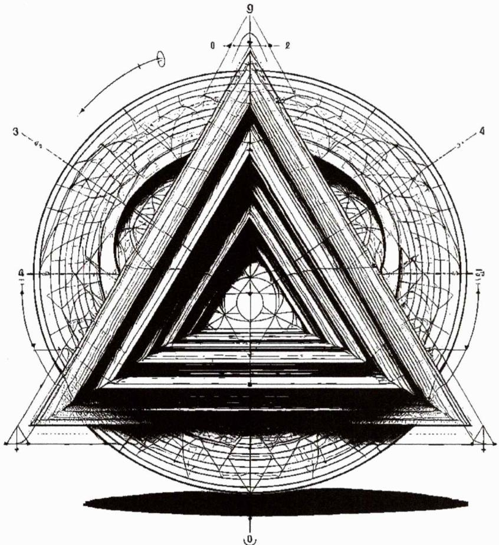

text_image

Optical diagram of a geometric structure with labeled components and angular measurements

方法原本◎源本方法

方法论系列

# 高中数学方法原本（第一卷）

# HIGH SCHOOL MATHEMATICS METHODS ORIGINALLY

本质、实用、极简、系统、深度、永恒

方法原本◎源本方法

编著 铭师道

# 前言

# ○数学是一种语言、无需修饰与解释

数学到底是什么，高中数学到底该怎么样地去学、去教？在过去数十年间，我一直在反问自己是否有资格谈论初等数学.

在我看来，数学就是数学，它是一种源自生活的、高度抽象概括化的朴素符号语言和基于已有理论和常识的推演逻辑的总和。在完成了《高数视角下的二次曲线论》和《高数视角下的导函数论》之后，我诚惶诚恐地想用《高中数学方法原本》这套书来阐释高中数学到底有什么，它们的底层逻辑又是什么。在对这套书做整体介绍之前我想用如下一句话来呈现我写《高中数学方法原本》的初衷。

# ○高中数学已不缺方法、我们需要的是系统的方法的方法论

写《高中数学方法原本》（以下简称《方法原本》）的前提是我坚定地认为现在的高中数学已不缺各种各样的方法或结论，随着传播途径的多元化及便捷化，所有群体都能轻松地、无需思考地触及到这些内容，也正因为此，反而给相当一部分读者带来了困惑：我们到底该学哪些方法、这些方法的背后逻辑及运用又是什么？此方法与彼方法有什么区别与关联？这些方法是否已是最简方法？它们又是否足够严谨？掌握这些方法对提升数学能力是否有帮助？

基于以上种种主观和客观现实，我写下了《方法原本》这套书。本书的定位就是用底层的逻辑、迭代的数学思想、极简的语言务实地探究高中数学不等式、函数、三角函数、向量、立体几何、解析几何、概率统计与导数等版块涉及的几乎所有务实方法及它们的运用与延展，用数学语言来说就是从 $0 \to 1 \to \infty \to 0$ 构建了一个如下左图所示的高中数学原生逻辑的方法体系：

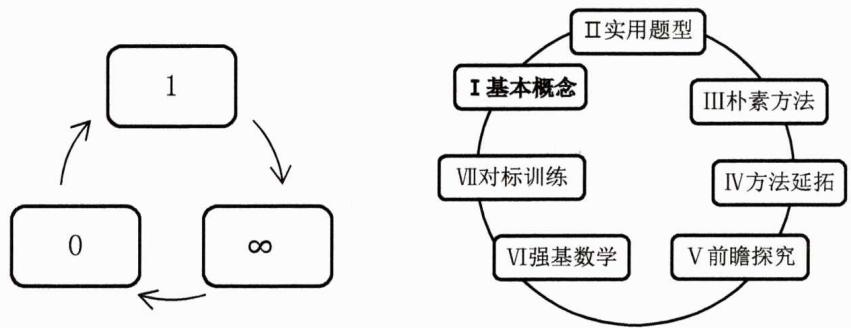

flowchart

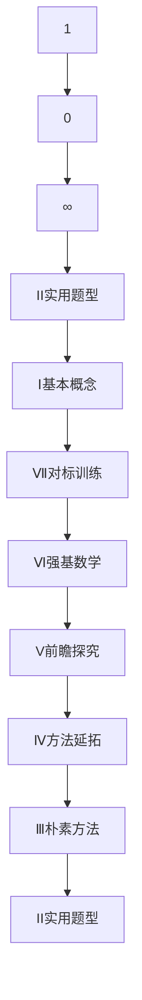

另一方面，本书的每一章、每一节都基于如上右图所示的逻辑来布局：全书的所有部分都会从基本概念出发，然后讲解基于基本概念的实用题型（以高考为导向），然后在解题过程中总结提炼出朴素的方法或数学思想，在此基础上再进行系列有机方法延拓（所有的延拓必须是层层递进的、相互关联的）及务实的前瞻性方法探究，而后我们为每一讲都匹配了对应的训练题，以使读者自检和强化学习效果，最后我们每一章都结束于强基版块——或者也可理解成用强基真题来检验我们前面的数学方法或思想。

通过上述 7 个维度我希望此套书能够成为高中数学原生的、成体系的、实用的、全面的、有深度的高中数学方法有机集合体——此谓方法原本；而所有这些方法我希望它们都是底层的、极简的、可被简洁证明的、有思想的、彼此关联的，以实现这些数学方法是朴素本真且原生的——此谓源本方法——让方法回归数学本身.

# ○方法原本、治愈数学

本套书共分三卷、十二章、八十五大节（大专题）.其中《方法原本》（第一卷）共四章，其对应高中数学中的不等式、函数、三角函数和解三角形版块；《方法原本》（第二卷）共四章，其对应高中数学中的向量、复数、立体几何和数列版块；《高中数学方法原本》（第三卷）共四章，其对应高中数学中的直线与圆、圆锥曲线、导数和概率统计版块.

<table><tr><td></td><td colspan="12">《高中数学方法原本》</td></tr><tr><td>卷</td><td colspan="4">第一卷</td><td colspan="4">第二卷</td><td colspan="4">第三卷</td></tr><tr><td>高中数学知识版块</td><td>不等式</td><td>函数</td><td>三角函数</td><td>解三角形</td><td>向量</td><td>复数</td><td>立体几何</td><td>数列</td><td>直线与圆</td><td>圆锥曲线</td><td>导数</td><td>概率统计</td></tr><tr><td>大专题数</td><td>10</td><td>8</td><td>8</td><td>10</td><td>8</td><td>3</td><td>6</td><td>7</td><td>5</td><td>8</td><td>8</td><td>4</td></tr><tr><td>总专题数</td><td colspan="4">本卷共36个大专题</td><td colspan="4">本卷共24个大专题</td><td colspan="4">本卷共25个大专题</td></tr></table>

本书第一卷第一章是《不等式系统方法论》，我们用了十个专题从基本不等式渐近探究到正反向 Cauchy 不等式，再到排序不等式及 Jensen 不等式，在 Jensen 不等式的基础上我们又系统探究了幂平均不等式，学习了幂平均不等式之后我们就会发现高中阶段接触的大多数经典不等式都是特殊的幂平均不等式，并且利用该不等式我们可从底层理解非常多竞赛或强基试题的命题之源；第一卷第二章是《函数系统方法论》，在系统探究了函数的四大性质及其运用之后，我们将重点聚焦在高斯函数及数值分析下的切比雪夫最佳逼近上，我们将用数形结合的方式从距离开始探究最佳逼近的原理及其实际运用；第一卷第三章是《三角函数系统方法论》，在该章我们除了系统三角函数所有传统知识、题型对应的方法之外，还会对三角换元法进行系统探究；第一卷第四章是《解三角形系统方法论》，在本章一开始我们将基于《几何原本》中的底层理论引出三角形的系列基本定理，然后我们将探究三角形的面积、最值等问题，在此之后我们会用非常多的篇幅探究三角形中的八大经典几何定理及三角形中的恒等式与嵌入不等式群，而后我们还会探究基于四边形的婆罗摩笈多公式域（并深度剖析了婆罗摩笈多公式与托勒密定理间的内在关联）。

本书第二卷第五章是《向量系统方法论》，我们用了八个专题核心探究了向量回路法、赛瓦标数法、向量等和线与极化恒等式、向量内积方法论、向量最值方法论等，而后我们又成体系地探究了基于面积比定理下的三角形五心性质及衍生定理，并自然而然地运用前述理论对欧拉线、九点圆等进行了基本探究；本书第二卷第六章是《复数系统方法论》，我们主要探究了复数的本质功能及欧拉公式下的恒等式；第二卷第七章是《立体几何系统方法论》，我们用祖暅原理为切入点探究了系列求体积的方法，以三角形外接圆为切入点升维探究了立体几何外接球半径的求法，以三正弦定理、三余弦定理、三面角第一余弦定理为切入点从九个维度系统探究了求二面角的方法，而后我们又在原生构建向量积（叉乘）知识体系的基础上探究了空间法向量的求法及其运用，之后我们从三个不同的维度探究了空间中求最值的方法，最后我们又探究了强基中立体几何的命题特点与解题之道；第二卷的第八章是《数列系统方法论》，在本章的一开始我们用迭代的逻辑探究了数列（特别是周期数列）的本质，而后我们基于迭代思想分别探究了等差、差比数列的性质及其运用，之后我们分别探究了求数列通项的十一个维度和求和的七个维度，并简洁地介绍了阿贝尔变换在求和中的运用，在强基部分我们对斐波那契数列的性质进行了全面的探究。

本书第三卷第九章是《直线与圆系统方法论》，我们在一开始用向量视角对直线进行了非常底层的探究，并基于向量视角探究了直线的参数方程及其运用。而后我们基于《高数视角下的二次曲线论》对阿波罗尼奥斯圆进行了全面深入的探究，此后我们又从八个维度对圆进行了剖析；第三卷第十章是《圆锥曲线方法论》，我们分别从解析几何视角、韦达定理视角、参数方程视角、极点极线视角、不联立视角、仿射变换视角对圆锥曲线进行了深入务实的探究，在参数方程版块我们原生构建了实变参数方程知识体系；第三卷第十一章是《导数方法论》，该章知识点源自《高数视角下的导数函数论》一书，但我们进行了底层的逻辑重构和降维论述，重点侧重于实用性，在本章我们还从6个维度探究了导数证明的底层逻辑；第三卷最后一章是《概率与统计方法论》，我们以图形为主探究了排列组合的系列策略，用迭代的思想对概率问题（包括马尔可夫链）进行了探究，并从底层对贝叶斯公式进行了解读。此后我们基于高数中的《概率统计》对五

大概率分布模型进行了探究.

以上对本书的介绍是简单且片面的，我们只有后续通过对各版块的学习才能知悉本书全貌，通过上述介绍我们再来重复一下本书的主旨.

# ○方法原本、源本方法

本书诞生的根本前提是作者坚持认为高中数学已不缺方法，而是缺少系统探究方法的方法论——即从朴素的概念、定义及公理出发，探究同一知识源下的极简方法，该方法应当是其它一般方法、推论甚至是二级结论的源头。总之，我们坚持从高中数学中的不等式、函数、向量、立体几何、解析几何、概率统计、导数等版块的原始概念出发，探究基于这些概念的底层、通用之法。

另一方面，不等式、基本的数感、知识间的融会贯通及迭代的数学思想贯穿全书每一道题、每一个角落，作者坚信知识和方法只有彼此交叉、循环出现、以旧带新才能真正被有效的吸收，并且能够提升学生的数学能力.

# ○本质、实用、极简、系统、深度、永恒

接下来同二次曲线论及导函数论一样，我总结了以下几个关键词以便加深读者对本书的理解.

(i) 本质：我希望整套书探究的方法是朴素的、底层的，该方法应当是其它类似方法的源头之法；

(ii) 实用：既然我们探究的是高中数学原生的、本质的方法，那么这些方法必须是实用的，读者可以即刻使用的，其理应也必须能解决高中阶段特别是高考中的经典且常考的问题，当然它也必须能解决相当一部分强基中的问题（因为本质且实用的方法必须能触类旁通地解决各种难度的同类型问题）；

(iii) 极简: 因为本书首当其冲追求的是实用性问题, 故而其必须是极简的, 不能过于繁杂和理论化,故而我几乎在每个理论、方法的描述及证明上都有做权衡和平衡, 以在不失深度的前提下更好地被读者所接受;

(iv) 系统：既然我们探究的是高中数学诸多朴素之方法，其实用性、可延拓性注定比较强，故而我们只有通过全面系统的论述才能使读者朋友真正对朴素的底层之法有深刻的理解并且能够灵活自如地去理解它、运用它直至在此基础上研究它；

(v) 深度：本质的方法并不意味着它是简单的方法，实用的定位决定了本书必须对每一个知识点和方法一探到底——以因应不同类型和难度的题型；

(vi) 永恒：我希望书中的诸多方法和思想可以在读者群体中生根发芽，也希望有更多的读者朋友在此书理论和方法之上拓展延伸.

事实上，我深知无论我用何种关键词去总结此书，在读者的切身体会面前都将一文不值，唯愿此书不负过往、不负期待、不淹没于未来.

# ○鉴于现在、未来独立于过去

在概率与统计章节中我在讲解马尔可夫链时有对其进行如是解读：鉴于现在、未来独立于过去。这句话其实也是赠送给所有读者的，无论我们如何看待高中数学，今天之前的我们是个什么样的基础，我们都要坚信一点，未来独立于过去。愿《高中数学方法原本》可以让我们重新认识数学、重新定义高中数学、重新定义何谓方法，愿《高中数学方法原本》治愈我们每一个人的数学。

# ○但知数学者、必有我师焉

本人在过去十多年的教学特别是教研的基础上闭关半年有余写下了此书，但因工作量巨大且本人水平有限，本书初版难免会有一些纰漏甚至是错误，敬请读者谅解并指正，我会及时确认并修正.

另外，所有通过合规授权途径购买本套书籍的读者均可同我本人直接联系以获得用书指导及获赠本书配套视频，同时我们还有对应的师、生交流群，欢迎大家在第一时间加入以获得后续各种赠送的学术或学习资料.

铭师道

贰零贰肆年壹月捌日于武汉

# METHODS ORIGINALLY

高中数学方法原本（第一卷）

铭师道老师
亲自预约式指导

配套课程（铭师道老师亲授）

官方老师指导用书（高效学习快速提升）

铭师道老师实时直播（连线交流）

师、生交流互动群（高手云集）

配套习题更新信息

本书相关的辅助资料分享

text_image

Pixelated QR code image with black dots on white background, containing encoded data for scanning

高中数学《方法原本》正版配套

# 高中数学方法原本·目录

# ●第一卷

# 第一章：不等式系统方法论....1

# 第01讲：基本不等式的进阶探究....1

第01讲：高考对标训练 4

第01讲：对标答案 5

# 第02讲：不等式中的实用性“1”的代换 6

第02讲：高考对标训练 9

第02讲：对标答案 10

# 第 03 讲：不等式中的配凑方法聚合.....12

第03讲：高考对标训练 16

第03讲：对标答案 17

# 第 04 讲：均值不等式传统 7 维方法聚合..... 18

第 04 讲：高考对标训练....26

第04讲：对标答案 27

# 第 05 讲：Cauchy 不等式及反向 Cauchy 不等式 ..... 29

第 05 讲：高考对标训练 ..... 35

第05讲：对标答案 36

# 第 06 讲：正反向权方和不等式系统探究....38

第 06 讲：高考对标训练 ..... 42

第 06 讲：对标答案 ..... 43

# 第 07 讲：排序不等式及切比雪夫不等式....46

第07讲：高考对标训练 49

第 07 讲：对标答案 ..... 50

# 第 08 讲：对数糖水不等式及其运用....52

第 08 讲：高考对标训练....56

第08讲：对标答案 57

# 第 09 讲：琴生不等式下的幂平均不等式....59

第 09 讲：高考对标训练....67

第09讲：对标答案 68

# 第 10 讲：强基中的不等式特征探究....70

第 10 讲：高考对标训练....74

第10讲：对标答案 75

# 第二章：函数系统方法论....77

# 第01讲：不等式视角下的函数三要素 77

第01讲：高考对标训练 86

第01讲：对标答案 87

# 第02讲：绝对值函数方法论 89

第02讲：高考对标训练 97  
第02讲：对标答案 98

# 第03讲：单调性与奇偶性方法论 100

第03讲：高考对标训练 109  
第03讲：对标答案 111

# 第 04 讲：对称性方法论 …… 113

第04讲：高考对标训练 123  
第04讲：对标答案 124

# 第 05 讲：对称性下的周期性方法论……125

第 05 讲：高考对标训练....135  
第 05 讲：对标答案 ..... 136

# 第 06 讲：高斯函数系统方法论 …… 138

第 06 讲：高考对标训练....143  
第06讲：对标答案 144

# 第 07 讲：数值分析下的切比雪夫最佳逼近....146

第07讲：高考对标训练 156  
第07讲：对标答案 156

# 第08讲：强基中的函数 158

第08讲：高考对标训练 160  
第08讲：对标答案 161

# 第三章：三角函数系统方法论....163

# 第01讲：三角函数求值方法论 163

第01讲：高考对标训练 166  
第01讲：对标答案 167

# 第02讲：三角函数中的正切公式方法论 167

第02讲：高考对标训练 172  
第02讲：对标答案 172

# 第 03 讲：三角积与和差互化及整体思想……173

第03讲：高考对标训练 178  
第03讲：对标答案 178

# 第04讲：三倍角公式及其在求值中的关键作用....179

第04讲：高考对标训练 181  
第04讲：对标答案 182

# 第 05 讲：第二辅助角公式及三角最值方法论..... 183

第05讲：高考对标训练 188  
第05讲：对标答案 188

# 第 06 讲：三角函数图像与性质方法论 …… 190

第06讲：高考对标训练 197  
第 06 讲：对标答案 ..... 198

第07讲：三角换元系统方法论 200

第07讲：高考对标训练 207

第07讲：对标答案 208

第08讲：强基中的三角函数 209

第08讲：高考对标训练 210

第08讲：对标答案 211

# 第四章：解三角形系统方法论....213

第01讲：几何原本下的三角形基本定理 213

第01讲：高考对标训练 223

第01讲：对标答案 223

第02讲：三角形面积与拉格朗日恒等式....225

第02讲：高考对标训练 230

第02讲：对标答案 231

第 03 讲：求三角形最值问题底层方法溯源.....232

第03讲：高考对标训练 239

第03讲：对标答案 239

第04讲：三角形中的正切方法论 241

第04讲：高考对标训练 245

第04讲：对标答案 245

第 05 讲：三角形中的八大经典几何定理（1）……246

第05讲：高考对标训练 253

第05讲：对标答案 254

第06讲：三角形中的八大经典几何定理（2） 255

第06讲：高考对标训练 261

第06讲：对标答案 262

第07讲：三角形中的恒等式与琴生不等式 263

第07讲：高考对标训练 266

第07讲：对标答案 266

第 08 讲：三角形中的三角嵌入不等式群..... 267

第08讲：高考对标训练 273

第08讲：对标答案 273

第09讲：解四边形及婆罗摩笈多公式域 274

第 09 讲：高考对标训练....280

第09讲：对标答案 280

第10讲：强基中的解三角形 281

第10讲：高考对标训练 285

第10讲：对标答案 285

# ◎第二卷

# 第五章：向量系统方法论....1

# 第 01 讲：回路法及四边形中位线定理..... 1

第01讲：高考对标训练 8  
第01讲：对标答案 8

# 第02讲：三点共线及赛瓦标数法 9

第02讲：高考对标训练 19  
第02讲：对标答案 20

# 第03讲：等和线与极化恒等式 22

第03讲：高考对标训练 30  
第03讲：对标答案 30

# 第04讲：向量内积方法论 32

第04讲：高考对标训练 39  
第04讲：对标答案 40

# 第 05 讲：向量最值问题方法论及斜坐标系..... 42

第 05 讲：高考对标训练 ..... 52  
第05讲：对标答案 53

# 第06讲：面积比定理下的三角形五心（1） 56

第06讲：高考对标训练 62  
第06讲：对标答案 63

# 第07讲：欧拉圆系及奔驰定理下的向量五心（2） 64

第07讲：高考对标训练 73  
第07讲：对标答案 74

# 第08讲：强基中的向量 75

第08讲：高考对标训练 79  
第08讲：对标答案 80

# 第六章：复数系统方法论....81

# 第01讲：复数的本质功能 81

第01讲：高考对标训练 89  
第01讲：对标答案 90

# 第02讲：欧拉公式下的恒等式 91

第02讲：高考对标训练 95  
第02讲：对标答案 95

# 第03讲：强基中的复数 96

第03讲：高考对标训练 97  
第03讲：对标答案 97

# 第七章：立体几何系统方法论....99

# 第01讲：求体积系统方法论 99

第01讲：高考对标训练....111  
第01讲：对标答案 112

# 第02讲：求外接球半径方法论....114

第02讲：高考对标训练 128  
第02讲：对标答案 128

# 第03讲：线面角及二面角九维方法论 130

第03讲：高考对标训练 147  
第03讲：对标答案 149

# 第04讲：向量积与空间向量方法论 152

第04讲：高考对标训练 166  
第04讲：对标答案 167

# 第 05 讲：立体几何最值三阶方法论 …… 169

第05讲：高考对标训练 173  
第05讲：对标答案 175

# 第 06 讲：强基中的立体几何 …… 177

第 06 讲：高考对标训练....178  
第 06 讲：对标答案....179

# 第八章：数列系统方法论....181

# 第01讲：用迭代函数探究数列的本质 181

第01讲：高考对标训练 194  
第01讲：对标答案 194

# 第02讲：等差数列性质合辑 196

第02讲：高考对标训练 201  
第02讲：对标答案 202

# 第03讲：等比数列性质合辑 203

第03讲：高考对标训练 208  
第03讲：对标答案 209

# 第04讲：求通项十一维方法论 210

第04讲：高考对标训练 224  
第04讲：对标答案 225

# 第 05 讲：阿贝尔变换与七维求和方法论....227

第 05 讲：高考对标训练 ..... 237  
第 05 讲：对标答案 ..... 238

# 第 06 讲：数列放缩三维方法论 ..... 240

第06讲：高考对标训练....249  
第06讲：对标答案 249

# 第 07 讲：强基中的斐波那契数列 ..... 251

第07讲：高考对标训练 256  
第07讲：对标答案 257

# ◎第三卷

# 第九章：直线与圆系统方法论....1

# 第01讲：向量视角下的直线方法论....1

第01讲：高考对标训练 10  
第01讲：对标答案 11

# 第02讲：阿波罗尼奥斯圆方法论 12

第02讲：高考对标训练 19  
第02讲：对标答案 19

# 第03讲：圆的八维方法论（I） 21

第03讲：高考对标训练 28  
第03讲：对标答案 29

# 第04讲：圆的八维方法论（II） 31

第04讲：高考对标训练 38  
第04讲：对标答案 39

# 第05讲：强基中的直线与圆 41

第05讲：高考对标训练 44  
第05讲：对标答案 45

# 第十章：圆锥曲线方法论....47

# 第01讲：解析几何视角下的椭圆（I） 47

第01讲：高考对标训练 59  
第01讲：对标答案 61

# 第02讲：解析几何视角下的椭圆（II） 62

第02讲：高考对标训练 75  
第02讲：对标答案 75

# 第 03 讲：解析几何视角下的双曲线 ..... 77

第 03 讲：高考对标训练 ..... 92  
第03讲：对标答案 93

# 第 04 讲：解析几何视角下的抛物线 ..... 95

第04讲：高考对标训练 108  
第04讲：对标答案 109

# 第 05 讲：韦达定理视角下的圆锥曲线.....111

第 05 讲：·高考对标训练....122  
第05讲：对标答案 123

# 第 06 讲：参数方程视角下的圆锥曲线..... 125

第 06 讲：高考对标训练....136  
第06讲：对标答案 137

# 第 07 讲：极点极线视角下的圆锥曲线..... 139

第 07 讲：高考对标训练 ..... 150

第07讲：对标答案 151

# 第 08 讲：仿射变换及强基中的圆锥曲线.....154

第08讲：高考对标训练 157

第08讲：对标答案 157

# 第十一章：导数方法论....159

# 第 01 讲：导数的根基及其几何意义探究..... 159

第01讲：高考对标训练 168

第01讲：对标答案 168

# 第02讲：凹凸性及拐点相关理论的应用 170

第02讲：高考对标训练 182

第02讲：对标答案 183

# 第03讲：极值点偏移方法论 186

第03讲：高考对标训练 201

第03讲：对标答案 202

# 第04讲：泰勒展开式及逆向拆项证明法 204

第04讲：高考对标训练 214

第04讲：对标答案 215

# 第 05 讲：有理逼近下的帕德逼近及其运用 ..... 217

第05讲：高考对标训练 224

第 05 讲：对标答案 ..... 225

# 第 06 讲：同构思想与预判式找点策略.....226

第06讲：高考对标训练 237

第06讲：对标答案 238

# 第07讲：导数中的6维底层证明逻辑 240

第07讲：高考对标训练 246

第07讲：对标答案 247

# 第08讲：Jordan函数与强基中的导数 249

第08讲：高考对标训练 253

第08讲：对标答案 253

# 第十二章：概率与统计方法论....255

# 第01讲：图论排列组合策略 255

第01讲：高考对标训练 266

第01讲：对标答案 267

# 第02讲：数论概率及贝叶斯公式的本质探究 269

第02讲：高考对标训练 278

第02讲：对标答案 279

# 第03讲：5大概率分布模型探究与统计案例 281

第03讲：高考对标训练 289

第03讲：对标答案 290

# 第 04 讲：勒让德公式及强基中的概率与统计.....291

第04讲：高考对标训练 295

第04讲：对标答案 296

# 第一章：不等式系统方法论

众所周知，古希腊数学家如欧几里得和毕达格拉斯对线段和三角形关系的研究，为不等式理论奠定了基础。进入17世纪，法国数学家拉穆尔（Gustave-Adolphe Hirn，1851\~1917，代数学奠基人之一）首次引入了不等符号“≤”和“≥”。而在18—19世纪，不等式理论得到了突破性的发展，数学家拉格朗日和欧拉都对其进行了深入的研究，而微积分的发展则推动了我们对不等式更深刻的理解（例如柯西——施瓦茨不等式）。在现代，线性代数、函数分析和凸分析等领域的发展使得不等式理论更为完善、抽象和广泛。

在高中阶段, 不等式首次出现在人教 A 版教材《必修第一册》第二章中, 它是整个高中数学特别是高考数学的基础性、工具性知识点和必考点, 我们必须能够熟练掌握并运用它.

本书将以不等式为基础深度探究不等式本身及其在函数、向量、数列、导数甚至是概率版块的灵活运用——因而本书是以不等式为基础性的通法和主线来铺开的。在本章我们将以先易后难、循序渐进的方式对不等式展开系统、全面且有深度的研究，力图使每位读者都能构建出以不等式为根基的高中数学思维及解题逻辑。

# 第 01 讲：基本不等式的进阶探究

结论1.1: 基础不等式 $\forall a, b \in \mathbb{R}, a^2 + b^2 \geq 2ab$ （仅当 $a = b$ 时取等）.

推论1.1: 广义基础不等式 $\forall a, b \in \mathbb{R}, a^2 + b^2 \geq 2|ab|$ 或 $a^2 + b^2 \geq -2ab$ .

例1. 已知实数 $a, b, c$ 满足 $a^{2} + b^{2} + c^{2} = 5$ ，则 $6ab - 8bc + 7c^{2}$ 的最大值为 \_\_\_\_.

解析：显而易见的是

$$
6 a b - 8 b c + 7 c ^ {2} \leq (9 a ^ {2} + b ^ {2}) + (8 b ^ {2} + 2 c ^ {2}) + 7 c ^ {2} = 9 (a ^ {2} + b ^ {2} + c ^ {2}) = 4 5
$$

当且仅当 $b = 3a$ 、 $c = -2b$ 即 $a^2 = \frac{5}{46}$ 、 $b^{2} = \frac{45}{46}$ 、 $c^2 = \frac{180}{46}$ 时上式取等，故而目标函数最大值为45.

推论1.2: 基础不等式的变形 在 $x^{2}+y^{2}\geq2xy$ 的基础上，我们可得如下推论

(i) 若 $x > 0$ ，则有 $\frac{y^2}{x} \geq 2y - x$ （同理，若 $y > 0$ ，则有 $\frac{x^2}{y} \geq 2x - y$ ）；  
(ii) 若 x > 0，则有 $\frac{y^{2}}{x} \geq y - \frac{x}{4}$ ;  
(iii) 若 $x > 0$ ，则有 $\frac{x}{y^2} \geq \frac{2}{y} - \frac{1}{x}$ .

说明：上述三个推论的证明都是不言而喻的，推论经简单变形后都会变为 $x^{2}+y^{2}\geq2xy$ .

结论1.2: 均值不等式 任意两个正实数的算术平均数不小于其几何平均数，即

$$
\forall a, b \in \mathbb {R} ^ {*}, \frac {a + b}{2} \geq \sqrt {a b} (\text { 仅当 } a = b \text { 时取等 })
$$

说明：均值不等式的核心三要义是：一正、二定、三相等，后两要义是解题的核心和关键。另外 $a = 0$ 或 $b = 0$ 时均值不等式仍有意义，只是我们很少去讨论它。

几何证明：下图即为经典的“赵爽图”，其是由四个全等的两直角边为 $a, b$ 的直角三角形依序构成的精致图形，显然空白的正方形的面积为 $(a - b)^2$ ，而外面大的正方形的面积则等于四个全等三角形的面积与空白正方形的面积和，即有

$$
a ^ {2} + b ^ {2} = (a - b) ^ {2} + 4 \cdot \frac {1}{2} a b = (a - b) ^ {2} + 2 a b \geq 2 a b
$$

当且仅当 $a = b$ 时上式取等.再令 $a^2 = x, b^2 = y$ ，则有 $x + y \geq 2\sqrt{xy}$ ，即有 $\frac{x + y}{2} \geq \sqrt{xy}$ ，从而得证！

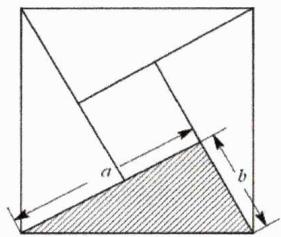

text_image

Geometric diagram showing a square divided into triangles and a shaded region, with labeled dimensions a and b.

铭师道·高中数学方法原本

说明：当然我们还可如教材一般先构造一个圆，再利用半径不小于直径上的高来证明.

推论1.3: 若 $ab \geq 0$ ，则有以下不等式

$$
a b \leq \left(\frac {a + b}{2}\right) ^ {2} \leq \frac {a ^ {2} + b ^ {2}}{2} (\text {当且仅当} a = b \text {时取等})
$$

例2. 已知a>0，b>0，则 $y=\frac{a^{2}+b^{2}+ab+1}{a+b}$ 的最小值是\_\_\_\_。

解析：显而易见的是

$$
\begin{array}{l} y = \frac {a ^ {2} + b ^ {2} + a b + 1}{a + b} = \frac {(a + b) ^ {2} - a b + 1}{a + b} \geq \frac {(a + b) ^ {2} - \left(\frac {a + b}{2}\right) ^ {2} + 1}{a + b} \\ = \frac {\frac {3}{4} (a + b) ^ {2} + 1}{a + b} \\ \geq \frac {2 \sqrt {\frac {3}{4} (a + b) ^ {2} \cdot 1}}{a + b} \\ = \sqrt {3} \\ \end{array}
$$

当且仅当 $a=b=\frac{\sqrt{3}}{3}$ 时上式取等.

例3. [2023 高中数联赛 T4] 若平面上非零向量 $\vec{\alpha}, \vec{\beta}, \vec{\gamma}$ 满足 $\vec{\alpha} \perp \vec{\beta}, \vec{\beta} \cdot \vec{\gamma} = 2 |\vec{\alpha}|, \vec{\gamma} \cdot \vec{\alpha} = 3 |\vec{\beta}|$ ，则 $|\vec{\gamma}|$ 的最小值为 \_\_\_\_.

解析：因为 $\vec{\alpha} \perp \vec{\beta}$ ，故而可设 $\vec{\alpha} = (a,0)$ ， $\vec{\beta} = (0,b)$ （其中 $a,b > 0$ ），再设 $\vec{\gamma} = (x,y)$ ，则有

$$
\left\{ \begin{array}{l} b y = 2 a \\ a x = 3 b \end{array} \right. \Longrightarrow \left\{ \begin{array}{l} y = \frac {2 a}{b} \\ x = \frac {3 b}{a} \end{array} \right.
$$

进而可得

$$
| \vec {\gamma} | = \sqrt {x ^ {2} + y ^ {2}} = \sqrt {\left(\frac {2 a}{b}\right) ^ {2} + \left(\frac {3 b}{a}\right) ^ {2}} \geq \sqrt {1 2} = 2 \sqrt {3}
$$

当且仅当 $\sqrt{2} a = b\sqrt{3}$ 即 $x = y = \sqrt{6}$ 时上式取等，故而 $|\vec{\gamma}|$ 的最小值为 $2\sqrt{3}$ .

推论1.4: 广义均值不等式 任意 $n$ 个正实数的算术平均数不小于其几何平均数, 即

$\forall a_{i}\in\mathbb{R}^{*},\quad\frac{a_{1}+a_{2}+\cdots+a_{n}}{n}\geq\sqrt{a_{1}\cdot a_{2}\cdot\cdots\cdot a_{n}}$ （仅当各元相等时取等）

例4. [2013 山东理 12]设正实数x,y,z满足 $x^{2}-3xy+4y^{2}-z=0$ ，则当 $\frac{xy}{z}$ 取得最大值时， $\frac{2}{x}+\frac{1}{y}-\frac{2}{z}$ 的最大值是()

A.0

B.1

C. $\frac{3}{4}$

D.9

解析：由已知可得 $z=x^{2}-3xy+4y^{2}$ ，则有

$$
{\frac {x y}{z}} = {\frac {x y}{x ^ {2} - 3 x y + 4 y ^ {2}}} = {\frac {1}{{\frac {x}{y}} + {\frac {4 y}{x}} - 3}} \leq {\frac {1}{2 {\sqrt {4}} - 3}} = 1
$$

当且仅当x=2y时上式取等，此时 $z=2y^{2}$ ，由此有

$$
\frac {2}{x} + \frac {1}{y} - \frac {2}{z} = \frac {2}{y} - \frac {2}{2 y ^ {2}} = \frac {2}{y} - \frac {1}{y ^ {2}} \leq 1
$$

故而此题选 B.

命题1.1: 均值中的取等 取等是均值不等式的关键所在, 有相当一部分经典的不等式题型 (特别是强基) 都在取等处 “做文章”.

例5. 已知 $0 < x < 2$ ，则 $y = 6x(4 - x^2)$ 的最大值为 \_\_\_\_.

解析：因为0<x<2，故而y>0.先整体平方再三元均值可得

$$
\begin{array}{l} y ^ {2} = 3 6 x ^ {2} (4 - x ^ {2}) ^ {2} \\ = 1 8 \cdot 2 x ^ {2} \cdot (4 - x ^ {2}) (4 - x ^ {2}) \\ \leq 1 8 \cdot \left[ \frac {2 x ^ {2} + (4 - x ^ {2}) + (4 - x ^ {2})}{3} \right] ^ {3} \\ = 1 8 \cdot \left(\frac {8}{3}\right) ^ {3} \\ \end{array}
$$

从而有 $y \leq \frac{32\sqrt{3}}{3}$ ，当且仅当 $x^{2} = \frac{4}{3}$ 时取等，故y的最大值为 $\frac{32\sqrt{3}}{3}$ .

例6. 已知正数 $x, y, z$ 满足 $x^{2} + y^{2} + z^{2} = 1$ ，则 $\frac{1 + z}{2xyz}$ 的最小值为（）

A.3

B. $\frac{3(\sqrt{3}+1)}{2}$

C.4

D. $2(\sqrt{2} + 1)$

解析：由 $x^{2}+y^{2}+z^{2}=1$ 可得 $1+z=\frac{x^{2}+y^{2}}{1-z}>0$ ，从而有

$$
\frac {1 + z}{2 x y z} = \frac {x ^ {2} + y ^ {2}}{2 x y z (1 - z)} \geq \frac {2 x y}{2 x y z (1 - z)} = \frac {1}{z (1 - z)} \geq 4
$$

当且仅当 $z=\frac{1}{2}$ 且 $x=y=\frac{\sqrt{6}}{4}$ 时上式取等，从而本题选C.

例7. [2021 浙江 8]已知 $\alpha, \beta, \gamma$ 是互不相同的锐角，则在 $\sin \alpha \cos \beta, \sin \beta \cos \gamma, \sin \gamma \cos \alpha$ 三个值中，大于 $\frac{1}{2}$ 的个数的最大值是（）

A.0

B.1

C.2

D. 3

解析：由基本不等式易知 $\sin \alpha \cos \beta \leq \frac{\sin^2\alpha + \cos^2\beta}{2}$ ，同理

$$
\sin \beta \cos \gamma \leq \frac {\sin^ {2} \beta + \cos^ {2} \gamma}{2}, \sin \gamma \cos \alpha \leq \frac {\sin^ {2} \gamma + \cos^ {2} \alpha}{2}
$$

以上三个不等式相加可得

$$
\sin \alpha \cos \beta + \sin \beta \cos \gamma + \sin \gamma \cos \alpha \leq \frac {3}{2}
$$

故 $\sin\alpha\cos\beta,\sin\beta\cos\gamma,\sin\gamma\cos\alpha$ 不可能均大于 $\frac{1}{2}$ .接下来不妨取 $\alpha=\frac{\pi}{6},\quad\beta=\frac{\pi}{3},\quad\gamma=\frac{\pi}{4}$ ，则有

$$
\sin \alpha \cos \beta = \frac {1}{4} <   \frac {1}{2}, \quad \sin \beta \cos \gamma = \frac {\sqrt {6}}{4} > \frac {1}{2}, \quad \sin \gamma \cos \alpha = \frac {\sqrt {6}}{4} > \frac {1}{2}
$$

故以上三式中大于 $\frac{1}{2}$ 的个数的最大值为2，从而本题选C.

例8. [2018 中科大自招 T3] 设 $x > -\frac{1}{2}$ 时，则 $f(x) = x^{2} + x + \frac{4}{2x+1}$ 的最小值为 \_\_\_\_.

解析：显然有

$$
\begin{array}{l} x ^ {2} + x + \frac {4}{2 x + 1} = \left(x + \frac {1}{2}\right) ^ {2} + \frac {2}{x + \frac {1}{2}} - \frac {1}{4} = \underbrace {\left(x + \frac {1}{2}\right) ^ {2} + \frac {1}{x + \frac {1}{2}} + \frac {1}{x + \frac {1}{2}}} _ {\text {3项}} - \frac {1}{4} \\ \geq 3 \sqrt [ 3 ]{1} - \frac {1}{4} \\ = \frac {1 1}{4} \\ \end{array}
$$

当且仅当 $\left(x+\frac{1}{2}\right)^{3}=1$ 即 $x=\frac{1}{2}$ 时上式取等，因而目标函数最小值为 $\frac{11}{4}$ .

例9. [2012 加拿大 IMO 第 1 题] 已知 x, y, z 为正实数，证明：

$$
x ^ {2} + x y ^ {2} + x y z ^ {2} \geq 4 x y z - 4
$$

解析:

思路 $^{①}$ ：由二元均值不等式易知

$$
(x ^ {2} + 4) + x y ^ {2} + x y z ^ {2} \geq (4 x + x y ^ {2}) + x y z ^ {2}
$$

$$
\geq 4 x y + x y z ^ {2}
$$

$$
= x y \left(4 + z ^ {2}\right)
$$

$$
\geq 4 x y z
$$

思路 $^{②}$ ：利用分拆思想且配方后易得

铭师道·高中数学方法原本

$$
\begin{array}{l} x ^ {2} + x y ^ {2} + x y z ^ {2} - 4 x y z + 4 = (x y z ^ {2} - 4 x y z + 4 x y) + (x y ^ {2} - 4 x y + 4 x) + (x ^ {2} - 4 x + 4) \\ = x y (z - 2) ^ {2} + x (y - 2) ^ {2} + (x - 2) ^ {2} \\ \geq 0 \\ \end{array}
$$

思路 $^{③}$ ：先拆项再由八元均值不等式可得

$$
\begin{array}{l} x ^ {2} + x y ^ {2} + x y z ^ {2} + 4 = \underbrace {x ^ {2} + \frac {x y ^ {2}}{2} + \frac {x y ^ {2}}{2} + \frac {x y z ^ {2}}{4} + \frac {x y z ^ {2}}{4} + \frac {x y z ^ {2}}{4} + \frac {x y z ^ {2}}{4} + 4} _ {\text {8项}} \\ \geq 8 \cdot \sqrt [ 8 ]{\frac {x ^ {8} y ^ {8} z ^ {8}}{2 ^ {8}}} \\ = 4 x y z \\ \end{array}
$$

以上三种思路（方法）取等条件相同，皆为当 $x = y = z = 2$ 时取等，证毕.

例10. 若正数a,b,c满足 $a+b+c=1$ ，则 $\frac{9}{3a+2}+\frac{9}{3b+2}+\frac{9}{3c+2}$ 的最小值为\_\_\_\_.

解析：此类问题利用权方和不等式（柯西不等式）可直接得到结果，但在这里我们可尝试用前述推论来证明，首先易知

$$
\left\{ \begin{array}{l} \frac {9}{3 a + 2} \geq 6 - (3 a + 2) \\ \frac {9}{3 b + 2} \geq 6 - (3 b + 2) \\ \frac {9}{3 c + 2} \geq 6 - (3 c + 2) \end{array} \right.
$$

进而有

$$
\frac {9}{3 a + 2} + \frac {9}{3 b + 2} + \frac {9}{3 c + 2} \geq 1 8 - 3 (a + b + c) - 6 = 9
$$

当且仅当 $a = b = c = \frac{1}{3}$ 时上式取等，从而所求最小值为9.

例11. 若 $a, b$ 为实数，且 $1 \leq a \leq 3$ ， $2 \leq b \leq 4$ ，则 $\frac{a^3 + 4b}{ab^2}$ 的取值范围是 \_\_\_\_.

解析：首先有

$$
\frac {a ^ {3} + 4 b}{a b ^ {2}} = \frac {1}{b} \left(\frac {a ^ {2}}{b} + \frac {4}{a}\right) = \frac {1}{b} \left(\frac {a ^ {2}}{b} + \frac {2}{a} + \frac {2}{a}\right) \geq \frac {1}{b} \cdot 3 \sqrt [ 3 ]{\frac {a ^ {2}}{b} \cdot \frac {2}{a} \cdot \frac {2}{a}} = \frac {1}{b} \cdot 3 \sqrt [ 3 ]{\frac {4}{b}} \geq \frac {3}{4}
$$

显然仅当 $a^{3}=2b$ 且b=4也即a=2、b=4时上式取得最小值.然后我们再来探究目标函数最大值，易知

$$
a ^ {2} \cdot \left(\frac {1}{b}\right) ^ {2} + \frac {4}{a} \cdot \frac {1}{b} \leq \frac {a ^ {2}}{4} + \frac {2}{a} \leq \max \left\{\frac {9}{4} + \frac {2}{3}, \frac {1}{4} + 2 \right\} = \frac {3 5}{1 2}
$$

当且仅当 $a = 3$ 且 $b = 2$ 时上式取等.从而 $\frac{a^3 + 4b}{ab^2}$ 的取值范围是 $\left[\frac{3}{4},\frac{35}{12}\right]$ .

通过此题我们可得到如下一结论.

命题1.2: 上位分析论 无论在任何情况下, 合乎逻辑的分析皆是解决不等式问题的上位之法.

利用分析的思维任何读者皆可轻松解答如下一题.

例12. [2023 全国甲理 T14] 设 $x, y$ 满足约束条件 $\left\{ \begin{array}{l} -2x + 3y \leq 3 \\ 3x - 2y \leq 3 \\ x + y \geq 1 \end{array} \right.$ , 设 $z = 3x + 2y$ , 则 $z$ 的最大值为 \_\_\_\_.

解析：注意到 $z=3x+2y=\frac{12}{5}(-2x+3y)+\frac{13}{5}(3x-2y)$ ，故而有

$$
z _ {\max} = \frac {1 2}{5} (- 2 x + 3 y) _ {\max} + \frac {1 3}{5} (3 x - 2 y) _ {\max} = \frac {1 2}{5} \times 3 + \frac {1 3}{5} \times 3 = 1 5
$$

# 第 01 讲：高考对标训练

1. [2022 上海 T6]已知 $x - y \leq 0, x + y - 1 \geq 0$ , 则 $z = x + 2y$ 的最小值是 \_\_\_\_.

2. [2012 福建理 5]下列结论中正确的是( )

$$
\mathrm{A.lg} \left(x ^ {2} + \frac {1}{4}\right) > \lg x (x > 0)
$$

$$
\sin x + \frac {1}{\sin x} \geq 2 (x \neq k \pi , k \in \mathbb {Z})
$$

$$
\mathrm{C.} x ^ {2} + 1 \geq 2 | x | (x \in \mathbb {R})
$$

$$
\mathrm{D.} \frac {1}{x ^ {2} + 1} > 1 (x \in \mathbb {R})
$$

3. 已知 $x, y \in \mathbb{R}$ 且 $xy \neq 0$ ，则 $\left(x^2 + \frac{1}{y^2}\right) \cdot \left(\frac{1}{x^2} + 4y^2\right)$ 的最小值为 \_\_\_\_.

4. 设集合 $\left\{\frac{3}{a}+b\mid1\leq a\leq b\leq2\right\}$ 中的最大元素与最小元素分别为M,m，则M-m的值为\_\_\_\_.

5. 已知a,b为正数， $4a^{2}+b^{2}=7$ ，则 $a\sqrt{1+b^{2}}$ 的最大值为\_\_\_\_。

6. 已知 $a^{2}+1=2b^{2}$ ，则 $|a-2b|$ 的最小值为 \_\_\_\_.

7. 若实数x,y满足xy>0，且 $x^{2}y=2$ ，则 $xy+x^{2}$ 的最小值是\_\_\_\_。

8. 若 $n \in N$ 且 $n \geq 2$ ，求证： $1 + \frac{1}{2} + \frac{1}{3} + \cdots + \frac{1}{n} \geq n\left(\sqrt[n]{n+1} - 1\right)$ .

9. [2013 新课标 II 24 第 2 问] 设 $a, b, c$ 均为正数，且 $a + b + c = 1$ ，证明： $\frac{a^2}{b} + \frac{b^2}{c} + \frac{c^2}{a} \geq 1$ .

10. [2022 全国乙理 23] 已知 $a, b, c$ 都是正数，且 $a^{\frac{3}{2}} + b^{\frac{3}{2}} + c^{\frac{3}{2}} = 1$ ，证明：

(1) $abc \leq \frac{1}{9};$

(2) $\frac{a}{b + c} + \frac{b}{a + c} + \frac{c}{a + b} \leq \frac{1}{2\sqrt{abc}}.$

11. [2020 全国Ⅲ文理 23] 设 $a, b, c \in \mathbb{R}$ , $a + b + c = 0$ , $abc = 1$ .

(1) 证明: $ab + bc + ca < 0$ ;

(2) 用 $\max\{a,b,c\}$ 表示a,b,c中的最大值，证明： $\max\{a,b,c\}\geq\sqrt[3]{4}.$

# 第 01 讲：对标答案

1. [解析]

遇到任何不等式我们理应优先考虑分析的策略，因为 $x - y \leq 0 \Rightarrow y - x \geq 0$ ，故而可得

$$
z = x + 2 y = \frac {3}{2} (x + y) + \frac {1}{2} (y - x) \geq \frac {3}{2}
$$

2. [解析]

由广义均值不等式知 $x^{2}+1\geq2|x|$ （ $x\in R$ ），从而选C.

3. [解析]

显然有 $\left(x^{2} + \frac{1}{y^{2}}\right) \cdot \left(\frac{1}{x^2} + 4y^{2}\right) = \frac{1}{x^2y^2} + 4x^2y^2 + 5 \geq 9$ ，当且仅当 $xy = \frac{\sqrt{2}}{2}$ 时前式取等.

4. [解析]

易分析知 $M=\frac{3}{1}+2=5$ ，而 $\frac{3}{a}+b\geq\frac{3}{a}+a\geq2\sqrt{3}=m$ ，当 $a=b=\sqrt{3}$ 时前式取等，故而可得

$$
M - m = 5 - 2 \sqrt {3}
$$

5. [解析]

由基本不等式知

$$
a \sqrt {1 + b ^ {2}} = \frac {1}{2} \cdot 2 a \sqrt {1 + b ^ {2}} \leq \frac {1}{2} \cdot \frac {4 a ^ {2} + b ^ {2} + 1}{2} = 2
$$

仅当仅当 $4a^{2}=b^{2}+1$ 时上式取等.故而所求目标函数最大值为2.

6. [解析]

因为 $2 \cdot 2ab \leq 2(a^{2} + b^{2})$ ，从而有

$$
\vert a - 2 b \vert^ {2} = a ^ {2} + 4 b ^ {2} - 4 a b \geq a ^ {2} + 4 b ^ {2} - 2 (a ^ {2} + b ^ {2}) = - a ^ {2} + 2 b ^ {2} = 1
$$

当且仅当a=b=1时上式取等，故而 $|a-2b|$ 的最小值为1.

铭师道·高中数学方法原本

# 7. [解析]

因为 $x^{2}y=2$ ，两边同除x得到 $xy=\frac{2}{x}$ ，则有

$$
x y + x ^ {2} = \frac {2}{x} + x ^ {2} = \frac {1}{x} + \frac {1}{x} + x ^ {2} \geq 3 \sqrt [ 3 ]{\frac {1}{x} \cdot \frac {1}{x} \cdot x ^ {2}} = 3
$$

当且仅当x=1时上式取等.

# 8. [解析]

显然有:

$$
\begin{array}{l} 1 + \frac {1}{2} + \frac {1}{3} + \dots + \frac {1}{n} + n = (1 + 1) + \left(\frac {1}{2} + 1\right) + \left(\frac {1}{3} + 1\right) + \dots + \left(\frac {1}{n} + 1\right) \\ = 2 + \frac {3}{2} + \frac {4}{3} + \dots + \frac {n + 1}{n} \\ > n \cdot \sqrt [ n ]{2 \cdot \frac {3}{2} \cdot \frac {4}{3} \cdot \dots \cdot \frac {n + 1}{n}} = n \sqrt [ n ]{n + 1} \\ \end{array}
$$

从而得证（因为取等条件不成立，从而只能是大于号而不是大于等于号）.

# 9. [解析]

由均值不等式可等价推导得 $\frac{a^{2}}{b}\geq2a-b,\quad\frac{b^{2}}{c}\geq2b-c,\quad\frac{c^{2}}{a}\geq2c-a$ ，三式相加得

$$
\frac {a ^ {2}}{b} + \frac {b ^ {2}}{c} + \frac {c ^ {2}}{a} \geq a + b + c = 1
$$

当且仅当a=b=c= $\frac{1}{3}$ 时上式取等，从而得证.

# 10. [解析]

第一问：由三元均值不等式可得

$$
1 = a ^ {\frac {3}{2}} + b ^ {\frac {3}{2}} + c ^ {\frac {3}{2}} \geq 3 \sqrt [ 3 ]{a ^ {\frac {3}{2}} b ^ {\frac {3}{2}} c ^ {\frac {3}{2}}} = 3 a ^ {\frac {1}{2}} b ^ {\frac {1}{2}} c ^ {\frac {1}{2}}
$$

从而有 $abc \leq \frac{1}{9}$ ，当且仅当a = b = c = $\sqrt[3]{\frac{1}{9}}$ 时上式取等，从而得证.

第二问：显然有

$$
\frac {a}{b + c} + \frac {b}{a + c} + \frac {c}{a + b} \leq \frac {a}{2 \sqrt {b c}} + \frac {b}{2 \sqrt {a c}} + \frac {c}{2 \sqrt {a b}} = \frac {a ^ {\frac {3}{2}} + b ^ {\frac {3}{2}} + c ^ {\frac {3}{2}}}{2 \sqrt {a b c}} = \frac {1}{2 \sqrt {a b c}}
$$

取等条件同第一问，从而得证.

# 11. [解析]

第一问：显然有

$$
(a + b + c) ^ {2} = a ^ {2} + b ^ {2} + c ^ {2} + 2 (a b + b c + c a) = 0
$$

因为 $abc = 1$ ，则有 $a, b, c \neq 0$ ，从而必有 $ab + bc + ca < 0$ .

第二问：因为 $abc = 1$ ，由第一问知 $a, b, c$ 必须两负一正，不妨设 $a > 0$ ， $b, c < 0$ . 则有

$$
b c \leq \left(\frac {- b - c}{2}\right) ^ {2} = \frac {1}{4} a ^ {2}
$$

则有

$$
1 = a b c \leq \frac {1}{4} a ^ {3}
$$

解得 $a \geq \sqrt[3]{4}$ ，从而有 $\max\{a, b, c\} = a \geq \sqrt[3]{4}$ ，证毕.

# 第 02 讲：不等式中的实用性 “1” 的代换

使用基本不等式求最值时, 最重要的是要出现 “定值”, 而实现 “定值” 的手段非常多, 其中有很多技巧性很强, 但最基本的依然是代换和拼凑. 在这个过程中, 有一种广义的通行方法叫 “1” 的代换 (其实可以是任意一个非零数或式子) ——任何代数式乘以或除以 1 , 代数式结果不变, 甚至我们还可以加上 “1” 然后再减去 “1”, 总之我们要时刻保证是恒等的变换, 而变换的最终目的是为了出现定值, 进而求得最值.

结论2.1: 1 的恒等变换 为了出现定值, 我们常进行如下形式的 “1” 的恒等变换

$$
a = a \cdot 1 = a \cdot 1 ^ {2} = \frac {a}{1} = \frac {a}{\sin^ {2} x + \cos^ {2} x} = (a + 1) - 1 = \frac {1}{3} (a \cdot 3)
$$

其中a表示某一变量或某一多项式，而1既可以代表具体数字也可代表某一多项式.

说明：针对一些经典的题型，可能需要局部代换或多次代换。

例1. 已知 $x, y \in \mathbb{R}^*$ ，且满足 $x + y = 1$ ，则 $\frac{y}{x} + \frac{2}{xy}$ 的最小值为 \_\_\_\_.

解析：本题只需局部代换即可（代换时要略施小技—— $1=(x+y)^{2}$ ），具体操作如下：

$$
\frac {y}{x} + \frac {2}{x y} = \frac {y}{x} + \frac {2 (x + y) ^ {2}}{x y} = \frac {y}{x} + \frac {2 (x ^ {2} + 2 x y + y ^ {2})}{x y} = \frac {3 y}{x} + \frac {2 x}{y} + 4 \geq 2 \sqrt {3 \cdot 2} + 4 = 2 \sqrt {6} + 4
$$

当且仅当 $\frac{3y}{x}=\frac{2x}{y}$ 即 $\sqrt{2}x=\sqrt{3}y$ 时上式取等.

例2. 已知正实数 $a, b$ 满足 $\ln a + \ln b = \ln (a + 4b)$ , 则:

(i) $4a + b$ 的最小值是 \_\_\_\_；  
(ii) $\sqrt{\frac{4}{a}} + \sqrt{\frac{1}{b}}$ 的最大值是 \_\_\_\_.

解析：由已知条件可得 $ab=a+4b$ ，其等价于 $\frac{4}{a}+\frac{1}{b}=1$ ，因而有

$$
4 a + b = (4 a + b) \left(\frac {4}{a} + \frac {1}{b}\right) = \frac {4 a}{b} + \frac {4 b}{a} + 1 7 \geq 2 \sqrt {1 6} + 1 7 = 2 5
$$

当且仅当a=b=5时上式取等.继而有

$$
\sqrt {\frac {4}{a}} + \sqrt {\frac {1}{b}} \leq \sqrt {2 \left(\frac {4}{a} + \frac {1}{b}\right)} = \sqrt {2}
$$

当且仅当a=8,b=2时上式取等.

例3. 已知正数 $x, y$ 满足 $x^{2} + 4y^{2} + x + 2y \leq 2 - 4xy$ ，则 $\frac{1}{x} + \frac{1}{y}$ 的最小值为 \_\_\_\_.

解析：对已知进行变形可得

$$
x ^ {2} + 4 x y + 4 y ^ {2} + x + 2 y - 2 \leq 0 \Rightarrow (x + 2 y) ^ {2} + (x + 2 y) - 2 \leq 0
$$

解不等可得 $-2 \leq x + 2y \leq 1$ ，又因 $x, y$ 均为正数，则有 $0 < x + 2y \leq 1$ ，从而有

$$
\frac {1}{x} + \frac {1}{y} \geq \frac {x + 2 y}{x} + \frac {x + 2 y}{y} = \frac {2 y}{x} + \frac {x}{y} + 3 \geq 2 \sqrt {2} + 3
$$

当且仅当 $x=\sqrt{2}y$ 时上式取等，综上目标函数最小值为 $2\sqrt{2}+3$ .

结论2.2: 若已知条件是诸如 $\alpha x + \beta y = \gamma xy (xy \neq 0)$ 的形态，我们往往可进行如下变形

$$
\frac {\alpha}{y} + \frac {\beta}{x} = \gamma
$$

说明：当 $\gamma=1$ 时，我们还可对已知条件进行因式分解.

例4. 已知正实数 $a, b$ 满足 $a + 2b = 2$ , 则 $\frac{1 + 4a + 3b}{ab}$ 的最小值为

解析：首先利用 $a+2b=2$ 可得

$$
\frac {1 + 4 a + 3 b}{a b} = \frac {a + 2 b + 8 a + 6 b}{2 a b} = \frac {9}{2 b} + \frac {4}{a}
$$

再利用 $\frac{1}{2}(a+2b)=1$ 可得

$$
\frac {9}{2 b} + \frac {4}{a} = \frac {1}{2} \left(\frac {9}{2 b} + \frac {4}{a}\right) (a + 2 b) = \frac {1}{2} \left(\frac {9 a}{2 b} + \frac {8 b}{a} + 1 3\right) \geq \frac {1}{2} (1 2 + 1 3) = \frac {2 5}{2}
$$

故而目标函数最小值为 $\frac{25}{2}$ ，当且仅当3a=4b即 $a=\frac{4}{5}$ 且 $b=\frac{3}{5}$ 时上式取等.

例5. [2013 天津理 14] 设 $a + b = 2, b > 0$ , 当 $a =$ \_\_\_\_时, $\frac{1}{2|a|} + \frac{|a|}{b}$ 取得最小值.

解析：因为 $a+b=2$ ，故而有 $\frac{1}{2}(a+b)=1$ ，进而有

铭师道·高中数学方法原本

$$
\frac {1}{2 | a |} + \frac {| a |}{b} = \frac {a + b}{4 | a |} + \frac {| a |}{b} = \left(\frac {b}{4 | a |} + \frac {| a |}{b}\right) + \frac {a}{4 | a |} \geq 2 \sqrt {\frac {1}{4}} + \frac {a}{4 | a |} = 1 + \frac {a}{4 | a |}
$$

欲使目标函数取得最小值，则必须有 $a < 0$ ，这时有 $1 + \frac{a}{4|a|} = 1 - \frac{1}{4} = \frac{3}{4}$ 且有 $b = -2a$ ，进而可得 $a = -2$ .

例6. 已知 $a, b \in (0,1)$ , 且 $ab = \frac{1}{4}$ , 则 $\frac{1}{1-a} + \frac{2}{1-b}$ 的最小值为 \_\_\_\_.

解析：因为 $4ab = 1$ ，则有

$$
\frac {1}{1 - a} + \frac {2}{1 - b} = \frac {4 a b}{4 a b - a} + \frac {2}{1 - b} = \frac {4 b}{4 b - 1} + \frac {2}{1 - b} = \left(\frac {1}{4 b - 1} + \frac {8}{4 - 4 b}\right) + 1
$$

再利用 $1 = \frac{1}{3} [(4b - 1) + (4 - 4b)]$ 可得

$$
\begin{array}{l} \left(\frac {1}{4 b - 1} + \frac {8}{4 - 4 b}\right) + 1 = \frac {1}{3} \left(\frac {1}{4 b - 1} + \frac {8}{4 - 4 b}\right) [ (4 b - 1) + (4 - 4 b) ] + 1 \\ = \frac {1}{3} \left[ \frac {4 - 4 b}{4 b - 1} + \frac {8 (4 b - 1)}{4 - 4 b} + 9 \right] + 1 \\ \geq \frac {1}{3} (2 \sqrt {8} + 9) + 1 \\ = 4 + \frac {4}{3} \sqrt {2} \\ \end{array}
$$

显然当且仅当 $4 - 4b = 2\sqrt{2} (4b - 1)$ 时上式取等，故而目标函数的最小值为 $4 + \frac{4\sqrt{2}}{3}$ .

例7. 已知 $a, b, c$ 为正数，且满足 $a + b + c = 1$ ，证明： $ac + bc + ab - abc \leq \frac{8}{27}$ .

解析：本题实质上考察的是因式分解，易知

$$
\begin{array}{l} a c + b c + a b - a b c = c (a + b - a b) + a b = (1 - a - b) (a + b - a b) + a b \\ = (1 - a - b) (a + b) + a b (a + b) \\ = (a + b) (1 - a - b + a b) \\ = (1 - c) (1 - a) (1 - b) \\ \leq \left[ \frac {3 - (a + b + c)}{3} \right] ^ {3} \\ = \left(\frac {2}{3}\right) ^ {3} \\ \end{array}
$$

当且仅当 $a = b = c = \frac{1}{3}$ 时等号成立，从而得证！

结论2.3: 因式分解法 因式分解是不等式中对已知条件的最基本、高频的处理策略之一.

推论2.1: 除掌握诸如立方和（差）公式、三项完全平方公式等系列经典的公式外，在不等式中我们需熟练掌握以下公式

$$
a b + x a + y b = 0 \Longrightarrow (a + y) (b + x) = x y
$$

说明：在《高秒》一书中我们对分解因式的方法及运用进行了非常详细的的探究.

例8. 若正数a, b满足 $\frac{1}{a}+\frac{1}{b}=1$ ，则 $\frac{4}{a-1}+\frac{16}{b-1}$ 的最小值为\_\_\_\_.

解析：因为 $\frac{1}{a} +\frac{1}{b} = 1$ ，则有 $ab - a - b = 0$ ，因式分解可得

$$
(a - 1) (b - 1) = 1
$$

由条件易知a,b>1，则有

$$
\frac {4}{a - 1} + \frac {1 6}{b - 1} \geq 2 \sqrt {\frac {6 4}{(a - 1) (b - 1)}} = 1 6
$$

当且仅当 $b-1=4(a-1)$ 即 $a=\frac{3}{2}$ 且b=3时上式取等.

例9. [2006 重庆理 10] 若 a, b, c > 0 且 $a(a + b + c) + bc = 4 - 2\sqrt{3}$ ，则 $2a + b + c$ 的最小值为 \_\_\_\_.

解析：显然有

$$
4 - 2 \sqrt {3} = a (a + b + c) + b c = (a + b) (a + c) = (\sqrt {3} - 1) ^ {2}
$$

从而有

$$
2 a + b + c = (a + b) + (a + c) \geq 2 \sqrt {(a + b) (a + c)} = 2 \sqrt {3} - 2
$$

当且仅当 $a+b=a+c$ 即b=c时上式取等.

例10. 已知 $P(x,y)$ 为曲线 $\frac{x^{2}}{16}+\frac{y^{2}}{12}=1$ 在第一象限的点，则 $\frac{x}{4-x}+\frac{3y}{6-y}$ 的最小值为 \_\_\_\_.

解析：针对本题我们可进行如下试探

$$
\frac {x}{4 - x} + \frac {3 y}{6 - y} = \frac {x ^ {2}}{(4 - x) x} + \frac {3 y ^ {2}}{(6 - y) y} \geq \frac {x ^ {2}}{4} + \frac {y ^ {2}}{3} = 4 \left(\frac {x ^ {2}}{1 6} + \frac {y ^ {2}}{1 2}\right) = 4
$$

当且仅当x=2且y=3时上式取等，故而目标函数的最小值为4.

例11. 已知椭圆 $\Gamma: \frac{x^{2}}{a^{2}} + \frac{y^{2}}{b^{2}} = 1 (a > b > 0)$ 的短轴长为 2，直线 $n$ 的横、纵截距分别为 $a, -1$ ，且原点到直线 $n$ 的距离为 $\frac{\sqrt{3}}{2}$ .

(1) 求椭圆 $\Gamma$ 的方程;  
(2) 若直线 $\ell$ 经过椭圆的右焦点 $F_{2}$ 且与椭圆 $\Gamma$ 交于 $A, B$ 两点，若椭圆 $\Gamma$ 上存在一点 $C$ 满足 $\overrightarrow{OA} + \sqrt{3OB} - 2\overrightarrow{OC} = \overrightarrow{0}$ ，求直线 $\ell$ 的方程.

解析：

第一问：由题易知 $a \cdot 1 = \frac{\sqrt{3}}{2} \cdot \sqrt{a^2 + 1^2}$ ，解得 $a = \sqrt{3}$ ，又易知 $b = 1$ ，则 $\Gamma$ 的方程为 $\frac{x^2}{3} + y^2 = 1$ .

第二问: 设 $A, B, C$ 三点的坐标依次为 $(x_{1}, y_{1})$ , $(x_{2}, y_{2})$ , $(x_{3}, y_{3})$ , 则有 $\frac{x_{i}^{2}}{3} + y_{i}^{2} = 1$ (其中 $i = 1, 2, 3$ ), 因为 $\overrightarrow{OA} + \sqrt{3OB} - 2\overrightarrow{OC} = \overrightarrow{0}$ , 则有

$$
\left\{ \begin{array}{l} 2 x _ {3} = x _ {1} + \sqrt {3} x _ {2} \dots ① \\ 2 y _ {3} = y _ {1} + \sqrt {3} y _ {2} \dots ② \end{array} \right.
$$

由 $\frac{1}{3}①^{2}+②^{2}$ 可得

$$
4 \left(\frac {x _ {3} ^ {2}}{3} + y _ {3} ^ {2}\right) = \left(\frac {x _ {1} ^ {2}}{3} + y _ {1} ^ {2}\right) + 3 \left(\frac {x _ {2} ^ {2}}{3} + y _ {2} ^ {2}\right) + \left(\frac {2 \sqrt {3}}{3} x _ {1} x _ {2} + 2 \sqrt {3} y _ {1} y _ {2}\right)
$$

由 “1” 的代换知

$$
\frac {2 \sqrt {3}}{3} x _ {1} x _ {2} + 2 \sqrt {3} y _ {1} y _ {2} = 0 \text {即} x _ {1} x _ {2} + 3 y _ {1} y _ {2} = 0
$$

显然直线 $\ell$ 不与x轴重合，故而可反设直线 $\ell$ 的方程为 $x = ty + \sqrt{2}$ ，再来一次“1”的代换有

$$
\frac {x ^ {2}}{3} + y ^ {2} = \left(\frac {x - t y}{\sqrt {2}}\right) ^ {2}
$$

整理可得 $x^{2} - 6txy + (3t^{2} - 6)y^{2} = 0$ 即 $\left(\frac{x}{y}\right)^2 - 6t \cdot \frac{x}{y} + (3t^2 - 6) = 0$ ，由 $x_{1}x_{2} + 3y_{1}y_{2} = 0$ 知 $3t^{2} - 6 = -3$

解得 $t=\pm1$ ，则直线 $\ell$ 的方程为 $x\pm y-\sqrt{2}=0$ .

结论2.4: 椭圆中 “1” 的代换 在处理椭圆问题时要擅于利用 $\frac{x^{2}}{a^{2}} + \frac{y^{2}}{b^{2}} = 1$ 这一条件.

# 第 02 讲：高考对标训练

1. 已知 $x > 0, y > 0$ , $x + 2y = xy$ , 则 $x + y$ 的最小值为 \_\_\_\_.  
2. 已知直线MN过△ABC的重心G，且 $\overrightarrow{AM}=m\overrightarrow{AB}$ ， $\overrightarrow{AN}=n\overrightarrow{AC}$ （其中m>0,n>0），则 $m+2n$ 的最小值是\_\_\_\_.  
3. 已知实数x,y>0， $x+y=4$ ，则 $\frac{1}{4x}+\frac{x}{y}$ 的最小值是\_\_\_\_。  
4. [2020 天津 14]已知a>0,b>0，且ab=1，则 $\frac{1}{2a}+\frac{1}{2b}+\frac{8}{a+b}$ 的最小值为\_\_\_\_。

铭师道·高中数学方法原本

5. 已知 $x, y > 0$ ，且 $\frac{8}{x^2} + \frac{1}{y} = 1$ ，则 $x + y$ 的最大值为 \_\_\_\_.

6. [2019 天津理 13] 设 x > 0, y > 0, $x + 2y = 5$ ，则 $\frac{(x+1)(2y+1)}{\sqrt{xy}}$ 的最小值为 \_\_\_\_.

7. 已知实数x,y满足 $\frac{1}{x}+\frac{2}{y}=1$ ，则 $x(x-2)+y(y-4)$ 的最小值为\_\_\_\_.

8. 已知 $x > 0, y > 0$ , $x + 2y = 2$ , 则 $\frac{3x^2 + 5y^2 + 2x + 4y}{xy}$ 的最小值为 \_\_\_\_.

9. 设 $a > 0, b > 0$ , $a - 2b = 1$ , 则 $\frac{(a^2 + 4)(b^2 + 1)}{ab}$ 的最小值为 \_\_\_\_.

10. 已知正实数 $a, b$ 满足 $a + 2b = 1$ ，则 $\left(1 + \frac{1}{a}\right)\left(2 + \frac{1}{b}\right)$ 的最小值为 \_\_\_\_.

11. 已知 $a > 0, b > -1$ ，且 $a + b = 1$ ，则 $\frac{a^2 + 2}{a} + \frac{b^2}{b + 1}$ 的最小值为 \_\_\_\_.

12. 已知两正数x,y满足 $x+y=1$ ，则 $z=\left(x+\frac{1}{x}\right)\left(y+\frac{1}{y}\right)$ 的最小值为\_\_\_\_.

13. 已知 $\frac{x^2}{9} + \frac{y^2}{5} = 1$ ，则 $\frac{8}{4 - x} + \frac{25}{10 - 3y}$ 的最小值为 \_\_\_\_.

# 第02讲：对标答案

1. [解析]:

将已知两边同除 $xy$ 可得 $\frac{1}{y} + \frac{2}{x} = 1$ ，进而有：

$$
x + y = (x + y) \left(\frac {1}{y} + \frac {2}{x}\right) = \frac {x}{y} + \frac {2 y}{x} + 3 \geq 2 \sqrt {2} + 3
$$

当且仅当 $x=\sqrt{2}y$ 时上式取等.因而所求最小值为 $2\sqrt{2}+3$ .

2. [解析]:

如图所示, 显然有 $\frac{3}{2} \overrightarrow{AG} = \frac{1}{2} \left( \frac{1}{m} \overrightarrow{AM} + \frac{1}{n} \overrightarrow{AN} \right) \Longrightarrow \overrightarrow{AG} = \frac{1}{3m} \overrightarrow{AM} + \frac{1}{3n} \overrightarrow{AN}$ , 由三点共线定理知 $\frac{1}{3m} + \frac{1}{3n} = 1$ . 进而有 $m + 2n = \frac{1}{3}(m + 2n) \left( \frac{1}{m} + \frac{1}{n} \right) \geq \frac{1}{3} (\sqrt{1} + \sqrt{2})^2 = 1 + \frac{2\sqrt{2}}{3}$ , 当且仅当 $\frac{n}{m} = \frac{\sqrt{2}}{2}$ 时前式取等.

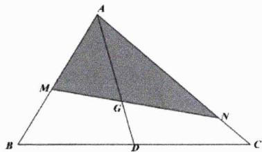

text_image

A
M
G
N
B
D
C

3. [解析]:

因为 $x+y=4$ ，则有 $\frac{1}{4}(x+y)=1$ ，从而有

$$
\frac {1}{4 x} + \frac {x}{y} = \frac {1}{4 x} \cdot \frac {1}{4} (x + y) + \frac {x}{y} = \frac {y}{1 6 x} + \frac {x}{y} + \frac {1}{1 6} \geq 2 \sqrt {\frac {1}{1 6}} + \frac {1}{1 6} = \frac {9}{1 6}
$$

当且仅当 $y=4x=\frac{16}{5}$ 时上式取等，故而所求最小值为 $\frac{9}{16}$ .

4. [解析]:

本题并不是把所有项都乘以 1，前两项通分可得

$$
\frac {1}{2 a} + \frac {1}{2 b} + \frac {8}{a + b} = \frac {a + b}{2} + \frac {8}{a + b} \geq 4
$$

当且仅当 $a+b=4$ 即 $a=2-\sqrt{3},b=2+\sqrt{3}$ （或 $a=2+\sqrt{3},b=2-\sqrt{3}$ ）时上式取等.

5. [解析]:

显然有 $x+y=x\left(\frac{8}{x^{2}}+\frac{1}{y}\right)+y=\frac{8}{x}+\frac{x}{y}+y\geq3\sqrt[3]{8}=6$ ，当且仅当x=4且y=2时取等.

# 6. [解析]:

针对本题只需对目标函数直接展开再局部替换即可，显然有：

$$
\frac {(x + 1) (2 y + 1)}{\sqrt {x y}} = \frac {2 x y + x + 2 y + 1}{\sqrt {x y}} = \frac {2 x y + 6}{\sqrt {x y}} = 2 \sqrt {x y} + \frac {6}{\sqrt {x y}} \geq 4 \sqrt {3}
$$

当且仅当xy=3时取等.

# 7. [解析]:

因为 $\frac{1}{x} +\frac{2}{y} = 1$ ，则有 $(x - 1)(y - 2) = 2$ ，进而有

$$
x (x - 2) + y (y - 4) = (x - 1) ^ {2} + (y - 2) ^ {2} - 5 \geq 2 (x - 1) (y - 2) - 5 = - 1
$$

当且仅当x-1=y-2即 $y=x+1$ 时取等，从而所求最小值为-1.

# 8. [解析]:

由题可得 $2x+4y=2(x+2y)=2^{2}=x^{2}+4xy+4y^{2}$ ，从而有：

$$
\frac {3 x ^ {2} + 5 y ^ {2} + 2 x + 4 y}{x y} = \frac {4 x ^ {2} + 9 y ^ {2} + 4 x y}{x y} = \frac {4 x}{y} + \frac {9 y}{x} + 4 \geq 2 \sqrt {4 \times 9} + 4 = 1 6
$$

当且仅当 $\frac{4x}{y}=\frac{9y}{x}$ 即2x=3y即 $x=\frac{6}{7}$ 且 $y=\frac{4}{7}$ 时上式取等.

# 9. [解析]:

对 $a - 2b = 1$ 平方得 $a^2 - 4ab + 4b^2 = 1$ ，则 $a^2 + 4b^2 = 1 + 4ab$ ，进而有

$$
\begin{array}{l} \frac {(a ^ {2} + 4) (b ^ {2} + 1)}{a b} = \frac {a ^ {2} b ^ {2} + a ^ {2} + 4 b ^ {2} + 4}{a b} = \frac {a ^ {2} b ^ {2} + 4 a b + 5}{a b} = a b + \frac {5}{a b} + 4 \\ \geq 4 + 2 \sqrt {5} \\ \end{array}
$$

当且仅当 $ab = b(1 + 2b) = \sqrt{5}$ 即 $2b^{2} + b - \sqrt{5} = 0$ 即 $b = \frac{-1 + \sqrt{1 + 8\sqrt{5}}}{4}$ 时上式取等.

# 10. [解析]:

本题依然只需要局部进行1的代换即可，显然有

$$
\mathrm{LHS} = \left(1 + \frac {a + 2 b}{a}\right) \left(2 + \frac {a + 2 b}{b}\right) = 2 \left(1 + \frac {b}{a}\right) \left(4 + \frac {a}{b}\right) = 2 \left(\frac {4 b}{a} + \frac {a}{b} + 5\right) \geq 2 (2 \sqrt {4} + 5) = 1 8
$$

当且仅当 $a=2b=\frac{1}{2}$ 时取等.从而所求最小值为18.

# 11. [解析]:

对本题可如下处理

$$
\frac {a ^ {2} + 2}{a} + \frac {b ^ {2}}{b + 1} = a + \frac {2}{a} + \frac {(b - 1) (b + 1) + 1}{b + 1} = a + \frac {2}{a} + \frac {1}{b + 1} + b - 1 = \frac {2}{a} + \frac {1}{b + 1}
$$

由权方和不等式可得 $\frac{2}{a} +\frac{1}{b + 1}\geq \frac{\left(\sqrt{2} + 1\right)^2}{a + b + 1} = \frac{2\sqrt{2} + 3}{2}$ 当且仅当 $a = \sqrt{2} (b + 1)$ 即 $a = 4 - 2\sqrt{2}$ 时取等.

# 12. [解析]:

根据目标函数的特征，可先展开再代换

$$
z = \left(x + \frac {1}{x}\right) \left(y + \frac {1}{y}\right) = \left(x y + \frac {1}{x y}\right) + \left(\frac {y}{x} + \frac {x}{y}\right) = \left(x y + \frac {1}{x y}\right) + \frac {(x + y) ^ {2} - 2 x y}{x y} = \left(x y + \frac {2}{x y}\right) - 2
$$

而 $1 = x + y \geq 2\sqrt{xy}$ ，则有 $xy \leq \frac{1}{4}$ ，进而可得 $\left(xy + \frac{2}{xy}\right) - 2 \geq \frac{25}{4}$ ，当且仅当 $x = y = \frac{1}{2}$ 时取等.

# 13. [解析]:

根据目标函数特征可进行如下拼凑

$$
\begin{array}{l} \frac {8}{4 - x} + \frac {2 5}{1 0 - 3 y} = \frac {2 (4 - x) + 2 x}{4 - x} + \frac {\frac {5}{2} (1 0 - 3 y) + \frac {1 5}{2} y}{1 0 - 3 y} = \frac {2 x}{4 - x} + \frac {\frac {1 5}{2} y}{1 0 - 3 y} + \frac {9}{2} \\ = \frac {2 x \cdot x}{(4 - x) \cdot x} + \frac {\frac {1 5}{2} y \cdot 3 y}{(1 0 - 3 y) \cdot 3 y} + \frac {9}{2} \\ \geq \frac {x ^ {2}}{2} + \frac {9 y ^ {2}}{1 0} + \frac {9}{2} \\ = \frac {9}{2} \left(\frac {x ^ {2}}{9} + \frac {y ^ {2}}{5}\right) + \frac {9}{2} \\ = 9 \\ \end{array}
$$

当且仅当 $x = 2, y = \frac{5}{3}$ 时上式取等，故而所求最小值为9.

铭师道·高中数学方法原本

# 第 03 讲：不等式中的配凑方法聚合

使用基本不等式时要出现 “定值”，我们需要进行多维度的技术性处理，但所有的这些手段都可以归纳成 “拆、添、凑配”，从另外一个角度来说配凑体现的是基本、最轻度的创造性的数学思维，不使用配凑的不等式是没有 “灵魂” 的.

例1. 已知正数 $a, b$ 满足 $5a^{2} + 4ab - b^{2} = 1$ , 则 $12a^{2} + 8ab - b^{2}$ 的最小值为

解析：注意到

$$
- 7 \left(5 a ^ {2} + 4 a b - b ^ {2}\right) + 3 \left(1 2 a ^ {2} + 8 a b - b ^ {2}\right) = (a - 2 b) ^ {2} \geq 0
$$

故而有

$$
1 2 a ^ {2} + 8 a b - b ^ {2} \geq \frac {7}{3}
$$

当且仅当 $a = 2b$ 时上式取等，故而 $12a^{2} + 8ab - b^{2}$ 的最小值为 $\frac{7}{3}$ .

例2. 函数 $f(x)=\frac{2x^{2}-2x+3}{x^{2}-x+1}$ 的值域是 \_\_\_\_.

解析：因为

$$
f (x) - \lambda = \frac {2 x ^ {2} - 2 x + 3}{x ^ {2} - x + 1} - \lambda = \frac {(2 - \lambda) x ^ {2} + (\lambda - 2) x + (3 - \lambda)}{x ^ {2} - x + 1}
$$

当 $\Delta = (\lambda - 2)^2 - 4(2 - \lambda)(3 - \lambda) = 0$ ，可得 $\lambda = 2$ 或 $\lambda = \frac{10}{3}$ ，故而有

$$
f (x) - 2 = \frac {1}{x ^ {2} - x + 1} > 0; f (x) - \frac {1 0}{3} = \frac {- \frac {4}{3} x ^ {2} + \frac {4}{3} x - \frac {1}{3}}{x ^ {2} - x + 1} = - \frac {1}{3} \frac {(2 x - 1) ^ {2}}{x ^ {2} - x + 1} \leq 0
$$

故而有 $f(x)$ 的值域是 $(2,\frac{10}{3}]$ .

通过以上例题我们可总结出如下结论.

结论3.1: 朴素的配方配凑法 有相当一部分经典的不等式题型其实最后都可回归到最朴素的配方配凑上来.

例3. 已知正数 ${abc}$ 满足 ${abc} = 1$ ,证明：

$$
\left(a + \frac {1}{a + 1}\right) \left(b + \frac {1}{b + 1}\right) \left(c + \frac {1}{c + 1}\right) \geq \frac {2 7}{8}
$$

解析：因为

$$
a + \frac {1}{a + 1} = \frac {a ^ {2} + a + 1}{a + 1} \geq \frac {\frac {3}{4} (a + 1) ^ {2}}{a + 1} = \frac {3}{4} (a + 1) \geq \frac {3}{4} \times 2 \sqrt {a} = \frac {3}{2} \sqrt {a}
$$

同理可得

$$
\left(a + \frac {1}{a + 1}\right) \left(b + \frac {1}{b + 1}\right) \left(c + \frac {1}{c + 1}\right) \geq \left(\frac {3}{2}\right) ^ {3} \sqrt {a b c} = \frac {2 7}{8}
$$

当且仅当a=b=c=1时上式取等，证毕.

例4. 设 $a, b, c$ 为正实数，求证： $a + b + c \leq \frac{a^3}{bc} + \frac{b^3}{ca} + \frac{c^3}{ab}$ .

解析：利用均值不等式可得

$$
\begin{array}{l} \frac {a ^ {3}}{b c} + \frac {b ^ {3}}{c a} + \frac {c ^ {3}}{a b} = \frac {1}{2} \left[ \left(\frac {a ^ {3}}{b c} + \frac {b ^ {3}}{c a}\right) + \left(\frac {b ^ {3}}{c a} + \frac {c ^ {3}}{a b}\right) + \left(\frac {c ^ {3}}{a b} + \frac {a ^ {3}}{b c}\right) \right] \\ \geq \frac {a b}{c} + \frac {b c}{a} + \frac {a c}{b} \\ = \frac {1}{2} \left[ \left(\frac {a b}{c} + \frac {a c}{b}\right) + \left(\frac {b c}{a} + \frac {a b}{c}\right) + \left(\frac {a c}{b} + \frac {b c}{a}\right) \right] \\ \geq a + b + c \\ \end{array}
$$

当且仅当a=b=c时上式取等.

结论3.2: 扩倍配凑法 为了使用均值不等式, 我们常进行以下最基本的扩倍操作

$$
a + b + c = \frac {1}{2} [ (a + b) + (a + c) + (b + c) ]
$$

例5. [2013 新课标 II 24] 设 $a, b, c$ 均为正数，且 $a + b + c = 1$ ，证明： $ab + bc + ca \leq \frac{1}{3}$ .

解析：因为 $1 = a + b + c$ ，则有

$$
1 ^ {2} = a ^ {2} + b ^ {2} + c ^ {2} + 2 (a b + b c + c a)
$$

而

$$
\begin{array}{l} a ^ {2} + b ^ {2} + c ^ {2} = \frac {1}{2} [ (a ^ {2} + b ^ {2}) + (a ^ {2} + c ^ {2}) + (b ^ {2} + c ^ {2}) ] \\ \geq \frac {1}{2} (2 a b + 2 b c + 2 c a) \\ = a b + b c + c a \\ \end{array}
$$

从而有

$$
1 = a ^ {2} + b ^ {2} + c ^ {2} + 2 (a b + b c + c a) \geq 3 (a b + b c + c a)
$$

当且仅当a=b=c时上式取等，从而得证！

推论3.1: $\forall a, b, c \in \mathbb{R}$ , 恒有

(i) $a^{2} + b^{2} + c^{2} \geq ab + bc + ca.$   
(ii) $(a + b + c)^{2} \geq 3(ab + bc + ca).$

当且仅当a=b=c时取等.

例6. [2010 四川理 T12]设a>b>c>0，则 $2a^{2}+\frac{1}{ab}+\frac{1}{a(a-b)}-10ac+25c^{2}$ 的最小值为\_\_\_\_.

解析：不难发现目标函数最后两项只需要分配一个 $a^{2}$ 便是一个完全平方式，且该完全平方式与前者无关，据此分析有

$$
\begin{array}{l} 2 a ^ {2} + \frac {1}{a b} + \frac {1}{a (a - b)} - 1 0 a c + 2 5 c ^ {2} = a ^ {2} + \frac {1}{a b} + \frac {1}{a (a - b)} + (a - 5 c) ^ {2} \\ \geq a ^ {2} + \frac {1}{a b} + \frac {1}{a (a - b)} \\ = a ^ {2} + a b - a b + \frac {1}{a b} + \frac {1}{a (a - b)} \\ = \left(a b + \frac {1}{a b}\right) + \left[ a (a - b) + \frac {1}{a (a - b)} \right] \\ \geq 4 \\ \end{array}
$$

当且仅当 $ab = 1$ 、 $a(a - b) = 1$ 且 $a = 5c$ 即 $a = \sqrt{2}$ 、 $b = \frac{\sqrt{2}}{2}$ 、 $c = \frac{\sqrt{2}}{5}$ 时上式取等.

例7. 已知 $x > y > 0, \frac{y^2}{x - y} + \frac{x^2}{y} + y - x = 4$ ，则 $x$ 的最大值为 \_\_\_\_.

解析：由题知

$$
x + 4 = \frac {y ^ {2}}{x - y} + \frac {x ^ {2}}{y} + y
$$

从而有

$$
2 x + 4 = \frac {y ^ {2}}{x - y} + \frac {x ^ {2}}{y} + y + x = \left[ \frac {y ^ {2}}{x - y} + (x - y) \right] + \left(\frac {x ^ {2}}{y} + 4 y\right) - 2 y \geq 4 x
$$

进而有 $x\leq2$ ，当且仅当x=2y时上式取等.故而x的最大值是2.

例8. 设 $x \in \left(0, \frac{\pi}{2}\right)$ ，则函数 $y = \frac{1}{\cos^{2}x} + \frac{2\sqrt{2}}{\sin x}$ 的最小值为 \_\_\_\_.

解析：简单拆添项有

$$
\begin{array}{l} y = \frac {1}{\cos^ {2} x} + 4 \cos^ {2} x + \frac {2 \sqrt {2}}{\sin x} + 4 \sin^ {2} x - 4 \\ = \left(\frac {1}{\cos^ {2} x} + 4 \cos^ {2} x\right) + \left(\frac {\sqrt {2}}{\sin x} + \frac {\sqrt {2}}{\sin x} + 4 \sin^ {2} x\right) - 4 \\ \geq 4 + 3 \sqrt [ 3 ]{8} - 4 \\ = 6 \\ \end{array}
$$

当且仅当 $\cos x = \sin x = \frac{\sqrt{2}}{2}$ 即 $x = \frac{\pi}{4}$ 时上式取等.从而所求最小值为6.

结论3.3: 拆添项配凑法 以上几道示例所使用的方法即为经典的拆添项配凑法.

铭师道·高中数学方法原本

例9. 已知 $\omega = \frac{x^2 + 2xy}{x^2 + y^2} (x > 0, y > 0)$ ，则 $\omega$ 的最大值为 \_\_\_\_.

解析：本题解法并不唯一，如使用判别式法或比值换元法均可快速求解，但在这里我们可尝试用配凑法来解答.易知

$$
\begin{array}{l} \omega = \frac {x ^ {2} + 2 x y}{x ^ {2} + y ^ {2}} = \frac {x ^ {2} + \frac {\sqrt {5} - 1}{2} \cdot 2 x \cdot \frac {\sqrt {5} + 1}{2} y}{x ^ {2} + y ^ {2}} \\ \leq \frac {x ^ {2} + \frac {\sqrt {5} - 1}{2} \left(x ^ {2} + \frac {\sqrt {5} + 3}{2} y ^ {2}\right)}{x ^ {2} + y ^ {2}} \\ = \frac {\frac {\sqrt {5} + 1}{2} \left(x ^ {2} + y ^ {2}\right)}{x ^ {2} + y ^ {2}} \\ = \frac {\sqrt {5} + 1}{2} \\ \end{array}
$$

当且仅当 $x=\frac{\sqrt{5}+1}{2}y$ 时等号成立，故而 $\omega$ 的最大值为 $\frac{\sqrt{5}+1}{2}$ .

结论3.4: 全局数感系数分配法 利用基本不等式解题时, 为了得到定值, 有些情况下我们需要进行如下恒等变形操作

$$
\begin{array}{c} a = \lambda a + (1 - \lambda) a \\ a b = \frac {1}{2 \lambda \mu} \cdot 2 (\lambda a \cdot \mu b) \\ \sqrt {a ^ {2} + b ^ {2}} = \sqrt {\sin^ {2} \alpha + \cos^ {2} \alpha} \cdot \sqrt {a ^ {2} + b ^ {2}} \\ a + b + c = (\lambda a + \mu b) + [ (1 - \lambda) a + \xi c ] + [ (1 - \mu) b + (1 - \xi) c ] \\ \dots \dots \end{array}
$$

然后在上述分配之后式子的基础上再进行均值. 显而易见的是我们必须站在全局的视角来分配系数，从而确保既能出现定值又能取等. 然而与待定系数法不同的是，我们对上述系数的分配主要靠多次试探与强大的数感（因为很多情况下为何那样分配是相对比较明显的）.

说明：系数分配法当然属于拆添项法.

例10. 设 $x$ 为正实数，则函数 $y = x^{2} - x + \frac{1}{x} (x > 0)$ 的最小值为 \_\_\_\_.

解析：针对此类题型求导是首选，但我们也可用添配的方式进行试探，因为

$$
y = x ^ {2} - x + \frac {1}{x} = (x - 1) ^ {2} + \left(x + \frac {1}{x}\right) - 1 \geq 0 + 2 - 1 = 1
$$

当且仅当x=1时上式取等.从而目标函数最小值是1.

例11. [2019 清华自招 T13]若正实数 $a, b$ 满足 $ab(a + 8b) = 20$ , 则 $a + 3b$ 的最小值为 \_\_\_\_.

解析：简单系数分配后有

$$
\begin{array}{l} 6 (a + 3 b) = (a + 8 b) + 5 a + 1 0 b \\ \geq 3 \cdot \sqrt [ 3 ]{5 a \cdot 1 0 b \cdot (a + 8 b)} \\ = 3 0 \\ \end{array}
$$

从而有 $a+3b\geq5$ ，当且仅当a=2b即a=2且b=1时上式取等.

例12. 已知x,y均为正数，则 $\frac{x+y}{2x^{2}+y^{2}+6}$ 的最大值为\_\_\_\_。

解析：简单系数分配后有

$$
\frac {x + y}{2 x ^ {2} + y ^ {2} + 6} = \frac {2 (x + y)}{(4 x ^ {2} + 4) + (2 y ^ {2} + 8)} \leq \frac {2 (x + y)}{8 x + 8 y} = \frac {1}{4}
$$

当且仅当x=1,y=2时上式取等.

例13. 已知x,y>0，则 $\frac{x+\sqrt{x^{2}+9y^{2}}}{2x+3y}$ 的最小值是\_\_\_\_。

解析：先进行系数配凑再由 Cauchy 不等式可得

$$
\frac {x + \sqrt {x ^ {2} + 9 y ^ {2}}}{2 x + 3 y} = \frac {x + \sqrt {\left(\frac {3}{5}\right) ^ {2} + \left(\frac {4}{5}\right) ^ {2}} \cdot \sqrt {x ^ {2} + 9 y ^ {2}}}{2 x + 3 y} \geq \frac {x + \left(\frac {3}{5} x + \frac {1 2}{5} y\right)}{2 x + 3 y} = \frac {4}{5}
$$

当且仅当4x = 3y时上式取等.

例14. 若正数a,b,c满足 $2a+5b+10c=abc$ ，则 $a+b+c$ 的最小值为\_\_\_\_。

解析：因为 $2a+5b+10c=abc$ ，从而有 $\frac{2}{bc}+\frac{5}{ac}+\frac{10}{ab}=1$ ，又因为

$$
\left\{ \begin{array}{l} \frac {1}{1 0} a + \frac {1}{8} b + \frac {1 0}{a b} \geq 3 \sqrt [ 3 ]{\frac {1}{1 0} a \cdot \frac {1}{8} b \cdot \frac {1 0}{a b}} = \frac {3}{2} \\ \frac {1}{1 5} a + \frac {1}{9} c + \frac {5}{a c} \geq 3 \sqrt [ 3 ]{\frac {1}{1 5} a \cdot \frac {1}{9} c \cdot \frac {5}{a c}} = 1 \\ \frac {1}{2 4} b + \frac {1}{1 8} c + \frac {2}{b c} \geq 3 \sqrt [ 3 ]{\frac {1}{2 4} b \cdot \frac {1}{1 8} c \cdot \frac {2}{b c}} = \frac {1}{2} \end{array} \right.
$$

从而有

$$
\frac {1}{6} (a + b + c) + \frac {2}{b c} + \frac {5}{a c} + \frac {1 0}{a b} = \frac {1}{6} (a + b + c) + 1 \geq 3
$$

进而有

$$
a + b + c \geq 1 2
$$

当且仅当a=5,b=4,c=3时上述不等式组同时取等，故而目标函数最小值是12.

例15. 已知 $a \in \left(0, \frac{1}{3}\right)$ ，则 $\frac{(a+1)^2}{a(1-3a)}$ 的最小值为 \_\_\_\_.

解析：要求目标函数的最小值，也即求其倒数的最大值，因为

$$
{\frac {a (1 - 3 a)}{(a + 1) ^ {2}}} = {\frac {a}{a + 1}} \cdot {\frac {1 - 3 a}{a + 1}} = {\frac {1}{4}} \cdot \left({\frac {4 a}{a + 1}} \cdot {\frac {1 - 3 a}{a + 1}}\right) \leq {\frac {1}{4}} \cdot \left({\frac {{\frac {4 a + 1 - 3 a}{a + 1}}}{2}}\right) ^ {2} = {\frac {1}{1 6}}
$$

当且仅当 $a=\frac{1}{7}$ 时上式取等.从而目标函数最小值为16.

说明：遇到此类题求导是一个不错的选择，但遗憾的是这类式子往往出现在圆锥曲线的最后环节，求导易错且耗时.

结论3.5: 倒数配凑法 如上例题所示，欲求某一目标函数的最小值，我们可利用均值不等式求其倒数的最大值.

例16. [2020 北京 19]已知函数 $f(x) = 12 - x^{2}$ .

(1) 求曲线 $y = f(x)$ 的斜率等于-2的切线的方程；

(2) 设曲线 $y = f(x)$ 在点 $(t, f(t))$ 处的切线与坐标轴围成的三角形的面积为 $S(t)$ ，求 $S(t)$ 的最小值解析：

第一问：经计算所求切线方程为 $y = -2x + 13$ .

第二问：易知曲线在点 $(t,f(t))$ 处的切线满足 $y-f(t)=f'(t)(x-t)$ ，经化简得

$$
y = - 2 t (x - t) + 1 2 - t ^ {2} = - 2 t x + t ^ {2} + 1 2
$$

从而有

$$
S (t) = \frac {1}{2} (t ^ {2} + 1 2) \cdot \frac {t ^ {2} + 1 2}{2 | t |} = \frac {1}{4} \frac {(t ^ {2} + 1 2) ^ {2}}{| t |} = \frac {1}{4} \frac {(t ^ {2} + 4 + 4 + 4) ^ {2}}{t} \geq \frac {1}{4} \frac {\left(4 \sqrt [ 4 ]{t ^ {2} \cdot 4 ^ {3}}\right) ^ {2}}{t} = 3 2
$$

当且仅当 $t^{2}=4$ 即 $|t|=2$ 时上式取等.综上 $S(t)$ 的最小值是32.

通过上一例题我们主要强调以下观点.

结论3.6: 均值对求导的替代 我们要擅于利用均值不等式而非一味靠（机械化的）求导来解决函数最值问题，而在这个过程中，几乎都需要先进行配凑之后才能使用均值.

铭师道·高中数学方法原本

例17. [2017 浙江 21]如图, 已知抛物线 $x^{2} = y$ , 点 $A \left(-\frac{1}{2}, \frac{1}{4}\right)$ , $B \left(\frac{3}{2}, \frac{9}{4}\right)$ , 抛物线上的点 $P(x, y) \left(-\frac{1}{2} < x < \frac{3}{2}\right)$ , 过点 $B$ 作直线 $AP$ 的垂线, 垂足为 $Q$ .

(1) 求直线AP斜率的取值范围;  
(2) 求 $|PA|\cdot|PQ|$ 的最大值.

解析：

第一问：显然有 $k_{AP}=\frac{x^{2}-\frac{1}{4}}{x+\frac{1}{2}}=x-\frac{1}{2}\in(-1,1)$ .

第二问：利用向量知识易得

$$
\begin{array}{l} | P A | \cdot | P Q | = - \overrightarrow {P A} \cdot \overrightarrow {P B} = - \left[ \left(x + \frac {1}{2}\right) \left(x - \frac {3}{2}\right) + \left(x ^ {2} - \frac {1}{4}\right) \left(x ^ {2} - \frac {9}{4}\right) \right] \\ = - \left(x + \frac {1}{2}\right) \left(x - \frac {3}{2}\right) \left[ 1 + \left(x - \frac {1}{2}\right) \left(x + \frac {3}{2}\right) \right] \\ = - \left(x + \frac {1}{2}\right) \left(x - \frac {3}{2}\right) \left(x + \frac {1}{2}\right) ^ {2} \\ = \frac {1}{3} \left(x + \frac {1}{2}\right) \left(x + \frac {1}{2}\right) \left(x + \frac {1}{2}\right) \left(\frac {9}{2} - 3 x\right) \\ \end{array}
$$

利用均值不等式可得

$$
| P A | \cdot | P Q | \leq \frac {1}{3} \left[ \frac {\left(x + \frac {1}{2}\right) + \left(x + \frac {1}{2}\right) + \left(x + \frac {1}{2}\right) + \left(\frac {9}{2} - 3 x\right)}{4} \right] ^ {4} = \frac {2 7}{1 6}
$$

当且仅当 $x+\frac{1}{2}=\frac{9}{2}-3x$ 即x=1时上式取等，从而 $|PA|\cdot|PQ|$ 的最大值为 $\frac{27}{16}$ .

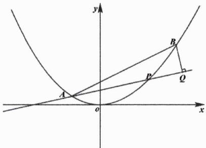

text_image

y
B
P
Q
A
o
x

最后我们对配凑法进行如下总结.

命题3.1: 不等式中的配凑观 对于一般不等式题型而言, 配凑视角及具体方法一定是多维的, 因题制宜方为上策, 但总的来说配凑无通法.

# 第 03 讲：高考对标训练

1. 已知 $x < \frac{5}{4}$ , 则 $y = x + \frac{1}{4x - 5}$ 的最大值为 \_\_\_\_.  
2. 已知 $a, b, c$ 均为正数，且 $a^2 + ab + ac + bc = 6 + 2\sqrt{5}$ ，则 $3a + 2b + c$ 的最小值为 \_\_\_\_.  
3. 设a>b>0，则 $a^{2}+\frac{1}{ab}+\frac{1}{a(a-b)}$ 的最小值是\_\_\_\_。  
4. 对任意的 $a, b, c \in \mathbb{R}^*$ ，代数式 $\frac{a^2 + b^2 + c^2}{ab + 2bc}$ 的最小值为 \_\_\_\_.  
5. 已知 $x > 0, y > 0$ , 若 $x + 4y + 2\sqrt{xy} \leq m(2x + 3y)$ 恒成立, 则 $m$ 的最小值是  
6. 已知正实数 $a, b$ 满足 $a > b$ ，且 $ab = \frac{1}{2}$ ，则 $\frac{4a^2 + b^2 + 1}{2a - b}$ 的最小值为 \_\_\_\_.  
7. 若实数a,b,c满足 $a^{2}+a^{2}+c^{2}=1$ ，则 $3ab-3bc+2c^{2}$ 的最大值为\_\_\_\_。

8. [2001 全国理 20]已知i,m,n是正整数，且 $1<i\leq m<n$ .

(1) 证明 $n^{i}P_{m}^{i}<m^{i}P_{n}^{i};$   
(2) 证明 $(1 + m)^{n} > (1 + n)^{m}$ .

# 第 03 讲：对标答案

# 1. [解析]:

简单配凑后有 $y = x + \frac{1}{4x - 5} = -\left[\frac{1}{4}(5 - 4x) + \frac{1}{5 - 4x}\right] + \frac{5}{4} \leq -2\sqrt{\frac{1}{4}} + \frac{5}{4} = \frac{1}{4}$ ，当且仅当 $5 - 4x = 2$ 即 $x = \frac{3}{4}$ 时取等，故而所求最大值为 $\frac{1}{4}$ .

# 2. [解析]:

条件可变形为 $(a+b)(a+c)=(\sqrt{5}+1)^{2}$ ，简单分拆后可得：

$$
3 a + 2 b + c = 2 (a + b) + (a + c) \geq 2 \sqrt {2 (a + b) \cdot (a + c)} = 2 (\sqrt {1 0} + \sqrt {2})
$$

当且仅当 $2(a+b)=a+c$ 即 $c=a+2b$ 时上式取等.

# 3. [解析]:

本题解法有多种，其中之一就是添项法，其过程如下：

$$
\begin{array}{l} a ^ {2} + \frac {1}{a b} + \frac {1}{a (a - b)} = a ^ {2} + a b - a b + \frac {1}{a b} + \frac {1}{a (a - b)} \\ = \left(a b + \frac {1}{a b}\right) + \left[ a (a - b) + \frac {1}{a (a - b)} \right] \\ \geq 4 \\ \end{array}
$$

当且仅当ab=1且 $a(a-b)=1$ 即 $a=\sqrt{2}$ 且 $b=\frac{\sqrt{2}}{2}$ 时取等.

# 4. [解析]:

利用系数分配法有

$$
\frac {a ^ {2} + b ^ {2} + c ^ {2}}{a b + 2 b c} = \frac {\left(a ^ {2} + \frac {1}{5} b ^ {2}\right) + \left(\frac {4}{5} b ^ {2} + c ^ {2}\right)}{a b + 2 b c} \geq \frac {\frac {2 \sqrt {5}}{5} a b + \frac {4 \sqrt {5}}{5} b c}{a b + 2 b c} \geq \frac {2 \sqrt {5}}{5}
$$

当且仅当 $a=\frac{\sqrt{5}b}{5}$ 且 $c=\frac{2\sqrt{5}b}{5}$ 时上式取等.

# 5. [解析]:

易知 $m\geq\frac{x+4y+2\sqrt{xy}}{2x+3y}$ ，简单系数分配后有

$$
\frac {x + 4 y + 2 \sqrt {x y}}{2 x + 3 y} = \frac {x + 4 y + 2 \sqrt {2 x \cdot \frac {1}{2} y}}{2 x + 3 y} \leq \frac {x + 4 y + \left(2 x + \frac {1}{2} y\right)}{2 x + 3 y} = \frac {3 x + \frac {9}{2} y}{2 x + 3 y} = \frac {3}{2}
$$

当且仅当 $2x=\frac{1}{2}y$ 即y=4x时取等，从而有m的最小值为 $\frac{3}{2}$ .

# 6. [解析]:

由题知 $2a - b > 0$ ，故而

$$
\frac {4 a ^ {2} + b ^ {2} + 1}{2 a - b} = \frac {4 a ^ {2} + b ^ {2} - 4 a b + 4 a b + 1}{2 a - b} = \frac {(2 a - b) ^ {2} + 3}{2 a - b} = (2 a - b) + \frac {3}{2 a - b} \geq 2 \sqrt {3}
$$

当且仅当 $2a-b=\sqrt{3}$ 时上式取等.故而目标函数最小值为 $2\sqrt{3}$ .

# 7. [解析]:

因为 $3ab \leq 3a^{2} + \frac{3}{4}b^{2}$ 且 $-3bc \leq \frac{9}{4}b^{2} + c^{2}$ ，从而有

$$
3 a b - 3 b c + 2 c ^ {2} \leq \left(3 a ^ {2} + \frac {3}{4} b ^ {2}\right) + \left(\frac {9}{4} b ^ {2} + c ^ {2}\right) + 2 c ^ {2} = 3 (a ^ {2} + a ^ {2} + c ^ {2}) = 3
$$

当且仅当 $a=\frac{1}{2}b=-\frac{1}{3}c$ 时上式取等.综上目标函数最大值为3.

# 8. [解析]:

第一问略.针对第二问可如下证明

$$
(1 + n) ^ {m} = \underbrace {(1 + n) (1 + n) \cdots (1 + n)} _ {m \text {个}} \cdot \underbrace {1 \cdots 1} _ {n - m \text {个}} <   \left[ \frac {m (1 + n) + n - m}{n} \right] ^ {n} = (1 + m) ^ {n}
$$

证明结束！（注意不能取等）

铭师道·高中数学方法原本

# 第 04 讲：均值不等式传统 7 维方法聚合

除前面几讲提及的方法外，本讲我们将继续系统探究与均值不等式相关的其它一些经典的方法，如分部放缩法、求谁留谁法、换元（代换）法、判别式法、轮换对称法、待定系数法、拉格朗日乘数法等.

例1. 已知 $a > 0, b > 0, c > 1$ ，且 $a + b = 1$ ，则 $\left(\frac{2a + b}{ab} - 3\right) \cdot c + \frac{\sqrt{2}}{c - 1}$ 的最小值为 \_\_\_\_.

解析：显而易见的是我们需要先对 $\frac{2a+b}{ab}$ 进行局部放缩，有

$$
\frac {2 a + b}{a b} = \frac {2}{b} + \frac {1}{a} = \left(\frac {2}{b} + \frac {1}{a}\right) (a + b) \geq (\sqrt {2} + 1) ^ {2} = 3 + 2 \sqrt {2}
$$

取等条件为 $\frac{b}{a} = \sqrt{2}$ 即 $a = \sqrt{2} - 1, b = 2 - \sqrt{2}$ . 进一步有

$$
\left(\frac {2 a + b}{a b} - 3\right) \cdot c + \frac {\sqrt {2}}{c - 1} \geq 2 \sqrt {2} c + \frac {\sqrt {2}}{c - 1} = 2 \sqrt {2} (c - 1) + \frac {\sqrt {2}}{c - 1} + 2 \sqrt {2} \geq 4 + 2 \sqrt {2}
$$

上式取等条件为 $c=\frac{\sqrt{2}}{2}+1$ .综上目标函数最小值为 $2\sqrt{2}+4$ .

例2. 已知正实数 $a, b, c$ 满足 $a + b = 1, c + d = 1$ , 则 $\frac{1}{abc} + \frac{1}{d}$ 的最小值为 \_\_\_\_.

解析：显而易见的是

$$
\frac {1}{a b c} + \frac {1}{d} \geq \frac {1}{\left(\frac {a + b}{2}\right) ^ {2} c} + \frac {1}{d} = \frac {4}{c} + \frac {1}{d} = \left(\frac {4}{c} + \frac {1}{d}\right) (c + d) \geq (\sqrt {4} + \sqrt {1}) ^ {2} = 9
$$

当且仅当 $a = b = \frac{1}{2}$ 且 $c = \frac{2}{3}, d = \frac{1}{3}$ 时上式取等，因而目标函数的最小值为9.

结论4.1: 分部（局部）放缩法 一般地，我们把以上放缩策略称为分部（局部）放缩法.

例3. 设a,b为正实数，且 $a+2b+\frac{1}{a}+\frac{2}{b}=\frac{13}{2}$ ，则 $\frac{1}{a}+\frac{2}{b}$ 的最大值和最小值之和为\_\_\_\_.

解析：本题要求的是 $\frac{1}{a} + \frac{2}{b}$ 的最值，根据求谁留谁的原则有

$$
\frac {1}{a} + \frac {2}{b} = \frac {1 3}{2} - (a + 2 b)
$$

两边再同乘 $\frac{1}{a} + \frac{2}{b}$ 后可得

$$
\left(\frac {1}{a} + \frac {2}{b}\right) ^ {2} = \frac {1 3}{2} \left(\frac {1}{a} + \frac {2}{b}\right) - \left(\frac {1}{a} + \frac {2}{b}\right) (a + 2 b)
$$

因为 $\left(\frac{1}{a}+\frac{2}{b}\right)(a+2b)=\frac{2b}{a}+\frac{2a}{b}+5\geq9$ ，从而有

$$
\left(\frac {1}{a} + \frac {2}{b}\right) ^ {2} \leq \frac {1 3}{2} \left(\frac {1}{a} + \frac {2}{b}\right) - 9
$$

解得 $2 \leq \frac{1}{a} + \frac{2}{b} \leq \frac{9}{2}$ ，从而目标函数最大值与最小值的和为 $\frac{13}{2}$ .

结论4.2: 求谁留谁法 一般地, 我们把求解上述例题的方法称为求谁留谁法.

例4. 已知 $x > 0, y > 0$ , $\frac{2}{y + 1} + \frac{x}{y - 1} = 0$ , 则 $\frac{1}{x} + \frac{2}{y}$ 的最小值为 \_\_\_\_.

解析：由条件知 $\frac{2}{y+1}=-\frac{x}{y-1}$ ，进而有 $\frac{1}{x}=\frac{1+y}{2(1-y)}$ ，同时知0<y<1，进而有

$$
\frac {1}{x} + \frac {2}{y} = \frac {1 + y}{2 (1 - y)} + \frac {2}{y} = - \frac {1}{2} + \frac {1}{1 - y} + \frac {2}{y} \geq - \frac {1}{2} + (\sqrt {2} + 1) ^ {2} = 2 \sqrt {2} + \frac {5}{2}
$$

当且仅当 $y=2-\sqrt{2}$ 时上式取等.

结论4.3: 换元（代换）法 在均值不等式中，我们把用一个（多个）变量表示另外一个（多个）变量的解题方法叫换元（代换）法.

例5. 已知 $a > b > 0$ ，且 $a + b = 2$ ，则 $\frac{3a - b}{a^2 + 2ab - 3b^2}$ 的最小值为 \_\_\_\_.

解析：因为 $a+b=2$ ，从而有b=2-a>0，且易分析知 $a\in(1,2)$ ，进而有

$$
\mathrm{LHS} = \frac {3 a - b}{a ^ {2} + 2 a b - 3 b ^ {2}} = \frac {2 a - 1}{- 2 (a ^ {2} - 4 a + 3)}
$$

令 $2a - 1 = t \in (1,3)$ ，则有

$$
\mathrm{LHS} = \frac {2 t}{- t ^ {2} + 6 t - 5} = \frac {2}{6 - \left(t + \frac {5}{t}\right)} \geq \frac {2}{6 - 2 \sqrt {5}} = \frac {\sqrt {5} + 3}{4}
$$

当且仅当 $t=\sqrt{5}$ 即 $a=\frac{\sqrt{5}+1}{2}$ 时上式等号成立.

例6. [2020 江苏 T12]已知 $5x^{2}y^{2} + y^{4} = 1 (x, y \in \mathbb{R})$ ，则 $x^{2} + y^{2}$ 的最小值是 \_\_\_\_.

解析：先换元，令 $x^{2}=a\geq0,\quad y^{2}=b\geq0$ ，则有 $5ab+b^{2}=1$ ，进而有

$$
1 = b (5 a + b) = \frac {1}{4} \cdot 4 b (5 a + b) \leq \frac {1}{4} \cdot \frac {(5 a + b + 4 b) ^ {2}}{4} = \frac {1}{4} \cdot \frac {2 5 (a + b) ^ {2}}{4}
$$

于是有 $a+b\geq\frac{4}{5}$ ，当且仅当 $a=\frac{3}{5}b$ 时上式取等.从而 $x^{2}+y^{2}$ 的最小值是 $\frac{4}{5}$ .

例7. 已知正实数 $x, y$ 满足 $x^{2} + xy - 2y^{2} = 1$ , 则 $5x - 2y$ 的最小值为 \_\_\_\_.

解析：由题知 $1 = (x + 2y)(x - y)$ ，若令 $\left\{ \begin{array}{l} x + 2y = a \\ x - y = b \end{array} \right.$ ，则有 $\left\{ \begin{array}{l} x = \frac{a + 2b}{3} \\ y = \frac{a - b}{3} \end{array} \right.$ 及 $ab = 1 (a, b > 0)$ ，进而有

$$
5 x - 2 y = \left(\frac {5}{3} a + \frac {1 0}{3} b\right) - \left(\frac {2}{3} a - \frac {2}{3} b\right) = a + 4 b \geq 4
$$

当且仅当a=4b即x=1、 $y=\frac{1}{2}$ 时上式取等.

例8. 已知 $a > 1, b > 2$ ，则 $\frac{(a + b)^2}{\sqrt{a^2 - 1} + \sqrt{b^2 - 4}}$ 的最小值是 \_\_\_\_.

解析：我们不妨先设 $\left\{\begin{aligned}\sqrt{a^{2}-1}&=m>0\\\sqrt{b^{2}-4}&=n>0\end{aligned}\right.$ ，则有 $a^{2}=m^{2}+1,\quad b^{2}=n^{2}+4$ ，进而有

$$
\mathrm{LHS} = \frac {m ^ {2} + n ^ {2} + 5 + 2 \sqrt {m ^ {2} n ^ {2} + 4 m ^ {2} + n ^ {2} + 4}}{m + n}
$$

因为 $4m^{2}+n^{2}\geq4mn$ ，从而有

$$
m ^ {2} n ^ {2} + 4 m ^ {2} + n ^ {2} + 4 \geq (m n + 2) ^ {2}
$$

进而有

$$
\mathrm{LHS} \geq \frac {m ^ {2} + n ^ {2} + 5 + 2 (m n + 2)}{m + n} = \frac {(m + n) ^ {2} + 9}{m + n} \geq \frac {6 (m + n)}{m + n} = 6
$$

取等条件为n=2m且 $m+n=3$ 即n=2m=2即 $a=\sqrt{2}$ 、 $b=2\sqrt{2}$ 。综上目标函数的最小值为6。

例9. 已知x,y为正实数，则 $\frac{4x}{4x+y}+\frac{y}{x+y}$ 的最大值为\_\_\_\_。

解析：令y = tx (t > 0)，则有

$$
\mathrm{LHS} = \frac {4}{4 + t} + \frac {t}{1 + t} = \frac {4}{4 + t} - \frac {1}{t + 1} + 1 = \frac {3 t}{t ^ {2} + 5 t + 4} + 1 = \frac {3}{t + \frac {4}{t} + 5} + 1 \leq \frac {3}{2 \sqrt {4} + 5} + 1 = \frac {4}{3}
$$

当且仅当t=2即y=2x时上式取等.

例10. [多选][2022 新高考 II 12]若实数 $x$ , $y$ 满足 $x^{2} + y^{2} - xy = 1$ , 则( )

$$
\mathrm{A.} x + y \leq 1
$$

$$
\mathrm{B.} x + y \geq - 2
$$

$$
\mathrm{C.} x ^ {2} + y ^ {2} \leq 2
$$

$$
\mathrm{D.} x ^ {2} + y ^ {2} \geq 1
$$

解析：令 $x=a+b$ ，y=a-b，则已知等价于 $a^{2}+3b^{2}=1$ ，则有 $a\in[-1,1]$ ， $b^{2}\in\left[0,\frac{1}{3}\right]$ ，从而有

$$
x + y = 2 a \in [ - 2, 2 ]
$$

同时有

$$
x ^ {2} + y ^ {2} = 2 (a ^ {2} + b ^ {2}) = 2 (1 - 2 b ^ {2}) \in \left[ \frac {2}{3}, 2 \right]
$$

综上本题选 BC.

命题4.1: 对称化设量法 我们把在上一例题中所用的换元方法称为对称化设量法.

例11. 已知 $a$ 、 $b$ 、 $c > 0$ 且 $a + b + c = 1$ ，求证： $ab + bc + ca - 2abc \leq \frac{7}{27}$ .

铭师道·高中数学方法原本

解析：不妨设 $a \geq b \geq c > 0$ ，因为 $a + b + c = 1$ ，故而可采用对称化设量法，设

$$
a + b = \frac {2}{3} + t, c = \frac {1}{3} - t (\text {其中} 0 \leq t <   \frac {1}{3})
$$

从而有

$$
\begin{array}{l} a b + b c + c a - 2 a b c = (a + b) c + a b (1 - 2 c) = \left(\frac {2}{3} + t\right) \left(\frac {1}{3} - t\right) + a b \left(\frac {1}{3} + 2 t\right) \\ \leq \left(\frac {2}{3} + t\right) \left(\frac {1}{3} - t\right) + \left(\frac {a + b}{2}\right) ^ {2} \left(\frac {1}{3} + 2 t\right) \\ = \left(\frac {2}{3} + t\right) \left(\frac {1}{3} - t\right) + \frac {1}{4} \left(\frac {2}{3} + t\right) ^ {2} \left(\frac {1}{3} + 2 t\right) \\ = \frac {7}{2 7} + \frac {1}{2} t ^ {2} \left(t - \frac {1}{2}\right) \\ \leq \frac {7}{2 7} \\ \end{array}
$$

当且仅当 $a = b = c = \frac{1}{3}$ 时上式取等，从而得证.

例12. 已知 $a > b, b > c, c > 0$ ，证明：

$$
\sqrt {(a + c) (b + c)} + \sqrt {(a - c) (b - c)} \leq 2 \sqrt {a b}
$$

解析：针对本例题显然可直接平方再作差来证明，注意到不等式两边是齐次的故而我们可以考虑用三角换元来证明，因为 $a > b > c > 0$ ，故而可设 $\frac{c}{a} = \cos \beta, \frac{c}{b} = \cos \gamma$ ，其中 $\beta, \gamma \in (0, \frac{\pi}{2})$ ，则有

$$
\begin{array}{l} \frac {\sqrt {(a + c) (b + c)} + \sqrt {(a - c) (b - c)}}{\sqrt {a b}} = \sqrt {(1 + \cos \beta) (1 + \cos \gamma)} + \sqrt {(1 - \cos \beta) (1 - \cos \gamma)} \\ = 2 \left(\cos \frac {\beta}{2} \cos \frac {\gamma}{2} + \sin \frac {\beta}{2} \sin \frac {\gamma}{2}\right) \\ = 2 \cos \frac {\beta - \gamma}{2} \\ \leq 2 \\ \end{array}
$$

当且仅当 $\beta=\gamma$ 即a=b时上式取等，从而得证.

以上几道例题我们使用的都是经典的换元法，接下来我们再来探究一种新的解题策略.

例13. [2015 清华自招 T27]已知 $2x + y = 1$ ，求 $x + \sqrt{x^2 + y^2}$ 的最小值 \_\_\_\_.

解析：思路 $^{①}$ 、首先易知

由此可得

$$
\left(\frac {3}{5} x + \frac {4}{5} y\right) ^ {2} + \left(\frac {4}{5} x - \frac {3}{5} y\right) ^ {2} = x ^ {2} + y ^ {2}
$$

$$
x ^ {2} + y ^ {2} \geq \left(\frac {3}{5} x + \frac {4}{5} y\right) ^ {2}
$$

继而有

$$
x + \sqrt {x ^ {2} + y ^ {2}} \geq x + \left(\frac {3}{5} x + \frac {4}{5} y\right) = \frac {4}{5} (2 x + y) \geq \frac {4}{5}
$$

当且仅当4x=3y时上式取等.

思路 $^{②}$ ：令 $x+\sqrt{x^{2}+y^{2}}=k$ ，则有 $x^{2}+y^{2}=k^{2}-2kx+x^{2}$ 即 $y^{2}=k^{2}-2kx$ ，进而有

$$
1 - 4 x + 4 x ^ {2} = k ^ {2} - 2 k x
$$

变形得

$$
4 x ^ {2} + 2 (k - 2) x + 1 - k ^ {2} = 0
$$

因为上述方程必定有解，则必有

$$
\Delta = 4 (k - 2) ^ {2} - 1 6 \left(1 - k ^ {2}\right) \geq 0 \Rightarrow 5 k ^ {2} - 4 k \geq 0
$$

解得 $k \leq 0$ （舍）或 $k \geq \frac{4}{5}$ ，从而求得 $x + \sqrt{x^2 + y^2}$ 的最小值为 $\frac{4}{5}$ .

结论4.4: 判别式法 如上述例题所示, 为了求某一目标函数的最值, 我们可直接设其为 $\mathbf{K}$ , 再变形得到一个一元二次型方程 (对超复杂的换元要得到齐次式), 然后得到关于某个主元的德尔塔式, 再然后解前述不等式 (一般均为 $\Delta \geq 0$ , 因为当题目有意义时, 主元必有解), 最终得到想要的答案. 我们习惯把上述方法称为判别式法 (或万能 $\mathbf{K}$ 法). 具体来说此方法有四个核心步骤: ① 设 $\mathbf{K}$ 换元; ② 代入整理; ③ 解不等式; ④ 确认取值.

性质4.1: 判别式法的本质 每一次德尔塔其实都是消元的过程，更进一步，用德尔塔在某种程度上求出的是极值.

例14. 已知函数 $f(x) = \frac{2x^2 + bx + c}{x^2 + 1} (b < 0)$ 的值域为[1,3]，则 $b + c =$ \_\_\_\_.

解析：记 $y=\frac{2x^{2}+bx+c}{x^{2}+1}(x\in\mathbb{R})$ ，则有 $(y-2)x^{2}-bx+y-c=0$ ，进而可得以下不等式

$$
\varDelta = b ^ {2} - 4 (y - 2) (y - c) \geq 0 \Longrightarrow y ^ {2} - (2 + c) y + 2 c - \frac {1}{4} b ^ {2} \leq 0
$$

的解集为[1,3]，由此可得

$$
\left\{ \begin{array}{l} 2 + c = 4 \\ 2 c - \frac {1}{4} b ^ {2} = 3 \end{array} \Rightarrow \left\{ \begin{array}{l} c = 2 \\ b = - 2 \end{array} \right. \right.
$$

于是 $b+c=0.$

例15. 设 $\alpha,\beta,\gamma$ 为任意三角形的三个内角，求证：

$$
x ^ {2} + y ^ {2} + z ^ {2} \geq 2 x y \cos \alpha + 2 y z \cos \beta + 2 z x \cos \gamma
$$

解析: 要证 $x^{2} + y^{2} + z^{2} \geq 2xy\cos\alpha + 2yz\cos\beta + 2zx\cos\gamma$ ，只需证关于x的一元二次不等式不小于零恒成立即可，即需证

$$
x ^ {2} - 2 (y \cos \alpha + z \cos \gamma) \cdot x + y ^ {2} + z ^ {2} - 2 y z \cos \beta \geq 0
$$

而

$$
\begin{array}{l} \Delta = 4 \left[ (y \cos \alpha + z \cos \gamma) ^ {2} - (y ^ {2} + z ^ {2} - 2 y z \cos \beta) \right] \\ = 4 \left[ - y ^ {2} \sin^ {2} \alpha - z ^ {2} \sin^ {2} \gamma + 2 y z (\cos \alpha \cos \gamma + \cos \beta) \right] \\ = - 4 (y \sin \alpha - z \sin \gamma) ^ {2} \\ \leq 0 \\ \end{array}
$$

从而得证！

说明：因为 $\alpha, \beta, \gamma$ 为任意三角形的三个内角，从而有 $\cos \alpha \cos \gamma + \cos \beta = \sin \alpha \sin \gamma$ .

例16. [1993 全国数学联赛填空 2]已知实数x,y满足 $4x^{2}-5xy+4y^{2}=5$ ，设 $S=x^{2}+y^{2}$ ，则 $\frac{1}{S_{\max}}+\frac{1}{S_{\min}}=$ \_\_\_\_.

解析：令 $x^{2} + y^{2} = k$ ，则有 $(4x^{2} - 5xy + 4y^{2})k = 5(x^{2} + y^{2})$ ，变形可得

$$
(4 k - 5) x ^ {2} - 5 k x y + (4 k - 5) y ^ {2} = 0
$$

进而有

$$
\Delta = (5 k y) ^ {2} - 4 (4 k - 5) ^ {2} y ^ {2} \geq 0 \Rightarrow 3 9 k ^ {2} - 1 6 0 k + 1 0 0 \leq 0
$$

解得 $\frac{10}{13}\leq k\leq\frac{10}{3}$ ，于是有

$$
\frac {1}{S _ {\max}} + \frac {1}{S _ {\min}} = \frac {8}{5}
$$

例17. 已知实数x,y,z满足 $x^{2}+y^{2}+z^{2}=1$ ，则 $\sqrt{2}xy+yz$ 的最大值是\_\_\_\_。

解析：设 $\sqrt{2} xy + yz = k$ ，则有 $(x^{2} + y^{2} + z^{2})k = \sqrt{2} xy + yz$ ，变形有

$$
k x ^ {2} - \sqrt {2} y x + [ k (y ^ {2} + z ^ {2}) - y z ] = 0
$$

进而有

$$
\Delta = 2 y ^ {2} - 4 k \left[ k \left(y ^ {2} + z ^ {2}\right) - y z \right] \geq 0
$$

再整理得

$$
2 k ^ {2} z ^ {2} - 2 k y z + (2 k ^ {2} - 1) y ^ {2} \leq 0
$$

则需有

$$
\Delta = (2 k y) ^ {2} - 8 k ^ {2} \left(2 k ^ {2} - 1\right) y ^ {2} \geq 0
$$

两边同除以 $y^{2}$ 后可解得 $k^{2}\leq\frac{3}{4}$ ，从而有 $\sqrt{2}xy+yz$ 的最大值是 $\frac{\sqrt{3}}{2}$ .

接下来我们再来探究初等数学中的轮换对称法，其原理及操作方式如下.

结论4.5: 初等不等式中的轮换对称及其原理 如果不等式中的多个元素地位、作用一致，改变位置也不影响逻辑顺序和结果，我们称这样的不等式轮换对称。一般地，当各个元素数值相等时，目标函数理应达到最值状态。

铭师道·高中数学方法原本

# 结论4.6: 轮换对称法求最值的三个步骤

(i) 确认是否对称：条件中相加各元的系数须与目标函数各元系数成比例，乘积项的系数可自由分配；  
(ii) 取等解方程;   
(iii) 分析确认最值.

性质4.2: 轮换对称法解题四种类型 根据 “轮换对称” 的标准可将一般不等式题型分为四类: 简单轮换、变形轮换、局部轮换（当三个元素甚至多个元素一起出现时，把主元素当研究对象，其它元素用同构降级研究，此为局部轮换）及不能轮换，其中不能轮换是研究轮换式的重要环节.

需要慎重强调的是在现阶段，用轮换的思想解题仅是一种可能的方法，它既不可能唯一，也不能确保结果万无一失（此即为不能轮换的情形）.

例18. [2007 重庆理 7]若a是 $1+2b$ 与1-2b的等比中项，则 $\frac{2ab}{|a|+2|b|}$ 的最大值是\_\_\_\_.

解析：由条件知 $(1 + 2b)(1 - 2b) = 1 - (2b)^{2} = a^{2}$ ，即 $a^{2} + (2b)^{2} = 1$ ，根据目标函数结构特征不难发现 $|a|$ 与 $2|b|$ 轮换对称，故而当 $|a| = 2|b| = \frac{\sqrt{2}}{2}$ 时理应使目标函数取最大值，其最大值为 $\frac{\sqrt{2}}{4}$ .

说明：此题即为简单轮换的代表.

例19. 已知 $a + 2b = 2$ ，则 $\left(a + \frac{4}{a}\right)\left(b + \frac{1}{b}\right)$ 的最小值为 \_\_\_\_.

解析:由条件知 $\frac{a}{2}+b=1$ ，令 $\frac{a}{2}=t$ ，则 $t+b=1$ ，同时有 $a+\frac{4}{a}=2t+\frac{2}{t}$ ，则目标函数变形为

$$
2 \left(t + \frac {1}{t}\right) \left(b + \frac {1}{b}\right)
$$

经观察t与b轮换对称，从而当 $t=b=\frac{1}{2}$ 时目标函数理应取得最小值，其最小值为 $\frac{25}{2}$ .

说明：此题即为换元轮换的代表.

例20. [2011 重庆文 T15]若实数 $a, b, c$ 满足 $2^{a} + 2^{b} = 2^{a + b}$ , $2^{a} + 2^{b} + 2^{c} = 2^{a + b + c}$ , 则 $c$ 的最大值是

解析：要求 $c$ 的最大值，需将其视为主元，这里 $a, b$ 是轮换对称的，令 $a = b = t$ ，则有

$$
2 ^ {t + 1} = 2 ^ {2 t}
$$

解得 $t = 1$ ，进而有 $4 + 2^{c} = 2^{2 + c}$ ，再解得 $c = \log_2\frac{4}{3}$ 故而我们有理由认为 $c$ 的最大值是 $\log_2\frac{4}{3}$

说明：此题即为局部轮换的代表.

例21. 若 $a + b = 1$ ，则 $(a^3 + 1)(b^3 + 1)$ 的最大值是 \_\_\_\_.

解析: 如果根据轮换对称的思想, 显然是 $a = b = \frac{1}{2}$ 时目标函数理应取得最大值, 其最大值为 $\frac{81}{64}$ , 然而这个结果显然是错误的, 因为当 $a = 0, b = 1$ 时对应的目标函数值已经是2, 而 $2 > \frac{81}{64}$ .

接下来令a=x，则b=1-x，进一步有

$$
f (x) = \left(x ^ {3} + 1\right) \left((1 - x) ^ {3} + 1\right)
$$

其对应图像如下图所示, 求导可算得当 $a = x = \frac{1 + \sqrt{5}}{2}$ 或 $\frac{1 - \sqrt{5}}{2}$ 时, 目标函数取得最大值, 最大值为4. 故而针对此类题型而言 $a = b$ 时对应的是函数的极小值点而非极大值点.

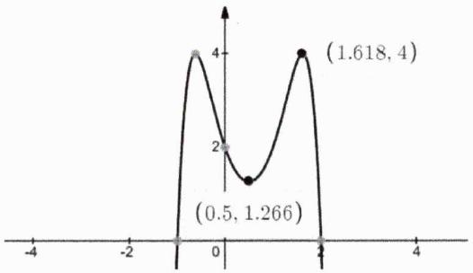

line

| x     | y     |
|-------|-------|
| -0.5  | 1.266 |
| 1.6   | 4     |

说明：此题即为不能轮换的典型代表之一.

例22. 已知 $a, b, c \geq 0$ , $a + b + c = 1$ , 试求 $f(a, b, c) = a^2 + b^2 + c^2 + 4abc$ 的最大值和最小值.

解析：对目标函数 $f(a, b, c)$ 来说 $a, b, c$ 是轮换对称的，当 $a = b = c = \frac{1}{3}$ 时

$$
f \left(\frac {1}{3}, \frac {1}{3}, \frac {1}{3}\right) = \frac {1 3}{2 7}
$$

显然该值不可能是最大值，故而其只能是最小值.接下来该如何求最大值呢？从哲学角度来说 $a = b = c$ 的另一极端情况就是三者差别最大，不妨设 $a = 1, b = 0, c = 0$ ，此时有

$$
f (1, 0, 0) = 1
$$

该值即为目标函数的最大值，其严格证明过程如下：

$$
\begin{array}{l} f (a, b, c) = a ^ {2} + b ^ {2} + c ^ {2} + 4 a b c \leq a ^ {2} + b ^ {2} + c ^ {2} + 2 a b c + 2 a b c + 2 a b c \\ \leq a ^ {2} + b ^ {2} + c ^ {2} + 2 a b + 2 b c + 2 a c \\ = (a + b + c) ^ {2} = 1 \\ \end{array}
$$

当 $a = 1, b = 0, c = 0$ 时可使上述不等式取等，综上 $f(a, b, c) \in \left[\frac{13}{27}, 1\right]$ .

例23. 已知 $a, b \in [0,1]$ , 则 $S(a, b) = \frac{a}{1 + b} + \frac{b}{1 + a} + (1 - a)(1 - b)$ 的最小值为 \_\_\_\_.

解析：经分析 $S(a,b)$ 中的a,b是轮换对称的，当且仅当 $a=b=x\in[0,1]$ 时，目标函数理应取最小值.此时有：

$$
S (x) = \frac {2 x}{1 + x} + (1 - x) ^ {2} = 2 + (1 - x) ^ {2} - \frac {2}{1 + x}
$$

因为

$$
S ^ {\prime} (x) = - 2 (1 - x) + \frac {2}{(1 + x) ^ {2}} = 2 \cdot \frac {1 - (1 - x) (1 + x) ^ {2}}{(1 + x) ^ {2}} = 2 \cdot \frac {x (x ^ {2} + x - 1)}{(1 + x) ^ {2}}
$$

令 $S'(x)=0$ ，当 $x\in[0,1]$ 时解得x=0或 $x=\frac{\sqrt{5}-1}{2}$ ，经分析 $S(x)$ 在 $\left(0,\frac{\sqrt{5}-1}{2}\right)$ 上单调递减，在 $\left(\frac{\sqrt{5}-1}{2},1\right]$ 上单调递增，从而当 $a=b=x=\frac{\sqrt{5}-1}{2}$ 时有

$$
S (x) _ {\min} = S \left(\frac {\sqrt {5} - 1}{2}\right) = 2 + \left(1 - \frac {\sqrt {5} - 1}{2}\right) ^ {2} - \frac {2}{1 + \frac {\sqrt {5} - 1}{2}} = \frac {1 3 - 5 \sqrt {5}}{2}
$$

例24. [2018 高中数联辽宁省预赛 T14]已知实数 $a, b, c$ 满足 $a^2 + b^2 + c^2 = 1$ , 求 $T = a^2bc + ab^2c + abc^2$ 的最大值和最小值.

解析: 经观察 $T$ 关于 $a, b, c$ 是轮换对称的, 我们有理由认为当三元相等即均为 $\frac{\sqrt{3}}{3}$ 时, 此时对应一种最值情况, 该最值为 $T\left(\frac{\sqrt{3}}{3}, \frac{\sqrt{3}}{3}, \frac{\sqrt{3}}{3}\right) = \frac{1}{3}$ . 严格证明过程如下:

$$
\begin{array}{l} T = a b c (a + b + c) \leq | a b c | \cdot (| a | + | b | + | c |) \leq \left(\frac {| a | + | b | + | c |}{3}\right) ^ {3} (| a | + | b | + | c |) \\ \leq \frac {1}{2 7} \cdot \left(3 \sqrt {\frac {a ^ {2} + b ^ {2} + c ^ {2}}{3}}\right) ^ {4} \\ = \frac {1}{3} \\ \end{array}
$$

故而当且仅当 $a = b = c = \frac{\sqrt{3}}{3}$ 时， $T$ 取得最大值，其最大值为 $\frac{1}{3}$ .

接下来我们再来求T的最小值，我们不妨设 $a \geq b \geq c$ ，因为 $T = abc \cdot (a + b + c)$ ，故而当T取到最小值时理应有 $a \geq b > 0$ ，c < 0且有 $a + b + c > 0$ ，设 $c = -t (t > 0)$ ，则有

$$
t <   a + b \leq \sqrt {2 (a ^ {2} + b ^ {2})} = \sqrt {2 (1 - t ^ {2})} \Rightarrow 0 <   t ^ {2} <   \frac {2}{3}
$$

同时还易分析知

$$
T = - a b t \cdot (a + b - t) \geq - \frac {a ^ {2} + b ^ {2}}{2} t \cdot (\sqrt {2 (a ^ {2} + b ^ {2})} - t) = - \frac {1 - t ^ {2}}{2} t \cdot (\sqrt {2 (1 - t ^ {2})} - t)
$$

当且仅当 $a = b = \sqrt{\frac{1 - t^2}{2}}$ 时上式取等.若令 $t^2 = x\in \left(0,\frac{2}{3}\right)$ ，则有

$$
f (x) = \frac {1 - x}{2} \sqrt {x} \cdot \left(\sqrt {x} - \sqrt {2 (1 - x)}\right) = \frac {1}{2} x (1 - x) - \sqrt {\frac {x}{2}} (1 - x) ^ {\frac {3}{2}}
$$

进而有

铭师道·高中数学方法原本

$$
f ^ {\prime} (x) = \frac {1}{2} - x - \frac {1}{\sqrt {2}} \left[ \frac {1}{2 \sqrt {x}} (1 - x) ^ {\frac {3}{2}} - \frac {3}{2} \sqrt {x} (1 - x) ^ {\frac {1}{2}} \right]
$$

令 $f'(x)=0$ ，化简得 $24x^{3}-32x^{2}+11x-1=0$ ，进而有

$$
(3 x - 1) (8 x ^ {2} - 8 x + 1) = 0
$$

解得 $x=\frac{2-\sqrt{2}}{4}$ 或 $\frac{1}{3}$ 或 $\frac{2+\sqrt{2}}{4}$ （舍），经分析当 $x=\frac{2-\sqrt{2}}{4}$ 时 $f(x)$ 取得最小值，其最小值为

$$
f \left(\frac {2 - \sqrt {2}}{4}\right) = - \frac {1 + \sqrt {2}}{1 6}
$$

显然取等条件为 $a = b = \sqrt{\frac{2 + \sqrt{2}}{8}}, c = -\sqrt{\frac{2 - \sqrt{2}}{4}}$ ，即 $T_{\mathrm{min}} = T\left(\sqrt{\frac{2 + \sqrt{2}}{8}}, \sqrt{\frac{2 + \sqrt{2}}{8}}, -\sqrt{\frac{2 - \sqrt{2}}{4}}\right) = -\frac{1 + \sqrt{2}}{16}$ .

说明：函数 $f(x)$ 的图像如下图所示.

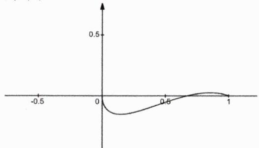

line

| x    | y     |
| ---- | ----- |
| -0.5 | 0.0   |
| 0.0  | -0.2  |
| 0.5  | 0.1   |
| 1.0  | 0.3   |

通过此例题我们再次强烈感受到所谓的初等轮换对称法只能解决高中阶段传统的较简单的问题，对于复杂的问题（特别是求另一个最值时）基本上无能为力.

为了分散难度，我们在前一讲有探究全局观下的系数分配法，当时我有强调这个分配主要靠数感，但我们也知道数感是因人而异的，故而我们总是渴望寻找一种理性的、客观的确定系数的法则，这就是我们接下来要探究的待定系数法.

结论4.7: 均值中的待定系数法 我们把先引入一系列常系数再解方程从而用均值解决目标函数最值问题的策略统称为均值中的待定系数法.

例25. 设 $a, b, c \in \mathbb{R}^*$ , 证明: $a + \sqrt{ab} + \sqrt[3]{abc} \leq \frac{4}{3}(a + b + c)$ .

解析：欲证明此题，我们需先引入系数 $\lambda$ 和 $\mu$ ，且使

$$
\left\{ \begin{array}{l} \sqrt {a b} = \sqrt {\lambda a \cdot \frac {b}{\lambda}} \leq \frac {\lambda a}{2} + \frac {b}{2 \lambda} \\ \sqrt [ 3 ]{a b c} = \sqrt [ 3 ]{\mu a \cdot \frac {b}{4 \mu} \cdot 4 c} \leq \frac {\mu a}{3} + \frac {b}{1 2 \mu} + \frac {4 c}{3} \end{array} \right.
$$

从而有

$$
a + \sqrt {a b} + \sqrt [ 3 ]{a b c} \leq \left(1 + \frac {\lambda}{2} + \frac {\mu}{3}\right) a + \left(\frac {1}{2 \lambda} + \frac {1}{1 2 \mu}\right) b + \frac {4 c}{3}
$$

于是有

$$
\left\{ \begin{array}{l l} 1 + \frac {\lambda}{2} + \frac {\mu}{3} = \frac {4}{3}, \\ \frac {1}{2 \lambda} + \frac {1}{1 2 \mu} = \frac {4}{3} \end{array} \right. \text {解得} \left\{ \begin{array}{l l} \lambda = \frac {1}{2} \\ \mu = \frac {1}{4} \end{array} \right.
$$

从而原不等式得证（取等条件为 $\frac{1}{4}a=b=4c$ 即a:b:c=16:4:1）.

例26. 已知 $x \in (0, 2\sqrt{2})$ ， $f(x) = (8 - x^2)x$ 的最大值为 \_\_\_\_.

解析：本题如果用求导的方法可以一步到位，但在这里我们可以用配凑的方法进行试探.首先有

$$
(8 - x ^ {2}) \cdot x = (2 \sqrt {2} + x) \cdot (2 \sqrt {2} - x) \cdot x
$$

接下来我们引入两个系数 $\lambda, \mu$ ，则有

$$
f (x) = \frac {1}{\lambda \mu} \cdot (2 \sqrt {2} + x) \cdot \lambda (2 \sqrt {2} - x) \cdot \mu x \leq \frac {1}{\lambda \mu} \cdot \left[ \frac {(2 \sqrt {2} + x) + \lambda (2 \sqrt {2} - x) + \mu x}{3} \right] ^ {3}
$$

显而易见的是系数 $\lambda,\mu$ 需满足以下条件

$$
\left\{ \begin{array}{l} \mu + 1 = \lambda \\ 2 \sqrt {2} + x = \lambda (2 \sqrt {2} - x) = \mu x \end{array} \right.
$$

解得

$$
\left\{ \begin{array}{l} \lambda = \sqrt {3} + 2 \\ \mu = \sqrt {3} + 1 \\ x = \frac {2 \sqrt {6}}{3} \end{array} \right.
$$

从而有 $f(x)_{\max}=f\left(\frac{2\sqrt{6}}{3}\right)=\frac{32\sqrt{6}}{9}$

例27. 函数 $f(x)=2\sqrt{x^{2}+4}+\sqrt{x^{2}-14x+58}$ 的最小值为 \_\_\_\_.

解析：利用柯西不等式可得

$$
\begin{array}{l} f (x) = 2 \sqrt {x ^ {2} + 2 ^ {2}} + \sqrt {(x - 7) ^ {2} + 3 ^ {2}} \\ = \frac {2}{\sqrt {5}} \sqrt {(1 ^ {2} + 2 ^ {2}) (x ^ {2} + 2 ^ {2})} + \frac {1}{\sqrt {5}} \sqrt {(2 ^ {2} + 1 ^ {2}) [ (7 - x) ^ {2} + 3 ^ {2} ]} \\ \geq \frac {1}{\sqrt {5}} [ (2 x + 8) + 2 (7 - x) + 3 ] \\ = 5 \sqrt {5} \\ \end{array}
$$

当且仅当 $\frac{x}{1} = \frac{2}{2}$ 和 $\frac{7 - x}{2} = \frac{3}{1}$ 即 $x = 1$ 时上式取等，故而 $f(x)$ 的最小值为 $5\sqrt{5}$ .接下来我们用待定系数的逻辑给出上述分拆的原理：显然当 $f(x)$ 取得最小值时必有 $x > 0$ ，故而我们先引入四个正系数 $a, b, c, d$ ，有

$$
\begin{array}{l} f (x) = \frac {2}{\sqrt {a ^ {2} + b ^ {2}}} \sqrt {(a ^ {2} + b ^ {2}) (x ^ {2} + 2 ^ {2})} + \frac {1}{\sqrt {c ^ {2} + d ^ {2}}} \sqrt {(c ^ {2} + d ^ {2}) [ (7 - x) ^ {2} + 3 ^ {2} ]} \\ \geq \frac {2}{\sqrt {a ^ {2} + b ^ {2}}} (a x + 2 b) + \frac {1}{\sqrt {c ^ {2} + d ^ {2}}} [ c (7 - x) + 3 d ] \\ \end{array}
$$

欲求出最值应有

$$
\frac {2 a}{\sqrt {a ^ {2} + b ^ {2}}} = \frac {c}{\sqrt {c ^ {2} + d ^ {2}}} \Longrightarrow \frac {2}{\sqrt {1 + \left(\frac {b}{a}\right) ^ {2}}} = \frac {1}{\sqrt {1 + \left(\frac {d}{c}\right) ^ {2}}}
$$

若令 $\frac{b}{a}=m>0,\quad\frac{d}{c}=n>0$ ，则有 $m^{2}-4n^{2}=3$ 。再根据两次取等条件可得如下结论

$$
\left\{ \begin{array}{l} \frac {x}{a} = \frac {2}{b} \\ \frac {7 - x}{c} = \frac {3}{d} \end{array} \Rightarrow \frac {2 a}{b} = 7 - \frac {3 c}{d} \Rightarrow \frac {2}{m} = 7 - \frac {3}{n} \Rightarrow n = \frac {3 m}{7 m - 2} \right.
$$

于是有

$$
m ^ {2} - 4 \left(\frac {3 m}{7 m - 2}\right) ^ {2} = 3 \Rightarrow (m - 2) (4 9 m ^ {3} + 7 0 m ^ {2} - 3 9 m + 6) = 0
$$

因为当m>0时 $49m^{3}+70m^{2}-39m+6>0$ ，从而解得m=2，此时有 $n=\frac{1}{2}$ ，由此可得

$$
\frac {b}{a} = 2, \frac {d}{c} = \frac {1}{2}
$$

我们不妨使 $a = 1, b = 2, c = 2, d = 1$ ，至此解释结束！

在本讲的最后我们再来简要了解一下拉格朗日（Lagrange）乘数法，该方法在《高数视角下的导函数论》一书的专题 15《二元极值问题高阶探究及其在初数中的运用》有非常详尽的讲解，感兴趣的读者可以前去了解.

结论4.8: Lagrange乘数法 要求函数 $z = f(x, y)$ 在附加条件 $\varphi(x, y) = 0$ 下的极值，我们构造如下Lagrange函数

$$
L (x, y, \lambda) = f (x, y) + \lambda \varphi (x, y) (\lambda \text {称作Lagrange乘子})
$$

则满足方程组（其中 $L_{x}(x,y,\lambda)$ 、 $L_{y}(x,y,\lambda)$ 、 $L_{\lambda}(x,y,\lambda)$ 依次表示对 $x,y,\lambda$ 求偏导）

$$
\left\{ \begin{array}{l} L _ {x} (x, y, \lambda) = 0 \\ L _ {y} (x, y, \lambda) = 0 \\ L _ {\lambda} (x, y, \lambda) = 0 \end{array} \right.
$$

的 $(x,y)$ 即为函数 $f(x,y)$ 在附加条件 $\varphi(x,y)=0$ 下的可能极值点.

铭师道·高中数学方法原本

说明：多元函数最值往往在驻点（导数为零的点）处取得，用Lagrange乘数法所求得的是驻点处的最值，但有些题目最值可能在端点处取得，故而无法对其实施Lagrange乘数法.

例28. 已知 $x-3\sqrt{x+1}=3\sqrt{y+2}-y$ ，则 $x+y$ 的最大值是\_\_\_\_。

解析：先构建如下Lagrange函数

$$
L (x, y, \lambda) = (x + y) + \lambda (x + y - 3 \sqrt {x + 1} - 3 \sqrt {y + 2})
$$

对x,y, $\lambda$ 依次求偏导可得

$$
\left\{ \begin{array}{l} L _ {x} (x, y, \lambda) = 1 + \lambda \left(1 - \frac {3}{2 \sqrt {x + 1}}\right) = 0 \\ L _ {y} (x, y, \lambda) = 1 + \lambda \left(1 - \frac {3}{2 \sqrt {y + 2}}\right) = 0 \\ L _ {\lambda} (x, y, \lambda) = x + y - 3 \sqrt {x + 1} - 3 \sqrt {y + 2} = 0 \end{array} \right.
$$

经变形得

$$
\sqrt {x + 1} = \sqrt {y + 2} = \frac {3 \lambda}{2 (\lambda + 1)}
$$

进而有

$$
2 \left[ \frac {3 \lambda}{2 (\lambda + 1)} \right] ^ {2} - 6 \left[ \frac {3 \lambda}{2 (\lambda + 1)} \right] - 3 = 0
$$

解得 $\frac{3\lambda}{2(\lambda+1)}=\frac{3\pm\sqrt{15}}{2}$ ，于是有

$$
(x + y) _ {\max} = 2 \left(\frac {3 + \sqrt {1 5}}{2}\right) ^ {2} - 3 = 9 + 3 \sqrt {1 5}
$$

例29. 若正实数x,y满足15x-y=22，则 $x^{3}+y^{3}-x^{2}-y^{2}$ 的最小值为\_\_\_\_。

解析：先构建如下Lagrange函数

$$
L (x, y, \lambda) = \left(x ^ {3} + y ^ {3} - x ^ {2} - y ^ {2}\right) + \lambda (1 5 x - y - 2 2)
$$

对其求偏导得

$$
\left\{ \begin{array}{l} L _ {x} (x, y, \lambda) = 3 x ^ {2} - 2 x + 1 5 \lambda = 0 \\ L _ {y} (x, y, \lambda) = 3 y ^ {2} - 2 y - \lambda = 0 \\ L _ {\lambda} (x, y, \lambda) = 1 5 x - y - 2 2 = 0 \end{array} \right.
$$

经变形可得:

$$
1 2 6 6 x ^ {2} - 3 7 6 9 x + 2 8 0 5 = 0
$$

其中一组满足方程的解为 $x=\frac{3}{2},y=\frac{1}{2}$ （另一组没有任何可能），代入可求得

$$
(x ^ {3} + y ^ {3} - x ^ {2} - y ^ {2}) _ {\mathrm{min}} = 1
$$

说明：以上两例题用传统方法亦可得解.

# 第 04 讲：高考对标训练

1. 已知 $a, b > 0$ ，且 $a^2 + b^2 + \frac{1}{a} + \frac{1}{b} = \frac{17}{4}$ ，则 $\frac{1}{a} - \frac{3}{4b}$ 的最小值为 \_\_\_\_.

2. 已知 $x > 0$ ，则 $f(x) = \frac{3x}{27 + x^2} + \frac{x}{3 + x^2}$ 的最大值为 \_\_\_\_.

3. 已知正实数 $a, b, c, d$ 满足 $a + 2b = 1$ , $c + 2d = 1$ , 则 $\frac{1}{a} + \frac{1}{bcd}$ 的最小值为 \_\_\_\_.

4. 已知抛物线 $\Gamma: y^{2} = ax (a > 0)$ 的通径长为 4，点 $P(x, y)$ 是抛物线 $\Gamma$ 上任意一点，则 $\frac{xy + y}{y^{2} + 4(x + 1)^{2}}$ 的最大值为 \_\_\_\_.

5. 已知正实数x,y满足 $x+2y=5$ ，则 $\frac{x^{2}-3}{x+1}+\frac{2y^{2}-1}{y}$ 的最大值为\_\_\_\_。

6. [2011 浙江文 16] 若实数 $x, y$ 满足 $x^{2} + y^{2} + xy = 1$ ，则 $x + y$ 的最大值是 \_\_\_\_.  
7. [2014 浙江文 16] 已知实数 $a + b + c = 0$ , $a^2 + b^2 + c^2 = 1$ , 则 $a$ 的最大值是 \_\_\_\_.  
8. 已知正实数 $a, b$ 满足 $\frac{1}{(2a + b)b} + \frac{2}{(2b + a)a} = 1$ ，则 $ab$ 的最大值为 \_\_\_\_.  
9. 设x,y是正实数，若不等式 $\frac{x}{4x+y}+\frac{y}{x+4y}\leq a\leq\frac{x}{x+4y}+\frac{y}{4x+y}$ 恒成立，则实数a的值是\_\_\_\_.  
10. 已知a,b均为正数， $a+b=1$ ，则 $\left(a+\frac{1}{a}\right)\left(b+\frac{1}{b}\right)$ 最小值为\_\_\_\_。  
11. 设 $x, y$ 为正实数，且 $\left(\sqrt{1 + x^2} + x - 1\right)\left(\sqrt{1 + y^2} + y - 1\right) \leq 2$ ，则 $xy$ 的最大值为 \_\_\_\_.  
12. 已知 $x, y \in \mathbb{R}$ 且 $x + y > 0$ , 则 $\frac{3 + 2x^2 + xy + y^2}{x + y}$ 的最小值为 \_\_\_\_.  
13. 若 $x, y$ 均为实数，且 $x^{2} + xy + y^{2} = 3$ ，求 $x^{2} - xy + y^{2}$ 的最大值和最小值.

# 第 04 讲：对标答案

1. [解析]:

显而易见的是

$$
\frac {1}{a} - \frac {3}{4 b} = \frac {1}{a} - \frac {3}{4 b} + a ^ {2} + b ^ {2} + \frac {1}{a} + \frac {1}{b} - \frac {1 7}{4} = \left(a ^ {2} + \frac {1}{a} + \frac {1}{a}\right) + \left(b ^ {2} + \frac {1}{8 b} + \frac {1}{8 b}\right) - \frac {1 7}{4} \geq 3 + \frac {3}{4} - \frac {1 7}{4} = - \frac {1}{2}
$$

当且仅当a=1且 $b=\frac{1}{2}$ 时上式取等.

2. [解析]:

首先易知 $f(x)=\frac{4x\cdot(x^{2}+9)}{(27+x^{2})(3+x^{2})}=\frac{4x\cdot(x^{2}+9)}{(x^{2}+9)^{2}+12x^{2}}=\frac{4}{\frac{x^{2}+9}{x}+\frac{12x}{x^{2}+9}}$ ，若令 $\frac{x^{2}+9}{x}=t$ ，则有 $t\geq6$ （当且仅当x=3时取等），进而有 $f(t)=\frac{4}{t+\frac{12}{t}}\leq\frac{4}{8}=\frac{1}{2}$ ，当且仅当x=3时前式取等，故而函数的最大值为 $\frac{1}{2}$ .

3. [解析]:

易知 $cd=\frac{1}{2}c\cdot2d\leq\frac{1}{2}\left(\frac{c+2d}{2}\right)^{2}=\frac{1}{8}$ ，取等条件为 $c=\frac{1}{2}$ 、 $d=\frac{1}{4}$ ，因而有

$$
\frac {1}{a} + \frac {1}{b c d} \geq \frac {1}{a} + \frac {8}{b} = \frac {1}{a} + \frac {1 6}{2 b} \geq \frac {(1 + 4) ^ {2}}{a + 2 b} = 2 5
$$

上式取等条件为 $a=\frac{1}{5}$ 、 $b=\frac{2}{5}$ .综上，当 $a=\frac{1}{5}$ 、 $b=\frac{2}{5}$ 、 $c=\frac{1}{2}$ 、 $d=\frac{1}{4}$ 时 $\left(\frac{1}{a}+\frac{1}{bcd}\right)_{min}=25.$

4. [解析]:

显然抛物线的方程为 $y^{2}=4x$ ，进而有

$$
\frac {x y + y}{y ^ {2} + 4 (x + 1) ^ {2}} = \frac {(x + 1) y}{y ^ {2} + 4 (x + 1) ^ {2}} = \frac {\frac {y}{x + 1}}{\left(\frac {y}{x + 1}\right) ^ {2} + 4} = \frac {1}{t + \frac {4}{t}}
$$

这里

$$
t = \frac {y}{x + 1} = \sqrt {\frac {y ^ {2}}{(x + 1) ^ {2}}} = \sqrt {\frac {4 x}{(x + 1) ^ {2}}} = 2 \sqrt {\frac {1}{x + \frac {1}{x} + 2}} \in (0, 1 ]
$$

从而有 $t + \frac{4}{t}\in [5, + \infty)$ ，进而有 $\frac{1}{t + \frac{4}{t}}\in (0,\frac{1}{5} ]$ ，综上目标函数最大值为 $\frac{1}{5}$

5. [解析]:

我们尝试用双换元法来解答此题，若令 $\left\{\begin{aligned}x+1=m&>0\\ y=n&>0\end{aligned}\right.$ ，则有 $\left\{\begin{aligned}x=m-1\\ y=n\end{aligned}\right.$ 且有 $m+2n=6$ ，进而有

$$
\frac {x ^ {2} - 3}{x + 1} + \frac {2 y ^ {2} - 1}{y} = \frac {m ^ {2} - 2 m - 2}{m} + \frac {2 n ^ {2} - 1}{n} = 4 - \left(\frac {2}{m} + \frac {1}{n}\right)
$$

由权方和不等式知

铭师道·高中数学方法原本

$$
\frac {2}{m} + \frac {1}{n} = \frac {2}{m} + \frac {2}{2 n} \geq \frac {(\sqrt {2} + \sqrt {2}) ^ {2}}{m + 2 n} = \frac {4}{3}
$$

从而目标函数最大值为 $4-\frac{4}{3}=\frac{8}{3}$ ，取等条件为m=2n即 $x+1=2y$ 即x=2.

6. [解析]:

令 $x + y = k$ ，则有 $y = k - x$ ，从而有 $x^{2} - kx + k^{2} - 1 = 0$ ，进而有

$$
\Delta = (- k) ^ {2} - 4 (k ^ {2} - 1) \geq 0 \Longrightarrow k ^ {2} \leq \frac {4}{3} \Longrightarrow k \in \left[ - \frac {2 \sqrt {3}}{3}, \frac {2 \sqrt {3}}{3} \right]
$$

于是 $x + y$ 的最大值为 $\frac{2\sqrt{3}}{3}$ .

7. [解析]:

令 $a = k$ ，则有 $c = -b - k$ ，从而有 $k^2 + b^2 + (-b - k)^2 = 1$ 即有 $2b^2 + 2kb + 2k^2 - 1 = 0$ ，进而有

$$
\Delta = (2 k) ^ {2} - 8 \left(2 k ^ {2} - 1\right) \geq 0 \Rightarrow k ^ {2} \leq \frac {2}{3} \Rightarrow k \in \left[ - \frac {\sqrt {6}}{3}, \frac {\sqrt {6}}{3} \right]
$$

从而a的最大值为 $\frac{\sqrt{6}}{3}$ .

8. [解析]:

利用已知可得 $ab = ab\left[\frac{1}{(2a + b)b} +\frac{2}{(2b + a)a}\right] = \frac{a}{2a + b} +\frac{2b}{2b + a}$ ，令 $a = bt$ （ $t > 0$ )，则有

$$
\frac {a}{2 a + b} + \frac {2 b}{2 b + a} = \frac {t}{2 t + 1} + \frac {2}{2 + t} = \frac {t ^ {2} + 6 t + 2}{2 t ^ {2} + 5 t + 2} = y
$$

变形可得

$$
(2 y - 1) t ^ {2} + (5 y - 6) t + (2 y - 2) = 0
$$

则有

$$
\Delta = (5 y - 6) ^ {2} - 4 (2 y - 1) (2 y - 2) = 9 y ^ {2} - 3 6 y + 2 8 \geq 0
$$

解得 $y \leq \frac{6 - 2\sqrt{2}}{3}$ 或 $y \geq \frac{6 + 2\sqrt{2}}{3}$ ，根据 $y = \frac{t^2 + 6t + 2}{2t^2 + 5t + 2}$ 的形态知，只可能有 $y \leq \frac{6 - 2\sqrt{2}}{3}$ ，于是 $ab$ 的最大值为 $\frac{6 - 2\sqrt{2}}{3}$ .

9. [解析]:

显然题中的x,y是轮换对称的，当x=y时有 $\frac{2}{5}\leq a\leq\frac{2}{5}$ ，故而 $a=\frac{2}{5}$ .

10. [解析]:

显然所给条件和目标函数中的a和b是轮换对称的，故而当 $a=b=\frac{1}{2}$ 时，目标函数理应取最小值，其最小值为 $\frac{25}{4}$ .

11. [解析]:

显然 $x, y$ 是轮换对称的，当 $x = y = 1$ 时， $xy$ 理应取得最大值，其最大值为 1.

12. [解析]:

我们先待定一个系数 $\lambda$ ，使得

$$
2 x ^ {2} + x y + y ^ {2} \geq \lambda (x + y) ^ {2} \text {即有} (2 - \lambda) x ^ {2} + (1 - 2 \lambda) x y + (1 - \lambda) y ^ {2} \geq 0
$$

从而有 $2\sqrt{(2-\lambda)(1-\lambda)}=(1-2\lambda)$ ，解得 $\lambda=\frac{7}{8}$ ，此时有 $\frac{9}{8}x^{2}-\frac{6}{8}xy+\frac{1}{8}y^{2}\geq0$ （当且仅当3x=y时取等）.于是有

$$
\frac {3 + 2 x ^ {2} + x y + y ^ {2}}{x + y} \geq \frac {3 + \frac {7}{8} (x + y) ^ {2}}{x + y} \geq 2 \sqrt {\frac {2 1}{8}} = \frac {\sqrt {4 2}}{2}
$$

当且仅当 $\frac{7}{8}(x+y)^{2}=14x^{2}=3$ 即 $x=\frac{\sqrt{42}}{14}$ 时上式取等.

13. [解析]:

先构建如下lagerange函数

$$
L (x, y, \lambda) = x ^ {2} - x y + y ^ {2} + \lambda \left(x ^ {2} + x y + y ^ {2} - 3\right)
$$

对其求偏导可得

$$
\left\{ \begin{array}{l} L _ {x} (x, y, \lambda) = 2 x - y + \lambda (2 x + y) = 0 \\ L _ {y} (x, y, \lambda) = - x + 2 y + \lambda (x + 2 y) = 0 \\ L _ {\lambda} (x, y, \lambda) = x ^ {2} + x y + y ^ {2} - 3 = 0 \end{array} \right.
$$

解得 $\left\{\begin{aligned}\lambda&=-3\\ x&=\sqrt{3}\\ y&=-\sqrt{3}\end{aligned}\right.$ 或 $\left\{\begin{aligned}\lambda&=-3\\ x&=-\sqrt{3}\\ y&=\sqrt{3}\end{aligned}\right.$ 或 $\left\{\begin{aligned}\lambda&=-\frac{1}{3}\\ x&=1\\ y&=1\end{aligned}\right.$ ，依次代入可得 $x^{2}-xy+y^{2}$ 的最大值为9，最小值为1.

# 第 05 讲: Cauchy 不等式及反向 Cauchy 不等式

本讲我们将探究高中阶段一个非常重要的工具性不等式——柯西（Cauchy）不等式（及反向柯西不等式），事实上这个不等式已然是高中数学入门级的知识点.

结论5.1: 二维 Cauchy 不等式 $\forall a_{1}, a_{2}, b_{1}, b_{2} \in \mathbb{R}$ , 恒有

$$
(a _ {1} ^ {2} + a _ {2} ^ {2}) (b _ {1} ^ {2} + b _ {2} ^ {2}) \geq (a _ {1} b _ {1} + a _ {2} b _ {2}) ^ {2}
$$

当且仅当 $a_{1}b_{2}=a_{2}b_{1}$ 时，上述等号成立.

结论证明：令 $\vec{a} = (a_{1}, a_{2})$ ， $\vec{b} = (b_{1}, b_{2})$ ，设两向量的夹角为 $\alpha$ ，必有

$$
\left| \vec {a} \cdot \vec {b} \right| = | a _ {1} b _ {1} + a _ {2} b _ {2} | = | \vec {a} | \cdot \left| \vec {b} \right| \cdot | \cos \alpha | \leq | \vec {a} | \cdot \left| \vec {b} \right| = \sqrt {a _ {1} ^ {2} + a _ {2} ^ {2}} \cdot \sqrt {b _ {1} ^ {2} + b _ {2} ^ {2}}
$$

当且仅当 $\cos\alpha=\pm1$ 即 $\vec{a}\parallel\vec{b}$ 即 $a_{1}b_{2}=a_{2}b_{1}$ 时，上式取等，平方之后结论即可得证！

例1. 已知 $x, y > 0$ ，则 $\frac{x^2}{xy + 1} + \frac{y^2 + 2}{x + y}$ 的最小值是 \_\_\_\_.

解析：由 Cauchy 不等式知

$$
x y + 1 \leq \sqrt {\left(x ^ {2} + 1 ^ {2}\right) \left(y ^ {2} + 1 ^ {2}\right)}; x + y \leq \sqrt {\left(x ^ {2} + 1 ^ {2}\right) \left(1 ^ {2} + y ^ {2}\right)}
$$

以上两个不等式分别在 $x = y$ 和 $xy = 1$ 时取等，即当 $x = y = 1$ 时以上两式可同时取等.进而有

$$
\begin{array}{l} \frac {x ^ {2}}{x y + 1} + \frac {y ^ {2} + 2}{x + y} \geq \frac {x ^ {2} + y ^ {2} + 2}{\sqrt {(x ^ {2} + 1 ^ {2}) (1 ^ {2} + y ^ {2})}} = \frac {(x ^ {2} + 1 ^ {2}) + (1 ^ {2} + y ^ {2})}{\sqrt {(x ^ {2} + 1 ^ {2}) (1 ^ {2} + y ^ {2})}} \\ \geq \frac {2 \sqrt {(x ^ {2} + 1 ^ {2}) (1 ^ {2} + y ^ {2})}}{\sqrt {(x ^ {2} + 1 ^ {2}) (1 ^ {2} + y ^ {2})}} \\ = 2 \\ \end{array}
$$

当x=y时上式取等.综上，当且仅当x=y=1时，目标函数可取最小值，其最小值为2.

例2. 函数 $f(x)=\sqrt{3x-6}+\sqrt{3-x}$ 的值域是 \_\_\_\_.

解析：利用 Cauchy 不等式可得

$$
f (x) = \sqrt {3 x - 6} + \sqrt {3 - x} = \sqrt {3} \cdot \sqrt {x - 2} + 1 \cdot \sqrt {3 - x} \leq \sqrt {3 + 1} \cdot \sqrt {x - 2 + 3 - x} = 2
$$

当且仅当 $1\cdot\sqrt{x-2}=\sqrt{3}\cdot\sqrt{3-x}$ 即 $x=\frac{11}{4}$ 时上式取等，故而 $f(x)\leq2$ .又因 $f(2)=1,f(3)=\sqrt{3}$ ，故而说明 $f(x)\geq1$ .综上可得函数 $f(x)$ 的值域为[1,2].

说明：上述类型的函数最值一定在极值点或端点处取得.

例3. [2015 浙江理 19]已知椭圆 $\frac{x^{2}}{2}+y^{2}=1$ 上两个不同的点A, B关于直线 $y=mx+\frac{1}{2}$ 对称.

(1) 求实数m的取值范围;   
(2) 求△AOB面积的最大值（O为坐标原点）.

解析：第一问略.第二问，设 $A(x_{1},y_{1})$ 、 $B(x_{2},y_{2})$ ，由三角形坐标面积公式及Cauchy不等式知

$$
\begin{array}{l} S _ {\triangle A O B} = \frac {1}{2} | x _ {1} y _ {2} - x _ {2} y _ {1} | = \frac {\sqrt {2}}{2} \left| \frac {x _ {1}}{\sqrt {2}} \cdot y _ {2} + (- y _ {1}) \cdot \frac {x _ {2}}{\sqrt {2}} \right| \\ \leq \frac {\sqrt {2}}{2} \sqrt {\left(\frac {x _ {1} ^ {2}}{2} + y _ {1} ^ {2}\right) \cdot \left(\frac {x _ {2} ^ {2}}{2} + y _ {2} ^ {2}\right)} \\ = \frac {\sqrt {2}}{2} \\ \end{array}
$$

当且仅当 $x_{1}x_{2}=-2y_{1}y_{2}$ 时上式取等（且易说明该取等条件与已知并不矛盾），故而 $\triangle AOB$ 面积的最大值为 $\frac{\sqrt{2}}{2}$ .

例4. 如下图所示, 设椭圆中心在坐标原点, $A(2,0), B(0,1)$ 是它的两个顶点, 直线 $y = kx (k > 0)$ 与 $AB$ 相交于点 $D$ , 与椭圆相交于 $E, F$ 两点. 求四边形 $AEBF$ 面积的最大值.

解析: 依题知椭圆方程为 $\frac{x^{2}}{4} + y^{2} = 1$ , 由椭圆的对称性易知四边形 $AEBF$ 的面积等于四边形 $AOBF$ 的面积的两倍. 设点 $F(x, y) (x > 0)$ , 则有 $\frac{x^{2}}{4} + y^{2} = 1$ , 利用 Cauchy 不等式可得

铭师道·高中数学方法原本

$$
S _ {A E B F} = 2 \left(S _ {\triangle O B F} + S _ {\triangle O A F}\right) = x + 2 y = 2 \cdot \frac {x}{2} + 2 \cdot y \leq \sqrt {\left(2 ^ {2} + 2 ^ {2}\right) \left(\frac {x ^ {2}}{4} + y ^ {2}\right)} = 2 \sqrt {2}
$$

当且仅当x=2y即 $x=\sqrt{2}$ 时上式取等，综上四边形AEBF面积最大值为 $2\sqrt{2}$ .

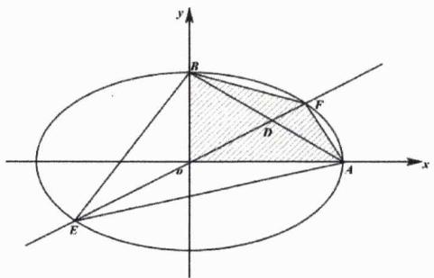

text_image

y
B
F
D
x
A
E

命题5.1: 椭圆中的柯西不等式 通过以上例题不难发现, Cauchy 不等式是解决椭圆一大类问题的利器.

例5. 对于 $c > 0$ , 当非零实数 $a, b$ 满足 $4a^{2} - 2ab + 4b^{2} - c = 0$ 且使 $|2a + b|$ 最大时, $\frac{3}{a} - \frac{4}{b} + \frac{5}{c}$ 的最小值为 \_\_\_\_.

解析：由题可得 $2c = -(2a + b)^{2} + 3(4a^{2} + 3b^{2})$ ，利用Cauchy不等式可得以下不等式

$$
(4 a ^ {2} + 3 b ^ {2}) \left(1 + \frac {1}{3}\right) \geq (2 a + b) ^ {2}
$$

于是有

$$
4 a ^ {2} + 3 b ^ {2} \geq \frac {3}{4} (2 a + b) ^ {2} \Rightarrow 2 c \geq \frac {5}{4} (2 a + b) ^ {2}
$$

当且仅当 $\frac{\sqrt{3}}{3} \cdot 2a = 1 \cdot \sqrt{3} b$ 即 $2a = 3b$ 时， $|2a + b|$ 取得最大值. 若令 $2a = 3b = 6r$ ，此时 $c = 40r^2$ ，继而有

$$
\frac {3}{a} - \frac {4}{b} + \frac {5}{c} = \frac {1}{8 r ^ {2}} - \frac {1}{r} = \frac {1}{8} \left(\frac {1}{r} - 4\right) ^ {2} - 2 \geq - 2
$$

上述不等式的取等条件为 $a=\frac{3}{4}$ 、 $b=\frac{1}{2}$ 、 $c=\frac{5}{2}$ ，此时 $\frac{3}{a}-\frac{4}{b}+\frac{5}{c}$ 取最小值-2.

结论5.2: 一般形式的 Cauchy 不等式 $\forall a_{i}, b_{i} \in \mathbb{R} (i = 1,2,\cdots,n)$ , 恒有

$$
(a _ {1} ^ {2} + a _ {2} ^ {2} + \dots + a _ {n} ^ {2}) (b _ {1} ^ {2} + b _ {2} ^ {2} + \dots + b _ {n} ^ {2}) \geq (a _ {1} b _ {1} + a _ {2} b _ {2} + \dots a _ {n} b _ {n}) ^ {2}
$$

当且仅当 $b_{i}=0$ ，或 $\exists\lambda\in\mathbb{R}$ 使得 $a_{i}=\lambda b_{i}\quad(i=1,2,\cdots,n)$ 时，上述等号成立.

结论证明：当 $a_{i} = 0$ 或 $b_{i} = 0$ 时结论必然成立，否则必有 $\sum_{i=1}^{n} a_{i}^{2} > 0$ ，此时我们可构造如下关于 $x$ 的二次函数

$$
f (x) = \sum_ {i = 1} ^ {n} (a _ {i} x - b _ {i}) ^ {2} = \left(\sum_ {i = 1} ^ {n} a _ {i} ^ {2}\right) x ^ {2} - 2 \left(\sum_ {i = 1} ^ {n} a _ {i} b _ {i}\right) x + \sum_ {i = 1} ^ {n} b _ {i} ^ {2}
$$

显然必有

$$
f (x) \geq 0
$$

故而必有

$$
\varDelta = \left(2 \sum_ {i = 1} ^ {n} a _ {i} b _ {i}\right) ^ {2} - 4 \left(\sum_ {i = 1} ^ {n} a _ {i} ^ {2}\right) \left(\sum_ {i = 1} ^ {n} b _ {i} ^ {2}\right) \leq 0
$$

即有

$$
\left(\sum_ {i = 1} ^ {n} a _ {i} b _ {i}\right) ^ {2} \leq \sum_ {i = 1} ^ {n} a _ {i} ^ {2} \sum_ {i = 1} ^ {n} b _ {i} ^ {2}
$$

当且仅当 $b_{i}=0$ ，或 $\exists\lambda\in\mathbb{R}$ 使得 $a_{i}=\lambda b_{i}$ 时上式取等，从而得证！

例6. 已知 $a, b > 0$ ，则 $\frac{a + b}{(4a^2 + 3)(4b^2 + 3)}$ 的最大值为 \_\_\_\_.

解析：利用四维 Cauchy 不等式可得

$$
\begin{array}{l} \frac {a + b}{(4 a ^ {2} + 3) (4 b ^ {2} + 3)} = \frac {a + b}{(4 a ^ {2} + 1 ^ {2} + 1 ^ {2} + 1 ^ {2}) (1 ^ {2} + 4 b ^ {2} + 1 ^ {2} + 1 ^ {2})} \\ \leq \frac {a + b}{(2 a + 2 b + 1 + 1) ^ {2}} \\ = \frac {1}{4} \frac {1}{a + b + \frac {1}{a + b} + 2} \\ \leq \frac {1}{1 6} \\ \end{array}
$$

当且仅当 $a+b=1$ 且 $ab=\frac{1}{4}$ 时上式取等, 因而目标函数的最大值为 $\frac{1}{16}$ .

结论5.3: 轮换对称求和 在使用 Cauchy 不等式证明复杂题型时可使用以下符号简化书写，我们记

$$
\sum_ {\mathrm{cyc}} x ^ {2} y = x ^ {2} y + y ^ {2} z + z ^ {2} x
$$

推论5.1: Cauchy 不等式的向量形式 $\forall a_{i}, b_{i} \in \mathbb{R} (i = 1, 2, \cdots, n)$ ，恒有

$$
| a _ {1} b _ {1} + a _ {2} b _ {2} + \dots a _ {n} b _ {n} | \leq \sqrt {a _ {1} ^ {2} + a _ {2} ^ {2} + \cdots + a _ {n} ^ {2}} \cdot \sqrt {b _ {1} ^ {2} + b _ {2} ^ {2} + \cdots + b _ {n} ^ {2}}
$$

或

$$
- \sqrt {\sum_ {i = 1} ^ {n} a _ {i} ^ {2}} \cdot \sqrt {\sum_ {i = 1} ^ {n} b _ {i} ^ {2}} \leq a _ {1} b _ {1} + a _ {2} b _ {2} + \dots a _ {n} b _ {n} \leq \sqrt {\sum_ {i = 1} ^ {n} a _ {i} ^ {2}} \cdot \sqrt {\sum_ {i = 1} ^ {n} b _ {i} ^ {2}}
$$

当且仅当 $b_{i}=0$ ，或 $\exists\lambda\in\mathbb{R}$ 使得 $a_{i}=\lambda b_{i}\quad(i=1,2,\cdots,n)$ 时，等号成立.

说明：柯西不等式的向量形式其实就是对柯西不等式一般形式的证明.

例7. 已知 $a, b, c \in \mathbb{R}^{*}$ , 且 $a + b + c = 6$ .

(1) 当 $c = 5$ 时，求 $\left(\frac{1}{a^2} - 1\right)\left(\frac{1}{b^2} - 1\right)$ 的最小值；  
(2) 证明: $a^2 + b^2 - 2b + c^2 - 4c \geq -2$ .

解析：

第一问：当 $c = 5$ 时有 $a + b = 1$ ，由均值不等式可得 $ab \leq \left(\frac{1}{2}\right)^2 = \frac{1}{4}$ ，进而有

$$
\left(\frac {1}{a ^ {2}} - 1\right) \left(\frac {1}{b ^ {2}} - 1\right) = \frac {b (1 + a)}{a ^ {2}} \cdot \frac {a (1 + b)}{b ^ {2}} = \frac {a b + 2}{a b} = 1 + \frac {2}{a b} \geq 9
$$

当且仅当 $a=b=\frac{1}{2}$ 时上式取等.

第二问：由三维 Cauchy 不等式得

$$
[ a ^ {2} + (b - 1) ^ {2} + (c - 2) ^ {2} ] \left(1 ^ {2} + 1 ^ {2} + 1 ^ {2}\right) \geq [ a + (b - 1) + (c - 2) ] ^ {2} = 3 ^ {2} = 9
$$

从而有

$$
a ^ {2} + (b - 1) ^ {2} + (c - 2) ^ {2} \geq 3
$$

进而有 $a^{2}+b^{2}-2b+c^{2}-4c\geq-2$ ，当且仅当a=1,b=2,c=3时上式取等，从而得证.

例8. 若 $f(x)=\sqrt{2x-7}+\sqrt{12-x}+\sqrt{44-x}$ ，则 $f(x)$ 的最大值是\_\_\_\_。

解析：利用 Cauchy 不等式可得

$$
\begin{array}{l} \left(\sqrt {2 x - 7} + \sqrt {1 2 - x} + \sqrt {4 4 - x}\right) ^ {2} = \left[ \sqrt {3} \cdot \sqrt {\frac {2 x - 7}{3}} + \sqrt {2} \cdot \sqrt {\frac {1 2 - x}{2}} + \sqrt {6} \cdot \sqrt {\frac {4 4 - x}{6}} \right] ^ {2} \\ \leq (3 + 2 + 6) \left(\frac {2 x - 7}{3} + \frac {1 2 - x}{2} + \frac {4 4 - x}{6}\right) \\ = 1 2 1 \\ \end{array}
$$

当且仅当 $\frac{\sqrt{\frac{2x - 7}{3}}}{\sqrt{3}} = \frac{\sqrt{\frac{12 - x}{2}}}{\sqrt{2}} = \frac{\sqrt{\frac{44 - x}{6}}}{\sqrt{6}}$ 即 $x = 8$ 时上述等号成立，故而 $f(x)$ 的最大值是11.

说明：严格意义上此题需要用待定系数法才会出现 $\sqrt{3}$ ， $\sqrt{2}$ 和 $\sqrt{6}$ 这三个系数，事实上因为 $x \in \left[\frac{7}{2}, 12\right]$ ，

铭师道·高中数学方法原本

故而我们可以猜得极值点理应出现在区间 $\left[\frac{7}{2}, 12\right]$ 的中点附近，地而我们可以代特殊整数点来试探.

推论5.2: 分式型 Cauchy 不等式 $\forall a_{i}, b_{i} \in \mathbb{R} (i = 1, 2, \cdots, n)$ 且 $b_{i} > 0$ ，恒有

$$
\frac {a _ {1} ^ {2}}{b _ {1}} + \frac {a _ {2} ^ {2}}{b _ {2}} + \dots + \frac {a _ {n} ^ {2}}{b _ {n}} \geq \frac {(a _ {1} + a _ {2} + \cdots + a _ {n}) ^ {2}}{b _ {1} + b _ {2} + \cdots + b _ {n}}
$$

仅当 $\exists\lambda\in\mathbb{R}$ 使得 $a_{i}=\lambda b_{i}\quad(i=1,2,\cdots,n)$ 时，等号成立.

推论证明：由 Cauchy 不等式知

$$
\sum_ {i = 1} ^ {n} \frac {a _ {i} ^ {2}}{b _ {i}} \cdot \sum_ {i = 1} ^ {n} b _ {i} = \sum_ {i = 1} ^ {n} \left(\frac {a _ {i}}{\sqrt {b _ {i}}}\right) ^ {2} \cdot \sum_ {i = 1} ^ {n} (\sqrt {b _ {i}}) ^ {2} \geq \left[ \sum_ {i = 1} ^ {n} \left(\frac {a _ {i}}{\sqrt {b _ {i}}} \cdot \sqrt {b _ {i}}\right) \right] ^ {2} = \left(\sum_ {i = 1} ^ {n} a _ {i}\right) ^ {2} \Rightarrow \sum_ {i = 1} ^ {n} \frac {a _ {i} ^ {2}}{b _ {i}} \geq \frac {(\sum_ {i = 1} ^ {n} a _ {i}) ^ {2}}{\sum_ {i = 1} ^ {n} b _ {i}}
$$

从而得证！

说明：本推论即为最简形式的权方和不等式.

例9. [2015 福建文理 23]已知 $a, b, c \in \mathbb{R}^*$ ，函数 $f(x) = |x + a| + |x - b| + c$ 的最小值为 4.

(1) 求 $a + b + c$ 的值;  
(2) 求 $\frac{1}{4}a^{2}+\frac{1}{9}b^{2}+c^{2}$ 的最小值.

解析：

第一问：由绝对值基本性质知， $f(x) \geq |a + b| + c \geq a + b + c = 4$ ，从而第一问得解.

第二问：由分式型 Cauchy 不等式知

$$
\frac {1}{4} a ^ {2} + \frac {1}{9} b ^ {2} + c ^ {2} \geq \frac {(a + b + c) ^ {2}}{4 + 9 + 1} = \frac {1 6}{1 4} = \frac {8}{7}
$$

当且仅当 $9a = 4b = 36c$ 即 $a = \frac{8}{7}$ 、 $b = \frac{18}{7}$ 、 $c = \frac{2}{7}$ 时取等.综上目标函数最小值是 $\frac{8}{7}$ .

例10. 已知 $a, b, c \in \mathbb{R}^*$ ，求证：

$$
a ^ {5} + b ^ {5} + c ^ {5} \geq a ^ {3} b c + b ^ {3} a c + c ^ {3} a b
$$

解析：

思路 $^{①}$ 、由均值不等式知

$$
\frac {1}{5} \left(3 a ^ {5} + b ^ {5} + c ^ {5}\right) = \frac {1}{5} \left(a ^ {5} + a ^ {5} + a ^ {5} + b ^ {5} + c ^ {5}\right) \geq a ^ {3} b c
$$

同理可得

$$
\frac {1}{5} \left(a ^ {5} + 3 b ^ {5} + c ^ {5}\right) \geq b ^ {3} a c, \frac {1}{5} \left(a ^ {5} + b ^ {5} + 3 c ^ {5}\right) \geq c ^ {3} a b
$$

将上述三式相加即可得证（当且仅当a=b=c时取等）!

思路 $^{②}$ 、欲证原命题，仅需证以下结论即可

$$
\frac {a ^ {4}}{b c} + \frac {b ^ {4}}{a c} + \frac {c ^ {4}}{a b} \geq a ^ {2} + b ^ {2} + c ^ {2}
$$

由分式型 Cauchy 不等式知

$$
\frac {a ^ {4}}{b c} + \frac {b ^ {4}}{a c} + \frac {c ^ {4}}{a b} \geq \frac {(a ^ {2} + b ^ {2} + c ^ {2}) ^ {2}}{a b + a c + b c} \geq \frac {(a ^ {2} + b ^ {2} + c ^ {2}) ^ {2}}{\frac {1}{2} [ (a ^ {2} + b ^ {2}) + (a ^ {2} + c ^ {2}) + (b ^ {2} + c ^ {2}) ]} = a ^ {2} + b ^ {2} + c ^ {2}
$$

当且仅当a=b=c时上式取等，证毕！

例11. 已知 $x, y, z \in \mathbb{R}^*$ 且满足 $x + y + z = 1$ ，求证：

(1) $\frac{x^{2}}{2y+3z}+\frac{y^{2}}{2z+3x}+\frac{z^{2}}{2x+3y}\geq\frac{1}{5};$   
(2) $x^{3} + y^{3} + z^{3}\geq \frac{x^{2} + y^{2} + z^{2}}{3};$   
(3) 求 $16^{x} + 16^{y} + 16^{z^{2}}$ 的最小值.

解析:

第一问：由分式型 Cauchy 不等式知

$$
\frac {x ^ {2}}{2 y + 3 z} + \frac {y ^ {2}}{2 z + 3 x} + \frac {z ^ {2}}{2 x + 3 y} \geq \frac {(x + y + z) ^ {2}}{5 (x + y + z)} \geq \frac {1}{5}
$$

当且仅当 $\frac{x}{2y + 3z} = \frac{y}{2z + 3x} = \frac{z}{2x + 3y}$ 时上式取等，从而得证！

第二问：由 Cauchy 不等式知

$$
\begin{array}{l} (x ^ {2} + y ^ {2} + z ^ {2}) ^ {2} = \left(x ^ {\frac {3}{2}} x ^ {\frac {1}{2}} + y ^ {\frac {3}{2}} y ^ {\frac {1}{2}} + z ^ {\frac {3}{2}} z ^ {\frac {1}{2}}\right) ^ {2} \\ \leq \left(x ^ {3} + y ^ {3} + z ^ {3}\right) (x + y + z) \\ = (x ^ {3} + y ^ {3} + z ^ {3}) (x + y + z) ^ {2} \\ \end{array}
$$

再由三项完全平方公式知

$$
(x + y + z) ^ {2} = x ^ {2} + y ^ {2} + z ^ {2} + 2 x y + 2 y z + 2 z x \leq 3 (x ^ {2} + y ^ {2} + z ^ {2})
$$

从而有

$$
(x ^ {2} + y ^ {2} + z ^ {2}) ^ {2} \leq (x ^ {3} + y ^ {3} + z ^ {3}) \cdot 3 (x ^ {2} + y ^ {2} + z ^ {2})
$$

继而证得

$$
x ^ {3} + y ^ {3} + z ^ {3} \geq \frac {x ^ {2} + y ^ {2} + z ^ {2}}{3}
$$

当且仅当x=y=z= $\frac{1}{3}$ 时上式取等.

第三问：由均值不等式知

$$
1 6 ^ {x} + 1 6 ^ {y} + 1 6 ^ {z ^ {2}} \geq 3 \sqrt [ 3 ]{1 6 ^ {x + y + z ^ {2}}}
$$

当且仅当 $x = y = z^2$ 时上式取等, 此时有 $2z^2 + z - 1 = 0$ , 解得 $z = -1$ 或 $\frac{1}{2}$ . 显而易见的是当 $x = y = \frac{1}{4}$ 时, 目标函数取得最小值, 最小值为 $3\sqrt[3]{16^{\frac{1}{4} + \frac{1}{4} + \frac{1}{4}}} = 6$ .

例12. 设 $a, b, c \geq 0$ ，求证：

$$
\frac {a ^ {2} - b c}{2 a ^ {2} + b ^ {2} + c ^ {2}} + \frac {b ^ {2} - c a}{2 b ^ {2} + c ^ {2} + a ^ {2}} + \frac {c ^ {2} - a b}{2 c ^ {2} + a ^ {2} + b ^ {2}} \geq 0
$$

解析：显而易见的是

$$
\frac {2 a ^ {2} - 2 b c}{2 a ^ {2} + b ^ {2} + c ^ {2}} = \frac {(2 a ^ {2} + b ^ {2} + c ^ {2}) - (b ^ {2} + c ^ {2} + 2 b c)}{2 a ^ {2} + b ^ {2} + c ^ {2}} = 1 - \frac {(b + c) ^ {2}}{2 a ^ {2} + b ^ {2} + c ^ {2}}
$$

逆向运用分式型 Cauchy 不等式可得

$$
\frac {(b + c) ^ {2}}{2 a ^ {2} + b ^ {2} + c ^ {2}} \leq \frac {b ^ {2}}{a ^ {2} + b ^ {2}} + \frac {c ^ {2}}{a ^ {2} + c ^ {2}}
$$

从而有

$$
\begin{array}{l} 2 \left(\frac {a ^ {2} - b c}{2 a ^ {2} + b ^ {2} + c ^ {2}} + \frac {b ^ {2} - c a}{2 b ^ {2} + c ^ {2} + a ^ {2}} + \frac {c ^ {2} - a b}{2 c ^ {2} + a ^ {2} + b ^ {2}}\right) \\ = 3 - \left(\frac {(b + c) ^ {2}}{2 a ^ {2} + b ^ {2} + c ^ {2}} + \frac {(c + a) ^ {2}}{2 b ^ {2} + c ^ {2} + a ^ {2}} + \frac {(a + b) ^ {2}}{2 c ^ {2} + a ^ {2} + b ^ {2}}\right) \\ \geq 3 - \left(\frac {b ^ {2}}{a ^ {2} + b ^ {2}} + \frac {c ^ {2}}{a ^ {2} + c ^ {2}} + \frac {c ^ {2}}{b ^ {2} + c ^ {2}} + \frac {a ^ {2}}{b ^ {2} + a ^ {2}} + \frac {a ^ {2}}{c ^ {2} + a ^ {2}} + \frac {b ^ {2}}{c ^ {2} + b ^ {2}}\right) \\ = 0 \\ \end{array}
$$

从而得证（当 $a = b = c$ 时取等）.

推论5.3: 二维反向 Cauchy 不等式 若 $x_{1}, y_{1} \geq 0$ 且 $|x_{1}| \geq |x_{2}|$ , $|y_{1}| \geq |y_{2}|$ , 则有

$$
x _ {1} y _ {1} - x _ {2} y _ {2} \geq \sqrt {x _ {1} ^ {2} - x _ {2} ^ {2}} \cdot \sqrt {y _ {1} ^ {2} - y _ {2} ^ {2}}
$$

当且仅当 $x_{1}y_{2}=x_{2}y_{1}$ 时取等.

推论证明：由 Cauchy 不等式可得 $\sqrt{a_{1}^{2}+a_{2}^{2}}\cdot\sqrt{b_{1}^{2}+b_{2}^{2}}\geq a_{1}b_{1}+a_{2}b_{2}\quad(a_{2},b_{2}\geq0)$ ，变形得

$$
\sqrt {a _ {1} ^ {2} + a _ {2} ^ {2}} \cdot \sqrt {b _ {1} ^ {2} + b _ {2} ^ {2}} - a _ {1} b _ {1} \geq a _ {2} b _ {2}
$$

若令 $\left\{ \begin{array}{l} \sqrt{a_1^2 + a_2^2} = x_1 \\ \sqrt{b_1^2 + b_2^2} = y_1 \end{array} \right.$ 、 $\left\{ \begin{array}{l} a_1 = x_2 \\ b_1 = y_2 \end{array} \right.$ ，则有 $\left\{ \begin{array}{l} a_2 = \sqrt{x_1^2 - x_2^2} \\ b_2 = \sqrt{y_1^2 - y_2^2} \end{array} \right.$ ，进而有

$$
x _ {1} y _ {1} - x _ {2} y _ {2} \geq \sqrt {x _ {1} ^ {2} - x _ {2} ^ {2}} \cdot \sqrt {y _ {1} ^ {2} - y _ {2} ^ {2}}
$$

当且仅当 $x_{1}y_{2}=y_{1}x_{2}$ 时取等，从而得证！

铭师道·高中数学方法原本

说明：针对上述推论平方作差证明更简捷，但利用此法可体现出其与 Cauchy 不等式的渊源.

例13. 当x>0时，函数 $y=4-x+2\sqrt{x^{2}+9}$ 的最小值为\_\_\_\_。

解析：由二维反向 Cauchy 不等式知

$$
2 \sqrt {x ^ {2} + 9} - 1 \cdot x \geq \sqrt {2 ^ {2} - 1 ^ {2}} \cdot \sqrt {x ^ {2} + 9 - x ^ {2}} = 3 \sqrt {3}
$$

当且仅当 $1\cdot\sqrt{x^{2}+9}=2x$ 即 $x=\sqrt{3}$ 时，上式取等，故而函数最小值为 $y=4+3\sqrt{3}$ .

例14. 当 $x\in(0,\frac{\pi}{2})$ 时，函数 $y=\frac{2-\sin x}{\cos x}$ 的值域是\_\_\_\_.

解析：由二维反向 Cauchy 不等式知

$$
y = \frac {2 - \sin x}{\cos x} = \frac {2 \cdot 1 - 1 \cdot \sin x}{\cos x} \geq \frac {\sqrt {2 ^ {2} - 1 ^ {2}} \cdot \sqrt {1 - \sin^ {2} x}}{\cos x} = \sqrt {3}
$$

当且仅当 $2\sin x = 1$ 即 $x = \frac{\pi}{6}$ 时上式取等，故而函数的值域是 $[\sqrt{3}, +\infty)$ .

在前述推论的基础上自然而然有如下推论——基于传统，我们称其为二维奥采尔不等式（加拿大数学家Aczel在1956年提出的不等式）.

推论5.4: 二维Aczel不等式 对任意的实数 $x_{1}, x_{2}, y_{1}, y_{2}$ , 恒有

$$
\left(x _ {1} ^ {2} - x _ {2} ^ {2}\right) \left(y _ {1} ^ {2} - y _ {2} ^ {2}\right) \leq \left(x _ {1} y _ {1} - x _ {2} y _ {2}\right) ^ {2}
$$

当且仅当 $x_{1}y_{2}=x_{2}y_{1}$ 时，等号成立.

推论证明：作差得

$$
(x _ {1} y _ {1} - x _ {2} y _ {2}) ^ {2} - (x _ {1} ^ {2} - x _ {2} ^ {2}) (y _ {1} ^ {2} - y _ {2} ^ {2}) = (x _ {1} y _ {2} - x _ {2} y _ {1}) ^ {2} \geq 0
$$

从而得证！

说明：此推论与前述推论的前提条件还是略微有一些区别，另外感兴趣的读者可以再去了解一下n维Aczel不等式及其运用.

例15. 已知 $x - 2y = 2$ ，则 $(x^{2} - 4)(1 - y^{2})$ 的最大值是

解析：由二维 Aczel 不等式知

$$
(x ^ {2} - 4) (1 - y ^ {2}) \leq (x - 2 y) ^ {2} = 4
$$

当且仅当 $xy = 2$ 且 $x - 2y = 2$ 时上式取等，综上目标函数最大值是4.

例16. 若 $\log_{4}(x+2y)+\log_{4}(x-2y)=1$ ，则 $|x|-|y|$ 的最小值是\_\_\_\_。

解析：由已知可得 $x^{2}-4y^{2}=4$ ，由二维 Aczel 不等式知

$$
(| x | - | y |) ^ {2} = \left(1 \cdot | x | - \frac {1}{2} \cdot 2 | y |\right) ^ {2} \geq \left[ 1 ^ {2} - \left(\frac {1}{2}\right) ^ {2} \right] (x ^ {2} - 4 y ^ {2}) = \frac {3}{4} \cdot 4 = 3
$$

当且仅当 $\frac{1}{2} |x| = 2|y|$ 且 $x^{2} - 4y^{2} = 4$ 即 $|x| = \frac{4}{3}\sqrt{3}$ 、 $|y| = \frac{\sqrt{3}}{3}$ 时上式取等，综上 $|x| - |y|$ 的最小值是 $\sqrt{3}$ .

接下来我们再来简单了解一下三角不等式.

结论5.4: 三角不等式 I 对任意的实数 $x_{1},x_{2},y_{1},y_{2}$ ，恒有

$$
\sqrt {x _ {1} ^ {2} + y _ {1} ^ {2}} + \sqrt {x _ {2} ^ {2} + y _ {2} ^ {2}} \geq \sqrt {(x _ {1} - x _ {2}) ^ {2} + (y _ {1} - y _ {2}) ^ {2}}
$$

当且仅当向量 $(x_{1},y_{1})$ 和向量 $(x_{2},y_{2})$ 反向时取等.

三角不等式 I 的几何意义: 如下图所示, 显然 $|OA| + |OB| \geq |AB|$ , 当且仅当 $\overrightarrow{OA}$ 与 $\overrightarrow{OB}$ 反向时取等.

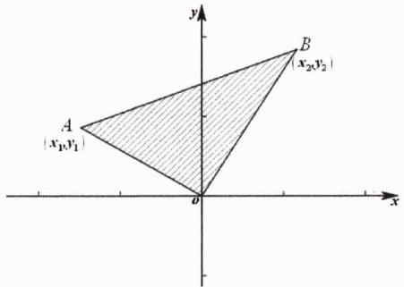

text_image

A
(x₁,y₁)
B
(x₂,y₂)
O
x
y

结论证明：利用 Cauchy 不等式可得

$$
\begin{array}{l} \left(\sqrt {x _ {1} ^ {2} + y _ {1} ^ {2}} + \sqrt {x _ {2} ^ {2} + y _ {2} ^ {2}}\right) ^ {2} = x _ {1} ^ {2} + y _ {1} ^ {2} + x _ {2} ^ {2} + y _ {2} ^ {2} + 2 \sqrt {(x _ {1} ^ {2} + y _ {1} ^ {2}) (x _ {2} ^ {2} + y _ {2} ^ {2})} \\ \geq x _ {1} ^ {2} + y _ {1} ^ {2} + x _ {2} ^ {2} + y _ {2} ^ {2} + 2 \left| x _ {1} x _ {2} + y _ {1} y _ {2} \right| \\ \geq x _ {1} ^ {2} + y _ {1} ^ {2} + x _ {2} ^ {2} + y _ {2} ^ {2} - 2 \left(x _ {1} x _ {2} + y _ {1} y _ {2}\right) \\ = (x _ {1} - x _ {2}) ^ {2} + (y _ {1} - y _ {2}) ^ {2} \\ \end{array}
$$

两边开方即可得证！

例17. 函数 $f(x)=\sqrt{x^{2}+4}+\sqrt{x^{2}-4x+8}$ 的最小值为 \_\_\_\_.

解析：由三角不等式知

$$
\begin{array}{l} f (x) = \sqrt {x ^ {2} + 4} + \sqrt {x ^ {2} - 4 x + 8} = \sqrt {x ^ {2} + 2 ^ {2}} + \sqrt {(x - 2) ^ {2} + (- 2) ^ {2}} \\ \geq \sqrt {(x - x + 2) ^ {2} + (2 + 2) ^ {2}} \\ = 2 \sqrt {5} \\ \end{array}
$$

当且仅当x=1时取等，综上函数 $f(x)$ 的最小值为 $2\sqrt{5}$ .

在上述结论的基础上我们可以自然而然得到如下一推论：

推论5.5: 三角不等式Ⅱ 对任意的实数 $x_{1},x_{2},x_{3},y_{1},y_{2},y_{3}$ ，恒有

$$
\sqrt {(x _ {1} - x _ {3}) ^ {2} + (y _ {1} - y _ {3}) ^ {2}} + \sqrt {(x _ {2} - x _ {3}) ^ {2} + (y _ {2} - y _ {3}) ^ {2}} \geq \sqrt {(x _ {2} - x _ {1}) ^ {2} + (y _ {2} - y _ {1}) ^ {2}}
$$

当且仅当向量 $(x_{1}-x_{3},y_{1}-y_{3})$ 与向量 $(x_{2}-x_{3},y_{2}-y_{3})$ 反向时取等.

推论证明：由前述结论知

$$
\sqrt {x _ {1} ^ {2} + y _ {1} ^ {2}} + \sqrt {x _ {2} ^ {2} + y _ {2} ^ {2}} \geq \sqrt {(x _ {1} - x _ {2}) ^ {2} + (y _ {1} - y _ {2}) ^ {2}}
$$

接下来用 $x_{1}-x_{3}$ 代 $x_{1}$ ， $y_{1}-y_{3}$ 代 $y_{1}$ ，再用 $x_{2}-x_{3}$ 代 $x_{2}$ ， $y_{2}-y_{3}$ 代 $y_{2}$ ，即可证得本推论！

说明：本推论的几何意义同上.

结论5.5: 三角不等式Ⅲ 对任意的实数 $x_{1},x_{2},y_{1},y_{2}$ ，恒有

$$
\sqrt {(x _ {1} - x _ {2}) ^ {2} + (y _ {1} - y _ {2}) ^ {2}} - \sqrt {x _ {2} ^ {2} + y _ {2} ^ {2}} \leq \sqrt {x _ {1} ^ {2} + y _ {1} ^ {2}}
$$

当且仅当向量 $(x_{1},y_{1})$ 和向量 $(x_{2},y_{2})$ 反向时取等.

例18. 函数 $f(x)=\sqrt{x^{2}-8x+20}-\sqrt{x^{2}-6x+10}$ 的最大值为 \_\_\_\_.

解析：由三角不等式知

$$
\begin{array}{l} f (x) = \sqrt {x ^ {2} - 8 x + 2 0} - \sqrt {x ^ {2} - 6 x + 1 0} = \sqrt {(x - 4) ^ {2} + 2 ^ {2}} - \sqrt {(3 - x) ^ {2} + (- 1) ^ {2}} \\ \leq \sqrt {[ (x - 4) + (3 - x) ] ^ {2} + (2 - 1) ^ {2}} \\ = \sqrt {2} \\ \end{array}
$$

当且仅当3-x=1即x=2时等号成立，综上函数的最大值为 $\sqrt{2}$ .

我们最后再补充一个与根式相关的小结论，以作备用.

结论5.6: 根式基本不等式 对任意 $a, b \geq 0$ : $\sqrt{a} + \sqrt{b} \geq \sqrt{a + b}$ , 当且仅当 $a = 0$ 或 $b = 0$ 时取等.

# 第 05 讲：高考对标训练

1. [2008 全国 I 理 10] 若直线 $\frac{x}{a} + \frac{y}{b} = 1$ 过点 $M(\cos \alpha, \sin \alpha)$ ，则（）

$$
\mathrm{A.} a ^ {2} + b ^ {2} \leq 1
$$

$$
\mathrm{B.} a ^ {2} + b ^ {2} \geq 1
$$

$$
\mathrm{C.} \frac {1}{a ^ {2}} + \frac {1}{b ^ {2}} \leq 1
$$

$$
\mathrm{D.} \frac {1}{a ^ {2}} + \frac {1}{b ^ {2}} \geq 1
$$

2. [2013 湖南理 10] 已知 $a, b, c \in \mathbb{R}$ , $a + 2b + 3c = 6$ , 则 $a^2 + 4b^2 + 9c^2$ 的最小值为 \_\_\_\_.

3. [2011 浙江理 16] 设 $x, y$ 为实数，若 $4x^{2} + y^{2} + xy = 1$ ，则 $2x + y$ 的最大值是 \_\_\_\_.

铭师道·高中数学方法原本

4. 设正数a, b, c满足abc = a + b + c，求证 $ab + 4bc + 9ac \geq 36$ ，并给出等号成立的条件.  
5. 函数 $f(x) = x + \sqrt{4x - x^2}$ 的值域为 \_\_\_\_.  
6. 已知 $x^{2} + y^{2} + z^{2} = 1$ , $x + 2y + 3z = \sqrt{14}$ , 则 $x + y + z$ 的值为 \_\_\_\_.  
7. [2012 浙江文 9]若正数x,y满足 $x+3y=5xy$ ，则 $3x+4y$ 的最小值是\_\_\_\_。  
8. 已知 $a, b \in \mathbb{R}$ , $2a^{2} - b^{2} = 1$ , 则 $|2a - b|$ 的最小值是  
9. 已知正数 $x, y, z$ 满足 $x + y + z = 1$ ，求证： $\frac{x^2}{y + 2z} + \frac{y^2}{z + 2x} + \frac{z^2}{x + 2y} \geq \frac{1}{3}$ .  
10. 已知 $a^{2}+b^{2}+c^{2}+d^{2}+e^{2}=16$ 且 $a+b+c+d+e=8$ ，则e的取值范围是\_\_\_\_。  
11. [2008 南开自招]设a,b,c均为正数，且 $a+b+c=1$ .求证：

$$
\left(a + \frac {1}{a}\right) ^ {2} + \left(b + \frac {1}{b}\right) ^ {2} + \left(c + \frac {1}{c}\right) ^ {2} \geq \frac {1 0 0}{3}
$$

12. 设a,b,c是正实数，求证：

$$
\frac {8 a}{3 b ^ {2} + 2 b c + 3 c ^ {2}} + \frac {8 b}{3 c ^ {2} + 2 c a + 3 a ^ {2}} + \frac {8 c}{3 a ^ {2} + 2 a b + 3 b ^ {2}} \geq \frac {9}{a + b + c}
$$

# 第 05 讲：对标答案

1. [解析]:

因为点M在直线上，从而有 $\frac{\cos\alpha}{a}+\frac{\sin\alpha}{b}=1$ ，接下来由Cauchy不等式知

$$
\left[ \left(\frac {1}{a}\right) ^ {2} + \left(\frac {1}{b}\right) ^ {2} \right] (\cos^ {2} \alpha + \sin^ {2} \alpha) \geq \left(\frac {\cos \alpha}{a} + \frac {\sin \alpha}{b}\right) ^ {2} = 1
$$

从而有 $\frac{1}{a^{2}}+\frac{1}{b^{2}}\geq1$ ，故而本题选D.

2. [解析]:

由 Cauchy 不等式得

$$
[ a ^ {2} + (2 b) ^ {2} + (3 c) ^ {2} ] \left(1 ^ {2} + 1 ^ {2} + 1 ^ {2}\right) \geq (a + 2 b + 3 c) ^ {2} = 3 6
$$

从而有 $a^2 + 4b^2 + 9c^2 \geq 12$ ，当且仅当 $\frac{a}{1} = \frac{2b}{1} = \frac{3c}{1}$ 即 $a = 2, b = 1, c = \frac{2}{3}$ 时等号成立.

3. [解析]:

由 $4x^{2}+y^{2}+xy=1$ 可得 $(2x)^{2}+2\cdot2x\cdot\frac{y}{4}+\left(\frac{y}{4}\right)^{2}+\left(\frac{\sqrt{15}}{4}y\right)^{2}=1$ 即

$$
\left(2 x + \frac {y}{4}\right) ^ {2} + \left(\frac {\sqrt {1 5}}{4} y\right) ^ {2} = 1
$$

由 Cauchy 不等式可得

$$
\left[ \left(2 x + \frac {y}{4}\right) ^ {2} + \left(\frac {\sqrt {1 5}}{4} y\right) ^ {2} \right] \cdot \left[ 1 ^ {2} + \left(\frac {3}{\sqrt {1 5}}\right) ^ {2} \right] \geq \left[ \left(2 x + \frac {y}{4}\right) + \frac {3 y}{4} \right] ^ {2} = (2 x + y) ^ {2}
$$

故而有 $(2x + y)^{2} \leq \frac{8}{5}$ ，进一步有 $2x + y \leq \frac{2\sqrt{10}}{5}$ （当且仅当 $2x = y$ 即 $x = \frac{\sqrt{10}}{10}, y = \frac{\sqrt{10}}{5}$ 时等号成立）.

4. [解析]:

由 $abc = a + b + c$ ，得 $\frac{1}{ab} + \frac{1}{ac} + \frac{1}{bc} = 1$ ，由 Cauchy 不等式得

$$
(a b + 4 b c + 9 a c) \left(\frac {1}{a b} + \frac {1}{b c} + \frac {1}{a c}\right) \geq (\sqrt {1} + \sqrt {4} + \sqrt {9}) ^ {2} = 3 6
$$

从而有 $ab + 4bc + 9ac \geq 36$ ，当且仅当 $\frac{ab}{\frac{1}{ab}} = \frac{4bc}{\frac{1}{bc}} = \frac{9ac}{\frac{1}{ac}}$ 即a = 2c, b = 3c即a = 2, b = 3, c = 1时，等号成立.

5. [解析]:

因为函数定义域为 $x \in [0,4]$ ，从而有 $f(x) \geq f(0) = 0$ 。再由 Cauchy 不等式知

$$
f (x) = 1 \cdot (x - 2) + 1 \cdot \sqrt {4 - (x - 2) ^ {2}} + 2 \leq \sqrt {(1 ^ {2} + 1 ^ {2}) [ (x - 2) ^ {2} + 4 - (x - 2) ^ {2} ]} + 2
$$

$$
= 2 \sqrt {2} + 2
$$

当且仅当 $x=2+\sqrt{2}$ 时上式取等，从而 $f(x)\in[0,2\sqrt{2}+2]$ .

6. [解析]:

由 Cauchy 不等式知

$$
1 4 = (x + 2 y + 3 z) ^ {2} \leq (1 ^ {2} + 2 ^ {2} + 3 ^ {2}) (x ^ {2} + y ^ {2} + z ^ {2}) = 1 4
$$

故而必有 $\frac{x}{1}=\frac{y}{2}=\frac{z}{3}$ ，解得 $x=\frac{\sqrt{14}}{14}$ ，进而有 $x+y+z=6x=\frac{3\sqrt{14}}{7}$ .

7. [解析]:

由 $x + 3y = 5xy$ 可得 $\frac{3}{x} +\frac{1}{y} = 5$ ，由Cauchy不等式可得

$$
(3 x + 4 y) \left(\frac {3}{x} + \frac {1}{y}\right) \geq (\sqrt {9} + \sqrt {4}) ^ {2} = 2 5
$$

从而有 $3x + 4y \geq 5$ ，当且仅当 $x = 1, y = \frac{1}{2}$ 时等号成立.

8. [解析]:

由二维反向 Cauchy 不等式知

$$
\vert 2 a - b \vert = \left| \sqrt {2} \cdot \sqrt {2} a - 1 \cdot b \right| \geq \sqrt {2 - 1} \cdot \sqrt {2 a ^ {2} - b ^ {2}} = 1
$$

当且仅当ab=1且 $2a^{2}-b^{2}=1$ 即 $|a|=|b|=1$ 时上式取等，综上目标函数最小值是1.

9. [解析]:

由 Cauchy 不等式可得

$$
\left(\frac {x ^ {2}}{y + 2 z} + \frac {y ^ {2}}{z + 2 x} + \frac {z ^ {2}}{x + 2 y}\right) [ (y + 2 z) + (z + 2 x) + (x + 2 y) ] \geq (x + y + z) ^ {2}
$$

即有

$$
\frac {x ^ {2}}{y + 2 z} + \frac {y ^ {2}}{z + 2 x} + \frac {z ^ {2}}{x + 2 y} \geq \frac {x + y + z}{3} = \frac {1}{3}
$$

当且仅当 $\frac{x}{y+2z}=\frac{y}{z+2x}=\frac{z}{x+2y}$ 即x=y=z= $\frac{1}{3}$ 时等号成立，从而得证！

10. [解析]:

由 Cauchy 不等式知

$$
(a ^ {2} + b ^ {2} + c ^ {2} + d ^ {2}) (1 ^ {2} + 1 ^ {2} + 1 ^ {2} + 1 ^ {2}) \geq (a + b + c + d) ^ {2}
$$

进而有 $4(16-e^{2})\geq(8-e)^{2}$ ，解得 $e\in\left[0,\frac{16}{5}\right]$ .

11. [解析]:

由 Cauchy 不等式得

$$
\left[ \left(a + \frac {1}{a}\right) ^ {2} + \left(b + \frac {1}{b}\right) ^ {2} + \left(c + \frac {1}{c}\right) ^ {2} \right] (1 ^ {2} + 1 ^ {2} + 1 ^ {2}) \geq \left(a + \frac {1}{a} + b + \frac {1}{b} + c + \frac {1}{c}\right) ^ {2}
$$

从而有 $\left(a+\frac{1}{a}\right)^{2}+\left(b+\frac{1}{b}\right)^{2}+\left(c+\frac{1}{c}\right)^{2}\geq\frac{1}{3}\left(1+\frac{1}{a}+\frac{1}{b}+\frac{1}{c}\right)^{2}$ ，再由Cauchy不等式可得

$$
\left(\frac {1}{a} + \frac {1}{b} + \frac {1}{c}\right) (a + b + c) \geq (1 + 1 + 1) ^ {2}
$$

进而有 $\frac{1}{a} +\frac{1}{b} +\frac{1}{c}\geq 9$ ，由此证得 $\left(a + \frac{1}{a}\right)^2 +\left(b + \frac{1}{b}\right)^2 +\left(c + \frac{1}{c}\right)^2\geq \frac{(1 + 9)^2}{3}$ （当且仅当 $a = b = c = \frac{1}{3}$ 时取等）.

12. [解析]:

由分式型 Cauchy 不等式知

$$
\sum_ {\text {cyc}} \frac {8 a}{3 b ^ {2} + 2 b c + 3 c ^ {2}} = \sum_ {\text {cyc}} \frac {8 a ^ {2}}{3 a b ^ {2} + 2 a b c + 3 a c ^ {2}} \geq \frac {8 (a + b + c) ^ {2}}{\sum_ {\text {cyc}} (3 a b ^ {2} + 2 a b c + 3 a c ^ {2})}
$$

故而仅需证以下不等式即可

$$
\frac {8 (a + b + c) ^ {2}}{\sum_ {\mathrm{cyc}} \left(3 a b ^ {2} + 2 a b c + 3 a c ^ {2}\right)} \geq \frac {9}{a + b + c}
$$

化简后只需证以下不等式即可

$$
3 (a - b) ^ {2} (a + b) + 3 (b - c) ^ {2} (b + c) + 3 (c - a) ^ {2} (c + a) + 2 \left(\underbrace {a ^ {3} + b ^ {3} + c ^ {3} - 3 a b c}\right) \geq 0
$$

因为 $a^{3}+b^{3}+c^{3}\geq3abc$ 恒成立，故而上述不等式得证！

说明： $(a + b + c)^{3} = a^{3} + b^{3} + c^{3} + 3(a + b + c)(ab + bc + ca) - 3abc.$

铭师道·高中数学方法原本

# 第 06 讲：正反向权方和不等式系统探究

我们在上一讲已提及分式型的 Cauchy 不等式其实就是最简权方和不等式，本讲我们就来系统探究一下该不等式及其运用。我们在一开始先用琴生（Jensen）不等式来证明赫尔德（Hölder）不等式。

定理6.1: Hölder不等式 设 $a_{i}$ ， $b_{i}(i=1,2,\cdots,n)$ 是正实数， $\alpha,\beta>0$ 且 $\alpha+\beta=1$ ，则有

$$
a _ {1} ^ {\alpha} b _ {1} ^ {\beta} + a _ {2} ^ {\alpha} b _ {2} ^ {\beta} + \dots + a _ {n} ^ {\alpha} b _ {n} ^ {\beta} \leq (a _ {1} + a _ {2} + \dots + a _ {n}) ^ {\alpha} \cdot (b _ {1} + b _ {2} + \dots + b _ {n}) ^ {\beta}
$$

定理证明：令 $M=a_{1}+a_{2}+\cdots+a_{n},\quad N=b_{1}+b_{2}+\cdots+b_{n}$ .因为 $f(x)=\ln x$ 是 $(0,+\infty)$ 上的上凸函数，由Jensen不等式知

$$
\alpha \ln {\frac {a _ {i}}{M}} + \beta \ln {\frac {b _ {i}}{N}} \leq \ln \left(\alpha \cdot {\frac {a _ {i}}{M}} + \beta \cdot {\frac {b _ {i}}{N}}\right)
$$

由此可得

$$
\left(\frac {a _ {i}}{M}\right) ^ {\alpha} \cdot \left(\frac {b _ {i}}{N}\right) ^ {\beta} \leq \alpha \cdot \frac {a _ {i}}{M} + \beta \cdot \frac {b _ {i}}{N}
$$

将i取遍 $1,2,\cdots,n$ ，并将所有对应不等式相加得

$$
\left(\frac {a _ {1}}{M}\right) ^ {\alpha} \cdot \left(\frac {b _ {1}}{N}\right) ^ {\beta} + \left(\frac {a _ {2}}{M}\right) ^ {\alpha} \cdot \left(\frac {b _ {2}}{N}\right) ^ {\beta} + \dots + \left(\frac {a _ {n}}{M}\right) ^ {\alpha} \cdot \left(\frac {b _ {n}}{N}\right) ^ {\beta} \leq \alpha \cdot \frac {a _ {1} + a _ {2} + \cdots + a _ {n}}{M} + \beta \cdot \frac {b _ {1} + b _ {2} + \cdots + b _ {n}}{N} = 1
$$

变形后定理即可得证！

在上述定理的基础上，经过简单换元后可得到如下形式的Hölder不等式.

推论6.1: 设 $a_{i}$ ， $b_{i}(i=1,2,\cdots,n)$ 是正实数， $\alpha>1$ 且 $\frac{1}{\alpha}+\frac{1}{\beta}=1$ ，则有

$$
a _ {1} b _ {1} + a _ {2} b _ {2} + \dots + a _ {n} b _ {n} \leq (a _ {1} ^ {\alpha} + a _ {2} ^ {\alpha} + \dots + a _ {n} ^ {\alpha}) ^ {\frac {1}{\alpha}} \cdot \Bigl (b _ {1} ^ {\beta} + b _ {2} ^ {\beta} + \dots + b _ {n} ^ {\beta} \Bigr) ^ {\frac {1}{\beta}}
$$

然后我们再用Hölder不等式证明权方和不等式.

定理6.2: 权方和不等式 设 $a_{i}$ ， $b_{i}(i=1,2,\cdots,n)$ 是正实数， $m\in R^{+}$ ，则有

$$
\frac {a _ {1} ^ {m + 1}}{b _ {1} ^ {m}} + \frac {a _ {2} ^ {m + 1}}{b _ {2} ^ {m}} + \dots + \frac {a _ {n} ^ {m + 1}}{b _ {n} ^ {m}} \geq \frac {(a _ {1} + a _ {2} + \cdots + a _ {n}) ^ {m + 1}}{(b _ {1} + b _ {2} + \cdots + b _ {n}) ^ {m}}
$$

当且仅当 $\frac{a_{1}}{b_{1}}=\frac{a_{2}}{b_{2}}=\cdots=\frac{a_{n}}{b_{n}}$ 时取等.

定理证明：在推论6.1的基础上，令 $\alpha = m + 1$ ， $\beta = \frac{m + 1}{m}$ ，则有

$$
a _ {1} b _ {1} + a _ {2} b _ {2} + \dots + a _ {n} b _ {n} \leq (a _ {1} ^ {m + 1} + a _ {2} ^ {m + 1} + \dots + a _ {n} ^ {m + 1}) ^ {\frac {1}{m + 1}} \cdot \left(b _ {1} ^ {\frac {m + 1}{m}} + b _ {2} ^ {\frac {m + 1}{m}} + \dots + b _ {n} ^ {\frac {m + 1}{m}}\right) ^ {\frac {m}{m + 1}}
$$

接下来令 $y_{n}=b_{n}^{\frac{m+1}{m}}$ ，则有 $b_{n}=y_{n}^{\frac{m}{m+1}}$ ；再令 $x_{n}=a_{n}b_{n}$ ，则有 $a_{n}=\frac{x_{n}}{\frac{m}{y_{n}^{m+1}}}$ 。于是

$$
x _ {1} + x _ {2} + \dots + x _ {n} \leq \left(\frac {x _ {1} ^ {m + 1}}{y _ {1} ^ {m}} + \frac {x _ {2} ^ {m + 1}}{y _ {2} ^ {m}} + \dots + \frac {x _ {n} ^ {m + 1}}{y _ {n} ^ {m}}\right) ^ {\frac {1}{m + 1}} \cdot (y _ {1} + y _ {2} + \dots + y _ {n}) ^ {\frac {m}{m + 1}}
$$

变形后定理即可得证！

说明：以上证明方法节选自《高数视角下的导函数论》第一卷专题9中的相关内容（分别对应的是定理9.10和9.11），另外严格用广义均值不等式也能证明权方和不等式.

为了便于用均值不等式证明权方和不等式，从务实的角度我们需要将 $m \in R^{+}$ 弱化为 $m \in N^{+}$ ，其具体证明过程如下：

令

$$
x _ {i} = \frac {a _ {i}}{\sum_ {i = 1} ^ {n} a _ {i}}, y _ {i} = \frac {b _ {i}}{\sum_ {i = 1} ^ {n} b _ {i}}
$$

显而易见的是

$$
\sum_ {i = 1} ^ {n} x _ {i} = 1, \sum_ {i = 1} ^ {n} y _ {i} = 1
$$

进而我们只需证以下不等式即可

$$
\sum_ {i = 1} ^ {n} \frac {(x _ {i} \sum_ {i = 1} ^ {n} a _ {i}) ^ {m + 1}}{(y _ {i} \sum_ {i = 1} ^ {n} b _ {i}) ^ {m}} \geq \frac {(\sum_ {i = 1} ^ {n} a _ {i}) ^ {m + 1}}{(\sum_ {i = 1} ^ {n} b _ {i}) ^ {m}}
$$

即需证

$$
\sum_ {i = 1} ^ {n} \frac {x _ {i} ^ {m + 1}}{y _ {i} ^ {m}} \geq 1
$$

而

$$
\begin{array}{l} \sum_ {i = 1} ^ {n} \frac {x _ {i} ^ {m + 1}}{y _ {i} ^ {m}} = \sum_ {i = 1} ^ {n} \left(\frac {x _ {i} ^ {m + 1}}{y _ {i} ^ {m}} + \underbrace {y _ {i} + y _ {i} + \cdots + y _ {i}} _ {m \text {个}} - m y _ {i}\right) \\ \geq \sum_ {i = 1} ^ {n} \left[ (m + 1) ^ {m + 1} \sqrt {\frac {x _ {i} ^ {m + 1}}{y _ {i} ^ {m}} \cdot y _ {i} \cdot y _ {i} \cdot \cdots \cdot y _ {i}} - m y _ {i} \right] \\ = \sum_ {i = 1} ^ {n} [ (m + 1) x _ {i} - m y _ {i} ] \\ = (m + 1) \sum_ {i = 1} ^ {n} x _ {i} - m \sum_ {i = 1} ^ {n} y _ {i} \\ = 1 \\ \end{array}
$$

当且仅当 $\frac{x_{i}^{m+1}}{y_{i}^{m}}=y_{i}$ 即 $x_{i}=y_{i}$ 即 $\frac{a_{i}}{\sum_{i=1}^{n}a_{i}}=\frac{b_{i}}{\sum_{i=1}^{n}b_{i}}$ 即 $\frac{a_{i}}{b_{i}}=\frac{\sum_{i=1}^{n}a_{i}}{\sum_{i=1}^{n}b_{i}}$ 时等号成立，从而得证！

结论6.1: 二维形式权方和不等式 对任意正实数 $a, b, x, y, m \in \mathbb{R}^{+}$ , 恒有

$$
\frac {a ^ {m + 1}}{x ^ {m}} + \frac {b ^ {m + 1}}{y ^ {m}} \geq \frac {(a + b) ^ {m + 1}}{(x + y) ^ {m}}
$$

当且仅当 $\frac{a}{x}=\frac{b}{y}$ 时上式取等.

结论6.2: 系数调整法则 为了利用权方和不等式得到目标函数的最值, 我们经常需要调整系数以出现定值, 其一般形式如下

$$
\frac {a ^ {m + 1}}{x ^ {m}} + \frac {b ^ {m + 1}}{y ^ {m}} = \frac {p ^ {m} a ^ {m + 1}}{(p x) ^ {m}} + \frac {q ^ {m} b ^ {m + 1}}{(q y) ^ {m}} \geq \frac {\left(p ^ {\frac {m}{m + 1}} a + q ^ {\frac {m}{m + 1}} b\right) ^ {m + 1}}{(p x + q y) ^ {m}}
$$

说明：调整的形式和方法有很多，目的是为了出现定值且要保证可以取等.

例1. 函数 $f(x)=\frac{2}{x}+\frac{9}{1-2x},x\in\left(0,\frac{1}{2}\right)$ 的最小值为 \_\_\_\_.

解析：由权方和不等式可得

$$
f (x) = \frac {2}{x} + \frac {9}{1 - 2 x} = \frac {2 ^ {2}}{2 x} + \frac {3 ^ {2}}{1 - 2 x} \geq \frac {(2 + 3) ^ {2}}{1} = 2 5
$$

当且仅当 $x=\frac{1}{5}$ 时上式等号成立，综上 $f(x)$ 的最小值为25.

例2. 已知x,y为正实数， $\frac{1}{x}+\frac{1}{y}=1$ ，则 $\frac{4x}{x-1}+\frac{9y}{y-1}$ 的最小值为\_\_\_\_.

解析：由权方和不等式知

$$
\frac {4 x}{x - 1} + \frac {9 y}{y - 1} = \frac {4}{1 - \frac {1}{x}} + \frac {9}{1 - \frac {1}{y}} \geq \frac {2 5}{1} = 2 5
$$

当且仅当 $3\left(1-\frac{1}{x}\right)=2\left(1-\frac{1}{y}\right)$ 即 $x=\frac{5}{3}$ ， $y=\frac{5}{2}$ 时上式取等.

例3. 设 $x, y \in \mathbb{R}$ , 则 $(x + y)^2 + \left(x - \frac{2}{y}\right)^2$ 的最小值 \_\_\_\_.

解析：由权方和不等式知

铭师道·高中数学方法原本

$$
\frac {(x + y) ^ {2}}{1} + \frac {\left(x - \frac {2}{y}\right) ^ {2}}{1} \geq \frac {\left(y + \frac {2}{y}\right) ^ {2}}{2} \geq 4
$$

取等条件之一为 $y=\sqrt{2}$ ， $x+y=\frac{2}{y}-x$ 即x=0.

例4. [2011 爱沙尼亚国家队选拔赛]已知 $a, b, c \in \mathbb{R}^{+}$ , 且 $2a^{2} + b^{2} = 9c^{2}$ , 求证:

$$
\frac {2 c}{a} + \frac {c}{b} \geq \sqrt {3}
$$

解析：由条件知

$$
2 \left(\frac {a}{c}\right) ^ {2} + \left(\frac {b}{c}\right) ^ {2} = 9
$$

由权方和不等式知

$$
\frac {2 c}{a} + \frac {c}{b} = \frac {1}{\frac {a}{2 c}} + \frac {1}{\frac {b}{c}} = \frac {2 \sqrt {2}}{\left[ 2 \left(\frac {a}{c}\right) ^ {2} \right] ^ {\frac {1}{2}}} + \frac {1}{\left[ \left(\frac {b}{c}\right) ^ {2} \right] ^ {\frac {1}{2}}} = \frac {2 ^ {\frac {3}{2}}}{\left[ 2 \left(\frac {a}{c}\right) ^ {2} \right] ^ {\frac {1}{2}}} + \frac {1 ^ {\frac {3}{2}}}{\left[ \left(\frac {b}{c}\right) ^ {2} \right] ^ {\frac {1}{2}}} \geq \frac {(2 + 1) ^ {\frac {3}{2}}}{\left[ 2 \left(\frac {a}{c}\right) ^ {2} + \left(\frac {b}{c}\right) ^ {2} \right] ^ {\frac {1}{2}}} = \frac {3 \sqrt {3}}{3} = \sqrt {3}
$$

当且仅当 $\frac{2}{2\left(\frac{a}{c}\right)^2} = \frac{1}{\left(\frac{b}{c}\right)^2}$ 即 $a = b = \sqrt{3} c$ 时等号成立，从而得证！

例5. 已知 $a, b > 0$ , $a(1 - a) + (a - b)^{2} = a^{3} + b^{3}$ , 则 $\frac{2a^{2}}{a + 3b} + \frac{2b^{2}}{3a + b}$ 的最小值为 \_\_\_\_.

解析：由题知 $a-2ab+b^{2}=(a+b)(a^{2}-ab+b^{2})$ ，因为

$$
a - 2 a b + b ^ {2} = a ^ {2} - a b + b ^ {2} + a - a b - a ^ {2} = a ^ {2} - a b + b ^ {2} + a (1 - b - a)
$$

则有

$$
(a ^ {2} - a b + b ^ {2} + a) (a + b - 1) = 0
$$

从而有 $a + b = 1$ ，根据权方和不等式可得

$$
\frac {2 a ^ {2}}{a + 3 b} + \frac {2 b ^ {2}}{3 a + b} \geq 2 \cdot \frac {(a + b) ^ {2}}{4 (a + b)} = \frac {1}{2}
$$

当且仅当 $\frac{a}{a+3b}=\frac{b}{3a+b}$ 即 $a=b=\frac{1}{2}$ 时取等.

例6. [2021 中学生标准能力检测 T23]

(1) 已知 $a, b \in \mathbb{R}^{+}$ , 且 $a + 2b = 3$ , 则 $\frac{1}{a^2} + \frac{2}{b^2}$ 的最小值为 \_\_\_\_;  
(2) 已知 $x, y \in \mathbb{R}^{+}$ , 且 $\frac{4}{x} + \frac{9}{y} = 1$ , 则 $\frac{4}{2x^{2} + x} + \frac{9}{y^{2} + y}$ 的最小值为 \_\_\_\_.

解析：

第一问：由权方和不等式知

$$
\frac {1}{a ^ {2}} + \frac {2}{b ^ {2}} = \frac {1}{a ^ {2}} + \frac {2 ^ {3}}{(2 b) ^ {2}} \geq \frac {(1 + 2) ^ {3}}{(a + 2 b) ^ {2}} = \frac {2 7}{9} = 3
$$

当且仅当a=b=1时上式取等.

第二问：继续由权方和不等式知

$$
\frac {4}{2 x ^ {2} + x} + \frac {9}{y ^ {2} + y} = \frac {\frac {4}{x ^ {2}}}{2 + \frac {1}{x}} + \frac {\frac {9}{y ^ {2}}}{1 + \frac {1}{y}} = \frac {\frac {4 ^ {2}}{x ^ {2}}}{8 + \frac {4}{x}} + \frac {\frac {9 ^ {2}}{y ^ {2}}}{9 + \frac {9}{y}} \geq \frac {1}{8 + 9 + 1} = \frac {1}{1 8}
$$

当且仅当 $\frac{\frac{4}{x}}{8 + \frac{4}{x}} = \frac{\frac{9}{y}}{9 + \frac{9}{y}}$ 即 $\frac{1}{2x + 1} = \frac{1}{y + 1}$ 即 $y = 2x$ 即 $x = \frac{17}{2}$ 且 $y = 17$ 时上式取等.

例7. 已知 $x, y, z \in \mathbb{R}^{+}$ , $x + y + z = 1$ , 求证: $\frac{1}{1 - x} + \frac{1}{1 - y} + \frac{1}{1 - z} \geq \frac{2}{1 + x} + \frac{2}{1 + y} + \frac{2}{1 + z}$ .

解析：由题知 $1-x+1-y=1+z$ ，由权方和不等式知

$$
\frac {1}{1 - x} + \frac {1}{1 - y} \geq \frac {4}{1 + z}
$$

同理即可证明

$$
\begin{array}{l} \frac {1}{1 - x} + \frac {1}{1 - y} + \frac {1}{1 - z} = \frac {1}{2} \left[ \left(\frac {1}{1 - x} + \frac {1}{1 - y}\right) + \left(\frac {1}{1 - x} + \frac {1}{1 - z}\right) + \left(\frac {1}{1 - y} + \frac {1}{1 - z}\right) \right] \\ \geq \frac {2}{1 + x} + \frac {2}{1 + y} + \frac {2}{1 + z} \\ \end{array}
$$

当且仅当 $x = y = z = \frac{1}{3}$ 时上式取等.

例8. 已知正数 $a, b, c$ 满足 $abc = 1$ , 求证: $\frac{1}{1 + 2a} + \frac{1}{1 + 2b} + \frac{1}{1 + 2c} \geq 1$ .

解析：令 $a=\frac{x}{y}$ ， $b=\frac{y}{z}$ ， $c=\frac{z}{x}$ ，从而原不等式等价于需证

$$
\frac {y}{y + 2 x} + \frac {z}{z + 2 y} + \frac {x}{x + 2 z} = \frac {y ^ {2}}{y ^ {2} + 2 x y} + \frac {z ^ {2}}{z ^ {2} + 2 y z} + \frac {x ^ {2}}{x ^ {2} + 2 x z} \geq 1
$$

由权方和不等式知

$$
\frac {y ^ {2}}{y ^ {2} + 2 x y} + \frac {z ^ {2}}{z ^ {2} + 2 y z} + \frac {x ^ {2}}{x ^ {2} + 2 x z} \geq \frac {(x + y + z) ^ {2}}{(x + y + z) ^ {2}} = 1
$$

当且仅当x=y=z即a=b=c=1时上式取等，从而得证！

结论6.3: 变量替换法则 在较复杂的证明中, 我们经常需要先对已有变量进行特殊的对称化的替换, 然后才能使用权方和不等式.

例9. 已知正数 $a, b, c$ 满足 $a + b + c = 1$ , 求证:

$$
\frac {1 + a}{1 - a} + \frac {1 + b}{1 - b} + \frac {1 + c}{1 - c} \leq 2 \left(\frac {a}{b} + \frac {b}{c} + \frac {c}{a}\right)
$$

解析：令 $a = \frac{x}{x + y + z}, b = \frac{y}{x + y + z}, c = \frac{z}{x + y + z}$ 其中 $x, y, z \in \mathbb{R}^{+}$ ，从而需证：

$$
\frac {2 x + y + z}{y + z} + \frac {2 y + z + x}{z + x} + \frac {2 z + x + y}{x + y} \leq \frac {2 x}{y} + \frac {2 y}{z} + \frac {2 z}{x}
$$

进而需证

$$
\left(\frac {2 x}{y} - \frac {2 x}{y + z}\right) + \left(\frac {2 y}{z} - \frac {2 y}{z + x}\right) + \left(\frac {2 z}{x} - \frac {2 z}{x + y}\right) \geq 3
$$

由权方和不等式知

$$
\begin{array}{l} \left(\frac {2 x}{y} - \frac {2 x}{y + z}\right) + \left(\frac {2 y}{z} - \frac {2 y}{z + x}\right) + \left(\frac {2 z}{x} - \frac {2 z}{x + y}\right) = \frac {2 x z}{y ^ {2} + y z} + \frac {2 y x}{z ^ {2} + z x} + \frac {2 z y}{x ^ {2} + x y} \\ = \frac {2 x ^ {2} z ^ {2}}{y ^ {2} x z + z ^ {2} x y} + \frac {2 y ^ {2} x ^ {2}}{z ^ {2} x y + x ^ {2} z y} + \frac {2 z ^ {2} y ^ {2}}{x ^ {2} y z + y ^ {2} x z} \\ \geq \frac {2 (x z + y x + z y) ^ {2}}{2 (y ^ {2} x z + z ^ {2} x y + x ^ {2} y z)} \\ \end{array}
$$

又因为

$$
\begin{array}{l} (x z + y x + z y) ^ {2} = x ^ {2} z ^ {2} + y ^ {2} x ^ {2} + z ^ {2} y ^ {2} + 2 \left(y ^ {2} x z + z ^ {2} x y + x ^ {2} y z\right) \\ = \frac {1}{2} \left[ \left(x ^ {2} z ^ {2} + y ^ {2} x ^ {2}\right) + \left(y ^ {2} x ^ {2} + z ^ {2} y ^ {2}\right) + \left(x ^ {2} z ^ {2} + z ^ {2} y ^ {2}\right) \right] + 2 \left(y ^ {2} x z + z ^ {2} x y + x ^ {2} y z\right) \\ \geq 3 \left(y ^ {2} x z + z ^ {2} x y + x ^ {2} y z\right) \\ \end{array}
$$

从而有

$$
\frac {2 (x z + y x + z y) ^ {2}}{2 \left(y ^ {2} x z + z ^ {2} x y + x ^ {2} y z\right)} \geq 3
$$

综上证明结束！

在上一例题的基础上，我们自然而然地得到如下一推论.

推论6.2: 对任意的 $x, y, z \in \mathbb{R}^{*}$ , 恒有

$$
(x z + y x + z y) ^ {2} \geq 3 (y ^ {2} x z + z ^ {2} x y + x ^ {2} y z)
$$

当且仅当x=y=z时等号成立.

说明：其证明过程已在上一例题中给出.

铭师道·高中数学方法原本

例10. 已知 $x, y, z$ 均为正实数，求证：

$$
x ^ {2} y (x - y) + y ^ {2} z (y - z) + z ^ {2} x (z - x) \geq 0
$$

解析：令

$$
x = a + b, y = b + c, z = c + a
$$

则原不等式等价于

$$
(a + b) ^ {2} (b + c) (a - c) + (b + c) ^ {2} (c + a) (b - a) + (c + a) ^ {2} (a + b) (c - b) \geq 0
$$

其又等价于

$$
a b ^ {3} + b c ^ {3} + c a ^ {3} - (a + b + c) a b c \geq 0
$$

同除 $abc$ 后需证

$$
\frac {b ^ {2}}{c} + \frac {c ^ {2}}{a} + \frac {a ^ {2}}{b} \geq a + b + c
$$

由权方和不等式知上述不等式恒成立，当且仅当 $a = b = c$ 即 $x = y = z$ 时原不等式取等，从而得证！

定理6.3: 反向权方和不等式 设 $a_{i}$ ， $b_{i}(i=1,2,\cdots,n)$ 是正实数，当 $m\in(-1,0)$ 时，有

$$
\frac {a _ {1} ^ {m + 1}}{b _ {1} ^ {m}} + \frac {a _ {2} ^ {m + 1}}{b _ {2} ^ {m}} + \dots + \frac {a _ {n} ^ {m + 1}}{b _ {n} ^ {m}} \leq \frac {(a _ {1} + a _ {2} + \cdots + a _ {n}) ^ {m + 1}}{(b _ {1} + b _ {2} + \cdots + b _ {n}) ^ {m}}
$$

当且仅当 $\frac{a_{1}}{b_{1}}=\frac{a_{2}}{b_{2}}=\cdots=\frac{a_{n}}{b_{n}}$ 时取等.

说明：对此结论的证明也需利用到Hölder不等式，逻辑基本同前述证明.

例11. 函数 $f(x)=\sqrt{x^{2}-3x+2}+\sqrt{-x^{2}+3x+2}$ 的最大值为 \_\_\_\_.

解析：由反向权方和不等式可得

$$
\begin{array}{l} f (x) = \sqrt {x ^ {2} - 3 x + 2} + \sqrt {- x ^ {2} + 3 x + 2} = \frac {(x ^ {2} - 3 x + 2) ^ {\frac {1}{2}}}{1 ^ {- \frac {1}{2}}} + \frac {(- x ^ {2} + 3 x + 2) ^ {\frac {1}{2}}}{1 ^ {- \frac {1}{2}}} \\ \leq \frac {(x ^ {2} - 3 x + 2 - x ^ {2} + 3 x + 2) ^ {\frac {1}{2}}}{(1 + 1) ^ {- \frac {1}{2}}} \\ = 2 \sqrt {2} \\ \end{array}
$$

当且仅当 $x^{2}-3x+2=2+3x-x^{2}$ 即x=0或x=3时上式取等.

# 第 06 讲：高考对标训练

1. 已知 $a, b > 0$ 且 $a + b = 1$ ，则 $\frac{1}{a} + \frac{1}{b} + \frac{4}{a^2 + b^2}$ 的最小值为 \_\_\_\_.  
2. 若正实数 $x, y$ 满足 $x + y = 1$ ，则 $\frac{x^2}{x + 2} + \frac{y^2}{y + 4}$ 的最小值是 \_\_\_\_.  
3. 已知正实数 $a, b$ 满足 $2a + b \leq 1$ , 则 $\frac{1}{a + 1} + \frac{1}{a + 2b}$ 的( )

A. 最小值为 $\frac{4 + 2\sqrt{3}}{5}$

B. 最大值为 $\frac{5 + 2\sqrt{3}}{5}$

C. 最大值为 $\frac{4 - 2\sqrt{3}}{5}$

D. 最小值为 $\frac{5 - 2\sqrt{3}}{5}$

4. 已知正数x，y满足 $x+y=1$ ，则 $\frac{1}{x^{2}}+\frac{8}{y^{2}}$ 的最小值为\_\_\_\_。  
5. $\frac{1}{\sin^{2}\theta}+\frac{4}{\cos^{2}\theta}$ 的最小值为 \_\_\_\_.  
6. 若 $x > 0, y > 0, \frac{1}{2x + y} + \frac{3}{x + y} = 2$ ，则 $6x + 5y$ 的最小值为 \_\_\_\_.  
7. [2010 四川文 11] 设 a > b > 0，则 $a^{2} + \frac{1}{ab} + \frac{1}{a(a - b)}$ 的最小值是 \_\_\_\_.

8. 已知正实数 $a, b$ 满足 $2a + b = 3$ , 则 $\frac{2a^2 + 1}{a} + \frac{b^2 - 2}{b + 2}$ 的最小值是 \_\_\_\_.

9. 已知 $x, y \in \mathbb{R}^{+}$ , 则 $\frac{x}{\sqrt{x^2 + 3y^2}} + \frac{y}{\sqrt{y^2 + 3x^2}}$ 的最小值为 \_\_\_\_.

10. 若正实数x，y，z满足 $x+3y+2z=1$ ，则 $\frac{x+2y}{2y+4z}+\frac{4}{x+2y}$ 的最小值是\_\_\_\_.

11. [2010 安徽文 15] 若 a > 0, b > 0, $a + b = 2$ ，则下列不等式对一切满足条件的 a, b 恒成立的是 \_\_\_\_.

① $ab \leq 1$ ; ② $\sqrt{a} + \sqrt{b} \leq \sqrt{2}$ ; ③ $a^{2} + b^{2} \geq 2$ ; ④ $a^{3} + b^{3} \geq 3$ ; ⑤ $\frac{1}{a} + \frac{1}{b} \geq 2$ .

12. 若存在实数a和b使得直线 $ax+by=1$ 与线段AB（其中 $A(1,0)$ ， $B(2,1)$ ）只有一个公共点，且不等式 $\frac{1}{\sin^{2}\theta}+\frac{p}{\cos^{2}\theta}\geq20(a^{2}+b^{2})$ 对于任意 $\theta\in\left(0,\frac{\pi}{2}\right)$ 恒成立，则正实数p的取值范围为\_\_\_\_.

13. [2008 江西理 22] 已知函数 $f(x) = \frac{1}{\sqrt{1 + x}} + \frac{1}{\sqrt{1 + a}} + \sqrt{\frac{ax}{ax + 8}}, x \in (0, +\infty)$ .

(1) 当a=8时，求 $f(x)$ 的单调区间；

(2) 对任意正数 $a$ ，证明： $1 < f(x) < 2$ .

# 第 06 讲：对标答案

# 1. [解析]:

由权方和不等式知

$$
\frac {1}{a} + \frac {1}{b} + \frac {4}{a ^ {2} + b ^ {2}} = \frac {a + b}{a b} + \frac {4}{a ^ {2} + b ^ {2}} = \frac {2}{2 a b} + \frac {4}{a ^ {2} + b ^ {2}} \geq \frac {(\sqrt {2} + 2) ^ {2}}{1} = 6 + 4 \sqrt {2}
$$

当且仅当 $a^{2}+b^{2}=2\sqrt{2}ab$ 时上式取等.

# 2. [解析]:

由权方和不等式知

$$
\frac {x ^ {2}}{x + 2} + \frac {y ^ {2}}{y + 4} \geq \frac {(x + y) ^ {2}}{x + y + 6} = \frac {1}{7}
$$

当且仅当 $xy + 4x = xy + 2y$ 即 $y = 2x = \frac{2}{3}$ 时取等.

# 3. [解析]:

由权方和不等式知

$$
\frac {1}{a + 1} + \frac {1}{a + 2 b} = \frac {3}{3 a + 3} + \frac {1}{a + 2 b} \geq \frac {(\sqrt {3} + 1) ^ {2}}{4 a + 2 b + 3} \geq \frac {4 + 2 \sqrt {3}}{5}
$$

当且仅当 $\frac{\sqrt{3}}{3a+3}=\frac{1}{a+2b}$ 即 $(\sqrt{3}-1)a+\sqrt{3}=2b$ 时取等，从而本题选A.

# 4. [解析]:

由权方和不等式得

$$
\frac {1}{x ^ {2}} + \frac {8}{y ^ {2}} = \frac {1 ^ {3}}{x ^ {2}} + \frac {2 ^ {3}}{y ^ {2}} \geq \frac {(1 + 2) ^ {3}}{(x + y) ^ {2}} = 2 7
$$

当且仅当 $\frac{1}{x}=\frac{2}{y}$ 即y=2x时上式取等.

# 5. [解析]:

由权方和不等式知

$$
\frac {1}{\sin^ {2} \theta} + \frac {4}{\cos^ {2} \theta} = \frac {1 ^ {2}}{(\sin^ {2} \theta) ^ {1}} + \frac {2 ^ {2}}{(\cos^ {2} \theta) ^ {1}} \geq \frac {(1 + 2) ^ {2}}{(\sin^ {2} \theta + \cos^ {2} \theta) ^ {1}} = 9
$$

当且仅当 $\frac{1}{\sin^{2}\theta}=\frac{2}{\cos^{2}\theta}$ 即 $\tan^{2}\theta=\frac{1}{2}$ 时上式取等.

# 6. [解析]:

由权方和不等式知

铭师道·高中数学方法原本

$$
2 = \frac {1}{2 x + y} + \frac {3}{x + y} = \frac {1}{2 x + y} + \frac {1 2}{4 (x + y)} = \frac {1 ^ {2}}{2 x + y} + \frac {(2 \sqrt {3}) ^ {2}}{4 (x + y)} \geq \frac {(1 + 2 \sqrt {3}) ^ {2}}{6 x + 5 y} = \frac {1 3 + 4 \sqrt {3}}{6 x + 5 y}
$$

进而有

$$
6 x + 5 y \geq \frac {1 3}{2} + 2 \sqrt {3}
$$

当且仅当 $\frac{1}{2x+y}=\frac{2\sqrt{3}}{4(x+y)}$ 时取等号.

# 7. [解析]:

由权方和不等式知

$$
a ^ {2} + \frac {1}{a b} + \frac {1}{a (a - b)} \geq a ^ {2} + \frac {(1 + 1) ^ {2}}{a b + a (a - b)} = a ^ {2} + \frac {4}{a ^ {2}} \geq 2 \sqrt {4} = 4
$$

当且仅当 $a=\sqrt{2}$ 时取等.

# 8. [解析]:

由权方和不等式知

$$
\frac {2 a ^ {2} + 1}{a} + \frac {b ^ {2} - 2}{b + 2} = 2 a + \frac {1}{a} + b - 2 + \frac {2}{b + 2} = 1 + \frac {2}{2 a} + \frac {2}{b + 2} \geq 1 + \frac {\left(\sqrt {2} + \sqrt {2}\right) ^ {2}}{5} = \frac {1 3}{5}
$$

当且仅当 $2a=b+2$ 即 $a=\frac{5}{4}$ 、 $b=\frac{1}{2}$ 时上式取等.

# 9. [解析]:

由权方和不等式知

$$
\begin{array}{l} \frac {x}{\sqrt {x ^ {2} + 3 y ^ {2}}} + \frac {y}{\sqrt {y ^ {2} + 3 x ^ {2}}} = \frac {x ^ {\frac {3}{2}}}{\sqrt {x ^ {3} + 3 x y ^ {2}}} + \frac {y ^ {\frac {3}{2}}}{\sqrt {y ^ {3} + 3 x ^ {2} y}} \\ \geq \frac {(x + y) ^ {\frac {3}{2}}}{(x ^ {3} + 3 x y ^ {2} + y ^ {3} + 3 x ^ {2} y) ^ {\frac {1}{2}}} \\ = \frac {(x + y) ^ {\frac {3}{2}}}{(x + y) ^ {\frac {3}{2}}} \\ = 1 \\ \end{array}
$$

当且仅当 $\frac{x}{x^{3}+3xy^{2}}=\frac{y}{y^{3}+3x^{2}y}$ 即y=x时上式取等，综上目标函数最小值是1.

# 10. [解析]:

令 $x+2y=a,y+2z=b$ ，则有 $a+b=1$ ，从而有

$$
\frac {x + 2 y}{2 y + 4 z} + \frac {4}{x + 2 y} = \frac {a}{2 b} + \frac {4}{a} = \frac {1 - b}{2 b} + \frac {4}{a} = \frac {1}{2 b} + \frac {4}{a} - \frac {1}{2} = \frac {1}{2 b} + \frac {8}{2 a} - \frac {1}{2}
$$

由权方和不等式知

$$
\frac {1}{2 b} + \frac {8}{2 a} - \frac {1}{2} \geq \frac {(1 + 2 \sqrt {2}) ^ {2}}{2 (a + b)} - \frac {1}{2} = 2 \sqrt {2} + 4
$$

当且仅当 $a=2\sqrt{2}b$ 即 $x+2y=2\sqrt{2}(y+2z)$ 时取等.

# 11. [解析]:

由均值不等式知 $ab \leq \left(\frac{a+b}{2}\right)^{2} = 1$ ，当且仅当a=b=1时取等，从而①正确；由权方和不等式知

$$
2 = a + b = \frac {(\sqrt {a}) ^ {2}}{1} + \frac {(\sqrt {b}) ^ {2}}{1} \geq \frac {(\sqrt {a} + \sqrt {b}) ^ {2}}{2}
$$

从而有 $\sqrt{a}+\sqrt{b}\leq2$ ，当且仅当a=b=1时取等，从而②错误；再由权方和不等式知

$$
a ^ {2} + b ^ {2} = \frac {a ^ {2}}{1} + \frac {b ^ {2}}{1} \geq \frac {(a + b) ^ {2}}{2} = 2
$$

当且仅当a=b=1时取等，从而③正确；继续由权方和不等式知

$$
a ^ {3} + b ^ {3} = \frac {a ^ {3}}{1 ^ {2}} + \frac {b ^ {3}}{1 ^ {2}} \geq \frac {(a + b) ^ {3}}{(1 + 1) ^ {2}} = 2
$$

当且仅当a=b=1时取等，从而④错误；最后依然由权方和不等式知

$$
\frac {1 ^ {2}}{a} + \frac {1 ^ {2}}{b} \geq \frac {(1 + 1) ^ {2}}{a + b} = 2
$$

当且仅当a=b=1时取等，从而⑤正确.综上，正确命题的编号是①③⑤.

# 12. [解析]:

欲满足题意必有 $(a-1)(2a+b-1)\leq0$ ，其对应的区域如图所示。因为 $a^{2}+b^{2}$ 表示动点 $(a,b)$ 与原点的距离的平方，数形结合易知

$$
a ^ {2} + b ^ {2} \geq \left(\frac {1}{\sqrt {5}}\right) ^ {2} = \frac {1}{5}
$$

而由权方和不等式知

$$
\frac {1}{\sin^ {2} \theta} + \frac {p}{\cos^ {2} \theta} \geq \frac {(1 + \sqrt {p}) ^ {2}}{\sin^ {2} \theta + \cos^ {2} \theta} = (1 + \sqrt {p}) ^ {2}
$$

因为本题是存在性问题，从而有

$$
\left(1 + \sqrt {p}\right) ^ {2} \geq 2 0 \times \frac {1}{5} = 4
$$

解得 $p \geq 1$ .

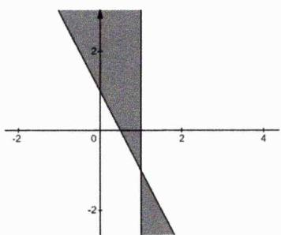

text_image

Graph showing a shaded region in the first quadrant bounded by x=0 and x=-2, with y-axis labeled from -2 to 2.

# 13. [解析]:

第一问：当 $a = 8$ 时， $f(x) = \frac{1}{\sqrt{1 + x}} + \sqrt{\frac{x}{x + 1}} + \frac{1}{3} = \frac{1 + \sqrt{x}}{\sqrt{1 + x}} + \frac{1}{3}$ ，显然有

$$
f ^ {\prime} (x) = \frac {\frac {\sqrt {1 + x}}{2 \sqrt {x}} - (1 + \sqrt {x}) \cdot \frac {1}{2 \sqrt {1 + x}}}{1 + x} = \frac {1 - \sqrt {x}}{2 \sqrt {x (1 + x) ^ {3}}}
$$

经分析函数增区间为(0,1)，减区间为 $(1,+\infty)$ .

第二问：先强行放缩知：

$$
f (x) = \frac {1}{\sqrt {1 + x}} + \frac {1}{\sqrt {1 + a}} + \sqrt {\frac {1}{1 + \frac {8}{a x}}} > \frac {1}{1 + x} + \frac {1}{1 + a} + \frac {1}{1 + \frac {8}{a x}}
$$

再令 $x=\frac{2p}{q}$ ， $a=\frac{2q}{r}$ ， $\frac{8}{ax}=\frac{2r}{p}$ ，由权方和不等式知

$$
\frac {1}{1 + x} + \frac {1}{1 + a} + \frac {1}{1 + \frac {8}{a x}} = \frac {q}{q + 2 p} + \frac {r}{r + 2 q} + \frac {p}{p + 2 r} = \frac {q ^ {2}}{q (q + 2 p)} + \frac {r ^ {2}}{r (r + 2 q)} + \frac {p ^ {2}}{p (p + 2 r)}
$$

$$
\begin{array}{l} \geq \frac {(q + r + p) ^ {2}}{q (q + 2 p) + r (r + 2 q) + p (p + 2 r)} \\ = 1 \end{array}
$$

当且仅当 $p = q = r$ 即 $x = a = 2$ 时上式取到等号，从而不等式左侧得证.再来证明右边，由 $\sqrt{1 + x} < 1 + \frac{1}{2} x$ 知

$$
\frac {1}{\sqrt {1 + x}} = \frac {\sqrt {1 + x}}{1 + x} <   \frac {x + 2}{2 (1 + x)} = 1 - \frac {x}{2 (1 + x)}
$$

从而有

$$
f (x) <   2 - \left[ \frac {x}{2 (1 + x)} + \frac {a}{2 (1 + a)} - \sqrt {\frac {a x}{a x + 8}} \right]
$$

现只需证明以下不等式恒成立即可

$$
\frac {x}{2 (1 + x)} + \frac {a}{2 (1 + a)} - \sqrt {\frac {a x}{a x + 8}} \geq \sqrt {\frac {a x}{(1 + x) (1 + a)}} - \sqrt {\frac {a x}{a x + 8}} \geq 0 (*)
$$

从而我们只需比较 $a+x$ 与7的大小即可，若 $a+x\leq7$ ，则（\*）式已得证；否则若 $a+x>7$ ，可令 $\frac{8}{ax}=b$ ，则有abx=8。不妨设 $0<a\leq b\leq x$ （可任意设它们之间的关系），则有 $a\leq2$ ，且有x>5、 $b\geq2$ ，这时必有

$$
f (x) = \frac {1}{\sqrt {1 + x}} + \frac {1}{\sqrt {1 + a}} + \sqrt {\frac {1}{1 + b}} <   \frac {1}{\sqrt {1 + 5}} + \frac {1}{\sqrt {1 + 0}} + \sqrt {\frac {1}{1 + 2}} = 1 + \frac {1}{\sqrt {6}} + \frac {1}{\sqrt {3}} <   2
$$

从而不等式右侧得证.综上第二问得证!

铭师道·高中数学方法原本

# 第 07 讲：排序不等式及切比雪夫不等式

在上一讲我们已经系统探究了权方和不等式的证明及其运用，本讲我们再来系统探究一下非常有趣的的排序不等式.再要强调的是基于务实性的定位，我们不刻意整体拔高到竞赛的高度.

定理7.1: 排序不等式(sequence inequality, 又称排序原理) 若 $a_{1} \leq a_{2} \leq \cdots \leq a_{n}, b_{1} \leq b_{2} \leq \cdots \leq b_{n}$ 为两组实数, 对于 $(a_{1}, a_{2}, \cdots, a_{n})$ 的任一排列 $(x_{1}, x_{2}, \cdots, x_{n})$ , 都有下列不等式串

$$
a _ {n} b _ {1} + a _ {n - 1} b _ {2} + \dots + a _ {1} b _ {n} \leq x _ {1} b _ {1} + x _ {2} b _ {2} + \dots + x _ {n} b _ {n} \leq a _ {1} b _ {1} + a _ {2} b _ {2} + \dots + a _ {n} b _ {n}
$$

我们习惯称 $a_{1}b_{1}+a_{2}b_{2}+\cdots+a_{n}b_{n}$ 为正序和（或同序和、顺序和）， $a_{n}b_{1}+a_{n-1}b_{2}+\cdots+a_{1}b_{n}$ 为逆序和（或反序和）， $x_{1}b_{1}+x_{2}b_{2}+\cdots+x_{n}b_{n}$ 为乱序和，因此上式可记为

逆序和≤乱序和≤正序和

当且仅当 $a_{1}=a_{2}=\cdots=a_{n}$ 或 $b_{1}=b_{2}=\cdots=b_{n}$ 时正序和等于反序和.

定理证明：现使用调整法证明上述不等式，先给出下式：

$$
x _ {1} b _ {1} + x _ {2} b _ {2} + \dots + x _ {n} b _ {n}
$$

若 $x_{n} \neq a_{n}$ , 则必定 $\exists x_{k} = a_{n} (1 \leq k \leq n - 1)$ , 现将 $x_{k}$ 与 $x_{n}$ 互换, 调整后的和与调整前的和作差得

$$
x _ {k} b _ {n} + x _ {n} b _ {k} - x _ {n} b _ {n} - x _ {k} b _ {k} = \left(b _ {n} - b _ {k}\right) \left(x _ {k} - x _ {n}\right) \geq 0
$$

所以调整后的和是不减的，接下来若 $x_{n-1} \neq a_{n-1}$ ，继续进行上述类似的操作，则至多经过n-1次调整后可将乱序和调整为正序和，且每次调整后的和是不减的，这说明同序和大于等于乱序和，同理可证乱序和大于等于反序和.

综上得证！

例1. 不等式 $\left|\frac{1}{2}-x\right|<\frac{1}{2}$ 的解集为M， $a,b\in M$ ，试比较 $ab+1$ 与 $a+b$ 的大小.

解析：显然 $M=(0,1)$ ，故而0<a<1，0<b<1，由排序不等式知

$$
0 + a b + 1 > a + b + 0
$$

从而证得 $ab + 1 > a + b$ .

例2. 设a, b, c为正数，求证：

$$
\frac {c ^ {2} - a ^ {2}}{a + b} + \frac {a ^ {2} - b ^ {2}}{b + c} + \frac {b ^ {2} - c ^ {2}}{c + a} \geq 0
$$

解析：原不等式可变形为：

$$
\frac {c ^ {2}}{a + b} + \frac {a ^ {2}}{b + c} + \frac {b ^ {2}}{c + a} \geq \frac {a ^ {2}}{a + b} + \frac {b ^ {2}}{b + c} + \frac {c ^ {2}}{c + a}
$$

我们不妨设 $a \geq b \geq c > 0$ ，从而有 $a + b \geq a + c \geq b + c$ ，于是可得以下两个序列组

$$
\underbrace {\left( \begin{array}{c c c} a ^ {2} & b ^ {2} & c ^ {2} \\ \frac {1}{b + c} & \frac {1}{a + c} & \frac {1}{a + b} \end{array} \right)} _ {\text {同序}}, \underbrace {\left( \begin{array}{c c c} a ^ {2} & b ^ {2} & c ^ {2} \\ \frac {1}{a + b} & \frac {1}{b + c} & \frac {1}{c + a} \end{array} \right)} _ {\text {乱序}}
$$

由排序不等式知结论已得证.

结论7.1: 人为设序原则 当题设中的变量具有任意性时，为了使用排序不等式我们必须事先给它们人为设定一个顺序.

例3. 设 $a_{1}, a_{2}, \cdots, a_{n}$ 是n个互不相同的正整数，求证：

$$
1 + \frac {1}{2} + \frac {1}{3} + \dots + \frac {1}{n} \leq a _ {1} + \frac {a _ {2}}{2 ^ {2}} + \frac {a _ {3}}{3 ^ {2}} + \dots + \frac {a _ {n}}{n ^ {2}}
$$

解析：设 $b_{1},b_{2},\cdots,b_{n}$ 是 $a_{1},a_{2},\cdots,a_{n}$ 的一个递增排列，必有

$$
b _ {1} \geq 1, b _ {2} \geq 2, \dots , b _ {n} \geq n
$$

显而易见的是

$$
1 > \frac {1}{2 ^ {2}} > \frac {1}{3 ^ {2}} > \dots > \frac {1}{n ^ {2}}
$$

由排序不等式知

$$
\underbrace {a _ {1} + \frac {a _ {2}}{2 ^ {2}} + \frac {a _ {3}}{3 ^ {2}} + \cdots + \frac {a _ {n}}{n ^ {2}}} _ {\text {乱序和}} \geq \underbrace {b _ {1} + \frac {b _ {2}}{2 ^ {2}} + \frac {b _ {3}}{3 ^ {2}} + \cdots + \frac {b _ {n}}{n ^ {2}}} _ {\text {逆序和}} \geq 1 + \frac {1}{2} + \frac {1}{3} + \dots + \frac {1}{n}
$$

从而得证！

推论7.1: 弱化排序不等式I 若 $a_{1},a_{2},\ldots,a_{n}$ 为实数，设 $(x_{1},x_{2},\cdots,x_{n})$ 为 $(a_{1},a_{2},\cdots,a_{n})$ 的任一排序，则

$$
a _ {1} ^ {2} + a _ {2} ^ {2} + \dots + a _ {n} ^ {2} \geq a _ {1} x _ {1} + a _ {2} x _ {2} + \dots + a _ {n} x _ {n}
$$

推论证明：由排序不等式知同序和大于等于乱序和，从而得证.

例4. 已知 $x > 0$ ，求证：

$$
1 + x + x ^ {2} + \dots + x ^ {2 n - 1} + x ^ {2 n} \geq (2 n + 1) x ^ {n}
$$

解析：由排序不等式知

$$
1 + x + x ^ {2} + \dots + x ^ {2 n - 1} + x ^ {2 n} = \underbrace {x ^ {\frac {0}{2}} \cdot x ^ {\frac {0}{2}} + x ^ {\frac {1}{2}} \cdot x ^ {\frac {1}{2}} + \cdots + x ^ {\frac {2 n}{2}} \cdot x ^ {\frac {2 n}{2}}} _ {\text {同序和}} \geq (2 n + 1) x ^ {n}
$$

从而得证！

例5. 求证 $x^{2}+y^{2}+z^{2}\geq xy+yz+xz$ .

解析：首先不妨设 $x \geq y \geq z$ ，由排序不等式知所证结论必定成立.

推论7.2: 弱化排序不等式II $\forall a > 0, b > 0$ , 恒有

$$
\frac {a ^ {2}}{b} + \frac {b ^ {2}}{a} \geq a + b
$$

当且仅当a=b时取等.

推论证明：因为a,b具有任意性，我们不妨设 $a\geq b>0$ ，从而有 $a^{2}\geq b^{2}>0$ 且 $\frac{1}{b}\geq\frac{1}{a}>0$ ，由排序不等式知顺序和大于等于逆序和，从而有

$$
\frac {a ^ {2}}{b} + \frac {b ^ {2}}{a} \geq a + b
$$

证毕！

例6. 函数 $y = \frac{(1 - x)^2}{x} + \frac{x^2}{1 - x} (0 < x < 1)$ 的最小值为 \_\_\_\_.

解析：由前述推论知

$$
\frac {(1 - x) ^ {2}}{x} + \frac {x ^ {2}}{1 - x} \geq (1 - x) + x = 1
$$

当且仅当 $x=\frac{1}{2}$ 时上式取等.

例7. 若 $a, b, c > 0$ ，求证： $ab(a + b) + bc(b + c) + ca(c + a) \geq 6abc$ .

解析：我们不妨设 $a \geq b \geq c > 0$ ，则有如下序列组

$$
\underbrace {\left( \begin{array}{c c c} a b & a c & b c \\ c & b & a \end{array} \right)} _ {\text {反序}}, \underbrace {\left( \begin{array}{c c c} a b & a c & b c \\ a & c & b \end{array} \right)} _ {\text {乱序}}, \underbrace {\left( \begin{array}{c c c} a b & a c & b c \\ b & a & c \end{array} \right)} _ {\text {乱序}}
$$

由排序不等式知

$$
a ^ {2} b + c ^ {2} a + b ^ {2} c \geq 3 a b c, b ^ {2} a + a ^ {2} c + c ^ {2} b \geq 3 a b c
$$

将上述两不等式相加结论即可得证.

定理7.2: 内斯比特不等式 $\forall a, b, c > 0$ , 则恒有

$$
\frac {a}{b + c} + \frac {b}{c + a} + \frac {c}{a + b} \geq \frac {3}{2}
$$

结论证明：我们不妨设 $a \geq b \geq c > 0$ ，则有 $a + b \geq a + c \geq b + c > 0$ ，从而有

$$
\frac {1}{b + c} \geq \frac {1}{a + c} \geq \frac {1}{a + b} > 0
$$

铭师道·高中数学方法原本

由排序不等式知

$$
\underbrace {\frac {a}{b + c} + \frac {b}{c + a} + \frac {c}{a + b}} _ {\text {同序和}} \geq \frac {1}{2} \left[ \left(\frac {b}{b + c} + \frac {c}{c + a} + \frac {a}{a + b}\right) + \left(\frac {c}{b + c} + \frac {a}{c + a} + \frac {b}{a + b}\right) \right] = \frac {3}{2}
$$

当且仅当a=b=c时上式取等，从而得证.

定理7.3: 切比雪夫不等式 若 $a_{1} \leq a_{2} \leq \cdots \leq a_{n}$ , $b_{1} \leq b_{2} \leq \cdots \leq b_{n}$ 为两组实数（或 $a_{1} \geq a_{2} \geq \cdots \geq a_{n}$ 且 $b_{1} \geq b_{2} \geq \cdots \geq b_{n}$ ），则有

$$
\frac {1}{n} \sum_ {i = 1} ^ {n} a _ {i} b _ {n - i + 1} \leq \left(\frac {1}{n} \sum_ {i = 1} ^ {n} a _ {i}\right) \cdot \left(\frac {1}{n} \sum_ {i = 1} ^ {n} b _ {i}\right) \leq \frac {1}{n} \sum_ {i = 1} ^ {n} a _ {i} b _ {i}
$$

当且仅当 $a_{1}=a_{2}=\cdots=a_{n}$ 或 $b_{1}=b_{2}=\cdots=b_{n}$ 时上述等号成立.

定理证明：由排序不等式知

$$
\sum_ {i = 1} ^ {n} a _ {i} b _ {n - i + 1} \leq \sum_ {i = 1} ^ {n} a _ {i} b _ {j _ {i}} \leq \sum_ {i = 1} ^ {n} a _ {i} b _ {i}
$$

进而有

$$
n \sum_ {i = 1} ^ {n} a _ {i} b _ {n - i + 1} \leq \sum_ {j = 1} ^ {n} \sum_ {i = 1} ^ {n} a _ {i} b _ {j _ {i}} \leq n \sum_ {i = 1} ^ {n} a _ {i} b _ {i}
$$

显而易见的是

$$
\sum_ {j = 1} ^ {n} \sum_ {i = 1} ^ {n} a _ {i} b _ {j _ {i}} = \sum_ {i = 1} ^ {n} a _ {i} \cdot \sum_ {j = 1} ^ {n} b _ {j _ {i}} = \sum_ {i = 1} ^ {n} a _ {i} \cdot \sum_ {i = 1} ^ {n} b _ {i}
$$

于是有

$$
\frac {1}{n} \sum_ {i = 1} ^ {n} a _ {i} b _ {n - i + 1} \leq \left(\frac {1}{n} \sum_ {i = 1} ^ {n} a _ {i}\right) \cdot \left(\frac {1}{n} \sum_ {i = 1} ^ {n} b _ {i}\right) \leq \frac {1}{n} \sum_ {i = 1} ^ {n} a _ {i} b _ {i}
$$

证毕！

说明：将切比雪夫不等式展开有（我们也可称其为n重排序不等式）

$$
\frac {a _ {1} b _ {n} + a _ {2} b _ {n - 1} + \cdots + a _ {n} b _ {1}}{n} \leq \frac {a _ {1} + a _ {2} + \cdots + a _ {n}}{n} \cdot \frac {b _ {1} + b _ {2} + \cdots + b _ {n}}{n} \leq \frac {a _ {1} b _ {1} + a _ {2} b _ {2} + \cdots + a _ {n} b _ {n}}{n}
$$

推论7.3: $n$ 重排序不等式 若 $a_{1} \leq a_{2} \leq \cdots \leq a_{n}$ , $b_{1} \leq b_{2} \leq \cdots \leq b_{n}$ 为两组实数, 则恒有

$$
\underbrace {a _ {1} b _ {1} + a _ {2} b _ {2} + \cdots + a _ {n} b _ {n}} _ {\text {同序和}} \geq \frac {1}{n} \underbrace {(a _ {1} + a _ {2} + \cdots + a _ {n}) (b _ {1} + b _ {2} + \cdots + b _ {n})} _ {n \text {个不重复序列和(含所有乱序和)}}
$$

例8. [2013 波罗的海数学奥林匹克推广]已知x,y,z是正数，m>0，n>0，求证：

$$
\frac {x ^ {m + n}}{y ^ {n} + z ^ {n}} + \frac {y ^ {m + n}}{z ^ {n} + x ^ {n}} + \frac {z ^ {m + n}}{x ^ {n} + y ^ {n}} \geq \frac {x ^ {m} + y ^ {m} + z ^ {m}}{2}
$$

解析：不失一般性，不妨设 $x \geq y \geq z > 0$ ，则有

$$
\begin{array}{l} x ^ {n} \geq y ^ {n} \geq z ^ {n} > 0; x ^ {m} \geq y ^ {m} \geq z ^ {m} > 0 \\ x ^ {n} + y ^ {n} \geq x ^ {n} + z ^ {n} \geq y ^ {n} + z ^ {n} > 0 \\ \frac {1}{y ^ {n} + z ^ {n}} \geq \frac {1}{x ^ {n} + z ^ {n}} \geq \frac {1}{x ^ {n} + y ^ {n}} > 0 \\ \end{array}
$$

先由内斯比特不等式知

$$
\frac {x ^ {n}}{y ^ {n} + z ^ {n}} + \frac {y ^ {n}}{z ^ {n} + x ^ {n}} + \frac {z ^ {n}}{x ^ {n} + y ^ {n}} \geq \frac {3}{2}
$$

再由切比雪夫不等式知

$$
\begin{array}{l} \frac {x ^ {m + n}}{y ^ {n} + z ^ {n}} + \frac {y ^ {m + n}}{z ^ {n} + x ^ {n}} + \frac {z ^ {m + n}}{x ^ {n} + y ^ {n}} = \frac {x ^ {n}}{y ^ {n} + z ^ {n}} \cdot x ^ {m} + \frac {y ^ {n}}{z ^ {n} + x ^ {n}} \cdot y ^ {m} + \frac {z ^ {n}}{x ^ {n} + y ^ {n}} \cdot z ^ {m} \\ \geq \frac {1}{3} \left(\frac {x ^ {n}}{y ^ {n} + z ^ {n}} + \frac {y ^ {n}}{z ^ {n} + x ^ {n}} + \frac {z ^ {n}}{x ^ {n} + y ^ {n}}\right) (x ^ {m} + y ^ {m} + z ^ {m}) \\ \geq \frac {x ^ {m} + y ^ {m} + z ^ {m}}{2} \\ \end{array}
$$

证毕.

例9. 已知 $a, b, c$ 是满足 $a + b + c = 1$ 的正数，当 $n \in \mathbb{N}^*$ ，求证：

$$
\frac {(3 a) ^ {n}}{(b + 1) (c + 1)} + \frac {(3 b) ^ {n}}{(c + 1) (a + 1)} + \frac {(3 c) ^ {n}}{(a + 1) (b + 1)} \geq \frac {2 7}{1 6}
$$

解析：不失一般性，我们不妨设 $a \geq b \geq c > 0$ ，则有 $(3a)^{n} \geq (3b)^{n} \geq (3c)^{n} > 0$ ，同时还可得

$$
\frac {1}{(b + 1) (c + 1)} \geq \frac {1}{(c + 1) (a + 1)} \geq \frac {1}{(a + 1) (b + 1)} > 0
$$

由切比雪夫不等式知

$$
\begin{array}{l} \frac {(3 a) ^ {n}}{(b + 1) (c + 1)} + \frac {(3 b) ^ {n}}{(c + 1) (a + 1)} + \frac {(3 c) ^ {n}}{(a + 1) (b + 1)} \\ \geq \frac {1}{3} [ (3 a) ^ {n} + (3 b) ^ {n} + (3 c) ^ {n} ] \left[ \frac {1}{(b + 1) (c + 1)} + \frac {1}{(c + 1) (a + 1)} + \frac {1}{(a + 1) (b + 1)} \right] \\ = 3 ^ {n - 1} \left[ a ^ {n} + b ^ {n} + c ^ {n} \right] \frac {4}{(a + 1) (b + 1) (c + 1)} \\ \end{array}
$$

由幂平均不等式知

$$
\left(\frac {a ^ {n} + b ^ {n} + c ^ {n}}{3}\right) ^ {\frac {1}{n}} \geq \frac {a + b + c}{3}
$$

进而有

$$
a ^ {n} + b ^ {n} + c ^ {n} \geq 3 \left(\frac {a + b + c}{3}\right) ^ {n} = \frac {1}{3 ^ {n - 1}}
$$

而由均值不等式知

$$
\frac {4}{(a + 1) (b + 1) (c + 1)} \geq \frac {4}{\left[ \frac {(a + 1) + (b + 1) + (c + 1)}{3} \right] ^ {3}} = \frac {2 7}{1 6}
$$

于是有

$$
3 ^ {n - 1} [ a ^ {n} + b ^ {n} + c ^ {n} ] \frac {4}{(a + 1) (b + 1) (c + 1)} \geq 3 ^ {n - 1} \cdot \frac {1}{3 ^ {n - 1}} \cdot \frac {2 7}{1 6} = \frac {2 7}{1 6}
$$

从而得证！

说明：我们会在后续章节系统提及幂平均不等式及其证明.

# 第 07 讲：高考对标训练

1. [多选]对于 $a, b, c > 0$ ，以下结论正确的是( )

A. $a^3 + b^3 + c^3 \geq a^2 b + b^2 c + c^2 a$

B. $\frac{b^{2}}{a}+\frac{c^{2}}{b}+\frac{a^{2}}{c}\geq a+b+c$

C. $\frac{a}{b + c} +\frac{b}{c + a} +\frac{c}{a + b}\geq \frac{5}{2}$

D. $\frac{c^{2}}{a+b}+\frac{a^{2}}{b+c}+\frac{b^{2}}{c+a}\geq\frac{a^{2}}{a+b}+\frac{b^{2}}{b+c}+\frac{c^{2}}{c+a}$

2. 当 $a > 1, b > 1, c > 1$ 时，证明： $\frac{a^2}{b - 1} + \frac{b^2}{c - 1} + \frac{c^2}{a - 1} \geq 12.$

3. 设△ABC的三内角A、B、C所对的边分别为a、b、c，其周长为1，求证：

$$
\frac {1}{A} + \frac {1}{B} + \frac {1}{C} \geq 3 \left(\frac {a}{A} + \frac {b}{B} + \frac {c}{C}\right)
$$

4. 设a, b, c是三角形的三边，求证：

$$
a ^ {2} (b + c - a) + b ^ {2} (c + a - b) + c ^ {2} (a + b - c) \leq 3 a b c
$$

5. 已知 $a, b, c > 0$ ，求证 $a + b + c \leq \frac{a^2 + b^2}{2c} + \frac{b^2 + c^2}{2a} + \frac{c^2 + a^2}{2b} \leq \frac{a^3}{bc} + \frac{b^3}{ca} + \frac{c^3}{ab}$ .

6. 设 $a \leq b \leq c \leq d \leq e$ ，且 $a + b + c + d + e = 1$ ，求证： $ad + dc + cb + be + ea \leq \frac{1}{5}$ .

铭师道·高中数学方法原本

7. [第 31 届 IMO 预选题]已知正数 $a, b, c, d$ 满足 $ab + bc + cd + da = 1$ , 求证:

$$
{\frac {a ^ {3}}{b + c + d}} + {\frac {b ^ {3}}{c + d + a}} + {\frac {c ^ {3}}{d + a + b}} + {\frac {d ^ {3}}{a + b + c}} \geq {\frac {1}{3}}
$$

8. 已知 $a, b, c \in \mathbb{R}^*$ , $abc = 1$ , 求证:

$$
\frac {1}{a ^ {3} (b + c)} + \frac {1}{b ^ {3} (c + a)} + \frac {1}{c ^ {3} (a + b)} \geq \frac {3}{2}
$$

# 第 07 讲：对标答案

# 1. [解析]:

我们不妨设 $a \geq b \geq c > 0$ ，由排序不等式知 ABD 皆正确（其中 AD 选项左侧皆为同序和，而 B 选项右侧 $a + b + c = \frac{a^{2}}{a} + \frac{b^{2}}{b} + \frac{c^{2}}{c}$ 实为逆序和），关于 C 选项由前述中的内斯比特不等式知其必错误，综上本题选 ABD.

# 2. [解析]:

我们不妨设 $a \geq b \geq c > 1$ ，则有 $a^{2} \geq b^{2} \geq c^{2} > 1$ 且 $\frac{1}{c-1} \geq \frac{1}{b-1} \geq \frac{1}{a-1} > 0$ ，由排序不等式知

$$
\begin{array}{l} \underbrace {\frac {a ^ {2}}{b - 1} + \frac {b ^ {2}}{c - 1} + \frac {c ^ {2}}{a - 1}} _ {\text {乱序和}} \geq \underbrace {\frac {c ^ {2}}{c - 1} + \frac {b ^ {2}}{b - 1} + \frac {a ^ {2}}{a - 1}} _ {\text {反序和}} \\ = \left[ (c - 1) + \frac {1}{c - 1} \right] + \left[ (b - 1) + \frac {1}{b - 1} \right] + \left[ (a - 1) + \frac {1}{a - 1} \right] + 6 \geq 1 2 \\ \end{array}
$$

当且仅当a=b=c=2时上式取等，证毕.

# 3. [解析]:

我们不妨设 $a \geq b \geq c$ ，于是有

$$
2 a \geq 2 b \geq 2 c, \frac {1}{c} \geq \frac {1}{B} \geq \frac {1}{A}, a + b \geq a + c \geq b + c
$$

由排序不等式知 $\underbrace{\frac{a+b}{C}+\frac{a+c}{B}+\frac{b+c}{A}}_{同序和}\geq\underbrace{\frac{2a}{A}+\frac{2b}{B}+\frac{2c}{C}}_{反序和}$ ，若两边再同时加上 $\frac{a}{A}+\frac{b}{B}+\frac{c}{C}$ ，则有

$$
\frac {a + b + c}{C} + \frac {a + b + c}{B} + \frac {a + b + c}{A} \geq 3 \left(\frac {a}{A} + \frac {b}{B} + \frac {c}{C}\right)
$$

因为 $a+b+c=1$ ，从而得证.

# 4. [解析]:

不失一般性，不妨设 $0 < a \leq b \leq c$ ，首先我们易证下一结论：

$$
c (a + b - c) \leq b (c + a - b) \leq a (b + c - a)
$$

再由排序不等式知

$$
\begin{array}{l} a ^ {2} (b + c - a) + b ^ {2} (c + a - b) + c ^ {2} (a + b - c) \\ \leq \frac {1}{2} [ a b (b + c - a) + b c (c + a - b) + c a (a + b - c) + c a (b + c - a) + a b (c + a - b) + b c (a + b - c) ] \\ = 3 a b c \\ \end{array}
$$

从而得证！

# 5. [解析]:

由权方和不等式知

$$
\frac {a ^ {2} + b ^ {2}}{2 c} + \frac {b ^ {2} + c ^ {2}}{2 a} + \frac {c ^ {2} + a ^ {2}}{2 b} = \frac {1}{2} \left(\frac {a ^ {2}}{c} + \frac {b ^ {2}}{c} + \frac {b ^ {2}}{a} + \frac {c ^ {2}}{a} + \frac {c ^ {2}}{b} + \frac {a ^ {2}}{b}\right) \geq \frac {1}{2} \cdot \frac {(2 a + 2 b + 2 c) ^ {2}}{2 a + 2 b + 2 c} = a + b + c
$$

从而左半部分不等式得证，接下来再来证明右半不等式：我们不妨设 $a \geq b \geq c > 0$ ，则必有

$$
a ^ {3} \geq b ^ {3} \geq c ^ {3} > 0
$$

$$
a b \geq a c \geq b c > 0 \Longrightarrow \frac {1}{b c} \geq \frac {1}{a c} \geq \frac {1}{a b} > 0
$$

由排序不等式知

$$
\frac {a ^ {3}}{b c} + \frac {b ^ {3}}{c a} + \frac {c ^ {3}}{a b} \geq \frac {1}{2} \left[ \left(\frac {b ^ {3}}{b c} + \frac {c ^ {3}}{c a} + \frac {a ^ {3}}{a b}\right) + \left(\frac {c ^ {3}}{b c} + \frac {a ^ {3}}{c a} + \frac {b ^ {3}}{a b}\right) \right] = \frac {1}{2} \left(\frac {a ^ {2} + b ^ {2}}{c} + \frac {b ^ {2} + c ^ {2}}{a} + \frac {c ^ {2} + a ^ {2}}{b}\right)
$$

综上本题证毕.

# 6. [解析]:

因为 $a \leq b \leq c \leq d \leq e$ ，则以下两组序列是完全反向的

$$
\underbrace {\left( \begin{array}{c c c c c} {a} & {b} & {c} & {d} & {e} \\ {d + e} & {c + e} & {b + d} & {a + c} & {a + b} \end{array} \right)} _ {\text {逆序}}
$$

由切比雪夫不等式知

$$
\begin{array}{l} \frac {a (d + e) + b (c + e) + c (b + d) + d (a + c) + e (a + b)}{5} \\ \leq \frac {a + b + c + d + e}{5} \cdot \frac {(d + e) + (c + e) + (b + d) + (a + c) + (a + b)}{5} = \frac {1}{5} \cdot \frac {2}{5} \\ \end{array}
$$

因为

$$
a (d + e) + b (c + e) + c (b + d) + d (a + c) + e (a + b) = 2 (a d + b e + c b + d c + e a)
$$

从而证得 $ad + dc + cb + be + ea \leq \frac{1}{5}$ ，本题证毕！

# 7. [解析]:

我们不妨设 $a \geq b \geq c \geq d > 0$ ，则有 $\frac{1}{b + c + d} \geq \frac{1}{c + d + a} \geq \frac{1}{d + a + b} \geq \frac{1}{a + b + c}$ ，进一步有

$$
A = \frac {a ^ {2}}{b + c + d} \geq B = \frac {b ^ {2}}{c + d + a} \geq C = \frac {c ^ {2}}{d + a + b} \geq D = \frac {d ^ {2}}{a + b + c}
$$

由切比雪夫不等式知

$$
\begin{array}{l} \underbrace {\frac {a ^ {2} \cdot a}{b + c + d} + \frac {b ^ {2} \cdot b}{c + d + a} + \frac {c ^ {2} \cdot c}{d + a + b} + \frac {d ^ {2} \cdot d}{a + b + c}} _ {\text {同序和}} \\ \geq \frac {1}{3} \left[ \underbrace {(A \cdot b + B \cdot c + C \cdot d + D \cdot a)} _ {\text {乱序和}} + \underbrace {(A \cdot c + B \cdot d + C \cdot a + D \cdot b)} _ {\text {乱序和}} + \underbrace {(A \cdot d + B \cdot a + C \cdot b + D \cdot c)} _ {\text {乱序和}} \right] \\ = \frac {1}{3} (a ^ {2} + b ^ {2} + c ^ {2} + d ^ {2}) \\ \end{array}
$$

再由排序不等式知 $\frac{1}{3}(a^{2}+b^{2}+c^{2}+d^{2})\geq\frac{1}{3}(ab+bc+cd+da)=\frac{1}{3}$ ，证毕！

# 8. [解析]:

不妨设 $a \geq b \geq c > 0$ ，则有

$$
\begin{array}{c} {a b \geq a c \geq b c > 0} \\ {\frac {1}{c} \geq \frac {1}{b} \geq \frac {1}{a} \Longrightarrow \frac {1}{c} + \frac {1}{b} \geq \frac {1}{c} + \frac {1}{a} \geq \frac {1}{b} + \frac {1}{a} \text {且有} \frac {1}{b + c} \geq \frac {1}{a + c} \geq \frac {1}{a + b}} \end{array}
$$

因为 $abc = 1$ ，从而有

$$
\begin{array}{l} \frac {1}{a ^ {3} (b + c)} + \frac {1}{b ^ {3} (c + a)} + \frac {1}{c ^ {3} (a + b)} = \frac {1}{a ^ {2}} \cdot \frac {b c}{b + c} + \frac {1}{b ^ {2}} \cdot \frac {a c}{c + a} + \frac {1}{c ^ {2}} \cdot \frac {a b}{a + b} \\ = \underbrace {\frac {1}{a ^ {2}} \cdot \frac {1}{\frac {1}{c} + \frac {1}{b}} + \frac {1}{b ^ {2}} \cdot \frac {1}{\frac {1}{c} + \frac {1}{a}} + \frac {1}{c ^ {2}} \cdot \frac {1}{\frac {1}{b} + \frac {1}{a}}} _ {\text {同序和}} \\ \end{array}
$$

由切比雪夫不等式知

$$
\begin{array}{l} \underbrace {\frac {1}{a \cdot a} \cdot \frac {1}{\frac {1}{c} + \frac {1}{b}} + \frac {1}{b \cdot b} \cdot \frac {1}{\frac {1}{c} + \frac {1}{a}} + \frac {1}{c \cdot c} \cdot \frac {1}{\frac {1}{b} + \frac {1}{a}}} _ {\text {同序和}} \\ \geq \frac {1}{2} \left[ \underbrace {\left(\frac {1}{a \cdot b} \cdot \frac {1}{\frac {1}{c} + \frac {1}{b}} + \frac {1}{b \cdot c} \cdot \frac {1}{\frac {1}{c} + \frac {1}{a}} + \frac {1}{a \cdot c} \cdot \frac {1}{\frac {1}{b} + \frac {1}{a}}\right)} _ {\text {乱序和}} + \underbrace {\left(\frac {1}{a \cdot c} \cdot \frac {1}{\frac {1}{c} + \frac {1}{b}} + \frac {1}{a \cdot b} \cdot \frac {1}{\frac {1}{c} + \frac {1}{a}} + \frac {1}{b \cdot c} \cdot \frac {1}{\frac {1}{b} + \frac {1}{a}}\right)} _ {\text {乱序和}} \right] \\ = \frac {1}{2} \left(\frac {1}{a} + \frac {1}{b} + \frac {1}{c}\right) \geq \frac {3}{2} \sqrt [ 3 ]{\frac {1}{a b c}} = \frac {3}{2} \\ \end{array}
$$

证明结束!

铭师道·高中数学方法原本

# 第 08 讲：对数糖水不等式及其运用

在人教普通高中课程标准实验教科书 A 版（2007 年 1 月第 2 版）数学选修 4-5 “不等式选讲” 第 21 页有如下一道例题：

natural_image

Black-and-white photo of a hand pouring liquid into a glass beaker with a submerged object, no visible text or symbols.

如上图所示，如果用b克白糖制出a克糖溶液（a > b > 0），则糖的质量分数为 $\frac{b}{a}$ .若在上述溶液中再添加m克糖（m > 0）（假设全部溶解），此时糖的质量分数增加到 $\frac{b+m}{a+m}$ ，糖水明显变甜.将以上事实抽象为数学问题，则可得到如下一定理.

定理8.1: 糖水不等式（Sugar water inequality） 已知 $a > b > 0, m > 0$ ，则有

$$
\frac {b}{a} <   \frac {b + m}{a + m}
$$

定理证明：其物理解释如上，现作差证明之，因为

$$
\frac {b + m}{a + m} - \frac {b}{a} = \frac {a (b + m) - b (a + m)}{a (a + m)} = \frac {m (a - b)}{a (a + m)} > 0
$$

从而得证！

糖水不等式的几何解释: 如图所示, 在平面直角坐标系中, 设在第一象限且位于直线 $y = x$ 下方的点 $A$ 的坐标为 $(a, b)$ , 将 $A$ 点沿着向量 $(m, m)$ 的方向移动到 $C$ 点, 则直线 $OC$ 的斜率 $\frac{b + m}{a + m}$ 必大于直线 $OA$ 的斜率 $\frac{b}{a}$ .

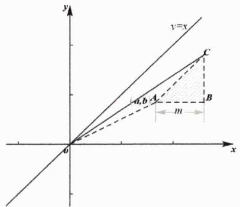

text_image

y
y=x
C
A
B
m
a,b
o
x

推论8.1: 假糖水不等式（False sugar water inequality） 若a > b > 0，m > 0，则有

$$
\frac {a}{b} > \frac {a + m}{b + m}
$$

推论8.2: 反向糖水不等式（Reverse sugar water inequality） 若a > b > m > 0，则有

$$
\frac {b}{a} > \frac {b - m}{a - m}
$$

说明：其物理解释为把糖过滤出来后糖水的甜度变低了.

推论8.3: 两次糖水不等式（Twice sugar water inequality） 若a > b > 0，m > n > 0，则有

$$
\frac {b}{a} <   \frac {b + n}{a + n} <   \frac {b + m}{a + m}
$$

说明：其物理解释为在完全溶解的前提下，放的糖越多越甜.

推论8.4: 中和糖水不等式I（Neutralizing sugar water inequality） 若a > b > 0，m > n > 0，且有 $\frac{b}{a} < \frac{n}{m}$ ，则有

$$
\frac {b}{a} <   \frac {b + n}{a + m} <   \frac {n}{m}
$$

说明：其物理解释为，把两杯浓度不同的糖水混合在一起，所得混合糖水一定比混合前浓的糖水淡一些，而比淡的糖水甜一些.

推论8.5: 中和糖水不等式II 若 $a_{i}$ 、 $b_{i}>0(i=1,2,3,\cdots,n)$ 且 $\frac{b_{1}}{a_{1}}<\frac{b_{2}}{a_{2}}<\cdots<\frac{b_{n}}{a_{n}}$ ，则有

$$
\frac {b _ {1}}{a _ {1}} <   \frac {b _ {1} + b _ {2} + \cdots b _ {n}}{a _ {1} + a _ {2} + \cdots a _ {n}} <   \frac {b _ {n}}{a _ {n}}
$$

说明：显然该结论是前一推论的强化命题.

例1. 正数 $a, b, c$ 满足 $a < b + c$ , 求证:

$$
\frac {a}{1 + a} <   \frac {b}{1 + b} + \frac {c}{1 + c}
$$

解析：易知

$$
\frac {b}{1 + b} + \frac {c}{1 + c} = \frac {b + c + 2 b c}{1 + b + c + b c} > \frac {b + c + b c}{1 + b + c + b c}
$$

由反向糖水不等式知

$$
\frac {b + c + b c}{1 + b + c + b c} > \frac {b + c}{1 + b + c} > \frac {b + c - (b + c - a)}{1 + b + c - (b + c - a)} = \frac {a}{1 + a}
$$

从而得证！

例2. 已知正数 $x, y, z$ 满足 $xyz = 1$ , 求证: $1 < \frac{1}{1 + x} + \frac{1}{1 + y} + \frac{1}{1 + z} < 2$ .

解析：令 $x=\frac{b}{a},y=\frac{c}{b},z=\frac{a}{c}$ （a,b,c>0），则有

$$
\frac {1}{1 + x} + \frac {1}{1 + y} + \frac {1}{1 + z} = \frac {a}{a + b} + \frac {b}{b + c} + \frac {c}{a + c}
$$

由糖水不等式知

$$
\frac {a}{a + b} + \frac {b}{b + c} + \frac {c}{a + c} <   \frac {a + c}{a + b + c} + \frac {b + a}{b + c + a} + \frac {c + b}{a + c + b} = 2
$$

从而原不等式右侧得证.关于左侧，简单放缩可得

$$
\frac {a}{a + b} + \frac {b}{b + c} + \frac {c}{a + c} > \frac {a}{a + b + c} + \frac {b}{b + c + a} + \frac {c}{a + c + b} = 1
$$

由此左侧亦得证，综上证毕.

例3. [2015 湖北理 8] 将离心率为 $e_1$ 的双曲线 $\Gamma_1$ 的实半轴长 $a$ 和虚半轴长 $b (a \neq b)$ 同时增加 $m (m > 0)$ 个单位长度, 得到离心率为 $e_2$ 的双曲线 $\Gamma_2$ , 则 ( )

A. 对任意的 $a, b$ 有 $e_1 > e_2$

B. 当 $a > b$ 时, $e_1 > e_2$ ; 当 $a < b$ 时, $e_1 < e_2$

C. 对任意的 $a, b$ 有 $e_1 < e_2$

D. 当 $a > b$ 时, $e_1 < e_2$ ; 当 $a < b$ 时, $e_1 > e_2$

解析：由双曲线离心率的定义知

$$
e _ {1} ^ {2} - e _ {2} ^ {2} = \left[ 1 + \left(\frac {b}{a}\right) ^ {2} \right] - \left[ 1 + \left(\frac {b + m}{a + m}\right) ^ {2} \right] = \left(\frac {b}{a}\right) ^ {2} - \left(\frac {b + m}{a + m}\right) ^ {2}
$$

由糖水不等式知当 $a > b$ 时, $\frac{b + m}{a + m} > \frac{b}{a}$ , 此时有 $e_1 < e_2$ ; 而当 $a < b$ 时, $\frac{b + m}{a + m} < \frac{b}{a}$ , 此时有 $e_1 > e_2$ . 综上本题选 D.

例4. [2014 新课标Ⅱ理 17]已知数列 $\{a_{n}\}$ 满足 $a_{1}=1,\quad a_{n+1}=3a_{n}+1.$

(1) 证明 $\left\{a_{n}+\frac{1}{2}\right\}$ 是等比数列，并求 $\{a_{n}\}$ 的通项公式；  
(2) 证明: $\frac{1}{a_1} + \frac{1}{a_2} + \cdots + \frac{1}{a_n} < \frac{3}{2}$ .

解析:

铭师道·高中数学方法原本

第一问：因为 $a_{n+1}=3a_{n}+1$ ，从而有 $a_{n+1}+\frac{1}{2}=3\left(a_{n}+\frac{1}{2}\right)$ ，故而有 $a_{n}=\frac{1}{2}(3^{n}-1)$ .

第二问：当 $n \geq 1$ 时，由糖水不等式知

$$
\frac {1}{a _ {n}} = \frac {2}{3 ^ {n} - 1} \leq \frac {2 + 1}{3 ^ {n} - 1 + 1} = \frac {3}{3 ^ {n}} = \left(\frac {1}{3}\right) ^ {n - 1}
$$

故而有

$$
\sum_ {k = 1} ^ {n} \frac {1}{a _ {k}} \leq \frac {1 - \left(\frac {1}{3}\right) ^ {n}}{1 - \frac {1}{3}} <   \frac {1}{1 - \frac {1}{3}} = \frac {3}{2}
$$

证毕！

例5. [2009 山东理 20]等比数列 $\{a_{n}\}$ 的前n项和为 $S_{n}$ ，已知 $\forall n\in N^{*}$ ，点 $(n,S_{n})$ 均在函数 $y=b^{x}+r$ （b>0，且 $b\neq1$ ，b,r均为常数）的图象上.

(1) 求 $r$ 的值;  
(2) 当 $b = 2$ 时, 记 $b_{n} = 2(\log_{2} a_{n} + 1) (n \in \mathbb{N}^{*})$ , 证明: $\forall n \in \mathbb{N}^{*}$ , 恒有

$$
\frac {b _ {1} + 1}{b _ {1}} \cdot \frac {b _ {2} + 1}{b _ {2}} \cdot \dots \cdot \frac {b _ {n} + 1}{b _ {n}} > \sqrt {n + 1}
$$

解析：

第一问：由题知 $S_{n}=b^{n}+r$ ，因为数列 $\{a_{n}\}$ 是等比数列，从而必有r=-1（在数列章节会有说明）.

第二问：因为 $b = 2$ ，易推导出 $a_{n} = 2^{n - 1}$ ，故而有

$$
b _ {n} = 2 \left(\log_ {2} 2 ^ {n - 1} + 1\right) = 2 n
$$

而由假糖水不等式知

$$
\frac {b _ {n} + 1}{b _ {n}} = \frac {2 n + 1}{2 n} > \frac {2 n + 2}{2 n + 1}
$$

从而有

$$
\left(\frac {b _ {n} + 1}{b _ {n}}\right) ^ {2} = \frac {2 n + 1}{2 n} \cdot \frac {2 n + 1}{2 n} > \frac {2 n + 1}{2 n} \cdot \frac {2 n + 2}{2 n + 1} = \frac {2 n + 2}{2 n}
$$

故而有

$$
\left(\frac {b _ {1} + 1}{b _ {1}} \cdot \frac {b _ {2} + 1}{b _ {2}} \cdot \dots \cdot \frac {b _ {n} + 1}{b _ {n}}\right) ^ {2} > \frac {4}{2} \cdot \frac {6}{4} \cdot \dots \cdot \frac {2 n + 2}{2 n} = n + 1
$$

将上述不等式两边开方后结论即可得证！

例6. [1998 全国理 25]已数数列 $\{b_{n}\}$ 是等差数列， $b_{1}=1,\quad b_{1}+b_{2}+\cdots+b_{10}=145.$

(1) 求数列 $\{b_{n}\}$ 的通项 $b_{n}$ ;  
(2) 设数列 $\{a_{n}\}$ 的通项 $a_{n} = \log_{a}\left(1 + \frac{1}{b_{n}}\right)$ （其中 $a > 0$ ，且 $a \neq 1$ )，记 $S_{n}$ 是数列 $\{a_{n}\}$ 的前 $n$ 项和，试比较 $S_{n}$ 与 $\frac{1}{3} \log_{a} b_{n+1}$ 的大小，并证明你的结论.

解析：

第一问：易计算得 $b_{n}=3n-2$ .

第二问：令 $c_{n}=1+\frac{1}{b_{n}}=1+\frac{1}{3n-2}=\frac{3n-1}{3n-2}$ ，由假糖水不等式知

$$
c _ {n} = \frac {3 n - 1}{3 n - 2} > \frac {3 n}{3 n - 1} > \frac {3 n + 1}{3 n}
$$

故而有

$$
(c _ {n}) ^ {3} = \frac {3 n - 1}{3 n - 2} \cdot \frac {3 n - 1}{3 n - 2} \cdot \frac {3 n - 1}{3 n - 2} > \frac {3 n - 1}{3 n - 2} \cdot \frac {3 n}{3 n - 1} \cdot \frac {3 n + 1}{3 n} = \frac {3 n + 1}{3 n - 2}
$$

从而有

$$
(c _ {1} c _ {2} \dots c _ {n}) ^ {3} > \frac {4}{1} \cdot \frac {7}{4} \dots \frac {3 n + 1}{3 n - 2} = 3 n + 1
$$

继而有当 $a > 1$ 时

$$
S _ {n} = \sum_ {i = 1} ^ {n} a _ {i} = \sum_ {i = 1} ^ {n} \log_ {a} c _ {i} = \frac {1}{3} \log_ {a} (c _ {1} c _ {2} \dots c _ {n}) ^ {3} > \frac {1}{3} \log_ {a} (3 n + 1) = \frac {1}{3} \log_ {a} b _ {n + 1}
$$

由此说明 $S_{n}>\frac{1}{3}\log_{a}b_{n+1}$ ；而当0<a<1时，同理可说明 $S_{n}<\frac{1}{3}\log_{a}b_{n+1}$ .

在本讲的最后我们再来探究非常重要的对数糖水不等式（因为我主要用排序不等式来推导，因而这一讲必须放在排序不等式的后面）.

定理8.2: 对数糖水不等式（Logarithmic sugar water inequality）设 $n > m > 1, p > 0$ ，则有

$$
\log_ {n + p} (m + p) > \log_ {n} m
$$

定理证明：思路 $^{①}$ 、当n>m>1,p>0时，显然以下两列数是同序的

$$
\underbrace {\left( \begin{array}{c c c} {0} & {\lg \left(1 + \frac {p}{n}\right)} & {\lg \left(1 + \frac {p}{m}\right)} \\ {\lg \frac {1}{n}} & {\lg \frac {1}{m}} & {0} \end{array} \right)} _ {\text {同序}}
$$

由排序不等式知

$$
0 + \lg \left(1 + \frac {p}{n}\right) \cdot \lg \frac {1}{m} + 0 > 0 + \lg \left(1 + \frac {p}{m}\right) \cdot \lg \frac {1}{n} + 0
$$

于是有

$$
\lg \left(1 + \frac {p}{n}\right) \lg m <   \lg \left(1 + \frac {p}{m}\right) \lg n
$$

进而有

$$
\lg (n + p) \lg m <   \lg (m + p) \lg n
$$

从而证得

$$
\log_ {n + p} (m + p) > \log_ {n} m
$$

继而还可证得

$$
\log_ {m} n > \log_ {m + p} (n + p)
$$

思路 $^{②}$ 、由糖水不等式易得

$$
\log_ {n} m = \frac {\lg m}{\lg n} <   \frac {\lg m + \lg \frac {m + p}{m}}{\lg n + \lg \frac {m + p}{m}} = \frac {\lg (m + p)}{\lg \left(n + \frac {n}{m} p\right)} <   \frac {\lg (m + p)}{\lg (n + p)} = \log_ {n + p} (m + p)
$$

说明：为了以后称呼的方便，我们可将对数糖水不等式简记为 LSW 不等式.

在上述证明过程我们可显而易见地得到如下结论.

推论8.6: 对数加减糖水不等式 设 $n > m > 1$ , $p, q > 0$ , $m - q > 1$ , 则有

$$
\log_ {n + p} (m + p) > \log_ {n} m > \log_ {n - q} (m - q)
$$

推论8.7: 对数扩培糖水不等式 设 $n > m > 1, p > 1$ ，则有

$$
\log_ {n p} m p > \log_ {n} m
$$

推论8.8: 假对数糖水不等式I（False logarithmic sugar water inequality） 设n > m > 1, p > 0,

则有

$$
\log_ {m} n > \log_ {m + p} (n + p)
$$

推论8.9: 假对数糖水不等式II（False logarithmic sugar water inequality） 设n > m > 1且m -

$p > 1$ ，则有

$$
\log_ {m} n <   \log_ {m - p} (n - p)
$$

例7. [2022 全国文甲 T12]已知 $9^{m} = 10, a = 10^{m} - 11, b = 8^{m} - 9$ , 则( )

$$
\mathrm{A.} a > 0 > b
$$

$$
\mathrm{B}. a > b > 0
$$

$$
\mathrm{C}. b > a > 0
$$

$$
\mathrm{D}. b > 0 > a
$$

解析：因为 $9^{m}=10$ ，则有 $m=\log_{9}10>1$ ，由前述假对数糖水不等式知

$$
a = 1 0 ^ {m} - 1 1 = 1 0 ^ {\log_ {9} 1 0} - 1 1 > 1 0 ^ {\log_ {9 + 1} (1 0 + 1)} - 1 1 = 1 1 - 1 1 = 0
$$

$$
b = 8 ^ {m} - 9 = 8 ^ {\log_ {9} 1 0} - 9 <   8 ^ {\log_ {9 - 1} (1 0 - 1)} - 9 = 9 - 9 = 0
$$

从而本题选 A.

例8. [2020 全国Ⅲ理 12]已知 $5^{5} < 8^{4}, 13^{4} < 8^{5}$ , 设 $a = \log_{5}3, b = \log_{8}5, c = \log_{13}8$ , 则( )

$$
\mathrm{A.} a <   b <   c
$$

$$
\mathrm{B}. b <   a <   c
$$

$$
\mathrm{C}. b <   c <   a
$$

$$
\mathrm{D.} c <   a <   b
$$

铭师道·高中数学方法原本

解析: 由已知可推得 $5 \lg 5 < 4 \lg 8 \Rightarrow b = \log_ {8} 5 < \frac {4}{5}, 4 \lg 13 < 5 \lg 8 \Rightarrow c = \log_ {13} 8 > \frac {4}{5}$ . 而由对数扩倍糖水不等式知

$$
a = \log_ {5} 3 <   \log_ {5. \frac {8}{5}} \left(3 \cdot \frac {8}{5}\right) = \log_ {8} \frac {2 4}{5} <   b
$$

从而有a<b<c，故而本题选A.

例9. [多选]若实数 $a \geq 2$ ，则下列不等式中一定成立的是()

A. $(a + 1)^{a + 2} > (a + 2)^{a + 1}$

B. $\log_a(a + 1) > \log_{a+1}(a + 2)$

C. $\log_a(a + 1) < \frac{a + 1}{a}$

D. $\log_{a+1}(a+2)<\frac{a+2}{a+1}$

解析：由假对数糖水不等式知 $\log_a(a + 1) > \log_{a+1}(a + 2)$ ，故而 B 选项正确；显然 AD 选项等价于

$$
\frac {\ln (a + 1)}{a + 1} > \frac {\ln (a + 2)}{a + 2}
$$

因为函数 $f(x)=\frac{\ln x}{x}$ 在 $(e,+\infty)$ 上单调递减，而 $a+2>a+1>3>e$ ，故而AD选项皆正确。因为我们只能得到 $a+1>a\geq2$ ，故而C选项无法判断。综上本题选ABD。

# 第 08 讲：高考对标训练

1. [多选]下列命题一定正确的是()

A. 若 $a > b > 0, m > 0$ ，则 $\frac{b + m}{a + m}$ 与 $\frac{b}{a}$ 的大小关系随 $m$ 的变化而变化

B. 若 a > b > 0, m < 0, 则 $\frac{b}{a} < \frac{b+m}{a+m}$

C. 若 $a > b > 0, c > d > 0$ ，则 $\frac{b + d}{a + d} < \frac{b + c}{a + c}$

D. 若正数 $a, b, c$ 满足 $a < b + c$ ，则一定有 $\frac{a}{1 + a} < \frac{b}{1 + b} + \frac{c}{1 + c}$

2. 已知 $a = \log_{2023} 2024$ 、 $b = \log_{2024} 2025$ ，则下列命题正确的是 \_\_\_\_.

① a > b; ② $a + b > 2$ ; ③ $a > \frac{1}{2 - b}$ .

3. 若等比数列 $\{a_{n}\}$ 的前 $n$ 项和为 $T_{n}$ （ $a_{1} > 0$ 且 $q > 0$ ），则 $T_{n+2}T_{n}$ \_\_\_\_ $T_{n+1}^{2}$ （填“>”或“<”号）.

4. 已知 $\triangle ABC$ 的三边分别为 $a, b, c$ ，且 $m$ 为正实数，求证： $\frac{a}{a + m} + \frac{b}{b + m} > \frac{c}{c + m}$ .

5. 已知 $7^{a} = 5$ ， $8^{b} = 6$ ， $e^{\frac{2}{c}} = 2 + e^{2}$ ，则实数 $a, b, c$ 的大小关系为（）

A.a>c>b

B. $c > b > a$

C. $b > c > a$

D. $b > a > c$

6. [2015 安徽理 18] 设 $n \in \mathbb{N}^*$ , $x_n$ 是曲线 $y = 2^{2n+2} + 1$ 在点 (1,2) 处的切线与 $x$ 轴交点的横坐标.

(1) 求数列 $\{x_{n}\}$ 的通项公式;

(2) 记 $T_{n}=x_{1}^{2}x_{3}^{2}\cdots x_{2n-1}^{2}$ ，证明 $T_{n}\geq\frac{1}{4n}$ .

7. [2008 福建理 22 第三问]已知函数 $f(x) = \ln (1 + x) - x$ ，记 $f(x)$ 在区间 $[0, n] (n \in \mathbb{N}^*)$ 上的最小值为 $b_n$ ，令 $a_n = \lg (1 + n) - b_n$ ，求证：

$$
\frac {a _ {1}}{a _ {2}} + \frac {a _ {1} a _ {3}}{a _ {2} a _ {4}} + \dots + \frac {a _ {1} a _ {3} \cdots a _ {2 n - 1}}{a _ {2} a _ {4} \cdots a _ {2 n}} <   \sqrt {2 a _ {n} + 1} - 1
$$

8. [2007 四川文 22]已知函数 $f(x) = x^{2} - 4$ ，设曲线 $y = f(x)$ 在点 $(x_{n}, f(x_{n}))$ 处的切线与 $x$ 轴的交点为 $(x_{n+1}, 0)$ ( $n \in \mathbb{N}^{*}$ )，其中 $x_{1}$ 为正实数.

(1) 用 $x_{n}$ 表示 $x_{n+1}$ ;

(2) 若 $x_{1} = 4$ ，记 $a_{n} = \lg \frac{x_{n} + 2}{x_{n} - 2}$ ，证明数列 $\{a_{n}\}$ 成等比数列，并求数列 $\{x_{n}\}$ 的通项公式；

(3) 若 $x_{1} = 4, b_{n} = x_{n} - 2, T_{n}$ 是数列 $\{b_{n}\}$ 的前 $n$ 项和，证明 $T_{n} < 3$ .

9. 若 $n \in \mathbb{N}^*, k = 0,1,2,\dots,n$ ，证明： $\frac{n+1-k}{n+1} \cdot \frac{1}{n^k} \leq \frac{1}{(n+1)^k}$ .

# 第 08 讲：对标答案

# 1. [解析]:

由糖水不等式相关结论知 C 选项正确，而由例题知 D 亦正确，故而本题选 CD.

# 2. [解析]:

由假对数糖水不等式知

$$
a = \log_ {2 0 2 3} 2 0 2 4 > \log_ {(2 0 2 3 + 1)} (2 0 2 4 + 1) = b
$$

进而必有 $a+b>2b>2$ .而

$$
a (2 - b) = 2 a - a b = \log_ {2 0 2 3} 2 0 2 4 ^ {2} - \log_ {2 0 2 3} 2 0 2 5 = \log_ {2 0 2 3} \frac {2 0 2 4 ^ {2}}{2 0 2 5} > \log_ {2 0 2 3} \frac {2 0 2 4 ^ {2} - 1}{2 0 2 5} = 1
$$

故而正确的命题编号是①②③.

# 3. [解析]:

显而易见的是 $T_{n+2}>T_{n+1}>T_{n}>0$ ，由等比数列性质及糖水不等式知

$$
\frac {T _ {n + 1}}{T _ {n + 2}} = \frac {a _ {1} + q T _ {n}}{a _ {1} + q T _ {n + 1}} > \frac {q T _ {n}}{q T _ {n + 1}} = \frac {T _ {n}}{T _ {n + 1}}
$$

故而有 $T_{n+2}T_{n}<T_{n+1}^{2}$ ，所以应在空格处填“<”号.

# 4. [解析]:

显而易见的是 $a + b > c$ ，引入正实数 $\lambda$ 使得 $a + b = c + \lambda$ ，由糖水不等式知

$$
{\frac {c}{c + m}} <   {\frac {c + \lambda}{c + m + \lambda}} = {\frac {a + b}{a + b + m}} = {\frac {a}{a + b + m}} + {\frac {b}{a + b + m}} <   {\frac {a}{a + m}} + {\frac {b}{b + m}}
$$

证毕.

# 5. [解析]:

由题知 $a=\log_{7}5,b=\log_{8}6$ ，由对数糖水不等式知

$$
a = \log_ {7} 5 <   \log_ {(7 + 1)} (5 + 1) = \log_ {8} 6 = b
$$

因为 $e^{\frac{2}{c}}=2+e^{2}$ ，则再由糖水不等式知

$$
c = \frac {2}{\ln (2 + e ^ {2})} = \frac {\ln e ^ {2}}{\ln (2 + e ^ {2})} > \frac {\ln \frac {3}{4} (2 + e ^ {2})}{\ln (2 + e ^ {2})} = \frac {\ln 6 + \ln \frac {1}{8} (2 + e ^ {2})}{\ln 8 + \ln \frac {1}{8} (2 + e ^ {2})} > \frac {\ln 6}{\ln 8} = b
$$

从而有a<b<c，故而本题选B.

# 6. [解析]:

第一问：易推导出 $x_{n} = \frac{n}{n + 1}$

第二问：当 $n \geq 2$ 时，由糖水不等式知

$$
x _ {2 n - 1} ^ {2} = \frac {2 n - 1}{2 n} \cdot \frac {2 n - 1}{2 n} > \frac {2 n - 1}{2 n} \cdot \frac {2 n - 2}{2 n - 1} = \frac {n - 1}{n}
$$

由此知当 $n \geq 2$ 时

$$
T _ {n} = x _ {1} ^ {2} \cdot [ x _ {3} ^ {2} \dots x _ {2 n - 1} ^ {2} ] > \left(\frac {1}{2}\right) ^ {2} \cdot \underbrace {\frac {1}{2} \cdot \frac {2}{3} \cdot \ldots \cdot \frac {n - 1}{n}} = \frac {1}{4 n}
$$

又知当 $n = 1$ 时 $T_{1} = x_{1}^{2} = \frac{1}{4}$ ，综上 $\forall n \in \mathbb{N}^{*}$ ，必有 $T_{n} \geq \frac{1}{4n}$ .

# 7. [解析]:

显而易见的是

$$
b _ {n} = f (n) = \ln (1 + n) - n
$$

则有 $a_{n} = n$ ，进而有

$$
\frac {a _ {1} a _ {3} \cdots a _ {2 n - 1}}{a _ {2} a _ {4} \cdots a _ {2 n}} = \frac {1 \cdot 3 \cdot \cdots \cdot (2 n - 1)}{2 \cdot 4 \cdot \cdots \cdot 2 n}
$$

由糖水不等式知

$$
\frac {2 n - 1}{2 n} <   \frac {2 n}{2 n + 1}
$$

故而有

铭师道·高中数学方法原本

$$
\begin{array}{l} \left(\frac {a _ {1} a _ {3} \cdots a _ {2 n - 1}}{a _ {2} a _ {4} \cdots a _ {2 n}}\right) ^ {2} = \left(\frac {1}{2} \cdot \frac {1}{2}\right) \cdot \left(\frac {3}{4} \cdot \frac {3}{4}\right) \cdot \dots \cdot \left(\frac {2 n - 1}{2 n} \cdot \frac {2 n - 1}{2 n}\right) <   \left(\frac {1}{2} \cdot \frac {2}{3}\right) \cdot \left(\frac {3}{4} \cdot \frac {4}{5}\right) \cdot \dots \cdot \left(\frac {2 n - 1}{2 n} \cdot \frac {2 n}{2 n + 1}\right) \\ = \frac {1}{2 n + 1} \\ \end{array}
$$

进而有

$$
\frac {a _ {1} a _ {3} \cdots a _ {2 n - 1}}{a _ {2} a _ {4} \cdots a _ {2 n}} <   \frac {1}{\sqrt {2 n + 1}} = \frac {2}{\sqrt {2 n + 1} + \sqrt {2 n + 1}} <   \frac {2}{\sqrt {2 n + 1} + \sqrt {2 n - 1}} = \sqrt {2 n + 1} - \sqrt {2 n - 1}
$$

于是有

$$
\frac {a _ {1}}{a _ {2}} + \frac {a _ {1} a _ {3}}{a _ {2} a _ {4}} + \dots + \frac {a _ {1} a _ {3} \cdots a _ {2 n - 1}}{a _ {2} a _ {4} \cdots a _ {2 n}} <   (\sqrt {3} - \sqrt {1}) + \dots + (\sqrt {2 n + 1} - \sqrt {2 n - 1}) = \sqrt {2 n + 1} - 1
$$

证毕！

# 8. [解析]:

第一问：易推导得 $x_{n+1}=\frac{x_{n}}{2}+\frac{2}{x_{n}}$ （具体过程请读者自行推导）；

第二问：显而易见的是 $x_{n+1}=\frac{x_{n}}{2}+\frac{2}{x_{n}}>2$ ，故而有

$$
a _ {n + 1} = \lg {\frac {x _ {n + 1} + 2}{x _ {n + 1} - 2}} = \lg {\frac {{\frac {x _ {n}}{2}} + {\frac {2}{x _ {n}}} + 2}{{\frac {x _ {n}}{2}} + {\frac {2}{x _ {n}}} - 2}} = \lg \left({\frac {x _ {n} + 2}{x _ {n} - 2}}\right) ^ {2} = 2 \lg {\frac {x _ {n} + 2}{x _ {n} - 2}} = 2 a _ {n}
$$

因而可得 $a_{n}=2^{n-1}\lg3$ ，进而有

$$
\lg \frac {x _ {n} + 2}{x _ {n} - 2} = \lg 3 ^ {2 ^ {n - 1}}
$$

则有

$$
x _ {n} = 2 \cdot \frac {3 ^ {2 ^ {n - 1}} + 1}{3 ^ {2 ^ {n - 1}} - 1}
$$

第三问：由第二小问及糖水不等式知，当 $n > 1$ 时

$$
b _ {n} = 2 \cdot \frac {3 ^ {2 ^ {n - 1}} + 1}{3 ^ {2 ^ {n - 1}} - 1} - 2 = \frac {4}{3 ^ {2 ^ {n - 1}} - 1} <   \frac {5}{3 ^ {2 ^ {n - 1}}}
$$

而当n>1时，由二项式知 $2^{n-1}=(1+1)^{n-1}\geq1+(n-1)=n$ ，故而当n>1时

$$
b _ {n} <   \frac {5}{3 ^ {2 ^ {n - 1}}} \leq \frac {5}{3 ^ {n}}
$$

进而有当 $n > 1$ 时

$$
T _ {n} = \sum_ {i = 1} ^ {n} b _ {i} <   2 + 5 \cdot \frac {\frac {1}{9} \left(1 - \frac {1}{3 ^ {n - 1}}\right)}{1 - \frac {1}{3}} <   2 + 5 \cdot \frac {\frac {1}{9}}{1 - \frac {1}{3}} = \frac {1 7}{6} <   3
$$

而当 $n = 1$ 时 $T_{1} = b_{1} = 2 < 3$ ，综上当 $n \in \mathbb{N}^{*}$ 时 $T_{n} < 3$ .

# 9. [解析]:

当 $n\in N^{*},k=0,1,2,\cdots,n$ 时，由糖水不等式知

$$
\frac {n - k}{n} \leq \frac {n - k + 1}{n + 1}
$$

从而有

$$
\frac {(n - 1) (n - 2) \cdots (n - k)}{n ^ {k}} \leq \frac {n (n - 1) \cdots (n - k + 1)}{(n + 1) ^ {k}}
$$

进而有

$$
\frac {n ^ {k}}{(n + 1) ^ {k}} \geq \frac {n - k}{n}
$$

令k=k-1，则有

$$
\frac {n ^ {k - 1}}{(n + 1) ^ {k - 1}} \geq \frac {n - k + 1}{n}
$$

两边同乘 $\frac{n}{n + 1}$ ，则有

$$
\frac {n ^ {k}}{(n + 1) ^ {k}} \geq \frac {n - k + 1}{n + 1}
$$

证毕！

# 第 09 讲：琴生不等式下的幂平均不等式

凹凸性是函数最基本的性质之一，所有读者至少要简要了解一下与此相关的内容（以下关于凹凸性的定义及判定定理在本书的导函数章节会再次出现）.

定义9.1: 凹凸性的定义 设 $f(x)$ 在区间I上连续，如果 $\forall x_{1},x_{2}\in I$ 恒有

$$
f \left(\frac {x _ {1} + x _ {2}}{2}\right) <   \frac {f (x _ {1}) + f (x _ {2})}{2}
$$

那么称 $f(x)$ 在I上的图形是向下凸的（或下凸弧）（如下左图所示）；如果恒有

$$
f \left(\frac {x _ {1} + x _ {2}}{2}\right) > \frac {f (x _ {1}) + f (x _ {2})}{2}
$$

那么称 $f(x)$ 在I上的图形是向上凸的（或上凸弧）（如下右图所示）.

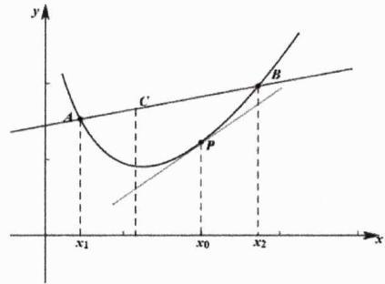

text_image

y
A
C
P
B
x₁
x₀
x₂
x

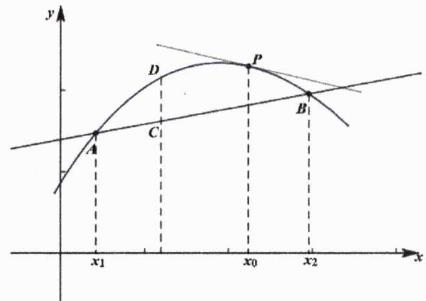

text_image

y
D
P
C
A
B
x1
x0
x2
x

在初等数学中，下凸函数常以如下形态出现（上凸反之即可）.

命题9.1: 下凸函数等价描述 设 $f(x)$ 在区间I上连续，如果 $\forall x_{1},x_{2}\in I$ 和 $\forall\lambda_{i}\in(0,1)$ 且 $\lambda_{1}+\lambda_{2}=1$ 恒有

$$
f \left(\lambda_ {1} x _ {1} + \lambda_ {2} x _ {2}\right) <   \lambda_ {1} f \left(x _ {1}\right) + \lambda_ {2} f \left(x _ {2}\right)
$$

那么称 $f(x)$ 在I上的图形是下凸的.

几何意义: 严格如上左图所示, 设 $\overrightarrow{AC} = \lambda \overrightarrow{CB}$ , $\lambda \in (0,1)$ , $A(x_{1}, f(x_{1}))$ , $B(x_{2}, f(x_{2}))$ , 则有

$$
C \left(\frac {x _ {1} + \lambda x _ {2}}{1 + \lambda}, \frac {f (x _ {1}) + \lambda f (x _ {2})}{1 + \lambda}\right)
$$

令 $\frac{1}{1 + \lambda} = \lambda_1, \frac{\lambda}{1 + \lambda} = \lambda_2$ ，若曲线总在割线 $AB$ 下方，必有

$$
f (\lambda_ {1} x _ {1} + \lambda_ {2} x _ {2}) <   \lambda_ {1} f (x _ {1}) + \lambda_ {2} f (x _ {2})
$$

定理9.1: 凹凸性判定定理 设 $f(x)$ 在 $[a,b]$ 上连续，在 $(a,b)$ 内具有一阶和二阶导数，那么

(i) 若在 $(a, b)$ 内 $f''(x) > 0$ ，则 $f(x)$ 在 $[a, b]$ 上是下凸的；  
(ii) 若在 $(a,b)$ 内 $f''(x)<0$ ，则 $f(x)$ 在 $[a,b]$ 上是上凸的.

定理证明: 在情形(i)下, 不妨设 $a \leq x_{1} < x_{2} \leq b$ , 则有 $x_{1} < \frac{x_{1} + x_{2}}{2} < x_{2}$ . 由Lagrange中值定理知, 既 $\exists \xi_{1} \in (x_{1}, \frac{x_{1} + x_{2}}{2})$ 又 $\exists \xi_{2} \in (\frac{x_{1} + x_{2}}{2}, x_{2})$ 使得

$$
f \left(\frac {x _ {1} + x _ {2}}{2}\right) - f (x _ {1}) = f ^ {\prime} (\xi_ {1}) \cdot \frac {x _ {2} - x _ {1}}{2}
$$

$$
f (x _ {2}) - f \left(\frac {x _ {1} + x _ {2}}{2}\right) = f ^ {\prime} (\xi_ {2}) \cdot \frac {x _ {2} - x _ {1}}{2}
$$

因为 $f''(x)>0$ 且有 $\xi_{1}<\xi_{2}$ ，则 $f'(\xi_{1})<f'(\xi_{2})$ ，从而有

$$
f \left(\frac {x _ {1} + x _ {2}}{2}\right) - f (x _ {1}) <   f (x _ {2}) - f \left(\frac {x _ {1} + x _ {2}}{2}\right)
$$

变形即可证得

$$
f \left(\frac {x _ {1} + x _ {2}}{2}\right) <   \frac {f (x _ {1}) + f (x _ {2})}{2}
$$

同理可证得情形(ii).

接下来我们要来认识一下凹凸性中另一个非常重要的不等式——琴生不等式（该不等式为纪念丹麦技术大学数学家约翰·延森（Johan Jensen）而命名，也被称为詹森不等式或琼森不等式）。

铭师道·高中数学方法原本

定理9.2: 琴生（Jensen）不等式 若 $f(x)$ 是区间 $[a, b]$ 上的下凸函数（二阶可导、 $f''(x) > 0$ ），则对任意的 $x_1, x_2, \cdots, x_n \in [a, b]$ ， $\sum_{i=1}^{n} \alpha_i = 1$ 且 $\alpha_i > 0$ ，有

$$
f \left(\sum_ {i = 1} ^ {n} \alpha_ {i} x _ {i}\right) \leq \sum_ {i = 1} ^ {n} \alpha_ {i} f (x _ {i})
$$

当且仅当 $x_{1}=x_{2}=\cdots=x_{n}$ 时取等.

定理证明：首先我们再次证明下凸曲线总在区间任意一点 $t$ 处切线的上方（\*），其证明过程如下： $f(x)$ 在 $t$ 处的带Lagrange余项的Taylor展开式为

$$
f (x) = f (t) + f ^ {\prime} (t) (x - t) + \frac {f ^ {\prime \prime} (\xi)}{2 !} (x - t) ^ {2} (\xi \text {在} x \text {与} t \text {之间})
$$

因为 $f''(x)>0$ ，从而必有

$$
f (x) \geq f (t) + f ^ {\prime} (t) (x - t)
$$

从而（\*）得证.接下来令 $t=\sum_{i=1}^{n}\alpha_{i}x_{i}$ ，必有 $t\in[a,b]$ ，依次令 $x=x_{1},x_{2},\cdots,x_{n}$ ，则有

$$
f \left(x _ {1}\right) \geq f (t) + f ^ {\prime} (t) \left(x _ {1} - t\right), \dots , f \left(x _ {n}\right) \geq f (t) + f ^ {\prime} (t) \left(x _ {n} - t\right)
$$

因为 $\alpha_{i}>0$ ，进一步有

$$
\sum_ {i = 1} ^ {n} \alpha_ {i} f (x _ {i}) \geq \left(\sum_ {i = 1} ^ {n} \alpha_ {i}\right) f (t) + f ^ {\prime} (t) \left(\underbrace {\sum_ {i = 1} ^ {n} \alpha_ {i} x _ {i} - t \sum_ {i = 1} ^ {n} \alpha_ {i}} _ {= 0}\right) = f (t) = f \left(\sum_ {i = 1} ^ {n} \alpha_ {i} x _ {i}\right)
$$

当且仅当 $x_{1}=x_{2}=\cdots=x_{n}$ 时取等，从而得证.

说明：此定理用数学归纳法亦较容易证明. 另外如果函数是上凸的，则定理中的不等号要变号.

推论9.1： 琴生不等式弱化形式 在前述定理的基础上，若 $\alpha_{i} = \frac{1}{n}$ ，则有

$$
f \left(\frac {x _ {1} + x _ {2} + \cdots + x _ {n}}{n}\right) \leq \frac {f (x _ {1}) + f (x _ {2}) + \cdots + f (x _ {n})}{n}
$$

或

$$
n f \left(\frac {\sum_ {i = 1} ^ {n} x _ {i}}{n}\right) \leq \sum_ {i = 1} ^ {n} f (x _ {i})
$$

命题9.2: 广义均值不等式 若 $a_{1},a_{2},\cdots,a_{n}\in R^{*}$ ，则有

$$
\sqrt [ n ]{a _ {1} a _ {2} \cdots a _ {n}} \leq \frac {a _ {1} + a _ {2} + \cdots + a _ {n}}{n}
$$

命题证明：设 $f(x)=\ln x$ ，易知其为 $(0,+\infty)$ 上的上凸函数，由Jensen不等式知

$$
\frac {1}{n} \sum_ {i = 1} ^ {n} \ln a _ {i} = \ln \sqrt [ n ]{a _ {1} a _ {2} \cdots a _ {n}} \leq \ln \left(\frac {1}{n} \sum_ {i = 1} ^ {n} a _ {i}\right)
$$

简单变形后原命题即可得证.

命题9.3: 均值不等式串 若 $a_{1},a_{2},\cdots,a_{n}\in R^{*}$ ，则有

$$
\underbrace {\frac {n}{\frac {1}{a _ {1}} + \frac {1}{a _ {2}} + \cdots + \frac {1}{a _ {n}}} \leq \sqrt [ n ]{a _ {1} a _ {2} \cdots a _ {n}}} _ {①} \leq \underbrace {\frac {a _ {1} + a _ {2} + \cdots + a _ {n}}{n} \leq \sqrt {\frac {a _ {1} ^ {2} + a _ {2} ^ {2} + \cdots + a _ {n} ^ {2}}{n}}} _ {②}
$$

证明：先证明①，本结论等同于 $\ln\left(\frac{a_{1}^{-1}+a_{2}^{-1}+\cdots+a_{n}^{-1}}{n}\right)\geq\frac{1}{n}\ln(a_{1}^{-1}a_{2}^{-1}\cdots a_{n}^{-1})$ （\*），因为函数 $f(x)=\ln x$ 在 $(0,+\infty)$ 上是上凸的，由Jensen不等式知（\*）必成立，当且仅当 $a_{1}=a_{2}=\cdots=a_{n}$ 时取等.

再证明②，令 $f(x)=x^{2}$ ，显然其在 $(0,+\infty)$ 上是下凸的，由Jensen不等式知

$$
\left(\frac {a _ {1} + a _ {2} + \cdots + a _ {n}}{n}\right) ^ {2} \leq \frac {1}{n} a _ {1} ^ {2} + \frac {1}{n} a _ {2} ^ {2} + \dots + \frac {1}{n} a _ {n} ^ {2}
$$

变形后即可得证，取等条件同上.中间对应的不等式我们在上一命题中已证，综上，证毕.

推论9.2: 圆内接 $n$ 边形定理 在半径为 $r$ 的圆的内接 $n$ 边形中, 正 $n$ 边形的面积最大, 最大值为

$$
\frac {1}{2} r ^ {2} \cdot \left(n \cdot \sin \frac {2 \pi}{n}\right)
$$

推论证明: 设半径为 $r$ 的圆的内接 $n$ 边形各边所对的圆心角分别为 ${\alpha }_{1},{\alpha }_{2},\cdots ,{\alpha }_{n}$ ,则有

$$
S = \frac {1}{2} r ^ {2} (\sin \alpha_ {1} + \sin \alpha_ {2} + \dots + \sin \alpha_ {n})
$$

因为函数 $y=\sin x$ 在 $(0,\pi)$ 上是上凸的，从而有

$$
S = \frac {1}{2} r ^ {2} (\sin \alpha_ {1} + \sin \alpha_ {2} + \dots + \sin \alpha_ {n}) \leq \frac {1}{2} r ^ {2} \cdot n \sin \frac {\alpha_ {1} + \alpha_ {2} + \cdots + \alpha_ {n}}{n} = \frac {1}{2} r ^ {2} \cdot (n \cdot \sin \frac {2 \pi}{n})
$$

当且仅当 $\alpha_{1}=\alpha_{2}=\cdots=\alpha_{n}=\frac{2\pi}{n}$ 时，等号成立，从而得证！

例1. [2018 新课标 I 理 16] 已知函数 $f(x) = 2\sin x + \sin 2x$ ，则 $f(x)$ 的最小值是 \_\_\_\_.

解析: 易知 $f(x)$ 是 $\mathbb{R}$ 上的奇函数且其最小正周期为 $2 \pi$ , 当 $x \in \left(0, \frac{\pi}{2}\right)$ 时其是上凸的, 由Jensen不等式知

$$
\begin{array}{l} 2 \sin x + \sin 2 x = \sin x + \sin x + \sin (\pi - 2 x) \\ \leq 3 \sin \frac {x + x + \pi - 2 x}{3} \\ = \frac {3 \sqrt {3}}{2} \\ \end{array}
$$

而当 $x \in \left[\frac{\pi}{2}, \pi\right)$ 时， $f(x) \leq 2 < \frac{3\sqrt{3}}{2}$ ，利用奇函数性质知 $f(x)$ 的最小值是 $-\frac{3\sqrt{3}}{2}$ .

例2. 已知函数 $f(x) = 2\sin x - \sin 2x (0 \leq x \leq \pi)$ ，则 $f(x)$ 的最大值是 \_\_\_\_.

解析：思路 $^{①}$ 、显然有

$$
2 \sin x - \sin 2 x = 2 \sin x (1 - \cos x) = 4 \sin x \sin^ {2} {\frac {x}{2}} = 8 \sin^ {3} {\frac {x}{2}} \cdot \cos {\frac {x}{2}}
$$

由均值不等式知

$$
\begin{array}{l} f ^ {2} (x) = 6 4 \sin^ {6} \frac {x}{2} \cdot \cos^ {2} \frac {x}{2} = \frac {6 4}{3} \sin^ {2} \frac {x}{2} \cdot \sin^ {2} \frac {x}{2} \cdot \sin^ {2} \frac {x}{2} \cdot 3 \cos^ {2} \frac {x}{2} \\ \leq \frac {6 4}{3} \cdot \left(\frac {3 \sin^ {2} \frac {x}{2} + 3 \cos^ {2} \frac {x}{2}}{4}\right) ^ {4} \\ = \frac {2 7}{4} \\ \end{array}
$$

当且仅当 $\sin^{2}\frac{x}{2}=3\cos^{2}\frac{x}{2}$ 即 $x=\frac{2\pi}{3}$ 时上式取等，故而有 $f(x)$ 的最大值为 $\frac{3\sqrt{3}}{2}$ .

思路 $^{②}$ 、显然有 $f(x)=2\sin x+\sin(2\pi-2x)$ ，当 $x\in\left(\frac{\pi}{2},\pi\right)$ 时易知 $y=\sin x$ 是上凸函数，由Jensen不等式知

$$
2 \sin x + \sin (2 \pi - 2 x) = \sin x + \sin x + \sin (2 \pi - 2 x) \leq 3 \sin \frac {x + x + 2 \pi - 2 x}{3} = \frac {3 \sqrt {3}}{2}
$$

其取等条件同上.

例3. 已知 $P$ 为 $\triangle ABC$ 内部或边上一点, $P$ 到三边的距离分别为 $d_{1}, d_{2}, d_{3}$ , 证明:

$$
\left| P A \right| \cdot \left| P B \right| \cdot \left| P C \right| \geq \left(d _ {1} + d _ {2}\right) \left(d _ {2} + d _ {3}\right) \left(d _ {3} + d _ {1}\right)
$$

解析：严格如下图所示（不再对每个元素作具体介绍），显而易见的是

$$
d _ {1} + d _ {3} = | P A | (\sin \alpha + \sin \beta) = 2 | P A | \sin {\frac {\alpha + \beta}{2}} \cos {\frac {\alpha - \beta}{2}} \leq 2 | P A | \sin {\frac {\alpha + \beta}{2}} = 2 | P A | \sin {\frac {A}{2}}
$$

同理可得

$$
\left(d _ {1} + d _ {2}\right) \left(d _ {2} + d _ {3}\right) \left(d _ {3} + d _ {1}\right) \leq 8 | P A | \cdot | P B | \cdot | P C | \left(\sin \frac {A}{2} \sin \frac {B}{2} \sin \frac {C}{2}\right)
$$

令 $f(x)=\ln\sin x$ ，则有

$$
f ^ {\prime} (x) = \frac {1}{\tan x}, f ^ {\prime \prime} (x) = - \frac {1}{\sin^ {2} x} <   0
$$

故而其在 $(0,\pi)$ 上是上凸的，由Jensen不等式知

铭师道·高中数学方法原本

$$
\frac {\ln \sin \frac {A}{2} + \ln \sin \frac {B}{2} + \ln \sin \frac {C}{2}}{3} \leq \ln \sin \frac {\frac {A}{2} + \frac {B}{2} + \frac {C}{2}}{3} = \ln \sin \frac {A + B + C}{6} = \ln \sin \frac {\pi}{6} = \ln \frac {1}{2}
$$

于是有

$$
\sin \frac {A}{2} \sin \frac {B}{2} \sin \frac {C}{2} \leq \left(\frac {1}{2}\right) ^ {3} = \frac {1}{8}
$$

当且仅当 $A = B = C = \frac{\pi}{3}$ 即 $\triangle ABC$ 为正三角形且 $P$ 点是其内心时上式取等，从而证得

$$
\left| P A \right| \cdot \left| P B \right| \cdot \left| P C \right| \geq \left(d _ {1} + d _ {2}\right) \left(d _ {2} + d _ {3}\right) \left(d _ {3} + d _ {1}\right)
$$

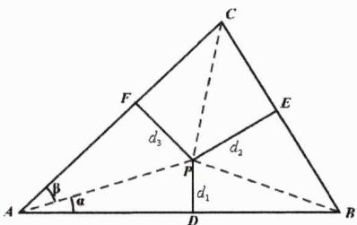

text_image

C
F
E
d₃
d₂
P
d₁
A
B
α
D

Jensen不等式的运用当然是非常广泛的，如可利用其证明著名的幂平均不等式.

定理9.3: 幂平均不等式 给定 $a_{i}>0(i=1,2,3,\cdots,n)$ ，r>0，我们称下式为 $a_{1}$ ， $a_{2}$ ， $\cdots$ ， $a_{n}$ 的r次幂平均值

$$
M _ {r} (a _ {1}, a _ {2}, \ldots , a _ {n}) = \left(\frac {a _ {1} ^ {r} + a _ {2} ^ {r} + \cdots + a _ {n} ^ {r}}{n}\right) ^ {\frac {1}{r}}
$$

当 $\alpha >\beta >0$ 时，有 $M_{\alpha}(a_1,a_2,\dots ,a_n)\geq M_\beta (a_1,a_2,\dots ,a_n)$ ，我们称其为幂平均不等式.即有

$$
\left(\frac {a _ {1} ^ {\alpha} + a _ {2} ^ {\alpha} + \cdots + a _ {n} ^ {\alpha}}{n}\right) ^ {\frac {1}{\alpha}} \geq \left(\frac {a _ {1} ^ {\beta} + a _ {2} ^ {\beta} + \cdots + a _ {n} ^ {\beta}}{n}\right) ^ {\frac {1}{\beta}}
$$

当且仅当 $a_{1}=a_{2}=\cdots=a_{n}$ 时上式取等.

定理证明：引入函数 $f(x)=x^{r}$ （x>0且r>1），则必有 $f''(x)=r(r-1)x^{r-2}>0$ ，故而函数 $f(x)$ 是下凸的。由Jensen不等式知

$$
\frac {x _ {1} ^ {r} + x _ {2} ^ {r} + \cdots + x _ {n} ^ {r}}{n} \geq \left(\frac {x _ {1} + x _ {2} + \cdots + x _ {n}}{n}\right) ^ {r}
$$

当 $\alpha >\beta >0$ 时，必有 $\frac{\alpha}{\beta} >1$ ，进而有

$$
\frac {x _ {1} ^ {\frac {\alpha}{\beta}} + x _ {2} ^ {\frac {\alpha}{\beta}} + \cdots + x _ {n} ^ {\frac {\alpha}{\beta}}}{n} \geq \left(\frac {x _ {1} + x _ {2} + \cdots + x _ {n}}{n}\right) ^ {\frac {\alpha}{\beta}}
$$

进一步有

$$
\left(\frac {x _ {1} ^ {\frac {\alpha}{\beta}} + x _ {2} ^ {\frac {\alpha}{\beta}} + \cdots + x _ {n} ^ {\frac {\alpha}{\beta}}}{n}\right) ^ {\frac {1}{\alpha}} \geq \left(\frac {x _ {1} + x _ {2} + \cdots + x _ {n}}{n}\right) ^ {\frac {1}{\beta}}
$$

再令 $x_{i}^{\frac{\alpha}{\beta}}=a_{i}^{\alpha}\quad(i=1,2,\cdots,n)$ ，则有 $x_{i}=a_{i}^{\beta}\quad(i=1,2,\cdots,n)$ ，此时有

$$
\left(\frac {a _ {1} ^ {\alpha} + a _ {2} ^ {\alpha} + \cdots + a _ {n} ^ {\alpha}}{n}\right) ^ {\frac {1}{\alpha}} \geq \left(\frac {a _ {1} ^ {\beta} + a _ {2} ^ {\beta} + \cdots + a _ {n} ^ {\beta}}{n}\right) ^ {\frac {1}{\beta}}
$$

当且仅当 $x_{1}=x_{2}=\cdots=x_{n}$ 即 $a_{1}=a_{2}=\cdots=a_{n}$ 时上式取等，证毕.

推论9.3: 幂平均下的均值不等式 当 $a_{i}>0(i=1,2,3,\cdots,n)$ 时，以下均值不等式串

$$
{\frac {n}{\frac {1}{a _ {1}} + \frac {1}{a _ {2}} + \cdots + \frac {1}{a _ {n}}}} \leq {\sqrt [ n ]{a _ {1} a _ {2} \cdots a _ {n}}} \leq {\frac {a _ {1} + a _ {2} + \cdots + a _ {n}}{n}} \leq {\sqrt {\frac {a _ {1} ^ {2} + a _ {2} ^ {2} + \cdots + a _ {n} ^ {2}}{n}}}
$$

等价于

$$
M _ {- 1} (a _ {1}, a _ {2}, \dots , a _ {n}) \leq M _ {0} (a _ {1}, a _ {2}, \dots , a _ {n}) \leq M _ {1} (a _ {1}, a _ {2}, \dots , a _ {n}) \leq M _ {2} (a _ {1}, a _ {2}, \dots , a _ {n})
$$

在以上结论中我们事实上默认了 $M_{0}(a_{1},a_{2},\ldots,a_{n})=\left(\frac{a_{1}^{0}+a_{2}^{0}+\cdots+a_{n}^{0}}{n}\right)^{\frac{1}{0}}=\sqrt[n]{a_{1}a_{2}\cdots a_{n}}$ ，这个是人为约定还是可以严格证明呢？接下来我们一起做个探究。显然有

$$
\ln M _ {r} = \frac {1}{r} \ln \frac {a _ {1} ^ {r} + a _ {2} ^ {r} + \cdots + a _ {n} ^ {r}}{n}
$$

令 $x=\frac{a_{1}^{r}+a_{2}^{r}+\cdots+a_{n}^{r}}{n}-1$ ，此时有

$$
\ln M _ {r} = \frac {1}{r} \ln (x + 1) = \frac {\ln (x + 1)}{x} \cdot \frac {x}{r}
$$

显然当 $r\to0$ 时， $x\to1-1=0$ ，于是

$$
\lim _ {r \rightarrow 0} \ln M _ {r} = \lim _ {r \rightarrow 0} \left[ \frac {\ln (x + 1)}{x} \cdot \frac {x}{r} \right] = \lim _ {x \rightarrow 0} \frac {\ln (x + 1)}{x} \cdot \lim _ {r \rightarrow 0} \frac {x}{r} = \lim _ {r \rightarrow 0} \frac {x}{r}
$$

而

$$
\begin{array}{l} \lim _ {r \to 0} \frac {x}{r} = \frac {1}{n} \lim _ {r \to 0} \frac {a _ {1} ^ {r} + a _ {2} ^ {r} + \cdots + a _ {n} ^ {r} - n}{r} = \frac {1}{n} \left(\lim _ {r \to 0} \frac {a _ {1} ^ {r} - 1}{r} + \lim _ {r \to 0} \frac {a _ {2} ^ {r} - 1}{r} + \dots + \lim _ {r \to 0} \frac {a _ {n} ^ {r} - 1}{r}\right) \\ = \frac {1}{n} \left(\ln a _ {1} + \ln a _ {2} + \dots + \ln a _ {n}\right) \\ = \ln \sqrt [ n ]{a _ {1} a _ {2} \cdots a _ {n}} \\ \end{array}
$$

故而有

$$
\lim _ {r \rightarrow 0} \ln M _ {r} = \lim _ {r \rightarrow 0} \frac {x}{r} = \ln \sqrt [ n ]{a _ {1} a _ {2} \cdots a _ {n}}
$$

由此证得

$$
M _ {0} (a _ {1}, a _ {2}, \dots , a _ {n}) = \left(\frac {a _ {1} ^ {0} + a _ {2} ^ {0} + \cdots + a _ {n} ^ {0}}{n}\right) ^ {\frac {1}{0}} = \sqrt [ n ]{a _ {1} a _ {2} \cdots a _ {n}}
$$

说明：在以上证明中我们同时用到了以下两个极限（在《高数视角下的导函数论》第一卷中有详细的推导过程）。另外以上证明过程在高中阶段除锻炼数学思维外，并无实际价值。

$$
① \lim _ {x \to 0} \frac {\ln (x + 1)}{x} = 1; \quad ② \lim _ {r \to 0} \frac {a ^ {r} - 1}{r} = \ln a
$$

例4. 已知正数 $a, b, c$ 满足 $a + b + c = 1$ ，则 $\left(a + \frac{1}{a}\right)^3 + \left(b + \frac{1}{b}\right)^3 + \left(c + \frac{1}{c}\right)^3$ 的最小值为 \_\_\_\_.

解析：由幂平均不等式可得

$$
\left[ \frac {\left(a + \frac {1}{a}\right) ^ {3} + \left(b + \frac {1}{b}\right) ^ {3} + \left(c + \frac {1}{c}\right) ^ {3}}{3} \right] ^ {\frac {1}{3}} \geq \frac {a + \frac {1}{a} + b + \frac {1}{b} + c + \frac {1}{c}}{3} = \frac {1}{3} \left(1 + \frac {1}{a} + \frac {1}{b} + \frac {1}{c}\right)
$$

再由权方和不等式知

$$
\frac {1}{a} + \frac {1}{b} + \frac {1}{c} \geq \frac {(1 + 1 + 1) ^ {2}}{a + b + c} = 9
$$

进而有

$$
\left(a + \frac {1}{a}\right) ^ {3} + \left(b + \frac {1}{b}\right) ^ {3} + \left(c + \frac {1}{c}\right) ^ {3} \geq 3 \cdot \left(\frac {1 0}{3}\right) ^ {3} = \frac {1 0 0 0}{9}
$$

当且仅当a=b=c= $\frac{1}{3}$ 时上式取等.

例5. 已知正实数 $a, b, c$ 满足 $a^2 + b^2 + c^2 = 14$ ，则 $a^5 + \frac{1}{8} b^5 + \frac{1}{27} c^5$ 的最小值为 \_\_\_\_.

解析：因为

$$
a ^ {5} + \frac {1}{8} b ^ {5} + \frac {1}{2 7} c ^ {5} = a ^ {5} + 4 \left(\frac {b}{2}\right) ^ {5} + 9 \left(\frac {c}{3}\right) ^ {5}
$$

由幂平均不等式得

$$
\left[ \frac {a ^ {5} + 4 \left(\frac {b}{2}\right) ^ {5} + 9 \left(\frac {c}{3}\right) ^ {5}}{1 4} \right] ^ {\frac {1}{5}} \geq \left[ \frac {a ^ {2} + 4 \left(\frac {b}{2}\right) ^ {2} + 9 \left(\frac {c}{3}\right) ^ {2}}{1 4} \right] ^ {\frac {1}{2}} = \left(\frac {a ^ {2} + b ^ {2} + c ^ {2}}{1 4}\right) ^ {\frac {1}{2}} = 1
$$

进而有 $a^{5}+\frac{1}{8}b^{5}+\frac{1}{27}c^{5}\geq14$ ，取等条件为 $a^{2}=\left(\frac{b}{2}\right)^{2}=\left(\frac{c}{3}\right)^{2}$ 即a=1,b=2,c=3.

铭师道·高中数学方法原本

接下来我将直接给出如下两组不等式串，以供读者参考.

结论9.1: 二维高阶不等式串I 若 $a, b \in \mathbb{R}^{*}$ 且 $a \neq b$ ，则有

$$
\frac {2}{\frac {1}{a} + \frac {1}{b}} <   \sqrt {a b} <   \underbrace {\frac {a - b}{\ln a - \ln b}} _ {\text {对数均值}} <   \frac {a + b}{2} <   \sqrt {\frac {a ^ {2} + b ^ {2}}{2}} <   \frac {a ^ {2} + b ^ {2}}{a + b} <   \frac {2 (a ^ {2} + b ^ {2})}{(\sqrt {a} + \sqrt {b}) ^ {2}} <   \frac {a ^ {2} + b ^ {2}}{2 \sqrt {a b}}
$$

结论证明：除上述对数均值不等式（在导函数章节我们会系统介绍）外，其它结论皆极易证明，如因为

$$
\left(\sqrt {a} + \sqrt {b}\right) ^ {2} <   2 (a + b)
$$

故而有

$$
\frac {a ^ {2} + b ^ {2}}{a + b} <   \frac {2 (a ^ {2} + b ^ {2})}{(\sqrt {a} + \sqrt {b}) ^ {2}}
$$

事实上接下来若令a=x>0且 $x\neq1$ ，b=1，则有

$$
\frac {2}{\frac {1}{x} + 1} <   \sqrt {x} <   \underbrace {\frac {x - 1}{\ln x}} _ {\text {对数均值}} <   \frac {x + 1}{2} <   \sqrt {\frac {x ^ {2} + 1}{2}} <   \frac {x ^ {2} + 1}{x + 1} <   \frac {2 (x ^ {2} + 1)}{(\sqrt {x} + 1) ^ {2}} <   \frac {x ^ {2} + 1}{2 \sqrt {x}}
$$

在同一个坐标系中，上述8个表达式对应的函数图像如下（最上方对应函数为 $f(x)=\frac{x^{2}+1}{2\sqrt{x}}$ ）：

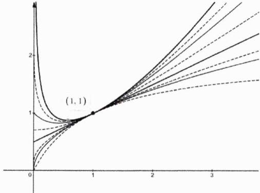

line

| x    | y (solid) | y (dashed) |
| ---- | --------- | ---------- |
| 0    | 0         | 0          |
| 1    | 1         | 1          |
| 2    | ~1.5      | ~1.2       |
| 3    | ~2        | ~1.8       |

结论9.2: 二维高阶不等式串II 若 $a, b \in R^{*}$ ，则有

$$
{\frac {2}{\frac {1}{a} + \frac {1}{b}}} \leq {\frac {4 a b}{(\sqrt {a} + \sqrt {b}) ^ {2}}} \leq {\sqrt {a b}} \leq {\frac {{\sqrt [ 4 ]{a b}} (\sqrt {a} + \sqrt {b})}{2}} \leq \left({\frac {\sqrt {a} + \sqrt {b}}{2}}\right) ^ {2} \leq {\frac {a + b}{2}} \leq {\frac {2 (a ^ {2} + a b + b ^ {2})}{3 (a + b)}} \leq {\sqrt {\frac {a ^ {2} + b ^ {2}}{2}}}
$$

结论说明：若令 $a = x > 0$ ， $b = 1$ ，则有

$$
\frac {2}{\frac {1}{x} + 1} \leq \frac {4 x}{(\sqrt {x} + 1) ^ {2}} \leq \sqrt {x} \leq \frac {\sqrt [ 4 ]{x} \cdot (\sqrt {x} + 1)}{2} \leq \left(\frac {\sqrt {x} + 1}{2}\right) ^ {2} \leq \frac {x + 1}{2} \leq \frac {2 (x ^ {2} + x + 1)}{3 (x + 1)} \leq \sqrt {\frac {x ^ {2} + 1}{2}}
$$

在同一个坐标系中，上述8个表达式对应的函数图像如下（最上方图像对应函数为 $f(x)=\sqrt{\frac{x^{2}+1}{2}}$ ）：

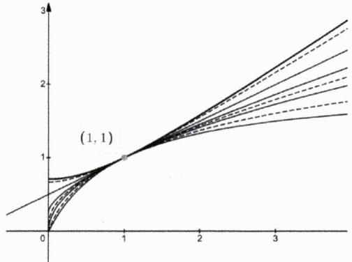

line

| x    | y (Line 1) | y (Line 2) | y (Line 3) | y (Line 4) | y (Line 5) | y (Line 6) | y (Line 7) | y (Line 8) |
| ---- | ---------- | ---------- | ---------- | ---------- | ---------- | ---------- | ---------- | ---------- |
| 0    | 0          | 0          | 0          | 0          | 0          | 0          | 0          | 0          |
| 1    | 1          | 1          | 1          | 1          | 1          | 1          | 1          | 1          |
| 2    | ~1.5       | ~1.5       | ~1.5       | ~1.5       | ~1.5       | ~1.5       | ~1.5       | ~1.5       |
| 3    | ~2         | ~2         | ~2         | ~2         | ~2         | ~2         | ~2         | ~2         |

虽然我们给出了以上诸多结论，但在现阶段，我们主要还是仅利用如下“调一几一对一算一平”这一最基础的不等式串来解题.

$$
\frac {2}{\frac {1}{a} + \frac {1}{b}} <   \sqrt {a b} <   \frac {a - b}{\ln a - \ln b} <   \frac {a + b}{2} <   \sqrt {\frac {a ^ {2} + b ^ {2}}{2}}
$$

例6. [2014 辽宁文 16] 对于 $c > 0$ ，当非零实数 $a, b$ 满足 $4a^2 - 2ab + b^2 - c = 0$ 且使 $|2a + b|$ 最大时， $\frac{1}{a} + \frac{2}{b} + \frac{4}{c}$ 的最小值为 \_\_\_\_.

解析：显然有 $4a^{2}-2ab+b^{2}=c$ ，由均值不等式知

$$
\vert 2 a + b \vert^ {2} = c + 3 \cdot 2 a b \leq c + 3 \cdot \left(\frac {2 a + b}{2}\right) ^ {2}
$$

则有 $|2a+b|^{2}\leq4c$ ，当且仅当b=2a时 $|2a+b|$ 取得最大值，此时 $c=b^{2}$ ，故而有

$$
\frac {1}{a} + \frac {2}{b} + \frac {4}{c} = 4 \left(\frac {1}{b} + \frac {1}{b ^ {2}}\right) \geq 4 \times \left(- \frac {1}{4}\right) = - 1
$$

从而所求目标函数最小值为-1.

例7. 已知 $x,y$ 均为正数,且满足 ${\left( 2xy - 1\right) }^{2} = \left( {{5y} + 2}\right) \left( {y - 2}\right)$ ,则 $x + \frac{1}{2y}$ 的最大值为

解析：将已知两边同除 $y^{2}$ 可得

$$
\left(2 x - \frac {1}{y}\right) ^ {2} = \left(5 + \frac {2}{y}\right) \left(1 - \frac {2}{y}\right)
$$

进而有

$$
\left(2 x - \frac {1}{y}\right) ^ {2} + \left(\frac {2}{y}\right) ^ {2} + \frac {8}{y} = 5 \Longrightarrow \left(2 x - \frac {1}{y}\right) ^ {2} + \left(\frac {2}{y} + 2\right) ^ {2} = 9
$$

由均值不等式知

$$
9 = \left(2 x - \frac {1}{y}\right) ^ {2} + \left(\frac {2}{y} + 2\right) ^ {2} \geq \frac {1}{2} \left(2 x + \frac {1}{y} + 2\right) ^ {2}
$$

故而有 $x+\frac{1}{2y}\leq\frac{3\sqrt{2}}{2}-1.$

例8. 非负实数 $x, y$ 满足 $x^{2} + 4y^{2} + 4xy + 4x^{2}y^{2} = 32$ ，则：

(1) $x + 2y$ 的最小值为 \_\_\_\_；  
(2) $\sqrt{7}(x+2y)+2xy$ 的最大值是 \_\_\_\_.

解析：

第一问：由条件知 $32 = (x + 2y)^{2} + (x \cdot 2y)^{2} \leq (x + 2y)^{2} + \left(\frac{x + 2y}{2}\right)^{4}$ ，于是有

$$
(x + 2 y) ^ {4} + 1 6 (x + 2 y) ^ {2} - 5 1 2 \geq 0
$$

解得

$$
(x + 2 y) ^ {2} \geq 1 6 \text {或} (x + 2 y) ^ {2} \leq - 3 2 (\text {舍})
$$

故而可得 $x+2y$ 的最小值为4（当且仅当x=2且y=1时取等）.

第二问：若令 $x+2y=a$ ，则有 $2xy=\sqrt{32-a^{2}}$ ，由Cauchy不等式可得

$$
\begin{array}{l} \sqrt {7} (x + 2 y) + 2 x y = \sqrt {7} a + \sqrt {3 2 - a ^ {2}} = \sqrt {7} \sqrt {a ^ {2}} + \sqrt {3 2 - a ^ {2}} \\ \leq \sqrt {(7 + 1) (a ^ {2} + 3 2 - a ^ {2})} \\ = 1 6 \\ \end{array}
$$

当且仅当 $x+2y=2\sqrt{7}$ 时上式取等，因而 $\sqrt{7}(x+2y)+2xy$ 的最大值是16.

例9. 设x,y,z是正实数，则 $\frac{10x^{2}+10y^{2}+z^{2}}{xy+yz+zx}$ 的最小值为\_\_\_\_.

解析：显而易见的是

$$
\frac {1 0 x ^ {2} + 1 0 y ^ {2} + z ^ {2}}{x y + y z + z x} = \frac {(2 x ^ {2} + 2 y ^ {2}) + (8 y ^ {2} + \frac {z ^ {2}}{2}) + (8 x ^ {2} + \frac {z ^ {2}}{2})}{x y + y z + z x} \geq \frac {4 x y + 4 y z + 4 z x}{x y + y z + z x} = 4
$$

当且仅当 $x = y = \frac{z}{4}$ 时上式取等.

铭师道·高中数学方法原本

例10. [2021 北大强基 T20]已知 $a, b, c \in \mathbb{R}^*$ , 且 $(a + b - c)\left(\frac{1}{a} + \frac{1}{b} - \frac{1}{c}\right) = 3$ , 则 $(a^4 + b^4 + c^4)\left(\frac{1}{a^4} + \frac{1}{b^4} + \frac{1}{c^4}\right)$ 的最小值等于 \_\_\_\_.

解析：根据已知可得 $\frac{b}{a} +\frac{a}{b} -\left(\frac{1}{a} +\frac{1}{b}\right)c = (a + b)\frac{1}{c}$ ，则有

$$
{\frac {b}{a}} + {\frac {a}{b}} = \left({\frac {1}{a}} + {\frac {1}{b}}\right) c + (a + b) {\frac {1}{c}} \geq 2 {\sqrt {\left({\frac {1}{a}} + {\frac {1}{b}}\right) (a + b)}} = 2 {\sqrt {{\frac {b}{a}} + {\frac {a}{b}} + 2}}
$$

解得 $\frac{b}{a} +\frac{a}{b}\geq 2\sqrt{3} +2.$ 由Cauchy不等式可得

$$
\begin{array}{l} \left(a ^ {4} + b ^ {4} + c ^ {4}\right) \left(\frac {1}{a ^ {4}} + \frac {1}{b ^ {4}} + \frac {1}{c ^ {4}}\right) = \left(a ^ {4} + b ^ {4} + c ^ {4}\right) \left(\frac {1}{b ^ {4}} + \frac {1}{a ^ {4}} + \frac {1}{c ^ {4}}\right) \\ \geq \left(\frac {b ^ {2}}{a ^ {2}} + \frac {a ^ {2}}{b ^ {2}} + 1\right) ^ {2} \\ \geq \left[ (2 \sqrt {3} + 2) ^ {2} - 1 \right] ^ {2} \\ = 4 1 7 + 2 4 0 \sqrt {3} \\ \end{array}
$$

当且仅当 $c^{2}=ab$ 且 $\frac{b}{a}+\frac{a}{b}=2\sqrt{3}+2$ 时上式取等.

例11. [2012 四川文 16]设 $a, b$ 为正实数，现有下列命题：

① 若 $a^{2}-b^{2}=1$ ，则a-b<1；  
② 若 $\frac{1}{b}-\frac{1}{a}=1$ ，则a-b<1；  
③ 若 $\sqrt{a}-\sqrt{b}=1$ ，则 $|a-b|<1;$   
④ 若 $|a^{3}-b^{3}|=1$ ，则 $|a-b|<1$ .

其中的真命题有\_\_\_\_（写出所有真命题的编号）.

解析：对于①来说，显然有

$$
1 = (a + b) (a - b) > (a - b) ^ {2}
$$

故而有 $-1 < a - b < 1$ ，则①正确；对于②来说显然是错误的，因为当 $b = \frac{2024}{2025}$ ， $a = 2024$ 时，其满足 $\frac{1}{b} - \frac{1}{a} = 1$ ，但 $a - b > 1$ ；又因当 $a = 25$ 且 $b = 16$ 时 $\sqrt{a} - \sqrt{b} = 1$ ，但此时 $|a - b| > 1$ ，故而命题③错误；对于命题④，我们不妨设 $a > b > 0$ ，则有 $a^3 - b^3 = 1$ ，进而有

$$
(a - 1) (a ^ {2} + a + 1) = b \cdot b ^ {2}
$$

因为 $a^{2}+a+1>b^{2}$ ，从而必有a-1<b，进而有0<a-b<1，从而说明④正确。综上真命题为①④。

推论9.4: 若正数a, b满足 $a^{n}-b^{n}=1(n>1)$ ，则必有0<a-b<1.

命题9.4: 综合分析论 在高中阶段, 主流的经典试题核心考查的是综合分析法.

例12. [2008浙大自招T7改编]设 $0 < b < a < 4b, m > 0$ ，若三个数 $\frac{a + b}{2}, \sqrt{a^2 + b^2 - ab}, m\sqrt{ab}$ 能组成一个三角形的三条边长，则实数 $m$ 的取值范围是

解析：显而易见的是

$$
\sqrt {a ^ {2} + b ^ {2} - a b} = \sqrt {\left(\frac {a + b}{2}\right) ^ {2} + \frac {3}{4} (a - b) ^ {2}} > \frac {a + b}{2}
$$

欲满足题意，必有

$$
\sqrt {a ^ {2} + b ^ {2} - a b} - \frac {a + b}{2} <   m \sqrt {a b} <   \sqrt {a ^ {2} + b ^ {2} - a b} + \frac {a + b}{2}
$$

即有

$$
\frac {\sqrt {a ^ {2} + b ^ {2} - a b} - \frac {a + b}{2}}{\sqrt {a b}} <   m <   \frac {\sqrt {a ^ {2} + b ^ {2} - a b} + \frac {a + b}{2}}{\sqrt {a b}}
$$

显而易见的是

$$
\frac {\sqrt {a ^ {2} + b ^ {2} - a b} + \frac {a + b}{2}}{\sqrt {a b}} > \frac {\sqrt {2 a b - a b} + \sqrt {a b}}{\sqrt {a b}} = 2
$$

故而有 $m \leq 2$ .对于左侧，令 $\frac{a}{b} = t \in (1,4)$ ，则有

$$
\operatorname{LSH} (t) = \sqrt {t + \frac {1}{t} - 1} - \frac {1}{2} \left(\sqrt {t} + \frac {1}{\sqrt {t}}\right) = \sqrt {\left(\sqrt {t} + \frac {1}{\sqrt {t}}\right) ^ {2} - 3} - \frac {1}{2} \left(\sqrt {t} + \frac {1}{\sqrt {t}}\right)
$$

再令 $\sqrt{t} +\frac{1}{\sqrt{t}} = s\in \left(2,\frac{5}{2}\right)$ ，则必有

$$
\mathrm{LSH} (s) = \underbrace {\sqrt {s ^ {2} - 3} - \frac {1}{2} s} _ {\text {在} \left(2, \frac {5}{2}\right) \text {单调递增}} <   \mathrm{LSH} \left(\frac {5}{2}\right) = \frac {\sqrt {1 3}}{2} - \frac {5}{4}
$$

故而有 $m\geq\frac{\sqrt{13}}{2}-\frac{5}{4}$ .综上 $m\in\left[\frac{\sqrt{13}}{2}-\frac{5}{4},2\right]$ .

推论9.5: $\forall a, b \in \mathbb{R}^{*}$ , 恒有 $\sqrt{a^2 + b^2 - ab} \geq \frac{a + b}{2}$ (当且仅当 $a = b$ 时取等).

例13. 已知实数 $x, y$ 满足 $0 \leq x \leq y \leq 10$ , 设 $M = \max \{xy, xy - x - y + 1, x + y - 2xy\}$ , 则 $M$ 的最小值为 \_\_\_\_.

解析：我们直接进行如下分类讨论：

① 当 $xy \geq xy - x - y + 1$ 时有 $x + y \geq 1$ , 当 $xy \geq x + y - 2xy$ 时有

$$
x + y \leq 3 x y \leq \frac {3}{4} (x + y) ^ {2} \Longrightarrow x + y \geq \frac {4}{3}
$$

综上当 $x+y\geq\frac{4}{3}$ 时，M=xy.经分析当 $x=y=\frac{2}{3}$ 时，M取得最小值，其最小值为 $\frac{4}{9}$ .

② 当 $xy - x - y + 1 \geq xy$ 时有 $x + y \leq 1$ , 当 $xy - x - y + 1 \geq x + y - 2xy$ 时有

$$
2 (x + y) - 1 \leq 3 x y \leq {\frac {3}{4}} (x + y) ^ {2} \Longrightarrow x + y \geq 2 \text {或} x + y \leq {\frac {2}{3}}
$$

综上当 $x+y\leq\frac{2}{3}$ 时， $M=xy-x-y+1=(x-1)(y-1)$ .因为 $0\leq x\leq y$ ，故而有

$$
M = (x - 1) (y - 1) \geq (y - 1) (y - 1) = (1 - y) ^ {2}
$$

故而当 $x = y = \frac{1}{3}$ 时， $M_{\mathrm{min}} = \left(1 - \frac{1}{3}\right)^2 = \frac{4}{9}$ .

③ 显然当 $\frac{2}{3}<x+y<\frac{4}{3}$ 时，M=x+y-2xy.由均值不等式知

$$
M = x + y - 2 x y \geq (x + y) - \frac {1}{2} (x + y) ^ {2} > \frac {2}{3} - \frac {1}{2} \cdot \left(\frac {2}{3}\right) ^ {2} = \frac {4}{9}
$$

综合上述三种情形知当 $x=y=\frac{2}{3}$ 或 $x=y=\frac{1}{3}$ 时，M取得最小值，其最小值为 $\frac{4}{9}$ .

# 第 09 讲：高考对标训练

1. [多选][2020 山东海南 11]已知a>0,b>0，且 $a+b=1$ ，则()

A. $a^2 + b^2 \geq \frac{1}{2}$

B. $2^{a - b} > \frac{1}{2}$

C. $\log_2 a + \log_2 b \geq -2$

D. $\sqrt{a} + \sqrt{b} \leq \sqrt{2}$

2. [2014 辽宁理 16] 对于 $c > 0$ , 当非零实数 $a, b$ 满足 $4a^{2} - 2ab + 4b^{2} - c = 0$ 且使 $|2a + b|$ 最大时, $\frac{3}{a} - \frac{4}{b} + \frac{5}{c}$ 的最小值为 \_\_\_\_.

3. 已知正实数 $a_{1}, a_{2}, \cdots, a_{2020}$ 满足 $a_{1} + a_{2} + \cdots + a_{2020} = 1$ ，则 $\frac{a_{1}^{2}}{a_{1} + a_{2}} + \frac{a_{2}^{2}}{a_{2} + a_{3}} + \cdots + \frac{a_{2020}^{2}}{a_{2020} + a_{1}}$ 的最小值为 \_\_\_\_.

4. [2020 北大强基 T1] 若正实数 $x, y, z, w$ 满足 $x \geq y \geq w$ 和 $x + y \leq 2(z + w)$ ，则 $\frac{w}{x} + \frac{z}{y}$ 的最小值等于 \_\_\_\_.

5. 已知 $a, b, c > 0$ ，则 $\frac{a + 3c}{a + 2b + c} + \frac{4b}{a + b + 2c} - \frac{8c}{a + b + 3c}$ 的最小值为 \_\_\_\_.

6. 设 $x > 0, y > 0, x + 2^{y} = 5$ ，则当 $x =$ \_\_\_\_时， $2^{y}x^{y+1}$ 取到最大值.

铭师道·高中数学方法原本

7. 设 $x, y, z$ 是不全为零的正实数，则 $\frac{16x + 9\sqrt{2xy} + 9\sqrt[3]{3xyz}}{x + 2y + z}$ 的最大值为 \_\_\_\_.  
8. 设 $a = \sqrt{x^2 - xy + y^2}$ , $b = p\sqrt{xy}$ , $c = x + y$ , 若对任意的正实数 $x, y$ , 都存在以 $a, b, c$ 为三边长的三角形, 则实数 $p$ 的取值范围是 \_\_\_\_.  
9. [2009 清华大学]x,y为正实数，且 $x+y=1$ ，求证：对于任意正整数n， $x^{n}+y^{n}\geq\frac{1}{2^{n-1}}$ .  
10. 设 $a, b, c \in \mathbb{R}^*$ , 且 $2a^{2} + 2b^{2} + 2c^{2} + abc = 32$ , 求证: $4 < a + b + c \leq 6$ .

# 第 09 讲：对标答案

# 1. [解析]:

显然有 $a^{2}+b^{2}\geq2\left(\frac{a+b}{2}\right)^{2}=\frac{1}{2}$ ，当且仅当a=b时取等，从而A正确；易分析知a-b>-1，从而B正确；因为ab可以无限趋向于零，从而C选项错误；因为 $\sqrt{a}+\sqrt{b}\leq2\sqrt{\frac{a+b}{2}}=\sqrt{2}$ ，从而D正确。综上本题选ABD.

# 2. [解析]:

由不等式性质知

$$
\begin{array}{l} c = | 2 a + b | ^ {2} - 3 b (2 a - b) = | 2 a + b | ^ {2} - \frac {3}{2} \cdot 2 b (2 a - b) \geq | 2 a + b | ^ {2} - \frac {3}{2} \cdot \left(\frac {2 a + b}{2}\right) ^ {2} \\ = \frac {5}{8} | 2 a + b | ^ {2} \\ \end{array}
$$

当且仅当 $2b = 2a - b$ 即 $a = \frac{3}{2} b$ 时上式取等，此时 $c = 10b^2$ . 故而有

$$
\frac {3}{a} - \frac {4}{b} + \frac {5}{c} = - \frac {2}{b} + \frac {1}{2 b ^ {2}} \geq - 2
$$

当且仅当 $b=\frac{1}{2}$ 时取等.

# 3. [解析]:

由权方和不等式知

$$
\frac {a _ {1} ^ {2}}{a _ {1} + a _ {2}} + \frac {a _ {2} ^ {2}}{a _ {2} + a _ {3}} + \dots + \frac {a _ {2 0 2 0} ^ {2}}{a _ {2 0 2 0} + a _ {1}} \geq \frac {(a _ {1} + a _ {2} + \cdots + a _ {2 0 2 0}) ^ {2}}{2 (a _ {1} + a _ {2} + \cdots + a _ {2 0 2 0})} = \frac {1}{2}
$$

当且仅当 $a_{1}=a_{2}=\cdots=a_{2020}=\frac{1}{2020}$ 时取等.

# 4. [解析]:

因为 $x \geq y \geq w$ 且 $x + y \leq 2(z + w)$ ，故而有

$$
\begin{array}{l} \frac {w}{x} + \frac {2 z}{2 y} \geq \frac {w}{x} + \frac {x + y - 2 w}{2 y} = \frac {w}{x} + \frac {x}{2 y} - \frac {w}{y} + \frac {1}{2} = w \frac {y - x}{x y} + \frac {x}{2 y} + \frac {1}{2} \geq y \frac {y - x}{x y} + \frac {x}{2 y} + \frac {1}{2} \\ = \frac {y}{x} + \frac {x}{2 y} - \frac {1}{2} \\ \geq \sqrt {2} - \frac {1}{2} \\ \end{array}
$$

当且仅当 $w=y$ 、 $x=\sqrt{2}y$ 、 $z=\frac{\sqrt{2}-1}{2}y$ 时上式取等.

# 5. [解析]:

令 $x=a+2b+c,\quad y=a+b+2c,\quad z=a+b+3c$ ，则有

$$
\begin{array}{l} \frac {a + 3 c}{a + 2 b + c} + \frac {4 b}{a + b + 2 c} - \frac {8 c}{a + b + 3 c} = \frac {2 y - x}{x} + \frac {4 (x - 2 y + z)}{y} - \frac {8 (z - y)}{z} \\ = \left(\frac {2 y}{x} + \frac {4 x}{y}\right) + \left(\frac {4 z}{y} + \frac {8 y}{z}\right) - 1 7 \\ \geq 4 \sqrt {2} + 8 \sqrt {2} - 1 7 \\ = 1 2 \sqrt {2} - 1 7 \\ \end{array}
$$

当且仅当 $z=\sqrt{2}y=2x$ 时取等.

# 6. [解析]:

令 $z=\log_{2}x$ ，则有 $2^{z}+2^{y}=5$ 。再令 $2^{y}x^{y+1}=a$ ，则有

$$
\log_ {2} a = y + (y + 1) \log_ {2} x = y + (y + 1) z = (y + 1) (z + 1) - 1
$$

又因为

$$
1 0 = 2 ^ {z + 1} + 2 ^ {y + 1} \geq 2 \cdot 2 ^ {\frac {(y + 1) + (z + 1)}{2}} \geq 2 \cdot 2 ^ {\sqrt {(y + 1) (z + 1)}}
$$

故而有

$$
(y + 1) (z + 1) \leq (\log_ {2} 5) ^ {2}
$$

当且仅当 $y = z = \log_{2}x$ 即 $x = \frac{5}{2}$ 时上式取等，此时 $a = 2^{y}x^{y + 1}$ 可取到最大值.

# 7. [解析]:

显而易见的是

$$
\begin{array}{l} \frac {1 6 x + 9 \sqrt {2 x y} + 9 \sqrt [ 3 ]{3 x y z}}{x + 2 y + z} = \frac {1 6 x + 3 \sqrt {x \cdot 1 8 y} + \frac {3 \sqrt [ 3 ]{x \cdot 1 8 y \cdot 3 6 z}}{2}}{x + 2 y + z} \\ \begin{array}{l} \leq \frac {1 6 x + \frac {3 (x + 1 8 y)}{2} + \frac {x + 1 8 y + 3 6 z}{2}}{x + 2 y + z} \\ = 1 8 \end{array} \\ \end{array}
$$

当且仅当x:y:z=36:2:1时上式取等.

# 8. [解析]:

显而易见的是 $a < c$ ，故而欲满足题意必有 $c - a < b < c + a$ ，从而有

$$
\frac {(x + y) - \sqrt {x ^ {2} - x y + y ^ {2}}}{\sqrt {x y}} <   p <   \frac {(x + y) + \sqrt {x ^ {2} - x y + y ^ {2}}}{\sqrt {x y}}
$$

对于右侧易知 $\frac{\sqrt{x^2 - xy + y^2} + (x + y)}{\sqrt{xy}}\geq \frac{\sqrt{xy} + 2\sqrt{xy}}{\sqrt{xy}} = 3$ ，故而 $p <   3.$ 对于左侧，令 $y = tx$ （ $t > 0$ )，则有

$$
\operatorname{LHS} (t) = \left(\sqrt {t} + \frac {1}{\sqrt {t}}\right) - \sqrt {t ^ {2} + \frac {1}{t ^ {2}} - 1} = \left(\sqrt {t} + \frac {1}{\sqrt {t}}\right) - \sqrt {\left(\sqrt {t} + \frac {1}{\sqrt {t}}\right) ^ {2} - 3}
$$

令 $\sqrt{t} +\frac{1}{\sqrt{t}} = s\geq 2$ ，易知LHS(s) $= s - \sqrt{s^2 - 3} = \frac{3}{\sqrt{s^2 - 3} + s}$ 在 $s\geq 2$ 上单调递减，故而有LHS(s)≤LHS(2) $= 1$

此时有p>1，综上 $p\in(1,3)$ .

# 9. [解析]:

由幂平均不等式知

$$
\left(\frac {x ^ {n} + y ^ {n}}{2}\right) ^ {\frac {1}{n}} \geq \left(\frac {x + y}{2}\right) ^ {1} = \frac {1}{2} \Longrightarrow x ^ {n} + y ^ {n} \geq \frac {1}{2 ^ {n - 1}}
$$

当且仅当 $x=y=\frac{1}{2}$ 上式取等，从而得证.

# 10. [解析]:

令 $a=4x,b=4y,c=4z$ ，则有

$$
x ^ {2} + y ^ {2} + z ^ {2} + 2 x y z = 1
$$

同时有 $a + b + c = 4(x + y + z)$ . 在 $\triangle ABC$ 中，同时结合余弦定理和正弦定理易推导出如下结论

$$
\cos^ {2} A + \cos^ {2} B + \cos^ {2} C + 2 \cos A \cos B \cos C = 1
$$

经比对可令 $x = \cos A, y = \cos B, z = \cos C$ ， $A, B, C \in [0, \frac{\pi}{2})$ 且 $A + B + C = \pi$ ，从而有

$$
x + y + z = \cos A + \cos B + \cos C = 4 \sin \frac {A}{2} \sin \frac {B}{2} \sin \frac {C}{2} + 1 > 1
$$

又因为 $x \in [0, \frac{\pi}{2})$ 时，函数 $f(x) = \cos x$ 是上凸的，由琴生不等式知

$$
x + y + z = \cos A + \cos B + \cos C \leq 3 \cdot \cos \frac {A + B + C}{3} = 3 \cdot \cos \frac {\pi}{3} = \frac {3}{2}
$$

综上可证得

$$
a + b + c = 4 (x + y + z) \in (4, 6 ]
$$

# 第 10 讲：强基中的不等式特征探究

想必通过前面的训练，我们对部分强基不等式真题已有切身感受，事实上经典的真题并不主要在高阶的不等式上做文章（如卡尔松不等式、舒尔不等式、赫尔德不等式等），甚至我们还能给出如下一结论.

结论10.1: 强基中传统不等式基本特征之一 强基中的传统不等式题型主要还是考查对基本不等式的运用, 但往往需要一些有深度的分析 (分类讨论) 及精妙的 (跳跃式) 系数配凑, 同时稍难一些的题目计算量均较大. 总而言之, 我们要以综合分析为主, 均值不等式 (柯西、权方和、排序、幂平均等) 只是一个简单的工具 (当然有些要涉及到 Schur 不等式).

说明：传统的不等式题型其系数当然可以用待定法来配凑，但很多情况下这样操作非常繁琐，故而我们需要有强大的数感并进行多次试探（事实上真题大都较人性化）.

例1. [2010 浙大自主招生 T5]有小于1的正数 $x_{1}, x_{2}, \cdots, x_{n}$ ，且 $x_{1} + x_{2} + \cdots + x_{n} = 1$ ，求证：

$$
\frac {1}{x _ {1} - x _ {1} ^ {3}} + \frac {1}{x _ {2} - x _ {2} ^ {3}} + \dots + \frac {1}{x _ {n} - x _ {n} ^ {3}} > 4
$$

解析：当 $a\in(0,1)$ 时，必有

$$
(2 a ^ {2} - 1) ^ {2} \geq 0 \Leftrightarrow 4 a ^ {4} - 4 a ^ {2} + 1 \geq 0 \Leftrightarrow \frac {1}{a - a ^ {3}} \geq 4 a
$$

从而有

$$
\frac {1}{x _ {1} - x _ {1} ^ {3}} + \frac {1}{x _ {2} - x _ {2} ^ {3}} + \dots + \frac {1}{x _ {n} - x _ {n} ^ {3}} \geq 4 (x _ {1} + x _ {2} + \dots + x _ {n}) = 4
$$

显然只有当 $x_{n}=\frac{\sqrt{2}}{2}$ 时上式取等，因为这和条件相冲突，从而不能取等，证毕.

例2. [2009 北大自招 T4]已知对 $\forall x \in R$ ， $a\cos x + b\cos 2x \geq -1$ 恒成立，则 $a + b$ 的最大值是 \_\_\_\_.

解析：关于此题我们只需先猜再证即可（必要性探路），当 $x=\frac{2\pi}{3}$ 时有

$$
- \frac {1}{2} (a + b) \geq - 1 \mathrm{即} a + b \leq 2
$$

接下来我们只需严格证明 $a + b = 2$ 满足题意即可.当 $a = \frac{4}{3}$ ， $b = \frac{2}{3}$ 时有

$$
a \cos x + b \cos 2 x + 1 = \frac {4}{3} \cos x + \frac {2}{3} \cos 2 x + 1 = \frac {4}{3} \cos x + \frac {4}{3} \cos^ {2} x + \frac {1}{3} = \frac {1}{3} (2 \cos x + 1) ^ {2} \geq 0
$$

综上 $a+b$ 的最大值是2.

例3. [2023 中科大强基 T4]已知 $n \in \mathbb{N}^*$ , 求证:

$$
\sum_ {i = 1} ^ {n} \frac {i ^ {2}}{i ^ {2} + n ^ {2}} \leq \frac {n ^ {2} + 2 n}{4 n + 2}
$$

解析：此题实质需证

$$
\sum_ {i = 1} ^ {n} \left(1 - \frac {n ^ {2}}{i ^ {2} + n ^ {2}}\right) = n - n ^ {2} \sum_ {i = 1} ^ {n} \frac {1}{i ^ {2} + n ^ {2}} \leq \frac {n ^ {2} + 2 n}{4 n + 2}
$$

也即需证

$$
\sum_ {i = 1} ^ {n} \frac {1}{i ^ {2} + n ^ {2}} \geq \frac {3}{4 n + 2}
$$

由权方和不等式知

$$
\sum_ {i = 1} ^ {n} \frac {1}{i ^ {2} + n ^ {2}} \geq \frac {(1 + 1 + \cdots + 1) ^ {2}}{(1 ^ {2} + 2 ^ {2} + \cdots + n ^ {2}) + n ^ {3}} = \frac {n ^ {2}}{\frac {1}{6} n (n + 1) (2 n + 1) + n ^ {3}} = \frac {3}{(n + 1) \left(1 + \frac {1}{2 n}\right) + 3 n}
$$

因为

$$
(4 n + 2) - \left[ (n + 1) \left(1 + \frac {1}{2 n}\right) + 3 n \right] = n + 2 - (n + 1) \left(1 + \frac {1}{2 n}\right) = \frac {1}{2} \left(1 - \frac {1}{n}\right) \geq 0
$$

故而有

$$
\frac {3}{(n + 1) \left(1 + \frac {1}{2 n}\right) + 3 n} \geq \frac {3}{4 n + 2}
$$

证毕！

例4. [2017 高中联赛 AT10] 设 $x_{1}, x_{2}, x_{3}$ 是非负实数, 满足 $x_{1} + x_{2} + x_{3} = 1$ , 求 $(x_{1} + 3x_{2} + 5x_{3}) \left( x_{1} + \frac{x_{2}}{3} + \frac{x_{3}}{5} \right)$ 的最小值和最大值.

解析：由 Cauchy 不等式知

$$
(x _ {1} + 3 x _ {2} + 5 x _ {3}) \left(x _ {1} + \frac {x _ {2}}{3} + \frac {x _ {3}}{5}\right) \geq \left(\sqrt {x _ {1} \cdot x _ {1}} + \sqrt {3 x _ {2} \cdot \frac {x _ {2}}{3}} + \sqrt {5 x _ {3} \cdot \frac {x _ {3}}{5}}\right) ^ {2} = (x _ {1} + x _ {2} + x _ {3}) ^ {2} = 1
$$

故而目标函数的最小值为1，其中取等条件之一是 $x_{1}=1,x_{2}=0,x_{3}=0$ .而由均值不等式知

$$
\begin{array}{l} \left(x _ {1} + 3 x _ {2} + 5 x _ {3}\right) \left(x _ {1} + \frac {x _ {2}}{3} + \frac {x _ {3}}{5}\right) = \frac {1}{5} \left(x _ {1} + 3 x _ {2} + 5 x _ {3}\right) \left(5 x _ {1} + \frac {5 x _ {2}}{3} + x _ {3}\right) \\ \leq \frac {1}{5} \cdot \frac {1}{4} \left[ \left(x _ {1} + 3 x _ {2} + 5 x _ {3}\right) + \left(5 x _ {1} + \frac {5 x _ {2}}{3} + x _ {3}\right) \right] ^ {2} \\ = \frac {1}{2 0} \left(6 x _ {1} + \frac {1 4}{3} x _ {2} + 6 x _ {3}\right) ^ {2} \\ \leq \frac {1}{2 0} (6 x _ {1} + 6 x _ {2} + 6 x _ {3}) ^ {2} \\ = \frac {9}{5} \\ \end{array}
$$

当且仅当 $x_{1}=\frac{1}{2},x_{2}=0,x_{3}=\frac{1}{2}$ 时上式取等，故目标函数的最大值为 $\frac{9}{5}$ .综上所述目标函数最大值为 $\frac{9}{5}$ ，最小值是1.

例5. [2023 北京大学 T6]已知 $x, y, z$ 均为正整数，且 $\frac{x(y+1)}{x-1}, \frac{y(z+1)}{y-1}, \frac{z(x+1)}{z-1}$ 均为正整数，则 $xyz$ 的最大值和最小值之和为 \_\_\_\_.

解析：当n为正整数时必有 $(n-1,n)=1$ ，故而有

$$
(x - 1) | (y + 1), (y - 1) | (z + 1), (z - 1) | (x + 1)
$$

显然当 $x = y = z = 2$ 时，符合题意，此时xyz取得最小值，其最小值为8.接下来我们重点分析xyz的最大值，若正整数 $x, y, z$ 两两不相等，我们不妨设其中的最大值为 $z$ .

因为 $(x-1)|(y+1)$ ，则有 $y\geq x-2$ ，同理 $x\geq z-2$ ，再因 $(y-1)|(z+1)$ 且z是最大值，必有

$$
z + 1 \geq 2 (y - 1) (\text { 即 } z + 1 \text { 至少是 } y - 1 \text { 的 } 2 \text { 倍 })
$$

故而有

$$
x + 3 \geq z + 1 \geq 2 (x - 3) \geq 2 (z - 5)
$$

解得 $x \leq 9, z \leq 11$ ，当x = 9，z = 11时，y = 7，此时有

$$
x y z = 6 9 3
$$

而当正整数x,y,z中至少有两个相等时它们的积必然小于693（事实上我们易判断出此种情况下的最大值为 $3 \times 3 \times 5 = 45$ ）.

综上所述xyz的最大值和最小值之和为 $693 + 8 = 701$ .

例6.[湖南中学生夏令营]已知a,b是正数， $n \in N^{*}$ 且 $n \geq 2$ ，证明：

$$
\frac {a ^ {n} + a ^ {n - 1} b + \cdots + a b ^ {n - 1} + b ^ {n}}{n + 1} \geq \left(\frac {a + b}{2}\right) ^ {n}
$$

解析：记 $T_{n}=a^{n}+a^{n-1}b+\cdots+ab^{n-1}+b^{n}$ ， $Q_{n}=\left(\frac{a+b}{2}\right)^{n}$ ，则本题需证

$$
T _ {n} \geq (n + 1) Q _ {n}
$$

显而易见的是

$$
T _ {n} = \frac {(a T _ {n - 1} + b ^ {n}) + (b T _ {n - 1} + a ^ {n})}{2} = \left(\frac {a + b}{2}\right) \cdot T _ {n - 1} + \frac {a ^ {n} + b ^ {n}}{2}
$$

由幂平均不等式知

$$
T _ {n} \geq \left(\frac {a + b}{2}\right) \cdot T _ {n - 1} + \left(\frac {a + b}{2}\right) ^ {n}
$$

将上述不等式两边同时除以 $\left(\frac{a+b}{2}\right)^{n}$ 可得

铭师道·高中数学方法原本

$$
\frac {T _ {n}}{Q _ {n}} \geq \frac {T _ {n - 1}}{Q _ {n - 1}} + 1
$$

故而有

$$
\frac {T _ {n}}{Q _ {n}} \geq \frac {T _ {1}}{Q _ {1}} + (n - 1) \cdot 1 = 2 + n - 1 = n + 1
$$

当且仅当 $a = b$ 时上式取等，证毕！

例7. [2002 高中数联加试 T2] 实数 $a, b, c$ 和正数 $\lambda$ 使得 $f(x) = x^3 + ax^2 + bx + c$ 有三个实根 $x_1, x_2, x_3$ ，且满足：

① $x_{2} - x_{1} = \lambda ;$   
② $x_{3} > \frac{1}{2}(x_{1} + x_{2}).$

则 $\frac{2a^{3}+27c-9ab}{\lambda^{3}}$ 的最大值为\_\_\_\_.

解析：因为 $x_{2}-x_{1}=\lambda(\lambda>0)$ ，可设 $x_{2}=\omega+\frac{\lambda}{2}$ ， $x_{1}=\omega-\frac{\lambda}{2}$ ， $x_{3}=\omega+t(t>0)$ ，由一元三次方程根与系数关系知 $\left\{\begin{aligned}a&=-(x_{1}+x_{2}+x_{3})=-(3\omega+t)\\ b&=x_{1}x_{2}+x_{2}x_{3}+x_{3}x_{1}=3\omega^{2}+2\omega t-\frac{1}{4}\lambda^{2}\\ c&=-x_{1}x_{2}x_{3}=\left(\frac{1}{4}\lambda^{2}-\omega^{2}\right)(\omega+t)\end{aligned}\right.$ ，代入化简得

$$
\begin{array}{l} 2 a ^ {3} + 2 7 c - 9 a b = 2 [ - (3 \omega + t) ] ^ {3} + 2 7 \left(\frac {1}{4} \lambda^ {2} - \omega^ {2}\right) (\omega + t) - 9 [ - (3 \omega + t) ] \left(3 \omega^ {2} + 2 \omega t - \frac {1}{4} \lambda^ {2}\right) \\ = \frac {9}{2} t \lambda^ {2} - 2 t ^ {3} \\ \end{array}
$$

则有

$$
\begin{array}{l} \frac {2 a ^ {3} + 2 7 c - 9 a b}{\lambda^ {3}} = \frac {\frac {9}{2} t \lambda^ {2} - 2 t ^ {3}}{\lambda^ {3}} = \frac {9 t \lambda^ {2} - 4 t ^ {3}}{2 \lambda^ {3}} \\ = \frac {\sqrt {8 t ^ {2} \cdot (9 \lambda^ {2} - 4 t ^ {2}) \cdot (9 \lambda^ {2} - 4 t ^ {2})}}{4 \sqrt {2} \lambda^ {3}} \\ \leq \frac {1}{4 \sqrt {2} \lambda^ {3}} \cdot \sqrt {\left[ \frac {8 t ^ {2} + (9 \lambda^ {2} - 4 t ^ {2}) + (9 \lambda^ {2} - 4 t ^ {2})}{3} \right] ^ {3}} \\ = \frac {1}{4 \sqrt {2} \lambda^ {3}} \cdot 6 \sqrt {6} \lambda^ {3} \\ = \frac {3 \sqrt {3}}{2} \\ \end{array}
$$

当且仅当 $9\lambda^{2}=12t^{2}$ 时上式取等（此时还满足 $9\lambda^{2}-4t^{2}>0$ ），综上目标函数的最大值为 $\frac{3\sqrt{3}}{2}$ .

例8. [2005 高中数联加试 T2]设正数 $a, b, c, x, y, z$ 满足 $cy + bz = a$ , $az + cx = b$ , $bx + ay = c$ , 则函数 $f(x, y, z) = \frac{x^2}{1 + x} + \frac{y^2}{1 + y} + \frac{z^2}{1 + z}$ 的最小值是 \_\_\_\_.

解析：观察已知三个等式的形态，再结合本书解三角形章节所给的三角形射影定理公式知，正数x,y,z可视为锐角三角形ABC的三内角的余弦值，其中

$$
x = \cos A = \frac {b ^ {2} + c ^ {2} - a ^ {2}}{2 b c}; y = \cos B = \frac {a ^ {2} + c ^ {2} - b ^ {2}}{2 a c}; z = \cos C = \frac {a ^ {2} + b ^ {2} - c ^ {2}}{2 a b}
$$

故而有

$$
\frac {x ^ {2}}{1 + x} = \frac {\left(\frac {b ^ {2} + c ^ {2} - a ^ {2}}{2 b c}\right) ^ {2}}{1 + \frac {b ^ {2} + c ^ {2} - a ^ {2}}{2 b c}} = \frac {(b ^ {2} + c ^ {2} - a ^ {2}) ^ {2}}{4 b ^ {2} c ^ {2} + 2 b c (b ^ {2} + c ^ {2} - a ^ {2})}
$$

由权方和不等式可得

$$
\begin{array}{l} f (x, y, z) = \sum_ {\text { cyc }} \frac {(b ^ {2} + c ^ {2} - a ^ {2}) ^ {2}}{4 b ^ {2} c ^ {2} + 2 b c (b ^ {2} + c ^ {2} - a ^ {2})} \geq \frac {\left[ \sum_ {\text { cyc }} (b ^ {2} + c ^ {2} - a ^ {2}) \right] ^ {2}}{\sum_ {\text { cyc }} [ 4 b ^ {2} c ^ {2} + 2 b c (b ^ {2} + c ^ {2} - a ^ {2}) ]} \\ = \frac {(a ^ {2} + b ^ {2} + c ^ {2}) ^ {2}}{\sum_ {\text {cyc}} [ 4 b ^ {2} c ^ {2} + 2 b c (b ^ {2} + c ^ {2} - a ^ {2}) ]} \\ \end{array}
$$

而

$$
\begin{array}{l} \sum_ {\text { cyc }} [ 4 b ^ {2} c ^ {2} + 2 b c (b ^ {2} + c ^ {2} - a ^ {2}) ] \leq \sum_ {\text { cyc }} [ 4 b ^ {2} c ^ {2} + (b ^ {2} + c ^ {2} - a ^ {2}) (b ^ {2} + c ^ {2}) ] \\ = \sum_ {\text {cyc}} [ 4 b ^ {2} c ^ {2} + (a ^ {2} + b ^ {2} + c ^ {2} - 2 a ^ {2}) (b ^ {2} + c ^ {2}) ] \\ = \sum_ {\text { cyc }} [ 4 b ^ {2} c ^ {2} + (a ^ {2} + b ^ {2} + c ^ {2}) (b ^ {2} + c ^ {2}) - 2 a ^ {2} (b ^ {2} + c ^ {2}) ] \\ = \sum_ {\text { cyc }} [ (a ^ {2} + b ^ {2} + c ^ {2}) (b ^ {2} + c ^ {2}) ] + \sum_ {\text { cyc }} [ 4 b ^ {2} c ^ {2} - 2 a ^ {2} (b ^ {2} + c ^ {2}) ] \\ = 2 \left(a ^ {2} + b ^ {2} + c ^ {2}\right) ^ {2} + 0 \\ = 2 \left(a ^ {2} + b ^ {2} + c ^ {2}\right) ^ {2} \\ \end{array}
$$

于是有

$$
f (x, y, z) \geq \frac {(a ^ {2} + b ^ {2} + c ^ {2}) ^ {2}}{\sum_ {\mathrm{cyc}} [ 4 b ^ {2} c ^ {2} + 2 b c (b ^ {2} + c ^ {2} - a ^ {2}) ]} \geq \frac {(a ^ {2} + b ^ {2} + c ^ {2}) ^ {2}}{2 (a ^ {2} + b ^ {2} + c ^ {2}) ^ {2}} = \frac {1}{2}
$$

以上所有不等号的取等条件为a=b=c且 $x=y=z=\frac{1}{2}$ ，故而 $f(x,y,z)$ 的最小值是 $\frac{1}{2}$ .

例9. 已知 $a \geq b \geq c > 0$ , 证明

$$
\frac {b}{a} + \frac {c}{b} + \frac {a}{c} + a b c \geq a + b + c + 1
$$

解析：因为

$$
\begin{array}{l} 6 a b c \left(\frac {b}{a} + \frac {c}{b} + \frac {a}{c} + a b c - a - b - c - 1\right) \\ = 2 \sum_ {\text {cyc}} a ^ {2} (\sqrt {b} - \sqrt {c}) ^ {2} + 2 \sum_ {\text {cyc}} a ^ {2} (b c + 2 \sqrt {b c}) (\sqrt {b c} - 1) ^ {2} + \sum_ {\text {cyc}} a (b - c) ^ {2} - 3 (a - b) (b - c) (c - a) \\ \geq 0 \\ \end{array}
$$

证毕.

接下来我们再用如下一例题强化均值在解析几何中的运用（无论是在高考还是在强基中，都是绝对的重难点）.

例10. [2010 北约自招 T3] $A, B$ 为 $y = 1 - x^2$ 上在 $y$ 轴两侧的点，求过 $A, B$ 的切线与 $x$ 轴围成面积的最小值.

解析: 严格如图所示, 设 $A, B$ 两点坐标分别为 $\left(x_{1}, 1 - x_{1}^{2}\right) (x_{1} < 0)$ 、 $\left(x_{2}, 1 - x_{2}^{2}\right) (x_{2} > 0)$ , 再设过 $A, B$ 两点的切线分别与 $x$ 轴交于点 $E, F$ , 两切线的交点为 $P$ . 由极点极线性质知, $AE$ 、 $BF$ 两切线方程分别为

$$
\frac {y + 1 - x _ {1} ^ {2}}{2} = 1 - x _ {1} x, \frac {y + 1 - x _ {2} ^ {2}}{2} = 1 - x _ {2} x
$$

故而E,F两点的横坐标分别为

$$
x _ {E} = \frac {1}{2} \left(x _ {1} + \frac {1}{x _ {1}}\right), x _ {F} = \frac {1}{2} \left(x _ {2} + \frac {1}{x _ {2}}\right)
$$

另外通过联立两切线方程可求得

$$
y _ {P} = 1 - x _ {1} x _ {2}
$$

从而有

$$
S _ {\triangle P E F} = \frac {1}{4} \left[ \left(x _ {2} + \frac {1}{x _ {2}}\right) - \left(x _ {1} + \frac {1}{x _ {1}}\right) \right] (1 - x _ {1} x _ {2})
$$

若设 $x_{2} = a > 0$ ， $-x_{1} = b > 0$ ，则有

$$
\begin{array}{l} S _ {\triangle P E F} = \frac {1}{4} \left[ \left(a + \frac {1}{a}\right) + \left(b + \frac {1}{b}\right) \right] (1 + a b) = \frac {1}{4} \left[ 2 (a + b) + \frac {1}{a} + \frac {1}{b} + a b (a + b) \right] \\ = \frac {1}{4} (a + b) \left(a b + \frac {1}{a b} + 2\right) \\ \geq \frac {1}{2} \sqrt {a b} \left(a b + \frac {1}{a b} + 2\right) \\ \end{array}
$$

若再令 $\sqrt{ab} = r$ ，则有

铭师道·高中数学方法原本

$$
2 S _ {\triangle P E F} \geq r ^ {3} + 2 r + \frac {1}{r} = r ^ {3} + \left(\underbrace {\frac {1}{3} r + \cdots + \frac {1}{3} r} _ {6 \text {个}}\right) + \left(\underbrace {\frac {1}{9 r} + \cdots + \frac {1}{9 r}} _ {9 \text {个}}\right) \geq 1 6 \sqrt [ 1 6 ]{\left(\frac {1}{3}\right) ^ {6} \cdot \left(\frac {1}{9}\right) ^ {9}} = \frac {1 6 \sqrt {3}}{9}
$$

由此可得

$$
S _ {\triangle P E F} \geq \frac {8 \sqrt {3}}{9}
$$

当且仅当 $\sqrt{ab}=r=\frac{\sqrt{3}}{3}$ 且a=b即A,B两点关于y轴对称时上式取等，综上所求面积的最小值为 $\frac{8\sqrt{3}}{9}$ .

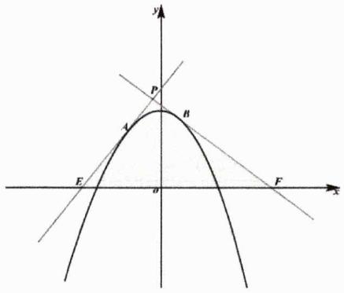

text_image

y
P
A
B
E
O
F
x

# 第 10 讲：高考对标训练

1. [2023 中科大强基 T1]二元函数 $f(x, y) = (x + \cos y)^2 + (2x + 3 + \sin y)^2$ 的值域为 \_\_\_\_.

2. 求最值:

(1) 若两个不相等的正数 $a, b$ 满足 $ab + 2a + b - 2 = 0$ , 则 $\frac{1}{a} + \frac{2}{b} + \frac{2}{2a + b}$ 的最小值为 \_\_\_\_.  
(2) 设x,y为正实数，若 $4x^{2}+y^{2}+xy=1$ ，则 $\frac{4x+2y}{20x^{2}+11xy+5y^{2}}$ 的最大值是\_\_\_\_.  
(3) 已知正数x,y满足 $\frac{8}{3x^{2}+2xy}+\frac{3}{xy+2y^{2}}=1$ ，则xy的最小值为\_\_\_\_.

3. [2023 高中数学联赛（一试）T6]设a,b,c为正数，a<b。若a,b为一元二次方程 $ax^{2}-bx+c=0$ 的两个根，且a,b,c是一个三角形的三边长，则 $a+b-c$ 的取值范围是\_\_\_\_。  
4. [2022 厦门强基 T3] 若椭圆 $\frac{x^{2}}{a^{2}} + \frac{y^{2}}{b^{2}} = 1$ 的内接等腰三角形 ABC 的底边平行于 x 轴， $\triangle ABC$ 的面积最大值为 \_\_\_\_.  
5. 证明：

(1) [2009 中科大自招]求证 $\forall x, y \in \mathbb{R}$ , 恒有: $x^{2} + y^{2} + xy \geq 3(x + y - 1)$ .  
(2) [2011 安徽理 19]已知 $1 < a \leq b \leq c$ ，证明： $\log_a b + \log_b c + \log_c a \leq \log_b a + \log_c b + \log_a c$ .

6. [2001 交大自招 T20] $x \in R^{*}$ ，函数 $f(x) = \frac{\left(x + \frac{1}{x}\right)^{6} - (x^{6} + x^{-6}) - 2}{\left(x + \frac{1}{x}\right)^{3} + x^{3} + x^{-3}}$ 的最小值为 \_\_\_\_.  
7. [2009 北大自招 T4 改编] 已知对 $\forall x \in R, a\cos x + b\cos 2x \geq -1$ 恒成立，则 $a + b$ 的最小值是 \_\_\_\_.  
8. [2014 高中数联加式 AT1] 设实数 $a, b, c$ 满足 $a + b + c = 1$ , 且 $abc > 0$ , 证明:

$$
a b + b c + c a <   \frac {\sqrt {a b c}}{2} + \frac {1}{4}
$$

9. [2006 国家集训队队测]设 $a, b, c, d \in \mathbb{R}^{+}$ , $abcd = 1$ , 求证:

$$
\frac {1}{(1 + a) ^ {2}} + \frac {1}{(1 + b) ^ {2}} + \frac {1}{(1 + c) ^ {2}} + \frac {1}{(1 + d) ^ {2}} \geq 1
$$

# 第10讲：对标答案

# 1. [解析]:

显然 $f(x,y)$ 可视为直线 $2x-y+3=0$ 上的动点与单位圆上的动点 $(-\cos y,-\sin y)$ 的距离的平方，数形结合易得 $f(x,y)_{\min}=\left(\frac{3}{\sqrt{5}}-1\right)^{2}=\frac{14-6\sqrt{5}}{5}$ ，故而有所求值域为 $\left[\frac{14-6\sqrt{5}}{5},+\infty\right)$ .

# 2. [解析]:

第一问：由已知可得 $2a + b = 2 - ab \geq 2\sqrt{2ab} \Rightarrow ab \leq 6 - 4\sqrt{2}$ ，故而有

$$
\mathrm{LHS} = \frac {2 - a b}{a b} + \frac {2}{2 - a b} = \frac {2}{a b} + \frac {2}{2 - a b} - 1 = \frac {4}{a b (2 - a b)} - 1 \geq \frac {4}{(6 - 4 \sqrt {2}) (4 \sqrt {2} - 4)} - 1 = \frac {5 (\sqrt {2} + 1)}{2}
$$

当且仅当 $ab=6-4\sqrt{2}$ 时上式取等.

第二问：由已知可得 $\frac{4x + 2y}{20x^2 + 11xy + 5y^2} = \frac{4x + 2y}{5(4x^2 + y^2 + xy) + 6xy} = \frac{2(2x + y)}{5 + 6xy}$ ，进而有

$$
\frac {2 (2 x + y)}{5 + 6 x y} = \frac {2 (2 x + y)}{2 (4 x ^ {2} + y ^ {2} + x y) + 6 x y + 3} = \frac {2 (2 x + y)}{2 (2 x + y) ^ {2} + 3} \leq \frac {2 (2 x + y)}{2 \sqrt {6} (2 x + y)} = \frac {\sqrt {6}}{6}
$$

当且仅当 $2x+y=\frac{\sqrt{6}}{2}$ 时上式取等.

第三问：令 $\frac{x}{y} = a > 0$ ，显而易见的是 $xy = xy\left(\frac{8}{3x^2 + 2xy} +\frac{3}{xy + 2y^2}\right) = \frac{8}{3a + 2} +\frac{3a}{a + 2}$ ，进而有

$$
x y = \frac {9 a ^ {2} + 1 4 a + 1 6}{3 a ^ {2} + 8 a + 4} = \frac {\frac {5}{2} (3 a ^ {2} + 8 a + 4) + \frac {3}{2} (a - 2) ^ {2}}{3 a ^ {2} + 8 a + 4} \geq \frac {5}{2}
$$

当且仅当 $\frac{x}{y}=2$ 时上式取等.

# 3. [解析]:

由根与系数关系可得 $\left\{\begin{aligned}a+b&=\frac{b}{a}\\ ab&=\frac{c}{a}\end{aligned}\right.\Rightarrow\left\{\begin{aligned}b&=\frac{a^{2}}{1-a}\\ c&=\frac{a^{4}}{1-a}\end{aligned}\right.$ 。因为 $b=\frac{a^{2}}{1-a}>a$ ，故而有 $a\in\left(\frac{1}{2},1\right)$ ，因而c<b。又因a,b,c 是一三角形的三边，故而必须有 $a+c=a+\frac{a^{4}}{1-a}>\frac{a^{2}}{1-a}$ ，在 $a\in\left(\frac{1}{2},1\right)$ 的基础上可解得 $a\in\left(\frac{1}{2},\frac{-1+\sqrt{5}}{2}\right)$ 。

显而易见的是

$$
a + b - c = a + \frac {a ^ {2}}{1 - a} - \frac {a ^ {4}}{1 - a} = a + a ^ {2} (1 + a) = a (a ^ {2} + a + 1)
$$

在 $a\in\left(\frac{1}{2},\frac{-1+\sqrt{5}}{2}\right)$ 上单调递增，故而有 $a+b-c\in\left(\frac{7}{8},\sqrt{5}-1\right)$ .

# 4. [解析]:

如图，点C坐标为 $(0,b)$ ，设B点坐标为 $(m,n)$ （m>0,n<0），从而有 $m^{2}=\left(1-\frac{n^{2}}{b^{2}}\right)a^{2}$ ，进而有

$$
S _ {\triangle A B C} ^ {2} = a ^ {2} \left(1 - \frac {n ^ {2}}{b ^ {2}}\right) (b - n) ^ {2} = \frac {a ^ {2}}{3 b ^ {2}} (3 b + 3 n) (b - n) ^ {3} \leq \frac {a ^ {2}}{3 b ^ {2}} \left(\frac {6 b}{4}\right) ^ {4} = \frac {2 7 a ^ {2} b ^ {2}}{1 6}
$$

当且仅当 $n=-\frac{b}{2}$ 时上式取等，故而有 $\triangle ABC$ 的面积最大值为 $\frac{3\sqrt{3}ab}{4}$

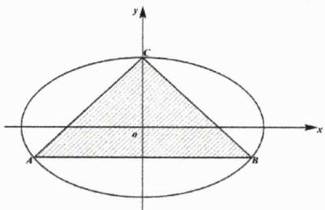

text_image

y
K
o
A
B
x

# 5. [解析]:

第一问：作差后变形可得

铭师道·高中数学方法原本

$$
\begin{array}{l} x ^ {2} + y ^ {2} + x y - 3 (x + y - 1) = (x - 1) ^ {2} + (y - 1) ^ {2} + x y - x - y + 1 \\ = (x - 1) ^ {2} + (y - 1) ^ {2} + (x - 1) (y - 1) \\ = \left[ (x - 1) + \frac {(y - 1)}{2} \right] ^ {2} + \frac {3}{4} (y - 1) ^ {2} \\ \geq 0 \\ \end{array}
$$

证毕！

第二问：记 $\log_a b = x \geq 1$ ， $\log_b c = y \geq 1$ ，则有 $\log_c a = \frac{1}{xy}$ ，故而本题需证如下不等式

$$
x + y + \frac {1}{x y} \leq \frac {1}{x} + \frac {1}{y} + x y
$$

进而需证 $(xy)^{2}-1+(x+y)(1-xy)\geq0$ ，而

$$
(x y) ^ {2} - 1 + (x + y) (1 - x y) = (x y - 1) (x y + 1 - x - y) = (x y - 1) (x - 1) (y - 1) \geq 0
$$

证毕.

# 6. [解析]:

简单化简之后有

$$
\frac {\left(x + \frac {1}{x}\right) ^ {6} - \left(x ^ {6} + x ^ {- 6}\right) - 2}{\left(x + \frac {1}{x}\right) ^ {3} + x ^ {3} + x ^ {- 3}} = \frac {\left(x + \frac {1}{x}\right) ^ {6} - \left(x ^ {3} + x ^ {- 3}\right) ^ {2}}{\left(x + \frac {1}{x}\right) ^ {3} + \left(x ^ {3} + x ^ {- 3}\right)} = \left(x + \frac {1}{x}\right) ^ {3} - \left(x ^ {3} + x ^ {- 3}\right) = 3 \left(x + \frac {1}{x}\right) \geq 6
$$

故而函数的最小值为6，当且仅当x=1时取等.

# 7. [解析]:

当 $x = 0$ 时有 $a + b \geq -1$ ，接下来我们严格证明 $a + b$ 可以取到-1. 当 $a = -\frac{4}{3}$ ， $b = \frac{1}{3}$ 时有

$$
a \cos x + b \cos 2 x + 1 = - \frac {4}{3} \cos x + \frac {1}{3} \cos 2 x + 1 = - \frac {4}{3} \cos x + \frac {2}{3} \cos^ {2} x + \frac {2}{3} = \frac {2}{3} (\cos x - 1) ^ {2} \geq 0
$$

综上 $a+b$ 的最小值是-1.

# 8. [解析]:

若 $ab + bc + ca \leq \frac{1}{4}$ ，则命题已得证。否则当 $ab + bc + ca > \frac{1}{4}$ 时，不妨设 $a \geq b \geq c$ ，则必有 $a \geq \frac{1}{3}$ ，由基本不等式易知

$$
a b + b c + c a - \frac {1}{4} \leq \frac {1}{3} (a + b + c) ^ {2} - \frac {1}{4} = \frac {1}{1 2} \leq \frac {1}{4} a
$$

另一方面

$$
a b + b c + c a - \frac {1}{4} = a (1 - a) - \frac {1}{4} + b c \leq \frac {1}{4} - \frac {1}{4} + b c = b c
$$

显然以上两个不等式不能同时取等，故而有

$$
\left(a b + b c + c a - \frac {1}{4}\right) ^ {2} <   \frac {1}{4} a b c \Rightarrow a b + b c + c a - \frac {1}{4} <   \frac {\sqrt {a b c}}{2}
$$

于是当 $ab + bc + ca > \frac{1}{4}$ 时结论亦成立.综上，证毕.

# 9. [解析]:

根据 Cauchy 不等式知

$$
\frac {1}{(1 + a b) (a + b)} \leq \frac {1}{(\sqrt {a} + b \sqrt {a}) ^ {2}} = \frac {1}{a (1 + b) ^ {2}}
$$

因此有

$$
\frac {1}{(1 + b) ^ {2}} \geq \frac {a}{(1 + a b) (a + b)}
$$

同理有

$$
\frac {1}{(1 + a) ^ {2}} \geq \frac {b}{(1 + a b) (a + b)}
$$

两式相加得

$$
\frac {1}{(1 + a) ^ {2}} + \frac {1}{(1 + b) ^ {2}} \geq \frac {a + b}{(1 + a b) (a + b)} = \frac {1}{1 + a b}
$$

当且仅当a=b=1时取等.进而有

$$
\frac {1}{(1 + a) ^ {2}} + \frac {1}{(1 + b) ^ {2}} + \frac {1}{(1 + c) ^ {2}} + \frac {1}{(1 + d) ^ {2}} \geq \frac {1}{1 + a b} + \frac {1}{1 + c d} = \frac {1}{1 + a b} + \frac {a b}{1 + a b} = 1
$$

当且仅当a=b=c=d=1时不等式取等，证毕.

# 第二章：函数系统方法论

function一词最早由德国著名数学家威廉·莱布尼茨（G.W.Leibniz，1646年7月—1716年11月）在1692年所使用.1859年，清代数学家李善兰（1811—1882）在和英国传教士伟烈亚力合译的《代微积拾级》中首次将其翻译成“函数”.而函数的现代定义则是由德国另一位伟大数学狄利克雷在1837年所提出，并一直沿用至今.

在18到19世纪，欧拉（Leonhard Euler）、拉格朗日（Joseph-Louis Lagrange）、柯西（Augustin-Louis Cauchy）、魏尔斯特拉斯（Karl Weierstrass）等一众数学家为函数理论的发展做出过卓越的贡献。而20世纪的数学则发展了更抽象的函数空间和拓扑学，同时计算机科学的兴起推动了函数中的离散数学和算法方面的研究。

总之，函数的发展史涵盖了从古代到现代的广泛历程，从早期比例到坐标系、微积分、复杂函数理论以及更抽象的一些数学分支，其中函数理论是数学的重要组成部分，它在科学、工程和计算领域中具有广泛的应用.

在本章我们将务实地系统探究函数在高中阶段涉及到的所有主要性质及其运用.

# 第 01 讲：不等式视角下的函数三要素

无论我们怎样去描述或定义一个函数，其根本内涵始终是对于给定范围内的每一个 $x$ 值，都要有唯一确定的 $y$ 值与之对应。通过对教材的学习，我们已知道定义域、对应法则和值域是函数的三大核心要素，而无论这三要素对应什么样的题型和考点，我们最终发现关键都是解不等式。

性质1.1: 函数定义域 自变量x的集合叫作函数的定义域.其必须满足如下条件:

① 使函数有意义；② 满足数学界约定俗成的规定；③ 符合实际情况.

与函数定义域相关的题型可分为两大板块——具体函数定义域和抽象函数定义域.

例1. 函数 $f(x)=\sqrt{4-|x|}+\lg\frac{x^{2}-5x+6}{x-3}$ 的定义域是 \_\_\_\_.

解析：显然自变量x需同时满足

$$
\left\{ \begin{array}{c} 4 - | x | \geq 0 \\ \frac {x ^ {2} - 5 x + 6}{x - 3} = \frac {(x - 2) (x - 3)}{x - 3} > 0 \end{array} \right.
$$

解得 $-4 \leq x \leq 4$ 且x > 2且 $x \neq 3$ ，故而所求定义域为 $x \in (2,3) \cup (3,4]$ .

例2. 函数 $f(x)=\lg\left(2ax^{2}-ax+\frac{3}{8}\right)$ .

(1) 若函数定义域为 $\mathbb{R}$ , 则实数 $a$ 的取值范围是 \_\_\_\_;  
(2) 若函数值域为 $\mathbb{R}$ , 则实数 $a$ 的取值范围是

解析：

第一问：显而易见的是若 $x \in \mathbb{R}$ ，必有 $a = 0$ 或 $\left\{ \begin{array}{l} a > 0 \\ \Delta = a^2 - 3a < 0 \end{array} \right.$ ，解得 $a \in [0,3)$ .

第二问：只有当真数 $2ax^{2}-ax+\frac{3}{8}$ 可取遍一切大于零的实数时，才能确保函数 $f(x)$ 的值域为R，故而必有 $\left\{\begin{aligned}a&>0\\ \Delta&=a^{2}-3a\geq0\end{aligned}\right.$ ，解得 $a\in[3,+\infty)$ .

例3. 若函数 $f(x) = \frac{1}{x^2\log_2\frac{4(a + 1)}{a} + 2x\log_2\frac{2a}{a + 1} + \log_2\frac{(a + 1)^2}{4a^2}}$ 的定义域为 $\mathbb{R}$ ，则实数 $a$ 的取值范围为 \_\_\_\_.

解析：若令 $\log_2\frac{a}{a + 1} = \mu$ ，则有 $\log_2\frac{2a}{a + 1} = 1 + \mu$ ， $\log_2\frac{4(a + 1)}{a} = 2 - \mu$ ， $\log_2\frac{(a + 1)^2}{4a^2} = -2 - 2\mu$ ，进而有

$$
f (x) = \frac {1}{(2 - \mu) x ^ {2} + 2 (1 + \mu) x + (- 2 - 2 \mu)}
$$

要确保 $x \in R$ ，必须有

$$
2 - \mu \neq 0 \text {且} \varDelta = 4 (1 + \mu) ^ {2} - 4 (2 - \mu) (- 2 - 2 \mu) <   0 \Leftrightarrow (\mu + 1) (5 - \mu) <   0
$$

铭师道·高中数学方法原本

解得 $\mu < -1$ 或 $\mu > 5$ ，进而有

$$
\log_ {2} {\frac {a}{a + 1}} <   - 1 \Longrightarrow 0 <   {\frac {a}{a + 1}} <   {\frac {1}{2}} \Longrightarrow a \in (0, 1)
$$

或者

$$
\log_ {2} \frac {a}{a + 1} > 5 \Rightarrow \frac {a}{a + 1} > 3 2 \Rightarrow a \in \left(- \frac {3 2}{3 1}, - 1\right)
$$

综上 $a\in\left(-\frac{32}{31},-1\right)\cup(0,1)$ .

接下来我们直接给出抽象函数求定义域的基本法则.

结论1.1: 求抽象函数定义域的三法则 关于求抽象函数的定义域, 我们须坚持以下三点:

(i). 主体法则——定义域是指自变量的集合，如函数 $f(x^{2}+x+a)$ 的定义域是指x的集合；  
(ii). 括号整体取值相同法则——同一对应法则下括号里的整体取值必须相同；  
(iii). 交集法则——复合函数的定义域必须取每一部分的交集.

例4. 求下列函数定义域.

(1) 若函数 $f(-x^{2}+3x-1)$ 的定义域为[-2,2]，则 $f(x+1)$ 的定义域为 \_\_\_\_.  
(2) 若函数 $f(x^{2}-1)$ 定义域为[0,3]，则 $f(2x-1)$ 的定义域为 \_\_\_\_.  
(3) [2009 湖北理 4] 设函数 $f(x) = \lg \frac{2 + x}{2 - x}$ ，则 $f\left(\frac{x}{2}\right) + f\left(\frac{2}{x}\right)$ 的定义域为 \_\_\_\_.

解析:

第一问: 由题知 $(-x^{2} + 3x - 1)$ 中的 $x$ 范围是 $[-2, 2]$ , 故而有 $(-x^{2} + 3x - 1) \in \left[-11, \frac{5}{4}\right]$ . 根据括号整体取值相同法则, 必有 $(x + 1) \in \left[-11, \frac{5}{4}\right]$ , 解得 $x \in \left[-12, \frac{1}{4}\right]$ , 故而 $f(x + 1)$ 的定义域为 $\left[-12, \frac{1}{4}\right]$ .

第二问：由题知 $f(x^{2}-1)$ 中的 $x\in[0,3]$ ，故而有 $(x^{2}-1)\in[-1,8]$ ，进而有

$$
(2 x - 1) \in [ - 1, 8 ]
$$

解得 $x\in\left[0,\frac{9}{2}\right]$ ，从而 $f(2x-1)$ 的定义域为 $x\in\left[0,\frac{9}{2}\right]$ .

第三问：由题知 $\frac{2 + x}{2 - x} > 0$ ，解得 $x \in (-2, 2)$ ，由同对应法则下括号整体取值相同法则知

$$
\left\{ \begin{array}{l} \frac {x}{2} \in (- 2, 2) \Longrightarrow x \in (- 4, 4) \\ \frac {2}{x} \in (- 2, 2) \Longrightarrow x \in (- \infty , - 1) \cup (1, + \infty) \end{array} \right.
$$

由交集法则知 $f\left(\frac{x}{2}\right)+f\left(\frac{2}{x}\right)$ 的定义域为是 $x\in(-4,-1)\cup(1,4)$ .

需要强调的是以上所求得的具体函数或抽象函数中的定义域，都被我们统称为显性定义域，在整个高中阶段特别是在高考中，我们大多数情况下都是在求广义的隐性定义域，接下来我们以下题为例对此进行说明.

例5. [2015 新课标 I 理 16] 在平面四边形ABCD中， $\angle A = \angle B = \angle C = 75^{\circ}$ ，BC = 2，则AB的取值范围是

解析: 在此题中 $|AB|$ 可被我们视为一个“隐性的自变量”, 接下来我们将采用临界思想求其范围. 如下图所示, 先构建一等腰三角形 $TBC$ , 其中 $\angle TBC = \angle TCB = 75^{\circ}$ , $|BC| = 2$ , 过 $C$ 作 $\angle BPC = 75^{\circ}$ , 则有

$$
\vert T B \vert = \frac {2}{\cos 7 5 ^ {0}} = \sqrt {6} + \sqrt {2}, \quad \vert P B \vert = 2 \cdot 2 \cos 7 5 ^ {0} = \sqrt {6} - \sqrt {2}
$$

然后我们在TC上取一点D并过该点作 $DA \parallel CP, DA \cap TB = A$ . 显而易见的是当D点近似与C点重合时 $|AB|$ 可取得最小值，该值为 $\sqrt{6} - \sqrt{2}$ ; 当A点近似与T点重合时 $|AB|$ 可取得最大值，该值为 $\sqrt{6} + \sqrt{2}$ ，由此知

$$
\vert A B \vert \in (\sqrt {6} - \sqrt {2}, \sqrt {6} + \sqrt {2})
$$

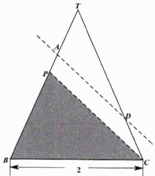

text_image

T
A
P
D
B
2
C

通过解答上一例题我们可总结出如下一结论.

命题1.1: 求范围中的临界法 临界法是求所有范围的最基本、非常务实高效的方法之一.

接下来我们快速讲解一下求函数解析式的一些方法，这个内容虽然是高中数学中的重点、却非难点.

结论1.2: 求函数解析式的方法 求函数解析式的常见方法有: 直接代入法、分析法、待定系数法、换元法、配凑法、奇偶性法、方程组法、嵌套换元法、对称法、找规律法、夹逼法则、抽象赋值法等.

例6. 根据提示解决以下问题.

(1) 已知 $f\left(x+\frac{1}{x}\right)=x^{3}+\frac{1}{x^{3}}$ ，则 $f(x)$ 的解析式为 \_\_\_\_.

(2) [2004 湖北理 3] 已知 $f\left(\frac{1-x}{1+x}\right)=\frac{1-x^{2}}{1+x^{2}}$ ，则 $f(x)$ 的解析式为 \_\_\_\_.

(3) 已知 $f(0)=1,\forall x,y\in\mathbb{R}$ ，恒有 $f(x-y)=f(x)-y(2x-y+1)$ ，则 $f(x)$ 的解析式为 \_\_\_\_.

(4) 若函数 $f(x)=x^{2}+ax+b$ 满足 $f(a)=f(b)\quad(a\neq b)$ ，则 $f(2)$ 的值为 \_\_\_\_.

(5) 已知 $f(x)$ 是一次函数, 且满足 $3f(x+1)-2f(x-1)=2x+17$ , 则 $f(x)$ 的解析式为 \_\_\_\_.

(6) 已知 $f(x) = ax^{2} + bx + c$ 的图像过 $(-1,0), \forall x \in \mathbb{R}$ 恒有 $x \leq f(x) \leq \frac{1 + x^2}{2}$ ，则 $f(x) =$ \_\_\_\_.

(7) [2013 安徽理 14]定义在 $\mathbb{R}$ 上的函数 $f(x)$ 满足 $f(x + 1) = 2f(x)$ , 若当 $0 \leq x \leq 1$ 时 $f(x) = x(1 - x)$ . 则当 $-1 \leq x \leq 0$ 时, $f(x) = \_$ .

解析:

第一问：简单配方可得

$$
f \left(x + \frac {1}{x}\right) = x ^ {3} + \frac {1}{x ^ {3}} = \left(x + \frac {1}{x}\right) \left(x ^ {2} + \frac {1}{x ^ {2}} - 1\right) = \left(x + \frac {1}{x}\right) \left[ \left(x + \frac {1}{x}\right) ^ {2} - 3 \right]
$$

因为 $\left|x+\frac{1}{x}\right|\geq2$ ，故而有 $f(x)=x(x^{2}-3)$ （ $x\leq-2$ 或 $x\geq2$ ）.

第二问：简单配方可得

$$
f \left(\frac {1 - x}{1 + x}\right) = \frac {1 - x ^ {2}}{1 + x ^ {2}} = \frac {(1 - x) (1 + x)}{1 + x ^ {2}} = \frac {\frac {1 - x}{1 + x}}{\frac {1 + x ^ {2}}{(1 + x) ^ {2}}} = \frac {2 \frac {1 - x}{1 + x}}{\frac {(1 + x) ^ {2} + (1 - x) ^ {2}}{(1 + x) ^ {2}}} = \frac {2 \frac {1 - x}{1 + x}}{1 + \left(\frac {1 - x}{1 + x}\right) ^ {2}}
$$

因为 $\frac{1-x}{1+x}\neq-1$ ，故而有 $f(x)=\frac{2x}{1+x^{2}}\quad(x\neq-1)$ .

第三问：令y=x，则有 $f(x)=f(0)+x(2x-x+1)=x^{2}+x+1$ .

第四问：由二次函数基本性质知 $\frac{a + b}{2} = -\frac{a}{2}$ ，即有 $2a + b = 0$ ，进而有 $f(2) = 4 + 2a + b = 4$ .

第五问：设 $f(x)=kx+b$ ，则有

$$
3 f (x + 1) - 2 f (x - 1) = [ 3 k (x + 1) + 3 b ] - [ 2 k (x - 1) + 2 b ] = k x + (5 k + b)
$$

经比对系数可得k=2且b=7，从而有 $f(x)=2x+7$ .

第六问：因为函数图像过 $(-1,0)$ ，则有 $a-b+c=0$ ，即有 $b=a+c$ 。又因 $1\leq f(1)\leq1$ ，从而有

$$
f (1) = a + b + c = 1 \Longrightarrow b = a + c = \frac {1}{2}
$$

此时有

$$
f (x) = a x ^ {2} + \frac {1}{2} x + \left(\frac {1}{2} - a\right)
$$

因为 $x \leq f(x) \leq \frac{1 + x^2}{2}$ 且 $f(1) = 1$ ，易分析知 $y = x$ 是函数 $f(x)$ 在 $x = 1$ 处的切线，因为 $f'(x) = 2ax + \frac{1}{2}$ ，故而有 $2a + \frac{1}{2} = 1$ ，从而有 $a = \frac{1}{4}$ ，此时有 $f(x) = \frac{1}{4}(x + 1)^2$ ，易验证其符合题意.

第七问：根据求谁设谁的原则，令 $x\in[-1,0]$ ，则有 $0\leq x+1\leq1$ ，依据规则有

$$
f (x) = \frac {1}{2} f (x + 1) = - \frac {1}{2} (x + 1) x
$$

例7. 设 $f(x)$ 是定义在 $N^{*}$ 上的函数，满足 $f(1)=1$ ，对任意的自然数a, b都有 $f(a)+f(b)=f(a+b)-ab$ ，则有 $f(x)=$ \_\_\_\_。

解析：若令a=n，b=1，则有

$$
f (n) + f (1) = f (n + 1) - n \Longrightarrow f (n + 1) = f (n) + n + 1
$$

继而有

$$
f (n) = f (n - 1) + n = f (n - 2) + (n - 1) + n = \dots = f (1) + 2 + \dots + (n - 1) + n = \frac {n (n + 1)}{2}
$$

铭师道·高中数学方法原本

故而有

$$
f (x) = \frac {1}{2} x ^ {2} + \frac {1}{2} x (x \in \mathbb {N} ^ {*})
$$

例8. 利用方程组法求下列函数解析式.

(1) 已知 $f(x)$ 为偶函数， $r(x)$ 为奇函数，又 $f(x) + r(x) = e^{x}$ ，则 $r(x) =$ \_\_\_\_.  
(2) 若函数 $f(x)$ 满足 $3f(x-1)+2f(1-x)=2x$ ，则 $f(x)=$ \_\_\_\_.  
(3) 已知 $f(x) + f\left(1 - \frac{1}{x}\right) = 1 + x$ （ $x \neq 0$ 且 $x \neq 1$ ），则 $f(x) =$ \_\_\_\_.

解析:

第一问：由函数的奇偶性质知，若令-x=x，则有 $f(-x)+r(-x)=f(x)-r(x)=e^{-x}$ ，联立方程组可解得

$$
r (x) = \frac {1}{2} \left(e ^ {x} - e ^ {- x}\right)
$$

第二问：先令x-1=t，则有

$$
3 f (t) + 2 f (- t) = 2 (t + 1)
$$

再令 $t = -t$ ，则有

$$
3 f (- t) + 2 f (t) = 2 (- t + 1)
$$

从而我们就得到了关于 $f(t)$ 和 $f(-t)$ 的方程组，用加减消元法可得

$$
9 f (t) - 4 f (t) = 6 (t + 1) - 4 (- t + 1) \Longrightarrow f (t) = 2 t + \frac {2}{5}
$$

由此可得

$$
f (x) = 2 x + \frac {2}{5}
$$

第三问：因为有 $f(x)+f\left(1-\frac{1}{x}\right)=1+x$ （①），若令 $x=1-\frac{1}{x}$ ，则有

$$
f \left(1 - \frac {1}{x}\right) + f \left(- \frac {1}{x - 1}\right) = 2 - \frac {1}{x} (②)
$$

继续在①的基础上，令 $x=-\frac{1}{x-1}$ ，则有

$$
f \left(- \frac {1}{x - 1}\right) + f (x) = 1 - \frac {1}{x - 1} = \frac {x - 2}{x - 1} \tag {③}
$$

将①式与③式相加再减去②式可得

$$
2 f (x) = (1 + x) + \frac {x - 2}{x - 1} - \left(2 - \frac {1}{x}\right) = \frac {x ^ {3} - x ^ {2} - 1}{x (x - 1)}
$$

进而有

$$
f (x) = \frac {x ^ {3} - x ^ {2} - 1}{2 x (x - 1)} (x \neq 0 \text {且} x \neq 1)
$$

例9. 根据已知求值.

(1) 若 $f(x)$ 是定义在 $\mathbb{R}$ 上的函数，对 $\forall x \in \mathbb{R}$ 恒有 $f(x + 3) \leq f(x) + 3$ 和 $f(x + 2) \geq f(x) + 2$ ，且 $f(1) = 1$ ，则 $f(2025) =$ \_\_\_\_.  
(2) 已知函数 $f(x)$ 满足: $\forall x, y \in \mathbb{R}$ , 都有 $f(x + y) = f(x) + f(y) + 4xy$ 恒成立, 且 $f(-2) \cdot f(2) = 64$ , 则 $f\left(\frac{2}{3}\right) =$ \_\_\_\_.  
(3) 已知函数 $f(x)$ 为单调函数，且 $\forall x \in R$ ，都有 $f\left(f(x) + \frac{2}{3^x + 1}\right) = \frac{1}{2}$ ，则 $f(\log_3 5) =$ \_\_\_\_.

解析：

第一问：因为 $f(x+3)\leq f(x)+3$ 和 $f(x+2)\geq f(x)+2$ ，故而有

$$
f (x) + 3 \geq f (x + 1) + 2 \Longrightarrow f (x + 1) \leq f (x) + 1
$$

继而可得

$$
f (x + 1) \geq f (x + 2) - 1 \geq f (x) + 1
$$

由夹逼原则知只可能有 $f(x+1)=f(x)+1$ ，从而知

$$
f (2 0 2 5) = f (2 0 2 4) + 1 = f (2 0 2 3) + 2 = \dots = f (1) + 2 0 2 4 = 2 0 2 5
$$

第二问：若令x=y=0，则有 $f(0)=2f(0)+0$ ，即有 $f(0)=0$ ；再令x=-2，y=2，则有

$$
f (- 2) + f (2) = f (0) - (- 1 6) = 1 6
$$

又因 $(-2)\cdot f(2)=64$ ，故而可解得

$$
f (- 2) = f (2) = 8
$$

继续令 $x=\frac{2}{3}$ ， $y=\frac{4}{3}$ ，则有

$$
f \left(\frac {2}{3} + \frac {4}{3}\right) = f \left(\frac {2}{3}\right) + f \left(\frac {4}{3}\right) + \frac {3 2}{9} = 8
$$

如若再令 $x=y=\frac{2}{3}$ ，则有

$$
f \left(\frac {4}{3}\right) = 2 f \left(\frac {2}{3}\right) + \frac {1 6}{9}
$$

联立可得

$$
3 f \left(\frac {2}{3}\right) + \frac {4 8}{9} = 8
$$

解得

$$
f \left(\frac {2}{3}\right) = \frac {8}{9}
$$

第三问：因为 $f(x)$ 为单调函数，故而我们可直接令 $f(x)+\frac{2}{3^{x}+1}=t$ ，则有 $f(t)=\frac{1}{2}$ ，且有

$$
f (x) = - \frac {2}{3 ^ {x} + 1} + t
$$

再令 $x = t$ ，则

$$
\frac {1}{2} + \frac {2}{3 ^ {t} + 1} = t
$$

易猜得 $t = 1$ 是上述方程一个根，另一方面由单调性知 $t = 1$ 是方程的唯一根，故而有

$$
f (x) = 1 - \frac {2}{3 ^ {x} + 1}
$$

继而有

$$
f (\log_ {3} 5) = 1 - \frac {2}{3 ^ {\log_ {3} 5} + 1} = 1 - \frac {2}{5 + 1} = \frac {2}{3}
$$

例10. 定义在 $(0, +\infty)$ 上的函数 $f(x)$ 满足如下条件：

① $\forall x_{1}, x_{2} \in (0, +\infty)$ ( $x_{1} \neq x_{2}$ ), 有 $\frac{f(x_{1}) - f(x_{2})}{x_{1} - x_{2}} > 0;$   
② $\forall x > 0$ ，有 $f(x) + \frac{1}{x} > 0$ ;  
③ $\forall x\in(0,+\infty)$ ，有 $f(x)\cdot f\left(f(x)+\frac{1}{x}\right)=1$ 。则 $f(1)$ 的值是\_\_\_\_。

解析：根据第一个条件知函数在 $(0, +\infty)$ 上单调递增，再根据 $f(x) \cdot f\left(f(x) + \frac{1}{x}\right) = 1$ 这一关键条件，可设

$$
f (x) = \frac {k}{x}
$$

则有

$$
f (x) \cdot f \left(f (x) + \frac {1}{x}\right) = \frac {k}{x} \cdot f \left(\frac {k + 1}{x}\right) = \frac {k}{x} \cdot \frac {k x}{k + 1} = \frac {k ^ {2}}{k + 1} = 1
$$

解得 $k=\frac{1+\sqrt{5}}{2}$ （舍）或 $\frac{1-\sqrt{5}}{2}$ ，进而可得

$$
f (1) = \frac {1 - \sqrt {5}}{2}
$$

例11. [2016 全国高中数学联赛一试 10]已知 $f(x)$ 是 $\mathbb{R}$ 上的奇函数， $f(1)=1$ ，且对任意x<0，均有

$f\left(\frac{x}{x-1}\right)=xf(x)$ ，则 $f(1)f\left(\frac{1}{100}\right)+f\left(\frac{1}{2}\right)f\left(\frac{1}{99}\right)+f\left(\frac{1}{3}\right)f\left(\frac{1}{98}\right)+\cdots+f\left(\frac{1}{50}\right)f\left(\frac{1}{51}\right)$ 的值为\_\_\_\_.

解析：若令 $\frac{x}{x-1}=\frac{1}{n}$ ，则有 $x=\frac{1}{1-n}$ ，由此可得

$$
f \left(\frac {1}{n}\right) = \frac {1}{1 - n} f \left(\frac {1}{1 - n}\right)
$$

因为 $f(x)$ 是R上的奇函数，从而有

$$
f \left(\frac {1}{n}\right) = \frac {1}{n - 1} f \left(\frac {1}{n - 1}\right)
$$

进而可得

$$
f \left(\frac {1}{n}\right) = \frac {1}{n - 1} f \left(\frac {1}{n - 1}\right) = \frac {1}{n - 1} \cdot \frac {1}{n - 2} f \left(\frac {1}{n - 2}\right) = \frac {1}{n - 1} \cdot \frac {1}{n - 2} \dots \frac {1}{1} f \left(\frac {1}{1}\right) = \frac {1}{(n - 1) !}
$$

由排列组合性质知

$$
f \left(\frac {1}{n}\right) \cdot f \left(\frac {1}{1 0 1 - n}\right) = \frac {1}{(n - 1) !} \cdot \frac {1}{(1 0 0 - n) !} = \frac {1}{9 9 !} C _ {9 9} ^ {1 0 0 - n}
$$

铭师道·高中数学方法原本

故而有

$$
\sum_ {i = 1} ^ {5 0} \left[ f \left(\frac {1}{i}\right) \cdot f \left(\frac {1}{1 0 1 - i}\right) \right] = \sum_ {i = 1} ^ {5 0} \frac {1}{(i - 1) ! (1 0 0 - i) !} = \frac {1}{9 9 !} \cdot \left(\sum_ {i = 1} ^ {5 0} C _ {9 9} ^ {1 0 0 - i}\right) = \frac {1}{9 9 !} \cdot \left(\frac {1}{2} \cdot 2 ^ {9 9}\right) = \frac {2 ^ {9 8}}{9 9 !}
$$

例12. 已知数列 $\{a_{n}\}$ 满足: $a_{1} = \frac{1}{2}, a_{n+1} = f(a_{n}), n \in \mathbb{N}^{*}, T_{100}$ 是数列 $\{a_{n}\}$ 的前100项和且满足 $T_{100} < 100$ , 则 $f(x)$ 不可能的是( )

$$
\mathrm{A.} f (x) = x ^ {2}
$$

$$
\mathrm{B.} f (x) = x + \frac {1}{x} - 2
$$

$$
\mathrm{C.} f (x) = e ^ {x} - x - 1
$$

$$
\mathrm{D.} f (x) = \ln x + x + 1
$$

解析: 对于 A 选项来说, $a_{n+1} = a_n^2$ , 当 $a_1 = \frac{1}{2}$ 时, 必有数列 $\{a_n\}$ 单调递减, 从而 $T_{100} < 50$ , 故而 A 选项错误; 对于 B 选项来说, 当 $a_1 = \frac{1}{2}$ 时, 易算得 $a_2 = \cdots = a_n = \frac{1}{2}$ , 显然不符合题意; 对于 C 选项来说, 如下左图所示, 利用在数列章节的蛛网图可知当 $a_1 = \frac{1}{2}$ 时, 数列 $\{a_n\}$ 单调递减, 故而必有 $T_{100} < 50$ , 由此 C 选项错误; 对于 D 选项来说, 如下右图是迭代数列 $a_{n+1} = \ln a_n + a_n + 1$ 对应的蛛网图, 显然 $\frac{1}{2}$ 大于不动点, 从而数列 $\{a_n\}$ 单调递增, 又知 $a_2 = \ln \frac{1}{2} + \frac{3}{2} \in (0.8, 0.9)$ , $a_3 = \ln a_2 + a_2 + 1 > 1.5$ , $a_4 = \ln a_3 + a_3 + 1 > 2.9$ , 依次类推可知 D 选项必定正确.

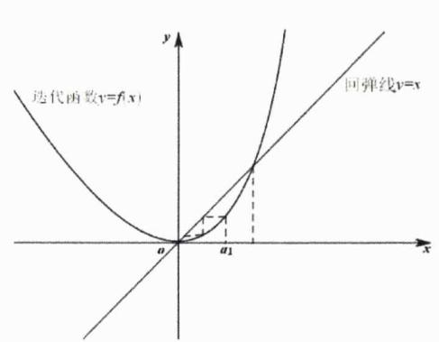

text_image

迭代函数y=f(x)
回弹线v=x
a₁
x
y

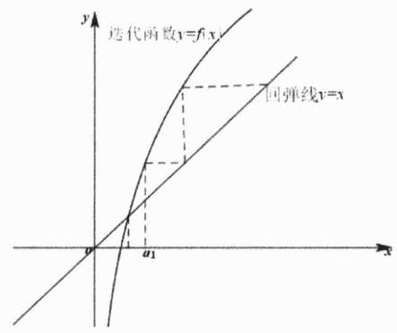

text_image

迭代函数y=f(x)
回弹线v=y
O
a₁
x
y

接下来我们将系统探究一下求函数值域的常规方法（因为高中数学所有问题本质上都是在探究求值域的问题，故而我们在本讲就不再过多地举一些案例）.

结论1.3: 求函数值域的常规方法 高中数学几乎所有问题都可归结于求值域的问题, 因视角不同, 同一种方法或不同方法会有不同的划分方式, 但一般来说我们有如下一些常规求值域的方法: 分析法、单调性法、分离变量法、换元法 (含三角换元法)、判别式法、反函数法、不等式法 (含凹凸性法)、数形结合法、放缩法、求导法、参数法、高阶分析法等.

例13. 已知 $f(x)$ 是定义在R上的奇函数，当x>0时， $f(x)=x^{2}-2ax+a+2$ ，其中 $a\in R$ .

(1) 当 $a = 1$ 时， $f(-1) = \_$ ；  
(2) 若 $f(x)$ 的值域是R，则a的取值范围为\_\_\_\_.

解析：

第一问：当a=1时，显然有 $f(-1)=-f(1)=-2$ .

第二问：当 $a \leq 0$ 时，易知奇函数 $f(x)$ 在R上单调递增，欲满足题意必有

$$
f (0) = a + 2 \leq 0
$$

解得 $a \leq -2$ ；否则当 $a > 0$ 时，奇函数 $f(x)$ 在 $(0, +\infty)$ 上必先减后增，欲满足题意必有

$$
\Delta = 4 a ^ {2} - 4 a - 8 \geq 0
$$

解得 $a \geq 2$ . 综上 $a \in (-\infty, -2] \cup [2, +\infty)$ .

例14. [2010 江苏 14]将边长为 $1 m$ 的正三角形薄片, 沿一条平行于底边的直线剪成两块, 其中一块是梯形, 记 $S = \frac{(梯形的周长)^{2}}{梯形的面积}$ , 则 $S$ 的最小值是

解析：如图所示，设△ABC边长为1m的正三角形，DE∥AB，设 $|DE|=x\in(0,1)$ ，则有

$$
S = \frac {\left(\mathrm{梯形的周长}\right) ^ {2}}{\mathrm{梯形的面积}} = \frac {[ 2 (1 - x) + x + 1 ] ^ {2}}{\frac {\sqrt {3}}{4} (1 - x ^ {2})} = \frac {4}{\sqrt {3}} \cdot \frac {(x - 3) ^ {2}}{1 - x ^ {2}} \geq \frac {4}{\sqrt {3}} \cdot \frac {8 (1 - x ^ {2})}{1 - x ^ {2}} = \frac {3 2 \sqrt {3}}{3}
$$

当且仅当 $x = \frac{1}{3}$ 时上式取等，从而可得 $S$ 的最小值是 $\frac{32\sqrt{3}}{3}$ .

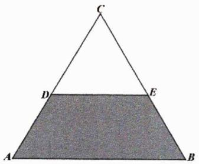

text_image

C
D E
A B

例15. 若函数 $f(x)=x^{2}-2x+2$ ，当 $x\in[a,a+1]$ 时的最小值为 $L(a)$ ，则函数 $L(a)$ 在 $a\in[-3,2]$ 上的值域为 \_\_\_\_.

解析：显而易见的是

$$
L (a) = \left\{ \begin{array}{l l} a ^ {2} + 1, & a \in (- \infty , 0 ] \\ 1, & a \in (0, 1) \\ a ^ {2} - 2 a + 2, & a \in [ 1, + \infty) \end{array} \right.
$$

当 $a \in [-3, 2]$ 时，易分析知 $L(a)_{\max} = L(-3) = 10$ ， $L(a)_{\min} = L(0) = 1$ ，故而所求值域为[1,10].

例16. 已知 $a, b, c > 0$ 且 $(a - b)\left(\frac{4}{a} - \frac{1}{b}\right) \geq 1$ , 则 $(a^2 + b^2 + c^2)\left(\frac{1}{a^2} + \frac{1}{b^2} + \frac{1}{c^2}\right)$ 的最小值为 \_\_\_\_.

解析：由题知

$$
(a - b) \left(\frac {4}{a} - \frac {1}{b}\right) \geq 1 \Longrightarrow \frac {a}{b} + \frac {4 b}{a} \leq 4 \Longrightarrow a = 2 b
$$

由 Cauchy 不等式可得

$$
(5 b ^ {2} + c ^ {2}) \left(\frac {5}{4 b ^ {2}} + \frac {1}{c ^ {2}}\right) \geq \left(\frac {5}{2} + 1\right) ^ {2} = \frac {4 9}{4}
$$

当且仅当 $\frac{\sqrt{5}b}{c}=\frac{\sqrt{5}c}{2b}$ 即 $c=\sqrt{2}b$ 时上式取等，综上所求目标函数最小值为 $\frac{49}{4}$ .

例17. 根据条件解决以下问题.

(1) 已知 $4a + 2b + c = 4$ ，则 $a^4 + b^2 + c$ 的最小值为  
(2) [2013 重庆理 7]已知圆 $C_{1}:(x-2)^{2}+(y-3)^{2}=1$ ，圆 $C_{2}:(x-3)^{2}+(y-4)^{2}=9$ ，A,B分别是圆 $C_{1},C_{2}$ 上的动点，P为x轴上的动点，则 $|PA|+|PB|$ 的最小值为\_\_\_\_.  
(3) 已知 $f(x)=ax^{2}-x-a$ （ $x\in[-1,1]$ ），且 $|a|\leq1$ ，则 $|f(x)|$ 的最大值为 \_\_\_\_.  
(4) 若关于x的不等式 $a \leq \frac{3}{4} x^{2} - 3x + 4 \leq b$ 的解集恰好为 $[a, b]$ ，则b - a = \_\_\_\_.

解析:

第一问：易而易见的是

$$
a ^ {4} + b ^ {2} + c = a ^ {4} + b ^ {2} + (- 4 a - 2 b + 4) = a ^ {4} - 4 a + 3 + (b - 1) ^ {2}
$$

$$
\geq a ^ {4} - 4 a + 3
$$

$$
= (a - 1) ^ {2} \left(a ^ {2} + 2 a + 3\right)
$$

$$
\geq 0
$$

当且仅当a=b=1且c=-2时上式取等.

第二问: 显然 $C_{1}(2,3)$ 点关于 $x$ 轴对称的点为 $C(2,-3)$ , 由简单平面几何性质知

$$
\left(| P A | + | P B |\right) _ {\min} = \left| C _ {2} C \right| - 1 - 3 = \sqrt {(2 - 3) ^ {2} + (- 3 - 4) ^ {2}} - 1 - 3 = 5 \sqrt {2} - 4
$$

第三问：当 $|a|\leq1$ 时有

$$
| f (x) | = | a (x ^ {2} - 1) - x | = | a (1 - x ^ {2}) + x | \leq 1 - x ^ {2} + x \leq \frac {5}{4}
$$

故而 $|f(x)|$ 的最大值为 $\frac{5}{4}$ .

第四问：易分析知 $a \leq 1$ ，且有a, b是方程 $\frac{3}{4}x^{2}-3x+4-b=0$ 的两根，故而有

$$
a + b = 4 \text {且} \frac {3}{4} b ^ {2} - 3 b + 4 - b = 0
$$

解得b=4且a=0或 $b=\frac{4}{3}$ 且 $a=\frac{8}{3}$ （舍），故而有b-a=4.

例18. 根据条件解决以下问题.

(1) 已知 $2^{x} \leq 256$ 且 $\log_{2} x \geq \frac{1}{2}$ , 则函数 $f(x) = \log_{2} \frac{x}{2} \cdot \log_{\sqrt{2}} \frac{\sqrt{x}}{2}$ 的值域是 \_\_\_\_.

铭师道·高中数学方法原本

(2) 函数 $f(x)=\left(\sqrt{1+x}+\sqrt{1-x}+2\right)\left(\sqrt{1-x^{2}}+1\right)$ 的值域是 \_\_\_\_.  
(3) 已知 $f(x) = 2^{2x} + 2^{-2x} - 2a(2^x + 2^{-x})$ 在 $[1, +\infty)$ 上的最小值为-2，则 $a$ 的值是  
(4) 函数 $f(x)=2\sqrt{x^{2}+2}+x$ 的最小值是 \_\_\_\_.  
(5) 当正数x,y变化时， $\max\left\{\frac{1}{x},\frac{2}{y},4x^{2}+y^{2}\right\}$ 的最小值为\_\_\_\_.

解析:

第一问：由题知 $x \in [-1, 8]$ ，若令 $\log_2 x = t \in \left[\frac{1}{2}, 3\right]$ ，则有所求值域为

$$
f (x) = \log_ {2} \frac {x}{2} \cdot \log_ {\sqrt {2}} \frac {\sqrt {x}}{2} = (t - 1) (t - 2) \in \left[ - \frac {1}{4}, 2 \right]
$$

第二问：若令 $\sqrt{1+x}+\sqrt{1-x}=t$ ，则有 $t^{2}=2+2\sqrt{1-x^{2}}\in[2,4]$ ，进而可得 $t\in[\sqrt{2},2]$ .此时有

$$
f (t) = \frac {1}{2} t ^ {2} (t + 2)
$$

显然 $f(t)$ 为 $[\sqrt{2},2]$ 上的单调递增函数，故而有 $f(t)\in[2+\sqrt{2},8]$ .

第三问：令 $2^{x}+2^{-x}=t\in\left[\frac{5}{2},+\infty\right)$ ，则有

$$
f (x) _ {\min} = \left(t ^ {2} - 2 a t - 2\right) _ {\min} = - 2 \Rightarrow [ t (t - 2 a) ] _ {\min} = 0
$$

因为 $t \geq \frac{5}{2}$ ，故而必有 $a = \frac{5}{4}$ ，否则当 $a > \frac{5}{4}$ 时， $[t(t - 2a)]_{\min} < 0$ ；而当 $a < \frac{5}{4}$ 时， $[t(t - 2a)]_{\min} > 0$ 。综上所求a的值为 $\frac{5}{4}$ .

第四问：由 Cauchy 不等式可得

$$
2 \sqrt {x ^ {2} + 2} + x = \sqrt {1 + (\sqrt {3}) ^ {2}} \cdot \sqrt {(- x) ^ {2} + (\sqrt {2}) ^ {2}} + x \geq (\sqrt {6} - x) + x = \sqrt {6}
$$

当且仅当 $x = -\frac{\sqrt{6}}{3}$ 时上式取等，从而知 $f(x)$ 的最小值是 $\sqrt{6}$ .

第五问：令 $t=\max\left\{\frac{1}{x},\frac{2}{y},4x^{2}+y^{2}\right\}$ ，则有

$$
t ^ {3} \geq 2 \cdot \frac {4 x ^ {2} + y ^ {2}}{x y} \geq 8 \Rightarrow t \geq 2
$$

从而有 $\max\left\{\frac{1}{x},\frac{2}{y},4x^{2}+y^{2}\right\}$ 的最小值为2，当且仅当2x=y=1时上式取等.

例19. [2017 天津理 8]已知函数 $f(x) = \begin{cases} x^2 - x + 3, & x \leq 1 \\ x + \frac{2}{x}, & x > 1 \end{cases}$ ，设 $a \in \mathbb{R}$ ，若关于 $x$ 的不等式 $f(x) \geq \left|\frac{x}{2} + a\right|$ 在 $\mathbb{R}$ 上恒成立，则 $a$ 的取值范围是 \_\_\_\_.

解析: 显而易见的是上分段函数 $f_{1}(x) = x^{2} - x + 3$ 在 $\left(-\infty, \frac{1}{2}\right)$ 上单调递减, 在 $\left(\frac{1}{2}, 1\right)$ 上单调递增; 而对于下分段函数 $f_{2}(x) = x + \frac{2}{x}$ 来说, 其在 $(1, \sqrt{2})$ 上单调递减, 在 $(\sqrt{2}, +\infty)$ 上单调递增. 另一方面含参函数 $y = \left|\frac{x}{2} + a\right|$ 的图像呈“V字型”, 如下左图所示, 当 $\frac{x}{2} + a > 0$ 时, 直线 $y = \frac{x}{2} + a$ 与函数 $f_{2}(x)$ 的图像相切是右临界情况, 此时有

$$
x + \frac {2}{x} = \frac {x}{2} + a \Rightarrow x ^ {2} - 2 a x + 4 = 0 \Rightarrow \Delta = 4 a ^ {2} - 1 6 = 0 \Rightarrow a = \pm 2
$$

经分析a只可能取2.如下右图所示，当 $\frac{x}{2}+a<0$ 时，直线 $y=-\left(\frac{x}{2}+a\right)$ 与函数 $f_{1}(x)$ 的图像相切是左临界情况，此时有

$$
x ^ {2} - x + 3 = - \left(\frac {x}{2} + a\right) \Rightarrow 2 x ^ {2} - x + 2 (3 + a) = 0 \Rightarrow \Delta = 1 - 1 6 (3 + a) = 0 \Rightarrow a = - \frac {4 7}{1 6}
$$

综上可得 $a\in\left[-\frac{47}{16},2\right]$ .

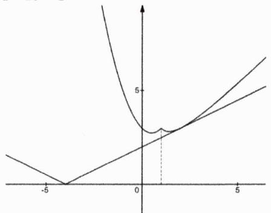

line

| x  | y    |
|----|------|
| -5 | 0    |
| 0  | 0    |
| 5  | 5    |

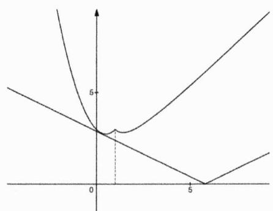

text_image

Mathematical graph showing three intersecting curves with labeled axes and a marked point at (0, 5)

例20. [2016 浙江文 20] 设函数 $f(x) = x^3 + \frac{1}{x+1}$ , $x \in [0,1]$ ，证明：

(1) $f(x) \geq 1 - x + x^{2};$   
(2) $\frac{3}{4} < f(x) \leq \frac{3}{2}$ .

解析：

第一问：显而易见的是

$$
1 - x + x ^ {2} - x ^ {3} = \frac {1 ^ {4} - x ^ {4}}{1 - (- x)} = \frac {1 - x ^ {4}}{1 + x} \leq \frac {1}{x + 1}
$$

从而有

$$
1 - x + x ^ {2} \leq x ^ {3} + \frac {1}{x + 1} = f (x)
$$

当且仅当x=1时上式取等，从而得证！

第二问：先证左侧，由第一问知 $f(x)\geq1-x+x^{2}$ （取等条件为x=1），而

$$
(1 - x + x ^ {2}) _ {\mathrm{min}} \geq \frac {3}{4}
$$

上式不等式取等条件为 $x=\frac{1}{2}$ ，从而证得 $f(x)>\frac{3}{4}$ 。再证右侧，当 $x\in[0,1]$ 时，由对勾函数性质知

$$
f (x) = x ^ {3} + \frac {1}{x + 1} \leq x + \frac {1}{x + 1} = \left[ (x + 1) + \frac {1}{x + 1} \right] - 1 \leq \frac {3}{2}
$$

当且仅当x=1时上式取等，综上第二问得证.

在本讲的最后我们系统探究一下二次比二次型函数的值域问题.

例21. [2005 上海交大自招 13] 若函数 $y = \frac{ax^2 + 8x + b}{x^2 + 1}$ 的最大值为9，最小值为1，则实数 $a, b$ 的值分别为

解析：由题易得

$$
(y - a) x ^ {2} - 8 x + y - b = 0
$$

显而易见的是1和9是函数的两个极值，故而1和9必是 $\Delta=0$ 的两根，因为

$$
\Delta = 6 4 - 4 (y - a) (y - b) = 0 \Leftrightarrow y ^ {2} - (a + b) y + a b - 1 6 = 0
$$

故而有 $a+b=10$ 且ab-16=9，由此可解得

$$
a = b = 5
$$

推论1.1: 二次比二次型函数的极值点 已知 $f(x)=\frac{ax^{2}+bx+c}{dx^{2}+ex+f}$ ，则方程

$$
\left| \begin{array}{c c} a & b \\ d & e \end{array} \right| x ^ {2} + 2 \left| \begin{array}{c c} a & c \\ d & f \end{array} \right| x + \left| \begin{array}{c c} b & c \\ e & f \end{array} \right| = 0
$$

的解可能为函数 $f(x)$ 的极值点.

推论证明：易知

$$
\begin{array}{l} f ^ {\prime} (x) = \left(\frac {a x ^ {2} + b x + c}{d x ^ {2} + e x + f}\right) ^ {\prime} = \frac {(2 a x + b) (d x ^ {2} + e x + f) - (2 d x + e) (a x ^ {2} + b x + c)}{(d x ^ {2} + e x + f) ^ {2}} \\ = \frac {(a e - b d) x ^ {2} + 2 (a f - c d) x + (b f - c e)}{(d x ^ {2} + e x + f) ^ {2}} \\ \end{array}
$$

证毕.

例22. 函数 $f(x)=\frac{x^{2}+6x-4}{x^{2}+4x+4}(x\geq1)$ 的值域为 \_\_\_\_.

解析：由上述推论知函数 $f(x)$ 的极值点满足如下方程

$$
\left| \begin{array}{c c} 1 & 6 \\ 1 & 4 \end{array} \right| x ^ {2} + 2 \left| \begin{array}{c c} 1 & - 4 \\ 1 & 4 \end{array} \right| x + \left| \begin{array}{c c} 6 & - 4 \\ 4 & 4 \end{array} \right| = 0 \Longrightarrow x ^ {2} - 8 x - 2 0 = 0
$$

解得x = -2（舍）或x = 10，因为

$$
f (1 0) = \frac {1 3}{1 2}, f (1) = \frac {1}{3}
$$

且当 $x\to+\infty$ 时， $f(x)\to1$ ，从而可得函数 $f(x)$ 的值域为 $\left[\frac{1}{3},\frac{13}{12}\right]$ .

例23. 已知函数 $f(x) = \frac{x^4 + kx^2 + 1}{x^4 + x^2 + 1} (k \in \mathbb{R})$ ，对 $\forall a, b, c \in \mathbb{R}$ 都有 $f(a), f(b), f(c)$ 的值组成一个三角形的三边，则 $k$ 的取值范围为 \_\_\_\_.

解析：当 $k = 1$ 时显然符合题意，当 $k \neq  1$ 时由上述推论知函数 $f\left( x\right)$ 的极值点满足如下方程

铭师道·高中数学方法原本

$$
\left| \begin{array}{c c} 1 & k \\ 1 & 1 \end{array} \right| x ^ {4} + 2 \left| \begin{array}{c c} 1 & 1 \\ 1 & 1 \end{array} \right| x ^ {2} + \left| \begin{array}{c c} k & 1 \\ 1 & 1 \end{array} \right| = 0 \Longrightarrow (1 - k) x ^ {4} + k - 1 = 0
$$

解得 $x^{2} = 1$ ，故而有函数的极值为 $\frac{1}{3} (k + 2)$ .若 $k < 1$ ，易分析知 $f(x)$ 的值域为 $f(x)\in \left[\frac{1}{3} (k + 2),1\right)$ ，欲满足题意必有

$$
\frac {1}{3} (k + 2) + \frac {1}{3} (k + 2) > 1 \Longrightarrow k > - \frac {1}{2}
$$

由此知 $k \in \left(-\frac{1}{2}, 1\right)$ ; 若 $k > 1$ , 易分析知函数 $f(x)$ 的值域为 $f(x) \in (1, \frac{1}{3}(k + 2)]$ , 欲满足题意必有

$$
1 + 1 > \frac {1}{3} (k + 2) \Longrightarrow k <   4
$$

由此知 $k\in(1,4)$ .综上 $k\in\left(-\frac{1}{2},4\right)$ .

# 第01讲：高考对标训练

1. 函数 $f(x) = \sqrt{1 - \left(\frac{x-1}{x+1}\right)^2} + \frac{1}{1 + \frac{1}{1 - \frac{1}{x}}}$ 的定义域是 \_\_\_\_.

2. 已知函数 $y = f(x + 1)$ 定义域是 $[-2,3]$ ，则 $y = f(2|x| - 1)$ 的定义域是 \_\_\_\_.

3. 已知函数 $f(x) = -\frac{x^2}{2} + x$ 在区间 $[m, n]$ 上的最小值是 $3m$ ，最大值是 $3n$ ，则 $m =$ \_\_\_\_， $n =$ \_\_\_\_.

4. 根据条件求如下函数解析式.

(1) 设 $f(x)$ 是一次函数，且 $f(f(x)) = 4x + 3$ ，则 $f(x)$ 的解析式为 \_\_\_\_.  
(2) [2008 上海文 9] 若函数 $f(x) = (x + a)(bx + 2a)$ ( $a, b \in \mathbb{R}$ ) 是偶函数，且它的值域为 $(- \infty, 4]$ ，则该函数的解析式 $f(x) =$ \_\_\_\_.  
(3) 若 $\forall x, y \in R$ 都有 $f(x + y) - 2f(y) = x^{2} + 2xy - y^{2} + 3x - 3y$ ，则 $f(x)$ 的解析式为 \_\_\_\_.  
(4) 已知 $f(x)$ 满足 $2f(x) + f\left(\frac{1}{x}\right) = 3x$ ，则 $f(x)$ 的解析式为 \_\_\_\_.  
(5) [2014 陕西文 14]已知 $f(x)=\frac{x}{1+x},x\geq0$ ，若 $f_{1}(x)=f(x),f_{n+1}(x)=f(f_{n}(x)),n\in\mathbb{N}^{*}$ ，则 $f_{2014}(x)$ 的表达式为\_\_\_\_.

5. 已知 $f(x)$ 是定义在R上的单调函数, 满足 $f[f(x) - e^{x}] = 1$ , 且 $f(a) > f(b) > e$ , 若 $\log_{a} b + \log_{b} a = \frac{17}{4}$ , 则a与b的关系是()

$$
\mathrm{A.} a = b ^ {3}
$$

$$
\mathrm{B}. b = a ^ {3}
$$

$$
\mathrm{C.} a = b ^ {4}
$$

$$
\mathrm{D}. b = a ^ {4}
$$

6. [2006 重庆理 21] 已知定义域为 $\mathbb{R}$ 的函数 $f(x)$ 满足 $f(f(x) - x^2 + x) = f(x) - x^2 + x$ .

(1) 若 $f(2)=3$ ，求 $f(1)$ . 又若 $f(0)=a$ ，求 $f(a)$ ;  
(2) 设有且仅有一个实数 $x_{0}$ ，使得 $f(x_{0})=x_{0}$ ，求函数 $f(x)$ 的解析表达式.

7. 求下列函数的值域.

(1) 当 $x \in [3,8]$ 时，函数 $f(x) = \frac{2x + 3}{x - 2}$ 的值域为 \_\_\_\_.  
(2) 函数 $y = \frac{2x^2 - 2x + 3}{x^2 - x + 1}$ 的值域为 \_\_\_\_.  
(3) [2007 重庆文 16] 函数 $f(x) = \sqrt{x^2 - 2x} + 2\sqrt{x^2 - 5x + 4}$ 的最小值为 \_\_\_\_.  
(4) [2008 重庆理 4] 记函数 $y = \sqrt{1 - x} + \sqrt{x + 3}$ 的最大值为 Max，最小值为 min，则 $\frac{\min}{\max}$ 的值为 \_\_\_\_.

(5) 函数 $y = \sqrt{x} + \frac{1}{\sqrt{x}} + \sqrt{x + \frac{1}{x}} + 1$ 的值域为 \_\_\_\_.  
(6) 函数 $y = \sqrt{x^2 + 1} + \sqrt{x^2 - 4x + 8}$ 的值域为 \_\_\_\_.

8. 函数 $f(x)=\frac{x^{2}-x+2}{2-x}$ （ $-1\leq x\leq1$ ）的值域是\_\_\_\_.

9. 已知函数 $f(x) = \log_2 x + 1$ 的定义域为[1,2], $L(x) = f^2(x) + f(x^2) + m$ , 若 $\exists a, b, c \in \{y | y = L(x)\}$ , 使得 $a + b < c$ , 则实数 $m$ 的取值范围是 \_\_\_\_.

# 第 01 讲：对标答案

1. [解析]:

显然x需同时满足 $\left\{\begin{aligned}\left|\frac{x-1}{x+1}\right| &\leq 1\\ x &\neq -1\\ x &\neq 0\\ 1-\frac{1}{x} &\neq 0\\ 1+\frac{1}{1-\frac{1}{x}} &\neq 0\end{aligned}\right.$ ，解得 $x \in \left\{x \in R \mid x > 0, x \neq \frac{1}{2}, x \neq 1\right\}.$

2. [解析]:

由题知 $f(x + 1)$ 中的 $x \in [-2,3]$ ，进而有 $x + 1 \in [-1,4]$ ，根据括号整体取值相同法则可得

$$
2 | x | - 1 \in [ - 1, 4 ]
$$

解得 $x \in \left[-\frac{5}{2}, \frac{5}{2}\right]$ ，由此知 $y = f(2|x| - 1)$ 的定义域是 $\left[-\frac{5}{2}, \frac{5}{2}\right]$ .

3. [解析]:

显而易见的是 $-\frac{x^2}{2} + x \leq \frac{1}{2}$ , 从而有 $3n \leq \frac{1}{2}$ , 即有 $n \leq \frac{1}{6}$ , 从而知函数在 $[m, n]$ 上单调递增, 故而有

$$
\left\{ \begin{array}{l} f (x) _ {\max} = f (n) = - \frac {1}{2} n ^ {2} + n = 3 n \\ f (x) _ {\min} = f (m) = - \frac {1}{2} m ^ {2} + m = 3 m \end{array} \Rightarrow \left\{ \begin{array}{l} m = - 4 \\ n = 0 \end{array} \right. \right.
$$

4. [解析]:

第一问：设 $f(x)=kx+b$ ，则有

$$
f (f (x)) = k (k x + b) + b = k ^ {2} x + k b + b
$$

经比对系数可得 $\left\{\begin{aligned}k^{2}&=4\\ kb+b&=3\end{aligned}\right.$ ，解得 $\left\{\begin{aligned}k&=2\\ b&=1\end{aligned}\right.$ 或 $\left\{\begin{aligned}k&=-2\\ b&=-3\end{aligned}\right.$ ，则有 $f(x)=2x+1$ 或 $f(x)=-2x-3$ .

第二问: 因为 $f(x)$ 是偶函数, 故而必有 $\frac{2a}{b} = -a$ 即 $b = -2$ , 此时有 $f(x) = -2(x^{2} - a^{2}) \leq 2a^{2}$ , 因为函数值域为 $(-\infty, 4]$ , 则有 $2a^{2} = 4$ , 故而有 $f(x) = -2x^{2} + 4$ .

第三问：令x=0，则有 $-f(y)=-y^{2}-3y$ 即有 $f(y)=y^{2}+3y$ ，再令y=x，可得 $f(x)=x^{2}+3x$ .

第四问：因为 $2f(x)+f\left(\frac{1}{x}\right)=3x$ ，若令 $x=\frac{1}{x}$ ，可得 $2f\left(\frac{1}{x}\right)+f(x)=\frac{3}{x}$ ，联立可解得

$$
3 f (x) = 6 x - \frac {3}{x}
$$

从而有 $f(x)=2x-\frac{1}{x}(x\neq0)$ .

第五问：易算得 $f_{1}(x)=\frac{x}{1+x}$ ， $f_{2}(x)=\frac{x}{1+2x}$ ， $f_{3}(x)=\frac{x}{1+3x}$ ，…故而可猜得 $f_{n}(x)=\frac{x}{1+nx}$ ，由此可得

$$
f _ {2 0 1 4} (x) = \frac {x}{1 + 2 0 1 4 x}
$$

5. [解析]:

令 $f(x)-e^{x}=t$ （t是常数），则有 $f(x)=e^{x}+t$ 且有 $f(t)=1$ 。再令x=t，则有 $e^{t}+t=1$ ，显而易见的是该方程唯一根为t=0，从而有 $f(x)=e^{x}$ ，进而可得a>b>1。因为

铭师道·高中数学方法原本

$$
\log_ {a} b + \log_ {b} a = \log_ {b} a + \frac {1}{\log_ {b} a} = \frac {1 7}{4}
$$

故而有 $\log_b a = 4$ ，进而有 $a = b^4$ ，从而本题选 C.

6. [解析]:

第一问：因为 $f(2)=3$ ，则有

$$
f (f (2) - 2 ^ {2} + 2) = f (1) = f (2) - 2 ^ {2} + 2 = 1
$$

即有 $f(1)=1$ .当x=0时有

$$
f (f (0) - 0 ^ {2} + 0) = f (a) = f (0) - 0 ^ {2} + 0 = a
$$

故而有 $f(a)=a.$

第二问：因为仅有唯一一个实数 $x_0$ ，使得 $f(x_0) = x_0$ ，从而对 $\forall x \in \mathbb{R}$ 必有 $f(x) - x^2 + x = x_0$ ，否则就会有 $f(x) - x^2 + x = t_0 \neq x_0$ 的情形，这时有 $f(t_0) = t_0 \neq x_0$ ，这显然与已知相矛盾。

而当 $x=x_{0}$ 时，必有

$$
f \left(x _ {0}\right) - x _ {0} ^ {2} + x _ {0} = 2 x _ {0} - x _ {0} ^ {2} = x _ {0}
$$

解得 $x_{0}=0$ 或 $x_{0}=1$ 。若 $x_{0}=0$ ，则有 $f(x)=x^{2}-x$ ，而此时 $f(x)=x$ 的解不唯一，从而舍去；当 $x_{0}=1$ 时， $f(x)=x^{2}-x+1$ ，此时 $f(x)=x$ 的唯一解是x=1，从而满足条件。

综上 $f(x)=x^{2}-x+1$ .

7. [解析]:

第一问：显然有 $f(x)=\frac{2x+3}{x-2}=\frac{2(x-2)+7}{x-2}=2+\frac{7}{x-2}$ ，其为减函数，故而有 $y\in\left[\frac{19}{6},9\right]$ .

第二问：经变形可得

$$
(y - 2) x ^ {2} + (2 - y) x + y - 3 = 0
$$

当y=2时，显然不成立.当 $y\neq2$ 时，有

$$
\Delta = (2 - y) ^ {2} - 4 (y - 2) (y - 3) \geq 0
$$

解得 $y\in\left(2,\frac{10}{3}\right]$ ，从而所求值域为 $\left(2,\frac{10}{3}\right]$ .

第三问: 显然函数的定义域为 $x \in (-\infty, 0] \cup [4, +\infty)$ , 由复合函数单调性知, 函数 $f(x)$ 在 $(- \infty, 0]$ 上为单调递减, 而在 $[4, +\infty)$ 上单调递增. 因为 $f(0) = 4$ , $f(4) = 2 \sqrt{2} + 1$ , 从而知函数 $f(x)$ 的最小值为 $2 \sqrt{2} + 1$ .

第四问：易知函数定义域为 $x \in [-3, 1]$ ，将函数表达式直接平方可得

$$
y ^ {2} = 4 + 2 \sqrt {(1 - x) (x + 3)}
$$

显而易见的是 $(1 - x)(x + 3) \in [0,4]$ ，则有 $y^2 \in [4,8]$ ，进而有 $y \in [2,2\sqrt{2}]$ ，从而有 $\frac{\min}{\max} = \frac{\sqrt{2}}{2}$ .

第五问: 令 $\sqrt{x} + \frac{1}{\sqrt{x}} = t \geq 2$ , 则有 $t^2 = x + \frac{1}{x} + 2$ , 从而有 $y = t + \sqrt{t^2 - 2} + 1 \geq 3 + \sqrt{2}$ , 由此知所求值域为 $[3 + \sqrt{2}, +\infty)$ .

第六问：经简单变形后易得

$$
y = \sqrt {(x - 0) ^ {2} + (0 - 1) ^ {2}} + \sqrt {(x - 2) ^ {2} + (0 - 2) ^ {2}}
$$

其表示x轴上的任意一点P到 $A(0,1)$ 和 $B(2,2)$ 两点的距离和，显然 $A'(0,-1)$ 与A点关于x轴对称，根据将军饮马模型知，所求距离和最小值为 $|A'B|=\sqrt{13}$ ，从而所求值域为 $y\in[\sqrt{13},+\infty)$ .

8. [解析]:

显然函数 $f(x)$ 的极值点满足如下方程

$$
\left| \begin{array}{c c} 1 & - 1 \\ 0 & - 1 \end{array} \right| x ^ {2} + 2 \left| \begin{array}{c c} 1 & 2 \\ 0 & 2 \end{array} \right| x + \left| \begin{array}{c c} - 1 & 2 \\ - 1 & 2 \end{array} \right| = 0 \Longrightarrow x ^ {2} - 4 x = 0
$$

解得x=0或x=4（舍）.因为 $f(0)=1$ ，而 $f(-1)=\frac{4}{3}$ ， $f(1)=2$ ，从而所求值域为[1,2].

9. [解析]:

由题知

$$
L (x) = (\log_ {2} x + 1) ^ {2} + \log_ {2} x ^ {2} + 1 + m = (\log_ {2} x) ^ {2} + 4 \log_ {2} x + 2 + m = (\log_ {2} x + 2) ^ {2} + m - 2
$$

显而易见的是 $L(x)$ 的定义域为 $\left[1,\sqrt{2}\right]$ ，故而有 $\log_{2}x+2\in\left[2,\frac{5}{2}\right]$ ，进而可得

$$
L (x) \in \left[ m + 2, m + \frac {1 7}{4} \right]
$$

若 $\exists a,b,c\in\{y|y=L(x)\}$ 使得 $a+b<c$ ，则有

$$
2 (m + 2) <   m + \frac {1 7}{4} \Longrightarrow m <   \frac {1}{4}
$$

即实数m的取值范围是 $m<\frac{1}{4}$ .

# 第02讲：绝对值函数方法论

所有绝对值问题本质上都隶属于分段函数问题，本讲我们将务实且系统地对以绝对值为背景的最值问题进行探究.

例1. [2017 北大自招 T2 改] 函数 $f(x) = |x^2 - 2| - \frac{1}{2} |x| + |x - 1|$ 的最小值是 \_\_\_\_.

解析：显而易见的是 $-\sqrt{2}$ 、0、1、 $\sqrt{2}$ 将整个数轴分成了如图所示的五个小区间

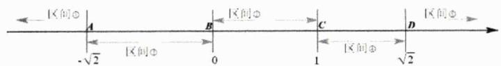

text_image

区间①
A
B
C
D
-√2
区间②
0
1
区间③
√2
区间④

因而有

$$
f (x) = | x ^ {2} - 2 | - \frac {1}{2} | x | + | x - 1 | = \left\{ \begin{array}{l l} x ^ {2} - \frac {1}{2} x - 1, & x \in (- \infty , - \sqrt {2}) \\ - x ^ {2} - \frac {1}{2} x + 3, & x \in [ - \sqrt {2}, 0) \\ - x ^ {2} - \frac {3}{2} x + 3, & x \in [ 0, 1) \\ - x ^ {2} + \frac {1}{2} x + 1, & x \in [ 1, \sqrt {2}) \\ x ^ {2} + \frac {1}{2} x - 3, & x \in [ \sqrt {2}, + \infty) \end{array} \right.
$$

下图即为上述分段函数的示意图，由图易知 $f(x)_{\min}=f(\sqrt{2})=\frac{\sqrt{2}}{2}-1$ .

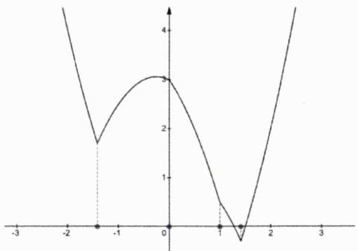

通过对上述例题的解答我们可总结出如下一结论.

结论2.1: 绝对值中的零点分区间法 先用绝对值函数 $f(x)$ 对应的零点将定义域区间进行划分，再按照上述划分分类讨论去掉绝对值是解决绝对值问题的通法之一.

例2. [2017 浙江 17]已知 $a \in \mathbb{R}$ , 函数 $f(x) = \left| x + \frac{4}{x} - a \right| + a$ 在区间[1,4]上的最大值是5, 则 $a$ 的取值范围是

解析：由题知当 $x \in [1,4]$ 时

$$
\left| x + \frac {4}{x} - a \right| + a \leq 5 \Rightarrow \left| x + \frac {4}{x} - a \right| \leq 5 - a \Rightarrow 2 a - 5 \leq x + \frac {4}{x} \leq 5
$$

因为当 $x \in [1,4]$ 时 $x + \frac{4}{x} \in [4,5]$ ，故而有 $2a - 5 \leq 4$ ，解得 $a \in (-\infty, \frac{9}{2}]$ .

通过上述例题我们可再总结出如下一结论.

结论2.2: 强行去绝对值法 强行去绝对值而不先行分类讨论是解决一部分绝对值问题的经典方法之一.

例3. [2023 天津 T15] 若函数 $f(x) = ax^{2} - 2x - |x^{2} - ax + 1|$ 有且仅有两个零点，则实数 $a$ 的取值范围为

解析：函数 $f(x)$ 仅有两零点等价于如下方程组仅有两解

$$
\left\{ \begin{array}{l} a x ^ {2} - 2 x \geq 0 \\ | x ^ {2} - a x + 1 | ^ {2} - (a x ^ {2} - 2 x) ^ {2} = 0 \end{array} \right.
$$

铭师道·高中数学方法原本

即如下方程组有两解

$$
\left\{ \begin{array}{l l} a x ^ {2} - 2 x = x (a x - 2) \geq 0 & (\alpha) \\ (x + 1) (x - 1) [ (a - 1) x - 1 ] [ (a + 1) x - 1 ] = 0 & (\beta) \end{array} \right.
$$

(i) 当 $a = 1$ 时，方程 $(\beta)$ 的三根为-1,1和 $\frac{1}{2}$ ，经检验，此种情况不符合题意；

(ii) 当 $a = -1$ 时，方程 $(\beta)$ 的三根为-1,1和 $-\frac{1}{2}$ ，经检验-1和 $-\frac{1}{2}$ 是方程组的两个根，符合题意；

(iii) 当 $a \neq \pm 1$ 时，方程 $(\beta)$ 的四根为 $-1, 1, \frac{1}{a - 1}$ 和 $\frac{1}{a + 1}$ ，接下来如下分类讨论：

① 若a=0，经检验，此种情况不符合题意；  
(2) 若 $a \geq 2$ , 则方程 $(\alpha)$ 的解为 $x \leq 0$ 或 $x \geq \frac{2}{a}$ , 此时 -1 和 1 是方程组的两个根, 符合题意;  
③ 若 $a \in (1,2)$ ，则方程 $(\alpha)$ 的解为 $x \leq 0$ 或 $x \geq \frac{2}{a}$ ，此时 -1 和 $\frac{1}{a-1}$ 是方程组的两个根，符合题意；  
④ 若 $a \in (0,1)$ ，则方程 $(\alpha)$ 的解为 $x \leq 0$ 或 $x \geq \frac{a}{a}$ ，此时 -1 和 $\frac{1}{a-1}$ 是方程组的两个根，符合题意；  
⑤ 若 $a \in (-1,0)$ ，则方程 $(\alpha)$ 的解为 $\frac{2}{a} \leq x \leq 0$ ，此时-1和 $\frac{1}{a-1}$ 是方程组的两个根，符合题意；  
⑥ 若 $a \in (-2, -1)$ ，则方程 $(\alpha)$ 的解为 $\frac{2}{a} \leq x \leq 0$ ，此时-1和 $\frac{1}{a-1}$ 是方程组的两个根，符合题意；  
⑦ 若 $a \leq -2$ ，则方程 $(\alpha)$ 的解为 $\frac{2}{a} \leq x \leq 0$ ，此时 $\frac{1}{a-1}$ 和 $\frac{1}{a+1}$ 是方程组的两个根，符合题意。综上若函数 $f(x)$ 仅有两零点，实数a的取值范围为 $(-∞,0)∪(0,1)∪(1,+∞)$ 。

例4. [1996 全国理工农医类 T25]已知 $a, b, c \in \mathbb{R}$ , 函数 $f(x) = ax^2 + bx + c$ , $r(x) = ax + b$ , 当 $-1 \leq x \leq 1$ 时, $|f(x)| \leq 1$ .

(1) 求证: $|c| \leq 1$ ;   
(2) 求证：当 $-1 \leq x \leq 1$ 时， $|r(x)| \leq 2$ ;  
(3) 设 $a > 0$ , 当 $-1 \leq x \leq 1$ 时, $r(x)$ 的最大值为 2 , 求 $f(x)$ .

解析：

第一问：当x=0时，依题有 $|c|=|f(0)|\leq1$ ，证毕.

第二问：因为 $x=\left(\frac{x+1}{2}\right)^{2}-\left(\frac{x-1}{2}\right)^{2}$ ，故而有

$$
\begin{array}{l} r (x) = a \left[ \left(\frac {x + 1}{2}\right) ^ {2} - \left(\frac {x - 1}{2}\right) ^ {2} \right] + b \left(\frac {x + 1}{2} - \frac {x - 1}{2}\right) \\ = \left[ a \left(\frac {x + 1}{2}\right) ^ {2} + b \frac {x + 1}{2} + c \right] - \left[ a \left(\frac {x - 1}{2}\right) ^ {2} + b \left(\frac {x - 1}{2}\right) + c \right] \\ = f \left(\frac {x + 1}{2}\right) - f \left(\frac {x - 1}{2}\right) \\ \end{array}
$$

当 $-1 \leq x \leq 1$ 时， $\frac{x+1}{2} \in [0,1]$ ， $\frac{x-1}{2} \in [-1,0]$ ，由题知

$$
| r (x) | = \left| f \left(\frac {x + 1}{2}\right) - f \left(\frac {x - 1}{2}\right) \right| \leq \left| f \left(\frac {x + 1}{2}\right) \right| + \left| f \left(\frac {x - 1}{2}\right) \right| = 2
$$

证毕.

第三问：当 $a > 0$ 时， $r(x)$ 在 $[-1, 1]$ 上单调递增，故而有 $r(1) = a + b = 2$ ，进而有

$$
f (1) - f (0) = 2
$$

因为当 $-1 \leq x \leq 1$ 时， $|f(x)| \leq 1$ ，从而必有 $f(1) = a + b + c = 1$ 且 $f(0) = c = -1$ ，进而有

$$
f (x) = a x ^ {2} + (2 - a) x - 1 \geq f (0)
$$

故而知 $\frac{a - 2}{2a} = 0$ ，即有 $a = 2$ ，由此可得

$$
f (x) = 2 x ^ {2} - 1
$$

通过上述例题我们可总结出如下一结论.

结论2.3: 二次绝对值中的已知表示未知法 在解决类似上述二次含参绝对值最值问题时, 我们往往采用用已知量表示未知量的方法.

例5. 已知二次函数 $f(x) = ax^{2} + bx + c$ ，当 $x \in [-1, 1]$ 时，有 $|f(x)| \leq 1$ . 求证：当 $x \in [-2, 2]$ 时， $|f(x)| \leq 7$ .

解析：因为 $\left\{\begin{aligned}f(1)&=a+b+c\\ f(-1)&=a-b+c\\ f(0)&=c\end{aligned}\right.$ ，故而有 $\left\{\begin{aligned}a&=\frac{1}{2}[f(1)+f(-1)-2f(0)]\\ b&=\frac{1}{2}[f(1)-f(-1)]\\ c&=f(0)\end{aligned}\right.$ ，进而可得

$$
f (x) = \frac {1}{2} [ f (1) + f (- 1) - 2 f (0) ] x ^ {2} + \frac {1}{2} [ f (1) - f (- 1) ] x + f (0)
$$

$$
= f (1) \cdot \frac {x ^ {2} + x}{2} + f (- 1) \cdot \frac {x ^ {2} - x}{2} + f (0) \cdot (1 - x ^ {2})
$$

当 $|x|\leq1$ 时题目中已给定 $|f(x)|\leq1$ ，故而当 $1\leq|x|\leq2$ 时，有

$$
| f (x) | \leq \left| \frac {x ^ {2} + x}{2} \right| + \left| \frac {x ^ {2} - x}{2} \right| + | 1 - x ^ {2} | = \frac {x ^ {2} + x}{2} + \frac {x ^ {2} - x}{2} + x ^ {2} - 1 = 2 x ^ {2} - 1 \leq 7
$$

综上，当 $x\in[-2,2]$ 时， $|f(x)|\leq7$ .

接下来我们再来探究如下一类常见的含绝对值的题型.

例6. 若关于 $x$ 的不等式 $3 - |x - a| > x^2$ 在 $(- \infty, 0)$ 上有解，则实数 $a$ 的取值范围是

解析：由题知 $|x-a|<3-x^{2}$ 在 $(-∞,0)$ 有解，进而有

$$
x ^ {2} + x - 3 <   a <   - x ^ {2} + x + 3
$$

首先需满足 $-x^{2}+x+3>x^{2}+x-3$ 即 $x\in(-\sqrt{3},0)$ ，进而有

$$
(x ^ {2} + x - 3) _ {\min} = - \frac {1 3}{4}, (- x ^ {2} + x + 3) _ {\max} \rightarrow 3
$$

故而可得

$$
a \in \left(- \frac {1 3}{4}, 3\right)
$$

例7. 已知函数 $f(x) = x^{2}|x|$ ，当 $x \in [-2, 2]$ 时，恒有 $f(a - x) \leq 8f(3 - x)$ ，则 $a$ 的取值范围为 \_\_\_\_.

解析：易分析知 $f(x)$ 是R上的偶函数且在 $(0,+\infty)$ 上单调递增，又注意到 $8f(x)=8x^{2}|x|=f(2x)$ .若

$$
f (a - x) \leq 8 f (3 - x) = f (6 - 2 x)
$$

则必有

$$
\vert a - x \vert \leq \vert 6 - 2 x \vert \Rightarrow 3 x - 6 \leq a \leq 6 - x
$$

因为当 $x\in[-2,2]$ 时 $3x-6\leq0$ 且 $6-x\geq4$ ，故而有 $a\in[0,4]$ .

例8. 已知不等式 $|a-2x|>x-1$ ，若 $\forall x\in[0,2]$ 恒成立，则a的取值范围为\_\_\_\_。

解析：易知原命题的否定为 $|a-2x|\leq x-1$ 在 $[0,2]$ 上有解，当 $|a-2x|\leq x-1$ 时可得

$$
x + 1 \leq a \leq 3 x - 1
$$

首先需满足 $x+1\leq3x-1$ 即有 $x\in[1,2]$ ，进而知

$$
2 = (x + 1) _ {\min} \leq a \leq (3 x - 1) _ {\max} = 5
$$

故而可得所求a的取值范围为 $a\in(-\infty,2)\cup(5,+\infty)$ .

结论2.4: 一类含参绝对值的恒成立问题 当 $x \in I$ 时, $|a - f(x)| > r(x)$ 恒成立, 若要求参数 $a$ 的范围, 我们可以用正难则反的法则来解决它. 其反面为 $x \in I$ 时, $|a - f(x)| \leq r(x)$ 有解, 即需满足

$$
f (x) - r (x) \leq f (x) + r (x) \text {且} [ f (x) - r (x) ] _ {\min} \leq a \leq [ f (x) + r (x) ] _ {\max}
$$

求出a的取值集合后，再求其补集即可.

例9. 已知不等式 $x^{2} \geq 2 - |x - a|$ 对 $x < 0$ 恒成立，则实数 $a$ 的取值范围为 \_\_\_\_.

解析：原命题的否定为 $x^{2}<2-|x-a|$ 在x<0上有解，进而有

$$
x ^ {2} + x - 2 <   a <   - x ^ {2} + x + 2
$$

首先须满足 $x^{2}+x-2<-x^{2}+x+2$ 即 $-\sqrt{2}<x<0$ ，进而有

$$
- x ^ {2} + x + 2 <   2 \text {   且   } x ^ {2} + x - 2 \geq - \frac {9}{4}
$$

从而有 $-\frac{9}{4}<a<2$ ，故而所求a的取值范围为 $a\in(-\infty,-\frac{9}{4}]\cup[2,+\infty)$ .

接下来我们直接给出如下一结论及其对应的例题.

结论2.5: 图像中的翻折及特殊点绘图法 若将初等函数 $\Gamma(x)$ 位于 $x$ 轴上方的图像保持不变、将其位于 $x$ 轴下方的图像沿着 $x$ 轴进行翻折即可得到 $|\Gamma(x)|$ 的图像。另外我们在绘制诸如 $|x| + |y| = 1$ 等图像时宜先标出关键的一些点然后再绘图。

例10. 已知函数 $f(x)=\left\{\begin{aligned}1-x-2x^{2},&\leq0\\ \lg x\end{aligned}\right.$ ，若关于x的方程 $f(x)=a$ 有四个实根 $x_{1},x_{2},x_{3},x_{4}$ ，则这四根之积 $x_{1}x_{2}x_{3}x_{4}$ 的取值范围是\_\_\_\_.

铭师道·高中数学方法原本

解析: 易知上分段函数 $y = 1 - x - 2x^{2}$ 在 $(- \infty, -\frac{1}{4})$ 上单调递增, 而在 $(- \frac{1}{4}, 0)$ 上单调递减; 下分段函数 $y = |\lg x|$ 在 $(1, +\infty)$ 上单调递增, 而在 $(0, 1)$ 上单调递减, 下图即为函数 $f(x)$ 的示意图, 要保证方程 $f(x) = a$ 有四个实根, 必有 $a \in \left[1, \frac{9}{8}\right)$ . 若设 $x_{1} < x_{2} < x_{3} < x_{4}$ , 由根与系数关系知 $x_{1}x_{2} = \frac{a - 1}{2}$ , 同时知

$$
\lg x _ {4} = \left| \lg x _ {3} \right| \Longrightarrow \lg x _ {4} + \lg x _ {3} = \lg x _ {3} x _ {4} = 0 \Longrightarrow x _ {3} x _ {4} = 1
$$

由此可得

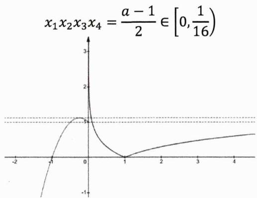

line

| x    | y     |
| ---- | ----- |
| -2   | -1.0  |
| -1   | -0.5  |
| 0    | 1.0   |
| 1    | 0.0   |
| 2    | 0.5   |
| 3    | 0.8   |
| 4    | 1.0   |

例11. 实数x,y满足 $|x-a|+|y-b|\leq1(a,b\in\mathbb{R})$ ，则点 $(x,y)$ 所围成的区域的面积为\_\_\_\_。

解析: 将曲线 $|x-a|+|y-b|\leq1$ 沿着向量 $(-a,-b)$ 的方向平移后可得曲线 $|x|+|y|\leq1$ 的图像（如下图所示），因为平移不影响面积，从而点 $(x,y)$ 所围成的区域的面积为2.

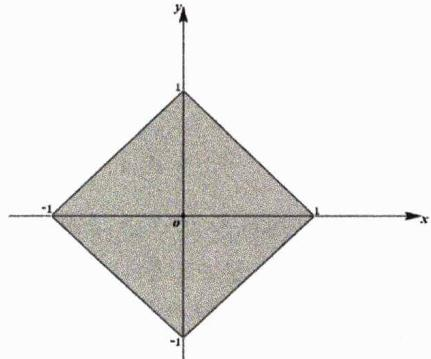

text_image

Mathematical diagram showing a shaded diamond-shaped region in the Cartesian coordinate system with labeled axes and origin.

例12. [多选]集合 $A=\left\{(x,y)\mid|x|+|y|=a,a>0\right\}$ ， $B=\left\{(x,y)\mid(xy|+1=|x|+|y|\right\}$ ，若 $A\cap B$ 是平面上正八边形的顶点所构成的集合，则下列说法正确的为()

A.a的值可以为2
C.a的值可以为 $2 + \sqrt{2}$

B.a的值可以为 $\sqrt{2}$ D.a的值可以为 $2 - \sqrt{2}$

解析：易知集合A中的点构成了以 $(\pm a,0)$ 和 $(0,\pm a)$ 为顶点的正方形 $\Gamma$ ，而 $|xy|+1=|x|+|y|$ 等价于 $|x|=1$ 或 $|y|=1$

设直线 $x=\pm1$ 和 $y=\pm1$ 的四个交点为A,B,C,D.如下左图所示,当正方形 $\Gamma$ 与直线 $x=\pm1$ 和 $y=\pm1$ 依次交于E,F,L,M,N,P,Q,R八个点且 $|AE|=\frac{\sqrt{2}}{2}|EF|=\frac{\sqrt{2}}{2}|AB|=\sqrt{2}$ 时,前述八个顶点构成了一个正八边形,此时有E点坐标为 $(- \sqrt{2}-1,1)$ ,进而有 $a=2+\sqrt{2}$ .

再如下右图所示，当正方形 $\Gamma$ 与直线 $x=\pm1$ 和 $y=\pm1$ 依次交于 $E',F',L',M',N',P',Q',R'$ 八个点且

$$
\frac {\sqrt {2}}{2} | E ^ {\prime} F ^ {\prime} | + \frac {1}{2} | E ^ {\prime} F ^ {\prime} | = 1 \text {即} | E ^ {\prime} F ^ {\prime} | = 2 (\sqrt {2} - 1)
$$

时，前述八个顶点构成了一个正八边形，此时有 $E'$ 点坐标为 $(-1, \sqrt{2} - 1)$ ，进而有 $a = \sqrt{2}$ . 综上 $a = 2 + \sqrt{2}$ 或 $a = \sqrt{2}$ ，故而本题选 BC.

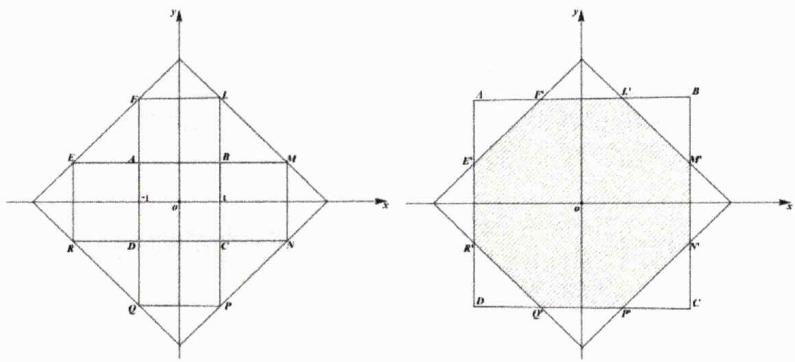

text_image

Two geometric diagrams showing a diamond shape with labeled vertices and coordinate axes, including shaded cross-sections.

接下来我们利用权重思想简单探究一下双绝对值之和（之差）的最值问题.

定理2.1: 双绝对值之和权重最值定理 当 $x \in \mathbb{R}$ , $ac \neq 0$ 时, 双绝对值函数

$$
f (x) = | a x + b | + | c x + d |
$$

必存在最小值，且有

(i) 当 $|a| = |c|$ 时， $f(x)_{\min} = f\left(-\frac{b}{a}\right)$ . 如下左图为函数 $f(x) = |x + 1| + |x - 1|$ 的示意图；  
(ii) 当 $|a| > |c|$ 时， $f(x)_{\min} = f\left(-\frac{b}{a}\right)$ . 如下右图为函数 $f(x) = |2x + 1| + |x - 1|$ 的示意图.

进一步我们可理解为x的系数的绝对值越大，其权重越高，权重高者为零时整个函数取得最小值.

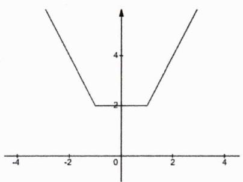

line

| x | y |
|---|---|
| -3.5 | 5 |
| -1.5 | 2 |
| -0.5 | 2 |
| 0.5 | 2 |
| 1.5 | 2 |
| 3.5 | 5 |

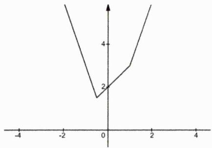

line

| x | y |
|---|---|
| -4 | 5 |
| -1 | 3 |
| 0 | 2 |
| 1 | 3 |
| 2 | 5 |

说明：上述定理所对应的两种情形皆可用各自对应的图像加以理解.

例13. 依据条件填空.

(1) [2014 重庆理 16] 若不等式 $|2x - 1| + |x + 2| \geq a^2 + \frac{1}{2}a + 2$ 对任意 $x$ 恒成立, 则 $a$ 的取值范围是 \_\_\_\_.  
(2) [2014 安徽理 9] 若 $f(x) = |x + 1| + |2x + a|$ 的最小值为3，则实数a的值为 \_\_\_\_.  
(3) [2015 重庆理 16] 若函数 $f(x) = |x + 1| + 2|x - a|$ 的最小值为 5，则实数 $a =$ \_\_\_\_.

解析:

第一问：由双绝对值之和权重最值理论知

$$
\vert 2 x - 1 \vert + \vert x + 2 \vert \geq \left| \frac {1}{2} + 2 \right| = \frac {5}{2}
$$

进而有 $a^{2}+\frac{1}{2}a+2\leq\frac{5}{2}$ 即有 $2a^{2}+a-1\leq0$ ，从而可解得 $a\in\left[-1,\frac{1}{2}\right]$ .

第二问：由双绝对值之和权重最值理论知 $f(x)_{\min}=f\left(-\frac{a}{2}\right)=\left|-\frac{a}{2}+1\right|=3$ ，从而解得a=-4或8.

第三问：由双绝对值之和权重最值理论知 $f(x)_{\min}=f(a)=|a+1|=5$ ，从而解得a=4或-6.

例14. [2014 湖北理 10]已知函数 $f(x)$ 是定义在 $\mathbb{R}$ 上的奇函数，当 $x \geq 0$ 时， $f(x) = \frac{1}{2} (|x - a^2| + |x - 2a^2| - 3a^2)$ . 若 $\forall x \in \mathbb{R}, f(x - 1) \leq f(x)$ ，则实数 $a$ 的取值范围是 \_\_\_\_.

解析: 当 $x \geq 0$ 时, 显然函数 $f(x)$ 的图像形如下图所示的 “平底锅”, 且图像过如下特殊的四点 (0,0), $(a^{2}, - a^{2})$ , $(2a^{2}, - a^{2})$ 及 $(3a^{2}, 0)$

又因函数 $f(x)$ 是奇函数, 从而我们可根据对称性绘制出 $x < 0$ 时的图像. 显而易见的是 $f(x - 1)$ 的图像表示将 $f(x)$ 的图像朝右平移1个单位, 若要满足 $f(x - 1) \leq f(x)$ , 必须有 $6a^{2} \leq 1$ , 解得 $a \in \left[-\frac{\sqrt{6}}{6}, \frac{\sqrt{6}}{6}\right]$ .

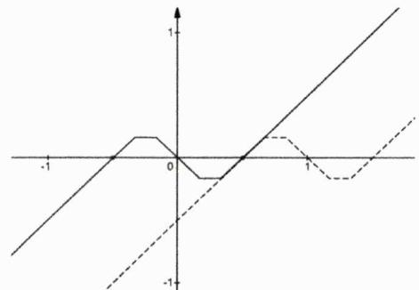

line

| x    | Line 1 | Line 2 |
| ---- | ------ | ------ |
| -1   | -1     | -1     |
| 0    | 0      | 0      |
| 1    | 1      | -1     |

例15. 在平面直角坐标系 ${xOy}$ 中, $O$ 为坐标原点. 定义 $P\left( {{x}_{1},{y}_{1}}\right) ,Q\left( {{x}_{2},{y}_{2}}\right)$ 两点之间的“直角距离”为 $\mathrm{d}\left( {P,Q}\right)  = \left| {{x}_{1} - {x}_{2}}\right|  + \left| {{y}_{1} - {y}_{2}}\right|$ . 已知点 $B\left( {1,0}\right)$ ,点 $M$ 是直线 ${kx} - y + k + 3 = 0\;\left( {k > 0}\right)$ 上动点, 则 $\mathrm{d}\left( {B,M}\right)$ 的最小值为

解析：设点 $M$ 的坐标为 $(x, kx + k + 3)$ ，由定义知

$$
\mathrm{d} (B, M) = | x - 1 | + | k x + k + 3 |
$$

铭师道·高中数学方法原本

由双绝对值之和权重最值理论知

$$
\mathrm{d} (B, M) _ {\min} = \left\{ \begin{array}{l} 2 + \frac {3}{k}, (k \geq 1) \\ 2 k + 3, (0 <   k <   1) \end{array} \right.
$$

定理2.2: 双绝对值之差权重最值定理 当 $x \in \mathbb{R}$ , $ac \neq 0$ 时, 双绝对值函数

$$
f (x) = | a x + b | - | c x + d |
$$

的最值情况如下:

(i) 若 $|a| = |c|$ ， $f(x)_{\min} = f\left(-\frac{b}{a}\right)$ ， $f(x)_{\max} = f\left(-\frac{d}{c}\right)$ . 如下左图为函数 $f(x) = |x + 1| - |x - 1|$ 的示意图；  
(ii) 若 $|a| > |c|$ ，函数 $f(x)$ 仅有最小值， $f(x)_{\min} = f\left(-\frac{b}{a}\right)$ . 如下中图为函数 $f(x) = |2x + 1| - |x - 1|$ 的示意图；  
(iii) 若 $|a| < |c|$ ，函数 $f(x)$ 仅有最大值， $f(x)_{\max} = f\left(-\frac{d}{c}\right)$ . 如下右图为函数 $f(x) = |x + 1| - |2x - 1|$ 的示意图.

从权重的角度来说，可理解为权重高者为零时整个函数取最值.

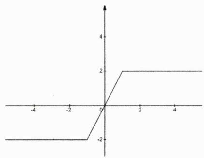

line

| x  | y  |
|----|----|
| -4 | -2 |
| -2 | -2 |
| 0  | 0  |
| 2  | 2  |
| 4  | 2  |

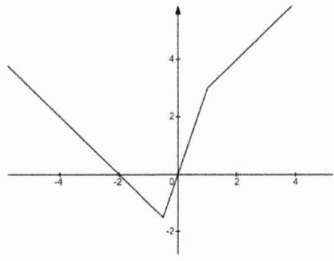

line

| x | y |
|---|---|
| -3.5 | 4 |
| -2.5 | 2 |
| -1.5 | 0 |
| -0.5 | -2 |
| 0.5 | 3 |
| 1.5 | 4 |
| 2.5 | 5 |
| 3.5 | 6 |

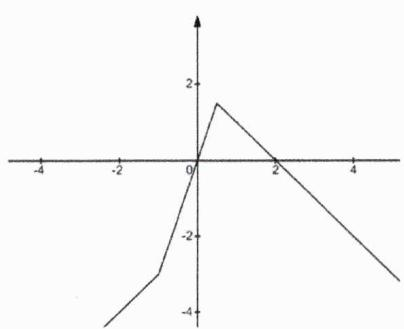

line

| x | y |
|---|---|
| -3.5 | -4 |
| -2.5 | -2 |
| -1.5 | 0 |
| -0.5 | 2 |
| 0.5 | 1 |
| 1.5 | 0 |
| 2.5 | -2 |
| 3.5 | -4 |

例16. 填空.

(1) 函数 $f(x)=|6x-6|-|2x-4|$ 的最小值为 \_\_\_\_.  
(2) 函数 $f(x)=|x+1|-|x-2|$ 的最小值为\_\_\_\_，最大值为\_\_\_\_。  
(3) 若函数 $f(x)=|x+3|+a|x-1|$ （ $x\in R$ ）有最小值，则实数a的范围是\_\_\_\_.

解析:

第一问：由双绝对值之差权重最值理论知 $f(x)_{\min}=f(1)=-2$ .

第二问：由双绝对值之差权重最值理论知 $f(x)_{\min}=f(-1)=-3,\quad f(x)_{\max}=f(2)=3.$

第三问：根据前述定理易分析知当 $a \geq -1$ 时函数 $f(x)$ 有最小值.

以上两个定理当然是极度简单的，接下来我们再来认识一下更为基础的教材中的绝对值三角不等式.

定理2.3: 绝对值三角不等式 $\forall a, b \in R$ ，恒有

$$
| a | + | b | \geq | a \pm b |
$$

当 $ab \geq 0$ 时 $|a + b| = |a| + |b|$ ；当 $ab \leq 0$ 时 $|a - b| = |a| + |b|$ .

定理证明：因为

$$
(| a | + | b |) ^ {2} - | a + b | ^ {2} = 2 (| a b | - a b) \geq 0
$$

当且仅当 $ab \geq 0$ 时上式取等，由此可得 $(|a| + |b|)^{2} \geq |a + b|^{2}$ ，即有

$$
| a | + | b | \geq | a + b |
$$

同理可证得 $|a|+|b|\geq|a-b|$ （当且仅当 $ab\leq0$ 时取等），综上得证！

例17. 若不等式 $|x^{2}+x-1|+|x^{2}+x+1|\geq\frac{|a+1|-|3a-1|}{|a|}$ 对任意实数 $a\neq0$ 恒成立，则实数x的取值范围是\_\_\_\_.

解析：由绝对值三角不等式知

$$
\frac {| a + 1 | - | 3 a - 1 |}{| a |} \leq \frac {| a + 1 + 3 a - 1 |}{| a |} = 4
$$

故而有 $|x^{2}+x-1|+|x^{2}+x+1|\geq4$ ，因为恒有 $x^{2}+x+1>0$ ，从而可得

$$
\vert x ^ {2} + x - 1 \vert \geq - x ^ {2} - x + 3
$$

继而有

$$
x ^ {2} + x - 1 \geq - x ^ {2} - x + 3 \text {或} x ^ {2} + x - 1 \leq x ^ {2} + x - 3
$$

解得 $x\in(-\infty,-2]\cup[1,+\infty)$ .

例18. [2015 浙江 T14] 若实数 $x, y$ 满足 $x^{2} + y^{2} \leq 1$ , 则 $|2x + y - 2| + |6 - x - 3y|$ 的最小值是 \_\_\_\_.

解析：由绝对值三角不等式知

$$
\vert 2 x + y - 2 \vert + \vert 6 - x - 3 y \vert \geq \vert 3 x + 4 y - 8 \vert
$$

当 $x^{2}+y^{2}\leq1$ 时，由Cauchy不等式知

$$
(3 x + 4 y) ^ {2} \leq (3 ^ {2} + 4 ^ {2}) (x ^ {2} + y ^ {2}) \leq 2 5
$$

从而有 $3x + 4y \in [-5,5]$ ，进而有

$$
\vert 3 x + 4 y - 8 \vert \geq 3
$$

当且仅当 $x=\frac{3}{5},y=\frac{4}{5}$ 时上式取等，故而目标函数的最小值是3.

例19. [2023 新高考 I T22]在直角坐标系 $xOy$ 中, 点 $P$ 到 $x$ 轴的距离等于点 $P$ 到点 $\left(0, \frac{1}{2}\right)$ 的距离, 记动点 $P$ 的轨迹为 $W$ .

(1) 求W的轨迹方程;   
(2) 已知矩形ABCD有三个顶点在W上，证明：矩形ABCD的周长大于 $3\sqrt{3}$ .

解析:

第一问：数形结合或由经由代数化简知 $x^{2}=y-\frac{1}{4}$ .

第二问: 如图所示, 先将第一问中的曲线下移 $\frac{1}{4}$ 个单位, 其表达式为 $x^{2} = y$ , 不妨设 $A, B, D$ 此三点在曲线上, 再设 $A(t, t^{2})$ 及 $AB$ 斜率为 $k$ , 由题设知 $AD$ 斜率为 $-\frac{1}{k}$ , 因为 $\left| k \cdot \left( -\frac{1}{k} \right) \right| = 1$ , 故而可再使 $0 < |k| \leq 1$ . 将直线 $AB$ 的方程 $y = kx - kt + t^{2}$ 与曲线联立可得

$$
x ^ {2} - k x + (k t - t ^ {2}) = 0
$$

进而可得 $|AB|=\sqrt{1+k^{2}}\cdot|k-2t|$ ，同理知 $|AD|=\frac{\sqrt{1+k^{2}}}{|k|}\cdot\left|\frac{1}{k}+2t\right|$ ，故而知矩形ABCD的周长L满足

$$
\begin{array}{l} L = 2 \sqrt {1 + k ^ {2}} \left[ | k - 2 t | + \frac {1}{| k |} \cdot \left| \frac {1}{k} + 2 t \right| \right] \geq 2 \sqrt {1 + k ^ {2}} \left[ | k - 2 t | + \left| \frac {1}{k} + 2 t \right| \right] \\ \geq 2 \sqrt {1 + k ^ {2}} \left| k + \frac {1}{k} \right| \\ = 2 \frac {\sqrt {(1 + k ^ {2}) ^ {3}}}{| k |} \\ = 2 \frac {\sqrt {\left(k ^ {2} + \frac {1}{2} + \frac {1}{2}\right) ^ {3}}}{| k |} \\ \geq 2 \frac {\sqrt {\left(3 \sqrt [ 3 ]{\frac {k ^ {2}}{4}}\right) ^ {3}}}{| k |} = 3 \sqrt {3} \\ \end{array}
$$

因为上式最后一步取等条件是 $k^{2}=\frac{1}{2}$ ，而上式第一步取等的条件是 $k^{2}=1$ ，故而证得 $L>3\sqrt{3}$ .

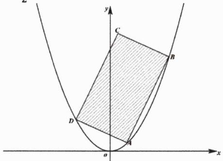

text_image

y
C
B
D
a
x

接下来我们可根据绝对值的几何意义推导出如下极度简单的一些结论.

推论2.1: 若 $|a-b|<c$ ，则有

(i) $|x - a| + |x - b| \geq c$ 的解集为 $x \in (-\infty, \frac{a + b - c}{2}] \cup \left[\frac{a + b + c}{2}, +\infty\right)$ ;  
(ii) $|x - a| + |x - b| \leq c$ 的解集为 $x \in \left[\frac{a + b - c}{2}, \frac{a + b + c}{2}\right]$ .

铭师道·高中数学方法原本

推论证明: 我们不妨使 $a \leq b$ , 在如图所示的数轴中, 令 $A, B$ 两点的坐标为 $a, b$ , 则有 $|AB| = b - a$ , 设动点 $P$ 的坐标为 $x$ , 则有 $|x - a| + |x - b| = |PA| + |PB|$ , 当 $|PA| - |PB| = \frac{c - (b - a)}{2}$ 或 $|PB| - |PA| = \frac{c - (b - a)}{2}$ 时有

$$
\vert P A \vert + \vert P B \vert = b - a + 2 \cdot \frac {c - (b - a)}{2} = c
$$

故而若 $|x-a|+|x-b|\geq c$ ，其解必为 $x\in(-\infty,\frac{a+b-c}{2}]\cup\left[\frac{a+b+c}{2},+\infty\right)$ ；若 $|x-a|+|x-b|\leq c$ ，其解必为 $x\in\left[\frac{a+b-c}{2},\frac{a+b+c}{2}\right]$ .证毕！

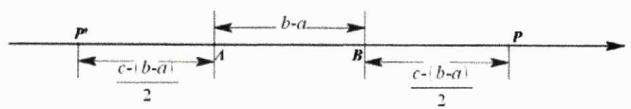

text_image

P
← b-a
← c-(b-a)
2
A
B
← c-(b-a)
2
P

例20. [2020 全国Ⅱ理 23]已知函数 $f(x) = |x - a^2| + |x - 2a + 1|$ .

(1) 当 $a = 2$ 时，求不等式 $f(x) \geq 4$ 的解集；  
(2) 若 $f(x) \geq 4$ ，求a的取值范围.

解析:

第一问：当a=2时，由前述推论知 $f(x)=|x-4|+|x-3|\geq4$ 的解集为 $x\in(-\infty,\frac{3}{2}]\cup\left[\frac{11}{2},+\infty\right)$ .

第二问：由绝对值三角不等式知，当

$$
\left| x - a ^ {2} \right| + \left| x - 2 a + 1 \right| \geq \left| a ^ {2} - 2 a + 1 \right| = (a - 1) ^ {2} \geq 4
$$

时，必有 $f(x)\geq4$ ，解得 $a\geq3$ 或 $a\leq-1$ 。而当-1<a<3时，有

$$
f (a ^ {2}) = | a ^ {2} - 2 a + 1 | = (a - 1) ^ {2} <   4
$$

显然不符合题意，故而 $a\in(-\infty,-1]\cup[3,+\infty)$ .

在探讨完单双绝对值之后，我们再来研究一下多绝对值最值问题.

定理2.4: 多绝对值最值定理 已知

$$
f (x) = | x - a _ {1} | + | x - a _ {2} | + \dots + | x - a _ {n} |
$$

若 $a_{1}\leq a_{2}\leq\cdots\leq a_{n}$ ，则有如下两个结论：

(i) 若 $n = 2k$ （ $k \in \mathbb{N}^*$ ），当 $x_0 \in [a_k, a_{k+1}]$ 时， $f(x)_{\min} = f(x_0)$ ;  
(ii) 若 $n = 2k - 1 (k \in \mathbb{N}^*)$ ，当 $x_0 = a_k$ 时， $f(x)_{\min} = f(x_0)$ .

定理证明：当 $n = 2k$ 时，若 $a_{k} < a_{k + 1}$ ，由绝对值三角不等式知

$$
\left\{ \begin{array}{l} | x - a _ {1} | + | x - a _ {2 k} | \geq a _ {2 k} - a _ {1} (\text {当且仅当} x \in [ a _ {1}, a _ {2 k} ] \text {时等号成立}) \\ | x - a _ {2} | + | x - a _ {2 k - 1} | \geq a _ {2 k - 1} - a _ {2} (\text {当且仅当} x \in [ a _ {2}, a _ {2 k - 1} ] \text {时等号成立}) \\ \dots \\ | x - a _ {k} | + | x - a _ {k + 1} | \geq a _ {k + 1} - a _ {k} (\text {当且仅当} x \in [ a _ {k}, a _ {k + 1} ] \text {时等号成立}) \end{array} \right.
$$

显然 $[a_{k},a_{k+1}]$ 是以上各区间的公共子区间，所以唯有当 $x\in[a_{k},a_{k+1}]$ 时，以上各式的等号方能同时成立， $f(x)$ 才能取得最小值。而若 $a_{k}=a_{k+1}$ ，易知 $f(x)_{\min}=f(a_{k})=f(a_{k+1})$ 。综上第一种情形得证。

当n=2k-1时，继续由绝对值三角不等式知

$$
\left\{ \begin{array}{l} | x - a _ {1} | + | x - a _ {2 k - 1} | \geq a _ {2 k - 1} - a _ {1} (\text {当且仅当} x \in [ a _ {1}, a _ {2 k - 1} ] \text {时等号成立}) \\ | x - a _ {2} | + | x - a _ {2 k - 2} | \geq a _ {2 k - 2} - a _ {2} (\text {当且仅当} x \in [ a _ {2}, a _ {2 k - 2} ] \text {时等号成立}) \\ \dots \\ | x - a _ {k - 1} | + | x - a _ {k + 1} | \geq a _ {k + 1} - a _ {k - 1} (\text {当且仅当} x \in [ a _ {k - 1}, a _ {k + 1} ] \text {时等号成立}) \\ | x - a _ {k} | \geq 0 (\text {当且仅当} x = a _ {k} \text {时等号成立}) \end{array} \right.
$$

因为 $x = a_{k}$ 是以上各区间唯一公共的元素，所以唯有当 $x = a_{k}$ 时，以上各式的等号才能同时成立，即有 $f(x)_{\min} = f(a_{k})$ ，从而第二种情形得证.

证毕.

例21. [2006 全国 2 理 12] 函数 $f(x) = \sum_{n=1}^{19} |x - n|$ 的最小值为 \_\_\_\_.

解析：显然有

$$
f (x) = | x - 1 | + | x - 2 | + \dots + | x - 1 9 |
$$

其共有19项绝对值相加，由上述定理知，当且仅当x=10时 $f(x)$ 取得最小值，即

$$
f (x) _ {\min} = f (1 0) = 2 (9 + 8 + \dots + 1) = 9 0
$$

例22. [2011 北大自招 T7] 求函数 $f(x) = |x - 1| + |2x - 1| + \cdots + |2011x - 1|$ 的最小值.

解析：由题知

$$
f (x) = | x - 1 | + \underbrace {\left| x - \frac {1}{2} \right| + \left| x - \frac {1}{2} \right|} _ {2 \text {个}} + \dots + \underbrace {\left| x - \frac {1}{2 0 1 1} \right| + \cdots + \left| x - \frac {1}{2 0 1 1} \right|} _ {2 0 1 1 \text {个}}
$$

显然上述函数解析式共有 $1+2+3+\cdots+2011=2011\times1006$ 个绝对值相加，设处于中间部位的绝对值形如 $\left|x-\frac{1}{m}\right|$ （ $m\in N^{*}$ ），则必有

$$
\frac {m (m + 1)}{2} \geq 2 0 1 1 \times 5 0 3 \text {且} \frac {(m - 1) m}{2} <   2 0 1 1 \times 5 0 3
$$

因为 $\sqrt{2011 \times 1006} \in (1422, 1423)$ , 易分析知当 $m = 1422$ 时满足上述不等式组, 从而知

$$
\begin{array}{l} f (x) _ {\min} = f \left(\frac {1}{1 4 2 2}\right) \\ = \left[ \left(1 - \frac {1}{1 4 2 2}\right) + \left(1 - \frac {2}{1 4 2 2}\right) + \dots + \left(1 - \frac {1 4 2 2}{1 4 2 2}\right) \right] + \left[ \left(\frac {1 4 2 3}{1 4 2 2} - 1\right) + \dots + \left(\frac {2 0 1 1}{1 4 2 2} - 1\right) \right] \\ = [ 1 4 2 2 - 5 8 9 ] + \frac {1}{1 4 2 2} \left[ - \frac {1 4 2 2 \times 1 4 2 3}{2} + \frac {(1 4 2 3 + 2 0 1 1) \times 5 8 9}{2} \right] \\ = 8 3 3 - \frac {2 2 0}{7 1 1} \\ = 8 3 2 \frac {4 9 1}{7 1 1} \\ \end{array}
$$

# 第 02 讲：高考对标训练

1. 不等式 $|x^{2}+x-2|<x$ 的解集为 \_\_\_\_.  
2. 设函数 $f(x) = \begin{cases} \frac{1}{|x+1|}, & (x \neq -1) \\ 1, & (x = -1) \end{cases}$ ，若关于 $x$ 的方程 $f^2(x) + bf(x) + c = 0$ 有且仅有三个不同的实数根 $x_1$ ， $x_2$ ， $x_3$ 且 $x_1 < x_2 < x_3$ ，则 $x_1^2 + 2x_2^2 + 3x_3^{2025}$ 等于 \_\_\_\_.  
3. 方程组 $\left\{ \begin{array}{l} y = e^{|x|} - e \\ ||x| - |y|| = 1 \end{array} \right.$ 的解的组数是（）

A.5

B.6

C.7

D. 8

4. 已知关于 $x$ 的不等式 $m - |x + 1| \leq |2x + 1| + |x + 1|$ 的解集为 $\mathbb{R}$ , 则实数 $m$ 的最大值为  
5. 已知函数 $f(x) = |x + 1| - a|x - 1|$ ，若 $f(x) \leq a|x + 3|$ ，则 $a$ 的最小值 \_\_\_\_.  
6. [2018 全国 II 23] 设函数 $f(x) = 5 - |x + a| - |x - 2|$ .

(1) 当 $a = 1$ 时，求不等式 $f(x) \geq 0$ 的解集；

(2) 若 $f(x) \leq 1$ ，求a的取值范围.

7. [2009 上海理 T13]某地街道呈现东—西和南—北方向的网格状, 相邻街距都是1.两街道相交的点称为格点, 若以互相垂直的两条街道为轴建立直角坐标系, 现有下述格点(-2,2), (3,1), (3,4), (-2,3), (4,5), (6,6)为报刊零售点.请确定一个格点(除报刊零售点外)为发行点, 使6个报刊零售点沿街道到发行站的路程和最短, 则发行点的坐标为  
8. 函数 $f(x)=|2^{x}-1|+|2^{x}-2|+|2^{x}-3|+|2^{x}-4|+|2^{x}-5|$ 的最小值是 \_\_\_\_.

铭师道·高中数学方法原本

9. 已知方程 $|x|=ax+1$ 有一负根，而没有正根，那么a的取值范围是\_\_\_\_。

10. 若不等式 $|x-a|+\frac{1}{x}\geq\frac{1}{2}$ 在x>0上恒成立，则实数a的取值范围是\_\_\_\_.

11. 已知直线 $\ell: y = -\frac{x}{3} + m$ 与曲线 $\Gamma: y = \frac{1}{3} \sqrt{|9 - x^2|}$ 仅有三个交点，则 $m$ 的取值范围是 \_\_\_\_.

12. 已知 $f(x) = x^{2} + ax + b$ （ $a, b \in \mathbb{R}$ ）的定义域为[-1,1].

(1) 记 $|f(x)|$ 的最大值为 $\Gamma$ ，求证： $\Gamma \geq \frac{1}{2}$ .

(2) 求出（1）中的 $\Gamma = \frac{1}{2}$ 时 $f(x)$ 表达式.

# 第02讲：对标答案

1. [解析]:

由题知 $-x < x^{2} + x - 2 < x$ ，则有 $x^{2} + 2x - 2 > 0$ 且 $x^{2} < 2$ ，其解集为 $x \in (\sqrt{3} - 1, \sqrt{2})$ .

2. [解析]:

如图, 我们先绘制出分段函数 $f(x)$ 图像, 显然只有当 $f(x) = 1$ 时才能符合题意, 此时有

$$
x _ {1} = - 2, x _ {2} = - 1, x _ {3} = 0
$$

故而有 $x_{1}^{2}+2x_{2}^{2}+3x_{3}^{2025}=6.$

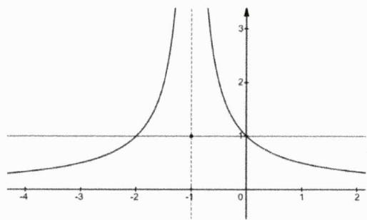

line

| x    | y     |
| ---- | ----- |
| -1   | 0     |
| 0    | 3     |

3. [解析]:

显然 $y=e^{|x|}-e$ 是一偶函数且图像过点 $(0,1-e)$ ，而 $\left||x\right|-|y||=1$ 等价于 $|y|=|x|\pm1$ 。如图，在同一坐标系中分别画出二者的图像，不难发现两图像有六个交点，故而方程组解的组数有6组，从而本题选B.

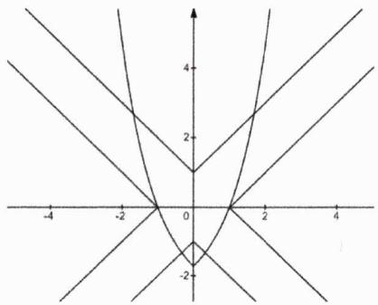

text_image

-4
-2
0
2
4
-2
4

4. [解析]:

由题知 $m\leq|2x+1|+|2x+2|$ ，而 $|2x+1|+|2x+2|\geq1$ ，从而可得m的最大值为1.

5. [解析]:

依题可得 $a \geq \frac{|x + 1|}{|x - 1| + |x + 3|}$ ，由绝对值三角不等式知

$$
\frac {| x + 1 |}{| x - 1 | + | x + 3 |} \leq \frac {| x + 1 |}{2 | x + 1 |} = \frac {1}{2}
$$

当且仅当 $x\leq-3$ 或 $x\geq1$ 时上式取等，从而可得a的最小值为 $\frac{1}{2}$ .

6. [解析]:

第一问：当 $a = 1$ 时， $f(x) \geq 0$ 等价于 $|x + 1| + |x - 2| \leq 5$ ，由前述推论知 $x \in [-2,3]$ .

第二问：当 $|x+a|+|x-2|\geq|a+2|\geq4$ ，即 $a\leq-6$ 或 $a\geq2$ 时必有 $f(x)\leq1$ 。而当-6<a<2时，因

$$
f (2) = 5 - | a + 2 | > 1
$$

显然不符合题意，故而必有 $a\in(-\infty,-6]\cup[2,+\infty)$ .

# 7. [解析]:

设发行点的格点为 $(x,y)$ ，该格点到各零售点的距离之和为

$$
\begin{array}{l} L = (| x + 2 | + | x + 2 | + | x - 3 | + | x - 3 | + | x - 4 | + | x - 6 |) \\ + (| y - 1 | + | y - 2 | + | y - 3 | + | y - 4 | + | y - 5 | + | y - 6 |) \\ \end{array}
$$

显然与 $x$ 相关的绝对值有6项, 由前述定理知当 $x = 3$ 时, 这一部分和的值达到最小; 与 $y$ 相关的绝对值也有6项, 当且仅当 $y \in [3,4]$ 时, 这一部分和的值达到最小. 故而 $(x,y)$ 可取格点(3,3)或(3,4), 由题知应剔除报刊零售点(3,4), 所以发行点的坐标只能是(3,3).

# 8. [解析]:

令 $2^{x}=t$ ，则有

$$
f (t) = | t - 1 | + | t - 2 | + | t - 3 | + | t - 4 | + | t - 5 |
$$

由前述相关定理知当且仅当 $t = 3$ 即 $x = \log_23$ 时，有 $f(x)_{\min} = 6$

# 9. [解析]:

易知函数 $f(x)=|x|$ 的图像呈现“V字型”，而直线 $y=ax+1$ 恒过点(0,1)，数形结合易知当 $a\geq1$ 时满足题意.

# 10. [解析]:

原命题的否定为 $|x-a|<\frac{1}{2}-\frac{1}{x}$ 在x>0上有解，则有

$$
\frac {1}{x} + x - \frac {1}{2} <   a <   x - \frac {1}{x} + \frac {1}{2}
$$

首先需要满足x>2，当x>2时易知 $\frac{1}{x}+x-\frac{1}{2}>2$ ，而 $\frac{1}{2}+x-\frac{1}{x}$ 的值可趋向于正无穷，从而可得a>2。回到原命题，实数a的取值范围是 $a\leq2$ 。

# 11. [解析]:

对于曲线 $\Gamma$ 而言, 易知其方程为 $\left\{ \begin{array}{l} \frac{x^2}{9} + y^2 = 1 (|x| \leq 3, y \geq 0) \\ \frac{x^2}{9} - y^2 = 1 (|x| > 3, y \geq 0) \end{array} \right.$ , 如图所示, 显然曲线 $\Gamma$ 的图像由一半椭圆及一半双曲线构成. 显而易见的是直线 $\ell$ 与双曲线 $\frac{x^2}{9} - y^2 = 1$ 的左渐近线平行, 故而当其与椭圆相切时是临界情况之一, 此时有 $\Delta = 36(2 - m^2) = 0$ 即有 $m = \sqrt{2}$ 或 $m = -\sqrt{2}$ (舍); 第二种临界情况是直线 $\ell$ 过点 (3,0), 此时有 $m = 1$ . 综上可知当 $m \in (1, \sqrt{2})$ 时直线 $\ell$ 与曲线 $\Gamma$ 仅有三个交点.

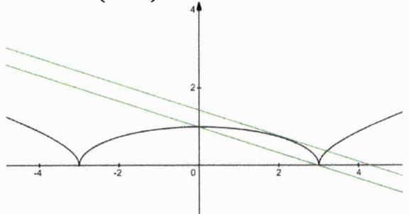

text_image

Graph of a parabola with tangent lines and labeled axes, showing function behavior across the x-axis from -4 to 4.

# 12. [解析]:

第一问：由题知

$$
\Gamma \geq | f (0) | = | b |, \Gamma \geq | f (1) | = | 1 + a + b |, \Gamma \geq | f (- 1) | = | 1 - a + b |
$$

进而可得

$$
4 \Gamma \geq 2 | b | + | 1 + a + b | + | 1 - a + b | \geq | - 2 b + (1 + a + b) + (1 - a + b) | = 2
$$

故而证得

$\Gamma \geq \frac{1}{2}$ （当且仅当- $b$ 、 $1 + a + b$ 及 $1 - a + b$ 同号时取等）

第二问：当 $\Gamma=\frac{1}{2}$ 时，必有 $|b|\leq\frac{1}{2}$ .而由

$$
- \frac {1}{2} \leq 1 + a + b \leq \frac {1}{2}, - \frac {1}{2} \leq 1 - a + b \leq \frac {1}{2} \Rightarrow - 1 \leq 2 + 2 b \leq 1
$$

可得 $b\in\left[-\frac{3}{2},-\frac{1}{2}\right]$ ，由此知 $b=-\frac{1}{2}$ .又因

$$
\left\{ \begin{array}{l} - \frac {1}{2} \leq 1 + a - \frac {1}{2} \leq \frac {1}{2} \Longrightarrow - 1 \leq a \leq 0 \\ - \frac {1}{2} \leq 1 - a - \frac {1}{2} \leq \frac {1}{2} \Longrightarrow 0 \leq a \leq 1 \end{array} \right.
$$

故而有 $a = 0$ ，综上 $f(x) = x^{2} - \frac{1}{2}$

铭师道·高中数学方法原本

# 第 03 讲：单调性与奇偶性方法论

我们都知道对于函数（特别是对于高考中的函数）而言，奇偶性并非是一个难点，甚至是一个极度简单的知识点。本讲我们将系统探究一下函数的奇偶性模型及其运用，在此之前我们先快速强调一点与函数单调性相关的内容——以使本书的知识体系更完备。

性质3.1: 单调性的等价描述 设函数 $f(x)$ 的定义域为I，区间 $D \subseteq I, \forall x_{1}, x_{2} \in D (x_{1} \neq x_{2})$ ，若满足下列条件之一则说明函数在区间D上单调递增：

(i) $\frac{f(x_1) - f(x_2)}{x_1 - x_2} > 0$ （或 $[f(x_1) - f(x_2)](x_1 - x_2) > 0$ ）；

(ii) $x_{1}f(x_{1}) + x_{2}f(x_{2}) > x_{1}f(x_{2}) + x_{2}f(x_{1});$

(iii) $f(x)$ 的导函数 $f'(x) > 0$ .

说明：由函数单调性或导数的定义知以上结论是不证自明的.

例1. 已知函数 $r(x) = \frac{x + 1}{|x| + 1}, x \in  \mathbb{R}$ ,则不等式 $r\left( {{x}^{2} - {2x}}\right)  < r\left( {{3x} - 4}\right)$ 的解集是

解析：易知 $r(x)=\left\{\begin{aligned}&1,x\geq0\\\frac{x+1}{-x+1},&x<0\end{aligned}\right.$ ，如图所示，其在 $(-∞,0)$ 上单调递增，在 $[0,+∞)$ 上是常数函数。欲满足不等式 $r(x^{2}-2x)<r(3x-4)$ ，必有

$$
x ^ {2} - 2 x <   3 x - 4 \leq 0 \Longrightarrow 1 <   x \leq {\frac {4}{3}} \text {或} x ^ {2} - 2 x <   0 <   3 x - 4 \Longrightarrow {\frac {4}{3}} <   x <   2
$$

综上 $x\in(1,2)$ .

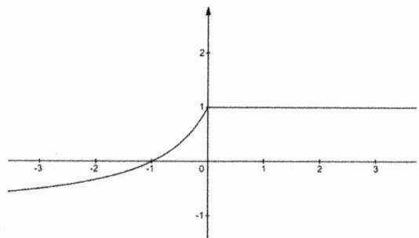

line

| x   | y   |
| --- | --- |
| -3  | -1  |
| -2  | -0.5|
| -1  | 0   |
| 0   | 1   |
| 1   | 1   |
| 2   | 1   |
| 3   | 1   |

例2. [2010 天津文 16]设函数 $f(x) = x - \frac{1}{x}, \forall x \in [1, +\infty), f(mx) + mf(x) < 0$ 恒成立，则实数 $m$ 的取值范围是 \_\_\_\_.

解析：令

$$
R (x) = f (m x) + m f (x) = m x - \frac {1}{m x} + m x - \frac {m}{x} = 2 m x - \frac {1 + m ^ {2}}{m x}
$$

因为 $\lim_{n\to \infty}R(x) = 2mx$ ，故而欲满足题意必有 $m < 0$ ，而当 $m < 0$ 时，易分析知 $R(x)$ 必在 $[1, + \infty)$ 上单调递减，由此必须使 $R(1) = 2m - \frac{1 + m^2}{m} < 0$ ，解得 $m\in (-\infty , - 1)$

例3. 如果定义在 $\mathbb{R}$ 上的函数 $f(x)$ 满足对任意 $x_{1} \neq x_{2}$ 都有 $x_{1} f(x_{1}) + x_{2} f(x_{2}) \geq x_{1} f(x_{2}) + x_{2} f(x_{1})$ , 则称函数 $f(x)$ 为 “ $\Theta$ 函数”, 给出下列函数:

$$
① y = - x ^ {3} + x + 1; \quad ② y = 3 x - 2 (\sin x - \cos x); \quad ③ y = \frac {x}{x ^ {2} + 1}; \quad ④ f (x) = \left\{ \begin{array}{l l} \ln x, (x \geq 1) \\ 0, (x <   1) \end{array} \right..
$$

其中“ $\Theta$ 函数”的编号是\_\_\_\_。

解析: 此处的 “ $\Theta$ 函数” 本质上是不减函数. 对于①, 其导数为 $y' = -3x^{2} + 1$ , 显然其正负不确定, 从而函数的单调性不确定; 对于②, 因为 $y' = 3 - 2(\cos x + \sin x) > 0$ , 从而知其满足条件; 对于③, 当 $x \neq 0$ 时, $y = \frac{x}{x^{2} + 1} = \frac{1}{x + \frac{1}{x}}$ , 其不具备单调性; 对于④, 其显然是不减函数. 综上, 满足条件的编号是②④.

例4. [2015 四川理 9]如果函数 $f(x) = \frac{1}{2}(m - 2)x^2 + (n - 8)x + 1 (m \geq 0, n \geq 0)$ 在区间 $\left[\frac{1}{2}, 2\right]$ 上单调递减，那么 $mn$ 的最大值为 \_\_\_\_.

解析：由题知当 $x\in\left[\frac{1}{2},2\right]$ 时， $f'(x)=(m-2)x+(n-8)\leq0$ ，则必有

$$
\left\{ \begin{array}{l} f ^ {\prime} \left(\frac {1}{2}\right) = \frac {1}{2} (m - 2) + (n - 8) \leq 0 \\ f ^ {\prime} (2) = 2 (m - 2) + (n - 8) \leq 0 \end{array} \Rightarrow \left\{ \begin{array}{l} m + 2 n \leq 1 8 \\ 2 m + n \leq 1 2 \end{array} \right. \right.
$$

进而有

$$
m n \leq m (1 2 - 2 m) = \frac {1}{2} \cdot 2 m (1 2 - 2 m) \leq \frac {1}{2} \cdot \left(\frac {1 2}{2}\right) ^ {2} = 1 8
$$

取等条件为m=3，n=6.

例5. 已知函数 $f(x)$ 是定义在R上的奇函数，对任意两个不相等的正数 $x_{1}, x_{2}$ ，都有 $\frac{x_{2}f(x_{1})-x_{1}f(x_{2})}{x_{1}-x_{2}}<0$ ，记 $a=25f(0.2^{2})$ ， $b=f(1)$ ， $c=-\log_{5}3\cdot f(\log_{\frac{1}{2}}5)$ ，则()

A. $c < b < a$

B. $b < a < c$

C. $c < a < b$

D.a < b < c

解析: 当 $x > 0$ 时, 由条件易知 $\frac{x_{2} f(x_{1}) - x_{1} f(x_{2})}{x_{1} - x_{2}} = \frac{\frac{f(x_{1})}{x_{1}} - \frac{f(x_{2})}{x_{2}}}{x_{1} - x_{2}} < 0$ , 故而说明新函数 $\frac{f(x)}{x}$ 在 $(0, +\infty)$ 上单调递减, 且其为 $\mathbb{R}$ 上的偶函数. 易变形得

$$
a = 2 5 f (0. 2 ^ {2}) = \frac {f (0 . 2 ^ {2})}{0 . 2 ^ {2}}, b = \frac {f (1)}{1}, c = \frac {f \left(\log_ {\frac {1}{3}} 5\right)}{\log_ {\frac {1}{3}} 5} = \frac {f (\log_ {3} 5)}{\log_ {3} 5}
$$

因为 $\log_{3}5>1>0.2^{2}>0$ ，从而有c<b<a，故而本题选A.

例6. 已知 $a > 0, b > 0$ , 求证: $\frac{a}{1 + a} + \frac{b}{1 + b} > \frac{a + b}{1 + a + b}$ .

解析：构造函数 $f(x)=\frac{x}{1+x}$ ，显然该函数在 $(0,+\infty)$ 上单调递增，由此可得

$$
\frac {a}{1 + a} + \frac {b}{1 + b} = \frac {a + b + 2 a b}{1 + a + b + a b} > \frac {a + b + a b}{1 + a + b + a b} = f (a + b + a b) > f (a + b) = \frac {a + b}{1 + a + b}
$$

从而得证.

例7. [2004 湖南文 7]函数 $f(x) = -x^{2} + 2ax$ 与 $r(x) = \frac{1 - ax}{x + 1}$ 在区间(1,2)上都单调递减，则实数 $a$ 的取值范围是 \_\_\_\_。

解析：欲使函数 $f(x)$ 和 $r(x)$ 在(1,2)上都单调递减，必有 $a \leq 1$ 且

$$
\left| \begin{array}{c c} - a & 1 \\ 1 & 1 \end{array} \right| = - a - 1 <   0 \Rightarrow a > - 1
$$

故而有 $a\in(-1,1]$ .

推论3.1: 反比例型函数的单调性 若函数 $f(x)=\frac{ax+b}{cx+d}$ （ $ac\neq0$ ）在区间D上单调递增，则有

$$
\left| \begin{array}{c c} a & b \\ c & d \end{array} \right| = a d - b c > 0
$$

推论证明：因为

$$
\frac {a x + b}{c x + d} = \frac {\frac {a}{c} (c x + d) + \frac {b c - a d}{c}}{c x + d} = \frac {a}{c} + \frac {\frac {b c - a d}{c}}{c x + d} = \frac {a}{c} + \frac {\frac {b c - a d}{c ^ {2}}}{x + \frac {d}{c}}
$$

故而当 $\frac{bc-ad}{c^{2}}<0$ 即ad-bc= $\begin{vmatrix}a&b\\ c&d\end{vmatrix}>0$ 时，函数在区间D上单调递增，证毕.

例8. 函数 $f(x)=(m^{2}-m-1)x^{m-1}$ 是幂函数，对任意 $x_{1},x_{2}\in(0,+\infty)$ ，且 $x_{1}\neq x_{2}$ ，满足 $\frac{f(x_{1})-f(x_{2})}{x_{1}-x_{2}}>0$ ，若函数 $F(x)=\left\{\begin{aligned}(a-2)f(x)-1,x&\leq1\\ \log_{a}f(x),&x>1\end{aligned}\right.$ （其中a>0且 $a\neq1$ ）在R上单调递增，则a的取值范围是

解析: 因为 $f(x)$ 是幂函数, 则有 $m^{2} - m - 1 = 1$ , 解得 $m = 2$ 或 $-1$ . 又由题知, 函数 $f(x)$ 还是 $(0, +\infty)$ 上的增函数, 故而有 $m = 2$ , 则有 $f(x) = x$ , 进而有

$$
F (x) = \left\{ \begin{array}{l} (a - 2) x - 1, x \leq 1 \\ \log_ {a} x, x > 1 \end{array} \right.
$$

因为 $F(x)$ 在R上单调递增，故而必有 $\left\{\begin{aligned}a-2&>0\\ a&>1\\ a&-3\leq\log_{a}1\end{aligned}\right.$ ，解得 $a\in(2,3]$ .

铭师道·高中数学方法原本

通过上述例题我们可总结出如下一结论.

结论3.1: 含参分段函数单调性法则 已知 $x_{1} < x_{2} < x_{3}$ , 若分段函数

$$
F (x) = \left\{ \begin{array}{l} r (x), x \in (x _ {1}, x _ {2} ] \\ s (x), x \in (x _ {2}, x _ {3}) \end{array} \right.
$$

在区间 $(x_{1},x_{3})$ 上单调递增，则必须同时满足如下三个条件：

① $r(x)$ 在 $(x_{1}, x_{2}]$ 上单调递增；② $s(x)$ 在 $(x_{2}, x_{3})$ 上也单调递增；③ $r(x_{2}) \leq s(x_{2})$ .

例9. 已知函数 $f(x)$ 的定义域为(-2,2)，且满足 $f(x)=\left\{\begin{aligned}\frac{2}{x+3}+\ln\frac{2-x}{2+x},&x\in(-2,1]\\ -4x^{2}-5x+7,x&\in(1,2)\end{aligned}\right.$ ，则不等式 $f[x(x+1)]<\frac{2}{3}$ 的解集为\_\_\_\_.

解析：当 $x\in(1,2)$ 时，显然 $f(x)=-4x^{2}-5x+7$ 是单调递减的且 $f(1)=-2$ ；而当 $x\in(-2,1]$ 时，易知

$$
f (x) = \frac {2}{x + 3} + \ln \frac {2 - x}{2 + x} = \frac {2}{x + 3} + \ln (2 - x) - \ln (2 + x)
$$

也为减函数，且有 $f(1)=\frac{1}{2}+\ln\frac{1}{3}>-2$ ，因而整个函数在 $(-2,2)$ 上单调递减。注意到 $f(0)=\frac{2}{3}$ ，从而当

$$
f [ x (x + 1) ] <   \frac {2}{3} = f (0)
$$

时，由单调性知 $0 < x(x + 1) < 2$ ，解得 $x \in (-2, -1) \cup (0, 1)$ .

例10. [2016 天津理 8]已知函数 $f(x) = \begin{cases} x^2 + (4a - 3)x + 3a, & x < 0 \\ \log_a (x + 1) + 1, & x \geq 0 \end{cases}$ ( $a > 0$ 且 $a \neq 1$ ) 在 $\mathbb{R}$ 上单调递减，且关于 $x$ 的方程 $|f(x)| = 2 - x$ 恰好有两个不相等的实数解，则 $a$ 的取值范围是 \_\_\_\_.

解析：要保证分段函数在R上单调递减，需满足

$$
\left\{ \begin{array}{l} - \frac {4 a - 3}{2} \geq 0 \\ 0 <   a <   1 \\ 3 a \geq 1 \end{array} \right.
$$

解得 $a\in\left[\frac{1}{3},\frac{3}{4}\right]$ .如下左图所示,我们先绘制出函数 $y=|f(x)|$ 的大致图像,当直线y=2-x经过点(0,3a)时其与曲线 $y=|f(x)|$ 恰有两个交点,此时有 $a=\frac{2}{3}$ ,进一步可分析得当 $a\in\left[\frac{1}{3},\frac{2}{3}\right]$ 时皆符合题意;如下右图所示,当直线y=2-x与函数 $y=x^{2}+(4a-3)x+3a$ 相切,将二者方程联立后有一解,据此可得

$$
x ^ {2} + (4 a - 2) x + 3 a - 2 = 0 \Rightarrow \Delta = (4 a - 2) ^ {2} - 4 (3 a - 2) = 0
$$

时，亦符合题意，此时可解得 $a=\frac{3}{4}$ 或1（舍）.综上 $a\in\left[\frac{1}{3},\frac{2}{3}\right]\cup\left\{\frac{3}{4}\right\}$ .

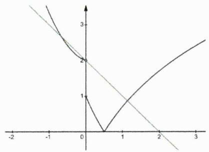

line

| x    | y1   | y2   |
| ---- | ---- | ---- |
| -2   | 3.0  | 3.0  |
| -1   | 2.5  | 2.5  |
| 0    | 1.0  | 1.0  |
| 1    | 0.0  | 0.5  |
| 2    | -1.0 | -0.5 |
| 3    | -2.5 | -1.5 |

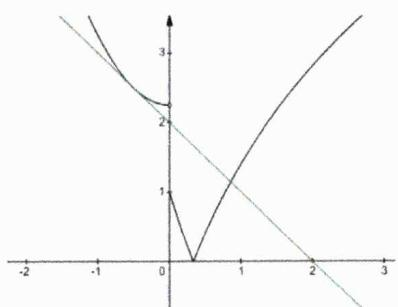

line

| x | y1 | y2 |
|---|---|---|
| -2 | 3 | 2 |
| -1 | 2.5 | 1.8 |
| 0 | 0 | 0 |
| 1 | 1 | 1.8 |
| 2 | 2.5 | 1.8 |
| 3 | 3 | 1.8 |

接下来我们再用如下两例题强调一下与抽像函数相关的单调性命题特征及解题之道.

例11. 已知函数 $f(x)$ 是定义在R上的函数，满足 $f(x+y)=f(x)\cdot f(y)$ ，且当x>0时， $0<f(x)<1$ .

(1) 求证: $f(0) = 1$ ;   
(2) 求证: 当 $x \in \mathbb{R}$ 时, 恒有 $f(x) > 0$ ;  
(3) 求证: $f(x)$ 在 $\mathbb{R}$ 上是减函数;  
(4) 若 $f(2)=\frac{1}{9}$ ，求不等式 $f(x)\cdot f(3x^{2}-1)<\frac{1}{27}$ 的解.

解析:

第一问：显然有 $f(x+0)=f(x)\cdot f(0)$ ，由题知 $f(x)$ 不恒为零，故而有 $f(0)=1$ .

第二问：当x<0时，必有-x>0，因为

$$
f (x - x) = f (x) \cdot f (- x) = 1
$$

故而有 $f(x)=\frac{1}{f(-x)}>0$ ，又因 $f(0)=1$ ，综上当 $x\in R$ 时，恒有 $f(x)>0$ 。证毕。

第三问：任取 $x_{1},x_{2}\in\mathbb{R}$ ，且 $x_{2}>x_{1}$ .利用已知及第二问的结论可得

$$
f \left(x _ {2}\right) = f \left(x _ {1} + \left(x _ {2} - x _ {1}\right)\right) = f \left(x _ {1}\right) \cdot f \left(x _ {2} - x _ {1}\right) <   f \left(x _ {1}\right)
$$

从而证得 $f(x)$ 在R上是减函数.

第四问：显然有 $f(1)\cdot f(1)=f(2)=\frac{1}{9}$ ，则有 $f(1)=\frac{1}{3}$ ，进而可得 $f(3)=\frac{1}{27}$ 。于是原不式等价于

$$
f (x) \cdot f (3 x ^ {2} - 1) = f (3 x ^ {2} + x - 1) <   \frac {1}{2 7} = f (3)
$$

进而可得 $3x^{2}+x-4>0$ ，解得 $x\in\left(-\infty,-\frac{4}{3}\right)\cup(1,+\infty)$ .

例12. 已知定义在 $\mathbb{R}$ 上的函数 $f(x)$ 满足：

① 值域为 $(-1,1)$ ，且当x>0时， $-1<f(x)<0;$   
② 对于定义域内任意的实数x,y都有 $f(m+n)=\frac{f(m)+f(n)}{1+f(m)f(n)}$ .

(1) 判断 $f(x)$ 的奇偶性并证明；

(2) 判断并证明 $f(x)$ 的单调性;

(3) 解关于x的不等式 $f(ax^{2}+2)<f(ax+2x)$ ;

(4) 已知函数 $r(x)$ 的定义域为(-1,1)，且满足条件 $r[f(x)] = x$ 对任意 $x \in R$ 恒成立，证明：

$$
r \left(\frac {1}{5}\right) + r \left(\frac {1}{1 1}\right) + \dots + r \left(\frac {1}{n ^ {2} + 3 n + 1}\right) > r \left(\frac {1}{2}\right)
$$

解析：

第一问: 若令 $m > 0$ , $n = 0$ , 则有 $f(m)[1 + f(m)f(0)] = f(m) + f(0)$ 即有 $f(0)[[f(m)]^2 - 1) = 0$ , 显然只可能有 $f(0) = 0$ . 再令 $m = x, n = -x$ , 则有

$$
f (x) + f (- x) = f (0) [ 1 + f (x) \cdot f (- x) ] = 0
$$

从而证得 $f(x)$ 为奇函数.

第二问： $\forall x_{1}, x_{2} \in \mathbb{R}$ ，且 $x_{1} < x_{2}$ ，则有

$$
- 1 <   f \left(x _ {2} - x _ {1}\right) = f \left(x _ {2} + \left(- x _ {1}\right)\right) = \frac {f \left(x _ {2}\right) + f \left(- x _ {1}\right)}{1 + f \left(x _ {2}\right) f \left(- x _ {1}\right)} = \frac {f \left(x _ {2}\right) - f \left(x _ {1}\right)}{1 - f \left(x _ {2}\right) f \left(x _ {1}\right)} <   0
$$

因为 $1-f(x_{2})f(x_{1})>0$ ，故而必有 $f(x_{2})<f(x_{1})$ ，从而证得 $f(x)$ 为单调减函数.

第三问：因为函数 $f(x)$ 在R上单调递减，故而必有

$$
a x ^ {2} + 2 > a x + 2 x \Longrightarrow (a x - 2) (x - 1) > 0
$$

若 $a = 0$ ，其解为 $x\in (-\infty ,1)$ ；若 $a = 2$ ，其解为 $x\in (-\infty ,1)\cup (1, + \infty)$ ；若 $a <   0$ ，其解为 $x\in \left(\frac{2}{a},1\right)$ 若 $0 <   a <   2$ ，其解为 $x\in (-\infty ,1)\cup \left(\frac{2}{a}, + \infty\right)$ ；若 $a > 2$ ，其解为 $x\in \left(-\infty ,\frac{2}{a}\right)\cup (1, + \infty).$

第四问：显而易见的是 $r(x)$ 与 $f(x)$ 互为反函数，则其必为奇函数。其证明过程如下

$$
r [ f (x + y) ] = r \left[ \frac {f (x) + f (y)}{1 + f (x) f (y)} \right] = x + y = r [ f (x) ] + r [ f (y) ]
$$

若令 $f(x)=m,\ f(y)=n$ ，则有

$$
r (m) + r (n) = r \left(\frac {m + n}{1 + m n}\right)
$$

再令 $m = x$ ， $n = -x$ ，则有

$$
r (x) + r (- x) = r (0) = 0
$$

从而证得 $r(x)$ 为奇函数.易知

$$
\frac {1}{n ^ {2} + 3 n + 1} = \frac {1}{(n + 1) (n + 2) - 1} = \frac {\frac {1}{n + 1} - \frac {1}{n + 2}}{1 - \frac {1}{n + 1} \cdot \frac {1}{n + 2}}
$$

故而有

$$
r \left(\frac {1}{n ^ {2} + 3 n + 1}\right) = r \left(\frac {\frac {1}{n + 1} - \frac {1}{n + 2}}{1 - \frac {1}{n + 1} \cdot \frac {1}{n + 2}}\right) = r \left(\frac {1}{n + 1}\right) - r \left(\frac {1}{n + 2}\right)
$$

由此可得

$$
\mathrm{LHS} = r \left(\frac {1}{5}\right) + r \left(\frac {1}{1 1}\right) + \dots + r \left(\frac {1}{n ^ {2} + 3 n + 1}\right) = r \left(\frac {1}{2}\right) - r \left(\frac {1}{n + 2}\right)
$$

令 $f(x)=\frac{1}{n+2}$ ，因为 $\frac{1}{n+2}\in(0,1)$ ，故而必有x<0，由此知 $r\left(\frac{1}{n+2}\right)<0$ ，进而证得

$$
\mathrm{LHS} > r \left(\frac {1}{2}\right)
$$

铭师道·高中数学方法原本

接下来我们再来简单认识一下复合函数的单调性法则.

性质3.2: 复合函数的单调性法则 给定复合函数

$$
y = f (u), u = r (x)
$$

其单调性遵循 “同增异减” 这一最基本的法则：当 $x \in D$ 时，若 $r(x)$ 单调递增（或减），且 $f(u)$ 在 $\{u \mid u = r(x), x \in D\}$ 上也单调递增（或减），这时复合函数 $f(u)$ 在 $D$ 上必定单调递增，此即法则中的 “同增”；当 $x \in D$ 时，若 $r(x)$ 单调递增（或减），而 $f(u)$ 在 $\{u \mid u = r(x), x \in D\}$ 上单调递减（或增），这时复合函数 $f(u)$ 在区间 $D$ 上必单调递减，此即法则中的 “异减”。

例13. 已知 $f(x) = x^{2} + 2x + 1 + a, \forall x \in \mathbb{R}, f(f(x)) \geq 0$ 恒成立，则实数 $a$ 的取值范围为 \_\_\_\_.

解析：首先我们易知 $f(x)\geq a$ ，若 $a\geq-1$ ，则有

$$
f (f (x)) _ {\min} = f (a) = a ^ {2} + 3 a + 1 \geq 0 \Rightarrow a \geq \frac {\sqrt {5} - 3}{2}
$$

若 $a < -1$ ，欲满足条件，必须有 $\Delta = 4 - 4(1 + a) \leq 0$ 即 $a \geq 0$ ，这显然矛盾。综上 $a \in \left[\frac{\sqrt{5} - 3}{2}, +\infty\right)$ .

例14. [1989 全国理 11]已知 $f(x) = 8 + 2x - x^2$ ，如果 $g(x) = f(2 - x^2)$ ，那么 $g(x)$ ( )

A. 在区间 $(-1,0)$ 上是减函数

B. 在区间 $(0,1)$ 上是减函数

C. 在区间 $(-2,0)$ 上是增函数

D. 在区间 $(0,2)$ 上是增函数

解析: 当 $x \in (-1,0)$ 时, 内层函数 $y = 2 - x^{2}$ 单调递增且 $y \in (1,2)$ , 而外层函数 $f(x)$ 在区间 $(1,2)$ 上单调递减, 由复合函数单调性法则知, 复合函数 $g(x)$ 在 $(-1,0)$ 上是减函数, 从而本题选 A.

例15. 已知定义在 $\mathbb{R}$ 上的函数 $f(x)$ 满足 $f\left(\sqrt{x^2 + 1} - x\right) = |x|$ ，则下列函数中为增函数的是（）

A. $y = f\left(\frac{1}{x^{2}}\right)$

B. $y = f\left(\left|x - \frac{1}{x}\right|\right)$

C. $y = f\left(\frac{1}{2^{x} + 1}\right)$

D. $y = f(\lg |x| + 1)$

解析：若令 $\sqrt{x^2 + 1} - x = t > 0$ ，则有 $x = \frac{1 - t^2}{2t}$ ，进而有

$$
f (t) = \frac {\left| 1 - t ^ {2} \right|}{2 t} = \frac {1}{2} \left| t - \frac {1}{t} \right| (t > 0)
$$

易知 $f(t)$ 在 $(0,1)$ 上单调递减，在 $(1,+\infty)$ 上单调递增。根据复合函数同增异减的法则知仅有C正确，因为对于C选项而言， $\frac{1}{2^{x}+1}<1$ 且其在R上单调递减，故而复合函数 $y=f\left(\frac{1}{2^{x}+1}\right)$ 在R上单调递增。因此本题选C。

接下来我们快速了解一下一些经典的奇函数模型，在此之前我们先强化一下奇函数的定义.

定义3.1: 奇函数 一般地, 设函数 $f(x)$ 的定义域为 $I$ , 如果 $\forall x \in I$ , 都有 $-x \in I$ , 且

$$
f (- x) = - f (x)
$$

那么函数 $f(x)$ 就叫做奇函数，奇函数的图像关于原点成中心对称.

接下来我们再来汇总一下高中阶段一些高频的奇函数模型.

结论3.2: 经典的奇函数模型 在高中阶段有如下一些经典的奇函数模型

<table><tr><td>编号</td><td>名称</td><td>模型</td><td>示例</td></tr><tr><td>01</td><td>常规函数型</td><td>对勾函数、正弦(切)函数特殊幂函数、...</td><td> $y = x + \frac{4}{x},\quad y = \tan x,\quad y = x\cos x$  $y = x^{\frac{2n-1}{2m-1}} (m,n \in \mathbb{Z}),\cdots$ </td></tr><tr><td>02</td><td>特殊复合型</td><td> $r(x) = f(x) - f(-x)$ </td><td> $r(x) = \frac{1}{2}(e^{x} - e^{-x})$ </td></tr><tr><td>03</td><td>分式指数型</td><td> $f(x) = \frac{a^{x}-1}{a^{x}+1}$ 及其变形</td><td> $f(x) = \frac{e^{x}-e^{-x}}{e^{x}+e^{-x}},\quad f(x) = \frac{1}{e^{x}+1} - \frac{1}{2}$ </td></tr><tr><td>04</td><td>对数分式型</td><td> $f(x) = \log_{a}\frac{mx+n}{mx-n}$ 及其变形</td><td> $f(x) = \frac{1}{2}\ln\frac{1+x}{1-x},\quad f(x) = \frac{1}{2}\ln\left|\frac{1+x}{1-x}\right|$ </td></tr><tr><td>05</td><td>对数根式型</td><td> $f(x) = \log_{a}\left(\sqrt{1+m^{2}x^{2}} \pm mx\right)$ </td><td> $f(x) = \ln\left(\sqrt{1+x^{2}} + x\right)$ </td></tr><tr><td>06</td><td>双绝对值型</td><td> $f(x) = |x+a| - |x-a|$ </td><td> $f(x) = |x+1| - |x-1|$ </td></tr><tr><td>07</td><td>导数型</td><td>若 $f(x)$ 为偶,则 $f'(x)$ 为奇</td><td> $(\cos x)' = -\sin x$ </td></tr><tr><td>08</td><td>奇偶四则运算</td><td>奇±奇=奇;偶×奇=奇</td><td> $f(x) = \sin x + x$ </td></tr><tr><td>09</td><td>复合奇偶法则</td><td>内外层函数皆奇则复合函数为奇</td><td> $f(u) = u^{3} + 3u,\quad u = \sin 2x + x$ </td></tr></table>

说明：默认以上各式皆有意义且各函数的定义域皆关于原点对称.

# 结论证明：

(i) 对于模型 $r(x)=f(x)-f(-x)$ 而言，因为

$$
r (- x) = f (- x) - f (x) = - r (x)
$$

从而说明 $r(x)$ 在关于原点对称的定义域内是奇函数.

(ii) 对于模型 $f(x)=\frac{a^{x}-1}{a^{x}+1}$ 而言，因为

$$
f (- x) = \frac {a ^ {- x} - 1}{a ^ {- x} + 1} = \frac {1 - a ^ {x}}{1 + a ^ {x}} = - f (x)
$$

从而说明 $f(x)$ 在关于原点对称的定义域内是奇函数.

(iii) 对于模型 $f(x)=\log_{a}\frac{mx+n}{mx-n}$ 而言，因为

$$
f (- x) = \log_ {a} \frac {- m x + n}{- m x - n} = \log_ {a} \frac {m x - n}{m x + n} = - \log_ {a} \frac {m x + n}{m x - n} = - f (x)
$$

从而说明 $f(x)$ 在关于原点对称的定义域内是奇函数.

(iv) 对于模型 $f(x)=\log_{a}\left(\sqrt{1+m^{2}x^{2}}\pm mx\right)$ 而言，因为

$$
f (- x) + f (x) = \log_ {a} \left(\sqrt {1 + m ^ {2} x ^ {2}} ^ {2} - m ^ {2} x ^ {2}\right) = \log_ {a} 1 = 0
$$

从而说明 $f(x)$ 在关于原点对称的定义域内是奇函数.

上述其余模型是不证自明的，从而所有结论得证.

例16. 填空:

(1) 若函数 $f(x)=\frac{a-2^{x+1}}{1+2^{x}}$ 是奇函数，则a= \_\_\_\_.  
(2) [2009 重庆理 12] $f(x)=a+\frac{1}{2^{x}+1}$ 是奇函数，则 $a=$ \_\_\_\_.  
(3) 已知函数 $f(x) = \log_2\left(\sqrt{1 + 4x^2} + mx\right) (m > 0)$ 是奇函数，则 $m =$ \_\_\_\_.  
(4) [2015 全国I理 13]若函数 $f(x) = x \ln (x + \sqrt{a + x^2})$ 为偶函数，则 $a =$ \_\_\_\_.  
(5) [2015 山东文 8]若函数 $f(x) = \frac{2^x + 1}{2^x - a}$ 是奇函数，则使 $f(x) > 3$ 成立的 $x$ 的取值范围为 \_\_\_\_.  
(6) [2022 上海 T8] 若函数 $f(x)=\left\{\begin{aligned}a^{2}x-1,x&<0\\ x+a,&x>0\end{aligned}\right.$ 为奇函数，则 a= \_\_\_\_.  
(7) [2022 乙文 T16] 若 $f(x) = \ln \left|a + \frac{1}{1 - x}\right| + b$ 是奇函数，则 $a =$ \_\_\_\_， $b =$ \_\_\_\_.

解析:

第一问：因为 $f(x) = \frac{a - 2^{x + 1}}{1 + 2^x} = \frac{2\left(\frac{a}{2} - 2^x\right)}{1 + 2^x}$ ，由奇函数中的分式指数模型知 $a = 2$ .

第二问：由奇函数中的分式指数模型的变形知， $a = -\frac{1}{2}$

第三问：由奇函数中的对数根式模型知，m = 2.

第四问：因为 $y = x$ 是奇函数，由复合函数奇偶性知， $y = \ln (x + \sqrt{a + x^2})$ 必为奇函数，故而 $a = 1$ .

第五问：由奇函数模型知 $a = 1$ ，进而易知 $\frac{2^x + 1}{2^x - 1} > 3$ 的解集为(0,1).

第六问：数形结合易知仅当a=1时符合题意.

第七问：注意到 $x\neq1$ ，进而必须有 $x\neq-1$ ，故而有 $a=-\frac{1}{2}$ ，此时有

$$
f (x) = \ln \left| - \frac {1}{2} + \frac {1}{1 - x} \right| + b = \ln \left| \frac {x + 1}{2 (x - 1)} \right| + \ln e ^ {b} = \ln \left| \frac {e ^ {b} (x + 1)}{2 (x - 1)} \right|
$$

显然仅当 $e^{b}=2$ 即 $b=\ln2$ 时方能使 $f(x)$ 为奇函数.

例17. [2014 四川理 9]已知 $f(x) = \ln (1 + x) - \ln (1 - x), x \in (-1,1)$ . 则下例正确命题的编号是 \_\_\_\_.

① $f(-x) = -f(x)$ ; ② $f\left(\frac{2x}{x^{2}+1}\right) = 2f(x)$ ; ③ $|f(x)| \geq 2|x|$ .

解析：显然 $f(x)=\ln\frac{1+x}{1-x}$ 是典型的奇函数，从而①正确；而 $f\left(\frac{2x}{x^{2}+1}\right)=\ln\frac{x^{2}+1+2x}{x^{2}+1-2x}=2\ln\frac{1+x}{1-x}=2f(x)$ ，从而②也正确；对于命题③，当 $x\in[0,1)$ 时，令

$$
r (x) = \ln (1 + x) - \ln (1 - x) - 2 x
$$

则有 $r(0)=0$ ，且有

$$
r ^ {\prime} (x) = \frac {1}{1 + x} + \frac {1}{1 - x} - 2 = \frac {2 x ^ {2}}{1 - x ^ {2}} \geq 0
$$

从而有当 $x \in [0,1)$ 时， $r(x) \geq 0$ ，即有 $f(x) \geq 2x$ . 注意到 $y = f(x)$ 与 $y = 2x$ 都是奇函数，从而当 $x \in$

铭师道·高中数学方法原本

(-1,1)时，必有 $|f(x)|\geq2|x|$ .

综上正确命题的编号是①②③.

例18. 已知 $f(x)$ 是定义在R上的奇函数，且当 $x \geq 0$ 时， $f(x) = x^2$ ，若 $\forall x \in [t, t + 2]$ ，不等式 $f(x + t) \geq 2f(x)$ 恒成立，则实数t的取值范围是\_\_\_\_。

解析：易分析知奇函数 $f(x)$ 在R上单调递增，且有 $2f(x)=f(\sqrt{2}x)$ ，故而有当 $x\in[t,t+2]$ 时

$$
f (x + t) \geq 2 f (x) = f (\sqrt {2} x) \Rightarrow x + t \geq \sqrt {2} x \Rightarrow t \geq (\sqrt {2} - 1) x \Rightarrow t \geq (\sqrt {2} - 1) (t + 2)
$$

解得 $t \geq \sqrt{2}$ .

例19. 已知定义在 $\mathbb{R}$ 上的函数 $f(x) = \frac{2^{1 - x} - 2^{x - 1}}{2^{1 - x} + 2^{x - 1}} - (x - 1)^3$ ，则不等式 $f(2x + 3) + f(x - 2) \geq 0$ 的解集为 \_\_\_\_.

解析：令 $x - 1 = t \in \mathbb{R}$ ，则有

$$
f (t + 1) = \frac {2 ^ {- t} - 2 ^ {t}}{2 ^ {- t} + 2 ^ {t}} - t ^ {3} = - \frac {4 ^ {t} - 1}{4 ^ {t} + 1} - t ^ {3}
$$

若再令 $r(x)=f(x+1)$ ，易分析知 $r(x)$ 是R上的单调递减奇函数，此时有

$$
f (2 x + 3) + f (x - 2) = r (2 x + 2) + r (x - 3) \geq 0
$$

进而可得

$$
2 x + 2 + x - 3 \leq 0
$$

解得 $x\in(-\infty,\frac{1}{3}]$ .

推论3.2: 奇函数中的单调性 若奇函数 $f(x)$ 在 $\mathbb{R}$ 上单调递增, 则 $f(x_{1}) + f(x_{2}) \geq 0$ 的充要条件是 $x_{1} + x_{2} \geq 0$

推论证明：因为 $f(x)$ 是奇函数，则有

$$
f \left(x _ {1}\right) + f \left(x _ {2}\right) \geq 0 \Leftrightarrow f \left(x _ {2}\right) \geq - f \left(x _ {1}\right) = f \left(- x _ {1}\right)
$$

又因 $f(x)$ 在R上单调递增，故而有

$$
x _ {2} \geq - x _ {1} \Longleftrightarrow x _ {1} + x _ {2} \geq 0
$$

因为上述推导过程完全可逆，从而推论得证.

例20. 已知函数 $f(x) = 2025^{x} + \log_{2}\left(\sqrt{x^{2} + 1} + x\right) - 2025^{-x} + 2$ ，则不等式 $f(3x + 1) + f(x) > 4$ 的解集为 \_\_\_\_.

解析：易知 $f(x)-2=2025^{x}-2025^{-x}+\log_{2}\left(\sqrt{x^{2}+1}+x\right)$ 是R上的单调递增奇函数，若

$$
f (3 x + 1) + f (x) > 4 \Longrightarrow [ f (3 x + 1) - 2 ] + [ f (x) - 2 ] > 0
$$

必有

$$
3 x + 1 + x > 0
$$

解得

$$
x \in \left(- \frac {1}{4}, + \infty\right)
$$

例21. [2012 港澳台华侨 T22]设函数 $f(x) = ax^3 + bx^2 + cx$ ( $a \neq 0$ ) 是增函数, $r(x) = f(x + x_0) - f(x_0)$ , 且对任意 $x_0 \geq -\frac{1}{2}$ , $r(x)$ 都不是奇函数. 证明 $K = \frac{3a + 2b + c}{2b - 3a} > 0$ , 并求 $K$ 的最小值.

解析：由题知 $f'(x)=3ax^{2}+2bx+c\geq0$ 恒成立，故而有

$$
\Delta = 4 (b ^ {2} - 3 a c) \leq 0 \Longrightarrow b ^ {2} \leq 3 a c
$$

易知 $f(x)$ 关于 $\left(-\frac{b}{3a},f\left(-\frac{b}{3a}\right)\right)$ 成中心对称，故而 $f\left(x-\frac{b}{3a}\right)-f\left(-\frac{b}{3a}\right)$ 必是奇函数，故而知

$$
x _ {0} \neq - \frac {b}{3 a} <   - \frac {1}{2} \Longrightarrow 3 a <   2 b
$$

由此知 $b > 0$ 且 $c > 0$ ，故而有 $\mathrm{K} = \frac{3a + 2b + c}{2b - 3a} >0$ ，若令 $\frac{b}{a} = t > \frac{3}{2}$ ，则有

$$
K = \frac {3 a + 2 b + c}{2 b - 3 a} \geq \frac {3 a + 2 b + \frac {b ^ {2}}{3 a}}{2 b - 3 a} = \frac {9 + 6 t + t ^ {2}}{3 (2 t - 3)} = \frac {(t + 3) ^ {2}}{6 (t - \frac {3}{2})} = \frac {(t - \frac {3}{2} + \frac {9}{2}) ^ {2}}{6 (t - \frac {3}{2})} \geq \frac {1 8 (t - \frac {3}{2})}{6 (t - \frac {3}{2})} = 3
$$

当且仅当 $t=\frac{b}{a}=6$ 时上式取等，此时有K的最小值为3.

接下来我们再来探究一下经典的偶函数模型及其运用.

定义3.2: 偶函数 一般地, 设函数 $f(x)$ 的定义域为 $I$ , 如果 $\forall x \in I$ , 都有 $-x \in I$ , 且

$$
f (- x) = f (x)
$$

那么函数 $f(x)$ 就叫做偶函数，偶函数的图像关于y轴成轴对称.

接下来我们再来汇总一下高中阶段一些高频的偶函数模型.

结论3.3: 经典的偶函数模型 在高中阶段有如下一些经典的偶函数模型

<table><tr><td>编号</td><td>名称</td><td>模型</td><td>示例</td></tr><tr><td>01</td><td>常规函数型</td><td>常数函数、余弦函数特殊幂函数、...</td><td> $y = ax^{2} + b|x|$ ,  $y = \cos x$  $y = 2^{|x|}$ ,  $y = |x|$ ,  $y = x\sin x$  $y = x^{\frac{2n}{2m+1}}$  ( $m, n \in \mathbb{Z}$ ), ...</td></tr><tr><td>02</td><td>特殊复合型</td><td> $r(x) = f(x) + f(-x)$ </td><td> $r(x) = \frac{1}{2}(e^{x} + e^{-x})$ </td></tr><tr><td>05</td><td>对数二倍型</td><td> $f(x) = \log_{a}(a^{mx} + 1) - \frac{m}{2}x$ </td><td> $f(x) = \ln(e^{2x} + 1) - x$ </td></tr><tr><td>06</td><td>双绝对值型</td><td> $f(x) = |x + a| + |x - a|$ </td><td> $f(x) = |x + 1| + |x - 1|$ </td></tr><tr><td>07</td><td>导数型</td><td>若 $f(x)$ 为奇,则 $f'(x)$ 为偶</td><td> $(\sin x)' = \cos x$ </td></tr><tr><td>08</td><td>奇偶四则运算</td><td>偶±偶=偶;偶×偶=奇×奇=偶</td><td> $f(x) = \cos x + x^{2}$ </td></tr><tr><td>09</td><td>复合奇偶法则</td><td>内层函数为偶则复合函数为偶</td><td> $f(u) = u^{3} + 3u^{2} + 1$ ,  $u = \cos 2x$ </td></tr></table>

说明：默认以上各式皆有意义且各函数的定义域皆关于原点对称.

# 结论证明：

(i) 对于模型 $r(x)=f(x)+f(-x)$ 而言，因为

$$
r (- x) = f (- x) + f (x) = r (x)
$$

从而说明 $r(x)$ 在关于原点对称的定义域内是偶函数.

(ii) 对于模型 $f(x)=\log_{a}(a^{mx}+1)-\frac{m}{2}x$ 而言，因为

$$
f (x) = \log_ {a} \left(a ^ {m x} + 1\right) + \log_ {a} a ^ {- \frac {m}{2} x} = \log_ {a} \left(a ^ {\frac {m}{2} x} + a ^ {- \frac {m}{2} x}\right)
$$

故而必有 $f(-x)=f(x)$ ，从而说明 $f(x)$ 在关于原点对称的定义域内是偶函数。上述其余模型是不证自明的，从而结论得证。

例22. 填空:

(1) [2023 全国甲理 13] 若 $y = (x - 1)^2 + ax + \sin \left(x + \frac{\pi}{2}\right)$ 为偶函数，则 $a =$   
(2) [2014 湖南文 15] 若函数 $f(x) = \ln (e^{3x} + 1) + ax$ 是偶函数，则 $a =$ \_\_\_\_.  
(3) 函数 $f(x)=\log_{\frac{1}{2}}(|x|+1)+\frac{1}{x^{2}+1}$ ，则使得 $f(x)>f(2x-1)$ 成立的x的取值范围是\_\_\_\_.

解析:

第一问：由奇偶性四则运算法则知只有当a=2时才能符合题意.

第二问：由偶函数中的对数二倍型模型知 $a=-\frac{3}{2}$ .

第三问: 易知 $f(x)$ 是偶函数且在 $(0, +\infty)$ 上单调递减, 欲满足题意必有 $|x| < |2x - 1|$ , 解得

$$
x \in \left(- \infty , \frac {1}{3}\right) \cup (1, + \infty)
$$

例23. [2008 北京理 13]已知函数 $f(x) = x^{2} - \cos x$ ，对于 $\left[-\frac{\pi}{2}, \frac{\pi}{2}\right]$ 上的任意 $x_{1}, x_{2}$ ，有如下条件：

① $x_{1} > x_{2}$ ，② $x_{1}^{2} > x_{2}^{2}$ ，③ $|x_{1}| > x_{2}$ .

其中能使 $f(x_{1})>f(x_{2})$ 恒成立的条件序号是\_\_\_\_.

解析: 易知 $f(x)$ 为偶函数, 当 $x \in [0, \frac{\pi}{2}]$ 时, 必有 $f'(x) = 2x + \sin x \geq 0$ , 由此说明 $f(x)$ 在 $[0, \frac{\pi}{2}]$ 上单调递增, 在 $[- \frac{\pi}{2}, 0)$ 上单调递减. 要使 $f(x_1) > f(x_2)$ 恒成立, 必须有 $|x_1| > |x_2|$ , 与该条件等价的只有②.

例24. 定义在非零实数集上的函数 $f(x)$ 满足 $f(xy)=f(x)+f(y)$ ，且 $f(x)$ 在 $(0,+\infty)$ 上单调递增，则不等式 $f\left(\frac{1}{6}x\right)+f(x-5)\leq0$ 的解集为 \_\_\_\_.

解析：令x=y=1，可得 $f(1)=0$ 。再令x=y=-1，亦可得 $f(-1)=0$ 。若令y=-1，则有

$$
f (- x) = f (x) + f (- 1) = f (x)
$$

由此说明 $f(x)$ 是非零实数集上的偶函数.因为

铭师道·高中数学方法原本

$$
f \left(\frac {1}{6} x\right) + f (x - 5) = f \left(\frac {1}{6} x (x - 5)\right) \leq 0 = f (1)
$$

利用函数单调性可得

$$
0 <   \left| \frac {1}{6} x (x - 5) \right| \leq 1
$$

解得

$$
x \in [ - 1, 0) \cup (0, 2 ] \cup [ 3, 5) \cup (5, 6 ]
$$

例25. 已知 $f(x) = \log_a (a^{-x} + 1) + bx$ （ $a > 0, a \neq 1$ ）是偶函数，则（）

A. $b=\frac{1}{2}$ 且 $f(a)>f\left(\frac{1}{a}\right)$

B. $b=-\frac{1}{2}$ 且 $f(a)<f\left(\frac{1}{a}\right)$

C. $b=\frac{1}{2}$ 且 $f\left(a+\frac{1}{a}\right)>f\left(\frac{1}{b}\right)$

D. $b=-\frac{1}{2}$ 且 $f\left(a+\frac{1}{a}\right)<f\left(\frac{1}{b}\right)$

解析：由偶函数模型知， $b=\frac{1}{2}$ ，进而有

$$
f (x) = \log_ {a} \left(a ^ {- x} + 1\right) + \frac {1}{2} x = \log_ {a} \left(a ^ {- \frac {1}{2} x} + a ^ {\frac {1}{2} x}\right)
$$

当 $a > 0$ 且 $a \neq 1$ 时, $y = a^{-\frac{1}{2}x} + a^{\frac{1}{2}x}$ 在 $\mathbb{R}$ 上单调递增. 故而知当 $a > 1$ 时, $f(x)$ 在 $(0, +\infty)$ 上单调递增, 而此时 $a > \frac{1}{a} > 0$ , 故而有 $f(a) > f\left(\frac{1}{a}\right)$ ; 当 $0 < a < 1$ 时, $f(x)$ 在 $(0, +\infty)$ 上单调递减, 而此时 $0 < a < \frac{1}{a}$ , 依然可得 $f(a) > f\left(\frac{1}{a}\right)$ . 综上本题选 A.

例26. 已知 $f(x)$ ， $r(x)$ 都是定义在 $\mathbb{R}$ 的函数，且 $f(x)$ 为奇函数， $r(x)$ 的图像关于直线 $x = 1$ 对称，则下列四个命题中错误的是()

A. $y=r(f(x)+1)$ 为偶函数

B. $y=r(f(x))$ 为奇函数

C. 函数 $y = f(r(x))$ 图像关于直线 $x = 1$ 对称

D. $y=f(r(x+1))$ 为偶函数

解析：因为

$$
r (f (- x) + 1) = r (- f (x) + 1) = r (f (x) + 1)
$$

从而知 $r(f(x)+1)$ 为偶函数，由此知 A 选项正确；由复合函数性质知，当 $r(x)$ 的图像关于直线x=1对称时，必有函数 $y=f(r(x))$ 的图像关于直线x=1对称，从而 C 选项正确； $r(x)$ 的图像关于直线x=1对称等价于 $r(x+1)$ 是偶函数，由复合函数内偶则偶的法则知， $y=f(r(x+1))$ 为偶函数，从而 D 正确。综上错误选项是 B.

例27. 已知 $f(x) = \frac{e^x + e^{-x}}{2} + \cos x (x \in \mathbb{R}), \forall x \in [1,4], f(mx - \ln x - 2) \leq 2f(2) - f(2 + \ln x - mx)$ 恒成立，则实数 $m$ 的取值范围是 \_\_\_\_.

解析：显然 $f(x)$ 是偶函数且其理应在 $(0,+\infty)$ 上单调递增，下面证明之：因为

$$
f ^ {\prime} (x) = \frac {e ^ {x} - e ^ {- x}}{2} - \sin x, f ^ {\prime \prime} (x) = \frac {e ^ {x} + e ^ {- x}}{2} - \cos x \geq 1 - \cos x \geq 0
$$

从而有 $f'(x)$ 在R上单调递增，注意到 $f'(0)=0$ ，故而知当 $x\in(0,+\infty)$ 时 $f'(x)>f'(0)=0$ ，从而证得函数 $f(x)$ 在 $(0,+\infty)$ 上单调递增.进而有

$$
f (m x - \ln x - 2) \leq 2 f (2) - f (2 + \ln x - m x) \Rightarrow f (m x - \ln x - 2) \leq f (2)
$$

由此可得

$$
\vert m x - \ln x - 2 \vert \leq 2
$$

继而可得 $\forall x\in[1,4]$ ，恒有

$$
- 2 \leq m x - \ln x - 2 \leq 2 \Rightarrow \ln x \leq m x \leq 4 + \ln x \Rightarrow \frac {\ln x}{x} \leq m \leq \frac {4 + \ln x}{x} = e ^ {4} \cdot \frac {\ln e ^ {4} x}{e ^ {4} x}
$$

因为函数 $y=\frac{\ln x}{x}$ 在 $(0,e)$ 上单调递增，在 $(e,+\infty)$ 上单调递减，故而有

$$
m \in \left[ \frac {1}{e}, \frac {2 + \ln 2}{2} \right]
$$

通过对上一例题的解答，我们可总结出如下一结论.

结论3.4: 大概率单调性法则 当某一函数的解析式非常复杂时, 若在后续解题过程中必须要利用其单调性, 我们可根据其局部已知函数先行大胆地猜测出单调性, 然后利用导函数可验证我们猜测的正确性.

例28. 已知函数 $f(x) = \frac{e^{2x} + x^3 e^x - 2xe^x - 1}{e^x} - \ln \frac{1 - x}{1 + x}$ ，若 $f(a - 1) + f(2a^2) \leq 0$ 恒成立，则实数 $a$ 的取值范围是 \_\_\_\_.

解析: 显然 $f(x) = e^{x} - \frac{1}{e^{x}} + x^{3} - 2x - \ln \frac{1 - x}{1 + x}$ 是定义在(-1,1)上的奇函数, 因为局部函数 $y = e^{x} - \frac{1}{e^{x}}$ 在 $\mathbb{R}$ 上单调递增, 故而我们有理由认为整个函数在(-1,1)上单调递增 (读者朋友可自行严格求导证明之). 欲满足题意, 必有 $2a^{2} \leq 1 - a < 1$ , 解得 $a \in (0, \frac{1}{2}]$ .

# 第 03 讲：高考对标训练

1. 填空:

(1) [2023 新高考 I] 设函数 $f(x) = 2^{x(x - a)}$ 在区间 $(0,1)$ 上单调递减，则 $a$ 的取值范围是 \_\_\_\_.  
(2) [2020 海南 7]已知函数 $f(x) = \lg (x^2 - 4x - 5)$ 在 $(a, +\infty)$ 上单调递增，则 $a$ 的取值范围是 \_\_\_\_.

2. 填空:

(1) [2021 新高考IT13]已知函数 $f(x) = x^{3}(a \cdot 2^{x} - 2^{-x})$ 是偶函数，则 $a =$ \_\_\_\_.  
(2) [2023 全国乙理 4] 已知 $f(x) = \frac{xe^x}{e^{ax} - 1}$ 是偶函数，则 $a =$ \_\_\_\_.  
(3) 若函数 $f(x)=\frac{k-2^{x}}{1+k\cdot2^{x}}$ 是奇函数，则k= \_\_\_\_.  
(4) [2019 北京理 13]设函数 $f(x) = e^{x} + ae^{-x}$ （ $a$ 为常数）。若 $f(x)$ 为奇函数，则 $a =$ \_\_\_\_；若 $f(x)$ 是 $\mathbb{R}$ 上的增函数，则 $a$ 的取值范围是 \_\_\_\_.  
(5) [2023 新高考 IIT4] 若 $f(x) = (x + a) \ln \frac{2x - 1}{2x + 1}$ 为偶函数，则 a = \_\_\_\_.  
(6) 若函数 $f(x) = x[\log_2(2^x + 1) + ax]$ 为奇函数，则 $a =$ \_\_\_\_.

3. [2021 全国乙文 9] 设函数 $f(x) = \frac{1 - x}{1 + x}$ ，则下列函数中为奇函数的是()

$$
\mathrm{A.} f (x - 1) - 1
$$

$$
\mathrm{B.} f (x - 1) + 1
$$

$$
\mathrm{C.} f (x + 1) - 1
$$

$$
\mathrm{D.} f (x + 1) + 1
$$

4. [2015 山东理 10] 设函数 $f(x) = \begin{cases} 3x - 1, & x < 1 \\ 2^x, & x \geq 1 \end{cases}$ ，则满足 $f(f(a)) = 2^{f(a)}$ 的 $a$ 的取值范围是 \_\_\_\_.  
5. 设 $f(x)$ 是定义在R上的减函数，且 $f(x)>0$ ，则下列函数：① $y=3-2f(x)$ ；② $y=1+\frac{1}{f(x)}$ ；③ $y=f^{2}(x)$ ；④ $y=2+f(x)$ 为R上的增函数的序号是\_\_\_\_。  
6. 如果定义在 $\mathbb{R}$ 上的函数 $f(x)$ 满足: 对于任意 $x_{1} \neq x_{2}$ , 都有 $x_{1} f(x_{1}) + x_{2} f(x_{2}) < x_{1} f(x_{2}) + x_{2} f(x_{1})$ , 则称 $f(x)$ 为“ $\Theta$ 函数”. 给出下列函数:

$$
① y = - x ^ {2} + 2 x + 1; \quad ② y = \left(\frac {1}{2}\right) ^ {3 x + 1}; \quad ③ y = e ^ {- x} - e ^ {x}; \quad ④ f (x) = \left\{ \begin{array}{l} \ln | x |, (x \neq 0) \\ 0, (x = 1) \end{array} . \right.
$$

其中为“ $\Theta$ 函数”的是 \_\_\_\_.

7. 已知定义在 $(0, +\infty)$ 的函数，对任意两不相等的正数 $x_{1}, x_{2}$ ，都有 $\frac{x_{2} f(x_{1}) - x_{1} f(x_{2})}{x_{1} - x_{2}} > 0$ ，记 $a = \frac{f(3^{0.2})}{3^{0.2}}$ ， $b = \frac{f(0.3^{2})}{0.3^{2}}$ ， $c = \frac{f(\log_2 5)}{\log_2 5}$ ，则（）

$$
\mathrm{A.} a <   b <   c
$$

$$
\mathrm{B}. b <   a <   c
$$

$$
\mathrm{C}. c <   a <   b
$$

$$
\mathrm{D}. c <   b <   a
$$

8. 已知函数 $f(x) = \begin{cases} -x^2 + 2x + 3, & x \leq 0 \\ 2^{x+1} + 1, & x > 0 \end{cases}$ ，则不等式 $f(x + 8) < f(x^2 + 3x)$ 的解集为 \_\_\_\_.

9. 已知 $a > 0$ 且 $a \neq 1$ , 函数 $f(x) = \begin{cases} -|x + 3a - 6|, & x \leq 0 \\ a^x, & x > 0 \end{cases}$ , 满足对任意不相等的两实数 $x_1, x_2$ , 都有 $(x_1 - x_2)[f(x_1) - f(x_2)] > 0$ 成立, 则实数 $a$ 的取值范围是 \_\_\_\_.

铭师道·高中数学方法原本

10. 已知 $|a| < 1$ , $|b| < 1$ , $|c| < 1$ , 求证: $abc + 2 > a + b + c$ .

11. [2005 浙江文 20] 函数 $f(x)$ 和 $g(x)$ 的图象关于原点对称，且 $f(x) = x^{2} + 2x$ .

(1) 求函数 $g(x)$ 的解析式;  
(2) 解不等式 $g(x) \geq f(x) - |x - 1|$ ;  
(3) 若 $h(x) = g(x) - \lambda f(x) + 1$ 在 $[-1, 1]$ 上是增函数，求实数 $\lambda$ 的取值范围.

12. 已知 $a > 0$ ，且 $a \neq 1$ ，函数 $f(x) = \begin{cases} \left(\frac{1}{a}\right)^x - 1, & x \leq 0 \\ x^2 + (4a - 1)x + 3a - 1, & x > 0 \end{cases}$ 在 $\mathbb{R}$ 上单调递增，且关于 $x$ 的方程 $|f(x)| = x + 1$ 恰有两个不相等的实数根，则 $a$ 的取值范围是 \_\_\_\_.

13. [2020 全国Ⅱ理 9]设函数 $f(x) = \ln |2x + 1| - \ln |2x - 1|$ ，则 $f(x)$ ( )

A. 是偶函数，且在 $\left(\frac{1}{2}, +\infty\right)$ 单调递增

B. 是奇函数，且在 $\left(-\frac{1}{2}, \frac{1}{2}\right)$ 单调递减

C. 是偶函数，且在 $\left(-\infty, -\frac{1}{2}\right)$ 单调递增

D. 是奇函数，且在 $\left(-\infty, -\frac{1}{2}\right)$ 单调递减

14. 函数 $f(x) = \ln \frac{x(e^{x} - e^{-x})}{2}$ ，则 $f(x)$ 是()

A. 奇函数，且在 $(0, +\infty)$ 上单调递减

B. 奇函数，且在 $(0, +\infty)$ 上单调递增

C. 偶函数，且在 $(0, +\infty)$ 上单调递减

D. 偶函数，且在 $(0, +\infty)$ 上单调递增

15. 已知函数 $f(x) = x \left( e^{x} - \frac{1}{e^{x}} \right)$ ，若 $f(x_{1}) < f(x_{2})$ ，则()

A. $x_{1} > x_{2}$

B. $x_{1}+x_{2}=0$

C. $x_{1} <   x_{2}$

D. $x_{1}^{2} <   x_{2}^{2}$

16. 已知奇函数 $f(x) = \frac{qx + r}{px^2 + 1}$ 有最大值 $\frac{1}{2}$ ，且 $f(1) > \frac{2}{5}$ ，其中 $p, q$ 是正整数，则 $f(x) =$ \_\_\_\_.

17. [2017 江苏 T11]已知函数 $f(x) = x^3 - 2x + e^x - \frac{1}{e^x}$ ，若 $f(a - 1) + f(2a^2) \leq 0$ ，则实数 $a$ 的取值范围是 \_\_\_\_.

18. 定义在 $\mathbb{R}$ 上的奇函数 $f(x)$ 在 $x \geq 0$ 时满足 $f(x) = 4x^2$ , 若对任意 $x \in [a - 5, a^2 - 3]$ , 不等式 $f(x + 2a) \geq 4f(x)$ 恒成立, 则实数 $a$ 的范围是 \_\_\_\_.

19. [2016 天津文 T6]已知 $f(x)$ 是定义在 $\mathbb{R}$ 上的偶函数，且在区间 $(-\infty, 0)$ 上单调递增，若实数 $a$ 满足 $f(2^{|a-1|}) > f(-\sqrt{2})$ ，则 $a$ 的取值范围是 \_\_\_\_.

20. [2015 天津理 7]已知定义在 $\mathbb{R}$ 上的函数 $f(x) = 2^{|x - m|} - 1 (m \in \mathbb{R})$ 是偶函数, $a = f(\log_{0.5}3)$ , $b = f(\log_25)$ , $c = f(2m)$ , 则 $a, b, c$ 的大小关系是( )

A. $a < b < c$

B. $a < c < b$

C. $c < a < b$

D. $b < c < a$

21. 已知函数 $f(x) = \ln \frac{1 + x}{1 - x} + \sin x$ ，则关于 $a$ 的不等式 $f(a - 2) + f(a^2 - 4) < 0$ 的解集是 \_\_\_\_.

# 第 03 讲：对标答案

# 1. [解析]:

第一问：由复合函数单调性知当 $\frac{a}{2}\geq1$ 即 $a\in[2,+\infty)$ 时符合题意.

第二问：由复合函数单调性法则知 $a \in [5, +\infty)$ .

# 2. [解析]:

第一问：易知当a=1时符合题意.

第二问：易知 $f(x)=\frac{x}{e^{(a-1)x}-e^{-x}$ ，故而仅当a=2时符合题意.

第三问：易知 $f(x)=\frac{k-2^{x}}{1+k\cdot2^{x}}=\frac{k-2^{x}}{k\left(\frac{1}{k}+2^{x}\right)}$ ，由奇函数中的分式指数型模型知， $\frac{1}{|k|}=1$ 即 $k=\pm1$ .

第四问: 显而易见的是当且仅当 $a = -1$ 时 $f(x)$ 为奇函数; 由复合函数单调性知, 当且仅当 $a \leq 0$ 时函数 $f(x)$ 是 $\mathbb{R}$ 上的增函数.

第五问：因为 $y=\ln\frac{2x-1}{2x+1}$ 是奇函数，故而仅当a=0时符合题意.

第六问：因为y = x是奇函数，故而 $y = \log_{2}(2^{x} + 1) + ax$ 必为偶函数，由偶函数模型知 $a = -\frac{1}{2}$ .

# 3. [解析]:

因为函数 $f(x)$ 关于 $(-1,-1)$ 成中心对称，故而 $f(x-1)+1$ 必为奇函数，从而本题先B.

# 4. [解析]:

经分析分段函数 $f(x)$ 在R上单调递增，要满足 $f(f(a))=2^{f(a)}$ ，则必有 $f(a)\geq1$ ，解得 $a\geq\frac{2}{3}$ .

# 5. [解析]:

根据复合函数单调性法则知满足条件的序号是①②.

# 6. [解析]:

由题知“ $\Theta$ 函数”本质上应在 $\mathbb{R}$ 上单调递减，经逐个分析后满足条件的只有②③.

# 7. [解析]:

由题知函数 $\frac{f(x)}{x}$ 在 $(0, +\infty)$ 上单调递增，因为 $\log_2 5 > 3^{0.2} > 0.3^2$ ，从而有 $c > a > b$ ，故而本题选 B.

# 8. [解析]:

显而易见的是函数 $f(x)$ 在R上单调递增，从而可得 $x^{2}+3x>x+8$ ，其解集为 $x\in(-\infty,-4)\cup(2,+\infty)$ .

# 9. [解析]:

已知条件等价于函数 $f(x)$ 在R上单调递增，故而应有 $\left\{\begin{aligned}3a-6&\leq0\\ a&>1\\ -|3a-6|\leq1\end{aligned}\right.$ ，解得 $a\in(1,2]$ .

# 10. [解析]:

我们先构造函数

$$
f (a) = (b c - 1) a + 2 - b - c
$$

由题知 $bc - 1 < 0$ ，则有 $f(a)$ 是 $(-1, 1)$ 上单调递减的一次函数，继而可得

$$
f (a) > f (1) = (b - 1) (c - 1) > 0
$$

从而有 $(bc - 1)a + 2 - b - c > 0$ ，即有 $abc + 2 > a + b + c$ ，由此得证.

# 11. [解析]:

第一问：由条件易知 $g(x)=-x^{2}+2x$ ;

第二问：原不等式等价于 $|x-1|\geq2x^{2}$ ，易解得 $x\in\left[-1,\frac{1}{2}\right]$ .

第三问：由题知

$$
h (x) = - x ^ {2} + 2 x - \lambda x ^ {2} - 2 \lambda x + 1 = - (1 + \lambda) x ^ {2} + 2 (1 - \lambda) x + 1
$$

当 $\lambda = -1$ 时， $h(x) = 4x + 1$ ，其必然在 $[-1,1]$ 上是增函数，符合题意；当 $\lambda < -1$ 时，因为 $\frac{1-\lambda}{1+\lambda} \leq -1$ 恒成立，此时也符合题意；当 $\lambda > -1$ 时，欲符合题意必有 $\frac{1-\lambda}{1+\lambda} \geq 1$ ，解得 $-1 < \lambda \leq 0$ 。

综上 $\lambda\in(-\infty,0]$ .

# 12. [解析]:

首先易知 $\left\{ \begin{array}{l} \frac{1}{a} > 1 \\ \frac{1 - 4a}{2} \leq 0 \\ 0 \leq 3a - 1 \end{array} \right.$ ，解得 $\frac{1}{3} \leq a < 1$ 。如图，我们先绘制出函数 $y = |f(x)|$ 的图像（显然直线 $y = 1$ 是函数 $y = \left|\left(\frac{1}{a}\right)^x - 1\right|$ 的渐近线）。由图知直线 $y = x + 1$ 与曲线 $y = |f(x)|$ 在第二象限必有一个交点，欲满足题

铭师道·高中数学方法原本

意，必须使直线 $y = x + 1$ 与二次函数 $y = x^{2} + (4a - 1)x + 3a - 1$ 在第一象限有一个交点，此时有

$$
x ^ {2} + (4 a - 1) x + 3 a - 1 = x + 1 \Leftrightarrow x ^ {2} + (4 a - 2) x + 3 a - 2 = 0
$$

欲使上述方程在x>0时仅有一解，则有以下两种可能情况：一是 $\left\{\begin{aligned}(4a-2)^{2}-4(3a-2)=0\\-\frac{4a-2}{2}>0\end{aligned}\right.$ ，这种情况无解；二是 $\left\{\begin{aligned}(4a-2)^{2}-4(3a-2)>0\\3a-2<0\end{aligned}\right.$ ，这种情况解得 $a<\frac{2}{3}$ .

综上可得 $a \in \left[\frac{1}{3}, \frac{2}{3}\right)$ .

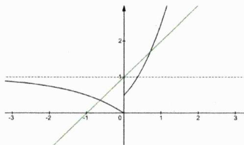

line

| x   | y (black line) | y (green line) |
| --- | -------------- | -------------- |
| -3  | ~1.0           | ~0.0           |
| -2  | ~0.8           | ~0.5           |
| -1  | ~0.5           | ~1.0           |
| 0   | 0              | 1              |
| 1   | ~1.5           | ~1.5           |
| 2   | ~2.5           | ~2             |
| 3   | ~4             | ~3             |

13. [解析]:

显而易见的是 $f(x)=\ln\left|\frac{2x+1}{2x-1}\right|$ 是奇函数，数形结合易知函数 $y=\left|\frac{2x+1}{2x-1}\right|$ 在 $(-∞,-\frac{1}{2})$ 和 $(\frac{1}{2},+∞)$ 上单调递减，而在 $(- \frac{1}{2}, \frac{1}{2})$ 上单调递增，由复合函数单调性知，函数 $f(x)$ 在 $(-∞,-\frac{1}{2})$ 上单调递减，从而本题选D.

14. [解析]:

因为 $y = \frac{1}{2}(e^{x} - e^{-x})$ 和y = x均为奇函数，故而 $f(x)$ 必为偶函数。又因前述两个函数在 $(0, +\infty)$ 上皆单调递增且函数值皆为正，故而 $f(x)$ 在 $(0, +\infty)$ 上也为增函数，由此本题选D。

15. [解析]:

由前一题的分析过程知 $f(x)$ 是偶函数，且其在 $(0,+\infty)$ 上单调递增.若 $f(x_{1})<f(x_{2})$ ，则必有 $|x_{1}|<|x_{2}|$ ，即有 $x_{1}^{2}<x_{2}^{2}$ ，从而本题选D.

16. [解析]:

易知r=0，则有

$$
f (x) = \frac {q x}{p x ^ {2} + 1} \leq \frac {q}{2 \sqrt {p}} = \frac {1}{2} \Longrightarrow p = q ^ {2}
$$

进而有 $f(1)=\frac{q}{q^{2}+1}>\frac{2}{5}$ ，解得 $q\in\left(\frac{1}{2},2\right)$ ，由此知p=q=1，故而有 $f(x)=\frac{x}{x^{2}+1}$ .

17. [解析]:

易知 $f(x)$ 是奇函数，因为

$$
f ^ {\prime} (x) = 3 x ^ {2} - 2 + e ^ {x} + \frac {1}{e ^ {x}} \geq - 2 + 2 = 0
$$

故而 $f(x)$ 在R上单调递增，由此知 $2a^{2}+a-1\leq0$ ，解得 $a\in\left[-1,\frac{1}{2}\right]$ .

18. [解析]:

由题知奇函数 $f(x)$ 在R上单调递增，且有 $4f(x)=f(2x)$ .则有

$$
f (x + 2 a) \geq 4 f (x) = f (2 x) \Longrightarrow x + 2 a \geq 2 x \Longrightarrow a \geq \frac {1}{2} x
$$

因为 $x\in[a-5,a^{2}-3]$ ，故而有 $a\geq\frac{1}{2}(a^{2}-3)$ ，解得 $a\in[-1,3]$ .

19. [解析]:

因为 $f(x)$ 是R上的偶函数且在 $(-∞,0)$ 上单调递增，由对称性知其在 $(0,+∞)$ 上单调递减.若 $f(2^{|a-1|})>f(-\sqrt{2})$ ，则必有 $2^{|a-1|}<|-√2|$ ，则有 $|a-1|<\frac{1}{2}$ ，解得 $a∈(\frac{1}{2},\frac{3}{2})$ .

20. [解析]:

显然仅当m=0时 $f(x)$ 才能是偶函数，进而知其在 $(0,+\infty)$ 上单调递增.因为 $|\log_{2}5|>|\log_{0.5}3|>0$ ，从而有b>a>c，故而本题选C.

21. [解析]:

显然 $f(x)$ 是定义在 $(-1,1)$ 上的奇函数，因为局部函数 $y = \ln \frac{1 + x}{1 - x}$ 在 $(-1,1)$ 上单调递增，故而我们有理由认为整个函数在 $(-1,1)$ 上单调递增（读者朋友可自行证明之）.从而有

$$
- 1 <   a ^ {2} - 4 <   2 - a <   1
$$

解得 $a \in (\sqrt{3}, 2)$ .

# 第 04 讲：对称性方法论

在上一讲我们有系统探究诸多经典的奇偶函数模型，在本讲我们将系统探究与对称性相关的结论、性质及它们的系列运用.

定理4.1: 函数轴对称性基本定理 函数 $y = f(x)$ 的图像关于直线x = a成轴对称的充要条件是

$$
f (a + x) = f (a - x)
$$

定理证明: 先证必要性, 当 $f(x)$ 的图像 $\Gamma$ 关于直线x=a对称时, 若点 $P(x,y)\in\Gamma$ , 则必有 $P'(2a-x,y)\in\Gamma$ , 故而有

$$
f (2 a - x) = f (x)
$$

若令 $x=a+x$ ，则必有

$$
f (a + x) = f (a - x)
$$

从而必要性得证.因以上证明过程完全可逆，故而定理的充分性亦能得证.证毕.

例1. [2013 全国I理 16]若函数 $f(x) = (1 - x^{2})(x^{2} + ax + b)$ 的图像关于直线 $x = -2$ 对称，则 $f(x)$ 的最大值是 \_\_\_\_.

解析：易知-1和1是函数 $f(x)$ 的零点，若函数图像关于直线x=-2对称，则必有-3和-5是函数的另外两零点，由此知

$$
f (x) = (1 - x) (1 + x) (x + 5) (x + 3)
$$

若令 $x = t - 2$ ，则有

$$
f (t - 2) = (3 - t) (t - 1) (t + 3) (t + 1) = - \left(t ^ {2} - 1\right) \left(t ^ {2} - 9\right) \leq 1 6
$$

当且仅当 $t^{2}=5$ 即 $x=\pm\sqrt{5}-2$ 时上式取等，从而知 $f(x)$ 的最大值是16.

例2. [2014 湖南理 10]已知函数 $f(x) = x^{2} + e^{x} - \frac{1}{2} (x < 0)$ 与 $g(x) = x^{2} + \ln (x + a)$ 的图像上存在关于 $y$ 轴对称的点，则 $a$ 的取值范围是 \_\_\_\_.

解析：本题等价于当 $x > 0$ 时，函数 $f(-x)$ 与 $g(x)$ 的图像有交点，即以下方程有解

$$
x ^ {2} + e ^ {- x} - \frac {1}{2} = x ^ {2} + \ln (x + a)
$$

令 $H(x)=\ln(x+a)-e^{-x}+\frac{1}{2}$ ，易分析知其为 $(0,+\infty)$ 上的增函数，因为 $\lim_{n\to+\infty}H(x)=+\infty$ ，故而欲满足题意必有

$$
H (0) = \ln a - \frac {1}{2} <   0
$$

解得 $a\in(-\infty,\sqrt{e})$ .

例3. 设函数 $f(x)$ 的定义域是(0,1)，且满足：

(i) $\forall x \in (0,1)$ , $f(x) > 0$ ;

(ii) $\forall x_{1},x_{2}\in (0,1)$ ，恒有 $\frac{f(x_1)}{f(x_2)} +\frac{f(1 - x_1)}{f(1 - x_2)}\leq 2.$ 现给出下列三个命题：

① $\forall x\in(0,1)$ ， $f(x)$ 是一常数；  
② $y=\frac{f(x)}{x}+x$ 在 $(0,1)$ 上单调递减；  
③ $f(x)$ 的图像关于直线 $x = \frac{1}{2}$ 对称.

其中正确命题的编号是\_\_\_\_。

解析：令 $x_{1}=1-x_{2}\in(0,1)$ ，则有

$$
2 \geq \frac {f (1 - x _ {2})}{f (x _ {2})} + \frac {f (x _ {2})}{f (1 - x _ {2})} \geq 2 \sqrt {\frac {f (1 - x _ {2})}{f (x _ {2})} \cdot \frac {f (x _ {2})}{f (1 - x _ {2})}} = 2
$$

故而只能有 $\frac{f(1-x_{2})}{f(x_{2})}+\frac{f(x_{2})}{f(1-x_{2})}=2$ ，且有 $\frac{f(1-x_{2})}{f(x_{2})}=\frac{f(x_{2})}{f(1-x_{2})}$ 即有

$$
f (x _ {2}) = f (1 - x _ {2})
$$

由此知 $f(x)$ 的图像关于直线 $x=\frac{1}{2}$ 对称，故而命题③正确.进一步我们知

$$
\frac {f (x _ {1})}{f (x _ {2})} + \frac {\bar {f} (x _ {1})}{f (x _ {2})} \leq 2 \Longrightarrow \frac {f (x _ {1})}{f (x _ {2})} \leq 1 \Longrightarrow f (x _ {1}) \leq f (x _ {2})
$$

因为 $x_{1},x_{2}$ 具有任意性故而亦能推导出 $f(x_{2})\leq f(x_{1})$ ，由此知 $f(x_{1})=f(x_{2})$ 恒成立，故而 $f(x)$ 是一正的

铭师道·高中数学方法原本

常数函数，此时显然不能确定 $y=\frac{f(x)}{x}+x$ 在(0,1)上的单调性，故而命题②错误.

综上正确的命题编号是①③.

推论4.1: 函数轴对称性基本推论 函数 $y = f(x)$ 的图像关于直线 $x = \frac{a + b}{2}$ 成轴对称的充要条件是

$$
f (a + x) = f (b - x)
$$

推论证明：如果有 $f(a+x)=f(b-x)$ ，我们可令 $x=x-\frac{a-b}{2}$ ，则有

$$
f \left(\frac {a + b}{2} + x\right) = f \left(\frac {a + b}{2} - x\right)
$$

由此说明函数图像关于直线 $x=\frac{a+b}{2}$ 成轴对称.因上述证明过程可逆，故而推论得证.

例4. 函数 $y = f(x)$ 对一切 $x \in  \mathbb{R}$ 满足 $f\left( {a + x}\right)  = f\left( {b - x}\right)$ ,若方程 $f\left( x\right)  = 0$ 恰有 ${2n} + 1\;\left( {n \in  {\mathbb{N}}^{ * }}\right)$ 个实数根,则所有这些根之和为\_\_\_\_\_.

解析：显而易见的是曲线 $f(x)$ 关于直线 $x=\frac{a+b}{2}$ 成轴对称，故而方程 $f(x)=0$ 的 $2n+1$ 个根之和为

$$
\sum_ {i = 1} ^ {2 n + 1} x _ {i} = 2 n \cdot \frac {a + b}{2} + \frac {a + b}{2} = \frac {1}{2} (2 n + 1) (a + b)
$$

例5. 设函数 $f(x)$ 是定义在 $\mathbb{R}$ 上的函数，满足 $f(x)=f(4-x)$ ， $\forall x_{1},x_{2}\in(0,+\infty)(x_{1}\neq x_{2})$ ，都有 $(x_{1}-x_{2})[f(x_{1}+2)-f(x_{2}+2)]>0$ ，则满足 $f(2-x)=f\left(\frac{3x+11}{x+4}\right)$ 的所有x的和为\_\_\_\_.

解析：由题知函数 $f(x)$ 的图像关于直线x=2对称，因为

$$
(x _ {1} - x _ {2}) [ f (x _ {1} + 2) - f (x _ {2} + 2) ] > 0 \Longrightarrow [ (x _ {1} + 2) - (x _ {2} + 2) ] [ f (x _ {1} + 2) - f (x _ {2} + 2) ] > 0
$$

所以函数 $f(x)$ 在 $(2,+\infty)$ 上单调递增.当 $f(2-x)=f\left(\frac{3x+11}{x+4}\right)$ 时必有

$$
2 - x = \frac {3 x + 1 1}{x + 4} \Longleftrightarrow x ^ {2} + 5 x + 3 = 0 \text {或} 2 - x + \frac {3 x + 1 1}{x + 4} = 4 \Longleftrightarrow x ^ {2} + 3 x - 3 = 0
$$

由根与系数关系知所有根之和为 $-5+(-3)=-8$ .

例6. 已知函数 $f(x) = \frac{1}{x^2 + 1} + \frac{1}{(x - 4)^2 + 1}$ ，则该函数图像的对称轴为 $x =$ \_\_\_\_；该函数的最大值为 \_\_\_\_.

解析：因为

$$
f (4 - x) = \frac {1}{(x - 4) ^ {2} + 1} + \frac {1}{x ^ {2} + 1} = f (x)
$$

故而知函数 $f(x)$ 的图像关于直线x=2成轴对称.易知

$$
f (x + 2) = \frac {1}{(x + 2) ^ {2} + 1} + \frac {1}{(x - 2) ^ {2} + 1} = \frac {2 \left(x ^ {2} + 5\right)}{\left(x ^ {2} + 4 x + 5\right) \left(x ^ {2} - 4 x + 5\right)} = \frac {2 \left(x ^ {2} + 5\right)}{\left(x ^ {2} + 5\right) ^ {2} - 1 6 x ^ {2}}
$$

若令 $x^{2}+5=t\geq5$ ，则有

$$
y = \frac {2 t}{t ^ {2} - 1 6 (t - 5)} = \frac {2}{t + \frac {8 0}{t} - 1 6} \leq \frac {1}{4 \sqrt {5} - 8} = \frac {\sqrt {5} + 2}{4}
$$

当且仅当 $x^{2}=4\sqrt{5}-5$ 时上式取等，故而函数 $f(x)$ 的最大值为 $\frac{\sqrt{5}+2}{4}$ .

定理4.2: 函数中心对称性基本定理 函数 $y = f(x)$ 的图像关于点 $(a, b)$ 成中心对称的充要条件是

$$
f (x) + f (2 a - x) = 2 b
$$

定理证明: 先证必要性, 当 $f(x)$ 的图像 $\Gamma$ 关于点 $(a, b)$ 成中心对称时, 若点 $P(x, y) \in \Gamma$ , 则必有 $P'(2a - x, 2b - y) \in \Gamma$ , 故而有

$$
2 b - y = f (2 a - x)
$$

由此证得

$$
f (x) + f (2 a - x) = 2 b
$$

从而必要性得证.因以上证明过程完全可逆，故而定理的充分性亦能得证.证毕.

例7. 已知函数 $f(x) = x^3 + \frac{2^{x+1}}{2^{x} + 1}$ ，若实数 $a, b$ 满足 $f(a^2) + f(2b^2 - 3) = 2$ ，则 $a\sqrt{1 + b^2}$ 的最大值为 \_\_\_\_.

解析：因为

$$
f (x) = x ^ {3} + \frac {2 ^ {x + 1}}{2 ^ {x} + 1} = x ^ {3} + \frac {(2 ^ {x} + 1) + (2 ^ {x} - 1)}{2 ^ {x} + 1} = \underbrace {x ^ {3} + \frac {2 ^ {x} - 1}{2 ^ {x} + 1}} _ {\text {奇函数}} + 1
$$

故而知曲线 $f(x)$ 关于(0,1)成中心对称，由此可得

$$
a ^ {2} + 2 b ^ {2} - 3 = 0 \Longrightarrow a ^ {2} + 2 b ^ {2} = 3
$$

继而知

$$
a \sqrt {1 + b ^ {2}} = \frac {\sqrt {2}}{2} \sqrt {a ^ {2} (2 + 2 b ^ {2})} \leq \frac {\sqrt {2}}{2} \cdot \frac {a ^ {2} + 2 + 2 b ^ {2}}{2} = \frac {5 \sqrt {2}}{4}
$$

当且仅当 $a^{2}=2+2b^{2}=\frac{5}{2}$ 时上式取等，故而 $a\sqrt{1+b^{2}}$ 的最大值为 $\frac{5\sqrt{2}}{4}$ .

例8. 曲线 $\Gamma: x^{2} + y^{2} = 2|x| + 2|y|$ 围成的图形的面积为 \_\_\_\_.

解析：当 $x \geq 0$ 且 $y \geq 0$ 时曲线的方程为

$$
C: (x - 1) ^ {2} + (y - 1) ^ {2} = 2
$$

显而易见的是 $\Gamma$ 的图像既关于 $x$ 轴对称、还关于 $y$ 轴对称，同时还关于原点成中心对称，在曲线 $C$ 的的基础上，利用对称性我们可轻易得到下图中 $\Gamma$ 的图像——其由一个边长为 $2 \sqrt{2}$ 的正方形及四个半径为 $\sqrt{2}$ 的半圆所围成，故而所求面积为

$$
(2 \sqrt {2}) ^ {2} + 2 \pi (\sqrt {2}) ^ {2} = 8 + 4 \pi
$$

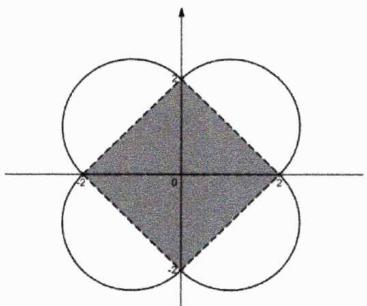

text_image

Geometric diagram showing a shaded diamond within two intersecting circles on a Cartesian coordinate system.

推论4.2: 函数中心对称性基本推论 函数 $y = f(x)$ 的图像关于点 $\left(\frac{a+b}{2}, c\right)$ 成中心对称的充要条件是

$$
f (a + x) + f (b - x) = 2 c
$$

推论证明：先证充分性，当 $f(a+x)+f(b-x)=2c$ 时，可令 $x=x-\frac{a-b}{2}$ ，则有

$$
f \left(\frac {a + b}{2} + x\right) + f \left(\frac {a + b}{2} - x\right) = 2 c
$$

由此说明 $f(x)$ 的图像关于 $\left(\frac{a+b}{2},c\right)$ 成中心对称，故而充分性得证.因上述证明过程可逆，从而推论得证.

例9. 已知函数 $f(x)$ 的定义域为 $\mathbb{R}$ ，且满足 $f(x) = -f(2 - x)$ ，当 $x > 1$ 时， $f(x)$ 单调递增。已知 $m + n < 2$ 且 $(m - 1)(n - 1) < 0$ ，则 $f(m) + f(n)$ 的值（）

A. 恒小于0

B. 恒大于0

C. 可能为0

D. 可正可负

解析: 由题知 $f(x)$ 的图像关于点 $(1,0)$ 成中心对称, 且 $f(x)$ 在 $(- \infty, 1)$ 上单调递增. 由 $(m-1)(n-1) < 0$ 知 1 介于 $m$ 和 $n$ 之间, 不妨设 $m < 1 < n$ , 因为 $m + n < 2$ , 则有

$$
m <   2 - n <   1 \Rightarrow f (m) <   f (2 - n) = - f (n) \Rightarrow f (m) + f (n) <   0
$$

由此本题选 A.

例10. 设函数 $f(x) = \ln (\sqrt{x^2 + 1} + x) + x + \pi$ ，若 $\forall x \in \mathbb{R}$ ， $f\left(\left|\sin x + 3 + \frac{8}{\sin x + 3} - a\right|\right) + f(a - 6) \leq 2\pi$ 恒成立，则实数 $a$ 的取值范围是 \_\_\_\_.

解析：显而易见的是函数 $f(x)$ 的图像关于 $(0,\pi)$ 成中心对称，且易分析知 $f(x)$ 在R上单调递增.由此知欲满足题意必有

$$
\left| \sin x + 3 + \frac {8}{\sin x + 3} - a \right| + a - 6 \leq 2 \times 0 \Rightarrow a - 6 \leq \sin x + 3 + \frac {8}{\sin x + 3} - a \leq 6 - a
$$

进而有

$$
2 a - 6 \leq \left[ \sin x + 3 + \frac {8}{\sin x + 3} \right] _ {\min} = 4 \sqrt {2} \Rightarrow a \leq 3 + 2 \sqrt {2}
$$

经检验 $a \leq 3 + 2\sqrt{2}$ 时符合题意.

铭师道·高中数学方法原本

推论4.3: 对称性中的奇偶性 由奇偶性的定义易知

(i) 函数 $y = f(x + a)$ 是偶函数的充要条件是其图像关于 $x = a$ 对称.  
(ii) 函数 $y = f(x + a)$ 是奇函数的充要条件是其图像关于 $(a,0)$ 成中心对称.

例11. 设函数 $f(x)$ 的定义域为R，且 $f(x+1)$ 是奇函数， $f(2x+3)$ 是偶函数，则 $f(5)=$ \_\_\_\_.

解析：因为 $f(x+1)$ 是R上的奇函数，故而必有 $f(1)=0$ ，再结合 $f(2x+3)$ 是偶函数可得

$$
f (5) = f (2 \times 1 + 3) = f (- 2 + 3) = f (1) = 0
$$

定理4.3: 相异函数轴对称定理 函数 $y = f(\omega x + a)$ 和函数 $y = f(b - \omega x) (\omega \in \mathbb{R}, \omega \neq 0)$ 的图像关于直线 $x = \frac{b - a}{2\omega}$ 成轴对称.

定理证明: 设 $P(m, n)$ 是曲线 $f(\omega x + a)$ 上的任意一点, 则有 $n = f(\omega m + a)$ . 点 $P$ 关于直线 $x = \frac{b - a}{2 \omega}$ 对称的点 $P'$ 的坐标为 $\left(\frac{b - a}{\omega} - m, n\right)$ , 当 $x = \frac{b - a}{\omega} - m$ 时

$$
f \left(b - \omega \left(\frac {b - a}{\omega} - m\right)\right) = f (b - b + a + \omega m) = f (a + \omega m) = n
$$

由此说明 $P'\left(\frac{b-a}{\omega}-m,n\right)$ 恰好在曲线 $f(b-\omega x)$ 上，从而得证.

例12. 若方程 $f(3 + 2x) = 0$ 有三个根，则方程 $f(1 - 2x) = 0$ 和方程 $f(3 + 2x) = 0$ 的所有根之和为

解析：显而易见的是曲线 $f(3+2x)$ 与曲线 $f(1-2x)$ 关于直线 $x=-\frac{1}{2}$ 对称，由此方程 $f(1-2x)=0$ 亦有三个根，两方程的所有根之和为 $-\frac{1}{2}\times6=-3$ ，

定理4.4: 相异函数中心对称定理 函数 $y = f(x)$ 和 $g(x) = -f(2a - x) + 2b$ 的图像关于点 $(a, b)$

成中心对称.

定理证明：设点 $P(m,n)$ 是函数 $y=f(x)$ 图像上的任意一点，从而有

$$
n = f (m)
$$

点P关于 $(a,b)$ 对称的点 $P'$ 的坐标为 $(2a-m,2b-n)$ ，当x=2a-m时

$$
g (2 a - m) = - f (2 a - (2 a - m)) + 2 b = - f (m) + 2 b = 2 b - n
$$

故而说明 $P'(2a-m,2b-n)$ 恰好在曲线 $g(x)$ 上，从而得证.

例13. [2015 天津理 8]已知函数 $f(x) = \begin{cases} 2 - |x|, & x \leq 2 \\ (x - 2)^2, & x > 2 \end{cases}$ ，函数 $g(x) = b - f(2 - x)$ ，其中 $x \in \mathbb{R}$ ，若函数 $y = f(x) - g(x)$ 恰有4个零点，则 $b$ 的取值范围是 \_\_\_\_.

解析: 显而易见的是函数 $g(x)$ 与 $f(x)$ 的图像关于 $\left(1, \frac{b}{2}\right)$ 成中心对称. 如下左图所示, 黑色实线代表 $f(x)$ 的图像, 黑色虚线代表 $g(x)$ 的图像. 当虚线中的直线与实线中的抛物线首次相切时是第一种临界情况, 此时有

$$
(x - 2) ^ {2} = b - [ 2 - | 2 - x | ] = b + x - 4 \Rightarrow x ^ {2} - 5 x + 8 - b = 0 \Rightarrow \Delta = (- 5) ^ {2} - 4 (8 - b) = 0
$$

解得

$$
b = \frac {7}{4}
$$

而后将 $g(x)$ 的图像整体上移，如下右图所示，当中间两线段恰好重合时，此即第二种临界情况，并且有对称中心纵坐标 $\frac{b}{2}=1$ 即b=2。综上，要使函数 $y=f(x)-g(x)$ 恰有4个零点，必有 $b\in\left(\frac{7}{4},2\right)$ 。

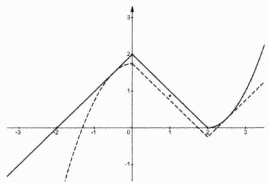

line

| x | Line 1 | Line 2 | Line 3 |
|---|---|---|---|
| -3 | -1.5 | - | - |
| -2 | -0.5 | 0.5 | - |
| -1 | 0.5 | 1.5 | - |
| 0 | 2 | 2 | - |
| 1 | 0.5 | 1.5 | - |
| 2 | 0.5 | 0.5 | - |
| 3 | 1.5 | -0.5 | - |

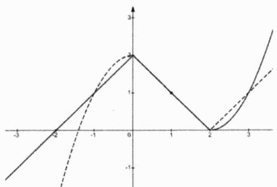

line

| x   | Solid Line | Dashed Line |
| --- | ---------- | ----------- |
| -3  | -1.5       | -         |
| -2  | -1.0       | -         |
| -1  | 1.0        | 1.0         |
| 0   | 2.0        | 2.0         |
| 1   | 1.0        | 1.0         |
| 2   | -1.0       | -         |
| 3   | 1.5        | 1.5         |

定理4.5: 对称性系数定理 已知 $\omega \neq 0$ ，有

(i) 若 $f(a + x) = f(a - x)$ ，则函数 $f(\omega x)$ 的图像关于直线 $x = \frac{a}{\omega}$ 对称；  
(ii) 若 $f(a + \omega x) = f(a - \omega x)$ ，则函数 $f(\omega x)$ 的图像关于直线 $x = \frac{a}{\omega}$ 对称；  
(iii) 若 $f(a + \omega x) = f(a - \omega x)$ ，则函数 $f(x)$ 的图像关于直线 $x = a$ 对称.

定理证明：当 $f(a+x)=f(a-x)$ 时，可令 $x=\omega x$ ，则有

$$
f (a + \omega x) = f (a - \omega x)
$$

进而有

$$
f \left(\omega \left(\frac {a}{\omega} + x\right)\right) = f \left(\omega \left(\frac {a}{\omega} - x\right)\right)
$$

由此说明函数 $f(\omega x)$ 的图像关于直线 $x=\frac{a}{\omega}$ 对称，则前两个命题得证。对于第三个结论可令 $\omega x=x$ ，则有

$$
f (a + x) = f (a - x)
$$

由此说明函数 $f(x)$ 的图像关于直线x=a对称，由此第三个命题得证.综上三个命题全部得证.

例14. $\forall x \in R$ ，填空.

(1) 若 $f(1+2x)=f(1-2x)$ ，则 $y=f(x)$ 的图像关于直线\_\_\_\_对称；  
(2) $f(1 + x) = f(1 - x)$ , 则 $y = f(2x)$ 的图像关于直线 \_\_\_\_ 对称;  
(3) $y = f\left( {{2x} + 1}\right)$ 是偶函数,则函数 $y = f\left( {2x}\right)$ 的图像的对称轴是直线\_\_\_\_；  
(4) $y = f\left( {{2x} + 1}\right)$ 是偶函数,则函数 $y = f\left( x\right)$ 的图像的对称轴是直线

解析:

第一问：由前述定理知 $y = f(x)$ 的图像关于直线 $x = 1$ 对称.

第二问：由前述定理知 $y = f(2x)$ 的图像关于直线 $x = \frac{1}{2}$ 对称.

第三问：由题知 $f(2x+1)=f(-2x+1)$ ，故而可得 $y=f(2x)$ 的图像关于直线 $x=\frac{1}{2}$ 对称.

第四问：显而易见的是函数 $y = f(x)$ 的图像关于直线 $x = 1$ 对称.

除上述结论外, 我们再以表格的形式补充几个在初中阶段就应熟练掌握的与斜直线对称性相关的结论.

结论4.1: 点关于斜线对称 我们须熟练掌握以下几个点关于斜直线对称的基础结论.

<table><tr><td>点 $(x_0,y_0)$ </td><td>直线y=x</td><td>直线y=-x</td><td>直线y=x+a</td><td>直线y=-x+a</td></tr><tr><td>对称坐标</td><td> $(y_0,x_0)$ </td><td> $(-y_0,-x_0)$ </td><td> $(y_0-a,x_0+a)$ </td><td> $(-y_0+a,-x_0+a)$ </td></tr></table>

例15. 填空.

(1) [2015 全国 I 文 12] 函数 $y = f(x)$ 的图像与 $y = 2^{x + a}$ 的图像关于直线 $y = -x$ 对称，且 $f(-2) + f(-4) = 1$ ，则 $a =$ \_\_\_\_.  
(2) 若曲线 $y = e^{x}$ 关于直线 $y = x + m (m \neq 0)$ 的对称曲线是 $y = \ln (x + a) + b$ ，则 $\frac{b}{a} =$ \_\_\_\_.

解析:

第一问：设函数 $y = f(x)$ 图像上的任一点为 $(x, y)$ ，则有 $-x = 2^{-y + a}$ ，进而有

$$
f (x) = a - \log_ {2} (- x)
$$

继而有 $f(-2)+f(-4)=2a-3=1$ ，解得a=2。

第二问：显而易见的是点 $(t, e^t)$ 必在曲线 $y = e^x$ 上，其关于 $y = x + m$ 对称的点的坐标为

$$
(e ^ {t} - m, t + m)
$$

则有 $t + m = \ln (e^t -m + a) + b$ ，易分析知 $m = a = b$ ，由此可得 $\frac{b}{a} = 1.$

接下来我们再来探究几个特殊函数模型下的对称中心公式.

结论4.2: 一类特殊分式函数的对称中心公式 $^{1}$ 若数列 $\{a_{n}\}$ 是公差为 $d(d \neq 0)$ 的等差数列，即

$$
a _ {n} = a _ {1} + (n - 1) d \quad (n \in \mathbb {N} ^ {*})
$$

则函数

$$
f (x) = \frac {1}{x - a _ {1}} + \frac {1}{x - a _ {2}} + \dots + \frac {1}{x - a _ {n}}
$$

的图像对称中心为

$$
\left(\frac {a _ {1} + a _ {n}}{2}, 0\right)
$$

铭师道·高中数学方法原本

结论证明: 首先易知函数 $f(x)$ 的定义域为 $I = \{x \in \mathbb{R} | x \neq a_{1}, a_{2}, \cdots, a_{n}\}$ , 因为 $\{a_{n}\}$ 是等差数列, 故而定义域 $I$ 中的数必关于 $\frac{a_{1} + a_{n}}{2}$ 对称, 当 $k \leq n$ 且 $k, n \in \mathbb{N}^{*}$ 时, 由等差数列性质知

$$
a _ {1} + a _ {n} = a _ {k} + a _ {n - k + 1} \Rightarrow a _ {1} + a _ {n} - a _ {k} = a _ {n - k + 1}
$$

故而有

$$
\begin{array}{l} f \big ((a _ {1} + a _ {n}) - x \big) = \frac {1}{(a _ {1} + a _ {n}) - x - a _ {1}} + \frac {1}{(a _ {1} + a _ {n}) - x - a _ {2}} + \dots + \frac {1}{(a _ {1} + a _ {n}) - x - a _ {n}} \\ = \frac {1}{a _ {n} - x} + \frac {1}{a _ {n - 1} - x} + \dots + \frac {1}{a _ {1} - x} \\ = - f (x) \\ \end{array}
$$

从而有

$$
f \left(\left(a _ {1} + a _ {n}\right) - x\right) = - f (x)
$$

由此证得 $f(x)$ 的图像关于 $\left(\frac{a_{1}+a_{n}}{2},0\right)$ 对称，证毕.

例16. 函数 $f(x)=\frac{1}{x-1}+\frac{1}{x-2}+\cdots+\frac{1}{x-2025}$ 的图像的对称中心为 \_\_\_\_.

解析：由上述结论知所求对称中心横坐标为 $\frac{1+2025}{2}=1013$ ，从而所求对称中心坐标为(1013,0).

推论4.4: 一类特殊分式函数的对称中心公式 $^{11}$ 若数列 $\{a_{n}\}$ 是公差为 $d(d \neq 0)$ 的等差数列，即

$$
a _ {n} = a _ {1} + (n - 1) d \quad (n \in \mathbb {N} ^ {*})
$$

则函数

$$
f (x) = \frac {x - a _ {1} - 1}{x - a _ {1}} + \frac {x - a _ {2} - 1}{x - a _ {2}} + \dots + \frac {x - a _ {n} - 1}{x - a _ {n}}
$$

的图像的对称中心为

$$
\left(\frac {a _ {1} + a _ {n}}{2}, n\right)
$$

推论证明：因为

$$
f (x) = \frac {x - a _ {1} - 1}{x - a _ {1}} + \frac {x - a _ {2} - 1}{x - a _ {2}} + \dots + \frac {x - a _ {n} - 1}{x - a _ {n}} = n - \left(\frac {1}{x - a _ {1}} + \frac {1}{x - a _ {2}} + \dots + \frac {1}{x - a _ {n}}\right)
$$

由前述结论知函数 $f(x)$ 的图像的对称中心为 $\left(\frac{a_{1}+a_{n}}{2},n\right)$ ，证毕.

例17. 函数 $f(x)=\frac{x}{x+1}+\frac{x+1}{x+2}+\cdots+\frac{x+2014}{x+2015}$ 的图像的对称中心为 \_\_\_\_.

解析：由上述推论知函数 $f(x)$ 的对称中心为 $\left(\frac{a_{1}+a_{n}}{2},n\right)$ ，其中 $a_{1}=-1,\quad a_{n}=-2015$ ，故而有

$$
\frac {a _ {1} + a _ {n}}{2} = - 1 0 0 8
$$

从而所求对称中心坐标为 $(-1008,2015)$ .

例18. 已知函数 $f(x) = \frac{x}{x+1} + \frac{x+1}{x+2} + \frac{x+2}{x+3} + \frac{x+3}{x+4}$ ，则 $f\left(-\frac{5}{2} + \sqrt{2}\right) + f\left(-\frac{5}{2} - \sqrt{2}\right) =$ \_\_\_\_.

解析：由上述推论知函数 $f(x)$ 的图像的对称中心为 $\left(-\frac{5}{2},4\right)$ ，从而有

$$
f \left(- \frac {5}{2} + x\right) + f \left(- \frac {5}{2} - x\right) = 8
$$

当 $x=\sqrt{2}$ 时，有

$$
f \left(- \frac {5}{2} + \sqrt {2}\right) + f \left(- \frac {5}{2} - \sqrt {2}\right) = 8
$$

结论4.3: 分式指数函数对称中心公式 函数

$$
f (x) = \frac {p a ^ {x} + q}{r a ^ {x} + s} (a > 0 \text {且} a \neq 1, p s - q r \neq 0 \text {且} r s \neq 0)
$$

的图像的对称中心为

$$
\left(\log_ {a} \left| \frac {s}{r} \right|, \frac {1}{2} \left(\frac {p}{r} + \frac {q}{s}\right)\right)
$$

结论证明：因为

$$
f \left(2 \log_ {a} \left| \frac {s}{r} \right| - x\right) = \frac {p a ^ {2 \log_ {a} \left| \frac {s}{r} \right| - x} + q}{r a ^ {2 \log_ {a} \left| \frac {s}{r} \right| - x} + s} = \frac {p \left| \frac {s}{r} \right| ^ {2} a ^ {- x} + q}{r \left| \frac {s}{r} \right| ^ {2} a ^ {- x} + s} = \frac {p s ^ {2} + q r ^ {2} a ^ {x}}{r s ^ {2} + s r ^ {2} a ^ {x}} = \frac {p s ^ {2} + q r ^ {2} a ^ {x}}{r s (s + r a ^ {x})}
$$

故而有

$$
\begin{array}{l} f \left(2 \log_ {a} \left| \frac {s}{r} \right| - x\right) + f (x) = \frac {p s ^ {2} + q r ^ {2} a ^ {x}}{r s (s + r a ^ {x})} + \frac {p a ^ {x} + q}{r a ^ {x} + s} = \frac {p a ^ {x} + q + \frac {p s}{r} + \frac {q r}{s} a ^ {x}}{r a ^ {x} + s} \\ = \frac {\left(\frac {q}{s} + \frac {p}{r}\right) (r a ^ {x} + s)}{r a ^ {x} + s} \\ = \frac {q}{s} + \frac {p}{r} \\ \end{array}
$$

由函数对称中心的性质知结论已得证！

例19. [2010 上海春 18]已知函数 $f(x) = \frac{1}{4 - 2^x}$ 的图像关于点 $P$ 对称，则点 $P$ 的坐标是 \_\_\_\_.

解析：由上述结论知，曲线 $f(x)=\frac{pa^{x}+q}{ra^{x}+s}=\frac{1}{-2^{x}+4}$ 的对称中心为

$$
\left(\log_ {a} \left| \frac {s}{r} \right|, \frac {1}{2} \left(\frac {p}{r} + \frac {q}{s}\right)\right)
$$

代入可求得点P的坐标为 $\left(2,\frac{1}{8}\right)$ .

例20. 已知函数 $f(x) = \frac{2^x}{a \cdot 2^x + 1} (a \in \mathbb{R})$ 的图像关于点 $\left(0, \frac{1}{2}\right)$ 对称，则 $a =$ \_\_\_\_.

解析：由上述结论知

$$
\frac {1}{2} \left(\frac {p}{r} + \frac {q}{s}\right) = \frac {1}{2} \left(\frac {1}{a} + 0\right) = \frac {1}{2}
$$

由此知a=1.

推论4.5: 特殊分式型指数函数的对称中心 易知

(i) 函数 $f(x)=\frac{a^{x}}{a^{x}+\sqrt{a}}$ 的图像的对称中心为 $\left(\frac{1}{2},\frac{1}{2}\right)$ ;  
(ii) 函数 $f(x)=\frac{1}{a^{x}+\sqrt{a}}$ 的图像的对称中心为 $\left(\frac{1}{2},\frac{1}{2\sqrt{a}}\right)$ .

例21. [2003 上海春 T12] 设 $f(x)=\frac{1}{2^{x}+\sqrt{2}}$ ，则 $f(-5)+f(-4)+\cdots+f(0)+\cdots+f(5)+f(6)$ 的值为 \_\_\_\_.

解析：由前述推论知曲线 $f(x)$ 的对称中心为 $\left(\frac{1}{2},\frac{1}{2\sqrt{2}}\right)$ ，从而知所求12个函数值之和为 $6\cdot\frac{1}{\sqrt{2}}=3\sqrt{2}$ .

例22. 设 $f(x)=\frac{4^{x}}{4^{x-\frac{1}{2}}+1}$ ，则 $f\left(\frac{1}{2014}\right)+f\left(\frac{2}{2014}\right)+\cdots+f\left(\frac{2013}{2014}\right)=$ \_\_\_\_.

解析：因为函数

$$
f (x) = \frac {4 ^ {x}}{4 ^ {x - \frac {1}{2}} + 1} = \frac {2 \cdot 4 ^ {x}}{4 ^ {x} + 2}
$$

由前述推论知其对称中心为 $\left(\frac{1}{2},1\right)$ ，进而有

$$
\begin{array}{l} f \left(\frac {1}{2 0 1 4}\right) + f \left(\frac {2}{2 0 1 4}\right) + \dots + f \left(\frac {2 0 1 3}{2 0 1 4}\right) \\ = \frac {1}{2} \left\{\left[ f \left(\frac {1}{2 0 1 4}\right) + f \left(\frac {2 0 1 3}{2 0 1 4}\right) \right] + \dots + \left[ f \left(\frac {2 0 1 3}{2 0 1 4}\right) + f \left(\frac {1}{2 0 1 4}\right) \right] \right\} \\ = \frac {1}{2} (2 \times 2 0 1 3) \\ = 2 0 1 3 \\ \end{array}
$$

结论4.4: 分式对数函数对称中心公式 函数

$$
f (x) = \log_ {a} {\frac {p x + q}{r x + s}} (a > 0 \text {且} a \neq 1, p s - q r \neq 0 \text {且} r s \neq 0)
$$

的图像的对称中心为

$$
\left(- \frac {1}{2} \left(\frac {s}{r} + \frac {q}{p}\right), \log_ {a} \left| \frac {p}{r} \right|\right)
$$

铭师道·高中数学方法原本

结论证明：因为

$$
\begin{array}{l} f \left(- \left(\frac {s}{r} + \frac {q}{p}\right) - x\right) + f (x) = \log_ {a} \left[ \frac {p \left[ - \left(\frac {s}{r} + \frac {q}{p}\right) - x \right] + q}{r \left[ - \left(\frac {s}{r} + \frac {q}{p}\right) - x \right] + s} \cdot \frac {p x + q}{r x + s} \right] \\ = \log_ {a} \left[ \left(\frac {p}{r}\right) ^ {2} \frac {- \frac {s}{r} - x}{- \frac {q}{p} - x} \cdot \frac {x + \frac {q}{p}}{x + \frac {s}{r}} \right] \\ = \log_ {a} \left(\frac {p}{r}\right) ^ {2} \\ = 2 \log_ {a} \left| \frac {p}{r} \right| \\ \end{array}
$$

故而得证！

例23. 已知 $f(x) = \frac{1}{2024} + \log_2 \frac{x}{1 - x}$ ，则 $f\left(\frac{1}{2025}\right) + f\left(\frac{2}{2025}\right) + \cdots + f\left(\frac{2024}{2025}\right)$ 的值为 \_\_\_\_.

解析：由前述结论知曲线 $f(x)$ 对称中心的横坐标为

$$
- \frac {1}{2} \left(\frac {s}{r} + \frac {q}{p}\right) = \frac {1}{2} (\text {其中} p = 1, q = 0, r = - 1, s = 1)
$$

从而知曲线 $f(x)$ 的对称中心为 $\left(\frac{1}{2},\frac{1}{2024}\right)$ ，由此知

$$
f \left(\frac {1}{2 0 2 5}\right) + f \left(\frac {2}{2 0 2 5}\right) + \dots + f \left(\frac {2 0 2 4}{2 0 2 5}\right) = 1
$$

接下来我们再来快速讲解一下极度简单的基于对称性的中值求和模型，由前面的证明我们已知道若函数 $f(x)$ 的图像关于 $(a,b)$ 成中心对称，则当 $b=f(a)$ 时有

$$
f (a - x) + f (a + x) = 2 b = 2 f (a)
$$

显而易见的是若 $f(x)$ 在定义域内存在最值，则必有

$$
f (x) _ {\max} + f (x) _ {\min} = 2 f (a)
$$

另外定义域内所有关于 $(a, b)$ 对称的两点函数值之和亦为 $2f(a)$ ，即若有 $\frac{x_1 + x_2}{2} = a$ ，则必有

$$
f \left(x _ {1}\right) + f \left(x _ {2}\right) = 2 b = 2 f (a)
$$

现在的问题是给定一具体函数 $f(x)$ ，该如何快速找到其对称中心呢？一种方法是直接对 $f(x)$ 的解析式进行分离变量，此时一般会出现如下形态

$$
f (x) = r (x) + c
$$

其中 $r(x)$ 是一奇函数，c是常数，此时曲线 $f(x)$ 的对称中心为 $(0,c)$ .第二种方法是在具体题目中命题人往往让我们求 $f(x_{1})+f(x_{2})$ 的值或求 $f(x)$ 在区间 $[m,n]$ 上的最大值与最小值之和，这时 $\frac{x_{1}+x_{2}}{2}$ 或 $\frac{m+n}{2}$ 必定是对称中心横坐标，进而有

$$
f (x _ {1}) + f (x _ {2}) = 2 f \left(\frac {x _ {1} + x _ {2}}{2}\right) \text {或} f (m) + f (n) = 2 f \left(\frac {m + n}{2}\right)
$$

另一方面，对于一个超级复杂或奇怪的函数，如果 $\frac{x_{1}+x_{2}}{2}$ 或 $\frac{m+n}{2}$ 的结果不是对称中心的横坐标，我们几乎很难求出 $f(x_{1})+f(x_{2})$ 的结果或最值之和.基于以上分析我们可得到如下一结论.

结论4.5: 中值求和模型 $^{1}$ 若函数 $f(x)$ 的图像关于 $(a,b)$ 成中心对称，当命题者欲让我们求 $f(x_{1})+f(x_{2})$ 的值或求其在区间 $[m,n]$ 上的最大值与最小值之和时，一般会刻意命题成

$$
\frac {x _ {1} + x _ {2}}{2} = a \text {或} \frac {m + n}{2} = a
$$

此时有

$$
f (x _ {1}) + f (x _ {2}) = 2 f \left(\frac {x _ {1} + x _ {2}}{2}\right) \text {或} f (x) _ {\max} + f (x) _ {\min} = 2 f \left(\frac {m + n}{2}\right)
$$

以上即为中值求和模型.

例24. 求值.

(1) [2013 辽宁文 7] 函数 $f(x) = \log_2\left(\sqrt{1 + 9x^2} - 3x\right) + 1$ ，则 $f(\lg 2) + f\left(\lg \frac{1}{2}\right) =$ \_\_\_\_.  
(2) [2018 全国Ⅲ文 16] 已知函数 $f(x) = \ln (\sqrt{1 + x^2} - x) + 1$ , $f(a) = 4$ , $f(-a) =$ \_\_\_\_.  
(3) [2012 新课标 I 文 16] 设函数 $f(x) = \frac{(x+1)^2 + \sin x}{x^2 + 1}$ 的最大值为 $M$ ，最小值为 $m$ ，则 $M + m =$ \_\_\_\_.  
(4) 已知函数 $f(x) = e^{x} - e^{-x} + \frac{2^{x}}{2^{x} + 1}$ ，若 $f(\lg m) = 3$ ，则 $f\left(\lg \frac{1}{m}\right) =$ \_\_\_\_.  
(5) 设函数 $f(x)=(x^{2}-4x+3)\sin(x-2)+3x$ 在区间 $[-1,5]$ 的最大值和最小值分别为M,m，则

$$
M + m = \underline {{\quad}}.
$$

解析:

第一问：显然曲线 $f(x)$ 的对称中心为(0,1)，故而有 $f(\lg 2) + f\left(\lg \frac{1}{2}\right) = 2.$

第二问：因为曲线 $f(x)$ 的对称中心为(0,1)，故而有 $f(a)+f(-a)=2$ ，由此可得 $f(-a)=-2$ .

第三问：因为 $f(x)=\frac{x^{2}+2x+1+\sin x}{x^{2}+1}=1+\frac{2x+\sin x}{x^{2}+1}$ ，故而知曲线 $f(x)$ 关于(0,1)对称，从而有 $M+m=2$ .

第四问：因为 $\frac{\lg m + \lg \frac{1}{m}}{2} = 0$ ，故而我们有理由认为函数 $f(x)$ 的图像的对称中心为 $\left(0, \frac{1}{2}\right)$ ，则有

$$
f (\lg m) + f \left(\lg \frac {1}{m}\right) = 2 f (0) = 2 \times \frac {1}{2} = 1 \Rightarrow f \left(\lg \frac {1}{m}\right) = - 2
$$

第五问: 因为 $\frac{- 1 + 5}{2} = 2$ , 故而我们有理由认为函数 $f(x)$ 的图像的对称中心为(2,6), 进而有

$$
M + m = 2 f (2) = 1 2
$$

例25. 已知函数 $f(x+1)$ 为R上的偶函数，现给出以下结论：

① $f(x)$ 的图像关于直线 x = 1 对称；  
② 若 $x > 1$ 时， $f(x) = (x - 1)^2 + \frac{1}{x - 1}$ ，则当 $x < 1$ 时， $f(x) = (x - 1)^2 - \frac{1}{x - 1}$ ;  
③ 若 $\frac{f(x + 1) + 2x}{x}$ 存在最大值 $M$ 和最小值 $m$ , 则 $M + m = 4$ .

以上结论中正确的是

解析：因为 $f(x+1)$ 为R上的偶函数，则必有 $f(x)$ 的图像关于直线x=1对称，从而①正确；而当x<1时，2-x>1，则有 $f(x)=f(2-x)=(x-1)^{2}+\frac{1}{1-x}=(x-1)^{2}-\frac{1}{x-1}$ ，故而②正确；对于③，因为

$$
\frac {f (x + 1) + 2 x}{x} = \underbrace {\frac {f (x + 1)}{x}} _ {\text {奇}} + 2
$$

从而必有 $M+m=4$ .综上正确的编号是①②③.

例26. 已知函数 $f(x) = \log_a (\sqrt{x^2 + 1} + x) + \frac{1}{a^{x-1}} + \frac{3}{2} (a > 0, a \neq 1)$ ，如果 $f(\log_3 b) = 2027 (b > 0, b \neq 1)$ ，则么 $f(\log_{\frac{1}{2}} b)$ 的值是 \_\_\_\_.

解析: 易知 $x_{\text {中}} = \frac{\log_3 b + \log_1 b}{2} = 0$ , 但在此题中 $f(0)$ 并无意义, 故而针对本题我们需严格推导出其对称中心的坐标. 因为

$$
f (x) = \underbrace {\left[ \log_ {a} \left(\sqrt {x ^ {2} + 1} + x\right) + \frac {1}{a ^ {x} - 1} + \frac {1}{2} \right]} _ {\text {奇函数}} + 1
$$

故而知曲线 $f(x)$ 的对称中心为(0,1)，从而有 $f\left(\log_{\frac{1}{3}}b\right)=2-2027=-2025.$

结论4.6: 中值求和模型 $^{11}$ 若函数 $f(x)$ 的图像关于 $(a,b)$ 成中心对称，当命题者欲让我们求

$$
f (x _ {1}) + f (x _ {2}) \dots + f (x _ {n})
$$

的值时，一般会刻意命题成

$$
\frac {x _ {1} + x _ {n}}{2} = \frac {x _ {2} + x _ {n - 1}}{2} = \dots = a
$$

此时有

$$
f (x _ {1}) + f (x _ {2}) \dots + f (x _ {n}) = \frac {1}{2} \left[ \underbrace {\left(f (x _ {1}) + f (x _ {n})\right)} _ {= 2 b} + \dots + \underbrace {\left(f (x _ {n}) + f (x _ {1})\right)} _ {= 2 b} \right] = n b
$$

基于此我们以后可分以下三步来求值:

① 计算对称中心横坐标——即有 $x_{中}=\frac{x_{1}+x_{n}}{2}$ ;  
② 计算对称中心纵坐标—— $b = f(x_{\text{中}})$ ;  
③ 数数——有多少项求和最终结果就是几倍的 $f(x_{\text{中}})$ .

以上即为中值求和模型中的多值求和模型.

铭师道·高中数学方法原本

例27. 填空.

(1) 已知函数 $f\left(x + \frac{1}{2}\right) = \frac{3x^4 + x^2 \cdot \cos\left(\frac{\pi}{2} + x\right) + 6}{x^4 + 2}$ ，则 $\sum_{i=1}^{2016} f\left(\frac{i}{2017}\right) =$ \_\_\_\_.  
(2) 已知 $f(x)=2x+3\cos\left(\frac{\pi}{2}x\right)-3$ ，则 $f\left(\frac{1}{2018}\right)+f\left(\frac{2}{2018}\right)+\cdots+f\left(\frac{4035}{2018}\right)$ 的值为 \_\_\_\_.  
(3) 已知函数 $f(x)=\frac{3^{2x}}{3+3^{2x}}$ ，则 $f\left(\frac{1}{101}\right)+f\left(\frac{2}{101}\right)+\cdots+f\left(\frac{100}{101}\right)$ 的值为 \_\_\_\_.

解析：

第一问：因为 $x_{\text{中}} = \frac{x_1 + x_n}{2} = \frac{1}{2}$ ，则有 $f\left(\frac{1}{2}\right) = f\left(0 + \frac{1}{2}\right) = 3$ ，故而有

$$
\sum_ {i = 1} ^ {2 0 1 6} f \left(\frac {i}{2 0 1 7}\right) = 2 0 1 6 \times 3 = 6 0 4 8
$$

第二问：因为 $x_{中}=\frac{x_{1}+x_{n}}{2}=1$ ，则有 $f(1)=-1$ ，故而所求之和为-4035.

第三问：因为 $x_{中}=\frac{x_{1}+x_{n}}{2}=\frac{1}{2}$ ，则有 $f\left(\frac{1}{2}\right)=\frac{1}{2}$ ，故而所求之和为 $100\times\frac{1}{2}=50$ .

结论4.7: 中值求和模型 $^{III}$ 若两函数 $f(x)$ 与 $g(x)$ 图像的对称中心皆为 $(a,b)$ ，它们的n个交点坐标如下

$$
P _ {1} (x _ {1}, y _ {1}), \dots , P _ {n} (x _ {n}, y _ {n})
$$

则必有

$$
\frac {x _ {1} + x _ {n}}{2} = \frac {x _ {2} + x _ {n - 1}}{2} = \dots = a, \frac {y _ {1} + y _ {n}}{2} = \frac {y _ {2} + y _ {n - 1}}{2} = \dots = b
$$

故而我们可将每个交点的横坐标、纵坐标分别视为对称中心的横坐标a和纵坐标b，然后再解决后续问题.

例28. [2016 全国Ⅱ理 12]已知函数 $y = f(x)$ ( $x \in \mathbb{R}$ ) 满足 $f(-x) = 2 - f(x)$ ，若函数 $y = \frac{x+1}{x}$ 与 $y = f(x)$ 图像的交点为 $(x_1, y_1)$ ， $(x_2, y_2)$ ，…， $(x_m, y_m)$ ，则 $\sum_{i=1}^{m} (x_i + y_i) =$ \_\_\_\_.

解析: 显而易见的是 $y = f(x)$ 与 $y = \frac{x + 1}{x}$ 图像的对称中心皆为(0,1)，由前述中值模型知可将所有交点的横坐标一律视作0，纵坐标一律视作1，从而有

$$
\sum_ {i = 1} ^ {m} (x _ {i} + y _ {i}) = m (0 + 1) = m
$$

例29. [2011 新课标理 12] 函数 $y = \frac{1}{1 - x}$ 的图像与函数 $y = 2\sin \pi x (-2 \leq x \leq 4)$ 的图像所有交点的横纵坐标之和等于 \_\_\_\_.

解析: 易分析知两函数的图像皆关于(1,0)成中心对称, 从而它们每一个交点的横、纵坐标可分别视作 1 和 0 , 如图, 我们不难发现两函数的图像一共有8个交点, 从而所有横纵坐标之和为 $8 \times (1 + 0) = 8$ .

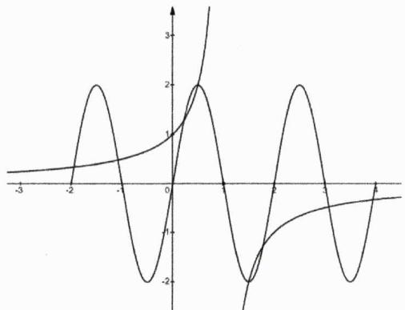

line

| x    | y      |
| ---- | ------ |
| -3.0 | 0.0000 |
| -2.5 | 0.0000 |
| -2.0 | 0.0000 |
| -1.5 | 0.0000 |
| -1.0 | 0.0000 |
| -0.5 | 0.0000 |
| 0.0  | 0.0000 |
| 0.5  | 0.0000 |
| 1.0  | 0.0000 |
| 1.5  | 0.0000 |
| 2.0  | 0.0000 |
| 2.5  | 0.0000 |
| 3.0  | 0.0000 |
| 3.5  | 0.0000 |
| 4.0  | 0.0000 |

例30. 已知函数 $f(x) = \frac{1}{x} + \frac{1}{x-2} + \frac{1}{x-4} + 3$ 的图像与函数 $g(x) = \frac{2^x + 2}{2^{x-2} + 1}$ 的图像交于点 $(x_1, y_1), (x_2, y_2), \cdots, (x_m, y_m)$ ，则 $\sum_{i=1}^{m}(x_i + y_i) =$ \_\_\_\_.

解析：由前述相关结论知，曲线 $f(x)$ 与 $g(x)=\frac{2^{x-2}-1}{2^{x-2}+1}+3$ 皆关于(2,3)成中心对称，数形易知两曲线共有4个交点，由此可得

$$
\sum_ {i = 1} ^ {m} (x _ {i} + y _ {i}) = 4 (2 + 3) = 2 0
$$

# 第 04 讲：高考对标训练

1. [1997 文 7]若函数 $y = f(x)$ 定义在实数集上，则函数 $y = f(x - 1)$ 与 $y = f(1 - x)$ 的图象关于()

A. 直线 $y = 0$ 对称

B. 直线 $x = 0$ 对称

C. 直线 $y = 1$ 对称

D.直线 $x = 1$ 对称

2. [2018 全国Ⅲ文 7]与函数 $y = \ln x$ 的图像关于直线 $x = 1$ 对称的是()

$$
\mathrm{A.} y = \ln (1 - x)
$$

$$
\mathrm{B.} y = \ln (2 - x)
$$

$$
\mathrm{C.} y = \ln (1 + x)
$$

$$
\mathrm{D.} y = \ln (2 + x)
$$

3. [2015 福建文 15]若函数 $f(x) = 2^{|x - a|}$ ( $a \in \mathbb{R}$ ) 满足 $f(1 + x) = f(1 - x)$ ，且 $f(x)$ 在 $[m, +\infty)$ 上单调递增，则实数 $m$ 的最小值等于 \_\_\_\_.

4. 已知函数 $y = a + 2\ln x \left( x \in \left[ \frac{1}{e}, e \right] \right)$ 的图像上存在点 $P$ ，函数 $y = -x^{2} - 2$ 的图象上存在点 $Q$ ，且 $P, Q$ 关于原点对称，则实数 $a$ 的取值范围是 \_\_\_\_.

5. 填空.

(1) [2013 重庆文 9]已知 $f(x)=ax^{3}+b\sin x+4(a,b\in\mathbb{R})$ , $f(\lg(\log_{2}10))=5$ , 则 $f(\lg(\lg2))=$ \_\_\_\_.

(2) 设函数 $f(x) = \frac{\sqrt{2}\sin\left(x + \frac{\pi}{4}\right) + 2x^2 + x}{2x^2 + \cos x}$ 的最大值与最小值分别为 $M$ 和 $N$ ，则 $M + N =$ \_\_\_\_.

6. 已知 $f(x) = \frac{1}{2} + \sin \left( x - \frac{1}{2} \right)$ ，数列 $\{a_n\}$ 满足 $a_n = f(0) + f\left(\frac{1}{n}\right) + \cdots + f\left(\frac{n-1}{n}\right) + f(1)$ ，则 $a_{2025} =$ \_\_\_\_.

7. [2016 全国Ⅱ文 12]已知函数 $f(x)$ （ $x \in \mathbb{R}$ ）满足 $f(x) = f(2 - x)$ ，若函数 $y = |x^2 - 2x - 3|$ 与 $y = f(x)$ 的图像的交点为 $(x_1, y_1), (x_2, y_2), \cdots, (x_m, y_m)$ ，则 $\sum_{i=1}^{m} x_i =$ \_\_\_\_.

8. 函数 $f(x)=\frac{x}{x+1}+\frac{x+1}{x+2}+\frac{x+2}{x+3}$ 的图像的对称中心为 \_\_\_\_.

9. 函数 $f(x)=\frac{8}{4+2^{x}}$ 的图像的对称中心是 \_\_\_\_.

10. 设函数 $g(x)=3^{x}$ ， $h(x)=9^{x}$ .

(1) 解方程: $x + \log_{3}(2g(x) - 8) = \log_{3}(h(x) + 9)$ ;

(2) 令 $p(x)=\frac{g(x)}{g(x)+\sqrt{3}}$ , $q(x)=\frac{3}{h(x)+3}$ , 求证:

$$
p \left(\frac {1}{2 0 2 6}\right) + p \left(\frac {2}{2 0 2 6}\right) + \dots + p \left(\frac {2 0 2 5}{2 0 2 6}\right) = q \left(\frac {1}{2 0 2 6}\right) + q \left(\frac {2}{2 0 2 6}\right) + \dots + q \left(\frac {2 0 2 5}{2 0 2 6}\right)
$$

(3) 若 $f(x) = \frac{g(x + 1) + a}{g(x) + b}$ 是实数集 $\mathbb{R}$ 上的奇函数，且 $f(h(x) - 1) + f(2 - k \cdot g(x)) > 0$ 对任意实数 $x$ 恒成立，求实数 $k$ 的取值范围.

# 第 04 讲：对标答案

# 1. [解析]:

由前述严格证明的定理知，两函数的图像关于直线 $x = 1$ 对称，从而选D.

# 2. [解析]:

显然新函数的表达式为 $y=f(2-x)=\ln(2-x)$ ，从而选B.

# 3. [解析]:

由题知曲线 $f(x)$ 的对称轴为直线x=1，故而有a=1，则有 $f(x)=2^{|x-1|}$ ，其增区间为 $[1,+\infty)$ ，由此知实数m的最小值等于1.

# 4. [解析]:

显然曲线 $y = -x^{2} - 2$ 关于原点对称的图像解析式为 $y = x^{2} + 2$ ，进而本题等价于

$$
f (x) = 2 \ln x - x ^ {2} + a - 2
$$

在 $x\in\left[\frac{1}{e},e\right]$ 上必有零点.因为 $f'(x)=\frac{2}{x}-2x$ 在 $\left[\frac{1}{e},1\right]$ 上满足 $f'(x)\geq0$ ，而在 $(1,e]$ 上满足 $f'(x)<0$ ，由此知x=1是函数 $f(x)$ 的极大值点，故而欲满足题意必有 $\left\{\begin{aligned}f(1)&=a-3\geq0\\ f\left(\frac{1}{e}\right)&=-\frac{1}{e^{2}}+a-4\leq0\\ f(e)&=-e^{2}+a\leq0\end{aligned}\right.$ ，解得 $a\in[3,e^{2}]$ .

# 5. [解析]:

第一问：注意到函数 $f(x)$ 的对称中心是(0,4)，而 $\frac{\lg(\log_{2}10)+\lg(\lg2)}{2}=0$ ，故而有

$$
f (\lg (\log_ {2} 1 0)) + f (\lg (\lg 2)) = 8 \Rightarrow f (\lg (\lg 2)) = 3
$$

第二问：因为

$$
f (x) = \frac {\sqrt {2} \sin \left(x + \frac {\pi}{4}\right) + 2 x ^ {2} + x}{2 x ^ {2} + \cos x} = 1 + \frac {\sin x + x}{2 x ^ {2} + \cos x}
$$

从而知函数 $f(x)$ 的图像关于(0,1)成中心对称，进而有 $M+m=2$ .

# 6. [解析]:

易知函数 $f(x)$ 的对称中心为 $\left(\frac{1}{2},\frac{1}{2}\right)$ ，故而有 $a_{n}=(n+1)\times\frac{1}{2}=\frac{1}{2}(n+1)$ ，由此可得 $a_{2025}=1013$ .

# 7. [解析]:

显然函数 $f(x)$ 与 $y = |x^{2} - 2x - 3|$ 的图像皆关于直线 $x = 1$ 对称，故而我们可将所有交点的横坐标一律视作1，从而有

$$
\sum_ {i = 1} ^ {m} x _ {i} = m \times 1 = m
$$

# 8. [解析]:

由前述推论知其对称中心为 $\left(\frac{-1-3}{2},3\right)$ 即有 $(-2,3)$ .

# 9. [解析]:

由前述结论知，曲线 $f(x)=\frac{pa^{x}+q}{ra^{x}+s}=\frac{8}{2^{x}+4}$ 的对称中心为

$$
\left(\log_ {a} \left| \frac {s}{r} \right|, \frac {1}{2} \left(\frac {p}{r} + \frac {q}{s}\right)\right)
$$

代入可求得曲线对称中心的坐标为(2,1).

# 10. [解析]:

第一问：由题知 $3^{x}(2g(x)-8)=h(x)+9$ ，即有 $3^{x}(2\cdot3^{x}-8)=9^{x}+9$ ，经整理得

$$
(3 ^ {x}) ^ {2} - 8 \cdot 3 ^ {x} - 9 = 0
$$

解得 $3^{x}=9$ 或 $3^{x}=-1$ （舍），从而有x=2.

第二问：由前述推论知曲线 $p(x)=\frac{3^{x}}{3^{x}+\sqrt{3}}$ 与 $q(x)=\frac{3}{9^{x}+3}$ 的对称中心皆为 $\left(\frac{1}{2},\frac{1}{2}\right)$ ，从而所证等式左右两侧的结果均为 $\frac{2025}{2}$ ，由此得证！

第三问: 由题知 $f(x)=\frac{3\cdot3^{x}+a}{3^{x}+b}$ ，若其为奇函数，必有b=1且a=-3，则有 $f(x)=\frac{3\cdot3^{x}-3}{3^{x}+1}$ 。易分析知 $f(x)$ 在R上单调递增，从而条件等价于 $h(x)-1>k\cdot g(x)-2$ ，进而有 $k<\frac{9^{x}+1}{3^{x}}=3^{x}+\frac{1}{3^{x}}$ ，因为 $3^{x}+\frac{1}{3^{x}}\geq2$ ，故而有k<2。

# 第 05 讲：对称性下的周期性方法论

在本讲我们将基于对称性系统探究函数的周期性及其系列经典综合题型，在此之前我们首先强调一下教材中有关周期性的定义.

定义5.1: 函数的周期性（periodic function）一般地，设函数 $f(x)$ 的定义域为D，如果存在一个非零常数T，使得对每一个 $x \in D$ ，都有 $x + T \in D$ ，且

$$
f (x + T) = f (x)
$$

那么函数 $f(x)$ 就叫做周期函数，非零常数T叫做这个函数的周期（period）。如果在周期函数 $f(x)$ 的所有周期中存在一个最小的正数，那么这个最小正数就叫做 $f(x)$ 的最小正周期。

例1. 定义在 $\mathbb{R}$ 上的函数 $f(x)$ 满足 $f(x + 1) = f(x) - 2$ ，则下列是周期函数的是（）

A. $y = f(x) - x$

B. $y = f(x) + x$

C. $y = f(x) - 2x$

D. $y = f(x) + 2x$

解析：因为 $f(x+1)=f(x)-2$ ，故而有

$$
f (x + 1) + 2 (x + 1) = f (x) + 2 x
$$

进而说明 $f(x)+2x$ 是周期为1的函数，由此本题选D.

推论5.1: 周期性基本推论 设函数 $f(x)$ 的定义域为D，如果存在两个不相等的非零常数a和b，使得对每一个 $x \in D$ ，都有 $x + a \in D$ ， $x + b \in D$ ，且

$$
f (x + a) = f (x + b)
$$

那么 $T=|b-a|$ 是函数 $f(x)$ 的一个周期.

推论证明：令 $x - a = x \in D$ ，则有

$$
f (x) = f (x + b - a)
$$

根据函数周期性的定义知 $T=|b-a|$ 是函数 $f(x)$ 的一个周期，证毕.

例2. 设函数 $f(x) = \left|\left(\frac{1}{2}\right)^{|x|} - \frac{1}{2}\right| - \left(\frac{1}{2}\right)^{|x|}$ ，则函数 $y = f(f(x))$ ( )

A. 是偶函数也是周期函数

B. 是偶函数但不是周期函数

C.不是偶函数是周期函数

D.既不是偶函数也不是周期函数

解析：显而易见的是

$$
f (x) = \left\{ \begin{array}{l} \frac {1}{2} - \left(\frac {1}{2}\right) ^ {| x | - 1}, | x | > 1 \\ - \frac {1}{2}, | x | \leq 1 \end{array} \right.
$$

易分析知 $\forall x \in \mathbb{R}$ 皆有 $|f(x)| \leq \frac{1}{2}$ , 故而有 $y = f(f(x)) = -\frac{1}{2}$ (常数函数), 从而说明 $y = f(f(x))$ 既是偶函数也是周期函数 (无最小正周期), 故而本题选 A.

例3. 若函数 $f(x)$ 满足 $f(x+1)=1+\sqrt{2f(x)-f^{2}(x)}$ （ $x\in\mathbb{R}$ ），则 $f(1)+f(2024)$ 的最大值是 \_\_\_\_.

解析：由条件知 $f(x)\in[0,2]$ ，显而易见的是

$$
[ f (x + 1) - 1 ] ^ {2} + [ f (x) - 1 ] ^ {2} = 1
$$

令 $x=x+1$ ，则有

$$
[ f (x + 2) - 1 ] ^ {2} + [ f (x + 1) - 1 ] ^ {2} = 1
$$

由此可得

$$
[ f (x + 2) - 1 ] ^ {2} = [ f (x) - 1 ] ^ {2}
$$

故而有

$$
f (x + 2) = f (x) \text {或} f (x + 2) + f (x) = 2 (\text {舍去})
$$

上式说明2是函数 $f(x)$ 的一个周期，结合周期性及Cauchy不等式知

$$
\begin{array}{l} f (1) + f (2 0 2 4) = f (1) + f (0) = f (0) + \sqrt {1 - [ f (0) - 1 ] ^ {2}} + 1 \\ = [ f (0) - 1 ] + \sqrt {1 - [ f (0) - 1 ] ^ {2}} + 2 \\ \leq \sqrt {2} \cdot \sqrt {[ f (0) - 1 ] ^ {2} + 1 - [ f (0) - 1 ] ^ {2}} + 2 \\ = 2 + \sqrt {2} \\ \end{array}
$$

当且仅当 $f(0)=1+\frac{\sqrt{2}}{2}$ 时上式取等，故而 $f(1)+f(2024)$ 的最大值是 $2+\sqrt{2}$ .

铭师道·高中数学方法原本

通过对上述例题的解答过程我们可总结出如下一结论.

结论5.1: 一个特殊的根式周期模型 当 $x \in \mathbb{R}$ 且 $a \neq 0$ 时, 若恒有

$$
f (x + a) = 1 + \sqrt {2 f (x) - f ^ {2} (x)}
$$

则函数 $f(x)$ 的一个周期是2|a|.

接下来我们快速认识一些常见的、基础的周期函数模型（在数列章节我们还会用蛛网图讨论周期模型的本质，并继续拓展经典的周期模型）.

结论5.2: 常见周期模型 $^{1}$ 一般地，设函数 $f(x)$ 的定义域为D，如果存在一个正常数a，使得对每一个 $x\in D$ ，都有 $x+a\in D$ ，若以下等式恒成立：

(i) $f(x + a) = -f(x) + b \quad (b \in \mathbb{R})$ ;   
(ii) $f(x + a) = \frac{b}{f(x)}$ ( $b \in R$ 且 $b \neq 0$ );   
(iii) $f(x + a) = \frac{mf(x) + b}{cf(x) - m}$ （ $m, b, c \in \mathbb{R}, c \neq 0, m^2 + bc \neq 0$ ）.

则都能说明函数 $f(x)$ 的一个周期为

$$
T = 2 a
$$

结论证明：若 $f(x+a)=-f(x)+b$ ，则有

$$
f (x + 2 a) = - f (x + a) + b = [ f (x) - b ] + b = f (x)
$$

从而说明函数 $f(x)$ 的一个周期为T=2a. 若 $f(x+a)=\frac{b}{f(x)}$ ，则有

$$
f (x + 2 a) = \frac {b}{f (x + a)} = f (x)
$$

从而说明函数 $f(x)$ 的一个周期为T=2a. 若 $f(x+a)=\frac{mf(x)+b}{cf(x)-m}$ ，则有

$$
f (x + 2 a) = \frac {m f (x + a) + b}{c f (x + a) - m} = \frac {m [ m f (x) + b ] + b [ c f (x) - m ]}{c [ m f (x) + b ] - m [ c f (x) - m ]} = f (x)
$$

从而说明函数 $f(x)$ 的一个周期为T=2a.综上证毕.

例4. 若 $f(x)$ 是 $\mathbb{R}$ 上的奇函数，且满足 $f(x + 2) = \frac{-1}{f(x)}$ ， $f(1) = 1$ ， $f(-2) = 2$ ，则 $f(2) - f(3) =$ \_\_\_\_.

解析：显而易见的是函数 $f(x)$ 的一个周期为4，又因其是奇函数，故而有

$$
f (2) - f (3) = - f (- 2) - f (- 1) = - f (- 2) + f (1) = - 1
$$

例5. 填空.

(1) 已知 $f(x+2)=\frac{f(x)+1}{f(x)-1}$ （ $x\in\mathbb{R}$ ），若 $f(-1)=2$ ，则 $f(2025)=$ \_\_\_\_.  
(2) 已知 $f(x+2)=\frac{1+f(x)}{1-f(x)}$ （ $x\in\mathbb{R}$ ），若 $f(1)=2+\sqrt{3}$ ，则 $f(2029)=$ \_\_\_\_.

解析：

第一问：由前述模型知函数 $f(x)$ 的一个周期为4，从而有 $f(2025)=f(1)=\frac{2+1}{2-1}=3$ .

第二问：由周期模型知函数 $f(x)$ 的一个周期为8，从而有 $f(2029)=f(5)=\frac{1+f(3)}{1-f(3)}=-\frac{1}{f(1)}=\sqrt{3}-2.$

例6. 定义在 $\mathbb{R}$ 上的函数 $f(x)$ 满足 $f(x + 1) + f(x - 1) = f(2022)$ , $f(-2x + 1) = f(2x + 5)$ , 若 $f\left(\frac{1}{2}\right) = \frac{1}{2}$ , 则 $f(2022) =$ \_\_\_\_, $\sum_{k=1}^{100} kf\left(k - \frac{1}{2}\right) =$ \_\_\_\_.

解析：由 $f(x+1)+f(x-1)=f(2022)$ 知 $f(x+2)=-f(x)+f(2022)$ ，由前述结论知函数 $f(x)$ 的一个周期为4.

因为 $f(-2x+1)=f(2x+5)$ ，若令 $x=\frac{1}{2}$ ，则有 $f(0)=f(6)=f(2)$ ；再令 $x=-\frac{1}{2}$ ，则有 $f(2)=f(4)$ ，故而有

$$
f (0) = f (2) = f (4)
$$

若令 $f(x+1)+f(x-1)=f(2022)$ 中的x=1，则有

$$
f (0) + f (2) = 2 f (2) = f (2 0 2 2) = f (2) \Rightarrow f (2 0 2 2) = 0
$$

进而有 $f(x+1)+f(x-1)=0$ .若令 $f(-2x+1)=f(2x+5)$ 中的2x=x，则有

$$
f (- x + 1) = f (x + 5) = f (x + 1)
$$

因为 $f\left(\frac{1}{2}\right)=\frac{1}{2}$ ，易算得

$$
f \left(\frac {3}{2}\right) = \frac {1}{2}, f \left(\frac {5}{2}\right) = - f \left(\frac {1}{2}\right) = - \frac {1}{2}, f \left(\frac {7}{2}\right) = - f \left(\frac {3}{2}\right) = - \frac {1}{2}, \dots
$$

利用周期性知

$$
\sum_ {k = 1} ^ {1 0 0} k f \left(k - \frac {1}{2}\right) = \underbrace {\frac {1}{2} (1 + 2 - 3 - 4) + \cdots + \frac {1}{2} (9 7 + 9 8 - 9 9 - 1 0 0)} _ {\text {共25组}} = - 5 0
$$

结论5.3: 常见周期模型 $^{II}$ 一般地, 设函数 $f(x)$ 的定义域为D, 如果存在一个正常数a, 使得对每一个 $x \in D$ , 都有 $x + a \in D$ , 若以下等式恒成立:

(i) $f(x + a) = 1 - \frac{1}{f(x)};$   
(ii) $f(x + a) = -\frac{1}{1 + f(x)};$   
(iii) $f(x + a) = \frac{1}{1 - f(x)}$ .

则都能说明函数 $f(x)$ 的一个周期为T=3a.

结论证明：若 $f(x+a)=1-\frac{1}{f(x)}$ ，则有

$$
f (x + 2 a) = 1 - \frac {1}{f (x + a)} = \frac {- 1}{f (x) - 1} \Longrightarrow f (x + 3 a) = \frac {- 1}{f (x + a) - 1} = \frac {- 1}{- \frac {1}{f (x)}} = f (x)
$$

从而说明函数 $f(x)$ 的一个周期为 $T = 3a$ . 若 $f(x + a) = -\frac{1}{1 + f(x)}$ ，则有

$$
f (x + 2 a) = - \frac {1}{1 + f (x + a)} = - \frac {1}{f (x)} - 1 \Rightarrow f (x + 3 a) = - \frac {1}{f (x + a)} - 1 = f (x)
$$

从而说明函数 $f(x)$ 的一个周期为T=3a. 若 $f(x+a)=\frac{1}{1-f(x)}$ ，则有

$$
f (x + 2 a) = \frac {1}{1 - f (x + a)} = 1 - \frac {1}{f (x)} \Longrightarrow f (x + 3 a) = 1 - \frac {1}{f (x + a)} = 1 - [ 1 - f (x) ] = f (x)
$$

从而说明函数 $f(x)$ 的一个周期为T=3a.综上证毕.

例7. 已知 $f(x+2)=-\frac{1}{1+f(x)}$ ， $f(1)=1$ ，则f(2025)的值为\_\_\_\_。

解析：显然函数 $f(x)$ 的一个周期为6，故而有 $f(2025)=f(3)=-\frac{1}{1+f(1)}=-\frac{1}{2}$ .

结论5.4: 常见周期模型 $^{11}$ 一般地，设函数 $f(x)$ 的定义域为D，如果存在一个正常数a，使得对每一个 $x\in D$ ，都有 $x+a\in D$ ，若以下等式恒成立

$$
f (x + a) = \frac {1 + f (x)}{1 - f (x)}
$$

则说明函数 $f(x)$ 的一个周期为T=4a.

结论证明：当 $f(x+a)=\frac{1+f(x)}{1-f(x)}$ 时，若令 $x=x+a$ ，则有

$$
f (x + 2 a) = \frac {1 + f (x + a)}{1 - f (x + a)} = \frac {[ 1 - f (x) ] + [ 1 + f (x) ]}{[ 1 - f (x) ] - [ 1 + f (x) ]} = - \frac {1}{f (x)}
$$

在上述等式的基础上再令 $x = x + 2a$ ，则有

$$
f (x + 4 a) = - \frac {1}{f (x + 2 a)} = f (x)
$$

证毕.

例8. 已知函数 $f(x)$ 满足 $f(x+1)=\frac{1+f(x)}{1-f(x)}$ ，当 $f(1)=2$ 时， $f(2024)+f(2025)$ 的值为 \_\_\_\_.

解析：由上述模型知函数 $f(x)$ 的一个周期为4，由此知

$$
f (2 0 2 4) + f (2 0 2 5) = f (0) + f (1) = f (0) + 2
$$

令x=0，则有 $f(1)=\frac{1+f(0)}{1-f(0)}=2$ ，解得 $f(0)=\frac{1}{3}$ ，故而有

$$
f (2 0 2 4) + f (2 0 2 5) = \frac {7}{3}
$$

铭师道·高中数学方法原本

结论5.5: 常见周期模型 $^{IV}$ 一般地, 设函数 $f(x)$ 的定义域为D, 如果存在一个正常数a, 使得对每一个 $x \in D$ , 都有 $x + a \in D$ , 若以下等式恒成立:

$$
f (x + a) = f (x + 2 a) + f (x)
$$

则说明函数 $f(x)$ 的一个周期为T=6a.

结论证明：当 $f(x+a)=f(x+2a)+f(x)$ 时，令 $x=x+a$ ，则有

$$
f (x + 2 a) = f (x + 3 a) + f (x + a) = f (x + 3 a) + f (x + 2 a) + f (x)
$$

进而有

$$
f (x + 3 a) = - f (x)
$$

故而有

$$
f (x + 6 a) = - f (x + 3 a) = f (x)
$$

从而说明函数 $f(x)$ 的一个周期为T=6a，证毕.

例9. [2022 新高考 II T8] 若函数 $f(x)$ 的定义域为 $\mathbb{R}$ , 且 $f(x + y) + f(x - y) = f(x)f(y)$ , $f(1) = 1$ , 则 $\sum_{k=1}^{22} f(k) =$ \_\_\_\_.

解析：若令y=1，则有

$$
f (x + 1) + f (x - 1) = f (x)
$$

由上述周期模型知函数 $f(x)$ 的一个周期为6.

① 令 $y = 0, x = 1$ ，则有 $2f(1) = f(1)f(0)$ ，进而有 $f(0) = f(6) = 2$ ;  
② 令 $x = y = 1$ ，则有 $f(2) + f(0) = f(1) \cdot f(1)$ ，进而有 $f(2) = -1$   
③ 令x=2,y=1，则有 $f(3)+f(1)=f(2)f(1)$ ，进而有 $f(3)=-2$ ;  
④ 令x=3,y=1，则有 $f(4)+f(2)=f(3)f(1)$ ，进而有 $f(4)=-1$ ;  
⑤ 令x=4,y=1，则有 $f(5)+f(3)=f(4)f(1)$ ，进而有 $f(5)=1$ .

由上可得

$$
\sum_ {k = 1} ^ {2 2} f (k) = 4 \sum_ {k = 1} ^ {6} f (k) - f (5) - f (6) = - 3
$$

结论5.6: 常见周期模型 $^{v}$ 一般地, 若定义在 $D$ 上的函数 $f(x)$ 满足下列条件之一

(i) 函数 $f(x)$ 的图像同时关于不同两直线x=a和x=b成轴对称；  
(ii) 函数 $f(x)$ 的图像同时关于不同两点 $(a,c)$ 和 $(b,c)$ 成中心对称.

则说明 $f(x)$ 的一个周期为

$$
T = 2 | a - b |
$$

结论证明：若函数 $f(x)$ 的图像同时关于直线x=a和x=b成轴对称，则有

$$
f (x) = f (2 a - x) = f (2 b - x)
$$

从而说明函数 $f(x)$ 的一个周期为 $T = 2|a - b|$ . 同理，当函数 $f(x)$ 的图像同时关于点 $(a, c)$ 和 $(b, c)$ 成中心对称时，有

$$
f (x) + f (2 a - x) = f (x) + f (2 b - x) = 2 c
$$

继而有

$$
f (2 a - x) = f (2 b - x)
$$

由此说明函数 $f(x)$ 的一个周期为 $T = 2|a - b|$ . 综上得证.

例10. [多选]已知定义在 $\mathbb{R}$ 上的函数 $y = f(x)$ 满足 $f\left(x - \frac{3}{2}\right) = -f(x)$ , 且 $f\left(x + \frac{3}{4}\right)$ 为奇函数, $f(-1) = -1$ , $f(0) = 2$ . 下列说法正确的是 ( )

A.3是函数 $y=f(x)$ 的一个周期  
B. 函数 $y = f(x)$ 的图像关于直线 $x = \frac{3}{4}$ 对称  
C. 函数 $y = f(x)$ 的图像关于点 $\left(\frac{3}{4}, 0\right)$ 对称  
D. $f(1)+f(2)+f(3)+\cdots+f(2026)=-1$

解析: 由题知函数 $f(x)$ 的图像同时关于点 $\left(-\frac{3}{4}, 0\right)$ 和 $\left(\frac{3}{4}, 0\right)$ 成中心对称, 故而知3是函数 $y = f(x)$ 的一个周期. 由条件还易知

$$
f \left(- x + \frac {3}{2}\right) = - f (x) = f \left(x - \frac {3}{2}\right) \Longrightarrow f \left(- x + \frac {3}{2}\right) = f \left(x - \frac {3}{2}\right) \Longrightarrow f (x) = f (- x)
$$

故而知 $f(x)$ 为偶函数.又因为 $f(-1)=-1,\quad f(0)=2$ ，从而可得

$$
f (1) = f (- 1) = f (2) = - 1, f (3) = f (0) = 2
$$

继而可得

$$
f (1) + f (2) + f (3) + \dots + f (2 0 2 6) = 6 7 5 [ f (1) + f (2) + f (3) ] + f (1) = - 1
$$

综上，正确选项为 ACD.

例11. [多选]已知函数 $y = f(x)$ ( $x \in \mathbb{R}$ ) 的图像既关于点(1,1)中心对称又关于点(2,2)中心对称，则（）

A. $f(x)$ 是周期函数

B. $f(x)$ 是奇函数

C. $f(x)$ 既没有最大值也没有最小值

D. 函数 $g(x) = f(x) - x (x \in \mathbb{R})$ 是周期函数

解析：依题可得

$$
f (x) + f (2 - x) = 2 \text {(1)}, f (2 + x) + f (2 - x) = 4 \text {(2)}
$$

进而有

$$
f (2 + x) = f (x) + 2
$$

继而有

$$
f (2 + x) - (2 + x) = f (x) - x
$$

由此说明函数 $g(x)=f(x)-x(x\in\mathbb{R})$ 是周期函数.再由 $f(x)+f(2-x)=2$ 可知

$$
f (x + 2) + f (- x) = 2 \tag {③}
$$

由①加③减②可得 $f(x)+f(-x)=0$ ，由此说明 $f(x)$ 是奇函数。现假设 $f(x)$ 存在最大值M，且有

$$
f (x _ {0}) = M
$$

则必有 $f(-x_{0})=-M$ ，令①式中的 $x=-x_{0}$ ，则有

$$
f (2 + x _ {0}) = 2 - f (- x _ {0}) = 2 - (- M) = 2 + M > M
$$

这显然是矛盾的（因为所有函数值都应小于等于M），故而 $f(x)$ 既没有最大值也没有最小值.综上本题正确选项是BCD.

例12. [2022 全国乙理 T12]已知函数 $f(x), g(x)$ 的定义域均为R，且 $f(x) + g(2 - x) = 5$ ， $g(x) - f(x - 4) = 7$ . 若 $y = g(x)$ 的图像关于直线 $x = 2$ 对称， $g(2) = 4$ ，则 $\sum_{k=1}^{22} f(k) =$ \_\_\_\_.

解析: 由 $f(x) + g(2 - x) = 5$ 可知 $f(x)$ 与 $g(x)$ 的图像关于 $\left(1, \frac{5}{2}\right)$ 成中心对称, 因为 $g(x)$ 的图像关于直线 $x = 2$ 对称, 则 $f(x)$ 的图像必关于直线 $x = 0$ 对称. 又因 $f(x - 4) = g(x) - 7$ , 则说明 $f(x)$ 的图像必关于直线 $x = -2$ 对称, 由此知 $f(x)$ 的一个周期为 $T = 4$ .

因为 $f(0)+g(2)=5$ 且 $g(2)=4$ ，则有

$$
f (0) = f (4) = 1
$$

显然 $f(-2)=g(2)-7=-3$ ，则有

$$
f (2) = - 3
$$

又因为 $f(-1)+g(3)=5$ 且 $g(3)-f(-1)=7$ ，联立可解得

$$
f (- 1) = f (3) = - 1
$$

继而可得 $f(1)=-1$ ，故而有

$$
\sum_ {k = 1} ^ {2 2} f (k) = 5 (- 1 - 3 - 1 + 1) - 1 - 3 = - 2 4
$$

事实上若在解题时严格推导诸如前述结论5.6是非常低效的，我们其实可借助正、余弦函数的图像来直观地理解上述结论。如下左图代表正弦函数的局部图像，如果我们把直线 $x = a$ 和 $x = b$ 理解成其相邻的两对称轴，则其周期必然为 $2|a - b|$ ；再如下右图所示，其代表某一正弦型函数 $y = A\sin (\omega x + \varphi) + k$ 的局部图像，若将 $(a, c)$ 和 $(b, c)$ 视为其相邻的两对称中心，则其周期亦为 $2|a - b|$ 。今后我们把借助三角函数图像来理解抽象函数周期的方法称为三角图示法。

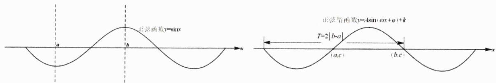

text_image

正弦函数y=sin
a
b
x
正弦量函数y=Asin(ox+φ)+k
T=2|b-a|
(a,c)
(b,c)
x

铭师道·高中数学方法原本

命题5.1: 周期中的三角图示法 基于务实性的考量, 我们常用如上所述的三角图示法来理解甚至直接推出基于对称性或奇偶性下的抽象函数的周期.

结论5.7: 常见周期模型 $^{vi}$ 一般地, 若定义在D上的函数 $f(x)$ 的图像既关于点 $(a,c)$ 成中心对称, 又关于直线x=b成轴对称, 则说明 $f(x)$ 的一个周期为

$$
T = 4 | a - b |
$$

结论证明: 若函数 $f(x)$ 的图像既关于点 $(a, c)$ 成中心对称, 又关于直线 $x = b$ 成轴对称, 则必有

$$
f (x) = f (2 b - x) = 2 c - f (2 a - x)
$$

若令 $x = 2b - x$ ，则有

$$
f (x) = 2 c - f (2 a - 2 b + x)
$$

继续令 $x=2a-2b+x$ ，则有

$$
f (2 a - 2 b + x) = 2 c - f (4 a - 4 b + x) \Rightarrow f (4 a - 4 b + x) = f (x)
$$

从而证得 $T=4|a-b|$ 是函数 $f(x)$ 的一个周期.

例13. 已知定义在 $\mathbb{R}$ 上的函数 $f(x)$ 满足 $f(4 - x) + f(x) = 2$ ，若 $f(x)$ 的图像关于直线 $x = 4$ 对称，则 $f(-2) =$ \_\_\_\_.

解析: 显而易见的是函数函数 $f(x)$ 的图像既关于(2,1)成中心对称, 又关于直线 $x = 4$ 成轴对称, 故而知它的一个周期为8, 由此可得 $f(-2) = f(6)$ . 若令 $f(4 - x) + f(x) = 2$ 中的 $x = 6$ , 则有

$$
f (- 2) + f (6) = 2 f (- 2) = 2 \Rightarrow f (- 2) = 1
$$

例14. [2021 新高考IIT8]已知函数 $f(x)$ 的定义域为 $\mathbb{R}$ ( $f(x)$ 不恒为0), $f(x+2)$ 为偶函数, $f(2x+1)$ 为奇函数, 则()

A. $f\left(-\frac{1}{2}\right)=0$

B. $f(-1)=0$

C. $f(2)=0$

D. $f(4)=0$

解析：因为 $f(2x+1)$ 为奇函数，故而有 $f(2x+1)=-f(-2x+1)$ ，令2x=x，则有

$$
f (x + 1) = - f (- x + 1)
$$

由此说明函数 $f(x)$ 的图像关于(1,0)成中心对称.而由 $f(x+2)$ 为偶函数知函数 $f(x)$ 的图像关于x=2成轴对称，由此知 $f(x)$ 的一个周期为4，故而知

$$
f (- 1) = - f (3) = - f (- 1) \Rightarrow f (- 1) = 0
$$

由此本题选 B.

例15. [2021 甲理 12]设函数 $f(x)$ 的定义域为R， $f(x+1)$ 为奇函数， $f(x+2)$ 为偶函数，当 $x\in[1,2]$ 时， $f(x)=ax^{2}+b$ 。若 $f(0)+f(3)=6$ ，则 $f\left(\frac{9}{2}\right)=$ \_\_\_\_。

解析：由题知函数 $f(x)$ 的图像既关于(1,0)成中心对称又关于直线x=2成轴对称，故而知4是函数的一个周期.由上述分析易知

$$
f (1) = f (3) = 0 \Rightarrow f (0) = 6 \Rightarrow f (2) = - 6
$$

从而有 $f(2)=4a+b=-6$ ，又因 $f(1)=a+b=0$ ，联立前述两方程可解得a=-2，b=2，由此可得当 $x\in[1,2]$ 时

$$
f (x) = - 2 x ^ {2} + 2
$$

结合周期性及对称性知

$$
f \left(\frac {9}{2}\right) = f \left(\frac {1}{2}\right) = - f \left(\frac {3}{2}\right) = \frac {5}{2}
$$

结论5.8: 常见周期模型 $^{vii}$ 一般地，若定义在D上的函数 $f(x)$ 满足下列条件之一

(i) 函数 $f(x)$ 是偶函数且图像关于直线 $x = a (a \neq 0)$ 对称；

(ii) 函数 $f(x)$ 是奇函数且图像关于 $(a,0)$ （ $a\neq0$ ）成中心对称.

则说明 $f(x)$ 的一个周期为T=2a.

结论证明：若函数 $f(x)$ 是偶函数且图像关于直线x=a对称，则有

$$
f (- x) = f (x), f (- x) = f (2 a + x) \Rightarrow f (2 a + x) = f (x)
$$

若函数 $f(x)$ 是奇函数且图像关于 $(a,0)$ 成中心对称，则有

$$
f (- x) + f (x) = 0, f (- x) + f (2 a + x) = 0 \Rightarrow f (2 a + x) = f (x)
$$

以上两个等式都能说明T=2a是函数 $f(x)$ 的一个周期，证毕.

例16. [2009全国I理11]已知函数 $f(x+1)$ 为奇函数， $f(x-1)$ 也为奇函数，则()

A. $f(x)$ 为奇函数

B. $f(x)$ 为偶函数

C. $f(x+2)=f(x)$

D. $f(x+3)$ 为奇函数

解析: 由题知函数 $f(x)$ 的图像既关于 $(1,0)$ 成中心对称, 也关于 $(-1,0)$ 成中心对称, 故而可推出函数的一个周期为4, 继而可知 $f(x+4-1)=f(x+3)$ 也为奇函数, 故而本题选D.

例17. [多选]已知函数 $f(x)$ 为R上的奇函数， $f(1+x)$ 为偶函数，则()

A. $f(-2-x)+f(x)=0$

B. $f(-x)=f(1+x)$

C. $f(x+2)=f(x-2)$

D. $f(2024)=0$

解析：依题知 $f(x)$ 为奇函数且其图像关于x=1成轴对称，故而知其一个周期为4，进而有

$$
f (2 0 2 4) = f (0) = 0
$$

由此知 CD 选项正确，另外经逐个判断易说明 AB 皆错误，故而本题选 CD.

结论5.9: 常见周期模型 $^{viii}$ 一般地，若定义在D上的函数 $f(x)$ 满足下列条件之一

(i) 函数 $f(x)$ 是奇函数且图像关于直线 $x = a (a \neq 0)$ 对称；  
(ii) 函数 $f(x)$ 是偶函数且图像关于 $(a,0)$ （ $a\neq0$ ）成中心对称.

则说明 $f(x)$ 的一个周期为T=4a.

结论证明：若函数 $f(x)$ 是奇函数且图像关于直线x=a对称，则有

$$
f (- x) = - f (x) = f (2 a + x) \Rightarrow f (4 a + x) = - f (2 a + x) = f (x)
$$

若函数 $f(x)$ 是偶函数且图像关于 $(a,0)$ 成中心对称，则有

$$
f (- x) = f (x) = - f (2 a + x) \Rightarrow f (4 a + x) = - f (2 a + x) = f (x)
$$

以上两个等式都说明T=4a是函数 $f(x)$ 的一个周期，证毕.

例18. [多选]已知函数 $f(x)$ 是定义域为R的偶函数， $f(2x+1)-1$ 是奇函数，则下列结论正确的是()

A. $f(1)=1$

B. $f(0)=0$

C. $f(x)$ 是以4为周期的函数

D. $f(x)$ 的图像关于x=6对称

解析: 因为 $f(2x+1)-1$ 是奇函数, 故而函数 $f(2x)$ 的图像关于 $\left(\frac{1}{2},1\right)$ 成中心对称, 进而可得 $f(x)$ 的图像关于(1,1)成中心对称, 再加之 $f(x)$ 是偶函数, 故而可推导出函数的一个周期为4, 至此AC选项皆正确. 接下来我们证明D选项的正确性:

因为函数 $f(x)$ 的图像关于(1,1)成中心对称，故而有

$$
f (x) + f (2 - x) = 2 \Longrightarrow f (2 + x) + f (- x) = 2
$$

因为 $f(x)$ 是偶函数，故而有

$$
f (2 + x) + f (x) = 2 \Longrightarrow f (2 - x) = f (2 + x)
$$

由此说明 $f(x)$ 的图像关于直线x=2对称，又因其周期为4，故而 $f(x)$ 的图像也必定关于直线x=6对称。综上正确选项是ACD.

推论5.2: 奇零点推论 若函数 $f(x)$ 是定义在R上的奇函数，T是它的一个周期，则必有

$$
f \left(\frac {T}{2}\right) = 0
$$

推论证明：因为函数 $f(x)$ 是定义在R上的奇函数且周期为T，则有

$$
f \left(- \frac {T}{2}\right) = f \left(- \frac {T}{2} + T\right) = f \left(\frac {T}{2}\right) = - f \left(\frac {T}{2}\right)
$$

由此可得

$$
f \left(\frac {T}{2}\right) = 0
$$

证毕.

例19. [2018 全国Ⅱ理 11]已知 $f(x)$ 是定义域为 $(-∞,+∞)$ 的奇函数，满足 $f(1-x)=f(1+x)$ . 若 $f(1)=2$ ，则 $f(1)+f(2)+\cdots+f(50)=$ \_\_\_\_.

解析：由题知函数 $f(x)$ 是奇函数且图像关于直线x=1对称，故而它的一个周期4，由此必有

$$
f \left(\frac {4}{2}\right) = f (2) = 0
$$

铭师道·高中数学方法原本

继续由已知可得

$$
f (3) = - f (- 3) = - f (1) = - 2, f (4) = f (0) = 0
$$

故而有

$$
f (1) + f (2) + \dots + f (5 0) = 1 2 [ f (1) + f (2) + f (3) + f (4) ] + f (1) + f (2) = f (1) + f (2) = 2
$$

例20. [2007 安徽理 11]定义在 $\mathbb{R}$ 上的函数 $f(x)$ 既是奇函数, 又是周期函数, $T$ 是它的一个正周期. 若将方程 $f(x)=0$ 在闭区间 $[-T,T]$ 上的根的个数记为 $n$ , 则 $n$ 可能为 \_\_\_\_.

解析：因为 $f(x)$ 是奇函数且T是它的一个正周期，则有

$$
f \left(\frac {T}{2}\right) = 0
$$

利用奇函数性质知

$$
f \left(- \frac {T}{2}\right) = - f \left(\frac {T}{2}\right) = 0
$$

再次利用奇偶性及周期性可得 $f(0)=f(T)=f(-T)=0$ ，从而n的值至少为5.

例21. 已知函数 $f(x)$ ( $x \in R$ ) 是以4为周期的奇函数，当 $x \in (0,2)$ 时， $f(x) = \ln (x^2 - x + a)$ ，若函数 $f(x)$ 在区间[-2,2]上有5个零点，则实数a的取值范围是 \_\_\_\_.

解析：因为函数 $f(x)$ 是以4为周期的定义在R上的奇函数，故而有

$$
f (0) = f (2) = f (- 2) = 0
$$

从而当 $x\in(0,2)$ 时， $f(x)$ 只能有唯一一个零点，也即方程

$$
x ^ {2} - x = 1 - a
$$

在(0,2)上有唯一解.如下图所示，当 $1-a=-\frac{1}{4}$ 即 $a=\frac{5}{4}$ 或 $0\leq1-a<2$ 即 $-1<a\leq1$ 时符合题意.另一方面，当 $x\in(0,2)$ 时必须使 $x^{2}-x+a>0$ ，则必有

$$
\Delta = 1 - 4 a <   0 \Longrightarrow a > \frac {1}{4}
$$

综上 $a\in\left(\frac{1}{4},1\right]\cup\left\{\frac{5}{4}\right\}$ .

line

| x | y |
|---|---|
| -0.5 | 0 |
| 0 | 0 |
| 0.5 | 0 |
| 1 | 0.5 |
| 2 | 2 |

接下来我们再扩充一个非常简单的结论.

结论5.10: 导数的对称性 若函数 $f(x)$ 的图像关于 $(a,b)$ 成中心对称（其中a,b是常数），则其导函数 $f'(x)$ 的图像必关于直线x=a成轴对称，

结论证明：因为 $f(x)$ 的图像关于 $(a,b)$ 成中心对称，故而必有

$$
f (x) = - f (2 a - x) + 2 b
$$

两边同时求导可得

$$
f ^ {\prime} (x) = - f ^ {\prime} (2 a - x)
$$

故而说明 $f'(x)$ 的图像必关于直线x=a成轴对称，证毕.

例22. [多选][2022 新高考I12]已知函数 $f(x)$ 及其导函数 $f'(x)$ 的定义域均为R，记 $g(x)=f'(x)$ ，若 $f\left(\frac{3}{2}-2x\right)$ ， $g(2+x)$ 均为偶函数，则()

A. $f(0)=0$

B. $g\left(-\frac{1}{2}\right)=0$

C. $f(-1)=f(4)$

D. $g(-1)=g(2)$

解析：因为 $g(2+x)$ 为偶函数，则说明 $g(x)$ 的图像关于x=2成轴对称，进而说明函数 $f(x)$ 的图像关于点 $(2,t)$ （t为常数）成中心对称.

因为 $f\left(\frac{3}{2}-2x\right)$ 为偶函数，则有 $f\left(\frac{3}{2}-2x\right)=f\left(\frac{3}{2}+2x\right)$ ，由此说明 $f(x)$ 的图像关于 $x=\frac{3}{2}$ 成轴对称，进而说明 $g(x)$ 的图像关于 $\left(\frac{3}{2},0\right)$ 成中心对称.

综上可得函数 $f(x)$ 和 $g(x)$ 的一个周期为T=2，进而知 $f(x)$ 的图像也关于 $(0,t)$ 成中心对称，则有

$$
f (0) = f (4) = f (1) = f (- 1) = t
$$

故而 A 选项错误，而 C 选项正确.由前面性质易知

$$
g \left(- \frac {1}{2}\right) = g \left(\frac {3}{2}\right) = 0 \text {且} g (- 1) + g (4) = g (- 1) + g (2) = 0
$$

故而 B 选项正确，而 D 选项错误（只能得到 $g(-1) = -g(2)$ ）。综上本题选 BC.

例23. [多选]设函数 $f(x)$ 为R上的奇函数， $f'(x)$ 为 $f(x)$ 的导函数， $f(2x+1)-f(2-2x)=4x-1$ ， $f(1)=1$ ，则下列说法中一定正确的有()

A. $f(2)=2$

B. $f\left(\frac{3}{2}\right)=\frac{3}{2}$

C. $f'\left(\frac{123}{2}\right)=1$

D. $\sum_{i=1}^{59} f'\left(\frac{i}{20}\right) = 59$

解析：令x=0，则有

$$
f (1) - f (2) = - 1 \Longrightarrow f (2) = 2
$$

由此 A 选项正确. 因为 $f(2x + 1) - f(2 - 2x) = 4x - 1$ ，故而有

$$
f (2 x + 1) - (2 x + 1) = f (2 - 2 x) - (2 - 2 x)
$$

由此知函数 $f(x)-x$ 关于直线 $x=\frac{3}{2}$ 对称，则必有 $f'(x)-1$ 关于点 $\left(\frac{3}{2},0\right)$ 成中心对称，进而知函数 $f'(x)$ 关于点 $\left(\frac{3}{2},1\right)$ 成中心对称。又因 $f(x)$ 为R上的奇函数，故而 $f'(x)$ 必为偶函数。综上可推导出6是函数 $f'(x)$ 的一个周期。因而有

$$
f ^ {\prime} \left(\frac {1 2 3}{2}\right) = f ^ {\prime} \left(\frac {3}{2}\right) = 1
$$

且有

$$
\sum_ {i = 1} ^ {5 9} f ^ {\prime} \left(\frac {i}{2 0}\right) = 5 9 \times 1 = 5 9
$$

综上正确选项是 ACD.

性质5.1: 函数周期性条件特征 一般地，当已知中出现

$$
f (x) = f (x + a _ {1}) + \dots + f (x + a _ {n}) \text {或} f (x + a _ {1}) \cdot \dots \cdot f (x + a _ {n}) = k
$$

时，往往都会考查函数的周期性.

性质5.2: 函数性质总论 函数奇偶性、对称性与周期性三者是有机关联的, 已知其中任意两个性质一般都能推出另一个性质. 如已知函数 $f(x)$ 为奇函数, $T = 4a$ 是其一个周期, 则必能推导出其图像关于直线 $x = a$ 对称.

例24. [2009 山东理 16]已知定义在 $\mathbb{R}$ 上的奇函数 $f(x)$ 满足 $f(x - 4) = -f(x)$ , 且在区间 $[0, 2]$ 上是增函数, 若方程 $f(x) = m (m > 0)$ 在区间 $[-8, 8]$ 上有四个不同的根 $x_{1}, x_{2}, x_{3}, x_{4}$ , 则 $x_{1} + x_{2} + x_{3} + x_{4} =$ \_\_\_\_.

解析: 因为有 $f(x-4)=-f(x)$ ，故而可得函数的一个周期为8，又因为 $f(x)$ 是奇函数，故而知其一条对称轴是直线x=2。如图，根据以上信息我们可构造出类似于正弦函数的一函数模型，由该模型可得

$$
x _ {1} + x _ {2} + x _ {3} + x _ {4} = 2 (2 - 6) = - 8
$$

line

| x    | y     |
| ---- | ----- |
| -6   | -1.0  |
| -4   | 1.0   |
| -2   | -1.0  |
| 0    | 1.0   |
| 2    | 1.0   |
| 4    | -1.0  |
| 6    | -1.0  |
| 8    | 1.0   |

在本讲的最后我们再来快速探究一下倍增函数模型（或称为伪周期模型）——它在知识层面并不难，主要考查数形结合.

命题5.2: 倍增函数模型 函数 $f(x)=kf(x-m)$ (k,m>0) 表示曲线 $f(x)$ 每右移m个单位，纵坐标扩大为原来的k倍，也即函数图像从左至右是依次“倍增”的；函数 $f(x)=kf\left(\frac{1}{m}x\right)$ (k>0,m>1) 表示函数 $f(x)$ 的横坐标每扩大为原来的m倍，纵坐标扩大为原来的k倍，其图像从左至右也是依次“倍增”的。我们把上述类似模型称为倍增函数模型。

铭师道·高中数学方法原本

例25. [2019 全国Ⅱ理 12]设函数 $f(x)$ 的定义域为 $\mathbb{R}$ ，满足 $f(x+1)=2f(x)$ ，且当 $x\in(0,1]$ 时， $f(x)=x(x-1)$ ，若对任意 $x\in(-\infty,m]$ ，都有 $f(x)\geq-\frac{8}{9}$ ，则m的取值范围是 \_\_\_\_.

解析：由题知

$$
f (x) = 2 f (x - 1)
$$

上述迭代关系式的内涵是——曲线 $f(x)$ 每右移1个单位，纵坐标扩大为原来的2倍。又因当 $x\in(0,1]$ 时， $f(x)=x(x-1)$ ，从而可绘制出如下函数图像，显然右侧第三个抛物线的表达式为

$$
f (x) = 4 (x - 2) (x - 3)
$$

令 $4(x-2)(x-3)=-\frac{8}{9}$ ，解得 $x=\frac{7}{3}$ 或 $\frac{8}{3}$ ，欲满足题意，必有 $m\in(-\infty,\frac{7}{3}]$ .

line

| x    | y     |
| ---- | ----- |
| 0    | 0     |
| 1    | -0.5  |
| 2    | 0     |
| 3    | -0.5  |
| 4    | 0     |
| 5    | -1    |
| 6    | 0     |
| 7    | -1.5  |
| 8    | 0     |
| 9    | -2    |
| 10   | 0     |

例26. 已知 $f(x)$ 是定义在R上的奇函数，当x>0时， $f(x)=\begin{cases}2^{|x-1|}-1,0<x\leq2,\\ \frac{1}{2}f(x-2),x>2\end{cases}$ ，则关于x的方程 $6[f(x)]^{2}-f(x)-1=0$ 的实根个数是 \_\_\_\_.

解析: 当 $x > 2$ 时, $f(x) = \frac{1}{2} f(x - 2)$ , 即函数图像每右移 2 个单位, 纵坐标缩小为原来的 $\frac{1}{2}$ . 如图, 我们先绘制出 $x \in (0, 2]$ 时函数的图像, 再利用前述规则画出整个 $x > 0$ 时的函数图像 (三条虚直线方程依次是 $y = 1$ , $y = \frac{1}{2}$ 和 $y = \frac{1}{4}$ ). 方程

$$
6 [ f (x) ] ^ {2} - f (x) - 1 = 0
$$

的解为 $f(x)=-\frac{1}{3}$ 或 $f(x)=\frac{1}{2}$ ，如图所示显然 $f(x)=\frac{1}{2}$ 的解有3个。因为 $f(x)$ 是奇函数，由对称性易知方程 $f(x)=-\frac{1}{3}$ 的解的个数等同于 $f(x)=\frac{1}{3}$ 的解的个数，显然此方程有4个解。综上方程 $6[f(x)]^{2}-f(x)-1=0$ 的所有实根个数为7。

line

| X | Y |
|---|---|
| 0 | 1 |
| 1 | 0 |
| 2 | 1 |
| 3 | 0 |
| 4 | 0.5 |
| 5 | 0 |
| 6 | 0.5 |

例27. 定义在 $[1,+\infty)$ 上的函数 $f(x)$ 满足：

(1) $f(2x) = 2f(x);$   
(2) 当 $2 \leq x \leq 4$ 时， $f(x) = 1 - |x - 3|$ .

则集合 $\{x|f(x)=f(61)\}$ 中的最小元素是\_\_\_\_.

解析: 由题知 $f(x) = 2f\left(\frac{1}{2} x\right)$ , 故而说明函数 $f(x)$ 的横坐标每扩大 2 倍, 其纵坐标也同时扩大 2 倍. 如图所示, 我们先绘制出 $x \in [2,4]$ 时 $f(x)$ 的图像, 再利用前述规则绘制出 $[1, +\infty)$ 时函数的图像. 显然 $61 \in [2^{5}, 2^{6}]$ , 此时的函数表达式应为

$$
f (x) = 2 ^ {5} \left(1 - \left| \frac {x}{2 ^ {5}} - 3 \right|\right) = 3 2 - | x - 9 6 |
$$

因而有 $f(61)=3$ .由图知，直线y=3将首次与第四个“折线”的左侧相交，此时有

$$
2 ^ {2} \left(1 - \left| \frac {x}{2 ^ {2}} - 3 \right|\right) = 3
$$

解得x=11或13（舍去），故而集合 $\{x|f(x)=f(61)\}$ 中的最小元素是11.

line

| x  | y |
|----|---|
| 0  | 0 |
| 2  | 0.5 |
| 3  | 1 |
| 4  | 0 |
| 6  | 2 |
| 8  | 0 |
| 12 | 4 |
| 16 | 0 |

# 第 05 讲：高考对标训练

1. 已知定义在实数集 $\mathbb{R}$ 上的函数 $f(x)$ 满足 $f(x + 1) = \frac{1}{2} + \sqrt{f(x) - f^2(x)}$ ，则 $f(0) + f(2025)$ 的最大值为 \_\_\_\_.

2. [2017 山东文 14]已知 $f(x)$ 是定义在 $\mathbb{R}$ 上的偶函数，且 $f(x + 4) = f(x - 2)$ ，当 $x \in [-3,0]$ 时， $f(x) = 6^{-x}$ ，则 $f(919) =$ \_\_\_\_.

3. [2006 山东文 5]已知定义在 $\mathbb{R}$ 上的奇函数 $f(x)$ 满足 $f(x + 2) = -f(x)$ ，则 $f(6)$ 的值为 \_\_\_\_.

4. [2008 四川理 11] 设定义在 $\mathbb{R}$ 上的函数 $f(x)$ 满足 $f(x) \cdot f(x + 2) = 13$ ，若 $f(1) = 2$ ，则 $f(99) =$ \_\_\_\_.

5. 已知函数 $f(x)$ 满足 $f(x + 1) = \frac{1 + f(x)}{1 - f(x)}$ ，当 $f(1) = 2$ 时， $f(2024) + f(2025)$ 的值为 \_\_\_\_.

6. 填空.

(1) [2009 山东理 T10] 定义在 $\mathbb{R}$ 上的函数 $f(x)$ 满足 $f(x) = \begin{cases} \log_2(1 - x), & x \leq 0 \\ f(x - 1) - f(x - 2), & x > 0 \end{cases}$ ，则 $f(2017)$ 的值为 \_\_\_\_.

(2) [2010 重庆理 T15]已知 $f(x)$ 满足 $f(1)=\frac{1}{4}$ , $4f(x)\cdot f(y)=f(x+y)+f(x-y)$ ( $x,y\in R$ ). 则 $f(2010)=$ \_\_\_\_.

7. 已知 $f(x)$ 是定义在 $\mathbb{R}$ 上的函数， $f(10 + x) = f(10 - x)$ 且 $f(20 - x) = -f(20 + x)$ ，则 $f(x)$ ( )

A. 周期为20的奇函数

B. 周期为20的偶函数

C. 周期为40的奇函数

D. 周期为40的偶函数

8. 已知定义在 $\mathbb{R}$ 上的奇函数 $f(x)$ 满足: $f(x)$ 的图像是连续不断的且 $y = f(x + 2)$ 为偶函数. 若 $\forall x_{1}, x_{2} \in [2,4]$ 有 $(x_{1} - x_{2})[f(x_{1}) - f(x_{2})] < 0$ ( $x_{1} \neq x_{2}$ ), 则下面结论正确的是 ( )

A. $f(65.5)<f(-24.5)<f(83.5)$

B. $f(-24.5) < f(65.5) < f(83.5)$

C. $f(65.5) < f(83.5) < f(-24.5)$

D. $f(-24.5) < f(83.5) < f(65.5)$

9. [多选]已知定义在 $\mathbb{R}$ 上的函数 $f(x)$ 的导函数为 $f'(x), g(x) = f'(x), g(1) = 1$ , 又知 $f(x + 1)$ 为奇函数, $g(x - 1)$ 为偶函数, 则 ( )

A. $f(1)=0$

B. $g(-3)=0$

C.g(2025) = 1

D. $g(21) = 0$

铭师道·高中数学方法原本

10. 设函数 $f(x)$ 的定义域为 $\mathbb{R}$ ，其导函数为 $f'(x)$ ，若 $f'(-x) = f'(x)$ ， $f(2x) + f(2 - 2x) = 3$ ，则下列结论不一定正确的是（）

$$
A. f (1 - x) + f (1 + x) = 3
$$

$$
f ^ {\prime} (2 - x) = f ^ {\prime} (2 + x)
$$

$$
\mathrm{C}. f ^ {\prime} (f (1 - x)) = f ^ {\prime} (f (1 + x))
$$

$$
D. f (f ^ {\prime} (x + 2)) = f (f ^ {\prime} (x))
$$

11. 已知函数 $y = f(x) (x \in \mathbb{R})$ 满足 $f(x + 2) = 2f(x)$ ，且 $x \in [-1,1]$ 时， $f(x) = -|x| + 1$ ，则当 $x \in [-5,5]$ 时， $y = f(x)$ 与 $g(x) = \log_4 |x|$ 的图象的交点个数为 \_\_\_\_.

12. 已知定义在 $\mathbb{R}$ 上的函数 $f(x)$ 满足 $f(x + 1) = 2f(x)$ ，当 $x \in (0,1]$ 时， $f(x) = -\frac{1}{4} \sin \pi x$ . 若对任意 $x \in (-\infty, m]$ ，都有 $f(x) \geq -\frac{\sqrt{3}}{2}$ ，则 $m$ 的取值范围是 \_\_\_\_.

# 第 05 讲：对标答案

1. [解析]:

由前述严格证明的结论知 $f(x)$ 的一个周期为2，故而有

$$
\begin{array}{l} f (0) + f (2 0 2 5) = f (0) + f (1) = f (0) + \frac {1}{2} + \sqrt {f (0) - f ^ {2} (0)} \\ = \left[ f (0) - \frac {1}{2} \right] + \sqrt {\frac {1}{4} - \left[ \frac {1}{2} - f (0) \right] ^ {2}} + 1 \\ \leq \sqrt {2} \cdot \sqrt {\left[ \frac {1}{2} - f (0) \right] ^ {2} + \frac {1}{4} - \left[ \frac {1}{2} - f (0) \right] ^ {2}} + 1 \\ = \frac {\sqrt {2}}{2} + 1 \\ \end{array}
$$

当且仅当 $f(0)=\frac{\sqrt{2}}{4}+\frac{1}{2}$ 时上式取等，故而 $f(0)+f(2025)$ 的最大值为 $\frac{\sqrt{2}}{2}+1$ .

2. [解析]:

由题知函数 $f(x)$ 是偶函数且周期为6，故而知

$$
f (9 1 9) = f (6 \times 1 5 3 + 1) = f (1) = f (- 1) = 6
$$

3. [解析]:

由前述周期模型知函数 $f(x)$ 的一个周期为4，又因 $f(x)$ 是奇函数，从而有 $f(6)=f(2)=-f(0)=0$ .

4. [解析]:

由题知 $f(x+2)=\frac{13}{f(x)}$ ，故而知T=4是函数 $f(x)$ 的一个周期，则有 $f(99)=f(3)=\frac{13}{f(1)}=\frac{13}{2}$ .

5. [解析]:

由周期模型知函数 $f(x)$ 的一个周期为T=4，从而有

$$
f (2 0 2 4) + f (2 0 2 5) = f (0) + f (1)
$$

由题易知 $f(1)=\frac{1+f(0)}{1-f(0)}=2$ ，故而有 $f(0)=\frac{1}{3}$ ，由此可得

$$
f (2 0 2 4) + f (2 0 2 5) = f (0) + f (1) = \frac {7}{3}
$$

6. [解析]:

第一问：由前述周期模型知函数 $f(x)$ 的一个周期为T=6，故而有

$$
f (2 0 1 7) = f (1) = f (0) - f (- 1) = 0 - 1 = - 1
$$

第二问：令 $y = 1$ ，则有 $f(x) = f(x + 1) + f(x - 1)$ ，由前述周期模型知 $f(x)$ 的一个周期为 $T = 6$ ，由此知

$$
f (2 0 1 0) = f (0)
$$

若令 $x = 1$ ， $y = 0$ ，则有 $4f(1)\cdot f(0) = 2f(1)$ ，解得 $f(0) = \frac{1}{2}$ ，故而知 $f(2010) = f(0) = \frac{1}{2}$

# 7. [解析]:

显然函数 $f(x)$ 的图像既关于直线x=10成轴对称，也关于(20,0)成中心对称，由前述周期模型知，函数 $f(x)$ 的一个周期为 $T=4(20-10)=40$ ，继而可得 $f(x)=-f(40-x)=-f(-x)$ ，故而证得 $f(x)$ 为奇函数，从而本题选C.

# 8. [解析]:

因为 $f(x)$ 是奇函数且其图像关于直线x=2对称，故而知函数 $f(x)$ 的一个周期为8.另由条件知函数在区间[2,4]上单调递减，故而必有

$$
f (6 5. 5) = f (1. 5) = f (2. 5) > f (8 3. 5) = f (3. 5) > f (- 2 4. 5) = f (- 0. 5) = - f (0. 5)
$$

由此本题选 D.

# 9. [解析]:

由题知 $f(x)$ 的图像关于(1,0)成中心对称，进而有 $g(x)$ 的图像关于直线x=1对称，又因 $g(x)$ 的图像关于直线x=-1对称，所以 $g(x)$ 的一个周期为4.由此可得

$$
f (1) = 0, g (- 3) = g (1) = g (2 0 2 5) = g (2 1) = 1
$$

故而正确选项是 AC.

# 10. [解析]:

因为 $f(2x)+f(2-2x)=3$ ，故而有 $f(x)+f(2-x)=3$ ，由此说明函数 $f(x)$ 的图像关于点 $\left(1,\frac{3}{2}\right)$ 成中心对称，进而知 $f'(x)$ 的图像关于直线x=1成轴对称，又因 $f'(x)$ 是偶函数，故而其一个周期为T=2，进而知 $f'(x)$ 的图像亦关于直线x=2成轴对称，由此我们知ABD选项必定正确，故而本题选C.

# 11. [解析]:

因为 $f(x)=2f(x-2)$ ，其内涵为函数图像每右移2个单位，纵坐标变为原来的2倍，同理若图像每左移2个单位，则其纵坐标变为原来的一半。如图，我们先绘制出 $x\in[-1,1]$ 时 $f(x)$ 的图像，再利用上述规则画出其在 $[-5,5]$ 上的图像，然后再画出 $g(x)$ 的图像，数形结合知这两个函数的图像共有6个交点。

line

| x    | y1   | y2   | y3   |
| ---- | ---- | ---- | ---- |
| -5   | -0.5 | -0.2 | -0.1 |
| -4   | -0.3 | 0.1  | 0.2  |
| -3   | -0.1 | 0.3  | 0.5  |
| -2   | 0.1  | 0.6  | 0.8  |
| -1   | 0.3  | 0.9  | 1.1  |
| 0    | 0.5  | 1.2  | 1.4  |
| 1    | 0.7  | 1.5  | 1.7  |
| 2    | 0.9  | 1.8  | 2.0  |
| 3    | 1.1  | 2.1  | 2.3  |
| 4    | 1.3  | 2.4  | 2.6  |
| 5    | 1.5  | 2.7  | 2.9  |

# 12. [解析]:

由题知 $f(x)=2f(x-1)$ ，其内涵为函数图像每右移1个单位，纵坐标变为原来的2倍。如图，我们先绘制出 $x\in(0,1]$ 时 $f(x)$ 的图像，再利用上述规则画出其在R上的图像，显而易见的是当 $x\in[2,3]$ 时

$$
f (x) = - \sin \pi (x - 2)
$$

若令 $-\sin\pi(x-2)=-\frac{\sqrt{3}}{2}$ ，则可解得 $x=\frac{7}{3}$ 或 $\frac{8}{3}$ ，数形结合知 $m\leq\frac{7}{3}$ .

line

| x | y |
|---|---|
| 0 | 0 |
| 1 | -0.5 |
| 2 | 0 |
| 3 | -1 |
| 4 | 0 |
| 5 | -2 |
| 6 | 0 |

# 第 06 讲：高斯函数系统方法论

在前面我们已系统探究了函数的性质及其系列运用，本讲我们将系统构建务实的高斯函数知识体系.

定义6.1: 高斯（Gauss）函数 一般地，我们把函数

$$
f (x) = [ x ] \quad (x \in \mathbb {R})
$$

称为高斯函数（又称取整函数），其中 $[x]$ 表示不超过 $x$ 的最大整数，即有

$$
[ x ] \leq x <   [ x ] + 1
$$

其图像如下图所示（其中两条虚线分别为y = x和y = x - 1，空心表示需要剔除的点）.

scatter

| x | y |
|---|---|
| -2 | -2 |
| -1 | -1 |
| 0 | 0 |
| 1 | 1 |
| 2 | 2 |
| 3 | 3 |
| 4 | 4 |

例1. 整数 $\left[\frac{10^{93}}{10^{31}+3}\right]$ 的末尾两位数字是\_\_\_\_.

解析：由取整函数定义知

$$
\begin{array}{l} \left[ \frac {1 0 ^ {9 3}}{1 0 ^ {3 1} + 3} \right] = \left[ \frac {(1 0 ^ {3 1}) ^ {3} + 3 ^ {3} - 3 ^ {3}}{1 0 ^ {3 1} + 3} \right] = \left[ \frac {(1 0 ^ {3 1}) ^ {3} + 3 ^ {3}}{1 0 ^ {3 1} + 3} - \frac {3 ^ {3}}{1 0 ^ {3 1} + 3} \right] \\ = \left[ \left((1 0 ^ {3 1}) ^ {2} - 3 \times 1 0 ^ {3 1} + 3 ^ {2}\right) - \frac {3 ^ {3}}{1 0 ^ {3 1} + 3} \right] \\ = (1 0 ^ {3 1}) ^ {2} - 3 \times 1 0 ^ {3 1} + 3 ^ {2} - 1 \\ = 1 0 ^ {3 1} \left(1 0 ^ {3 1} - 3\right) + 8 \\ \end{array}
$$

故而整数 $\left[\frac{10^{93}}{10^{31} + 3}\right]$ 的末尾两位数字是08.

例2. [2015 湖北理 10]设 $x \in \mathbb{R}$ , [x]表示不超过 $x$ 的最大整数. 若存在实数 $t$ , 使得 $[t] = 1$ , $[t^2] = 2$ , $\cdots$ , $[t^n] = n$ 同时成立, 则正整数 $n$ 的最大值是 \_\_\_\_.

解析：由取整函数的定义知

$$
\left\{ \begin{array}{l} 1 \leq t <   2 \\ 2 \leq t ^ {2} <   3 \\ 3 \leq t ^ {3} <   4 \\ 4 \leq t ^ {4} <   5 \\ 5 \leq t ^ {5} <   6 \end{array} \right.
$$

因为 $6 \leq t^{2} \cdot t^{3} < 12$ 与 $5 \leq t^{5} < 6$ 相矛盾，故而n不可能取5.当n = 4时，经分析前四个不等式一定有公共解，故而正整数n的最大值是4.

例3. [1995 高中数联 T8] 解方程 $\lg^{2}x - [\lg x] - 2 = 0 (x \in \mathbb{R})$ ，其中 [x] 表示不超过 x 的最大整数.

解析：由 Guass 函数定义知

$$
\lg^ {2} x - 2 = [ \lg x ] \leq \lg x \Rightarrow \lg^ {2} x - \lg x - 2 \leq 0 \Rightarrow - 1 \leq \lg x \leq 2
$$

接下来我们如下分类讨论:

① 当 $-1 \leq \lg x < 0$ 时， $[\lg x] = -1$ ，此时有 $\lg^{2}x = 1$ ，进而有 $\lg x = -1$ ，解得 $x = \frac{1}{10}$ ;  
② 当 $0 \leq \lg x < 1$ 时， $[\lg x] = 0$ ，此时有 $\lg^{2}x = 2$ ，此时无解；  
③ 当 $1 \leq \lg x < 2$ 时， $[\lg x] = 1$ ，此时有 $\lg^2 x = 3$ ，进而有 $\lg x = \sqrt{3}$ ，解得 $x = 10^{\sqrt{3}}$ ；  
④ 当 $\lg x = 2$ 时，解得x = 100.

综上，方程的根有三个，分别是 $\frac{1}{10}$ 、 $10^{\sqrt{3}}$ 和100.

通过对上一例题的解答我们可总结出如下一结论.

结论6.1: 解含取整函数方程的思路 在解含有取整函数方程（或不等式）时，我们一般考虑先用不等式估范围，再分类（用枚举法）求解.

例4. [2012 四川 16] 记 $[x]$ 为不超过实数 $x$ 的最大整数，例如， $[2] = 2$ ， $[1.5] = 1$ ， $[-0.3] = -1$ 。设 $a$ 为正整数，数列 $\{x_{n}\}$ 满足 $x_{1} = a$ ， $x_{n+1} = \left[\frac{x_{n} + \left[\frac{a}{x_{n}}\right]}{2}\right]$ （ $n \in \mathbb{N}^{*}$ ），现有下列命题：

① 当a=5时，数列 $\{x_{n}\}$ 的前3项依次为5,3,2;  
② 对数列 $\{x_{n}\}$ 都存在正整数k，当 $n\geq k$ 时总有 $x_{n}=x_{k}$ ;  
③ 当 $n \geq 1$ 时， $x_{n} > \sqrt{a} - 1;$   
④ 对某个正整数k，若 $x_{k+1}\geq x_{k}$ ，则 $x_{k}=[\sqrt{a}]$ .

其中的真命题有\_\_\_\_（写出所有真命题的编号）.

解析：经验证命题①当然正确.对于②，当a=3时，可算得

$$
x _ {1} = 3, x _ {2} = 2, x _ {3} = 1, x _ {4} = 2, x _ {5} = 1, \dots
$$

不难发现从第二项起， $\{x_{n}\}$ 是一摆动数列，故而命题②错误。对于命题③，当 $a$ 为正整数时， $\left[\frac{a}{x_{n}}\right]$ 和 $x_{n}$ 一定为正整数，若 $x_{n} + \left[\frac{a}{x_{n}}\right]$ 是正偶数，则有 $\left[\frac{x_{n} + \left[\frac{a}{x_{n}}\right]}{2}\right] = \frac{x_{n} + \left[\frac{a}{x_{n}}\right]}{2}$ ，否则有 $\left[\frac{x_{n} + \left[\frac{a}{x_{n}}\right]}{2}\right] = \frac{x_{n} + \left[\frac{a}{x_{n}}\right] - 1}{2}$ ，故而知

$$
x _ {n + 1} = \left[ \frac {x _ {n} + \left[ \frac {a}{x _ {n}} \right]}{2} \right] \geq \frac {x _ {n} + \left[ \frac {a}{x _ {n}} \right] - 1}{2} > \frac {x _ {n} + \left(\frac {a}{x _ {n}} - 1\right) - 1}{2} \geq \frac {2 \sqrt {a} - 2}{2} = \sqrt {a} - 1
$$

因为 $x_{1}=a>\sqrt{a}-1$ ，故而必有 $n\geq1$ 时， $x_{n}>\sqrt{a}-1$ ，由此命题③正确.对于④，因为

$$
x _ {k} \leq x _ {k + 1} = \left[ \frac {x _ {k} + \left[ \frac {a}{x _ {k}} \right]}{2} \right] \leq \frac {x _ {k} + \left[ \frac {a}{x _ {k}} \right]}{2} \leq \frac {x _ {k} + \frac {a}{x _ {k}}}{2}
$$

故而有

$$
x _ {k} \leq \frac {a}{x _ {k}} \Longrightarrow x _ {k} \leq \sqrt {a}
$$

而由命题③知 $x_{k}>\sqrt{a}-1$ ，故而有 $\sqrt{a}-1<x_{k}\leq\sqrt{a}$ ，加之 $x_{k}$ 是整数，故而必有 $x_{k}=\left[\sqrt{a}\right]$ .综上①③④正确.

定义6.2: 非负纯小数部分函数 一般地，把函数

$$
f (x) = \{x \} = x - [ x ] (x \in \mathbb {R})
$$

称为非负纯小数部分函数，显然

$$
\{x \} \in [ 0, 1)
$$

其图像如图所示（虚线是辅助线，其方程为y=1）.

line

| x | y |
|---|---|
| -3 | 1 |
| -2 | 1 |
| -1 | 1 |
| 0 | 0 |
| 1 | 1 |
| 2 | 1 |
| 3 | 1 |

例5. 解方程: $x^{3} - [x] = 3$ , 其中 $[x]$ 表示不超过 $x$ 的最大整数.

解析：因为 $x^{3}-[x]=3$ ，显然x>0，接下来变形易得

$$
- x ^ {3} + x + 3 = x - [ x ] = \{x \} \in [ 0, 1)
$$

利用导数易知函数 $f(x)=-x^{3}+x+3$ 在区间 $\left(0,\frac{\sqrt{3}}{3}\right)$ 上单调递增，而在区间 $\left(\frac{\sqrt{3}}{3},+\infty\right)$ 上单调递减，进而可分析得当 $-x^{3}+x+3\in[0,1)$ 必有 $x\in(1,2)$ ，由此可得 $[x]=1$ ，进而解得 $x=\sqrt[3]{4}$ .

铭师道·高中数学方法原本

例6. [多选]已知取整函数 $f(x) = [x]$ ，则下列说法正确的是()

A. $\exists x, y \in R, [x] + [y] > [x + y]$   
B. 若 $x \in \mathbb{R}$ , $r(x) = x - [x]$ , 则方程 $f(r(x)) = 0$ 的解集为 $\mathbb{R}$   
C. $\forall x, y \in R, f(x) = f(y)$ 是 $|x - y| < 1$ 成立的充分不必要条件  
D. 设 $\{x\} = x - [x]$ ，则函数 $h(x) = 2x\{x\} - x - 1$ 的所有零点之和为 -1

解析：由后续讲解的取整函数性质知 A 选项错误，再由 $f(x)$ 的图像知 C 选项必定正确。对于 B，因为当 $x \in [0,1)$ 时 $f(x) = 0$ ，故而 $f(r(x)) = 0$ 等价于 $r(x) \in [0,1)$ ，由 $r(x) = x - [x]$ 的图像知当 $r(x) \in [0,1)$ 时 $x \in R$ ，由此 B 选项正确。对于 D，因为 $h(0) \neq 0$ ，故而有

$$
2 x \{x \} - x - 1 = 0 \Longleftrightarrow \{x \} = \frac {1}{2} \left(1 + \frac {1}{x}\right)
$$

如下图所示, 函数 $y = \{ x\}$ 与 $y = \frac{1}{2}\left( {1 + \frac{1}{x}}\right)$ 的图像的交点关于 $\left( {0,\frac{1}{2}}\right)$ 成中心对称, 故而除(-1,0)外 (它本应与点(1,1)相对应,但该点不在曲线 $\{ x\}$ 上),所有交点横坐标之和为0,故而 $h\left( x\right)$ 的所有零点之和为-1. 综上本题正确选项是 BCD.

text_image

-3
-2
-1
0
1
2
3

结论6.2: 数论函数 为了表述的方便, 我们把取整函数和非负纯小数部分函数统称为数论函数.

性质6.1: 数论函数基本性质 由取整函数及非负纯小数函数的定义知

(i) $\forall x \in \mathbb{R}$ , 恒有 $x = [x] + \{x\}$ （所有实数 $x$ 都由其取整部分 $[x]$ 和非负纯小数部分 $\{x\}$ 组成）.  
(ii) $y = [x]$ 和 $y = \{x\}$ 的定义域都为 $\mathbb{R}$ ，它们的值域依次为 $\mathbb{Z}$ 和 $[0,1)$ .  
(iii) $y = [x]$ 是非减函数，即若 $x_{1} \leq x_{2}$ ，则 $[x_{1}] \leq [x_{2}]$ .  
(iv) $[-x] = \begin{cases} -[x], & x \in \mathbb{Z} \\ -[x] - 1, & x \notin \mathbb{Z}. \end{cases}$   
(v) $y = \{x\}$ 是周期函数，其最小正周期为 T = 1.  
(vi) $\forall x \in R, x - 1 < [x] \leq x < [x] + 1.$

性质证明: 上述结论中前四个命题是不证自明的. 关于第五个命题, 当 $n \in \mathbb{N}^*$ 时, 由取整函数及非负纯小数函数的定义知

$$
\{x \} = \left\{ \begin{array}{l} x + 1, x \in [ - 1, 0) \\ x, \qquad x \in [ 0, 1) \\ x - 1, x \in [ 1, 2) \\ x - 2, x \in [ 2, 3) \\ \dots \\ x - n, x \in [ n, n + 1) \end{array} \right.
$$

故而知 $\{x\}$ 是最小正周期为T=1的周期函数.关于第六个命题，因为

$$
x = [ x ] + \{x \} \text {且} \{x \} \in [ 0, 1)
$$

故而必有 $[x] \leq x < [x] + 1$ ，进而有 $[x] > x - 1$ ，由此证得

$$
x - 1 <   [ x ] \leq x <   [ x ] + 1
$$

例7. 设实数 $r$ 满足: $\left[r + \frac{19}{100}\right] + \left[r + \frac{20}{100}\right] + \cdots + \left[r + \frac{91}{100}\right] = 546$ , 求 $[100r]$ .

解析: 显而易见的是方程左侧共有73项且 $\frac{19}{100}, \cdots, \frac{91}{100} \in (0,1)$ , 故而左侧每一项为 $[r]$ 或 $[r] + 1$ . 若设左侧共有 $x$ 个 $[r]$ , 则必有 $73 - x$ 个 $[r] + 1$ , 则有

$$
x [ r ] + (7 3 - x) ([ r ] + 1) = 7 3 [ r ] + 7 3 - x = 5 4 6
$$

注意到 $73 \times 7 < 546 < 73 \times 8$ ，故而必有 $[r] = 7$ ，由此可得

$$
x = 7 3 - 3 5 = 3 8
$$

从而说明左侧第38个数是7，第39个数是8，即有 $\left[r+\frac{56}{100}\right]=7$ 且 $\left[r+\frac{57}{100}\right]=8$ ，进而可得

$$
6. 4 4 \leq r <   7. 4 4, 7. 4 3 \leq r <   8. 4 3
$$

继而有

$$
7. 4 3 \leq r <   7. 4 4
$$

由此可得 $[100r]=743.$

性质6.2: 取整函数中的加法性质 $\forall x, y \in R$ ，恒有

(i) $[x + n] = [x] + n$ （ $n \in Z$ ，此结论俗称释放整数）.  
(ii) $[x] + [y] \leq [x + y] \leq [x] + [y] + 1.$   
(iii) $\left[\sum_{i=1}^{n}x_{i}\right]\geq\sum_{i=1}^{n}[x_{i}]$ ( $x_{i}\in R$ ).   
(iv) $[nx] \geq n[x]$ ( $n \in N^{*}$ ).

性质证明：

第一个命题：因为 $x=[x]+\{x\}$ ，故而有

$$
[ x + n ] = x + n - \{x + n \}
$$

因为 $\{x\}$ 是最小正周期为1的周期函数，故而有 $\{x+n\}=\{x\}$ ，由此可得

$$
[ x + n ] = x + n - \{x + n \} = x - \{x \} + n = [ x ] + n
$$

故而第一个命题得证.

第二个命题：因为 $x=[x]+\{x\}$ ， $y=[y]+\{y\}$ ，故而有

$$
[ x + y ] = \left[ [ x ] + \{x \} + [ y ] + \{y \} \right] = \left[ [ x ] + [ y ] + \{x \} + \{y \} \right]
$$

结合第一个命题知

$$
\left[ [ x ] + [ y ] + \{x \} + \{y \} \right] = [ \{x \} + \{y \} ] + [ x ] + [ y ] = \left\{ \begin{array}{l} [ x ] + [ y ], \{x \} + \{y \} \in [ 0, 1) \\ [ x ] + [ y ] + 1, \{x \} + \{y \} \in [ 1, 2) \end{array} \right.
$$

由此证得 $[x] + [y] \leq [x + y] \leq [x] + [y] + 1$ （两个等号不能同时成立）.

第三个命题：依然由第一个命题知

$$
\left[ \sum_ {i = 1} ^ {n} x _ {i} \right] = \left[ \sum_ {i = 1} ^ {n} [ x _ {i} ] + \sum_ {i = 1} ^ {n} \{x _ {i} \} \right] = \sum_ {i = 1} ^ {n} [ x _ {i} ] + \left[ \sum_ {i = 1} ^ {n} \{x _ {i} \} \right] \geq \sum_ {i = 1} ^ {n} [ x _ {i} ] + 0 = \sum_ {i = 1} ^ {n} [ x _ {i} ]
$$

从而第三个命题得证.

第四个命题：在第三个命题的基础上令 $x_{1}=x_{2}=\cdots=x_{n}=x$ 即可证得本命题.综上得证.

例8. [2013 陕西理 10]设 $[x]$ 表示不大于 $x$ 的最大整数, 则对任意实数 $x, y$ , 有( )

A. $[-x]=-[x]$

B. $[2x]=2[x]$

C. $[x+y]\leq[x]+[y]$

D. $[x-y]\leq[x]-[y]$

解析：显然 A、B、C 选项都是错误的，对于 D 选项，由取整函数加法性质知

$$
[ x - y ] + [ y ] \leq [ x - y + y ] = [ x ] \Rightarrow [ x - y ] \leq [ x ] - [ y ]
$$

从而本题选D.

例9. 求证: 方程 $[x] + [2x] + [4x] + [8x] + [16x] + [32x] = 12345$ 无实数解.

解析：假设方程至少有一个实数解 $x_0$ ，则必有 $x_0 = r + \{x_0\}$ ，其中 $r = [x_0] \in \mathbb{Z}$ ， $\{x_0\} \in [0,1)$ ，由此可得

$$
\begin{array}{l} r + [ 2 r + 2 \{x _ {0} \} ] + [ 4 r + 4 \{x _ {0} \} ] + [ 8 r + 8 \{x _ {0} \} ] + [ 1 6 r + 1 6 \{x _ {0} \} ] + [ 3 2 r + 3 2 \{x _ {0} \} ] \\ = 6 3 r + \left[ 2 \left\{x _ {0} \right\} \right] + \left[ 4 \left\{x _ {0} \right\} \right] + \left[ 8 \left\{x _ {0} \right\} \right] + \left[ 1 6 \left\{x _ {0} \right\} \right] + \left[ 3 2 \left\{x _ {0} \right\} \right] \\ \end{array}
$$

进而有

$$
[ 2 \{x _ {0} \} ] + [ 4 \{x _ {0} \} ] + [ 8 \{x _ {0} \} ] + [ 1 6 \{x _ {0} \} ] + [ 3 2 \{x _ {0} \} ] = 1 2 3 4 5 - 6 3 r
$$

因为 $\{x_{0}\}\in[0,1)$ ，故而有

$$
0 \leq 1 2 3 4 5 - 6 3 r <   1 + 3 + 7 + 1 5 + 3 1 = 5 7
$$

由此可解得

$$
1 9 5. 0 5 \approx \frac {4 0 9 6}{2 1} <   r \leq \frac {4 1 1 5}{2 1} \approx 1 9 5. 9 5
$$

显然 $r$ 已不可能为整数，这与 $r = [x_0] \in \mathbb{Z}$ 相矛盾，故而假设不成立，从而证得原方程无实数解.

铭师道·高中数学方法原本

性质6.3: 非负纯小数部分函数中的加法性质 $\forall x, y \in \mathbb{R}$ , 恒有

(v) $\{x+n\}=\{x\}\quad(n\in\mathbb{Z},\text{俗称丢弃整数}).$   
(i) $\{x + y\} \leq \{x\} + \{y\}.$   
(ii) $\{\sum_{i=1}^{n}x_{i}\}\leq\sum_{i=1}^{n}\{x_{i}\}(x_{i}\in\mathbb{R})$   
(iii) $\{nx\}\leq n\{x\}\quad(n\in\mathbb{N}^{*})$

性质证明：

第一个命题：因为 $\{x\}$ 是最小正周期为1的周期函数，故而有 $\{x+n\}=\{x\}$ ，证毕.

第二个命题：因为

$$
\{x + y \} = x + y - [ x + y ] \leq x + y - ([ x ] + [ y ]) = \{x \} + \{y \}
$$

证毕.

第三个命题：因为

$$
\left\{\sum_ {i = 1} ^ {n} x _ {i} \right\} = \sum_ {i = 1} ^ {n} x _ {i} - \left[ \sum_ {i = 1} ^ {n} x _ {i} \right] \leq \sum_ {i = 1} ^ {n} x _ {i} - \sum_ {i = 1} ^ {n} [ x _ {i} ] = \sum_ {i = 1} ^ {n} \{x _ {i} \}
$$

证毕.

第四个命题：在第三个命题的基础上令 $x_{1}=x_{2}=\cdots=x_{n}=x$ 即可证得本命题.综上得证.

性质6.4: 取整函数中的乘除法性质 $\forall x, y \in R^{*}$ ，恒有

(i) $[xy] \geq [x][y].$   
(ii) $\frac{[x]}{[y]}\geq\left[\frac{x}{y}\right]\quad([y]>0)$ .

性质证明：

第一个命题：当 $x, y$ 为正数时必有 $x \geq [x] \geq 0, y \geq [y] \geq 0$ ，故而

$$
x y \geq [ x ] [ y ] \Rightarrow [ x y ] \geq [ [ x ] [ y ] ] = [ x ] [ y ]
$$

由此第一个命题得证.

第二个命题：由第一个命题知

$$
[ x ] = \left[ \frac {x}{y} \cdot y \right] \geq \left[ \frac {x}{y} \right] [ y ] \Longrightarrow \frac {[ x ]}{[ y ]} \geq \left[ \frac {x}{y} \right]
$$

性质6.5: 取整函数中的恒等式 $\forall x \in R, n \in N^{*}$ ，恒有

$$
\left[ \frac {x}{n} \right] = \left[ \frac {[ x ]}{n} \right]
$$

性质证明：由取整函数基本性质知

$$
\left[ \frac {x}{n} \right] \leq \frac {x}{n} <   \left[ \frac {x}{n} \right] + 1
$$

两边同乘 $n$ 得

$$
n \left[ \frac {x}{n} \right] \leq x <   n \left(\left[ \frac {x}{n} \right] + 1\right)
$$

因为 $n\left[\frac{x}{n}\right]$ 和 $n\left(\left[\frac{x}{n}\right]+1\right)$ 都是整数，加之高斯函数非减，从而有

$$
n \left[ \frac {x}{n} \right] \leq [ x ] <   n \left(\left[ \frac {x}{n} \right] + 1\right)
$$

进而有

$$
\left[ \frac {x}{n} \right] \leq \frac {[ x ]}{n} <   \left[ \frac {x}{n} \right] + 1
$$

从而有

$$
\left[ \frac {[ x ]}{n} \right] = \left[ \frac {x}{n} \right]
$$

证毕.

性质6.6: 取整中的数数 若 $x \in \mathbb{R}^*$ , $n \in \mathbb{N}^*$ , 则从1到 $x$ 的所有整数中, $n$ 的倍数有 $\left[\frac{x}{n}\right]$ 个.

性质证明：由取整函数基本性质知

$$
\left[ \frac {x}{n} \right] \leq \frac {x}{n} <   \left[ \frac {x}{n} \right] + 1
$$

故而有

$$
\left[ \frac {x}{n} \right] n \leq x <   \left(\left[ \frac {x}{n} \right] + 1\right) n
$$

从而说明在1到x的所有整数中，能被n整除的数只有n，2n，…， $\left[\frac{x}{n}\right]$ n，一共有 $\left[\frac{x}{n}\right]$ 个数，从而得证.

说明：事实上根据上一性质知此命题是不证自明的.

例10. 在1987到2026的所有整数中，7的倍数有\_\_\_\_个.

解析：利用前述性质知，所求7的倍数的个数为

$$
\left[ \frac {2 0 2 6}{7} \right] - \left[ \frac {1 9 8 7}{7} \right] = 2 8 9 - 2 8 3 = 6
$$

性质6.7: 埃尔米特（Hermite）恒等式 $\forall x \in \mathbb{R}, n \in \mathbb{N}^{*}$ ，恒有

$$
[ x ] + \left[ x + \frac {1}{n} \right] + \left[ x + \frac {2}{n} \right] + \dots + \left[ x + \frac {n - 1}{n} \right] = [ n x ]
$$

性质证明：设

$$
f (x) = \left([ x ] + \left[ x + \frac {1}{n} \right] + \left[ x + \frac {2}{n} \right] + \dots + \left[ x + \frac {n - 1}{n} \right]\right) - [ n x ]
$$

则有

$$
\begin{array}{l} f \left(x + \frac {1}{n}\right) = \left(\left[ x + \frac {1}{n} \right] + \left[ x + \frac {2}{n} \right] + \dots + \left[ x + \frac {n - 1}{n} \right] + [ x + 1 ]\right) - [ n x + 1 ] \\ = \left(\left[ x + \frac {1}{n} \right] + \left[ x + \frac {2}{n} \right] + \dots + \left[ x + \frac {n - 1}{n} \right] + [ x ] + 1\right) - ([ n x ] + 1) \\ = f (x) \\ \end{array}
$$

故而知 $\frac{1}{n}$ 是函数 $f(x)$ 的一个周期.当 $x\in [0,\frac{1}{n})$ 时，必有

$$
f (x) = (0 + 0 + 0 + \dots + 0) - 0 = 0
$$

因为周期 $T=\frac{1}{n}$ ，故而知当 $x\in\left[-\frac{1}{n},0\right)$ 或 $\left[\frac{1}{n},\frac{2}{n}\right)$ 时都有 $f(x)=0$ ，依次类推，当 $x\in R$ 时恒有 $f(x)=0$

从而得证.

例11. [多选]设 $[x]$ 表示不超过 $x$ 的最大整数，则下列命题正确的是( )

$$
\begin{array}{l} \forall x \in \mathbb {R}, [ 2 x ] = 2 [ x ] \\ \forall x, y \in \mathbb {R}, \text {   若   } [ x ] = [ y ], \text {   则   } x - y > - 1 \\ \forall x \in \mathbb {R}, [ x ] + \left[ x + \frac {1}{2} \right] = [ 2 x ] \\ \text {   D.不等式   } 2 [ x ] ^ {2} - [ x ] - 3 \geq 0 \text {   的解集为   } \{x | x <   0 \text {   或   } x \geq 2 \} \\ \end{array}
$$

解析：由前述高斯函数性质知 $[2x] \geq 2[x]$ ，故而A选项错误.而由高斯函数图像知若 $[x] = [y]$ ，必有 $x - y \in (-1,1)$

因此 B 选项正确.由Hermite恒等式知等式 $[x]+\left[x+\frac{1}{2}\right]=[2x]$ 恒成立，故而 C 选项正确.对于 D 选项而言，当 $2[x]^{2}-[x]-3\geq0$ 时，有 $[x]\leq-1$ 或 $[x]\geq\frac{3}{2}$ ，故而知 $x\in\{x|x<0\text{ 或 }x\geq2\}$ .

综上，本题应选 BCD.

# 第 06 讲：高考对标训练

1. [2010 陕西文 10]某学校要招开学生代表大会, 规定各班每10人推选一名代表, 当各班人数除以10的余数大于6时再增选一名代表. 那么, 各班可推选代表人数 $y$ 与该班人数 $x$ 之间的函数关系为 \_\_\_\_.

2. 设 $n$ 是正自然数， $[x]$ 表示不超过 $x$ 的最大整数，解方程：

$$
x + 2 [ x ] + 3 [ x ] + \dots + n [ x ] = (1 + 2 + 3 + \dots + n) ^ {2}
$$

铭师道·高中数学方法原本

3. 对于实数 $x$ ，符号 $[x]$ 表示不超过 $x$ 的最大整数，例如 $[\pi] = 3, [-1.08] = -2$ ，定义函数 $f(x) = x - [x]$ ，则下列命题正确的是（）

A. $f(3)=1$

B. 函数 $f(x)$ 是周期函数

C. 方程 $f(x)=\frac{1}{2}$ 有且仅有一个解

D.函数 $f(x)$ 是增函数

4. [多选]关于取整函数的性质叙述正确的有()

A. $\exists x\in \mathbb{R},[4x] = 4[x] + 2$

B. $\forall x, y \in \mathbb{R}$ , 若 $[x] = [y]$ , 则 $|x - y| < 1$

C. $\forall x, y \in \mathbb{R}$ , $[x + y] \leq [x] + [y]$

D. $\forall x\in \mathbb{R},[x] + \left[x + \frac{1}{2}\right] = [2x]$

5. [多选]以下是关于高斯函数的命题，其中是真命题有( )

A. $\forall x\in \mathbb{R},[|x|] = |[x]|$

B. $\exists x,y\in\mathbb{R},[x-y]<[x]-[y]$

C. $\forall x, y \in R$ ，若 $[x] = [y]$ ，则 x - y < 1

D. $\exists n\in N^{*},\quad[lg2]+[lg3]+\cdots+[lgn]=91$

6. 解方程: $5x + 2[x] - 31 = 0$ .

7. 解方程: $x^{2} - 8[x] + 7 = 0$ .

8. [2018 湖南理 10] 设 $[x]$ 表示不超过 $x$ 的最大整数（如 $[2] = 2, \left[\frac{5}{4}\right] = 1$ ）对于给定的 $n \in \mathbb{N}^*$ ，定义 $C_n^x = \frac{n(n-1) \cdots (n-[x]+1)}{x(x-1) \cdots (x-[x]+1)}, x \in [1, +\infty)$ . 则当 $x \in \left[\frac{3}{2}, 3\right)$ 时，函数 $C_8^x$ 的值域是 \_\_\_\_.

9. 已知函数 $f(x) = \frac{4e^{x}}{1 + e^{x}} - 2$ ，则下列命题正确的是 \_\_\_\_.

① $\forall x \in R, [x] \leq x < [x] + 1;$

② $g(x) = [f(x)]$ 是偶函数；

③ $\forall x,y\in\mathbb{R},[x]+[y]\leq[x+y];$

④ 若 $f(x)$ 的值域为集合M， $\exists t\in M$ ，使得 $[t^{3}]=1,\quad[t^{4}]=2,\quad[t^{5}]=3,\cdots,[t^{n}]=n-2$ 同时成立，则正整数n的最大值是5.

10. 数列 $\{x_{n}\}$ 满足： $x_{1}=\frac{1}{2}$ ， $x_{n+1}=x_{n}^{2}+x_{n}$ ，若 $S=\frac{1}{1+x_{1}}+\frac{1}{1+x_{2}}+\cdots+\frac{1}{1+x_{2026}}$ ，则[S]的值为\_\_\_\_。

# 第 06 讲：对标答案

1. [解析]:

显而易见的是 $y=\left[\frac{x+3}{10}\right]$ （如当 $x\in[50,56]$ 时，可推选5名代表，而当x=57时，应推选6名代表）.

2. [解析]:

因为

$$
1 + 2 + 3 + \dots + n = \frac {n (n + 1)}{2} \in \mathbb {Z} ^ {*}
$$

而 $2[x]$ ，…，n[x]亦都属于整数，从而x必然是整数，故而有 $[x]=x$ ，进而知

$$
x + 2 [ x ] + 3 [ x ] + \dots + n [ x ] = \frac {n (n + 1)}{2} x
$$

由此可得 $x=\frac{n(n+1)}{2}$ .

# 3. [解析]:

显然 $f(x)=x-[x]$ 是非负纯小数部分函数，其最小正周期为1，从而本题选B.

# 4. [解析]:

由前述取整函数性质知 BD 选项对应命题必定正确，而 C 选项错误。另外对于 A 选项来说，当 x = 2.5 时必有 $[4x] = 10 = 4[x] + 2$ ，故而该命题也正确。综上正确选项是 ABD。

# 5. [解析]:

对于 A，当 x = -2.5 时显然 $\left|\left|-2.5\right|\right] \neq \left|[-2.5]\right|$ ，故而 A 错误。对于 B，其等价于 $\exists x, y \in R$ ，使得

$$
[ x - y ] + [ y ] <   [ x - y + y ] = [ x ]
$$

由前述高斯函数性质知此不等式完全有可能成立，故而 B 选项正确.再由高斯函数图像知 C 选项当然正确.接下来重点分析 D，易知

$$
[ \lg 2 ] + [ \lg 3 ] + \dots + [ \lg n ] = \left\{ \begin{array}{l} 0 (2 \leq n <   1 0) \\ n - 9 (1 0 \leq n <   1 0 0) \\ 2 n - 1 0 8 (1 0 0 \leq n <   1 0 0 0) \\ \dots \end{array} \right.
$$

显而易见的是上述函数值不可能取到91，因而D选项错误.综上正确选项是BC.

# 6. [解析]:

由 $5x + 2[x] - 31 = 0$ 可得 $x - 1 < [x] = \frac{31 - 5x}{2} \leq x$ ，解得 $\frac{31}{7} \leq x < \frac{33}{7}$ ，则有 $[x] = 4$ ，继而可得 $x = \frac{23}{5}$ .

# 7. [解析]:

由取整函数基本性质知

$$
8 x - 8 <   8 [ x ] = x ^ {2} + 7 \leq 8 x
$$

解得 $1 \leq x < 3$ 或 $5 < x \leq 7$ , 从而 $[x] = 1,2,5,6,7$ , 将这些值逐个代入原方程并检验后可得方程的解集为

$$
x \in \{1, \sqrt {3 3}, \sqrt {4 1}, 7 \}
$$

# 8. [解析]:

易知当 $x\in\left[\frac{3}{2},2\right)$ 时， $[x]=1$ ，从而有 $C_{8}^{x}=\frac{8}{x}\in(4,\frac{16}{3}]$ ；而当 $x\in[2,3)$ 时， $[x]=2$ ，从而有

$$
C _ {8} ^ {x} = \frac {5 6}{x (x - 1)} \in \left(\frac {2 8}{3}, 2 8 \right]
$$

综上当 $x\in\left[\frac{3}{2},3\right)$ 时，函数 $C_{8}^{x}$ 的值域是 $(4,\frac{16}{3}]\cup\left(\frac{28}{3},28\right]$ .

# 9. [解析]:

首先在任何情况下命题①③一定正确. 易分析知 $f(x) = \frac{4e^{x}}{1 + e^{x}} - 2 \in (-2, 2)$ ，故而有

$$
g (x) = [ f (x) ] = \{- 2, - 1, 0, 1 \}
$$

显然 $g(x)$ 不可能是偶函数，故而②错误. 假设存在 $t \in (-2, 2)$ 使得命题④成立，则有

$$
\left\{ \begin{array}{l} 1 \leq t <   \sqrt [ 3 ]{2} \\ \sqrt [ 4 ]{2} \leq t <   \sqrt [ 4 ]{3} \\ \sqrt [ 5 ]{3} \leq t <   \sqrt [ 5 ]{4} \\ \sqrt [ 6 ]{4} \leq t <   \sqrt [ 6 ]{5} \end{array} \right.
$$

注意到 $\sqrt[6]{4}=\sqrt[3]{2}$ ，故而n必须小于6，当n=5时，存在 $t\in\left[\sqrt[5]{3},\sqrt[3]{2}\right)$ 符合题意。综上正确命题是①③④。

10. [解析]:

因为 $x_{n + 1} - x_n = x_n^2$ 且 $x_{1} = \frac{1}{2}$ ，故而知 $x_{n + 1} > x_n > 0$ ，又因

$$
\frac {1}{x _ {n + 1}} = \frac {1}{x _ {n} (1 + x _ {n})} = \frac {1}{x _ {n}} - \frac {1}{1 + x _ {n}} \Rightarrow \frac {1}{1 + x _ {n}} = \frac {1}{x _ {n}} - \frac {1}{x _ {n + 1}}
$$

从而知

$$
S = \frac {1}{1 + x _ {1}} + \frac {1}{1 + x _ {2}} + \dots + \frac {1}{1 + x _ {2 0 2 6}} = \frac {1}{x _ {1}} - \frac {1}{x _ {2 0 2 7}} = 2 - \frac {1}{x _ {2 0 2 7}}
$$

易算得 $x_{2}=\frac{3}{4}$ ， $x_{3}=\frac{21}{16}>1$ ，故而有 $\frac{1}{x_{2027}}\in(0,1)$ ，由此可得[S]=1.

# 第 07 讲：数值分析下的切比雪夫最佳逼近

求诸如

$$
\min _ {a, b \in \mathbb {R}} \left[ \max _ {x \in I} | f _ {1} (x) - f _ {2} (x) | \right]
$$

这样的问题在高中阶段是非常常见的，单纯从解题角度来说其实并不难，本讲我们先以泛函分析中的空间距离为切入点务实地探究解决上述问题的根本策略.

如下图所示, 我们都知道在平面直角坐标系中, 若 $A\left( {{x}_{1},{y}_{1}}\right) ,B\left( {{x}_{2},{y}_{2}}\right) ,C\left( {{x}_{3},{y}_{3}}\right)$ ,则 $A$ 、 $B$ 两点间的距离可表示为

$$
d (A, B) = \sqrt {(x _ {1} - x _ {2}) ^ {2} + (y _ {1} - y _ {2}) ^ {2}}
$$

经过归总，上述距离显然满足：

(i) 距离是非负的： $d(A,B)\geq0;$   
(ii) 距离是严格正的：当且仅当A,B两点重合时方有 $d(A,B)=0$ ;  
(iii) 距离是对称的: $d(A, B) = d(B, A)$ ;   
(iv) 距离满足三角不等式: $d(A,B) \leq d(A,C) + d(C,B)$ .

text_image

y
d|A,B|
A
C
o
x
B

基于此，在泛函分析中我们给出了如下距离空间的定义（或直接称为距离空间公理）.

定义7.1: 距离空间的定义（公理） 设 $\mathbb{X}$ 是任一非空集合，对于 $\mathbb{X}$ 中的任何两点 $x, y$ ，均有一个实数 $d(x, y)$ 与之对应，且满足

(i) 非负性： $d(x,y)\geq0;$   
(ii) 严格正： $d(x,y)=0$ ，当且仅当x=y；  
(iii) 对称性: $d(x,y)=d(y,x)$ ;  
(iv) 三角不等式: $d(x, y) \leq d(x, z) + d(z, y)$ .

则称 $d(x,y)$ 为X的一个距离，并称X是以d为距离的距离空间，记作(X,d).

接下来我们设 $f_{1}(x)$ ， $f_{2}(x)$ 是定义在区间 $[a,b]$ 上的任意两个连续函数，定义

$$
d \left(f _ {1}, f _ {2}\right) = \max _ {a \leq x \leq b} \left| f _ {1} (x) - f _ {2} (x) \right|
$$

首先我们当然能理解上述新定义的距离满足距离空间定义中的前三条，接下来我们严格证明其满足第四条.设 $f_{1}(x)$ ， $f_{2}(x)$ ， $f_{3}(x)$ 是 $[a,b]$ 上的任意三个连续函数，假定 $\xi\in[a,b]$ ，且

$$
d (f _ {1}, f _ {3}) = \max _ {a \leq x \leq b} | f _ {1} (x) - f _ {3} (x) | = | f _ {1} (\xi) - f _ {3} (\xi) |
$$

则有

$$
\begin{array}{l} d (f _ {1}, f _ {2}) + d (f _ {2}, f _ {3}) = \max _ {a \leq x \leq b} | f _ {1} (x) - f _ {2} (x) | + \max _ {a \leq x \leq b} | f _ {2} (x) - f _ {3} (x) | \\ \geq \left| f _ {1} (\xi) - f _ {2} (\xi) \right| + \left| f _ {2} (\xi) - f _ {3} (\xi) \right| \\ \geq \left| f _ {1} (\xi) - f _ {3} (\xi) \right| \\ = \max _ {a \leq x \leq b} | f _ {1} (x) - f _ {3} (x) | \\ \end{array}
$$

故而证得新定义之距离满足三角不等式，至此该距离满足前述四条定义，由此知 $[a, b]$ 上的连续函数全体赋以上述距离 $d$ 是一个距离空间.

性质7.1: 函数的距离空间 如下图所示, 设 $f_{1}(x)$ , $f_{2}(x)$ 是区间 $[a, b]$ 上的任意两个连续函数, 视

它们差的绝对值的最大值

$$
d \left(f _ {1}, f _ {2}\right) = \max _ {a \leq x \leq b} \left| f _ {1} (x) - f _ {2} (x) \right|
$$

为距离可构成一个距离空间.

text_image

y
f₂(x)
d
f₁(x)
a
b
x

至此至少我们知道 $\max_{a\leq x\leq b}|f_{1}(x)-f_{2}(x)|$ 在高数中可被理解成距离，接下来我们将转换视角，从数值分析中的偏差和最佳一致逼近的角度来研究上述距离（在高数教材的基础上进行了降维论述）.

定义7.2: 偏差与最佳一致逼近 已知 $f(x)$ 是 $[a, b]$ 上的连续函数，设

$$
P (x) = a _ {n} x ^ {n} + a _ {n - 1} x ^ {n - 1} + \dots + a _ {1} x + a _ {0}
$$

是一最高次数不超过 $n$ 次的实系数多项式，我们称下式为 $f(x)$ 与 $P(x)$ 在 $[a, b]$ 上的偏差

$$
E (f, P) = \max _ {a \leq x \leq b} | f (x) - P (x) |
$$

若在 $x = x_0$ 时有

$$
\left| P \left(x _ {0}\right) - f \left(x _ {0}\right) \right| = \max _ {a \leq x \leq b} | P (x) - f (x) |
$$

就称 $x_{0}$ 是 $P(x)$ 的偏差点. 若 $P(x_{0})-f(x_{0})=E(f,P)$ ，则称 $x_{0}$ 为正偏差点；若 $P(x_{0})-f(x_{0})=-E(f,P)$ ，则称 $x_{0}$ 为负偏差点. 若存在 $P^{*}(x)$ 使得

$$
\Delta E (f, P) = \max _ {a \leq x \leq b} | f (x) - P ^ {*} (x) | \leq E (f, P) = \max _ {a \leq x \leq b} | f (x) - P (x) |
$$

则称 $P^{*}(x)$ 是 $f(x)$ 的最佳一致逼近多项式，简称最佳逼近多项式.

说明：当 $a_{0},a_{1},\cdots,a_{n}$ 不全为零时， $P(x)=0$ 应有解.

性质7.2: 偏差点必存在定理 $^{1}$ 依前述定义， $P(x)$ 的偏差点必定存在.

性质证明: 因为函数 $P(x) - f(x)$ 在 $[a, b]$ 上连续, 故而至少存在一点 $x_0 \in [a, b]$ , 使得

$$
\left| P (x _ {0}) - f (x _ {0}) \right| = E (f, P)
$$

所以说偏差点总是存在的.

性质7.3: 偏差点必存在定理 $^{11}$ 若 $P^{*}(x)$ 是 $f(x)$ 的最佳逼近多项式，则 $P^{*}(x)$ 同时存在正负偏差点.

性质证明：现假设 $P^{*}(x)$ 只有正偏差点而没有负偏差点，即 $\forall x\in[a,b]$ ，有

$$
P ^ {*} (x) - f (x) > - \Delta E (f, P)
$$

因为 $P^{*}(x)-f(x)$ 在 $[a,b]$ 上连续，故而可设其最小值为 $-\Delta E(f,P)+2h$ ，其中h>0，于是有

$$
- \Delta E (f, P) + 2 h \leq P ^ {*} (x) - f (x) \leq \Delta E (f, P)
$$

即有

$$
- [ \Delta E (f, P) - h ] \leq [ P ^ {*} (x) - h ] - f (x) \leq \Delta E (f, P) - h
$$

进而有

$$
\left| \left[ P ^ {*} (x) - h \right] - f (x) \right| \leq \Delta E (f, P) - h <   \Delta E (f, P)
$$

它表示多项式 $P^{*}(x)-h$ 与 $f(x)$ 的偏差小于 $\Delta E(f,P)$ ，这显然与 $\Delta E(f,P)$ 是最小偏差相矛盾，故而假设不成立，命题得证.

定理7.1: 最佳逼近多项式存在定理 $P(x)$ 是 $[a, b]$ 上的连续函数 $f(x)$ 的最佳逼近多项式的充分必要条件是 $P(x)$ 在 $[a, b]$ 上至少有 $n + 2$ 个轮流的正、负偏差点（设为 $x_{1}, x_{2}, \cdots, x_{n+2}$ ），这样的点组称为切比雪夫交错点组。

定理证明：我们只证充分性，现假设存在一异于 $P(x)$ 的最高次数不超过n次的实系数多项式

$$
Q (x) = b _ {n} x ^ {n} + b _ {n - 1} x ^ {n - 1} + \dots + b _ {1} x + b _ {0}
$$

使得

$$
\max _ {a \leq x \leq b} | f (x) - Q (x) | <   \max _ {a \leq x \leq b} | f (x) - P (x) |
$$

由于

$$
P (x) - Q (x) = [ P (x) - f (x) ] - [ Q (x) - f (x) ]
$$

在交错点组 $x_{1},x_{2},\cdots,x_{n+2}$ 上的符号与 $P(x_{k})-f(x_{k})$ （ $k=1,2,\cdots,n+2$ ）一致，即 $P(x)-Q(x)$ 也在前

铭师道·高中数学方法原本

述 $n + 2$ 个点处轮流取得正、负值.由零点存在定理知, 连续函数 $P(x) - Q(x)$ 在区间 $[a, b]$ 上至少有 $n + 1$ 个零点, 但因 $P(x) - Q(x) \neq 0$ 是一个不超过 $n$ 次的多项式, 故而其零点数不可能超过 $n$ , 由此假设不成立, 故而充分性得证.

仿照上述证明逻辑，我们还能轻易证得下述结论.

定理7.2: 最佳逼近多项式唯一存在定理 定义在 $[a, b]$ 上的连续函数 $f(x)$ 存在唯一的最佳逼近多项式 $P^{*}(x)$ .

接下来我们将从最简单的问题出发——探究首项系数为1的 $n$ 次多项式在区间[-1,1]上与常值函数0的偏差.

问题一：当 $x \in [-1, 1]$ 时， $\min_{b \in \mathbb{R}} \left[ \max_{-1 \leq x \leq 1} |x + b - 0| \right]$ 的结果是多少呢？

如下左、中、右三图所示，设曲线 $f_{1}(x)=x+b$ 与直线x=-1与x=1的交点分别为A,B，显然当且仅当b=0即 $f_{1}(x)=x$ 时，有

$$
\min _ {b \in \mathbb {R}} \left[ \max _ {- 1 \leq x \leq 1} | x + b - 0 | \right] = 1
$$

text_image

A
B
-2
-1
0
1
2
3

text_image

A
B
-2
-1
0
1
2

text_image

A
B
-2 -1 0 1 2

问题二：当 $x \in [-1, 1]$ 时， $\min_{b, c \in \mathbb{R}} \left[ \max_{-1 \leq x \leq 1} |x^2 + bx + c - 0| \right]$ 的结果是多少呢？

如下左、中、右三图所示，设曲线 $f_{2}(x)=x^{2}+bx+c$ 与直线x=-1与x=1的交点分别为A,B，通过绘图软件经多次调整不难发现当且仅当b=0且 $c=-\frac{1}{2}$ 即 $f_{2}(x)=x^{2}-\frac{1}{2}$ 时，有

$$
\min _ {b, c \in \mathbb {R}} \left[ \max _ {- 1 \leq x \leq 1} | x ^ {2} + b x + c - 0 | \right] = \frac {1}{2}
$$

line

| x | y |
|---|---|
| -1.5 | 3.0 |
| -1.0 | 1.0 |
| -0.5 | 0.0 |
| 0.0 | 0.0 |
| 0.5 | 1.0 |
| 1.0 | 1.5 |
| 1.5 | 0.0 |
| 2.0 | 3.0 |

text_image

A
B
-2
-1
0
1
2
3
4

line

| Point | X | Y |
|---|---|---|
| A | -1.5 | 0 |
| B | 0.5 | 0 |
| Point A (approx) | -1.5 | 0 |
| Point B (approx) | 0.5 | 0 |

问题三：当 $x \in [-1, 1]$ 时， $\min_{b, c, d \in \mathbb{R}} \left[ \max_{-1 \leq x \leq 1} |x^3 + bx^2 + cx + d - 0| \right]$ 的结果又是多少呢？

如下左、中、右三图所示，设曲线 $f_{3}(x)=x^{3}+bx^{2}+cx+d$ 与直线x=-1与x=1的交点分别为A,B，通过绘图软件经多次调整不难发现当且仅当b=d=0且 $c=-\frac{3}{4}$ 即 $f_{3}(x)=x^{3}-\frac{3}{4}x$ 时，有

$$
\min _ {b, c \in \mathbb {R}} \left[ \max _ {- 1 \leq x \leq 1} | x ^ {3} + b x ^ {2} + c x + d - 0 | \right] = \frac {1}{4}
$$

line

| x    | y     |
| ---- | ----- |
| -2   | 0     |
| -1.5 | -1    |
| -1   | 0     |
| -0.5 | 1     |
| 0    | 2     |
| 0.5  | 1     |
| 1    | 0     |
| 1.5  | -1    |
| 2    | 0     |

text_image

A
B

line

| Point | X    | Y    |
|-------|------|------|
| A     | -1.0 | 2.0  |
| B     | 1.0  | 0.0  |

至此我们不难发现针对所有形如

$$
f _ {n} (x) = 1 \cdot x ^ {n} + a _ {n - 1} x ^ {n - 1} + \dots + a _ {1} x + a _ {0} (n \in \mathbb {N} ^ {*})
$$

这样的实系数多项式，总有

$$
\min _ {a _ {n - 1}, \dots , a _ {1}, a _ {0} \in \mathbb {R}} \left[ \max _ {- 1 \leq x \leq 1} | f _ {n} (x) | \right] = \frac {1}{2 ^ {n - 1}}
$$

同时我们还发现，每当 $\min_{a_{n-1},\cdots,a_{1},a_{0}\in\mathbb{R}}\left[\max_{-1\leq x\leq1}|f_{n}(x)|\right]=\frac{1}{2^{n-1}}$ 时，无论是 $f_{n}(x)$ 的局部图像还是其表达式都和余弦函数具有高度的关联性，事实上我们知道

$$
\cos 2 \alpha = 2 \cos^ {2} \alpha - 1 = 2 \left(\cos^ {2} \alpha - \frac {1}{2}\right), \cos 3 \alpha = 4 \cos^ {3} \alpha - 3 \cos \alpha = 4 \left(\cos^ {3} \alpha - \frac {3}{4} \cos \alpha\right)
$$

若令 $x=\cos\alpha\quad(\alpha\in[0,\pi])$ ，则有

$$
f _ {1} (x) = x = \cos \alpha , f _ {2} (x) = x ^ {2} - \frac {1}{2} = \frac {1}{2} \cos 2 \alpha , f _ {3} (x) = x ^ {3} - \frac {3}{4} x = \frac {1}{2 ^ {2}} \cos 3 \alpha
$$

另一方面，当 $\alpha \in [0, \pi]$ 时， $y = \cos \alpha$ 单调递减，故而其必存在反函数，当 $\cos \alpha = x$ 时

$$
\alpha = \arccos x
$$

此时直接有

$$
\cos (2 \arccos x) = 2 \left(x ^ {2} - \frac {1}{2}\right), \cos (3 \arccos x) = 4 \left(x ^ {3} - \frac {3}{4} x\right), \dots
$$

同时我们还应注意到

$$
\cos (n + 1) \alpha + \cos (n - 1) \alpha = 2 \cos n \alpha \cos \alpha
$$

若令 $T_{n}(x)=\cos(n\arccos x)$ ——此即切比雪夫多项式（如下左、右两图分别是 $T_{6}(x)$ 和 $T_{16}(x)$ 的图像），则有

$$
T _ {n + 1} (x) = 2 x T _ {n} (x) - T _ {n - 1} (x) \left(n \in \mathbb {N} ^ {*}, T _ {0} (x) = 1, T _ {1} (x) = x\right)
$$

line

| x     | y1     | y2     |
|-------|--------|--------|
| -1.5  | 1.0    | -1.0   |
| -1.0  | -1.0   | 1.0    |
| -0.5  | 1.0    | -1.0   |
| 0.0   | -1.0   | 1.0    |
| 0.5   | 1.0    | -1.0   |
| 1.0   | -1.0   | 1.0    |
| 1.5   | 1.0    | -1.0   |

基于上述所有分析，我们可得到如下一基本定理——为纪念俄罗斯数学家切比雪夫（Chebyshev, 1821\~1894），我们将其命名为切比雪夫最值基本定理.

定理7.3: 切比雪夫最值基本定理 给定如下实系数多项式

$$
f _ {n} (x) = 1 \cdot x ^ {n} + a _ {n - 1} x ^ {n - 1} + \dots + a _ {1} x + a _ {0} (n \in \mathbb {N} ^ {*})
$$

则必有

$$
\min _ {a _ {n - 1}, \dots , a _ {1}, a _ {0} \in \mathbb {R}} \left[ \max _ {- 1 \leq x \leq 1} | f _ {n} (x) - 0 | \right] = \frac {1}{2 ^ {n - 1}}
$$

当且仅当

$$
f _ {n} (x) = \frac {1}{2 ^ {n - 1}} T _ {n} (x)
$$

时，前述等式成立.其中

$$
T _ {n} (x) = \cos (n \arccos x) (x \in [ - 1, 1 ])
$$

且被称为切比雪夫多项式.

简言之, 在区间 $[-1, 1]$ 上的所有最高次项系数为 1 的 $n$ 次多项式中, $\frac{1}{2^{n-1}} T_n(x)$ 与零的偏差最小, 该最小偏差为 $\frac{1}{2^{n-1}}$ .

接下来我们严格证明上述定理，在此之前我们需要证明如下一引理.

铭师道·高中数学方法原本

引理7.1: 余弦 $n$ 倍角展开式系数定理 $\cos n\alpha (n \in \mathbb{N}^{*})$ 展开式有如下规律

(i) 展开式中 $\cos^{n}\alpha$ 的系数为 $2^{n-1}$ ;

(ii) 展开式中只含有 $\cos^n\alpha$ 、 $\cos^{n-2}\alpha$ 、 $\cos^{n-4}\alpha$ ，…，这样的项，且系数呈现“正负正负”的规律，以及所有系数和为1.

引理证明：由棣莫弗定理知

$$
(\cos \alpha + \mathrm{i} \sin \alpha) ^ {n} = \cos n \alpha + \mathrm{i} \sin n \alpha
$$

故而有

$$
\begin{array}{l} \cos n \alpha = \cos^ {n} \alpha - C _ {n} ^ {2} \cos^ {n - 2} \alpha \cdot \sin^ {2} \alpha + C _ {n} ^ {4} \cos^ {n - 4} \alpha \cdot \sin^ {4} \alpha + \dots \\ = \cos^ {n} \alpha - C _ {n} ^ {2} \cos^ {n - 2} \alpha \cdot (1 - \cos^ {2} \alpha) + C _ {n} ^ {4} \cos^ {n - 4} \alpha \cdot (1 - \cos^ {2} \alpha) ^ {2} + \dots \\ = \left(1 + C _ {n} ^ {2} + C _ {n} ^ {4} + \dots\right) \cos^ {n} \alpha - a _ {n - 2} \cos^ {n - 2} \alpha + a _ {n - 4} \cos^ {n - 4} \alpha + \dots \\ = 2 ^ {n - 1} \cos^ {n} \alpha - a _ {n - 2} \cos^ {n - 2} \alpha + a _ {n - 4} \cos^ {n - 4} \alpha + \dots \\ \end{array}
$$

证毕（其中 $a_{n-2},a_{n-4},\cdots$ 是正整数）.

接下来我们正式开始证明切比雪夫最值基本定理.

定理证明：现假设存在另外一首项系数为1的实系数多项式

$$
P _ {n} (x) = 1 \cdot x ^ {n} + b _ {n - 1} x ^ {n - 1} + \dots + b _ {1} x + b _ {0} (n \in \mathbb {N} ^ {*})
$$

使得

$$
\min _ {a _ {n - 1}, \dots , a _ {1}, a _ {0} \in \mathbb {R}} \left[ \max _ {- 1 \leq x \leq 1} \left| \frac {1}{2 ^ {n - 1}} T _ {n} (x) - 0 \right| \right] > \min _ {b _ {n - 1}, \dots , b _ {1}, b _ {0} \in \mathbb {R}} \left[ \max _ {- 1 \leq x \leq 1} | P _ {n} (x) - 0 | \right]
$$

显而易见的是 $\frac{1}{2^{n-1}}T_{n}(x)=\frac{1}{2^{n-1}}\cos(n\arccos x)$ 的最值点横坐标为（±1及n-1个极值点）

$$
x _ {k} = \cos \frac {k \pi}{n}, k = 0, 1, \dots , n
$$

且有

$$
\frac {1}{2 ^ {n - 1}} T _ {n} (x _ {k}) = \frac {(- 1) ^ {k}}{2 ^ {n - 1}}
$$

倘若依假设必有

$$
\left\{ \begin{array}{l} \frac {1}{2 ^ {n - 1}} T _ {n} (x _ {0}) - P _ {n} (x _ {0}) > 0 \\ \frac {1}{2 ^ {n - 1}} T _ {n} (x _ {1}) - P _ {n} (x _ {1}) <   0 \\ \frac {1}{2 ^ {n - 1}} T _ {n} (x _ {2}) - P _ {n} (x _ {2}) > 0 \\ \vdots \end{array} \right.
$$

由此知函数 $\frac{1}{2^{n-1}}T_{n}(x)-P_{n}(x)$ 在 $x_{k}=\cos\frac{k\pi}{n}\quad(k=0,1,\cdots,n)$ 处（共有 $n+1$ 个点）轮流取正负号，由零点存在定理知方程

$$
\frac {1}{2 ^ {n - 1}} T _ {n} (x) - P _ {n} (x) = 0
$$

至少有 $n$ 个根.因为 $\frac{1}{2^{n - 1}} T_n(x)$ 和 $P_{n}(x)$ 皆为最高次项系数为1的 $n$ 次多项式，故而

$$
\frac {1}{2 ^ {n - 1}} T _ {n} (x) - P _ {n} (x)
$$

为不超过n-1次的多项式，现在推得它有n个根，故而必有

$$
\frac {1}{2 ^ {n - 1}} T _ {n} (x) - P _ {n} (x) \equiv 0 \Longrightarrow \frac {1}{2 ^ {n - 1}} T _ {n} (x) \equiv P _ {n} (x)
$$

这显然与最初假设相矛盾，从而定理得证.

例1. 函数 $f(x)=\left|x^{2}+\frac{2}{3}bx+\frac{c}{3}\right|(-1\leq x\leq1)$ 的最大值为M， $\forall b,c\in\mathbb{R},\quad M\geq k$ 恒成立，则k的最大值为\_\_\_\_。

解析：由切比雪夫最值基本定理知

$$
k _ {\max} = \min _ {a, b \in \mathbb {R}} \left[ \max _ {- 1 \leq x \leq 1} \left| x ^ {2} + \frac {2}{3} b x + \frac {c}{3} - 0 \right| \right] = \frac {1}{2}
$$

当且仅当b=0且 $c=-\frac{3}{2}$ 时取等.

例2. 已知 $a \geq -\frac{3}{4}$ , $b \geq 0$ , 函数 $f(x) = x^3 + ax + b$ , $-1 \leq x \leq 1$ , 设 $|f(x)|$ 的最大值为 $M$ , 且对任意的实数 $a, b$ 恒有 $M \geq K$ 成立, 则实数 $K$ 的最大值为 \_\_\_\_.

解析：由切比雪夫最值基本定理知

$$
K _ {\max} = \min _ {a, b \in \mathbb {R}} \left[ \max _ {- 1 \leq x \leq 1} | x ^ {3} + a x + b - 0 | \right] = \frac {1}{4}
$$

当且仅当 $a=-\frac{3}{4}$ 且b=0时取等.

在上述定理的基础上我们有如下几个非常重要的推论.

推论7.1: 切比雪夫最值推论I 给定如下实系数多项式

$$
f _ {n} (x) = a x ^ {n} + a _ {n - 1} x ^ {n - 1} + \dots + a _ {1} x + a _ {0} (n \in \mathbb {N} ^ {*}, a \neq 0)
$$

则必有

$$
\min _ {a _ {n - 1}, \dots , a _ {1}, a _ {0} \in \mathbb {R}} \left[ \max _ {- 1 \leq x \leq 1} | f _ {n} (x) - 0 | \right] = \frac {| a |}{2 ^ {n - 1}}
$$

当且仅当

$$
x ^ {n} + \frac {a _ {n - 1}}{a} x ^ {n - 1} + \dots + \frac {a _ {1}}{a} x + \frac {a _ {0}}{a} = \frac {1}{2 ^ {n - 1}} T _ {n} (x)
$$

时，前述等式成立.其中

$$
T _ {n} (x) = \cos (n \arccos x) (x \in [ - 1, 1 ])
$$

例3. 函数 $f(x)=|5x^{4}+ax^{3}+bx^{2}+cx+d|$ （ $-1\leq x\leq1$ ）的最大值为M， $\forall a,b,c,d\in R$ ， $M\geq k$ 恒成立，则k的最大值为\_\_\_\_。

解析：由上述推论知

$$
k _ {\max} = \min _ {a, b, c, d \in \mathbb {R}} \left[ \max _ {- 1 \leq x \leq 1} | 5 x ^ {4} + a x ^ {3} + b x ^ {2} + c x + d - 0 | \right] = \frac {5}{2 ^ {4 - 1}} = \frac {5}{8}
$$

例4. 设函数 $f(x) = ax^3 - 3x + 1$ ，对任意 $x \in [-1, 1]$ ，总有 $f(x) \geq 0$ 恒成立，则 $a$ 的值为 \_\_\_\_.

解析：由题知 $ax^{3}-3x\geq-1$ ，又因 $y=ax^{3}-3x$ 是奇函数，故而有

$$
\left| a x ^ {3} - 3 x \right| \leq 1
$$

显而易见的是当a=4且 $x=\cos\alpha$ 时有 $|ax^{3}-3x|=|\cos3\alpha|\leq1$ ，故而所求a的值为4.

推论7.2: 切比雪夫最值推论II 给定如下实系数多项式

$$
f _ {n} (x) = a x ^ {n} + a _ {n - 1} x ^ {n - 1} + \dots + a _ {1} x + a _ {0} (n \in \mathbb {N} ^ {*}, a \neq 0)
$$

则必有

$$
\min _ {a _ {n - 1}, \dots , a _ {1}, a _ {0} \in \mathbb {R}} \left[ \max _ {r \leq x \leq s} | f _ {n} (x) - 0 | \right] = \frac {| a | | \Delta | ^ {n}}{2 ^ {2 n - 1}}
$$

其中 $|\Delta|$ 表示区间长度即 $|\Delta|=|s-r|$ .

推论证明：由题设知 $x\in[r,s]$ ，设 $x=k\xi+b$ ，其满足

$$
\left\{ \begin{array}{l} k (- 1) + b = r \\ k \cdot 1 + b = s \end{array} \right. \Rightarrow \left\{ \begin{array}{l} k = \frac {s - r}{2} \\ b = \frac {s + r}{2} \end{array} \right.
$$

故而有 $x=\frac{s-r}{2}\xi+\frac{s+r}{2}$ （ $\xi\in[-1,1]$ ），此时有

$$
a x ^ {n} + a _ {n - 1} x ^ {n - 1} + \dots + a _ {1} x + a _ {0} = a \left(\frac {s - r}{2} \xi + \frac {s + r}{2}\right) ^ {n} + \dots + a _ {1} \left(\frac {s - r}{2} \xi + \frac {s + r}{2}\right) + a _ {0}
$$

故而可得 $\xi^{n}$ 的系数为 $a\left(\frac{s-r}{2}\right)^{n}$ ，由此可得

$$
\min _ {a _ {n - 1}, \dots , a _ {1}, a _ {0} \in \mathbb {R}} \left[ \max _ {r \leq x \leq s} | f _ {n} (x) - 0 | \right] = \min _ {a _ {n - 1}, \dots , a _ {1}, a _ {0} \in \mathbb {R}} \left[ \max _ {- 1 \leq \xi \leq 1} \left| f _ {n} \left(\frac {s - r}{2} \xi + \frac {s + r}{2}\right) - 0 \right| \right] = \frac {| a | (s - r) ^ {n}}{2 ^ {2 n - 1}}
$$

证毕.

例5. 设函数 $f(x) = |x^{2} + ax + b|$ ， $\forall a, b \in \mathbb{R}$ ，总存在 $x_{0} \in [0,4]$ ，使得 $f(x_{0}) \geq m$ 成立，则实数 $m$ 的取值范围是 \_\_\_\_.

解析：由题知 $m \leq \min_{a, b \in \mathbb{R}} \left[ \max_{0 \leq x \leq 4} |x^2 + ax + b - 0| \right]$ ，由上述推论知

铭师道·高中数学方法原本

$$
\min _ {a, b \in \mathbb {R}} \left[ \max _ {0 \leq x \leq 4} | x ^ {2} + a x + b - 0 | \right] = \frac {4 ^ {2}}{2 ^ {3}} = 2
$$

故而有 $m\in(-\infty,2]$ .

例6. 已知函数 $f(x) = |x^2 - ax - b|$ ，当 $x \in [-2, 2]$ 时设 $f(x)$ 的最大值为 $M(a, b)$ ，则当 $M(a, b)$ 取到最小值时 $a =$ \_\_\_\_.

解析：由前述推论知 $x = 2\xi$ （ $\xi \in [-1,1]$ )，当 $M(a,b)$ 取到最小值时有

$$
\xi^ {2} - \frac {1}{2} a \xi - \frac {1}{4} b = \frac {1}{2} \cos (2 \arccos \xi) = \xi^ {2} - \frac {1}{2}
$$

故而有a=0.

例7. [2010 高中数联 T9]已知函数 $f(x) = ax^3 + bx^2 + cx + d$ ( $a \neq 0$ )，当 $x \in [0,1]$ 时， $|f'(x)| \leq 1$ ，则 $a$ 的最大值为 \_\_\_\_.

解析：因为

$$
\left| f ^ {\prime} (x) \right| = \left| 3 a x ^ {2} + 2 b x + c \right| \leq 1
$$

由前述推论知

$$
\frac {| 3 a | | 1 - 0 | ^ {2}}{2 ^ {3}} = \frac {| 3 a |}{8} \leq 1 \Rightarrow a _ {\max} = \frac {8}{3}
$$

例8. [2015 北大自招 T8]已知对任意 $x \in [1, 5]$ , $|x^{2} + px + q| \leq 2$ 恒成立, 则不超过 $\sqrt{p^{2} + q^{2}}$ 的最大整数是 \_\_\_\_.

解析：由前述推论知

$$
\min _ {p, q \in \mathbb {R}} \left[ \max _ {1 \leq x \leq 5} | x ^ {2} + p x + q - 0 | \right] = \frac {4 ^ {2}}{2 ^ {3}} = 2
$$

再由推论知当 $x=2\xi+3\quad(\xi\in[-1,1])$ 时，必有

$$
\frac {1}{4} [ (2 \xi + 3) ^ {2} + p (2 \xi + 3) + q ] = \xi^ {2} - \frac {1}{2}
$$

经比对系数可得 $p = -6, q = 7$ ，故而可得不超过 $\sqrt{p^2 + q^2}$ 的最大整数是

$$
\left[ \sqrt {p ^ {2} + q ^ {2}} \right] = \left[ \sqrt {8 5} \right] = 9
$$

显然仅仅知道切比雪夫最值基本定理是远远不够的，它仅解决了标准多项式函数与常值函数0的偏差这一简单问题。接下来我们利用最佳逼近多项式存在定理探究更为一般的在区间 $[a,b]$ 上的连续函数 $f(x)$ 的最佳逼近问题

定理7.4: 一次最佳逼近定理 若函数 $f(x)$ 在区间 $[a, b]$ 上连续且二阶导数 $f''(x)$ 不变号，则 $f(x)$ 的最佳一次逼近函数为

$$
P _ {1} (x) = \frac {f (a) - f (b)}{a - b} \cdot \left(x - \frac {a + \xi}{2}\right) + \frac {f (a) + f (\xi)}{2}
$$

其中 $f'(\xi)=\frac{f(a)-f(b)}{a-b}.$

定理证明：设所求一次最佳逼近多项式为

$$
P _ {1} (x) = a _ {1} x + a _ {0}
$$

由最佳逼近多项式存在定理知， $P_{1}(x)-f(x)$ 至少需存在三个轮流正负交错点，设为

$$
a \leq x _ {1} <   x _ {2} <   x _ {3} \leq b
$$

由于 $f''(x)$ 不变号，故而 $[P_{1}(x)-f(x)]' = a_{1}-f'(x)$ 在 $[a,b]$ 上单调，于是 $a_{1}-f'(x)$ 在 $(a,b)$ 内有且只有一个零点，其只能为 $x_{2}$ ，则有

$$
a _ {1} - f ^ {\prime} \left(x _ {2}\right) = 0 \Longrightarrow a _ {1} = f ^ {\prime} \left(x _ {2}\right)
$$

显然区间端点a和b必是另两个偏差点（否则由单调性知必有 $|P_{1}(a)-f(a)|>|P_{1}(x_{1})-f(x_{1})|$ ），故而有

$$
P _ {1} (a) - f (a) = P _ {1} (b) - f (b) = - \left[ P _ {1} \left(x _ {2}\right) - f \left(x _ {2}\right) \right]
$$

解得

$$
a _ {1} = \frac {f (a) - f (b)}{a - b} = f ^ {\prime} (x _ {2}) \text {且} a _ {0} = \frac {f (x _ {2}) + f (a)}{2} - \frac {f (a) - f (b)}{a - b} \cdot \frac {a + x _ {2}}{2}
$$

由此可得

$$
P _ {1} (x) = \frac {f (a) - f (b)}{a - b} \cdot \left(x - \frac {a + x _ {2}}{2}\right) + \frac {f (a) + f \left(x _ {2}\right)}{2}
$$

若令 $x_{2}=\xi$ ，即可证得上述定理.

如图所示, 显然上述定理的几何意义是说在区间 $[a, b]$ 上连续且二阶导数不变号的函数 $f(x)$ 的最佳一次逼近曲线是这样一条直线, 其必须平行于过曲线 $f(x)$ 在区间两端点的直线 $A B$ , 且过极值点所对应曲线上的点 $C$ 与任一端点连线的中点 $P$ .

text_image

A
2
P
C
B
0
2
4

推论7.3: 一次逼近最小偏差 若函数 $f(x)$ 在区间 $[a,b]$ 上连续且二阶导数 $f''(x)$ 不变号，则 $f(x)$ 与其最佳一次逼近 $P_{1}(x)$ 的偏差为

$$
\Delta E (f, P _ {1}) = \left| \frac {f (a) - f (b)}{a - b} \cdot \frac {\xi - a}{2} + \frac {f (a) - f (\xi)}{2} \right|
$$

其中 $f'(\xi)=\frac{f(a)-f(b)}{a-b}.$

推论证明：由前述定理知

$$
P _ {1} (x) = \frac {f (a) - f (b)}{a - b} \cdot \left(x - \frac {a + \xi}{2}\right) + \frac {f (a) + f (\xi)}{2}
$$

其中 $f'(\xi)=\frac{f(m)-f(n)}{m-n}$ ，在证明前述定理过程中已知

$$
\begin{array}{l} \Delta E (f, P _ {1}) = \left| \left[ \frac {f (a) - f (b)}{a - b} \cdot \left(\xi - \frac {a + \xi}{2}\right) + \frac {f (a) + f (\xi)}{2} \right] - f (\xi) \right| \\ = \left| \frac {f (a) - f (b)}{a - b} \cdot \frac {\xi - a}{2} + \frac {f (a) - f (\xi)}{2} \right| \\ \end{array}
$$

证毕.

例9. 设函数 $f(x)=\left|\frac{2}{x}+ax+b\right|$ ，若对任意的实数a和实数b，总存在 $x_{0}\in[1,3]$ ，使得 $f(x_{0})\geq m$ ，则实数m的最大值是

解析：显然当 $x\in[1,3]$ 时， $r(x)=\frac{2}{x}$ 是下凸函数，过区间两端点的直线的斜率为 $-\frac{2}{3}$ ，因为

$$
r ^ {\prime} (x) = - \frac {2}{x ^ {2}} = - \frac {2}{3} \Longrightarrow x = \sqrt {3}
$$

故而有 $r(x)$ 的最佳逼近直线方程为

$$
y - \frac {\frac {2}{\sqrt {3}} + 2}{2} = - \frac {2}{3} \left(x - \frac {\sqrt {3} + 1}{2}\right) \Longrightarrow y = - \frac {2}{3} x + \frac {2 \sqrt {3} + 4}{3}
$$

此时有

$$
m _ {\max} = \left| - \frac {2}{3} \cdot \frac {\sqrt {3} - 1}{2} + \frac {2 - \frac {2}{\sqrt {3}}}{2} \right| = \frac {4 - 2 \sqrt {3}}{3}
$$

此时有 $a=\frac{2}{3}$ ， $b=-\frac{2\sqrt{3}+4}{3}$ .

例10. $f(x) = 4^{x + 1} + a\cdot 2^x +b (a,b\in \mathbb{R})$ ，若对任意的 $x\in [0,1]$ ， $|f(x)|\leq \frac{1}{2}$ 都成立，则 $b = \_$ .

解析：若令 $2^{x}=t\in[1,2]$ ，则有

$$
| f (x) | = 4 \left| t ^ {2} + \frac {a}{4} t + \frac {b}{4} \right| \leq \frac {1}{2} \Longrightarrow \left| t ^ {2} + \frac {a}{4} t + \frac {b}{4} \right| \leq \frac {1}{8}
$$

当 $t \in [1,2]$ 时，过曲线 $y = t^{2}$ 两端点的直线斜率为3，当 $(t^{2})' = 3$ 时可解得 $t = \frac{3}{2}$ . 故而可求得下凸函数 $y = t^{2}$ 在[1,2]上的最佳逼近直线的方程为

$$
y - \frac {1 3}{8} = 3 \left(t - \frac {5}{4}\right) \text {即} y = 3 t - \frac {1 7}{8}
$$

铭师道·高中数学方法原本

从而可得 $\left|t^{2}+\frac{a}{4}t+\frac{b}{4}\right|$ 的最大值的最小值为

$$
\left| 3 \cdot \frac {\frac {3}{2} - 1}{2} + \frac {f (1) - f \left(\frac {3}{2}\right)}{2} \right| = \frac {1}{8}
$$

由此知 $y=-\frac{a}{4}t-\frac{b}{4}$ 恰好为 $y=t^{2}$ 在[1,2]上的最佳逼近直线，故而有 $\frac{b}{4}=\frac{17}{8}$ 即 $b=\frac{17}{2}$ .

推论7.4: 特殊一次逼近最小偏差 若 $f(x)$ 在 $[a, b]$ 上连续、二阶导数不变号且 $f(a) = f(b)$ , 则 $f(x)$ 与其最佳一次逼近 $P_{1}(x)$ 的偏差为

$$
\Delta E (f, P _ {1}) = \left| \frac {f (a) - f (\xi)}{2} \right|
$$

其中 $f'(\xi)=0.$

例11. 已知函数 $f(x) = \left|x + \frac{1}{x} - ax - b\right|$ ，当 $x \in \left[\frac{1}{2}, 2\right]$ 时，设 $f(x)$ 的最大值为 $M(a, b)$ ，则 $M(a, b)$ 的最小值为 \_\_\_\_.

解析: 思路①、令 $r(x)=x+\frac{1}{x}$ ，则有 $r\left(\frac{1}{2}\right)=r(2)$ ，若令 $r'(x)=1-\frac{1}{x^{2}}=0$ ，解得x=1，由前述推论知

$$
M (a, b) _ {\mathrm{min}} = \left| \frac {r \left(\frac {1}{2}\right) - r (1)}{2} \right| = \left| \frac {\frac {5}{2} - 2}{2} \right| = \frac {1}{4}
$$

当且仅当 $a=0,b=\frac{9}{4}$ 时 $M(a,b)$ 取得最小值.

思路 $^{②}$ 、已知 $\frac{1}{2}$ ,1,2是切比雪夫交错点组，且有

$$
f (1) = | 2 - a - b |, f \left(\frac {1}{2}\right) = \left| \frac {5}{2} - \frac {1}{2} a - b \right|, f (2) = \left| \frac {5}{2} - 2 a - b \right|
$$

故而有

$$
2 M (a, b) \geq \frac {1}{3} f (2) + \frac {2}{3} f \left(\frac {1}{2}\right) + f (1) \geq \left| \left(\frac {5}{6} - \frac {2}{3} a - \frac {1}{3} b\right) + \left(\frac {5}{3} - \frac {1}{3} a - \frac {2}{3} b\right) - (2 - a - b) \right| = \frac {1}{2}
$$

从而可得 $M(a,b)\geq\frac{1}{4}.$

例12. 已知函数 $f(x)=\left|\ln x+\frac{1}{x}-ax-b\right|$ （ $a,b\in\mathbb{R}$ ），且 $x_{0}\in[1,e^{2}]$ ，满足 $\ln x_{0}+\frac{1}{x_{0}}=e-1$ ，当 $x\in\left[\frac{1}{e},x_{0}\right]$ 时，设函数 $f(x)$ 的最大值为 $M(a,b)$ ，则 $M(a,b)$ 的最小值为 \_\_\_\_.

解析：令 $r(x)=\ln x+\frac{1}{x}$ ，则有 $r\left(\frac{1}{e}\right)=r(x_{0})$ .若令 $r'(x)=\frac{1}{x}-\frac{1}{x^{2}}=0$ ，可解得x=1，由前述推论知

$$
M (a, b) _ {\min} = \left| \frac {e - 1 - 1}{2} \right| = \frac {e - 2}{2}
$$

例13. 对于 $a, b \in \mathbb{R}$ , 函数 $f(x) = \left|ax + \frac{1}{x} + b\right|$ 在区间 $x \in [1,2]$ 上的最大值记为 $M(a,b)$ , $M(a,b)$ 的最小值为 \_\_\_\_.

解析：令 $r(x)=\frac{1}{x}+\frac{1}{2}x$ ，则有 $r(1)=r(2)$ ，若令 $r'(x)=-\frac{1}{x^{2}}+\frac{1}{2}=0$ ，可解得 $x=\sqrt{2}$ ，由前述推论知

$$
M (a, b) _ {\mathrm{min}} = \left| \frac {r (1) - r (\sqrt {2})}{2} \right| = \frac {3 - 2 \sqrt {2}}{4}
$$

在解答上述例题的基础上我们可总结出如下一结论.

结论7.1: 求最小偏差中的构造 在求 $\max_{a\leq x\leq b}|f(x)-(mx+n)|$ 的最小值时，我们常令

$$
r (x) = f (x) + t x
$$

以使 $r(a)=r(b)$ ，此时

$$
\min _ {m, n \in \mathbb {R}} \left[ \max _ {a \leq x \leq b} | f (x) - (m x + n) | \right] = \min _ {m, n \in \mathbb {R}} \left[ \max _ {a \leq x \leq b} | [ f (x) + t x ] - [ (m + t) x + n ] | \right]
$$

从而降低我们直接求 $f(x)$ （函数 $f(x)$ 在 $[a,b]$ 上二阶导数不变号）在区间 $[a,b]$ 上的最佳逼近直线的难度.

在本讲的最后我们就如下两道例题快速讲解一下用曼哈顿（Manhattan）等距线解决双绝对值之和的

双最值问题.

例14. 已知 $a, b \in \mathbb{R}$ , 设函数 $f(x) = 2|\sin x + a| + |\cos 2x + \sin x + b|$ 的最大值为 $G(a, b)$ , 则 $G(a, b)$ 的最小值为 \_\_\_\_.

解析：易知

$$
f (x) = | 2 \sin x + 2 a | + \left| \left[ - \frac {1}{2} (2 \sin x) ^ {2} + \frac {1}{2} (2 \sin x) + 1 \right] + b \right|
$$

若令 $2\sin x = t \in [-2,2]$ ，则有

$$
- \frac {1}{2} (2 \sin x) ^ {2} + \frac {1}{2} (2 \sin x) + 1 = - \frac {1}{2} t ^ {2} + \frac {1}{2} t + 1 = r (t)
$$

由此本题等价于当 $t \in [-2,2]$ 时，求

$$
G (a, b) = \max [ | t - (- 2 a) | + | r (t) - (- b) | ]
$$

的最小值.显然

$$
| t - (- 2 a) | + | r (t) - (- b) |
$$

表示曲线 $r(t)$ 上的点 $(t,r(t))$ 到中心点 $P(-2a,-b)$ 的折线距离之和——我们习惯称此距离为曼哈顿距离.如下左图所示，我们以P为中心任意画一个正方形框ABCD（记为Γ，其两对角线需平行于坐标轴），设Γ与曲线 $r(t)$ 的某一交点为G，过G作GH⊥AC于H，作GI⊥BD于I，显然有

$$
\vert t - (- 2 a) \vert + \vert r (t) - (- b) \vert = \vert G I \vert + \vert G H \vert = \vert G I \vert + \vert H C \vert = \vert P C \vert
$$

也即 $|t-(-2a)|+|r(t)-(-b)|$ 的几何意义是以P为中心点的正方形的对角线长的一半.显而易见的是我们需把Γ画的尽可能大，以使它将曲线 $r(t)$ 全部包裹（左图即为此情形），这样曲线 $r(t)$ 上的其它点到P点的曼哈顿距离一定不大于目前图示中的曼哈顿距离.

接下来我们需调整最外侧的这个正方形框的大小, 如下右图所示, 当正方形框的 $AD$ 边与 $CD$ 边同时与曲线相切且 $AB$ 边恰好过曲线的端点 $(-2, r(-2))$ 时曼哈顿正方形最小. 此时直线 $CD$ 的斜率为 $-1$ , 令

$$
r ^ {\prime} (t) = \left(- \frac {1}{2} t ^ {2} + \frac {1}{2} t + 1\right) ^ {\prime} = - t + \frac {1}{2} = - 1 \Longrightarrow t = \frac {3}{2}
$$

故而可得直线 $CD$ 与曲线的切点为 $\left(\frac{3}{2}, \frac{5}{8}\right)$ , 进而可得直线 $CD$ 的方程为 $y = -t + \frac{17}{8}$ , 又因直线 $AB$ 过点 $(-2, -2)$ , 故而知直线 $AB$ 的方程为 $y = -t - 4$ , 由此可得

$$
| A D | = \frac {\left| \frac {1 7}{8} + 4 \right|}{\sqrt {2}} = \frac {4 9 \sqrt {2}}{1 6}
$$

最终可得

$$
G (a, b) _ {\min} = \min _ {a, b \in \mathbb {R}} \left[ \max _ {- 2 \leq t \leq 2} [ | t - (- 2 a) | + | r (t) - (- b) | ] \right] = \frac {4 9}{1 6}
$$

text_image

Two 3D geometric diagrams showing a paraboloid surface with labeled points and axes, likely illustrating a mathematical or physical concept.

结论7.2: 曼哈顿等距线法 我们把解答上一例题所使用的方法称为曼哈顿等距线法, 其破题的关键是画出一个最外侧的临界曼哈顿正方形, 使该正方形恰好完全包裹住在某一区间上的函数图像 (有些情况下临界情况并不好观察, 需要计算后作出取舍).

例15. 已知函数 $f(x) = |\sqrt{x} - a| + 2|x - b|(a, b \in \mathbb{R})$ ，当 $x \in [0,4]$ 时， $f(x)$ 的最大值为 $M(a, b)$ ，则 $M(a, b)$ 的最小值为 \_\_\_\_.

解析：令 $\sqrt{x} = t \in [0,2]$ ，则有 $2x = 2t^2 = r(t)$ ，进而有

$$
f (x) = | t - a | + | r (t) - 2 b |
$$

铭师道·高中数学方法原本

如图所示, 我们以 $P(a, 2b)$ 为中心作曼哈顿正方形ABCD, 显然仅当AB边过(0,0)、CD边过(2,8)时曼哈顿正方形最小. 此时易知直线CD的方程为 $y = -x + 10$ , 故而有

$$
M (a, b) _ {\mathrm{min}} = \frac {1 0}{2} = 5
$$

text_image

y
D
A
P
C
B
x

# 第 07 讲：高考对标训练

1. 若 $\forall a, b \in R$ ，总存在 $x \in [1,5]$ 使得 $|x^{2} + ax + b| \geq m$ 成立，则实数 m 的取值范围是 \_\_\_\_.  
2. 设 $a, b \in \mathbb{R}$ , 不等式 $|x^2 + ax + b| \leq 1$ 对任意的 $x \in [m, n]$ 恒成立, 则 $n - m$ 的最大值是 \_\_\_\_.  
3. 已知函数 $f(x) = \left|\frac{x - 2}{x + 2} - ax - b\right|$ ，若对任意的实数 $a, b$ ，总存在 $x_0 \in [-1, 2]$ ，使得 $f(x_0) \geq m$ ，则实数 $m$ 的最大值是 \_\_\_\_.  
4. 已知函数 $f(x) = |x^2 + ax + b|$ 在区间[0,4]上的最大值为 $M$ ，当实数 $a, b$ 变化时， $M$ 最小值为 \_\_\_\_，当 $M$ 取到最小值时， $a + b =$ \_\_\_\_.  
5. 已知函数 $f(x) = \left|2\sqrt{x} + ax + b\right|$ （ $a, b \in \mathbb{R}$ ）在区间[0,4]上恒有 $f(x) \leq \frac{1}{2}$ ，则 $a + 2b =$ \_\_\_\_.  
6. 函数 $f(x)=|\ln x+a|+|x+b|(a,b\in\mathbb{R})$ ，当 $x\in[1,e]$ 时，记 $f(x)$ 最大值为 $M(a,b)$ ，则 $M(a,b)$ 的最小值为 \_\_\_\_.  
7. 设函数 $f(x) = |x - a| + |x^2 - b|(a, b \in \mathbb{R})$ ，当 $x \in [-2, 2]$ 时，记 $f(x)$ 的最大值为 $M(a, b)$ ，则 $M(a, b)$ 的最小值为 \_\_\_\_.

# 第 07 讲：对标答案

1. [解析]:

由题知 $m \leq \min_{a, b \in \mathbb{R}} \left[ \max_{1 \leq x \leq 5} |x^2 + ax + b - 0| \right]$ ，由前述推论知

$$
\min _ {a, b \in \mathbb {R}} \left[ \max _ {1 \leq x \leq 5} | x ^ {2} + a x + b - 0 | \right] = \frac {4 ^ {2}}{2 ^ {3}} = 2
$$

故而有 $m\in(-\infty,2]$ .

2. [解析]:

显而易见的是

$$
\frac {1 \cdot | n - m | ^ {2}}{2 ^ {3}} = \frac {| n - m | ^ {2}}{8} \leq 1 \Rightarrow | n - m | ^ {2} \leq 8 \Rightarrow | n - m | _ {\max} = 2 \sqrt {2}
$$

# 3. [解析]:

易算得过曲线 $y=\frac{x-2}{x+2}$ 的区间两端点的直线斜率为1，因为

$$
y ^ {\prime} = \left(\frac {x - 2}{x + 2}\right) ^ {\prime} = \frac {4}{(x + 2) ^ {2}} = 1 \Rightarrow x = 0
$$

由前述结论易知函数 $y = \frac{x - 2}{x + 2}$ 在区间 $[-1, 2]$ 上的最佳逼近直线方程为 $y + 2 = 1\left(x + \frac{1}{2}\right)$ 即 $y = x - \frac{3}{2}$ ，故而有 $m_{\max} = \left|1 \cdot \frac{0 + 1}{2} + \frac{-3 - (-1)}{2}\right| = \frac{1}{2}$ .

# 4. [解析]:

显而易见的是

$$
f (x) = \left| x ^ {2} + a x + b \right| = \left| \left(x ^ {2} - 4 x\right) + (a + 4) x + b \right|
$$

令 $r(x)=x^{2}-4x$ ，则有 $r(0)=r(4)$ ，若令 $r'(x)=2x-4=0$ ，可解得x=2，由前述推论知

$$
M _ {\mathrm{min}} = \left| \frac {r (0) - r (2)}{2} \right| = 2
$$

当且仅当 $(a+4)x+b=2$ 即 $a+b=-2$ 时M取到最小值.

# 5. [解析]:

显而易见的是

$$
f (x) = \left| 2 \sqrt {x} + a x + b \right| = \left| (2 \sqrt {x} - x) + (a + 1) x + b \right|
$$

令 $r(x)=2\sqrt{x}-x$ ，则有 $r(0)=r(4)$ ，再令 $r'(x)=\frac{1}{\sqrt{x}}-1=0$ ，可解得x=1，由前述推论知 $f(x)$ 的最大值的最小值为

$$
\min _ {a, b \in \mathbb {R}} \left[ \max _ {0 \leq x \leq 4} | f (x) | \right] = \left| \frac {r (0) - r (1)}{2} \right| = \frac {1}{2}
$$

当且仅当 $(a+1)x+b=-\frac{1}{2}$ 即 $a+2b=-2$ 时M取到最小值.

# 6. [解析]:

显然有

$$
f (x) = | x - (- b) | + | \ln x - (- a) |
$$

如图所示, 首先我们以 $P(-b, -a)$ 为中心作曼哈顿正方形ABCD, 显然当AB边过(1,0)、CD边过(e,1)且正方形的对角形平行于坐标轴时曼哈顿正方形最小, 易知直线AB的方程为 $y = -x + 1$ , 直线CD的方程为 $y = -x + e + 1$ , 故而可得 $M(a, b)_{\min} = \frac{e}{2}$ .

text_image

y
D
o
A
F
C
x
B

# 7. [解析]:

如下图所示, 首先我们以 $P(a, b)$ 为中心作曼哈顿正方形ABCD, 显然当BC边与曲线 $y = x^{2}$ 相切且AD 边过(-2,4)且正方形的对角形平行于坐标轴时曼哈顿正方形最小, 利用相切可算得直线BC的方程为 $y = x - \frac{1}{4}$ , 而直线AD的方程为 $y = x + 6$ , 故而可得 $M(a, b)_{\min} = \frac{6 + \frac{1}{4}}{2} = \frac{25}{8}$ .

text_image

y
D
A
C
O
B
x

# 第 08 讲：强基中的函数

在本讲我们将系统探究强基中函数的命题特点和解题之道.

结论8.1: 强基中的函数 总的来说, 强基中并不侧重对传统函数知识点的考查, 其主要集中于考查解方程、求最值及与数论相关的知识点.

例1. [2016 北大博雅 T12]已知 $f(x)$ 是定义在 $\mathbb{R}$ 上的函数，且对任意实数 $x$ 均有 $2f(x) + f(x^2 - 1) = 1$ ，则 $f(-\sqrt{2})$ 等于 \_\_\_\_.

解析：若分别令 $x = 0,1, - 1$ ，可得

$$
\left\{ \begin{array}{l} 2 f (0) + f (- 1) = 1 \\ 2 f (1) + f (0) = 1 \\ 2 f (- 1) + f (0) = 1 \end{array} \right. \Rightarrow f (- 1) = f (0) = f (1) = \frac {1}{3}
$$

再令 $x=-\sqrt{2}$ ，则有

$$
2 f (- \sqrt {2}) + f (1) = 1
$$

解得

$$
f (- \sqrt {2}) = \frac {1}{3}
$$

例2. [2015 清华领军测 T30]设曲线L的方程为 $y^{4}+(2x^{2}+2)y^{2}+(x^{4}-2x^{2})=0$ ，则()

A.L是轴对称图形

B.L是中心对称图形

$$
\mathrm{C}. L \subset \{(x, y) | x ^ {2} + y ^ {2} \leq 1 \}
$$

$$
\mathrm{D}. L \subset \left\{(x, y) \mid - \frac {1}{2} \leq y \leq \frac {1}{2} \right\}
$$

解析：显然条件等价于

$$
(y ^ {2} + x ^ {2} + 1) ^ {2} = 1 + 4 x ^ {2}
$$

故而有

$$
y ^ {2} = \sqrt {1 + 4 x ^ {2}} - x ^ {2} - 1
$$

显而易见的是曲线L既是轴对称图形也是中心对称图形，故而AB选项正确，同时C选项错误.对于D选项，依题还可知

$$
(y ^ {2} + x ^ {2} - 1) ^ {2} = 1 - 4 y ^ {2} \geq 0 \Longrightarrow - \frac {1}{2} \leq y \leq \frac {1}{2}
$$

综上正确选项是 ABD（事实上，曲线L的图像如下图所示）.

line

| x    | y     |
| ---- | ----- |
| -1.5 | 0.5   |
| -1.0 | 0.75  |
| -0.5 | 0.5   |
| 0.0  | 0.0   |
| 0.5  | -0.5  |
| 1.0  | -0.75 |
| 1.5  | 0.5   |

例3. [2020 清华 T29]已知函数 $f(x) = e^{x} + a(x - 1) + b$ 在区间[1,3]上存在零点，则 $a^2 + b^2$ 的最小值为解析：设 $\xi \in [1,3]$ 且 $f(\xi) = 0$ ，则由Cauchy不等式知

$$
- e ^ {\xi} = a (\xi - 1) + b \Longrightarrow e ^ {2 \xi} = [ a (\xi - 1) + b ] ^ {2} \leq (a ^ {2} + b ^ {2}) [ (\xi - 1) ^ {2} + 1 ]
$$

故而知存在 $\xi \in [1,3]$ 满足下列不等式

$$
a ^ {2} + b ^ {2} \geq \frac {e ^ {2 \xi}}{(\xi - 1) ^ {2} + 1}
$$

若令 $r(\xi)=\frac{(\xi-1)^{2}+1}{e^{2\xi}}$ ，则有

$$
r ^ {\prime} (\xi) = \frac {2 (\xi - 1) - 2 (\xi - 1) ^ {2} - 2}{e ^ {2 \xi}} = \frac {- 2 \xi^ {2} + 6 \xi - 6}{e ^ {2 \xi}} <   0
$$

故而 $r(\xi)$ 在[1,3]上单调递减，由此知 $\frac{e^{2\xi}}{(\xi-1)^{2}+1}\geq e^{2}$ ，继而可得 $a^{2}+b^{2}\geq e^{2}$ （当且仅当 $\xi=1$ 时取等）.

例4. [2023 香港中文大（深圳）综合评价加试 T1] 已知 x, y > 0，满足 $x + \sqrt{2}y = xy$ ，则 $x + y - \sqrt{x^{2} + y^{2}}$ 的最大值是 \_\_\_\_.

解析：由已知可得 $\frac{\sqrt{2}}{x}+\frac{1}{y}=1$ ，令 $\frac{1}{x}=a>0,\quad\frac{1}{y}=b>0$ ，则有

$$
\sqrt {2} a + b = 1
$$

由此目标函数可改写成

$$
x + y - \sqrt {x ^ {2} + y ^ {2}} = \frac {2 x y}{x + y + \sqrt {x ^ {2} + y ^ {2}}} = \frac {2}{a + b + \sqrt {a ^ {2} + b ^ {2}}}
$$

待定系数后利用 Cauchy 不等式易得

$$
\begin{array}{l} a + b + \sqrt {a ^ {2} + b ^ {2}} = a + b + \sqrt {\left[ \left(\frac {\sqrt {2} - 1 + \sqrt {2} \cdot \sqrt [ 4 ]{8}}{3}\right) ^ {2} + \left(\frac {\sqrt {2} - 2 + \sqrt [ 4 ]{8}}{3}\right) ^ {2} \right] (a ^ {2} + b ^ {2})} \\ \geq a + b + \frac {\sqrt {2} - 1 + \sqrt {2} \cdot \sqrt [ 4 ]{8}}{3} a + \frac {\sqrt {2} - 2 + \sqrt [ 4 ]{8}}{3} b \\ = \frac {\sqrt {2} + 2 + \sqrt {2} \cdot \sqrt [ 4 ]{8}}{3} a + \frac {\sqrt {2} + 1 + \sqrt [ 4 ]{8}}{3} b \\ = \frac {\sqrt {2} + 1 + \sqrt [ 4 ]{8}}{3} (\sqrt {2} a + b) \\ = \frac {\sqrt {2} + 1 + \sqrt [ 4 ]{8}}{3} \\ \end{array}
$$

由此可得

$$
\left(x + y - \sqrt {x ^ {2} + y ^ {2}}\right) _ {\max} = \frac {6}{\sqrt {2} + 1 + \sqrt [ 4 ]{8}} = 2 (\sqrt {2} + 1 - \sqrt [ 4 ]{8})
$$

例5. [2021 清华强基 T5]已知[x]为高斯函数， $\left[\frac{x}{2}\right]+\left[\frac{x}{3}\right]+\left[\frac{x}{5}\right]=x$ 的解的组数为 \_\_\_\_.

解析：显而易见的是x必须为整数，且有

$$
\left[ \frac {x}{2} \right] + \left[ \frac {x}{3} \right] + \left[ \frac {x}{5} \right] = \frac {3 1 x}{3 0} - \left(\left\{\frac {x}{2} \right\} + \left\{\frac {x}{3} \right\} + \left\{\frac {x}{5} \right\}\right) = x
$$

进而有

$$
\frac {x}{3 0} = \left\{\frac {x}{2} \right\} + \left\{\frac {x}{3} \right\} + \left\{\frac {x}{5} \right\}
$$

再次因为x为整数，故而 $\left\{\frac{x}{2}\right\}$ 的可能取值为0, $\frac{1}{2}$ , $\left\{\frac{x}{3}\right\}$ 的可能取值为0, $\frac{1}{3}$ , $\frac{2}{3}$ , $\left\{\frac{x}{5}\right\}$ 的可能取值为0, $\frac{1}{5}$ , $\frac{2}{5}$ , $\frac{3}{5}$ , $\frac{4}{5}$ ，由此知原方程解的组数为

$$
2 \times 3 \times 5 = 3 0
$$

例6. [2017 北大博雅 T6]已知正整数x,y,z使得 $\left(x-\frac{1}{y}\right)\left(y-\frac{1}{z}\right)\left(z-\frac{1}{x}\right)$ 也是正整数，则 $2x+3y+5z$ 的最大值与最小值之差为\_\_\_\_。

解析：由题知

$$
{\frac {(x y - 1) (y z - 1) (z x - 1)}{x y z}} = \left[ x y z - (x + y + z) + {\frac {x y + y z + z x - 1}{x y z}} \right] \in \mathbb {Z}
$$

故而有

$$
x y z \mid (x y + y z + z x - 1)
$$

若令x=1，则有

$$
y z \mid (y z + y + z - 1) \Rightarrow y z \mid (y + z - 1) \Rightarrow y z \leq y + z - 1 \Rightarrow (y - 1) (z - 1) \leq 0
$$

进而有y = z = 1，显然此种情况不符合题意。于是我们不妨设 $1 < x \leq y \leq z$ ，则有

$$
{\frac {x y + y z + z x - 1}{x y z}} = {\frac {1}{x}} + {\frac {1}{y}} + {\frac {1}{z}} - {\frac {1}{x y z}} <   {\frac {1}{x}} + {\frac {1}{y}} + {\frac {1}{z}} \leq {\frac {3}{2}}
$$

进而必有

$$
\frac {x y + y z + z x - 1}{x y z} = 1 \Longrightarrow x y z = x y + y z + z x - 1 \leq 3 y z - 1 <   3 y z
$$

继而只能有

$$
x = 2
$$

铭师道·高中数学方法原本

则有

$$
y z - 2 (y + z) = - 1 \Rightarrow (y - 2) (z - 2) = 3
$$

于是有 $y = 3$ 且 $z = 5$ ，故而有

$$
\{x, y, z \} = \{2, 3, 5 \}
$$

则 $2x + 3y + 5z$ 的最大值与最小值之差为

$$
(4 + 9 + 2 5) - (1 0 + 9 + 1 0) = 9
$$

例7. [2009 上海交大 T3]当 $f(x) = x$ 时， $x$ 的取值称为不动点。证明：若 $f(f(x))$ 有唯一不动点，则 $f(x)$ 也有唯一不动点。

解析：先证存在性问题，设 $x_{0}$ 是函数 $f(f(x))$ 的唯一不动点，则有

$$
f \big (f (x _ {0}) \big) = x _ {0}
$$

再令 $f(x_{0})=\xi$ ，则有

$$
f (\xi) = x _ {0}
$$

进而有

$$
f (f (\xi)) = \xi
$$

上式说明 $\xi$ 亦是函数 $f(f(x))$ 的不动点，则必有

$$
\xi = x _ {0}
$$

于是

$$
f (\xi) = \xi
$$

从而证得 $\xi$ 是 $f(x)$ 的不动点.接下来我们再证唯一性问题，假设存在 $\alpha$ 使得 $f(\alpha) = \alpha$ 且 $\alpha \neq \xi$ ，则有

$$
f (f (\alpha)) = f (\alpha) = \alpha
$$

这显然与 $f(f(x))$ 有唯一不动点相矛盾，故而假设不成立，由此唯一性得证.证毕.

# 第 08 讲：高考对标训练

1. [2023 香港中文大（深圳）综合评价加试 T2]对 $\forall x \in R$ ，都有 $f(x^{2} + x + 1) + 3f(x^{2} - 3x + 3) = 4x^{2} - 8x + 16$ ，则()

A. $f(2)=3$

B. 存在 $p$ ，使得 $f\left( p\right)  = {2023}$

C. $f(1)=3$

D. 存在 $p$ ,使得 $f\left( p\right)  =  - {2023}$

2. 函数 $f(x)=\frac{x+1}{x}+\frac{x+2}{x+1}+\cdots+\frac{x+2025}{x+2024}$ 的对称中心为 $(a,b)$ ，则 $2a+b=$ \_\_\_\_.

3. 解方程或不等式:

(1) [2023 中山大学强基 T4]不等式 $\frac{4x^{2}}{(1 - \sqrt{1 + 2x})^{2}} < 2x + 9$ 的解集为 \_\_\_\_.

(2) 方程 $\frac{2x + \sqrt{4x^2 + 1}}{x^2 + 1 + \sqrt{(x^2 + 1)^2 + 1}} = 2^{(x - 1)^2}$ 的解为 \_\_\_\_.

(3) 方程 $\frac{(x - 1)(x - 4)(x - 9)}{(x + 1)(x + 4)(x + 9)} + \frac{2}{3}\left[\frac{x^3 + 1}{(x + 1)^3} + \frac{x^3 + 4^3}{(x + 4)^3} + \frac{x^3 + 9^3}{(x + 9)^3}\right] = 1$ 的不同的实数解的个数为 \_\_\_\_.

4. [2017 北大自招 T11]已知 $S = \frac{1}{\log_{\frac{1}{2}}\pi} + \frac{1}{\log_{\frac{1}{3}}\pi} + \frac{1}{\log_{\frac{1}{5}}\pi} + \frac{1}{\log_{\frac{1}{7}}\pi}$ ，则[S] = \_\_\_\_.

5. [2017 北大自招 T8]函数 $f(x) = x(x + 1)(x + 2)(x + 3)$ 的最小值为 \_\_\_\_.

6. [2022 北大强基 T15]已知 $f(x)$ 是二次函数， $f(-2) = 0$ ，且 $2x \leq f(x) \leq \frac{x^2 + 4}{2}$ ，则 $f(10) =$ \_\_\_\_.

7. 已知 $f(x) = \lg \left(\frac{2 - \cos x + \sqrt{2}\sin x}{\sin x + 1}\right) (x \neq k\pi + \frac{\pi}{2}, k \in \mathbb{Z})$ 可以表示为一个偶函数 $g(x)$ 和奇函数 $h(x)$ 的和，则 $g(x)$ 的最小值是 \_\_\_\_.

8. [2018 北大自招 T17]已知 $f(t) = t^2 + 2t$ ，则 $f(x) + f(y) \leq 2$ 且 $f(x) \geq f(y)$ 所确定的 $(x, y)$ 形成的可行域面积是 \_\_\_\_.

9. 设函数 $f(x) = \sqrt{\ln x + x + a}$ ，若曲线 $y = \frac{e - 1}{2}\sin x + \frac{e + 1}{2}$ 上存在点 $(x_0, y_0)$ 使得 $f(f(y_0)) = y_0$ 成立，则实数 $a$ 的取值范围为 \_\_\_\_.

# 第 08 讲：对标答案

# 1. [解析]:

令 $x = 1 - x$ ，则有

$$
f (x ^ {2} - 3 x + 3) + 3 f (x ^ {2} + x + 1) = 4 x ^ {2} + 1 2
$$

进而有

$$
f (x ^ {2} + x + 1) = x ^ {2} + x + \frac {5}{2}
$$

于是有 $f(x)=x+\frac{3}{2}\quad(x\geq\frac{3}{4})$ ，故而正确选项只能是B.

# 2. [解析]:

显然有

$$
f (x) = \frac {1}{x} + \frac {1}{x + 1} + \dots + \frac {1}{x + 2 0 2 4} + 2 0 2 5
$$

由前面严格证明的结论知 $a = -1012, b = 2025$ ，故而有 $2a + b = 1$ .

# 3. [解析]:

第一问：首先必有 $x \geq -\frac{1}{2}$ 且 $x \neq 0$ ，进而有

$$
\frac {4 x ^ {2}}{(1 - \sqrt {1 + 2 x}) ^ {2}} = \left(\frac {2 x}{1 - \sqrt {1 + 2 x}}\right) ^ {2} = (\sqrt {1 + 2 x} + 1) ^ {2} = 2 x + 2 + 2 \sqrt {1 + 2 x} <   2 x + 9 \Rightarrow \sqrt {1 + 2 x} <   \frac {7}{2}
$$

解得 $x<\frac{45}{8}$ .综上可得 $x\in\left[-\frac{1}{2},0\right)\cup\left(0,\frac{45}{8}\right)$ .

第二问：对等式两边同时取对数可得

$$
\log_ {2} (2 x + \sqrt {4 x ^ {2} + 1}) - \log_ {2} (x ^ {2} + 1 + \sqrt {(x ^ {2} + 1) ^ {2} + 1}) = (x - 1) ^ {2} = x ^ {2} - 2 x + 1
$$

进而有

$$
\log_ {2} (2 x + \sqrt {4 x ^ {2} + 1}) + 2 x = \log_ {2} (x ^ {2} + 1 + \sqrt {(x ^ {2} + 1) ^ {2} + 1}) + (x ^ {2} + 1)
$$

因为函数 $f(x)=\log_{2}(x+\sqrt{x^{2}+1})+x$ 是R上的单调递增奇函数，故而有

$$
2 x = x ^ {2} + 1
$$

解得x = 1.

第三问：由立方和公式易知

$$
\begin{array}{l} \frac {x ^ {3} + 1}{(x + 1) ^ {3}} + \frac {x ^ {3} + 4 ^ {3}}{(x + 4) ^ {3}} + \frac {x ^ {3} + 9 ^ {3}}{(x + 9) ^ {3}} = \frac {x ^ {2} - x + 1}{(x + 1) ^ {2}} + \frac {x ^ {2} - 4 x + 1 6}{(x + 4) ^ {2}} + \frac {x ^ {2} - 9 x + 8 1}{(x + 9) ^ {2}} \\ = 3 - 3 x \left[ \frac {1}{(x + 1) ^ {2}} + \frac {4}{(x + 4) ^ {2}} + \frac {9}{(x + 9) ^ {2}} \right] \\ \end{array}
$$

又知

$$
\frac {(x - 1) (x - 4) (x - 9)}{(x + 1) (x + 4) (x + 9)} = \frac {2 x ^ {3} + 9 8 x}{(x + 1) (x + 4) (x + 9)} - 1
$$

故而原方程等价于

$$
\frac {x ^ {2} + 4 9}{(x + 1) (x + 4) (x + 9)} = \frac {1}{(x + 1) ^ {2}} + \frac {4}{(x + 4) ^ {2}} + \frac {9}{(x + 9) ^ {2}}
$$

经整理后分解因式可得

$$
(x + 7) (x + 5) x (x - 1) (x - 1 1) = 0
$$

铭师道·高中数学方法原本

显然方程的解构成的集合为 $x \in \{-7, -5, 0, 1, 11\}$ , 故而原方程解的个数是5.

# 4. [解析]:

利用对数基础性质可得

$$
S = - \frac {1}{\ln \pi} (\ln 2 + \ln 3 + \ln 5 + \ln 7) = - \frac {\ln 2 1 0}{\ln \pi} = - \log_ {\pi} 2 1 0 \in (- 5, - 4)
$$

故而有[S] = -5.

# 5. [解析]:

显然函数的零点关于 $x=-\frac{3}{2}$ 对称，故而可令 $x=x-\frac{3}{2}$ ，则有

$$
f \left(x - \frac {3}{2}\right) = \left(x - \frac {3}{2}\right) \left(x + \frac {3}{2}\right) \left(x - \frac {1}{2}\right) \left(x + \frac {1}{2}\right) = \left(x ^ {2} - \frac {9}{4}\right) \left(x ^ {2} - \frac {1}{4}\right) \geq - 1
$$

# 6. [解析]:

注意到当x=2时， $4\leq f(2)\leq4$ ，故而有 $f(2)=4$ ，又因 $f(-2)=0$ ，则可设

$$
f (x) = a (x + 2) \left[ x + \left(\frac {1}{a} - 2\right) \right]
$$

进而有 $f'(x)=2ax+1$ ，易分析知

$$
f ^ {\prime} (2) = 4 a + 1 = 2 \Longrightarrow a = \frac {1}{4} \Longrightarrow f (x) = \frac {1}{4} (x + 2) ^ {2}
$$

经检验 $f(x)=\frac{1}{4}(x+2)^{2}$ 符合题意，故而有 $f(10)=36$ .

# 7. [解析]:

显而易见的是

$$
\begin{array}{l} g (x) = \frac {1}{2} [ f (x) + f (- x) ] = \frac {1}{2} \lg \left(\frac {2 - \cos x + \sqrt {2} \sin x}{\sin x + 1} \cdot \frac {2 - \cos x - \sqrt {2} \sin x}{- \sin x + 1}\right) \\ = \frac {1}{2} \lg \frac {(2 - \cos x) ^ {2} - 2 \sin^ {2} x}{\cos^ {2} x} \\ = \frac {1}{2} \lg \frac {3 \cos^ {2} x - 4 \cos x + 2}{\cos^ {2} x} \\ = \frac {1}{2} \lg \left[ 1 + 2 \left(\frac {\cos x - 1}{\cos x}\right) ^ {2} \right] \\ \geq 0 \\ \end{array}
$$

当且仅当 $x=2k\pi(k\in\mathbb{Z})$ 时上式取等，故而有 $g(x)$ 的最小值是0.

# 8. [解析]:

由题知 $\left\{ \begin{array}{l} (x + 1)^2 + (y + 1)^2 \leq 4 \\ (x - y)(x + y + 2) \geq 0 \end{array} \right.$ . 如图，满足前述不等式组的点构成了图中的阴影区域（圆中的两个四分之一圆），该阴影图形的面积为 $S_{\text{阴}} = 2\pi$ .

text_image

x+y+2=0
x-y=0
C
a
P
B
A

# 9. [解析]:

显而易见的是 $y_{0}\in[1,e]$ ，易知 $f(x)$ 是 $(0,+\infty)$ 上的增函数，故而若有 $f(f(y_{0}))=y_{0}$ ，则必有

$$
f (y _ {0}) = y _ {0}
$$

接下来我们证明之，若 $f(y_{0})>y_{0}$ ，则必有 $y_{0}=f(f(y_{0}))>f(y_{0})$ ，矛盾；若 $f(y_{0})<y_{0}$ ，则必有 $y_{0}=f(f(y_{0}))<f(y_{0})$ ，亦矛盾，故而证得 $f(y_{0})=y_{0}$ 。由此原命题等价于

$$
\sqrt {\ln x + x + a} = x
$$

在 $[1, e]$ 上有解. 因为

$$
a = x ^ {2} - x - \ln x = r (x)
$$

且 $r'(x)=2x-1-\frac{1}{x}=\frac{(2x+1)(x-1)}{x}$ ，易分析知 $r(x)_{\min}=r(1)=0,\quad r(x)_{\max}=r(e)=e^{2}-e-1$ ，由此可得 $a\in[0,e^{2}-e-1]$ .

# 第三章：三角函数系统方法论

众所周知，三角学的英文单词trigonometry是三角形的单词triangle和测角术的单词goniometry的组合体, 意为三角形的测量. 主流观点认为三角学是由亚力山大时期的天文学家、数学家希帕恰斯（Hipparchus, 约公元前190年\~前125年）在前人研究的基础上所开创的.

毕达哥拉斯（Pythagoras）、阿利斯塔克（Aristarchus）、阿尔·哈瓦里兹米（al-Khwarizmi）、梅涅劳斯（Menelaus）、托勒密（Claudius Ptolemaeus）、科佩尔尼库斯（Nicolaus Copernicus）、欧拉（Leonhard Euler）、拉格朗日（Lagrange）等一众数学巨人曾为三角学作出过卓越的贡献.

本章我们将站在务实的视角对高中三角函数基础知识、性质及运用进行系统探究.

# 第 01 讲：三角函数求值方法论

在本讲的一开始我们来简单认识一下特值思想在三角函数求值中的运用.德国著名数学家戴维·希尔伯特（Hilbert，1862\~1943）曾如是说：“在讨论数学问题时，我相信特殊化比一般化起着更为重要的作用.我们寻找一个问题的答案而未能成功的原因，就在于这样的事实，即有一些比手头问题更简单、更容易的问题没有完全解决，或是完全没有解决.这一切都赖于找出这些比较容易的问题，并用尽可能完善的方法和能够推广的概念来解决它们.”通过希尔伯特的描述，我们不难发现特值思想的重要性.

命题1.1: 特值思维理论逻辑 特值思维法解题的逻辑基础有两条: (I)若对一般情形成立, 则对其中的特殊情形也必成立; (II)若对某特殊情形不成立, 则对一般情形也必不成立.

例1. 求值:

(1) $\sin^2\alpha + \sin^2\left(\alpha + \frac{\pi}{3}\right) + \sin^2\left(\alpha - \frac{\pi}{3}\right) =$ \_\_\_\_.   
(2) 在 $\triangle ABC$ 中， $\cos 2A + \frac{5}{2}\cos A = \sin \left(\frac{\pi}{3} + B\right) \cdot \sin \left(\frac{\pi}{3} - B\right) + \sin^2 B$ 则 $A =$ \_\_\_\_.  
(3) 在 $\triangle ABC$ 中，三边长满足 $a+c=3b$ ，则 $\tan\frac{A}{2}\tan\frac{C}{2}$ 的值为\_\_\_\_.  
(4) $\sin^{4}10^{0} + \sin^{4}50^{0} + \sin^{4}70^{0} =$ \_\_\_\_ .

解析:

第一问：显然题干中的 $\alpha$ 是任意的，不妨取 $\alpha = 0$ ，从而有LHS $= 0 + \left(\frac{\sqrt{3}}{2}\right)^{2} + \left(\frac{\sqrt{3}}{2}\right)^{2} = \frac{3}{2}$ .

第二问：我们不妨使 $B=\frac{\pi}{3}$ ，从而有 $\cos2A+\frac{5}{2}\cos A=\left(\frac{\sqrt{3}}{2}\right)^{2}=\frac{3}{4}$ ，解得 $A=\frac{\pi}{3}$ .

第三问: 我们不妨使 $a = c = 3$ , 则有 $b = 2$ , 故而有 $\tan A = 2 \sqrt{2}$ , 易算得 $\tan \frac{A}{2} = \frac{\sqrt{2}}{2}$ , 从而有

$$
\tan {\frac {A}{2}} \tan {\frac {C}{2}} = \left(\tan {\frac {A}{2}}\right) ^ {2} = \frac {1}{2}
$$

第四问：由诱导公式知

$$
\sin^ {4} 1 0 ^ {0} + \sin^ {4} 5 0 ^ {0} + \sin^ {4} 7 0 ^ {0} = \sin^ {4} 1 0 ^ {0} + \sin^ {4} 1 3 0 ^ {0} + \sin^ {4} 2 5 0 ^ {0}
$$

若令 $10^{0}=\alpha$ ，则有

$$
\mathrm{LHS} (\alpha) = \sin^ {4} \alpha + \sin^ {4} (\alpha + 1 2 0 ^ {0}) + \sin^ {4} (\alpha + 2 4 0 ^ {0})
$$

我们有理由认为无论上式中的 $\alpha$ 取何值其结果不变，因为 $\mathrm{LHS}(0^0) = 0 + \left(\frac{\sqrt{3}}{2}\right)^4 +\left(-\frac{\sqrt{3}}{2}\right)^4 = \frac{9}{8}$ ，故而

$$
\sin^ {4} 1 0 ^ {0} + \sin^ {4} 5 0 ^ {0} + \sin^ {4} 7 0 ^ {0} = \frac {9}{8}
$$

说明：需要强调的是特值法只能被当作一种最基础的数学思想，它的根本作用其实是用来分析问题而不是解答具体问题.

接下来我们再来认识一下反向拼凑法，我们都知道所有三角函数求值的基础是同角基本关系，即：

$$
① \sin^ {2} x + \cos^ {2} x = 1; ② \frac {\sin x}{\cos x} = \tan x
$$

它们的逻辑关系非常简单，故而在遇到某些具体问题时我们需要尽量逆向拼凑（猜测）出结果.如满

铭师道·高中数学方法原本

足 $3\sin x + \cos x = \frac{9}{5}$ 的解应为 $\sin x = \frac{7}{25}, \cos x = \frac{24}{25}$ ，其命题过程理应如下

$$
3 \sin x + \cos x = \frac {9}{5} = \frac {4 5}{2 5} = 3 \cdot \frac {7}{2 5} + \frac {2 4}{2 5}
$$

例2. [2005 上海交大自招 T2]已知 $\sin^{8}x + \cos^{8}x = \frac{41}{128}, x \in \left(0, \frac{\pi}{2}\right)$ ，则 $x =$ \_\_\_\_.

解析：经观察应有

$$
\sin^ {8} x + \cos^ {8} x = \frac {4 1}{1 2 8} = \frac {8 2}{2 5 6} = \frac {1 ^ {8} + (\sqrt {3}) ^ {8}}{2 ^ {8}} = \left(\frac {1}{2}\right) ^ {8} + \left(\frac {\sqrt {3}}{2}\right) ^ {8}
$$

进而有 $\sin x=\frac{1}{2}$ 或 $\frac{\sqrt{3}}{2}$ ，从而解得 $x=\frac{\pi}{6}$ 或 $\frac{\pi}{3}$ .

例3. 求值:

(1) [2007 浙江理 12]已知 $\sin\theta + \cos\theta = \frac{1}{5}$ ，且 $\frac{\pi}{2} \leq \theta \leq \frac{3\pi}{4}$ ，则 $\cos2\theta$ 的值是 \_\_\_\_.  
(2) 设 $0 < \alpha < \frac{\pi}{4}$ , 若 $\sin \alpha + \cos \alpha = \frac{\sqrt{6}}{2}$ , 则 $\frac{1 + \tan \alpha}{1 - \tan \alpha} =$ \_\_\_\_.  
(3) 已知 $\sin \theta = \frac{m - 3}{m + 5}, \cos \theta = \frac{4 - 2m}{m + 5} (\frac{\pi}{2} < \theta < \pi)$ ，则 $\tan \theta =$ \_\_\_\_.

解析：

第一问：因为 $\theta$ 在第二象限，不难反凑出 $\cos \theta = -\frac{3}{5}$ ， $\sin \theta = \frac{4}{5}$ ，从而有 $\cos 2\theta = \left(-\frac{3}{5}\right)^2 - \left(\frac{4}{5}\right)^2 = -\frac{7}{25}$ .

第二问：注意到 $\sin \alpha +\cos \alpha = \frac{\sqrt{6}}{2} = \frac{\sqrt{6} + \sqrt{2}}{4} +\frac{\sqrt{6} - \sqrt{2}}{4}$ ，故而理应有 $\alpha = 15^0$ ，则有 $\frac{1 + \tan 15^0}{1 - \tan 15^0} = \sqrt{3}.$

第三问：我们有理由认为m=8，此时 $\sin\theta=\frac{5}{13}$ ， $\cos\theta=-\frac{12}{13}$ ，进而有 $\tan\theta=-\frac{5}{12}$ .

命题1.2: 反向拼凑的逻辑 部分经典试题可以利用同角基本关系进行反向拼凑的逻辑有二: 一是这正是原始命题者本意（故而试题需要经典且合理）；二是正向计算量相对过大。否则不能使用或不建议使用。

接下来我们简单用如下几道例题来强化一下人尽皆知的“1”的置换及齐次正切法.

例4. [2021 新高考 I 6] 若 $\tan \theta = -2$ ，则 $\frac{\sin \theta (1 + \sin 2\theta)}{\sin \theta + \cos \theta} =$ \_\_\_\_.

解析：显然有

$$
\begin{array}{l} \frac {\sin \theta (1 + \sin 2 \theta)}{\sin \theta + \cos \theta} = \frac {\sin \theta [ (\sin^ {2} \theta + \cos^ {2} \theta) + 2 \sin \theta \cos \theta ]}{\sin \theta + \cos \theta} = \frac {\sin \theta (\sin \theta + \cos \theta) ^ {2}}{\sin \theta + \cos \theta} \\ = \sin \theta (\sin \theta + \cos \theta) \\ = \frac {\sin \theta (\sin \theta + \cos \theta)}{\sin^ {2} \theta + \cos^ {2} \theta} \\ = \frac {\tan^ {2} \theta + \tan \theta}{\tan^ {2} \theta + 1} \\ = \frac {2}{5} \\ \end{array}
$$

例5. 已知 $\tan \theta = 2$ ，则 $\frac{\sin^3\theta + \cos\theta}{\cos^3\theta + \sin\theta\cos^2\theta} =$ \_\_\_\_.

解析：因为目标函数非齐次，故而可如下齐次化处理

$$
\frac {\sin^ {3} \theta + \cos \theta}{\cos^ {3} \theta + \sin \theta \cos^ {2} \theta} = \frac {\sin^ {3} \theta + \cos \theta \cdot (\sin^ {2} \theta + \cos^ {2} \theta)}{\cos^ {3} \theta + \sin \theta \cos^ {2} \theta} = \frac {\tan^ {3} \theta + \tan^ {2} \theta + 1}{1 + \tan \theta} = \frac {1 3}{3}
$$

例6. [2013 浙江理 6]已知 $\alpha \in \mathbb{R}$ , $\sin \alpha + 2\cos \alpha = \frac{\sqrt{10}}{2}$ , 则 $\tan 2\alpha =$ \_\_\_\_.

解析：对条件平方且除以 $\sin^{2}\alpha+\cos^{2}\alpha=1$ 可得

$$
\frac {(\sin \alpha + 2 \cos \alpha) ^ {2}}{\sin^ {2} \alpha + \cos^ {2} \alpha} = \frac {5}{2}
$$

思路 $^{①}$ 、合并同类项可得 $\frac{3}{2}(\sin^{2}\alpha - \cos^{2}\alpha) = 2 \cdot 2\cos\alpha\sin\alpha$ ，即有 $-\frac{3}{2}\cos2\alpha = 2\sin2\alpha$ ，从而有

$$
\tan 2 \alpha = - \frac {3}{4}
$$

思路 $^{②}$ 、对左边的分式同除 $\cos^{2}\alpha$ 可得

$$
\frac {\tan^ {2} \alpha + 4 \tan \alpha + 4}{\tan^ {2} \alpha + 1} = \frac {5}{2}
$$

整理得 $3\tan^2\alpha - 8\tan \alpha - 3 = 0$ ，解得 $\tan \alpha = -\frac{1}{3}$ 或3，由此亦可得 $\tan 2\alpha = -\frac{3}{4}$ .

接下来我们要系统讲解的是对偶求值法（Dual evaluation method），顾名思义此方法的本质就是构造一个对偶式的辅助量来降低求值的难度.

命题1.3: 对偶求值法（Dual evaluation method）欲利用 $p\sin x + q\cos x = r$ 求三角函数值，可如下操作，将 $\sin x$ 对偶成 $\cos x$ ，将 $\cos x$ 则对偶成 $\sin x$ ，中间的加号对偶成减号（也可保持不变），这样我们就得到了一个新的辅助量 $p\cos x - q\sin x = s$ （s是一个未知量），进而就会出现如下方程组

$$
\left\{ \begin{array}{l} p \sin x + q \cos x = r \\ p \cos x - q \sin x = s \end{array} \right.
$$

接下来一般让两边同时平方再相加，可解得 $s^{2}=p^{2}+q^{2}-r^{2}$ ，进而可求出 $\sin x$ 或 $\cos x$ 的值.

说明：在上述命题的描述中，如果仅仅只变中间的加减号就是加减对偶式.

例7. [2012 大纲理 7]已知 $\alpha$ 为第二象限角, $\sin \alpha + \cos \alpha = \frac{\sqrt{3}}{3}$ , 则 $\cos 2\alpha =$ \_\_\_\_.

解析：首先构造对偶式方程组 $\left\{\begin{array}{l}\sin\alpha + \cos\alpha = \frac{\sqrt{3}}{3} \\ \cos\alpha - \sin\alpha = s\end{array}\right.$ (s < 0)，两边平方相加后可得 $s = -\frac{\sqrt{15}}{3}$ ，进而有

$$
\cos 2 \alpha = (\cos \alpha - \sin \alpha) (\cos \alpha + \sin \alpha) = - \frac {\sqrt {5}}{3}
$$

例8. [1992 全国文 24] $\sin^{2}20^{0}+\cos^{2}80^{0}+\sqrt{3}\sin20^{0}\cos80^{0}$ 的值为 \_\_\_\_.

解析：根据对偶式逻辑可令

$$
\left\{ \begin{array}{l} x = \sin^ {2} 2 0 ^ {0} + \cos^ {2} 8 0 ^ {0} + \sqrt {3} \sin 2 0 ^ {0} \cos 8 0 ^ {0} \\ y = \cos^ {2} 2 0 ^ {0} + \sin^ {2} 8 0 ^ {0} + \sqrt {3} \cos 2 0 ^ {0} \sin 8 0 ^ {0} \end{array} \right.
$$

将以上两个等式两边分别相加、相减可得

$$
\left\{ \begin{array}{l} x + y = 2 + \sqrt {3} \sin 1 0 0 ^ {0} \\ x - y = - \cos 4 0 ^ {0} + \cos 1 6 0 ^ {0} + \sqrt {3} \sin (- 6 0 ^ {0}) = - 2 \sin 1 0 0 ^ {0} \sin 6 0 ^ {0} - \frac {3}{2} = - \sqrt {3} \sin 1 0 0 ^ {0} - \frac {3}{2} \end{array} \right.
$$

由此可得 $2x=2-\frac{3}{2}=\frac{1}{2}$ ，解得 $x=\frac{1}{4}$ .由此知目标函数的值为 $\frac{1}{4}$ .

例9. $\cos\frac{2\pi}{5}+\cos\frac{4\pi}{5}$ 的值为 \_\_\_\_.

解析：令 $x=\cos\frac{2\pi}{5}+\cos\frac{4\pi}{5},\quad y=\cos\frac{2\pi}{5}-\cos\frac{4\pi}{5}$ ，则有

$$
x y = \cos^ {2} \frac {2 \pi}{5} - \cos^ {2} \frac {4 \pi}{5} = \frac {1}{2} \left(\cos \frac {4 \pi}{5} - \cos \frac {8 \pi}{5}\right) = \frac {1}{2} \left(\cos \frac {4 \pi}{5} - \cos \frac {2 \pi}{5}\right) = - \frac {1}{2} y
$$

从而解得

$$
x = \cos \frac {2 \pi}{5} + \cos \frac {4 \pi}{5} = - \frac {1}{2}
$$

例10. [1992 西安交大少年班 T12]比 $\left(\sqrt{6}+\sqrt{5}\right)^{6}$ 大的最小整数是()

A.10581

B.10110

C.10109

D.10582

解析：令 $x=\sqrt{6}+\sqrt{5}$ ， $y=\sqrt{6}-\sqrt{5}$ .则有

$$
x + y = 2 \sqrt {6}, x y = (\sqrt {6} + \sqrt {5}) (\sqrt {6} - \sqrt {5}) = 1
$$

进而有

$$
x ^ {2} + y ^ {2} = (x + y) ^ {2} - 2 x y = (2 \sqrt {6}) ^ {2} - 2 \cdot 1 = 2 4 - 2 = 2 2
$$

则有

$$
x ^ {3} + y ^ {3} = (x + y) \left(x ^ {2} - x y + y ^ {2}\right) = 2 \sqrt {6} \cdot (2 2 - 1) = 4 2 \sqrt {6}
$$

由此可得

$$
x ^ {6} + y ^ {6} = (x ^ {3} + y ^ {3}) ^ {2} - 2 x ^ {3} y ^ {3} = (4 2 \sqrt {6}) ^ {2} - 2 = 1 0 5 8 2
$$

因为 $0<\sqrt{6}-\sqrt{5}<1$ ，从而有 $0<\left(\sqrt{6}-\sqrt{5}\right)^{6}<1$ 也即 $0<y^{6}<1$ ，故而有

铭师道·高中数学方法原本

$$
x ^ {6} = (\sqrt {6} + \sqrt {5}) ^ {6} \in (1 0 5 8 1, 1 0 5 8 2)
$$

从而本题选 D.

在本讲的最后我们再强调一个在化简时可能会用到的方法——反向设元求值法（仅需了解即可）.

命题1.4: 反向设元求值法 我们把整个目标函数当成一个未知的变量 $y$ ，然后反向运算，必定能得到 $y$ 的一个具体值.

例11. [2013 重庆理 9] $4\cos50^{0}-\tan40^{0}=$ \_\_\_\_.

解析：我们直接令 $4\cos50^{\circ}-\tan40^{\circ}=y$ ，进而有

$$
4 \cos 5 0 ^ {0} \cos 4 0 ^ {0} = \sin 4 0 ^ {0} + y \cos 4 0 ^ {0}
$$

即有

$$
2 \sin 8 0 ^ {0} = \sin 4 0 ^ {0} + y \cos 4 0 ^ {0} = \sqrt {1 + y ^ {2}} \sin (4 0 ^ {0} + \varphi)
$$

从而有 $\sqrt{1+y^{2}}=2$ ，解得 $y=\sqrt{3}$ 或 $-\sqrt{3}$ （舍，因为 $2\sin80^{0}>\sin40^{0}$ ，故而必有y>0）.

例12. $\frac{3}{\sin^{2} 20^{0}} - \frac{1}{\cos^{2} 20^{0}} + 64 \sin^{2} 20^{0}$ 的值为 \_\_\_\_.

解析：我们直接令

$$
\frac {3}{\sin^ {2} 2 0 ^ {0}} - \frac {1}{\cos^ {2} 2 0 ^ {0}} + 6 4 \sin^ {2} 2 0 ^ {0} = y
$$

进而有

$$
3 \cos^ {2} 2 0 ^ {0} - \sin^ {2} 2 0 ^ {0} = (y - 6 4 \sin^ {2} 2 0 ^ {0}) \cos^ {2} 2 0 ^ {0} \sin^ {2} 2 0 ^ {0}
$$

即有

$$
2 \cos 4 0 ^ {0} + 1 = \frac {1}{4} (y - 6 4 \sin^ {2} 2 0 ^ {0}) \sin^ {2} 4 0 ^ {0}
$$

经分析理应有y=32，因为此时有

$$
\begin{array}{l} \frac {1}{4} (y - 6 4 \sin^ {2} 2 0 ^ {0}) \sin^ {2} 4 0 ^ {0} = 8 (1 - 2 \sin^ {2} 2 0 ^ {0}) \sin^ {2} 4 0 ^ {0} = 8 \cos 4 0 ^ {0} \sin^ {2} 4 0 ^ {0} \\ = 4 \sin 8 0 ^ {0} \sin 4 0 ^ {0} \\ = 2 \left(\cos 4 0 ^ {0} - \cos 1 2 0 ^ {0}\right) \\ = 2 \cos 4 0 ^ {0} + 1 \\ \end{array}
$$

综上所化简结果为32.

# 第 01 讲：高考对标训练

1. 已知角 $\alpha, \beta, \sin (2\alpha + \beta) = 3\sin \beta$ ，若 $\frac{1}{\tan \beta} - \frac{1}{\tan \alpha} = \lambda \tan \alpha$ ，则实数 $\lambda$ 的值为 \_\_\_\_.  
2. [2014 新课标 I 理 8] 设 $\alpha \in \left(0, \frac{\pi}{2}\right)$ , $\beta \in \left(0, \frac{\pi}{2}\right)$ , 且 $\tan \alpha = \frac{1 + \sin \beta}{\cos \beta}$ , 则 ( )

A. $3\alpha - \beta = \frac{\pi}{2}$

B. $3\alpha + \beta = \frac{\pi}{2}$

C. $2\alpha - \beta = \frac{\pi}{2}$

D. $2 \alpha + \beta = \frac{\pi}{2}$

3. [2015 高中数联 T2] 若实数 $\alpha$ 满足 $\cos\alpha = \tan\alpha$ ，则 $\frac{1}{\sin\alpha} + \cos^{4}\alpha$ 的值为 \_\_\_\_.  
4. 已知 $\tan \alpha = -\frac{1}{3}$ , 求下列各式的值:

(1) $2\sin^{2}\alpha - \frac{3}{2}\sin\alpha\cos\alpha + 5\cos^{2}\alpha;$

(2) $\frac{1}{1-\sin\alpha\cos\alpha}.$

5. [2011 重庆理 14]已知 $\sin\alpha=\frac{1}{2}+\cos\alpha$ ，且 $\alpha\in\left(0,\frac{\pi}{2}\right)$ ， $\frac{\cos2\alpha}{\sin\left(\alpha-\frac{\pi}{4}\right)}$ 的值为 \_\_\_\_.  
6. [2022 浙江 T13] 若 $3 \sin \alpha - \sin \beta = \sqrt{10}$ , $\alpha + \beta = \frac{\pi}{2}$ , 则 $\sin \alpha =$ \_\_\_\_, $\cos 2\beta =$ \_\_\_\_.

7. [2012 重庆文 5] $\frac{\sin 47^{\circ} - \sin 17^{\circ} \cos 30^{\circ}}{\cos 17^{\circ}} =$ \_\_\_\_.

8. 若 $a, b > 0$ 且 $a + b = 1$ ，试利用对偶法求证： $\sqrt{2a + 1} + \sqrt{2b + 1} \leq 2\sqrt{2}$ .

# 第 01 讲：对标答案

1. [解析]:

我们不妨使 $\alpha = 45^0$ ，则有 $\sin (90^0 +\beta) = \cos \beta = 3\sin \beta$ ，则有 $\tan \beta = \frac{1}{3}$ ，进而可求得 $\lambda = 2$

2. [解析]:

令 $\beta=30^{0}$ ，则有 $\tan\alpha=\sqrt{3}$ ，进而有 $\alpha=60^{0}$ ，故而本题选C.

3. [解析]:

由已知可得 $\sin \alpha = \cos^2\alpha$ ，故而有 $\frac{1}{\sin\alpha} +\cos^4\alpha = \frac{\sin^2\alpha + \cos^2\alpha}{\sin\alpha} +\sin^2\alpha = \sin \alpha +\sin^2\alpha +1 = 2.$

4. [解析]:

第一问：显而易见的是

$$
2 \sin^ {2} \alpha - \frac {3}{2} \sin \alpha \cos \alpha + 5 \cos^ {2} \alpha = \frac {2 \sin^ {2} \alpha - \frac {3}{2} \sin \alpha \cos \alpha + 5 \cos^ {2} \alpha}{\sin^ {2} \alpha + \cos^ {2} \alpha} = \frac {2 \tan^ {2} \alpha - \frac {3}{2} \tan \alpha + 5}{\tan^ {2} \alpha + 1} = \frac {1 0 3}{2 0}
$$

第二问：显然有 $\frac{1}{1 - \sin\alpha\cos\alpha} = \frac{\sin^2\alpha + \cos^2\alpha}{\sin^2\alpha + \cos^2\alpha - \sin\alpha\cos\alpha} = \frac{\tan^2\alpha + 1}{\tan^2\alpha - \tan\alpha + 1} = \frac{10}{13}$ .

5. [解析]:

因为 $\sin \alpha -\cos \alpha = \frac{1}{2}$ ，故而可令 $\sin \alpha +\cos \alpha = \xi$ ，易求得 $\xi = \frac{\sqrt{7}}{2}$ ，则有

$$
\frac {\cos 2 \alpha}{\sin \left(\alpha - \frac {\pi}{4}\right)} = - \sqrt {2} (\sin \alpha + \cos \alpha) = - \frac {\sqrt {1 4}}{2}
$$

6. [解析]:

由已知可得 $3\sin\alpha-\cos\alpha=\sqrt{10}$ ，若令 $3\cos\alpha+\sin\alpha=r$ ，则可解得r=0，于是有 $\sin\alpha=\frac{3\sqrt{10}}{10}$ ，进而可得 $\cos2\beta=2\cos^{2}\beta-1=2\left(\frac{3\sqrt{10}}{10}\right)^{2}-1=\frac{4}{5}$ .

7. [解析]:

令 $\frac{\sin 47^0 - \sin 17^0\cos 30^0}{\cos 17^0} = y$ ，则有 $\sin 47^0 = \sin 17^0\cos 30^0 +y\cos 17^0$ ，经分析应有 $y = \sin 30^{0} = \frac{1}{2}$

8. [解析]:

显然 $\sqrt{2a+1}-\sqrt{2b+1}$ 是 $\sqrt{2a+1}+\sqrt{2b+1}$ 的对偶式，因为

$$
\begin{array}{l} \left(\sqrt {2 a + 1} + \sqrt {2 b + 1}\right) ^ {2} \leq \left(\sqrt {2 a + 1} + \sqrt {2 b + 1}\right) ^ {2} + \left(\sqrt {2 a + 1} - \sqrt {2 b + 1}\right) ^ {2} \\ = 2 (2 a + 1 + 2 b + 1) \\ = 4 (a + b + 1) = 8 \\ \end{array}
$$

两边开平方后即可证得 $\sqrt{2a+1}+\sqrt{2b+1}\leq2\sqrt{2}$ .

# 第02讲：三角函数中的正切公式方法论

因为与正切相关的公式技巧性均较强，故而它是日常考试的侧重点。需要强调的是本讲及本书中涉及与正切相关的内容（公式），如无特别强调（或遗漏了说明）均默认它有意义。

首先必须要指出的是，无论是在高考还是在强基中，因为熟练度问题，即使涉及到的正切比较基础但我们依然可能会无从下手，下面这道强基中的例题即是一个例证.

例1. [2014 北约 T7] 证明 $\tan 3^{\circ}$ 为无理数.

解析：我们可用反证法证明此命题，假设 $\tan3^{0}$ 为有理数，因为

$$
\tan 6 ^ {0} = \frac {\tan 3 ^ {0} + \tan 3 ^ {0}}{1 - \tan^ {2} 3 ^ {0}}
$$

故而 $\tan6^{0}$ 也为有理数，同理可说明 $\tan9^{0}=\frac{\tan6^{0}+\tan3^{0}}{1-\tan6^{0}\tan3^{0}}$ 亦为有理数，依次类推可说明以下数皆为有理数

铭师道·高中数学方法原本

$$
\tan 1 2 ^ {0} \text {、} \tan 1 5 ^ {0} \text {、} \dots \dots \text {、} \tan 3 0 ^ {0}
$$

然而我们已经知道 $\tan30^{0}=\frac{\sqrt{3}}{3}$ 为无理数，从而假设不成立，由此说明 $\tan3^{0}$ 为无理数.

例2. [2017年5月北大优特测T7]求值: $9 \tan 10^{0} + 2 \tan 20^{0} + 4 \tan 40^{0} - \tan 80^{0}$ .

解析：显而易见的是

$$
\frac {1}{\tan \alpha} - \tan \alpha = \frac {\cos \alpha}{\sin \alpha} - \frac {\sin \alpha}{\cos \alpha} = \frac {\cos^ {2} \alpha - \sin^ {2} \alpha}{\sin \alpha \cos \alpha} = 2 \cdot \frac {\cos 2 \alpha}{\sin 2 \alpha} = \frac {2}{\tan 2 \alpha}
$$

进而有

$$
\tan \alpha = \frac {1}{\tan \alpha} - \frac {2}{\tan 2 \alpha}
$$

故而有

$$
\begin{array}{l} 9 \tan 1 0 ^ {0} + 2 \tan 2 0 ^ {0} + 4 \tan 4 0 ^ {0} - \tan 8 0 ^ {0} \\ = 9 \left(\frac {1}{\tan 1 0 ^ {0}} - \frac {2}{\tan 2 0 ^ {0}}\right) + 2 \left(\frac {1}{\tan 2 0 ^ {0}} - \frac {2}{\tan 4 0 ^ {0}}\right) + 4 \left(\frac {1}{\tan 4 0 ^ {0}} - \frac {2}{\tan 8 0 ^ {0}}\right) - \frac {1}{\tan 1 0 ^ {0}} \\ = 8 \left(\frac {1}{\tan 1 0 ^ {0}} - \frac {2}{\tan 2 0 ^ {0}}\right) - \frac {8}{\tan 8 0 ^ {0}} \\ = 8 \tan 1 0 ^ {0} - 8 \tan 1 0 ^ {0} \\ = 0 \\ \end{array}
$$

接下来我们将系统强化基于教材的与正切相关的一些重要的结论.

结论2.1: 正切半角公式（Tangent half-angle formula） 利用同角基本关系易知

(i) 正余弦直比型： $\tan\frac{\alpha}{2}=\frac{\sin\alpha}{1+\cos\alpha}=\frac{1-\cos\alpha}{\sin\alpha};$   
(ii) 正余弦合比型： $\tan\frac{\alpha}{2}=\frac{\sin\alpha-\cos\alpha+1}{\sin\alpha+\cos\alpha+1}=\frac{\sin\alpha+\cos\alpha-1}{-\sin\alpha+\cos\alpha+1};$   
(iii) 求根公式型： $\tan \frac{\alpha}{2} = -\frac{1}{\tan\alpha}\pm \sqrt{\left(\frac{1}{\tan\alpha}\right)^2 + 1};$   
(iv) $\frac{1 + \tan\frac{\alpha}{2}}{1 - \tan\frac{\alpha}{2}} = \frac{1 + \sin\alpha}{\cos\alpha}$ .

说明：以上结论根本不需要也不能刻意去背住它（三角函数中类似结论非常多），放在这里仅是为了让部分读者有个基本的印象.

结论证明：由同角基本关系知

$$
\tan \frac {\alpha}{2} = \frac {\sin \frac {\alpha}{2}}{\cos \frac {\alpha}{2}} = \frac {2 \sin \frac {\alpha}{2} \cos \frac {\alpha}{2}}{(2 \cos^ {2} \frac {\alpha}{2} - 1) + 1} = \frac {\sin \alpha}{1 + \cos \alpha} = \frac {1 - \cos \alpha}{\sin \alpha}
$$

再由合分比性质知

$$
\tan \frac {\alpha}{2} = \frac {\sin \alpha + (1 - \cos \alpha)}{1 + \cos \alpha + \sin \alpha} = \frac {\sin \alpha - (1 - \cos \alpha)}{1 + \cos \alpha - \sin \alpha}
$$

由 $\tan\alpha=\frac{2\tan\frac{\alpha}{2}}{1-\left(\tan\frac{\alpha}{2}\right)^{2}}$ 知 $\tan\alpha\left(\tan\frac{\alpha}{2}\right)^{2}+2\tan\frac{\alpha}{2}-\tan\alpha=0$ ，由求根公式可得

$$
\tan \frac {\alpha}{2} = - \frac {1}{\tan \alpha} \pm \sqrt {\left(\frac {1}{\tan \alpha}\right) ^ {2} + 1}
$$

又因为

$$
\frac {1 + \tan \frac {\alpha}{2}}{1 - \tan \frac {\alpha}{2}} = \frac {\cos \frac {\alpha}{2} + \sin \frac {\alpha}{2}}{\cos \frac {\alpha}{2} - \sin \frac {\alpha}{2}} = \frac {\left(\cos \frac {\alpha}{2} + \sin \frac {\alpha}{2}\right) ^ {2}}{\left(\cos \frac {\alpha}{2} - \sin \frac {\alpha}{2}\right) \left(\cos \frac {\alpha}{2} + \sin \frac {\alpha}{2}\right)} = \frac {1 + 2 \sin \frac {\alpha}{2} \cos \frac {\alpha}{2}}{\cos^ {2} \frac {\alpha}{2} - \sin^ {2} \frac {\alpha}{2}} = \frac {1 + \sin \alpha}{\cos \alpha}
$$

至此以上四个结论全部证明结束.

例3. 求值:

(1) 已知 $\tan \alpha = \frac{1}{2}, \alpha \in \left(\pi, \frac{3\pi}{2}\right)$ , 则 $\tan \frac{\alpha}{2} =$ \_\_\_\_.  
(2) [2010 宁夏理 9] 若 $\cos \alpha = -\frac{4}{5}$ , $\alpha$ 是第三象限的角, 则 $\frac{1 + \tan \frac{\alpha}{2}}{1 - \tan \frac{\alpha}{2}} =$ \_\_\_\_.

(3) 已知 $\sin \theta = \frac{\sqrt{5} - 1}{2}$ , 则 $\frac{\sin \theta - \cos \theta + 1}{\sin \theta + \cos \theta + 1} + \frac{\sin \theta + \cos \theta + 1}{\sin \theta - \cos \theta + 1} =$ \_\_\_\_.

解析:

第一问：由上述结论知， $\tan \frac{\alpha}{2} = -\frac{1}{\tan \alpha} \pm \sqrt{\left(\frac{1}{\tan \alpha}\right)^2 + 1} = -2 - \sqrt{5}$ 或 $-2 + \sqrt{5}$ （舍）.

第二问：由题易知 $\sin \alpha = -\frac{3}{5}$ ，故而有 $\frac{1 + \tan\frac{\alpha}{2}}{1 - \tan\frac{\alpha}{2}} = \frac{1 + \sin\alpha}{\cos\alpha} = \frac{1 - \frac{3}{5}}{-\frac{4}{5}} = -\frac{1}{2}$ .

第三问：因为 $\sin^{2}\theta=(1+\cos\theta)(1-\cos\theta)$ ，由合分比性质知

$$
\frac {\sin \theta}{1 + \cos \theta} = \frac {1 - \cos \theta}{\sin \theta} = \frac {\sin \theta - \cos \theta + 1}{\sin \theta + \cos \theta + 1}
$$

故而有

$$
\frac {\sin \theta - \cos \theta + 1}{\sin \theta + \cos \theta + 1} + \frac {\sin \theta + \cos \theta + 1}{\sin \theta - \cos \theta + 1} = \frac {1 - \cos \theta}{\sin \theta} + \frac {1 + \cos \theta}{\sin \theta} = \frac {2}{\sin \theta} = \sqrt {5} + 1
$$

推论2.1: 二倍余割公式（Double cosecant formula） 在各量皆有意义的前题下

$$
\frac {\sin \theta - \cos \theta + 1}{\sin \theta + \cos \theta + 1} + \frac {\sin \theta + \cos \theta + 1}{\sin \theta - \cos \theta + 1} = \frac {2}{\sin \theta}
$$

接下来我们再来系统探究一下三角万能公式，此公式虽然推导过程简单但使用却非常广泛.

结论2.1: 三角万能公式（Triangle universal formula） 利用同角基本关系有

$$
\left\{ \begin{array}{l} \sin 2 \alpha = \frac {2 \tan \alpha}{1 + \tan^ {2} \alpha} \\ \cos 2 \alpha = \frac {1 - \tan^ {2} \alpha}{1 + \tan^ {2} \alpha} \\ \tan 2 \alpha = \frac {2 \tan \alpha}{1 - \tan^ {2} \alpha} \end{array} \right.
$$

结论证明：显而易见的是

$$
\sin 2 \alpha = 2 \sin \alpha \cos \alpha = \frac {2 \sin \alpha \cos \alpha}{\sin^ {2} \alpha + \cos^ {2} \alpha} = \frac {2 \tan \alpha}{1 + \tan^ {2} \alpha}
$$

$$
\cos 2 \alpha = \cos^ {2} \alpha - \sin^ {2} \alpha = \frac {\cos^ {2} \alpha - \sin^ {2} \alpha}{\sin^ {2} \alpha + \cos^ {2} \alpha} = \frac {1 - \tan^ {2} \alpha}{1 + \tan^ {2} \alpha}
$$

$$
\tan 2 \alpha = \frac {\sin 2 \alpha}{\cos 2 \alpha} = \frac {2 \tan \alpha}{1 - \tan^ {2} \alpha}
$$

说明：因为定义域的不同，上述公式左右两侧如果分开看其实并不等价（除非人为限定在某一个小区间）。另一方面，万能公式本质上是用 $\tan\alpha$ 这一个变量把三个三角函数给统一了起来。

例1. 函数 $f(x)=\frac{\tan x}{1-\tan^{2}x}$ 的最小正周期为()

A. $\frac{\pi}{4}$

B. $\frac{\pi}{2}$

C. $\pi$

D. $2 \pi$

解析：虽然有 $f(x)=\frac{\tan x}{1-\tan^{2}x}=\frac{1}{2}\tan2x$ ，但是 $x\neq k\pi+\frac{\pi}{4}$ 且 $x\neq k\pi+\frac{\pi}{2}(k\in\mathbb{Z})$ ，由此说明 $f(x)$ 的最小正周期为 $T=\pi$ ，故而本题选C.

例2. [2019 全国 1 理 22 改]在直角坐标系 $xOy$ 中, 曲线 $\Gamma$ 的参数方程为 $\left\{ \begin{array}{l} x = \frac{1 - t^2}{1 + t^2} \\ y = \frac{4t}{1 + t^2} \end{array} \right.$ ( $t$ 为参数), 则其直角坐标方程为

解析：若令 $t=\tan\frac{\alpha}{2}\left(\frac{\alpha}{2}\neq k\pi+\frac{\pi}{2},k\in\mathbb{Z}\right)$ ，则有

$$
x = \frac {1 - \tan^ {2} \frac {\alpha}{2}}{1 + \tan^ {2} \frac {\alpha}{2}} = \cos \alpha (x \neq - 1), y = 2 \cdot \frac {2 \tan \frac {\alpha}{2}}{1 + \tan^ {2} \frac {\alpha}{2}} = 2 \sin \alpha
$$

故而可得曲线 $\Gamma$ 的直角坐标方程为 $x^{2} + \frac{y^{2}}{4} = 1 (x \neq -1)$ .

例3. 在 $\frac{\pi}{2} \leq x \leq \pi$ 内，当 $6 \sin^{2} x + \sin x \cos x - 2 \cos^{2} x = 0$ 成立时， $\sin 2x + \cos 2x$ 的值为 \_\_\_\_.

铭师道·高中数学方法原本

解析：显然 $\cos x \neq 0$ ，等式两边同除 $\cos^{2}x$ 后得

$$
6 \tan^ {2} x + \tan x - 2 = 0
$$

解得 $\tan x = -\frac{2}{3}$ 或 $\tan x = \frac{1}{2}$ （舍），由万能公式知

$$
\sin 2 x + \cos 2 x = \frac {2 \tan x + 1 - \tan^ {2} x}{1 + \tan^ {2} x} = - \frac {7}{1 3}
$$

例4. 已知 $2\sin\alpha + 3\cos\alpha = 2$ ，则 $\sin\alpha =$ \_\_\_\_.

解析：令 $\tan \frac{\alpha}{2} = x$ ，则有

$$
2 \sin \alpha + 3 \cos \alpha = 2 \cdot \frac {2 x}{1 + x ^ {2}} + 3 \cdot \frac {1 - x ^ {2}}{1 + x ^ {2}} = 2
$$

化简得 $5x^{2}-4x-1=0$ ，解得x=1或 $x=-\frac{1}{5}$ ，进而有 $\sin\alpha=1$ 或 $\sin\alpha=-\frac{5}{13}$ .

例5. 函数 $f(x)=\frac{1+2x-x^{2}}{1+x^{2}}$ 的值域为 \_\_\_\_.

解析：易知

$$
f (x) = \frac {1 + 2 x - x ^ {2}}{1 + x ^ {2}} = \frac {2 x}{1 + x ^ {2}} + \frac {1 - x ^ {2}}{1 + x ^ {2}}
$$

若令 $x=\tan\frac{\alpha}{2}(-\pi<\alpha<\pi)$ ，则有

$$
y = \sin \alpha + \cos \alpha = \sqrt {2} \sin \left(\alpha + \frac {\pi}{4}\right) \in [ - \sqrt {2}, \sqrt {2} ]
$$

从而求得函数 $f(x)$ 的值域为 $[-\sqrt{2},\sqrt{2}]$ .

例6.[2012高中数联江西预赛T5]函数 $y=x(1+\sqrt{1-x^{2}})$ 的最大值为\_\_\_\_.

解析：欲求函数的最大值，必有 $x > 0$ ，进一步可得 $x \in (0,1]$ ，令 $x = \sin \alpha$ ， $\alpha \in \left(0, \frac{\pi}{2}\right]$ ，则有

$$
y = \sin \alpha (1 + \cos \alpha)
$$

再令 $t=\tan\frac{\alpha}{2}\in(0,1]$ ，则有

$$
y = \frac {2 t}{1 + t ^ {2}} \cdot \left(1 + \frac {1 - t ^ {2}}{1 + t ^ {2}}\right) = \frac {4 t}{(1 + t ^ {2}) ^ {2}} = \frac {4 t}{\left(\frac {1}{3} + \frac {1}{3} + \frac {1}{3} + t ^ {2}\right) ^ {2}} \leq \frac {4 t}{\left(4 \sqrt [ 4 ]{\left(\frac {1}{3}\right) ^ {3} t ^ {2}}\right) ^ {2}} = \frac {3 \sqrt {3}}{4}
$$

当且仅当 $\tan\frac{\alpha}{2}=\frac{\sqrt{3}}{3}$ 即 $\alpha=\frac{\pi}{3}$ 即 $x=\frac{\sqrt{3}}{2}$ 时上式取等.

例7. 在 $\triangle ABC$ 中，角 $A, B, C$ 所对的边分别为 $a, b, c$ ，若 $a, b, c$ 成等差数列，则 $\frac{\cos A + \cos C}{1 + \cos A \cos C} =$ \_\_\_\_.

解析：除特值法外，本题还可如下严格推演.依题知 $2b=a+c$ ，由正弦定理及和差化积公式知

$$
2 \sin (A + C) = \sin A + \sin C \Leftrightarrow 4 \sin \frac {A + C}{2} \cos \frac {A + C}{2} = 2 \sin \frac {A + C}{2} \cos \frac {A - C}{2}
$$

从而有

$$
2 \cos \frac {A + C}{2} = \cos \frac {A - C}{2} \Longleftrightarrow 2 \left(\cos \frac {A}{2} \cos \frac {C}{2} - \sin \frac {A}{2} \sin \frac {C}{2}\right) = \cos \frac {A}{2} \cos \frac {C}{2} + \sin \frac {A}{2} \sin \frac {C}{2}
$$

于是有

$$
\tan \frac {A}{2} \tan \frac {C}{2} = \frac {1}{3}
$$

令 $\tan\frac{A}{2}=x,\tan\frac{C}{2}=y$ ，则有

$$
\cos A = \frac {1 - x ^ {2}}{1 + x ^ {2}}, \cos C = \frac {1 - y ^ {2}}{1 + y ^ {2}}
$$

进而有

$$
\frac {\cos A + \cos C}{1 + \cos A \cos C} = \frac {(1 - x ^ {2}) (1 + y ^ {2}) + (1 - y ^ {2}) (1 + x ^ {2})}{(1 + x ^ {2}) (1 + y ^ {2}) + (1 - x ^ {2}) (1 - y ^ {2})} = \frac {2 - 2 x ^ {2} y ^ {2}}{2 + 2 x ^ {2} y ^ {2}} = \frac {1 - \frac {1}{9}}{1 + \frac {1}{9}} = \frac {4}{5}
$$

例8. 已知 $x + y + z = xyz$ ，求证： $\frac{1 - x^2}{1 + x^2} - \frac{1 - y^2}{1 + y^2} \cdot \frac{1 - z^2}{1 + z^2} + \frac{2y}{1 + y^2} \cdot \frac{2z}{1 + z^2} = 0.$

解析：因为 $x, y, z \in \mathbb{R}$ ，则可令 $x = \tan \alpha, y = \tan \beta, z = \tan \gamma$ （ $\alpha, \beta, \gamma \in \left(-\frac{\pi}{2}, \frac{\pi}{2}\right)$ ），此时条件等价于

$$
\tan \alpha + \tan \beta + \tan \gamma = \tan \alpha \tan \beta \tan \gamma
$$

由正切恒等式公式知必有

$$
\alpha + \beta + \gamma = \pi \text {或} \alpha + \beta + \gamma = 0
$$

根据万能公式有

$$
\frac {1 - x ^ {2}}{1 + x ^ {2}} = \cos 2 \alpha , \frac {1 - y ^ {2}}{1 + y ^ {2}} = \cos 2 \beta , \frac {1 - z ^ {2}}{1 + z ^ {2}} = \cos 2 \gamma , \frac {2 y}{1 + y ^ {2}} = \sin 2 \beta , \frac {2 z}{1 + z ^ {2}} = \sin 2 \gamma
$$

从而有

$$
\begin{array}{l} \mathrm{LHS} = \cos 2 \alpha - \cos 2 \beta \cos 2 \gamma + \sin 2 \beta \sin 2 \gamma \\ = \cos 2 \alpha - \cos (2 \beta + 2 \gamma) \\ = \cos 2 \alpha - \cos 2 \alpha \\ = 0 \\ \end{array}
$$

从而得证！

例9. 函数 $f(x) = \frac{1 - \cos x + \sin x}{1 + \cos x + \sin x} + \frac{1 + \cos x + \sin x}{1 - \cos x + \sin x} + \frac{1}{3}\tan x\left(0 < x < \frac{\pi}{2}\right)$ 的最小值为()

A. $\frac{1\pm6\sqrt{2}}{3}$

B. $\frac{5\sqrt{3}}{3}$

C. $\frac{2+4\sqrt{3}}{3}$

D. $\frac{4\sqrt{3}}{3}$

解析：由前述例题知 $f(x)=\frac{2}{\sin x}+\frac{1}{3}\tan x$ ，则有

$$
\begin{array}{l} f ^ {\prime} (x) = \frac {- 2 \cos x}{\sin^ {2} x} + \frac {1}{3 \cos^ {2} x} = \frac {- 6 \cos^ {3} x - \cos^ {2} x + 1}{3 \cos^ {2} x \cdot \sin^ {2} x} \\ = \frac {- 6 \cos^ {3} x - \cos^ {2} x + 1}{3 \cos^ {2} x \cdot \sin^ {2} x} \\ = \frac {- (2 \cos x - 1) (3 \cos^ {2} x + 2 \cos x + 1)}{3 \cos^ {2} x \cdot \sin^ {2} x} \\ \end{array}
$$

显而易见的是当 $\cos x=\frac{1}{2}$ 时， $f(x)$ 取得最小值，其最小值为 $f\left(\frac{\pi}{3}\right)=\frac{5\sqrt{3}}{3}$ ，由此本题选B.

例10. 设过定点 $P(1,2)$ 的直线在x,y轴上的截距均为正，则此动直线与坐标轴围成的三角形的周长最小值为\_\_\_\_。

解析：如图所示，设动直线与x,y轴的交点分别是 $A(a,0)$ , $B(0,b)$ ，则动直线的方程为 $\frac{x}{a}+\frac{y}{b}=1$ ，进而有 $\frac{1}{a}+\frac{2}{b}=1$ ，再设 $|AB|=c$ ，则有 $a=c\cos A$ , $b=c\sin A$ ，由此可得

$$
\frac {1}{c \cos A} + \frac {2}{c \sin A} = 1
$$

进而有 $c=\frac{1}{\cos A}+\frac{2}{\sin A}$ ，此时三角形AOB的周长可表示为

$$
L _ {\triangle A O B} = a + b + c = c \cos A + c \sin A + c = (\cos A + \sin A + 1) \cdot \left(\frac {1}{\cos A} + \frac {2}{\sin A}\right)
$$

令 $\tan\frac{A}{2}=t$ ，由万能公式及权方和不等式知

$$
\begin{array}{l} L _ {\triangle A O B} = \left(\frac {1 - t ^ {2}}{1 + t ^ {2}} + \frac {2 t}{1 + t ^ {2}} + 1\right) \cdot \left(\frac {1 + t ^ {2}}{1 - t ^ {2}} + \frac {1 + t ^ {2}}{t}\right) \\ = 2 (t + 1) \left(\frac {1}{1 - t ^ {2}} + \frac {1}{t}\right) \\ = 2 \left(\frac {1}{1 - t} + \frac {1}{t}\right) + 2 \\ \geq 2 \frac {(\sqrt {1} + \sqrt {1}) ^ {2}}{1 - t + t} + 2 \\ = 1 0 \\ \end{array}
$$

当且仅当 $\tan\frac{A}{2}=\frac{1}{2}$ 即 $\tan A=\frac{4}{3}$ 时上式取等.综上所求三角形周长的最小值为10.

text_image

y
B
2
P
o
1
A
x

# 第02讲：高考对标训练

1. 求值:

(1) 已知 $\sin\alpha = -\frac{12}{13}, \quad \alpha \in \left(\pi, \frac{3\pi}{2}\right)$ ，则 $\tan\frac{\alpha}{2} =$ \_\_\_\_ .  
(2) [2012 江西理 T4] 若 $\tan\theta + \frac{1}{\tan\theta} = 4$ ，则 $\sin2\theta =$ \_\_\_\_ .  
(3) 函数 $f(x)=\frac{1+\sin x+\cos x}{1+\sin x-\cos x}-\frac{1+\sin x-\cos x}{1+\sin x+\cos x}+2\tan x\left(0<x<\frac{\pi}{2}\right)$ 的最小值为 \_\_\_\_.

2. [2020 浙江 T13 改]已知 $\tan \theta = 2$ ，则 $\cos 2\theta =$ \_\_\_\_， $\frac{1 - \tan^2 105^0}{1 + \tan^2 105^0} =$ \_\_\_\_.

3. 已知 $5\sin\beta=\sin(2\alpha+\beta)$ ，且 $\tan\alpha=2$ ，则 $\tan\beta=$ \_\_\_\_.

4. 函数 $f(x) = \frac{\sqrt{x(x+1)(x+2)}}{(x+1)^2 + 1}$ 在 $[0, +\infty)$ 上的最大值为 \_\_\_\_.

5. 函数 $F(x) = \frac{1}{2}(e^x - e^{-x})$ ，若 $F(\theta \cos \theta) < F(\sin \theta)$ ， $\theta \in \left(0, \frac{\pi}{4}\right)$ ，求证： $\sin 4\theta + 2\sin 2\theta + 16\theta \sin^2\theta > 8\theta$ .

6. 已知 $x, y, z > 0$ ，并且有 $\frac{x^2}{1 + x^2} + \frac{y^2}{1 + y^2} + \frac{z^2}{1 + z^2} = 2$ ，求证： $\frac{x}{1 + x^2} + \frac{y}{1 + y^2} + \frac{z}{1 + z^2} \leq \sqrt{2}$ .

# 第 02 讲：对标答案

1. [解析]:

第一问：根据条件易知 $\cos \alpha = -\frac{5}{13}$ ，由前述公式知， $\tan \frac{\alpha}{2} = \frac{\sin \alpha}{1 + \cos \alpha} = -\frac{3}{2}$ .

第二问：由万能公式知 $\sin 2\theta = \frac{2\tan\theta}{1 + \tan^2\theta} = \frac{2}{\tan\theta + \frac{1}{\tan\theta}} = \frac{1}{2}$

第三问：由前述结论知 $f(x)=\frac{1+\cos x}{\sin x}-\frac{1-\cos x}{\sin x}+2\tan x=\frac{2}{\tan x}+2\tan x\geq4$ （当 $x=\frac{\pi}{4}$ 时取等）.

2. [解析]:

由万能公式知 $\cos 2\theta = \frac{1 - \tan^2\theta}{1 + \tan^2\theta} = -\frac{3}{5}$ ，另知 $\frac{1 - \tan^2105^0}{1 + \tan^2105^0} = \cos 210^0 = -\frac{\sqrt{3}}{2}$ .

3. [解析]:

易知 $\sin 2\alpha = \frac{4}{1 + 4} = \frac{4}{5}$ , $\cos 2\alpha = -\frac{3}{5}$ , 从而有 $5\sin \beta = \sin (2\alpha + \beta) = \frac{4}{5}\cos \beta - \frac{3}{5}\sin \beta \Rightarrow \tan \beta = \frac{1}{7}$ .

4. [解析]:

令 $x + 1 = \tan \theta$ （ $\frac{\pi}{4} \leq \theta < \frac{\pi}{2}$ ），则有 $y = \frac{\sqrt{(\tan \theta - 1)\tan \theta (\tan \theta + 1)}}{\tan^2 \theta + 1} = \sqrt{-\frac{1}{2} \sin 2\theta \cdot \cos 2\theta} = \sqrt{-\frac{1}{4} \sin 4\theta} \leq \frac{1}{2}$ .

5. [解析]:

显而易见的是函数 $F(x)$ 在R上单调递增，故而有 $\sin\theta>\theta\cos\theta$ 即 $\tan\theta>\theta$ ，因为

$$
\begin{array}{l} \sin 4 \theta + 2 \sin 2 \theta + 1 6 \theta \sin^ {2} \theta - 8 \theta = 2 \sin 2 \theta \cos 2 \theta + 2 \sin 2 \theta - 8 \theta \cdot \cos 2 \theta \\ = 2 \cos 2 \theta (\sin 2 \theta + \tan 2 \theta - 4 \theta) \\ = 2 \cos 2 \theta \left(\frac {2 \tan \theta}{1 + \tan^ {2} \theta} + \frac {2 \tan \theta}{1 - \tan^ {2} \theta} - 4 \theta\right) \\ = 8 \cos 2 \theta \left(\frac {\tan \theta}{1 - \tan^ {4} \theta} - \theta\right) > 0 \\ \end{array}
$$

从而得证.

6. [解析]:

根据待证不等式结构，可令 $x = \tan \alpha, y = \tan \beta, z = \tan \gamma$ ，其中 $\alpha, \beta, \gamma \in \left(0, \frac{\pi}{2}\right)$ ，则已知等价于

$$
\sin^ {2} \alpha + \sin^ {2} \beta + \sin^ {2} \gamma = 2 \Longleftrightarrow \cos^ {2} \alpha + \cos^ {2} \beta + \cos^ {2} \gamma = 1
$$

而待证不等式等价于 $\sin2\alpha+\sin2\beta+\sin2\gamma\leq2\sqrt{2}$ .由Cauchy不等式可得

$$
2 = (\sin^ {2} \alpha + \sin^ {2} \beta + \sin^ {2} \gamma) (\cos^ {2} \alpha + \cos^ {2} \beta + \cos^ {2} \gamma)
$$

$$
\geq (\sin \alpha \cos \alpha + \sin \beta \cos \beta + \sin \gamma \cos \gamma) ^ {2}
$$

$$
= \frac {1}{4} (\sin 2 \alpha + \sin 2 \beta + \sin 2 \gamma) ^ {2}
$$

由此证得 $\sin2\alpha+\sin2\beta+\sin2\gamma\leq2\sqrt{2}$ ，当且仅当 $\alpha=\beta=\gamma$ 即x=y=z= $\sqrt{2}$ 时取等.

# 第 03 讲：三角积与和差互化及整体思想

和差与积互化公式是对三角函数进行变形的基本工具，我们必须要像三角函数同角基本关系一样熟练掌握并运用它.

结论3.1: 三角积化和差公式 已知 $\alpha, \beta \in \mathbb{R}$ , 恒有

$$
\begin{array}{l} ① \sin \alpha \cos \beta = \frac {1}{2} [ \sin (\alpha + \beta) + \sin (\alpha - \beta) ]; ② \cos \alpha \cos \beta = \frac {1}{2} [ \cos (\alpha + \beta) + \cos (\alpha - \beta) ] \\ ③ \cos \alpha \sin \beta = \frac {1}{2} [ \sin (\alpha + \beta) - \sin (\beta - \alpha) ]; ④ \sin \alpha \sin \beta = - \frac {1}{2} [ \cos (\alpha + \beta) - \cos (\alpha - \beta) ] \\ \end{array}
$$

结证证明：因为

$$
\begin{array}{l} \sin (\alpha + \beta) + \sin (\alpha - \beta) \\ = (\sin \alpha \cos \beta + \cos \alpha \sin \beta) + (\sin \alpha \cos \beta - \cos \alpha \sin \beta) \\ = 2 \sin \alpha \cos \beta \\ \end{array}
$$

从而第一个公式得证，依据完全相同的逻辑可证明另外三个公式，证毕.

例1. [2010 湖北理 16 改] 函数 $f(x) = \cos \left( \frac{\pi}{3} + x \right) \cos \left( \frac{\pi}{3} - x \right) - \sin x \cos x + \frac{1}{4}$ 的最大值是 \_\_\_\_.

解析：由积化和差公式知

$$
f (x) = \frac {1}{2} \left(\cos \frac {2 \pi}{3} + \cos 2 x\right) - \frac {1}{2} \sin 2 x + \frac {1}{4} = - \frac {\sqrt {2}}{2} \sin \left(2 x - \frac {\pi}{4}\right)
$$

由此知 $f(x)$ 的最大值是 $\frac{\sqrt{2}}{2}$ ，取等条件之一是 $x=-\frac{\pi}{8}$ .

例2. [1994 全国文 21] 函数 $f(x) = \frac{\sin 3x \cdot \sin^{3} x + \cos 3x \cdot \cos^{3} x}{\cos^{2} 2x} + \sin 2x$ 的最小值是 \_\_\_\_.

解析：由积化和差公式知

$$
\begin{array}{l} \sin 3 x \cdot \sin^ {3} x + \cos 3 x \cdot \cos^ {3} x = (\sin 3 x \cdot \sin x) \cdot \sin^ {2} x + (\cos 3 x \cdot \cos x) \cdot \cos^ {2} x \\ = \frac {1}{2} (\cos 2 x - \cos 4 x) \cdot \sin^ {2} x + \frac {1}{2} (\cos 4 x + \cos 2 x) \cdot \cos^ {2} x \\ = \frac {1}{2} [ (\sin^ {2} x + \cos^ {2} x) \cos 2 x + (\cos^ {2} x - \sin^ {2} x) \cos 4 x ] \\ = \frac {1}{2} (\cos 2 x + \cos 4 x \cdot \cos 2 x) \\ = \cos 2 x \cdot \cos^ {2} 2 x \\ \end{array}
$$

由此知

$$
f (x) = \cos 2 x + \sin 2 x = \sqrt {2} \sin \left(2 x + \frac {\pi}{4}\right)
$$

故而 $f(x)$ 的最小值为 $-\sqrt{2}$ （取等条件之一是 $x=-\frac{3\pi}{8}$ ）.

例3. 已知函数 $f(x) = 2\sin \left( x - \frac{\pi}{3} \right) \cos x + \sin x \cos x + \sqrt{3} \sin^{2} x$ .

(1) 求 $f(x)$ 的单调递增区间.  
(2) 在 $\triangle ABC$ 中, $B$ 为锐角, 且 $f(B) = \sqrt{3}$ , $AC = 4\sqrt{3}$ , $D$ 是 $BC$ 边上的一点, $AB = AD$ . 试求 $\triangle ADC$ 周长的最大值.

解析:

第一问：由积化和差公式知

$$
\begin{array}{l} f (x) = \sin \left(2 x - \frac {\pi}{3}\right) + \sin \left(- \frac {\pi}{3}\right) + \frac {1}{2} \sin 2 x + \frac {\sqrt {3}}{2} (1 - \cos 2 x) \\ = \sin \left(2 x - \frac {\pi}{3}\right) + \frac {1}{2} \sin 2 x - \frac {\sqrt {3}}{2} \cos 2 x \\ = 2 \sin \left(2 x - \frac {\pi}{3}\right) \\ \end{array}
$$

当 $2x - \frac{\pi}{3} \in \left(-\frac{\pi}{2} + 2k\pi, \frac{\pi}{2} + 2k\pi\right)$ 时函数为增，解得 $x \in \left(-\frac{\pi}{12} + k\pi, \frac{5\pi}{12} + k\pi\right) (k \in \mathbb{Z})$ 。

第二问：易知 $B=\frac{\pi}{3}$ ，故而△ABD为等边三角形，则有

铭师道·高中数学方法原本

$$
\vert A D \vert + \vert D C \vert = \vert B D \vert + \vert D C \vert = \vert B C \vert
$$

因为 $|AC|=4\sqrt{3}$ 是个定值，欲使 $\triangle ABD$ 的周长取最大值，只需使 $|BC|$ 取最大值即可.在 $\triangle ABC$ 中由正弦定理知

$$
\vert B C \vert = \frac {4 \sqrt {3}}{\sin \frac {\pi}{3}} \sin \angle B A C = 8 \sin \angle B A C \leq 8
$$

当且仅当 $\angle BAC = \frac{\pi}{2}$ 时上式取等，由此知 $\triangle ABD$ 周长的最大值为 $8 + 4\sqrt{3}$ .

例4. [2015 江苏 14]设向量 $\overrightarrow{a_{k}}=\left(\cos\frac{k\pi}{6},\sin\frac{k\pi}{6}+\cos\frac{k\pi}{6}\right)$ （ $k=0,1,2,\cdots12$ ），则 $\sum_{k=0}^{11}(\overrightarrow{a_{k}}\cdot\overrightarrow{a_{k+1}})$ 的值为 \_\_\_\_.

解析：易知

$$
\begin{array}{l} \overrightarrow {a _ {k}} \cdot \overrightarrow {a _ {k + 1}} = \cos \frac {k \pi}{6} \cos \frac {(k + 1) \pi}{6} + \left(\sin \frac {k \pi}{6} + \cos \frac {k \pi}{6}\right) \left(\sin \frac {(k + 1) \pi}{6} + \cos \frac {(k + 1) \pi}{6}\right) \\ = \cos {\frac {k \pi}{6}} \cos {\frac {(k + 1) \pi}{6}} + \sin {\left[ \frac {k \pi}{6} + \frac {(k + 1) \pi}{6} \right]} + \cos {\left[ \frac {k \pi}{6} - \frac {(k + 1) \pi}{6} \right]} \\ = \frac {1}{2} \left[ \cos {\frac {\pi}{6}} + \cos {\frac {(2 k + 1) \pi}{6}} \right] + \sin {\frac {(2 k + 1) \pi}{6}} + \cos {\frac {\pi}{6}} \\ = \sin \frac {(2 k + 1) \pi}{6} + \frac {1}{2} \cos \frac {(2 k + 1) \pi}{6} + \frac {3 \sqrt {3}}{4} \\ \end{array}
$$

故而有

$$
\sum_ {k = 0} ^ {1 1} (\overrightarrow {a _ {k}} \cdot \overrightarrow {a _ {k + 1}}) = \sum_ {k = 0} ^ {1 1} \sin \frac {(2 k + 1) \pi}{6} + \frac {1}{2} \sum_ {k = 0} ^ {1 1} \cos \frac {(2 k + 1) \pi}{6} + 9 \sqrt {3} = 9 \sqrt {3}
$$

结论3.2: 三角和差化积公式 已知 $\alpha, \beta \in \mathbb{R}$ , 恒有

$$
\begin{array}{l} ① \sin \alpha + \sin \beta = 2 \sin \frac {\alpha + \beta}{2} \cos \frac {\alpha - \beta}{2}; \quad ② \sin \alpha - \sin \beta = 2 \cos \frac {\alpha + \beta}{2} \sin \frac {\alpha - \beta}{2} \\ ③ \cos \alpha + \cos \beta = 2 \cos \frac {\alpha + \beta}{2} \cos \frac {\alpha - \beta}{2}; ④ \cos \alpha - \cos \beta = - 2 \sin \frac {\alpha + \beta}{2} \sin \frac {\alpha - \beta}{2} \\ \end{array}
$$

结论证明：显而易见的是 $\alpha = \frac{\alpha + \beta}{2} + \frac{\alpha - \beta}{2}, \beta = \frac{\alpha + \beta}{2} - \frac{\alpha - \beta}{2}$ ，于是有

$$
\begin{array}{l} \sin \alpha + \sin \beta = \sin \left(\frac {\alpha + \beta}{2} + \frac {\alpha - \beta}{2}\right) + \sin \left(\frac {\alpha + \beta}{2} - \frac {\alpha - \beta}{2}\right) \\ = 2 \sin \frac {\alpha + \beta}{2} \cos \frac {\alpha - \beta}{2} \\ \end{array}
$$

由此上述第一个公式得证，利用完全相同的逻辑可证明另外三个公式，证毕.

例5. 在 $\triangle ABC$ 中，已知 $\sin 2A: \sin 2B: \sin 2C = 3:4:5$ ，则角 $C = \_$ .

解析：显然有 $\sin^{2}2A + \sin^{2}2B = \sin^{2}2C$ ，则有

$$
\frac {1 - \cos 4 A}{2} + \frac {1 - \cos 4 B}{2} = \frac {1 - \cos 4 C}{2}
$$

即有 $\cos 4A + \cos 4B = \cos 4C + 1$ ，由和差化积公式知

$$
2 \cos (2 A + 2 B) \cdot \cos (2 A - 2 B) = 2 \cos^ {2} 2 C
$$

因为 $2A + 2B = 360^{0} - 2C$ ，从而有

$$
\cos 2 C \cdot [ \cos (2 A - 2 B) - \cos 2 C ] = \cos 2 C \cdot [ \cos (2 A - 2 B) - \cos (2 A + 2 B) ] = 0
$$

继而有

$$
\cos 2 C \cdot \sin 2 A \cdot \sin 2 B = 0
$$

因为A,B,C是 $\triangle ABC$ 的内角，从而只可能有 $\cos2C=0$ 即有 $C=45^{0}$ .

例6. 求证 $\frac{\sin A + \sin 3A + \sin 5A + \sin 7A}{\cos A + \cos 3A + \cos 5A + \cos 7A} = \tan 4A.$

解析：由和差化积公式知

$$
\begin{array}{l} (\sin A + \sin 3 A) + (\sin 5 A + \sin 7 A) = 2 \sin 2 A \cos A + 2 \sin 6 A \cos A \\ = 2 \cos A (\sin 2 A + \sin 6 A) \\ = 4 \cos A \sin 4 A \cos 2 A \\ \end{array}
$$

同理有

$$
\begin{array}{l} (\cos A + \cos 3 A) + (\cos 5 A + \cos 7 A) = 2 \cos 2 A \cos A + 2 \cos 6 A \cos A \\ = 2 \cos A (\cos 2 A + \cos 6 A) \\ = 4 \cos A \cos 2 A \cos 4 A \\ \end{array}
$$

将上述两式相除之后结论即可得证.

例7. [2008 山东文 10]已知 $\cos\left(\alpha-\frac{\pi}{6}\right)+\sin\alpha=\frac{4}{5}\sqrt{3}$ ，则 $\sin\left(\alpha+\frac{7}{6}\pi\right)$ 的值是\_\_\_\_.

解析：由题知

$$
\cos \left(\alpha - \frac {\pi}{6}\right) + \sin \alpha = \sin \left(\alpha + \frac {\pi}{3}\right) + \sin \alpha = 2 \sin \left(\alpha + \frac {\pi}{6}\right) \cos \frac {\pi}{6} = \frac {4}{5} \sqrt {3}
$$

从而有 $\sin\left(\alpha+\frac{\pi}{6}\right)=\frac{4}{5}$ ，进而有

$$
\sin \left(\alpha + \frac {7}{6} \pi\right) = - \sin \left(\alpha + \frac {\pi}{6}\right) = - \frac {4}{5}
$$

接下来我们来探究一下拆角与整体思想（方法），事实上我们在证明三角和差化积公式时即用到了拆角思想。除了将 $\alpha$ 拆成 $\frac{\alpha + \beta}{2} + \frac{\alpha - \beta}{2}$ 外，我们还常常进行如下操作

$$
\begin{array}{l} \alpha - \frac {5 \pi}{1 2} = \left(\alpha - \frac {\pi}{4}\right) - \frac {\pi}{6}, \quad \alpha - \frac {2 \pi}{3} = \left(\alpha - \frac {\pi}{2}\right) - \frac {\pi}{6} \\ 2 \alpha - \beta = \alpha + (\alpha - \beta) = 2 \left(\alpha - \frac {\beta}{2}\right), \quad \alpha - \beta = (\alpha + \gamma) - (\beta + \gamma) \\ \end{array}
$$

结论3.3: 整体与拆角思想 在三角函数中我们通常需要把 $\frac{3\alpha}{2} - \frac{\beta}{2}$ 视为一个整体（可令其为一个新的角 $\gamma$ ）或将其拆分为

$$
\frac {3 \alpha}{2} - \frac {\beta}{2} = \frac {1}{2} (\alpha + \beta) + (\alpha - \beta)
$$

上述操作体现的正是整体与拆角的思想，它是三角函数最基本的、最底层方法之一.

说明：在上述结论中我们只是以 $\frac{3\alpha}{2} - \frac{\beta}{2}$ 为例进行说明，在具体题目中，如何拆角是由已知和目标函数共同决定的.

例8. [2023 新课标 I T8 改]已知 $\sin(\alpha - \beta) = \frac{1}{3}$ ， $\cos\alpha\sin\beta = \frac{1}{6}$ ，则 $\cos(2\alpha + 2\beta) =$ \_\_\_\_.

解析：由二倍角公式知

$$
\cos (2 \alpha + 2 \beta) = 1 - 2 [ \sin (\alpha - \beta) + 2 \cos \alpha \sin \beta ] ^ {2} = 1 - 2 \left(\frac {1}{3} + \frac {1}{3}\right) ^ {2} = \frac {1}{9}
$$

例9. [2022 新高考 II T6] 若 $\sin(\alpha + \beta) + \cos(\alpha + \beta) = 2\sqrt{2} \cos\left(\alpha + \frac{\pi}{4}\right) \sin\beta$ ，则()

$$
\tan (\alpha - \beta) = 1
$$

$$
\tan (\alpha + \beta) = 1
$$

$$
\tan (\alpha - \beta) = - 1
$$

$$
\tan (\alpha + \beta) = - 1
$$

解析：由辅助角公式知

$$
\mathrm{LHS} = \sqrt {2} \sin \left(\alpha + \beta + \frac {\pi}{4}\right) = 2 \sqrt {2} \cos \left(\alpha + \frac {\pi}{4}\right) \sin \beta
$$

进而有

$$
\sin \left(\alpha + \frac {\pi}{4}\right) \cos \beta + \cos \left(\alpha + \frac {\pi}{4}\right) \sin \beta = 2 \cos \left(\alpha + \frac {\pi}{4}\right) \sin \beta
$$

于是有 $\sin\left(\alpha+\frac{\pi}{4}-\beta\right)=0$ ，故而有 $\alpha+\frac{\pi}{4}-\beta=k\pi(k\in\mathbb{Z})$ ，进而有

$$
\tan (\alpha - \beta) = \tan \left(k \pi - \frac {\pi}{4}\right) = - 1
$$

由此本题选 C.

例10. 已知 $\tan \left(\frac{\pi}{6} - \frac{\alpha}{2}\right) = 6$ ，则 $\cos \alpha + \sqrt{3} \sin \alpha =$ \_\_\_\_.

解析：令 $\frac{\pi}{6}-\frac{\alpha}{2}=x$ ，则有 $\tan x=6$ ，进而有

$$
\cos \alpha + \sqrt {3} \sin \alpha = 2 \sin \left(\alpha + \frac {\pi}{6}\right) = 2 \sin \left[ 2 \left(\frac {\pi}{6} - x\right) + \frac {\pi}{6} \right] = 2 \cos 2 x = 2 \cdot \frac {1 - \tan^ {2} x}{1 + \tan^ {2} x} = - \frac {7 0}{3 7}
$$

例11. [2012 江苏 11]设α为锐角，若cos(α+π/6)=4/5，则sin(2α+π/12)的值为\_\_\_\_。

铭师道·高中数学方法原本

解析：若令 $\beta = \alpha + \frac{\pi}{6}$ ，则有 $\cos \beta = \frac{4}{5}$ ，从而有

$$
\sin \left(2 \alpha + \frac {\pi}{1 2}\right) = \sin \left(2 \beta - \frac {\pi}{4}\right) = \frac {\sqrt {2}}{2} (\sin 2 \beta - \cos 2 \beta) = \frac {\sqrt {2}}{2} \left(\frac {2 4}{2 5} - \frac {7}{2 5}\right) = \frac {1 7 \sqrt {2}}{5 0}
$$

例12. [2015 重庆理9]若 $\tan \alpha = 2\tan \frac{\pi}{5}$ , 则 $\frac{\cos\left(\alpha - \frac{3\pi}{10}\right)}{\sin\left(\alpha - \frac{\pi}{5}\right)} =$ \_\_\_\_.

解析：显而易见的是可将 $\alpha - \frac{3\pi}{10}$ 拆成 $\left(\alpha + \frac{\pi}{5}\right) - \frac{\pi}{2}$ ，由此有

$$
\frac {\cos \left(\alpha - \frac {3 \pi}{1 0}\right)}{\sin \left(\alpha - \frac {\pi}{5}\right)} = \frac {\cos \left[ \left(\alpha + \frac {\pi}{5}\right) - \frac {\pi}{2} \right]}{\sin \left(\alpha - \frac {\pi}{5}\right)} = \frac {\sin \left(\alpha + \frac {\pi}{5}\right)}{\sin \left(\alpha - \frac {\pi}{5}\right)} = \frac {\sin \alpha \cos \frac {\pi}{5} + \cos \alpha \sin \frac {\pi}{5}}{\sin \alpha \cos \frac {\pi}{5} - \cos \alpha \sin \frac {\pi}{5}} = \frac {\tan \alpha + \tan \frac {\pi}{5}}{\tan \alpha - \tan \frac {\pi}{5}} = 3
$$

例13. [2011 卓越联盟 T2]已知 $\sin2(\alpha+\gamma)=n\sin2\beta(n\neq1)$ ，则 $\frac{\tan(\alpha+\beta+\gamma)}{\tan(\alpha-\beta+\gamma)}=$ \_\_\_\_.

解析：显然已知等价于

$$
\sin [ (\alpha + \beta + \gamma) + (\alpha - \beta + \gamma) ] = n \sin [ (\alpha + \beta + \gamma) - (\alpha - \beta + \gamma) ]
$$

由此有

$$
(n - 1) \sin (\alpha + \beta + \gamma) \cos (\alpha - \beta + \gamma) = (n + 1) \cos (\alpha + \beta + \gamma) \sin (\alpha - \beta + \gamma)
$$

进而有

$$
\frac {\tan (\alpha + \beta + \gamma)}{\tan (\alpha - \beta + \gamma)} = \frac {n + 1}{n - 1}
$$

例14. [2013 华约 T2]已知 $\sin x + \sin y = \frac{1}{3}$ ， $\cos x - \cos y = \frac{1}{5}$ ，求 $\sin(x - y)$ 与 $\cos(x + y)$ 的值.

解析：显而易见的是

$$
\begin{array}{l} \cos (x + y) = - \frac {1}{2} [ (\cos x - \cos y) ^ {2} + (\sin x + \sin y) ^ {2} ] + 1 \\ = - \frac {1}{2} \left[ \left(\frac {1}{5}\right) ^ {2} + \left(\frac {1}{3}\right) ^ {2} \right] + 1 \\ = \frac {2 0 8}{2 2 5} \\ \end{array}
$$

另一方面由和差化积公式知

$$
\frac {1}{3} = \sin x + \sin y = 2 \sin \frac {x + y}{2} \cos \frac {x - y}{2}; \frac {1}{5} = \cos x - \cos y = - 2 \sin \frac {x + y}{2} \sin \frac {x - y}{2}
$$

从而有 $\tan\frac{x-y}{2}=-\frac{3}{5}$ ，由万能公式知

$$
\sin (x - y) = \frac {2 \tan \frac {x - y}{2}}{1 + \tan^ {2} \frac {x - y}{2}} = \frac {- \frac {6}{5}}{1 + \frac {9}{2 5}} = - \frac {1 5}{1 7}
$$

接下来我们再来探究完全利用和差化积公式推导而来的正、余弦平方差公式.

结论3.4: 正余弦平方和差公式 $\forall\alpha,\beta\in\mathbb{R}$ ，恒有

(i) 正弦平方差公式： $\sin^{2}\alpha - \sin^{2}\beta = \sin(\alpha + \beta)\sin(\alpha - \beta).$   
(ii) 余弦平方差公式： $\cos^{2}\alpha - \cos^{2}\beta = -\sin(\alpha + \beta)\sin(\alpha - \beta).$   
(iii) 余弦平方和公式: $\cos^{2}\alpha + \cos^{2}\beta = \cos(\alpha + \beta)\cos(\alpha - \beta) + 1$ .

结论证明：由和差化积公式可得

$$
\begin{array}{l} \sin^ {2} \alpha - \sin^ {2} \beta = (\sin \alpha + \sin \beta) (\sin \alpha - \sin \beta) \\ = \left(2 \sin \frac {\alpha + \beta}{2} \cos \frac {\alpha - \beta}{2}\right) \cdot \left(2 \cos \frac {\alpha + \beta}{2} \sin \frac {\alpha - \beta}{2}\right) \\ = \sin (\alpha + \beta) \sin (\alpha - \beta) \\ \end{array}
$$

从而证得正弦平方差公式.又因为

$$
\begin{array}{l} \cos^ {2} \alpha - \cos^ {2} \beta = (1 - \sin^ {2} \alpha) - (1 - \sin^ {2} \beta) = - (\sin^ {2} \alpha - \sin^ {2} \beta) \\ = - \sin (\alpha + \beta) \sin (\alpha - \beta) \\ \end{array}
$$

从而我们又证明了余弦平方差公式.接下来继续由和差化积公式知

$$
\cos^ {2} \alpha + \cos^ {2} \beta = 1 + \frac {1}{2} (\cos 2 \alpha + \cos 2 \beta) = 1 + \cos (\alpha + \beta) \cos (\alpha - \beta)
$$

由此上述三个结论全部得证.

例15. $\sin^{2}\frac{7\pi}{12}-\sin^{2}\frac{\pi}{12}=$ \_\_\_\_.

解析：由正弦平方差公式知

$$
\sin^ {2} \frac {7 \pi}{1 2} - \sin^ {2} \frac {\pi}{1 2} = \sin \left(\frac {7 \pi}{1 2} + \frac {\pi}{1 2}\right) \sin \left(\frac {7 \pi}{1 2} - \frac {\pi}{1 2}\right) = \frac {\sqrt {3}}{2}
$$

例16. [2021 全国乙文 T6 改] $\cos^{2}\frac{\pi}{12}-\cos^{2}\frac{5\pi}{12}=$ \_\_\_\_.

解析：由余弦平方差公式知

$$
\cos^ {2} \frac {\pi}{1 2} - \cos^ {2} \frac {5 \pi}{1 2} = - \sin \left(\frac {\pi}{1 2} + \frac {5 \pi}{1 2}\right) \sin \left(\frac {\pi}{1 2} - \frac {5 \pi}{1 2}\right) = \frac {\sqrt {3}}{2}
$$

例17. 对任意的 $\alpha, \beta, \gamma \in \mathbb{R}$ , 求证:

$$
\sin (\alpha + \beta) \sin (\alpha - \beta) + \sin (\beta + \gamma) \sin (\beta - \gamma) + \sin (\gamma + \alpha) \sin (\gamma - \alpha) = 0
$$

解析：由正弦平方差公式知

$$
\sin (\alpha + \beta) \sin (\alpha - \beta) = \sin^ {2} \alpha - \sin^ {2} \beta
$$

据此逻辑可知

$$
\mathrm{LHS} = (\sin^ {2} \alpha - \sin^ {2} \beta) + (\sin^ {2} \beta - \sin^ {2} \gamma) + (\sin^ {2} \gamma - \sin^ {2} \alpha) = 0
$$

从而得证！

例18. 函数 $f(x)=\sin^{2}\left(x+\frac{\pi}{12}\right)+\cos^{2}\left(x-\frac{\pi}{12}\right)$ 的最大值为 \_\_\_\_.

解析：由正弦平方差公式知

$$
f (x) = \sin^ {2} \left(x + \frac {\pi}{1 2}\right) - \sin^ {2} \left(x - \frac {\pi}{1 2}\right) + 1 = \sin \frac {\pi}{6} \sin 2 x + 1 = \frac {1}{2} \sin 2 x + 1 \leq \frac {3}{2}
$$

由此知函数 $f(x)$ 的最大值为 $\frac{3}{2}$ .

例19. 已知 $\alpha + \beta = \frac{\pi}{3}$ , 则函数 $f(x) = \sin \alpha \cdot \sin \beta$ 的值域为 \_\_\_\_.

解析：设 $\alpha=\frac{\pi}{6}+\theta,\quad\beta=\frac{\pi}{6}-\theta$ ，则有

$$
f (x) = \sin \alpha \cdot \sin \beta = \sin \left(\frac {\pi}{6} + \theta\right) \cdot \sin \left(\frac {\pi}{6} - \theta\right) = \left(\sin \frac {\pi}{6}\right) ^ {2} - \sin^ {2} \theta = \frac {1}{4} - \sin^ {2} \theta \in \left[ - \frac {3}{4}, \frac {1}{4} \right]
$$

例20. [2015 天津理 15 改] 函数 $f(x) = \sin^2 x - \sin^2\left(x - \frac{\pi}{6}\right)$ 在区间 $\left[-\frac{\pi}{3}, \frac{\pi}{4}\right]$ 内的最大值为 \_\_\_\_.

解析：由正弦平方差公式知

$$
f (x) = \sin^ {2} x - \sin^ {2} \left(x - \frac {\pi}{6}\right) = \sin \left(x + x - \frac {\pi}{6}\right) \sin \left(x - x + \frac {\pi}{6}\right) = \frac {1}{2} \sin \left(2 x - \frac {\pi}{6}\right)
$$

因为 $x \in \left[-\frac{\pi}{3}, \frac{\pi}{4}\right]$ ，从而有 $2x - \frac{\pi}{6} \in \left[-\frac{5\pi}{6}, \frac{\pi}{3}\right]$ ，进而有 $f(x) \in \left[-\frac{1}{2}, \frac{\sqrt{3}}{4}\right]$ ，故而所求最大值为 $\frac{\sqrt{3}}{4}$ .

例21. [2004 吉林文 18]已知锐角△ABC中， $\sin(A+B)=\frac{3}{5}$ ， $\sin(A-B)=\frac{1}{5}$ .

(1) 求证: $\tan A = 2\tan B$ ;   
(2) 设AB=3，求AB边上的高h.

解析:

第一问：显而易见的是

$$
\frac {\tan A}{\tan B} = \frac {\sin (A + B) + \sin (A - B)}{\sin (A + B) - \sin (A - B)} = \frac {\frac {3}{5} + \frac {1}{5}}{\frac {3}{5} - \frac {1}{5}} = 2
$$

第二问：过C作 $CD \perp AB$ 于D，因为 $\tan A = 2\tan B$ ，从而有AD = 1, BD = 2。由正弦平方差公式知

$$
\sin^ {2} A - \sin^ {2} B = \frac {h ^ {2}}{1 + h ^ {2}} - \frac {h ^ {2}}{4 + h ^ {2}} = \sin (A + B) \sin (A - B) = \frac {3}{2 5}
$$

变形可得 $h^{4}-20h^{2}+4=0$ ，解得 $h^{2}=\left(\sqrt{6}\pm2\right)^{2}$ ，由此知 $h=\sqrt{6}+2$ 或 $h=\sqrt{6}-2$ （舍，显然在这种情况下 $\angle ACB$ 明显超过了 $\frac{\pi}{2}$ ，不符合题意），综上 $h=\sqrt{6}+2$ .

# 第 03 讲：高考对标训练

1. [2015 四川理 12] $\sin15^{0}+\sin75^{0}$ 的值是 \_\_\_\_.  
2. 若 $\sin \left(\alpha + \frac{\pi}{5}\right) = -\frac{1}{3}, \alpha \in (0, \pi)$ ，则 $\cos \left(\frac{\pi}{20} - \alpha\right) =$ \_\_\_\_.  
3. [2013 湖南文 16 改]已知函数 $f(x) = \cos x \cdot \cos \left( x - \frac{\pi}{3} \right)$ ，求使 $f(x) < \frac{1}{4}$ 成立的 $x$ 的取值集合.  
4. [2020 浙江 18 改]在锐角 $\triangle ABC$ 中, $2b\sin A - \sqrt{3}a = 0$ , 则 $\cos A + \cos B + \cos C$ 的取值范围是\_\_\_\_.  
5. 若 $\cos (\alpha +\beta)\cos (\alpha -\beta) = \frac{1}{3}$ ，则 $\cos^2\alpha -\sin^2\beta$ 的值为  
6. [2019 浙江 18 改] 设函数 $f(x) = \sin x, x \in \mathbb{R}$ . 求函数 $y = \left[f\left(x + \frac{\pi}{12}\right)\right]^2 + \left[f\left(x + \frac{\pi}{4}\right)\right]^2$ 的值域.  
7. [1985 高中数联 T7] 在 $\triangle ABC$ 中，若 A, B, C 的大小成等比数列且 $b^{2} - a^{2} = ac$ ，则角 B 等于 \_\_\_\_.

# 第03讲：对标答案

1. [解析]:

由和差化积公式知 $\sin15^{0}+\sin75^{0}=2\sin\frac{15^{0}+75^{0}}{2}\cos\frac{15^{0}-75^{0}}{2}=\frac{\sqrt{6}}{2}.$

2. [解析]:

令 $\beta = \alpha +\frac{\pi}{5}$ ，则有 $\sin \beta = -\frac{1}{3}$ ，进而有 $\cos \beta = -\frac{2\sqrt{2}}{3}$ ，由此知

$$
\cos \left(\frac {\pi}{2 0} - \alpha\right) = \cos \left(\frac {\pi}{4} - \beta\right) = \frac {\sqrt {2}}{2} \left(- \frac {2 \sqrt {2}}{3} - \frac {1}{3}\right) = \frac {- 4 - \sqrt {2}}{6}
$$

3. [解析]:

由积化和差公式可得 $f(x)=\frac{1}{2}\left[\cos\left(2x-\frac{\pi}{3}\right)+\cos\frac{\pi}{3}\right]=\frac{1}{2}\cos\left(2x-\frac{\pi}{3}\right)+\frac{1}{4}$ ，若 $f(x)<\frac{1}{4}$ ，则有

$$
2 x - \frac {\pi}{3} \in \left(\frac {\pi}{2} + 2 k \pi , \frac {3 \pi}{2} + 2 k \pi\right) (k \in \mathbb {Z}) \Rightarrow x \in \left(k \pi + \frac {5 \pi}{1 2}, k \pi + \frac {1 1 \pi}{1 2}\right) (k \in \mathbb {Z})
$$

4. [解析]:

根据正弦定理易知 $B=\frac{\pi}{3}$ ，再由和差化积公式知

$$
\cos A + \cos C + \cos B = 2 \cos \frac {A + C}{2} \cos \frac {A - C}{2} + \frac {1}{2} = \cos \frac {A - C}{2} + \frac {1}{2}
$$

因为 $\triangle ABC$ 是锐角三角形，必然有 $\frac{A - C}{2} \in \left(-\frac{\pi}{6}, \frac{\pi}{6}\right)$ ，从而有 $\cos \frac{A - C}{2} \in \left(\frac{\sqrt{3}}{2}, 1\right]$ ，进而有

$$
\cos A + \cos C + \cos B \in \left(\frac {1 + \sqrt {3}}{2}, \frac {3}{2} \right]
$$

5. [解析]:

由余弦平方和公式知 $\cos^2\alpha -\sin^2\beta = \cos^2\alpha +\cos^2\beta -1 = \cos (\alpha +\beta)\cos (\alpha -\beta) = \frac{1}{3}.$

6. [解析]:

利用余弦平方和公式知

$$
\begin{array}{l} y = \sin^ {2} \left(x + \frac {\pi}{1 2}\right) + \sin^ {2} \left(x + \frac {\pi}{4}\right) = 2 - \left[ \cos^ {2} \left(x + \frac {\pi}{1 2}\right) + \cos^ {2} \left(x + \frac {\pi}{4}\right) \right] \\ = 1 - \cos \left(2 x + \frac {\pi}{3}\right) \cos \frac {\pi}{6} \\ = 1 - \frac {\sqrt {3}}{2} \cos \left(2 x + \frac {\pi}{3}\right) \in \left[ 1 - \frac {\sqrt {3}}{2}, 1 + \frac {\sqrt {3}}{2} \right] \\ \end{array}
$$

7. [解析]:

由正弦定理及正弦平方差公式知

$$
\sin^ {2} B - \sin^ {2} C = \sin (B + C) \sin (B - C) = \sin A \sin C
$$

因为 $\sin(B+C)=\sin A$ ，从而有B=2C。又由题知 $B^{2}=AC$ ，从而有A=4C，由此可求得 $B=\frac{2\pi}{7}$ 。

# 第 04 讲：三倍角公式及其在求值中的关键作用

在本讲我们将系统探究极度容易证明的三倍角公式（因为其在证明时需用到正余弦平方和差公式，故而将其放在这个位置）.

结论4.1: 三倍角公式 在有意义的前提下, 有

$$
\begin{array}{l} ① \sin 3 x = 3 \sin x - 4 \sin^ {3} x = 4 \sin x \cdot \sin \left(\frac {\pi}{3} - x\right) \cdot \sin \left(\frac {\pi}{3} + x\right) \\ ② \cos 3 x = 4 \cos^ {3} x - 3 \cos x = 4 \cos x \cdot \cos \left(\frac {\pi}{3} - x\right) \cdot \cos \left(\frac {\pi}{3} + x\right) \\ ③ \tan 3 x = \frac {3 \tan x - \tan^ {3} x}{1 - 3 \tan^ {2} x} = \tan x \cdot \tan \left(\frac {\pi}{3} - x\right) \cdot \tan \left(\frac {\pi}{3} + x\right) \\ \end{array}
$$

结论证明：利用两角和的正弦公式及倍角公式知

$$
\begin{array}{l} \sin 3 x = \sin (x + 2 x) = \sin x \cos 2 x + \cos x \sin 2 x \\ = \sin x (1 - 2 \sin^ {2} x + 2 \cos^ {2} x) \\ = \sin x (3 - 4 \sin^ {2} x) \\ = 3 \sin x - 4 \sin^ {3} x \\ \end{array}
$$

再由正弦平方差公式知

$$
4 \sin x \cdot \sin \left(\frac {\pi}{3} - x\right) \cdot \sin \left(\frac {\pi}{3} + x\right) = 4 \sin x \left(\sin^ {2} \frac {\pi}{3} - \sin^ {2} x\right) = 3 \sin x - 4 \sin^ {3} x
$$

由此证得正弦三倍角公式.接下来由三角函数诱导公式易知

$$
\begin{array}{l} \cos 3 x = \sin 3 \left(x - \frac {\pi}{2}\right) = 3 \sin \left(x - \frac {\pi}{2}\right) - 4 \sin^ {3} \left(x - \frac {\pi}{2}\right) \\ = 4 \cos^ {3} x - 3 \cos x \\ = 4 \sin \left(x - \frac {\pi}{2}\right) \cdot \sin \left(\frac {\pi}{3} - x + \frac {\pi}{2}\right) \cdot \sin \left(\frac {\pi}{3} + x - \frac {\pi}{2}\right) \\ = 4 \cos x \cdot \cos \left(\frac {\pi}{3} - x\right) \cos \left(\frac {\pi}{3} + x\right) \\ \end{array}
$$

由此我们又证明了余弦三倍角公式.如果将刚刚所证两个公式相除即可证得正切三倍角公式（另外正切三倍角第一个公式可由 $\tan 3x = \tan (2x + x)$ 推导而来），综上证明结束.

例1. 试利用几何法证明 $\sin 3x = 3\sin x - 4\sin^3 x$ .

解析: 如图, 先给定一直角三角形 $CBE$ , 使得 $\angle CEB = 3x$ , 斜边 $|EC| = 1$ . 再以 $E$ 为顶点构造如图所示等腰三角形 $EFC$ 且使得两底角为 $2x$ , 然后将前述几何体补全成如图所示的矩形.

则有 $|FC|=2\cos2x$ 且 $\angle DCF=x$ ，显而易见的是

$$
\begin{array}{l} \vert B C \vert = \sin 3 x = \vert F D \vert + \vert F A \vert = 2 \cos 2 x \cdot \sin x + \sin [ \pi - 3 x - (\pi - 4 x) ] \\ = 2 \cos 2 x \cdot \sin x + \sin x \\ = \sin x (2 - 4 \sin^ {2} x + 1) \\ = 3 \sin x - 4 \sin^ {3} x \\ \end{array}
$$

几何法证明结束.

text_image

D
C
2x
F
2x
1
A
E
B

例2. $\tan 20^{\circ} \cdot \tan 40^{\circ} \cdot \tan 80^{\circ}$ 的值为 \_\_\_\_.

解析：显而易见的是

$$
\tan 2 0 ^ {0} \cdot \tan 4 0 ^ {0} \cdot \tan 8 0 ^ {0} = \tan 2 0 ^ {0} \cdot \tan (6 0 ^ {0} - 2 0 ^ {0}) \cdot \tan (6 0 ^ {0} + 2 0 ^ {0}) = \tan (3 \cdot 2 0 ^ {0}) = \sqrt {3}
$$

例3. [2013 北约 T9]对于任意的θ，求 $32\cos^{6}\theta - \cos6\theta - 6\cos4\theta - 15\cos2\theta$ 的值.

铭师道·高中数学方法原本

解析：令 $\cos2\theta=x$ ，由三倍角公式知

$$
\begin{array}{l} 3 2 \cos^ {6} \theta - \cos 6 \theta - 6 \cos 4 \theta - 1 5 \cos 2 \theta \\ = 3 2 \left(\frac {1 + x}{2}\right) ^ {3} - (4 x ^ {3} - 3 x) - 6 (2 x ^ {2} - 1) - 1 5 x \\ = 4 x ^ {3} + 1 2 x ^ {2} + 1 2 x + 4 - 4 x ^ {3} + 3 x - 1 2 x ^ {2} + 6 - 1 5 x \\ = 1 0 \\ \end{array}
$$

例4. [2018 清华领军 T35]已知函数 $f(x) = \frac{\sin 3x \cdot \sin^{3} x + \cos 3x \cdot \cos^{3} x}{\cos^{2} 2x} + \sin 2x$ ，则其最大值为 \_\_\_\_.

解析：由三倍角公式知

$$
\begin{array}{l} f (x) = \frac {\sin 3 x \cdot \sin^ {3} x + \cos 3 x \cdot \cos^ {3} x}{\cos^ {2} 2 x} + \sin 2 x \\ = \frac {(3 \sin x - 4 \sin^ {3} x) \cdot \sin^ {3} x + (4 \cos^ {3} x - 3 \cos x) \cdot \cos^ {3} x}{\cos^ {2} 2 x} + \sin 2 x \\ = \frac {3 (\sin^ {4} x - \cos^ {4} x) + 4 (\cos^ {6} x - \sin^ {6} x)}{\cos^ {2} 2 x} + \sin 2 x \\ = \frac {- 3 \cos 2 x + 4 \cos 2 x [ (\sin^ {2} x + \cos^ {2} x) ^ {2} - \sin^ {2} x \cos^ {2} x ]}{\cos^ {2} 2 x} + \sin 2 x \\ = \frac {\cos 2 x (1 - \sin^ {2} 2 x)}{\cos^ {2} 2 x} + \sin 2 x \\ = \sqrt {2} \sin \left(2 x + \frac {\pi}{4}\right) \\ \end{array}
$$

从而有

$$
f (x) _ {\max} = \sqrt {2}
$$

例5. 解方程 $4x^{3}-3x+1=0$ .

解析：因为 $\sin3\alpha=3\sin\alpha-4\sin^{3}\alpha$ ，不难发现若令 $x=\sin\alpha,\alpha\in[0,2\pi)$ ，则有

$$
\sin 3 \alpha = 1
$$

进而有 $\alpha = \frac{\pi}{6}, \frac{5\pi}{6}, \frac{9\pi}{6}$ ，从而上述方程的三个实根为 $\frac{1}{2}, \frac{1}{2}, -1$ 。

例6. [2008 江苏 14] $f(x) = ax^{3} - 3x + 1$ 对于 $x \in [-1,1]$ 总有 $f(x) \geq 0$ 成立，则 $a =$ \_\_\_\_.

解析：若令 $x=\cos\alpha$ ，则有

$$
4 \cos^ {3} \alpha - 3 \cos \alpha + 1 + (a - 4) \cos^ {3} \alpha = \underbrace {[ \cos 3 \alpha + 1 ]} _ {\geq 0} + (a - 4) \cos^ {3} \alpha \geq 0
$$

显然此题以余弦三倍角公式为背景来命制的，显然只能有a=4.

例7. $\left(\frac{1}{2}+\cos\frac{\pi}{7}\right)\left(\frac{1}{2}-\cos\frac{2\pi}{7}\right)\left(\frac{1}{2}+\cos\frac{3\pi}{7}\right)$ 的结果为\_\_\_\_.

解析：因为 $\sin3\alpha=3\sin\alpha-4\sin^{3}\alpha$ ，从而有

$$
\frac {\sin 3 \alpha}{\sin \alpha} = 3 - 4 \sin^ {2} \alpha = 3 - 4 \cdot \frac {1 - \cos 2 \alpha}{2} = 1 + 2 \cos 2 \alpha
$$

故而有

$$
\begin{array}{l} \left(\frac {1}{2} + \cos \frac {\pi}{7}\right) \left(\frac {1}{2} - \cos \frac {2 \pi}{7}\right) \left(\frac {1}{2} + \cos \frac {3 \pi}{7}\right) = \frac {1}{8} \left(1 + 2 \cos \frac {2 \pi}{1 4}\right) \left(1 + 2 \cos \frac {1 0 \pi}{1 4}\right) \left(1 + 2 \cos \frac {6 \pi}{1 4}\right) \\ = \frac {1}{8} \cdot \frac {\sin \frac {3 \pi}{1 4}}{\sin \frac {\pi}{1 4}} \cdot \frac {\sin \frac {1 5 \pi}{1 4}}{\sin \frac {5 \pi}{1 4}} \cdot \frac {\sin \frac {9 \pi}{1 4}}{\sin \frac {3 \pi}{1 4}} \\ = - \frac {1}{8} \\ \end{array}
$$

通过解答上述这一例题，我们可以得到如下一推论.

推论4.1: 特殊的正弦比 当 $\alpha \neq k\pi (k \in \mathbb{Z})$ 时, 恒有

$$
\frac {\sin 3 \alpha}{\sin \alpha} = 1 + 2 \cos 2 \alpha
$$

例8. 如图, 在等腰 $\triangle ABC$ 中, $AB = AC$ , $D$ 为平面内一点, 且 $\angle ABD = 2\angle DBC$ , $AD // BC$ , $AB = 4$ , $CD = 7$ , 则 $\triangle ABC$ 的面积为 \_\_\_\_.

解析：设 $\angle ABD = 2\angle DBC = 2\alpha (\alpha < 30^{\circ})$ ，则有 $\angle CAD = 3\alpha$ ，在 $\triangle ABD$ 中由正弦定理可得

$$
\vert A D \vert = \frac {4}{\sin \alpha} \cdot \sin 2 \alpha = 8 \cos \alpha
$$

然后在 $\triangle ACD$ 中由余弦定理及三倍角公式可得

$$
4 9 = 1 6 + 6 4 \cos^ {2} \alpha - 6 4 \cos \alpha \cdot \cos 3 \alpha = 1 6 + 6 4 \cos^ {2} \alpha - 6 4 \cos \alpha (4 \cos^ {3} \alpha - 3 \cos \alpha)
$$

化简可得

$$
2 5 6 \cos^ {4} \alpha - 2 5 6 \cos^ {2} \alpha + 3 3 = 0
$$

解得 $\cos^{2}\alpha=\frac{8\pm\sqrt{31}}{16}$ ，经分析 $\cos^{2}\alpha=\frac{8+\sqrt{31}}{16}$ （因为 $\alpha<30^{0}$ ），从而 $\cos2\alpha=\frac{\sqrt{31}}{8}$ 。由正弦三倍角公式知

$$
\sin 6 \alpha = 3 \sin 2 \alpha - 4 \sin^ {3} 2 \alpha = 3 \cdot \frac {\sqrt {3 3}}{8} - 4 \cdot \left(\frac {\sqrt {3 3}}{8}\right) ^ {3} = \frac {1 5 \sqrt {3 3}}{1 2 8}
$$

从而可求得

$$
S _ {\triangle A B C} = \frac {1}{2} \cdot 4 \cdot 4 \cdot \sin (\pi - 6 \alpha) = \frac {1 5 \sqrt {3 3}}{1 6}
$$

text_image

Geometric diagram of a parallelogram ABCD with diagonal AC and angle α at vertex B

通过对上述例题的解答不难总结出如下一结论.

命题4.1: 三倍角公式在平面几何中的作用 在处理平面几何相关问题时, 相较于传统的作辅助线等策略, 利用三倍角公式虽然计算量增加但切题非常直接.

# 第 04 讲：高考对标训练

1. 利用三倍角公式可算得 $\sin18^{0}$ 的值为\_\_\_\_。  
2. 已知 $\alpha$ 为第四象限的角, 若 $\sin 3\alpha = \frac{13}{5} \sin \alpha$ , 则 $\tan 2\alpha$ 的值为  
3. 在 $\triangle ABC$ 中，已知 $4\sin B = 5\sin C$ ， $A = 2C$ 且 $a = 6$ ，则 $\triangle ABC$ 的周长为 \_\_\_\_.  
4. 化简： $3\sin^{3}\frac{\alpha}{3}+3^{2}\sin^{3}\frac{\alpha}{3^{2}}+\cdots+3^{2025}\sin^{3}\frac{\alpha}{3^{2025}}$   
5. 如图, 在 $\triangle ABC$ 中, 点 $E$ 在边 $AC$ 上, $EB = EA$ , $\angle A = 2\angle CBE$ , $CD$ 垂直于 $BE$ 的延长线于点 $D$ , $BD = 8$ , $AC = 11$ , 则边 $BC$ 的长为 \_\_\_\_.

text_image

B
α
A
E
C
D

6. 设 $\alpha, \beta, \gamma$ 是公差为 $\frac{\pi}{3}$ 的等差数列，试证下式为一定值：

$$
\tan \alpha \tan \beta + \tan \beta \tan \gamma + \tan \gamma \tan \alpha
$$

# 第04讲：对标答案

# 1. [解析]:

令 $18^{0}=\alpha$ ，则有 $3\alpha+2\alpha=90^{0}$ ，由此知

$$
\sin 3 \alpha = 3 \sin \alpha - 4 \sin^ {3} \alpha = \sin (9 0 ^ {0} - 2 \alpha) = \cos 2 \alpha = 1 - 2 \sin^ {2} \alpha
$$

进而有

$$
4 \sin^ {3} \alpha - 2 \sin^ {2} \alpha - 3 \sin \alpha + 1 = (\sin \alpha - 1) (4 \sin^ {2} \alpha + 2 \sin \alpha - 1) = 0
$$

解得 $\sin\alpha=\sin18^{0}=\frac{\sqrt{5}-1}{4}.$

# 2. [解析]:

由前述推论知 $\frac{\sin 3\alpha}{\sin\alpha} = 1 + 2\cos 2\alpha = \frac{13}{5}$ ，故而有 $\cos 2\alpha = \frac{4}{5}$ ，因为 $\alpha$ 为第四象限的角，进而有 $\tan 2\alpha = -\frac{3}{4}$ .

# 3. [解析]:

依题知 $4\sin B = 4\sin3C = 5\sin C$ ，而 $\frac{\sin3C}{\sin C} = 1 + 2\cos2C = \frac{5}{4}$ ，故而有 $\cos2C = \frac{1}{8}$ ，进而有 $\sin C = \frac{\sqrt{7}}{4}$ ，故而有 $c = \frac{\sin C}{\sin A}a = \frac{a}{2\cos C} = \frac{3}{\frac{3}{4}} = 4$ ，进而有 $b = \frac{5}{4}c = 5$ ，由此可求得△ABC的周长为15.

# 4. [解析]:

由正弦三倍角公式知 $\sin 3\alpha = 3\sin \alpha - 4\sin^3\alpha$ ，从而有 $\sin^3\alpha = \frac{1}{4}(3\sin \alpha - \sin 3\alpha)$ ，令 $\alpha = \frac{\alpha}{3^n}$ ，则有

$$
\sin^ {3} \frac {\alpha}{3 ^ {n}} = \frac {1}{4} \left(3 \sin \frac {\alpha}{3 ^ {n}} - \sin \frac {\alpha}{3 ^ {n - 1}}\right)
$$

进而有

$$
3 ^ {n} \sin^ {3} \frac {\alpha}{3 ^ {n}} = \frac {3}{4} \left(3 ^ {n} \sin \frac {\alpha}{3 ^ {n}} - 3 ^ {n - 1} \sin \frac {\alpha}{3 ^ {n - 1}}\right)
$$

从而有

$$
\begin{array}{l} \sum_ {i = 1} ^ {2 0 2 5} \left(3 ^ {n} \sin^ {3} \frac {\alpha}{3 ^ {n}}\right) = \frac {3}{4} \left[ \left(3 ^ {1} \sin \frac {\alpha}{3 ^ {1}} - 3 ^ {0} \sin \frac {\alpha}{3 ^ {0}}\right) + \dots + \left(3 ^ {2 0 2 5} \sin \frac {\alpha}{3 ^ {2 0 2 5}} - 3 ^ {2 0 2 4} \sin \frac {\alpha}{3 ^ {2 0 2 4}}\right) \right] \\ = \frac {3}{4} \left(3 ^ {2 0 2 5} \sin \frac {\alpha}{3 ^ {2 0 2 5}} - \sin \alpha\right) \\ \end{array}
$$

# 5. [解析]:

如图，设 $\angle CBE = \alpha$ ，则有 $\angle ABC = 3\alpha$ ，同时有 $|BC| = \frac{8}{\cos\alpha}$ 且有 $|CD| = 8\tan \alpha$ ，对 $\triangle ABC$ 由正弦定理知

$$
\frac {8}{\cos \alpha \cdot \sin 2 \alpha} = \frac {1 1}{\sin 3 \alpha}
$$

化简得

$$
2 2 \cos \alpha \cdot \cos \alpha \cdot \sin \alpha = 8 (3 \sin \alpha - 4 \sin^ {3} \alpha)
$$

即有 $11\cos^{2}\alpha=12-16\sin^{2}\alpha$ ，解得 $\sin\alpha=\frac{1}{\sqrt{5}}$ ，进而有 $|BC|=\frac{8}{\cos\alpha}=8\cdot\frac{\sqrt{5}}{2}=4\sqrt{5}$ .

# 6. [解析]:

显而易见的是 $\alpha = \beta -\frac{\pi}{3},\gamma = \beta +\frac{\pi}{3}$ ，由正切三倍角公式知

$$
\tan 3 x = \frac {3 \tan x - \tan^ {3} x}{1 - 3 \tan^ {2} x} = \tan x \cdot \tan \left(\frac {\pi}{3} - x\right) \cdot \tan \left(\frac {\pi}{3} + x\right)
$$

故而有 $\tan \alpha \tan \beta = \tan \left(\beta -\frac{\pi}{3}\right)\tan \beta = -\frac{\tan 3\beta}{\tan\left(\frac{\pi}{3} + \beta\right)}$ ，同理可得

$$
\begin{array}{l} \tan \alpha \tan \beta + \tan \beta \tan \gamma + \tan \gamma \tan \alpha = - \frac {\tan 3 \beta}{\tan (\frac {\pi}{3} + \beta)} + \frac {\tan 3 \beta}{\tan (\frac {\pi}{3} - \beta)} - \frac {\tan 3 \beta}{\tan \beta} \\ = \tan 3 \beta \left(- \frac {1 - \sqrt {3} \tan \beta}{\sqrt {3} + \tan \beta} + \frac {1 + \sqrt {3} \tan \beta}{\sqrt {3} - \tan \beta} - \frac {1}{\tan \beta}\right) \\ = \tan 3 \beta \left(\frac {8 \tan \beta}{3 - \tan^ {2} \beta} - \frac {1}{\tan \beta}\right) \\ = \tan 3 \beta \cdot \frac {3 (3 \tan^ {2} \beta - 1)}{3 \tan \beta - \tan^ {3} \beta} \\ = - 3 \tan 3 \beta \cdot \frac {1}{\tan 3 \beta} \\ = - 3 \\ \end{array}
$$

# 第05讲：第二辅助角公式及三角最值方法论

辅助角公式是中国近代著名的数学家、天文学家李善兰（号秋纫，1811\~1882）提出的一个非常重要的三角函数公式，亦被称作提斜化一公式，该公式是三角函数化简及求最值最基本的方法之一.

结论5.1: 第一辅助角公式（The auxiliary Angle formula $^{1}$ ） 当 $a \neq 0$ 时，恒有

$$
a \sin x + b \cos x = \sqrt {a ^ {2} + b ^ {2}} \sin (x + \varphi)
$$

其中 $\tan\varphi=\frac{b}{a}$ ，一般情况下约定 $\varphi\in\left(-\frac{\pi}{2},\frac{\pi}{2}\right)$ ，另有

$$
\sin \varphi = \frac {b}{\sqrt {a ^ {2} + b ^ {2}}}, \cos \varphi = \frac {a}{\sqrt {a ^ {2} + b ^ {2}}}
$$

推论5.1: 辅助角公式最值条件 当 $a \neq 0$ 时， $\forall x \in R$ ，恒有

$$
f (x) = a \sin x + b \cos x \in \left[ - \sqrt {a ^ {2} + b ^ {2}}, \sqrt {a ^ {2} + b ^ {2}} \right]
$$

(i) 当 $\sin x = \frac{a}{\sqrt{a^2 + b^2}}$ 且 $\cos x = \frac{b}{\sqrt{a^2 + b^2}}$ 时函数 $f(x)$ 取到最大值；  
(ii) 当 $\sin x = -\frac{a}{\sqrt{a^2 + b^2}}$ 且 $\cos x = -\frac{b}{\sqrt{a^2 + b^2}}$ 时函数 $f(x)$ 取到最小值.

同均值不等式一样, 我们也可以利用几何图形来直观感受辅助角公式的几何意义. 如下图所示, 点 $A$ 在半径为 $b$ 的圆上 (圆心为坐标原点), 设 $\angle A O x = \alpha$ , 过 $A$ 作 $A A_{1} \perp x$ 轴于 $A_{1}$ , 则有 $|O A_{1}| = b \cos \alpha$ . 过 $A$ 作圆的切线且在切线上取一点 $B$ 使 $|A B| = a$ , 再过 $B$ 作 $B B_{1} \perp x$ 轴于 $B_{1}$ , 过 $A$ 作 $A E \perp B B_{1}$ 于 $E$ . 显而易见的是

$$
\left| O B \right| = \sqrt {a ^ {2} + b ^ {2}} \geq \left| O A _ {1} \right| + \left| A _ {1} B _ {1} \right| = \left| O A _ {1} \right| + \left| A E \right| = a \sin \alpha + b \cos \alpha
$$

text_image

y
A
E
a
β
B
b
α
a
O
A₁
B₁
x

例1. [2013 全国 I 理 15] 当 $x = \theta$ 时, 函数 $f(x) = \sin x - 2 \cos x$ 取得最大值, 则 $\cos \theta =$ \_\_\_\_.

解析：由前述结论知当且仅当 $\cos\theta=\frac{b}{\sqrt{a^{2}+b^{2}}}=-\frac{2\sqrt{5}}{5}$ 时函数 $f(x)$ 取得最大值，其最大值为 $\sqrt{5}$ .

结论5.2: 第二辅助角公式（The auxiliary Angle formula ${}^{11}$ ） 当 $|a| \geq |b| (a \neq 0)$ 时，恒有

$$
\vert a \vert - b \cdot \sin x \geq \sqrt {a ^ {2} - b ^ {2}} \cdot \cos x
$$

当且仅当 $\sin x=\frac{b}{|a|}$ 且 $\cos x=\frac{\sqrt{a^{2}-b^{2}}}{|a|}$ 时上式取等.

结论证明：由第一辅助角公式知

$$
b \cdot \sin x + \sqrt {a ^ {2} - b ^ {2}} \cos x = | a | \sin (x + \varphi) \leq | a | \Longrightarrow \sqrt {a ^ {2} - b ^ {2}} \cdot \cos x \leq | a | - b \cdot \sin x
$$

当且仅当 $\sin x=\frac{b}{|a|}$ 且 $\cos x=\frac{\sqrt{a^{2}-b^{2}}}{|a|}$ 时上式取等，从而得证.

例2. 求以下函数的最值或值域:

(1) 函数 $f(x)=\frac{\sin x}{2\cos x+\sqrt{5}}$ 的最大值为 \_\_\_\_.  
(2) [2005 安徽理 6] 当 $0 < x < \frac{\pi}{2}$ 时, 函数 $f(x) = \frac{1 + \cos 2x + 8\sin^2 x}{\sin 2x}$ 的最小值为 \_\_\_\_.  
(3) 函数 $y = \frac{\sin x - 1}{\cos x + 2}$ 的值域为 \_\_\_\_.

铭师道·高中数学方法原本

解析：

第一问：由第二辅助角公式知

$$
2 \cos x + \sqrt {5} = \sqrt {5} - (- 2 \cos x) \geq \sqrt {(\sqrt {5}) ^ {2} - (- 2) ^ {2}} \sin x = \sin x
$$

从而有 $f(x)=\frac{\sin x}{2\cos x+\sqrt{5}}\leq\frac{\sin x}{\sin x}=1$ （取等条件之一为 $\sin x=\frac{\sqrt{5}}{5}$ 、 $\cos x=\frac{-2\sqrt{5}}{5}$ ），故而函数的最大值为1.

第二问：由第二辅助角公式知

$$
1 + \cos 2 x + 8 \sin^ {2} x = 5 - 3 \cos 2 x \geq \sqrt {5 ^ {2} - 3 ^ {2}} \sin 2 x = 4 \sin 2 x
$$

从而有 $f(x)=\frac{1+\cos2x+8\sin^{2}x}{\sin2x}\geq4$ ，故而函数的最小值为4.

第三问：由第二辅助角公式知

$$
\sin x - 1 = \frac {1}{3} \cdot 3 \sin x - 1 \geq \frac {1}{3} (- 4 \cos x - 5) - 1 = - \frac {4}{3} (\cos x + 2)
$$

从而有 $0 \geq \frac{\sin x - 1}{\cos x + 2} \geq -\frac{4}{3}$ ，故而所求值域为 $\left[-\frac{4}{3}, 0\right]$ .

例3. 已知过抛物线 $y^{2}=4x$ 的焦点F的直线与抛物线相交于P, Q两点，M为PF的中点，则△OMQ的最小面积为\_\_\_\_。

解析：设P点在第一象限且直线PQ的倾斜角为 $\theta$ ，由抛物线焦半径公式知

$$
| P F | = \frac {2}{1 - \cos \theta}, | Q F | = \frac {2}{1 + \cos \theta}
$$

因为M为PF的中点，从而有 $|MF|=\frac{1}{1-\cos\theta}$ ，由此有

$$
S _ {\triangle O M Q} = \frac {1}{2} \left(\frac {2}{1 + \cos \theta} + \frac {1}{1 - \cos \theta}\right) \sin \theta = \frac {3 - \cos \theta}{2 \sin \theta} \geq \frac {2 \sqrt {2} \sin \theta}{2 \sin \theta} = \sqrt {2}
$$

既然讲到了辅助角公式，再补充如下一非常重要的解题策略.

命题5.1: 不定方程必均值原则 在解决三角函数问题甚至是解（高中阶段）传统方程时，若遇到不定方程应优先考虑用均值不等式.

例4. 在 $\triangle ABC$ 中，若 $3\sin^{2}B+7\sin^{2}C=2\sin A\sin B\sin C+2\sin^{2}A$ ，则 $\sin\left(A+\frac{\pi}{4}\right)=$ \_\_\_\_.

解析：由正弦定理可得

$$
3 b ^ {2} + 7 c ^ {2} = 2 b c \sin A + 2 a ^ {2}
$$

再由余弦定理知 $a^{2}=b^{2}+c^{2}-2bc\cos A$ ，故而有

$$
b ^ {2} + 5 c ^ {2} = 2 b c (\sin A - 2 \cos A)
$$

由辅助角公式及均值不等式知

$$
2 \sqrt {5} \leq \frac {b}{c} + \frac {5 c}{b} = 2 (\sin A - 2 \cos A) \leq 2 \sqrt {5}
$$

故而知必须有 $b=\sqrt{5}c$ 且有 $\sin A=\frac{1}{\sqrt{5}}$ 、 $\cos A=\frac{-2}{\sqrt{5}}$ ，由此知

$$
\sin \left(A + \frac {\pi}{4}\right) = \frac {\sqrt {2}}{2} \left(\frac {1}{\sqrt {5}} - \frac {2}{\sqrt {5}}\right) = - \frac {\sqrt {1 0}}{1 0}
$$

例5. 若 $x, y \in \mathbb{R}$ , 满足 $2 \sin^{2}(x + y - 1) = \frac{(x + 1)^{2} + (y - 1)^{2} - 2xy}{x - y + 1}$ , 则 $xy$ 的最小值为 \_\_\_\_.

解析：由均值不等式知

$$
\frac {(x + 1) ^ {2} + (y - 1) ^ {2} - 2 x y}{x - y + 1} = \frac {(x - y + 1) ^ {2} + 1}{x - y + 1} = (x - y + 1) + \frac {1}{x - y + 1} \in (- \infty , - 2 ] \cup [ 2, + \infty)
$$

而

$$
2 \sin^ {2} (x + y - 1) \in [ 0, 2 ]
$$

故而必有 $\sin^{2}(x+y-1)=1$ 且 $(x-y+1)=\frac{1}{x-y+1}$ ，此时有

$$
\left\{ \begin{array}{l} x + y - 1 = k \pi + \frac {\pi}{2} (k \in \mathbb {Z}) \\ x - y + 1 = 1 \end{array} \right.
$$

解得

$$
x = y = \frac {2 k \pi + \pi + 2}{4}
$$

进而有

$$
x y = \left(\frac {2 k \pi + \pi + 2}{4}\right) ^ {2} \geq \frac {(\pi - 2) ^ {2}}{1 6} (k \in \mathbb {Z})
$$

当且仅当k=-1时上式取等，故而xy的最小值为 $\frac{(\pi-2)^{2}}{16}$ .

我们都知道利用辅助角公式求三角函数最值的本质是利用到了三角的有界性，除此之外我们还可采用如下具体方法来求三角函数的最值：

换元法（如二次换元——若设 $\sin x + \cos x = t$ ，则有 $\sin x\cos x = \frac{1}{2}(t^{2} - 1)$ 、万能公式换元等），纯几何法（斜率法、面积法等），不等式法（均值、柯西、琴生不等式等），求导等.

总之对常规的三角函数题型，求最值的方法并不唯一，我们只需选择一种适当的方法即可.

例6. 函数 $f(x) = \frac{\sqrt{2}\sin x + \cos x}{\sin x + \sqrt{1 - \sin x}} (0 \leq x \leq \pi)$ 的最大值是 \_\_\_\_.

解析：欲求函数的最大值，必使 $\cos x \geq 0$ ，从而有

$$
\cos x = \sqrt {1 - \sin^ {2} x} = \sqrt {1 + \sin x} \cdot \sqrt {1 - \sin x} \leq \sqrt {2} \cdot \sqrt {1 - \sin x}
$$

故而有

$$
f (x) _ {\max} = \frac {\sqrt {2} \sin x + \sqrt {2} \cdot \sqrt {1 - \sin x}}{\sin x + \sqrt {1 - \sin x}} = \sqrt {2}
$$

当且仅当 $x=\frac{\pi}{2}$ 时取等.

通过解答上一例题我们可总结出如下一结论.

命题5.2: 局部放缩策略 通过局部放缩以出现特殊结构形态是三角求最值的重要策略之一.

例7. [2008 重庆理 10] 函数 $f(x) = \frac{\sin x - 1}{\sqrt{3 - 2\cos x - 2\sin x}} (0 \leq x \leq 2\pi)$ 的值域是( )

A. $\left[-\frac{\sqrt{2}}{2},0\right]$

B. $[-1, 0]$

C. $\left[-\sqrt{2},0\right]$

D. $\left[-\sqrt{3},0\right]$

解析：因为 $\sin x \leq 1$ ，从而必有 $f(x) \leq 0$ 。又因为

$$
1 - f ^ {2} (x) = \frac {3 - 2 \cos x - 2 \sin x - (\sin x - 1) ^ {2}}{3 - 2 \cos x - 2 \sin x} = \frac {(\cos x - 1) ^ {2}}{3 - 2 \cos x - 2 \sin x} \geq 0
$$

从而可得 $-1 \leq f(x) \leq 0$ ，由此本题选 B.

例8. 函数 $f(x)=\frac{3+\sin x+2\cos x}{5-\sin^{2}x+4\cos x}$ 的值域为 \_\_\_\_.

解析：首先需要先技术性地处理一下，不难发现

$$
2 f (x) - 1 = \frac {1 + 2 \sin x + \sin^ {2} x}{5 - \sin^ {2} x + 4 \cos x} = \frac {(\sin x + 1) ^ {2}}{\cos^ {2} x + 4 \cos x + 4} = \left(\frac {\sin x + 1}{\cos x + 2}\right) ^ {2}
$$

又因为

$$
0 \leq \frac {\sin x + 1}{\cos x + 2} = \frac {\frac {1}{3} \cdot 3 \sin x + 1}{\cos x + 2} \leq \frac {\frac {1}{3} \cdot (4 \cos x + 5) + 1}{\cos x + 2} = \frac {4}{3}
$$

从而有 $0 \leq 2f(x) - 1 \leq \frac{16}{9}$ ，解得 $f(x) \in \left[\frac{1}{2}, \frac{25}{18}\right]$ .

例9. 函数 $f(x)=\frac{\sin x+1}{\sqrt{3+2\cos x+\sin x}}$ 的最大值为 \_\_\_\_.

解析：显而易见的是

$$
3 + 2 \cos x + \sin x = \frac {1}{2} [ (\sin^ {2} x + \cos^ {2} x) + 4 \cos x + 2 \sin x + 5 ] = \frac {1}{2} [ (\sin x + 1) ^ {2} + (\cos x + 2) ^ {2} ]
$$

故而有

$$
f (x) = \sqrt {\frac {(\sin x + 1) ^ {2}}{\frac {1}{2} [ (\sin x + 1) ^ {2} + (\cos x + 2) ^ {2} ]}} = \sqrt {2} \cdot \sqrt {\frac {1}{1 + \left(\frac {\cos x + 2}{\sin x + 1}\right) ^ {2}}}
$$

令 $\frac{\cos x + 2}{\sin x + 1} = \eta$ ，则有 $\eta \sin x - \cos x = 2 - \eta$ ，进而有 $\sqrt{\eta^2 + 1} \geq |2 - \eta|$ ，解得 $\eta \geq \frac{3}{4}$ ，则有

铭师道·高中数学方法原本

$$
f (x) _ {\max} = \sqrt {2} \cdot \sqrt {\frac {1}{1 + \left(\frac {3}{4}\right) ^ {2}}} = \frac {4 \sqrt {2}}{5}
$$

通过解答上述几道例题我们可总结出如下一结论.

命题5.3: 因题制宜地拼凑策略 在求一类特殊三角函数最值时, 我们需先观察目标函数的结构特征, 然后因题制宜地先行进行拼凑处理.

例10. 函数 $y = \frac{\sin x \cos x}{1 + \sin x + \cos x}$ 的值域为 \_\_\_\_.

解析：令 $\sin x + \cos x = t \in [-\sqrt{2}, -1) \cup (-1, \sqrt{2}]$ ，则有 $\sin x \cos x = \frac{1}{2}(t^{2} - 1)$ ，进而有

$$
y = \frac {\frac {1}{2} (t ^ {2} - 1)}{1 + t} = \frac {1}{2} (t - 1) \in \left[ - \frac {\sqrt {2} + 1}{2}, - 1\right) \cup \left(- 1, \frac {\sqrt {2} - 1}{2} \right]
$$

例11. [2012 湖北预赛 T10]已知正实数 $a, b$ 满足 $a^2 + b^2 = 1$ , 且有 $a^3 + b^3 + 1 = m(a + b + 1)^3$ , 则 $m$ 的范围为 \_\_\_\_.

解析：可令 $a=\cos x,\quad b=\sin x$ ，其中 $x\in\left(0,\frac{\pi}{2}\right)$ .则有

$$
m = \frac {a ^ {3} + b ^ {3} + 1}{(a + b + 1) ^ {3}} = \frac {(a + b) (1 - a b) + 1}{(a + b + 1) ^ {3}} = \frac {(\cos x + \sin x) (1 - \cos x \sin x) + 1}{(\cos x + \sin x + 1) ^ {3}}
$$

再令 $\sin x + \cos x = \sqrt{2}\sin \left(x + \frac{\pi}{4}\right) = t\in (1,\sqrt{2} ]$ ，则有 $\sin x\cos x = \frac{1}{2} (t^2 -1)$ ，进而有

$$
m = \frac {t \left[ 1 - \frac {1}{2} (t ^ {2} - 1) \right] + 1}{(t + 1) ^ {3}} = \frac {- t ^ {3} + 3 t + 2}{2 (t + 1) ^ {3}} = \frac {(t + 1) ^ {2} (2 - t)}{2 (t + 1) ^ {3}} = \frac {2 - t}{2 (t + 1)} = - \frac {1}{2} + \frac {3}{2 (t + 1)}
$$

因为 $t \in (1, \sqrt{2}]$ ，故而有

$$
m = - \frac {1}{2} + \frac {3}{2 (t + 1)} \in \left[ \frac {3 \sqrt {2} - 4}{2}, \frac {1}{4}\right)
$$

通过解答上述两道例题我们可总结出如下一结论.

命题5.4: 换元统一变量策略 换元后以使变量统一是求三角函数最值的基本方法.

例12. 函数 $y=\frac{\sin x-1}{\cos x+2}$ 的值域为 \_\_\_\_.

解析：思路 $^{①}$ （逆向辅助角公式）、因为 $y=\frac{\sin x-1}{\cos x+2}$ ，从而有

$$
\sin x - y \cos x = 2 y + 1
$$

由辅助角公式知 $\sqrt{y^{2}+1}\geq|2y+1|$ ，从而可解得 $y\in\left[-\frac{4}{3},0\right]$ .

思路 $^{②}$ （几何斜率法）、如下图所示，易知 $y=\frac{\sin x-1}{\cos x+2}$ 表示单位圆上的动点 $(\cos x,\sin x)$ 与定点 $P(-2,1)$ 的斜率，设过P点的直线方程为

$$
y - 1 = k (x + 2) \text {即} k x - y + 2 k + 1 = 0
$$

由相切可知 $\frac{|2k + 1|}{\sqrt{k^2 + 1}} = 1$ 即有 $3k^{2} + 4k = 0$ ，解得 $k = 0$ 或 $-\frac{4}{3}$ ，从而有 $y\in \left[-\frac{4}{3},0\right]$

text_image

P
-2
E
1
o
x
y

例13. 已知 $\alpha \in [0,2\pi]$ ，则 $\rho = 2\cos \alpha - \sin \alpha - \frac{\sin \alpha + \sqrt{5}}{\cos \alpha + \sqrt{5}}$ 的最小值为 \_\_\_\_.

解析: 如图所示, 设点 $A$ 是圆 $O: x^{2} + y^{2} = 1$ 上的动点, 其坐标为 $(\cos \alpha, \sin \alpha)$ , 再设 $B$ 点坐标为 $(2, -1)$ , $P$ 点坐标为 $(- \sqrt{5}, - \sqrt{5})$ , 则 $\rho$ 表示 $\overrightarrow{OA} \cdot \overrightarrow{OB}$ 与直线 $PA$ 的斜率差, 即

$$
\rho = \overrightarrow {O A} \cdot \overrightarrow {O B} - k _ {P A}
$$

经观察，当点A坐标为 $\left(-\frac{2}{\sqrt{5}},\frac{1}{\sqrt{5}}\right)$ 即 $\overrightarrow{OA}$ 与 $\overrightarrow{OB}$ 反向时 $\overrightarrow{OA}\cdot\overrightarrow{OB}$ 取得最小值，此时 $k_{PA}$ 恰好取得最大值（因为此刻 $PA\perp OA$ ），从而 $\rho$ 取得最小值，其最小值为

$$
\rho = \left(- \frac {2}{\sqrt {5}}, \frac {1}{\sqrt {5}}\right) \cdot (2, - 1) - \frac {\frac {1}{\sqrt {5}} + \sqrt {5}}{- \frac {2}{\sqrt {5}} + \sqrt {5}} = - \sqrt {5} - 2
$$

text_image

Mathematical diagram showing a circle centered at origin with coordinate axes and labeled points A, B, P, including directional arrows and dashed lines.

通过解答上述两道例题我们可总结出如下一结论.

命题5.5: 纯几何策略的原理 除简单题型外, 能使用纯几何法来解决的三角函数题型必须命制的非常特殊 (也即命题人刻意而为之), 否则此策略失效.

例14. [2021 清华大学强基 T12]已知函数 $f(x) = \sin x \cos x + \sin x + \frac{2}{5} \cos x (0 \leq x \leq \frac{\pi}{2})$ ，则函数 $f(x)$ 的最大值为 \_\_\_\_.

解析：易知

$$
f ^ {\prime} (x) = \cos^ {2} x - \sin^ {2} x + \cos x - \frac {2}{5} \sin x
$$

当 $x\in\left[0,\frac{\pi}{2}\right]$ 时必有 $f''(x)=-2\sin2x-\sin x-\frac{2}{5}\cos x<0$ ，故而 $f'(x)$ 在区间 $\left[0,\frac{\pi}{2}\right]$ 上单调递减，又因

$$
f ^ {\prime} (0) = 2 > 0, f ^ {\prime} \left(\frac {\pi}{2}\right) = - \frac {7}{5} <   0
$$

由零点存在定理知 $\exists x_0\in \left(0,\frac{\pi}{2}\right)$ 使得 $f^{\prime}(x_0) = 0$ 即有 $\cos^2 x_0 - \sin^2 x_0 + \cos x_0 - \frac{2}{5}\sin x_0 = 0$ ，经计算

$$
\sin x _ {0} = \frac {4}{5}, \cos x _ {0} = \frac {3}{5}
$$

显而易见的是 $x_{0}$ 是函数 $f(x)$ 的极大值点，故而有

$$
f (x) _ {\max} = f \left(x _ {0}\right) = \frac {3 8}{2 5}
$$

命题5.6: 朴素的求导策略 对于不含有复杂根式或复杂分式的求三角函数最值问题, 求导其实是最直接、最朴素的方法之一.

例15. [2018 新课标 I 理 16] 已知函数 $f(x) = 2\sin x + \sin 2x$ ，则 $f(x)$ 的最小值是 \_\_\_\_.

解析：思路 $^{①}$ （均值不等式）、首先易变形得

$$
f (x) = 2 \sin x + \sin 2 x = 2 \sin x \cdot (1 + \cos x) = 8 \sin {\frac {x}{2}} \cos^ {3} {\frac {x}{2}}
$$

根据均值不等式可得

$$
\begin{array}{l} f ^ {2} (x) = \left(8 \sin \frac {x}{2} \cos^ {3} \frac {x}{2}\right) ^ {2} = 6 4 \sin^ {2} \frac {x}{2} \cdot \cos^ {6} \frac {x}{2} = \frac {6 4}{3} \cdot 3 \sin^ {2} \frac {x}{2} \cdot \cos^ {2} \frac {x}{2} \cdot \cos^ {2} \frac {x}{2} \cdot \cos^ {2} \frac {x}{2} \\ \leq \frac {6 4}{3} \cdot \left[ \frac {3 \sin^ {2} \frac {x}{2} + \cos^ {2} \frac {x}{2} + \cos^ {2} \frac {x}{2} + \cos^ {2} \frac {x}{2}}{4} \right] ^ {4} \\ = \frac {6 4}{3} \cdot \left(\frac {3}{4}\right) ^ {4} \\ \end{array}
$$

由此可得 $f(x)_{\min}=-\frac{3\sqrt{3}}{2}$ （当且仅当 $\tan^{2}\frac{x}{2}=\frac{1}{3}$ 时取等）.

思路 $^{②}$ （琴生不等式）、因为 $f(x)$ 为奇函数，故而我们只用研究其最大值即可.当 $x\in\left(0,\frac{\pi}{2}\right)$ 时，由琴生不等式知

铭师道·高中数学方法原本

$$
f (x) = \sin x + \sin x + \sin (\pi - 2 x) \leq 3 \sin \left[ \frac {x + x + (\pi - 2 x)}{3} \right] = \frac {3 \sqrt {3}}{2}
$$

由此可得 $f(x)_{\min}=-\frac{3\sqrt{3}}{2}$ （取等条件之一是 $x=-\frac{\pi}{3}$ ）.

思路 $^{③}$ （万能公式）、令 $\tan\frac{x}{2}=t>0$ ，由万能公式知

$$
f (x) = 2 \cdot \frac {2 t}{1 + t ^ {2}} \cdot \frac {2}{1 + t ^ {2}} = 8 \cdot \frac {t}{(1 + t ^ {2}) ^ {2}} = 8 \cdot \frac {t}{\left(\frac {1}{3} + \frac {1}{3} + \frac {1}{3} + t ^ {2}\right) ^ {2}} \leq 8 \cdot \frac {| t |}{\left(4 \cdot \sqrt [ 4 ]{\frac {1}{3} \cdot \frac {1}{3} \cdot \frac {1}{3} \cdot t ^ {2}}\right) ^ {2}} = \frac {3 \sqrt {3}}{2}
$$

后续分析过程同上.

命题5.7: 均值不等式策略 在求解如上形态的三角函数最值时, 我们经常先平方然后再用均值不等式.

# 第 05 讲：高考对标训练

1. [2020 北京 T14] 若函数 $f(x) = \sin (x + \varphi) + \cos x$ 的最大值为 2，则常数 $\varphi$ 的一个取值为 \_\_\_\_.  
2. 若实数x,y满足 $1+\cos^{2}(2x+3y-1)=\frac{x^{2}+y^{2}+2(x+1)(1-y)}{x-y+1}$ ，则xy的最小值是\_\_\_\_.  
3. 在△ABC中，若 $\frac{\sin^{2}A+2\sqrt{3}\sin A\sin B\sin C}{3}=\sin^{2}B+\sin^{2}C$ ，且a=2，则△ABC外接圆的面积为\_\_\_\_.  
4. [2012 卓越联盟 T2] 函数 $f(x)=\frac{\sin x}{2+\cos x}$ ( $x \in R$ ) 的值域为 \_\_\_\_.  
5. 已知实数 $a, b$ 满足 $a^2 + b^2 - 4a + 3 = 0$ , 将函数 $f(x) = a \sin x + b \cos x + 1$ 的最大值记为 $T(a, b)$ , 则 $T(a, b)$ 的最小值为 \_\_\_\_.  
6. 设函数 $f(x) = \frac{a^2 + a\sin x + 2}{a^2 + a\cos x + 2} (x \in \mathbb{R})$ 的最大值为 $M(a)$ ，最小值为 $m(a)$ ，则（）

A. $\forall a\in\mathbb{R},\quad M(a)\cdot m(a)=1$

B. $\forall a\in \mathbb{R}$ $M(a) + m(a) = 2$

C. $\exists a_0\in \mathbb{R}$ ， $M(a_0) + m(a_0) = 1$

D. $\exists a_0\in \mathbb{R}$ ， $M(a_0)\cdot m(a_0) = 2$

7. 函数 $f(x)=\frac{3+2\cos x+\sin x}{(\cos x+2)^{2}}$ 的值域是 \_\_\_\_.  
8. 已知 $3\cos\alpha+2\cos\beta=6\cos(\alpha-\beta)+1$ ，则 $\cos(\alpha-\beta)$ 的取值范围是\_\_\_\_。  
9. [2014 华约 T3] 函数 $f(x)=\frac{\sqrt{2}}{2}(\cos x-\sin x)\sin\left(x+\frac{\pi}{4}\right)-2a\sin x+b$ （a>0）的最大值为 1，最小值为 -4，求 a 和 b 的值.

# 第 05 讲：对标答案

1. [解析]:

当 $\varphi=\frac{\pi}{2}$ 时， $f(x)=2\cos x\leq2$ ，符合题意.

2. [解析]:

显而易见的是

$$
\frac {x ^ {2} + y ^ {2} + 2 (x + 1) (1 - y)}{x - y + 1} = \frac {(x - y + 1) ^ {2} + 1}{x - y + 1} = (x - y + 1) + \frac {1}{x - y + 1} \in (- \infty , - 2 ] \cup [ 2, + \infty)
$$

而 $1 + \cos^2 (2x + 3y - 1)\in [1,2]$ ，故而必有 $\left\{ \begin{array}{l}x - y + 1 = 1\\ 2x + 3y - 1 = k\pi \end{array} \right.$ （ $k\in \mathbb{Z}$ ），因而可得

$$
x y = \left(\frac {k \pi + 1}{5}\right) ^ {2} \geq \frac {1}{2 5}
$$

当且仅当k=0时上式取等，故而xy的最小值是 $\frac{1}{25}$ .

# 3. [解析]:

由正弦定理可得 $a^{2}+2\sqrt{3}bc\sin A=3b^{2}+3c^{2}$ ，再由余弦定理知

$$
(b ^ {2} + c ^ {2} - 2 b c \cos A) + 2 \sqrt {3} b c \sin A = 3 b ^ {2} + 3 c ^ {2}
$$

进而有

$$
\sqrt {3} \sin A - \cos A = \frac {b ^ {2} + c ^ {2}}{b c}
$$

然而 $\sqrt{3}\sin A - \cos A = 2\sin \left(A - \frac{\pi}{6}\right) \leq 2$ ，而 $\frac{b^2 + c^2}{bc} \geq 2$ ，故而必有 $b = c$ 且 $A = \frac{2\pi}{3}$ ，此时有

$$
S _ {\triangle A B C} = \pi \left(\frac {2}{2 \sin \frac {2 \pi}{3}}\right) ^ {2} = \frac {4 \pi}{3}
$$

# 4. [解析]:

由第二辅助角公式知 $|f(x)|=\left|\frac{\sin x}{2+\cos x}\right|\leq\frac{|\sin x|}{\sqrt{3}|\sin x|}=\frac{\sqrt{3}}{3}$ ，从而有 $f(x)\in\left[-\frac{\sqrt{3}}{3},\frac{\sqrt{3}}{3}\right]$ .

# 5. [解析]:

显然 $(a, b)$ 表示的是圆 $(a - 2)^{2} + b^{2} = 1$ 上的动点，而 $T(a, b) = \sqrt{a^{2} + b^{2}} + 1$ ，数形结合易知

$$
T (a, b) _ {\min} = (2 - 1) + 1 = 2
$$

# 6. [解析]:

令 $\frac{a^{2}+a\sin x+2}{a^{2}+a\cos x+2}=y$ ，变形可得

$$
a (y \cos x - \sin x) = (a ^ {2} + 2) (1 - y)
$$

由辅助角公式知

$$
| a | \sqrt {y ^ {2} + 1} \geq | (a ^ {2} + 2) (1 - y) | \text {即} a ^ {2} (y ^ {2} + 1) \geq (a ^ {2} + 2) ^ {2} (1 - y) ^ {2}
$$

再变形可得

$$
(a ^ {4} + 3 a ^ {2} + 4) y ^ {2} - 2 (a ^ {2} + 2) ^ {2} y + (a ^ {4} + 3 a ^ {2} + 4) \leq 0
$$

因为 $a^{4}+3a^{2}+4>0$ ，且上述不等式必然有解，由根与系数关系知 $M(a)\cdot m(a)=1$ ，从而本题选A.

# 7. [解析]:

显而易见的是

$$
f (x) = \frac {3 + 2 \cos x + \sin x}{(\cos x + 2) ^ {2}} = \frac {(\cos x + 2) ^ {2} + (\sin x + 1) ^ {2}}{2 (\cos x + 2) ^ {2}} = \frac {1}{2} \left[ 1 + \left(\frac {\sin x + 1}{\cos x + 2}\right) ^ {2} \right]
$$

因为 $0 \leq \frac{\sin x + 1}{\cos x + 2} = \frac{\frac{1}{3}(3\sin x) + 1}{\cos x + 2} \leq \frac{\frac{1}{3}(4\cos x + 5) + 1}{\cos x + 2} = \frac{4}{3}$ ，故而有 $f(x) \in \left[\frac{1}{2}, \frac{25}{18}\right]$ .

# 8. [解析]:

令 $\cos(\alpha-\beta)=x$ ，再令 $3\sin\alpha+2\sin\beta=\eta$ ，则有

$$
\left\{ \begin{array}{l} 3 \cos \alpha + 2 \cos \beta = 6 x + 1 \\ 3 \sin \alpha + 2 \sin \beta = \eta \end{array} \right.
$$

进而有

$$
1 3 + 1 2 x = 3 6 x ^ {2} + 1 2 x + 1 + \eta^ {2}
$$

则有 $\eta^2 = 12 - 36x^2$ ，因为 $\eta^2\geq 0$ ，从而可解得 $x = \cos (\alpha -\beta)\in \left[-\frac{\sqrt{3}}{3},\frac{\sqrt{3}}{3}\right].$

# 9. [解析]:

易化简得

$$
f (x) = - \sin^ {2} x - 2 a \sin x + b + \frac {1}{2}
$$

(i) 当 $a \geq 1$ 时必有 $\left\{ \begin{array}{l} f(x)_{\min} = -1 - 2a + b + \frac{1}{2} = -4 \\ f(x)_{\max} = -1 + 2a + b + \frac{1}{2} = 1 \end{array} \right.$ ，解得 $a = \frac{5}{4}$ ， $b = -1$ ，经检验符合题意；

(ii) 当 $0 < a < 1$ 时，理应有 $\left\{ \begin{array}{l} f(x)_{\min} = -1 - 2a + b + \frac{1}{2} = -4 \\ f(x)_{\max} = a^2 + b + \frac{1}{2} = 1 \end{array} \right.$ ，解得 $a = -1 \pm \sqrt{5}$ （舍）.

综上只可能当 $a=\frac{5}{4}$ 且b=-1时才符合题意.

# 第 06 讲：三角函数图像与性质方法论

本讲我们在简单介绍一下三角函数图像平移规则之后，将重点探究三角函数的单调性、周期性、对称性及零点个数等问题，而将上述所有内容有机关联起来的就是求 $\omega$ 的范围.

结论6.1: 三角函数图像同名移动 一般来说, 将函数 $F(x) = A \sin (\omega x + \varphi_{1})$ 的图像平移到 $T(x) = A \sin (\omega x + \varphi_{2})$ 的位置至少需移动 $\left|\frac{\varphi_{2}-\varphi_{1}}{\omega}\right|$ 个单位, 若 $\frac{\varphi_{2}-\varphi_{1}}{\omega} > 0$ 则移动方向为左, 反之为右.

结论证明：假设函数 $F(x)$ 的图像向左平移 $\xi$ 个单位后与 $T(x)$ 的图像重合，则有

$$
\sin [ \omega (x + \xi) + \varphi_ {1} ] = \sin (\omega x + \varphi_ {2})
$$

当 $k \in \mathbb{Z}$ 时必有

$$
(\omega x + \varphi_ {2}) - [ \omega (x + \xi) + \varphi_ {1} ] = \varphi_ {2} - \omega \xi - \varphi_ {1} = 2 k \pi
$$

因为我们只探究至少需平移多少个单位，故而只需使k=0即可，此时有

$$
\varphi_ {2} - \omega \xi - \varphi_ {1} = 0
$$

故而有

$$
\xi = \frac {\varphi_ {2} - \varphi_ {1}}{\omega}
$$

若 $\frac{\varphi_2 - \varphi_1}{\omega} > 0$ ，则说明 $F(x)$ 的图像至少向左平移了正的 $\frac{\varphi_2 - \varphi_1}{\omega}$ 个单位；但若 $\frac{\varphi_2 - \varphi_1}{\omega} < 0$ ，说明 $F(x)$ 的图像至少向左平移了负的 $\left|\frac{\varphi_2 - \varphi_1}{\omega}\right|$ 个单位，根据运动的相对性，此时我们称图像向右平移了 $\left|\frac{\varphi_2 - \varphi_1}{\omega}\right|$ 个单位。证毕。

例1. [2023 甲理 T10]已知 $f(x)$ 为函数 $y = \cos \left(2x + \frac{\pi}{6}\right)$ 向左平移 $\frac{\pi}{6}$ 个单位所得函数，则 $y = f(x)$ 与 $y = \frac{1}{2}x - \frac{1}{2}$ 的交点个数为 \_\_\_\_.

解析：显然 $f(x)=\cos\left(2\left(x+\frac{\pi}{6}\right)+\frac{\pi}{6}\right)=-\sin2x$ ，令2x=x，则有

$$
- \sin 2 x = \frac {1}{2} x - \frac {1}{2} \Longrightarrow \sin x = - \frac {1}{4} x + \frac {1}{2}
$$

数形易知曲线 $y = \sin x$ 与直线 $y = -\frac{1}{4} x + \frac{1}{2}$ 有三个交点，故而 $y = f(x)$ 与 $y = \frac{1}{2} x - \frac{1}{2}$ 的交点个数为3.

例2. [2016 全国Ⅲ理 14]函数 $y = \sin x - \sqrt{3} \cos x$ 的图像可由函数 $y = \sin x + \sqrt{3} \cos x$ 的图像至少向右平移一个单位长度得到.

解析: 由辅助角公式知, 移动前的函数为 $y = 2\sin \left( x + \frac{\pi}{3} \right)$ , 移动后的函数为 $y = 2\sin \left( x - \frac{\pi}{3} \right)$ , 故而至少需移动 $\left| \frac{-\frac{\pi}{3}-\frac{\pi}{3}}{1} \right| = \left| -\frac{2\pi}{3} \right| = \frac{2\pi}{3}$ 个单位, 移动方向为右.

例3. [2014 浙江理 4]为了得到函数 $y = \sin 3x + \cos 3x$ 的图像，可以将函数 $y = \sqrt{2} \cos 3x$ 的图像()

A. 向右平移 $\frac{\pi}{4}$ 个单位  
C. 向右平移 $\frac{\pi}{12}$ 个单位

B. 向左平移 $\frac{\pi}{4}$ 个单位

D. 向左平移 $\frac{\pi}{12}$ 个单位

解析: 显然移动后的函数为 $y = \sqrt{2}\cos\left(3x - \frac{\pi}{4}\right)$ , 故而至少需移动 $\left|\frac{-\frac{\pi}{4}-0}{3}\right| = \left|- \frac{\pi}{12}\right|$ 个单位, 移动方向朝右, 从而本题选 C.

例4. 设 $f(x)=\frac{1}{\cos x}$ ，将 $f(x)$ 的图像向右平移 $\frac{\pi}{3}$ 个单位，得到 $r(x)$ 的图像，设 $F(x)=f(x)+r(x)$ ， $x\in[\frac{\pi}{12},\frac{\pi}{4}]$ ，则 $F(x)$ 的最大值为\_\_\_\_。

解析：依题知

$$
F (x) = \frac {1}{\cos x} + \frac {1}{\cos \left(x - \frac {\pi}{3}\right)} = \frac {\cos x + \cos \left(x - \frac {\pi}{3}\right)}{\cos x \cos \left(x - \frac {\pi}{3}\right)} = \frac {\sqrt {3} \cos \left(x - \frac {\pi}{6}\right)}{\frac {1}{2} \left[ \cos \left(2 x - \frac {\pi}{3}\right) + \frac {1}{2} \right]} = \frac {\sqrt {3} \cos \left(x - \frac {\pi}{6}\right)}{\cos^ {2} \left(x - \frac {\pi}{6}\right) - \frac {1}{4}}
$$

因为 $x-\frac{\pi}{6}\in\left[-\frac{\pi}{12},\frac{\pi}{12}\right]$ ，故而有 $\cos\left(x-\frac{\pi}{6}\right)=t\in\left[\frac{\sqrt{6}+\sqrt{2}}{4},1\right]$ ，进而有

$$
\frac {\sqrt {3} \cos \left(x - \frac {\pi}{6}\right)}{\cos^ {2} \left(x - \frac {\pi}{6}\right) - \frac {1}{4}} = \frac {\sqrt {3} t}{t ^ {2} - \frac {1}{4}} = \frac {\sqrt {3}}{t - \frac {1}{4 t}} \leq \frac {\sqrt {3} \left(\frac {\sqrt {6} + \sqrt {2}}{4}\right)}{\left(\frac {\sqrt {6} + \sqrt {2}}{4}\right) ^ {2} - \frac {1}{4}} = \sqrt {6}
$$

当 $x=\frac{\pi}{12}$ 或 $x=\frac{\pi}{4}$ 时上式取等，故而 $F(x)$ 的最大值为 $\sqrt{6}$ .

结论6.2: 三角函数图像异名移动 一般来说, 将函数 $F(x) = A \cos(\omega x + \varphi_1)$ 的图像平移到 $T(x) = A \sin(\omega x + \varphi_2)$ 的位置至少需移动 $\left| \frac{\varphi_2 - (\varphi_1 + \frac{\pi}{2})}{\omega} \right|$ 个单位 (将余弦中的角加上 $\frac{\pi}{2}$ ), 若 $\frac{\varphi_2 - (\varphi_1 + \frac{\pi}{2})}{\omega} > 0$ 则移动方向为左, 反之为右.

结论证明: 因为 $F(x)=A\cos(\omega x+\varphi_{1})=A\sin\left[\omega x+\left(\varphi_{1}+\frac{\pi}{2}\right)\right]$ ，根据前一结论即可证明本结论.

例5. [2013 全国Ⅱ文 16]函数 $y = \cos (2x + \varphi) (-\pi \leq \varphi \leq \pi)$ 的图像向右平移 $\frac{\pi}{2}$ 个单位后，与函数 $y = \sin \left(2x + \frac{\pi}{3}\right)$ 的图像重合，则 $\varphi =$ \_\_\_\_.

解析：由前述结论知 $\frac{\frac{\pi}{3}-\left(\varphi+\frac{\pi}{2}\right)}{2}=-\frac{\pi}{2}$ ，解得 $\varphi=\frac{5\pi}{6}$ .

例6. [2009 全国Ⅱ文 9]若将 $y = \tan \left( \omega x + \frac{\pi}{4} \right) (\omega > 0)$ 的图像向右平移 $\frac{\pi}{6}$ 个单位长度，与函数 $y = \tan \left( \omega x + \frac{\pi}{6} \right)$ 的图像重合，则 $\omega$ 的最小值为 \_\_\_\_.

解析：利用与前述结论相同逻辑知 $\frac{\frac{\pi}{6} - \frac{\pi}{4}}{\omega} = -\frac{\pi}{6}$ ，解得 $\omega$ 的最小值为 $\frac{1}{2}$ .

接下来我们再来研究三角函数的周期性（相对于代数抽象函数来说，三角函数周期性不是传统高考的重难点）.

定理6.1: 正弦函数的周期 函数 $f(x)=A\sin(\omega x+\varphi)$ （ $A\neq0,\quad\omega>0$ ）最小正周期为 $T=\frac{2\pi}{\omega}$

定理证明：显而易见的是 $f\left(x+\frac{2\pi}{\omega}\right)=A\sin\left[\omega\left(x+\frac{2\pi}{\omega}\right)+\varphi\right]=A\sin(\omega x+\varphi)=f(x)$ ，证毕.

定理6.2: 正切函数的周期 函数 $f(x)=A\tan(\omega x+\varphi)$ （ $A\neq0,\quad\omega>0$ ）最小正周期为 $T=\frac{\pi}{\omega}$

定理证明：显而易见的是 $f\left(x+\frac{\pi}{\omega}\right)=A\tan\left[\omega\left(x+\frac{\pi}{\omega}\right)+\varphi\right]=A\tan(\omega x+\varphi)=f(x)$ ，证毕.

推论6.1: 特殊三角函数周期公式 $^{1}$ $\forall x \in R, \omega > 0$ ，我们有以下结论

(i) 若 $f(x)=|\sin x|+|\cos x|$ ，则 $T=\frac{\pi}{2}$ ;  
(ii) 若 $f(x) = |A\sin(\omega x + \varphi)| + B (A \neq 0)$ ，则 $T = \frac{\pi}{\omega}$ ;  
(iii) 若 $f(x)=|A\sin(\omega x+\varphi)+B|$ （ $AB\neq0$ ），则 $T=\frac{2\pi}{\omega}$ ;  
(iv) 若 $f(x) = A_{1}\sin (\omega x + \varphi_{1}) + A_{2}\cos (\omega x + \varphi_{2})$ （ $A_{1}^{2} + A_{2}^{2} \neq 0$ ），则 $T = \frac{2\pi}{\omega}$ ;  
(v) 若 $f(x) = A_{1}\sin^{2}(\omega x + \varphi_{1}) + A_{2}\cos^{2}(\omega x + \varphi_{2})$ （ $A_{1}^{2} + A_{2}^{2} \neq 0$ ），则 $T = \frac{\pi}{\omega}$ ;  
(vi) 若 $f(x)=A\sin(\omega x+\varphi_{1})\cdot\cos(\omega x+\varphi_{2})$ （ $A\neq0$ ），则 $T=\frac{\pi}{\omega}$ .

推论证明: 对于第一个函数因为 $f(x + \frac{\pi}{2}) = f(x)$ 或根据函数图像均可说明 $\frac{\pi}{2}$ 是其一个正周期, 现在我们用假设法来证明 $\frac{\pi}{2}$ 是其最小正周期. 假设 $\exists \xi \in (0, \frac{\pi}{2})$ 使得 $\forall x$ 皆有 $f(x + \xi) = f(x)$ , 即有

$$
| \sin (x + \xi) | + | \cos (x + \xi) | = | \sin x | + | \cos x |
$$

进一步当 $x\in\left(0,\frac{\pi}{2}\right)$ 时有

铭师道·高中数学方法原本

$$
① \sin (x + \xi) - \sin x = \cos x - \cos (x + \xi) \text {或} ② \sin (x + \xi) - \sin x = \cos x + \cos (x + \xi)
$$

对于①由和差化积公式可得

$$
2 \cos \left(x + \frac {\xi}{2}\right) \sin \frac {\xi}{2} = - 2 \sin \left(x + \frac {\xi}{2}\right) \sin \left(- \frac {\xi}{2}\right) \Rightarrow \tan \left(x + \frac {\xi}{2}\right) \equiv 1
$$

对于②由和差化积公式可得

$$
2 \mathrm{cos} \left(x + {\frac {\xi}{2}}\right) \mathrm{sin} {\frac {\xi}{2}} = 2 \mathrm{cos} \left(x + {\frac {\xi}{2}}\right) \mathrm{cos} {\frac {\xi}{2}} \Longrightarrow \mathrm{tan} {\frac {\xi}{2}} = 1   \text {或}   \mathrm{cos} \left(x + {\frac {\xi}{2}}\right) = 0
$$

显然上述几个等式不可能恒成立，故而假设不成立，由此知 $\frac{\pi}{2}$ 是函数 $f(x) = |\sin x| + |\cos x|$ 的最小正周期. 另外关于推论中其它几个结论是非常容易理解的（并且在具体题目中极度容易化简），故而在这里不再赘述其证明过程.

推论6.2: 特殊三角函数周期公式 $^{11}$ 对于函数 $f(x)=\sin^{n}x+\cos^{n}x(n\in\mathbb{N}^{*},n\neq2,x\in\mathbb{R})$ 来说:

(i) 当n为奇数时，其最小值正周期为 $T=2\pi$ ;

(ii) 当n为偶数时，其最小值正周期为 $T=\frac{\pi}{2}$ .

推论证明: 当 $n$ 为奇数时, 易证 $2 \pi$ 必是 $f(x)$ 的一个周期, 下证没有比 $2 \pi$ 更小的正周期. 因为 $f(0) \neq f(\pi)$ , 故而 $\pi$ 不是 $f(x)$ 的周期. 现假设其最小正周期为 $T_{1}$ , $T_{1} \in (0, \pi) \cup (\pi, 2 \pi)$ , 显而易见的是 $\frac{3 \pi}{4} + T_{1}$ 的终边不可能与直线 $y = -x$ 重合, 故而 $f\left(\frac{3 \pi}{4} + T_{1}\right)$ 一定不为零, 由此可得

$$
f \left(\frac {3 \pi}{4} + T _ {1}\right) \neq f \left(\frac {3 \pi}{4}\right) = 0
$$

从而说明假设不成立, 至此第一个结论得证. 而当 $n$ 为偶数时, 首先易证 $\frac{\pi}{2}$ 一定为函数的一个正周期, 现证 $\frac{\pi}{2}$ 是函数最小正周期. 我们依然假设函数最小正周期是 $T_{2}$ , 其中 $T_{2} \in (0, \frac{\pi}{2})$ , 此时易推出

$$
f \left(\frac {\pi}{2} + T _ {2}\right) = \sin^ {n} \left(\frac {\pi}{2} + T _ {2}\right) + \cos^ {n} \left(\frac {\pi}{2} + T _ {2}\right) <   \sin^ {2} \left(\frac {\pi}{2} + T _ {2}\right) + \cos^ {2} \left(\frac {\pi}{2} + T _ {2}\right) = 1 = f \left(\frac {\pi}{2}\right)
$$

即

$$
f \left(\frac {\pi}{2} + T _ {2}\right) \neq f \left(\frac {\pi}{2}\right)
$$

故而假设不成立，进而我们又证明了第二个结论.综上，本推论得证.

例7. 已知函数 $f_{n}(x)=\sin^{n}x+\cos^{n}x$ （ $n\in\mathbb{N}^{*}$ ），下列命题正确的有（）

A. $f_{1}(2x)$ 在区间 $[0,\pi]$ 上有3个零点

B. 要得到 $f_{1}(2x)$ 的图像, 可将函数 $y = \sqrt{2} \cos 2 x$ 图像上的所有点向右平移 $\frac{\pi}{4}$ 个单位长度

C. $f_{3}(x)$ 的值域为 $\left[-\frac{\sqrt{2}}{2},1\right]$

D. $f_{6}(x)$ 的最小正周期为 $\frac{\pi}{2}$ ，最小值为 $\frac{1}{4}$

解析：首先易知 $f_{6}(x)$ 的最小正周期为 $\frac{\pi}{2}$ ，且由幂平均不等式知

$$
\left[ \frac {(\sin^ {2} x) ^ {3} + (\cos^ {2} x) ^ {3}}{2} \right] ^ {\frac {1}{3}} \geq \frac {\sin^ {2} x + \cos^ {2} x}{2} = \frac {1}{2} \Longrightarrow (\sin^ {2} x) ^ {3} + (\cos^ {2} x) ^ {3} \geq \frac {1}{4}
$$

取等条件之一是 $x=\frac{\pi}{4}$ ，由此D选项正确.又因为

$$
f _ {1} (2 x) = \sqrt {2} \sin \left(2 x + \frac {\pi}{4}\right)
$$

易判断出 AB 选项皆错误.对于 C，显然 $f_{3}(x)=\sin^{3}x+\cos^{3}x$ ，当 $x\in\left[0,\frac{\pi}{2}\right]$ 时，易知

$$
f _ {3} (x) = \sin^ {3} x + \cos^ {3} x \leq \sin^ {2} x + \cos^ {2} x = 1
$$

取等条件之一是x=0，显而易见的是1亦是函数 $f_{3}(x)$ 在R上的最大值.注意到

$$
f _ {3} \left(- \frac {\pi}{2} - x\right) = (- \cos x) ^ {3} + (- \sin x) ^ {3} = - f _ {3} (x)
$$

故而函数 $f_{3}(x)$ 的图像关于 $\left(-\frac{\pi}{4},0\right)$ 成中心对称，由此可得 $f_{3}(x)$ 的值域为[-1,1].综上，正确选项是D.

例8. [2019 全国 II 理 9] 下列函数中, 以 $\frac{\pi}{2}$ 为周期且在区间 $\left(\frac{\pi}{4}, \frac{\pi}{2}\right)$ 单调递增的是 ( )

$$
\mathrm{A.} f (x) = | \cos 2 x | \quad \mathrm{B.} f (x) = | \sin 2 x | \quad \mathrm{C.} f (x) = \cos | x | \quad \mathrm{D.} f (x) = \sin | x |
$$

解析: 显然 D 选项对应的函数不具备周期性, 而 C 选项对应的函数最小正周期为 $2 \pi$ , 能满足以 $\frac {\pi}{2}$ 为周期且在 $\left(\frac {\pi}{4}, \frac {\pi}{2}\right)$ 上单调递增的函数只能选 A.

例9. 直接写出下列函数的最小正周期.

(1) 函数 $f(x)=(\sin2x+\cos2x)^{2}-2\sin^{2}2x$ 的最小正周期为 \_\_\_\_.  
(2) [2016 山东理 7] 函数 $f(x) = (\sqrt{3} \sin x + \cos x)(\sqrt{3} \sin x - \cos x)$ 的最小正周期是 \_\_\_\_.

解析：

第一问：显然 $f(x)$ 化简后的最终形态为 $f(x)=A\sin(4x+\varphi)+K$ ，故而 $T=\frac{\pi}{2}$ .

第二问：显然 $f(x)$ 化简后的最终形态为 $f(x)=A\sin(2x+\varphi)+K$ ，故而 $T=\pi$ .

正如在本讲一开始所言， $\omega$ 对三角函数 $f(x) = A \sin (\omega x + \varphi)$ （以下皆默认 $A \neq 0, \omega \neq 0$ ）的性质起着决定性的影响，故而其是我们研究的重难点.

结论6.3: 正弦型函数的对称轴与对称中心 函数 $f(x)=A\sin(\omega x+\varphi)$ 的对称轴为

$$
x = \frac {(k \pi + \frac {\pi}{2}) - \varphi}{\omega} (k \in \mathbb {Z})
$$

对称中心为

$$
\left(\frac {k \pi - \varphi}{\omega}, 0\right) (k \in \mathbb {Z})
$$

例10. [多选][2022 新高考 II 9]已知函数 $f(x) = \sin(2x + \varphi) (0 < \varphi < \pi)$ 的图像关于点 $\left(\frac{2\pi}{3}, 0\right)$ 中心对称，则()

A. $f(x)$ 在区间 $\left(0,\frac{5\pi}{12}\right)$ 单调递减

B. $f(x)$ 在区间 $\left(-\frac{\pi}{12},\frac{11\pi}{12}\right)$ 有两个极值点

C. 直线 $x=\frac{7\pi}{6}$ 是曲线 $y=f(x)$ 的对称轴

D. 直线 $y = \frac{\sqrt{3}}{2} - x$ 是曲线 $y = f(x)$ 的切线

解析: 由题知 $f\left(\frac{2 \pi}{3}\right) = \sin \left(\frac{4 \pi}{3} + \varphi\right) = 0$ , 又因为 $0 < \varphi < \pi$ , 故而只能有 $\varphi = \frac{2 \pi}{3}$ . 当 $x \in \left(0, \frac{5 \pi}{12}\right)$ 时, $2 x + \frac{2 \pi}{3} \in \left(\frac{2 \pi}{3}, \frac{3 \pi}{2}\right)$ , 故而函数在此区间单调递减; 而当 $x \in \left(-\frac{\pi}{12}, \frac{11 \pi}{12}\right)$ 时, $2 x + \frac{2 \pi}{3} \in \left(\frac{\pi}{2}, \frac{5 \pi}{2}\right)$ , 函数在此区间仅有一个极小值点; 又因为 $f\left(\frac{7 \pi}{6}\right) = \sin \left(\frac{7 \pi}{3} + \frac{2 \pi}{3}\right) = 0$ , 说明直线 $x = \frac{7 \pi}{6}$ 不是曲线 $f(x)$ 的对称轴; 如若 $y = \frac{\sqrt{3}}{2} - x$ 是曲线的切线, 则必有

$$
f ^ {\prime} (x) = 2 \cos \left(2 x + \frac {2 \pi}{3}\right) = - 1
$$

则有 $2x+\frac{2\pi}{3}=\frac{2\pi}{3}+2k\pi(k\in\mathbb{Z})$ 或 $2x+\frac{2\pi}{3}=\frac{4\pi}{3}+2k\pi(k\in\mathbb{Z})$ 即有 $x=k\pi$ 或 $x=\frac{\pi}{3}+k\pi$ ，显而易见的是曲线在 $\left(0,\frac{\sqrt{3}}{2}\right)$ 处的切线方程恰为 $y=\frac{\sqrt{3}}{2}-x$ 。综上正确选项为AD。

例11. [2013 大纲版理 12]已知函数 $f(x) = \cos x \cdot \sin 2x$ ，下列结论中错误的是()

A. $y = f(x)$ 的图像关于 $(\pi, 0)$ 中心对称

B. $y = f(x)$ 的图像关于 $x = \frac{\pi}{2}$ 对称

C. $f(x)$ 的最大值为 $\frac{\sqrt{3}}{2}$

D. $f(x)$ 既是奇函数又是周期函数

解析：显而易见的是 D 选项对应命题必定正确.而由三角函数诱导公式知

$$
f (2 \pi - x) = \cos (2 \pi - x) \cdot \sin (4 \pi - 2 x) = - f (x)
$$

$$
f (\pi - x) = \cos (\pi - x) \cdot \sin (2 \pi - 2 x) = f (x)
$$

从而说明函数的图像既关于 $(\pi,0)$ 中心对称，又关于 $x=\frac{\pi}{2}$ 成轴对称，从而AB选项对应命题亦正确。接下来我们严格说明C选项的结果是错误的，当 $x\in\left(0,\frac{\pi}{2}\right)$ 时

$$
\cos x \cdot \sin 2 x = 2 \cos^ {2} x \cdot \sin x = 2 (1 + \sin x) (1 - \sin x) \sin x
$$

$$
= \frac {2}{(2 + \sqrt {3}) (1 + \sqrt {3})} (1 + \sin x) [ (2 + \sqrt {3}) (1 - \sin x) ] [ (1 + \sqrt {3}) \sin x ]
$$

$$
\leq \frac {2}{(2 + \sqrt {3}) (1 + \sqrt {3})} \cdot \left(\frac {3 + \sqrt {3}}{3}\right) ^ {3}
$$

$$
= \frac {4 \sqrt {3}}{9}
$$

当且仅当 $\sin x=\frac{\sqrt{3}}{3}$ 时上式取等，故而 $f(x)$ 的最大值应为 $\frac{4\sqrt{3}}{9}$ ，从而本题选C.

推论6.3: 两等值点性质 已知函数 $f(x)=A\sin(\omega x+\varphi)$ ，若 $f(m)=f(n)$ ，则有

$$
\frac {m + n}{2} = k \pi + \frac {\pi}{2} \text {或} n - m = 2 k \pi (k \in \mathbb {Z})
$$

铭师道·高中数学方法原本

例12. [2014 北京理 14]设函数 $f(x) = \sin (\omega x + \varphi) (A > 0, \omega > 0)$ ，若 $f(x)$ 在区间 $\left[\frac{\pi}{6}, \frac{\pi}{2}\right]$ 上具有单调性，且 $f\left(\frac{\pi}{2}\right) = f\left(\frac{2\pi}{3}\right) = -f\left(\frac{\pi}{6}\right)$ ，则 $f(x)$ 的最小正周期为 \_\_\_\_.

解析：数形结合易知 $\frac{\pi}{6}$ 、 $\frac{\pi}{2}$ 和 $\frac{2\pi}{3}$ 是函数图像上同一个周期内的三个点对应的横坐标，则有

$$
T = 4 \left(\frac {\frac {2 \pi}{3} + \frac {\pi}{2}}{2} - \frac {\frac {\pi}{2} + \frac {\pi}{6}}{2}\right) = \pi
$$

接下来我们再讲解一下与区间长度及单调性相关的几个最基本的结论（性质）.

结论6.4: 区间长度基本性质 对于函数 $f(x)=A\sin(\omega x+\varphi)$ 来说，数形结合易知

(i) 任一单调区间长度 $\Delta$ 均不超过半个周期，即 $\Delta\leq\frac{\pi}{|\omega|}$ ;  
(ii) 任意两对称轴或对轴中心的间距 $\Delta$ 是半周期的整数倍, 即 $\Delta = \frac{n\pi}{|\omega|}$ ( $n \in \mathbb{N}^*$ );  
(iii) 任意对称轴与对轴中心的间距 $\Delta$ 是 $\frac{1}{4}$ 周期的奇数倍，即 $\Delta = \frac{(2n + 1)\pi}{2\omega} (n \in \mathbb{N})$ ;  
(iv) 任意最大值与最小值的间距 $\Delta$ 为半周期的奇数倍，即 $\Delta = \frac{(2n + 1)\pi}{2\omega}$ （ $n \in \mathbb{N}$ ）.

例13. [2023 新课标 II 16]已知函数 $f(x) = \sin (\omega x + \varphi)$ ，如图A, B是直线 $y = \frac{1}{2}$ 与曲线 $y = f(x)$ 的两个交点，若 $|AB| = \frac{\pi}{6}$ ，则 $f(\pi) =$ \_\_\_\_.

解析: 显然有 $\frac{5 \pi}{6} - \frac{\pi}{6} = \frac{\pi}{6} \omega$ , 则有 $\omega = 4$ . 由图知 $\frac{2 \pi}{3}$ 是函数 $f(x)$ 的一个 “上升零点”, 从而当 $f\left(\frac{2 \pi}{3}\right) = \sin \left(\frac{8 \pi}{3} + \varphi\right) = 0$ 时, 应有 $\frac{8 \pi}{3} + \varphi = 2 k \pi (k \in \mathbb{Z})$ , 在不影响结果的情况下可令 $\varphi = -\frac{8 \pi}{3}$ , 此时有

$$
f (\pi) = \sin \left(4 \pi - \frac {8 \pi}{3}\right) = - \frac {\sqrt {3}}{2}
$$

text_image

y
1/2
A
B
π/3
x
o

例14. 若函数 $y = \sin \omega x (\omega > 0)$ 在区间[0,1]上至少出现50次最大值，则 $\omega$ 的最小值是 \_\_\_\_.

解析：数形结合易知

$$
\left(4 9 + \frac {1}{4}\right) \cdot \frac {2 \pi}{\omega} \leq 1
$$

解得 $\omega \geq \frac{197\pi}{2}$ ，从而有 $\omega$ 的最小值是 $\frac{197\pi}{2}$ .

例15. [2022 全国甲理 11]设函数 $f(x) = \sin \left( \omega x + \frac{\pi}{3} \right)$ 在区间 $(0, \pi)$ 恰有三个极值点、两个零点，则 $\omega$ 的取值范围是（）

A. $\left[\frac{5}{3},\frac{13}{6}\right)$

B. $\left[\frac{5}{3},\frac{19}{6}\right)$

C. $\left(\frac{13}{6},\frac{8}{3}\right]$

D. $\left(\frac{13}{6},\frac{16}{9}\right]$

解析：当 $x\in(0,\pi)$ 时 $\omega x+\frac{\pi}{3}\in\left(\frac{\pi}{3},\omega\pi+\frac{\pi}{3}\right)$ ，因为函数在该范围内恰有三个极值点、两个零点，则必有

$$
\omega \pi + \frac {\pi}{3} \in \left(\frac {5 \pi}{2}, 3 \pi \right]
$$

解得 $\omega \in \left(\frac{13}{6},\frac{8}{3}\right]$ ，从而本题选C.

例16. [2017 天津理 7]设函数 $f(x) = 2\sin(\omega x + \varphi)$ ，其中 $\omega > 0, |\varphi| < \pi$ . 若 $f\left(\frac{5\pi}{8}\right) = 2, f\left(\frac{11\pi}{8}\right) = 0$ ，且 $f(x)$ 的最小正周期大于 $2\pi$ ，则（）

A. $\omega = \frac{2}{3},\varphi = \frac{\pi}{12}$

B. $\omega = \frac{2}{3},\varphi = -\frac{11\pi}{12}$

C. $\omega = \frac{1}{3},\varphi = -\frac{11\pi}{24}$

D. $\omega = \frac{1}{3},\varphi = \frac{7\pi}{24}$

解析：由题知 $\frac{2\pi}{\omega}>2\pi$ ，则有 $\omega<1$ 。因为 $f\left(\frac{5\pi}{8}\right)=2,\quad f\left(\frac{11\pi}{8}\right)=0$ ，则有

$$
\frac {1 1 \pi}{8} - \frac {5 \pi}{8} = \frac {(2 n - 1) \pi}{2 \omega} (n \in \mathbb {N} ^ {*}) \text {即有} \omega = \frac {2 (2 n - 1)}{3}
$$

因为 $\omega < 1$ ，则有 $\omega = \frac{2}{3}$ . 在 $|\varphi| < \pi$ 的情况下，因为 $f\left(\frac{5\pi}{8}\right) = 2\sin\left(\frac{5\pi}{12} + \varphi\right) = 2$ ，则必有 $\varphi = \frac{\pi}{12}$ ，从而本题选 A.

结论6.5: 函数在区间内单调性的翻译 对于函数 $f(x)=A\sin(\omega x+\varphi)$ 来说，数形结合易知

(i) 若函数区间 $(m, n)$ 内不单调，则有 $x = \frac{(k\pi + \frac{\pi}{2}) - \varphi}{\omega} \in (m, n) (k \in \mathbb{Z})$ 。

(ii) 若函数在区间 $(m, n)$ 内单调，则有 $\frac{\pi}{|\omega|} \geq n - m$ 且 $\left\{ \begin{array}{l} \frac{(k\pi + \frac{\pi}{2}) - \varphi}{\omega} \geq n \\ \frac{(k\pi - \frac{\pi}{2}) - \varphi}{\omega} \leq m \end{array} \right.$ （ $k \in \mathbb{Z}$ ）.

例17. 若函数 $y = \sin \omega x$ 在 $\left[-\frac{\pi}{3}, \frac{\pi}{4}\right]$ 上单调递增，则 $\omega$ 的范围是 \_\_\_\_.

解析：易知必有 $\omega > 0$ ，且必须满足 $-\frac{\pi}{3} \omega \geq -\frac{\pi}{2}$ ，从而可解得 $\omega \in \left(0, \frac{3}{2}\right]$ .

例18. 已知函数 $f(x) = \sin \left( \omega x - \frac{\pi}{4} \right) (\omega > 0)$ 的图像在区间(1,2)上不单调，则 $\omega$ 的取值范围为()

A. $\left(\frac{3\pi}{8},+\infty\right)$

B. $\left(\frac{3\pi}{8},\frac{3\pi}{4}\right)\cup\left(\frac{7\pi}{8},+\infty\right)$

C. $\left(\frac{3\pi}{8},\frac{7\pi}{8}\right)\cup\left(\frac{7\pi}{4},+\infty\right)$

D. $\left(\frac{3\pi}{4},+\infty\right)$

解析：显然有 $x=\frac{k\pi+\frac{3\pi}{4}}{\omega}\in(1,2)$ （ $k\in\mathbb{Z}$ ），则有

$$
\omega \in \left(\frac {4 k + 3}{8} \pi , \frac {4 k + 3}{4} \pi\right)
$$

当k=0时， $\omega\in\left(\frac{3\pi}{8},\frac{3\pi}{4}\right)$ ；当k=1时， $\omega\in\left(\frac{7\pi}{8},\frac{7\pi}{4}\right)$ ，该范围与 $k\geq2$ 时计算出来的所有 $\omega$ 的范围的并集为 $\left(\frac{7\pi}{8},+\infty\right)$ ，从而本题选B.

例19. 已知函数 $f(x) = \sin (\omega x + \varphi) (\omega \neq 0, |\varphi| < \frac{\pi}{2})$ ， $x = -\frac{\pi}{4\omega}$ 是函数的零点， $f(x)$ 在 $\left[-\frac{\pi}{2}, \frac{\pi}{2}\right]$ 上单调递减，则 $\omega$ 的取值范围为 \_\_\_\_.

解析：由题知 $f\left(-\frac{\pi}{4\omega}\right)=\sin\left(-\frac{\pi}{4}+\varphi\right)=0$ ，故而有 $\varphi=\frac{\pi}{4}$ 。因为函数在 $\left[-\frac{\pi}{2},\frac{\pi}{2}\right]$ 上单调递减，故而有 $\frac{\pi}{2}-\left(-\frac{\pi}{2}\right)=\pi\leq\frac{\pi}{|\omega|}$ 即有 $|\omega|\leq1$

当 $x\in\left[-\frac{\pi}{2},\frac{\pi}{2}\right]$ 时，如果 $\omega>0$ ，则有

$$
\omega x + \varphi \in \left[ - \frac {\pi}{2} \omega + \frac {\pi}{4}, \frac {\pi}{2} \omega + \frac {\pi}{4} \right]
$$

若 $0<\omega\leq\frac{1}{2}$ ，则有 $0\leq-\frac{\pi}{2}\omega+\frac{\pi}{4}<\frac{\pi}{2}\omega+\frac{\pi}{4}\leq\frac{\pi}{2}$ ，显然不符合题意；若 $\frac{1}{2}<\omega\leq1$ ，则 $-\frac{\pi}{2}\omega+\frac{\pi}{4}<0$ 且 $\frac{\pi}{2}\omega+\frac{\pi}{4}>\frac{\pi}{2}$ ，亦不符合题意。故而只能有 $-1\leq\omega<0$ ，此外还需满足

$$
\left\{ \begin{array}{l} \frac {\pi}{2} \omega + \frac {\pi}{4} \geq - \frac {\pi}{2} \\ - \frac {\pi}{2} \omega + \frac {\pi}{4} \leq \frac {\pi}{2} \end{array} \right. \Rightarrow \left\{ \begin{array}{l} \omega \geq - \frac {3}{2} \\ \omega \geq - \frac {1}{2} \end{array} \right.
$$

最终解得 $\omega \in \left[-\frac{1}{2}, 0\right)$ .

例20. [2016 新课标I理 12]已知函数 $f(x) = \sin(\omega x + \varphi)$ ( $\omega > 0$ , $|\varphi| \leq \frac{\pi}{2}$ ), $x = -\frac{\pi}{4}$ 为 $f(x)$ 的零点, $x = \frac{\pi}{4}$ 为 $y = f(x)$ 图像的对称轴, 且 $f(x)$ 在 $\left(\frac{\pi}{18}, \frac{5\pi}{36}\right)$ 单调, 则 $\omega$ 的最大值为()

A.11

B.9

C.7

D.5

解析:

思路 $^{①}$ 、首先从 $\omega=11$ 开始验证，此时有 $f(x)=\sin\left(11x-\frac{\pi}{4}\right)$ ，经检验其不满足题干中的单调性；而当 $\omega=9$ 时 $f(x)=\sin\left(9x+\frac{\pi}{4}\right)$ ，经检验其满足题干中的所有条件，从而本题选B.

思路 $^{②}$ 、由题知

$$
\left| \frac {\pi}{4} - \left(- \frac {\pi}{4}\right) \right| = \frac {\pi}{2} = \frac {(2 n + 1) \pi}{2 \omega} \text {即有} \omega = 2 n + 1 (n \in \mathbb {N})
$$

铭师道·高中数学方法原本

又因函数在 $\left(\frac{\pi}{18}, \frac{5\pi}{36}\right)$ 上单调，则有 $\left|\frac{5\pi}{36} - \frac{\pi}{18}\right| = \frac{\pi}{12} \leq \frac{\pi}{\omega}$ 即有 $\omega \leq 12$ ，综上 $\omega$ 只能取1到12之间的奇数。再次因为函数在 $\left(\frac{\pi}{18}, \frac{5\pi}{36}\right)$ 上单调，从而有

$$
\left\{ \begin{array}{l} \frac {\pi}{1 8} \geq \frac {\pi}{4} + \frac {k \pi}{\omega} \\ \frac {5 \pi}{3 6} \leq \frac {\pi}{4} + \frac {(k + 1) \pi}{\omega} \end{array} (k \in \mathbb {Z}) \right.
$$

解得 $-9(k + 1) \leq \omega \leq -\frac{36}{7} k (k \in \mathbb{Z})$ ，则有 $\omega \in \left[0, \frac{36}{7}\right] \cup \left[9, \frac{72}{7}\right]$ ，由此知满足条件的最大 $\omega$ 应为 9，故而本题选 B.

思路 $^{③}$ 、关于此题还可如是解答，如果 $\frac{\pi}{4}-\frac{\pi}{18}\leq\frac{\pi}{\omega}$ 则有 $\omega\leq\frac{36}{7}$ ，否则 $x=\frac{\pi}{4}$ 与区间 $\left(\frac{\pi}{18},\frac{5\pi}{36}\right)$ 至少间隔半个周期，第一种情况是 $\frac{\pi}{4}-\frac{5\pi}{36}\geq\frac{\pi}{\omega}$ 且 $\frac{\pi}{4}-\frac{\pi}{18}\leq\frac{2\pi}{\omega}$ ，解得 $\omega\in\left[9,\frac{72}{7}\right]$ ；接下来若 $x=\frac{\pi}{4}$ 与区间 $\left(\frac{\pi}{18},\frac{5\pi}{36}\right)$ 至少间隔一个周期，此时有 $\frac{\pi}{4}-\frac{5\pi}{36}\geq\frac{2\pi}{\omega}$ 即有 $\omega\geq18$ （舍），综上满足条件的最大的 $\omega$ 应为9.

结论6.6: 整体法下的零点个数 若函数 $f(x)=A\sin(\omega x+\varphi)$ 在区间 $(a,b)$ 内恰有n个零点，则有

$$
\left\{ \begin{array}{l} k \pi \leq \omega \cdot a + \varphi <   (k + 1) \pi \\ (k + n) \pi <   \omega \cdot b + \varphi \leq (k + n + 1) \pi \end{array} \right. (k \in \mathbb {Z})
$$

结论证明: 若将 $\omega x + \varphi$ 视为一个整体, 则我们研究的函数其实是 $y = A \sin x$ . 如图所示, 任何情况下总存在某个整数 $k$ 使得点 $\omega \cdot a + \varphi$ 位于左闭右开区间 $[k \pi, (k + 1) \pi)$ 上, 欲使区间 $(a, b)$ 上存在 $n$ 个零点, 那么必有 $\omega \cdot b + \varphi$ 位于区间 $((k + n) \pi, (k + n + 1) \pi]$ 上.

text_image

y
A
ωa+φ
ωb+φ
x
B

说明：将上述零点个数替换成极值点个数亦能得到类似结果.

例21. [2019 全国Ⅲ理 12]设函数 $f(x) = \sin \left( \omega x + \frac{\pi}{5} \right) (\omega > 0)$ , 已知 $f(x)$ 在 $[0, 2\pi]$ 有且仅有5个零点, 下述四个结论中正确的是

① $f(x)$ 在 $(0,2\pi)$ 有且仅有3个极大值点；② $f(x)$ 在 $(0,2\pi)$ 有且仅有2个极小值点  
③ $f(x)$ 在 $\left(0,\frac{\pi}{10}\right)$ 单调递增； ④ $\omega$ 的取值范围是 $\left[\frac{12}{5},\frac{29}{10}\right)$ .

解析: 数形结合易知函数在 $(0,2\pi)$ 上必有3个极大值点, 而极小值点个数为3个或2个. 当 $x \in [0,2\pi]$ 时

$$
\omega x + \frac {\pi}{5} \in \left[ \frac {\pi}{5}, 2 \pi \omega + \frac {\pi}{5} \right]
$$

显而易见的是 $5\pi \leq 2\pi\omega + \frac{\pi}{5} < 6\pi$ 即有 $\omega \in \left[\frac{12}{5}, \frac{29}{10}\right)$ ，当 $x \in \left(0, \frac{\pi}{10}\right)$ 时， $\omega x + \frac{\pi}{5} \in \left(\frac{\pi}{5}, \frac{\pi}{10}(\omega + 2)\right)$ ，因为 $\frac{\pi}{10}(\omega + 2) \in \left[\frac{11}{25}\pi, \frac{49}{100}\pi\right)$ ，故而知函数在 $\left(0, \frac{\pi}{10}\right)$ 上必为增函数.

综上正确的编号为①③④.

例22. 已知函数 $f(x) = \sin \omega \left( x + \frac{\pi}{6} \right) (\omega > 0)$ 在区间 $(0, \pi)$ 上有且仅有2个最小值点，下列四个命题中正确的编号是 \_\_\_\_.

① $f(x)$ 在 $(0,\pi)$ 上有2个最大值点；② $f(x)$ 在 $(0,\pi)$ 上最少3个零点，最多5个零点；  
③ $\omega\in\left(3,\frac{33}{7}\right)$ ; ④ $f(x)$ 在 $\left(0,\frac{5\pi}{33}\right)$ 上单调递减.

解析：显然有 $\omega \left(x + \frac{\pi}{6}\right) \in \left(\frac{\pi}{6} \omega, \frac{7\pi}{6} \omega\right)$ ，从而有

$$
\left\{ \begin{array}{l} 2 k \pi - \frac {\pi}{2} \leq \frac {\pi}{6} \omega <   2 (k + 1) \pi - \frac {\pi}{2} \\ 2 (k + 2) \pi - \frac {\pi}{2} <   \frac {7 \pi}{6} \omega \leq 2 (k + 3) \pi - \frac {\pi}{2} \end{array} \right. (k \in \mathbb {Z})
$$

解得 $12k-3\leq\omega<12k+9$ 且有 $\frac{12k+21}{7}<\omega\leq\frac{12k+33}{7}$ ，经分析只有当k=0时方程组有解，其解为

$$
\omega \in (3, \frac {3 3}{7} ]
$$

进而有 $\frac{\pi}{6} \omega \in \left(\frac{\pi}{2}, \frac{11\pi}{14}\right]$ 且 $\frac{7\pi}{6} \omega \in \left(\frac{7\pi}{2}, \frac{11\pi}{2}\right]$ , 数形结合易知函数 $f(x)$ 在区间 $(0, \pi)$ 上最大值点个数为 1 个或 2 个, 零点个数为 3 个 4 个或 5 个. 而当 $x \in \left(0, \frac{5\pi}{33}\right)$ 时, $\frac{\pi}{6} \omega \in \left(\frac{\pi}{2}, \frac{11\pi}{14}\right]$ , $\omega \left(\frac{5\pi}{33} + \frac{\pi}{6}\right) \in \left(\frac{21\pi}{22}, \frac{3\pi}{2}\right]$ , 从而说明此时函数单调递减, 综上正确编号为④.

通过对前述几道例题的解答我们可总结出如下一结论.

命题6.1: 数形根本论 无论什么样的题型亦或是什么样的条件, 我们核心都是在用数形结合来求解 $\omega$ 的范围.

例23. 已知函数 $f(x)=3\sin(\omega x+\varphi)(\omega>0,0<\varphi<\pi)$ ， $f\left(-\frac{\pi}{3}\right)=0$ ，对 $x\in R$ 恒有 $f(x)\leq\left|f\left(\frac{\pi}{3}\right)\right|$ ，且在区间 $\left(\frac{\pi}{15},\frac{\pi}{5}\right)$ 上有且只有一个 $x_{1}$ 使 $f(x_{1})=3$ ，则 $\omega$ 的最大值为\_\_\_\_。

解析：由题知 $\left\{ \begin{array}{l} \frac{\pi}{3} \omega + \varphi = k_{1} \pi + \frac{\pi}{2} \\ -\frac{\pi}{3} \omega + \varphi = k_{2} \pi \end{array} \right.$ （ $k_{1}, k_{2} \in \mathbb{Z}$ ），则有

$$
\left\{ \begin{array}{l} \varphi = \frac {2 (k _ {1} + k _ {2}) + 1}{4} \pi \\ \omega = \frac {3 [ 2 (k _ {1} - k _ {2}) + 1 ]}{4} \end{array} \right. (k _ {1}, k _ {2} \in \mathbb {Z})
$$

因为 $\varphi \in (0, \pi)$ 故而只能有 $\varphi = \frac{1}{4} \pi$ 或 $\frac{3}{4} \pi$ ，当 $k_{1} + k_{2} = 0$ 时 $\omega = \frac{3(4k_{1} + 1)}{4}$ ，当 $k_{1} + k_{2} = 1$ 时 $\omega = \frac{3(4k_{1} - 1)}{4}$ . 欲严格满足在区间 $\left(\frac{\pi}{15}, \frac{\pi}{5}\right)$ 上有且只有一个 $x_{1}$ 使 $f(x_{1}) = 3$ ，则有 $\frac{\pi}{5} - \frac{\pi}{15} \leq \frac{4\pi}{\omega}$ 即有 $\omega \leq 30$ ，且有

$$
\left\{ \begin{array}{l} 2 k \pi + \frac {\pi}{2} \leq \omega \cdot \frac {\pi}{1 5} + \varphi <   2 (k + 1) \pi + \frac {\pi}{2} \\ 2 (k + 1) \pi + \frac {\pi}{2} <   \omega \cdot \frac {\pi}{5} + \varphi \leq 2 (k + 2) \pi + \frac {\pi}{2} \end{array} \right. (k \in \mathbb {Z})
$$

(i) 当 $\varphi = \frac{1}{4}\pi$ 时，有

$$
\left\{ \begin{array}{l} 3 0 k + \frac {1 5}{4} \leq \omega <   3 0 (k + 1) + \frac {1 5}{4} \\ 1 0 (k + 1) + \frac {5}{4} <   \omega \leq 1 0 (k + 2) + \frac {5}{4} \end{array} \right.
$$

在 $k \geq 0$ 时显然只有当 $k = 0$ 时不等式组才有解，此时 $\frac{45}{4} < \omega \leq \frac{85}{4}$ ，因为 $\omega = \frac{3(4k_1 + 1)}{4}$ ，故而此时有 $\omega_{\max} = \frac{75}{4}$

(ii) 当 $\varphi = \frac{3}{4}\pi$ 时，有

$$
\left\{ \begin{array}{l} 3 0 k - \frac {1 5}{4} \leq \omega <   3 0 (k + 1) - \frac {1 5}{4} \\ 1 0 (k + 1) - \frac {5}{4} <   \omega \leq 1 0 (k + 2) - \frac {5}{4} \end{array} \right.
$$

在 $k\geq1$ 时显然只有当k=1时不等式组才有解，此时 $\frac{105}{4}\leq\omega\leq\frac{115}{4}$ ，因为 $\omega=\frac{3(4k_{1}-1)}{4}$ ，故而此时

$$
\omega_ {\max} = \frac {1 0 5}{4}
$$

综上所求 $\omega$ 的最大值为 $\frac{105}{4}$ .

说明：上述形态只是看起来复杂，其实解起来非常简单.

# 第 06 讲：高考对标训练

1. [2017 全国 I 理 9 改] 如何把曲线 $\Gamma_{1}: y = \cos x$ 的图像变换成曲线 $\Gamma_{2}: y = \sin \left(2x + \frac{2\pi}{3}\right)$ 的图像.

2. [2022 全国甲文 5]将函数 $f(x) = \sin \left( {\omega x + \frac{\pi }{3}}\right) \left( {\omega  > 0}\right)$ 的图像向左平移 $\frac{\pi }{2}$ 个单位长度后得到曲线 $\Gamma$ ,若 $\Gamma$ 关于 $y$ 轴对称,则 $\omega$ 的最小值是\_\_\_\_\_.

铭师道·高中数学方法原本

3. 将函数 $y = \sin 2x + \sqrt{3}\cos 2x$ 的图像沿 $x$ 轴向左平移 $\varphi$ 个单位后，得到一个偶函数的图像，则 $|\varphi|$ 的最小值为 \_\_\_\_.

4. [2011 大纲版理 5]设函数 $f(x) = \cos \omega x (\omega > 0)$ ，将函数 $y = f(x)$ 的图像向右平移 $\frac{\pi}{3}$ 个单位后，所得的图像与原图像重合，则 $\omega$ 的最小值等于 \_\_\_\_.

5. 函数 $f(x) = \cos x \cdot \sin \left( x + \frac{\pi}{3} \right) - \sqrt{3} \cos^2 x + \frac{\sqrt{3}}{4}$ 的最小正周期为 \_\_\_\_.

6. [2022 全国乙理 15] 记函数 $f(x) = \cos(\omega x + \varphi)$ ( $\omega > 0, 0 < \varphi < \pi$ ) 的最小正周期为 $T$ ，若 $f(T) = \frac{\sqrt{3}}{2}$ ， $x = \frac{\pi}{9}$ 为 $f(x)$ 的零点，则 $\omega$ 的最小值为 \_\_\_\_.

7. [2021 全国甲理 16]已知函数 $f(x) = 2\cos (\omega x + \varphi)$ 的部分图像如图所示，则满足条件 $(f(x) - f\left(-\frac{7\pi}{4}\right))\left(f(x) - f\left(\frac{4\pi}{3}\right)\right) > 0$ 的最小正整数 $x$ 为 \_\_\_\_.

line

| x         | y     |
| --------- | ----- |
| 0         | 0     |
| 0.5/3     | 2     |
| 1/3       | 0     |
| 13/12^π   | 2     |

8. [2019 全国 II 文 8] 若 $x_{1} = \frac{\pi}{4}, x_{2} = \frac{3\pi}{4}$ 是函数 $f(x) = \sin \omega x (\omega > 0)$ 两个相邻极值点, 则 $\omega =$ \_\_\_\_.

9. [2023 全国乙理 T6 改]已知函数 $f(x) = \sin(\omega x + \varphi)$ 在区间 $\left(\frac{\pi}{6}, \frac{2\pi}{3}\right)$ 单调递增，直线 $x = \frac{\pi}{6}$ 和 $x = \frac{2\pi}{3}$ 为函数 $y = f(x)$ 的图像的两条相邻对称轴，则 $f\left(-\frac{5\pi}{12}\right) =$ \_\_\_\_.

10. 已知函数 $f(x) = 2\sin \left( \omega x + \frac{\pi}{4} \right) (\omega > 0)$ 的图像在区间[0,1]恰有三个最高点，则 $\omega$ 的取值范围为（）

A. $\left[\frac{19\pi}{4},\frac{27\pi}{4}\right)$

B. $\left[\frac{9\pi}{2},\frac{13\pi}{4}\right)$

C. $\left[\frac{17\pi}{4},\frac{25\pi}{4}\right)$

D.[4π,6π)

11. [2015 天津文 14]已知函数 $f(x) = \sin \omega x + \cos \omega x (\omega > 0)$ ，若函数 $f(x)$ 在区间 $(- \omega, \omega)$ 内单调递增，且函数 $y = f(x)$ 的图像关于直线 $x = \omega$ 对称，则 $\omega$ 的值为 \_\_\_\_.

12. 已知 $f(x) = \sin \omega x - \cos \omega x (\omega > \frac{1}{4})$ ，若 $f(x)$ 的任何一条对称轴与 $x$ 轴交点的横坐标不属于区间 $(2\pi, 3\pi)$ ，则 $\omega$ 的取值范围是（）

A. $\left[\frac{3}{8},\frac{11}{12}\right]\cup\left[\frac{11}{8},\frac{19}{12}\right]$

B. $\left(\frac{1}{4},\frac{5}{12}\right]\cup\left[\frac{5}{8},\frac{3}{4}\right]$

C. $\left[\frac{3}{8},\frac{7}{12}\right]\cup\left[\frac{7}{8},\frac{11}{12}\right]$

D. $\left(\frac{1}{4},\frac{3}{4}\right]\cup\left[\frac{9}{8},\frac{17}{12}\right]$

# 第 06 讲：对标答案

# 1. [解析]:

因为 $y = \cos x = \sin \left(x + \frac{\pi}{2}\right)$ ，故而我们有如下两种策略. 策略(I): 把曲线 $\Gamma_{1}$ 上各点的横坐标缩短到原来的 $\frac{1}{2}$ 倍，纵坐标不变，此时的表示式为 $y = \sin \left(2x + \frac{\pi}{2}\right)$ ，再把得到的曲线向左平移 $\frac{\frac{2\pi}{3}-\frac{\pi}{2}}{2} = \frac{\pi}{12}$ 个单位即可得到曲线 $\Gamma_{2}$ 的图像. 策略(II): 把曲线 $\Gamma_{1}$ 的图像先向左平移 $\frac{2\pi}{3} - \frac{\pi}{2} = \frac{\pi}{6}$ 个单位，再将平移后的曲线横坐标缩短到原来的 $\frac{1}{2}$ 倍即可.

# 2. [解析]:

曲线 $\Gamma$ 的方程为 $y=\sin\left(\omega x+\frac{\pi}{2}\omega+\frac{\pi}{3}\right)$ ，显然 $\omega=\frac{1}{3}$ 是符合题意的最小值.

# 3. [解析]:

移动前的函数为 $y = 2\sin \left(2x + \frac{\pi}{3}\right)$ ，左移后的第一个偶函数必为 $y = 2\cos 2x = 2\sin \left(2x + \frac{\pi}{2}\right)$ ，故而 $|\varphi|$ 的最小值为 $\frac{\frac{\pi}{2} - \frac{\pi}{3}}{2} = \frac{\pi}{12}$ .

# 4. [解析]:

当且仅当一个周期为 $\frac{\pi}{3}$ 时， $\omega$ 的值最小，最小值为 $\omega = \frac{2\pi}{\frac{\pi}{3}} = 6$ .

# 5. [解析]:

显然函数化简后的最终形态必然是 $f(x)=A\sin(2x+\varphi)+K$ ，故而其最小正周期是 $T=\pi$ .

# 6. [解析]:

显然有 $f(T)=\cos\left(\omega\cdot\frac{2\pi}{\omega}+\varphi\right)=\cos\varphi=\frac{\sqrt{3}}{2}$ ，因为 $0<\varphi<\pi$ ，则有 $\varphi=\frac{\pi}{6}$ ，进而有

$$
f \left(\frac {\pi}{9}\right) = \cos \left(\omega \cdot \frac {\pi}{9} + \frac {\pi}{6}\right) = 0
$$

经分析满足条件的最小 $\omega$ 为3.

# 7. [解析]:

由图知 $\frac{13\pi}{12} -\frac{\pi}{3} = \frac{3}{4} T$ ，故而有 $T = \pi$ ，由此知 $f\left(\frac{4\pi}{3}\right) = f\left(\frac{\pi}{3}\right) = 0$ ， $f\left(-\frac{7\pi}{4}\right) = f\left(\frac{\pi}{4}\right)$ ，于是不等式等价于 $f(x) <   0$ 或 $f(x) > f\left(\frac{\pi}{4}\right)$

观察图像可得当 $f(x)<0$ 时可取得最小正整数2.

# 8. [解析]:

因为两个相邻极值点的距离为 $\frac{\pi}{2}$ , 故而有 $\frac{\pi}{\omega} = \frac{\pi}{2}$ , 解得 $\omega = 2$ .

# 9. [解析]:

易知 $\frac{\pi}{|\omega|} = \frac{\pi}{2}$ ，则有 $|\omega| = 2$ ，若 $\omega = 2$ ，则有 $f\left(\frac{\pi}{6}\right) = \sin \left(\frac{\pi}{3} + \varphi\right) = -1$ ，不妨取 $\varphi = -\frac{5\pi}{6}$ ，此时

$$
f \left(- \frac {5 \pi}{1 2}\right) = \sin \left(- \frac {5 \pi}{6} - \frac {5 \pi}{6}\right) = \frac {\sqrt {3}}{2}
$$

若 $\omega = -2$ ，则有 $f\left(\frac{\pi}{6}\right) = \sin \left(-\frac{\pi}{3} +\varphi\right) = -1$ ，不妨取 $\varphi = -\frac{\pi}{6}$ ，此时

$$
f \left(- \frac {5 \pi}{1 2}\right) = \sin \left(\frac {5 \pi}{6} - \frac {\pi}{6}\right) = \frac {\sqrt {3}}{2}
$$

综上 $f\left(-\frac{5\pi}{12}\right)=\frac{\sqrt{3}}{2}.$

# 10. [解析]:

当 $x \in [0,1]$ 时 $\omega x + \frac{\pi}{4} \in \left[\frac{\pi}{4}, \frac{\pi}{4} + \omega\right]$ ，因为函数图像在该范围内恰有三个最高点，则必有

$$
\frac {\pi}{4} + \omega \in \left[ \frac {9 \pi}{2}, \frac {1 3 \pi}{2}\right)
$$

解得 $\omega \in \left[\frac{17\pi}{4},\frac{25\pi}{4}\right)$ ，从而本题选C.

# 11. [解析]:

易知 $f(x)=\sqrt{2}\sin\left(\omega x+\frac{\pi}{4}\right)$ ，因为函数图像关于直线x= $\omega$ 对称，则有 $\omega^{2}+\frac{\pi}{4}=k\pi+\frac{\pi}{2}$ 即有

$$
\omega^ {2} = \left(k + \frac {1}{4}\right) \pi
$$

又因函数在 $(- \omega, \omega)$ 内单调递增，则有 $2 \omega \leq \frac{\pi}{\omega}$ 即 $\omega^2 \leq \frac{\pi}{2}$ . 综上只能有 $\omega^2 = \frac{\pi}{4}$ ，解得 $\omega = \frac{\sqrt{\pi}}{2}$ .

# 12. [解析]:

易知 $f(x)=\sqrt{2}\sin\left(\omega x-\frac{\pi}{4}\right)$ ，本题所给条件等价于函数在 $(2\pi,3\pi)$ 上单调，则有 $\frac{\pi}{\omega}\geq\pi$ 即 $\omega\leq1$ 。易算得函数的对称轴为 $x=\frac{k\pi+\frac{3\pi}{4}}{\omega}$ ，故而有 $\left\{\begin{aligned}&\frac{k\pi+\frac{3\pi}{4}}{\omega}\geq3\pi\\&\frac{k\pi-\frac{\pi}{4}}{\omega}\leq2\pi\end{aligned}\right.$ ，解得 $\frac{4k-1}{8}\leq\omega\leq\frac{4k+3}{12}$ ，当k=1时， $\omega\in\left[\frac{3}{8},\frac{7}{12}\right]$ ；当k=2时， $\omega\in\left[\frac{7}{8},\frac{11}{12}\right]$ ；当 $k\geq3$ 时无解。综上本题选C.

# 第 07 讲：三角换元系统方法论

本讲我们将系统探究利用三角换元来处理证明或求值问题.

结论7.1: 三角基本换元公式 $^{1}$ 对于实数x,y而言，我们常进行如下方式的换元

(i) 若有 $x^{2} + y^{2} = r^{2}$ （ $r \neq 0$ ），可令 $\left\{ \begin{array}{l} x = r \cos \alpha \\ y = r \sin \alpha \end{array} \right.$ （ $\alpha \in [0, 2\pi)$ ）.  
(ii) 若有 $x + y = r$ ( $r \neq 0$ ), 可令 $\left\{ \begin{array}{l} x = r \cos^2 \alpha \\ y = r \sin^2 \alpha \end{array} \right.$ ( $\alpha \in [0, 2\pi)$ ).  
(iii) 若有 $xy = 1$ ，可令 $\left\{ \begin{array}{l} x = \tan \alpha \\ y = \frac{1}{\tan \alpha} \end{array} \right.$ （ $\alpha \in \left(-\frac{\pi}{2}, 0\right) \cup \left(0, \frac{\pi}{2}\right)$ ）.  
(iv) 若有 $x^{2} - y^{2} = 1$ ，可令 $\left\{ \begin{array}{l} x = \frac{1}{\cos \alpha} \\ y = \tan \alpha \end{array} \right.$ （ $\alpha \in [0, 2\pi)$ 且 $\alpha \neq \frac{\pi}{2}$ 、 $\frac{3\pi}{2}$ ）.

结论证明：对上述第四个换元来说，因为

$$
\left(\frac {1}{\cos \alpha}\right) ^ {2} - \tan^ {2} \alpha = \left(\frac {1}{\cos \alpha}\right) ^ {2} - \left(\frac {\sin \alpha}{\cos \alpha}\right) ^ {2} = \frac {1 - \sin^ {2} \alpha}{\cos^ {2} \alpha} = \frac {\cos^ {2} \alpha}{\cos^ {2} \alpha} = 1
$$

故而得证，利用同角基本关系易知上述其它三个结论是不证自明的，

例1. [2014 浙江文 16]已知 $a^{2} + b^{2} + c^{2} = 1, a + b + c = 0$ , 则 $a$ 的最大值为 \_\_\_\_.

解析：由条件知 $b^{2}+c^{2}=1-a^{2}$ （显然 $|a|<1$ ），故而可设

$$
\left\{ \begin{array}{l} b = \sqrt {1 - a ^ {2}} \cos \alpha \\ c = \sqrt {1 - a ^ {2}} \sin \alpha \end{array} \right.
$$

因而有

$$
a + b + c = a + \sqrt {1 - a ^ {2}} (\sin \alpha + \cos \alpha) = a + \sqrt {2 (1 - a ^ {2})} \sin \left(\alpha + \frac {\pi}{4}\right) = 0
$$

进而有

$$
\left| \sin \left(\alpha + \frac {\pi}{4}\right) \right| = \left| \frac {- a}{\sqrt {2 (1 - a ^ {2})}} \right| \leq 1
$$

解得

$$
| a | \leq \frac {\sqrt {6}}{3}
$$

故而a的最大值为 $\frac{\sqrt{6}}{3}$ .

例2. 函数 $y = \sqrt{x - 4} + \sqrt{18 - 3x}$ 的值域为 \_\_\_\_.

解析：因为 $y=\sqrt{x-4}+\sqrt{3}\sqrt{6-x}$ ，故而可令

$$
x - 4 = 2 \mathrm{cos} ^ {2} \alpha , 6 - x = 2 \mathrm{sin} ^ {2} \alpha , \text {其中} \alpha \in \left[ 0, {\frac {\pi}{2}} \right]
$$

则有

$$
y = \sqrt {2} \cos \alpha + \sqrt {6} \sin \alpha = 2 \sqrt {2} \sin \left(\alpha + \frac {\pi}{6}\right)
$$

因为 $\alpha \in \left[0, \frac{\pi}{2}\right]$ ，故而 $\sin \left(\alpha + \frac{\pi}{6}\right) \in \left[\frac{1}{2}, 1\right]$ ，进而有所求值域为 $y \in [\sqrt{2}, 2\sqrt{2}]$ .

例3. 函数 $f(x)=\frac{2x-x^{3}}{4+4x^{2}+x^{4}}$ 的值域为 \_\_\_\_.

解析：显而易见的是

$$
f (x) = \frac {2 x - x ^ {3}}{4 + 4 x ^ {2} + x ^ {4}} = \frac {x (2 - x ^ {2})}{(x ^ {2} + 2) ^ {2}} = \frac {x}{2 + x ^ {2}} \cdot \frac {2 - x ^ {2}}{2 + x ^ {2}} = \frac {\sqrt {2}}{4} \cdot \frac {2 \frac {x}{\sqrt {2}}}{1 + \left(\frac {x}{\sqrt {2}}\right) ^ {2}} \cdot \frac {1 - \left(\frac {x}{\sqrt {2}}\right) ^ {2}}{1 + \left(\frac {x}{\sqrt {2}}\right) ^ {2}}
$$

若令 $\frac{x}{\sqrt{2}} = \tan \alpha, \alpha \in \left(-\frac{\pi}{2}, \frac{\pi}{2}\right)$ ，由万能公式知

$$
y = \frac {\sqrt {2}}{4} \cdot \sin 2 \alpha \cdot \cos 2 \alpha = \frac {\sqrt {2}}{8} \sin 4 \alpha \in \left[ - \frac {\sqrt {2}}{8}, \frac {\sqrt {2}}{8} \right]
$$

说明：类似的题目结构必须非常特殊，否则不能使用三角换元.

例4. [多选][2022 新高考II12]若实数 $x$ , $y$ 满足 $x^{2} + y^{2} - xy = 1$ , 则( )

$$
\mathrm{A.} x + y \leq 1
$$

$$
\mathrm{B.} x + y \geq - 2
$$

$$
\mathrm{C.} x ^ {2} + y ^ {2} \leq 2
$$

$$
\mathrm{D.} x ^ {2} + y ^ {2} \geq 1
$$

解析：因为 $x^{2}+y^{2}-xy=1$ ，配方可得

$$
\left(x - \frac {y}{2}\right) ^ {2} + \left(\frac {\sqrt {3}}{2} y\right) ^ {2} = 1
$$

进而可令 $\left\{\begin{aligned}x-\frac{y}{2}&=\cos\alpha\\\frac{\sqrt{3}}{2}y&=\sin\alpha\end{aligned}\right.$ ， $\alpha\in[0,2\pi)$ ，解得 $\left\{\begin{aligned}x&=\cos\alpha+\frac{\sqrt{3}}{3}\sin\alpha\\ y&=\frac{2\sqrt{3}}{3}\sin\alpha\end{aligned}\right.$ ，由此知

$$
x + y = \cos \alpha + \sqrt {3} \sin \alpha = 2 \sin \left(\alpha + \frac {\pi}{6}\right) \in [ - 2, 2 ]
$$

$$
\begin{array}{l} x ^ {2} + y ^ {2} = \cos^ {2} \alpha + \frac {\sqrt {3}}{3} \sin 2 \alpha + \frac {1}{3} \sin^ {2} \alpha + \frac {4}{3} \sin^ {2} \alpha = \frac {4}{3} + \frac {\sqrt {3}}{3} \sin 2 \alpha - \frac {1}{3} \cos 2 \alpha \\ = \frac {4}{3} + \frac {2}{3} \sin \left(2 \alpha - \frac {\pi}{6}\right) \\ \in \left[ \frac {2}{3}, 2 \right] \\ \end{array}
$$

综上本题正确选项是 BC.

例5. 已知 $\sqrt{x^2 + y^2} + z = 1$ ，则 $xy + 2xz$ 的最大值为 \_\_\_\_.

解析：

显然有 $x^{2} + y^{2} = (1 - z)^{2}$ ，故而可设 $\left\{ \begin{array}{l}x = (1 - z)\cos \alpha \\ y = (1 - z)\sin \alpha \end{array} \right.$ （ $\alpha \in [0,2\pi)$ ），则有

$$
x y + 2 x z = (1 - z) ^ {2} \cos \alpha \sin \alpha + 2 (1 - z) z \cos \alpha = \cos \alpha [ (1 - z) ^ {2} \sin \alpha + 2 (1 - z) z ]
$$

$$
= \cos \alpha \cdot (1 - z) [ \sin \alpha + (2 - \sin \alpha) z ]
$$

$$
= \cos \alpha (2 - \sin \alpha) \left[ (1 - z) \left(\frac {\sin \alpha}{2 - \sin \alpha} + z\right) \right]
$$

$$
\leq \cos \alpha (2 - \sin \alpha) \left(\frac {1 + \frac {\sin \alpha}{2 - \sin \alpha}}{2}\right)
$$

$$
= \frac {\cos \alpha}{2 - \sin \alpha}
$$

$$
\leq \frac {| \cos \alpha |}{\sqrt {3} | \cos \alpha |}
$$

$$
= \frac {\sqrt {3}}{3}
$$

当且仅当 $\cos \alpha = \frac{\sqrt{3}}{2}$ , $\sin \alpha = \frac{1}{2}$ 即 $x = \frac{\sqrt{3}}{3}$ , $y = z = \frac{1}{3}$ 时上式取等, 故而目标函数最大值为 $\frac{\sqrt{3}}{3}$ .

例6. 已知 $a > 0, b > 0$ , 且 $a - b = 1$ , 证明:

$$
0 <   \frac {1}{a} \left(\sqrt {a} - \frac {1}{\sqrt {a}}\right) \left(\sqrt {b} + \frac {1}{\sqrt {b}}\right) <   1
$$

解析：因为有 $a - b = 1$ ，故而可设

$$
a = \frac {1}{\cos^ {2} \alpha}, b = \tan^ {2} \alpha , \alpha \in \left(0, \frac {\pi}{2}\right)
$$

则有

$$
\frac {1}{a} \left(\sqrt {a} - \frac {1}{\sqrt {a}}\right) \left(\sqrt {b} + \frac {1}{\sqrt {b}}\right) = \cos^ {2} \alpha \cdot \left(\frac {1}{\cos \alpha} - \cos \alpha\right) \cdot \left(\tan \alpha + \frac {1}{\tan \alpha}\right) = \sin \alpha \in (0, 1)
$$

从而得证！

例7. [1993 全国数联一试 8] 实数 $x, y$ 满足 $4x^{2} - 5xy + 4y^{2} = 5$ ，设 $S = x^{2} + y^{2}$ ，则 $\frac{1}{S_{\max}} + \frac{1}{S_{\min}} =$ \_\_\_\_.

铭师道·高中数学方法原本

解析：因为 $S=x^{2}+y^{2}$ ，故而可令

$$
\left\{ \begin{array}{l} x = \sqrt {S} \cos \alpha \\ y = \sqrt {S} \sin \alpha \end{array} (\alpha \in [ 0, 2 \pi)\right)
$$

此时条件等价于

$$
4 S - \frac {5}{2} S \cdot \sin 2 \alpha = 5
$$

进而有

$$
S = \frac {1 0}{8 - 5 \sin 2 \alpha} \in \left[ \frac {1 0}{1 3}, \frac {1 0}{3} \right]
$$

故而有

$$
\frac {1}{S _ {\max}} + \frac {1}{S _ {\min}} = \frac {1 3}{1 0} + \frac {3}{1 0} = \frac {8}{5}
$$

通过上述例题我们可以总结如下一结论.

命题7.1: 非常规换元 若目标函数是平方和型时, 我们可以考虑进行三角换元, 甚至在目标函数或条件不符合一般特征时也可强行进行换元.

例8. [2022 清华强基 T2 改]已知实数a,b满足 $a^{2}+ab+b^{2}=3$ ，则 $a^{2}-ab+b^{2}$ 的范围为 \_\_\_\_.

解析：设 $a^{2}-ab+b^{2}=T$ ，则有 $a^{2}+b^{2}=\frac{3+T}{2}$ 。令 $a=\sqrt{\frac{3+T}{2}}\cos\alpha,\quad b=\sqrt{\frac{3+T}{2}}\sin\alpha,\quad\alpha\in[0,2\pi)$ ，则有

$$
3 = \frac {3 + T}{2} + \frac {3 + T}{2} \sin \alpha \cos \alpha = \frac {3 + T}{2} + \frac {3 + T}{4} \sin 2 \alpha
$$

进而有

$$
\frac {3 + T}{2} = \frac {3}{1 + \frac {1}{2} \sin 2 \alpha} \in [ 2, 6 ]
$$

解得

$$
T = a ^ {2} - a b + b ^ {2} \in [ 1, 9 ]
$$

例9. [2015 清华领军 T27 改] 设非负实数 $x, y$ 满足 $2x + y = 1$ ，则 $x + \sqrt{x^2 + y^2}$ 的范围为 \_\_\_\_.

解析：强行令 $\left\{ \begin{array}{l} x = r\cos \alpha \\ y = r\sin \alpha \end{array} \right.$ ，其中 $r \geq 0$ ， $\alpha \in \left[0, \frac{\pi}{2}\right]$ ，则有

$$
x + \sqrt {x ^ {2} + y ^ {2}} = r (\cos \alpha + 1)
$$

而依条件可得

$$
r = \frac {1}{2 \cos \alpha + \sin \alpha}
$$

故而

$$
r (\cos \alpha + 1) = \frac {\cos \alpha + 1}{2 \cos \alpha + \sin \alpha} \geq \frac {\cos \alpha + \left(\frac {3}{5} \cos \alpha + \frac {4}{5} \sin \alpha\right)}{2 \cos \alpha + \sin \alpha} = \frac {4}{5}
$$

另外当 $\alpha \in \left[0, \frac{\pi}{2}\right]$ 时

$$
\cos \alpha + 1 - (2 \cos \alpha + \sin \alpha) = 1 - \sqrt {2} \sin \left(\alpha + \frac {\pi}{4}\right) \leq 0
$$

故而必有

$$
r (\cos \alpha + 1) = \frac {\cos \alpha + 1}{2 \cos \alpha + \sin \alpha} \leq 1
$$

综上 $x+\sqrt{x^{2}+y^{2}}$ 的值域为 $\left[\frac{4}{5},1\right]$ .

例10. 若 $a, b, c > 1$ ，且 $\frac{1}{a} + \frac{1}{b} + \frac{1}{c} = 2$ . 证明： $\sqrt{a + b + c} \geq \sqrt{a - 1} + \sqrt{b - 1} + \sqrt{c - 1}$ .

解析：不妨设

$$
a = \frac {1}{\cos^ {2} \alpha}, b = \frac {1}{\cos^ {2} \beta}, c = \frac {1}{\cos^ {2} \gamma}, \text {其中} \alpha , \beta , \gamma \in \left(0, \frac {\pi}{2}\right)
$$

则有

$$
\cos^ {2} \alpha + \cos^ {2} \beta + \cos^ {2} \gamma = 2
$$

进而有

$$
\sin^ {2} \alpha + \sin^ {2} \beta + \sin^ {2} \gamma = 1
$$

则有

$$
\begin{array}{l} \sqrt {a - 1} + \sqrt {b - 1} + \sqrt {c - 1} = \sqrt {\frac {1}{\cos^ {2} \alpha} - 1} + \sqrt {\frac {1}{\cos^ {2} \beta} - 1} + \sqrt {\frac {1}{\cos^ {2} \gamma} - 1} \\ = \tan \alpha + \tan \beta + \tan \gamma \\ = \sin \alpha \cdot \frac {1}{\cos \alpha} + \sin \beta \cdot \frac {1}{\cos \beta} + \sin \gamma \cdot \frac {1}{\cos \gamma} \\ \leq \sqrt {\sin^ {2} \alpha + \sin^ {2} \beta + \sin^ {2} \gamma} \cdot \sqrt {\frac {1}{\cos^ {2} \alpha} + \frac {1}{\cos^ {2} \beta} + \frac {1}{\cos^ {2} \gamma}} \\ = \sqrt {a + b + c} \\ \end{array}
$$

当且仅当 $a = b = c = \frac{3}{2}$ 时上式取等，从而得证！

例11. 已知椭圆 $\frac{x^2}{a^2} + \frac{y^2}{b^2} = 1 (a > b > 0)$ 的左右顶点为 $A, B$ , 上顶点为 $T$ , 离心率为 $\frac{2\sqrt{2}}{3}, \overrightarrow{AT} \cdot \overrightarrow{TB} = 8$ . 点 $M, N$ 为椭圆上异于 $A, B$ 的点, 直线 $AM, BN$ 相交于点 $P$ .

(1) 求椭圆方程;  
(2) 若P在直线 $x=\frac{9}{2}$ 上，求证：MN过定点.

解析:

第一问: 易求得椭圆方程为 $\frac{x^{2}}{9} + y^{2} = 1$ .

第二问: 由对称性知 $MN$ 必与 $x$ 轴交于一点 $Q$ , 设该点坐标为 $(t,0)$ , 同时设 $P$ 点坐标为 $\left(\frac{9}{2}, m\right)$ , 再设 $M, N$ 两点坐标分别为 $(3 \cos \alpha, \sin \alpha)$ , $(3 \cos \beta, \sin \beta)$ . 因为 $k_{AM} = k_{AP}$ 即有

$$
\frac {\sin \alpha}{3 \cos \alpha + 3} = \frac {m}{\frac {9}{2} + 3}
$$

化简可得 $\tan \frac{\alpha}{2} = \frac{2m}{5}$ . 又因 $k_{BN} = k_{PN}$ , 则有

$$
\frac {\sin \beta}{3 \cos \beta - 3} = \frac {m}{\frac {9}{2} - 3}
$$

化简可得 $\tan\frac{\beta}{2}=-\frac{1}{2m}$ ，于是有 $\tan\frac{\alpha}{2}\tan\frac{\beta}{2}=-\frac{1}{5}$ 。另一方面，因为 $k_{MQ}=k_{NQ}$ ，则有

$$
\frac {\sin \alpha}{3 \cos \alpha - t} = \frac {\sin \beta}{3 \cos \beta - t}
$$

进而有

$$
t = 3 \cdot \frac {\sin (\beta - \alpha)}{\sin \beta - \sin \alpha} = 3 \cdot \frac {2 \sin \frac {\beta - \alpha}{2} \cos \frac {\beta - \alpha}{2}}{2 \cos \frac {\beta + \alpha}{2} \sin \frac {\beta - \alpha}{2}} = 3 \cdot \frac {1 + \tan \frac {\alpha}{2} \tan \frac {\beta}{2}}{1 - \tan \frac {\alpha}{2} \tan \frac {\beta}{2}} = 2
$$

经检验，可证明动直线MN恒过点(2,0).

text_image

y
T
M
P
A F₁ o O F₂ B x
N

通过上述例题我们可以总结出如下一结论.

命题7.2: 圆锥曲线中的三角换元 在某些情况下, 利用三角换元可以从实质上降低计算难度.

铭师道·高中数学方法原本

例12. 设 $x, y$ 满足 $x^{2} - y^{2} = 1$ ，求 $u = \frac{1}{x^{2}} - \frac{4y}{x}$ 的取值范围 \_\_\_\_.

解析：因为 $x^{2}-y^{2}=1$ ，故而可令

$$
\left\{ \begin{array}{l l} x = \frac {1}{\cos \alpha}, & \alpha \in [ 0, 2 \pi) \text {且} \alpha \neq \frac {\pi}{2}, \frac {3 \pi}{2} \\ y = \tan \alpha \end{array} \right.
$$

则有

$$
u = \cos^ {2} \alpha - 4 \sin \alpha = 5 - (\sin \alpha + 2) ^ {2} \in (- 4, 4)
$$

例13. 对于任意的正实数a,b，则 $\frac{2\sqrt{2}a+\sqrt{a^{2}+9b^{2}}}{5a+3b}$ 的取值范围是\_\_\_\_.

解析：显而易见的是

$$
\mathrm{LHS} = \frac {2 \sqrt {2} a + \sqrt {a ^ {2} + 9 b ^ {2}}}{5 a + 3 b} = \frac {2 \sqrt {2} + \sqrt {1 + \left(\frac {3 b}{a}\right) ^ {2}}}{5 + \frac {3 b}{a}}
$$

令 $\frac{3b}{a} = \tan \alpha$ ，其中 $\alpha \in \left(0, \frac{\pi}{2}\right)$ ，则有

LHS = $\frac{2\sqrt{2} + \frac{1}{\cos\alpha}}{5 + \tan\alpha} = \frac{2\sqrt{2}\cos\alpha + 1}{5\cos\alpha + \sin\alpha} = \sqrt{2} \cdot \frac{2\cos\alpha + \frac{\sqrt{2}}{2}}{5\cos\alpha + \sin\alpha} \geq \sqrt{2} \cdot \frac{2\cos\alpha + \left(\frac{1}{2}\cos\alpha + \frac{1}{2}\sin\alpha\right)}{5\cos\alpha + \sin\alpha} = \frac{\sqrt{2}}{2}$ 另外

$$
\lim _ {\alpha \rightarrow \frac {\pi}{2}} \mathrm{LHS} = \lim _ {\alpha \rightarrow \frac {\pi}{2}} \frac {2 \sqrt {2} + \frac {1}{\cos \alpha}}{5 + \tan \alpha} = 1
$$

故而有目标函数的取值范围是 $\left[\frac{\sqrt{2}}{2},1\right)$ .

结论7.2: 三角基本换元公式 $^{11}$ 若有 $x^{2}+y^{2}+z^{2}=1$ ，可令

$$
\left\{ \begin{array}{l} x = \cos \alpha \\ y = \sin \alpha \cdot \cos \beta (\alpha , \beta \in [ 0, 2 \pi)) \\ z = \sin \alpha \cdot \sin \beta \end{array} \right.
$$

结论证明：因为

$$
\begin{array}{l} \cos^ {2} \alpha + \sin^ {2} \alpha \cdot \cos^ {2} \beta + \sin^ {2} \alpha \cdot \sin^ {2} \beta = \cos^ {2} \alpha + \sin^ {2} \alpha \cdot (\cos^ {2} \beta + \sin^ {2} \beta) \\ = \cos^ {2} \alpha + \sin^ {2} \alpha \\ = 1 \\ \end{array}
$$

从而得证.

例14. [2018 清华领军 T10] 设 $a, b, c$ 为正数，且 $a^2 + b^2 + c^2 = 1$ ，则 $a(a + b + c)$ 的最大值为 \_\_\_\_.

解析：根据前述结论可令 $\left\{ \begin{array}{l}a = \cos \alpha \\ b = \sin \alpha \cdot \cos \beta \\ c = \sin \alpha \cdot \sin \beta \end{array} \right.$ ，其中 $\alpha, \beta \in \left(0, \frac{\pi}{2}\right)$ ，则有

$$
\begin{array}{l} a (a + b + c) = \cos \alpha (\cos \alpha + \sin \alpha \cdot \cos \beta + \sin \alpha \cdot \sin \beta) \leq \cos \alpha (\cos \alpha + \sqrt {2} \sin \alpha) \\ = \frac {1}{2} (1 + \cos 2 \alpha + \sqrt {2} \sin 2 \alpha) \\ \leq \frac {1 + \sqrt {3}}{2} \\ \end{array}
$$

故而所求目标函数最大值为 $\frac{1+\sqrt{3}}{2}$ .

例15. [2009 浙江联赛预赛 T15]已知 $x^{2} + y^{2} + z^{2} = 1$ ，则 $\sqrt{2} xz + yz$ 的最大值为 \_\_\_\_.

解析：同上可令 $\left\{ \begin{array}{l} z = \cos \alpha \\ y = \sin \alpha \cdot \cos \beta, \\ x = \sin \alpha \cdot \sin \beta \end{array} \right.$ ，其中 $\alpha, \beta \in [0, 2\pi)$ ，则有

$$
\sqrt {2} x z + y z = \sqrt {2} \cos \alpha \sin \alpha \cdot \sin \beta + \cos \alpha \sin \alpha \cdot \cos \beta = \frac {1}{2} \sin 2 \alpha \cdot (\sqrt {2} \sin \beta + \cos \beta) \leq \frac {\sqrt {3}}{2}
$$

故而所求目标函数最大值为 $\frac{\sqrt{3}}{2}$ .

结论7.3: 三角基本换元公式 $^{III}$ 若有 $x + y + z = xyz$ ，可令 $\begin{cases} x = \tan \alpha \\ y = \tan \beta \\ z = \tan \gamma \end{cases}$ ，其中 $\alpha, \beta, \gamma \in \left(-\frac{\pi}{2}, \frac{\pi}{2}\right)$ 且满足 $\alpha + \beta + \gamma = \pi$ .

结论证明：因为

$$
\begin{array}{l} \tan \alpha + \tan \beta = (1 - \tan \alpha \tan \beta) \tan (\alpha + \beta) = (1 - \tan \alpha \tan \beta) \tan (\pi - \gamma) \\ = - (1 - \tan \alpha \tan \beta) \tan \gamma \\ = - \tan \gamma + \tan \alpha \tan \beta \tan \gamma \\ \end{array}
$$

移项之后即可得证.

例16. [1998 韩国 IMO]设正数x,y,z满足 $x+y+z=xyz$ ，证明：

$$
\frac {1}{\sqrt {1 + x ^ {2}}} + \frac {1}{\sqrt {1 + y ^ {2}}} + \frac {1}{\sqrt {1 + z ^ {2}}} \leq \frac {3}{2}
$$

解析：根据已知特征，可令 $\left\{ \begin{array}{l} x = \tan \alpha \\ y = \tan \beta, \\ z = \tan \gamma \end{array} \right.$ 其中 $\alpha, \beta, \gamma \in \left(0, \frac{\pi}{2}\right)$ 且 $\alpha + \beta + \gamma = \pi$ ，由此可得

$$
\frac {1}{\sqrt {1 + x ^ {2}}} + \frac {1}{\sqrt {1 + y ^ {2}}} + \frac {1}{\sqrt {1 + z ^ {2}}} = \cos \alpha + \cos \beta + \cos \gamma
$$

由琴生不等式知，当 $\alpha, \beta, \gamma \in \left(0, \frac{\pi}{2}\right)$ 时

$$
\cos \alpha + \cos \beta + \cos \gamma \leq 3 \cos \frac {\alpha + \beta + \gamma}{3} = 3 \cos \frac {\pi}{3} = \frac {3}{2}
$$

当且仅当 $\alpha=\beta=\gamma$ 即x=y=z= $\sqrt{3}$ 时上式取等，证毕.

例17. 已知 $x, y, z \in \mathbb{R}$ , 且 $x = \frac{a + b}{a - b}, y = \frac{c + d}{c - d}, z = \frac{ac - bd}{ad + bc}$ , 求证 $x + y + z = xyz$ .

解析：依据已知特征可令 $\frac{b}{a}=\tan\alpha,\quad\frac{d}{c}=\tan\beta$ ，其中 $\alpha,\beta\in\left(-\frac{\pi}{2},\frac{\pi}{2}\right)$ ，则有

$$
x = \frac {a + b}{a - b} = \frac {1 + \frac {b}{a}}{1 - \frac {b}{a}} = \frac {1 + \tan \alpha}{1 - \tan \alpha} = \tan \left(\frac {\pi}{4} + \alpha\right)
$$

同理有 $y=\tan\left(\frac{\pi}{4}+\beta\right)$ ，进而可得

$$
z = \frac {a c - b d}{a d + b c} = \frac {1 - \frac {b}{a} \cdot \frac {d}{c}}{\frac {b}{a} + \frac {d}{c}} = \frac {1 - \tan \alpha \tan \beta}{\tan \beta + \tan \alpha} = \frac {1}{\tan (\alpha + \beta)} = \tan \left(\frac {\pi}{2} - (\alpha + \beta)\right)
$$

显而易见的是

$$
\left(\frac {\pi}{4} + \alpha\right) + \left(\frac {\pi}{4} + \beta\right) + \left(\frac {\pi}{2} - (\alpha + \beta)\right) = \pi
$$

由三角正切恒等式知

$$
\tan \alpha + \tan \beta + \tan \left(\frac {\pi}{2} - (\alpha + \beta)\right) = \tan \alpha \tan \beta \tan \left(\frac {\pi}{2} - (\alpha + \beta)\right) \text {即} x + y + z = x y z
$$

从而得证.

结论7.4: 三角基本换元公式 $^{IV}$ 若有 $xy + yz + zx = 1$ ，可令 $\begin{cases} x = \tan \frac{\alpha}{2} \\ y = \tan \frac{\beta}{2} \\ z = \tan \frac{\gamma}{2} \end{cases}$ ，其中 $\alpha, \beta, \gamma \in (-\pi, \pi)$ 且满足 $\alpha + \beta + \gamma = \pi$ .

结论证明：因为

$$
\begin{array}{l} \tan \frac {\alpha}{2} + \tan \frac {\beta}{2} = \left(1 - \tan \frac {\alpha}{2} \tan \frac {\beta}{2}\right) \tan \frac {\alpha + \beta}{2} = \left(1 - \tan \frac {\alpha}{2} \tan \frac {\beta}{2}\right) \tan \left(\frac {\pi}{2} - \frac {\gamma}{2}\right) \\ = \left(1 - \tan {\frac {\alpha}{2}} \tan {\frac {\beta}{2}}\right) \frac {1}{\tan {\frac {\gamma}{2}}} \\ \end{array}
$$

铭师道·高中数学方法原本

再变形后即可得证.

例18. [1994年IMO]设 $x, y, z \geq 0$ 且满足 $xy + yz + zx = 1$ ，求证：

$$
x (1 - y ^ {2}) (1 - z ^ {2}) + y (1 - z ^ {2}) (1 - x ^ {2}) + z (1 - x ^ {2}) (1 - y ^ {2}) \leq \frac {4 \sqrt {3}}{9}
$$

解析：显而易见的是可设 $\left\{ \begin{array}{l} x = \tan \frac{\alpha}{2} \\ y = \tan \frac{\beta}{2}, \\ z = \tan \frac{\gamma}{2} \end{array} \right.$ 其中 $\alpha, \beta, \gamma \in [0, \pi)$ 且 $\alpha + \beta + \gamma = \pi$ ，此时有

$\tan \alpha = \frac{2x}{1 - x^2}, \tan \beta = \frac{2y}{1 - y^2}, \tan \gamma = \frac{2z}{1 - z^2}$ 且有 $\tan \alpha + \tan \beta + \tan \gamma = \tan \alpha \tan \beta \tan \gamma$

于是

$$
\mathrm{LHS} = x (1 - y ^ {2}) (1 - z ^ {2}) + y (1 - z ^ {2}) (1 - x ^ {2}) + z (1 - x ^ {2}) (1 - y ^ {2})
$$

$$
= \frac {1}{2} (1 - x ^ {2}) (1 - y ^ {2}) (1 - z ^ {2}) \left(\frac {2 x}{1 - x ^ {2}} + \frac {2 y}{1 - y ^ {2}} + \frac {2 z}{1 - z ^ {2}}\right)
$$

$$
= 4 x y z \left(\frac {1 - x ^ {2}}{2 x}\right) \left(\frac {1 - y ^ {2}}{2 y}\right) \left(\frac {1 - z ^ {2}}{2 z}\right) \left(\frac {2 x}{1 - x ^ {2}} + \frac {2 y}{1 - y ^ {2}} + \frac {2 z}{1 - z ^ {2}}\right)
$$

$$
= 4 x y z \cdot \frac {1}{\tan \alpha} \cdot \frac {1}{\tan \beta} \cdot \frac {1}{\tan \gamma} \cdot (\tan \alpha + \tan \beta + \tan \gamma)
$$

$$
= 4 x y z \cdot \frac {1}{\tan \alpha} \cdot \frac {1}{\tan \beta} \cdot \frac {1}{\tan \gamma} \cdot \tan \alpha \tan \beta \tan \gamma
$$

$$
= 4 \sqrt {x y \cdot y z \cdot z x}
$$

$$
\leq 4 \cdot \sqrt {\left(\frac {x y + y z + z x}{3}\right) ^ {3}}
$$

$$
= 4 \cdot \sqrt {\left(\frac {1}{3}\right) ^ {3}} = \frac {4 \sqrt {3}}{9}
$$

证毕.

结论7.5: 三角基本换元公式 $^{v}$ 若有 $x^{2}+y^{2}+z^{2}+2xyz=1$ ，可令

$$
\left\{ \begin{array}{l} x = \cos \alpha \\ y = \cos \beta \\ z = \cos \gamma \end{array} \right.
$$

其中 $\alpha, \beta, \gamma \in [0, \pi]$ 且 $\alpha + \beta + \gamma = \pi$ .

结论证明：因为

$$
\cos^ {2} \alpha + \cos^ {2} \beta + \cos^ {2} \gamma + 2 \cos \alpha \cos \beta \cos \gamma = 1 + \frac {1}{2} (\cos 2 \alpha + \cos 2 \beta) + \cos^ {2} \gamma + 2 \cos \alpha \cos \beta \cos \gamma
$$

$$
= 1 + \cos (\alpha + \beta) \cos (\alpha - \beta) + \cos^ {2} \gamma + 2 \cos \alpha \cos \beta \cos \gamma
$$

$$
= 1 + \cos (\pi - \gamma) \cos (\alpha - \beta) + \cos^ {2} \gamma + 2 \cos \alpha \cos \beta \cos \gamma
$$

$$
= 1 - \cos \gamma \cos (\alpha - \beta) + \cos^ {2} \gamma + 2 \cos \alpha \cos \beta \cos \gamma
$$

$$
= 1 - \cos \gamma [ \cos (\alpha - \beta) + \cos (\alpha + \beta) ] + 2 \cos \alpha \cos \beta \cos \gamma
$$

$$
= 1 - 2 \cos \alpha \cos \beta \cos \gamma + 2 \cos \alpha \cos \beta \cos \gamma
$$

$$
= 1
$$

证毕.

例19. [第20届伊朗IMO]设 $x, y, z \in \mathbb{R}^*$ ，且 $x^2 + y^2 + z^2 + xyz = 4$ ，证明：

$$
x + y + z \leq 3
$$

解析：依条件有

$$
\left(\frac {x}{2}\right) ^ {2} + \left(\frac {y}{2}\right) ^ {2} + \left(\frac {z}{2}\right) ^ {2} + 2 \left(\frac {x}{2}\right) \cdot \left(\frac {y}{2}\right) \cdot \left(\frac {z}{2}\right) = 1
$$

故而可设 $\left\{ \begin{array}{l} x = 2\cos \alpha \\ y = 2\cos \beta, \\ z = 2\cos \gamma \end{array} \right.$ 其中 $\alpha, \beta, \gamma \in \left(0, \frac{\pi}{2}\right)$ 且 $\alpha + \beta + \gamma = \pi$ ，由琴生不等式知

$$
x + y + z = 2 (\cos \alpha + \cos \beta + \cos \gamma) \leq 6 \cos \frac {\alpha + \beta + \gamma}{3} = 3
$$

当且仅当 $\alpha = \beta = \gamma = \frac{\pi}{3}$ 即 $x = y = z = 1$ 时上式取等，证毕.

例20. [1990 第 31 届 IMO 队测]已知 $a, b, c \in \mathbb{R}^*$ 且满足 $\frac{a^2}{1 + a^2} + \frac{b^2}{1 + b^2} + \frac{c^2}{1 + c^2} = 1$ ，求证： $abc \leq \frac{\sqrt{2}}{4}$ .

解析：令 $a = \tan \alpha$ ， $b = \tan \beta$ ， $c = \tan \gamma$ ，其中 $\alpha, \beta, \gamma \in \left(0, \frac{\pi}{2}\right)$ ，则已知等价于

$$
\frac {\tan^ {2} \alpha}{1 + \tan^ {2} \alpha} + \frac {\tan^ {2} \beta}{1 + \tan^ {2} \beta} + \frac {\tan^ {2} \gamma}{1 + \tan^ {2} \gamma} = \sin^ {2} \alpha + \sin^ {2} \beta + \sin^ {2} \gamma = 1
$$

如图所示, 现构造一长方体 $ABCD - A_{1}B_{1}C_{1}D_{1}$ , 其中 $AB = q$ , $AD = p$ , $AA_{1} = r$ , 则 $AC_{1} = \sqrt{q^{2} + p^{2} + r^{2}}$ , 我们通过调整长方体三邻边的值, 使得 $AC_{1}$ 与面 $ABCD$ 、 $ABB_{1}A_{1}$ 、 $ADD_{1}A_{1}$ 的夹角恰为 $\alpha$ 、 $\beta$ 、 $\gamma$ , 则必有

$$
\sin^ {2} \alpha + \sin^ {2} \beta + \sin^ {2} \gamma = \frac {r ^ {2} + p ^ {2} + q ^ {2}}{\left(\sqrt {q ^ {2} + p ^ {2} + r ^ {2}}\right) ^ {2}} = 1
$$

此时有

$$
\tan \alpha \tan \beta \tan \gamma = \frac {r}{\sqrt {q ^ {2} + p ^ {2}}} \cdot \frac {p}{\sqrt {q ^ {2} + r ^ {2}}} \cdot \frac {q}{\sqrt {p ^ {2} + r ^ {2}}} \leq \frac {p q r}{2 \sqrt {2} p q r} = \frac {\sqrt {2}}{4}
$$

当且仅当 $\tan\alpha=\tan\beta=\tan\gamma$ 即a=b=c= $\frac{\sqrt{2}}{2}$ 时上式取等，证毕.

text_image

D₁
C₁
A₁
r
C
D
p
q
B₁
B

最后我需要强调的是，三角换元技巧性、可拓展性非常强，虽然我们在上面已尽可能地为大家总结了一些结论，但这些是远远不够的，感兴趣的读者可自行拓展和研究。

# 第 07 讲：高考对标训练

1. 函数 $y = 2\sqrt{x - 1} + \sqrt{2 - x}$ 的最大值为 \_\_\_\_.

2. 已知实数x,y满足 $2x^{2}+4xy+2y^{2}+x^{2}y^{2}\leq20$ ，则 $2\sqrt{2}(x+y)+xy$ 的取值范围是\_\_\_\_.

3. [2019 北大博雅 T7 改] 函数 $y = \frac{1 - x^{2}}{1 + x^{2}} - \frac{2x}{\sqrt{1 + x^{2}}}$ 的最大值为 \_\_\_\_.

4. 实数x,y满足 $x^{2}+y^{2}+xy=1$ ，则 $2x+y$ 的最大值为\_\_\_\_。

5. 已知 $x^{2}-4xy-5y^{2}=5$ ，则 $x^{2}+2y^{2}$ 的最小值是 \_\_\_\_.

6. 已知非零实数 $x, y$ 满足 $x^{2} - y^{2} = \frac{x}{y} + \frac{y}{x} + 2xy$ ，则 $x^{2} + y^{2}$ 的最小值为 \_\_\_\_.

7. [2001 高中数联 T11] 函数 $y = x + \sqrt{x^{2} - 3x + 2}$ 的值域为 \_\_\_\_.

# 第07讲：对标答案

# 1. [解析]:

注意到已知中两个根式下的代数式的和为1，故而可令

$$
x - 1 = \cos^ {2} \alpha , 2 - x = \sin^ {2} \alpha
$$

则有

$$
y = 2 | \cos \alpha | + | \sin \alpha | \leq \sqrt {5}
$$

从而所求目标函数最大值为 $\sqrt{5}$ .

# 2. [解析]:

由题知 $2(x+y)^{2}+(xy)^{2}\leq20$ ，设 $x+y=\frac{r}{\sqrt{2}}\cos\alpha,\quad xy=r\sin\alpha$ ，其中 $0\leq r\leq2\sqrt{5},\quad\alpha\in[0,2\pi)$ .则有

$$
2 \sqrt {2} (x + y) + x y = 2 r \cos \alpha + r \sin \alpha = \sqrt {5} r \sin (\alpha + \varphi)
$$

故而知目标函数的范围为[-10,10].

# 3. [解析]:

经观察可令 $x=\tan\alpha,\quad\alpha\in\left(-\frac{\pi}{2},\frac{\pi}{2}\right)$ ，则有

$$
y = \cos 2 \alpha - \frac {2 \tan \alpha}{\sqrt {1 + \tan^ {2} \alpha}} = \cos 2 \alpha - 2 \tan \alpha \cdot \cos \alpha = - 2 \sin^ {2} \alpha - 2 \sin \alpha + 1 \leq \frac {3}{2}
$$

当且仅当 $\sin\alpha=-\frac{1}{2}$ 即 $x=-\frac{\sqrt{3}}{3}$ 时函数可取到最大值，其最大值为 $\frac{3}{2}$ .

# 4. [解析]:

因为 $x^{2}+y^{2}+xy=1$ ，配方可得 $\left(x+\frac{y}{2}\right)^{2}+\left(\frac{\sqrt{3}}{2}y\right)^{2}=1$ ，若令 $\left\{\begin{aligned}x+\frac{y}{2}&=\cos\alpha\\\frac{\sqrt{3}}{2}y&=\sin\alpha\end{aligned}\right.$ （ $\alpha\in[0,2\pi)$ ），则有

$$
2 x + y = 2 \cos \alpha \leq 2
$$

故而 $2x + y$ 的最大值为2.

# 5. [解析]:

欲求 $x^{2}+2y^{2}$ 的最小值，不妨令 $\left\{\begin{aligned}x&=r\cos\alpha\\ y&=\frac{r}{\sqrt{2}}\sin\alpha\end{aligned}\right.$ ，其中 $\alpha\in[0,2\pi)$ ，此时依条件有

$$
r ^ {2} = \frac {5}{\cos^ {2} \alpha - \sqrt {2} \sin 2 \alpha - \frac {5}{2} \sin^ {2} \alpha} = \frac {5}{\frac {7}{4} \cos 2 \alpha - \sqrt {2} \sin 2 \alpha - \frac {3}{4}} = \frac {5}{\frac {9}{4} \cos (2 \alpha + \varphi) - \frac {3}{4}} \geq \frac {5}{\frac {3}{2}} = \frac {1 0}{3}
$$

# 6. [解析]:

不妨设 $\left\{\begin{aligned}x&=r\cos\alpha\\ y&=r\sin\alpha\end{aligned}\right.$ （r>0），则已知等价于

$$
r ^ {2} \left(\cos^ {2} \alpha - \sin^ {2} \alpha\right) = \frac {\cos \alpha}{\sin \alpha} + \frac {\sin \alpha}{\cos \alpha} + 2 r ^ {2} \sin \alpha \cdot \cos \alpha
$$

进而有

$$
r ^ {2} = \frac {2}{\sin 2 \alpha \cdot (\cos 2 \alpha - \sin 2 \alpha)} = \frac {4}{\sqrt {2} \sin \left(4 \alpha + \frac {\pi}{4}\right) - 1} \geq 4 (\sqrt {2} + 1)
$$

取等条件之一是 $\alpha=\frac{\pi}{16}$ ，综上 $x^{2}+y^{2}$ 的最小值为 $4(\sqrt{2}+1)$ .

# 7. [解析]:

显然有 $y=x+\sqrt{\left(x-\frac{3}{2}\right)^{2}-\frac{1}{4}}$ ，故而可设 $x-\frac{3}{2}=\frac{1}{2\cos\alpha}$ ， $\alpha\in\left[0,\frac{\pi}{2}\right)\cup\left(\frac{\pi}{2},\pi\right]$ ，则有

$$
y = \frac {1}{2 \cos \alpha} + \frac {3}{2} + \frac {| \tan \alpha |}{2}
$$

当 $\alpha \in \left[0, \frac{\pi}{2}\right)$ 时有

$$
y = \frac {1}{2} \left(\frac {1}{\cos \alpha} + \tan \alpha\right) + \frac {3}{2} = \frac {1}{2} \cdot \frac {1 + \sin \alpha}{\cos \alpha} + \frac {3}{2} \geq \frac {1}{2} \cdot 1 + \frac {3}{2} = 2
$$

当 $\alpha \in \left(\frac{\pi}{2},\pi \right]$ 时有

$$
y = \frac {1}{2} \cdot \frac {1 - \sin \alpha}{\cos \alpha} + \frac {3}{2} = \frac {1}{2} \cdot \frac {1 - \tan \frac {\alpha}{2}}{1 + \tan \frac {\alpha}{2}} + \frac {3}{2} = \frac {1}{2} \tan \left(\frac {\pi}{4} - \frac {\alpha}{2}\right) + \frac {3}{2} \in [ 1, \frac {3}{2})
$$

综上函数的值域为 $y \in [1, \frac{3}{2}) \cup [2, +\infty)$ .

# 第 08 讲：强基中的三角函数

总的来说在以往的自主招生或强基计划中与三角函数相关的题目并不是太难，主要是侧重考查复杂的化简及三角代换.

结论8.1: 强基中的三角函数 到目前为止, 自招或强基主要是考察对三角函数复杂的化简及用三角代换证明恒等式或不等式.

例1. [2017 北京大学博雅 T4 改] $\left(1+\cos\frac{\pi}{7}\right)\left(1+\cos\frac{3\pi}{7}\right)\left(1+\cos\frac{5\pi}{7}\right)$ 的值为 \_\_\_\_.

解析：显而易见的是

$$
\begin{array}{l} \left(1 + \cos \frac {\pi}{7}\right) \left(1 + \cos \frac {3 \pi}{7}\right) \left(1 + \cos \frac {5 \pi}{7}\right) = 8 \cos^ {2} \frac {\pi}{1 4} \cos^ {2} \frac {3 \pi}{1 4} \cos^ {2} \frac {5 \pi}{1 4} \\ = 8 \sin^ {2} {\frac {6 \pi}{1 4}} \sin^ {2} {\frac {4 \pi}{1 4}} \sin^ {2} {\frac {2 \pi}{1 4}} \\ = 8 \sin^ {2} {\frac {\pi}{7}} \sin^ {2} {\frac {2 \pi}{7}} \sin^ {2} {\frac {3 \pi}{7}} \\ = 8 \sin \frac {\pi}{7} \sin \frac {2 \pi}{7} \sin \frac {3 \pi}{7} \sin \frac {4 \pi}{7} \sin \frac {5 \pi}{7} \sin \frac {6 \pi}{7} \\ = 8 \cdot \frac {7}{2 ^ {6}} \\ = \frac {7}{8} \\ \end{array}
$$

说明：对上述运算的最后一步有用到《高数视角下的导函数论》（第二卷）第359页中的一结论.

例2. [2016 北大优秀中学生暑期测 T6] 设锐角 $\alpha, \beta$ 满足 $\sin^2\alpha + \sin^2\beta = \sin(\alpha + \beta)$ , 求 $\alpha + \beta$ .

解析：显而易见的是若 $\alpha + \beta = 90^{\circ}$ 必满足题意，接下来证明 $\alpha + \beta = 90^{\circ}$ 是唯一可行解，由余弦平方和公式知

$$
\begin{array}{l} \sin^ {2} \alpha + \sin^ {2} \beta = 2 - (\cos^ {2} \alpha + \cos^ {2} \beta) \\ = 2 - [ \cos (\alpha + \beta) \cos (\alpha - \beta) + 1 ] \\ = 1 - \cos (\alpha + \beta) \cos (\alpha - \beta) \\ \end{array}
$$

进而有

$$
\sin (\alpha + \beta) + \cos (\alpha - \beta) \cos (\alpha + \beta) = 1 (*)
$$

因为 $\alpha, \beta$ 皆为锐角，从而有 $\cos (\alpha - \beta) > 0$ 且 $\sin (\alpha + \beta) > 0$ . 若 $\alpha + \beta > 90^{\circ}$ ，则 $\cos (\alpha + \beta) < 0$ ，这显然与（\*）相矛盾. 然而当 $\alpha, \beta$ 为锐角且 $\alpha + \beta < 90^{\circ}$ 时，必有 $\cos (\alpha - \beta) > \cos (\alpha + \beta)$ ，进而有

$$
1 = \sin (\alpha + \beta) + \cos (\alpha - \beta) \cos (\alpha + \beta) > \sin (\alpha + \beta) + \cos^ {2} (\alpha + \beta)
$$

于是有

$$
1 - \cos^ {2} (\alpha + \beta) = \sin^ {2} (\alpha + \beta) > \sin (\alpha + \beta)
$$

此不等式显然不可能成立，故而只能有 $\alpha + \beta = 90^{0}$ .

说明：此题分析视角（解法）众多，用上述方法主要是用来强化前面的余弦平方和公式.

例3. 求函数 $f(x) = 5 + 6\cos x - 3\cos^2 x - 4\cos^3 x + \frac{1}{4}\sin \frac{3x}{2}$ 的取值范围.

解析：利用因式分解策略可得

$$
\begin{array}{l} f (x) = 5 + 6 \cos x - 3 \cos^ {2} x - 4 \cos^ {3} x + \frac {1}{4} \sin \frac {3 x}{2} \\ = (\cos x + 1) ^ {2} (5 - 4 \cos x) + \frac {1}{4} \sin \frac {3 x}{2} \\ \end{array}
$$

显而易见的是当 $x = \pi$ 时有 $f(x)_{\mathrm{min}} = -\frac{1}{4}$ ，又因为

$$
(\cos x + 1) ^ {2} (5 - 4 \cos x) = 2 (\cos x + 1) ^ {2} \left(\frac {5}{2} - 2 \cos x\right) \leq 2 \cdot \left(\frac {2 + \frac {5}{2}}{3}\right) ^ {3} = \frac {2 7}{4}
$$

取等条件之一是 $x = \frac{\pi}{3}$ ，此时有 $f(x)_{\max} = \frac{27}{4} + \frac{1}{4} = 7$ 。综上可得 $f(x) \in \left[-\frac{1}{4}, 7\right]$ .

铭师道·高中数学方法原本

例4. [2019 北大博雅计划 T14] 当 $x \in (0,1)$ 时， $\frac{\tan x}{x}$ ， $\frac{\tan^{2}x}{x^{2}}$ ， $\frac{\tan x^{2}}{x^{2}}$ 的大小顺序为 \_\_\_\_.

解析：当 $x\in(0,1)$ 时，易证 $x^{2}<x<\tan x$ 且 $x>\sin x$ （在导数章节有证明过程），因为

$$
\left(\frac {\tan x}{x}\right) ^ {\prime} = \frac {\frac {x}{\cos^ {2} x} - \tan x}{x ^ {2}} = \frac {x - \sin x \cos x}{x ^ {2} \cos^ {2} x} > \frac {x - \sin x}{x ^ {2} \cos^ {2} x} > 0
$$

从而说明函数 $y=\frac{\tan x}{x}$ 在(0,1)上单调递增，故而有

$$
\frac {\tan x ^ {2}}{x ^ {2}} <   \frac {\tan x}{x} <   \left(\frac {\tan x}{x}\right) ^ {2}
$$

例5. [2019 清华大学暑假校测 T6] 已知 $0 < x < \frac{\pi}{2}$ .

(1) 求证: $\tan x + \sin x > 2x$ ;   
(2) 若 $\tan x - x > n (x - \sin x)$ 恒成立，求正整数 $n$ 的取值范围.

解析:

第一问：令 $f(x)=\tan x+\sin x-2x$ ，则有

$$
f ^ {\prime} (x) = \frac {1}{\cos^ {2} x} + \cos x - 2 \geq \frac {1}{\cos x} + \cos x - 2 \geq 2 - 2 = 0
$$

故而有 $f(x)$ 在 $\left(0, \frac{\pi}{2}\right)$ 上单调递增，从而有 $f(x) > f(0) = 0$ ，证毕.

第二问：若令 $x=\frac{\pi}{4}$ ，则有

$$
n <   \frac {1 - \frac {\pi}{4}}{\frac {\pi}{4} - \frac {\sqrt {2}}{2}} = \frac {4 - \pi}{\pi - 2 \sqrt {2}} \approx 2. 7 4 \in (2, 3)
$$

从而满足条件的正整数 $n$ 不超过2，当 $n = 2$ 时，令 $T(x) = \tan x + 2\sin x - 3x$ ，则有

$$
T ^ {\prime} (x) = \frac {1}{\cos^ {2} x} + 2 \cos x - 3 = \frac {1}{\cos^ {2} x} + \cos x + \cos x - 3 \geq 3 - 3 = 0
$$

故而有

$$
T (x) > T (0) = 0
$$

综上正整数n的最大值为2.

例6. [2022 高中数联（一试）T7]在平面直角坐标系中，椭圆 $\Omega: \frac{x^{2}}{4} + y^{2} = 1$ ， $P$ 为 $\Omega$ 上的动点， $A, B$ 为两个定点，其中 $B$ 的坐标为 $(0,3)$ . 若 $\triangle PAB$ 的面积的最小值为 1、最大值为 5，则线段 $AB$ 的长为 \_\_\_\_.

解析：显然直线AB与Ω不相交，依题可设其方程为 $kx-y+3=0$ ，将其与椭圆联立后必有

$$
\Delta = 1 6 (4 k ^ {2} + 1 - 9) <   0 \text {即有} k ^ {2} <   2
$$

再设 $P(2\cos\alpha,\sin\alpha)$ ，若记其到直线AB的距离为 $\delta$ ，则有 $\frac{\delta_{max}}{\delta_{min}}=5$ ，且有

$$
\delta = \frac {| 2 k \cos \alpha - \sin \alpha + 3 |}{\sqrt {k ^ {2} + 1}} = \left| \frac {\sqrt {4 k ^ {2} + 1} \sin (\alpha - \varphi) + 3}{\sqrt {k ^ {2} + 1}} \right|
$$

故而可得

$$
\sqrt {4 k ^ {2} + 1} + 3 = 5 \left| 3 - \sqrt {4 k ^ {2} + 1} \right|
$$

解得 $\sqrt{4k^{2}+1}=2$ 即 $k^{2}=\frac{3}{4}$ 或 $\sqrt{4k^{2}+1}=\frac{9}{2}$ （舍），由此可得点P到直线AB的最短距离为 $\delta_{\min}=\frac{2\sqrt{7}}{7}$ ，故而有 $|AB|=\sqrt{7}$ .

# 第 08 讲：高考对标训练

1. 已知函数 $f(x) = \sin \omega x + 2a \cos \left( \frac{\omega x}{2} + \frac{\pi}{4} \right) \cos \left( \frac{\omega x}{2} - \frac{\pi}{4} \right) (a > 0, \omega > 0)$ 图像的两条相邻对称轴之间的距离小于 $\pi$ , $f\left(\frac{\pi}{3}\right) = \sqrt{3}$ , 且 $f(x) \leq \left|f\left(\frac{\pi}{6}\right)\right|$ , 则 $\omega$ 的最小值为 \_\_\_\_.

2. [2023 中山大学强基 T3] 解方程: $\cos^2 x + \cos^2 2x + \cos^2 3x = 1$ .

3. [2022 高中数联（一试）T4]设函数 $f(x) = \cos x + \log_{2}x (x > 0)$ ，若正实数 $a$ 满足 $f(a) = f(2a)$ ，则 $f(2a) - f(4a)$ 的值为 \_\_\_\_.

4. [2020 北大强基 T6] 设 $x, y, z$ 均不为 $\left(k + \frac{1}{2}\right)\pi$ ，其中 $k$ 为整数，已知 $\sin(y + z - x)$ ， $\sin(x + z - y)$ ， $\sin(x + y - z)$ 成等差数列，则依然成等差数列的是（）

A. $\sin x$ , $\sin y$ , $\sin z$

B.cosx, cosy, cosz

C. $\tan x$ , tany, tanz

D. 前三个答案皆错

5. [2022 南大强基初试 T2] 设 $x \in \left(0, \frac{\pi}{2}\right)$ , 则函数 $y = \sin^2 x \cos x$ 的最大值为 \_\_\_\_.

6. [2016 清华领军 T7] 已知 $\tan4\alpha = \frac{\sqrt{3}}{3}$ ，则 $\frac{\sin4\alpha}{\cos8\alpha\cos4\alpha} + \frac{\sin2\alpha}{\cos4\alpha\cos2\alpha} + \frac{\sin\alpha}{\cos2\alpha\cos\alpha} + \frac{\sin\alpha}{\cos\alpha} =$ \_\_\_\_ .

7. [2011 华约自招 T4 改] 若 $\alpha + \beta = \frac{2}{3}\pi$ ，则 $\cos^{2}\alpha + \cos^{2}\beta$ 的最大值为 \_\_\_\_.

8. [多选][2015 清华领军 T23]设函数 $f(x) = \frac{\sin\pi x}{x^2 - x + 1}$ ，则()

A. $f(x) \leq \frac{4}{3}$

B. $|f(x)|\leq5|x|$

C. 曲线 $f(x)$ 存在对称轴

D. 曲线 $f(x)$ 存在对称中心

9. [多选][2017 清华标准测 T11]已知函数 $f(x) = \sin x \cdot \sin 2x$ ，则()

A. $f(x)$ 有对称轴

B. $f(x)$ 有对称中心

C. $f(x)=a$ 在 $(0,2\pi)$ 上的解为偶数个

D. $f(x)=\frac{7}{9}$ 有解

10. [2022 南大强基复试 T2] 设 $\alpha, \beta \in (0, \pi)$ ，且 $\cos \alpha + \cos \beta - \cos (\alpha + \beta) = \frac{3}{2}$ ，求 $\alpha, \beta$ 的值.

# 第 08 讲：对标答案

1. [解析]:

显然

$$
f (x) = \sin \omega x + a \cos \omega x = \sqrt {a ^ {2} + 1} \sin (\omega x + \varphi) (\omega > 1)
$$

其中 $\tan \varphi = a\left(\varphi \in \left(0,\frac{\pi}{2}\right)\right)$ . 由题知 $f\left(\frac{\pi}{3}\right) = \sin \frac{\pi}{3} \omega + a \cos \frac{\pi}{3} \omega = \sqrt{3}$ , 则有

$$
\cos {\frac {\pi}{3}} \omega = {\frac {\sqrt {3} a + \sqrt {a ^ {2} - 2}}{a ^ {2} + 1}} \text {或} \cos {\frac {\pi}{3}} \omega = {\frac {\sqrt {3} a - \sqrt {a ^ {2} - 2}}{a ^ {2} + 1}}
$$

因为 $f(x) \leq \left|f\left(\frac{\pi}{6}\right)\right|$ ，故而必有 $\frac{\pi}{6}\omega + \varphi = k\pi + \frac{\pi}{2} (k \in \mathbb{Z}) \Rightarrow \varphi = k\pi + \frac{\pi}{2} - \frac{\pi}{6}\omega (k \in \mathbb{Z})$ ，于是有

$$
\tan \varphi = \tan \left(k \pi + \frac {\pi}{2} - \frac {\pi}{6} \omega\right) = \frac {1}{\tan \frac {\pi}{6} \omega} = \frac {1 + \cos \frac {\pi}{3} \omega}{\sin \frac {\pi}{3} \omega} = \frac {1 + \cos \frac {\pi}{3} \omega}{\sqrt {3} - a \cos \frac {\pi}{3} \omega} = a
$$

解得 $\cos\frac{\pi}{3}\omega=\frac{\sqrt{3}a-1}{1+a^{2}}$ ，进而有

$$
\sqrt {3} a - 1 = \sqrt {3} a + \sqrt {a ^ {2} - 2} (\text {舍}) \text {或} \sqrt {3} a - 1 = \sqrt {3} a - \sqrt {a ^ {2} - 2} \Rightarrow a = \sqrt {3}
$$

继而有 $\cos \frac{\pi}{3}\omega = \frac{1}{2}$ 且 $\sin \frac{\pi}{3}\omega = \frac{\sqrt{3}}{2}$ ，易分析知 $\omega$ 的最小值为7.

2. [解析]:

显而易见的是

$$
\begin{array}{l} 2 \cos^ {2} x + 2 \cos^ {2} 2 x + 2 \cos^ {2} 3 x - 2 = \cos 2 x + \cos 4 x + 2 \cos^ {2} 3 x = 2 \cos 3 x \cos x + 2 \cos^ {2} 3 x \\ = 2 \cos 3 x \cdot (\cos x + \cos 3 x) \\ = 4 \cos 3 x \cdot \cos 2 x \cdot \cos x \\ = 0 \\ \end{array}
$$

故而有 $\cos x = 0$ 或 $\cos 2x = 0$ 或 $\cos 3x = 0$ ，由此解得

$$
x = (2 k + 1) \frac {\pi}{2} \text {或} x = (2 k + 1) \frac {\pi}{4} \text {或} x = (2 k + 1) \frac {\pi}{6} (k \in \mathbb {Z})
$$

3. [解析]:

由题知 $\cos 2a - \cos a + 1 = 0 \Rightarrow \cos a(2\cos a - 1) = 0$ ，故而有 $\cos a = 0$ 或 $\cos a = \frac{1}{2}$ ，由此可得

$$
f (2 a) - f (4 a) = \cos 2 a - \cos 4 a - 1 = \cos 2 a (1 - 2 \cos 2 a) = \left\{ \begin{array}{l} - 3, \cos a = 0 \\ - 1, \cos a = \frac {1}{2} \end{array} \right.
$$

铭师道·高中数学方法原本

# 4. [解析]:

由题知 $2\sin(x+z-y)=\sin(y+z-x)+\sin(x+y-z)$ ，进而有

$$
2 \sin [ (x + z) - y ] = \sin [ y + (z - x) ] + \sin [ y - (z - x) ]
$$

则有 $\sin(x+z)\cos y-\cos(x+z)\sin y=\sin y\cos(z-x)$ ，继而有

$$
\sin (x + z) \cos y = \sin y [ \cos (x + z) + \cos (z - x) ] = 2 \sin y \cos x \cos z
$$

进而有 $\tan x + \tan z = 2\tan y$ ，由此本题选C.

# 5. [解析]:

由均值不等式知

$$
y ^ {2} = \sin^ {2} x \cdot \sin^ {2} x \cdot \cos^ {2} x = \frac {1}{2} \sin^ {2} x \cdot \sin^ {2} x \cdot 2 \cos^ {2} x \leq \frac {1}{2} \cdot \left(\frac {\sin^ {2} x + \sin^ {2} x + 2 \cos^ {2} x}{3}\right) ^ {3} = \frac {1}{2} \cdot \left(\frac {2}{3}\right) ^ {3}
$$

当且仅当 $\tan x=\sqrt{2}$ 时上式取等，此时函数对应的最大值是 $\frac{2\sqrt{3}}{9}$ .

# 6. [解析]:

显而易见的是

$$
\frac {\sin \alpha}{\cos 2 \alpha \cos \alpha} + \frac {\sin \alpha}{\cos \alpha} = \frac {\sin \alpha}{\cos \alpha} \cdot \frac {1 + \cos 2 \alpha}{\cos 2 \alpha} = \frac {\sin \alpha}{\cos \alpha} \cdot \frac {2 \cos^ {2} \alpha}{\cos 2 \alpha} = \frac {2 \sin \alpha \cos \alpha}{\cos 2 \alpha} = \frac {\sin 2 \alpha}{\cos 2 \alpha}
$$

进而有

$$
\frac {\sin 2 \alpha}{\cos 4 \alpha \cos 2 \alpha} + \frac {\sin 2 \alpha}{\cos 2 \alpha} = \frac {\sin 4 \alpha}{\cos 4 \alpha}
$$

故而有

$$
\mathrm{LHS} = \frac {\sin 4 \alpha}{\cos 8 \alpha \cos 4 \alpha} + \frac {\sin 4 \alpha}{\cos 4 \alpha} = \frac {\sin 8 \alpha}{\cos 8 \alpha} = \tan 8 \alpha = \frac {2 \tan 4 \alpha}{1 - \tan^ {2} 4 \alpha} = \sqrt {3}
$$

# 7. [解析]:

易知 $\cos^2\alpha +\cos^2\beta = \cos (\alpha +\beta)\cos (\alpha -\beta) + 1 = -\frac{1}{2}\cos (\alpha -\beta) + 1\leq \frac{3}{2}$ ，故而所求最大值为 $\frac{3}{2}$

# 8. [解析]:

因为当 $x \geq 0$ 时， $x \geq \sin x$ ，则有

$$
f (x) = \frac {\sin \pi x}{x ^ {2} - x + 1} = \frac {\sin \pi x}{\left(x - \frac {1}{2}\right) ^ {2} + \frac {3}{4}} \leq \frac {4}{3} | \sin \pi x | \leq \frac {4}{3} | \pi x | \leq 5 | x |
$$

故而 B 选项证确，同时易知 $x = \frac{1}{2}$ 是函数的对称轴且有 $f(x)_{\max} = \frac{\sin\frac{1}{2}\pi}{\left(\frac{1}{2}-\frac{1}{2}\right)^{2}+\frac{3}{4}} = \frac{4}{3}$ ，综上正确选项是 ABC.

# 9. [解析]:

显然 $f(x)$ 是偶函数，故而y轴一定是其对称轴，由此A选项正确；又因

$$
f (\pi - x) = \sin (\pi - x) \cdot \sin (2 \pi - 2 x) = - f (x)
$$

故而 $\left(\frac{\pi}{2},0\right)$ 是 $f(x)$ 的一个对称中心，由此B选项正确；显而易见的是 $f(x)$ 有三个零点，依次是 $\frac{\pi}{2}$ 、 $\pi$ 、 $\frac{3\pi}{2}$ ，故而C选项错误。接下来我们再来讨论函数的最大值，因为

$$
\left| \sin x \cdot \sin 2 x \right| ^ {2} = 2 \sin^ {2} x \cdot \sin^ {2} x \cdot (2 \cos^ {2} x) \leq 2 \cdot \left(\frac {\sin^ {2} x + \sin^ {2} x + 2 \cos^ {2} x}{3}\right) ^ {3} = 2 \cdot \left(\frac {2}{3}\right) ^ {3}
$$

由此知 $f(x)_{\max}=\frac{4\sqrt{3}}{9}<\frac{7}{9}$ ，于是D选项错误.综上正确选项是AB.

# 10. [解析]:

由题知 $\cos\alpha+\cos\beta-\cos\alpha\cos\beta+\sin\alpha\sin\beta=\frac{3}{2}$ ，进而有

$$
\sin \alpha \sin \beta + \cos \alpha (1 - \cos \beta) = \frac {3}{2} - \cos \beta
$$

由 Cauchy 不等式知

$$
\left(\frac {3}{2} - \cos \beta\right) ^ {2} = [ \sin \alpha \sin \beta + \cos \alpha (1 - \cos \beta) ] ^ {2} \leq (\sin^ {2} \alpha + \cos^ {2} \alpha) [ \sin^ {2} \beta + (1 - \cos \beta) ^ {2} ]
$$

继而有 $\left(\frac{3}{2} -\cos \beta\right)^2\leq 1 - \cos^2\beta +(1 - \cos \beta)^2$ ，经整理得

$$
\left(\cos \beta - \frac {1}{2}\right) ^ {2} \leq 0
$$

故而有 $\cos\beta=\frac{1}{2}$ 即有 $\beta=\frac{\pi}{3}$ ，由Cauchy不等式取等条件知 $\sin\alpha=\sqrt{3}\cos\alpha$ ，由此亦有 $\alpha=\frac{\pi}{3}$ .

# 第四章：解三角形系统方法论

在平面几何中，所有对封闭多边形问题的探究归根结底都是对三角形的探究，故而对本章掌握的熟练程度将直接决定对平面几何问题的处理速度.提起平面几何，我们必须要知道欧几里得（Ευκλειδης，古希腊著名数学家，被称为“几何之父”，约公元前330年\~公元前275年）在《几何原本》（兰纪正等译）一书中（第二页）提出的如下五大公设：

公设1 由任意一点到另外任意一点可以画直线.

公设2 一条有限直线可以继续延长.

公设3 以任意点为心及任意的距离可以画圆.

公设4 凡直角都彼此相等.

公设5 同平面内一条直线和另外两条直线相交，若在某一侧的两个内角的和小于二直角的和，则这二直线经无限延长后在这一侧相交.

另外，在我看来解三角形如此有趣及充满挑战的原因是其从底层高度融合地涉及到以下五大版块的内容：平面几何基本性质 $^{①}$ 、三角形独有的一些结论（特征） $^{②}$ 、三角函数及三角恒等变换所有知识点 $^{③}$ 、基础不等式几乎所有内容 $^{④}$ 及平面几何的实际应用 $^{⑤}$ ，正因为此解三角形一直以来都是高考及强基中的热门考点及必考点.

本章我们将系统探究解三形的所有理论知识及其运用，并对其中的重难点进行务实的深度探究.

# 第 01 讲：几何原本下的三角形基本定理

在本讲一开始我们直接降维论述《几何原本》中有关三角形的几个重要的命题（与《几何原本》中的证明不完全相同，感兴趣的读者可以去了解原著本身）.

命题1.1: 在任意三角形中, 若延长一边, 则外角大于任何一个内对角 (《几何原本》中的命题16).

命题证明：如图所示，在 $\triangle ABC$ 中，延长边 $AB$ 至点 $D$ ，点 $E$ 是 $BC$ 边的中点，连接 $AE$ 并延长至点 $F$ 且使 $AE = EF$ ，根据《几何原本》中的命题4（全等命题）知必有

$$
\triangle A E C \cong \triangle F E B
$$

进而有BF//AC，继而有

$$
\angle D B C = \angle D B F + \angle F B C = \angle B A C + \angle A C B
$$

从而有 $\angle DBC > \angle BAC$ 且 $\angle DBC > \angle ACB$ ，用完全相同逻辑可证明其它情形，证毕.

text_image

Geometric diagram with labeled points A, B, C, D, E, F, G and solid/dashed lines forming triangles and intersecting segments

命题1.2: 在任意三角形中, 任意两角之和小于两直角 (《几何原本》中的命题17).

命题1.3: 在任意三角形中, 大边对大角 (《几何原本》中的命题18).

命题证明：如图所示，在 $\triangle ABC$ 中，若CB>CA，可在CB上取一点D使得CD=CA，根据《几何原本》中的命题6（等边对等角）知

$$
\angle C A D = \angle C D A
$$

再由命题1.1知

$$
\angle C D A > \angle C B A
$$

于是有

$$
\angle C A D > \angle C B A
$$

又因为 $\angle CAB > \angle CAD$ ，故而有

$$
\angle C A B > \angle C A D > \angle C B A
$$

证毕.

text_image

C
b
b
D
A
B

铭师道·高中数学方法原本

命题1.4: 在任意三角形中, 大角对大边 (《几何原本》中的命题19).

命题1.5: 在任何三角形中, 任意两边之和大于第三边 (《几何原本》中的命题20).

命题证明: 如图, 在 $\triangle ABC$ 中, 延长 $AC$ 至 $D$ 使 $CB = CD$ , 然后再连接 $BD$ , 根据《几何原本》中的命题 6 (等边对等角) 知

$$
\angle A D B = \angle D B C
$$

进而有

$$
\angle D B A = \angle D B C + \angle C B A > \angle D B C = \angle A D B
$$

根据《几何原本》中的命题19（大角对大边）知

$$
A D > A B
$$

最终有

$$
A C + C B = A C + C D = A D > A B
$$

证毕.

text_image

D
C
A
B

我们都知道判断三角形是否存在及三角形形状是一个非常重要的问题，以下例题便是经典代表之一.

例1. 已知 $\triangle ABC$ 的三边长分别为 $a, b, c$ , 则以下四个命题中所有的真命题编号是

① 以 $\sqrt{a},\sqrt{b},\sqrt{c}$ 为边长的三角形一定存在；  
② 以 $2^{a},2^{b},2^{c}$ 为边长的三角形一定存在；  
③ 以 $a^{3}, b^{3}, c^{3}$ 为边长的三角形一定存在；  
④ 以 $|a-b|+c,|b-c|+a,|c-a|+b$ 为边长的三角形一定存在.

解析: 不妨设 $a \geq b \geq c$ , 则有 $b + c > a$ , 因为 $(\sqrt{b} + \sqrt{c})^2 > b + c > a$ , 故而①正确; 而当 $a = 4, b = 3, c = 2$ 时 $2^a, 2^b, 2^c$ 和 $a^3, b^3, c^3$ 均不能构成三角形, 故而②③错误; 对于④, 显而易见的是

$$
(| a - b | + c) + (| b - c | + a) \geq | c - a | + a + c > | c - a | + b
$$

同理可说明任意两边和大于第三边，故而命题④正确.综上正确命题编号是①④.

例2. [2006 安徽理 T11]如果 $\triangle A_{1}B_{1}C_{1}$ 的三个内角的余弦值分别等于 $\triangle A_{2}B_{2}C_{2}$ 的三个内角的正弦值, 则有(   )

A. $\triangle A_{1}B_{1}C_{1}$ 和 $\triangle A_{2}B_{2}C_{2}$ 都是锐角三角形  
B. $\triangle A_{1}B_{1}C_{1}$ 和 $\triangle A_{2}B_{2}C_{2}$ 都是钝角三角形  
C. $\triangle A_{1}B_{1}C_{1}$ 是钝角三角形， $\triangle A_{2}B_{2}C_{2}$ 是锐角三角形  
D. $\triangle A_{1}B_{1}C_{1}$ 是锐角三角形， $\triangle A_{2}B_{2}C_{2}$ 是钝角三角形

解析: 依题知 $\triangle A_{1}B_{1}C_{1}$ 的三个内角必为锐角, 在不影响结论的前提下不妨使 $\sin \xi_{2} = \cos \xi_{1}$ (其中 $\xi = A, B, C$ ), 则有

$$
\sin \xi_ {2} = \sin \left(\frac {\pi}{2} - \xi_ {1}\right)
$$

若 $\triangle A_{2}B_{2}C_{2}$ 是锐角三角形, 则必有 $A_{2}+B_{2}+C_{2}=\frac{3\pi}{2}-(A_{1}+B_{1}+C_{1})=\frac{\pi}{2}$ , 显然不符合题意, 故而本题选 D.

在了解了以上基于《几何原本》的基本命题之后，为了实现边角互化我们引入最基本的正弦定理与余弦定理.

定理1.1: 正弦定理（Sine theorem） 在任意三角形ABC中（角A, B, C的对边分别为a, b, c），各边和它所对角的正弦的比相等，且等于该三角形外接圆的直径2R.即

$$
\frac {a}{\sin A} = \frac {b}{\sin B} = \frac {c}{\sin C} = 2 R
$$

定理证明: 如图所示, 作 $\triangle ABC$ 任意两边的垂直平分线, 其交点 $O$ 即为 $\triangle ABC$ 外接圆的圆心, 然后以 $O$ 为圆心, 以 $|OA|$ 为半径作其外接圆.

过O作直径AD，再连接BD，则有 $\angle C=\angle D$ ，且有

$$
c = | A D | \cdot \sin D = 2 R \cdot \sin C
$$

于是有

$$
\frac {c}{\sin C} = 2 R
$$

同理可证 $\frac{a}{\sin A}=\frac{b}{\sin B}=2R$ ，从而得证！

text_image

Geometric diagram of a circle with inscribed triangle ABC and auxiliary points D, O, showing chords and radii

例3. [2021 全国甲理 T8]2020年12月8日，中国和尼泊尔联合公布珠穆朗玛峰最新高程为8848.86（单位：m），三角高程测量法是珠穆高峰测量法之一。如下左图是三角高程测量法的一个示意图，现有A, B, C三点且A, B, C在同一水平面上的投影 $A', B', C'$ 满足 $\angle A'C'B' = 45^{\circ}$ ， $\angle A'B'C' = 60^{\circ}$ 。由C点测得B点的仰角为 $15^{\circ}$ ， $BB'$ 与 $CC'$ 的差为100；由B点测得A点的仰角为 $45^{\circ}$ ，则A, C两点到水平面 $A'B'C'$ 的高度差 $AA'-CC'$ 约为 $(\sqrt{3} \approx 1.732)$ 。

解析：如下右图所示，过C作 $CD \perp BB'$ 于D，过B作 $BE \perp AA'$ 于E，由题中所给数据易知

$$
\left| C ^ {\prime} B ^ {\prime} \right| = | C D | = \frac {| B D |}{\tan 1 5 ^ {0}} = \frac {1 0 0}{2 - \sqrt {3}} = 1 0 0 (2 + \sqrt {3})
$$

在 $\triangle A^{\prime}B^{\prime}C^{\prime}$ 中由正弦定理易知

$$
\left| A ^ {\prime} B ^ {\prime} \right| = \frac {\sin \angle A ^ {\prime} C ^ {\prime} B ^ {\prime}}{\sin \angle C ^ {\prime} A ^ {\prime} B ^ {\prime}} \left| C ^ {\prime} B ^ {\prime} \right| = \frac {\sin 4 5 ^ {0}}{\sin 7 5 ^ {0}} \left| C ^ {\prime} B ^ {\prime} \right| = \frac {\frac {\sqrt {2}}{2}}{\frac {\sqrt {6} + \sqrt {2}}{4}} \times 1 0 0 (2 + \sqrt {3}) = 1 0 0 (1 + \sqrt {3})
$$

于是可得A,C两点到水平面 $A^{\prime}B^{\prime}C^{\prime}$ 的高度差 $AA^{\prime}-CC^{\prime}$ 约为

$$
\left| A A ^ {\prime} \right| - \left| C C ^ {\prime} \right| = | B D | + | A E | = 1 0 0 + | E B | = 1 0 0 + \left| A ^ {\prime} B ^ {\prime} \right| = 1 0 0 (2 + \sqrt {3}) \approx 3 7 3
$$

text_image

A
B
C
A'
B'
C'

text_image

Geometric diagram of a triangular pyramid with labeled vertices and internal points, including dashed lines indicating hidden edges.

推论1.1: 正弦定理和差比性质 在 $\triangle ABC$ 中, 角 $A, B, C$ 的对边分别为 $a, b, c$ , 其外接圆直径为 $2R$ , 由比例的和差比性质知 (在有意义的前提下)

$$
\frac {m _ {1} a + m _ {2} b + m _ {3} c}{m _ {1} \sin A + m _ {2} \sin B + m _ {3} \sin C} = 2 R
$$

定理1.2: 余弦定理（Cosine theorem） 在 $\triangle ABC$ 中，任何一边的平方等于其它两边的平方和减去这两边及它们夹角的余弦的积的两倍.即

$$
a ^ {2} = b ^ {2} + c ^ {2} - 2 b c \cdot \cos A
$$

或

$$
\cos A = \frac {b ^ {2} + c ^ {2} - a ^ {2}}{2 b c}
$$

定理证明：在 $\triangle ABC$ 中必有 $\overrightarrow{CB}=\overrightarrow{CA}+\overrightarrow{AB}$ ，则有

$$
\overrightarrow {C B} ^ {2} = \overrightarrow {C A} ^ {2} + \overrightarrow {A B} ^ {2} + 2 \overrightarrow {C A} \cdot \overrightarrow {A B}
$$

即有

$$
a ^ {2} = b ^ {2} + c ^ {2} + 2 b c \cdot \cos \langle \overrightarrow {C A}, \overrightarrow {A B} \rangle
$$

因为向量 $\overrightarrow{CA}$ 与 $\overrightarrow{AB}$ 的夹角为 $\pi-A$ ，而 $\cos(\pi-A)=-\cos A$ ，从而有

$$
a ^ {2} = b ^ {2} + c ^ {2} - 2 b c \cdot \cos A
$$

于是得证！

例4. 在 $\triangle ABC$ 中， $A=60^{0}$ ， $b=12$ ， $S_{\triangle ABC}=18\sqrt{3}$ ，则 $\frac{2023a+2024b-2025c}{2023\sin A+2024\sin B-2025\sin C}$ 的值为\_\_\_\_。

解析：因为 $S_{\triangle ABC}=\frac{1}{2}bc\cdot\sin A=3\sqrt{3}c=18\sqrt{3}$ ，则有c=6，由余弦定理知

$$
a = \sqrt {1 4 4 + 3 6 - 2 \times 1 2 \times 6 \times \frac {1}{2}} = 6 \sqrt {3}
$$

故而有目标函数的值为 $2R=\frac{a}{\sin A}=12.$

铭师道·高中数学方法原本

例5. [2020 江苏 20] 在 $\triangle ABC$ 中, 角 $A, B, C$ 的对边分别为 $a, b, c$ , 已知 $a = 3$ , $c = \sqrt{2}$ , $B = 45^{\circ}$ .

(1) 求 $\sin C$ 的值;  
(2) 在边 $BC$ 上取一点 $D$ , 使得 $\cos \angle ADC = -\frac{4}{5}$ , 求 $\tan \angle DAC$ 的值.

解析:

第一问：同时由正、余弦定理知

$$
\begin{array}{l} \sin C = \frac {c}{b} \sin B = \frac {\sin B \cdot c}{\sqrt {a ^ {2} + c ^ {2} - 2 a c \cdot \cos B}} = \frac {\sin B}{\sqrt {\left(\frac {a}{c} - \cos B\right) ^ {2} + \sin^ {2} B}} = \frac {\frac {\sqrt {2}}{2}}{\sqrt {\left(\frac {3 \sqrt {2}}{2} - \frac {\sqrt {2}}{2}\right) ^ {2} + \left(\frac {\sqrt {2}}{2}\right) ^ {2}}} \\ = \frac {\sqrt {5}}{5} \\ \end{array}
$$

第二问：在第一问的基础上易知 $\tan \angle DAC = -\tan (\angle ADC + \angle C) = -\frac{-\frac{3}{4} + \frac{1}{2}}{1 - \left(-\frac{3}{4}\right)\cdot\frac{1}{2}} = \frac{2}{11}$ .

例6. 若 $\triangle ABC$ 三边长为等差数列, 则 $\cos A + \cos B + \cos C$ 的取值范围是

解析：不妨设三边长依次为 $a = 1 - d$ 、 $b = 1$ 、 $c = 1 + d$ ，其中 $0 \leq d < \frac{1}{2}$ ，则有

$$
\begin{array}{l} \cos A + \cos B + \cos C \\ = \frac {1 + (1 + d) ^ {2} - (1 - d) ^ {2}}{2 (1 + d)} + \frac {(1 - d) ^ {2} + (1 + d) ^ {2} - 1}{2 (1 - d) (1 + d)} + \frac {(1 - d) ^ {2} + 1 - (1 + d) ^ {2}}{2 (1 - d)} \\ = \frac {3 (1 - 2 d ^ {2})}{2 (1 - d ^ {2})} \\ = \frac {3}{2} \left(2 - \frac {1}{1 - d ^ {2}}\right) \\ \in \left(1, \frac {3}{2} \right] \\ \end{array}
$$

则所求范围是 $\left(1,\frac{3}{2}\right]$ .

例7. 已知在 $\triangle ABC$ 中， $\cos B = \frac{1}{2}$ ， $\cos C = \frac{1}{7}$ ， $AB$ 边上的中线长为 $\sqrt{21}$ ，则 $\triangle ABC$ 的面积为\_\_\_\_。

解析：由正弦定理知 $b:c=\sin B:\sin C=\frac{\sqrt{3}}{2}:\frac{4\sqrt{3}}{7}=7:8$ ，可设b=7k、c=8k。由三角函数性质知

$$
\cos A = - \cos (B + C) = \frac {1 1}{1 4}
$$

如图所示，在 $\triangle ADC$ 中由余弦定理知

$$
2 1 = 1 6 k ^ {2} + 4 9 k ^ {2} - 2 \cdot 4 k \cdot 7 k \cdot \frac {1 1}{1 4}
$$

解得 $k = 1$ ，于是有 $b = 7, c = 8$ ，因而有 $S_{\triangle ABC} = \frac{1}{2} \times 7 \times 8 \times \frac{5\sqrt{3}}{14} = 10\sqrt{3}$ .

text_image

C
A
D
B

例8. [2014 湖南理 18 改]如图, 在平面四边形 ${ABCD}$ 中, ${AD} = 1,{CD} = 2,{AC} = \sqrt{7},\cos \angle {BAD} =  - \frac{\sqrt{7}}{14}$ , $\sin \angle {CBA} = \frac{\sqrt{21}}{6}$ ,则 ${BC}$ 的长为\_\_\_\_\_.

解析：由余弦定理知 $\cos\angle DAC=\frac{1+7-4}{2\cdot1\cdot\sqrt{7}}=\frac{2}{\sqrt{7}}$ ，进而有

$$
\cos \angle B A C = \cos (\angle B A D - \angle D A C) = \frac {2}{\sqrt {7}} \cdot \left(- \frac {\sqrt {7}}{1 4}\right) + \frac {\sqrt {3}}{\sqrt {7}} \cdot \frac {3 \sqrt {2 1}}{1 4} = \frac {1}{2}
$$

再由正弦定理知 $|BC|=\frac{\sqrt{7}}{\frac{\sqrt{21}}{6}}\cdot\frac{\sqrt{3}}{2}=3.$

natural_image

Geometric diagram of a quadrilateral ABCD with diagonal AC, no text or labels present

例9. [2011 浙江理 T16]已知x,y>0, $4x^{2}+y^{2}+xy=1$ ，则 $2x+y$ 的最大值是\_\_\_\_.

解析：依题设有

$$
1 = 4 x ^ {2} + y ^ {2} + x y = (2 x) ^ {2} + y ^ {2} - 2 \cdot 2 x \cdot y \cdot \left(- \frac {1}{4}\right)
$$

在如图所示的 $\triangle ABC$ 中，设 $|AB| = 2x, |BC| = y, \cos \alpha = -\frac{1}{4}$ ，则必有 $|AC| = 1$ 。延长 $AB$ 至 $D$ ，使得 $|BD| = |BC| = y$ ，由正弦定理知

$$
2 x + y = | A D | = \frac {1}{\sin D} \cdot \sin \angle A C D \leq \frac {1}{\sin D}
$$

而 $\sin D = \sqrt{\frac{1 - \cos 2\alpha}{2}} = \sqrt{\frac{1}{2}\left(1 + \frac{1}{4}\right)} = \sqrt{\frac{5}{8}}$ ，从而有 $2x + y\leq \sqrt{\frac{8}{5}} = \frac{2\sqrt{10}}{5}.$

text_image

C
l
v
A
a
B
D
2x
v

推论1.2: 在 $\triangle ABC$ 中，有以下三个基本结论

(i) $(b + c)^{2} - a^{2} = 2bc(1 + \cos A)^{①}$ ;   
(ii) $bc \leq \frac{a^{2}}{2(1-\cos A)}$ ;   
(iii) $S_{\triangle ABC} \leq \frac{a^{2}}{4\tan\frac{A}{2}}$ $^{③}$ .

推论证明：由余弦定理知

$$
a ^ {2} = b ^ {2} + c ^ {2} - 2 b c \cdot \cos A = (b + c) ^ {2} - 2 b c (1 + \cos A)
$$

于是有 $(b+c)^{2}-a^{2}=2bc(1+\cos A)^{①}$ . 由均值不等式知 $(b+c)^{2}\geq4bc$ ，故而有

$$
2 b c \cdot (1 + \cos A) + a ^ {2} \geq 4 b c
$$

移项后即可证得

$$
b c \leq \frac {a ^ {2}}{2 (1 - \cos A)}
$$

当且仅当b=c时上式取等. 最后有

$$
S _ {\triangle A B C} = \frac {1}{2} b c \cdot \sin A \leq \frac {1}{2} \cdot \frac {a ^ {2}}{2 (1 - \cos A)} \cdot \sin A = \frac {1}{2} \cdot \frac {a ^ {2}}{4 \sin^ {2} \frac {A}{2}}. \left(2 \sin \frac {A}{2} \cos \frac {A}{2}\right) = \frac {a ^ {2}}{4 \tan \frac {A}{2}}
$$

至此以上三个结论皆得证.

例10. 在 $\triangle ABC$ 中，已知 $BC=5\sqrt{3}$ ，外接圆半径为5，若 $\overrightarrow{AB}\cdot\overrightarrow{AC}=\frac{11}{2}$ ，则 $\triangle ABC$ 的周长为\_\_\_\_。

解析：首先易知 $\sin A=\frac{5\sqrt{3}}{10}=\frac{\sqrt{3}}{2}$ ，又因 $\overrightarrow{AB}\cdot\overrightarrow{AC}>0$ ，则有 $A=60^{0}$ ，从而有

$$
b c = \frac {\overrightarrow {A B} \cdot \overrightarrow {A C}}{\cos 6 0 ^ {0}} = 1 1
$$

则有 $(b + c)^2 = 2bc\cdot (1 + \cos A) + a^2 = 108$ ，解得 $b + c = 6\sqrt{3}$ ，则 $\triangle ABC$ 的周长为 $11\sqrt{3}$

例11. 在锐角三角形△ABC中, 已知a, b, c分别是角A, B, C的对边, 且 $\sqrt{3}b = 2a\sin B$ , a = 4, 则△ABC面积的最大值为\_\_\_\_.

解析：因为 $\sqrt{3}b=2a\sin B$ ，则有 $\sin A=\frac{a}{b}\sin B=\frac{\sqrt{3}}{2}$ ，又因△ABC是锐角三角形，则有 $A=\frac{\pi}{3}$ 。由上述严

铭师道·高中数学方法原本

格证明过的结论知

$$
S _ {\triangle A B C} \leq \frac {a ^ {2}}{4 \tan \frac {A}{2}} = 4 \sqrt {3}
$$

当且仅当 $\triangle ABC$ 为等边三角形时上式取等.

接下来我们继续在正余弦定理的基础上简单给出几个推论.

推论1.3: 二倍角恒等式 在 $\triangle ABC$ 中, $b^{2}=a^{2}+ac$ 的充要条件是B=2A.

推论证明：如图所示，延长CB至点D，且使BD = BA，再连接AD.由条件知

$$
\frac {b}{a + c} = \frac {a}{b} \text {即有} \frac {| C A |}{| C D |} = \frac {| C B |}{| C A |}
$$

又因为 $\angle ACD = \angle BCA$ ，则有

$$
\triangle C A D \sim \triangle C B A
$$

于是有 $\angle CAB=\angle D=\frac{1}{2}\angle CBA$ ，则有 $\angle CBA=2\angle CAB$ .因以上证明过程完全可逆，故而结论得证.

text_image

A
b
c
C
a
B
c
D

例12. 在锐角 $\triangle ABC$ 中， $b^{2} - a^{2} = ac$ ，则 $\frac{1}{\tan A} - \frac{1}{\tan B}$ 的取值范围是（ ）

A. $(1, +\infty)$

B. $\left(1,\frac{2\sqrt{3}}{3}\right)$

C. $(1,\sqrt{3})$

D. $\left(\sqrt{2},\frac{2\sqrt{6}}{3}\right)$

解析：由二倍角恒等式知 $B = 2A$ ，因为 $\triangle ABC$ 是锐角三角形，则有 $A \in \left(\frac{\pi}{6}, \frac{\pi}{4}\right)$ ，进而有 $\tan A \in \left(\frac{\sqrt{3}}{3}, 1\right)$ . 则有

$$
\frac {1}{\tan A} - \frac {1}{\tan B} = \frac {1}{\tan A} - \frac {1}{\tan 2 A} = \frac {1}{\tan A} - \frac {1 - \tan^ {2} A}{2 \tan A} = \frac {1 + \tan^ {2} A}{2 \tan A} = \frac {1}{2} (\tan A + \frac {1}{\tan A}) \in (1, \frac {2 \sqrt {3}}{3})
$$

从而本题选 B.

例13. 已知三角形三边成等差数列，且一角为另一角的二倍，则此三角形的三边之比是

解析：不失一般性，我们设△ABC的三边为a=m-d，b=m， $c=m+d$ ，其中m>0，0<d<m。接下来需要分三种情况讨论：

(i) 若 C = 2A，则有 $(m + d)^{2} = (m - d)^{2} + (m - d)m$ ，解得 m = 5d，此时

$$
a: b: c = 4: 5: 6
$$

(ii) 若 $C = 2B$ ，则有 $(m + d)^{2} = m^{2} + (m - d)m$ ，解得 $m = \frac{3 + \sqrt{13}}{2} d$ ，此时

$$
a: b: c = (1 + \sqrt {1 3}): (3 + \sqrt {1 3}): (5 + \sqrt {1 3})
$$

(iii) 若 $B = 2A$ ，则有 $m^2 = (m - d)^2 + (m - d)(m + d)$ ，解得 $m = 2d$ ，此时

$$
a: b: c = 1: 2: 3 (\text {舍})
$$

综上所述，满足条件的三边之比为4:5:6或 $(1+\sqrt{13}):(3+\sqrt{13}):(5+\sqrt{13})$ .

接下来我们再认识一下极度简单的射影定理（早在上个世纪末期，就有老师撰文建议在高中数学教材中补充射影定理公式）

定理1.3: 三角射影定理（Trigonometric projection theorem）如图所示，在任意△ABC中，恒有

$$
a \cos B + b \cos A = c
$$

text_image

C
A H B
bcosA acosB

说明：虽然此公式极度简单，但在高中阶段（甚至是在强基中）却非常实用.

例14. [2013 全国Ⅱ理 17 改]△ABC的内角A,B,C的对边分别为a,b,c，已知 $a=b\cos C+c\sin B$ ，若b=2，则△ABC面积的最大值是\_\_\_\_。

解析：显而易见的是

$$
a = b \cos C + c \sin B = b \cos C + c \cos B
$$

从而有 $\cos B = \sin B$ ，则有 $B = \frac{\pi}{4}$ 由余弦定理及均值不等式知

$$
b ^ {2} = a ^ {2} + c ^ {2} - 2 a c \cdot \cos B \geq 2 a c (1 - \cos B)
$$

从而有

$$
a c \leq \frac {4}{2 - \sqrt {2}} = 2 (2 + \sqrt {2})
$$

进而有 $S_{\triangle ABC}=\frac{1}{2}ac\cdot\sin B\leq\frac{\sqrt{2}}{2}(2+\sqrt{2})=1+\sqrt{2}$ ，当且仅当a=c时上式取等.

说明：利用推论1.2中的结论可一步得出结果.

例15. 在 $\triangle ABC$ 中, 角 $A, B, C$ 的对边分别为 $a, b, c$ , 若 $\frac{\cos A}{a}+\frac{\cos B}{b}=\frac{2 \sin C}{\sqrt{3} \sin B}, A=\frac{2 \pi}{3}$ , 则 $b+c$ 的取值范围是( )

A. $\left(\frac{\sqrt{3}}{2},1\right]$

B. $\left(\frac{3}{2},\sqrt{3}\right]$

C. $\left[\frac{\sqrt{3}}{2},1\right]$

D. $\left[\frac{3}{2},\sqrt{3}\right]$

解析：由射影定理及正弦定理知

$$
b \cos A + a \cos B = c = \frac {2 a c}{\sqrt {3}}
$$

则有 $a=\frac{\sqrt{3}}{2}$ ，进而有

$$
b + c = \frac {a}{\sin A} (\sin B + \sin C) = 2 \sin \frac {B + C}{2} \cos \frac {B - C}{2} = \cos \frac {B - C}{2}
$$

因为 $A=\frac{2\pi}{3}$ ，则 $\frac{B-C}{2}\in\left(-\frac{\pi}{6},\frac{\pi}{6}\right)$ ，进而有 $\cos\frac{B-C}{2}\in\left(\frac{\sqrt{3}}{2},1\right]$ ，因此本题选A.

例16. 在 $\triangle ABC$ 中, 角 $A,B,C$ 所对应的边分别为 $a,b,c$ , $\triangle ABC$ 的面积为 $S$ , 若 $\frac{\sqrt{3}}{3}S = a\cos B + b\cos A$ , $\frac{\cos A + \sin A}{\cos A - \sin A} = \tan \frac{7\pi}{12}$ , $c = 3$ , 则 $a = \_$ .

解析：由射影定理知 $\frac{\sqrt{3}}{3} S = \frac{\sqrt{3}}{3} \cdot \left(\frac{1}{2} bc\sin A\right) = c$ ，则有 $b\sin A = 2\sqrt{3}$ . 而

$$
\frac {\cos A + \sin A}{\cos A - \sin A} = \frac {1 + \tan A}{1 - \tan A} = \tan \left(A + \frac {\pi}{4}\right) = \tan \frac {7 \pi}{1 2}
$$

从而有 $A=\frac{\pi}{3}$ ，则有b=4。由余弦定理知

$$
a = \sqrt {1 6 + 9 - 2 \cdot 3 \cdot 4 \cdot \frac {1}{2}} = \sqrt {1 3}
$$

例17. 若 $\triangle ABC$ 的面积为 $2\sqrt{15}$ , 且有 $4c \cdot \cos B = 4a + b$ , 则 $3a^{2} + c^{2}$ 的最小值为

解析：由射影定理知

$$
- b = 4 (a - c \cdot \cos B) = 4 b \cos C
$$

则有 $\cos C = -\frac{1}{4}$ ，进而有

$$
a b = \frac {2 S _ {\triangle A B C}}{\sin C} = \frac {4 \sqrt {1 5}}{\sqrt {1 - \left(- \frac {1}{4}\right) ^ {2}}} = 1 6
$$

由余弦定理知

$$
3 a ^ {2} + c ^ {2} = 3 a ^ {2} + \left[ a ^ {2} + b ^ {2} - 2 a b \cdot \left(- \frac {1}{4}\right) \right] = 4 a ^ {2} + b ^ {2} + \frac {1}{2} a b \geq 4 a b + \frac {1}{2} a b = 7 2
$$

当且仅当 $4a^{2}=b^{2}$ 即b=2a时上式取等，综上目标函数最小值为72.

推论1.4: 共轭射影定理I 在 $\triangle ABC$ 中，恒有

$$
a \cos B - b \cos A = \frac {a ^ {2} - b ^ {2}}{c}
$$

铭师道·高中数学方法原本

推论证明：由余弦定理知

$$
a \cos B - b \cos A = a \cdot \frac {a ^ {2} + c ^ {2} - b ^ {2}}{2 a c} - b \cdot \frac {b ^ {2} + c ^ {2} - a ^ {2}}{2 b c} = \frac {a ^ {2} - b ^ {2}}{c}
$$

证毕.

例18. 填空:

(1) [2023 乙理 T4]在 $\triangle ABC$ 中，若 $a\cos B - b\cos A = c$ ，且 $C = \frac{\pi}{5}$ ，则 $\angle B = \_$ .  
(2) 在 $\triangle ABC$ 中， $a\cos B - b\cos A = c$ ， $b + c = 4$ ，则 $\triangle ABC$ 面积的最大值为\_\_\_\_.

解析：

第一问：由推论知 $\frac{a^2 - b^2}{c} = c$ ，故而有 $A = \frac{\pi}{2}$ ，因而 $\angle B = \frac{3\pi}{10}$ .

第二问：由推论知 $\frac{a^{2}-b^{2}}{c}=c$ ，故而有 $A=\frac{\pi}{2}$ ，则有

$$
S _ {\triangle A B C} = \frac {1}{2} b c \leq \frac {1}{2} \cdot \left(\frac {b + c}{2}\right) ^ {2} = 2
$$

当且仅当b=c=2时取等.

例19. 在 $\triangle ABC$ 中, 已知 $(\sin^{2}A + \sin^{2}B)(acosB - bcosA) = (\sin^{2}A - \sin^{2}B)(acosB + bcosA)$ , 则 $\triangle ABC$ 的形状为

解析：由正余弦定理及推论知

$$
(a ^ {2} + b ^ {2}) \cdot \frac {a ^ {2} - b ^ {2}}{c} = (a ^ {2} - b ^ {2}) c
$$

从而有 $(a^2 - b^2)(a^2 + b^2 - c^2) = 0$ ，则有 $a = b$ 或 $a^2 + b^2 = c^2$ ，则 $\triangle ABC$ 为等腰或直角三角形.

推论1.5: 共轭射影定理II 在 $\triangle ABC$ 中，恒有

$$
\frac {\sin (A + B)}{\sin (A - B)} = \frac {c ^ {2}}{a ^ {2} - b ^ {2}}
$$

推论证明：由前述推论知

$$
\frac {\sin (A + B)}{\sin (A - B)} = \frac {a \cos B + b \cos A}{a \cos B - b \cos A} = \frac {c}{\frac {a ^ {2} - b ^ {2}}{c}} = \frac {c ^ {2}}{a ^ {2} - b ^ {2}}
$$

证毕.

例20. 在 $\triangle ABC$ 中，已知 $a \neq b$ ， $\frac{a^{2}+b^{2}}{a^{2}-b^{2}}=\frac{\sin(A+B)}{\sin(A-B)}$ ，则 $\frac{\sin A+\sin B+\sin C}{\cos A+\cos B+\cos C}$ 的取值范围是\_\_\_\_.

解析：由推论知

$$
\frac {a ^ {2} + b ^ {2}}{a ^ {2} - b ^ {2}} = \frac {\sin (A + B)}{\sin (A - B)} = \frac {c ^ {2}}{a ^ {2} - b ^ {2}}
$$

则有 $C=\frac{\pi}{2}$ ，进而有

$$
\frac {\sin A + \sin B + \sin C}{\cos A + \cos B + \cos C} = \frac {\sin A + \sin B + 1}{\cos A + \cos B} = \frac {\sin A + \cos A + 1}{\cos A + \sin A} = 1 + \frac {1}{\sqrt {2} \sin \left(A + \frac {\pi}{4}\right)}
$$

易分析知 $A + \frac{\pi}{4} \in \left(\frac{\pi}{4}, \frac{\pi}{2}\right) \cup \left(\frac{\pi}{2}, \frac{3\pi}{4}\right)$ ，则有 $1 + \frac{1}{\sqrt{2}\sin\left(A + \frac{\pi}{4}\right)} \in \left(1 + \frac{\sqrt{2}}{2}, 2\right)$ .

推论1.6: 共轭射影定理III 在 $\triangle ABC$ 中，若 $a\cos B - b\cos A = \lambda c (\lambda \neq 1)$ ，则有

$$
\frac {\tan A}{\tan B} = \frac {1 + \lambda}{1 - \lambda}
$$

推论证明: 由射影定理知 $a \cos B + b \cos A = c$ , 从而有 $a \cos B = \frac{1}{2} (1 + \lambda) c$ , $b \cos A = \frac{1}{2} (1 - \lambda) c$ , 则有

$$
\frac {\tan A}{\tan B} = \frac {\sin A \cos B}{\sin B \cos A} = \frac {1 + \lambda}{1 - \lambda}
$$

例21. [2008 全国 I 理 17]设△ABC的内角A, B, C所对的边长分别为a, b, c，且 $a\cos B - b\cos A = \frac{3}{5}c$ .

(1) 求 $\frac{\tan A}{\tan B}$ 的值;

(2) 求 $\tan(A-B)$ 的最大值.

解析:

第一问：直接由前述共轭射影定理知 $\frac{\tan A}{\tan B}=\frac{1+\frac{3}{5}}{1-\frac{3}{5}}=4.$

第二问：由均值不等式知

$$
\tan (A - B) = \frac {\tan A - \tan B}{1 + \tan A \tan B} = \frac {3 \tan B}{1 + 4 \tan^ {2} B} \leq \frac {3}{4}
$$

当且仅当 $\tan B=\frac{1}{2}$ 时上式取等.

另外利用正余弦定理我们可轻易得到以下结论（为了和正余弦定理统一，将其命名为正切定理）.

定理1.4: 正切定理（Tangent theorem） 对任意斜 $\triangle ABC$ ，恒有

$$
\left(\frac {1}{\tan A} + \frac {1}{\tan B}\right) \tan C = \frac {2 c ^ {2}}{a ^ {2} + b ^ {2} - c ^ {2}} = \frac {c ^ {2}}{a b \cdot \cos C}
$$

定理证明：在任意斜 $\triangle ABC$ 中，易知

$$
\begin{array}{l} \tan C \left(\frac {1}{\tan A} + \frac {1}{\tan B}\right) = \frac {\sin C}{\cos C} \left(\frac {\cos A}{\sin A} + \frac {\cos B}{\sin B}\right) = \frac {\sin C (\sin B \cos A + \sin A \cos B)}{\sin A \sin B \cos C} \\ = \frac {\sin C \sin (A + B)}{\sin A \sin B \cos C} \\ = \frac {\sin^ {2} C}{\sin A \sin B \cos C} \\ = \frac {c ^ {2}}{a b \cos C} \\ = \frac {2 c ^ {2}}{a ^ {2} + b ^ {2} - c ^ {2}} \\ \end{array}
$$

证毕.

例22. [2010 江苏 13]在锐角△ABC中，角A, B, C的对边分别为a, b, c，若 $\frac{a}{b}+\frac{b}{a}=6\cos C$ ，则 $\frac{\tan C}{\tan A}+\frac{\tan C}{\tan B}$ 的值是\_\_\_\_.

解析：依题有 $\frac{a^2 + b^2}{ab} = 6\frac{a^2 + b^2 - c^2}{2ab}$ 即有 $a^2 + b^2 = \frac{3}{2} c^2$ ，由正切定理知

$$
\left(\frac {1}{\tan A} + \frac {1}{\tan B}\right) \tan C = \frac {2 c ^ {2}}{a ^ {2} + b ^ {2} - c ^ {2}} = \frac {2 c ^ {2}}{\frac {3}{2} c ^ {2} - c ^ {2}} = 4
$$

从而所求值为4.

例23. 在 $\triangle ABC$ 中，已知 $a, b, c$ 成等比数列，且 $\cos B = \frac{4}{5}$ .则 $\frac{1}{\tan A} + \frac{1}{\tan C}$ 的值为\_\_\_\_.

解析：因为a,b,c成等比数列，则有 $b^{2}=ac$ ，由正切定理知

$$
\frac {1}{\tan A} + \frac {1}{\tan C} = \frac {1}{\tan B} \cdot \left[ \tan B \left(\frac {1}{\tan A} + \frac {1}{\tan C}\right) \right] = \frac {1}{\tan B} \cdot \frac {b ^ {2}}{a c \cdot \cos B} = \frac {1}{\sin B} = \frac {5}{3}
$$

从而目标函数的值为 $\frac{5}{3}$ .

例24. 在 $\triangle ABC$ 中，已知 $\frac{1}{\tan A}+\frac{1}{\tan B}+\frac{2}{\tan C}=\frac{8\sqrt{3}}{3}\cos C$ ，则角 $C$ 的最大值为\_\_\_\_.

解析：由题知

$$
\tan C \left(\frac {1}{\tan A} + \frac {1}{\tan B}\right) + 2 = \frac {2 c ^ {2}}{a ^ {2} + b ^ {2} - c ^ {2}} + 2 = \frac {a ^ {2} + b ^ {2}}{a b \cdot \cos C} = \frac {8 \sqrt {3}}{3} \sin C
$$

则有 $\sin 2C = \frac{\sqrt{3}}{4} \cdot \frac{a^2 + b^2}{ab} \geq \frac{\sqrt{3}}{2}$ （当且仅当 $a = b$ 时取等），故而角 $C$ 的最大值为 $\frac{\pi}{3}$ .

虽然我们在前面总结了诸多结论或公式，但它们的推导过程是如此基础且简单。对高中生群体来说，在面对系列经典试题特别是普通高考题时，我们其实仅需要用最基础的知识即能轻松应对之。

命题1.6: 解三角形一般原理（General principle of solving triangles）在面对经典的解三形问题时，任何事先总结的结论都没有朴素的基础知识（正余弦定理及三角基本性质）来的务实靠谱.

铭师道·高中数学方法原本

接下来我们给出的三道典例只用基础知识就能轻松解答之.

例25. [多选]若 $\triangle ABC$ 的面积为 $\frac{\sqrt{3}}{12}c^{2}$ , 则以下结论正确的是()

A. $\frac{a}{b}+\frac{b}{a}$ 取不到最小值2

B. $\frac{a}{b}+\frac{b}{a}$ 的最大值为4

C. 角 $C$ 的最大值为 $\frac{2 \pi}{3}$

D. $\frac{a}{b}+\frac{b}{a}-\frac{3c^{2}}{ab}$ 的最小值为 $-2\sqrt{13}$

解析：由三角形面积公式知 $\frac{1}{2} ab\sin C = \frac{\sqrt{3}}{12} c^2 = \frac{\sqrt{3}}{12} (a^2 + b^2 - 2ab\cos C)$ ，从而有

$$
\frac {a}{b} + \frac {b}{a} = 2 \sqrt {3} \sin C + 2 \cos C = 4 \sin \left(C + \frac {\pi}{6}\right) \in [ 2, 4 ]
$$

当且仅当 $a = b$ 时 $\frac{a}{b} +\frac{b}{a}$ 可取到最小值2，此时 $C = \frac{2\pi}{3}$ ，当 $C = \frac{\pi}{3}$ 时 $\frac{a}{b} +\frac{b}{a}$ 可取到最大值4.另外因为 $\sin \left(C+\right.$ $\left.\frac{\pi}{6}\right)\geq \frac{1}{2}$ ，故而有 $C\in (0,\frac{2\pi}{3} ]$ .另有

$$
\frac {a}{b} + \frac {b}{a} - \frac {3 c ^ {2}}{a b} = 2 \sqrt {3} \sin C + 2 \cos C - 6 \sqrt {3} \sin C = 2 \cos C - 4 \sqrt {3} \sin C \geq - 2 \sqrt {1 3}
$$

当且仅当 $\cos C=-\frac{2}{2\sqrt{13}}=-\frac{\sqrt{13}}{13}$ 时取等.综上此题正确选项是BCD.

例26. [2023 新课标 II 17] 记 $\triangle ABC$ 的内角 $A, B, C$ 的对边分别为 $a, b, c$ , 已知 $\triangle ABC$ 的面积为 $\sqrt{3}$ , $D$ 为 $BC$ 中点, 且 $AD = 1$ .

(1) 若 $\angle ADC = \frac{\pi}{3}$ ，求 $\tan B;$   
(2) 若 $b^{2}+c^{2}=8$ ，求b,c.

解析：

第一问：如下图所示，易分析知 $S_{\triangle ADC}=\frac{1}{2}\cdot1\cdot\frac{a}{2}\cdot\frac{\sqrt{3}}{2}=\frac{\sqrt{3}}{2}$ ，解得a=4，由此知

$$
\tan B = \frac {1 \cdot \sin \frac {\pi}{3}}{2 + 1 \cdot \cos \frac {\pi}{3}} = \frac {\sqrt {3}}{5}
$$

第二问：显而易见的是

$$
1 = \overrightarrow {A D} ^ {2} = \left(\frac {\overrightarrow {A B} + \overrightarrow {A C}}{2}\right) ^ {2} = \frac {1}{4} (b ^ {2} + c ^ {2}) + \frac {1}{2} b c \cos A = 2 + \frac {1}{2} b c \cos A
$$

则有 $\frac{1}{2}bc\cos A=-1$ ，又因为三角形的面积为 $\sqrt{3}$ ，从而有 $\tan A=-\sqrt{3}$ ，于是 $A=\frac{2\pi}{3}$ ，进而有bc=4，最后易算得b=c=2.

text_image

C
A
D
B

例27. [2022 全国甲理 16]已知△ABC中，点D在边BC上，∠ADB = 120°，AD = 2，CD = 2BD。当 $\frac{AC}{AB}$ 取得最小值时，BD = \_\_\_\_.

解析：如图所示，若设 $|DB|=x$ ，则有 $|CD|=2x$ ，由余弦定理易知

$$
\left(\frac {| A C |}{| A B |}\right) ^ {2} = \frac {| D A | ^ {2} + | D C | ^ {2} - 2 | D A | | D C | \cos 6 0 ^ {0}}{| D A | ^ {2} + | D B | ^ {2} - 2 | D A | | D B | \cos 1 2 0 ^ {0}} = \frac {4 x ^ {2} - 4 x + 4}{x ^ {2} + 2 x + 4} = 4 - \frac {1 2 (x + 1)}{(x + 1) ^ {2} + 3}
$$

$$
\geq 4 - \frac {1 2}{2 \sqrt {3}} = 4 - 2 \sqrt {3}
$$

当且仅当 $(x+1)^{2}=3$ 即 $|DB|=x=\sqrt{3}-1$ 时上式取等.

text_image

A
2
C D B
x

# 第 01 讲：高考对标训练

1. 在 $\triangle ABC$ 中，已知 $a=3$ ， $\cos A=\frac{1}{3}$ ，且 $bc=6$ ，则 $\triangle ABC$ 周长为\_\_\_\_。

2. [2008 湖北理 T12]在△ABC中，a=3、b=4、c=6，则 $bccosA+accosB+abcosC=$ \_\_\_\_。

3. [2008 山东理 T15]已知a, b, c为△ABC的三个内角A, B, C的对边，向量 $\overrightarrow{m} = (\sqrt{3}, -1)$ ， $\overrightarrow{n} = (\cos A, \sin A)$ . 若 $\overrightarrow{m} \perp \overrightarrow{n}$ ，且 $a\cos B + b\cos A = c\sin C$ ，则B = \_\_\_\_.

4. 在 $\triangle ABC$ 中，若 $\lg(\sin A)$ ， $\lg(\sin B)$ ， $\lg(\sin C)$ 成等差数列， $b=\sqrt{3}$ ，则当 $B$ 取最大值时， $\frac{a+b+c}{\sin A+\sin B+\sin C}$ 的值为\_\_\_\_。

5. 在 $\triangle ABC$ 中，已知 $A=60^{0}$ ， $a=4$ ，则 $\triangle ABC$ 面积的最大值为\_\_\_\_。

6. 在 $\triangle ABC$ 中，已知 $a=4$ ， $\frac{\tan A-\tan B}{\tan A+\tan B}=\frac{c-b}{c}$ ，则 $\triangle ABC$ 面积的最大值为\_\_\_\_。

7. 在 $\triangle ABC$ 中，已知 $\angle A:\angle B=\angle B:\angle C=2:1$ ，求证 $\frac{1}{a}+\frac{1}{b}=\frac{1}{c}$ .

8. 在锐角 $\triangle ABC$ 中， $\angle A=2\angle B$ ， $\angle B$ ， $\angle C$ 的对应边长分别是 $b,c$ ，则 $\frac{b}{b+c}$ 的取值范围是\_\_\_\_。

9. 在锐角 $\triangle ABC$ 中， $9a^{2} + 9b^{2} = 19c^{2}$ ，则 $\frac{\tan A\tan B}{\tan C(\tan A + \tan B)} =$ \_\_\_\_.

10. 已知 $\triangle ABC$ 的三个内角 $A, B, C$ 满足 $\sin^2 A + \sin^2 C = 2025\sin^2 B$ ，则 $\frac{(\tan A + \tan C)\tan^2 B}{\tan A + \tan B + \tan C}$ 的值为 \_\_\_\_.

11. [多选]已知 $\triangle ABC$ 的面积为 $S$ , 若 $S = \frac{a^2}{2}$ , 则下列结论一定正确的有( )

A. ${bc} = a$

B. $\tan A = \frac{2a^2}{b^2 + c^2 - a^2}$

C. $\frac{c}{b} + \frac{b}{c}$ 的最大值为 $\sqrt{5}$

D. $\frac{bc}{a^2}$ 有最小值

12. [2022 新高考 II T16] 记 $\triangle ABC$ 的内角 $A, B, C$ 的对边分别为 $a, b, c$ , 已知 $\frac{\cos A}{1 + \sin A} = \frac{\sin 2B}{1 + \cos 2B}$ .

(1) 若 $C=\frac{2\pi}{3}$ ，求B；

(2) 求 $\frac{a^{2}+b^{2}}{c^{2}}$ 的最小值.

# 第01讲：对标答案

1. [解析]:

易知 $(b + c)^2 = 2bc(1 + \cos A) + a^2$ ，代入解得 $b + c = 5$ ，则所求△ABC的周长为8.

2. [解析]:

由射影定理知 $bccosA + accosB = c(bcosA + acosB) = c^{2}$ ，倒序相加后有

$$
\mathrm{LHS} = \frac {1}{2} (a ^ {2} + b ^ {2} + c ^ {2}) = \frac {6 1}{2}
$$

3. [解析]:

由射影定理知 $c=c\cdot\sin C$ ，则有 $C=90^{0}$ .又因 $\vec{m}\perp\vec{n}$ ，则有 $\sqrt{3}\cos A-\sin A=0$ ，由此知 $A=60^{0}$ ，从而有 $B=30^{0}$ .

4. [解析]:

由题知， $2\lg(\sin B)=\lg(\sin A)+\lg(\sin C)$ ，则有 $b^{2}=ac$ ，因而有

$$
\cos B = \frac {a ^ {2} + c ^ {2} - b ^ {2}}{2 a c} = \frac {a ^ {2} + c ^ {2} - a c}{2 a c} \geq \frac {2 a c - a c}{2 a c} = \frac {1}{2}
$$

当且仅当a=c时角B可以取到最大值，其最大值为 $\frac{\pi}{3}$ ，由此知 $\frac{a+b+c}{\sin A+\sin B+\sin C}=\frac{b}{\sin B}=2.$

铭师道·高中数学方法原本

# 5. [解析]:

由前述严格推导的结论知， $S_{\triangle ABC} \leq \frac{a^2}{4\tan\frac{A}{2}} = 4\sqrt{3}$

# 6. [解析]:

由题知 $\frac{\tan A - \tan B}{\tan A + \tan B} = \frac{\sin(A - B)}{\sin(A + B)} = \frac{\sin C - \sin B}{\sin C}$ ，则有

$$
\sin C - \sin (A - B) = \underbrace {\sin (A + B) - \sin (A - B) = 2 \cos A \sin B} _ {} = \sin B
$$

从而有 $\cos A = \frac{1}{2}$ ，则有 $A = \frac{\pi}{3}$ ，进而有 $S_{\triangle ABC} \leq \frac{a^2}{4\tan\frac{A}{2}} = 4\sqrt{3}$ .

# 7. [解析]:

因为 $\angle A: \angle B = \angle B: \angle C = 2: 1$ ，则有 $a^2 = b^2 + bc$ 且 $b^2 = c^2 + ac$ ，进而有

$$
a ^ {2} = c ^ {2} + b c + a c
$$

则有

$$
\frac {a}{c} = 1 + \frac {c + b}{a} = 1 + \frac {a}{b}
$$

进而可得 $\frac{1}{a}+\frac{1}{b}=\frac{1}{c}$ ，从而得证！

# 8. [解析]:

因为 $\angle A = 2\angle B$ ，由倍角恒等式知 $a^2 = b^2 +bc$ ，则有 $b + c = \frac{a^2}{b}$ ，从而有

$$
\frac {b}{b + c} = \left(\frac {b}{a}\right) ^ {2} = \left(\frac {\sin B}{\sin 2 B}\right) ^ {2} = \frac {1}{4 \cos^ {2} B}
$$

因为 $\triangle ABC$ 是锐角三角形，则有 $B\in\left(\frac{\pi}{6},\frac{\pi}{4}\right)$ ，从而有 $\frac{1}{4\cos^{2}B}\in\left(\frac{1}{3},\frac{1}{2}\right)$ .

# 9. [解析]:

由正切定理知

$$
\frac {\tan A \tan B}{\tan C (\tan A + \tan B)} = \frac {1}{\tan C \cdot \left(\frac {1}{\tan A} + \frac {1}{\tan B}\right)} = \frac {a ^ {2} + b ^ {2} - c ^ {2}}{2 c ^ {2}} = \frac {\frac {1 9}{9} c ^ {2} - c ^ {2}}{2 c ^ {2}} = \frac {5}{9}
$$

# 10. [解析]:

由正弦定理知 $a^{2}+c^{2}=2025b^{2}$ ，同正切定理及后面章节讲解的正切恒等式知

$$
\begin{array}{l} \frac {(\tan A + \tan C) \tan^ {2} B}{\tan A + \tan B + \tan C} = \frac {(\tan A + \tan C) \tan^ {2} B}{\tan A \tan B \tan C} = \frac {(\tan A + \tan C) \tan B}{\tan A \tan C} = \tan B \left(\frac {1}{\tan A} + \frac {1}{\tan C}\right) \\ = \frac {2 b ^ {2}}{a ^ {2} + c ^ {2} - b ^ {2}} = \frac {1}{1 0 1 2} \\ \end{array}
$$

# 11. [解析]:

由三角形面积公式知

$$
\frac {1}{2} b c \sin A = \frac {a ^ {2}}{2} = \frac {1}{2} (b ^ {2} + c ^ {2} - 2 b c \cos A) = \frac {1}{4} (b ^ {2} + c ^ {2} - a ^ {2}) \tan A (*)
$$

从而有

$$
\frac {c}{b} + \frac {b}{c} = \sin A + 2 \cos A = \sqrt {5} \sin (A + \varphi) \in [ 2, \sqrt {5} ]
$$

因此有 $2\cos A \geq 2 - \sin A$ 即有 $4 - 4\sin^{2}A \geq 4 - 4\sin A + \sin^{2}A$ ，解得 $0 < \sin A \leq \frac{4}{5}$ . 在（\*）的基础上还易知 $\tan A = \frac{2a^{2}}{b^{2} + c^{2} - a^{2}}$ 且有 $\frac{bc}{a^{2}} = \frac{1}{\sin A} \geq \frac{5}{4}$ . 综上正确选项是 BCD.

# 12. [解析]:

第一问：若 $\frac{\cos A}{1 + \sin A} = \frac{\sin 2B}{1 + \cos 2B}$ ，则有

$$
\cos A + \cos (A + 2 B) = \sin 2 B \Rightarrow 2 \cos (A + B) \cos B = 2 \sin B \cos B
$$

由此可得 $B=\frac{\pi}{2}$ （舍）或 $\cos(A+B)=\sin B$ ，此时易分析出 $A+2B=\frac{\pi}{2}$ 。因为 $C=\frac{2\pi}{3}$ ，则有 $B=\frac{\pi}{6}$ 。

第二问：在第一问的基础易知

$$
\begin{array}{l} \frac {a ^ {2} + b ^ {2}}{c ^ {2}} = \frac {\sin^ {2} A + \sin^ {2} B}{\sin^ {2} C} = \frac {\cos^ {2} 2 B + \sin^ {2} B}{\cos^ {2} B} = \frac {(2 \cos^ {2} B - 1) ^ {2} + 1}{\cos^ {2} B} - 1 \\ = 4 \cos^ {2} B + \frac {2}{\cos^ {2} B} - 5 \geq 4 \sqrt {2} - 5 \\ \end{array}
$$

当且仅当 $\cos^{2}B=\frac{\sqrt{2}}{2}$ 时上式取等.

# 第 02 讲：三角形面积与拉格朗日恒等式

面积一词最早诞生于非洲东北部尼罗河中下游的古埃及，平面几何最基本的问题之一就是求三角形的面积，其公式永恒是底乘以高的一半.

定理2.1: 三角形中线面积定理 任意一个三角形 $ABC$ 的面积皆为其三边中线长构成的新的三角形 $A'B'C'$ 面积的 $\frac{4}{3}$ 倍. 即

$$
S _ {\triangle A B C} = \frac {4}{3} S _ {\triangle A ^ {\prime} B ^ {\prime} C ^ {\prime}}
$$

定理证明: 如下图所示, $D, E, F$ 是 $\triangle ABC$ 的三边中点、 $G$ 是重心, 过 $A$ 作 $AP \parallel BF$ , 过 $C$ 作 $CP \parallel AE$ , 直线 $BF$ 与 $CP$ 交于点 $Q$ , 显然四边形 $APQG$ 是平行四边形, 易说明 $F$ 是 $QG$ 的中点, 故而有 $|GQ| = \frac{2}{3} |BF|$ , 同理可得 $|AG| = \frac{2}{3} |AE|$ .

另一方面，易说明 $CQ \parallel AG$ 且 $|CQ| = |AG|$ ，故而四边形 $AGCQ$ 亦是平行四边形，因而可得 $AQ \parallel CD$ 且 $|AQ| = \frac{2}{3} |CD|$ . 至此可说明 $\triangle AQG$ 与 $\triangle ABC$ 的三条中线即 $AE$ 、 $BF$ 、 $CD$ 通过平移之后所形成的三角形 $A'B'C'$ 一定相似，且相似比为 $\frac{2}{3}$ . 于是有

$$
S _ {\triangle A B C} = 6 S _ {\triangle A F G} = 3 S _ {\triangle A Q G} = 3 \left(\frac {4}{9} S _ {\triangle A ^ {\prime} B ^ {\prime} C ^ {\prime}}\right) = \frac {4}{3} S _ {\triangle A ^ {\prime} B ^ {\prime} C ^ {\prime}}
$$

证明结束!

text_image

Geometric diagram with labeled points and shaded triangular region, likely from a math problem or proof.

例1. [2017 北大自招 T10]若三角形三条中线长度分别为9、12、15，则该三角形的面积为\_\_\_\_。

解析：由前述定理知所求三角形的面积为

$$
S _ {\text { 外 }} = \frac {4}{3} S _ {\text { 中 }} = \frac {4}{3} \cdot \left(\frac {1}{2} \cdot 9 \cdot 1 2\right) = 7 2
$$

结论2.1: 秦九韶面积公式（Qin Jiushao Area Formula）在任意 $\triangle ABC$ 中，角 $A, B, C$ 的对边分别为 $a, b, c$ ，其面积公式为

$$
S _ {\triangle A B C} = \frac {1}{2} \sqrt {a ^ {2} b ^ {2} - \left(\frac {a ^ {2} + b ^ {2} - c ^ {2}}{2}\right) ^ {2}}
$$

text_image

A
B
H
C

结论证明：如上图所示，显然有

$$
S _ {\triangle A B C} = \frac {1}{2} | B C | \cdot | A H | = \frac {1}{2} a b \sin C = \frac {1}{2} \sqrt {a ^ {2} b ^ {2} - (a b \cdot \cos C) ^ {2}} = \frac {1}{2} \sqrt {a ^ {2} b ^ {2} - \left(\frac {a ^ {2} + b ^ {2} - c ^ {2}}{2}\right) ^ {2}}
$$

证明结束.

例2. 已知△ABC三个内角A, B, C所对的边分别为a, b, c，若 $a^{2}\sin C = 24\sin A$ ， $a(\sin C - \sin B)(c + b) = (27 - a^{2})\sin A$ ，则其面积为\_\_\_\_。

铭师道·高中数学方法原本

解析：由正弦定理知 $ac = 24$ ，且有 $a^2 + c^2 - b^2 = 27$ ，由秦九韶面积公式知

$$
S _ {\triangle A B C} = \frac {1}{2} \sqrt {2 4 ^ {2} - \frac {2 7 ^ {2}}{4}} = \frac {1 5 \sqrt {7}}{4}
$$

例3. [2023 南京大学强基 T9]已知△ABC的三边为a, b, c，满足 $a^{2}+b^{2}+c^{2}=\alpha$ ， $a^{2}b^{2}+b^{2}c^{2}+c^{2}a^{2}=\beta$ ，则△ABC的面积为\_\_\_\_。

解析：由秦九韶面积公式知

$$
S _ {\triangle A B C} = \frac {1}{2} \sqrt {a ^ {2} b ^ {2} - \left(\frac {a ^ {2} + b ^ {2} - c ^ {2}}{2}\right) ^ {2}} = \frac {1}{2} \sqrt {[ \beta - c ^ {2} (\alpha - c ^ {2}) ] - \left(\frac {\alpha - c ^ {2} - c ^ {2}}{2}\right) ^ {2}} = \frac {1}{2} \sqrt {\beta - \frac {1}{4} \alpha^ {2}}
$$

推论2.1: 在 $\triangle ABC$ 中, 角 $A, B, C$ 的对边分别为 $a, b, c$ , 其外接圆、内切圆半径分别为 $R, r$ , 则有

$$
\begin{array}{l} S _ {\triangle A B C} = \frac {1}{2} (a + b + c) r \\ = R r (\sin A + \sin B + \sin C) \\ = 4 R r \cdot \cos \frac {A}{2} \cos \frac {B}{2} \cos \frac {C}{2} \\ \end{array}
$$

结论证明：在 $\triangle ABC$ 中由和差化积公式知

$$
\begin{array}{l} \sin A + \sin B + \sin C = 2 \sin \frac {A + B}{2} \cos \frac {A - B}{2} + 2 \sin \frac {C}{2} \cos \frac {C}{2} = 2 \cos \frac {C}{2} \cos \frac {A - B}{2} + 2 \cos \frac {A + B}{2} \cos \frac {C}{2} \\ = 2 \cos \frac {C}{2} \left(\cos \frac {A - B}{2} + \cos \frac {A + B}{2}\right) \\ = 4 \cos \frac {A}{2} \cos \frac {B}{2} \cos \frac {C}{2} \\ \end{array}
$$

证明结束.

推论2.2: 在 $\triangle ABC$ 中, 角 $A, B, C$ 的对边分别为 $a, b, c$ , 则三角形的面积为

$$
\underbrace {S _ {\triangle A B C} = \frac {1}{2} a b \sin C = \frac {a ^ {2}}{2} \frac {\sin B \sin C}{\sin (B + C)}} _ {*} = \frac {1}{4} (b ^ {2} \sin 2 A + a ^ {2} \sin 2 B)
$$

推论证明: 有标注的部分当然是不证自明的, 现用几何法证明 $S_{\triangle A B C} = \frac{1}{4} (b^{2} \sin 2 A + a^{2} \sin 2 B)$ . 如下图所示, 若 $\triangle A B C$ 为锐角三角形, 作 $C H \perp A B$ 于 $H$ , 则有

$$
\begin{array}{l} S _ {\triangle A B C} = \frac {1}{2} | A H | \cdot | H C | + \frac {1}{2} | B H | \cdot | H C | = \frac {1}{2} b \cos A \cdot b \sin A + \frac {1}{2} a \cos B \cdot a \sin B \\ = \frac {1}{4} (b ^ {2} \sin 2 A + a ^ {2} \sin 2 B) \\ \end{array}
$$

当 $\triangle ABC$ 为非锐角三角形时亦能用相同方法证明上述结论，证明结束.

text_image

C
A H B

例4. [2015 浙江理 T16 改] 在 $\triangle ABC$ 中，内角 A, B, C 所对的边分别是 a, b, c，已知 $A = \frac{\pi}{4}$ ， $b^{2} - a^{2} = \frac{1}{2}c^{2}$ ，若 $\triangle ABC$ 的面积为 3，则 b 的值为 \_\_\_\_.

解析：因为 $b^{2}-a^{2}=\frac{1}{2}c^{2}$ ，由正弦定理及两角和差化积公式知

$$
\sin^ {2} B - \sin^ {2} A = \sin (B - A) \cdot \sin (B + A) = \sin (B - A) \cdot \sin C = \frac {1}{2} \sin^ {2} C
$$

进而有 $\sin\left(\frac{\pi}{2}-C\right)=\frac{1}{2}\sin C$ ，继而有 $\tan C=2$ ，则有

$$
\sin B = \sin (A + C) = \frac {\sqrt {2}}{2} \left(\frac {2}{\sqrt {5}} + \frac {1}{\sqrt {5}}\right) = \frac {3 \sqrt {1 0}}{1 0}
$$

于是有

$$
S _ {\triangle A B C} = \frac {b ^ {2}}{2} \frac {\sin A \sin C}{\sin (A + C)} = \frac {b ^ {2}}{2} \times \frac {\frac {\sqrt {2}}{2} \times \frac {2}{\sqrt {5}}}{\frac {3 \sqrt {1 0}}{1 0}} = \frac {b ^ {2}}{3} = 3
$$

解得b=3.

结论2.2: 海伦面积公式（Helen's Area Formula）在 $\triangle ABC$ 中，角 $A, B, C$ 的对边分别为 $a, b, c$ ，记其半周长 $\frac{a+b+c}{2}=p$ ，则三角形的面积为

$$
S _ {\triangle A B C} = \sqrt {p (p - a) (p - b) (p - c)}
$$

结论证明：由秦九韶面积公式知

$$
S = \frac {1}{2} \sqrt {\left(a b + \frac {a ^ {2} + b ^ {2} - c ^ {2}}{2}\right) \left(a b - \frac {a ^ {2} + b ^ {2} - c ^ {2}}{2}\right)} = \frac {1}{2} \sqrt {\frac {(a + b) ^ {2} - c ^ {2}}{2} \cdot \frac {c ^ {2} - (a - b) ^ {2}}{2}}
$$

而

$$
\frac {(a + b) ^ {2} - c ^ {2}}{2} \cdot \frac {c ^ {2} - (a - b) ^ {2}}{2} = 4 \left(\frac {a + b + c}{2}\right) \left(\frac {a + b - c}{2}\right) \left(\frac {c + a - b}{2}\right) \left(\frac {c - a + b}{2}\right)
$$

若令 $\frac{a+b+c}{2}=p$ ，结论即可得证.

结论2.3: 正切面积公式（Tangent area formula）在斜 $\triangle ABC$ 中，角 $A, B, C$ 的对边分别为 $a, b, c$ 则三角形的面积可表示为

$$
\begin{array}{l} S _ {\triangle A B C} = \frac {1}{4} (a ^ {2} + b ^ {2} - c ^ {2}) \cdot \tan C \quad (\mathrm{I}) \\ = \frac {1}{4} [ (a + b) ^ {2} - c ^ {2} ] \cdot \tan \frac {C}{2} (\text { II }) \\ = \frac {1}{4} [ c ^ {2} - (a - b) ^ {2} ] \cdot \frac {1}{\tan \frac {C}{2}} (\text { III }) \\ \end{array}
$$

结论证明：由余弦定理易知

$$
S _ {\triangle A B C} = \frac {1}{2} a b \sin C = \frac {1}{2} a b \cos C \cdot \tan C = \frac {1}{4} (a ^ {2} + b ^ {2} - c ^ {2}) \tan C
$$

故而第一个公式得证.再由余弦定理知

$$
c ^ {2} = a ^ {2} + b ^ {2} - 2 a b \cos C \Rightarrow (a + b) ^ {2} - c ^ {2} = 2 a b \cdot (1 + \cos C)
$$

因而可得 $S_{\triangle ABC}=\frac{1}{2}ab\sin C=\frac{1}{4}\frac{(a+b)^{2}-c^{2}}{1+\cos C}\cdot\sin C$ ，显而易见的是

$$
\frac {\sin C}{\cos C + 1} = \frac {2 \sin \frac {C}{2} \cos \frac {C}{2}}{\left(2 \cos^ {2} \frac {C}{2} - 1\right) + 1} = \tan \frac {C}{2}
$$

于是有

$$
S _ {\triangle A B C} = \frac {1}{4} [ (a + b) ^ {2} - c ^ {2} ] \cdot \tan \frac {C}{2}
$$

继续由余弦定理还可得 $c^{2}-(a-b)^{2}=2ab\cdot(1-\cos C)$ ，故而有

$$
S _ {\triangle A B C} = \frac {1}{2} a b \sin C = \frac {1}{4} \frac {c ^ {2} - (a - b) ^ {2}}{1 - \cos C} \cdot \sin C
$$

又因为

$$
\frac {\sin C}{1 - \cos C} = \frac {2 \sin \frac {C}{2} \cos \frac {C}{2}}{1 - \left(1 - 2 \sin^ {2} \frac {C}{2}\right)} = \frac {1}{\tan \frac {C}{2}}
$$

至此上述三个公式得证.

例5. [2018 全国 1 文 16]在 $\triangle ABC$ 中, 已知 $b\sin C + c\sin B = 4a\sin B\sin C$ , $b^{2} + c^{2} - a^{2} = 8$ , 则 $\triangle ABC$ 的面积为 \_\_\_\_.

解析：由第一个条件易知 $\sin A = \frac{1}{2}$ ，由此可得 $\triangle ABC$ 的面积为

铭师道·高中数学方法原本

$$
S _ {\triangle A B C} = \frac {1}{4} (b ^ {2} + c ^ {2} - a ^ {2}) \tan A = \frac {1}{4} \cdot 8 \cdot \frac {\sqrt {3}}{3} = \frac {2 \sqrt {3}}{3}
$$

例6. [2014 江西理 T4]在△ABC中，角A, B, C的对边分别为a, b, c，若 $c^{2}=(a-b)^{2}+6$ ， $C=\frac{\pi}{3}$ ，则△ABC的面积为\_\_\_\_。

解析：由前述结论知 $S_{\triangle ABC}=\frac{1}{4}[c^{2}-(a-b)^{2}]\cdot\frac{1}{\tan\frac{c}{2}}=\frac{1}{4}\cdot6\cdot\sqrt{3}=\frac{3\sqrt{3}}{2}.$

结论2.4: 向量坐标面积公式（Vector coordinate area formula） 在 $\triangle ABC$ 中，角 $A,B,C$ 的对边分别为 $a,b,c$ ，若 $\overrightarrow{AB}=(x_{1},y_{1})$ ， $\overrightarrow{AC}=(x_{2},y_{2})$ ，则三角形的面积可表示为

$$
\begin{array}{l} S _ {\triangle A B C} = \frac {1}{2} (\overrightarrow {A B} \cdot \overrightarrow {A C}) \cdot \tan A (I) \\ = \frac {1}{2} \sqrt {\left| \overrightarrow {A B} \right| ^ {2} \left| \overrightarrow {A C} \right| ^ {2} - (\overrightarrow {A B} \cdot \overrightarrow {A C}) ^ {2}} \quad (\text {II}) \\ = \frac {1}{2} \left| x _ {1} y _ {2} - x _ {2} y _ {1} \right| (III) \\ \end{array}
$$

结论证明：当 $A \neq 90^{0}$ 时，必有

$$
S _ {\triangle A B C} = \frac {1}{2} b c \cdot \sin A = \frac {1}{2} (b c \cdot \cos A) \cdot \tan A = \frac {1}{2} (\overrightarrow {A B} \cdot \overrightarrow {A C}) \cdot \tan A
$$

另一方面

$$
S _ {\triangle A B C} = \frac {1}{2} b c \cdot \sin A = \frac {1}{2} \sqrt {b ^ {2} c ^ {2} - (b c \cdot \cos A) ^ {2}} = \frac {1}{2} \sqrt {\left| \overrightarrow {A B} \right| ^ {2} \left| \overrightarrow {A C} \right| ^ {2} - (\overrightarrow {A B} \cdot \overrightarrow {A C}) ^ {2}}
$$

若 $\overrightarrow{AB}=(x_{1},y_{1}),\quad\overrightarrow{AC}=(x_{2},y_{2})$ ，则必有

$$
\begin{array}{l} \left| \overrightarrow {A B} \right| ^ {2} \cdot \left| \overrightarrow {A C} \right| ^ {2} - (\overrightarrow {A B} \cdot \overrightarrow {A C}) ^ {2} = (x _ {1} ^ {2} + y _ {1} ^ {2}) (x _ {2} ^ {2} + y _ {2} ^ {2}) - (x _ {1} x _ {2} + y _ {1} y _ {2}) ^ {2} \\ = (x _ {1} y _ {2} - x _ {2} y _ {1}) ^ {2} \\ \end{array}
$$

综上，所有结论得证.

例7. [2014 山东理 T12]在 $\triangle ABC$ 中, 已知 $\overrightarrow{AB} \cdot \overrightarrow{AC} = \tan A$ , 当 $A = \frac{\pi}{6}$ 时, $\triangle ABC$ 的面积为\_\_\_\_.

解析：由前述结论知

$$
S _ {\triangle A B C} = \frac {1}{2} (\overrightarrow {A B} \cdot \overrightarrow {A C}) \tan A = \frac {1}{2} \left(\tan \frac {\pi}{6}\right) ^ {2} = \frac {1}{6}
$$

例8. [2010 辽宁文理 T8]平面上O, A, B三点不共线，设 $\overrightarrow{OA} = \vec{a}$ 、 $\overrightarrow{OB} = \vec{b}$ ，则△OAB的面积等于()

$$
\begin{array}{l} \mathrm{A.} \sqrt {| \vec {a} | ^ {2} | \vec {b} | ^ {2} - (\vec {a} \cdot \vec {b}) ^ {2}} \\ \mathrm{C.} \frac {1}{2} \sqrt {| \vec {a} | ^ {2} | \vec {b} | ^ {2} - (\vec {a} \cdot \vec {b}) ^ {2}} \\ \end{array}
$$

$$
\mathrm{B.} \sqrt {\left| \vec {a} \right| ^ {2} \left| \vec {b} \right| ^ {2} + (\vec {a} \cdot \vec {b}) ^ {2}}
$$

$$
\mathrm{D.} \frac {1}{2} \sqrt {| \vec {a} | ^ {2} | \vec {b} | ^ {2} + (\vec {a} \cdot \vec {b}) ^ {2}}
$$

解析：由前述结论知本题选 C.

在推导上一结论过程中我们自然而然可得到如下一非常重要的结论，我们称其为拉格朗日恒等式.

定理2.2: 拉格朗日（Lagrange）恒等式 若 $\vec{a} = (x_{1}, y_{1})$ ， $\vec{b} = (x_{2}, y_{2})$ ，则有

$$
\left| \vec {a} \right| ^ {2} \left| \vec {b} \right| ^ {2} = (\vec {a} \cdot \vec {b}) ^ {2} + (\vec {a} \times \vec {b}) ^ {2}
$$

其等价于

$$
(x _ {1} ^ {2} + y _ {1} ^ {2}) (x _ {2} ^ {2} + y _ {2} ^ {2}) = (x _ {1} x _ {2} + y _ {1} y _ {2}) ^ {2} + (x _ {1} y _ {2} - x _ {2} y _ {1}) ^ {2}
$$

即任意两向量模的平方积等于它俩点乘（内积）的平方与叉乘（外积）的平方和.

在上述定理的基础上我们还能给出如下一非常重要的推论（在圆锥曲线中尤为重要）.

推论2.3: 坐标面积平方公式 在 $\triangle ABC$ 中, 若 $\overrightarrow{AB}=(x_{1},y_{1})$ , $\overrightarrow{AC}=(x_{2},y_{2})$ , 则有

$$
4 S _ {\triangle A B C} ^ {2} = (x _ {1} y _ {2} - x _ {2} y _ {1}) ^ {2} = (x _ {1} ^ {2} + y _ {1} ^ {2}) (x _ {2} ^ {2} + y _ {2} ^ {2}) - (x _ {1} x _ {2} + y _ {1} y _ {2}) ^ {2}
$$

即有

$$
4 S _ {\triangle A B C} ^ {2} = \left| \overrightarrow {A B} \right| ^ {2} \left| \overrightarrow {A C} \right| ^ {2} - (\overrightarrow {A B} \cdot \overrightarrow {A C}) ^ {2}
$$

例9. [2015 上海文 22]已知椭圆 $x^{2} + 2y^{2} = 1$ , 过原点的两条直线 $\ell_{1}$ 和 $\ell_{2}$ 分别与椭圆交于点 $A, B$ 和 $C, D$ , 记 $\triangle AOC$ 的面积为 $S$ .

(1) 设 $A(x_{1},y_{1}),C(x_{2},y_{2})$ ，用A、C的坐标表示点C到直线 $\ell_{1}$ 的距离，并证明 $S=\frac{1}{2}|x_{1}y_{2}-x_{2}y_{1}|$ ;  
(2) 设 $\ell_1: y = kx$ , $C\left(\frac{\sqrt{3}}{3}, \frac{\sqrt{3}}{3}\right)$ , $S = \frac{1}{3}$ , 求 $k$ 的值;  
(3) 设 $\ell_{1}$ 与 $\ell_{2}$ 的斜率之积为 $m$ ，求 $m$ 的值，使得无论 $\ell_{1}$ 和 $\ell_{2}$ 如何变动，面积 $S$ 保持不变.

解析:

第一问: 显然直线 $\ell_1$ 的方程为 $y_1 x - x_1 y = 0$ , 则有点 $C$ 到直线 $\ell_1$ 的距离为 $d = \frac{|y_1 x_2 - x_1 y_2|}{\sqrt{x_1^2 + y_1^2}}$ , 进而有

$$
S _ {\triangle A O C} = \frac {1}{2} | O A | d = \frac {1}{2} \sqrt {x _ {1} ^ {2} + y _ {1} ^ {2}} \cdot \frac {| y _ {1} x _ {2} - x _ {1} y _ {2} |}{\sqrt {x _ {1} ^ {2} + y _ {1} ^ {2}}} = \frac {1}{2} | x _ {1} y _ {2} - x _ {2} y _ {1} |
$$

从而得证.

第二问: 由第一问知 $\frac{1}{2} \cdot \frac{\sqrt{3}}{3} |x_1 - y_1| = \frac{1}{3}$ , 则有 $x_1 - y_1 = \frac{2}{\sqrt{3}}$ 或 $x_1 - y_1 = -\frac{2}{\sqrt{3}}$ , 又因点 $A(x_1, y_1)$ 在椭圆 $x^2 + 2y^2 = 1$ 上, 故而有

$$
x _ {1} ^ {2} + 2 y _ {1} ^ {2} = 1
$$

联立后可解得A点的坐标为 $\left(\frac{\sqrt{3}}{3},-\frac{\sqrt{3}}{3}\right)$ 或 $\left(\frac{5\sqrt{3}}{9},-\frac{\sqrt{3}}{9}\right)$ 或 $\left(-\frac{\sqrt{3}}{3},\frac{\sqrt{3}}{3}\right)$ 或 $\left(-\frac{5\sqrt{3}}{9},\frac{\sqrt{3}}{9}\right)$ ，故而有k=-1或 $-\frac{1}{5}$ .

第三问：由题知 $y_{1}y_{2}=mx_{1}x_{2}$ ，由面积公式知

$$
S = \frac {1}{2} \left| x _ {1} y _ {2} - x _ {2} y _ {1} \right| = \frac {1}{2 \sqrt {2}} \left| x _ {1} \cdot \sqrt {2} y _ {2} - x _ {2} \cdot \sqrt {2} y _ {1} \right|
$$

由 Lagrange 恒等式知

$$
\begin{array}{l} 8 S ^ {2} = \left(x _ {1} \cdot \sqrt {2} y _ {2} - x _ {2} \cdot \sqrt {2} y _ {1}\right) ^ {2} \\ = \left(x _ {1} ^ {2} + 2 y _ {1} ^ {2}\right) \cdot \left(x _ {2} ^ {2} + 2 y _ {2} ^ {2}\right) - \left(x _ {1} x _ {2} + 2 y _ {1} y _ {2}\right) ^ {2} \\ = 1 \times 1 - [ (1 + 2 m) x _ {1} x _ {2} ] ^ {2} \\ \end{array}
$$

显而易见的是当 $m=-\frac{1}{2}$ 时， $8S^{2}=1$ 即 $S=\frac{\sqrt{2}}{4}$ ，此时面积保持不变.

推论2.4: 四边形向量面积公式 记任意平面四边形ABCD的两对角线向量分别为 $\overrightarrow{AC} = (x_{1}, y_{1})$ , $\overrightarrow{BD} = (x_{2}, y_{2})$ , 则有

$$
S _ {A B C D} = \frac {1}{2} \sqrt {\overrightarrow {A C} ^ {2} \overrightarrow {B D} ^ {2} - (\overrightarrow {A C} \cdot \overrightarrow {B D}) ^ {2}} = \frac {1}{2} | x _ {1} y _ {2} - x _ {2} y _ {1} |
$$

结论2.5: 三顶点坐标面积公式 若 $\triangle ABC$ 的三顶点坐标依次为 $A(x_{1},y_{1}),B(x_{2},y_{2}),C(x_{3},y_{3})$ ,则有

$$
S _ {\triangle A B C} = \frac {1}{2} \left| \left| \begin{array}{c c c} x _ {1} & y _ {1} & 1 \\ x _ {2} & y _ {2} & 1 \\ x _ {3} & y _ {3} & 1 \end{array} \right| \right| = \frac {1}{2} | x _ {1} y _ {2} + x _ {2} y _ {3} + x _ {3} y _ {1} - x _ {1} y _ {3} - x _ {2} y _ {1} - x _ {3} y _ {2} |
$$

结论证明：由条件知 $\overrightarrow{AB} = (x_{2} - x_{1},y_{2} - y_{1})$ ， $\overrightarrow{AC} = (x_3 - x_1,y_3 - y_1)$ ，则有

$$
\begin{array}{l} S _ {\triangle A B C} = \frac {1}{2} | (x _ {2} - x _ {1}) (y _ {3} - y _ {1}) - (x _ {3} - x _ {1}) (y _ {2} - y _ {1}) | \\ = \frac {1}{2} \left| x _ {2} y _ {3} - x _ {2} y _ {1} - x _ {1} y _ {3} + x _ {1} y _ {1} - x _ {3} y _ {2} + x _ {3} y _ {1} + x _ {1} y _ {2} - x _ {1} y _ {1} \right| \\ = \frac {1}{2} \left| x _ {1} y _ {2} + x _ {2} y _ {3} + x _ {3} y _ {1} - x _ {1} y _ {3} - x _ {2} y _ {1} - x _ {3} y _ {2} \right| \\ = \frac {1}{2} \left| \left| \begin{array}{c c c} x _ {1} & y _ {1} & 1 \\ x _ {2} & y _ {2} & 1 \\ x _ {3} & y _ {3} & 1 \end{array} \right| \right| \\ \end{array}
$$

证明结束!

例10. [2020 全国Ⅲ文 21]已知椭圆 $\Gamma: \frac{x^{2}}{25} + \frac{y^{2}}{m^{2}} = 1 (0 < m < 5)$ 的离心率为 $\frac{\sqrt{15}}{4}$ , $A, B$ 分别为 $\Gamma$ 的左、右顶点.

(1) 求 $\Gamma$ 的方程;  
(2) 若点 $P$ 在 $\Gamma$ 上, 点 $Q$ 在直线 $x = 6$ 上, 且 $|BP| = |BQ|$ , $BP \perp BQ$ , 求 $\triangle APQ$ 的面积.

铭师道·高中数学方法原本

解析:

第一问：易算得 $\Gamma$ 的方程为 $\frac{x^2}{25} + \frac{y^2}{\frac{25}{16}} = 1.$

第二问: 如图所示, 设直线 $x = 6$ 交 $x$ 轴于点 $K$ , 过 $P$ 作 $PH \perp x$ 轴于 $H$ , 依题易知 $\triangle HPB \cong \triangle KBQ$ , 则有 $|HP| = |BK| = 1$ , 进而有 $|x_{P}| = 3$ .

(i) 当 $x_{P} = 3$ 时，必有 $P(3,1)$ 、 $Q(6,2)$ 、 $A(-5,0)$ ，则有

$$
S _ {\triangle A P Q} = \frac {1}{2} \left| \left| \begin{array}{c c c} - 5 & 0 & 1 \\ 3 & 1 & 1 \\ 6 & 2 & 1 \end{array} \right| \right| = \frac {1}{2} | - 5 + 6 + 0 - 6 - 0 + 1 0 | = \frac {5}{2}
$$

(ii) 当 $x_{P} = -3$ 时，必知 $P(-3,1)$ 、 $Q(6,8)$ 、 $A(-5,0)$ ，则有

$$
S _ {\triangle A P Q} = \frac {1}{2} \left| \left| \begin{array}{c c c} - 5 & 0 & 1 \\ - 3 & 1 & 1 \\ 6 & 8 & 1 \end{array} \right| \right| = \frac {1}{2} | - 5 + 0 - 2 4 - 6 - 0 + 4 0 | = \frac {5}{2}
$$

综上，无论是哪一种情形皆有 $S_{\triangle APQ}=\frac{5}{2}$ .

text_image

y
P
Q
A
o
H
B
K
x

# 第 02 讲：高考对标训练

1. [2023 全国甲文 T17] 在 $\triangle ABC$ 中, 已知 $\frac{b^2 + c^2 - a^2}{\cos A} = 2$ 且 $\frac{a \cos B - b \cos A}{a \cos B + b \cos A} - \frac{b}{c} = 1$ , 则 $\triangle ABC$ 的面积为 \_\_\_\_.  
2. 在 $\triangle ABC$ 中, 若 $\sqrt{3}\sin B + 2\cos^{2}\frac{B}{2} = 3$ , $\frac{\cos B}{b} + \frac{\cos C}{c} = \frac{\sin A\sin B}{6\sin C}$ , 则 $\triangle ABC$ 的外接圆的面积为\_\_\_\_.  
3. 设三角形的三边长分别为a,b,c，面积为S，求证： $a+b+c\geq2\sqrt{3\sqrt{3}S}$ .  
4. [2018 全国 3 理 9] 在 $\triangle ABC$ 中, $a, b, c$ 分别为角 $A, B, C$ 的对边. 若 $\triangle ABC$ 的面积为 $\frac{a^2 + b^2 - c^2}{4}$ , 则 $C =$ \_\_\_\_.  
5. [2017 全国 2 理 17]△ABC的内角A,B,C的对边分别为a,b,c.已知 $\sin(A+C)=8\sin^{2}\frac{B}{2}$ .

(1) 求 $\cos B;$

(2) 若 $a + c = 6$ ， $\triangle ABC$ 的面积为2，求b.

6. [2005 江西理 11]已知 $A(1, \cos \theta)$ , $B(\sin \theta, 1)$ , 其中 $\theta \in \left(0, \frac{\pi}{2}\right]$ , 当 $\triangle OAB$ 面积达到最大值时, $\theta$ 值为 \_\_\_\_.  
7. [2013 福建理 7]在四边形ABCD中， $\overrightarrow{AC} = (1,2)$ ， $\overrightarrow{BD} = (-4,2)$ ，则该四边形的面积为 \_\_\_\_.  
8. 已知椭圆 $\Gamma: \frac{x^2}{a^2} + \frac{y^2}{b^2} = 1 (a > b > 0)$ 的右焦点为 $F_2(1,0)$ ，点 $P\left(1, \frac{\sqrt{2}}{2}\right)$ 在椭圆 $\Gamma$ 上.

(1) 求椭圆 $\Gamma$ 的方程;

(2) 过坐标原点 $O$ 的两条直线 $EF 、 MN$ 分别与椭圆 $\Gamma$ 交于 $E, F, M, N$ 四点，且直线 $OE 、 OM$ 的斜率之积为 $-\frac{1}{2}$ ，求证：四边形 $EMFN$ 的面积为定值.

# 第02讲：对标答案

# 1. [解析]:

由第一讲所证结论知

$$
\frac {a \cos B - b \cos A}{a \cos B + b \cos A} - \frac {b}{c} = \frac {a ^ {2} - b ^ {2}}{c ^ {2}} - \frac {b}{c} = 1 \Rightarrow b ^ {2} + c ^ {2} - a ^ {2} = - b c
$$

再由 $\frac{b^2 + c^2 - a^2}{\cos A} = 2$ 知 $\cos A = -\frac{1}{2}$ ，于是有 $S_{\triangle ABC} = \frac{1}{2} (-2\cos A)\sin A = \frac{\sqrt{3}}{4}$ .

# 2. [解析]:

依题易知

$$
\left\{ \begin{array}{l l} \sqrt {3} \sin B + 2 \cos^ {2} \frac {B}{2} = 3 \Rightarrow \sqrt {3} \sin B + \cos B = 2 \Rightarrow B = \frac {\pi}{3} \\ \frac {\cos B}{b} + \frac {\cos C}{c} = \frac {\sin A \sin B}{6 \sin C} \Rightarrow a = \frac {b c \sin A \sin B}{6 \sin C} \Rightarrow b \sin B = 6 \end{array} \right. \Rightarrow b = 4 \sqrt {3}
$$

故而 $\triangle ABC$ 的外接圆的面积为 $S=\pi\left(\frac{b}{2\sin B}\right)^{2}=16\pi.$

# 3. [解析]:

令 $p=\frac{a+b+c}{2}$ ，则三角形的面积为 $S=\sqrt{p(p-a)(p-b)(p-c)}$ ，由均值不等式可得

$$
S = \sqrt {p (p - a) (p - b) (p - c)} \leq \sqrt {p \cdot \left(\frac {3 p - 2 p}{3}\right) ^ {3}} = \frac {p ^ {2}}{3 \sqrt {3}}
$$

从而有 $p^{2}\geq3\sqrt{3}S$ ，继而有 $\frac{a+b+c}{2}\geq\sqrt{3\sqrt{3}S}$ ，当且仅当a=b=c时取等，证毕.

# 4. [解析]:

由前述结论知 $S_{\triangle ABC}=\frac{1}{4}(a^{2}+b^{2}-c^{2})\tan C$ ，故而可得 $C=\frac{\pi}{4}$ .

# 5. [解析]:

第一问：由题知 $\sin B = 2\sin \frac{B}{2}\cos \frac{B}{2} = 8\sin^2\frac{B}{2}$ ，则有 $\tan \frac{B}{2} = \frac{1}{4}$ ，进而有 $\cos B = \frac{1 - \tan^2\frac{B}{2}}{1 + \tan^2\frac{B}{2}} = \frac{15}{17}$ .

第二问：由前述结论知 $S_{\triangle ABC} = \frac{1}{4} [(a + c)^2 - b^2] \tan \frac{B}{2} = 2$ ，解得 $b = 2$ .

# 6. [解析]:

由三角形向量坐标面积公式知

$$
S _ {\triangle O A B} = \frac {1}{2} \left| x _ {1} y _ {2} - x _ {2} y _ {1} \right| = \frac {1}{2} | 1 - \sin \theta \cos \theta | = \frac {1}{2} \left(1 - \frac {1}{2} \sin 2 \theta\right) \leq \frac {1}{2}
$$

当且仅当 $\sin2\theta=0$ 即 $\theta=\frac{\pi}{2}$ 时上式取等.

# 7. [解析]:

由任意四边形坐标面积公式知 $S=\frac{1}{2}|x_{1}y_{2}-x_{2}y_{1}|=\frac{1}{2}|1\times2-2\times(-4)|=5.$

# 8. [解析]:

第一问：易求得椭圆方程为 $\frac{x^{2}}{2}+y^{2}=1$ .

第二问：设 $E, N$ 两点坐标为 $(x_{1}, y_{1})$ 、 $(x_{2}, y_{2})$ ，则有 $x_{1}^{2} + 2y_{1}^{2} = x_{2}^{2} + 2y_{2}^{2} = 2$ . 如图所示，由对称性知

$$
S _ {E M F N} = 4 S _ {\triangle E O N} = 2 \left| x _ {1} y _ {2} - x _ {2} y _ {1} \right|
$$

由Lagrange恒等式知

$$
\left(x _ {1} ^ {2} + 2 y _ {1} ^ {2}\right) \cdot \left(x _ {2} ^ {2} + 2 y _ {2} ^ {2}\right) = \left(x _ {1} x _ {2} + 2 y _ {1} y _ {2}\right) ^ {2} + 2 \left(x _ {1} y _ {2} - x _ {2} y _ {1}\right) ^ {2}
$$

因为直线OE、OM的斜率之积为 $-\frac{1}{2}$ ，则有 $x_{1}x_{2}+2y_{1}y_{2}=0$ ，从而有

$$
\left| x _ {1} y _ {2} - x _ {2} y _ {1} \right| = \sqrt {2}
$$

于是有 $S_{EMFN}=2\sqrt{2}$ ，从而证得四边形EMFN的面积为定值.

text_image

y
F
N
x
M
F

# 第03讲：求三角形最值问题底层方法溯源

整个解三形传统题型均可划分成三个版块：求值、求最值（最优解）及证明，其中最值问题尤为值得探究，本讲我们将侧重于用底层逻辑（而非利用系列重要定理、结论等）来解题，而这些解题策略基本上与命题逻辑是一致的（仅针对公认的经典题型），正因为此本讲是极度重要的。

我们首先要掌握的求面积最值的通法就是统一变量法.

结论3.1: 统一变量策略 在求面积最值的常规题型中, 已知也许比较复杂, 但我们只需尽量统一到 (任意) 一个变量上即可破题.

例1. 在 $\triangle ABC$ 中，若 $AC=2$ ， $\frac{4}{\tan A}+\frac{3}{\tan B}=1$ ，则 $\triangle ABC$ 的面积的最大值为\_\_\_\_.

解析：由正余弦定理及三角射影公式可得

$$
4 \sin B \cos A + 3 \sin A \cos B = \sin A \sin B \Rightarrow b \cos A + 3 c = b \sin A \Rightarrow c = \frac {b}{3} (\sin A - \cos A)
$$

故而有

$$
\begin{array}{l} S _ {\triangle A B C} = \frac {1}{2} \times 2 \times \frac {2}{3} (\sin A - \cos A) \sin A = \frac {2 \sqrt {2}}{3} \sin A \sin \left(A - \frac {\pi}{4}\right) \\ = \frac {\sqrt {2}}{3} \left[ \cos \left(- \frac {\pi}{4}\right) - \cos \left(2 A - \frac {\pi}{4}\right) \right] \\ \leq \frac {\sqrt {2}}{3} \left(\frac {\sqrt {2}}{2} + 1\right) \\ \end{array}
$$

当且仅当 $A=\frac{5\pi}{8}$ 时上式取等，故而 $\triangle ABC$ 的面积的最大值为 $\frac{1+\sqrt{2}}{3}$ .

例2. 设△ABC的内角A, B, C所对的边分别为a, b, c，记其面积为S、周长为L， $\frac{4S}{\tan B}=a^{2}\cos B+ab\cos A$ ，b=3，则 $\frac{S}{L}$ 的最大值为\_\_\_\_。

解析：依题可推导出

$$
a ^ {2} + c ^ {2} - b ^ {2} = a c \Rightarrow \cos B = \frac {1}{2} \Rightarrow (a + c) ^ {2} = 9 + 3 a c \leq 9 + \frac {3}{4} (a + c) ^ {2} \Rightarrow a + c \leq 6
$$

于是有

$$
\frac {S}{L} = \frac {\frac {1}{2} a c \sin B}{a + c + 3} = \frac {\sqrt {3}}{1 2} \frac {(a + c) ^ {2} - 9}{a + c + 3} = \frac {\sqrt {3}}{1 2} (a + c - 3) \leq \frac {\sqrt {3}}{4}
$$

当且仅当a=b=c=3时上式取等.

例3. 已知△ABC的外接圆半径为R，角A,B,C所对的边分别为a,b,c，若 $a\sin B\cos C+\frac{3}{2}c\sin C=\frac{2}{R}$ ，则△ABC面积的最大值是\_\_\_\_。

解析：依题可得

$$
2 a b \cos C + 3 c ^ {2} = 8 \Longrightarrow a ^ {2} + b ^ {2} + 2 c ^ {2} = 8
$$

若令 $c^{2}=t$ ，则有 $a^{2}+b^{2}=8-2t(0<t<4)$ ，由秦九韶面积公式知

$$
\begin{array}{l} S _ {\triangle A B C} = \frac {1}{2} \sqrt {a ^ {2} b ^ {2} - \left(\frac {8 - 3 t}{2}\right) ^ {2}} \leq \frac {1}{2} \sqrt {\left(\frac {8 - 2 t}{2}\right) ^ {2} - \left(\frac {8 - 3 t}{2}\right) ^ {2}} = \frac {1}{4} \sqrt {t (1 6 - 5 t)} \\ = \frac {\sqrt {5}}{2 0} \sqrt {5 t (1 6 - 5 t)} \\ \leq \frac {\sqrt {5}}{2 0} \cdot \frac {5 t + (1 6 - 5 t)}{2} \\ = \frac {2 \sqrt {5}}{5} \\ \end{array}
$$

当且仅当 $a^{2}=b^{2}=\frac{12}{5}$ 且 $c^{2}=\frac{8}{5}$ 时上式取等，故而 $\triangle ABC$ 面积的最大值是 $\frac{2\sqrt{5}}{5}$ .

接下来我们将用如下几道例题来强调针对基础题型设参（特别是设角）的重要性.

例4. 如图所示, 在平面四边形 ${ABCD}$ 中, ${AB} = 1,{BC} = 2$ , $\bigtriangleup  {ACD}$ 为正三角形,则 $\bigtriangleup  {BCD}$ 面积的最大值为

解析：设 $|AC|=x,\quad\angle ABC=\alpha,\quad\angle ACB=\beta$ （显然 $\beta$ 必为锐角），在 $\triangle ABC$ 中由余弦定理知

$$
x ^ {2} = 5 - 4 \cos \alpha
$$

而由正弦定理知 $\sin \beta = \frac{1}{x}\sin \alpha$ ，进而有 $\cos \beta = \sqrt{1 - \left(\frac{1}{x}\sin\alpha\right)^2} = \frac{2 - \cos\alpha}{x}$ ，于是有

$$
\begin{array}{l} S _ {\triangle B C D} = \frac {1}{2} \cdot 2 \cdot x \cdot \sin \left(\beta + \frac {\pi}{3}\right) = x \left(\frac {1}{2} \sin \beta + \frac {\sqrt {3}}{2} \cos \beta\right) = \frac {1}{2} \sin \alpha + \frac {\sqrt {3}}{2} (2 - \cos \alpha) \\ = \sin \left(\alpha - \frac {\pi}{3}\right) + \sqrt {3} \\ \leq \sqrt {3} + 1 \\ \end{array}
$$

当且仅当 $\alpha = \frac{5\pi}{6}$ 时 $\triangle BCD$ 的面积可取到最大值，该最大值为 $\sqrt{3} + 1$ .

natural_image

Geometric diagram of a tetrahedron with vertices labeled A, B, C, D (no text or symbols beyond labels)

结论3.2: 多参主元策略 在解三角形时若已知量较少我们要大胆设边和设角, 然后再以某一个角为主元来求目标函数的最值 (最终目标函数一定可以直接 (或在放缩后) 被含有主元的解析式所表示).

例5. [2013 福建文 21]如图, 在等腰直角 $\triangle OPQ$ 中, $\angle POQ = 90^{\circ}$ , $OP = 2\sqrt{2}$ , 点 $M$ 在线段 $PQ$ 上.

(1) 若 $OM = \sqrt{5}$ , 求 $PM$ 的长;  
(2) 若点 $N$ 在线段 $MQ$ 上, 且 $\angle MON = 30^{\circ}$ , 问: 当 $\angle POM$ 取何值时, $\triangle OMN$ 的面积最小? 并求出面积的最小值.

解析:

第一问: 当 $|OM| = \sqrt{5}$ 时, 由余弦定理知 $5 = |PM|^2 + 8 - 2 \cdot 2\sqrt{2} \cdot |PM| \cdot \frac{\sqrt{2}}{2}$ , 解得 $|PM| = 1$ 或3.

第二问：设 $\angle POM = \alpha$ （ $0^{0} \leq \alpha \leq 60^{0}$ ），由正弦定理知

$$
\vert O M \vert = \frac {\sin 4 5 ^ {0}}{\sin (\alpha + 4 5 ^ {0})} \cdot 2 \sqrt {2}, \quad \vert O N \vert = \frac {\sin 4 5 ^ {0}}{\sin (\alpha + 7 5 ^ {0})} \cdot 2 \sqrt {2}
$$

则有

$$
\begin{array}{l} S _ {\triangle O M N} = \frac {1}{2} \cdot \frac {2 \sqrt {2} \sin 4 5 ^ {0}}{\sin (\alpha + 4 5 ^ {0})} \cdot \frac {2 \sqrt {2} \sin 4 5 ^ {0}}{\sin (\alpha + 7 5 ^ {0})} \cdot \sin 3 0 ^ {0} = \frac {1}{\sin (\alpha + 4 5 ^ {0}) \sin (\alpha + 7 5 ^ {0})} \\ = \frac {2}{\cos 3 0 ^ {0} - \cos (2 \alpha + 1 2 0 ^ {0})} \\ \geq \frac {2}{\frac {\sqrt {3}}{2} + 1} \\ = 4 (2 - \sqrt {3}) \\ \end{array}
$$

当且仅当 $\alpha = 30^{0}$ 时上式取等，故而 $\triangle OMN$ 面积的最小值是 $4(2 - \sqrt{3})$ .

text_image

Q
N
M
30°
O
P

铭师道·高中数学方法原本

例6. 如图, 在 $\triangle ABC$ 中, $\cos \angle BAC = \frac{1}{4}$ , 点 $D$ 在线段 $BC$ 上, 且 $BD = 3DC$ , $AD = \frac{\sqrt{15}}{2}$ , 则 $\triangle ABC$ 的面积的最大值为 \_\_\_\_.

解析：因为 $|BD|=3|DC|$ ，根据向量基础知识可得

$$
\overrightarrow {A D} = \frac {1}{4} \overrightarrow {A B} + \frac {3}{4} \overrightarrow {A C}
$$

将上式两边平方后可得 $\overrightarrow{AD^{2}}=\frac{1}{16}\overrightarrow{AB^{2}}+\frac{9}{16}\overrightarrow{AC^{2}}+\frac{3}{8}\left|\overrightarrow{AB}\right|\left|\overrightarrow{AC}\right|\cos\angle BAC$ ，代入且化简后有

$$
1 2 0 = 1 8 b ^ {2} + 2 c ^ {2} + 3 b c
$$

利用均值不等式可得 $120 \geq 12bc + 3bc = 15bc$ ，即有 $bc \leq 8$ （当且仅当 $c = 3b$ 时取等），从而有

$$
(S _ {\triangle A B C}) _ {\max} = \frac {1}{2} \times 8 \times \frac {\sqrt {1 5}}{4} = \sqrt {1 5}
$$

text_image

B
A
D
C

例7. 在 $\triangle ABC$ 中，点 $D$ 是 $BC$ 上的点， $AD$ 平分 $\angle BAC$ ， $\triangle ABD$ 面积是 $\triangle ADC$ 面积的3倍，且 $AD=\lambda AC$ ，则实数 $\lambda$ 的取值范围为\_\_\_\_；若 $\triangle ABC$ 的面积为1，当 $BC$ 最短时， $\lambda=$ \_\_\_\_。

解析：如下图所示，由角平分线定理知 $\frac{|AB|}{|AC|}=\frac{|DB|}{|DC|=3}$ ，设 $|AC|=r$ ，则有

$$
\overrightarrow {A D} = \frac {1}{4} \overrightarrow {A B} + \frac {3}{4} \overrightarrow {A C} \Rightarrow \lambda^ {2} r ^ {2} = \frac {1}{1 6} \times 9 r ^ {2} + \frac {9}{1 6} r ^ {2} + \frac {3}{8} \times 3 r ^ {2} \cos \angle B A C \Rightarrow \lambda^ {2} = \frac {9}{8} (1 + \cos \angle B A C)
$$

因而可得

$$
\lambda^ {2} \in \left(0, \frac {9}{4}\right) \Longrightarrow \lambda \in \left(0, \frac {3}{2}\right)
$$

当 $\triangle ABC$ 的面积为1时有

$$
S _ {\triangle A B C} = \frac {3}{2} r ^ {2} \sin \angle B A C = 1 \Rightarrow \sin \angle B A C = \frac {2}{3 r ^ {2}}
$$

在 $\triangle ABC$ 中由余弦定理可得

$$
a ^ {2} = 1 0 r ^ {2} - 6 r ^ {2} \cos \angle B A C = \frac {4 (5 - 3 \cos \angle B A C)}{3 \sin \angle B A C} \geq \frac {1 6}{3}
$$

当且仅当 $\cos\angle BAC=\frac{3}{5}$ 时上式取等，此时有 $\lambda^{2}=\frac{9}{8}\left(1+\frac{3}{5}\right)=\frac{9}{5}$ ，解得 $\lambda=\frac{3\sqrt{5}}{5}$ .

text_image

A
B
3/4 a
D
1/4 a
C

通过解答上述两道例题我们可以提炼出如下一结论.

结论3.3: 向量与均值的组合策略 在三角形中当某一边出现分点时可利用向量来消化条件, 然后再利用均值求系列最值.

例8. 在 $\triangle ABC$ 中，已知 $\frac{2\sin A-\sin C}{\sin C}=\frac{a^{2}+b^{2}-c^{2}}{a^{2}+c^{2}-b^{2}}.$

(1) 则 $\sin^{2}A + \sin^{2}C$ 的最大值为 \_\_\_\_；  
(2) 设D是AC上一点，且AD:DC=1:2，BD=1，则 $a+3c$ 的最大值为\_\_\_\_。

解析:

第一问：依题知

$$
\frac {2 \sin A - \sin C}{\sin C} = \frac {2 a b \cdot \cos C}{2 a c \cdot \cos B} = \frac {\sin B \cdot \cos C}{\sin C \cdot \cos B}
$$

进而有 $2\sin A\cos B = \sin B\cos C + \sin C\cos B = \sin A$ ，于是有 $\cos B = \frac{1}{2}$ 即有 $B = 60^{0}$ .则有

$$
\sin^ {2} A + \sin^ {2} C = 1 - \frac {1}{2} (\cos 2 A + \cos 2 C) = 1 + \frac {1}{2} \cos (A - C) \leq \frac {3}{2}
$$

当且仅当 $\triangle ABC$ 是正三角形时 $\sin^{2}A + \sin^{2}C$ 取到最大值，该最大值为 $\frac{3}{2}$ .

第二问：针对此问我们可以尝试用如下方法（非向量法）来解答，如图，设 $\angle ABD = \alpha$ ，则有 $\angle CBD = 60^{\circ} - \alpha$ ，因为 $|AD|: |DC| = 1: 2$ 且 $|BD| = 1$ ，则有

$$
\frac {1}{2} a c \sin 6 0 ^ {0} = 3 \left(\frac {1}{2} c \cdot 1 \cdot \sin \alpha\right) \Longrightarrow a = 2 \sqrt {3} \sin \alpha
$$

且有

$$
\frac {1}{2} a c \sin 6 0 ^ {0} = \frac {3}{2} \left[ \frac {1}{2} a \cdot 1 \cdot \sin (6 0 ^ {0} - \alpha) \right] \Longrightarrow c = \sqrt {3} \sin (6 0 ^ {0} - \alpha)
$$

进而有

$$
a + 3 c = 2 \sqrt {3} \sin \alpha + 3 \sqrt {3} \sin (6 0 ^ {0} - \alpha) = \frac {\sqrt {3}}{2} (\sin \alpha + 3 \sqrt {3} \cos \alpha) \leq \sqrt {2 1}
$$

text_image

B
A D C

结论3.4: 面积比与边之比互化策略 在解三角形时, 边之比与面积之比互化是得到新的等量关系的基本策略 (在此过程中要擅于设量).

例9. 在 $\triangle ABC$ 中， $\angle BAC=60^{\circ}$ ， $BC=3$ ，且有 $\overrightarrow{CD}=2\overrightarrow{DB}$ ，则 $|AD|$ 的最大值为\_\_\_\_。

解析: 因为 $\angle BAC = 60^{\circ}$ 且 $|BC| = 3$ , 则 $\triangle ABC$ 所在的外接圆被唯一确定, 如图, 设圆 $O$ 是 $\triangle ABC$ 的外接圆 (其半径为 $R = \sqrt{3}$ ), 显而易见的是当 $|AD|$ 取得最大值时 $AD$ 必穿过圆心 $O$ , 过 $O$ 作 $OH \perp BC$ 于 $H$ , 则有

$$
\left| A D \right| _ {\max} = | O A | + \sqrt {(| O C | ^ {2} - | H C | ^ {2}) + | D H | ^ {2}} = \sqrt {3} + \sqrt {\left(3 - \frac {9}{4}\right) + \frac {1}{4}} = \sqrt {3} + 1
$$

text_image

A
B
D
H
C
O

结论3.5: 纯几何分析策略 以上题为例, 在解三角形时若遇到定边定角的问题往往可以利用其外接圆进行纯几何分析.

例10. 在 $\triangle ABC$ 中, 若 $c\cos B + b\cos C = 2a\cos A$ , $\overrightarrow{AD} = \frac{2}{3}\overrightarrow{AB} + \frac{1}{3}\overrightarrow{AC}$ , 且有 $AD = 1$ , 则 $b + 2c$ 的最大值为\_\_\_\_.

解析: 依题易分析出 $\angle BAC = 60^{\circ}$ 且 $|DC| = 2|DB|$ , 如图, 延长 $AD$ 至点 $E$ 使得 $|AE| = 3|AD| = 3$ , 显然必有 $CE \parallel AB$ , 故而有 $\angle ACE = 120^{\circ}$ , 同时还有 $|CE| = 2c$ , 继而有

$$
b + 2 c = | A C | + | C E | \leq 2 \sqrt {3}
$$

text_image

Geometric diagram showing triangle ABC with points D and E, including dashed lines indicating auxiliary lines.

说明：针对此题由条件知 $\triangle ACE$ 的外接圆确定，故而当且仅当 $|AC| = |CE|$ 时它们两个的和取得最大值.

铭师道·高中数学方法原本

例11. 在 $\triangle ABC$ 中， $\cos(A-B)=\frac{2\sin A\sin B}{\sin C}$ ， $\frac{2}{a}+\frac{1}{b}=1$ ，则 $\triangle ABC$ 周长的最小值为\_\_\_\_。

解析：依条件可得

$$
\cos (A - B) = \frac {\cos (A - B) - \cos (A + B)}{\sin C} = \frac {\cos (A - B) + \cos C}{\sin C}
$$

从而有

$$
\cos^ {2} (A - B) (\sin C - 1) ^ {2} = \cos^ {2} C = 1 - \sin^ {2} C
$$

因为 $\cos^{2}(A-B)(\sin C-1)^{2}\leq(\sin C-1)^{2}$ ，故而有

$$
1 - \sin^ {2} C \leq (\sin C - 1) ^ {2}
$$

解得 $\sin C \geq 1$ 或 $\sin C \leq 0$ ，显然只可能有 $\sin C = 1$ 即 $C = \frac{\pi}{2}$ ，由此有 $\sqrt{a^{2} + b^{2}} = c$ ，故而此三角形周长可表示为 $a + b + \sqrt{a^{2} + b^{2}}$ ，那如何求其最小值呢？

思路 $^{①}$ ：由 Cauchy 不等式知

$$
\begin{array}{l} a + b + \sqrt {a ^ {2} + b ^ {2}} = a + b + \sqrt {\left[ \left(\frac {4}{5}\right) ^ {2} + \left(\frac {3}{5}\right) ^ {2} \right] (a ^ {2} + b ^ {2})} \geq a + b + \frac {4}{5} a + \frac {3}{5} b \\ = \frac {9}{5} a + \frac {8}{5} b \\ = \left(\frac {9}{5} a + \frac {8}{5} b\right) \left(\frac {2}{a} + \frac {1}{b}\right) \\ \geq \frac {(\sqrt {1 8} + \sqrt {8}) ^ {2}}{5} \\ = 1 0 \\ \end{array}
$$

从而 $\triangle ABC$ 周长的最小值为10（当且仅当 $a=\frac{10}{3},b=\frac{5}{2}$ 时取等）.

思路 $^{②}$ ：在初中数学中有如下这一最基本的结论——任意直角三角形斜边上的旁切圆的半径等于直角三角形周长的一半（其证明过程请读者自行探究）。现在回到本题，因为 $C=\frac{\pi}{2}$ 且有 $\frac{2}{a}+\frac{1}{b}=1$ ，可建立严格如下图所示直角坐标系，直角三角形三顶点的坐标依次为(0,0)、(0,a)、(b,0)，直线AB的方程为 $\frac{y}{a}+\frac{x}{b}=1$ ，且知AB边恒过点 $Q(2,1)$ 。

因为AB边对应的旁心（设为I）必在角C的角平分线上，故而可设其坐标为 $(r,r)$ ，然后我们过I作 $IP\perp x$ 轴于P、作 $IH\perp AB$ 轴于H，则必有

$$
\vert I Q \vert \geq \vert I H \vert = \vert I P \vert = r
$$

即有

$$
(r - 2) ^ {2} + (r - 1) ^ {2} \geq r ^ {2} \Leftrightarrow r ^ {2} - 6 r + 5 \geq 0
$$

解得 $r \geq 5$ 或 $r \leq 1$ （舍，因为旁心I应在三角形外面），从而可得△ABC周长的最小值为10.

text_image

y
E
I
A
H
Q
C
B
P
x

我们用两种思路解答上述这一例题就是想表达这样一个观点：对于经典的较难的解三形题型，纯代数法难算（事实上思路 $^{①}$ 中的系数是需要通过待定系数才能确定的），而纯几何法难想，我们唯有多次试探才有可能找到突破的方向.

例12. 如下左图所示, 在 $\triangle ABC$ 中, $AD$ 平分 $\angle BAC$ , 且 $AD = 3$ , $E$ 在 $AD$ 上, $DE = 1$ , $\tan \angle BED = 4$ , 则线段 $CD$ 的最小值为 \_\_\_\_.

解析：此题条件较多且彼此相互牵制，常规策略容易遗漏约束条件，接下来我们用建坐标系的方法来解答.如下右图所示，我们先以 $A$ 为坐标原点， $AD$ 为 $x$ 轴，与 $AD$ 垂直的轴为 $y$ 轴建立平面直角坐标系，然后设直线 $AB$ 的方程为 $y = kx$ ，则直线 $AC$ 的方程必为 $y = -kx$ ，根据条件我们还易知直线 $BE$ 的方程则为 $y = 4x - 8$ ，由此可求得点 $B$ 的坐标为

$$
\left(\frac {8}{4 - k}, \frac {8 k}{4 - k}\right)
$$

又因点D的坐标为(3,0)，从而知BC的方程为 $y=\frac{8k}{3k-4}(x-3)$ ，联立BC与AC两直线方程可求得点C的坐标为

$$
\left(\frac {2 4}{3 k + 4}, \frac {- 2 4 k}{3 k + 4}\right)
$$

消参之后可得到动点C的轨迹方程为如下一定直线

$$
4 x - 3 y - 2 4 = 0
$$

由点到直线距离公式知 $|CD|$ 的最小值为

$$
\left| C D \right| _ {\mathrm{min}} = \frac {1 2}{5}
$$

text_image

A
θ
θ
E
D
C
B

text_image

y
B
θ
A
θ
E
D
x
C

通过解答此题我们可以获得以下启示.

结论3.6: 坐标（向量）策略 针对如上类似题型，建系可操作性优于传统的边角互化策略.

例13. 在等边△ABC中，M为△ABC内一动点， $\angle BMC = 120^{\circ}$ ，则 $\frac{MA}{MC}$ 的最小值是\_\_\_\_。

解析: 不妨设 $|BC|=2$ ，然后再以BC为x轴、BC的中点为原点建立如图所示直角坐标系，因为 $\angle BMC=120^{\circ}$ ，从而知M点一定在以 $P\left(0,-\frac{\sqrt{3}}{3}\right)$ 点为圆点、 $\frac{2}{\sqrt{3}}$ 为半径的圆弧 $\widehat{BC}$ 上，从而知M的轨迹方程为

$$
x ^ {2} + \left(y + \frac {\sqrt {3}}{3}\right) ^ {2} = \frac {4}{3} (0 \leq y \leq \frac {\sqrt {3}}{3})
$$

于是动点M的坐标可表示为 $\left(\frac{2\sqrt{3}}{3}\cos\alpha,\frac{2\sqrt{3}}{3}\sin\alpha-\frac{\sqrt{3}}{3}\right)$ ，则有

$$
\begin{array}{l} \left(\frac {| M A |}{| M C |}\right) ^ {2} = \frac {\left(\frac {2 \sqrt {3}}{3} \cos \alpha\right) ^ {2} + \left(\frac {2 \sqrt {3}}{3} \sin \alpha - \frac {4 \sqrt {3}}{3}\right) ^ {2}}{\left(\frac {2 \sqrt {3}}{3} \cos \alpha - 1\right) ^ {2} + \left(\frac {2 \sqrt {3}}{3} \sin \alpha - \frac {\sqrt {3}}{3}\right) ^ {2}} = \frac {5 - 4 \sin \alpha}{2 - (\sin \alpha + \sqrt {3} \cos \alpha)} \\ = \frac {\frac {3}{4} \left[ (2 - \sin \alpha) + \frac {1}{3} (1 4 - 1 3 \sin \alpha) \right]}{2 - (\sin \alpha + \sqrt {3} \cos \alpha)} \\ \geq \frac {\frac {3}{4} [ (2 - \sin \alpha) - \sqrt {3} \cos \alpha ]}{2 - (\sin \alpha + \sqrt {3} \cos \alpha)} \\ = \frac {3}{4} \\ \end{array}
$$

上式不等式的取等条件之一是 $\sin\alpha=\frac{13}{14}$ 且 $\cos\alpha=-\frac{3\sqrt{3}}{14}$ ，此时 $M\left(-\frac{3}{7},\frac{2\sqrt{3}}{7}\right)$ ，故而 $\frac{|MA|}{|MC|}$ 的最小值为 $\frac{\sqrt{3}}{2}$ .

text_image

y
A
M
B
a
C
x
P

铭师道·高中数学方法原本

例14. 在等腰 $\triangle ABC$ 中， $B$ 为钝角， $b-\sqrt{3}a\sin A=b\cos2A$ .点 $D$ 与点 $B$ 在直线 $AC$ 的两侧，且 $CD=3AD=3$ ，则 $\triangle BCD$ 的面积的最大值为\_\_\_\_.

解析: 显然已知等价于 $\sqrt{3} \sin^2 A = 2 \sin^2 A \cdot \sin B$ , 故而有 $B = 120^{\circ}$ . 接下来我们以 $D$ 为原心, $DC$ 所在直线为 $x$ 轴建立如图所示直角坐标系, 设 $\angle ADC = \alpha$ , 因为 $|AD| = 1$ , 则有

$$
Z _ {A D} = \cos \alpha + \mathrm{i} \cdot \sin \alpha
$$

进而有 $Z_{CA}=\cos\alpha-3+i\cdot\sin\alpha$ ，继而有

$$
Z _ {C B} = \frac {1}{\sqrt {3}} Z _ {C A} \cdot [ \cos (- 3 0 ^ {0}) + i \cdot \sin (- 3 0 ^ {0}) ] = \frac {1}{\sqrt {3}} [ (\cos \alpha - 3) + i \cdot \sin \alpha ] \left(\frac {\sqrt {3}}{2} - \frac {1}{2} i\right)
$$

则有

$$
\operatorname{Im} \left(Z _ {C B}\right) = \frac {1}{\sqrt {3}} \left[ - \frac {1}{2} (\cos \alpha - 3) + \frac {\sqrt {3}}{2} \sin \alpha \right] = \frac {1}{\sqrt {3}} \left[ \sin \left(\alpha - 3 0 ^ {0}\right) + \frac {3}{2} \right] \leq \frac {5 \sqrt {3}}{6}
$$

最后有

$$
(S _ {\triangle B C D}) _ {\max} = \frac {1}{2} \times 3 \times \frac {5 \sqrt {3}}{6} = \frac {5 \sqrt {3}}{4}
$$

text_image

y
A
B
D
C
x

除前面提及的所有方法外，我们还需掌握一种严格通过比例（相似、作差等）间接表示面积的策略.

结论3.7: 间接转化策略 以下题为例，在有些情况下，我们只能通过转化的方式间接得到某一三角形的面积.

例15. [2016 北大优秀中学生暑期测 T7]如图, 已知 $\triangle ABC$ 的面积为 1 , $D,E$ 为线段 $AB,AC$ 上的点, $F$ 为线段 $DE$ 上一点, 记 $x=\frac{AD}{AB}$ , $y=\frac{AE}{AC}$ , $z=\frac{DF}{DE}$ , 已知 $y+z-x=1$ , 求 $S_{\triangle BDF}$ 的最大值以及对应的 $x,y,z$ 值.

解析：显而易见的是

$$
S _ {\triangle B D F} = \frac {S _ {\triangle B D F}}{S _ {\triangle B D E}} \cdot \frac {S _ {\triangle B D E}}{S _ {\triangle A B E}} \cdot \frac {S _ {\triangle A B E}}{S _ {\triangle A B C}} = z \cdot (1 - x) \cdot y
$$

进而有

$$
\begin{array}{l} S _ {\triangle B D F} = (1 - x) z y \leq (1 - x) \left(\frac {z + y}{2}\right) ^ {2} = \frac {1}{4} (1 - x) (x + 1) ^ {2} \\ = \frac {1}{8} (2 - 2 x) (x + 1) (x + 1) \\ \leq \frac {1}{8} \left(\frac {2 - 2 x + x + 1 + x + 1}{3}\right) ^ {3} \\ = \frac {8}{2 7} \\ \end{array}
$$

当且仅当 $x=\frac{1}{3}$ 且y=z= $\frac{2}{3}$ 时上式取等，综上 $S_{\triangle BDF}$ 的最大值为 $\frac{8}{27}$ .

text_image

Geometric diagram of triangle ABC with internal points D, E, F and connecting segments

# 第 03 讲：高考对标训练

1. 如图, 正方形 ${ABCD}$ 的边长为4,点 $E,F$ 分别在 ${BC},{CD}$ 上, $\angle {EAF} = {45}^{ \circ  }$ ,则 $\bigtriangleup  {EAF}$ 的面积的最小值为

text_image

Geometric diagram of a square with an inscribed triangle, labeled vertices A, B, C, D, E, F.

2. 在 $\triangle ABC$ 中， $a, b, c$ 所对的角分别为 $A, B, C$ ，若 $b(2 - \cos A) = a (\cos B + 1)$ ， $a + c = 4$ ，则 $\triangle ABC$ 面积的最大值为\_\_\_\_。  
3. 在 $\triangle ABC$ 中，若 $\sin(\pi-A)=3\sin C\sin\left(\frac{\pi}{2}+\frac{B}{2}\right)$ ，且 $AB=2$ ，则 $\triangle ABC$ 面积的最大值为\_\_\_\_.  
4. 设△ABC的内角A、B、C的对边分别为a、b、c，若c=2，且 $b+a\cos C=0$ ，则△ABC的面积的最大值为\_\_\_\_。  
5. [2020 新课标 II 理 17] $\triangle ABC$ 中, $\sin^2 A - \sin^2 B - \sin^2 C = \sin B \sin C$ .

(1) 求A;

(2) 若 $BC = 3$ , 求 $\triangle ABC$ 周长的最大值.

6. 设△ABC的内角A、B、C的对边分别为a、b、c，若∠BAC=60°，D为边BC上一点，且AD=√7，BD:DC=2c:b，则△ABC面积的最小值为\_\_\_\_。  
7. 在 $\triangle ABC$ 中， $a$ 、 $b$ 、 $c$ 分别是角 $A$ 、 $B$ 、 $C$ 的对边，且满足 $(a+b+c)(a+b-c)=3ab$ .

(1) 求角C的大小;

(2) 若 $\triangle ABC$ 是锐角三角形，求 $\frac{a + 2b}{c}$ 的取值范围.

8. 在 $\triangle ABC$ 中, 内角 $A 、 B 、 C$ 所对的边分别为 $a 、 b 、 c$ , $a = 8$ , $7 \sin B \sin C + 9 \cos A = 0$ , 则 $\triangle ABC$ 面积的最大值为 \_\_\_\_.  
9. 已知△ABC的面积等于1，若BC=1，当△ABC的三条高的乘积取最大值时， $\sin A=$ \_\_\_\_.

# 第 03 讲：对标答案

1. [解析]:

设 $\angle BAE = \alpha$ （ $\alpha \in \left(0, \frac{\pi}{4}\right)$ ），则有 $|AE| = \frac{4}{\cos \alpha}$ ， $|AF| = \frac{4}{\cos \left(\frac{\pi}{4} - \alpha\right)}$ ，进而有

$$
S _ {\triangle E A F} = \frac {1}{2} \cdot \frac {4}{\cos \alpha} \cdot \frac {4}{\cos (\frac {\pi}{4} - \alpha)} \cdot \sin 4 5 ^ {0} = \frac {8 \sqrt {2}}{\cos (2 \alpha - \frac {\pi}{4}) + \frac {\sqrt {2}}{2}} \geq \frac {8 \sqrt {2}}{1 + \frac {\sqrt {2}}{2}} = 1 6 (\sqrt {2} - 1)
$$

当且仅当 $\alpha=\frac{\pi}{8}$ 时上式取等.

2. [解析]:

依题知 $2b - a = c \Rightarrow b = 2$ ，由海伦面积公式知 $S_{\triangle ABC} = \sqrt{3(3 - a)(3 - c)} \leq \sqrt{3} \cdot \frac{6 - (a + c)}{2} = \sqrt{3}$ .

3. [解析]:

依题知 $\sin A=3\sin C\cos\frac{B}{2}\Rightarrow a=6\cos\frac{B}{2}$ ，于是有

$$
S _ {\triangle A B C} = \frac {1}{2} a c \sin B = 6 \cos \frac {B}{2} \sin B = 1 2 \cos^ {2} \frac {B}{2} \sin \frac {B}{2} = 6 \sqrt {2} \sqrt {\cos^ {2} \frac {B}{2} \cos^ {2} \frac {B}{2} \cdot 2 \sin^ {2} \frac {B}{2}} \leq \frac {8 \sqrt {3}}{3}
$$

铭师道·高中数学方法原本

当且仅当 $\tan\frac{B}{2}=\frac{\sqrt{2}}{2}$ 时上式取等，故而 $\triangle ABC$ 面积的最大值为 $\frac{8\sqrt{3}}{3}$ .

4. [解析]:

依题知 $\cos C = -\frac{b}{a}$ 且有 $2b^{2} + 2ab\cos C = 0\Rightarrow 3b^{2} + a^{2} = 4$ ，进而有

$$
S _ {\triangle A B C} = \frac {1}{2} a b \sin C = \frac {1}{2} \sqrt {a ^ {2} b ^ {2} \left(1 - \frac {b ^ {2}}{a ^ {2}}\right)} = \frac {1}{2} \sqrt {b ^ {2} (a ^ {2} - b ^ {2})} = \frac {1}{4} \sqrt {4 b ^ {2} (a ^ {2} - b ^ {2})} \leq \frac {1}{4} \times \frac {3 b ^ {2} + a ^ {2}}{2} = \frac {1}{2}
$$

当且仅当 $a^{2}=5b^{2}=\frac{5}{2}$ 时上式取等，故而 $\triangle ABC$ 的面积的最大值为 $\frac{1}{2}$ .

5. [解析]:

第一问：显然有 $a^2 = b^2 + c^2 + bc$ ，由余弦定理知 $A = \frac{2\pi}{3}$ .

第二问：因为

$$
9 = (b + c) ^ {2} - b c \geq (b + c) ^ {2} - \left(\frac {b + c}{2}\right) ^ {2} = \frac {3}{4} (b + c) ^ {2}
$$

故而有 $b+c\leq2\sqrt{3}$ （当且仅当b=c时取等），从而△ABC周长的最大值为 $3+2\sqrt{3}$ .

6. [解析]:

由题知 $\overrightarrow{AD} = \frac{b}{2c + b}\overrightarrow{AB} +\frac{2c}{2c + b}\overrightarrow{AC}\Rightarrow 7 = \frac{7b^2c^2}{(2c + b)^2}$ ，进而有

$$
b c = 2 c + b \geq 2 \sqrt {2 b c} \Rightarrow b c \geq 8 \Rightarrow S _ {\triangle A B C} \geq \frac {1}{2} \times 8 \times \sin 6 0 ^ {0} = 2 \sqrt {3}
$$

当且仅当b=2c时上式取等，故而 $\triangle ABC$ 面积的最小值为 $2\sqrt{3}$ .

7. [解析]:

第一问：经变形可得 $c^{2}=a^{2}+b^{2}-ab$ ，故而有 $C=\frac{\pi}{3}$ .

第二问：易知

$$
\frac {a + 2 b}{c} = \frac {2 \sqrt {3}}{3} \left[ \sin \left(B + \frac {\pi}{3}\right) + 2 \sin B \right] = \frac {\sqrt {3}}{3} (5 \sin B + \sqrt {3} \cos B) = \frac {2 \sqrt {2 1}}{3} \sin (B + \alpha)
$$

其中 $\tan\alpha=\frac{\sqrt{3}}{5},\quad\alpha\in\left(0,\frac{\pi}{6}\right)$ .因为△ABC是锐角三角形，则有 $B\in\left(\frac{\pi}{6},\frac{\pi}{2}\right)$ ，由此知当 $B+\alpha=\frac{\pi}{2}$ 时

$$
\left(\frac {a + 2 b}{c}\right) _ {\max} = \frac {2 \sqrt {2 1}}{3}
$$

又易分析知 $\frac{2\sqrt{21}}{3}\sin (B + \alpha) > \frac{2\sqrt{21}}{3}\sin \left(\frac{\pi}{6} +\alpha\right) = \frac{2\sqrt{21}}{3}\cdot \frac{8}{4\sqrt{7}} = \frac{4\sqrt{3}}{3}.$ 综上有 $\frac{a + 2b}{c}\in \left(\frac{4\sqrt{3}}{3},\frac{2\sqrt{21}}{3}\right].$

8. [解析]:

依题可得 $16\sin B\sin C = 9\cos B\cos C \Rightarrow \tan B\tan C = \frac{9}{16}$ ，另一方面显然A为钝角，过A作AH⊥BC于H，则有 $|AH| \left( \frac{1}{\tan B} + \frac{1}{\tan C} \right) = a = 8$ ，进而有 $|AH| = \frac{8\tan B\tan C}{\tan B + \tan C} = \frac{9}{2}\frac{1}{\tan B + \tan C}$ ，于是有

$$
S _ {\triangle A B C} = \frac {1}{2} a | A H | = \frac {1 8}{\tan B + \tan C} \leq \frac {1 8}{2 \sqrt {\tan B \tan C}} = 1 2
$$

当且仅当 $\tan B = \tan C = \frac{3}{4}$ 时上式取等，故而 $\triangle ABC$ 面积的最大值为12.

9. [解析]:

设三角形的三高之积为h，则必有 $1^{3}=\frac{1}{8}bch=\left(\frac{1}{2}bc\sin A\right)^{3}$ ，进而有 $\sin A=\frac{1}{4}h$ ，欲满足题意必须使 $\sin A$ 取得最大值，此时 $\triangle ABC$ 的外接圆半径必须最小。如图所示，圆O是 $\triangle ABC$ 的外接圆，其半径为 $\frac{1}{2\sin A}$ ，过O作 $OH\perp BC$ 于H，由前述分析知此时应有A、O、H三点共线，即有

$$
\vert O H \vert + \vert O A \vert = \frac {1}{2 \sin A} + \frac {1}{2 \sin A} \cos A = 2 \Leftrightarrow \cos A + 1 = 4 \sin A
$$

最终解得 $\sin A=\frac{8}{17}$ .

text_image

A
o
B H C

# 第 04 讲：三角形中的正切方法论

在本讲我们将系统探究在三角形中与正切相关的一些非常重要的结论或性质.

结论4.1: 三角形正切恒等式（Triangular tangent identity） 在任意斜 $\triangle ABC$ 中，恒有：

$$
\tan A + \tan B + \tan C = \tan A \cdot \tan B \cdot \tan C
$$

结论证明：在斜△ABC中，由正切诱导公式知

$$
\tan C = - \tan (A + B) = - \frac {\tan A + \tan B}{1 - \tan A \tan B}
$$

进而有 $\tan C\cdot(\tan A\tan B-1)=\tan A+\tan B$ ，移项后结论即可得证.

例1. 在 $\triangle ABC$ 中, 已知 $a=3, b+c=5$ , $\tan A+\tan B+\sqrt{3}=\sqrt{3}\tan A\tan B$ , 则 $\triangle ABC$ 的面积为 \_\_\_\_.

解析：由三角形正切恒等式知 $\tan C=\sqrt{3}$ ，因为C只能为锐角，故而有 $C=\frac{\pi}{3}$ ，由余弦定理知

$$
c ^ {2} = 9 + b ^ {2} - 2 \times 3 \times b \times \frac {1}{2} = b ^ {2} - 3 b + 9
$$

结合 $b + c = 5$ 可解得 $b = \frac{16}{7}$ 、 $c = \frac{19}{7}$ ，从而有 $S_{\triangle ABC} = \frac{1}{2} \times 3 \times \frac{16}{7} \times \frac{\sqrt{3}}{2} = \frac{12\sqrt{3}}{7}$ .

例2. [2016 江苏 14]在锐角三角形 ${ABC}$ 中, $\sin A = 2\sin B\sin C$ ,则 $\tan {A}\tan B\tan C$ 的最小值是

解析：由 $\sin A=2\sin B\sin C$ 可得 $\sin B\cos C+\cos B\sin C=2\sin B\cdot\sin C$ ，两边同除 $\cos B\cos C$ 有

$$
\tan B + \tan C = 2 \tan B \tan C
$$

由三角形正切恒等式知

$$
\begin{array}{r l} \tan A \tan B \tan C & = \tan A + \tan B + \tan C = \tan A + 2 \tan B \tan C \\ & \geq 2 \sqrt {2 \tan A \tan B \tan C} \end{array}
$$

两边平方相除后可得 $\tan A\tan B\tan C\geq8$ （当且仅当 $\tan A=2\tan B\tan C=4$ 时取等）.

例3. 设双曲线 $\Gamma: \frac{x^{2}}{a^{2}} - \frac{y^{2}}{b^{2}} = 1 (a > 0, b > 0)$ 的左、右顶点分别为 $A, B$ ，点 $C$ 在双曲线上， $\triangle ABC$ 的三个内角分别用 $A, B, C$ 表示，若 $\tan A + \tan B + 2\tan C = 0$ ，则双曲线 $\Gamma$ 的离心率为 \_\_\_\_.

解析：由三角形正切恒等式知

$$
\tan A + \tan B + \tan C = - \tan C = \tan A \tan B \tan C \Rightarrow \tan A \tan B = - 1
$$

则有直线AC与BC的斜率之积为1即 $k_{AC}k_{BC}=1$ .又易推导出 $k_{AC}k_{BC}=\frac{b^{2}}{a^{2}}$ ，故而有 $\frac{b^{2}}{a^{2}}=1$ ，则双曲线 $\Gamma$ 的离心率为 $e=\sqrt{2}$ .

利用前述完全一致的证明过程可得到如下一推论：

推论4.1: 广义三角正切恒等式 当 $\alpha_{1} + \alpha_{2} + \alpha_{3} = k\pi (k \in \mathbb{Z})$ 且 $\alpha_{i} \neq k\pi + \frac{\pi}{2} (i = 1,2,3)$ 时, 有

$$
\tan \alpha_ {1} + \tan \alpha_ {2} + \tan \alpha_ {3} = \tan \alpha_ {1} \tan \alpha_ {2} \tan \alpha_ {3}
$$

例4. $\tan70^{0}-\tan10^{0}-\sqrt{3}\tan70^{0}\tan10^{0}$ 的结果是 \_\_\_\_.

解析：显然有

$$
\mathrm{LHS} = \tan 7 0 ^ {0} + \tan (- 1 0 ^ {0}) - \tan 1 2 0 ^ {0} \tan 7 0 ^ {0} \tan (- 1 0 ^ {0})
$$

注意到 $120^{0}+70^{0}+(-10^{0})=180^{0}$ ，由广义正切恒等式知

$$
\tan 1 2 0 ^ {0} \tan 7 0 ^ {0} \tan (- 1 0 ^ {0}) = \tan 1 2 0 ^ {0} + \tan 7 0 ^ {0} + \tan (- 1 0 ^ {0})
$$

于是有LHS = -tan120 $^{0}$ = $\sqrt{3}$ .

推论4.2: 若 $\alpha + \beta = \frac{\pi}{4}$ 且 $\alpha, \beta \neq k\pi + \frac{\pi}{2} (k \in \mathbb{Z})$ ，则有

$$
(\tan \alpha + 1) (\tan \beta + 1) = 2
$$

推论证明：由正切恒等式知

$$
\tan \alpha + \tan \beta + \tan \frac {3 \pi}{4} = \tan \alpha \cdot \tan \beta \cdot \tan \frac {3 \pi}{4}
$$

继而有 $\tan\alpha\cdot\tan\beta+\tan\alpha+\tan\beta+1=(\tan\alpha+1)(\tan\beta+1)=2$ ，证毕.

利用刚刚完全一致的证明过程可得到如下一推论:

铭师道·高中数学方法原本

推论4.3: 若 $\alpha + \beta = \frac{3\pi}{4}$ 且 $\alpha, \beta \neq k\pi + \frac{\pi}{2} (k \in \mathbb{Z})$ ，则有

$$
(\tan \alpha - 1) (\tan \beta - 1) = 2
$$

例5. $(1+\tan1^{0})(1+\tan2^{0})\cdots(1+\tan44^{0})(1+\tan45^{0})=$ \_\_\_\_.

解析：利用上述推论知

$$
\frac {\mathrm{LHS}}{1 + \tan 4 5 ^ {0}} = \underbrace {[ (1 + \tan 1 ^ {0}) (1 + \tan 4 4 ^ {0}) ] \cdots [ (1 + \tan 2 2 ^ {0}) (1 + \tan 2 3 ^ {0}) ]} _ {2 2 \text {组}} = 2 ^ {2 2}
$$

从而有LHS = $2^{22} \times 2 = 2^{23}$ .

结论4.2: 半正切恒等式 在 $\triangle ABC$ 中，恒有

$$
\tan \frac {A}{2} + \tan \frac {B}{2} + \frac {- 1}{\tan \frac {C}{2}} = \tan \frac {A}{2} \tan \frac {B}{2} \frac {- 1}{\tan \frac {C}{2}}
$$

或

$$
\tan \frac {A}{2} \tan \frac {B}{2} + \tan \frac {B}{2} \tan \frac {C}{2} + \tan \frac {A}{2} \tan \frac {C}{2} = 1
$$

结论证明：由两角和正切公式知

$$
\tan \frac {A + B}{2} = \frac {\tan \frac {A}{2} + \tan \frac {B}{2}}{1 - \tan \frac {A}{2} \cdot \tan \frac {B}{2}} = \tan \left(\frac {\pi}{2} - \frac {C}{2}\right) = \frac {1}{\tan \frac {C}{2}}
$$

从而有 $\left(\tan\frac{A}{2}+\tan\frac{B}{2}\right)\tan\frac{C}{2}+\tan\frac{A}{2}\cdot\tan\frac{B}{2}=1$ ，变形后上述结论即可得证.

例6. [1996 全国理 T18]求值: $\tan 20^{0} + \tan 40^{0} + \sqrt{3} \tan 20^{0} \tan 40^{0} =$

解析：由半正切恒等公式知

$$
\tan 2 0 ^ {0} + \tan 4 0 ^ {0} + \sqrt {3} \tan 2 0 ^ {0} \tan 4 0 ^ {0} = \sqrt {3} (\tan 2 0 ^ {0} \tan 3 0 ^ {0} + \tan 3 0 ^ {0} \tan 4 0 ^ {0} + \tan 2 0 ^ {0} \tan 4 0 ^ {0}) = \sqrt {3}
$$

推论4.4: 当 $\alpha_{1} + \alpha_{2} + \alpha_{3} = k\pi (k \in \mathbb{Z})$ 且 $\alpha_{i} \neq k\pi (i = 1,2,3)$ 时，亦有

$$
\tan \frac {\alpha_ {1}}{2} + \tan \frac {\alpha_ {2}}{2} + \frac {- 1}{\tan \frac {\alpha_ {3}}{2}} = \tan \frac {\alpha_ {1}}{2} \tan \frac {\alpha_ {2}}{2} \frac {- 1}{\tan \frac {\alpha_ {3}}{2}}
$$

推论4.5: 半正切和不等式 在 $\triangle ABC$ 中，恒有

$$
\tan \frac {A}{2} + \tan \frac {B}{2} + \tan \frac {C}{2} \geq \sqrt {3}
$$

推论证明：由琴生不等式知

$$
\tan \frac {A}{2} + \tan \frac {B}{2} + \tan \frac {C}{2} \geq 3 \tan \frac {\frac {A}{2} + \frac {B}{2} + \frac {C}{2}}{3} = \sqrt {3}
$$

当且仅当 $\triangle ABC$ 为正三角形时上式取等，证毕.

在前面章节中我们已严格证明了 $\triangle ABC(C\neq\frac{\pi}{2})$ 的面积可表示为

$$
\begin{array}{l} S _ {\triangle A B C} = \frac {1}{4} (a ^ {2} + b ^ {2} - c ^ {2}) \cdot \tan C \\ = \frac {1}{4} [ (a + b) ^ {2} - c ^ {2} ] \cdot \tan \frac {C}{2} \\ = \frac {1}{4} [ c ^ {2} - (a - b) ^ {2} ] \cdot \frac {1}{\tan \frac {C}{2}} \\ \end{array}
$$

利用上述结论我们自然而然地得到以下命题.

推论4.6: 三角形特殊正切型面积公式 斜三角形ABC的面积可表示为

$$
S _ {\triangle A B C} = \frac {c ^ {2}}{2 \left(\frac {1}{\tan A} + \frac {1}{\tan B}\right)}
$$

推论证明：因为 $S_{\triangle ABC}=\frac{1}{4}(a^{2}+b^{2}-c^{2})\tan C$ ，从而有

$$
\frac {c ^ {2}}{2 \left(\frac {1}{\tan A} + \frac {1}{\tan B}\right)} = \frac {c ^ {2}}{2 \left(\frac {b ^ {2} + c ^ {2} - a ^ {2}}{4 S _ {\triangle A B C}} + \frac {a ^ {2} + c ^ {2} - b ^ {2}}{4 S _ {\triangle A B C}}\right)} = S _ {\triangle A B C}
$$

证毕.

事实上关于此推论我们也可用纯几何的视角来直观理解它，如下图所示，过C作 $CH \perp AB$ 于H，则有

$$
S _ {\triangle A B C} = \frac {1}{2} (| H A | + | H B |) | H C | = \frac {1}{2} \cdot \frac {(| H A | + | H B |) ^ {2}}{(| H A | + | H B |) \cdot \frac {1}{| H C |}} = \frac {c ^ {2}}{2 \left(\frac {1}{\tan A} + \frac {1}{\tan B}\right)}
$$

text_image

C
h
A
H
B
m
n

上述利用作高法解释推论4.6的策略给了我们以下启示.

命题4.1: 朴素作高法 在解决一部分三角形问题时, 我们可以通过最朴素的作高来转化或翻译已知条件.

例7. [多选]在 $\triangle ABC$ 中，已知 $2a-c=\frac{\cos C}{\cos B}$ ， $b=1$ ， $\frac{1}{\tan A}+\frac{1}{\tan C}=2\sqrt{3}$ ，则有( )

A. ${ac} = 1$

B. $B=\frac{\pi}{3}$

C. $\triangle ABC$ 的面积为 $\frac{\sqrt{3}}{12}$

D. $\triangle ABC$ 的周长为 $\sqrt{3}+1$

解析：由 $2a - c = \frac{\cos C}{\cos B}$ 及 $b = 1$ 知 $2a\cos B - c\cos B = b\cos C$ ，由三角形射影定理知

$$
2 a \cos B = c \cos B + b \cos C = a
$$

由此知 $\cos B=\frac{1}{2}$ ，进而有 $B=\frac{\pi}{3}$ .根据以下等式

$$
\frac {1}{\tan A} + \frac {1}{\tan C} = \frac {\sin (A + C)}{\sin A \sin C} = \frac {\sin B}{\sin A \sin C} = \frac {\sqrt {3}}{2 \sin A \sin C} = 2 \sqrt {3}
$$

可得 $\sin A\sin C=\frac{1}{4}$ ，进而有

$$
a c = \sin A \sin C \cdot \left(\frac {b}{\sin B}\right) ^ {2} = \frac {1}{4} \times \frac {4}{3} = \frac {1}{3}
$$

由此有

$$
(a + c) ^ {2} = b ^ {2} + 2 a c (\cos B + 1) = 2
$$

故而可得 $\triangle ABC$ 的周长为 $\sqrt{2} + 1$ ，同时有

$$
S _ {\triangle A B C} = \frac {1}{2} a c \cdot \sin B = \frac {\sqrt {3}}{1 2} = \frac {b ^ {2}}{2 \left(\frac {1}{\tan A} + \frac {1}{\tan C}\right)}
$$

从而本题选 BC.

说明：本例题其实根本不需要任何结论，只是在最后一步我们用传统公式验证了前述推论的正确性.

结论4.3: 半正切面积公式（Half tangent area formula） 记 $\triangle ABC$ 的面积为 $S_{\triangle ABC}$ ，则有

$$
\tan \frac {C}{2} = \frac {4 S _ {\triangle A B C}}{(a + b) ^ {2} - c ^ {2}} = \frac {c ^ {2} - (a - b) ^ {2}}{4 S _ {\triangle A B C}}
$$

依据此结论，我们有以下显而易见的命题：

推论4.7: 哈德维格尔（Hadwiger Finsler）不等式 在△ABC中，恒有

$$
a ^ {2} + b ^ {2} + c ^ {2} \geq 4 \sqrt {3} S _ {\triangle A B C} + (a - b) ^ {2} + (b - c) ^ {2} + (c - a) ^ {2}
$$

当且仅当 $\triangle ABC$ 为正三角形时取等.

铭师道·高中数学方法原本

推论证明：由半正切面积公式及 Jensen 不等式知

$$
\tan \frac {A}{2} + \tan \frac {B}{2} + \tan \frac {C}{2} = \frac {a ^ {2} - (b - c) ^ {2}}{4 S _ {\triangle A B C}} + \frac {b ^ {2} - (c - a) ^ {2}}{4 S _ {\triangle A B C}} + \frac {c ^ {2} - (a - b) ^ {2}}{4 S _ {\triangle A B C}} \geq \sqrt {3}
$$

从而得证.

说明：在后面章节我们还会继续用新的方法和视角重新审视这些不等式.

推论4.8: 若 $\triangle ABC$ 的外接圆的半径为R，则有

$$
\tan \frac {A}{2} + \tan \frac {B}{2} + \tan \frac {C}{2} \leq \frac {9 R ^ {2}}{4 S _ {\triangle A B C}}
$$

推论证明：由半正切面积公式知

$$
\tan \frac {A}{2} + \tan \frac {B}{2} + \tan \frac {C}{2} = \frac {a ^ {2} - (b - c) ^ {2}}{4 S _ {\triangle A B C}} + \frac {b ^ {2} - (c - a) ^ {2}}{4 S _ {\triangle A B C}} + \frac {c ^ {2} - (a - b) ^ {2}}{4 S _ {\triangle A B C}} \leq \frac {a ^ {2} + b ^ {2} + c ^ {2}}{4 S _ {\triangle A B C}}
$$

又知

$$
a ^ {2} + b ^ {2} + c ^ {2} = 4 R ^ {2} \left(\sin^ {2} A + \sin^ {2} B + \sin^ {2} C\right)
$$

而

$$
\begin{array}{l} \sin^ {2} A + \sin^ {2} B + \sin^ {2} C = 1 - \frac {1}{2} (\cos 2 A + \cos 2 B) + 1 - \cos^ {2} C \\ = - \cos^ {2} C + \cos (A - B) \cos C + 2 \\ \leq \frac {\cos^ {2} (A - B)}{4} + 2 \\ \leq \frac {9}{4} \\ \end{array}
$$

进而有

$$
a ^ {2} + b ^ {2} + c ^ {2} \leq \frac {9}{4} \cdot 4 R ^ {2} = 9 R ^ {2}
$$

进而证得哈德维格尔不等式（当 $\triangle ABC$ 为正三角形时上式取等）.

在 $\triangle ABC$ 中，我们经常会遇到这样的情形，不同的题目条件虽然形态各异，但经变形、化简后，最终的结果是一致的，接下来我将以 $\tan B = 3\tan A$ 为例对这一现象进行说明.

命题4.2: 三角形正切三倍角现象 在 $\triangle ABC$ 中, 当 $A, B \neq \frac{\pi}{2}$ 时, 若出现以下条件之一则能推导出

$$
\tan B = 3 \tan A
$$

(i) $3\sin C = 4\cos A\sin B;$   
(ii) $b^{2} + 2ab\cos C = 3a^{2};$   
(iii) $\overrightarrow{AB} \cdot \overrightarrow{AC} = 3\overrightarrow{BA} \cdot \overrightarrow{BC};$   
(iv) CH是AB边上的高，且 $|AH|=3|HB|$ ;  
(v) D 是 AB 的中点，且 $\left|CD\right| = \left|CB\right|$ .

... ...

# 命题证明：

(i) 依条件有

$$
3 \sin C = 3 \sin A \cos B + 3 \cos A \sin B = 4 \cos A \sin B
$$

则有 $3\sin A\cos B = \cos A\sin B$ ，进而有 $\tan B = 3\tan A$ ，证毕.

(ii) 依条件有

$$
b ^ {2} + a ^ {2} + b ^ {2} - c ^ {2} = 3 a ^ {2}
$$

则有 $2(\sin^{2}B - \sin^{2}A) = \sin^{2}C$ ，由正弦平方差公式可得

$$
2 \sin (B + A) \sin (B - A) = 2 \sin C \sin (B - A) = \sin^ {2} C
$$

则有 $2\sin(B-A)=2\sin B\cos A-2\cos B\sin A=\sin A\cos B+\cos A\sin B$ ，进而有 $\tan B=3\tan A$ ，证毕.

(iii) 依条件有 $bc \cdot \cos A = 3ac \cdot \cos B$ ，从而有 $\tan B = 3\tan A$ ，证毕.

(iv) 依条件知 $\tan B = \frac{|HC|}{|BH|} = \frac{3|HC|}{|AH|} = 3\tan A$ ，从而得证.

(v) 依条件知 $\overrightarrow{CD}=\frac{1}{2}\left(\overrightarrow{CA}+\overrightarrow{CB}\right)$ ，则有

$$
4 \overrightarrow {C D} ^ {2} = \overrightarrow {C A} ^ {2} + \overrightarrow {C B} ^ {2} + 2 \overrightarrow {C A} \cdot \overrightarrow {C B} \cos C
$$

进而有 $4a^{2}=b^{2}+a^{2}+2ab\cos C$ 即有 $b^{2}+2ab\cos C=3a^{2}$ （条件ii），从而得证.

说明：再次强调，给出以上结论仅是为了强调解三角形中的变与不变这一现象，上述结论不具备任何记忆的价值，更何况只要条件略微发生变化，结论必然瞬间改变.

例8. 在锐角△ABC中，若 $a^{2}+2ab\cos C=3b^{2}$ ，则 $\frac{\tan A}{\tan B\cdot\tan C}+\frac{6}{\tan A}$ 的最小值为\_\_\_\_.

解析：由上述结论知必有 $\tan A = 3\tan B > 0$ ，则有

$$
\tan C = - \frac {4 \tan B}{1 - 3 \tan^ {2} B}
$$

进而有

$$
\frac {\tan A}{\tan B \cdot \tan C} + \frac {6}{\tan A} = \frac {3}{\tan C} + \frac {6}{\tan A} = \frac {9 \tan^ {2} B - 3}{4 \tan B} + \frac {2}{\tan B} = \frac {9}{4} \tan B + \frac {5}{4 \tan B} \geq \frac {3 \sqrt {5}}{2}
$$

当且仅当 $\tan B=\frac{\sqrt{5}}{3}$ 时上式取等.

# 第 04 讲：高考对标训练

1. 已知△ABC的三个内角满足 $\tan A + \tan B + \tan C = \tan B\tan C$ ，则A = \_\_\_\_.  
2. 在外接圆半径为2的△ABC中， $3\tan A\tan B - \tan A - \tan B = 3$ ， $\sin^{2}A + \sin^{2}B - \sin^{2}C = \frac{9}{25}$ ，则△ABC的面积为\_\_\_\_。  
3. $\frac{\tan 10^{0} + \tan 50^{0} - \tan 60^{0}}{\tan 10^{0} \tan 50^{0}} =$ \_\_\_\_.   
4. 已知 $\alpha + \beta = \frac{3\pi}{4}$ , 则 $(1 - \tan \alpha)(1 - \tan \beta)$ 的值为 \_\_\_\_.  
5. 在 $\triangle ABC$ 中， $\tan A + \tan B = 3\tan C$ ，则 $\tan C$ 的最小值为\_\_\_\_。  
6. 在 $\triangle ABC$ 中， $2b^{2}=2a^{2}+c^{2}$ ，当 $\tan(B-A)$ 取最大值时，角 $A$ 的值为\_\_\_\_。

# 第 04 讲：对标答案

1. [解析]:   
由三角形正切恒等式知 $\tan A + \tan B + \tan C = \tan A\tan B\tan C$ ，故而必有 $\tan A = 1$ 即有 $A = \frac{\pi}{4}$   
2. [解析]:   
由三角形正切恒等公式知 $\tan C = 3$ ，同时由正余弦定理知

$$
2 a b \cos C = 1 6 (\sin^ {2} A + \sin^ {2} B - \sin^ {2} C) = \frac {1 4 4}{2 5}
$$

则有 $S_{\triangle ABC}=\frac{1}{2}ab\cos C\tan C=\frac{1}{2}\times\frac{72}{25}\times3=\frac{108}{25}.$

3. [解析]:

由三角形正切恒等式知

$$
\frac {\tan 1 0 ^ {0} + \tan 5 0 ^ {0} - \tan 6 0 ^ {0}}{\tan 1 0 ^ {0} \tan 5 0 ^ {0}} = \frac {\tan 1 0 ^ {0} + \tan 5 0 ^ {0} + \tan 1 2 0 ^ {0}}{\tan 1 0 ^ {0} \tan 5 0 ^ {0}} = \frac {\tan 1 0 ^ {0} \tan 5 0 ^ {0} \tan 1 2 0 ^ {0}}{\tan 1 0 ^ {0} \tan 5 0 ^ {0}} = \tan 1 2 0 ^ {0} = - \sqrt {3}
$$

4. [解析]:

因为 $\alpha + \beta = \frac{3\pi}{4}$ , 由前述推论知 $(1 - \tan \alpha)(1 - \tan \beta) = 2$ .

5. [解析]:

由三角形正切恒等式知 $\tan A + \tan B + \tan C = \tan A\tan B\tan C = 4\tan C$ ，从而有 $\tan A\tan B = 4$ ，则

$$
3 \tan C = \tan A + \tan B \geq 2 \sqrt {\tan A \tan B} = 4
$$

故而有 $\tan C\geq\frac{4}{3}$ （当且仅当A=B时取等）.

6. [解析]:

因为 $2b^{2}=2a^{2}+c^{2}$ ，由前述结论知必有 $\tan B=3\tan A$ ，则有

$$
\tan (B - A) = \frac {\tan B - \tan A}{1 + \tan B \tan A} = \frac {2 \tan A}{1 + 3 \tan^ {2} A} \leq \frac {\sqrt {3}}{3}
$$

当且仅当 $\tan A = \frac{\sqrt{3}}{3}$ 即 $A = \frac{\pi}{6}$ 时上式取等，故而所求角 $A$ 的值为 $\frac{\pi}{6}$ .

铭师道·高中数学方法原本

# 第 05 讲：三角形中的八大经典几何定理 (1)

从本讲开始我们将基于平面几何的基本性质、公理来系统探究在解三角形时必须掌握的一系列经典的定理及其运用.

定理5.1: 三角形角平分线定理（Triangle angle bisector theorem） 三角形任意一角的内（外）角平分线内（外）分对边，所得的两条线段与这个角的两边对应成比例。如下左、右两图所示，在 $\triangle ABC$ 中，若 $AD$ 为 $\angle BAC$ 的内角（外角）平分线，则有

$$
\frac {| A B |}{| A C |} = \frac {| D B |}{| D C |}
$$

text_image

A
θ θ
B D C

text_image

A
θ
B
C
D
E

定理证明：无论针对上面的左图还是右图，均有

$$
\frac {S _ {\triangle A B D}}{S _ {\triangle A D C}} = \frac {\frac {1}{2} \cdot | A B | \cdot | A D | \cdot \sin \theta}{\frac {1}{2} \cdot | A D | \cdot | A C | \cdot \sin \theta} = \frac {| D B |}{| D C |} \Longrightarrow \frac {| A B |}{| A C |} = \frac {| D B |}{| D C |}
$$

从而得证（针对右图对应情形实质上应有 $S_{\triangle ABD}=\frac{1}{2}|AB||AD|\sin(\theta+\pi)=\frac{1}{2}|AB||AD|\sin\theta$ ）.

例1. 在 $\triangle ABC$ 中, $AB=3$ , $AC=2$ , $D$ 是 $BC$ 边上的一点, $A,P,D$ 三点共线, 若 $\overrightarrow{AP}=\frac{2\overrightarrow{AB}}{|\overrightarrow{AB}|}+\frac{2\overrightarrow{AC}}{|\overrightarrow{AC}|}$ , 则 $\triangle BPD$ 与 $\triangle CPD$ 的面积比为\_\_\_\_.

解析: 因为 $\overrightarrow{AP} = \frac{2\overrightarrow{AB}}{|\overrightarrow{AB}|} + \frac{2\overrightarrow{AC}}{|\overrightarrow{AC}|}$ , 则说明点 $P$ 在角 $A$ 的平分线上, 又因 $A, P, D$ 三点共线, 故而 $AD$ 是 $\angle BAC$ 的平分线, 由角平分线定理知

$$
\frac {S _ {\triangle B P D}}{S _ {\triangle C P D}} = \frac {| D B |}{| D C |} = \frac {| A B |}{| A C |} = \frac {3}{2}
$$

例2. 在 $\triangle ABC$ 中, $A=60^{0}$ , $b=3c$ , 角 $A$ 的平分线交 $BC$ 于点 $D$ , 且 $BD=\sqrt{7}$ , 则 $\cos\angle ADB$ 的值为 \_\_\_\_.

解析：由角平分线定理知 $|CD|=3\sqrt{7}$ ，再由余弦定理知

$$
(4 \sqrt {7}) ^ {2} = (3 c) ^ {2} + c ^ {2} - 2 \cdot 3 c \cdot c \cdot \cos 6 0 ^ {0} \Rightarrow c = 4
$$

如下图所示，由正弦定理知 $\sin\angle ADB=\frac{c}{|BD|}\sin30^{0}=\frac{2\sqrt{7}}{7}$ .显而易见的是 $\angle ADC>\angle ADB$ ，故而有

$$
\cos \angle A D B = \frac {\sqrt {2 1}}{7}
$$

text_image

A
3c
C
B
D

例3. [2011 大纲版Ⅱ理 15]已知 $F_{1}$ , $F_{2}$ 分别为双曲线 $\Gamma: \frac{x^{2}}{9} - \frac{y^{2}}{27} = 1$ 的左、右焦点, 点 $A \in \Gamma$ , 点 $M$ 的坐标为 $(2,0)$ , $AM$ 为 $\angle F_{1}AF_{2}$ 的平分线, 则 $|AF_{2}| =$ \_\_\_\_.

解析：由角平分线定理知 $\frac{|AF_{2}|}{|AF_{1}|}=\frac{|MF_{2}|}{|MF_{1}|}=\frac{4}{8}=\frac{1}{2}$ ，再由双曲线定义知 $|AF_{1}|-|AF_{2}|=|AF_{2}|=2a=6.$

例4. 在 $\triangle ABC$ 中， $\angle BAC=90^{\circ}$ ，角平分线 $CD$ 、高线 $AE$ 、中线 $BF$ 交于点 $O$ ，则 $\cos^{2}\angle ABC=$ \_\_\_\_.

解析: 如图所示, 我们不妨设 $|AB| = 1, |BE| = x$ , 则有 $\cos^2 \angle ABC = x^2$ 且有 $|BC| = \frac{1}{x}$ . 过 $E$ 作 $EP \parallel BF$ 于 $P$ , 因为 $F$ 是中点, 则有

$$
\frac {| A O |}{| O E |} = \frac {| A F |}{| F P |} = \frac {| F C |}{| F P |} = \frac {| B C |}{| B E |} = \frac {1}{x ^ {2}}
$$

由角平分线定理知

$$
\frac {| A O |}{| O E |} = \frac {| A C |}{| E C |}
$$

因为 $\angle BAC = \angle AEC = 90^{\circ}$ ，根据相似可得

$$
\frac {| A C |}{| E C |} = \frac {| A B |}{| A E |} = \frac {1}{\sqrt {1 - x ^ {2}}}
$$

故而有

$$
\frac {1}{x ^ {2}} = \frac {1}{\sqrt {1 - x ^ {2}}}
$$

从而有 $x^{4} + x^{2} - 1 = 0$ ，解得 $x^{2} = \frac{\sqrt{5} - 1}{2}$ ，则有 $\cos^2\angle ABC = \frac{\sqrt{5} - 1}{2}$

text_image

A
D
F
O
P
θ
θ
R
E
C

接下来我们再来学习三角形中的第二个平面几何定理——Apollonius 中线长定理.

定理5.2: 阿波罗尼奥斯（Apollonius）中线长定理 三角形任一中线长的平方等于两侧邻边的平方和的一半减去第三边一半的平方.如下图所示，若AD为△ABC的中线，则有

$$
\vert A D \vert^ {2} = \frac {1}{2} \left(\vert A B \vert^ {2} + \vert A C \vert^ {2}\right) - \vert B D \vert^ {2}
$$

或（三角形两边的平方和等于所夹中线与第三边一半的平方和的二倍）

$$
\left| A B \right| ^ {2} + \left| A C \right| ^ {2} = 2 \left(\left| A D \right| ^ {2} + \left| B D \right| ^ {2}\right)
$$

text_image

A
B
D
C
1/2 a
1/2 a

定理证明：因为D是中点，则有 $2\overrightarrow{AD}=\overrightarrow{AB}+\overrightarrow{AC}$ ，进而有

$$
4 \overrightarrow {A D} ^ {2} = \overrightarrow {A B} ^ {2} + \overrightarrow {A C} ^ {2} + 2 \overrightarrow {A B} \cdot \overrightarrow {A C} = c ^ {2} + b ^ {2} + 2 \overrightarrow {A B} \cdot \overrightarrow {A C}
$$

由余弦定理知

$$
\overrightarrow {A B} \cdot \overrightarrow {A C} = b c \cdot \cos A = b c \cdot \frac {b ^ {2} + c ^ {2} - a ^ {2}}{2 b c} = \frac {b ^ {2} + c ^ {2} - a ^ {2}}{2}
$$

则有

$$
4 \overrightarrow {A D} ^ {2} = c ^ {2} + b ^ {2} + b ^ {2} + c ^ {2} - a ^ {2} = 2 b ^ {2} + 2 c ^ {2} - a ^ {2}
$$

进而有

$$
\overrightarrow {A D} ^ {2} = \frac {1}{2} (b ^ {2} + c ^ {2}) - \left(\frac {1}{2} a\right) ^ {2} = \frac {1}{2} (| A B | ^ {2} + | A C | ^ {2}) - | B D | ^ {2}
$$

从而得证.

例5. [2012 江西理 7 改]在△ABC中, 点D是斜边AB的中点, 点P为线段CD的中点, 则 $\frac{|PA|^{2}+|PB|^{2}}{|PC|^{2}}=$ \_\_\_\_.

解析：如下图所示，设 $|AD|=2x$ ，则有 $|DB|=2|PC|=2|PD|=2x$ ，由Apollonius中线长定理知

铭师道·高中数学方法原本

$$
\frac {| P A | ^ {2} + | P B | ^ {2}}{| P C | ^ {2}} = \frac {2 (x ^ {2} + 4 x ^ {2})}{x ^ {2}} = 1 0
$$

text_image

Geometric diagram of triangle ABC with internal points D and P, showing connected segments forming smaller triangles.

例6. [2013 浙江理 16]在 $\triangle ABC$ 中， $\angle C=90^{\circ}$ ， $M$ 是 $BC$ 的中点，若 $\sin\angle BAM=\frac{1}{3}$ ，则 $\sin\angle BAC=$ \_\_\_\_.

解析: 如图, 先过 $M$ 作 $MH \perp AB$ 于 $H$ , 因为 $\sin \angle BAM = \frac{1}{3}$ , 若设 $|AM| = 3$ , 则有 $|MH| = 1$ 且 $|AH| = 2\sqrt{2}$ . 再设 $|BM| = |MC| = x$ , 则有 $AC^2 = 9 - x^2$ . 由 Apollonius 中线长定理知

$$
(9 - x ^ {2}) + \left(2 \sqrt {2} + \sqrt {x ^ {2} - 1}\right) ^ {2} = 2 (9 + x ^ {2})
$$

化简得 $x^{4}-6x^{2}+9=0$ ，解得 $x=\sqrt{3}$ ，由此有

$$
\sin \angle B A C = \frac {| B C |}{| A B |} = \frac {2 \sqrt {3}}{2 \sqrt {2} + \sqrt {2}} = \frac {\sqrt {6}}{3}
$$

text_image

A
H
C
M
B

例7. 如下图所示, 在 $\triangle ABC$ 中, 已知 $a \cos B = b \cos A$ , $AD$ 是边 $BC$ 上的中线且其长度为 4 , 则 $\triangle ABC$ 的面积的最大值为

解析: 因为 $a\cos B = b\cos A$ ，则有 $\tan A = \tan B$ 即有A = B。设 $|AC| = |BC| = 2x, |AB| = y$ ，由Apollonius中线长定理知

$$
4 ^ {2} = \frac {1}{2} (4 x ^ {2} + y ^ {2}) - x ^ {2} = x ^ {2} + \frac {1}{2} y ^ {2}
$$

由此有

$$
S _ {\triangle A B C} = \frac {1}{2} y \cdot \sqrt {4 x ^ {2} - \frac {1}{4} y ^ {2}} = \frac {1}{3} \cdot \frac {3}{2} y \cdot \sqrt {6 4 - \frac {9}{4} y ^ {2}} \leq \frac {1}{3} \cdot \frac {\left(\frac {3}{2} y\right) ^ {2} + \left(6 4 - \frac {9}{4} y ^ {2}\right)}{2} = \frac {3 2}{3}
$$

当且仅当 $y=\frac{8\sqrt{2}}{3}$ 时上式取等.

text_image

C
2v
4
D
A
1/2v
H
B

例8. 在 $\triangle ABC$ 中， $D$ 是 $BC$ 的中点， $BD=3$ ， $AD=c-b$ ，则 $\triangle ABC$ 的面积最大值为\_\_\_\_。

解析：由 Apollonius 中线长定理知

$$
b ^ {2} + c ^ {2} = 2 [ (c - b) ^ {2} + 9 ]
$$

化简可得 $b^{2}+c^{2}=4bc-18$ .由秦九韶面积公式知

$$
\begin{array}{l} S _ {\triangle A B C} = \frac {1}{2} \sqrt {b ^ {2} c ^ {2} - \left(\frac {b ^ {2} + c ^ {2} - 3 6}{2}\right) ^ {2}} = \frac {1}{2} \sqrt {b ^ {2} c ^ {2} - (2 b c - 2 7) ^ {2}} \\ = \frac {1}{2} \sqrt {(3 b c - 2 7) (2 7 - b c)} \\ \leq \frac {\sqrt {3}}{2} \cdot \frac {b c - 9 + 2 7 - b c}{2} \\ = \frac {9 \sqrt {3}}{2} \\ \end{array}
$$

从而有 $\triangle ABC$ 面积的最大值为 $\frac{9\sqrt{3}}{2}$ (当且仅当 $bc=18$ 时取等).

例9. [2019 全国 I 理 12 改]已知三棱锥 $P - ABC$ 的四个顶点在球 $O$ 的球面上, $PA = PB = PC$ , $\triangle ABC$ 是边长为 2 的正三角形, $E, F$ 分别是 $PA, AB$ 的中点, $\angle CEF = 90^{\circ}$ , 则球 $O$ 的体积为 \_\_\_\_.

解析：如下图所示，设 $|PA|=x$ ，由Apollonius中线长定理知

$$
\left| C E \right| ^ {2} = \frac {1}{2} (x ^ {2} + 4) - \left(\frac {x}{2}\right) ^ {2}
$$

因为 $\angle CEF=90^{\circ}$ ，则有 $|CE|^{2}+\left(\frac{x}{2}\right)^{2}=3$ ，继而有 $x=\sqrt{2}$ 。又因为 $|PA|=|PB|=|PC|$ ，则有 $PA,PB,PC$ 两两垂直，因而可将三棱锥 $P-ABC$ 补成一个正方体，此时其外接球的半径为

$$
R = \frac {1}{2} \sqrt {2 + 2 + 2} = \frac {\sqrt {6}}{2}
$$

则球O的体积为 $V=\frac{4}{3}\pi R^{3}=\sqrt{6}\pi.$

text_image

Geometric diagram of a triangular pyramid with labeled vertices and internal points, including dashed lines indicating hidden edges.

接下来我们再来认识一下第三个定理——斯特瓦尔特定理(它由苏格兰数学家 Matthew Stewart 在1746年发表，故而得名).

定理5.3: 斯特瓦尔特定理（Stewart's theorem）如图所示，在 $\triangle ABC$ 中，若 $P$ 是 $BC$ 边上的任意一点，则有

$$
A B ^ {2} \cdot P C + A C ^ {2} \cdot P B - A P ^ {2} \cdot B C = P B \cdot P C \cdot B C
$$

text_image

A
B
P
C
d_{AC}
d_{AB}

定理证明：设 $\angle APB = \alpha$ ，分别对 $\triangle APB$ 和 $\triangle APC$ 用余弦定理有

$$
\cos \alpha = \frac {P A ^ {2} + P B ^ {2} - A B ^ {2}}{2 P A \cdot P B} = - \frac {P A ^ {2} + P C ^ {2} - A C ^ {2}}{2 P A \cdot P C}
$$

进而有

$$
A B ^ {2} \cdot P C + A C ^ {2} \cdot P B - A P ^ {2} \cdot (P B + P C) = P B \cdot P C \cdot (P B + P C)
$$

因为 $PB + PC = BC$ ，从而得证.

铭师道·高中数学方法原本

显然当 $P$ 是中点时即可推导出Apollonius中线长定理，由此我们可给出如下一命题.

命题5.1: Stewart下的Apollonius Apollonius中线长定理是Stewart定理的特例.

例10. [1990 初中数联 T12]在△ABC中, AB = AC = 2, 在BC边上有100个不同的点 $P_{1}$ 、 $P_{2}$ 、…、 $P_{100}$ , 记 $m_{i}=AP_{i}^{2}+P_{i}B\cdot P_{i}C(i=1,2,\cdots,100)$ ，则 $\sum_{i=1}^{100}m_{i}=$ \_\_\_\_.

解析：由 Stewart 定理知

$$
4 P _ {i} B + 4 P _ {i} C - A P _ {i} ^ {2} \cdot B C = P _ {i} B \cdot P _ {i} C \cdot B C \Rightarrow A P _ {i} ^ {2} + P _ {i} B \cdot P _ {i} C = \frac {4 (P _ {i} B + P _ {i} C)}{B C} = 4
$$

因而有

$$
\sum_ {i = 1} ^ {1 0 0} m _ {i} = 4 0 0
$$

在 Stewart 定理的基础上我们还能得到如下一推论.

推论5.1: Stewart定理的比例形式 在Stewart定理的基础上, 若令 $\frac{BP}{BC} = \omega$ , 则有

$$
A P ^ {2} = \omega A C ^ {2} + (1 - \omega) A B ^ {2} - \omega (1 - \omega) B C ^ {2}
$$

推论证明：由 Stewart 定理知 $AB^{2} \cdot PC + AC^{2} \cdot PB - AP^{2} \cdot BC = BC \cdot PB \cdot PC$ ，进而有

$$
A B ^ {2} \cdot \frac {P C}{B C} + A C ^ {2} \cdot \frac {P B}{B C} - A P ^ {2} = \frac {P B}{B C} \cdot \frac {P C}{B C} \cdot B C ^ {2}
$$

因为 $\frac{PB}{BC}=\omega$ ，则有 $\frac{PC}{BC}=1-\omega$ ，于是有

$$
A P ^ {2} = \omega A C ^ {2} + (1 - \omega) A B ^ {2} - \omega (1 - \omega) B C ^ {2}
$$

证明结束.

例11. 在 $\triangle ABC$ 中， $A=\frac{\pi}{3}$ ， $D$ 是 $BC$ 边上一点，且 $CD=2DB$ ，若 $AD=\frac{\sqrt{21}}{3}b$ ，则 $\frac{\sin B}{\sin C}=$ \_\_\_\_.

解析: 在不影响结果的前提下我们不妨设 $b = 3$ , 则 $AD = \sqrt{21}$ , 由题知 $\frac{BD}{BC} = \frac{1}{3}$ , 由 Stewart 定理的推论知 $AD^{2} = \frac{1}{3} AC^{2} + \left(1 - \frac{1}{3}\right) AB^{2} - \frac{1}{3} \left(1 - \frac{1}{3}\right) BC^{2}$ , 即有

$$
2 1 = \frac {1}{3} \times 3 ^ {2} + \frac {2}{3} c ^ {2} - \frac {2}{9} a ^ {2} \Rightarrow 3 c ^ {2} - a ^ {2} = 8 1
$$

又因 $A=\frac{\pi}{3}$ ，由余弦定理可得

$$
a ^ {2} = 9 + c ^ {2} - 3 c
$$

联立以上两个等式可得 $2c^{2} + 3c - 90 = 0$ ，解得 $c = 6$ 或 $c = -\frac{15}{2}$ （舍），进而有 $\frac{\sin B}{\sin C} = \frac{b}{c} = \frac{1}{2}$ .

在 Stewart 定理的基础上我们又可以得到如下著名的斯库顿定理.

定理5.4: 斯库顿定理（Schoton's theorem） 若AP是△ABC的角平分线，则有

$$
A P ^ {2} = A B \cdot A C - P B \cdot P C
$$

定理证明：由角平分线定理知 $\frac{PB}{PC}=\frac{AB}{AC}$ ，则有 $PB\cdot AC=AB\cdot PC$ 。而由Stewart定理知

$$
A B ^ {2} \cdot P C + A C ^ {2} \cdot P B - A P ^ {2} \cdot B C = B C \cdot P B \cdot P C
$$

即有

$$
\begin{array}{r l} A P ^ {2} = \frac {A B ^ {2} \cdot P C + A C ^ {2} \cdot P B}{B C} - P B \cdot P C & = \frac {A B \cdot A C \cdot (P B + P C)}{B C} - P B \cdot P C \\ & = A B \cdot A C - P B \cdot P C \end{array}
$$

从而得证.

说明：作 $\triangle ABC$ 的外接圆然后利用相似也能证明斯库顿定理，但如是证明无法体现它与 Stewart 定理之间的传承关系.

例12. 在 $\triangle ABC$ 中， $a=2$ ， $c=3$ ，若边 $AC$ 上的点 $D,E$ 满足 $AD=CD$ ， $BE$ 平分 $\angle B$ ，则 $BE^{2}+10DE$ 的最大值为\_\_\_\_。

解析：由角平分线定理知若设AE = 3k，必有EC = 2k，因为D是中点，则有 $DE = \frac{1}{2}k$ .由斯库顿定理知

$$
B E ^ {2} = B A \cdot B C - A E \cdot E C = 6 - 6 k ^ {2}
$$

由此有

$$
B E ^ {2} + 1 0 D E = (6 - 6 k ^ {2}) + 1 0 \cdot \frac {1}{2} k = - 6 k ^ {2} + 5 k + 6 \leq \frac {- 1 4 4 - 2 5}{- 2 4} = \frac {1 6 9}{2 4}
$$

在证明斯库顿定理的过程中我们其实已经得到了如下一推论.

推论5.2: 斯库顿定理推论 若AP是三角形ABC的角平分线，则有

$$
A P ^ {2} = A B \cdot A C \cdot \left[ 1 - \left(\frac {B C}{A B + A C}\right) ^ {2} \right]
$$

推论证明：由斯库顿定理知

$$
A P ^ {2} = A B \cdot A C - P B \cdot P C = A B \cdot A C \cdot \left(1 - \frac {P B \cdot P C}{A B \cdot A C}\right)
$$

因为AP是角平分线，则由角平分线定理及合差比性质知

$$
\frac {P B \cdot P C}{A B \cdot A C} = \left(\frac {P B + P C}{A B + A C}\right) ^ {2} = \left(\frac {B C}{A B + A C}\right) ^ {2}
$$

从而得证.

例13. 已知 $\triangle ABC$ 的面积 $S = b^{2}\sin A$ , 角 $A$ 的平分线 $AD$ 交 $BC$ 于 $D$ , $AD = \frac{2\sqrt{3}}{3}$ , $a = \sqrt{3}$ , 则 $b =$ \_\_\_\_.

解析：依题知 $S=\frac{1}{2}bc\sin A=b^{2}\sin A$ ，则有c=2b，由斯库顿定理的推论知

$$
A D ^ {2} = A B \cdot A C \cdot \left[ 1 - \left(\frac {B C}{A B + A C}\right) ^ {2} \right] = 2 b ^ {2} \left[ 1 - \left(\frac {\sqrt {3}}{3 b}\right) ^ {2} \right] = \frac {4}{3}
$$

从而解得b=1.

接下来我们再来探究一个与Stewart定理形态类似的一个定理——平面张角定理.

定理5.5: 平面张角定理（Plane angle theorem） 如图，在 $\triangle ABC$ 中， $D$ 是 $BC$ 边上任意一点，设 $\angle BAD=\alpha$ ， $\angle CAD=\beta$ ，则有

$$
\frac {\sin \alpha}{| A C |} + \frac {\sin \beta}{| A B |} = \frac {\sin (\alpha + \beta)}{| A D |}
$$

text_image

与sinβ对应
α β
与sinα对应
B D C

定理证明：显而易见的是 $S_{\triangle ABD} + S_{\triangle ADC} = S_{\triangle ABC}$ ，从而有

$$
\frac {1}{2} | A B | | A D | \sin \alpha + \frac {1}{2} | A C | | A D | \sin \beta = \frac {1}{2} | A B | | A C | \sin (\alpha + \beta)
$$

两边同时除以 $\frac{1}{2}|AB||AD||AC|$ 即可证得本定理.

例14. 如图所示, 在 $\triangle ABC$ 中, $\angle BAC = 60^{\circ}$ , $D$ 为边 $BC$ 上一点, 且 $AD = 1$ , $BD:DC = 2c:3b$ , 则 $2b + 3c$ 的最小值为 \_\_\_\_.

解析：设 $\angle BAD=\alpha$ ，显而易见的是

$$
\frac {S _ {\triangle A B D}}{S _ {\triangle A C D}} = \frac {\frac {1}{2} \times c \times 1 \times \sin \alpha}{\frac {1}{2} \times b \times 1 \times \sin (6 0 ^ {0} - \alpha)} = \frac {2 c}{3 b}
$$

则有

$$
\frac {3}{2} \sin \alpha = \sin (6 0 ^ {0} - \alpha) = \frac {\sqrt {3}}{2} \cos \alpha - \frac {1}{2} \sin \alpha
$$

进而有 $\tan \alpha = \frac{\sqrt{3}}{4}$ ，继而可得 $\sin \alpha = \frac{\sqrt{57}}{19}$ ，且有 $\sin (60^0 - \alpha) = \frac{3\sqrt{57}}{38}$ ，根据张角定理可得

铭师道·高中数学方法原本

$$
\frac {\frac {\sqrt {5 7}}{1 9}}{b} + \frac {\frac {3 \sqrt {5 7}}{3 8}}{c} = \frac {\frac {\sqrt {3}}{2}}{1} \Longrightarrow \frac {1}{b} + \frac {3}{2 c} = \frac {\sqrt {1 9}}{2}
$$

由 Cauchy 不等式知

$$
2 b + 3 c \geq \frac {\left(\sqrt {2} + \frac {3 \sqrt {2}}{2}\right) ^ {2}}{\frac {\sqrt {1 9}}{2}} = \frac {2 5 \sqrt {1 9}}{1 9}
$$

当且仅当 $b = c$ 时上式取等. 综上目标函数最小值为 $\frac{25\sqrt{19}}{19}$ .

text_image

A
B D C

推论5.3: 角平分下的张角定理 在 $\triangle ABC$ 中, 若 $D$ 是 $BC$ 边上的一点且 $AD$ 是角平分线, 则有

$$
\frac {1}{| A C |} + \frac {1}{| A B |} = \frac {2 \cos \frac {1}{2} \angle B A C}{| A D |}
$$

推论证明: 因为 $AD$ 是角平分线, 从而有 $\sin \angle BAC = 2 \sin \frac{1}{2} \angle BAC \cdot \cos \frac{1}{2} \angle BAC$ , 再结合张角定理即可证得此结论.

例15. [2018 江苏 13]在 $\triangle ABC$ 中, $\angle ABC = 120^{\circ}$ , $\angle ABC$ 的平分线交 $AC$ 于点 $D$ , 且 $BD = 1$ , 则 $4a + c$ 的最小值为\_\_\_\_.

解析：由张角定理推论知 $\frac{1}{a} +\frac{1}{c} = \frac{2\cos 60^{\circ}}{|BD|} = 1$ ，再由Cauchy定理知

$$
4 a + c = (4 a + c) \left(\frac {1}{a} + \frac {1}{c}\right) \geq (\sqrt {4} + 1) ^ {2} = 9
$$

故而目标函数最小值是9（当且仅当c=2a时取等）.

例16. 在 $\triangle ABC$ 中, $BC = 2\sqrt{3}$ , $A = 60^{\circ}$ , $\triangle ABC$ 的面积等于 $2\sqrt{3}$ , 则角平分线 $AD$ 的长等于\_\_\_\_.

解析：依题知 $\frac{1}{2} bc\sin 60^{\circ} = 2\sqrt{3}$ ，则有 $bc = 8$ ，对 $\triangle ABC$ 用余弦定理可得

$$
\left(2 \sqrt {3}\right) ^ {2} = (b + c) ^ {2} - 2 b c \left(1 + \cos 6 0 ^ {0}\right) = (b + c) ^ {2} - 2 4
$$

进而有 $b+c=6$ .由张角定理推论知

$$
\frac {1}{b} + \frac {1}{c} = \frac {b + c}{b c} = \frac {2 \cos 3 0 ^ {0}}{| A D |} = \frac {\sqrt {3}}{| A D |}
$$

因而可解得 $|AD|=\frac{4\sqrt{3}}{3}$ .

例17. 在 $\triangle ABC$ 中， $AB=2AC$ ， $AD$ 是 $A$ 的角平分线，且 $AD=kAC$ .

(1) 求k的取值范围;   
(2) 若 $S_{\triangle ABC}=1$ ，问k为何值时，BC最短？

解析:

第一问：令 $\angle BAC = \alpha$ ，由张角定理的推论知

$$
\frac {1}{| A C |} + \frac {1}{2 | A C |} = \frac {2 \cos \frac {\alpha}{2}}{k | A C |} \Longrightarrow k = \frac {4}{3} \cos \frac {\alpha}{2} \in \left(0, \frac {4}{3}\right)
$$

第二问：令 $|AC|=m$ ，由余弦定理知

$$
\vert B C \vert^ {2} = m ^ {2} + 4 m ^ {2} - 4 m ^ {2} \cos \alpha = m ^ {2} (5 - 4 \cos \alpha)
$$

又依题知 $1=\frac{1}{2}\times2m\times m\sin\alpha$ ，则有 $m^{2}=\frac{1}{\sin\alpha}$ ，进而有

$$
\vert B C \vert^ {2} = \frac {5 - 4 \cos \alpha}{\sin \alpha} \geq \frac {3 \sin \alpha}{\sin \alpha} = 3
$$

当且仅当 $4\cos\alpha+3\sin\alpha=5$ 时 $|BC|$ 取到最小值 $\sqrt{3}$ ，显而易见的是此时 $\cos\alpha=\frac{4}{5}$ ，进而有

$$
k = \frac {4}{3} \cos {\frac {\alpha}{2}} = k = \frac {4}{3} \sqrt {\frac {1 + \frac {4}{5}}{2}} = \frac {2 \sqrt {1 0}}{5}
$$

text_image

Geometric diagram of triangle ABC with point D on base BC, showing segments AD and BD

在本讲的最后，我想用如下一道经典例题强调这么一个观点——有时直接利用Apollonius中线长定理或Stewart定理（亦或是张角定理、…）并非是最优选择，很多时候我们直接利用向量法可能更便捷。同时还需提醒的是，遇到较复杂的求范围的解三角形题型时（其同时涉及到求最大值和最小值）需尤为慎重，以免遗漏各种隐性约束条件。

例18. 在 $\triangle ABC$ 中, $\angle BAC = 120^{\circ}$ , $AO$ 为 $BC$ 边上的中线, $AO = \sqrt{3}$ , 则 $AB - 2AC$ 的取值范围是

解析：因为AO为BC边上的中线，故而有

$$
2 \overrightarrow {A O} = \overrightarrow {A B} + \overrightarrow {A C} \Rightarrow 1 2 = b ^ {2} + c ^ {2} - b c \Rightarrow \left(b - \frac {1}{2} c\right) ^ {2} + \left(\frac {\sqrt {3}}{2} c\right) ^ {2} = 1 2
$$

令 $\left\{\begin{aligned}b-\frac{1}{2}c&=2\sqrt{3}\sin x\\ \frac{\sqrt{3}}{2}c&=2\sqrt{3}\cos x\end{aligned}\right.$ （ $x\in(-90^{0},90^{0})$ ），则有

$$
A B - 2 A C = c - 2 b = - 4 \sqrt {3} \sin x \in (- 4 \sqrt {3}, 4 \sqrt {3})
$$

然后如下图所示，若过O作OE//AB于E，必有

$$
O E + A E = \frac {1}{2} (c + b) > \sqrt {3} \Rightarrow 4 \sqrt {3} \sin (x + 6 0 ^ {0}) > 2 \sqrt {3} \Rightarrow x \in (- 3 0 ^ {0}, 9 0 ^ {0})
$$

于是有

$$
c - 2 b = - 4 \sqrt {3} \sin x (- 4 \sqrt {3}, 2 \sqrt {3})
$$

text_image

A
B
O
C
E

# 第 05 讲：高考对标训练

1. [2010 大纲版 II 理 8] 在 $\triangle ABC$ 中, 点 $D$ 在边 $AB$ 上, $CD$ 平分 $\angle ACB$ , 若 $\overrightarrow{CB} = \vec{a}$ , $\overrightarrow{CA} = \vec{b}$ , $|\vec{a}| = 1$ , $|\vec{b}| = 2$ , 则 $\overrightarrow{CD} = (\quad)$

A. $\frac{1}{3} \vec{a} + \frac{2}{3} \vec{b}$

B. $\frac{2}{3}\vec{a}+\frac{1}{3}\vec{b}$

C. $\frac{4}{5}\vec{a} +\frac{3}{5}\vec{b}$

D. $\frac{3}{5} \vec{a} + \frac{4}{5} \vec{b}$

2. 在 $\triangle ABC$ 中， $D$ 为 $BC$ 的中点， $AB=8$ ， $AC=6$ ， $AD=5$ ，则 $BC=$ \_\_\_\_.

3. 在 $\triangle ABC$ 中， $A=60^{0}$ ， $c=4$ ， $b=5$ ， $AD$ 平分角 $A$ 交 $BC$ 于 $D$ ，则 $AD$ 的长为\_\_\_\_。

4. 在 $\triangle ABC$ 中， $AB=BC$ ，点 $D$ 是边 $AB$ 的中点， $\triangle ABC$ 的面积为 $\frac{4}{9}$ ，则线段 $CD$ 的取值范围是\_\_\_\_。

5. 已知△ABC中，AD平分∠BAC与BC边交于D点，若a=7，b=5，c=3，则AD的长为\_\_\_\_。

6. 已知△ABC中，角A,B,C的对边分别为a,b,c，且满足 $c\left(\frac{\tan A}{\tan C}+1\right)-9b=0$ 。若点D在边BC上，AD平分角A，且 $AD=\sqrt{5}$ ，则 $\frac{1}{b}+\frac{1}{c}$ 的值为\_\_\_\_。

铭师道·高中数学方法原本

7. 在 $\triangle ABC$ 中， $\angle ABC=\frac{2\pi}{3}$ ， $BD$ 平分 $\angle ABC$ 交 $AC$ 于点 $D$ ， $BD=2$ ，则 $\triangle ABC$ 面积的最小值为\_\_\_\_。

8. 若 $\triangle ABC$ 的面积 $S$ 满足 $4S=\sqrt{3}(b^{2}+c^{2}-a^{2})$ ， $D$ 为 $AC$ 的中点， $BD=\sqrt{3}$ ，则 $b+2c$ 的最大值为\_\_\_\_。

# 第 05 讲：对标答案

1. [解析]:

由角平分线定理知， $\frac{DA}{DB}=\frac{CA}{CB}=2$ ，从而有 $\overrightarrow{CD}=\frac{2}{3}\vec{a}+\frac{1}{3}\vec{b}$ ，因而本题选B.

2. [解析]:

由 Apollonius 中线长定理知， $AB^{2} + AC^{2} = 2(AD^{2} + BD^{2})$ ，代入解得 BD = 5，则有 BC = 10.

3. [解析]:

由余弦定理知 $a^{2}=25+16-2\times4\times5\cos60^{0}=21\Rightarrow a=\sqrt{21}$ ，结合角平分线定理知 $BD=\frac{4}{9}\sqrt{21}$ ， $CD=\frac{5}{9}\sqrt{21}$ .再由斯库顿定理知 $AD^{2}=AB\cdot AC-BD\cdot CD=20-\frac{4}{9}\sqrt{21}\times\frac{5}{9}\sqrt{21}=\frac{400}{27}$ ，因而 $AD=\frac{20\sqrt{3}}{9}$ .

4. [解析]:

设 $|AB|=x,\quad\angle B=2\alpha$ ，则有 $\frac{1}{2}\cdot2x\sin\alpha\cdot x\cos\alpha=\frac{4}{9}$ ，即有 $x^{2}=\frac{8}{9\sin2\alpha}$ ，由Apollonius中线长定理知

$$
\begin{array}{l} \vert C D \vert^ {2} = \frac {1}{2} [ x ^ {2} + (2 x \sin \alpha) ^ {2} ] - \frac {1}{4} x ^ {2} = \frac {1}{4} x ^ {2} (1 + 8 \sin^ {2} \alpha) = \frac {2 (1 + 8 \sin^ {2} \alpha)}{9 \sin 2 \alpha} = \frac {2 (5 - 4 \cos 2 \alpha)}{9 \sin 2 \alpha} \\ \geq \frac {2 \cdot 3 \sin 2 \alpha}{9 \sin 2 \alpha} = \frac {6}{9} \\ \end{array}
$$

故而有 $|CD|\in\left[\frac{\sqrt{6}}{3},+\infty\right)$ .

5. [解析]:

根据斯库顿定理的推论知 $AD^{2}=AB\cdot AC\cdot\left[1-\left(\frac{BC}{AB+AC}\right)^{2}\right]=15\left[1-\left(\frac{7}{8}\right)^{2}\right]=\frac{225}{64}\Rightarrow AD=\frac{15}{8}.$

6. [解析]:

由正弦定理知 $\sin C\left(\frac{\tan A}{\tan C}+1\right)=9\sin B$ ，进而有

$$
\frac {\sin A \cos C + \sin C \cos A}{\cos A} = 9 \sin B \Rightarrow \frac {\sin (A + C)}{\cos A} = 9 \sin B \Rightarrow \cos A = \frac {1}{9}
$$

进而有 $\cos \frac{A}{2} = \sqrt{\frac{1 + \cos A}{2}} = \frac{\sqrt{5}}{3}$ ，再由张角定理推论知 $\frac{1}{b} + \frac{1}{c} = \frac{2\cos\frac{A}{2}}{|AD|} = \frac{2}{3}$ .

7. [解析]:

由张角定理的推论知 $\frac{1}{a}+\frac{1}{c}=\frac{2\cos\frac{\pi}{3}}{2}=\frac{1}{2}$ ，进而有

$$
S _ {\triangle A B C} = \frac {1}{2} a c \sin \frac {2 \pi}{3} = \frac {\sqrt {3}}{4} a c \geq \frac {\sqrt {3}}{4} \cdot \left(\frac {2}{\frac {1}{a} + \frac {1}{c}}\right) ^ {2} = 4 \sqrt {3}
$$

故而有 $\triangle ABC$ 面积的最小值为 $4\sqrt{3}$ （当且仅当a=c时取等）.

8. [解析]:

由题知

$$
4 \cdot \frac {1}{2} b c \cdot \sin A = \sqrt {3} (b ^ {2} + c ^ {2} - a ^ {2}) = 2 \sqrt {3} b c \cos A \Rightarrow \tan A = \sqrt {3} \Rightarrow A = \frac {\pi}{3}
$$

由余弦定理知

$$
a ^ {2} = b ^ {2} + c ^ {2} - b c
$$

又因D为AC的中点，由 Apollonius 中线长定理知

$$
a ^ {2} + c ^ {2} = 2 \left[ \sqrt {3} ^ {2} + \left(\frac {b}{2}\right) ^ {2} \right]
$$

联立以上两个等式可得 $4c^{2}+b^{2}=12+2bc$ ，由均值不等式知

$$
\frac {(b + 2 c) ^ {2}}{2} \leq 4 c ^ {2} + b ^ {2} = 1 2 + 2 b c \leq 1 2 + \left(\frac {b + 2 c}{2}\right) ^ {2}
$$

解得 $(b+2c)^{2}\leq48$ ，则有 $b+2c$ 的最大值为 $4\sqrt{3}$ .

说明：此题也完全可以用角来表示边，走三角函数路线.

# 第 06 讲：三角形中的八大经典几何定理 (2)

为了使章节安排尽量科学合理，在上一讲我们仅系统学习了三角形中的角平分线定理、Apollonius 中线长定理、Stewart定理、斯库顿定理、张角定理，本讲我们将继续学习剩下的三大经典几何定理.

大约在公元130年前后，古罗马帝国的克罗狄斯·托勒密（Claudius Ptolemy，约90年\~168年）在亚历山大求学期间，他从古希腊的天文学巨人喜帕恰斯（约公元前190年\~公元前125年）的遗作中知道了一个非常重要的数学定理——托勒密定理，该定理形式简洁、美妙，在初高中数学中使用广泛，值得我们学习与探究.

定理6.1: 托勒密定理（Ptolemy Theorem $^{1}$ ） 圆的内接凸四边形对角线之积等于两组对边乘积的和.如下左图所示，若四边形ABCD内接于圆O，则有

$$
A C \cdot B D = A B \cdot C D + B C \cdot A D
$$

text_image

D
O
A
C
B

text_image

D
θ
O
A
P
C
B

定理证明: 如上右图所示, 在 $AC$ 上取一点 $P$ 使 $\angle CDP = \angle ADB = \theta$ . 由同弧对等角知 $\angle ABD = \angle ACD$ , 从而 $\triangle ABD \sim \triangle PCD$ , 从而有 $\frac{AB}{BD} = \frac{PC}{CD}$ 即有

$$
A B \cdot C D = B D \cdot P C ①
$$

又因为 $\angle ADP = \angle BDC$ 且有 $\angle DAC = \angle DBC$ ，则有 $\triangle DAP \sim \triangle DBC$ ，从而有 $\frac{AP}{AD} = \frac{BC}{BD}$ 即有

$$
B C \cdot A D = A P \cdot B D ②
$$

将①式与②式相加可得

$$
A B \cdot C D + B C \cdot A D = (P C + A P) \cdot B D = A C \cdot B D
$$

从而得证！

我们习惯上将上述定理称为狭义 Ptolemy 定理，与之相对应的则是下面的广义 Ptolemy 定理.

定理6.2: 广义托勒密定理（Ptolemy Theorem $^{II}$ ）在任意凸四边形中，其对角线的平方积等于两组对边平方积之和再减去两倍的这四边与任意一组对角和的余弦值的积。如下左图所示，在凸四边形ABCD中，恒有

$$
A C ^ {2} \cdot B D ^ {2} = A B ^ {2} \cdot C D ^ {2} + B C ^ {2} \cdot A D ^ {2} - 2 A B \cdot B C \cdot C D \cdot D A \cdot \cos (\angle B C D + \angle B A D)
$$

natural_image

Geometric diagram of a quadrilateral with labeled vertices A, B, C, D (no text or symbols present)

natural_image

Geometric diagram of a tetrahedron with labeled vertices A, B, C, D and internal point E (no text or symbols)

定理证明：如上右图所示，在平面ABCD内找一点E使 $\triangle BEC\sim\triangle BAD$ ，则有 $\angle BEC=\angle BAD$ 且有 $\frac{EC}{AD}=\frac{CB}{DB}=\frac{BE}{BA}$ ，进而有

$$
E C \cdot B D = A D \cdot B C
$$

由前述相似可知 $\angle EBC = \angle ABD$ ，进而有

$$
\angle E B C + \angle D B E = \angle A B D + \angle D B E \Rightarrow \angle D B C = \angle A B E
$$

因为已知 $\frac{BC}{BD} = \frac{BE}{BA}$ , 故而有 $\triangle ABE \sim \triangle DBC$ , 进而有 $\frac{AE}{CD} = \frac{AB}{BD}$ 即有 $AE \cdot BD = AB \cdot CD$ , 同时还可得到

铭师道·高中数学方法原本

$$
\angle A E B = \angle B C D
$$

进而有

$$
\angle A E C = 2 \pi - (\angle A E B + \angle B E C) = 2 \pi - (\angle B C D + \angle B A D)
$$

故而在 $\triangle AEC$ 中，由余弦定理可得如下结论

$$
A C ^ {2} = A E ^ {2} + E C ^ {2} - 2 A E \cdot E C \cdot \cos (\angle B C D + \angle B A D)
$$

将上述等式两边同乘以 $BD^{2}$ 得

$$
A C ^ {2} \cdot B D ^ {2} = A E ^ {2} \cdot B D ^ {2} + E C ^ {2} \cdot B D ^ {2} - 2 A E \cdot E C \cdot B D ^ {2} \cdot \cos (\angle B C D + \angle B A D)
$$

因为前面已经得到 $EC \cdot BD = AD \cdot BC$ 和 $AE \cdot BD = AB \cdot CD$ ，故而有

$$
A C ^ {2} \cdot B D ^ {2} = A B ^ {2} \cdot C D ^ {2} + B C ^ {2} \cdot A D ^ {2} - 2 A B \cdot B C \cdot C D \cdot D A \cdot \cos (\angle B C D + \angle B A D)
$$

从而得证！

推论6.1: 托勒密不等式（Ptolemaic Inequality）任意凸四边形的两对角线之积不大于两组对边之积的和.即在凸四边形ABCD中，恒有

$$
A C \cdot B D \leq A B \cdot C D + B C \cdot A D
$$

推论证明：在广义 Ptolemy 定理的基础上易知

$$
\begin{array}{l} A C ^ {2} \cdot B D ^ {2} = A B ^ {2} \cdot C D ^ {2} + B C ^ {2} \cdot A D ^ {2} - 2 A B \cdot B C \cdot C D \cdot D A \cdot \cos (\angle B C D + \angle B A D) \\ \leq A B ^ {2} \cdot C D ^ {2} + B C ^ {2} \cdot A D ^ {2} + 2 A B \cdot B C \cdot C D \cdot D A \\ = (A B \cdot C D + B C \cdot A D) ^ {2} \\ \end{array}
$$

当且仅当 $\angle BCD + \angle BAD = \pi$ 即四边形 $ABCD$ 的四顶点共圆时上式取等，从而得证.

在上述证明过程中我们其实已经可以自然而然地得到如下一命题.

定理6.3: 四点共圆定理 四边形ABCD四顶点共圆的充要条件是

$$
A C \cdot B D = A B \cdot C D + B C \cdot A D
$$

例1. 如图, $AC$ , $BD$ 是四边形 $ABCD$ 两条对角线, $BD = 8$ , 且 $\triangle ACD$ 为正三角形, $\angle ABC = 120^{\circ}$ , 则四边形 $ABCD$ 的面积为 \_\_\_\_.

解析：显而易见的是四边形ABCD的四顶点共圆，因而有 $\angle ABD = \angle CBD = 60^{\circ}$ .由Ptolemy定理知

$$
A C \cdot B D = A B \cdot C D + B C \cdot A D
$$

因为 $\triangle ACD$ 为正三角形，从而有 $BD = AB + BC = 8$ ，从而有

$$
S _ {A B C D} = S _ {\triangle A B D} + S _ {\triangle B C D} = \frac {1}{2} A B \cdot B D \cdot \frac {\sqrt {3}}{2} + \frac {1}{2} B D \cdot B C \cdot \frac {\sqrt {3}}{2} = \frac {\sqrt {3}}{4} (A B + B C) B D = 1 6 \sqrt {3}
$$

natural_image

Geometric diagram of a tetrahedron with vertices labeled A, B, C, D (no text or symbols beyond labels)

例2. 在平面四边形ABCD中，AB = 1，AC = $\sqrt{5}$ ，BD ⊥ BC，BD = 2BC，则AD的最小值为\_\_\_\_。

解析：如图所示，设BC = x，则有BD = 2x且有 $CD = \sqrt{5}x$ .由 Ptolemy 不等式知

$$
A C \cdot B D \leq A B \cdot C D + B C \cdot A D
$$

即有

$$
\sqrt {5} \cdot 2 x \leq 1 \cdot \sqrt {5} x + x \cdot A D
$$

解得 $AD \geq \sqrt{5}$ ，故而AD的最小值为 $\sqrt{5}$ （仅当A, B, C, D四点共圆时取等）.

text_image

Geometric diagram of a tetrahedron with labeled vertices A, B, C, D and right angle at B

例3. 设 $\alpha, \beta$ 均为锐角，试证明 $\sin (\alpha + \beta) = \sin \alpha \cdot \cos \beta + \cos \alpha \cdot \sin \beta$ .

解析: 如下图所示, 记 $\angle A P D = \alpha$ , $\angle B P D = \beta$ , 在 $P D$ 上取一点 $C$ 并以 $P C$ 为直径 (设 $P C = \sigma$ ) 作圆 (圆心为 $O$ ) 交 $P A, P B$ 于 $A, B$ 两点, 由 Ptolemy 定理知

$$
P C \cdot A B = P A \cdot B C + P B \cdot A C (*)
$$

显而易见的是

$$
P A = \sigma \cos \alpha , A C = \sigma \sin \alpha , B C = \sigma \sin \beta , P B = \sigma \cos \beta
$$

再由圆的基本性质知

$$
A B = \sigma \sin (\alpha + \beta)
$$

将上述结论代入（\*）得

$$
\sigma^ {2} \sin (\alpha + \beta) = \sigma^ {2} \cos \alpha \sin \beta + \sigma^ {2} \cos \beta \sin \alpha
$$

将上式两边同除 $\sigma^{2}$ 后即可证得此题结论.

text_image

I
A
P
α
β
O
C
D
B

例4. [2015 北大自招 T5]在凸四边形ABCD中， $BC = 4$ ， $\angle ADC = 60^{\circ}$ ， $\angle BAD = 90^{\circ}$ ，四边形ABCD的面积等于 $\frac{AB \cdot CD + BC \cdot AD}{2}$ ，则CD的长（精确到小数点后1位）为( )

A.6.9

B.7.1

C.7.3

D. 前三个答案都不对

解析：如下图所示，假定四边形ABCD内接于圆O且AC⊥BD，此时由Ptolemy定理知

$$
\frac {A B \cdot C D + B C \cdot A D}{2} = \frac {A C \cdot B D}{2} = S _ {A B C D}
$$

显然上述假定恰符合题意，此时有 $CD=\frac{4}{\tan30^{0}}=4\sqrt{3}\approx6.928$ ，故而本题选A.

text_image

A
B
H
O
C
D

例5. [2011 大纲版理 21]已知O为坐标原点，F为椭圆 $\Gamma: x^{2} + \frac{y^{2}}{2} = 1$ 在y轴正半轴上的焦点，过F且斜率为 $-\sqrt{2}$ 的直线 $\ell$ 与 $\Gamma$ 交于A, B两点，点P满足 $\overrightarrow{OA} + \overrightarrow{OB} + \overrightarrow{OP} = \overrightarrow{0}$ .

(1) 证明：点P在 $\Gamma$ 上；  
(2) 设点P关于点O的对称点为Q，证明：A,P,B,Q四点在同一圆上.

解析：

第一问: 易知 $F$ 的坐标为 $(0,1)$ , 则直线 $\ell$ 方程为 $\sqrt{2} x + y - 1 = 0$ , 联立直线与椭圆的方程可得

$$
4 x ^ {2} - 2 \sqrt {2} x - 1 = 0
$$

易知 $x_{A} + x_{B} = \frac{\sqrt{2}}{2}, y_{A} + y_{B} = 1$ ，因而可求得 $P\left(-\frac{\sqrt{2}}{2}, - 1\right)$ ，显然该点满足椭圆方程，故而 $P\in \Gamma .$

第二问：如图所示，我们可以严格推算出以下三点的坐标

$$
Q \left(\frac {\sqrt {2}}{2}, 1\right), A \left(\frac {\sqrt {2} - \sqrt {6}}{4}, \frac {1 + \sqrt {3}}{2}\right), B \left(\frac {\sqrt {2} + \sqrt {6}}{4}, \frac {1 - \sqrt {3}}{2}\right)
$$

进而有

$$
A P = \frac {\sqrt {3}}{2} \cdot \sqrt {6 + \sqrt {3}}, B P = \frac {\sqrt {3}}{2} \cdot \sqrt {6 - \sqrt {3}}, A Q = \frac {1}{2} \cdot \sqrt {6 - \sqrt {3}}, B Q = \frac {1}{2} \cdot \sqrt {6 + \sqrt {3}}
$$

$$
A B = \frac {3 \sqrt {2}}{2}, P Q = \sqrt {6}
$$

铭师道·高中数学方法原本

经检验以上数据满足

$$
A P \cdot B Q + A Q \cdot B P = A B \cdot P Q = 3 \sqrt {3}
$$

由四点共圆定理知A,P,B,Q四点共圆.

text_image

y
A
F
Q
O
B
x
P
l

例6. 三角形 $ABC$ 内有一点 $P, PA = 10, PB = 6, PC = 7, \angle BAC = 60^{\circ}$ , 求 $\triangle ABC$ 面积的最大值.

解析: 如下图所示, 以 $CA, CP$ 为邻边作平行四边形 $ACPD$ , 再连接 $BD$ , 设 $AC = PD = m$ , $AB = n$ , $BD = x$ , 由向量基础知识知

$$
\overrightarrow {A P} \cdot \overrightarrow {A B} = \frac {\overrightarrow {A P ^ {2}} + \overrightarrow {A B ^ {2}} - \overrightarrow {B P ^ {2}}}{2}; \overrightarrow {A B} \cdot \overrightarrow {A D} = \frac {\overrightarrow {A B ^ {2}} + \overrightarrow {A D ^ {2}} - \overrightarrow {B D ^ {2}}}{2}
$$

从而有

$$
\overrightarrow {A P} \cdot \overrightarrow {A B} - \overrightarrow {A B} \cdot \overrightarrow {A D} = \overrightarrow {A B} \cdot \overrightarrow {D P} = \frac {\overrightarrow {A P ^ {2}} + \overrightarrow {B D ^ {2}} - \overrightarrow {B P ^ {2}} - \overrightarrow {A D ^ {2}}}{2} = \frac {\overrightarrow {A P ^ {2}} + \overrightarrow {B D ^ {2}} - \overrightarrow {B P ^ {2}} - \overrightarrow {P C ^ {2}}}{2}
$$

进而有

$$
2 m n \cos 6 0 ^ {0} = 1 0 0 + x ^ {2} - 3 6 - 4 9 = 1 5 + x ^ {2}
$$

由 Ptolemy 定理知

$$
m n \leq 1 0 x + 4 2
$$

继而有 $15+x^{2}\leq10x+42$ 即有 $x^{2}-10x-27\leq0$ ，解得 $x\leq5+2\sqrt{13}$ ，于是有

$$
S _ {\triangle A B C} = \frac {1}{2} m n \sin 6 0 ^ {0} \leq \frac {\sqrt {3}}{4} (1 0 x + 4 2) \leq 2 3 \sqrt {3} + 5 \sqrt {3 9}
$$

text_image

Geometric diagram with labeled points A, B, C, D, P and shaded regions marked H, including dashed lines and a shaded triangle.

基于知识点的完整性，我们接下来再次强调一下梅涅劳斯定理和赛瓦定理.

定理6.4: 梅涅劳斯定理（Menelaus' theorem）如下左图所示，如果在△ABC的三边BC，CA、AB（或其延长线上）有共线的三点D, E, F，则有

$$
\frac {B D}{D C} \cdot \frac {C E}{E A} \cdot \frac {A F}{F B} = 1
$$

text_image

Geometric diagram showing triangle ABC with points D, E, F and line segments, including a shaded triangle and intersecting lines.

text_image

Geometric diagram of triangle ABC with points D, E, F, P and auxiliary lines, including a dashed line from C to B.

定理证明：如上右图所示，过C作CP//DF，则有

$$
\frac {B D}{D C} \cdot \frac {C E}{E A} \cdot \frac {A F}{F B} = \frac {B F}{F P} \cdot \frac {F P}{A F} \cdot \frac {A F}{F B} = 1
$$

证毕.

说明：一般地，我们习惯把直线DEF称为三角形ABC的梅涅劳斯截（割）线，同时利用同一法还能证明上述定理的逆命题也是成立的。

例7. 在 $\triangle ABC$ 中, $AB=4$ , $D$ 是 $AB$ 的中点, $E$ 在边 $AC$ 上, $AE=2EC$ , $CD$ 与 $BE$ 交于点 $O$ , 若 $OB=\sqrt{2}OC$ , 则 $\triangle ABC$ 面积的最大值是\_\_\_\_.

解析：如图所示，我们可以把直线BE视为△ADC的梅涅劳斯割线，从而有

$$
\frac {C E}{E A} \cdot \frac {A B}{B D} \cdot \frac {D O}{O C} = 1
$$

从而有 $\frac{DO}{OC}=1$ 即O是CD的中点，进而有 $OB=\sqrt{2}OC=\sqrt{2}OD$ ，根据阿波罗尼奥斯圆相关结论我们知道 $(S_{\triangle BOD})_{\max}=2\sqrt{2}$ 从而有 $(S_{\triangle ABC})_{\max}=4(S_{\triangle BOD})_{\max}=8\sqrt{2}.$

text_image

Geometric diagram of triangle ABC with internal points D, E, O and connecting line segments

例8. [2003 日本 IMO]如下图, 已知 $D$ 是 $\triangle ABC$ 内的一点, 直线 $BD$ 与边 $AC, CD$ 与边 $AB$ 分别交于 $E, F$ , 满足 $AF = FB = CD$ , $CE = DE$ , 则 $\angle BFC =$ \_\_\_\_.

解析：如图所示，在FC上取一点G使AF = FG = BF = CD，则DF = GC，若把FDC视为△ABE的Menelaus割线，则有

$$
\frac {A F}{F B} \cdot \frac {B D}{D E} \cdot \frac {E C}{C A} = 1
$$

因而有BD = CA，于是有

$$
\left\{ \begin{array}{l} B D = C A \\ D F = C G \\ \angle B D F = \angle E D C = \angle E C D \end{array} \right. \Rightarrow \triangle B F D \cong \triangle A G C
$$

故而有BF = AG，则说明△AFG是等边三角形，从而可得 $\angle BFC = 120^{\circ}$ .

text_image

Geometric diagram of triangle ABC with internal points D, E, F, G and shaded region

例9. 已知双曲线 $\frac{x^{2}}{a^{2}} - \frac{y^{2}}{b^{2}} = 1 (a > 0, b > 0)$ 的两焦点为 $F_{1} 、 F_{2}$ , $A_{1} 、 A_{2}$ 是其左右顶点, $B_{1} 、 B_{2}$ 是其虚轴的上下顶点, $B_{1} A_{1}$ 与 $F_{2} B_{2}$ 交于点 $D$ , 且有 $\overrightarrow{DF_2} = 2 \overrightarrow{DB_2}$ , 则该双曲线的离心率为 \_\_\_\_.

解析：如图所示，显然 $B_{2}$ 是 $DF_{2}$ 的中点，可将直线 $B_{1}A_{1}D$ 视为 $\triangle OF_{2}B_{2}$ 的Menelaus截线，由Menelaus定理知

$$
\frac {F _ {2} D}{D B _ {2}} \cdot \frac {B _ {2} B _ {1}}{B _ {1} O} \cdot \frac {O A _ {1}}{A _ {1} F _ {2}} = 1 \Longrightarrow \frac {O A _ {1}}{A _ {1} F _ {2}} = \frac {1}{4}
$$

因而可得

$$
\frac {O A _ {1}}{A _ {1} F _ {2}} = \frac {a}{a + c} = \frac {1}{4} \Longrightarrow c = 3 a
$$

进而可求得双曲线的离心率为

$$
e = 3
$$

text_image

y
B₁
F₁
A₁ o A₂
F₂
x
B₂
D

铭师道·高中数学方法原本

定理6.5: 塞瓦定理（Seva's theorem）如图所示， $O$ 是 $\triangle ABC$ 内部一点， $D \in BC$ 、 $E \in AC$ 、 $F \in AB$ ，若 $AD$ 、 $BE$ 、 $CF$ 交于点 $O$ ，则有

$$
\frac {B D}{D C} \cdot \frac {C E}{E A} \cdot \frac {A F}{F B} = 1
$$

text_image

Geometric diagram of triangle ABC with internal points D, E, F and intersection point O, labeled for mathematical analysis.

定理证明：先视BOE是△ADC的Menelaus截线，则有

$$
\frac {D B}{B C} \cdot \frac {C E}{E A} \cdot \frac {A O}{O D} = 1
$$

再视COF是△ADB的Menelaus截线，则有

$$
\frac {A O}{O D} \cdot \frac {D C}{C B} \cdot \frac {B F}{A F} = 1
$$

两式相除可得 $\frac{BD}{DC}\cdot\frac{CE}{EA}\cdot\frac{AF}{FB}=1$ ，从而得证！

说明：同 Menelaus 定理一样，利用同一法可证明上述定理的逆命题依然成立，我们称该逆命题为赛瓦逆定理.

例10. 证明：

(1) 三角形的三条中线交于一点.  
(2) 三角形的三条角平分线交于一点.  
(3) 三角形的三条高线交于一点.

解析:

第一问：由塞瓦逆定理可知，本结论显然成立，过程略.

第二问：如下左图所示，AD、BE、CF是△ABC的三内角平分线，结合角平分线定理有

$$
\frac {A F}{F B} \cdot \frac {B D}{D C} \cdot \frac {C E}{E A} = \frac {C A}{C B} \cdot \frac {A B}{A C} \cdot \frac {B C}{B A} = 1
$$

由塞瓦逆定理可说明AD、BE、CF必交于一点.

第三问：如下右图所示，若AD、BE、CF是锐角三角形ABC的三条高线，必然有

$$
\frac {A F}{F B} \cdot \frac {B D}{D C} \cdot \frac {C E}{E A} = \frac {C A \cdot \cos A}{C B \cdot \cos B} \cdot \frac {A B \cdot \cos B}{A C \cdot \cos C} \cdot \frac {B C \cdot \cos C}{B A \cdot \cos A} = 1
$$

由塞瓦逆定理可说明AD、BE、CF必交于一点（当三角形是非锐角三角形时证法同上）.

text_image

Geometric diagram of triangle ABC with internal points D, E, F and intersection point O, labeled for mathematical analysis.

text_image

Geometric diagram of triangle ABC with internal points D, E, F and perpendicular lines marked

定理6.6: 角元塞瓦定理 如图, 点 $F, D, E$ 分别在 $\triangle ABC$ 的三边 $AB, BC, CA$ 上, 分别从点 $A, B, C$ 发出的塞瓦线 $AD, BE, CF$ 与其对应两邻边的夹角分别为 $\alpha_{1} 、 \alpha_{2}, \beta_{1} 、 \beta_{2}$ 及 $\gamma_{1} 、 \gamma_{2}$ , 则 $AD, BE, CF$ 三线共点的充要条件是

$$
\frac {\sin \alpha_ {1}}{\sin \alpha_ {2}} \cdot \frac {\sin \beta_ {1}}{\sin \beta_ {2}} \cdot \frac {\sin \gamma_ {1}}{\sin \gamma_ {2}} = 1
$$

text_image

α₁
α₂
F
O
β₁
β₂
D
γ₁
γ₂
C
B

定理证明：首先易知

$$
\frac {B D}{D C} = \frac {S _ {\triangle A B D}}{S _ {\triangle A C D}} = \frac {\frac {1}{2} A B \cdot A D \cdot \sin \alpha_ {1}}{\frac {1}{2} A C \cdot A D \cdot \sin \alpha_ {2}} = \frac {A B \cdot \sin \alpha_ {1}}{A C \cdot \sin \alpha_ {2}}
$$

同理可得

$$
\frac {C E}{E A} = \frac {B C}{B A} \cdot \frac {\sin \beta_ {1}}{\sin \beta_ {2}}; \quad \frac {A F}{F B} = \frac {A C}{C B} \cdot \frac {\sin \gamma_ {1}}{\sin \gamma_ {2}}
$$

将以上三式相乘即可证得角元赛瓦定理的必要性，关于其充分性依然要用到同一法，感兴趣的读者可自行探究.

说明：以上内容在《高数视角下的二次曲线论》一书也有详细的讲解.

例11. [1994IMO 预选赛]如图, 在 $\triangle ABC$ 中, $\angle C = 2\angle B$ , $P$ 为 $\triangle ABC$ 内满足 $AP = AC$ 及 $PB = PC$ 的一点, 求证: $AP$ 是 $\angle A$ 的三等分线.

解析：如图所示，延长AP, BP, CP使其与对边依次交于点D, E, F，再设 $\angle BCF = \alpha$ ， $\angle ACF = \beta$ ，根据已有条件可知 $\angle BAD = \frac{1}{2}\beta - \frac{3}{2}\alpha$ ，由角元赛瓦定理知

$$
\frac {\sin \beta}{\sin \alpha} \cdot \frac {\sin \alpha}{\sin \frac {\beta - \alpha}{2}} \cdot \frac {\sin \left(\frac {1}{2} \beta - \frac {3}{2} \alpha\right)}{\sin 2 \beta} = 1
$$

进而有

$$
\sin \left(\frac {1}{2} \beta - \frac {3}{2} \alpha\right) = 2 \sin \frac {\beta - \alpha}{2} \cos \beta = \sin \frac {3 \beta - \alpha}{2} - \sin \frac {\beta + \alpha}{2}
$$

利用和差化积公式可得

$$
\sin \frac {\beta + \alpha}{2} = \sin \frac {3 \beta - \alpha}{2} - \sin \left(\frac {1}{2} \beta - \frac {3}{2} \alpha\right) = 2 \cos (\beta - \alpha) \sin \frac {\beta + \alpha}{2}
$$

故而有 $\cos(\beta-\alpha)=\frac{1}{2}$ ，则有 $\beta-\alpha=60^{0}$ .由此知

$$
\angle C A P - 2 \angle B A D = (1 8 0 ^ {0} - 2 \beta) - 2 \left(\frac {1}{2} \beta - \frac {3}{2} \alpha\right) = 1 8 0 ^ {0} - 3 (\beta - \alpha) = 1 8 0 ^ {0} - 3 \times 6 0 ^ {0} = 0
$$

证毕.

text_image

A
F
P
E
B
D
α
β
C

# 第 06 讲：高考对标训练

1. [2008 北大自招 1] 边长为 1 的正五边形的对角线长度为 \_\_\_\_.  
2. 如图, 在平面四边形 ${ABCD}$ 中, $\angle {ABC} = \angle {ADC} = {90}^{ \circ  },{AC} = 2,{AB} = {2AD} = 1$ ,则 $\cos \angle {BAD} =$ \_\_\_\_.

natural_image

Geometric diagram of a tetrahedron with vertices labeled A, B, C, D (no text or symbols present)

铭师道·高中数学方法原本

3. 为改善居民生活环境, 政府拟将一公园进行改造扩建, 已知原公园是直径为 $200 \mathrm{~米}$ 的半圆形, 出入口在圆心 $O$ 处, $A$ 为居民小区, $O A$ 的距离为 $100 \sqrt {2} \text { 米 }$ , 按照设计要求, 以居民小区 $A$ 和圆弧上点 $B$ 为线段向半圆外作等腰直角三角形 $A B C (A$ 为直角顶点), 使改造后的公园成四边形 $O A C B$ , 如图所示, 当 $O C$ 取得最大值时, $\angle A O B =$ \_\_\_\_.

text_image

Geometric diagram with labeled points O, A, B, C and angle x, showing intersecting lines and a semicircle

4. 如图所示, 已知 $\triangle ABC$ 是等腰三角形, 顶角 $\angle A = 80^{\circ}$ , $P$ 为 $\triangle ABC$ 内一点且满足 $\angle PBC = 30^{\circ}$ , $\angle PCB = 10^{\circ}$ , 则 $\angle APC$ 的值为 \_\_\_\_.

text_image

A
P
30°
B
10°
C

# 第 06 讲：对标答案

1. [解析]:

如图所示, 先连接 ${AD},{AC}$ 和 ${BD}$ ,因正五边形对角线长度相等,不妨设其为 $x$ ,由 Ptolemy 定理知 ${AC} \cdot  {BD} = {AB} \cdot  {CD} + {BC} \cdot  {AD}$ 即 ${x}^{2} = 1 + x$ 从而解得 $x=\frac{1+\sqrt{5}}{2}$ 或 $x=\frac{1-\sqrt{5}}{2}$ （舍）.

natural_image

Geometric diagram of a pentagon with internal diagonals and labeled vertices (no text or symbols)

2. [解析]:

显而易见的是四边形ABCD四顶点共圆，由Ptolemy定理知

$$
A C \cdot B D = A B \cdot C D + B C \cdot A D \text {即} 2 B D = 1 \times \frac {\sqrt {1 5}}{2} + \frac {1}{2} \times \sqrt {3}
$$

则有 $BD=\frac{\sqrt{15}+\sqrt{3}}{4}$ ，由此知 $\cos\angle BAD=\frac{1+\frac{1}{4}\left(\frac{\sqrt{15}+\sqrt{3}}{4}\right)^{2}}{2\cdot1\cdot\frac{1}{2}}=\frac{1-3\sqrt{5}}{8}$ .

3. [解析]:

不妨设 $AC = AB = x$ ，则有 $BC = \sqrt{2} x$ . 由 Ptolemy 不等式知

$$
O C \cdot A B \leq O A \cdot B C + O B \cdot A C
$$

即有 $OC \leq \frac{100\sqrt{2} \cdot \sqrt{2}x + 100x}{x} = 300$ ，当且仅当 $O, A, C, B$ 四点共圆即 $\angle AOB = \frac{3\pi}{4}$ 时取等.

4. [解析]:

设 $\angle PAC = \alpha$ ，由角元赛瓦定理知

$$
\frac {\sin 3 0 ^ {0}}{\sin 2 0 ^ {0}} \cdot \frac {\sin (8 0 ^ {0} - \alpha)}{\sin \alpha} \cdot \frac {\sin 4 0 ^ {0}}{\sin 1 0 ^ {0}} = 1
$$

进而有

$$
\cos 2 0 ^ {0} \cdot \sin (8 0 ^ {0} - \alpha) = \sin \alpha \cdot \sin 1 0 ^ {0}
$$

显而易见的是当 $\alpha=70^{0}$ 时上式恒成立，此时 $\angle APC=70^{0}$ .

# 第 07 讲：三角形中的恒等式与琴生不等式

三角形有一个天然的性质就是三内角和为 $180^{\circ}$ ，利用此性质及一些基本三角恒等变换手段我们可以轻易得到一系列三角恒等式，继而还能得到系列经典三角不等式.

定理7.1: 三角形内角和定理 任意 $\triangle ABC$ 的三内角和为 $180^{\circ}$ .

定理证明：如下图所示，过C作直线EF//AB，由平行线基本性质知 $\angle BCF=\angle B,\quad\angle ACE=\angle A$ ，则有

$$
\angle A + \angle B + \angle C = \angle A C E + \angle B C F + \angle A C B = 1 8 0 ^ {0}
$$

证毕!

text_image

E
C
F
A
B

结论7.1: 二倍正弦和恒等式（Double sine sum formula） 在 $\triangle ABC$ 中，恒有

$$
\sin 2 A + \sin 2 B + \sin 2 C = 4 \sin A \sin B \sin C
$$

结论证明：由和差化积公式知

$$
\begin{array}{l} \sin 2 A + \sin 2 B + \sin 2 C = 2 \sin (A + B) \cos (A - B) + \sin 2 C \\ = 2 \sin C \cos (A - B) + 2 \sin C \cos C \\ = 2 \sin C \cdot [ \cos (A - B) + \cos C ] \\ = 2 \sin C \cdot [ \cos (A - B) - \cos (A + B) ] \\ = 4 \sin A \sin B \sin C \\ \end{array}
$$

证毕.

例1. [2014 重庆理 T10]已知△ABC的内角A, B, C满足sin2A + sin(A - B + C) = sin(C - A - B) + $\frac{1}{2}$ , 其面积S $_{\triangle ABC}$ 满足1 ≤ S $_{\triangle ABC}$ ≤ 2, 记a, b, c分别为A, B, C所对的边, 则下列不等式一定成立的是()

$$
A. b c (b + c) > 8
$$

$$
\mathrm{B}. a b (a + b) > 1 6 \sqrt {2}
$$

$$
\mathrm{C.6} \leq a b c \leq 1 2
$$

$$
\mathrm{D.} 1 2 \leq a b c \leq 2 4
$$

解析: 显而易见的是 $\sin 2 A + \sin (A - B + C) = \sin (C - A - B) + \frac {1}{2}$ 等价于 $\sin 2 A + \sin 2 B + \sin 2 C = \frac {1}{2}$ , 进而有 $\sin A \sin B \sin C = \frac {1}{8}$ , 设 $\triangle ABC$ 的外接圆半径为 $R$ , 则有

$$
S _ {\triangle A B C} = \frac {1}{2} (2 R) ^ {2} \sin A \sin B \sin C = \frac {1}{4} R ^ {2} \in [ 1, 2 ]
$$

进而有 $R \in [2, 2\sqrt{2}]$ ，由此有

$$
a b c = (2 R) ^ {3} \sin A \sin B \sin C = R ^ {3} \in [ 8, 1 6 \sqrt {2} ]
$$

因而 C、D 选项错误，又因为 $bc(b+c) > abc \geq 8$ ，从而此题选 A.

结论7.2: 二倍余弦和恒等式（Double cosine sum formula） 在 $\triangle ABC$ 中，恒有

$$
\cos 2 A + \cos 2 B + \cos 2 C = - 4 \cos A \cos B \cos C - 1
$$

结论证明：由和差化积公式知

$$
\begin{array}{l} \cos 2 A + \cos 2 B + \cos 2 C = 2 \cos (A + B) \cos (A - B) + \cos 2 C \\ = - 2 \cos C \cos (A - B) + 2 \cos^ {2} C - 1 \\ = - 2 \cos C \cdot [ \cos (A - B) - \cos C ] - 1 \\ = - 2 \cos C \cdot [ \cos (A - B) + \cos (A + B) ] - 1 \\ = - 4 \cos A \cos B \cos C - 1 \\ \end{array}
$$

证毕.

铭师道·高中数学方法原本

推论7.1: 正弦平方和公式 在 $\triangle ABC$ 中，恒有

$$
\sin^ {2} A + \sin^ {2} B + \sin^ {2} C = 2 \cos A \cos B \cos C + 2
$$

结论证明：利用上一结论易知

$$
\begin{array}{l} \sin^ {2} A + \sin^ {2} B + \sin^ {2} C = \frac {3}{2} - \frac {1}{2} (\cos 2 A + \cos 2 B + \cos 2 C) \\ = \frac {3}{2} - \frac {1}{2} (- 4 \cos A \cos B \cos C - 1) \\ = 2 \cos A \cos B \cos C + 2 \\ \end{array}
$$

证毕.

推论7.2: 余弦平方和公式 在 $\triangle ABC$ 中，恒有

$$
\cos^ {2} A + \cos^ {2} B + \cos^ {2} C = - 2 \cos A \cos B \cos C + 1
$$

结论证明：利用前面结论知

$$
\begin{array}{l} \cos^ {2} A + \cos^ {2} B + \cos^ {2} C = \frac {1}{2} (\cos 2 A + \cos 2 B + \cos 2 C) + \frac {3}{2} \\ = \frac {1}{2} (- 4 \cos A \cos B \cos C - 1) + \frac {3}{2} \\ = - 2 \cos A \cos B \cos C + 1 \\ \end{array}
$$

证毕.

结论7.3: 正弦和恒等式（Sine sum formula） 在 $\triangle ABC$ 中，恒有

$$
\sin A + \sin B + \sin C = 4 \cos \frac {A}{2} \cos \frac {B}{2} \cos \frac {C}{2}
$$

结论证明：由和差化积公式知

$$
\begin{array}{l} \sin A + \sin B + \sin C = 2 \sin \left(\frac {A + B}{2}\right) \cos \left(\frac {A - B}{2}\right) + \sin C \\ = 2 \cos \frac {C}{2} \cos \left(\frac {A - B}{2}\right) + 2 \sin \frac {C}{2} \cos \frac {C}{2} \\ = 2 \cos \frac {C}{2} \cdot \left[ \cos \left(\frac {A - B}{2}\right) + \cos \left(\frac {A + B}{2}\right) \right] \\ = 4 \cos \frac {A}{2} \cos \frac {B}{2} \cos \frac {C}{2} \\ \end{array}
$$

证毕！

结论7.4: 余弦和恒等式（Cosine sum formula） 在△ABC中，恒有

$$
\cos A + \cos B + \cos C = 1 + 4 \sin {\frac {A}{2}} \sin {\frac {B}{2}} \sin {\frac {C}{2}}
$$

结论证明：由和差化积公式知

$$
\begin{array}{l} \cos A + \cos B + \cos C = 2 \cos \left(\frac {A + B}{2}\right) \cos \left(\frac {A - B}{2}\right) + \cos C \\ = 2 \sin \frac {C}{2} \cos \left(\frac {A - B}{2}\right) - 2 \sin^ {2} \frac {C}{2} + 1 \\ = 2 \sin \frac {C}{2} \cdot \left[ \cos \left(\frac {A - B}{2}\right) - \cos \left(\frac {A + B}{2}\right) \right] + 1 \\ = 4 \sin \frac {A}{2} \sin \frac {B}{2} \sin \frac {C}{2} + 1 \\ \end{array}
$$

证毕.

结论7.5: 半角正弦平方和公式 在 $\triangle ABC$ 中，恒有

$$
\sin^ {2} \frac {A}{2} + \sin^ {2} \frac {B}{2} + \sin^ {2} \frac {C}{2} = - 2 \sin \frac {A}{2} \sin \frac {B}{2} \sin \frac {C}{2} + 1
$$

结论证明：由上一结论易知

$$
\begin{array}{l} \sin^ {2} \frac {A}{2} + \sin^ {2} \frac {B}{2} + \sin^ {2} \frac {C}{2} = \frac {3}{2} - \frac {1}{2} (\cos A + \cos B + \cos C) \\ = \frac {3}{2} - \frac {1}{2} \left(4 \sin \frac {A}{2} \sin \frac {B}{2} \sin \frac {C}{2} + 1\right) \\ = - 2 \sin {\frac {A}{2}} \sin {\frac {B}{2}} \sin {\frac {C}{2}} + 1 \\ \end{array}
$$

证毕.

结论7.6: 正切和恒等式（Tangent sum formula） 在斜 $\triangle ABC$ 中，恒有

$$
\tan A + \tan B + \tan C = \tan A \cdot \tan B \cdot \tan C
$$

结论证明：此结论在前面已经严格证明.

接下来我们借助琴生不等式来探究几个经典的三角形不等式.

结论7.7: 三内角和基本不等式 $^{1}$ 在△ABC中，恒有

$$
\sin A + \sin B + \sin C \leq \frac {3 \sqrt {3}}{2}
$$

结论证明: 因为 $y = \sin x$ 在 $(0, \pi)$ 上是上凸的, 由琴生不等式知

$$
\sin A + \sin B + \sin C \leq 3 \sin \frac {A + B + C}{3} = 3 \sin \frac {\pi}{3} = \frac {3 \sqrt {3}}{2}
$$

当且仅当 $\triangle ABC$ 是正三角形时上式取等.

推论7.3: 三内角和基本不等式 $^{II}$ 在△ABC中，恒有

$$
\begin{array}{l} \cos A + \cos B + \cos C \leq \frac {3}{2} \\ \sin \frac {A}{2} + \sin \frac {B}{2} + \sin \frac {C}{2} \leq \frac {3}{2} \\ \cos \frac {A}{2} + \cos \frac {B}{2} + \cos \frac {C}{2} \leq \frac {3 \sqrt {3}}{2} \\ \tan {\frac {A}{2}} + \tan {\frac {B}{2}} + \tan {\frac {C}{2}} \geq \sqrt {3} \\ \end{array}
$$

结论证明：根据Jensen不等式知上述结论均是不证自明的，当且仅当 $\triangle ABC$ 是正三角形时所有上式取等.

结论7.8: 三内角和基本不等式 $^{III}$ 在△ABC中，恒有

$$
\sin \frac {A}{2} \sin \frac {B}{2} \sin \frac {C}{2} \leq \frac {1}{8}
$$

结论证明: 利用 $\sin \frac{A}{2} + \sin \frac{B}{2} + \sin \frac{C}{2} \leq \frac{3}{2}$ 及均值不等式此结论已被证明, 在这里我们可以尝试一种新的思路. 当 $x, y \in (0, \frac{\pi}{2})$ 时, 易知

$$
\sin x \sin y = \frac {1}{2} [ \cos (x - y) - \cos (x + y) ] \leq \frac {1}{2} [ 1 - \cos (x + y) ] = \sin^ {2} {\frac {x + y}{2}}
$$

因而有

$$
\sin \frac {A}{2} \sin \frac {B}{2} \sin \frac {C}{2} \sin \frac {\pi}{6} \leq \sin^ {2} \frac {A + B}{4} \sin^ {2} \frac {C + \frac {\pi}{3}}{4} \leq \left(\sin \frac {A + B + C + \frac {\pi}{3}}{8}\right) ^ {4} = \frac {1}{1 6}
$$

当且仅当 $\triangle ABC$ 是正三角形时上式取等，从而得证！

除以上结论外，如果我们限定三角形是锐角三角形，还会有以下几个高频结论.

结论7.9: 锐角三角形基本不等式 在锐角 $\triangle ABC$ 中，恒有

(i) 任意一角的正弦（切）值大于其它角的余弦（切）值. 如 $\sin A > \cos B, \tan A > \frac{1}{\tan B}$ ;

(ii) $\sin^{2}A + \sin^{2}B + \sin^{2}C > \frac{3}{2};$

(iii) $\cos2A + \cos2B + \cos2C < 0.$

铭师道·高中数学方法原本

结论证明: 因为 $\triangle ABC$ 是锐角三角形, 从而有 $A + B > 90^{0}$ , 进而有 $\frac{\pi}{2} > A > \frac{\pi}{2} - B > 0$ , 由三角函数性质知 $y = \sin x$ 在 $(0, \frac{\pi}{2})$ 上单调递增, 从而有

$$
\sin A > \sin \left(\frac {\pi}{2} - B\right) > \cos B
$$

运用完全一致逻辑当然可以证明 $\tan A > \frac{1}{\tan B}$ , 由此上述第一个结论得证. 根据第一个结论我们有

$$
2 \left(\sin^ {2} A + \sin^ {2} B + \sin^ {2} C\right) > \left(\sin^ {2} A + \sin^ {2} B + \sin^ {2} C\right) + \left(\cos^ {2} B + \cos^ {2} C + \cos^ {2} A\right) = 3
$$

这样第二个结论证明结束.而由前面结论知, 当 $\triangle ABC$ 是锐角三角形时, 必有

$$
\cos 2 A + \cos 2 B + \cos 2 C = - 4 \cos A \cos B \cos C - 1 <   0
$$

从而第三个结论证明结束.

例2. [多选][2015 清华领军 T24]已知△ABC的三边为a, b, c，若△ABC为锐角三角形，则()

$$
\mathrm{A.} \sin A > \cos B
$$

$$
\mathrm{B.tan} A > \cot B
$$

$$
C. a ^ {2} + b ^ {2} > c ^ {2}
$$

$$
\mathrm{D}. a ^ {3} + b ^ {3} > c ^ {3}
$$

解析: 由前述结论知 AB 选项必正确, 而当 $\triangle ABC$ 为锐角三角形时, 必有 $\cos C > 0$ , 由此 C 选项亦正确. D 选项当然是错误的, 易知 $a = 4, b = 5, c = 6$ 一定是某一锐角三形的三边, 但 $4^{3} + 5^{3} < 6^{3}$ . 综上正确选项是 ABC.

# 第 07 讲：高考对标训练

1. 已知△ABC的内角为A,B,C满足sin(B+C-A)+sin(A+C-B)+sin(A+B-C)= $\frac{1}{2}$ ，且△ABC的面积为2，则△ABC外接圆面积等于\_\_\_\_。  
2. 在 $\triangle ABC$ 中， $\cos A \cos B \cos C$ 的最大值是\_\_\_\_。  
3. [多选]在 $\triangle ABC$ 中, 内角 $A,B,C$ 的对边分别是 $a,b,c$ , 则下列说法正确的是( )

A. 若 $c = 2, b = 4, A = \frac{2\pi}{3}$ , 则 $BC$ 边上的中线 $AD$ 长为 $\sqrt{7}$   
B. 若 $B = \frac{\pi}{3}$ , $b = 2$ , $c = \sqrt{3}$ , 则 $\triangle ABC$ 有两个解  
C. 若 $\triangle ABC$ 不是直角三角形, 则一定有 $\tan A + \tan B + \tan C = \tan A \tan B \tan C$   
D. 若 $\triangle ABC$ 是锐角三角形, 则一定有 $\sin A + \sin B + \sin C > \cos A + \cos B + \cos C$

4. 在锐角△ABC中，以下所有正确结论的编号是

① $\sin A + \sin B + \sin C > \cos A + \cos B + \cos C;$   
② $\tan A\tan B > 1;$   
③ $\sin^{2}A + \sin^{2}B + \sin^{2}C > \frac{3}{2};$   
④ $\sin A + \sin B \geq \sqrt{2}.$

# 第 07 讲：对标答案

1. [解析]:

易知 $\sin (B + C - A) + \sin (A + C - B) + \sin (A + B - C) = \sin 2A + \sin 2B + \sin 2C$ ，故而有

$$
\sin A \sin B \sin C = \frac {1}{8}
$$

则有 $S_{\triangle ABC}=\frac{1}{2}(2R)^{2}\sin A\sin B\sin C=\frac{1}{4}R^{2}=2$ ，解得 $R^{2}=8$ ，从而有△ABC外接圆面积等于 $8\pi$ .

2. [解析]:

由琴生不等式易知当且仅当 $\triangle ABC$ 是正三角形时 $\cos A \cos B \cos C$ 可取到最大值, 其最大值为 $\frac{1}{8}$ .

3. [解析]:

对于 A，易算得 $a = 2\sqrt{7}$ ，因而有 $AD = \sqrt{\frac{1}{2}(4 + 16) - 7} = \sqrt{3}$ ，故而 A 选项错误。对于 B，易判断知此时三角形仅有一解。由前面结论知 CD 选项皆正确，从而本题选 CD。

4. [解析]:

由前面严格证明的结论知①②③必正确，因为当 $A\rightarrow\frac{\pi}{2}$ 且 $B\rightarrow0$ 时， $\sin A+\sin B\rightarrow1$ ，显然④错误.

# 第 08 讲：三角形中的三角嵌入不等式群

我们在上一讲探究的三角形不等式相对来说是比较初阶的，本讲我们继续探究几个更为高阶的三角形不等式，以便从底层解决高中阶段系列压轴级解三角形题型.

命题8.1: 三角形面积周长基本不等式 记 $\triangle ABC$ 的面积为 $S_{\triangle ABC}$ , 恒有

$$
a + b + c \geq 2 ^ {4} \sqrt {2 7} \cdot \sqrt {S _ {\triangle A B C}}
$$

当且仅当 $\triangle ABC$ 是正三角形时上式取等.

命题证明：令半周长为 $p=\frac{a+b+c}{2}$ ，由均值不等式知

$$
\frac {1}{3} [ (p - a) + (p - b) + (p - c) ] \geq \sqrt [ 3 ]{(p - a) (p - b) (p - c)}
$$

进而有

$$
p \geq 3 \sqrt [ 3 ]{(p - a) (p - b) (p - c)}
$$

由海伦三角形面积公式知

$$
\sqrt [ 3 ]{p} \cdot p \geq 3 S _ {\triangle A B C} ^ {\frac {2}{3}}
$$

进而有

$$
p = \frac {a + b + c}{2} \geq \sqrt [ 4 ]{2 7} \cdot \sqrt {S _ {\triangle A B C}}
$$

证毕（当且仅当 $\triangle ABC$ 是正三角形时上式取等）.

接下来我们用上述结论来证明著名的外森比克（Weisenbock）不等式（1919年提出）.

命题8.2: 外森比克不等式（Weisenbock inequality） 记△ABC的面积为 $S_{\triangle ABC}$ ，恒有

$$
a ^ {2} + b ^ {2} + c ^ {2} \geq 4 \sqrt {3} \cdot S _ {\triangle A B C}
$$

当且仅当 $\triangle ABC$ 是正三角形时上式取等.

命题证明：思路 $^{①}$ 、由 Cauchy 不等式及前一结论知

$$
a ^ {2} + b ^ {2} + c ^ {2} \geq \frac {1}{3} (a + b + c) ^ {2} \geq \frac {1}{3} \left(2 \sqrt [ 4 ]{2 7} \cdot \sqrt {S _ {\triangle A B C}}\right) ^ {2} = 4 \sqrt {3} S _ {\triangle A B C}
$$

证毕（当且仅当 $\triangle ABC$ 是正三角形时上式取等）.

思路 $^{②}$ 、由 Cauchy 不等式及海伦三角形面积公式知

$$
\begin{array}{l} a ^ {2} + b ^ {2} + c ^ {2} \geq \frac {1}{3} (a + b + c) ^ {2} \\ = \sqrt {3 (a + b + c) \left(\frac {a + b + c}{3}\right) ^ {3}} \\ \geq \sqrt {3 (a + b + c) (a + b - c) (b + c - a) (c + a - b)} \\ = 4 \sqrt {3} S _ {\triangle A B C} \\ \end{array}
$$

证毕（当且仅当 $\triangle ABC$ 是正三角形时上式取等）.

例1. 在 $\triangle ABC$ 中，已知 $a^{2}+b^{2}+c^{2}=2\sqrt{3}ab\sin C$ ，则 $\cos\frac{A}{2}+\cos\frac{B}{2}+\cos\frac{C}{2}=$ \_\_\_\_.

解析：显而易见的是

$$
a ^ {2} + b ^ {2} + c ^ {2} = 2 \sqrt {3} a b \sin C = 4 \sqrt {3} S _ {\triangle A B C}
$$

由外森比克不等式知此时 $\triangle ABC$ 必为正三角形，故而有

$$
\cos \frac {A}{2} + \cos \frac {B}{2} + \cos \frac {C}{2} = 3 \cos \frac {\pi}{6} = \frac {3 \sqrt {3}}{2}
$$

如果将上述命题简单加强一下我们就可以得到加权型的 Weisenbock 不等式，为了更好地证明加权型的命题，我特地给出以下引理.

引理8.1: 设 $\alpha, \beta, \gamma \in \mathbb{R}^{*}$ , $x, y, z \in \mathbb{R}$ , 则有

$$
(\alpha x + \beta y + \gamma z) ^ {2} \geq (\alpha \beta + \beta \gamma + \gamma \alpha) (2 x y + 2 y z + 2 z x - x ^ {2} - y ^ {2} - z ^ {2})
$$

当且仅当 $\frac{x}{\beta+\gamma}=\frac{y}{\gamma+\alpha}=\frac{z}{\alpha+\beta}$ 时等号成立.

铭师道·高中数学方法原本

引理证明：易知

$$
(\alpha x + \beta y + \gamma z) ^ {2} - (\alpha \beta + \beta \gamma + \gamma \alpha) (2 x y + 2 y z + 2 z x - x ^ {2} - y ^ {2} - z ^ {2})
$$

$$
= (\alpha + \beta) (\beta + \gamma) (\gamma + \alpha) \left[ \gamma \left(\frac {x}{\beta + \gamma} - \frac {y}{\gamma + \alpha}\right) ^ {2} + \alpha \left(\frac {y}{\gamma + \alpha} - \frac {z}{\alpha + \beta}\right) ^ {2} + \beta \left(\frac {z}{\alpha + \beta} - \frac {x}{\beta + \gamma}\right) ^ {2} \right]
$$

$$
\geq 0
$$

从而得证.

命题8.3: 加权型外森比克不等式 记 $\triangle ABC$ 的面积为 $S_{\triangle ABC}$ , $\alpha, \beta, \gamma \in \mathbb{R}^*$ , 恒有

$$
\alpha \cdot a ^ {2} + \beta \cdot b ^ {2} + \gamma \cdot c ^ {2} \geq 4 \sqrt {\alpha \beta + \beta \gamma + \gamma \alpha} \cdot S _ {\triangle A B C}
$$

当且仅当 $\frac{a^{2}}{\beta+\gamma}=\frac{b^{2}}{\gamma+\alpha}=\frac{c^{2}}{\alpha+\beta}$ 时上式取等.

命题证明：思路 $^{①}$ 、由余弦定理及 Cauchy 不等式知

$$
\begin{array}{l} \alpha \cdot a ^ {2} + \beta \cdot b ^ {2} + \gamma \cdot c ^ {2} = \alpha \cdot a ^ {2} + \beta \cdot b ^ {2} + \gamma \cdot (a ^ {2} + b ^ {2} - 2 a b \cos C) \\ = (\alpha + \gamma) \cdot a ^ {2} + (\beta + \gamma) \cdot b ^ {2} - 2 a b \gamma \cos C \\ \geq 2 \sqrt {(\alpha + \gamma) (\beta + \gamma)} a b - 2 a b \gamma \cos C \\ = 2 \sqrt {(\sin^ {2} C + \cos^ {2} C) [ (\alpha \beta + \alpha \gamma + \beta \gamma) + \gamma^ {2} ]} a b - 2 a b \gamma \cos C \\ \geq 2 a b \sqrt {\alpha \beta + \alpha \gamma + \beta \gamma} \sin C + 2 a b \gamma \cos C - 2 a b \gamma \cos C \\ = 2 a b \sqrt {\alpha \beta + \alpha \gamma + \beta \gamma} \sin C \\ = 4 \sqrt {\alpha \beta + \alpha \gamma + \beta \gamma} \cdot S _ {\triangle A B C} \\ \end{array}
$$

当且仅当 $\gamma \sin C = \sqrt{\alpha\beta + \alpha\gamma + \beta\gamma}\cos C$ （\*）且 $(\alpha + \gamma)a^{2} = (\beta + \gamma)b^{2}$ 时上式取等. 对于（\*）来说，两方平方后可得

$$
\gamma^ {2} \sin^ {2} C = [ (\alpha + \gamma) (\beta + \gamma) - \gamma^ {2} ] \cos^ {2} C \Rightarrow \gamma^ {2} = \frac {(\beta + \gamma) ^ {2} b ^ {2} \cos^ {2} C}{a ^ {2}}
$$

进一步有

$$
a \gamma = (\beta + \gamma) b \cos C = (\beta + \gamma) b \cdot \frac {a ^ {2} + b ^ {2} - c ^ {2}}{2 a b} \Longrightarrow (\beta + \gamma) c ^ {2} = (\beta + \gamma) b ^ {2} + (\beta - \gamma) a ^ {2}
$$

再次结合 $(\alpha + \gamma)a^{2} = (\beta + \gamma)b^{2}$ 可推导出 $(\alpha + \beta)a^{2} = (\beta + \gamma)c^{2}$ ，因而可得

$$
\frac {a ^ {2}}{\beta + \gamma} = \frac {b ^ {2}}{\gamma + \alpha} = \frac {c ^ {2}}{\alpha + \beta}
$$

证毕.

思路 $^{②}$ 、在以上引理的基础上我们只需令 $x=a^{2}$ ， $y=b^{2}$ ， $z=c^{2}$ ，即刻有

$$
(\alpha a ^ {2} + \beta b ^ {2} + \gamma c ^ {2}) ^ {2} \geq (\alpha \beta + \beta \gamma + \gamma \alpha) (2 a ^ {2} b ^ {2} + 2 b ^ {2} c ^ {2} + 2 c ^ {2} a ^ {2} - a ^ {4} - b ^ {4} - c ^ {4})
$$

显而易见的是

$$
\begin{array}{l} 2 a ^ {2} b ^ {2} + 2 b ^ {2} c ^ {2} + 2 c ^ {2} a ^ {2} - a ^ {4} - b ^ {4} - c ^ {4} = (a + b + c) (a + b - c) (b + c - a) (c + a - b) \\ = 1 6 S _ {\triangle A B C} ^ {2} \\ \end{array}
$$

代入即可证得加权型 Weisenbock 不等式.

例2. 已知 $\triangle ABC$ 的三边分别为 $a, b, c$ ，若满足 $a^2 + b^2 + 2c^2 = 8$ ，则 $\triangle ABC$ 面积的最大值为 \_\_\_\_.

解析：由加权型 Weisenbock 不等式知

$$
8 = a ^ {2} + b ^ {2} + 2 c ^ {2} \geq 4 \sqrt {1 + 2 + 2} \cdot S _ {\triangle A B C}
$$

则有

$$
S _ {\triangle A B C} \leq \frac {2 \sqrt {5}}{5}
$$

当且仅当 $\frac{a^{2}}{3}=\frac{b^{2}}{3}=\frac{c^{2}}{2}$ 即 $a^{2}=b^{2}=\frac{12}{5}$ 且 $c^{2}=\frac{8}{5}$ 时前式取等，故而△ABC面积的最大值为 $\frac{2\sqrt{5}}{5}$ .

推论8.1: 三角形面积最值不等式I 记 $\triangle ABC$ 的面积为 $S_{\triangle ABC}$ ， $\alpha,\beta,\gamma\in R^{*}$ ，则有

$$
(S _ {\triangle A B C}) _ {\max} = \frac {\alpha \cdot a ^ {2} + \beta \cdot b ^ {2} + \gamma \cdot c ^ {2}}{4 \sqrt {\alpha \beta + \beta \gamma + \gamma \alpha}}
$$

如果我们把 Weisenbock 不等式再强化一下就变成了下面的费恩斯列尔—哈德维格尔不等式（Finsler-Hadwiger Inequality）.

命题8.4: 费恩斯列尔—哈德维格尔不等式 若 $\triangle ABC$ 的面积为 $S_{\triangle ABC}$ , 恒有

$$
a ^ {2} + b ^ {2} + c ^ {2} \geq 4 \sqrt {3} S _ {\triangle A B C} + (a - b) ^ {2} + (b - c) ^ {2} + (c - a) ^ {2}
$$

当且仅当 $\triangle ABC$ 是正三角形时上式取等.

命题证明：不失一般性，我们设 $c \geq b \geq a$ . 显而易见的是

$$
\begin{array}{l} 4 a c \geq 4 a c \cdot \cos \left(B - \frac {\pi}{3}\right) = 2 a c \cdot \cos B + 2 \sqrt {3} a c \cdot \sin B \\ = a ^ {2} + c ^ {2} - b ^ {2} + 4 \sqrt {3} \cdot S _ {\triangle A B C} \\ \end{array}
$$

进而有

$$
\begin{array}{l} a ^ {2} + b ^ {2} + c ^ {2} \geq \left(a ^ {2} + c ^ {2} - b ^ {2} + 4 \sqrt {3} \cdot S _ {\triangle A B C} - 4 a c\right) + \left(a ^ {2} + b ^ {2} + c ^ {2}\right) \\ = 4 \sqrt {3} \cdot S _ {\triangle A B C} + 2 (c - a) ^ {2} \\ = 4 \sqrt {3} \cdot S _ {\triangle A B C} + (c - a) ^ {2} + [ (c - b) + (b - a) ] ^ {2} \\ \geq 4 \sqrt {3} \cdot S _ {\triangle A B C} + (c - a) ^ {2} + (c - b) ^ {2} + (b - a) ^ {2} \\ \end{array}
$$

当且仅当 $\triangle ABC$ 是正三角形时上式取等，从而得证.

基于知识的完整性与实用性，我将给出一个与加权型 Weisenbock 不等式类似的一结论.

命题8.5: 三角形面积最值不等式II 已知O是△ABC所在平面内一点， $\lambda_{1},\lambda_{2},\lambda_{3}\in R^{*}$ ，则有

$$
\lambda_ {1} | O A | ^ {2} + \lambda_ {2} | O B | ^ {2} + \lambda_ {3} | O C | ^ {2} \geq 4 S _ {\triangle A B C} \sqrt {\frac {\lambda_ {1} \lambda_ {2} \lambda_ {3}}{\lambda_ {1} + \lambda_ {2} + \lambda_ {3}}}
$$

当且仅当 $\frac{|OA|^2}{\lambda_2\lambda_3(\lambda_2 + \lambda_3)} = \frac{|OB|^2}{\lambda_1\lambda_3(\lambda_1 + \lambda_3)} = \frac{|OC|^2}{\lambda_1\lambda_2(\lambda_1 + \lambda_2)}$ 时取等.

命题证明: 我们将用作高法及权方和不等式来共同证明此结论. 如图, 过 $O$ 作 $OO_{1} \perp BC$ 于 $O_{1}$ , 设 $|OO_{1}| = h$ , $|O_{1}B| = u$ , $|O_{1}C| = v$ , 再过 $A$ 作 $AH \perp BC$ 于 $H$ , 设 $|AH| = h_{A}$ , 则有

$$
\begin{array}{l} \lambda_ {1} | O A | ^ {2} + \lambda_ {2} | O B | ^ {2} + \lambda_ {3} | O C | ^ {2} = \lambda_ {1} | O A | ^ {2} + \lambda_ {2} (u ^ {2} + h ^ {2}) + \lambda_ {3} (v ^ {2} + h ^ {2}) \\ = \lambda_ {2} u ^ {2} + \lambda_ {3} v ^ {2} + (\lambda_ {2} + \lambda_ {3}) h ^ {2} + \lambda_ {1} | O A | ^ {2} \\ = \frac {u ^ {2}}{\frac {1}{\lambda_ {2}}} + \frac {v ^ {2}}{\frac {1}{\lambda_ {3}}} + \frac {h ^ {2}}{\frac {1}{\lambda_ {2} + \lambda_ {3}}} + \frac {| O A | ^ {2}}{\frac {1}{\lambda_ {1}}} \\ \geq \frac {(u + v) ^ {2}}{\frac {1}{\lambda_ {2}} + \frac {1}{\lambda_ {3}}} + \frac {(h + | O A |) ^ {2}}{\frac {1}{\lambda_ {2} + \lambda_ {3}} + \frac {1}{\lambda_ {1}}} \\ \geq | B C | ^ {2} \frac {\lambda_ {2} \lambda_ {3}}{\lambda_ {2} + \lambda_ {3}} + \frac {h _ {A} ^ {2}}{\frac {\lambda_ {1} + \lambda_ {2} + \lambda_ {3}}{\lambda_ {1} (\lambda_ {2} + \lambda_ {3})}} \\ \geq 2 | B C | h _ {A} \cdot \sqrt {\frac {\lambda_ {2} \lambda_ {3}}{\lambda_ {2} + \lambda_ {3}} \cdot \frac {\lambda_ {1} (\lambda_ {2} + \lambda_ {3})}{\lambda_ {1} + \lambda_ {2} + \lambda_ {3}}} \\ = 4 S _ {\triangle A B C} \sqrt {\frac {\lambda_ {1} \lambda_ {2} \lambda_ {3}}{\lambda_ {1} + \lambda_ {2} + \lambda_ {3}}} \\ \end{array}
$$

显然同时满足以下条件时上式取等

$$
\frac {u}{\frac {1}{\lambda_ {2}}} = \frac {v}{\frac {1}{\lambda_ {3}}} \text {且} \frac {h}{\frac {1}{\lambda_ {2} + \lambda_ {3}}} = \frac {| O A |}{\frac {1}{\lambda_ {1}}} \text {且有} h + | O A | = h _ {A} \text {及} | B C | ^ {2} \frac {\lambda_ {2} \lambda_ {3}}{\lambda_ {2} + \lambda_ {3}} = \frac {h _ {A} ^ {2}}{\frac {\lambda_ {1} + \lambda_ {2} + \lambda_ {3}}{\lambda_ {1} (\lambda_ {2} + \lambda_ {3})}}
$$

而将上述四个条件变形后即可得到

$$
\frac {| O A | ^ {2}}{\lambda_ {2} \lambda_ {3} (\lambda_ {2} + \lambda_ {3})} = \frac {| O B | ^ {2}}{\lambda_ {1} \lambda_ {3} (\lambda_ {1} + \lambda_ {3})} = \frac {| O C | ^ {2}}{\lambda_ {1} \lambda_ {2} (\lambda_ {1} + \lambda_ {2})}
$$

证毕！

text_image

A
h_A
O
h
B
H
C
u
O_1
v

铭师道·高中数学方法原本

例3. 已知O点异于△ABC三顶点且满足 $OA^{2}+2OB^{2}+3OC^{2}=6$ ，则△ABC面积的最大值为\_\_\_\_。

解析：由上述三角形面积最值不等式Ⅱ知

$$
6 = O A ^ {2} + 2 O B ^ {2} + 3 O C ^ {2} \geq 4 S _ {\triangle A B C} \sqrt {\frac {1 \times 2 \times 3}{1 + 2 + 3}}
$$

从而有 $S_{\triangle ABC} \leq \frac{3}{2}$ ，则有 $\triangle ABC$ 面积的最大值为 $\frac{3}{2}$ .

接下来我们再来认识一下著名的三角形内角嵌入不等式，该不等式于1867年由英国数学家约瑟夫·沃尔斯滕霍姆（J.Wolstenholme）所提出.

命题8.6: 三角嵌入不等式 $\forall x, y, z \in \mathbb{R}, A + B + C = \pi$ , 恒有

$$
x ^ {2} + y ^ {2} + z ^ {2} \geq 2 x y \cdot \cos C + 2 y z \cdot \cos A + 2 z x \cdot \cos B
$$

当且仅当x: y: $z = \sin A$ : $\sin B$ : $\sin C$ 时上式成立.

命题证明：显而易见的是

$$
\begin{array}{l} x ^ {2} + y ^ {2} + z ^ {2} - (2 x y \cdot \cos C + 2 y z \cdot \cos A + 2 z x \cdot \cos B) \\ = (x - y \cos C - z \cos B) ^ {2} + (y \sin C - z \sin B) ^ {2} \\ \geq 0 \\ \end{array}
$$

证明结束.

在三角嵌入不等式的基础上，我们可以得到如下推论：

推论8.2: 已知 $x, y, z \in \mathbb{R}$ , $A, B, C$ 是 $\triangle ABC$ 的三内角, 则有

(i) $\cos A + \cos B + \cos C \leq \frac{3}{2};$   
(ii) $\cos A\cos B\cos C \leq \frac{1}{8};$   
(iii) $\sin\frac{A}{2}\sin\frac{B}{2}\sin\frac{C}{2}\leq\frac{1}{8};$   
(iv) $\cos A + \sqrt{2}(\cos B + \cos C) \leq 2;$   
(v) $a\cos A + b\cos B + c\cos C \leq \frac{1}{2}\left(\frac{bc}{a} + \frac{ac}{b} + \frac{ab}{c}\right);$   
(vi) $x^{2} + y^{2} + z^{2} \geq \sqrt{2}x(y + z).$

推论证明：令 $x = y = z = 1$ ，则有 $\cos A + \cos B + \cos C \leq \frac{3}{2}$ ，进而有

$$
\cos A \cos B \cos C \leq \left(\frac {\cos A + \cos B + \cos C}{3}\right) ^ {3} \leq \frac {1}{8}
$$

由前面结论知 $1+4\sin\frac{A}{2}\sin\frac{B}{2}\sin\frac{C}{2}=\cos A+\cos B+\cos C\leq\frac{3}{2}$ ，由此知

$$
\sin \frac {A}{2} \sin \frac {B}{2} \sin \frac {C}{2} \leq \frac {1}{8}
$$

若令 $x = 1, y = z = \frac{\sqrt{2}}{2}$ ，则有

$$
\cos A + \sqrt {2} (\cos B + \cos C) \leq 1 + \left(\frac {\sqrt {2}}{2}\right) ^ {2} + \left(\frac {\sqrt {2}}{2}\right) ^ {2} = 2
$$

若令 $x=\sqrt{\frac{bc}{a}}$ ， $y=\sqrt{\frac{ac}{b}}$ ， $z=\sqrt{\frac{ab}{c}}$ ，则有

$$
2 \sqrt {\frac {a c}{b}} \cdot \sqrt {\frac {a b}{c}} \cos A + 2 \sqrt {\frac {b c}{a}} \cdot \sqrt {\frac {a b}{c}} \cos B + 2 \sqrt {\frac {b c}{a}} \cdot \sqrt {\frac {a c}{b}} \cos C \leq \frac {b c}{a} + \frac {a c}{b} + \frac {a b}{c}
$$

继而证得

$$
a \cos A + b \cos B + c \cos C \leq \frac {1}{2} \left(\frac {b c}{a} + \frac {a c}{b} + \frac {a b}{c}\right)
$$

若再令 $A=\frac{\pi}{2}$ ， $B=C=\frac{\pi}{4}$ ，则有

$$
x ^ {2} + y ^ {2} + z ^ {2} \geq \sqrt {2} x (y + z)
$$

至此上述六个结论皆得证.

命题8.7: 三角嵌入最值不等式（TEMI） 在 $\triangle ABC$ 中，对 $\forall x,y,z,\omega\in\mathbb{R}^{*}$ ，恒有

$$
x \sin A + y \sin B + z \sin C \leq \sqrt {\frac {(x y + z \omega) (y z + x \omega) (z x + y \omega)}{x y z \omega}}
$$

或

$$
x \sin A + y \sin B + z \sin C \leq \frac {1}{\omega^ {2}} \sqrt {(x ^ {2} - \omega^ {2}) (y ^ {2} - \omega^ {2}) (z ^ {2} - \omega^ {2})}
$$

当且仅当 $\omega = x\cos A = y\cos B = z\cos C$ 时上式取等，同时 $\omega$ 还是如下三次方程的正实根

$$
2 x y z \cdot \omega^ {3} + (y ^ {2} z ^ {2} + z ^ {2} x ^ {2} + x ^ {2} y ^ {2}) \cdot \omega^ {2} - x ^ {2} y ^ {2} z ^ {2} = 0
$$

说明：TEMI 是 Triangular embedding maximum inequality 的简写.

命题证明：先引入一个零角 $D$ ，则有 $A + B + C + D = \pi$ ，再引入一正实数 $\omega$ ，则原命题等价于

$$
x \sin A + y \sin B + z \sin C + \omega \sin D \leq \sqrt {\frac {(x y + z \omega) (y z + x \omega) (z x + y \omega)}{x y z \omega}}
$$

令 $u = x \sin A + y \sin B$ ， $v = z \sin C + \omega \sin D$ ，于是

$$
\begin{array}{l} u ^ {2} = (x \sin A + y \sin B) ^ {2} \leq (x \sin A + y \sin B) ^ {2} + (x \cos A - y \cos B) ^ {2} \\ = x ^ {2} + y ^ {2} - 2 x y \cos (A + B) \\ \end{array}
$$

从而有

$$
\cos (A + B) \leq \frac {x ^ {2} + y ^ {2} - u ^ {2}}{2 x y}
$$

同时可得

$$
\cos (C + D) \leq \frac {z ^ {2} + \omega^ {2} - v ^ {2}}{2 z \omega}
$$

进而有

$$
\frac {x ^ {2} + y ^ {2} - u ^ {2}}{2 x y} + \frac {z ^ {2} + \omega^ {2} - v ^ {2}}{2 z \omega} \geq \cos (A + B) + \cos (C + D) = 0
$$

即有

$$
\frac {u ^ {2}}{x y} + \frac {v ^ {2}}{z \omega} \leq \frac {x ^ {2} + y ^ {2}}{x y} + \frac {z ^ {2} + \omega^ {2}}{z \omega} = \frac {(y z + x \omega) (z x + y \omega)}{x y z \omega}
$$

再由 Cauchy 不等式知

$$
\left(\frac {u ^ {2}}{x y} + \frac {v ^ {2}}{z \omega}\right) (x y + z \omega) \geq (u + v) ^ {2}
$$

于是有

$$
u + v \leq \sqrt {\left(\frac {u ^ {2}}{x y} + \frac {v ^ {2}}{z \omega}\right) (x y + z \omega)} \leq \sqrt {\frac {(x y + z \omega) (y z + x \omega) (z x + y \omega)}{x y z \omega}}
$$

上式取等条件为

$$
\frac {u}{x y} = \frac {v}{z \omega} \text {即} \frac {x \sin A + y \sin B}{x y} = \frac {z \sin C + \omega \sin D}{z \omega} \text {且} x \cos A = y \cos B 、 z \cos C = \omega \cos D
$$

显而易见的是

$$
\sin (A + B) = \sin A \cos B + \sin B \cos A = \sin A \cdot \frac {x \cos A}{y} + \sin B \cdot \frac {x \cos A}{x} = x \cos A \cdot \frac {x \sin A + y \sin B}{x y}
$$

同理可得

$$
\sin (C + D) = z \cos C \cdot \frac {z \sin C + \omega \sin D}{z \omega}
$$

因为 $\sin(A+B)=\sin(C+D)$ 且 $\frac{x\sin A+y\sin B}{xy}=\frac{z\sin C+\omega\sin D}{z\omega}$ ，故而有

$$
x \cos A = z \cos C
$$

进而可说明取等条件是

$$
\omega = x \cos A = y \cos B = z \cos C
$$

接下来我们继续分析，因为 $A+B+C=\pi$ ，则有

$$
\cos^ {2} A + \cos^ {2} B + \cos^ {2} C + 2 \cos A \cos B \cos B = (- 2 \cos A \cos B \cos C + 1) + 2 \cos A \cos B \cos B = 1
$$

从而有 $\left(\frac{\omega}{x}\right)^{2}+\left(\frac{\omega}{y}\right)^{2}+\left(\frac{\omega}{z}\right)^{2}+2\frac{\omega^{3}}{xyz}=1$ ，即有

$$
2 x y z \cdot \omega^ {3} + (y ^ {2} z ^ {2} + z ^ {2} x ^ {2} + x ^ {2} y ^ {2}) \cdot \omega^ {2} - x ^ {2} y ^ {2} z ^ {2} = 0
$$

铭师道·高中数学方法原本

至此对命题中的取等条件我们已进行了严格的论证.而当 $\omega = x\cos A = y\cos B = z\cos C$ 时，必有

$$
\begin{array}{l} x \sin A + y \sin B + z \sin C = x \sqrt {1 - \left(\frac {\omega}{x}\right) ^ {2}} + y \sqrt {1 - \left(\frac {\omega}{y}\right) ^ {2}} + z \sqrt {1 - \left(\frac {\omega}{z}\right) ^ {2}} \\ = \sqrt {x ^ {2} - \omega^ {2}} + \sqrt {y ^ {2} - \omega^ {2}} + \sqrt {z ^ {2} - \omega^ {2}} \\ = \omega \sqrt {\left(\frac {x}{\omega}\right) ^ {2} - 1} + \omega \sqrt {\left(\frac {y}{\omega}\right) ^ {2} - 1} + \omega \sqrt {\left(\frac {z}{\omega}\right) ^ {2} - 1} \\ = \omega \left[ \sqrt {\left(\frac {1}{\cos A}\right) ^ {2} - 1} + \sqrt {\left(\frac {1}{\cos B}\right) ^ {2} - 1} + \sqrt {\left(\frac {1}{\cos C}\right) ^ {2} - 1} \right] \\ = \omega (\tan A + \tan B + \tan C) \\ = \omega \tan A \tan B \tan C \\ = \omega \sqrt {\left[ \left(\frac {x}{\omega}\right) ^ {2} - 1 \right] \left[ \left(\frac {y}{\omega}\right) ^ {2} - 1 \right] \left[ \left(\frac {y}{\omega}\right) ^ {2} - 1 \right]} \\ = \frac {1}{\omega^ {2}} \sqrt {(x ^ {2} - \omega^ {2}) (y ^ {2} - \omega^ {2}) (z ^ {2} - \omega^ {2})} \\ \end{array}
$$

至此上述定理全部得以证明！

例4. 在 $\triangle ABC$ 中，求 $y = \sin A + \sin B + \sqrt{10}\sin C$ 的最大值.

解析：先引入关于 $\omega$ 的如下方程

$$
2 \sqrt {1 0} \omega^ {3} + 2 1 \omega^ {2} - 1 0 = 0
$$

解得其正实根为 $\omega = \frac{\sqrt{10}}{5}$ 即有 $\omega^2 = \frac{2}{5}$ ，故而有

$$
\sin A + \sin B + \sqrt {1 0} \sin C \leq \frac {5}{2} \sqrt {\frac {3}{5} \times \frac {3}{5} \times \frac {4 8}{5}} = \frac {6 \sqrt {1 5}}{5}
$$

当且仅当 $\sin A=\sin B=\frac{\sqrt{15}}{5}$ 且 $\sin C=\frac{2\sqrt{6}}{5}$ 时上式取等.

根据三角嵌入最值不等式我们很容易得到以下推论.

推论8.3: 三角嵌入最值不等式推论 在 $\triangle ABC$ 中, 若 $p, q, r \in \mathbb{R}^{*}$ , 则有

$$
\sqrt {\frac {p}{q + r}} \sin A + \sqrt {\frac {q}{p + r}} \sin B + \sqrt {\frac {r}{p + q}} \sin C \leq \sqrt {\frac {(p + q + r) ^ {3}}{(q + r) (r + p) (p + q)}}
$$

当且仅当 $\sqrt{\frac{p}{q + r}}\cos A = \sqrt{\frac{q}{p + r}}\cos B = \sqrt{\frac{r}{p + q}}\cos C = \sqrt{\frac{p}{q + r}}\cdot \sqrt{\frac{q}{p + r}}\cdot \sqrt{\frac{r}{p + q}}$ 时，上式取等.

推论证明：在三角嵌入最值不等式中，令 $x=\sqrt{\frac{p}{q+r}}$ ， $y=\sqrt{\frac{q}{p+r}}$ ， $z=\sqrt{\frac{r}{p+q}}$ ，则有

$$
\frac {1}{1 + x ^ {2}} + \frac {1}{1 + y ^ {2}} + \frac {1}{1 + z ^ {2}} = 2
$$

简单化简后可得

$$
y ^ {2} z ^ {2} + z ^ {2} x ^ {2} + x ^ {2} y ^ {2} + 2 x ^ {2} y ^ {2} z ^ {2} = 1
$$

将以上等式代入三角嵌入最值不等式的取等条件中可得

$$
2 x y z \cdot \omega^ {3} + (1 - 2 x ^ {2} y ^ {2} z ^ {2}) \cdot \omega^ {2} - x ^ {2} y ^ {2} z ^ {2} = 0
$$

显而易见的是 $\omega = xyz$ 是其一正根，将 $\omega = xyz$ 代入 $\sqrt{\frac{(xy + z\omega)(yz + x\omega)(zx + y\omega)}{xyz\omega}}$ 中有

$$
\mathrm{LHS} = \sqrt {(x ^ {2} + 1) (y ^ {2} + 1) (z ^ {2} + 1)} = \sqrt {\left(\frac {p}{q + r} + 1\right) \left(\frac {q}{p + r} + 1\right) \left(\frac {r}{p + q} + 1\right)} = \sqrt {\frac {(p + q + r) ^ {3}}{(q + r) (r + p) (p + q)}}
$$

由三角嵌入最值不等式知取等条件为

$$
\sqrt {\frac {p}{q + r}} \cos A = \sqrt {\frac {q}{p + r}} \cos B = \sqrt {\frac {r}{p + q}} \cos C = \sqrt {\frac {p}{q + r}} \cdot \sqrt {\frac {q}{p + r}} \cdot \sqrt {\frac {r}{p + q}}
$$

至此证明结束.

命题8.8: 经典三角形不等式 对任意 $\triangle ABC$ , 恒有

$$
2 \left(a ^ {2} \cos A + b ^ {2} \cos B + c ^ {2} \cos C\right) \leq a b + b c + c a
$$

命题证明：由余弦定理知 $a^{2}\cos A=a^{2}\cdot\frac{b^{2}+c^{2}-a^{2}}{2bc}$ ，故而需证

$$
a ^ {3} (b ^ {2} + c ^ {2} - a ^ {2}) + b ^ {3} (a ^ {2} + c ^ {2} - \bar {b ^ {2}}) + c ^ {3} (a ^ {2} + b ^ {2} - c ^ {2}) \leq a b c (a b + b c + c a)
$$

继而需证

$$
\left(a ^ {5} + b ^ {5} + c ^ {5}\right) + a b c (a b + b c + c a) - \left[ a ^ {3} \left(b ^ {2} + c ^ {2}\right) + b ^ {3} \left(a ^ {2} + c ^ {2}\right) + c ^ {3} \left(a ^ {2} + b ^ {2}\right) \right] \geq 0
$$

不失一般性，我们设 $b \geq a, c \geq a$ ，则有

$$
\mathrm{LHS} = (b - c) ^ {2} (b + c - 2 a) [ (b - a) ^ {2} + (b - a) (c - a) + (c - a) ^ {2} + 8 a ^ {2} ]
$$

$$
+ a (b - a) (c - a) \left[ 1 8 (b - c) ^ {2} + 2 (b + c - 2 a) a + 4 a ^ {2} + (b - a) (c - a) \right]
$$

$$
+ (b - c) ^ {2} a [ 5 (b - c) ^ {2} + 4 a ^ {2} ]
$$

显而易见的是LHS≥0，从而命题得证.

# 第 08 讲：高考对标训练

1. 设△ABC的三边长分别为a,b,c，面积为S，则 $\frac{a^{2}+b^{2}+c^{2}}{s}$ 的最小值为\_\_\_\_。

2. 已知△ABC的三边分别为a,b,c，若 $S_{\triangle ABC}=\sqrt{11}$ ，则 $a^{2}+2b^{2}+3c^{2}$ 的最小值为\_\_\_\_。

3. 若正数 $x, y, z$ 满足 $xyz = 1$ ，证明： $x^2 + y^2 + z^2 \geq \frac{1}{x} + \frac{1}{y} + \frac{1}{z}$ .

4. 在△ABC中， $\cos A + \cos B + \cos C$ 的最大值为\_\_\_\_， $\cos A + 2\cos B + 3\cos C$ 的最大值为\_\_\_\_。

5. 在 $\triangle ABC$ 中， $\sqrt{2}\sin A + \sqrt{5}\sin B + \sqrt{10}\sin C$ 的最大值为 \_\_\_\_.

# 第 08 讲：对标答案

1. [解析]:

由 Weisenbock 不等式知， $\frac{a^{2}+b^{2}+c^{2}}{s}\geq4\sqrt{1+1+1}=4\sqrt{3}$ ，故而所求最小值为 $4\sqrt{3}$ .

2. [解析]:

由加权型 Weisenbock 不等式知

$$
(a ^ {2} + 2 b ^ {2} + 3 c ^ {2}) _ {\mathrm{min}} = 4 \sqrt {2 + 3 + 6} \times \sqrt {1 1} = 4 4
$$

3. [解析]:

在三角嵌入不等式中令 $A = B = C = 60^{0}$ , 则有

铭师道·高中数学方法原本

$$
x ^ {2} + y ^ {2} + z ^ {2} \geq x y + y z + z x = \frac {x y z}{x} + \frac {x y z}{y} + \frac {x y z}{z} = \frac {1}{x} + \frac {1}{y} + \frac {1}{z}
$$

当且仅当x=y=z=1时上式取等，证毕.

# 4. [解析]:

在三角嵌入不等式中令x=y=z=1，则有

$$
(\cos A + \cos B + \cos C) _ {\max} = \frac {3}{2}
$$

当且仅当 $\triangle ABC$ 为正三角形时上式取等.若令 $x=\sqrt{6},y=\frac{\sqrt{6}}{2},z=\frac{\sqrt{6}}{3}$ ，则有

$$
\frac {4 9}{6} = (\sqrt {6}) ^ {2} + \left(\frac {\sqrt {6}}{2}\right) ^ {2} + \left(\frac {\sqrt {6}}{3}\right) ^ {2} \geq 2 (\cos A + 2 \cos B + 3 \cos C)
$$

从而有

$$
(\cos A + 2 \cos B + 3 \cos C) _ {\max} = \frac {4 9}{1 2}
$$

当且仅当 $\sin A:\sin B:\sin C=6:3:2$ 时上式取等.

# 5. [解析]:

根据三角嵌入最值不等式知，我们需先引入关于 $\omega$ 的如下方程

$$
2 0 \omega^ {3} + 8 0 \omega^ {2} - 1 0 0 = 0
$$

易解得其正实根为 $\omega = 1$ ，故而有

$$
\sqrt {2} \sin A + \sqrt {5} \sin B + \sqrt {1 0} \sin C \leq \frac {1}{1 ^ {2}} \cdot \sqrt {(2 - 1) \cdot (5 - 1) \cdot (1 0 - 1)} = 6
$$

当且仅当 $\cos A=\frac{\sqrt{2}}{2}$ 、 $\cos B=\frac{\sqrt{5}}{5}$ 、 $\cos C=\frac{\sqrt{10}}{10}$ 时上式取等.

# 第 09 讲：解四边形及婆罗摩笈多公式域

我们都知道解四边形的本质依然是解三角形，基于知识和方法体系的完整性，我们将在本讲探究与四边形相关的一些重要知识点及方法.

在高中阶段，与四边形相关的最为重要的内容非四边形面积公式莫属，该公式由古印度数学家婆罗摩笈多（PārāsaraBhāskara，英文名 Brahmagupta，约公元598年\~660年）所给出，在推导该公式之前我们先认识一下在初中阶段非常重要的婆罗摩笈多模型.

性质9.1: 四边形不具有稳定性 除特殊四边形外, 已知四边形的四条边不能完全确定其形状.

定理9.1: 婆罗摩笈多定理 (Brahmagupta's theorem I) 如图（左），先向任意 $\triangle ABC$ 的外侧作两正方形 $ABDE$ 和 $ACFG$ ，再过 $A$ 作 $AH \perp BC$ 于 $H$ ， $AH$ 的反向延长线与 $EG$ 交于点 $P$ ，则恒有

$$
B C = 2 A P
$$

text_image

Geometric diagram showing two 3D polyhedra with labeled vertices, side lengths (2a and 2b), and height (a), including a right triangle K.

命题证明：如上右图所示，延长AP至K使得AK = BC，再连接EK.因为∠ABH与∠EAK同时与∠BAH互余，从而有∠ABH = ∠EAK，再加之AB = AE，从而有△ABC≌△EAK，进而有

$$
E K = A C = A G
$$

因为全等还可得到 $\angle ACB = \angle K$ ，而 $\angle ACB = \angle PAG$ ，故而有

$$
\angle P A G = \angle K
$$

再加之 $\angle APG=\angle EPK$ ，从而可再证得 $\triangle APG\cong\triangle KPE$ ，进而有

$$
P K = A P
$$

由此证得

$$
B C = A K = 2 A P
$$

证明结束!

定理9.2: 婆罗摩笈多定理 $^{[1]}$ （Brahmagupta's theorem II） 若圆内接四边形的两条对角线相互垂直，则垂直于一边且过对角线交点的直线平分对边。如图，若四边形ABCD内接于圆O，AC⊥BD并交于点P，PE⊥BC于点E，PE的反向延长线与AD交于点F，则有

text_image

FA = FD
A
B
O
P
C
F
D
F

命题证明: 如上图所示, 由圆的基本性质知 $\angle DPF = \angle BPE = \angle ACB = \angle ADB$ , 从而有 $FP = FD$ , 同时可证得 $FP = FA$ , 从而上述定理得证.

在认识了以上两个模型后，我们再来简单了解一下四边形中的蝴蝶定理（以因应《高数视角下的二次曲线论》中的蝴蝶定理）.

定理9.3: 四边形蝴蝶定理（Quadrilateral butterfly theorem）如图，凸四边形ABCD的两条对角线交于点P，过P点引EF依次交BC、AD于E、F，引GH依次交AB、CD于G、H，EG、FH分别交BD于点M、N，则有

text_image

1/PM - 1/PN = 1/PB - 1/PD
A
G
F
B
M
P
N
D
E
H
C

定理证明：显然定理等价于 $\frac{1}{PM} -\frac{1}{PB} = \frac{1}{PN} -\frac{1}{PD}$ 即等价于 $\frac{BM}{PM\cdot PB} = \frac{ND}{PN\cdot PD}\Leftrightarrow \frac{BM\cdot PN}{PM\cdot ND} = \frac{PB}{PD}$ 而

$$
\begin{array}{l} \frac {B M \cdot P N}{P M \cdot N D} = \frac {S _ {\triangle B G E}}{S _ {\triangle P G E}} \cdot \frac {S _ {\triangle P F H}}{S _ {\triangle D F H}} = \frac {S _ {\triangle P F H}}{S _ {\triangle P G E}} \cdot \frac {S _ {\triangle B G E}}{S _ {\triangle D F H}} = \frac {S _ {\triangle P F H}}{S _ {\triangle P G E}} \cdot \frac {S _ {\triangle B G E}}{S _ {\triangle A B C}} \cdot \frac {S _ {\triangle A B C}}{S _ {\triangle D A C}} \cdot \frac {S _ {\triangle D A C}}{S _ {\triangle D F H}} \\ = \frac {P F \cdot P H}{P G \cdot P E} \cdot \frac {B G \cdot B E}{B A \cdot B C} \cdot \frac {P B}{P D} \cdot \frac {D A \cdot D C}{D F \cdot D H} \\ = \frac {P F}{P E} \cdot \frac {P H}{P G} \cdot \frac {B G}{B A} \cdot \frac {B E}{B C} \cdot \frac {P B}{P D} \cdot \frac {D A}{D F} \cdot \frac {D C}{D H} \\ = \frac {S _ {\triangle F B D}}{S _ {\triangle E B D}} \cdot \frac {S _ {\triangle H B D}}{S _ {\triangle G B D}} \cdot \frac {S _ {\triangle G B D}}{S _ {\triangle A B D}} \cdot \frac {S _ {\triangle E B D}}{S _ {\triangle C B D}} \cdot \frac {P B}{P D} \cdot \frac {S _ {\triangle A B D}}{S _ {\triangle F B D}} \cdot \frac {S _ {\triangle C B D}}{S _ {\triangle H B D}} \\ = \frac {P B}{P D} \\ \end{array}
$$

从而得证.

铭师道·高中数学方法原本

将以上结论放在高中阶段特别是高考中当然不具有务实的价值，但它们的证明思路却尤为值得读者借鉴。接下来我们就来严格推演一下平面四边形面积公式。

定理9.4: 婆罗摩笈多面积公式（Brahmagupta area formula） 已知平面凸四边形ABCD的四边长依次为 $a, b, c, d$ ，记其半周长为 $p = \frac{a + b + c + d}{2}$ ，则其面积为

$$
S _ {A B C D} = \sqrt {(p - a) (p - b) (p - c) (p - d) - a b c d \cdot \cos^ {2} {\frac {A + C}{2}}}
$$

命题证明：如下图所示，由余弦定理知

$$
a ^ {2} + d ^ {2} - 2 a d \cos A = b ^ {2} + c ^ {2} - 2 b c \cos C
$$

则有

$$
a d \cos A - b c \cos C = \frac {1}{2} (a ^ {2} + d ^ {2} - b ^ {2} - c ^ {2})
$$

我们先令 $p=\frac{a+b+c+d}{2}$ ，则有

$$
4 S _ {A B C D} ^ {2}
$$

$$
= 4 \left(S _ {\triangle A B D} + S _ {\triangle B C D}\right) ^ {2}
$$

$$
= (a d \cdot \sin A + b c \cdot \sin C) ^ {2}
$$

$$
= a ^ {2} d ^ {2} \cdot \sin^ {2} A + b ^ {2} c ^ {2} \cdot \sin^ {2} C + 2 a b c d \cdot \sin A \sin C
$$

$$
= \left(a ^ {2} d ^ {2} + b ^ {2} c ^ {2}\right) - a ^ {2} d ^ {2} \cdot \cos^ {2} A - b ^ {2} c ^ {2} \cdot \cos^ {2} C + 2 a b c d \cdot \sin A \sin C
$$

$$
= \left(a ^ {2} d ^ {2} + b ^ {2} c ^ {2}\right) - (a d \cdot \cos A - b c \cdot \cos C) ^ {2} - 2 a b c d \cdot \cos (A + C)
$$

$$
= \left(a ^ {2} d ^ {2} + b ^ {2} c ^ {2}\right) - \frac {1}{4} \left(a ^ {2} + d ^ {2} - b ^ {2} - c ^ {2}\right) ^ {2} - 2 a b c d \cdot \cos (A + C)
$$

$$
= (a d + b c) ^ {2} - \frac {1}{4} \left(a ^ {2} + d ^ {2} - b ^ {2} - c ^ {2}\right) ^ {2} - 2 a b c d [ \cos (A + C) + 1 ]
$$

$$
= \frac {1}{4} [ 2 (a d + b c) + (a ^ {2} + d ^ {2} - b ^ {2} - c ^ {2}) ] [ 2 (a d + b c) - (a ^ {2} + d ^ {2} - b ^ {2} - c ^ {2}) ] - 4 a b c d \cdot \cos^ {2} \frac {A + C}{2}
$$

$$
= \frac {1}{4} [ (a + d) ^ {2} - (b - c) ^ {2} ] [ (b + c) ^ {2} - (a - d) ^ {2} ] - 4 a b c d \cdot \cos^ {2} \frac {A + C}{2}
$$

$$
= \frac {1}{4} (a + b - c + d) (a - b + c + d) (a + b + c - d) (- a + b + c + d) - 4 a b c d \cdot \cos^ {2} \frac {A + C}{2}
$$

$$
= 4 (p - a) (p - b) (p - c) (p - d) - 4 a b c d \cdot \cos^ {2} \frac {A + C}{2}
$$

从而得证！

text_image

C
c
D
b
d
a
A
B

推论9.1: 圆的内接四边形面积公式 $^{1}$ 当四边形ABCD的四顶点共圆时，记其半周长为 $p=\frac{a+b+c+d}{2}$ ，则其面积为

$$
S _ {A B C D} = \sqrt {(p - a) (p - b) (p - c) (p - d)}
$$

推论9.2: 四边形面积最大法则 四条边长已知的四边形四顶点共圆时面积最大.

例1. 在四边形ABCD中， $AB = 3, BC = 4, CD = 5, AD = 6$ ，则四边形ABCD面积的最大值为\_\_\_\_。

解析：显而易见的是当四边形ABCD四顶点共圆时其面积最大，因为 $p=\frac{a+b+c+d}{2}=9$ ，从而有

$$
(S _ {A B C D}) _ {\max} = \sqrt {6 \times 5 \times 4 \times 3} = 6 \sqrt {1 0}
$$

推论9.3: 圆的内接四边形面积公式 $^{11}$ 当四边形ABCD的四顶点共圆时，记其外接圆半径为R，则有

$$
S _ {A B C D} = \frac {\sqrt {(a b + c d) (a c + b d) (a d + b c)}}{4 R}
$$

推论证明：如下图所示，显而易见的是

$$
S _ {A B C D} = S _ {\triangle A B D} + S _ {\triangle B C D} = \frac {1}{2} a d \cdot \sin A + \frac {1}{2} b c \cdot \sin C = \frac {1}{2} (a d + b c) \cdot \frac {B D}{2 R}
$$

同理有

$$
S _ {A B C D} = \frac {1}{2} (a b + c d) \cdot \frac {A C}{2 R}
$$

则有

$$
S _ {A B C D} = \frac {1}{4 R} \sqrt {(a d + b c) (a b + c d) \cdot A C \cdot B D}
$$

由 Ptolemy 定理知 $AC \cdot BD = ac + bd$ ，从而上述结论得证.

text_image

C
c
D
b
a
O
A
B

推论9.4: 四边形正切面积公式 若凸四边形ABCD的两对角线所夹角为锐角, 设其大小为 $\alpha$ , 则有

$$
S _ {A B C D} = \frac {1}{4} | (a ^ {2} + c ^ {2}) - (b ^ {2} + d ^ {2}) | \tan \alpha
$$

推论证明：显而易见的是

$$
S _ {A B C D} = \frac {1}{2} A C \cdot B D \cdot \sin \alpha = \frac {1}{2} (O A + O C) (O B + O D) \sin \alpha
$$

而由余弦定理知

$$
\left\{ \begin{array}{l} a ^ {2} = O A ^ {2} + O B ^ {2} - 2 O A \cdot O B \cos (1 8 0 ^ {0} - \alpha) \\ c ^ {2} = O C ^ {2} + O D ^ {2} - 2 O C \cdot O D \cos (1 8 0 ^ {0} - \alpha) \\ b ^ {2} = O B ^ {2} + O C ^ {2} - 2 O B \cdot O C \cos \alpha \\ d ^ {2} = O A ^ {2} + O D ^ {2} - 2 O A \cdot O D \cos \alpha \end{array} \right.
$$

进而有

$$
\begin{array}{l} \left(a ^ {2} + c ^ {2}\right) - \left(b ^ {2} + d ^ {2}\right) = 2 (O A \cdot O B + O C \cdot O D + O A \cdot O D + O B \cdot O C) \cos \alpha \\ = 2 (O A + O C) (O B + O D) \cos \alpha \\ \end{array}
$$

则有

$$
S _ {A B C D} = \frac {1}{4} | (a ^ {2} + c ^ {2}) - (b ^ {2} + d ^ {2}) | \frac {\sin \alpha}{\cos \alpha} = \frac {1}{4} | (a ^ {2} + c ^ {2}) - (b ^ {2} + d ^ {2}) | \tan \alpha
$$

从而得证.

text_image

C
c
D
a
O
b
d
A
a
B

说明：一定要注意这里的 $\alpha$ 应为锐角，公式中加绝对值的原因是两组对边平方和的差可能为负值.

推论9.5: 四边形两组对边平方和的差公式 若凸四边形ABCD的两对角线所夹角为α，则有

$$
\left| \left(a ^ {2} + c ^ {2}\right) - \left(b ^ {2} + d ^ {2}\right) \right| = | 2 \cdot A C \cdot B D \cdot \cos \alpha |
$$

铭师道·高中数学方法原本

推论9.6: 四边形类秦九韶公式 凸四边形ABCD的面积公式为

$$
S _ {A B C D} = \frac {1}{2} \sqrt {A C ^ {2} \cdot B D ^ {2} - \left[ \frac {(a ^ {2} + c ^ {2}) - (b ^ {2} + d ^ {2})}{2} \right] ^ {2}}
$$

推论证明：设四边形ABCD的两对角线所夹角为 $\alpha$ ，由前面结论知

$$
\left| \left(a ^ {2} + c ^ {2}\right) - \left(b ^ {2} + d ^ {2}\right) \right| = | 2 \cdot A C \cdot B D \cdot \cos \alpha |
$$

故而有

$$
\begin{array}{l} S _ {A B C D} = \frac {1}{2} A C \cdot B D \cdot \sin \alpha = \frac {1}{2} \sqrt {A C ^ {2} \cdot B D ^ {2} - (A C \cdot B D \cdot \cos \alpha) ^ {2}} \\ = \frac {1}{2} \sqrt {A C ^ {2} \cdot B D ^ {2} - \left[ \frac {(a ^ {2} + c ^ {2}) - (b ^ {2} + d ^ {2})}{2} \right] ^ {2}} \\ \end{array}
$$

证明结束.

性质9.2: Ptolemy 与 Brahmagupta 公式互推 由 Brahmagupta 公式可直接推出 Ptolemy 公式.

性质证明：由 Brahmagupta 公式的推导过程知

$$
A C ^ {2} \cdot B D ^ {2} - \left[ \frac {(a ^ {2} + c ^ {2}) - (b ^ {2} + d ^ {2})}{2} \right] ^ {2} = (a ^ {2} d ^ {2} + b ^ {2} c ^ {2}) - \frac {1}{4} (a ^ {2} + d ^ {2} - b ^ {2} - c ^ {2}) ^ {2} - 2 a b c d \cdot \cos (A + C)
$$

进而有

$$
A C ^ {2} \cdot B D ^ {2} = a ^ {2} c ^ {2} + b ^ {2} d ^ {2} - 2 a b c d \cdot \cos (A + C)
$$

上述等式即为广义的 Ptolemy 公式. 另外因以上推导过程完全可逆, 故而我们也可由广义的 Ptolemy 公式直接推导出四边形 Brahmagupta 面积公式.

证明结束.

接下来我们再顺便探究一下四边形的内切圆面积公式.

命题9.1: 圆的外切四边形面积公式 若四边长依次为 $a, b, c, d$ 的凸四边形ABCD存在一内切圆, 则其面积可表示为

$$
S _ {A B C D} = \sqrt {a b c d - a b c d \cdot \cos^ {2} \frac {A + C}{2}}
$$

命题证明: 如下图所示, 设四边形ABCD的内切圆为圆 $I$ , 过 $I$ 作四边的垂线, 垂足依次为 $E, F, G, H$ , 显而易见的是此时四边形的半周长 $p = a + c = b + d$ , 进而有

$$
S _ {A B C D} = \sqrt {(p - a) (p - b) (p - c) (p - d) - a b c d \cdot \cos^ {2} \frac {A + C}{2}} = \sqrt {a b c d - a b c d \cdot \cos^ {2} \frac {A + C}{2}}
$$

证明结束.

text_image

C
G
c
D
H
a
I
E
a
B
b
F

推论9.7: 若四边长依次为 $a, b, c, d$ 的凸四边形ABCD同时存在外接圆与内切圆，则其面积可表示为

$$
S _ {A B C D} = \sqrt {a b c d}
$$

推论9.8: 若凸四边形ABCD的内切圆半径为r，半周长为 $p=\frac{a+b+c+d}{2}$ ，则其面积可表示为

$$
S _ {A B C D} = p \cdot r
$$

推论9.9: 若凸四边形ABCD的内切圆半径为r，则有

$$
S _ {A B C D} = \left(\cot \frac {A}{2} + \cot \frac {B}{2} + \cot \frac {C}{2} + \cot \frac {D}{2}\right) \cdot r ^ {2}
$$

推论证明: 如上图所示, 易知四边形 $ABCD$ 的半周长 $p = \left(\cot \frac{A}{2} + \cot \frac{B}{2} + \cot \frac{C}{2} + \cot \frac{D}{2}\right) r$ , 从而得证.

例2. [2022 北大强基 T7]已知凸四边形ABCD满足: $AB = 1$ , $BC = 2$ , $CD = 4$ , $DA = 3$ , 则其内切圆半径取值范围为 \_\_\_\_.

解析：由Brahmagupta公式知 $r = \frac{S_{ABCD}}{p}\leq \frac{\sqrt{(p - a)(p - b)(p - c)(p - d)}}{p} = \frac{2\sqrt{6}}{5}.$ 继续由Brahmagupta公式知

$$
S _ {A B C D} = \sqrt {(p - a) (p - b) (p - c) (p - d) - a b c d \cdot \cos^ {2} \frac {A + C}{2}}
$$

显而易见的是当 $\cos^{2}\frac{A+C}{2}=\frac{1+\cos(A+C)}{2}=\cos^{2}\frac{B+D}{2}=\frac{1+\cos(B+D)}{2}$ 越大时 $S_{ABCD}$ 越小，也即对角线AC或BD越长时， $S_{ABCD}$ 越小。由三角形基本性质知1<AC<3，2<BD<4，当AC→3时，此时四边形“蜕化”为三边为3,3,4的三角形，其面积为 $2\sqrt{5}$ ；当 $BD\rightarrow3$ 时，此时四边形“蜕化”为三边为4,4,2的三角形，其面积为 $\sqrt{15}$ ，由此知 $S_{ABCD}>\sqrt{15}$ ，故而有 $r=\frac{S_{ABCD}}{p}>\frac{\sqrt{15}}{5}$ 。综上 $r\in\left(\frac{\sqrt{15}}{5},\frac{2\sqrt{6}}{5}\right]$ 。

当然需要强调的是，在高中阶段绝大多数求四边形面积最值的题型并不涉及到上述诸多结论，我们只需要常规分析即可，以下几道例题便是代表之一.

例3. 如下图所示, 四边形MNQP被线段NP切割成两个三角形, 分别为△MNP和△QNP, 若 ${MN} \bot  {MP}$ , $\sqrt{2}\sin \left( {\angle {MPN} + \frac{\pi }{4}}\right)  = \sqrt{2},QN = {2QP} = 2$ ,则四边形MNQP面积的最大值为\_\_\_\_\_.

解析：显而易见的是 $\angle MPN = \frac{\pi}{4}$ ，故而 $\triangle MNP$ 是等腰直角三角形，设 $\angle PQN = \alpha$ ，由余弦定理知

$$
N P ^ {2} = 5 - 4 \cos \alpha
$$

进而有

$$
S _ {N M P Q} = S _ {\triangle N M P} + S _ {\triangle P Q N} = \frac {1}{4} (5 - 4 \cos \alpha) + \sin \alpha = \frac {5}{4} + \sqrt {2} \sin \left(\alpha - \frac {\pi}{4}\right) \leq \frac {5}{4} + \sqrt {2}
$$

当且仅当 $\alpha = \frac{3\pi}{4}$ 时四边形MNQP的面积取得最大值，其最大值为 $\frac{5}{4} + \sqrt{2}$ .

text_image

M
N
2
P
1
Q
α

例4. 在凸四边形ABCD中， $AB = AC = AD = 14$ ， $\cos\left(A-\frac{\pi}{6}\right)-\sin A=\frac{1}{7}$ ，则四边形ABCD面积的最大值为\_\_\_\_。

解析：因为 $\cos\left(A-\frac{\pi}{6}\right)-\sin A=\cos\left(A+\frac{\pi}{6}\right)=\frac{1}{7}$ ，从而有

$$
\cos A = \cos \left(A + \frac {\pi}{6}\right) \cos \frac {\pi}{6} + \sin \left(A + \frac {\pi}{6}\right) \sin \frac {\pi}{6} = \frac {5 \sqrt {3}}{1 4}
$$

设 $\angle BAC = \alpha$ ，则有

$$
\begin{array}{l} S _ {A B C D} = S _ {\triangle A B C} + S _ {\triangle A C D} = \frac {1}{2} \times 1 4 \times 1 4 \cdot [ \sin \alpha + \sin (A - \alpha) ] \\ = 1 9 6 \sin \frac {A}{2} \cos \left(\alpha - \frac {A}{2}\right) \\ \leq 1 9 6 \sin \frac {A}{2} \\ \end{array}
$$

因为

$$
\sin \frac {A}{2} = \sqrt {\frac {1 - \cos A}{2}} = \sqrt {\frac {1 4 - 5 \sqrt {3}}{2 8}} = \sqrt {\frac {2 8 - 1 0 \sqrt {3}}{5 6}} = \frac {5 - \sqrt {3}}{2 \sqrt {1 4}} = \frac {5 \sqrt {1 4} - \sqrt {4 2}}{2 8}
$$

故而有

$$
S _ {A B C D} \leq 1 9 6 \times \frac {5 \sqrt {1 4} - \sqrt {4 2}}{2 8} = 3 5 \sqrt {1 4} - 7 \sqrt {4 2}
$$

当且仅当 $\angle BAC = \angle DAC$ 时上式取等，由此知ABCD面积的最大值为 $35\sqrt{14} - 7\sqrt{42}$ .

铭师道·高中数学方法原本

# 第 09 讲：高考对标训练

1. 在四边形ABCD中， $AB = BC = CD = 2$ ，AD = 3，则四边形ABCD最大值为\_\_\_\_。

2. 如图, 在平面凹四边形 ${ABCD}$ 中, ${AB} = 2,{BC} = 3,\angle B = {60}^{ \circ  }$ ,若 $\angle {ADC} = {120}^{ \circ  }$ ,则凹四边形 ${ABCD}$ 的面积的最小值为\_\_\_\_\_.

text_image

B
D
A
C

3. 如下图所示, 在四边形 ${ABCD}$ 中, ${AB} = {BC} = {CD} = 2,{AD} = 2\sqrt{2}$ ,记 $\bigtriangleup  {ABD}$ 和 $\bigtriangleup  {BCD}$ 的面积分别为 ${S}_{1}$ 和 ${S}_{2}$ ,则 ${S}_{1}^{2} + {S}_{2}^{2}$ 的最大值为\_\_\_\_\_.

natural_image

Geometric diagram of a rhombus labeled A, B, C, D (no text or symbols beyond labels)

# 第 09 讲：对标答案

1. [解析]:

显而易见的是当四边形ABCD四顶点共圆时其面积最大，因为 $p=\frac{a+b+c+d}{2}=\frac{9}{2}$ ，从而有

$$
(S _ {A B C D}) _ {\max} = \sqrt {\left(\frac {5}{2}\right) ^ {3} \cdot \frac {3}{2}} = \frac {5 \sqrt {1 5}}{4}
$$

2. [解析]:

由余弦定理知 $AC^{2}=4+9-12\cos60^{0}=7$ ，进而有

$$
7 = D A ^ {2} + D C ^ {2} - 2 D A \cdot D C \cdot \cos 1 2 0 ^ {0} \geq 3 D A \cdot D C
$$

由此知

$$
\left(S _ {A B C D}\right) _ {\min} = S _ {\triangle A B C} - \left(S _ {\triangle A C D}\right) _ {\max} = \frac {1}{2} \cdot 2 \cdot 3 \cdot \sin 6 0 ^ {0} - \frac {1}{2} \cdot \frac {7}{3} \cdot \sin 1 2 0 ^ {0} = \frac {1 1 \sqrt {3}}{1 2}
$$

3. [解析]:

由余弦定理知 $BD^{2}=4+8-8\sqrt{2}\cos A=4+4-8\cos C$ ，由此有 $\sqrt{2}\cos A-\cos C=\frac{1}{2}$ .显而易见的是

$$
\begin{array}{l} S _ {1} ^ {2} + S _ {2} ^ {2} = \left(\frac {1}{2} \cdot 2 \cdot 2 \sqrt {2} \cdot \sin A\right) ^ {2} + \left(\frac {1}{2} \cdot 2 \cdot 2 \cdot \sin C\right) ^ {2} = 1 2 - 4 \left[ (\sqrt {2} \cos A) ^ {2} + \cos^ {2} C \right] \\ \leq 1 2 - 4 \cdot \frac {(\sqrt {2} \cos A - \cos C) ^ {2}}{2} \\ = \frac {2 3}{2} \\ \end{array}
$$

当且仅当 $\cos A=\frac{\sqrt{2}}{8}$ 时上式取等.

# 第 10 讲：强基中的解三角形

解三角形与其它章节最大的区别就是其在强基或自招中主打的就是一个两级分化——要么简单、要么极度不容易.

结论10.1: 强基中的解三角形特征 在强基中解三角形主要考查数形结合、复杂的化简（往往与复数相结合）.同时大多数题型与不等式深度结合，并且其会用到三角函数的所有知识点.

例1. [多选][2017 北大博雅 T2 改编]下列说法正确的是()

A. 若 $\sin A = \frac{4}{5}$ ， $\cos B = \frac{4}{13}$ ，则 $\triangle ABC$ 一定为锐角三角形

B. 若 $a = \sqrt{3}$ ，b = 1， $A = 60^{0}$ ，则 $\triangle ABC$ 的形状确定

C. 满足一个内角是另一个内角的两倍且边长为连续正整数的三角形ABC必唯一

D. 满足 $\sin A = \cos B = \tan C$ 的互不相似的 $\triangle ABC$ 仅有1个

解析：对于 A 选项来说，易知 $\sin B = \frac{3\sqrt{17}}{13} > \frac{4}{5} = \sin A$ ，从而角 A 必须为锐角，此时有

$$
\cos C = - \cos (A + B) = \sin A \sin B - \cos A \cos B = \frac {4}{5} \times \frac {3 \sqrt {1 7}}{1 3} - \frac {3}{5} \times \frac {4}{1 3} > 0
$$

从而角C也为锐角，由此A选项正确；对于B选项，数形结合易知题设所给条件可以构成唯一一个三角形（另一边为2），故而B选项正确；对于C选项，若假定A=2B，由前面讲解的二倍角模型知必有 $a^{2}=b^{2}+bc$ ，又因三边为连续的正整数，从而满足条件的只能有a=6,b=4,c=5，故而C选项正确；接下来我们再来分析D选项，因为 $\sin A=\cos B$ ，从而必有 $A=B+\frac{\pi}{2}$ ，进而有 $C=\frac{\pi}{2}-2B$ ，则有

$$
B \in \left(0, \frac {\pi}{4}\right), A \in \left(\frac {\pi}{2}, \frac {3 \pi}{4}\right)
$$

再依题知

$$
\cos B = \tan C = \tan \left(\frac {\pi}{2} - 2 B\right) = \frac {\sin \left(\frac {\pi}{2} - 2 B\right)}{\cos \left(\frac {\pi}{2} - 2 B\right)} = \frac {\cos 2 B}{\sin 2 B} = \frac {1 - 2 \sin^ {2} B}{2 \sin B \cos B}
$$

进而有

$$
2 \sin B (1 - \sin^ {2} B) = 1 - 2 \sin^ {2} B
$$

令 $\sin B = x \in \left(0, \frac{\sqrt{2}}{2}\right)$ ，接下来我们实质上需讨论下列函数的零点个数

$$
f (x) = 2 x ^ {3} - 2 x ^ {2} - 2 x + 1
$$

因为 $f'(x)=6x^{2}-4x-2=2(3x+1)(x-1)<0$ ，故而函数在 $\left(0,\frac{\sqrt{2}}{2}\right)$ 上单调递减，又因为

$$
f (0) = 1 > 0, f \left(\frac {\sqrt {2}}{2}\right) = - \frac {\sqrt {2}}{2} <   0
$$

由零点存在定理知 $f(x)$ 在区间 $\left(0, \frac{\sqrt{2}}{2}\right)$ 上存在唯一解，故而说明当B确定时，△ABC的其它两个内角必被唯一确定，从而D选项正确.

综上正确的选项是 ABCD.

说明：谨以此题表明这样的观点，判断三角形形状及个数问题虽然在解三角形中是个重点，但除了强基外至少不是一个难点，故而在前面章节我们没有刻意去讨论它，对于传统的题型通过数形再结合三角形最基本的性质是很容易判断的。

例2. [2012 北约自招 T8]设 $A, B, C$ 分别为三边长均为 1 的三角形三边上的一点，则 $AB^{2} + BC^{2} + CA^{2}$ 的最小值为 \_\_\_\_.

解析：如下图所示，设等边三角形三顶点为D,E,F，再设AD = x，CF = y，BE = z，由余弦定理知

$$
\left\{ \begin{array}{l} A B ^ {2} = x ^ {2} + (1 - z) ^ {2} - x (1 - z) = x ^ {2} + z ^ {2} + x z - x - 2 z + 1 \\ C A ^ {2} = (1 - x) ^ {2} + y ^ {2} - (1 - x) y = x ^ {2} + y ^ {2} + x y - 2 x - y + 1 \\ B C ^ {2} = (1 - y) ^ {2} + z ^ {2} - z (1 - y) = y ^ {2} + z ^ {2} + z y - 2 y - z + 1 \end{array} \right.
$$

进而有

$$
\begin{array}{l} A B ^ {2} + B C ^ {2} + C A ^ {2} = 2 x ^ {2} + 2 y ^ {2} + 2 z ^ {2} + x z + x y + z y - 3 (x + y + z) + 3 \\ = \left(x + y + z - \frac {3}{2}\right) ^ {2} + \frac {1}{2} [ (x - y) ^ {2} + (y - z) ^ {2} + (z - x) ^ {2} ] + \frac {3}{4} \\ \geq \frac {3}{4} \\ \end{array}
$$

铭师道·高中数学方法原本

显然当且仅当 $x = y = z = \frac{1}{2}$ 时，目标函数取得最小值，该最小值为 $\frac{3}{4}$ .

text_image

F
y
A
C
x
D
B
E

例3. 在 $\triangle ABC$ 中, $\angle BAC = 30^{\circ}$ , $BE$ 平分 $\angle ABC$ 交 $AC$ 于 $E$ , $AD$ 平分 $\angle BAC$ 交 $BC$ 于 $D$ , 已知 $BE + AE = AB + BD$ , 则 $\angle ABC =$ \_\_\_\_.

解析：如图所示，设 $\angle ABC = 2\alpha$ ，AB = x，在 $\triangle ABD$ 中由正弦定理可得

$$
B D = \frac {x}{\sin (2 \alpha + 1 5 ^ {0})} \cdot \sin 1 5 ^ {0}
$$

同样在 $\triangle ABE$ 中由正弦定理可得

$$
\frac {x}{\sin (\alpha + 3 0 ^ {0})} = \frac {B E}{\sin 3 0 ^ {0}} = \frac {A E}{\sin \alpha}
$$

因为 $BE + AE = AB + BD$ ，从而有

$$
\frac {x \sin 3 0 ^ {0}}{\sin (\alpha + 3 0 ^ {0})} + \frac {x \sin \alpha}{\sin (\alpha + 3 0 ^ {0})} = x + \frac {x}{\sin (2 \alpha + 1 5 ^ {0})} \cdot \sin 1 5 ^ {0}
$$

即有

$$
(\sin 3 0 ^ {0} + \sin \alpha) \sin (2 \alpha + 1 5 ^ {0}) = [ \sin (2 \alpha + 1 5 ^ {0}) + \sin 1 5 ^ {0} ] \sin (\alpha + 3 0 ^ {0})
$$

由和差与积互化公式知

$$
\frac {1}{2} \sin (2 \alpha + 1 5 ^ {0}) - \frac {1}{2} [ \cos (3 \alpha + 1 5 ^ {0}) - \cos (\alpha + 1 5 ^ {0}) ] = 2 \sin (\alpha + 1 5 ^ {0}) \cos \alpha \sin (\alpha + 3 0 ^ {0})
$$

进而有

$$
\frac {1}{2} \sin (2 \alpha + 1 5 ^ {0}) + \frac {1}{2} \cos (\alpha + 1 5 ^ {0}) - \frac {1}{2} \cos (3 \alpha + 1 5 ^ {0}) = \sin (\alpha + 1 5 ^ {0}) [ \sin 3 0 ^ {0} + \sin (2 \alpha + 3 0 ^ {0}) ]
$$

$$
= \frac {1}{2} \sin (\alpha + 1 5 ^ {0}) - \frac {1}{2} \cos (3 \alpha + 4 5 ^ {0}) + \frac {1}{2} \cos (\alpha + 1 5 ^ {0})
$$

整理可得

$$
\sin (2 \alpha + 1 5 ^ {0}) - \sin (\alpha + 1 5 ^ {0}) = \cos (3 \alpha + 1 5 ^ {0}) - \cos (3 \alpha + 4 5 ^ {0})
$$

再由和差化积公式可得

$$
2 \cos \left(\frac {3 \alpha}{2} + 1 5 ^ {0}\right) \sin \frac {\alpha}{2} = - 2 \sin (3 \alpha + 3 0 ^ {0}) \sin (- 1 5 ^ {0}) = 2 \sin (3 \alpha + 3 0 ^ {0}) \sin 1 5 ^ {0}
$$

继而有

$$
\cos \left(\frac {3 \alpha}{2} + 1 5 ^ {0}\right) \sin \frac {\alpha}{2} = 2 \sin \left(\frac {3 \alpha}{2} + 1 5 ^ {0}\right) \cos \left(\frac {3 \alpha}{2} + 1 5 ^ {0}\right) \sin 1 5 ^ {0}
$$

显然当 $\cos\left(\frac{3\alpha}{2}+15^{0}\right)=0$ 即当 $\alpha=50^{0}$ 时符合题意，否则有

$$
\sin \frac {\alpha}{2} = 2 \sin \left(\frac {3 \alpha}{2} + 1 5 ^ {0}\right) \sin 1 5 ^ {0}
$$

显然当 $\alpha=60^{0}$ 时亦符合题意.综上 $\angle ABC=100^{0}$ 或 $120^{0}$ .

text_image

Geometric diagram of triangle ABC with points D and E on sides AB and AC, respectively, and line segment DE drawn.

例4. [2021 清华强基 T9] 在 $\triangle ABC$ 中，D 为 BC 的中点， $\angle CAD = 15^{\circ}$ ，则 $\angle ABC$ 的最大值为 \_\_\_\_.

解析: 如图所示, 因为恒有 $\angle CAD = 15^{\circ}$ , 从而 $A$ 点的轨迹可视为是 $\triangle ADC$ 所在外接圆圆弧 (记其圆心为 $O$ ) 的一部分. 显而易见的是随着 $A$ 点的滑动 $\angle ABC$ 的大小也随之改变, 当且仅当 $AB$ 与圆相切时 $\angle ABC$ 取得最大值, 再次因为 $\angle CAD = 15^{\circ}$ , 则有 $\angle OCB = \frac{180^{0} - 30^{0}}{2} = 75^{0}$ . 由圆幂定理知

$$
\triangle A B D \sim \triangle C B A \text {且} B A ^ {2} = B D \cdot B C = 2 B D ^ {2}
$$

进而有

$$
\frac {A C}{A D} = \frac {B A}{B D} = \sqrt {2}
$$

若设 $\angle ACD=\alpha$ ，则有

$$
\frac {A C}{A D} = \frac {\sin (\alpha + 1 5 ^ {0})}{\sin \alpha} = \sqrt {2}
$$

继而有

$$
\frac {\sqrt {6} + \sqrt {2}}{4} \sin \alpha + \frac {\sqrt {6} - \sqrt {2}}{4} \cos \alpha = \sqrt {2} \sin \alpha
$$

化简得

$$
(\sqrt {3} - 1) \cos \alpha = (3 - \sqrt {3}) \sin \alpha
$$

解得 $\alpha=30^{0}$ ，此时有 $\angle AOD=60^{0}$ ，故而有

$$
\angle A O C = 9 0 ^ {0}
$$

则有

$$
(\angle A B C) _ {\max} = 1 8 0 ^ {0} - 4 5 ^ {0} - 3 0 ^ {0} = 1 0 5 ^ {0}
$$

text_image

Geometric diagram showing a circle with inscribed triangle ABC and auxiliary points A1, O, D, and B, including dashed lines indicating construction or proof.

例5. [2018 北大博雅 T12]在面积为1的△ABC中，线段AC，BC上各有一点D，E，使得 $AD=\frac{1}{3}AC$ ，CE= $\frac{1}{3}BC$ 。记P为AE、BD的交点，则四边形PDCE的面积为\_\_\_\_。

解析：如图所示，先连接PC.设 $S_{\triangle ADP}=x$ ，则有 $S_{\triangle CDP}=2x$ ，同时还知

$$
S _ {\triangle A P B} = 2 S _ {\triangle A P C} = 6 x
$$

故而有

$$
S _ {\triangle A D B} = \frac {1}{3} S _ {\triangle A B C} = S _ {\triangle A E C} = 7 x
$$

继而有 $S_{\triangle ABC}=3S_{\triangle ADB}=21x=1$ ，解得 $x=\frac{1}{21}$ ，则有

$$
S _ {P D C E} = S _ {\triangle A E C} - S _ {\triangle A P D} = 7 x - x = 6 x = \frac {2}{7}
$$

text_image

Geometric diagram of triangle ABC with internal points D, E, P and line segments, including a dashed extension from D to C.

例6. [2019 清华暑假校测 T3]正三棱柱 $ABC-A_{1}B_{1}C_{1}$ 的九条棱长都相等，P在AB上，记平面 $PB_{1}C_{1}$ 、平面 $PA_{1}C_{1}$ 与平面 $A_{1}B_{1}C_{1}$ 的夹角分别为 $\alpha,\beta$ .

(1) 求证: $\frac{1}{\tan \alpha} + \frac{1}{\tan \beta}$ 为定值   
(2) 求 $\tan(\alpha+\beta)$ 的最小值.

解析:

第一问: 如图所示, 过 $P$ 作 $PH \perp A_{1}B_{1}$ 于 $H$ , 显然 $PH \perp$ 平面 $A_{1}B_{1}C_{1}$ , 再过 $H$ 作 $HE \perp A_{1}C_{1}$ 于 $E$ , 作 $HF \perp B_{1}C_{1}$ 于 $F$ , 由面与面所成角的定义知 $\angle PEH = \beta$ , $\angle PFH = \alpha$ . 不妨设正三棱柱的边长为 1 , $HA_{1} = a \in [0,1]$ .

铭师道·高中数学方法原本

从而有

$$
\frac {1}{\tan \alpha} + \frac {1}{\tan \beta} = H E + H F = a \sin 6 0 ^ {0} + (1 - a) \sin 6 0 ^ {0} = \frac {\sqrt {3}}{2}
$$

第二问：由第一问知

$$
\tan (\alpha + \beta) = \frac {\tan \alpha + \tan \beta}{1 - \tan \alpha \tan \beta} = \frac {\frac {1}{\tan \alpha} + \frac {1}{\tan \beta}}{\frac {1}{\tan \alpha} \frac {1}{\tan \beta} - 1} = \frac {\frac {\sqrt {3}}{2}}{\frac {3}{4} a (1 - a) - 1} \geq \frac {\frac {\sqrt {3}}{2}}{\frac {3}{4} \left[ \frac {a + (1 - a)}{2} \right] ^ {2} - 1} = - \frac {8 \sqrt {3}}{1 3}
$$

当且仅当H是 $A_{1}B_{1}$ 中点时 $\tan(\alpha+\beta)$ 取到最小值，其最小值为 $-\frac{8\sqrt{3}}{13}$ .

text_image

C
A
P
B
v
C₁
E
H
F
A₁
a
B₁

例7. [2019 清华大学金秋营 T7]对 $n \geq 4$ ，设 $P$ 是圆内接 $n$ 边形，用 $n - 3$ 条对角线将 $P$ 分为没有公共面积的 $n - 2$ 个三角形， $L$ 是这些三角形的内切圆半径之和，求证： $L$ 不随对角线的分割方式而改变。

解析：设圆的半径为 $R$ ，其内接 $\triangle ABC$ 的内切圆半径为 $r$ ，由前面章节推导的恒等式知

$$
\begin{array}{l} \frac {r}{R} = \frac {(a + b + c) r}{(a + b + c) R} = \frac {2 S _ {\triangle A B C}}{(a + b + c) R} = \frac {(2 R) ^ {2} \sin A \sin B \sin C}{(a + b + c) R} \\ = \frac {2 \sin A \sin B \sin C}{\sin A + \sin B + \sin C} \\ = \frac {2 \sin A \sin B \sin C}{4 \cos \frac {A}{2} \cos \frac {B}{2} \cos \frac {C}{2}} \\ = 4 \sin \frac {A}{2} \sin \frac {B}{2} \sin \frac {C}{2} \\ = \cos A + \cos B + \cos C - 1 \\ \end{array}
$$

现回到题目本身，设被分割的 $n - 2$ 个三角形为 $\triangle_{1}$ 、 $\cdots$ 、 $\triangle_{k}$ 、 $\cdots$ 、 $\triangle_{n-2}$ （ $1 \leq k \leq n - 2, k \in \mathbb{N}$ ），它们的内切圆半径依次为 $r_{1}$ 、 $r_{2}$ 、 $\cdots$ 、 $r_{n-2}$ ，三角形 $\triangle_{k}$ 的三个内角标记为 $\alpha_{k1}$ ， $\alpha_{k2}$ ， $\alpha_{k3}$ ，则有

$$
\frac {L}{R} = \sum_ {k = 1} ^ {n - 2} \left(\cos \alpha_ {k 1} + \cos \alpha_ {k 2} + \cos \alpha_ {k 3}\right) - (n - 2)
$$

如下图所示, 显而易见的是上述 $n - 2$ 个三角形的内角总个数为 $3(n - 2)$ , 这些内角可被分为两类, 一类是内接 $n$ 边形的某条边所对的角, 另一类是某条对角线所对应的角, 且每一条对角线 (如图中的 $P_{1} P_{3}$ ) 均会同时出现在两个三角形中, 它所对应的两个圆周角的和为 $180^{\circ}$ , 相应的余弦值之和为 0 , 由此我们知道所有对角线所对三角形的内角 (必是圆周角) 余弦值的和必定相互抵消, 故而在 $\frac{L}{R}$ 中只剩下多边形的边所对的三角形内角的余弦值之和.

因为圆内接 $n$ 边形 $P$ 是人为给定的，故而其每条边所对的三角形的内角（必是圆周角）的余弦值已被事先确定，故而 $L$ 必是一个不受分割方式所限的定值.

至此证明结束.

text_image

Pn
P5
P4
O
P3
P2
P1

# 第10讲：高考对标训练

1. [多选][2017 清华标准学术测 T13]在 $\triangle ABC$ 中，已知 $\left\{\begin{aligned}b\cos C+(a+c)(b\sin C-1)&=0\\ a+c&=\sqrt{3}\end{aligned}\right.$ ，则 $\triangle ABC(\quad)$

A.面积的最大值为 $\frac{3}{16}\sqrt{3}$

B.周长的最大值为 $\frac{3}{2}\sqrt{3}$

$$
\mathrm{C}. B = \frac {\pi}{3}
$$

$$
\mathrm{D}. B = \frac {\pi}{4}
$$

2. [2023 山东大学强基 T11] 在 $\triangle ABC$ 中，a, b, c 成等比数列，则 $\frac{\sin A \cot C + \cos A}{\sin B \cot C + \cos B}$ 的范围是 \_\_\_\_.

3. [2018 清华领军计划 T23 改编]在 $\triangle ABC$ 中, 已知 $\tan A 、 \tan B 、 \tan C$ 都是整数且 $A > B > C$ , 则下列结论中正确的是( )

$$
A. \tan A = 5
$$

$$
\mathrm{B.tan} A = 4
$$

$$
\mathrm{C.tan} B = 3
$$

$$
\mathrm{D}. \tan B = 2
$$

4. [2011 华约自招 T11]已知△ABC不是直角三角形，若 $\sqrt{3}\tan C - 1 = \frac{\tan B + \tan C}{\tan A}$ ，且 $\sin 2A$ ， $\sin 2B$ ， $\sin 2C$ 的倒数成等差数列，则 $\cos \frac{A-C}{2}$ 的值为\_\_\_\_。

5. [2017 清华标准学术测 T34]在 $\triangle ABC$ 中, $\sin^{2}A=\sin^{2}B+\sin B\sin C$ , 则 $A-2B$ 的值为 \_\_\_\_.

6. [2017 清华领军计划 T9 改]在 $\triangle ABC$ 中， $\sin A + \sin B\sin C$ 的最大值为 \_\_\_\_.

7. [2016 北大博雅计划 T17 改]在圆内接四边形ABCD中, $BD = 6$ , $\angle ABD = \angle CBD = 30^{\circ}$ , 则四边形ABCD的面积为\_\_\_\_.

# 第10讲：对标答案

1. [解析]:

由题知 $b\cos C - a + \sqrt{3}b\sin C = c$ ，由三角形射影定理知 $-c\cos B + \sqrt{3}b\sin C = c$ ，再由正弦定理知

$$
\sqrt {3} \sin B - \cos B = 1 \text {即有} \sin \left(B - \frac {\pi}{6}\right) = \frac {1}{2}
$$

故而有 $B=\frac{\pi}{3}$ .当且仅当 $\triangle ABC$ 为正三角形时其面积及周长取得最大值，其面积最大值为

$$
\frac {\sqrt {3}}{4} \cdot \left(\frac {\sqrt {3}}{2}\right) ^ {2} = \frac {3}{1 6} \sqrt {3}
$$

其周长最大值为 $\frac{3}{2}\sqrt{3}$ （可用余弦定理及均值不等式来推导），综上此题正确选项为 ABC.

2. [解析]:

设公比为q，显而易见的是

$$
\frac {\sin A \cot C + \cos A}{\sin B \cot C + \cos B} = \frac {\sin (A + C)}{\sin (B + C)} = \frac {\sin B}{\sin A} = \frac {b}{a} = q
$$

依题有 $c=aq^{2}$ ，由三角形基本性质知a+b>c且 $b+c>a$ ，即有

$$
1 + q > q ^ {2}, q ^ {2} + q > 1
$$

解得

$$
\frac {\sin A \cot C + \cos A}{\sin B \cot C + \cos B} = q \in \left(\frac {\sqrt {5} - 1}{2}, \frac {\sqrt {5} + 1}{2}\right)
$$

3. [解析]:

因为 $B, C$ 为锐角，故而必有 $\tan C \geq 1, \tan B \geq 2$ ，则有 $\tan B \tan C \geq 2$ ，进而有

铭师道·高中数学方法原本

$$
\tan A = - \frac {\tan B + \tan C}{1 - \tan B \tan C} > 0
$$

又因

$$
\tan A \tan B \tan C = \tan A + \tan B + \tan C <   3 \tan A
$$

故而有 $\tan B\tan C<3$ ，因而只能有 $\tan C=1$ 、 $\tan B=2$ ，继而有 $\tan A=3$ ，由此本题选D.

4. [解析]:

依题知 $\sqrt{3}\tan A\tan C = \tan A + \tan B + \tan C$ ，故而有 $\tan B = \sqrt{3}$ 即有 $B = \frac{\pi}{3}$ ，又知

$$
\frac {1}{\sin 2 A} + \frac {1}{\sin 2 C} = \frac {2}{\sin 2 B} = \frac {4 \sqrt {3}}{3}
$$

故而有

$$
\sin 2 A + \sin 2 C = 2 \sin (A + C) \cos (A - C) = \sqrt {3} \cos (A - C) = \frac {4 \sqrt {3}}{3} \sin 2 A \sin 2 C
$$

则有

$$
\cos (A - C) = \frac {2}{3} [ \cos (2 A - 2 C) - \cos (2 A + 2 C) ] = \frac {2}{3} \cos (2 A - 2 C) + \frac {1}{3} = \frac {2}{3} [ 2 \cos^ {2} (A - C) - 1 ] + \frac {1}{3}
$$

解得 $\cos(A-C)=1$ 或 $-\frac{1}{4}$ ，进而有

$$
\cos \frac {A - C}{2} = \sqrt {\frac {1 + \cos (A - C)}{2}} = 1 \text {或} \frac {\sqrt {6}}{4}
$$

5. [解析]:

由正弦平方差公式知

$$
\sin^ {2} A - \sin^ {2} B = \sin (A + B) \sin (A - B) = \sin C \sin (A - B) = \sin B \sin C
$$

唯此必有

$$
A - B = B \text {即有} A - 2 B = 0
$$

6. [解析]:

显而易见的是

$$
\begin{array}{l} \sin A + \sin B \sin C \leq \sin A + \left(\frac {\sin B + \sin C}{2}\right) ^ {2} = \sin A + \left(\sin \frac {B + C}{2} \cos \frac {B - C}{2}\right) ^ {2} \\ \leq \sin A + \cos^ {2} {\frac {A}{2}} \\ = \sin A + \frac {1}{2} \cos A + \frac {1}{2} \\ \leq \frac {1 + \sqrt {5}}{2} \\ \end{array}
$$

当且仅当 $B = C$ 且 $\sin A = \frac{2\sqrt{5}}{5}$ 时上式取等，故而目标函数最大值为 $\frac{1 + \sqrt{5}}{2}$ .

7. [解析]:

如图所示，显然有AD = CD，设其长度为x. 又易知 $\frac{AC}{AD} = \frac{\sin60^{0}}{\sin30^{0}} = \sqrt{3}$ ，由 Ptolemy 定理知

$$
A B \cdot x + B C \cdot x = \sqrt {3} x \cdot 6
$$

故而有 $AB + BC = 6\sqrt{3}$ ，进而有

$$
\begin{array}{l} S _ {A B C D} = S _ {\triangle A B D} + S _ {\triangle B C D} \\ = \frac {1}{2} A B \cdot 6 \cdot \sin 3 0 ^ {0} + \frac {1}{2} A C \cdot 6 \cdot \sin 3 0 ^ {0} \\ = 9 \sqrt {3} \\ \end{array}
$$

text_image

B
O
C
D

# 数学方法论系列

natural_image

Abstract geometric design with nested triangles and binary code background (no text or symbols)

方法原本◎源本方法

text_image

铭师道老师
亲自预约式指导
配方老师指导用
书（高效学习快
速提升）
铭师道老师实时
直播（连线交流）
配套课程（铭师道
老师亲授）
师、生交流互动群
（高手云集）
配套习题更新信息
本书相关的辅助资
料分享
添加微信获取铭师道老
师针对本书的视频课
扫码关注铭师道老师的公
众号并立即学习

