# 目录

# 第一章 数学思想领悟 …… 1

# 领悟一 函数与方程的思想 …… 1

第一讲 构造函数,运用函数性质解题 2

第二讲 构造方程,运用方程理论解题 3

第三讲 函数与方程、不等式之间的相互转化 5

第四讲 待定系数法、换元法、转换法是运用函数与方程思想方法解题过程中的三大法宝 …… 9

第五讲 联用函数与方程思想 …… 12

第六讲 运用函数与方程思想解三角问题 …… 16

第七讲 运用函数与方程思想解数列问题 …… 19

第八讲 运用函数与方程思想解解析几何问题 …… 21

第九讲 运用函数与方程思想解立体几何问题 …… 24

# 领悟二 数与形结合的思想 27

第十讲 实现数形结合的关键是转化 29

第十一讲 数形转化和知识板块之间的转化相交融 …… 31

第十二讲 以数辅形三大法宝(代数法、解析法、向量法) …… 33

第十三讲 以形助数两大抓手(利用函数图像,揭示内在几何意义) …… 36

第十四讲 以形助数还要抓住形的动态过程 …… 39

第十五讲 数形兼顾、相互补充 …… 40

第十六讲 “构造法”是数形结合的桥梁 43

第十七讲 数形结合研究函数的性质 45

第十八讲 数形结合解不等式 49

第十九讲 数形结合解函数零点(方程根)的问题 52

第二十讲 数形结合解三角问题 54

第二十一讲 数形结合解平面向量问题 58

第二十二讲 数形结合解解析几何问题 61

# 领悟三 转化与变换的思想 64

第二十三讲 正与反的转化与变换 64

第二十四讲 一般与特殊的转化与变换 …… 66

第二十五讲 有限与无限之间的转化与变换 …… 69

第二十六讲 多元与一元的转化与变换 71

第二十七讲 常量与变量的转化与变换 72

第二十八讲 相等与不等之间的转化与变换 74

第二十九讲 数与形的转化与变换 76

第三十讲 高维向低维的转化与变换 78

第三十一讲 高次向低次的转化与变换 80

第三十二讲 新知识向旧知识的转化与变换 82

第三十三讲 命题之间的转化与变换 84

# 领悟四 分类与整合的思想 86

第三十四讲 分类讨论是一种重要的解题策略 87

· 第三十五讲 运用分类讨论法解含参数的函数、方程、不等式问题 90

第三十六讲 运用分类讨论法解三角函数问题 93

第三十七讲 运用分类讨论法解复数、平面向量问题 96

第三十八讲 运用分类讨论法解数列问题 98

第三十九讲 运用分类讨论法解排列组合、二项式定理问题 100

第四十讲 运用分类讨论法解概率问题 …… 102

第四十一讲 运用分类讨论法解解析几何问题 …… 104

第四十二讲 运用分类讨论法解立体几何问题 …… 106

第四十三讲 简化和避免分类讨论的途径 …… 108

# 第二章 学科方法点拨 …… 111

第四十四讲 直接法 …… 112

第四十五讲 探索法 …… 119

第四十六讲 等价转化法 …… 120

第四十七讲 估算法 …… 123

第四十八讲 赋值法 …… 125

第四十九讲 排除法 …… 127

第五十讲 极限法 …… 129

第五十一讲 特殊化法 …… 131

第五十二讲 配方法 …… 133

第五十三讲 判别式法 …… 138

第五十四讲 换元法 …… 141

第五十五讲 三角代换法 …… 144

第五十六讲 韦达定理法 …… 156

第五十七讲 待定系数法 …… 160

第五十八讲 放缩法 …… 163

第五十九讲 参变分离法 …… 166

第六十讲 消元法 …… 170

第六十一讲 递推法 …… 174

第六十二讲 坐标法 …… 178

第六十三讲 参数法 …… 181

第六十四讲 割补法 …… 184

第六十五讲 等积法 …… 188

第六十六讲 配凑法 …… 192

第六十七讲 有理化法 …… 196

第六十八讲 基本量法 …… 198

第六十九讲 构造法 …… 206

第七十讲 向量法 …… 210

第七十一讲 比较法 …… 219

第七十二讲 反证法 222

第七十三讲 顺推法 …… 225

第七十四讲 逆推法 …… 228

第七十五讲 点差法 …… 230

第七十六讲 移植法 233

第七十七讲 数学归纳法 …… 237

第七十八讲 导数法 243

第七十九讲 曲线簇法 …… 249

# 第三章 解题策略提炼 258

第八十讲 数学解题、四大环节 258

第八十一讲 审题、谋划，构思方案 268

第八十二讲 实施方案、层层推进 276

第八十三讲 集中力量,攻城略地 311

第八十四讲 归纳类比、探索创新 319

第八十五讲 关注联结,催生思路 326

第八十六讲 联想生辉、触类旁通 335

第八十七讲 立足基础、树上开花 342

第八十八讲 重在构造、移花接木 348

第八十九讲 卡壳突围、映射反演 361

第九十讲 亡羊补牢,回顾反思 365

# 第四章 解题战术辨析 …… 374

第九十一讲 进退自若 374

第九十二讲 反客为主 377

第九十三讲 声东击西 379

第九十四讲 巧借东风 382

第九十五讲 围魏救赵 384

第九十六讲 暗度陈仓 385

第九十七讲 抛砖引玉 386

第九十八讲 擒贼擒王 388

第九十九讲 欲擒故纵 391

第一百讲 正难则反 …… 393

第一百零一讲 别开生面 395

第一百零二讲 构思反例 397

第一百零三讲 倒溯探源 398

第一百零四讲 题感取胜 401

第一百零五讲 以奇制胜 …… 402

第一百零六讲 横看、侧看 407

第一百零七讲 枚举、筛选 409

第一百零八讲 逐步逼近 …… 410

第一百零九讲 局部调整 412

第一百十讲 对照、比较 414

第一百十一讲 类比、推广 419

第一百十二讲 归纳、猜想 422

第一百十三讲 推理、论证 426

第一百十四讲 阅读、迁移 431

第一百十五讲 探索、开放 435

第一百十六讲 构造、建模 440

第一百十七讲 和而不同——和谐美 443

第一百十八讲 八山叠翠——对称美 446

第一百十九讲 长河落日——简单美 450

第一百二十讲 环肥燕瘦——奇异美 452


# 第一章 数学思想领悟

数学思想是数学解题的灵魂, 是一种重要的思维模式, 不仅贯穿于数学活动发生、发展的全过程, 而且它时刻指导着数学的理性研究, 把握与预测数学乃至科学可能发展方向, 当然也是高考考查的重点之一, 《考试大纲》指出: “数学学科的命题, 在考查基础知识的基础上, 注重对数学思想和方法的考查, 注重对数学能力的考查”. 数学方法与数学思想互为表里, 它们建立在一定的知识基础上, 反过来又促进知识的深化理解和解题能力的提高, 数学思想方法有意识体现、运用、点拨提炼、归纳提升, 是使我们深刻认识数学本质, 迅速提高数学能力和核心素养的重要措施. 高中阶段数学学习涉及的数学思想主要有: 函数与方程的思想、数与形结合的思想、转化与变换的思想、分类与整合的思想、整体与局部的思想、化归与辩证的思想等.

数学思想处在高于数学知识和具体数学观点而低于哲学和一般科学思想的层次，“数学是一个思想领域，它为我们提供了有关清晰、精确思维的必要和明确的知识。”(R. D. Carmichael)基本数学思想作为数学思想的奠基性或总括性成分，它应该而且能够统摄中学数学的全部概念和方法，它的网络应能疏而不漏地覆盖整个中学数学，正如张奠宙教授所言：“像一切科学一样，数学也是一门由特定的思想方法组成的学问，数学不等于逻辑，数学要远远多于逻辑。形式化不是数学的起源，也不是最终的目标，掌握数学思想方法，认识客观世界的数量变化规律，并用于认识世界和改造世界，才是数学科学的真谛。因此，通过数学学习，使学生理解数学的价值，经受思想方法的训练，是返璞归真的重要一环。”所以，面对“冰冷的美丽”（数学教育家弗赖登塔尔语）的数学题，解题者要将“火热的思考”（同上）提高到“数学思想方法”的高度，要有意识地画龙点睛，适时点拨数学思想方法，逐渐地建立模型来领悟数学思想方法，这是成为解题高手的必经之路、重要环节。

# 领悟一 函数与方程的思想

在众多的数学思想中，放在首位的、最为突出的是函数与方程的思想。“高考把函数与方程的思想作为思想方法的重点来考查，使用选择题和填空题考查函数与方程思想的基本运算，而在解答题中，则从更深的层次在知识网络的交汇点处，从思想方法与相关能力相综合的角度进行深入考查。”

什么是函数与方程的思想呢？

渗透于高中数学的函数与方程思想有三个含义：

① 函数思想；  
② 方程思想；  
③ 函数与方程相互转化思想.

所谓函数思想就是运用运动变化的观点分析和研究具体问题中的数量关系，剔除问题中的非数学因素，抽象其数学特征。用函数的形式把这种数学关系表示出来，并加以研究，运用函数的性质使问题获得解决的思想，函数思想也是一种解题观念，其运用范围不局限于函数问题，它具有广泛的联系性与渗透性，常迁移到不等式、三角、数列、复数以及解析几何和立体几何等方面，运用函数思想解题，常可收到化难为易，化繁为简，化隐为显，甚至妙不胜收之功效！作用之强大难以想象！这是因为函数思想的建立是数学从常量数学转入变量数学的枢纽，使数学能有效地揭示事物运动变化的规律以及事物之间的相互联系。所谓方程思想就是突出研究已知量与未知量之间的等量关系，通过设未知数、列方程或方程组，解方程或方程组等步骤，达到求出未知量的解题思路和策略，它是解决各类计算问题的基本思想，是运算能力的基础。当然方程思想不仅限于此，如在解决问题时，把函数中数量间的制约关系看作方程，运用方程理论架设由已知探索未知的桥梁。方程思想是动中求静，研究运动中的等量关系。

函数思想与方程思想是一个整体,运用函数与方程的思想方法解题,实质是对所给的数学问题,可以从不同的角度加以审视,看看此数学问题的解决与函数或方程是否有关联,若有关联,就可用函数与方程的有关性质求解.函数的性质,就是我们通常讲的:奇偶性、周期性、单调性、最值四大性质,并可拓展到有界性、函数图像的凹凸性、函数的零点以及图像对称的特点等,而方程的性质通常指解方程或解方程组过程中所运用的整套理论,主要有消元法、判别式、韦达定理等,而零点正是沟通两者的主要概念.

当然,一般所给出的数学问题从表面上看是非函数或非方程问题,这就要求我们对问题进行一些转化或显化,使问题中函数与方程的特征变得明显,或实施某种构造,即把一个不是函数的问题根据要解决的问题的特征及求解的目标,构造一个函数或看作一个方程,构造函数与方程的解题思路有着广泛的应用.

巴甫洛夫有一句名言：“科学是以依赖于方法的进步程度为前提的。”这句话并不假。方法每前进一步和每上一个台阶一样，它会为我们展开更为广阔的视野，因而看到前所未有的现象。

从某种意义上讲,学习数学就是掌握数学思想方法,一旦学会运用思想方法解题,就会使你的数学学习收到事半功倍之效,开发灵性,深入到数学的精髓.

比如数列本身就是特殊的函数, 它定义在自然数集或其有限子集上, 具有函数相同的某些性质, 如单调性、周期性、有界性、最值等, 通项公式和前 $n$ 项和的公式可视为关于 $n$ 的函数. 也可视为某一元素的方程, 运用函数与方程的观点求解数列问题有用且有效.

又比如解析几何中的直线与圆锥曲线方程都是二元方程 $F(x, y) = 0$ ，可理解为隐函数（当然函数解析式与曲线的方程在定义上是有差异的）。那么解析几何也处处运用函数思想，解析几何中的“参数法”的实质是复合函数思想的体现，而解析几何中有关直线与圆锥曲线的位置关系的探究，方程思想发挥着决定性作用。

运用函数与方程思想还可以解三角问题、立体几何问题等,统而言之,函数与方程思想是贯穿中学数学内容的一根红线.

# 第一讲 构造函数,运用函数性质解题

如果所给出的数学问题从表面上看是非函数问题,但其中有隐含的函数关系,这就要求我们将问题中隐含的函数关系凸显出来,从而充分运用函数知识或函数方法使问题顺利获解.还有些数学问题尽管函数形态已很明显,由于含有参数,如果问题是求参数的取值范围,按照原有的函数关系很难轻松解决问题,不妨转换思维角度,放弃题设的主参限制,挑选合适的主变元,揭示它与其他变元的函数关系,也就是转换函数关系,切入问题的本质,从而解决原问题.更多的是所给的数学问题根本不是函数问题,条件或结论与函数毫不相关,通过类比、联想、抽象、概括等手段,构造出某些函数关系,在此基础上利用函数的思想和方法使原问题获解,函数思想在解题中的应用主要表现在如下两个方面:

一、借助于初等函数的性质：单调性、奇偶性、周期性解有关求值、解(证)不等式、解方程以及讨论参数的取值范围等问题.  
二、在问题研究中通过建立函数关系或构造中间函数，其中构造函数关系进而利用函数思想解题是更高层次的体现。构造时，要审时度势，充分发掘原题中可类比、联想的因素，促进思维迁移，一旦构造成功，把研究的问题转化为讨论函数的有关性质，达到化难为易、化繁为简的目的。

例1 当 $x \in [-2, 1]$ 时，不等式 $ax^3 - x^2 + 4x + 3 \geqslant 0$ 恒成立，则实数 $a$ 的取值范围是（ ）.

A. $[-5, -3]$

B. $\left[-6, -\frac{9}{8}\right]$

C. $[-6, -2]$

D. $\left[-4,-3\right]$

解题策略：不等式在某个范围内恒成立求参数的取值范围问题，一般通过参变分离转化为求函数的最值。若所得的函数是高次函数或分式函数，则可运用导数法求最值，并注意端点值的情况。

解：当 $x = 0$ 时， $ax^3 - x^2 + 4x + 3 \geqslant 0$ 变为 $3 \geqslant 0$ 恒成立，即 $a \in \mathbf{R}$ .

当 $x \in (0, 1]$ 时， $ax^3 \geqslant x^2 - 4x - 3, a \geqslant \frac{x^2 - 4x - 3}{x^3}, \therefore a \geqslant \left(\frac{x^2 - 4x - 3}{x^3}\right)_{\max}$ ，

设 $f(x) = \frac{x^2 - 4x - 3}{x^3}$ , $f'(x) = \frac{(2x - 4)x^3 - 3(x^2 - 4x - 3)x^2}{x^6} = -\frac{x^2 - 8x - 9}{x^4} = -\frac{(x - 9)(x + 1)}{x^4} > 0$ . $\therefore f(x)$ 在 $(0,1]$ 上递增， $f(x)_{\max} = f(1) = -6, \therefore a \geqslant -6.$

当 $x \in [-2, 0)$ 时， $a \leqslant \frac{x^2 - 4x - 3}{x^3}, \therefore a \leqslant \left(\frac{x^2 - 4x - 3}{x^3}\right)_{\min}$ ，

仍设 $f(x) = \frac{x^2 - 4x - 3}{x^3}, f'(x) = -\frac{(x - 9)(x + 1)}{x^4},$

当 $x \in [-2, -1)$ 时， $f'(x) < 0$ ；当 $x \in (-1, 0)$ 时， $f'(x) > 0$ .

∴ 当 x = -1 时， $f(x)$ 有极小值，即为最小值，而 $f(x)_{\min} = f(-1) = \frac{1 + 4 - 3}{-1} = -2.$

∴ $a \leqslant -2$ . 综上知 $-6 \leqslant a \leqslant -2$ , 故选 C.

例 2 关于 x 的方程 $9^{x} + (4 + a)3^{x} + 4 = 0$ 恒有解，求 a 的取值范围.

解题策略：本题是含参数方程恒有解的问题，从方程角度不易入手求解，可转化为函数问题，转化的角度不同，得到的解法也有差异.

解法一：设 $3^{x} = t$ ，则 $t > 0$ ，原方程有解，即方程 $t^2 + (4 + a)t + 4 = 0$ 有正根，且由 $x_{1}x_{2} = 4$ 知，两根都为正.

$$
\therefore \left\{ \begin{array}{l l} \Delta \geqslant 0, \\ x _ {1} + x _ {2} = - (4 + a) > 0, \\ x _ {1} x _ {2} = 4 > 0, \end{array} \right. \text {即} \left\{ \begin{array}{l l} (4 + a) ^ {2} - 1 6 \geqslant 0, \\ a <   - 4, \end{array} \right. \therefore \left\{ \begin{array}{l l} a \geqslant 0 \text {或} a \leqslant - 8, \\ a <   - 4. \end{array} \right. \text {解得} a \leqslant - 8.
$$

解法二：设 $f(t) = t^2 + (4 + a)t + 4(t > 0)$ .

(1) 当 $\Delta = 0$ 时, 即 $(4 + a)^{2} - 16 = 0$ , 解得 a = 0 或 a = -8.

经验证 a = -8 满足题意.

(2) 当 $\Delta > 0$ ，即 a < -8 或 a > 0 时，∵ $f(0) = 4$ ，只需对称轴 $-\frac{4 + a}{2} > 0$ ，即 a < -4。∴ a < -8。

综上可得 $a \leqslant -8$ .

解法三：易得 $a = -\left(3^x + \frac{4}{3^x}\right) - 4 = -\left(t + \frac{4}{t}\right) - 4 (t = 3^x > 0)$ 在 $(0, 2]$ 内单调递增. 在 $(2, +\infty)$ 内单调递减，故 $a \leqslant -\left(2 + \frac{4}{2}\right) - 4 = -8$ .

例3 求方程 $x^{2} + 2^{x} + 2^{-x} = \frac{7}{2}$ 的解.

解题策略: $x^{2} + 2^{x} + 2^{-x} = \frac{7}{2}$ 是超越方程, 此类方程在初等数学中没有一般解法. 通过构造函数 $f(x) = x^{2} + 2^{x} + 2^{-x}$ , 然后从函数性质的研究中得出结论才是本题解法的巧妙之处.

解：显然 $x = 1$ 是方程的一个根，记 $f(x) = x^2 + 2^x + 2^{-x}$ ，易证 $f(x)$ 是偶函数.

下面探讨 $f(x)$ 在 $(0, +\infty)$ 上的单调性，考察在 $(0, +\infty)$ 上（除去 $x = 1$ 外） $f(x) = \frac{7}{2}$ 是否还有其他解.

因为 $g(x) = x^2$ 在 $(0, +\infty)$ 上是增函数，只需考察 $h(x) = 2^{x} + 2^{-x}$ 在 $(0, +\infty)$ 上是否是增函数.

任取 $x_{1}, x_{2} \in (0, +\infty)$ , 且 $x_{2} > x_{1}$ , 则

$$
h \left(x _ {2}\right) - h \left(x _ {1}\right) = \left(2 ^ {x _ {2}} + \frac {1}{2 ^ {x _ {2}}}\right) - \left(2 ^ {x _ {1}} + \frac {1}{2 ^ {x _ {1}}}\right) = \left(2 ^ {x _ {2}} - 2 ^ {x _ {1}}\right) \left(1 - \frac {1}{2 ^ {x _ {1} + x _ {2}}}\right).
$$

因为 $x_{1} + x_{2} > 0$ ，所以 $2^{x_1 + x_2} > 2^0 = 1$ ，由此得 $1 - \frac{1}{2^{x_1 + x_2}} > 0.$

又 $x_{2} > x_{1}$ ，所以 $2^{x_2} > 2^{x_1}$ ，即 $2^{x_2} - 2^{x_1} > 0.$ 所以 $h(x_{2}) - h(x_{1}) > 0$ ，即 $h(x_{2}) > h(x_{1})$ ，因此 $h(x)$ 在 $(0, + \infty)$ 上为增函数.

故 $f(x) = g(x) + h(x)$ 在 $(0, +\infty)$ 上为增函数，而 $f(1) = \frac{7}{2}$ ，所以 $f(x) = \frac{7}{2}$ 在 $(0, +\infty)$ 上只有一解 $x = 1$

又 $f(x)$ 为偶函数， $f(x)$ 在 $(- \infty, 0)$ 上只有一解 $x = -1$ .

所以原方程的解集为 $\{-1,1\}$ .

例4 已知 $\alpha \neq k\pi + \frac{\pi}{2}, \beta \neq k\pi (k \in \mathbf{Z})$ ，并且 $(4\tan \alpha + \cot \beta)^3 + \tan^3\alpha + 5\tan \alpha + \cot \beta = 0$ ，求证： $5\tan \alpha + \cot \beta = 0$ .

解题策略：本例是条件三角恒等式的证明。若通过由条件推结论的方法采用三角恒等变形是困难的，分析条件与结论的结构特征，构造出代数函数，利用代数函数的性质来证明，则可轻松解决。

证明：把已知等式改写为 $(4\tan \alpha +\cot \beta)^3 +(4\tan \alpha +\cot \beta) = -( \tan^3\alpha +\tan \alpha)$

因此，若设 $f(x) = x^3 + x, x_1 = 4\tan \alpha + \cot \beta, x_2 = \tan \alpha$ ，则 $f(x_{1}) = -f(x_{2})$

$\because f(x)=x^{3}+x$ 是奇函数,又是递增函数.

∴ $x_{1} = -x_{2}$ ，即 $x_{1} + x_{2} = 0$ ，亦即 $(4\tan\alpha + \cot\beta) + \tan\alpha = 0$ .

$$
\therefore 5 \tan \alpha + \cot \beta = 0.
$$

# 第二讲 构造方程,运用方程理论解题

如果所给出的数学问题从表面上看是非方程问题或给定的方程含有参数或形式较为复杂,就需要凸显其隐含条件,显化方程特征,运用有关解方程的定理(如韦达定理,根的判别式,实根分布的充要条件)使原问题获解,这是方程思想应用的一个重要方面.特别是对于某些非方程问题,通过变形转化成方程问题的过程称之为构造方程法,这是应

用方程思想解决非方程问题的极富创造的一种解题策略.

显化或构造方程,运用方程思想解题主要表现在如下四个方面:

一、转化为解方程或通过不等式讨论根的状况.  
二、转化为带参数的方程或不等式的讨论，常涉及一元二次方程根的判别式、根与系数的关系、区间根、区间上恒成立等知识.  
三、需要转化为方程的讨论、图形的分析、曲线的位置关系等.  
四、构造方程或不等式求解实际应用问题.

例1 函数 $y = \frac{\sin x}{\sqrt{5 + 4\cos x}} (0 \leqslant x \leqslant 2\pi)$ 的值域是 \_\_\_\_.

解题策略：本例是三角函数的值域的求解，由于不是常见的三角函数解析式，需要转化为方程问题。通常是把原函数解析式两边平方得 $y^{2} = \frac{\sin^{2}x}{5 + 4\cos x}$ ，化正弦为余弦并整理得 $\cos^2 x + 4y^2\cos x + 5y^2 - 1 = 0$ ，这是关于 $\cos x$ 的一元二次方程，容易想到 $\Delta = (4y^2)^2 - 4(5y^2 - 1) \geqslant 0$ ，即 $4y^4 - 5y^2 + 1 \geqslant 0$ ，解得 $y \in (-\infty, -1] \cup \left[-\frac{1}{2}, \frac{1}{2}\right] \cup [1, +\infty)$ 。应用方程思想把函数式变为关于 $\cos x$ 的一元二次方程的解法是正确的，但是还要注意到 $\cos x \in [-1, 1]$ ，即关于 $\cos x$ 的一元二次方程在 $[-1, 1]$ 上有实根，解数学问题要注意等价转化，本例还有巧妙解法，请看解法二。

解法一：由 $y = \frac{\sin x}{\sqrt{5 + 4\cos x}}$ 得 $y^{2} = \frac{\sin^{2}x}{5 + 4\cos x}$ ，即 $1 - \cos^2 x = 5y^2 + 4y^2\cos x$ ，整理得 $\cos^2 x + 4y^2\cos x + 5y^2 - 1 = 0$ .

将上述方程看成关于 $\cos x$ 的一元二次方程， $\because 0 \leqslant x \leqslant 2\pi, \therefore -1 \leqslant \cos x \leqslant 1.$

设 $t = \cos x$ ，得 $t^2 + 4y^2 t + 5y^2 - 1 = 0.$

则关于 $t$ 的一元二次方程在 $t \in [-1, 1]$ 上有实根，令 $f(t) = t^2 + 4y^2t + 5y^2 - 1$ .

$$
\because f (- 1) = y ^ {2} \geqslant 0, f (1) = 9 y ^ {2} \geqslant 0.
$$

$$
\therefore \left\{ \begin{array}{l} {\Delta = (4 y ^ {2}) ^ {2} - 4 (5 y ^ {2} - 1) \geqslant 0,} \\ {- 1 \leqslant - 2 y ^ {2} \leqslant 1,} \end{array} \right. \text {即} \left\{ \begin{array}{l} {4 y ^ {4} - 5 y ^ {2} + 1 \geqslant 0,} \\ {- 1 \leqslant - 2 y ^ {2} \leqslant 1.} \end{array} \right. \text {解得} y ^ {2} \leqslant \frac {1}{4}.
$$

即函数的值域是 $y \in \left[-\frac{1}{2}, \frac{1}{2}\right]$ .

解法二：注意到 $1 \leqslant \sqrt{5 + 4\cos x} \leqslant 3, y = \frac{\sin x}{\sqrt{5 + 4\cos x}}$ ，平方得 $y^2 = \frac{\sin^2 x}{5 + 4\cos x}$ ，原问题即转化为关于 $\cos x$ 的一元二次方程 $\cos^2 x + 4y^2\cos x + 5y^2 - 1 = 0$ 在 $[-1, 1]$ 上有实根，求 $y$ 的取值范围.

只要 $\left\{\begin{aligned}\Delta=(4y^{2})^{2}-4(5y^{2}-1)=4(4y^{4}-5y^{2}+1)\geqslant0,\\|\cos x_{1}+\cos x_{2}|=|4y^{2}|\leqslant2\end{aligned}\right.$

解之得 $\left\{\begin{aligned}y^{2}&\geqslant1\text{或}y^{2}\leqslant\frac{1}{4},\\ y^{2}&\leqslant\frac{1}{2}.\end{aligned}\right.$ 即 $y^{2}\leqslant\frac{1}{4},\therefore-\frac{1}{2}\leqslant y\leqslant\frac{1}{2}.$

例2 已知 $x \in \left[\frac{1}{2}, 2\right]$ , 求函数 $y = \frac{\sqrt{5x - 2}}{x}$ 的最小值.

解题策略：本例求函数的最小值，由于不是常见函数，直接求最值是有困难的。在 $x \in \left[\frac{1}{2}, 2\right]$ 的条件下将原函数去分母平方整理为关于 $x$ 的一元二次方程，再转化为关于 $x$ 的二次函数在 $x \in \left[\frac{1}{2}, 2\right]$ 上有解的讨论，体现了函数与方程思想的相互转化、相互补充，提供了构造方程（或函数）解题的又一途径，扩展了解题思维的空间。当然本例也可以变形后直接配方： $y = \sqrt{\frac{5x - 2}{x^2}} = \sqrt{-2\left(\frac{1}{x} - \frac{5}{4}\right)^2 + \frac{25}{8}}$ ，由 $x \in \left[\frac{1}{2}, 2\right]$ 得 $\frac{1}{x} \in \left[\frac{1}{2}, 2\right]$ 。

结合二次函数的性质可知, 当 $x = \frac{1}{2}$ 时, $y_{\min} = \sqrt{2}$ .

下面的解法是方程与函数思想的联用：函数 $\rightarrow$ 方程 $\rightarrow$ 函数.

解：将原函数变形为 $y^{2}x^{2} - 5x + 2 = 0, x \in \left[\frac{1}{2}, 2\right]$ .

设 $f(x) = y^{2}x^{2} - 5x + 2$ ，该方程有解的充要条件为：

(1) $f\left(\frac{1}{2}\right) \cdot f(2) \leqslant 0$ 或(2) $\begin{cases} \frac{1}{2} \leqslant \frac{5}{2y^2} \leqslant 2, \\ \Delta = 25 - 8y^2 \geqslant 0, \\ f\left(\frac{1}{2}\right) \geqslant 0, \\ f(2) \geqslant 0, \end{cases}$ 解得 $\sqrt{2} \leqslant y \leqslant \frac{5\sqrt{2}}{4}$ .

$\therefore y_{\min}=\sqrt{2}$ ，此时 $x=\frac{1}{2}$ 或 x=2.

例3 若 $p, q \geqslant 0$ ，且 $p^3 + q^3 = m$ . 求证： $\sqrt[3]{m} \leqslant p + q \leqslant 2\sqrt[3]{\frac{m}{2}}$ .

解题策略：本例是一道条件不等式的证明题，要直接证明得出结果是困难的。可以换一种思路，即在 $p, q \geqslant 0$ 且 $p^3 + q^3 = m$ 的条件下，求 $p + q$ 的取值范围。若设 $p + q = k$ ，利用条件 $p^3 + q^3 = m$ 得出 $pq$ 用 $k$ 与 $m$ 表示。根据两数和与积这一条件构造得方程有两个非负实根，解题思路顿时明朗。本例实际上是一道常见不等式证明题的一般情形：设 $p, q \geqslant 0$ ，且 $p^3 + q^3 = 2$ ，求证： $\sqrt[3]{2} \leqslant p + q \leqslant 2$ 。即本例中 $m = 2$ 可得，此时只要引进一个参数 $p + q = k$ ，证明当然更加简捷，读者可以先试做 $m = 2$ 这一特殊情况下的证明，再推广到一般。

证明： $p^3 + q^3 = (p + q)^3 - 3pq(p + q) = m.$ 设 $p + q = k$ ，①

则 $pq = \frac{k^3 - m}{3k}$ . ②

由 ① 及 ② 构造一元二次方程 $x^{2} - kx + \frac{k^{3} - m}{3k} = 0.$ （\*）

因方程 $(\ast)$ 有两个非负实根，故

$\left\{ \begin{array}{l} \Delta = k^2 - 4 \cdot \frac{k^3 - m}{3k} \geqslant 0, \\ k \geqslant 0, \\ \frac{k^3 - m}{3k} \geqslant 0. \end{array} \right.$ 解得 $\sqrt[3]{m} \leqslant k \leqslant 2\sqrt[3]{\frac{m}{2}}$ 即 $\sqrt[3]{m} \leqslant p + q \leqslant 2\sqrt[3]{\frac{m}{2}}$

例4 设 $x, y$ 为实数，且 $x^{2} + xy + y^{2} = 3$ ，求 $f(x, y) = x^{2} - xy + y^{2}$ 的最大值和最小值.

解题策略：求二元函数的最大值和最小值.如果采取消元后再求显然难以办到.考察条件和结论只有 $xy$ 和 $x^{2} + y^{2}$ 两种形式，想得到 $x + y$ 是不困难的.现在要求 $f(x, y)$ 的最大值和最小值.故可构造一元二次方程且以 $f(x, y)$ 为参数，则由方程理论 $f(x, y)$ 的取值范围不难求得.这就告诉我们：一个数学问题中的任何一个数或式都可以视为未知数，而其余的数或式则视为已知数，它们之间的制约关系——等式，即可视为方程.

解：由 $\left\{\begin{aligned}x^{2}+xy+y^{2}&=3,\\ x^{2}-xy+y^{2}&=f(x,y)\end{aligned}\right.$ 可求得 $\left\{\begin{aligned}xy&=\frac{1}{2}[3-f(x,y)],\\ x+y&=\pm\sqrt{\frac{9-f(x,y)}{2}}.\end{aligned}\right.$

于是 $x, y$ 是方程 $t^2 \pm \sqrt{\frac{9 - f(x, y)}{2}} t + \frac{3 - f(x, y)}{2} = 0$ 的两个实根.

由 $\Delta \geqslant 0$ ，得 $f(x,y)\geqslant 1$

由 $\frac{9-f(x,y)}{2}\geqslant0$ ,得 $f(x,y)\leqslant9.$

故 $f(x, y) = x^2 - xy + y^2$ 的最大值和最小值分别为9和1.

# 第三讲 函数与方程、不等式之间的相互转化

函数与方程、不等式三者之间密切相关、相互转化，利用方程的思想可以通过待定系数法求解函数的解析式。通过把函数等价转化为曲线的方程，借助函数的图像来讨论方程根的个数（或函数零点的个数）。由于函数又与不等式有着密切的内在联系，因此研究函数的性质又常常需要用不等式作为工具，如证明（讨论）函数的单调性、讨论函数的最值等。在处理不等式恒成立问题时，经常需要通过构造函数，利用函数的图像或性质进行转化，从而确定相关参数的范围。函数与方程、不等式之间的相互转化不仅表现在二次函数与一元二次方程、一元二次不等式即三个“二次”上，还表现在指数函数，对数函数与指、对数方程，指、对数不等式上，在解题中主要表现在如下四个方面。

一、对于函数 $y = f(x), x \in D$ ，我们把使 $f(x) = 0$ 的实数 $x (x \in D)$ 称为函数 $y = f(x)$ 的零点。实质上函数 $y = f(x)$ 的零点就是函数 $y = f(x)$ 的图像与 $x$ 轴的公共点的横坐标，也就是方程 $f(x) = 0$ 的根。  
二、若函数 $y = f(x)$ 在闭区间 $[a, b]$ 上的图像是连续曲线，并且在区间端点的函数值符号相反，即 $f(a) \cdot f(b) < 0$ ，则在区间 $(a, b)$ 内，函数 $y = f(x)$ 至少有一个零点，即相应的方程 $f(x) = 0$ 在区间 $(a, b)$ 内至少有一个实数解.  
三、对于一元二次方程根的研究以及一元二次不等式解集的讨论都可以借助于二次函数的图像找到解题的思路与方法，这就是函数与方程的思想方法.

四、对于含参数方程 $f(x, a) = 0$ ，有些可以转化为函数 $a = g(x)$ 的形式；对于含参数不等式 $f(x, a) > 0$ （或 $f(x, a) \geqslant 0$ 等），有些可以转化为不等式 $a > g(x)$ （或 $a \geqslant g(x)$ 等）的形式，进而通过研究函数 $g(x)$ 的图像与性质解决相应的问题。反之，有些函数问题则能转化为方程与不等式的问题。

例1 已知关于 $x$ 的二次方程 $x^{2} + 2mx + 2m + 1 = 0$ .

(1) 若方程有两根, 其中一根在区间 $(-1, 0)$ 内, 另一根在区间 $(1, 2)$ 内, 求 m 的取值范围;  
(2) 若方程两根均在区间 $(0, 1)$ 内，求 m 的取值范围.

解题策略：本题由方程根的范围确定方程系数的范围，关键是实施由方程向函数的转化，由函数向不等式的转化。那么如何来实施这两次转化呢？熟知方程的根对于二次函数性质所具有的意义是正确实施转化的核心。在用二次函数的性质结合图形对方程的根进行限制时，应密切注意条件的严谨性，条件不严谨是解答本题的主要困难，务请考虑周全。

解：(1) 由题设知抛物线 $f(x) = x^2 + 2mx + 2m + 1$ 与 $x$ 轴的交点分别在区间 $(-1, 0)$ 和 $(1, 2)$ 内，画出二次函数的示意图如图1-1所示. 得

$$
\left\{ \begin{array}{l l} {f (0) = 2 m + 1 <   0,} \\ {f (- 1) = 2 > 0,} \\ {f (1) = 4 m + 2 <   0,} \\ {f (2) = 6 m + 5 > 0} \end{array} \right. \Rightarrow \left\{ \begin{array}{l l} {m <   - \frac {1}{2},} \\ {m > - \frac {5}{6},} \end{array} \right. \text {故} - \frac {5}{6} <   m <   - \frac {1}{2}.
$$

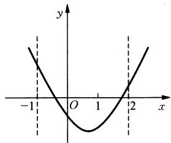

<details>
<summary>text_image</summary>

y
-1 O 1 2 x
</details>

图1-1

(2) 如图 1-2 所示, 抛物线与 $x$ 轴交点落在区间 $(0, 1)$ 内, 对称轴 $x = -m$ 在区间 $(0, 1)$ 内通过 (千万不能遗漏), 可列出不等式组

$$
\left\{ \begin{array}{l l} {\Delta = 4 m ^ {2} - 4 (2 m + 1) \geqslant 0 (\text {等号不能漏})  ,} \\ {f (0) = 2 m + 1 > 0  ,} \\ {f (1) = 4 m + 2 > 0  ,} \\ {0 <   - m <   1} \end{array} \right. \Rightarrow \left\{ \begin{array}{l l} {m > - \frac {1}{2}  ,} \\ {m \geqslant 1 + \sqrt {2} \text {或} m \leqslant 1 - \sqrt {2}  ,} \\ {- 1 <   m <   0.} \end{array} \right.
$$

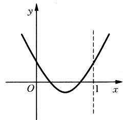

<details>
<summary>text_image</summary>

y
O
1
x
</details>

图1-2

于是有 $-\frac{1}{2} < m \leqslant 1 - \sqrt{2}$ .

例2 已知 $a$ 是实数, 函数 $f(x) = 2ax^2 + 2x - 3 - a$ , 如果函数 $y = f(x)$ 在区间 $[-1, 1]$ 上有零点, 求 $a$ 的取值范围.

解题策略：零点问题实质是方程根的问题，把函数值为零时的等式看作 $x$ 的方程.函数 $y = f(x)$ 在 $[-1, 1]$ 上有零点，即此方程在 $[-1, 1]$ 上有实根(一个解或两个解).再结合图像特征，转化为解不等式，则问题容易解决了.

解：函数 $y = f(x)$ 在区间 $[-1, 1]$ 上有零点，等价于方程 $f(x) = 2ax^2 + 2x - 3 - a = 0$ 在 $[-1, 1]$ 上有解.

当 $a = 0$ 时，方程 $f(x) = 0$ 是一次方程 $2x - 3 = 0$ ，解为 $x = \frac{3}{2} \notin [-1, 1]$ ，不符合题意.

当 $a \neq 0$ 时，方程 $f(x) = 0$ 是二次方程.

方程 $f(x) = 0$ 在 $[-1, 1]$ 上有解，对解的要求是：

(1) $f(x) = 0$ 在 $[-1, 1]$ 上有一个解 (另一个解不属于区间 $[-1, 1]$ ), 这时应满足: $f(-1) \cdot f(1) \leqslant 0$ , 即 $(a - 5)(a - 1) \leqslant 0$ , 解得 $1 \leqslant a \leqslant 5$ .  
(2) $f(x)=0$ 在 $[-1,1]$ 上有两个解(包括有两个等根)，这时应满足：

$$
\left\{ \begin{array}{l l} a \bullet f (- 1) \geqslant 0, \\ a \bullet f (1) \geqslant 0, \\ \Delta = 4 + 8 a (3 + a) \geqslant 0, \\ - 1 \leqslant - \frac {1}{2 a} \leqslant 1 \end{array} \right. \Rightarrow \left\{ \begin{array}{l l} a (a - 5) \geqslant 0, \\ a (a - 1) \geqslant 0, \\ 2 a ^ {2} + 6 a + 1 \geqslant 0, \\ - 1 \leqslant \frac {1}{2 a} \leqslant 1 \end{array} \right. \Rightarrow a \leqslant \frac {- 3 - \sqrt {7}}{2} \text {或} a \geqslant 5.
$$

由(1)和(2)得 $a \leqslant \frac{-3 - \sqrt{7}}{2}$ 或 $a \geqslant 1$ .

所以实数 $a$ 的取值范围是 $a \in \left(-\infty, \frac{-3 - \sqrt{7}}{2}\right] \cup [1, +\infty)$ .

例3（1）函数 $y = \log_{\frac{1}{3}}(x^2 - ax + 3)$ 在[1,2]上恒为正数，则 $a$ 的取值范围是（ ）.

A. $2\sqrt{2} < a < 2\sqrt{3}$

B. $2\sqrt{2} < a < \frac{7}{2}$

C. $3 < a < \frac{7}{2}$

D. $3 < a < 2\sqrt{3}$

(2) 已知点 $P(0,1)$ , 椭圆 $\frac{x^2}{4} + y^2 = m (m > 1)$ 上两点 $A, B$ 满足 $\overrightarrow{AP} = 2\overrightarrow{PB}$ , 则当 $m =$ \_\_\_\_时, 点 $B$ 横坐标的绝对值最大.

解题策略：第(1)问，依据对数函数的单调性将函数恒为正数转化为一元二次不等式在[1,2]上恒成立问题，采用分离参数的方法转化为“耐克函数”性质的研究，进而求得参数 $a$ 的取值范围。第(2)问，表面上是解析几何与平面向量的综合。在一定条件下，曲线方程可看作隐函数，利用向量共线，实现点的坐标之间的转化，结合点在椭圆上，建立方程，结合韦达定理及基本不等式求点 $B$ 横坐标绝对值的最大值以及相应 $m$ 的值。也可应用二次函数的最值，求得相应的结论。如果用直线 $AB$ 的参数方程解，方程理论与基本不等式相结合仍然是解答本题的必用知识，函数与方程的思想体现得相当充分。

解：(1) 由题意得，当 $x \in [1, 2]$ 时， $y = \log_{\frac{1}{3}} (x^2 - ax - 3) > 0$ 恒成立，故恒有 $0 < x^2 - ax + 3 < 1$ .

$\because x \in [1, 2], \therefore$ 由 $x^{2} - ax + 3 > 0$ , 可得 $a < \frac{x^{2} + 3}{x} = x + \frac{3}{x}$ .

令 $t(x) = x + \frac{3}{x}, x \in [1, 2]$ , 显然函数在 $[1, \sqrt{3}]$ 上为减函数, 在 $[\sqrt{3}, 2]$ 上为增函数, 故其最小值为 $t(\sqrt{3}) = \sqrt{3} + \frac{3}{\sqrt{3}} = 2\sqrt{3}$ .

要使不等式 $a < x + \frac{3}{x}, x \in [1, 2]$ 恒成立，则需 $a < 2\sqrt{3}$ .

由 $x^{2} - ax + 3 < 1$ ，得 $x^{2} - ax + 2 < 0$ ，又 $x\in [1,2]$ ，故由上式可得 $a > \frac{x^2 + 2}{x} = x + \frac{2}{x}$ ，令 $h(x) = x + \frac{2}{x}$ 该函数在[1， $\sqrt{2} ]$ 上为减函数，在[√2，2]上为增函数.

而 $h(1) = h(2) = 3$ ，故 $h(x)$ 的最大值为3.要使不等式 $a > x + \frac{2}{x}$ 在[1，2]上恒成立，只需 $a > 3$

综上所述，a 的取值范围是 $3 < a < 2\sqrt{3}$ ，故选 D.

(2) 解法一：由条件知直线 $AB$ 的斜率存在，设 $A(x_{1}, y_{1}), B(x_{2}, y_{2})$ ，直线 $AB$ 的方程为 $y = kx + 1 (k \neq 0)$ ，

联立 $\left\{\begin{aligned}y&=kx+1,\\ \frac{x^{2}}{4}+y^{2}&=m,\end{aligned}\right.$ 得 $(4k^{2}+1)x^{2}+2kx+4-4m=0,$

由韦达定理得 $x_{1} + x_{2} = -\frac{8k}{4k^{2} + 1}$ ，由 $\overrightarrow{AP} = 2\overrightarrow{PB}$ 知 $x_{1} = -2x_{2}$

代入上式解得 $x_{2} = -\frac{8k}{4k^{2} + 1}$ 所以 $\mid x_2\mid = \frac{8\mid k\mid}{4k^2 + 1} = \frac{8}{4\mid k\mid + \frac{1}{\mid k\mid}}\leqslant \frac{8}{2\sqrt{4}} = 2.$

此时 $k^2 = \frac{1}{4}$ ，又 $x_{1}x_{2} = \frac{4 - 4m}{4k^{2} + 1} = -2x_{2}^{2} = -8$ ，解得 $m = 5.$

解法二：设 $A(x_{1},y_{1}),B(x_{2},y_{2})$ ，由 $\overrightarrow{AP} = 2\overrightarrow{PB}$ ，得 $\left\{ \begin{array}{l} - x_1 = 2x_2,\\ 1 - y_1 = 2(y_2 - 1), \end{array} \right.$ 即 $\left\{ \begin{array}{l}x_{1} = -2x_{2},\\ y_{1} = 3 - 2y_{2}. \end{array} \right.$

因为点 $A, B$ 在椭圆上，所以 $\left\{ \begin{array}{l} \frac{4x_2^2}{4} + (3 - 2y_2)^2 = m, \\ \frac{x_2^2}{4} + y_2^2 = m, \end{array} \right.$ 得 $y_{2} = \frac{1}{4} m + \frac{3}{4}$ ，

所以 $x_{2}^{2} = m - (3 - 2y_{2})^{2} = -\frac{1}{4} m^{2} + \frac{5}{2} m - \frac{9}{4} = -\frac{1}{4} (m - 5)^{2} + 4\leqslant 4,$

所以当 m = 5 时，点 B 横坐标的绝对值最大，最大值为 2.

解法三：设直线 AB 的参数方程为 $\left\{\begin{aligned}x &= t\cos\alpha, \\ y &= 1+t\sin\alpha,\end{aligned}\right.$ 其中 t 为参数， $\alpha$ 为直线 AB 的倾斜角，

将其代入椭圆方程中化简得 $(1 + 3\sin^2\alpha)t^2 +8t\sin \alpha +4 - 4m = 0,$

设点 A, B 对应的参数分别为 $t_{1}$ , $t_{2}$ ，则 $t_{1} = -2t_{2}$ .

由韦达定理知 $t_1 + t_2 = -\frac{8\sin\alpha}{1 + 3\sin^2\alpha}, t_1t_2 = \frac{4 - 4m}{1 + 3\sin^2\alpha}$ , 解得 $t_2 = \frac{8\sin\alpha}{1 + 3\sin^2\alpha}$ .

所以 $x_{2}^{2} = t_{2}^{2}\cos^{2}\alpha = \frac{64\sin^{2}\alpha\cos^{2}\alpha}{(1 + 3\sin^{2}\alpha)^{2}} = 16\times \frac{\cos^{2}\alpha}{1 + 3\sin^{2}\alpha}\cdot \frac{4\sin^{2}\alpha}{1 + 3\sin^{2}\alpha}\leqslant 16\times \left(\frac{\frac{\cos^{2}\alpha}{1 + 3\sin^{2}\alpha} + \frac{4\sin^{2}\alpha}{1 + \sin^{2}\alpha}}{2}\right)^{2} = 4$ ，此时 $\cos^2\alpha = 4\sin^2\alpha$ ，即 $\cos^2\alpha = \frac{4}{5},\sin^2\alpha = \frac{1}{5},t_2^2 = 5,$ 代入 $t_1 = -2t_2,t_1t_2 = \frac{4 - 4m}{1 + 3\sin^2\alpha}$ 解得 $m = 5.$

例4 已知函数 $f(x) = \begin{cases} 1 - \frac{1}{x}, & x \geqslant 1, \\ \frac{1}{x} - 1, & 0 < x < 1. \end{cases}$

(1) 当 $0 < a < b$ ，且 $f(a) = f(b)$ 时，求 $\frac{1}{a} + \frac{1}{b}$ 的值；  
（2）是否存在实数 $a, b (a < b)$ ，使得函数 $y = f(x)$ 的定义域、值域都是 $[a, b]$ . 若存在，则求出 $a, b$ 的值；若不存在，请说明理由；  
(3) 若存在实数 $a, b (a < b)$ 使得函数 $y = f(x)$ 的定义域为 $[a, b]$ 时，值域为 $[ma, mb] (m \neq 0)$ ，求 $m$ 的取值范围.

解题策略：本题初看是分段函数问题，重点是根据函数的性质研究定义域与值域的对应关系，而实质是方程理论贯穿于问题解决的始终，体现了运用函数思想、方程思想解决问题的一种理念。这里，认真读题、缜密审题，确切理解题意、明确问题的实际背景、实施函数向方程的转化探求 $\frac{1}{a} + \frac{1}{b}$ 、 $a$ 、 $b$ 的值及 $m$ 的取值范围。中国大哲学家庄子的名言“判天地之美，析万物之理”，掌握了数学思想就可以“判事物之美，析数量之理”。本题的解答充满了数学思想的激荡，值得细细品味。

解：(1) $\because f(x) = \begin{cases} 1 - \frac{1}{x}, & x \geqslant 1, \\ \frac{1}{x} - 1, & 0 < x < 1, \end{cases}$ $\therefore f(x)$ 在 $(0,1)$ 上为减函数，在 $(1, +\infty)$ 上为增函数，由 $0 < a < b$ 且 $f(a) = f(b)$ ，可得 $0 < a < 1 < b$ 且 $\frac{1}{a} - 1 = 1 - \frac{1}{b}$ ，故 $\frac{1}{a} + \frac{1}{b} = 2.$

(2) 不存在满足条件的实数 a、b.

若存在满足条件的实数 $a, b$ ，则 $0 < a < b$ .

① 当 $a, b \in (0, 1)$ 时， $f(x) = \frac{1}{x} - 1$ 在 $(0, 1)$ 上为减函数.

故 $\left\{ \begin{array}{l} f(a) = b, \\ f(b) = a, \end{array} \right.$ 即 $\left\{ \begin{array}{l} \frac{1}{a} - 1 = b, \\ \frac{1}{b} - 1 = a, \end{array} \right.$ 解得 $a = b$ ，故此时不存在符合条件的实数 $a, b$ .

② 当 $a, b \in [1, +\infty)$ 时， $f(x) = 1 - \frac{1}{x}$ 在 $[1, +\infty)$ 上是增函数.

故 $\left\{ \begin{array}{l} f(a) = a, \\ f(b) = b, \end{array} \right.$ 即 $\left\{ \begin{array}{l} 1 - \frac{1}{a} = a, \\ 1 - \frac{1}{b} = b, \end{array} \right.$ 此时， $a, b$ 是方程 $x^{2} - x + 1 = 0$ 的根。此方程无实根，故此时不存在符合条件的实数 $a, b$ .

③ 当 $a \in (0, 1), b \in [1, +\infty)$ 时，

由于 $1 \in [a, b]$ , 而 $f(1) = 0 \notin [a, b]$ , 故此时不存在符合条件的实数 $a, b$ .

综上可知,不存在符合条件的实数 a、b.

(3) 若存在实数 $a, b (a < b)$ , 使得函数 $y = f(x)$ 的定义域为 $[a, b]$ 时, 值域为 $[ma, mb]$ , 且 $a > 0, m > 0$ .

① 当 $a, b \in (0, 1)$ 时，由于 $f(x)$ 在 $(0, 1)$ 上是减函数，故 $\left\{ \begin{array}{l} \frac{1}{a} - 1 = mb, \\ \frac{1}{b} - 1 = ma. \end{array} \right.$

此时得 $m = \frac{1 - a}{ab} = \frac{1 - b}{ab}$ , 得 $a = b$ 与条件矛盾, 所以 $a, b$ 不存在.

② 当 $a \in (0, 1)$ , $b \in [1, +\infty)$ 时, 易知 0 在值域内, 值域不可能是 $[ma, mb]$ , 所以 $a, b$ 不存在.  
③ 故只有 $a, b \in [1, +\infty)$ .

∵ $f(x)$ 在 $[1, +\infty)$ 上是增函数，∴ $\left\{\begin{aligned}f(a)&=ma,\\ f(b)&=mb,\end{aligned}\right.$ 即 $\left\{\begin{aligned}1-\frac{1}{a}&=ma,\\ 1-\frac{1}{b}&=mb.\end{aligned}\right.$

a、b 是方程 $mx^{2}-x+1=0$ 的两个根.

即关于 $x$ 的方程 $mx^2 - x + 1 = 0$ 有两个大于1的实根.

设这两个根为 $x_{1}, x_{2}$ , 则 $x_{1} + x_{2} = \frac{1}{m}, x_{1} \cdot x_{2} = \frac{1}{m}$ .

$\therefore \left\{ \begin{array}{l} \Delta > 0, \\ (x_{1} - 1) + (x_{2} - 1) > 0, \\ (x_{1} - 1)(x_{2} - 1) > 0, \end{array} \right.$ 即 $\left\{ \begin{array}{l} 1 - 4m > 0, \\ \frac{1}{m} - 2 > 0, \end{array} \right.$ 解得 $0 < m < \frac{1}{4}$ .

故 $m$ 的取值范围是 $0 < m < \frac{1}{4}$ .

# 第四讲 待定系数法、换元法、转换法是运用函数与方程思想方法解题过程中的三大法宝

在运用函数与方程思想解题的过程中，在确定函数、方程、不等式的参变数的值时需要运用待定系数法，而构造法又常常与待定系数法紧密相连。换元法往往可以使较为复杂的问题变为基本题型。许多数学问题就是在不断转换的过程中加以解决的，如函数问题可以转换为方程问题求解、方程问题可以转换为函数问题通过图像结合不等式知识求解。善于转换是数学核心素养的体现。

例1 设抛物线 $y = ax^2 + bx + c$ 过点 $A(1, 2)$ 和 $B(-2, -1)$ .

(1) 试用 a 表示 b、c；  
(2) 对于任意非零实数 a，抛物线都不过点 $P(m, m^{2}+1)$ ，试求 m 的值.

解题策略：对本题题意的理解是关键，什么是抛物线都不过某点呢？换一种说法是：将该点的坐标代入所给的抛物线方程，方程无实数解，所以本题体现了一种等价转换的思想以及待定系数法在研究函数与方程问题中的应用。

解：(1) 依题意， $\left\{\begin{aligned}a+b+c=2,\\ 4a-2b+c=-1,\end{aligned}\right.$ 解得 $\left\{\begin{aligned}b=1+a,\\ c=1-2a.\end{aligned}\right.$

(2) $y = ax^{2} + (1 + a)x + 1 - 2a$ ，将 $(m, m^{2} + 1)$ 代入，得 $am^2 + (1 + a)m + 1 - 2a = m^2 + 1$ ，整理得 $(m^2 + m - 2)a = m^2 - m$ 。

由题意,关于 a 的方程无非零实数解,

由 $\left\{ \begin{array}{l} m^2 + m - 2 = 0, \\ m^2 - m \neq 0, \end{array} \right.$ 得 $m = -2$ ；由 $\left\{ \begin{array}{l} m^2 + m - 2 \neq 0, \\ m^2 - m = 0, \end{array} \right.$ 得 $m = 0$ .

故所求的值为 $m = -2$ 或 $m = 0$ .

例2（1）已知数列 $\{a_{n}\}$ 中， $a_1 = 10$ ，且 $a_{n} = 15a_{n - 1} + 2\cdot 5^{n}$ ，求这个数列的通项公式.

(2) 已知数列 $\{a_{n}\}$ 中, $a_{1} = 3$ , $a_{2} = 5$ , $a_{n} = a_{n-2} + 4n - 3 (n \geqslant 3)$ . 求通项公式 $a_{n}$ .

解题策略：第(1)问所给的递推式关系不明朗，应先进行变形，再运用待定系数法构造新的特殊数列，从而使问题获解；第(2)问的一般解法是设待定系数 $A$ ，即由 $a_{n} + An^{2} = a_{n - 2} + An^{2} + 4n - 3$ 配方，得

$$
a _ {n} + A n ^ {2} = a _ {n - 2} + A (n - 2) ^ {2} + (4 A + 4) n - 4 A - 3, \text {令} 4 A + 4 = 0, \text {解得} A = - 1,
$$

从而构造等差数列.当然,如果直接对递推关系变形很能看出解题者的数学核心素养.

解：（1）先对递推式进行变换， $\frac{a_{n}}{5^{n}}=\frac{15a_{n-1}}{5^{n}}+2$ ，即 $\frac{a_{n}}{5^{n}}=3\cdot\frac{a_{n-1}}{5^{n-1}}+2.$

设 $b_{n} = \frac{a_{n}}{5^{n}} (n\in \mathbf{N}^{*})$ ，则 $b_{n} = 3b_{n - 1} + 2.$ ①

引入待定系数 $\alpha, \beta$ ，使 $\alpha, \beta$ 满足 $b_{n} - \beta = \alpha (b_{n-1} - \beta)$ ，

展开得 $b_{n} = \alpha b_{n - 1} - \alpha \beta +\beta .$ ②

对照①式和②式，可得方程组 $\left\{ \begin{array}{l} \alpha = 3, \\ -\alpha \beta + \beta = 2, \end{array} \right.$ 解得 $\left\{ \begin{array}{l} \alpha = 3, \\ \beta = -1. \end{array} \right.$

即数列 $\{b_{n} + 1\}$ 是以 $b_{1} + 1 = \frac{a_{1}}{5} + 1 = 3$ 为首项，3为公比的等比数列.

所以 $b_{n} + 1 = 3\cdot 3^{n - 1} = 3^{n}, b_{n} = 3^{n} - 1.$

于是， $b_{n} = \frac{a_{n}}{5^{n}} = 3^{n} - 1, a_{n} = 15^{n} - 5^{n}(n\in \mathbf{N}^{*})$

(2) 由条件可得 $a_{n} - n^{2} = a_{n-2} - (n - 2)^{2} + 1 (n \geqslant 3)$ . 令 $b_{n} = a_{n} - n^{2}$ ,

则数列 $\{b_n\}$ 可化为两类等差数列，其中 $\{b_{2n-1}\}$ 是以 $b_1 = a_1 - 1 = 2$ 为首项， $d = 1$ 为公差； $\{b_{2n}\}$ 是以 $b_2 = a_2 - 2^2 = 1$ 为首项， $d = 1$ 为公差.

因此， $b_{2n - 1} = 2 + (n - 1), b_{2n} = 1 + (n - 1).$

所以 $a_{2n - 1} = (2n - 1)^2 + n + 1, a_{2n} = (2n)^2 + n.$

故 \(a\_{n} = \left\{ \begin{array}{ll}\frac{1}{2} (2n^{2} + n + 3) & (n\) 为奇数），\\ \frac{1}{2} (2n^{2} + n) & (n\) 为偶数). \end{array} \right.\)

可简化为 $a_{n} = \frac{1}{2} (2n^{2} + n) + \frac{3}{4}[1 + (-1)^{n + 1}]$ .

例3 设 $a$ 为实数, 函数 $f(x) = a\sqrt{1 - x^2} + \sqrt{1 + x} + \sqrt{1 - x}$ 的最大值为 $g(a)$ .

(1) 设 $t = \sqrt{1 + x} + \sqrt{1 - x}$ , 求 $t$ 的取值范围, 并把 $f(x)$ 表示为 $t$ 的函数 $m(t)$ ;

(2) 求 $g(a)$ ;

(3) 试求满足 $g(a) = g\left(\frac{1}{a}\right)$ 的所有实数.

解题策略：本例是一道递进式的综合题。主要考查函数、方程等基础知识，考查分类与整合以及函数与方程的思想方法和综合运用数学知识分析问题、解决问题的能力，难度上循序渐进。第(1)问考查变量代换的技巧，难点在新变量范围的确定，可以有不同的方法求解；第(2)问是含参数函数在区间上最大值的求法，分类与整合并结合函数单调性是解答的关键；第(3)问实质是解方程，由于 $g(a)$ 是分段的，对于方程 $g(a)=g\left(\frac{1}{a}\right)$ 解的讨论更要分类全面、环环相扣、紧紧深入、精彩纷呈。正如罗素所言：“数学不仅拥有真理，而且还拥有至高的美——一种冷峻而严肃的美，正像雕塑所具有的美一样……”本题的解题过程不仅能显示解题者的数学功力，也展现了“一种冷峻而严肃的美”。

解：(1) 解法一(代数法)：令 $t = \sqrt{1 + x} + \sqrt{1 - x}$ ，要使 t 有意义，必须 $\left\{\begin{aligned}1 + x &\geqslant 0,\\ 1 - x &\geqslant 0,\end{aligned}\right.$ 即 $-1 \leqslant x \leqslant 1$ .

$\because t^{2} = 2 + 2\sqrt{1 - x^{2}}, x \in [-1, 1], t \geqslant 0, (*) \quad \therefore t$ 的取值范围是 $[\sqrt{2}, 2]$ .

由 $(\ast)$ 式得 $\sqrt{1 - x^2} = \frac{1}{2} t^2 - 1$ ，故 $m(t) = a\left(\frac{1}{2} t^2 - 1\right) + t = \frac{1}{2} at^2 + t - a, t \in [\sqrt{2}, 2]$ .

解法二(三角换元法): 令 $x = \sin 2\theta, \theta \in \left[-\frac{\pi}{4}, \frac{\pi}{4}\right]$ .

$$
\begin{array}{l} t = \sqrt {1 + x} + \sqrt {1 - x} = \sqrt {1 + \sin 2 \theta} + \sqrt {1 - \sin 2 \theta} = | \sin \theta + \cos \theta | + | \sin \theta - \cos \theta | = \sin \theta + \cos \theta - \sin \theta + \\ \cos \theta = 2 \cos \theta , a \sqrt {1 - x ^ {2}} = a \sqrt {1 - \sin^ {2} 2 \theta} = a \cos 2 \theta . \end{array}
$$

由于 $\theta \in \left[-\frac{\pi}{4}, \frac{\pi}{4}\right]$ , 所以 $\cos \theta \in \left[\frac{\sqrt{2}}{2}, 1\right]$ , 即 $t \in [\sqrt{2}, 2]$ , $f(x) = m(t) = a \cos 2\theta + t$ .

又 $\cos 2\theta = 2\cos^2\theta - 1 = 2 \times \frac{t^2}{4} - 1 = \frac{t^2}{2} - 1.$

故 $m(t) = a\left(\frac{1}{2} t^2 - 1\right) + t = \frac{1}{2} at^2 + t - a, t \in [\sqrt{2}, 2]$ .

(2) 由题意知 $g(a)$ 即为函数 $m(t) = \frac{1}{2} at^2 + t - a, t \in [\sqrt{2}, 2]$ 的最大值.

注意到直线 $t = -\frac{1}{a}$ 是抛物线 $m(t) = \frac{1}{2} at^2 + t - a$ 的对称轴，故分以下几种情况讨论.

① 当 $a > 0$ 时，函数 $y = m(t), t \in [\sqrt{2}, 2]$ 的图像是开口向上的一般抛物线，

$\because t = -\frac{1}{a} < 0$ ，知 $m(t)$ 在 $[\sqrt{2}, 2]$ 上单调递增. $\therefore g(a) = m(2) = a + 2.$

② 当 $a = 0$ 时， $\because m(t) = t, t \in [\sqrt{2}, 2], \therefore g(a) = 2.$   
③ 当 $a < 0$ 时，函数 $y = m(t), t \in [\sqrt{2}, 2]$ 的图像是开口向下的一般抛物线.

若 $t = -\frac{1}{a} \in [0, \sqrt{2}]$ , 即 $a \leqslant -\frac{\sqrt{2}}{2}$ , 则 $g(a) = m(\sqrt{2}) = \sqrt{2}$ ;

若 $t = -\frac{1}{a} \in (\sqrt{2}, 2]$ , 即 $-\frac{\sqrt{2}}{2} < a \leqslant -\frac{1}{2}$ , 则 $g(a) = m\left(-\frac{1}{a}\right) = -a - \frac{1}{2a}$ ;

若 $t = -\frac{1}{a} \in (2, +\infty)$ , 即 $-\frac{1}{2} < a < 0$ , 则 $g(a) = m(2) = a + 2$ .

综上可得， $g(a)=\left\{\begin{aligned}&a+2,&a>-\frac{1}{2},\\&-a-\frac{1}{2a},&-\frac{\sqrt{2}}{2}<a\leqslant-\frac{1}{2},\\&\sqrt{2},&a\leqslant-\frac{\sqrt{2}}{2}.\end{aligned}\right.$

(3) ① 当 $a < -2$ 时, $\frac{1}{a} > -\frac{1}{2}$ , 此时 $g(a) = \sqrt{2}$ , $g\left(\frac{1}{a}\right) = \frac{1}{a} + 2$ .

由 $2 + \frac{1}{a} = \sqrt{2}$ ，解得 $a = -1 - \frac{\sqrt{2}}{2}$ ，与 $a < -2$ 矛盾.

② 当 $-2 \leqslant a \leqslant -\sqrt{2}$ 时， $-\frac{\sqrt{2}}{2} < \frac{1}{a} \leqslant -\frac{1}{2}$ . 此时 $g(a) = \sqrt{2}$ ， $g\left(\frac{1}{a}\right) = -\frac{1}{a} - \frac{a}{2}$ ，

$\sqrt{2} = -\frac{1}{a} - \frac{a}{2}$ , 解得 $a = -\sqrt{2}$ 与 $a < -\sqrt{2}$ 矛盾.

③ 当 $-\sqrt{2} \leqslant a \leqslant -\frac{\sqrt{2}}{2}$ 时， $-\sqrt{2} \leqslant \frac{1}{a} \leqslant -\frac{\sqrt{2}}{2}$ ，此时 $g(a) = \sqrt{2} = g\left(\frac{1}{a}\right)$ ，所以 $-\sqrt{2} \leqslant a \leqslant -\frac{\sqrt{2}}{2}$ .

④ 当 $-\frac{\sqrt{2}}{2} < a \leqslant -\frac{1}{2}$ 时， $-2 \leqslant \frac{1}{a} < -\sqrt{2}$ ，此时 $g(a) = -a - \frac{1}{2a}$ ， $g\left(\frac{1}{a}\right) = \sqrt{2}$ .

由 $g(a) = g\left(\frac{1}{a}\right)$ 即得 $-a - \frac{1}{2a} = \sqrt{2}$ . 解得 $a = -\frac{\sqrt{2}}{2}$ 与 $a > -\frac{\sqrt{2}}{2}$ 矛盾.

⑤ 当 $-\frac{1}{2} < a < 0$ 时, $\frac{1}{a} < -2$ , 此时 $g(a) = a + 2$ , $g\left(\frac{1}{a}\right) = \sqrt{2}$ .

由 $g(a) = g\left(\frac{1}{a}\right)$ 即得 $a + 2 = \sqrt{2}$ . 解得 $a = \sqrt{2} - 2$ 与 $a > -\frac{1}{2}$ 矛盾.

⑥ 当 $a > 0$ 时, $\frac{1}{a} > 0$ , 此时 $g(a) = a + 2$ , $g\left(\frac{1}{a}\right) = \left(\frac{1}{a}\right) + 2$ .

由 $g(a) = g\left(\frac{1}{a}\right)$ 即得 $a + 2 = \frac{1}{a} + 2$ ，解得 $a = \pm 1$ ，由 $a > 0$ 得 $a = 1$

综上可得, 满足 $g(a) = g\left(\frac{1}{a}\right)$ 的所有实数 a 为 $-\sqrt{2} \leqslant a \leqslant -\frac{\sqrt{2}}{2}$ 或 a = 1.

例4 如图1-3所示.设直线 $l$ 与椭圆 $\frac{x^2}{2} + y^2 = 1$ 相切，切点为 $P$ ，点 $M$ 是坐标原点 $O$ 在直线 $l$ 上的正投影，求 $|MP|$ 的最大值和最小值.

解题策略：本例的解答分三步：第一步，求出切线 $l$ 的方程和直线 $OM$ 的方程；第二步，求出点 $M$ 的坐标用点 $P(x_0, y_0)$ 的坐标表示，运用两点距离公式求得 $|MP|^2$ 关于 $y_0^2$ 的函数关系式；第三步，进入求 $|MP|$ 最值的流程，然而函数解析式太复杂了，可通过换元法就变为基本函数求最值问题了。当然新元的取值范围一定要紧紧抓住！

解：设 $P(x_0, y_0)$ ，则 $-1 \leqslant y_0 \leqslant 1$ ， $x_0^2 = 2(1 - y_0^2)$ （点 $P$ 在椭圆上）.

切线 l 的方程为 $x_{0}x + 2y_{0}y = 2$ (已知切点求椭圆的切线方程).

由 $OM \perp l$ 得直线 $OM$ 的方程为 $2y_0x - x_0y = 0$ .

联立两直线方程,求解点 $M(x, y)$ 的坐标为

$x = \frac{2x_0}{x_0^2 + 4y_0^2} = \frac{2x_0}{2(1 - y_0^2) + 4y_0^2} = \frac{x_0}{1 + y_0^2}$ , (以 $x_0^2 = 2(1 - y_0^2)$ 代入得)

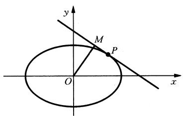

<details>
<summary>text_image</summary>

y
M
P
O
x
</details>

图1-3

$$
y = \frac {4 y _ {0}}{x _ {0} ^ {2} + 4 y _ {0} ^ {2}} = \frac {2 y _ {0}}{1 + y _ {0} ^ {2}},
$$

$$
\begin{array}{l} \therefore | M P | ^ {2} = (x - x _ {0}) ^ {2} + (y - y _ {0}) ^ {2} = \frac {y _ {0} ^ {2}}{1 + y _ {0} ^ {2}} \left[ x _ {0} ^ {2} y _ {0} ^ {2} + (1 - y _ {0} ^ {2}) ^ {2} \right] \\ = \frac {y _ {0} ^ {2} (1 - y _ {0} ^ {2})}{1 - y _ {0} ^ {2}} (0 \leqslant y _ {0} ^ {2} \leqslant 1). \\ \end{array}
$$

设 $y_0^2 = t (0 \leqslant t \leqslant 1)$ ，则 $|MP|^2 = g(t) = \frac{t(1 - t)}{1 + t} = -t + 2 - \frac{2}{1 + t} = 3 - \left(t + 1 + \frac{2}{t + 1}\right) \leqslant 3 - 2\sqrt{2}$ （由基本不等式求得）.

当且仅当 $t + 1 = \frac{2}{t + 1}$ ，即 $t = \sqrt{2} - 1$

$\because 0 < \sqrt{2} - 1 < 1, \therefore$ 函数 $g(t)$ 在区间 $[0, 1]$ 上有最大值 $3 - 2\sqrt{2}$ , 最小值 0. 即 $|MP|$ 的最大值和最小值分别为 $|MP|_{\max} = \sqrt{3 - 2\sqrt{2}} = \sqrt{2} - 1, |MP|_{\min} = 0$ .

# 第五讲 联用函数与方程思想

有些较为复杂的数学问题,解决它常常不止需要一种数学思想,而且需要多种数学思想方法的联合应用.函数与方程的思想常常和转化与化归的思想联用,特别是函数思想与方程思想就是在不断转换过程中使问题一步步获得解决.转换的途径为“函数→方程→函数”或“方程→函数→方程”,而且在转换过程中不等式知识发挥重要作用.在联用函数与方程思想解题时又常常需要借助函数图像的变换求解.

例1（1）已知函数 $f(x) = \begin{cases} |x|, & x \leqslant m, \\ x^2 - 2mx + 4m, & x > m, \end{cases}$ 其中 $m > 0$ ，若存在实数 $b$ ，使得关于 $x$ 的方程 $f(x) = b$ 有三个不同的根，则 $m$ 的取值范围是 \_\_\_\_；

(2) 设函数 $f(x)=\left\{\begin{aligned}x+1, & \quad x\leqslant0,\\ 2^{x}, & \quad x>0,\end{aligned}\right.$ 则满足 $f(x)+f\left(x-\frac{1}{2}\right)>1$ 的 x 的取值范围是 \_\_\_\_；  
(3) 已知 $a \in \mathbb{R}$ , 函数 $f(x) = \left| x + \frac{4}{x} - a \right| + a$ 在区间 $[1, 4]$ 上的最大值是 5, 则 $a$ 的取值范围是 \_\_\_\_.

解题策略：这是一组近年的高考题，都是围绕函数、方程、不等式之间的关系命制。第(1)问结合函数图像确定实数 $m$ 满足的条件，从而确定 $m$ 的取值范围。这也是解一般的函数与方程问题的基本解题方法；第(2)问旨在考查分段函数与不等式的解法；第(3)问旨在考查“耐克函数”与绝对值函数的性质，可以结合函数图像解，也可以转化为解绝对值不

等式,这三题虽是小题,但思维量颇大,值得推敲.

解：（1）解法一（直接由方程分类讨论求解）：由 $x^{2} - 2mx + 4m = b$ ，即 $(x - m)^{2} = b + m^{2} - 4m$ 在 $(m, +\infty)$ 有解（且这个解唯一），得 $b + m^2 - 4m > 0$

即 $4m - m^2 < b$ ，由 $|x| = b$ 在 $(- \infty, m]$ 有解（且要有两个解）得 $0 < b \leqslant m$

∴ $4m - m^{2} < m$ ，解得 m > 3。∴ m 的取值范围是 $(3, +\infty)$ 。

解法二(结合函数图像求解): 函数 $f(x)$ 的大致图像如图 1-4 所示. 根据题意知只要 $m > 4m - m^{2}$ 即可, 又 m > 0, 解得 m > 3. 故实数 m 的取值范围是 $(3, +\infty)$ .

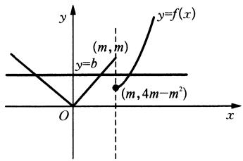

<details>
<summary>text_image</summary>

y
(m,m)
y=f(x)
y=b
(m,4m-m²)
O
x
</details>

图1-4

(2) 解法一(分类讨论解函数不等式): 当 $x > \frac{1}{2}$ 时, 不等式 $f(x) + f\left(x - \frac{1}{2}\right) > 1$ 可化为 $2^x + 2^{x - \frac{1}{2}} > 1$ , 又结合指数函数的图像易知该不等式显然恒成立, $\therefore x > \frac{1}{2}$ 适合;

当 $x \leqslant 0$ 时，不等式 $f(x) + f\left(x - \frac{1}{2}\right) > 1$ 可化为 $x + 1 + \left(x - \frac{1}{2}\right) + 1 > 1.$ 解得 $x > -\frac{1}{4}$ ，又 $x \leqslant 0$ . $\therefore -\frac{1}{4} < x \leqslant 0$ 适合；

当 $0 < x \leqslant \frac{1}{2}$ 时，不等式 $f(x) + f\left(x - \frac{1}{2}\right) > 1$ 可化为 $2^x + \left(x - \frac{1}{2}\right) + 1 > 1$ ，即 $2^x + x > \frac{1}{2}$ ，结合函数 $y = 2^x + x$ 在区间 $\left[0, \frac{1}{2}\right]$ 内单调递增易知不等式显然成立。

∴ $0 < x \leqslant \frac{1}{2}$ 适合.

综上,所求 x 的取值范围是 $\left(-\frac{1}{4}, +\infty\right)$ .

解法二(根据函数性质讨论求解): 当 x > 0 时, $f(x) = 2^{x} > 1$ 恒成立,

当 $x - \frac{1}{2} > 0$ ，即 $x > \frac{1}{2}$ 时， $f\left(x - \frac{1}{2}\right) = 2^{x - \frac{1}{2}} > 1$ ，当 $x - \frac{1}{2} \leqslant 0$ ，即 $0 < x \leqslant \frac{1}{2}$ 时，

$f\left(x - \frac{1}{2}\right) = x + \frac{1}{2} >\frac{1}{2}$ ，则不等式 $f(x) + f\left(x - \frac{1}{2}\right) > 1$ 恒成立，

当 $x \leqslant 0$ 时， $f(x) + f\left(x - \frac{1}{2}\right) = x + 1 + x + \frac{1}{2} = 2x + \frac{3}{2} > 0, \therefore -\frac{1}{4} < x \leqslant 0.$

综上,所求 x 的取值范围是 $\left(-\frac{1}{4}, +\infty\right)$ .

解法三(结合函数图像求解): $f(x) + f\left(x - \frac{1}{2}\right) > 1 \Rightarrow f\left(x - \frac{1}{2}\right) > 1 - f(x)$ ,

$\because f(x) = \begin{cases} x + 1, & x \leqslant 0, \\ 2^x, & x > 0, \end{cases}$ 由图像变换可画出 $y = f\left(x - \frac{1}{2}\right)$ 与 $y = 1 - f(x)$ 的图像，如图1-5所示.

并求出交点坐标为 $\left(-\frac{1}{4},\frac{1}{4}\right)$ .由图像可知，

满足 $f\left(x - \frac{1}{2}\right) > 1 - f(x)$ 的解为 $\left(-\frac{1}{4}, +\infty\right)$ ,

故所求 $x$ 的取值范围是 $\left(-\frac{1}{4}, +\infty\right)$ .

(3) 解法一(由极值点与区间端点综合讨论求解):

由题意可知 $a \leqslant 5, \because$ 函数 $g(x) = x + \frac{4}{x}$ 的极值点为 $x = 2$ .

$$
\therefore [ f (x) ] _ {\max} = \max \{f (1), f (4), f (2) \}.
$$

则 $\left\{\begin{aligned}f(1)&=|5-a|+a\leqslant5,\\ f(4)&=|5-a|+a\leqslant5,\\ f(2)&=|4-a|+a\leqslant5,\end{aligned}\right.$ 解得 $a\leqslant\frac{9}{2}$ ，故 a 的取值范围是 $\left(-\infty,\frac{9}{2}\right]$ .

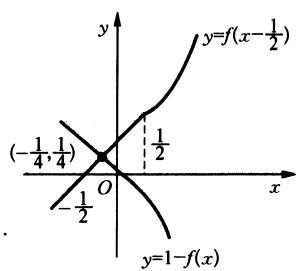

<details>
<summary>text_image</summary>

y
y=f(x-½)
(-½, ¼)
½
O
x
y=1-f(x)
</details>

图1-5

解法二(结合“耐克函数” $g(x)=x+\frac{4}{x}$ 在 $x\in[1,4]$ 的性质讨论求解): 结合函数 $g(x)=x+\frac{4}{x}, x\in[1,4]$ 的图像易知 $[g(x)]_{\min}=g(2)=4,\left[g(x)\right]_{\max}=\max\{g(1),g(4)\}=5,\therefore$ 当 $x\in[1,4]$ 时, $x+\frac{4}{x}\in[4,5]$ ,

若 $a \leqslant 4$ ，则 $x \in [1, 4]$ 时， $f(x) = x + \frac{4}{x} \in [4, 5]$ ，显然最大值是 5，符合题意；

若 $4 < a < 5$ ，则当 $x \in [1, 4]$ 时， $[f(x)]_{\max} = \max \{|4 - a| + a, |5 - a| + a\} = \max \{2a - 4, 5\}$ ，∴ 由题设知应满足 $2a - 4 \leqslant 5$ ，解得 $a \leqslant \frac{9}{2}$ ，

又 $4 < a < 5, \therefore 4 < a \leqslant \frac{9}{2}$ 符合题意；

若 $a \geqslant 5$ ，则当 $x \in [1, 4]$ 时， $f(x) = 2a - \left(x - \frac{4}{x}\right) \in [2a - 5, 2a - 4]$ ，

由题设知 $2a - 4 = 5$ ，解得 $a = \frac{9}{2}$ ，这与 $a \geqslant 5$ 矛盾.

综上， $a$ 的取值范围是 $\left(-\infty, \frac{9}{2}\right]$ .

解法三(通过函数图像变换求解): 当 $a \leqslant 0$ 时, $\because x \in [1, 4]$ ,

$$
\therefore f (x) = \left| x + \frac {4}{x} - a \right| + a = x + \frac {4}{x} - a + a = x + \frac {4}{x}.
$$

$$
[ f (x) ] _ {\max} = 5;
$$

$a > 0$ 时, $f(x) = \left|x + \frac{4}{x} - a\right| + a$ 的图像可由 $g(x) = x + \frac{4}{x}$ 的图像向下平移 $a$ 个单位, 然后关于 $x$ 轴翻折后再向上平移 $a$ 个单位得到. $\because x \in [4,5], \therefore g(x) = x + \frac{4}{x} \in [4,5]$ .

如图1-6所示，最多向下平移4.5个单位，才能保证 $[f(x)]_{\mathrm{max}} = 5.$

故 $a$ 的取值范围是 $\left(-\infty, \frac{9}{2}\right]$

解法四(转化为含参数绝对值不等式恒成立求解):

由题意可知 $a \leqslant 5, \therefore$ 函数 $f(x) = \left|x + \frac{4}{x} - a\right| + a$ 在区间[1,4]上的最大值是5， $\therefore$ 不等式 $\left|x + \frac{4}{x} - a\right| + 5 \leqslant 5 - a$ 在区间[1,4]上恒成立，

即不等式 $-(5 - a) \leqslant x + \frac{4}{x}$ 在区间[1, 4]上恒成立.

即不等式组 $\left\{ \begin{array}{l} 2a - 5 \leqslant x + \frac{4}{x}, \\ x + \frac{4}{x} \leqslant 5 \end{array} \right.$ 在区间[1,4]上恒成立.

$\therefore 2a - 5 \leqslant \left[x + \frac{4}{x}\right]_{\min} = 4$ ，故 $a$ 的取值范围是 $\left(-\infty, \frac{9}{2}\right]$ .

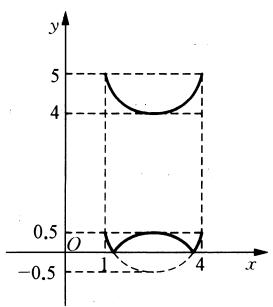

<details>
<summary>text_image</summary>

y
5
4
O
-0.5
1
4
x
</details>

图1-6

例2 已知函数 $f(x) = \log_{\sqrt{3}}(3x - a)$ ，当点 $P(x, y)$ 在函数 $y = f(x)$ 图像上时，点 $Q\left(3x, \frac{y}{2}\right)$ 在函数 $y = g(x)$ 图像上.

(1) 求 $y = g(x)$ 的表达式;  
(2) 若 $A(x + a, y_1), B(x, y_2), C(3 + a, y_3)$ 为 $y = g(x)$ 图像上的三点，且满足 $2y_2 = y_1 + y_3$ 的实数 $x$ 有且只有两个不同的值，求实数 $a$ 的取值范围.

解题策略：需求出 $y = g(x)$ 的解析式，问题便转化为一元二次方程 $\varphi(x) = 0$ 的根的分布问题，结合二次函数的图像进行分析，转化为解相应的不等式组.

解：(1)由题意，得 $\left\{ \begin{array}{l} y = \log_{\sqrt{3}}(3x - a), \\ \frac{y}{2} = g(3x) \end{array} \right. \Rightarrow g(3x) = \frac{1}{2}\log_{\sqrt{3}}(3x - a)$ ，令 $t = 3x$

则 $t > a$ ，并且 $g(t) = \frac{1}{2}\log_{\sqrt{3}}(t - a)\therefore g(x) = \frac{1}{2}\log_{\sqrt{3}}(x - a)(x > a).$

(2) 由 $g(x) = \frac{1}{2} \log_{\sqrt{3}}(x - a)(x > a)$ ,

得 $y_{1} = \frac{1}{2}\log \sqrt{3} x, y_{2} = \frac{1}{2}\log \sqrt{3}(x - a), y_{3} = \frac{1}{2}\log \sqrt{3} 3 = 1.$

于是， $2y_{2} = y_{1} + y_{3}\Rightarrow \log_{\sqrt{3}}(x - a) = \frac{1}{2}\log_{\sqrt{3}}x + 1.$ 上式可化为

$$
\left\{ \begin{array}{l} x > a, \\ x > 0, \\ (x - a) ^ {2} = 3 x \end{array} \Rightarrow \left\{ \begin{array}{l} x > a, \\ x ^ {2} - (2 a + 3) x + a ^ {2} = 0. \end{array} \right. \right.
$$

问题等价于方程 $x^{2} - (2a + 3)x + a^{2} = 0(x > a)$ 有且仅有两个不等的实根.

记 $\varphi(x) = x^2 - (2a + 3)x + a^2$ ，则 $\varphi(x) = 0$ 在 $(a, +\infty)$ 上有两个不等实根的充要条件为

$$
\left\{ \begin{array}{l l} {\Delta > 0,} \\ {\varphi (a) > 0,} \\ {\frac {2 a + 3}{2} > a} \end{array} \right. \Rightarrow \left\{ \begin{array}{l l} {1 2 a + 9 > 0,} \\ {-   3 a > 0,} \\ {2 a + 3 > 2 a  ,} \end{array} \right. \text {解得} - \frac {3}{4} <   a <   0.
$$

例3 已知函数 $g(x) = ax^2 - 2ax + 1 + b$ ( $a \neq 0, b < 1$ ) 在区间[2,3]上有最大值4和最小值1. 设 $f(x) = \frac{g(x)}{x}$ .

(1) 求 $a, b$ 的值；  
(2) 不等式 $f(2^x) - k \cdot 2^x \geqslant 0$ 在 $x \in [-1, 1]$ 上恒成立，求实数 $k$ 的取值范围；  
(3) 方程 $f(|2^x - 1|) + k\left(\frac{2}{|2^x - 1|} - 3\right) = 0$ 有三个不同的实数解，求实数 $k$ 的取值范围.

解题策略：函数是方程与不等式的“中介”，它们既有区别，又联系紧密。第(1)问，由题设所给二次函数在区间上的最值，运用待定系数法确定 $a$ 、 $b$ 之值，实质是使原问题转化为解方程组问题。由于二次项系数可正可负，则又必须分类讨论;第(2)问是含参数不等式恒成立问题,通过参变分离又使问题转化为函数的最小值的求解;第(3)问是方程根的分布问题,使之转化为函数图像的交点问题,重在对问题中的变量的动态研究,通过解不等式组使问题获解.

解：(1) $g(x) = a(x - 1)^2 + (1 + b - a)$ .

① 当 $a > 0$ 时， $g(x)$ 在 $[2,3]$ 上单调递增.于是 $\left\{ \begin{array}{l} g(3) = 4, \\ g(2) = 1, \end{array} \right.$ 即 $\left\{ \begin{array}{l} 3a + b = 3, \\ b = 0, \end{array} \right.$ 故 $\left\{ \begin{array}{l} a = 1, \\ b = 0. \end{array} \right.$ .  
② 当 $a < 0$ 时， $g(x)$ 在 $[2,3]$ 上单调递减，于是 $\left\{ \begin{array}{l} g(3) = 1, \\ g(2) = 4, \end{array} \right.$ 即 $\left\{ \begin{array}{l} 3a + b = 0, \\ b = 3, \end{array} \right.$ 故 $\left\{ \begin{array}{l} a = -1, \\ b = 3. \end{array} \right.$ （舍去）

综上所述， $a = 1, b = 0.$

(2) 由(1)知 $g(x) = x^2 - 2x + 1$ ，于是 $f(x) = x + \frac{1}{x} - 2$ .

由 $f(2^{x}) - k\cdot 2^{x}\geqslant 0$ ，有 $2^{x} + \frac{1}{2^{x}} -2\geqslant k\cdot 2^{x}$ ，即 $k\leqslant \left(\frac{1}{2^x}\right)^2 -2\left(\frac{1}{2^x}\right) + 1$ 在 $x\in [-1,1]$ 上恒成立.

记 $t = \frac{1}{2^x}$ ，则 $t\in \left[\frac{1}{2},2\right],k\leqslant t^2 -2t + 1$ 在 $t\in \left[\frac{1}{2},2\right]$ 上恒成立.

又 $(t^2 - 2t + 1)_{\min} = 0$ (当 $t = 1$ 时)，故 $k \leqslant 0$ . 即 $k$ 的取值范围是 $(- \infty, 0]$ .

(3) 依题意， $\left|2^{x}-1\right|+\frac{2k+1}{\left|2^{x}-1\right|}-(2+3k)=0,$

于是 $|2^{x} - 1|^{2} - (2 + 3k)|2^{x} - 1| + (2k + 1) = 0,$

记 $t = |2^k - 1|$ . 如图1-7所示，

则 $t^2 - (2 + 3k)t + (2k + 1) = 0$ 有根 $t_1, t_2$ ,

且 $0 < t_{1} < 1 < t_{2}$ 或 $0 < t_{1} < 1, t_{2} = 1,$

设 $\varphi(t) = t^2 - (2 + 3k)t + (2k + 1)$ ,

则 $\left\{ \begin{array}{l} \varphi(0) > 0, \\ \varphi(1) < 0 \end{array} \right.$ 或 $\left\{ \begin{array}{l} \varphi(0) > 0, \\ \varphi(1) = 0, \\ 0 < \frac{2 + 3k}{2} < 1, \end{array} \right.$ 即 $\left\{ \begin{array}{l} 2k + 1 > 0, \\ -k < 0 \end{array} \right.$ 或 $\left\{ \begin{array}{l} 2k + 1 > 0, \\ -k = 0, \\ 0 < 2 + 3k < 2, \end{array} \right.$ 解得 $k > 0$ .

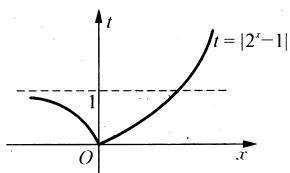

<details>
<summary>text_image</summary>

t = |2^x - 1|
1
O
x
</details>

图1-7

故 k 的取值范围是 $(0, +\infty)$ .

例4 已知二次函数 $y = g(x)$ 的导函数的图像与直线 $y = 2x$ 平行，且 $y = g(x)$ 在 $x = -1$ 处取得极小值 $m - 1 (m \neq 0)$ ，设 $f(x) = \frac{g(x)}{x}$ .

(1) 若曲线 $y = f(x)$ 上的点 P 到点 $Q(0, 2)$ 的距离的最小值为 $\sqrt{2}$ ，求 m 的值；  
(2) $k (k \in \mathbf{R})$ 如何取值时, 函数 $y = f(x) - kx$ 存在零点, 并求出零点.

解题策略：本题考查函数和方程、导数、两点间距离公式、基本不等式、一元二次方程解的讨论等知识，考查函数与方程、化归与转化、分类与整合的数学思想方法，以及抽象概括能力、推理能力、运算求解能力和创新意识，应当看到：二次函数、一元二次方程和一元二次不等式是一个有机的整体，要深刻理解它们相互之间的关系，能用函数思想来研究方程和不等式，用方程理论探究函数图像的某种状态，而零点正是函数与方程的契合点，不等式的解法则起到桥梁的作用。

解：设二次函数为 $g(x) = ax^2 + bx + c$

$\because y=g'(x)=2ax+b$ 的图像与直线y=2x平行， $\therefore a=1.$

又 $\because y = g(x)$ 在 $x = -1$ 处取得极小值 $m - 1$ ，即当 $-\frac{b}{2a} = -1$ 时， $g(-1) = a(-1)^2 + b(-1) + c = m - 1.$

$$
\therefore b = 2, c = m, \therefore f (x) = \frac {g (x)}{x} = \frac {m}{x} + x + 2.
$$

(1) 已知 $m \neq 0$ , 设曲线 $y = f(x)$ 上点 $P$ 的坐标为 $P(x, y)$ , 则点 $P$ 到点 $Q(0, 2)$ 的距离为 $|PQ| = \sqrt{(x - 0)^2 + (y - 2)^2} = \sqrt{x^2 + \left(\frac{m}{x} + x\right)^2} = \sqrt{2x^2 + \frac{m^2}{x^2} + 2m} \geqslant \sqrt{2\sqrt{2x^2 \cdot \frac{m^2}{x^2}} + 2m} = \sqrt{2\sqrt{2}|m| + 2m}$ .

当且仅当 $2x^{2} = \frac{m^{2}}{x^{2}}\Rightarrow x = \pm \sqrt{\frac{|m|}{\sqrt{2}}}$ 时等号成立.

∵ $\left|PQ\right|$ 的最小值为 $\sqrt{2}$ ，∴ $\sqrt{2\sqrt{2}\mid m\mid+2m}=\sqrt{2}\Rightarrow\sqrt{2}\mid m\mid+m=1$ ，

① 当 $m > 0$ 时，解得 $m = \frac{1}{\sqrt{2} + 1} = \sqrt{2} - 1$

② 当 $m < 0$ 时，解得 $m = \frac{1}{1 - \sqrt{2}} = -\sqrt{2} - 1.$ 故 $m = \sqrt{2} - 1$ 或 $m = -\sqrt{2} - 1.$

(2) $y = f(x) - kx$ 的零点即方程 $\frac{m}{x} + (1 - k)x + 2 = 0$ 的解.

$\because m \neq 0, \therefore \frac{m}{x} + (1 - k)x + 2 = 0$ 与 $(k - 1)x^{2} - 2x - m = 0$ 有相同的解.

① 若 $k = 1, (k - 1)x^2 - 2x - m = 0 \Rightarrow x = -\frac{m}{2} \neq 0.$

所以函数 $y = f(x) - kx$ 有零点 $x = -\frac{m}{2}$ .

② 若 $k \neq 1, (k - 1)x^2 - 2x - m = 0$ 的判别式 $\Delta = 4[1 + m(k - 1)]$ .

若 $\Delta = 0 \Rightarrow k = 1 - \frac{1}{m}$ , 此时函数 $y = f(x) - kx$ 有一个零点 $x = -m$ .

若 $\Delta > 0 \Rightarrow 1 + m(k - 1) > 0$ .

∴ 当 m > 0, $k > 1 - \frac{1}{m}$ ，或 m < 0, $k < 1 - \frac{1}{m}$ 时，方程 $(k - 1)x^{2} - 2x - m = 0$ 有两个解：

$x_{1} = \frac{1 + \sqrt{1 + m(k - 1)}}{k - 1}$ 和 $x_{2} = \frac{1 - \sqrt{1 + m(k - 1)}}{k - 1},$

此时函数 $y = f(x) - kx$ 有两个零点 $x_{1}$ 和 $x_{2}$ .

若 $\Delta < 0 \Rightarrow 1 + m(k - 1) < 0$

∴ 当 $m > 0, k < 1 - \frac{1}{m}$ ，或 $m < 0, k > 1 - \frac{1}{m}$ 时，方程 $(k - 1)x^{2} - 2x - m = 0$ 无实数解，此时函数 $y = f(x) - kx$ 没有零点.

# 第六讲 运用函数与方程思想解三角问题

函数与方程的思想方法在解三角问题中的体现主要表现在三角式的求值问题、解斜三角形以及三角函数图像及其性质的研究中，特别是求三角函数最值这类题型常常需要把函数的性质与解方程(组)思想结合起来，联合运用.

例1 若 $\cos \alpha + 2\sin \alpha = -\sqrt{5}$ , 则 $\tan \alpha = (\quad)$ .

A. $\frac{1}{2}$

B. 2

C. $-\frac{1}{2}$

D.-2

解题策略：在三角求值问题中，运用方程(组)的思想是一种常见的解题策略。本例最为直接的解法是借助公式 $\sin^2\alpha + \cos^2\alpha = 1$ 结合条件，解方程组求得 $\sin \alpha$ 、 $\cos \alpha$ 的值，进而求 $\tan \alpha$ 的值；但是若把条件平方，化为 $\sin \alpha$ 、 $\cos \alpha$ 的齐次式（利用 $1 = \sin^2\alpha + \cos^2\alpha$ 进行替换），分子分母同除以 $\cos^2\alpha$ 得关于 $\tan \alpha$ 的一个方程，通过解方程得所求结果。第三种思考方法是因为 $|\cos \alpha + 2\sin \alpha| \leqslant \sqrt{5}$ ，而条件是 $\cos \alpha + 2\sin \alpha = -\sqrt{5}$ ，故可以构造三角方程 $\cos (\alpha - \beta) = -1$ （其中 $\tan \varphi = 2$ ），则易求得 $\alpha$ 的值进而求 $\tan \alpha$ 的值；更为巧妙的是分析题设 $\cos \alpha + 2\sin \alpha = 2 \times \left(-\frac{\sqrt{5}}{2}\right)$ ，其结构符合等差中项 $a + c = 2b$ 的形式，则可构造等差数列解题。构造法思想在本题中可得到充分展示。

解法一：解方程组 $\left\{\begin{aligned}\cos\alpha+2\sin\alpha&=-\sqrt{5},\\ \sin^{2}\alpha+\cos^{2}\alpha&=1,\end{aligned}\right.$ 得 $\left\{\begin{aligned}\sin\alpha&=-\frac{2}{\sqrt{5}},\\ \cos\alpha&=-\frac{1}{\sqrt{5}},\end{aligned}\right.$ $\therefore\tan\alpha=2,$ 故选 B.

解法二：设 $\tan \alpha = t$ ，则 $\sin \alpha = t\cos \alpha$ ，代入 $\cos \alpha + 2\sin \alpha = -\sqrt{5}$ 得

$$
\cos \alpha = \frac {- \sqrt {5}}{2 t + 1}, \sin \alpha = \frac {- \sqrt {5} t}{2 t + 1}.
$$

$\because \sin^2\alpha +\cos^2\alpha = 1,\therefore \frac{5}{(2t + 1)^2} +\frac{5t^2}{(2t + 1)^2} = 1$ ，解之得 $t = 2,\therefore \tan \alpha = 2$ ，故选B.

解法三：将 $\cos \alpha + 2\sin \alpha = -\sqrt{5}$ 两边平方得 $\cos^2\alpha + 4\sin \alpha \cos \alpha + 4\sin^2\alpha = 5.$

则 $\frac{\cos^2\alpha + 4\sin\alpha\cos\alpha + 4\sin^2\alpha}{\sin^2\alpha + \cos^2\alpha} = 5.\because \cos\alpha \neq 0, \therefore \frac{1 + 4\tan\alpha + 4\tan^2\alpha}{\tan^2\alpha + 1} = 5,$

化简得 $(\tan \alpha - 2)^2 = 0, \therefore \tan \alpha = 2$ ，故选B.

解法四： $\because \cos \alpha +2\sin \alpha = \sqrt{5}\left(\frac{1}{\sqrt{5}}\cos \alpha +\frac{2}{\sqrt{5}}\sin \alpha\right) = -\sqrt{5}.$

$\therefore \cos (\alpha -\varphi) = -1$ （其中 $\tan \varphi = 2)$ ，则 $\alpha -\varphi = \pi +2k\pi (k\in \mathbf{Z})$

即 $\alpha = \varphi +\pi +2k\pi (k\in \mathbf{Z}),\therefore \tan \alpha = \tan (\varphi +\pi +2k\pi) = \tan \varphi = 2$ ，故选B.

解法五：由于 $\cos \alpha + 2\sin \alpha = -\sqrt{5}$ 符合等差数列等差中项 $a + c = 2b$ 的形式，故可将原式变形为 $\cos \alpha + 2\sin \alpha = 2 \times \left(-\frac{\sqrt{5}}{2}\right)$ ，

则设 $\cos \alpha = d - \frac{\sqrt{5}}{2}, 2\sin \alpha = -\frac{\sqrt{5}}{2} - d.\therefore \cos \alpha = d - \frac{\sqrt{5}}{2}, \sin \alpha = -\frac{\sqrt{5}}{4} - \frac{d}{2},$

$\therefore \left(d - \frac{\sqrt{5}}{2}\right)^2 +\left(-\frac{\sqrt{5}}{4} -\frac{d}{2}\right)^2 = 1.$ 得 $\left(\frac{\sqrt{5}}{2} d - \frac{3}{4}\right)^2 = 0,$ 解得 $d = \frac{3\sqrt{5}}{10}.$

$\because \sin \alpha = -\frac{2\sqrt{5}}{5}, \cos \alpha = -\frac{\sqrt{5}}{5}.\therefore \tan \alpha = 2,$ 故选B.

例2 已知 $9\sin \alpha - 3\cos \beta - \tan \gamma = 0$ ，①

$$
\cos^ {2} \beta + 4 \sin \alpha \tan \gamma = 0, \quad ②
$$

求证： $9\sin\alpha+\tan\gamma=0.$

解题策略：这是一道条件等式的证明题。直接推证思路应该有，条件中有角 $\beta$ 的三角函数，而结论中没有，消去 $\beta$ 是必由之路。但接下来的三角恒等变形相当复杂。若仔细观察条件等式，巧妙地构造方程，可得到如下的新颖证法。当然读者可以试用常规方法证明此题，并作比较，体会构造方程、利用方程思想解题的妙处。

证法一：已知条件可变为 $9\sin \alpha + (-\tan \gamma) = 3\cos \beta$

$$
9 \sin \alpha \cdot (- \tan \gamma) = \frac {9}{4} \cos^ {2} \beta .
$$

视 $9\sin \alpha$ 与 $-\tan \gamma$ 为方程 $x^{2} - 3x\cdot \cos \beta +\frac{9}{4}\cos^{2}\beta = 0$ 的两根，

问题转化为证明此方程的两根之差为零.

由于 $|x_{1} - x_{2}| = \sqrt{(x_{1} + x_{2})^{2} - 4x_{1}x_{2}} = \sqrt{(-3\cos\beta)^{2} - 4\cdot\frac{9}{4}\cos^{2}\beta} = 0.$

因此， $9\sin\alpha+\tan\gamma=0.$

证法二：注意到已知条件中的数学关系 $9 = 3^2$ ，则①式就是以3为元的一元二次方程，而②式的左端恰为该方程的判别式，从而可得 $x = 3$

则①式变为 $x^{2}\sin \alpha - x\cos \beta - \tan \gamma = 0$ 。（\*）

当 $\sin \alpha = 0$ 时，由已知条件可得 $\tan \gamma = 0$ ，从而 $9\sin \alpha + \tan \gamma = 0$

当 $\sin \alpha \neq 0$ 时，由②式知方程（ $*$ ）有两个相等的实数根，

$x_{1} = x_{2} = \frac{\cos\beta}{2\sin\alpha} = 3$ ，即 $\cos \beta = 6\sin \alpha$ ，代入①式得 $9\sin \alpha +\tan \gamma = 0.$

例3 已知函数 $f(x) = \cos 2x + a\sin x + b (a < 0)$ .

(1) 若当 $x \in \mathbb{R}$ 时, $f(x)$ 的最大值为 $\frac{9}{8}$ , 最小值为 -2, 求实数 $a, b$ 的值;

(2) 若 $a = -2, b = 1$ . 设函数 $g(x) = m \sin x + 2m$ , 且当 $x \in \left[\frac{\pi}{6}, \frac{2\pi}{3}\right]$ 时, $f(x) > g(x)$ 恒成立, 求实数 $m$ 的取值范围.

解题策略：第(1)问， $f(x)$ 为关于 $\sin x$ 的二次函数形式，配方后结合正弦函数的有界性以及对称轴的变动进行分类讨论进而解方程组求a、b之值；第(2)问，可以通过参变分离结合“耐克函数”性质求m的取值范围，也可以通过二次不等式在区间上恒成立问题转化为相应二次函数在区间上图像的讨论，两种解法都体现了函数思想且各具特色.

解：(1) $f(x) = -2\left(\sin x - \frac{a}{4}\right)^2 + \frac{a^2}{8} + b + 1, \because -1 \leqslant \sin x \leqslant 1, a < 0,$

∴ 当 $-1 \leqslant \frac{a}{4} < 0$ 时， $f(x)_{\max} = \frac{a^{2}}{8} + b + 1 = \frac{9}{8}$ ， $f(x)_{\min} = a + b - 1 = -2$ .

解得 a = -1 或 a = 9(舍去), $\therefore a = -1, b = 0.$

当 $\frac{a}{4} < -1$ 时， $f(x)_{\max} = -a + b - 1 = \frac{9}{8}$ ， $f(x)_{\min} = a + b - 1 = -2$ 。∴ $a = -\frac{25}{16}$ （舍去）.

综上所述， $a = -1, b = 0.$

(2) 解法一: $f(x) = -2\sin^2 x - 2\sin x + 2$ .

当 $x \in \left[\frac{\pi}{6}, \frac{2\pi}{3}\right]$ 时， $-2\sin^2 x - 2\sin x + 2 > m(\sin x + 2)$ 恒成立，

$$
m <   \frac {- 2 \sin^ {2} x - 2 \sin x + 2}{\sin x + 2}, \text {令} u = \sin x + 2, \text {则} \frac {5}{2} \leqslant u \leqslant 3.
$$

$m < 6 - 2\left(u + \frac{1}{u}\right), 6 - 2\left(u + \frac{1}{u}\right) \geqslant -\frac{2}{3}$ , 即 $m < -\frac{2}{3} \therefore m$ 的取值范围是 $\left(-\infty, -\frac{2}{3}\right)$ .

解法二： $f(x) = -2\sin^{2}x - 2\sin x + 2.$

当 $x \in \left[\frac{\pi}{6}, \frac{2\pi}{3}\right]$ 时， $-2\sin^2 x - 2\sin x + 2 > m(\sin x + 2)$ 恒成立，

令 $t = \sin x$ ，则 $h(t) = 2t^2 + 2t + mt + 2m - 2$ ，则 $h(t) < 0$ 在 $\left[\frac{1}{2}, 1\right]$ 上恒成立，

则 $\left\{\begin{aligned}h(1)<0,\\ h\left(\frac{1}{2}\right)<0\end{aligned}\Rightarrow\left\{\begin{aligned}m&<-\frac{2}{3},\\ m&<-\frac{1}{5},\end{aligned}\right.$ 即 $m<-\frac{2}{3}$ . ∴ m 的取值范围是 $\left(-\infty,-\frac{2}{3}\right)$ .

例 4 已知两个不共线的向量 $\vec{a}$ ， $\vec{b}$ 的夹角为 $\theta$ ，且 $|\vec{a}| = 3$ ， $|\vec{b}| = 1$ 。x 为正实数。

(1) 若 $\vec{a} + 2\vec{b}$ 与 $\vec{a} - 4\vec{b}$ 垂直，求 $\tan\theta;$   
(2) 若 $\theta = \frac{\pi}{6}$ , 求 $|x\vec{a} - \vec{b}|$ 的最小值及对应的 $x$ 值, 并指出向量 $\vec{a}$ 与 $x\vec{a} - \vec{b}$ 的位置关系;  
(3) 若 $\theta$ 为锐角, 对于正实数 $m$ , 关于 $x$ 的方程 $|x\vec{a} - \vec{b}| = |m\vec{a}|$ 有两个不同的正实数解, 且 $x \neq m$ , 求 $m$ 的取值范围.

解题策略：本题是三角与平面向量、函数的最值、方程有实根等众多知识的综合。函数与方程思想作为一条红线贯穿其中。第(1)小题，依据两向量垂直的充要条件求 $\cos \theta$ 的值，进而运用同角三角比基本关系式求 $\sin \theta$ ， $\tan \theta$ 之值；第(2)小题转化为二次函数运用配方法求最小值并以此探究向量 $\vec{a}$ 与 $x\vec{a} - \vec{b}$ 的位置关系；第(3)小题将方程转化为 $x$ 的一元二次方程，通过方程有两个不同实根转化为相应的不等式组，结合三角比的取值范围探求 $m$ 的取值范围。

解：（1）由题意得 $(\vec{a} + 2\vec{b}) \cdot (\vec{a} - 4\vec{b}) = 0$ ，即 $\vec{a}^2 - 2\vec{a} \cdot \vec{b} - 8\vec{b}^2 = 0$ .

得 $3^{2} - 2 \times 3 \times 1 \times \cos \theta - 8 \times 1^{2} = 0$ ，得 $\cos \theta = \frac{1}{6}$ ，又 $\theta \in (0, \pi)$ ，故 $\theta \in \left(0, \frac{\pi}{2}\right)$ .

因此， $\sin \theta = \sqrt{1 - \cos^2 \theta} = \sqrt{1 - \left(\frac{1}{6}\right)^2} = \frac{\sqrt{35}}{6}, \tan \theta = \frac{\sin \theta}{\cos \theta} = \sqrt{35}$ .

$$
\begin{array}{r l} (2) \mid x \vec {a} - \vec {b} \mid = & \sqrt {(x \vec {a} - \vec {b}) ^ {2}} = \sqrt {x ^ {2} \vec {a} ^ {2} - 2 x \vec {a} \cdot \vec {b} + \vec {b} ^ {2}} = \sqrt {9 x ^ {2} - 2 x \times 3 \times 1 \times \cos \frac {\pi}{6} + 1} = \\ & \sqrt {9 \left(x - \frac {\sqrt {3}}{6}\right) ^ {2} + \frac {1}{4}}. \end{array}
$$

故当 $x = \frac{\sqrt{3}}{6}$ 时， $|x\vec{a} - \vec{b}|$ 的最小值为 $\frac{1}{2}$ ，此时， $\vec{a} \cdot (x\vec{a} - \vec{b}) = x\vec{a}^2 - \vec{a} \cdot \vec{b} = \frac{\sqrt{3}}{6} \times 9 - 3 \times 1 \times \cos \frac{\pi}{6} = 0.$ 故向量 $\vec{a}$ 与 $x\vec{a} - \vec{b}$ 垂直.

(3) 对方程 $|x\vec{a} - \vec{b}| = |m\vec{a}|$ 两边平方整理得 $9x^{2} - (6\cos \theta)x + 1 - 9m^{2} = 0.$ ①

设方程①的两个不同正实数解为 $x_{1}, x_{2}$ , 则由题意得:

$$
\left\{ \begin{array}{l l} {\Delta = (6 \cos \theta) ^ {2} - 4 \times 9 \times (1 - 9 m ^ {2}) > 0,} \\ {x _ {1} + x _ {2} = \frac {6 \cos \theta}{9} > 0,} & {\text {得} \frac {1}{3} \sin \theta <   m <   \frac {1}{3}.} \\ {x _ {1} x _ {2} = \frac {1 - 9 m ^ {2}}{9} > 0.} & \end{array} \right.
$$

若 $x = m$ ，则方程 ① 就化为 $-(6\cos \theta)m + 1 = 0$ ，得 $m = \frac{1}{6\cos\theta}$ 而 $x \neq m$ ，故 $m \neq \frac{1}{6\cos\theta}$

由 $\frac{1}{3}\sin \theta < \frac{1}{6\cos\theta} < \frac{1}{3}$ , 得 $\left\{ \begin{array}{l} \sin 2\theta < 1, \\ \cos \theta > \frac{1}{2}, \end{array} \right.$ 得 $0^{\circ} < \theta < 60^{\circ}$ 且 $\theta \neq 45^{\circ}$ ,

当 $0^{\circ} < \theta < 60^{\circ}$ 且 $\theta \neq 45^{\circ}$ 时， $m$ 的取值范围为 $\left\{m \mid \frac{1}{3} \sin \theta < m < \frac{1}{3} \text{且 } m \neq \frac{1}{6 \cos \theta}\right\}$ ;

当 $60^{\circ} \leqslant \theta < 90^{\circ}$ 或 $\theta = 45^{\circ}$ 时， $m$ 的取值范围为 $\left\{m \mid \frac{1}{3} \sin \theta < m < \frac{1}{3}\right\}$ .

# 第七讲 运用函数与方程思想解数列问题

数列是定义在正整数集或其有限子集上的特殊函数, 当然离不开对其函数性质如单调性、最大最小项、周期性的研究, 数列的通项公式和前 $n$ 项和公式是关于 $n$ 的函数. 也可以将其转化为方程或方程组, 等差、等比数列中的“知三求二”计算问题也常用解方程(组)的方法求解, 运用函数与方程思想解数列问题的题型主要表现在研究数列的最值问题、范围问题以及数列不等式的证明.

例1 在等差数列 $\{a_{n}\}$ 中，已知 $S_{100} = 10$ ， $S_{10} = 100$ ，求 $S_{110}$

解题策略：一个数学问题可以从不同的视角进行分析，本题可以套用公式，列方程，解方程组的“通性通法”求解；可以由公差不为0的等差数列前 $n$ 项和 $S_{n} = \frac{d}{2} n^{2} + \left(a_{1} - \frac{d}{2}\right)n$ 这个公式，结合二次函数的性质求解；可以创造一个“和数列”，即对等差数列 $\{a_{n}\}$ 每10项分成一组，每组的和作为一项构造新数列： $S_{10}, S_{20} - S_{10}, S_{30} - S_{20}, \dots, S_{100} - S_{90}$ 仍然是一个等差数列，以此求解；可以根据等差数列的性质，即 $m, n, p, q \in \mathbb{N}^{*}$ ，且 $m + n = p + q$ ，则 $a_{m} + a_{n} = a_{p} + a_{q}$ 进行整体代换求解；还可以构造 $\frac{S_n}{n}$ 这一关于 $n$ 的一次函数，利用点 $\left(n, \frac{S_n}{n}\right) (n \in \mathbb{N}^{*})$ 共线求解。基础题型，解法多样，函数与方程的思想这一主线贯穿其中，可拓展“多元解题策略”的视野，供读者赏析。

解法一：设数列 $\{a_{n}\}$ 的公差为 $d$ ，则

$$
\left\{ \begin{array}{l l} S _ {1 0} = 1 0 a _ {1} + \frac {1 0 \times 9}{2} d = 1 0 0, \\ S _ {1 0 0} = 1 0 0 a _ {1} + \frac {1 0 0 \times 9 9}{2} d = 1 0. \end{array} \right. \text {解得} a _ {1} = \frac {1   0 9 9}{1 0 0},   d = - \frac {1 1}{5 0}.
$$

$$
\therefore S _ {1 1 0} = 1 1 0 a _ {1} + \frac {1 1 0 \times 1 0 9}{2} d = - 1 1 0.
$$

解法二：设 $S_{n} = an^{2} + bn$ $(a\neq 0)$ ，则 $\left\{ \begin{array}{l}S_{100} = 100^{2}a + 100b = 10,\\ S_{10} = 10^{2}a + 10b = 100, \end{array} \right.$ 解得 $a = -\frac{11}{100},b = \frac{111}{10}$

$\therefore S_{n} = -\frac{11}{100} n^{2} + \frac{111}{10} n$ ，从而 $S_{110} = -\frac{11}{100} \times 110^{2} + \frac{111}{10} \times 110 = -110.$

解法三：将数列依照原有的顺序每10项分为一组，每组的和作为一项构造新数列： $S_{10}$ ， $S_{20}-S_{10}$ ， $S_{30}-S_{20}$ ，…， $S_{100}-S_{90}$ ，则这个数列是一个首项为 $S_{10}$ ，第10项为 $S_{100}-S_{90}$ 的等差数列，设新数列的公差为 $d'$ ，则该数列的前10项和等于 $S_{100}$ 。

$\therefore S_{100} = 10S_{10} + \frac{10\times 9}{2}\times d^{\prime} = 10\times 100 + \frac{10\times 9}{2} d^{\prime} = 10$ ，解得 $d^{\prime} = -22.$

于是前11项和 $S_{110} = 11 \times S_{10} + \frac{11 \times 10}{2} d' = 11 \times 100 + \frac{11 \times 10}{2} \times (-22) = -110.$

解法四： $\because S_{100} - S_{10} = \frac{90(a_{11} + a_{100})}{2} = -90, \therefore a_{11} + a_{100} = -2.$

又由 $a_{11} + a_{100} = a_1 + a_{110} = -2\therefore S_{110} = \frac{110(a_1 + a_{110})}{2} = -110.$

解法五： $\because S_{n}=na_{1}+\frac{n(n-1)}{2}d,\therefore \frac{S_{n}}{n}=a_{1}+\frac{1}{2}(n-1)d$ 形式上是关于 $n$ 的“一次函数”.

∴ 点 $\left(10, \frac{S_{10}}{10}\right)$ 、 $\left(100, \frac{S_{100}}{100}\right)$ 、 $\left(110, \frac{S_{110}}{110}\right)$ 共线.

则 $\frac{\frac{10}{100} - \frac{100}{10}}{100 - 10} = \frac{\frac{S_{110}}{110} - \frac{10}{100}}{110 - 100}$ , 解得 $S_{110} = -110$ .

例 2 （1）已知数列 $\{a_{n}\}$ ， $a_{n}=2n-1$ ，是否存在正整数k，使对一切 $n\in N^{*}$ ，不等式 $\left(1+\frac{1}{a_{1}}\right)\left(1+\frac{1}{a_{2}}\right)\cdots\left(1+\frac{1}{a_{n}}\right)\geqslant k\sqrt{2n+1}$ 均成立.

(2) 已知关于 $n$ 的不等式 $\frac{1}{n + 1} + \frac{1}{n + 2} + \cdots + \frac{1}{2n} > \frac{1}{12}\log_a(a - 1) + \frac{2}{3}$ , 对于一切大于 1 的正整数 $n$ 都成立, 试

求实数 a 的取值范围.

解题策略：数列是定义在正整数集或其有限子集上的特殊函数，本例两小题都是数列不等式恒成立探究参数的存在性或范围问题。关键是必须首先探究相关数列的单调性。第(1)问，所给数列呈现积的形式，则应由 $\frac{f(n + 1)}{f(n)}$ 与1的大小关系探究 $f(n) = \left(1 + \frac{1}{a_1}\right)\left(1 + \frac{1}{a_2}\right)\dots \left(1 + \frac{1}{a_n}\right)$ 的单调性。第(2)问，不等式左边是数列和的形式，右边是含参数 $a$ 的对数，探究的是对一切大于1的正整数不等式都成立，求 $a$ 的取值范围。关键是对不等式左边的和式要“吃透”。若设和式为 $f(n)$ ，这是一个关于 $n$ 的函数，则必然要注意此函数的性质求 $f(n)(n > 1$ 且 $n\in \mathbb{N}^*$ ) 的最值，而要求 $f(n)$ 的最值，必须先判断 $f(n)$ 的单调性。所以应讨论 $f(n + 1) - f(n)$ 的正、负号，从而得 $f(n)_{\min} > \frac{1}{12}\log_a(a - 1) + \frac{2}{3}$ ，解此不等式求解 $a$ 的取值范围。

解：(1) 设 $f(n)=\frac{\left(1+\frac{1}{a_{1}}\right)\left(1+\frac{1}{a_{2}}\right)\cdots\left(1+\frac{1}{a_{n}}\right)}{\sqrt{2n+1}}$ ,

则 $\frac{f(n + 1)}{f(n)} = \frac{2(n + 1)}{\sqrt{4(n + 1)^2 - 1}} > 1.\therefore f(n)$ 单调递增， $f(1)$ 为 $f(n)$ 的最小值.

$\because f(n) \geqslant k$ 恒成立, $\therefore k \leqslant f(1) = \frac{2\sqrt{3}}{3}$ , 即 $k$ 的最大值为 $\frac{2\sqrt{3}}{3}$ .

∴ 存在正整数 k = 1，使得原不等式成立.

(2) 设 $f(n)=\frac{1}{n+1}+\frac{1}{n+2}+\cdots+\frac{1}{2n}(n\in\mathbf{N}^{*}\text{且}n\geqslant2)$ .

$$
\because f (n + 1) - f (n) = \frac {1}{2 n + 1} + \frac {1}{2 n + 2} - \frac {1}{n + 1} = \frac {1}{(2 n + 1) (2 n + 2)} > 0,
$$

∴ $f(n)$ 是关于 n 的递增函数, ∴ 当 $n \geqslant 2$ 时 $f(n) \geqslant f(2) = \frac{1}{3} + \frac{1}{4} = \frac{7}{12}$ .

要使 $f(n) \geqslant \frac{1}{12} \log_a (a - 1) + \frac{2}{3}$ 对于一切 $n \geqslant 2$ 恒成立，

必须且只需 $\frac{1}{12}\log_a(a - 1) + \frac{2}{3} < \frac{7}{12}$ , 即 $\log_a(a - 1) < -1$ .

$\because a>1,\therefore a-1<\frac{1}{a}$ ，解得 $1<a<\frac{\sqrt{5}+1}{2}$ .

故所求 $a$ 的取值范围是 $\left(1, \frac{\sqrt{5} + 1}{2}\right)$ .

例3 已知数列 $\{a_{n}\}$ 的各项均为正数，其前 $n$ 项和为 $S_{n}$ ，且对任意 $n \in \mathbb{N}^{*}$ ，有 $S_{n} = \frac{1}{4} a_{n}^{2} + \frac{1}{2} a_{n}$ .

(1) 求数列 $\{a_{n}\}$ 的通项公式；

(2) 设 $b_{n} = 2^{n}$ ( $n \in \mathbf{N}^{*}$ ), 对每个正整数 $k$ , 在 $b_{k}$ 与 $b_{k+1}$ 之间插入 $a_{k}$ 个 1, 得到一个新的数列 $\{c_{n}\}$ , 记数列 $\{c_{n}\}$ 的前 $n$ 项和为 $T_{m}$ . 求使得 $T_{m} = 2c_{m+1}$ 成立的所有正整数 $m$ 的值.

解题策略：第(1)问，由 $a_{n} = S_{n} - S_{n - 1}$ ，把条件代入得 $a_{n}$ 与 $a_{n - 1}$ 的关系，从而求得 $\{a_n\}$ 的通项公式；第(2)问是探究性问题，可采用二项展开式及不等式放缩的技巧进行探究，以寻找正整数 $m$ 的值是否存在.

解：(1) 当 $n = 1$ 时，由 $a_1 = S_1 = \frac{1}{4} a_1^2 + \frac{1}{2} a_1$ 及 $a_1$ 为正整数，得 $a_1 = 2$ ；

当 $n \geqslant 2$ 时，由 $a_{n} = S_{n} - S_{n-1} = \frac{1}{4} a_{n}^{2} + \frac{1}{2} a_{n} - \left(\frac{1}{4} a_{n-1}^{2} + \frac{1}{2} a_{n-1}\right)$

得 $(a_{n} + a_{n - 1})(a_{n} - a_{n - 1} - 2) = 0,\therefore a_{n} + a_{n - 1} > 0,\therefore a_{n} - a_{n - 1} = 2.$

故 $\{a_{n}\}$ 是首项和公差均为2的等差数列.

$$
\therefore a _ {n} = 2 + (n - 1) \cdot 2 = 2 n (n \in \mathbf {N} ^ {*}).
$$

(2) 当 $m = 1$ 时, $T_{1} = c_{1} = b_{1} = 2$ , $2c_{2} = 2 \times 1 = 2$ , 满足要求.

当 $n \geqslant 2$ 时，若 $c_{m+1} = 1$ ，则 $T_m \geqslant T_2 = 3 > 2c_{m+1}$ ，不满足要求；

若 $c_{m + 1}\neq 1$ ，则 $c_{m + 1}$ 必为数列 $\{b_n\}$ 中的某一项，不妨设 $c_{m + 1} = 2^{k + 1}(k\in \mathbf{N}^*)$

于是 $T_{m}=(b_{1}+b_{2}+\cdots+b_{k})+(a_{1}+a_{2}+\cdots+a_{k})$

$$
= (2 + 2 ^ {2} + \dots + 2 ^ {k}) + (2 + 4 + \dots + 2 k) = 2 ^ {k + 1} + k ^ {2} + k - 2.
$$

由 $T_{m} = 2c_{m + 1}$ ，得 $2^{k + 1} + k^2 +k - 2 = 2\times 2^{k + 1}$ ，即 $2^{k + 1} = k^2 +k - 2(k\in \mathbf{N}^*)$ （ $*$ ）

显然， $k = 1$ 不满足 $(\ast)$ ，则当 $k\geqslant 2$ 时，有

$$
2 ^ {k + 1} = 2 (1 + 1) ^ {k} = 2 \left(\mathrm{C} _ {k} ^ {0} + \mathrm{C} _ {k} ^ {1} + \dots + \mathrm{C} _ {k} ^ {k}\right) \geqslant 2 \left(\mathrm{C} _ {k} ^ {0} + \mathrm{C} _ {k} ^ {1} + \mathrm{C} _ {k} ^ {2}\right) = k ^ {2} + k + 2 > k ^ {2} + k - 2,
$$

∴ 方程(\*)无正整数解.

综上所述,满足条件的正整数 m 只有一个,即 m = 1.

例4 已知函数 $f(x) = ax - \frac{3}{2} x^2$ 的最大值不大于 $\frac{1}{6}$ , 又当 $x \in \left[\frac{1}{4}, \frac{1}{2}\right]$ 时, $f(x) \geqslant \frac{1}{8}$ .

(1) 求 $a$ 的值；

(2) 设 $0 < a_{1} < \frac{1}{2}$ , $a_{n+1} = f(a_{n})$ , $n \in \mathbf{N}^{*}$ , 证明 $a_{n} < \frac{1}{n+1}$ .

解题策略：将函数嵌入数列综合题中，凸显数列综合应用的多元切入点，是高考命题的热点，本例以函数性质的研究为背景与数列知识融为一体，又汇集了不等式的证明、数学归纳法。在整个解题过程中函数的思想方法始终贯彻其中，是一道精彩纷呈的好题。

解：（1）由于 $f(x) = ax - \frac{3}{2} x^2$ 的最大值不大于 $\frac{1}{6},\therefore f\left(\frac{a}{3}\right) = \frac{a^2}{6}\leqslant \frac{1}{6}$ 即 $a^2\leqslant 1.$ ①

又当 $x \in \left[\frac{1}{4}, \frac{1}{2}\right]$ 时， $f(x) \geqslant \frac{1}{8}$ ， $\therefore \begin{cases} f\left(\frac{1}{2}\right) \geqslant \frac{1}{8}, \\ f\left(\frac{1}{4}\right) \geqslant \frac{1}{8}, \end{cases}$ 即 $\begin{cases} \frac{a}{2} - \frac{3}{8} \geqslant \frac{1}{8}, \\ \frac{a}{4} - \frac{3}{32} \geqslant \frac{1}{8}. \end{cases}$

解得 $a \geqslant 1$ . ② 由 ① 和 ② 得 $a = 1$ .

(2) 证法一: (i) 当 $n = 1$ 时, $0 < a_{1} < \frac{1}{2}$ , 不等式 $0 < a_{n} < \frac{1}{n + 1}$ 成立;

$\because f(x) > 0, \therefore x \in \left(0, \frac{2}{3}\right), \therefore x < a_{2} = f(a_{1}) \leqslant \frac{1}{6} < \frac{1}{3}$ , 故 $n = 2$ 时不等式也成立.

(ii) 假设当 $n = k (k \geqslant 2)$ 时，不等式 $0 < a_{k} < \frac{1}{k + 1}$ 成立，

$\because f(x) = x - \frac{3}{2} x^2$ 的对称轴为 $x = \frac{1}{3}$ , 知 $f(x)$ 在 $\left[0, \frac{1}{3}\right]$ 上为增函数,

∴ 由 $0 < a_{k} < \frac{1}{k+1} \leqslant \frac{1}{3}$ ，得 $0 < f(a_{k}) < f\left(\frac{1}{k+1}\right)$ .

$$
\therefore 0 <   a _ {k + 1} <   \frac {1}{k + 1} - \frac {3}{2} \cdot \frac {1}{(k + 1) ^ {2}} + \frac {1}{k + 2} - \frac {1}{k + 2} = \frac {1}{k + 2} - \frac {k + 4}{2 (k + 1) ^ {2} (k + 2)} <   \frac {1}{k + 2},
$$

即当 $n = k + 1$ 时，不等式也成立.

根据(i)和(ii)可知,对任何 $n \in N^{*}$ , 不等式 $a_{n} < \frac{1}{n+1}$ 成立.

证法二：(i) 当 $n = 1$ 时， $0 < a_{1} < \frac{1}{2}$ ，不等式 $0 < a_{n} < \frac{1}{n + 1}$ 成立；

(ii) 假设当 $n = k (k \geqslant 1)$ 时不等式成立，即 $0 < a_{k} < \frac{1}{k + 1}$ ，

则当 $n = k + 1$ 时， $a_{k + 1} = a_k\left(1 - \frac{3}{2} a_k\right) = \frac{1}{k + 2}\cdot (k + 2)a_k\cdot \left(1 - \frac{3}{2} a_k\right).$

$$
\because (k + 2) a _ {k} > 0, 1 - \frac {3}{2} a _ {k} > 0,
$$

$$
\therefore (k + 2) a _ {k} \cdot \left(1 - \frac {3}{2} a _ {k}\right) \leqslant \left[ \frac {1 + \left(k + 2 - \frac {3}{2}\right) a _ {k}}{2} \right] ^ {2} = \left[ \frac {1 + \left(k + \frac {1}{2}\right) a _ {k}}{2} \right] ^ {2} <   1,
$$

于是 $0 < a_{k + 1} < \frac{1}{k + 2}$ , 因此当 $n = k + 1$ 时, 不等式也成立.

根据(i)和(ii)可知,对任何 $n\in N^{*}$ ,不等式 $a_{n}<\frac{1}{n+1}$ 成立.

# 第八讲 运用函数与方程思想解解析几何问题

函数与方程思想在解析几何中的应用非常广泛,特别是体现在直线与圆锥曲线位置关系的研究中.直线与圆锥曲线有无公共点或有几个公共点的问题,实质是联立方程组消元后讨论一元二次方程是否有实数解或实数解的个数问题.两圆锥曲线的交点问题除了通过方程组讨论外,还要考虑曲线的对称性和范围,曲线的特征常常起到关键作用,当直线与圆锥曲线相交时,涉及弦长问题,常用根与系数的关系设而不求,即代入弦长公式计算弦长.涉及相交弦的中点问题,常用“点差法”设而不求.直线的斜率和倾斜角这些参变量在解题中发挥重要作用.方程理论在解析几何学习中至关重要.利用函数与方程思想解圆锥曲线的最值与范围问题,研究其定值或过定点问题以及曲线的对称性问题是常见的重要题型.

例1 求证：对任意实数 $a \neq -2$ ，动圆 $(a + 2)x^{2} + (a + 2)y^{2} - 4x - 2a = 0$ 恒过两定点.

解题策略：本例有两种证法：一是运用特殊值法，即取 $a = 0$ 和 $a = -1$ ，求出 $\left\{ \begin{array}{l}x = 1,\\ y = 1 \end{array} \right.$ 或 $\left\{ \begin{array}{l}x = 1,\\ y = -1, \end{array} \right.$ 再验证圆系过定点(1，1)和(1，-1)；二是如果把动圆方程转化为关于实数 $a$ 的一次函数.由这个一次函数恒为零，推出一次项系数及常数项均为零，这就是函数与方程思想的典型应用之一，下面给出的正是这种证法.

证明：圆系方程可化为 $(x^{2} + y^{2} - 2)a + 2x^{2} + 2y^{2} - 4x = 0.$

设 $f(a) = (x^{2} + y^{2} - 2)a + 2x^{2} + 2y^{2} - 4x.$

$\because f(a)=0$ 对 $a\in\mathbf{R}(a\neq-2)$ 恒成立，

∴ $\left\{\begin{aligned}x^{2}+y^{2}-2=0,\\ 2x^{2}+2y^{2}-4x=0,\end{aligned}\right.$ 解得 $\left\{\begin{aligned}x=1,\\ y=1\end{aligned}\right.$ 或 $\left\{\begin{aligned}x=1,\\ y=-1.\end{aligned}\right.$

因此，圆系过定点(1，1)和(1，-1).

例2 已知 $\odot C$ 经过点 $A(-2,0), B(0,2)$ ，且圆心在直线 $y = x$ 上。又直线 $l: y = kx + 1$ 与 $\odot C$ 相交于 $P, Q$ 两点。

(1) 求 $\odot C$ 的方程；

(2) 过点 $(0,1)$ 作直线 $l_{1}$ 与 l 垂直，且直线 $l_{1}$ 与 $\odot C$ 交于 M, N 两点，求四边形 PMQN 面积的最大值.

解题策略：本例的解题核心在第(2)问，求四边形PMQN面积，关键在于选择合适的参数作自变量，容易想到的是选择直线 $l$ 的斜率 $k$ 作为自变量，用斜率 $k$ 的式子表示弦 $PQ$ 的长度，同理可得弦 $MN$ 的长度，也可用含 $k$ 的式子表示，结合图形特征得到函数 $S = f(k)$ ，进而运用函数思想、方程理论与不等式知识求其最大值。当然，根据圆方程的几何特征，可以得到一种简捷的解法，供读者赏析。

解：（1）由题设知 $QC$ 的圆心既在 $AB$ 的中垂线上，又在直线 $y = x$ 上，易得圆心为原点，半径为2. $\therefore \odot C: x^2 + y^2 = 4.$

(2) 解法一: 设四边形 PMQN 的面积为 S, 当直线 l 的斜率 k = 0 时,

则 $l_{1}$ 的斜率不存在, 此时 $S = \frac{1}{2} \cdot 2\sqrt{3} \cdot 4 = 4\sqrt{3}$ ;

当直线 l 的斜率 $k \neq 0$ 时，设 $l_{1}: y = -\frac{1}{k}x + 1$ .

联立 $\left\{ \begin{array}{l} y = kx + 1, \\ x^2 + y^2 = 4, \end{array} \right.$ 得 $(1 + k^2)x^2 + 2kx - 3 = 0.$ 所以有 $\left\{ \begin{array}{l} \Delta = 4k^2 - 4(1 + k^2)(-3) > 0, \\ x_1 + x_2 = \frac{-2k}{1 + k^2}, \\ x_1x_2 = \frac{-3}{1 + k^2}, \end{array} \right.$

$$
\mid P Q \mid = \sqrt {1 + k ^ {2}} \mid x _ {1} - x _ {2} \mid = \sqrt {1 + k ^ {2}} \cdot \frac {\sqrt {4 k ^ {2} + 1 2 k ^ {2} + 1 2}}{1 + k ^ {2}} = \frac {\sqrt {1 + k ^ {2}} \cdot \sqrt {1 6 k ^ {2} + 1 2}}{1 + k ^ {2}}.
$$

同理可得 $|MN| = \sqrt{1 + \frac{1}{k^2}}\cdot \frac{\sqrt{16\times\frac{1}{k^2} + 12}}{1 + \frac{1}{k^2}} = \frac{\sqrt{1 + k^2}\cdot\sqrt{12k^2 + 16}}{1 + k^2}.$

$$
\begin{array}{l} S = \frac {1}{2} | P Q | \cdot | M N | = \frac {1}{2} \cdot \frac {(1 + k ^ {2}) \cdot \sqrt {(1 6 k ^ {2} + 1 2) (1 2 k ^ {2} + 1 6)}}{(1 + k ^ {2}) ^ {2}} \\ = \frac {1}{2} \sqrt {\frac {\sqrt {1 2 \left(k ^ {4} + 2 k ^ {2} + 1\right) + k ^ {2}}}{k ^ {4} + 2 k ^ {2} + 1}} = 2 \sqrt {1 2 + \frac {k ^ {2}}{k ^ {4} + 2 k ^ {2} + 1}} = 2 \sqrt {1 2 + \frac {1}{k ^ {2} + 2 + \frac {1}{k ^ {2}}}}, \\ \end{array}
$$

因为 $k^2 + 2 + \frac{1}{k^2} \geqslant 2 + 2\sqrt{k^2 \cdot \frac{1}{k^2}} = 4$ ，所以 $S \leqslant 2\sqrt{12 + \frac{1}{4}} = 2 \times \frac{7}{2} = 7$ .

当且仅当 $k = \pm 1$ 时等号成立，所以 $S$ 的最大值为7.

解法二：设圆心 $O$ 到直线 $l, l_1$ 的距离分别为 $d, d_1$ ，四边形 $PMQN$ 的面积为 $S$ . 因为直线 $l, l_1$ 都经过点 $(0, 1)$ ，且 $l \perp l_1$ ，根据勾股定理，有 $d_1^2 + d^2 = 1$ .

又根据垂径定理和勾股定理可得

$$
\mid P Q \mid = 2 \sqrt {4 - d ^ {2}}, \mid M N \mid = 2 \sqrt {4 - d _ {1} ^ {2}}.
$$

而 $S = \frac{1}{2} |PQ|\cdot |MN|$ ，即 $S = \frac{1}{2}\cdot 2\cdot \sqrt{4 - d_1^2}\cdot 2\cdot \sqrt{4 - d^2} = 2\sqrt{16 - 4(d_1^2 + d^2) + d_1^2\cdot d^2} =$

$$
2 \sqrt {1 2 + d _ {1} ^ {2} d ^ {2}} \leqslant 2 \sqrt {1 2 + \left(\frac {d _ {1} ^ {2} + d ^ {2}}{2}\right) ^ {2}} = 2 \sqrt {1 2 + \frac {1}{4}} = 7.
$$

当且仅当 $d_{1}=d$ 时等号成立, 所以 S 的最大值为 7.

例3 已知椭圆 $\frac{x^2}{2} + y^2 = 1$ 上两个不同的点 $A, B$ 关于直线 $y = mx + \frac{1}{2}$ 对称. (如图1-8所示)

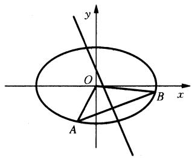

<details>
<summary>text_image</summary>

y
O
x
A
B
A
</details>

图1-8

(1) 求实数 m 的取值范围；

(2) 求 $\triangle AOB$ 面积的最大值 ( $O$ 为坐标原点).

解题策略：利用函数与方程的思想解决圆锥曲线的最值与范围问题，通常从以下各个方面考虑：

一、直线与圆锥曲线的位置关系的讨论，通常是直线方程联立圆锥曲线方程，消元后利用一元二次方程根的判别式来构造不等关系，从而确定参数的取值范围.  
二、利用已知参数的取值范围，求新参数的取值范围，解这类问题的核心是在两个参数之间建立等量关系。利用求函数值域的方法，确定新参数的取值范围。  
三、建立目标函数解与圆锥曲线有关的最值问题是常规方法,其关键是选取适当的变量建立目标函数,然后运用求函数最值的方法确定最值.  
四、与圆锥曲线有关的最值或范围问题大都是综合性问题，解法灵活，技巧性强，涉及代数、三角函数、平面几何等方面的知识，数形结合的方法常常起到画龙点睛的作用。

解：（1）由题意知 $m \neq 0$ 。可设直线 $AB$ 的方程为 $y = -\frac{1}{m} x + b$ 。

由 $\left\{\begin{aligned}\frac{x^{2}}{2}+y^{2}&=1,\\ y&=-\frac{1}{m}x+b\end{aligned}\right.$ 消去y，得 $\left(\frac{1}{2}+\frac{1}{m^{2}}\right)x^{2}-\frac{2b}{m}x+b^{2}-1=0.$

因为直线 $y = -\frac{1}{m} x + b$ 与椭圆 $\frac{x^2}{2} + y^2 = 1$ 有两个不同的交点，所以 $\Delta = -b^2 + 2 + \frac{4}{m^2} > 0$ ，①

将线段 $AB$ 中点 $M\left(\frac{2mb}{m^2 + 2}, \frac{m^2b}{m^2 + 2}\right)$ 代入直线方程 $y = mx + \frac{1}{2}$ ，解得 $b = -\frac{m^2 + 2}{2m^2}$ . ②

由①②得 $m < -\frac{\sqrt{6}}{3}$ 或 $m > \frac{\sqrt{6}}{3}$ .

(2) 令 $t = \frac{1}{m} \in \left(-\frac{\sqrt{6}}{2}, 0\right) \cup \left(0, \frac{\sqrt{6}}{2}\right)$ , 则 $|AB| = \sqrt{t^2 + 1} \cdot \frac{\sqrt{-2t^4 + 2t^2 + \frac{3}{2}}}{t^2 + \frac{1}{2}}$ ,

且 $O$ 到直线 $AB$ 的距离为 $d = \frac{t^2 + \frac{1}{2}}{\sqrt{t^2 + 1}}$ .

设 $\triangle AOB$ 的面积为 $S(t)$

所以 $S(t) = \frac{1}{2} |AB| \cdot d = \frac{1}{2}\sqrt{-2\left(t^2 - \frac{1}{2}\right)^2 + 2} \leqslant \frac{\sqrt{2}}{2}$ .

当且仅当 $t^2 = \frac{1}{2}$ 时，等号成立.

故 $\triangle AOB$ 面积的最大值为 $\frac{\sqrt{2}}{2}$ .

例4 如图1-9所示，已知抛物线 $E: x^2 = y$ 与圆 $M: x^2 + (y - 4)^2 = r^2 (r > 0)$ 相交于 $A, B, C, D$ 四点.

(1) 求 r 的取值范围；  
(2) 当四边形 ABCD 的面积最大时, 求对角线 AC、BD 的交点 T 的坐标.

解题策略：求解本题，审题非常重要。由于所给抛物线 $E$ 与圆 $M$ 都是以 $y$ 轴为对称轴，四个交点 $A, B, C, D$ 若存在，必定有 $A$ 与 $B, C$ 与 $D$ 关于 $y$ 轴对称。若联立抛物线与圆的方程，消去 $x$ 得关于 $y$ 的一元二次方程，必有两个不等的实根。运用方程理论即可求得 $r$ 的取值范围。由于四边形ABCD必定是等腰梯形，结合图形的对称性， $y$ 轴为梯形的对称轴，对角线的交点必在 $y$ 轴上。由于四边形ABCD面积的表达式为三次函数，用导数法求其最大值是一种行之有效的途径。

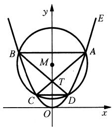

<details>
<summary>text_image</summary>

y
E
B
M
A
T
C
D
O
x
</details>

图1-9

解：(1) 将 $y = x^{2}$ 代入 $x^{2} + (y - 4)^{2} = r^{2}$ 并化简得 $y^{2} - 7y + 16 - r^{2} = 0.$ ①

抛物线 E 与圆 M 有四个交点的充要条件是方程 ① 有两个不等的正根 $y_{1}, y_{2}$ .

由此可得 $\left\{\begin{aligned}\Delta&=(-7)^{2}-4(16-r^{2})>0,\\ y_{1}+y_{2}&=7>0,\\ y_{1}\cdot y_{2}&=16-r^{2}>0,\end{aligned}\right.$ 解得 $\frac{15}{4}<r^{2}<16$ 且r>0,∴r的取值范围是 $\left(\frac{\sqrt{15}}{2},4\right)$ .

(2) 不妨设 $E$ 与 $M$ 的四个交点的坐标是 $A(\sqrt{y_1}, y_1), B(-\sqrt{y_1}, y_1), C(-\sqrt{y_2}, y_2), D(\sqrt{y_2}, y_2)$ ,

则直线 $AC, BD$ 的方程是 $y - y_{1} = \frac{y_{2} - y}{-\sqrt{y_{2}} - \sqrt{y_{1}}} (x - \sqrt{y_{1}}), y - y_{1} = \frac{y_{2} - y_{1}}{\sqrt{y_{2}} + \sqrt{y_{1}}} (x + \sqrt{y_{1}})$ .

解得点 T 的坐标是 $(0, \sqrt{y_{1}y_{2}})$ .

设 $t = \sqrt{y_1y_2}$ ，由 $t = \sqrt{16 - t^2}$ 和(1)知 $0 < t < \frac{7}{2}$ .

由于四边形ABCD是等腰梯形，因而其面积 $S = \frac{1}{2}\times (2\sqrt{y_1} +2\sqrt{y_2})\cdot |y_1 - y_2|$

则 $S^2 = (y_1 + y_2 + 2\sqrt{y_1y_2})\cdot [(y_1 + y_2)^2 -4y_1y_2].$

将 $y_{1} + y_{2} = 7, \sqrt{y_{1}y_{2}} = t$ 代入上式，并令 $f(t) = S^2$ 得

$$
f (t) = (7 + 2 t) \cdot (4 9 - 4 t) ^ {2} = - 8 t ^ {3} - 2 8 t ^ {2} + 9 8 t + 3 4 3 (0 <   t <   1).
$$

则 $f^{\prime}(t) = -24t^{2} - 56t + 98 = -2(2t + 7)(6t - 7)$

令 $f'(t)=0$ ，解得 $t=\frac{7}{6}$ ， $t=-\frac{7}{2}$ （舍去）.

当 $0 < t < \frac{7}{6}$ 时， $f'(t) > 0$ ；当 $\frac{7}{6} < t < \frac{7}{2}$ 时， $f'(t) < 0$ .

故当且仅当 $t = \frac{7}{6}$ 时， $f(t)$ 有最大值，即四边形ABCD的面积最大，此时点 $T$ 的坐标为 $(0, \frac{7}{6})$ .

# 第九讲 运用函数与方程思想解立体几何问题

在立体几何学习中,有些数学问题直接解比较困难,特别是碰到几何体中有变角或变动的线段时,根据题意列出沟通已知量与变量之间的关系.通过函数与方程思想来处理.立体几何中由于动点的变化引起的最值,通常建立关于与动点相关的角度的目标函数,转化为函数最值问题求解,当我们在空间图形中建立空间直角坐标系,利用向量坐标法,

结合条件得到方程(组)，则可用解方程(组)求出结果，利用函数与方程的思想方法还可以解空间图形中涉及线面关系、面面关系的探究性问题.

例 1 如图 1-10 所示, 图形纸片的圆心为 O, 半径为 5 cm, 该纸片上的等边三角形 ABC 的中点为 O, D、E、F 为圆 O 上的点, $\triangle DBC$ , $\triangle ECA$ , $\triangle FAB$ 分别是以 BC, CA, AB 为底边的等腰三角形, 沿虚线剪开后, 分别以 BC, CA, AB 为折痕折起 $\triangle DBC$ , $\triangle ECA$ , $\triangle FAB$ , 使得 D, E, F 重合, 得到三棱锥, 当 $\triangle ABC$ 的边长变化时, 所得三棱锥体积 (单位: $cm^{3}$ ) 的最大值为

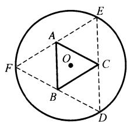

<details>
<summary>text_image</summary>

A
O
F
B
C
D
E
</details>

图1-10

解题策略：本题为平面图形折叠成空间图形，当折叠终止时，几何体是一个正三棱锥，这个正三棱锥底面边长是一个变元，从而导致三棱锥体积的变化。特别要提醒的是，在折叠问题中，必须注意到折叠过程中哪些要素在变化，哪些要素始终保持不变，其中不变要素是核心要素。根据平面图形的性质，寻找不变的数量关系以及直线与直线平行和垂直的位置关系, 是解决折叠问题的突破口. 因此折叠问题要通过变图、想图、构图、用图的过程中积极思考, 体会解题程序方向性, 直击问题的本质. 折叠问题既要看清平面转化为空间的过程, 又要明确三维空间图形问题的平面化处理是解答立体几何问题的最常见的方法, 两者是互逆的. 在建立体积表达式的函数模型之后, 结合函数思想求最值, 通常用导数法, 也可考虑运用基本不等式的方法.

解法一：由题意可知，折起后所得三棱锥为正三棱锥，当 $\triangle ABC$ 的边长变化时，设 $\triangle ABC$ 的边长为 $a (a > 0)\mathrm{cm}$ ，则 $\triangle ABC$ 的面积为 $\frac{\sqrt{3}}{4} a^2, \triangle DBC$ 的高为 $5 - \frac{\sqrt{3}}{6} a$ ，则正三棱锥的高为 $\sqrt{\left(5 - \frac{\sqrt{3}}{6} a\right)^2 - \left(\frac{\sqrt{3}}{6} a\right)^2} = \sqrt{25 - \frac{5\sqrt{3}}{3} a}$ ，

$$
\therefore 2 5 - \frac {5 \sqrt {3}}{3} a > 0, \therefore 0 <   a <   5 \sqrt {3}.
$$

∴ 所得三棱锥的体积 $V = \frac{1}{3} \times \frac{\sqrt{3}}{4} a^{2} \times \sqrt{25 - \frac{5\sqrt{3} a}{3}} = \frac{\sqrt{3}}{12} \times \sqrt{25a^{4} - \frac{5\sqrt{3}}{3} a^{5}}$ .

令 $t = 25a^4 - \frac{5\sqrt{3}}{3} a^5$ ，则 $t' = 100a^3 - \frac{25\sqrt{3}}{3} a^4$ ，由 $t' = 0$ ，得 $a = 4\sqrt{3}$ .

此时所得三棱锥的体积最大,为 $4 \sqrt{15} \, cm^{3}$ .

解法二：如图1-11所示，联结 $OD$ 交 $BC$ 于点 $G$

由题意知， $OD \perp BC$ ，易得 $OG = \frac{\sqrt{3}}{6} BC$ .

∴ OG 的长度与 BC 的长度成正比.

设 $OG = x$ ，则 $BC = 2\sqrt{3} x, DG = 5 - x,$

$$
S _ {\triangle A B C} = 2 \sqrt {3} x \cdot 3 x \cdot \frac {1}{2} = 3 \sqrt {3} x ^ {2},
$$

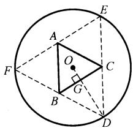

<details>
<summary>text_image</summary>

Geometric diagram showing a circle with inscribed triangle ABC and auxiliary points D, E, F, G, O, including perpendicular lines and a right angle at G.
</details>

图1-11

则所得三棱锥的体积 $V = \frac{1}{3} \times 3\sqrt{3} x^2 \times \sqrt{(5 - x)^2 - x^2} = \sqrt{3} x^2 \cdot \sqrt{25 - 10x} = \sqrt{3} \cdot \sqrt{25x^4 - 10x^5}$ . 令 $f(x) = 25x^4 - 10x^5, x \in \left(0, \frac{5}{2}\right)$ .

则 $f^{\prime}(x) = 100x^{3} - 50x^{4}$ ，令 $f^{\prime}(x) > 0$ ，即 $x^{4} - 2x^{3} < 0$ ，得 $0 < x < 2.$

则当 $x \in \left(0, \frac{5}{2}\right)$ 时， $f(x) \leqslant f(2) = 80, \therefore V \leqslant \sqrt{3} \cdot \sqrt{80} = 4\sqrt{15}$ .

∴ 所求三棱锥的体积的最大值为 $4 \sqrt{15} \, cm^{3}$ .

解法三：如图1-12所示，联结 $OE$ 交 $AC$ 于点 $H$ ，联结 $AO, OC$ ，设 $OH = x$ ，则 $AC = 2\sqrt{3} x$ ， $EH = 5 - x$ ，三棱锥 $D - ABC$ 的高为 $\sqrt{25 - 10x}$ ， $S_{\triangle ABC} = 3\sqrt{3} x^2$

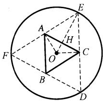

<details>
<summary>text_image</summary>

Geometric diagram showing a circle with inscribed triangle ABC and auxiliary points D, E, F, H, O, including dashed lines and triangles.
</details>

图1-12

$$
V _ {D - A B C} = \sqrt {3} \sqrt {x ^ {4} (2 5 - 1 0 x)} = \frac {\sqrt {3 0}}{2} \cdot \sqrt {x \cdot x \cdot x \cdot x (1 0 - 4 x)}
$$

$$
\leqslant \frac {\sqrt {3 0}}{2} \cdot \sqrt {\left(\frac {x + x + x + x + 1 0 - 4 x}{5}\right) ^ {5}} = 4 \sqrt {1 5}.
$$

当且仅当 $x = 10 - 4x$ ，即 $x = 2$ 时取等号，

故 $V_{D-ABC}$ 的最大值为 $4\sqrt{15}\ cm^{3}$ .

例 2 如图 1-13 所示, 在 $\triangle ABC$ 中, AB = BC = 2, $\angle ABC = 120^{\circ}$ .

若平面 ABC 外的点 P 和线段 AC 上的点 D，满足 PD = DA，PB = BA，则四面体 PBCD 的体积的最大值是 \_\_\_\_.

解题策略：建立四面体 PBCD 的体积 V 关于 PD = DA = x 的函数关系式，运用函数思想方法求最值.

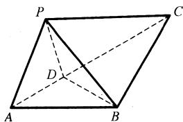

<details>
<summary>text_image</summary>

P
C
D
A
B
</details>

图1-13

解法一：由 $AB = BC = 2$ ， $\angle ABC = 120^{\circ}$ ，可得 $AC = 2\sqrt{3}$

要求四面体 $PBCD$ 的体积, 关键是寻找底面三角形 $BCD$ 的面积 $S_{\triangle BCD}$ 和点 $P$ 到平面 $BCD$ 的距离 $h$ , 易知 $h \leqslant 2$ . 设 $AD = x$ . 则 $DP = x$ , $DC = 2\sqrt{3} - x$ , $S_{\triangle DBC} = \frac{1}{2} \times (2\sqrt{3} - x) \times 2 \times \sin 30^\circ = \frac{2\sqrt{3} - x}{2}$ , 其中 $x \in (0, 2\sqrt{3})$ , 且 $h \leqslant x$ ,

$$
\therefore V _ {P - B C D} = \frac {1}{3} \times S _ {\triangle B C D} \times h = \frac {2 \sqrt {3} - x}{6} \times h \leqslant \frac {2 \sqrt {3} - x}{6} \cdot x \leqslant \frac {1}{6} \left(\frac {2 \sqrt {3} - x + x}{2}\right) ^ {2} = \frac {1}{2}.
$$

当且仅当 $2\sqrt{3} - x = x$ ，即 $x = \sqrt{3}$ 时取等号，故四面体 $PBCD$ 的体积的最大值是 $\frac{1}{2}$ .

解法二：设 $PD = AD = x.\because PB = PA$ ， $\triangle PBD\cong \triangle ABD.$

$V_{P - BCD} = \frac{1}{3} S_{\triangle BCD}\cdot h = \frac{1}{3}\cdot \frac{2\sqrt{3} - x}{2}\cdot h(h$ 为三棱锥 $P - BCD$ 的高).

当平面 $PBD \perp$ 平面 BDC 时, 使四面体 PBCD 的体积较大.

作 $PH \perp BD$ ，垂足为 $H$ 、 $PH \perp$ 平面 $BCD, h = PH = PD \cdot \sin \angle PDB = x \cdot \sin \angle ADB$ .

此时， $V_{P - BCD} = \frac{(2\sqrt{3} - x)\cdot x}{6}\cdot \sin \angle ADB\leqslant \frac{1}{6}\left(\frac{2\sqrt{3} - x + x}{2}\right)^{2}\cdot \sin \angle ADB = \frac{1}{2}\sin \angle ADB.$

当且仅当 $x = \sqrt{3}$ 时等号成立. $\therefore V_{P - BCD} = \frac{1}{2}\sin \angle ADB,$

当 $\angle ADB = 90^{\circ}$ 即 $AD\perp BD$ 时， $V_{P - BCD}$ 最大值为 $\frac{1}{2}$

解法三：∵ $V_{P-BCD} = \frac{1}{3} S_{\triangle BCD} \cdot h$ (h 为三棱锥 P - BCD 的高).

在 $\triangle ABC$ 中， $AB = BC = 2$ ， $\angle ABC = 120^{\circ}$ ，则 $AC = 2\sqrt{3}$ ， $\angle BAC = \angle BCA = 30^{\circ}$

设 $PD = DA = x$ $(0 <   x <   2\sqrt{3})$ ，则 $DC = 2\sqrt{3} -x$ ， $S_{\triangle BCD} = \frac{1}{2}\cdot BC\cdot CD\cdot \sin \angle BCA = \frac{2\sqrt{3} - x}{2}.$

在 $\triangle ABD$ 中，由余弦定理，有 $BD^{2} = AD^{2} + AB^{2} - 2AD\cdot AB\cos \angle BAC$

代值整理得 $BD = \sqrt{x^2 - 2\sqrt{3}x + 4}$ ，在 $\triangle PBD$ 中，由余弦定理，

有 $\cos \angle PBD = \frac{PB^2 + BD^2 - PD^2}{2PB\cdot BD}$ . 代值整理得 $\cos \angle PBD = \frac{4 - \sqrt{3}x}{2\sqrt{x^2 - 2\sqrt{3}x + 4}}.$

$$
\therefore \sin \angle P B D = \sqrt {1 - \cos^ {2} \angle P B D} = \frac {x}{2 \sqrt {x ^ {2} - 2 \sqrt {3} x + 4}}.
$$

过 P 作 $PM \perp BD$ ，垂足为 M，则 PM 为四面体 P - BCD 的高.

$$
\therefore h = P M = P B \cdot \sin \angle P B M = \frac {x}{\sqrt {x ^ {2} - 2 \sqrt {3} x + 4}}.
$$

故 $V_{P - BCD} = \frac{1}{3} S_{\triangle BCD}\cdot h = \frac{1}{3}\times \frac{2\sqrt{3} - x}{2}\times \frac{x}{\sqrt{x^2 - 2\sqrt{3}x + 4}} = \frac{1}{6}\times \frac{2\sqrt{3}x - x^2}{\sqrt{x^2 - 2\sqrt{3}x + 4}},$

令 $\sqrt{x^2 - 2\sqrt{3}x + 4} = t$ ， $\because 0 <   x <   2\sqrt{3},\therefore 1\leqslant t <   2,\therefore 2\sqrt{3} x - x^{2} = 4 - t^{2}.$

$V_{P-BCD}=\frac{1}{6}\times\frac{4-t^{2}}{t}=\frac{1}{6}\left(\frac{4}{t}-t\right)$ 在 $t\in[1,2)$ 上单调递减.∴ 当 t=1，即 $x=\sqrt{3}$ 时，四面体 $P - BCD$ 的体积最大，为 $V_{P - BCD} = \frac{1}{6}\times \frac{4 - 1}{1} = \frac{1}{2}.$

例3 如图1-14所示，在四棱锥 $P - ABCD$ 中，已知 $PA \perp$ 平面ABCD，且四边形ABCD为直角梯形， $\angle ABC = \angle BAD = \frac{\pi}{2}$ ， $PA = AD = 2$ ， $AB = BC = 1$ 。

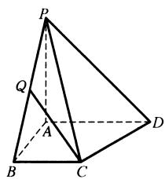

<details>
<summary>text_image</summary>

Geometric diagram of a pyramid with labeled vertices and internal points, used in spatial geometry problems.
</details>

图1-14

(1) 求平面 PAB 与平面 PCD 所成二面角的余弦值；

(2) 点 Q 是线段 BP 上的动点, 当直线 CQ 与 DP 所成角最小时, 求线段 BQ 的长.

解题策略：立体几何中由于动点的变化引起的最值，通常应建立关于角度的目标函数，转化为函数最值问题求解。自变量应与动点的位置有关系，在解题过程中函数与方程的思想方法起关键作用，而空间直角坐标系的建立为利用向量坐标法、方程(组)的产生、函数式的构想创造了便利。

解：以 $\overrightarrow{AB}$ 、 $\overrightarrow{AD}$ 、 $\overrightarrow{AP}$ 为 $x$ 轴、 $y$ 轴、 $z$ 轴的正半轴建立空间直角坐标系 $A - xyz$ ，如图1-15所示，则各点的坐标为 $B(1,0,0),C(1,1,0),D(0,2,0),P(0,0,2).$

(1) 由题意知 $AD \perp$ 平面 $PAB, \therefore \overrightarrow{AD}$ 是平面 $PAB$ 的一个法向量, $\overrightarrow{AD} = (0, 2, 0)$ .

$$
\because \overrightarrow {P C} = (1, 1, - 2), \overrightarrow {P D} = (0, 2, - 2).
$$

设平面 PCD 的法向量为 $\vec{m} = (x, y, z)$ ，则 $\left\{\begin{aligned}\vec{m} & \cdot \overrightarrow{PC} = 0, \\ \vec{m} & \cdot \overrightarrow{PD} = 0,\end{aligned}\right.$ 即 $\left\{\begin{aligned} x + y - 2z &= 0, \\ 2y - 2z &= 0.\end{aligned}\right.$

令 $y = 1$ ，解得 $z = 1, x = 1$ .

∴ $\vec{m}=(1,1,1)$ 是平面 PCD 的一个法向量，从而 $\cos\langle\overrightarrow{AB},\vec{m}\rangle=\frac{\overrightarrow{AD}\cdot\vec{m}}{|\overrightarrow{AD}|\cdot|\vec{m}|}=\frac{\sqrt{3}}{3}$ .∴ 平面 PAB 与平面 PCD 所成二面角的余弦值为 $\frac{\sqrt{3}}{3}$ .

(2) $\because \overrightarrow{BP} = (-1, 0, 2)$ , 设 $\overrightarrow{BQ} = \lambda \overrightarrow{BP} = (-\lambda, 0, -2\lambda) (0 \leqslant \lambda \leqslant 1)$ .

又 $\overrightarrow{CB} = (0, -1, 0)$ ，则 $\overrightarrow{CQ} = \overrightarrow{CB} + \overrightarrow{BQ} = (-\lambda, -1, 2\lambda)$ ，又 $\overrightarrow{DP} = (0, -2, 2)$ ，

从而 $\cos \langle \overrightarrow{CQ},\overrightarrow{DP}\rangle = \frac{\overrightarrow{CQ}\cdot\overrightarrow{DP}}{|\overrightarrow{CQ}|\cdot|\overrightarrow{DP}|} = \frac{1 + 2\lambda}{\sqrt{10\lambda^2 + 2}}$ 设 $1 + 2\lambda = t,t\in [1,3]$

则 $\cos^2\langle \overrightarrow{CQ},\overrightarrow{DP}\rangle = \frac{2t^2}{5t^2 - 10t + 9} = \frac{2}{9\left(\frac{1}{t} + \frac{5}{9}\right)^2 + \frac{20}{9}}\leqslant \frac{9}{10}.$

当且仅当 $t = \frac{9}{5}$ ，即 $\lambda = \frac{2}{5}$ 时， $|\cos \langle \overrightarrow{CQ}, \overrightarrow{DP} \rangle|$ 的最大值为 $\frac{3\sqrt{10}}{10}$ .

$\because y = \cos x$ 在 $\left(0, \frac{\pi}{2}\right)$ 上是减函数， $\therefore$ 此时直线 $CQ$ 与 $DP$ 所成角取得最小值，

又∵ $BP = \sqrt{1^2 + 2^2} = \sqrt{5}$ , ∴ $BQ = \frac{2}{5} BP = \frac{2\sqrt{5}}{5}$ .

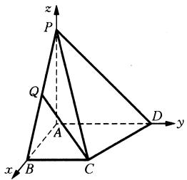

<details>
<summary>text_image</summary>

z
P
Q
A
B
C
D
y
x
</details>

图1-15

例 4 如图 1-16 所示, 正四棱锥 S-ABCD 侧棱长为 l, 相邻侧面的二面角多大时, 其体积最大.

解题策略：若设相邻侧面的二面角为 $\alpha$ ，则可用割补法将正四棱锥的体积表示为 $\alpha$ 的函数，运用函数与方程的思想方法求体积的最大值并确定此时相邻侧面二面角的大小。本题的关键之处是建立正四棱锥 $S - ABCD$ 的体积与二面角 $\alpha$ 之间的关系并归纳为如何求此函数的最大值。

解：如图1-16所示，作 $BE \perp SC$ . 联结 $DE$ ，易证 $\triangle BEC \cong \triangle DEC$ ，可得 $BE \perp SC$ . 则 $\angle BEC$ 即为相邻二面角的平面角，记为 $\alpha$ ，而三棱锥 $S - BCD$ 是正四棱锥 $S - ABCD$ 的一半，故问题转化为当三棱锥 $S - BCD$ 的体积 $V$ 最大时求 $\alpha$ 的值.

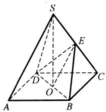

<details>
<summary>text_image</summary>

Geometric diagram of a pyramid with labeled vertices and internal points, used in spatial geometry problems.
</details>

图1-16

$\because SC \perp BE, SC \perp DE, BE \cap DE = E. \therefore SC \perp$ 平面 $BDE$ .

∴ 借用平面 BDE 把三棱锥 S-BDC 分割成两个都以 $\triangle BDE$ 为底面的小三棱锥 S-BDE 和 C-BDE，由于每一个小三棱锥的体积都是 $\alpha$ 的函数，则分割后的两个小三棱锥体积之和等于三棱锥 S-BCD 体积 V 这个关系，便可建立起 V 与 $\alpha$ 的关系，即

$V = V_{S-BDE} + V_{C-BDE} = \frac{1}{3} \cdot SE \cdot S_{\triangle BDE} + \frac{1}{3} \cdot CE \cdot S_{\triangle BDE} = \frac{1}{3} \cdot l \cdot S_{\triangle BDE}$ ，其中 $S_{\triangle BDE}$ 可以用 l 与 $\alpha$ 表示： $S_{\triangle BDE}=l^{3}\cdot\left(1-\cot^{2}\frac{\alpha}{2}\right)\cdot\cot\frac{\alpha}{2},$

$$
\therefore V ^ {2} = \frac {1}{9} l ^ {6} \cdot \left(1 - \cot^ {2} \frac {\alpha}{2}\right) ^ {2} \cdot \cot^ {2} \frac {\alpha}{2} = \frac {1}{1 8} \cdot l ^ {6} \cdot \left(1 - \cot^ {2} \frac {\alpha}{2}\right) \left(1 - \cot^ {2} \frac {\alpha}{2}\right) \left(2 \cot^ {2} \frac {\alpha}{2}\right) \leqslant \frac {1}{1 8} l ^ {6} \cdot
$$

$$
\left(\frac {1 - \cot^ {2} \frac {\alpha}{2} + 1 - \cot^ {2} \frac {\alpha}{2} + 2 \cot^ {2} \frac {\alpha}{2}}{3}\right) ^ {3} = \frac {4}{3 ^ {5}} l ^ {6}.
$$

$\therefore V \leqslant \frac{2}{9\sqrt{3}} l^3$ ，即 $V_{\max} = \frac{2}{9\sqrt{3}} l^3 = \frac{2\sqrt{3}}{27} l^3$ .

$\therefore (V_{S-ABCD})_{\max} = \frac{4\sqrt{3}}{27} l^3$ ，当且仅当 $1 - \cot^2 \frac{\alpha}{2} = 2\cot^2 \frac{\alpha}{2}$ ，即 $\alpha = 120^\circ$ 时“=”号成立.

故当相邻两侧面的二面角为 $120^{\circ}$ 时棱锥体积最大.

# 领悟二 数与形结合的思想

中学数学研究的对象可分为数与形两大部分，“数”主要指实数、复数或代数对象及其关系，属于数学抽象思维范畴, 是人的左脑思维的产物; “形”主要指几何图形, 属于形象思维范畴, 是人的右脑思维的产物, 数和形是数学的基石, 两者是有联系的. 自从笛卡尔把坐标和变量引入数学, 就为数与形的结合与转化提供了可能, 给数学提供了一个双向工具: 几何概念可以用代数表示, 几何目标可以通过代数来表达; 反之, 给代数语言以几何解释, 从而直观地掌握这些抽象的语言的意义, 并得到启发去探索新的结论. 数形结合使人充分运用左、右脑的思维功能, 相互依存、彼此激发, 全面、协调、深入发展人的思维能力.

实验告诉我们：有丰富形象的材料比纯抽象材料容易记忆。据双重编码理论，抽象材料只有言语编码，而形象材料既有言语编码，又有表象编码，这样的编码可以延长记忆，针对一般中学生的智力特点，他们是以第一信号系统占优势的，所以直观的形象记忆比逻辑记忆发达；因此在数学教学中，讲到符号语言表达的抽象材料，可以尽量配以一定的直观形象的图形、模型来增强记忆效果，数与形是对立统一的，数量关系往往隐含着几何模型，几何问题又时时牵涉数量关系，图形有形象直观的优点，往往能起定性的作用，而在定量方面必须借助于代数的计算分析，两者结合，取长补短能收到事半功倍的效果，在数学解题中数形结合具有极为独特的策略指导与调节作用。

中外数学家对数形结合解题十分重视，华罗庚先生说：“数与形，本是相倚依，焉能分作两边飞？数缺形时少直观，形少数时难入微，数形结合百般好，隔离分家万事休，切莫忘：几何代数统一体，永远联系，切莫分离。”美国数学家斯蒂恩说：“如果一个特定的问题可以被转化为一个图形，那么思想就整体地把握了问题，并且能创造性地思索问题的解法。”前苏联数学家柯尔莫戈罗夫也说：“在只要有可能的地方，数学家总是力求把他们研究的问题尽量地变成可借用几何直观的问题。”他们都明确地指出了数学解题中的数形结合以及互相转化的思维方法，通过“以形助数”及“以数辅形”寻找巧妙快捷的解题路线。

数与形结合的思想是通过数形间的对应与互助来研究问题并解决问题的思想,不但使几何问题由于代数化而获得新的面貌,而且给代数提供几何模型,并借助几何的成果获得新的解法.数形结合解题常使我们的思维豁然开朗,视野格外开阔,不少精巧的解法正是数形相辅相成的产物.

一、以形助数，就是充分利用形的直观性来揭示数学问题的本质属性，根据形来探求解题思路或找到问题的结论，引导学生利用图形探路子，结合图形找式子，实质就是代数问题的几何解法.

有些代数问题, 直接根据数量关系求解显得较为烦难, 甚至一下子难以找到解题思路, 但若能把欲解(证)的问题转化为与之相关的图形问题, 使数量关系形象化, 再根据图形性质和特点进行解题, 常能节省大量烦杂的计算, 使问题的解答简捷直观, 别具一格, 当然以形助数的关键是数如何转化为形, 以形助数的两大抓手是利用函数图像思想和利用几何意义思想, 基本类型如下:

1. 与函数有关的问题, 函数的图像及性质常常是解决问题的突破口, 若所给出的问题表面上看并不是函数问题, 则构造出函数模型很重要.  
2. 方程与不等式的解的问题, 若方程或不等式两边的表达式有明显的几何意义, 或通过某种方式可以与图形建立联系, 则可设法构造图形, 将方程或不等式所表达的抽象数量关系转化为图形的位置或度量关系加以解决. 对于含参数的方程与不等式的求解, 若采用一般的代数解法避免不了进行艰难的演算, 容易错解或漏解, 若用几何法, 常能收到事半功倍之效.  
3. 求最值问题,通过图形架设与数量间的桥梁,常常凭借特殊位置,图形的性质等直观优势得到简捷解答,当然如何构作相应的几何图形是关键.  
4. 与复数有关的问题,利用复数与复平面上的点以及相应向量之间的一一对应关系常考虑用复数及其运算的几何意义来解决.  
5. 在有些不等式的证明中, 构造相关的辅助图形, 可形象地揭示一些量之间的制约关系, 简化某些烦琐的运算与推理过程.  
二、以数辅形，利用数来研究形的各种性质，也就是几何问题的代数解法，笛卡尔通过建立点与有序数组的对应实现了“位置的量化”，是以数辅形的一个根本点，从而把图形的位置关系转化为数量关系，基本类型如下：  
1. 平面几何题的代数解法主要有坐标法、复数法或向量法、三角法等，特别是涉及图形大小比较的问题，大多数都借助数的知识，化为数量关系进行研究，这就是一种以数辅形的做法。从原则上讲，所有的平面几何问题都可以用这些方法求解，当然仅是可以导致简明优化的解法时才考虑用到这些方法，因为平面几何自身也有一套完美的公理化体系的解法与证法。  
2. 三角学的崛起体现数与形的“战术性”结合，为数学开辟一个广阔的新天地，三角函数图像问题总是与其性质的研究互相交融，互为补充.  
3. 解析几何的建立是数与形的“战略性”结合的标志，如讨论直线与圆的位置关系通常转化为讨论圆心到直线的距离与半径的关系显然是一种以数辅形的做法，如研究直线与椭圆、双曲线、抛物线的位置关系由此得出的一系列问题如相切、相交、弦长、面积、最值、对称等的研究完全可以用代数的方法即解析法来解决。  
4. 向量是数形结合思想的又一重要阵地, 向量的坐标表示及其向量坐标解法是以数辅形的好解法, 易于操作.

以数辅形的主要途径是坐标法,又称解析法.坐标法的基本思想在于几何问题代数化,图形性质坐标化.把有关图形的问题“翻译”成相应的代数问题,然后用代数知识进行演算、论证,最后把所得的结果“翻译”成几何图形的性质,以达到求解求证几何问题的目的.下面的图表就是坐标法(解析法)的运作路线:

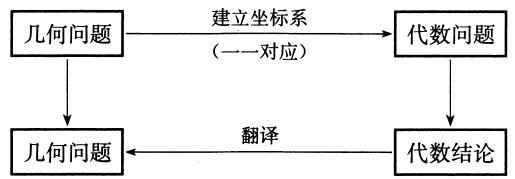

<details>
<summary>flowchart</summary>

```mermaid
graph TD
    A["几何问题"] --> B["几何问题"]
    B --> C["代数问题"]
    C --> D["代数结论"]
    D -->|建立坐标系 (一一对应)| C
    D -->|翻译| B
```
</details>

当然，以形助数、以数辅形也不是互相分隔的，在常规解题中，有时常把两者结合起来，即既以形助数，又以数辅形，可称之为数形互助，这样的例子很多，让我们不妨从数形结合的观点去开辟解题的新路.

# 第十讲 实现数形结合的关键是转化

数形结合是根据数量与图形之间的对应关系,通过数与形的相互转化来解决问题的一种重要思想方法,也是一种智慧的解题技巧.数形结合的思想简言之就是代数问题几何化、几何问题代数化,即“以形助数,以数解形”,使复杂问题简单化,抽象问题具体化,可以帮助我们找到解决问题的思路和方法.

由“形”到“数”的转化，往往比较明显，而由“数”到“形”的转化则需要有“转化”的意识且如何实现这个“转化”，因此，数形结合的思想的使用往往偏重于由“数”到“形”的转化.

例 1 已知函数 $f(x)=|x^{2}+3x|$ ， $x\in R$ ，若方程 $f(x)-a|x-1|=0$ 恰有 4 个互异的实数根，则实数 a 的取值范围为 \_\_\_\_.

解题策略：所给的方程既含参数，又含绝对值符号，恰有4个互异的实数根，求参数的取值范围，用代数的方法直接解是困难的，只有通过转化为不同函数的图像交点问题获得结果，难点当然是如何把方程问题转化为函数问题（有时转化的方法不唯一）。关键点是在定义域范围内较为精确地画出函数的图像，本题中的方程可转化为函数 $y = a \mid x - 1 \mid$ 与 $y = |x^2 + 3x|$ 有4个交点的问题，也可转化为函数 $y = \left|\frac{x^2 + 3x}{x - 1}\right|$ 与 $y = a$ 有4个交点的问题。其中一个函数带有参数，从而构造的两个函数一动一静，直观易解。

解法一：显然 $a > 0$ ，用数形结合的方法，分别作出函数 $y = a|x - 1|$ 与 $y = |x^2 +3x|$ 的图像，两图像一动一静.

如图1-17所示，当 $y = -a(x - 1)$ 与 $y = -x^2 - 3x$ 相切时， $a = 1$ ，此时 $f(x) - a \mid x - 1 \mid = 0$ 恰有3个互异的实数根。显然当 $0 < a < 1$ 时，方程有4个互异的实数根。

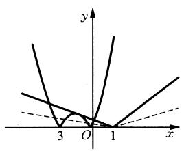

<details>
<summary>text_image</summary>

y
3 O 1 x
</details>

图1-17

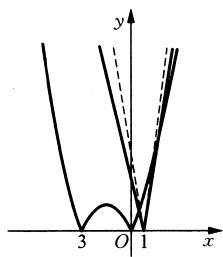

<details>
<summary>text_image</summary>

y
x
3 O 1
</details>

图1-18

如图1-18所示，当直线 $y = a(x - 1)$ 与 $y = x^2 + 3x$ 相切时， $a = 9$ ，此时 $f(x) - a \mid x - 1 \mid = 0$ 恰有3个互异的实数根，当 $a > 9$ 时，方程有4个互异的实数根.

解法二：显然 $x \neq 1 \therefore a = \left|\frac{x^2 + 3x}{x - 1}\right|$ .

令 $t = x - 1$ ，则 $a = \left|t + \frac{4}{t} +5\right|$

$$
\because t + \frac {4}{t} \in (- \infty , - 4 ] \cup [ 4, + \infty),
$$

$\therefore t + \frac{4}{t} + 5 \in (-\infty, 1] \cup [9, +\infty)$ ，如图1-19所示，

$\left|t + \frac{4}{t} +5\right|\in [0, + \infty)$ . 结合图像可得

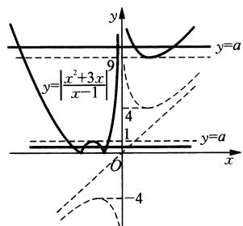

<details>
<summary>text_image</summary>

y
y=a
y=|x²+3x|/x-1
9
4
1
y=a
O
x
-4
</details>

图1-19

$0 < a < 1$ 或 $a > 9$ .

例 2 在平面内, 定点 A, B, C, D 满足 $\left|\overrightarrow{DA}\right| = \left|\overrightarrow{DB}\right| = \left|\overrightarrow{DC}\right|$ , $\overrightarrow{DA} \cdot \overrightarrow{DB} = \overrightarrow{DB} \cdot \overrightarrow{DC} = \overrightarrow{DC} \cdot \overrightarrow{DA} = -2$ , 动点 P, M 满足 $\left|\overrightarrow{AP}\right| = 1$ , $\overrightarrow{PM} = \overrightarrow{MC}$ , 则 $\left|\overrightarrow{BM}\right|^2$ 的最大值是().

A. $\frac{43}{4}$

B. $\frac{49}{4}$

C. $\frac{37+6\sqrt{3}}{4}$

D. $\frac{37+2\sqrt{33}}{4}$

解题策略：可通过发散思维构造符号题意的图形，在新的图形背景下获得众多的解法.

解法一：由题意， $|\overrightarrow{DA}| = |\overrightarrow{DB}| = |\overrightarrow{DC}|$ ， $\therefore D$ 到 $A, B, C$ 三点的距离相等， $D$ 是 $\triangle ABC$ 的外心， $\overrightarrow{DA} \cdot \overrightarrow{DB} = \overrightarrow{DB} \cdot \overrightarrow{DC} = \overrightarrow{DC} \cdot \overrightarrow{DA} = -2 \Rightarrow \overrightarrow{DA} \cdot \overrightarrow{DB} - \overrightarrow{DB} \cdot \overrightarrow{DC} = \overrightarrow{DB} \cdot (\overrightarrow{DA} - \overrightarrow{DC}) = \overrightarrow{DB} \cdot \overrightarrow{CA} = 0.$ $\therefore DB \perp AC$ ，同理可得 $DA \perp BC, DC \perp AB$ ，从而 $D$ 是 $\triangle ABC$ 的垂心，

∴ $\triangle ABC$ 的外心与垂心重合，因此 $\triangle ABC$ 是正三角形，且 D 是 $\triangle ABC$ 的中心，

$$
\overrightarrow {D A} \cdot \overrightarrow {D B} = | \overrightarrow {D A} | | \overrightarrow {D B} | \cos \angle A D B = | \overrightarrow {D A} | \cdot | \overrightarrow {D B} | \times \left(- \frac {1}{2}\right) = - 2 \Rightarrow | \overrightarrow {D A} | = 2.
$$

∴ 正 $\triangle ABC$ 的边长为 $2\sqrt{3}$ .

以 $A$ 为原点，建立直角坐标系， $B, C, D$ 三点坐标分别为 $B(3, -\sqrt{3})$ 、 $C(3, \sqrt{3})$ 、 $D(2, 0)$ ，如图1-20所示。由 $|\overrightarrow{AP}| = 1$ ，设 $P$ 点坐标为 $(\cos \theta, \sin \theta)$ ，其中 $\theta \in [0, 2\pi)$ 。而 $\overrightarrow{PM} = \overrightarrow{MC}$ ，即 $M$ 是 $PC$ 的中点，∴ 点 $M$ 的坐标为 $\left(\frac{3 + \cos \theta}{2}, \frac{\sqrt{3} + \sin \theta}{2}\right)$ ，则

$$
| \overrightarrow {B M} | ^ {2} = \left(\frac {\cos \theta - 3}{2}\right) ^ {2} + \left(\frac {3 \sqrt {3} + \sin \theta}{2}\right) ^ {2} = \frac {3 7 + 1 2 \sin \left(\theta - \frac {\pi}{6}\right)}{4} \leqslant \frac {3 7 + 1 2}{4} = \frac {4 9}{4}. \text {当}
$$

$\theta = \frac{2\pi}{3}$ 时， $|\overrightarrow{BM}|^2$ 取得最大值 $\frac{49}{4}$ . 故选B.

解法二：由 $|\overrightarrow{DA}| = |\overrightarrow{DB}| = |\overrightarrow{DC}|$ 知，点 $A, B, C$ 在以点 $D$ 为圆心的圆上，设圆的半径为 $r$ ，由 $\overrightarrow{DA} \cdot \overrightarrow{DB} = \overrightarrow{DB} \cdot \overrightarrow{DC} = \overrightarrow{DC} \cdot \overrightarrow{DA} = -2$ ，得 $r^2 \cos \angle ADB = r^2 \cos \angle BDC = r^2 \cos \angle CAD = -2$ .

∴ $\angle ADB = \angle BDC = \angle CDA = 120^{\circ}$ ，代入上式得 r = 2.

以点 $D$ 为原点，以 $DA$ 所在直线为 $x$ 轴建立直角坐标系，如图1-21所示，易求得 $A(2,0),B(-1,\sqrt{3}),C(-1,-\sqrt{3})$

由 $|\overrightarrow{AP}| = 1$ 知，动点 $P$ 在以 $A$ 为圆心，半径为1的圆上，

故可设 $P(2 + \cos \theta, \sin \theta)$ , 其中 $\theta \in [0, 2\pi)$ . 又由 $\overrightarrow{PM} = \overrightarrow{MC}$ 知点 $M$ 为 $PC$ 的中点.

$$
\therefore \overrightarrow {B M} = \overrightarrow {B C} + \overrightarrow {C M} = \overrightarrow {B C} + \frac {1}{2} \overrightarrow {C P} = \overrightarrow {B C} + \frac {1}{2} (\overrightarrow {B P} - \overrightarrow {B C}) = \frac {1}{2} (\overrightarrow {B C} + \overrightarrow {B P}).
$$

而 $\overrightarrow{BC} = (0, -2\sqrt{3})$ ， $\overrightarrow{BP} = (3 + \cos \theta ,\sin \theta -\sqrt{3}).\therefore \overrightarrow{BM} = \frac{1}{2} (3 + \cos \theta ,\sin \theta -3\sqrt{3}).$

$$
\begin{array}{l} \therefore \overrightarrow {B M ^ {2}} = \frac {1}{4} [ (3 + \cos \theta) ^ {2} + (\sin \theta - 3 \sqrt {3}) ^ {2} ] = \frac {1}{4} (3 7 + 6 \cos \theta - 6 \sqrt {3} \sin \theta) \\ = \frac {1}{4} \left[ 3 7 + 1 2 \cos \left(\theta + \frac {\pi}{3}\right) \right] \leqslant \frac {1}{4} \times (3 7 + 1 2) = \frac {4 9}{4}. \\ \end{array}
$$

解法三：如图1-22所示.∵ $\overrightarrow{DA}\cdot\overrightarrow{DB}=\overrightarrow{DB}\cdot\overrightarrow{DC}=\overrightarrow{DC}\cdot\overrightarrow{DA}$

∴ D 是 $\triangle ABC$ 的垂心，又∵ $|\overrightarrow{DA}| = |\overrightarrow{DB}| = |\overrightarrow{DC}|$ .

$\therefore \triangle ABD \cong \triangle BCD \cong \triangle ACD.$ 由 $\overrightarrow{DA} \cdot \overrightarrow{DB} = -2,$

$$
\therefore | \overrightarrow {D A} | = 2.
$$

$\because \overrightarrow{PM} = \overrightarrow{MC}, \therefore M$ 是 $PC$ 中点，取 $AC$ 中点 $N$ ，联结 $MB, MN, BN, \therefore \overrightarrow{NM} = \frac{1}{2}\overrightarrow{AP}$

$$
\begin{array}{l} \because \overrightarrow {B M} = \overrightarrow {B N} + \overrightarrow {N M}, \therefore \overrightarrow {B M ^ {2}} = \overrightarrow {B N ^ {2}} + \overrightarrow {N M ^ {2}} + 2 | \overrightarrow {B N} | \cdot | \overrightarrow {N M} | \cos \langle \overrightarrow {B N}, \overrightarrow {N M} \rangle \\ = 3 ^ {2} + \left(\frac {1}{2}\right) ^ {2} + 2 \times 3 \times \frac {1}{2} \cos \langle \overrightarrow {B M}, \overrightarrow {N M} \rangle , \\ \end{array}
$$

当且仅当 $\overrightarrow{BN}$ 与 $\overrightarrow{NM}$ 同向共线时， $|\overrightarrow{BM}|^2$ 有最大值为 $\frac{49}{4}$ .

解法四：由题意， $D$ 是正 $\triangle ABC$ 的中心，且 $|\overrightarrow{DA}| = |\overrightarrow{DB}| = |\overrightarrow{DC}| = 2,$

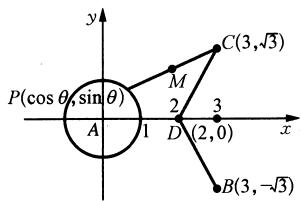

<details>
<summary>text_image</summary>

P(cos θ, sin θ)
A
1
M
2
D
(2, 0)
3
C(3, √3)
B(3, -√3)
</details>

图1-20

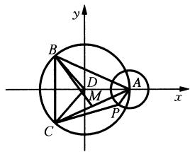

<details>
<summary>text_image</summary>

y
B
D
M
A
x
C
P
</details>

图1-21

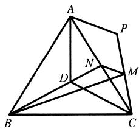

<details>
<summary>text_image</summary>

Geometric diagram of a polyhedron with labeled vertices A, B, C, D, M, N, P and internal diagonals
</details>

图1-22

$$
| \overrightarrow {B A} | = | \overrightarrow {C A} | = | \overrightarrow {A B} | = 2 \sqrt {3}.
$$

设 $B(-\sqrt{3}, 0), C(\sqrt{3}, 0), A(0, 3)$ ，由 $\overrightarrow{PM} = \overrightarrow{MC}$ 知 $M$ 为线段 $PC$ 的中点.

设 $M(x, y)$ , 则 $P(2x - \sqrt{3}, 2y)$ , 由 $|\overrightarrow{AP}| = 1$ , 得 $(2x - \sqrt{3})^2 + (2y - 3)^2 = 1$ .

即点 $M$ 的轨迹为圆 $\left(x - \frac{\sqrt{3}}{2}\right)^2 +\left(y - \frac{3}{2}\right)^2 = \frac{1}{4}.$ 圆心为 $N\left(\frac{\sqrt{3}}{2},\frac{3}{2}\right)$

于是 $|BM|$ 的最大值为 $|BN| + \frac{1}{2} = \frac{7}{2}$ . 故 $|\overrightarrow{BM}|^2$ 的最大值为 $\frac{49}{4}$ .

例3 已知 $0 < \alpha < \frac{\pi}{2}, 0 < \beta < \frac{\pi}{2}$ , 求函数 $z = (\sqrt{6} \sin \alpha - 3 \tan \beta)^2 + (\sqrt{6} \cos \alpha - 3 \cot \beta)^2$ 的最小值.

解题策略：本题是双变量三角函数最小值的求解，结构复杂，难以直接求解，不妨借助于图形去探索，去开辟新路，核心问题就变成如何以形助数。如何把问题转化为“形”的问题，并通过对形的分析解决数的问题。

解：设 $x = \sqrt{6}\sin \alpha ,y = \sqrt{6}\cos \alpha$ ，且 $0 <   \alpha <  \frac{\pi}{2}$ ，可得圆弧 $c_{1}:x^{2} + y^{2} = 6(x > 0,$ $y > 0)$ ；又设 $x = 3\tan \beta ,y = 3\cot \beta$ ，且 $0 <   \beta <  \frac{\pi}{2}$ ，可得等轴双曲线一支 $c_{2}:xy = 9$ $(x > 0,y > 0)$ ，于是函数 $z$ 的几何意义为曲线 $c_{1}$ 上的点与曲线 $c_{2}$ 上的点之间距离的平方，从而问题转化为“形”的问题，如图1-23所示，设过圆心的直线 $y = x$ 与曲线 $c_{1},c_{2}$ 分别交于 $A,B$ 两点.由图知AB平方为 $z$ 的最小值，即 $z_{\mathrm{min}} = (OB - OA)^2 = (3\sqrt{2}-$ $\sqrt{6})^2 = 12(2 - \sqrt{2})$

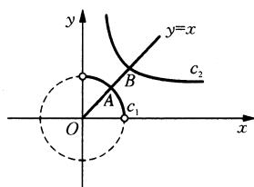

<details>
<summary>text_image</summary>

y
y=x
C₂
A
B
O
c₁
x
</details>

图1-23

例 4 已知 $\sqrt{x^{2}+y^{2}}+\sqrt{(x-8)^{2}+(y-6)^{2}}=20$ ，则 $\left|3x-4y-100\right|$ 的最值为 \_\_\_\_.

解题策略：以形助数，首先要找到“形”，并把“形”的几何性质“吃透”，才能顺顺当当地解决数的问题。

解：满足题设的点 $P(x, y)$ 的轨迹是定点 $A(0, 0), B(8, 6)$ 的距离之和为定长20的椭圆，此椭圆的中心在 $M(4, 3)$ 、长半轴 $a$ 满足 $2a = 20$ ，即 $a = 10$ . 线段 $AB$ 长为 $\sqrt{8^2 + 6^2} = 10$ ，即 $c = 5$ ，所以椭圆的短半轴长 $b = 5\sqrt{3}$ . 又椭圆长轴所在直线方程为 $y = \frac{3}{4} x$ . 因此由图1-24知，使得椭圆与直线 $y = \frac{3}{4} x + m$ 有公共点的 $m$ 的取值范围是原点到直线 $y = \frac{3}{4} x + m$ 的距离不超过 $5\sqrt{3}$ .

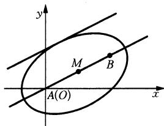

<details>
<summary>text_image</summary>

y
M
B
A(O)
x
</details>

图1-24

即 $\frac{|3\times 0 - 4\times 0 + 4m|}{5}\leqslant 5\sqrt{3}$ ，解得 $-\frac{25\sqrt{3}}{4}\leqslant m\leqslant \frac{25\sqrt{3}}{4}.$

椭圆上任意一点 $P(x, y)$ 均满足 $-\frac{25\sqrt{3}}{4} \leqslant y - \frac{3}{4} x \leqslant \frac{25\sqrt{3}}{4}$ .

由 $100 - 25\sqrt{3} \leqslant 3x - 4y - 100 \leqslant 25\sqrt{3} - 100 < 0$ ，得

$$
1 0 0 - 2 5 \sqrt {3} \leqslant | 3 x - 4 y - 1 0 0 | \leqslant 1 0 0 + 2 5 \sqrt {3}.
$$

故 $|3x + 4y - 100|$ 的最大值为 $100 + 25\sqrt{3}$ ，最小值为 $100 - 25\sqrt{3}$ .

# 第十一讲 数形转化和知识板块之间的转化相交融

数形转化的关键是构造法, 数转化为形, 即根据所给代数式的结构特征, 构造出与之相对应的几何图形, 用几何方法来解决代数问题; 形转化为数, 即用代数方法研究几何问题, 这是解析几何的基本特征. 通过数形转化实现了知识板块之间的转化, 也开拓了自己的思维视野.

例1 求函数 $y = \frac{2 - \sqrt{1 - x^2}}{3 + x}$ 的最值.

解题策略：本例给出的函数解析式较为复杂(既含偶次根式,又是分式).若拘泥于代数方法解必然产生心理障碍,所以分析习题必须深入一步,有意识地从数和形两个方面进行感知活动,促使数与形之间的转化.由 $\frac{2-\sqrt{1-x^{2}}}{3+x}$ 可联想到直线的斜率公式 $k=\frac{y_{1}-y_{2}}{x_{1}-x_{2}}$ ,则一个函数求最值的问题立即转化为解析几何中的问题.

解: $\frac{2 - \sqrt{1 - x^2}}{3 + x}$ 可看作点 $A(3, 2)$ 与动点 $B(-x, \sqrt{1 - x^2})$ 的连线的斜率.

而点 $B$ 在半圆 $x^{2} + y^{2} = 1 (y \geqslant 0)$ 上.

故原题即求点 $A(3,2)$ 与半圆 $x^{2} + y^{2} = 1 (y \geqslant 0)$ 上的点的连线的斜率的最值，如图1-25可知，当 $B$ 为 $B_{1}(1,0)$ 时， $AB$ 斜率最大为 $k_{\max} = 1$ ；

当 $AB$ 切半圆于 $B_{2}$ 时， $AB$ 的斜率最小.

设此时 $AB$ 的斜率为 $k, AB$ 的方程为 $y - 2 = k(x - 3)$ .

由 $|OB_2| = \frac{|2 - 3k|}{\sqrt{1 + k^2}} = 1$ ，得 $k_1 = \frac{3 + \sqrt{3}}{4}$ （舍去）， $k_2 = \frac{3 - \sqrt{3}}{4}$ .

故 $y_{\max}=1$ , $y_{\min}=\frac{3-\sqrt{3}}{4}$ .

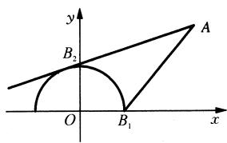

<details>
<summary>text_image</summary>

y
B₂
A
O
B₁
x
</details>

图1-25

例2 关于 $x$ 的二次方程 $x^{2} + z_{1}x + z_{2} + m = 0$ 中， $z_{1}, z_{2}, m$ 都是复数，且 $z_{1}^{2} - 4z_{1} = 16 + 20\mathrm{i}$ ，设这个方程的两个根 $\alpha, \beta$ 满足 $|\alpha - \beta| = 2\sqrt{7}$ . 求 $|m|$ 的最大值和最小值.

解题策略：复数与复平面上的点以及以原点为起点，该点为终点的向量三者之间建立了一一对应关系，求复数问题可以转化为向量的运算来解，也可以转化为复数方程的几何意义来解，这就是代数问题几何化的解题策略。它的优点是直观，避免了烦杂冗长的计算与推理。本例中根据 $\alpha, \beta$ 是关于 $x$ 的二次方程 $x^{2} + z_{1}x + z_{2} + m = 0$ 两根的条件结合 $z_{1}$ 与 $z_{2}$ 的关系把 $|\alpha - \beta| = 2\sqrt{7}$ 转化为关于 $m$ 的方程，利用方程的几何意义求 $|m|$ 的最大值与最小值，解法既直观又简捷。

解：由韦达定理得 $\left\{ \begin{array}{l} \alpha + \beta = -z_1, \\ \alpha \beta = z_2 + m, \end{array} \right.$

则 $|\alpha - \beta|^2 = |(\alpha + \beta)^2 - 4\alpha \beta| = |z_1^2 - 4z_2 - 4m|$

$$
= \mid 4 m - (z _ {1} ^ {2} - 4 z _ {2}) \mid = 2 8.
$$

$$
\because z _ {1} ^ {2} - 4 z _ {2} = 1 6 + 2 0 \mathrm{i},
$$

$$
\therefore | 4 m - (1 6 + 2 0 \mathrm{i}) | = 2 8, | m - (4 + 5 \mathrm{i}) | = 7.
$$

如图 1-26 所示, 复数 $m$ 的对应点 $M$ 在以 $(4,5)$ 为圆心, 7 为半径的圆上.

$$
\therefore | m | _ {\max} = 7 + \sqrt {4 1}, | m | _ {\min} = 7 - \sqrt {4 1}.
$$

例3 设 $x > 0, y > 0, z > 0$ ，求证： $\sqrt{x^2 - xy + y^2} + \sqrt{y^2 - yz + z^2} > \sqrt{z^2 - zx + x^2}$ .

解题策略：若用代数法，必然要去根号，乘方后次数会很高，不容易获证。我们注意到 $x^{2} - xy + y^{2} = x^{2} + y^{2} - 2xy\cos 60^{\circ}$ 显然表示为以 $x$ 、 $y$ 为边夹角为 $60^{\circ}$ 的三角形的第三边的平方（余弦定理可得），于是这道不等式证明题立即转化为几何问题，即构造四面体“模型”解题。

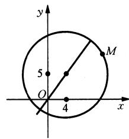

<details>
<summary>text_image</summary>

y
5
O
4
x
M
</details>

图1-26

证明：由题设 $x > 0, y > 0, \sqrt{x^2 - xy + y^2} = \sqrt{x^2 + y^2 - 2xy\cos 60^\circ}$ ，由余弦定理此式表示以 $x, y$ 为边所夹角为 $60^\circ$ 的三角形的第三边，

同理 $\sqrt{y^2 - yz + z^2}$ , $\sqrt{z^2 - zx + x^2}$ 也有类似的几何意义.

这样,我们构造出顶点为 O 的四面体 O-ABC,如图 1-27 所示.

使 $\angle AOB = \angle BOC = \angle COA = 60^{\circ}$ ， $OA = x$ ， $OB = y$ ， $OC = z$

则有 $AB = \sqrt{x^2 - xy + y^2}$ , $BC = \sqrt{y^2 - yz + z^2}$ , $CA = \sqrt{z^2 - zx + x^2}$ .

四面体 O-ABC 的底面是 $\triangle ABC$ .

在 $\triangle ABC$ 中， $AB + BC > AC$ ，

即 $\sqrt{x^2 - xy + y^2} +\sqrt{y^2 - yz + z^2} >\sqrt{z^2 - zx + x^2}.$

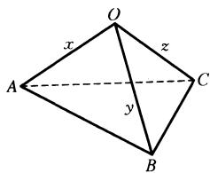

<details>
<summary>text_image</summary>

O
x
z
A
y
C
B
</details>

图1-27

例4 已知 $a > 0, b > 0, \frac{\sqrt{3}}{a} + \frac{1}{b} = 2$ ，求 $a + b - \sqrt{a^2 + b^2}$ 的最大值.

解题策略：本题从代数的角度考虑直接代入消元后求最值是很难顺利解决的，所以应当挖掘题中条件和结论所蕴涵的几何意义，条件 $\frac{\sqrt{3}}{a} +\frac{1}{b} = 2$ 变形为 $\frac{\sqrt{3}}{2a} +\frac{1}{2b} = 1$ ，可以看作直线 $\frac{x}{a} +\frac{y}{b} = 1(a > 0,b > 0)$ 过定点 $P\left(\frac{\sqrt{3}}{2},\frac{1}{2}\right)$ ，这是解决本题的一个突破口，结论 $a + b - \sqrt{a^2 + b^2}$ 可以看作Rt△AOB的内切圆的直径.原问题相当于求Rt△AOB内切圆直径的最大值.这是解决本题的另一个视角，读者可以朝这个方向制订解题方案.

解：将 $\frac{\sqrt{3}}{a} +\frac{1}{b} = 2$ 变形，得 $\frac{\sqrt{3}}{2a} +\frac{1}{2b} = 1,$

显见是直线 $\frac{x}{a} +\frac{y}{b} = 1(a > 0,b > 0)$ 过定点 $P\left(\frac{\sqrt{3}}{2},\frac{1}{2}\right)$ .如图1-28所示.

显然有： $a = |OA| = \frac{\sqrt{3}}{2} +\frac{1}{2}\cot \theta ,b = |OB| = \frac{1}{2} +\frac{\sqrt{3}}{2}\sin \theta ,$

$|\dot{P}A|=\frac{1}{2\sin\theta},\quad|PB|=\frac{\sqrt{3}}{2\cos\theta},$ 其中 $\theta\in\left(0,\frac{\pi}{2}\right).$

$$
\therefore \sqrt {a ^ {2} + b ^ {2}} = | A B | = | P A | + | P B | = \frac {\sqrt {3}}{2 \cos \theta} + \frac {1}{2 \sin \theta}.
$$

故 $a + b - \sqrt{a^2 + b^2} = \left(\frac{\sqrt{3}}{2} + \frac{1}{2}\cot \theta\right) + \left(\frac{1}{2} + \frac{\sqrt{3}}{2}\tan \theta\right) - \left(\frac{1}{2\sin \theta} + \frac{\sqrt{3}}{2\cos \theta}\right)$

$$
= \frac {\sqrt {3} + 1}{2} + \frac {\cos \theta - 1}{2 \sin \theta} + \frac {\sqrt {3} (\sin \theta - 1)}{2 \cos \theta}
$$

$$
= \frac {\sqrt {3} + 1}{2} + \frac {- 2 \sin^ {2} \frac {\theta}{2}}{4 \sin \frac {\theta}{2} \cos \frac {\theta}{2}} + \frac {- \sqrt {3} \left(\cos \frac {\theta}{2} - \sin \frac {\theta}{2}\right) ^ {2}}{2 \left(\cos^ {2} \frac {\theta}{2} - \sin^ {2} \frac {\theta}{2}\right)}
$$

$$
= \frac {\sqrt {3} + 1}{2} - \frac {\sin \frac {\theta}{2}}{2 \cos \frac {\theta}{2}} + \frac {- \sqrt {3} \left(\cos \frac {\theta}{2} - \sin \frac {\theta}{2}\right)}{2 \left(\cos \frac {\theta}{2} + \sin \frac {\theta}{2}\right)}
$$

$$
= \frac {\sqrt {3} + 1}{2} - \frac {1}{2} \tan \frac {\theta}{2} + \frac {- \sqrt {3} \left(1 - \tan \frac {\theta}{2}\right)}{2 \left(1 + \tan \frac {\theta}{2}\right)}
$$

$$
= \frac {\sqrt {3} + 1}{2} - \frac {1}{2} \left(\tan \frac {\theta}{2} + 1\right) + \frac {1}{2} + \frac {\sqrt {3} \left(1 + \tan \frac {\theta}{2}\right) - 2 \sqrt {3}}{2 \left(1 + \tan \frac {\theta}{2}\right)}
$$

$$
= \sqrt {3} + 1 - \frac {1}{2} \left(\tan \frac {\theta}{2} + 1\right) - \frac {\sqrt {3}}{1 + \tan \frac {\theta}{2}}
$$

$$
= \sqrt {3} + 1 - \left[ \frac {1}{2} \left(\tan \frac {\theta}{2} + 1\right) + \frac {\sqrt {3}}{1 + \tan \frac {\theta}{2}} \right] \leqslant \sqrt {3} + 1 - 2 \sqrt {\frac {1}{2} \times \sqrt {3}}
$$

$$
= \sqrt {3} + 1 - \sqrt [ 4 ]{1 2}, \text {当且仅当} \frac {1}{2} \left(\tan \frac {\theta}{2} + 1\right) = \frac {\sqrt {3}}{1 + \tan \frac {\theta}{2}}, \text {即} \tan \frac {\theta}{2} = \sqrt [ 4 ]{1 2} - 1 \text {时} a + b -
$$

$\sqrt{a^2 + b^2}$ 取得最大值 $\sqrt{3} + 1 - \sqrt[4]{12}$ .

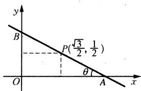

<details>
<summary>text_image</summary>

y
B
P(√3/2, 1/2)
θ
O
A
x
</details>

图1-28

# 第十二讲 以数辅形三大法宝(代数法、解析法、向量法)

以数辅形代数法,通常由题设构建函数模型并结合其图像解决求参数的取值范围.研究方程根的范围,研究量与量之间的大小关系,研究函数的最值问题和证明不等式,以数辅形解析法就是运用代数的方法研究几何问题,借助几何轨迹所遵循的数量关系,借助运算结果与几何定理的结合,以数辅形向量法就是通过向量坐标的代数运算研究图形问题.

数形结合,贵在结合,要充分发挥两者的优势,“形”有直观、形象的特点,但代替不了具体的运算和证明.在解题中往往提供一种数学解题的平台或模式,而“数”才是其真正的主角,若忽视这一点,很容易造成对数形结合的误用,务必引起注意.

例1 当正数 $a$ 为何值时，抛物线 $y = -\frac{x^2}{4} + 4$ 与椭圆 $\frac{x^2}{a^2} + \frac{y^2}{3^2} = 1$ 有4个不同的交点.

解题策略：本例是一道解析几何常规题，一般情况下，判断曲线交点的个数问题可以通过几何直观得到，但几何直

观得到的结论是否一定正确需要通过代数推理加以严格证明.由题意,作出椭圆与抛物线的图形如图1-29所示,由图

可知，只需 $a > 4$ 即可保证有四个交点，反之，有四个交点是否一定要 $a > 4$ ？而本例要求的是充要条件，一般情况下，仅从图形直观出发得出的结论，常常是片面的、不严密的，只有通过代数运算，推理得到的结论才是正确无误的。我们讲“数形结合”应当从数与形两个维度思考问题，深刻领会华罗庚先生所讲的“数无形时少直观，形少数时难入微”的内涵。

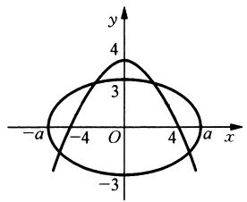

<details>
<summary>text_image</summary>

y
4
3
-a -4 O 4 a x
-3
</details>

图1-29

解：将抛物线与椭圆方程联立，得 $\left\{ \begin{array}{l} y = -\frac{x^2}{4} + 4, \\ \frac{x^2}{a^2} + \frac{y^2}{3^2} = 1. \end{array} \right.$

消去 $x$ 得关于 $y$ 的二次方程 $a^2 y^2 - 36y + (144 - 9a^2) = 0$ .

两曲线有四个交点，等价于关于 $y$ 的二次方程 $a^2 y^2 - 36y + (144 - 9a^2) = 0$ 在 $(-3, 3)$ 内有两个不同的解.

记 $f(y) = a^2 y^2 - 36y + (144 - 9a^2)$ ，使方程 $f(y) = 0$ 在 $(-3, 3)$ 内有两个不同解的充要条件是 $\left\{ \begin{array}{l} f(3) > 0, \\ f(-3) > 0, \\ -3 < \frac{18}{a^2} < 3, \text{解得} a > \sqrt{7} + 1. \\ f\left(\frac{18}{a^2}\right) < 0, \end{array} \right.$

例2设线段 $AB$ 两端点在抛物线 $y^{2} = x$ 上移动， $M$ 为线段 $AB$ 的中点， $\mid AB\mid = a$ （ $a$ 为大于零的常数），求 $M$ 到 $y$ 轴的最短距离.

解题策略：本例解题时易走入如下误区：如图1-30所示，设 $F$ 为抛物线的焦点，分别过 $A, B, M$ 向抛物线的准线引垂线，垂足分别为 $A_{1}, B_{1}, M_{1}$ ，则由 $|AF| + |BF| \geqslant |AB|$ 时，结合抛物线的定义及梯形中位线的性质，得 $|MM_{1}| \geqslant \frac{1}{2} |AB|$ ，所以 $|MM_{1}|$ 的最小值为 $\frac{a}{2}$ ，从而 $M$ 到 $y$ 轴的最短距离为 $\frac{a}{2} - \frac{1}{4}$ .

上述解法是错误的,所给的图形并不能反映问题的本质,这是因为,过抛物线焦点的最短弦是抛物线的通径,只有在 $a\geqslant1$ 时,才符合以上的解法,而当0<a<1时,结合图形已无法判断,需要用方程知识来解决,可见,图形并不一定能彻底解决问题,必须辅以代数运算.

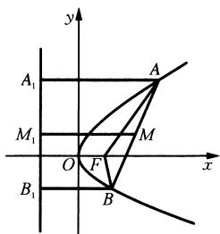

<details>
<summary>text_image</summary>

y
A₁
M₁
O
F
B₁
A
M
B
x
</details>

图1-30

解：设 $l_{AB}: x = my + n$ ，与 $y^2 = x$ 联立，得 $y^2 - my - n = 0$ .

当 $\Delta = m^2 + 4n > 0$ 时， $y_1 + y_2 = m$ ，所以 $x_1 + x_2 = (my_1 + n) + (my_2 + n) = m^2 + 2n$ .

设 $M$ 到 $y$ 轴的距离为 $d$ , 则 $d = \frac{x_1 + x_2}{2} = \frac{m^2}{2} + n$ .

又 $|AB| = a$ ，所以 $(m^2 + 1)(m^2 + 4n) = a^2$ ，得 $n = \frac{1}{4}\left(\frac{a^2}{m^2 + 1} - m^2\right)$ .

所以 $d = \frac{1}{4}\left(\frac{a^2}{m^2 + 1} + m^2\right) = \frac{1}{4}\left(\frac{a^2}{m^2 + 1} + m^2 + 1 - 1\right)$ . 设 $t = m^2 + 1 \geqslant 1$ ,

则 $d = \frac{1}{4}\left(\frac{a^2}{t} + t - 1\right)$ ，当 $0 < a < 1$ 时，得 $d = \frac{1}{4}\left(\frac{a^2}{t} + t - 1\right)$ 在 $t \in [1, +\infty)$ 上是增函数，所以当 $t = 1$ 时， $d_{\min} = \frac{a^2}{4}$ .

故当 $0 < a < 1$ 时，点 $M$ 到 $y$ 轴的最短距离为 $\frac{a^2}{4}$

当 $a \geqslant 1$ 时，点 $M$ 到 $y$ 轴的最短距离为 $\frac{a}{2} - \frac{1}{4}$ .

例 3 如图 1-31 所示, 在四棱锥 P-ABCD 中, $PA \perp$ 平面 ABCD, $AC \perp AD$ , $AB \perp BC$ , $\angle BAC = 45^{\circ}$ , $PA = AD = 2$ , AC = 1.

(1) 证明 $PC \perp AD$ ;

(2) 求二面角 A - PC - D 的正弦值；

(3) 设 E 为棱 PA 上的点, 满足异面直线 BE 与 CD 所成的角为 $30^{\circ}$ , 求 AE 的长.

解题策略：本例主要考查空间两条直线的位置关系、二面角、异面直线所成的角、空间两点间的距离，可以用“几何法”求解，也可以用“向量法”求解。“几何法”在于由“形”出发，观察“数”的特征，发现平行、垂直等几何关系中的数量关系，经历“作—证—求”的思维转化过程，体会“几何法”中所蕴涵的数形结合思想。“向量法”也由“形出发”，把相关的点、线“坐标化”、“向量化”，空间图形“向量化”归根结底就是点、线段“向量化”，体会“向量法”中所蕴涵的数形结合思想。实践证明，通过建立空间直角坐标系，将几何对象坐标化，进一步利用向量的坐标运算，也就是代数运算，是解决空间几何体中求距离、夹角的好方法。

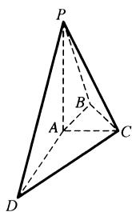

<details>
<summary>text_image</summary>

P
A
B
C
D
</details>

图1-31

解：(1) 如图 1-32 所示. 以 $\overrightarrow{AD}$ 、 $\overrightarrow{AC}$ 、 $\overrightarrow{AP}$ 为 $x$ 、 $y$ 、 $z$ 正半轴方向建立空间直角坐标系 $A - xyz$ ，则 $D(2,0,0)$ 、 $C(0,1,0)$ 、 $B\left(-\frac{1}{2}, \frac{1}{2}, 0\right)$ 、 $P(0,0,2)$ ， $\overrightarrow{PC} = (0,1,-2)$ ， $\overrightarrow{AD} = (2,0,0)$ ， $\because \overrightarrow{PC} \cdot \overrightarrow{AD} = 0$ ， $\therefore PC \perp AD$ .

(2) 解法一(几何法): 如图 1-32 所示, 作 $AH \perp PC$ , 垂足为 $H$ , 联结 $DH$ . 由 (1) 知 $PC \perp$ 平面 $ADH$ , $\angle AHD$ 即为二面角 $A - PC - D$ 的平面角, 记为 $\theta$ . 在 Rt△PAC 中, 求得 $PC = \sqrt{5}$ , $AH = \frac{2}{\sqrt{5}}$ . 在 Rt△DAH 中, 求得 $DH = \sqrt{\frac{24}{5}}$ , $\sin \theta = \frac{\sqrt{30}}{6}$ . 二面角 $A - PC - D$ 的正弦值为 $\frac{\sqrt{30}}{6}$ .

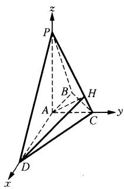

<details>
<summary>text_image</summary>

z
P
B
H
A
C
y
x
D
</details>

图1-32

解法二(向量坐标法): $\overrightarrow{PC} = (0, 1, -2)$ , $\overrightarrow{CD} = (2, -1, 0)$ , 设平面 PCD 的法向量 $\vec{n} = (x, y, z)$ , 则 $\left\{\begin{aligned}\vec{n} & \cdot \overrightarrow{PC} = 0, \\ \vec{n} & \cdot \overrightarrow{CD} = 0,\end{aligned}\right.$ 即得 $\left\{\begin{aligned}y - 2z &= 0, \\ 2x - y &= 0.\end{aligned}\right.$ $\therefore \left\{\begin{aligned}y &= 2z, \\ x &= z,\end{aligned}\right.$ 取 $z = 1, \therefore \vec{n} = (1, 2, 1)$ .

$\overrightarrow{AD} = (2,0,0)$ 是平面 $PAC$ 的一个法向量.

$$
\cos \langle \overrightarrow {A D}, \vec {n} \rangle = \frac {\overrightarrow {A D} \cdot \vec {n}}{| \overrightarrow {A D} | \cdot | \vec {n} |} = \frac {\sqrt {6}}{6}, \therefore \sin \langle \overrightarrow {A D}, \vec {n} \rangle = \frac {\sqrt {3 0}}{6}.
$$

∴ 二面角 A - PC - D 的正弦值为 $\frac{\sqrt{30}}{6}$ .

(3) 设 $E(0, 0, h)$ , 则 $\overrightarrow{BE} = \left(\frac{1}{2}, -\frac{1}{2}, h\right), \overrightarrow{CD} = (2, -1, 0)$ ,

$$
\cos 3 0 ^ {\circ} = | \cos \langle \overrightarrow {B E}, \overrightarrow {C D} \rangle | = \frac {\frac {3}{2}}{\sqrt {5} \times \sqrt {\frac {1}{2} + h ^ {2}}} = \frac {\sqrt {3}}{2}, \text {解得} h = \frac {\sqrt {1 0}}{1 0}.
$$

故 $AE$ 的长为 $\frac{\sqrt{10}}{10}$ .

例4 在直角坐标系 $xOy$ 中，已知点 $A(1,1)$ 、 $B(2,3)$ 、 $C(3,2)$ . 点 $P(x,y)$ 在 $\triangle ABC$ 三边围成的区域（含边界）上.

(1) 若 $\overrightarrow{PA} + \overrightarrow{PB} + \overrightarrow{PC} = \overrightarrow{0}$ ，求 $|\overrightarrow{OP}|$ ;  
(2) 设 $\overrightarrow{OP} = m\overrightarrow{AB} + n\overrightarrow{AC}(m, n \in \mathbf{R})$ ，用 $x$ 、 $y$ 表示 $m - n$ ，并求 $m - n$ 的最大值.

解题策略：平面向量是数形结合体现得最为完美的数学知识之一.第(2)问先由向量的坐标运算，将问题转化为线性规划问题，通过对图形的分析可得到多种以形助数，以数辅形的解法.

解：(1) 解法一：∵ $\overrightarrow{PA} + \overrightarrow{PB} + \overrightarrow{PC} = \overrightarrow{0}$ ,

$$
\overrightarrow {P A} + \overrightarrow {P B} + \overrightarrow {P C} = (1 - x, 1 - y) + (2 - x, 3 - y) + (3 - x, 2 - y) = (6 - 3 x, 6 - 3 y).
$$

∴ $\left\{\begin{aligned}6-3x&=0,\\ 6-3y&=0.\end{aligned}\right.$ 解得 x=2, y=2，即 $\overrightarrow{OP}=(2,2)$ ，故 $\left|\overrightarrow{OP}\right|=2\sqrt{2}$ .

解法二：在 $\triangle ABC$ 中， $\overrightarrow{PA}+\overrightarrow{PB}+\overrightarrow{PC}=\vec{0}$ ， $\therefore P$ 为 $\triangle ABC$ 的重心，即 $P$ 为 $\triangle ABC$ 三条中线的交点.

取 $AB$ 的中点 $E\left(\frac{3}{2}, 2\right)$ , 则 $AB$ 边上中线 $EC$ 的方程为 $y = 2$ .

取 $AC$ 的中点 $F\left(2, \frac{3}{2}\right)$ , 则 $AC$ 边上中线 $BF$ 的方程为 $x = 2$ ,

两直线的交点是重心 $P(2, 2)$ , 故 $|\overrightarrow{OP}| = 2\sqrt{2}$ .

解法三：由两点间距离公式知 $|AB| = |AC| = \sqrt{5}$ .

∴ $\triangle ABC$ 为等腰三角形，则重心 P 必在底边 BC 的高线 y = x 上.

设点 $P(t, t)$ , 由重心的知识知 $\frac{PC}{PE} = \frac{3 - t}{t - \frac{3}{2}} = 2$ , 解得 $t = 2$ , 故 $|\overrightarrow{OP}| = 2\sqrt{2}$ .

解法四：∵ $\overrightarrow{PA} + \overrightarrow{PB} + \overrightarrow{PC} = \overrightarrow{0}$ ，则 $(\overrightarrow{OA} - \overrightarrow{OP}) + (\overrightarrow{OB} - \overrightarrow{OP}) + (\overrightarrow{OC} - \overrightarrow{OP}) = \overrightarrow{0}$ ，

$$
\therefore \overrightarrow {O P} = \frac {1}{3} (\overrightarrow {O A} + \overrightarrow {O B} + \overrightarrow {O C}) = (2, 2), \therefore | \overrightarrow {O P} | = 2 \sqrt {2}.
$$

(2) 解法一: $\because \overrightarrow{OP} = m\overrightarrow{AB} + n\overrightarrow{AC}$ ,

$\therefore (x, y) = (m + 2n, 2m + n), \therefore \begin{cases} x = m + 2n, \\ y = 2m + n. \end{cases}$ 两式相减得， $m - n = y - x$ ，

令 $y - x = t$ . 如图1-33所示，由图知，当直线 $y = x + t$ 过点 $B(2,3)$ 时， $t$ 取得最大值1，故 $m - n$ 的最大值为1.

解法二：由解法一知 $m - n = -x + y$

令 $d$ 为点 $P(x, y)$ 到直线 $-x + y = 0$ 的距离，

则 $d = \frac{| - x + y|}{\sqrt{2}}$ ，由图1-33知点 $B$ 和点 $C$ 到直线 $y = x$ 的距离最大，

最大值为 $\frac{\sqrt{2}}{2}$ , 即 $d = \frac{| - x + y|}{\sqrt{2}} \leqslant \frac{\sqrt{2}}{2}, \therefore -x + y \leqslant 1$ , 故 $m - n$ 的最大值为 1.

解法三：将 $\overrightarrow{DP} = m\overrightarrow{AB} + n\overrightarrow{AC}$ 坐标化，有 $(x, y) = m(1, 2) + n(2, 1)$ .

整理得 $\left\{\begin{aligned}x&=m+2n,\\ y&=2m+n,\end{aligned}\right.$ 两式作差可得 $m-n=-x+y$ .

设 $M(-1, 1)$ , 则 $\overrightarrow{OP} = (x, y)$ , $\overrightarrow{OM} = (-1, 1)$ , 记 $\overrightarrow{OP}$ 与 $\overrightarrow{OM}$ 的夹角为 $\alpha$ .

则 $z = -x + y = |\overrightarrow{OM}|\cdot |\overrightarrow{OP}|\cos \alpha$ ，转化为求 $\overrightarrow{OP}$ 在 $\overrightarrow{OM}$ 方向上投影的最大值.

当点 $P$ 与点 $B$ 重合时， $\overrightarrow{OP}$ 在 $\overrightarrow{OM}$ 方向上投影最大，将 $B(2,3)$ 代入得 $m - n = -x + y = 1$ .

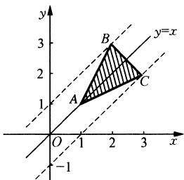

<details>
<summary>text_image</summary>

y
3
B
y=x
2
A
C
1
O 1 2 3 x
-1
</details>

图1-33

# 第十三讲 以形助数两大抓手(利用函数图像, 揭示内在几何意义)

以形助数, 即借助形的直观性来阐明数之间的联系, 由数想形时, 要注意“形”的准确性. 这是数形结合的基础, 以形助数常用的有: 借助数轴; 借助函数图像; 借助单位圆; 借助数式的结构特征寻找内在的几何关系; 借助于解析几何方法.

以形助数离不开作图,作图既要放眼整体,又要关注局部,特别要关注关键细节处,并从运动变化的观点观察图形(如解析几何中直线倾斜角与斜率的变化,直线的截距的变化,点到直线距离的变化等)防止图形选择不当而掩盖问题的本质、图形的直观掩藏了深入的理性思考.防止由直观得出的并不一定准确的结论代替严谨论证.

例1（1）对 $a, b \in \mathbf{R}$ ，记 $\max \{a, b\} = \begin{cases} a & (a \geqslant b), \\ b & (a < b), \end{cases}$ 则函数 $f(x) = \max \left\{|x + 1|, x^2 - 2x + \frac{9}{4}\right\}$ （ ）.

A. 有最大值 $\frac{3}{2}$ , 无最小值

B. 有最大值 $\frac{1}{2}$ , 无最小值

C. 有最小值 $\frac{3}{2}$ , 无最大值

D. 有最小值 $\frac{1}{2}$ , 无最大值

(2) 已知两条直线 $l_{1}: y = m$ 和 $l_{2}: y = \frac{8}{2m + 1} (m > 0), l_{1}$ 与函数 $y = |\log_2 x|$ 的图像从左至右相交于点 $A, B, l_{2}$ 与函数 $y = |\log_2 x|$ 的图像从左至右相交于 $C, D$ , 记线段 $AC$ 和 $BD$ 在 $x$ 轴上的投影长度分别为 $a, b$ , 当 $m$ 变化时, $\frac{b}{a}$ 的最小值为（ ）.

A. $16 \sqrt{2}$

B. $8\sqrt{2}$

C. 16

D. 8

解题策略：第(1)问，对于求分段函数最值问题，可在相应定义域内作出分段函数的图像，借助函数图像直观地得出函数的最大值和最小值或判断无最值；第(2)问考查对数函数图像与性质的综合应用，理解投影的概念并能把问题转化为基本不等式求最值是解决问题的关键.

解：（1）函数 $f(x) = \max \left\{ |x + 1|, x^2 - 2x + \frac{9}{4} \right\}$ 是两个函数 $y = |x + 1|$ 与 $y = x^2 - 2x + \frac{9}{4}$ 由同一个 $x$ 取得的两个函数值的较大的值，在同一直角坐标系中作函数 $y = |x + 1|$ 与函数 $y = x^2 - 2x + \frac{9}{4}$ 的图像，函数 $f(x)$ 的图像为图中实线部分（如图1-34所示）。令 $x^2 - 2x + \frac{9}{4} = x + 1$ ，得 $x = \frac{1}{2}$ 或 $x = \frac{5}{2}$ 。由图像可知，当 $x = \frac{1}{2}$ 时，

$f(x)$ 的最小值为 $\frac{3}{2}$ , 故 $f(x)$ 有最小值 $\frac{3}{2}$ , 但没有最大值. 故选 C.

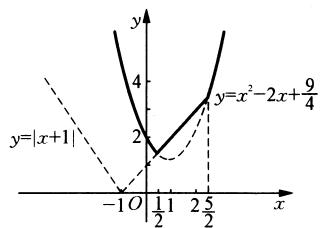  
图1-34

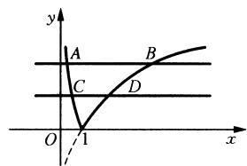

<details>
<summary>text_image</summary>

y
A
B
C
D
O
1
x
</details>

图1-35

(2) 在同一坐标系中作出 $y = m$ , $y = \frac{8}{2m + 1} (m > 0)$ , $y = |\log_2 x|$ 的图像如图1-35所示,

由 $|\log_2x| = m$ ，得 $x_{1} = 2^{-m}$ ， $x_{2} = 2^{m}$

$\mid \log_2x\mid = \frac{8}{2m + 1}$ ，得 $x_{3} = 2^{-\frac{8}{2m + 1}},x_{4} = 2^{\frac{8}{2m + 1}}$

依照题意得 $a = |x_{1} - x_{3}|, b = |x_{2} - x_{4}|$ 得 $a = |2^{-m} - 2^{\frac{8}{2m + 1}}|, b = |2^{m} - 2^{\frac{8}{2m + 1}}|$ ,

$$
\frac {b}{a} = \frac {\left| 2 ^ {m} - 2 ^ {\frac {8}{2 m + 1}} \right|}{\left| 2 ^ {- m} - 2 ^ {- \frac {8}{2 m + 1}} \right|} = 2 ^ {m} \cdot 2 ^ {\frac {8}{2 m + 1}} = 2 ^ {m + \frac {8}{2 m + 1}}.
$$

因为 $m + \frac{8}{2m + 1} = m + \frac{1}{2} +\frac{4}{m + \frac{1}{2}} -\frac{1}{2}\geqslant 4 - \frac{1}{2} = 3\frac{1}{2}.$ 所以 $\left(\frac{b}{a}\right)_{\min} = 8\sqrt{2}.$ 故选B.

例2（1）求 $y = \frac{2 + 5\sin x}{3 - \sin x}$ 的最大值、最小值；

(2) 已知 $x^{2} + y^{2} \leqslant 4$ , 且 $x \geqslant 0$ , 求 $\frac{y + 4}{x + 1}$ 的最大值与最小值.

解题策略：第(1)问，据 $y = \frac{2 + 5\sin x}{3 - \sin x}$ 和 $k = \frac{y_2 - y_1}{x_2 - x_1}$ 形式上的特点，构造动点 $A(\sin x, -5\sin x)$ ，定点 $B(3, 2)$ ，则原问题求 $y$ 的最值转化为求 $k_{AB}$ 的最值。这就是通常所说的“图形的构造”，是数形结合思想的抓手之一；第(2)问， $x^2 + y^2 \leqslant 4 (x \geqslant 0)$ 表示半圆域， $\frac{y + 4}{x + 1}$ 表示半圆域上的动点 $P(x, y)$ 与定点 $A(-1, -4)$ 连线的斜率，问题迎刃而解。

解：（1）据斜率公式 $k = \frac{y_2 - y_1}{x_2 - x_1}$ 构造两个点，

即 $A(\sin x, -5\sin x), B(3, 2)$ .

把点 $A(\sin x, -5\sin x)$ 视为直角坐标平面 $aOb$ 内的一个动点，这时 $\left\{ \begin{array}{l} a = \sin x, \\ b = -5\sin x, \end{array} \right.$ 由此可得 $b = -5a (-1 \leqslant a \leqslant 1)$ .

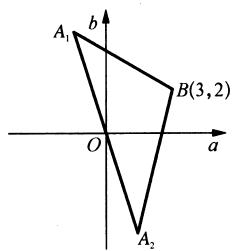

<details>
<summary>text_image</summary>

A₁
b
O
a
B(3,2)
A₂
</details>

图1-36

如图1-36所示， $b = -5a(-1\leqslant a\leqslant 1)$ 的图像是线段 $A_{1}A_{2}$

端点 $A_{1}, A_{2}$ 的坐标分别是 $(1, -5), (-1, 5)$ ，点 $A$ 在线段 $A_{1}A_{2}$ 上移动。直线 $A_{1}B$ 的斜率为 $k_{A_{1}B} = \frac{2 + 5}{3 - 1} = \frac{7}{2}$ ，

直线 $A_{2}B$ 的斜率为 $k_{A_2B} = \frac{2 - 5}{3 + 1} = -\frac{3}{4}$ .

y 刚好是直线 AB 的斜率，

∴ y 的最大值为 $k_{A_{1}B} = \frac{7}{2}$ ，最小值为 $k_{A_{2}B} = -\frac{3}{4}$ .

(2) 如图 1-37 所示, 不等式 $x^{2} + y^{2} \leqslant 4 (x \geqslant 0)$ 表示半圆域. 设 $\frac{y + 4}{x + 1} = k$ , $\frac{y + 4}{x + 1}$ 表示半圆域上的点 $(x, y)$ 与点 $(-1, -4)$ 连线的斜率, 当直线过点 $(0, 2)$ 时, 有 $\left(\frac{y + 4}{x + 1}\right)_{\max} = 6$ , 当直线在切线位置时, $k$ 值最小, 由点 $(0, 0)$ 到切线的距离等于半径,

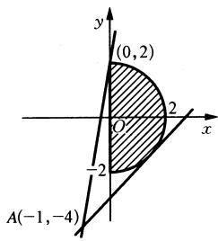

<details>
<summary>text_image</summary>

(0,2)
O
-2
A(-1,-4)
</details>

图1-37

得 $\frac{|k - 4|}{\sqrt{k^2 + 1}} = 2, \left(\frac{y + 4}{x + 1}\right)_{\min} = \frac{-4 + 2\sqrt{13}}{3}.$

例3（1）已知平面向量 $\vec{\alpha},\vec{\beta} (\vec{\alpha}\neq \vec{0},\vec{\alpha}\neq \vec{\beta})$ 满足 $|\vec{\beta}| = 1$ ，且 $\vec{\alpha}$ 与 $\vec{\beta} -\vec{\alpha}$ 的夹角为 $120^{\circ}$ ，则 $|\vec{\alpha} |$ 的取值范围是\_\_\_\_；

(2) 设抛物线 $y^{2}=2x$ 的焦点为 F，过点 $M(\sqrt{3},0)$ 的直线与抛物线相交于 A、B 两点，与抛物线的准线相交于 C， $|BF|=2$ ，则 $\triangle BCF$ 与 $\triangle ACF$ 的面积之比 $\frac{S_{\triangle BCF}}{S_{\triangle ACF}}=(\quad)$ .

A. $\frac{4}{5}$

B. $\frac{2}{3}$

C. $\frac{4}{7}$

D. $\frac{1}{2}$

解题策略：第(1)问，易知 $C$ 点在圆弧上运动且 $\angle ACB = 60^{\circ}$ ，在 $\triangle ABC$ 中结合正弦定理及正弦函数的有界性可得 $|\vec{\alpha}|$ 的取值范围；第(2)问，应结合图形，将面积比转化为线段长度之比，再根据抛物线定义转化为坐标运算。

解：（1）如图1-38所示，数形结合知 $\vec{\beta} = \overrightarrow{AB},\vec{\alpha} = \overrightarrow{AC}$

$|\overrightarrow{AB}|=1.C$ 点在圆弧上运动， $\angle ACB=60^{\circ}$

设 $\angle ABC = \theta$ ，由正弦定理知 $\frac{AB}{\sin 60^\circ} = \frac{|\vec{\alpha}|}{\sin \theta}$

$\therefore |\vec{\alpha}| = \frac{2\sqrt{3}}{3}\sin \theta \leqslant \frac{2\sqrt{3}}{3}.$ 当 $\theta = 90^{\circ}$ 时取最大值.

$$
\therefore | \vec {\alpha} | \in \left(0, \frac {2 \sqrt {3}}{3} \right].
$$

(2) 如图 1-39 所示, 设点 $A(x_{A}, y_{A}), B(x_{B}, y_{B})$ ,

由题知 $\frac{S_{\triangle BCF}}{S_{\triangle ACF}} = \frac{BC}{AC} = \frac{x_B + \frac{1}{2}}{x_A + \frac{1}{2}} = \frac{2x_B + 1}{2x_A + 1},$

且 $|BF| = x_{B} + \frac{1}{2} = 2\Rightarrow x_{B} = \frac{3}{2}\Rightarrow y_{B} = -\sqrt{3}.$

由 $A, B, M$ 三点共线有 $\frac{y_M - y_A}{x_M - x_A} = \frac{y_M - y_B}{x_M - x_B}$ ,

即 $\frac{0 - \sqrt{2x_A}}{\sqrt{3} - x_A} = \frac{0 + \sqrt{3}}{\sqrt{3} - \frac{3}{2}}$ 故 $x_{A} = 2.$

$\therefore \frac{S_{\triangle BCF}}{S_{\triangle ACF}} = \frac{2x_B + 1}{2x_A + 1} = \frac{3 + 1}{4 + 1} = \frac{4}{5}$ . 故选 A.

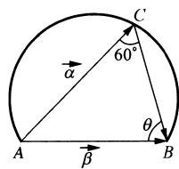

<details>
<summary>text_image</summary>

C
60°
α
θ
A
β
B
</details>

图1-38

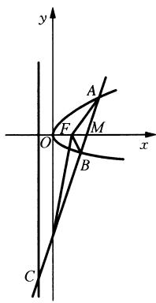

<details>
<summary>text_image</summary>

y
A
F
M
O
x
B
C
</details>

图1-39

例4 已知以 $T = 4$ 为周期的函数 $f(x) = \begin{cases} m\sqrt{1 - x^2}, & x \in [-1, 1], \\ 1 - |x - 2|, & x \in [1, 3], \end{cases}$ 其中 $m > 0$ . 若方程 $3f(x) = x$ 恰有5个实数解，则 $m$ 的取值范围为（ ）.

A. $\left(\frac{\sqrt{15}}{3},\frac{8}{3}\right)$

B. $\left(\frac{\sqrt{15}}{3},\sqrt{7}\right)$

C. $\left(\frac{4}{3},\frac{8}{3}\right)$

D. $\left(\frac{4}{3},\sqrt{7}\right)$

解题策略：本题可构造两个函数，通过两个函数的图像交点的个数为5来探求 $m$ 的取值范围.然而以形助数往往是粗略的.临界状态不一定很明了，还应结合代数运算.即通过解方程组，运用方程理论作进一步探索，我们讲数形结合关键在结合，不但要以形助数，还要以数辅形，这样解才是完整的.

解：方程 $3f(x) = x$ 可化为 $f(x) = \frac{x}{3}$ ，构造函数 $y_{1} = \begin{cases} m\sqrt{1 - x^{2}}, & x \in [-1, 1], \\ 1 - |x - 2|, & x \in [1, 3] \end{cases}$ 和 $y_{2} = \frac{x}{3}$ ，它们恰有5个交点.

当 $-1 < x \leqslant 1$ 时，为 $\frac{y^2}{m^2} + x^2 = 1$ 的上半部分；当 $1 < x \leqslant 2$ 时为 $y = x - 1$ ；当 $2 < x \leqslant 3$ 时为 $y = -x + 3$ .

如图1-40所示， $y_{2} = \frac{x}{3}$ 为一条过原点的直线，要使它适合题意，需要 $l: y = \frac{x}{3}$ 与曲线 $c_{2}$ 有两个交点，与 $c_{3}$ 没有交点.

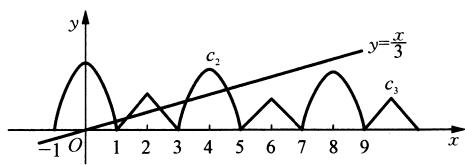

<details>
<summary>line</summary>

| x | y (c2) | y (c3) |
|---|--------|--------|
| -1 | 0 | 0 |
| 0 | 1 | 0 |
| 1 | 0 | 0 |
| 2 | 1 | 0 |
| 3 | 0 | 0 |
| 4 | 1 | 0 |
| 5 | 0 | 0 |
| 6 | 1 | 0 |
| 7 | 0 | 0 |
| 8 | 1 | 0 |
| 9 | 0 | 0 |
| 10 | 1 | 0 |
</details>

图1-40

由题意知 $\left\{ \begin{array}{l} \frac{y^2}{m^2} + (x - 4)^2 = 1, \\ y = \frac{x}{3}, \end{array} \right.$ 得 $\left(1 + \frac{1}{9m^2}\right)x^2 - 8x + 15 = 0.$

$\Delta = 64 - 4\left(1 + \frac{1}{9m^2}\right) \times 15 > 0$ ，得 $m > \frac{\sqrt{15}}{3}$ ，

由 $\left\{\begin{aligned}\frac{y^{2}}{m^{2}}+(x-8)^{2}&=1,\\ y&=\frac{x}{3},\end{aligned}\right.$ 得 $\left(1+\frac{1}{9m^{2}}\right)x^{2}-16x+63=0.$

$\Delta = 256 - 4 \times 63\left(1 + \frac{1}{9m^2}\right) < 0$ ，得 $m < \sqrt{7}$ .

故 $m \in \left(\frac{\sqrt{15}}{3}, \sqrt{7}\right)$ ，故选B.

# 第十四讲 以形助数还要抓住形的动态过程

静止是相对的,运动才是绝对的.用运动变化、联系的观点来解题是一种重要的解题策略.在以形助数的解题过程中,图形或图形中的某个元素是按照一定的规律在运动的,这个动态过程就是解题的关键,抓住形的动态往往可以使问题轻松获解.

例1 关于 $x$ 的方程 $\sqrt{4 - x^2} = kx + 2$ 只有一个实根，求 $k$ 的取值范围.

解题策略：本例转化为两函数 $y = \sqrt{4 - x^2}$ 和 $y = kx + 2$ 的图像只有一个交点的问题。由于函数 $y = kx + 2$ 是过定点(0,2)且绕定点(0,2)转动的直线，与半圆一个交点时斜率 $k$ 的范围难道不是很直观吗？

解：设 $y = \sqrt{4 - x^2}$ 和 $y = kx + 2$ . 函数 $y = \sqrt{4 - x^2}$ 的图像是以原点为圆心，2为半径的上半圆，而 $y = kx + 2$ 是过定点(0, 2)斜率 $k$ 在变化的直线，也就是说直线绕(0, 2)点转动，因为(0, 2)点在半圆上，所以动直线不可能与半圆再有其他交点（如图1-41所示）.

∴ k = 0 或 k > 1 或 k < -1.

例2 关于 $x$ 的方程 $\sqrt{3} \sin 2x + \cos 2x = k + 1$ 在 $\left[0, \frac{\pi}{2}\right]$ 内有两相异实根. 求 $k$ 的取值范围.

解题策略：与三角函数有关的方程根的问题，常借助三角函数图像求解，本题将方程左边化为只含一个角的一种三角函数形式，作出该函数在 $\left[0, \frac{\pi}{2}\right]$ 上的图像，而 $y =$ $k+1$ 是一条平行于 x 轴的动直线，在运动过程中与三角函数 $y=\sqrt{3}\sin2x+\cos2x, x\in\left[0,\frac{\pi}{2}\right]$ 有两个不同交点时，求 k 的取值范围.

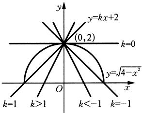

<details>
<summary>text_image</summary>

y
y=kx+2
(0,2)
k=0
y=\u221a4-x²
O
x
k=1
k>1
k<-1
k=-1
</details>

图1-41

解: $\sqrt{3} \sin 2x + \cos 2x = 2\sin \left(2x + \frac{\pi}{6}\right)$ . 在同一直角坐标系中作出函数 $y = 2\sin \left(2x + \frac{\pi}{6}\right), x \in \left[0, \frac{\pi}{2}\right]$ 和 $y = k + 1$ 的图像如图1-42所示. 由图像可知当 $1 \leqslant k + 1 < 2$ , 即 $0 \leqslant k < 1$ 时, 两函数图像有两个交点, 即方程有两相异实根.

例3 椭圆 $\frac{x^2}{9} + \frac{y^2}{4} = 1$ 的焦点为 $F_{1}, F_{2}$ , 点 $P$ 为其上动点, 当 $\angle F_{1}PF_{2}$ 为钝角时, 求点 $P$ 横坐标的取值范围.

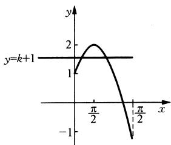

<details>
<summary>line</summary>

| x | y |
|---|---|
| -π/2 | 1 |
| 2π/2 | 2 |
| π/2 | -1 |
</details>

图1-42

解题策略：当 $\angle F_{1}PF_{2}$ 为直角时，即作以原点为圆心， $|OF_{2}|$ 为半径的圆，若该圆与已知椭圆相交，则圆内的椭圆弧所对应的 $x$ 的取值范围就是所求点 $P$ 横坐标的取值范围.

解： $\frac{x^2}{9} +\frac{y^2}{4} = 1$ 的焦点为 $F_{1}(-\sqrt{5},0)$ 、 $F_{2}(\sqrt{5},0)$ ，以原点为圆心， $\sqrt{5}$ 为半径作圆与椭圆相交于 $A,B,C,D$ 四点，显然此时 $\angle F_{1}AF_{2}$ 、 $\angle F_{1}BF_{2}$ 、 $\angle F_{1}CF_{2}$ 、 $\angle F_{1}DF_{2}$ 都为直角，显然当角的顶点 $P$ 在圆内部的椭圆弧上时， $\angle F_{1}PF_{2}$ 为钝角，由椭圆和圆都关于坐标轴对称，

∴ 只要通过方程组 $\left\{\frac{x^{2}}{9}+\frac{y^{2}}{4}=1,\right.$ 求出 A、B 两点的横坐标. $x^{2}+y^{2}=5$

即可求出点 $P$ 横坐标的取值范围是 $\left(-\frac{3\sqrt{5}}{5}, \frac{3\sqrt{5}}{5}\right)$ （如图1-43所示）.

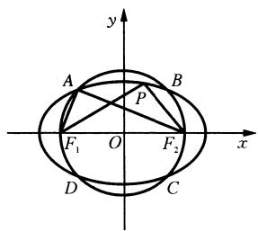

<details>
<summary>text_image</summary>

y
A
B
P
F₁ O F₂ x
D C
</details>

图1-43

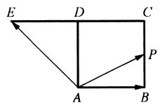  
图1-44

例 4 如图 1-44 所示, 四边形 ABCD 是正方形, 延长 CD 至 E, 使得 DE = CD. 若动点 P 从点 A 出发, 沿正方形的边按逆时针方向运动一周回到点 A, 其中 $\overrightarrow{AP} = \lambda \overrightarrow{AB} + \mu \overrightarrow{AE}$ , 则下列判断正确的是().

A. 满足 $\lambda + \mu = 2$ 的点 $P$ 必为 $BC$ 的中点

B. 满足 $\lambda + \mu = 1$ 的点有且只有一个

C. $\lambda + \mu$ 的最大值为 3

D. $\lambda + \mu$ 的最小值不存在

解题策略：通过建立平面直角坐标系，寻求 $\lambda + \mu$ 与点 $P$ 的坐标 $(x, y)$ 的关系。图形中的动点 $P$ 按照在正方形的四条边上运动，必须对此逐一讨论。在运动过程中，点 $P$ 横坐标与纵坐标的取值或范围是确定的，则 $\lambda + \mu$ 的取值范围也可求得。

解：如图1-45所示，建立平面直角坐标系.设正方形的边长为1，动点 $P(x,y)$ ，则 $A(0,0),B(1,0),C(1,1)$ 、 $D(0,1),E(-1,1),\overrightarrow{AB} = (1,0),\overrightarrow{AE} = (-1,1).$

$\overrightarrow{AP} = \lambda \overrightarrow{AB} + \mu \overrightarrow{AE} \Rightarrow \left\{ \begin{array}{l} x = \lambda - \mu, \\ y = u \end{array} \right. \Rightarrow \lambda + \mu = x + 2y$ ，下面对动点 $P$ 的位置逐一讨论：

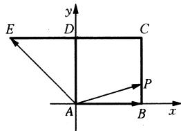

<details>
<summary>text_image</summary>

E
D
C
A
B
x
y
P
</details>

图1-45

① 当点 $P$ 在 $AB$ 上时， $\left\{ \begin{array}{l} 0 \leqslant x \leqslant 1, \\ y = 0 \end{array} \right. \Rightarrow \lambda + \mu = x + 2y \in [0, 1]$ .  
② 当点 $P$ 在 $BC$ 上时， $\left\{ \begin{array}{l} 0 \leqslant y \leqslant 1, \\ x = 1 \end{array} \right. \Rightarrow \lambda + \mu = x + 2y \in [1, 3]$ .  
③ 当点 $P$ 在 $CD$ 上时， $\left\{ \begin{array}{l} 0 \leqslant x \leqslant 1, \\ y = 1 \end{array} \right. \Rightarrow \lambda + \mu = x + 2y \in [2, 3]$ .  
④ 当点 $P$ 在 $DA$ 上时， $\left\{ \begin{array}{l} 0 \leqslant y \leqslant 1, \\ x = 0 \end{array} \right. \Rightarrow \lambda + \mu = x + 2y \in [0, 2]$ .

由此可得， $\lambda + \mu = 2 \Rightarrow$ 点 $P$ 为 $BC$ 的中点或点 $D; \lambda + \mu = 1 \Rightarrow$ 点 $P$ 为点 $B$ 或 $AD$ 的中点；

$\lambda + \mu$ 的最小值为 0, 故选 C.

# 第十五讲 数形兼顾、相互补充

数形结合, 即用形研究数, 用数研究形, 相互结合、相互补充, 使问题变得直观、简捷、思路易寻. 从形到数主要是指分析图形、发现规律, 得到有用结论, 即“识图→用图”; 从数到形则是从观察“数”的结构特征入手, 联想与想象其几何特征. 并由静而动, “作图”以便直观地发现解题思路, 对于某些较为复杂的数学问题必须做到数形兼顾, 反复转换, 如“数→形→数”或“形→数→形”, 甚至有多个反复, 交替使用.

例1 已知. $a > 0, a^2 - 2ab + c^2 = 0, bc > a^2$ ，试比较实数 $a, b, c$ 的大小关系.

解题策略：本例可转化为函数图像与不等式表示的区域，以形助数，然而光靠图形尚不能比较 $a, b, c$ 的大小，还需要作差比较，即以数辅形、数形结合的思想方法的实质是将抽象的数学语言和直观图结合起来，通过对图形的处理，发挥直观对抽象的支柱作用；通过对数与式的运算和变换，将图像的特征及几何关系刻画得更准确、更精细，这样就可以使抽象概念和具体形象相互联系、相互补充、相互转化、相互作用。求得问题的解决。

解：由 $a^2 - 2ab + c^2 = 0 \Rightarrow b = \frac{1}{2a}c^2 + \frac{a}{2}$ ，则点 $(c, b)$ 是抛物线 $y = \frac{1}{2a}x^2 + \frac{a}{2}$ 上的点，由 $bc > a^2$ ，可知 $(c, b)$ 是

$xy = a^{2}$ 上方的点，

故满足 $\left\{ \begin{array}{l} a^2 - 2ab + c^2 = 0, \\ bc > a^2 \end{array} \right.$ 的点 $(c, b)$ 应为阴影内的抛物线上除去 $(a, a)$ 的点， $\therefore c > a, b > a$ 。这就是数到形的转变的结果（如图1-46所示）。

而 b、c 的大小关系要用代数的方法解决.

$$
\begin{array}{l} b - c = \frac {1}{2 a} c ^ {2} + \frac {a}{2} - c = \frac {1}{2 a} (c ^ {2} + a ^ {2} - 2 a c) = \frac {1}{2 a} (c - a) ^ {2} > 0, \therefore b > c, \therefore b > \\ c > a. \end{array}
$$

例2 已知集合 $A = \{(x, y) \mid y^2 = x + 1, x, y \in \mathbf{R}\}$ , $B = \{(x, y) \mid 4x^2 + 2x - 2y + 5 = 0, x, y \in \mathbf{R}\}$ , $C = \{(x, y) \mid y = kx + b, x, y \in \mathbf{R}\}$ , 是否存在正整数 $k$ 和 $b$ 使得 $(A \cup B) \cap C = \emptyset$ ? 若存在, 求出 $k$ 和 $b$ 的值; 若不存在, 请说明理由.

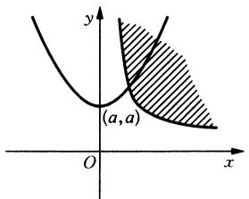

<details>
<summary>text_image</summary>

(a,a)
</details>

图1-46

解题策略：数形结合的思想简言之就是代数问题几何化、几何问题代数化，充分体现图形的直观性、代数推理的合理性。解题时注意不能用图形的直观代替严密的逻辑推理，本例的解题策略归结起来就是：数形兼顾求参数值。

解：画出 $4x^{2} + 2x - 2y + 5 = 0$ 和 $y^{2} = x + 1$ 的图像，它们分别与 $y$ 轴正半轴相交于点 $\left(0, \frac{5}{2}\right)$ 和 $(0, 1)$ （如图1-47所示）

要使 $(A \cup B) \cap C = \varnothing$ ，就是要直线与上述两条抛物线均无交点，这时 $b \in \left(1, \frac{5}{2}\right)$ ，

$$
\because b \in \mathbf {N}, \therefore b = 2.
$$

而且方程组(I) $\left\{\begin{aligned}y&=kx+2,\\ y^{2}&=x+1,\end{aligned}\right.$ ① (II) $\left\{\begin{aligned}y&=kx+2,\\ 4x^{2}&+2x-2y+5=0,\end{aligned}\right.$ ③ 均无实数解.

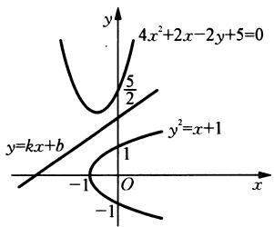

<details>
<summary>text_image</summary>

4x²+2x-2y+5=0
y
5/2
y=kx+b
y²=x+1
-1 O x
-1
</details>

图1-47

把①代入②得 $k^2 x^2 + (4k - 1)x + 3 = 0$

把 ③ 代入 ④ 得 $2x^{2} + (1 - k)x + \frac{1}{2} = 0.$

由 $\left\{ \begin{array}{l} \Delta_1 = 4k^2 - 8k + 1 < 0, \\ \Delta_2 = k^2 - 2k - 3 < 0, \end{array} \right.$ 得 $\left\{ \begin{array}{l} 1 - \frac{\sqrt{3}}{2} < k < 1 + \frac{\sqrt{3}}{2}, \\ -1 < k < 3, \\ k \in \mathbf{N}^*, \end{array} \right.\therefore k = 1.$

因此存在正整数 $k = 1, b = 2$ 满足 $(A \cup B) \cap C = \varnothing$ .

例3 已知 $f(x)$ 是定义在区间 $(- \infty, + \infty)$ 上以2为周期的函数，对 $k \in \mathbf{Z}$ ，用 $I_{k}$ 表示区间 $(2k - 1, 2k + 1]$ ，已知当 $x \in I_{0}$ 时， $f(x) = x^{2}$ .

(1) 求 $f(x)$ 在 $I_{k}$ 上的解析表达式；

(2) 对自然数 $k$ , 求集合 $M_{k} = \{a \mid \text{使方程 } f(x) = ax \text{ 在 } I_{k} \text{ 上有两个不相等的实数根}\}$ .

解题策略：在求出 $x \in I_k$ 上的函数解析式 $f(x) = (x - 2k)^2$ 之后与 $f(x) = ax$ 联立，得方程 $(x - 2k)^2 = ax$ ，即 $x^2 - (4k + a)x + 4k^2 = 0$ . 此方程在 $(2k - 1, 2k + 1]$ 上有两个不相等的实根，若用纯代数方法，则原问题等价于 $\Delta = (4k + a)^2 - 16k^2 > 0$ ， $x_1 = \frac{4k + a - \sqrt{(4k + a)^2 - 16k^2}}{2} > 2k - 1$ ，解此不等式组求得 $a$ 的取值范围，但是运算量实在太大，故不能选择 $x_2 = \frac{4k + a + \sqrt{(4k + a)^2 - 16k^2}}{2} \leqslant 2k + 1$ ，

这种繁琐的解法,应考虑数形结合的解法,而实现数形结合的关键是构造,可把问题转化为求 $y_1 = (x - 2k)^2$ , $x \in I_k$ , $k \in \mathbb{N}$ 与 $y_2 = ax$ 有两个交点时 $a$ 即直线 $y = ax$ 斜率 $a$ 的取值范围,也可以通过分离变量,将方程转化为另一类函数模型,寻求问题的几何意义.当然若设 $f(x) = x^2 - (4k + a)x + 4k^2$ ,利用根的分布定理求解也是一种不错的选择.

解：(1) $\because 2$ 是 $f(x)$ 的周期，当 $k \in \mathbf{Z}$ 时， $2k$ 也是 $f(x)$ 的周期.

又∵当 $x\in I_{k}$ 时， $(x-2k)\in I_{0},\therefore f(x)=f(x-2k)=(x-2k)^{2}$

即对 $k \in \mathbf{Z}$ , 当 $x \in I_k$ 时, $f(x) = (x - 2k)^2$ .

# (2) 解法一(转化为求直线 y = ax 斜率 a 的取值范围):

方程 $f(x) = ax$ ，即 $(x - 2k)^2 = ax$ 有两个不等实根， $x \in (2k - 1, 2k + 1]$ ， $k \in \mathbf{N}$ . 令 $y_1 = (x - 2k)^2$ ， $x \in I_k$ ， $k \in \mathbf{N}$ ， $y_2 = ax$ ，如图1-48所示，在同一坐标系中分别作出 $y_1$ 、 $y_2$ 的图像， $y_2$ 的图像是过原点，斜率为 $a$ 的直线，方程有两个不等实根的充要条件是两图像有两个不同交点，由图像1-48可知，当 $0 < a \leqslant \frac{1}{2k + 1} (k \in \mathbf{N})$ 时两图像有两个不同交点.

从而，原方程有两不等实根时， $M_{k}=\left\{a\mid0<a\leqslant\frac{1}{2k+1}\right\}$ .

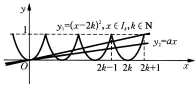

<details>
<summary>line</summary>

| x     | y₁          | y₂          |
|-------|-------------|-------------|
| 0     | (x-2k)²     | -           |
| 2k-1  |             |             |
| 2k    |             |             |
| 2k+1  |             | ax          |
</details>

图1-48

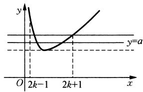

<details>
<summary>line</summary>

| x       | y     |
| ------- | ----- |
| 0       | 0     |
| 2k-1    | -1    |
| 2k+1    | 0     |
</details>

图1-49

解法二(分离变量,将方程转化为函数模型,寻求问题的几何意义):

$$
x ^ {2} - (4 k + a) x + 4 k ^ {2} = 0 \Leftrightarrow a = x + \frac {4 k ^ {2}}{x} - 4 k,
$$

令 $y = a, g(x) = x + \frac{4k^2}{x} - 4k, x \in (2k - 1, 2k + 1]$ ,

作这两个函数的图像如图1-49所示，

图像有两个不同交点的充要条件是

$$
2 \sqrt {x \cdot \frac {4 b ^ {2}}{x}} - 4 k <   a \leqslant \min \{g (2 k - 1), g (2 k + 1) \} = g (2 k + 1).
$$

即 $0 < a \leqslant \frac{1}{2k + 1}$ .

# 解法三(用根的分布理论求解):

令 $f(x) = x^{2} - (4k + a)x + 4k^{2}$ ，则问题转化为 $f(x)$ 的图像在区间 $(2k - 1, 2k + 1]$ 上与

x 轴有两个不同的交点(如图 1-50 所示), 其充要条件是 $\left\{\begin{aligned}&2k-1<\frac{4k+a}{2}\leqslant2k+1,\\&\Delta>0,\\&f(2k-1)>0,\\&f(2k+1)\geqslant0,\end{aligned}\right.$ 解得

$$
0 <   a \leqslant \frac {1}{2 k + 1}.
$$


<details>
<summary>line</summary>

| x-axis | y-axis |
|---|---|
| 2k-1 | 0 |
| 2k | -1 |
| 2k+1 | 0 |
</details>

图1-50

例 4 过抛物线 $x^{2}=2py\ (p>0)$ 的焦点作斜率为 1 的直线与该抛物线交于 A、B 两点，A、B 在 x 轴上的正射影分别为 C、D，若梯形 ABDC 的面积为 $12\sqrt{2}$ ，则 P= \_\_\_\_.

解题策略：本例是典型的圆锥曲线焦点弦问题，可以直接运用代数的方法解，即联立方程组与韦达定理结合是常规思路，但是也可以数形结合，这是因为焦点弦问题必须考虑圆锥曲线的几何特征，借助几何法解题较为简单，可起到事半功倍的效果。

解法一：直线 $AB$ 方程为 $y = x + \frac{p}{2}$ ，设 $A(x_{1}, y_{1}), B(x_{2}, y_{2})$ .

由 $\left\{\begin{aligned}y&=x+\frac{p}{2},\\ x^{2}&=2py\end{aligned}\right.$ 得 $x^{2}-2px-p^{2}=0,\therefore x_{1}+x_{2}=2p,x_{1}x_{2}=-p^{2}.$

故 $S = \frac{1}{2} |y_1 + y_2|\bullet |x_1 - x_2| = \frac{1}{2}\left(\frac{x_1^2}{2p} +\frac{x_2^2}{2p}\right)\bullet |x_1 - x_2|$

$$
= \frac {1}{4 p} \left[ \left(x _ {1} + x _ {2}\right) ^ {2} - 2 x _ {1} x _ {2} \right] \cdot \sqrt {\left(x _ {1} + x _ {2}\right) ^ {2} - 4 x _ {1} x _ {2}} = 3 \sqrt {2} p ^ {2}.
$$

又 $S = 12\sqrt{2}, \therefore 3\sqrt{2} p^2 = 12\sqrt{2}$ , 又 $p > 0, \therefore p = 2$ .

解法二：如图1-51所示，由几何关系，设直线 $AB$ 的倾斜角为 $\theta$ ，根据抛物线定义，

$$
A F = p - A F \sin \theta , \therefore A F = \frac {p}{1 + \sin \theta},
$$


<details>
<summary>text_image</summary>

y
x²=2py
θ
F(0,p/2)
A
B
C
D
y=-p/2
</details>

图1-51

$$
B F = p + B F \sin \theta , \therefore B F = \frac {p}{1 - \sin \theta}, \therefore A B = A F + B F = \frac {2 p}{\cos^ {2} \theta}.
$$

又 $\because S = \frac{1}{2} (AC + BD) \cdot CD = \frac{1}{2}\left(AF - \frac{p}{2} + BF - \frac{p}{2}\right) \cdot AB \cdot \cos \theta = \frac{1}{2}(AB - p) \cdot AB\cos \theta,$

$\because$ 直线 $AB$ 斜率为 1. $\therefore \theta = \frac{\pi}{4}$ , 将 $\theta = \frac{\pi}{4}$ 代入得, $S = \frac{1}{2}(4p - p) \cdot \frac{\sqrt{2}}{2} \cdot \frac{2p}{\frac{1}{2}} = 3\sqrt{2} p^2 = 12\sqrt{2}$ . 又 $p > 0$ , $\therefore p = 2$ , 故填入 2.

# 第十六讲 “构造法”是数形结合的桥梁

实现数形结合, 常与以下内容有关: ① 实数与数轴上的点的对应关系; ② 函数与图像的对应关系; ③ 曲线与方程的对应关系; ④ 以几何元素和几何条件为背景建立起来的数学概念, 如三角函数、向量等; ⑤ 所给的等式或代数式的结构含有明显的几何意义, 如斜率、截距、距离等. 数转化为形或形转化为数有时并非很容易, 常常需要借助“构造法”, 即通过对等式或代数式的分析构造出相匹配的几何图形, 通过几何图形相应元素的关系使原问题解决, 或从所给的形中提炼出数量关系. 通过运算或推理使原问题解决. 总而言之, “构造法”是数形结合的桥梁.

例1 已知 $a, b$ 为正数，且 $a \neq b$ ，证明 $\sqrt{\frac{a^2 + b^2}{2}} > \frac{a + b}{2} > \sqrt{ab} > \frac{2}{\frac{1}{a} + \frac{1}{b}}.$

解题策略：这组不等式按常规方法如比较法、综合法、分析法都容易证明。下面我们用构造几何图形的方法证明则别具一格。

证明：由于 $\sqrt{\frac{a^2 + b^2}{2}} = \sqrt{\left(\frac{a + b}{2}\right)^2 + \left(\frac{a - b}{2}\right)^2}$ .

可先构造 Rt△ABC，使得 $BC = \frac{a + b}{2}$ ， $AC = \frac{a - b}{2}$ ，如图 1-52 所示.

此时， $AB = \sqrt{BC^2 + AC^2} = \sqrt{\left(\frac{a + b}{2}\right)^2 + \left(\frac{a - b}{2}\right)^2} = \sqrt{\frac{a^2 + b^2}{2}}.$

再以 $BC = \frac{a + b}{2}$ 为斜边， $CD = \frac{a - b}{2}$ 为直角边构造 Rt△BCD，则

$$
B D = \sqrt {B C ^ {2} - C D ^ {2}} = \sqrt {\left(\frac {a + b}{2}\right) ^ {2} - \left(\frac {a - b}{2}\right) ^ {2}} = \sqrt {a b}.
$$

最后，作 $\mathrm{Rt}\triangle BC'D\cong \mathrm{Rt}\triangle BCD$

过点 $D$ 作 $DE \perp BC'$ 交 $BC'$ 于点 $E$ , 由 $BD^2 = BE \cdot BC'$ 得

$BE=\frac{BD^{2}}{BC^{\prime}}=\frac{(\sqrt{ab})^{2}}{\frac{a+b}{2}}=\frac{2}{\frac{1}{a}+\frac{1}{b}}$ ，由图形直观得AB>BC>BD>BE，

即 $\sqrt{\frac{a^2 + b^2}{2}} >\frac{a + b}{2} >\sqrt{ab} >\frac{2}{\frac{1}{a} + \frac{1}{b}}.$


<details>
<summary>text_image</summary>

C'
E
D
a-b/2
√ab
2/1+a+1/b
a+b/2
C
A
B
√(a²+b²)/2
</details>

图1-52

例2 已知 $\alpha, \beta, \gamma$ 均为锐角，有 $\cos^2\alpha + \cos^2\beta + \cos^2\gamma = 1.$

求证： $\tan \alpha +\tan \beta +\tan \gamma \geqslant 3\sqrt{2}.$

解题策略：由于题设正是长方体的一个重要性质：若长方体的一条体对角线与从一端点出发的三条棱所成角为 $\alpha$ 、 $\beta$ 、 $\gamma$ ，则 $\cos^2\alpha + \cos^2\beta + \cos^2\gamma = 1$ ，所以构造长方体，运用三角比的定义，结合基本不等式，问题迎刃而解。

证明：由已知条件作一长方体 $ABCD - A_{1}B_{1}C_{1}D_{1}$

使 $\angle C_{1}AD = \alpha$ ， $\angle C_{1}AB = \beta$ ， $\angle C_{1}AA_{1} = \gamma$ （如图1-53所示），

设 AD = a, AB = b, $AA_{1} = c$ .

则 $\tan \alpha = \frac{\sqrt{b^2 + c^2}}{a}$ , $\tan \beta = \frac{\sqrt{c^2 + a^2}}{b}$ , $\tan \gamma = \frac{\sqrt{a^2 + b^2}}{c}$


<details>
<summary>text_image</summary>

C₁
B₁
D₁
A₁
C
γ
β
α
D
A
</details>

图1-53

由于 $x^{2} + y^{2} - \left(\frac{x + y}{\sqrt{2}}\right)^{2} = \frac{1}{2} (x - y)^{2}\geqslant 0,$

$\therefore x^{2} + y^{2}\geqslant \left(\frac{x + y}{\sqrt{2}}\right)^{2},\therefore \sqrt{x^{2} + y^{2}}\geqslant \frac{x + y}{\sqrt{2}} (x,y\geqslant 0)$ ，从而有

$$
\begin{array}{l} \tan \alpha + \tan \beta + \tan \gamma = \frac {\sqrt {b ^ {2} + c ^ {2}}}{a} + \frac {\sqrt {c ^ {2} + a ^ {2}}}{b} + \frac {\sqrt {a ^ {2} + b ^ {2}}}{c} \geqslant \frac {b + c}{\sqrt {2} a} + \frac {c + a}{\sqrt {2} b} + \frac {a + b}{\sqrt {2} c} \\ = \frac {1}{\sqrt {2}} \left[ \left(\frac {b}{a} + \frac {a}{b}\right) + \left(\frac {c}{a} + \frac {a}{c}\right) + \left(\frac {c}{b} + \frac {b}{c}\right) \right] \geqslant \frac {1}{\sqrt {2}} (2 + 2 + 2) = 3 \sqrt {2}. \\ \end{array}
$$

当且仅当 $a = b = c$ 时取等号，故 $\tan \alpha + \tan \beta + \tan \gamma \geqslant 3\sqrt{2}$ .

例3（1）试求函数 $f(x) = \sqrt{x^4 - 3x^2 + 2x + 5} + \sqrt{x^4 + \frac{1}{2}x^2 + \frac{1}{16}}$ 的最小值；

(2) 设 $a, b$ 都是实数，试求： $S = (a - b)^2 + \left(\sqrt{3 - a^2} + \frac{1}{2}\sqrt{b^2 - 4}\right)^2$ 的最小值.

解题策略：数形结合思想的核心是：“以形助数，以数解形”，使复杂问题简单化、抽象问题具体化，从而找到解题思路，使问题得到解决。以形助数常用的有：借助于数轴、函数图像、单位圆、数式的结构特征、解析几何方法、向量知识。以数解形常用的有：借助于几何轨迹所遵循的数量关系、运算结果与几何定理的结合。本例(1)粗看似乎无从入手，若能构造出抛物线方程，使问题转化为抛物线上动点到两个定点的距离之和，利用抛物线的定义、结合平面上两点距离的线段为最短则问题可顺畅解出；本例(2)，根据数式的结构特征，S可看作两点距离的平方，而要求其最小值，则必须搞清这两个动点在何种曲线上，结合图形则其最小值轻松可得，正如宋朝诗人杨万里的诗句：“莫问早行奇绝处，四方八面野香来”。一旦掌握了数与形之间的辩证关系，就会消除解题过程中的心理障碍，不断提高心理素质和解题能力。

解：(1) $f(x) = \sqrt{(x + 1)^2 + (x^2 - 2)^2} + \sqrt{x^2 + \left(x^2 - \frac{1}{4}\right)^2}$ .

构造动点 $P(x, x^2)$ , 则 $P$ 的轨迹方程为 $y = x^2$ , 设 $A(-1, 2)$ , $F\left(0, \frac{1}{4}\right)$ , 则 $F$ 正好为抛物线 $x^2 = y$ 的焦点. 抛物线准线方程为 $l: y = -\frac{1}{4}$ . (如图 1-54 所示)

过点 P 作 $PH \perp l$ 于 H，过点 A 作 $AH_{0} \perp l$ 于 $H_{0}$ ，交抛物线于点 $P_{0}$ ，

故有 $f(x) = |PA| + |PF| = |PA| + |PH| \geqslant |AH| \geqslant |AH_0| = 2 - \left(-\frac{1}{4}\right) = \frac{9}{4}$ .当且仅当点 P 在点 $P_{0}$ 处时， $f(x)$ 取得最小值 $\frac{9}{4}$ .

(2) 设 $A(a, \sqrt{3 - a^2})$ , $B(b, -\frac{1}{2}\sqrt{b^2 - 4})$ ,

则 $S$ 为 $A, B$ 两点间距离的平方，而点 $A$ 在圆 $x^{2} + y^{2} = 3$ 的 $x$ 轴上部分，点 $B$ 在双曲线 $\frac{x^2}{4} - y^2 = 1$ 的 $x$ 轴下部分，如图1-55所示，要使 $|AB|^2$ 最小，则点 $A, B$ 分别位于点 $(\sqrt{3}, 0), (2, 0)$ 或点 $(- \sqrt{3}, 0), (-2, 0)$ ，即当 $a = \sqrt{3}, b = 2$ （或 $a = -\sqrt{3}, b = -2$ ）时

$$
S _ {\min} = (2 - \sqrt {3}) ^ {2} = 7 - 4 \sqrt {3}.
$$


<details>
<summary>text_image</summary>

P
P₀
F
H H₀ -1/4
l
y
x
</details>

图1-54


<details>
<summary>text_image</summary>

y
O A B x
</details>

图1-55

例4 对于具有相同定义域 $D$ 的函数 $f(x)$ 和 $g(x)$ ，若存在函数 $h(x) = kx + b (k, b$ 为常数），对任给的正数 $m$ ，存在相应的 $x_0 \in D$ ，使得当 $x \in D$ 且 $x > x_0$ 时，总有 $\left\{ \begin{array}{l} 0 < f(x) - h(x) < m, \\ 0 < h(x) - g(x) < m, \end{array} \right.$ 则称直线 $l: y = kx + b$ 为曲线 $y = f(x)$ 与 $y = g(x)$ 的“分渐近线”，给出定义域均为 $D = \{x \mid x > 1\}$ 的四组函数如下：

① $f(x) = x^2, g(x) = \sqrt{x}$ ; ② $f(x) = 10^{-x} + 2, g(x) = \frac{2x - 3}{x}$ ;   
③ $f(x) = \frac{x^2 + 1}{x}, g(x) = \frac{x\ln x + 1}{\ln x}$ ; ④ $f(x) = \frac{2x^2}{x + 1}, g(x) = 2(x - 1 - e^{-x})$ .

其中，曲线 $y = f(x)$ 与 $y = g(x)$ 存在“分渐近线”的是（ ）.

A. ①④

B. ②③

C. ②④

D. ③④

解题策略：本例是新概念题，主要考查对新概念的理解以及函数的图像与性质直接运用新概念中的不等式组解，难度较大，借助于图像是解决问题的最好方法，同时考查学生思维能力及创新意识。本例突出了数形结合的思想，在运用图像之前，对解析式应作些变形（这也是一种“构造”），使之朝基本函数靠近，从而使函数图像容易作出。

解：由题意知 $x \to +\infty$ 时， $f(x)$ 与 $g(x)$ 有相同的渐近线，且 $f(x)$ 与 $g(x)$ 图像分别在渐近线的两侧.

由① $f(x)=x^{2}$ ， $g(x)=\sqrt{x}$ 的图像知(如图 1-56 所示)，当 x>1 时，两图像无渐近线，不合题意.

由② $f(x)=\left(\frac{1}{10}\right)^{x}+2$ , $g(x)=2-\frac{3}{x}$ 的图像(如图 1-57 所示).


<details>
<summary>text_image</summary>

f(x)=x^2
g(x)=√x
y
1
O
1
x
</details>

图1-56


<details>
<summary>line</summary>

| Point | x | y |
|---|---|---|
| f(x) | 1/10^3 | 2 |
| g(x) | 2 - 2/x | 1 |
</details>

图1-57

$f(x)$ 与 $g(x)$ 有相同的渐近线 $h(x) = 2$ 且 $f(x)$ 与 $g(x)$

分别在渐近线两边,符合题意.

由③ $f(x) = \frac{x^2 + 1}{x} = x + \frac{1}{x}, g(x) = \frac{x\ln x + 1}{\ln x} = x + \frac{1}{\ln x}$ 的图像如图1-58所示.

当 $x > 1$ 时 $f(x)$ 与 $g(x)$ 的图像有共同的渐近线 $y = x$ ，但 $f(x)$ 与 $g(x)$ 的图像在渐近线同侧（如图1-58所示），不合题意.

由④ $f(x) = \frac{2x^2}{x + 1} = 2|x + 1| + \frac{2}{x + 1} -4,$


<details>
<summary>line</summary>

| x    | g(x)        | f(x)        |
| ---- | ----------- | ----------- |
| 0    | -           | -           |
| 1    | x = 2       | x = 2       |
| >1   | -           | >2          |
</details>

图1-58


<details>
<summary>text_image</summary>

f(x)=\frac{2x^2}{x+1}
h(x)=2(x-1)
g(x)=2(x-1-e^x)
-1 O x
-2
-3
-4
</details>

图1-59

$g(x) = 2\left(x - 1 - \frac{1}{\mathrm{e}^x}\right)$ 的图像如图1-59所示，

当 $x \to +\infty$ 时, $\frac{1}{\mathrm{e}^x} \to 0$ .

∴ $g(x)$ 的渐近线为 $y = 2(x - 1)$ .

由图像知 $f(x)$ 与 $g(x)$ 有共同的渐近线 $h(x) = 2(x - 1)$

且 $f(x)$ 与 $g(x)$ 的图像分别在渐近线两侧, 符合题意, 故选 C.

# 第十七讲 数形结合研究函数的性质

运用数形结合思想解函数问题的着眼点是利用函数图像的直观性,探求解题途径,主要体现在利用函数图像研究函数的性质,比较函数值的大小,求函数的最值以及求参数范围等.

例 1 （1）设 a、b、c 均为正数，且 $2^{a} = \log_{\frac{1}{2}} a, \left(\frac{1}{2}\right)^{b} = \log_{\frac{1}{2}} b, \left(\frac{1}{2}\right)^{c} = \log_{2} c$ ，则 a、b、c 从小到大的排列顺序为 \_\_\_\_；

(2) 已知函数 $y = f(x)$ 的反函数为 $y = f^{-1}(x)$ ，又方程 $f(x) + x - 2 = 0$ 与 $f^{-1}(x) + x - 2 = 0$ 的实数解分别为 $\alpha$ 与 $\beta$ ，则 $\alpha + \beta$ 的值为 \_\_\_\_.

解题策略：构造相应函数解析式，作出图像，由图像比较值的大小或求相应值之和.

解：（1）由题意分别画出函数 $y = 2^{x}$ ， $y = \left(\frac{1}{2}\right)^{x}$ ， $y = \log_2 x$ ， $y = \log_{\frac{1}{2}} x$ 的图像，如图1-60所示，可得 $a < b < c$ .

(2) $\because \alpha$ 是方程 $f(x) = 2 - x$ 的解，

∴ $\alpha$ 是两函数 $y = f(x)$ 与 y = 2 - x 图像的交点 A 的横坐标. 同理, $\beta$ 是函数 $y = f^{-1}(x)$ 与 y = 2 - x 图像交点 B 的横坐标.

函数 $y = f(x)$ 与 $y = f^{-1}(x)$ 的图像关于直线 $y = x$ 对称，又 $A, B$ 都在直线 $y = 2 - x$ 上，而且直线 $y = 2 - x$ 与 $y = x$ 垂直，所以 $A, B$ 两点关于直线 $y = x$ 对称，即 $A, B$ 两点的纵、横坐标是一种互换关系，所以点 $A$ 的坐标为 $(\alpha, \beta)$ ，它在直线 $y = 2 - x$ 上，如图1-61所示， $\beta = 2 - \alpha$ ，即 $\alpha + \beta = 2$ .


<details>
<summary>text_image</summary>

y=(1/2)²
y=2^x
y=log₂x
O
ab
1
c
x
y=log₁x
</details>

图1-60

例2 (1) 已知函数 $f(x) = \begin{cases} x^2 - x + 3, & x \leqslant 1, \\ x + \frac{2}{x}, & x > 1. \end{cases}$ 设 $a \in \mathbb{R}$ ，若关于 $x$ 的不等式 $f(x)\geqslant \left|\frac{x}{2} +a\right|$ 在 $\mathbf{R}$ 上恒成立，则 $a$ 的取值范围是（ ）.

A. $\left[-\frac{47}{16}, 2\right]$

B. $\left[-\frac{47}{16},\frac{39}{16}\right]$

C. $[-2\sqrt{3}, 2]$

D. $\left[-2\sqrt{3}, \frac{39}{16}\right]$


<details>
<summary>text_image</summary>

y=f(x)
y=x
y=f⁻¹(x)
2
A
1
B
O
α
β
1
β
2
y=2-x
</details>

图1-61

(2) 已知函数 $f(x) = x (1 + a \mid x)$ ，设关于 $x$ 的不等式 $f(x + a) < f(x)$ 的解集为 $A$ ，若 $\left[-\frac{1}{2}, \frac{1}{2}\right] \subseteq A$ ，则实数 $a$ 的取值范围是（ ）.

A. $\left(\frac{1-\sqrt{5}}{2},0\right)$

B. $\left(\frac{1-\sqrt{3}}{2},0\right)$

C. $\left(\frac{1 - \sqrt{5}}{2},0\right)\cup \left(0,\frac{1 + \sqrt{3}}{2}\right)$

D. $\left(-\infty,\frac{1-\sqrt{5}}{2}\right)$

解题策略：第(1)问主要考查分段函数与不等式恒成立问题，意在考查化归与转化能力，运算求解能力以及分类讨论思想，在处理含参数不等式恒成立等问题时，要充分利用函数的图像；第(2)问主要考查函数的单调性、二次函数性质、考查数形结合思想、分类讨论思想，解题的关键是将 $f(x)$ 写成分段函数，再对影响图像开口方向的字母a进行讨论,结合图像将 $\left[-\frac{1}{2},\frac{1}{2}\right]\subseteq A$ 转化为关于 a 的不等式,解之即得结果.


<details>
<summary>text_image</summary>

y
y=f(x)
O 1 x
</details>

图1-62

解：（1）根据题意，作出 $f(x)$ 的大致图像如图1-62所示，以函数 $f(x)$ 的图像之“静”制约函数 $y = \left|\frac{x}{2} + a\right|$ 图像之“动”，函数 $y = \left|\frac{x}{2} + a\right|$ 的图像可由函数 $y = \left|\frac{x}{2}\right|$ 的图像经过平移生成.当 $a < 0$ 时向右平移一 $2a$ 个单位，当 $a > 0$ 时向左平移 $2a$ 个单位，在平移过程中必须保证函数 $y = \left|\frac{x}{2} + a\right|$ 的图像始终在函数 $f(x)$ 图像的“下方”（可有重合点），不难由图像发现在移动的过程中 $f(x)$ 的图像的“左段”与函数 $y = \left|\frac{x}{2} + a\right|$ 的图像(折线)的左支相切是极限状态.即当 $x \leqslant 1$ 时，若要 $f(x) \geqslant \left|\frac{x}{2} + a\right|$ 恒成立，结合图像，只需 $x^2 - x + 3 \geqslant -\left(\frac{x}{2} + a\right)$ ，即 $x^2 - \frac{x}{2} + 3 + a \geqslant 0$ ，故对于方程 $x^2 - \frac{x}{2} + 3 + a = 0$ ， $\Delta = \left(-\frac{1}{2}\right)^2 - 4(3 + a) \leqslant 0$ ，解得 $a \geqslant -\frac{17}{16}$ ；当 $x > 1$ 时，若要 $f(x) \geqslant \left|\frac{x}{2} + a\right|$ 恒成立，结合图像，只需 $x + \frac{2}{x} \geqslant \frac{x}{2} + a$ 即 $\frac{x}{2} + \frac{2}{x} \geqslant a$ ，又 $\frac{x}{2} + \frac{2}{x} \geqslant 2$ ，当且仅当 $\frac{x}{2} = \frac{2}{x}$ ，即 $x = 2$ 时等号成立， $\therefore a \leqslant 2$ .

综上， $a$ 的取值范围是 $\left[-\frac{47}{16}, 2\right]$ ，故选A.

(2) 易知 $f(x)=\left\{\begin{aligned}&ax^{2}+x,&x\geqslant0,\\&-ax^{2}+x,&x<0.\end{aligned}\right.$

① 当 $a > 0$ 时，作出 $f(x)$ 的图像如图1-63所示，可知 $f(x)$ 单调递增.

∴ $f(x+a)<f(x)\Leftrightarrow x+a<x\Rightarrow a<0$ ，矛盾！

② 当 $a < 0$ 时，作出 $f(x), f(x + a)$ 的图像如图1-64所示.

令 $-a(x + a)^2 +(x + a) = -ax^2 +x\Rightarrow x = \frac{1 - a^2}{2a},$


<details>
<summary>text_image</summary>

y
O
x
</details>

图1-63

即点 $P$ 的横坐标为 $\frac{1 - a^2}{2a}$ .

由 $\left[-\frac{1}{2}, \frac{1}{2}\right] \subseteq A$ 及图像可知：

$\left\{ \begin{array}{l}a <   0,\\ \frac{1 - a^2}{2a} <  - \frac{1}{2}\Rightarrow a\in \left(\frac{1 - \sqrt{5}}{2},0\right), \end{array} \right.$ 故选A.


<details>
<summary>line</summary>

| x    | f(x)  | f(x+a) |
| ---- | ----- | ------ |
| -1   | 0     | 0      |
| 0    | -0.5  | -0.5   |
| 1    | 0     | 0      |
</details>

图1-64

例3（1）设非空集合 $A = \{x\mid -2\leqslant x\leqslant a\}$ ， $B = \{y\mid y = 2x + 3,$ 且 $x\in A\}$ $C = \{z\mid z = x^2$ 且 $x\in A\}$ ，若 $C\subseteq B$ ，求实数 $a$ 的取值范围；

(2) 若不等式 $2^{x} - \log_{a} x < 0$ , 当 $x \in \left(0, \frac{1}{2}\right)$ 时恒成立, 求实数 $a$ 的取值范围.

解题策略：第(1)问，由于 $a$ 为参变数，所以定义域范围是变动的， $z = x^2$ 的图像在直线 $x = a$ 左边会有三种不同的位置情况，在讨论 $C \subseteq B$ 时必须分类求解；第(2)问，分别作出函数 $y = 2^x$ 及 $y = \log_a x$ 的图像，利用图像的形象性、直观性来分析解决问题。

解：(1) $\because$ 函数 $y = 2x + 3$ 在 $[-2, a]$ 上是单调递增函数， $\therefore -1 \leqslant y \leqslant 2a + 3$

即 $B = \{y\mid -1\leqslant y\leqslant 2a + 3\}$

作出 $z = x^{2}$ 的图像，该函数定义域右端点 $x = a$ 有三种不同的位置情况：（如图1-65所示）


<details>
<summary>line</summary>

| x | y |
|---|---|
| -2 | 4 |
| 0 | 0 |
</details>

①


<details>
<summary>text_image</summary>

y
-2 O a x
</details>

②


<details>
<summary>text_image</summary>

-2
O
2 a x
y
</details>

③   
图1-65

① 当 $-2 \leqslant a < 0$ 时, $a^2 \leqslant z \leqslant 4$ , 即 $c = \{z \mid a^2 \leqslant z \leqslant 4\}$ ,

要使 $C \subseteq B$ ，需 $2a + 3 \geqslant 4$ ，得 $a \geqslant \frac{1}{2}$ ，与 $-2 \leqslant a < 0$ 矛盾.

② 当 $0 \leqslant a \leqslant 2$ 时, $0 \leqslant z \leqslant 4$ , 即 $C = \{z \mid 0 \leqslant z \leqslant 4\}$ ,

要使 $C \subseteq B$ ，必须且只需 $\left\{ \begin{array}{l} 2a + 3 \geqslant 4, \\ 0 \leqslant a \leqslant 2, \end{array} \right.$ 解得 $\frac{1}{2} \leqslant a \leqslant 2$ .

③ 当 $a > 2$ 时， $0 \leqslant z \leqslant a^2$ ，即 $C = \{z \mid 0 \leqslant z \leqslant a^2\}$ .

要使 $C \subseteq B$ ，必须且只需 $\left\{ \begin{array}{l} a^2 \leqslant 2a + 3, \\ a > 2, \end{array} \right.$ 解得 $2 < a \leqslant 3$ .

综上所述， $a$ 的取值范围是 $\left[\frac{1}{2}, 3\right]$ .

(2) 要使不等式 $2^{x} < \log_{a} x$ 在 $x \in \left(0, \frac{1}{2}\right)$ 时恒成立，即函数 $y = \log_{a} x$ 的图像在 $\left(0, \frac{1}{2}\right)$ 内恒在函数 $y = 2^{x}$ 图像的上方，而 $y = 2^{x}$ 的图像过点 $\left(\frac{1}{2}, \sqrt{2}\right)$ . 由图1-66可知， $\log_{a} \frac{1}{2} \geqslant \sqrt{2}$ . 显然这里 $0 < a < 1$

∴ 函数 $y = \log_{a} x$ 在 $(0, +\infty)$ 上是减函数，又 $\log_{a} \frac{1}{2} \geqslant \sqrt{2} = \log_{a} a^{\sqrt{2}}$ ，∴ $a^{\sqrt{2}} \geqslant \frac{1}{2}$ ，即 $a \geqslant \left(\frac{1}{2}\right)^{\frac{\sqrt{2}}{2}}$ ，故所求的 a 的取值范围为 $\left(\frac{1}{2}\right)^{\frac{\sqrt{2}}{2}} \leqslant a < 1$ .


<details>
<summary>text_image</summary>

y
y=2^x
1
O
1/2
1
x
y=log_a x
</details>

图1-66

例4 已知函数 $f(x) = \frac{1}{3} x^3 + \frac{1}{2} ax^2 + bx$ 在区间 $[-1, 1)$ ， $(1, 3]$ 上各有一个极值点.

(1) 求 $a^{2}-4b$ 的最大值；  
(2) 当 $a^2 - 4b = 8$ 时，设函数 $y = f(x)$ 在点 $A(1, f(1))$ 处的切线为 $l$ ，若 $l$ 在点 $A$ 处穿过函数 $y = f(x)$ 的图像

(即动点在点 A 附近沿曲线 $y = f(x)$ 运动, 经过点 A 时, 从 l 的一侧进入另一侧), 求函数 $f(x)$ 的表达式.

解题策略：选择图像的特殊点(即三次函数的对称中心——拐点)精心设计试题,是本题在设计上的一个创新点,解题时需要深入分析图像特征利用导数来求解,在解题过程中有时并非一定要作图,但一定要心中有图.由函数的性质思考图像的走向;这是非常重要的数学核心素养之一.

解：(1) 解法一：∵ 函数 $f(x)=\frac{1}{3}x^{3}+\frac{1}{2}ax^{2}+bx$ 在区间 $[-1,1)$ ， $(1,3]$ 上分别有一个极值点，∴ $f'(x)=x^{2}+ax+b=0$ 在 $[-1,1)$ ， $(1,3]$ 上分别有一个实根，设两实根为 $x_{1}, x_{2}(x_{1}<x_{2})$ ，则 $x_{2}-x_{2}=\sqrt{a^{2}-4b}$ ，且 $0<x_{2}-x_{1}\leqslant4$ .

于是 $0 < \sqrt{a^2 - 4b} \leqslant 4, 0 < a^2 - 4b \leqslant 16.$

且当 $x_{1} = -1, x_{2} = 3$ ，即 $a = -2, b = -3$ 时等号成立.

故 $a^2 - 4b$ 的最大值是16.

解法二： $\because f(x) = \frac{1}{3} x^3 + \frac{1}{2} ax^2 + bx, \therefore f'(x) = x^2 + ax + b = 0$ 在 $[-1, 1)$ ， $(1, 3]$ 上分别有一个实根，原问题等价于 $\left\{ \begin{array}{l} f'(-1) = 1 - a + b \geqslant 0, \\ f'(1) = 1 + a + b < 0, \\ f'(3) = 9 + 3a + b \geqslant 0. \end{array} \right.$

作出可行域 G 如图 1-67 所示, 令 $S = a^{2} - 4b$ ,

得 $b = \frac{a^2}{4} -\frac{S}{4}$ ，寻求其几何意义，可得抛物线 $b = \frac{a^2}{4} -\frac{S}{4}$ 过点 $A(-2, - 3)$ 时纵截距取最小值，

即 $S_{\mathrm{max}} = a^2 - 4b = (-2)^2 - 4 \times (-3) = 16.$

(2) 解法一: 由 $f'(1) = 1 + a + b$ 知, $f(x)$ 在点 $(1, f(1))$ 处的切线 $l$ 的方程是 $y - f(1) = f'(1)(x - 1)$ , 即 $y = (1 + a + b)x - \frac{2}{3} - \frac{1}{2}a$ .


<details>
<summary>text_image</summary>

l: 1-a+b=0
O
a
A(-2,-3)
b=a²/4-3/4
l': 9+3a-b=0
</details>

图1-67

∵ 切线 l 在点 $A(1, f(x))$ 处穿过 $y = f(x)$ 的图像，

$\therefore g(x) = f(x) - \left[(1 + a + b)x - \frac{2}{3} -\frac{1}{2} a\right]$ ，在 $x = 1$ 两边附近的函数值异号，则 $x = 1$ 不是 $g(x)$ 的极值点.

而 $g(x) = \frac{1}{3} x^3 +\frac{1}{2} ax^2 +bx - (1 + a + b)x + \frac{2}{3} +\frac{1}{2} a.$

则 $g^{\prime}(x) = x^{2} + ax + b - (1 + a + b) = x^{2} + ax - a - 1 = (x - 1)(x + 1 + a),$

若 $1 \neq -1 - a$ ，则 $x = 1$ 和 $x = -1 - a$ 都是 $g(x)$ 的极值点，

∴ 1 = -1 - a，即 a = -2。

又由 $a^2 - 4b = 8$ ，得 $b = -1$ ，故 $f(x) = \frac{1}{3} x^3 - x^2 - x$ .

解法二：同解法一得 $g(x) = f(x) - \left[(1 + a + b)x - \frac{2}{3} -\frac{1}{2} a\right] = \frac{1}{3} (x - 1)\left[x^2 +\left(1 + \frac{3a}{2}\right)x - \right.$ $\left(2 + \frac{3}{2} a\right)\Biggr ].$

∵ 切线 l 在点 $A(1, f(1))$ 处穿过 $y = f(x)$ 的图像，

∴ $g(x)$ 在 x = 1 两边附近的函数值异号，于是存在 $m_{1}, m_{2} (m_{1} < 1 < m_{2})$ 满足：

当 $m_{1} < x < 1$ 时， $g(x) < 0$ ，当 $1 < x < m_{2}$ 时， $g(x) > 0$ ；

或当 $m_{1} < x < 1$ 时， $g(x) > 0$ ，当 $1 < x < m$ 时， $g(x) < 0$ .

设 $h(x) = x^{2} + \left(1 + \frac{3a}{2}\right)x - \left(2 + \frac{3a}{2}\right)$ ，则有结论：

$h(x)$ 在 $x = 1$ 左右两侧同号，即

当 $m_{1} < x < 1$ 时， $h(x) > 0$ ；当 $1 < x < m_{2}$ 时， $h(x) > 0$ ；

或当 $m_{1} < x < 1$ 时， $h(x) < 0$ ，当 $1 < x < m_{2}$ 时， $h(x) < 0$ .

由 $h(1) = 0$ 结合 $h(x)$ 的结构特征（抛物线开口向上）知， $x = 1$ 是 $h(x)$ 的一个极值点，

则 $h^{\prime}(1) = 2\times 1 + 1 + \frac{3a}{2} = 0$ ，得 $a = -2$

又由 $a^2 - 4b = 8$ ，得 $b = -1$ ，故 $f(x) = \frac{1}{3} x^3 - x^2 - x$ .

# 第十八讲 数形结合解不等式

运用数形结合思想处理不等式问题,通常是从问题的条件与结论出发,着重分析其几何意义.从图形上找到解题途径:一是转化,即将代数式转化为几何式,比如含参数二次绝对值不等式的最值的求法,通过作图很容易找到取得最值的特殊点,从而使问题获解;二是构造,即构造图形成函数,比如解无理不等式,用代数法运算量大.若通过构造函数从图形解则简捷许多.利用数形结合思想解不等式的题型还有:解指数对数不等式,与不等式有关的恒成立问题,高次整式或分式不等式以及线性规划问题.

例1（1）若不等式 $\sqrt{9 - x^2} \leqslant k(x + 2) - \sqrt{2}$ 的解集为区间 $[a, b]$ ，且 $b - a = 2$ ，则 $k =$ \_\_\_\_；

(2) 已知函数 $f(x)$ 是定义在 $\mathbb{R}$ 上的奇函数, 当 $x \geqslant 0$ 时, $f(x) = \frac{1}{2} (|x - a^2| + |x - 2a^2| - 3a^2)$ . 若 $\forall x \in \mathbb{R}$ , $f(x - 1) \leqslant f(x)$ , 则实数 $a$ 的取值范围为 ( ).

A. $\left[-\frac{1}{6},\frac{1}{6}\right]$

B. $\left[-\frac{\sqrt{6}}{6},\frac{\sqrt{6}}{6}\right]$

C. $\left[-\frac{1}{3},\frac{1}{3}\right]$

D. $\left[-\frac{\sqrt{3}}{3},\frac{\sqrt{3}}{3}\right]$

解题策略：第(1)问，设 $y = \sqrt{9 - x^2} (y \geqslant 0)$ 与 $y = k(x + 2) - \sqrt{2}$ ，显见直线 $y = k(x + 2) - \sqrt{2}$ 过点 $A(-2, -\sqrt{2})$ 且 $k > 0$ ，借助图形容易得出结果；第(2)问，通过分类讨论先求函数 $f(x)$ 在 $[0, +\infty)$ 上的分段解析式并画出其图像，然后根据奇函数的性质画出函数 $f(x)$ 在 $(- \infty, 0]$ 上的图像，得到函数 $f(x)$ 在 $\mathbf{R}$ 上的图像，进而将“ $\forall x \in \mathbb{R}$ ， $f(x - 1) \leqslant f(x)$ ”转化为一元二次不等式求解。

解：（1）如图1-68所示，设 $y = \sqrt{9 - x^2} (y \geqslant 0)$ 与 $y = k(x + 2) - \sqrt{2}$ ，直线 $y = k(x + 2) - \sqrt{2}$ 过点 $A(-2, -\sqrt{2})$ . 不等式 $\sqrt{9 - x^2} \leqslant k(x + 2) - \sqrt{2}$ 的解集就是图中直线在半圆上方的部分所对应的 $x$ 的集合，这个集合为 $[a, b]$ ，且 $b - a = 2$ ，

∴ 直线不可能是图中的 m，这由 $-2-(-3) \neq 2$ 所决定。∴ 直线就是图中的 n.

在 $y = \sqrt{9 - x^2}$ 中，当 $x = 1$ 时， $y = 2\sqrt{2}$ ，∴ 点 $B$ 的坐标为 $(1, 2\sqrt{2})$ .

把 $\left\{\begin{aligned}x&=1,\\ y&=2\sqrt{2}\end{aligned}\right.$ 代入 $y=k(x+2)-\sqrt{2}$ ，得 $k=\sqrt{2}$ .


<details>
<summary>text_image</summary>

m
y
n
-2
A
O
1
3
x
</details>

图1-68

(2) 因为当 $x \geqslant 0$ 时, $f(x) = \frac{1}{2} (|x - a^2| + |x - 2a^2| - 3a^2)$ .

所以当 $0 \leqslant x \leqslant a^2$ 时，

$$
f (x) = \frac {1}{2} (a ^ {2} - x + 2 a ^ {2} - x - 3 a ^ {2}) = - x;
$$

当 $a^2 < x < 2a^2$ 时， $f(x) = \frac{1}{2} (x - a^2 + 2a^2 - x - 3a^2) = -a^2$ ;

当 $x \geqslant 2a^2$ 时, $f(x) = \frac{1}{2} (x - a^2 + x - 2a^2 - 3a^2) = x - 3a^2$ .

综上，函数 $f(x) = \frac{1}{2} (|x - a^2| + |x - 2a^2| - 3a^2)$ 在 $x \geqslant 0$ 时的解析式等价于

$$
f (x) = \left\{ \begin{array}{l l} - x, & 0 \leqslant x \leqslant a ^ {2}, \\ - a ^ {2}, & a ^ {2} <   x <   2 a ^ {2}, \\ x - 3 a ^ {2}, & x \geqslant 2 a ^ {2}. \end{array} \right.
$$


<details>
<summary>line</summary>

| x | y |
|---|---|
| -4a² | -a² |
| -3a² | a² |
| -2a² | a² |
| -a² | a² |
| a² | -a² |
| 2a² | a² |
| 3a² | a² |
| 4a² | a² |
</details>

图1-69

因此，根据奇函数的图像关于原点对称作出函数 $f(x)$ 在 $\mathbf{R}$ 上的大致图像如图1-69所示，

观察图像可知，要使 $\forall x\in \mathbf{R},f(x - 1)\leqslant f(x)$ ，则需满足 $2a^{2} - (-4a^{2})\leqslant 1$

解得 $-\frac{\sqrt{6}}{6} \leqslant a \leqslant \frac{\sqrt{6}}{6}$ , 故选 B.

例2 设 $a$ 是实数, 解关于 $x$ 的不等式 $2x + \sqrt{9a^2 - x^2} > 0$ .

解题策略：原不等式化为 $\sqrt{9a^2 - x^2} > -2x$ ，本题可按无理不等式求解，但如果考虑不等式两端的几何意义，可用构造函数的方法求解，通过数形结合获得结果，这是一种值得提倡的解法，这也是高考中经常考查的数学核心能力。

解：原不等式可化为 $\sqrt{9a^2 - x^2} > -2x$

设 $y = \sqrt{9a^2 - x^2}$ , $y = -2x$ ，作出两个函数的图像（如图1-70所示），不等式的解集是直线 $y = -2x$ 在半圆 $y = \sqrt{9a^2 - x^2}$ ( $a \neq 0$ ) 下方的部分所对应的 $x$ 的集合.

(1) 当 $a \neq 0$ 时, 解方程 $\sqrt{9a^2 - x^2} = -2x$ , 得 $x_1 = -\frac{3\sqrt{5}}{3} |a|$ , $x_2 = \frac{3\sqrt{5}}{5} |a|$ (舍去).


<details>
<summary>text_image</summary>

-3|a|
O
3|a|
x
y
</details>

图1-70

$$
\because 9 a ^ {2} - x ^ {2} \geqslant 0, \therefore - | 3 a | \leqslant x \leqslant | 3 a |.
$$

这时原不等式的解集为 $\left\{x\left| -\frac{3\sqrt{5}}{5} \mid a \right| < x \leqslant 3 \mid a \right|$ .

(2) 当 a = 0 时, 原不等式为 $2x + \sqrt{-x^{2}} > 0$ .

由 $-x^{2} \geqslant 0$ 得 $x^{2} \leqslant 0$ . $\because x^{2} \geqslant 0$ 恒成立, $\therefore x = 0$ . 这时原不等式为“ $0 > 0$ ”,

此为矛盾不等式，∴ 当 a = 0 时，原不等式无解.

例3（1）若函数 $f(x) = \left\{ \begin{array}{ll}\frac{1}{x}, & x < 0,\\ \left(\frac{1}{3}\right)^x, & x\geqslant 0, \end{array} \right.$ 则不等式 $|f(x)|\geqslant \frac{1}{3}$ 的解集为

(2) 已知 $a > 0, a \neq 1$ , 解不等式 $\log_a (4 + 3x - x^2) - \log_a (2x - 1) > \log_a 2$ .

解题策略：第(1)问，由“ $|f(x)|\geqslant\frac{1}{3}\Leftrightarrow f(x)\leqslant-\frac{1}{3}$ 或 $f(x)\geqslant\frac{1}{3}$ ”及 $f(x)$ 的分段表达式，即知所求不等式的解集是以下4个不等式组的解集之并集.

$$
① \left\{ \begin{array}{l} \frac {1}{x} \leqslant - \frac {1}{3}, \\ x <   0, \end{array} \right. ② \left\{ \begin{array}{l} \frac {1}{x} \geqslant \frac {1}{3}, \\ x <   0, \end{array} \right. ③ \left\{ \begin{array}{l} \left(\frac {1}{3}\right) ^ {x} \leqslant - \frac {1}{3}, \\ x \geqslant 0, \end{array} \right. ④ \left\{ \begin{array}{l} \left(\frac {1}{3}\right) ^ {x} \geqslant \frac {1}{3}, \\ x \geqslant 0. \end{array} \right.
$$

若不考虑首先去掉绝对值符号，则 $|f(x)| \geqslant \frac{1}{3} \Leftrightarrow \begin{cases} x < 0, \\ \left|\frac{1}{x}\right| \geqslant \frac{1}{3} \end{cases} \text{或} \begin{cases} x \geqslant 0, \\ \left|\frac{1}{3}\right|^x \geqslant \frac{1}{3}. \end{cases}$

这两种解法运算量大，第(2)问，由原不等式，得 $\log_a(4 + 3x - x^2) > \log_a(4x - 2)$ ，

则当 $0 < a < 1$ 时，不等式的解应满足 $\left\{ \begin{array}{l} 4 + 3x - x^2 > 0, \\ 4x - 2 > 0, \\ 4 + 3x - x^2 < 4x - 2, \end{array} \right.$ 当 $a > 1$ 时，不等式的解应满足 $\left\{ \begin{array}{l} 4 + 3x - x^2 > 0, \\ 4x - 2 > 0, \\ 4 + 3x - x^2 > 4x - 2, \end{array} \right.$ 运算量也较大. 若两题均采取数形结合的解法则简捷多了.

解：(1) 函数 $f(x)=\left\{\begin{aligned}\frac{1}{x},&x<0\\ \left(\frac{1}{3}\right)^{x},&x\geqslant0\end{aligned}\right.$ 的图像如图 1-71 中的“实线”所示.

从而 $|f(x)| = \begin{cases} -\frac{1}{x}, & x < 0, \\ \left(\frac{1}{3}\right)^x, & x \geqslant 0 \end{cases}$ 的图像如图1-72中的“实线”所示，为解不等式 $|f(x)| \geqslant \frac{1}{3}$ ，需观察图像，易解得 $y = \frac{1}{3}$ 与 $y = |f(x)|$ 的交点为 $\left(-3, \frac{1}{3}\right)$ 和 $\left(1, \frac{1}{3}\right)$ .

故不等式 $|f(x)| \geqslant \frac{1}{3}$ 的解集为 $\{x | -3 \leqslant x \leqslant 1\}$ ，即[-3, 1].

(2) 由原不等式, 得 $\log_a (4 + 3x - x^2) > \log_a (4x - 2)$ ,

令 $y = -x^{2} + 3x + 4$ 及 $y = 4x - 2$ . 作出这两个函数的图像, 其中 $y = -x^{2} + 3x + 4 > 0$ 与 $y = 4x - 2 > 0$ , 两图像的交点为 (2, 6). 如图 1-73 所示, 从图像可以看出, 当 $a > 1$ 时, 应有 $\frac{1}{2} < x < 2$ ;

当 0 < a < 1 时, 应有 2 < x < 4,

∴ 原不等式的解集：当 0 < a < 1 时，为 $\{x \mid 2 < x < 4\}$ ; 当 a > 1 时，为 $\left\{x \mid \frac{1}{2} < x < 2\right\}$ .


<details>
<summary>text_image</summary>

y
y=(1/3)²(x≥0)
-1 O x
y=1/x(x<0)
</details>

图1-71


<details>
<summary>line</summary>

| x | y |
|---|---|
| -3 | 0 |
| 1 | 1/3 |
</details>

图1-72


<details>
<summary>line</summary>

| x | y |
|---|---|
| -1 | 0 |
| 0 | 0 |
| 1 | 1 |
| 2 | 3 |
| 3 | 2 |
| 4 | 0 |
</details>

图1-73

例4（1）变量 $x, y$ 满足 $\left\{ \begin{array}{l} x - 4y + 3 \leqslant 0, \\ 3x + 5y - 25 \leqslant 0, \\ x \geqslant 1. \end{array} \right.$

① 设 $z = 4x - 3y$ ，求 $z$ 的最大值；

② 设 $z = \frac{y}{x}$ , 求 $z$ 的最小值;

③ 设 $z = x^{2} + y^{2}$ , 求 $z$ 的取值范围;

(2) 已知实数 $x$ 、 $y$ 同时满足下列条件: $2x + y - 2 \geqslant 0$ , $x - 2y + 4 \geqslant 0$ , $3x - y - 3 \leqslant 0$ , 那么 $x^2 + y^2$ 在 $x$ 、 $y$ 取何值时取得最大值、最小值? 最大值、最小值各是多少?

解题策略：挖掘代数式 $4x - 3y$ ， $\frac{y}{x}$ 及 $x^{2} + y^{2}$ 的几何意义，完成符号语言与图形语言的转化，以数思形，以形辅数，准确作出可行域是关键，体现了数形结合的思想方法.

解：（1）可行域如图 1-74 所示的阴影部分.

由 $\left\{\begin{aligned}x&=1,\\ 3x+5y&-25=0,\end{aligned}\right.$ 解得 $A\left(1,\frac{22}{5}\right)$ ,

由 $\left\{\begin{aligned}x&=1,\\ x&-4y+3=0,\end{aligned}\right.$ 解得 $C(1,1)$ ,

由 $\left\{\begin{aligned}x-4y+3&=0,\\ 3x+5y-25&=0,\end{aligned}\right.$ 解得B(5,2).


<details>
<summary>text_image</summary>

y
5
A
B
x-4y+3=0
3/4
C
O
1
x
y=\frac{4}{3}x
3x+5y-25=0
</details>

图1-74

① 由 $z = 4x - 3y$ 得 $y = \frac{4}{3} x - \frac{z}{3}$ , 求 $z = 4x - 3y$ 的最大值, 相当于求直线 $y = \frac{4}{3} x - \frac{z}{3}$ 的纵截距 $-\frac{z}{3}$ 的最小值. 平移直线 $y = \frac{4}{3} x$ 知, 当直线 $y = \frac{4}{3} x - \frac{z}{3}$ 过点 $B$ 时, $-\frac{z}{3}$ 最小, $z$ 最大. $\therefore z_{\max} = 4 \times 5 - 3 \times 2 = 14$ .  
② $\because z = \frac{y}{x} = \frac{y - 0}{x - 0},\therefore z$ 的值即是可行域中的点与原点连线的斜率，观察图形可知 $z_{\mathrm{min}} = k_{OB} = \frac{2}{5}$   
③ $z = x^{2} + y^{2}$ 的几何意义是可行域上的点到原点 $O$ 的距离的平方，结合图形可知，可行域上的点到原点的距离中， $d_{\min} = |OC| = \sqrt{2}, d_{\max} = |OB| = \sqrt{29}, \therefore 2 \leqslant z \leqslant 29.$   
(2) 由线性约束条件下确定可行域, 设 $P(x, y)$ , 利用几何意义 $x^{2} + y^{2} = |OP|^{2}$ , 数形结合不难求出 $x^{2} + y^{2}$ 的最大 (小) 值.

不等式组 $\left\{\begin{aligned}&2x+y-2\geqslant0,\\ &x-2y+4\geqslant0,\end{aligned}\right.$ 表示的可行域如图1-75所示，以原点为圆心作圆，显然，当圆过点A时，圆的半径最 $3x-y-3\leqslant0$

大；当圆与直线 $2x + y - 2 = 0$ 相切时，圆的半径最小.解方程组 $\left\{ \begin{array}{l}3x - y - 3 = 0,\\ x - 2y + 4 = 0 \end{array} \right.$ 得 $A$ 点坐标为(2，3)；易得原点到直线 $2x + y - 2 = 0$ 的距离 $d = \frac{2}{\sqrt{5}}$ .并求得切点 $B$ 的坐标为 $\left(\frac{4}{5},\frac{2}{5}\right)$ ，故当 $x = 2$ ， $y = 3$ 时， $x^{2} + y^{2}$ 有最大值，并且最大值为 $\mid OA\mid^2 = 13$ ；当 $x=$ $\frac{4}{5},y = \frac{2}{5}$ 时， $x^{2} + y^{2}$ 取最小值，并且最小值为 $d^2 = \frac{4}{5}$


<details>
<summary>text_image</summary>

y
A
x-2y+4=0
B
O
C
x
3x-y-3=0
2x+y-2=0
</details>

图1-75

# 第十九讲 数形结合解函数零点(方程根)的问题

运用数形结合的思想解函数零点(方程根)的问题,即把函数零点(方程根)的问题通过转化看作两个函数图像交点问题,借助函数图像采用直观分析的方法,通过研究交点问题来研究、判断或求解函数零点(方程根)的个数,图像交点横坐标之和,函数零点(方程根)存在的情况下求参数之和,要特别注意相应函数的性质如奇偶性、单调性、周期性以及图像的对称性在解函数零点(方程根)问题中的作用.

例 1 （1）已知 a > 0，函数 $f(x) = \begin{cases} x^{2} + 2ax + a, & x \leqslant 0, \\ -x^{2} + 2ax - 2a, & x > 0, \end{cases}$ 若关于 x 的方程 $f(x) = ax$ 恰有 2 个互异的实数解，则 a 的取值范围是 \_\_\_\_；

(2) 已知函数 $f(x) = \begin{cases} \mathrm{e}^x, & x \leqslant 0, \\ \ln x, & x > 0, \end{cases}$ , $g(x) = f(x) + x + a$ ，若 $g(x)$ 存在 2 个零点，则 $a$ 的取值范围是（ ）.

A. $[-1,0)$

B. $[0, +\infty)$

C. $[-1, +\infty)$

D. $[1, +\infty)$

解题策略：第(1)问，主要考查函数的零点、利用零点个数求参数的取值范围，考查的核心素养是直观想象和逻辑推理，通常研究方程根的情况，可以通过研究函数的单调性、最值、图像的变化趋势等求解。根据题目要求，画出函数图像的走势，通过数形结合思想去分析问题，可以使问题的求解有一个清晰、直观的整体展现；第(2)问，破解此类题的关键：一是会转化，先把函数的零点问题转化为方程根的问题，再转化为两个函数图像的交点问题；二是会借形解题，即作出两函数的图像，数形结合可快速找到参数所满足的不等式，解不等式即可求出参数的取值范围。

解：(1) 当 $x \leqslant 0$ 时，由 $x^{2} + 2ax + a = ax$ 得 $a = -x^{2} - ax$ ；

当 $x > 0$ 时，由 $-x^{2} + 2ax - 2a = ax$ ，得 $2a = -x^{2} + ax$

令 $g(x) = \left\{ \begin{array}{ll} - x^2 -ax, & x\leqslant 0,\\ -x^2 +ax, & x > 0, \end{array} \right.$ 作出直线 $y = a$

$y = 2a$ ，函数 $g(x)$ 的图像如图1-76所示.

$g(x)$ 的最大值为 $-\frac{a^{2}}{4} + \frac{a^{2}}{2} = \frac{a^{2}}{4}$ ,

由图像可知, 若 $f(x)=ax$ 恰有 2 个互异的实数解,

则 $a < \frac{a^2}{4} < 2a$ ，得 $4 < a < 8.$


<details>
<summary>text_image</summary>

y
y=2a
y=a
O
x
y=g(x)
</details>

图1-76

(2) 函数 $g(x) = f(x) + x + a$ 存在 2 个零点，

即关于 $x$ 的方程 $f(x) = -x - a$ 有2个不同的实根，

即函数 $f(x)$ 的图像与直线 $y = -x - a$ 有2个交点.

作出直线 $y = -x - a$ 与函数 $f(x)$ 的图像，如图1-77所示，

由图可知， $-a \leqslant 1$ ，解得 $a \geqslant -1$ ，故选 C.


<details>
<summary>text_image</summary>

Graph showing a parabola and a line intersecting at point (1,0), with coordinate axes labeled x and y.
</details>

图1-77

例2 (1) 已知函数 $f(x) = \begin{cases} \frac{1}{x + 1} - 3, & x \in (-1,0] \\ x, & x \in (0,1] \end{cases}$ 且 $g(x) = f(x) - mx - m$

在 $(-1,1]$ 内有且仅有两个不同的零点，则实数m的取值范围是().

A. $\left(-\frac{9}{4},-2\right]\cup\left(0,\frac{1}{2}\right]$

B. $\left(-\frac{11}{4},-2\right]\cup\left(0,\frac{1}{2}\right]$

C. $\left(-\frac{9}{4},-2\right]\cup\left(0,\frac{2}{3}\right]$

D. $\left(-\frac{11}{4},-2\right]\cup\left(0,\frac{2}{3}\right]$

(2) 定义在 $\mathbf{R}$ 上的奇函数 $f(x)$ , 当 $x \geqslant 0$ 时, $f(x) = \begin{cases} \log_{\frac{1}{2}} (x + 1), & x \in [0, 1) \\ 1 - |x - 3|, & x \in [1, +\infty). \end{cases}$

则关于 $x$ 的函数 $F(x) = f(x) - a (0 < a < 1)$ 的所有零点之和为（ ）.

A. $2^{a} - 1$

B. $2^{-a} - 1$

C. $1 - 2^{-a}$

D. $1 - 2^{a}$

解题策略：第(1)问，函数 $g(x) = f(x) - mx - m$ 的零点个数问题就是曲线 $y = f(x)$ 和动直线 $y = m(x + 1)$ 的交点个数问题，需要画出函数图像，利用数形结合思想直观判断出交点个数，而 $y = f(x)$ 是分段函数，要注意自变量的取值范围，在函数的定义域内画图，再利用直线 $y = m(x + 1)$ 过定点 $(-1,0)$ ，通过转动直线判断何时有两个交点，利用分界点处直线的斜率求解范围；第(2)问，先画出当 $x \geqslant 0$ 时， $f(x)$ 的图像，再根据 $f(x)$ 在 $\mathbf{R}$ 上是奇函数，其图像关于原点对称补上当 $x < 0$ 时， $f(x)$ 的图像，并在同一坐标平面内画上直线 $y = a (0 < a < 1)$ ，可以直观地看到两图形交点的个数及其对称性，很容易求出所有零点之和。

解：(1) $g(x) = f(x) - mx - m$ 在 $(-1, 1]$ 内有且仅有两个不同的零点就是函数 $y = f(x)$ 的图像与函数 $y = m(x + 1)$ 的图像有两个交点，在同一直角坐标系内作出函数 $f(x) = \begin{cases} \frac{1}{x + 1} - 3, & x \in (-1, 0], \\ x, & x \in (0, 1] \end{cases}$ 和函数 $y = m(x + 1)$ 的图像，如图1-78所示，


<details>
<summary>text_image</summary>

y
y=m(x+1)
-1
O
1
-1
-2
-3
</details>

图1-78

当直线 $y = m(x + 1)$ 与 $y = \frac{1}{x + 1} - 3, x \in (-1,0]$ 和 $y = x, x \in (0,1]$ 都相交时 $0 < m \leqslant \frac{1}{2}$ ;

当直线 $y = m(x + 1)$ 与 $y = \frac{1}{x + 1} - 3, x \in (-1, 0]$ 有两个交点时，由方程组

$\left\{ \begin{array}{l} y = m(x + 1), \\ y = \frac{1}{x + 1} - 3 \end{array} \right.$ 消元得 $\frac{1}{x + 1} - 3 = m(x + 1)$ ，即 $m(x + 1)^2 + 3(x + 1) - 1 = 0$ ，化简得

$$
m x ^ {2} + (2 m + 3) x + m + 2 = 0, \text {当} \Delta = 9 + 4 m = 0,
$$

即 $m = -\frac{9}{4}$ 时，直线 $y = m(x + 1)$ 与 $y = \frac{1}{x + 1} -3$ 相切，当直线 $y = m(x + 1)$ 过点(0，-2)时， $m = -2$ ， $\therefore m \in \left(-\frac{9}{4}, -2\right]$ .

综上,实数 m 的取值范围是 $\left(-\frac{9}{4},-2\right]\cup\left(0,\frac{1}{2}\right]$ . 故选 A.

(2) 当 $-1 \leqslant x < 0$ 时, $1 \geqslant -x > 0$ , $x \leqslant -1$ 时, $-x \geqslant 1$ , 又 $f(x)$ 为奇函数,

∴ x < 0 时， $f(-x) = -f(x) = \begin{cases} \log_2(1-x), & x \in (-1, 0] \\ |x + 3| - 1, & x \in (-\infty, -1] \end{cases}$ 画出 $y = f(x)$ 和 $y = a (0 < a < 1)$ 的图像如图 1-79 所示，共有 5 个交点，设其横坐标从左到右分别为 $x_1$ 、 $x_2$ 、 $x_3$ 、 $x_4$ 、 $x_5$ 。则 $\frac{x_1 + x_2}{2} = -3$ ， $\frac{x_4 + x_5}{2} = 3 \Rightarrow x_1 + x_2 + x_4 + x_5 = 0$ ，而 $\log_2(1-a) = a \Rightarrow x_3 = 1 - 2^a$ ，可得 $x_1 + x_2 + x_3 + x_4 + x_5 = 1 - 2^a$ ，故选 D.

例3（1）定义域为 $\mathbf{R}$ 的偶函数 $f(x)$ 满足对 $\forall x\in \mathbf{R}$ ，有 $f(x+$ $2) = f(x) - f(1)$ ，且当 $x\in [2,3]$ 时， $f(x) = -2x^{2} + 12x - 18$ ，若函数 $y = f(x) - \log_a(|x| + 1)$ 在 $(0, + \infty)$ 上至多有三个零点，则 $a$ 的取值范围是（ ）.


<details>
<summary>line</summary>

| x | y |
|---|---|
| -4 | 1 |
| -3 | -1 |
| -2 | 0 |
| -1 | 1 |
| 0 | -1 |
| 1 | 0 |
| 2 | 1 |
| 3 | 1 |
| 4 | -1 |
</details>

图1-79

A. $\left(\frac{\sqrt{5}}{5},1\right)$

B. $\left(\frac{\sqrt{5}}{5}, 1\right) \cup (1, +\infty)$

C. $\left(0,\frac{\sqrt{5}}{5}\right)$

D. $\left(\frac{\sqrt{3}}{3},1\right)$

(2) 设 $f(x)$ 是定义在 $\mathbb{R}$ 上且周期为 1 的函数，在区间 $[0, 1)$ 上， $f(x) = \begin{cases} x^2, & x \in D, \\ x, & x \notin D, \end{cases}$ 其中集合 $D = \left\{x \mid x = \frac{n - 1}{n}, n \in \mathbf{N}^*\right\}$ ，则方程 $f(x) - \lg x = 0$ 的解的个数是 \_\_\_\_.

解题策略：第(1)问，首先利用 $f(x)$ 是偶函数的条件求出 $f(1)$ ，进而得到函数具有周期性，然后利用函数的周期性和奇偶性作出函数 $f(x)$ 的图像，利用 $f(x)$ 与 $y = \log_a(|x| + 1)$ 的图像在 $(0, +\infty)$ 上至多有三个交点确定 $a$ 的取值范围；第(2)问解题的基本方法同样是利用数形结合，将函数的零点问题转化为两个函数图像的交点个数问题，关键是根据题设的信息正确作出 $f(x)$ 的图像。

解：(1) $\because$ 函数 $f(x)$ 是偶函数， $\therefore$ 令 $x = -1$ 得

$f(-1 + 2) = f(-1) - f(1) = f(1)$ , 解得 $f(1) = 0$ .

∴ $f(x+2)=f(x)-f(1)=f(x)$ ，即函数的周期是2.

由 $y = f(x) - \log_a(|x| + 1) = 0$ 得 $f(x) = \log_a(|x| + 1)$ ,

令 $y = \log_a(|x| + 1)$ ,

当 $x > 0$ 时， $y = \log_a(|x| + 1) = \log_a(x + 1)$ ，

函数图像过点(0, 0).


<details>
<summary>line</summary>

| x    | y (log_a(x+1)) |
| ---- | -------------- |
| -2   | -2             |
| -1   | 0              |
| 0    | 1              |
| 1    | 2              |
| 2    | 1              |
| 3    | 2              |
| 4    | 3              |
</details>

图1-80

若 $a > 1$ ，则由图像(如图1-80所示)可知，此时函数 $y = f(x) - \log_a(|x| + 1)$ 在 $(0, + \infty)$ 上没有零点，∴此时满足条件.

若 $0 < a < 1$ ，则由图像（如图1-81所示）可知，要使两个函数 $y = f(x)$ 与 $y = \log_a(|x| + 1)$ 在 $(0, +\infty)$ 上至多有三个交点，则 $y = \log_a(|x| + 1)$ 不能在点 $B(4, -2)$ 上方，即 $\log_a(|4| + 1) < -2 \Rightarrow \log_a 5 < -2 \Rightarrow a > \frac{\sqrt{5}}{5}, \therefore \frac{\sqrt{5}}{5} < a < 1.$


<details>
<summary>line</summary>

| x | y = log_a(x + 1) |
|---|---|
| -1 | 0 |
| 0 | 0 |
| 1 | 0 |
| 2 | -1 |
| 3 | -2 |
| 4 | -3 |
</details>

图1-81

综上所述, 满足条件的 a 的取值范围是 $\left(\frac{\sqrt{5}}{5}, 1\right) \cup (1, +\infty)$ , 故选 B.

(2) 由于 $f(x) \in [0, 1)$ , 因此只需考虑 $1 \leqslant x < 10$ 的情况,

在此范围内， $x\in \mathbf{Q}$ 且 $x\notin z$ 时，设 $x = \frac{q}{p},p,q\in \mathbf{N}^{*},p\geqslant 2$ 且 $p,q$ 互质，

若 $\lg x \in \mathbf{Q}$ , 则由 $\lg x \in (0, 1)$ , 可设 $\lg x = \frac{n}{m}, m, n \in \mathbb{N}^*$ , $m \geqslant 2$ 且 $m, n$ 互质,

因此 $10^{\frac{n}{m}} = \frac{q}{p}$ ，则 $10^{n} = \left(\frac{q}{p}\right)^{m}$ ，此时左边为整数，右边非整数，矛盾，因此 $\lg x \notin \mathbf{Q}$ .

故 $\lg x$ 不可能与每个周期内 $x \in D$ 对应的部分相等，

只需考虑 $\lg x$ 与每个周期内 $x \notin D$ 部分的交点.

画出函数草图(如图1-82所示)，图中交点除(1,0)外其他交点横坐标均为无理数，属于每个周期 $x \notin D$ 的部分，


<details>
<summary>line</summary>

| x | y |
|---|---|
| 1 | 0 |
| 2 | 1 |
| 3 | 1 |
| 4 | 1 |
| 5 | 1 |
| 6 | 1 |
| 7 | 1 |
| 8 | 1 |
| 9 | 1 |
| 10 | 1 |
</details>

图1-82

且 $x = 1$ 处 $(\lg x)' = \frac{1}{x\ln 10} = \frac{1}{\ln 10} < 1,$

则在 $x = 1$ 附近仅有一个交点，因此方程 $f(x) - \lg x = 0$ 的解的个数为8.

例 4 已知 a, b 是实数, 1 和 -1 是函数 $f(x) = x^{3} + ax^{2} + bx$ 的两个极值点.

(1) 求 $a$ 和 $b$ 的值；  
(2) 设函数 $g(x)$ 的导函数 $g'(x) = f(x) + 2$ ，求 $g(x)$ 的极值点；  
(3) 设 $h(x) = f(f(x)) - c$ ，其中 $c \in [-2, 2]$ ，求函数 $y = h(x)$ 的零点个数.

解题策略：本题的难点在第(3)问，探讨函数 $h(x) = f(f(x)) - c, c \in [-2, 2]$ 零点个数。根据函数零点的定义可知，函数 $h(x)$ 的零点就是方程 $h(x) = 0$ 的实根，因此判断一个函数是否有零点，有几个零点，就是判断方程 $h(x) = 0$ 是否有实根，有几个实根，但通常用代数法，即求方程 $h(x) = 0$ 的实根的方法比较困难，应当运用几何法，即与 $y = h(x)$ 的图像联系起来，并利用函数的性质找出零点，但是本题直接作出 $y = h(x)$ 的图像还是困难，必须进一步转化对 $c$ 的取值分类讨论确定函数 $y = h(x)$ 的零点个数。

解：(1) 由题意得：1 和 -1 是方程 $f'(x) = 3x^2 + 2ax + b = 0$ 的两个零点，∴ $a = 0, b = -3, f(x) = x^3 - 3x$ .

(2) $g^{\prime}(x) = x^{3} - 3x + 2 = (x - 1)^{2}(x + 2),$

函数 $y = g'(x)$ 的零点为 -2.

∴ $g(x)$ 的极值点为 -2.

(3) 即求 $f(f(x)) = c$ 的零点个数，

可由 $f^3 (x) - 3f(x) = c$ 得到.

当 $c = 2$ 时， $f(x) = -1$ 或 $2, f(x) = -1$ 有3个解， $f(x) = 2$ 有2个解.

故函数 $y = h(x)$ 的零点个数为 5;

当 $c = -2$ 时，同理可得，函数 $y = h(x)$ 的零点个数为5；

当-2<c<2时， $f(x)$ 有三个解，分别是 $t_{1}\in(-2,-1)$ ， $t_{2}\in(-1,1)$ ， $t_{3}\in(1,2)$ .


<details>
<summary>line</summary>

| Point | x-coordinate | y-coordinate |
|---|---|---|
| G' | -1.5 | 0 |
| H(-1,2) | 0 | 1 |
| O | 0 | 0 |
| I(1,-2) | 1 | 0 |
| G(2,2) | 2 | 1 |
</details>

图1-83

由于 $f(x) = t_i$ 各有3个解，所以函数 $y = h(x)$ 的零点个数为9.

综上所述，当 $|c| = 2$ 时，函数 $y = h(x)$ 有5个零点；当 $|c| < 2$ 时，函数 $y = h(x)$ 有9个零点.

# 第二十讲 数形结合解三角问题

利用三角函数的图像可以确定解析式中参数的值,研究三角函数的性质如处理三角函数的定义域、值域、单调性、周期性、奇偶性、最值以及函数零点的个数等问题.

例 1 （1）设 $x \in [0, 2\pi]$ ，关于 x 的方程 $\sin x + 2 \mid \sin x \mid -k^{2} + k = 0$ 有四个实根，则实数 k 的取值范围是 \_\_\_\_；