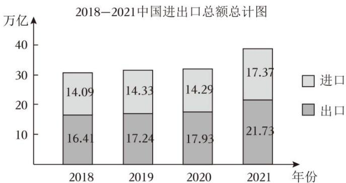
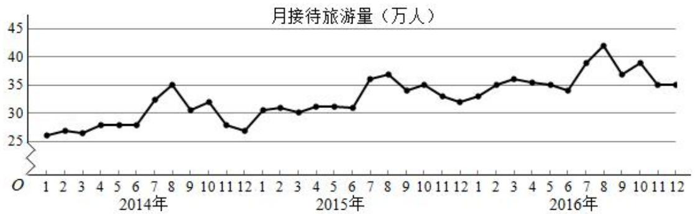
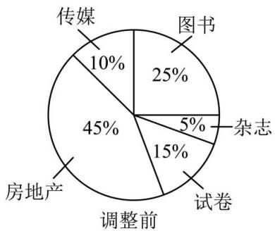
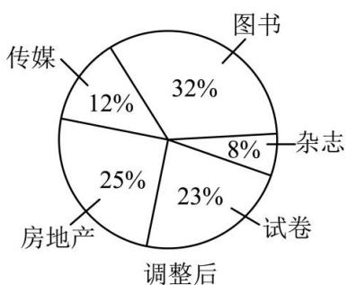
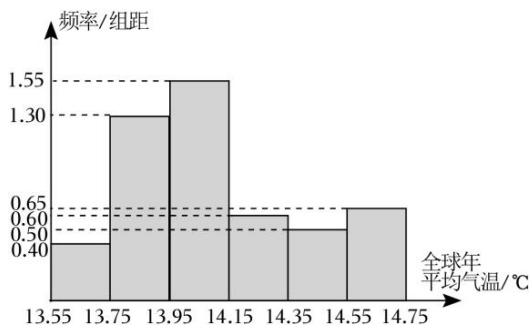
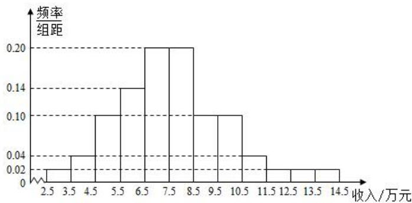
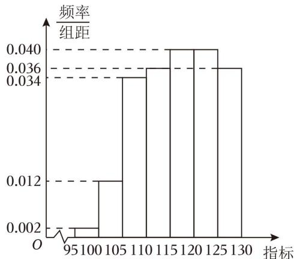
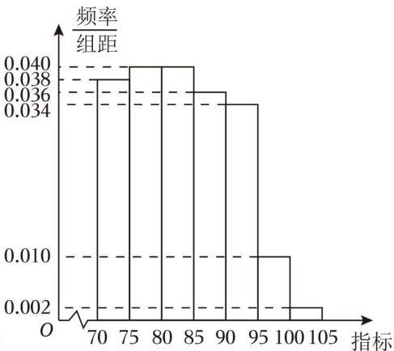
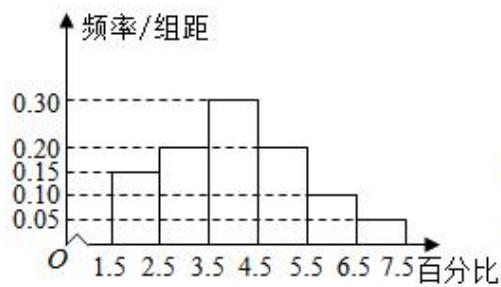
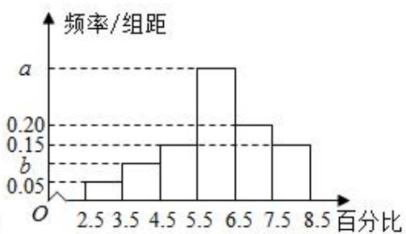

# 第 5 节 统计

# 知识点一、抽样

# 1、抽样调查

（1）总体：统计中所考察对象的某一数值指标的全体构成的集合称为总体.  
(2) 个体: 构成总体的每一个元素叫做个体.  
（3）样本：从总体中抽取若干个个体进行考察，这若干个个体所构成的集合叫做总体的一个样本，样本中个体的数目叫做样本容量.

# 2、简单随机抽样

# (1) 定义

一般地，设一个总体含有 N 个个体，从中逐个不放回地抽取 n 个个体作为样本 $(n \leq N)$ ，如果每次抽取时总体内的各个个体被抽到的机会都相等，就把这种抽样方法叫做简单随机抽样。这样抽取的样本，叫做简单随机样本。

# （2）两种常用的简单随机抽样方法

①抽签法：一般地，抽签法就是把总体中的 N 个个体编号，把号码写在号签上，将号签放在一个容器中，搅拌均匀后，每次从中抽取一个号签，连续抽取 n 次，就得到一个容量为 n 的样本.  
②随机数法: 即利用随机数表、随机数骰子或计算机产生的随机数进行抽样. 这里仅介绍随机数表法. 随机数表由数字 0, 1, 2, ..., 9 组成, 并且每个数字在表中各个位置出现的机会都是一样的.

注意：为了保证所选数字的随机性，需在查看随机数表前就指出开始数字的横、纵位置.

# （3）抽签法与随机数法的适用情况

抽签法适用于总体中个体数较少的情况，随机数法适用于总体中个体数较多的情况，但是当总体容量很大时，需要的样本容量也很大时，利用随机数法抽取样本仍不方便.

# （4）简单随机抽样的特征

①有限性：简单随机抽样要求被抽取的样本的总体个数是有限的，便于通过样本对总体进行分析.  
②逐一性：简单随机抽样是从总体中逐个地进行抽取，便于实践中操作.   
③不放回性：简单随机抽样是一种不放回抽样，便于进行有关的分析和计算.  
④等可能性：简单单随机抽样中各个个体被抽到的机会都相等，从而保证了抽样方法的公平.

只有四个特点都满足的抽样才是简单随机抽样.

# 3、分层抽样

# (1) 定义

一般地，在抽样时，将总体分成互不交叉的层，然后按照一定的比例，从各层独立地抽取一定数量的个体，将各层取出的个体合在一起作为样本，这种抽样方法叫做分层抽样.

分层抽样适用于已知总体是由差异明显的几部分组成的.

# (2) 分层抽样问题类型及解题思路

①求某层应抽个体数量：按该层所占总体的比例计算.   
②已知某层个体数量，求总体容量或反之求解：根据分层抽样就是按比例抽样，列比例式进行计算.  
③分层抽样的计算应根据抽样比构造方程求解，其中“抽样比= $\frac{样本容量}{总体容量}=\frac{各层样本数量}{各层个体数量}$ ”

注意：分层抽样时，每层抽取的个体可以不一样多，但必须满足抽取 $n_{i}=n\cdot\frac{N_{i}}{N}\quad(i=1,2,\cdots,k)$ 个个体（其中 i 是层数，n 是抽取的样本容量， $N_{i}$ 是第 i 层中个体的个数，N 是总体容量）.

# 知识点二、用样本估计总体

# 1、频率分布直方图

（1）频率、频数、样本容量的计算方法

① $\frac{频率}{组距}\times组距=频率.$   
② $\frac{频数}{样本容量}=频率,\quad\frac{频数}{频率}=样本容量,样本容量\times频率=频数.$   
③频率分布直方图中各个小方形的面积总和等于1.

# 2、频率分布直方图中数字特征的计算

(1) 最高的小长方形底边中点的横坐标即是众数.  
（2）中位数左边和右边的小长方形的面积和是相等的．设中位数为 x，利用 x 左（右）侧矩形面积之和等于 0.5，即可求出 x．  
（3）平均数是频率分布直方图的“重心”，等于频率分布直方图中每个小长方形的面积乘以小长方形底边中点的横坐标之和，即有 $\overline{x}=x_{1}p_{1}+x_{1}p_{1}+\cdots+x_{n}p_{n}$ ，其中 $x_{n}$ 为每个小长方形底边的中点， $p_{n}$ 为每个小长方形的面积.

# 3、百分位数

# (1) 定义

一组数据的第 $p$ 百分位数是这样一个值，它使得这组数据中至少有 $p\%$ 的数据小于或等于这个值，且至少有 $(100 - p)\%$ 的数据大于或等于这个值.

# (2) 计算一组 n 个数据的的第 p 百分位数的步骤

①按从小到大排列原始数据.  
②计算 $i=n\times p\%$ .  
③若 $i$ 不是整数而大于 $i$ 的比邻整数 $j$ ，则第 $p$ 百分位数为第 $j$ 项数据；若 $i$ 是整数，则第 $p$ 百分位数为第 $i$ 项与第 $i + 1$ 项数据的平均数.

# (3) 四分位数

我们之前学过的中位数，相当于是第50百分位数．在实际应用中，除了中位数外，常用的分位数还有第25百分位数，第75百分位数．这三个分位数把一组由小到大排列后的数据分成四等份，因此称为四分位数.

# 4、样本的数字特征

（1）众数、中位数、平均数

①众数：一组数据中出现次数最多的数叫众数，众数反应一组数据的多数水平.   
②中位数：将一组数据按大小顺序依次排列，把处在最中间位置的一个数据（或最中间两个数据的平均数）叫做这组数据的中位数，中位数反应一组数据的中间水平.  
③平均数：n 个样本数据 $x_{1}, x_{2}, \cdots, x_{n}$ 的平均数为 $\overline{x} = \frac{x_{1} + x_{2} + \cdots + x_{n}}{n}$ ，反应一组数据的平均水平，公式变形： $\sum_{i=1}^{n} x_{i} = n\overline{x}$ .

# 5、标准差和方差

(1) 定义

①标准差：标准差是样本数据到平均数的一种平均距离，一般用 s 表示．假设样本数据是 $x_{1}, x_{2}, \cdots, x_{n}$ ， $\overline{x}$ 表示这组数据的平均数，则标准差 $s = \sqrt{\frac{1}{n} \left[ (x_{1} - \overline{x})^{2} + (x_{2} - \overline{x})^{2} + \cdots + (x_{n} - \overline{x})^{2} \right]}$ .  
②方差：方差就是标准差的平方，即 $s^{2}=\frac{1}{n}\left[(x_{1}-\bar{x})^{2}+(x_{2}-\bar{x})^{2}+\cdots+(x_{n}-\bar{x})^{2}\right]$ 。显然，在刻画样本数据的分散程度上，方差与标准差是一样的。在解决实际问题时，多采用标准差。

(2) 数据特征

标准差、方差描述了一组数据围绕平均数波动程度的大小．标准差、方差越大，则数据的离散程度越大；标准差、方差越小，数据的离散程度越小．反之亦可由离散程度的大小推算标准差、方差的大小.

（3）平均数、方差的性质

如果数据 $x_{1}, x_{2}, \ldots, x_{n}$ 的平均数为 $\overline{x}$ ，方差为 $s^{2}$ ，那么

①一组新数据 $x_{1} + b, x_{2} + b, \ldots, x_{n} + b$ 的平均数为 $\overline{x} + b$ ，方差是 $s^{2}$ .  
②一组新数据 $ax_{1}, ax_{2}, \ldots, ax_{n}$ 的平均数为 $a\overline{x}$ ，方差是 $a^{2}s^{2}$ .  
③一组新数据 $ax_{1} + b, ax_{2} + b, \ldots, ax_{n} + b$ 的平均数为 $a\overline{x} + b$ ，方差是 $a^{2}s^{2}$ .

# 题型一 随机抽样、分层抽样

【例 1】现要完成下列 2 项抽样调查:

①从 10 盒酸奶中抽取 3 盒进行食品卫生检查；  
②东方中学共有 160 名教职工，其中教师 120 名，行政人员 16 名，后勤人员 24 名．为了了解教职工对学校在校务公开方面的意见，拟抽取一个容量为 20 的样本.

较为合理的抽样方法是（）

A. ①抽签法，②分层随机抽样

B. ①随机数法，②分层随机抽样

C. ①随机数法，②抽签法

D. ①抽签法， ②随机数法

【例 2】某工厂为了对产品质量进行严格把关，从 500 件产品中随机抽出 50 件进行检验，对这 500 件产品进行编号 001, 002, ..., 500，从下列随机数表的第二行第三组第一个数字开始，每次从左往右选取三个数字，则抽到第四件产品的编号为（）

<table><tr><td>2839</td><td>3125</td><td>8395</td><td>9524</td><td>7232</td><td>8995</td></tr><tr><td>7216</td><td>2884</td><td>3660</td><td>1073</td><td>4366</td><td>7575</td></tr><tr><td>9436</td><td>6118</td><td>4479</td><td>5140</td><td>9694</td><td>9592</td></tr><tr><td>6017</td><td>4951</td><td>4068</td><td>7516</td><td>3241</td><td>4782</td></tr></table>

A. 447

B. 366

C. 140

D. 118

【例 3】为了庆祝中国共产党第二十次全国代表大会，学校采用按比例分配的分层随机抽样的方法从高一1002人，高二1002人，高三1503人中抽取126人观看“中国共产党第二十次全国代表大会”直播，那么高三年级被抽取的人数为（）

A. 36

B. 42

C. 50

D. 54

# 题型二 统计图表

【例 1】（2023·上海）如图为 2017－2021 年上海市货物进出口总额的条形统计图，则下列对于进出口贸易额描述错误的是（）

bar_stacked

2018-2021中国进出口总额总计图
| 年份 | 进口 (万亿) | 出口 (万亿) |
|---|---|---|
| 2018 | 14.09 | 16.41 |
| 2019 | 14.33 | 17.24 |
| 2020 | 14.29 | 17.93 |
| 2021 | 17.37 | 21.73 |

A. 从 2018 年开始, 2021 年的进出口总额增长率最大  
B. 从 2018 年开始, 进出口总额逐年增大  
C. 从 2018 年开始, 进口总额逐年增大  
D. 从 2018 年开始, 2020 年的进出口总额增长率最小

【例 2】（2017·新课标III）某城市为了解游客人数的变化规律，提高旅游服务质量，收集并整理了2014年1月至2016年12月期间月接待游客量（单位：万人）的数据，绘制了下面的折线图.

line

| Month | 月接待旅游量 (万人) |
|-------|---------------------|
| 1     | 26                  |
| 2     | 27                  |
| 3     | 26                  |
| 4     | 28                  |
| 5     | 28                  |
| 6     | 28                  |
| 7     | 32                  |
| 8     | 35                  |
| 9     | 30                  |
| 10    | 32                  |
| 11    | 28                  |
| 12    | 26                  |
| 1     | 30                  |
| 2     | 31                  |
| 3     | 30                  |
| 4     | 31                  |
| 5     | 31                  |
| 6     | 31                  |
| 7     | 36                  |
| 8     | 37                  |
| 9     | 34                  |
| 10    | 35                  |
| 11    | 33                  |
| 12    | 32                  |
| 1     | 33                  |
| 2     | 35                  |
| 3     | 36                  |
| 4     | 35                  |
| 5     | 35                  |
| 6     | 34                  |
| 7     | 39                  |
| 8     | 42                  |
| 9     | 37                  |
| 10    | 39                  |
| 11    | 35                  |
| 12    | 35                  |

根据该折线图，下列结论错误的是()

A. 月接待游客量逐月增加  
B. 年接待游客量逐年增加  
C. 各年的月接待游客量高峰期大致在 7,8 月  
D. 各年 1 月至 6 月的月接待游客量相对于 7 月至 12 月，波动性更小，变化比较平稳

【例 3】（多选题）某公司经营五种产业，为应对市场变化，在五年前进行了产业结构调整，优化后的产业结构使公司总利润不断增长，今年总利润比五年前增加了一倍，调整前后的各产业利润与总利润的占比如图所示，则下列结论错误的是（）

pie

| 类别 | 占比 (%) |
|---|---|
| 图书 | 25 |
| 杂志 | 5 |
| 试卷 | 15 |
| 房地产 | 45 |
| 传媒 | 10 |

pie

| 类别 | 占比 (%) |
|---|---|
| 图书 | 32 |
| 杂志 | 8 |
| 试卷 | 23 |
| 调整后 | 25 |
| 房地产 | 12 |

A. 调整后传媒的利润增量小于杂志  
B. 调整后房地产的利润有所下降   
C. 调整后试卷的利润增加不到一倍  
D. 调整后图书的利润增长了一倍以上

# 题型三 频率分布直方图

频率分布直方图的数字特征

1. 众数: 最高矩形的底边中点的横坐标.  
2. 中位数: 中位数左边和右边的矩形的面积和应该相等.

3. 平均数: 平均数在频率分布直方图中等于各组区间的中点值与对应频率之积的和.

【例 1】（2022·天津）将 1916 年到 2015 年的全球年平均气温（单位：°C），共 100 个数据，分成 6 组 [13.55, 13.75)，[13.75, 13.95)，[13.95, 14.15)，[14.15, 14.35)，[14.35, 14.55)，[14.55, 14.75]，并整理得到如下的频率分布直方图，则全球年平均气温在区间 [14.35, 14.75] 内的有（）

histogram

| 全球年平均气温 (℃) | 频率/组距 |
|---|---|
| 13.55 | 0.40 |
| 13.75 | 1.30 |
| 13.95 | 1.55 |
| 14.15 | 0.60 |
| 14.35 | 0.50 |
| 14.55 | 0.60 |
| 14.75 | 0.60 |

A. 22 年  
B. 23 年  
C. 25 年  
D. 35 年

【例 2】（2021·甲卷）为了解某地农村经济情况，对该地农户家庭年收入进行抽样调查，将农户家庭年收入的调查数据整理得到如下频率分布直方图：

histogram

| 收入/万元 | 频率/组距 |
|---|---|
| 2.5 | 0.02 |
| 3.5 | 0.04 |
| 4.5 | 0.10 |
| 5.5 | 0.14 |
| 6.5 | 0.20 |
| 7.5 | 0.20 |
| 8.5 | 0.10 |
| 9.5 | 0.10 |
| 10.5 | 0.04 |
| 11.5 | 0.02 |
| 12.5 | 0.02 |
| 13.5 | 0.02 |
| 14.5 | 0.02 |

根据此频率分布直方图，下面结论中不正确的是()

A. 该地农户家庭年收入低于 4.5 万元的农户比率估计为 $6 \%$   
B. 该地农户家庭年收入不低于 10.5 万元的农户比率估计为 $10\%$   
C. 估计该地农户家庭年收入的平均值不超过 6.5 万元  
D. 估计该地有一半以上的农户, 其家庭年收入介于 4.5 万元至 8.5 万元之间

【例 3】（2023·新高考Ⅱ）某研究小组经过研究发现某种疾病的患病者与未患病者的某项医学指标有明显差异，经过大量调查，得到如下的患病者和未患病者该指标的频率分布直方图：

histogram

| 指标 | 频率/组距 |
| :--- | :--- |
| 95-100 | 0.002 |
| 105-110 | 0.012 |
| 110-115 | 0.036 |
| 115-120 | 0.040 |
| 125-130 | 0.036 |
频率组距范围：0.034至0.040

患病者

histogram

| 指标 | 频率/组距 |
| :--- | :--- |
| 70-75 | 0.038 |
| 75-80 | 0.040 |
| 80-85 | 0.036 |
| 85-90 | 0.034 |
| 90-95 | 0.010 |
| 95-100 | 0.002 |
| 100-105 | 0.002 |

未患病者

利用该指标制定一个检测标准，需要确定临界值 $c$ ，将该指标大于 $c$ 的人判定为阳性，小于或等于 $c$ 的人判定为阴性，此检测标准的漏诊率是将患病者判定为阴性的概率，记为 $p$ （c）；误诊率是将未患病者判定为阳性的概率，记为 $q$ （c）。假设数据在组内均匀分布，以事件发生的频率作为相应事件发生的概率。

（1）当漏诊率 $p$ （c）=0.5%时，求临界值 $c$ 和误诊率 $q$ （c）；

（2）设函数 $f(\mathbf{c}) = p(\mathbf{c}) + q(\mathbf{c})$ 。当 $c \in [95, 105]$ ，求 $f(\mathbf{c})$ 的解析式，并求 $f(\mathbf{c})$ 在区间[95，105]的最小值。

# 题型四 百分位数

【例 1】以下数据为参加数学竞赛决赛的 15 人的成绩（单位：分），分数从低到高依次：56,70,72,78,79,80,81,83,84,86,88,90,91,94,98，则这 15 人成绩的第 80 百分位数是 \_\_\_\_.

【例 2】为了养成良好的运动习惯，某人记录了自己一周内每天的运动时长（单位：分钟），分别为 53，57，45，61，79，49，x，若这组数据的第 80 百分位数与第 60 百分位数的差为 3，则 x = （）

A. 58 或 64

B. 59 或 64

C. 58

D. 59

# 题型五 样本的数字特征

1. 平均数、中位数、众数描述其集中趋势，方差和标准差描述波动大小.

2. 方差的简化计算公式: $s^2 = \frac{1}{n} \left[ \left( x_1^2 + x_2^2 + \cdots + x_n^2 \right) - n\overline{x}^2 \right]$ 或写成 $s^2 = \frac{1}{n} \left( x_1^2 + x_2^2 + \cdots + x_n^2 \right) - \overline{x}^2$ ，即方差等于原数据平方的平均数减去平均数的平方.

【例 1】（2017•新课标 I •多选）为评估一种农作物的种植效果，选了 n 块地作试验田．这 n 块地的亩产量（单位：kg）分别是 $x_{1}, x_{2}, \ldots, x_{n}$ ，下面给出的指标中可以用来评估这种农作物亩产量稳定程度的是（）

A. $x_{1}, x_{2}, \ldots, x_{n}$ 的平均数

B. $x_{1}$ ， $x_{2}$ ，…， $x_{n}$ 的标准差

C. $x_{1}, x_{2}, \ldots, x_{n}$ 的最大值

D. $x_{1}, x_{2}, \ldots, x_{n}$ 的中位数

【例 2】（2021•新高考Ⅱ•多选）下列统计量中，能度量样本 $x_{1}$ ， $x_{2}$ ，…， $x_{n}$ 的离散程度的有（）

A. 样本 $x_{1}, x_{2}, \ldots, x_{n}$ 的标准差

B. 样本 $x_{1}, x_{2}, \ldots, x_{n}$ 的中位数

C. 样本 $x_{1}, x_{2}, \ldots, x_{n}$ 的极差

D. 样本 $x_{1}$ , $x_{2}$ , ..., $x_{n}$ 的平均数

【例 3】（2023·新高考 I·多选）有一组样本数据 $x_{1}$ ， $x_{2}$ ，…， $x_{6}$ ，其中 $x_{1}$ 是最小值， $x_{6}$ 是最大值，则（）

A. $x_{2}$ , $x_{3}$ , $x_{4}$ , $x_{5}$ 的平均数等于 $x_{1}$ , $x_{2}$ , $\cdots$ , $x_{6}$ 的平均数

B. $x_{2}$ , $x_{3}$ , $x_{4}$ , $x_{5}$ 的中位数等于 $x_{1}$ , $x_{2}$ , $\cdots$ , $x_{6}$ 的中位数

C. $x_{2}$ , $x_{3}$ , $x_{4}$ , $x_{5}$ 的标准差不小于 $x_{1}$ , $x_{2}$ , $\cdots$ , $x_{6}$ 的标准差

D. $x_{2}$ , $x_{3}$ , $x_{4}$ , $x_{5}$ 的极差不大于 $x_{1}$ , $x_{2}$ , $\cdots$ , $x_{6}$ 的极差

【例 4】(多选题)有一组样本数据: $x_{1}, x_{2}, \cdots, x_{8}$ ，其平均数为 2，由这组样本数据得到新样本数据: $x_{1}, x_{2}, \cdots, x_{8}, 2$ ，那么这两组样本数据一定有相同的（）

A. 平均数

B. 中位数

C. 方差

D. 极差

# 题型六 分层方差问题

分层随机抽样的方差：设样本容量为 n，平均数为 $\overline{x}$ ，其中两层的个体数量分别为 $n_{1}, n_{2}$ ，两层的平均数分别为 $\overline{x}_{1}$ ， $\overline{x}_{2}$ ，方差分别为 $s_{1}^{2}, s_{2}^{2}$ ，则这个样本的方差为 $s^{2} = \frac{n_{1}}{n} \left[ s_{1}^{2} + \left( \overline{x}_{1} - \overline{x} \right)^{2} \right] + \frac{n_{2}}{n} \left[ s_{2}^{2} + \left( \overline{x}_{2} - \overline{x} \right)^{2} \right]$ .

【例 1】某车间有甲、乙两台机床同时加工直径为100 cm的零件，为检验质量，从中各抽取6件，测得甲、乙两组数据的均值为 $\overline{x_{甲}}=\overline{x_{乙}}=100$ ，两组数据的方差分别为 $s_{甲}^{2}=\frac{7}{3}$ ， $s_{乙}^{2}=1$ ，则估计该车间这批零件的直径的方差 $s^{2}=$ \_\_\_\_.

【例 2】某校高三年级有男生 400 人和女生 600 人，为分析期末物理调研测试成绩，按照男女比例通过分层随机抽样的方法取到一个样本，样本中男生的平均成绩为 80 分，方差为 10，女生的平均成绩为 60 分，方差为 20，由此可以估计该校高三年级期末物理调研测试成绩的方差为 \_\_\_\_.

【例 3】湖州地区甲、乙、丙三所学科基地学校的数学强基小组人数之比为3:2:1，三所学校共有数学强基学生48人，在一次统一考试中，所有学生的成绩平均分为117，方差为21.5．已知甲、乙两所学校的数学强基小组学生的平均分分别为118和114，方差分别为15和21，则丙学校的学生成绩的方差是\_\_\_\_．

# 题型七 利用样本的数字特征解决优化决策问题

【例 1】（2021·乙卷）某厂研制了一种生产高精产品的设备，为检验新设备生产产品的某项指标有无提高，用一台旧设备和一台新设备各生产了 10 件产品，得到各件产品该项指标数据如下：

<table><tr><td>旧设备</td><td>9.8</td><td>10.3</td><td>10.0</td><td>10.2</td><td>9.9</td><td>9.8</td><td>10.0</td><td>10.1</td><td>10.2</td><td>9.7</td></tr><tr><td>新设备</td><td>10.1</td><td>10.4</td><td>10.1</td><td>10.0</td><td>10.1</td><td>10.3</td><td>10.6</td><td>10.5</td><td>10.4</td><td>10.5</td></tr></table>

旧设备和新设备生产产品的该项指标的样本平均数分别记为 $\overline{x}$ 和 $\overline{y}$ ，样本方差分别记为 $s_1^2$ 和 $s_2^2$ .

（1）求 $\overline{x}$ ， $\overline{y}$ ， $s_{1}^{2}$ ， $s_{2}^{2}$ ；  
（2）判断新设备生产产品的该项指标的均值较旧设备是否有显著提高（如果 $\bar{y}-\bar{x}\geqslant2\sqrt{\frac{s_{1}^{2}+s_{2}^{2}}{10}}$ ，则认为新设备生产产品的该项指标的均值较旧设备有显著提高，否则不认为有显著提高）.

【例 2】（2019•新课标III）为了解甲、乙两种离子在小鼠体内的残留程度，进行如下试验：将 200 只小鼠随机分成 A 、 B 两组，每组 100 只，其中 A 组小鼠给服甲离子溶液，B 组小鼠给服乙离子溶液．每只小鼠给服的溶液体积相同、摩尔浓度相同．经过一段时间后用某种科学方法测算出残留在小鼠体内离子的百分比．根据试验数据分别得到如图直方图：

histogram

| 百分比 | 频率/组距 |
| :--- | :--- |
| 1.5 | 0.15 |
| 2.5 | 0.20 |
| 3.5 | 0.30 |
| 4.5 | 0.20 |
| 5.5 | 0.10 |
| 6.5 | 0.05 |
| 7.5 | 0.05 |

甲离子残留百分比直方图

histogram

| 百分比 | 频率/组距 |
|---|---|
| 2.5 | 0.05 |
| 3.5 | 0.10 |
| 4.5 | 0.15 |
| 5.5 | 0.20 |
| 6.5 | 0.18 |
| 7.5 | 0.15 |
| 8.5 | 0.12 |

乙离子残留百分比直方图

记 C 为事件：“乙离子残留在体内的百分比不低于 5.5”，根据直方图得到 P（C）的估计值为 0.70.

（1）求乙离子残留百分比直方图中 a，b 的值；  
（2）分别估计甲、乙离子残留百分比的平均值（同一组中的数据用该组区间的中点值为代表）.

【例 3】（2019·新课标Ⅱ）某行业主管部门为了解本行业中小企业的生产情况，随机调查了 100 个企业，得到这些企业第一季度相对于前一年第一季度产值增长率 y 的频数分布表.

<table><tr><td>y的分组</td><td>[-0.20, 0)</td><td>[0, 0.20)</td><td>[0.20, 0.40)</td><td>[0.40, 0.60)</td><td>[0.60, 0.80)</td></tr><tr><td>企业数</td><td>2</td><td>24</td><td>53</td><td>14</td><td>7</td></tr></table>

（1）分别估计这类企业中产值增长率不低于40%的企业比例、产值负增长的企业比例；

(2) 求这类企业产值增长率的平均数与标准差的估计值（同一组中的数据用该组区间的中点值为代表）。（精确到 0.01）

附： $\sqrt{74}\approx 8.602$

【例 4】为了监控某种装件的一条生产线的生产过程，检验员每天从该生产线上随机抽取 16 个零件，并测量其尺寸（单位：cm）。其中 $\bar{x}$ 元近似为样本平均数，s 近似为样本的标准差，用样本平均数 $\bar{x}$ 和标准差 s 能够反映数据取值的信息。根据长期生产经验，一天内抽检零件中，如果出现了尺寸在 $(\bar{x}-3s, \bar{x}+3s)$ 之外的零件，就认为这条生产线在这一天的生产过程可能出现了异常情况，需对当天的生产过程进行检查。下面是检验员在一天内抽取的 16 个零件的尺寸：

<table><tr><td>9.9</td><td>10.1</td><td>10.2</td><td>10.2</td><td>9.9</td><td>9.8</td><td>10.1</td><td>10</td></tr><tr><td>10.2</td><td>10.3</td><td>9.1</td><td>10.1</td><td>9.9</td><td>9.9</td><td>10.1</td><td>10.2</td></tr></table>

经计算得

$$
\bar {x} = \frac {1}{1 6} \sum_ {i = 1} ^ {1 6} x _ {i} = 1 0, s = \sqrt {\frac {1}{1 6} \sum_ {i = 1} ^ {1 6} \left(x _ {i} - \bar {x} ^ {-}\right) ^ {2}} = \sqrt {\frac {1}{1 6} \left(\sum_ {i = 1} ^ {1 6} x _ {i} ^ {2} - 1 6 x ^ {- 2}\right)} \approx 0. 2 8 0, 1 6 \times 0. 2 8 ^ {2} \approx
$$

$1.25,15\times10.06^{2}\approx1518.05,\sqrt{0.026}\approx0.16$ ，其中 $x_{i}$ 为抽取的第i个零件的尺寸， $i=1,2,\cdots,16$

(1)利用估计值判断是否需对当天的生产过程进行检查?

(2)剔除 $(\overline{x}-3s,\overline{x}+3s)$ 之外的数据，用剩下的数据估计样本平均数 $\overline{x}$ 和样本标准差s（精确到0.01）.

