# 第五节 跟踪训练

题型 1

【训练 1】已知某班共有学生 46 人，该班语文老师为了了解学生每天阅读课外书籍的时长情况，决定利用随机数表法从全班学生中抽取 10 人进行调查。将 46 名学生按 01, 02, ..., 46 进行编号。现提供随机数表的第 7 行至第 9 行：

84 42 17 53 31 57 24 55 06 88 77 04 74 47 67 21 76 33 50 25 83 92 12 06 76

63 01 63 78 59 16 95 56 57 19 98 10 50 71 75 12 86 73 58 07 44 39 52 38 79

33 21 12 34 29 78 64 56 07 82 52 42 07 44 38 15 51 00 13 42 99 66 02 79 54

若从表中第 7 行第 41 列开始向右依次读取 2 个数据，每行结束后，下一行依然向右读数，则得到的第 8 个样本编号是（）

A. 07

B. 12

C. 39

D. 44

【训练 2】（2018•新课标III）某公司有大量客户，且不同年龄段客户对其服务的评价有较大差异．为了解客户的评价，该公司准备进行抽样调查，可供选择的抽样方法有简单随机抽样、分层抽样和系统抽样，则最合适的抽样方法是\_\_\_\_．

【训练 3】（2017·江苏）某工厂生产甲、乙、丙、丁四种不同型号的产品，产量分别为 200, 400, 300, 100 件．为检验产品的质量，现用分层抽样的方法从以上所有的产品中抽取 60 件进行检验，则应从丙种型号的产品中抽取\_\_\_\_件．

【训练 4】某校共 2017 名学生，其中每名学生至少要选 A, B 两门课中的一门，也有些学生选了两门课。已知选 A 的人数占全校人数的百分比在 70% 到 75% 之间，选 B 的人数占全校人数的百分比在 40% 到 45% 之间。则下列结论中正确的是（）

A. 同时选 $A, B$ 的可能有 200 人

B. 同时选 $A, B$ 的可能有 300 人

C. 同时选 $A, B$ 的可能有 400 人

D. 同时选 $A, B$ 的可能有 500 人

题型 2

【训练 1】（多选题）2022 年的夏季，全国多地迎来罕见极端高温天气。某课外小组通过当地气象部门统计了当地七月份前 20 天每天的最高气温与最低气温，得到如下图表，则根据图表，下列判断正确的是（）

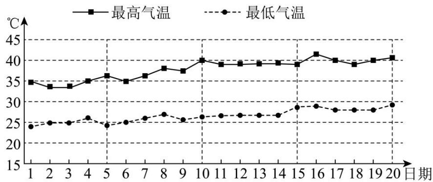

line

| 日期 | 最高气温 (°C) | 最低气温 (°C) |
| ---- | ------------- | ------------- |
| 1    | 35            | 24            |
| 2    | 34            | 25            |
| 3    | 34            | 25            |
| 4    | 35            | 26            |
| 5    | 36            | 24            |
| 6    | 35            | 25            |
| 7    | 36            | 26            |
| 8    | 38            | 27            |
| 9    | 37            | 26            |
| 10   | 40            | 27            |
| 11   | 39            | 27            |
| 12   | 39            | 27            |
| 13   | 39            | 27            |
| 14   | 39            | 27            |
| 15   | 39            | 29            |
| 16   | 41            | 29            |
| 17   | 40            | 28            |
| 18   | 39            | 28            |
| 19   | 40            | 28            |
| 20   | 40            | 29            |

A. 七月份前 20 天最低气温的中位数低于 $25^{\circ} \mathrm{C}$   
B. 七月份前 20 天中最高气温的极差大于最低气温的极差  
C. 七月份前 20 天最高气温的平均数高于 $40^{\circ} \mathrm{C}$   
D. 七月份前 10 天（1—10 日）最高气温的方差大于最低气温的方差

【训练 2】（多选题）恩格尔系数是食品支出总额占个人消费支出总额的比重，它在一定程度上可以用来反映人民生活水平．恩格尔系数的一般规律：收入越低的家庭，恩格尔系数就越大；收入越高的家庭，恩格尔系数就越小．国际上一般认为，当恩格尔系数大于 0.6 时，居民生活处于贫困状态；在 0.5-0.6 之间，居民生活水平处于温饱状态；在 0.4-0.5 之间，居民生活水平达到小康；在 0.3-0.4 之间，居民生活水平处于富裕状态；当小于 0.3 时，居民生活达到富有．下面是某地区 2022 年两个统计图，它们分别为城乡居民恩格尔系数统计图和城乡居民家庭人均可支配收入统计图，请你依据统计图进行分析判断，下列结论错误的是（）

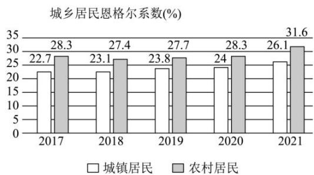

bar

城乡居民恩格尔系数(%)
| 年份 | 城镇居民 (%) | 农村居民 (%) |
|---|---|---|
| 2017 | 22.7 | 28.3 |
| 2018 | 23.1 | 27.4 |
| 2019 | 23.8 | 27.7 |
| 2020 | 24 | 28.3 |
| 2021 | 26.1 | 31.6 |

图1

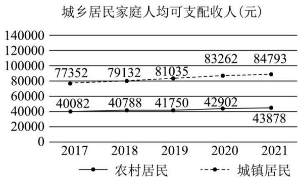

line

城乡居民家庭人均可支配收人(元)
| 年份 | 农村居民 (元) | 城镇居民 (元) |
|---|---|---|
| 2017 | 40082 | 77352 |
| 2018 | 40788 | 79132 |
| 2019 | 41750 | 81035 |
| 2020 | 42902 | 83262 |
| 2021 | 43878 | 84793 |

图2

A. 农村居民自 2017 年到 2021 年，居民生活均达到富有  
B. 近五年城乡居民家庭人均可支配收入差异最大的年份是 2020 年  
C. 城乡居民恩格尔系数差异最小的年份是 2019 年  
D. 2022 年该地区城镇居民和农村居民的生活水平已经全部处于富有状态

【训练3】（多选题）某调查机构对我国若干大型科技公司进行调查统计，得到了从事芯片、软件两个行业从业者的年龄分布的饼形图和“90后”从事这两个行业的岗位分布雷达图，则下列说法中一定正确的是（）

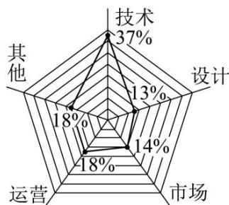

radar

| Category | Percentage (%) |
|---|---|
| 技术 | 37 |
| 设计 | 13 |
| 市场 | 14 |
| 运营 | 18 |
| 其他 | 18 |

90后从事芯片、软件行业岗位的分布

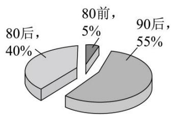

pie

| Category | Percentage (%) |
|---|---|
| 80后 | 40 |
| 90后 | 55 |
| 80前 | 5 |
The chart displays the proportional distribution of three categories: '80后', '90后', and '80前'. The values for '80后' and '90后' are explicitly labeled on the slices, while the other two categories are not explicitly labeled but visually represented as smaller slices. The chart lacks a title or axis labels beyond the percentage values.

芯片、软件行业从业者年龄分布

A. 芯片、软件行业从业者中，“90后”占总人数的比例超过 $50 \%$   
B. 芯片、软件行业中从事技术、设计岗位的“90后”人数超过总人数的 $25 \%$   
C. 芯片、软件行业从事技术岗位的人中，“90后”比“80后”多  
D. 芯片、软件行业中，“90后”从事市场岗位的人数比“80前”的总人数多

# 题型3

【训练 1】（2020·天津）从一批零件中抽取 80 个，测量其直径（单位：mm），将所得数据分为 9 组：[5.31, 5.33)，[5.33, 5.35)，…，[5.45, 5.47)，[5.47, 5.49]，并整理得到如下频率分布直方图，则在被抽取的零件中，直径落在区间 [5.43, 5.47) 内的个数为（）

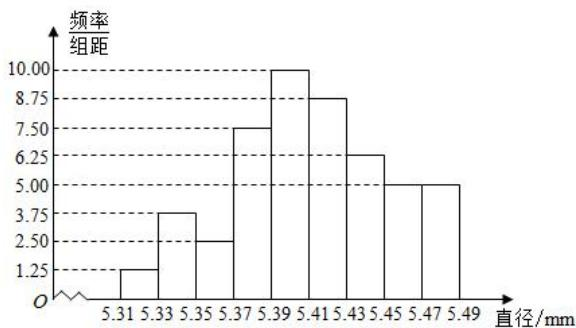

histogram

| 直径/mm | 频率/组距 |
|---|---|
| 5.31 | 1.25 |
| 5.33 | 3.75 |
| 5.35 | 2.50 |
| 5.37 | 7.50 |
| 5.39 | 10.00 |
| 5.41 | 8.75 |
| 5.43 | 6.25 |
| 5.45 | 5.00 |
| 5.47 | 5.00 |
| 5.49 | 0 |

A. 10

B. 18

C. 20

D. 36

【训练 2】从某小学所有学生中随机抽取 100 名学生，将他们的身高（单位：cm）数据绘制成频率分布直方图（如图），其中样本数据分组[100,110)，[110,120)，[120,130)，[130,140)，[140,150)，若要从身高在[120,130)，[130,140)，[140,150)三组内的学生中，用分层抽样的方法抽取 12 人参加一项活动，则从身高在[130,140)内的学生中抽取的人数应为\_\_\_\_。

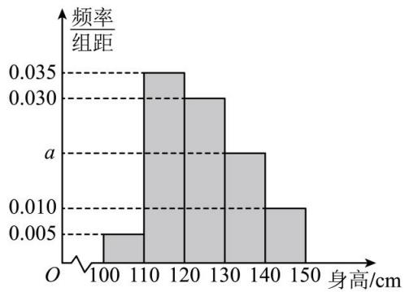

histogram

| 身高/cm | 频率/组距 |
| :--- | :--- |
| 100-110 | 0.005 |
| 110-120 | 0.035 |
| 120-130 | 0.030 |
| 130-140 | 0.020 |
| 140-150 | 0.010 |

【训练 3】（2022·新高考Ⅱ）在某地区进行流行病学调查，随机调查了 100 位某种疾病患者的年龄，得到如下的样本数据的频率分布直方图：

（1）估计该地区这种疾病患者的平均年龄（同一组中的数据用该组区间的中点值为代表）；  
（2）估计该地区一位这种疾病患者的年龄位于区间[20，70)的概率；  
（3）已知该地区这种疾病患者的患病率为 $0.1\%$ ，该地区年龄位于区间[40，50)的人口占该地区总人口的 $16\%$ ．从该地区中任选一人，若此人的年龄位于区间[40，50)，求此人患这种疾病的概率（以样本数据中患者的年龄位于各区间的频率作为患者的年龄位于该区间的概率，精确到0.0001）.

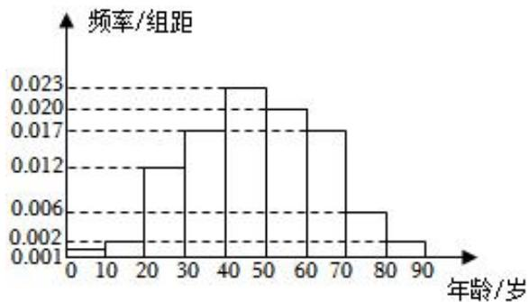

histogram

| 年龄/岁 | 频率/组距 |
|---|---|
| 0-10 | 0.001 |
| 10-20 | 0.002 |
| 20-30 | 0.012 |
| 30-40 | 0.017 |
| 40-50 | 0.023 |
| 50-60 | 0.020 |
| 60-70 | 0.017 |
| 70-80 | 0.006 |
| 80-90 | 0.002 |

题型 4

【训练 1】国庆节前夕，某市举办以“红心颂党恩、喜迎二十大”为主题的青少年学生演讲比赛，其中 10 人比赛的成绩从低到高依次为：85, 86, 88, 88, 89, 90, 92, 93, 94, 98（单位：分），则这 10 人成绩的第 75 百分位数是\_\_\_\_。

【训练 2】已知一组数据：24，30，40，44，48，52.则这组数据的第30百分位数、第50百分位数的平均数为\_\_\_\_。

【训练 3】某校为了了解高三年级学生的身体素质状况，在开学初举行了一场身体素质体能测试，以便对体能不达标的学生进行有针对性的训练，促进他们体能的提升，现从整个年级测试成绩中抽取 100 名学生的测试成绩，并把测试成绩分成 $[40,50), [50,60), [60,70), [70,80), [80,90), [90,100]$ 六组，绘制成频率分布直方图（如图所示）.其中分数在 $[90,100]$ 这一组中的纵坐标为 $a$ ，则该次体能测试成绩的 $80\%$ 分位数约为 \_\_\_\_ 分.

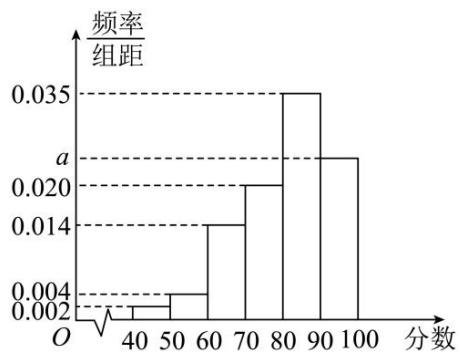

histogram

| 分数 | 频率/组距 |
| :--- | :--- |
| 40-50 | 0.002 |
| 50-60 | 0.004 |
| 60-70 | 0.014 |
| 70-80 | 0.020 |
| 80-90 | 0.035 |
| 90-100 | 0.022 |

题型 5

【训练 1】（2020•新课标III）设一组样本数据 $x_{1}$ ， $x_{2}$ ，…， $x_{n}$ 的方差为 0.01，则数据 $10x_{1}$ ， $10x_{2}$ ，…， $10x_{n}$ 的方差为（）

A. 0.01

B. 0.1

C. 1

D. 10

【训练 2】(2020•新课标III) 在一组样本数据中, 1, 2, 3, 4 出现的频率分别为 $p_{1}, p_{2}, p_{3}, p_{4}$ , 且 $\sum_{i=1}^{4} p_{i} = 1$ , 则下面四种情形中, 对应样本的标准差最大的一组是 ( )

A. $p_1 = p_4 = 0.1, p_2 = p_3 = 0.4$

B. $p_1 = p_4 = 0.4, p_2 = p_3 = 0.1$

C. $p_{1}=p_{4}=0.2,\quad p_{2}=p_{3}=0.3$

D. $p_1 = p_4 = 0.3$ ， $p_2 = p_3 = 0.2$

【训练 3】（2021•新高考 I • 多选）有一组样本数据 $x_{1}$ ， $x_{2}$ ，…， $x_{n}$ ，由这组数据得到新样本数据 $y_{1}$ ， $y_{2}$ ，…， $y_{n}$ ，其中 $y_{i}=x_{i}+c(i=1,2,\ldots,n)$ ，c 为非零常数，则（）

A. 两组样本数据的样本平均数相同

B. 两组样本数据的样本中位数相同

C. 两组样本数据的样本标准差相同

D. 两组样本数据的样本极差相同

【训练 4】（2024·上海）水果分为一级果和二级果，共 136 箱，其中一级果 102 箱，二级果 34 箱.

（1）随机挑选两箱水果，求恰好一级果和二级果各一箱的概率；

（2）进行分层抽样，共抽8箱水果，求一级果和二级果各几箱；

(3) 抽取若干箱水果, 其中一级果共 120 个, 单果质量平均数为 $303.45$ 克, 方差为 $603.46$ ; 二级果 48 个, 单果质量平均数为 $240.41$ 克, 方差为 $648.21$ ; 求 168 个水果的方差和平均数, 并预估果园中单果的质量.

题型 6

【训练 1】某校有高一学生 1000 人，其中男生 600 人，女生 400 人，为了获取学生身高信息，采用男、女按比例分配分层抽样的方法抽取样本 50 人，并观测样本的指标值（单位：cm），计算得男生样本的均值为 170，方差为 20，女生样本的均值为 160，方差为 30，据此估计该校高一年级学生身高的总体方差为\_\_\_\_。

【训练 2】为调查某地区中学生每天睡眠时间, 采用样本量比例分配的分层随机抽样, 现抽取初中生 800 人, 其每天睡眠时间均值为 9 小时, 方差为 0.5 , 抽取高中生 1200 人, 其每天睡眠时间均值为 8 小时, 方差为 1 , 则估计该地区中学生每天睡眠时间的方差为 \_\_\_\_.

【训练 3】某校教师男女人数之比为 5:4，该校所有教师进行 1 分钟限时投篮比赛．现记录了每个教师 1 分钟命中次数，已知男教师命中次数的平均数为 17，方差为 16，女教师命中次数的平均数为 8，方差为 16，那么全体教师 1 分钟限时投篮次数的方差为 \_\_\_\_.

题型 7

【训练 1】某工厂的工人生产内径为 28.50mm 的一种零件，为了了解零件的生产质量，在某次抽检中，从该厂的 1000 个零件中抽出 60 个，测得其内径尺寸（单位：mm）如下：

$$
2 8. 5 1 \times 1 3 \quad 2 8. 5 2 \times 6 \quad 2 8. 5 0 \times 4 \quad 2 8. 4 8 \times 1 1
$$

$$
2 8. 4 9 \times p \quad 2 8. 5 4 \times 1 \quad 2 8. 5 3 \times 7 \quad 2 8. 4 7 \times q
$$

这里用 $x \times n$ 表示有 $n$ 个尺寸为 $xmm$ 的零件， $p$ ， $q$ 均为正整数。若从这60个零件中随机抽取1个，则这个零件的内径尺寸小于 $28.49mm$ 的概率为 $\frac{4}{15}$ 。

（1）求 p，q 的值.  
（2）已知这60个零件内径尺寸的平均数为 $\bar{x} mm$ ，标准差为 $smm$ ，且 $s = 0.02$ ，在某次抽检中，若抽取的零件中至少有 $80\%$ 的零件内径尺寸在 $[\bar{x} - s, \bar{x} + s]$ 内，则称本次抽检的零件合格．试问这次抽检的零件是否合格？说明你的理由.

【训练 2】《中国制造 2025》提出 “节能与新能源汽车” 作为重点发展领域，这为我国节能与新能源汽车产业发展指明了方向，某新能源汽车生产商为了提升产品质量，对某款汽车的某项指标进行检测后，频率分布直方图如图所示：

（1）求该项指标的第 30 百分位数；  
(2)若利用该指标制定一个标准,需要确定临界值 x , 将该指标小于 x 的汽车认为符合节能要求,已知 $x \in [90, 100]$ ，以事件发生的频率作为相应事件发生的概率，求该款汽车符合节能要求的概率 $f(x)$ .

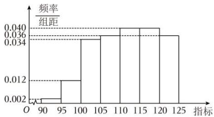

histogram

| 指标 | 频率/组距 |
|---|---|
| 90-95 | 0.002 |
| 95-100 | 0.012 |
| 100-105 | 0.036 |
| 105-110 | 0.040 |
| 110-115 | 0.040 |
| 115-120 | 0.036 |
| 120-125 | 0.036 |

【训练3】滨海盐碱地是我国盐碱地的主要类型之一，如何利用更有效的方法改造这些宝贵的土地资源，成为摆在我们面前的世界级难题。对盐碱的治理方法，研究人员在长期的实践中获得了两种成本差异不大，且能降低滨海盐碱地 $30 \sim 60cm$ 土壤层可溶性盐含量的技术，为了对比两种技术治理盐碱的效果，科研人员在同一区域采集了12个土壤样本，平均分成 $A$ 、 $B$ 两组，测得 $A$ 组土壤可溶性盐含量数据样本平均数 $\overline{x_1} = 0.82$ ，方差 $S_{x_1}^2 = 0.0293$ ， $B$ 组土壤可溶性盐含量数据样本平均数 $\overline{x_2} = 0.83$ ，方差 $S_{x_2}^2 = 0.1697$ 。用技术1对 $A$ 组土壤进行可溶性盐改良试验，用技术2对 $B$ 组土壤进行可溶性盐改良试验，分别获得改良后土壤可溶性盐含量数据如下：

<table><tr><td>A组 $y_1$ </td><td>0.66</td><td>0.68</td><td>0.69</td><td>0.71</td><td>0.72</td><td>0.74</td></tr><tr><td>B组 $y_2$ </td><td>0.46</td><td>0.48</td><td>0.49</td><td>0.49</td><td>0.51</td><td>0.54</td></tr></table>

改良后 A 组、B 组土壤可溶性盐含量数据样本平均数分别为 $\overline{y_{1}}$ 和 $\overline{y_{2}}$ ，样本方差分别记为 $S_{v_{1}}^{2}$ 和 $S_{v_{2}}^{2}$ .

（1）求 $\overline{y_{1}}$ ， $\overline{y_{2}}$ ， $S_{y_{1}}^{2}$ ， $S_{y_{2}}^{2}$ ；  
（2）应用技术1与技术2土壤可溶性盐改良试验后，土壤可溶性盐含量是否有显著降低？（若 $\overline{x_i} - \overline{y_j} > 2\sqrt{\frac{S_{x_i}^2 + S_{y_j}^2}{6}}$ ， $i = 1.2$ ，则认为技术 $i$ 能显著降低土壤可溶性盐含量，否则不认为有显著降低．）

【训练 4】文明城市是反映城市整体文明水平的综合性荣誉称号，作为普通市民，既是文明城市的最大受益者，更是文明城市的主要创造者。某市为提高市民对文明城市创建的认识，举办了“创建文明城市”知识竞赛，从所有答卷中随机抽取 100 份作为样本，将样本的成绩（满分 100 分，成绩均为不低于 40 分的整数）分成六段： $[40,50)$ ， $[50,60)$ ，…， $[90,100]$ 得到如图所示的频率分布直方图。

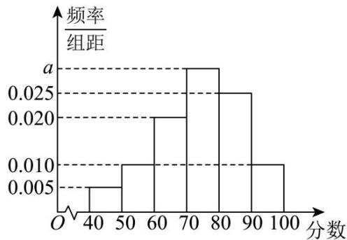

histogram

| 分数 | 频率/组距 |
| :--- | :--- |
| 40-50 | 0.005 |
| 50-60 | 0.010 |
| 60-70 | 0.020 |
| 70-80 | 0.025 |
| 80-90 | 0.025 |
| 90-100 | 0.010 |

(1)求频率分布直方图中a的值;

(2)求样本成绩的第75百分位数;

(3)已知落在 $[50,60)$ 的平均成绩是 61，方差是 7，落在 $[60,70)$ 的平均成绩为 70，方差是 4，求两组成绩的总平均数 $\overline{z}$ 和总方差 $s^2$ 。

