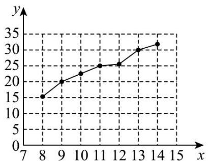
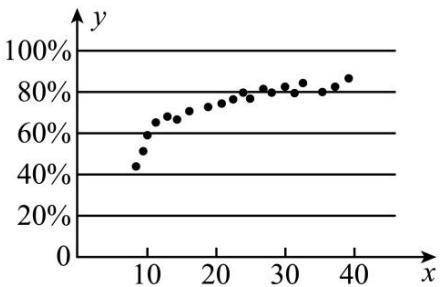
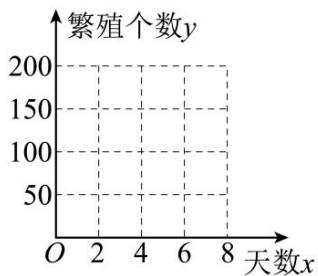

# 第六节 跟踪训练

# 题型 1

【训练 1】给出下列有关线性回归分析的四个命题：

①线性回归直线未必过样本数据点的中心 $(\overline{x},\overline{y})$ ;  
②回归直线就是散点图中经过样本数据点最多的那条直线；  
③当相关系数 r > 0 时，两个变量正相关；  
④如果两个变量的相关性越强，则相关系数 r 就越接近于 1.

其中真命题的个数为（）

A. 1

B. 2

C. 3

D. 4

【训练 2】对两个变量 x，y 进行线性相关检验，得线性相关系数 $r_{1}=0.8995$ ，对两个变量 u，v 进行线性相关检验，得线性相关系数 $r_{2}=-0.9568$ ，则下列判断正确的是（）

A. 变量 $x$ 与 $y$ 正相关, 变量 $u$ 与 $v$ 负相关, 变量 $x$ 与 $y$ 的线性相关性较强  
B. 变量 $x$ 与 $y$ 负相关, 变量 $u$ 与 $v$ 正相关, 变量 $x$ 与 $y$ 的线性相关性较强  
C. 变量 $x$ 与 $y$ 正相关, 变量 $u$ 与 $v$ 负相关, 变量 $u$ 与 $v$ 的线性相关性较强  
D. 变量 $x$ 与 $y$ 负相关, 变量 $u$ 与 $v$ 正相关, 变量 $u$ 与 $v$ 的线性相关性较强

【训练 3】甲、乙、丙、丁四位同学各自对，A，B 两变量的线性相关性做试验，并用回归分析方法分别求得相关系数 r 与残差平方和 m 如下表:

<table><tr><td></td><td>甲</td><td>乙</td><td>丙</td><td>丁</td></tr><tr><td>r</td><td>0.82</td><td>0.78</td><td>0.69</td><td>0.85</td></tr><tr><td>m</td><td>106</td><td>115</td><td>124</td><td>103</td></tr></table>

则能体现 A, B 两变量有更强的线性相关性的是（）

A. 甲

B. 乙

C. 丙

D. 丁

【训练 3】（2022•乙卷）某地经过多年的环境治理，已将荒山改造成了绿水青山．为估计一林区某种树木的总材积量，随机选取了 10 棵这种树木，测量每棵树的根部横截面积（单位： $m^{2}$ ）和材积量（单位： $m^{3}$ ），得到如下数据：

<table><tr><td>样本号i</td><td>1</td><td>2</td><td>3</td><td>4</td><td>5</td><td>6</td><td>7</td><td>8</td><td>9</td><td>10</td><td>总和</td></tr><tr><td>根部横截面积xi</td><td>0.04</td><td>0.06</td><td>0.04</td><td>0.08</td><td>0.08</td><td>0.05</td><td>0.05</td><td>0.07</td><td>0.07</td><td>0.06</td><td>0.6</td></tr><tr><td>材积量yi</td><td>0.25</td><td>0.40</td><td>0.22</td><td>0.54</td><td>0.51</td><td>0.34</td><td>0.36</td><td>0.46</td><td>0.42</td><td>0.40</td><td>3.9</td></tr></table>

并计算得 $\sum_{i=1}^{10}x_{i}^{2}=0.038,\quad\sum_{i=1}^{10}y_{i}^{2}=1.6158,\quad\sum_{i=1}^{10}x_{i}y_{i}=0.2474$

（1）估计该林区这种树木平均一棵的根部横截面积与平均一棵的材积量；  
(2) 求该林区这种树木的根部横截面积与材积量的样本相关系数（精确到 0.01）;  
(3) 现测量了该林区所有这种树木的根部横截面积, 并得到所有这种树木的根部横截面积总和为 $186m^{2}$ . 已知树木的材积量与其根部横截面积近似成正比. 利用以上数据给出该林区这种树木的总材积量的估计值.

附：相关系数 $r = \frac{\sum_{i=1}^{n}(x_i - \overline{x})(y_i - \overline{y})}{\sqrt{\sum_{i=1}^{n}(x_i - \overline{x})^2\sum_{i=1}^{n}(y_i - \overline{y})^2}}$ ， $\sqrt{1.896}\approx 1.377$

题型 2

【训练1】已知 $x, y$ 的对应值如下表所示：

<table><tr><td>x</td><td>0</td><td>2</td><td>4</td><td>6</td><td>8</td></tr><tr><td>y</td><td>1</td><td>m+1</td><td>2m+1</td><td>3m+3</td><td>11</td></tr></table>

若 $y$ 与 $x$ 线性相关，且回归直线方程为 $y = 1.6x + 0.6$ ，则 $m = (\quad)$

A. 2

B. 3

C. 4

D. 5

【训练 2】已知某绿豆新品种发芽的适宜温度在 $6^{\circ}C \sim 22^{\circ}C$ 之间，一农学实验室研究人员为研究温度 $x$ （℃）与绿豆新品种发芽数 y（颗）之间的关系，每组选取了成熟种子 50 颗，分别在对应的 $8^{\circ}C \sim 14^{\circ}C$ 的温度环境下进行实验，得到如下散点图：

line

| x | y |
|---|---|
| 8 | 15 |
| 9 | 20 |
| 10 | 23 |
| 11 | 25 |
| 12 | 26 |
| 13 | 30 |
| 14 | 32 |

其中 $\overline{y} = 24$ ， $\sum_{i=1}^{7}(x_i - \overline{x})(y_i - \overline{y}) = 70$ ， $\sum_{i=1}^{7}(y_i - \overline{y})^2 = 176$ ：

(1)运用相关系数进行分析说明，是否可以用线性回归模型拟合 $y$ 与 $x$ 的关系？  
(2)求出 $\hat{v}$ 关于 $\hat{x}$ 的线性回归方程 $\hat{v} = \hat{b}x + \hat{a}$ ，并预测在19℃的温度下，种子的发芽的颗数.

参考公式：相关系数 $r = \frac{\sum_{i=1}^{n}(x_i - \bar{x})(y_i - \bar{y})}{\sqrt{\sum_{i=1}^{n}(x_i - \bar{x})^2\sum_{i=1}^{n}(y_i - \bar{y})^2}}$ ，回归直线方程 $\hat{y} = \hat{b} x + \hat{a}$ ，其中 $\hat{b} = \frac{\sum_{i=1}^{n}(x_i - \bar{x})(y_i - \bar{y})}{\sum_{i=1}^{n}(x_i - \bar{x})^2}$

$\hat{a} = \overline{y} -\hat{b}\overline{x}$ .参考数据： $\sqrt{77}\approx 8.77$

# 题型 3

【训练 1】某校课外学习小组研究某作物种子的发芽率 y 和温度 x （单位：°C）的关系，由实验数据得到如图所示的散点图。由此散点图判断，最适宜作为发芽率 y 和温度 x 的回归方程类型的是（）

scatter

| x | y (%) |
|---|---|
| 8 | 45 |
| 9 | 55 |
| 10 | 60 |
| 11 | 65 |
| 12 | 68 |
| 13 | 70 |
| 14 | 72 |
| 15 | 75 |
| 16 | 77 |
| 17 | 78 |
| 18 | 79 |
| 19 | 80 |
| 20 | 81 |
| 21 | 82 |
| 22 | 83 |
| 23 | 84 |
| 24 | 85 |
| 25 | 86 |
| 26 | 87 |
| 27 | 88 |
| 28 | 89 |
| 29 | 90 |
| 30 | 91 |
| 31 | 92 |
| 32 | 93 |
| 33 | 94 |
| 34 | 95 |
| 35 | 96 |
| 36 | 97 |
| 37 | 98 |
| 38 | 99 |
| 39 | 100 |
The chart displays a scatter plot of y values against x values. The x-axis is labeled 'x' and the y-axis is labeled 'y'. There are no labels or additional data series in this image.

A. $y = a + bx$

B. $y = a + bx^{2}(b > 0)$

C. $y = a + b e^{x}$

D. $y = a + b\ln x$

【训练 2】云计算是信息技术发展的集中体现, 近年来, 我国云计算市场规模持续增长. 已知某科技公司 2018 年至 2022 年云计算市场规模数据, 且市场规模 y 与年份代码 x 的关系可以用模型 $y = c_{1} e^{c_{2} x}$ （其中 e 为自然对数的底数）拟合, 设 $z = \ln y$ , 得到数据统计表如下:

<table><tr><td>年份</td><td>2018 年</td><td>2019 年</td><td>2020 年</td><td>2021 年</td><td>2022 年</td></tr><tr><td>年份代码  $x$ </td><td>1</td><td>2</td><td>3</td><td>4</td><td>5</td></tr><tr><td>云计算市场规模  $y$ /千万元</td><td>7.4</td><td>11</td><td>20</td><td>36.6</td><td>66.7</td></tr><tr><td> $z = \ln y$ </td><td>2</td><td>2.4</td><td>3</td><td>3.6</td><td>4</td></tr></table>

由上表可得经验回归方程 $z = 0.52x + a$ ，则2025年该科技公司云计算市场规模y的估计值为（）

A. $e^{5.08}$

B. $e^{5.6}$

C. $e^{6.12}$

D. $e^{6.5}$

【训练 3】为了研究某种细菌随天数 x 变化的繁殖个数 y，收集数据如下：

<table><tr><td>天数x</td><td>1</td><td>2</td><td>3</td><td>4</td><td>5</td><td>6</td></tr><tr><td>繁殖个数y</td><td>6</td><td>12</td><td>25</td><td>49</td><td>95</td><td>190</td></tr></table>

line

| 天数x | 繁殖个数y |
| ----- | -------- |
| 0     | 200      |
| 2     | 150      |
| 4     | 100      |
| 6     | 50       |
| 8     | 20       |

(1)在图中作出繁殖个数 $y$ 关于天数 $x$ 变化的散点图，并由散点图判断 $y = \hat{b} x + \hat{a}$ （ $\hat{a}, \hat{b}$ 为常数）与 $\hat{y} = \hat{c}_1 e^{\hat{c}_2 x}$ （ $\hat{c}_1, \hat{c}_2$ 为常数，且 $\hat{c}_1 > 0, \hat{c}_2 \neq 0$ ）哪一个适宜作为繁殖个数 $y$ 关于天数 $x$ 变化的回归方程类型？（给出判断即可，不必说明理由）

(2)对于非线性回归方程 $\hat{y}=\widehat{c_{1}}\mathrm{e}^{\widehat{c_{2}}x}\quad(\widehat{c_{1}},\widehat{c_{2}}$ 为常数，且 $\widehat{c_{1}}>0,\widehat{c_{2}}\neq0)$ ，令 $z=\ln y$ ，可以得到繁殖个数的对数 z 关于天数 x 具有线性关系及一些统计量的值.

<table><tr><td> $\overline{x}$ </td><td> $\overline{y}$ </td><td> $\overline{z}$ </td><td> $\sum_{i=1}^{6}\left(x_i - \overline{x}\right)^2$ </td><td> $\sum_{i=1}^{6}\left(x_i - \overline{x}\right)\left(y_i - \overline{y}\right)$ </td><td> $\sum_{i=1}^{6}\left(x_i - \overline{x}\right)\left(z_i - \overline{z}\right)$ </td></tr><tr><td>3.50</td><td>62.83</td><td>3.53</td><td>17.50</td><td>596.57</td><td>12.09</td></tr></table>

（i）证明：“对于非线性回归方程 $\hat{y}=\hat{c}_{1}\mathrm{e}^{\hat{c}_{2}x}$ ，令 $z=\ln y$ ，可以得到繁殖个数的对数 z 关于天数 x 具有线性关系（即 $\hat{z}=\hat{\beta}x+\hat{\alpha},\hat{\beta},\hat{\alpha}$ 为常数）”；

（ii）根据（i）的判断结果及表中数据，建立 $y$ 关于 $x$ 的回归方程（系数保留2位小数）.

附：对于一组数据 $\left(u_{1},v_{1}\right),\left(u_{2},v_{2}\right),\cdots,\left(u_{n},v_{n}\right)$ ，其回归直线方程 $\hat{v}=\hat{\beta}u+\hat{\alpha}$ 的斜率和截距的最小二乘估计分别为 $\hat{\beta}=\frac{\sum_{i=1}^{n}\left(u_{i}-\bar{u}\right)\left(v_{i}-\bar{v}\right)}{\sum_{i=1}^{n}\left(u_{i}-\bar{u}\right)^{2}},\hat{\alpha}=\bar{v}-\hat{\beta}\bar{u}$ .

# 题型4

【训练 1】通过随机询问相同数量的不同性别大学生在购买食物时是否看营养说明, 得知有 $\frac{1}{6}$ 的男大学生“不看”, 有 $\frac{1}{3}$ 的女大学生“不看”, 若有 $99\%$ 的把握认为性别与是否看营养说明之间有关, 则调查的总人数可能为 ( )

A. 150

B. 170

C. 240

D. 175

【训练 2】第 31 届世界大学生夏季运动会，是中国西部第一次举办世界性综合运动会，共设篮球、排球、田径、游泳等 18 个大项、269 个小项。该届赛事约有来自 170 个国家和地区的 1 万余名运动员及官员赴蓉参加，该届赛事于 2023 年 7 月 28 日至 8 月 8 日在中国四川省成都市举行。为了了解关注该赛事是否与性别有关，某体育台随机抽取 2000 名观众进行统计，得到如下 2×2 列联表。

<table><tr><td></td><td>男</td><td>女</td><td>合计</td></tr><tr><td>关注该赛事</td><td>600</td><td>300</td><td>900</td></tr><tr><td>不关注该赛事</td><td>400</td><td>700</td><td>1100</td></tr><tr><td>合计</td><td>1000</td><td>1000</td><td>2000</td></tr></table>

(1)在所有女观众中，试估计她们关注该赛事的概率（结果用百分数表示）；  
(2)根据小概率值 $\alpha=0.001$ 的独立性检验，能否认为是否关注该赛事与性别有关联？

附： $\chi^{2}=\frac{n(ad-bc)^{2}}{(a+b)(c+d)(a+c)(b+d)}$ ，其中 $n=a+b+c+d$ .

<table><tr><td> $\alpha$ </td><td>0.1</td><td>0.05</td><td>0.01</td><td>0.005</td><td>0.001</td></tr><tr><td> $x_{\alpha}$ </td><td>2.706</td><td>3.841</td><td>6.635</td><td>7.879</td><td>10.828</td></tr></table>

【训练 3】2022 年 11 月 20 日，卡塔尔足球世界杯正式开幕，世界杯上的中国元素随处可见。从体育场建设到电力保障，从赛场内的裁判到赛场外的吉祥物都是中国制造，为卡塔尔世界杯提供了强有力的支持。国内也再次掀起足球热潮。某地足球协会组建球队参加业余比赛，该足球队教练组为了考查球员甲对球队的贡献，作出如下数据统计（甲参加过的比赛均分出了输赢）：

<table><tr><td></td><td>球队输球</td><td>球队赢球</td><td>总计</td></tr><tr><td>甲参加</td><td>2</td><td>30</td><td>32</td></tr><tr><td>甲未参加</td><td>8</td><td>10</td><td>18</td></tr><tr><td>总计</td><td>10</td><td>40</td><td>50</td></tr></table>

(1)根据小概率值 $\alpha = 0.005$ 的独立性检验，能否认为该球队赢球与甲球员参赛有关联；

(2)从该球队中任选一人，A 表示事件“选中的球员参赛”，B 表示事件“球队输球”。 $\frac{P(B|A)}{P(\overline{B}|A)}$ 与 $\frac{P(B|\overline{A})}{P(\overline{B}|\overline{A})}$ 的比值是选中的球员参赛对球队贡献程度的一项度量指标，记该指标为 R.

①证明： $R=\frac{P(A\mid B)}{P(\overline{A}\mid B)}\cdot\frac{P(\overline{A}\mid\overline{B})}{P(A\mid\overline{B})}$ ;

②利用球员甲数据统计，给出 $P(A|B)$ ， $P(A|\overline{B})$ 的估计值，并求出 R 的估计值.

附： $\chi^{2}=\frac{n(ad-bc)^{2}}{(a+b)(c+d)(a+c)(b+d)}$ .

参考数据:

<table><tr><td> $a$ </td><td>0.05</td><td>0.01</td><td>0.005</td><td>0.001</td></tr><tr><td> $x_a$ </td><td>3.841</td><td>6.635</td><td>7.879</td><td>10.828</td></tr></table>

# 题型5

【训练 1】小王经营了一家小型餐馆，自去年疫情管控宣布结束后的第 1 天开始，经营状况逐步有了好转，该店第一周的营业收入数据（单位：百元）统计如下：

<table><tr><td>天数序号x</td><td>1</td><td>2</td><td>3</td><td>4</td><td>5</td><td>6</td><td>7</td></tr><tr><td>营业收入y</td><td>11</td><td>13</td><td>18</td><td>※</td><td>28</td><td>※</td><td>35</td></tr></table>

其中第 4 天和第 6 天的数据由于某种原因造成模糊，但知道 7 天的营业收入平均值是 23，已知营业收入 y 与天数序号 x 可以用经验回归直线方程 $y = \hat{b}x + \hat{a}$ 拟合，且第 7 天的残差是 -0.6，则 $\hat{a} + \hat{b}$ 的值是（）

A. 10.4

B. 6.2

C. 4.2

D. 2

【训练 2】（多选）某学校一同学研究温差 $x(^{\circ}\mathrm{C})$ 与本校当天新增感冒人数 y （人）的关系，该同学记录了 5 天的数据：

<table><tr><td>x</td><td>5</td><td>6</td><td>8</td><td>9</td><td>12</td></tr><tr><td>y</td><td>17</td><td>20</td><td>25</td><td>28</td><td>35</td></tr></table>

经过拟合，发现基本符合经验回归方程 $\hat{y}=2.6x+\hat{a}$ ，则（）

A. 样本中心点为(8,25)

B. $\hat{a}=4.2$

C. x=5，残差为-0.2

D. 若去掉样本点(8,25)，则样本的相关系数 r 增大

