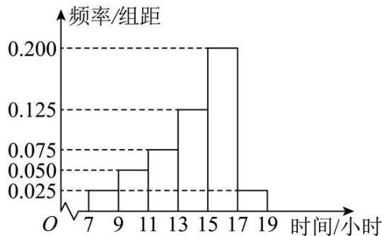
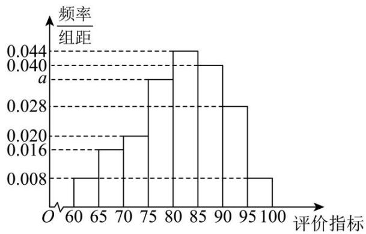
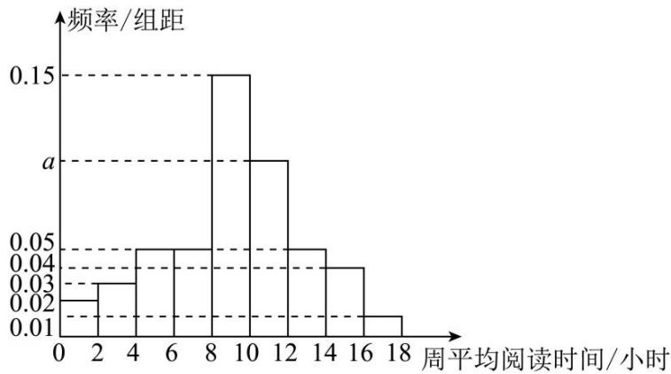
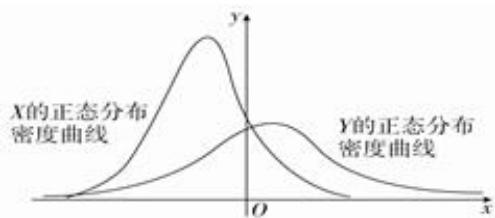
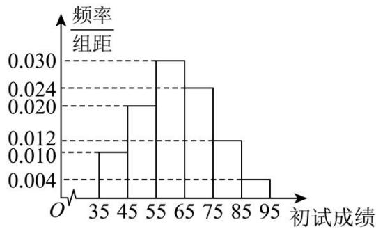
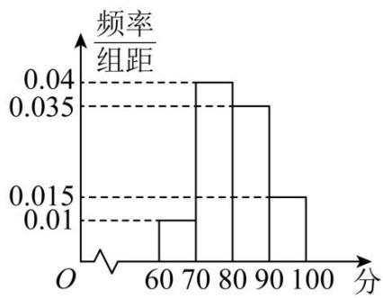

# 第四节 跟踪训练

题型 1

【训练1】已知离散型随机变量 $X$ 的分布列服从两点分布，且 $P(X = 0) = 3 - 4P(X = 1) = a$ ，则 $a = (\quad)$

A. $\frac{2}{3}$

B. $\frac{1}{2}$

C. $\frac{1}{3}$

D. $\frac{1}{4}$

【训练2】有一个盒子里有1个红球，现将 $n$ （ $n \in \mathbf{N}^*$ ）个黑球放入盒子后，再从盒子里随机取一球，记取到的红球个数为 $\xi$ 个，则随着 $n$ （ $n \in \mathbf{N}^*$ ）的增加，下列说法正确的是（）

A. $E(\xi)$ 减小， $D(\xi)$ 增加

B. $E(\xi)$ 增加， $D(\xi)$ 减小

C. $E(\xi)$ 增加， $D(\xi)$ 增加

D. $E(\xi)$ 减小， $D(\xi)$ 减小

【训练3】为考察本科生基本学术规范和基本学术素养，某大学决定对各学院本科毕业论文进行抽检，初步方案是本科毕业论文抽检每年进行一次，抽检对象为上一学年度授予学士学位的论文，初评阶段，每篇论文送3位同行专家进行评审，3位专家中有2位以上（含2位）专家评议意见为“不合格”的毕业论文，将认定为“存在问题毕业论文”。3位专家中有1位专家评议意见为“不合格”，将再送2位同行专家（不同于前3位）进行复评。复评阶段，2位复评专家中有1位以上（含1位）专家评议意见为“不合格”，将认定为“存在问题毕业论文”。每位专家，判定每篇论文“不合格”的概率均为 $p(0 < p < 1)$ ，且各篇毕业论文是否被判定为“不合格”相互独立。

(1)若 $p = \frac{1}{2}$ ，求每篇毕业论文被认定为“存在问题毕业论文”的概率是多少；

(2)学校拟定每篇论文需要复评的评审费用为180元，不需要复评的评审费用为90元，则每篇论文平均评审费用的最大值是多少？

# 题型2

【训练1】（2020·江苏）甲口袋中装有2个黑球和1个白球，乙口袋中装有3个白球．现从甲、乙两口袋中各任取一个球交换放入另一口袋，重复 $n$ 次这样的操作，记甲口袋中黑球个数为 $X_{n}$ ，恰有2个黑球的概率为 $p_{n}$ ，恰有1个黑球的概率为 $q_{n}$ ．

(1) 求 $p_{1}$ ， $q_{1}$ 和 $p_{2}$ ， $q_{2}$ ;  
（2）求 $2p_{n}+q_{n}$ 与 $2p_{n-1}+q_{n-1}$ 的递推关系式和 $X_{n}$ 的数学期望 $E(X_{n})$ （用n表示）.

【训练2】甲、乙两人参加一个游戏，该游戏设有奖金256元，谁先赢满5局，谁便赢得全部的奖金，已知每局游戏乙赢的概率为 $p(0 < p < 1)$ ，甲赢的概率为 $1 - p$ ，每局游戏相互独立，在乙赢了3局甲赢了1局的情况下，游戏设备出现了故障，游戏被迫终止，则奖金应该如何分配才为合理？有专家提出如下的奖金分配方案：如果出现无人先赢5局且游戏意外终止的情况，则甲、乙按照游戏再继续进行下去各自赢得全部奖金的概率之比 $P_{\text{甲}}: P_{\text{乙}}$ 分配奖金。记事件A为“游戏继续进行下去甲获得全部奖金”，试求当游戏继续进行下去，甲获得全部奖金的概率 $f(A)$ ，并判断当 $p \geq \frac{2}{3}$ 时，事件A是否为小概率事件，并说明理由。（注：若随机事件发生的概率小于0.05，则称随机事件为小概率事件）

题型 3

【训练1】设随机变量 $\xi \sim B(2, p)$ ，若 $P(\xi \geq 1) = \frac{5}{9}$ ，则 $p$ 的值为 \_\_\_\_.

【训练2】设随机变量 $X \sim B(n, p)$ ，记 $p_k = C_n^k p^k (1 - p)^{n-k}$ ， $k = 0, 1, 2, \cdots, n$ 。在研究 $p_k$ 的最大值时，某学习小组发现并证明了如下正确结论：若 $(n+1)p$ 为正整数，当 $k = (n+1)p$ 时， $p_k = p_{k-1}$ ，此时这两项概率均为最大值；若 $(n+1)p$ 不为正整数，则当且仅当 $k$ 取 $(n+1)p$ 的整数部分时， $p_k$ 取最大值。某同学重复投掷一枚质地均匀的骰子并实时记录点数1出现的次数。当投掷到第20次时，记录到此时点数1出现4次，若继续再进行80次投掷试验，则在这100次投掷试验中，点数1总共出现的次数为\_\_\_\_的概率最大。

【训练 3】“双减”政策执行以来，中学生有更多的时间参加志愿服务和体育锻炼等课后活动。某校为了解学生课后活动的情况，从全校学生中随机选取100人，统计了他们一周参加课后活动的时间（单位：小时），分别位于区间 $[7,9)$ ， $[9,11)$ ， $[11,13)$ ， $[13,15)$ ， $[15,17)$ ， $[17,19]$ ，用频率分布直方图表示如下，假设用频率估计概率，且每个学生参加课后活动的时间相互独立。

histogram

| 时间/小时 | 频率/组距 |
|---|---|
| 7 | 0.025 |
| 9 | 0.050 |
| 11 | 0.075 |
| 13 | 0.125 |
| 15 | 0.200 |
| 17 | 0.025 |
| 19 | 0.025 |

(1)估计全校学生一周参加课后活动的时间位于区间[13,17)的概率;

(2)从全校学生中随机选取3人，记 $\xi$ 表示这3人一周参加课后活动的时间在区间[15,17)的人数，求 $\xi$ 的分布列和数学期望 $E(\xi)$ .

【训练4】一个袋子中装有 $N$ 大小相同的球，其中有 $N_{1}$ 个黄球， $N_{2}$ 个白球，从中随机地摸出 $m$ 个球作为样本，用 $X$ 表示样本中黄球的个数.

(1)若采取不放回摸球，当 N=6， $N_{1}=2$ ， $N_{2}=4$ ，m=3 时，求 X 的分布列；  
(2)若采取有放回摸球，当 $N = 100$ ， $N_{1} = 50$ ， $N_{2} = 50$ ， $m = 10$ 时，用样本中黄球的比例估计总体黄球的比例，求误差不超过0.1的概率(用分数表示).

题型 4

【训练 1】（2024·武汉模拟）厂家在产品出厂前，需对产品做检验，厂家把一批产品发给商家时，商家按规定拾取一定数量的产品做检验，以决定是否验收这批产品：

(1) 若厂家库房中的每件产品合格的概率为 0.8, 从中任意取出 4 件进行检验, 求至少有 1 件是合格产品的概率;  
(2) 若厂家发给商家 20 件产品, 其中有 3 件不合格, 按合同规定该商家从中任取 2 件, 来进行检验,只有 2 件产品都合格时才接收这些产品, 否则拒收.

①求该商家检验出不合格产品件数的均值；  
②求该商家拒收这些产品的概率.

【训练2】某公司生产一种电子产品，每批产品进入市场之前，需要对其进行检测，现从某批产品中随机抽取9箱进行检测，其中有5箱为一等品.

(1)若从这9箱产品中随机抽取3箱，求至少有2箱是一等品的概率；  
(2)若从这9箱产品中随机抽取3箱，记ξ表示抽到一等品的箱数，求ξ的分布列和期望.

【训练 3】某乒乓球队训练教官为了检验学员某项技能的水平，随机抽取 100 名学员进行测试，并根据该项技能的评价指标，按 [60,65), [65,70), [70,75), [75,80), [80,85), [85,90), [90,95), [95,100] 分成 8 组，得到如图所示的频率分布直方图.

histogram

| 评价指标 | 频率/组距 |
| :--- | :--- |
| 60-65 | 0.008 |
| 65-70 | 0.016 |
| 70-75 | 0.020 |
| 75-80 | 0.034 |
| 80-85 | 0.044 |
| 85-90 | 0.040 |
| 90-95 | 0.028 |
| 95-100 | 0.008 |

(1)求 $a$ 的值，并估计该项技能的评价指标的中位数（精确到0.1）：  
(2)若采用分层抽样的方法从评价指标在[70,75)和[85,90)内的学员中随机抽取12名，再从这12名学员中随机抽取5名学员，记抽取到学员的该项技能的评价指标在[70,75)内的学员人数为 $X$ ，求 $X$ 的分布列与数学期望.

题型 5

【训练 1】（2025·济南月考）下列关于随机变量 X 的说法正确的是（）

A. 若 $X$ 服从正态分布 $N(1,2)$ , 则 $D(2X + 2) = 8$   
B. 已知随机变量 X 服从二项分布 B (2, p)，且 $P(X \geq 1) = \frac{5}{9}$ ，随机变量 Y 服从正态分布 N (2, $\sigma^{2}$ )，
若 $P(Y<0)=\frac{p}{2}$ ，则 $P(2<Y<4)=\frac{2}{3}$   
C. 若 X 服从超几何分布 H（4，2，10），则期望 $E(X)=\frac{4}{5}$   
D. 若 X 服从二项分布 $B(4, \frac{1}{3})$ ，则方差 $D(X) = \frac{8}{9}$

【训练 2】2020 年五一期间，银泰百货举办了一次有奖促销活动，消费每超过 600 元(含 600 元)，均可抽奖一次，抽奖方案有两种，顾客只能选择其中的一种。方案一：从装有 10 个形状、大小完全相同的小球(其中红球 2 个，白球 1 个，黑球 7 个)的抽奖盒中，一次性摸出 3 个球其中奖规则为：若摸到 2 个红球和 1 个白球，享受免单优惠；若摸出 2 个红球和 1 个黑球则打 5 折；若摸出 1 个白球 2 个黑球，则打 7 折；其余情况不打折。方案二：从装有 10 个形状、大小完全相同的小球(其中红球 3 个，黑球 7 个)的抽奖盒中，有放回每次摸取 1 球，连摸 3 次，每摸到 1 次红球，立减 200 元。

（1）若两个顾客均分别消费了 600 元，且均选择抽奖方案一，试求两位顾客均享受免单优惠的概率；  
(2) 若某顾客消费恰好满 1000 元, 试从概率角度比较该顾客选择哪一种抽奖方案更合算?

【训练 3】“稻草很轻，但是他迎着风仍然坚韧，这就是生命的力量，意志的力量”“当你为未来付出踏踏实实努力的时候，那些你觉得看不到的人和遇不到的风景都终将在你生命里出现”……当读到这些话时，你会切身体会到读书破万卷给予我们的力量。为了解某普通高中学生的阅读时间，从该校随机抽取了800名学生进行调查，得到了这800名学生一周的平均阅读时间（单位：小时），并将样本数据分成九组，绘制成如图所示的频率分布直方图。

histogram

| 周平均阅读时间/小时 | 频率/组距 |
|---|---|
| 0-2 | 0.02 |
| 2-4 | 0.03 |
| 4-6 | 0.05 |
| 6-8 | 0.15 |
| 8-10 | 0.10 |
| 10-12 | 0.05 |
| 12-14 | 0.04 |
| 14-16 | 0.04 |
| 16-18 | 0.01 |

(1)求 $a$ 的值；  
(2)为进一步了解这800名学生阅读时间的分配情况，从周平均阅读时间在(12,14]，(14,16]，(16,18]三组内的学生中，采用分层抽样的方法抽取了10人，现从这10人中随机抽取3人，记周平均阅读时间在(14,16]内的学生人数为 $X$ ，求 $X$ 的分布列和数学期望；  
(3)以样本的频率估计概率，从该校所有学生中随机抽取20名学生，用 $P(k)$ 表示这20名学生中恰有k名学
生周平均阅读时间在 $(8,12]$ 内的概率，其中 $k=0,1,2,\cdots,20$ ．当 $P(k)$ 最大时，写出k的值.

题型 6

【训练 1】(2021·新高考 II) 某物理量的测量结果服从正态分布 $N(10, \sigma^{2})$ ，则下列结论中不正确的是()

A. $\sigma$ 越小, 该物理量在一次测量中落在(9.9,10.1)内的概率越大  
B. 该物理量在一次测量中大于 10 的概率为 0.5  
C. 该物理量在一次测量中小于 9.99 与大于 10.01 的概率相等  
D. 该物理量在一次测量中结果落在(9.9,10.2)与落在(10,10.3)的概率相等

【训练 2】（2015·湖北）设 $X \sim N(\mu_{1}, \sigma_{1}^{2})$ ， $Y \sim N(\mu_{2}, \sigma_{2}^{2})$ ，这两个正态分布密度曲线如图所示．下列结论中正确的是（）

text_image

X的正态分布
密度曲线
Y的正态分布
密度曲线
O
x
y

A. $P(Y \geqslant \mu_{2}) \geqslant P(Y \geqslant \mu_{1})$   
B. $P(X \leqslant \sigma_{2}) \leqslant P(X \leqslant \sigma_{1})$   
C. 对任意正数 t， $P(X \leqslant t) \geqslant P(Y \leqslant t)$   
D. 对任意正数 t， $P(X \geqslant t) \geqslant P(Y \geqslant t)$

【训练 3】（2015·山东）已知某批零件的长度误差（单位：毫米）服从正态分布 $N(0, 3^{2})$ ，从中随机抽取一件，其长度误差落在区间 $(3,6)$ 内的概率为()

（附：若随机变量 $\xi$ 服从正态分布 $N(\mu,\sigma^{2})$ ，则 $P(\mu-\sigma<\xi<\mu+\sigma)=68.26\%$ ,

$$
P (\mu - 2 \sigma <   \xi <   \mu + 2 \sigma) = 95.44 \%
$$

A. 4.56%

B. 13.59%

C. 27.18%

D. 31.74%

【训练 4】随机变量 X 服从正态分布 $X \sim N(10, \sigma^{2}), P(X > 12) = m, P(8 \leq X \leq 10) = n$ ，则 $\frac{1}{2m} + \frac{1}{n}$ 的最小值为（）

A. $3 + 4\sqrt{2}$

B. $6 + 2\sqrt{2}$

C. $6+4\sqrt{2}$

D. $3 + 2\sqrt{2}$

【训练 5】山东烟台某地种植的苹果按果径 X （单位：mm）的大小分级，其中 $X \in (80,100]$ 的苹果为特级，且该地种植的苹果果径 $X \sim N(85,25)$ 。若在某一次采摘中，该地果农采摘了 2 万个苹果，则其中特级苹果的个数约为（）（参考数据： $X \sim N(\mu, \sigma^{2})$ ， $P(\mu - \sigma < X \leq \mu + \sigma) \approx 0.6827$ 。 $P(\mu - 2\sigma < X \leq \mu + 2\sigma) \approx 0.9545$ ， $P(\mu - 3\sigma < X \leq \mu + 3\sigma) \approx 0.9973$ ）

A. 3000

B. 13654

C. 16800

D. 19946

题型 7

【训练 1】某地区举行专业技能考试，共有 8000 人参加，分为初试和复试，初试通过后方可参加复试。为了解考生的考试情况，随机抽取了 100 名考生的初试成绩绘制成如图所示的样本频率分布直方图。

histogram

| 初试成绩 | 频率/组距 |
| :--- | :--- |
| 35 | 0.010 |
| 45 | 0.020 |
| 55 | 0.030 |
| 65 | 0.024 |
| 75 | 0.012 |
| 85 | 0.004 |
| 95 | 0.004 |

(1)根据频率分布直方图，估计样本的平均数；  
(2)若所有考生的初试成绩近似服从正态分布 $N(\mu, \sigma^2)$ ，其中 $\mu$ 为样本平均数的估计值， $\sigma \approx 9$ ，试估计所有考生中初试成绩不低于80分的人数；  
(3)复试共四道题, 前两道题考生每题答对得 5 分, 答错得 0 分, 后两道题考生每题答对得 10 分, 答错得 0 分, 四道题的总得分为考生的复试成绩. 已知某考生进入复试, 他在复试中前两题每道题能答对的概率均为 $\frac{3}{4}$ , 后两题每道题能答对的概率均为 $\frac{3}{5}$ , 且每道题回答正确与否互不影响. 记该考生的复试成绩为 $X$ , 求 $P(X \geq 20)$ .

附：若随机变量 X 服从正态分布 $N\left(\mu,\sigma^{2}\right)$ ，则： $P(\mu-\sigma<X<\mu+\sigma)=0.6827$ ，

$$
P (\mu - 2 \sigma <   X <   \mu + 2 \sigma) = 0. 9 5 4 5, P (\mu - 3 \sigma <   X <   \mu + 3 \sigma) = 0. 9 9 7 3.
$$

【训练 2】为深入学习党的二十大精神，某学校团委组织了“青春向党百年路，奋进学习二十大”知识竞赛活动，并从中抽取了 200 份试卷进行调查，这 200 份试卷的成绩（卷面共 100 分）频率分布直方图如右图所示.

histogram

| 分值 | 频率/组距 |
| :--- | :--- |
| 60-70 | 0.01 |
| 70-80 | 0.04 |
| 80-90 | 0.035 |
| 90-100 | 0.015 |

(1)用样本估计总体，求此次知识竞赛的平均分（同一组中的数据用该组区间的中点值为代表）.

(2)可以认为这次竞赛成绩 $X$ 近似地服从正态分布 $N(\mu, \sigma_2)$ （用样本平均数和标准差 $s$ 分别作为 $\mu$ 、 $\sigma$ 的近似值），已知样本标准差 $s \approx 7.36$ ，如有 $84\%$ 的学生的竞赛 成绩高于学校期望的平均分，则学校期望的平均分约为多少？（结果取整数）

(3)从得分区间[80, 90）和[90, 100]的试卷中用分层抽样的方法抽取10份试卷，再从这10份样本中随机抽测3份试卷，若已知抽测的3份试卷来自于不同区间，求抽测3份试卷有2份来自区间[80, 90）的概率.参考数据：若 $X \sim N(\mu, \sigma_2)$ ，则 $P(\mu - \sigma < X \leq \mu + \sigma) \approx 0.68$ ， $P(\mu - 2\sigma < X \leq \mu + 2\sigma) \approx 0.95$ ， $P(\mu - 3\sigma < X \leq \mu + 3\sigma) \approx 0.99$ .

【训练3】在“飞彩镌流年”文艺汇演中，诸位参赛者一展风采，奉上了一场舞与乐的盛宴。现从2000位参赛者中随机抽取40位幸运嘉宾，统计他们的年龄数据，得样本平均数 $\mu = 45.75$ 。

(1)若所有参赛者年龄 X 服从正态分布 $N\left(\mu,15.75^{2}\right)$ ，请估计参赛者年龄在 30 岁以上的人数；

(2)若该文艺汇演对所有参赛者的表演作品进行评级, 每位参赛者只有一个表演作品且每位参赛者作品有 $a \% (0 < a < 100)$ 的概率评为 $A$ 类, $(1 - a \%)$ 的概率评为 $B$ 类, 每位参赛者作品的评级结果相互独立. 记上述40位幸运嘉宾的作品中恰有2份 $A$ 类作品的概率为 $p(a)$ , 求 $p(a)$ 的极大值点 $a_0$ ;

(3)以（2）中确定的 $a_0$ 作为 $\alpha$ 的值，记上述幸运嘉宾的作品中的 $A$ 类作品数为 $Y$ ，若对这些幸运嘉宾进行颁奖，现有两种颁奖方式：甲： $A$ 类作品参赛者获得 1000 元现金， $B$ 类作品参赛者获得 100 元现金；乙： $A$ 类作品参赛者获得 3000 元现金， $B$ 类作品参赛者不获得现金奖励。根据奖金期望判断主办方选择何种颁奖方式，成本可能更低。

附：若 $X \sim N(\mu, \sigma^2)$ ，则 $P\{|X - \mu| < \sigma\} = 0.6827$ 。

