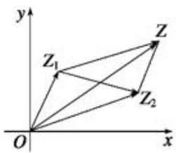

# 12 复数

# 考向 1 复数的概念及运算

# 一、复数的概念及运算

# 1. 复数的概念

（1）定义：形如 $a + bi(a, b \in R)$ 的数叫做复数，其中 $a$ 叫做复数 $z$ 的实部， $b$ 叫做复数 $z$ 的虚部 ( $i$ 为虚数单位). 注意： $i^2 = -1, i^3 = -i, i^4 = 1, i^n$ 以 4 为周期，即 $i^{4+n} = i^n$ .

(2) 分类:

<table><tr><td></td><td>满足条件 $(a,b \in R)$ </td></tr><tr><td rowspan="3">复数的分类</td><td> $a + bi$ 为实数 $\Leftrightarrow \underline{b = 0}$ </td></tr><tr><td> $a + bi$ 为虚数 $\Leftrightarrow \underline{b \neq 0}$ </td></tr><tr><td> $a + bi$ 为纯虚数 $\Leftrightarrow \underline{a = 0}$ 且 $b \neq 0$ </td></tr></table>

# 2. 复数相等与共轭复数

复数相等： $a + bi = c + di \Leftrightarrow a = c$ 且 $b = d(a, b, c, d \in R)$ 共轭复数： $a + bi = c + di \Leftrightarrow a = c$ 且 $b = -d(a, b, c, d \in R)$

# 题型 1 复数的概念

【例 1】（2015·湖北）i 为虚数单位， $i^{607}=(\quad)$

A. -i

B. i

C. 1

D. -1

【例 2】（2024•上海）已知虚数 z，其实部为 1，且 $z + \frac{2}{z} = m (m \in R)$ ，则实数 m 为 \_\_\_\_.

【例 3】（2024•新高考 I）若 $\frac{z}{z-1}=1+i$ ，则 $z=(\quad)$

A. -1-i

B. $-1 + i$

C. $1 - i$

D. $1 + i$

【例 4】（2021•乙卷）设 $2(z+\overline{z})+3(z-\overline{z})=4+6i$ ，则 $z=(\quad)$

A. $1 - 2i$

B. $1 + 2i$

C. $1 + i$

D. $1 - i$

# 题型 2 复数的运算

1. 复数的加、减、乘、除的运算法则

设 $z_{1} = a + bi, z_{2} = c + di(a, b, c, d \in R)$ ，则

(1) $z_{1} \pm z_{2} = a \pm c + (b \pm d)i$ ; (2) $z_{1} \cdot z_{2} = ac - bd + (ad + bc)i$ ; (3) $\frac{z_{1}}{z_{2}} = \frac{ac + bd}{c^{2} + d^{2}} + \frac{bc - ad}{c^{2} + d^{2}} i(z_{2} \neq 0)$ .

【例 1】（2023·甲卷）若复数 $(a+i)(1-ai)=2$ ， $a\in R$ ，则 $a=(\quad)$

A.-1

B. 0

C. 1

D. 2

【例 2】（2023•新高考 I）已知 $z=\frac{1-i}{2+2i}$ ，则 $z-\overline{z}=$ （）

A. $-i$

B. i

C. 0

D. 1

【例 3】（2024•甲卷）设 $z = 5 + i$ ，则 $i(\overline{z} + z) = (\quad)$

A. $10i$

B. 2i

C. 10

D.-2

【例 4】（2024·天津）i 是虚数单位，复数 $(\sqrt{5} + i) \cdot (\sqrt{5} - 2i) = \_\_\_$ .

# 考向 2 复数的模

向量 $\overrightarrow{OZ}$ 的模叫做复数 $z = a + b \, i$ 的模，记作 $|z|$ 或 $|a + b \, i|$ ，表示点 $(a, b)$ 到原点的距离，即 $|z| = |a + b \, i| = \sqrt{a^{2} + b^{2}}$ , $|z| = |\overline{z}|$ .

复数的模的速算技巧:

（1）若 $z = z_{1}\cdot z_{2}$ ，则 $\left|z\right| = \left|z_1\right|\cdot \left|z_2\right|$   
（2）若 $z=\frac{z_{1}}{z_{2}}$ ，则 $\left|z\right|=\frac{\left|z_{1}\right|}{\left|z_{2}\right|}$ ;  
(3) $z \cdot \overline{z} = |z|^2 = |\overline{z}|^2.$

【例 1】（2024•新高考Ⅱ）已知 z = -1 - i，则 $|z| = (\quad)$

A. 0

B. 1

C. $\sqrt{2}$

D. 2

【例 2】（2025•上海）已知复数 $z=\frac{2+i}{i}$ ，其中 i 为虚数单位，则 $|z|=$ \_\_\_\_.

【例 3】（2023·乙卷） $|2+i^{2}+2i^{3}|=($

A. 1

B. 2

C. $\sqrt{5}$

D. 5

【例 4】（2019•新课标 I）设 $z=\frac{3-i}{1+2i}$ ，则 $|z|=()$

A. 2

B. $\sqrt{3}$

C. $\sqrt{2}$

D. 1

【例 5】（2022•甲卷）若 $z = -1 + \sqrt{3}i$ ，则 $\frac{z}{z\overline{z} - 1} = (\quad)$

A. $-1 + \sqrt{3} i$

B. $-1-\sqrt{3}i$

C. $-\frac{1}{3}+\frac{\sqrt{3}}{3}i$

D. $-\frac{1}{3} - \frac{\sqrt{3}}{3} i$

# 考向 3 复数的几何意义

# 三、复数的几何意义

复数 $z = a + bi$ 与复平面内的点 $Z(a, b)$ 及平面向量 $\overrightarrow{OZ} = (a, b)(a, b \in R)$ 是一一对应关系.

注：复数加、减法的几何意义

以复数 $z_{1}, z_{2}$ 分别对应的向量 $\overrightarrow{OZ_1}, \overrightarrow{OZ_2}$ 为邻边作平行四边形 $OZ_1ZZ_2$ ，对角线 $OZ$ 表示的向量 $\overrightarrow{OZ}$ 就是复数 $z_{1} + z_{2}$ 所对应的向量。 $z_{2} - z_{1}$ 对应的向量是 $\overrightarrow{Z_2Z_1}$ 。

text_image

y
Z₁
Z
Z₂
O
x

即 $\overrightarrow{OZ} = \overrightarrow{OZ_1} + \overrightarrow{OZ_2},\overrightarrow{Z_1Z_2} = \overrightarrow{OZ_2} -\overrightarrow{OZ_1}$ 若 $z_{1} = a + bi,z_{2} = c + di,$

(1) $|z_1 - z_2|$ 表示 $(a, b)$ 到 $(c, d)$ 的距离，即 $|z_1 - z_2| = \sqrt{(a - c)^2 + (b - d)^2}$ .

(2) $|z - z_1| = r (r > 0)$ 表示以 $(a, b)$ 为圆心， $r$ 为半径的圆.

【例 1】（2023·新高考Ⅱ）在复平面内， $(1+3i)(3-i)$ 对应的点位于()

A. 第一象限

B. 第二象限

C. 第三象限

D. 第四象限

【例 2】18 世纪末期，挪威测量学家威塞尔首次利用坐标平面上的点来表示复数，使复数及其运算具有了几何意义．例如， $|z|=|OZ|$ ，即复数 z 的模的几何意义为 z 在复平面内对应的点 Z 到原点的距离．在复平面内，若复数 $z_{1}=\frac{-4-4i}{1-i}$ 对应的点为 $Z_{1}$ ，Z 为曲线 $|z-3|=1$ 上的动点，则 $Z_{1}$ 与 Z 之间的最小距离为（）

A. 3

B. 4

C. 5

D. 6

【例 3】（多选）已知复数 $z_{1}=1-i$ ， $z_{2}=-2+3i$ ，i 为虚数单位，下列说法正确的是（）

A. $z_{1} + z_{2}$ 在复平面内对应的点位于第二象限

B. 若向量 $\overrightarrow{OA}, \overrightarrow{OB}$ 分别对应的复数为 $z_{1}$ ， $z_{2}$ ，则向量 $\overrightarrow{AB}$ 对应的复数为 3-4i

C. 若 $z_{1}(a + i) = z_{2} + bi(a, b \in R)$ ，则 $ab = -3$

D. 若复数 $z_{3} = x + yi(x, y \in R, i$ 为虚数单位)，且 $|z_{3}| = 1$ ，则 $|z_{3} - 3i|$ 的最大值为4

# 考向 4 复数的三角形式

# 四、复数的三角形式

# (1) 复数的三角表示式

一般地, 任何一个复数 $z = a + bi$ 都可以表示成 $r(\cos \theta + i \sin \theta)$ 形式, 其中 $r$ 是复数 $z$ 的模; $\theta$ 是以 $x$ 轴的非负半轴为始边, 向量 $\overrightarrow{OZ}$ 所在射线(射线 $OZ$ )为终边的角, 叫做复数 $z = a + bi$ 的辐角.

$r(\cos\theta+i\sin\theta)$ 叫做复数 $z=a+bi$ 的三角表示式，简称三角形式.

# (2) 辐角的主值

任何一个不为零的复数的辐角有无限多个值，且这些值相差 $2\pi$ 的整数倍．规定在 $0 \leq \theta < 2\pi$ 范围内的辐角 $\theta$ 的值为辐角的主值．通常记作 $\arg z$ ，即 $0 \leq \arg z < 2\pi$ ．复数的代数形式可以转化为三角形式，三角形式也可以转化为代数形式.

# （3）三角形式下的两个复数相等

两个非零复数相等当且仅当它们的模与辐角的主值分别相等.

# (4) 复数三角形式的乘法运算

①两个复数相乘，积的模等于各复数的模的积，积的辐角等于各复数的辐角的和，即

$$
r _ {1} \left(\cos \theta_ {1} + i \sin \theta_ {1}\right) \cdot r _ {2} \left(\cos \theta_ {2} + i \sin \theta_ {2}\right) = r _ {1} r _ {2} \left[ \cos \left(\theta_ {1} + \theta_ {2}\right) + i \sin \left(\theta_ {1} + \theta_ {2}\right) \right].
$$

②复数乘法运算的三角表示的几何意义

复数 $z_{1}, z_{2}$ 对应的向量为 $\overrightarrow{OZ_{1}}, \overrightarrow{OZ_{2}}$ ，把向量 $\overrightarrow{OZ_{1}}$ 绕点 O 按逆时针方向旋转角 $\theta_{2}$ （如果 $\theta_{2} < 0$ ，就要把 $\overrightarrow{OZ_{1}}$ 绕点 O 按顺时针方向旋转角 $\left|\theta_{2}\right|$ ），再把它的模变为原来的 $r_{2}$ 倍，得到向量 $\overrightarrow{OZ}$ ， $\overrightarrow{OZ}$ 表示的复数就是积 $z_{1}z_{2}$ 。

# (5) 复数三角形式的除法运算

两个复数相除，商的模等于被除数的模除以除数的模所得的商，商的辐角等于被除数的辐角减去除数的辐角所得的差，即 $\frac{r_1(\cos\theta_1 + i\sin\theta_1)}{r_2(\cos\theta_2 + i\sin\theta_2)} = \frac{r_1}{r_2}\left[\cos (\theta_1 - \theta_2) + i\sin (\theta_1 - \theta_2)\right].$

# (6) 复数三角形式的乘方运算

利用复数的乘法运算法则可推乘方的运算公式，即 $[r(\cos \theta + i\sin \theta)]^n = r^n (\cos n\theta + i\sin n\theta)$ 。

【例 1】（2004·陕西）设复数 z 的辐角的主值为 $\frac{2\pi}{3}$ ，虚部为 $\sqrt{3}$ ，则 $z^{2}=(\quad)$

A. $-2 - 2\sqrt{3} i$

B. $-2\sqrt{3} - 2i$

C. $2 + 2\sqrt{3}i$

D. $2\sqrt{3} + 2i$

【例 2】（2007•山东）若 $z = \cos\theta + i\sin\theta$ (i 为虚数单位)，则 $z^{2} = -1$ 的 $\theta$ 值可能是()

A. $\frac{\pi}{6}$

B. $\frac{\pi}{4}$

C. $\frac{\pi}{3}$

D. $\frac{\pi}{2}$

【例 3】复数 Z 在复平面内对应的点为 $Z(\frac{\sqrt{3}}{2}, \frac{1}{2})$ ，O 为坐标原点，将向量 $\overrightarrow{OZ}$ 绕点 O 逆时针旋转 $90^{\circ}$ 后得到向量 $\overrightarrow{OZ_{1}}$ ，点 $Z_{1}$ 对应复数为 $Z_{1}$ ，则 $Z_{1}^{5} = (\quad)$

A. $-\frac{1}{2} + \frac{\sqrt{3}}{2} i$

B. $-1 + i$

C. $-\frac{1}{2} - \frac{\sqrt{3}}{2} i$

D. $-\frac{1}{4}+\frac{3}{4}i$

