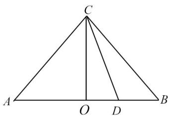
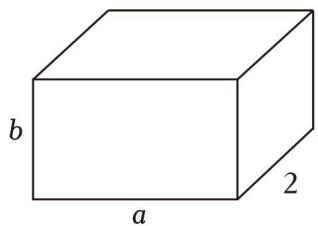

# 1.3 基本不等式

# 考向 1 利用基本不等式求最值

# 1. 基本不等式

如果 $a > 0, b > 0$ ，那么 $\sqrt{ab} \leq \frac{a + b}{2}$ ，当且仅当 $a = b$ 时，等号成立。其中， $\frac{a + b}{2}$ 叫作 $a, b$ 的算术平均数， $\sqrt{ab}$ 叫作 $a, b$ 的几何平均数。即正数 $a, b$ 的算术平均数不小于它们的几何平均数。

基本不等式1：若 $a, b \in \underline{\mathbf{R}}$ ，则 $a^2 + b^2 \geq 2ab$ ，当且仅当 $\underline{a = b}$ 时取等号；

基本不等式2：若 $a, b \in \underline{\mathbf{R}^+}$ ，则 $\frac{a + b}{2} \geq \sqrt{ab}$ （或 $a + b \geq 2\sqrt{ab}$ ），当且仅当 $\underline{a = b}$ 时取等号.

# 2. 两个基本不等式的异同

（1）两个基本不等式中实数 $a, b$ 的取值范围是不同的，运用第二个不等式时， $a, b$ 必须都是正实数。  
（2）两个基本不等式中等号成立的条件：当且仅当 $a = b$ 时取等号；  
（3）两个基本不等式的变形：（这里的变形要让学生理解是如何得来的，同时也让学生试着去发现这些不等式都出现了哪些运算形式，有求和，乘积，平方和，开方和）

第一个不等式可变形为： $a^{2}+3b^{2}\geq2b(a+b)$ 或 $2a^{2}+2b^{2}\geq(a+b)^{2}$ ，其中 $a,b\in R;$

第二个不等式可变形为： $(\sqrt{a}+\sqrt{b})^{2}\geq4\sqrt{ab}$ 或 $ab\leq\left(\frac{a+b}{2}\right)^{2}$ ，其中 $a,b\in R^{+}$ .

（4）常用基本不等式2来求最值：当两个正数a，b的积为定值时，由 $a+b\geq2\sqrt{ab}$ 可得当a=b时，它们的和有最小值；当两个正数a，b的和为定值时，由 $ab\leq(\frac{a+b}{2})^{2}$ 可得当a=b时，它们的积有最大值，正所谓“积定和最小，和定积最大”。

如：已知 x > 0, y > 0.

①若 $x + y = s$ （和为定值），则当 x = y 时，积 xy 取得最大值 $\frac{s^{2}}{4}$ ;  
②若 $xy = p$ （积为定值），则当 $x = y$ 时，和 $x + y$ 取得最小值 $2\sqrt{p}$ ：

注意 （1）此结论应用的前提条件是 “一正”、“二定”、“三相等”。其中 “一正” 指正实数；“二定” 指求最值时和或积为定值；“三相等” 指满足等号成立的条件，即取等条件成立。

(2) 连续使用基本不等式要注意取值条件一致.

# 题型 1 直接使用

模型一： $mx + \frac{n}{x} \geq 2\sqrt{mn} (m > 0, n > 0)$ ，当且仅当 $x = \sqrt{\frac{n}{m}}$ 时等号成立；

模型二： $mx + \frac{n}{x - a} = m(x - a) + \frac{n}{x - a} + ma \geq 2\sqrt{mn} + ma (m > 0, n > 0)$ ，当且仅当 $x - a = \sqrt{\frac{n}{m}}$ 时等号成立.

模型三： $\frac{ax^2 + bx + c}{x} = ax + b + \frac{c}{x}\geq 2\sqrt{ac} +b(a > 0,c > 0)$ ，当且仅当 $ax = \frac{c}{x}$ 时等号成立.

【例 1】（2024•上海）已知 ab=1， $4a^{2}+9b^{2}$ 的最小值为 \_\_\_\_.

【例 2】若 $x \in (\frac{1}{2}, 1]$ ，则 $2x + \frac{1}{2x - 1}$ 的最小值为（）

A. 1

B. 2

C. $2\sqrt{2}$

D. 3

【例 3】若 x<-1，则函数 $y=\frac{x^{2}+x+4}{x+1}$ ()

A. 有最大值 -5

B. 有最小值-5

C. 有最大值3

D. 有最小值 3

# 题型 2 “1”的代换

形如 $x + y = 1$ 和 $\frac{a}{x} +\frac{b}{y} = 1$ 的形式，可以让两个式子进行相乘构造出基本不等式的倒数结构

【例 1】（2015•福建）若直线 $\frac{x}{a} + \frac{y}{b} = 1 (a > 0, b > 0)$ 过点 (1,1)，则 $a + b$ 的最小值等于（）

A. 2

B. 3

C. 4

D. 5

【例 2】已知 a > 0，b > 0，且 $\frac{a+1}{a} + \frac{3}{b} = 2$ ，则 $3a + b$ 的最小值为（）

A. 4

B. 6

C. 9

D. 12

【例 3】已知 a，b 是两个不同的正数，满足 $a + b = 2ab$ ，则 $3a + 2b$ 的最小值是（）

A. $\frac{3 + 2\sqrt{2}}{2}$

B. $5 + 2\sqrt{6}$

C. 3

D. $\frac{5}{2} +\sqrt{6}$

# 题型 3 换元与消元

消参法就是对应不等式中的两元问题，一般是二元二次问题（也有更高次），用一个参数去表示另一个参数，再利用基本不等式进行求解。尤其遇到双元分式问题，我们可以采用双换元的方法，分别运用两个分式的分母作为新的两个参数，再转化为新参数的不等关系。

【例 1】（2020•江苏）已知 $5x^{2}y^{2} + y^{4} = 1 (x, y \in R)$ ，则 $x^{2} + y^{2}$ 的最小值是 \_\_\_\_.

【例 2】已知 0 < a < 1，0 < b < 1，且 $4ab - 4a - 4b + 3 = 0$ ，则 $\frac{1}{a} + \frac{3}{b}$ 的最小值是（）

A. $\frac{16 + 4\sqrt{3}}{3}$

B. 3

C. $2\sqrt{3}$

D. 8

【例 3】已知 x > y > 0 且 $4x + 3y = 1$ ，则 $\frac{1}{2x - y} + \frac{2}{x + 2y}$ 的最小值为（）

A. 10

B. 9

C. 8

D. 7

# 题型 4 齐次化

齐次化就是含有多元的问题，通过分子、分母同时除以相关变量得到一个整体，然后转化为运用基本不等式进行求解.

【例 1】已知 x > 0，y > 0， $x + 2y = 1$ ，则 $\frac{(x+1)(y+1)}{xy}$ 的最小值为（）

A. $4 + 4\sqrt{3}$

B. 12

C. $8 + 4\sqrt{3}$

D. 16

【例 2】已知 x > 0，y > 0， $x + y = 1$ ，则 $\frac{2x^{2} + x + 1}{xy}$ 的最小值为（）

A. 7

B. $\frac{14}{3}$

C. $\sqrt{2} + 2$

D. $2\sqrt{2} + 1$

# 考向 2 利用基本不等式解决实际问题

# 题型 1 常见的几何无字证明模型

【例 1】数学里有一种证明方法叫做 Proofwithoutwords，也称之为无字证明，一般是指仅用图象语言而无需文字解释就能不证自明的数学命题，由于这种证明方法的特殊性，无字证明被认为比严格的数学证明更为优雅。现有如图所示图形，在等腰直角三角形 ABC 中，点 O 为斜边 AB 的中点，点 D 为斜边 AB 上异于顶点的一个动点，设 AD = a，BD = b，则该图形可以完成的无字证明为（）

text_image

C
A O D B

A. $\frac{a + b}{2} \geqslant \sqrt{ab} (a > 0, b > 0)$

B. $\frac{a + b}{2} \leqslant \sqrt{\frac{a^2 + b^2}{2}} (a > 0, b > 0)$

C. $\frac{2ab}{a + b} \leqslant \sqrt{ab} (a > 0, b > 0)$

D. $a^2 + b^2 \geqslant 2\sqrt{ab} (a > 0, b > 0)$

# 题型 2 常见的几个函数模型

# 1. 常见实际应用问题

（1）经济效益问题；（2）几何图形无字证明或最值问题.

# 2. 常见函数模型

（1）反比例函数型；（2）二次函数型；（3）对勾函数型.

【例 1】杭州第 19 届亚运会，是亚洲最高规格的国际综合性体育赛事。本届亚运会于 2023 年 9 月 23 日至 10 月 8 日在浙江杭州举办。某款亚运会周边产品深受大家喜爱，供不应求，某工厂日夜加班生产该款产品。生产该款产品的固定成本为 4 万元，每生产 x 万件，需另投入成本 $p(x)$ 万元。当产量不足 6 万件时， $p(x)=\frac{1}{2}x^{2}+x$ ；当产量不小于 6 万件时， $p(x)=7x+\frac{81}{x}-\frac{63}{2}$ 。若该款产品的售价为 6 元/件，通过市场分析，该工厂生产的该款产品可以全部销售完。

（1）求该款产品销售利润 y （万元）关于产量 x （万件）的函数关系式；  
(2) 当产量为多少万件时, 该工厂在生产中所获得利润最大?

【例 2】如图，用面积 $140m^{2}$ 的铁皮制作一个长为 $am$ ，宽为 $2m$ ，高为 $bm$ 的无盖盒子．制作要求如下：① 铁皮全部用完，且不计拼接用料；② $2 \leqslant b \leqslant \frac{4a}{3}$ ．

(1) 求 a 的取值范围;  
（2）当 $a$ ， $b$ 分别为多少时，箱子的容积 $V$ 最大，并求出最大值.

text_image

b
a
2

# 拓展思维

# 拓展 1 柯西不等式

柯西不等式二元式：设 $a$ ， $b$ ， $c$ ， $d\in R^{*}$ ，有 $(a + b)(c + d)\geq (\sqrt{ac} +\sqrt{bd})^{2}$ 当且仅当 $\frac{a}{c} = \frac{b}{d}$ 时等号成立.

模型一：分母的倍数和为常数

$(a + b)(\frac{m}{a} + \frac{n}{b}) \geq (\sqrt{m} + \sqrt{n})^2$ ，其中 $a, b, m, n \in R^*$ ，例如： $(a + b)(\frac{1}{a} + \frac{1}{b}) \geq (\sqrt{a\frac{1}{a}} + \sqrt{b\frac{1}{b}})^2 = 4$ ；

模型二：一高一低和式配凑类型

$(x^{2} + y^{2})(m^{2} + n^{2})\geq (mx + ny)^{2}$ ，其中 $m$ ， $n\in R^{*}$

例 $(a^2 + b^2)(1 + 1) \geq (a + b)^2$ 或者写成 $\sqrt{\frac{a^2 + b^2}{2}} \geq \frac{a + b}{2}$

模型三：同次积式配凑类型

已知 $xy$ 的值，求 $(x + m)(y + n)(m, n \in R^{*})$ 的最值，利用 $(x + m)(y + n) \geq (\sqrt{xy} + \sqrt{mn})^{2}$ 求最值.

【例 1】（2014·陕西）设 a，b，m， $n \in R$ ，且 $a^{2} + b^{2} = 5$ ， $ma + nb = 5$ ，则 $\sqrt{m^{2} + n^{2}}$ 的最小值为 \_\_\_\_.

【例 2】柯西不等式(Cauchy-SchwarzLnequality)是法国数学家柯西与德国数学家施瓦茨分别独立发现的,它在数学分析中有广泛的应用.现给出一个二维柯西不等式: $(a^{2}+b^{2})(c^{2}+d^{2})\geqslant(ac+bd)^{2}$ ，当且仅当ad=bc时即 $\frac{a}{c}=\frac{b}{d}$ 时等号成立．根据柯西不等式可以得知函数 $f(x)=3\sqrt{4-3x}+\sqrt{3x-2}$ 的最大值为()

A. $2\sqrt{5}$

B. $2\sqrt{3}$

C. $\sqrt{10}$

D. $\sqrt{13}$

【例 3】已知 $3x + 2y + z = 3$ ，则 $x^{2} + y^{2} + 2z^{2}$ 的取最小值时， $\frac{xy}{z}$ 为（）

A. $\sqrt{7}$

B. $\frac{8}{3}$

C. 3

D. $\frac{\sqrt{7}}{3}$

# 拓展 2 权方和不等式

若 $a_{i}>0, b_{i}>0, m>0$ . 则 $\frac{(a_{1})^{m+1}}{(b_{1})^{m}}+\frac{(a_{2})^{m+1}}{(b_{2})^{m}}+\cdots+\frac{(a_{n})^{m+1}}{(b_{n})^{m}}\geq\frac{(a_{1}+a_{2}+\cdots+a_{n})^{m+1}}{(b_{1}+b_{2}+\cdots+b_{n})^{m}}$

当且仅当 $\frac{a_{1}}{b_{1}}=\frac{a_{2}}{b_{2}}=\cdots=\frac{a_{n}}{b_{n}}$ 时，等号成立. m 为该不等式的权，它的特点是分子的幂比分母的幂多一次.

【例 1】权方和不等式作为基本不等式的一个变化，在求二元变量最值时有很广泛的应用，其表述如下：设 a, b, x, y > 0，则 $\frac{a^{2}}{x} + \frac{b^{2}}{y} \geqslant \frac{(a + b)^{2}}{x + y}$ ，当且仅当 $\frac{a}{x} = \frac{b}{y}$ 时等号成立。根据权方和不等式，函数 $f(x) = \frac{1}{x} + \frac{4}{1 - 4x} (0 < x < \frac{1}{4})$ 的最小值为（）

A. 1

B. 4

C. 9

D. 16

【例 2】x, y 为正实数，且 $x + y = 1$ ，则 $\frac{x^{2}}{x + 2} + \frac{y^{2}}{y + 1}$ 的最小值是 \_\_\_\_.

【例 3】设 x，y 是正实数且满足 $x + y = 1$ ，求 $\frac{1}{x^{2}} + \frac{8}{y^{2}}$ 最小值.

