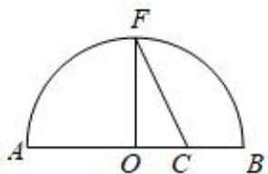
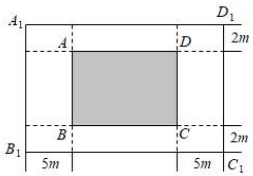

# 第三节 跟踪训练

# 考向 1 跟踪训练

【训练 1】（2021·乙卷）下列函数中最小值为 4 的是( )

A. $y = x^{2} + 2x + 4$

B. $y = |\sin x| + \frac{4}{|\sin x|}$

C. $y = 2^{x} + 2^{2 - x}$

D. $y = \ln x + \frac{4}{\ln x}$

【训练2】若 $a > 1$ ，则 $4a + \frac{1}{a - 1}$ 的最小值为（

A. 4

B. 6

C. 8

D. 无最小值

【训练3】若 $x > 3$ ，则 $\frac{x^2 - 6x + 11}{x - 3}$ 的最小值为（

A. 2

B. $\sqrt{2}$

C. $4 \sqrt{2}$

D. $2 \sqrt{2}$

【训练4】若圆 $x^{2} + y^{2} + 2x - 4y + 1 = 0$ 被直线 $2ax - by + 2 = 0 (a > 0, b > 0)$ 平分，则 $\frac{1}{a} + \frac{1}{b}$ 的最小值为（）

A. $\frac{1}{4}$

B. 9

C. 4

D. $\frac{1}{9}$

【训练 5】若 a > 0，b > 0 且 $a + b = 4$ ，则 $\frac{b}{a} + \frac{4}{b}$ 的最小值为（）

A. 2

B. $\frac{8}{3}$

C. 3

D. $\frac{10}{3}$

【训练 6】已知 a，b 是两个不同的正数，满足 $a + b = 2ab$ ，则 $3a + 2b$ 的最小值是（）

A. $\frac{3 + 2\sqrt{2}}{2}$

B. $5 + 2\sqrt{6}$

C. 3

D. $\frac{5}{2}+\sqrt{6}$

【训练 7】已知 x > 0，y > 0，且 $x + 2y + xy - 7 = 0$ ，则 $x + y$ 的最小值为（）

A. 3

B. $\sqrt{37} - 3$

C. 4

D. 6

【训练8】若正数 $x$ ， $y$ 满足 $x^{2} + 3xy - 2 = 0$ ，则 $x + y$ 的最小值是（

A. $\frac{2}{3}$

B. $\frac{4}{3}$

C. $\frac{4}{9}$

D. $\frac{8}{9}$

【训练9】若正数 $a$ ， $b$ 满足 $4a + 3b = 1$ ，则 $\frac{1}{2a + b} +\frac{1}{a + b}$ 最小值为（

A. $2 + 3\sqrt{2}$

B. $1 + 2\sqrt{2}$

C. $3 + 2\sqrt{2}$

D. $2 \sqrt{2}$

【训练 10】设 x > 0，y > 0， $2x + y = 1$ ，则 $\frac{(x + 2)(2y + 1)}{xy}$ 的最小值为 \_\_\_\_.

【训练 11】已知 x > 0，y > 0， $x + y = 1$ ，则 $\frac{2x^{2} - x + 1}{xy}$ 的最小值为（）

A. 4

B. $\frac{14}{3}$

C. $\sqrt{2} + 2$

D. $2 \sqrt{2} + 1$

# 考向 2 跟踪训练

【训练 1】《几何原本》卷 2 的几何代数法（以几何方法研究代数问题）成了后世西方数学家处理问题的重要依据，通过这一原理，很多代数公理或定理都能通过图形实现证明，也称之为无字证明．现有如图所示图形，点 F 在半圆 O 上，点 C 在直径 AB 上，且 $OF \perp AB$ ，设 AC = a，BC = b，其中 a > b > 0，则该图形可以完成的无字证明为（）

text_image

F
A O C B

A. $\frac{a + b}{2} >\sqrt{ab}$

B. $a^2 + b^2 > 2ab$

C. $\frac{2ab}{a + b} < \sqrt{ab}$

D. $\frac{a + b}{2} < \sqrt{\frac{a^2 + b^2}{2}}$

【训练2】随着我国经济发展、医疗消费需求增长、人们健康观念转变以及人口老龄化进程加快等因素的影响，医疗器械市场近年来一直保持了持续增长的趋势。某医疗器械公司为了进一步增加市场竞争力，计划改进技术生产某产品。已知生产该产品的年固定成本为200万元，最大产能为100台。每生产 $x$ 台，需另投入成本 $G(x)$ 万元，且 $G(x) = \begin{cases} x^2 + 120x, & 0 < x \leqslant 50 \\ 201x + \frac{4900}{x} - 2100, & 50 < x \leqslant 100 \end{cases}$ ，由市场调研知，该产品每台的售价为200万元，且全年内生产的该产品当年能全部销售完。

（1）写出年利润 $W(x)$ 万元关于年产量x台的函数解析式（利润=销售收入-成本）；  
（2）当该产品的年产量为多少时，公司所获利润最大？最大利润是多少？

【训练 3】为了不断满足人民日益增长的美好生活需要, 实现群众对舒适的居住条件、更优美的环境、更丰富的精神文化生活的追求, 某大型广场正计划进行升级改造。改造的重点工程之一是新建一个长方形音乐喷泉综合体 $A_{1}B_{1}C_{1}D_{1}$ , 该项目由长方形核心喷泉区 $ABCD$ (阴影部分) 和四周绿化带组成。规划核心喷泉区的 $ABCD$ 面积为 $1000m^{2}$ , 绿化带的宽分别为 $2m$ 和 $5m$ (如图所示)。当整个项目占地面积 $A_{1}B_{1}C_{1}D_{1}$ 最小时, 则核心喷泉区 $BC$ 的长度为( )

text_image

A₁
D₁
A
D
2m
B₁
B
C
2m
5m
5m
C₁

A. $20m$

B. 50m

C. $10\sqrt{10}m$

D. 100m

拓展思维 1 跟踪训练

【训练 1】设 a，b > 0， $a + b = 4$ ，则 $\sqrt{a + 1} + \sqrt{b + 3}$ 的最大值为 \_\_\_\_.

【训练 2】函数 $y=5\sqrt{x-1}+\sqrt{9-3x}$ 的最大值是()

A. $6 \sqrt{3}$

B. $2\sqrt{3}$

C. $5\sqrt{2}$

D. $2\sqrt{14}$

【训练 3】已知实数 x 、 y 、 z 满足 $x + 2y + 3z = 6$ ，则 $x^{2} + y^{2} + z^{2}$ 的最小值是（）

A. $\sqrt{6}$

B. 3

C. $\frac{18}{7}$

D. 6

# 拓展思维 2 跟踪训练

【训练 4】函数 $f(x)=\frac{3}{x}+\frac{16}{1-3x}(0<x<\frac{1}{3})$ 的最小值为()

A. 16

B. 25

C. 36

D. 49

【训练 5】若 a，b 是正实数，且 $\frac{1}{3a+b} + \frac{1}{2a+4b} = 1$ ，则 $a + b$ 的最小值为（）

A. $\frac{4}{5}$

B. $\frac{2}{3}$

C. 1

D. 2

【训练 6】已知 x，y 为非负实数，且 $x + 2y = 2$ ，则 $\frac{x^{2} + 1}{x} + \frac{2y^{2}}{y + 1}$ 的最小值为（）

A. $\frac{3}{4}$

B. $\frac{9}{4}$

C. $\frac{3}{2}$

D. $\frac{9}{2}$

