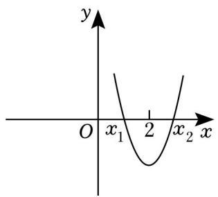

# 第四节 跟踪训练

# 考向 1 跟踪训练

【训练 1】若 a > b > 0，则下列结论错误的是（）

A. $a^2 > b^2$

B. $ac^2 >bc^2$

C. $\frac{1}{\sqrt{a}} < \frac{1}{\sqrt{b}}$

D. $a^{2}>ab$

【训练 2】（2016•北京）已知 x， $y \in R$ ，且 x > y > 0，则（）

A. $\frac{1}{x}-\frac{1}{y}>0$

B. $\sin x - \sin y > 0$

C. $\left(\frac{1}{2}\right)^x - \left(\frac{1}{2}\right)^y < 0$

D. $\ln x + \ln y > 0$

【训练 3】设 $a=x^{2}+y^{2}$ ， $b=2(x+y-1)$ ，则 a，b 的大小关系为（）

A. a > b

B. a<b

C. $a \geqslant b$

D. $a \leqslant b$

【训练 4】若 $P = \sqrt{a} + \sqrt{a + 7}$ ， $Q = \sqrt{a + 3} + \sqrt{a + 4} (a \geq 0)$ ，则 $P, Q$ 的大小关系是（）

A. P < Q

B. P=Q

C. P>Q

D. $P, Q$ 的大小由 $a$ 的取值确定

【训练 5】已知 a > b > 0，则 $\frac{a}{b}$ 与 $\frac{a+1}{b+1}$ 的大小是 \_\_\_\_.

【训练 6】（多选）已知 a > b > 0，0 < c < 1，则（）

A. $ab^{c} > ba^{c}$

B. $c^{a}>c$

C. $\frac{b}{a} < \frac{b + c}{a + c}$

D. $a - \frac{1}{b} > b - \frac{1}{a}$

# 考向 2 跟踪训练

【训练 1】（2015·广东）不等式 $-x^{2}-3x+4>0$ 的解集为 \_\_\_\_。（用区间表示）

【训练 2】解关于 x 的不等式 $ax^{2}-(a-1)x-1<0(a\in R)$ .

【训练3】已知不等式 $ax^2 + bx + c > 0$ 的解集是 $(-3, 2)$ ，则不等式 $cx^2 + bx + a > 0$ 的解集是（）

A. $(- \infty, -2) \cup (3, +\infty)$

B. $(-3,2)$

C. $(- \infty, -\frac{1}{3}) \cup (\frac{1}{2}, + \infty)$

D. $\left(-\frac{1}{3},\frac{1}{2}\right)$

【训练 4】（多选）已知关于 x 的不等式 $ax^{2} + bx + c < 0$ 的解集为 $\{x \mid x < -4 \text{ 或 } x > 3\}$ ，则（）

A. a > 0

B. $12a + c = 0$

C. $a + b + c > 0$

D. 不等式 $\frac{ax - b}{ax - c} \leqslant 0$ 的解集为 $\{x \mid -12 < x \leqslant 1\}$

【训练 5】函数 $f(x) = -x^{2} + (1 - m)x + 1$ 在区间 $[3, +\infty)$ 上单调递减．则 m 的取值范围是（）

A. $[-5, +\infty)$

B. $(-∞, -5]$

C. $[7, +\infty)$

D. $(-∞,7]$

【训练 6】若函数 $f(x)=ax^{2}+x+a$ 在 $[1, +\infty)$ 上单调递增，则 a 的取值范围是（）

A. $(0, +\infty)$

B. $(0, 1]$

C. $[1, +\infty)$

D. $[0, +\infty)$

【训练 7】（多选）已知函数 $f(x)=x^{2}+2x+1$ 在区间 $[a, a+6]$ 上的最小值为 9，则 a 可能的取值为（）

A. 2

B. 1

C. $\frac{1}{2}$

D. -10

【训练 8】已知函数 $f(x)=mx^{2}-(3m-1)x+m-2$ ， $(m\in R)$ .

（1）若 $f(x)$ 在区间 $[2, 3]$ 上为单调递增，求 m 的取值范围；  
（2）解关于 x 不等式 $f(x)+m>0$ .

【训练 9】已知二次函数 $f(x)=ax^{2}+bx+c$ ，且 $f(2+x)=f(2-x)$ ，且 $f(x)>0$ 的解集为 $(-2,c)$ .

（Ⅰ）求 $f(x)$ 的解析式.  
（Ⅱ）求 $f(x)$ 在区间 $[m, m+1]$ 的最大值记为 $h(m)$ ，并求 $h(m)$ 的最大值.

【训练 10】二次函数 $y = x^{2} + (m - 3)x + 2m$ 的图象与 x 轴的两个交点的横坐标分别为 $x_{1}$ ， $x_{2}$ ，且 $0 < x_{1} < 2 < x_{2}$ ，如图所示，则 m 的取值范围是（）

text_image

y
O x₁ 2 x₂ x

A. $m <   \frac{1}{2}$ 或 $m > 5$

B. $0 < m < \frac{1}{2}$

C. $m < -\frac{1}{2}$ 或 $m > 5$

D. $-\frac{1}{2} < m < 0$

【训练 11】方程 $mx^{2}-(m-1)x+1=0$ 在区间 $(0,1)$ 内有两个不同的根，则 m 的取值范围为（）

A. $m > 1$

B. $m > 3 + 2\sqrt{2}$

C. $m > 3 + 2\sqrt{2}$ 或 $0 < m < 3 - \sqrt{2}$

D. $3 - 2\sqrt{2} < m < 1$

【训练 12】已知方程 $x^{2}-(2a+1)x+a(a+1)=0$ 的两根分别在区间 $(0,1)$ ， $(1,3)$ 之内，则实数 a 的取值范围为 \_\_\_\_.

# 拓展思维跟踪训练

【训练1】不等式 $\frac{(x + 3)(x - 2)}{x - 1} \geqslant 0$ 的解集为（）

A. $[-3, 1) \bigcup [2, +\infty)$

B. $(- \infty, -3] \cup (1, 2]$

C. $[-3, 1) \cup (1, 2]$

D. $(- \infty, -3] \cup [2, +\infty)$

【训练 2】不等式 $|x+3|-|x-3|>3$ 的解集是\_\_\_\_.

【训练 3】存在 $x \in R$ 使不等式 $\left|2x - a\right| < \left|2a - 1\right| - 2|x|$ 成立，则实数 a 的取值范围是（）

A. $(- \infty, \frac{1}{3}) \cup (1, +\infty)$

B. $(-1,-\frac{1}{3})$

C. $\left(\frac{1}{3},1\right)$

D. $(- \infty, -1) \bigcup (-\frac{1}{3}, +\infty)$

