# 第七章 立体几何第1节 小题篇

# 考向 1 空间点线面的位置关系

# 题型 1 三垂线定理速证垂直

三垂线定理：在平面内的一条直线如果和这个平面的一条斜线的射影垂直，那么它也和这条斜线垂直.

三垂线定理的逆定理：在平面内的一条直线如果和这个平面的一条斜线垂直，那么它和这条斜线的射影垂直.

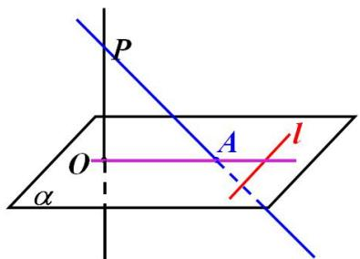

text_image

P
O
A
l
α

已知 $PO$ 是平面 $\alpha$ 的垂线，垂足为 $O$ ， $PA$ 是平面 $\alpha$ 的斜线，斜足为 $A$ ，直线 $l\subset \alpha$ ：

求证：（1）若 $l \perp PA$ ，则 $l \perp OA$ ；

(2) 若 $l \perp OA$ ，则 $l \perp PA$ 。

证明：（1） $\left.\begin{aligned}&PO\perp\alpha\\&l\subset\alpha\end{aligned}\right\}\Rightarrow PO\perp l\\&l\perp PA,PO\cap PA=P\end{aligned}\right\}\Rightarrow l\perp 平面OPA$ ，又OA⊂平面OPA，故 $l\perp OA$ ；

(2) $\left.\begin{aligned}&PO\perp\alpha\\ &l\subset\alpha\end{aligned}\right\}\Rightarrow PO\perp l\\ &l\perp OA,PO\cap PA=P\end{aligned}\right\}\Rightarrow l\perp 平面 OPA$ ，又 $PA\subset 平面 OPA$ ，故 $l\perp PA$ .

【例 1】如图，正长方体 $ABCD-A_{1}B_{1}C_{1}D_{1}$ 中，体对角线 $AC_{1}$ 与面对角线 BD 的位置关系一定是（）

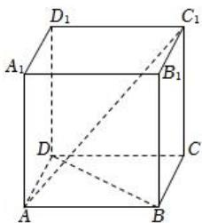

text_image

D₁
A₁
B₁
C₁
D
C
A
B

A. 平行

B. 相交

C. 垂直

D. 异面

【例 2】（2021·浙江）如图，已知正方体 $ABCD-A_{1}B_{1}C_{1}D_{1}$ ，M，N 分别是 $A_{1}D$ ， $D_{1}B$ 的中点，则（）

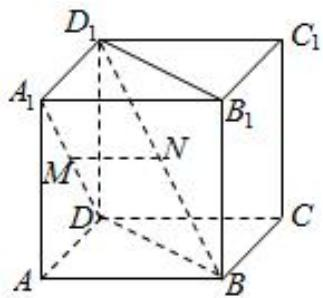

text_image

D₁
A₁
B₁
C₁
M
N
D
C
A
B

A. 直线 $A_{1} D$ 与直线 $D_{1} B$ 垂直, 直线 $M N / /$ 平面 $A B C D$   
B. 直线 $A_{1}D$ 与直线 $D_{1}B$ 平行，直线 $MN \perp$ 平面 $BDD_{1}B_{1}$   
C. 直线 $A_{1}D$ 与直线 $D_{1}B$ 相交, 直线 $MN \parallel$ 平面 $ABCD$   
D. 直线 $A_{1}D$ 与直线 $D_{1}B$ 异面，直线 $MN \perp$ 平面 $BDD_{1}B_{1}$

【例 3】（2024 天津卷） 若 m, n 为两条不同的直线， $\alpha$ 为一个平面，则下列结论中正确的是（）

A. 若 $m / / \alpha$ ， $n \subset \alpha$ ，则 $m / / n$

B. 若 $m \parallel \alpha, n \parallel \alpha$ ，则 $m \parallel n$

C. 若 $m / / \alpha, n \perp \alpha$ ，则 $m \perp n$

D. 若 $m / / \alpha, n \perp \alpha$ ，则 $m$ 与 $n$ 相交

【例 4】（2024 年甲卷）设 $\alpha$ 、 $\beta$ 是两个平面，m、n 是两条直线，且 $\alpha \cap \beta = m$ 。下列四个命题：

①若 $m \parallel n$ ，则 $n \parallel \alpha$ 或 $n \parallel \beta$

②若 $m \perp n$ ，则 $n \perp \alpha, n \perp \beta$

③若 $n // \alpha$ ，且 $n // \beta$ ，则 $m // n$

④若 n 与 $\alpha$ 和 $\beta$ 所成的角相等，则 $m \perp n$

其中所有真命题的编号是（）

A. ①③

B.②④

C. ①②③

D.①③④

# 题型 2 几何法求解距离问题

①两点间的距离：构造直角三角形，利用勾股定理处理；  
②点到平面的距离：等体积法；  
③直线到平面的距离：转化为求点到面的距离；  
④平面到平面间的距离：转化为求点到面的距离.

注意：若二面角非直角，可以考虑用向量转化求解距离，如训练5.

【例 1】在矩形 ABCD 中，AB = 1， $AD = \sqrt{3}$ ，沿对角线 AC 将矩形折成一个直二面角 B - AC - D，则点 B 与点 D 之间的距离为（）

A. $\sqrt{3}$

B. $\sqrt{5}$

C. $\frac{\sqrt{10}}{2}$

D. $\frac{\sqrt{5}}{2}$

【例 2】如图，已知在矩形 ABCD 中，AD = 4，AB = 3，M 为边 BC 的中点，将 $\triangle ABM$ ， $\triangle CDM$ 分别沿着直线 AM，MD 翻折，使得 B，C 两点重合于点 P，则点 P 到平面 MAD 的距离为 \_\_\_\_.

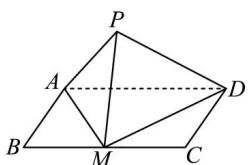

text_image

Geometric diagram of a quadrilateral with labeled vertices and internal points, used for mathematical problem solving.

【例 3】已知正四棱柱 ABCD-A₁B₁C₁D₁ 中，AB=2，CC₁=2√2 E 为 CC₁ 的中点，则直线 AC₁ 与平面 BED 的距离为

A. 2

B. $\sqrt{3}$

C. $\sqrt{2}$

D. 1

【例 4】直四棱柱 $ABCD-A_{1}B_{1}C_{1}D_{1}$ 中，底面 ABCD 为正方形，边长为 2，侧棱 $A_{1}A=3$ ，M、N 分别为 $A_{1}B_{1}$ 、 $A_{1}D_{1}$ 的中点，E、F 分别是 $C_{1}D_{1}$ ， $B_{1}C_{1}$ 的中点，求平面 AMN 与平面 EFBD 的距离.

【例 5】（2024 甲卷）如图，在以 A, B, C, D, E, F 为顶点的五面体中，四边形 ABCD 与四边形 ADEF 均为等腰梯形，BC // AD, EF // AD, AD = 4, AB = BC = EF = 2, $ED = \sqrt{10}$ , $FB = 2\sqrt{3}$ ，M 为 AD 的中点.

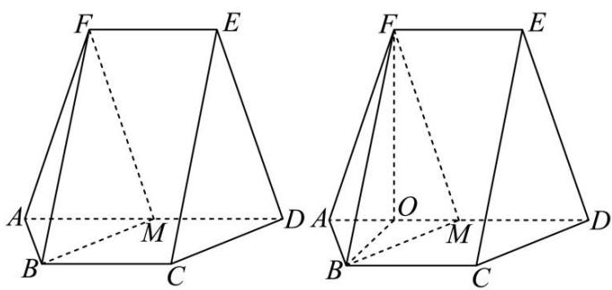

text_image

Geometric diagram showing two 3D polyhedra with labeled vertices and internal points, likely illustrating a spatial geometry problem.

（1）证明： $BM / /$ 平面CDE；  
(2) 求点 M 到 ABF 的距离.

# 题型 3 几何法处理夹角问题

# 知识点1：线与线的夹角

（1）位置关系的分类： $\left\{\begin{aligned}& 共面直线\left\{\begin{aligned}& 平行直线\\ & 相交直线\end{aligned}\right.\\& 异面直线：不同在任何一个平面内，没有公共点\end{aligned}\right.$   
(2) 异面直线所成的角

①定义：设 $a, b$ 是两条异面直线，经过空间任一点 $O$ 作直线 $a' // a, b' // b$ ，把 $a'$ 与 $b'$ 所成的锐角（或直角）叫做异面直线 $a$ 与 $b$ 所成的角（或夹角）.

②范围： $(0, \frac{\pi}{2}]$

③求法：平移法：将异面直线 a, b 平移到同一平面内，放在同一三角形内解三角形.

# 知识点 2: 线与面的夹角

①定义：平面上的一条斜线与它在平面的射影所成的锐角即为斜线与平面的线面角.

②范围： $[0, \frac{\pi}{2}]$

③求法：

常规法：过平面外一点 B 做 $BB' \perp$ 平面 $\alpha$ ，交平面 $\alpha$ 于点 $B'$ ；连接 $AB'$ ，则 $\angle BAB'$ 即为直线 AB 与平面 $\alpha$ 的夹角。接下来在 $Rt\triangle ABB'$ 中解三角形。即 $\sin\angle BAB' = \frac{BB'}{AB} = \frac{h}{斜线长}$ （其中 h 即点 B 到面 $\alpha$ 的距离，可以采用等体积法求 h，斜线长即为线段 AB 的长度）；

# 知识点 3: 二面角

（1）二面角定义：从一条直线出发的两个半平面所组成的图形称为二面角，这条直线称为二面角的棱，这两个平面称为二面角的面。（二面角 $\alpha - l - \beta$ 或者是二面角 $A - CD - B$ ）

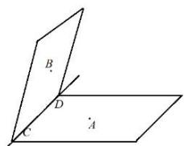

text_image

Geometric diagram showing two planes ABC and ACD with labeled points and lines

（2）二面角的平面角的概念：平面角是指以二面角的棱上一点为端点，在两个半平面内分别做垂直于棱的两条射线，这两条射线所成的角就叫做该二面角的平面角；范围 $[0, \pi]$ 。

# (3) 二面角的求法

# 法一：定义法

在棱上取点，分别在两面内引两条射线与棱垂直，这两条垂线所成的角的大小就是二面角的平面角，如图在二面角 $\alpha - l - \beta$ 的棱上任取一点 O，以 O 为垂足，分别在半平面 $\alpha$ 和 $\beta$ 内作垂直于棱的射线 OA 和 OB，则射线 OA 和 OB 所成的角称为二面角的平面角（当然两条垂线的垂足点可以不相同，那求二面角就相当于求两条异面直线的夹角即可）.

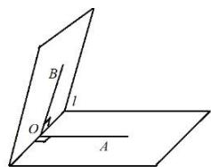

text_image

B
l
O
A

# 法二：三垂线法

在面 $\alpha$ 或面 $\beta$ 内找一合适的点 A，作 $AO \perp \beta$ 于 O，过 A 作 $AB \perp c$ 于 B，则 BO 为斜线 AB 在面 $\beta$ 内的

射影， $\angle ABO$ 为二面角 $\alpha - c - \beta$ 的平面角．如图1，具体步骤：

①找点做面的垂线；即过点 A，作 $AO \perp \beta$ 于 O；  
②过点（与①中是同一个点）做交线的垂线；即过 A 作 $AB \perp c$ 于 B，连接 BO；  
③计算： $\angle ABO$ 为二面角 $\alpha - c - \beta$ 的平面角，在 $Rt\triangle ABO$ 中解三角形.

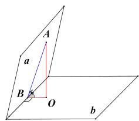

text_image

A
a
B
O
b

图 1

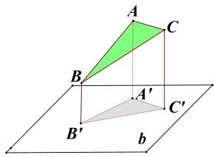

text_image

A
C
B
A'
B'
C'
b

图 2

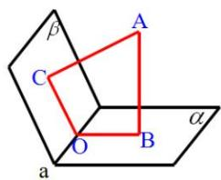

text_image

β
A
C
O
B
α
a

图 3

# 法三：射影面积法

凡二面角的图形中含有可求原图形面积和该图形在另一个半平面上的射影图形面积的都可利用射影面积公式（ $\cos \theta = \frac{S_{\text{射}}}{S_{\text{斜}}} = \frac{S_{\triangle A'B'C'}}{S_{\triangle ABC}}$ ，如图2）求出二面角的大小；

# 法四：补棱法

当构成二面角的两个半平面没有明确交线时，要将两平面的图形补充完整，使之有明确的交线（称为补棱），然后借助前述的定义法与三垂线法解题．当二平面没有明确的交线时，也可直接用法三的摄影面积法解题.

# 法五：垂面法

由二面角的平面角的定义可知两个面的公垂面与棱垂直，因此公垂面与两个面的交线所成的角，就是二面角的平面角.

例如：过二面角内一点 $A$ 作 $AB \perp \alpha$ 于 $B$ ，作 $AC \perp \beta$ 于 $C$ ，面 $ABC$ 交棱 $a$ 于点 $O$ ，则 $\angle BOC$ 就是二面角的平面角．如图3．此法实际应用中的比较少，此处就不一一举例分析了.

# 角度 1 几何法求异面直线所成角

【点睛】求异面直线所成角主要有以下两种方法：

(1) 几何法: ①平移两直线中的一条或两条, 到一个平面中; ②利用边角关系, 找到 (或构造) 所求角所在的三角形; ③求出三边或三边比例关系, 用余弦定理求角;  
(2) 向量法: ①求两直线的方向向量; ②求两向量夹角的余弦; ③因为直线夹角为锐角, 所以②对应的余弦取绝对值即为直线所成角的余弦值.

【例 1】（2021·乙卷文）在正方体 $ABCD-A_{1}B_{1}C_{1}D_{1}$ 中，P 为 $B_{1}D_{1}$ 的中点，则直线 PB 与 $AD_{1}$ 所成的角为（）

A. $\frac{\pi}{2}$

B. $\frac{\pi}{3}$

C. $\frac{\pi}{4}$

D. $\frac{\pi}{6}$

# 角度 2 几何法求二面角

【例 1】（2013·全国大纲卷理）已知正四棱柱 $ABCD-A_{1}B_{1}C_{1}D_{1}$ 中， $AA_{1}=2AB$ ，则 CD 与平面 $BDC_{1}$ 所成角的正弦值等于（）

A. $\frac{2}{3}$

B. $\frac{\sqrt{3}}{3}$

C. $\frac{\sqrt{2}}{3}$

D. $\frac{1}{3}$

# 角度 3 射影面积法求二面角

【例 1】如图，在正方体 $ABCD - A_{1}B_{1}C_{1}D_{1}$ 中，AB = 3， $CE = 2EC_{1}$ ，求二面角 D 一 BE 一 C 的余弦值.

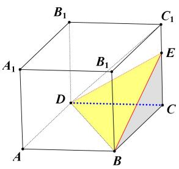

text_image

B₁
A₁
B₁
D
C
E
C
A
B

# 考向 2 静态立体几何

# 题型 1 常见几何体与重要特殊几何体

# 1. 常见空间几何体的结构特征

(1) 多面体的结构特征

<table><tr><td>名称</td><td>棱柱</td><td colspan="2">棱锥</td><td>棱台</td></tr><tr><td>图形</td><td>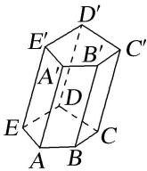</td><td></td><td>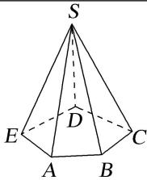</td><td>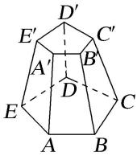</td></tr><tr><td>底面</td><td>互相平行且全等</td><td colspan="2">多边形</td><td>互相平行且相似</td></tr><tr><td>侧棱</td><td>平行且相等</td><td colspan="2">相交于一点,但不一定相等</td><td>延长线交于一点</td></tr><tr><td>侧面形状</td><td>平行四边形</td><td colspan="2">三角形</td><td>梯形</td></tr></table>

(2)旋转体的结构特征

<table><tr><td>名称</td><td>圆柱</td><td>圆锥</td><td>圆台</td><td>球</td></tr><tr><td>图形</td><td>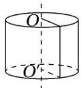</td><td>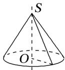</td><td>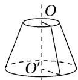</td><td>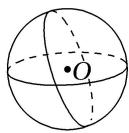</td></tr><tr><td>母线</td><td>互相平行且相等,垂直于底面</td><td>相交于一点</td><td>延长线交于一点</td><td></td></tr><tr><td>轴截面</td><td>矩形</td><td>等腰三角形</td><td>等腰梯形</td><td>圆面</td></tr><tr><td>侧面展开图</td><td>矩形</td><td>扇形</td><td>扇环</td><td></td></tr></table>

2. 圆柱、圆锥、圆台的侧面展开图及侧面积公式

<table><tr><td></td><td>圆柱</td><td>圆锥</td><td>圆台</td></tr><tr><td>侧面展开图</td><td>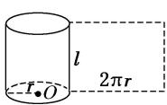</td><td>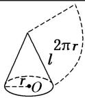</td><td>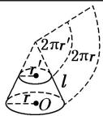</td></tr><tr><td>侧面积公式</td><td> $S_{\text{圆柱侧}} = 2\pi rl$ </td><td> $S_{\text{圆锥侧}} = \pi rl$ </td><td> $S_{\text{圆台侧}} = \pi (r + r')l$ </td></tr></table>

3. 空间几何体的表面积与体积公式

<table><tr><td>几何体\名称</td><td>表面积</td><td>体积</td></tr><tr><td>柱体(棱柱和圆柱)</td><td> $S_{\text{表面积}} = S_{\text{侧}} + 2S_{\text{底}}$ </td><td> $V = Sh$ </td></tr><tr><td>锥体(棱锥和圆锥)</td><td> $S_{\text{表面积}} = S_{\text{侧}} + S_{\text{底}}$ </td><td> $V = \frac{1}{3}Sh$ </td></tr><tr><td>台体(棱台和圆台)</td><td> $S_{\text{表面积}} = S_{\text{侧}} + S_{\text{上}} + S_{\text{下}}$ </td><td> $V = \frac{1}{3}(S_{\text{上}} + S_{\text{下}} + \sqrt{S_{\text{上}}S_{\text{下}}}) \cdot h$ </td></tr><tr><td>球</td><td> $S = 4\pi R^{2}$ </td><td> $V = \frac{4}{3}\pi R^{3}$ </td></tr></table>

# 3. 常考其他几何体

阳马和鳖臑是我国古代对一些特殊锥体的称谓，取一长方体，按下图斜割一分为二，得两个一模一样的三棱柱，称为堑堵.

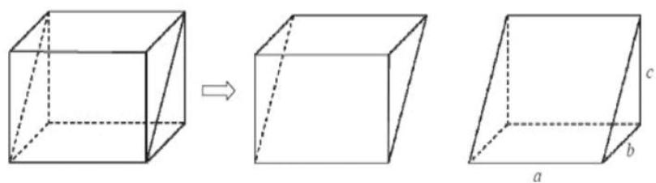

text_image

Diagram illustrating the 3D cube transformation from a rectangular prism to its three-dimensional form, labeled with axes a, b, and c.

再沿堑堵的一顶点与相对的棱剖开，得四棱锥和三棱锥各一个．以矩形为底，另有一棱与底面垂直的

四棱锥，称为阳马．余下的三棱锥是由四个直角三角形组成的四面体，称为鳖臑.

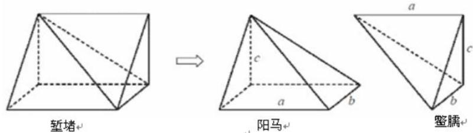

text_image

堑堵
阳马
鳌腾

# 4. 正四面体

如图，设正四面体 $ABCD$ 的的棱长为 $a$ ，将其放入正方体中，则正方体的棱长为 $\frac{\sqrt{2}}{2} a$ ，显然正四面体和正方体有相同的外接球．（正四面体的棱长为正方体棱长 $\sqrt{2}$ 倍）

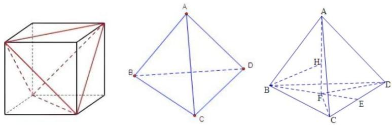

text_image

Geometric diagrams showing a cube, a tetrahedron with labeled vertices (A, B, C, D, E, F, H), and dashed lines indicating hidden edges.

在棱长为 $a$ 的正四面体中

结论 1: 高 $h=\frac{\sqrt{6}}{3}a$ .

结论 2: 内切球半径 $r=\frac{\sqrt{6}}{12}a$ .

结论 3: 外切球半径 $R=\frac{\sqrt{6}}{4}a$ .

【例 1】（2024 新 I 卷）已知圆柱和圆锥的底面半径相等，侧面积相等，且它们的高均为 $\sqrt{3}$ ，则圆锥的体积为（）

A. $2 \sqrt{3} \pi$

B. $3\sqrt{3}\pi$

C. $6\sqrt{3}\pi$

D. $9\sqrt{3}\pi$

【例 2】(2024 甲卷)已知甲、乙两个圆台上、下底面的半径均为 $r_{1}$ 和 $r_{2}$ ，母线长分别为 $2(r_{2}-r_{1})$ 和 $3(r_{2}-r_{1})$ ，则两个圆台的体积之比 $\frac{V_{\text{甲}}}{V_{\text{乙}}} =$ \_\_\_\_.

【例 3】（2023·多选·新高考Ⅱ）已知圆锥的顶点为 P，底面圆心为 O，AB 为底面直径， $\angle APB = 120^{\circ}$ ，PA = 2，点 C 在底面圆周上，且二面角 P - AC - O 为 $45^{\circ}$ ，则（）

A. 该圆锥的体积为 $\pi$

B. 该圆锥的侧面积为 $4 \sqrt{3} \pi$

C. $AC = 2\sqrt{2}$

D. $\Delta PAC$ 的面积为 $\sqrt{3}$

【例 4】（2024 天津卷）一个五面体 ABC-DEF．已知 $AD \parallel BE \parallel CF$ ，且两两之间距离为 1．并已知 AD = 1，BE = 2，CF = 3．则该五面体的体积为（）

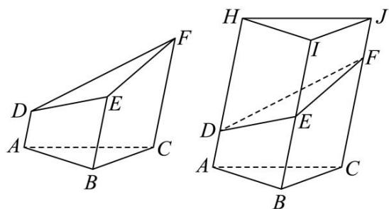

text_image

Geometric diagram showing two 3D polyhedra with labeled vertices and internal diagonals

A. $\frac{\sqrt{3}}{6}$

B. $\frac{3\sqrt{3}}{4}+\frac{1}{2}$

C. $\frac{\sqrt{3}}{2}$

D. $\frac{3\sqrt{3}}{4} -\frac{1}{2}$

【例 5】(2020·新课标III) 已知圆锥的底面半径为 1，母线长为 3，则该圆锥内半径最大的球的体积为 \_\_\_\_.

【例 6】（2024 新 II 卷）已知正三棱台 $ABC - A_{1}B_{1}C_{1}$ 的体积为 $\frac{52}{3}$ ，AB = 6， $A_{1}B_{1} = 2$ ，则 $A_{1}A$ 与平面 ABC 所成角的正切值为（）

A. $\frac{1}{2}$

B. 1

C. 2

D. 3

【例 7】正四面体 ABCD 中，棱长为 a，高为 h，外接球半径为 R，内切球半径为 r，AB 与平面 BCD 所成角为 $\alpha$ ，二面角 A-BD-C 的大小为 $\beta$ ，则（）

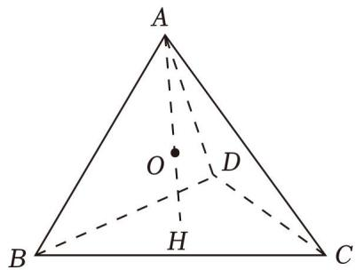

text_image

A
O
D
B
H
C

A. $h=\frac{\sqrt{6}}{3}a$

B. $R = 2r$

C. $\sin \alpha = \frac{\sqrt{6}}{3}$

D. $\cos\beta=\frac{1}{2}$

【例 8】已知正四面体 ABCD，点 M 为棱 CD 的中点，则异面直线 AM 与 BC 所成角的余弦值为 \_\_\_\_.

【例 9】《九章算术·商功》：“斜解立方，得两堑堵，其一为阳马，一为鳖臑，阳马居二，鳖臑居一．”如图解释了这段话中由一个长方体得到堑堵、阳马、鳖臑的过程．在一个长方体截得的堑堵和鳖臑中，若堑堵的内切球（与各面均相切）半径为1，则鳖臑体积的最小值为( )

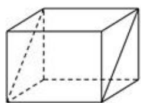

natural_image

Simple line drawing of a 3D cube with visible edges and faces (no text or symbols)

长方体

A. $2 + \frac{2\sqrt{2}}{3}$

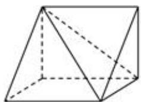

natural_image

Geometric diagram of a triangular prism with visible and hidden edges (no labels or text)

堑堵

B. $3 \sqrt{3}$

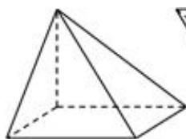

natural_image

Geometric diagram of a triangular pyramid (tetrahedron) with visible edges and dashed hidden edges (no labels or text)

阳马

C. $2 + \frac{4\sqrt{2}}{3}$

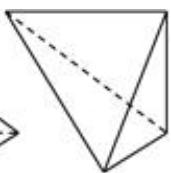

螯腸

D. $2\sqrt{3}$

【例 10】《九章算术·商功》中有这样一段话：“斜解立方，得两堑堵，斜解堑堵，其一为阳马，一为鳖臑.阳马居二，鳖臑居一，不易之率也．意思是：如图，沿正方体对角面 $A_{1}B_{1}CD$ 截正方体可得两个堑堵，再沿平面 $B_{1}C_{1}D$ 截堑堵可得一个阳马（四棱锥 $D-A_{1}B_{1}C_{1}D_{1}$ ），一个鳖臑（三棱锥 $D-B_{1}C_{1}C$ ），若 P 为线段 CD 上一动点，平面 $\alpha$ 过点 P， $CD \perp$ 平面 $\alpha$ ，设正方体棱长为 1，PD = x， $\alpha$ 与图中的鳖臑截面面积为 S，则点 P 从点 D 移动到点 C 的过程中，S 关于 x 的函数图象大致是（）

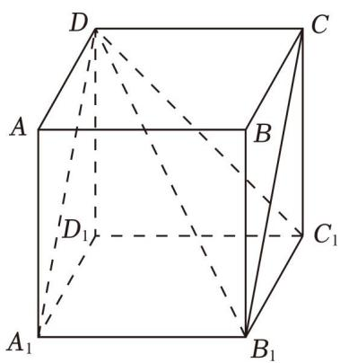

text_image

D
A
B
C
D₁
C₁
A₁
B₁

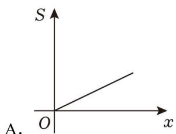

text_image

S
A.
O
x

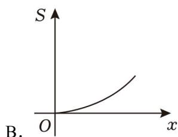

text_image

S
B. O x

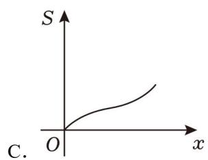

text_image

S
C. O x

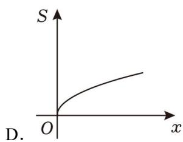

text_image

S
D. O x

# 题型 2 截面问题

# 一、立体几何与截面问题

# 1. 定义

①截面:一个无限长的平面去截几何体,该平面与几何体的交面,为该几何体的截面  
②截线:该平面与几何体表面上的交线叫做截线.  
③截点:该平面与几何体各棱上的交点叫做截点．连接各截点形成的线段即为截线(在表面上)，连接各截线形成的封闭图形即为截面.

# 2. 作截面的基本逻辑

(1) 找截点→连截线→围截面  
(2)作截面的理论依据：

①任意两点确定唯一直线，不共线的三点确定唯一平面；  
②处于两个平面中的两条直线的交点，在这两条直线所在的平面的交线上；  
③若两个平面互相平行，且第三个平面与它们相交，则两条交线平行；  
④若一条直线平行于一个平面，经过该直线的平面与该此平面相交，则直线与交线平行：

(3)如何确定该截面是否“完整”

①所画的线是否围成了一个封闭图形？  
②题目所要求过的点是否都在截面上?  
③该截面的各个边是否都在几何体的表面(不能在几何体内部)?

# 3. 作截面的具体方法

（1）平行线法：适用于有两个或两个以上截面线段在表面上  
（2）延长线法：适用于只有一个截面线段在表面上

【例 1】正方体 $ABCD - A'B'C'D'$ 的棱长为 2，E 为棱 $BB'$ 的中点，用过点 A，E， $C'$ 的平面截取该正方体，则截面的面积为（）

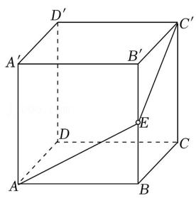

text_image

Geometric diagram of a cube with labeled vertices and internal points, used for spatial geometry problems.

A. $2 \sqrt{6}$

B. $2\sqrt{5}$

C. 5

D. $4\sqrt{2}$

【例 2】正方体 $ABCD - A_{1}B_{1}C_{1}D_{1}$ 中，M，N 分别是 $CC_{1}$ ， $B_{1}C_{1}$ 的中点，则过 $A_{1}$ ，M，N 三点的平面截正方体所得的截面形状是（）

A. 平行四边形

B. 直角梯形

C. 等腰梯形

D. 三角形

【例 3】如图正方体 $ABCD - A_{1}B_{1}C_{1}D_{1}$ ，棱长为 1，P 为 BC 中点，Q 为线段 $CC_{1}$ 上的动点，过点 A、P、Q 的平面截该正方体所得的截面记为 S．则下列命题正确的是 ①②④（写出所有正确命题的编号）.

①当 $0 < CQ < \frac{1}{2}$ 时，S 为四边形；  
②当 $CQ=\frac{1}{2}$ 时，S 为等腰梯形；  
③当 $\frac{3}{4}<CQ<1$ 时，S为六边形；  
④当 $CQ = 1$ 时， $S$ 的面积为 $\frac{\sqrt{6}}{2}$ .

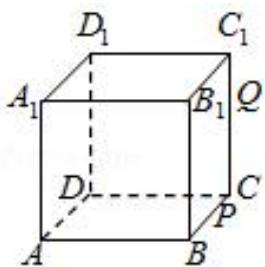

text_image

D₁
C₁
A₁
B₁
Q
D
C
P
A
B

# 二、正方体截面问题：

# 1. 正方体的基本截面:

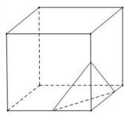  
任意三角形

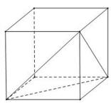  
正三角形

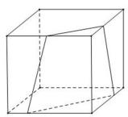  
梯形

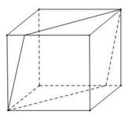  
平行四边形

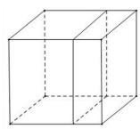  
正方形

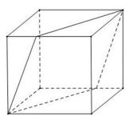  
菱形

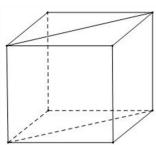  
矩形

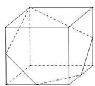  
任意五边形

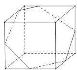  
任意六边形

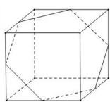  
正六边形

正方体的截面不会出现以下图形：直角三角形、钝角三角形、直角梯形、正五边形.

# 2. 正方体截面面积最大值:

截面为三角形→正三角形

截面为四边形→矩形

截面为六边形→正六边形

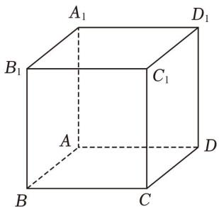

text_image

A₁
B₁
C₁
A
D
B
C
D₁

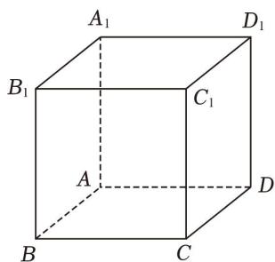

text_image

A₁
B₁
C₁
A
D
B
C
D₁

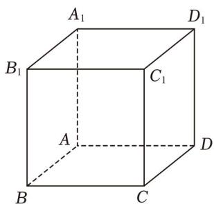

text_image

A₁
B₁
C₁
A
D
B
C
D₁

注意：正方体的体对角线与所有棱所成角都相等.

【例 1】（2018•新课标 I）已知正方体的棱长为 1，每条棱所在直线与平面 $\alpha$ 所成的角都相等，则 $\alpha$ 截此正方体所得截面面积的最大值为（）

text_image

Geometric diagram of a cube with labeled vertices and internal diagonals, used for spatial geometry problems.

A. $\frac{3\sqrt{3}}{4}$

B. $\frac{2\sqrt{3}}{3}$

C. $\frac{3\sqrt{2}}{4}$

D. $\frac{\sqrt{3}}{2}$

【例 2】（2023·多选·新高考 I）下列物体中，能够被整体放入棱长为 1（单位：m）的正方体容器（容器壁厚度忽略不计）内的有（）

A. 直径为 $0.99m$ 的球体

B. 所有棱长均为 $1.4 m$ 的四面体

C. 底面直径为 $0.01m$ ，高为 $1.8m$ 的圆柱体

D. 底面直径为 $1.2 m$ ，高为 $0.01 m$ 的圆柱体

text_image

B
A
D
C
B₁
C₁
A₁
D₁

text_image

A
B
E
C
D
F
J
B₁
G
I
C₁
A₁
H
D₁

text_image

E
F
J
G
I
H

【例 3】（2025·T8 第一次联考·多选）已知正方体 ABCD-A'B'C'D' 的棱长为 1，M 是 AA' 中点，P 是 AB 的中点，点 N 满足 $\overrightarrow{D'N} = \lambda \overrightarrow{D'C'} (\lambda \in [0,1])$ ，平面 MPN 截该正方体，将其分成两部分，设这两部分的体积分别为 $V_{1}$ ， $V_{2}$ ，则下列判断正确的是（）

A. $\lambda=\frac{1}{2}$ 时，截面面积为 $\frac{\sqrt{3}}{2}$

B. $\lambda=\frac{1}{2}$ 时， $V_{1}=V_{2}$

C. $|V_{1} - V_{2}|$ 随着 $\lambda$ 的增大先减小后增大

D. $|V_{1} - V_{2}|$ 的最大值为 $\frac{5}{12}$

# 三、球体的截面问题

1. 球的截面一定是圆或者是圆的一部分;  
2. 确定球心与半径，建立直角三角形，计算截面与球心的距离；  
3. 最大的截面半径 r = R，最小的截面半径 $r = \sqrt{R^{2} - d_{\min}^{2}}$ .

text_image

Geometric diagram of a sphere with labeled points O and O₁, showing internal and external planes.

【例 1】正四面体 ABCD 的棱长为 4，E 为棱 AB 的中点，过 E 作此正四面体的外接球的截面，则该截面面积的取值范围是( )

A. $[4\pi, 6\pi]$

B. $[4\pi, 12\pi]$

C. $[\pi , 4\pi ]$

D. $[\pi, 6\pi]$

【例 2】【多选】在边长为 4 的正方形 ABCD 中，如图 1 所示，E，F，M 分别为 BC，CD，BE 的中点，分别沿 AE，AF 及 EF 所在直线把 $\Delta AEB$ ， $\Delta AFD$ 和 $\Delta EFC$ 折起，使 B，C，D 三点重合于点 P，得到三棱锥 P-AEF，如图 2 所示，则下列结论中正确的是（）

text_image

A
D
F
B M E C

图1

text_image

P
M
A
F
E

图2

text_image

A
M
E
F

A. $PA \perp EF$   
B. 三棱锥 $M - AEF$ 的体积为4  
C. 三棱锥 $P - AEF$ 外接球的表面积为 $24 \pi$   
D. 过点 $M$ 的平面截三棱锥 $P - AEF$ 的外接球所得截面的面积的取值范围为 $[\pi, 6\pi]$

【例 3】已知三棱锥 P-ABC 的各个顶点都在球 O 的表面上， $PA \perp$ 底面 ABC， $AB \perp AC$ ，AB = 6，AC = 8，D 是线段 AB 上一点，且 AD = 5DB。过点 D 作球 O 的截面，若所得截面圆面积的最大值与最小值之差为 $28\pi$ ，则球 O 的表面积为（）

A. $128\pi$

B. $132\pi$

C. $144\pi$

D. $156\pi$

# 题型 3 几何体外接球

# 一、长方体切割体的外接球

text_image

C
O
A
B

图 1 墙角体

text_image

A
B
P

图 2 鳖臑

text_image

A
B
C

图 3 挖墙角体

text_image

Geometric diagram showing a cube inscribed in a circle with labeled vertices A, B, C, D and internal diagonals

图4对角线相等的四面体

【例 1】（2020·天津）若棱长为 $2\sqrt{3}$ 的正方体的顶点都在同一球面上，则该球的表面积为()

A. $12\pi$

B. $24\pi$

C. $36\pi$

D. $144\pi$

【例 2】（2019•新课标 I）已知三棱锥 P-ABC 的四个顶点在球 O 的球面上，PA=PB=PC， $\Delta ABC$ 是边长为 2 的正三角形，E，F 分别是 PA，AB 的中点， $\angle CEF=90^{\circ}$ ，则球 O 的体积为（）

A. $8 \sqrt{6} \pi$

B. $4 \sqrt{6} \pi$

C. $2 \sqrt{6} \pi$

D. $\sqrt{6}\pi$

# 二、锥体的外接球

【例 1】（2021•甲卷）已知 A，B，C 是半径为 1 的球 O 的球面上的三个点，且 $AC \perp BC$ ，AC = BC = 1，则三棱锥 O - ABC 的体积为（）

A. $\frac{\sqrt{2}}{12}$

B. $\frac{\sqrt{3}}{12}$

C. $\frac{\sqrt{2}}{4}$

D. $\frac{\sqrt{3}}{4}$

【例 2】（2020•新课标 I）已知 A，B，C 为球 O 的球面上的三个点， $\odot O_{1}$ 为 $\Delta ABC$ 的外接圆．若 $\odot O_{1}$ 的面积为 $4\pi$ ， $AB = BC = AC = OO_{1}$ ，则球 O 的表面积为（）

A. $64\pi$

B. $48\pi$

C. $36\pi$

D. $32\pi$

【例 3】（2021·天津）两个圆锥的底面是一个球的同一截面，顶点均在球面上，若球的体积为 $\frac{32\pi}{3}$ ，两个圆锥的高之比为1:3，则这两个圆锥的体积之和为()

A. $3\pi$

B. $4\pi$

C. $9\pi$

D. $12\pi$

【例 4】（2024·九省 2 月份联考）在正三棱锥 P-ABC 中，侧棱 PA 与底面 ABC 所成的角为 $\frac{\pi}{3}$ ，且 AB=3，则三棱锥 P-ABC 外接球的表面积为（）

A. $8\pi$

B. $12\pi$

C. $16\pi$

D. $18\pi$

# 三、含垂面 and 二面角的外接球

text_image

A
O₂
B
O
E
O₁
C
D

1. 双半径单交线公式: $R^{2} = R_{1}^{2} + R_{2}^{2} - \frac{l^{2}}{4}$

$$
R ^ {2} = O D ^ {2} = O O _ {1} ^ {2} + O _ {1} D ^ {2} = O _ {2} E ^ {2} + O _ {1} D ^ {2} = \left(O _ {2} C ^ {2} - C E ^ {2}\right) + O _ {1} D ^ {2} = O _ {2} C ^ {2} - \left(\frac {1}{2} B C\right) ^ {2} + O _ {1} D ^ {2} = R _ {1} ^ {2} + R _ {2} ^ {2} - \frac {l ^ {2}}{4}.
$$

【例 1】已知在三棱锥 A-BCD 中，面 $ABD \perp$ 面 BCD， $\Delta BCD$ 和 $\Delta ABD$ 均是边长为 $2\sqrt{3}$ 的正三角形，则该三棱锥的外接球体积为 \_\_\_\_.

【例 2】已知平面图形 PABCD，ABCD 为矩形，AB = 4，PAD 是以 P 为顶点的等腰直角三角形，如图所示，将 $\triangle PAD$ 沿着 AD 翻折至 $\triangle P'AD$ ，当四棱锥 $P' - ABCD$ 体积的最大值为 $\frac{16}{3}$ ，此时四棱锥 $P' - ABCD$ 外接球的表面积为（）

text_image

Geometric diagram of a pyramid with labeled vertices and internal points, including dashed lines indicating hidden edges.

A. $12\pi$

B. $16\pi$

C. $24\pi$

text_image

P'
D
H
O
A
B
C

D. $32\pi$

2. 双距离单交线公式: $R^{2} = \frac{m^{2} + n^{2} - 2mn\cos\alpha}{\sin^{2}\alpha} + \frac{l^{2}}{4}$ . 证明: 如图, 若空间四边形 $ABCD$ 中,

二面角 C-AB-D 的平面角大小为 $\alpha$ ，ABD 的外接圆圆心为 $O_{1}$ ，ABC 的外接圆圆心为 $O_{2}$ ，E 为公共弦 AB 中点，则 $\angle O_{1}EO_{2} = \alpha$ ， $O_{1}E = m$ ， $O_{2}E = n$ ， $AE = \frac{l}{2}$ ，OA = R，

由于 O、 $O_{1}$ 、E、 $O_{2}$ 四点共圆，且 $OE = 2R' = \frac{O_{1}O_{2}}{\sin\alpha}$ ，余弦定理 $\left|O_{1}O_{2}\right|^{2} = m^{2} + n^{2} - 2mn\cos\alpha$ ，

text_image

C
O₂ B O
E O₁
A D

得 $R^2 = |OE|^2 + |AE|^2 = \frac{m^2 + n^2 - 2mn\cos\alpha}{\sin^2\alpha} + \frac{l^2}{4}$ .

【例 1】已知三棱锥 D-ABC 所有顶点都在球 O 的球面上， $\triangle ABC$ 为边长为 $2\sqrt{3}$ 的正三角形， $\triangle ABD$ 是以 BD 为斜边的直角三角形，且 AD=2，二面角 C-AB-D 为 $120^{\circ}$ ，则球 O 的表面积为（）

A. $\frac{148\pi}{3}$

B. $28\pi$

C. $\frac{37\pi}{3}$

D. $36\pi$

# 题型 4 几何体内切球

# 1. 棱锥的内切球半径：等体积法

第一步、先求出四个表面的面积和整个锥体的体积.

第二步、设内切球半径为 r，建立等式：

$$
V _ {P - A B C} = V _ {O - A B C} + V _ {O - P A B} + V _ {O - P A C} + V _ {O - P B C} \Rightarrow V _ {P - A B C} = \frac {1}{3} \left(S _ {\Delta A B C} + S _ {\Delta P A B} + S _ {\Delta P A C} + S _ {\Delta P B C}\right) \cdot r.
$$

第三步、解出 $r=\frac{3V_{P-ABC}}{S_{\Delta ABC}+S_{\Delta PAB}+S_{\Delta PAC}+S_{\Delta PBC}}$ .

text_image

Geometric diagram of a pyramid with labeled vertices and internal points, showing solid and dashed edges for spatial relationships.

注意：正四面体（棱长为 a）的外接球半径 R 与内切球半径 r 之比为 R: r = 3:1.

外接球半径： $R=\frac{\sqrt{6}}{4}a$ ，内切球半径： $r=\frac{\sqrt{6}}{12}a$ 。

【例 1】正三棱锥 S-ABC，底面边长为 3，侧棱长为 2，则其外接球和内切球的半径是多少？

text_image

Geometric diagram of a sphere with labeled points and lines, showing triangle ABC and auxiliary points A, F, O.

# 2. 圆锥的内切球问题

【例 2】（2023·合肥月考）已知某圆锥的高为 4，其内切球的体积为 $\frac{4}{3}\pi$ ，则该圆锥的侧面积 $S=(\quad)$

A. $\pi$

B. $3\pi$

C. $6\pi$

D. $12\pi$

【例 3】点 P 是棱长为 4 的正四面体表面上的动点，MN 是该四面体内切球的一条直径，则 $\overrightarrow{PM} \cdot \overrightarrow{PN}$ 的最大值是 \_\_\_\_.

【例 4】（2025·八省第一次联考）如图，在三棱锥 P-ABC 中，PA=PB=CA,CB=2， $\angle APB=\angle ACB=\frac{\pi}{2}$ ，E，F，G 分别为 PA，PB，PC 上靠近点 P 的三等分点，若此时恰好存在一个小球与三棱锥 P-ABC 的四个面均相切，且小球同时还与平面 EFG 相切，则 PC=( )

text_image

Geometric diagram of a pyramid with labeled vertices and an inscribed circle, used for mathematical problem solving.

A. $\sqrt{6} +\sqrt{2}$

text_image

Geometric diagram of a pyramid with labeled vertices and internal points, used for spatial geometry problems.

B. $\sqrt{6} -\sqrt{2}$

C. $\sqrt{13} + 1$

D. $\sqrt{13} - 1$

# 题型 5 几何体棱切球

# 1. 常用结论:

①已知正方体的棱长为 $a$ ，则它的棱切球半径为 $R = \sqrt{\frac{a^2 + a^2}{2}} = \frac{\sqrt{2}a}{2}$   
②已知正三棱柱的棱长均为a，则它的棱切球半径为 $R=\frac{\sqrt{3}a}{3}$ .   
③已知正四面体的棱长为a，则它的棱切球半径为 $R=\frac{\sqrt{2}a}{4}$ .

# 2. 解题技巧:

①找切点，找球心，构造直角三角形.  
②正 $n$ 棱柱的棱切球的球心为上下底面中心连线的中点 $O$ , 正棱锥的棱切球的球心在其高线上, 可以通过对称性或者截面圆心的垂心确定.  
③棱长都为a的正n棱柱，则棱切球的半径为 $R=\frac{a}{2\sin\frac{\pi}{n}}$ .

【例1】已知一个表面积为24的正方体，假设有一个与该正方体每条棱都相切的球，则此球的体积为

A. $\frac{4\pi}{3}$

B. $4 \sqrt{3} \pi$

C. $\frac{24\sqrt{6}\pi}{3}$

D. $\frac{8\sqrt{2}\pi}{3}$

【题 2】已知球 O 的表面积为 $9\pi$ ，若球 O 与正四面体 S-ABC 的六条棱均相切，则此四面体的体积为（）

A. 9

B. $3 \sqrt{2}$

C. $\frac{9\sqrt{2}}{2}$

D. $\frac{9\sqrt{2}}{8}$

【题 3】已知正三棱柱的高等于 1，一个球与该正三棱柱的所有棱都相切，则该球的体积为( )

A. $\frac{\pi}{6}$

B. $\frac{4\sqrt{3}\pi}{27}$

C. $\frac{4\pi}{3}$

D. $\frac{4\sqrt{3}\pi}{3}$

# 考向 3 动态立体几何

# 立体几何中的动态翻折问题

1. 关于点的轨迹：某些点、线、面按照一定的规则运动，构成各式各样的轨迹，探求空间轨迹的关键是找到关键点和翻折过程中不变的数量关系与位置关系.  
2. 证明或探索位置关系：

①确定翻折前后变与不变的关系，一般地，位于“折痕”同侧的点、线、面之间的位置和数量关系不变，而位于“折痕”两侧的点、线、面之间的位置关系会发生变化；对于不变的关系应在平面图形中处理，而对于变化的关系则要在立体图形中解决.  
②确定翻折后关键点的位置，所谓的关键点，是指翻折过程中运动变化的点．因为这些点的位置移动，会带动与其相关的其他的点、线、面的关系变化，以及其他点、线、面之间位置关系与数量关系的变化．只有分析清楚关键点的准确位置，才能以此为参照点，确定其他点、线、面的位置，进而进行有关的证明与计算  
3. 关于体积最值问题，将一个多边形沿一条线折叠得到一个棱锥,当该棱锥的体积最大时,以折线为交线的两个半平面垂直，当在折叠过程中棱锥的底面积和高度同时变化时，则需要构建目标函数，通过自变量的范围,求函数最值解决.  
4. 旋转问题, 两线段距离之和最值问题, 将不共面的两线段旋转到同一平面, 再利用平面几何知识进行求解.

# 题型 1 轨迹问题

【例 1】如图，矩形 ABCD 中，AB = 2AD = 2，E 为边 AB 的中点，将 $\triangle ADE$ 沿 DE 翻折成 $\triangle A_{1}DE$ ，若 M 为线段 $A_{1}C$ 的中点，则在翻折过程中，M 点的轨迹为（）

text_image

A₁
M
D
C
A
E
B

A. 椭圆的一段

B. 直线的一段

C. 抛物线的一段

D. 一段圆弧

【例 2】已知正方形 ABCD 的边长为 2，将 $\triangle ACD$ 沿 AC 翻折到 $\triangle ACD'$ 的位置，得到四面体 $D' - ABC$ ，在翻折过程中，点 $D'$ 始终位于 $\triangle ABC$ 所在平面的同一侧，且 $BD'$ 的最小值为 $\sqrt{2}$ ，则点 D 的运动轨迹的长度为（）

A. $\pi$

B. $2\pi$

C. $\frac{2\sqrt{2}\pi}{3}$

D. $\frac{4\sqrt{2}\pi}{3}$

text_image

D'
O
A
C
B

# 题型 2 最值问题

【例 3】（2021·上海）已知圆柱的底面圆半径为 1，高为 2，AB 为上底面圆的一条直径，C 是下底面圆周上的一个动点，则 $\Delta ABC$ 的面积的取值范围为 \_\_\_\_.

【例 4】在梯形 ABCD 中， $\angle ABC = \angle BAD = 90^{\circ}, AB = BC = \frac{1}{2} AD = 1$ ，将 $\triangle ABC$ 沿直线 AC 翻折成 $\triangle AB_{1}C$ ，当三棱锥 $B_{1} - ACD$ 的体积最大时，三棱锥 $B_{1} - ACD$ 的外接球的表面积为 \_\_\_\_.

【例 5】（2017•新课标Ⅰ）如图，圆形纸片的圆心为 O，半径为 5cm，该纸片上的等边三角形 ABC 的中心为 O．D、E、F 为圆 O 上的点， $\Delta DBC$ ， $\Delta ECA$ ， $\Delta FAB$ 分别是以 BC，CA，AB 为底边的等腰三角形。沿虚线剪开后，分别以 BC，CA，AB 为折痕折起 $\Delta DBC$ ， $\Delta ECA$ ， $\Delta FAB$ ，使得 D、E、F 重合，得到三棱锥。当 $\Delta ABC$ 的边长变化时，所得三棱锥体积（单位： $cm^{3}$ ）的最大值为 \_\_\_\_.

text_image

F
A
E
B
O
C
D

【例 6】（2024•T8 联考模拟）已知正方体 $ABCD-A_{1}B_{1}C_{1}D_{1}$ 的棱长为 2，P 为线段 $C_{1}D_{1}$ 上的动点，则三棱锥 P-BCD 外接球半径的取值范围为()

A. $\left[\frac{\sqrt{29}}{4},2\right]$

B. $\left[\frac{\sqrt{21}}{4},\sqrt{3}\right]$

C. $\left[\frac{\sqrt{41}}{4},\sqrt{3}\right]$

D. $[\frac{\sqrt{7}}{4},\sqrt{3} ]$

【例 7】（2025·武汉二调）如图，直角梯形 ABCD 中，BC // AD， $AB \perp AD$ ，BC = 8，AD = 9， $AB = 2\sqrt{3}$ ，点 E 为线段 BC 不在端点上的一点，过 E 作 AB 的平行线交 AD 于 F，将矩形 ABEF 翻折至与梯形 ECDF 垂直，得到六面体 ABCDEF。

（1）若 $CF \perp BD$ ，求 BE 的长；  
(2) 求异面直线 $BC$ 与 $AD$ 所成角余弦值的最小值.

text_image

Geometric diagrams showing a parallelogram and its 3D polyhedron with labeled vertices and internal points.

# 题型 3 旋转问题

【例 1】如图，正方体 $ABCD - A_{1}B_{1}C_{1}D_{1}$ 的棱长为 2，P 是面对角线 $BC_{1}$ 上一动点，Q 是底面 ABCD 上一动点，则 $D_{1}P + PQ$ 的最小值是 \_\_\_\_.

text_image

D₁
C₁
A₁
B₁
P
D
Q
A
B
C

【例 2】（多选）在棱长为 1 的正方体 $ABCD - A_{1}B_{1}C_{1}D_{1}$ 中，点 P 满足 $\overrightarrow{DP} = \lambda \overrightarrow{DD_{1}} + \mu \overrightarrow{DA}$ ， $\lambda \in [0, 1]$ ， $\mu \in [0, 1]$ ，则以下说法正确的是（）

A. 当 $\lambda = \mu$ 时， $BP //$ 平面 $CB_{1}D_{1}$   
B. 当 $\mu = \frac{1}{2}$ 时，存在唯一点 $P$ 使得 $DP$ 与直线 $CB_{1}$ 的夹角为 $\frac{\pi}{3}$   
C. 当 $\lambda + \mu = 1$ 时， $DP + PB$ 的最小值为 $\sqrt{2 + \sqrt{2}}$   
D. 当点 $P$ 落在以 $B_{1}$ 为球心， $\sqrt{2}$ 为半径的球面上时， $\lambda + \mu$ 的最小值为 $2 - \sqrt{2}$

题型四 体积分割之动态定直线

例 1.（2025·武汉二调）四棱锥 P-ABCD 中， $AB=AD=\sqrt{10}$ ，CB=CD=5， $\angle BAD=90^{\circ}$ ，PB=4，PC=3， $\triangle PBC$ 内部点 Q 满足四棱锥 Q-ABCD 与三棱锥 Q-PAD 的体积相等，则 PQ 长的最小值为 \_\_\_\_。

text_image

P
A
4
Q
B
R
3
5
C
5

# 题型 5 折叠构造旋转面求最值

例 2.（2025·T8 第二次模拟）在平面四边形 ABCD 中，AB = AC = CD = 1， $\angle ADC = 30^{\circ}$ ， $\angle DAB = 120^{\circ}$ ，将 $\triangle ACD$ 沿 AC 翻折至 $\triangle ACP$ ，其中 P 为动点.

（1）设 $PC \perp AB$ ，三棱锥 P-ABC 的各个顶点都在球 O 的球面上.  
(i) 证明：平面 $PAC \perp$ 平面 $ABC$ ；  
（ii）求球 O 的半径；  
(2) 求二面角 A - CP - B 的余弦值的最小值.

# 拓展思维 2 折叠中的向量不变性

# 1. 斯坦纳定理

对角线向量定理之折痕向量乘积不变性

$$
\overrightarrow {A C} \cdot \overrightarrow {B D} = \frac {\left(\overrightarrow {A D ^ {2}} + \overrightarrow {B C ^ {2}}\right) - \left(\overrightarrow {A B ^ {2}} + \overrightarrow {C D ^ {2}}\right)}{2} ①
$$

text_image

Geometric diagram of a tetrahedron with labeled vertices A, B, C, and D

text_image

Geometric diagram showing two polyhedra with labeled vertices A, B, C, D and A', B', C, D, including solid and dashed edges.

如左图所示，在 $\Delta ABC$ 中，由余弦定理的向量式有 $\overrightarrow{CA} \cdot \overrightarrow{CB} = \frac{\overrightarrow{CA^2} + \overrightarrow{CB^2} - \overrightarrow{AB^2}}{2}$ ；在 $\Delta CAD$ 中，同理有 $\overrightarrow{CA} \cdot \overrightarrow{CD} = \frac{\overrightarrow{CA^2} + \overrightarrow{CD^2} - \overrightarrow{AD^2}}{2}$ . 所以在四边形 $ABCD$ 中， $\overrightarrow{AC} \cdot \overrightarrow{BD} = \overrightarrow{AC} \cdot (\overrightarrow{CD} - \overrightarrow{CB}) = \frac{(\overrightarrow{AD^2} + \overrightarrow{BC^2}) - (\overrightarrow{AB^2} + \overrightarrow{CD^2})}{2}$ ，即 $\overrightarrow{AC} \cdot \overrightarrow{BD} = \frac{(\overrightarrow{AD^2} + \overrightarrow{BC^2}) - (\overrightarrow{AB^2} + \overrightarrow{CD^2})}{2}$ ，这就是对角线向量定理（斯坦纳定理）.

推论 1: $\cos\left\langle\overrightarrow{AC},\overrightarrow{BD}\right\rangle=\frac{\left(\overrightarrow{AD^{2}}+\overrightarrow{BC^{2}}\right)-\left(\overrightarrow{AB^{2}}+\overrightarrow{CD^{2}}\right)}{2|AC||BD|}$ ②

说明：式子①②既适用于平面向量也适用于空间向量

推论 2：在空间向量中涉及折叠的问题，一定有折痕的向量与任意向量在折叠前后对应的向量的乘积不变；

证明：如右图所示，在四边形 $ABCD$ 中，沿着 $BD$ 折叠后， $A$ 移到了 $A'$ 位置，则

$$
\overrightarrow {A C} \cdot \overrightarrow {B D} = \frac {\overrightarrow {A D ^ {2}} + \overrightarrow {B C ^ {2}} - \overrightarrow {A B ^ {2}} - \overrightarrow {C D ^ {2}}}{2} = \frac {\overrightarrow {A ^ {\prime} D ^ {2}} + \overrightarrow {B C ^ {2}} - \overrightarrow {A ^ {\prime} B ^ {2}} - \overrightarrow {C D ^ {2}}}{2} = \overrightarrow {A ^ {\prime} C} \cdot \overrightarrow {B D}.
$$

【例 1】（2005·浙江）如图所示，M、N 是直角梯形 ABCD 两腰的中点， $DE \perp AB$ 于 E，现将 $\Delta ADE$ 沿 DE 折起，使二面角 A-DE-B 为 $45^{\circ}$ ，此时点 A 在平面 BCDE 内的射影恰为点 B，则 M、N 的连线与 AE 所成的角的大小为 \_\_\_\_.

【例 2】（2015•浙江）如图，三棱锥 A-BCD 中，AB=AC=BD=CD=3，AD=BC=2，点 M，N 分别是 AD，BC 的中点，则异面直线 AN，CM 所成的角的余弦值是 \_\_\_\_.

text_image

Geometric diagram of a tetrahedron with labeled vertices A, B, C, D and internal points M, N

【例 3】（2009•浙江）如图在长方形 ABCD 中，AB = 2，BC = 1，E 为 DC 的中点，F 为线段 EC（端点除外）上的动点，现将 $\triangle AFD$ 沿 AF 折起，使平面 $ABD \perp$ 平面 ABCF，在平面 ABD 内过点 D 做 $DK \perp AB$ ，K 为垂足，设 AK = t，则 t 的取值范围是 \_\_\_\_.

text_image

Geometric diagram showing a rectangle transformed by a triangle with labeled vertices and internal points

【例 4】（2012·浙江）已知矩形 ABCD，AB=1， $BC=\sqrt{2}$ ，将 $\Delta ABD$ 沿矩形的对角线 BD 所在的直线进行翻折，在翻折过程中（）

A. 存在某个位置，使得直线 $AC$ 与直线 $BD$ 垂直  
B. 存在某个位置, 使得直线 $AB$ 与直线 $CD$ 垂直  
C. 存在某个位置，使得直线 $AD$ 与直线 $BC$ 垂直  
D. 对任意位置, 三对直线 $AC$ 与 $BD$ , $AB$ 与 $CD$ , $AD$ 与 $BC$ 均不垂直

【例 5】（2016•浙江）如图已知平面四边形 ABCD，AB = BC = 3，CD = 1， $AD = \sqrt{5}$ ， $\angle ADC = 90^{\circ}$ ，沿直线 AC 将 $\triangle ACD$ 翻折成 $\triangle ACD'$ ，直线 AC 与 $BD'$ 所成角的余弦值的最大值是 \_\_\_\_.

text_image

Geometric diagram showing a quadrilateral ABCD with extended diagonals and point D' on the extended side, labeled with vertices A, B, C, D, and D'.

text_image

Geometric diagram of a triangular pyramid with labeled vertices and internal points, used for spatial geometry problems.

# 类型三．异面直线两点间距离公式与对角线向量定理

text_image

A m P
d
B θ N
n Q

（1）作 $AB \perp b$ 于点 $A$ . $AB \perp a$ 于点 $B$ ，（2）平移 $b$ 交 $a$ 于点 $B$ ，（3） $PN \perp BN$ 于点 $N$ ，（4）连接 $PQ$ ， $NQ$ .

则： $l^2 = d^2 +m^2 +n^2\pm 2mn\cos \theta$ .其中 $\theta$ 也是二面角 $P - AB - Q$ 的平面角；

其实对角线向量定理可以完整解决这个问题，不妨看看例题.

【例6】如图， $60^{\circ}$ 的二面角的棱上有 $A$ ， $B$ 两点，直线 $AC$ ， $BD$ 分别在这个二面角的两个半平面内，且都垂直于 $AB$ 。已知 $AB = 4$ ， $AC = 6$ ， $BD = 8$ ，则 $CD$ 的长为（）

A. $\sqrt{17}$

B. 7

C. $2\sqrt{17}$

D. 9

text_image

α
D
A
B
l
C
β

# 2. 线线角，线面角与二面角分析与计算

1. 三余弦定理（最小角定理）：如图所示，设 A 为平面 $\alpha$ 上一点，过点 A 的斜线 AO 在平面 $\alpha$ 上的射影为 AB，AC 为平面 $\alpha$ 内的一条直线，那么 $\angle OAC, \angle OAB, \angle BAC$ 三角的余弦关系为

$$
\cos \angle O A C = \cos \angle B A C \cdot \cos \angle O A B
$$

【证明】如图，过点 O 作 $OB \perp AB$ 于点 B，过点 B 作 $BC \perp AC$ 于点 C，连 OC，则 $\triangle OAC, \triangle ABC, \triangle OAB$ 均为直角三角形。令 $\angle OAB = \theta_{1}, \angle BAC = \theta_{2}, \angle OAC = \theta$ ，则 $\cos\theta_{1} = \frac{AB}{AO}, \cos\theta_{2} = \frac{AC}{AB}, \cos\theta = \frac{AC}{AO}$

text_image

O
θ₁
θ
A
B
α
C
θ₂

显然 $\cos\theta=\cos\theta_{1}\cdot\cos\theta_{2}$ ，且 $\theta_{1}<\theta$ ，即斜线与射影所成的角是斜线与平面内的任何直线所成的角中的最小的角.

2. 三正弦定理（最大角定理）: 对于一个锐二面角，在其中一个半平面内的任一条直线与另一个半平面所成的线面角的最大值等于二面角的平面角，即二面角是最大的线面角。（由三正弦定理 $\sin \theta = \sin \alpha \cdot \sin \angle PAB$ 可得）

text_image

Geometric diagram showing two planes with labeled points, angles, and lines for spatial geometry analysis

证明 如图，过平面 $\gamma_{2}$ 内一点 $P$ 作底平面 $\gamma_{1}$ 的垂线，垂足为 $O$ ，则 $\angle PAO$ 为 $PB$ 与底平面所成的角，即 $\angle PAO = \theta$ ，所以 $\sin \theta = \frac{PO}{PA}$ ，在平面 $\gamma_{1}$ 中，过点 $A$ 作棱 $OB$ 的垂线，垂足为 $B$ ，连接 $OB$ ，则 $OP \perp AB$ ， $\angle PBO$ 为二面角 $P - AB - O$ 的平面角，即 $\angle PBO = \alpha$ ，所以 $\sin \alpha = \frac{OP}{PB}$ 。又 $\sin \angle PAB = \frac{PB}{PA}$

因此 $\sin \theta = \sin \alpha \cdot \sin \angle PAB$

# 类型一 最大角和最小角定理判断角度大小

关于异面直线所成角，直线与平面所成角，二面角，这三个角度比大小成为了近年考试的热点和重难点，根据最小角定理，即异面角 $\geq$ 线面角，再根据最大角定理，即二面角 $\geq$ 线面角，所以通常线面角最小，二面角和异面角则需要具体情况具体分析.

【例 1】(2022·浙江卷)如图，已知正三棱柱 $ABC-A_{1}B_{1}C_{1}$ ， $AC=AA_{1}$ ，E，F 分别是棱 BC， $A_{1}C_{1}$ 上的点。记 EF 与 $AA_{1}$ 所成的角为 $\alpha$ ，EF 与平面 ABC 所成的角为 $\beta$ ，二面角 F-BC-A 的平面角为 $\gamma$ ，则（）

text_image

A₁
F
C₁
B₁
A
C
E
B

text_image

A₁
F
B₁
C₁
D
A
B
C
E

A. $\alpha \leq \beta \leq \gamma$

B. $\beta \leq \alpha \leq \gamma$

C. $\beta \leq \gamma \leq \alpha$

D. $\alpha \leq \gamma \leq \beta$

【例 2】(2019·浙江卷)设三棱锥 V-ABC 的底面是正三角形，侧棱长均相等，P 是棱 VA 上的点(不含端点).记直线 PB 与直线 AC 所成角为 $\alpha$ ，直线 PB 与平面 ABC 所成角为 $\beta$ ，二面角 P-AC-B 的平面角为 $\gamma$ ，则（）

A. $\beta < \gamma, \alpha < \gamma$

B. $\beta <  \alpha ,\quad \beta <  \gamma$

C. $\beta < \alpha, \gamma < \alpha$

D. $\alpha < \beta, \gamma < \beta$

text_image

Geometric diagram of a pyramid with labeled vertices and internal points, including dashed lines indicating hidden edges.

【例 3】（2018·浙江卷）已知四棱锥 S-ABCD 的底面是正方形，侧棱长均相等，E 是线段 AB 上的点（不含端点）。设 SE 与 BC 所成的角为 $\theta_{1}$ ，SE 与平面 ABCD 所成的角为 $\theta_{2}$ ，二面角 S-AB-C 的平面角为 $\theta_{3}$ ，则（）.

A. $\theta_{1} \leq \theta_{2} \leq \theta_{3}$

B. $\theta_{3} \leq \theta_{2} \leq \theta_{1}$

C. $\theta_{1} \leq \theta_{3} \leq \theta_{2}$

D. $\theta_{2} \leq \theta_{3} \leq \theta_{1}$

text_image

Geometric diagram of a pyramid with labeled vertices and internal points, used in spatial geometry problems.

【例 4】如图，在正四面体 ABCD 中，已知 M，N 分别为 AD，BC 的中点，P 为线段 MB 上的动点（包括端点）. 记 PN 与 CD 所成角的最小值为 $\alpha$ ，PN 与平面 BCD 所成角的最大值为 $\beta$ ，则（）.

text_image

Geometric diagram of a tetrahedron with labeled vertices and internal points, used for spatial geometry problems.

A. $\alpha = \beta$

B. $\alpha >\beta$

C. $\alpha < \beta$

D. $\alpha +\beta = \frac{\pi}{2}$

【例 5】如图，在四棱锥 P-ABCD 中，已知底面是边长为 2 的正方形， $\triangle PAD$ 是以 AD 为斜边的等腰直角三角形， $AB \perp$ 平面 PAD，点 E 是线段 PD 上的动点（不含端点）。若线段 AB 上存在点 F（不含端点），使得异面直线 PA 与 EF 成 $30^{\circ}$ 的角，则线段 PE 长的取值范围是（）.

A. $(0, \frac{\sqrt{2}}{2})$

B. $(0, \frac{\sqrt{6}}{3})$

C. $\left(\frac{\sqrt{2}}{2},\sqrt{2}\right)$

D. $\left(\frac{\sqrt{6}}{3},\sqrt{2}\right)$

text_image

Geometric diagram of a pyramid with labeled vertices and internal points, used for spatial geometry problems.

【例 6】（2023 四省联考）下图改编自李约瑟所著的《中国科学技术史》，用于说明元代数学家郭守敬在编制《授时历》时所做的天文计算。图中的 $\widehat{AB}$ ， $\widehat{AC}$ ， $\widehat{BD}$ ， $\widehat{CD}$ 都是以 O 为圆心的圆弧，CMNK 是为计算所做的矩形，其中 M, N, K，分别在线段 OD, OB, OA 上， $MN \perp OB$ ， $KN \perp OB$ 。记 $\alpha = \angle AOB$ ， $\beta = \angle AOC$ ， $\gamma = \angle BOD$ ， $\delta = \angle COD$ ，则

A. $\sin \beta = \sin \gamma \cos \delta$

B. $\cos \beta = \cos \gamma \cos \delta$

C. $\sin \alpha = \frac{\sin\delta}{\cos\beta}$

D. $\cos \alpha = \frac{\cos\gamma\cos\delta}{\cos\beta}$

text_image

Geometric diagram with labeled points and lines, likely from a math problem or proof

