# 第一节 跟踪训练

# 考向 1 跟踪训练

# 题型 1

【训练 1】如图，正方体 $ABCD - A_{1}B_{1}C_{1}D_{1}$ 中，O 是底面 ABCD 的中心，M，N，P，Q 分别为棱 $AA_{1}$ ， $DD_{1}$ ， $A_{1}B_{1}$ ， $B_{1}C_{1}$ 的中点，则下列与 $B_{1}C$ 垂直的是（）

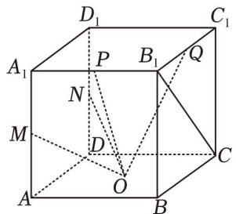

text_image

D₁
A₁ P B₁ Q
N
M D C
O
A B C

A. OM

B. ON

C. OP

D. $OQ$

【训练 2】如图，在正四棱柱 $ABCD-A_{1}B_{1}C_{1}D_{1}$ ，E，F 分别是 $AB_{1}$ ， $BC_{1}$ 的中点，则下面结论一定成立的是（）

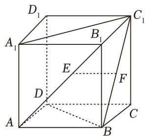

text_image

D₁
A₁
B₁
C₁
E
F
D
A
B
C

A. $EF$ 与 $A_{1}C_{1}$ 平行

B. $BC_{1}$ 与 $AB_{1}$ 所成角大小为 $\frac{\pi}{3}$

C. $EF$ 与 $BB_{1}$ 垂直

D. $EF$ 与 $BD$ 垂直

# 题型 2

【训练 1】（2009•全国 1 卷）已知二面角 $\alpha - l - \beta$ 为 $60^{\circ}$ ，动点 P、Q 分别在面 $\alpha$ 、 $\beta$ 内，P 到 $\beta$ 的距离为 $\sqrt{3}$ ，Q 到 $\alpha$ 的距离为 $2\sqrt{3}$ ，则 P、Q 两点之间距离的最小值为（）

A. 1

B. 2

C. $2\sqrt{3}$

D. 4

【训练 2】在三棱锥 P-ABC 中， $PC \perp$ 底面 ABC, $\angle BAC = 90^{\circ}$ , AB = AC = 4, $\angle PBC = 45^{\circ}$ ，则点 C 到平面 PAB 的距离是（）

A. $\frac{4\sqrt{6}}{3}$

B. $\frac{2\sqrt{6}}{3}$

C. $\frac{4\sqrt{3}}{3}$

D. $\frac{4\sqrt{2}}{3}$

【训练 3】如图，在长方体 ABCD-A₁B₁C₁D₁ 中，AB=2，AD=1，A₁A=1，证明直线 BC₁ 平行于平面 D₁AC，并求直线 BC₁ 到平面 D₁AC 的距离.

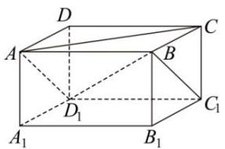

text_image

D
A
B
C
D₁
A₁
B₁
C₁

【训练 4】在长方体 $ABCD-A_{1}B_{1}C_{1}D_{1}$ 中，已知 AB=3，BC=4， $AC_{1}$ 与平面 ABCD 所成角的大小是 $30^{\circ}$ ，那么平面 ABCD 到平面 $A_{1}B_{1}C_{1}D_{1}$ 的距离是 \_\_\_\_.

【训练 5】已知矩形 ABCD，AB = 1， $BC = \sqrt{3}$ ，沿对角线 AC 将 $\Delta ABC$ 折起，若二面角 B - AC - D 的大小为 $120^{\circ}$ ，则 B，D 两点之间的距离为 \_\_\_\_.

# 题型 3

【训练 1】（2018•全国卷 II 文）在正方体 $ABCD-A_{1}B_{1}C_{1}D_{1}$ 中，E 为棱 $CC_{1}$ 的中点，则异面直线 AE 与 CD 所成角的正切值为（）

A. $\frac{\sqrt{2}}{2}$

B. $\frac{\sqrt{3}}{2}$

C. $\frac{\sqrt{5}}{2}$

D. $\frac{\sqrt{7}}{2}$

【训练 2】（2014·四川卷理）如图在正方体 $ABCD-A_{1}B_{1}C_{1}D_{1}$ 中，点 O 为线段 BD 的中点．设点 P 在线段 $CC_{1}$ 上，直线 OP 与平面 $A_{1}BD$ 所成的角为 $\alpha$ ，则 $\sin \alpha$ 的取值范围是（）

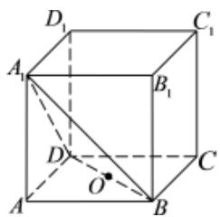

text_image

D₁
A₁
B₁
C₁
D
O
A
B
C

A. $\left[\frac{\sqrt{3}}{3},1\right]$

B. $[\frac{\sqrt{6}}{3}, 1]$

C. $\left[\frac{\sqrt{6}}{3},\frac{2\sqrt{2}}{3}\right]$

D. $[\frac{2\sqrt{2}}{3},1]$

【训练 3】如图△ABC 与△BCD 所在平面垂直, 且 AB = BC = BD, ∠ABC = ∠DBC = 120 $^{0}$ , 则二面角 A-BD-C 的余弦值为 \_\_\_\_.

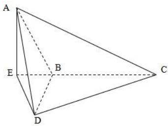

text_image

A
E B C
D

# 考向 2 跟踪训练

题型 1

【训练 1】（2015·山东）在梯形 ABCD 中， $\angle ABC = \frac{\pi}{2}$ ，AD // BC，BC = 2AD = 2AB = 2，将梯形 ABCD 绕 AD 所在的直线旋转一周而形成的曲面所围成的几何体的体积为()

A. $\frac{2\pi}{3}$

B. $\frac{4\pi}{3}$

C. $\frac{5\pi}{3}$

D. $2 \pi$

【训练 2】（2021·新高考Ⅱ）正四棱台的上、下底面的边长分别为 2，4，侧棱长为 2，则其体积为( )

A. $20 + 12\sqrt{3}$

B. $28 \sqrt{2}$

C. $\frac{56}{3}$

D. $\frac{28\sqrt{2}}{3}$

【训练 3】（2023·甲卷）在三棱锥 P-ABC 中， $\Delta ABC$ 是边长为 2 的等边三角形，PA=PB=2， $PC=\sqrt{6}$ ，则该棱锥的体积为()

A. 1

B. $\sqrt{3}$

C. 2

D. 3

【训练 4】(2022·新高考 II) 如图, 四边形 ABCD 为正方形, $ED \perp$ 平面 ABCD, FB // ED, AB = ED = 2FB. 记三棱锥 E - ACD, F - ABC, F - ACE 的体积分别为 $V_{1}$ , $V_{2}$ , $V_{3}$ , 则()

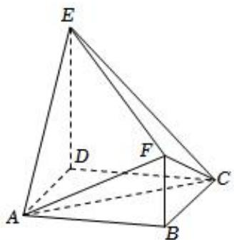

text_image

Geometric diagram of a tetrahedron with labeled vertices A, B, C, D, E and internal points F and D, showing solid and dashed edges.

A. $V_{3} = 2V_{2}$

B. $V_{3}=V_{1}$

C. $V_{3}=V_{1}+V_{2}$

D. $2V_{3} = 3V_{1}$

【训练 5】（2022•新高考Ⅱ）已知正三棱台的高为 1，上、下底面边长分别为 $3\sqrt{3}$ 和 $4\sqrt{3}$ ，其顶点都在同一球面上，则该球的表面积为（）

A. $100\pi$

B. $128\pi$

C. $144\pi$

D. $192\pi$

【训练 6】(2016•新课标III) 在封闭的直三棱柱 $ABC - A_{1}B_{1}C_{1}$ 内有一个体积为 V 的球，若 $AB \perp BC, AB = 6$ ，
BC = 8, $AA_{1} = 3$ , 则 V 的最大值是()

A. $4\pi$

B. $\frac{9\pi}{2}$

C. $6\pi$

D. $\frac{32\pi}{3}$

【训练 7】（2022·新高考 I）南水北调工程缓解了北方一些地区水资源短缺问题，其中一部分水蓄入某水库．已知该水库水位为海拔148.5m时，相应水面的面积为 $140.0km^{2}$ ；水位为海拔157.5m时，相应水面的面积为 $180.0km^{2}$ ．将该水库在这两个水位间的形状看作一个棱台，则该水库水位从海拔148.5m上升到157.5m时，增加的水量约为 $(\sqrt{7}\approx2.65)$ （）

A. $1.0 \times 10^{9} m^{3}$

B. $1.2 \times 10^{9} m^{3}$

C. $1.4 \times 10^{9} m^{3}$

D. $1.6 \times 10^{9} m^{3}$

【训练 8】若正四面体的表面积为 $8\sqrt{3}$ ，则其外接球的体积为()

A. $4 \sqrt{3} \pi$

B. $12\pi$

C. $8\sqrt{6}\pi$

D. $32\sqrt{3}\pi$

【训练 9】在棱长为 1 的正四面体 ABCD 中，E、F 分别为 BC、AD 的中点，则下列命题正确的是()

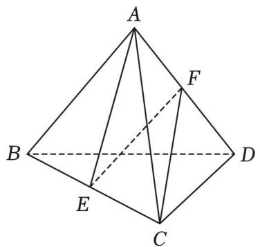

text_image

A
F
B
D
E
C

A. $\overrightarrow{EF} = \frac{1}{2} (\overrightarrow{AB} +\overrightarrow{AC} -\overrightarrow{AD})$

B. $EF = \frac{\sqrt{2}}{2}$

C. $BC \perp$ 平面 $AEF$

D. $AE$ 和 $CF$ 夹角的正弦值为 $\frac{2}{3}$

【训练 10】《九章算术》中将底面为直角三角形且侧棱垂直于底面的三棱柱称为“堑堵”；底面为矩形，一条侧棱垂直于底面的四棱锥称之为“阳马”，四个面均为直角三角形的四面体称为“鳖臑”，如图在堑堵 $ABC - A_{1}B_{1}C_{1}$ 中， $AC \perp BC$ ，且 $AA_{1} = AB = 2$ ．下列说法正确的是（）

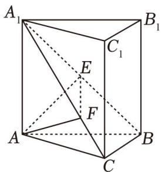

text_image

A₁
B₁
C₁
E
F
A
B
C

A. 四棱锥 $C - A_{1}B_{1}BA$ 为“阳马”

B. 四面体 $A_{1}CC_{1}B_{1}$ 为“鳖臑”

C. 四棱锥 $B - A_{1}ACC_{1}$ 体积的最大值为 $\frac{2}{3}$

D. 过 A 点分别作 $AE \perp A_{1}B$ 于点 E， $AF \perp A_{1}C$ 于点 F，则 $EF \perp A_{1}B$

# 题型 2

【训练 1】在正方体 $ABCD-A_{1}B_{1}C_{1}D_{1}$ 中，M，N 分别为 AD， $C_{1}D_{1}$ 的中点，过 M，N， $B_{1}$ 三点的平面截正方体 $ABCD-A_{1}B_{1}C_{1}D_{1}$ 所得的截面形状为（）

A. 六边形

B. 五边形

C. 四边形

D. 三角形

【训练 2】在棱长为 2 的正方体 $ABCD - A_{1}B_{1}C_{1}D_{1}$ 中，点 P，Q 分别是棱 AD， $DD_{1}$ 的中点，则经过 B，P，Q 三点的平面截正方体所得的截面的面积为（）

A. $3 \sqrt{2}$

B. $\frac{3\sqrt{15}}{2}$

C. $\frac{9}{2}$

D. $\frac{9}{2}\sqrt{2}$

【训练 3】正方体 $ABCD - A_{1}B_{1}C_{1}D_{1}$ 的棱长为 2，点 P，Q，R 分别是棱 $A_{1}D_{1}$ ， $C_{1}D_{1}$ ，BC 中点，则过点 P，Q，R 三点的截面面积是（）

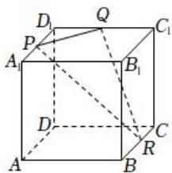

text_image

Geometric diagram of a cube with labeled vertices and internal points, used for spatial geometry problems.

A. $\frac{\sqrt{3}}{2}$

B. $\sqrt{3}$

C. $2 \sqrt{3}$

D. $3 \sqrt{3}$

【训练 4】如图，在棱长为 1 的正方体 $ABCD - A_{1}B_{1}C_{1}D_{1}$ 中，E，F 分别为棱 $A_{1}D_{1}$ ， $AA_{1}$ 的中点，G 为线段 $B_{1}C$ 上一个动点，则下列说法不正确的是（）

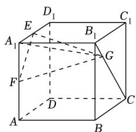

text_image

Geometric diagram of a cube with labeled vertices and internal points, used for spatial geometry problems.

A. 存在点 $G$ ，使直线 $B_{1}C \perp$ 平面 $EFG$   
B. 存在点 $G$ ，使平面 $EFG //$ 平面 $BDC_{1}$   
C. 三棱锥 $A_{1} - EFG$ 的体积为定值  
D. 平面 $EFG$ 截正方体所得截面的最大面积为 $\frac{3\sqrt{3}}{4}$

【训练 1】已知两平行的平面截球所得截面圆的面积分别为 $9\pi$ 和 $16\pi$ ，且两截面间的距离为 1，则该球的体积为 \_\_\_\_.

【训练 2】如图，正方体 $ABCD-A_{1}B_{1}C_{1}D_{1}$ 的棱长为 $\sqrt{3}$ ，以顶点 A 为球心，2 为半径作一个球，则图中球面与正方体的表面相交所得到的两段弧长之和等于（）

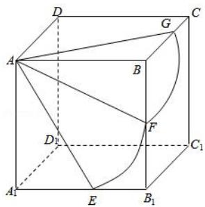

text_image

Geometric diagram of a cube with labeled vertices and internal points, used for spatial geometry problems.

A. $\frac{5\pi}{6}$

B. $\frac{2\pi}{3}$

C. $\pi$

D. $\frac{7\pi}{6}$

# 题型 3、4

【训练 1】（2016•新课标Ⅱ）体积为 8 的正方体的顶点都在同一球面上，则该球面的表面积为( )

A. $12\pi$

B. $\frac{32}{3}\pi$

C. $8\pi$

D. $4\pi$

【训练 2】（2017•新课标 I）已知三棱锥 S-ABC 的所有顶点都在球 O 的球面上，SC 是球 O 的直径．若平面 SCA ⊥ 平面 SCB，SA = AC，SB = BC，三棱锥 S-ABC 的体积为 9，则球 O 的表面积为 $\_36\pi$ ．

解: 三棱锥 S-ABC 的所有顶点都在球 O 的球面上, SC 是球 O 的直径, 若平面 $SCA \perp$ 平面 SCB, SA = AC, SB = BC, 三棱锥 S-ABC 的体积为 9, 可知三角形 SBC 与三角形 SAC 都是等腰直角三角形,

设球的半径为 r，可得 $\frac{1}{3} \times \frac{1}{2} \times 2r \times r \times r = 9$ ，解得 r = 3。球 O 的表面积为： $4\pi r^{2} = 36\pi$ 。故答案为： $36\pi$ 。

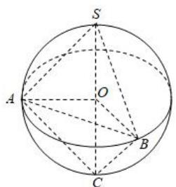

text_image

S
A
O
B
C

【训练 3】（2022•乙卷）已知球 O 的半径为 1，四棱锥的顶点为 O，底面的四个顶点均在球 O 的球面上，则当该四棱锥的体积最大时，其高为( )

A. $\frac{1}{3}$

B. $\frac{1}{2}$

C. $\frac{\sqrt{3}}{3}$

D. $\frac{\sqrt{2}}{2}$

【训练 4】在三棱锥 P-ABC 中，平面 $PAB \perp$ 平面 ABC， $\Delta ABC$ 是边长为 $2\sqrt{3}$ 的等边三角形， $PA = PB = \sqrt{7}$ ，则该三棱锥外接球的表面积为（）

A. $16\pi$

B. $\frac{65\pi}{16}$

C. $\frac{65\pi}{4}$

D. $\frac{49\pi}{4}$

【训练 5】在《九章算术》中，将四个面都是直角三角形的四面体称为鳖臑．在鳖臑 A-BCD 中， $AB \perp$ 平面 BCD， $BC \perp CD$ ，且 AB=BC=CD=1，则其内切球表面积为（）

A. $3\pi$

B. $\sqrt{3}\pi$

C. $(3 - 2\sqrt{2})\pi$

D. $(\sqrt{2} - 1)\pi$

# 题型 5

【训练 1】已知某棱长为 $2\sqrt{2}$ 的正四面体的各条棱都与同一球面相切，则该球与此正四面体的体积之比为（）

A. $\frac{\pi}{2}$

B. $\frac{\pi}{3}$

C. $\frac{\sqrt{3}\pi}{3}$

D. $\frac{\sqrt{2}\pi}{2}$

【训练 2】已知三棱锥 S-ABC 的棱长均为 $2\sqrt{6}$ ，则与其各条棱都相切的球的体积为 \_\_\_\_.

【训练3】已知正三棱柱的所有棱长均相等，其外接球与棱切球（该球与其所有棱都相切）的表面积分别为 $S_{1}$ ， $S_{2}$ ，则 $\frac{S_{1}}{S_{2}} =$ \_\_\_\_.

【训练 4】正三棱锥 P-ABC 的底面边长为 $2\sqrt{3}$ ，侧棱长为 $2\sqrt{2}$ ，若球 H 与正三棱锥所有的棱都相切，则这个球的表面积为（）

A. $\frac{17}{4}\pi$

B. $(44 - 16\sqrt{6})\pi$

C. $\frac{9}{2}\pi$

D. $32\pi$

# 考向 3 跟踪训练

【训练 1】如图，将四边形 ABCD 中， $\triangle ADC$ 沿着 AC 翻折到 $AD_{1}C$ ，则翻折过程中线段 DB 中点 M 的轨迹是（）

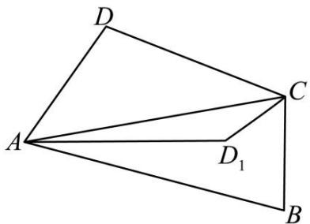

text_image

D
A
C
D₁
B

A. 椭圆的一段

B. 抛物线的一段

C. 双曲线的一段

D. 一段圆弧

【训练 2】如图 1，直线 EF 将矩形 ABCD 分为两个直角梯形 ABFE 和 CDEF，将梯形 CDEF 沿边 EF 翻折，如图 2，在翻折过程中（平面 ABFE 和平面 CDEF 不重合），下列说法正确的是（）

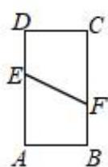  
图1

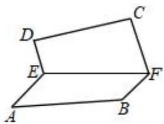

text_image

Geometric diagram of a parallelogram labeled with vertices A, B, C, D, E, F

图2

A. 在翻折过程中, 恒有直线 $AD / /$ 平面 $BCF$

B. 存在某一位置，使得 $CD / /$ 平面ABFE

C. 存在某一位置，使得 $BF // CD$

D. 存在某一位置，使得 $DE \perp$ 平面ABFE

【训练 3】已知矩形 ABCD 中，AB = 2, BC = 1, F 为线段 CD 上一动点（不含端点），现将 $\triangle ADF$ 沿直线 AF 进行翻折，在翻折的过程中不可能成立的是（）

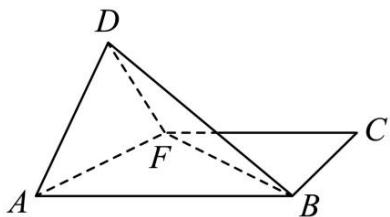

text_image

D
F
A
B
C

A. 存在某个位置，使直线 $AF$ 与 $BD$ 垂直  
B. 存在某个位置，使直线 $AD$ 与 $BF$ 垂直  
C. 存在某个位置，使直线 $AB$ 与 $DA$ 垂直  
D. 存在某个位置，使直线 $AB$ 与 $DF$ 垂直

【训练 4】已知平面四边形 ABCD，连接对角线 BD，得到等边三角形 ABD 和直角三角形 BCD，且 AB = 3， $\angle BDC = \frac{\pi}{2}$ ， $BC = 3\sqrt{2}$ ，将平面四边形 ABCD 沿对角线 BD 翻折，得到四面体 $A^{\prime}BC^{\prime}D$ ，则当四面体 $A^{\prime}BC^{\prime}D$ 的体积最大时，该四面体的外接球的表面积为（）

A. $12\pi$

B. $18\pi$

C. $21\pi$

D. $28\pi$

【训练 5】（2022·新高考 I）已知正四棱锥的侧棱长为 l，其各顶点都在同一球面上．若该球的体积为 $36\pi$ ，且 $3 \leqslant l \leqslant 3\sqrt{3}$ ，则该正四棱锥体积的取值范围是（）

A. $[18, \frac{81}{4}]$

B. $\left[\frac{27}{4}, \frac{81}{4}\right]$

C. $\left[\frac{27}{4}, \frac{64}{3}\right]$

D. [18, 27]

【训练 6】在如图所示实验装置中，正方形框架的边长都是 1，且平面 ABCD ⊥ 平面 ABEF，活动弹子 M, N 分别在正方形对角线 AC，BF 上移动，则 MN 长度的最小值是 \_\_\_\_.

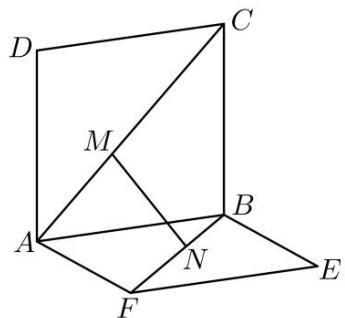

text_image

Geometric diagram with labeled points A, B, C, D, E, F, M, N forming intersecting planes and triangles

【训练 7】已知棱长为 2 的正方体 $ABCD - A_{1}B_{1}C_{1}D_{1}$ 中，P 为棱 $DD_{1}$ 上一动点，则 $PB_{1} + PC$ 的最小值为 \_\_\_\_.

【训练 8】【多选】如图，已知正方体 $ABCD - A_{1}B_{1}C_{1}D_{1}$ 的棱长为 1，P 是线段 $AB_{1}$ 上的动点，N 是线段 $CC_{1}$ 的中点，则下列说法正确的是（）

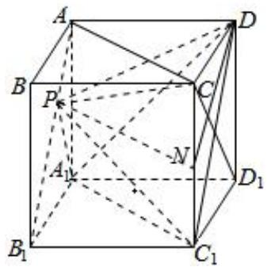

text_image

A
B
P
C
D
N
A₁
B₁
C₁
D₁

A. $PD \perp CD_{1}$   
B. 三棱锥 $C_{1} - A_{1}PD$ 的体积为定值  
C. $(CP + PA_{1})$ 的最小值是 $\frac{\sqrt{2} + \sqrt{3}}{2}$   
D. 如果点 $P$ 是线段 $AB_{1}$ 的中点，则平面 $PDN$ 截正方体所得的截面周长为 $\sqrt{5} + \frac{\sqrt{17}}{2}$

