# 3.1 导数小题篇

# 考向 1 导数的运算

# 1. 求导的基本公式

<table><tr><td>基本初等函数</td><td>导函数</td></tr><tr><td> $f(x)=c$ ( $c$ 为常数)</td><td> $f'(x)=0$ </td></tr><tr><td> $f(x)=x^{a}$ ( $a\in R$ )</td><td> $f'(x)=ax^{a-1}$ </td></tr><tr><td> $f(x)=a^{x}$ ( $a>0,a\neq1$ )</td><td> $f'(x)=a^{x}\ln a$ </td></tr><tr><td> $f(x)=\log_{a}x$ ( $a>0,a\neq1$ )</td><td> $f'(x)=\frac{1}{x\ln a}$ </td></tr><tr><td> $f(x)=e^{x}$ </td><td> $f'(x)=e^{x}$ </td></tr><tr><td> $f(x)=\ln x$ </td><td> $f'(x)=\frac{1}{x}$ </td></tr><tr><td> $f(x)=\sin x$ </td><td> $f'(x)=\cos x$ </td></tr><tr><td> $f(x)=\cos x$ </td><td> $f'(x)=-\sin x$ </td></tr></table>

# 2. 导数的四则运算法则

（1）函数和差求导法则： $\left[f(x)\pm g(x)\right]'=f'(x)\pm g'(x)$ ;  
（2）函数积的求导法则： $\left[f(x)g(x)\right]' = f'(x)g(x) + f(x)g'(x)$ ;  
（3）函数商的求导法则： $g(x) \neq 0$ ，则 $\left[\frac{f(x)}{g(x)}\right]' = \frac{f'(x)g(x) - f(x)g'(x)}{[g(x)]^2}$ .

# 3. 复合函数求导数

复合函数 $y = f[g(x)]$ 的导数和函数 $y = f(u)$ ， $u = g(x)$ 的导数间关系为 $y_x' = y_u' u_x'$ ：如 $y = (3x - 1)^2$ 我们将分三步：

①将复合函数分解为基本初等函数 $\left\{\begin{aligned}y&=u^{2}\\ u&=3x-1\end{aligned}\right.$ ;  
②将 y 对 u 的导数记为 $y_{u}^{\prime}=2u$ ，将 u 对 x 的导数记为 $u_{x}^{\prime}=3$ ;  
③ $y' = y_{u}' \cdot u_{x}' = 2u \cdot 3 = 6(3x - 1) = 18x - 6$ .

注意：奇函数的导数是偶函数，偶函数的导数是奇函数，周期函数的导数还是周期函数.

# 4. 八大同构函数

八大同构函数分别是：① $y = xe^{x}$ ，② $y = \frac{x}{e^{x}}$ ，③ $y = \frac{e^{x}}{x}$ ，④ $y = x \ln x$ ，⑤ $y = \frac{\ln x}{x}$ ，⑥ $y = \frac{x}{\ln x}$ ，

⑦ $y = e^{x} - x - 1$ ，⑧ $y = x - \ln x - 1$ 。我们通过基本的求导来看看这八大同构函数的图像，再分析单调区间及极值，以及它们之间的本质联系。

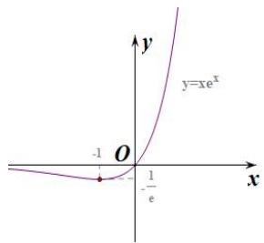

text_image

y
y=xe^x
-1 O 1/e x

图 1-2-1

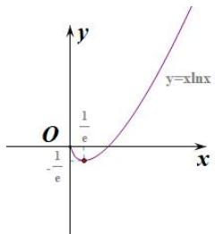

text_image

y
y=qlnx
O
1/e
-1/e
x

图 1-2-2

①如图1-2-1，对于函数 $y = xe^{x}$ ，求导后可得： $f'(x) = (x + 1) \cdot e^{x}$ ， $f(x)$ 在区间 $(- \infty, -1)$ 递减，在区间 $(-1, +\infty)$ 递增，且 $f(x)_{\min} = f(-1) = -\frac{1}{e}$ ；  
②如图 1-2-2，对于 $y = x \ln x$ ，求导后可得： $f'(x) = \ln x + 1$ ， $f(x)$ 在区间 $(0, \frac{1}{e})$ 递减，在区间 $(\frac{1}{e}, +\infty)$ 递增，且 $f(x)_{\min} = f(\frac{1}{e}) = -\frac{1}{e}$ ;

反思 关于图 1-2-1 和图 1-2-2，我们仔细观察会发现对于 $y = xe^{x}$ 函数，我们把 x 换成 $\ln x$ 即可得到 $y = x \ln x$ .

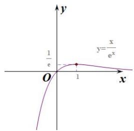

text_image

y
y=x/e^x
1/e
O
1
x

图 1-2-3

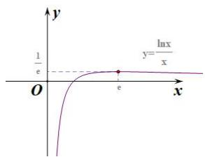

text_image

y
1/e
O
e
x
y=lnx/x

图 1-2-4

③如图1-2-3，对于函数 $y = \frac{x}{e^x}$ ，求导后可得： $f'(x) = \frac{1 - x}{e^x}$ ， $f(x)$ 在区间 $(- \infty, 1)$ 递增，在区间 $(1, +\infty)$ 递减， $f(x)_{\max} = f(1) = \frac{1}{e}$ ;  
④如图1-2-4，对于函数 $y = \frac{\ln x}{x}$ ，求导后可得： $f'(x) = \frac{1 - \ln x}{x^2}$ ， $f(x)$ 在区间 $(0, e)$ 递增，在区间 $(e, +\infty)$ 递减， $f(x)_{\max} = f(e) = \frac{1}{e}$ ；

反思 关于图 1-2-3 和图 1-2-4，我们仔细观察会发现对于 $y=\frac{x}{e^{x}}$ 函数，我们把 x 换成 $\ln x$ 即可得到 $y=\frac{\ln x}{x}$ .

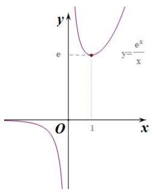

text_image

y
e
y=e^x/x
O
1
x

图1-2-5

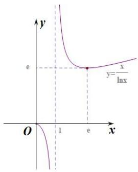

text_image

y
e
y=x/lnx
O
1
e
x

图1-2-6

⑤如图1-2-5，对于函数 $y = \frac{e^x}{x}$ ，求导后可得：当 $x < 0$ 时， $f'(x) = \frac{e^x(x - 1)}{x^2} < 0$ ，在区间 $(- \infty, 0)$ 递减；当 $x > 0$ 时， $f'(x) = \frac{e^x(x - 1)}{x^2}$ ，在区间 $(0, 1)$ 递减，在区间 $(1, +\infty)$ 递增， $f(x)_{\min} = f(1) = e$ ；  
⑥如图1-2-6，对于函数 $y = \frac{x}{\ln x}$ ，求导后可得：当 $0 < x < 1$ 时， $f'(x) = \frac{\ln x - 1}{(\ln x)^2} < 0$ ，在区间(0,1)递减；当 $x > 1$ 时， $f'(x) = \frac{\ln x - 1}{(\ln x)^2}$ ，在区间(1,e)递减，在区间(e,+\infty)递增， $f(x)_{\min} = f(e) = e$ ；

反思 关于图 1-2-5 和图 1-2-6，我们仔细观察会发现对于 $y=\frac{e^{x}}{x}$ 函数，我们把 x 换成 $\ln x$ 即可得到 $y=\frac{x}{\ln x}$ .

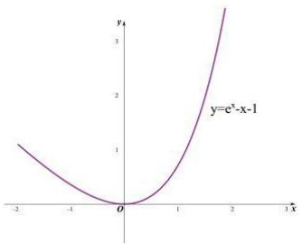

line

| x   | y     |
| --- | ----- |
| -2  | 1.0   |
| -1  | 0.5   |
| 0   | 0.0   |
| 1   | 0.5   |
| 2   | 2.0   |
| 3   | 4.0   |

图1-2-7

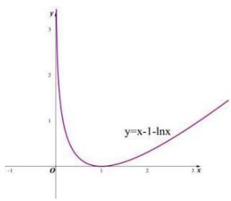

line

| x    | y     |
| ---- | ----- |
| -1   | 3.0   |
| 0    | 0.0   |
| 1    | 0.5   |
| 2    | 1.0   |
| 3    | 1.5   |

图1-2-8

⑦如图1-2-7，对于函数 $y = e^{x} - x - 1$ ，求导后可得： $f'(x) = e^{x} - 1$ ， $f(x)$ 在区间 $(- \infty, 0)$ 递减，在区间 $(0, +\infty)$ 递增， $f(x)_{\min} = f(0) = 0$ ；  
⑧如图 1-2-8，对于函数 $y = x - \ln x - 1$ ，求导后可得： $f'(x) = 1 - \frac{1}{x}$ ， $f(x)$ 在区间 $(-∞, 1)$ 递减，在区间 $(1, +∞)$ 递增， $f(x)_{\min} = f(1) = 0$ ；

反思 关于图 1-2-7 和图 1-2-8，仔细观察会发现对于 $y=e^{x}-x-1$ 函数，我们把 x 换成 $\ln x$ 即可得到 $y=x-\ln x-1$ .

我们可以利用八大函数进行快速求解最值或单调区间

注意：改变单调区间的因素： $f(x) \rightarrow f(x + a)$ 、 $f(x) \rightarrow f(ax)$ 、 $f(x) \rightarrow -f(x)$ ;

改变最值的因素： $f(x) \rightarrow f(x) + a$ 、 $f(x) \rightarrow af(x)$ 、 $f(x) \rightarrow -f(x)$ ;

# 题型 1 基本求导

【例 1】下列式子正确的是()

A. $(\sin \frac{\pi}{6})' = \cos \frac{\pi}{6}$

B. $(lnx)' = \frac{1}{x}$

C. $\left(\frac{e^{x}}{2x}\right)'=\frac{e^{x}}{2}$

D. $(x\sin x)' = \cos x$

【例 2】若函数 $f(x)=3^{x}+\sin2x$ ，则（）

A. $f'(x)=3^{x}\ln3+2\cos2x$

B. $f^{\prime}(x) = 3^{x} + 2\cos 2x$

C. $f'(x)=3^{x}\ln3+\cos2x$

D. $f^{\prime}(x) = 3^{x}\ln 3 - \cos 2x$

【例 3】已知函数 $f(x)=e^{x}+f'(0)x^{2}+f(0)(x-2)$ （其中 $f'(x)$ 是 $f(x)$ 的导函数），则 $f'(1)=(\quad)$

A. $e+2$

B. $e+3$

C. e-2

D. e-3

【例 4】函数 $f(x)=\frac{(x+1)^{2}+\sin x}{x^{2}+1}$ ，其导函数记为 $f'(x)$ ， $f(2022)+f'(2022)+f(-2022)-f'(-2022)=(\quad)$

A.-3

B. 3

C.-2

D. 2

【例 5】已知函数 $f(x)=x(x-3)(x-3^{2})(x-3^{3})(x-3^{4})(x-3^{5})$ ，则 $f'(0)=(\quad)$

A. $3^{15}$

B. $3^{14}$

C. $-3^{14}$

D. $-3^{15}$

# 题型 2 必备拓展知识

【例 1】给出定义：若函数 $f(x)$ 在 D 上可导，即 $f'(x)$ 存在，且导函数 $f'(x)$ 在 D 上也可导，则称 $f(x)$ 在 D 上存在二阶导函数，记 $f''(x)=(f'(x))'$ 。若 $f''(x)<0$ 在 D 上恒成立，则称 $f(x)$ 在 D 上为凸函数（反之 $f''(x)>0$ 为凹函数）。以下四个函数在 $(0,\frac{\pi}{2})$ 上不是凸函数的是（）

A. $f(x)=\cos x+\sin x$

B. $f(x) = \ln x + 3x$

C. $f(x) = -x^{3} + 4x - 8$

D. $f(x) = xe^{x}$

【例 2】【多选】已知函数 $f(x)$ 的导函数为 $f'(x)$ ，若存在 $x_{0}$ 使得 $f'(x_{0}) = f(x_{0})$ ，则称 $x_{0}$ 是 $f(x)$ 的一个“新驻点”，下列函数中，具有“新驻点”的是（）

A. $f(x)=\sin x$

B. $f(x)=x^{3}$

C. $f(x) = \ln x$

D. $f(x)=xe^{x}$

【例 3】给出定义：设 $f''(x)$ 是函数 $y = f'(x)$ 的导函数，若方程 $f''(x) = 0$ 有实数解，则称点 $(x_0, f(x_0))$ 为函数 $y = f(x)$ 的“拐点”。已知函数 $f(x) = 3x + 4\sin x - \cos x$ 的拐点为 $M(x_0, f(x_0))$ ，则下列结论正确的为（）

A. $\tan x_0 = 4$

B. 点 $M$ 在直线 $y = 3x$ 上

C. $\sin2x_{0}=\frac{4}{17}$

D. 点 $M$ 在直线 $y = 4x$ 上

【例 4】以罗尔中值定理、拉格朗日中值定理、柯西中值定理为主体的“中值定理”反映函数与导数之间的重要联系，是微积分学重要的理论基础，其中拉格朗日中值定理是“中值定理”的核心，其内容如下：如果函数 $y = f(x)$ 在闭区间 $[a, b]$ 上连续，在开区间 $(a, b)$ 内可导，则 $(a, b)$ 内至少存在一个点 $x_{0} \in (a, b)$ ，使得 $f(b) - f(a) = f'(x_{0})(b - a)$ ，其中 $x = x_{0}$ 称为函数 $y = f(x)$ 在闭区间 $[a, b]$ 上的“中值点”。请问函数 $f(x) = 5x^{3} - 3x$ 在区间 $[-1, 1]$ 上的“中值点”的个数为（）

A. 1

B. 2

C. 3

D. 4

# 考向 2 导数的切线问题

# 题型 1 在点的切线方程

切线方程 $y - f(x_{0}) = f'(x_{0})(x - x_{0})$ 的计算：函数 $y = f(x)$ 在点 $A(x_{0}, f(x_{0}))$ 处的切线方程为：

$y - f(x_{0}) = f'(x_{0})(x - x_{0})$ ，一定要抓住关键 $\left\{\begin{aligned}y_{0}&=f(x_{0})\\ k&=f'(x_{0})\end{aligned}\right.$

【例 1】（2023•甲卷）曲线 $y=\frac{e^{x}}{x+1}$ 在点 $(1,\frac{e}{2})$ 处的切线方程为（）

A. $y=\frac{e}{4}x$

B. $y=\frac{e}{2}x$

C. $y=\frac{e}{4}x+\frac{e}{4}$

D. $y=\frac{e}{2}x+\frac{3e}{4}$

【例 2】（2019•新课标III）已知曲线 $y = ae^{x} + x \ln x$ 在点 $(1, ae)$ 处的切线方程为 $y = 2x + b$ ，则（）

A. $a = e, b = -1$

B. $a = e, b = 1$

C. $a = e^{-1}$ , b = 1

D. $a = e^{-1}$ ， $b = -1$

【例 3】（2024•甲卷）设函数 $f(x)=\frac{e^{x}+2\sin x}{1+x^{2}}$ ，则曲线 $y=f(x)$ 在点 $(0,1)$ 处的切线与坐标轴围成的三角形的面积为()

A. $\frac{1}{6}$

B. $\frac{1}{3}$

C. $\frac{1}{2}$

D. $\frac{2}{3}$

# 题型 2 过点的切线方程

设切点为 $P(x_{0}, y_{0})$ ，则斜率 $k = f'(x_{0})$ ，过切点的切线方程为 $y - y_{0} = f'(x_{0})(x - x_{0})$ ，又因为切线方程过点 $A(m, n)$ ，所以 $n - y_{0} = f'(x_{0})(m - x_{0})$ 然后解出 $x_{0}$ 的值.

注意：在做此类题目时要分清题目提供的点在曲线上还是在曲线外.

【例 1】已知函数 $f(x)=2x+\ln x$ ，若过点 $(0,-1)$ 的直线与曲线 $y=f(x)$ 相切，则该直线斜率为 \_\_\_\_.

【例 2】已知 $f(x)=x^{3}$ ，则函数 $f(x)$ 的图象过点 $(1,1)$ 的切线方程为 \_\_\_\_.

【例 3】（2022•新高考Ⅱ）曲线 $y = \ln |x|$ 过坐标原点的两条切线的方程为 \_\_\_\_，\_\_\_\_.

# 题型 3 切线条数问题

设切点为 $P(x_{0}, y_{0})$ ，则斜率 $k = f'(x_{0})$ ，过切点的切线方程为 $y - y_{0} = f'(x_{0})(x - x_{0})$ ，又因为切线方程过点 $A(m, n)$ ，所以 $n - y_{0} = f'(x_{0})(m - x_{0})$ 然后解出 $x_{0}$ 的值， $x_{0}$ 有几个值，就有几条切线.

【例 1】经过点 $(2,0)$ 作曲线 $y=x^{2}e^{x}$ 的切线有（）

A. 1 条

B. 2 条

C. 3 条

D. 4 条

【例 2】（2021•新高考 I）若过点 $(a,b)$ 可以作曲线 $y=e^{x}$ 的两条切线，则()

A. $e^{b} < a$

B. $e^{a} < b$

C. $0 < a < e^{b}$

D. $0 < b < e^{a}$

【例 3】（2022•新高考 I）若曲线 $y=(x+a)e^{x}$ 有两条过坐标原点的切线，则 a 的取值范围是 \_\_\_\_.

# 题型 4 公切线问题

# 公切线代数表达:

当 $y = f(x)$ 与 $y = g(x)$ 具有公切线时，设直线与 $y = f(x)$ 切于点 $(x_{1}, f(x_{1}))$ 与 $y = g(x)$ 切于点 $(x_{2}, g(x_{2}))$ ，

①当 $y = f(x)$ 与 $y = g(x)$ 切于同一点，设切点为 $P(x_{0}, y_{0})$ ，则有 $\left\{\begin{aligned}f'(x_{0}) &= g'(x_{0}) \\ f(x_{0}) &= g(x_{0})\end{aligned}\right.$ ;

②公切线方程的等量关系 $f'(x_{1}) = g'(x_{2}) = \frac{f(x_{1}) - g(x_{2})}{x_{1} - x_{2}}$ ，求参数取范围或者切点的取值范围.

【例 1】(2024·新高考 I) 若曲线 $y = e^{x} + x$ 在点 $(0,1)$ 处的切线也是曲线 $y = \ln(x + 1) + a$ 的切线，则 a = \_\_\_\_.

【例2】曲线 $y = e^{x}$ 在点 $(x_{1}, y_{1})$ 处的切线与 $y = \ln x$ 在点 $(x_{2}, y_{2})$ 处的切线相同，则 $(x_{1} + 1)(x_{2} - 1) = (\quad)$

A. -1

B.-2

C. 1

D. 2

【例 3】（2025·深圳一模）已知曲线 $y = e^{x-1}$ 与曲线 $y = a \ln x + a (a > 0)$ 只有一个公共点，则 $a = (\quad)$

A. $\frac{1}{e}$

B. 1

C. e

D. $e^{2}$

# 考向 3 单调性与极值最值

# 1. 函数单调性和导数的关系

(1)函数的单调性与导函数 $f(x)$ 的正负之间的关系

①单调递增：在某个区间 $(a,b)$ 上，如果 $f'(x)>0$ ，那么函数 $y=f(x)$ 在区间 $(a,b)$ 上单调递增；

②单调递减：在某个区间 $(a,b)$ 上，如果 $f'(x)<0$ ，那么函数 $y=f(x)$ 在区间 $(a,b)$ 上单调递减.

③如果在某个区间 $(a,b)$ 内恒有 $f'(x)=0$ ，那么函数 $y=f(x)$ 在这个区间上是一个常数函数.

(2)函数值变化快慢与导数的关系

一般地，如果一个函数在某一范围内导数的绝对值较大，那么在这个范围内函数值变化得快，这时，函数的图象就比较“陡峭”(向上或向下)；如果一个函数在某一范围内导数的绝对值较小，那么在这个范围内函数值变化得慢，函数的图象就“平缓”一些.

# 2. 函数的极值

(1)极小值点与极小值:

如图，函数 $y = f(x)$ 在点 $x = a$ 处的函数值 $f(a)$ 比它在点 $x = a$ 附近其他点的函数值都小， $f'(a) = 0$ ，而且在点 $x = a$ 附近的左侧 $f'(x) < 0$ ，右侧 $f'(x) > 0$ ，则把点 $a$ 叫做函数 $y = f(x)$ 的极小值点， $f(a)$ 叫做函数 $y = f(x)$ 的极小值.

(2)极大值点与极大值:

如图，函数 $y = f(x)$ 在点 $x = b$ 处的函数值 $f(b)$ 比它在点 $x = b$ 附近其他点的函数值都大， $f'(b) = 0$ ，而且在点 $x = b$ 附近的左侧 $f'(x) > 0$ ，右侧 $f'(x) < 0$ ，则把点 $b$ 叫做函数 $y = f(x)$ 的极大值点， $f(b)$ 叫做函数 $y = f(x)$ 的极大值.

(3)极小值点、极大值点统称为极值点，极小值和极大值统称为极值.

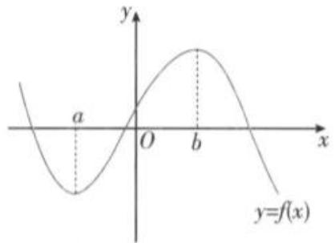

text_image

y
a
O
b
x
y=f(x)

# 3. 函数的最大值与最小值

(1)一般地，如果在区间 $[a,b]$ 上函数 $y = f(x)$ 的图象是一条连续不断的曲线，那么它必有最大值与最小值，并且函数的最值必在极值点或区间端点处取得.当 $f(x)$ 的图象连续不断且在 $[a,b]$ 上单调时，其最大值和最小值分别在两个端点处取得.

(2)函数的极值与最值的区别

①极值是对某一点附近(即局部)而言的，最值是对函数的整个定义区间而言的.  
②在函数的定义区间内，极大(小)值可能有多个(或者没有)，但最大(小)值最多有一个.  
③函数 $f(x)$ 的极值点不能是区间的端点，而最值点可以是区间的端点.

# 题型 1 最值与求参

【例 1】下列函数中，在区间(0,1)内不单调的是（）

A. $y = \ln(x + 1)$

B. $y = 2^{1-x}$

C. $y = \tan 2x$

D. $y = x^{2} + \sqrt{x}$

【例 2】（2022•乙卷）函数 $f(x)=\cos x+(x+1)\sin x+1$ 在区间 $[0, 2\pi]$ 的最小值、最大值分别为（）

A. $-\frac{\pi}{2}, \frac{\pi}{2}$

B. $-\frac{3\pi}{2}, \frac{\pi}{2}$

C. $-\frac{\pi}{2}, \frac{\pi}{2} + 2$

D. $-\frac{3\pi}{2}, \frac{\pi}{2} + 2$

【例 3】已知函数 $f(x) = \frac{1}{3} x^3 + 16\ln x - ax$ 在区间[1,3]上单调递增，则 $a$ 的取值范围是（）

A. $(- \infty, 12)$

B. $\left(-\infty,\frac{43}{3}\right)$

C. $(-∞,12]$

D. $\left(-\infty,\frac{43}{3}\right]$

# 题型 2 极值与求参

【例 1】已知函数 $y = f(x)$ 的定义域为 $(a, b)$ ，导函数 $y = f'(x)$ 在 $(a, b)$ 内的图像如图所示，则函数 $y = f(x)$ 在 $(a, b)$ 内的极小值有（）

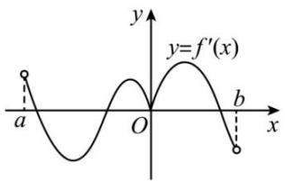

text_image

y
y=f'(x)
a
O
b
x

A. 1 个

B. 2 个

C. 3 个

D. 4 个

【例 2】若函数 $f(x)=\frac{1}{2}x^{2}-x+a\ln x$ 有两个不同的极值点，则实数 a 的取值范围为（）

A. $(0,\frac{1}{4})$

B. $(0,\frac{1}{2})$

C. $(-∞, \frac{1}{4})$

D. $(-∞, \frac{1}{4}]$

【例 3】已知函数 $f(x)=x^{3}+3mx^{2}+nx+m^{2}$ 在x=-1处有极值0，则实数 $m+n$ 的值为（）

A. 4

B. 4 或 11

C. 9

D. 11

【例 4】（2024·多选·新高考 I）设函数 $f(x)=(x-1)^{2}(x-4)$ ，则（）

A. $x = 3$ 是 $f(x)$ 的极小值点

B. 当 $0 < x < 1$ 时， $f(x) < f(x^2)$

C. 当 $1 < x < 2$ 时， $-4 < f(2x - 1) < 0$

D. 当 -1 < x < 0 时， $f(2 - x) > f(x)$

# 题型 3 距离问题

①一般转化为平行切线问题；  
②若两函数互为反函数，可转化为其中一个函数到 y = x 的距离最小值的两倍.

【例 1】已知 A 是函数 $f(x)=x-2\ln x$ 图像上的动点，B 是直线 $x+y+2=0$ 上的动点，则 A，B 两点间距离 $|AB|$ 的最小值为（）

A. $4 \sqrt{2}$

B. 4

C. $2\sqrt{2}$

D. $\sqrt{5}$

【例 2】（2012•新课标）设点 P 在曲线 $y=\frac{1}{2}e^{x}$ 上，点 Q 在曲线 $y=\ln(2x)$ 上，则 $|PQ|$ 最小值为（）

A. $1 - \ln 2$

B. $\sqrt{2}(1-\ln2)$

C. $1 + \ln 2$

D. $\sqrt{2} (1 + \ln 2)$

【例 3】（2024·武汉四调）在同一平面直角坐标系中，P，Q 分别是函数 $f(x)=axe^{x}-\ln(ax)$ 和 $g(x)=\frac{2\ln(x-1)}{x}$ 图象上的动点，若对任意 a>0，有 $|PQ|\geqslant m$ 恒成立，则实数 m 的最大值为（）

A. $\sqrt{3}$

B. $\frac{3}{2}\sqrt{2}$

C. $\sqrt{2}$

D. $\frac{\sqrt{5}}{2}$

【例 4】已知实数 a，b，c，d 满足 $\left|b-\frac{\ln a}{a}\right|+\left|c-d+2\right|=0$ ，则 $(a-c)^{2}+(b-d)^{2}$ 的最小值为（）

A. 4

B. $\frac{9}{2}$

C. $\frac{3}{2}\sqrt{2}$

D. 2

# 题型 4 单调性与共零点转化

若 $F(x)=f(x)\cdot g(x)\geq0$ ，且满足：① $f(x)$ 与 $g(x)$ 在同一定义域内有变号零点；

② $f(x)$ 与 $g(x)$ 同为单调递增（或单调递减）函数；则一定有 $f(x)$ 与 $g(x)$ 共零点，即零点相同，如左图.

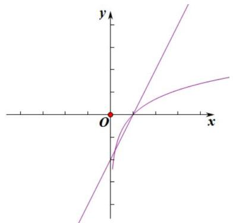

text_image

Mathematical graph showing two curves in Cartesian coordinates with a red dot at origin

【例 1】设函数 $f(x)=(x^{2}-a)(\ln x-b)$ ，若 $f(x)\geqslant0$ ，则 ab 的最小值为（）

A. $-\frac{1}{2e}$

B. $-\frac{1}{e^{2}}$

C. $-\frac{2}{e^{4}}$

D. 0

【例 2】函数 $f(x)=x\ln x-bx-2a\ln x+2ab(b>-1)$ ，若 $f(x)\geqslant0$ 恒成立，
则 $\frac{a}{b+1}$ 的最小值是()

A. $\frac{1}{e}$

B. $\frac{1}{2e}$

C. $\frac{e}{2}$

D. $\frac{1}{2}$

【例 3】（2024•新高考 II）设函数 $f(x)=(x+a)\ln(x+b)$ ，若 $f(x)\geqslant0$ ，则 $a^{2}+b^{2}$ 的最小值为（）

A. $\frac{1}{8}$

B. $\frac{1}{4}$

C. $\frac{1}{2}$

D. 1

# 考向 4 必备函数模型

# 题型一 三次函数的图像和性质

# 1. 基本性质

设三次函数为： $f(x)=ax^{3}+bx^{2}+cx+d$ （a、b、c、 $d\in R$ 且 $a\neq0$ ），其基本性质有：

性质1：①定义域为 $R$ ．②值域为 $R$ ，函数在整个定义域上没有最大值、最小值．③单调性和图像：

<table><tr><td></td><td colspan="2">a&gt;0</td><td colspan="2">a&lt;0</td></tr><tr><td rowspan="2">图像</td><td>Δ&gt;0</td><td>Δ≤0</td><td>Δ&gt;0</td><td>Δ≤0</td></tr><tr><td>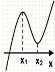</td><td>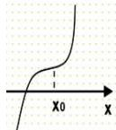</td><td>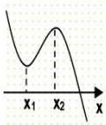</td><td>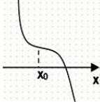</td></tr></table>

性质2：三次方程 $f(x) = 0$ 的实根个数

对于三次函数 $f(x)=ax^{3}+bx^{2}+cx+d$ （a、b、c、 $d\in R$ 且 $a\neq0$ ），其导数为 $f'(x)=3ax^{2}+2bx+c$ 当 $b^{2}-3ac>0$ ，其导数 $f'(x)=0$ 有两个解 $x_{1}$ ， $x_{2}$ ，原函数有两个极值 $x_{1}$ ， $x_{2}=\frac{-b\pm\sqrt{b^{2}-3ac}}{3a}$ .

①当 $f(x_{1})\cdot f(x_{2})>0$ 时, 原方程有且只有一个实根;  
②当 $f(x_{1})\cdot f(x_{2})=0$ 时, 原方程有两个实数根;  
③当 $f(x_{1})\cdot f(x_{2})<0$ 时, 原方程三个实数根;

性质 3: 对称性

三次函数是中心对称曲线，且对称中心是； $\left(-\frac{b}{3a},f\left(-\frac{b}{3a}\right)\right)$ ，其中横坐标为其函导数的对称轴；

【例 1】（2024•新高考Ⅱ）设函数 $f(x)=2x^{3}-3ax^{2}+1$ ，则（）

A. 当 $a > 1$ 时， $f(x)$ 有三个零点  
B. 当 $a < 0$ 时， $x = 0$ 是 $f(x)$ 的极大值点  
C. 存在 $a, b$ , 使得 $x = b$ 为曲线 $y = f(x)$ 的对称轴  
D. 存在 $a$ ，使得点 $(1, f(1))$ 为曲线 $y = f(x)$ 的对称中心

【例 2】（2021•乙卷）设 $a \neq 0$ ，若 x = a 为函数 $f(x) = a(x - a)^{2}(x - b)$ 的极大值点，则（）

A. $a < b$

B. $a > b$

C. $ab < a^2$

D. $ab > a^2$

【例 3】已知函数 $f(x)=(x-3)^{3}+2x-6$ ，且 $f(2a-b)+f(6-b)>0(a, b\in R)$ ，则（）

A. $\sin a > \sin b$

B. $e^{a} > e^{b}$

C. $\frac{1}{a} >\frac{1}{b}$

D. $a^{2024} > b^{2024}$

# 题型二 六大同构函数模型

【例 1】利用八大函数（不求导）求下列函数的单调区间：

① $f(x)=(x+1)\cdot e^{x}$ ; ② $f(x)=\frac{1}{x}+\frac{\ln x}{x}$ ;

【例 2】利用八大函数（不求导）求下列函数的最值：

① $f(x)=x^{2}\cdot e^{x-1}(x<0)$ ; ② $f(x)=2e^{x}-2x$ ;

③ $f(x)=x(1+\ln x)$ ; ④ $f(x)=\frac{1}{x}+\frac{\ln x}{x}$ ; ⑤ $f(x)=\frac{\ln x}{x^{2}}$ ;

【例 3】已知函数 $f(x)=xe^{x}-\ln x-x-2$ ， $g(x)=\frac{e^{x-2}}{x}+\ln x-x$ 的最小值分别为 a，b，则（）

A. a=b

B. a < b

C. a > b

D. $a, b$ 的大小关系不确定

# 题型三 飘带函数

函数 $y = ax - \frac{b}{x}$ （ $a > 0, b > 0$ ）的图像类似两条无限延伸的飘带，故把它称为飘带函数。由于一条飘带函数 $y = \frac{1}{2}(x - \frac{1}{x})$ 与对数函数 $\ln x$ 具有紧密的放缩关系，为使整个函数放缩关系完整，我们通常用一个反比例函数 $y = \frac{2(x - 1)}{x + 1}$ 对 $y = \ln x$ 进行逼近放缩，如图，从图像可以看出三个函数在 $x = 1$ 的左右两边大小关系彻底发生改变，既有结论：① $\frac{1}{2}(x - \frac{1}{x}) < \ln x < \frac{2(x - 1)}{x + 1}, x \in (0, 1)$ ；② $\frac{2(x - 1)}{x + 1} \leq \ln x \leq \frac{1}{2}(x - \frac{1}{x}), x \in [1, +\infty)$ ，此不等式在多变元问题中是常见有效的放缩方法，是多元问题的一条主线，万万不能忘记。

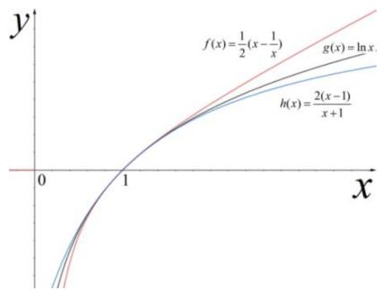

line

| x    | f(x)        | g(x)        | h(x)        |
| ---- | ----------- | ----------- | ----------- |
| 0    | 0           | 0           | 0           |
| 1    | 1/2         | 1/x         | 2/(x-1)/(x+1)|
| >1   | ∞           | √ln x       | √(2/(x-1)/x+1)|

证明①构造函数 $f(x)=\ln x-\frac{1}{2}(x-\frac{1}{x})$ ，则 $f'(x)=\frac{1}{x}-\frac{1}{2}-\frac{1}{2x^{2}}=-\frac{(x-1)^{2}}{2x^{2}}\leq0$ ，而 $f(1)=0$ ，

故当 0 < x < 1 时， $\ln x > \frac{1}{2}(x - \frac{1}{x})$ ；当 $x \geq 1$ 时 $\ln x \leq \frac{1}{2}(x - \frac{1}{x})$ .

②构造函数 $g(x)=\ln x-\frac{2(x-1)}{x+1}$ ，则 $g'(x)=\frac{1}{x}-\frac{4}{(x+1)^{2}}=\frac{(x-1)^{2}}{x(x+1)^{2}}\geq0$ ，而 $f(1)=0$ ，

故当 $0 < x < 1$ 时， $\ln x < \frac{2(x - 1)}{x + 1}$ ；当 $x \geq 1$ 时， $\ln x \geq \frac{2(x - 1)}{x + 1}$ .

飘带函数在高考中应用广泛，如：证明对数平均不等式、比大小、导数与数列结合等.

【例 1】已知函数 $f(x)=x(\ln x-ax)+a$ ，对任意的 $x\geq1$ ，都有 $f(x)\leq0$ ，则实数 a 的取值范围是（）

A. $(0,1)$

B. $[1, +\infty)$

C. $(0, +\infty)$

D. $\left[\frac{1}{2}, +\infty\right)$

【例 2】设 $a=\frac{1}{3}$ ， $b=\ln\frac{7}{5}$ ， $c=\sin\frac{1}{3}$ ，则（）

A. $c <   a <   b$

B. $b < c < a$

C. $c < b < a$

D. a < b < c

# 考向 5 同构体系

# 题型 1 单变量同构

【例 1】设实数 $\lambda > 0$ ，若对任意的 $x \in (0, +\infty)$ ，不等式 $e^{\lambda x} - \frac{\ln x}{\lambda} \geq 0$ 恒成立，则 $\lambda$ 的取值范围是 \_\_\_\_.

【例 2】若对任意的 $x \in (0, +\infty)$ ，不等式 $e^{ax} - x + \sin 2ax > \frac{1}{e^{ax}} - \frac{1}{x} + \sin(\ln x^{2})$ 恒成立，则实数 a 的取值范围是 \_\_\_\_.

【例 3】函数 $f(x)=ae^{x}+\ln\frac{a}{x+2}-2(a>0)$ ，若 $f(x)>0$ 恒成立，则实数 a 的取值范围为 \_\_\_\_.

【例 4】已知函数 $f(x)=e^{x}-a\ln(ax-a)+a(a>0)$ ，若关于 x 的不等式 $f(x)>0$ 恒成立，则实数 a 的取值范围为 \_\_\_\_.

# 题型 2 双变量同构与等量关系

八大同构函数中，会经常形成内部同构的关联，成为了近几年常考题型.

①若 $h(x) = xe^{x}$ ，则 $g(x) = x\ln x = h(\ln x)$ ，当 $h(x_{1}) = g(x_{2})$ 时， $g(x_{2}) = h(\ln x_{2}) = h(x_{1})$ ，当 $x_{1} < -1, 0 < x_{2} < \frac{1}{e}$ （或者 $x_{1} > -1, x_{2} > \frac{1}{e}$ ）时，一定有 $x_{1} = \ln x_{2}$ ，或者 $x_{2} = e^{x_{1}}$ ；

② 若 $h(x)=\frac{e^{x}}{x}$ (或 $\frac{x}{e^{x}}$ )，则 $g(x)=\frac{x}{\ln x}=h(\ln x)$ （或 $g(x)=\frac{\ln x}{x}=h(\ln x)$ ），当 $h(x_{1})=g(x_{2})$ 时， $g(x_{2})=h(\ln x_{2})=h(x_{1})$ ，当 $0<x_{1}<1,1<x_{2}<e$ （或者 $x_{1}>1,x_{2}>e$ ）时，一定有 $x_{1}=\ln x_{2}$ ，或者 $x_{2}=e^{x_{1}}$ ;

③若 $h(x) = e^{x} - x$ ，则 $g(x) = x - \ln x = h(\ln x)$ ，当 $h(x_{1}) = g(x_{2})$ 时， $g(x_{2}) = h(\ln x_{2}) = h(x_{1})$ ，当 $x_{1} <   0,0 <   x_{2} <   1$ （或者 $x_{1} > 0$ ， $x_{2} > 1$ ）时，一定有 $x_{1} = \ln x_{2}$ ，或者 $x_{2} = e^{x_{1}}$

【例 1】已知实数 $\alpha$ ， $\beta$ 满足 $\alpha e^{\alpha-3}=1$ ， $\beta(\ln\beta-1)=e^{4}$ ，其中 e 是自然对数的底数，则 $\alpha\beta$ 的值为（）

A. $e^3$

B. $2e^{3}$

C. $2e^{4}$

D. $e^{4}$

【例 2】已知函数 $f(x)=\frac{\ln x}{x}$ ， $g(x)=x\cdot e^{-x}$ ，若存在 $x_{1}\in(0,+\infty)$ ， $x_{2}\in R$ ，使得 $f(x_{1})=g(x_{2})=k(k<0)$ 成立，则 $\left(\frac{x_{2}}{x_{1}}\right)^{2}\cdot e^{k}$ 的最大值为 \_\_\_\_.

【例 3】（2022•新高考 1）已知函数 $f(x)=e^{x}-ax$ 和 $g(x)=ax-\ln x$ 有相同的最小值.

(1) 求 a;

（2）证明：存在直线 $y = b$ ，其与两条曲线 $y = f(x)$ 和 $y = g(x)$ 共有三个不同的交点，并且从左到右的三个交点的横坐标成等差数列.

# 题型 3 朗博同构的保值性

1. 朗博函数指的是形如 $x^n \cdot e^x$ 或 $\frac{e^x}{x^n}$ 类型的函数，我们可以将这类函数进行“改头换面”处理，

比如 $x \cdot e^{x} = e^{\ln x + x}$ ， $\frac{e^{x}}{x} = e^{x - \ln x} (x > 0)$ ；关于朗博函数我们统一往母函数 $f(x) = e^{x} - x - 1 (x \in R)$ 同构，

即 $f(x) \geq 0$ 恒成立，当且仅当 $x_{0} = 0$ 时等号成立；或 $f(x + \ln x) \geq 0$ ，当且仅当 $x_{0} \approx 0.567$ 时等号成立，等等，要确保 “ $f(x) = 0$ ” 能成立，且取等条件满足定义域，我们称之为保值性.

2. 常见变形总结（a > 0, x > 0）（注意定义域）

$$
1 = \ln e, 2 = \ln e ^ {2}, 1 + \ln x = \ln (e x), \ln x - 1 = \ln \frac {x}{e};
$$

$$
x \mathrm{e} ^ {x} = \mathrm{e} ^ {x + \ln x}, a \mathrm{e} ^ {x} = \mathrm{e} ^ {x + \ln a}, x + \ln x = \ln (x \mathrm{e} ^ {x});
$$

$$
\frac {e ^ {x}}{x} = e ^ {x - \ln x}, \frac {e ^ {x}}{a} = e ^ {x - \ln a}, x - \ln x = \ln \frac {e ^ {x}}{x};
$$

$$
x ^ {2} \mathrm{e} ^ {x} = \mathrm{e} ^ {x + 2 \ln x}, a ^ {2} \mathrm{e} ^ {x} = \mathrm{e} ^ {x + 2 \ln a}, x + 2 \ln x = \ln \left(x ^ {2} \mathrm{e} ^ {x}\right);
$$

$$
\frac {e ^ {x}}{x ^ {2}} = e ^ {x - 2 \ln x}, \frac {e ^ {x}}{a ^ {2}} = e ^ {x - 2 \ln a}, x - 2 \ln x = \ln \left(\frac {e ^ {x}}{x ^ {2}}\right);
$$

【例 1】已知函数 $f(x)=xe^{x-1}-1$ ， $g(x)=x+a+\ln x$ ，若 $f(x)\geq g(x)$ 恒成立，则实数 a 的取值范围是（）

A. $(- \infty, -1]$

B. $(- \infty, 0]$

C. $(- \infty, 1]$

D. $(- \infty, e]$

【例 2】若 x > 0 时，恒有 $x^{2}e^{3x} - (k + 3)x - 2\ln x - 1 \geq 0$ 成立，则实数 k 的取值范围是 \_\_\_\_.

【例 3】若 $\frac{e^{x}}{x} + alnx - ax + e^{2} \geq 0 (a > 0)$ ，则 a 的取值范围为（）

A. $(0, e^{2}]$

B. $(0,\ \frac{e^{2}}{2}]$

C. $[\frac{1}{e}, e^2]$

D. $\left[\frac{1}{e},\frac{e^{2}}{2}\right]$

# 题型 4 双变量同构的新考法

1. 一类题型是不同同构方式下的内部关系或外部关系

2. 一类题型是同构结合其他知识点进行考察

3. 一类题型是不完整同构的考察

【例 1】【多选】已知 a > 0，b > 0， $abe^{a} + lnb - 1 = 0$ ，则（）

A. $\ln b > \frac{1}{a}$

B. $e^{a} > \frac{1}{b}$

C. $a + \ln b < 1$

D. ab < 1

【例 2】【多选】已知实数 a，b 满足 $ae^{a}=blnb=3$ ，则（）

A. $a = \ln b$

B. $ab = e$

C. $b - a <   e - 1$

D. $e + 1 <   a + b <   4$

【例 3】已知 a， $b \in (1, +\infty)$ ，且 $a + b = e^{b} + \ln a + 1$ ，e 为自然对数的底数，则（）

A. $b < a < e^{b}$

B. $e^{b}<a<e^{3b}$

C. a < b

D. $a > e^{3b}$

【例 4】若 $a, b \in R$ ，自然对数的底数为 e，则 $e^{2a} + e^{2b} - 2(ae^{b} + be^{a}) + a^{2} + b^{2}$ 的最小值为 \_\_\_\_.

【例 5】对任意的 a， $b \in R$ ，不等式 $(6a - 6b + 1)e^{2a - b} \geq 6a - 1 - mbe^{a}$ 恒成立，则实数 m 的取值范围是 \_\_\_\_.

# 拓展思维

# 拓展 1 数形结合与公切线问题

# 考向一 平移函数公切线问题

当 $y = f(x)$ 与 $y = g(x)$ 为平行曲线，即 $g(x) = f(x + a) - b$ ，则有 $f^{\prime}(x_{1}) = f^{\prime}(x_{2}) = \frac{f(x_{1}) - f(x_{2})}{x_{1} - x_{2}} = \frac{b}{a}$

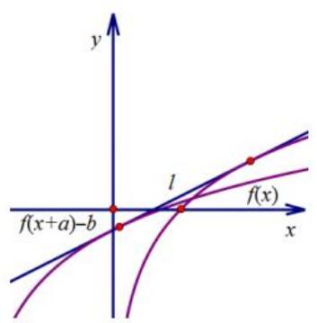

text_image

y
l
f(x)
f(x+a)-b
x

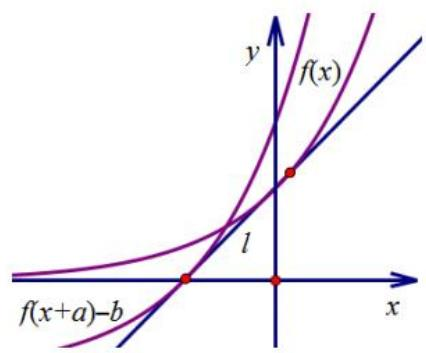

text_image

f(x)
y
f(x)
l
f(x+a)-b
x

证明: 因为 $y = f(x)$ 与 $g(x) = f(x + a) - b$ 有公切线，设 $y = f(x)$ 切点为 $(x_{1}, f(x_{1}))$ ， $y = g(x) = f(x + a) - b$ 切点为 $(x_{2}, f(x_{2}+a)-b)$ ，则一定有 $f'(x_{1})=f'(x_{2}+a)$ ，所以 $x_{1}=x_{2}+a$ ，根据公切线方程 $y_{2}-y_{1}=k(x_{2}-x_{1})$ 可得： $f(x_{2}+a)-b-f(x_{1})=f'(x_{1})(x_{2}-x_{1})$ ，所以 $-b=-af'(x_{1})$ ，即 $f'(x_{1})=k=\frac{b}{a}$ 如果按照数形结合来理解，就是 $y=f(x)$ 与 $y=g(x)=f(x+a)-b$ ，两点确定公切线，两切点连线的斜率就是公切线斜率，即将切点 $(x_{1}, f(x_{1}))$ 左移a单位，再下移b单位，这样得到点 $(x_{1}-a, f(x_{1})-b)$ ，所以公切线斜率

$$
k = \frac {f (x _ {1}) - b - f (x _ {1})}{x _ {1} - a - x _ {1}} = \frac {b}{a}
$$

【例 1】(2016•新课标 II) 若直线 $y = kx + b$ 是曲线 $y = \ln x + 2$ 的切线，也是曲线 $y = \ln(x + 1)$ 的切线，则 b = \_\_\_\_.

【例 2】若直线 $y = kx + b$ 与曲线 $C_{1}: y = 3 + e^{x}$ 和曲线 $C_{2}: y = e^{x+2}$ 同时相切，则 $b = (\quad)$

A. $\frac{9}{2}-\frac{3}{2}\ln\frac{3}{2}$

B. $2 - \ln 2$

C. $\frac{1}{2}-\ln\frac{1}{2}$

D. $3 - \ln 3$

# 考向二 公切线方程中的隐形同构

两曲线公共点公切线问题：当 $y = f(x)$ 与 $y = g(x)$ 切于同一点，设切点为 $P(x_{0}, y_{0})$ ，则有 $\left\{\begin{aligned}f'(x_{0}) &= g'(x_{0}) \\ f(x_{0}) &= g(x_{0})\end{aligned}\right.$ ，单参数求定值，双参数转化为单参数后确定参数的取值范围，这里面要看清楚同构.

【例1】直线 $y = kx + b$ 是曲线 $y = x^{2} - (a + 1)$ 的切线，也是曲线 $y = a\ln x - 1$ 的切线，则 $k$ 的最大值是（）

A. $\frac{2}{e}$

B. $\frac{4}{e}$

C. 2e

D. $4e$

【例 2】已知 $f(x)=x^{2}+4ax-b$ ， $g(x)=6a^{2}\ln x+b$ ，a>0。若 $y=f(x)$ ， $y=g(x)$ 图象有公共点 P，且在该点处的切线重合，则 b 的可能取值为（）

A. $e^{\frac{2}{3}}$

B. $\frac{3}{2}e^{\frac{2}{3}}$

C. $-\frac{1}{2}e^{2}$

D. $\frac{5}{2}e^{\frac{2}{3}}$

# 考向三 凹凸性数形几何解读公切线条数

$y = f(x)$ 与 $y = g(x)$ 是否有公切线，决定它们公切线条数的是函数凹凸性和相同的单调区间交点.

凹凸性相同的两曲线，在两个曲线 $f''(x)>0$ ， $g''(x)>0$ 时，两个函数均为凹函数，且 $f'(x)>0$ ， $g'(x)>0$ 时均在递增区间，

①如图，若 $y = f(x)$ 与 $y = g(x)$ 无交点，可以类比于两个圆的外公切线，当小圆内含于大圆时，无公切线；  
②若 $y = f(x)$ 与 $y = g(x)$ 有唯一交点时，如图，可以类比于当小圆与大圆内切时，有唯一的外公切线；  
③若 $y = f(x)$ 与 $y = g(x)$ 有两个交点时，如图，可以类比于当小圆与大圆相交时，有两条外公切线；

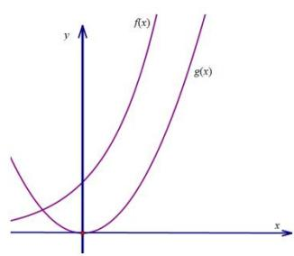

text_image

y
f(x)
g(x)
x

内含型无公切线

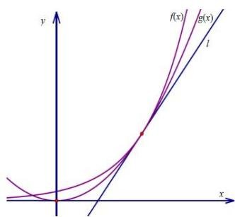

text_image

y
f(x)
g(x)
l
x

内切型有一条外公切线

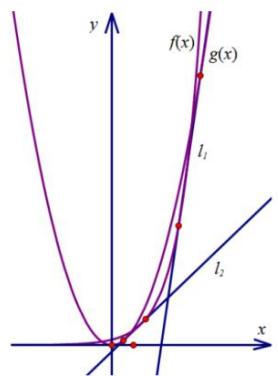

text_image

y
f(x)
g(x)
l₁
l₂
x

同旁相交型两条外公切线

同理，凹凸性不同的两条曲线，在两个曲线 $f''(x)>0$ 为凹函数， $g''(x)<0$ 为凸函数时，且 $f'(x)>0$ ， $g'(x)>0$ ，两个函数均在递增区间；

④如图，若 $y = f(x)$ 与 $y = g(x)$ 有两个交点，可以类比圆的内公切线，当两圆相交时，无内公切线；  
⑤若 $y = f(x)$ 与 $y = g(x)$ 有唯一交点时，如图所示，可以类比于当两圆外切时，有唯一的内公切线.  
⑥若 $y = f(x)$ 与 $y = g(x)$ 无交点时，如图所示，可以类比于当两圆相离时，有两条内公切线.

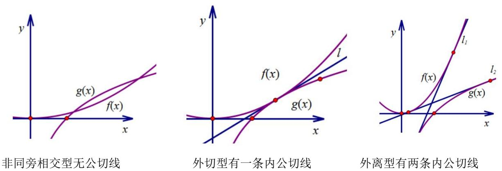

【例 1】已知直线 $y = kx + b$ 与曲线 $y = e^{x} + 2$ 和曲线 $y = \ln(e^{2}x)$ 均相切，则实数 k 的解的个数为（）

A. 0

B. 1

C. 2

D. 无数

【例 2】若函数 $f(x)=4\ln x+1$ 与函数 $g(x)=\frac{1}{a}x^{2}-2x(a>0)$ 的图象存在公切线，则 a 的取值范围为（）

A. $(0,\frac{1}{3}]$

B. $\left[\frac{1}{3},+\infty\right)$

C. $\left[\frac{2}{3},1\right)$

D. $\left[\frac{1}{3},\frac{2}{3}\right]$

【例 3】(多选)若两曲线 $y = x^{2} - 1$ 与 $y = a \ln x - 1$ 存在公切线，则正实数 a 的取值可能是（）

A.1.2

B.4

C. 5.6

D. 2e

# 考向四 分段函数公切线条数问题

【例 1】（多选）关于曲线 $f(x)=\ln x$ 和 $g(x)=\frac{a}{x}(a\neq0)$ 的公切线，下列说法正确的有（）

A. 无论 $a$ 取何值，两曲线都有公切线

B. 若两曲线恰有两条公切线，则 $a = -\frac{1}{e}$

C. 若 $a < -1$ ，则两曲线只有一条公切线

D. 若 $-\frac{1}{e^2} < a < 0$ ，则两曲线有三条公切线

【例 2】若曲线 y = ln x 与曲线 $y = x^{2} + 2x + a (x < 0)$ 有公切线，则实数 a 的取值范围是（）

A. $(-ln2 - 1, +\infty)$

B. $[-ln2 - 1, +\infty)$

C. $(-ln2 + 1, + \infty)$

D. $[-ln2 + 1, +\infty)$

# 拓展 1 切线条数与拐点切线界定

# 题型一 数形结合凹凸性分析：

我们可以参考圆的切线，对于圆上一点只能作一条切线，圆外一点能作两条切线，圆内一点不能作切线，所以对于一个凹凸性不改变的函数，即二阶导没有变号零点的函数，在“圆外”一点能作两条切线如下左图所示.

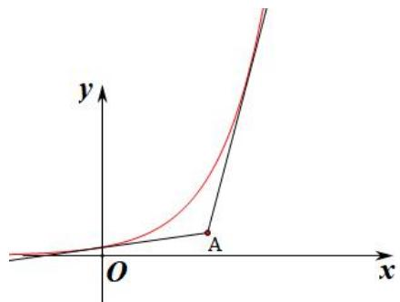

text_image

y
O
A
x

【例 1】（2021•新高考 I）若过点 $(a, b)$ 可以作曲线 $y = e^{x}$ 的两条切线，则（）

A. $e^b < a$

B. $e^{a} < b$

C. $0 < a < e^{b}$

D. $0 < b < e^{a}$

# 题型二 三次函数切线条数

一般地，如图，过三次函数 $f(x)$ 图象的拐点 $(- \frac{b}{3a}, f(-\frac{b}{3a}))$ （对称中心或拐点）作切线 $l$ ，则坐标平面被切线 $l$ 和函数 $f(x)$ 的图象分割为四个区域，有以下结论：

（1）由于区域 I、IV 属于外弧区域，故过区域 I、IV 内的点作 $f(x)$ 的切线，有 3 条；  
（2）由于区域 II、III 属于内弧区域，过区域 II、III 内的点或者对称中心作 $f(x)$ 的切线，有且仅有 1 条；  
（3）过切线 l 或函数 $f(x)$ 图象（除去对称中心）上的点作 $f(x)$ 的切线，有且仅有 2 条.

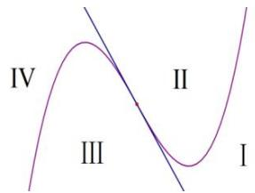

text_image

IV
II
III
I

【例 1】（2022·多选·新高考 I）已知函数 $f(x)=x^{3}-x+1$ ，则（）

A. $f(x)$ 有两个极值点

B. $f(x)$ 有三个零点

C. 点 $(0,1)$ 是曲线 $y = f(x)$ 的对称中心

D. 直线 $y = 2x$ 是曲线 $y = f(x)$ 的切线

【例 2】过点(1, 2)可作三条直线与曲线 $f(x)=x^{3}-3x+a$ 相切，则 a 的取值范围为()

A. $(1, 2)$

B. $(2,3)$

C. $(3, 4)$

D. $(4, 5)$

【例 3】若过点 $(m, n)(m>0)$ 可作曲线 $y=x^{3}-3x$ 三条切线，则（）

A. $n < -3m$

B. $n > m^{3} - 3m$

C. $n = m^{3} - 3m$ 或 n = -3m

D. $-3m < n < m^{3} - 3m$

# 题型三 含渐近线和拐点的函数切线界定

（1）关于 $f(x) = (x + a)e^x$ 切线条数问题，由于 $f'(x) = (x + a + 1)e^x$ ， $f''(x) = (x + a + 2)e^x$ ，当 $x = -a - 2$ 时， $f''(x) = 0$ ，此处 $(-a - 2, -2e^{-a - 2})$ 为函数的拐点，易求拐点处切线方程为 $y = -e^{-a - 2}(x + a + 4)$ ，当 $x \to -\infty$ 时， $f(x) \to 0$ ，我们把 $y = 0$ 称为此函数的渐近线，区别于三次函数只有拐点，故我们通过拐点切线和渐近线，将平面分为7个区域，我们可以对此类型题进行归纳总结，如下：

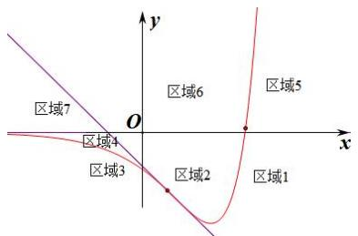

text_image

区域7
区域4
区域3
O
x
y
区域6
区域5
区域2
区域1

当 y<0 时，函数 $y=f(x)$ 与拐点处切线 $y=-e^{-a-2}(x+a+4)$ 以及 x 轴（渐近线）将平面分成四个区域（如图所示），分别由两个外弧区域和两个内弧区域组成，

①区域 1 和区域 4 属于双外弧区域，位于此区域的点能作 $y = f(x)$ 三条切线；  
②区域 2 和区域 3 属于一内弧一外弧区域，位于此区域的点能作 $y = f(x)$ 一条切线；

我们将拐点切线作为内外弧分界点，区域 2 就是拐点右侧曲线的内弧区域，但是相对于曲线左侧，则是外弧区域，所以只能往拐点左侧区域作唯一一条切线，也是“远切线”；同理，区域 3 是拐点左侧曲线的内弧区域，也是拐点右侧曲线的外弧区域，所以过区域 3 的任意一点能作唯一一条切点位于拐点右侧的“远切线”；那么区域 1 和区域 4 就是拐点左右两侧的双外弧区域，在本侧能作两条切点位于拐点同侧的“近切线”，以及一条拐点另一侧的“远切线”。

③过曲线上拐点处仅能作一条切线，过拐点以外的曲线上任意一点能作两条切线；

在曲线上任意一点能作一条切线，这可以理解为拐点同侧外弧的两条切线合二为一，类比于圆，圆上一点能作一条切线，就是圆外的两条切线在这里合二为一，还有一条切线源自拐点另一处的“远切线”。

④过拐点处切线上除了拐点以外的任意一点，仅能作两条切线；

拐点切线，就是一条“近切线”和一条“远切线”合二为一，否则就会有三条切线.

当 $y \geq 0$ 时，函数 $y = f(x)$ 与拐点处切线 $y = -e^{-a-2}(x + a + 4)$ 以及 x 轴将平面分成三个区域（如图所示），分别由两个外弧区域和一个内弧区域组成，由于不在渐近线内侧，故少了一条 “远切线”。

⑤区域 5 和区域 7 属于双外弧区域，位于此区域的点能作 $y = f(x)$ 两条切线，相比区域 1 和区域 4，少了一条位于 $x \to -\infty$ 处的远切线；  
⑥区域 6 属于一内弧一外弧区域，由于唯一一条远切线的缺失，故位于此区域的点不能作 $y = f(x)$ 的切线；  
⑦由于缺失了一条远切线，故过曲线上任意一点仅能作一条切点在曲线上切线；  
⑧过曲线与x轴的交点仅能作唯一切线.

【例 1】（2022•新课标 1 卷）若曲线 $y=(x+a)e^{x}$ 有两条过坐标原点的切线，则 a 的取值范围是 \_\_\_\_.

【例 2】已知过点 $A(a,0)$ 作曲线 $y=(1+x)e^{x}$ 的切线有且仅有 1 条，则 a 的可能取值为（）

A. -5

B.-3

C.-1

D. 1

【例 3】若曲线 $f(x)=\frac{x}{e^{x}}$ 有三条过点 $(0,a)$ 的切线，则实数 a 的取值范围为（）

A. $(0, \frac{1}{e^2})$

B. $(0,\frac{4}{e^{2}})$

C. $(0,\frac{1}{e})$

D. $(0,\frac{4}{e})$

【例 4】若过点（a, b）（a > 0）可以作曲线 $y = xe^{x}$ 的三条切线，则（）

A. $0 < a < be^{b}$

B. $-ae^{a} < b < 0$

C. $0 < ae^{2} < b + 4$

D. - $(a + 4) <   be^{2} <   0$

【例 5】（无拐点）过点 $A(a,0)$ 作曲线 $y=x\ln x$ 的切线有且仅有两条，则实数 a 的取值范围为（）

A. $(0, +\infty)$

B. $(1, + \infty)$

C. $\left(\frac{1}{e},+\infty\right)$

D. $(e,+\infty)$

【例 6】若过点 $P(t,0)$ 可以作曲线 $y=(1-x)e^{x}$ 的两条切线，切点分别为 $A(x_{1}, y_{1})$ ， $B(x_{2}, y_{2})$ ，则 $y_{1}y_{2}$ 的取值范围是（）

A. $(0, 4e^{-3})$

B. $(- \infty, 0) \cup (0, 4e^{-3})$

C. $(-∞, 4e^{-2})$

D. $(-\infty, 0) \cup (0, 4e^{-2})$

# 拓展 3 双参数问题处理技巧

# 题型一 零点比大小破解双参比值问题

1. $kx + b \leq f(x)$ 恒成立，求 $\frac{b}{k}$ 的最值和取值范围；2. $kx + b \geq f(x)$ 恒成立，求 $\frac{b}{k}$ 的最值和取值范围.

如图 2-2-1 所示，通常的方法是构造函数 $g(x)=f(x)-kx$ ，则 $g(x)_{\min}\geq b$ 时，从而达到解决此类型的目的，这种解答方法适合解答题，但此类型题目出现在选填压轴题的几率更大，常规思路由于计算量大，对一道客观题来说没必要，故需要采纳一些高观点低运算的方法，此类型可以利用数形结合的思想，如图 2-2-2 所示，通常 $y=f(x)$ 是一个凹函数 $(f(x)>0)$ ，如 $kx+b\leq f(x)$ 意味着 $y=f(x)$ 与 $y=kx+b$ 相切时即恒成立， $(-b/k,0)$ 是直线和 x 轴的交点，记为 $(x_{2},0)$ ，将 $y=f(x)$ 的唯一零点 $x_{1}$ 求出，满足 $x_{1}\leq x_{2}=-\frac{b}{k}$ 即可.

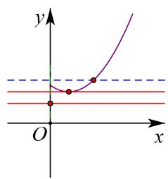

text_image

y
O
x

图2-2-1

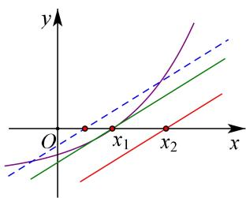

text_image

y
O
x₁
x₂
x

图2-2-2

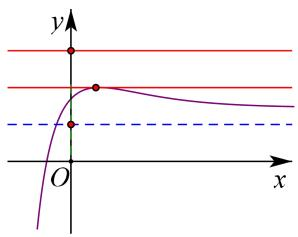

text_image

y
O
x

图2-2-3

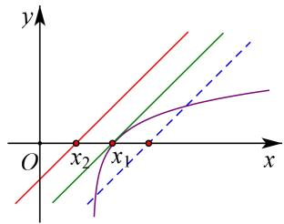

text_image

y
O
x₂
x₁
x

图2-2-4

同理，在比较 $kx + b \geq f(x)$ 时，也是一类型转化，此时 $y = f(x)$ 为凸函数 $(f(x) < 0)$ ，也将图2-2-3的方案转化为图2-2-4，构造 $x_{1} \geq x_{2} = -\frac{b}{k}$ ；四个图中的虚线直线是不可能满足题目要求的，此方法叫零点比大小。注意：直曲分离是关键，问题与直线零点有直接关系，所以我们可以根据问题来将原式进行变形。

【例 1】若不等式 $e^{x-1}-mx-2n-3\geq0$ 对 $x\in R$ 恒成立，其中 $m\neq0$ ，则 $\frac{n}{m}$ 的最大值为（）

A. $-\frac{\ln3e}{2}$

B. $-\ln 3e$

C. $\ln 3e$

D. $\frac{\ln3e}{2}$

【例 2】已知 $a, b \in R$ ，若 $e^x - 1 \geq ax - b$ 对任意实数 $x$ 恒成立恒成立，则 $\frac{b - a + 1}{a}$ 的取值范围为 \_\_\_\_.

【例 3】已知函数 $f(x)=(e-a)e^{x}-ma+x$ ， $(m, a$ 为实数），若存在实数 a，

使得 $f(x) \leq 0$ 对任意 $x \in R$ 恒成立，则实数 m 的取值范围是（）

A. $\left[-\frac{1}{e}, +\infty\right)$

B. $[ -e, +\infty )$

C. $\left[\frac{1}{e}, e\right]$

D. $[-e, -\frac{1}{e}]$

【例 4】已知 $e^{2ax+b} \geq x + \frac{1}{a}$ 对 $\forall x \in \left(-\frac{1}{a}, +\infty\right)$ 恒成立，则 $\frac{b}{a}$ 的最小值为 \_\_\_\_.

# 题型 2 切线比较法破解双参乘积问题

已知 $e^x \geq x + 1$ ，当且仅当 $x = 0$ 时取等，则有 $e^{x - \ln a} \geq x - \ln a + 1$ ，我们可称 $y = x - \ln a + 1$ 为临界切线.

若 $e^x \geq ax + b$ ，求 $ab$ 的最大值，我们可以做如下分析：

首先，需满足 $a > 0$ ， $a\leq 0$ 与题设矛盾， $e^x\geq ax + b\Leftrightarrow e^{x - \ln a}\geq x + \frac{b}{a}$ ；注意到 $y = x + \frac{b}{a}$ 与 $y = x - \ln a + 1$ 斜率相等，则仅需满足 $\frac{b}{a}\leq -\ln a + 1$ （如下图），即可得到 $ab\leq a^2 (-\ln a + 1)$ ，接下来同构或者求导即可求出最值.

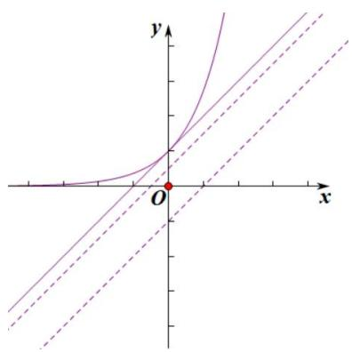

text_image

Mathematical graph showing a curve with tangent lines and labeled axes, including origin O and coordinate axes x and y.

【例 1】已知函数 $f(x)=\ln(ax+b)-x+1$ ，若 $f(x)\leq0$ ，则 ab 的最大值为 \_\_\_\_.

【例 2】（2012•新课标）已知函数 $f(x)$ 满足 $f(x)=f'(1)e^{x-1}-f(0)x+\frac{1}{2}x^{2}$ ，若 $f(x)\geq\frac{1}{2}x^{2}+ax+b$ ，则 $(a+1)b$ 的最大值为 \_\_\_\_.

# 题型 3 距离转换与柯西不等式

柯西不等式： $(a^{2} + b^{2})(c^{2} + d^{2})\geq (ac + bd)^{2}$ ，取等“ $\frac{a}{c} = \frac{b}{d}$ 或 $ad = bc$ ”.

【例 1】若关于 x 的方程 $2\ln(ax+\frac{b}{2})=\sqrt{4x^{2}+1}$ 有实根，则 $a^{2}+b^{2}$ 的最小值为 \_\_\_\_.

【例 2】(2022·天津卷)已知函数 $f(x)=\mathrm{e}^{x}-a\sin x,\quad g(x)=b\sqrt{x}$ .

(1) 求函数 $y = f(x)$ 在 $(0, f(0))$ 处的切线方程;

(2) 若 $y = f(x)$ 和 $y = g(x)$ 有公共点:

i) 当 a=0 时，求 b 的取值范围；

ii) 求证: $a^2 + b^2 > e$ .

# 拓展 4 抽象函数的导函数构造

# 角度 1 导数和差，构造和差型函数

$$
f ^ {\prime} (x) + c = [ f (x) + c x ] ^ {\prime}; \quad f ^ {\prime} (x) + g ^ {\prime} (x) = [ f (x) + g (x) ] ^ {\prime}; \quad f ^ {\prime} (x) - g ^ {\prime} (x) = [ f (x) - g (x) ] ^ {\prime};
$$

和与积联系，构造乘积型函数；差与商联系，构造分式型函数：

$$
f ^ {\prime} (x) g (x) + f (x) g ^ {\prime} (x) = [ f (x) g (x) ] ^ {\prime}; \frac {f ^ {\prime} (x) g (x) - f (x) g ^ {\prime} (x)}{g ^ {2} (x)} = [ \frac {f (x)}{g (x)} ] ^ {\prime}.
$$

# 角度 2 幂函数及其抽象构造

定理 1 $xf'(x) + f(x) > 0 \Leftrightarrow [xf(x)]' > 0$ ; $xf'(x) - f(x) > 0 \Leftrightarrow [\frac{f(x)}{x}]' > 0$

证明：因为 $xf'(x) + f(x) = [xf(x)]'$ ； $\frac{xf'(x) - f(x)}{x^2} = \left[\frac{f(x)}{x}\right]'$ ，所以 $xf'(x) + f(x) > 0$ ，

则函数 $y = xf(x)$ 单调递增； $xf'(x) - f(x) > 0$ ，则 $y = \frac{f(x)}{x}$ 单调递增.

定理2 当 $x > 0$ 时， $xf'(x) + nf(x) > 0 \Leftrightarrow [x^n f(x)]' > 0$ ； $xf'(x) - nf(x) > 0 \Leftrightarrow [\frac{f(x)}{x^n}]' > 0$

证明 因为 $x^n f'(x) + nx^{n-1}f(x) = [x^n f(x)]'$ ; $\frac{x^n f'(x) - nx^{n-1}f(x)}{x^{2n}} = \left[\frac{f(x)}{x^n}\right]'$ , 所以 $xf'(x) + nf(x) > 0$ , 则函数

$y=x^{n}f(x)$ 单调递增； $xf'(x)-nf(x)>0$ ，则 $y=\frac{f(x)}{x^{n}}$ 单调递增.

# 角度三 指数函数与抽象构造

定理 3 $f'(x) + f(x) > 0 \Leftrightarrow [e^{x}f(x)]' > 0$ ; $f'(x) + f(x) < 0 \Leftrightarrow [e^{x}f(x)]' < 0$

$$
f ^ {\prime} (x) - f (x) > 0 \Leftrightarrow [ \frac {f (x)}{e ^ {x}} ] ^ {\prime} > 0; f ^ {\prime} (x) - f (x) <   0 \Leftrightarrow [ \frac {f (x)}{e ^ {x}} ] ^ {\prime} <   0
$$

证明：因为 $\left[f(x)e^x\right]' = e^x\left[f'(x) + f(x)\right]$ ， $\left[\frac{f(x)}{e^x}\right]' = \frac{f'(x) - f(x)}{e^x}$ ，所以 $f'(x) + f(x) > 0$ ，

则 $y = f(x)e^{x}$ 单调递增；反之 $y = f(x)e^{x}$ 单调递减； $f'(x) - f(x) > 0$ ，则 $y = \frac{f(x)}{e^{x}}$ 单调递增；

反之 $y=\frac{f(x)}{e^{x}}$ 单调递减.

定理 4 $f'(x) + f(x) > a \Leftrightarrow [e^{x}(f(x) - a)]' > 0$ ; $f'(x) - f(x) > a \Leftrightarrow [\frac{(f(x) + a)}{e^{x}}]' > 0$ .

证明：因为 $f^{\prime}(x) + f(x) - a = \frac{[e^{x}(f(x) - a)]^{\prime}}{e^{x}}$ ； $f^{\prime}(x) - f(x) - a = e^{x}[\frac{(f(x) + a)}{e^{x}}]^{\prime}$ ，所以 $f^{\prime}(x) + f(x) > a$ ，则 $y = e^{x}(f(x) - a)$ 单调递增； $f^{\prime}(x) + f(x) < a$ ， $y = e^{x}(f(x) - a)$ 单调递减；

若 $f'(x)-f(x)>a$ ，则 $y=\frac{f(x)+a}{e^{x}}$ 单调递增，

若 $f^{\prime}(x) - f(x) < a$ ，则 $y = \frac{f(x) + a}{e^x}$ 单调递减.

# 角度四 三角函数与抽象构造

定理 5 正弦同号，余弦反号定理

$$
f ^ {\prime} (x) \sin x + f (x) \cos x > 0 \Leftrightarrow [ f (x) \sin x ] ^ {\prime} > 0, \text {当} x \in (\frac {\pi}{2}, \frac {\pi}{2}), f ^ {\prime} (x) \tan x + f (x) > 0 \Leftrightarrow [ f (x) \sin x ] ^ {\prime} > 0;
$$

$$
f ^ {\prime} (x) \sin x - f (x) \cos x > 0 \Leftrightarrow [ \frac {f (x)}{\sin x} ] ^ {\prime} > 0, \text {当} x \in (- \frac {\pi}{2}, \frac {\pi}{2}), f ^ {\prime} (x) \tan x - f (x) > 0 \Leftrightarrow [ \frac {f (x)}{\sin x} ] ^ {\prime} > 0;
$$

$$
\cos x f ^ {\prime} (x) - f (x) \sin x > 0 \Leftrightarrow [ f (x) \cos x ] ^ {\prime} > 0, \text {当} x \in \left(- \frac {\pi}{2}, \frac {\pi}{2}\right), f ^ {\prime} (x) - f (x) \tan x > 0 \Leftrightarrow [ f (x) \cos x ] ^ {\prime} > 0;
$$

$$
f ^ {\prime} (x) \cos x + f (x) \sin x > 0 \Leftrightarrow [ \frac {f (x)}{\cos x} ] ^ {\prime} > 0, \text {当} x \in (- \frac {\pi}{2}, \frac {\pi}{2}), f ^ {\prime} (x) + f (x) \tan x > 0 \Leftrightarrow [ \frac {f (x)}{\cos x} ] ^ {\prime} > 0.
$$

遇正切时化切为弦，请自己证明相关结论.

【例 1】设函数 $f'(x)$ 是函数 $f(x)(x \in R)$ 的导函数； $f(3) = e^{3}$ ，且 $f'(x) - f(x) > 0$ 恒成立，则不等式 $f(x) - e^{x} > 0$ 的解集为（）

A. $(0,3)$

B. $(1,3)$

C. $(-\infty,3)$

D. $(3,+\infty)$

【例 2】（2015•新课标 II）设函数 $f'(x)$ 是奇函数 $f(x)$ （ $x \in R$ ）的导函数， $f(-1)=0$ ，当 x>0 时， $xf'(x)-f(x)<0$ ，则使得 $f(x)>0$ 成立的 x 的取值范围是（）

A. $(- \infty, -1) \cup (0, 1)$

B. $(-1, 0) \cup (1, +\infty)$

C. $(-∞, -1)∪(-1, 0)$

D. $(0,1)\cup(1,+\infty)$

【例 3】已知定义在 R 上的函数 $f(x)$ 的导函数为 $f'(x)$ ，且 $3f(x)+f'(x)<0$ ， $f(\ln3)=1$ ，则不等式 $f(x)>27e^{-3x}$ 的解集为（）

A. $(- \infty, 3)$

B. $(- \infty, \ln 3)$

C. $(ln3, +\infty)$

D. $(3, +\infty)$

【例 4】已知函数 $f(x)$ 的定义域为 $\left(-\frac{\pi}{2}, \frac{\pi}{2}\right)$ ，其导函数是 $f'(x)$ ，且满足 $f'(x)\cos x + f(x)\sin x < 0$ ，则关于 x 的不等式 $f(x) < 2f(\frac{\pi}{3})\cos x$ 的解集为（）

A. $\left(\frac{\pi}{3},\frac{\pi}{2}\right)$

B. $\left(-\frac{\pi}{2}, -\frac{\pi}{3}\right)$

C. $(- \frac{\pi}{2}, \frac{\pi}{3})$

D. $\left(-\frac{\pi}{2}, -\frac{\pi}{6}\right)$

