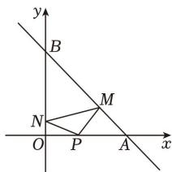
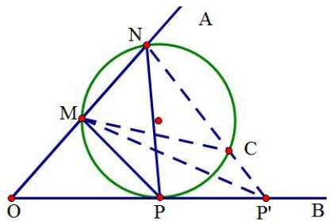
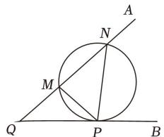

# 9.1 直线与圆

# 考向 1 直线与方程

# 题型 1 倾斜角、斜率、直线方程

# 一．直线与方程

# 1. 直线的倾斜角和斜率

若直线 $l$ 与 $x$ 轴相交，则以 $x$ 轴正方向为始边，绕交点逆时针旋转直至与 $l$ 重合所成的角称为直线 $l$ 的倾斜角，

(1) 若直线与 $x$ 轴平行（或重合），则倾斜角为 0  
(2) 倾斜角的取值范围 $\alpha \in [0, \pi)$

设直线的倾斜角为 $\alpha$ ，则 $\alpha$ 的正切值称为直线的斜率，记为 $k = \tan \alpha$

（3）当 $\alpha=\frac{\pi}{2}$ 时，斜率不存在；所以竖直线是不存在斜率的  
(4) $|k|$ 越大，直线越陡峭

# 2. 过两点的直线斜率公式

已知直线上任意两点， $A(x_{1},y_{1})$ ， $B(x_{2},y_{2})$ 则 $k=\frac{y_{2}-y_{1}}{x_{2}-x_{1}}$

(1) 直线的斜率是确定的，与所取的点无关.  
（2）若 $x_{1}=x_{2}$ ，则直线 AB 的斜率不存在，此时直线的倾斜角为 $90^{\circ}$

# （四）三点共线

两直线 AB, AC 的斜率相等 $\rightarrow$ A、B、C 三点共线；反过来，A、B、C 三点共线，则直线 AB, AC 的斜率相等（斜率存在时）或斜率都不存在.

# 3. 直线的方程

# （一）直线的截距

若直线 l 与坐标轴分别交于 $(a,0)$ ， $(0,b)$ ，则称 a, b 分别为直线 l 的横截距，纵截距

(1) 截距: 可视为直线与坐标轴交点的简记形式, 其取值可正, 可负, 可为 0 (不要顾名思义误认为与 “距离” 相关)  
(2) 横纵截距均为 0 的直线为过原点的非水平非竖直直线

# （二）直线方程的五种形式

<table><tr><td>名称</td><td>方程</td><td>适用范围</td></tr><tr><td>点斜式</td><td> $y - y_1 = k(x - x_1)$ </td><td>不含垂直于x轴的直线</td></tr><tr><td>斜截式</td><td> $y = kx + b$ </td><td>不含垂直于x轴的直线</td></tr><tr><td>两点式</td><td> $\frac{y - y_1}{y_2 - y_1} = \frac{x - x_1}{x_2 - x_1}$ </td><td>不含直线 $x = x_1(x_1 \neq x_2)$ 和直线 $y = y_1(y_1 \neq y_2)$ </td></tr><tr><td>截距式</td><td> $\frac{x}{a} + \frac{y}{b} = 1$ </td><td>不含垂直于坐标轴和过原点的直线</td></tr><tr><td>一般式</td><td> $Ax + By + C = 0 (A^2 + B^2 \neq 0)$ </td><td>平面直角坐标系内的直线都适用</td></tr></table>

# 题型一 求直线斜率和方程

【例 1】已知直线 $ax + 2y = 4$ 的倾斜角为 $135^{\circ}$ ，则 $a = (\quad)$

A.-2

B. -1

C. 1

D. 2

【例 2】若经过 $A(m-1,3)$ ， $B(m,1-m)$ 两点的直线的倾斜角是 $\frac{3\pi}{4}$ ，则 $m=(\quad)$

A.-3

B.-1

C. 1

D. 3

【例 3】在下列四个命题中，正确的是( )

A. 若直线的倾斜角越大, 则直线斜率越大

B. 过点 $P(x_{0}, y_{0})$ 的直线方程都可以表示为： $y - y_{0} = k(x - x_{0})$

C. 经过两个不同的点 $P_{1}(x_{1}, y_{1})$ ， $P_{2}(x_{2}, y_{2})$ 的直线方程都可以表示为： $(y - y_{1})(x_{2} - x_{1}) = (x - x_{1})(y_{2} - y_{1})$

D. 经过点(1,1)且在 $x$ 轴和 $y$ 轴上截距都相等的直线方程为 $x + y - 2 = 0$

【例 4】已知点 $A(2,0)$ ， $B(0,4)$ ，若过 $P(-6,-8)$ 的直线 l 与线段 AB 相交，则实数 k 的取值范围为（）

A. $k \leqslant 1$

B. $k \geqslant 2$

C. $k \geqslant 2$ 或 $k \leqslant 1$

D. $1 \leqslant k \leqslant 2$

【例 5】已知直线 $l:(2m+1)x+(m+1)y+m=0$ 经过定点 P，直线 $l'$ 经过点 P，且 $l'$ 的方向向量 $\vec{a}=(3,2)$ ，则直线 $l'$ 的方程为（）

A. $2x - 3y + 5 = 0$

B. $2x - 3y - 5 = 0$

C. $3x - 2y + 5 = 0$

D. $3x - 2y - 5 = 0$

【例 6】根据下列条件分别写出直线的方程，并化为一般式方程.

（1）求经过 $A(-1,5)$ 、 $B(2,1)$ 两点的直线方程；  
（2）求在 x 轴、y 轴上的截距分别是 -3、-1 的直线方程；  
（3）求经过点 $Q(-1,2)$ 且斜率为 -2 的直线方程.

# （三）直线系问题

概念：具有某种共同属性的一类直线的集合，称为直线系．它的方程称直线系方程.

# (1) 过定点直线系

过已知点 $P(x_{0}, y_{0})$ 的直线系方程 $y - y_{0} = k(x - x_{0})$ （k 为参数）.

# (2) 斜率为定值直线系

斜率为 k 的直线系方程 $y = kx + b$ （b 是参数）.

# (3) 平行直线系

与已知直线 $Ax + By + C = 0$ 平行的直线系方程 $Ax + By + \lambda = 0$ （ $\lambda$ 为参数）.

# (4) 垂直直线系

与已知直线 $Ax + By + C = 0$ 垂直的直线系方程 $Bx - Ay + \lambda = 0$ （ $\lambda$ 为参数）.

# （5）过两直线交点的直线系

过直线 $l_{1}: A_{1}x + B_{1}y + C_{1} = 0$ 与 $l_{2}: A_{2}x + B_{2}y + C_{2} = 0$ 的交点的直线系方程：

$$
A _ {1} x + B _ {1} y + C _ {1} + \lambda \left(A _ {2} x + B _ {2} y + C _ {2}\right) = 0 (\lambda \text {为参数}). (\text {重点掌握})
$$

【例 7】已知直线 $l_{1}: x + y + 2 = 0$ 与 $l_{2}: 2x - 3y - 3 = 0$ ，求经过的交点且与已知直线 $3x + y - 1 = 0$ 平行的直线 L 的方程.

【例 8】求证：m 为任意实数时，直线 $(m-1)x+(2m-1)y=m-5$ 恒过一定点 P，并求 P 点坐标.

【例 9】求过直线： $x+2y+1=0$ 与直线： $2x-y+1=0$ 的交点且在两坐标轴上截距相等的直线方程.

# 题型 2 位置关系

直线 $l_{1}$ ： $y = k_{1}x + b_{1}$ ，直线 $l_{2}$ ： $y = k_{2}x + b_{2}$ ，若 $l_{1} // l_{2}$ ，则 $k_{1} = k_{2}$ ；若 $l_{1} \perp l_{2}$ ，则 $k_{1} \cdot k_{2} = -1$ 。（此处注意与向量的区别）

【例 1】“m = -1”是“直线 $l_{1}: mx + 2y + 1 = 0$ 与直线 $l_{2}: \frac{1}{2}x + my + \frac{1}{2} = 0$ 平行”的（）

A. 充要条件

B. 必要不充分条件

C. 充分不必要条件

D. 既不充分也不必要条件

【例 2】直线 $l_{1}: ax + (a + 1)y - 1 = 0$ ， $l_{2}: (a + 1)x - 2y + 3 = 0$ ，若 $l_{1} \perp l_{2}$ ，则 a = \_\_\_\_.

# 题型 3 距离问题

（一）两点间距离 设 $A(x_{1},y_{1}),B(x_{2},y_{2})$ ，则 $\left|AB\right| = \sqrt{(x_1 - x_2)^2 + (y_1 - y_2)^2}$   
（二）点到直线距离 设 $P(x_0, y_0)$ ， $l: Ax + By + C = 0$ ，则点 $P$ 到直线 $l$ 的距离 $d = \frac{|Ax_0 + By_0 + C|}{\sqrt{A^2 + B^2}}$ 。  
（三）两平行线间距离 $l_{1}:Ax + By + C_{1} = 0$ ， $l_{2}:Ax + By + C_{2} = 0$ ，则 $l_{1}$ ， $l_{2}$ 的距离为 $d = \frac{|C_1 - C_2|}{\sqrt{A^2 + B^2}}$ ：

【例,1】已知点 $P(-1,2)$ 到直线 $l:4x - 3y + m = 0$ 的距离为1，则 $m$ 的值为（

A. -5 或 -15

B. -5 或 15

C. 5 或 -15

D. 5 或 15

【例 2】已知直线 $l_{1}: x + 2y + 2 = 0$ ， $l_{2}: 2x + 4y + 3 = 0$ 相互平行，则 $l_{1}$ 、 $l_{2}$ 之间的距离为（）

A. $\frac{\sqrt{5}}{10}$

B. $\frac{\sqrt{5}}{5}$

C. $\frac{2\sqrt{5}}{5}$

D. $\frac{\sqrt{5}}{2}$

【例 3】（2020•新课标III）点 $(0,-1)$ 到直线 $y=k(x+1)$ 距离的最大值为()

A. 1

B. $\sqrt{2}$

C. $\sqrt{3}$

D. 2

【例 4】求函数 $y=\sqrt{x^{2}+9}+\sqrt{x^{2}-8x+41}$ 的最小值.

【例 5】已知两点 $A(2,3)$ 、 $B(4,1)$ ，直线 $l: x + 2y - 2 = 0$ ，在直线 l 上求一点 P.

（1）使 $|PA|+|PB|$ 最小；  
(2) 使 $|PA| - |PB|$ 最大.

【例 6】（2014•四川）设 $m \in R$ ，过定点 A 的动直线 $x + my = 0$ 和过定点 B 的直线 $mx - y - m + 3 = 0$ 交于点 $P(x, y)$ ，则 $|PA| + |PB|$ 的取值范围是（）

A. $[\sqrt{5}, 2\sqrt{5}]$

B. $[\sqrt{10}, 2\sqrt{5}]$

C. $[\sqrt{10}, 4\sqrt{5}]$

D. $[2\sqrt{5}, 4\sqrt{5}]$

【例 7】（多选）在平面直角坐标系 xOy 中，设定点 A(a,a)，P 是函数 $y=\frac{1}{x}(x>0)$ 图象上一动点．若点 P，
A 之间的最短距离为 $2\sqrt{2}$ ，则满足条件的实数 a 的所有值为()

A. $\sqrt{10}$

B. $-\sqrt{10}$

C. 1

D. -1

# 题型 4 对称问题

两点关于点对称、两点关于直线对称的常见结论：

(1) 点 $(x,y)$ 关于 x 轴的对称点为 $(x,-y)$ .  
(2) 点 $(x,y)$ 关于y轴的对称点为 $(-x,y)$ .  
(3) 点 $(x,y)$ 关于原点的对称点为 $(-x,-y)$ .  
(4) 点 $(x,y)$ 关于直线 x-y=0 的对称点为 $(y,x)$ .  
(5) 点 $(x,y)$ 关于直线 $x+y=0$ 的对称点为 $(-y,-x)$ .  
(6) 点 $(x, y)$ 关于直线 $x - y + c = 0$ 的对称点为 $(y - c, x + c)$ .  
(7) 点 $(x, y)$ 关于直线 $x+y+c=0$ 的对称点为 $(-c-y,-c-x)$ .

# （一）点关于直线对称

点 $P(x_{1},y_{1})$ 关于直线 $l:Ax + By + C = 0$ 对称的点为 $P^{\prime}(x_2,y_2)$ ，连接 $PP^{\prime}$ ，交 $l$ 于 $M$ 点，则 $l$ 垂直平分 $PP^{\prime}$ 所以 $PP^{\prime}\perp l$ ，且 $M$ 为 $PP^{\prime}$ 中点，又因为 $M$ 在直线 $l$ 上，故可得 $\left\{ \begin{array}{l}k_l\cdot k_{PP'} = -1\\ A\frac{x_1 + x_2}{2} +B\frac{y_1 + y_2}{2} +C = 0 \end{array} \right.$ ，解出 $(x_{2},y_{2})$ 即可.

策略：点关于直线对称的妙解公式，设点 $P(x_{1},y_{1})$ 关于直线 $l:Ax + By + C = 0$

对称的点为 $P^{\prime}(x_{2},y_{2})$ ，则 $P^{\prime}(x_2,y_2)$ 坐标为 $(x_{1} - 2At,y_{1} - 2Bt)$ ，其中 $t = \frac{Ax_1 + By_1 + C}{A^2 + B^2}$

定理 1：点 $A(x_{0},y_{0})$ 关于直线 l:x=m 对称的点坐标为 $A'(2m-x_{0},y_{0})$ .

点 $A(x_{0},y_{0})$ 关于直线 l:y=n 对称的点坐标为 $A'\left(x_{0},2n-y_{0}\right)$ .

直线 $l_{1}:Ax+By+C=0$ 关于直线 l:x=m 对称的直线方程为 $l_{2}:A(2m-x)+By+C=0$ .

直线 $l_{1}: Ax + By + C = 0$ 关于直线 l: y = n 对称的直线方程为 $l_{2}: Ax + B(2n - y) + C = 0$ .

直线 $l_{1}: Ax + By + C = 0$ 关于点 $(m, n)$ 对称的直线方程为 $l_{2}: A(2m - x) + B(2n - y) + C = 0$ .

定理 2：点 $A(x_{0},y_{0})$ 关于直线 $l:x+y+C=0$ 对称的点坐标为 $A^{\prime}(-C-y_{0},-C-x_{0})$ .

点 $A(x_{0},y_{0})$ 关于直线 $l:x-y+C=0$ 对称的点坐标为 $A^{\prime}(-C+y_{0},C+x_{0})$ .

直线 $l_{1}: Ax + By + C' = 0$ 关于直线 $l: x + y + C = 0$ 对称的直线方程为 $l_{2}: A(-C - y) + B(-C - x) + C' = 0$ ;

直线 $l_{1}: Ax + By + C' = 0$ 关于直线 l: x - y + C = 0 对称的直线方程为 $l_{2}: A(-C + y) + B(C + x) + C' = 0$ ;

关于定理 2，只需记住 $\left\{\begin{aligned}x_{0}+y+C=0\\ x+y_{0}+C=0\end{aligned}\right.\Rightarrow\left\{\begin{aligned}y=-C-x_{0}\\ x=-C-y_{0}\end{aligned}\right.$ 或者 $\left\{\begin{aligned}x_{0}-y+C=0\\ x-y_{0}+C=0\end{aligned}\right.\Rightarrow\left\{\begin{aligned}y=C+x_{0}\\ x=-C+y_{0}\end{aligned}\right.$

【例1】已知点 $M(a,b)$ 与 $N$ 关于 $x$ 轴对称，点 $P$ 与点 $N$ 关于 $y$ 轴对称，点 $Q$ 与点 $P$ 关于直线 $x + y = 0$ 对称，则点 $Q$ 的坐标为（）

A. $(a,b)$

B. $(b,a)$

C. $(-a, -b)$

D. $(-b, -a)$

【例 2】点 $(1,2)$ 关于直线 x-2y-2=0 的对称点坐标是()

A. $(-1, - 4)$

B. $(3,-2)$

C. $(0,4)$

D. $(-1,6)$

【例3】已知直线 $l: x + y - 1 = 0$ ，试求：①点 $P(4,5)$ 关于 $l$ 的对称坐标；②直线 $l_1: y = 2x + 3$ 关于直线 $l$ 的对称的直线方程.

【例 4】设直线 $l_{1}: x - 2y - 2 = 0$ 与 $l_{2}$ 关于直线 $l: 2x - y - 4 = 0$ 对称，则直线 $l_{2}$ 的方程是（）

A. $11x + 2y - 22 = 0$

B. $11x + y + 22 = 0$

C. $5x + y - 11 = 0$

D. $10x + y - 22 = 0$

【例 5】如图，在直角坐标系 xOy 中，已知 A(3,0)，B(0,3)，从点 P(1,0) 射出的光线经直线 AB 反射到 y 轴上，再经 y 轴反射后又回到点 P，则光线所经过的路程为 \_\_\_\_.

text_image

y
B
M
N
O P A x

# 考向 2 圆与方程

# 题型 1 圆的方程

# 1. 圆的方程

# (1) 圆的定义

在平面上到定点的距离等于定长的点的轨迹是圆

# (2) 圆的标准方程

设圆心的坐标 $C(a, b)$ ，半径为 $r$ ，则圆的标准方程为： $(x - a)^2 + (y - b)^2 = r^2$

# (3) 圆的一般方程

圆方程为 $x^{2} + y^{2} + Dx + Ey + F = 0$ ，圆心坐标： $\left(-\frac{D}{2}, -\frac{E}{2}\right)$ ，半径： $r = \frac{1}{2}\sqrt{D^{2} + E^{2} - 4F}$

① $x^{2}, y^{2}$ 的系数相同，方程中无 xy 项  
②对于 D、E、F 的取值要求： $D^{2} + E^{2} - 4F > 0$   
③以 $A(x_{1},y_{1}),B(x_{2},y_{2})$ 为直径端点的圆的方程为 $(x - x_1)\cdot (x - x_2) + (y - y_1)(y - y_2) = 0$

# (4) 确定圆心的位置:

①圆心在过切点且与切线垂直的直线上.   
②圆心在圆的任意弦的垂直平分线上.   
③两圆相切时，切点与两圆圆心共线.

# (5) 求圆方程的方法:

①几何法：根据圆的几何性质，直接求出圆心坐标和半径，进而写出方程  
②待定系数法：

a. 根据题意，选择标准方程或一般方程；  
b. 根据条件列出关于 a, b, r 或 D, E, F 的方程组；  
c. 解出 $a, b, r$ 或 $D, E, F$ , 代入标准方程或一般方程

③相关点法（代入法）

若所求轨迹上的动点 P 与另一个已知曲线上的动点 Q 存在着某种联系，可设点 $P(x, y)$ ，用点 P 的坐标表示出来点 Q，然后代入曲线方程，化简即得所求轨迹方程，这种求轨迹方程的方法叫做相关点法（或称代入法）.

④换元法（参数方程法）

若圆心为点 $M(x_0, y_0)$ ，半径为 $r$ ，则可将圆上的点换元为为 $(x_0 + r\cos \theta, y_0 + r\sin \theta)$ 。其中 $\theta$ 为参数， $0 \leq \theta \leq 2\pi$ 。

【例 1】“k>4”是“方程 $x^{2}+y^{2}+kx+(k-2)y+5=0$ 表示圆的方程”的（）

A. 充分不必要条件

B. 必要不充分条件

C. 充要条件

D. 既不充分也不必要条件

【例 2】(2022·甲卷) 设点 M 在直线 $2x + y - 1 = 0$ 上，点 $(3,0)$ 和 $(0,1)$ 均在 $\odot M$ 上，则 $\odot M$ 的方程为 \_\_\_\_.

【例 3】（2022•乙卷）过四点 $(0,0)$ ， $(4,0)$ ， $(-1,1)$ ， $(4,2)$ 中的三点的一个圆的方程为 \_\_\_\_.

【例 4】已知圆 C 经过 $(-2,3)$ ， $(4,3)$ ， $(1,0)$ 三点.

(1) 求圆 C 的方程;  
（2）设点 A 在圆 C 上运动，点 $B(7,6)$ ，且点 M 满足 $\overrightarrow{AM}=2\overrightarrow{MB}$ ，记点 M 的轨迹为 $\Gamma$ ，求 $\Gamma$ 的方程.

# 题型 2 位置关系

# 2. 位置关系

(1) 点与圆的位置关系

法一 点 $M(x_{0}, y_{0})$ 与圆 O: $(x - a)^{2} + (y - b)^{2} = r^{2}$ 的位置关系:

若 $M(x_0, y_0)$ 在圆外，则 $(x_0 - a)^2 + (y_0 - b)^2 > r^2$ ；若 $M(x_0, y_0)$ 在圆上，则 $(x_0 - a)^2 + (y_0 - b)^2 = r^2$ ；

若 $M(x_0, y_0)$ 在圆内，则 $(x_0 - a)^2 + (y_0 - b)^2 < r^2$ .

法二 点 $M(x_{0}, y_{0})$ 与圆 O: $(x - a)^{2} + (y - b)^{2} = r^{2}$ 的位置关系：

若 $M(x_{0}, y_{0})$ 在圆外，则 $|OM| > r$ ，若 $M(x_{0}, y_{0})$ 在圆上，则 $|OM| = r$ ，若 $M(x_{0}, y_{0})$ 在圆内，则 $|OM| < r$

(2) 直线与圆的位置关系

直线与圆相交，有两个公共点；直线与圆相切，只有一个公共点；直线与圆相离，没有公共点.

（3）判断直线与圆的位置关系的方法

几何法：利用圆心到直线的距离 $d$ 和圆的半径 $r$ 的大小关系．相交 $\Leftrightarrow d < r$ ；相切 $\Leftrightarrow d = r$ ；相离 $\Leftrightarrow d > r$

代数法：联立直线方程与圆方程，得到关于 $x$ 的一元二次方程 $Ax^{2} + Bx + C = 0$

则判别式 $\Delta = B^{2} - 4AC$ $\left\{\begin{aligned}>0\Leftrightarrow 相交\\=0\Leftrightarrow 相切\\<0\Leftrightarrow 相离\end{aligned}\right.$

# （4）圆与圆的位置关系

设两个圆的半径分别为 $R, r$ ， $R > r$ ，圆心距为 $d$ ，则两圆的位置关系可用下表来表示：

<table><tr><td>位置关系</td><td>相离</td><td>外切</td><td>相交</td><td>内切</td><td>内含</td></tr><tr><td>几何特征</td><td> $d > R + r$ </td><td> $d = R + r$ </td><td> $R - r < d < R + r$ </td><td> $d = R - r$ </td><td> $d < R - r$ </td></tr><tr><td>代数特征</td><td>无实数解</td><td>一组实数解</td><td>两组实数解</td><td>一组实数解</td><td>无实数解</td></tr><tr><td>公切线条数</td><td>4</td><td>3</td><td>2</td><td>1</td><td>0</td></tr></table>

【例 1】（2024 北京卷）求圆 $x^{2} + y^{2} - 2x + 6y = 0$ 的圆心到 $x - y + 2 = 0$ 的距离（）

A. $2 \sqrt{3}$

B. 2

C. $3\sqrt{2}$

D. $\sqrt{6}$

【例 2】（2022·北京）若直线 $2x + y - 1 = 0$ 是圆 $(x - a)^{2} + y^{2} = 1$ 的一条对称轴，则 $a = (\quad)$

A. $\frac{1}{2}$

B. $-\frac{1}{2}$

C. 1

D. -1

【例 3】（2024·港澳台高考）圆 $x^{2}+(y+2)^{2}=4$ 与圆 $(x+2)^{2}+(y-1)^{2}=9$ 交于 A，B 两点，则直线 AB 的方程为（）

A. $2x - 3y + 2 = 0$

B. $3x + 2y + 2 = 0$

C. $3x + 2y - 2 = 0$

D. $2x - 3y - 2 = 0$

【例 4】（2021•多选•新高考Ⅱ）已知直线 $l: ax + by - r^{2} = 0$ 与圆 $C: x^{2} + y^{2} = r^{2}$ ，点 $A(a, b)$ ，则下列说法正确的是()

A. 若点 $A$ 在圆 $C$ 上, 则直线 $l$ 与圆 $C$ 相切

B. 若点 $A$ 在圆 $C$ 外, 则直线 $l$ 与圆 $C$ 相离

C. 若点 $A$ 在直线 $l$ 上, 则直线 $l$ 与圆 $C$ 相切

D. 若点 $A$ 在圆 $C$ 内, 则直线 $l$ 与圆 $C$ 相离

【例 5】（2016•山东）已知圆 $M: x^{2} + y^{2} - 2ay = 0 (a > 0)$ 截直线 $x + y = 0$ 所得线段的长度是 $2\sqrt{2}$ ，则圆 M 与圆 $N: (x - 1)^{2} + (y - 1)^{2} = 1$ 的位置关系是（）

A. 内切

B. 相交

C. 外切

D. 相离

# 题型 3 切线问题与弦长问题

# (1) 圆的切线方程的求法

①点 $M(x_{0}, y_{0})$ 在圆上，

法一 利用切线的斜率 $k_{l}$ 与圆心 $O$ 和切点 $M$ 连线的斜率 $k_{OM}$ 的乘积等于-1，即 $k_{OM} \cdot k_{l} = -1$ 。

法二 圆心 O 到直线 l 的距离等于半径 r .

②点 $M(x_{0}, y_{0})$ 在圆外，则设切线方程：

$y - y_{0} = k(x - x_{0})$ ，变成一般式 $kx - y + y_0 - kx_0 = 0$ ，因为与圆相切，利用圆心到直线的距离等于半径，解出 $k$ ：

注意：因为此时点在圆外，所以切线一定有两条，即方程一般是两个根，若方程只有一个根，则还有一条切线的斜率不存在，务必要把这条切线补上.

# (2) 常见圆的切线方程

过圆 $x^{2}+y^{2}=r^{2}$ 上一点 $P(x_{0},y_{0})$ 的切线方程是 $x_{0}x+y_{0}y=r^{2}$ ;

过圆 $(x - a)^2 +(y - b)^2 = r^2$ 上一点 $P(x_0,y_0)$ 的切线方程是 $(x_0 - a)(x - a) + (y_0 - b)(y - b) = r^2$

过圆 $x^{2} + y^{2} = r^{2}$ 外一点 $P(x_0,y_0)$ 作圆的两条切线，则两切点所在直线方程为 $x_0x + y_0y = r^2$

过曲线上 $P(x_{0}, y_{0})$ ，做曲线的切线，只需把 $x^{2}$ 替换为 $x_{0}x$ ， $y^{2}$ 替换为 $y_{0}y$ ，x 替换为 $\frac{x_{0}+x}{2}$ ，y 替换为 $\frac{y_{0}+y}{2}$ 即可，因此可得到上面的结论.

# 4. 弦长问题

①利用垂径定理：半径 r，圆心到直线的距离 d，弦长 l 具有的关系 $r^{2}=d^{2}+(\frac{l}{2})^{2}$ ，这也是求弦长最常用的方法.  
②利用交点坐标: 若直线与圆的交点坐标易求出, 求出交点坐标后, 直接用两点间的距离公式计算弦长.  
③利用弦长公式：设直线 $l:y = kx + b$ ，与圆的两交点 $(x_{1},y_{1}),(x_{2},y_{2})$ ，将直线方程代入圆的方程，消元后利用根与系数关系得弦长： $l = \sqrt{1 + k^2}|x_1 - x_2| = \sqrt{(1 + k^2)[(x_1 + x_2)^2 - 4x_1x_2]} = \sqrt{(1 + k^2)}\cdot \frac{\sqrt{\Delta}}{|a|}$

【例 1】（2018•新课标 I）直线 $y = x + 1$ 与圆 $x^{2} + y^{2} + 2y - 3 = 0$ 交于 A，B 两点，则 $|AB| =$ \_\_\_\_ .

【例 2】（2024•甲卷）已知 a，b，c 成等差数列，直线 $ax + by + c = 0$ 与圆 $C: x^{2} + (y + 2)^{2} = 5$ 交于 A，B 两点，则 $|AB|$ 的最小值为（）

A. 1

B. 3

C. 4

D. $2\sqrt{5}$

【例 3】(2023·新高考 II) 已知直线 $x - my + 1 = 0$ 与 $\odot C: (x - 1)^2 + y^2 = 4$ 交于 $A$ ， $B$ 两点，写出满足“ $\Delta ABC$ 面积为 $\frac{8}{5}$ ”的 $m$ 的一个值 \_\_\_\_.

【例 4】(2023·新高考 I) 过点 $(0,-2)$ 与圆 $x^{2}+y^{2}-4x-1=0$ 相切的两条直线的夹角为 $\alpha$ ，则 $\sin\alpha=(\quad)$

A. 1

B. $\frac{\sqrt{15}}{4}$

C. $\frac{\sqrt{10}}{4}$

D. $\frac{\sqrt{6}}{4}$

【例 5】过点 $P(2,4)$ 引圆 $(x-1)^{2}+(y-1)^{2}=1$ 的切线，则切线的方程为（）

A. x = -2 或 $4x + 3y - 4 = 0$

B. $4x - 3y + 4 = 0$

C. x=2 或 $4x-3y+4=0$

D. $4x + 3y - 4 = 0$

【例 6】已知圆 $M:(x+1)^{2}+(y-2a)^{2}=(\sqrt{2}-1)^{2}$ 与圆 $N:(x-a)^{2}+y^{2}=(\sqrt{2}+1)^{2}$ 有两条公切线，则实数 a 的取值范围是（）

A. $(-1,1)$

B. $(- \frac{7}{5}, 0) \cup (\frac{2}{3}, 1)$

C. $(-1,\frac{3}{5})$

D. $(- \frac{7}{5}, -1) \cup (\frac{3}{5}, 1)$

【例 7】（2023·乙卷）已知 $\odot O$ 的半径为 1，直线 PA 与 $\odot O$ 相切于点 A，直线 PB 与 $\odot O$ 交于 B，C 两点，D 为 BC 的中点，若 $|PO| = \sqrt{2}$ ，则 $\overrightarrow{PA} \cdot \overrightarrow{PD}$ 的最大值为（）

A. $\frac{1 + \sqrt{2}}{2}$

B. $\frac{1+2\sqrt{2}}{2}$

C. $1 + \sqrt{2}$

D. $2 + \sqrt{2}$

【例 8】（2021·多选·新高考 I）已知点 P 在圆 $(x-5)^{2}+(y-5)^{2}=16$ 上，点 A(4,0)，B(0,2)，则（）

A. 点 $P$ 到直线 $AB$ 的距离小于10

B. 点 $P$ 到直线 $AB$ 的距离大于2

C. 当 $\angle PBA$ 最小时， $|PB| = 3\sqrt{2}$

D. 当 $\angle PBA$ 最大时， $|PB| = 3\sqrt{2}$

【例 9】已知 AB 为圆 $O: x^{2} + y^{2} = 49$ 的弦，且点 M(4,3) 为 AB 的中点，点 C 为平面内一动点，若 $AC^{2} + BC^{2} = 66$ ，则（）

A. 点 $C$ 构成的图象是一条直线

B. 点 $C$ 构成的图象是一个圆

C. OC 的最小值为 2

D. $OC$ 的最小值为3

# 题型 4 动点与距离问题

与圆有关的长度或距离的最值问题的解法，一般根据长度或距离的几何意义，利用圆的几何性质数形结合求解.

（1）形如 $u = \frac{y - b}{x - a}$ 型的最值问题，可转化为过点 $(a, b)$ 和点 $(x, y)$ 的直线的斜率的最值问题.  
（2）形如 $t = ax + by$ 型的最值问题，可转化为动直线的截距的最值问题.  
（3）形如 $(x - a)^2 +(y - b)^2$ 型的最值问题，可转化为动点到定点 $(a,b)$ 的距离的平方的最值问题

【例 1】直线 $x + y - 2 = 0$ 分别与 x 轴，y 轴交于 A，B 两点，点 P 在圆 $x^{2} + y^{2} + 4x + 2 = 0$ ，则 $\Delta PAB$ 面积的取值范围是（）

A. $[\sqrt{2}, 3\sqrt{2}]$

B. $[2\sqrt{2},3\sqrt{2}]$

C. $[2, 6]$

D. [4, 12]

【例 2】（2023·乙卷）已知实数 x，y 满足 $x^{2} + y^{2} - 4x - 2y - 4 = 0$ ，则 x - y 的最大值是（）

A. $1+\frac{3\sqrt{2}}{2}$

B. 4

C. $1 + 3\sqrt{2}$

D. 7

【例 3】已知直线 $l:2x+y+m=0$ 上存在点 A，使得过点 A 可作两条直线与圆 $C:x^{2}+y^{2}-2x-4y+2=0$ 分别切于点 M，N，且 $\angle MAN=120^{\circ}$ ，则实数 m 的取值范围是（）

A. $[- \sqrt{5} - 2, \sqrt{5} - 2]$

B. $[-2\sqrt{5} - 4, 2\sqrt{5} - 4]$

C. $[- \sqrt{15} - 2\sqrt{3}, \sqrt{15} - 2\sqrt{3}]$

D. $[0, \sqrt{15} - 2\sqrt{3}]$

【例 4】若直线 $y = x + b$ 与曲线 $y = 3 - \sqrt{4x - x^{2}}$ 有公共点，则 b 的取值范围是（）

A. $[-1, 1 + 2\sqrt{2}]$

B. $[1 - 2\sqrt{2}, 1 + 2\sqrt{2}]$

C. $[1 - 2\sqrt{2},3]$

D. $[1 - \sqrt{2},3]$

【例 5】（多选）已知实数 x，y 满足方程 $x^{2} + y^{2} - 4y + 1 = 0$ ，则下列说法正确的是()

A. $y - x$ 的最大值为 $\sqrt{6} + 2$

B. $x^{2} + y^{2}$ 的最大值为 $2 + \sqrt{3}$

C. $x + y$ 的最大值为 $\sqrt{6} + 2$

D. $\frac{y}{x}$ 的最大值为 $\frac{\sqrt{3}}{3}$

# 拓展思维

# 拓展 1 阿氏圆

一般地，平面内到两个定点距离之比为常数 $\lambda (\lambda >0,\lambda \neq 1)$ 的点的轨迹是圆，此圆被叫做“阿波罗尼斯圆”。特殊地，当 $\lambda = 1$ 时，点 $P$ 的轨迹是线段 $AB$ 的中垂线.

求证：已知动点 $P$ 与两定点 $A$ 、 $B$ 的距离之比为 $\lambda (\lambda > 0)$ ，那么点 $P$ 的轨迹是什么？

证明：

【例 1】古希腊时期与欧几里得、阿基米德齐名的著名数学家阿波罗尼斯发现：平面内到两个定点的距离之比为定值 $\lambda(\lambda \neq 1)$ 的点所形成的图形是圆。后人将这个圆称为阿波罗尼斯圆。已知在平面直角坐标系 xOy 中， $A(-2,0)$ ， $B(4,0)$ ，点 P 满足 $\frac{|PA|}{|PB|} = \frac{1}{2}$ 。当 P、A、B 三点不共线时， $\Delta PAB$ 面积的最大值为（）

A. 24

B. 12

C. 6

D. $4\sqrt{3}$

【例 2】阿波罗尼斯是古希腊著名数学家，与欧几里得、阿基米德并称为亚历山大时期数学三巨匠，他对圆锥曲线有深刻而系统的研究，主要研究成果集中在他的代表作《圆锥曲线》一书，阿波罗尼斯圆是他的研究成果之一，指的是：已知动点 M 与两定点 Q 、 P 的距离之比 $\frac{|MQ|}{|MP|} = \lambda (\lambda > 0, \lambda \neq 1)$ ，那么点 M 的轨迹就是阿波罗尼斯圆。已知动点 M 的轨迹是阿波罗尼斯圆，其方程为 $x^{2} + y^{2} = 1$ ，定点 Q 为 x 轴上一点， $P(-\frac{1}{2}, 0)$ 且 $\lambda = 2$ ，若点 $B(1,1)$ ，则 $2 |MP| + |MB|$ 的最小值为（）

A. $\sqrt{6}$

B. $\sqrt{7}$

C. $\sqrt{10}$

D. $\sqrt{11}$

# 拓展 2 米勒定理与角度问题

米勒定理：已知点 $M$ ， $N$ 是 $\angle AOB$ 的边 $OA$ 上的两个定点，点 $P$ 是边 $OB$ 上的一动点，则当且仅当三角形MPN的外接圆与边 $OB$ 相切于点 $P$ 时， $\angle MPN$ 最大.

text_image

N
A
M
C
O
P
P'
B

证明：如图，设 $P'$ 是边 $OB$ 上不同于点 $P$ 的任意一点，连结 $P'M, P'N, P'N'$ 交圆于点 $C$ ，因为 $\angle MP'N$ 是圆外角， $\angle MPN$ 是圆周角，易证 $\angle MP'N < \angle MCN = \angle MPN$ ，故 $\angle MPN$ 最大.

根据切割线定理得， $OP^{2}=OM\cdot ON$ ，即 $OP=\sqrt{OM\cdot ON}$ ，于是我们有： $\angle MPN$ 最大等价于三角形 MPN 的外接圆与边 OB 相切于点 $P\Rightarrow OP^{2}=OM\cdot ON$ 等价于 $OP=\sqrt{OM\cdot ON}$ .

【例 1】几何学史上有一个著名的米勒问题：“设点 M，N 是锐角 $\angle AQB$ 的一边 QA 上的两点，试在边 QB 上找一点 P，使得 $\angle MPN$ 最大。”如图，其结论是：点 P 为过 M，N 两点且和射线 QB 相切的圆与射线 QB 的切点．根据以上结论解决以下问题：在平面直角坐标系 xOy 中，给定两点 $M(0,2)$ ， $N(2,4)$ ，点 P 在 x 轴上移动，当 $\angle MPN$ 取最大值时，点 P 的横坐标是（）

text_image

A
N
M
Q
P
B

A. 2

B. 6

C. 2 或 6

D. 1 或 3

【例 2】德国数学家米勒曾提出过如下的“最大视角定理”（也称“米勒定理”）：若点 A，B 是 $\angle MON$ 的 OM 边上的两个定点，C 是 ON 边上的一个动点，当且仅当 $\Delta ABC$ 的外接圆与边 ON 相切于点 C 时， $\angle ACB$ 最大．在平面直角坐标系中，已知点 D(2,0)，E(4,0)，点 F 是 y 轴负半轴的一个动点，当 $\angle DFE$ 最大时， $\Delta DEF$ 的外接圆的方程是（）

A. $(x - 3)^{2} + (y + 2\sqrt{2})^{2} = 9$

B. $(x - 3)^{2} + (y - 2\sqrt{2})^{2} = 9$

C. $(x + 2\sqrt{2})^2 +(y - 3)^2 = 8$

D. $(x - 2\sqrt{2})^2 +(y - 3)^2 = 8$

