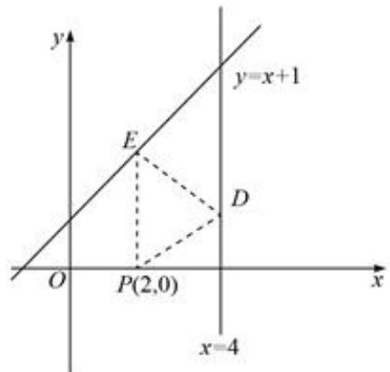

# 第一节 跟踪训练

# 考向 1 跟踪训练

【训练 1】已知直线 $l: x + ay + 6 = 0$ 的倾斜角为 $60^{\circ}$ ，则实数 $a = (\quad)$

A. $-\sqrt{3}$

B. $-\frac{\sqrt{3}}{3}$

C. $\frac{\sqrt{3}}{3}$

D. $\sqrt{3}$

【训练 2】若直线经过两点 $A(2,-m)$ ， $B(-m,2m-1)$ 且倾斜角为 $135^{\circ}$ ，则 m 的值为（）

A. 2

B. $\frac{3}{2}$

C. 1

D. $-\frac{3}{2}$

【训练 3】（多选）下列说法中不正确的是( )

A. 直线 $y = kx + b$ 与 $y$ 轴交于一点 $B(0, b)$ ，其中截距 $b = |OB|$

B. 过点 $P(1,2)$ ，且斜率为 4 的直线方程为 $\frac{y - 2}{x - 1} = 4$

C. 在 $x$ 轴和 $y$ 轴上的截距分别为 $a$ 与 $b$ 的直线方程是 $\frac{x}{a} + \frac{y}{b} = 1$

D. 方程 $(x_{2} - x_{1})(y - y_{1}) = (y_{2} - y_{1})(x - x_{1})$ 表示过点 $P_{1}(x_{1}, y_{1}), P_{2}(x_{2}, y_{2})$ 的直线

【训练 4】（多选）已知点 $A(2,-3)$ ， $B(-3,-2)$ ，斜率为 k 的直线 l 过点 $P(1,1)$ ，则下列满足直线 l 与线段 AB 相交的斜率 k 取值范围是（）

A. $k \geqslant \frac{3}{4}$

B. $k \leqslant -4$

C. $-4 < k < 0$

D. $0 \leqslant k < \frac{3}{4}$

【训练 5】不论 k 为任何实数，直线 $(2k-1)x-(k+3)y-(k-11)=0$ 恒过定点，若直线 $mx+ny=2$ 过此定点其 m，n 是正实数，则 $\frac{3}{m}+\frac{1}{2n}$ 的最小值是 \_\_\_\_.

【训练 6】求下列直线 l 的方程:

（1） $l$ 的倾斜角是 $\frac{2}{3}\pi$ ， $l$ 在 $x$ 轴上的截距是-3；

(2) l 在 x 轴、y 轴上的截距分别是 -2、4;

（3）直线 l 经过点 $A(2,1)$ 、 $B(1,-2)$ .

【训练7】求经过两直线 $2x - 3y - 3 = 0$ 和 $x + y + 2 = 0$ 的交点且与直线 $3x + y - 1 = 0$ 平行的直线方程.

【训练8】设 $a \in R$ ，则“ $a = 1$ ”是“直线 $l_{1}: ax + 2y - 1 = 0$ 与直线 $l_{2}: x + (a + 1)y + 4 = 0$ 平行”的（）

A. 必要不充分条件

B. 充分不必要条件

C. 充分必要条件

D. 既不充分也不必要条件

【训练 9】已知直线 $l_{1}: ax + 2y + 6 = 0$ 和直线 $l_{2}: x + (a - 1)y + a^{2} - 1 = 0$ 垂直，则实数 a 的值为 \_\_\_\_.

【训练 10】点 $(2,1)$ 到直线 $l: x - 2y + 2 = 0$ 的距离是（）

A. $\frac{2}{5}$

B. $\frac{2\sqrt{5}}{5}$

C. $\frac{4\sqrt{5}}{5}$

D. $\frac{6\sqrt{5}}{5}$

【训练 11】已知直线 $l_{1}: x + ay - 1 = 0$ 与 $l_{2}: 2x - y + 1 = 0$ 平行，则 $l_{1}$ 与 $l_{2}$ 的距离为（）

A. $\frac{1}{5}$

B. $\frac{\sqrt{5}}{5}$

C. $\frac{3}{5}$

D. $\frac{3\sqrt{5}}{5}$

【训练 12】（2018·北京）在平面直角坐标系中，记 d 为点 $P(\cos\theta,\sin\theta)$ 到直线 x-my-2=0 的距离．当 $\theta$ 、m 变化时，d 的最大值为（）

A. 1

B. 2

C. 3

D. 4

【训练 13】（已知 $x, y \in R$ ， $S = \sqrt{(x + 1)^{2} + y^{2}} + \sqrt{(x - 1)^{2} + y^{2}}$ ，则 S 的最小值是()

A. 0 B. 2 C. 4 D. $\sqrt{2}$

【训练 14】求函数 $y = \sqrt{x^{2} - 8x + 20} + \sqrt{x^{2} + 1}$ 的最小值.

【训练 15】点 $(-1,2)$ 关于直线 $x+y+4=0$ 的对称点的坐标为()

A. $(-6,-3)$

B. $(-3, - 6)$

C. $(-7, - 2)$

D. $(-2, -7)$

【训练 16】直线 $2x + 3y - 6 = 0$ 关于点 $(1,1)$ 对称的直线方程为（）

A. $3x - 2y + 2 = 0$

B. $2x + 3y + 7 = 0$

C. $3x - 2y - 12 = 0$

D. $2x + 3y - 4 = 0$

【训练 17】设直线 $l_{1}:3x-2y-6=0$ ，直线 $l_{2}:x-y-4=0$ ，则 $l_{1}$ 关于 $l_{2}$ 对称的直线方程为()

A. $3x + 2y - 14 = 0$

B. $2x - 3y - 14 = 0$

C. $3x + 2y - 6 = 0$

D. $2x - 3y - 6 = 0$

【训练 18】线从 $P(2,0)$ 出发，经 x=4， $y=x+1$ 两直线反射后，仍返回到 P 点．则光线从 P 点出发回到 P 点所走的路程长度（即图中 $\Delta PDE$ 周长）为 \_\_\_\_.

text_image

y
y=x+1
E
D
O
P(2,0)
x
x=4

# 考向 2 跟踪训练

【训练 1】方程 $x^{2} + y^{2} - ax + 2y + 1 = 0$ 不能表示圆，则实数 a 的值为()

A. 0

B. 1

C. -1

D. 2

【训练 2】(2016•天津) 已知圆 C 的圆心在 x 轴正半轴上，点 $M(0, \sqrt{5})$ 在圆 C 上，且圆心到直线 2x - y = 0 的距离为 $\frac{4\sqrt{5}}{5}$ ，则圆 C 的方程为 \_\_\_\_.

【训练 3】（2018•天津）在平面直角坐标系中，经过三点 $(0,0)$ ， $(1,1)$ ， $(2,0)$ 的圆的方程为 \_\_\_\_.

【训练 4】已知圆 C 的圆心在直线 $x - 2y + 4 = 0$ 上，且与 x 轴交于两点 $A(-5, 0)$ ， $B(1, 0)$ .

（1）设圆 C 与直线 $x - y + 1 = 0$ 交于 E，F 两点，求 $|EF|$ 的值；  
（2）已知 $Q(2,1)$ ，点 P 在圆 C 上运动，求线段 PQ 中点 M 的轨迹方程.

【训练 5】若点 $P(1,1)$ 在圆 $C_{1}x^{2} + y^{2} + 2x - m = 0$ 的外部，则 m 的取值范围为（）

A. $(-1,4)$

B. $(-4,1)$

C. $(-1, +\infty)$

D. $(- \infty, 4)$

【训练6】若直线 $x + y - 1 = 0$ 是圆 $(x - m)^2 +(y - 1)^2 = 1$ 的一条对称轴，则 $m = ($

A. 0

B. 1

C. 2

D. 4

【训练 7】直线 $l: mx - y - 2 + m = 0 (m \in R)$ 与圆 $C: x^{2} + (y - 1)^{2} = 16$ 的位置关系为 \_\_\_\_.

【训练 8】（2014•湖南）若圆 $C_{1}: x^{2} + y^{2} = 1$ 与圆 $C_{2}: x^{2} + y^{2} - 6x - 8y + m = 0$ 外切，则 $m = (\quad)$

A. 21

B. 19

C. 9

D. -11

【训练 9】（2022·天津）若直线 $x - y + m = 0 (m > 0)$ 与圆 $(x - 1)^{2} + (y - 1)^{2} = 3$ 相交所得的弦长为 m，则 m = \_\_\_\_.

【训练 10】(2018•新课标III) 直线 $x + y + 2 = 0$ 分别与 x 轴，y 轴交于 A，B 两点，点 P 在圆 $(x - 2)^{2} + y^{2} = 2$ 上，则 $\Delta ABP$ 面积的取值范围是（）

A. [2, 6]

B. [4, 8]

C. $[\sqrt{2}, 3\sqrt{2}]$

D. $[2\sqrt{2}, 3\sqrt{2}]$

【训练 11】过点 $(0,1)$ 引 $x^{2}+y^{2}-4x+3=0$ 的两条切线，这两条切线夹角的余弦值为（）

A. $\frac{2}{3}$

B. $\frac{1}{3}$

C. $\frac{4}{5}$

D. $\frac{3}{5}$

【训练 12】过点 $(0,2)$ 作与圆 $x^{2}+y^{2}-2x=0$ 相切的直线 l，则直线 l 的方程为（）

A. $3x - 4y + 8 = 0$

B. $3x + 4y - 8 = 0$

C. x=0 或 $3x+4y-8=0$

D. $x = 0$ 或 $3x - 4y - 8 = 0$

【训练 13】设点 P 为直线 $l: 2x + y - 4 = 0$ 上任意一点，过点 P 作圆 $O: x^{2} + y^{2} = 1$ 的切线，切点分别为 A, B，则直线 AB 必过定点（）

A. $\left(\frac{1}{4},\frac{1}{2}\right)$

B. $\left(\frac{1}{2},\frac{1}{4}\right)$

C. $(1,\frac{1}{2})$

D. $\left(\frac{1}{2},1\right)$

【训练 14】已知圆 $C_{1}: x^{2} + y^{2} = 1$ 与圆 $C_{2}: (x + 3)^{2} + (y + 4)^{2} = 16$ ，则两圆的公切线条数为（）

A. 1

B. 2

C. 3

D. 4

【训练 15】圆 $x^{2} + y^{2} - 4y + 3 = 0$ 上的点到直线 3x - 4y - 2 = 0 距离的取值范围是()

A. $[1, 3]$

B. $[2\sqrt{3}, 4\sqrt{3}]$

C. $[0, 3]$

D. $[2 - \sqrt{3}, 2 + \sqrt{3}]$

【训练 16】点 $P(x,y)$ 在圆 $x^{2}+y^{2}=2$ 上运动，则 $\left|x-y+3\right|$ 的取值范围()

A. $[0, 1]$

B. $[0, 4]$

C. $[1, 5]$

D. $[1, 4]$

【训练 17】已知点 P 为直线 $l: x - y + 1 = 0$ 上的动点，若在圆 $C: (x - 2)^{2} + (y - 1)^{2} = 1$ 上存在两点 M，N，使得 $\angle MPN = 60^{\circ}$ ，则点 P 的横坐标的取值范围为（）

A. $[-2, 1]$

B. $[-1, 3]$

C. $[0, 2]$

D. $[1, 3]$

【训练 18】若过点 $P(2,4)$ 且斜率为 k 的直线 l 与曲线 $y=\sqrt{4-x^{2}}$ 有且只有一个交点，则实数 k 的值不可能是（）

A. $\frac{3}{4}$

B. $\frac{4}{5}$

C. $\frac{4}{3}$

D. 2

【训练 19】（多选）已知实数 x，y 满足方程 $x^{2} + y^{2} - 4x + 1 = 0$ ，则下列说法中正确的有（）

A. $y - x$ 的最大值为 $\sqrt{6} - 2$

B. $x^{2} + y^{2}$ 的最大值为 $7 + 4\sqrt{3}$

C. $\frac{y}{x}$ 的最大值为 $\frac{\sqrt{3}}{2}$

D. $x + y$ 的最大值为 $2 + \sqrt{3}$

