# 9.3 圆锥曲线大题篇

解答题我们最直接的就是 “直曲联立”，将直线代入圆锥曲线，得到二次方程，这也是最常规的方法，被广泛认同，甚至成为了标答。

但是，这个真的好算吗？教学中常见的就是联立后交给学生们去自行操作，巨大的计算量不知不觉“劝退”了不少学生，他们拿第一问分数，第二问技巧性的联立“骗分”。新高考模式下，出了被刻意前置的考题，一些常规联立能解决的问题由于都考过，所以越来越少，所以导致简单的大家都会，难一点的大家都跪。我们陆陆续续介绍了圆锥曲线的各种方法，并给予解答题的汇总，以及什么情况下用什么方法，以便我们更加高效地学习并理解圆锥曲线。

<table><tr><td>年份</td><td>新高考1</td><td>新高考2</td><td>甲卷</td><td>乙卷</td><td>北京</td><td>天津</td><td>浙江</td></tr><tr><td>2024</td><td>面积问题</td><td>双元数列递推+帕斯卡定理</td><td>调和线束平行中点定理</td><td></td><td>极点极线背景+内外角角平分线</td><td>向量乘积</td><td></td></tr><tr><td>2023</td><td>垂直背景+弦长最值(极坐标复数解法最佳)</td><td>1.简单极点极线背景2.斜率翻译或者坐标翻译</td><td>1.抛物线焦半径2.简单面积处理</td><td>1.斜率和定值2.调和线束平行中点定理</td><td>1.单动点2.五边形3.帕斯卡定理背景</td><td>面积比转化为坐标比</td><td></td></tr><tr><td>2022</td><td>1.斜率和2.面积</td><td>1.中点2.斜率3.退化二次曲线布利安桑定理背景</td><td>1.抛物线截距等比2.最大张角</td><td>1.调和线束平行中点定理2.隐藏斜率倒数和定值</td><td>3.调和线束平行中点定理2.隐藏斜率倒数和为定值</td><td>1.切线2.单动点</td><td>1.隐藏斜率积为定值2.弦长最值</td></tr><tr><td>2021</td><td>1.退化二次曲线与四点共圆2.倾斜角互补</td><td>1.弦长2.焦点弦</td><td>抛物线彭塞列闭合</td><td>阿基米德三角形面积</td><td>1.隐藏斜率积为定值2.轴点弦</td><td>1.切线2.单动点</td><td>1.长度等比2.退化二次曲线</td></tr></table>

<table><tr><td>年份</td><td>新高考山东卷</td><td>I卷</td><td>II卷</td><td>III卷</td><td>北京</td><td>天津</td><td>浙江</td></tr><tr><td>2020</td><td>1.斜率积定值2.过定点</td><td>1.斜率比2.定点3.极点极线背景</td><td>1.焦点弦长2.两圆锥曲线交点</td><td>面积</td><td>1.轴点弦2.定值</td><td>1.切线2.中点弦</td><td>1.两圆锥曲线交点2.定比分点</td></tr></table>

通过对近五年的高考题进行分析，当2020年新高考在山东卷进行试点时，圆锥曲线作为压轴题出现，将椭圆上共顶点的两垂直弦作为条件，隐藏第三条边过定点，从而开启了新高考圆锥曲线的命题核心——“藏”。而一卷则模仿2010年江苏卷命制了以极点极线为背景的求定点问题，其破题本质还是隐藏了斜率比值为定值。而北京卷却以轴点弦为背景，两个三点共线为辅助，也是经典的“1+2”模型，背景来自调和线束平行线中点定理，这种命题模型在2018年文科卷作为压轴题就出现，只是18年出现了两条轴点弦辅助一条三点共线，属于经典 “2+1” 模型，这种类型常规联立非常难算，而专门破解此类问题的定比点差法应运而生，其背景也是调和线束平行线中点定理。2020 年，就是新高考起点，促使我们需要学习一些解决圆锥曲线的新技能。

2021 年高考，属于老教材新高考最后一年，题型不会大幅度创新，但是 “藏” 的命题逻辑和新方法引入已经是不可逆趋势，新高考一卷的四点共圆问题，可以常规联立，也可以用参数方程快速求出，甲卷和乙卷的抛物线问题涉及到了两点式方程和同构方程思想，此思想方法在北京卷 2018 年就出现，阿基米德三角形在 2013 年江西卷和 2019 年 II 卷也出现，属于老题新作。北京卷则延续了 2020 年的风格，延续了轴点弦，同时将斜率积为定值做了隐藏，这个命题逻辑延续到了 2022 年，北京卷总是一个风向标，值得我们重视。

2022 年高考，来到了斜率和积隐藏的最高峰，除了新高考 2 卷和多年风格不变的天津卷，连浙江卷也加入了斜率积为定值的隐藏。甲卷延续之前 III 卷风格，抛物线常规联立即可破解，其背景加入了米勒定理。这一年高考，成为了常规联立越来越难在考场中操作完成，甚至因为选填题的难度加大导致很多考生做不到圆锥曲线第二问，而乙卷的计算量巨大也导致了很多师生开始怀疑之前的圆锥曲线学习方法，其对极点极线背景的隐藏，最终还是指向了调和线束平行线中点定理。新课标 2 卷，当大家在思考如何简化计算时，按照退化二次曲线方程的解法完全实现了降维打击，其背景也是指向了布利安桑定理，新高考的圆锥曲线，越来越强调对背景的挖掘和翻译.

2023 年高考，北京卷再次创新，引入了帕斯卡六边形为背景，乙卷继续沿用 22 年的调和线束平行线中点定理，2 卷沿用 2020 年 I 卷的简单极点极线的自极三角形翻译，区别仅仅是解读在了双曲线上，1 卷的弦长问题，则是在垂直环境下的一道经典题型，可追溯到 2009 年的垂直弦，最佳方法是复数旋转来解读垂直，将函数方程不等式思想在最后一题用抛物线为载体呈现。

2024 圆锥曲线难度最大的是新高考 II 卷的压轴题，除了前两问的铺垫，涉及数列的双元递推后，最后一问背景又源于帕斯卡六边形，这说明射影几何学的背景深挖已经刻不容缓，北京卷源自调和点列的形成——调和梯形+内外角平分线，甲卷则是近三年最火的模型——调和线束平行中点定理，不过最佳解答方法是坐标翻译——一定比点差，天津卷延续了纯计算少背景传统，I 卷由于是第二道解答题，算面积，可以通过换元和对称来简化。

# 考向 1 方程与曲线

# 题型 1 定义法

# 1. 定义法

回顾之前所讲的第一定义的求解轨迹问题，我们常常需要把动点 $P$ 和满足焦点标志的定点连起来判断.

熟记焦点的特征:

①关于坐标轴对称的点；②标记为 F 的点；③圆心；④题上提到的定点等等．当看到以上的标志的时候要想到曲线的定义，把曲线和满足焦点特征的点连起来结合曲线定义求解轨迹方程．注意求出轨迹方程后，也要查漏补缺.

【例 1】（2021·新高考 I）在平面直角坐标系 xOy 中，已知点 $F_{1}(-\sqrt{17}, 0)$ ， $F_{2}(\sqrt{17}, 0)$ ，点 M 满足 $|MF_{1}| - |MF_{2}| = 2$ ．记 M 的轨迹为 C．

(1) 求 C 的方程;

【例 2】（2016•新课标 I）设圆 $x^{2} + y^{2} + 2x - 15 = 0$ 的圆心为 A，直线 l 过点 $B(1,0)$ 且与 x 轴不重合，l 交圆 A 于 C，D 两点，过 B 作 AC 的平行线交 AD 于点 E．

（Ⅰ）证明 $|EA|+|EB|$ 为定值，并写出点E的轨迹方程；

# 题型 2 直译法

# 2. 直译法

根据题上条件，直接表示轨迹方程．一般步骤为：

（1）建系设点 建立适当的坐标系，设曲线上任意动点坐标 M 为 $(x, y)$ ;  
(2) 等量关系 根据条件列出与 $M$ 有关的等式;  
(3) 联立化简化成最简形式;  
（4）确定范围 验证方程表示的曲线是否为已知的曲线，重点检查方程表示的曲线是否有多余的点，或者曲线上是否有遗漏的点．要检查轨迹上是否所有的点是否都符合题干，常见的限制范围有：题干涉及三角形，轨迹里面不能构成三角形的点要去掉；题干有斜率关系，斜率不存在的时候要去掉；轨迹为双曲线的时候，要检查是否左右两支上的点都符合题意.

【例 3】（2023•新高考 I）在直角坐标系 xOy 中，点 P 到 x 轴的距离等于点 P 到点 $(0, \frac{1}{2})$ 的距离，记动点 P 的轨迹为 W.

（1）求 $W$ 的方程；

【例 4】(2019•新课标 II) 已知点 A(-2,0)，B(2,0)，动点 M(x,y) 满足直线 AM 与 BM 的斜率之积为 $-\frac{1}{2}$ . 记 M 的轨迹为曲线 C.

（1）求 C 的方程，并说明 C 是什么曲线；

# 题型 3 相关点法

# 3. 相关点法

若所求轨迹上的动点 $P$ 与另一个已知曲线上的动点 $Q$ 存在着某种联系，可设点 $P(x,y)$ ，用点 $P$ 的坐标表示出来点 $Q$ ，然后代入曲线方程，化简即得所求轨迹方程，这种求轨迹方程的方法叫做相关点法（或称代入法）.

【例 5】从圆 $O: x^{2} + y^{2} = 4$ 上任取一点 P 向 x 轴作垂线段 PD，D 为垂足．当点 P 在圆上运动时，线段 PD 的中点 Q 的轨迹为曲线 C （当 P 为 x 轴上的点时，规定 Q 与 P 重合）.

（1）求 C 的方程，并说明曲线 C 的类型；

# 考向 2 韦达联立与弦长面积问题

# 题型 1 联立之正设反设问题

# 1. 直线和曲线联立

（1）椭圆 $\frac{x^2}{a^2} +\frac{y^2}{b^2} = 1(a > b > 0)$ 与直线 $l:y = kx + m$ 相交于 $AB$ 两点，设 $A(x_{1},y_{1})$ ， $B(x_{2},y_{2})$

$$
\left\{ \begin{array}{l} \frac {x ^ {2}}{a ^ {2}} + \frac {y ^ {2}}{b ^ {2}} = 1 \\ y = k x + m \end{array} , (b ^ {2} + k ^ {2} a ^ {2}) x ^ {2} + 2 a ^ {2} k m x + a ^ {2} m ^ {2} (\text {正设}) \right.
$$

椭圆 $\frac{x^2}{a^2} +\frac{y^2}{b^2} = 1(a > 0,b > 0)$ 与过定点 $(m,0)$ 的直线 $l$ 相交于 $AB$ 两点，设为 $x = ty + m$ ，如此消去 $x$ ，保留 $y$ 构造的方程如下： $\left\{\begin{aligned}\frac{x^{2}}{a^{2}}+\frac{y^{2}}{b^{2}}=1\\ x=ty+m\end{aligned}\right.$ ， $(a^{2}+t^{2}b^{2})y^{2}+2b^{2}tmy+b^{2}m^{2}-a^{2}b^{2}=0$ （反设）

注意：

①如果直线没有过椭圆内部一定点，是不能直接说明直线与椭圆有两个交点的，一般都需要摆出 $\Delta > 0$ ，满足此条件，才可以得到韦达定理的关系.

②焦点在 $y$ 轴上的椭圆与直线的关系，双曲线与直线的关系和上述形式类似，不再赘述.

（2）抛物线 $y^{2}=2px(p>0)$ 与直线 x=ty+m 相交于 A、B 两点，设 $A(x_{1},y_{1})$ ， $B(x_{2},y_{2})$

联立可得 $y^{2}=2p(ty+m)$ ， $\Delta>0$ 时， $\left\{\begin{aligned}y_{1}+y_{2}&=2pt\\ y_{1}y_{2}&=-2pm\end{aligned}\right.$

特殊的，当直线 AB 过焦点的时候，即 $m=\frac{p}{2}$ ， $y_{1}y_{2}=-2pm=-p^{2}$ ， $x_{1}x_{2}=\frac{y_{1}^{2}}{2p}\cdot\frac{y_{2}^{2}}{2p}=\frac{1}{4}p^{2}$ ，因为 AB 为通径的时候也满足该式，根据此时 A、B 坐标来记忆.

抛物线 $x^{2}=2py(p>0)$ 与直线 $y=kx+m$ 相交于 C、D 两点，设 $\mathrm{C}(x_{1},y_{1})$ ， $\mathrm{D}(x_{2},y_{2})$ ，联立可得 $x^{2}=2p(kx+m)$ ， $\Delta>0$ 时， $\left\{\begin{aligned}x_{1}+x_{2}&=2pk\\ x_{1}x_{2}&=-2pm\end{aligned}\right.$

【例 1】(2023·北京) 已知椭圆 $E: \frac{x^{2}}{a^{2}} + \frac{y^{2}}{b^{2}} = 1 (a > b > 0)$ 的离心率为 $\frac{\sqrt{5}}{3}$ ，A、C 分别为 E 的上、下顶点，B、D 分别为 E 的左、右顶点， $|AC| = 4$ .

（1）求 E 的方程；

(2) 点 $P$ 为第一象限内 $E$ 上的一个动点, 直线 $PD$ 与直线 $BC$ 交于点 $M$ , 直线 $PA$ 与直线 $y = -2$ 交于点 $N$ . 求证: $MN // CD$ .

【例 2】（2023·新高考Ⅱ）已知双曲线 C 中心为坐标原点，左焦点为 $(-2\sqrt{5}, 0)$ ，离心率为 $\sqrt{5}$ .

（1）求 C 的方程；

（2）记 C 的左、右顶点分别为 $A_{1}$ ， $A_{2}$ ，过点 $(-4,0)$ 的直线与 C 的左支交于 M，N 两点，M 在第二象限，直线 $MA_{1}$ 与 $NA_{2}$ 交于 P，证明 P 在定直线上.

# 题型 2 韦达联立与弦长问题

# 1. 根的判别式和韦达定理

$\frac{x^2}{a^2} + \frac{y^2}{b^2} = 1 (a > b > 0)$ 与 $y = kx + m$ 联立，两边同时乘上 $a^2b^2$ 即可得到 $(a^2k^2 + b^2)x^2 + 2kmd^2x + a^2(m^2 - b^2) = 0$ ，为了方便叙述，将上式简记为 $Ax^2 + Bx + C = 0$ 。该式可以看成一个关于 $x$ 的一元二次方程，判别式为 $\Delta = 4a^2b^2(a^2k^2 + b^2 - m^2)$ 可简单记 $4a^2b^2(A - m^2)$ 。

同理 $\frac{x^2}{a^2} +\frac{y^2}{b^2} = 1(a > b > 0)$ 和 $x = ty + m$ 联立 $(a^2 +t^2 b^2)y^2 +2b^2 tmy + b^2 m^2 -a^2 b^2 = 0$ ，为了方便叙述，将上式简记为 $Ay^{2} + By + C = 0$ ， $\Delta = 4a^{2}b^{2}(a^{2} + t^{2}b^{2} - m^{2})$ ，可简记 $4a^{2}b^{2}(A - m^{2})$ ：

$l$ 与 $C$ 相离 $\Leftrightarrow \Delta < 0$ ; $l$ 与 $C$ 相切 $\Leftrightarrow \Delta = 0$ ; $l$ 与 $C$ 相交 $\Leftrightarrow \Delta > 0$ .

注意：（1）由韦达定理写出 $x_{1} + x_{2} = -\frac{B}{A}$ ， $x_{1}x_{2} = \frac{C}{A}$ ，注意隐含条件 $\Delta > 0$ 。

(2) 求解时要注意题干所有的隐含条件, 要符合所有的题意.  
（3）如果是焦点在 y 轴上的椭圆，只需要把 $a^{2}$ ， $b^{2}$ 互换位置即可.  
（4）直线和双曲线联立结果类似，焦点在 x 轴的双曲线，只要把 $b^{2}$ 换成 $-b^{2}$ 即可；  
焦点在 y 轴的双曲线，把 $a^{2}$ 换成 $-b^{2}$ 即可， $b^{2}$ 换成 $a^{2}$ 即可.

# 2. 弦长公式

设 $M(x_{1},y_{1})$ ， $N(x_{2},y_{2})$ 根据两点距离公式 $|MN| = \sqrt{(x_1 - x_2)^2 + (y_1 - y_2)^2}$

（1）若 M、N 在直线 $y = kx + m$ 上，代入化简，得 $\left| MN \right| = \sqrt{1 + k^{2}} \left| x_{1} - x_{2} \right|$ ;  
（2）若 M、N 所在直线方程为 $x = ty + m$ ，代入化简，得 $\left| MN \right| = \sqrt{1 + t^{2}} \left| y_{1} - y_{2} \right|$ .  
（3）构造直角三角形求解弦长， $|MN| = \frac{|x_2 - x_1|}{|\cos\alpha|} = \frac{|y_2 - y_1|}{|\sin\alpha|}$ 其中 $k$ 为直线 $MN$ 斜率， $\alpha$ 为直线倾斜角.

【例 1】（2021·新高考 I）在平面直角坐标系 xOy 中，已知点 $F_{1}(-\sqrt{17}, 0)$ ， $F_{2}(\sqrt{17}, 0)$ ，点 M 满足 $|MF_{1}| - |MF_{2}| = 2$ 。记 M 的轨迹为 C。

(1) 求 C 的方程;  
(2) 设点 T 在直线 $x = \frac{1}{2}$ 上，过 T 的两条直线分别交 C 于 A, B 两点和 P, Q 两点，且 $|TA| \cdot |TB| = |TP| \cdot |TQ|$ ，求直线 AB 的斜率与直线 PQ 的斜率之和.

【例 2】（2024•新高考 I 卷）已知 $A(0,3)$ 和 $P(3,\frac{3}{2})$ 为椭圆 $C:\frac{x^{2}}{a^{2}}+\frac{y^{2}}{b^{2}}=1(a>b>0)$ 上两点.

(1) 求 C 的离心率;  
（2）若过 P 的直线 l 交 C 于另一点 B，且 $\Delta ABP$ 的面积为 9，求 l 的方程.

【例 3】(2022 浙江卷) 如图, 已知椭圆 $E: \frac{x^{2}}{12} + y^{2} = 1$ . 设 A, B 是椭圆上异于 $P(0, 1)$ 的两点, 且点 $Q(0, \frac{1}{2})$ 在线段 AB 上, 直线 PA, PB 分别交直线 $y = -\frac{1}{2}x + 3$ 于 C, D 两点.

(1) 求点 P 到椭圆上点的距离的最大值;  
(2) 求 $\left| CD \right|$ 的最小值.

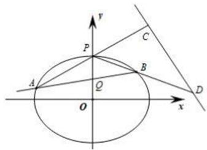

text_image

y
P
C
A
Q
B
D
O
x

# 题型 3 韦达联立与面积问题

# 三角形的面积处理方法

(1) $S_{\triangle} = \frac{1}{2} \cdot$ 底·高（通常选弦长做底，点到直线的距离为高）  
(2) $S_{\triangle} = \frac{1}{2}\cdot$ 水平宽·铅锤高 $= \frac{1}{2}|AB|\cdot |x_E - x_D|$ 或 $S_{\triangle} = \frac{1}{2}|CD|\cdot |y_A - y_E|$

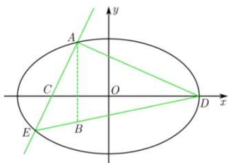

text_image

A
y
C
O
D
x
E
B

图 4-6-2

证明： $S_{\triangle ADE} = S_{\triangle ABE} + S_{\triangle ABD} = \frac{1}{2}|AB|\cdot |x_B - x_E| + \frac{1}{2}|AB|\cdot$ $|x_B - x_D| = \frac{1}{2}|AB|\cdot |x_E - x_D|$

$$
S _ {\triangle A D E} = S _ {\triangle A C D} + S _ {\triangle E C D} = \frac {1}{2} | C D | \cdot | y _ {A} - y _ {C} | + \frac {1}{2} | C D | \cdot | y _ {E} - y _ {C} | = \frac {1}{2} | C D | \cdot | y _ {A} - y _ {E} |
$$

（3）在平面直角坐标系 $xOy$ 中，已知 $\triangle OMN$ 的顶点分别为 $O(0,0)$ ， $M(x_1,y_1)$ ， $N(x_2,y_2)$ ，三角形的面积为 $S = \frac{1}{2}\left|x_1y_2 - x_2y_1\right|$ .

证明：直线 OM 的方程为 $y_{1}x - x_{1}y = 0$ ， $N(x_{2}, y_{2})$ 到它的距离为 $d = \frac{|x_{1}y_{2} - x_{2}y_{1}|}{\sqrt{x_{1}^{2} + y_{1}^{2}}}$ ，则 $S = \frac{1}{2}|OM|d = \frac{1}{2}\sqrt{x_{1}^{2} + y_{1}^{2}} \cdot d = \frac{1}{2}|x_{1}y_{2} - x_{2}y_{1}|$ .

【例 1】（2023•甲卷）已知直线 $x - 2y + 1 = 0$ 与抛物线 $C: y^{2} = 2px (p > 0)$ 交于 A，B 两点， $|AB| = 4\sqrt{15}$ .

(1) 求 p ;   
（2）设 F 为 C 的焦点，M，N 为 C 上两点，且 $\overrightarrow{FM} \cdot \overrightarrow{FN} = 0$ ，求 $\Delta MFN$ 面积的最小值.

【例 2】(2023·天津) 设椭圆 $\frac{x^{2}}{a^{2}} + \frac{y^{2}}{b^{2}} = 1 (a > b > 0)$ 的左、右顶点分别为 $A_{1}$ ， $A_{2}$ ，右焦点为 F，已知 $|A_{1}F| = 3$ ， $|A_{2}F| = 1$ 。

（Ⅰ）求椭圆方程及其离心率；

（II）已知点 $P$ 是椭圆上一动点（不与顶点重合），直线 $A_{2}P$ 交 $y$ 轴于点 $Q$ ，若 $\triangle A_{1}PQ$ 的面积是 $\triangle A_{2}FP$ 面积的二倍，求直线 $A_{2}P$ 的方程.

【例 3】（2015•上海）已知椭圆 $x^{2}+2y^{2}=1$ ，过原点的两条直线 $l_{1}$ 和 $l_{2}$ 分别于椭圆交于 A、B 和 C、D，记得到的平行四边形 ACBD 的面积为 S．

（1）设 $A(x_{1}, y_{1})$ ， $C(x_{2}, y_{2})$ ，用 A、C 的坐标表示点 C 到直线 $l_{1}$ 的距离，并证明 $S = 2 \left| x_{1} y_{2} - x_{2} y_{1} \right|$ ;  
（2）设 $l_{1}$ 与 $l_{2}$ 的斜率之积为 $-\frac{1}{2}$ ，求面积S的值.

# 题型4 点乘双根法

# （1）点乘双根法的原理

我们要计算 $\left(x_{1} - t\right)\left(x_{2} - t\right)$ 这个量,此时当然可以将其展开,利用韦达定理来进行计算,但更简单的操作方法是利用二次函数的两根式,得出 $ax^{2} + bx + c = a(x - x_{1})(x - x_{2})$ ,并在两端同时令 $x = t$ ,即可得到 $at^{2} + bt + c = a(t - x_{1})(t - x_{2})$ ，从而 $\left(x_{1} - t\right)\left(x_{2} - t\right) = \frac{at^2 + bt + c}{a}$ ,这种方法叫做“点乘双根法”

$\overrightarrow{PA}\cdot\overrightarrow{PB}=\left(x_{1}-x_{0}\right)\left(x_{2}-x_{0}\right)+\left(y_{1}-y_{0}\right)\left(y_{2}-y_{0}\right)$ ，从而构建出关于参数的等式关系式,避免复杂的计算,
达到快速解题的目的(其中,点P坐标 $(x_{0},y_{0})$ 为已知定点, $A(x_{1},y_{1}),B(x_{2},y_{2})$ 为直线l与圆锥曲线的交点.

# (2) 点乘双根法适用题型

在圆锥曲线中,遇到如 $\overrightarrow{PA} \cdot \overrightarrow{PB} = m$ (其中 m 为常数) 的形式,其中点 P 是已知的点, A, B 为直线 l 与圆锥曲线的交点的问题时, 可用点乘双根法以达到简化运算.

【例 4】（2024·天津）已知椭圆 $\frac{x^{2}}{a^{2}}+\frac{y^{2}}{b^{2}}=1(a>b>0)$ 的离心率 $e=\frac{1}{2}$ ，左顶点为 A，下顶点为 B，C 是线段 OB 的中点，其中 $S_{\triangle ABC}=\frac{3\sqrt{3}}{2}$ .

(1) 求椭圆方程.

（2）过点 $(0, -\frac{3}{2})$ 的动直线与椭圆有两个交点 $P$ ， $Q$ ，在 $y$ 轴上是否存在点 $T$ 使得 $\overrightarrow{TP} \cdot \overrightarrow{TQ} \leqslant 0$ 恒成立．若存在，求出这个 $T$ 点纵坐标的取值范围；若不存在，请说明理由.

【例 5】（2024·上海）已知双曲线 $\Gamma: x^{2}-\frac{y^{2}}{b^{2}}=1$ ，(b>0)，左右顶点分别为 $A_{1}$ ， $A_{2}$ ，过点 $M(-2,0)$ 的直线 l 交双曲线 $\Gamma$ 于 P、Q 两点，且点 P 在第一象限.

（1）当离心率 $e = 2$ 时，求 $b$ 的值；  
（2）当 $b=\frac{2\sqrt{6}}{3}$ ， $\triangle MA_{2}P$ 为等腰三角形时，求点P的坐标；  
（3）连接 $OQ$ 并延长，交双曲线 $\Gamma$ 于点 $R$ ，若 $\overrightarrow{A_1R} \cdot \overrightarrow{A_2P} = 1$ ，求 $b$ 的取值范围.

# 考向 3 联立之曲线反代入直线

# 题型一 切线单动点语言体系

单动点就等于换元，我们本章介绍了三角代换，最大的优势就是单动点在曲线上，如果是切点，最好用换元，这样实现了曲线代入直线，.天津卷近年考得最多.

我们尝试来求椭圆 $\frac{x^{2}}{a^{2}}+\frac{y^{2}}{b^{2}}=1$ 上一点 $P(x_{0}, y_{0})$ 处的切线方程，

当点 $P(x_0, y_0)$ 位于第一或第二象限时， $y = b\sqrt{1 - \frac{x^2}{a^2}}$ ，求导得 $k = y' = \frac{b}{2} \cdot \frac{-\frac{2x}{a^2}}{\sqrt{1 - \frac{x^2}{a^2}}} = -\frac{bx}{a^2} \cdot \frac{1}{\sqrt{1 - \frac{x^2}{a^2}}}$ ，当 $x = x_0$ 时， $\sqrt{1 - \frac{x_0^2}{a^2}} = \frac{y_0}{b}$ ，故 $k = -\frac{b^2x_0}{a^2y_0}$ ，代入切线方程 $y - y_0 = k(x - x_0)$ 得： $\frac{xx_0}{a^2} + \frac{yy_0}{b^2} = 1$

当点 $P(x_{0},y_{0})$ 位于第三或第四象限时， $y=-b\sqrt{1-\frac{x^{2}}{a^{2}}}$ ，求导得 $k=y'=-\frac{b}{2}\cdot\frac{-\frac{2x}{a^{2}}}{\sqrt{1-\frac{x^{2}}{a^{2}}}}=$

$\frac{bx}{a^2}\cdot \frac{1}{\sqrt{1 - \frac{x^2}{a^2}}}$ 当 $x = x_0$ 时， $\sqrt{1 - \frac{x_0^2}{a^2}} = -\frac{y_0}{b}$ 故 $k = -\frac{b^2x_0}{a^2y_0}$ ，代入切线方程 $y - y_0 = k(x - x_0)$ 得： $\frac{xx_0}{a^2} +\frac{yy_0}{b^2} = 1$

【例 1】(2021·乙卷) 设 B 是椭圆 $C: \frac{x^{2}}{a^{2}} + \frac{y^{2}}{b^{2}} = 1 (a > b > 0)$ 的上顶点，若 C 上的任意一点 P 都满足 $|PB| \leq 2b$ ，则 C 的离心率的取值范围是（）

A. $\left[\frac{\sqrt{2}}{2}, 1\right)$

B. $\left[\frac{1}{2},1\right)$

C. $(0, \frac{\sqrt{2}}{2}]$

D. $(0, \frac{1}{2}]$

1. 椭圆的切线参数方程： $\frac{xx_{0}}{a^{2}}+\frac{yy_{0}}{b^{2}}=1\Leftrightarrow\frac{x\cos\theta}{a}+\frac{y\sin\theta}{b}=1;$   
2. 双曲线的切线参数方程： $\frac{xx_0}{a^2} -\frac{yy_0}{b^2} = 1\Leftrightarrow \frac{x}{a\cos\theta} -\frac{y\tan\theta}{b} = 1$

【例 2】(2022 天津卷)椭圆 $\frac{x^{2}}{a^{2}}+\frac{y^{2}}{b^{2}}=1(a>b>0)$ 离心率为 $\frac{\sqrt{6}}{3}$ ，直线 l 与椭圆有唯一公共点 M，与 y 轴交于点 N (N 异于 M)，记 O 为原点，若 $|OM|=|ON|$ ，且 $\triangle OMN$ 面积为 $\sqrt{3}$ ，求椭圆方程。

【例 3】(2021·天津)已知椭圆 $\frac{x^{2}}{a^{2}}+\frac{y^{2}}{b^{2}}=1(a>b>0)$ 中， $e=\frac{2\sqrt{5}}{5}$ ，其上顶点为 B，右焦点为 F，且 $|BF|=2\sqrt{5}$ .

（1）求椭圆的方程；  
（2）若直线 l 与椭圆有唯一交点 M，l 与 y 轴正半轴交于点 N，过 N 作 BF 的垂线，交 x 轴于点 P，已知 MP // BF，求直线 l 的方程.

【例 4】如图，已知 A，B 分别为椭圆 $M: \frac{x^{2}}{a^{2}} + \frac{y^{2}}{b^{2}} = 1 (a > b > 0)$ 的左，右顶点， $P(x_{0}, y_{0})$ 为椭圆 M 上异于点 A，B 的动点，若 AB = 6，且直线 AP 与直线 BP 的斜率之积等于 $-\frac{4}{9}$ .

（1）求椭圆 M 的标准方程；  
(2) 过动点 $P(x_0, y_0)$ 作椭圆 $M$ 的切线, 分别与直线 $x = -a$ 和 $x = a$ 相交于 $D$ , $C$ 两点, 记四边形 $ABCD$ 的对角线 $AC$ , $BD$ 相交于点 $N$ , 问: 是否存在两个定点 $F_1$ , $F_2$ , 使得 $|NF_1| + |NF_2|$ , 为定值? 若存在, 求 $F_1$ , $F_2$ 的坐标; 若不存在, 说明理由.

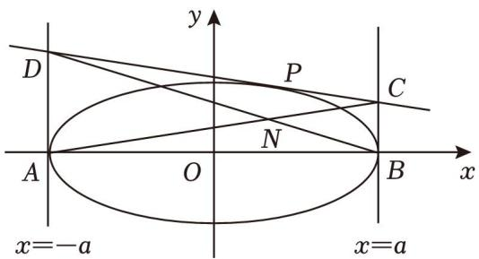

text_image

y
D
P
C
N
A
O
B
x
x=-a
x=a

# 题型二 单动点与四个顶点连线的三角换元

椭圆： $\left\{\begin{aligned}x&=a\cos\theta\\ y&=b\sin\theta\end{aligned}\right.$ ，双曲线： $\left\{\begin{aligned}x_{1}&=\frac{a}{\cos\theta}\\ y_{1}&=b\tan\theta\end{aligned}\right.$ ，不妨令 $t=\tan\frac{\theta}{2}$ ，

通常单个动点在圆锥曲线上，用参数换元连接四个顶点是能大大简化计算的.

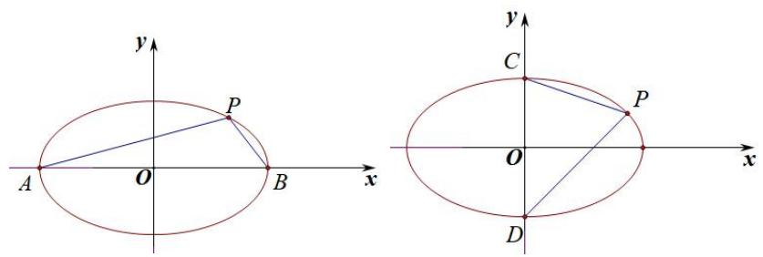

text_image

y
P
A O B x
y
C
O
x
D

以椭圆为例，

$$
k _ {P A} = \frac {b \sin \theta}{a \cos \theta + a} = \frac {b}{a} \frac {2 \sin \frac {\theta}{2} \cos \frac {\theta}{2}}{2 \cos^ {2} \frac {\theta}{2}} = \frac {b}{a} \tan \frac {\theta}{2} = \frac {b}{a} t, k _ {P B} = \frac {b \sin \theta}{a \cos \theta - a} = - \frac {b}{a} \frac {2 \sin \frac {\theta}{2} \cos \frac {\theta}{2}}{2 \sin^ {2} \frac {\theta}{2}} = - \frac {b}{a \tan \frac {\theta}{2}} = - \frac {b}{a t},
$$

计算量瞬间被简化.同理，关于上下顶点， $k_{PC} = -\frac{b(1 - t)}{a(1 + t)}$ ， $k_{PD} = \frac{b(1 + t)}{a(1 - t)}$

记忆方法：将 $t = \tan \frac{\theta}{2}$ 作为第一象限角，则 0 < t < 1，显然 $\left| k_{PA} \right| < \left| k_{PB} \right|$ ，所以左乘右除，左正右负， $k_{PA} = \frac{b}{a} t$ ， $k_{PB}=-\frac{b}{at};\quad\left|k_{PC}\right|<\left|k_{PD}\right|$ 上负下正，上小下大， $k_{PC}=-\frac{b(1-t)}{a(1+t)},\quad k_{PD}=\frac{b(1+t)}{a(1-t)}$

【例 5】(2023·北京) 已知椭圆 $E: \frac{x^{2}}{a^{2}} + \frac{y^{2}}{b^{2}} = 1 (a > b > 0)$ 的离心率为 $\frac{\sqrt{5}}{3}$ ，A、C 分别为 E 的上、下顶点，B、D 分别为 E 的左、右顶点， $|AC| = 4$ .

（1）求 $E$ 的方程；  
(2) 点 P 为第一象限内 E 上的一个动点, 直线 PD 与直线 BC 交于点 M, 直线 PA 与直线 y = -2 交于点 N. 求证: MN // CD.

【例 6】(2013 江西文)椭圆 C: $\frac{x^{2}}{a^{2}}+\frac{y^{2}}{b^{2}}=1\quad(a>b>0)$ 的离心率为 $e=\frac{\sqrt{3}}{2}$ ， $a+b=3$ .

（1）求椭圆 C 的方程；  
(2) 如图, $A$ , $B$ , $D$ 是椭圆 $C$ 的顶点, $P$ 是椭圆 $C$ 上除顶点外的任意点, 直线 $DP$ 交 $x$ 轴于 $N$ 直线 $AD$ 交 $BP$ 于点 $M$ , 设 $BP$ 的斜率为 $k$ , $MN$ 的斜率为 $m$ , 证明为 $2m - k$ 为定值.

# 题型三 抛物线两点式同构方程体系

# 一．抛物线的两点联立式

过抛物线 $y^{2}=2px$ 上两点 $A(x_{1},y_{1})$ 、 $B(x_{2},y_{2})$ 的直线 AB 方程是: $(y_{1}+y_{2})y=2px+y_{1}y_{2}$ .

证明:以曲代直， $k_{AB}=\frac{y_{2}-y_{1}}{x_{2}-x_{1}}=\frac{y_{2}-y_{1}}{\frac{y_{2}^{2}}{2p}-\frac{y_{1}^{2}}{2p}}=\frac{2p}{y_{1}+y_{2}}$ ，故直线AB方程为： $y-y_{1}=\frac{2p}{y_{1}+y_{2}}(x-\frac{y_{1}^{2}}{2p})$

化简可得: $(y_{1}+y_{2})y=2px+y_{1}y_{2}$ .

记忆方法: 把抛物线化成标准方程, 然后将最左端的二次自动降为一次, 再在最左端和最右端加上 “ $y_{1} + y_{2}$ 、 $y_{1}y_{2}$ ”皆可. 同理, 如果抛物线的形式是 $x^{2} = 2py (p > 0)$ , 直线 $AB$ 的方程是: $(x_{1} + x_{2})x = 2py + x_{1}x_{2}$ .

【例 7】(2022 全国甲卷)已知抛物线 C: $y^{2}=2px(p>0)$ 焦点为 F，点 $D(p,0)$ 过焦点 F 做直线 l 交抛物线于 M，N 两点，当 $MD \perp x$ 轴时， $|MF|=3$ .

(1) 求抛物线方程  
(2) 若直线 $MD, ND$ 与抛物线的另一个交点分别为 $A, B$ . 若直线 $MN, AB$ 的倾斜角为 $\alpha, \beta$ , 当 $\alpha - \beta$ 最大时, 求 $AB$ 的方程

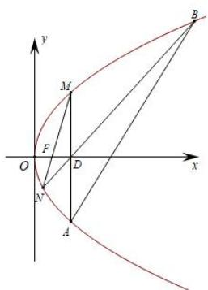

text_image

y
M
F
O
D
x
A
B

【例8】已知抛物线 $C:y^{2} = 2px$ ，焦点为 $F$ ，点 $M(-2,0)$ ， $N(2,2)$ ，过点 $M$ 作抛物线的切线 $MP$ ，切点为 $P$ ， $|PF| = 3$ ，又过 $M$ 作直线交抛物线于不同的两点 $A$ ， $B$ ，直线 $AN$ 交抛物线于另一点 $D$ ：

（1）求抛物线方程；  
(2) 求证 BD 过定点.

【例 9】(2018·北京理)已知抛物线 $C: y^{2} = 2px$ 经过点 $P(1, 2)$ ，过点 $Q(0, 1)$ 的直线 l 与抛物线 C 有两个不同的交点 A，B，且直线 PA 交 y 轴于 M，直线 PB 交 y 轴于 N.

(I)求直线 l 的斜率的取值范围;  
(II) 设 O 为原点， $\overrightarrow{QM} = \lambda \overrightarrow{QO}$ ， $\overrightarrow{QN} = \mu \overrightarrow{QO}$ 求证： $\frac{1}{\lambda} + \frac{1}{\mu}$ 为定值.

# 二．抛物线的双切圆同构与彭塞列闭合圆

【例 10】(2011·浙江理)已知抛物线 $C_{1}: x^{2} = y$ ，圆 $C_{2}: x^{2} + (y - 4)^{2} = 1$ 的圆心为 M，P 是 $C_{1}$ 上一点（异于原点），过 P 作圆 $C_{2}$ 的两条切线，交 $C_{1}$ 于 A、B 两点， $MP \perp AB$ 。求 PM 的方程。

【例 11】(2021·全国甲卷)抛物线 C 的顶点为坐标原点 O，焦点在 x 轴上，直线 l: x=1 交 C 于 P、Q 两点，且 $OP \perp OQ$ ，已知点 $M(2,0)$ ，且圆 M 与 l 相切.

(1) 求 C，圆 M 的方程；  
(2) 设 $A_{1} 、 A_{2} 、 A_{3}$ 是 $C$ 上的三个点，直线 $A_{1} A_{2} ， A_{1} A_{3}$ 均与圆 $M$ 相切，判断直线 $A_{2} A_{3}$ 与圆 $M$ 的位置关系，并说明理由.

【例 12】已知抛物线 $C: y^{2} = 2px (p > 0)$ 的焦点 F 到准线的距离为 2，圆 M 与 y 轴相切，且圆心 M 与抛物线 C 的焦点重合.

(1) 求抛物线 C 和圆 M 的方程;  
(2) 设 $P(x_{0}, y_{0})(x_{0} \neq 2)$ 为圆 M 外一点，过点 P 作圆 M 的两条切线，分别交抛物线 C 于两个不同的点 $A(x_{1}, y_{1})$ ， $B(x_{2}, y_{2})$ 和点 $Q(x_{3}, y_{3})$ ， $R(x_{4}, y_{4})$ 。且 $y_{1}y_{2}y_{3}y_{4}=16$ ，证明：点 P 在一条定曲线上。

【例 13】(2021 浙江文) 如图, 已知点 P 是 y 轴左侧 (不含 y 轴) 一点, 抛物线 $C: y^{2} = 4x$ 上存在不同的两点 A, B 满足 PA, PB 的中点均在 C 上.

(I) 设 AB 中点为 M，证明: PM 垂直于 y 轴;  
(II) 若 P 是半椭圆 $x^{2} + \frac{y^{2}}{4} = 1 (x < 0)$ 上的动点，求 $\triangle PAB$ 面积的取值范围.

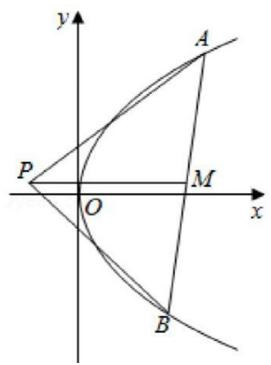

text_image

y
A
P
O
M
x
B

# 考向 4 斜率关系翻译之齐次化

# 题型 1 斜率关系与齐次化

已知点 P 是平面内一个定点，椭圆 C: $\frac{x^{2}}{a^{2}} + \frac{y^{2}}{b^{2}} = 1 (a > b > 0)$ 上有两动点 A、B

（1）若直线 $k_{PA} + k_{PB} = \lambda$ ，则直线 AB 过定点.  
(2) 若直线 $k_{PA} \cdot k_{PB} = \lambda$ ，则直线 AB 过定点.

证明：将椭圆 C 按向量 $\overrightarrow{PO}\left(-x_{0}, -y_{0}\right)$ 方向平移，得椭圆 $C' : \frac{(x + x_{0})^{2}}{a^{2}} + \frac{(y + y_{0})^{2}}{b^{2}} = 1$ ，展开得：

$$
\frac {x ^ {2}}{a ^ {2}} + \frac {y ^ {2}}{b ^ {2}} + \frac {2 x _ {0}}{a ^ {2}} x + \frac {2 y _ {0}}{b ^ {2}} y + \frac {x _ {0} ^ {2}}{a ^ {2}} + \frac {y _ {0} ^ {2}}{b ^ {2}} - 1 = 0.
$$

平面内的定点 $P(x_{0}, y_{0})$ 和椭圆 C 上的动点 A、B 分别对应椭圆 $C'$ 上的定点 O 和动点 $A'$ 、 $B'$ ，设直线 $A'B'$ 的方程为 $mx + ny = 1$ ，代入展开式得 $\frac{x^{2}}{a^{2}} + \frac{y^{2}}{b^{2}} + \left(\frac{2x_{0}}{a^{2}} x + \frac{2y_{0}}{b^{2}} y\right) \cdot (mx + ny) + \left(\frac{x_{0}^{2}}{a^{2}} + \frac{y_{0}^{2}}{b^{2}} - 1\right) \cdot (mx + ny)^{2} = 0$ （构造齐次式），当 $x \neq 0$ 时，两边同时除以 $x^{2}$ 整理得，

$$
\left[ \frac {n ^ {2} x _ {0} ^ {2}}{a ^ {2}} + \frac {\left(n y _ {0} + 1\right) ^ {2}}{b ^ {2}} - n ^ {2} \right] \cdot \frac {y ^ {2}}{x ^ {2}} + \left(\frac {2 m n x _ {0} ^ {2} + 2 x _ {0} n}{a ^ {2}} + \frac {2 m n y _ {0} ^ {2} + 2 y _ {0} m}{b ^ {2}} - 2 m n\right) \cdot \frac {y}{x} + \left[ \frac {\left(m x _ {0} + 1\right) ^ {2}}{a ^ {2}} + \frac {m ^ {2} y _ {0} ^ {2}}{b ^ {2}} - m ^ {2} \right] = 0
$$

因为点 $A'$ 、 $B'$ 的坐标满足这个方程，所以 $k_{OA'}$ 和 $k_{OB'}$ 是关于 $\frac{y}{x}$ 的方程的两根.

（1）若 $k_{PA} + k_{PB} = \lambda$ ，由平移性质知 $k_{OA'} + k_{OB'} = \lambda$ ，故 $k_{OA'} + k_{OB'} = -\frac{\frac{2mnx_{0}^{2} + 2x_{0}n}{a^{2}} + \frac{2mny_{0}^{2} + 2y_{0}m}{b^{2}} - 2mn}{\frac{n^{2}x_{0}^{2}}{a^{2}} + \frac{(ny_{0} + 1)^{2}}{b^{2}} - n^{2}} = \lambda$ ，整理可得到 m 和 n 的关系，从而可知直线 $A'B'$ 过定点，由平移性质可得直线 AB 过定点.  
（2）若 $k_{PA} \cdot k_{PB} = \lambda$ ，由平移性质知 $k_{OA'} \cdot k_{OB'} = \lambda$ ，所以 $k_{OA'} \cdot k_{OB'} = \frac{\frac{(mx_0 + 1)^2}{a^2} + \frac{m^2y_0^2}{b^2} - m^2}{\frac{n^2x_0^2}{a^2} + \frac{(ny_0 + 1)^2}{b^2} - n^2} = \lambda$ ，整理可得到 $m$ 和 $n$ 的关系，从而可知直线 $A'B'$ 过定点，由平移性质可得直线 $AB$ 过定点.

注意：双曲线的齐次化如法炮制

【例 1】(2022 新高考 I 卷) 已知 $A(2, 1)$ 在双曲线 $C: \frac{x^{2}}{a^{2}} - \frac{y^{2}}{a^{2} - 1} = 1 (a > 1)$ 上, 直线 l 交 C 于 P、Q 两点, 直线 AP, AQ 斜率之和为 0.

(1) 求 l 的斜率;

【例 2】(2020·山东) 已知椭圆 $C: \frac{x^{2}}{a^{2}} + \frac{y^{2}}{b^{2}} = 1 (a > b > 0)$ 的离心率为 $\frac{\sqrt{2}}{2}$ ，且过点 $A(2, 1)$ .

(1) 求 C 的方程;  
(2) 点 M, N 在 C 上, 且 $AM \perp AN$ , $AD \perp MN$ , D 为垂足. 证明: 存在定点 Q, 使得 $|DQ|$ 为定值.

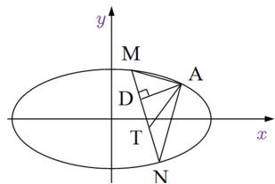

text_image

y
M
A
D
T
x
N

【例 3】(2020 全国 1 卷) 已知 A, B 分别为椭圆 $E: \frac{x^{2}}{a^{2}} + y^{2} = 1 (a > 1)$ 的左、右顶点，G 为 E 的上顶点， $\overrightarrow{AG} \cdot \overrightarrow{GB} = 8$ . P 为直线 x = 6 上的动点，PA 与 E 的另一交点为 C，PB 与 E 的另一交点为 D.

(1) 求 E 的方程;

(2) 证明: 直线 CD 过定点.

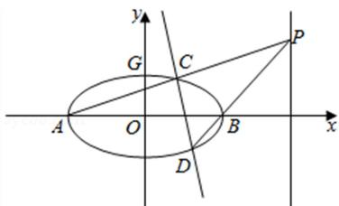

text_image

y
G
C
P
A
O
B
x
D

# 题型 2 隐藏斜率关系与齐次化

从曾经的直接考查斜率和积为定值，到如今斜率和积为定值都作为了隐藏条件，为最后的解答指明方向，本节我们介绍一下那些隐藏的斜率和积为定值问题，新高考，在于藏，不在于难.

高考中出现斜率和积问题，最早可以追溯到近二十年前，考题的日新月异决定了不会永远局限于斜率和与积的问题,所以需要通过题目给到的定点或者探索定点的过程中,找到北后的本质逻辑.2022年新课标一卷的斜率和积成为了第一问就能看出来,压轴问往往要根据已知的定点或者定值来探索斜率的关系.

1. 已知点 $P(a, 0)$ 是椭圆 $C: \frac{x^2}{a^2} + \frac{y^2}{b^2} = 1 (a > b > 0)$ 右顶点，

①椭圆上弦 AB 过定点 $(a, t)$ ，则 $k_{PA} + k_{PB} = -\frac{2b^{2}}{at} =$ 定值；  
②椭圆上弦 AB 过定点 $(a+t,0)$ ，则 $k_{PA}k_{PB}=\frac{b^{2}(t+2a)}{a^{2}t}=$ 定值；

证明: 将椭圆 C 按向量 $\overrightarrow{PO}(-a,0)$ 平移得椭圆 $C':\frac{(x+a)^{2}}{a^{2}}+\frac{y^{2}}{b^{2}}=1\Leftrightarrow\frac{x^{2}}{a^{2}}+\frac{y^{2}}{b^{2}}+\frac{2a}{a^{2}}x=0$

①动点 A，B 分别对应椭圆 $C'$ 上的动点 $A', B'$ ，根据题意直线 $A'B'$ 过定点 $(0, t)$ ， $A'B'$ 的方程为 $mx + \frac{y}{t} = 1$ ，即 $\frac{x^{2}}{a^{2}} + \frac{y^{2}}{b^{2}} + \frac{2a}{a^{2}} x (mx + \frac{y}{t}) = 0$ ，当 $x \neq 0$ 时，两边除以 $x^{2}$ 得： $\frac{1}{b^{2}} \frac{y^{2}}{x^{2}} + \frac{2}{at} \frac{y}{x} + \frac{1 + 2am}{a^{2}} = 0$ ， $k_{PA} + k_{PB} = -\frac{2b^{2}}{at} = 定值;$

②动点 $A'$ , $B'$ 分别对应椭圆 $C'$ 上的动点 $A'$ , $B'$ , 根据题意直线 $A'B'$ 过定点 $(t, 0)$ , $A'B'$ 的方程为 $\frac{x}{t} + ny = 1$ , 代入①得 $\frac{x^{2}}{a^{2}} + \frac{y^{2}}{b^{2}} + \frac{2a}{a^{2}}x\left(\frac{x}{t} + ny\right) = 0$ , 当 $x \neq 0$ 时, 两边除以 $x^{2}$ 得: $\frac{1}{b^{2}}\frac{y^{2}}{x^{2}} + \frac{2n}{a}\frac{y}{x} + \frac{1}{a^{2}} + \frac{2}{at} = 0$ , $k_{PA}k_{PB} = \frac{b^{2}(t + 2a)}{a^{2}t} =$ 定值;

2. 已知点 $P(0, b)$ 是椭圆 $C: \frac{x^{2}}{a^{2}} + \frac{y^{2}}{b^{2}} = 1 (a > b > 0)$ 上顶点，

①椭圆上弦 AB 过定点 $(t, b)$ ，则 $\frac{1}{k_{PA}} + \frac{1}{k_{PB}} = -\frac{2a^{2}}{bt} =$ 定值；  
②椭圆上弦 AB 过定点 $(0, b + t)$ ，则 $k_{PA}k_{PB} = -\frac{2b^{2}}{at} =$ 定值；

证明:将椭圆 C 按向量 $\overrightarrow{PO}(0, -b)$ 平移得椭圆 $C':\frac{x^{2}}{a^{2}}+\frac{(y+b)^{2}}{b^{2}}=1\Leftrightarrow\frac{x^{2}}{a^{2}}+\frac{y^{2}}{b^{2}}+\frac{2b}{b^{2}}y=0$

①动点 $A'$ , $B'$ 分别对应椭圆 $C'$ 上的动点 $A'$ , $B'$ , 根据题意直线 $A'$ , $B'$ 过定点 $(t, 0)$ , $A'$ , $B'$ 的方程为 $\frac{x}{t} + ny = 1$ , 即, 当 $x \neq 0$ 时, 两边除 $\frac{x^{2}}{a^{2}} + \frac{y^{2}}{b^{2}} + \frac{2b}{b^{2}} y (\frac{x}{t} + ny) = 0$ 以 $x^{2}$ 得: $\frac{1 + 2bn}{b^{2}} \frac{y^{2}}{x^{2}} + \frac{2}{bt} \frac{y}{x} + \frac{1}{a^{2}} = 0$ , $\frac{1}{k_{PA}} + \frac{1}{k_{PB}} = -\frac{2a^{2}}{bt} =$ 定值;  
②动点 $A'$ , $B'$ 分别对应椭圆 $C'$ 上的动点 $A'$ , $B'$ , 根据题意直线 $A'$ , $B'$ 过定点 $(0, t)$ , $A'$ , $B'$ 的方程为 $mx + \frac{y}{t} = 1$ , 即 $\frac{x^{2}}{a^{2}} + \frac{y^{2}}{b^{2}} + \frac{2b}{b^{2}} y (mx + \frac{y}{t}) = 0$ , 当 $x \neq 0$ 时, 两边除以 $x^{2}$ 得: $(\frac{1}{b^{2}} + \frac{2}{bt})\frac{y^{2}}{x^{2}} + \frac{2m}{b}\frac{y}{x} + \frac{1}{a^{2}} = 0$ , $k_{PA}k_{PB} = \frac{b^{2}t}{a^{2}(t + 2b)} = \text{定值};$

我们不需要记忆这个定值,但是我们可以提前预判定值的类型,从而进行定点定值的必要性探路,

【例 4】已知椭圆 $C: \frac{x^{2}}{a^{2}} + \frac{y^{2}}{b^{2}} = 1 (a > b > 0)$ 的左右顶点分别为 A, B，过椭圆内点 $D(\frac{2}{3}, 0)$ 且不与 x 轴重合的动直线交椭圆 C 于 P, Q 两点，当直线 PQ 与 x 轴垂直时，

$$
\left| P D \right| = \left| B D \right| = \frac {4}{3}.
$$

(I)求椭圆 C 的标准方程;  
(II) 设直线 AP. AQ 和直线 l: x = t 分别交于点 M, N, 若 $MD \perp ND$ 恒成立, 求 t 的值.

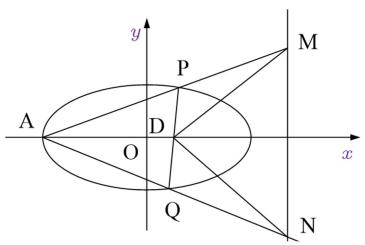

text_image

y
P
M
A
D
O
x
Q
N

3. 中点与斜率关系转化

如图, $PC$ 为 $\Delta PAB$ 的中线,设直线 $AP,BP,CP$ 的斜率分别为 $k_{1},k_{3},k_{2}$

①若 AB 与 x 轴平行, 则: $\frac{1}{k_{1}} + \frac{1}{k_{3}} = \frac{2}{k_{2}}$ ; ②若 AB 与 y 轴平行, 则: $k_{1} + k_{3} = 2k_{2}$ .

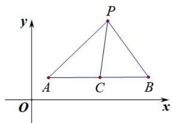

text_image

y
P
A C B
O x

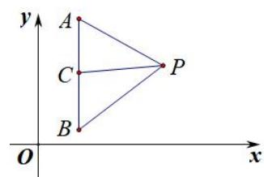

text_image

y
A
C
P
B
O
x

【例 5】（2023·乙卷）已知椭圆 $C: \frac{y^{2}}{a^{2}} + \frac{x^{2}}{b^{2}} = 1 (a > b > 0)$ 的离心率为 $\frac{\sqrt{5}}{3}$ ，点 A(-2,0) 在 C 上.

(1) 求 C 的方程;  
（2）过点 $(-2,3)$ 的直线交 $C$ 于点 $P$ ， $Q$ 两点，直线 $AP$ ， $AQ$ 与 $y$ 轴的交点分别为 $M$ ， $N$ ，证明：线段 $MN$ 的中点为定点.

【例 6】(2022 北京卷) 已知椭圆 $E: \frac{x^{2}}{a^{2}} + \frac{y^{2}}{b^{2}} = 1 (a > b > 0)$ 的一个顶点为 $A(0, 1)$ ，焦距为 $2\sqrt{3}$ .

(1)求椭圆E的方程  
(2) 过点 $P(-2, 1)$ 作斜率为 k 的直线与椭圆 E 交于不同的两点 B, C, 直线 AB, AC 分别与 x 轴交于点 M, N. 当 $|MN| = 2$ 时, 求 k 的值.

# 4. 高考中隐藏的斜率比值问题

若 A、B 为椭圆长轴顶点, 直线 MN 交椭圆于 M、N 两点, 交长轴于点 $P(m, 0)$ , 则 $\frac{k_{AM}}{k_{BN}}$ 为定值, 反之, $\frac{k_{AM}}{k_{BN}}$ 为定值, 则 MN 过长轴上定点 $P(m, 0)$ ;

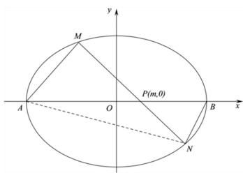

text_image

y
M
P(m,0)
A O B x
N

【例 7】（2023·新高考Ⅱ）已知双曲线 C 中心为坐标原点，左焦点为 $(-2\sqrt{5}, 0)$ ，离心率为 $\sqrt{5}$ .

(1) 求 C 的方程;  
(2) 记 $C$ 的左、右顶点分别为 $A_{1}$ , $A_{2}$ , 过点 $(-4,0)$ 的直线与 $C$ 的左支交于 $M$ , $N$ 两点, $M$ 在第二象限, 直线 $MA_{1}$ 与 $NA_{2}$ 交于 $P$ , 证明 $P$ 在定直线上.

【例 8】（2021·北京）已知椭圆 $E: \frac{x^{2}}{a^{2}} + \frac{y^{2}}{b^{2}} = 1 (a > b > 0)$ 的一个顶点 $A(0, -2)$ ，以椭圆 E 的四个顶点围成的四边形面积为 $4\sqrt{5}$ .

(I) 求椭圆 E 的方程;  
（II）过点 $P(0, -3)$ 作斜率为 $k$ 的直线与椭圆 $E$ 交于不同的两点 $B$ ， $C$ ，直线 $AB$ 、 $AC$ 分别与直线 $y = -3$ 交于点 $M$ 、 $N$ ，当 $\left|PM\right| + \left|PN\right|\leq 15$ 时，求 $k$ 的取值范围.

【例 9】(2022 全国乙卷) 已知椭圆 E 的中心为坐标原点, 对称轴为 x 轴、y 轴, 且过 $A(0, -2)$ , $B(\frac{3}{2}, -1)$ 两点.

(1) 求 E 的方程;  
(2) 设过点 $P(1, -2)$ 的直线交 $E$ 于 $M, N$ 两点, 过 $M$ 且平行于 $x$ 轴的直线与线段 $AB$ 交于点 $T$ , 点 $H$ 满足 $\overrightarrow{MT} = \overrightarrow{TH}$ . 证明: 直线 $HN$ 过定点.

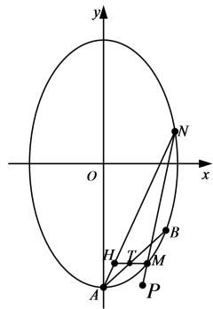

text_image

y
O
x
A
H
T
M
P
B
N

# 考向 5 平行垂直问题之参数方程与复数代换

# 类型一.长度参数方程构造

# 一．参数方程与四点共圆

【例 1】（2021·新高考I卷）在平面直角坐标系 xOy 中，已知点 $F_{1}(-\sqrt{17}, 0)$ ， $F_{2}(\sqrt{17}, 0)$ ，点 M 满足 $|MF_{1}| - |MF_{2}| = 2$ 。记 M 的轨迹为 C。

(1) 求 C 的方程;  
（2）设点 $T$ 在直线 $x = \frac{1}{2}$ 上，过 $T$ 的两条直线分别交 $C$ 于 $A$ ， $B$ 两点和 $P$ ， $Q$ 两点，且 $|TA|\cdot |TB| = |TP|\cdot |TQ|$ ，求直线 $AB$ 的斜率与直线 $PQ$ 的斜率之和.

# 补充：圆幂定理

①相交弦定理：圆内的两条相交弦 AB 与 CD 交于 P，则 $\left|PA\right|\cdot\left|PB\right|=\left|PC\right|\cdot\left|PD\right|$ （左图）.

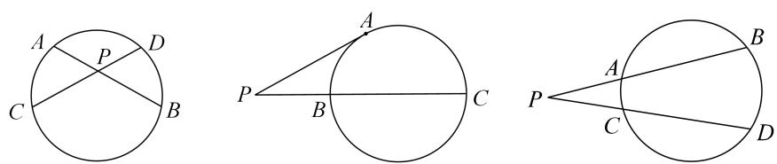

②切割线定理：从圆外一点 P 引圆的切线 PA 和割线交圆于 B、C 两点，则 $\left|PA\right|^{2}=\left|PB\right|\cdot\left|PC\right|$ （中图）.  
③割线定理：从圆外一点 $P$ 引两条割线与圆分别交于 $A$ 、 $B$ 和 $C$ 、 $D$ ，则 $\vert PA\vert \bullet \vert PB\vert = \vert PC\vert \bullet \vert PD\vert$ （右图）.

# 二．参数方程破解类圆幂定理

在圆的切线长定理当中，存在 $\left|PA\right|^{2}=\left|PB\right|\cdot\left|PC\right|$ ，当这个问题出现在椭圆当中，则满足类圆幂定理 $\lambda\left|PA\right|^{2}=\left|PB\right|\cdot\left|PC\right|$ ，确定 $\lambda$ 的数值.

【例 2】（2016•四川）已知椭圆 $E: \frac{x^{2}}{a^{2}} + \frac{y^{2}}{b^{2}} = 1 (a > b > 0)$ 的两个焦点与短轴的一个端点是直角三角形的 3 个顶点，直线 $l: y = -x + 3$ 与椭圆有且只有一个公共点 T.

（1）求椭圆 E 的方程及点 T 的坐标；  
（2）设 $O$ 是坐标原点，直线 $l'$ 平行于 $OT$ ，与椭圆 $E$ 交于不同的两点 $A$ 、 $B$ ，且与直线 $l$ 交于点 $P$ ．证明：存在常数 $\lambda$ ，使得 $\left|PT\right|^2 = \lambda \left|PA\right|\cdot \left|PB\right|$ ，并求 $\lambda$ 的值.

【例 3】已知抛物线 $C: y^{2} = 2px (p > 0)$ ，直线 $l: y = x + 1$ 与抛物线 C 有且只有一个公共点 T.

（1）求抛物线 C 的方程以及 T 点坐标；  
（2）设 $O$ 为坐标原点，直线 $l'$ 平行于 $OT$ 与 $C$ 交于不同的两点 $A$ ， $B$ ，且与直线 $l$ 交于点 $Q$ ，是否存在常数 $m$ ，使得 $\vert QT\vert^2 = m\vert QA\vert \cdot \vert QB\vert$ ？若存在，求出 $m$ 的值，若不存在，请说明理由.

# 类型二 复数变换与垂直问题

我们来看一下圆锥曲线的参数方程，就是把圆锥曲线上的点进行参数换元，达到简化计算的效果.

# 一 复数的模与辐角表示圆锥曲线方程

设 $M$ 是平面内任意一点，它的直角坐标是 $(x, y)$ ，转化为复平面， $z_{M} = x + yi = r(\cos \theta + i\sin \theta)$ ，可以得出它们之间的关系： $x = r\cos \theta$ ， $y = r\sin \theta$ 。又可得到关系式： $r^2 = x^2 + y^2$ ， $\arg z_{M} = \theta$ 。这就是复平面坐标与直角坐标的互化公式。

由于新教材删除了原来的极坐标和参数方程内容，故我们在上一讲介绍了三角代换，由于2019版本的人教 $A$ 版教材介绍了复数的三角形式，虽然加了\*号，但是也在另一个层面提示我们一些涉及坐标变换的，尤其是旋转类型的题，完全可以利用复数的三角形式来解决.

【例 4】（2016•新课标Ⅱ）已知椭圆 $E: \frac{x^{2}}{t} + \frac{y^{2}}{3} = 1$ 的焦点在 x 轴上，A 是 E 的左顶点，斜率为 $k (k > 0)$ 的直线交 E 于 A，M 两点，点 N 在 E 上， $MA \perp NA$ .

（1）当 t=4， $|AM|=|AN|$ 时，求 $\triangle AMN$ 的面积；  
(2) 当 $2|AM|=|AN|$ 时，求 k 的取值范围.

【例 5】(2023 年全国 1 卷) 在直角坐标系 xOy 中, 点 P 到 x 轴的距离等于点 P 到 $(0, \frac{1}{2})$ 的距离, 记动点 P 的轨迹为 W

(1) 求 W 的方程  
(2) 已知矩形 $ABCD$ 有三个顶点在 $W$ 上, 证明: 矩形 $ABCD$ 的周长大于 $3 \sqrt{3}$

【例 6】（2024•南宁月考）已知抛物线 $E: x^{2} = 2py (p > 0)$ 的焦点为 F，直线 x = 4 分别与 x 轴交于点 M，与抛物线 E 交于点 Q，且 $\left|QF\right| = \frac{5}{4}\left|MQ\right|$ .

（1）求抛物线 E 的方程；  
（2）设横坐标依次为 $x_{1}$ ， $x_{2}$ ， $x_{3}$ 的三个点 $A$ ， $B$ ， $C$ 都在抛物线 $E$ 上，且 $x_{1} > 0 > x_{2} > x_{3}$ ，若 $\Delta ABC$ 是以 $AC$ 为斜边的等腰直角三角形，求 $\overrightarrow{AB} \cdot \overrightarrow{AC}$ 的最小值.

