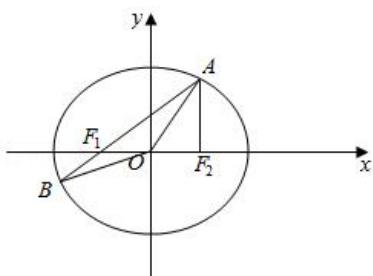
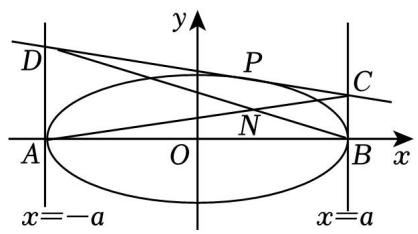
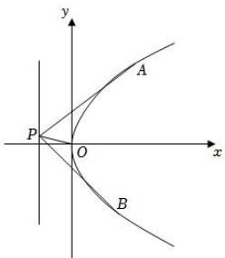
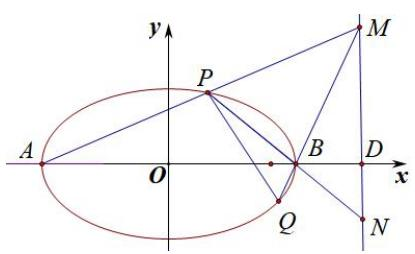
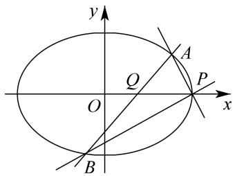
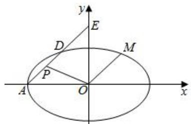

# 第三节跟踪训练

# 考向 1 跟踪训练

【训练 1】已知 O 为坐标原点， $F_{1}(-2,0)$ ， $F_{2}(2,0)$ ，点 P 满足 $\left|PF_{1}\right|-\left|PF_{2}\right|=2$ ，记点 P 的轨迹为曲线 E．

（1）求曲线 E 的方程；

【训练2】动圆 $C$ 与圆 $C_1:(x + 2)^2 +y^2 = 50$ 和圆 $C_2:(x - 2)^2 +y^2 = 2$ 都内切，记动圆圆心 $C$ 的轨迹为 $E$ ：

（1）求 $E$ 的方程；

【训练3】已知动点 $M(x,y)$ 与定点 $F(1,0)$ 的距离和 $M$ 到定直线 $l:x = 4$ 的距离的比是常数 $\frac{1}{2}$ .

（1）求动点 M 的轨迹方程，并说明轨迹即曲线 C 的形状.

【训练 4】（2019•全国）已知点 $A_{1}(-2,0)$ ， $A_{2}(2,0)$ ，动点 P 满足 $PA_{1}$ 与 $PA_{2}$ 的斜率之积等于 $-\frac{1}{4}$ ，记 P 的轨迹为 C．

(1) 求 C 的方程;

【训练 5】在椭圆 $C: \frac{x^{2}}{4} + \frac{y^{2}}{2} = 1$ 上任取一点 P，过点 P 作 x 轴的垂线段 PD，D 为垂足，点 M 在线段 PD 上，且满足 $|DP| = \sqrt{2} |DM|$ .

（Ⅰ）当点 P 在椭圆 C 上运动时，求点 M 的轨迹 E 的方程；

# 考向 2 跟踪训练

【训练 1】（2017•北京）已知抛物线 $C: y^{2} = 2px$ 过点 $P(1,1)$ ．过点 $(0, \frac{1}{2})$ 作直线 l 与抛物线 C 交于不同的两点 M，N，过点 M 作 x 轴的垂线分别与直线 OP、ON 交于点 A，B，其中 O 为原点.

（1）求抛物线 C 的方程，并求其焦点坐标和准线方程；  
(2) 求证: A 为线段 BM 的中点.

【训练2】在平面直角坐标系 $xOy$ 中，点 $D$ 为 $x^{2} + y^{2} = 1$ 上一动点，点 $A$ ， $B$ 分别在 $x$ 轴， $y$ 轴上且 $DA \perp x$ 轴， $DB \perp y$ 轴，若 $\overrightarrow{BA} = \overrightarrow{AW}$ ，点 $W$ 的轨迹记为曲线 $C$ ：

(1) 求曲线 C 的轨迹方程;  
(2) 过点 $G(1,0)$ 的直线 $l$ 与 $C$ 交于 $M$ , $N$ 两点, 若点 $H(0,1)$ , 直线 $GH$ 为 $\angle MHN$ 的角平分线, 求直线 $l$ 的方程.

【训练 3】（2021·新高考 II）已知椭圆 C 的方程为 $\frac{x^{2}}{a^{2}} + \frac{y^{2}}{b^{2}} = 1 (a > b > 0)$ ，右焦点为 $F(\sqrt{2}, 0)$ ，且离心率为 $\frac{\sqrt{6}}{3}$ .

（Ⅰ）求椭圆 C 的方程；  
（II）设 M，N 是椭圆 C 上的两点，直线 MN 与曲线 $x^{2} + y^{2} = b^{2} (x > 0)$ 相切．证明：M，N，F 三点共线的充要条件是 $\left|MN\right| = \sqrt{3}$ .

【训练4】已知椭圆 $C: \frac{x^2}{a^2} + \frac{y^2}{b^2} = 1 (a > b > 0)$ 过 $(1, \frac{3}{2})$ 和 $(\sqrt{2}, \frac{\sqrt{6}}{2})$ 两点． $F_1$ ， $F_2$ 分别为椭圆的左、右焦点， $P$ 为椭圆上的点（ $P$ 不在 $x$ 轴上），过椭圆右焦点 $F_2$ 的直线 $l$ 与椭圆交于 $A$ 、 $B$ 两点．

(1) 求椭圆的标准方程:  
(2) 求 $\left| AB \right|$ 的范围.

【训练 5】已知椭圆 C: $\frac{x^{2}}{a^{2}}+\frac{y^{2}}{b^{2}}=1\quad(a>b>0)$ 的离心率是 $\frac{\sqrt{2}}{2}$ ，点 $M(0,2)$ 在椭圆 C 上.

(1) 求椭圆 C 的标准方程.  
(2) 已知 $P(0,1)$ , 直线 $l: y = kx + m (k \neq 0)$ 与椭圆 $C$ 交于 $A, B$ 两点, 若直线 $AP, BP$ 的斜率之和为 0, 试问 $\triangle PAB$ 的面积是否存在最大值? 若存在, 求出该最大值; 若不存在, 请说明理由.

【训练 6】（2020•江苏）在平面直角坐标系 xOy 中，已知椭圆 $E: \frac{x^{2}}{4} + \frac{y^{2}}{3} = 1$ 的左、右焦点分别为 $F_{1}$ 、 $F_{2}$ ，点 A 在椭圆 E 上且在第一象限内， $AF_{2} \perp F_{1}F_{2}$ ，直线 $AF_{1}$ 与椭圆 E 相交于另一点 B．

（1）求 $\triangle AF_{1}F_{2}$ 的周长；  
（2）在 $x$ 轴上任取一点 $P$ ，直线 $AP$ 与椭圆 $E$ 的右准线相交于点 $O$ ，求 $\overrightarrow{OP} \cdot \overrightarrow{OP}$ 的最小值；  
（3）设点 M 在椭圆 E 上，记 $\Delta OAB$ 与 $\Delta MAB$ 的面积分别为 $S_{1}$ ， $S_{2}$ ，若 $S_{2}=3S_{1}$ ，求点 M 的坐标.

text_image

y
A
F₁
O
B
F₂
x

【训练 7】（2014•新课标 I）已知点 $A(0,-2)$ ，椭圆 $E:\frac{x^{2}}{a^{2}}+\frac{y^{2}}{b^{2}}=1(a>b>0)$ 的离心率为 $\frac{\sqrt{3}}{2}$ ，F 是椭圆的右焦点，直线 AF 的斜率为 $\frac{2\sqrt{3}}{3}$ ，O 为坐标原点.

（Ⅰ）求 $E$ 的方程；

（Ⅱ）设过点 A 的直线 l 与 E 相交于 P，Q 两点，当 $\Delta OPQ$ 的面积最大时，求 l 的方程.

# 考向 3 跟踪训练

【训练 1】（2021•乙卷）设 B 是椭圆 $C: \frac{x^{2}}{5} + y^{2} = 1$ 的上顶点，点 P 在 C 上，则 $|PB|$ 的最大值为（）

A. $\frac{5}{2}$

B. $\sqrt{6}$

C. $\sqrt{5}$

D. 2

【训练2】如图，已知 $A$ ， $B$ 分别为椭圆 $M:\frac{x^2}{a^2} +\frac{y^2}{b^2} = 1(a > b > 0)$ 的左，右顶点， $P(x_0,y_0)$ 为椭圆 $M$ 上异于点 $A$ ， $B$ 的动点，若 $AB = 4$ ，且 $\Delta ABP$ 面积的最大值为2.

（1）求椭圆 M 的标准方程；

（2）已知直线 l 与椭圆 M 相切于点 $P(x_{0}, y_{0})$ ，且 l 与直线 x = a 和 x = -a 分别相交于 C，D 两点，记四边形 ABCD 的对角线 AC，BD 相交于点 N．

问：是否存在两个定点 $F_{1}$ ， $F_{2}$ ，使得 $\vert NF_{1} \vert + \vert NF_{2} \vert$ 为定值？若存在，求 $F_{1}$ ， $F_{2}$ 的坐标；若不存在，说明理由.

text_image

y
D
P
C
A
O
N
B
x
x=-a
x=a

【训练3】设椭圆 $C: \frac{x^2}{a^2} + \frac{y^2}{b^2} = 1 (a > b > 0)$ 的左. 右顶点分别为 $A, B$ , 上顶点为 $D$ , 点 $P$ 是椭圆 $C$ 上异于顶点的动点, 已知椭圆的离心率 $e = \frac{\sqrt{3}}{2}$ , 短轴长为 2,

(1) 求椭圆 C 的方程;  
(2)若直线 AD 与直线 BP 交于点 M，直线 DP 与 x 轴交于点 N，求证: 直线 MN 恒过某定点，并求出该定点.

【训练 4】已知椭圆 $C: \frac{x^{2}}{a^{2}} + \frac{y^{2}}{b^{2}} = 1 (a > b > 0)$ 的离心率为 $\frac{1}{2}$ ，直线 x = 1 交粗圆所截得的弦长为 3.

(1) 求椭圆 C 的方程;  
(2) 若 M 是第四象限椭圆上的动点， $A_{1}$ ， $A_{2}$ 分别为左，右顶点， $B_{1}$ ， $B_{2}$ 分别为上下顶点， $B_{2}M$ 交直线 y=b 于点 P， $MA_{1}$ 交 $A_{2}B_{1}$ 于点 Q，求证：直线 PQ 的斜率为定值.

【训练 5】(2017•新课标 I 文) 设 A，B 为曲线 $C: y = \frac{x^{2}}{4}$ 上两点，A 与 B 的横坐标之和为 4.

(1) 求直线 AB 的斜率;  
(2) 设 M 为曲线 C 上一点, C 在 M 处的切线与直线 AB 平行, 且 $AM \perp BM$ , 求直线 AB 的方程.

【训练6】已知抛物线 $C:y^{2} = 2px(p > 0)$ 的准线与 $x$ 轴的交点为 $H$ ，直线过抛物线 $C$ 的焦点 $F$ 且与 $C$ 交于 $A$ ， $B$ 两点， $\Delta HAB$ 的面积的最小值为4.

（1）求抛物线 C 的方程；  
（2）若过点 $Q(\frac{17}{4}, 1)$ 的动直线 $l$ 交 $C$ 于 $M$ ， $N$ 两点，试问抛物线 $C$ 上是否存在定点 $E$ ，使得对任意的直线 $l$ ，都有 $EM \perp EN$ ，若存在，求出点 $E$ 的坐标；若不存在，则说明理由.

【训练7】设抛物线 $C:y^{2} = 2px(p > 0)$ 的焦点为 $F$ ，点 $D(p,0)$ ，过 $F$ 的直线交 $C$ 于 $M$ ， $N$ 两点.当直线MD垂直于 $x$ 轴时， $\mid MF\mid = 3$ ：

(1) 求 C 的方程;  
（2）若点 $A(-1,0)$ ， $B(1,-1)$ ，过点 $A$ 的动直线 $l$ 交抛物线 $C$ 于 $P$ 、 $Q$ ，直线 $PB$ 交抛物线 $C$ 于另一点 $R$ ，连接 $QB$ 并延长交抛物线于点 $S$ 。证明直线 $QR$ 与直线 $PS$ 的斜率之和为定值。

【训练 8】过抛物线 $C_{1}: x^{2} = y$ 上一点 $P(-2, 4)$ 作圆 $C_{2}: x^{2} + (y - 2)^{2} = 1$ 的两条切线交 $C_{1}$ 于点 A，B，求直线 AB 的方程.

【训练 9】抛物线 $C_{1}: y^{2} = 2px (p > 0)$ 的焦点到准线的距离等于椭圆 $C_{2}: x^{2} + 16y^{2} = 1$ 的短轴长.

（1）求抛物线 $C_{1}$ 的方程；  
（2）设 $D(1,t)$ 是抛物线 $C_1$ 上位于第一象限的一点，过 $D$ 作圆 $E:(x - 2)^2 +y^2 = r^2$ （其中 $0 < r < 1$ )的两条切线，分别交抛物线 $C_1$ 于点 $M$ ， $N$ ，证明：直线 $MN$ 经过定点.

【训练 10】如图，已知点 P 是抛物线 $C: y^{2} = 2px (p > 0)$ 的准线 l: x = -1 上的动点，抛物线 C 上存在不同的两点 A, B 满足 PA, PB 的中点均在 C 上.

（1）求抛物线 C 的方程；  
（2）记直线 $PA$ ， $PB$ ， $PO$ 的斜率分别为 $k_{1}$ ， $k_{2}$ ， $k_{3}$ ，请问是否存在常数 $\lambda$ ，使得 $\frac{1}{k_1} +\frac{1}{k_2} = \lambda k_3?$ 若存在，求出 $\lambda$ 的值；若不存在，请说明理由.

text_image

y
A
P
O
x
B

# 考向 4 跟踪训练

【训练 1】(2017·新课标 I 理) 已知椭圆 $C: \frac{x^{2}}{a^{2}} + \frac{y^{2}}{b^{2}} = 1 (a > b > 0)$ ，四点 $P_{1}(1, 1)$ ， $P_{2}(0, 1)$ ， $P_{3}(-1, \frac{\sqrt{3}}{2})$ ， $P_{4}(1, \frac{\sqrt{3}}{2})$ ，中恰有三点在椭圆 C 上.

(1) 求 C 的方程;  
(2) 设直线 l 不经过 $P_{2}$ 点且与 C 相交于 A，B 两点. 若直线 $P_{2}A$ 与直线 $P_{2}B$ 的斜率的和为 -1，证明: l 过定点.

【训练2】已知椭圆 $C: \frac{x^2}{a^2} + \frac{y^2}{b^2} = 1 (a > b > 0)$ ，点 $M(-1, \frac{3}{2})$ 在椭圆 $C$ 上，椭圆 $C$ 的四个顶点的连线构成的四边形的面积为 $4\sqrt{3}$ .

(1) 求椭圆 C 的方程;  
(2)设点 A 为椭圆长轴的左端点，P、Q 为椭圆上异于椭圆 C 长轴端点的两点，记直线 AP、AQ 斜率分别为 $k_{1}$ 、 $k_{2}$ ，若 $k_{1}k_{2}=2$ ，请判断直线 PQ 是否过定点？若过定点，求该定点坐标，若不过定点，请说明理由.

【训练 3】已知椭圆 $C: \frac{x^{2}}{4} + y^{2} = 1$ 的左、右顶点分别为 A, B, P 为 C 上任意一点（异于 A, B），直线 AP，BP 分别交直线 $x = \frac{10}{3}$ 于 M，N 两点.

（1）求证： $BM \perp BN$ ；  
(2) 设直线 BM 交椭圆 C 于另一点 Q，求证：直线 PQ 恒过定点.

text_image

y
P
M
A
O
B
D
x
Q
N

【训练4】已知椭圆 $Q: \frac{x^2}{a^2} + \frac{y^2}{b^2} = 1 (a > b > 0)$ 的离心率为 $\frac{\sqrt{2}}{2}$ ，椭圆 $Q$ 上的点，与 $P(1,0)$ 的最大距离为 $2\sqrt{2} + 1$ 。

(1) 求椭圆 Q 的方程;  
(2) 设椭圆 $Q$ 的下、上顶点分别为 A、B, 过点 P 的直线与椭圆 Q 交于 C、D 两点, 与 y 轴交于点 M, 直线 AC 与直线 BD 交于点 N, 试探究 $\overrightarrow{OM} \cdot \overrightarrow{ON}$ 是否为定值.

【训练 5】（2021·北京）已知椭圆 $E: \frac{x^{2}}{a^{2}} + \frac{y^{2}}{b^{2}} = 1 (a > b > 0)$ 的一个顶点 $A(0, -2)$ ，以椭圆 E 的四个顶点围成的四边形面积为 $4\sqrt{5}$ .

(I) 求椭圆 E 的方程;

（II）过点 $P(0, -3)$ 作斜率为 $k$ 的直线与椭圆 $E$ 交于不同的两点 $B$ ， $C$ ，直线 $AB$ 、 $AC$ 分别与直线 $y = -3$ 交于点 $M$ 、 $N$ ，当 $|PM| + |PN| \leq 15$ 时，求 $k$ 的取值范围.

【训练 6】已知动点 $M(x, y)$ 与定点 $F(1, 0)$ 的距离和 M 到定直线 l: x = 4 的距离的比是常数 $\frac{1}{2}$ .

（1）求动点 M 的轨迹方程，并说明轨迹即曲线 C 的形状.

(2) 过 $A(-1, \frac{3}{2})$ 作两直线与抛物线 $y = tx^{2} \quad (t < 0)$ 相切，且分别与曲线 C 交于 D，E 两点，直线 AD，AE 的斜率分别为 $k_{1}$ ， $k_{2}$ .

①求证： $\frac{1}{k_{1}}+\frac{1}{k_{2}}$ 为定值；

②试问直线 DE 是否过定点，若是，求出定点坐标；若不是，说明理由.

# 考向 5 跟踪训练

【训练 1】已知直线 $l: y = x + m$ 交抛物线 $C: y^{2} = 4x$ 于 A，B 两点.

（1）设直线 l 与 x 轴的交点为 T．若 $\overrightarrow{AT}=2\overrightarrow{TB}$ ，求实数 m 的值；  
（2）若点 M，N 在抛物线 C 上，且关于直线 l 对称，求证：A，B，M，N 四点共圆.

【训练 2】已知椭圆 $C: \frac{x^{2}}{a^{2}} + \frac{y^{2}}{b^{2}} = 1$ 的左焦点为 F， $A(1, \frac{\sqrt{2}}{2})$ 为椭圆上一点，AF 交 y 轴于点 M，且 M 为 AF 的中点.

（1）求椭圆 C 的方程；  
(2) 直线 $l$ 与椭圆 $C$ 有且只有一个公共点 $A$ , 平行于 $OA$ 的直线交 $l$ 于 $P$ , 交椭圆 $C$ 于不同的两点 $D$ , $E$ , 问是否存在常数 $\lambda$ , 使得 $|PA|^2 = \lambda |PD| \cdot |PE|$ , 若存在, 求出 $\lambda$ 的值, 若不存在, 请说明理由.

【训练 3】焦点在 x 轴上的椭圆 $C: \frac{x^{2}}{a^{2}} + \frac{y^{2}}{b^{2}} = 1$ 经过点 $(2, \sqrt{2})$ ，椭圆 C 的离心率为 $\frac{\sqrt{2}}{2}$ 。 $F_{1}$ ， $F_{2}$ 是椭圆的左、右焦点，P 为椭圆上任意点。

(1) 求椭圆的标准方程;  
(2) 若点 $M$ 为 $OF_{2}$ 的中点 ( $O$ 为坐标原点), 过 $M$ 且平行于 $OP$ 的直线 $l$ 交椭圆 $C$ 于 $A$ , $B$ 两点, 是否存在实数 $\lambda$ , 使得 $\lambda |OP|^{2} = |MA|\cdot |MB|$ ; 若存在, 请求出 $\lambda$ 的值, 若不存在, 请说明理由.

【训练4】已知椭圆 $C$ 的方程为 $\frac{x^2}{4} +\frac{y^2}{2} = 1$ ，过点 $Q(\frac{2}{3},0)$ 作直线与椭圆交于 $A$ ， $B$ 两点， $P$ 是椭圆的右顶点.

（1）求证： $PA \perp PB$ ；  
(2) 求 $\left|PA\right|\cdot\left|PB\right|$ 的最大值.

text_image

y
A
Q
O
P
x
B

【训练 5】如图，在平面直角坐标系 xOy 中，已知椭圆 $C: \frac{x^{2}}{a^{2}} + \frac{y^{2}}{b^{2}} = 1 (a > b > 0)$ 的离心率 $e = \frac{1}{2}$ ，左顶点为 A(-4, 0)，过点 A 作斜率为 $k (k \neq 0)$ 的直线 l 交椭圆 C 于点 D，交 y 轴于点 E．

（1）求椭圆 C 的方程；  
（2）已知 $P$ 为 $AD$ 的中点，是否存在定点 $Q$ ，对于任意的 $k (k \neq 0)$ 都有 $OP \perp EQ$ ，若存在，求出点 $Q$ 的坐标；若不存在说明理由；  
（3）若过 O 点作直线 l 的平行线交椭圆 C 于点 M，求 $\frac{AD + AE}{OM}$ 的最小值.

text_image

y
E
D
M
P
A
O
x

