# 9.2 圆锥曲线小题篇

# 考向 1 椭圆双曲线的第一定义

椭圆的第一定义

平面内与两个定点 $F_{1}$ 、 $F_{2}$ 的距离的和等于常数 $2a$ （ $2a$ 大于 $\left|F_1F_2\right|$ ）的点的轨迹；其中，两个定点称做椭圆的焦点，两焦点间的距离叫做焦距.

设 $M(x,y)$ 是椭圆上任意一点，焦点 $F_{1}(-c,0)$ 和 $F_{2}(c,0)$ ，由上述椭圆的定义可得：

$\sqrt{(x + c)^2 + y^2} + \sqrt{(x - c)^2 + y^2} = 2a$ ，将这个方程移项，两边平方得： $a^2 - cx = a\sqrt{(x - c)^2 + y^2}$ ，两边再平方，整理得： $\frac{x^2}{a^2} + \frac{y^2}{b^2} = 1 (a > b > 0)$

注意：1.椭圆的标准方程 $\left\{\begin{aligned}\frac{x^{2}}{a^{2}}+\frac{y^{2}}{b^{2}}=1(a>b>0)\Leftrightarrow\text{中心在原点，焦点在}x\text{轴上；}\\ \frac{y^{2}}{a^{2}}+\frac{x^{2}}{b^{2}}=1(a>b>0)\Leftrightarrow\text{中心在原点，焦点在}y\text{轴上．}\end{aligned}\right.$

后面我们仅以 $\frac{x^{2}}{a^{2}}+\frac{y^{2}}{b^{2}}=1(a>b>0)$ 展开性质介绍分析.

2.顶点 $A_{1}(-a,0)$ , $A_{2}(a,0)$ , $B_{1}(0,-b)$ , $B_{2}(0,b)$ .  
3. 长轴和短轴 长轴为 $2a$ ，短轴为 $2b$ ，注意区分长半轴为 $a$ ，短半轴为 $b$ .  
4. 焦点 $F_{1}(-c,0)$ ， $F_{2}(c,0)$ .  
5. 焦距 $\left|F_{1}F_{2}\right|=2c(c>0)$ ，同时： $c^{2}=a^{2}-b^{2}$ .  
6. 离心率 $e=\frac{c}{a}(0<e<1)$ ; 离心率越大, 椭圆越扁.

椭圆的离心率是描述椭圆扁平程度的一个重要数据．因为a>c>0，所以e的取值范围是0<e<1；

①e 越接近 1，则 c 就越接近 a，从而 $b=\sqrt{a^{2}-c^{2}}$ 越小，因此椭圆越扁；  
②e 越接近于 0, c 就越接近 0, 从而 b 越接近于 a, 这时椭圆就越接近于圆.

7.P 为椭圆上一点，则 $\overrightarrow{PF_{1}}\cdot\overrightarrow{PF_{2}}=|\overrightarrow{PO}|^{2}-c^{2}\in[b^{2}-c^{2},b^{2}]$ (利用极化恒等式证明).

【例 1】两个焦点的坐标分别为 $(-3,0)$ ， $(3,0)$ 的椭圆上的任一点到两焦点的距离之和为8，则椭圆的标准方程为()

A. $\frac{x^2}{16} +\frac{y^2}{9} = 1$

B. $\frac{x^{2}}{16}+\frac{y^{2}}{7}=1$

C. $\frac{x^{2}}{9}+\frac{y^{2}}{16}=1$

D. $\frac{x^{2}}{7}+\frac{y^{2}}{16}=1$

【例 2】（2021•新高考 I）已知 $F_{1}$ ， $F_{2}$ 是椭圆 $C: \frac{x^{2}}{9} + \frac{y^{2}}{4} = 1$ 的两个焦点，点 M 在 C 上，则 $|MF_{1}| \cdot |MF_{2}|$ 的最大值为（）

A. 13

B. 12

C. 9

D. 6

【例 3】（2024 新课标Ⅱ）已知曲线 C: $x^{2} + y^{2} = 16$ （y > 0），从 C 上任意一点 P 向 x 轴作垂线段 $PP'$ ， $P'$ 为垂足，则线段 $PP'$ 的中点 M 的轨迹方程为（）

A. $\frac{x^2}{16} +\frac{y^2}{4} = 1$ （ $y > 0$ ）

B. $\frac{x^2}{16} +\frac{y^2}{8} = 1 (y > 0)$

C. $\frac{y^2}{16} +\frac{x^2}{4} = 1 (y > 0)$

D. $\frac{y^2}{16} +\frac{x^2}{8} = 1 (y > 0)$

题型 2 椭圆最值问题:

1. 若 Q 在椭圆外，求 $\left|PQ\right| - \left|PF_{1}\right|$ 最小值，则构造 $\left|PQ\right| + 2a - \left|PF_{1}\right| - 2a = \left|PQ\right| + \left|PF_{2}\right| - 2a$ ，利用三点共线求最值（如左图所示），当且仅当 P、Q、 $F_{2}$ 三点共线时等号成立。此类型的题目叫做声东击西，即问左焦点，则连接右焦点，问右焦点则连左焦点，三点共线是关键。

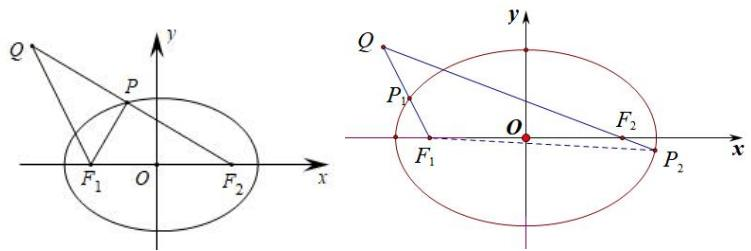

text_image

Q
P
F₁ O F₂
x
y
Q
P₁
O
F₁ P₂ x
y

2. 若 Q 为椭圆外一定点（如右图所示），则 $\left|QF_{1}\right|\leq\left|PQ\right|+\left|PF_{1}\right|\leq2a+\left|QF_{2}\right|$ ，当且仅当 $P_{1}$ 、 $F_{1}$ 、Q 三点共线时，左边等号成立，当且仅当 Q、 $F_{2}$ 、 $P_{2}$ 三点共线时（ $P_{2}$ 位于 $QF_{2}$ 延长线上），等号成立.

3. 若 Q 为椭圆内一定点（如下图所示），则 $2a - \left|QF_{2}\right| \leq \left|PQ\right| + \left|PF_{1}\right| \leq 2a + \left|QF_{2}\right|$ ，当且仅当 $P_{1}$ 、Q、 $F_{2}$ 三点共线时，左边等号成立，当且仅当 $P_{2}$ 、 $F_{2}$ 、Q 三点共线时（ $P_{2}$ 位于 $QF_{2}$ 延长线上），右边等号成立，

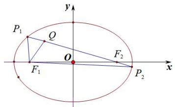

text_image

P₁
Q
O
F₂
F₁
P₂
x
y

【例 3】已知椭圆 $C: \frac{x^{2}}{4} + \frac{y^{2}}{3} = 1$ 的左、右焦点分别为 $F_{1}$ ， $F_{2}$ ，M 为 C 上任意一点，N 为圆 $E: (x - 5)^{2} + (y - 4)^{2} = 1$ 上任意一点，则 $|MN| - |MF_{1}|$ 的最小值为 \_\_\_\_.

【例 4】已知 F 是椭圆 $C: \frac{x^{2}}{16} + \frac{y^{2}}{15} = 1$ 的左焦点，P 为椭圆 C 上任意一点，点 Q 坐标为 $(4, 4)$ ，则 $|PQ| + |PF|$ 的最大值为（）

A. $\sqrt{41}$

B. 13

C. 3

D. 5

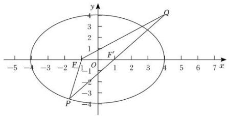

text_image

y
3
2
1
F'
Q
-5 -4 -3 -2 0 1 2 3 4 5 6 7 x
-1
E
O
-2
-3
P
-4

# 题型 3 双曲线第一定义

双曲线的第一定义

平面内与两个定点 $F_{1}$ 、 $F_{2}$ 的距离的差的绝对值等于常数且小于 $\left|F_1F_2\right|$ 的点的轨迹；其中，两个定点叫做双曲线的焦点，焦点间的距离叫做焦距.

注意： $\left|PF_{1}\right|-\left|PF_{2}\right|=2a$ 与 $\left|PF_{2}\right|-\left|PF_{1}\right|=2a\quad(a>0)$ 分别表示双曲线的一支．若有 “绝对值”，点的轨迹表示双曲线的两支；若无 “绝对值”，点的轨迹仅为双曲线的一支；

根据 $\left|\sqrt{(x+c)^{2}+y^{2}}-\sqrt{(x-c)^{2}+y^{2}}\right|=2a$ ，化简得： $\frac{x^{2}}{a^{2}}-\frac{y^{2}}{b^{2}}=1(a,b>0)$ .

注意：1.双曲线的标准方程： $\left\{ \begin{array}{l} \frac{x^2}{a^2} - \frac{y^2}{b^2} = 1(a, b > 0) \Leftrightarrow \text{中心在原点，焦点在} x \text{轴上；}\\  \frac{y^2}{a^2} - \frac{x^2}{b^2} = 1(a, b > 0) \Leftrightarrow \text{中心在原点，焦点在} y \text{轴上}. \end{array} \right.$

2. 顶点: $A_{1}(-a,0), A_{2}(a,0)$ .   
3. 实轴和虚轴 实轴长为 $2a$ ，虚轴长为 $2b$ ;  
4. 焦点 $F_{1}(-c,0), F_{2}(c,0)$ .  
5. 焦距 $\left|F_{1}F_{2}\right|=2c(c>0)$ ，满足关系式： $c^{2}=a^{2}+b^{2}$

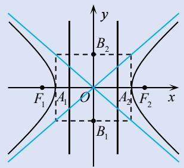

text_image

y
B₂
F₁ A₁ O A₂ F₂ x
B₁

6. 离心率 $e = \frac{c}{a} (e > 1)$ ，离心率越大，开口越大；  
7. $P$ 为双曲线上一点，则 $\overrightarrow{PF_1} \cdot \overrightarrow{PF_2} = |\overrightarrow{PO}|^2 - c^2 \in [-b^2, +\infty)$ (利用极化恒等式证明).

【例 1】(2024 甲卷) 已知双曲线的两个焦点分别为 $(0,4)$ , $(0,-4)$ ，点 $(-6,4)$ 在该双曲线上，则该双曲线的离心率为（）

A. 4

B. 3

C. 2

D. $\sqrt{2}$

【例 2】（2024 北京卷）已知双曲线 $\frac{x^{2}}{4}-y^{2}=1$ ，则过 $(3,0)$ 且和双曲线只有一个交点的直线的斜率为 \_\_\_\_.

题型4 双曲线最值问题：求 $\left|PQ\right| + \left|PF_1\right|$ 最值，则构造 $\left|PQ\right| + 2a + \left|PF_2\right| - 2a = \left|PQ\right| + \left|PF_2\right| + 2a$ ，当且仅当 $P$ 、 $Q$ 、 $F_{2}$ 三点共线时等号成立.（如下图所示）.

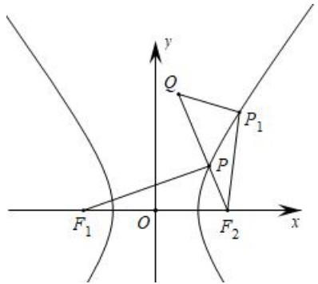

text_image

y
Q
P₁
P
F₁ O F₂ x

注意：由于椭圆和双曲线的第二定义已经不在高考范围内，形如“ $|PM| + \frac{1}{e}|PF|$ ”的最值已经不是考试的常考范围，关于问焦点则连接准线的类型题目只适合抛物线，这里不做详述．其它双曲线最值类比椭圆，画图仔细分析即可.

【例 2】已知 $A(-1,4)$ ，F 是双曲线 $x^{2}-\frac{y^{2}}{3}=1$ 的左焦点，P 是双曲线右支上的动点，则 $|PF|+|PA|$ 的最小值为 \_\_\_\_.

【例 3】已知 $F_{1}$ 、 $F_{2}$ 分别是双曲线 $C: \frac{x^{2}}{4}-y^{2}=1$ 的左、右焦点，动点 P 在双曲线的左支上，点 Q 为圆 $G: x^{2}+(y+2)^{2}=1$ 上一动点，则 $|PQ|+|PF_{2}|$ 的最小值为 \_\_\_\_.

# 考向 2 椭圆双曲线的第二定义

# 题型 1 椭圆第二定义与焦半径公式

# 1. 椭圆的第二定义

平面内与一个定点的距离和到一条定直线的距离的比是常数 $e(0 < e < 1)$ 的点的轨迹，其中，定点为焦点，定直线叫做准线，常数 $e$ 叫做离心率.

设 $M(x,y)$ 是椭圆上任意一点，定点为 $F_{1}(-c,0)$ ，定直线为 $x=\frac{a^{2}}{c}$ ，常数 $e=\frac{c}{a}$ ，由上述椭圆的定义可得： $\frac{\sqrt{(x-c)^{2}+y^{2}}}{\left|\frac{a^{2}}{c}-x\right|}=\frac{c}{a}$ ，变形即可.

焦半径 椭圆上的点到焦点的距离；设 $P(x_{0}, y_{0})$ 为椭圆上的一点，

① 焦点在 x 轴：焦半径 $\left\{\begin{aligned}&\left|PF_{1}\right|=a+ex_{0}\\&\left|PF_{2}\right|=a-ex_{0}\end{aligned}\right.$ （左加右减）；② 焦点在 y 轴：焦半径 $\left\{\begin{aligned}&\left|PF_{1}\right|=a+ey_{0}\\&\left|PF_{2}\right|=a-ey_{0}\end{aligned}\right.$ （上加下减）.
注意：利用第二定义快速进行证明，结合图像，长的加，短的减。

注意：焦半径公式，在大题中不能直接使用，大题建议使用余弦定理推导。

【例 1】点 M 与定点 $F(4,0)$ 的距离和它到定直线 $x=\frac{25}{4}$ 的距离之比是常数 $\frac{4}{5}$ ，则 M 的轨迹方程为（）

A. $\frac{x^2}{4} +\frac{y^2}{9} = 1$

B. $\frac{x^2}{9} +\frac{y^2}{3} = 1$

C. $\frac{x^{2}}{25}+\frac{y^{2}}{9}=1$

D. $\frac{x^{2}}{25}+\frac{y^{2}}{16}=1$

【例 2】已知 $P(x,y)$ 是椭圆 $\frac{x^{2}}{4}+\frac{y^{2}}{3}=1$ 上一点， $F_{1}$ ， $F_{2}$ 为椭圆的两个焦点，则 $PF_{1}\cdot PF_{2}$ 的最大值与最小值的差是 \_\_\_\_.

【例 3】平面内到定点 $F(5,0)$ 及到定直线 $x=\frac{16}{5}$ 的距离之比为 5:4 的点的轨迹方程是()

A. $\frac{x^2}{16} -\frac{y^2}{9} = 1$

B. $\frac{x^2}{9} -\frac{y^2}{16} = 1$

C. $\frac{y^2}{16} -\frac{x^2}{9} = 1$

D. $\frac{y^2}{9} -\frac{x^2}{16} = 1$

【例 4】设 $F_{1}$ 、 $F_{2}$ 为椭圆 $\Gamma:\frac{x^{2}}{25}+\frac{y^{2}}{21}=1$ 的两个焦点，P 为 $\Gamma$ 上一点且在第二象限．若 $\left|PF_{1}\right|=\left|F_{1}F_{2}\right|$ ，则点 P 的坐标为 \_\_\_\_.

# 考向 3 椭圆双曲线的第三定义

# 题型 1 椭圆双曲线第三定义与点差法

# 1. 椭圆的第三定义

已知关于原点对称的两个定点，那么到这两定点连线的斜率之积为定值 $-\frac{b^2}{a^2}$ 或 $e^2 - 1 (0 < e < 1)$ 的点的轨迹是椭圆，通常这两个定点分别为长轴或者短轴顶点.

另一方面，设 $M(x,y)$ 是椭圆上任意一点，两个定点为 $A_{1}(x_{1},y_{1})$ 、 $A_{2}(-x_{1}, - y_{1})$ ，常数 $e = \frac{c}{a}$ ， $k_{MA_1}\cdot k_{MA_2} = \frac{y - y_1}{x - x_1}\cdot \frac{y + y_1}{x + x_1} = \frac{y^2 - y_1^2}{x^2 - x_1^2}$ ，根据椭圆方程：将 $\frac{x^2}{a^2} +\frac{y^2}{b^2} = 1(a > b > 0)$ ，变形成 $y^{2} = b^{2} - \frac{b^{2}x^{2}}{a^{2}}$ ，所以 $k_{MA_1}\cdot k_{MA_2} = -\frac{b^2}{a^2}$ ，椭圆上动点到关于原点对称的两个定点的连线的斜率之积等于常数.

若椭圆与直线 l 交于 AB 两点，其中 $A(x_{1}, y_{1})$ ， $B(x_{2}, y_{2})$ ， $M(x_{0}, y_{0})$ ，为 AB 中点，定理 1： $k_{AB} \cdot k_{OM} = -\frac{b^{2}}{a^{2}}$ （椭圆）；

# 2. 双曲线的第三定义

到关于原点对称的两个定点连线的斜率之积为定值 $\frac{b^2}{a^2}$ 或 $e^2 - 1 (e > 1)$ 的点的轨迹是双曲线；通常定点为实轴或虚轴顶点，定值为正值.

另一方面，设 $M(x,y)$ 是双曲线上任意一点，两个定点为 $A_{1}(x_{1},y_{1})$ 、 $A_{2}(-x_{1}, - y_{1})$ ，常数 $e = \frac{c}{a}$ ， $k_{MA_1}\cdot k_{MA_2} = \frac{y - y_1}{x - x_1}\cdot \frac{y + y_1}{x + x_1} = \frac{y^2 - y_1^2}{x^2 - x_1^2}$ ，根据双曲线方程：将 $\frac{x^2}{a^2} -\frac{y^2}{b^2} = 1(a,b > 0)$ ，变形成 $y^{2} = \frac{b^{2}x^{2}}{a^{2}} -b^{2}$ ，所以 $k_{MA_1}\cdot k_{MA_2} = \frac{b^2}{a^2}$ ，双曲线上动点到关于原点对称的两个定点的连线的斜率之积等于常数.

若双曲线与直线 l 交于 AB 两点，其中 $A(x_{1}, y_{1})$ ， $B(x_{2}, y_{2})$ ， $M(x_{0}, y_{0})$ ，为 AB 中点，定理 1： $k_{AB} \cdot k_{OM} = \frac{b^{2}}{a^{2}}$ （双曲线）

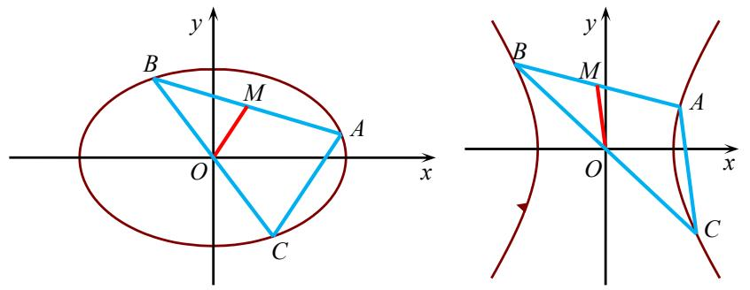

text_image

Mathematical diagrams showing an ellipse and a hyperbola with labeled points and coordinate axes

【例 1】(2022·甲卷) 椭圆 $C: \frac{x^{2}}{a^{2}} + \frac{y^{2}}{b^{2}} = 1 (a > b > 0)$ 的左顶点为 A，点 P，Q 均在 C 上，且关于 y 轴对称。若直线 AP，AQ 的斜率之积为 $\frac{1}{4}$ ，则 C 的离心率为（）

A. $\frac{\sqrt{3}}{2}$

B. $\frac{\sqrt{2}}{2}$

C. $\frac{1}{2}$

D. $\frac{1}{3}$

【例 2】（2013·新课标 I）已知椭圆 $E: \frac{x^{2}}{a^{2}} + \frac{y^{2}}{b^{2}} = 1 (a > b > 0)$ 的右焦点为 $F(3,0)$ ，过点 F 的直线交椭圆 E 于 A、B 两点．若 AB 的中点坐标为 $(1,-1)$ ，则 E 的方程为（）

A. $\frac{x^{2}}{45}+\frac{y^{2}}{36}=1$

B. $\frac{x^{2}}{36}+\frac{y^{2}}{27}=1$

C. $\frac{x^2}{27} +\frac{y^2}{18} = 1$

D. $\frac{x^{2}}{18}+\frac{y^{2}}{9}=1$

【例 3】已知点 A，B 是双曲线 $\frac{x^{2}}{a^{2}} - \frac{y^{2}}{b^{2}} = 1 (a > 0, b > 0)$ 上关于原点对称的任意两点，点 P 在双曲线上（异于 A，B 两点），若直线 PA，PB 斜率之积为 $\frac{5c - 4a}{2a}$ ，则双曲线的离心率为（）

A. $\frac{3}{2}$

B. 2

C. $\frac{5}{2}$

D. 3

【例 4】已知椭圆 $C: \frac{x^{2}}{a^{2}} + \frac{y^{2}}{b^{2}} = 1 (a > b > 0)$ 的离心率为 $\frac{1}{2}$ ，点 A，B 是椭圆 C 的长轴顶点，直线 $x = m (-a < m < a)$ 与椭圆 C 交于 P，Q 两点，记 $k_{1}$ ， $k_{2}$ 分别为直线 AP 和直线 BQ 的斜率，则 $|k_{1} + 4k_{2}|$ 的最小值为（）

A. $\frac{3}{4}$

B. $\sqrt{3}$

C. $2\sqrt{3}$

D. $4\sqrt{2}$

【例 5】（2022•新高考Ⅱ）已知直线 l 与椭圆 $\frac{x^{2}}{6} + \frac{y^{2}}{3} = 1$ 在第一象限交于 A，B 两点，l 与 x 轴、y 轴分别相交于 M，N 两点，且 $|MA| = |NB|$ ， $|MN| = 2\sqrt{3}$ ，则 l 的方程为 \_\_\_\_.

【例 6】（2025·深圳一模·多选）已知 $O(0,0)$ ， $A(a,0)$ ， $B(a,1)$ ， $C(0,1)$ ， $D(0,-1)$ ，其中 $a \neq 0$ 。点 M，N 分别满足 $\overrightarrow{AM} = \lambda \overrightarrow{AB}$ ， $\overrightarrow{ON} = (1 - \lambda) \overrightarrow{OA}$ ，其中 $0 < \lambda < 1$ ，直线 CM 与直线 DN 交于点 P，则（）

A. 当 $\lambda=\frac{1}{2}$ 时，直线 CM 与直线 DN 斜率乘积为 $-\frac{1}{a^{2}}$   
B. 当 $a = -1$ 时，存在点 $P$ ，使得 $|DP| = 2$   
C. 当 a=2 时， $\triangle PAC$ 面积最大值为 $\frac{\sqrt{2}-1}{2}$   
D. 若存在 $\lambda$ ，使得 $|DP| > 2$ ，则 $a \in (-\infty, -\sqrt{2}) \cup (\sqrt{2}, +\infty)$

# 拓展：中点弦存在定理

1. 在椭圆 $\frac{x^2}{a^2} + \frac{y^2}{b^2} = 1 (a > b > 0)$ 中，只需要AB中点 $M(x_0, y_0)$ 在椭圆内，即 $\frac{x_0^2}{a^2} + \frac{y_0^2}{b^2} < 1$ ；  
2. 在双曲线 $\frac{x^{2}}{a^{2}} - \frac{y^{2}}{b^{2}} = 1 (a > 0, b > 0)$ 中，一定有① $\left\{\begin{aligned} &\left|k_{OM}\right| > \frac{b}{a} \\ &\left|k_{AB}\right| < \frac{b}{a}\end{aligned}\right.$ 或 $\frac{x_{0}^{2}}{a^{2}} - \frac{y_{0}^{2}}{b^{2}} < 0$ ; ② $\left\{\begin{aligned} &\left|k_{OM}\right| < \frac{b}{a} \\ &\frac{x_{0}^{2}}{a^{2}} - \frac{y_{0}^{2}}{b^{2}} > 1\end{aligned}\right.$

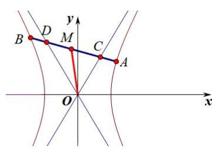

text_image

y
B D M C A
O x

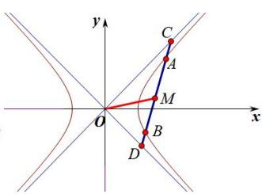

text_image

y
C
A
M
O
x
B
D

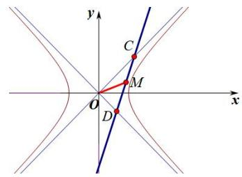

text_image

y
C
M
O
D
x

【例 6】(2023·乙卷) 设 A，B 为双曲线 $x^{2}-\frac{y^{2}}{9}=1$ 上两点，下列四个点中，可为线段 AB 中点的是()

A. $(1,1)$

B. $(-1,2)$

C. $(1,3)$

D. $(-1, - 4)$

【例 7】已知双曲线 $C: \frac{x^{2}}{a^{2}} - \frac{y^{2}}{b^{2}} = 1 (a > 0, b > 0)$ 的实轴长为 4，离心率为 $\sqrt{2}$ ，直线 l 与 C 交于 A，B 两点，M 是线段 AB 的中点，O 为坐标原点．若点 M 的横坐标为 1，则 $|OM|$ 的取值范围为 \_\_\_\_.

# 考向 4 椭圆双曲线的焦点三角形

# 1. 椭圆的焦点三角形问题

周长问题:过椭圆 $\frac{x^{2}}{a^{2}}+\frac{y^{2}}{b^{2}}=1(a>b>0)$ 的左焦点 $F_{1}$ 的弦AB与右焦点 $F_{2}$ 围成的三角形 $\triangle ABF_{2}$ 的周长是4a;
角度问题:①已知椭圆 $\frac{x^{2}}{a^{2}}+\frac{y^{2}}{b^{2}}=1(a>b>0)$ 的左、右两焦点分别为 $F_{1}$ 、 $F_{2}$ ，P是椭圆上一动点，在焦点三角形 $PF_{1}F_{2}$ 中，若 $\angle F_{1}PF_{2}$ 最大，则点P为椭圆短轴的端点.

证明 $S_{\triangle PF_1F_2} = b^2\tan \frac{\angle F_1PF_2}{2} = c|y_P|$ ，故当 $y_{P}$ 取得最大值 $b$ 时，当点 $P$ 位于短轴端点时， $\angle F_1PF_2$ 取得最大值。

②已知椭圆 $\frac{x^2}{a^2} +\frac{y^2}{b^2} = 1(a > b > 0)$ 的左、右两焦点分别为 $F_{1}$ 、 $F_{2}$ ，若椭圆上存在一点 $P$ ，使得 $\angle F_1PF_2 = \theta$ 则椭圆离心率 $e\in \left[\sin \frac{\theta}{2},1\right)$

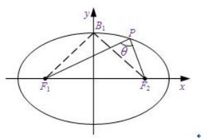

text_image

y
B₁
P
θ
F₁
F₂
x

面积问题:椭圆 $\frac{x^{2}}{a^{2}}+\frac{y^{2}}{b^{2}}=1(a>b>0)$ 焦点为 $F_{1}$ ， $F_{2}$ ，P 为椭圆上的点， $\angle F_{1}PF_{2}=\theta$ ，如图 1，
则 $S_{\Delta F_{1}PF_{2}} = b^{2} \cdot \frac{\sin \theta}{1 + \cos \theta} = b^{2} \tan \frac{\theta}{2}$ （灵动椭圆焦点三角形面积公式）

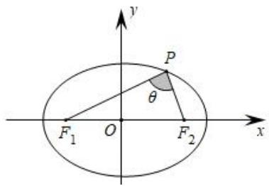

text_image

y
P
θ
F₁ O F₂ x

图 1

# 2. 双曲线焦点三角形性质

双曲线 $\frac{x^2}{a^2} -\frac{y^2}{b^2} = 1(a > 0,b > 0)$ 的焦点为 $F_{1}$ 、 $F_{2}$ ， $B$ 为双曲线上的点， $\angle F_1BF_2 = \alpha$ ，如图，则 $S_{\triangle F_1BF_2} = b^2\cdot \frac{\sin\alpha}{1 - \cos a} = \frac{b^2}{\tan\frac{\alpha}{2}}$ （灵动双曲线焦点三角形面积公式）.

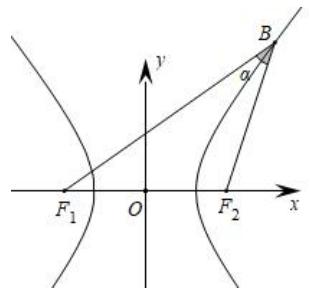

text_image

F₁ O F₂ x
y
α
B

【例 1】（2021·甲卷）已知 $F_{1}$ ， $F_{2}$ 为椭圆 $C: \frac{x^{2}}{16} + \frac{y^{2}}{4} = 1$ 的两个焦点，P，Q 为 C 上关于坐标原点对称的两点，且 $|PQ| = |F_{1}F_{2}|$ ，则四边形 $PF_{1}QF_{2}$ 的面积为 \_\_\_\_。

【例 2】（2020•新课标 I）设 $F_{1}$ ， $F_{2}$ 是双曲线 $C: x^{2}-\frac{y^{2}}{3}=1$ 的两个焦点，O 为坐标原点，点 P 在 C 上且 $|OP|=2$ ，则 $\triangle PF_{1}F_{2}$ 的面积为（）

A. $\frac{7}{2}$

B. 3

C. $\frac{5}{2}$

D. 2

【例 3】（2024 天津卷）双曲线 $\frac{x^{2}}{a^{2}} - \frac{y^{2}}{b^{2}} = 1 (a > 0, b > 0)$ 的左、右焦点分别为 $F_{1}$ 、 $F_{2}$ . P 是双曲线右支上一点，且直线 $PF_{2}$ 的斜率为 2. $\triangle PF_{1}F_{2}$ 是面积为 8 的直角三角形，则双曲线的方程为（）

A. $\frac{x^2}{8} -\frac{y^2}{2} = 1$

B. $\frac{x^2}{8} -\frac{y^2}{4} = 1$

C. $\frac{x^{2}}{2}-\frac{y^{2}}{8}=1$

D. $\frac{x^2}{4} -\frac{y^2}{8} = 1$

【例 4】（2019•新课标 II）已知 $F_{1}$ ， $F_{2}$ 是椭圆 $C: \frac{x^{2}}{a^{2}} + \frac{y^{2}}{b^{2}} = 1 (a > b > 0)$ 的两个焦点，P 为 C 上的点，O 为坐标原点.

(1) 若 $\triangle POF_{2}$ 为等边三角形，求 C 的离心率；  
（2）如果存在点 P，使得 $PF_{1} \perp PF_{2}$ ，且 $\triangle F_{1}PF_{2}$ 的面积等于 16，求 b 的值和 a 的取值范围.

【例 5】已知 F 是椭圆 $C: \frac{x^{2}}{a^{2}} + \frac{y^{2}}{b^{2}} = 1 (a > b > 0)$ 的一个焦点，若椭圆上存在关于原点对称的 A，B 两点满足 $\angle AFB = 90^{\circ}$ ，则椭圆 C 离心率的取值范围是（）

A. $\left[\frac{\sqrt{3}}{2},1\right)$

B. $(0,\frac{\sqrt{2}}{2}]$

C. $\left[\frac{\sqrt{2}}{2},1\right)$

D. $(0,\frac{\sqrt{3}}{2}]$

【例 6】 $F_{1}$ 、 $F_{2}$ 是双曲线 $E:\frac{x^{2}}{a^{2}}-\frac{y^{2}}{b^{2}}=1(a,b>0)$ 的左、右焦点，点 M 为双曲线 E 右支上一点，点 N 在 x 轴上，满足 $\angle F_{1}MN=\angle F_{2}MN=60^{\circ}$ ，若 $3\overrightarrow{MF_{1}}+5\overrightarrow{MF_{2}}=\lambda\overrightarrow{MN}(\lambda\in R)$ ，则双曲线 E 的离心率为（）

A. $\frac{8}{7}$

B. $\frac{6}{5}$

C. $\frac{5}{3}$

D. $\frac{7}{2}$

# 3. 椭圆双曲线共焦点问题

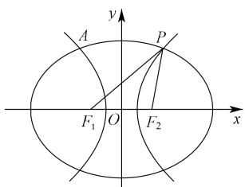

text_image

y
A
P
F₁ O F₂ x

图 17

椭圆双曲线共焦点三角形的问题：如图17，椭圆 $\frac{x^2}{a^2} +\frac{y^2}{b^2} = 1$ 和双曲线 $\frac{x^2}{a^2} -\frac{y^2}{b^2} = 1$ 共焦点，由于两个式子 $a,b$ 不同，将椭圆写成 $\frac{x^2}{m} +\frac{y^2}{n} = 1(m > 0,n > 0)$ ，双曲线写成 $\frac{x^2}{p} -\frac{y^2}{q} = 1(p > 0,q > 0)$ 可以知道

$$
S _ {\triangle F _ {1} P F _ {2}} = n \cdot \frac {\sin \alpha}{1 + \cos \alpha} = q \cdot \frac {\sin \alpha}{1 - \cos \alpha} \Rightarrow \frac {n}{1 + \cos \alpha} = \frac {q}{1 - \cos \alpha} \Rightarrow \cos \alpha = \frac {n - q}{n + q}, \left| P F _ {1} \right| \cdot \left| P F _ {2} \right| = m - p = n + q
$$

①当 $PF_{1} \perp PF_{2}$ 时，椭圆和双曲线的离心率 $e_{椭} = \frac{2c}{2a} = \frac{|F_{1}F_{2}|}{|PF_{1}| + |PF_{2}|}; e_{双} = \frac{2c}{2a} = \frac{|F_{1}F_{2}|}{\|PF_{1}\| - |PF_{2}\|}$ ;

$$
\frac {1}{e _ {\text {椭}} ^ {2}} + \frac {1}{e _ {\text {双}} ^ {2}} = \frac {\left(\left| P F _ {1} \right| + \left| P F _ {2} \right|\right) ^ {2}}{\left| F _ {1} F _ {2} \right| ^ {2}} + \frac {\left(\left| P F _ {1} \right| - \left| P F _ {2} \right|\right) ^ {2}}{\left| F _ {1} F _ {2} \right| ^ {2}} = \frac {2 \left(\left| P F _ {1} \right| ^ {2} + \left| P F _ {2} \right| ^ {2}\right)}{\left| F _ {1} F _ {2} \right| ^ {2}} = 2
$$

②当 $\angle F_{1}PF_{2} = \alpha$ 时，一定有 $\frac{1 - \cos\alpha}{e_{\text{椭}}^{2}} +\frac{1 + \cos\alpha}{e_{\text{双}}^{2}} = 2\Rightarrow \frac{\sin^{2}\frac{\alpha}{2}}{e_{\text{椭}}^{2}} +\frac{\cos^{2}\frac{\alpha}{2}}{e_{\text{双}}^{2}} = 1.$

证明： $\frac{a_{\text{椭}}^2 - c^2}{1 + \cos\alpha} = \frac{c^2 - a_{\text{双}}^2}{1 - \cos\alpha}\Rightarrow \frac{\frac{1}{e_{\text{椭}}^2} - 1}{2\cos^2\frac{\alpha}{2}} = \frac{1 - \frac{1}{e_{\text{双}}^2}}{2\sin^2\frac{\alpha}{2}}\Rightarrow \frac{\sin^2\frac{\alpha}{2}}{e_{\text{椭}}^2} +\frac{\cos^2\frac{\alpha}{2}}{e_{\text{双}}^2} = 1.$

【例 6】（2014·湖北卷）已知椭圆和双曲线有共同的焦点 $F_{1}$ 、 $F_{2}$ ， $P$ 是它们的一个交点，且 $\angle F_{1}PF_{2}=60^{\circ}$ ，记椭圆和双曲线的离心率分别为 $e_{1}$ ， $e_{2}$ ，则 $\frac{1}{e_{1}}+\frac{1}{e_{2}}$ 的最大值为 \_\_\_\_.

【例 7】（多选）P 是椭圆 $C_{1}:\frac{x^{2}}{a^{2}}+\frac{y^{2}}{b^{2}}=1(a>b>0)$ 与双曲线 $C_{2}:\frac{x^{2}}{m^{2}}-\frac{y^{2}}{n^{2}}=1(m>0,n>0)$ 在第一象限的交点，且 $C_{1}$ ， $C_{2}$ 共焦点 $F_{1}$ ， $F_{2}$ ， $\angle F_{1}PF_{2}=\theta$ ， $C_{1}$ ， $C_{2}$ 的离心率分别为 $e_{1}$ ， $e_{2}$ ，则下列结论正确的是（）

A. $|PF_{1}| = a + m, \quad |PF_{2}| = a - m$

B. 若 $\theta = 60^{\circ}$ ，则 $\frac{1}{e_1^2} + \frac{3}{e_2^2} = 4$

C. 若 $\theta = 90^{\circ}$ , 则 $e_1^2 + e_2^2$ 的最小值为 2

D. $\tan \frac{\theta}{2} = \frac{n}{b}$

# 4. 有关 |PF1| · |PF2| 的结论

（1）.设 $F_{1}$ 、 $F_{2}$ 是椭圆 $\frac{x^2}{a^2} +\frac{y^2}{b^2} = 1(a > b > 0)$ 的两个焦点， $O$ 是椭圆的中心， $P$ 是椭圆上任意一点， $\angle F_1PF_2 = \theta$ 则 $\left|PF_1\right|\bullet \left|PF_2\right| = a^2 +b^2 -\left|OP\right|^2 = \frac{2b^2}{1 + \cos\theta}.$

（2）.设 $F_{1}$ 、 $F_{2}$ 是双曲线 $\frac{x^2}{a^2} -\frac{y^2}{b^2} = 1(a > 0,b > 0)$ 的两个焦点， $O$ 是双曲线的中心， $P$ 是双曲线上任意一点， $\angle F_1PF_2 = \theta$ ，则 $\left|PF_1\right|\bullet \left|PF_2\right| = b^2 -a^2 +\left|OP\right|^2 = \frac{2b^2}{1 - \cos\theta}.$

（3）.等轴双曲线满足： $\left|PO\right|^{2}=\left|PF_{1}\right|\cdot\left|PF_{2}\right|$ ;

证明：（1）. $\left|PF_{1}\right|\bullet\left|PF_{2}\right|=(a+ex_{0})(a-ex_{0})=a^{2}-\frac{c^{2}}{a^{2}}x_{0}^{2}=a^{2}-(1-\frac{b^{2}}{a^{2}})x_{0}^{2}=a^{2}+b^{2}-\left|OP\right|^{2}$ ，利用等面积法， $S_{\Delta PF_{1}F_{2}}=\frac{1}{2}\left|PF_{1}\right\|PF_{2}\left|\sin\theta=b^{2}\frac{\sin\theta}{1+\cos\theta}\right.$ ，故 $\left|PF_{1}\right|\bullet\left|PF_{2}\right|=\frac{2b^{2}}{1+\cos\theta}$ ；也可以利用中线定理，

$2\left|OP\right|^2 + 2c^2 = \left|PF_1\right|^2 + \left|PF_2\right|^2 = (\left|PF_1\right| + \left|PF_2\right|)^2 - 2\left|PF_1\right| \cdot \left|PF_2\right|$ ，从而 $\left|PF_1\right| \cdot \left|PF_2\right| = a^2 + b^2 - \left|OP\right|^2$

(2). $\left|PF_{1}\right|\bullet\left|PF_{2}\right|=e^{2}x_{0}^{2}-a^{2}=x_{0}^{2}+\frac{b^{2}}{a^{2}}x_{0}^{2}-a^{2}=b^{2}-a^{2}+\left|OP\right|^{2}$ ，或者利用中线定理，

$2\left|OP\right|^{2}+2c^{2}=\left|PF_{1}\right|^{2}+\left|PF_{2}\right|^{2}=(\left|PF_{1}\right|-\left|PF_{2}\right|)^{2}+2\left|PF_{1}\right|\cdot\left|PF_{2}\right|$ ，整理得 $\left|PF_{1}\right|\cdot\left|PF_{2}\right|=b^{2}-a^{2}+\left|OP\right|^{2}$ ，再利用等面积法 $S_{\Delta PF_{1}F_{2}}=\frac{1}{2}\left|PF_{1}\right\|\left|PF_{2}\right|\sin\theta=b^{2}\frac{\sin\theta}{1-\cos\theta}$ ，故 $\left|PF_{1}\right|\cdot\left|PF_{2}\right|=\frac{2b^{2}}{1-\cos\theta}$

（3）.由于等轴双曲线满足 $a = b$ ，所以 $\left|PF_1\right|\bullet \left|PF_2\right| = b^2 -a^2 +\left|OP\right|^2 = \left|OP\right|^2.$

【例 8】(2023·甲卷)已知椭圆 $\frac{x^{2}}{9}+\frac{y^{2}}{6}=1$ ， $F_{1}$ ， $F_{2}$ 为两个焦点，O 为原点，P 为椭圆上一点， $\cos\angle F_{1}PF_{2}=\frac{3}{5}$ ，则 $|PO|=(\quad)$

A. $\frac{2}{5}$

B. $\frac{\sqrt{30}}{2}$

C. $\frac{3}{5}$

D. $\frac{\sqrt{35}}{2}$

【例 9】（多选）已知双曲线 $E: x^{2} - \frac{y^{2}}{3} = 1$ 的左、右焦点分别为 $F_{1}$ 、 $F_{2}$ ，过点 $C(1, \frac{\sqrt{3}}{2})$ 的直线 l 与双曲线 E 的左、右两支分别交于 P、Q 两点，下列命题正确的有（）

A. 当点 $C$ 为线段 $PQ$ 的中点时, 直线 $l$ 的斜率为 $\sqrt{3}$

B. 若 $A(-1,0)$ ，则 $\angle QF_{2}A = 2\angle QAF_{2}$

C. $\left|PF_{1}\right|\cdot\left|PF_{2}\right|>\left|PO\right|^{2}$

D. 若直线 $l$ 的斜率为 $\frac{2\sqrt{3}}{3}$ ，且 $B(0, \sqrt{3})$ ，则 $|PF_1| + |QF_1| = |PB| + |QB|$

【例 10】已知椭圆 $C: \frac{x^{2}}{a^{2}} + \frac{y^{2}}{b^{2}} = 1 (a > b > 0)$ 的两焦点 $F_{1}$ ， $F_{2}$ ，若椭圆 C 上存在点 P，

使得 $|PO|^{2}-|OF_{1}|^{2}=\frac{a^{2}}{6}$ （O为原点）， $|PF_{1}|^{2}+|PF_{2}|^{2}>4a^{2}-3b^{2}$ ，则椭圆C的离心率的取值范围是\_\_\_\_.

# 考向 5 椭圆双曲线的焦点弦问题

# 1. 椭圆焦长公式：

$A$ 是椭圆 $\frac{x^2}{a^2} +\frac{y^2}{b^2} = 1(a > b > 0)$ 上一点， $F_{1}$ 、 $F_{2}$ 是左、右焦点， $\angle AF_1F_2$ 为 $\alpha$ ， $AB$ 过 $F_{1}$ ， $c$ 是椭圆半焦距，则（1） $\left|AF_1\right| = \frac{b^2}{a - c\cos\alpha}$ ；（2） $\left|BF_1\right| = \frac{b^2}{a + c\cos\alpha}$ ；（3） $\left|AB\right| = \frac{2ab^2}{a^2 - c^2\cos^2\alpha} = \frac{2ab^2}{b^2 + c^2\sin^2\alpha}.$

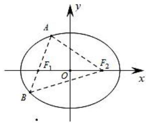

text_image

A
F₁
O
B
F₂
x
y

# 2. 双曲线的焦长公式

周长问题：双曲线 $\frac{x^2}{a^2} -\frac{y^2}{b^2} = 1$ （ $a > 0$ ， $b > 0$ ）的两个焦点为 $F_{1}$ 、 $F_{2}$ ，弦 $AB$ 过左焦点 $F_{1}$ （ $A$ 、 $B$ 都在左支上）， $\left|AB\right| = l$ ，则 $\triangle ABF_2$ 的周长为 $4a + 2l$ （如下图）

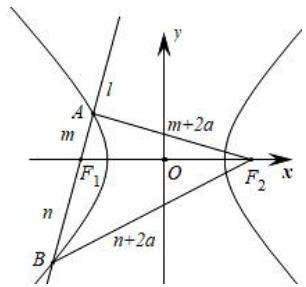

text_image

A
m
l
m+2a
F₁
O
F₂
x
n
B
n+2a
y

焦长公式：（1）当 $AB$ 交双曲线于一支时， $|AB| = \frac{2ab^2}{a^2 - c^2\cos^2\alpha}$ ， $a^2 - c^2\cos^2\alpha > 0 \Rightarrow 1 < e < \frac{1}{\cos\alpha}$ （图左）

（2）当 AB 交双曲线于两支时， $\left|AB\right|=\frac{2ab^{2}}{c^{2}\cos^{2}\alpha-a^{2}}$ ， $a^{2}-c^{2}\cos^{2}\alpha<0\Rightarrow e>\frac{1}{\cos\alpha}$ （图右）
双曲线焦比定理和椭圆的焦比定理一致：

令 $\left|AF_{1}\right|=\lambda\left|F_{1}B\right|$ ，即 $\frac{b^{2}}{a-c\cos\alpha}=\frac{\lambda b^{2}}{a+c\cos\alpha}\Rightarrow e\cos\alpha=\frac{\lambda-1}{\lambda+1}(\lambda>1)$ ，代入弦长公式可得 $\left|AF_{1}\right|=\frac{(\lambda+1)b^{2}}{2a}$ .

若交于两支时， $\frac{b^{2}}{c\cos\alpha-a}=\frac{\lambda b^{2}}{a+c\cos\alpha}\Rightarrow e\cos\alpha=\frac{\lambda+1}{\lambda-1}(\lambda>1)$ ，代入弦长公式可得 $\left|AF_{1}\right|=\frac{(\lambda-1)b^{2}}{2a}$ .

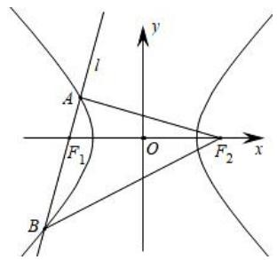

text_image

l
A
F₁
O
F₂
x
y
B

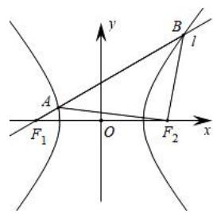

text_image

y
B
l
A
O
F₁
F₂
x

【例 1】设椭圆 $C: \frac{y^{2}}{16} + \frac{x^{2}}{12} = 1$ 的焦点分别为 $F_{1}$ ， $F_{2}$ ，过 $F_{2}$ 的直线与椭圆相交于 A，B 两点，则 $\Delta ABF_{1}$ 的周长为（）

A. 6

B. 8

C. 10

D. 16

【例 2】(2024 新课标 I) 设双曲线 $C: \frac{x^{2}}{a^{2}} - \frac{y^{2}}{b^{2}} = 1 (a > 0, b > 0)$ 的左右焦点分别为 $F_{1}$ 、 $F_{2}$ ，过 $F_{2}$ 作平行于 y 轴的直线交 C 于 A，B 两点，若 $|F_{1}A| = 13, |AB| = 10$ ，则 C 的离心率为 \_\_\_\_.

【例 3】过椭圆 $\frac{x^{2}}{a^{2}} + \frac{y^{2}}{b^{2}} = 1 (a > b > 0)$ 的一个焦点 F 作弦 AB，若 $|AF| = d_{1}$ ， $|BF| = d_{2}$ ，则 $\frac{1}{d_{1}} + \frac{1}{d_{2}}$ 的数值为（）

A. $\frac{2b}{a^2}$

B. $\frac{2a}{b^2}$

C. $\frac{a + b}{a^2}$

D. 与 $a$ 、 $b$ 斜率有关

【例 4】已知椭圆 $C: \frac{x^{2}}{a^{2}} + \frac{y^{2}}{b^{2}} = 1 (a > b > 0)$ 的左右焦点为 $F_{1}$ ， $F_{2}$ ，过 $F_{1}$ 的直线交椭圆 C 于 P，Q 两点，若 $\overrightarrow{PF_{1}} = \frac{4}{3} \overrightarrow{F_{1} Q}$ ，且 $|\overrightarrow{PF_{2}}| = |\overrightarrow{F_{1} F_{2}}|$ ，则椭圆 C 的离心率为 \_\_\_\_.

【例 5】（2019•新课标 I）已知椭圆 C 的焦点为 $F_{1}(-1,0)$ ， $F_{2}(1,0)$ ，过点 $F_{2}$ 的直线与椭圆 C 交于 A，B 两点．若 $\left|AF_{2}\right|=2\left|F_{2}B\right|$ ， $\left|AB\right|=\left|BF_{1}\right|$ ，则 C 的方程为（）

A. $\frac{x^2}{2} + y^2 = 1$

B. $\frac{x^{2}}{3}+\frac{y^{2}}{2}=1$

C. $\frac{x^{2}}{4}+\frac{y^{2}}{3}=1$

D. $\frac{x^2}{5} +\frac{y^2}{4} = 1$

【例 6】（2022•新高考 1）已知椭圆 $C: \frac{x^{2}}{a^{2}} + \frac{y^{2}}{b^{2}} = 1 (a > b > 0)$ ，C 的上顶点为 A，两个焦点为 $F_{1}, F_{2}$ ，离心率为 $\frac{1}{2}$ ，过 $F_{1}$ 且垂直于 $AF_{2}$ 的直线与 C 交于点 D，E 两点， $|DE| = 6$ ，则 $\triangle ADE$ 的周长是 \_\_\_\_.

【例 7】（多选）已知椭圆 $E: \frac{x^{2}}{4} + \frac{y^{2}}{3} = 1$ ，过椭圆 E 的左焦点 $F_{1}$ 的直线 $l_{1}$ 交 E 于 A，B 两点（点 A 在 x 轴的上方），过椭圆 E 的右焦点 $F_{2}$ 的直线 $l_{2}$ 交 E 于 C，D 两点，则（）

A. 若 $\overrightarrow{AF_{1}}=2\overrightarrow{F_{1}B}$ ，则 $l_{1}$ 的斜率 $k=\frac{\sqrt{6}}{2}$

B. $|AF_{1}| + 4|BF_{1}|$ 的最小值为 $\frac{27}{4}$

C. 以 $AF_{1}$ 为直径的圆与圆 $x^{2} + y^{2} = 4$ 相切

D. 若 $l_{1} \perp l_{2}$ , 则四边形 $ADBC$ 面积的最小值为 $\frac{288}{49}$

3. 双曲线渐近线与焦点弦相关

双曲线 $\frac{x^2}{a^2} -\frac{y^2}{b^2} = 1(a > 0,b > 0)$ 的焦点到渐近线的距离为定值 $b$ ，如左图所示，由于渐近线 $OP$ 的斜率为 $\frac{b}{a}$ ，又 $\left|OF_2\right| = c$ ， $a^2 +b^2 = c^2$ ，显然 $PF_{2}$ 的长度是定值 $b$

如右图所示，过双曲线 $\frac{x^2}{a^2} -\frac{y^2}{b^2} = 1(a > 0,b > 0)$ 的左焦点 $F_{1}(-c,0)(c > 0)$ 作圆 $x^{2} + y^{2} = a^{2}$ 的切线，切点为 $P$ ，那么，点 $P$ 在渐近线 $y = -\frac{b}{a} x$ 上，也在左准线 $x = -\frac{a^2}{c}$ 上，即点 $P\left(-\frac{a^2}{c},\frac{ab}{c}\right)$

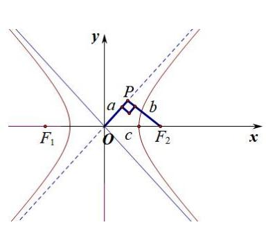

text_image

y
P
a
b
O
c
F₁
F₂
x

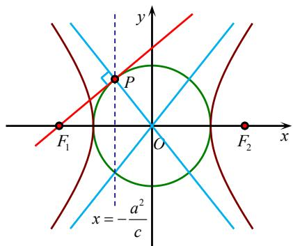

text_image

y
P
F₁ O F₂ x
x = -a²/c

【例 8】（2018•新课标III）设 $F_{1}$ ， $F_{2}$ 是双曲线 $C: \frac{x^{2}}{a^{2}} - \frac{y^{2}}{b^{2}} = 1 (a > 0, b > 0)$ 的左，右焦点，O 是坐标原点．过 $F_{2}$ 作 C 的一条渐近线的垂线，垂足为 P，若 $\left|PF_{1}\right| = \sqrt{6}\left|OP\right|$ ，则 C 的离心率为（）

A. $\sqrt{5}$

B. 2

C. $\sqrt{3}$

D. $\sqrt{2}$

【例 9】（2023·天津）双曲线 $\frac{x^{2}}{a^{2}} - \frac{y^{2}}{b^{2}} = 1 (a > 0, b > 0)$ 的左、右焦点分别为 $F_{1}$ ， $F_{2}$ ．过 $F_{2}$ 作其中一条渐近线的垂线，垂足为 P．已知 $\left|PF_{2}\right| = 2$ ，直线 $PF_{1}$ 的斜率为 $\frac{\sqrt{2}}{4}$ ，则双曲线的方程为（）

A. $\frac{x^2}{8} -\frac{y^2}{4} = 1$

B. $\frac{x^2}{4} -\frac{y^2}{8} = 1$

C. $\frac{x^2}{4} -\frac{y^2}{2} = 1$

D. $\frac{x^2}{2} -\frac{y^2}{4} = 1$

【例 10】（2022•乙卷）双曲线 C 的两个焦点为 $F_{1}$ ， $F_{2}$ ，以 C 的实轴为直径的圆记为 D，过 $F_{1}$ 作 D 的切线与 C 交于 M，N 两点，且 $\cos\angle F_{1}NF_{2}=\frac{3}{5}$ ，则 C 的离心率为（）

A、B 是双曲线 $\frac{x^{2}}{a^{2}} - \frac{y^{2}}{b^{2}} = 1$ 左支上两点， $F_{1}$ 是左焦点， $\angle AF_{1}O$ 为 $\alpha$ ，AB 过 $F_{1}$ ，c 是双曲线半焦距，如左图，

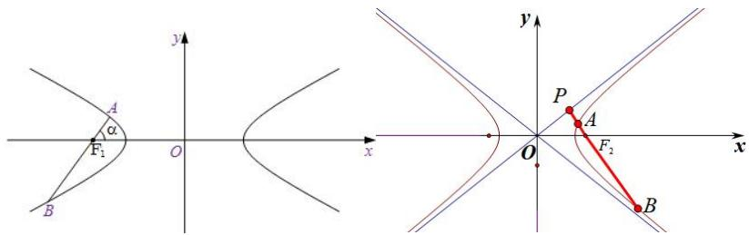

text_image

A
α
F₁
B
O
x
y
P
A
F₂
O
x
B

由于 $\cos\alpha=\frac{b}{c}$ ，如右图所示， $\left|AF_{2}\right|=\frac{b^{2}}{a+c\cos\alpha}=\frac{b^{2}}{a+b}$ ， $\left|BF_{2}\right|=\frac{b^{2}}{a-c\cos\alpha}=\frac{b^{2}}{a-b}$ ;

A 是双曲线 $\frac{x^{2}}{a^{2}} - \frac{y^{2}}{b^{2}} = 1$ 左支上一点，B 是双曲线右支上一点， $F_{1}$ 是左焦点， $\angle AF_{1}O$ 为 $\alpha$ ，AB 过 $F_{1}$ ，c 是双曲线半焦距，如图，由于交两支时，有 $\left|k\right| < \frac{b}{a}$ ，平方得： $\tan^{2}\alpha < \frac{b^{2}}{a^{2}}$ ，即 $\cos\alpha > \frac{a}{c}$ ，故 $a - c\cos\alpha < 0$

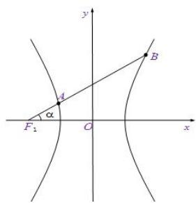

text_image

y
A
B
α
F₁
O
x

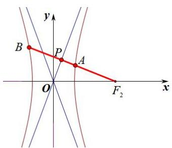

text_image

y
B P A
O F₂ x

由于 $\cos \alpha = \frac{b}{c}$ ，如右图所示， $\left|AF_2\right| = \frac{b^2}{a + c\cos\alpha} = \frac{b^2}{a + b}$ ， $\left|BF_2\right| = \frac{b^2}{c\cos\alpha - a} = \frac{b^2}{b - a}$ ；

【例11】已知双曲线 $E: \frac{x^2}{a^2} - \frac{y^2}{b^2} = 1 (a > 0, b > 0)$ 的左、右焦点分别为 $F_1$ ， $F_2$ ，过 $F_2$ 作 $E$ 的一条渐近线的垂线，垂足为 $T$ ，交 $E$ 的左支于点 $P$ 。若 $T$ 恰好为线段 $PF_2$ 的中点，则 $E$ 的离心率为（）

A. $\sqrt{2}$

B. $\sqrt{3}$

C. 2

D. $\sqrt{5}$

【例 12】已知双曲线 $\frac{x^{2}}{a^{2}} - \frac{y^{2}}{b^{2}} = 1 (a > 0, b > 0)$ 的左、右焦点分别为 $F_{1}$ ， $F_{2}$ ，以 $OF_{1}$ 为直径的圆与双曲线的一条渐近线交于点 M（异于坐标原点 O），若线段 $MF_{1}$ 交双曲线于点 P，且 $MF_{2} // OP$ ，则该双曲线的离心率为（）

A. $\sqrt{2}$

B. $\sqrt{3}$

C. $\frac{\sqrt{6}}{2}$

D. $\sqrt{6}$

4. 焦点弦与直角三角形相关

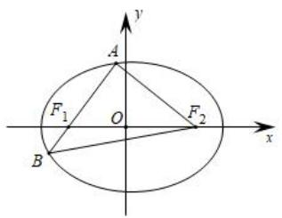

text_image

y
A
F₁ O F₂
x
B

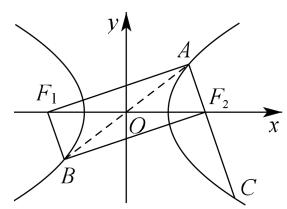

text_image

y
F₁
A
O
x
F₂
B
C

如左图所示，椭圆若 $AF_{2} \perp AB$ ，且 $\overrightarrow{AF_1} = \lambda \overrightarrow{F_1B}$ ， $\angle AF_1F_2 = \alpha$ ，我们可以借助公式 $e\cos \alpha = \frac{|\lambda - 1|}{\lambda + 1}$ 可得 $\frac{c}{a} \cdot \frac{\lambda + 1}{2} \cdot \frac{b^2}{a} \cdot \frac{1}{2c} = \frac{\lambda - 1}{\lambda + 1}$ 来求出 $a$ 和 $b$ 的关系，由于 $\lambda > 1$ ，从而求出离心率.

如右图所示，若 $BF_{2} \perp AC$ ， $AB$ 过原点，且 $\overrightarrow{AF_2} = \lambda \overrightarrow{F_2C} (0 < \lambda < 1)$ ，通过补全矩形，可得 $AF_{1} \perp AC$ ， $|AF_{2}| = \frac{\lambda + 1}{2} \cdot \frac{b^{2}}{a}$ ，借助公式 $e\cos \alpha = \frac{|\lambda - 1|}{\lambda + 1}$ 可得 $\frac{c}{a} \cdot \frac{\lambda + 1}{2} \cdot \frac{b^{2}}{a} \cdot \frac{1}{2c} = \frac{1 - \lambda}{\lambda + 1}$ 来求出 $a$ 和 $b$ 的关系，从而求出离心率.

注意：若直线 $AB$ 交双曲线两支于 $A$ 、 $B$ 两点， $\left|\overrightarrow{AF}\right| = \lambda \left|\overrightarrow{FB}\right| (\lambda > 1)$ ，则 $\left|\overrightarrow{AF}\right| = \frac{\lambda - 1}{2} \frac{b^2}{a}$ ， $\angle AFF' = \alpha$ 时， $e \cos \alpha = \frac{\lambda + 1}{\lambda - 1}$ ，本节前面已经论述.

【例 13】已知椭圆 $C: \frac{x^{2}}{a^{2}} + \frac{y^{2}}{b^{2}} = 1 (a > b > 0)$ 的右焦点为 F，点 P，Q 在椭圆 C 上，O 为坐标原点，且 $\overrightarrow{PF} = 4\overrightarrow{FQ}$ ， $|OP| = |OF|$ ，则椭圆的离心率是 \_\_\_\_.

【例 14】双曲线 $C: \frac{x^{2}}{a^{2}} - \frac{y^{2}}{b^{2}} = 1 (a > 0, b > 0)$ 的左、右焦点分别为 $F_{1}$ ， $F_{2}$ ，直线 l 过 $F_{1}$ 与双曲线 C 的左支和右支分别交于 A，B 两点， $BF_{1} \perp BF_{2}$ 。若 x 轴上存在点 Q 满足 $\overrightarrow{BQ} = 3\overrightarrow{AF_{2}}$ ，则双曲线 C 的离心率为 \_\_\_\_.

【例 15】已知点 F 为双曲线 $\frac{x^{2}}{a^{2}} - \frac{y^{2}}{b^{2}} = 1 (a > 0, b > 0)$ 的左焦点，过原点 O 的直线与双曲线交于 A、B 两点（点 B 在双曲线左支上），连接 BF 并延长交双曲线于点 C，且 $|BC| = 3 |BF|$ ， $AF \perp BC$ ，则该双曲线的离心率为（）

A. $\frac{\sqrt{10}}{2}$

B. $\frac{\sqrt{17}}{3}$

C. $\frac{\sqrt{10}}{3}$

D. $\frac{\sqrt{10}}{5}$

5. 焦点弦与双曲线等腰三角形相关

第一类：等腰三角形的 2a 隐藏

【例 16】已知 $F_{1}$ ， $F_{2}$ 分别为双曲线 $C: \frac{x^{2}}{a^{2}} - \frac{y^{2}}{b^{2}} = 1 (a > 0, b > 0)$ 的左，右焦点，过点 $F_{2}$ 且斜率为 1 的直线 l 与双曲线 C 的右支交于 P，Q 两点，若 $\triangle F_{1}PQ$ 是等腰三角形，则双曲线 C 的离心率为 \_\_\_\_.

第二类：等腰三角形的 4a 隐藏

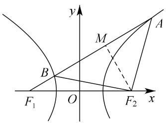

text_image

y
M
A
B
F₁ O F₂ x

如图，若 $\left|F_{2}A\right| = \left|F_{2}B\right| = m$ 与 $\left|AB\right| = 4a$ 互为充要条件.

证明：（充分性） $\left|AF_{1}\right|=m+2a,\left|BF_{1}\right|=m-2a$ ，故 $\left|AB\right|=\left|AF_{1}\right|-\left|BF_{1}\right|=4a$

（必要性） $\left|BF_{2}\right|=2a+\left|BF_{1}\right|$ ， $\left|AF_{2}\right|=\left|AF_{1}\right|-2a=\left|AB\right|+\left|BF_{1}\right|-2a=2a+\left|BF_{1}\right|$ ，故 $\left|F_{2}A\right|=\left|F_{2}B\right|$

核心技能： $\left|AB\right|=4a=\frac{2ab^{2}}{c^{2}\cos^{2}\alpha-a^{2}}\Rightarrow e^{2}(\cos^{2}\alpha-\sin^{2}\alpha)=1\Rightarrow e^{2}=\frac{1+k^{2}}{1-k^{2}}$

【例 17】已知 $F_{1}$ ， $F_{2}$ 是双曲线 C: $\frac{x^{2}}{a^{2}} - \frac{y^{2}}{b^{2}} = 1 (a, b > 0)$ 的左，右焦点，过点 $F_{1}$ 作斜率为 $\frac{\sqrt{2}}{2}$ 的直线 l 与双曲线的左，右两支分别交于 M，N 两点，以 $F_{2}$ 为圆心的圆过 M，N，则双曲线 C 的离心率为（）

A. $\sqrt{2}$

B. $\sqrt{3}$

C. 2

D. $\sqrt{5}$

【例 18】（2016•上海）双曲线 $x^{2}-\frac{y^{2}}{b^{2}}=1(b>0)$ 的左、右焦点分别为 $F_{1}$ ， $F_{2}$ ，直线 l 过 $F_{2}$ 且与双曲线交于 A，B 两点.

（1）直线 l 的倾斜角为 $\frac{\pi}{2}$ ， $\triangle F_{1}AB$ 是等边三角形，求双曲线的渐近线方程；  
（2）设 $b=\sqrt{3}$ ，若l的斜率存在，且 $(\overrightarrow{F_{1}A}+\overrightarrow{F_{1}B})\cdot\overrightarrow{AB}=0$ ，求l的斜率.

【例 19】设双曲线 $E: \frac{x^{2}}{a^{2}} - \frac{y^{2}}{b^{2}} = 1 (a > 0, b > 0)$ 的左、右焦点分别为 $F_{1}$ ， $F_{2}$ ，B 为双曲线 E 上在第一象限内的点，线段 $F_{1}B$ 与双曲线 E 相交于另一点 A，AB 的中点为 M，且 $F_{2}M \perp AB$ ，若 $\angle AF_{1}F_{2} = 30^{\circ}$ ，则双曲线 E 的离心率为（）

A. $\sqrt{5}$

B. 2

C. $\sqrt{3}$

D. $\sqrt{2}$

# 考向 6 抛物线的定义及结论

# 1. 抛物线定义

平面内与一个定点 $F$ 和一条定直线 $l$ （ $l$ 不经过点 $F$ ）的距离相等的点的轨迹叫做抛物线，定点 $F$ 叫做抛物线的焦点，定直线 $l$ 叫做抛物线的准线.

# 2. 抛物线标准方程几何性质的对比

<table><tr><td>图形</td><td>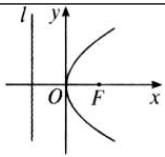</td><td>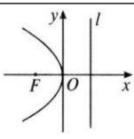</td><td>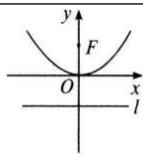</td><td>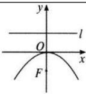</td></tr><tr><td>标准方程</td><td> $y^{2}=2px(p>0)$ </td><td> $y^{2}=-2px(p>0)$ </td><td> $x^{2}=2py(p>0)$ </td><td> $x^{2}=-2py(p>0)$ </td></tr><tr><td>顶点</td><td colspan="4">O(0,0)</td></tr><tr><td>范围</td><td> $x\geq 0,y\in R$ </td><td> $x\leq 0,y\in R$ </td><td> $y\geq 0,x\in R$ </td><td> $y\leq 0,x\in R$ </td></tr><tr><td>对称轴</td><td colspan="2">x轴</td><td colspan="2">y轴</td></tr><tr><td>焦点</td><td> $F(\frac{p}{2},0)$ </td><td> $F(-\frac{p}{2},0)$ </td><td> $F(0,\frac{p}{2})$ </td><td> $F(0,-\frac{p}{2})$ </td></tr><tr><td>离心率</td><td colspan="4">e=1</td></tr><tr><td>准线方程</td><td> $x=-\frac{p}{2}$ </td><td> $x=\frac{p}{2}$ </td><td> $y=-\frac{p}{2}$ </td><td> $y=\frac{p}{2}$ </td></tr><tr><td>焦半径</td><td> $AF=x_{1}+\frac{p}{2}$ </td><td> $AF=-x_{1}+\frac{p}{2}$ </td><td> $AF=y_{1}+\frac{p}{2}$ </td><td> $AF=-y_{1}+\frac{p}{2}$ </td></tr></table>

注意 抛物线标准方程中参数 $p$ 的几何意义是: 抛物线的焦点到准线的距离 (简称焦准距), 所以 $p$ 的值永远大于 0 . 另外, 焦半径使用定义即可证明.

# 3. 抛物线的通径

过焦点且垂直于抛物线对称轴的弦叫做抛物线的通径．对于抛物线 $y^{2}=2px(p>0)$ ，由 $A(\frac{p}{2},p)$ ， $B(\frac{p}{2},-p)$ ，可得 $|AB|=2p$ ，抛物线的通径长为 2p．

4. 弦的中点坐标与弦所在直线的斜率的关系: $y_0 = \frac{p}{k}$

证明（点差法）设 $A(x_{1},y_{1})$ ， $B(x_{2},y_{2})$ 为抛物线 $y^{2} = 2px(p > 0)$ 上两点，则 $y_{1}^{2} = 2px_{1}$ ， $y_{2}^{2} = 2px_{2}$ 作差得 $\frac{y_2 - y_1}{x_2 - x_1} = \frac{2p}{y_1 + y_2} = \frac{p}{y_0}$ ，其中 $M(x_0,y_0)$ 是 $AB$ 中点．或者说，若设 $AB$ 的斜率为 $k$ ，则 $AB$ 中点纵坐标 $y_0 = \frac{p}{k}$ ：

[焦点在 $y$ 轴上的抛物线，同理]

# 5. 焦点弦的常考性质

已知 AB 是过抛物线 $y^{2}=2px(p>0)$ 焦点 F 的弦，M 是 AB 的中点，l 是抛物线的准线， $MN \perp l$ ，N 为垂足．令 $A(x_{1},y_{1})$ ， $B(x_{2},y_{2})$ .

（1）以 AB 为直径的圆必与准线 l 相切，以 AF(或 BF) 为直径的圆与 y 轴相切；

(2) $FN \perp AB, FC \perp FD$

(3) $x_{1}x_{2} = \frac{p^{2}}{4};y_{1}y_{2} = -p^{2}$

（4）设 $BD \perp l$ ，D 为垂足，

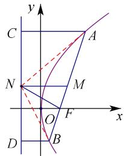

text_image

y
C
A
N
M
O
F
x
D
B

则 A、O、D 三点在一条直线上.

证明 （1）过 A 作 AC 垂直 L，C 为垂足， $|FA|=|AC|$ ， $|FB|=|BD|$ 在梯形 ABCD 中，

$|MN|=\frac{1}{2}(|AC|+|BD|)=\frac{1}{2}(|AF|+|BF|)=\frac{1}{2}|AB|$ ， $\angle ANB=90^{\circ}$ ，故以AB为直径的圆与准线l相切.

设 E 是 AF 的中点，则 E 的坐标为 $\left(\frac{\frac{p}{2}+x_{1}}{2},\frac{y_{1}}{2}\right)$ ，则点 E 到 y 轴的距离为 $d=\frac{\frac{p}{2}+x_{1}}{2}=\frac{1}{2}|AF|$ ，故以 AF 为直径的圆与 y 轴相切，同理以 BF 为直径的圆与 y 轴相切.

（2）在 $\triangle ACN$ 与 $\triangle AFN$ 中 $|AN| = |AN|$ ；在 $Rt\triangle ABN$ 中， $\angle NAM = \angle ANM$ ， $\angle CAN = \angle ANM$ ，

$\Delta ACN \cong \Delta AFN$ ，则 $\angle NFA = \angle NCA = 90^{\circ}$ ，则 $FN \perp AB$ ，因为 $\overrightarrow{DF} = (p, -y_2)$ ， $\overrightarrow{CF} = (p, -y_1)$ ，

所以 $\overrightarrow{DF}\cdot\overrightarrow{CF}=p^{2}+y_{1}y_{2}=0$ ，所以 $FC\perp FD$ .

（3）设直线 $AB$ 的方程为 $x = ty + \frac{p}{2}$ 与抛物线 $y^{2} = 2px$ 联立得 $y^{2} = 2p(ty + \frac{p}{2})$ ，即 $y^{2} - 2pty - p^{2} = 0$

故 $y_{1}y_{2} = -p^{2}$ ， $x_{1}x_{2} = \frac{y_{1}^{2}}{2p}\frac{y_{2}^{2}}{2p} = \frac{p^{2}}{4}$

（4） $k_{OA}=\frac{y_{1}}{x_{1}}=\frac{y_{1}}{\frac{y_{1}^{2}}{2p}}=\frac{2p}{y_{1}}$ ， $k_{OD}=\frac{y_{2}}{-\frac{p}{2}}=-\frac{2y_{2}}{p}=-\frac{2py_{2}}{p^{2}}=\frac{2py_{2}}{y_{1}y_{2}}=\frac{2p}{y_{1}}$ ，则A、O、D三点共线，同理B、O、

$C$ 三点共线．上述证明方式并非唯一，多种方法均可证明，不再赘述.

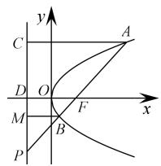

text_image

y
C
A
D
O
F
x
M
B
P

图1-3-1

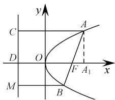

text_image

y
C
A
D
O
F A₁
x
M
B

图1-3-2

重要结论

1. $|AF| = \frac{p}{1 - \cos\alpha}; |BF| = \frac{p}{1 + \cos\alpha}$ .   
2. $|AB| = x_{1} + x_{2} + p = \frac{2p}{\sin^{2}\alpha}.$   
3. $S_{\triangle AOB} = \frac{p^2}{2\sin\alpha}$   
4. 设 $\frac{|AF|}{|BF|} = \lambda$ ，则 $\cos \alpha = \frac{\lambda - 1}{\lambda + 1}; |AF| = \frac{\lambda + 1}{2} p$ .  
5. 设 $AB$ 交准线于点 $P$ ，则 $\frac{|AF|}{|PA|} = \cos \alpha$ ； $\frac{|BF|}{|PB|} = \cos \alpha$ .  
证明 1. $\left\{\begin{aligned}|AC|=|AF|\\ p=|FD|=|AC|-|AF|\cos\theta\end{aligned}\right.\Rightarrow|AF|=\frac{p}{1-\cos\theta}$ ，同理 $|BF|=\frac{p}{1+\cos\alpha}$ .  
2. $|AB| = |AF| + |BF| = \frac{p}{1 - \cos\alpha} + \frac{p}{1 + \cos\alpha} = \frac{2p}{\sin^2\alpha}$ .   
3. 设 $O$ 到 $AB$ 的距离为 $d$ ，则 $d = \frac{p}{2} \sin \alpha$ ，故 $S_{\triangle AOB} = \frac{1}{2} |AB| d = \frac{1}{2} \frac{2p}{\sin^2 \alpha} \frac{p}{2} \sin \alpha = \frac{p^2}{2 \sin \alpha}$ .  
4. $\frac{|AF|}{|BF|} = \lambda \Rightarrow \frac{1 + \cos\alpha}{1 - \cos\alpha} = \lambda \Rightarrow \cos \alpha = \frac{\lambda - 1}{\lambda + 1}, |AF| = \frac{p}{1 - \cos\alpha} = \frac{\lambda + 1}{2} p.$   
5. $|AF| = x_A + \frac{p}{2}$ , $|BF| = x_B + \frac{p}{2}$ , $\frac{|AF|}{|PA|} = \cos \alpha$ , $\frac{|BF|}{|PB|} = \cos \alpha$ .

关于抛物线 $x^{2}=2py$ 的焦长公式及定理（A 为直线与抛物线右交点，B 为左交点， $\alpha<90^{\circ}$ 为 AB 倾斜角）

1. $|AF| = \frac{p}{1 - \sin\alpha}$ ; $|BF| = \frac{p}{1 + \sin\alpha}$ .

2. $|AB| = y_1 + y_2 + p = \frac{2p}{\cos^2\alpha}$ .

3. $S_{\triangle AOB} = \frac{p^2}{2\cos\alpha}$

4. 设 $\frac{|AF|}{|BF|} = \lambda$ ，则 $\sin \alpha = \frac{\lambda - 1}{\lambda + 1}$ ； $|AF| = \frac{\lambda + 1}{2} p$ 。

5. 设 $AB$ 交准线于点 $P$ , $\frac{|AF|}{|PA|} = \sin \alpha; \frac{|BF|}{|PB|} = \sin \alpha$ .

[总结：抛物线焦点在 $x$ 轴的时候，焦长为 $\frac{p}{1 \pm \cos \alpha}$ ， $\cos \alpha = \frac{\lambda - 1}{\lambda + 1}$ ，焦长为 $\frac{\lambda + 1}{2} p$ ，记忆方法参考椭圆模

块；当焦点在 y 轴上的时候 cos 换成 sin]

题型 1 抛物线的焦半径公式

【例 1】（2024 天津卷） $(x-1)^{2}+y^{2}=25$ 的圆心与抛物线 $y^{2}=2px(p>0)$ 的焦点 F 重合，A 为两曲线的交点，则原点到直线 AF 的距离为 \_\_\_\_.

【例 2】(2020·山东) 斜率为 $\sqrt{3}$ 的直线过抛物线 C: $y^{2} = 4x$ 的焦点，且与 C 交于 A, B 两点，则 $|AB| =$ \_\_\_\_ .

【例 3】(2025·武汉二调) 已知 O 为坐标原点，过抛物线 $y^{2}=2px(p>0)$ 焦点的直线与该抛物线交于 A，B

两点，若 $|AB|=12$ ，若 $\triangle OAB$ 面积为 $4\sqrt{6}$ ，则 $p=(\quad)$

A. 4

B. 3

C. $2 \sqrt{6}$

D. $3 \sqrt{2}$

【例 4】已知抛物线 $C: y^{2} = 2px (p > 0)$ 的焦点为 F，准线 l 与 x 轴的交点为 P，过点 F 的直线 $l'$ 与 C 交于 M，N 两点，若 $\frac{S_{\Delta OMF}}{S_{\Delta ONF}} = \frac{2}{5}$ ，且 $|MN| = \frac{49}{5}$ ，则 $S_{\Delta PMN} = (\quad)$

A. $\frac{28\sqrt{10}}{5}$

B. $\frac{28\sqrt{10}}{10}$

C. $\frac{28\sqrt{5}}{5}$

D. $\frac{56\sqrt{5}}{5}$

【例 5】(2025·T8·多选)已知 $F(2,0)$ 是抛物线 $C: y^{2} = 2px$ 的焦点，M 是 C 上的点，O 为坐标原点. 则（）

A. $p = 4$   
B. $|MF| \geqslant |OF|$   
C. 以 $M$ 为圆心且过 $F$ 的圆与 $C$ 的准线相切  
D. 当 $\angle OFM = 120^{\circ}$ 时， $\triangle OFM$ 的面积为 $2\sqrt{3}$

# 题型 2 抛物线的联立数据

【例 1】(2024 新课标 II) 抛物线 C: $y^{2}=4x$ 的准线为 l, P 为 C 上的动点，过 P 作 $\odot A: x^{2}+(y-4)^{2}=1$ 的一条切线，Q 为切点，过 P 作 l 的垂线，垂足为 B，则（）

A. $l$ 与 $\odot A$ 相切

B. 当 $P, A, B$ 三点共线时， $|PQ| = \sqrt{15}$

C. 当 $|PB|=2$ 时， $PA\perp AB$

D. 满足 $|PA|=|PB|$ 的点P有且仅有2个

【例 2】(2022·新高考 I)(多选)已知 O 为坐标原点, 点 A(1, 1) 在抛物线 $C: x^{2} = 2py (p > 0)$ 上, 过点 B(0, -1) 的直线交 C 于 P, Q 两点, 则（）

A. $C$ 的准线为 $y = -1$

B. 直线 $AB$ 与 $C$ 相切

C. $|OP|\cdot|OQ|>|OA|^{2}$

D. $|BP|\cdot|BQ|>|BA|^{2}$

【例 3】(2022·新高考 II)（多选）已知 O 为坐标原点，过抛物线 $C: y^{2} = 2px (p > 0)$ 焦点 F 的直线与 C 交于 A，B 两点，其中 A 在第一象限，点 $M(p, 0)$ . 若 $|AF| = |AM|$ ，则（）

A. 直线 $AB$ 的斜率为 $2 \sqrt{6}$

B. $|OB|=|OF|$

C. $|AB| > 4 |OF|$

D. $\angle OAM + \angle OBM < 180^{\circ}$

# 题型三 抛物线最值问题：

根据两点之间线段最短定理，可以知道 P 为抛物线上一点：

（1）当 $Q(x_{Q},y_{Q})$ 为抛物线内任意一点，则存在 $\left|PF\right| + \left|PQ\right|$ 的最小值，当 $P$ 、 $Q$ 两点的纵坐标相等时，即 $\left|PF\right| + \left|PQ\right|_{\min} = \left|EQ\right| = x_{Q} + \frac{p}{2}$ （参考下图，内部连准线）

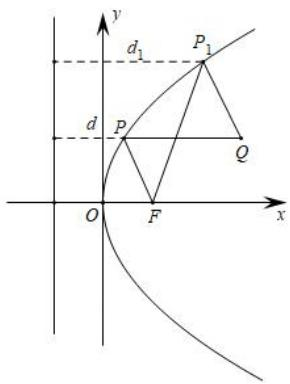

text_image

y
d₁
P₁
d
P
Q
O
F
x

(2) 当 $Q(x_{Q}, y_{Q})$ 为抛物线外任意一点，存在 $d + |PQ|$ 最小值，当 Q、P、F 三点共线时，

$\left(d + |PQ|\right)_{\min} = |FQ| = \sqrt{\left(x_Q - \frac{p}{2}\right)^2 + y_Q^2}$ （参考下图，外部连焦点）

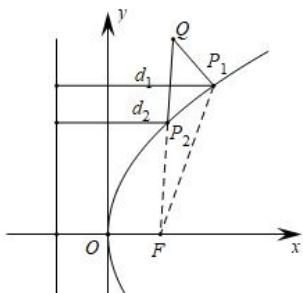

text_image

y
Q
P₁
d₁
d₂
P₂
O
F
x

由此类比抛物线 $x^{2}=2py$ 的最值问题，把握内连准线，外找焦点.

【例 6】若抛物线的顶点为坐标原点，焦点 F 为椭圆 $\frac{x^{2}}{4} + \frac{y^{2}}{3} = 1$ 的右焦点，P 为抛物线上的动点， $Q(5,3)$ ，则 $PF + PQ$ 的最小值为（）

A. 4

B. 5

C. 6

D. 217

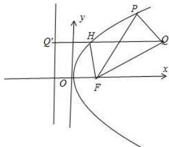

text_image

Q'
H
P
O
F
x
y

# 考向 7 离心率问题

离心率问题一直是高考每年必考，对圆锥曲线概念和几何性质的考查为主，一般不会出太难，二轮复习我们需要掌握一些基本的性质和常规的处理方法，本专题从挖掘椭圆双曲线的几何性质下手。

构成圆锥曲线离心率计算的主要要素就是坐标语言和长度角度语言，要高效解答离心率问题，就需要对两种语言进行区分，就要看那种方法处理起来简单，本专题站在这个角度来阐述，力争简化离心率计算。类型一：数形结合转化长度角度

【例 1】(2023·新高考 I) 已知双曲线 $C: \frac{x^{2}}{a^{2}} - \frac{y^{2}}{b^{2}} = 1 (a > 0, b > 0)$ 的左、右焦点分别为 $F_{1}$ ， $F_{2}$ 。点 A 在 C 上，点 B 在 y 轴上， $\overrightarrow{F_{1}A} \perp \overrightarrow{F_{1}B}$ ， $\overrightarrow{F_{2}A} = -\frac{2}{3}\overrightarrow{F_{2}B}$ ，则 C 的离心率为 \_\_\_\_.

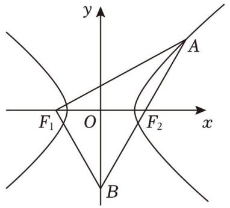

text_image

y
A
F₁ O F₂ x
B

【例 2】已知椭圆 $C: \frac{x^{2}}{a^{2}} + \frac{y^{2}}{b^{2}} = 1 (a > b > 0)$ 的左、右焦点分别为 $F_{1}$ ， $F_{2}$ ．椭圆 C 在第一象限存在点 M，使得 $\left| MF_{1} \right| = \left| F_{1} F_{2} \right|$ ，直线 $F_{1} M$ 与 y 轴交于点 A，且 $F_{2} A$ 是 $\angle MF_{2} F_{1}$ 的角平分线，则椭圆 C 的离心率为（）

A. $\frac{\sqrt{6} - 1}{2}$

B. $\frac{\sqrt{5} - 1}{2}$

C. $\frac{1}{2}$

D. $\frac{\sqrt{3} - 1}{2}$

# 类型二：双曲线渐近线相似三角形比值与离心率

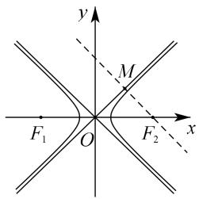

text_image

y
M
F₁ O F₂ x

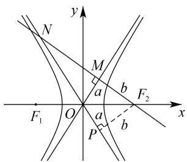

text_image

y
N
M
a
b
F₂
x
F₁
O
a
b
P

①如左图所示，当离心率 $e=\sqrt{2}$ 时，过焦点作渐近线垂线，则不会形成直角三角形；
②如右图所示，当离心率 $e>\sqrt{2}$ 时，过焦点 $F_{2}$ 作渐近线 $l_{1}$ 垂线 $MN(k_{MN}<0)$ ，会交 $l_{2}$ 于第二象限点N，令 $\overrightarrow{NM}=\lambda\overrightarrow{MF_{2}}$ ，则双曲线离心率为 $e=\sqrt{2}\cdot\sqrt{\frac{\lambda+1}{\lambda}}$ ；

证明：

③如图所示，当离心率 $e < \sqrt{2}$ 时，过焦点 $F_{2}$ 作渐近线 $l_{1}$ 垂线 $MN(k_{MN} < 0)$ ，会交 $l_{2}$ 于第四象限点 N，令 $\overrightarrow{NF_{2}} = \lambda \overrightarrow{F_{2}M}$ ，则双曲线离心率为 $e = \sqrt{2} \cdot \sqrt{\frac{\lambda}{\lambda + 1}}$ ;

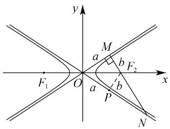

text_image

y
M
a
b
F₂
F₁
O
a
b
P
x
N

证明：

【例 3】（2018•新课标I）已知双曲线 $C: \frac{x^{2}}{3} - y^{2} = 1$ ，O 为坐标原点，F 为 C 的右焦点，过 F 的直线与 C 的两条渐近线的交点分别为 M，N．若 $\triangle OMN$ 为直角三角形，则 $|MN| = (\quad)$

A. $\frac{3}{2}$

B. 3

C. $2\sqrt{3}$

D. 4

【例 4】（2024·湖北月考）已知双曲线 $C: \frac{x^{2}}{a^{2}} - \frac{y^{2}}{b^{2}} = 1 (a > 0, b > 0)$ 的右焦点为 F，过点 F 作双曲线 C 的一条渐近线的垂线 l，垂足为 M．若直线 l 与双曲线 C 的另一条渐近线交于点 N，且满足 $\overrightarrow{ON} + 4\overrightarrow{OM} = 5\overrightarrow{OF}$ (O 为坐标原点)，则双曲线 C 的离心率为（）

A. $\frac{2\sqrt{10}}{5}$

B. $\frac{\sqrt{6}}{2}$

C. $\frac{2\sqrt{3}}{3}$

D. $\frac{2\sqrt{5}}{3}$

【例 5】(2024·江西期末)过双曲线 $\frac{x^{2}}{a^{2}} - \frac{y^{2}}{b^{2}} = 1 (a > 0, b > 0)$ 右焦点 F 作双曲线一条渐近线的垂线，垂足为 A，与另一条渐近线交于点 B，若 $|AF| = \frac{1}{2} |FB|$ ，则双曲线 C 的离心率为（）

A. $\frac{2\sqrt{3}}{3}$ 或 $\sqrt{3}$

B. 2 或 $\sqrt{3}$

C. $\sqrt{3}$ 或 $2\sqrt{3}$

D. 2 或 $\frac{2\sqrt{3}}{3}$

# 类型三：化斜为直的坐标语言选取

# 1. 通径坐标与斜率问题化斜为直

$PF$ 为椭圆双曲线半通径，则得出点 $P(\pm c, \pm \frac{b^2}{a})$ ，其它几何性质相对体现较少.

【例 6】（2020·新课标 I）已知 F 为双曲线 $C: \frac{x^{2}}{a^{2}} - \frac{y^{2}}{b^{2}} = 1 (a > 0, b > 0)$ 的右焦点，A 为 C 的右顶点，B 为 C 上的点，且 BF 垂直于 x 轴．若 AB 的斜率为 3，则 C 的离心率为 \_\_\_\_.

【例 7】（2022·浙江）已知双曲线 $\frac{x^{2}}{a^{2}} - \frac{y^{2}}{b^{2}} = 1 (a > 0, b > 0)$ 的左焦点为 F，过 F 且斜率为 $\frac{b}{4a}$ 的直线交双曲线于点 $A(x_{1}, y_{1})$ ，交双曲线的渐近线于点 $B(x_{2}, y_{2})$ 且 $x_{1} < 0 < x_{2}$ 。若 $|FB| = 3 |FA|$ ，则双曲线的离心率是 \_\_\_\_.

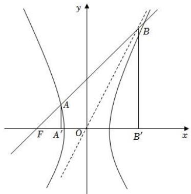

text_image

y
A
B
F A' O' B'
x

# 2.渐近线体系中的坐标特征三角形

这里通常是双曲线的坐标特征三角形，需要借助辅助圆.

如图，以 $F_{1}F_{2}$ 为直径的圆与双曲线 $\frac{x^2}{a^2} -\frac{y^2}{b^2} = 1(a > 0,b > 0)$ 的渐近线在第一象限内的交点坐标为 $P(a,b)$ .不过，很多时候，题目会以“点 $P$ 在渐近线上，且 $PF_{1}\bot PF_{2}$ ”的形式给出条件.

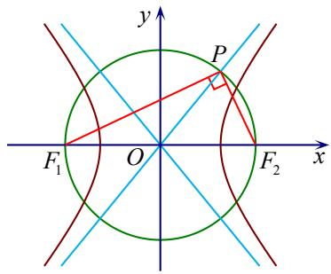

text_image

y
P
F₁ O F₂ x

证明

【例 8】已知 $F_{1}$ ， $F_{2}$ 为双曲线 $C: \frac{x^{2}}{a^{2}} - \frac{y^{2}}{b^{2}} = 1 (a > 0, b > 0)$ 的两个焦点，以 $F_{1}F_{2}$ 为直径的圆与 C 及 C 的渐近线在第一象限的交点分别为点 A 和点 B，若 A，B 两点横坐标之比为 4:3，则 C 的离心率为（）

A. $\sqrt{5}$

B. 2

C. $\frac{2\sqrt{3}}{3}$

D. $\frac{3\sqrt{2}}{2}$

【例9】已知双曲线 $C: \frac{x^2}{a^2} - \frac{y^2}{b^2} = 1 (a > 0, b > 0)$ 的右焦点为 $F(c, 0)$ ，点 $A$ 在 $C$ 的一条渐近线上，且 $A$ 在第一象限， $|OA| = c$ ，若 $AF$ 的中点在 $C$ 上，则 $C$ 的离心率为（）

A. $\sqrt{5} - 1$

B. $\sqrt{5} + 1$

C. $\sqrt{6} - 1$

D. $\sqrt{6} + 1$

# 考向 8 必备二级结论

# 一．圆锥曲线与光学性质

椭圆的光学性质：从一个焦点发出的照射到椭圆上其反射光线会经过另一个焦点。

双曲线有一个光学性质：从一个焦点发出的照射到双曲线上其反射光线的反向延长线会经过另一个焦点。

抛物线有一个光学性质：从焦点发出的照射到抛物线上其反射光线平行于抛物线开口方向。

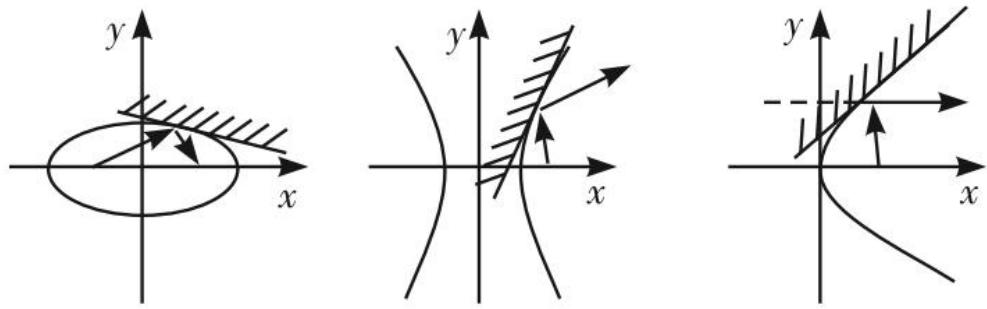

text_image

Three mathematical diagrams showing coordinate systems with shaded regions and curves, likely illustrating a function or graph concept.

定理：点 P 为椭圆上任一点， $F_{1}$ 、 $F_{2}$ 为椭圆的两焦点，则椭圆在 P 点处的切线与 $\angle F_{1}PF_{2}$ 的平分线垂直.

根据物理学的反射原理，反射光线等于入射光线，即把椭圆上的点 $P$ 处切线看成镜面，那么法线就是 $\angle F_{1}PF_{2}$ 的平分线，所以它们垂直就自然而然了，同理也能推导双曲线.

推论：设椭圆 $\frac{x^2}{a^2} +\frac{y^2}{b^2} = 1$ （ $a > 0$ ， $b > 0$ ）的两焦点为 $F_{1}$ ， $F_{2}$ ， $P(x_0,y_0)$ （ $x_0$ ， $y_0\neq 0$ ）为椭圆上一点，则 $\angle F_1PF_2$ 的角平分线所在直线 $l$ 的方程为 $a^2 y_0x - b^2 x_0y - (a^2 -b^2)x_0y_0 = 0$ ：

根据光学性质可知 $P(x_0, y_0)$ 处切线方程为 $\frac{xx_0}{a^2} + \frac{yy_0}{b^2} = 1$ ，由于 $P$ 点处的切线与 $\angle F_1PF_2$ 的平分线垂直，故 $\angle F_1PF_2$ 的角平分线所在直线 $l$ 的方程为 $y - y_0 = \frac{a^2y_0}{b^2x_0}(x - x_0)$ ，即 $a^2y_0x - b^2x_0y - (a^2 - b^2)x_0y_0 = 0$ .

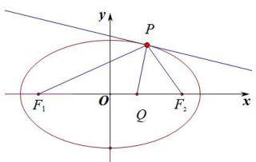

text_image

y
P
F₁ O Q F₂ x

【例 1】（2024·多选·湖南期末）双曲线的光学性质如下：如图，从双曲线右焦点 $F_{2}$ 发出的光线经双曲线镜面反射，反射光线的反向延长线经过左焦点 $F_{1}$ . 我国首先研制成功的“双曲线新闻灯”，就是利用了双曲线的这个光学性质．某“双曲线灯”的轴截面是双曲线一部分，如图，其方程为 $\frac{x^{2}}{a^{2}}-\frac{y^{2}}{b^{2}}=1, F_{1}, F_{2}$ 分别为其左、右焦点，若从右焦点 $F_{2}$ 发出的光线经双曲线上的点A和点B反射后 $(F_{2}, A, B$ 在同一直线上），满足 $AB \perp AD, \angle ABC = \frac{3\pi}{4}$ ，则()

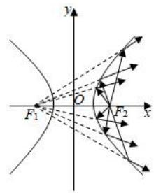

text_image

y
O
F₁
x
F₂

A. $\frac{|AF_2|}{|BF_2|} = \sqrt{2} + 1$

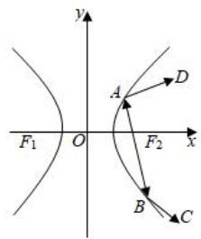

text_image

y
A
D
F₁ O F₂ x
B C

B. $\frac{|AF_2|}{|BF_2|} = \sqrt{2} - 1$

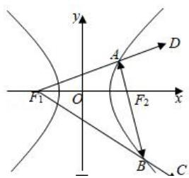

text_image

y
A
D
F1 O F2 x
B C

C. 该双曲线的离心率的平方为 $5 + 2\sqrt{2}$

D. 该双曲线的离心率的平方为 $5 - 2\sqrt{2}$

【例 2】（2011 年高考全国卷 II 理 15）已知 $F_{1}$ 、 $F_{2}$ 分别为双曲线 C: $\frac{x^{2}}{9}-\frac{y^{2}}{27}=1$ 的左、右焦点，点 $A \in C$ ，点 M 的坐标为 $(2,0)$ ，AM 为 $\angle F_{1}AF_{2}$ 的平分线。则 $|AF_{2}|=$ \_\_\_\_.

【例 3】如图，从椭圆的一个焦点 $F_{1}$ 发出的光线射到椭圆上的点 P，反射后光线经过椭圆的另一个焦点 $F_{2}$ ，事实上，点 $P(x_{0}, y_{0})$ 处的切线 $\frac{xx_{0}}{a^{2}} + \frac{yy_{0}}{b^{2}} = 1$ 垂直于 $\angle F_{1}PF_{2}$ 的角平分线。已知椭圆 $C: \frac{x^{2}}{4} + \frac{y^{2}}{3} = 1$ 的两个焦点是 $F_{1}, F_{2}$ ，点 P 是椭圆上除长轴端点外的任意一点， $\angle F_{1}PF_{2}$ 的角平分线 PT 交椭圆 C 的长轴于点 $T(t,0)$ ，则 t 的取值范围是 \_\_\_\_。

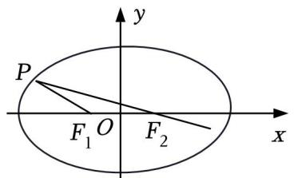

text_image

P
F₁ O F₂
x
y

【例 4】抛物线有如下光学性质：由其焦点射出的光线经抛物线反射后，沿平行于抛物线对称轴的方向射出．反之，平行于抛物线对称轴的入射光线经抛物线反射后必过抛物线的焦点．已知抛物线 $C: y^{2} = x$ ，O 为坐标原点．一束平行于 x 轴的光线 $l_{1}$ 从点 $P(m, 1)(m > 1)$ 射入，经过 C 上的点 $A(x_{1}, y_{1})$ 反射后，再经 C 上另一点 $B(x_{2}, y_{2})$ 反射后，沿直线 $l_{2}$ 射出，经过点 Q，则（）

A. $y_{1}y_{2} = -1$

B. 延长 $AO$ 交直线 $x = -\frac{1}{4}$ 于点 $D$ ，则 $D$ ， $B$ ， $Q$ 三点共线

C. $\left|AB\right|=\frac{25}{16}$

D. 若 $PB$ 平分 $\angle ABQ$ ，则 $m = \frac{41}{16}$

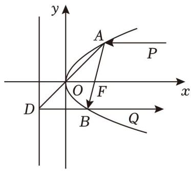

text_image

y
A
P
O
F
x
D
B
Q

【例 5】（2025•T8 模拟）已知椭圆 C 的离心率为 $\frac{1}{2}$ ，左、右焦点分别为 $F_{1}(-1,0)$ ， $F_{2}(1,0)$ .

(1) 求 C 的方程;

（2）已知点 $M_0(1,4)$ ，证明：线段 $F_{1}M_{0}$ 的垂直平分线与 $C$ 恰有一个公共点；

(3) 设 $M$ 是坐标平面上的动点, 且线段 $F_{1} M$ 的垂直平分线与 $C$ 恰有一个公共点, 证明 $M$ 的轨迹为圆, 并求该圆的方程.

# 二. 大圆小圆问题

# 以圆锥曲线焦半径为直径的圆的性质

(1) 以椭圆的焦半径为直径的圆必与大圆（以长轴为直径的圆）相内切.  
(2) 以双曲线的焦半径为直径的圆必与小圆（以实轴为直径的圆）相切.  
(3) 以抛物线 $y^{2} = 2px$ 的焦半径为直径的圆必与 $y$ 轴相切.

证明 (1) 如左图，以椭圆 $\frac{x^2}{a^2} + \frac{y^2}{b^2} = 1 (a > b > 0)$ 为例， $F_1$ 、 $F_2$ 分别为左、右焦点，以焦半径 $|PF_1|$ 为直径的圆 $M$ ，连结 $OM$ 并延长交圆 $M$ 于 $N$ 、连接 $|PF_2|$ ，易知 $|OM| = \frac{1}{2} |PF_2|$ ， $|MN| = \frac{1}{2} |PF_1|$ ，所以 $|ON| = \frac{1}{2} (|PF_1| + |PF_2|) = a$ ，所以以椭圆的焦半径为直径的圆必与大圆（以长轴为直径的圆）内切.

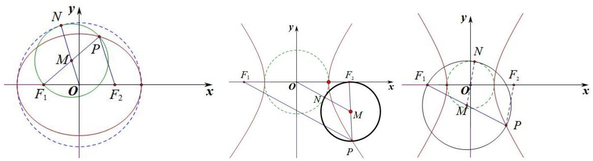

text_image

y
N
M
P
F₁ O F₂
x
y
F₁ o F₂ x
N
M
P
F₁ O F₂ x
y
N
M
P

（2）如中图，以双曲线 $\frac{x^2}{a^2} -\frac{y^2}{b^2} = 1(a > 0,b > 0)$ 为例， $F_{1}$ 、 $F_{2}$ 分别为左、右焦点，以焦半径 $\left|PF_2\right|$ 为直径的圆 $M$ ，连结 $OM$ 并与圆 $M$ 交于 $N$ 、连接 $\left|PF_1\right|$ ，易知 $\left|OM\right| = \frac{1}{2}\left|PF_1\right|$ ， $\left|MF_2\right| = \frac{1}{2}\left|PF_2\right|$ ，所以 $\left|ON\right| = \frac{1}{2}\left(\left|PF_1\right| - \left|PF_2\right|\right) = a$ ，因此，以双曲线的短焦半径为直径的圆必与小圆（以实轴为直径的圆）外切.如右图，以焦半径 $\left|PF_1\right|$ 为直径的圆 $M$ ，连结 $OM$ 并与反向延长交圆 $M$ 于 $N$ 、连接 $\left|PF_2\right|$ ，易知 $\left|OM\right| = \frac{1}{2}\left|PF_2\right|$ ， $\left|MF_1\right| = \frac{1}{2}\left|PF_1\right|$ ，所以 $\left|ON\right| = \frac{1}{2}\left(\left|PF_1\right| - \left|PF_2\right|\right) = a$ ，因此，以双曲线的长焦半径为直径的圆必与小圆（以实轴为直径的圆）内切.

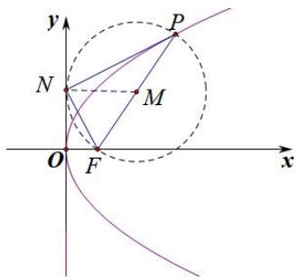

text_image

y
P
N
M
O
F
x

(3) 如图，以抛物线 $y^{2}=2px(p>0)$ 为例，F 为焦点，以焦半径 $\left|PF\right|$ 为直径的圆 M ，作 $MN \perp y$ 轴于 N， $\left|PF\right|=x_{0}+\frac{p}{2},\quad\left|MN\right|=x_{M}=\frac{x_{0}+\frac{p}{2}}{2}=\frac{\left|PF\right|}{2}$ ，故以 $\left|PF\right|$ 为直径的圆M和y轴相切.

【例 5】已知抛物线 $C: y^{2} = 2px (p > 0)$ 的焦点为 F，点 P 是 C 上一点，且 $|PF| = 5$ ，以 PF 为直径的圆截 x 轴所得的弦长为 1，则 $p = (\quad)$

A. 2

B. 2 或 4

C. 4

D. 4 或 6

【例 6】（2024·多选·下城区期末）已知抛物线 $C: y^{2} = 2px (p > 0)$ 的焦点为 F， $P(x_{0}, y_{0})$ 是 C 上位于第一象限内的一点，若 C 在点 P 处的切线与 x 轴交于 N 点，且 $\angle FPN = 30^{\circ}$ ，则下列说法正确的是()

A. $|PF| = x_0 + \frac{p}{2}$

B. 以 $PF$ 为直径的圆与 $y$ 轴相切

C. $|PF| = \frac{2}{3} p$

D. 直线 $OP$ 的斜率为 $\frac{2\sqrt{3}}{3} (O$ 为原点)

text_image

y
P
M
N
O
F
x

【例 7】（2024·湖北期末）如图，已知 F 是椭圆 $\frac{x^{2}}{4} + \frac{y^{2}}{3} = 1$ 的左焦点，A 为椭圆的下顶点，点 P 是椭圆上任意一点，以 PF 为直径作圆 N，射线 ON 与圆 N 交于点 Q，则 $|AQ|$ 的取值范围为 \_\_\_\_.

text_image

y
Q
P
N
F
O
x
y
Q
P
N
F
O
F₁
x
A
A

# 三. 圆锥曲线与立体几何问题

# 一．截口曲线形成的圆锥曲线

圆锥曲线就可以看作圆锥被一个平面所截得到的截口曲线.

如图，设圆锥的轴截面顶角为 $2\theta$ ，圆锥的轴与截面所成的角为 $\alpha$ ，其中 $\alpha$ ， $\theta \in (0, \frac{\pi}{2})$

当 $\alpha >\theta$ 时，截口曲线为椭圆,平面两侧的圆锥内切球与平面的切点为两焦点.；当 $\alpha = \theta$ 时，截口曲线为抛物线,平面一侧的圆锥内切球与平面的切点为焦点；当 $\alpha < \theta$ 时，截口曲线为双曲线,平面两侧的圆锥内切球与平面的切点为两焦点.

【例 1】（2022·多选·广东期末）用一个垂直于圆锥的轴的平面去截圆锥，截口曲线（截而与圆锥侧面的交线）是一个圆，用一个不垂直于轴的平面截圆锥，当截面与圆锥的轴的夹角 $\theta$ 不同时，可以得到不同的截口曲线，它们分别是椭圆、抛物线、双曲线。因此，我们将圆、椭圆、抛物线、双曲线统称为圆锥曲线。记圆锥轴截面半顶角为 $\alpha$ ，截口曲线形状与 $\theta$ ， $\alpha$ 有如下关系：当 $\theta > \alpha$ 时，截口曲线为椭圆；当 $\theta = \alpha$ 时，截口曲线为抛物线：当 $\theta < \alpha$ 时，截口曲线为双曲线。其中 $\theta, \alpha \in (0, \frac{\pi}{2})$ ，现有一定线段 AB，其与平面 $\beta$ 所成角 $\varphi$ （如图），B 为斜足， $\beta$ 上一动点 P 满足 $\angle BAP = \gamma$ ，设 P 点在 $\beta$ 的运动轨迹是 $\Gamma$ ，则（）

  
图1

text_image

A
β
P
B

图2

A. 当 $\varphi = \frac{\pi}{4}, \gamma = \frac{\pi}{6}$ 时， $\Gamma$ 是椭圆

B. 当 $\varphi = \frac{\pi}{3}, \gamma = \frac{\pi}{6}$ 时， $\Gamma$ 是双曲线

C. 当 $\varphi = \frac{\pi}{4}, \gamma = \frac{\pi}{4}$ 时， $\Gamma$ 是抛物线

D. 当 $\varphi = \frac{\pi}{3}, \gamma = \frac{\pi}{4}$ 时， $\Gamma$ 是圆

【例 2】如图 AB 是平面 $\alpha$ 的斜线段，A 为斜足，若点 P 在平面 $\alpha$ 内运动，使得 $\triangle ABP$ 的面积为定值，则动点 P 的轨迹是（）.

A. 圆

B.椭圆

C.一条直线

D.两条平行直线

text_image

B
A
P
α

【例 3】已知斜线段 AB 与平面 $\alpha$ 所成的角为 $60^{\circ}$ ，B 为斜足，平面 $\alpha$ 上的动点 P 满足 $\angle PAB = 30^{\circ}$ ，则点 P 的轨迹是（）.

A. 直线

B. 抛物线

C.椭圆

D. 双曲线的一支

【例 4】（2024·多选·广东期末）已知正方体 $ABCD - A_{1}B_{1}C_{1}D_{1}$ 的边长为 2，E 为正方体内（包括边界）上的一点，且满足 $\sin\angle EDD_{1}=\frac{\sqrt{5}}{5}$ ，则下列说正确的有（）

text_image

D₁
F
E
A₁
B₁
G
C₁
D
C
A
B

A. 若 E 为面 $A_{1}B_{1}C_{1}D_{1}$ 内一点，则 E 点的轨迹长度为 $\frac{\pi}{2}$

B. 过 $AB$ 作面 $\alpha$ 使得 $DE \perp \alpha$ , 若 $E \in \alpha$ , 则 $E$ 的轨迹为椭圆的一部分

C. 若 $F$ ， $G$ 分别为 $A_{1}D_{1}$ ， $B_{1}C_{1}$ 的中点， $DE$ 与面 $FGAB$ ，则 $E$ 的轨迹为双曲线的一部分

D. 若 $F$ ， $G$ 分别为 $A_{1}D_{1}$ ， $B_{1}C_{1}$ 的中点， $DE$ 与面FGAB所成角为 $\theta$ ，则 $\sin \theta$ 的范围为 $[\frac{\sqrt{10}}{10},\frac{3\sqrt{10}}{10} ]$

# 二．丹德林双球模型与离心率

丹德林 $(G\cdot Dandelin)$ 利用双球模型证明了平面 $\alpha$ 与圆锥侧面的交线为椭圆，双球与平面 $\alpha$ 切点 $E$ ， $F$ 为此椭圆的两个焦点，这两个球也称为Dandelin双球.

如图（1），在圆锥内放两个大小不同且不相切的球，使得它们分别与圆锥的侧面、底面相切，用与两球都相切的平面截圆锥的侧面得到截口曲线是椭圆。理由如下：如图（2），若两个球分别与截面相切于点 $E$ ， $F$ ，在得到的截口曲线上任取一点 $A$ ，过点 $A$ 作圆锥母线，分别与两球相切于点 $C$ ， $B$ ，由球与圆的几何性质，得 $|AE|=|AC|$ ， $|AF|=|AB|$ ，所以 $|AE|+|AF|=|AC|+|AB|=|BC|=2a$ ，且 $2a>|EF|$ ，由椭圆定义知截口曲线是椭圆，切点 $E$ ， $F$ 为焦点，具体离心率计算我们参考例题。

这个结论在圆柱中也适用，如图（3），在一个高为 $h$ ，底面半径为 $r$ 的圆柱体内放球，球与圆柱底面及侧面均相切.若一个平面与两个球均相切，则此平面截圆柱所得的截口曲线也为一个椭圆，则 $2a = h - 2r$ ， $b = r$

natural_image

Geometric diagram of a cone with internal spheres and connecting lines (no text or labels)

图(1)

text_image

Geometric diagram showing a triangle with inscribed circles and labeled points A, B, C, D, E, F

图(2)

  
图（3）

【例 5】（2024·广东期末）圆锥曲线与空间几何体具有深刻而广泛的联系．如图所示，底面半径为1，高为3的圆柱内放有一个半径为1的球，球与圆柱下底面相切，作不与圆柱底面平行的平面 $\alpha$ 与球相切于点F，若平面 $\alpha$ 与圆柱侧面相交所得曲线为封闭曲线 $\tau$ ， $\tau$ 是以F为一个焦点的椭圆，则 $\tau$ 的离心率的取值范围是()

text_image

F

A. $\left[\frac{3}{5},1\right)$

B. $(0,\frac{3}{5}]$

C. $(0,\frac{4}{5}]$

text_image

Geometric diagram showing a rectangle with an inscribed circle and labeled points A, B, G, F

D. $\left[\frac{4}{5},1\right)$

【例 6】（2024·诸暨市期末）参加数学兴趣小组的小何同学在打篮球时，发现当篮球放在地面上时，篮球的斜上方灯泡照过来的光线使得篮球在地面上留下的影子有点像数学课堂上学过的椭圆，但他自己还是不太确定这个想法，于是回到家里翻阅了很多参考资料，终于明白自己的猜想是没有问题的，而且通过学习，他还确定地面和篮球的接触点（切点）就是影子椭圆的焦点．他在家里做了个探究实验：如图所示，桌面上有一个篮球，若篮球的半径为1个单位长度，在球的右上方有一个灯泡P（当成质点），灯泡与桌面的距离为4个单位长度，灯泡垂直照射在平面的点为A，影子椭圆的右顶点到A点的距离为3个单位长度，则这个影子椭圆的离心率e= \_\_\_\_.

text_image

Geometric diagram showing a triangle with an inscribed circle and labeled points P and A

text_image

y
P
M
N Q R A x

【例 7】（2023·广州一模）如图是数学家 GerminalDandelin 用来证明一个平面截圆锥得到的截口曲线是椭圆的模型．在圆锥内放两个大小不同的小球，使得它们分别与圆锥的侧面与截面都相切，设图中球 $O_{1}$ ，球 $O_{2}$ 的半径分别为 4 和 2，球心距离 $\left|O_{1}O_{2}\right|=2\sqrt{10}$ ，截面分别与球 $O_{1}$ ，球 $O_{2}$ 相切于点 E， $F(E, F$ 是截口椭圆的焦点），则此椭圆的离心率等于 \_\_\_\_。

text_image

O₂
F
E
O₁

text_image

C
O₂
D
F
E
A
B
G
O₁

